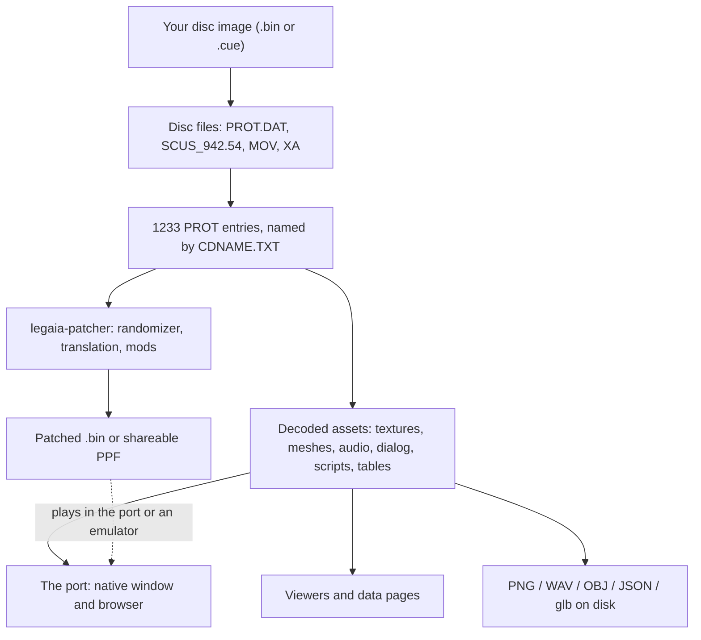
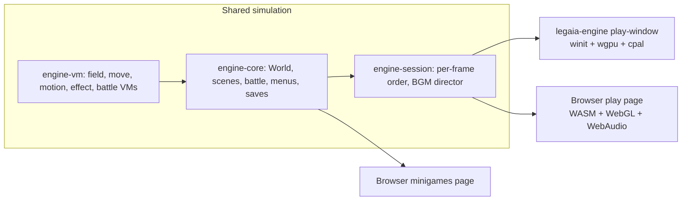

# legend-of-legaia-re

**Legend of Legaia** (PlayStation, 1998, NA `SCUS-94254`), running as a from-scratch Rust port you can play today - in a native window or in your browser - from your own disc image. Around the port sit a full asset extractor, a disc patcher (randomizer, translation packs, content mods), interactive viewers, and byte-level documentation of every format on the disc.

**Project site:** [andrewaltimit.github.io/legend-of-legaia-re](https://andrewaltimit.github.io/legend-of-legaia-re/) - play, browse and patch in the browser, nothing to install.

https://github.com/user-attachments/assets/aff19b4f-312c-44e2-bd44-3e6d99de2b03

The engine booting a real scene, plus the asset viewers. ([direct link](site/assets/legend-of-legaia-re-demo.mp4))

This repository is code and documentation only. **You bring the disc**: nothing Sony owns is committed or distributed, and everything browser-side reads your image locally in the tab - it is never uploaded. See [You bring the disc](#you-bring-the-disc).

## What you can do with it

| You want to | What ships | Where |
|---|---|---|
| **Play the game** | The port: title screen, New Game, towns, dungeons, world map, battles, menus, saves | [Browser play page](https://andrewaltimit.github.io/legend-of-legaia-re/play.html), or `legaia-engine` natively |
| **Play the minigames on their own** | Slot machine, Noa's dance, Baka Fighter, fishing, Muscle Dome | [Minigames page](https://andrewaltimit.github.io/legend-of-legaia-re/minigames.html) |
| **Get the assets out** | Textures, models, music, sound banks, dialog, FMVs, data tables | `legaia-extract` and a CLI per format; the [asset viewer](https://andrewaltimit.github.io/legend-of-legaia-re/viewer.html) and [media browser](https://andrewaltimit.github.io/legend-of-legaia-re/media.html) in the browser |
| **Randomize or mod your disc** | Shuffles, tuning sliders, MIPS code hooks, custom models and textures | `legaia-patcher`, or the [ROM patcher page](https://andrewaltimit.github.io/legend-of-legaia-re/tooling/rom-patcher.html) |
| **Translate the game** | Export all text to YAML, edit, reimport in place | `legaia-patcher translate`, or the [translation workbench](https://andrewaltimit.github.io/legend-of-legaia-re/tooling/translation-workbench.html) |
| **Look things up** | Enemies, characters, NPCs, magic, arts, shops, every town and kingdom in 3D | The site's data pages, starting at [enemies](https://andrewaltimit.github.io/legend-of-legaia-re/monsters.html) and the [world](https://andrewaltimit.github.io/legend-of-legaia-re/world.html) |
| **Export to Blender / Unity / VRChat** | Scenes, NPCs, props, equipment and the party as `.glb` | `legaia-engine export-glb` ([guide](docs/tooling/vrchat-world-export.md)) |
| **Understand how the game works** | Format specs, subsystem docs, traced functions, RAM map | [`docs/`](docs/overview.md) |



## What it is, and is not

A **port**, in the [ScummVM](https://www.scummvm.org/) / [OpenRCT2](https://github.com/openrct2/OpenRCT2) / [OpenMW](https://github.com/OpenMW/openmw) / [OpenLara](https://github.com/XProger/OpenLara) sense: fresh Rust written from the project's own reverse-engineering record (Ghidra-traced function dumps and live emulator probes), reading the original game data at runtime. It is not a decompilation, not a byte-matching rebuild, and not a static recompilation of the executable. The `-re` in the name is both *reverse-engineering* and *re-implementation*.

**Retail is the ground truth, not a cage.** The traced disassembly and the parity oracles pin the original's arithmetic, RNG, script pacing and save layout, and a retail-faithful mode stays testable. On top of it the port adds things the original never had - enhanced lighting, volumetric ground fog, see-through walls around the player, free-angle movement, an orbit camera, [VR](docs/subsystems/vr-mode.md) - as toggles, on by default where they are clearly better, with retail one switch away. Per-knob defaults: [`docs/subsystems/engine.md`](docs/subsystems/engine.md#fidelity-and-enhancements).

One engine runs behind every host. The simulation crates carry no GPU, windowing or audio-device dependency, so the same code ticks natively and as WebAssembly:



## What works, and what is rough

Most of the game works:

- **Boot and story.** Launcher, title screen, New Game through the opening (prologue, narration crawl, FMVs), Continue from a save. An automated [full-game ladder](docs/tooling/full-game-ladder.md) drives every story segment from New Game to the ending credits with pad input alone, each segment seeded from a retail save at its milestone.
- **Field.** Every scene on the disc loads and runs its own scripts through the ported field VM: retail movement and collision, NPCs and branching dialogue, doors, chests, cutscene choreography, the world map.
- **Battle.** Random and story encounters into player-driven battles: the command ring, Tactical Arts with Super and Miracle Arts, Seru magic and summons, items, Spirit, running away, then spoils, level-ups and Seru capture.
- **Menus and towns.** The pause menu and the screens behind it (status, items, magic, equipment, options), shops, inns, the save screen.
- **Minigames.** Fishing, the casino slot machine, Noa's dance, Baka Fighter and the Muscle Dome, driven by the tables on your disc.
- **Audio and video.** Music through a from-scratch SPU and sequencer against each scene's own sound bank, sound effects, XA voice, and MDEC cutscenes with synced audio.
- **Saves.** The engine's own save files, plus real PSX memory-card images an emulator still accepts.
- **Tooling.** One-command extraction of the whole disc, the randomizer and content mods, language packs, and reproducible static analysis.

What is still rough:

- **Bugs happen.** Expect the occasional visual glitch, mistimed animation or stuck script. The ladder above is segmented and scripted; it is not a claim that one unattended run plays start to finish. [Issues](https://github.com/AndrewAltimit/legend-of-legaia-re/issues) naming the scene and what you did are welcome.
- **Parity is measured, not finished.** The [retail comparison corpus](docs/tooling/retail-compare.md) scores the port against retail save states - RAM, camera, and the frame on screen - and ranks where it still differs.
- **Some sounds are the port's pick.** Where retail's sound-effect id for an event is untraced, the port plays the closest cue and labels it as its own choice ([details](docs/guides/playing-and-viewing.md#5-what-you-hear)).
- **Native input is keyboard only.** The browser play page reads a gamepad; the native window does not.
- **USA disc only for the port.** Other regions' discs extract, and an official PAL translation can be lifted into a USA language pack, but the engine and the patcher target `SCUS-94254`.
- **Library APIs move.** The binaries and file formats are the surface to rely on; the Rust crate APIs change freely.
- **Open questions remain** in the reverse engineering itself: [open threads](docs/reference/open-rev-eng-threads.md).

## Quick start

### Play in the browser

Open the [play page](https://andrewaltimit.github.io/legend-of-legaia-re/play.html), pick your disc image, play - flat, or in VR over WebXR.

### Play natively

Download the archive for your platform from the [Releases page](https://github.com/AndrewAltimit/legend-of-legaia-re/releases) and start the engine with no arguments (double-click `Legend of Legaia.exe` on Windows, `Legend of Legaia.app` on macOS). It asks for your disc image once, remembers it, and opens the title screen.

| Platform | Archive |
|---|---|
| Linux x86_64 (glibc 2.28+) | `legaia-tools-<version>-x86_64-unknown-linux-gnu.tar.gz` |
| Linux arm64 | `legaia-tools-<version>-aarch64-unknown-linux-gnu.tar.gz` |
| Windows x86_64 | `legaia-tools-<version>-x86_64-pc-windows-gnu.zip` |
| macOS 11+ (Apple silicon + Intel) | `legaia-tools-<version>-universal-apple-darwin.tar.gz` |

```bash
sha256sum -c SHA256SUMS --ignore-missing       # optional: verify the download
tar -xzf legaia-tools-<version>-x86_64-unknown-linux-gnu.tar.gz
cd legaia-tools-<version>-x86_64-unknown-linux-gnu
./legaia-engine                                # launcher, then the title screen
```

Every archive carries every tool. `README-PLAY.txt` inside covers first launch, including the macOS Gatekeeper prompt; [`docs/tooling/releases.md`](docs/tooling/releases.md) covers what is in an archive and how it is built. The engine and `asset-viewer` want a GPU and, on Linux, ALSA.

### Build from source

Needs a Rust toolchain (edition 2024).

```bash
cargo build --release          # every binary lands in target/release/
```

### The commands worth knowing

Paths below are for a source build; from a release archive drop the `target/release/` prefix.

```bash
DISC="/path/to/Legend of Legaia (USA).bin"     # a .cue works anywhere a .bin does

# Check the dump against the known fingerprint.
./target/release/disc-extract verify "$DISC"

# Play: the launcher, straight into a scene, or from the title screen.
./target/release/legaia-engine
./target/release/legaia-engine play-window --disc "$DISC" --scene town01
./target/release/legaia-engine play-window --disc "$DISC" --boot-ui
./target/release/legaia-engine list-scenes --disc "$DISC"

# Watch an FMV with its audio.
./target/release/legaia-engine play-str MOV/MV1.STR --disc "$DISC"

# Extract everything: disc files, PROT entries, sub-assets, PNGs, XA WAVs, font.
./target/release/legaia-extract "$DISC" --out extracted

# Browse what was extracted.
./target/release/asset-viewer prot extracted/PROT.DAT --cdname extracted/CDNAME.TXT

# Bake a scene (world, NPCs, animated props) to .glb.
./target/release/legaia-engine export-glb --scene town01 --out glb-export

# Randomizer and translation: each lists its feature flags under --help.
./target/release/legaia-patcher randomize --help
./target/release/legaia-patcher translate --help
```

Every binary answers `--help`, and `legaia-engine --help` groups its subcommands into playing, exploring and development diagnostics. The guides take each task end to end:

- [Getting started](docs/guides/getting-started.md) - from a release archive to an extracted disc, and every tool at a glance.
- [Playing and viewing](docs/guides/playing-and-viewing.md) - controls, enhancement toggles, cheats, minigames, saves, the browser build.
- [Extracting assets](docs/guides/extracting-assets.md) - textures, models, audio, movies, data tables.
- [Modding and translation](docs/guides/modding-and-translation.md) - randomizer, manual edits, texture replacement, saves.
- [Translating](docs/guides/translating.md) - a language pack, step by step.

## You bring the disc

**This project ships no Sony-owned bytes, ever.** There is no game executable, no asset data, and no ROM content in this repository or in any release archive. Everything here is code and documentation that operates on a disc image *you already own and supply yourself*.

Concretely, and non-negotiably:

- **You supply the disc image.** Every tool takes a path to your own `.bin`. Nothing is bundled and nothing is downloaded for you.
- **`extracted/` and `ghidra/projects/` are gitignored.** Extraction output is Sony-derived, so it stays on your machine. The same applies to per-function Ghidra dumps under `ghidra/scripts/funcs/` and to exported translation packs.
- **Disc-gated tests skip when `LEGAIA_DISC_BIN` is unset.** Tests that need real disc bytes skip *and pass* without it, so CI runs green with no disc data present. This gating is deliberate - don't remove it.
- **The licenses below cover this repository's code and docs only.** They do not, and cannot, grant you any rights to Sony's IP.

If you are adding code here, treat "no Sony bytes get committed" as the one hard constraint that outranks everything else - including decompiled C that carries literal asset data or text strings.

The reference dump:

| Disc | SHA-256 (Mode2/2352 .bin) |
|---|---|
| Legend of Legaia (USA), SCUS-94254 | `e6120a5d70716dd2f026a2da32d0171d52651971b52c4347a68541299f75258c` |

This hash is a sanity check against the project author's dump; different dumping tools can produce a different whole-image hash for the same disc. For canonical per-track verification, cross-check against [Redump](http://redump.org/disc/425/).

## Documentation

Start at [`docs/overview.md`](docs/overview.md): how the layers stack from disc to sub-asset, and where to read next for any task.

| Section | Holds |
|---|---|
| [`docs/guides/`](docs/guides/getting-started.md) | Task-oriented walkthroughs for the shipped tools. |
| [`docs/formats/`](docs/formats/overview.md) | Byte-level specs for every format on the disc, each with a confidence level and Ghidra provenance. |
| [`docs/subsystems/`](docs/subsystems/engine.md) | How the runtime works - the VMs, battle, renderer, audio, field, menus, minigames - and the port's own architecture. |
| [`docs/tooling/`](docs/tooling/extraction.md) | Extraction CLIs, the [randomizer](docs/tooling/randomizer.md), [translation](docs/tooling/translation/index.md), Ghidra and emulator automation, and the parity instruments. |
| [`docs/reference/`](docs/reference/functions.md) | Traced functions, the RAM map, builds, curated game data, and the [open](docs/reference/open-rev-eng-threads.md) / [settled](docs/reference/re-settled-threads.md) / [falsified](docs/reference/re-do-not-re-walk.md) research threads. |

## Repository layout

A Cargo workspace; each crate has a one-page `README.md`. [`CLAUDE.md`](CLAUDE.md) is the full map - every doc page and every crate, one line each.

| Path | Holds |
|---|---|
| `crates/iso`, `prot`, `lzs`, `asset` and the per-format crates | Disc reader, PROT archive, LZS, the format hub, and a parser per format (`tim`, `tmd`, `vab`, `seq`, `xa`, `mes`, `anm`, `mdt`, `art`, `font`, `mdec`, `save`). |
| `crates/extract` | `legaia-extract`, the one-shot pipeline. |
| `crates/engine-*`, `render-kernels` | The port: simulation (`engine-core`, `engine-vm` and the kernels split out of them), rendering, audio, and the `legaia-engine` binary (`engine-shell`). |
| `crates/asset-viewer`, `web-viewer` | The native viewer, and the WASM build behind the site. |
| `crates/patcher` over `disc-patch`, `translate`, `code-hooks`, `arts-patch`, `texture-replace`, `party-swap`, `delilas-party` | `legaia-patcher` and the layers under it. |
| `crates/mednafen`, `pcsxr`, `parity` | Emulator save-state readers and the retail parity oracles. |
| `crates/gamedata`, `cheats`, and `data/` | Curated, non-Sony reference tables. |
| `docs/`, `site/` | The technical reference, and the project site's sources. |
| `ghidra/`, `scripts/` | Analysis scripts (dumps are gitignored), CI gates, capture automation ([map](scripts/README.md)). |
| `extracted/` | Your disc's assets. Sony bytes, gitignored, never committed. |

## Contributing

[`CONTRIBUTING.md`](CONTRIBUTING.md) has the rules of engagement and the gates. The short form:

```bash
cargo fmt --all -- --check
cargo clippy --all-targets --workspace -- -D warnings
cargo test --workspace --profile release-test
LEGAIA_DISC_BIN="/path/to/Legend of Legaia (USA).bin" cargo test --workspace --profile release-test
```

The last line turns on the disc-gated tests; without the variable they skip and pass. Reverse-engineering work additionally wants Docker for headless Ghidra ([setup](docs/tooling/ghidra.md)) and, for runtime capture, mednafen or PCSX-Redux.

## Status and license

**Status:** a working port under active development. Most of the game plays; [What works, and what is rough](#what-works-and-what-is-rough) says where it does not yet. Prebuilt releases are on the [Releases page](https://github.com/AndrewAltimit/legend-of-legaia-re/releases).

**License:** dual-licensed at your option under either the [Unlicense](LICENSE) (public-domain dedication) or the [MIT License](LICENSE-MIT). Apache-2.0 is intentionally not offered - this project is meant to be as close to public domain as the law in your jurisdiction allows, with no patent-retaliation strings attached: copy it, fork it, sell it, patent improvements on it, just don't stop anyone else from doing the same.

These licenses apply *only* to the code and documentation in this repository. **Sony's IP - game executable, asset data, ROM contents - is not redistributed here and is not covered by them.** See [You bring the disc](#you-bring-the-disc) above.

## Acknowledgments

- **Public community research on unused content and builds** - developer attribution (Prokion / Contrail), debug-flag addresses, the catalog of 14 known builds.
- [**Sam Ste's PROT.DAT unpacker**](https://github.com/SamSteProjects/LegendOfLegaia_.Dat_unpacker) - early Python proof-of-concept that pointed at the right TOC slots and the TIM-pack heuristic.
- [**PSXRecomp**](https://github.com/mstan/psxrecomp) (mstan / [SamSteProjects](https://github.com/SamSteProjects)) - a PlayStation 1 static recompiler (MIPS R3000A -> C -> native, recompiled SCPH1001 BIOS as the kernel, no HLE), and its [Legaia-specific fork](https://github.com/SamSteProjects/psxrecomp/tree/codex/legaia-recompile-fixes) whose runtime work carries the game from boot through field, battle, and the CD/XA cutscene path. We run it as a live cross-reference oracle - a second, independent execution of the retail code to validate the from-scratch port against (GTE registers, overlay identity, render-dispatch and sound-driver behaviour) - never as a source of Sony bytes. Built on the [N64Recomp](https://github.com/N64Recomp/N64Recomp) static-recompilation model (RT64 team).
- [**ZetaPhoenix's "Legaia Arts Data" spreadsheet**](https://docs.google.com/spreadsheets/d/1_U_AKdEncylFwE0lXkvPG-OhMWpNXgUdoaSGZ6vSUg0/edit?usp=drive_link) - public Google Sheets catalog of the Tactical Arts / Miracle Arts / Super Arts trigger strings and finisher replacements. The `legaia-art` `MiracleMatcher` / `SuperMatcher` tables (`crates/art/src/miracle.rs`, `super_art.rs`) cross-reference and validate against it. His damage-formula analysis - the Offense Value / Defense Value shape, the per-command equipment selection and halving, and the Vahn vs Evil Fly worked example - organises [`docs/subsystems/battle-formulas.md`](docs/subsystems/battle-formulas.md), where each claim is checked against the disassembly.
- [**Meth962's "Legend of Legaia 100% Walkthrough"** (GameFAQs)](https://gamefaqs.gamespot.com/ps/197766-legend-of-legaia/faqs/53721) and his damage-formula threads on the old legendoflegaia.net forums (archived [thread 800](https://web.archive.org/web/20161205053304/https://www.legendoflegaia.net/forums/viewtopic.php?f=66&t=800&sid=b9049876cd2bcdd56c9eb66fe8614cf4&start=30), [thread 941](https://web.archive.org/web/20161203095801/https://www.legendoflegaia.net/forums/viewtopic.php?f=66&t=941&sid=10471c996f5bab205174f85853bf65e7)) - the original community damage analysis, and the v1.10 "all Enemy stats section" + Seru-magic + magic-leveling tables ground three layers of `legaia-gamedata`:
  - `enemies.toml` carries Meth's per-enemy HP / MP / EXP / Gold / ATK / SPD / UDF / LDF / INT / AGL / element columns for every entry (extracted from in-RAM memory, so fan-recorded values rather than retail-binary-extracted constants - useful as labels for the binary monster records `crates/battle-models/src/monster_archive.rs` decodes from PROT 0867).
  - `bosses.toml` is rewritten around the per-fight layer (named attacks + MP cost, XP / gold / item rewards, recommended party level) for all 18 main-story B-code bosses plus the Lapis superboss.
  - `magic.toml` grows `absorb_lv1` / `absorb_lv2` / `absorb_lv3` integer-percent fields per Seru spell (Gimard 55/60/80, Gilium 1/1/1, the full 21-spell table); the per-cast XP curve and damage-scaling multipliers live in `legaia_gamedata::magic_leveling`.
- **ZetaPhoenix** - the **Super Arts Pack**, a mod adding five Super Arts per character with their own names, hit counts and animations, contributed as a 3764-byte RAM block. The disc patcher installs those bytes unmodified behind `--super-arts-pack` ([`crates/patcher/data`](crates/patcher/data/README.md), [randomizer.md](docs/tooling/randomizer.md#super-arts-pack-by-zetaphoenix)). Same author as the "Legaia Arts Data" spreadsheet above.
- [**Henrique Stanke Scandelari (Stann0x)**](https://github.com/Stann0xus) - a music-track disambiguation that cross-references every BGM cue across its four naming spaces (the internal debug sound-test ID + working title, the in-game context it plays in, the official OST title, and a proposed relocalization title). Incorporated as [`docs/reference/music-tracks.md`](docs/reference/music-tracks.md) - the human-readable label layer for the extracted SEQ/BGM tracks, in the same curated-reference spirit as the game-data tables above.
  - Also a RAM / debug-code survey of the retail executable, verified against the disc before it went in. It found why the debug menu's `TMD TEST` crashes on a retail console (its draw buffers are hard-coded at `0x80400040` / `0x80419040`, which only the 8 MB development console has), that `TEST` hangs and `READ` jumps into an overlay that is no longer loaded ([`boot.md`](docs/subsystems/boot.md#two-debug-modes-that-cannot-run-on-a-retail-console)), and where unused RAM sits above the overlay slots, under the interrupt stack and in uncalled code ([memory map](docs/reference/memory-map.md#free-ram-and-stack-0x801fa9d8-0x801fffff)).
- **the_rabidsquirel** - community research on how the battle AP gauge fills, measured with save states on retail: the `+8` every character gains at the end of its own action (Spirit's `+32` replacing it), the AP a party member gains when an enemy's hit lands on them, the 9 AP a Miracle Art leaves, and that a level-9 Vera / Orb / Spoon heal doubles the target's AP. Checked against the disassembly in [`battle-formulas.md`](docs/subsystems/battle-formulas.md#the-battle-ap-gauge---every-writer), which also led the port to apply the doubling.
- The PSX scene generally - Sony PsyQ docs, Martin Korth's [PSX-SPX](https://problemkaputt.de/psx-spx.htm), and decades of accumulated TIM/TMD/SPU documentation.
- Reference projects whose legal pattern this repo follows: ScummVM, OpenRCT2, OpenMW, OpenLara.

This project does not redistribute Sony's IP. You bring your own disc image. Tooling co-authored with AI agents under human direction.
