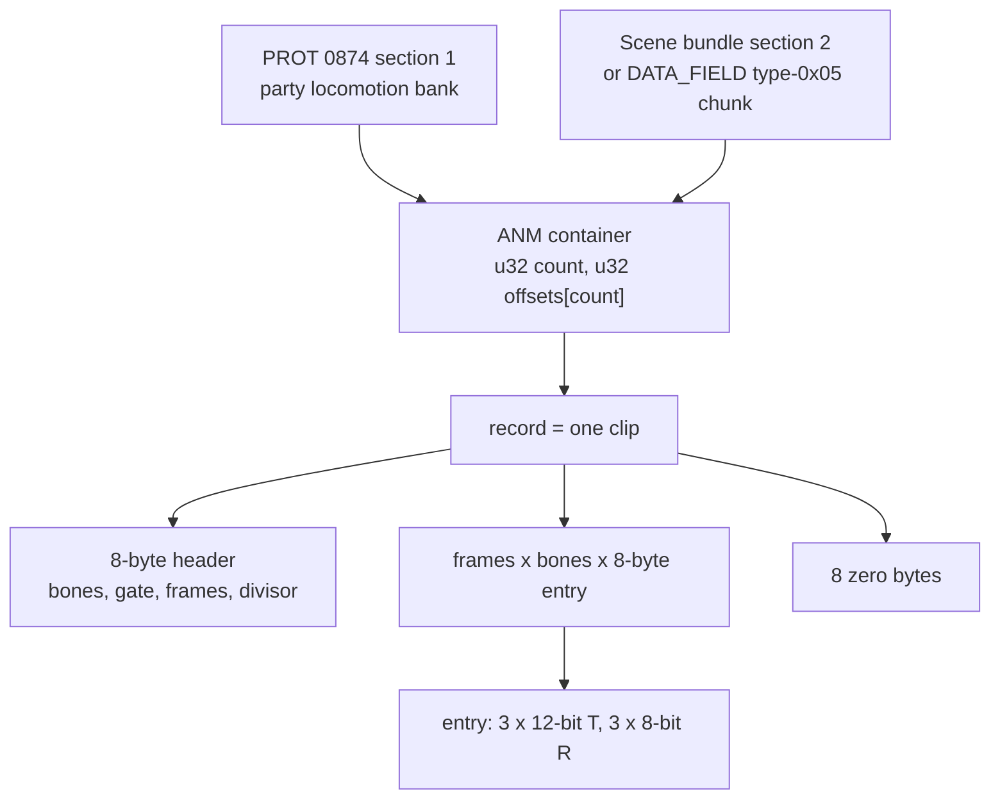

# ANM animation container

The keyframe animation container for **field actors**: the party's walk and idle clips, every NPC's clips, door swings and other animated props. A clip is a rigid per-object animation: one 8-byte translation + rotation entry per TMD object ("bone") per frame.

It is not the only animation format on the disc, and picking the wrong one is the usual mistake:

- Battle monsters use a 9-byte packed stream inside the monster archive: [monster animation](monster-animation.md).
- The party's *battle* poses come from the player battle files' own streams: [battle-data-pack](battle-data-pack.md#battle-animations-record0).
- The dispatcher's type byte is crossed with its label. Clip banks arrive as asset type **`0x05`** (labelled "MOVE", buffer `_DAT_8007B888`). Type `0x06` (labelled "ANM", buffer `_DAT_8007B7C8`) holds the scene's CLUT-walk table ([`asset-type.md`](asset-type.md#type-table)).

Parsers: `legaia_asset::player_anm` (the disc-pinned record layout, sampler and blender) and `crates/anm` (the outer container, the allocator preamble, CLI sweeps).

## At a glance

Container:

| Offset | Size | Field | Meaning | Confidence |
|---|---|---|---|---|
| `+0x00` | 4 | `count` | Number of records | Confirmed |
| `+0x04` | `4 * count` | `offsets[]` | Absolute byte offset of each record in the decoded buffer | Confirmed |
| `offsets[i]` | var | record `i` | One clip; ends where the next begins | Confirmed |

Record (a clip), `record_size = 16 + 8 * bones * frames`:

| Offset | Size | Field | Meaning | Confidence |
|---|---|---|---|---|
| `+0x00` | 1 | bone count | Animated TMD objects; must equal the actor's object count | Confirmed |
| `+0x01` | 1 | gate | Bit 0 selects the scaled step **and** the sub-frame blend | Confirmed |
| `+0x02` | 2 | frame count | `3..60` across the corpus | Confirmed |
| `+0x04` | 2 | marker | `0x080C` in every record | Confirmed (value); meaning Unknown |
| `+0x06` | 1 | step divisor | `0x02` / `0x04` in the field corpus | Confirmed |
| `+0x07` | 1 | (high byte) | `0x00` in field bundles; `0x02` / `0x04` in the Baka Fighter bundle | Unknown |
| `+0x08` | `8 * bones * frames` | entries | Frame-major; [8-byte encoding](#per-bone-frame-8-byte-encoding) | Confirmed |
| end - 8 | 8 | padding | Zero in every record | Confirmed |

As `u16` words the header reads `(a, b, marker_1, flag)`: bone count = `a & 0xFF`, gate = `a >> 8`, frames = `b`. The Baka Fighter bundle's `flag` values are `0x0201` / `0x0401` / `0x0402`.

The size formula holds byte-exact across all 310 records of the five pinned bundles below and across every other bundle the corpus sweep finds. `legaia_asset::player_anm::find_in_entry` validates it on every record before declaring a bundle parsed; the disc-gated `crates/asset/tests/player_anm_real.rs` pins it.

## Disc source - the party locomotion bundle (PROT 0874 §1)

The **party field-locomotion clip set** ships as section 1 of the PROT `0874_befect_data` container (`parse_player_lzs(buf, 3)` → descriptor 1 → LZS). The decoded 16,864-byte container is byte-identical to the live runtime copy every party actor's `+0x4C` pointer resolves into (pinned against the `v0_1_pre_battle_tetsu` town01 field save).

| Records | Content |
|---|---|
| `0..=6` | Vahn's bank, 10-bone |
| `7..=13` | Noa's bank, 10-bone |
| `14..=20` | Gala's bank, 10-bone |
| `21` | Savepoint loop: 3 bones x 30 frames (pack slot 3) |
| `22` | Aux clip: 2 bones (pack slot 4) |

Within a character bank:

- **Slot 0 is the walk.** A live pad-driven capture (`scripts/pcsx-redux/autorun_locomotion_clip_pin.lua`: hold a D-pad direction in town01 free-roam and sample `player+0x4C` per field tick) shows the pointer switch record 1 → record 0 while moving and back on stop, in both directions. No separate turn clip fires.
- **Slot 1 is the standing idle** (10 bones x 15 frames). In the town01 anchor the three party actors sit at Vahn = record 1, Noa = 8, Gala = 15, and the savepoint at record 21. Frame 0 of the idle is the character's field rest-pose assembly transform.
- **Slots 2..6** (10 / 8 / 8 / 4 / 3-frame clips) are a run / interaction family whose per-slot roles are not capture-pinned. A longer capture (`scripts/pcsx-redux/autorun_locomotion_run_pin.lua`: 15 s of held-pad walking plus direction + Square / Circle chords) never moves the pointer off the walk record, so none is a held-pad "run" there.

The select byte at `player+0x5C` reads only `1` (walking, record 0) and `2` (idle, record 1) across that capture: `id = record + 1`, the same shape as the battle bank's display ids.

The bone count is the **runtime-capped 10**. The consuming actor's object-pointer table at `actor[+0x44]` (`[u32 count][ptr x count]`, built by `FUN_80024D78` off the pool TMD: `count = *(tmd+8)`, object `i` = `tmd + 0xC + i*0x1C`) must have `count` equal to the record's bone count, or `FUN_8001B964` skips the draw. Bone `i` drives TMD object `i`. The disc pack ships `nobj = 12`; groups 10 / 11 are equipment-swap templates that never render ([`character-mesh.md`](character-mesh.md)).

This walk is the **town** walk only. On a kingdom world map the pad step stores the scene-sentinel base `99`, so the overworld walk binds body `leader` of the kingdom's own ANM bank (three 10-part clips, byte-identical across the kingdoms; see [`world-map-overlay.md`](world-map-overlay.md#per-kingdom-clip-inventory)). The standing idle there is still this bank's slot 1.

Parser: `legaia_asset::character_pack::field_locomotion_anm` and the `LOCOMOTION_*` bank constants. `locomotion_slot_label` names only the two capture-pinned slots ("Walk" / "Idle") and keeps the rest neutral ("Locomotion N"); `locomotion_record_label` adds the character banks and the savepoint / aux records.

## Disc source - per-scene ANM bundle

The clip set a scene's **NPC actors** and scripted scene animations play ships inside the scene's own asset bundle, not as a dedicated PROT entry. The bundle is a [`parse_player_lzs`](../../crates/asset/src/lib.rs)-shaped container ([scene_asset_table](scene-bundles.md#scene_asset_table---count-prefixed-asset-bundle)); its type-`0x05` descriptor LZS-decodes to an ANM container. The dispatcher allocates it into `_DAT_8007B888` with the `move_malloc_err` string (`ghidra/scripts/funcs/8001f05c.txt`, store at `0x8001F3A8`).

Byte-equality against the live clip bank in the [`v0_1_pre_battle_tetsu`](../../scripts/scenarios.toml) field-mode save state confirms:

| PROT entry | CDNAME | Section | Records | Decoded bytes |
|---|---|---|---|---|
| `0004` | town01 | 2 | 69 | 96,448 |
| `0013` | town0b | 2 | 69 | 91,784 |
| `0183` | balden | 2 | 72 | 71,604 |
| `0408` | bubu1 | 2 | 70 | 87,844 |
| `1203` | other5 | 2 | 30 | 87,684 (battle form) |

The field-form bundles carry 69-72 records. Other scenes either hold a smaller bank or resolve to one of these.

**A stream-borne bank.** A scene whose MAN arrives in a DATA_FIELD stream can ship its clip bank the same way: as the stream's type-`0x05` chunk, stored raw (the stream walker hands every chunk to the dispatcher with `copy_only = 1`). `rikuroa` is the case: its 72-record bank is the type-`0x05` chunk of PROT 157, between the MAN (type `0x03`) and the type-`0x07` chunk, and no entry of its block holds a container with an ANM section. One resolver serves every host: `legaia_asset::player_anm::find_scene_bundle`, through `engine-core::npc_catalog::scene_anm_bundle`, tries the container sections first (entry-major), then a stream chunk.

### Which clip an NPC plays

- The MAN placement header's `anim_id` byte = bundle record index + 1 (`0` = no clip), installed into the actor's `+0x5C` halfword at spawn. See [`script-vm.md`](../subsystems/script-vm.md#placement-header-model--animation-resolution).
- The header only seeds the word. The record's spawn prologue runs before the first drawn frame and can rewrite it. Every save crystal (`model 0xF3`) ships header anim `0` and its prologue sets `22`, the locomotion bundle's savepoint clip (record 21); a retail `conc_field_card_boot` capture shows that at the crystal actor's `+0x5C` with draw kind `1`.
- Both play hosts pose a placement from the live word (`World::field_npc_live_anim`) and fall back to the header byte only when no channel owns the slot.
- A placement whose live word is still `0` when the host binds it takes its first clip from a later ANIMATE cue (`rikuroa`'s party Noa, posed by a cutscene's `A2 10 18`). Both hosts keep every drawn placement as a clip target and cut its mesh to the cue's clip bone count then.
- The bank a clip id names, at the spawn binding as at every cue, is the actor's live party-bank bit (`World::npc_clip_party_bank`), not its spawn class.

The crystal's mesh is the player bank's slot 3 (`0xF3 - 0xF0`), the three-object PROT 0874 §0 member. The engine keeps it in `World::field_head_pool`, apart from the shared global pool whose slots `3..=32` hold the battle effect-model library. The same capture shows the crystal actor at `+0x64 = 3` and the four torch-like aux props at `+0x64 = 4`, `+0x5C = 23`.

### PROT 1203 bank layout - record roles

PROT `1203_other5` is the battle-form animation set **for the PROT 1204 pack's own object order** (bone `i` drives 1204 object `i`): the Baka Fighter / viewer configuration. It is **not** what a real battle poses the [assembled battle meshes](character-mesh.md#battle-form---assembled-from-the-player-files) with. The in-battle pose source is the character's own TRS streams in `record[0]` of their player file ([`battle-data-pack.md` § Battle animations](battle-data-pack.md#battle-animations-record0)), and no 1203 record is resident in a mid-battle capture.

| Records | Content |
|---|---|
| `0..=8` | Vahn, 15-bone |
| `9..=17` | Noa, 16-bone |
| `18..=26` | Gala, 15-bone |
| `27..=29` | Three 10-bone-rig records (actor untriaged) |

Roles within a bank, pinned through the Baka Fighter duel's display-anim ids: `0` idle, `1..=3` the three attacks, `4` the special, `5..=7` the hit / knockdown family, `8` the win flourish (the match-result pose).

The combat tick stores `base + k` at `actor + 0x5C` (`base = fighter_id * 9`), and the anim player resolves the id **through the container header**: `container + id*4` reads word `id`, where word 0 is the record count and word `d` is `offsets[d-1]`. So display id `base + k` lands on bank record `k - 1`. Derivation and disassembly cites: `legaia_asset::baka_opponents::action_slot_label` (`party_bank_record_label` for the absolute-record view) and [`minigame-baka-fighter.md` § Player input + actions](../subsystems/minigame-baka-fighter.md#player-input--actions).

## Per-(bone, frame) 8-byte encoding

Each entry decodes to a `(T, R)` transform in `FUN_8001BE80` (`ghidra/scripts/funcs/8001be80.txt`):

| Byte | Content |
|---|---|
| 0 | `low8(T0)` |
| 1 | `low8(T1)` |
| 2 | `(high4(T1) << 4) \| high4(T0)` |
| 3 | `low8(T2)` |
| 4 | low nibble = `high4(T2)`; high nibble never read |
| 5 | `u8` rot-X (shifted left 4 to a 12-bit PSX angle) |
| 6 | `u8` rot-Y |
| 7 | `u8` rot-Z |

- `T0..T2` are **signed 12-bit** translations (`if (v & 0x800) v |= 0xFFFFF000`): the joint offset in actor-local space. The runtime pushes them through the GTE's `MVMVA` with the actor's rotation matrix, then loads the result into the GTE `TR` registers as the per-object world-space translation.
- The three rotations build into the GTE rotation matrix in the order Z, Y, X (post-multiplication) via the PsyQ-shape builders (`ghidra/scripts/funcs/8004638c.txt`, `8004629c.txt`, `800461a4.txt`), which read the global sin / cos tables at `DAT_80070A2C` / `DAT_8007122C`.
- `high4(T2)` is the **low** nibble of byte 4: `lbu v0,0x4(t3); andi v0,v0,0xf; sll v0,v0,0x8` at `0x8001BF30..0x8001BF3C`. The unit test `bone_transform_decode_signed_12bit` (`crates/asset/src/player_anm.rs`, town01 record 17) pins the decode.

Frame 0 of an idle clip is the rest-pose assembly transform: it places each TMD object at its joint position with its rest orientation.

`legaia_asset::player_anm::BoneTransform::decode` returns `(t_x, t_y, t_z, r_x, r_y, r_z)`. The WASM [`LegaiaViewer::player_anm_record_pose_frames`](../../crates/web-viewer/src/lib.rs) emits per-frame absolute transforms in that shape for the site's character viewer.

## Playback

### Binding a clip

`FUN_800204F8` is the per-frame clip driver, called from the actor tick `FUN_80021DF4`. It picks the bank, binds the clip, and advances the cursor.

| Condition | Bank |
|---|---|
| Actor flag `+0x10` bit `0x01000000` set | `DAT_8007B75C` (the party bank) |
| Clip id `>= 0x400` | `_DAT_8007B840` |
| Otherwise | `_DAT_8007B888` (the scene bank, loaded at `0x8002055C`) |

It writes `actor+0x4C = pack_base + offsets[id]`, rebinding whenever the requested id `actor+0x5C` differs from the bound id `actor+0x5E`. A rebind resets the cursor and selects draw kind `actor[+0x56] = 1`. A retail `rikuroa` capture holds that scene's bank at `_DAT_8007B888`.

Two routines that look like clip entry points are not:

- **`FUN_80024CFC` (formerly `play_anm_by_id`)** reads the type-`0x06` buffer `_DAT_8007B7C8 + (id*4) + 4`, stores `base + offset` in `actor[+0x4C]`, and writes `0xB` to `actor[+0x56]` and `100` to `actor[+0x68]`. State `0xB` in the per-actor tick `FUN_8001ADA4` is the CLUT-walk step (per-entry frame counter plus a 16x1 `MoveImage` per frame, `case 0xb` of `8001ada4.txt`), so it spawns palette-cycling walkers ([`field-ambient-fx.md`](../subsystems/field-ambient-fx.md)).
- **Field-VM op `0x34` sub-op 3** hands a record to `FUN_800252EC`, which installs a move-VM stager record into the same `actor[+0x4C]` slot ([`scene-bundles.md`](scene-bundles.md#scene_event_scripts---prescript-only)).

### Playback: the frame cursor

The cursor `actor+0x68` is in **1/16-frame units**: `FUN_8001B964` poses from `frame = (i16)(actor+0x68) >> 4`, and the clip's last position is `frame_count * 16 - 1`. The per-tick step is `actor+0x6A`, through the header scaling below. The mode word `actor+0x62` carries:

| Bit | Meaning |
|---|---|
| `0x0002` | Hold |
| `0x0008` | Clamp (clear = loop) |
| `0x0080` | Reverse |
| `0x0100` | End latch, set by the tick on reaching either end |
| `0x0200` | Restart request, consumed by the next tick |

Scripts drive all of it through the field-VM ops `0x22 <id>` (SET_ANIM), `0x2B` / `0x2C` / `0x2D` (set / clear / spin on a bit of `actor+0x62`), `0x4C` nibble-4 sub-1 (the rate) and `0x4C` nibble-3 sub-5 / sub-6 (the two pose snaps). This is what swings a town's house doors open; see [`field-locomotion.md`](../subsystems/field-locomotion.md#the-door-swing-how-a-bind-script-drives-the-clip). Engine port: `legaia_engine_core::field_env::PropAnim`.

The driver reads four header bytes (`ghidra/scripts/funcs/800204f8.txt`): the bone count at clip `+0`, the gate at `+1`, the frame count at `+2` and the divisor at `+6`.

### The frame blender: two entries, one gate

`FUN_8001BE80` is not a pure per-entry decoder. Called once per part from `FUN_8001B964`'s loop (`a0` = actor, `a1` = the part's entry at the current frame, `a2` = the bound clip `actor+0x4C`, `a3` = the part index), it reads **two** entries and blends them.

- **The gate** is clip byte `+1` bit 0, tested at `0x8001BF70` for the translations and at `0x8001C0EC` for the angles. Clear, the current entry is emitted as decoded. It is the **same bit** the clip tick tests to select its scaled step (`lbu v0,0x1(a1)` at `0x800205B4`), so a clip either both scales its step and blends, or does neither.
- **The fraction** is the cursor's low nibble, `actor+0x68 & 0xF` (`0x8001BFFC`).
- **The next entry** (`0x8001BEAC..0x8001BF00`): while `(i16)actor+0x68 >> 4 < frame_count - 1` it is `entry + a2[0]*8`, the same part one frame later. On the last frame it is the entry itself when the clamp bit `actor+0x62 & 8` is set, and otherwise `*(actor+0x4C) + part*8 + 8`, the part's frame-0 entry (the loop wrap). The blend always runs toward frame + 1, including while the cursor counts down in reverse.
- **Translations** lerp as `cur + (((next - cur) * frac) >> 4)` on the sign-extended 16-bit values (`0x8001BFF0..0x8001C06C`; `sra`, so a negative delta floors), stored with `sh`.
- **Angles** go through the interpolator `FUN_8001D088` with `from` = the next entry's angle and `to` = the current one (`0x8001C100..0x8001C154`). It returns `(to + ((from - to) * frac >> 4)) & 0xFFF` after two **sequential** short-arc guards (`0x8001D090..0x8001D0B8`): add a turn to `to` when `from - to >= 0x800`, then add a turn to `from` when the *updated* `to - from >= 0x800`. An input exactly half a turn apart fires both and they cancel, so that case resolves forward.
- **The Euler-flip retry.** Before the three angle calls the blender zeroes `_DAT_8007BD28` (`0x8001C11C`). Each call adds its unwrapped `|from - to|` to it and journals its unwrapped `(from, to)` pair into the 8-byte-stride slot table at `0x800891A8` (slot = axis). If the sum exceeds `0xC00` (`slti v1,v1,0xc01` at `0x8001C164`) the three angles are blended **again** from the journal, against the next frame's equivalent Euler triple `(x + 0x800, -(y + 0x800), z + 0x800)` (`0x8001C170..0x8001C1CC`): the same Z-Y-X orientation by a shorter total path. The counter and the journal are part of the transform, not bookkeeping.

Results are written to scratchpad `0x1F8002C0` (`T` at `+0x0..0x6`, angles at `+0x8..0xE`) before the GTE load. At `frac == 0` every lane returns the current entry exactly, the flip retry included, so a whole-frame cursor poses exactly as the single-entry decode.

**Census.** 2243 of the 3634 records the ANM detector finds across every PROT entry carry the gate, spread over 78 entries; 1560 of those use step divisor `4`. It is set per clip, not by record index: 327 of the 755 records at index `0..=8` carry it and 963 of those at `9+` do not. `crates/asset/tests/player_anm_sampler_real.rs` prints the census and checks every keyframe of every record against the single-entry decode.

**Cadence: the gate also slows the clip.** The step for a gated clip is `(rate * 2 + div - 1) / div` (`0x800205C8..0x800205E0`), against the plain `rate` otherwise, and the result is multiplied by the frame step `DAT_1F800393` (`0x80020654..0x80020690`). At the field rate `8` that is `16 / 8 / 6 / 4 / 3` sixteenths for divisors `1 / 2 / 3 / 4 / 6`, so the divisor-4 clips run at half the ungated speed and the blender fills the ticks in between.

A live capture on the Rim Elm free-roam state (`scripts/pcsx-redux/autorun_gated_clip_step.lua`, 600 vsyncs, 62 actors) matches the rule on every call it could check: 7796 of 7796 ungated calls, 1690 of 1690 gated divisor-2 calls and 3969 of 3969 gated divisor-4 calls, all at frame step `2`. Calls that rebound the clip, held, restarted or ran reversed are left out.

### Engine port

- `BoneTransform::decode` is the entry decode. `PlayerAnmBundle::sample_bone` / `sample_pose` is the two-frame sampler (next-entry rule, gate, fraction). `blend_bone_transform` is the blend including the flip retry. `lerp_angle_12` / `lerp_angle_12_journaled` are the angle interpolator, the latter returning the journal and counter as values. `PlayerAnmRecord::blends` reads the gate.
- Both hosts pose a placed prop through one kernel, `legaia_engine_core::field_env::prop_bone_offsets`, keyed on `PropAnim::pose_key` (the live cursor plus the clamp bit).
- The NPC / player clip player `FieldClipPlayer` walks the same cursor and blends a gated clip on the ticks that fall inside a frame. `field_anim::clip_step` picks the step from the record's gate and divisor; the cursor wraps to `0` on the tick that reaches `frames * 16 - 1`. `PropAnim::tick` takes its step from the same function.
- `field_anim::clip_end_ticks` is the bind-to-latch length the cutscene timeline times a player clip's end-latch spin with (`FieldLocomotion::scene_clip_ticks`).
- Both hosts memoise a posed mesh on `FieldClipPlayer::pose_key` rather than on the frame index.

## The actor tick's kind ladder (`actor[+0x5A]`)

`FUN_80021DF4` ladders through `actor[+0x5A]` (`u16`). These are the kinds of the move-VM / ambient-effect actors the tick serves; none of them is the ordinary clip path, which is the driver `FUN_800204F8` above. Only kind `6`'s second block reads `actor[+0x4C]`.

| `actor[+0x5A]` | Handler block | Behaviour |
|---|---|---|
| `0x01` | none; the ladder never tests `1` | Common stages only |
| `0x02` | shared with `0x06` at `0x80021E90..0x80021FA4` | Rate-integrated channel block (`+0x34..` stepped by `+0x40..`, `>> 6`) |
| `0x03` | `0x800226E8..0x800228A0` | CLUT-cell HSV integrate (`+0x90..+0x94` += `+0x96..+0x9A`), then `FUN_80019D50` |
| `0x04` | `0x80022CC8..0x80022EE4` | VRAM rect wrap-scroll |
| `0x05` | `0x80021FB4..0x800226D8` | Positional SFX emitter |
| `0x06` | `0x80021E90..0x80021FA4`, `0x80022F0C..0x80023040` | The kind-`2` block, then the [two-pose tween](#kind-6-the-two-pose-tween-record) |
| `0x07` | `0x80022C30..0x80022CB8` | Spline / curve-driven variant |

The compares are `beq` / `bne` against `+0x5A` at `0x80021E7C` / `0x80021E88` (`2` / `6`), `0x80021FAC` (`5`), `0x800226E0` (`3`), `0x80022C28` (`7`), `0x80022CC0` (`4`) and `0x80022F04` (`6`); see `ghidra/scripts/funcs/80021df4.txt`.

The span `0x800228B8..0x80022B80` is the **default motion block**, not a kind handler. Kinds `3` and `5` skip it (`beq` to `0x80022B80` at `0x800228A8` / `0x800228B0`). It steps the rotation banks `+0x24..+0x28 += +0x80..+0x84`, the position, and the `+0x72` / `+0x7A` / `+0x78` channels by the rates at `+0x92` / `+0x94` / `+0x90`.

Engine side: `crates/engine-vm`'s `DispatchByte` enum is the typed view (`DispatchByte::from_byte`, `handled_natively`). The per-arm physics tick (position / velocity / acceleration, the kind-`5` SFX emitter, the kind-`4` and kind-`7` render submissions) is ported in [`crates/engine-vm/src/actor_tick.rs`](../../crates/engine-vm/src/actor_tick.rs) and surfaces cross-cutting effects as `TickEvent`. Per-arm breakdown: [actor-vm.md](../subsystems/actor-vm.md#per-arm-physics-tick).

### Kind 6: the two-pose tween record

For a kind-`6` actor, `actor[+0x4C]` points at a **runtime record the tick rewrites every frame**: a one-frame clip in the ordinary 8-byte encoding, followed by the two poses it is tweened from. With `N = *(actor[+0x44])` (the object count):

| Offset | Size | Content |
|---|---|---|
| `+0x00` | 8 | Clip header, stamped by the tick: `+0 = N`, `+2 = 1` (one frame), `+6 = 1` |
| `+0x08` | `8 * N` | Output entries, written by the tick (one 8-byte entry per object) |
| `+0x08 + 8N` | `24 * N` | Per-object source data: twelve `i16`, read by the tick |

Total `8 + 32 * N` bytes. Per object the tick computes `src + ((dst - src) * actor[+0x22]) >> 12` on five lanes and packs the results (`0x80022F0C..0x80023040`). `dst` sits 12 bytes after `src` in every lane:

| Source `i16` (object-relative) | Destination entry bytes |
|---|---|
| `+0x06` | `T0` (byte 0, low nibble of byte 2) |
| `+0x08` | `T1` (byte 1, high nibble of byte 2) |
| `+0x0A` | `T2` (byte 3, byte 4) |
| `+0x02` | `>> 4` into **both** byte 5 and byte 7 (rot-X and rot-Z) |
| `+0x04` | `>> 4` into byte 6 (rot-Y) |

The halfwords at `+0x00` / `+0x0C` are not read by this block. `crates/anm` models the record as `KeyframeReader` / `BoneKeyframe` (`infer_bone_count` recovers `N` from the size); its field order (`src_pos, dst_pos, src_rot, dst_rot`) and `/256` factor do not match the lanes above.

Disc records whose size does not fit `16 + 8 * bones * frames` are surfaced by `anm scan-non-keyframe 'extracted/PROT/*.BIN' --histogram` (it skips non-ANM files, so it is safe to glob; `--histogram` prints the top-8 byte distribution per record).

### The overlay-side `actor[+0x4C]` reader

A handler in the field overlay's script VM (`FUN_801DE840`, overlay 0897) also reads `actor[+0x4C]`, at `801e260c`, through a sub-dispatch table at `0x801CEF88` (16 entries, routed by `opcode & 0xF`):

1. Guard: reads `actor[+0x5C]`; skips the handler if it is `<= 0`.
2. Calls `FUN_800204F8` (`a0 = actor`).
3. Loads `s6 = actor[+0x4C]`.
4. Calls `FUN_80056798` (BIOS vector `0xa0/0x2F`) while advancing the field-VM PC by 2 in the delay slot.
5. A 40-byte body at `801e2630..801e2670` uses `s6` and the return value. **Unknown:** that body is not decoded.

See `ghidra/scripts/funcs/overlay_0897_801de840.txt`.

## Battle-actor animation state is not ANM

The battle actor record carries its own animation state, and the record it points at is a **battle action entry** with a 9-byte packed stream, not an ANM clip. The owning page is [monster-animation.md](monster-animation.md) (entry head, packed stream, playback); the party's entries are in [battle-data-pack.md](battle-data-pack.md#battle-animations-record0). What is recorded here is the actor side.

Battle actor records are `0x2D4` bytes; slot 0 is at `0x800EC9E8`. A quiet-frame vs mid-strike save pair pins:

| Actor offset | Length | Purpose |
|---|---|---|
| `+0x1D8` | 16 B | Anim state bytes. Pre-anim mostly zero with `01 77` at `+0x1D7..+0x1D8`; mid-anim e.g. `00 11 00 27 00 03 03 0F 0E 19 27 00` |
| `+0x1F4` | 18 B | Per-clip counters; zero pre-anim, a stamped run of `0x11` bytes mid-anim |
| `+0x234` | 16 B | 4-deep **history queue** of entry pointers (4 x `u32`). Pre-anim `0x8015CC30`, mid-anim `0x801621D0` (`+0x55A0`: a different entry, paged in for the strike) |

`FUN_80047430` implements the queue's back-shift: when a new entry activates, `actor[+0x234]` receives the new pointer and the previous values shift down through `+0x238..+0x244`. `FUN_80049348` shadows the head into the render context (`ctx+0x4C = actor[+0x234 + i*4]`). The offsets are codified as [`engine_core::capture_observations::battle_action_animation`](../../crates/engine-system/src/capture_observations.rs) and exercised by `battle_action_anim_pair_pins_dispatch_pointer_table_and_anim_pc_window` in `crates/mednafen/tests/real_saves.rs`.

The entry at the mid-strike pointer opens `u32 0x18, 0, 0, 4, 5, 0x00299307, 0x0140017E`. Its first byte `0x18` is the action tag and falls in the "other" row below.

### The commit's tag ladder

The staged-anim commit `FUN_8004AD80` (`ghidra/scripts/funcs/8004ad80.txt`) tests the entry's tag byte `+0x00` once per commit, not per frame (`0x8004BE30..0x8004BF4C`):

| Tag | Behaviour |
|---|---|
| `0x02` | When the battle's first monster id `0x8007BD0C` (`gp[+0x9F4]`) is `0xB3` or `0xB5` (the Songi fights) and the committing actor's HP `+0x14C` is `0`, the tag is rewritten to `0x04` in place (for `0xB3` the entry's `+0x56` is also incremented), so the `0x04` row runs next. |
| `0x04` | HP not `0`: `actor[+0x1DA] = actor[+0x1F2]` (the get-up) and `+0x1DC = 0`. HP `0` on a party seat: `+0x1DA = 7` and `+0x1DC = 0`. A dead monster stages nothing here; its death arm runs at the next commit. |
| `0x05` | `actor[+0x1DC] \|= 4` (return to idle at the natural end). |
| `0x07` | `actor[+0x1DA] = 8`. |
| `0x08` | `actor[+0x1DC] \|= 8` (the root-motion latch). |
| other | No tag-specific branch. |

This is the chain a downed party member plays (knockdown, entry `7`, entry `8`), described in [battle.md](../subsystems/battle.md#the-commits-clip-tag-ladder).

### Actor fields the battle consumers read

The entry-head fields (`+0x0E`, `+0x14..+0x53`, `+0x76`, `+0x77`, `+0x78`, `+0x84..+0x88`) are tabulated on [monster-animation.md](monster-animation.md#at-a-glance). The consumers (`FUN_80047430`, `FUN_80049348`, `FUN_8004AD80`, `FUN_80048310`, `FUN_80048A08`, `FUN_8004998C`, `FUN_800495C8`, `FUN_80049858`) also use these actor-side fields:

| Actor offset | Type | Purpose |
|---|---|---|
| `+0x34` / `+0x38` | vec | Position, copied into render-ctx `+0x14` / `+0x18` |
| `+0x44` / `+0x48` | vec | Second position vector, copied into render-ctx `+0x24` / `+0x28` |
| `+0x68` | `u16` | Frame cursor: bits `4..15` frame index, bits `0..3` sub-frame fraction |
| `+0x172` | `u16` | Counter slot |
| `+0x176` | `u16` | Loop-hold counter; the commit stamps `entry[+0x84] << 4` |
| `+0x1BA` | `u16` | Render flag set, copied to render-ctx `+0x7A` |
| `+0x21B` | `u8` | Loop counter; the commit stamps `entry[+0x84]` |
| `+0x21D` | `u8` | Speed scale (`0` / `2` / `4` / `8` observed). `FUN_80047430` multiplies the cursor step by it; `FUN_80049348` also reads it as `8 / actor[+0x21D]`, the stride of its child-actor walk |

The entry's `+0x56` is a sub-state counter ticked during the `0x02 -> 0x04` rewrite. `FUN_8004AD80` stamps `(frame_count - 1) * 16` from the byte at `*(entry+0x88) + 1` into the actor's cursor cap. The same byte is a divisor in `FUN_80047430`'s root-motion step, so a zero frame count divides by zero at runtime.

`crates/engine-vm::anim_vm` holds typed views over this state: `OpaqueAnimRecord` (the entry at `actor[+0x234]`), `NestedFrameData` (the packed stream: `bones_per_frame` / `frame_count` / `frame(i)` / `bone(f, b)` / `interpolate`), `BoneFrame` (`from_9_bytes` / `to_9_bytes`) and `ActorAnimState` (`+0x21D`, `+0x21B`, `+0x176`, `+0x68`). Two of its readings differ from the decoder disassembly, which [monster-animation.md](monster-animation.md#packed-stream-entry-0x8c) follows: `BoneFrame` sign-extends all six 12-bit fields, where `FUN_8004998C` sign-extends the three translations and masks the three angles with `andi 0xfff`; and `ActorAnimState` names `+0x21D` an LOD step. The battle player the hosts run is `legaia_engine_core::battle_anim`, not these views.

## Allocator preamble

When the dispatcher (`FUN_8001F05C` case 5) loads the clip bundle, the malloc'd buffer at `_DAT_8007B888` carries a 16-byte allocator preamble before the payload:

| Offset | Field |
|---|---|
| `+0x00` | `back_ptr` (RAM pointer, usually base - `0xC` or similar) |
| `+0x04` | `forward_ptr` (RAM pointer to the next allocation) |
| `+0x08` | `forward_ptr_2` (RAM pointer, sometimes 0) |
| `+0x0C` | `expanded_size` (`u32` payload byte length) |
| `+0x10` | payload |

`crates/anm::peel_preamble` strips it; the on-disc form has no preamble.

## See also

- [Legaia TMD](tmd.md) - the mesh format these animations transform.
- [Monster animation](monster-animation.md) - the battle keyframe stream and action entry head.
- [Scene bundles](scene-bundles.md) - the container the per-scene bank ships in.
- [`subsystems/field-locomotion.md`](../subsystems/field-locomotion.md) - how scripts and the pad drive the clip cursor.
- [`subsystems/renderer.md`](../subsystems/renderer.md) - the TMD renderer that consumes the posed vertices.
