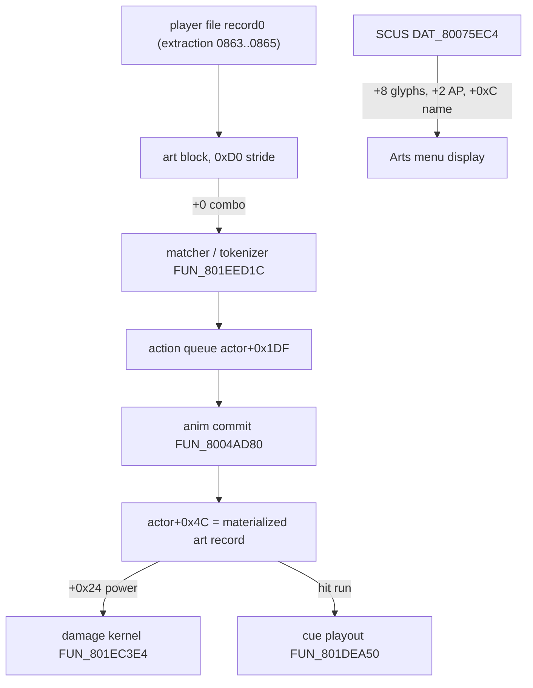

# Art Data - Tactical Arts records

A Tactical Art is a d-pad combo the player enters in battle. Each playable
character (Vahn, Noa, Gala) has a table of fixed-size *art records* holding the
combo, the art's name, its per-strike damage power, hit timing and effect cues.
A second, separate table in the executable holds what the menu *shows* for each
art: name, AP cost and the arrow string. This page covers both tables, the
action-constant id space that links them, and the Miracle / Super Art trigger
tables.

Implementation: [`crates/art`](../../crates/art/README.md) (tables, tokenizer,
matchers) and `legaia_patcher::arts_power` / `super_art_power` (record editors).

## At a glance

| | |
|---|---|
| Art records (disc) | decoded `record0` of the player battle file: extraction `0863` Vahn / `0864` Noa / `0865` Gala ([battle-data-pack.md](battle-data-pack.md)) |
| Art records (RAM) | first record at `0x80160EFC` Vahn / `0x80176998` Noa / `0x8018BA54` Gala; resident once the Arts menu opens |
| Record stride | `0xD0`, indexed by action constant: `art_block_base + (c - 0x10) * 0xD0` |
| Art block | reached through `record0[+0x58]`; runtime copy of `record0` at `DAT_801C9360[char]` |
| Display table | `DAT_80075EC4` in `SCUS_942.54`, 20-byte records |
| Learned Art Constants (RAM) | Vahn `0x8008488D`, Noa `0x80084CA1`, Gala `0x8008506C` |
| Miracle trigger entries | RAM `801F` segment `0x64F4` / `0x6504` / `0x6514`; record-file offsets `0x0CDC` / `0x0CEC` / `0x0CFC` |
| Super Art tables | find `0x801F6524`, replace `0x801F65E8`, 15 entries |

"PROT entry `0x05C4`", a label used by external RE work for the record file, is
not an archive coordinate (`0x05C4` = 1476 is past the last PROT index). The
`0x0CDC`-style offsets above are offsets inside that record file.



## Confidence

| Part | Level | Basis |
|---|---|---|
| Combo at record `+0`, `0xD0` stride | Confirmed | savestate-proven; decoded `record0` byte-matches live RAM |
| Name field `+0x10..+0x24` | Confirmed | byte-identical to the modeled Super Art names for all fifteen |
| Power bytes at `+0x24` | Confirmed | disassembly-traced read chain + all three player files |
| Impact-effect class `+0x7A` | Confirmed | `FUN_801ec3e4` bound check + two readers |
| Arts-name table `DAT_80075EC4` | Confirmed | reader-traced, byte-exact against curated gamedata |
| Remaining variable fields (timing, cues, identifier, speed, status, repeat, background) | Inferred | external RE work cross-referenced with Meth962's observations; exact per-art offsets not pinned |

### The combo has two copies

The directional command of each art is stored twice, for two consumers:

1. **The matcher** (what fires the art) reads the art record's `+0` run:
   `1=L, 2=R, 3=D, 4=U`, 0-terminated.
2. **The display** is the SCUS arts-name table's `+8` glyph string
   ([below](#arts-name-table-dat_80075ec4)): only the arrows shown in the menu.

Editing the SCUS glyph copy changes the menu arrows but the art still triggers
on the old combo (emulator-verified), so a faithful edit changes both. The
arts-combo randomizer does - see
[`docs/tooling/randomizer.md`](../tooling/randomizer.md).

## Action Constants

Every entry in the battle action queue is one of these `0x00..0x32` values:

| Byte | Meaning |
|---|---|
| `0x00` | Nothing |
| `0x01` | Item |
| `0x02` | Magic |
| `0x03` | Attack |
| `0x04` | Spirit |
| `0x05` | Escape |
| `0x06` | unidentified |
| `0x07` | Faint Animation 1 |
| `0x08` | Faint Animation 2 |
| `0x09` | unidentified |
| `0x0A` | Item / Magic Animation |
| `0x0B` | Block Animation |
| `0x0C` | Left |
| `0x0D` | Right |
| `0x0E` | Down |
| `0x0F` | Up |
| `0x10` | Spirit Animation |
| `0x11..0x18` | Empty Slots 1-8 (placeholder, never appears in static data) |
| `0x19` | Regular Art Starter |
| `0x1A` | Special Art Starter |
| `0x1B..0x32` | Per-character arts (the constant is shared across characters but names a different art per character - see [`crates/art/src/tables.rs`](../../crates/art/src/tables.rs)) |

These constants double as the **battle anim-id space**. The action state
machine's strike loop stages each queue byte into `actor[+0x1DA]`, and the anim
commit `FUN_8004AD80` resolves it:

- Directions `0x0C..0x0F` index the runtime action table directly. Those four
  slots are swing records spliced from the equipped-item sections at battle
  init.
- Ids `>= 0x10` (starters, arts) materialize a record from the per-character
  art block into dynamic table slot `0x10` / `0x11` - the on-disc "Empty
  Slots".
- Art ids `0x1B+` also drive the HUD art-name display and
  `FUN_8004C650(char, id - 0x1B)`.
- Ids `0x11..0x18` reappear at runtime in `actor[+0x1DB]` (last staged id),
  where the battle camera driver `FUN_801D5854` dispatches per-art camera
  variants.

See [battle-data-pack.md § Battle animations](battle-data-pack.md#battle-animations-record0).

## Art record layout

### Pinned fields

| Offset | Size | Field | Meaning | Confidence |
|---|---|---|---|---|
| `+0x00` | u8[] | combo | `1=L, 2=R, 3=D, 4=U`, 0-terminated. A Super Art record holds a one-byte stub here | Confirmed |
| `+0x10` | 0x14 | name | fixed slot `+0x10..+0x24`. Populated for Super Arts, Miracle finishers, starters (`"Starter"`) and some Hyper Arts; zeros for regular arts, which use the SCUS name table | Confirmed |
| `+0x24` | u8[1..=4] | power | one damage-power byte per strike ([encoding](#power-encoding)) | Confirmed |
| `+0x7A` | u8 | impact-effect class | `0` = none, `1..=5` ([below](#impact-effect-class-entry-0x7a)) | Confirmed |
| rest of `0xD0` | - | variable fields | see next table | Inferred |

<a id="fixed-prefix"></a>

The schema from the external RE work describes the bytes after the combo
terminator as `action constant (0x1B..=0x32)`, `anim_index`, then five
`anim_extra` bytes (usually 0; some Hyper Arts chain multiple records).
[`legaia_art::parse_record`] decodes that prefix - combo, action constant,
`anim_index` - and returns the rest as an unparsed tail. Its position for the
action constant and `anim_index` is **not** pinned against disc records: its
test feeds it synthesised bytes, and the confirmed layout above places the name
field at a fixed `+0x10`.

<a id="variable-fields-positions-documented-exact-byte-offsets-per-art-specific"></a>

### Variable fields

Positions are documented by the schema; exact byte offsets are not pinned.

| Field | Encoding |
|---|---|
| Damage Timing (×4) | one byte per power byte: the animation frame at which that hit fires |
| Special Effect Cues (×2) | 2 words each: half-word effect id, then 3 half-words XYZ. Active iff any field is non-zero |
| Hit Effect Cues (×4) | schema shape: a 32-bit word, high half = timing in frames, low half = constant (`0x1A`, `0x4C`, …). The runtime carrier is the 8-byte hit run in [Runtime cue playout](#runtime-cue-playout) |
| Identifier | byte. Some values trigger special animations (`0x67` in Heaven's Drop = Thunderbolt) |
| Anim Speed | byte. Lower = slower playback |
| Effect on Enemy | status byte: `1` Toxic, `2` Numb, `3` Venom, `4` Sleep, `5` Confuse, `6` Curse, `7` Stone, `8` Faint (`legaia_engine_vm::status_effects`) |
| Repeat Frames | 3 bytes: count, start frame, end frame. Replays a frame range; for some arts also repeats the damage of power bytes in the range (Super Tempest's 4 power bytes → 8 hits) |
| Background | byte. `0` = regular, `2` = black (Super Arts and the Tornado Flame Hyper Art) |
| Runtime Address | word, written by the runtime after the art is first used in battle; empty in static data |

### Power encoding

| Byte range | Defense target | Multiplier sequence | Notes |
|---|---|---|---|
| `0x16..0x1A` | UDF (Upper Defense Factor) | `12, 18, 20, 22, 28` | Standard UDF range |
| `0x1B..0x1F` | LDF (Lower Defense Factor) | `12, 18, 20, 22, 28` | Standard LDF range |
| `0x0C..0x10` | UDF (alt range) | `12, 18, 20, 22, 28` | UDF-target hits miss **short** enemies |
| `0x11..0x15` | LDF (alt range) | `12, 18, 20, 22, 28` | LDF-target hits miss **floating** enemies |
| any other | - | - | No damage |

So `0x1D` = LDF × 20, `0x19` = UDF × 22, `0x1F` = LDF × 28, `0x1A` = UDF × 28.

The kernel decodes the byte as `mult = MULT[(v - 0xC) % 5]` with
`MULT = [12, 18, 20, 22, 28]`, and picks the defence facet by
`(v - 0xC) % 10 < 5` (UDF, else LDF). `MULT` is byte-verified at overlay-`0898`
VA `0x801F64EC` (`[0c 12 14 16 1c]`); the sibling def-side table is at
`0x801F64E4` (`[06 04 04 04 02]`).

### Damage power byte - pinned to `record0 +0x24`

Each art record carries its 1-4 per-strike power bytes as a contiguous run at
the fixed offset `+0x24`, directly after the name slot. The read chain, from
the disassembly:

- The arts / melee damage kernel is **`FUN_801EC3E4`** (overlay 0898). (The
  summon kernel `FUN_801DD0AC` handles specials through the
  [move-power table](move-power.md).) It reads the current strike's power as
  `param_2[actor+0x1F4]`, where `param_2 = actor[+0x4C]` is the materialized
  art record's power run and `actor+0x1F4` is a strike cursor.
  `FUN_8004AD80` / `FUN_80047430` zero the cursor; it increments per hit at
  `0x801EECE8`.
- `FUN_8004AD80` materializes a staged id `>= 0x10` as
  `actor[+0x4C] = *(DAT_801C9360[char] + slot*4)`. `DAT_801C9360[char]` is the
  runtime copy of `record0`, whose `+0x58` is the art block.

Every art in the SCUS arts-name table resolves to one `record0` record whose
`+0x24` holds power bytes matching the art's damage tier: weak single arts
carry 1 byte, hyper / super arts 4 ascending bytes. The two Noa Hurricane-Kick
holes and Gala's spirit-only Miracle (which carries no `+0x24` byte) reproduce.
There is no display copy of the power. Editor:
`legaia_patcher::arts_power` (CLI `legaia-patcher arts`,
`--arts-power COMBO=VALUE`; see [randomizer.md](../tooling/randomizer.md)).

### Art records are indexed by action constant

The `0xD0`-stride array is indexed by **action constant**, not packed by
inputtable art:

```text
record_off = art_block_base + (c - 0x10) * 0xD0
```

Constants `0x19` / `0x1A` land on the two records named `"Starter"`, `0x1B` on
the character's Miracle Art (the record with the Miracle command string at
`+0`), and regular arts follow at `0x1B + display index`. The mapping comes off
the queue-builder `FUN_801EED1C`, which emits a matched art's constant as its
row `+ 0x18` (`addiu v1,t3,0x18` then `sb v1,0x1df(v0)` at
`0x801EF6F0` / `0x801EF6F8`); the array's first parseable record sits eight
records ahead of row 0.

- **Super Art finishers have records here**, at `0x2B..0x2F` (Vahn, Gala) and
  `0x2E..0x32` (Noa) - the constants `super_art.rs` carries as each Super's
  `finisher`. The `+0x10` name is the Super Art's English name
  (*Tri-Somersault*, *Neo Static Raising*, …) and `+0x24` holds real power
  tiers, so a Super Art's damage is ordinary art-record data.
- **A Super Art record has no combo.** Its `+0` is a one-byte stub, shorter
  than any real three-direction input, so a combo-keyed lookup never lands on
  one.
- **Some records are reachable by neither route.** Vahn's and Gala's `0x2A` and
  Noa's `0x2C` / `0x2D` carry named records with power bytes but have no
  arts-name-table row and no combo.

Editors: `legaia_patcher::super_art_power` (locate + edit by constant,
name-validated) and `legaia_patcher::arts_power` (combo-keyed).

## Runtime cue playout

The record's cue and timing fields are read at play time by a per-frame driver.
The matched art materializes into `actor[+0x4C]`, and a per-actor **cue
cursor** at `actor[+0x1F5]` walks the hit run, firing one cue per animation
frame reached. All readers are in the battle overlay (PROT 0898).

| Function | Role |
|---|---|
| `FUN_801dea50` | arts per-frame hit-cue + damage-marker playout |
| `FUN_801e09f8` | special-attack sibling: same cue tables and numbers, damage through the summon / move-power kernel `FUN_801dd0ac` |
| `FUN_801e22c8` | lighter impact-cue emitter for one art / anim id |
| `FUN_801e6d84` | raises the caster and enemy target banners for a committed action |

Dumps: `ghidra/scripts/funcs/overlay_battle_action_801dea50.txt`,
`…_801e09f8.txt`, `…_801e22c8.txt`, `…_801e6d84.txt`.

**`FUN_801dea50`** reads the hit run at `art_record + cursor*8 + 0x14`
(`art_record` = `actor[+0x4C]`):

| Entry offset | Field |
|---|---|
| `+0` | timing (frame) |
| `+1` | cue code |
| `+2` / `+4` / `+6` | XYZ offsets |

It places each cue in world space from the actor's position (`+0x34` / `+0x38`)
rotated by its facing (`+0x46`), and dispatches on the cue code. A code with
the high bit set spawns an `efect.dat` billboard (id `& 0x7f`, via
`FUN_801dfdf0`, resolved through the `pack1` descriptor table - see
[effect.md](effect.md)). A plain code selects a 3D move-VM prototype from
`0x801F6324` ([the cue tables](#the-cue-tables)). On the terminator entry it
materializes the move-power record for move id `actor[+0x1DF]` (`0x801F4F5C`,
26-byte stride; [move-power.md](move-power.md)) and lays down that move's own
per-hit cue list plus the multi-target markers. It advances `actor[+0x1F5]` and
loops while the cursor is `< 8`.

**`FUN_801e22c8`** indexes a per-art cue table at `0x801F6470` (5-byte stride:
`+0` entry count, then cue codes). For each entry it spawns either a number
(`FUN_801dfdf0`) or an effect sprite, decorating the sprite with the caller's
texture word (`+0x74`) unless that is the `0x808080` sentinel.

**`FUN_801e6d84`** keys on the active actor's staged fields: target `+0x1DD`,
action-constant category `+0x1DE`, move / spell id `+0x1DF`. It returns without
raising anything for Run / Defend (`+0x1DE == 5`), enumerates live enemies
(slots 3..6, alive flag `+0x14C`) for an all-target action, and otherwise
raises the single-target banner. `FUN_801d8de8` is the HUD-element / message
raiser (port: `BattleActionHost::ui_element`), not a camera command; the
routine's only camera-adjacent writes are the banner-width words
`DAT_800773AA` / `DAT_800773B2`. The action state machine raises the plan at
the tail of its `ActionSeed` state - see
[`battle-action.md`](../subsystems/battle-action.md#actor-pool-leaf-helpers).

### The cue tables

| Table VA | Indexed by | Role |
|---|---|---|
| `0x801F6418` | cue code (1-byte stride) | CLUT **source x**; a nonzero entry copies a palette row |
| `0x801F6324` | cue code (`code*4`), 61 entries | pointer to the effect-sprite descriptor spawned via `FUN_80050ed4` |
| `0x801F6470` | art / anim id (5-byte stride) | per-art cue list (`+0` count, then codes), read by `FUN_801e22c8` |

**No battle effect id plays a sound.** `0x801F6418` is not an SFX id table. Its
six readers end in `FUN_80058490`, whose string at `0x800156EC` is `MoveImage`,
and the 8 bytes they build are a PsyQ `RECT`: `x = 0x801F6418[code]`,
`y = 0x1DC`, `w = 0x10`, `h = 1`, copied to `(0xE0, 0x1DC)`. That is a
16-entry CLUT row copy at VRAM `y = 476` - the effect's palette. The table
holds only `0xB0` / `0xC0` / `0xD0`, which are VRAM x coordinates outside the
`0x00..=0x63` id space of the [sound-effect table](sfx-table.md). A
`jal 0x80058490` sweep of the battle overlay returns exactly those six readers,
each paired with its `0x801F6324` spawn, and no SPU-cue call
(`FUN_8004FCC8` / `FUN_8004FE5C` / `FUN_80035B50` / `FUN_8003D53C` /
`FUN_800250D4`) appears inside `FUN_801DEA50` or `FUN_801E22C8`.

A party Tactical Art's audio is therefore entirely the **CD-XA** layer: the
per-swing cue, the shout pool, and for a Hyper the per-`(character, action
constant)` fanfare fired by `FUN_8004AD80`.

Other rules of the dispatch:

- A cue code's high bit (`0x80`) is the "spawn a digit" flag; the low 7 bits
  select the glyph.
- `FUN_801dea50` gates its `0x801F6418` read on `code < 0x32` (`sltiu` at
  `0x801df0d8`); `FUN_801e22c8` consults it for any plain code.
- Neither bounds the `0x801F6324` read against its 61 entries. A plain code
  past `0x3C` reads into the next table as a "pointer": the schema's `0x4C`
  "hit effect" constant lands on the zero word at `0x801F6454` and stages a
  part from a NULL record. So `0x4C` names no sound and no authored effect;
  the visible hit comes from the in-range codes, the digit spawns and the
  impact freeze / tint.
- Per-code specials (scale variants, the code-`0` → `9` substitution, the
  homing handle, the `0x81..=0x83` shockwave) are tabulated in
  [`battle-action.md` § the per-action effect script](../subsystems/battle-action.md#the-per-action-effect-script-fun_801dea50).

### Impact-effect class (entry `+0x7A`)

Entry `+0x7A` is a `1..=5` selector (`0` = none), bounded by `FUN_801ec3e4`'s
`sltiu v0,v0,6`. That routine stores the selector at `actor[+0x21F]` and the
row it indexes out of `0x801F53D4` at `actor[+0x04]`. Two renderers read those,
and neither consults the cue records:

| Reader | What it draws |
|---|---|
| `FUN_8004998c` | an element spark streamed along the swing path at random cadence: `efect.dat` sprite `0x0B` for selector `1`, `0x10` for selector `2`. Gated on `actor[+0x21F]` non-zero |
| `FUN_80049348` | fading afterimage copies of the character mesh, tinted from the per-character table at `0x80076908`. Reached from `FUN_800480d8` only when `actor[+0x04]` left a colour word on the node |

This byte, not the cue script, makes an art read as its owner's element. On the
three 50-AP Hyper Arts it is set only on Vahn's Burning Flare (`1`); Noa's
Vulture Blade and Gala's Explosive Fist are `0`, and Gala's Thunder Punch is
`2`. A reskin that rewrites the cue records but leaves `+0x7A` alone still
shows the host character's sparks and ghost trail
([randomizer.md](../tooling/randomizer.md)).

#### The afterimage table's channel order - **R is byte 0**

`0x80076908` is four 4-byte rows: three party rows and a monster row at
`0x80076914`.

| Row | Bytes | Colour |
|---|---|---|
| Vahn | `60 30 30` | red |
| Noa | `30 60 30` | green |
| Gala | `30 30 60` | blue |
| monsters | `50 50 30` | olive |

The byte order is pinned by register assignment. `FUN_80049348` writes the row
into the render node's `+0x74` (`0x8004939C..0x800493C4`); `FUN_80048A08`
stages that word into `gp[+0x9D8]` (`0x80048BEC` `lw v0,0x74(s0)` /
`0x80048BF8` `sw v0,0x9d8(gp)`); the draw wrapper `FUN_80043390` takes it as
`a1` and, on the `a2 != 0` arm, splits it low byte first into the GTE (the
PSX geometry coprocessor) far-colour control registers:

```text
800434c8  ctc2 s6,cr21     ; RFC <- (a1 & 0xff) << 4
800434cc  ctc2 s5,cr22     ; GFC <- ((a1 >> 8) & 0xff) << 4
800434d0  ctc2 s4,cr23     ; BFC <- ((a1 >> 16) & 0xff) << 4
```

The same low-byte-first split feeds `cr13` / `cr14` / `cr15`
(`RBK` / `GBK` / `BBK`) at `0x80043464..0x8004346C`. Move-VM op `0x0C` builds
the same field the same way
(`+0x74 = (v1<<24 | 0x40000000) + v2 + (v3<<8) + (v4<<16)`, `v2` red). Mirror:
`engine-core::battle_afterimage::GHOST_COLOR_PARTY`.

Not the same field: `FUN_8005112c`'s ribbon literals are the fourth argument of
the 2D streak builder `FUN_80048310`, which re-packs them unchanged
(`0x80048460..0x80048474`, `0x80048540..0x80048580`) for `FUN_800485BC`. That
routine lays down a `POLY_G4` (vertex colours at
`+0x04` / `+0x0C` / `+0x14` / `+0x1C`) and writes **byte 2** of the word to the
`r` slot (`0x800487FC..0x80048814`), byte 1 to `g`, byte 0 to `b`. The
mesh-tint word is red-first into GTE registers; the 2D streak literals are
blue-first into GP0 vertex colours.

### Target-group encoding

Several arts readers share a compact target-group code. `FUN_801dea50` (staged
value) and `FUN_801dceac`
(`ghidra/scripts/funcs/overlay_battle_action_801dceac.txt`, the centroid /
bounding box of a group's actor positions for area-effect aiming) decode it the
same way:

| Code | Actor slot range `[start, end)` | Meaning |
|---|---|---|
| `< 8` | `[code, code+1)` | one explicit actor |
| `8` | `[0, 3)` | the party |
| `9` | `[3, 7)` | the enemy row |
| `0xA` | `[0, 7)` | everyone |

## Learned Art Constant

A per-character byte (`0x8008488D` Vahn, `0x80084CA1` Noa, `0x8008506C` Gala)
tracks the highest learned art slot. Slot indices `0..=0x10` resolve to action
constants through a per-character table with **holes**: Noa skips slots `0x02`
and `0x03` because her Hurricane Kick covers all three on-disc levels through
one learned slot.

API: [`legaia_art::learned_art_action(character, slot)`](../../crates/art/src/tables.rs)
returns the action constant, or `None` for holes / out-of-range.

| Slot | Vahn | Noa | Gala |
|---|---|---|---|
| `0x00` | Vahn's Craze (`0x1B`) | Noa's Ark (`0x1B`) | Biron Rage (`0x1B`) |
| `0x01` | Burning Flare (`0x1C`) | Hurricane Kick (`0x1C`) | Explosive Fist (`0x1C`) |
| `0x02` | Fire Blow (`0x1D`) | - | Lightning Storm (`0x1D`) |
| `0x03` | Tornado Flame (`0x1E`) | - | Thunder Punch (`0x1E`) |
| `0x04` | Cyclone (`0x1F`) | Vulture Blade (`0x1F`) | Bull Horns (`0x1F`) |
| `0x05` | Hurricane (`0x20`) | Frost Breath (`0x20`) | Electro Thrash (`0x20`) |
| `0x06` | PK Combo (`0x21`) | Tempest Break (`0x21`) | Neo Raising (`0x21`) |
| `0x07` | Spin Combo (`0x22`) | Rushing Gale (`0x22`) | Black Rain (`0x22`) |
| `0x08` | Pyro Pummel (`0x23`) | Tough Love (`0x23`) | Side Kick (`0x23`) |
| `0x09` | Cross-Kick (`0x24`) | Swan Driver (`0x24`) | Head-Splitter (`0x24`) |
| `0x0A` | Power Punch (`0x25`) | Bird Step (`0x25`) | Guillotine (`0x25`) |
| `0x0B` | Slash Kick (`0x26`) | Dolphin Attack (`0x26`) | Back Punch (`0x26`) |
| `0x0C` | Somersault (`0x27`) | Mirage Lancer (`0x27`) | Ironhead (`0x27`) |
| `0x0D` | Charging Scorch (`0x28`) | Blizzard Bash (`0x28`) | Battering Ram (`0x28`) |
| `0x0E` | Hyper Elbow (`0x29`) | Sonic Javelin (`0x29`) | Flying Knee Attack (`0x29`) |
| `0x0F` | - | Acrobatic Blitz (`0x2A`) | - |
| `0x10` | - | Lizard Tail (`0x2B`) | - |

Vahn and Gala stop at `0x0E` (15 learned arts each). Noa extends to `0x10`: 15
learned arts across 17 slot positions.

## Art Anim Data

The art record's `anim_index` byte selects the animation record played when the
art fires, indexing a per-character animation table. Slot `0` is always Spirit
and slot `3` always Art Starter; some slots are holes. Most records reference
one anim slot; a few (Hurricane Kick on Noa) use the `anim_extra` bytes to
chain into a continuation slot. The schema places `anim_index` at record offset
`+16`, which is where the confirmed layout has the name field - see the
[prefix note](#fixed-prefix).

API: [`legaia_art::art_anim_name(character, anim_index)`](../../crates/art/src/tables.rs).

| Anim | Vahn | Noa | Gala |
|---|---|---|---|
| `0x00` | Spirit | Spirit | Spirit |
| `0x01` | Power Punch | Tempest Break | Bull Horns |
| `0x02` | Slash Kick | Tough Love | Head-Splitter |
| `0x03` | Art Starter | Art Starter | Art Starter |
| `0x04` | Tornado Flame | Hurricane Kick 1 | Lightning Storm |
| `0x05` | Hurricane | Hurricane Kick 2 | Back Punch |
| `0x06` | Charging Scorch | Rushing Gale | Ironhead |
| `0x07` | PK Combo | Swan Driver | Battering Ram |
| `0x08` | Fire Blow | Frost Breath | Flying Knee Attack |
| `0x09` | Somersault | Lizard Tail | - |
| `0x0A` | Cyclone | Jurassic Blow 2 | Thunder Punch |
| `0x0B` | Hyper Elbow | Bird Step | Guillotine |
| `0x0C` | - | Dolphin Attack | Explosive Fist |
| `0x0D` | Burning Flare | Vulture Blade | Black Rain |
| `0x0E` | Spin Combo | Mirage Lancer | - |
| `0x0F` | Pyro Pummel | Blizzard Bash | - |
| `0x10` | Cross-Kick | Sonic Javelin | Side Kick |
| `0x11` | Acrobatic Blitz | Electro Thrash | - |
| `0x12` | - | - | Neo Raising |

## Miracle Arts

Each character has one Miracle Art. When the player enters its exact command
sequence, the runtime **clears the whole action queue** and writes the art's
replacement string.

| Character | Art | RAM | Record-file offset | Command sequence |
|---|---|---|---|---|
| Vahn | Vahn's Craze | `0x64F4` | `0x0CDC` | R D L U L U R D L |
| Noa | Noa's Ark | `0x6504` | `0x0CEC` | L U R D U L U D R |
| Gala | Biron Rage | `0x6514` | `0x0CFC` | R R D U D U D L L |

A replacement string has the shape
`[L, R, D, U, SpecialStarter, art1, art2, ...]`. The four leading directionals
are stored with the high bit set (`0x8C` / `0x8D` / `0x8E` / `0x8F`); the
runtime ANDs with `0x7F` when copying into the queue
(`legaia_art::miracle::unmask_replacement_byte`). Full table:
[`crates/art/src/miracle.rs`](../../crates/art/src/miracle.rs).

## Super Arts

A Super Art is not a direct command match. After each art finishes, the runtime
walks the action queue for a registered *Find* pattern. If one matches the
**tail** of the queue and every participating art paid AP, the matched bytes
are replaced by a *Replace* tail ending in the Super Art's finisher constant.

Example - Vahn's Tri-Somersault (`0x2B`):

```
Find:    19 27 0F 19 1F 0E 19 27
         (Starter Somersault Up Starter Cyclone Down Starter Somersault)
Replace: 19 27 0F 19 1F 0E 1A 2B 2B 2B
         (… SpecialStarter, Tri-Somersault × 3 hits)
```

Trigger conditions:

1. The last art of the Find string is the last action in the queue.
2. Every art in the Find string is non-NEW (its AP cost is paid).
3. The Super Art charges no AP of its own; its cost is the chain's sum.

The tables are resident overlay data (find `0x801F6524`, replace `0x801F65E8`,
15 entries, capture-validated); per-character copies (5 each) are in
[`crates/art/src/super_art.rs`](../../crates/art/src/super_art.rs).

Each Super Art has its own art record, addressed by its finisher constant
([above](#art-records-are-indexed-by-action-constant)), with its name at
`+0x10` and power bytes at `+0x24`. It has no input combo and no row in the
[arts-name table](#arts-name-table-dat_80075ec4), so it carries no AP number
and no menu command string. Patcher knob: `--super-art-power`
([randomizer.md](../tooling/randomizer.md#super-art-damage-power)).

### The connectors come from the tokenizer

The direction bytes between arts in a Find pattern (`0F` / `0E` above) are not
typed between the arts. They are what the retail tokenizer leaves behind:

- `FUN_801EED1C`'s normalisation loop (`0x801EF2EC..0x801EF858`) writes `0x19`
  over the **last** arrow of a matched art, inserts the art constant after it,
  and keeps the leading arrows. It walks tail-first (`s8` counts down from 15)
  and restarts at `s8 + 1` after every match, so one arrow can belong to two
  arts. `↑↓↑` alone becomes `0F 0E 19 27`. Port:
  [`legaia_art::tokenize`](../../crates/art/src/tokenize.rs).
- A Super's Find pattern is what its **physical input** tokenizes to.
  Tri-Somersault's `19 27 0F 19 1F 0E 19 27` is `↑↓↑↑↑↓↑`: seven arrows, with
  Somersault (0..2), Cyclone (1..4) and Somersault (4..6) overlapping. A
  captured resident queue `0F 0E 19 27 0F 19 1F 0E 1A 2B 2B 2B` is that input
  tokenized then tail-replaced. Laying the three arts end to end
  (`↑↓↑ ↓↑↑↑ ↑↓↑`) tokenizes to four arts and does not trigger.
- Every retail Super derives to a unique shortest input of 7..=9 arrows.
  Fourteen of fifteen agree with the independent walkthrough table; Dragon
  Fangs' printed six-arrow input drops one and never performs Swan Driver,
  where the derived `↑↓↑↑↑↓↓` does.

| Character | Super Art | Chain | Input | AP |
|---|---|---|---|---|
| Vahn | Tri-Somersault | Somersault, Cyclone, Somersault | `↑↓↑↑↑↓↑` | 60 |
| Vahn | Maximum Blow | Charging Scorch, Slash Kick, Power Punch | `↓→↑↓←←↓` | 54 |
| Vahn | Fire Tackle | Hyper Elbow, Power Punch, Charging Scorch | `←→←←↓→↑` | 54 |
| Vahn | Power Slash | Charging Scorch, Somersault, Slash Kick | `↓→↑↓↑↓←` | 54 |
| Vahn | Rolling Combo | Spin Combo, Power Punch, PK Combo | `↑↓→←←↓↑↑←` | 66 |
| Noa | Triple Lizard | Bird Step, Swan Driver, Lizard Tail | `↓↓↓↑↑↑↓↑` | 66 |
| Noa | Super Javelin | Rushing Gale, Sonic Javelin | `↑↑←↓→↓→` | 48 |
| Noa | Super Tempest | Dolphin Attack, Tempest Break | `→→←→→←↑↑↑` | 60 |
| Noa | Love You | Mirage Lancer, Lizard Tail, Tough Love | `→→↑↑↓↑↓←→` | 72 |
| Noa | Dragon Fangs | Lizard Tail, Swan Driver, Acrobatic Blitz | `↑↓↑↑↑↓↓` | 60 |
| Gala | Back Punch x3 | Ironhead, Flying Knee Attack, Back Punch | `↑↓↓↑←→←` | 54 |
| Gala | Super Ironhead | Flying Knee Attack, Head-Splitter, Ironhead | `↓↑←↑↑↓↓` | 54 |
| Gala | Rushing Crush | Battering Ram, Flying Knee Attack, Head-Splitter | `←→↓↑←↑↑` | 54 |
| Gala | Heaven's Drop | Flying Knee Attack, Head-Splitter, Black Rain | `↓↑←↑↑←↓↓` | 60 |
| Gala | Neo Static Raising | Back Punch, Guillotine, Neo Raising | `←→←↑←←→↑←` | 66 |

The live player-driven Arts submenu also matches a recognized art *ordering*
against `SuperArt::art_sequence()` (`legaia_art::recognize_art_sequence` +
`SuperMatcher::trigger_by_art_sequence`; see
[`subsystems/battle-action.md`](../subsystems/battle-action.md#miracle--super-in-the-live-player-driven-arts-submenu)).
The live action queue is `actor[+0x1DF]`; `ctx[+0x274]` is the turn-order
active-actor index, not the queue.

## Arts-name table (`DAT_80075EC4`)

The display names and AP costs of every Tactical Art live in a static table in
`SCUS_942.54` at `DAT_80075EC4`. The MES interpreter's `0xC5` substitution code
reads it ([mes.md](mes.md#bytecode-encoding)): operand `XX` keys it as
`(character = XX>>6, art index = XX&0x3F)`. The expander `FUN_80036514` scans
the 20-byte (`0x14`) records, which are sorted by character, matching
`(record[+0], record[+1])`, and returns the `+0xC` name pointer
(`(&PTR_DAT_80075ED0)[match_index * 5]`).

| Offset | Size | Field | Meaning | Confidence |
|---|---|---|---|---|
| `+0` | u8 | character | `0` Vahn, `1` Noa, `2` Gala | Confirmed |
| `+1` | u8 | art index | display index within the character | Confirmed |
| `+2` | u8 | AP cost | **display only** ([below](#the-ap-byte-is-a-display-mirror)) | Confirmed |
| `+3` | u8 | padding | | Confirmed |
| `+4` | u16 | tier constant | no reader on the disc ([below](#4-is-authored-data-with-no-runtime-reader)) | Confirmed (unread) |
| `+6` | u16 | zero | | Confirmed |
| `+8` | u32 | glyph pointer | command-input display string ([below](#command-glyph-string-8)) | Confirmed |
| `+0xC` | u32 | name pointer | | Confirmed |
| `+0x10` | u32 | aux pointer | second string | Confirmed |

A `(99, 99)` record named `"End"` terminates the table. Each character's index
`0` entry is the Miracle Art (AP byte `99`; the name opens with a `0xCE 0x09`
character-name substitution, e.g. *"&'s Ark"*; Gala's is *"Biron Rage"*).

The AP bytes agree with the curated [`gamedata`](../reference/gamedata.md) arts
table for every matched art, making this table the on-disc provenance for that
table's `ap` column and the canonical art display order.

### `+4` is authored data with no runtime reader

The `+4` halfword has zero readers across `SCUS_942.54` and all 80 based
overlay images. Eight sites materialise the table base (`addiu rX, rY, 0x5ec4`
at `0x8003445C`, `0x800360D8`, `0x80036338`, `0x800365E4`, `0x80036764`,
`0x8004C680`, `0x8004C6BC`, and `0x801D447C` in PROT 0899). Following every
load whose base register descends from one of them reaches the record only at
`+0`, `+1`, `+2` (at `0x801D4524`), `+8`, `+0xC` and `+0x10`. Nothing loads
`+4` or `+6`, and a five-form address sweep for `0x80075EC8` finds no word,
jump, branch or materialisation pair in any image.

The values are a per-art tier constant keyed to the art's position in its
character's list:

| `+4` | Arts carrying it |
|---|---|
| `60000` | each character's index-0 Miracle Art |
| `50000` / `40000` / `30000` | the three elemental arts, in list order |
| `20000` | Noa's Tempest Break only |
| `15000` | the six-input arts |
| `10000` | the five-input arts |
| `5000` | the four-input arts |
| `1` | the `(99, 99)` "End" terminator record |

It is not an AP mirror: Noa's 70-AP and Vahn's 50-AP index-1 arts both carry
`50000`, and Gala's index-3 and index-4 arts share AP `30` across `30000` and
`15000`. It is not the input count: five-input arts appear at both `40000`
(Fire Blow) and `10000` (Cyclone), and Tempest Break's seven inputs sit below
the six-input band. It is not damage power either; that is the art record's
`+0x24` run.

### The AP byte is a display mirror

The `+2` byte is not what the battle engine spends. Its single reader in the
whole image is `lbu a0,0x2(s2)` at `0x801D4524`, inside the menu overlay's
status-panel renderer `FUN_801D33D8` (PROT 0899), which halves it under the
actor's `0x800` flag and draws a 3-cell decimal. The battle path *computes* the
cost as `multiplier x command_count`, the multiplier taken from three code
immediates keyed on the art's position in its character's list. For all 45
arts the byte equals that product, Noa's index gap included. Derivation, both
call sites and the patcher that moves both:
[`arts-command-gauge.md` § What an art costs in AP](../subsystems/arts-command-gauge.md#what-an-art-costs-in-ap).

<a id="command-glyph-string"></a>

### Command-glyph string (`+8`)

The `+8` pointer is the arrow sequence shown in the arts menu - the display
copy of the combo. Encoding: `[count u8]` then `count` two-byte glyph codes. A
one-off `0xFF XX` marker (`0xFF06` for regular arts, `0xFF09` for Miracle arts)
is not a direction, and its position varies (it can sit mid-combo).

| Glyph | Direction | dir code |
|---|---|---|
| `0x81A9` | ← Left | 1 |
| `0x81A8` | → Right | 2 |
| `0x81AB` | ↓ Down | 3 |
| `0x81AA` | ↑ Up | 4 |

The string stores the **physical** direction, with the same
`Left=1 / Right=2 / Down=3 / Up=4` codes as the art records. The logical action
(Arms / Ra-Seru) depends on the character's handedness; Noa's are swapped. The
disc corrects at least one walkthrough error: Vahn's *Hyper Elbow* is `L R L`,
not `Arms / Ra-Seru / High`. Parser: `legaia_art::arts_table::parse_from_scus`;
CLI `art arts-table`.

### Validation oracle

The glyph string is byte-exact ground truth, so it validates the two derived
command sources:

- **[`legaia_art::parse_record`].**
  `legaia_art::ArtsOracle::by_command(character, &commands)` resolves a decoded
  command sequence to a named art. The disc-gated test
  `crates/art/tests/arts_table_real.rs` synthesises each art's record-opening
  bytes from its ground-truth command sequence, runs them through
  `parse_record`, and asserts the decode round-trips through the oracle. That
  pins the `1=L,2=R,3=D,4=U` command decode, not the rest of the prefix.
- **The curated `legaia-gamedata` `arts.toml` `ap` + `directions` columns.**
  `crates/gamedata/tests/arts_scus_oracle.rs` matches each curated art to its
  SCUS row by name and asserts AP + directions agree, with an explicit
  allowlist for documented walkthrough errors (*Hyper Elbow*).

## See also

- [`docs/subsystems/battle-action.md`](../subsystems/battle-action.md) - the battle action state machine that consumes the queue and resolves damage.
- [`docs/subsystems/battle-formulas.md`](../subsystems/battle-formulas.md) - the damage / MP / accuracy / RNG kernels that read the power bytes.
- [`docs/subsystems/arts-command-gauge.md`](../subsystems/arts-command-gauge.md) - the AP gauge the player spends inputting arts, and the weapon-specialty arm-width penalty.
- [`docs/formats/mdt.md`](mdt.md) - the per-frame animation bytecode for the move VM, distinct from this art-record layer.
