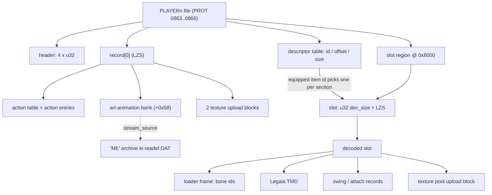
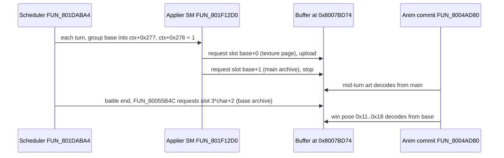

# Player battle files (`data\battle\PLAYER1..4`)

The four player battle files hold everything a party member needs in battle: the mesh pieces for
every item the character can equip, their texture pools and palettes, and the reaction / swing /
art animation records. There is one file per character (Vahn, Noa, Gala, Terra). The game does not
load a finished battle model from them: at battle load it picks one record per equipment slot by
the equipped item id and **assembles** the character from those pieces. A reader cares because
this file - not PROT 1203 or 1204 - is the in-battle pose, mesh and texture source, and because
every equipment-model mod is an edit to it.

The files are the retail `battle_data` CDNAME block (defines `865..868`, extraction entries
**0863..0866**; the `0863/0864_edstati3` filename labels are the
[+2 label shift](cdname.md#numbering-space)). Confidence: **Confirmed** - the framing is pinned
from the loader's disassembly and byte-matched against live battle RAM and VRAM. Per-field
exceptions are marked in the tables below.

## At a glance

| Layer | What it is | Reader |
|---|---|---|
| File header | Four `u32` words at `+0x00` | `FUN_80052770`, `FUN_80052FA0` |
| `record[0]` | LZS stream at `+0x10`: action table, action entries, art-animation bank, two texture blocks | `FUN_80052FA0` |
| Descriptor table | 12-byte `[id, offset, size]` entries at `desc_off`, grouped into five equipment sections | `FUN_80052770` case 4 |
| Slot region | From `0x8000`: one `[u32 dec_size][LZS]` stream per descriptor entry | `FUN_80052770` cases 5..8 |
| Decoded slot | Header + loader frame + Legaia TMD + texture pool | `FUN_800536BC`, `FUN_80053B9C` |



### File header and top-level regions

All offsets are file-relative.

| Offset | Size | Field | Meaning | Confidence |
|---|---|---|---|---|
| `+0x00` | u32 | `desc_off` | Descriptor-table offset. Also reads as a type-0 streaming chunk header `(0x00<<24)\|size`, which is how streaming-format walkers skip the head | Confirmed |
| `+0x04` | u32 | `clut_a_off` | Offset of texture block A inside `record[0]`'s **decoded** output | Confirmed |
| `+0x08` | u32 | `clut_b_off` | Offset of texture block B inside `record[0]`'s decoded output | Confirmed |
| `+0x0C` | u32 | `budget` | `record[0]` decoded size (LZS output-byte budget) | Confirmed |
| `+0x10` | var | `record[0]` | LZS stream | Confirmed |
| `desc_off` | 12 x n | descriptor table | `[u32 id][u32 offset][u32 size]`, all-zero terminator | Confirmed |
| `0x8000` | var | slot region (`data_base`) | Per-slot `[u32 dec_size][LZS stream]` | Confirmed |

### Decoded slot header

| Offset | Size | Field | Meaning | Confidence |
|---|---|---|---|---|
| `+0x00` | u32 | `frame_off` | Self-relative offset of the loader frame: `0x14 + 4*attach_obj_count` | Confirmed |
| `+0x04` | u32 | `swing_rec_a` | Self-relative offset of the section's swing action record (sections 2..4; `0` in 0/1) | Confirmed |
| `+0x08` | u32 | `swing_rec_b` | Second swing record; consumed for section 4 only | Confirmed |
| `+0x0C` | u32 | `tmd_body_end` | Where the embedded TMD ends = where the texture pool starts = the decode-buffer advance to the next section | Confirmed |
| `+0x10` | s16 | `attach_obj_count` | Attach-object records (0 / 1 / 2 observed) | Confirmed |
| `+0x12` | u16 | `upload_flag` | Non-zero = the pool is uploaded to VRAM at battle init | Confirmed |
| `+0x14` | u32 x n | `attach_obj_off[]` | Self-relative offsets to attach-object records | Confirmed |
| `frame_off` | var | loader frame | Attach count, bone ids, data size, then the Legaia TMD at frame `+0x0C` | Confirmed |
| `tmd_body_end` | var | texture pool | `[u16 clut_x][u16 clut_n][CLUT][4bpp pixels]` - no TIM header | Confirmed |

Details for each layer follow in file order.

Implementations:
[`battle_char_palette.rs`](../../crates/battle-models/src/battle_char_palette.rs) (the
runtime-pinned `record[0]` + CLUT chain),
[`battle_data_pack.rs`](../../crates/battle-models/src/battle_data_pack.rs) (the slot walker over
the descriptor table) and
[`battle_char_assembly.rs`](../../crates/battle-models/src/battle_char_assembly.rs) (the
battle-init consumer chain). See [Parser status](#parser-status).

## Contents

- [Load chain + index space](#load-chain--index-space)
- [What this file is not](#not-the-monster-archive)
- [File layout](#file-layout)
- [Descriptor table](#descriptor-table)
- [Carrying a weapon into another character's file](#carrying-a-weapon-into-another-characters-file)
- [Slot region](#slot-region)
- [Decompressed slot layout](#decompressed-slot-layout)
- [Battle animations (record[0])](#battle-animations-record0)
  - [Two container encodings, one pose format](#two-container-encodings-one-pose-format)
  - [Swing records](#swing-records-equipment-sections--slots-0xc0xf)
  - [Art-animation bank](#art-animation-bank-record0-0x58)
  - ["ME" stream archives](#me-stream-archives-readefdat)
  - [Facial animation tracks](#facial-animation-tracks-entry-0x8c--0x98)
  - [Equipment-variant track](#equipment-variant-track-entry-0xa4--fun_8004ccd4)
  - [The `+0x5C` word](#the-0x5c-no-reader-sweep)
- [Texture-pool VRAM placement](#texture-pool-vram-placement)
- [Parser status](#parser-status)
- [VRAM byte-match corpus](#vram-byte-match-corpus)
- [CLI](#cli)
- [Open questions](#open-questions)
- [See also](#see-also)

## Load chain + index space

`FUN_80052770` points each party character's asset-table entry at the dev path
`data\battle\PLAYER<n>` (string installs at `0x80052E64..`, `ghidra/scripts/funcs/80052770.txt`)
and opens it through the dual-mode wrapper `FUN_800558FC(path, …, char_id + 0x360)`. The retail
ISO9660 branch is a trap stub on this build, so the load always resolves through `FUN_8003E8A8`
with the **raw in-RAM TOC index** `char_id + 0x360` - extraction entry `char_id + 0x360 − 2` (see
[`prot.md` § In-RAM TOC](prot.md#in-ram-toc)):

| Player | Raw TOC index | PROT.DAT offset | Footprint | Extraction entry |
|---|---|---|---|---|
| Vahn  | `0x361` | `0x36E8000` | 338 sectors (`0xA9000`) | 0863 (`edstati3` label) |
| Noa   | `0x362` | `0x3791000` | 303 sectors (`0x97800`) | 0864 (`edstati3` label) |
| Gala  | `0x363` | `0x3828800` | 222 sectors (`0x6F000`) | 0865 |
| Terra | `0x364` | `0x3897800` |  47 sectors (`0x17800`) | 0866 |

The offsets are the live-traced `FUN_800558FC` reads (see
[`character-mesh.md` § Battle form](character-mesh.md#battle-form---assembled-from-the-player-files))
and equal the TOC `start_lba × 0x800` of extraction 863..866 exactly.

`FUN_80052FA0` is the per-character **assembler**. It LZS-decodes `record[0]` and its sub-records
into the battle party palette (rows 481..483), decodes the five equipment-selected sections, and
builds the character's merged battle TMD from them (`FUN_800536BC` splice ×5 + `FUN_80053898`
post-pass; `FUN_800513F0` registers the result). Full chain:
[`character-mesh.md` § Battle form](character-mesh.md#battle-form---assembled-from-the-player-files);
palette half:
[`character-mesh.md` § Battle render](character-mesh.md#battle-render-load-time-tsbcba-relocation).

<a id="toc-geometry-the-16-mb-misreading"></a>

### TOC geometry

The footprint - the sector gap to the next entry - is the true file size: the slot region **tiles
each file's footprint exactly** (`data_base + last_offset + last_size = footprint` in all four
retail files). Extraction 0865 also has a TOC-indexed window of 7811 sectors (`0xF41800`, about
16 MB) that over-reads across Terra's file (`0x6F000..0x86800`) into 7542 of the monster archive's
7760 sectors (`0x86800..`). An extracted `0865_battle_data.BIN` of that size is therefore Gala's
222-sector file followed by neighbours. Not a "16 MB battle_data container": every structure on
this page sits inside the footprint. The same over-read is why Vahn's file can be reached through
stub entry 0861 at window offset `0x1000` (entries 0859..0862 are 1-sector stubs).

## Not the monster archive

This format is distinct from the [monster stat archive](monster-animation.md) (extraction
**0867**, retail `monster_data` = define 869, parser `legaia_asset::monster_archive`), the
[TIM-pack](tim-pack.md) reader, the [DATA_FIELD streaming format](data-field.md), the
[field-pack](field-pack.md) chunk and the [effect bundle](effect.md).

The monster archive shares the general `[u32 dec_size][LZS] → mesh + texture pool` shape but no
structures:

| | Player battle file | Monster archive |
|---|---|---|
| Slot addressing | Variable-size, through the 12-byte descriptor table | Fixed stride `0x14000`, `slot = (id−1) × 0x14000`, no table |
| Decoded head | Slot header above, TMD behind the loader frame | Monster **stat record** (`+0x00 name_offset`, `+0x0C` HP, `+0x4C` action-offset array) |
| Location | Own footprint | Begins at byte `0x86800` of extraction 0865's over-read window |

Within that window, Gala's descriptor table (`0x6C68`) and slot region (`0x8000..0x6F000`) sit
entirely before the archive.

## File layout

The header and region table is [above](#file-header-and-top-level-regions). Measured per file on
the retail disc:

| File | `desc_off` | `clut_a` | `clut_b` | `budget` | entries | footprint |
|---|---|---|---|---|---|---|
| 0863 Vahn  | `0x55F4` | `0x5E00` | `0x7E04` | `0x9E48` | 54 | `0xA9000` |
| 0864 Noa   | `0x75C4` | `0x76A8` | `0x970C` | `0xB750` | 50 | `0x97800` |
| 0865 Gala  | `0x6C68` | `0x7464` | `0x9488` | `0xB4AC` | 43 | `0x6F000` |
| 0866 Terra | `0x6CAC` | `0x83E0` | `0xA5C4` | `0xC7A8` |  5 | `0x17800` |

`data_base = 0x8000` in all four files; the gap between the table end and `0x8000` is zero
padding. It is **not** header-derived. `FUN_80052770` opens each file with a fixed 16-sector
prologue read - `FUN_800559EC(…, 0x8000)` → `FUN_8003E800(dst, 0x10, 1)` loads the first `0x10`
sectors (header + `record[0]` + descriptor table) before the slot region is streamed - so
`0x8000` is a hardcoded loader constant. `legaia_asset::battle_data_pack` reaches the same base
by probing sector boundaries until every slot's `dec_size` prefix reads sane.

## Descriptor table

At `desc_off`, a chained array of 12-byte entries:

| Offset | Size | Field | Meaning |
|---|---|---|---|
| `+0x00` | u32 | `id` | Equippable item id; `0` = section boundary and the section's default slot |
| `+0x04` | u32 | `offset` | Byte offset of the slot from `data_base` |
| `+0x08` | u32 | `size` | Slot allocation in bytes (sector-aligned) |

The chain invariant `offset[i+1] == offset[i] + size[i]` holds across every entry, and an all-zero
entry terminates the table. Entries group into **sections of descending ids separated by `id = 0`
entries** - Gala (0865):

```
57 56 55 54 53 | 00 | 42 41 40 3f | 00 | 21 20 27 26 25 24 23 22
2b 2a 29 28 33 32 31 30 2f 2e | 00 | 19 18 17 16 15 14 13 | 00 |
69 68 67 66 | 00
```

Terra (0866) carries only five `id = 0` entries - no variant slots.

**The slot ids are equippable item ids** - the [item-name table](item-table.md) id space, the
same ids the [equipment stat table](equipment-table.md) indexes. The five sections are the
character's five equipment slots, in the order of the character record's equipped-item bytes at
`+0x196..+0x19A` (live record base `0x80084708`, stride `0x414`).

`FUN_80052770` case 4 walks the table sequentially with a section counter. Each entry's `id` is
compared against the current slot's equipped-item byte, and `(offset, size)` is captured on a
match. An `id = 0` entry supplies the section's **default** when nothing matched and advances the
section counter (`ghidra/scripts/funcs/80052770.txt`; the `*0x414 + -0x7ff7b762` read is record
`+0x196`).

Vahn's file (0863) carries a body section (`0x43` Hunter Clothes … `0x4A`), a head section, a
weapon section (`0x22` Survival Knife … plus `0xBA`), a Ra-Seru weapon section (`0x01..0x09` Meta
tiers) and a footwear section, each with its `id = 0` fallback. In a full-party battle save with
Vahn wearing Hunter Clothes / Survival Knife / Ra-Seru Meta, the assembled battle mesh's vertex
pools byte-match exactly the `id = 0x43`, `0x22` and `0x01` sections, and the defaults for the
unequipped slots - see
[`character-mesh.md` § Battle form](character-mesh.md#battle-form---assembled-from-the-player-files).

**The section index is not a fixed equipment kind.** Sections 0 (body), 1 (head) and 4 (footwear)
agree across Vahn, Noa and Gala. Vahn and Gala carry generic weapons in section 2 and Ra-Seru
tiers in section 3; **Noa has those two the other way round** (section 2 = Ra-Seru Terra
`$1..$8`, section 3 = the Fangs / Feral / club / nail family). The grouping is measured; why
Noa's differ is not traced (**Unknown**).

### Every section is bone geometry - the item is not its own object

**Equipment is not modelled as a separate object that gets attached.** A section's slot carries
whole **skeleton bone objects**, and selecting it replaces the bare object outright with a
re-authored one that includes the gear. Vahn's right-hand bone (tag 5) across his weapon ids:

| section 2 id | hand object | vertices | primitives |
|---|---|---|---|
| `0` (default) | bare fist | 40 | 52 |
| `0x22` Survival Knife | fist + blade | 71 | 80 |
| `0x33` Great Axe | fist + axe | 73 | 95 |
| `0xBA` Astral Sword | fist + sword | 109 | 157 |

Armour behaves the same way and can make an object *smaller*: Hunter Clothes (`0x43`) takes Vahn's
torso from 79 vertices to 64. It is a re-sculpt, not a layer stacked on the bare body, and a full
endgame set re-authors ten of his fifteen bone objects.

Two readings that look right and are not:

- **A positional set-difference does not find the added geometry.** The equipped hand shares as
  few as **one** vertex position with the bare hand. What does answer "what did this change" is a
  **radius envelope**: the centroid of the bare object's vertices plus its reach, with equipped
  primitives classified by whether their corners fall outside it. That leaves 4-31 primitives
  straddling the boundary per weapon, which really do belong to both hand and weapon.
  Presentation aid
  [`equip_diff`](../../crates/battle-models/src/battle_char_assembly/equip_diff.rs).
- **The `200+` extras are not weapon meshes.** They are usually byte-identical **duplicates** of
  the bone object they attach to, reached only through the equipment-variant track at entry
  `+0xA4`, so drawing one alongside its host z-fights a limb. Usually, not always - see
  [The `200+` surplus](#the-200-surplus-is-a-duplicate-except-when-it-is-not). The `100+` extras
  are ordinary geometry and do draw, on the preceding bone's channel.

### The item is still separable - by palette, not by geometry

The separator is the primitive's **CLUT word** (`cba`): a weapon is drawn from its own palette
column, and across all **81** section-2 / section-3 records **no primitive mixes the two**. The
item is an exact primitive subset of the bone object, selected by material.

Geometry alone does not find it. **Connectivity** splits Gala's and most of Noa's weapons off
cleanly but not Vahn's, which weld to the fist at the grip aperture. What tells the two palette
buckets apart is the **joint**: a TMD object is authored about its own bone origin, so the flesh
half always reaches the origin and the held item never does.

Classes over the 81 held-item records
([`equip_item`](../../crates/battle-models/src/battle_char_assembly/equip_item.rs)):

| Class | Records | Shape |
|---|---:|---|
| `own-object` | 6 | The item is already its own `0xFE` object - retail shipped the split. |
| `separate` | 21 | Own connected component, **zero** shared vertices. Lossless. |
| `welded` | 53 | Palette subset joined at the grip rim; 3-64 shared welded vertices. |
| `fused` | 1 (+51 armour) | No material boundary: the section's whole contribution, item and host together. The one held-item case is Noa's first Ra-Seru armband (single palette across the object). |

A `welded` cut is exact at primitive level but the exported item has an **open grip**: the shaft
inside the closed fist was never modelled, so Vahn's Great Axe comes out with a visibly
interrupted haft. That is a property of the disc; a consumer must say so rather than cap it
silently.

Sections 0 / 1 / 4 (body, head, feet) have **no boundary to cut on**. They carry no surplus object
(`nobj == attach_count` in all 51 records), and their palette buckets split body from trim, not
garment from body. They are not refused: every one of the 51, and the single-palette armband,
exports as `fused` - the section's whole contribution to the assembly
(`AssembledCharacter::section_of`), with the class in the file's root name. That is a policy
choice (completeness over purity). It is keyed on the section rather than on a diff against the
bare model, because a section can be geometrically identical to the default and differ only in
its texture pool (Noa's Green Robe is her starting robe).

Over all 132 equipment records: `own-object` 6, `separate` 21, `welded` 53, `fused` 52.

### The item alone - an opinionated cut with a committed rule table

"Give me just the great axe" has **no exact answer on the disc**: the section re-authors the whole
hand object, and nothing says which primitives are the axe and which are Vahn's wrist strap
(which the palette cut, being about material, claims as item). The item-alone export is therefore
a stated **policy** plus a committed per-record override table, and every result says whether a
rule touched it
([`equip_isolate`](../../crates/battle-models/src/battle_char_assembly/equip_isolate.rs), table
`crates/battle-models/data/equip-isolation.toml`).

The policy: **the item is everything the section spliced in that is not the character's own flesh
or an unchanged piece of them.** "Unchanged" is read two ways, chosen per section:

| Sections | Reading | Body = |
|---|---|---|
| headgear (1), held items (2 / 3) | **colour diff** | a primitive whose sampled texels mostly (`>= 0.5`) reappear, within one 5-bit step per channel, in what the *bare* counterpart object samples. The bare hand and head are exactly "no item". |
| body (0), footwear (4) | **identity** | a primitive the bare object also carries with the **same corner positions and colours**. The bare torso and legs are the default *outfit*, not "nothing" - by colour alone a dark robe would be body because the default robe is dark. |

Both readings are backed by a skin test on the primitive's texels. Either the generic peach band
(`>= 0.6` of texels: `r > g > b`, `r >= 17/31`, hue 8-45 degrees, saturation 0.2-0.68 - narrow
enough that wood, leather and gold stay out), *or* the character's **own** face colours (`>= 0.45`
of texels within two 5-bit steps of a warm texel of the bare head object; Gala's skin is too dark
for the generic band). The Ra-Seru forms need it: Meta $7-$9 and Terra $4-$6 re-texture the fist
they leave bare with a palette the bare hand never used. A `200+` surplus that is not a byte copy
is a second copy of the limb, not a second piece of the item, and stays out.

What the heuristic cannot know, the table says, per `(character, id)`: a mode override
(`colour-diff` / `identity` / `whole` / `palette`), palette columns or whole bone-tag objects
forced in or out, and explicit `"tag:ordinal"` primitives (ordinal = the primitive's position in
the object's flat group walk, the numbering `legaia_tmd::mesh::tmd_to_vram_mesh_with_prim_ids`
reports). Each rule carries a note. The cases the table exists for:

- Vahn's five Seals are a circlet on palette column 9 whose plainest two are four dark-metal
  primitives in the hair's shadow colours.
- Noa's robes are authored with two hair strands in the torso object's flesh column.
- Gala's plates cap the neck with quads half skin, half collar interior; his Power Plate is a
  scatter of re-textured primitives over the default plate.
- Gala's Ra-Seru Club and Mace re-author the arm with a plate gauntlet in the same navy as his
  bare wrist band.
- Gala's two headbands are dark leather that the colour diff loses and the identity reading finds.

Every rule must name a record, a column, an object and primitives that exist -
`crates/asset/tests/equip_isolate_real.rs` checks that, and that every one of the 132 records
still keeps something and (for a held item) leaves the hand behind.

The item-alone cut is **not** the disc's answer - the palette cut is, and it stays the
record-keeping export. Whether a full-arm gauntlet, the elbow segment a Ra-Seru grows over, or the
shorts an armour record re-authors are "the item" is a call, and the table is where a different
call goes.

### The grip is inferred: bridging the shaft the fist hid

A welded item leaves the item-alone cut with an open grip: Vahn's Great Axe comes away as an axe
head on a stub of shaft plus a pommel end, each terminating in an open ring of vertices.
[`equip_repair`](../../crates/battle-models/src/battle_char_assembly/equip_repair.rs) infers the
missing stretch:

1. Weld the item-alone mesh by `(object, position)` and walk its boundary edges into closed loops.
2. Pair loops that are the two ends of one straight shaft: **same object**; opening directions
   within ~40 degrees of the line joining the centroids and pointing at each other; mean radii
   within 2x; centroid gap at most 6 mean radii; lateral offset under 0.9 mean radii. The opening
   direction is taken from the geometry *behind* each rim, because the rim itself may be oblique
   (a fist grips diagonally).
3. Loft each pair into a tube by zipping the two rims by angle about the axis. The rim with more
   vertices donates UV / CBA-TSB / colour to every tube vertex.

The result is marked `grip inferred` (with bridge and triangle counts) in the summary, on the page
and in the glTF root name, and only ever touches the item-alone export.

Over all 81 held-item records, nine take a bridge, all Vahn's (`0x22`-`0x24`, `0x2E`-`0x33`: the
axes, maces and the shorter blades); Noa's and Gala's shafts are modelled through the fist. The
rule refuses three things:

- Rims that face **away** from each other are never joined (a Ra-Seru armband is open at both
  ends; a helmet has neck and crown holes).
- A lone rim is never capped - a lid would be a guess about the silhouette.
- Rims on **different** objects are never paired. Not a cross-object grip: Vahn's swords put the
  blade on the hand object and the pommel block on the forearm, both *closed* at the fist, and a
  cross-object rule joins the elbow-facing rims of two Ra-Seru arm plates through the joint.

`crates/asset/tests/equip_repair_real.rs` sweeps the 81 records (only ever additive, every bridge
inside the section's objects, the Great Axe closes). With `LEGAIA_EQUIP_SHEETS=<dir>` it writes a
before / after contact sheet per character through the software rasteriser in
`legaia_asset::mesh_raster`, the renderer that draws the site's per-item cards.

### The `200+` surplus is a duplicate, except when it is not

Across the four files' single-section assemblies, most `0xFF` (tag `200+`) surplus objects are
byte-copies of their attach bone - same vertex pool, same primitive block. **Sixteen are not**:
all of Noa's section-2 records, four of her section-3 ones, and three of Gala's section-3 ones.
In six of those the `0xFF` surplus is the *bare hand* while a `0xFE` extra holds the weapon alone.

So "skip every `200+` object" drops real geometry, and "draw every `200+` object" z-fights a limb.
The test is a byte comparison against the attach bone: `AssembledCharacter::duplicate_objects`.

### Carrying a weapon into another character's file

The loader selects a section by the equipped item id, and each retail file only carries records
for the items its character can equip. A weapon handed to another character through the SCUS
owner mask alone therefore lands on that character's `id = 0` weapon default - the bare hand.
Giving them the model means giving their file a record, and a record is built, not copied
(`legaia_patcher::equip_transplant`; the patcher's `--equip-owner` does it for every weapon it
enables):

1. **Cut.** The weapon's own primitives are cut out of the **donor** record with the
   [item-alone cut](#the-item-alone---an-opinionated-cut-with-a-committed-rule-table) (retail
   prims verbatim, CBA columns remapped onto the target section's CLUT columns -
   `party_swap::weapon_fuse`, the same cut the Delilas swap fuses a host's weapon with).
2. **Merge and re-seat.** They are merged into the **target's** weapon-section default record,
   channel by channel: donor bone `k` of the section maps to target bone `k`. The held-item
   sections are the same three arm bones (upper arm, forearm, hand) in the same order on every
   file, only numbered per skeleton (Vahn `3 4 5`, Noa `7 8 9`). Coordinates do **not** copy
   verbatim - see the re-seat notes below.
3. **Texture.** The donor's section tile rides along as the record's pool, texels no weapon
   primitive samples blanked, under the weapon's palettes installed on the target section's
   columns (`clut_x = 176` for Noa's section 3). Sections 2 and 3 share texpage `0x16` and differ
   only by tile row (`y0 = 0` / `0x80`), so a cross-section transplant shifts the fused prims'
   `v` by 128 and nothing else.
4. **Keep the rest.** The target default's header, loader frame, attach list and swing / attach
   records survive whole (`splice_record_tmd`), with the swing record's `+0x74` set to the donor
   weapon's arm cost.

Re-seating (`legaia_patcher::equip_hand_frame`). Each object is authored about its own bone
origin, but the three skeletons' arm-bone frames differ: the same Short Sword runs along `-Y` in
Vahn's hand frame, `-Z` in Noa's and `(0, +0.5, +0.85)` in Gala's, and the wrist origin sits at a
different point along the shaft (`crates/patcher/examples/hand_frame_fit.rs` measures it). Each
channel's geometry goes through a rigid transform calibrated from the disc:

- Every weapon both files carry (the `any`-owner knives, Short Sword, claws, clubs and axes) is
  cut out of both; its principal frame and far tip are fitted, the roll sign about the shaft is
  chosen by consensus, the translation is refined by a translation-only ICP, and the per-weapon
  transforms are averaged per channel.
- The calibration is **per weapon class**. Noa's clubs run along `(+0.77, +0.33, +0.54)` in her
  hand while her blades run along `-Z`, so a sword transplant calibrates on the shared blades, a
  club on the shared clubs and axes, claws on claws.
- Leave-one-out over the shared blades puts a re-seated blade on the target's own record within
  4-9 GTE units nearest-point RMS (verbatim copying: 22-55), shaft axes within 2 degrees.
- The forearm channel (Vahn's swords keep a pommel block there) calibrates from the claws, which
  occupy the forearm in all three files. A channel with no shared weapon on it is dropped rather
  than guessed, and the report says so.
- The section's `0xFF` variant is a byte copy of the armed hand on every retail weapon record of
  all three files (only the bare defaults ship a differently posed variant), so the transplant
  emits one armed hand and aliases the variant's object-table entry onto it.

The record is appended to the target's weapon section and the file re-packed from `data_base`
with `0x800`-aligned slots (`playerize::rebuild_player_file`). Size is the constraint. Vahn's
Astral Sword record for Noa comes out at 7 sectors, and the retail files tile their footprints
exactly; the optimal LZS parse frees 4 / 2 / 5 sectors in Vahn's / Noa's / Gala's files and none
in Terra's. So the patcher moves the boundaries between PROT entries 863..865 - the loader streams
each file by descriptor offsets from the entry's own start LBA, so a file that grows into its
neighbour's former sectors needs nothing but the TOC word - and, past that pool, parks the records
outside `PROT.DAT` altogether.

#### Parking the records in DMY.DAT

The loader never bounds a player file by its TOC span. `FUN_800558FC` opens the file through
`FUN_8003E8A8`, which sets the CD position from the entry's start LBA and *returns* the span
(`toc[p+3] - toc[p+2]`) - a value the caller discards. Everything after that is offset-driven:

- a fixed 16-sector prologue read (`FUN_800559EC(…, 0x8000)`);
- for the five selected slots, case 5 rewrites each captured offset into the **gap** from the end
  of the previous selected slot (`gap[i] = off[i] - (off[i-1] + size[i-1])`; the first slot's gap
  is its offset from the data base);
- cases 6 / 8 seek by `gap >> 11` sectors (`FUN_80055A5C` → `FUN_8003E964`, a plain add to the
  current LBA), then read `size >> 11` sectors.

Two consequences: the offsets are 32-bit and can reach anywhere later on the disc, and because
the gap is shifted as an unsigned value a selected slot must never sit *before* the previous one -
records stay in chain order.

A rebuilt file that outgrows the pool keeps its first `0x8000` bytes in the PROT entry (header,
`record[0]`, descriptor table) and puts its whole slot region, in chain order, into
[`DMY.DAT`](dmy.md) - developer fixtures no retail code loads, Form 1 sectors, 18,054 of them at
the end of the disc. Every table offset is displaced by the byte distance from the entry's data
base to the annexed region. The entry's old record sectors stay where they were and nothing reads
them.

- `legaia_asset::player_file_annex` tells an annexed table from a retail one (the chain starts at
  a non-zero sector-aligned offset), splits a retail-shaped rebuilt file into the two halves, and
  materialises the retail-shaped file back for every existing parser.
- `DiscPatcher::{annex_player_file, read_player_file, patch_player_file}` are the disc side, with
  a bump allocator whose marker (`LGAX`, version, sectors used) lives in `DMY.DAT`'s last sector,
  so a second patch of an already-annexed disc allocates past the first.
- The image keeps its size, so a PPF carries it.

Verified in PCSX-Redux from a pre-battle save on the patched disc: Noa and Gala both draw the
Astral Sword through the battle with their records streamed from `DMY.DAT`.

What this does **not** unlock: a Ra-Seru level form or a body / head / footwear record is the
donor's whole re-sculpted limb or torso on the donor's skeleton, not an item to seat on the
target's bone (see
[Every section is bone geometry](#every-section-is-bone-geometry---the-item-is-not-its-own-object)),
so those slots still fall through to the target's default record. Terra's file carries no
equipment sections at all.

## Slot region

At `data_base + entry.offset`:

| Offset | Size | Field |
|---|---|---|
| `+0x00` | u32 | `decompressed_size` - LZS output-byte budget |
| `+0x04` | var | [Legaia LZS](lzs.md) stream |

The decoder stops on the output count, not the input length - hand it a generous source slice
rather than truncating to `entry.size`.

## Decompressed slot layout

The header table is [above](#decoded-slot-header). The loader frame at `decoded + frame_off`,
consumed by `FUN_800536BC`:

| Frame offset | Size | Field | Meaning |
|---|---|---|---|
| `+0x00` | u8 | `attach_count` | Objects that bind to skeleton bones |
| `+0x01` | u8 x n | `bone_ids[]` | One bone id per attached object (padded) |
| `+0x08` | u32 | `data_size` | Section data extent (word-copied span) |
| `+0x0C` | - | Legaia TMD | Magic `0x80000002` |
| `+0x14` | u32 | `nobj` | The TMD's own object count |
| `+0x18` | 7 words x nobj | object table | TMD object entries |

`FUN_80052FA0`'s section loop rebases `+0x04` (and, for section index 4 only, `+0x08` - the
`if (1 < iVar3)` / `iVar3 == 4` guards), splices the records into the runtime action table, and
walks `+0x10`/`+0x14` as the attach-object list (`ghidra/scripts/funcs/80052fa0.txt`). Each
attach-object record's `+0x07` byte is its **attach key**, matched against action-entry `+0x77`
bytes (see [Swing records](#swing-records-equipment-sections--slots-0xc0xf)). `frame_off` is
`0x14 + 4 * attach_obj_count` across the whole retail corpus (`0x14` / `0x18` / `0x1C`). Not
"nested-section end offsets" at `+0x04`/`+0x08`, and not texture format tags at `u32[5..6]`: byte
runs such as `06 09 0a 0b | 0c 0d 0e 00` there are the attach count and bone ids (6 attached
objects on bones 9..14 - a footwear section).

`FUN_800536BC` reads one bone-id byte per object while `obj_index < attach_count`, then tags the
surplus objects `0xFF` / `0xFE`: `0xFF` is the per-clip swap variant and `0xFE` an extra animated
part (see [Equipment-variant track](#equipment-variant-track-entry-0xa4--fun_8004ccd4) and
[`character-mesh.md` § Battle form](character-mesh.md#battle-form---assembled-from-the-player-files)).

An unflagged slot's pool bytes (`upload_flag == 0`) are dead: the next section's decode overwrites
them in RAM before they reach VRAM.

**The assembled objects are effect-read, not only drawn.** The Spirit charge's streamer effect
samples authored **vertex indices** of specific objects (on Noa's retail assembly, the hair part's
49 vertices and the `0xFE` weapon extra's 56), pinned live by content-diffing the charge's GPU
display list between a clean and a glitched tick on retail and patched discs. A rebuild that ships
a zero-vertex object in one of those slots feeds the streamer reads from whatever bytes follow the
empty pool, and the effect's trail fan anchors off-model. A prim-less object with a real vertex
pool (all vertices at the object origin, so the part's pose channel seats them on its socket)
satisfies the reads while drawing nothing.

The post-TMD pool has no PSX TIM image-block headers. It is one upload block in the
`FUN_80053B9C` frame, `[u16 clut_x][u16 clut_n][clut_n × u16 BGR555][w*h halfwords 4bpp pixels]`.
The CLUT struct is the same `[base][count][colours]` shape the palette chain STP-copies to VRAM
rows 481..483; that RAM-side path is decoded in
[`character-mesh.md`](character-mesh.md#battle-render-load-time-tsbcba-relocation) and ported as
`legaia_asset::battle_char_palette`. Placement:
[Texture-pool VRAM placement](#texture-pool-vram-placement).

## Battle animations (record[0])

`record[0]` (the LZS stream at file `+0x10`, decoded to `budget` bytes) is more than the
battle-palette chain. Its layout:

| Offset | Field | Meaning | Confidence |
|---|---|---|---|
| `+0x00..+0x2C` | action-offset table | 12 populated `u32` slots, each the offset of an action entry | Confirmed |
| `+0x58` | art-bank offset | Self-relative; rebased to absolute at load. See [Art-animation bank](#art-animation-bank-record0-0x58) | Confirmed |
| `+0x5C` | paired word | Rebased with `+0x58`; equals `clut_a_off − 4`. No reader ([sweep](#the-0x5c-no-reader-sweep)) | Confirmed vestigial |
| below `clut_a_off` | action entries + art bank | The battle-persistent region | Confirmed |
| `clut_a_off` | texture block A | Upload block, rect `(0x20, 0x80, 0x20, 0x80)` | Confirmed |
| `clut_b_off` | texture block B | Upload block, rect `(0x60, 0x00, 0x20, 0x80)`; ends at `budget` | Confirmed |

**Only the region below `clut_a_off` is battle-persistent.** The member init decodes `record[0]`
into a single `0x19000`-byte allocation, uploads the two image blocks, then LZS-decodes the five
equip-section sub-records *sequentially into the same buffer starting at `clut_a_off`* (cursor
advancing per section - the walk `legaia_asset::battle_char_palette::parse_record` mirrors).
Everything from `clut_a_off` on is load-time scratch. Anything that must stay readable per frame
lives below it, and an edit that adds such data must grow that region (shifting `clut_a_off` /
`clut_b_off` / `budget` and the paired `+0x5C` word up), never borrow payload space above it.

### Action entries

The table's entries are the character's **battle action-animation records**, the same per-action
entry family as the monster archive's ([`monster-animation.md`](monster-animation.md)). The entry
header is `0xAC` bytes:

| Entry offset | Field | Meaning |
|---|---|---|
| `+0x00` | action tag / power run | Tag equals the slot index in `record[0]`; on swing and art entries `+0x00..+0x03` is the per-strike power run |
| `+0x04` / `+0x08` | attach pointers | `0` on disc; written by `FUN_80052FA0`'s attach-key scan |
| `+0x10..+0x13` | event-frame list | The clip's hit events ([monster-animation.md](monster-animation.md#event-frame-list-entry-0x100x13)) |
| `+0x14..+0x53` | effect script | Per-frame visual-effect placement records `FUN_801DEA50` walks ([monster-animation.md](monster-animation.md#effect-script-records-entry-0x140x53)) |
| `+0x77` | attach key | Matched against equipment attach records; also the runtime clip-identity byte |
| `+0x78` | rate | Playback rate (`FUN_80047430` cursor) |
| `+0x84` | loop count | Times the clip replays frames `[+0x85, +0x86]` |
| `+0x88` | stream pointer | `0` on disc; pointed at the stream at load / commit |
| `+0x8C` | eye track | Four 3-byte records ([Facial animation tracks](#facial-animation-tracks-entry-0x8c--0x98)) |
| `+0x98` | mouth track | Four 3-byte records |
| `+0xA4` | variant windows | Two `[start, end]` pairs ([Equipment-variant track](#equipment-variant-track-entry-0xa4--fun_8004ccd4)) |
| `+0xAC` | keyframe stream | `[u8 part_count][u8 frame_count][9-byte TRS records]` (the monster entries keep theirs at `+0x8C`) |

Slot 0 is the neutral **idle** loop; its frame 0 is the combat-stance rest pose that sockets the
assembled battle mesh. The effect-script region carries per-footfall dust on the walk entry,
impact flashes on the reactions and per-swing sparks on the equipment records; it is shared by the
swing records and the art-bank entries.

### Runtime action table

The runtime table (rebased copies at `0x801C9360 + slot*4`, built by `FUN_80052FA0`) is wider than
the 12 disc words:

| Slots | Source | Notes |
|---|---|---|
| `0x00..0x0B` | `record[0]` entries | Reactions, idle, block |
| `0x0C` / `0x0D` / `0x0E` | Swing records spliced from equipment sections 2 / 3 / 4 | Direction-command swings L / R / D |
| `0x0F` | Section 4's second swing record | Direction-command swing U |
| `0x10` / `0x11` | **Dynamic** | `FUN_8004AD80` materialises an art-bank record for any staged id `>= 0x10` |

The four direction-command swings use the same byte values the Tactical-Arts command queue stages
as anim ids, so they are **per-equipment animations**. For a dynamic slot the anim commit loads
the record's keyframe stream into a scratch buffer and rewrites the queued id to the slot number.

**Populated slots** (asserted by the disc-gated `player_action_table_real` test): all four
characters carry entries `0..0xB` with `action_tag == slot`. Vahn / Noa / Gala have decodable
streams at `{0,1,2,3,4,5,7,8,9,11}`, Terra at `{0,1,2,3,4,5,9,11}` (her 7/8 entries exist but hold
empty streams). **Entry 6's stream is empty in all four files.** That is expected: retail's idle
anim id is `0` (the SM stages `+0x1DA = 0`), and the `FUN_801D5854(actor, 6..9)` calls are a
separate camera/presentation program space - id 6 never reaches the anim system.

The slot semantics are the **action-tag space** (see
[`monster-animation.md` § Action tags](monster-animation.md#action-tags-and-the-0x1ef-reaction-map)):

| Tag | Clip |
|---|---|
| `0` | idle |
| `1` | walk / approach (staged by the attack band's party arm) |
| `2` / `3` | light flinches |
| `4` / `5` | knockdown / get-up |
| `7` / `8` / `9` | ready / recover / defeat (staged by the SM and the `FUN_8004AD80` end-of-clip chains) |
| `0x0B` | block |

Attack swings do **not** come from these entries: they come from the equipment-spliced slots
`0xC..0xF` and the dynamic art slots. The engine plays the hit-reaction family through
`engine-core::World::queue_battle_reaction` (the `FUN_800402F4` staging rule) and keeps the SM
pose ids on their same-numbered entries (`apply_battle_pose`; idle maps to entry 0).

`part_count` equals the character's **skeleton bone count** (15 Vahn / 16 Noa / 15 Gala / 17 Terra
- the assembled mesh's `nobj` minus its equipment extras). Channel `i` drives assembled object `i`
(post-sort, object index == bone tag), and the extras ride their attach bone's channel through the
assembled blob's side tables. The retail consumers are the battle render node's update
`FUN_80047430` → `FUN_8004AD80`: the node's `+0x4C` anim context is one of these entries, the
loader rewrites the in-RAM action table to absolute pointers and points the entry's `+0x88` at
`entry + 0xAC`. In a full-party capture every party slot's anim context sits at
`record0_image + action_table[0]` and the whole idle stream byte-matches the disc decode
(`crates/engine-shell/tests/battle_party_pose_live.rs`).

**The PROT 1203 ANM bundle is not the battle pose source.** No 1203 record is resident in battle
RAM, and its banks are authored against PROT 1204's own object order (see
[`character-mesh.md` § Assembly](character-mesh.md#assembly---object-local-pieces-posed-by-the-characters-own-battle-streams)).

Parsers: `legaia_asset::battle_char_assembly::{decode_record0, battle_animations,
idle_battle_animation, expand_animation_for_objects, swing_battle_animations, art_animation_bank,
art_me_archive, art_animation}`. The stream decode is shared with `legaia_asset::monster_archive`;
the `"ME"` archive and codec live in `legaia_asset::me_archive`.

### Two container encodings, one pose format

A character's clips reach the same decoder through two containers that encode them differently,
and the difference decides what an edit costs.

- **Inline in `record[0]` - raw.** Every entry the action-offset table points at carries its
  stream **verbatim** at `+0xAC`: `[u8 parts][u8 frames]` then `parts * frames` 9-byte TRS
  records, exactly `2 + parts * frames * 9` bytes. Its own head is the only length there is.
  Entries are laid end to end (word-aligned) in the decoded block, and the retail splice
  `FUN_800557B8` copies `(parts*frames*9 + 5) >> 2` words after the `0xAC` header, which pins the
  same arithmetic from the code side. No size field, no flag, no compression at this layer - the
  block's own LZS is the only encoding. This covers the reaction family, the idle and the spliced
  [swing records](#swing-records-equipment-sections--slots-0xc0xf).
- **In a `readef.DAT` `"ME"` body - channel-delta.** An art record's stream is an archive body
  whose size word carries a bit-15 compression flag. Every player-art body on the retail disc has
  that bit set, so it is delta-coded per 12-bit channel by `FUN_8002A9CC` (see
  [`"ME"` stream archives](#me-stream-archives-readefdat)).

Both decode to the same `[parts][frames][9-byte TRS]` bytes and the same absolute-model-space pose
model
([`monster-animation.md` § Packed stream](monster-animation.md#packed-stream-entry-0x8c)), so the
two are interchangeable **after** decoding and not before. A raw inline stream can be rewritten
byte-for-byte in place - hold `parts` and `frames` and every later offset in the block stays
valid. A `"ME"` body has to be re-encoded, and its encoded length is a property of the content
rather than of the pose count.

### Swing records (equipment sections → slots 0xC..0xF)

Each selected section's decoded payload carries self-relative offsets to its swing record(s) at
`+0x04` (and `+0x08` for section 4). A swing record is a standard [action entry](#action-entries).
The splice helper `FUN_800557B8` pins the shape: it copies `0x2B` words (`0xAC` bytes) of header
plus `(parts*frames*9 + 5) >> 2` words of stream into the persistent buffer. `FUN_80052FA0`
installs the copy at action-table word `0x28 + section*4` (slot `0xC + section − 2`; section 4's
`+0x08` record at word `0x3C` = slot `0xF`) and points the entry's `+0x88` at `entry+0xAC`
(`80052fa0.txt` / `800557b8.txt`).

Disc census (every equippable id in every file, disc-gated `swing_anim_real` test):

- Sections 0/1 carry `0` in both words.
- Every section-2/3/4 slot carries a valid record at `+0x04` (and section 4 at `+0x08`), with
  `parts` = the character's skeleton bone count (up to +2 channels on slots with attach objects)
  and the stream end inside the section footprint.
- The record's `+0x00` byte is **not** the runtime slot and not a class id. It sits in the entry
  head the art bank uses for the per-strike power run, and the observed band (`0x0E..0x1F`) lies
  inside that power encoding
  ([art-data.md](art-data.md#damage-power-byte---pinned-to-record0-0x24)).

Sections with `attach_obj_count > 0` additionally carry attach-object records. `FUN_80052FA0`
matches each attach record's `+0x07` attach key against the action entries' `+0x77` bytes (then
the art bank's `+0x9B` keys) and links the attach copy into the matching entry's `+0x04`/`+0x08`
pointer pair (copy helper `FUN_80055854`). The copy helper pins the record's shape, because its
length is discovered by walking rather than read from a header:

```text
[word][word][u32 outer_count]
  outer_count × ( [word][word][u32 pair_count] + pair_count × 2 words )
```

Everything is word-granular. Both counts are treated as **signed** (a negative count copies
nothing rather than wrapping), source and destination strides are identical, and no pointer inside
the copied bytes is relocated - it is a plain `memcpy` whose extent the two nested counts define.
`pair_count` is doubled before the copy, so it counts **pairs**, not words. The helper returns the
advanced destination pointer, which the caller uses as the bump allocator's new high-water mark.

Parser: `legaia_asset::battle_char_assembly::swing_battle_animations` (slots `0xC..=0xF` for a
given equipped-id set).

### Art-animation bank (record[0] +0x58)

The self-relative word at `record[0]` `+0x58` locates the bank: `[u32 count]` then `count`
`0xD0`-stride records starting at `bank + 4`. Each record is a `0x24`-byte arts-matcher head plus
a standard `0xAC`-byte action entry (`0x24 + 0xAC = 0xD0` exactly):

| Record offset | Size | Field | Meaning |
|---|---|---|---|
| `+0x00` | u8 x 0x0A | `combo` | Arts-matcher direction commands (1..4), zero-terminated; empty on the base records |
| `+0x0A` | u8 | `stream_source` | Entry index into the character's `"ME"` archive (the `FUN_8002B28C` third argument) |
| `+0x10` | char x 20 | `name` | Inline art name (NUL-terminated ASCII); empty on base / un-named records |
| `+0x24` | 0xAC | action entry | The standard header - fields below are record-relative |
| `+0x24` | u8 x n | `power[]` | Per-strike power run, indexed by `FUN_801EC3E4` with the strike cursor (actor `+0x1F4`); run length = the entry's event-frame strike count. `0x16..0x1F` on named arts is the UDF/LDF power encoding ([art-data.md](art-data.md)); `0` on base records |
| `+0x28` / `+0x2C` | u32 | attach pointers | `0` on disc; written at runtime by the attach-key scan |
| `+0x9B` | u8 | `attach_key` | Entry `+0x77`. Matched against equipment attach records; also the clip-identity byte per-clip effect triggers compare (`FUN_8005112C` weapon trail, `FUN_8004CE2C` impact freeze/tint arms) |
| `+0x9C` | u8 | `rate` | Entry `+0x78`. Playback rate |
| `+0xA8` | u8 | `loop_count` | Entry `+0x84`. `FUN_8004AD80` → actor `+0x21B` and `+0x176<<4`; `FUN_80047430` does the wrap. `0xFF` marks the base-archive records. Parser field `ArtAnimRecord::rate_alt` |
| `+0xAC` | u32 | `stream_ptr` | Entry `+0x88`. `0` on disc; pointed at the decoded scratch buffer at commit |
| `+0xB0` | u8 x 12 | eye track | Entry `+0x8C` |
| `+0xBC` | u8 x 12 | mouth track | Entry `+0x98` |

Entry `+0x84` is **not** a rate: the rate is `+0x78`, and `0` here would freeze a clip while `0`
is what most playable art records carry.

`FUN_8004AD80`'s install arithmetic pins the bank head: `q*0xD0 + bank + 4 − 0xCDC` =
`bank + 4 + (q−0x10)*0xD0 + 0x24` (entry), name read at `−0xCF0` (record `+0x10`), stream-source
byte at `−0xCF6` (record `+0x0A`). `FUN_80052FA0`'s attach scan reads the keys at
`bank + 4 + k*0xD0 + 0x9B` (`8004ad80.txt` / `80052fa0.txt`).

A staged anim id `q >= 0x10` selects record `q − 0x10`:

| Staged id | Installs at slot | Evidence |
|---|---|---|
| `0x11..=0x19` (plain base ids) | `0x10` | `_li s2,0x10` at `0x8004B724`, the default |
| `0x10` | `0x11` | `li s2,0x11` at `0x8004BB58` |
| `0x1A` | `0x11` | `_li s2,0x11` at `0x8004B76C` |
| `>= 0x1B` (art constants) | `0x11` | `_li s2,0x11` at `0x8004BBC0` |

Ids `> 0x1A` also drive the HUD art-name display from `+0x10` and `FUN_8004C650(char, id − 0x1B)`.
Retail banks: Vahn 33 / Noa 35 / Gala 32 / Terra 9 records; the named band (records 11+) carries
the Hyper/Miracle Art names (`Vahn Rondo`, `Fiery Miyawaki`, `Mirage Lancer`, …).

Parser: `legaia_asset::battle_char_assembly::art_animation_bank` (+ `art_animation` to resolve a
record's keyframe stream through its archive).

### "ME" stream archives (readef.DAT)

An art record's keyframe stream is **not inline** in the player file. `FUN_8004AD80` calls
`FUN_8002B28C(_DAT_8007BD74, scratch, stream_source)`, and `_DAT_8007BD74` is the battle side-band
**streaming buffer**: `FUN_801F17F8` fills it with one `0x10800`-byte slot of
`data\battle\summon.dat` / `readef.DAT` ([`summon-readef.md`](summon-readef.md)). The player art
archives live at the head of the **`readef.DAT`** (extraction PROT 894) slots:

| Character | Main archive (named arts) | Base archive (`loop_count = 0xFF`) |
|---|---|---|
| Vahn  | slot 1 (17 entries) | slot 2 (8) |
| Noa   | slot 4 (18) | slot 5 (8) |
| Gala  | slot 7 (19) | slot 8 (8) |
| Terra | slot 10 (1) | slot 11 (8) |

That is slots `3*char + 1` / `3*char + 2`; slot `3*char` is the group's non-ME texture slot.

Archive layout (reader `FUN_8002B28C`, `8002b28c.txt`):

| Offset | Size | Field |
|---|---|---|
| `+0x00` | 2 | Magic `'M' 'E'` |
| `+0x02` | u8 | `count` |
| `+0x03` | u16 x count | `entry_sizes[]` - bit 15 = compressed, low 15 bits = size |
| `+0x03 + 2*count` | var | Concatenated bodies, in entry order |

A clear bit 15 means the body is the packed keyframe stream verbatim. A set bit 15 routes through
the **channel-delta codec** `FUN_8002A9CC` (`8002a9cc.txt`):

- header byte `(b0 & 0xC0) == 0x40`; u16 offsets at `+1` / `+3` to a 4-bit operand stream and a
  byte stream (`[parts][frames]` + literal low bytes); selector bits at `+5`;
- per 12-bit channel value the selectors choose a literal, a previous-part delta ± nibble, or a
  literal nibble;
- frame 0 accumulates spatially down the parts, later frames temporally per channel;
- each frame row re-packs into the standard 9-byte TRS records.

**Every** art entry on the retail disc has bit 15 set, so the codec is the exercised path. Decoded
output is validated across the full corpus: every stream is length-exact (`2 + parts*frames*9`)
with `parts` == the character's skeleton bone count.

Parsers: `legaia_asset::me_archive` (`parse` + `decode_channel_delta`) and
`legaia_asset::battle_char_assembly::art_me_archive` (the readef slot slicing);
`legaia_asset::summon_readef` classifies these slots as `SlotKind::MeArchive`.

#### Which archive is resident

The main-vs-base pick is **per battle phase, not per record**. The resident `*0x8007BD74` buffer
holds one `0x10800` slot at a time, and which archive is resident when `FUN_8004AD80` commits
decides the read.



- **Main archive (`3*char+1`) - resident during turns.** Every scheduled turn the initiative
  scheduler `FUN_801DABA4` writes the acting entity's group base into `ctx+0x277` and kicks the
  applier SM `FUN_801F12D0` (`ctx+0x276 = 1`). The group base is `3*(char−1)` from `DAT_8007BD10`
  for a party actor and `3 * monster_record[+0x1C]` (the monster's readef group byte) for an
  enemy; an AI-delegated party attacker substitutes the delegate's group. The SM requests slot
  `base+0`, uploads it, requests slot `base+1`, and **stops there for readef groups** (the stage-4
  tail resets the SM unless bit 7 is set or `base == 0x36`).
- **Base archive (`3*char+2`) - resident at battle end.** The battle-end arms request it directly
  through `FUN_80055B4C` (one slot, bypassing the group SM): the scheduler's no-living-enemy
  branch and the battle-action SM's victory arm (`FUN_801E295C`, which first re-rolls `ctx+0x13`
  onto a living party member). The victory sequencer then stages the win poses - ids
  `0x11..=0x18` = bank records 1..8, exactly the eight `loop_count == 0xFF` records with
  `stream_source` `0..=7` in all four retail files.

The exact cover observable on disc (the eight base records' sources = `0..=7`; the remaining
records' max source = the main archive's `count − 1`) is the consequence of this phase split, not
a per-record selector. Decomps `overlay_battle_action_801daba4.txt`,
`overlay_battle_action_801e295c.txt`, `overlay_muscle_dome_801f12d0.txt`, `80055b4c.txt`.

Two live-measured consequences:

- The scratch is **one shared buffer** (`FUN_8004AD80` passes the same gp-relative pointer to
  every materialise; `0x800E7EA0` in the battle captures), so a later commit by any actor
  overwrites it under a still-playing clip.
- The **Spirit charge** stages the base-archive record `0x11` *mid-battle*, outside the window the
  base archive is resident in, so its commit routinely decodes **main-archive entry 0** under the
  record's own 59-frame metadata and `[+0x85, +0x86)` loop window. Retail does this too (scratch
  header read live on a retail disc mid-charge) and tolerates it because the loop rows land in the
  aliased stream's own hold section. Rows past the decoded body read whatever the scratch last
  held, and a never-written tail is zeros - an all-zero pose row seats every part on the model
  origin, which the charge close-up camera sits on. Consumers that re-author these archives must
  keep every row the loop window can address inside decoded data (the party swap clamps
  `+0x85`/`+0x86` to the aliased stream - see [`randomizer.md`](../tooling/randomizer.md)).

### Facial animation tracks (entry `+0x8C` / `+0x98`)

Two fields of the `0xAC` action-entry header are per-clip **facial keyframe tracks**:

| Entry offset | Track | Shape |
|---|---|---|
| `+0x8C` | eyes | Four 3-byte records `[frame_id, start, end]` |
| `+0x98` | mouth | Same shape |

The consumer is the per-frame facial animator `FUN_8004C7B4`, called from the render-node update
`FUN_80047430` with the node's `+0x68` anim cursor (in integer keyframes) as the frame counter,
for every party member except Terra (char index 3 is skipped). The eye/mouth identity is pinned
visually from battle captures: the `+0x8C` frames are the wide two-eye band (frame 1 a narrowed
blink) and the `+0x98` frames the closed / open mouth shapes.

**Activity rule.** A record is active while `start <= clip_frame <= end` (`end != 0`, counter
clamped at `0xFE`). Its `frame_id` selects a face frame from the static per-character SCUS tables:

| Table | Address | Shape |
|---|---|---|
| Eye-frame source x/y | `DAT_80076824/26` | Stride 4, eight frames per character, char stride `0x20` |
| Mouth-frame source x/y | `DAT_80076884/86` | Six frames per character, char stride `0x18` |
| Eye rect sizes + per-character destination offsets | `DAT_800768CC` | |
| Mouth rect sizes + destination offsets | `DAT_800768E4` | |
| Per-slot origin deltas | `DAT_800768FC/FE` | 3 slots - the member band origins `(0x200 + p*0x80, 0x100)` |

No active record selects frame 0 (the neutral face); when no record is active the neutral frame is
re-stamped instead. That is the steady state: the **idle entries' tracks are empty in all four
retail files**, and the eye/mouth records live on the flinch / knockdown / recover / defeat and
equipment-swing entries. Character-record word `+0xF8` flag `0x2000` - ability-bitfield (`+0xF4`)
bit 45, the Rage passive (Evil Medallion) - forces the neutral mouth frame.

Each stamp is a libgpu `MoveImage` (`FUN_80058490`) from the frame strip (parked in the
character's texture band by the normal pool uploads) onto the live face rows of section 1's rect.
Vahn in band slot 0: eyes `(544,384) 15x17 → (512,272)`, mouth `(544,452) 7x16 → (516,298)`,
re-stamped every frame (live-traced across a battle entry with
`autorun_battle_moveimage_trace.lua`). Not a one-shot at init: the animator is paused during a summon
cast, so a trace taken mid-cast shows no stamps. This is the ~220-byte face-row difference a captured VRAM
band shows against the pool default; a character whose stamped frame equals the pool default (Noa
in the catalogued captures, Terra always) shows none.

**Art clips** read the same two offsets through a different entry. `FUN_8004AD80` installs the
art-bank record's embedded entry (bank record `+0x24`) as the slot `0x10`/`0x11` pointer, so the
track reads land at bank record `+0xB0` (eyes) / `+0xBC` (mouth). The art clips are face-rich:
32 of 33 Vahn, 33 of 35 Noa and 30 of 32 Gala bank records carry non-empty tracks; Terra's nine
are all empty.

**Victory-celebration override.** During the battle-end celebration the mouth source switches.
`FUN_8004C7B4`'s override branch gates on four conditions:

1. the battle-end signal `DAT_8007BD71 == 0xFE` (the SM's `0x5A` monster-wipe arm / `0x66` escape
   teardown);
2. the victory sequencer `FUN_8004E568` running (phase halfword `ctx+0x6CE != 0`);
3. the celebration flag `DAT_8007BD60` bit `0x80` (set by the sequencer's asset-load step,
   explicitly cleared on a party wipe, never set on an escape);
4. the actor's last-staged anim id `actor[+0x1DB]` in `0x11..=0x18` - the staged **win pose**, an
   HP-tier pick from the per-character id tables at `DAT_800788A0/A2/A4` (a held debug pad combo
   on `_DAT_8007B850` substitutes any of `0x11..0x18` directly).

Inside the window the mouth pass walks **sixteen** 3-byte records from the static table at
`0x80077E80`, indexed `char*0x180 + staged_id*0x30 + i*3` with the *raw* band byte. The addressed
rows start at `+0x330`; char stride `0x180` is exactly 8 bands × `0x30`, so the 24 rows tile
contiguously. The frame counter for both passes (the eye pass still reads the entry's `+0x8C`
records) becomes the global victory counter `gp[+0x9EA] >> 1`, reset to 0 when the sequencer
stages the win pose and still clamped at `0xFE`; its per-frame incrementer is not in the dumped
corpus. The record shape and mouth-frame indexing are unchanged. The retail rows only ever select
non-neutral in-range mouth frames, some held to end `0xFF` - the win-quote mouth flap.

**Port.** `legaia_asset::face_anim` carries:

- the track parser (`FaceTracks` / `battle_face_tracks`; the swing entries' tracks ride on
  `battle_char_assembly::SwingAnimation::face`, the art-bank embedded entries' on
  `ArtAnimRecord::face`);
- the SCUS table parsers (`FaceFrameTables::from_scus`; the override table as
  `ArtMouthTables::from_scus` with an `ArtMouthTables::track` lookup keyed by the staged id);
- the retail stamp selection (`FaceFrameTables::stamps` / `stamps_with_art_window`, which takes
  the override track and the raw victory counter and applies the `>> 1` and the clamp).

Both play hosts (the native play-window and the browser play page) register each assembled
member's tracks and re-stamp the current eye/mouth frame per tick through
`legaia_tim::Vram::move_image` (the `MoveImage` port), keyed by the playing clip's `action_id` and
keyframe cursor. A staged id `>= 0x10` selects the art-bank record's embedded tracks, every other
id its action slot's. The override window opens on gate 1 (the world's `battle_end` latch mirrors
the `0xFE` signal) while a member still plays a dynamic-art-slot clip, and clocks a per-member
`gp+0x9EA` mirror from 0; gates 2 and 3 are not consulted by the stamp tick, so "the won battle is
still on screen" stands in for them.

Disc-gated validation: `crates/asset/tests/face_anim_real.rs` (table anchors; track census over
`record[0]`, swing and art-bank entries; override-table census - 40 live records, in-range
non-neutral frames, the empty rows where retail has no flap, in-band stamps for every reachable
counter) and `crates/engine-shell/tests/battle_face_stamp_live.rs` (live battle VRAM holds a
byte-exact stamped frame at the documented rects).

### Equipment-variant track (entry `+0xA4`) + `FUN_8004CCD4`

The last 8 bytes of the `0xAC` action-entry header are a third per-clip track: two 2-byte
`[start_frame, end_frame]` windows per **variant pair**.

| Entry offset | Field |
|---|---|
| `+0xA4` / `+0xA6` | Pair 0, windows 0 and 1 |
| `+0xA8` / `+0xAA` | Pair 1, windows 0 and 1 |

A window is active while `start <= clip_frame <= end` with `end != 0` - the facial tracks'
activity rule without the `frame_id` byte. The consumer is `FUN_8004CCD4`, called back to back
with the facial animator from `FUN_80047430` under the same guards (party render slots, Terra
skipped, animator not paused). It is a **mesh swap, not a texture stamp**: it writes Legaia-TMD
object pointers into the render node's per-channel model table (`*(node+0x44) + 4 + channel*4`,
the array the draw pass `FUN_80048A08` hands to `tmd_render` once per animation channel).

The swappable objects are the sections' **surplus objects** (`nobj` larger than the loader frame's
attach count). The splice `FUN_800536BC` tags each section's surplus `0xFF` (the first) / `0xFE`
(the rest); the post-pass `FUN_80053898` then retags:

| Tag | Retagged into | Post-sort position | Role |
|---|---|---|---|
| `0xFE` | `0x64` band | Directly after the skeleton bones | *Extra animated part*, driven by the extra stream channels that exist only in its own section's swing streams (the "+2 channels"). The pair ordinal (count of `0xFF` objects seen so far) is recorded at `ctx+0x240+slot` |
| `0xFF` | `0xC8` band | Table indices `nobj−2` / `nobj−1`, past every drawn channel | **Never rendered directly.** The preceding object's bone tag is appended to the side table at `blob+nobj` - the variant's attach-bone channel |

At registration `FUN_800513F0` snapshots, per party slot, the two attach-bone channel indices
(`ctx+0x23A`/`+0x23B`) and the default-vs-variant object-pointer pairs (`ctx+0x1030..0x103C`:
default = the bone's own object, variant = the `0xFF` object at `nobj−2`/`nobj−1`). Per frame
`FUN_8004CCD4` picks which pointer sits in each attach channel:

- **Extra-channel escape.** If the playing stream's part count (first byte at `*(entry+0x88)`)
  differs from the idle stream's, the clip is one of the extra-channel swings: the pass
  force-installs the variant of the pair recorded at `ctx+0x240` and returns.
- **Window test.** Otherwise the `ctx+0x240` pair is pinned to its default and every other pair
  follows the entry's `+0xA4` windows - variant inside a window, default outside.

The arts motion-trail renderer `FUN_80049348` re-runs the pass per after-image ghost (history
entries whose staged-anim-id byte, the actor `+0x1FB` ring, is `> 0x10`) with the ghost's
historical cursor (`+0x17A` ring) and entry (`+0x234` ring), so each translucent trail copy shows
the variant state of its own frame.

Retail census: live `+0xA4` windows exist **only in Noa's file** - her reaction entries
1..5/7..9, 28 of her 35 art-bank records (every named art, e.g. `Vulture Blade` frames 3..47) and
her swing records. Vahn / Gala / Terra carry all-zero windows everywhere, so for them the pass
re-asserts the defaults every frame. The extra-channel escape fires exactly where the disc has
`0xFE` surplus: Noa's `0x1E` weapon band (17-part swings vs 16 bones) and Gala's Ra-Seru Ozma high
tiers (16/17-part swings vs 15 bones). Decomps `8004ccd4.txt`, `80047430.txt`, `80049348.txt`,
`800536bc.txt`, `80053898.txt`, `800513f0.txt`, `80048a08.txt`.

**Port.** The decision is ported as a pure kernel, `legaia_engine_render::attach_swap`
(`resolve_attach_swap`), and is not wired into the battle draw path: the engine draws an assembled
whole-character mesh and keeps no per-channel model table to write into.

**What this costs anything that rewrites a section's objects.** The `0xFF` variant replaces the
hand, in the hand's own channel, for the frames a window covers. A rebuild that leaves the surplus
objects empty therefore deletes the attach bone's whole part whenever a window opens. Retail's own
variant is that bone's mesh again: byte-equal vertices and prims on Vahn / Gala / Terra, same
topology with alternate vertices on Noa. The two tags need opposite treatment - a `0xFE` extra has
a pose channel of its own and draws *alongside* the bone, so emptying that one is correct.
`legaia_patcher::party_swap::playerize` mirrors the attach bone's geometry into the variant by
aliasing its object-table entry, which costs nothing because both the retail splice and the port
address the data purely through that entry.

### The 0x5C no-reader sweep

The `+0x5C` word of `record[0]` is a rebased sibling of the `+0x58` art-bank pointer.
`FUN_80052FA0` rebases both self-relative → absolute at load, back to back, with the `record[0]`
base stored at `0x801C9360 + char*4` (`80052fa0.txt`):

```text
800532b4  lw   a0,0x0(v1)         ; v1 = 0x801C9360 + sel*4  -> record[0] base
800532bc  lw   v0,0x58(a0)
800532c4  addu v0,v0,a0
800532c8  sw   v0,0x58(a0)        ; self-relative -> absolute
800532d4  lw   v0,0x5c(a0)
800532e0  addu v0,v0,a0
800532e4  sw   v0,0x5c(a0)        ; ... and the paired word, same shape
```

In all four retail files `+0x5C == clut_a_off − 4`, the **zero word immediately before
`record[0]`'s first image block**. `+0x58` has a reader (`FUN_8004AD80`, `base+0x58+4` = the
art-bank skip count). `+0x5C` has none: it is a rebased-at-load paired-relocation field with no
reader in any image on the disc. Every action-table consumer indexes `base + index*4` for its
slots or reads `+0x58`/`+0xAC`, and `+0x5C` (= slot `0x17`) falls outside every consumer's range.
The CLUT upload uses the file-header fields `file+0x04`/`+0x08`, not this word.

**Coverage.** The negative is re-derived word-wise from bytes, not from the Ghidra dump corpus,
over `SCUS_942.54` plus all **83** mapped overlay images - 518,656 instruction words. There are
**eight** word-width (`lw`/`sw`) accesses at displacement `0x5c` with a base register other than
`sp`, and none reads a `record[0]` pointer:

| Site | Access | What the base is |
|---|---|---|
| `0x800532D4` / `0x800532E4` (SCUS) | `lw` / `sw` | the relocation above - the read-modify-write itself. |
| `0x8002702C` (SCUS) | `sw` | third component of a sign-extended `(x, y, z)` triple written to `+0x58`/`+0x5C`/`+0x60` of a render struct. |
| `0x801F7984` (PROT 0900) | `lw` | scratchpad: base is `lui s1,0x1f80; ori s1,s1,0x2a8` = `0x1F8002A8`, at `0x801F7090`. |
| `0x801F72F4` (PROT 0901) | `lw` | scratchpad: base is `lui s1,0x1f80; ori s1,s1,0x2a8` = `0x1F8002A8`. |
| `0x801F88F4` (PROT 0922) | `sw` | module-local effect-handle table - the fourth of a run of `FUN_80021B04` returns stored at `+0x50`/`+0x54`/`+0x58`/`+0x5C`. |
| `0x801F7060` (PROT 0946) | `sw` | same shape, same spawn helper. |
| `0x801F6E8C` (PROT 0931) | `lw` | `[[ctx+0x22C]+0x44]`, staged into the module's own word pair with `[X+0x1C]`. |

- **SCUS is exhaustive.** All 110,080 words of the `t_size = 0x6B800` text decode individually.
  The executable holds **31** loads at displacement `0x5c`; 21 are `sp`-relative stack locals and
  9 of the remaining 10 are `lh`/`lhu`, which cannot read a 32-bit relocated pointer. Exactly one
  non-`sp` **word** load remains: `0x800532D4`, the relocation.
- **The PROT 0931 load is not a `record[0]` read.** Its base is reached by a two-step pointer walk
  off the module context (`lw v1,0x22c(s6)`; `lw v1,0x44(v1)`), and PROT 0931 never materialises
  the base table `0x801C9360`. That table is materialised in 23 places across the 84 images (12
  in SCUS, 8 in PROT 0898, one in PROT 0925, two in PROT 0966); at every one the loaded pointer is
  dereferenced immediately at `0x0`, `0x50`, `0x58`, `0xAC` or a computed `index*4`, and is never
  stored into an actor or context field that a later `+0x5C` load could reach.
- **The PROT 0901 hit is not in PROT 0900.** It is file offset `0x311C` of an over-read
  `overlay_summon_render_0900.bin`, where it prints as `0x801F9AF4`. Entry 0900's own content is
  `0x2800` bytes, so that offset is `0x91C` past its end, inside PROT 0901 - the over-read the
  [static overlay map](../tooling/static-overlay-pipeline.md) warns about.
- **What the sweep cannot see** is a reader that pre-biases its base
  (`addiu rX, rec0, 0x40; lw rY, 0x1c(rX)`). The bound on that residual is the action-table
  consumer census above: every consumer indexes inside the action-slot range or reads a named
  field.

### The ME footprint sweep

`+0x5C` does not point at an `"ME"` archive, and no `"ME"` archive exists anywhere in a player
file. Scanning the 2-byte magic at every byte offset of all four footprints (1,863,680 raw bytes)
**and** of every LZS stream they contain - each file's decoded `record[0]` plus all 152 descriptor
slots, 3,277,604 decompressed bytes, 5,141,284 bytes in total - yields 5 incidental `0x4D45` hits,
all in compressed slot bytes, and zero that validate as archives. Three run their body chain past
the footprint, one fails the channel-delta codec, one decodes to no length-exact
`2 + parts*frames*9` stream.

`battle_char_palette::derive_sub_offsets` establishes that `record[0]`'s sub-records *are* the
descriptor slots, so no compressed region is left unopened, and all 152 slots decode without
error.

**The positive control is the evidence.** The same scanner and validator run over `readef.DAT`
(extraction 894, 5,271,552 bytes, 78 slots), where the archives are known present: 151 raw
`0x4D45` hits, of which **exactly 8** validate - one at offset `0x0` of each documented slot
`3*char+1` / `3*char+2`, with the documented entry counts (Vahn 17/8, Noa 18/8, Gala 19/8, Terra
1/8). Zero false positives, zero false negatives. A validator that stopped at structural fit would
support neither result: **2 of the 5** player-file hits pass the size-table fit test, and 143 of
the 151 `readef.DAT` hits reject.

## Texture-pool VRAM placement

`FUN_80052FA0` runs once per **present** party member; `p` below is the member's 0-based ordinal
among the present battle party (the band selector - *not* the character id). The ordinal rule is
live-verified for all four playable characters: a Noa + Terra party capture
(`terra_party_battle`) byte-matches both bands at 100% with Terra (char id 4, player file 0866)
banding at her ordinal like any other member - there is no special "4th band"
(`crates/engine-shell/tests/battle_char_texture_live.rs`).

Per member the loader issues up to seven upload blocks through `FUN_80053B9C`
(`ghidra/scripts/funcs/80052fa0.txt` / `80053b9c.txt`):

| Block | Source | `x0` | `y0` | `w` | `h` |
|---|---|---|---|---|---|
| `record[0]` A | `clut_a_off` in decoded `record[0]` | `0x20` | `0x80` | `0x20` | `0x80` |
| `record[0]` B | `clut_b_off` in decoded `record[0]` | `0x60` | `0x00` | `0x20` | `0x80` |
| section 0 | `decoded + tmd_body_end`, if `upload_flag` | `0x00` | `0x80` | `0x20` | `0x80` |
| section 1 | same | `0x00` | `0x00` | `0x40` | `0x80` |
| section 2 | same | `0x40` | `0x00` | `0x20` | `0x80` |
| section 3 | same | `0x40` | `0x80` | `0x20` | `0x80` |
| section 4 | same | `0x60` | `0x80` | `0x20` | `0x80` |

The two `record[0]` rects are inline in the loader. The five section rects come from the static
`SCUS_942.54` table at **`0x800775B8`** (4 × u16 per section, indexed by equip-section 0..4). The
`record[0]` blocks **chain**: block A ends exactly where block B begins, and block B finishes the
decoded record. Their `clut_n` is not fixed - seven of the eight retail blocks ship a real palette
run (16, 32, 48 or 240 entries); only `PLAYER1`'s first block is pixel-only.

`FUN_80053B9C` reads the block's `[u16 clut_x][u16 clut_n]` prefix and issues two `LoadImage`s
(wrapper `FUN_800583C8`, literal `"LoadImage"` debug string):

- **CLUT**: rect `(clut_x, 0x1E1 + p, clut_n, 1)` from the `clut_n` entries, with the STP bit OR'd
  onto every non-zero colour (the same pass that fills the RAM palette block at
  `ctx + p*0x1E0 + 0x894`).
- **Pixels**: rect `(x0 + 0x200 + p*0x80, y0 + 0x100, w, h)` from the bytes after the CLUT run
  (`w` in VRAM halfwords).

The seven rects **tile the member's band exactly** - 128 halfwords × 256 rows at
`x ∈ [0x200 + p*0x80, +0x80)`, `y ∈ [0x100, 0x200)`, i.e. texpages `0x18 + 2p` / `0x19 + 2p` -
precisely the pages and CLUT row the registration-time mesh relocation `FUN_80053A28` retargets
([`character-mesh.md` § Battle render](character-mesh.md#battle-render-load-time-tsbcba-relocation)).
Unflagged sections upload nothing; their band area keeps whatever the other blocks wrote.

**Validation** (disc + save-library gated `engine-shell/tests/battle_char_texture_live.rs`):
decoding the player files with the live party ids (`DAT_8007BD10`) and equipped item ids (char
record `+0x196`) and comparing every block against captured battle VRAM reproduces the bands at
**99.7-100 %** per member across the `party_battle_gobu_gobu` and `noa_levelup_fight_pre` captures
(most blocks byte-exact). The residual is a single ~220-byte cluster in section 1's rect (face
rows) - the facial animator's current frame, see
[Facial animation tracks](#facial-animation-tracks-entry-0x8c--0x98). A first-battle-frame
capture, before the upload pass runs, still shows field texels in the band.

Typed port: `legaia_asset::battle_char_assembly` - `SECTION_TEXTURE_RECTS` /
`RECORD0_TEXTURE_RECTS` / `parse_upload_block` / `section_texture_upload` /
`record0_texture_uploads` / `character_texture_uploads`. The engine battle path uploads these
blocks for each assembled member (PROT 1204's atlases remain the fallback approximation).

### The upload block is not a TIM

Read as a *texture source*, each of those blocks is the party's in-battle character art - body,
face, weapon and armour skins, one block per equipment variant.

| Offset | Size | Field |
|---|---|---|
| `+0x00` | u16 | `clut_x` - VRAM x of the palette run |
| `+0x02` | u16 | `clut_n` - palette entries (a multiple of 16; may be 0) |
| `+0x04` | u16 x `clut_n` | BGR555 colours |
| `+0x04 + 2*clut_n` | `w*h` halfwords | 4bpp pixels |

That is the whole header. There is no `0x10` magic word, no flag word, no per-half block header,
and **no geometry in the bytes at all**: `w` and `h` come from the loader's rect table above.

Two traps follow:

- **TIM scans cannot find these.** The raw TIM catalog scans for the TIM magic; the deep TIM
  catalog LZS-decompresses first and then scans for the same magic. The deep tier reaches the
  right bytes, but there is no magic there and `legaia_tim::parse_strict` has nothing to parse.
  Both TIM catalogs contribute **zero** rows from entries 863..866
  (`crates/asset/tests/battle_texture_catalog_real.rs`).
- **`clut_n` is commonly 32 or 48** - two or three 16-colour palettes in one run, with a mesh
  primitive's CBA column picking which one it samples. Decoding such a block as a single 16-entry
  CLUT produces a plausible image at roughly a 5 % pixel match against the real thing.

### The catalog tier

[`legaia_asset::battle_texture_catalog`](../../crates/battle-models/src/battle_texture_catalog.rs)
is the third texture tier, alongside the raw and LZS TIM catalogs. It keys each block by
`(PROT entry, record, section, pool offset)`, where `record = -1` marks the two header `record[0]`
blocks and `section` then carries the block ordinal.

With no magic to check, admission is structural and exact: a block's declared extent
`4 + clut_n*2 + w*h*2` must land **precisely** on the byte the layout says it ends at - the end of
the decoded record for a section block, the next block's offset for the first of the chained
`record[0]` pair - and `clut_n` must be a whole number of 16-colour palettes. Retail satisfies
this for every block in all four files, so a wrong rect or a short decode fails the catalog rather
than emitting a plausible row.

| Entry | File | `record[0]` blocks | Flagged section blocks |
|---|---|---|---|
| 863 | `PLAYER1` (Vahn) | 2 | 52 |
| 864 | `PLAYER2` (Noa) | 2 | 47 |
| 865 | `PLAYER3` (Gala) | 2 | 41 |
| 866 | `PLAYER4` | 2 | 5 |

153 blocks in total, every one 4bpp and 128 rows tall, 128 or 256 texels wide - about 1.34 MiB of
pixel data. Two ship `clut_n = 0`: they upload pixels only and sample a palette a sibling block
put on the shared row, so decoding them needs the row the whole file assembles
(`assemble_clut_row`).

Because the section index picks the placement rect and
[Noa's weapon sections are swapped](#descriptor-table), Noa's Ra-Seru art tiles a different part
of her band than Vahn's or Gala's. Do not read "section 3 is the Ra-Seru slot" as a rule.

Rows carry the same fields a [`tim_deep_catalog`](tim.md) row does, so a generic texture consumer
can hold both: coordinates, dimensions, bpp, palette count, a content fingerprint and a **label**.
Because the descriptor ids are item ids, handing the builder an
[item-name table](item-table.md) resolves each label to the equipment whose art it is
(`"Noa - Ra-Seru Terra $8"`). `decode_block` renders one row to RGBA from nothing but the
`PROT.DAT` image and its TOC spans.

### Replacing a block

`legaia_patcher::battle_texture` writes one back. The fit budget is **different from the LZS
texture tier's**: a player file's records are addressed by the descriptor table, whose chain
invariant pins every later record in place, so the edited record must recompress into its own slot
allocation (`size - 4`, past the `dec_size` prefix) and nothing downstream may move. Retail leaves
a median of a few hundred spare bytes per slot and as few as 2, so a detailed repaint can
genuinely fail to fit - which is reported with the overage rather than written over the next
record.

A replacement rewrites the pixels plus **only the palette it was exported through**, leaving the
block's sibling palettes byte-identical so their recolour variants keep working. Entries are
compared in the post-STP frame the runtime samples (`FUN_80053B9C` ORs `0x8000` onto every
non-zero entry as it uploads, so `0x1234` and `0x9234` are one colour), and an unchanged slot
keeps its stored bytes verbatim - retail stores most entries with STP clear.

The site's [ROM-patcher page](../tooling/randomizer.md#texture-replacement) lists the same blocks
as the texture family `battle-equip`, folding the two slot spaces into its
`(entry, section, offset)` coordinate: a descriptor index in `section`, `record[0]` block `n` as
`-1 - n`. Palette 0 is the convention there for viewing, exporting and re-encoding, so an exported
PNG is the frame the write expects back.

## Parser status

Every module below is re-exported through `legaia_asset`.

| Module | Role |
|---|---|
| [`battle_char_palette`](../../crates/battle-models/src/battle_char_palette.rs) | The runtime-pinned framing: header words, descriptor chain, `record[0]` + sub-record palette assembly. Byte-exact vs live battle VRAM. |
| [`battle_char_assembly`](../../crates/battle-models/src/battle_char_assembly.rs) | The battle-init consumer chain: section selection (`select_sections`), mesh splice (`assemble_character`), TSB/CBA relocation (`relocate_tsb_cba`), texture-pool uploads (`character_texture_uploads` and friends). |
| [`battle_char_assembly::equip_diff`](../../crates/battle-models/src/battle_char_assembly/equip_diff.rs) | Presentation aid: what one loadout changed against the all-defaults assembly, by the radius-envelope test. Approximate by construction, not a port - retail never compares two assemblies. |
| [`battle_char_assembly::equip_item`](../../crates/battle-models/src/battle_char_assembly/equip_item.rs) | The exact cut: `item_partition` splits a weapon / Ra-Seru section into held item and limb by palette column, falling through to `fused`. Swept by `crates/asset/tests/equip_item_real.rs`. |
| [`battle_char_assembly::equip_isolate`](../../crates/battle-models/src/battle_char_assembly/equip_isolate.rs) | The opinionated cut: `isolate_item` plus the override table. Swept by `crates/asset/tests/equip_isolate_real.rs`. |
| [`battle_char_assembly::equip_repair`](../../crates/battle-models/src/battle_char_assembly/equip_repair.rs) | Grip bridging on the item-alone export. |
| [`battle_texture_catalog`](../../crates/battle-models/src/battle_texture_catalog.rs) | The texture-pool blocks as a texture tier; `resolve_block` / `assemble_clut_row` read one back. |
| [`battle_data_pack`](../../crates/battle-models/src/battle_data_pack.rs) | The slot walker over the `[id, offset, size]` table. |
| [`me_archive`](../../crates/battle-models/src/me_archive.rs), [`face_anim`](../../crates/battle-models/src/face_anim.rs) | The `"ME"` archive + channel-delta codec; the facial tracks and stamp selection. |

`battle_data_pack` detection validates the chain invariant (entry 0 at offset 0,
`offset[i+1] == offset[i] + size[i]`, sector-aligned sizes, all-zero terminator) plus the
header-word ordering (`clut_a < clut_b < budget`). That accepts all four retail player files -
including Terra's 0866, whose table is all-default entries - and rejects every other PROT entry.
The table starts at `desc_off` itself; reading it 4 bytes later (entry 0's `id` as a "record
count") makes 0866 look empty and the last 0865 slot over-run its footprint.

## VRAM byte-match corpus

`mednafen-state clut-trace` (analysis API `battle_data_pack::find_clut_in_vram`) slides a 32-byte
halfword-aligned window over each decoded slot's post-TMD bytes and searches a mednafen-captured
VRAM blob for exact matches; each hit yields `(slot, slot_offset, fb_x, fb_y)`.

A four-save corpus over Gala's file (0865; Rim Elm town, Izumi town, pre-battle, active battle):

| Slot (table entry) | Loader-frame head bytes | VRAM placement (fb_x, fb_y range) |
| ------ | ---------------- | --------------------------------- |
| id 0x66 | `..., 0x010000, 0x0b0a0906, 0x000e0d0c, ...` | (864, 426..433) - town only |
| id 0x00 (last section default) | `..., 0x010000, 0x0b0a0906, 0x000e0d0c, ...` | (864, 388..507) - town only |
| id 0x54 | `..., 0x010000, 0x010002, 0x000000, ...` | (768, 441) - battle only |
| id 0x53 | `..., 0x010000, 0x010002, 0x000000, ...` | (768, 393..441) - battle |
| id 0x00 (first section default) | `..., 0x010000, 0x010002, 0x000000, ...` | (768, 385..496) - battle |
| ids 0x42..0x3f | `..., 0x010000, 0x000201, 0x000000, ...` | (768, 272..310) - battle |
| id 0x00 (second section default) | `..., 0x010000, 0x000201, 0x000000, ...` | (768, 272..331) - battle |

Consecutive slot offsets step by `0x40` per `+1` in `fb_y`: the pool uploads as a
32-halfword-wide (128 px at 4bpp) contiguous block. Placement is **per section, not per slot** -
every slot of a section shares the section's static rect, banded by the party ordinal - so these
rows are exactly the [placement](#texture-pool-vram-placement) rects for Gala in band `p = 2`,
with overlapping hits where equipment variants share texels.

**Not in these files: the row-479 NPC palettes.** The town NPC CLUTs at row 479 byte-match no
decoded slot of any player file (nor any raw PROT entry or `SCUS_942.54` as an 8-byte prefix).
They are plain PSX TIMs in each scene's own `scene_tmd_stream` entries, uploaded by
`FUN_8001FE70` at battle init - see [`npc-palette.md`](npc-palette.md). The engine consequence
(field scene-loads exclude these packs from VRAM entirely) is wired through
[`SceneResources::SceneLoadKind`](../../crates/engine-core/src/scene_resources.rs).

## CLI

```bash
# Inspect one player file's TMD-slot table.
asset battle-data-pack extracted/PROT/0865_battle_data.BIN

# Dump every decoded slot to a directory.
asset battle-data-pack extracted/PROT/0865_battle_data.BIN --out /tmp/0865_records

# Bulk-scan a directory of PROT entries for this shape.
asset battle-data-pack-scan extracted/PROT --cdname extracted/CDNAME.TXT

# Byte-match decoded slots against PSX VRAM in mednafen save states.
mednafen-state clut-trace \
  --pack extracted/PROT/0865_battle_data.BIN \
  --json /tmp/clut_corpus.json \
  ~/.mednafen/mcs/Legend\ of\ Legaia*.mc2 \
  ~/.mednafen/mcs/Legend\ of\ Legaia*.mc6

# Catalog the headerless texture blocks across all four player files.
asset battle-texture-catalog extracted/PROT.DAT --rollup
asset battle-texture-catalog extracted/PROT.DAT --out /tmp/battle_textures.tsv
```

Off a user's disc image, the same family is the `battle` tier of the texture-modding commands
(`legaia_patcher::battle_texture`). It is keyed by `--entry` + `--battle-slot` rather than by
`--offset`, because the blocks have no magic word for an offset to be *of*:

```bash
# List the blocks (a record index, or header0 / header1, per row).
legaia-patcher tim-list --input DISC.bin --entry 864 --tier battle

# Export Noa's Ra-Seru armband ("Terra $8", equipment id 0x11) and put it back.
legaia-patcher tim-export  --input DISC.bin --entry 864 --battle-slot 14 -o armband.png
legaia-patcher tim-replace --input DISC.bin --entry 864 --battle-slot 14 \
  --png armband.png --patch armband.ppf
```

`--clut N` picks which of the block's palettes you see (and, on replace, which one the pixels are
encoded against). The `asset` subcommands keep the "battle-data-pack" spelling; they operate on
the player files.

## Open questions

- **Why Noa's sections 2 and 3 are swapped** relative to Vahn's and Gala's
  ([Descriptor table](#descriptor-table)). The grouping is measured; the cause is not traced.
- **The victory counter's incrementer.** `gp[+0x9EA]` is reset when the sequencer stages the win
  pose; the routine that advances it per frame is not in the dumped corpus
  ([Facial animation tracks](#facial-animation-tracks-entry-0x8c--0x98)).
- **A pre-biased `+0x5C` reader** is the one shape the
  [no-reader sweep](#the-0x5c-no-reader-sweep) cannot exclude by scanning; a read-watchpoint on
  the word would settle it.

Settled, with the section that carries the evidence: texture placement is per section
([placement](#texture-pool-vram-placement)); slot ids are item ids
([Descriptor table](#descriptor-table)); `data_base = 0x8000` is a loader constant
([File layout](#file-layout)); slot words `+0x04`/`+0x08` are swing records
([Swing records](#swing-records-equipment-sections--slots-0xc0xf)); the art-archive pick is per
battle phase ([Which archive is resident](#which-archive-is-resident)).

## See also

- [`character-mesh.md`](character-mesh.md) - the battle-form meshes + the fully decoded palette chain these files feed.
- [`monster-animation.md`](monster-animation.md) - the monster archive (extraction 0867) this page is *not* about.
- [Legaia TMD](tmd.md) - the mesh embedded in each slot.
- [LZS compression](lzs.md) - the per-slot decompression stage.
- [`subsystems/battle.md`](../subsystems/battle.md) - the battle scene loaders.
- [`cdname.md` § numbering space](cdname.md#numbering-space) - the index-space correction this page applies.
