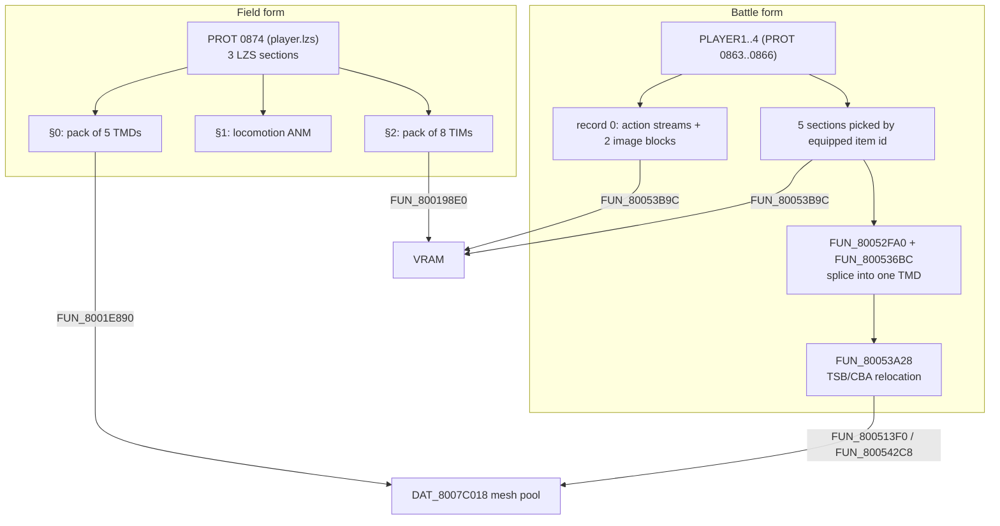
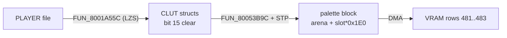

# Player-character mesh packs

Vahn, Noa and Gala each have **two** models on the disc, one per game form.
The **field form** is a small pre-built mesh pack that stays resident across
every field scene. The **battle form** is not a stored mesh at all: at battle
setup the game *assembles* each party member from five equipment-selected
sections of that character's player battle file, which is why equipping a
different weapon or armour changes the in-battle model. A third copy -
PROT 1204, the same characters pre-assembled with default equipment - exists
only for the Baka Fighter minigame.

This page covers where each form lives, how it is installed into the global
mesh pool `DAT_8007C018`, how its textures and palettes reach VRAM (the PSX
video memory), and how the pieces are posed. Entry numbers are **extraction**
indices unless marked "raw TOC" (raw = extraction + 2, see
[`cdname.md` § numbering space](cdname.md#numbering-space)).

## At a glance

| | Field form | Battle form | Baka Fighter form |
|---|---|---|---|
| Source | PROT 0874 §0 (`player.lzs`) | `data\battle\PLAYER1..4` = PROT 0863..0866 | PROT 1204 (`other5`) + atlases in 1205 |
| Stored as | LZS [`asset::pack`](pack.md) of 5 TMDs | per-equipment-id LZS sections, spliced at load | 5 raw TMD2 chunks (type `0x09`) |
| Objects (Vahn / Noa / Gala) | 12 on disc, capped to 10 live | 15 / 16 / 15 bones + 2 equipment extras | 15 / 16 / 15 |
| Pool slots | `DAT_8007C018[0..=4]` | `DAT_8007C018[0..=2]` | loaded by the minigame overlay |
| Textures | PROT 0874 §2 (8 TIMs) | the player file's own texture pools | PROT 1205 (8 TIMs) |
| Palette rows (VRAM `y`) | 478 (+ 473 / 475 shared) | 481 / 482 / 483, one per party slot | 490..497 |
| Pose source | PROT 0874 §1 locomotion ANM | `record[0]` action streams of the same file | PROT 1203 ANM banks |
| Parser | [`legaia_asset::character_pack`](../../crates/asset/src/character_pack.rs) | [`battle_char_assembly`](../../crates/battle-models/src/battle_char_assembly.rs) | [`battle_char_pack`](../../crates/battle-models/src/battle_char_pack.rs) |
| Confidence | Confirmed | Confirmed | Confirmed |



The field form is field-only and the battle form is battle-only. Battle does
**not** reuse the field pack, and does **not** render PROT 1204 directly: the
default-equipment sections of the player files are byte-shared with 1204,
which is the only reason a partial match against 1204 exists.

## Contents

- [On-disc layout](#on-disc-layout) (field form, PROT 0874 §0)
- [TMD shape (per slot)](#tmd-shape-per-slot)
- [10-group cap + equipment-conditional swap](#10-group-cap--equipment-conditional-swap)
- [Textures (field form)](#textures-field-form)
- [Field rest pose](#field-rest-pose---the-locomotion-bundle-prot-0874-1)
- [Battle form - assembled from the player files](#battle-form---assembled-from-the-player-files)
  - [Assembly and posing](#assembly---object-local-pieces-posed-by-the-characters-own-battle-streams)
  - [Rest-pose orientation](#rest-pose-orientation-what-a-correct-assembly-looks-like)
  - [Battle render: load-time TSB/CBA relocation](#battle-render-load-time-tsbcba-relocation)
  - [Equipment groups (battle only)](#equipment-groups-battle-only)
  - [On-disc layout (PROT 1204 + 1205)](#on-disc-layout-prot-1204--1205)
- [Animation](#animation)
- [Readers (retail)](#readers-retail)
- [CLI](#cli)

## On-disc layout

PROT 0874 (extraction label `befect_data`; in retail space it is the
`player_data` define's `player.lzs`, raw TOC `0x36C`) is a three-descriptor
LZS container ([`asset-descriptor.md`](asset-descriptor.md),
[`scene-bundles.md`](scene-bundles.md)). The entry is exactly `0x19800` bytes.

| Offset | Size | Field | Value | Meaning | Confidence |
|---|---|---|---|---|---|
| `+0x00` | u32 | `count` | `3` | descriptor count | Confirmed |
| `+0x04` | u32 | `meta[1]` | `0x2CBA0` | sum of the three decoded sizes; read by nothing | Confirmed |
| `+0x08` | u32 | descriptor 0 | `0x0100B49C` | `type << 24 \| decoded_size` for §0 | Confirmed |
| `+0x0C` | u32 | `offset0` | `0x20` | §0 LZS stream offset | Confirmed |
| `+0x10` | u32 | descriptor 1 | `0x020041E0` | §1 (locomotion ANM) | Confirmed |
| `+0x14` | u32 | `offset1` | `0x5037` | §1 LZS stream offset | Confirmed |
| `+0x18` | u32 | descriptor 2 | `0x0301D524` | §2 (field textures) | Confirmed |
| `+0x1C` | u32 | `offset2` | `0x7055` | §2 LZS stream offset | Confirmed |

| Section | Decoded size | Content |
|---|---|---|
| §0 | `0xB49C` (46 236) | [`asset::pack`](pack.md) of five Legaia TMDs |
| §1 | `0x41E0` | party locomotion ANM bundle ([§ Field rest pose](#field-rest-pose---the-locomotion-bundle-prot-0874-1)) |
| §2 | `0x1D524` | pack of eight TIMs ([§ Textures](#textures-field-form)) |

§0's five pack members:

| Pack slot | Body offset | `nobj` (disc) | Body bytes (runtime) | Role |
|---:|---:|---:|---:|---|
| 0 | `0x0018` | 12 | 13 220 | Vahn (party slot 0) |
| 1 | `0x33BC` | 12 | 13 800 | Noa (party slot 1) |
| 2 | `0x69A4` | 12 | 11 656 | Gala (party slot 2) |
| 3 | `0x972C` | 3 | 6 488 | Savepoint (save crystal) |
| 4 | `0xB084` | 2 | 1 048 | Auxiliary actor (untriaged) |

"Body bytes (runtime)" is what the engine allocates. The descriptor size
bounds the LZS decode at 46 236 bytes total, so slot 4 receives only its
1 048-byte TMD prefix even though its compressed stream would expand to
~65 KB of zero padding. The five bodies are byte-equal to a settled
field-scene RAM snapshot of `DAT_8007C018[0..=4]`
([`world-map-overlay.md` § Disc-side source of `[0..4]`](world-map-overlay.md#disc-side-source-of-04)).
The pack is **shared across every field scene**; only the trailing `[5..]`
window of the pool changes per scene.

**Slot-to-party mapping.** "Pack slot `i` is party slot `i`" is a byte fact:
`FUN_8001E890`'s epilogue walks exactly the first three entries from the
player-bank base (`slti v0,s0,0x3` at `0x8001EBA8`), and `FUN_8001EBEC` forms
`pool[*(0x8007B824) + i]` with the same `i` that indexes the per-character
equipment bytes in the live save window (`0x8001EC50..0x8001EC74`). *Which*
character party slot 0 holds is party order, not something the loader
encodes; it is what makes render id `0xF0` "Vahn"
([`motion-vm.md`](../subsystems/motion-vm.md#op-0x0e---the-model-swap)).
Slots 0..=2 are also the only ones with `nobj = 12` and the two equipment
templates.

### Not a dual consumer - the battle VDF pack is a different entry

`meta[1] = 0x2CBA0` is `0xB49C + 0x41E0 + 0x1D524`, the ordinary scene-bundle
`+0x04` sum. It is **not** a byte offset to a "VDF data tail": the entry is
`0x19800` bytes, so `0x2CBA0` lies 78 KB past its end.

The flat `[u32 count][u32 byte_offsets[count]]` pack that `FUN_800520F0`
walks (`0x8005257C..0x8005259C`, `jal FUN_8001FBCC` at `0x80052584`) is a
different entry. Its four loads are `li a0, 0x368 / 0x369 / 0x36A / 0x36B`
(`0x80052490`, `0x80052518`, `0x80052540`, `0x8005263C`) - raw TOC 872..875 =
extraction 870..873, the `etim` / `etmd` / `vdf` / `efect` members
([`effect.md`](effect.md)). The walked pack is `vdf` (extraction 872): count
`0x20`, then 32 ascending offsets `0x84, 0xE4, 0x274, …` inside `0x4800`
bytes. The character pack is extraction 874 = **raw 876**; the number 874
means one entry in each index space, which is how the two were once fused.

### What can reach `0x808425F8`, and what cannot

**The editing contract.** A rebuilt PROT 0874 must keep its first four words
(`meta[0]`, `meta[1]`, `type<<24|size0`, `offset0`) byte-exact *and* keep §0
decoding to retail's 46 236 bytes - pad the pack tail; retail itself pads
~19 KB in slot 4. `legaia_patcher::party_swap::fieldize` does this. A rebuild
that changed §0's decoded size hung the next battle load with a wild read at
`0x808425F8` under PCSX-Redux. The mechanism:

- **Boot sizes the buffers from the disc header.** `FUN_8001ED60` runs once
  at boot: it loads raw `0x36C`, takes descriptors 0 and 1's size fields
  (`+0x08` / `+0x10`, `& 0x00FFFFFF`), rounds each up to a word and stores
  them to `gp+0x69C` and `gp+0x6C8` (`0x8001EE2C` / `0x8001EE30`).
  `FUN_8001E1B4` mallocs exactly those (`lw a1,0x6c8(gp)` at `0x8001E2C8`
  for §1 into `0x8007B75C`; `lw a1,0x69c(gp)` at `0x8001E2D4` for §0 into
  `gp+0x6BC`), and `FUN_8001E890` decompresses into them (`0x8001EA64` /
  `0x8001EA80`).
- **The pack walk trusts the offset table.** `0x8001EB4C` in `FUN_8001E890`
  calls `tmd_register(*(gp+0x6BC) + word*4)` over §0's decoded pack. A
  stream that decodes to a different length than the header word gets a pack
  truncated at `gp+0x69C` bytes, and a truncated pack's offset table reads
  mesh payload as offsets. With the measured buffer base,
  `0x808425F8 - base = 0x006F50BC = 4 * 0x1BD42F` - a whole word offset.
- A rebuild that grows §0 **and** its header size word gets a matching
  buffer. No shipped patcher path produces the mismatched case.

Ruled out, from the bytes:

| Candidate | Why not |
|---|---|
| A materialised constant | `0x808425F8` is `0x00800000` above `0x800425F8`; no `lui` with immediate `0x8084` / `0x8085` exists in SCUS or any of the 83 mapped overlays, so the address is computed |
| `FUN_80052FA0`'s in-place rebase of `record[0]` `+0x58` / `+0x5C` (`0x800532BC..0x800532E4`) | a double relocation lands near `0x803xxxxx`, and the routine runs once per character |
| The two `FUN_800520F0` pack walks | their buffers hold `vdf` and `etmd`, never PROT 0874 (table below) |
| The registrar walking a battle-clobbered buffer | every path that could dirty the buffer re-decodes it first (below) |
| The checksum compare at `0x8001E9F8` | `FUN_8001ED60` sums the raw entry into `gp+0x6B8` and `FUN_8001E890` re-sums the same file: a CD read retry, not an integrity gate |

The two battle-loader walks, identified from a battle save state's RAM:

| | Byte-offset walk | Word-offset walk |
|---|---|---|
| Site | `0x8005255C..0x8005259C` (phase `0x0C`) | `0x800525A0..0x80052600` |
| Base | `*0x8007B878` | `*(gp+0xA8C)`, the battle arena at `FUN_8005133C`'s `block + 0x1800` (`0x8005177C`) |
| Address | `base + [base + 4 + 4*i]` | `base + ([base + 4 + 4*i] << 2)` |
| Consumer | `FUN_8001FBCC` | `FUN_80026B4C` |
| Buffer holds | `vdf`, raw `0x36A` = extraction 872 | `etmd`, raw `0x369` = extraction 871 |

Phase `0x0A` streams raw `0x369` to the arena head, sets
`0x8007B878 = arena + sectors*2048` (`0x80052538`) and streams raw `0x36A`
from that cursor. Mid-battle, `*0x8007B878` opens with `count = 0x20` and the
arena opens with `count = 0x1E` whose member 0 (`base + 0x1F*4`) carries the
TMD magic and **is** `DAT_8007C018[3]`. Both walks could reach the address
arithmetically (`0x0076939C` raw / `0x001DE0E7` pre-shift), so the provenance
of the bytes discriminates, not the arithmetic.

`0x8007B878` has four references disc-wide: writers `0x8001F268` (the
`s7 != 0` arm of the install dispatcher `FUN_8001F05C`,
`*0x8007B8CC + ((size + 3) & ~3)`), `0x8005250C` and `0x80052538`; one reader,
the phase-`0x0C` walk. `0x8007B8CC` has exactly one reference (the `lw` at
`0x8001F258`), nothing writes it, and it sits in `.bss` above SCUS's loaded
extent (`0x8007B800`). Field save states read `*0x8007B824 = 0`, the word that
arm alone writes, so the `s7 != 0` path does not run in retail.

**The registrar never walks a stale buffer.** `FUN_8001E890` has one
load-state word, `gp+0x6AC` (`0x8007B9C4`):

| Value | Behaviour |
|---|---|
| `0` | read the file, decompress, register |
| `2` | re-sum the raw file, decompress again, register |
| `1` | skip straight to the registrar at `0x8001EAFC`; written by the registrar itself (`0x8001EB0C`) |

Every other writer resets it: the mode-transition pass `FUN_80016230` zeroes
it at `0x800163B4` on each step into a mode other than `2` / `3` (`gp+0x524`
is the game mode); the post-battle field restore PROT 0978 writes `0`
(`0x801F6F04`) then `2` once the file is re-read (`0x801F723C`); the core
reset `FUN_80025CB4`, the minigame warp `FUN_80025980`, the field overlay
(`0x801D15A8`, `0x801E34C8`) and `FUN_80026018` all write `0`. Twelve sites,
no other writer (`scripts/ghidra-analysis/find-gp-relative-refs.py 0x6ac --prot`).
A PCSX-Redux probe (`scripts/pcsx-redux/autorun_registrar_routes.lua`)
confirms it over six routes - door warp, boss fight returning to the field,
random encounter, cold boot to NEW GAME, CONTINUE from a memory card, and
battle entry: the routine always runs over block `0x8014D53C` and the
registrar reads `count = 5` every time (state `1` intact after a door warp;
state `0` over uninitialised heap on boot / card load; state `2` over the
battle clobber after a fight). Field-to-battle enters the routine zero times.

## TMD shape (per slot)

Each pack body is a [Legaia TMD](tmd.md):

| Offset | Size | Field | Value |
|---|---|---|---|
| `+0x00` | u32 | magic | `0x80000002` |
| `+0x04` | u32 | flags | `1` after the runtime pointer fixup |
| `+0x08` | u32 | `nobj` | 12 / 12 / 12 / 3 / 2 on disc |
| `+0x0C` | `nobj × 0x1C` | group descriptors | group `i` at `0x0C + i*0x1C` |

In party slots 0..=2, groups 10 (`+0x124`) and 11 (`+0x140`) are *templates*
for the swap below, not drawn geometry.

## 10-group cap + equipment-conditional swap

After the install, `FUN_8001E890` overwrites `entry[+0x08]` (TMD `nobj`) of
`DAT_8007C018[party_base + 0..2]` to **10**, so the two template groups are
never drawn directly. Its epilogue then calls `FUN_8001EBEC`
(`jal` at `0x8001EBB4`; dump `ghidra/scripts/funcs/8001ebec.txt`), which for
each of the three party slots:

1. Reads the equipment toggle byte from the character record.
2. Picks the group-10 template (`TMD+0x124`) if it is non-zero, else the
   group-11 template (`TMD+0x140`).
3. Copies that 28-byte (7 × u32) descriptor over the visible group at the
   slot's patched index (`group = base + 0xC + sel*0x1C`).

| Party slot | Character | Patched group | Equip byte (record offset) |
|---:|---|:---:|:---:|
| 0 | Vahn | 0 | `+0x196` |
| 1 | Noa | 3 | `+0x199` |
| 2 | Gala | 5 | `+0x19B` |

The patched index and the offset within the equip-byte window are the same
three numbers `{0, 3, 5}` - the routine reuses one small stack table for both.

The swap is **binary**: one visible group toggles between two pre-baked
variants. It never changes `nobj`, adds no object and uploads no mesh. Item
identity on the field model is carried by the
[texture atlas](#textures-field-form), not by geometry. The Rust equivalent is
`legaia_asset::character_pack::equipment_swap::apply`.

**Open: Vahn's row.** Applied literally, patched group `0` is Vahn's largest
group (77 vertices / 132 primitives - the head), while both templates are 12-
and 16-vertex parts the size of his groups 3/4 and 10, so the result renders
him headless. Noa's and Gala's raw groups already equal their template-zero
variant, so the disc-form mesh is the cold new-game look for all three; the
`export-glb --party` field export ships that and applies no swap. Re-verify
Vahn's patched index against a live capture before applying the swap to slot
0 anywhere.

## Textures (field form)

Field textures are **PROT 0874 §2**, parser
[`legaia_asset::field_char_textures`](../../crates/asset/src/field_char_textures.rs).
(Not extraction 0876, whose `player_data` *filename label* is the +2 label
shift; it is a VAB + empty TIM_LIST + SEQ stream.)

`FUN_8001E890` LZS-decodes all three sections; §2 is a [`pack`](pack.md) of
eight TIMs, each uploaded by `FUN_800198E0`. Byte-exact against a live
field-scene VRAM dump:

| Entry | Image `(x, y, w_words, h)` | CLUT `(x, y, colours)` | Role |
|---:|---|---|---|
| 0 | `(448, 0, 64, 256)` | `(0, 473, 256)` | shared 256-colour page |
| 1 | `(832, 256, 20, 128)` | `(0, 478, 64)` | **Vahn** atlas, palette columns 0..63 |
| 2 | `(852, 256, 20, 128)` | `(64, 478, 64)` | **Noa** atlas, columns 64..127 |
| 3 | `(872, 256, 20, 128)` | `(128, 478, 64)` | **Gala** atlas, columns 128..191 |
| 4 | `(320, 256, 64, 256)` | `(0, 475, 256)` | shared 256-colour page |
| 5 | `(384, 256, 64, 256)` | `(0, 475, 256)` | shared 256-colour page |
| 6 | `(880, 384, 16, 64)` | `(192, 478, 32)` | atlas extension (lower) |
| 7 | `(880, 448, 16, 64)` | `(224, 478, 32)` | atlas extension (lower) |

Entries 1/2/3 tile horizontally to fill the 4bpp texpage `(832, 256)`
(`tsb 0x3D`) that every field character primitive samples. Their CLUTs
(colour lookup tables) sit on VRAM **row 478** at exactly the per-primitive
CBA columns the meshes carry (Vahn 0/16/32/48, Noa 64/80, Gala 128/144). The
textures are byte-identical across field scenes and stay resident through the
[`FIELD_SHARED_BLOCKS`](../subsystems/asset-loader.md#field-shared-cdname-blocks)
rule rather than being re-uploaded per scene.

### Runtime scroll-cell residue (why a live VRAM dump can differ from the TIM)

Resident is not immutable. Two runtime mechanisms write into the atlas band.

**Face-frame stamps (field-VM op `4C 60`).** Below the live texel rows each
strip carries authored alternate-face frames (blink / mouth variants).
Cutscene scripts stamp them over the live cell with a literal-operand
`MoveImage`:

| Bytes | Field |
|---|---|
| `4C 60` | opcode + sub-op |
| 6 × u16 LE | `src_x, src_y, w, h, dst_x, dst_y` |

The instruction is 14 bytes, and the u16s are read through the misaligned
helper `FUN_8003CE9C`, so they sit at arbitrary byte parity - a u16-aligned
scan misses them. Handler: the sub-`0x60` arm at `0x801E1B28..0x801E1B90` in
the field-VM dispatcher `FUN_801DE840` (`jal FUN_80058490` at `0x801E1B84`);
sub-`0x61` is the 16x1 CLUT-cell sibling. Recurring cells: Vahn blink pair
`(837|832, 328, 5, 20) -> (832, 264)` + `(832, 368, 3, 12) -> (832, 300)`;
Noa `(852, 336, 6, 16) -> (852, 268)` + `(852, 368, 4, 8) -> (853, 284)`.
Most scene MANs carry dozens. A script that stamps once and never stamps back
leaves the cell **parked on the alternate frame**.

The known parked case: a 3-word difference at VRAM `(853, 271)`,
`(856, 271)`, `(857, 271)` in Noa's strip. It is installed by **town01 MAN
partition-2 record 3** (the Rim Elm opening timeline), body offsets `+0x392`
/ `+0x3A0`, which runs the two Noa stamps once after the opening's white
flash. The frame parked at `(852, 336)` differs from the boot cell only at
strip row 15, columns 1/4/5. Not a 2-row scroll phase (a scroll would move
most rows; probes `scripts/pcsx-redux/autorun_s2s3_scroll_installer.lua` /
`autorun_s2s3_atlas_stamp.lua` show the wrap-scroll path silent while the
`4C 60` pair fires), not an upload defect, and not the pause menu. A later
re-upload of the band (the battle effect-texture path) restores the disc
bytes.

Port: `asset field-disasm` decodes the op as `MenuCtrl op0=0x60`; the world
host's `FieldHost::op4c_n6_sub0_emitter6` hook queues the six words
(`World::queue_script_vram_move`) and the windowed host drains them into its
software VRAM (`World::apply_script_vram_moves`, the `Vram::move_image`
primitive the battle facial animator also uses).

**Wrap-scroll cells (actor dispatch 4).** The per-actor anim tick
`FUN_80021DF4` (dispatch byte `+0x5A == 4`, block `0x80022CB8..0x80022EE4`,
`ghidra/scripts/funcs/80021df4.txt`) scrolls a VRAM rect:

| Actor field | Meaning |
|---|---|
| `+0xD0..+0xD6` | rect `x, y, w, h` |
| `+0xCC` / `+0xCE` | per-axis step |
| `+0xC6` / `+0xC4` | countdown / reload, decremented by the frame-skip byte `0x1F800393` |

Each fire `StoreImage`s the leading band, `MoveImage`s the rest toward the
origin (`0x80022EA4`) and `LoadImage`s the saved band at the far edge. The
installer is **move-VM opcode `0x1E`** (JT `0x80010778[0x1E]`, body
`0x80023694`): `[1E, reload, step_x, step_y, x, y, w, h]`. Opcode `0x45`
(body `0x8002409C`) is the dispatch-7 sibling over the same rect. Scroll
records are data in scene carriers (e.g. the dolk market pair
`(736|752, 224, 16, 32)`, step `(0, 1|2)`). A despawned scroll actor parks its
rect mid-phase - real for water / ambient cells, but **not** the cause of the
0874 atlas residue above.

### CLUT upload semantic (`FUN_800198e0`)

Each entry is a standard 4bpp PSX TIM with a CLUT (`magic 0x10`, `flags & 8`).
The image uploads verbatim at its declared rect. The CLUT is written as a
**flat horizontal strip** - `LoadImage(x = clut_x, y = clut_y,
w = clut_w * clut_h, h = 1)`, not the declared `clut_w × clut_h` rectangle.
A header of `(0, 478, 16, 4)` therefore lands as 64 colours on row 478,
columns 0..63: four 16-colour palettes side by side, which is why one
character spans several CBA columns of one row.

The STP bit (`| 0x8000` on non-zero colours) is applied only when
`_DAT_8007b998 != 0`. The field upload runs with it `0`, so field CLUTs are
bit-15-clear; the row-479 NPC CLUTs are STP-set by a separate upload
([`npc-palette.md`](npc-palette.md)).

`field_char_textures::parse` + `upload_to_vram(stp = false)` reproduces live
field VRAM at every uploaded rect (disc-gated `field_char_textures_real`).
CLI: `asset field-char-tex extracted/PROT/0874_befect_data.BIN`.

### Hybrid render (textured + untextured prims)

Only about a third of a field character's primitives are textured (`FT*` /
`GT*`: face, eyes, skin, parts of the clothing). The rest are untextured flat
or gouraud prims (`F*` / `G*`: hair, vest, boots) carrying **RGB in the TMD**
instead of UVs. Their `(cba, tsb)` is `(0, 0)`, so a texture-only renderer
samples empty VRAM and leaves holes.

The colour block sits at the start of the prim, before the vertex indices
(the slot a textured prim's texture block uses); its length is the
descriptor's `vertex_offset` ([`tmd.md`](tmd.md),
[`legaia_tmd::descriptor`](../../crates/tmd/src/descriptor.rs)):

- **Flat** (`F3` / `F4`): one `[r, g, b]` + a code byte, shared by every corner.
- **Gouraud** (`G3` / `G4`): one RGB per corner, 4-byte stride.

`legaia_tmd::mesh::tmd_to_vram_mesh_field_hybrid` returns per-vertex
`VertexShading` (RGB + a textured flag) parallel to the mesh. The site's
[`/characters.html`](../../site/_content/characters.html) field form renders
through it (a `u_use_flat_colors` branch in the shared `TmdRenderer` shader).

## Field rest pose - the locomotion bundle (PROT 0874 §1)

Field TMD vertices are **object-local**: each group models one body part
about its own joint origin, so drawing needs a rigid transform per object.
The source is the party locomotion ANM container in PROT 0874 §1: 23 records
= three 7-record character banks + savepoint + aux
([`anm.md` § party locomotion bundle](anm.md#disc-source---the-party-locomotion-bundle-prot-0874-1)).
Bank slot 1 is the standing idle (all three party actors' live `+0x4C` record
pointers sit at bank offset +1 in a town01 capture); its frame 0 is the rest
pose.

Bone `i` drives group `i`. The object table at `actor[+0x44]` is filled off
the pool TMD (`FUN_80024D78`: `count = *(tmd+8)`, object `i` at
`tmd + 0xC + i*0x1C`), and `FUN_8001B964` requires
`count == record_bone_count` before drawing. That is why the cap matters: 12
disc groups minus 2 templates leaves the 10 objects the 10-bone clips
animate. Each 8-byte (bone, frame) entry decodes via `FUN_8001BE80`
(`legaia_asset::player_anm::BoneTransform`) to a flat `R·v + T` about the
group's local origin, composed onto the actor's facing matrix.

## Battle form - assembled from the player files

A main-game battle renders no disc TMD directly. At battle setup the engine
builds each active party member's mesh from that character's player battle
file (`data\battle\PLAYER<n>`, PROT 0863..0866; container format, descriptor
table and slot layout in [`battle-data-pack.md`](battle-data-pack.md)),
picking one section per equipment slot by the character's equipped item ids.

**The assembly chain** (all static SCUS; dumps in `ghidra/scripts/funcs/`):

| Step | Function | What it does |
|---|---|---|
| 1 | `FUN_80052770` | Streaming state machine. Case 1 opens the file by raw TOC `member_id + 0x360`. **Case 4 selects five sections** by matching descriptor ids against the record's equipped-item bytes `+0x196..+0x19A` (`id = 0` is the default - see [descriptor table](battle-data-pack.md#descriptor-table)). Later cases stream them into RAM; per-slot context `0x801C92F0 + slot*0x1C`. |
| 2 | `FUN_80052FA0` | Per-character assembler. LZS-decodes `record[0]` and the five sections, then builds the merged TMD at `ctx + 0x50` (`ctx = *(0x801C9360 + slot*4)`): magic at `blob+0x18`, `nobj = 0` at `blob+0x20`. |
| 3 | `FUN_800536BC` | Object splice - **the thing that grows `nobj`**. Appends the section's 7-word object entries with relocated vertex / normal / primitive offsets, and writes one bone-id byte per object at `blob+0` from the section's attach list ([slot layout](battle-data-pack.md#decompressed-slot-layout)). Objects past the attach list get tag `0xFF` / `0xFE`: the equipment visual meshes (weapon, Ra-Seru). |
| 4 | `FUN_80053898` | Post-pass. Retags `0xFF` → 200/201 and `0xFE` → 100+, records each extra's attach bone at `blob + nobj`, and selection-sorts the object table by tag so the extras land at `nobj-2`, `nobj-1`. |
| 5 | `FUN_800513F0` | Battle init. Registers `blob + 0x18` into `DAT_8007C018[slot]`, runs the TSB/CBA rewrite `FUN_80053A28` ([below](#battle-render-load-time-tsbcba-relocation)), and caches the extras' vertex-pool pointers (battle ctx `+0x1030..0x103C`) and attach bones (`+0x23A/0x23B`). |

So runtime `nobj` = skeleton bones + equipment extras: Vahn's 15 + weapon +
Ra-Seru = 17.

**Byte verification (full-party battle save).** `DAT_8007C018[0] =
0x80165E38` is the assembler's `ctx+0x50` blob + `0x18`. The TMD reads
`nobj = 17`, bone-id bytes `[0..14, 200, 201]`, attach array `[5, 8]` at
`blob+17`. With Vahn wearing `[0x43 Hunter Clothes, -, 0x22 Survival Knife,
0x01 Ra-Seru Meta, -]`, every one of the 17 vertex pools byte-matches a
PLAYER1 section, selectively: body objects only the `id = 0x43` section,
weapon objects (bone 5 + extra 200) only `id = 0x22`, the Ra-Seru extra the
Meta-tier sections, unequipped slots their `id = 0` defaults.

**PROT 1204 is the Baka Fighter pack, not the battle source.** The five
equipped-variant objects above appear nowhere in 1204; the other 12
default-section objects are byte-shared, which explains any 12/17 partial
match. Baka Fighter loads it explicitly (`overlay_baka_fighter` loads
`data\field\other5.lzs` + PROT 1205/1206, debug string `"OTHER5 %d %d"`).
Battle geometry is also absent from the field pack (disc-gated
`battle_char_pack_real::battle_pack_is_distinct_from_field_pack`).

**Where the player files load from.** `FUN_80052770` opens each file through
the dual-mode wrapper `FUN_800558FC(path, …, char+0x360)`. The ISO9660 branch
`FUN_800608F0` is a `trap` stub on this build, so the load always goes
through `FUN_8003E8A8(char+0x360)`, which reads `toc[idx+2]` from the in-RAM
PROT TOC (`0x801C70F0`) as a sector offset into `PROT.DAT`. There is no
`DATA\` tree on the disc.

| Player | Raw TOC `char+0x360` | Extraction | `PROT.DAT` offset | Size |
|---|---|---|---|---|
| Vahn | `0x361` | 0863 | `0x36E8000` | 338 sectors |
| Noa | `0x362` | 0864 | `0x3791000` | 303 sectors |
| Gala | `0x363` | 0865 | `0x3828800` | 222 sectors (`0x6F000`) |
| Terra | `0x364` | 0866 | `0x3897800` | 47 sectors |

(The stub entries 0859..0862 are one sector each; an old `0861` attribution
for Vahn was that entry's over-read window, not the file's own slot.)

### Assembly - object-local pieces posed by the character's own battle streams

Each battle TMD is a set of **object-local** pieces (head, torso, limbs).
The engine places each with a flat per-object transform - no skeleton
hierarchy, and **no pivot or centroid subtraction**:

```text
v_world = R_bone · v_local + T_bone        (rotation about the object's local origin)
```

**Pose source.** `(T, R)` come from the action-animation streams in
`record[0]` of the same player file: the monster-format packed stream
`[u8 parts][u8 frames][9-byte TRS records]`
([`monster-animation.md`](monster-animation.md), shared decoder). They are
reached through the u32 action-offset table at the head of decoded
`record[0]`, with the stream at **entry `+0xAC`** (the monster archive keeps
its own at `+0x8C`).

- Slot index == action tag in the player files: idle (slot 0), walk /
  approach, the flinches, knockdown, get-up, ready / recover / defeat, block,
  plus the four loader-spliced weapon swings at `0xC..=0xF`. Labels:
  `battle_char_assembly::action_slot_label`.
- `parts` equals the skeleton bone count (15 Vahn / 16 Noa / 15 Gala / 17
  Terra). Channel `i` drives assembled object `i` (post-sort, object index ==
  bone tag).
- The equipment extras past `parts` ride their **attach bone's** channel via
  the blob-header side tables, so the duplicate weapon / Ra-Seru pieces
  coincide with their attach piece.
- Frame 0 of the idle is the combat-stance rest pose.

Live-pinned against a full-party capture: each party render node's anim
context (`node +0x4C`, consumed by `FUN_80047430` → `FUN_8004AD80`) points its
`+0x88` stream pointer at `record0_image + action_table[0] + 0xAC`, and the
stream byte-matches the disc decode
(`crates/engine-shell/tests/battle_party_pose_live.rs`). No PROT 1203 record
is resident in battle RAM.

The inline `record[0]` streams are raw packed (`2 + parts * frames * 9`
bytes). The character's **art** clips hold the same pose format inside
channel-delta-coded `"ME"` archives in `readef.DAT` - see
[`battle-data-pack.md` § Two container encodings, one pose format](battle-data-pack.md#two-container-encodings-one-pose-format).

**PROT 1203 poses the 1204 pack, not the assembled mesh.** The 1203 ANM
bundle ([`anm.md`](anm.md#per-bone-frame-8-byte-encoding)) is the rig for
1204's own object order, drawn by `FUN_8001B964` → `FUN_8001BE80` →
`FUN_8002735C` (`Rz·Ry·Rx · v + T`, ANM bone `i` → object `i`, gated on
`bone_count == nobj`). Its 30 records are per-character banks:

| Records | Rig |
|---|---|
| 0..8 | Vahn, 15 bones |
| 9..17 | Noa, 16 bones |
| 18..26 | Gala, 15 bones |
| 27..29 | 10-bone simplified rig |

The first record of each bank is that character's idle; its frame 0 agrees
with the player-file idle up to rotation quantisation (1203 stores `u8 << 4`
angles, the player streams full 12-bit). 1204's object order **differs** from
the assembled blob's sorted bone-tag order (Vahn and Gala permute their
head/torso and limb-chain triples; Noa coincides), so cross-posing either
mesh from the other rig mis-sockets it.

**In the port.** `legaia-engine play-window` runs the real assembly per party
member: `battle_char_assembly` (equipped ids from the roster record) →
`relocate_tsb_cba` → `idle_battle_animation` → `expand_animation_for_objects`
over the assembler's `anm_bones` map → `tmd_to_vram_mesh_posed_rot`, looped
through the same `MonsterAnimPlayer` the enemy meshes use. The 1204 mesh,
posed from its 1203 idle, is the per-member fallback
([`battle.md` § Battle party meshes](../subsystems/battle.md#battle-party-meshes-assembled)).
The site's `/characters.html` defaults to the same assembly - pick an item per
section and the page splices, textures and poses that model, including every
Tactical Art from the `readef.DAT` ME archive
([`web-viewer::equipment_view`](../../crates/web-viewer/src/equipment_view.rs)) -
and offers the 1204 / 1203 pairing as its *Baka Fighter* form. Its per-item
`.glb` downloads cut the piece out by palette column
([`battle-data-pack.md`](battle-data-pack.md#the-item-is-still-separable---by-palette-not-by-geometry)).

**Who installs the meshes.** The generic registrar `tmd_register`
(`FUN_80026B4C`, store at `0x80026BA8`) is called from two static SCUS
functions, both reached indirectly through battle state dispatch - which is
why a static xref on `0x8007C018` finds no writer. A write-watchpoint on
`DAT_8007C018[0..2]` across a live field→battle transition
([`autorun_battle_party_mesh_install.lua`](../../scripts/pcsx-redux/autorun_battle_party_mesh_install.lua))
catches all installs at `game_mode 0x15`:

| Function | Loop | Registers | Caller `ra` |
|---|---|---|---|
| `FUN_800513F0` (battle scene-loader state) | `while (i < 3)`, gated by `DAT_8007BD10[i] != 0` | `*(actor + 0x50) + 0x18`, `actor = *(0x801C9360 + i*4)` | `0x8005148C` |
| `FUN_800542C8` (battle archive loader) | per member, bounded by `*(rec + 0x4A)` | `*(*rec + 4)` | `0x80054804` |

`DAT_8007BD10[i]` is the per-slot active-member **id** (`1` Vahn, `2` Noa,
`3` Gala, `0` empty), not a flag. A Vahn-solo fight has `[1,0,0,0]`:
`FUN_800513F0` installs slot 0 and `FUN_800542C8` fills the rest (Vahn →
`0x80165F48` in the Rim Elm Queen Bee capture). A full party has `[1,2,3,0]`
and `FUN_800513F0` installs all three (`DAT_8007C018[0..2] = 0x80165E38 /
0x8017A908 / 0x8018D550`, `party_count = 3`). `FUN_80052FA0` runs immediately
before the loop. Dumps: `ghidra/scripts/funcs/800513f0.txt`, `800542c8.txt`.

Separately, `FUN_800520F0` registers the `etmd` pack into the **effect
window** `DAT_8007C018[3..]`, not the party slots. Sibling battle files, raw
→ extraction: `etim.dat` `0x368` → 0870, `efect.dat` `0x36B` → 0873, and the
battle-type-conditional pair `0x367` / `0x36D` → 0869 / 0875
([`effect.md` § Battle effect cluster](effect.md#battle-effect-cluster-befect_data)).

### Rest-pose orientation (what a correct assembly looks like)

Posing the assembled TMD at frame 0 of its own idle gives a measurable shape -
the cheapest check that splice + `anm_bones` + `R*v + T` came out right. PSX
battle-world units, Y pointing **down**:

| Character | Player file | Posed AABB (x, y, z) | Head (min y) | Feet (max y) |
|---|---|---|---|---|
| Vahn | 0863 | 202, 425, 339 | -423 | +3 |
| Noa | 0864 | 217, 390, 296 | -391 | -1 |
| Gala | 0865 | 208, 503, 340 | -503 | 0 |

Vertical extent dominates, the head sits 400-500 units above the stage plane,
and the feet land within a few units of `y = 0` (the seat plane). All three
face **+Z**, toward the monster seats, which is why the party half of
`PlayWindowApp::actor_model` composes no rotation while the enemy half takes a
half turn. The fourth file (0866) is a quadruped - 332, 223, 594, long in Z by
design - and has no runtime texture band, so it is not drawn as a party member.

The knockdown clip (action tag 4) ends at ~275-325 x, ~120-175 y, ~515-580 z:
flat on the ground. That is correct for a hit reaction and wrong for an attack
turn, so "is the party member upright" has a testable answer. Oracle:
`crates/asset/tests/battle_pose_orientation_real.rs` (disc-gated;
`LEGAIA_POSE_DUMP_DIR` writes orthographic PNGs). The rule deciding which
family plays is in
[`battle.md` § One staged-anim channel](../subsystems/battle.md#one-staged-anim-channel-actor0x1da).

#### What that AABB is worth on screen

The mesh carries no scale and nothing on the load path applies one:

```
apparent_height_px = H * world_scale * mesh_height / Ez
```

- `H = 256`.
- `world_scale = 4.0` in battle: the base matrix `0x8007BF10 = diag(0x4000)`,
  which `FUN_8001DCF8` installs only on game mode `0x14`; `FUN_80048A08`
  inherits it through the composed view matrix.
- The per-actor scale `actor+0x72` reads `0x1000` (1.0) for party and monster
  alike (`FUN_80020DE0` seeds it); neither the equipment descriptor nor
  `tmd_register` / `tmd_ptr_fixup` touches a vertex.
- `Ez`, the camera's eye distance to the seat, is the only free variable. An
  actor that looks wrong-sized is a framing question before a mesh question.

Worked example, battle command-menu state (`TR = (0, 1280, 7680)`, pitch
`32`, yaw `3372`, base matrix `16384 * I`, party seat `(0, 0, -800)`):
`Ez = 6260`, so Vahn's 425 units project to 70 px. The framebuffer agrees -
soles on row 169, hair near 106, and 169 is where the seat projects under the
retail screen centre `OFY = 114`
([`renderer.md`](../subsystems/renderer.md#the-screen-the-gte-projects-onto-is-320x224-not-320x240)).
A party member is just under a third of the frame in the resting menu
framing.

### Battle render: load-time TSB/CBA relocation

Every textured primitive carries a TSB word (texture page) and a CBA word
(CLUT address). The values stored in the player files and in PROT 1204 are an
**authoring layout**. At battle entry, after registering the assembled mesh
(`flags` 0→1, object pointers made absolute), the loader rewrites both fields
to a packed per-party-slot VRAM band. The remap is fixed and
scene-independent:

| Slot | Char | 1204 authoring texpages | Runtime texpages | 1204 CBA rows | Runtime CBA row |
|---|---|---|---|---|---|
| 0 | Vahn | (640,0) + (704,0) | **(512,256) + (576,256)** | 490 / 491 | **481** |
| 1 | Noa | (640,256) + (704,256) | (640,256) + (704,256) | 492 / 493 | **482** |
| 2 | Gala | (512,0) + (576,0) | **(768,256) + (832,256)** | 494 / 495 | **483** |

The CBA **column** is preserved (`(cba & 0x3F) * 16`); only page and row
change, so each character ends with one 256-colour palette on its runtime
row. The party textures pack into `x ∈ [512, 896), y = 256`, one 128-px
two-page slot each.

**The rewrite is `FUN_80053A28`** (dump `ghidra/scripts/funcs/80053a28.txt`),
called by `FUN_800513F0` per party slot. It walks each object's primitive
groups, gated on the group mode byte's TME (textured) bit:

| Word | Operation | Preserved |
|---|---|---|
| CBA | `& 0x803FFFFF \| (0x1E1 + slot) << 22` - CLUT row `481 + slot` | column + high bit |
| TSB | `& 0xFFE0FFFF`, texpage index = `0x18 + 2*slot` if the authoring page is `0x15`, else `0x19 + 2*slot` | ABR / depth bits |

The assembled player-file meshes all author at texpages `0x15` / `0x16` =
`(320, 256)` / `(384, 256)` and CLUT row 480, so on them the pass is a uniform
`+3` texpage / `+0x40` CLUT-id rewrite. Port:
[`battle_char_assembly::relocate_tsb_cba`](../../crates/battle-models/src/battle_char_assembly.rs)
(disc-gated `battle_char_assembly_real::relocates_each_character_into_its_runtime_band`).

Not involved: the `0x8007BEC0` texpage→row table
(`FUN_800198E0`: `table[image_texpage] = clut_y`), which is the scene /
background renderer's. And the party palette is not "scene residue at rows
490..497": those rows hold scene environment palette shared by a scene's
field and battle modes.

**Textures** come from the player files: the equipped sections' post-TMD
texture pools plus the two `record[0]` image blocks, each `LoadImage`d into
the band at a static per-section rect (`SCUS_942.54` table `0x800775B8`,
banded by party ordinal). This reproduces live battle VRAM at 99.7-100 % per
member - see
[`battle-data-pack.md` § Texture-pool VRAM placement](battle-data-pack.md#texture-pool-vram-placement).
The 1204 atlases match the band only 73-98 % (they carry default-equipment
texels), so they are the engine's fallback, not the source.

**Palette.** Each upload block is `[CLUT struct][pixels]`, and the CLUT
struct is:

| Offset | Size | Field |
|---|---|---|
| `+0x00` | u16 | `base` - first colour index on the character's row |
| `+0x02` | u16 | `count` - colours that follow (`0` = no-op) |
| `+0x04` | `count × u16` | BGR555, bit 15 clear on disc |

`FUN_80053B9C` (per-colour store at `0x80053C6C`: `sh a0, 0x894(v0)`) copies
each struct into the per-character palette block at
`arena + slot*0x1E0 + (base + idx)*2`, **OR-ing in bit 15** (STP, the PSX
semi-transparency flag) on every non-zero colour. It is called once per
struct with `a0` = source and `a3 = slot` → VRAM row `481 + slot`. The chain:



- The blocks are contiguous in a full-party save at `0x800EBEE8` (Vahn) /
  `0x800EC0C8` (Noa) / `0x800EC2A8` (Gala): a `0x1E0` stride = 15 × 16-colour
  sub-CLUTs per character.
- The work arena is zeroed at load by the `sw $zero` loop at SCUS
  `0x80055F14` (`base = *(0x8007BD3C)`, `0x1E8D` words); the palette sits at
  `arena_base + 0x4048`.
- It is battle-allocated and produced fresh at battle load (absent from
  pre-battle field RAM), and character-intrinsic: byte-identical between the
  Tetsu tutorial fight and a Drake-castle fight. It is not the field palette
  (only 10 of Vahn's 130 battle colours, and none of Noa's or Gala's, appear
  in any field CLUT).
- The source pointer is `s0 = *(*(0x801C92F0) + 8) + per-char offset`, into a
  transient decode buffer. Probes:
  `scripts/pcsx-redux/autorun_battle_palette_writer.lua`,
  `autorun_clut_copy_calls.lua`.
- Searching a disc image for the palette needs the bit-15-**clear** needle
  (`40 1D 70 10…`), not the runtime form (`40 9D 70 90…`).

For Vahn the routine fires for three non-empty structs - `base 0x00 count
0x20`, `base 0x40 count 0x30`, `base 0x70 count 0x20` (colours `0..0x8F`) -
plus two `count = 0` no-ops.

**Decode order (`FUN_80052FA0`, one `0x19000` work buffer).** The file header
fields `clut_a_off` / `clut_b_off` / `budget` are documented in
[`battle-data-pack.md` § File layout](battle-data-pack.md#file-layout).

1. Decode `record[0]` at work offset 0 (`len @ +0x0C`, `data @ +0x10`).
2. Read CLUT A at `clut_a_off` and CLUT B at `clut_b_off` **immediately** -
   the sections overwrite the buffer from `clut_a_off` on.
3. Set `cur = clut_a_off`. For each of the five selected sections
   (`[u32 budget][LZS stream]`; decode callsite `ra = 0x80053130`): decode at
   `cur`, read `adv = u32[cur + 0x0C]` and `flag = u16[cur + 0x12]`; if
   `flag != 0` its trailing CLUT is at `cur + adv`; then `cur += adv`.

`FUN_8001A55C`'s first argument is an **output-byte budget** (decremented per
literal and per match-copied byte). A decoder that ignores it runs into the
next record; `legaia_lzs::decompress(stream, budget)` honours it. At load
time `FUN_80052770` stages the five sections in RAM at a `0x2000` stride.

**Parsers.** There is no single "the" palette - each section ships one CLUT
per equipment id plus an `id == 0` default, so the result depends on what is
equipped.

| Entry point | Follows equipment? | Use |
|---|---|---|
| `battle_char_assembly::character_texture_uploads` | yes | `record[0]`'s two blocks + the five *selected* sections; reproduces rows 481..483 cell-for-cell, including late-game Ra-Seru armour |
| `battle_char_palette::collect_palette` | no (defaults) | `record[0]` CLUT A/B + each section default's flagged CLUT + the final record, filtered to the CBA columns the mesh samples (`(cba & 0x3F) * 16`) |
| `battle_char_palette::parse_record` | no (one fixed layout) | reproduces Vahn's tutorial-equipped state byte-exact; a file with more variants overflows the `0x19000` buffer |

`parse_record` locates its five sub-records on disc as
`sec_base + a[entry after each id = 0 separator]` and `rec0 + total`, with
`sec_base = rec0 + align_up(table_end, 0x2000)` (Vahn `0x587C → 0x6000`, Noa
`0x781C → 0x8000`, Gala `0x6E6C → 0x8000`; Vahn's land at `0x1C000 / 0x28800 /
0x66000 / 0x85800 / 0xA2000`). The parser's own module docs scope that
derivation to the retail Vahn file; the canonical slot region base is the
loader constant `data_base = 0x8000`
([`battle-data-pack.md` § File layout](battle-data-pack.md#file-layout)).

The default-palette readers validate against a full-party battle VRAM capture
at Vahn byte-exact, Noa ~98 %, Gala 100 % (Noa's misses are equipment
variants in the late-game reference). Vahn's three bands cover exactly the CBA
columns his 1204 mesh samples (`0, 16, 64, 80, 112, 128`); the runtime mesh's
extra columns (`176 / 192 / 208 / 224`) belong to the two equipment extras.
Tests: disc-gated `battle_char_palette_real`, `battle_palette_overlay`.

**Reproducing the relocation from a capture.** Read `DAT_8007C018[slot]` from
a battle save, dump the runtime TMD (`flags = 1`, absolute object pointers),
convert each pointer `p → p − base − 12`, clear `flags`, and walk it as a
normal Legaia TMD: the prims carry the relocated TSB/CBA, and sampling the
save's VRAM with them renders the characters correctly. Use a **clean**
capture (command menu, no effect animation) - a state paused mid-effect can
have overwritten VRAM regions.

### Equipment groups (battle only)

A live battle character carries +2 `nobj` over the 1204 form (Vahn 15 → 17).
That geometry is not in the 1204 TMD: it is the per-equipment-id section of
the player file, spliced in by `FUN_800536BC`
([§ Battle form](#battle-form---assembled-from-the-player-files)). Baka
Fighter, a fist fight, keeps the unarmed mesh.

`FUN_8001EBEC` is **not** that mechanism: it is the field-form binary swap
([§ 10-group cap](#10-group-cap--equipment-conditional-swap)), writes seven
words into an existing group descriptor, and never touches an object count.

### On-disc layout (PROT 1204 + 1205)

The Baka Fighter pack is **two entries**. PROT 1204 is a flat streaming
container (no LZS) of five chunks of asset type `0x09` (TMD2) plus a
terminator, `0x25800` bytes = its own 75 sectors. PROT 1205 holds eight
character atlases as type-`0x00` (TIM) chunks at a `0x8224` stride (131
sectors; `4 + 8*0x8224 = 0x41124` of `0x41800`).

| Region | Entry | Offset | Type | Size | Role |
|---|---:|---|---|---:|---|
| chunk 0 | 1204 | `0x000004` | TMD2 | 33 516 | Vahn battle (`nobj = 15`) |
| chunk 1 | 1204 | `0x0082F4` | TMD2 | 33 636 | Noa battle (`nobj = 16`) |
| chunk 2 | 1204 | `0x01065C` | TMD2 | 24 780 | Gala battle (`nobj = 15`) |
| chunk 3 | 1204 | `0x01672C` | TMD2 | 27 036 | Extra fighter (`nobj = 20`) |
| chunk 4 | 1204 | `0x01D0CC` | TMD2 | 33 340 | Extra fighter (`nobj = 15`) |
| atlas 0 | 1205 | `0x000004` | TIM | 33 312 | 256×256 4bpp + 256×1 CLUT @ `(0, 490)` |
| atlas 1 | 1205 | `0x008228` | TIM | 33 312 | CLUT @ `(0, 491)` |
| atlas 2 | 1205 | `0x01044C` | TIM | 33 312 | CLUT @ `(0, 492)` |
| atlas 3 | 1205 | `0x018670` | TIM | 33 312 | CLUT @ `(0, 493)` |
| atlas 4 | 1205 | `0x020894` | TIM | 33 312 | CLUT @ `(0, 494)` |
| atlas 5 | 1205 | `0x028AB8` | TIM | 33 312 | CLUT @ `(0, 495)` |
| atlas 6 | 1205 | `0x030CDC` | TIM | 33 312 | CLUT @ `(0, 497)` |
| atlas 7 | 1205 | `0x038F00` | TIM | 33 312 | CLUT @ `(0, 496)` |

There are eight whole atlases, all in 1205 - not seven-with-one-truncated
inside 1204, which was 1204 read through an over-long entry size (`0x25804`
is 1205's offset `0x4`; see
[`re-settled-threads.md`](../reference/re-settled-threads.md)).

The bundled CLUTs (rows 490..497) are the pack's authoring palette, used
directly by Baka Fighter. A normal battle relocates the mesh to rows 481..483
and uploads its own palette
([above](#battle-render-load-time-tsbcba-relocation)). The atlas *images* are
Baka Fighter VRAM too and collide with battle rects: atlas 7 lands at
`(448, 256)`, monster texture slot 2's page. The engine therefore uploads
them in a battle only for a member that falls back to the 1204 mesh
(`engine-core::battle_party_form`).

Chunk type `0x09` (TMD2) is a distinct dispatcher tag from regular TMD
(`0x02`) in [`AssetType`](../../crates/asset/src/lib.rs); the body shape is
identical (magic `0x80000002`).

## Animation

Per-character animation is **not** in PROT 0874 §0. The runtime per-action
record consumed by the actor tick `FUN_80021DF4` lives in the
[ANM container](anm.md), loaded as the type-`0x05` MOVE buffer
`_DAT_8007B888`; the clip driver `FUN_800204F8` binds a clip from it
(`actor[+0x4C] = bank + record_offset`, `actor[+0x56] = 1`). Battle actions
feed through a parallel consumer struct at `actor[+0x234]` - see `anm.md`
§ Per-actor anim state offsets.

## Readers (retail)

| Function | Role |
|---|---|
| `FUN_80020224` → `FUN_8001F05C` case 2 → `FUN_80026B4C` | Descriptor walk installing PROT 0874 §0's five field TMDs into `DAT_8007C018[0..=4]`. Field caller: `FUN_801D6704` → `FUN_80020118` → `FUN_8001E890`. Port: [`seed_global_tmd_pool_from_befect_data`](../../crates/engine-core/src/scene.rs). |
| `FUN_8001ED60` / `FUN_8001E1B4` | Boot: size and allocate the §0 / §1 buffers from the container header. |
| `FUN_8001E890` | Field player loader: decodes §0..§2, registers the pack, caps `nobj` to 10 for the three party slots at `DAT_8007C018[DAT_8007B824 + 0..2]`, calls `FUN_8001EBEC`. |
| `FUN_8001EBEC` | Field equipment swap: copies one of two template group descriptors over a visible group. |
| `FUN_800198E0` | TIM upload with the flat-strip CLUT write (field textures). |
| `FUN_80052770` | Player-file streaming state machine; section selection by equipped id. |
| `FUN_80052FA0` → `FUN_800536BC`, `FUN_80053898` | Battle-form assembler, object splice, extras retag + sort. |
| `FUN_80053B9C` | Battle upload block: CLUT struct copy with STP-set + pixels. |
| `FUN_80053A28` | Battle TSB/CBA relocation. |
| `FUN_800513F0` → `FUN_80026B4C` | Battle-form install for slots whose `DAT_8007BD10[i] != 0`. |
| `FUN_800542C8` → `FUN_80026B4C` | Battle-form install for additional members. |

## CLI

```bash
# Field-form pack (PROT 0874 §0): list the five-slot shape + active-party templates.
asset character-pack extracted/PROT/0874_befect_data.BIN

# Battle-form pack (PROT 1204 + 1205, also the Baka Fighter pack): the five
# TMD2 chunks, plus the eight character atlases from the sibling entry.
asset battle-char-pack extracted/PROT/1204_other5.BIN \
    --atlas-entry extracted/PROT/1205_other5.BIN

# Export one battle character TMD and one atlas TIM.
asset battle-char-pack extracted/PROT/1204_other5.BIN --slot 0 --out-tmd vahn_battle.tmd
asset battle-char-pack extracted/PROT/1204_other5.BIN \
    --atlas-entry extracted/PROT/1205_other5.BIN --atlas 0 --out-tim vahn_atlas.tim

# Apply the equipment swap for a single slot + export the patched TMD.
asset character-pack extracted/PROT/0874_befect_data.BIN \
    --slot 0 --equip 1 --out vahn_equipped.tmd
```

## See also

- [Legaia TMD](tmd.md) - the per-slot mesh format.
- [`battle-data-pack.md`](battle-data-pack.md) - the player battle file container the battle form is assembled from.
- [`world-map-overlay.md` § Disc-side source of `[0..4]`](world-map-overlay.md#disc-side-source-of-04) - byte-equality provenance against `DAT_8007C018[0..=4]`.
- [`subsystems/asset-loader.md`](../subsystems/asset-loader.md) - the `FIELD_SHARED_BLOCKS` rule that keeps `player_data` resident.
- [ANM animation](anm.md) - the animation container that drives these meshes.
- [`art-data.md`](art-data.md) - the per-character art tables.
