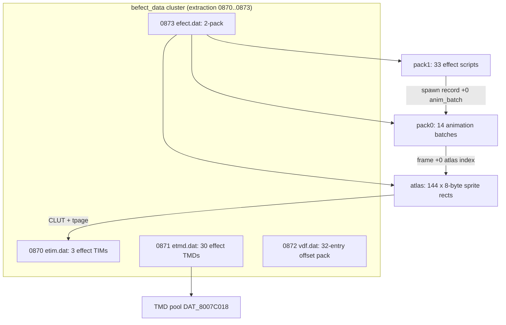

# Effect bundles

Two unrelated formats carry the "effect" name. The one battle code uses is the
**runtime 2-pack** `data\battle\efect.dat` (extraction entry 0873): a sprite
atlas, a pack of sprite animations and a pack of effect scripts that together
drive the 2D billboard effects (hit sparks, element puffs, bursts). The other
is an **on-disc bundle** with magic `0x02018B0C`, found in exactly one PROT
entry. This page also maps the four-file `befect_data` cluster that `efect.dat`
belongs to, since the effect textures, the 3D effect-model library and the
battle numeral sheet all live there.

## At a glance

| Thing | Where | Parser |
|---|---|---|
| `efect.dat` 2-pack | extraction 0873; live at `_DAT_8007BD5C` | `legaia_engine_vm::effect_vm::EffectCatalog::from_efect_dat_bytes` |
| `befect_data` cluster | extraction 0870..0873 (`etim` / `etmd` / `vdf` / `efect`) | `legaia_asset::befect_cluster`, CLI `asset befect-cluster` |
| Runtime effect pool | `_DAT_8007BD30`, 5008 bytes | [`effect-vm.md`](../subsystems/effect-vm.md) |
| Consumers | `FUN_801DE914` / `FUN_801DFDF8` / `FUN_801E0088`, battle overlay PROT 0898 | - |
| On-disc bundle `0x02018B0C` | `0000_init_data` only | `legaia_asset::effect_bundle` |



## Runtime effect format - 2-pack wrapper

`efect.dat` is byte-identical between the disc (PROT.DAT sector `0x9086`) and
the live post-init buffer at RAM `_DAT_8007BD5C = 0x800E425C` in a battle save
state. Confidence: **Confirmed**; every field below is pinned from the
consumer.

### Buffer layout

| Offset | Size | Field | Meaning |
|---|---|---|---|
| `+0` | u32 | `pack0_offset` | absolute file offset; fixed up to a pointer on first init |
| `+4` | u32 | `pack1_offset` | absolute file offset; fixed up to a pointer on first init |
| `+8` | N × 8 | sprite atlas | inline entries up to pack0 (144 in retail) |
| `pack0` | - | `u32 count, u32 entry_offsets[count]` | animation batches (14; at `0x488`) |
| `pack1` | - | `u32 count, u32 entry_offsets[count]` | effect scripts (33; at `0x900`) |

The pack offset tables hold **absolute file offsets**, not the `word*4`
offsets of [`asset::pack`](pack.md).

### Sprite atlas entry (8 bytes)

Pinned from `FUN_801E0088` pass 2 (the sprite-emit block near `0x801E0840`),
which reads the entry byte-wise to build each child's GPU sprite primitive.

| Offset | Size | Field | Meaning |
|---|---|---|---|
| `+0` | u8 | `u` | source texel U within the texture page |
| `+1` | u8 | `v` | source texel V |
| `+2` | u8 | `w` | sprite width in texels |
| `+3` | u8 | `h` | sprite height |
| `+4` | u16 | `clut` | CLUT (CBA) id, copied to the primitive's CLUT field (`prim+0xe`) |
| `+6` | u8 | `tpage` | texture-page byte, copied to the primitive's tpage field (`prim+0x16`) |
| `+7` | u8 | - | unknown / reserved |

The texel rectangle is `(u, v)..(u+w-1, v+h-1)`. The atlas carries only VRAM
coordinates; the pixels are blitted at battle load.

The `+4` / `+6` order matters (emit at about `0x801E0980`). The common value
`0x7680` is the **CLUT**: as a CBA it decodes to framebuffer `(0, 474)`, an
effect-CLUT row. The tpage is the byte at `+6` (e.g. `0x25` = page `(320,0)`,
4bpp). Not "billboards sample page `(0,0)` at 8bpp": that reading swaps the
two fields. Engine: `engine-vm` `SpriteAtlasEntry`.

### pack0 entry - animation batch

Field roles come from the walker's spawn and frame-advance code
(`overlay_battle_801e0088.txt`).

| Offset | Size | Field | Meaning |
|---|---|---|---|
| `+0` | u8 | `frame_count` | number of 6-byte frames; copied to `child[+0]` at spawn |
| `+1` | u8 | flags | not read by the walker |
| `+2` | N × 6 | frames | see below |

| Frame offset | Size | Field | Meaning |
|---|---|---|---|
| `+0` | u8 | atlas index | indexes the inline atlas |
| `+1` | u8 | delay | frames this frame holds (`<<3` into the child wait counter) |
| `+2` | u8 | speed | per-frame motion scalar; multiplies the child velocity |
| `+3..+5` | 3 | - | not read by the walker |

### pack1 entry - effect script

| Offset | Size | Field | Meaning |
|---|---|---|---|
| `+0` | u8 | `child_count` | number of 14-byte spawn records |
| `+1` | u8 | flags | bit 0 = randomize spawn offsets; copied to `master[+1]` |
| `+2` | i16 | `spread` | half-range for the random offset rewrite |
| `+4` | N × 14 | spawn records | see below |

Each spawn record is consumed once by `FUN_801E0088` pass 1 when its child
spawns (`0x801E0184..0x801E03F0`). The two planar legs are rotated into world
space by the master's spawn angle through the 4096-entry trig tables
`_DAT_8007B81C` / `_DAT_8007B7F8`.

| Offset | Size | Field | Meaning |
|---|---|---|---|
| `+0x00` | u8 | `anim_batch` | pack0 index: the child's sprite animation |
| `+0x01` | u8 | `delay` | frames the master waits before the next record (`<<3`) |
| `+0x02` | i16 | `offset_a` | planar spawn offset, leg A (rotated, `>>4`) |
| `+0x04` | i16 | `height` | vertical spawn offset (`<<8`, subtracted from Y) |
| `+0x06` | i16 | `offset_b` | planar spawn offset, leg B (rotated, `>>4`) |
| `+0x08` | i16 | `vel_a` | planar velocity, leg A (rotated, `>>12`) |
| `+0x0A` | i16 | `vel_y` | vertical velocity (copied to `child[+6]`) |
| `+0x0C` | i16 | `vel_b` | planar velocity, leg B (rotated, `>>12`) |

When flags bit 0 is set, the spawn API `FUN_801DFDF8` **rewrites `+0x02` and
`+0x06` of every record in place** with `rand() % (2 * spread) - spread`. The
resident buffer mutates on every randomized spawn, so those two fields are
scratch as much as data. Full lifecycle:
[`effect-vm.md`](../subsystems/effect-vm.md#the-extracted-pass-1-state-algebra).

<a id="battle-effect-cluster-befect_data-cdname-872"></a>

### Battle effect cluster (`befect_data`)

`efect.dat` is one of four dev-named files in the retail `befect_data` CDNAME
block: defines `872..875`, which are **extraction entries 0870..0873** under
the [−2 numbering correction](cdname.md#numbering-space). The battle scene
loader `FUN_800520F0` pulls them as a sequential state machine (sub-state byte
at `gp+0xa59`). Retail's dev-path open is a trap stub, so each load resolves
through the **raw TOC index** (`FUN_8003e8a8`; raw = extraction + 2). Read off
`ghidra/scripts/funcs/800520f0.txt` and byte-checked per entry:

| Loader case | Dev-path string | Raw index | Extraction | Content |
|---|---|---|---|---|
| `0x8` | `h:\prot\battle\etim.dat` (`0x80015358`) | `0x368` | **0870** | effect texture pages (3-TIM pack) |
| `0xb` | `h:\prot\battle\etmd.dat` (`0x80015370`) | `0x369` | **0871** | effect 3D-model library (30-TMD `asset::pack`, registered via `FUN_80026b4c`) |
| `0xb` | `h:\prot\battle\vdf.dat` (`0x80015388`) | `0x36A` | **0872** | VDF buffer (32-entry offset pack; asset type `0x07`, appended via `FUN_8001fbcc`) |
| `0xc` | `data\battle\efect.dat` (`0x800153a0`) | `0x36B` | **0873** | the 2-pack; initialised by `FUN_801DE914` |
| `0x4` | - (battle-type-conditional) | `0x367` / `0x36D` | 0869 / 0875 | streaming files `[type-0 VAB chunk][type-3 chunk]`; `0x36D` when `DAT_8007bd11 == 4`. Outside the block: these are the class-2 sound banks ([sfx-table.md](sfx-table.md)) |

Label traps: the extraction filename labels for 0870 / 0871 read `sound_data`
(the +2 label shift), and extraction **0874** is the retail `player_data` file
(`player.lzs`), not effect content. Its three LZS sections are the field
character mesh pack, auxiliary models and field-character textures
([`character-mesh.md`](character-mesh.md)).

#### Entry contents (byte-checked)

| Entry | Dev name | Structure |
|---|---|---|
| 0870 | `etim.dat` | 16-byte pack header `[u32 3][u32 word_offsets 0x4, 0x208C, 0x4114]` (×4 → `0x10`, `0x8230`, `0x10450`); three 64×256 4bpp TIMs targeting VRAM `(320,0)` / `(384,0)` / `(448,0)`, CLUTs `(0,474)` / `(0,475)` / `(0,476)`. The first TIM's flags word is `0x00010008` (bit 16 set; strict TIM parsers reject it) |
| 0871 | `etmd.dat` | `asset::pack`, `word[0] = 30`, 30 Legaia-TMD magics at the declared word offsets |
| 0872 | `vdf.dat` | offset pack, 32 strictly-ascending entries (~96-byte records) |
| 0873 | `efect.dat` | the 2-pack: 144 atlas entries, `pack0@0x488` (14 batches), `pack1@0x900` (33 scripts) |

`asset befect-cluster PROT.DAT --cdname CDNAME.TXT [--out DIR]` slices each
entry at its footprint (the sector gap to the next entry, [`prot.md`](prot.md))
and classifies the parts. It converts the CDNAME `befect_data` symbol into the
extraction frame (`cdname::block_range_for_name_extraction`), so its window is
exactly 0870..0873.

#### The battle value readout's glyph sheet lives here too

The **third** TIM of `etim.dat` - page `(448, 0)`, CLUT row 476 - holds the
battle screen's value-readout sheet in its lower half: the numeral a landed
hit throws and the labels the combo cluster stacks. Decode the page at 4bpp
through the sub-palette at VRAM `(48, 476)` (CBA word `0x7703`):

| Texels | Content |
|---|---|
| `v = 64..=87` | ten 24x24 digit cells, strip order **`1234567890`** |
| `u = 0..=111, v = 152..=175` | the word `SUPER` |
| `u = 0..=111, v = 176..=199` | the word `HYPER` |
| `u = 112..=215, v = 176..=199` | the shared tail `ARTS!!` |
| `u = 0..=127, v = 200..=223` | the word `MIRACLE` |
| `u = 128..=199, v = 200..=223` | the word `NEW` |
| `u = 0..=55, v = 224..=239` | the `DAMAGE` label |
| `u = 0..=31, v = 240..=255` | the `HIT` label |
| `u = 32..=79, v = 240..=255` | the `TOTAL` label |

The strip starts at `1`, so digit `d`'s cell is `((d + 9) % 10) * 24`. This is
a different sheet from the HUD's `cur / max` numerals, which are 8x12 cells
off the menu-glyph atlas through CLUT row 510
([`battle.md` § screen chrome](../subsystems/battle.md#battle-screen-chrome-packet-pinned)).

##### The four Arts banners are composed, not stored

Only one `ARTS!!` exists on the sheet. The banner emitter `FUN_801E2650` draws
a pair of quads per call: the first takes the position-selected word row, the
second always takes `u 112..=215, v 176..=199`. The four positions render
`NEW ARTS!!` / `HYPER ARTS!!` / `MIRACLE ARTS!!` / `SUPER ARTS!!`, the halves
sliding in from opposite sides to a per-position seam. `ctx[+0x28B]` selects
the banner and `ctx[+0x28C]` clocks it; it is the Arts announcement banner,
not a full-screen flash
([`reference/functions/audio.md`](../reference/functions/audio.md#audio)).

A host with the battle effect atlas resident already has the digits. The
per-hit numeral's geometry and pop / rise envelope are pinned in
[`engine-vm::battle_value_readout`](../../crates/engine-battle-vm/src/battle_value_readout.rs).

### Effect texels in VRAM - pixel-verified

`FUN_800198e0` is the general packed-image → VRAM uploader (loader state `9`
walks a pack and calls it per entry). It reads a per-chunk tag / flag word,
builds a PSX `RECT`, and calls `FUN_800583c8` = `LoadImage` (`0x800156d4`),
keeping a CLUT cache at `0x8007BEC0`. The title / menu / save overlays and the
type-`0x01` CLUT walker `FUN_8001fe70` use the same routine.

Two texture pools serve battle effects:

| Pool | Source | Residency | VRAM |
|---|---|---|---|
| `etim.dat` | extraction 0870 | **battle-only**, uploaded on battle entry | pages `(320,0)` / `(384,0)` / `(448,0)`, CLUT rows 474..476 |
| `player_data` §2 band | extraction 0874 §2, eight TIMs | **field-resident**, kept through battle | `fb_y = 256+`, CLUT rows 473 / 475 / 478 |

**`etim.dat`** matches VRAM pixel-exact in every stable Rim Elm battle capture
(command menu, submenu, pre- and post-Seru-capture frames; a still-loading
frame matches partially). Its pages sit at `fb_y = 0` in columns the field
uses for town stage textures, so field captures hold unrelated texels there.
The engine uploads it on battle entry
(`engine-core::scene::upload_flame_atlas_into_vram`) into a throwaway VRAM copy
that battle exit discards.

**The `player_data` §2 band** holds the three field-character atlases at
`(832,256)` / `(852,256)` / `(872,256)`, two shared 256-colour pages at
`(320,256)` / `(384,256)`, and two 16×64 extension tiles at `(880,384)` /
`(880,448)` (full table:
[`character-mesh.md` § Textures](character-mesh.md#textures-field-form),
byte-exact against a live field VRAM dump). During a Gimard cast, five blocks
(`(832,256)`, `(852,256)`, `(872,256)`, `(880,384)`, `(880,448)`) match VRAM
at their rect-header targets, and the `(320,256)` / `(384,256)` pages match a
`town01` field capture byte-exact over 256 rows. The engine uploads the band
at scene entry (`scene::upload_effect_textures_into_vram`); the field
VRAM-parity oracle applies the same upload image-pages-only
(`upload_clut = false`). The per-entry `tim_scan` mis-slices these;
`befect_cluster::scan_tims` resolves all eight.

#### 2D billboards sample `etim`

The `efect.dat` atlas drives the per-frame billboard emit in `FUN_801E0088`
pass 2. In a live battle capture on a melee impact frame, the white hit-spark
is drawn as textured quads (`POLY_FT4` / `POLY_GT4`, commands `0x2c` / `0x2e` /
`0x3c` / `0x3e`) sampling the `etim.dat` pages `(320,0)` and `(448,0)` at 4bpp
with CLUT rows 473..480. Those pages appear only in the impact frame, not in a
command-menu frame of the same fight (party and monster meshes sit at pages
`(512,256)` / `(576,256)` / `(832,0)`). No on-screen primitive samples page
`(0,0)`, and the battle has no 8bpp textured primitives.
`World::active_effect_sprites` yields the effect page + CLUT from the atlas.

#### The 3D effect-model library is `etmd.dat`

The 30-TMD pack of extraction 0871 loads verbatim at `0x800CA25C` in a live
cast capture, and all 30 register into the TMD pool `DAT_8007C018` via
`FUN_80026B4C` (battle init, loader case `0xb`, raw index `0x369`). In that
solo-party capture they occupy `DAT_8007C018[3..32]`; the library base is
`party_count + 2`
([move-power.md](move-power.md#the-model-base-gp0x754)).

- Gimard's flame is `DAT_8007C018[26]` in that capture = pack entry 23
  ([`battle-action.md`](../subsystems/battle-action.md#seru-magic-summon-overlay-dispatch)).
- The engine loads the library at scene entry
  (`engine-core::scene::seed_effect_model_library_from_etmd`) into
  `World::global_tmd_pool[3..=32]`, overwriting the two field-pack tail slots
  as retail's battle init does. `GIMARD_TAIL_FIRE_MODEL_INDEX = 26`.
- None of the five TMDs of extraction 0874 §0 are resident in main RAM during
  the cast. 0874 §0 is the *field* character pack (Vahn / Noa / Gala /
  savepoint / auxiliary;
  [`character-mesh.md` § On-disc layout](character-mesh.md#on-disc-layout)).
  Its smallest TMD (2 objects / 18 verts / 25 prims) bakes
  `cba=0x778E@(224,478)` / `tsb=0x001D@(832,256)` and looks flame-like; the
  engine keeps it only as a preview fallback
  (`engine-core::scene::ETMD_TAIL_FIRE_MODEL_INDEX`).

#### How the Gimard flame renders

A player Seru-magic cast pages in a per-summon code overlay
(`FUN_8003EC70(id - 0x79)` → extraction PROT 903..913; Gimard `0x81`, whose
attack is *Burning Attack*, → PROT 903), which supplies the summon's spawn
logic.

- **Primitives.** In a mid-cast capture (decoded with
  `legaia_mednafen::prim_pool`) the flame is about 15 Gouraud-textured
  primitives (`POLY_GT3` / `POLY_GT4`) in a ~40×50 px region. All sample page
  `(832,256)` at 4bpp with CLUT **row 478**, across columns 0 / 16 / 32 at
  once - the `player_data` §2 band, not the 0870 pages. The `cba` / `tsb` are
  applied at render time; none of the ~33 registered TMDs bakes that CBA.
- **Animation is geometric, not CLUT cycling.** Two animation-distinct capture
  frames (`battle_gimard_tail_fire_a` / `_b`) have a byte-identical CLUT band
  (VRAM rows 470..499) while their framebuffers differ by about 21%.
- **Render path.** A PCSX-Redux trace of a player Gimard cast shows the battle
  per-actor draw `FUN_80048A08` in lockstep with the rigid-TRS keyframe
  decoder `FUN_8004998C` → `FUN_80043390`. On the catalogued
  `gimard_burning_attack` state
  (`scripts/pcsx-redux/autorun_enemy_move_render_path.lua`, 400 vsyncs):
  `FUN_80048A08` = 213 hits, `FUN_8004998C` = 213, `FUN_80023070` = 11,
  `FUN_801F7088` = 0. The rate is one per live actor per game frame: 2 per
  frame in that 1-vs-1 cast, 6 in a 3-vs-3 encounter
  (`rim_elm_queen_bee_battle`, 1006 hits over 900 vsyncs), 2 in
  `rim_elm_gimard_victory` (420 over 700).
- So the player summon is posed like a monster body, with per-object rigid TRS
  keyframes. The port is the battle TRS-keyframe draw in
  `engine-vm/anim_vm.rs`.
- **Stager overlays.** Extraction 903..913 carry real move-VM part records,
  recovered at link base `0x801F69D8` by `legaia_asset::summon_overlay` (the
  `jal 0x80023070` is in the SCUS stager `FUN_80021B04`, not in the overlay).
  The stager spawns 8 flame part-actors via `FUN_80021B04`; that phase loop is
  decoded from extraction 905, the spell-`0x83` slot. The engine drives the
  records as a `summon::SummonScene`, which per the trace is not the player
  summon's per-frame render path.
- **CLUT uploads.** The overlay's three conditional `LoadImage` calls
  (`RECT = {x=0, y=481+s5, w=240, h=1}`, source `a2 + s5*480 + 0x894`) target
  VRAM row 481+, the party-CLUT region, not row 478.
- **The enemy move differs.** *Tail Fire* (spell id `0x27`) seats the move-FX
  module PROT 0900 in slot B and renders as one move-VM part-actor in the pool
  `DAT_801C90F0`, ticked by `FUN_80021DF4` → `FUN_80023070`
  ([`battle-action.md` § Enemy "Fire Tail"](../subsystems/battle-action.md#enemy-fire-tail---move-vm-part-not-the-widget-path)).
  `FUN_80023070`'s per-frame hit count tracks the pool's live-slot count (13
  parts → 12-14 hits; pool drained → 0), with `FUN_80021DF4` 1:1 beside it.
  The engine renders the static flame mesh with the row-478 CLUT.

### Consumer cluster

The runtime consumer is three functions in the battle overlay (PROT 0898).
Dumps: `ghidra/scripts/funcs/overlay_battle_*.txt`.

| Function | Span | Role |
|---|---|---|
| `0x801DE914` | 0x138 | init / pack fixup |
| `0x801DFDF8` | 0x290 | public spawn-effect API |
| `0x801E0088` | 0x970 | per-frame walker (update + render) |

**`0x801DE914` - init.** Called by `FUN_800520F0` case `0xE` with
`(id=0x1000, param=0xA00)`. It zeroes the 5008-byte pool at `_DAT_8007BD30`,
treats `_DAT_8007BD5C` as the 2-pack, and converts both packs' offsets to
pointers (gated by `byte[3] == 0`). It writes the 16-byte head record
`(u16 id, u16 param, u32 buf+8, u32 pack0_data+4, u32 pack1_data+4)` and sets
the init flag `_DAT_8007BD58 = 1`. The two immediates are the walker's global
scalars: pool `+0` (`0x1000`) is the child **motion scale** (unity:
`* scale * 8 >> 15` reduces to `pos += vel * frame_speed`), and pool `+2`
(`0xA00`) is the sprite **world scale**
(`quad_size = atlas_w/h * 0xA00 >> 8`, ×10 texel size before projection).

**`0x801DFDF8` - spawn API.** Signature
`(byte effect_id, short* world_pos, ushort angle)`. It reads
`pack1[effect_id]` from the head record, allocates the first free slot in the
32 × 28-byte master pool, writes position and angle, copies the script header
bytes, and sets the script cursor to `entry + 4`. With flags bit 0 set it
randomizes the spawn offsets as above. Two ids are special-cased:
`4 → 0x801F5D90` and `0x13 → 0x801F5CF8`. Those targets are not pack1 scripts.
Each is an 18-byte move-VM program in 0898's tail,
`WAIT_SET 0 / 0x17 <mode> / WAIT_SET 0 / HALT` (mode `0` at `0x801F5D90`, mode
`1` at `0x801F5CF8`), one alignment word before the burst stager record its
mode selects (`0x801F5DA4` / `0x801F5D0C`). Op `0x17` is the battle-overlay
escape into the radial particle burst `FUN_801F30C4`, whose two arms are the
same burst at two radii. The install of that address as a move buffer is
inferred from the bytes; the call has not been traced through. Burst anatomy:
[`functions/battle.md`](../reference/functions/battle.md#801f30c4).

**`0x801E0088` - per-frame walker.** Pass 1 does spawn cadence plus child
animation and motion, repeated `DAT_1F800393` times for frame-skip catch-up.
Pass 2 renders one flat textured semi-transparent quad per live child
(`0x09000000` packet tag, `0x2E`-code primitive, brightness from a triangular
age envelope, submitted through `func_0x8003D2C4`). Per-slot algebra:
[`effect-vm.md`](../subsystems/effect-vm.md#the-extracted-pass-1-state-algebra).

### Runtime pool layout (`_DAT_8007BD30`, 5008 bytes total)

| Offset | Size | Content |
|---|---|---|
| `+0x000` | 16 | head record set by init |
| `+0x010` | 4096 | 128 × 32-byte child slots: per-sprite render state |
| `+0x1010` | 896 | 32 × 28-byte master slots: per-effect-instance state |

`16 + 4096 + 896 = 5008`, and the init zeroes `0x4E4 = 1252` words, the same
5008 bytes (`sltiu v0,a0,0x4e4` at `0x801DE938`). 32 simultaneous effects at
about 4 sprites each fill the 128-child pool.

### How a move reaches this 2D pool - the bit-7 multiplex

Two producers call the spawn wrapper `FUN_801DFDF0`, and both split an
effect-id byte on bit 7:

- **bit 7 clear** (`0x01..=0x63`) → the 3D move-FX path: prototype
  `0x801F6324[id]` staged through `FUN_80050ED4` → `FUN_80021B04` (the move-VM
  scene graph, not this pool). `0x64` is a hardcoded screen flash.
- **bit 7 set** (`0x80..=0xFE`) → this pool: `FUN_801DFDF0(id & 0x7F)` spawns
  `pack1[id & 0x7F]`, including the two special-cased ids.

| Producer | List it walks |
|---|---|
| `FUN_801e09f8` | a move-power record's `+0x12` / `+0x16` lists ([move-power.md](move-power.md#effect-id-list-semantics-0x12--0x16)) |
| `FUN_801e22c8` | a cue-group record at `0x801F6470`, 5-byte stride, indexed by its group-id argument ([move-power.md](move-power.md#the-cue-group-table-0x801f6470)) |

`FUN_801e22c8` is called by the battle effect driver `FUN_800402f4`, which
passes either the neutral modulation colour `0x808080` or a coloured flash.
On its bit-7-clear arm it stages the prototype at scale `0x1000`
unconditionally, and when `0x801F6418[id] != 0` (no `< 0x32` bound here,
unlike `FUN_801DEA50`'s arm) hands an 8-byte `[x, 0x1DC, 0x10, 1]` block to
`FUN_80058490`. That routine is **`MoveImage`**: it materialises the string
`MoveImage` at `0x800156EC` (`0x800584AC..0x800584B4`) and passes it with the
block to `FUN_80058170`. The block is a PsyQ `RECT`, and the copy lands at
`(0xE0, 0x1DC)`: a 16-entry CLUT row at VRAM `y = 476`. `0x801F6418` is that
row's **source x** (values `0x00` / `0xB0` / `0xC0` / `0xD0`), not a sound id
([art-data.md](art-data.md#the-cue-tables)). Provenance:
`FUN_801e22c8 in PROT entry 0898`,
`ghidra/scripts/funcs/overlay_battle_action_801e22c8.txt` (disassembly).

Engine: `engine-core::move_power::EffectListEntry` (`Spawn` vs `AltEffect`).

<a id="effect-id--triggering-move---the-join-run-against-the-disc"></a>

### Effect id → triggering move - the join

There is no string table naming effects; an effect's identity is its
`(space, id)` key plus the moves that cite it. The join derives from the disc:
`legaia_asset::move_power::effect_trigger_index` builds it and
`asset move-power <PROT 0898 entry> --effect-index` prints it (`--json` for
the machine form). On the retail disc, 38 of the 44 move-power records are
populated and cite **28** distinct keys. "Fired from" is the union over a
key's citers (`both` = cited from `+0x12` by some move and from `+0x16` by
some move):

| Key | Triggering move ids | Fired from |
|---|---|---|
| `efect2d 0x0B` | `0x37`, `0x3F`, `0x69` | both |
| `efect2d 0x0D` | `0x04`, `0x05`, `0x06`, `0x25`, `0x2A`, `0x36`, `0x37`, `0x3F`, `0x46`, `0x61`, `0x68`, `0x69`, `0x6A` | both |
| `efect2d 0x0E` | `0x05`, `0x06`, `0x25`, `0x2A`, `0x36`, `0x46`, `0x61`, `0x68`, `0x69`, `0x6A` | both |
| `efect2d 0x0F` | `0x28`, `0x33`, `0x67` | both |
| `efect2d 0x10` | `0x2A` | both |
| `efect2d 0x11` | `0x2B`, `0x64` | both |
| `efect2d 0x12` | `0x6A` | both |
| `efect2d 0x13` | `0x05`, `0x36` | both |
| `efect2d 0x16` | `0x61` | both |
| `efect2d 0x18` | `0x19`, `0x1D` | contact |
| `efect2d 0x1D` | `0x06` | launch |
| `efect2d 0x1E` | `0x3F` | contact |
| `flash` | `0x06` | launch |
| `proto3d 0x12` | `0x19`, `0x1D`, `0x32`, `0x35`, `0x66` | contact |
| `proto3d 0x15` | `0x1A`, `0x1E` | launch |
| `proto3d 0x16` | `0x1A`, `0x1E` | launch |
| `proto3d 0x19` | `0x1C` | launch |
| `proto3d 0x1A` | `0x1C` | launch |
| `proto3d 0x1B` | `0x04`, `0x25`, `0x27`, `0x46`, `0x61` | both |
| `proto3d 0x1C` | `0x2D`, `0x63`, `0x68` | both |
| `proto3d 0x1D` | `0x05`, `0x2A`, `0x36` | both |
| `proto3d 0x1E` | `0x34`, `0x37`, `0x69` | both |
| `proto3d 0x1F` | `0x37`, `0x3A`, `0x65`, `0x6A` | both |
| `proto3d 0x27` | `0x06` | contact |
| `proto3d 0x28` | `0x06` | launch |
| `proto3d 0x2A` | `0x3F` | contact |
| `proto3d 0x2B` | `0x3F` | launch |
| `proto3d 0x2C` | `0x3F` | contact |

What the table shows:

- **Each space uses one small band.** The move-power lists cite only
  `efect2d 0x0B..=0x1E` (12 ids) and `proto3d 0x12..=0x2C` (15 ids). Other ids
  reach the pool through the cue-group table or the ambient / cast paths.
- **Two keys are the generic hit sprites.** `efect2d 0x0D` (13 moves) and
  `efect2d 0x0E` (10). The remaining 26 keys average two moves each, and 13
  are cited by exactly one move.
- **The contact / launch split is real.** 14 keys are cited from both lists,
  6 from `+0x12` only, 8 from `+0x16` only.
- **The screen flash has one citer** (move `0x06`, launch).
- **Six of the fifteen `proto3d` keys swap a palette.** Nine carry CLUT
  source-x `0x00`; `0x1F` is `0xB0`; `0x1E`, `0x27`, `0x28`, `0x2A`, `0x2B`,
  `0x2C` are `0xD0`. Accessor
  `legaia_asset::move_power::EffectAuxTables::effect_clut_x`; the CLI prints
  the column under the stale label `sfx=`.

Move ids resolve to names through the SCUS spell-name table
([spell-table.md](spell-table.md); `asset spell-names`). The bands are those
of [move-power.md](move-power.md#indexing---power_tablemapmove_id):
`0x04..=0x1F` unnamed internal tiers, `0x25..=0x74` named monster specials.

### Side-band streaming-effect handler

`0x801F17F8`, called from `FUN_800520F0` case `0xFF`, streams one of two
runtime files via `FUN_800558FC`:

- `data\battle\summon.dat` when `_DAT_8007BD24[0x26B] & 0x80 != 0`;
- `data\battle\readef.dat` otherwise.

`FUN_800558FC` ignores the path string and uses its fourth argument as a raw
TOC index: `summon.dat` = `0x37F`, `readef.DAT` = `0x380`, i.e. **extraction
entries 893 / 894** (raw − 2), 103 / 78 slots of `0x10800` bytes. Byte-verified
in the `battle_gimard_tail_fire_a` save state (stream buffer ↔ disc slot;
slot-0 CLUT + texture page ↔ VRAM `(0,488)` / `(512,0)`). Format and parser
(`legaia_asset::summon_readef`): [`summon-readef.md`](summon-readef.md).

<a id="open-questions"></a>

## On-disc effect bundle (magic `0x02018B0C`)

A scan of the PROT corpus finds this format in exactly one entry,
`0000_init_data` (engine bootstrap data). Confidence: header and table
**Confirmed** on that one carrier; the meaning of the offsets is **Unknown**.

Offsets are relative to the magic, which follows a variable-size preamble in
the file (`effect_bundle::detect` reports `magic_offset`).

| Offset | Size | Field | Value |
|---|---|---|---|
| `+0` | u32 | magic | `0x02018B0C` |
| `+4` | u32 | `HEADER_A` | `0x0000001D` = 29: 1 master TMD + up to 28 sub-effect slots |
| `+8` | u32 | `HEADER_B` | `0x0000001E` = `HEADER_A + 1` |
| `+12` | 28 × u32 | offset table | strictly ascending, below |
| after | - | asset region | begins with a master Legaia TMD |

```
0x17F4, 0x1832, 0x198F, 0x1B9B, 0x1D75, 0x1EFD, 0x20BB, 0x224B,
0x2438, 0x260B, 0x26DD, 0x27C3, 0x2982, 0x2AA1, 0x2C44, 0x2D9F,
0x2F77, 0x30E6, 0x3300, 0x34BE, 0x36BE, 0x3805, 0x39B6, 0x3AB4,
0x3C4A, 0x3E23, 0x3F78, 0x404D
```

Slot sizes are `offset[i+1] - offset[i]`; the 28th slot's size depends on the
asset-region layout. The master TMD at `assets_start` carries 1 object, 382
verts, 760 normals, 760 primitives. The 28 offsets do not align with file
positions of sub-TMDs. What they index is not traced: no consumer has been
reached.

```rust
use legaia_asset::effect_bundle;
if let Some(eb) = effect_bundle::detect(&buf) {
    println!("magic @ 0x{:X}, asset region 0x{:X}..0x{:X}",
             eb.magic_offset, eb.assets_start, eb.file_size);
    for (i, slot) in eb.slots.iter().enumerate() {
        let size = slot.size.map(|s| format!("{}", s)).unwrap_or("?".into());
        println!("  slot[{}] off=0x{:X} size={}", i, slot.offset, size);
    }
}
```

Implementation: `crates/asset/src/effect_bundle.rs`.

### The `0x01059B84` word is not this bundle's sibling magic

<a id="the-0x01059b84-word-is-not-this-bundles-sibling-magic"></a>

`0x01059B84` is not a magic. It is a [DATA_FIELD](data-field.md) chunk header,
`(TIM_LIST << 24) | payload_len`, on `town01`'s texture pack (payload length
`0x059B84`). See [`field-pack.md`](field-pack.md).

## See also

- [`subsystems/effect-vm.md`](../subsystems/effect-vm.md) - the effect pool and spawn API.
- [move-power.md](move-power.md) - the effect-id lists and cue groups that produce spawns.
- [`summon-readef.md`](summon-readef.md) - the side-band streaming slots.
- [PSX TIM](tim.md) / [Legaia TMD](tmd.md) - the texture and mesh formats in the cluster.
- [`subsystems/battle.md`](../subsystems/battle.md) - the battle scene that spawns these effects.
