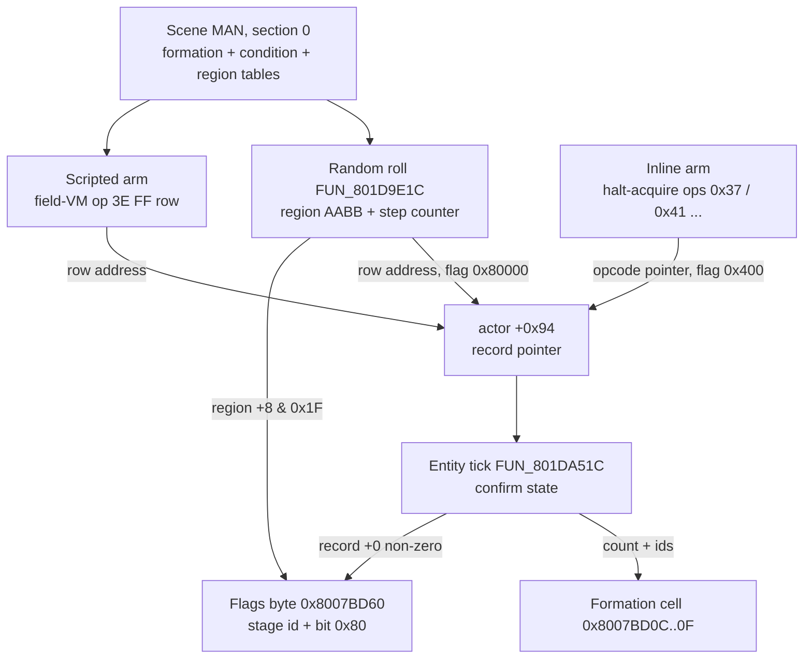
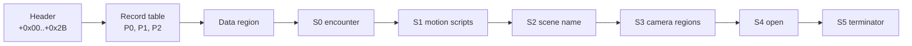

# Encounter record format

An **encounter record** names the monsters of one battle: a count and up to four monster ids. Every battle in the game starts from one, whether a random roll or a scripted boss fight. The record's address is parked on a field actor at `actor[+0x94]`, and the entity tick `FUN_801DA51C` copies its ids into the four-byte **formation cell** at `0x8007BD0C` that battle init reads.

There is no standalone encounter file. Records live in each scene's **MAN** asset (the per-scene script and placement container, asset type `0x03`): section 0 holds a formation table plus the region table that drives random rolls. This page also covers two neighbours that share the MAN's tail-section chain and the same code cluster: the section-3 **camera-region table** and the camera's **visible tile window** at scratchpad `0x1F8003E8..EB`.

## At a glance

**Encounter record** (one formation-table row; stride 8 in retail):

| Offset | Size | Field | Meaning | Confidence |
|---|---|---|---|---|
| `+0x00` | u8 | scripted predicate | Non-zero raises bit `0x80` of the per-battle flags byte `0x8007BD60` | Confirmed |
| `+0x01` | u8[2] | reserved | Not read by the formation copy | Confirmed (unread) |
| `+0x03` | u8 | `monster_count` | `0..=4`; `0` leaves the formation cell cleared | Confirmed |
| `+0x04` | u8[count] | `monster_ids` | Monster-archive ids, one per formation slot | Confirmed |
| after | - | stride padding | Not consumed by the formation copy | Confirmed (unread) |

**MAN section 0** (the encounter section, carved by `FUN_8003A110`):

| Offset | Size | Field | Meaning |
|---|---|---|---|
| `+0x00` | u8 | `formation_stride` | Row size of the formation table (retail `8`) |
| `+0x01` | u8 | `condition_stride` | Row size of the condition table (retail `4`) |
| `+0x02` | u8 | `region_stride` | Row size of the region table (retail `12`) |
| `+0x03` | u8 | `formation_count` | Then `formation_count` encounter records |
| next | u8 + rows | condition table | `[u16 flag_id][s16 region_count]` per row; `0xFFFF` = unconditional |
| next | u8 + rows | region table | Tile AABB, rate increment, formation slice, backdrop byte |

**Camera-region record** (MAN section 3, `[u8 count]` then 18-byte rows): `[kind][4 box bytes][mode byte][12 parameter bytes]` - [decoded below](#man-section-3-the-camera-region-table).

**Visible tile window** (`0x1F8003E8..EB`): four signed tile offsets `[near X, near Z, far X, far Z]` from the camera's tile - [decoded below](#the-scratchpad-window-0x1f8003e8eb).



## Contents

- [Confidence](#confidence)
- [Layout](#layout)
- [Reader](#reader)
- [Writer (record-pointer install)](#writer-record-pointer-install)
- [Formation cell + battle-data variant selector](#formation-cell--battle-data-variant-selector)
- [Scripted-battle id path (`FUN_8005567c`)](#scripted-battle-id-path-fun_8005567c)
- [Random-encounter trigger path](#random-encounter-trigger-path)
- [The MAN header and section chain](#the-man-header-and-section-chain)
- [MAN section 3: the camera-region table](#man-section-3-the-camera-region-table)
- [What this doesn't tell us](#what-this-doesnt-tell-us)
- [Random vs scripted formations (the MAN encounter section)](#random-vs-scripted-formations-the-man-encounter-section)
- [Files referencing this format](#files-referencing-this-format)

## Confidence

**Confirmed (record shape, reader, install paths, section 0 tables, camera-region table) - Inferred (per-opcode header bytes of the inline arm).**

- The reader (`FUN_801DA51C` body at `0x801DA5F8..0x801DA678`) is decoded instruction by instruction.
- Three arms install the pointer: the random roll, the scripted `3E FF <row>` op, and the field VM's halt-acquire opcodes (`0x37`/`0x41`, `0x38`, `0x43`, `0x47`, `0x4C`). The first two point at a MAN formation row. The third stores the **current opcode pointer** (`s0 = bytecode + pc`), so its "record" is the bytes overlaying the install opcode itself.
- How each halt-acquire opcode packs its own bytes into `+0x0..+0x2` varies per opcode and is decoded case by case in [`subsystems/script-vm.md`](../subsystems/script-vm.md).

The carriers are the per-scene field-VM script bundles ([`scene-v12-table.md`](scene-v12-table.md) sister pairs and [`scene-bundles.md`](scene-bundles.md) `scene_event_scripts`) and the scene MAN.

## Layout

```text
+0x00  u8     scripted predicate    ; non-zero => per-battle flag 0x80
+0x01  u8[2]  reserved              ; not read by the formation copy
+0x03  u8     monster_count         ; 0..4 inclusive
+0x04  u8[N]  monster_ids           ; N == monster_count; monster-archive ids
[stride padding - not consumed by the formation copy]
```

The reader copies `monster_ids[0..count]` into the formation cell `0x8007BD0C..0x8007BD0F`, one byte per slot. Slots beyond `count` stay zero, and `monster_count == 0` leaves the whole cell clear (no monsters spawn).

Parsers: `legaia_asset::man_section::FormationRecord` (the MAN row, keeps `+0..+2` as `header_bytes`) and [`EncounterRecord`](../../crates/engine-battle/src/encounter_record.rs) (the runtime window: `COUNT_OFFSET = 3`, `IDS_OFFSET = 4`). Both reject `count > 4`.

## Reader

`FUN_801DA51C` is the world-map / field entity tick ([`subsystems/world-map.md`](../subsystems/world-map.md#fun_801da51c---world-map-entity-tick)). `s1` is the actor record. Its confirm state first tests the predicate byte:

```mips
801da5f8  lw v0,0x94(s1)         ; v0 = encounter_record_ptr = actor[+0x94]
801da600  lbu v0,0x0(v0)         ; v0 = record[+0]
801da608  beq v0,zero,0x801da620  ; zero: leave the flags byte alone
801da60c  _lui v1,0x8008
801da610  lbu v0,-0x42a0(v1)      ; 0x8007BD60, the per-battle flags byte
801da618  ori v0,v0,0x80
801da61c  sb v0,-0x42a0(v1)
```

Then it clears the cell and copies the ids:

```mips
801da620  lui v0,0x8008
801da624  addiu s0,v0,-0x42f4   ; s0 = formation_cell_base = 0x8007BD0C
801da628  sb zero,0x3(s0)        ; clear slot 3 (0x8007BD0F)
801da62c  sb zero,0x2(s0)        ; clear slot 2
801da630  sb zero,0x1(s0)        ; clear slot 1
801da634  jal 0x801de190         ; helper (effect / sound trigger)
801da638  _sb zero,-0x42f4(v0)   ; clear slot 0 (0x8007BD0C)
801da63c  lw v0,0x94(s1)         ; v0 = actor[+0x94]
801da644  lbu a1,0x3(v0)         ; a1 = monster_count = record[+0x3]
801da64c  beq a1,zero,0x801da67c  ; nothing to copy: skip loop
801da650  _clear a0
801da654  move a2,s0
801da658  lw v0,0x94(s1)         ; re-read record pointer
801da65c  addu v1,a0,a2          ; v1 = &formation[a0]
801da660  addu v0,a0,v0
801da664  lbu v0,0x4(v0)         ; v0 = record[+0x4 + a0] = monster_ids[a0]
801da668  addiu a0,a0,0x1
801da66c  sb v0,0x0(v1)          ; formation[a0-1] = monster_ids[a0-1]
801da670  slt v0,a0,a1
801da674  bne v0,zero,0x801da658  ; loop until a0 == monster_count
```

After the copy the reader clears `entity[+0x94]` and advances the entity's 5-state machine (`entity[+0x8A]++`), so the copy fires exactly once per arm.

**What `record[+0]` holds depends on the arm:**

- An **inline-script** arm points `+0x94` at the install opcode, so `record[+0]` *is* that opcode - non-zero by construction, and the bit is always raised.
- The **`3E FF <row>`** arm and the **random roll** point `+0x94` at a MAN formation row (`ctrl[+0x20] + 1 + row * ctrl[+0x5D]`), so the predicate is authored per row. Retail's scripted and boss rows are exactly the rows with a non-zero byte: `rikuroa` rows 16 and 17 (the lone Caruban fight) read `01 00 00`, while its sixteen random rows read `00 00 00`.

What the raised bit changes is tabulated under [the per-battle flags byte](#the-per-battle-flags-byte-dat_8007bd60).

### What makes a halt an encounter

There is no dedicated "encounter" opcode.

- The inline install opcodes are the field VM's generic **halt-acquire** family, the same ones ordinary script yields use.
- The *consumer* decides: only entities ticked by `FUN_801DA51C` (those carrying the `entity[+0x8A]` state machine) read `+0x94` as a formation record, and only in the confirm state.
- The random path enters that state through the `FUN_801D9E1C` roll in state 0.
- The general scripted arm is op **`0x3E` with `op0 = 0xFF`** (`3E FF <row>`; every `op0 < 100` runs the same body). The handler sets `entity[+0x8A] = 1` and `entity[+0x94] = ctrl[+0x20] + row * ctrl[+0x5D] + 1`. Disc sites: `garmel` rows 8 / 9 = Songi / Zeto, `rikuroa` row 17 = Caruban; boss rows sit outside every region's rollable slice. Full arm in [battle.md](../subsystems/battle.md#scripted-battle-entry-3e-ff-row).

**Engine port.** The field VM mirrors the split:

- The bare arm op (`0x37` / `0x41`) calls `FieldHost::is_scripted_encounter_armed()` and, only when armed, hands `FieldHost::install_scripted_encounter()` the bounded window overlaying the opcode (`[opcode][op1][op2][count][<=4 ids]`).
- `World` parses the window as an `EncounterRecord`, registers the formation and forces the next `on_field_step` roll (`World::install_scripted_encounter` / `arm_scripted_encounter`). A successful install disarms, matching the retail `entity[+0x94]` clear.
- `World::encounters.scripted_armed` stands in for "the active entity's state machine reached the confirm state".

## Writer (record-pointer install)

The script-VM dispatcher `FUN_801DE840` ([`subsystems/script-vm.md`](../subsystems/script-vm.md)) installs the inline record with the pattern at `0x801DEEDC..0x801DEEEC`:

```mips
801deedc  lw v0,0x10(s5)
801deee0  sw s0,0x94(s5)         ; actor[+0x94] = s0 (encounter record pointer)
801deee4  sh zero,0x54(s5)       ; reset actor sub-state
801deee8  ori v0,v0,0x400        ; raise "encounter armed" flag
801deeec  sw v0,0x10(s5)
```

`s0` is set once in the prologue (`addu s0, a0, s8` at `0x801DE858`): the current opcode pointer in the script bytecode. `s5` is the resolved target actor, often the player context `_DAT_8007C364`; when bit 7 of the opcode byte is set, byte `+1` routes through the system-channel resolver `FUN_8003C83C`.

Each opcode pairs the install with its own gate and advances the PC by 3:

| Opcode | Install line | Notes |
|---|---|---|
| `0x37` / `0x41` (shared case) | `0x801DEEDC` / `0x801DEF08` | Bare arm. Second install on `param_3` when the target is `_DAT_8007C364`. |
| `0x38` | `0x801DEFA0` / `0x801DF038` | Same install clause; first branch reads a halfword table at `0x80073F04` into `actor[+0x26]` when the low 7 bits of byte `+1` are zero. |
| `0x43` (sub-op `0/1/A/B`) | `0x801DF3FC` | Movement-target setup follows (`actor[+0x14..+0x1A]` from operands); the encounter arms when the actor arrives. |
| `0x47` | `0x801E1C38` | |
| `0x4C` | `0x801E1F44` / `0x801E21C0` / a third site | Three install sites in one case body, one per inner sub-op. |

All share the pre-install gate:

```text
if (actor[+0x94] != 0  ||  actor == _DAT_8007C364) &&
   ((actor[+0x10] & 0x400) == 0  ||  *_DAT_801C6EA4[+8] != 0)
```

The actor already has a record (re-arm) or is the player context, and the armed flag is clear or the scene allows re-arm.

Case `0x34` also writes `actor[+0x94]` (`pbVar47 + 0xe` and `pbVar47 + 3`). Those writes do **not** raise `0x400` and pair with `actor[+0x9c]` / `actor[+0x9e]` zero-writes; they are a separate callback pattern, not encounter arms.

## Formation cell + battle-data variant selector

| Address | Size | Role |
|---|---|---|
| `0x8007BD0C` | `u8[4]` | Active formation: monster ids per slot, written by the reader above. |
| `0x8007BD11` | `u8` | Battle-data PROT selector. `FUN_800520F0`'s case-4 path picks raw TOC index **`0x367`** (extraction 0869) when the byte equals the case-1 character index, else **`0x36D`** (extraction 0875), loaded as a kind-2 streaming asset. |
| `0x8007BD60` | `u8` | Per-battle flags byte, decoded below. |

The cell keeps its last formation until the next install; victory does not clear it. Captured cells: `01 00 00 00` before an encounter on `map01`, `04 04 00 00` in a two-monster `map01` battle, `0A 0D 00 00` after a `suimon` battle (scenario manifest: [`mednafen-automation.md`](../tooling/mednafen-automation.md)).

### The per-battle flags byte (`DAT_8007BD60`)

One byte carries two unrelated things, written by the two halves of the encounter path:

- **Low bits - the stage id.** The random roll overwrites the whole byte with `region[+8] & 0x1F` (`FUN_801D9E1C`, `0x801DA064..0x801DA070`). The backdrop picker reads `word[0x80084540] + (byte[0x8007BD60] & 0x7F)` to select the battle stage; see [`legaia_asset::battle_backdrop`](../../crates/asset/src/battle_backdrop.rs).
- **Bit `0x80` - "this fight is scripted".** Raised by the confirm state when `record[+0]` is non-zero. The roll writes the byte first and the confirm state ORs into it afterwards, so the two never race.

Consumers of bit `0x80`:

| Consumer | Effect when the bit is set |
|---|---|
| Battle-intro style selector (`FUN_801CE8CC`) | Selects `SpinUpParticles` instead of the `TileShatter` default (or `TileShatter` sub-style 1 for slot-0 ids `0x13..=0x15`). |
| Intro transition phase 0 (`FUN_801CF5BC`) | Overwrites the battle-start cue `0x1F` with `0x4D` in SFX-ring slot 0 ([`cutscene.md`](../subsystems/cutscene.md#transition-tick--battle-handoff---fun_801cf5bc)). |
| Enemy stat-boost profile (`FUN_80054CB0` via `ctx[+0x287]`) | Picks the boost profile; see [`legaia_asset::monster_archive`](../../crates/battle-models/src/monster_archive.rs). |
| Seru-magic side-effect stager (`FUN_801F3D3C` via `ctx[+0x287]`) | Enables the 80% suppression roll and the base-vs-record compare that keeps ATK / DEF / INT debuffs off a boss ([battle-formulas.md](../subsystems/battle-formulas.md#seru-magic-side-effects---the-element-debuffs-fun_801f3d3c--the-finisher-switch)). |
| Escape roll (`FUN_801E791C` via `ctx[+0x287]`) | Blocks the party's escape ([battle-action.md](../subsystems/battle-action.md)). |
| Summon instant-death / status resist (PROT 0907 / 0908 / 0916 via `ctx[+0x287]`) | Lets a monster whose record `+0x20` is set abandon the summon's outcome ([battle.md](../subsystems/battle.md#the-instant-death--status-resist-gate-record-0x20)). |

The engine carries the bit on the *formation row* rather than as a global: `legaia_engine_core::monster_catalog::FormationDef` keeps the row's `record[+0]` as `header_flags` and derives `per_battle_flags()` from it.

### Worked example: the Rim Elm training fight

The opening battle in Rim Elm (`town01`) is a scripted single-monster fight against monster id `0x4F` ("Tetsu"). The cell reads `00 00 00 00` in the field before the fight and `4F 00 00 00` from battle load (`game_mode 0x15`) onward, including after the return to the field.

The id is **not** an inline script literal. It is **town01 MAN formation index 4**; the scene's formation table reads:

```text
[0] 00 00 00 01 04            [4] 00 00 00 01 4f   <- Tetsu (count 1, id 0x4F)
[1] 00 00 00 01 07            [5] 00 00 00 02 0a 0a
[2] 00 00 00 01 0a            [6] 00 00 00 02 3d 3d
[3] 00 00 00 04 3f 3e 3e 3e
```

A live save state's table is byte-identical to the engine's MAN parse (`legaia_asset::man_section` → `encounter_man::scene_encounter_from_man`, 7 formations). The carrier points `actor[+0x94]` at row 4 and `FUN_801DA51C` copies it on the dialogue accept.

Not an inline `[count=1][0x4F]` operand: an opcode-aware walk of town01's partition-1 scripts finds none, and a naive `0x37` / `0x41` byte scan only lands inside embedded dialog text (`crates/engine-core/tests/town01_p1_arm_sites.rs`; survey CLI `legaia-engine man-scripts --scene <name>`).

### The carrier entity

The actor that installs this fight is the one town01 partition-1 placement at **tile (76, 65)** with **model byte `0x6A`**, mirrored as `RIM_ELM_SPARRING_CARRIER_TILE` / `RIM_ELM_SPARRING_CARRIER_MODEL` in [`encounter_record.rs`](../../crates/engine-battle/src/encounter_record.rs) and locked by `crates/engine-core/tests/rim_elm_sparring_carrier.rs`.

**The install is disc-visible.** The sparring prompt is an ordinary MES-embedded **option picker** (`legaia_mes::scan_pickers` / `Picker::jump_target`; runner in [`script-vm.md`](../subsystems/script-vm.md#the-interaction-cursor-one-record-two-consecutive-scripts)), four options wide. The fight option's branch runs `3E FF 04`: partition-1 **record 10**, offset `+0x07F7`, three instructions past the `4A 10 00` `WaitFrames 16` at `+0x07EE`. It is the only `3E FF` in the scene's talk records. The other three options run a talk reply and no fight.

Interaction records are mostly message text whose bytes alias opcodes (a literal `>` is `0x3E`), so a linear disassembly desyncs inside them. Dialog text is recovered structurally as `0x1F`-lead / `0x00`-terminated segments (`man_field_scripts::first_inline_dialog_offset`).

**Engine port.**

- `man_field_scripts::derive_field_carriers` walks the partition-1 placements and maps each interactable actor to a `FieldCarrierConfig`: the sparring partner becomes a `ScriptedEncounter` for formation `4`, every other talk NPC a plain `Npc`.
- Tile and model alone do not make the carrier. `town0b`, `town0c` and `town0d` place Tetsu on the same tile with talk-only records, so the carrier is installed only when the placement's own record names row `4` in a scripted-battle op (`man_field_scripts::record_battle_entry_rows`; `crates/engine-shell/tests/town0b_battle_softlock.rs`).
- `World::install_field_carriers_from_man` installs the set on every field entry (`enter_field_scene`).
- Talking to the carrier opens its dialogue. `spar_menu_of` scans each option's branch for the `3E FF` prefix, and `World::carriers.menu` engages only when the cursor sits on the fight option (`world/types.rs`, `world/field_carriers.rs`). Keying on the disc op rather than a label keeps it correct on PAL discs and translation packs.
- `World::install_man_formation(RIM_ELM_TRAINING_FORMATION_ID)` installs the existing row as the forced next encounter, so the scene's merged stats stand (Tetsu's HP 999). `EncounterRecord::rim_elm_training()` is the equivalent hand-built window for the arm-seam path.

## Scripted-battle id path (`FUN_8005567c`)

A second way to fill the formation cell exists in the executable: a global **battle id** at `DAT_8007b7fc`, consumed at battle init by `FUN_80055b6c`, which calls `FUN_8005567c` (`SCUS_942.54`) to expand it.

| Address | Store | Effect |
|---|---|---|
| `0x80055690` | `sb zero, DAT_8007BD0F` | slot 3 cleared |
| `0x80055698` | `sb v0, DAT_8007BD0C` | slot 0 = id |
| `0x800556A0` | `sb v0, DAT_8007BD0D` | slot 1 = id |
| `0x800556A8` | `sb v0, DAT_8007BD0E` | slot 2 = id |

| Battle id | Resulting cell |
|---|---|
| `0` | `[4, 4, 4, 4]` (four explicit `sb`s at `0x80055788..0x800557A4`), then clears the boss-transition arm `DAT_8007B64A` |
| in a bespoke band (`0x07..0x09`, `0x49..0x4d`, `0x88..0x8b`, `0xa2..0xff`) | `[id, 0, 0, 0]` |
| any other non-zero | `[id, id, id, 0]` |

Only `0xa2` / `0xa3` / `0xa4` additionally seed `DAT_8007BD10..` (with `1` / `3` / `2`).

Read the disassembly here, not the decompile: Ghidra's C ends with a synthesized `DAT_8007bd0d = DAT_8007bd0e;` and shows three fallback stores, both reordering artifacts. Slot 1 is written directly in the prologue.

**No retail battle is known to use this path.** Sweeps of all 47 loaded programs (SCUS + 46 overlays) in four forms - `lui`+`addiu` stores, `lui`+`ori`, gp-relative (`gp = 0x8007B318`), pointer tables - find only readers of `DAT_8007b7fc` (`FUN_8005567c` ×4, `FUN_80055b6c`, the post-battle mode gate `FUN_80046a20`) and no writer. Every capture reads the global as `0`, and battle init takes its "`== 0` ⇒ preserve the record formation" branch. Whether any retail encounter writes it stays open.

Bosses whose ids sit in a bespoke band still use the **record path**, so "boss id in band ⇒ battle-id path" does not hold:

- **Zeto** (id `0x4B`; PROT 867: HP 5000, gold 8000, exp 9000) fights in scene `garmel`. A live PCSX-Redux capture shows `FUN_801DA51C` storing `[0x4B,0,0,0]` at battle launch, with a write-watch on `0x8007b7fc` silent across the whole fight. The engine enters through `3E FF 09` (`World::trigger_scripted_battle`).
- **Caruban** (id `0x49`) is staged by the `rikuroa` P1[3] placement, park-gated on first-visit flag `0x142`: `3E FF 11` → formation row 17. The engine runs it on approach (`World::run_boss_stager_record`).

The cell shape tells the two paths apart: the id path writes `[id, id, id, 0]` for a plain id, while a count-1 record leaves `[id, 0, 0, 0]`.

**Port status.** `encounter_record::expand_battle_id` decodes this path and no host calls it. That is a replacement, not a wiring gap: the engine resolves a battle through a typed `FormationDef` in `World::tables.formation_table`, so there is no four-byte cell to find empty, and the id arm depends on a global with no retail writer. The live path is `EncounterRecord::parse`.

## Random-encounter trigger path

Random encounters come from `FUN_801D9E1C`, in the world-map overlay and co-resident under the dance / fishing / slot-machine / cutscene / debug-menu overlays (same code each time). Provenance: `ghidra/scripts/funcs/overlay_world_map_801d9e1c.txt`.

**Cadence.** State 0 of `FUN_801DA51C` calls it at `0x801DA5B0`, after a `DAT_8007B604` countdown and a non-zero rate setting `DAT_8007B5F8`. The actor pool fires once every `DAT_1F800393` vsyncs - 2 in a field scene, 3 on the overworld - so the tile is sampled per **game tick**, not per display frame (engine `FrameClock::game_tick_fired`).

**Step test.** The roll caches the player's tile (`world >> 7`) in `entity[+0x8E]` / `[+0x8F]` and leaves unless the new tile differs from the cached one by at most one on each axis (`slti 0x2` at `0x801D9EF0` / `0x801D9F08`). A scripted seat or warp landing is therefore not a step: it neither drains the counter nor rolls (engine `region_encounter::is_region_step`).

**Region match.** The [condition walk](#the-condition-array-story-flag-gated-region-groups) picks the live slice of the region table at `*(_DAT_801C6EA4 + 0x28) + 1`; the player's tile is matched against each region's AABB within that slice only.

| Region offset | Field |
|---|---|
| `+0..+3` | `(x_min, y_min, x_max, y_max)` tile AABB |
| `+4` | per-step rate increment |
| `+5` | not decoded (`RegionRecord::reserved_5`) |
| `+6` / `+7` | base / count of the formation slice the region rolls into |
| `+8` | low 5 bits = battle stage id (→ `DAT_8007BD60`); bit 5 = `DAT_8007B64B`, the backdrop's keep-object-1 flag |
| `+9..` | stride-dependent extras |

### The condition array: story-flag-gated region groups

The condition array partitions the region array into consecutive groups, one per story state; exactly one group is live. Each 4-byte record is `[u16 flag_id][s16 region_count]`.

The walk (`0x801d9f30..0x801d9fd8`) holds a region cursor starting at region 0:

- `flag_id == 0xFFFF` - stop; this group is the unconditional default.
- `FUN_8003CE64(flag_id)` non-zero (story flag **set**) - stop; this group wins.
- otherwise - advance the cursor by `region_count` and continue.

Running off the end of the list **returns without rolling** (`0x801d9fc8`); it is not a fallback to the whole array. No retail scene has an empty condition list. The winning group's `region_count` bounds the AABB search, so regions outside it are invisible in that story state.

Corpus-wide invariants: group lengths tile the region array exactly (`sum(region_count) == region_count byte`), and each list ends with exactly one `0xFFFF` record. A mid-playthrough RAM image reproduces the carve (`ctrl[+0x24] - ctrl[+0x20] == 1 + formation_count * formation_stride`) and the predicted group: in Drake Castle the `0x0142`-gated leading group is skipped and the 14-region tail is live.

A group commonly ends with a whole-map `rate 0` catch-all, and a *gated* group is often nothing but that row - which is how a scene is silent in one story state and noisy in another. Reading the array flat lands on group 0's placeholder and makes most scenes look encounter-free.

### Rate modifiers

The rate is scaled by the setting byte `_DAT_8007B5F8`, then by four modifiers (`0x801da1b8..0x801da200`):

| Test | Source | Effect |
|---|---|---|
| `FUN_800431D0(0x3B)` | High Encounter passive (Bad Luck Bell / Nemesis Gem) | rate `<< 2` |
| `FUN_800431D0(0x3C)` | Low Encounter passive (Good Luck Bell / Evil Talisman) | rate `>> 1` |
| `FUN_8003CE64(0x1D)` | system flag `0x1D` (the `_DAT_80085758` bank) | rate `<< 1` |
| `FUN_8003CE64(0x1E)` | system flag `0x1E` | rate `>> 1` |

Engine: `region_encounter::EncounterRateModifiers`, refreshed each step by `World::encounter_rate_modifiers`.

#### The `_DAT_8007B5F8` setting byte

The scale arm (`0x801da198..0x801da1b4`) compares the byte against `2` and `3` only:

| Value | Effect |
|---|---|
| `0` | No roll at all: state 0 tests the byte at `0x801da5a8` and skips the call. |
| `1` | Rate increment used as-is. Retail save states carry this value. |
| `2` | Rate increment `<< 2`. |
| `3` | Rate increment `>> 2`. |

The only static writer is the world-map debug menu's `ENCOUNT` row (`FUN_801EA9B0` case 4), cycling `0 → 1 → 2 → 3 → 0`; the boot value is pinned by runtime captures. Engine: `region_encounter::EncounterRateSetting`, default `1`.

#### Steps that do not roll

Before the rate scale, the reader returns without touching the counter on any of these, and on a zero second argument (`0x801DA130..0x801DA180`):

| Test | What it is |
|---|---|
| `*(_DAT_8007C364)+0x10 & 0x80000` | The player's engaged bit. A talk or touch raises it, and so does the script runner `FUN_80039B7C` on every frame it steps a context (`0x80039DB8..0x80039DD4`): a door, a scripted walk and an open box all hold the roll. |
| `_DAT_8007B6B4 != 0` | The dialogue-pacing countdown the runner arms as a context closes. |
| `_DAT_8007B6B0 > 0` | The kind-0 warp timer between a teleport tile and its landing. |
| `_DAT_8007B600 != 0` | The Incense window (`0x801DA174`). |

A step onto a door therefore never also starts a fight, and a step that does roll raises the same engaged bit, stopping the player for the battle intro. The engine reads the first three as `World::encounter_roll_held` and the trigger's lock as `World::encounter_owns_player`; `world_map_door_encounter_disc` pins both on `map01`'s door to `dolk2`.

### The trigger

The scaled rate is subtracted from the step counter `_DAT_8007B5FC`. At `<= 0`, two RNG draws pick a formation in `[region[6], region[6] + region[7])` and the roll installs:

```c
*(short *)(actor + 0x88) = formation_id;
*(short *)(actor + 0x8a) += 1;
*(uint  *)(actor + 0x94) = formation_table_base + 1 + formation_id * stride;
*(uint  *)(_DAT_8007c364 + 0x10) |= 0x80000;
_DAT_8007b5fc = (RNG % 0x1e7) - ((RNG % 0x1e7) - 0x3ce);
```

It uses the same `+0x94` slot as the inline arm but a different flag bit (`0x80000`, not `0x400`). `FUN_801DA51C` checks neither flag, so one reader serves every arm.

#### Engine port (region-keyed roll)

The roll is ported as [`region_encounter`](../../crates/engine-battle/src/region_encounter.rs) (`PORT: FUN_801D9E1C`).

- `RegionEncounterTable` (built by `region_encounter_table_from_man`) keeps each region's AABB, rate and formation slice, plus the condition partition as `groups`. The aggregated companion is [`encounter_man::encounter_table_from_man`](../../crates/engine-battle/src/encounter_man.rs).
- `RegionEncounterTracker::select_group(flag_test)` re-runs the condition walk each step from the live flag bank, so a flag set mid-scene swaps the region set on the next step.
- `RegionEncounterTracker::on_step(world_x, world_z, rng)` reduces the position to a tile, picks the first matching region of the active group, subtracts the scaled rate and, at `<= 0`, rolls uniformly from `[base, base + count)` with the one-step anti-repeat and the `0x3ce + rng%0x1e7 - rng%0x1e7` reset. The no-trigger path consumes no RNG, as in retail.
- The **overworld** installs the tracker through `World::set_world_map_regions` (rolled in `live_world_map_tick`). A **field** scene installs it at entry through `World::set_field_regions`; `World::on_field_step` feeds a trigger into the [`EncounterSession`](../../crates/engine-battle/src/encounter.rs) transition / grace state machine. A MAN with no region section falls back to the mean-rate session. Pinned by `crates/engine-core/tests/field_region_encounter_disc.rs`.
- **Scripted formations override the roll.** `World::install_man_formation` and `World::install_encounter_from_record` set `scripted_formation_pending`, which `on_field_step` checks before the region path. That is what starts the Tetsu fight in town01, whose effective random rate is 0% (`crates/engine-shell/tests/training_battle.rs`).

### Encounter control block (`_DAT_801C6EA4`)

A 100-byte block allocated by `FUN_8003A024` and filled per scene by `FUN_8003A110` ("Mesworks set encount group table"):

| Offset | Field |
|---|---|
| `+0x00` | MAN section 1 pointer (motion-VM script table). |
| `+0x04` | MAN section 3 pointer (camera-region table). |
| `+0x20` | Formation table base; record `i` at `base + 1 + i * stride` (the `+1` skips the count byte). |
| `+0x24` | Condition table base. |
| `+0x28` | Region table base. |
| `+0x5D` / `+0x5E` / `+0x5F` | Formation / condition / region record stride. |

## The MAN header and section chain

The encounter data is the `Man` asset in each scene's [`scene_asset_table`](scene-bundles.md#scene_asset_table---count-prefixed-asset-bundle) bundle, descriptor index 2. The asset dispatcher `FUN_8001F05C` LZS-decompresses it into the heap buffer at `_DAT_8007B898`. `FUN_8003AEB0` (called from `FUN_801D6704` and the sibling scene loaders) walks the header, writes the section-0 pointer into `ctrl[+0x20]` and calls `FUN_8003A110`. The header is byte-exact across all 80 retail `scene_asset_table` bundles. Parser: [`legaia_asset::man_section`](../../crates/asset/src/man_section.rs).

| Offset | Size | Field | Meaning |
|---|---|---|---|
| `+0x00` | u16 LE | `status_flags` | Return value; bit `0x400` hints world-map bulk terrain (set on `map01` / `map02` / `map03`). |
| `+0x01` | u8 | low bit | Secondary scene flag `DAT_8007B6A8`. |
| `+0x02` | 16 × s16 LE | `depth_lut` | Written negated to the GTE scratchpad (`0x1F800314 + 0x48`), the per-scene depth-sample table. |
| `+0x22` | s16 LE | `N0` | Partition-0 record count. |
| `+0x24` | s16 LE | `N1` | Partition-1 record count (the actor placement list, consumed by `FUN_8003A1E4`). |
| `+0x26` | s16 LE | `N2` | Partition-2 record count. |
| `+0x28` | u24 LE | `u24_28` | Offset of section 0's length prefix, relative to the end of the record table. |
| `+0x2B` | 3 × (N0+N1+N2) | record table | Concatenated `[P0][P1][P2]`; each record is a u24 LE offset into the data region. |
| after | - | data region | Record payloads, then the section chain. |

`+0x22` / `+0x24` / `+0x26` are record **counts**, not section offsets, and `+0x28` is a u24, not a fourth s16 (traced through `0x8003B04C..0x8003B120`: `lbu` pairs with `sll 16` / `sra 16`, a three-byte assembly for the u24).

Section 0 starts at `records_end + u24_28`. Each section is `[u24 LE length][payload]`, and the next starts at `current + 3 + length`.



| Index | Install target | Role |
|---|---|---|
| 0 | `_DAT_801C6EA4[+0x20]` | Encounter section: formation, condition and region tables. |
| 1 | `_DAT_801C6EA4[+0x00]` | Motion-VM script table, the per-actor `FUN_80038158` bytecode ([`motion-vm.md`](../subsystems/motion-vm.md); decoder `legaia_asset::man_motion`). Pointer advanced past the 3-byte prefix. |
| 2 | `_DAT_801C6EA0` | Scene display name, a NUL-terminated string ([`place-names.md`](place-names.md)). Same advance-by-3. |
| 3 | `_DAT_801C6EA4[+0x04]` | [Camera-region table](#man-section-3-the-camera-region-table). |
| 4 | `DAT_80073ED8` | Open. Advances by 4; the byte at `+3` is copied to `DAT_80073EDC`, and a zero there detaches the pointer. |
| 5 | `DAT_80073EE0` | Zero-length chain terminator in every scene. The pointer is live: kingdom MANs park the world-map label table in the bytes after it ([`place-names.md`](place-names.md)). |

**Worked example - `0086_map01`.** The MAN descriptor sits at file offset `0x3B238` (LZS 6537 → 11274 bytes):

```text
status_flags=0x01B2, N0=12, N1=9, N2=42, u24_28=0x21D8,
data_region @ 0xE8, section_0 (encounter) @ 0x22C0 len 0x43E
section_1 @ 0x2701 len 0x15
section_2 @ 0x2719 len 0x0E
section_3 @ 0x272A len 0xC7
section_4 @ 0x27F4 len 0x6F
section_5 @ 0x2866 (terminator)

encounter: formation_stride=8, condition_stride=4, region_stride=12;
37 formations, 4 conditions, 64 regions.
```

The four conditions own 16 regions each: four story-state variants of one overworld layout, differing in rate and backdrop byte, each ending in a `rate 0` catch-all. The `0xFFFF` variant is last, so a cleared flag bank uses regions `48..64`. Formation 3 = `[00 00 00 02 04 04 00 00]` matches the in-battle formation cell `04 04 00 00`.

## MAN section 3: the camera-region table

Section 3 is `[u8 count]` then `count × 18-byte` records. Each record is a per-region camera preset in the same parameter space as the script-VM Camera Configure op `0x45` ([`cutscene.md`](../subsystems/cutscene.md#timeline-execution-model-ghidra-traced)).

| Offset | Size | Field | Meaning | Confidence |
|---|---|---|---|---|
| `+0x00` | u8 | `kind` | `0` = anchor match, `1` = tile bbox, `2..=0x1F` = region-type mask bit (against `_DAT_8007B8F4`) | Confirmed |
| `+0x01` | u8[4] | box | Kind 1: `[minX, minZ, maxX, maxZ]`. Kind 0: anchor `(rec[1], rec[2])`. Mask kinds: the visible tile window | Confirmed |
| `+0x05` | u8 | mode byte | → `DAT_8007B607`; high nibble selects the split below | Confirmed |
| `+0x06` | u8[12] | parameters | Split by mode into `0x8007B608..0x8007B627` | Confirmed |

**Query.** `FUN_801DBA20` walks the table with `tile = (player_pos - 0x40) >> 7`; first match wins ([`reference/functions.md`](../reference/functions.md)).

- Kind `0`: the anchor `(rec[1], rec[2])` and the player tile are both inside the scratch attribute box.
- Kind `1`: inclusive tile-bbox match.
- Kinds `2..=0x1F`: region-type mask bit. When `byte[1] != 0`, the loader also copies `bytes[3],[4],[1],[2]` to scratchpad `0x1F8003E8..EB` and the mirror words `0x801F2778/80/7C/84` - the [visible tile window](#the-scratchpad-window-0x1f8003e8eb).

**Who queries.** The re-query helper `FUN_801DE3E0(tile_x, tile_z)` runs the query and hands the hit to the loader **`FUN_801DBC20`**. It is script-driven, reached from three field-VM arms: `[4C 38]` (query at the player's tile), `[4C 39]` (query, re-conform the footing, snap) and `[4C C4 x z]` (query at an explicit tile). Op `0x45` LOAD hands the loader an inline record. The field camera arrival actor `FUN_801DBE9C` queries only on its `_DAT_8007B868 != 0` leg; retail boots that dev gate at `0`, so the retail leg re-pins the focus and snaps (`FUN_801DB8EC`) without touching the block.

**Parameter split.** `byte[5]`'s high nibble selects the split and the build branch in `FUN_801DAB90`; the low nibble is a mode-specific strength. Mode `6` = *keep current camera*: the loader returns without writing. `s16` = signed 16-bit LE through the operand reader `FUN_8003CE9C`. `B6xx` = `0x8007B6xx`.

| Offset | Sweep split (every mode but 3 / 5 / 6) | Mode 3 (look-at anchor) | Mode 5 (fixed shot) |
|---|---|---|---|
| `+5` | u8 → `B607` mode byte | same | same |
| `+6` | u8 → `B608` pitch sweep | s16 `+6..7` → `B61C` anchor tile X | u8 → `B61C` focus tile X |
| `+7` | u8 → `B609` depth sweep | (high byte of anchor X) | u8 → `B624` focus tile Z |
| `+8` | u8 → `B60A` floor-height pitch coupling | u8 → `B60A` | s8 → `B620` height offset |
| `+9` | u8 → `B60B` dy + ease damping | u8 → `B60B` | u8 → `B60B` |
| `+10..11` | s16 → `B610` base yaw | s16 → `B620` anchor height | s16 → `B610` yaw |
| `+12..13` | s16 → `B60C` base pitch | s16 → `B624` anchor tile Z | s16 → `B60C` pitch |
| `+14..15` | s16 → `B614` eye depth | s16 → `B614` eye-depth bias | s16 → `B614` eye depth |
| `+16..17` | s16 → `B618` GTE H | s16 → `B618` GTE H | s16 → `B618` GTE H |

Mode-5 `B620` is an s8: the loader ORs `0xFFFFFF00` in when `byte[8] >= 0x80`.

**Global roles** (consumer `FUN_801DAB90` unless noted; angles in `4096 = 360°`, one tile = `0x80` world units):

- `B607` - mode byte. High nibble `1` / `2`: anchor-follow with a position-proportional yaw sweep, `yaw = B610 ± (B607 & 0xF) · lerp(player X across the attribute box at scratchpad 0x1F800384/386)`, sign by nibble. `3` = look-at anchor, `4` = pad-analog yaw (pitch `B60C`, depth `B614`), `5` = fixed scripted shot, `6` = keep current.
- `B608` - pitch sweep. High nibble `1` / `2` = sweep sign about the box Z midpoint (`pitch = B60C ± (B608 & 0xF) · lerp(player Z)`); other values pin pitch to `0x1B8`.
- `B609` - depth sweep. High nibble `n ∈ 1..=5` anchors the sweep `(n−1)/4` of the Z span from the box max (`depth = B614 + (B609 & 0xF) · lerp(player Z)`); else depth = `B614`.
- `B60A` - floor-height pitch coupling. High nibble `1..=4`: `pitch += (B60A & 0xF) · floor / 4`. `5`: `/ 8`, then the player's footing `+0x16` is rotated by the new pitch out of the eye height and depth: `dy -= cos(pitch) · footing · 6 >> 12` (halved when `DAT_8007B6A8` is set), `depth -= sin(pitch) · footing >> 12`. `floor` is the floor-height sampler `FUN_80019278(player)` (not a heading), run with the MAN's own elevation LUT swapped into scratchpad `0x1F80035C` so a scripted floor-tier bob never moves the camera. `_DAT_8007B81C` is the sine table and `_DAT_8007B7F8` the same table a quarter turn on (cosine).
- `B60B` - high nibble `1..=0xB`: eye-space `dy = 0x200 − floor · (B60B & 0xF)`; else `dy = 0x200`. The same nibble indexes the ease shift table (below).
- `B610` / `B60C` - base yaw / base pitch (staging struct `+0x06` / `+0x02`).
- `B614` - eye-space depth (`tr_eye.z`, staging `+0x16`). Mode 3 treats it as a bias.
- `B618` - **GTE H**, the projection focal length (staging `+0x26`), in every mode.
- `B61C` / `B624` - anchor / focus tile X / Z. Mode 3: the look-at target is world `(B61C·0x80+0x40, B620·0x20, B624·0x80+0x40)`, with yaw and pitch aimed from it at the player (`FUN_80019B28` arctangent). Mode 5: the focus tile; `FUN_801DB8EC` writes focus `−(tile << 7) − 0x40` and `FUN_801DB510` scrolls toward it.
- `B620` - mode 3: anchor height (`× 0x20` world units). Mode 5: s8 height offset rotated by pitch into `(dy, depth)`.

**Query-miss defaults** (`FUN_801DE3E0`'s miss arm at `0x801DE408..0x801DE464`; the same nine stores sit in `FUN_801DBE9C`'s dev-only leg): `B607 = 0x10`, `B608 = 0x10`, `B609 = 0x30`, `B60A = 0x51`, `B60B = 0x20`, `B610 = 0`, `B60C = 0x1B8`, `B614 = 0x4000`, `B618 = 0x300`.

Provenance: loader `ghidra/scripts/funcs/overlay_fishing_801dbc20.txt` (byte-identical across the fishing / dance / debug_menu / slot_machine captures; the `overlay_0897` and `overlay_baka_fighter` captures alias different bytes at this VA). Consumers: `overlay_cutscene_dialogue_801dab90.txt` (builder), `overlay_cutscene_dialogue_801dbe9c.txt` (arrival handler + defaults).

### From the block to the live camera: compose, ease, snap

Three routines in the field overlay (PROT 0897) stand between the block and the live camera globals. All are disassembly-traced (`overlay_cutscene_dialogue_801dab90.txt`, `overlay_0897_801db510.txt`, `overlay_0897_801db8ec.txt`) and ported in `camera_zone`.


**Compose - `FUN_801DAB90(player, staging)`.** Seeds the staging pose from the live globals (pitch `_DAT_8007B790`, yaw `_DAT_8007B792`, eye trio `_DAT_800840B8/BC/C0`, `H` `_DAT_8007B6F4`), stores the negated player X / Z and the footing as the focus, forces roll `0`, samples the floor, then overwrites pitch / yaw / eye / `H` per the mode. Every store is a halfword (`sh`); the `mult` / `div` steps wrap and truncate at 32 bits.

- Mode 4 aims the yaw from the centre of the walk-region box `((x_lo + x_hi) << 6, (z_lo + z_hi) << 6)` at the player (`FUN_80019B28` bearing, `0` = +X, `0x400` = +Z). Before returning it masks the live yaw and the target to one turn and adds `0x1000` to whichever is below `0x400` while the other is above `0xC00`, so the ease takes the short way round. This is the only live global the composer writes.
- Mode 3 depth is `sqrt0(dx² + dz² + (anchor_h·0x20 + footing)²) · (strength + 1) · 6 >> 10 + B614 − 0x4000`, with `strength = B607 & 0xF`. `sqrt0` is the PsyQ-shaped `FUN_8005B0B8` (`√a · 64`, from a 192-entry mantissa table at `0x80078E84` = `trunc(√((64+i)/64) · 4096)`).
- The bearing's 2049-entry arctangent table at `0x8006F4C8` is `trunc(atan(i/2048) · 4096/2π)`. Both tables are reproduced trigonometrically and pinned entry for entry by the disc-gated oracle.

**Ease - `FUN_801DB510(player)`**, from the player actor's per-frame handler `FUN_801D2298`. Gated on `DAT_8007B606` (retail boots it to `1`: `FUN_80034A6C` stores `_DAT_8007B868 == 0`) and on scratch lock `_DAT_1F800394 & 0x400` clear. Then, **only on a frame the player's `(X, footing, Z)` changed** (or `_DAT_1F800394 & 0x40000` is set), it composes and walks a six-entry descriptor list at `0x801F2798` - `[live ptr][staging ptr][u16][u16 width]`, 12 bytes each, zero-pointer terminated:

| Live global | Staging field | Width |
|---|---|---|
| `_DAT_8007B790` pitch | `+0x02` | 2 |
| `_DAT_8007B792` yaw | `+0x06` | 2 |
| `_DAT_800840B8` eye X | `+0x0E` | 4 |
| `_DAT_800840BC` eye Y | `+0x12` | 4 |
| `_DAT_800840C0` eye Z | `+0x16` | 4 |
| `_DAT_8007B6F4` GTE `H` | `+0x26` | 2 |

Roll has no entry; the follow camera never rolls. Each value steps by `delta >> s` plus `sign(delta)`, where `s` comes from the 16-byte table at `0x801F2804` indexed by `B60B >> 4`: `[0, 5, 4, 3, 2, 6, 7, 8, 0, 0x45, 0x44, 0x43, 0, 0, 0, 0]`. A code `>= 0x40` selects the two-shift form `delta >> (s − 0x40)` + `delta >> (s − 0x40 + 1)`; code `0` is a one-frame snap. A mode-5 block also eases the focus X / Z (`_DAT_80089118/20`) toward `−(anchor_tile << 7) − 0x40`. Because the walk is gated on movement, a player who stops mid-glide leaves the camera wherever the ease had reached.

**Snap - `FUN_801DB8EC(player)`.** The same compose and list walk with a plain copy (a halfword target sign-extends into the word eye globals), then `FUN_8003D254(H)`. Mode 5 sets the focus to the anchor tile outright; every other mode to the negated player position. Called by the arrival actor's retail leg, by `[4C 39]` / `[4C 3E]`, and by the leader-swap flow.

### Engine port

[`camera_zone`](../../crates/engine-field/src/camera_zone.rs) (`legaia_engine_core::camera_zone`) carries the loader (`CameraZoneConfig::load_record`), the composer, the ease step and the snap. `Camera::zone` owns the block and runs them from the per-frame camera tick. Both hosts read the result through `camera_view::field_follow_view`, so the native window and the browser play page frame each scene from the same record.

- **Query sites are retail's.** The four `0x4C` arms queue a `CameraZoneRequest` (`engine-core::world::camera_hooks`) the camera tick drains; the player seat arms the same query-conform-snap; the per-frame re-query honours scratchpad flag bit `22` ([`script-vm-menuctrl.md`](../subsystems/script-vm-menuctrl.md#0x4c-nibble-0x380x3e---the-camera-zone-arms)). Nothing re-queries on a bare tile crossing.
- **Floor sampling** goes through the MAN-header ladder, so a scripted floor-tier bob never shakes the camera; a `4C 9E` whole-ladder install writes that copy too, so the camera does follow it.
- The composed eye trio is divided by the base matrix's `6x` world scale ([`renderer.md`](../subsystems/renderer.md#the-field-view-matrix-where-tr-comes-from)).
- The focus clamp `FUN_801DAA50` runs after the ease or snap. Its script override `_DAT_8007B628` / `_DAT_8007B62A` has no port-side writer.
- **One divergence:** a scripted shot handing the camera back snaps, as a backstop for a script that ends a shot without a `[4C 39]` / `[4C 3E]` arm.
- **The visible tile window** follows retail's order: re-stamped from the field draw-context primer `FUN_801DE37C` (`mode_entry_init::field_draw_context`) on every field entry through `Camera::reset_globals_for_scene_entry`, then replaced by a mask-kind record's side-write or by op `0x46` (`Camera::route_camera_events` → `ZoneFollow::view_window`).

Oracles: `crates/engine-shell/tests/field_camera_zone_oracle.rs` grades the port per walkable save state in three tiers (zone selection, compose against retail's staging descriptor, live pose with mid-glide states classified separately). `crates/engine-core/tests/field_camera_zone_arms_disc.rs` censuses the arms disc-wide and asserts the hold-across-a-walk rule on `edbylon`.

### The scratchpad window `0x1F8003E8..EB`

The four bytes are the **visible tile window**: signed tile offsets from the camera's own tile to the edges of the ground the renderer draws. Every consumer loads them with `lb`.

| Address | Field | Mask-kind record byte |
|---|---|---|
| `0x1F8003E8` | near X offset (negative) | `rec[3]` |
| `0x1F8003E9` | near Z offset (negative) | `rec[4]` |
| `0x1F8003EA` | far X offset | `rec[1]` |
| `0x1F8003EB` | far Z offset | `rec[2]` |

So a mask-kind record's `bytes[1..4]` are **not** the kind-1 query bbox, and the loader's `[3],[4],[1],[2]` order is the permutation that lands them in `[E8, E9, EA, EB]`.

Field-VM op `0x46` writes the same four slots (`0x801DF2AC..0x801DF350`): either from four operands (`sub-op 0x24`: `[E8, E9, EA, EB] = op[1..4]`) or, in its 3-byte form, as a symmetric window of half-width `op[0] >> 1` in X about tile offset `-1` and `op[1] >> 1` in Z about `+2`.

Consumers, all disassembly-traced:

| Consumer | What it does with the window |
|---|---|
| `FUN_801F7088`, the per-cell decoration pass in the slot-B render library (PROT 0900 / 0901) | Clamps the window against the walk-region AABB `0x1F800384..87`, places the emit origin and walks the columns (steps below). Sibling emitters read the same bytes (`0x801F6A10`, `0x801F6D6C` in 0900). |
| `FUN_801DAA50`, the camera focus clamp (11 `jal` sites: 2 in SCUS, 9 in the field overlay) | Clamps the negated focus `_DAT_80089118` / `_DAT_80089120` so the window stays inside the walk-region AABB. Gated on `DAT_1F80037C != 0`, skipped when `DAT_8007B607 >> 4` is `5`, and overridden by `_DAT_8007B628` / `_DAT_8007B62A` when either is non-zero. |
| `FUN_801D6058`, the ambient particle emitter | Samples spawn points across `(EA − E8) − 1` by `(EB − E9) − 1` tiles. |
| `FUN_801EAD98` dev-menu rows `0x12..0x15` | Prints all four as signed decimals; `FUN_801E9F64` is the `±1` editor. |

**How the decoration pass turns the window into cells** (`FUN_801F7088`, `overlay_dance_801f7088.txt`):

1. **First cell.** With `s = fx - (E8 << 7)` and `fx` the stored (negated) focus `_DAT_80089118`, the column is `(0x7F - s) >> 7` - the world focus plus `E8` tiles, rounded up on either sign (`0x801F722C..0x801F72D8`). The row is the same over `_DAT_80089120` and `E9`. They land in scratchpad `0x1F8002BC` / `0x1F8002C0`; the focus's sub-tile remainders `& 0x7F` go to `0x1F80030C` / `0x1F800310`.
2. **Clamp and write back** (`0x801F7304..0x801F7408`). A first column left of `0x384` moves right to it and `E8` grows by the same amount; a last column past `0x386` shrinks `EA`. In Z the bounds are `0x385 + 2` and `0x387 + 1`, each capped at `0x7E`, adjusting `E9` / `EB`. The write-back is scoped to the pass: the prologue saves `0x384`, `0x385` and `E8..EB` to `0x801F9064..0x801F9078` (`0x801F7178..0x801F71A4`) and the epilogue restores them (`0x801F7A00..0x801F7A5C`). Only the ground emitter called at the end sees the clipped window.
3. **Walk.** The emit origin is the sub-tile remainder plus `(E8 << 7) - 0x40` in X and `(E9 << 7) - 0x140` in Z (`0x801F7434..0x801F746C`). The start cell steps back one column and three rows, and the pass walks the **pre-clamp** `(EA - E8) + 10` columns by `(EB - E9) + 10` rows (`sp+0x18` / `sp+0x20`, `0x801F78D4..0x801F7900`), skipping cells outside the region box (`[0x384, 0x386)` in X, `[0x385 - 1, 0x387)` in Z). A drawn cell must also sit inside the clipped window widened by its record's `+0x1E` cull radius `r`: `1 - r < i < (EA - E8) + 1 + r` and `-r < j < (EB - E9) + 2 + r` (`0x801F7594..0x801F75D8`).
4. **Ground.** The pass ends by calling the ground emitter - `FUN_801F6D48`, or its twin `FUN_801F69EC` when `_DAT_8007BB4C` is non-zero - with the clipped first column and the clipped first row minus one. It draws the `0x1000` ground quads over `EA - E8` columns by `EB - E9` rows, both loops `do`-`while` (a non-positive count still runs once), the row wrapping `& 0x7F`, with no region test of its own.

**Engine port.** `legaia_engine_core::field_view_window`: `view_cells` is steps 1-2, `ViewCells::decoration_visible` step 3's gate over the terrain draw list, `ViewCells::ground_visible` step 4's loop, and `field_ground::crop_indices` applies it to the heightfield's index list. Both play hosts ask the one policy entry `field_view_cells` per frame ([host-drift](../tooling/host-drift.md)). The crop holds at retail framing only (knob in the [fidelity section](../subsystems/engine.md#fidelity-and-enhancements)); it is lifted under a cutscene timeline and whenever the focus tile falls outside the latched region box.

**The walk-region AABB `0x1F800384..87`** is a different box with a different writer. `FUN_800180EC` latches it from the kind-3 `.MAP` region table ([`field-map.md`](field-map.md)). The camera re-centre pair `FUN_80017DD4` / `FUN_80017EC8` runs that latch, then hands the box to the sub-area window sweep `FUN_801D7B50`, which re-plans the scene's windowed static-object list ([`field-locomotion.md`](../subsystems/field-locomotion.md#the-object-bind-which-sweep-owns-the-object-and-its-rest-pose)). One re-centre moves both the ground clamp and the set of window-owned props.

**The mirror words `0x801F2778 / 7C / 80 / 84`** are `i32` copies with **no reader**. All three writers (the loader, and op `0x46`'s two arms) store the byte and the word from the same register. A sweep in every reference form over `SCUS_942.54` and all 31 based overlay images returns those three store sites only.

**Finding the readers.** Retail forms every scratchpad access as `lui rX,0x1f80; ori rX,rX,0x314; sb/lb rY,0xd4(rX)`, so neither `0x1F8003E8` nor `0x3e8` appears in any instruction. The base-plus-displacement walk in [`find-gp-relative-refs.py`](../../scripts/ghidra-analysis/find-gp-relative-refs.py) is what sees them ([`address-reference-scan.md`](../tooling/address-reference-scan.md#the-gp-relative-and-luiload-forms)).

Provenance: `ghidra/scripts/funcs/overlay_fishing_801daa50.txt` (clamp), `overlay_dance_801f7088.txt` (decoration pass), `overlay_cutscene_dialogue_801d6058.txt` (ambient emitter), `overlay_0897_801ead98.txt` + `overlay_cutscene_mapview_801e9f64.txt` (dev menu).

**The window changes inside a scene.** `scripts/pcsx-redux/autorun_w3b_view_window.lua` polls the four bytes each vsync. Walking `town01`, the window alternates between `(-8, -6, 8, 12)` and `(-10, -6, 8, 14)` as the player crosses regions. It is a property of where the player stands, not of the scene.

#### The window is not cleared with the scene

Across a real `map01` → `town0c` door the scene-name word flips at vsync 37, while the window keeps the previous scene's values for 78 more vsyncs and is re-stamped at vsync 115 to `(-7, -6, 5, 7)`. The incoming scene stamps the window on its own beat, so a frame drawn in between uses the window of the scene the player has left.

For a port:

- Re-stamping on field entry is right, but the value differs: retail's entry stamp here is `(-7, -6, 5, 7)`, while the engine's `FIELD_DEFAULT_VIEW_WINDOW` is `(-8, -6, 6, 10)`.
- A fixture for this has to cross a scene. A Rim Elm house door does not: an intra-town interior is an intra-scene warp.

## What this doesn't tell us

- **Per-opcode header bytes of the inline arm.** Each halt-acquire opcode packs its first 3 bytes differently (target selector / sub-op / flag bits). The count + ids layout at `+0x3..` is fixed by the reader.
- **Section 4.** Its offset and length are pinned across all 80 scene bundles, but the interior layout behind `DAT_80073ED8` is open.
- **Region byte `+5`**, and region bytes past `+8`.
- **Whether anything writes `DAT_8007b7fc`** ([above](#scripted-battle-id-path-fun_8005567c)).
- **A live mid-armed pointer.** No catalogued save state holds an actor with `+0x94` armed; capturing one needs the one-tick window between the roll and the `FUN_801DA51C` copy.

## Random vs scripted formations (the MAN encounter section)

Scripted and boss formations live in the same formation array as random ones and are engaged by explicit row index.

A region with **`rate_increment == 0`** never advances the counter, so it never triggers - it can list formations without ever rolling them. Scripted rows are reached only by rate-0 regions or by no region at all. So a formation is a *random* encounter **iff some `rate_increment > 0` region reaches it**.

Worked example - town01: rate-0 regions cover formations `2..=4`, but the only rate>0 regions reach `0..=2`, so the Tetsu formation at index 4 is scripted-only.

The encounter randomizer relies on this to leave boss fights untouched (`legaia_patcher::encounter::random_formation_mask`). Its optional **solo-strong** pass reuses the gate: `enforce_solo_strong` thins only random formations, collapsing a multi-monster formation whose strongest member is far above the scene's native average to `count = 1` (dropped id bytes zeroed within the fixed stride).

## Files referencing this format

- [`crates/asset/src/man_section.rs`](../../crates/asset/src/man_section.rs) - MAN header walker, section chain, formation / condition / region record parsers.
- [`crates/engine-battle/src/encounter_record.rs`](../../crates/engine-battle/src/encounter_record.rs) - the runtime `EncounterRecord` parser and `expand_battle_id`.
- [`crates/engine-battle/src/region_encounter.rs`](../../crates/engine-battle/src/region_encounter.rs) - the `FUN_801D9E1C` roll.
- [`crates/engine-field/src/camera_zone.rs`](../../crates/engine-field/src/camera_zone.rs) - camera-region loader, composer, ease, snap, focus clamp.
- [`crates/engine-vm`](../../crates/engine-vm/) - the field-VM dispatcher port that reads the operand and writes the actor pointer slot.
- [`subsystems/world-map.md`](../subsystems/world-map.md) - world-map controller integration.
- [`subsystems/script-vm.md`](../subsystems/script-vm.md) - the dispatcher op-handler family that installs the pointer.
