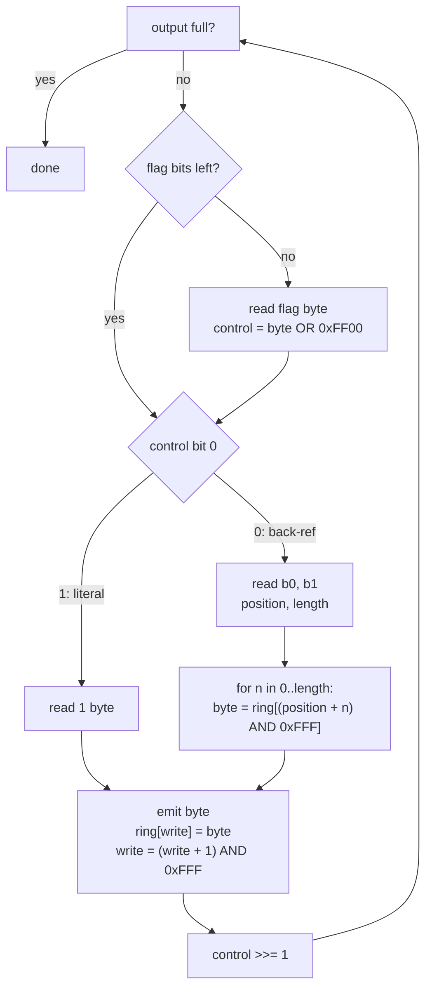

# Legaia LZS compression

LZS is the compression wrapped around most of the disc's bulk assets: meshes, textures, scene MANs, the monster archive. It is a standard LZSS scheme. The decoder keeps the last 4096 output bytes in a ring buffer, and the stream is a mix of literal bytes and short "copy N bytes from the ring" references, with one flag bit per token saying which is which. The stream carries no length and no end marker, so the caller always supplies the decompressed size.

Reverse-engineered byte-for-byte from `FUN_8001A55C`. Implementation: [`crates/lzs/src/lib.rs`](../../crates/lzs/src/lib.rs).

> **Before you trust a decode: [a clean decompress is not a validity signal](#decompresses-without-error-is-not-a-validity-signal).** The ring buffer is zero-initialised, so most random inputs decode "successfully" into plausible-looking output. Magic-check the decoded bytes, always.

## At a glance

| Property | Value | Confidence |
|---|---|---|
| Ring buffer | 4096 bytes, initialised to zero | Confirmed |
| Initial write position | `0xFEE` (4078) | Confirmed |
| Flag byte | 8 flags, consumed LSB-first; `1` = literal, `0` = back-reference | Confirmed |
| Literal token | 1 byte, copied to the output and the ring | Confirmed |
| Back-reference token | 2 bytes: 12-bit **absolute ring position** + 4-bit `length - 3` | Confirmed |
| Match length | 3..=18 bytes | Confirmed |
| Output length | Supplied by the caller; not in the stream | Confirmed |

The two bytes of a back-reference:

```
        b0                    b1
+-----------------+   +---------+---------+
| position  [7:0] |   | pos     | length  |
|                 |   | [11:8]  |  - 3    |
+-----------------+   +---------+---------+
                        bits 7..4  bits 3..0

position = b0 | ((b1 & 0xF0) << 4)        length = (b1 & 0x0F) + 3
```

The position is an index into the ring, not a distance back from the write cursor.

## Decode loop



```rust
let mut window = [0u8; 4096];
let mut window_pos = 0xFEE;
let mut control = 0u32;

while out.len() < expected_output_size {
    if (control & 0x100) == 0 {
        control = (input[src] as u32) | 0xFF00;
        src += 1;
    }
    if (control & 1) != 0 {
        // LITERAL: copy 1 byte
        let v = input[src]; src += 1;
        out.push(v);
        window[window_pos] = v;
        window_pos = (window_pos + 1) & 0xFFF;
    } else {
        // BACK-REF: 2 bytes encode (12-bit absolute window position, 4-bit length-3)
        let b0 = input[src] as u32;
        let b1 = input[src + 1] as u32;
        src += 2;
        let base = b0 | ((b1 & 0xF0) << 4);
        let len = (b1 & 0x0F) + 3;
        for n in 0..len {
            let v = window[(base + n as u32) as usize & 0xFFF];
            out.push(v);
            window[window_pos] = v;
            window_pos = (window_pos + 1) & 0xFFF;
        }
    }
    control >>= 1;
}
```

The `0xFF00` mask is how the control register knows when to refill. Each shift right moves one of the eight set high bits down; after eight shifts bit 8 is clear, and the test at the top of the loop reads the next flag byte.

A back-reference copies byte by byte and writes each byte to the ring as it goes, so a reference may overlap its own output (the run-length case). The copy stops early if it reaches the expected output size.

## Container format

Some PROT entries hold several independently compressed sections behind a small header. The header is the [asset descriptor](asset-descriptor.md) layout: two `u32` header words, then 8-byte `(size, byte_offset)` pairs, where the size's low 24 bits are the section's decompressed length and its high byte is the asset type.

| Function | Behaviour |
|---|---|
| `parse_container` | Scans the pair table heuristically; stops at a zero size or offset, an offset past the file, or a non-ascending offset |
| `decompress_container` | Decodes every section it finds |
| `decompress_container_strict` | Also rejects a section whose input consumption runs past the next section's offset. Use this one for detection |
| `decompress_tracked` | Decodes one stream and returns the input bytes consumed, which is what the strict gate compares |

## Encoding (re-packing)

The retail game ships only the *decoder*; there is no Sony encoder to reverse. `legaia_lzs::compress` is an encoder for re-packing edited assets (the [randomizer / disc patcher](../tooling/randomizer.md) uses it):

- It is an LZSS matcher with one-step lazy matching (defer a match by a byte when the next position yields a strictly longer one). The retail decoder accepts its output byte-for-byte; it is **not** a bit-exact clone of Sony's packer.
- Its correctness criterion is `decompress(compress(x)) == x`, validated by a disc-gated round-trip over the real PROT corpus.
- The lazy step matters for in-place editing. A purely greedy parse overshoots a scene MAN's original footprint by a handful of bytes, and those footprints have no compressed slack; with the lazy step every scene MAN but one fits its exact original span.
- `compress_optimal` is a slower shortest-encoding parse (a dynamic program over the token graph). Its output is never longer than `compress`'s, and it closes the last couple of bytes on the few retail streams whose footprint has zero slack.

A linear-history match at distance `d` maps onto the ring-buffer back-reference position `(0xFEE + i - d) & 0xFFF`, where `i` is the output position. Capping the emitted distance at `4096 - 18` keeps every in-copy read unambiguous - including the self-overlapping run-length case where `d < len` - so a plain linear match decodes byte-for-byte.

It does real compression rather than emitting literals only, so re-packed streams fit the slack in fixed-size slots like the monster archive's `0x14000`-byte records.

## "Decompresses without error" is not a validity signal

The ring buffer initialises to zeros, so most random inputs decode without error to a zero-padded output of plausible length. Always magic-check the *decoded* output before treating an LZS decode as a hit. For containers, `decompress_container_strict` adds the consumed-bytes gate described above.

## Where LZS is consumed

The asset-type dispatcher (`FUN_8001F05C`) calls the LZS path when its `copy_only` flag is zero; see [asset-type dispatch](asset-type.md). The descriptor-pair containers above are walked by `FUN_80020224` ([`asset-descriptor.md`](asset-descriptor.md)).

## See also

- [Asset-type dispatch](asset-type.md) - the handler that selects the LZS decode path.
- [Asset descriptor](asset-descriptor.md) - the container header's descriptor pairs.
- [PROT.DAT TOC](prot.md) - the container index whose entries are commonly LZS-compressed.
