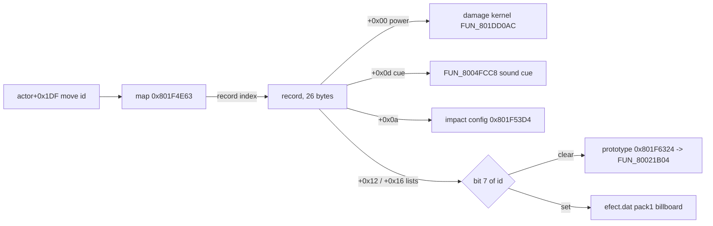

# Move-power / parameter table

The battle overlay holds one 26-byte record per **enemy special attack**. The
record gives the attack's damage power and its presentation: homing speed, hit
timing, trail texture, sound cue and the effects it spawns on launch and on
contact. A 128-byte map translates a battle move id to a record index. Party
Tactical Arts and basic attacks do not use this table. The same data band also
holds the effect-prototype, CLUT-source and cue-group tables the records index.

Parser: `legaia_asset::move_power` (`crates/overlay-images/src/move_power.rs`).
CLI: `asset move-power <raw PROT 0898 entry>` (`--effect-index` for the inverse
map). Engine: `engine-core::move_power::MovePowerCatalog`, loaded onto
`World::tables.move_power` from PROT 0898.

## At a glance

All addresses are in the battle-action overlay, PROT entry 0898 (CDNAME
`overlay_battle_action`), load base `0x801CE818`.

| Thing | Runtime VA | File offset | Shape |
|---|---|---|---|
| id → index map | `0x801F4E63` | `0x2664B` (table − `0xF9`) | `0x80` bytes, move ids `0x00..=0x7F` |
| Move-power table | `0x801F4F5C` | `0x26744` | 44 records × 26 bytes |
| Impact-config table | `0x801F53D4` | - | 5 packed `u32` words |
| Effect-prototype table | `0x801F6324` | `0x27B0C` | 61 × `u32` overlay VA |
| CLUT source-x table | `0x801F6418` | `0x27C00` | `u8` per effect id |
| Cue-group table | `0x801F6470` | `0x27C58` | 13 records × 5 bytes |

The whole `0x801F4F5C..0x801F69D8` window is static overlay data, not built per
battle: the raw PROT 0898 bytes match the in-RAM table, and two unrelated
battle save states are byte-identical there. Confidence: **Confirmed**.



Dumps under `ghidra/scripts/funcs/` are labelled `overlay_battle_action_*`. The
aliases `overlay_0897_*` / `overlay_magic_*` / `overlay_muscle_dome_*` carry
the same bytes at wrong printed addresses (wrong load base); take addresses
from the extracted overlay image
([dump-corpus-integrity.md](../tooling/dump-corpus-integrity.md)).

## Indexing - `power_table[map[move_id]]`

The record index is not the move id. The setup site reads the actor's move id
at `actor[+0x1df]`, looks it up in the map, and indexes the table with the
result:

```
record = &table[ map[ actor[0x1df] ] ]
```

A map byte of `0x00` or `0xFF` means "no power record". The map resolves move
ids `0x04..=0x74` to indices `0x01..=0x2b`; record 0 is an all-zero unused
slot. The move id is the same id space as the SCUS spell-name table
(`DAT_800754C8`, [spell-table.md](spell-table.md)), which labels the records:

| Records | Move ids | What they are |
|---|---|---|
| `0x01..=0x0f` | `0x04..=0x1f` | the spell table's unnamed internal enemy-attack tiers (escalating-power triplets) |
| `0x10..=0x2b` | `0x25..=0x74` | named monster special attacks (Fire Breath `0x25`, Tail Fire `0x27`, … late-game `0x61..=0x74`) |

### Indexing and power read in instructions

The map lookup, at the call site in `FUN_801e09f8`
(`overlay_battle_801e09f8.txt`):

```text
801e1874  lui  v0,0x801f
801e1878  addiu v0,v0,0x4e64      ; note 0x4E64 - the base is one BELOW this
801e187c  lbu  v1,0x1df(v1)       ; v1 = actor[+0x1DF], the move id
801e1884  addu v1,v1,v0
801e1888  lbu  a0,-0x1(v1)        ; a0 = map[move_id], map base = 0x801F4E63
801e188c  jal  0x801dd0ac         ; ... passed as param_1
```

The constant `0x4e63` appears nowhere in the code; it is `addiu 0x4e64` plus
`lbu -0x1`. The stride and power read, in `FUN_801dd0ac`'s non-summon arm
(`overlay_battle_action_801dd0ac.txt`):

```text
801dd19c  lui  a1,0x801f
801dd1a0  addiu a1,a1,0x4f5c      ; table base 0x801F4F5C
801dd1a4  andi a0,s5,0xff         ; a0 = param_1 = map[move_id]
801dd1a8  sll  v1,a0,0x1
801dd1ac  addu v1,v1,a0           ; 3a
801dd1b0  sll  v1,v1,0x2          ; 12a
801dd1b4  addu v1,v1,a0           ; 13a
801dd1b8  sll  v1,v1,0x1          ; 26a  <- the stride, as 13*2
801dd1bc  addu v1,v1,a1
801dd1c0  lhu  a1,0x0(v1)         ; power, HALFWORD
801dd1c8  sll  a1,a1,0x10
801dd1cc  sra  v1,a1,0x12         ; (i16)power >> 2
801dd1d0  addiu v1,v1,0x1
801dd1d4  div  s0,v1              ; rand % ((power>>2) + 1)
```

The stride `26` is never a literal (`13a << 1`). **`+0x00` is a signed
halfword**: `lhu` then `sll 0x10` / `sra`. A byte-wide reading truncates every
power above 255, which is most of the table.

### This table is special-attack-only

<a id="this-table-is-special-attack-only---a-party-members-basic-attacks--arts-do-not-use-it"></a>

The map covers 44 special-attack ids: the internal tiers `0x04..=0x07` /
`0x12..=0x1F` and the named attacks `0x25..=0x74`. The basic-attack and
Tactical-Art bands `0x08..=0x11` and `0x16..=0x18` are unmapped
(`map[id] == 0`). In a live battle capture, Vahn's queued Somersault carries
move id `0x0F` and a Gobu Gobu basic attack `0x09`; both resolve to record 0.

Damage sources therefore split:

| Attack | Power source |
|---|---|
| Enemy special attack | this table, rolled by `FUN_801dd0ac` |
| Party Tactical Art | the art record's power byte at `record0 +0x24`, read by `FUN_801ec3e4` ([art-data.md](art-data.md#damage-power-byte---pinned-to-record0-0x24)) |
| Enemy basic attack | the generic physical path |
| Summon (`FUN_801dd0ac` with attacker slot `7`) | caster / summon battle state, no table read ([spell-table.md](spell-table.md)) |

The engine mirrors this: the table is wired for enemy specials only, rolled
through the arts / physical kernel
([battle-formulas.md](../subsystems/battle-formulas.md#arts--physical-branch-attacker_slot--7)).
`move_power_map_is_special_attack_only` pins the coverage on disc.

### Cross-check against the monster archive

The monster records (PROT 867 `+0x21..=+0x23`) list each enemy's magic-attack
ids. Across 186 monsters, 46 distinct ids appear, all `>= 0x25`; 95 monsters
carry none.

- 28 of the 29 mapped named ids are attacks enemies cast.
- The other 18 enemy attack ids (`0x2E` / `0x2F` / `0x3C` / `0x4A..=0x6E`, and
  `0xA7` / `0xB8`, which are past the map) have no power record. They are the
  magic / elemental casts, whose damage is caster-state-derived
  ([open-rev-eng-threads.md](../reference/open-rev-eng-threads.md)).
- The one mapped named record with no caster is move id `0x2C` (record 22),
  the unused "Freeze Thunder" enemy spell. Its record survives (power 37,
  `sfx 0x4A`) with empty effect lists. Community testing reports that forcing
  it (GameShark `30084845 002C`) crashes on a missing asset.

## Record layout (26 bytes)

Three battle-action functions consume the record. `FUN_801dd0ac` (the damage
kernel) reads only `+0x00`. `FUN_801dea50` (action setup) computes the record
address once, stores it at `ctx+0x1014` (`sw v0,0x1014(a0)` at `0x801df284`)
and reads `+0x04` and `+0x0e`. `FUN_801e09f8` (per-frame action tick) reads the
rest through that held pointer.

| Off | Type | Field | Meaning | Confidence |
|---|---|---|---|---|
| `+0x00` | `i16` | power | Damage magnitude; see [power shifts](#the-four-power-shifts). Loads `0x801dd1c0`, `0x801dd38c`, `0x801dd3cc` | Confirmed |
| `+0x02` | `u16` (`lhu`) | strike Y offset | Subtracted from the per-arm Y lane (`ctx + arm*8 + 0x1146`) when the hit point is seeded from the target's position. Loads `0x801e0dc4`, `0x801e13b8`. The parser reports it as `i16` | Inferred (read confirmed) |
| `+0x04` | `u16` | move counter | Whole-move timing counter, seeded into `ctx+0x6c6` and decremented each frame. Load `0x801df288`, store `0x801df290` | Confirmed |
| `+0x06` | `u16` | phase duration | Written to `ctx + arm*2 + 0x6c6` at the strike / re-arm transitions. Loads `0x801e0d70`, `0x801e1360` | Inferred (read confirmed) |
| `+0x08` | `u8` | homing speed | Scales the per-frame XY step toward the target (`* DAT_1f800393 * 8`); `0x40 - speed` reseeds the approach counter. Loads `0x801e1018`, `0x801e1074`, `0x801e1274` | Inferred (read confirmed) |
| `+0x09` | `u8` | effect-tracks-strike flag | Non-zero: the move's live XY is copied into the spawned effect actor each frame. Load `0x801e10d4` | Confirmed (read); semantic Inferred |
| `+0x0a` | `u8` | impact-effect selector | `0` = none, else `1..5`: stored at `actor+0x21f`, indexes the packed-config table `0x801f53d4` (`(value-1)*4`) into `actor+0x04`; values 3/4/5 branch to extra status-proc rolls. The table holds packed `u32` words (`0x3FF`-masked lanes), not pointers | Confirmed (read); enum naming Inferred |
| `+0x0b` | `u8` | trail texture page | The streak draw helper `FUN_801e1ab0` (called at `0x801e0ca4`) makes the GP0 texpage word `0x7700 + id` at `0x801e1d54`. Loads `0x801e0ca0`, `0x801e0cd0` | Confirmed |
| `+0x0c` | `u8` | designer tag | `'C'` on records 1/2/3, `'E'` on 9, `'G'` on 12/15, else 0. [No runtime reader](#the-0x0c-no-reader-sweep) | Unknown (no reader) |
| `+0x0d` | `u8` | sound cue id | Handed to the cue dispatcher `FUN_8004fcc8` (`lbu a0,0xd(v0)` at `0x801e184c`, `jal` at `0x801e1854`) | Confirmed |
| `+0x0e` | `u8` | effect-list head | See [effect-list framing](#effect-list-framing). Loads `0x801e0c54` (`0xFF` test at `0x801e0c58`), `0x801df408`, `0x801df4fc`. Parser accessor: `list_mode()` | Confirmed (read) |
| `+0x12` | `[u8;4]` | on-contact effects | Effect-id list fired on the hit branch. Loads `0x801e0d00`, `0x801e114c`, `0x801e1250`, `0x801e12ac` | Confirmed |
| `+0x16` | `[u8;4]` | launch effects | Effect-id list fired at the initial-strike transition. Loads `0x801e0ddc`, `0x801e0f54`, `0x801e13d0`, `0x801e1550`, `0x801e1800` | Confirmed |

The offsets any consumer touches are exactly
`+0x00,02,04,06,08,09,0a,0b,0d,0e,12,16` (static displacements). Bytes
`+0x0f..+0x11` are reachable only by index, through `FUN_801DEA50`'s
contiguous walk from `+0x0e`.

### Worked example (real disc bytes)

<a id="worked-example-real-disc-bytes"></a>

Record 3 (move id `0x06`, the third internal-tier attack):

```
power 1500  ctr 0  phase 480  homing 0x20  yoff 250  impact 1  trail 0
sfx 0x4d  list 0x00  tag C  contact[0x27,0x8e,0x8d]  launch[0x28,0x64,0x9d]
```

A homing strike: it approaches at speed `0x20`, runs its strike phase for 480
frames, plays impact effect 1 and cue `0x4d`, and spawns one effect list on
launch and another on contact.

### The four power shifts

<a id="0x00-at-full--half--quarter"></a>

`FUN_801dd0ac` loads `+0x00` at three sites and derives these terms. Two bound
a random roll; the others are summed into the damage accumulator.

| Load | Derived | Shift site | Role |
|---|---|---|---|
| `0x801dd1c0` | `>> 2` | `0x801dd1cc` (`sll 0x10; sra 0x12`) | roll modulus, `div` at `0x801dd1d4` |
| `0x801dd1c0` | `>> 0` | `0x801dd240` (`sra 0x10`) | additive damage term, `addu` at `0x801dd254` |
| `0x801dd38c` | `>> 1` | `0x801dd39c` (`sll 0x10; sra 0x11`) | additive threshold term, `addu` at `0x801dd3a0` |
| `0x801dd3cc` | `>> 3` | `0x801dd3d8` (`sll 0x10; sra 0x13`) | roll modulus, `div` at `0x801dd3e0` |
| `0x801dd3cc` | `>> 1` | `0x801dd448` (`sra 0x11`) | additive damage term, `addu` at `0x801dd454` |

Both moduli are used as `rand % (x + 1)`, so power `< 4` rolls a constant `0`
on the `>> 2` branch and power `< 8` on the `>> 3` branch. The half and eighth
scales belong to the retry arm, which re-floors a too-low attacker score
rather than clamping it.

The branch split is on the kernel's `param_2` (`s3`): `bne a1,0x7` at
`0x801dd104` takes the non-summon path to the first table read, and
`bne s0,0x7` at `0x801dd2f4` to the second. With `param_2 == 7` the magnitude
comes from caster / summon actor state (`0x168(s1)` etc.) and no table read
happens.

The roll is then scaled by the element-affinity matrix (`FUN_801dd864`), a
sibling table in the same overlay:
[battle-formulas.md § Element-affinity matrix](../subsystems/battle-formulas.md#element-affinity-matrix-fun_801dd864-0x801f53e8)
(parser `legaia_asset::element_affinity`).

## Effect lists

### Effect-id list semantics (`+0x12` / `+0x16`)

Each list is up to 4 ids. Both use the same dispatch in `FUN_801e09f8` (the
`+0x16` walk enters at `0x801e0f54`, the `+0x12` walk at `0x801e1250`); only
*when* they fire differs. Bit 7 of each byte selects one of two id spaces:

| Entry | Meaning |
|---|---|
| `0x00` | terminator |
| `0x01..=0x63` | **move-FX space**: spawn the 3D prototype `0x801f6324[id]` via `FUN_80050ED4` → `FUN_80021B04`, and copy the effect's CLUT row from source x `0x801f6418[id]` when non-zero |
| `0x64` | fixed screen-flash effect, no table lookup |
| bit 7 set, `!= 0xFF` | **2D-sprite space**: `id & 0x7F` to `FUN_801dfdf0` → the `efect.dat` `pack1` billboard ([effect.md](effect.md)). `FUN_801DFDF8` special-cases pack1 `0x04` → `0x801F5D90` and `0x13` → `0x801F5CF8`, which are burst-arm move-VM trigger programs, not pack1 scripts |
| `0xFF`, `0x65..=0x7F` | no effect, scan continues |

Ids `0x0A`, `0x2D` and `0x2E` also latch the spawned handle into `ctx+0x1028`
and seed the per-frame delta triple at `ctx+0x1184`, which makes their effect
follow the actor.

Engine: `engine-core::move_power::EffectListEntry::classify` - `Spawn`
(`0x01..=0x63`), `AltEffect` (bit 7), `FixedFlash` (`0x64`), `Skip`,
`Terminator`.

### Effect-list framing

The two consumers frame the list differently, so a parser must say which it
models.

- **`FUN_801DEA50`** (action setup) walks one contiguous run from `+0x0E`,
  stopping only on a zero byte. `0xFF` is not a terminator there: bit 7 is set,
  so it routes to the 2D sprite path with id `0x7F`.
- **`FUN_801E09F8`** (per-frame tick) reads `+0x12` and `+0x16` as two separate
  4-byte lists and treats `+0x0E == 0xFF` as a broadcast to all four party
  arms.

### The aux tables

Both lists index the same tables, which follow the power table in PROT 0898:

- **`0x801f6324`** - effect-prototype pointer table. One `u32` overlay VA per
  id, pointing at a variable-length move-VM scene-graph record (ids `0x27` /
  `0x28` → `0x801F5BBC` / `0x801F5BDC`). The records are packed, not a fixed
  `0x20` stride. `(0x6418 - 0x6324) / 4 = 61` entries; the runtime's `< 100`
  spawn guard is looser than the table.
- **`0x801f6418`** - per-effect CLUT source x (`u8`, `0` = no palette copy).
  It is not a sound id; its readers end in `MoveImage`
  ([art-data.md](art-data.md#the-cue-tables)).
- **`0x801f6470`** - the cue-group table, below.

`legaia_asset::move_power::EffectAuxTables` parses all three.

### The cue-group table `0x801F6470`

Indexed by **group id**, not effect id. The cue expander `FUN_801E22C8` reads
it at `addiu v1, v0, 0x6470` (`0x801E2374`), one record per call:

| Offset | Size | Field | Meaning |
|---|---|---|---|
| `+0x00` | u8 | count | `0..=4`; zero spawns nothing |
| `+0x01` | u8 × 4 | cue ids | only the first `count` are read |

A cue id with bit `0x80` set is an **actor** cue:
`FUN_801DFDF0(id & 0x7F, pos, yaw)`, the strike pose. Any other id indexes
both effect tables with the same value: `0x801F6418[id]` for the CLUT row,
`0x801F6324[id]` for the prototype.

The table holds **13 records**, by two independent bounds. On disc the records
fill `0x801F6470..0x801F64B5`, followed by three padding bytes and the
`data\battle\summon.DAT` path literal at `0x801F64B8`; and retail's callers
never index past `0xC`. All thirteen pass the parser's shape check (count
within the record, every non-actor id inside the 61-entry space).

The table has one consumer: a reference scan of `SCUS_942.54` plus every
base-mapped overlay image (literal word at any alignment, `lui` pairs, `jal` /
`j`) finds `0x801F6470` materialised once, at `0x801E2370`. Its two sibling
tables are reached from five sites each, always in pairs.

The caller is the damage-application primitive `FUN_800402F4`, which reaches
`jal 0x801e22c8` from eleven branches: eight literal group ids (`5..0xC`), two
computed, one forwarding its own `param_2`. Port:
`legaia_engine_vm::battle_cue_group::expand_cue_group`; `cue_group_for` maps
the committed `(class, tier)` to the branch site, and the battle-action applier
(`battle_action::spirit`) places the group once on the target, or once per
occupied slot on the class-`1` arm.

### Effect-id → triggering-move inverse index

<a id="effect-id--triggering-move-inverse-index-disc-derivable-no-capture"></a>

The join from an effect back to the moves that trigger it derives from the
disc alone. Walk every mapped record, classify each `+0x12` / `+0x16` byte,
and invert. The key is `(space, id)`: `Proto3D(id)`, `Efect2D(id)` or `Flash`.
The `+0x0a` impact selector is a separate `1..5` config index and is not part
of the key space. There is no symbolic effect-name table, so an effect is
named only by its key. `legaia_asset::move_power::effect_trigger_index` builds
the map; `asset move-power --effect-index` prints it.

## Effect-prototype records - the spawn path

A `0x01..=0x63` list byte spawns the move-VM record `0x801f6324[id]` points
at. `FUN_801e09f8` calls
`FUN_80050ed4(world_pos, src_pos, 0x801f6324[id], 0x1000)`. `FUN_80050ed4` is a
0x60-slot allocator that tail-calls the shared stager `FUN_80021B04` with
`a0..a3` intact (visible in the disassembly; the decompiled C drops them).
`FUN_80021B04`:

- reads the record's `+0x00` `model_sel` (`lh` / `lhu` at `80021b2c` / `b30`).
  `< 0`, `0x4000` and `0x4001` are transform-node / render-mode sentinels;
  otherwise the mesh is `DAT_8007C018[model_sel + gp[0x754]]`;
- allocates an actor (`jal 0x80020de0`), stores the record pointer as the
  actor's move-VM buffer base (`*(actor+0x48) = record`, `80021c80`), and sets
  the move-VM PC to u16-index 2 (`*(actor+0x70) = 2`, `80021c78`), i.e.
  bytecode at `record+4`;
- drives it through the move VM (`jal 0x80023070`, `80021dc0`).

| Offset | Size | Field |
|---|---|---|
| `+0x00` | i16 | `model_sel` |
| `+0x02` | u16 | reserved |
| `+0x04` | … | move-VM bytecode |

This is the summon part-record format, with the same stager, move VM and
`DAT_8007C018` TMD-pool bridge
([`legaia_asset::summon_overlay`](../../crates/overlay-images/src/summon_overlay.rs)).
`move_power::parse_effect_proto_records` decodes the table to part records (VA
→ file offset via `BATTLE_OVERLAY_BASE` /
`EffectAuxTables::proto_record_offset`). All 54 unique records run through the
ported move VM, seeded at PC = 2 under the same `wait_timer` gate and
per-frame budget, with no unimplemented opcode (disc-gated
`move_fx_records_vm_exec_disc`; about 20 distinct move-VM ops).

A live capture seats one: the enemy Gimard "Fire Tail" mid-cast holds a part
actor whose `+0x48` record pointer is `0x801F5484` - proto entries `0` /
`0x30` / `0x31` (`model_sel` 5), the record `move_fx_records_real` pins
statically (`firetail_movefx_liveness`;
[battle-action.md § Enemy "Fire Tail"](../subsystems/battle-action.md#enemy-fire-tail---move-vm-part-not-the-widget-path)).

### The model base `gp[0x754]`

`gp[0x754]` (global `0x8007BA6C`, `gp = 0x8007B318`) is where the battle
effect-model library starts in the TMD pool. Across the mednafen save corpus
it is `0` whenever no battle effect library is resident (field, town, menu,
minigame, cutscene, battle loading) and **`party_count + 2`** in battle: `3`
for the 1-member training party, `5` for the 3-member party. The two fixed
pool slots plus the live party meshes precede the library. `model_sel` is
therefore library-relative, and move-FX and summon-part spawns share the one
per-battle base. The `+2` is pinned on those two party sizes; no 2-member
capture is in the corpus.

A PCSX-Redux exec breakpoint on `FUN_80021B04` (probe
`autorun_summon_model_base`) confirms the chain
`FUN_801e09f8 → FUN_80050ed4 → FUN_80021B04` (`ra = 0x80050F08`,
`a3 = 0x1000`, table base `0x801F6324`, list id `0x22` in registers). Test:
`crates/mednafen/tests/summon_model_base.rs`
(`model_library_base_tracks_party_size`).

## Engine port

`MovePowerCatalog::fx_for_move_id` resolves a move id to a `MoveFx`
descriptor: every field past `+0`, the `+0x0a` selector's config word, and
each list byte as an `EffectListEntry` with its prototype VA and CLUT source
x.

- **Scene graph.** `World::spawn_move_fx(move_id, origin)` parses the move's
  `Spawn` records with the summon-record reader and stages them as a
  `SummonScene`, ticked by `World::tick_move_fx` and drawn from
  `active_move_fx_part_draws`. The engine registers the PROT 0871 effect-model
  library at a fixed pool base 3 (`global_tmd_pool[3..=32]`) rather than
  `party_count + 2`; `model_sel` is library-relative, so the same models
  resolve. The per-part transform composition is shared with the summon path
  (`FUN_801F811C` / PROT 0900).
- **Trigger.** The shared cast path `World::cast_spell_on_slots` (player
  spells and monster-AI specials) calls `World::request_move_fx_spawn` for any
  non-summon move with a spawnable entry
  (`MovePowerCatalog::move_has_spawn_fx`), at the target's battle position.
  The host drains `World::take_pending_move_fx_spawn()`. Player Seru-magic ids
  `0x81..=0x8b` go to the summon path; plain physical attacks carry no move
  id. In `play-window`, `H` cycles the renderable moves
  (`MovePowerCatalog::spawnable_move_ids()`).
- **2D effects.** `AltEffect` entries spawn through the `efect.dat` pool:
  `World::try_spawn_effect` (`spawn_by_ui_id`, `FUN_801dfdf0`) by 7-bit id, a
  no-op when `efect.dat` is not loaded. They fire whether or not a 3D scene
  stages.
- **Trail.** `+0x0b` surfaces as `World::active_move_fx_trail_texpage()`.
  `FUN_801e1ab0` is ported as
  `legaia_engine_ui::afterimage::build_afterimage_quad` (the jittered
  semi-transparent `POLY_FT4`); the GTE projection of its corners stays
  caller-side.
- **Sound cue.** `+0x0d` surfaces as `World::take_pending_move_fx_cue()`,
  routed through the ported `FUN_8004fcc8` decode
  (`legaia_engine_audio::classify_cue` → `CueDispatch::Ring` / `Voice`). A
  ring cue resolves through the [SFX descriptor table](sfx-table.md) and keys
  the bank its category names.

The trail texpage and sound cue surface only when a scene-graph spawn stages.

## The `+0x0c` no-reader sweep

`+0x0c` has no runtime reader. The claim is swept over bytes, not dumps, since
part of the dump corpus carries no disassembly
([dump-corpus-integrity.md](../tooling/dump-corpus-integrity.md)).

**Corpus.** `SCUS_942.54` (text base `0x80010000`, exhaustive over the
segment) plus every overlay image in
[`static-overlays.toml`](../../crates/asset/data/static-overlays.toml), each at
its recorded base, every 4-byte word decoded independently. PROT 0965 and 0971
are in the map. PROT 0896 is covered by base-independent encodings: neither
the `lui` materialisation nor an `lw …,0x1014(…)` deref occurs in
`0896_bat_back_dat.BIN`.

**Soundness.** Every word whose primary opcode is a valid R3000 load or store
decodes, so the sweep is sound for
`lb/lbu/lh/lhu/lw/lwl/lwr/sb/sh/sw/swl/swr` and `j` / `jal` targets (about 95%
of words decode; the rest is data and COP2 ops, which cannot address a
record). `gp`-relative access is impossible: `$gp = 0x8007B318` reaches
`0x80073318..0x80083317`, and the table is about 1.5 MB outside that.

**Access shapes matched.**

| Shape | How |
|---|---|
| Absolute constant | every `lui`+`addiu`/`ori` pair and `lui`+load displacement folded and tested against `[table, table + 44*26)` |
| Base-folded | same test: a folded base like `addiu …,0x4f68` puts `+0x0c` in the constant |
| `×26`-indexed | taint the register from `addu rD, rIdx26, rTableBase`, report every displacement off it |
| Pointer-relative | taint `rD` in `lw rD, 0x1014(rB)`, propagate through `move` / `addu` / `addiu` with offset accounting; s-registers survive `jal` |
| Straddling load | a wide load at displacement `0xc` is in the same match set |
| Data-resident pointer | all corpus words scanned for a literal in-table address |

**Result.** The table base is materialised at three sites: `0x801dd1a0` and
`0x801dd36c` (`FUN_801dd0ac`) and `0x801df27c` (`FUN_801dea50`). No reference
lands at a shifted offset. Per consumer:

- `FUN_801dd0ac` reads `+0x00` only (three `lhu`).
- `FUN_801dea50` reads `+0x04` and `+0x0e`.
- `FUN_801e09f8` supplies the rest through 24 derefs of `ctx+0x1014`.

All 28 seeds (26 `lw …,0x1014(…)` derefs plus two base materialisations)
produce at least one hit, and widening the propagation window to 4000
instructions changes nothing. 30 memory operations span 12 distinct
displacements; none is `+0x0c`. Every load below `+0x0d` is an `lbu` at
`+0x08..+0x0b`, and the only wide loads are `lhu` at `+0x00..+0x06`, so
nothing straddles the byte.

Supporting checks:

- **The held pointer stays in PROT 0898.** Over 1317 images, displacement
  `0x1014` appears in code 27 times, all in `0898/battle_action` (one writer
  at `0x801DF284`, 26 readers), none in SCUS. The split form (`addiu rD,rS,A`
  then `B(rD)` with `A + B == 0x1014`) finds nothing over 38 785 candidate
  bases.
- **No pre-linked pointer exists.** A byte-granular scan for every 4-byte
  value in `[0x801F4F5C, 0x801F53D4)` over 1317 images / 123.1 MB returns 46
  hits, all in base-less PROT data entries (34 unaligned), none in SCUS or a
  based overlay - coincidental payload bytes.
- **Literal `0xc` byte loads.** PROT 0898 has five byte-width loads at
  displacement `0xc` (of 134 memory operations there, 43 byte-width, 38 of
  them `sb`). Two write `actor[+0x1dd]` from an unrelated struct; three sit on
  a base written at `+0xc` just before, a RAM working struct.
- **Table extent.** `0x801F4F5C + 44*26 = 0x801F53D4`, where the impact-config
  table begins, so the record count is pinned by the next referenced address.

### The split lui addiu site

`0x801dd36c` is a base materialisation a linear pair matcher misses. Its
`lui a0,0x801f` sits in the branch delay slot at `0x801dd2f8`, belonging to
`bne s0,v0,0x801dd36c` at `0x801dd2f4`, whose target is the `addiu`. The
halves are `0x74` bytes apart, `a0` is clobbered in between (`0x801dd304`,
`0x801dd30c`, `0x801dd314`), and the fall-through path jumps away at
`0x801dd364`. A sweep that folds `lui` / `addiu` pairs must follow branch
targets, not adjacency. This site indexes the same base with the same `×26`
chain and reads only `+0x00`.

### `0x801F3990` is a real function, and not a consumer of this table

`0x801F3990` is a distinct battle-overlay function (file `0x25178`): a clean
prologue (`addiu sp,sp,-0x20`), reached by one `jal` at `0x801E3E04` inside
`FUN_801E295C`. It reads `ctx[+0x13]` and the per-slot char-kind table
`0x8007BD10`, and is the cast audio-cue dispatcher
([battle-action.md](../subsystems/battle-action.md#battle-helper-functions)).
It reads no field of the move-power record.

Not a second damage kernel: the dump `overlay_0897_801f3990.txt` holds
`FUN_801DD0AC`'s bytes, printed from a program imported at `0x801C0000`
instead of `0x801CE818`. Every `overlay_0897_801fxxxx` dump of the `0x801F`
region has that defect; resolve such addresses against the extracted overlay
bytes ([dump-corpus-integrity.md](../tooling/dump-corpus-integrity.md)).

## See also

- [art-data.md](art-data.md) - the art-record power byte party arts use, and the shared cue tables.
- [effect.md](effect.md) - the `efect.dat` 2D pool the bit-7 list ids select.
- [spell-table.md](spell-table.md) - the id space `actor[+0x1df]` shares, and the summon path.
- [battle-formulas.md](../subsystems/battle-formulas.md) - the kernels that consume the roll.
