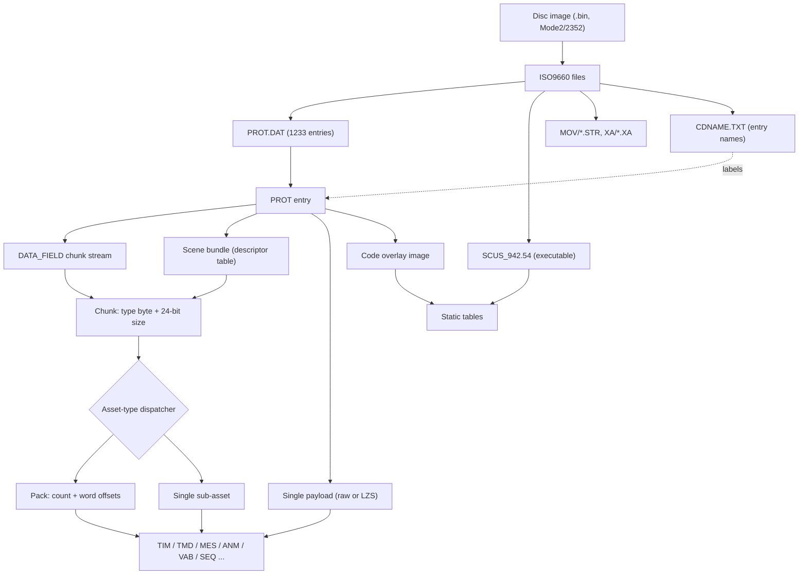

# Format Reference

Byte-level specifications for every format on the Legend of Legaia disc. Each page gives the layout, the Ghidra-traced retail function that reads the format at runtime, and the Rust parser that reimplements it. The parsers are the executable form of these specs: the extraction pipeline, the engine port and the disc patcher all read the disc through them.

**Read the page for a format before writing a parser against it.** Several of these look like their standard PlayStation counterparts and are not: the TMD mesh variant uses its own magic and primitive grouping, the SEQ meta-event encoding omits MIDI's length field, and the same pack layout appears under three names.

New here? [`../overview.md`](../overview.md) covers the project as a whole; this page is the index into the formats.

## How the layers nest

Almost everything the game loads lives in one archive, `PROT.DAT` - 1233 numbered entries with no filenames. An entry is either a single payload (often LZS-compressed) or a container that holds typed sub-assets. The static tables are the exception: they sit in the executable `SCUS_942.54` or in a code overlay's data segment and decode without walking any container.

| Layer | What it is | Page | Crate |
|---|---|---|---|
| Disc | Raw 2352-byte sectors, ISO9660 directory | [`disc.md`](disc.md) | `legaia-iso` |
| Archive | `PROT.DAT` table of contents (TOC): start sector + size per entry | [`prot.md`](prot.md) | `legaia-prot` |
| Names | `CDNAME.TXT` block labels for PROT entries | [`cdname.md`](cdname.md) | `legaia-prot` |
| Compression | Legaia LZS, applied per payload | [`lzs.md`](lzs.md) | `legaia-lzs` |
| Chunk stream | `[type << 24 \| size][data]` chunks up to a zero-size terminator | [`data-field.md`](data-field.md) | `legaia-asset` |
| Dispatch | 8-bit type byte selects the handler (TIM = 0, TMD = 2, MES = 4, ...) | [`asset-type.md`](asset-type.md) | `legaia-asset` |
| Pack | `u32 count`, `u32 word_offsets[count]`, members back to back | [`pack.md`](pack.md) | `legaia-asset` |
| Sub-asset | Texture, mesh, dialog, animation, sound bank, sequence | per-format pages below | per-format crates |

Two facts about this stack cause most mis-attributions:

- **CDNAME numbers are raw TOC indices.** An extraction filename label is shifted +2 against them ([`cdname.md`](cdname.md#numbering-space)). Say which index space a number is in.
- **A clean LZS decode proves nothing.** The ring buffer starts zeroed, so random input decodes to plausible output. Magic-check the decoded bytes ([`lzs.md`](lzs.md)).

## Confidence levels

Every page states how solid its decode is. The label is a claim about *evidence*, not about how complete the page looks.

| Level | Meaning |
|---|---|
| **Confirmed** | Verified end to end against real on-disc data, with passing tests. |
| **Inferred** | Deduced from byte patterns; structurally consistent, not exhaustively validated. |
| **Unknown** | Known to exist, not decoded. |

A page may mix levels, and the better ones rate per field rather than per page: [`encounter.md`](encounter.md#confidence) rates its record shape and reader Confirmed while leaving the encoding within scripts Inferred. Where a page carries its own confidence section or column, that is authoritative over the summary column below.

## Disc + container layer

| Page | Confidence | What it covers |
|---|---|---|
| [PSX disc geometry](disc.md) | Confirmed | Mode2/2352 sector layout, ISO9660 walk. |
| [PROT.DAT / DMY.DAT TOC](prot.md) | Confirmed | The top-level archive: 1233 entries whose extents tile the file exactly; in-RAM TOC at `0x801C70F0`. |
| [CDNAME.TXT name map](cdname.md) | Confirmed | `#define`-driven names for PROT entries. Numbers are raw TOC indices; extraction labels are shifted +2. |
| [DMY.DAT](dmy.md) | Confirmed | Dev fixtures: a memory-bus test pattern and paired random blobs. No game content. |
| [Pochi-fill placeholders](pochi.md) | Confirmed | 266 PROT entries that are one 2048-byte sector of `pochipochi...` fill. Never a parseable TIM. |

## Compression + dispatch

| Page | Confidence | What it covers |
|---|---|---|
| [Legaia LZS](lzs.md) | Confirmed | The LZSS variant decoded by `FUN_8001A55C`: 4096-byte ring buffer, initial position `0xFEE`, LSB-first control bits. |
| [Asset type dispatcher](asset-type.md) | Confirmed | `FUN_8001F05C`: the type-byte table that routes every sub-asset payload. |
| [Asset descriptor format](asset-descriptor.md) | Confirmed | `(type_size, data_offset)` pair walker `FUN_80020224`, reached from town init `FUN_801D6704`. |
| [DATA_FIELD streaming](data-field.md) | Confirmed | The `[type, size, data]` chunk stream consumed by `FUN_8002541C`. |
| [Pack format](pack.md) | Confirmed | `u32 count` + `u32 word_offsets[]`, the payload of a `TIM_LIST` or `TMD` chunk. |
| [Standalone TIM-pack](tim-pack.md) | Confirmed | A second reader for the same pack, entered four bytes early at the `TIM_LIST` chunk header. |
| [Field-pack](field-pack.md) | Confirmed | **Not a format.** `0x01059B84` is a `TIM_LIST` chunk header wrapping a pack of one scene's TIMs. |

### One pack, two readers

There is **one** pack format. [`pack.md`](pack.md) reads it at offset 0 (the bare form). [`tim-pack.md`](tim-pack.md) reads it four bytes in, past a `(TIM_LIST << 24) | size` chunk header - which is what its `word_index * 4 + 4` member offset and its `marker == 0x01` test both encode. The "field-pack" is that same chunk header on a scene's texture pack. `categorize` classifies an entry by which form it is (`data_field_streaming` for chunk-headered carriers, `pack` for bare ones), so the `field_pack` and `tim_pack` classes are empty against the retail disc. The effect bundle (`0x02018B0C`, [`effect.md`](effect.md)) is unrelated to all three.

## Sub-asset formats

| Page | Confidence | What it covers |
|---|---|---|
| [PSX TIM](tim.md) | Confirmed | Texture format: 4 / 8 / 16 / 24 bpp, optional colour look-up table (CLUT). PNG export round-trips. |
| [Legaia TMD](tmd.md) | Confirmed | Custom mesh variant (magic `0x80000002`): 8-byte group header, `count x ilen*4` body. Renderer `FUN_8002735C`. |
| [VAB sound bank](vab.md) | Confirmed | Sony's instrument bank (`VABp` magic), carried as two chunks of its stream: header, then sample bodies. |
| [PsyQ SEQ](seq.md) | Confirmed | Music sequence (`pQES` magic). Legaia's header and meta-event encoding diverge from stock PsyQ. |
| [XA-ADPCM](xa.md) | Confirmed | CD-XA Mode 2 Form 2 streamed audio, demuxed per `(file_no, ch_no)` channel. |
| [MES dialog](mes.md) | Confirmed | Dialog containers in two variants (Compact, Records): offset table + text bytecode. |
| [Dialog font](dialog-font.md) | Confirmed | Proportional font: width table `0x80073F1C`, escape table `0x80074050`, glyphs in VRAM at `(896, 0)`. |
| [ANM animation](anm.md) | Confirmed | Animation pack: `u16 count`, `u16 offsets[count]`, 8-byte per-(bone, frame) entries. |
| [Monster animation](monster-animation.md) | Confirmed | Per-object rigid-transform keyframes inside the monster archive (PROT 867), one stream per action. |
| [Player-character meshes](character-mesh.md) | Confirmed | Field form in PROT 0874; battle form assembled per character from equipment sections. |
| [Player battle files](battle-data-pack.md) | Confirmed | `data\battle\PLAYER1..4` (extraction 863..866): header, LZS record 0, equip-slot table, per-slot streams. |
| [MDT move table](mdt.md) | Confirmed | Tactical Arts move tables; two on-disc layouts the consumer accepts. |
| [Art data](art-data.md) | Inferred | Per-character art records: Action Constants, command sequences, power byte, Miracle / Super Art triggers. |
| [Headerless 16bpp stills](ringside-still.md) | Confirmed | Extraction 1221 / 1222: raw BGR555 uploaded to VRAM `(384, 0)`, the Muscle Dome ringside reaction. |
| [Save-slot portraits](save-icon.md) | Confirmed | Sixteen 16x16 tiles interleaved across a 256x16 4bpp strip; tile N is save N+1's card icon. |
| [Row-479 NPC CLUTs](npc-palette.md) | Confirmed | Plain TIMs whose palette block targets VRAM row 479; several share the row through a merge-zeros upload. |
| [Place names](place-names.md) | Confirmed | The three carriers one place name has; editing one changes one display. |

## Scene containers

| Page | Confidence | What it covers |
|---|---|---|
| [Scene bundles](scene-bundles.md) | Confirmed | The per-scene asset wrappers (`scene_tmd_stream`, `scene_vab_stream`, `scene_asset_table`) and their descriptor table. |
| [scene_v12_table](scene-v12-table.md) | Confirmed | Per-scene `.PCH` walk-on trigger sidecar: exactly one `0x800` sector, 97 entries. |
| [Per-scene field map](field-map.md) | Confirmed | `DATA\FIELD\<scene>.MAP`: the fixed `0x12000`-byte slot 0 of every scene block, four regions. |
| [Encounter record](encounter.md) | Confirmed | `[3 reserved][count][monster_ids]` at `actor[+0x94]`, plus the MAN camera-region table and visible-tile window. |
| [MAN relocation](man-relocation.md) | Confirmed | What must be fixed up when a record inside a decompressed MAN changes size. |
| [World-map slot 4](world-map-overlay.md) | Confirmed | Slot 4 of each kingdom bundle (PROT 0086 / 0245 / 0392): the world-map scene's ANM animation bank. |
| [Effect bundles](effect.md) | Confirmed | The on-disc bundle (magic `0x02018B0C`) and the `efect.dat` runtime 2-pack. |
| [summon.dat / readef.DAT](summon-readef.md) | Confirmed | Battle side-band streaming slots (extraction 893 / 894): CLUT rows, texture pages, summon actor records. |
| [STR FMV table](str-fmv-table.md) | Confirmed | Movie dispatch table at `0x801D0A6C`: 23 slots of 32 bytes, nine retail `fmv_id`s. |
| [Per-scene primitive scratch](navmesh.md) | Inferred | **Negative finding.** `0x80108EA4..0x80109550` is rendering scratch, not a navmesh. |

Two readings on this list are easy to get wrong:

- The STR FMV overlay holds **two** tables. `0x801D0A6C` is the movie dispatch table. The nearby `0x801CAE08` window is the generic libcd directory-record cache (PsyQ `CdlFILE` records), not an FMV table.
- World-map slot 4 is an animation bank, the same asset-type-`0x05` clip container every field scene carries. It is not a vertex pool and not a coastline wireframe ([`world-map-overlay.md`](world-map-overlay.md)).

## Static tables

Tables that live in `SCUS_942.54` rodata or in an overlay's data segment. They are contiguous data rather than disc assets, so they decode without a container walk, and each is byte-pinned against its image.

| Page | Confidence | Where | What it covers |
|---|---|---|---|
| [Spell table](spell-table.md) | Confirmed | SCUS `DAT_800754C8` | MP cost, target and name per spell id; 12-byte stride. |
| [Item-name table](item-table.md) | Confirmed | SCUS `PTR_DAT_8007436C` | 256 ids, 12-byte stride. The id space drops, steals and equipment all index. |
| [Item-effect descriptors](item-effect-table.md) | Confirmed | SCUS `DAT_800752C0` | 130 records: effect class, tier, usability flags. Restore amounts are overlay-resident. |
| [Equipment stat bonuses](equipment-table.md) | Confirmed | SCUS `DAT_80074F68` | Per-equip stat bonuses, character mask, slot type, Ra-Seru flag; 8-byte stride. |
| [Accessory passives](accessory-passive-table.md) | Confirmed | SCUS `0x8007625C` | 64-slot index space feeding the ability bitfield `char+0xF4`. |
| [Steal table](steal-table.md) | Confirmed | SCUS `DAT_80077828` | Per-monster `[chance, item]` - chance first, the reverse of the drop fields. |
| [SFX descriptors](sfx-table.md) | Confirmed | SCUS `DAT_8006F198` | 100 cues, 8-byte stride: VAB program / tone, voice count, mixer channel. |
| [New-game party](new-game-table.md) | Confirmed | SCUS `0x80078C4C` | Four 26-byte records that seed the live character records. |
| [Per-character save record](save-record.md) | Confirmed | RAM `0x80084708` | The `0x414`-byte runtime record per character slot. |
| [Move-power table](move-power.md) | Confirmed | PROT 0898 `0x801F4F5C` | Per-move power and behaviour records, 26-byte stride. |
| [Attack-camera tracks](battle-attack-camera-table.md) | Confirmed | PROT 0898 `0x801F4E10` | 20 rows of two signed halfwords the Arts-swing camera folds into its pose. |
| [Window widget scripts](window-script.md) | Confirmed | PROT 0899 | Fixed 4-byte `[opcode][window id][operand]` programs for the menu windows. |

## Code overlay images

PROT entries that carry MIPS code loaded into RAM at `0x801C0000` and above.

| Page | Confidence | What it covers |
|---|---|---|
| [MIPS overlay code](mips-overlay.md) | Inferred | Detecting entries that carry code blobs (the `addiu sp, sp, -X` prologue). |
| [Overlay pointer-table code](overlay-ptr-table.md) | Inferred | Entries whose first chunk is a function / jump table pointing into `0x801C0000..=0x801FFFFF`. |
| [Slot-B module layout](slot-b-module-layout.md) | Confirmed | The 64 cast / summon images `0903..=0966`: head table, code, spawn-record band, inherited tail. |

The slot-B band shape and extent are Confirmed; the end of the topmost spawn record in an image is Inferred (see the page).

## Sound-driver files

| Page | Confidence | What it covers |
|---|---|---|
| [Sound-driver path strings](sound-driver.md) | Confirmed | The string-builder cluster at `0x8007B38C` and the eight file extensions it resolves. |
| [`bse.dat` battle SFX bank](bse-dat.md) | Confirmed | The battle occupant of the runtime SFX bank (cue ids `>= 0x200`), loaded per battle by `FUN_8001FA88`. |

The dispatch chain *into* these files is fully traced. The byte-level layout of the individual `.spk` / `.dpk` / `.MAP` / `.PCH` sound-driver files is Unknown.

## Video and streamed audio

`MOV/MV*.STR` files are PSX MDEC video streams. Legaia's are the **Iki** bitstream - an LZSS-compressed per-block qscale / DC table plus an AC-only entropy stream, 16-bit little-endian MSB-first, column-major macroblocks - not STRv2. [`crates/mdec`](../../crates/mdec/README.md) decodes it: `mdec decode-str` writes frames to disk and `legaia-engine play-str` plays a movie in a window with synced XA audio. The decode algorithm and A/V sync path are in [`subsystems/cutscene.md`](../subsystems/cutscene.md).

`XA/XA*.XA` files are standard CD-XA Mode 2 Form 2 ADPCM. [`xa demux-disc`](../../crates/xa/src/bin/xa.rs) reads raw 2352-byte sectors off the `.bin`, parses each `(file_no, ch_no)` subheader, and emits one WAV per channel. The interleave is standard; reading the files through a Form-1 (2048-byte) sector view truncates them, which is what makes them look non-standard ([`xa.md`](xa.md)).
