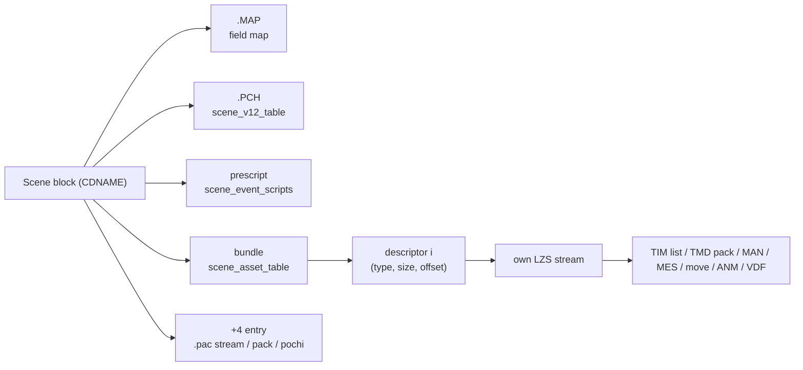
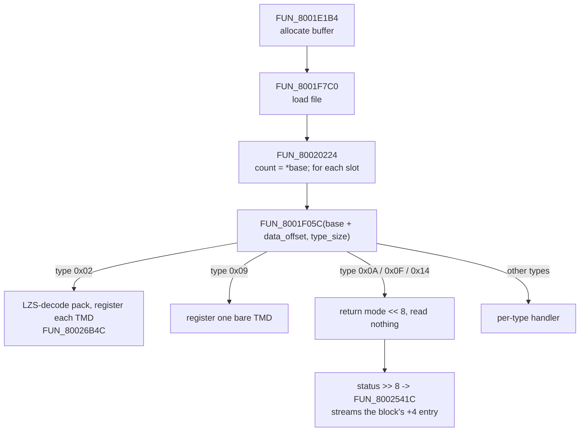
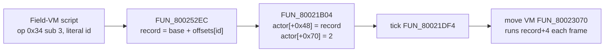

# Scene-prefixed asset bundles

A scene on the disc is a block of consecutive PROT entries (PROT = the `PROT.DAT` archive, [`prot.md`](prot.md)), and each entry in the block has one of a handful of wrapper shapes. This page specifies those wrappers: the ones that hold a scene's meshes, textures, sound bank, MAN (the scene's script + actor container), and effect-stager records.

Identify the shape before picking a walker. Two of the shapes (`scene_tmd_stream`, `scene_vab_stream`) open with a 4-byte chunk header `(type << 24) | size` with `type = 0x00`, the same packing a [DATA_FIELD streaming](data-field.md) chunk uses. The standard streaming walker reads `type = 0x00` as its TIM slot, so pointing it at one of these produces confident nonsense. The runtime uses specialised loaders that key on the content magic at `+4` instead.

## At a glance

| Shape | Opens with | Retail entries | Holds | Runtime reader | Parser (`crates/asset/src/`) |
|---|---|---|---|---|---|
| [`scene_tmd_stream`](#scene_tmd_stream---bare-tmd-prefix) | chunk header, TMD magic at `+4` | 182 | Battle-stage backdrop mesh + its TIMs | `FUN_8001FE70` | `scene_tmd_stream.rs` |
| [`scene_vab_stream`](#scene_vab_stream---vab-prefix) | chunk header, `VABp` at `+4` | 218 | Sound bank (+ SEQ chunks) | DATA_FIELD chunks | `scene_vab_stream.rs` |
| [`scene_v12_table`](#scene_v12_table---the-per-scene-pch-walk-on-trigger-sidecar) | `u16` sub-table directory | 97 | Walk-on trigger records (`.PCH`) | see [`scene-v12-table.md`](scene-v12-table.md) | `scene_v12_table.rs` |
| [`scene_event_scripts`](#scene_event_scripts---prescript-only) | `u16 count`, `u16 offsets[]` | 101 | Move-VM stager records (the "prescript") | `FUN_800252EC` | `scene_event_scripts.rs` |
| [`scene_asset_table`](#scene_asset_table---count-prefixed-asset-bundle) | `u32 count`, descriptors | 88 (+17 classed `lzs_container`) | The scene bundle: TIMs, meshes, MAN, MES, moves, ANM | `FUN_80020224` | `scene_asset_table.rs` |
| [`tmd_size_prefix`](#tmd_size_prefix---truncated-tmd-prefix) | `u32 total`, TMD magic at `+4` | 34 | A TMD truncated on disc | not located | `tmd_size_prefix.rs` |
| [`scene_scripted_asset_table`](#scene_scripted_asset_table---a-shape-retail-does-not-have) | prescript + table | **0** | Nothing - a regression detector | - | `scene_scripted_asset_table.rs` |

A scene block seats these as **separate entries**, in order:



Each of `.PCH`, prescript and bundle starts at offset 0 of its own entry. Readings that place one of them "at `+0x800`" or "at `+0x1000`" of a neighbour come from the superseded over-reading entry size ([`prot.md`](prot.md)); the `.MAP` slot is in [`field-map.md`](field-map.md).

## scene_tmd_stream - bare-TMD prefix

The battle-stage backdrop entry: 182 of the disc's 1233 PROT entries. Walked by `FUN_8001FE70` (the battle-init custom walker), **not** by `FUN_8002541C` / `FUN_8001F05C`, even though the chunk-header packing matches the standard format.

| Offset | Size | Field | Meaning | Confidence |
|---|---|---|---|---|
| `+0x00` | 4 | `chunk0_header` | `(0x00 << 24) \| size`; `size` = TMD byte length | Confirmed |
| `+0x04` | `size` | Legaia TMD | Magic `0x80000002`, on-disc flags `0` ([`tmd.md`](tmd.md)) | Confirmed |
| `+0x04 + size` | var | tail chunks | `[u32 header][payload]`, 4-byte aligned, until terminator | Confirmed |
| after terminator | var | zero padding | To the entry's sector-aligned end | Confirmed |

Detection (`scene_tmd_stream::detect`):

1. `buf.len() >= 32`.
2. `buf[4..8] == 0x80000002` (Legaia TMD magic).
3. `buf[8..12] == 0` (on-disc flags; the runtime sets `1` after pointer fixup).
4. `buf[12..16]` = `nobj`, `1 <= nobj <= 64`.
5. The chunk0 header's type byte is 0.
6. `size` is 4-aligned and at least `12 + nobj * 28`; `4 + size <= buf.len()`.
7. The tail at `4 + size` yields at least one chunk with a known type byte, or a terminator.

### Streaming tail - `FUN_8001FE70` walker

Each tail chunk header packs `(type << 24) | (size & 0x00FFFFFF)`. The walker (`FUN_8001FE70`, called from the battle scene loader `FUN_800520F0`) dispatches:

| Type byte | Action |
|---|---|
| `0x01` | Upload the payload as a single PSX TIM via `FUN_800198E0` (LoadImage). |
| `0x02` | Stop the walk (terminator). |
| any other | Skip (advance to the next chunk). |
| size = 0 | Stop the walk (the canonical terminator). |

The type bytes mean something different from the standard dispatcher: in `FUN_8001F05C`, `0x01` is `TIM_LIST` (a `[count + offsets + TIMs]` pack); here it is one bare TIM. Calling `FUN_8002541C` on one of these entries mis-dispatches.

<a id="one-entry-one-stream-the-falsified-two-list-shape"></a>

### One entry, one stream

An entry holds **exactly one** `[chunk0 TMD][type-0x01 TIM chunks][terminator]` stream, then zero padding. `0006_town01.BIN`:

```text
+0x00000  chunk0 = TMD body 0x383c
+0x03840  type=0x01 TIM chunk             (0x8220 bytes)
+0x0ba64  type=0x01 TIM chunk             (0x8220 bytes)
+0x13c88  terminator (zero-size header)
+0x13c8c..0x13fff: zero padding to the entry's 0x14000 end
```

`FUN_8001FE70` returns `param_1 + 1`, the address just past the terminator. Its single static caller, battle init `FUN_800513F0`, calls it once.

Not a "two-list" / concatenated-sub-streams shape: the "second sub-stream at `0x14000`" of entry 0006 is PROT entry **0007** at its own offset 0 (TMD `0x2c20`, TIMs at `0x2c24` / `0xae48`), seen through the over-reading entry size. The town0b / town0c clusters are four-entry runs of the same layout (TMD bodies `0x383c` / `0x2c20` / `0x2998` / `0x3af8`, two `0x8220` TIM chunks each).

[`scene_tmd_stream::sub_streams`](../../crates/asset/src/scene_tmd_stream.rs) returns one block per entry and [`battle_tim_chunks`](../../crates/asset/src/scene_tmd_stream.rs) reports every chunk as `WalkSource::Tail`. Both keep a post-terminator scan as a **regression detector**: a second sub-stream or a `WalkSource::Continuation` hit means the buffer spans more than one PROT entry. Disc-gated coverage: `crates/asset/tests/scene_tmd_stream_real.rs`.

The engine's field-mode loader uses `battle_tim_chunks` to **skip** these battle-only TIMs. The row-479 NPC palettes are not field-resident, matching retail.

### The leading TMD is a half shell, and retail draws it twice

Rendered alone, the TMD is half a bowl: a sky dome, a distant mountain ring and a far ground ring, cut along a plane through the origin. That is what the entry authors, not a truncated parse. `FUN_800513F0` registers the TMD once and links **two** background actors to it, the second under a per-stage transform that closes the circle.

Measured over object 0, the shell both copies carry:

- In all 182 entries at most 8% of the shell's X or Z extent lies on the far side of `X = 0` / `Z = 0`.
- The open side is `-X` in 129 entries, `-Z` in 49 and `+X` in 4. None opens toward `+Z`, the side the party is seated on.
- Trailing objects are near props and ground ribbons; several straddle the plane, which is why the classifier reads object 0 only.
- Object **1** never draws: the backdrop actor drops it.

`scene_tmd_stream::shell_shape` returns the object-0 AABB plus the open side; `ShellShape::describe` renders the viewer label; `shell_shape_all_objects` is the whole-pool form. Pinned by `every_scene_tmd_stream_backdrop_is_authored_as_a_half_shell` in `crates/asset/tests/scene_tmd_stream_real.rs`. The placement (two actors, each stage's second transform, the dropped object) is `legaia_asset::battle_backdrop`, documented in [`battle.md`](../subsystems/battle.md#backdrop-shell---two-copies-of-one-mesh).

### Reading

```rust
use legaia_asset::scene_tmd_stream;
if let Some(s) = scene_tmd_stream::detect(&buf) {
    let tmd = legaia_tmd::parse(&buf[s.tmd_range()])?;  // bare TMD, no wrapper
    for chunk in &s.tail_chunks {
        // each chunk is (type, size, payload) per data-field.md
    }
}

// Surface every type-0x01 TIM upload chunk.
for c in scene_tmd_stream::battle_tim_chunks(&buf) {
    // c.payload_offset is the inner PSX TIM magic offset.
    // c.source is Tail (FUN_8001FE70-reachable) for every retail entry;
    // Continuation means the buffer over-read into the next PROT entry.
}
```

## scene_vab_stream - VAB-prefix

The same outer wrapper as `scene_tmd_stream`, with a Sony VAB sound bank in the leading chunk. It is the largest distributed-VAB carrier: 218 of the 1233 PROT entries.

| Offset | Size | Field | Meaning | Confidence |
|---|---|---|---|---|
| `+0x00` | 4 | `chunk0_header` | `(0x00 << 24) \| N`; low byte of `N` is consistently `0x20` | Confirmed |
| `+0x04` | 4 | magic | `0x56414270` (`VABp` as a little-endian `u32`) | Confirmed |
| `+0x08` | 4 | version | `7` in retail (detector accepts `1..=10`) | Confirmed |
| `+0x0C` | var | VAB header tail | Programs, tones, VAG offsets ([`vab.md`](vab.md)) | Confirmed |
| `+0x04 + N` | var | tail chunks | Standard DATA_FIELD chunks until terminator or end of file | Confirmed |

The detector also requires `program_count <= 128` and `tone_count <= 128`. The VAG bodies and any SEQ live in later chunks at non-fixed offsets; resolve them off the stream ([`vab.md`](vab.md)).

Where the 218 sit:

- 119 of the 123 entries in the CDNAME `vab_01` cluster (1072..1194), the standard distributed-bank layout.
- 77 in `music_01` (990..1071) and 11 in `sound_data2` (877..889).
- The rest are pairs in `teien`, `monster_test` and `other1`, and one each in `battle_data`, `monster_data`, `befect_data`, `player_data` and `other7`.

```rust
use legaia_asset::scene_vab_stream;
use legaia_vab::parse_header;

if let Some(s) = scene_vab_stream::detect(buf) {
    let header = parse_header(buf, s.vab_range().start)?;
    println!("VAB v{} ps={} ts={}", header.version, header.ps, header.ts);
}
```

## scene_v12_table - the per-scene `.PCH` walk-on trigger sidecar

A four-kind sub-table directory carrying the scene's walk-on tile-trigger records; dev filename `DATA\FIELD\<scene>.PCH`. 97 PROT entries match, one per scene, with zero false positives across the corpus. Full reference: [`scene-v12-table.md`](scene-v12-table.md).

| Offset | Size | Field | Value / meaning |
|---|---|---|---|
| `+0x000` | 2 | directory end | `N + 4` |
| `+0x002` | 2 | kind-0 offset | `0x0012` (empty in retail) |
| `+0x004` | 2 | kind-0 count | `0` |
| `+0x006` | 2 | kind-1 offset | `0x0014` (the records) |
| `+0x008` | 2 | kind-1 count | `param`, `0..=192` in retail |
| `+0x00A` | 2 | kind-2 offset | `N` (empty) |
| `+0x00C` | 2 | kind-2 count | `0` |
| `+0x00E` | 2 | kind-3 offset | `N + 2` (empty) |
| `+0x010` | 4 | kind-3 count + pad | `0` |
| `+0x014` | `4 * param` | kind-1 records | 4-byte trigger records |
| `+0x14 + 4*param` | to `0x800` | empty bodies + padding | Zero; the entry **ends** at `0x800` |

`N = 4 * param + 22`, the byte distance from the file head to the first empty sub-table body. The detector combines the three constant words, the three ties to `N`, and that algebra. All columns Confirmed.

Records are grouped by their third byte (`b2`) into scene regions, and the last byte is always `0x01`. Per-byte semantics and the CDNAME position law (`.PCH` at raw TOC index `define + 1`) are on the linked page.

The entry is exactly one `0x800`-byte sector in all 97 cases, so `0x800` is one past its end. The prescript that appears "at `+0x800`" is the next PROT entry ([scene_event_scripts](#scene_event_scripts---prescript-only)); parse it with `scene_v12_table::parse_prescript_entry` against the successor's own bytes.

## scene_asset_table - count-prefixed asset bundle

The scene bundle the field loader reads on entering a town or dungeon. Each descriptor names one asset type and points at that asset's own LZS stream inside the entry.

| Offset | Size | Field | Meaning | Confidence |
|---|---|---|---|---|
| `+0x00` | 4 | `count` | Descriptor count; unbounded in the runtime, `3..=7` in retail | Confirmed |
| `+0x04` | 4 | total decompressed size | `Σ descriptor.size`; never read by retail | Confirmed |
| `+0x08 + 8i` | 4 | `type_size` | `(type << 24) \| (size & 0x00FFFFFF)`; `size` = **decompressed** bytes | Confirmed |
| `+0x0C + 8i` | 4 | `data_offset` | File-relative offset of descriptor `i`'s LZS stream | Confirmed |
| `8 + count*8` | var | payload region | Descriptor 0's stream starts here (`0x40` for count 7, `0x38` for 6, `0x30` for 5) | Confirmed |
| after last stream | < 1 sector | inherited slack | Not the bundle's bytes - see [below](#the-bytes-after-the-last-stream-are-not-the-bundles) | Confirmed |

Facts that hold across the corpus:

- **A bundle is one entry, not a span of them.** 90 CDNAME blocks each carry exactly one MAN-bearing table, always at offset 0 of its entry, and no descriptor payload reaches past the entry's end. `0588_juui1`'s `desc[4].data_offset` is 177413, inside the 186368-byte entry.
- **The anchor is descriptor 0.** Its `data_offset` equals `8 + count * 8`. That, not a count window, is the strong detection signal.
- Entry sizes run from about 60 KB to about 452 KB.
- `Scene::load` fetches every entry as the entry (`ProtIndex::entry_bytes`); detection and extraction must share that one buffer.

### The `count` word is not always 6 or 7

`FUN_80020224` reads `count` from `+0x00` and loops that many descriptors with no bound, so any bound in a reader is a detector heuristic.

| `count` | Where | MAN |
|---|---|---|
| 7 | Kingdom-bundle scenes (most towns and dungeons) | yes |
| 6 | Early standalone towns (`town01` = Rim Elm in entry 4, `town0c` in entry 22, ...) | yes |
| 5 | `bubu1`, `edbubu` | yes |
| 5 | `balden2`, `ropeway2`: `(TimList, Tmd, Anm, Vdf, Flag)` | no |
| 4 | v12-family form `(TimList, Tmd, Anm, Flag)`: `dolk2`, `rikuroa`, `rikuroa2`, `rayman`, ... | no |
| 3 | `0874`'s party pack ([`character-mesh.md`](character-mesh.md)) | no |

Two readers cover this:

- `scene_asset_table::detect` answers "is this a bundle?". It admits `count` in `4..=7`, and a sub-6 table only when it carries a type-3 MAN descriptor. Disc-wide that admits exactly `bubu1` and `edbubu`; the other thirteen sub-6 tables are MAN-less and keep their `lzs_container` class.
- `scene_asset_table::descriptor_bundle_walk` transcribes the runtime walk with no count window: `count` off `+0x00`, descriptor `i` at `+0x08 + 8i`, payload at `base + data_offset`. Use it where the entry is already known to be a bundle. `asset account` selects it for the whole `lzs_container` class; that class is not a reliable statement about its members ([`byte-accounting.md`](../tooling/byte-accounting.md#the-lzs_container-class-fits-a-count-it-never-reads)).

The `count = 6` tables are pinned by a runtime write-watchpoint on the MAN buffer `_DAT_8007b898` (`scripts/pcsx-redux/autorun_man_source.lua`) and byte-verified against the live RAM MAN.

### Type-sequence variants

| Tuple | Notes |
|---|---|
| `(1, 2, 3, 4, 5, 6, 7)` | Standard count-7 bundle: `(TimList, Tmd, Man, Mes, Move, Anm, Vdf)`. |
| `(1, 3, 4, 5, 6, 7, 0x14)` | Skips Tmd; trailing `Flag(0x14)`. |
| `(2, 3, 4, 5, 6, 7, 0x14)` | Skips TimList. |
| `(10, 2, 3, 4, 5, 6, 7)` | Leading `Flag(0x0A)`. |
| `(1, 2, 3, 4, 6, 7, 0x14)` | Skips Move. |
| `(2, 3, 5, 6, 7, 0x14)` | count-6 (`town01`): `(Tmd, Man, Move, Anm, Vdf, Flag)`. MAN at index 1. |
| `(10, 2, 3, 5, 6, 7)` | count-6 (`town0c`): leading `Flag(0x0A)`, MAN at index 2. |
| `(1, 3, 5, 6, 0x14)` | count-5 (`bubu1`, `edbubu`): `(TimList, Man, Move, Anm, Flag)`. MAN at index 1. |

### `+0x04` is the bundle's total decompressed size

The header's second word equals `sum(descriptor[i].size)` exactly. The identity holds in every table of this family on the disc: the 88 entries classed `scene_asset_table` plus the 17 classed `lzs_container` (the MAN-less `count`-4/5 form and the character / effect containers `legaia_asset::parse_player_lzs` reads), 105 of 105. It exceeds the carrying entry's byte length in all 105, which rules out "file size" and "sector count".

Retail never reads it. `FUN_80020224` takes `count` from `+0x00` (`80020288` `lw s3,0x0(s4)`) and steps descriptors from `+0x08` (`8002029c` `lw a0,0xc(s0)` / `lw a1,0x8(s0)`, `s0 += 8` per iteration). A sweep of every dumped function for a load off `*(0x8007b85c)` finds reads at offset `0x0` only. The field is an authoring total, inert at runtime, and therefore a **consistency check** an editor must maintain: `SceneAssetTable::total_size_is_consistent`.

### Slot→asset mapping (the runtime walk)

The mapping is positional and offset-based; the descriptor's own `data_offset` is the only indirection.



`FUN_80020224` forms the payload pointer in the `jal`'s **delay slot** (`800202b8 addu a0,s4,a0`), so a backward-only scan for the addition misses it. The full chain is pinned under the [asset-loader subsystem](../subsystems/asset-loader.md#asset-descriptor-walker-fun_80020224---the-slotasset-mapping).

`scene_asset_table::resolve` returns the table plus the base it is relative to. `SceneAssetTable::slots` reproduces the positional walk and `payload_range(slot, base)` resolves a slot's payload span:

```rust
use legaia_asset::scene_asset_table;
if let Some(r) = scene_asset_table::resolve(buf) {
    for s in r.table.slots() {
        let span = r.table.payload_range(s.slot, r.table_base).unwrap();
        println!("slot {}: {} size={} payload@{:#x}..{:#x}",
                 s.slot, s.asset_type.name(), s.size, span.start, span.end);
    }
}
```

The disc-gated `scene_asset_table_walk_real` verifies the walk against every classified entry: table at offset 0, first slot at `header_end`, every type a legal dispatcher type, every payload inside the entry. The relocation of the loaded file into the asset buffer (`_DAT_8007b85c`) is a runtime value; `resolve` reconstructs the base structurally.

### The mesh pool is the descriptor walk

The `Tmd` descriptor (type 2) carries the scene's **environment geometry**: an [`asset::pack`](pack.md) of Legaia TMDs (terrain, buildings, props) inside that descriptor's LZS stream. `town01` has 114.

The runtime TMD pointer table `DAT_8007C018` is populated by exactly two dispatcher cases, and the descriptor walk is the only thing that reaches them:

- **type `0x02` (`TMD`)** - `FUN_8001F05C` LZS-decodes the payload to a pack, then loops `i in 0..count` calling `FUN_80026B4C(buf + offsets[i] * 4)`. Each call stores the pointer at `DAT_8007C018 + DAT_8007b774 * 4` and post-increments the cursor: one pool slot per pack member, in pack order.
- **type `0x09` (`TMD2`)** - one bare mesh handed straight to `FUN_80026B4C`.

`FUN_80026B4C` only *checks* the `0x80000002` magic. A member without it logs `Model Version Err` and is registered anyway, so the pool size is the pack's declared `count`. Parser: `scene_asset_table::mesh_pool`.

A scene's pack starts past the resident head: the five party / savepoint meshes at `DAT_8007C018[0..=4]` ([`character-mesh.md`](character-mesh.md)). The head size is the prefix `DAT_8007b6f8` that `FUN_80020f88` adds to every placement's mesh id (`legaia_asset::field_objects::FIELD_ACTOR_PACK_BIAS`). Rim Elm is head 5 + pack 114 = a 119-slot pool.

Rules that follow:

- **A byte sweep for TMD magic is not a substitute.** A block's bytes carry meshes the walk never registers (`town01`'s `field_pack` sibling, the boot `init_data` stream), so a sweep over-collects by an amount that depends on how far each entry is read. The engine walks the descriptors (`legaia-engine-core::scene_resources`, disc-gated `scene_mesh_pool_walk_disc`) and keeps the sweep (`tmd_scan::scan_entry`, over LZS-decompressed sections) only for blocks with no walkable table.
- **The walk takes any count.** The MAN-less count-4 tables (`dolk2`, `rikuroa`, `rikuroa2`, `rayman`, `station`, `balden2`, `ropeway2`, `taiku`, `doman`, `nilboa2`, `eddoman`) register their packs like a count-6 bundle, so `mesh_pool` falls back to `descriptor_bundle_walk` when `detect` declines. `taiku` shows why the sweep fails: its pack opens with three 100-byte one-triangle placeholder meshes a magic scan skips, shifting every later placement three slots.
- **A `Flag(0x14)` table's meshes include its streamed `.pac`.** `FUN_8002541C`'s mode-`0x14` arm walks the block's `+4` entry as DATA_FIELD chunks through the same dispatcher, so a type-`0x02` chunk registers its (uncompressed) pack members behind the table's own. Ten scene tables carry no mesh slot and get their whole environment pack this way (`balden`, `ropeway`, `retockin`, `tunnelc`, `concnow`, `bubu1`, `nilboa`, `chitei2`, `edretoin`, `edbubu`); no table carries both. A magic sweep of `chitei2`'s `.pac` recovers 101 of 102 members. Parser: `scene_asset_table::streams_scene_pac` + `pac_mesh_pool`.
- **The geometry pack is not always in the entry `find_bundle` returns.** A single-entry town keeps MAN and geometry together (`town01` = entry 4). The cutscene scene `opdeene` keeps its prescript in entry 748 and its MAN + 72-TMD vignette pack in the table at entry 749. The placement `pack_index` indexes the scene-owned entry that produced the most environment TMDs (`opdeene` 749, `town01` 4, `map01` 85), and the renderer selects the env pool by that criterion.
- **The v12-family dungeons have no MAN-bearing bundle.** Their base+3 table is the MAN-less count-4 form, and the scene MAN is the type-3 chunk of the block's standalone `data_field_streaming` entry (`rikuroa` extraction 157, partitions `[13, 29, 64]`; `dolk2` extraction 70, `[29, 73, 17]`), resolved by the engine's `field_man_payload` streaming fallback. A v12-family dungeon's standalone LZS environment container also lives in its own entry (`rikuroa` = extraction 156, 77 TMDs). Coverage: `crates/engine-core/tests/v12_bundle_man_disc.rs`.
- **No dungeon embeds an asset table inside its `scene_v12_table` entry.** A "table at `0x1000`" is the entry's second successor at offset 0. The engine keeps a `BundleSource::V12Embedded` arm that never fires on retail; see [`scene-v12-table.md`](scene-v12-table.md#the-embedded-man-at-0x1000-is-an-extended-footprint-over-read).

Per-mesh world placement and mesh selection come from the field map's object table (`FUN_8003a55c`; parser `legaia_asset::field_objects`, which resolves each object's `pack_index` into this pack) - see [`field-locomotion.md`](../subsystems/field-locomotion.md#object-record-format-0x0000-0x20-byte-stride). Field rendering uploads every TIM (`upload_all_tims`, matching the retail field loader).

`opdeene`'s entry 0749 holds 72 TMDs + 51 TIMs. One of the TIMs is the baked **112×32 caption strip *"It was the Seru."*** (LZS offset `0x01EC30`, two CLUT palettes for the fade), drawn between the two narration crawls: the reveal is a scene texture, not a font string ([`cutscene.md`](../subsystems/cutscene.md#narration-playback---the-crawl-roller-fun_80037174)).

### A `Flag` descriptor streams an extra file

Types `0x0A` / `0x0F` / `0x14` allocate nothing and parse nothing. The [dispatcher](asset-type.md) returns `(descriptor_low_byte) + (case << 8)` and exits (`FUN_8001F05C` at `8001f574` / `8001f60c` / `8001f658`). `FUN_80020224` ORs every descriptor's return into its status word; the field init shifts that right by 8 and calls `FUN_8002541C` with it (`801d6bf8` `sra s1, s4, 0x8`). `FUN_8002541C` then loads one more file through `FUN_800255B8`, chosen by mode:

| Mode | Path |
|---|---|
| `0x0A` | `h:\PROT\FIELD\<scene>\tim.dat` |
| `0x0F` | `...\move.mdt` |
| `0x14` | `DATA\FIELD\<scene>.pac` |

So a `Flag` in the descriptor list is a *request to stream the scene's `+4` block entry*. Of the 100 blocks whose `+3` entry parses as a table, 28 carry `Flag(0x14)` and hold a DATA_FIELD stream at `+4`, 4 carry `Flag(0x0A)` and hold a bare [`asset::pack`](pack.md) there, and 64 carry no `Flag` and reserve `+4` with a one-sector [pochi filler](pochi.md). Details and the two exceptions: [`field-pack.md`](field-pack.md#the-bundles-flag-descriptor-is-the-mode-argument).

### The `FLAG` slot is the pochi fill file

<a id="a-type-0x0a-descriptor-is-a-reserved-slot-and-one-of-them-still-has-content"></a>

A `Flag` descriptor's *payload* is never read: the dispatcher arm returns before touching it. What sits there is authoring filler.

- A type-`0x14` descriptor declares size `1927`, and the 239-byte LZS stream behind it decompresses to the **pochi fill file**, byte-identical to the first `0x787` bytes of all 266 [pochi filler](pochi.md) PROT slots.
- Of the 105 count-prefixed tables, **28** carry a type-`0x14` descriptor, always as the *last* descriptor: 9 of the 10 `count`-4 tables (the tenth, `1203_other5`, is the battle-form character pack), 4 of 4 `count`-5, 3 of 8 `count`-6 and 12 of 80 `count`-7. All 28 payloads are those same 1927 bytes.
- Four bundles carry a type-`0x0A` descriptor, always at descriptor 0, the slot the TIM list normally occupies:

| Entry | Descriptor-0 payload |
|---|---|
| `0022_town0c`, `0348_town0d`, `0742_town0e` | The same 1,927-byte pochi fill, same 239-byte stream. |
| `0455_urudre1` | 343,480 bytes that decompress to a well-formed 85-member [`asset::pack`](pack.md) (first word-offset `86`), every member a PSX TIM. |

`0455_urudre1`'s descriptor 0 is a **second copy of a live asset**: its decompressed bytes hash (SHA-256) identically to the first 343,480 bytes of `0456_urudre1.BIN`, where that pack ends. The scene's texture pack ships as its own PROT entry, which the asset-loader chain streams; the bundle's copy is switched off by its type byte and nothing reads it. Entry `0456` is 344,064 bytes; the 584 above the pack are high-entropy inherited slack, not zero fill.

A `1927`-byte payload in a bundle is fill, and a walker that decodes it is decoding filler. `crates/asset/tests/byte_account_entries.rs` pins both halves.

### The bytes after the last stream are not the bundle's

A bundle's content ends where its last descriptor's LZS stream stops being consumed, inside the entry's last sector in every bundle. Nothing reads above it, yet the bytes there are non-zero in 87 of the 90 bundles and look like data (runs of up to about 2 KB).

They are an earlier PROT entry's bytes at the same file offsets. The packer wrote every entry out of one buffer, in TOC order, without clearing it, so the slack at offset `k` is the byte of the nearest earlier entry whose extent reaches `k`. That prediction reproduces the slack of all 90 bundles byte for byte; the first bundle (`town01`, extraction 4) has no earlier entry that long and its slack is zero.

An editor that rebuilds a bundle can write zeros there, and a parser should never read it. Measured by [`inherited_tail::buffer_run`](../../crates/asset/src/inherited_tail.rs); the disc-wide rule is in [`byte-accounting.md`](../tooling/byte-accounting.md#a-bundles-last-sector-is-the-packers-buffer).

### The world-map kingdom bundles differ in two slots

In PROT 0086 / 0245 / 0392:

- The type-6 slot (**slot 5**) is not a field-actor ANM pack. It is the **CLUT-walk animation table**: an LZS-compressed 516-byte table, byte-identical across the three kingdoms, of eight `16x1` `MoveImage` walker entries (ocean head + shoreline / terrain shimmer cells). `FUN_8001F05C` case 6 installs it at `DAT_8007B7C8` and the SCUS actor walker `FUN_8001ADA4` case `0xB` steps it per game tick. Parser `legaia_asset::clut_walk`; semantics in [`world-map.md`](../subsystems/world-map.md) "Ocean / water animation".
- The slot-0 TIM_LIST interleaves **non-TIM raw CLUT-block records** (`[u32, u32]` prefix + a bare TIM CLUT block, no `0x10` magic). These are the walk's parked source strips at VRAM rows 498/499/502..505, which plain TIM walkers skip (`clut_walk::park_strips` locates them).

## scene_scripted_asset_table - a shape retail does not have

A composite: a `[u16 count][u16 offsets[count]]` prescript at offset 0, then a canonical 7-descriptor scene table at the next `0x800` boundary.

**It matches no retail entry.** The "table at the next `0x800` boundary" is the next PROT entry's ordinary offset-0 table ([`prot.md`](prot.md#the-prescript-prefixed-asset-table-was-an-over-read)). The detector and the class stay, pinned at zero by `crates/extract/tests/validation_suite.rs`, so a reader regression that resurrects the phantom fails a test. The prescript carriers classify as [scene_event_scripts](#scene_event_scripts---prescript-only).

The detector gates on both halves:

1. `u16[0]` is the record count, `1..=4096`.
2. `offsets[0] == 2 + count*2`.
3. All offsets monotonic and in bounds.
4. The next `0x800`-aligned position past the last record offset carries `u32 count = 7` and a valid table header (first descriptor at `+0x40`, all type bytes `<= 0x14`).

## tmd_size_prefix - truncated TMD-prefix

Sister to `scene_tmd_stream` for the truncated case: the on-disc payload is **shorter than the prefix claims**. 34 entries match, all 12 KB (6 sectors).

| Offset | Size | Field | Meaning | Confidence |
|---|---|---|---|---|
| `+0x00` | 4 | `total_size` | Claimed in-memory size, greater than the on-disc length | Confirmed |
| `+0x04` | 4 | magic | `0x80000002` | Confirmed |
| `+0x08` | 4 | flags | `0` on disc | Confirmed |
| `+0x0C` | 4 | `nobj` | Typically 2 or 4 | Confirmed |
| `+0x10` | `nobj * 0x1C` | object table | 28 bytes per object (PsyQ TMD layout) | Confirmed |
| `+0x10 + nobj*0x1C` | var | primitive data | Truncated at the sector boundary | Confirmed |

Every object's `vert_top` / `norm_top` / `prim_top` range lies within the claimed total, so the file is a prefix of a larger logical resource rather than a malformed header.

Detection: TMD magic at `+4`; flags `0`; `1 <= nobj <= 8`; `claimed_total > buf.len()` (what separates it from `scene_tmd_stream`); the object table fits on disc; each object's ranges fit within the claimed total.

**Unknown:** the runtime consumer is not located. Whether the loader zero-fills the missing tail or streams the remainder from another entry is open.

## scene_event_scripts - prescript-only

The "prescript" entry a scene block seats between its `.PCH` and its bundle. Despite the class name, the records are **move-VM stager records**, not field-VM scripts: each one stages an ambient effect or cutscene effect part, and the scene's field-VM scripts install them by id.

| Offset | Size | Field | Meaning | Confidence |
|---|---|---|---|---|
| `+0x00` | 2 | `count` | Record count; `2..=71` in retail | Confirmed |
| `+0x02` | `2 * count` | `offsets[]` | `offsets[0] = 2 + count*2`; non-decreasing; all within the file | Confirmed |
| `offsets[i]` | var | record `i` | `[i16 model_sel][u16 reserved][move-VM bytecode]`, 16-bit word-aligned | Confirmed |
| after last record | var | zero padding | To the entry's sector-aligned end; no second header | Confirmed |

Entries are 2048 / 4096 / 6144 bytes: one to three sectors.

### Record format

A record is byte-identical in shape to the per-summon stagers (`legaia_asset::summon_overlay`):

- `model_sel = -1` with a zero `reserved` halfword gives the `0xFFFF 0x0000` lead most records open with: a transform / pivot node.
- The body is move-VM bytecode ([`move-vm.md`](../subsystems/move-vm.md)); the closing `0x0008` word is move-VM opcode `0x08` (Halt).
- On towns, record 0 is a fixed 768-byte run of 8-byte spawn rows: the scene's master ambient stager. It is a stager record like the rest.

Not field-VM (`FUN_801DE840`) bytecode: the field-VM disassembler fails on 65-88% of it, the bytes are word-aligned (high byte 0 on about 83% of body words), and the opcodes sit mostly below the field VM's `0x22` floor. A record reads cleanly word-aligned as `cmd(0x25,0x29) cmd(0x25,0x2A) term(0x08)`.

### Runtime chain



The bundle base is `_DAT_8007b8d0` = the field scratch `_DAT_1f8003ec + 0x12800`. Retail relocates the bundle there as the same compact `[u16 count][u16 offsets[count]]` table, and `FUN_800252EC` indexes it as `base + 2 + id*2`: the id is the record index. A `town01` field state shows the file's record count with record 0's bytes at the first offset.

The bundle has **one** consumer, reached from two script homes in the scene MAN:

- **Partition 1** carries dedicated effect-actor records (whole script = `install id N` + infinite loop) that stage ambient effects on scene entry. Most scenes install record 0 this way.
- **Partition 2** cutscene timelines install per-shot effect ids; one timeline installs many, re-installing a multi-part effect's id per part.

No field-VM code consumes prescript bytes. Census + RAM pin: `engine-core/tests/scene_prescript_consumer_census_disc.rs`; script-side scanner `legaia_engine_core::man_field_scripts::scene_stager_installs`. The scene's actual field-VM scripts live in the MAN ([`script-vm.md`](../subsystems/script-vm.md)).

### Detection

The frame-opener rate is a quality signal, not an identity one, so there are two tiers:

| Tier | Gate | Use |
|---|---|---|
| `detect` | Table shape with `count` in `3..=4096`, plus at least 45% of records opening with `0xFFFF 0x0000` | Every consumer of the parsed records |
| `detect_structural` | Table shape with `count >= 2`, every offset word-aligned, last record non-empty | Categorizer last resort |

- `detect_structural` matches **101** entries with zero false positives: 100 at slot 2 of a CDNAME block, the exception being `other4 + 1`.
- 23 of the 101 sit under the rate floor. `geremi` / `tunnela` / `tunnelb` / `edson` have a rate of zero: no transform-node record at all.
- `count == 1` is excluded because the anchor collapses to "the second `u16` is 4", byte-identical to a [`bse_bank`](bse-dat.md) header; both retail `bse_bank` carriers match it.
- `Scene::find_event_scripts` also uses position: it falls back to the positional read on the entry immediately after a `scene_v12_table` and before the bundle, the route `edteien`'s two-record prescript takes.
- Detection runs after `scene_scripted_asset_table` and `scene_asset_table`.

There is no secondary header after the prescript. For all 101 carriers the next PROT entry begins with a descriptor table at offset 0 (87 classed `scene_asset_table`, 14 the `count`-4 MAN-less form). For 99 of 101 the first `0x800` boundary at or past the last record offset is already at or past the entry's end; in the other two (`0226_station`, `0587_juui1`) record bodies run past that boundary and do not read as a table.

Pinned by the disc-gated `scene_event_records_word_aligned_real` and `prescript_move_stager_records_real` (78 entries / 1855 records, all valid stager-kind leads). `scene_event_scripts::move_stager_records` parses the records as `summon_overlay::SummonPart`; `record_words` surfaces the raw word stream.

## See also

- [Scene v12 table](scene-v12-table.md) - the `.PCH` directory and trigger records in full.
- [Per-scene field map](field-map.md) - slot 0 of the scene block.
- [Field-pack](field-pack.md) - what the block's `+4` entry holds and how the `Flag` mode selects it.
- [asset::pack](pack.md) - the in-stream pack the bundles embed.
- [Asset-type dispatcher](asset-type.md) - the per-type handlers behind `FUN_8001F05C`.
- [`subsystems/asset-loader.md`](../subsystems/asset-loader.md) - the loader chain that resolves the bundles.
