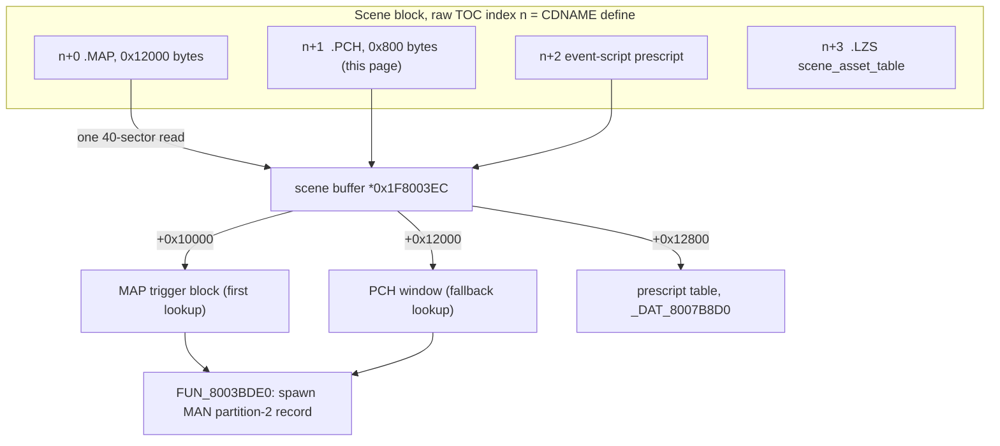

# scene_v12_table - the per-scene `.PCH` walk-on trigger sidecar

Each field scene ships a small **walk-on tile-trigger file**, dev filename `DATA\FIELD\<scene>.PCH`. It lists tiles that fire a scripted event when the player steps on them, and it extends the trigger block inside the scene's `.MAP` file: same header shape, same record forms, consulted second. Every one of the 97 retail files is exactly one `0x800`-byte sector and populates a single record kind.

Parser: [`crates/asset/src/scene_v12_table.rs`](../../crates/asset/src/scene_v12_table.rs) (`legaia_asset::scene_v12_table`). CLI: `asset scene-v12 <PROT-entry>` (single), `asset scene-v12-scan <dir>` (bulk).

## At a glance

| Fact | Value |
|---|---|
| Entries | 97 of 1233 PROT entries, one per scene; zero false positives |
| Size | `0x800` bytes (one sector) in all 97 |
| Position | CDNAME `#define <scene> n` → raw TOC index `n + 1` = extraction entry `n - 1` |
| Content | four-kind sub-table directory + kind-1 trigger records `[tile_x][tile_z][p2_record][gate]` |
| Loader | `FUN_8001F7C0` stages it at `*(0x1F8003EC) + 0x12000` |
| Readers | `FUN_8003AEB0` (scene init), `FUN_801D5630` / `FUN_801D5AE0` (per step, overlay 0897) |
| Next entry | the scene's event-script prescript - a separate PROT entry, not a field at `+0x800` |



The suffix pool is in `SCUS_942.54`: `0x8007B3BC` `.MAP`, `0x8007B3C4` `.PCH`, `0x8007B3CC` `.LZS`. The position law is asserted by the disc-gated `scene_v12_position_law_and_lzs_sibling` in `crates/asset/tests/scene_v12_corpus.rs`; defines are raw indices ([`cdname.md` § numbering space](cdname.md#numbering-space)). Three scenes have no `.PCH` at slot 1: `opurud`, `opkorout`, `edson` - op-`0x44`-driven cutscene scenes with no trigger tiles.

**Naming caveat.** Extraction *filename* labels apply defines as extraction indices and are shifted +2, so a filename names the wrong scene:

| Extraction file | Really is | Evidence |
|---|---|---|
| `0093_map01.BIN` | **garmel**'s table | raw `95 = 94 + 1` |
| `0084_suimon.BIN` | Drake `map01`'s table | raw `86 = 85 + 1`; it alone carries `b2 = 0x26`, the `P2[38]` fly-in record [`cutscene.md`](../subsystems/cutscene.md#record-spawn-mechanisms-live-probe-pinned) pins to `map01` |
| `0002_gameover_data.BIN` | `town01`'s table | raw `4`; carries the opening trigger record `(0x1D, 0x5B, 0x03)` = P2[3] at the arrival tile |

## On-disc layout

`param` is the kind-1 record count and `N = 4 * param + 22`.

| Offset | Size | Field | Value / meaning | Confidence |
|---|---|---|---|---|
| `0x000` | u16 | directory end offset | `N + 4` | Confirmed |
| `0x002` | u16 | kind-0 sub-table offset | `0x0012` | Confirmed |
| `0x004` | u16 | kind-0 count | `0` (teleports live in the `.MAP` block) | Confirmed |
| `0x006` | u16 | kind-1 sub-table offset | `0x0014` | Confirmed |
| `0x008` | u16 | kind-1 count | `param`, `0..=192` in retail | Confirmed |
| `0x00A` | u16 | kind-2 sub-table offset | `N` | Confirmed |
| `0x00C` | u16 | kind-2 count | `0` (elevation overrides) | Confirmed |
| `0x00E` | u16 | kind-3 sub-table offset | `N + 2` | Confirmed |
| `0x010` | u32 | kind-3 count + pad | `0` (region AABBs) | Confirmed |
| `0x014` | `4 * param` | kind-1 trigger records | see below | Confirmed |
| `0x014 + 4*param` | to `0x800` | zero | the empty kind-2 / 3 bodies at `+N`, `+N+2`, `+N+4`, then padding | Confirmed |

The header is the same four-kind directory the per-tile lookup reads for the `.MAP` `+0x10000` trigger block ([`field-locomotion.md` § trigger block](../subsystems/field-locomotion.md#trigger-block-0x10000---four-kind-sub-tables)): for kind `k`, the sub-table body offset is the `s16` at `+4k+2` and its record count the `s16` at `+4k+4` (overlay 0897 `FUN_801D5AE0`, called by the two-window wrapper `FUN_801D5630`). The empty kinds' offsets pack consecutively past the records, which is the whole of the `N` algebra.

### Kind-1 records

| Byte | Field | Notes |
|---|---|---|
| `+0` | `tile_x` (`b0`) | Trigger tile column (128-unit field tiles). |
| `+1` | `tile_z` (`b1`) | Trigger tile row. |
| `+2` | `p2_record` (`b2`) | MAN **partition-2 record index** spawned on step-on. |
| `+3` | `gate` (`flag`) | `0x01` in all 97 entries: "spawn on walk-on". The `.MAP` block's gate-0 object-bind class never appears in a `.PCH`. |

`(b0, b1)` are tile coordinates on every scene class; `b0` is not a scene-local resource index. Records sharing a `b2` are **multi-tile strips of one trigger** - a gate several tiles wide gets one record per tile. The record's own C1 / C2 story-flag gates still apply at spawn time (`FUN_8003BDE0` vs `DAT_80085758`; see [`cutscene.md`](../subsystems/cutscene.md#record-spawn-mechanisms-live-probe-pinned)).

Example, garmel's table (`0093_map01.BIN`, `param = 12`):

```
[0] x=15 z=08 p2=02  ┐
[1] x=14 z=08 p2=02  │ one trigger spanning 3 adjacent tiles
[2] x=13 z=08 p2=02  ┘
[3] x=17 z=2A p2=0C
[4] x=17 z=68 p2=0B  ┐
[5] x=17 z=69 p2=0B  │ 3-tile strip
[6] x=17 z=6A p2=0B  ┘
[7] x=14 z=09 p2=0A
[8] x=06 z=5F p2=09
[9] x=14 z=5E p2=08
[10] x=77 z=12 p2=01
[11] x=72 z=3E p2=00
```

On kingdom overworlds the referenced P2 records are the town / dungeon-entrance and story-beat records, which is why the tiles correlate with actor placements there.

## Confidence

**Confirmed** - header algebra, record shape, one-sector entry size, and the prescript-is-the-next-entry structure are verified across all 97 corpus entries by the disc-gated `scene_v12_corpus` test. The record semantics are confirmed from the consumers in [Runtime staging](#runtime-staging---the-pch-sidecar).

## Detection

The strict gate combines six checks:

1. `buf.len() >= 16`.
2. `u16[1] == 0x0012`, `u16[2] == 0`, `u16[3] == 0x0014`, `u16[6] == 0`.
3. `u16[0] == u16[5] + 4` (= `N + 4`).
4. `u16[7] == u16[5] + 2` (= `N + 2`).
5. `0 <= param <= 1024` (the corpus tops out at `param = 192`; `0724_noaru.BIN` is the `param = 0` edge case).
6. `N == 4 * param + 22`.

Across the 1233-entry PROT corpus this matches **97** entries with zero false positives. Steps 1-5 alone match the same set; step 6 is kept as a contract for consumers that rely on `end_records = N - 2`.

## Event-script prescript - the next PROT entry

The prescript is the next TOC row: extraction `define` (the `.PCH` is `define - 1`, the `.LZS` `scene_asset_table` bundle `define + 1`). `0x800` is one past the `.PCH`'s end, not an offset inside it. Parser: `legaia_asset::scene_v12_table::parse_prescript_entry`, which takes the **next entry's** bytes.

It has the same shape as the standalone [scene_event_scripts](scene-bundles.md#scene_event_scripts---prescript-only) format:

```text
+0x000   u16  script_count
+0x002   u16  offsets[script_count]   ; relative to the entry start
+offsets[i]   word-aligned records
```

The records are **move-VM (`FUN_80023070`) records in the summon-stager format** `[i16 model_sel][u16 reserved][move-VM bytecode]`, **not** field-VM (`FUN_801DE840`) bytecode (they disassemble as field-VM with a 65-88 % error rate). The common `0xFFFF 0x0000` lead is `model_sel = -1` (a transform / pivot node) plus the zero `reserved` halfword, and the `0x0008` terminator is move-VM opcode `0x08` (Halt). The field VM installs a record by id via `FUN_800252EC` (→ part-stager `FUN_80021B04` → move VM). The per-scene field-VM *scripts* live in the scene MAN ([`subsystems/script-vm.md`](../subsystems/script-vm.md)); this prescript is the stager table they spawn from.

| Metric | Value |
|---|---|
| Valid prescript in the next PROT entry | **97 / 97** |
| `script_count` range | 2 .. 71 |
| Frame-opener rate ≥ 50 % | 75 / 97 |
| Max records per entry | 71 (`0119_keikoku.BIN`, `0154_retock.BIN`) |

The 22 entries below a 50 % frame-opener rate open with "init"-style first records and then run the standard stream. Record 0 on the town scenes is a fixed 768-byte master ambient stager, the record the entry effect-actor installs ([scene-bundles](scene-bundles.md)).

<a id="sister-formats"></a>

**There is one prescript per scene.** `FUN_800252EC` takes its `[count][offsets]` table from `_DAT_8007B8D0` (`lw a3, -0x4730(a3)` at `0x800252F4`, then `lhu v0, 0x2(a0)` for `offsets[id]` and `addu a2, a3, v1` for the record pointer). The field asset loader sets that global to `*(0x1F8003EC) + 0x12800` with `sw v0, -0x4730(at)` at `0x8001F864` - one sector past the `.PCH`. Offsets are non-negative, so the `.PCH` window at `+0x12000` can never be the source. `_DAT_8007B8D0` has one other SCUS writer, `0x8001FAC8`, which points it at the `0x1800`-byte `bse.dat` bank buffer ([`bse-dat.md`](bse-dat.md)): the battle occupant of the same slot.

For Drake `map01` (`n = 85`) the pair is extraction `0084` (`.PCH`) + `0085` (prescript); pairing `0085` with `0093` crosses a block boundary.

Not a field of this entry: the "prescript at `+0x800`" and the "embedded MAN at `0x1000`" readings both came from the superseded over-reading PROT entry size ([`prot.md`](prot.md)); see [below](#the-embedded-man-at-0x1000-is-an-extended-footprint-over-read).

## Runtime staging - the `.PCH` sidecar

The field-asset loader `FUN_8001F7C0` (called per scene entry from the mode-2 initializer `FUN_801D6704`) stages the file (`see ghidra/scripts/funcs/8001f7c0.txt`). It forks on the dev / retail selector `_DAT_8007B8C2` ([`cdname.md`](cdname.md#the-table-is-populated-on-retail-hardware)), and the two arms reach the same window by different means.

**Retail arm** (`_DAT_8007B868 == 0`, `_DAT_8007B8C2 != 0`; the `bne` at `0x8001F87C` jumps to `0x8001F9A4`) - **one** contiguous read, no per-file opens:

1. `FUN_8003E8A8(record, 1)` resolves the scene's `.MAP` PROT entry.
2. `FUN_8003E800(dest, 0x28, 1)` reads **40 sectors = `0x14000` bytes** into the per-scene buffer `*(0x1F8003EC)`, and the loader returns that `0x14000` (`lui s1,0x1; ori s1,s1,0x4000` at `0x8001F9BC`).

The `.MAP` is `0x12000` bytes ([`field-map.md`](field-map.md)), 36 sectors, so the read runs **four sectors past it**. PROT entries are contiguous, so those four are the entries that follow: the `.PCH` lands at `+0x12000` because it is next on the disc, and `_DAT_8007B8D0` (`+0x12800`, set at `0x8001F864` before the fork) is the prescript. A scene whose block has no `.PCH` at slot 1 gets whatever those sectors hold, not zeros.

**Dev arm** (`_DAT_8007B8C2 == 0`, or `_DAT_8007B868 != 0`) - three separate host-station opens, which is where the per-file names live:

1. `DATA\FIELD\<scene>.MAP` → `*(0x1F8003EC)` via `FUN_8003E6BC`.
2. `DATA\FIELD\<scene>.PCH` → `*(0x1F8003EC) + 0x12000`. If the open (`FUN_800608F0`, the `break 0x103` host trap) misses, this arm **zero-fills `0x800` bytes** there (`FUN_8001A6A4`).
3. `h:\PROT\FIELD\<scene>\efect.dat` → `*(0x1F8003EC) + 0x12800`.

The zero-fill and the per-file opens belong to the dev arm only: `FUN_800608F0` is a debug-station trap retail hardware cannot service.

Consumers of the staged window:

- **Scene init** - `FUN_8003AEB0` (the field / town map-init, body `0x8003AFA8..0x8003B018`) walks the kind-1 records (`count` at `+0x12008`, cursor from `+0x12006`) and ORs the footprint bit `0x400` into the u16 event-cell word at `*(0x1F8003EC) + 0x8000 + (tile_z << 8) + (tile_x << 1)`.
- **Per step** - the tile lookup `FUN_801D5630` (overlay 0897) scans the `.MAP`'s `+0x10000` block first and **falls back to the `+0x12000` `.PCH` window** (helper `FUN_801D5AE0`, same directory shape). A kind-1 hit reaches `FUN_8003BDE0(x, z, rec[2], rec[3])` and spawns the partition-2 record. Full runtime contract: [`field-locomotion.md` § trigger block](../subsystems/field-locomotion.md#trigger-block-0x10000---four-kind-sub-tables).

### Who writes the staged window

The write surface is three routines wide. A byte-level sweep of `SCUS_942.54` plus all 83 mapped overlay images bounds it:

- **The `+0x12000` offset is materialised six times** in those 84 images (`lui r,0x1; ori r,r,0x2000`): twice in the loader's dev arm (`0x8001F8F4` host read, `0x8001F920` zero-fill), once in `FUN_8003AEB0` (`0x8003AFA8`), and three times in the two-window lookup - `FUN_801D5630` at `0x801D568C` plus that routine's private copies inside the fishing (`0x801D617C`) and dance (`0x801D3F1C`) overlays. `FUN_8003AEB0` only reads the directory; its stores all land in the `.MAP`'s `+0x8000` event-cell grid.
- **`FUN_801D5AE0` is reached only from `FUN_801D5630`'s two arms** (`0x801D567C`, `0x801D56A0`), so the returned record pointer is the only other handle on the window.
- **`FUN_801D5630` has seven callers**, and exactly one writes through the pointer it returns.

### The one runtime writer - field-VM `0x4C 0x83`

`0x801E20A8` in the field overlay is a field-VM arm, reached as main opcode `0x4C` (`MENU_CTRL`; main JT `0x801CECC0` indexed `opcode - 0x21`, slot at `0x801CED6C`) → operand high nibble `8` (JT `0x801CEE60`) → low nibble `3` (JT `0x801CEF48`). It walks a tile rectangle, `x` from `op[1]` to `op[3]` and `z` from `op[2]` to `op[4]` inclusive, calls `FUN_801D5630(2, x, z)` for every tile, and on a hit writes

```text
801e20f4  sb zero,0x3(v1)     ; quads  = 0
801e20f8  sb v0,0x2(v1)       ; coarse = op[5]
```

into the matched **kind-2 elevation-override** record, then advances the VM PC by 7 (`0x801E2130`). A tile with no kind-2 record is skipped by the `beq v1,zero` guard. Sweeping all 84 images for that store pair (`sb zero,0x3(rX)` immediately followed by `sb ?,0x2(rX)`) returns four hits, and this is the only one on a lookup return.

Two consequences:

- **The `+N` / `+N+2` / `+N+4` words are never filled at runtime.** The writer rewrites the body of a record the directory already counts; it cannot append one. Nothing stores a count or an offset into the directory. The words stay zero, as on disc in all 97 entries.
- **The empty kinds split two ways.** Kind 2 has an engine-side writer (the arm above, how a script re-floors a ramp or a bridge mid-scene), but on retail it can only land in the `.MAP` `+0x10000` block, because every retail `.PCH` ships `kind-2 count = 0`. Kinds 0 and 3 have no writer in any image.

## `FUN_80021934` stages the `.LZS`, not the `.PCH`

<a id="the-0x800219xx-lead-resolved---fun_80021934-stages-the-lzs-not-the-pch"></a>

The `_DAT_8007B85C` reader near `0x800219xx` is **`FUN_80021934`** (real entry 3 instructions before the `0x80021940` prologue; `see ghidra/scripts/funcs/80021940.txt`): the **scene-transition streaming actor**, a 5-state SM (state at `actor+0x1A`, jump table `0x80010760`) that pre-streams the *next* scene's [`scene_asset_table`](scene-bundles.md#scene_asset_table---count-prefixed-asset-bundle) bundle during the transition fade. `_DAT_8007B85C` never holds the `.PCH`.

- It is **not** a game-mode handler. Its only corpus reference is the handler word of the 24-byte spawn descriptor at `0x80070734` (the system-actor descriptor family at `0x800705FC..0x80070763`, just below the mode table at `0x8007078C`; layout `[+4 0xFFFF0000][+8 handler][+0xC flags]`). `FUN_8001FD44` (the named scene-change packet) spawns it via the pool spawner `FUN_80020DE0` (`actor+0x0C` = handler, `actor+0x1A` zeroed; `see ghidra/scripts/funcs/8001fd44.txt`, `80020de0.txt`). The five `FUN_8001FD44` call sites all live in the field overlay 0897 (field-VM op `0x3F` at `0x801DEB14` plus four controller sites).
- **Case 0** seeds a 70-frame countdown (`gp+0x710 = 0x46`); cases 1 / 3 poll stream progress (`FUN_8003DE7C(1)`).
- **Case 2**, with `_DAT_8007B8C2` set (the retail path - retail boots the flag at `1`): streams **raw TOC entry `DAT_8007B768 + 3`**, the destination scene's block base + 3, into `_DAT_8007B85C` by index (`FUN_8001EEF0` → `FUN_8003EB98`; `see ghidra/scripts/funcs/8001eef0.txt`, `8003eb98.txt`).
- **Case 4**, with `_DAT_8007B8C2 == 0` (the by-name arm): builds the literal path `DATA_FIELD\<scene>.LZS` (suffix `0x8007B3CC`) and streams it into `_DAT_8007B85C` by name. The case then hands off with `_DAT_8007B83C = 2` (mode 2 MAIN INIT, whose `FUN_801D6704` → `FUN_8001F7C0` chain stages `.MAP` / `.PCH` / prescript as above).

So the raw scene block layout is `n+0` `.MAP` (`0x12000` footprint), `n+1` `.PCH` (this format), `n+2` event-script prescript, `n+3` `.LZS` bundle head, `n+6` BGM base - and the transition actor touches only `n+3`.

## Reading the parsed structure

```rust
use legaia_asset::scene_v12_table;

let buf = std::fs::read("extracted/PROT/0093_map01.BIN")?;       // garmel's .PCH
let next = std::fs::read("extracted/PROT/0094_garmel.BIN")?;     // its prescript
let t = scene_v12_table::detect(&buf).expect("v12 header valid");

println!("N={}, param={}", t.n, t.param);
for (i, rec) in t.records.iter().enumerate() {
    println!("rec[{i}]: x={:02x} z={:02x} p2={:02x}", rec.b0, rec.b1, rec.b2);
}
let (scripts, frame_openers) = scene_v12_table::parse_prescript_entry(&next);
println!("{} prescript records, {frame_openers} frame openers", scripts.len());
```

`SceneV12Table::scripts` is populated only for a buffer that concatenates the header and the prescript, which no retail entry does.

## The "embedded MAN at `0x1000`" is an extended-footprint over-read

A `.PCH` embeds nothing. Read with the superseded entry size, extraction entries `0076` and `0164` show a canonical 7-asset [`scene_asset_table`](scene-bundles.md#scene_asset_table---count-prefixed-asset-bundle) at file offset `0x1000`; `0076 + 0x1000` onward is **byte-identical to extraction `0078`** (suimon's ordinary base+3 bundle) and `0164 + 0x1000` to extraction `0166` (geremi's). Under the position law those two `.PCH` files are suimon's and geremi's, not dolk2's / rikuroa's.

What is true of `dolk2` and `rikuroa`: they are the two scenes whose **own** base+3 bundle is the MAN-less `count = 4` form (types `[1, 2, 6, 0x14]`; the type-`0x14` slot is a small LZS filler, not a MAN carrier). Their partition scripts come from a standalone `data_field_streaming` entry in each block whose type-3 chunk is a plain MAN (`dolk2` extraction 70, partitions `[29, 73, 17]`; `rikuroa` extraction 157, `[13, 29, 64]`).

The live script heap at the Mt. Rikuroa Caruban beat byte-matches the `0157` chunk ([script-vm.md](../subsystems/script-vm.md#a-second-script-byte-carrier-the-streaming-variant-man)). The engine resolves it via the `field_man_payload` streaming fallback (`legaia_engine_core::scene_bundle::streaming_man_payloads`, disc-gated `crates/engine-core/tests/v12_bundle_man_disc.rs`).

## Ruled out

No question on this format is open. Readings that do not hold, each with the instruction that rules it out:

| Reading | Why not |
|---|---|
| The loader writes computed pointers into the `+N` "fixup slots" | Nothing writes them ([above](#who-writes-the-staged-window)). |
| `_DAT_8007B8D0` / `FUN_800252EC` relocate the `.PCH` | That pair is the prescript stager, one sector past the `.PCH`. |
| The `.PCH` is dispatched through `FUN_8001F05C` | It is a standalone top-level PROT entry, never a `type << 24` chunk. `FUN_8002541C` is a generic 3-mode streaming driver. |
| Two prescript tables per scene | One; see [the prescript section](#event-script-prescript---the-next-prot-entry). |

## Related

- [Scene bundles overview](scene-bundles.md) - the other scene-prefixed asset layouts.
- [Field/event script VM](../subsystems/script-vm.md) - `FUN_801DE840`, the runtime that executes the spawned partition-2 records.
- [Field locomotion](../subsystems/field-locomotion.md#trigger-block-0x10000---four-kind-sub-tables) - the `.MAP` `+0x10000` trigger block this file extends, and the engine's `field_regions` port of the lookup.
- [Cutscene routing](../subsystems/cutscene.md#record-spawn-mechanisms-live-probe-pinned) - the walk-on trigger → `FUN_8003BDE0` record-spawn chain (the `map01` / `town01` opening legs fire from these records).
