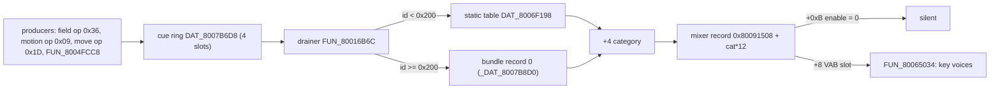
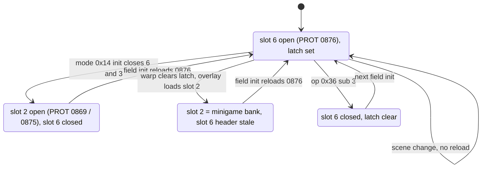

# Sound-effect descriptor table

Every sound effect in the game is named by a small integer cue id, and each id
resolves to an 8-byte descriptor. The descriptor says which program and tone of
a VAB sound bank to play, how many SPU (sound chip) voices to spread the cue
over, and - through its category byte - **which of the open sound banks** the
cue keys. Ids `0x00..=0x63` live in a static table in the executable
`SCUS_942.54`; ids `>= 0x200` use the same row layout in a bank loaded at
runtime. This page covers the table, the routing from category to bank, and the
cue ring that carries ids to the voice programmer.

## At a glance

| | |
|---|---|
| Static table | `DAT_8006F198`, file offset `0x5F998` in `SCUS_942.54` |
| Index | `DAT_8006F198 + sound_id * 8` |
| Stride / count | 8 bytes, **100** descriptors (ids `0x00..=0x63`) |
| Runtime rows | ids `>= 0x200`: record 0 of the bundle at `_DAT_8007B8D0` |
| Readers | `FUN_800250D4` (per-actor trigger), `FUN_80016B6C` (cue-ring drainer) |
| Parser | `legaia_asset::sfx_table` (`crates/game-tables/src/sfx_table.rs`) |
| CLI | `asset sfx-table <SCUS> [--json]` |
| Confidence | Confirmed - disc parse is byte-identical to the same window in live save-state RAM |



## Table base + record layout

| Offset | Size | Name | Meaning | Confidence |
|---|---|---|---|---|
| `+0` | u8 | `p` | program / VAG index - selects the bank's program-attr entry | Confirmed |
| `+1` | u8 | `t` | tone / ADSR-region base; voice `i` of a multi-voice cue uses region `t + i` | Confirmed |
| `+2` | u8 | `l` | note-level voice attribute (MIDI-like, clusters near `60`) | Confirmed |
| `+3` | u8 | `n` | low 5 bits = **voice count**; bit `0x20` = sustained / continuous | Confirmed |
| `+4` | u8 | `id` | category: selects the 12-byte mixer record, and through its `+8` the VAB slot | Confirmed |
| `+5..7` | 3 | - | zero across the whole table; no observed reader | Confirmed (zero) |

The field names are the designer's own, from the runtime debug format string
`"setbl p:%d t:%d l:%d n:%d id:%d"`.

The readers gate on `sound_id < 0x200`, but that is a bound, not the table size.
Only ids `0x00..=0x63` are descriptors (all populated: voice count `1..=3`,
trailing bytes zero). Id `0x64` onward is unrelated rodata, starting with the
`\PSX.EXE` dev-path string.

<a id="ids--0x200-come-from-the-current-bundles-record-0"></a>

### Ids `>= 0x200` come from the current bundle's record 0

Both readers resolve the gate's other arm out of the sound subsystem's
**current-bundle** slot `_DAT_8007B8D0`:

```text
id <  0x200:  desc = DAT_8006F198 + id*8              ; the static table
id >= 0x200:  desc = _DAT_8007B8D0 + offsets[0]       ; the bundle's record 0
                     + (id - 0x200)*8
```

`FUN_800250D4` (`0x800250F4..0x8002514C`): `slti v0,a2,0x200` picks the arm; the
`>= 0x200` side loads `0x8007B8D0`, applies the bundle header's `+0x02` word to
reach `offsets[0]`, and adds `(id - 0x200) * 8`. `FUN_80016B6C`
(`0x80016C24..0x80016CB0`) does the same, then prints the `setbl` line off
`+0..+4`. The row layout is the one above.

The slot holds whatever loaded last:

| Context | Occupant | Set by |
|---|---|---|
| Field | the scene's own prescript bundle, record 0 (per scene: jou reserves 96 rows and populates 40, `rugi` carries 21) | `FUN_8001F7C0` at `0x8001F864`, on every field load |
| Battle | `bse.dat` ([`bse-dat.md`](bse-dat.md)) | `FUN_8001FA88`; its single caller on the disc is `0x80051A3C` in battle init `FUN_800513F0`, so it loads per battle, not at boot |
| Slot machine | the overlay's own `efect.dat` (extraction 1199) | overlay init |
| Muscle Dome arena | extraction 542; its category-3 rows key the arena's slot-3 side bank | overlay init ([`minigame-muscle-dome.md`](../subsystems/minigame-muscle-dome.md#the-tally-cues-key-the-arenas-own-bank)) |

The field bank is neither `bse.dat` nor a `.dpk` / `monster.snd`; why record 0
must not be spawned as a move-VM stager is in
[`field-ambient-fx.md`](../subsystems/field-ambient-fx.md#the-master-ambient-record-0---the-per-scene-sfx-descriptor-bank).

In battle the category column is not static. Before enqueueing a cue, the battle
cue router `FUN_8004FE5C` overwrites byte `+4` of `record[cue_id - 0x200]` from
a per-actor byte, reaching the bank through `gp+0x678` (the record-table pointer
`FUN_8001FA88` saved at load). A live cue's VAB slot is chosen by the actor that
fired it; the authored category is a default. See
[`bse-dat.md`](bse-dat.md#row-index--cue-id--0x200-and-4-is-rewritten-per-cue).

## Consumers

- **`FUN_800250D4(sound_id, voice)`** - the per-actor SFX trigger, from the
  actor tick `FUN_80021DF4`. Uses only the voice count (`n & 0x1F`) and
  `SpuKeyOn`s (`FUN_800653C8`) that many consecutive voices.
- **`FUN_80016B6C`** - the per-frame cue-ring drainer. For each ready cue it
  programs `voice_count` voices via `FUN_80065034` (the libsnd
  `SpuSetVoiceAttr` analogue), passing program (`+0`), region (`+1` `+ i`),
  attr (`+2`) and the VAB slot picked by category (`+4`).

The SPU programming below `FUN_80065034` is libsnd; the engine has its own SPU
and ports the static data and the routing.

### The ring is two arrays, aged by one function and drained by another

`DAT_8007B6D8[4]` holds `i16` cue ids; its sibling `DAT_8007C338[4]` holds a
`u32` **countdown in vsyncs** per slot. The per-frame mode handlers run
`FUN_8001698C` → `FUN_80016444` → `FUN_80016B6C` in that order.

| Step | Function | Behaviour |
|---|---|---|
| Age | `FUN_8001698C` (`0x80016AF4..0x80016B54`) | timer zero: clear the id to `-1`. Otherwise subtract the adaptive frame step `DAT_1F800393`, floored at zero (retail stores the difference, then overwrites a negative with zero, so a slot cannot skip past zero) |
| Produce | `FUN_80035B50(id)` | write `id` + `timer = 0` into slot `gp+0x158`, latch that slot in `gp+0x15A`, advance the cursor round-robin; no free-slot search |
| | `FUN_80035BAC(delay)` | write the latched slot's countdown |
| | `FUN_80035BD0(id)` | overwrite the latched slot's cue and zero its countdown, cursor unmoved |
| Drain | `FUN_80016B6C` (`0x80016BF8`) | a slot plays only when its timer is **exactly zero** and its id is `>= 0` |

The contract is a one-shot scheduled delay, not a queue. The countdown is in
vsyncs (at the field cadence floor of 2, `timer = 4` plays after two game
ticks), and with four slots a fifth pending cue replaces one.

Port: `legaia_engine_audio::sfx_ring` (`SfxCueRing::push_cue` /
`set_last_delay` / `replace_last`). The scheduler's `enqueue` is a port-side
unbounded delay queue, not `FUN_80035B50`.

### The ring value **is** the descriptor index

`FUN_80016B6C` indexes `&DAT_8006F198 + ring_value * 8` directly, so whatever a
caller stores in the ring is the table index. Overlay code often skips the
dispatcher `FUN_8004FCC8` (which stores `id - 1` for `id < 0x40`) and writes the
ring itself: the Baka Fighter overlay's cues are plain
`_DAT_8007b6d8 = 9` / `0x20` / `0x21` / `0x37` stores
([`minigame-baka-fighter.md`](../subsystems/minigame-baka-fighter.md#sound)).

`0x20` confirm / `0x21` cursor / `0x23` disabled-row buzz / `0x37` cancel are
the **shared UI** cues, not the duel's own. The SCUS-resident kind-4 list kernel
`FUN_80032A44`, which pages every pause-menu list window, writes them
(`li a2,0x21` at `0x80032b9c`, `li a1,0x20` at `0x80032d24`, `li a1,0x23` at
`0x80032d0c`, `li a2,0x37` at `0x80032d74`; see
[`field-menu.md`](../subsystems/field-menu.md)).

### The field's producers: op `0x36` and the motion VM's op `0x09`

Two field scripts reach `FUN_80035B50`, passing the cue id straight from their
bytecode. A third producer, the move VM running a scene's ambient effect parts,
stores into slot 3 directly.

| Producer | Call site | Argument |
|---|---|---|
| field VM op `0x36`, `word0 = 0x8000` (sub `0`) | `jal 0x80035B50` at `0x801E0348` (PROT 0897) | `a0 = (s16)word1` |
| field VM op `0x36`, `word0 = 0x8004` (sub `4`) | `jal 0x80035BAC` at `0x801E03D8` | `a0 = (s16)word1`, the countdown in vsyncs |
| motion VM (`FUN_80038158`) op `0x09` `[09 lo hi]` | `jal 0x80035B50` at `0x80039178` | `a0 = (s16)(lo + (hi << 8))` |
| move VM (`FUN_80023070`) op `0x1D` `[1D v1]`, an ambient effect script's part | `sh v0,-0x4922(at)` at `0x80023688`: a store into slot 3 (`DAT_8007B6DE`), no cursor pair, no countdown | `v1`, the cue id |

Sub `0` runs only while the side-band request pair is settled
(`_DAT_8007BABC == _DAT_8007BAA0`, `0x801E032C..0x801E0340`); otherwise the
script halts at PC. Scripts pair the subs as `36 00 80 <id>` then
`36 04 80 <delay>`, so the delay lands on the slot the push just latched.

The move-VM store is the only cue traffic in an idle `kor5` state: a
three-voice cue every 63 vsyncs, stored at `0x80023688` and drained two vsyncs
later, with no ring push at all.

The disc's field-VM corpus (`asset field-op-census --only 36`) carries 3 828
sub-`0` sites and 2 690 sub-`4` sites across 133 carriers. Static ids span
`0x0E..=0x47`, every one a category-`6` or category-`0` row (`0x2C`, `0x29`,
`0x2D`, `0x2A` lead); runtime ids span `0x200..=0x25F`. `rugi` alone carries 587
sites; `opdeene`'s cutscene timeline pushes `0x2A` and `0x29` with no input.

Port: each call queues a `legaia_engine_core::world::SfxRingOp`
(`World::take_sfx_ring_ops`). The native `BootSession` and the browser play page
replay the queue onto their `SfxScheduler`'s ring every tick. A ring id is the
drainer's input, so it never goes through `classify_cue`. A runtime id keys the
row `World::runtime_sfx_descriptor` returns, through the bank the row's own `+4`
names, with no fallback bank. The ring ages by the vsyncs one host tick spans.

### Voice allocation: one-shots descend from 23, sustained cues ascend from 7

`FUN_80016B6C`'s two key-on loops use separate voice ranges.

| Branch | Voices | State |
|---|---|---|
| One-shot (`flags & 0x20 == 0`) | `23 - cursor`, descending | rolling cursor `gp+0x4BC`, wrapped when it *exceeds* the limit (so the limit value is used). Limit `3`, or `1` in game modes `3` and `0x17` |
| Sustained (`flags & 0x20`) | `7 .. 7 + count - 1`, ascending | held count `gp+0x5D0`; the previous run is released first; the mixer-record pointer latches into `gp+0x40C` |

- A one-shot stops each voice (`FUN_800653C8`) just before reprogramming it.
- The sustained held-count write is inside the key-on loop, so a sustained cue
  with voice count zero releases the old run but leaves `gp+0x5D0` unchanged.
- One-shots sit at the top of the voice file, away from the sequencer's
  ascending first-idle scan. A cue is never dropped for want of an idle voice:
  the fifth hit in battle re-keys voice 23 and cuts the first.
- The key-on rewrites the voice's libsnd note record (`+0x10 = 0x21`), so a
  sequencer note that held the voice no longer matches it and its note-off does
  not reach the cue.
- While `_DAT_8007BA88` is non-zero every cue is forced onto channel `6`.

Port: `legaia_engine_audio::SfxBank` carries the cursor, limit and held count
(`set_field_family` selects the limit, called per tick from the world's mode);
the sequencer drops a note whose voice was re-keyed under it
(`Voice::key_on_count`).

### A cue names its tone by **index**, not by key range

`FUN_80065034` receives the descriptor's fields directly - program `+0`,
tone `+1` (`+ i` for voice `i`), note attr `+2` - so the tone is an explicit
index into the program's tone list. A sequencer NoteOn instead looks up which
tone's `min..=max` key window contains the note. Several retail cues have a note
outside their tone's window (menu cancel `0x37` is program 0 / tone 5 / note 64
against a `[65,65]` window, disc-measured), so a key-range lookup renders them
silent. The engine has both shapes:
[`VabBank::play_tone`](../../crates/engine-audio/src/vab_bind.rs) (explicit
index, SFX) and `play_note` (key range, sequencer).

## Category routing

### The mixer record

The channel gate is a 12-byte record at `0x80091508 + category * 12`:

| Offset | Field |
|---|---|
| `+0` | `VabHdr` pointer (the slot's header buffer) |
| `+8` | **VAB slot id**, handed to `FUN_80065034` as its second argument |
| `+0xB` | enable byte; zero skips the cue before any voice work |

`DAT_80091510` and `DAT_80091513` are record 0's `+8` and `+0xB`, not two byte
arrays.

`+8` is a bank id, not a level. `FUN_80065034` passes it to `FUN_80068b98`,
which rejects it unless it is `< 0x10` and the per-bank open-state byte
`_DAT_801CE368[id] == 1`, then repoints the libsnd current-bank globals at that
slot: `_DAT_801ce33c` (VAB-header base), `_DAT_801ce334` (`ProgAtr` at `+0x20`,
stride `0x10`), `_DAT_801ce340` (`VagAtr` at `+0x820`, stride `0x20`). The
sequencer shares those globals, so a save state sampled after a BGM note shows
the music bank there; a cue still keys the bank its own record names.

`FUN_8001D424` (sound-system init, from boot init `FUN_80015E90`) builds the 16
records: it clears `+0` / `+9` / `+0xB` and writes **`+8 = record index`**
(`sb a3,0x8(t0)` with `addiu t0,t0,0xc`, `0x8001D68C`). So "category is the
slot" is written by the initialiser, and every record of every catalogued save
state agrees (`+8 == N`, `+0` == slot `N`'s live `VabHdr`).

### Category is a bank selector, and four banks are open at once

| Category | Descriptors | Bank it keys |
|---|---|---|
| `0` | 16 | Slot-0 system bank = **PROT 0868**. Shared UI cues (`0x1A`, `0x20`, `0x21`, `0x23`, `0x37`) |
| `2` | 53 | Slot-2 class-2 bank = **PROT 0869** (`0875` when `DAT_8007BD11 == 4`). Battle / duel (`0x09`, `0x4C`) |
| `6` | 30 | Slot-6 field bank = **PROT 0876**. Field script cues (`0x2E`, `0x2F`) and the rest of the field / player set |
| `11` | 1 | Slot-11 battle-reward bank = **PROT 0889**. The single cue `0x50` |

The other open slots carry no descriptors. Slots `1` and `3` hold **variable**
banks - the scene's current BGM bank and a script-selected side-band bank, both
refilled by `FUN_800243F0`. Slots `7` / `8` hold the battle's two `monster.snd`
banks. "The SFX bank is the scene's music VAB" is true only of slot 1, which no
descriptor keys.

Evidence for the pins:

- **PROT 0868** is a byte match: a live field state's slot-0 `VagAtr` program-0
  page (512 bytes) occurs verbatim in extraction 0868 at VAB offset `+4`, and
  the header's `ps = 5` matches. (Its CDNAME label reads `battle_data` and
  0869's `monster_data`; a label is a hint.)
- **PROT 0876** holds 30 VAGs for the 30 category-`6` descriptors, populates
  program slots `1..=7`, and 29 of the 30 descriptors name a program in that
  set.
- **PROT 0889** is a one-program bank whose only populated `ProgAtr` slot is
  **10**, the program cue `0x50` names, with 2 voices against 2 tones. Its
  loader `FUN_8004E568` is also the function that fires `0x50`.
- **PROT 0875** as the slot-2 alternate: descriptors `0x40` / `0x41` name
  program 10, which 0869 does not populate and 0875 does.
- Slots 6 and 1 are byte-pinned: in a catalogued field state the live header
  buffers match extraction 0876 and (for that state's track) 0998 exactly over
  all 218 disc VABs, once the runtime-written `ProgAtr +8..0xF` words are
  excluded. For a `music_01`-scene state the live slot-1 bank equals disc PROT
  1004 at offset `+4` in the same way. Across catalogued captures the slot-1
  bank is 13 distinct VABs (used-program counts `1..=16`).

### Which PROT entry reaches which slot

A bank reaches a slot through one call pair.
`FUN_8001FC00(raw_toc_index, category, buf, append, len)` streams the entry into
a staging buffer; **`FUN_8001E54C(category, buf, len)`** installs it. The
installer indexes the same mixer record (`0x80091508 + category*12`), takes the
header buffer from `+0` and the VAB slot from `+8`, and walks the chunk list:
chunk type `1` / `3` goes to `FUN_8002630C` → `FUN_80068D34` (`SsVabOpenHead`,
sticky, SPU address from the per-slot table at `0x800917B0`) → `FUN_80069170`
(`SsVabTransBody`). Raw TOC indices run two above extraction indices
([numbering](cdname.md#numbering-space)).

| Slot | Filler | Call site |
|---|---|---|
| `0` | PROT 0868 | resident system bank |
| `1` | the scene's BGM bank (`music_01`, variable) | `FUN_800243F0`, index `*(0x8007BC64) + id - 2000` |
| `2` | PROT 0869 (raw `0x367`), `0875` (raw `0x36D`) alternate | battle scene loader `FUN_800520F0` (`a1 = 2`), Baka init `FUN_801CF00C` |
| `2` | a minigame's own bank: PROT 1197 (fishing), 1198 (slot machine), 1231 (dance) | overlay inits at `0x801CF29C` (PROT 0972), `0x801CF064` (0975), `0x801CF428` (0980) |
| `3` | a `vab_01` side-band bank (variable) | `FUN_800243F0`, index `*(0x8007BBE4) + id - 2000` from `_DAT_8007BABC` |
| `6` | PROT 0876 (raw `0x36E`) | field init `FUN_801D6704` |
| `7` / `8` | the two `monster.snd` banks | `FUN_8003E104` + `FUN_8001E54C(7\|8, …)` from `FUN_800520F0` |
| `11` | PROT 0889 (raw `0x37B`) | battle-end reward resolution `FUN_8004E568` |
| `10` | raw `0x428` then `0x422`, over slot 0's SPU base | field init `FUN_801D6704` `0x801D71A0..0x801D7274`, only while `*(0x8007BAC8) == 0x814` and the one-shot latch `0x8007B9B8` is clear |

Slot `5` (slot 1's alias) takes the minigames' music banks (arena `0x3F8`, Baka
`0x415`, dance `0x41A`, fishing `0x3EF` / `0x3F9`, battle intro `0x36F` plus an
index). Slot `3` also takes the arena's and the debug menu's side banks. Every
site uses the same call pair.

### The side-band bank a field script selects

A per-scene runtime row names category `3`. Op `0x36` sub `1` picks which
`vab_01` bank fills that slot: the script stores a request id into
`_DAT_8007BABC`, and `FUN_800243F0`'s second streaming slot resolves it at
`0x800248B4..0x8002494C`. The arms run in sequence, later ones overwriting
earlier ones:

| Request id | PROT raw index | Slot |
|---|---|---|
| `< 1000` | `*(0x8007BBE4) + 2` | `3` |
| `1000..=1999` | `*(0x8007BBE4) + 2` | `6` |
| `2000..=2999` | `*(0x8007BBE4) + id - 2000` | `3` |
| `>= 3000` | `*(0x8007BBE4) + id - 3000` | `6` |
| `0x1000` | none - the request is copied onto the acknowledge cell and nothing loads | - |

The first two rows are what is left of two scene-local arms
(`*(0x80084540) + id` and `+ id - 1000`): the `id < 2000` arm at `0x80024938`
overwrites their index with `vab_01 + 2` and keeps only their slot choice.
`*(0x8007BBE4)` reads `1072` (CDNAME `#define vab_01 1072`, the raw index) in
every catalogued mednafen state checked, so `town01`'s request `2002` streams
extraction entry `1072`. The field overlay seeds the request as `8`
(`0x801D6880`), which resolves to the same entry. Of the disc's 275 sub-`1`
operands, 248 are `2000..=2999`, 21 are `>= 3000` and 6 are the park sentinel.

Port: `legaia_engine_core::world::side_band_bank_for_request`. Both hosts stage
the resolved bank in the free tail of the BGM region while the world is in a
field-family mode, through the shared residency kernel
`legaia_engine_audio::bgm_tail`
([`audio.md`](../subsystems/audio.md#the-banks-that-borrow-the-bgm-regions-tail)).
A slot-6 side-band bank is staged in the shared slot-2 / slot-6 region instead.

## Slot residency

### The slots are aliased in pairs

`FUN_8001D424` assigns the mixer records' header buffers from one base, and
four pairs share one: records `0`/`10`, `1`/`5`, `2`/`6`, `8`/`11`.
`FUN_800265E8` installs the per-slot SPU addresses at `0x800917B0`:

| Slot | SPU base | Gap to the next base | Bank's VAG bodies |
|---|---|---|---|
| `0` / `10` | `0x1010` | 61 440 | PROT 0868 - 59 136 |
| `1` / `5` | `0x10010` | 143 360 | current BGM bank |
| `2` / `6` | `0x33010` | 184 320 | PROT 0869 - 188 128 / PROT 0876 - 174 192 |
| `3` | `0x60010` | 20 480 | side-band bank |
| `4` / `7` | `0x65010` | 30 720 | `monster.snd` bank A |
| `8` | `0x6C810` | 10 240 | `monster.snd` bank B |
| `11` | `0x6F010` | 69 616 | PROT 0889 - 19 344 |

The **field bank (slot 6) and the class-2 battle bank (slot 2) are one physical
bank** used by two categories in two modes; they are never resident together,
and neither are BGM slot 1 and its alias 5. The gaps are allocation, not
enforcement: a bank larger than its gap overruns the next base, which is legal
while that neighbour is closed. PROT 0869 is 3 808 bytes larger than the gap
below slot 3, and the largest `music_01` bank is nearly three times slot 1's
gap.

The per-bank open-state array `_DAT_801CE368` (`0` free, `1` open) takes two
shapes across the catalogued save states:

| Game mode | Slots open |
|---|---|
| `1` / `2` / `3` / `0x11` (field family) | `0`, `1`, `3`, `6` (+ `5`) |
| `0x0F` (battle) | `0`, `1`, `2`, `7` (+ `5`, `8`) |

Slot 2 is never open in the field and slot 6 never in battle. Slot 11 is open
in none of them: the reward path loads it after the point those states were
taken.

### One region per mode: slot 2 and slot 6

Every mode's initialiser refills the shared region with its own bank, and one
latch (`0x8007BAFC`, also addressed as `gp+0x7E4`) decides whether the field
bank needs reloading. Read off every `FUN_8001FC00` / `FUN_8001E54C` pair, every
`FUN_8001FF58` (VAB close) call, and the latch's three writers:

| Step | Site | Slots 2 / 6 |
|---|---|---|
| field init | `FUN_801D6704` `0x801D684C..0x801D68B8`, `0x801D6FF4..0x801D7048` (PROT 0897) | closes `2`, `7`, `8`, `11`; loads PROT 0876 into `6` and sets the latch, only while the latch is clear |
| battle mode init | `FUN_8001DCF8` `0x8001DF74..0x8001DFC0`, next mode `0x14` | closes `6` and `3`, clears the latch |
| battle scene loader | `FUN_800520F0` `0x80052378..0x800523AC` | loads PROT 0869 (or 0875) into `2` |
| minigame warp | `FUN_80025980` `0x800259A4` (`sw zero,0x7e4(gp)`) | clears the latch, closes nothing |
| minigame overlay init | table above | loads the minigame's bank into `2` |
| side-band teardown | `FUN_801D8450` (field-VM op `0x36` sub `3`) | closes `6`, clears the latch |
| side-band request `>= 3000` | `FUN_800243F0` | streams a `vab_01` bank into `6`, latch untouched |



The field bank survives a field-to-field scene change without a reload, comes
back on the first field init after a battle, minigame or teardown, and is gone
between a teardown and that next init. The world map is the field overlay's own
subsystem and takes the same init.

A closed slot is **silent**, not rerouted. The drainer tests the mixer record's
`+0xB` enable byte and skips the cue when it is zero (`lb v0,0xb(v1)` /
`beq v0,zero` at `0x80016CE4..0x80016CEC`), and `FUN_8001FF58` zeroes that byte
on close. A category-6 cue in battle and a category-2 cue in the field make no
sound. That also makes `FUN_80035BD0(0)`, which the field and menu overlays call
before a push, a cancel in those modes: descriptor `0x00` is category 2.

The battle mode init's close arm is keyed on the **mode word**, not its
argument: `FUN_8001DCF8` reads `0x8007B83C` and runs the arm only when it holds
`0x14` (`0x8001DF74..0x8001DF80`). A minigame overlay calls it under `0x18`, so
the arm is skipped; after the overlay's own slot-2 load, both slots are enabled
over the one region, with slot 6's header (PROT 0876's) over slot 2's samples.
Retail captures pin this
([audio.md](../subsystems/audio.md#retail-capture-of-the-slot-2--slot-6-residency)):

- Baka Fighter shows the stale-header state from the overlay's load on.
- The Muscle Dome hub (mode `0x19`) holds slot 2 **closed** and slot 6 open over
  PROT 0876, the field bank the warp left behind.
- A Muscle Dome round is an ordinary battle, entered by the arena's store of
  mode word `0x14` (`0x801D15B8`, PROT 0977,
  [minigame-muscle-dome.md](../subsystems/minigame-muscle-dome.md#what-ends-a-leg-a-knockout-and-nothing-else)).
  A capture shows it taking the battle arm: slots 6 and 3 closed, PROT 0869
  staged into slot 2.
- The dance's PROT 1231 (234 400 bytes of samples) overruns slot 3's base,
  legal while slot 3 is closed.

Port: `legaia_engine_core::world::World::sync_sfx_residency` models the latch,
each slot's enable (`SfxBankResidency::slot_open`) and the region's occupant off
the world's mode edges; op `0x36` sub `3` runs `World::release_field_audio`.
Both play hosts restage the region from it every tick through the shared
`AudioBgmDirector::sync_shared_region`, above the slot-0 bank inside the
reserved SFX window, and resolve a routed cue to its own slot or to silence.
Known differences from retail:

- The port's Muscle Dome mode is a leg and takes the battle arm; it has no hub
  mode.
- A slot left open over another bank's samples
  (`SfxBankResidency::stale_open_slot`, slot 6 in a minigame) is left unstaged,
  so its cues are silent where retail plays the stale header over the wrong
  samples.
- The dance's bank does not fit the port's window. The overflow goes in the BGM
  region's free tail (`spu_layout::upload_shared_region_spilled`; a voice
  addresses each sample on its own, so a bank need not be contiguous). The tail
  half is a `BgmTail` borrower: a track that reaches it drops the bank, and the
  director re-stages it once the free tail has moved.

### SPU budget - both banks in one region

The port keeps the slot-0 bank and the shared region's occupant in one reserved
SFX region; the BGM region is the rest of the 512 KiB. The largest occupant a
host stages whole is PROT 0869; PROT 0876 (174 192), 1197 (52 928) and 1198
(101 504) fit under it, and the dance's 1231 (234 400) spills as above.

| | Bytes |
|---|---|
| PROT 0868 VAG bodies | 59 136 |
| PROT 0869 VAG bodies | 188 128 |
| Reserved SFX region (`SFX_BANK_SPU_BYTES`) | 249 856 (`0x3D000`) |
| BGM region (512 KiB − `0x1000` scratch − the above) | 270 336 |
| Largest scene BGM VAB on the disc that a BGM path stages | 269 632 |

Every VAG in both banks is a multiple of the 16-byte ADPCM block, so the packed
footprint equals the raw total and 2 592 bytes stay free. The figure is tight
on both sides: `0x3E000` drops the BGM region to 266 240 and silences music,
and one step smaller does not fit slot 0 plus PROT 0869. Both hosts use the
same constant. Retail avoids the sum because slot 6 shares slot 2's base
([above](#the-slots-are-aliased-in-pairs)).

## The UI cues and the two program-0 key maps

<a id="the-ui-cues-live-in-program-0-of-the-class-2-bank"></a>
<a id="the-class-2-sound-bank-prot-0869"></a>

Program `0` of both PROT 0868 and PROT 0869 is a purpose-built SFX key map: one
VAG per semitone with single-note windows `min == max == 60 + i`. In 0869 the
UI descriptors' note bytes line up 1:1 (`0x20` → tone 0 / note 60, `0x21` →
tone 1 / note 61, `0x23` → tone 3 / note 63, `0x09` → tone 9 / note 69); `0x37`
is the exception (tone 5, note 64, window `[65,65]`).

- **Which bank a UI cue keys.** `0x20` / `0x21` / `0x23` / `0x37` are category
  `0`, so the field menu keys them in **PROT 0868**. The class-2 copy in 0869
  is the one minigame overlays key directly
  (`FUN_80065034(voice, 2, 0, 0, 0x3c, 0x40, ...)` = vab 2 / program 0 / tone 0
  / note 60). Both are real; the class-2 blip is roughly twice as long.
- **Retail pitches them down.** The pitch a cue keys at is
  `0x1000 * 2^((note - center + fine/128)/12)` - unity at `note == center`, no
  sample-rate factor
  ([`audio.md`](../subsystems/audio.md#the-key-on-pitch-law---note-against-the-tones-center),
  confirmed against retail's staged pitch values in save-state RAM). 0869's
  program-0 `center` bytes are `79..=88` against notes `60..=69`, so `0x20`
  (note 60, center 83) plays at ×0.28. 0868's are spread `72..=90`, giving
  `0x20` ×0.53 - shorter and brighter. Multiplying by a nominal `22050/44100`
  as well keys them an octave too low.
- **PROT 0869's loaders.** The battle scene loader `FUN_800520F0` streams raw
  `0x367` with `a1 = 2` (raw `0x36D` = extraction 0875 when
  `DAT_8007BD11 == 4`); Baka Fighter init `FUN_801CF00C` loads the same
  `0x367`. Its low programs (`0`, `3`) carry the cues battle and the duel fire.

### What a single-bank port gets wrong, and why it is silent

A port that stages one resident SFX bank resolves one category correctly and
fails quietly on the rest. Because 0868 and 0869 both carry a UI key map at
program 0, a category-`0` id fired through the class-2 bank resolves to a
**sibling sample**: a genuine retail blip, about twice as long and a fifth
lower. Peak, duration and "did a voice key on" all pass. Only the source PROT
entry of the samples separates the two.

## Port

<a id="program-bank---selected-by-the-cues-category"></a>

Both play hosts stage slot 0 plus whichever bank the current mode holds in the
shared region, and route each cue through
`slot_for_category(descriptor.category)`:

- `AudioBgmDirector::stage_resident_slot0` uploads the slot-0 bank into the
  bottom of the reserved top region of SPU RAM; the scene-BGM allocator is
  capped below the region.
- `AudioBgmDirector::tick_sfx_frame` fires each cue against the bank its slot
  names - silent when that slot is closed - and falls back to the scene's BGM
  `VabBank` only when nothing is staged at all.
- The 30 category-`6` descriptors key PROT 0876 in the field and are silent in
  battle. The strike cue `0x1A` sounds out of the system bank; the Baka Fighter
  exchange-hit cue `0x09` out of PROT 0869.
- The category-`11` cue (`0x50`, the level-up jingle) is staged at results
  time: `AudioBgmDirector::ensure_reward_bank` uploads PROT 0889 into the free
  tail of the BGM region when the results frame queues the cue; before that it
  is silent. The bank is dropped when a track's samples overrun it or the world
  returns to a field-family mode (whose init closes slot `11`), not on every
  track change
  ([`audio.md`](../subsystems/audio.md#the-banks-that-borrow-the-bgm-regions-tail)).
- `SfxBank::from_descriptors` carries the playback fields (program, tone index,
  note, voice count) and `SfxTable::cue_slots` the routing;
  `SfxBank::play_one_shot(spu, vab)` fires via `VabBank::play_tone` across the
  cue's `voices` consecutive regions.
- The site's cue player (`crates/web-viewer/src/sfx_view.rs`) walks SCUS → this
  table, PROT → the bank each cue's category names, then descriptor → a
  one-shot through the from-scratch SPU.

Tests (disc-gated): `sfx_cue_resident_bank` (engine-shell) - routed cues key a
voice via the tone-index path and both banks pack inside the reserved region.
`sfx_shared_region` (engine-shell) - walks the residency through field, battle
and three minigames, checks every named bank fits above slot 0, and keys
`0x2E` / `0x2F` out of PROT 0876. `play_sfx_channel` (web-viewer) - in town a
category-`0` cue sounds out of PROT 0868 and a category-`6` cue out of PROT
0876 while a category-`2` cue has no bank; a forced battle swaps the region to
PROT 0869.

## Walking fires no cue - retail has no footstep sound

A player walking a field scene plays nothing through any path above. This is a
measured contrast:
[`autorun_footstep_cue.lua`](../../scripts/pcsx-redux/autorun_footstep_cue.lua)
watches both ring producers, the dispatcher, the per-actor trigger, the voice
programmer and the four ring slots, and runs one save state twice for the same
number of vsyncs - standing still, then with the D-pad held.

- Standing still, a house interior, the kingdom overworld: no ring store, no
  `FUN_800250D4` call, and not one `FUN_80065034` voice program.
- The one walk that produces cues produces exactly two, `0x2E` then `0x2F`,
  hundreds of vsyncs apart, both from the op-`0x36` sub-`0` site `0x801E0348`
  in the field VM `FUN_801DE840` ([`script-vm.md`](../subsystems/script-vm.md)):
  script literals fired as the player crosses triggers. They do not recur, so
  they are not footsteps. The same run also catches a per-actor `FUN_800250D4`
  trigger and several voice programs, so the probe is not blind.
- `FUN_80018DB0`, the per-frame field cadence, never fires its step gate:
  `_DAT_8007B8A4` stays at `2` (the `0xF - (speed >> 4) >= 0xB` else-branch), so
  the speed words `gp+0x614` / `gp+0x618` never reach the `0x30` a step needs.
- Its output bytes `DAT_800915DA` / `DAT_800915DB` are not cue traffic: no
  descriptor is read for them, no voice is keyed, and they sit
  two-bytes-per-port inside the `0x80`-byte block the pad init `FUN_8001D230`
  zeroes and registers beside the libpad report buffers `0x800840F8` /
  `0x8008411A`. They do not change while the player walks.

This agrees with the static reading in
[`functions/audio.md`](../reference/functions/audio.md) ("the step loop is
silent"). A port that wants a footstep has to author one. See
`ghidra/scripts/funcs/80018db0.txt`, `80035b50.txt`, `800250d4.txt`,
`8001d230.txt`.

## Provenance

The table is decoded from the disc and cross-checked byte-for-byte against live
RAM: the window at `0x8006F198` in a catalogued mednafen state parses to the
identical 100 descriptors as `SCUS_942.54`. Anchor ids: `0x1A` = program 3 /
tone 0 / note 67, and `0x4C` = program 3 / tone 8 (voice count 2).

## Parser

`legaia_asset::sfx_table::SfxTable::from_scus` resolves the table from a
`SCUS_942.54` image (PSX-EXE `t_addr` → file-offset map, as the
[item-name table](item-table.md) resolver does); `from_table_bytes` parses a raw
window out of save-state RAM. `SfxDescriptor` exposes the fields plus
`voice_count()` / `sustained()` / `is_active()` / `vab_slot()`.

The module also carries the routing law:

| Item | Role |
|---|---|
| `slot_for_category` | category → VAB slot (identity) |
| `prot_index_for_slot` / `prot_index_for_category` | slot → fixed PROT entry; `None` for the variable-bank slots |
| `SLOT_BANKS` | every fixed-entry slot (`0`, `2`, `6`, `11`) |
| `PINNED_SLOT_BANKS` | slots 0 and 2, the pair the site's cue player stages |
| `spu_base_for_slot`, `SLOT_ALIASES` | retail's SPU map and the pairs sharing a region |
| `FALLBACK_VAB_SLOT` | used by the play hosts only for an id the routing does not carry |
| `SfxTable::cue_slots` / `slots_used` | per-cue and per-table slot views |

The per-mode occupant of the shared region is engine state, not a table
(`World::sync_sfx_residency`).

Tests: `sfx_table_real` pins layout + anchors against the real executable;
`sfx_table_live` (engine-shell) validates the parse against live RAM and feeds
`SfxBank::from_descriptors`; `sfx_vab_bank` (engine-shell) checks the slot-1
side - SFX programs resolve in the `music_01` bank, the live bank is
byte-identical to the disc bank, and the bank varies per scene.

## See also

- [`subsystems/audio.md`](../subsystems/audio.md) - the SFX bank + scheduler and the per-actor SFX trigger.
- [`subsystems/audio.md`](../subsystems/audio.md#cd-xa-voice-clip-dispatchers-and-static-cue-census) - `FUN_8004FCC8` / `FUN_8004FE5C` are dual-purpose: an id `< 0x100` queues this ring, an id `>= 0x100` routes to the CD-XA voice-clip player `FUN_8003D53C` (table `0x801C6ED8`).
- [Move-power table](move-power.md) - the `+0x0d` sound cue that feeds this table through `FUN_8004FCC8`.
- [`bse.dat`](bse-dat.md) - the battle occupant of the runtime rows.
- [VAB sound bank](vab.md) - the program / tone data the `p` / `t` fields index.
