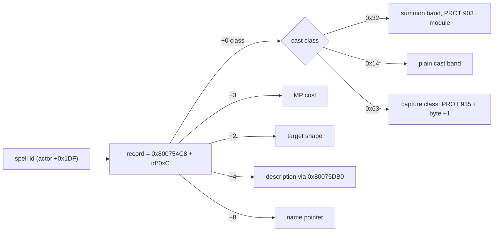

# Spell table

A static table in `SCUS_942.54` with one 12-byte record per spell id. It gives every cast its MP cost, target shape, display name and menu description, and its first two bytes route the cast to the battle code that performs it. Party Seru magic, Ra-Seru summons and named monster attacks all share this one id space, which is also the id space the [move-power table](move-power.md) is keyed by. It carries **no damage value**: a summon's damage comes from battle state ([below](#per-spell-damage-power-is-not-static-data---it-is-caster-state-derived)).

| Fact | Value |
|---|---|
| Stats base | `DAT_800754C8 + id * 0xC` |
| Name-pointer base | `DAT_800754D0 + id * 0xC` (the same records, viewed at `+8`) |
| Extent | 190 records, ids `0x00..=0xBD`; ends exactly where the description-pointer table `0x80075DB0` begins |
| Readers | battle-action SM `FUN_801E295C` states `0x28` / `0x3C` ([battle-action.md](../subsystems/battle-action.md)); menu info window `FUN_801D2E74` |
| Parser | `legaia_asset::spell_names` (crate `game-tables`); CLI `asset spell-names <SCUS> [--json]` |
| Engine mirror | `legaia_engine_core::retail_magic` |
| Confidence | Confirmed (byte-pinned against the executable; disc-gated `spell_names_real`, `spell_catalog_disc`) |



What a higher id resolves to is in [Reading past the extent](#reading-past-the-extent).

## Record layout (12 bytes, stride `0xC`)

| Offset | Size | Field | Meaning | Confidence |
|---|---|---|---|---|
| `+0` | u8 | cast class | selects the battle-action band ([below](#cast-classes-record-byte-0)) | Confirmed |
| `+1` | u8 | sub-index | within the class; the cast-module key for capture-class casts | Confirmed |
| `+2` | u8 | target shape | side + single / all ([below](#target-shape-2)) | Confirmed |
| `+3` | u8 | MP cost | deducted from actor `+0x150` | Confirmed |
| `+4` | u8 | description index | into `u32 string_ptr[]` at `0x80075DB0`; `0` = none | Confirmed |
| `+5` | 3 | padding | zero for every record | Confirmed |
| `+8` | u32 | `name_ptr` | pointer to the display-name C string | Confirmed |

A player Seru spell's display name opens with an **icon escape** (`0xCE`, an
operand, a space) before the ASCII name - not a colour control. The operand
indexes the dialog font's escape table
([dialog-font.md](dialog-font.md#escape-table-0x80074050)): `0x14..=0x1A` are
the element plates, so Gimard (`0x81`) carries `0xCE 0x14`, the fire plate,
which is the authoring `^A` the preprocessor `FUN_80036514` expands. Every
surface that copies the raw name draws the plate in front of it - the battle
banner's `<spell>'s magic level increased.` (element `0x65`) and the Seru
absorb line (`0x59`). The parser keeps the operand as `SpellEntry::icon` and
drops the escape from `name`; the port's banner composer puts it back as `^X`
(`World::spell_banner_name`), which `engine-ui::battle_hud_chrome` expands.

### The `+1` byte has two readers, and one of them is not the pager

The battle-action commit also copies the `+0` / `+1` pair into `actor[+0x1E8]` / `[+0x1E9]` for every non-Item category (`0x801E3B70..0x801E3CB0`), where it selects the cue group an executing cast expands to ([battle-action.md](../subsystems/battle-action.md)). The two readers below are the ones that dispatch a module on `+1`.

The pager `FUN_8003EC70(record[+1] + 0x28)` is the reader this page's
capture-class section describes. The **second** reader is the battle image's
cast-tick dispatcher `FUN_801F2160`, which loads the acting actor's queued id
`actor[+0x1DF]`, indexes this table at `id * 0xC`, takes `+1`, bounds it with
`sltiu ..., 0x20` and jumps through the 32-slot table at `0x801CF56C`
(`0x801F2160..0x801F21D8`; the battle SM's single call site is
`jal 0x801f2160` at `0x801E50C8`, whose `bne v0,zero` is battle phase `0x70`'s
per-frame hold). Both land on the same entry - PROT `935 + sub_id` - so the
byte names the module twice: once to stream it in, once to tick it.

Outside the capture class the byte is still a sub-index and nothing dispatches
on it, because no other class reaches `FUN_801F2160`. It is not constant per
class either: in the player Seru block (`0x32` cast class) the nine enemy-side
spells carry `+1 = 0`, while the two ally-side ones carry a different `+0` as
well - `0x83` Vera is `0x00 / 0x03` and `0x89` Orb is `0x01 / 0x04`.

Decoders: `legaia_asset::spell_names::SpellEntry::sub_class` (the byte),
`legaia_asset::cast_effect_pool::capture_module_prot` (the byte -> PROT entry),
`legaia_engine_core::retail_magic::RetailSpell::effect_class` (the pinned
player-block column). See
[cast-module.md](../subsystems/cast-module.md#what-the-port-runs).

### Cast classes (record byte `+0`)

The class byte selects which battle-action band executes the cast
(`FUN_801E295C` state `0x28`, dump `overlay_battle_action_801e295c.txt`
`0x801E44CC` / `0x801E4614`):

| `+0` | Class | Flow |
|---|---|---|
| `0x32` (`'2'`) | Player summon | Summon band `0x32..0x38`; pages the per-summon overlay `FUN_8003EC70(id - 0x79)` (PROT 903..); damage attributed to the slot-7 cast body ([battle-formulas.md](../subsystems/battle-formulas.md)). |
| `0x14` | Plain cast | Ordinary magic band `0x28..0x2E`, caster-anim playout (Tail Fire `0x27`, Astral Wave `0x6A`, ...). |
| `0x63` (`'c'`) | Capture-class | Routes `0x28 → 0x6E..0x71`; pages the per-spell module `FUN_8003EC70(record[+1] + 0x28)` (→ PROT `935..966`) and starts the XA cue `FUN_8003EAE4(0, record[+1])`. Covers Seru capture, the item-capture Amulet, **and the boss cinematic casts**. The `+1` sub-id names the module - the full sub-id → PROT-entry → spells map is [below](#capture-class-module-index-prot-09350966). The module carries its own baked damage constants and picks the guard-respecting or guard-bypassing finisher wrapper ([battle-formulas.md](../subsystems/battle-formulas.md)); module anatomy - image shapes, phase machine, staging ABI - on [cast-module.md](../subsystems/cast-module.md). |

### Capture-class module index (PROT `0935..0966`)

The `+1` sub-id of a capture-class record is a module index: the cast pages
extraction PROT entry `935 + sub_id` into the slot-B overlay buffer
(`FUN_8003EC70(sub_id + 0x28)`, loader arithmetic `extraction = param + 0x37F`).
Because the sub-id is static spell-table data, the per-entry identity of the
whole module band is a disc fact readable straight out of `SCUS_942.54` -
enumerate every `'c'`-class record and group by sub-id
(`legaia_asset::spell_names::capture_class_records` /
`capture_module_prot`; disc-gated test `spell_names_real`). Modules are
shared: a multi-spell cell dispatches per spell id at the module-head switch
([battle-formulas.md](../subsystems/battle-formulas.md#the-bypass-wrappers-heavy-defence-fold-does-not-mitigate-more)).

| PROT | Spells (id, name) | PROT | Spells (id, name) |
|---|---|---|---|
| 935 | `0x4A` Earthquake | 951 | `0x36` Chaos Flare; `0x5B` Scythe Wind |
| 936 | `0x4B` Hyper Crush | 952 | `0x5C` Bloody Horns; `0xB8` Astral Slash |
| 937 | `0x4C` Hyper Lightning | 953 | `0x5D` Terio Punch; `0x5E` Bull Charge |
| 938 | `0x4E` Chaos Breath; `0xB7` Mystic Circle | 954 | `0x5F` Fatal Decision |
| 939 | `0x4F` Spore Gas | 955 | `0x60` White Shield; `0x6E` Kiss of Death; `0x6F` Melt Spray; `0x70` Terror Scream; `0x72` Power Charge; `0x73` Void Accessories |
| 940 | `0x3C` Glare; `0x50` Divide; `0xAC` Mystic Shield; `0xAE` Clone | 956 | `0x71` Water Hazard; `0x75` Paralyzing Wave |
| 941 | `0x51` Steal; `0xB9` Stone Circle | 957 | `0x76` Death Game; `0x77` Thunder Storm |
| 942 | `0x52` Power Up; `0xAA` Dark Typhoon | 958 | `0x79` Blazing Slash |
| 943 | `0x40` Curse; `0xB5` Lapis Wave | 959 | `0x7A` Megaton Press |
| 944 | `0x37` Guilty Cross; `0x53` Curse All | 960 | `0x7B` Plasma Strike; `0xA6` Neo Star Slash |
| 945 | `0x54` Water Column; `0xBA` Jugger Power | 961 | `0xA1` Dead End Crisis; `0xB4` Final Crisis |
| 946 | `0x55` Call Wave; `0x56` Big Wave | 962 | `0xA2` Blade Breath; `0xA3` Thunder Needle; `0xA4` Gigaton Press; `0xA5` Ultra Charge |
| 947 | `0x57` V-Windhash; `0xA7` Neo Windhash | 963 | `0xB3` Genocidal Cannon |
| 948 | `0x58` Cross Beam | 964 | `0xAF` Element Change; `0xB0` Rogue Wind; `0xB1` Rogue Thunder; `0xB2` Rogue Flame |
| 949 | `0x59` Water Crystals | 965 | `0xB6` Doomsday |
| 950 | `0x5A` Rolling Flare; `0xAB` Shadow Break | 966 | `0xAD` Evil Seru Magic |

The sub-id space covers the band `0935..=0966` exactly - every entry is some
cast's module, so the band holds no orphan slots. The map agrees with every
independently pinned leg: the six capture-pinned boss stagers (938 / 940 /
944 / 961 / 962 / 966, mid-cast slot-B residency -
[battle-action.md](../subsystems/battle-action.md#enemy-boss-stagers--the-record-table-trim)),
the playtest-pinned Delilas trio (958 / 959 / 960) and Xain pair (952 / 953),
and the per-module damage-wrapper census
([battle-formulas.md](../subsystems/battle-formulas.md)) - the status-only
modules it found (940 Glare / Divide / Mystic Shield / Clone, 954 Fatal
Decision, 955 the White Shield band) are exactly the cells above with no
damage spells. Two identities this map settles: **0957** heads with the
string table `Dies / Puera / Both / Damage / Recover` - Death Game's roulette
outcome labels, not a summon-effect descriptor - and **0965** is the Doomsday
module (it shares no content with the battle-tutorial overlay 0967).

### Description index (`+4`) and the `0x80075DB0` pointer table

The pause menu's spell info window (`FUN_801D2E74`, menu overlay - see
[`../subsystems/field-menu.md`](../subsystems/field-menu.md#magic-screen))
resolves each spell's description by reading the `+4` byte and indexing a
flat `u32 string_ptr[]` array at `0x80075DB0`; index `0` means "no
description" (the internal enemy-attack tiers `0x00..=0x24` carry `0`).
The strings use the MES `0x7C` line-break token; the retail shape for the
player block is two lines - a title line then an effect line. The byte is
not an animation id: the summon effect / animation is dispatched by
`spell_id - 0x81` (see the summon section below).
Parser: `legaia_asset::spell_names` (`SpellEntry::desc`).

### Name field (record `+8`) - a pointer into NUL-padded slack

The `+8` word is a pointer, and the string it names is followed by a run of
NUL bytes before the next pointed-at object begins. That run is the record's
whole edit budget, and it is **word alignment, not a fixed slot**: across the
named block every extent is `4 * ceil((len + 1) / 4)` bytes, so a 13-byte name
has three spare bytes and a 15-byte name one. A replacement of the same length
always fits, a slightly longer one sometimes does, and the difference is
per-row. `legaia_asset::spell_names::name_field` measures the run rather than
assuming it - the slack ends at the first non-zero byte after the terminator -
and returns `(file_offset, len, budget)` with `budget` counting the string
plus its padding, one byte of which the replacement needs for its own NUL.

Reaching a name through its record's own pointer is the only safe way to
rewrite one. **These names nest**: a text search of the image for `Hurricane`
finds the `Hurricane Kick` that contains it, so a search-and-replace rename is
one table row away from corrupting a neighbour. `legaia_art::arts_table::name_field`
is the same accessor for the [arts-name table](art-data.md#arts-name-table-dat_80075ec4),
and both exist because a name change that has to stay consistent across the
party and enemy paths touches both tables.

### Reading past the extent

The table's 12-byte walk does not stop at record `0xBD`; nothing bounds it but
the reader. An id above the extent resolves into whatever static data follows,
and on the retail disc that is two known tables:

| Ids | What the walk lands in |
|---|---|
| `0xBE..=0xD4` | the description-pointer table `0x80075DB0` |
| `0xD5..` | the [arts-name table](art-data.md#arts-name-table-dat_80075ec4) `0x80075EC4` |

Both boundaries fall on exact multiples of the stride
(`0x80075DB0 − 0x800754C8 = 0xBE × 0xC`, `0x80075EC4 − 0x800754C8 = 0xD5 ×
0xC`), so an over-read reads whole neighbouring words rather than straddling
them. The arts table's stride is `0x14` and its name pointer sits at `+0xC`,
which coincides with the spell record's `+8` name pointer whenever the arts
record index is `1 mod 3` - so **spell `0xD7`'s name pointer word and arts
record 1's are the same four bytes** at `0x80075EE4`, and on the retail disc
they both read `0x80014220`, `Burning Flare` (`0x80075EF4` / spell `0xDC` /
arts record 4 is the next such pair, `Cyclone`). A rename addressed through
either coordinate is one write, not two - which is a trap for anything that
enumerates "every spell id" and a shortcut for nothing, since ids that far up
name no cast.

`legaia_asset::spell_names` stops at the extent (`SPELL_COUNT = 190`). A reader
that sweeps a full 256 ids prints the aliased rows too: `Spin Combo`,
`Hurricane Kick`, `Mirage Lancer` and their description strings all appear
above `0xD4`. They are Tactical Art names read through the wrong table, not
spells.

### Target shape (`+2`)

Two independent bits over a side/scope pair:

- bit `0x02` = **ally side** (clear = enemy side; equivalently the low nibble
  is `_4` for enemy, `_6` for ally)
- bit `0x20` = **all** targets on that side (clear = single)

| Value | Shape |
|---|---|
| `0x44` | one enemy |
| `0x64` | all enemies |
| `0x06` | one ally |
| `0x26` | all allies |

(The `0x02` / low-nibble model is a *value correlation*: the runtime target
picker never tests `0x02`. `FUN_801D0748` reads this byte and tests **`andi
0x40`** at `0x801D1C50` / `0x801D1C58` (PROT 0898) - the same ladder the
item-effect descriptors' `+2` bit `0x40` runs at `0x801D18E0` - forking on
`0x20` into the one-enemy / all-enemies / one-ally / all-allies phases. Both
readings agree on the four player-block values; the internal enemy-attack tiers
whose byte is `0x04` never reach the player picker, so the `0x40`-clear reading
of them is not a contradiction.)

The model holds across the whole named player block and the six offensive
Ra-Seru summons. One documented exception: the revive Ra-Seru **Horn /
"Resurrector"** (`0x9c`) carries an *enemy-side* `+2` byte (`0x24` → all
enemies) even though its effect revives all allies - the summon's projection
plays toward the enemy field, and the revive is special-cased by spell id. The
`legaia-gamedata::magic_vs_disc` oracle joins the curated magic chart to this
table by name and verifies MP (byte-exact for all 21 Seru + 7 Ra-Seru joins;
it pinned and corrected one curated target error, Mushura / "Crazy Driver" =
single-enemy) plus target shape (agreeing everywhere except the Horn
exception, which it checks explicitly).

Decoded by `legaia_asset::spell_names::SpellEntry::target_shape`
(`SpellTargetShape`). The engine sources the player Seru-magic catalog's MP +
target from the user's `SCUS_942.54` via
`legaia_engine_core::retail_magic::seru_magic_catalog_from_scus` (falling back
to the pinned `retail_seru_magic_catalog` on a disc-free build); the disc-gated
`spell_catalog_disc` test confirms the decode reproduces all 11 pinned targets
+ MP byte-for-byte.

## Id ranges

| Ids | Contents |
|---|---|
| `0x00..=0x24` | internal enemy-attack tiers; **empty inline name pointers** (see below) |
| `0x25..=0x7f` | **named monster attacks** (`Fire Breath` `0x25`, `Tail Fire` `0x27`, …) + capture-class spells (`'c'` at `+0`) |
| `0x80` | "Flip Frog" - boundary entry below the player block (`mp`/`anim` both 0), not part of the sequential set |
| `0x81..=0x8b` | first 11 **player Seru-magic** spells - the engine-pinned block (`retail_magic::SERU_MAGIC`), `anim` ids `0x25..=0x2f` |
| `0x8c..=0x95` | the rest of the player Seru-magic spells: the named block actually runs `0x81..=0x95`, the **21** curated `seru`-family entries (`Gimard` … `Gilium`), every MP byte-exact |
| `0x9a..=0xa0` | **Ra-Seru summons** - `Palma`, `Mule`, `Horn`, `Jedo`, `Meta`, `Terra`, `Ozma` (egg-derived; the hidden 8th, `Juggernaut`, is not in this contiguous named region) |

The `0x00..=0x24` records carry MP / element / target but their `name_ptr` is an
empty string. These are **not** the ids a monster's archive spell entries store
(those local `+0x4C` entry ids in `0x0C..=0x1F` only gate the AGL/action cost). The
named monster attacks live at **`0x25..`** in this same table, and an enemy is
named exactly like a party caster: the AI spell picker (`FUN_801E9FD4`,
`overlay_0898`) reads a **global** spell id from the monster record's
magic-attack array at [`+0x21..=+0x23`](../subsystems/battle.md) (values `> 1`
are live), writes it into the live actor at `+0x1DF`, and the battle-action SM
prints `&DAT_800754D0 + id*0xC` (`0x27` → `Tail Fire`). The enemy spell name
is in this shared table, keyed by the record's global id, not the local entry id. Decoder: [`legaia_asset::spell_names`](../../crates/asset/README.md);
CLI `asset spell-names <SCUS> [--json]`.

### The hardcoded special-cast switch (the second selection mechanism)

The `+0x21` array is **not** the only cast source: the picker's tail runs a
hardcoded `switch` on the **formation monster id** (`DAT_8007BD0C[slot]`,
dump `overlay_battle_action_801e9fd4.txt` `0x801EB0xx..0x801EBD24`, ~30
cases) that queues boss- and species-specific casts **directly into
`actor+0x1DF`**, gated on HP fraction, MP, the battle round counter (byte
`+0x28A` of the context at `*0x8007BD24`), RNG cadence, the not-charmed check
(`+0x16E & 0x380 == 0`),
and per-slot chain-state cells at `DAT_801C8FE0[slot+4]` (+ the one-shot
counter `DAT_801C8FE4`). Verified live: the Zeto mid-cast states hold
`+0x1DF = 0x55/0x56` while the record's array still reads its disc value
`{0x28, 0x01, 0x00}`. Notable cases:

| Formation id | Casts queued | Trigger shape |
|---|---|---|
| `0x4B` Zeto | Call Wave `0x55` → chain-cell → Big Wave `0x56` | 40% + MP >= 100; the cell arms the follow-up |
| `0x8B` Xain | Bull Charge `0x5E` → chain-cell → Terio Punch `0x5D` | rand%3; Bloody Horns `0x5C` comes from the `+0x21` array |
| `0xA2..0xA4` Gi/Che/Lu Delilas | id − `0x29` = Blazing Slash / Megaton Press / Plasma Strike | every 3rd round |
| `0xA6` Sim-Seru Gaza | Neo Star Slash `0xA6` | odd rounds, MP >= 200 |
| `0xA8` Rogue | Element Change `0xAF`; then Rogue Wind/Thunder/Flame via `DAT_801C8FE4 − 0x50` | element-cycling counter |
| `0xB3` Songi (Seru-Kai) | Genocidal Cannon `0xB3` | at or below half HP with MP >= 255, a turn the core picked a physical strike arms record `+0x1C` (half the time); armed, every turn is the cannon |
| `0xB4` / `0xB5` / `0xB6` Cort forms | ESM `0xAD` / Mystic Circle `0xB7` / Mystic Shield `0xAC`; Ultra Charge `0xA5` → Final Crisis `0xB4`, Doomsday `0xB6`; the `0xA2..0xA5` → Dead End Crisis `0xA1` round ladder | round-scripted |
| species bands (`0x43+`, `0x54+`, `0x59+`, `0x62+`, `0x6B+`, `0x99..0xA1`, ...) | Steal `0x51`, Power Up `0x52`, White Shield `0x60`, Rolling Flare `0x5A`, Power Charge `0x72`, Void Accessories `0x73`, Paralyzing Wave `0x75`, Death Game `0x76`, Thunder Storm `0x77`, Stone Circle `0xB9`, Chaos Breath `0x4E`, Jugger Power `0xBA`, Lapis Wave `0xB5`, ... | HP-fraction / cadence gates |

Rogue's arm (`0x801EB910`) splits on the round counter's parity: an even
round queues Element Change, an odd one the attack `DAT_801C8FE4 - 0x50`
aimed at the whole party (`+0x1DD = 8`). The counter is written by Element
Change itself - PROT 0964 re-draws `rand() % 3` while it equals the word at
`0x801C8FE4` (`0x801F8A20`, `0x801F8A4C`) and stores the accepted draw there
(`0x801F8A90`) - so each Element Change both recolours the record and picks
the next attack, which never repeats the last one. Battle init zeroes the
counter, so the first attack is Thunder or Flame, never Wind.

No case queues Curse All `0x53` (or Curse `0x40`) - with neither mechanism
sourcing them, both are confirmed **casterless** in retail.

#### The Delilas arm: three ids, one body, an arithmetic cast id

`0xA2`, `0xA3` and `0xA4` are three consecutive jump-table slots pointing at
the **same** arm, `0x801EB7C0`, and that arm names no spell of its own - it
computes one from the formation id:

```text
801eb7c0  lui   v0,0x8008
801eb7c4  lw    v0,-0x42dc(v0)   ; v0 = *0x8007BD24, the battle context
801eb7cc  lbu   a0,0x28a(v0)     ; the round counter
801eb7d0  lui   v0,0xaaaa
801eb7d4  ori   v0,v0,0xaaab     ; 0xAAAAAAAB - the divide-by-3 reciprocal
801eb7d8  multu a0,v0
801eb7dc  mfhi  a3
801eb7e0  srl   v1,a3,0x1        ; v1 = round / 3
801eb7e4  sll   v0,v1,0x1
801eb7e8  addu  v0,v0,v1         ; v0 = 3 * (round / 3)
801eb7ec  subu  a0,a0,v0
801eb7f0  andi  a0,a0,0xff       ; a0 = round % 3
801eb7f4  li    v0,0x2
801eb7f8  bne   a0,v0,0x801ebdac ; fire only on round % 3 == 2
801eb7fc  _lui  v0,0x8008
801eb800  addiu v0,v0,-0x42f4    ; DAT_8007BD0C
801eb804  addu  v0,s7,v0         ; + the formation slot
801eb808  sb    a0,0x1de(s4)     ; actor[+0x1DE] = 2, the Magic category
801eb80c  lbu   v0,0x0(v0)       ; the formation monster id
801eb814  addiu v0,v0,-0x29      ; the whole mapping
801eb818  j     0x801ebdac
801eb81c  _sb   v0,0x1df(s4)     ; actor[+0x1DF] = id - 0x29
```

So monsters `162` / `163` / `164` resolve to spells `0x79` / `0x7A` / `0x7B` -
Blazing Slash, Megaton Press, Plasma Strike - and the entire mapping is one
literal, `0x2442FFD7` (`addiu v0,v0,-0x29`) at PROT 0898 file offset
`0x1CFFC` (VA `0x801EB814`). Nothing in the arm is otherwise per-sibling: the
three casters share one body, and which cast fires is a function of the id the
formation seats. The name the banner prints then comes from this table at that
resolved id, exactly as it does for a party caster.

(The `0xC5` MES substitution table at `DAT_80075EC4` is the [Tactical Arts name
table](art-data.md#arts-name-table-dat_80075ec4) - per-character art names, no
spells.)

## Player Seru-magic block (`0x81..=0x8b`)

MP cost + target shape are byte-exact from `SCUS_942.54`; the element column
is the cross-reference against the curated [`gamedata`](../reference/gamedata.md)
magic table (every MP value matches). Spell id `0x81` = Gimard also matches
the save-state pin recorded in `legaia_engine_core::capture_observations::seru_capture`.

| Id | Name | Element | MP | Target |
|---|---|---|---|---|
| `0x81` | Gimard | fire | 10 | one enemy |
| `0x82` | Theeder | thunder | 24 | one enemy |
| `0x83` | Vera | light | 6 | one ally |
| `0x84` | Gizam | water | 28 | all enemies |
| `0x85` | Nighto | dark | 13 | one enemy |
| `0x86` | Zenoir | fire | 36 | one enemy |
| `0x87` | Viguro | thunder | 64 | all enemies |
| `0x88` | Swordie | wind | 32 | one enemy |
| `0x89` | Orb | light | 18 | all allies |
| `0x8a` | Freed | water | 40 | all enemies |
| `0x8b` | Nova | wind | 48 | one enemy |

### Per-spell damage power is not static data - it is caster-state-derived

There is **no per-spell power or multiplier field in this table**, and no separate static per-spell array either. A summon's magnitude comes from the caster's and the summon body's battle stats.

What the table and its readers do carry:

- Record bytes `+5..+8` are zero for every spell, and `+0` / `+1` are class selectors. The whole player block `0x81..=0x8b` shares class `0x32`, so the table cannot distinguish Gimard from Nova.
- State `0x28` of the action SM (`overlay_0898_801e295c.txt` case `0x28`) reads only `+3` (MP), `+0` (the `'c'` capture test) and the name pointer.
- State `0x29` dispatches the per-summon effect by `spell_id - 0x81`: it sets `_DAT_8007ba2c = (&PTR_s_re_check_801f6734)[spell_id - 0x81]` and calls `func_0x8003ec70(spell_id - 0x79, 0)`.
- The attack-vs-defence kernel `FUN_801ec3e4` (`power = stat[+0x164] + (stat[+0x158]*4)/5 + buff`) is melee / arts only: it returns early unless the action-queue head is in `0xC..=0x1F`, which magic (`ActionConstant::Magic = 0x02`) never enters.
- The jump table `FUN_801f2d68` reads (`jr *(0x801F69D8 + state*4)`, `state < 7`) resolves to PROT **0900** file offset 0, the resident render overlay. Its five entries are staggered entry points into one per-frame routine that lerps move-VM anim banks (`FUN_8003ce9c` / `ce64` / `ceb8`) and emits GPU packets into scratchpad `0x1F800314`. It holds no `mult` / `div`, no `actor+0x14c` write and no power read: animation and rendering only.

The magnitude is applied by each summon module's **tick body** - the routine PROT 0898's `0x801CF4EC` table names, not the spawn stager ([`functions/battle.md`](../reference/functions/battle.md#801dd0ac)). Across the player Seru modules (PROT 0903..0915):

| Modules | Behaviour |
|---|---|
| 0903, 0904, 0906, 0908, 0909, 0910, 0912, 0913 (plus 0914 / 0915) | **Damage** through the shared kernel `FUN_801dd0ac` (`a0` = a baked per-module move-type constant `0x10..0x12`, `a1 = 7`, `a2` = target slot). The amount is clamped against the target's HP, added to the damage-popup accumulator `actor+0x10`, then `HP = curHP - amount`. PROT 0910 keeps its damage in a callee (`0x801F81DC`). |
| 0905 Vera (`0x83`) | **Heal** `level * 0x20 + 0xE0`, clamped against `maxHP - curHP` with a signed compare, skipping a dead or `+0x16E & 4` actor; stored negated into the popup word `+0x10` (`0x801F7C50..0x801F7D0C`). |
| 0911 Orb (`0x89`) | **Heal** `(level << 6) + 0x1C0` over the party row with an unsigned clamp (`0x801F7AD8..0x801F7AF4`); at level 3 and above it also clears status bits. |
| 0907 Nighto | **Neither**: zeroes `+0x14C` outright on a kill roll, or sets the confuse bits. |

`level` is the caster's per-magic level byte: a 32-slot search of the `0x80084140` character record matches the cast spell id (`actor+0x1df`) against the id list at `+0x705` and reads the parallel byte at `+0x729`.

#### The full damage-roll chain (three stages)

The damage a summon deals is the `attacker_roll - defender_roll` margin after three stages. Stat names follow the port's kernels; the actor field behind "AGL" is `+0x168` and "HP" is `+0x14c`.

1. **Roll** - `FUN_801dd0ac`, summon branch (`param_2 == 7`), builds an attacker roll `rand % (summon_AGL + 1) + summon_HP + caster_AGL*2` (the caster term is `DAT_801C9370[ctx+0x13]`'s `+0x168`) and a defender roll `rand % ((target_AGL >> 1) + 1) + (target_HP >> 8) + (target_DEFa >> 4) + (target_DEFb >> 4) + target_AGL*2`.
2. **Scale** - `FUN_801dd864` scales the attacker roll by the element-affinity percent from the 8x8 byte matrix at `0x801F53E8`, then by the status-weaken bits (`+0x16e & 1` → 9/10, `& 2` → 7/10; a defender guard `+0x1de == 4` doubles its roll first), and - summon only - by the caster's magic level byte: `roll += roll*(level - 1) >> 3`. `FUN_801dd0ac` then re-rolls the attacker as `defender_roll + rand % ((summon_AGL >> 1) + 1) + summon_HP` whenever the scaled attacker has not already overwhelmed the defender.
3. **Finish** - `FUN_801ddb30` applies the per-element resistance bits (the defender's ability words `+0x6bc` / `+0x6c0`), a `rand % 9 + 8` floor, the 9999 cap, the spirit-gauge fill, the damage-popup accumulator, MP drain, and the per-element stat debuff for the active field type (`*(DAT_801c9358 + 0x1d)`).

Stages 1 and 2 are pure kernels in [`legaia_engine_vm::battle_formulas`](../subsystems/battle-formulas.md) (`summon_attacker_roll` / `summon_defender_roll` / `summon_predamage` / `apply_element_affinity` / `apply_status_weaken` / `apply_magic_power` / `heal_summon_amount`). Stage 3 reads about twenty battle globals and mutates live battle state, so it lives in the battle context. The summon roll runs in the live battle (`World::player_summon_predamage`), so the `base_power` figures in `legaia_engine_core::retail_magic` are not what a cast deals. `FUN_801dd0ac` is dumped at `ghidra/scripts/funcs/overlay_battle_action_801dd0ac.txt`; see also the `FUN_801dd0ac` / `FUN_801dd864` / `FUN_801ddb30` rows in [`reference/functions.md`](../reference/functions.md).

#### Where a per-move power scalar does exist

`FUN_801dd0ac`'s **non-summon** branch (`param_2 != 7`, the arts / physical path) reads the 26-byte-stride [move-power table](move-power.md) at `0x801F4F5C` (PROT 0898 file offset `0x26744`), through the 128-byte id → index map at `0x801F4E63` (file `0x2664B`): `power_table[map[actor[+0x1df]]]`. That page owns the record layout and the map.

Because the move id is this table's id space, joining the two labels every power record. Records `0x10..=0x2b` (move ids `0x25..=0x74`) are the **named monster special attacks** - each resolves to a non-empty name here. Records `0x01..=0x0f` (move ids `0x04..=0x1f`) are the unnamed **internal enemy-attack tiers**. The disc-gated `move_power_real` test pins that boundary against the live spell table.

The engine mirror of the player block is `legaia_engine_core::retail_magic` (`SERU_MAGIC` + `retail_seru_magic_catalog`); the Seru that teach these ids are wired in `legaia_engine_core::seru_learning::SeruRegistry::retail`.

## See also

- [Item-name table](item-table.md) - the sibling static `SCUS_942.54` name table.
- [`subsystems/battle-formulas.md`](../subsystems/battle-formulas.md) - the MP-cost and damage kernels that read these stats.
- [`reference/gamedata.md`](../reference/gamedata.md) - the curated ground-truth magic tables.
