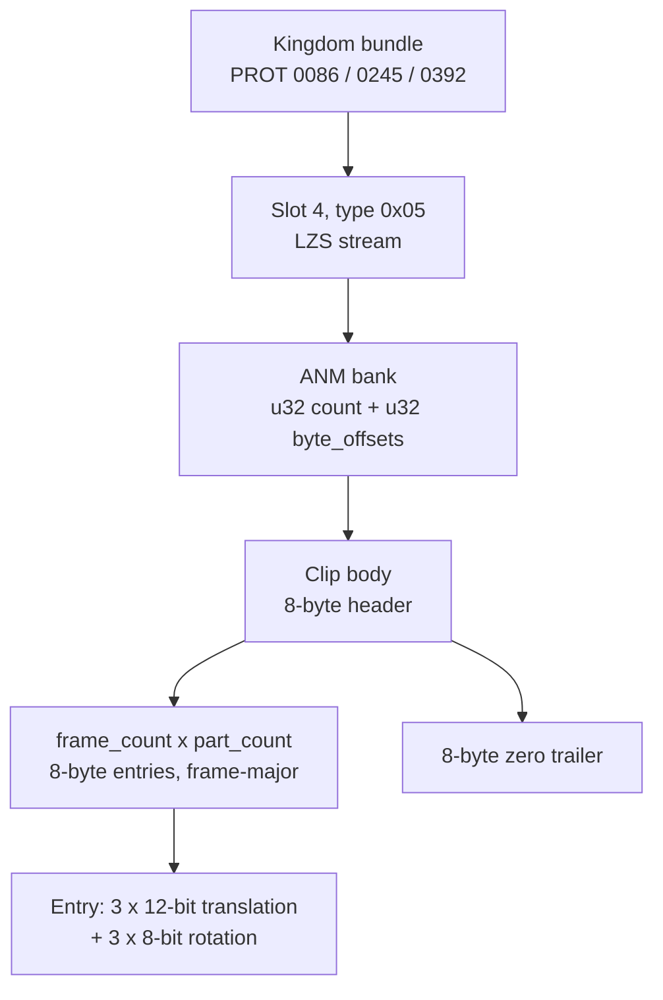
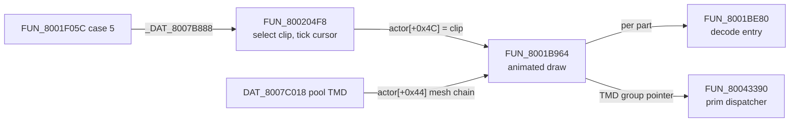

# Slot-4 records (the world-map scene's animation bank)

Slot 4 of each kingdom (world-map) bundle is the world-map scene's **actor
animation bank**. It is an ordinary asset-type-`0x05` ("MOVE")
[ANM](anm.md) container - the same shape every field scene carries - and
not a world-map-specific format. Each body is one animation clip of
`frame_count x part_count` 8-byte entries, and each entry is a **rigid
transform** (three packed 12-bit signed translations plus three 8-bit
rotation angles) for one object of an actor's mesh in one frame.

Slot 4 holds motion only. The geometry an animated actor poses is a TMD
from the global pool `DAT_8007C018`, and the bulk continent terrain comes
from the kingdom slot-1 TMD pack through `FUN_80043390`'s overlay dispatch
table at `0x801F8968`
([`subsystems/world-map.md`](../subsystems/world-map.md#top-view-bulk-terrain-render-path-overlay-replaced-per-prim-renderers)).
This page also documents that pool and the prim dispatcher, because the
animated draw passes through both.

**Not a coastline wireframe and not a vertex pool.** Both readings treated
the entries as geometry and are falsified; see
[Falsified readings](#falsified-hypotheses).

## At a glance

| Item | Value |
|---|---|
| Carriers | PROT 0086 (`map01`, Drake), 0245 (`map02`, Sebucus), 0392 (`map03`, Karisto) |
| Position | Slot 4 of the 7-slot [`scene_asset_table`](scene-bundles.md#scene_asset_table---count-prefixed-asset-bundle), type byte `0x05` |
| On disc | LZS-compressed; decoded verbatim into RAM, no fixup |
| Resident pointer | `_DAT_8007B888` (the dispatcher's type-`0x05` buffer) |
| Clip selector + clock | `FUN_800204F8` |
| Animated draw | `FUN_8001B964` (render mode `actor[+0x56] == 1`) |
| Entry decoder | `FUN_8001BE80` |
| Parser | `legaia_asset::world_map_overlay` ([source](../../crates/asset/src/world_map_overlay.rs)) |
| Confidence | Confirmed - every field pinned to the instruction that reads it, container byte-verified against live RAM |



### Layout summary

| Level | Offset | Size | Field | Meaning | Confidence |
|---|---|---|---|---|---|
| Bank | `+0x00` | u32 | `count` | Number of clips | Confirmed |
| Bank | `+0x04` | u32 x `count` | `byte_offsets` | Absolute **byte** offsets into the decoded payload | Confirmed |
| Clip | `+0x00` | u8 | `part_count` | Objects posed per frame | Confirmed |
| Clip | `+0x01` | u8 | `flags` | Bit 0 = sub-frame interpolation on | Confirmed |
| Clip | `+0x02` | u16 | `frame_count` | Clip length in frames (high byte zero on disc) | Confirmed |
| Clip | `+0x04` | u16 | `marker` | `0x080C`, the ANM record tag; never read at runtime | Confirmed |
| Clip | `+0x06` | u16 | `rate` | Low byte = sub-frame divisor, `1` / `2` / `4` | Confirmed |
| Clip | `+0x08` | 8 x `frame_count * part_count` | `entry[]` | Frame-major rigid transforms | Confirmed |
| Clip | end - 8 | 8 | trailer | Eight zero bytes | Confirmed |
| Entry | byte 0 | u8 | `tx` low | Translation X, low 8 bits | Confirmed |
| Entry | byte 1 | u8 | `ty` low | Translation Y, low 8 bits | Confirmed |
| Entry | byte 2 | u8 | nibbles | Bits 0-3 = X high nibble, bits 4-7 = Y high nibble | Confirmed |
| Entry | byte 3 | u8 | `tz` low | Translation Z, low 8 bits | Confirmed |
| Entry | byte 4 | u8 | nibbles | Bits 0-3 = Z high nibble; bits 4-7 reserved, always zero | Confirmed |
| Entry | bytes 5-7 | u8 x 3 | `rx`, `ry`, `rz` | Rotation; PSX angle = `byte << 4` (4096 = one turn) | Confirmed |

## Carriers

| Bundle | PROT index | CDNAME label | Decoded size | Clips |
|---|---|---|---:|---:|
| Drake | 0086 | `map01` | 32304 | 15 |
| Sebucus | 0245 | `map02` | 26964 | 16 |
| Karisto | 0392 | `map03` | 24444 | 16 |

Each kingdom block runs `[.MAP 36 sectors] [v12 header 1] [prescript 1..3]
[bundle N]`, so the bundle is one entry past the prescript. The numbers
`0085` / `0244` / `0391` name the prescript entries, not the bundles (the
bundle table sits at offset 0 of the *next* entry). Constants:
`legaia_asset::kingdom_bundle::BUNDLE_ENTRIES` and `PRESCRIPT_ENTRIES`.

The bundle is the standard `scene_asset_table` with type sequence
`(1, 2, 3, 4, 5, 6, 7)`. Slot 4's type byte `0x05` is "MOVE" per
[asset-type](asset-type.md), read exactly as every other scene's
type-`0x05` section. `asset player-anm extracted/PROT/0086_map01.BIN
--desc-count 7` reports the Drake bundle as one player-ANM bundle
(`count=15`, `record0 marker_1=0x080C`); `town01`'s type-`0x05` section
has the same record shape, marker and size law.

## Container layout (confirmed)

### Outer pack

```text
+0x00   u32  count                ; number of clips
+0x04   u32  byte_offsets[count]  ; absolute byte offset into the decoded
                                  ; payload (NOT word offsets, unlike the
                                  ; slot-1 TMD pack)
+offset bodies[count]             ; contiguous clip bodies
```

Drake has `count = 15`; its first offset is `0x40 = 4 + 4*15`.

<a id="sub-body-header-8-bytes---the-anm-clip-header"></a>

### Clip header (8 bytes)

```text
+0x00   u8   part_count       ; objects posed per frame
+0x01   u8   flags            ; bit 0 = sub-frame interpolation on
+0x02   u16  frame_count      ; clip length in frames
+0x04   u16  marker           ; 0x080C - the ANM record marker
+0x06   u16  rate             ; low byte = sub-frame divisor, 1 / 2 / 4
```

Readers: `part_count` at `0x8001BACC` (`lbu a0,0(fp)`) and `0x8001BEF4`;
`flags` bit 0 at `0x800205B4` and `0x8001BF70`; `frame_count` at
`0x8001BEB0` (`lhu v1,2(a2)`) and `0x800206E4`; `rate`'s low byte at
`0x800205CC` (`lbu v1,6(a1)`). `marker` is a format tag the offline
detectors key on; the runtime never reads it.

The Rust struct `Slot4Body` keeps older field names for these bytes:
`count_a` = `part_count`, `flag_a` = `flags`, `count_b` + `flag_b` = the
low and high bytes of `frame_count`, `kind` = `rate`. Its accessors
(`part_count()`, `frame_count()`, `interpolates()`, `subframe_divisor()`)
use the names on this page.

### Body payload

```text
+0x08   entry[frame_count * part_count]   ; 8 bytes each, FRAME-major:
                                          ; entry(f, p) at
                                          ; +8 + (f*part_count + p)*8
+...    trailer (8 bytes)                 ; always 8 zero bytes
```

Body size is always `8 + part_count * frame_count * 8 + 8`. The law fits
every body in all three kingdoms, and every trailer is eight zero bytes
(47 of 47 bodies). The pose reader computes the frame-major index at
`0x8001BAC0..0x8001BAEC`: `frame = (i16)actor[+0x68] >> 4`,
`entry0 = rec + 8 + frame*part_count*8`, then `+8` per part.

### Per-entry semantic - one rigid transform (decoded)

Each entry is the pose of **one mesh object in one frame**, decoded by
`FUN_8001BE80` (`0x8001BE80..0x8001C200`), which the animated-actor
renderer `FUN_8001B964` calls at `0x8001BB20`.

```text
byte 0   translation X, low 8 bits
byte 1   translation Y, low 8 bits
byte 2   bits 0-3 = X high nibble, bits 4-7 = Y high nibble
byte 3   translation Z, low 8 bits
byte 4   bits 0-3 = Z high nibble; bits 4-7 RESERVED (zero in every entry)
byte 5   rotation X   (PSX angle = byte << 4; 4096 = one turn)
byte 6   rotation Y
byte 7   rotation Z
```

The translations are **12-bit signed** (`-2048..2047`), sign-extended by
the `andi 0x800` / `ori 0xF000` pairs at `0x8001BF44..0x8001BF6C`:

```text
8001BF04  lbu v1,2(t3)          ; byte 2
8001BF08  lbu a0,0(t3)          ; byte 0
8001BF0C  andi v0,v1,0xf        ; X high nibble
8001BF10  sll  v0,v0,8
8001BF14  or   a0,a0,v0         ; X = byte0 | (byte2 & 0x0F) << 8
8001BF1C  andi v1,v1,0xf0       ; Y high nibble
8001BF20  lbu  v0,1(t3)         ; byte 1
8001BF24  sll  v1,v1,4
8001BF28  or   a3,v0,v1         ; Y = byte1 | (byte2 & 0xF0) << 4
8001BF30  lbu  v0,4(t3)         ; byte 4
8001BF34  lbu  v1,3(t3)         ; byte 3
8001BF38  andi v0,v0,0xf        ; Z high nibble  (byte 4's HIGH nibble unread)
8001BF3C  sll  v0,v0,8
8001BF40  or   v1,v1,v0         ; Z = byte3 | (byte4 & 0x0F) << 8
```

The decoded `(X, Y, Z)` is written to the scratchpad vector at
`0x1F8002C0` and pushed through the GTE (the PSX geometry coprocessor) as
`MVMVA` (`0x4A480012` at `0x8001C0E0`) against the rotation matrix at
`0x1F8002D4`: an object-local translation. The three angles are written to
`0x1F8002C8/CA/CC` as `byte << 4` (`0x8001C1D4..0x8001C1DC` on the
non-interpolated path; the Y / Z bytes are loaded at `0x8001C0E4` /
`0x8001C0E8`).

The other ANM family writes the same packing: the `actor[+0x5A] == 6`
keyframe interpolator inside the actor tick `FUN_80021DF4` emits these
8-byte entries at `0x80022FC4..0x80023030`. Two producers, one layout.

Across all three kingdoms the real translation range is `-541..384` units.

<a id="the-one-genuinely-unread-field---byte-4s-high-nibble"></a>

**The one unread field** is the high nibble of byte 4. It is zero in every
entry of all three kingdom payloads and of `town01`'s type-`0x05` bundle
(22 228 entries checked), so it is structural padding. `Slot4Transform`
exposes it as `reserved` so a non-zero value is visible.

## Playback

**Clip cursor.** `FUN_800204F8` advances `actor[+0x68]`, a 1/16-frame
fixed-point cursor, by `_DAT_1F800393` (the per-tick frame delta) times a
step. The step is `actor[+0x6A]` normally, or
`ceil(actor[+0x6A] * 2 / rate)` when `flags & 1`
(`0x800205C8..0x800205E0`). The cursor wraps at `frame_count << 4`
(`0x800206E4..0x8002072C`), or clamps when `actor[+0x62] & 8`, and each
wrap sets `actor[+0x62] |= 0x100`.

| `actor[+0x62]` bit | Effect |
|---|---|
| `0x02` | Freeze the clip |
| `0x08` | Hold the last frame (clamp instead of wrap) |
| `0x80` | Run backwards |
| `0x100` | Set on each wrap |
| `0x200` | Request a restart |

**Sub-frame interpolation.** When `flags & 1` is set the decoder also
decodes the next frame's entry for the same part and lerps. The next-entry
pointer is `entry + part_count*8` for any frame but the last
(`0x8001BEF4`); on the last frame it wraps to frame 0's entry
(`0x8001BEE0`), or repeats the current entry under hold-last. The weight
is the cursor's low nibble: `out = cur + ((next - cur) * frac) >> 4`
(`0x8001BFF0..0x8001C06C`). Angles go through
`FUN_8001D088(next<<4, cur<<4, frac, axis)`, which handles wrap-around and
accumulates a total-delta guard in `_DAT_8007BD28`.

<a id="rate-124---the-sub-frame-divisor-decoded"></a>

**`rate`.** The header's `+0x06` low byte is the divisor in the step
formula above and is only consulted when `flags & 1` is set. On the disc
`rate` is `1`, `2` or `4`; every `rate = 4` body carries `flags = 1`.
`rate` has no link to the prim dispatcher's bank selector.

**Structural invariant.** The renderer refuses to draw when the clip's
`part_count` differs from the mesh's object count: `0x8001BAF0`
(`bne v1,a0,0x8001BDCC`) compares `chain[0]` - the `nobj` of the actor's
`DAT_8007C018` pool TMD - against `part_count` and skips the whole draw.

## Per-kingdom clip inventory

The clip id an actor plays is 1-based: `actor[+0x5C] = k + 1` selects
body `k` (see [Consumer call sites](#consumer-call-sites)).

Shared clips:

- Bodies 0, 1, 2 (`rate = 1`, `part_count = 10`) are **byte-identical
  across all three kingdoms**. They are the overworld walk clips of Vahn,
  Noa and Gala; their 10-part skeleton is the party figures'.
- A trailing cluster (Drake bodies 9-11, Sebucus / Karisto 12-14) is also
  byte-identical across all three, and other bodies are shared between
  adjacent kingdom pairs.
- Degenerate bodies (`part_count = 1`, all-zero entries) are empty
  placeholder clips.

The kingdom maps set `_DAT_8007B6A8`, so the field pad step stores the
scene-sentinel clip base `99` while a direction is held, and the settle
binds clip `leader + 1` from this bank - body `leader` - in place of the
party walk. Standing binds the party-bank idle as in a town
([`field-locomotion.md`](../subsystems/field-locomotion.md#the-clip-base-and-the-settle-tail)).
In the port, `World::field_settle_clip_tail` makes the pick and
`FieldPlayerAnim::resolve_scene_clip` binds it against the bundle each play
host passes to `World::drain_field_anim_cues`.

### Drake (`map01`, PROT 0086)

| Body | parts | frames | rate | flags | entries |
|---|---:|---:|---:|---:|---:|
| 0 | 10 | 20 | 1 | 0 | 200 |
| 1 | 10 | 20 | 1 | 0 | 200 |
| 2 | 10 | 30 | 1 | 0 | 300 |
| 3 | 2 | 30 | 2 | 0 | 60 |
| 4 | 2 | 20 | 2 | 0 | 40 |
| 5 | 10 | 30 | 2 | 0 | 300 |
| 6 | 10 | 26 | 2 | 0 | 260 |
| 7 | 10 | 30 | 2 | 0 | 300 |
| 8 | 10 | 3 | 2 | 0 | 30 |
| 9 | 12 | 30 | 2 | 0 | 360 |
| 10 | 12 | 30 | 2 | 0 | 360 |
| 11 | 12 | 10 | 2 | 0 | 120 |
| 12 | 10 | 120 | 2 | 0 | 1200 |
| 13 | 14 | 15 | 4 | 1 | 210 |
| 14 | 2 | 30 | 2 | 0 | 60 |

### Sebucus (`map02`, PROT 0245)

| Body | parts | frames | rate | flags |
|---|---|---|---|---|
| 0-3 | 10/10/10/2 | 20/20/30/30 | 1/1/1/2 | 0 |
| 4-7 | 10/10/10/10 | 30/26/30/3 | 2/2/2/2 | 0 |
| 8-11 | 11/11/1/1 | 30/15/30/15 | 4/4/4/4 | 1 |
| 12-15 | 12/12/12/10 | 30/30/10/30 | 2/2/2/2 | 0 |

### Karisto (`map03`, PROT 0392)

| Body | parts | frames | rate | flags |
|---|---|---|---|---|
| 0-3 | 10/10/10/1 | 20/20/30/15 | 1/1/1/2 | 0 |
| 4-7 | 14/14/11/11 | 15/15/30/15 | 4/4/4/4 | 1 |
| 8-11 | 1/1/10/10 | 15/30/5/15 | 4/4/2/4 | 1 |
| 12-15 | 12/12/12/10 | 30/30/10/30 | 2/2/2/2 | 0 |

## RAM layout (confirmed)

Slot 4 is loaded **verbatim** with zero per-byte differences from the
disc-decoded payload. Its resident address is `_DAT_8007B888`, the asset
dispatcher's type-`0x05` buffer pointer, allocated per scene load. The
dispatcher's case-5 arm is an allocate-and-store:

```text
8001F38C  ori   s4,s4,0x10          ; asset-present bit for type 5
8001F394  addiu a1,s3,3
8001F398  srl   a1,a1,2
8001F39C  jal   FUN_80017888        ; malloc(0, round_up4(size))
8001F3A0  sll   a1,a1,2
8001F3A8  sw    v0,-0x4778(at)      ; _DAT_8007B888 = buffer
```

Bases from byte-matching the disc-decoded payload against post-warp
full-RAM dumps (`scripts/pcsx-redux/locate_slot4_base.py`, every body
agreeing; `scripts/pcsx-redux/diff_slot4_ram_vs_disc.py` for the per-byte
compare):

| Kingdom | bundle | `_DAT_8007B888` | end (excl.) | bytes | bodies matched |
|---|---|---|---|---|---|
| Drake   | `map01` / 0086 | `0x8011A624` | `0x80122454` | 32304 | 15/15 |
| Sebucus | `map02` / 0245 | `0x80119CE4` | `0x80120638` | 26964 | 16/16 |
| Karisto | `map03` / 0392 | `0x80108D84` | `0x8010ED00` | 24444 | 16/16 |

Body 0's entries start `0x40` past the base on Drake. The base is a heap
allocation, not a constant: a probe that arms breakpoints on the slot-4
window must read `_DAT_8007B888` for that kingdom first.

The only writer of the buffer is the LZS decoder `FUN_8001A55C` (literal
write at `0x8001A604`, back-reference / run paths at `0x8001A5AC`,
`0x8001A610`, `0x8001A664`, `0x8001A668`), called from the asset
dispatcher `FUN_8001F05C` on the standard scene-load path. There is no
slot-4 transcoder.

## Consumer call sites

The consumer is one SCUS chain, and it is an **animation** chain. Each
link is a plain `jal` and reads a field of the record it was handed:

| Step | Function | What it does |
|---|---|---|
| install | `FUN_8001F05C` case 5 (`0x8001F38C`) | `_DAT_8007B888` = the LZS-decoded slot-4 buffer |
| select + clock | `FUN_800204F8` | Resolves `actor[+0x5C]` to a clip and advances the cursor `actor[+0x68]` |
| draw | `FUN_8001B964` (`0x8001B964..0x8001BE7C`) | Render mode `actor[+0x56] == 1`: computes the frame, walks the parts, calls `FUN_80043390` per object |
| pose | `FUN_8001BE80` | Decodes one 8-byte entry into the GTE translation + rotation |



**Clip selection** (`0x80020534..0x80020598`). `FUN_800204F8` picks one of
three banks and indexes it 1-based:

```text
if      (actor[+0x10] & 0x01000000)  bank = _DAT_8007B75C   ; party bank
else if ((i16)actor[+0x5C] <  0x400) bank = _DAT_8007B888   ; type 0x05 - SLOT 4
else                                 bank = _DAT_8007B840   ; type 0x0B "MOVE2"
rec = bank + *(u32*)(bank + (actor[+0x5C] & 0x3FF) * 4);
actor[+0x4C] = rec;  actor[+0x68] = 0;  actor[+0x56] = 1;
```

The missing `+4` in `bank + id*4` makes the id 1-based: id `1` reads
`offsets[0]`.

`_DAT_8007B888` has exactly **six** references across SCUS and every
extracted overlay (`scripts/ghidra-analysis/find-gp-relative-refs.py --va
0x8007b888`): the case-5 store `0x8001F3A8`, a reset in `FUN_8002541C`
(`0x800254E8`), the `FUN_800204F8` read (`0x8002055C`), and three reads in
the Baka Fighter overlay (PROT 0976). No world-map overlay reads it, and
`FUN_80043390` never receives it.

### Live `map01` actor list (slot 4 in use)

Walking the live actor list (`*_DAT_8007C354`, chained through `+0x00`) in
a `map01` field-run state gives 14 actors. Every one that plays an
animation resolves into the type-5 buffer by the rule above:

| `+0x5C` id | `+0x4C` | offset in slot 4 | body | header `parts` | `chain[0]` = pool `nobj` |
|---:|---|---:|---:|---:|---:|
| 5 | `0x8011BE64` | `0x1840` | 4 | 2 | 2 |
| 11 | `0x8011E714` | `0x40F0` | 10 | 12 | 12 |
| 14 | `0x80121BC4` | `0x75A0` | 13 | 14 | 14 |
| 15 | `0x80122264` | `0x7C40` | 14 | 2 | 2 |

Each `+0x4C` equals `base + offsets[id - 1]`, and each clip's `part_count`
equals the `nobj` of the actor's pool TMD. Five more drawn actors are the
placed landmarks (render mode `+0x56 == 5`), which carry no clip
(`+0x5C = 0`, `+0x4C = 0`). Three are the party, animating out of the
`_DAT_8007B75C` bank (`0x801589E4`, 23 clips).

<a id="slot-4-is-read-in-place---there-is-no-transcode-drake-capture"></a>

### Read in place - capture evidence

`scripts/pcsx-redux/autorun_slot4_source_map.lua` arms read breakpoints
tiled across the slot-4 window (`base + k*0x800`) plus an exec breakpoint
on the streaming-chunk installer `FUN_8001E54C`, and drives the held-Up
warp into the Drake map.

- 363 of the 365 captured rows are reads spanning nearly the whole window
  (`0x8011A624..0x80121E24`); none is a copy.
- `FUN_8001E54C` fires twice with data pointer `0x80184BD0`, outside the
  window. Nothing copies the records.
- The Sebucus run's in-window reads return to `0x8001BB28`, the return
  address of `jal FUN_8001BE80` at `0x8001BB20` - the entry decoder
  reading the clip. 171 of 177 Sebucus reads fall inside the byte-verified
  window.
- The Drake run also records `ra 0x8001BC8C`, the return of
  `jal FUN_80043390` at `0x8001BC84`, six instructions later in the same
  `FUN_8001B964`.

A read breakpoint fires on an address, not a provenance. Reads recorded
from prim-handler PCs (for example `0x80044C70`) and `FUN_80043390` calls
whose `a0` lies in the slot-4 address range are TMDs the heap placed in
that range during the warp, not slot-4 reads.

<a id="which-slot-b-image-returns-to-0x801f78d4"></a>

**The `ra = 0x801F78D4` hits.** A MIPS return address is the call site
plus 8, so the `jal` is at `0x801F78CC`. Of the 68 images the static
overlay map bases at `0x801F69D8`, three hold a call there:

| Image | Word at `0x801F78CC` |
|---|---|
| PROT 0900 `summon_render` | `jal 0x80043390`, delay slot `addu a2,zero,zero` |
| PROT 0928 `summon_palma` | `jal 0x801D829C` |
| PROT 0933 `summon_terra` | `jal 0x80050E74` |
| PROT 0901 `world_map_render` | `lwc2 zero,0x0(t6)` - not a call |

The two summon modules page in only for their own cast, so the candidate
consistent with a world-map warp is PROT 0900, whose target is the same
draw wrapper `FUN_80043390`. The RA names a draw wrapper, not a terrain
pass, and PROT 0901 cannot produce it. Which slot-B image was resident at
that instant is a capture question (Inferred).

<a id="where-fun_80043390-fits"></a>
<a id="cluster-a-internals"></a>
<a id="how-slot-4-bytes-reach-cluster-a"></a>

## The prim dispatcher `FUN_80043390`

`FUN_80043390` is the world map's **TMD primitive dispatcher**.
`FUN_8001B964` calls it once per posed object at `0x8001BC84`, and it
always receives a `DAT_8007C018` pool TMD group pointer - never a slot-4
address. It is documented here because the posed objects are drawn through
it. Capture tooling calls the PCs inside its kind handlers "cluster A" and
the PC `0x80059DE4` "cluster B".

`FUN_80043390` (712 bytes / 178 instructions; see
`ghidra/scripts/funcs/80043390.txt`) takes three arguments:

```c
void FUN_80043390(struct *display_state, u32 cmd_flags, u32 fade_flags);
//   display_state[0]   -> vertex pool base  (a2 in handlers)
//   display_state[3]   -> non-zero gates the color/light-modulation path
//   display_state[4]   -> command-stream pointer (a TMD group's prim section)
```

It reads one command word from the stream, extracts a 15-bit `kind` from
bits 17-31 and a 16-bit `count` from bits 0-15, optionally re-arms the GTE
colour registers, and tail-calls a per-kind handler through a jump table.
Each handler consumes its batch (`count` items of a kind-specific stride),
emits GP0 packets into the primitive pool at `_DAT_8007BB04`, then
chain-calls the next kind's handler. It is a TMD-style display-list walker.
The GTE opcodes in its window include `4A280030` (MVMVA) and `4B400006`
(NCLIP).

While the world-map overlay is paged in, the `map01` RAM window holds a
75 KB GP0-primitive pool (`0x20`-byte records, command bytes such as
`0x7D` / `0x7F`) at `_DAT_8007B8D0 - 0x12800`. That is where posed objects
land.

<a id="jump-tables"></a>

### Jump tables and banks

| Table | Address | When used |
|---|---|---|
| SCUS handlers | `0x8007657C` | Default |
| Overlay handlers | `0x801F8968` | When `_DAT_1F800394 & 1` is set - the bulk-terrain route (see `world-map.md`) |

Within the SCUS table the dispatcher adds a **bank offset** to the
`kind*4` index (`ghidra/scripts/funcs/80043390.txt`):

```c
_DAT_1f800028 = 0;
if (fade_flags != 0) {
    _DAT_1f800028 = 0x50;
    if ((cmd_flags & 0x04000000) != 0) _DAT_1f800028 = 0xA0;
    if ((cmd_flags & 0x20000000) != 0) _DAT_1f800028 = 0xF0;
}
```

The two inner `if`s are sequential, so `0x20000000` wins when both are set.

| `fade_flags` | `cmd_flags` bits | Bank offset | Effect |
|---|---|---:|---|
| `== 0` | (ignored) | `0x00` | Bank 0 - kinds 12..19 use the `0x80043658..0x80043F10` handler set |
| `!= 0` | neither `0x04000000` nor `0x20000000` | `0x50` | Bank 1 - kinds 12..19 swap to the `0x800448B0..0x80045584` set |
| `!= 0` | `0x04000000` set, `0x20000000` clear | `0xA0` | Bank 2 - kinds 12..17 as bank 1; kinds 18 / 19 swap to `0x800457C4` / `0x80045988` |
| `!= 0` | `0x20000000` set | `0xF0` | Bank 3 - kind 19 swaps to `0x80045BB4` |

Kinds `0..7` and `>= 20` are NULL slots in every bank and end the
primitive stream. Kinds `8..11` are shared across banks.

The bank is **not** the blend equation. With a fade argument the
dispatcher loads the GTE far colour and depth-cue interpolant
(`0x800434C8..0x800434D4`) and picks the depth-cue handler set; the blend
mode is a separate field, `((cmd_flags >> 24) & 3) << 21`, stored at
`0x80043518`. [`subsystems/renderer.md`](../subsystems/renderer.md) is the
authority on what each handler draws.

### Banks exercised in retail world-map play

Drake post-warp, 19,935 dispatcher-entry hits captured by
[`autorun_slot4_dispatcher_args.lua`](../../scripts/pcsx-redux/autorun_slot4_dispatcher_args.lua):

| Bank | Drake hits | % | `cmd_flags` values seen |
|---|---:|---:|---|
| `0x00` (no fade) | 15,257 | 77% | `0x00D0D0D0`, `0xC9000000`, `0x00808080`, ... |
| `0x50` (fade) | 4,678 | 23% | `0x40D0D0D0`, `0x40808080`, `0x50808080`, ... |
| `0xA0` | 0 | 0% | `0x04000000` never set |
| `0xF0` | 0 | 0% | `0x20000000` never set |

Banks 2 and 3 are real handlers that no caller selected in this capture;
that is a statement about the capture, not about reachability.

### Per-kind primitive types

Every handler reads N command words, transforms 3 or 4 vertices through
the GTE and writes an M-byte GP0 packet. The strides identify the
primitive (Inferred from stride):

| Kind | Bank 0 entry | Banks 1, 2, 3 entry | cmd stride | GP0 stride | Likely primitive |
|---:|---|---|---:|---:|---|
| 8 | `0x8004409c` (shared) | (shared) | 0x14 | 0x20 | `POLY_G4` |
| 9 | `0x8004423c` (shared) | (shared) | 0x18 | 0x28 | `POLY_GT4` |
| 10 | `0x80044434` (shared) | (shared) | 0x18 | 0x28 | `POLY_GT4` variant |
| 11 | `0x800445b0` (shared) | (shared) | 0x1c | 0x34 | Extended quad (extra per-vertex data) |
| 12 | `0x80043658` | `0x800448b0` | 0x0c | 0x14 | `POLY_F3` |
| 13 | `0x80043768` | `0x80044a3c` | 0x0c | 0x18 | `POLY_G3` / `POLY_FT3` |
| 14 | `0x80043b58` | `0x80044fdc` | 0x14 | 0x1c | `POLY_FT3` |
| 15 | `0x80043c6c` | `0x80045194` | 0x18 | 0x24 | `POLY_GT3` |
| 16 | `0x800438b8` | `0x80044c14` | 0x14 | 0x20 | `POLY_G4` |
| 17 | `0x800439e4` | `0x80044dc8` | 0x18 | 0x28 | `POLY_GT4` |
| 18 | `0x80043dd4` | `0x800453bc` (b1, b3) / `0x800457c4` (b2) | 0x1c | 0x28 (b1) / 0x20 (b2) | `POLY_GT4` extended (per-vertex tag word) |
| 19 | `0x80043f10` | `0x80045584` (b1) / `0x80045988` (b2) / `0x80045bb4` (b3) | 0x24 | 0x34 (b1) / 0x28 (b2) | `POLY_GT4` extended-plus (sub-poly) |

Handler dumps live at `ghidra/scripts/funcs/slot4_<kind>_<bank>_<addr>.txt`
and the SCUS table at
`ghidra/scripts/funcs/slot4_handler_table_scus_0x8007657C.txt` (the
`slot4_` prefix is a historical file name). Each handler decodes two packed
vertex indices per `u32` (low and high halves each `& 0x7FF8`: a `>>3`
divisor and an 8-byte vertex stride off the pool base).

<a id="sweeping-the-render-path---what-the-range-must-cover"></a>

**Sweep range.** The four banks of `0x8007657C` hold 23 distinct handler
entries. A sweep of the contiguous span `0x80043658..0x80045988` misses
two pieces:

- `0x80045BB4`, bank-3 kind 19, whose body runs to roughly `0x80046488`.
- The eight overlay-resident replacements in PROT 0901 at
  `0x801F7644..0x801F8690`, reached through `0x801F8968`. They replace
  kinds 12..19 while the world-map overlay is paged in, so they are the
  bulk-terrain render path.

"The whole world-map render path" is therefore SCUS
`0x80043390..0x80046498` plus the PROT 0901 image
(`0x801F69D8..0x801FA1D8`, base from
[`static-overlays.toml`](../../crates/asset/data/static-overlays.toml)).
About 6% of words in this family are COP2 / GTE ops a stock MIPS32
disassembler declines to decode; confirm such a word is opcode `0x12`
before reading it as data.

### Callers

Two paths hand `FUN_80043390` a pool TMD:

1. **Top-view dispatcher `FUN_801F69D8`** reads
   `DAT_8007C018[(visible_object_kind8 + DAT_8007B6F8) * 4]` per tile and
   passes `entry + 0xC` (the TMD's group-descriptor array).
2. **Per-actor renderer `FUN_8001ADA4`** walks
   `actor+0x44 = [u32 count, u32 mesh_ptr[count]]`, filled by
   `FUN_80021B04` / `FUN_80024D78` from
   `DAT_8007C018[actor[+0x64].i16]`.

<a id="cluster-a-caller-fun_8001ada4"></a>

`FUN_8001ADA4` (2456 bytes / 614 instructions; dump
`ghidra/scripts/funcs/8001b47c.txt`) walks the actor list. Per actor it
pre-transforms the local origin through the GTE
(`copFunction(2, 0x480012)`), writes the result to `actor[+0x2C..+0x34]`,
then switches on `actor[+0x56]` through an 11-entry jump table at
`0x8001042C` (`0x8001AE60..0x8001AE8C`):

| Case | Draw |
|---|---|
| 1 | Optional screen-space cull (`FUN_8001B73C`, a bounding-box RTPT leaf, when `actor[+0x10] & 4`), then `FUN_8001B964` at `0x8001B198` - the **animated** chain draw slot 4 feeds |
| 3 | A second mesh-chain draw over `actor+0x44`: `FUN_80043390(mesh_ptr, actor[+0x74] \| flag, actor[+0x78])` per object (the function's other `jal 0x80043390`, at `0x8001B020`) |
| 4 | Calls `FUN_80028158`, the per-frame procedural mesh builder (below) |
| 5 | **Static** mesh-chain draw: each object at the actor's own matrix, call at `0x8001B474` (return `0x8001B47C`) |
| 11 | The type-`0x06` CLUT-walk `MoveImage` stepper at `0x8001B664`; its `actor[+0x4C]` record is a `[u8 count]` header plus 8-byte `(x, y)` source cells |

The static draw's call site:

```text
8001b40c  lw v1,0x44(s0)        ; mesh-table base
8001b414  lw v0,0x0(v1)         ; mesh count (terminator if 0)
8001b438  lw s3,0x4(v0)         ; mesh_ptr = table[index + 1]
8001b46c  lw a1,0x74(s0)        ; cmd_flags  = actor+0x74
8001b470  lhu a2,0x78(s0)       ; fade_flags = actor+0x78
8001b474  jal 0x80043390
8001b478  _move a0,s3
```

<a id="working-buffer-writers-transcoder-hunt-probe"></a>

**The `0x801BA000` working buffer.** Register snapshots at the cluster-A
PCs show `a1 = 0x801BA8E4` and `a2 = 0x801BA7F8`, both in a working buffer
that is separate from the type-5 buffer. Its writers are:

| Offset | First-write PC | RA | Writer | Role |
|---|---|---|---|---|
| `+0x7F8` (vertex base) | `0x80028710` / `0x8002871C` | `0x8001B160` | `FUN_80028158` (5580 B) | Per-frame procedural mesh builder, called from `FUN_8001ADA4` case 4 |
| `+0x8E4` (command stream) | `0x800293C8` / `0x800296A0` | `0x8001B160` | `FUN_80028158` | Per-frame primitive-batch writer (same call) |
| `+0x6000` (`0x801C0000`) | `0x8001A8C8` (memcpy loop) | `0x8001E758` | `FUN_8001E54C` (836 B) | Scene-load streaming-chunk copies |

`FUN_80028158` switches on `(param_2 >> 3) & 0xf` with per-case mesh
layouts and reads only the actor's `+0x9C` params struct
(`+0x10..+0x22`). `FUN_8001E54C` is the `[type, size, data]` chunk
installer of a sound stream: it switches on the chunk type byte
(`*(chunk + 3)`, jump table `0x80010600`) into a header `memcpy` (case 0),
the VAB open + body transfer `FUN_8002630C` (cases 1 and 3), or a staging
copy followed by `SsSeqOpen` through `FUN_80026410` (case 2; case 12 opens
the fixed SEQ record `0x800705AC`). None of its arms decodes LZS. Port:
`legaia_engine_core::chunk_install`. Neither writer carries slot-4
pointers.

<a id="cross-kingdom-hit-count-comparison"></a>
<a id="per-kind-delta"></a>

### Per-kingdom dispatcher load

Exec-breakpoint hit counts at the cluster-A handler PCs and the cluster-B
PC over one warp transition (`LEGAIA_PC_CAP=50000`, 1800 vsyncs, no PC
saturating the cap). These measure **prim-dispatcher work per kingdom**,
not slot-4 reads.

| Kingdom | Capture state | Cluster A total | Cluster B | Cluster A RAs |
|---|---|---:|---:|---|
| Drake | on `map01`, held Up | 71,331 | 178 | `0x8001B47C`, `0x8001BC8C`, `0x801F78D4` |
| Sebucus | town to `map02`, held Down | 90,096 | 67 | `0x8001B47C`, `0x801F78D4` |
| Karisto | town to `map03`, held Down | 13,593 | 115 | `0x8001B47C`, `0x801F78D4` |

| Kind handler (bank 1) | Sampled PC | Drake | Sebucus | Karisto |
|---|---|---:|---:|---:|
| 13 (`0x80044A3C`) | `0x80044B00` | 9,465 | 2,040 | 49 |
| 15 (`0x80045194`) | `0x80045418` | 6,860 | 5,412 | 2,059 |
| 16 (`0x80044C14`) | `0x80044C70` | 7,688 | 878 | 2,058 |
| 17 (`0x80044DC8`) | `0x80044E08` | 762 | 240 | 147 |
| 18 (`0x800453BC`) | `0x800455E4`, `0x800455E8`, `0x8004561C`, `0x80045658` | 13,561 (x4 PCs) | 20,601 (x4 PCs) | 1,820 (x4 PCs) |
| cluster B | `0x80059DE4` | 178 | 67 | 115 |

Kind 18 (the extended quad) is the dominant per-frame primitive in every
kingdom. Hit count tracks scene render volume, not slot-4 size: Sebucus
has the highest total and a smaller slot 4 than Drake. The probe has no
PCs inside bank 0 or bank 2.

**Cluster B is not a slot-4 reader.** `0x80059DE4` lies inside
`FUN_80059BD4`, a generic VRAM `LoadImage` DMA routine (the dump file
`ghidra/scripts/funcs/80059de4.txt` is named for the hit PC, not the
entry).

### Reproducing the capture

[`autorun_slot4_consumer_pcs.lua`](../../scripts/pcsx-redux/autorun_slot4_consumer_pcs.lua)
arms the exec breakpoints and works on all three kingdoms.
`autorun_slot4_dispatcher_args.lua` captures the dispatcher prologue
(`a0`, `cmd_flags`, `fade_flags`, first command word's kind / count).

```bash
LEGAIA_SSTATE=$HOME/Tools/pcsx-redux/<your-sebucus-warp-save>.sstate \
LEGAIA_HOLD_BUTTON=6 LEGAIA_HOLD=60 \
LEGAIA_FRAMES=1800 \
LEGAIA_PC_CAP=50000 \
LEGAIA_OUT=captures/slot4_uncapped/sebucus.csv \
LEGAIA_LUA=scripts/pcsx-redux/autorun_slot4_consumer_pcs.lua \
    timeout --kill-after=30s 1500s bash scripts/pcsx-redux/run_probe.sh
```

Each CSV row records `probe_idx, cluster, pc, name, ra, a0..a3, s8`; a
`.detail.txt` sidecar carries the first-hit context per PC (32 GPRs, a
16-word code window, a 32-word stack window). The CSV is flushed per row.
PCSX-Redux in `-interpreter -debugger` mode does not reliably exit on its
own within a practical wall-clock window, so keep the `timeout` wrapper.
The per-PC labels in the probe (`A_lw_count_word`, `A_lw_body0_offset`,
...) name the RAM region first touched, not a slot-4 field.

## DAT_8007C018 - global TMD pointer table (the *actual* cluster-A source)

`FUN_80043390`'s `display_state` argument points at a TMD's
group-descriptor array (`+0xC` into a TMD whose `+0x00` is the Legaia
magic `0x80000002`). Those TMD pointers live in one global table that
every scene load fills:

```text
DAT_8007C018 : array of u32 TMD pointers; entry stride = 4
DAT_8007B774 : install counter (next free index)
DAT_8007BB38 : walker counter (last installed index; inclusive upper bound)
DAT_8007B824 : per-pack count / persistent-base index
DAT_8007B6F8 : kingdom-TMD prefix counter
```

The single store site is **`FUN_80026B4C` at `0x80026BA8`**, called per
TMD from the asset dispatcher's case 2 (TMD pack) and case 9 (bare TMD):

```text
80026b90  lui   v1, 0x8008
80026b94  lw    v1, -0x488c(v1)     ; v1 = *DAT_8007B774 (next free idx)
80026b98  addiu v0, v0, -0x3fe8     ; v0 = 0x8007C018
80026b9c  sll   v1, v1, 0x2
80026ba0  addu  v1, v1, v0          ; v1 = &DAT_8007C018[idx]
80026ba4  jal   FUN_800268dc        ; build per-group descriptor array at tmd+0xC
80026ba8  _sw   a0, 0x0(v1)         ; DAT_8007C018[idx] = tmd_ptr
                                    ; gp+0x820 (= DAT_8007BB38) = idx
```

`FUN_80026B4C` mirrors the cursor to `DAT_8007BB38` before incrementing
`DAT_8007B774`, so `DAT_8007BB38 = DAT_8007B774 - 1` and the table walkers
loop `i < DAT_8007BB38 + 1`. Entries past that bound are never read; a
mid-load snapshot shows stale pointers there, which are not table content.

Ghidra's reference database shows neither store, because the `addu`
between the `lui` + `addiu` and the `sw` defeats its constant propagation.
[`ghidra/scripts/find_addr_materializer_dat_8007c018.py`](../../ghidra/scripts/find_addr_materializer_dat_8007c018.py)
walks every `lui` + `addiu` pair producing `0x8007C018` across SCUS and
the world-map overlay programs; `0x80026BA8` is the only store.

An installed TMD has the runtime shape:

```text
[+0x00] u32 magic = 0x80000002
[+0x04] u32 flags     (= 1 post-fixup; FUN_800268DC's idempotency guard)
[+0x08] u32 group_count
[+0x0C] group_count x 0x1C-byte group descriptors, each starting
        vertex_base_ptr (u32) + vertex_count (u32), then 0x14 bytes of state
```

### Readers (all access `DAT_8007C018[*]` read-only)

| Function | Index | Role |
|---|---|---|
| `FUN_80021B04` (SCUS actor allocator) | `actor[+0x64].i16` | Fills `actor[+0x44] = [count, mesh_ptr[count]]` from TMD groups |
| `FUN_80024D78` (allocator variant) | `actor[+0x64].i16` | Same, and sets `actor[+0x10] \|= 0x08000000` |
| `FUN_801D77F4` (overlay alt allocator) | `(i16)param_2` | Copies the vertex pool from sub-records into `actor[+0x90]` |
| `FUN_801D8280` (overlay table walker) | `0..DAT_8007BB38` | Hands each sub-record to `FUN_801D5E20` |
| `FUN_801F69D8` (world-map top-view dispatcher) | `(visible_object_kind8 + DAT_8007B6F8) * 4` | Walks the per-tile visibility scratchpad and calls `FUN_80043390(tmd+0xC, color, fog)` |
| `FUN_8001E890` | `DAT_8007B824 + 0..2` | Sets `entry[+0x8] = 10`, overriding the three party TMDs' `group_count` |
| `FUN_8001EBEC` | `DAT_8007B824 + 0..2` | Per-party-member group-descriptor patch (see [10-group cap](#10-group-cap--equipment-conditional-group-patch)) |

`FUN_801F69D8` (2572 B / 643 instructions; dump
`ghidra/scripts/funcs/overlay_world_map_top_ext_wm_ext_dispatcher_caller_801f69d8.txt`)
copies a `0x20`-byte camera struct from `0x8007BF10` into the scratchpad,
loops over Y / X tile indices (padded by +-10), dereferences each visible
tile's `0x20`-byte object record from
`_DAT_1F8003EC + 0x8000 + Y*0x100 + X*2`, applies frustum + GTE RTPT, then
routes the TMD and calls `FUN_80043390`. The `color` argument is
`0xD0D0D0`, switched to `0x40D0D0D0` if the record's `[+0x1E]` flag is
set, and OR'd with `0x10000000` if `record[+0x12] & 0x800`. The `fog`
argument is `clamp((GTE_screen_z - 0x5000) >> 3, 0, 0x1000)`.

### Live snapshot (settled field scene)

A settled field-scene RAM dump (scene `dolk`, `game_mode 0x03`, scene id
`0x3c`; local file `captures/ram_dumps/drake_world.bin`, which despite its
name is not the Drake world map). The table is filled the same way by
every field-scene load, so the layout is generic:

| Field | Value |
|---|---:|
| `DAT_8007B774` (install counter) | `143` |
| `DAT_8007BB38` (walker counter) | `142` |
| `DAT_8007B6F8` (kingdom-TMD prefix) | `5` |
| `DAT_8007B828` (error bits) | `0x00000000` |

Entry contents (per
[`scripts/asset-investigation/classify_dat_8007c018.py`](../../scripts/asset-investigation/classify_dat_8007c018.py)):

| Index range | Count | Content |
|---|---:|---|
| `[0..4]` | 5 | Character-mesh TMDs at `0x8014D554..0x801585C0`, `group_count` 10/10/10/3/2 |
| `[5..142]` | 138 | The scene's field-file TMD pack at `0x800F7908..0x80138D44` (`group_count` 1..10) |
| `[143..255]` | 113 | Zero or stale; past the walker counter and never read |

Every populated entry is a valid Legaia TMD (magic `0x80000002`,
`flags = 1`, `group_count > 0`).

<a id="live-snapshot-sebucus-mid-warp"></a>

A Sebucus dump taken mid-warp shows the install in flight:
`DAT_8007B774 = 92`, `DAT_8007BB38 = 91`, prefix `5`, error bits `0`.
Entries `[0..91]` are valid TMDs; `[92..]` hold leftovers from the
previous scene and are out of bounds for every reader.

### Disc-side source of `[0..4]`

The five character-mesh TMDs come from **PROT entry 0874**, section 0.
Extraction index 874 is raw TOC index `0x36C` (876), which is what the
CDNAME `player_data` define and the dev path `data\field\player.lzs` name
([`cdname.md`](cdname.md#numbering-space)). Extraction entry 0876 is a
different file (a VAB + TIM_LIST + SEQ stream with no TMDs).
[`character-mesh.md`](character-mesh.md) owns this container; the summary
here is the provenance for the pool entries.

PROT 0874 is a 3-descriptor LZS container:

| Section | Type byte | Compressed size | File offset | Content |
|---:|:---:|---:|---:|---|
| 0 | `0x01` | `0xB49C` (46 236 B) | `0x20` | 5-TMD character pack |
| 1 | `0x02` | `0x41E0` (16 864 B) | `0x5037` | Party locomotion ANM bundle |
| 2 | `0x03` | `0x1D524` (120 100 B) | `0x7055` | Field-character texture pack |

Section 0 decodes to a TMD pack - `[u32 count][u32 word_offsets[count]]
[TMD bodies]`, word offsets in 4-byte units (the convention of
[`tim-pack`](tim-pack.md) and kingdom slot 1):

| Pack slot | Body offset | `nobj` (disc) | Body bytes (to next slot) |
|---:|---:|---:|---:|
| 0 | `0x0018` | 12 | 13 220 |
| 1 | `0x33BC` | 12 | 13 800 |
| 2 | `0x69A4` | 12 | 11 656 |
| 3 | `0x972C` | 3  | 6 488 |
| 4 | `0xB084` | 2  | 20 348 (trailing padding to pack end) |

Byte-equality against the settled field-scene snapshot above, after
un-fixing the runtime's absolute group-descriptor pointers
(`disc_off = abs_ptr - (tmd_base + 0xC)`):

- **Slot 3** vs `DAT_8007C018[3]`: all 6488 bytes match.
- **Slot 4** vs `DAT_8007C018[4]`: the first 1048 bytes match. The runtime
  allocates only the in-use prefix; the trailing disc padding is not
  copied.
- **Slots 0 / 1 / 2** vs `DAT_8007C018[0..2]`: the first three group
  descriptors and groups 4..9 match. RAM's `nobj = 10` against disc's
  `nobj = 12`, and the live slot-3 descriptor sourced from disc group 11,
  are the runtime patches below.

The parser `legaia_asset::character_pack` pins the same `nobj` values
(12 / 12 / 12 / 3 / 2) and runtime body sizes (13 220, 13 800, 11 656,
6 488, 1 048).

### 10-group cap + equipment-conditional group patch

The three active-party TMDs ship with `nobj = 12`. `FUN_8001E890`
overwrites `entry[+0x08]` (`group_count`) of
`DAT_8007C018[DAT_8007B824 + 0..2]` to **10**. The last two disc groups
(10 and 11) are equipment-conditional templates: `FUN_8001EBEC` reads two
per-character bytes from the `0x80084xxx` character records and, for each
of the three party slots, copies the pre-built `0x1C`-byte descriptor at
`TMD+0x124` (group 10) or `TMD+0x140` (group 11) over the indexed live
group descriptor. This is the equipment-conditional mesh swap.

<a id="loader-chain---resolved"></a>
<a id="implication-for-slot-4---resolved"></a>

### Loader chain

The scene loader `FUN_801D6704`
(`ghidra/scripts/funcs/overlay_world_map_801d6704.txt`) fills the table in
two calls, on world maps and towns alike:

1. `FUN_80020118` (`jal` at `0x801D6A54`) calls `FUN_8001E890`, which
   loads disc index `0x36C` (`ghidra/scripts/funcs/8001e890.txt`,
   `li a0,0x36c` at `0x8001E93C` / `0x8001E9D4`) - PROT 0874 - and installs
   section 0 into `DAT_8007C018[0..4]`.
2. `FUN_80020224(0)` (`jal` at `0x801D6B0C`) walks `_DAT_8007B85C` as an
   [asset-descriptor](asset-descriptor.md) pack, calling
   `FUN_8001F05C(buf + offset, size, type, 0)` per record. Case 2
   LZS-decodes each TMD pack and calls
   `FUN_80026B4C(pack + word_offsets[i] * 4, 0)` per TMD, filling
   `[5..N]`.

There is no kingdom-specific installer and no slot-4 to TMD converter:
slot 4's type byte is `0x05`, whose case only allocates the buffer. The
table holds geometry and slot 4 holds motion; they are reached through
separate globals and meet only in `FUN_8001B964`. A live `map01` state
shows them in disjoint ranges - the type-5 buffer at
`0x8011A624..0x80122454`, the pool's kingdom TMDs `[5..44]` from
`0x80125150` upward.

Other callers of `FUN_80026B4C` in the dump corpus: `FUN_8001E928`,
`FUN_800520F0`, `FUN_800513F0`, `FUN_800542C8`, `FUN_8001F05C` and the
Muscle Dome loader (`overlay_muscle_dome_801f19ec.txt`). The battle scene
loader `FUN_800520F0` issues disc indices `0x369` / `0x36A`, which are
extraction 871 / 872 (`etmd` / `vdf`), and installs the latter through
`FUN_8001FBCC`; it does not load the character pack.

## Falsified hypotheses

Both readings treat the 8 bytes as geometry. They are a transform, so no
projection of them matches anything. Full reasoning:
[`reference/re-do-not-re-walk.md`](../reference/re-do-not-re-walk.md).

- **Not a coastline / top-view wireframe** (nor a `part x frame`
  heightfield): projecting the bodies onto any axis pair gives no map
  silhouette in any kingdom.
- **Not a GTE vertex pool `(i16 x, y, z, attr)` indexed by a cluster-A
  command stream**: `_DAT_8007B888` reaches no renderer, the real field
  boundaries fall on nibbles, and `attr` is the Y / Z rotation pair, read
  every frame.

Any `i16`-pair view of an entry (the old "span" columns, the `attr`
statistics, the "vertical pillars" in an `xy` plot) straddles the packed
fields and measures nothing.

## Tooling

| Tool | Role |
|---|---|
| `asset kingdom-slot <PROT>.BIN --slot 4` | Per-body inventory (parts / frames / rate / flags). `--out` writes the decoded payload. |
| `asset player-anm <PROT>.BIN --desc-count 7` | The generic ANM detector; reports a kingdom bundle like any scene's type-`0x05` section. |
| `legaia_asset::world_map_overlay::{parse, Slot4Body, Slot4Transform, translation_path_segments}` | Rust API. `Slot4Record::transform()` decodes one entry; `translation_path_segments` emits each part's translation path across the clip. |
| `legaia_asset::world_map_overlay::{top_down_lines, wireframe_segments_3d, record_points, body_axis_range}` | Raw `i16`-pair byte views. Byte-inspection aids only, never geometry. |
| `asset slot4-png --input <PROT>.BIN --out <png>` | PNG renderer over those byte views. `--style row\|col\|pairs\|grid\|points`, `--axes xz\|xy\|zy`, `--only-body N`, `--from-raw <bin>`. |
| `scripts/pcsx-redux/autorun_dump_slot4.lua` (via `run_probe.sh`) | Loads a save state, dumps the live slot-4 RAM region, quits. |
| `scripts/pcsx-redux/autorun_dump_full_ram.lua` / `autorun_dump_full_ram_hold.lua` | Full 2 MiB main-RAM dump; the `_hold` variant drives the warp first. |
| `scripts/pcsx-redux/locate_slot4_base.py`, `diff_slot4_ram_vs_disc.py` | Find the resident base by body vote; byte-compare a RAM dump against the disc payload. |

**In the port.** The engine decodes slot 4 for every world-map scene onto
`SceneResources::world_map_slot4` (`SceneLoadKind::WorldMap` only) and
plays the three walk clips through the field clip path described under
[Per-kingdom clip inventory](#per-kingdom-clip-inventory). Setting
`LEGAIA_WORLDMAP_SLOT4=1` makes `legaia-engine play-window` draw an
inspection overlay of each part's decoded translation path
(`translation_path_segments`); it is off by default. The web viewer's WASM
exports `slot4_wireframe_lines` / `slot4_wireframe_points` /
`slot4_wireframe_bounds` emit the same decoded translations; no site page
draws them.

## Open work

1. **Which actor plays which clip.** The format is fully decoded; clip
   ids come from the scene's MAN script (`actor[+0x5C]`), so naming a clip
   ("the windmill's spin" rather than "the clip actor `+0x64 = 39` plays")
   needs a scene-script pass. Only bodies 0-2 (the party walk) are named.
2. **Dispatcher banks 2 (`0xA0`) and 3 (`0xF0`).** Real handlers that the
   world-map capture never selects. A `cmd_flags` capture across other game
   modes would pin which caller, if any, passes `0x04000000` /
   `0x20000000`.
3. **`_DAT_8007B824` freeze path.** `FUN_8001F05C` case 2 with
   `param_3 == 1` sets `_DAT_8007B704 = size; _DAT_8007B824 = pack_count`
   (the sole SCUS store of `_DAT_8007B824`, at `0x8001F2F8`), and
   `FUN_8001E1B4` later resets the install cursor from it
   (`DAT_8007B774 = _DAT_8007B824`). No dumped caller passes `1`: the
   direct callers `FUN_80020224`, `FUN_8002541C` and
   `overlay_baka_fighter_801d4c50` pass `s6`, `0` and `0`, and no dumped
   caller of `FUN_80020224` passes `1`. Whether the persistent-slot
   mechanism is live is unsettled; a write breakpoint on `_DAT_8007B824`
   answers it ([`pcsx-redux-automation.md`](../tooling/pcsx-redux-automation.md)).

`scripts/ghidra-analysis/scan_funcs_for_addr_range.py` finds no function
that materialises an address in `0x8007C190..0x8007C1E0`
(`DAT_8007C018[94..113]`); those entries are reached only by the generic
walkers.

## See also

- [`subsystems/world-map.md`](../subsystems/world-map.md) - the world-map controller and render pipeline.
- [`subsystems/world-overview-viewer.md`](../subsystems/world-overview-viewer.md) - the static-site WebGL viewer.
- [`reference/memory-map.md`](../reference/memory-map.md#world-map-tmd-and-actor-tables) - the `DAT_8007C018` table and its counters.
- [ANM animation container](anm.md) - the same container, in its per-scene form.
- [Player-character meshes](character-mesh.md) - the PROT 0874 container behind pool entries `[0..4]`.
- [Legaia TMD](tmd.md) - the mesh format the posed objects are drawn from.
