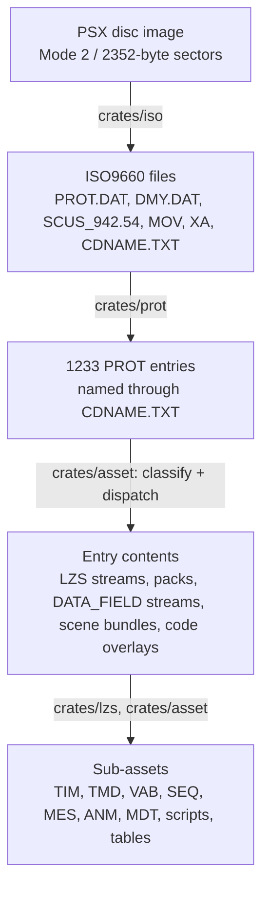
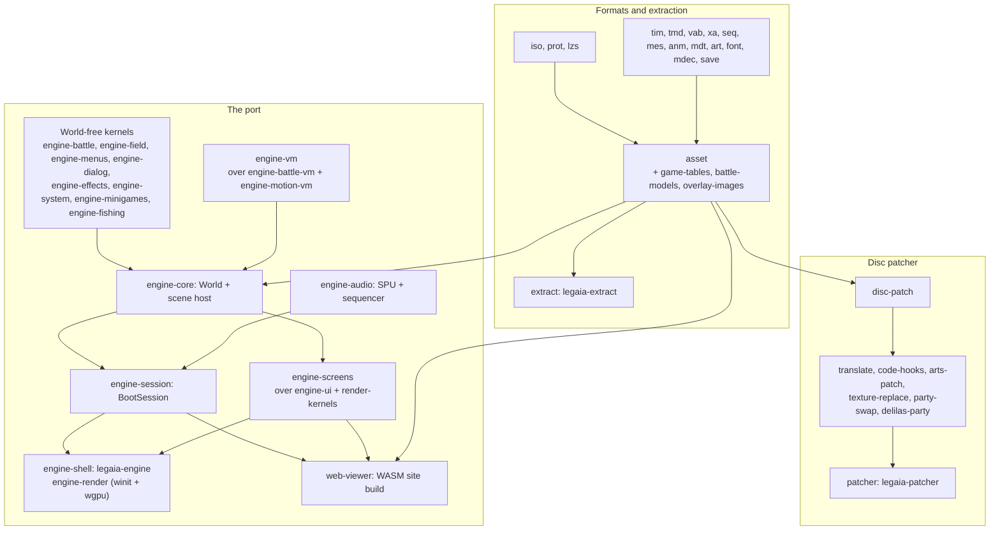

# Overview

Legend of Legaia is a 1998 PlayStation RPG by Contrail / Prokion / SCEI. This repository holds a playable from-scratch Rust port of it (native and in the browser), the tools that extract and patch the retail disc, and the reverse-engineering record all of that stands on. Everything runs from a disc image the user supplies; no Sony-owned bytes are committed or shipped (the root [`README.md`](../README.md#you-bring-the-disc) has the full position).

This page is the map of the docs: what the project consists of, how the disc's layers stack, and where to read next.

## The project in four parts

| Part | What it is | Entry point |
|---|---|---|
| **The port** | The game's engine re-implemented in Rust. Field, battle, menus, minigames, audio, cutscenes and saves run from the disc's own data, on a native window and in the browser. | [`guides/playing-and-viewing.md`](guides/playing-and-viewing.md), [`subsystems/engine.md`](subsystems/engine.md) |
| **Extraction** | Parsers and CLIs that turn the disc into PNG / WAV / OBJ / JSON / `.glb`, plus viewers. | [`guides/extracting-assets.md`](guides/extracting-assets.md), [`tooling/extraction.md`](tooling/extraction.md) |
| **The disc patcher** | Randomizer, translation packs, content mods and MIPS code hooks, applied to a user-supplied `.bin` or emitted as a PPF. | [`guides/modding-and-translation.md`](guides/modding-and-translation.md), [`tooling/randomizer.md`](tooling/randomizer.md) |
| **The reference** | Byte-level format specs, subsystem documentation, traced functions and the RAM map, each claim carrying its provenance. | [`formats/overview.md`](formats/overview.md), [`reference/functions.md`](reference/functions.md) |

The port is **fresh Rust written from the format docs and the Ghidra-traced disassembly** - not a decompilation, and not a static recompilation of `SCUS_942.54`. Retail behaviour is the measured ground truth and a retail-faithful mode stays testable, but the port is not bound by it: enhanced lighting, volumetric fog, the camera-occlusion fade, precise movement and VR ship as toggles, several on by default ([`subsystems/engine.md`](subsystems/engine.md#fidelity-and-enhancements)).

## How the layers stack

Terms used throughout the docs: **PROT** is `PROT.DAT`, the game's main archive; **CDNAME** is `CDNAME.TXT`, the name map for its entries; **LZS** is the game's compression; an **overlay** is a block of code the game loads into RAM on demand; **SCUS** is `SCUS_942.54`, the main executable.



| Layer | Crate | Spec |
|---|---|---|
| Raw sectors and the ISO9660 walk; `RawDisc::read_sector(lba)` returns the 2048 user-data bytes | `iso` | [`formats/disc.md`](formats/disc.md) |
| PROT table of contents and entry sizes | `prot` | [`formats/prot.md`](formats/prot.md) |
| Entry names: `#define name N` marks a block start, names inherit forward | `prot` | [`formats/cdname.md`](formats/cdname.md) |
| LZS compression | `lzs` | [`formats/lzs.md`](formats/lzs.md) |
| Per-entry classification and the type-byte dispatch | `asset` | [`formats/asset-type.md`](formats/asset-type.md) |
| Streaming containers and packs | `asset`, `prot` | [`formats/data-field.md`](formats/data-field.md), [`formats/pack.md`](formats/pack.md), [`formats/tim-pack.md`](formats/tim-pack.md) |
| Per-scene bundles: meshes, textures, sound, scripts, tables | `asset` | [`formats/scene-bundles.md`](formats/scene-bundles.md) |
| Effect bundles (magic `0x02018B0C`) | `asset` | [`formats/effect.md`](formats/effect.md) |
| Runtime code overlays | `overlay-images` | [`formats/mips-overlay.md`](formats/mips-overlay.md), [`tooling/static-overlay-pipeline.md`](tooling/static-overlay-pipeline.md) |
| Sound-driver outputs (`.MAP` / `.PCH` / `.spk` / `.dpk`) and VAB banks | `asset`, `vab` | [`formats/sound-driver.md`](formats/sound-driver.md), [`formats/vab.md`](formats/vab.md) |
| Sub-assets: textures, meshes, sound banks, music, dialog, animation | `tim`, `tmd`, `vab`, `seq`, `mes`, `anm`, `mdt` | The per-format pages under [`formats/`](formats/overview.md) |

Movies (`MOV/*.STR`) and streamed audio (`XA/*.XA`) sit outside PROT as ordinary disc files; `mdec` and `xa` decode them ([`subsystems/cutscene.md`](subsystems/cutscene.md), [`formats/xa.md`](formats/xa.md)).

## Where to start reading

Choose by what you are trying to do:

| You want to… | Read |
|---|---|
| Play the port, natively or in the browser | [`guides/playing-and-viewing.md`](guides/playing-and-viewing.md) |
| Install prebuilt binaries or build from source | Root [`README.md`](../README.md#quick-start), then [`guides/getting-started.md`](guides/getting-started.md) |
| Get assets off your disc | [`guides/extracting-assets.md`](guides/extracting-assets.md), then [`tooling/extraction.md`](tooling/extraction.md) |
| Patch your own disc (randomizer, mods) | [`guides/modding-and-translation.md`](guides/modding-and-translation.md), then [`tooling/randomizer.md`](tooling/randomizer.md) |
| Translate the game into your language | [`guides/translating.md`](guides/translating.md), then [`tooling/translation/`](tooling/translation/index.md) |
| Export scenes to Blender / Unity / VRChat | [`tooling/vrchat-world-export.md`](tooling/vrchat-world-export.md) |
| Understand a specific file format | [`formats/overview.md`](formats/overview.md) → per-format page |
| Understand how a runtime subsystem works | [`subsystems/`](subsystems/) - boot, asset loader, script VM, move VM, renderer, audio, battle, minigames |
| Understand the Rust port's architecture | [`subsystems/engine.md`](subsystems/engine.md) |
| Measure the port against retail | [`tooling/retail-compare.md`](tooling/retail-compare.md), [`tooling/full-game-ladder.md`](tooling/full-game-ladder.md), [`tooling/host-drift.md`](tooling/host-drift.md) |
| Reverse a new function in Ghidra | [`tooling/ghidra.md`](tooling/ghidra.md) |
| Capture a runtime overlay | [`tooling/overlay-capture.md`](tooling/overlay-capture.md) |
| Look up a key function or RAM address | [`reference/functions.md`](reference/functions.md), [`reference/memory-map.md`](reference/memory-map.md) |
| Cross-reference another region's build | [`reference/builds.md`](reference/builds.md) |
| Find an open question to work on | [`reference/open-rev-eng-threads.md`](reference/open-rev-eng-threads.md) |
| Look up an answered question, and how firmly it is pinned | [`reference/re-settled-threads.md`](reference/re-settled-threads.md) |
| Check whether a plausible reading was already disproved | [`reference/re-do-not-re-walk.md`](reference/re-do-not-re-walk.md) |

## Workspace

The repo is a Cargo workspace. Crate naming: package `legaia-foo`, lib `legaia_foo`; one library per crate, plus a command-line binary behind the crate's default-on `cli` feature where it has one. Every dependency is declared once in the root `[workspace.dependencies]`. Each crate's `README.md` documents its own scope and CLI.



**Formats and extraction.** `bytes` (shared checked readers) sits under the container layer `iso`, `prot`, `lzs` and the format hub `asset`, which re-exports `game-tables` (the static data tables), `battle-models` (the battle model formats) and `overlay-images` (the code-overlay image formats). The per-format parsers are `tim`, `tmd`, `vab`, `xa`, `seq`, `mes`, `anm`, `mdt`, `art`, `font`, `mdec` and `save`; `extract` drives the whole pipeline. `mednafen` and `pcsxr` read emulator save states; `gamedata` and `cheats` are curated label sets.

**The port.** `engine-core` holds the `World` and the scene host. Below it sit the kernels that never touch `World` - `engine-battle`, `engine-field`, `engine-menus`, `engine-dialog`, `engine-effects`, `engine-system`, `engine-minigames` (over `engine-fishing`) and `engine-minigame-scenes` - and the ported VMs in `engine-vm` (which re-exports the battle side from `engine-battle-vm`).

On the presentation side, `engine-ui` builds renderer-agnostic draw lists over the shared `render-kernels`; `engine-screens` composes the shop-family screens once for both hosts; `engine-session` is the `BootSession` and BGM director every play host ticks. `engine-render` (winit + wgpu) and `engine-audio` (SPU + sequencer) are the native presentation leaves, `engine-shell` is the `legaia-engine` binary, and `parity` holds the retail oracles. `asset-viewer` and the `web-viewer` WASM target sit beside them.

The port ships three hosts on that one engine: the native `play-window`, the browser play page, and the browser minigames page. `engine-session`, `engine-screens` and `engine-ui` carry no wgpu / winit / cpal dependency, which is what lets the same session code run natively and in `wasm32`. The gates that keep the hosts in step are in [`tooling/host-drift.md`](tooling/host-drift.md).

**The disc patcher.** `patcher` (the `legaia-patcher` binary) sits over `disc-patch` (sector write-back, PPF output, the free-space ledger) with `translate` (language packs), `party-swap` (the battle-model swap kernels), `texture-replace` (texture, battle-art and save-icon replacement) `code-hooks` (MIPS code injection), `arts-patch` (the Tactical Arts mods) and `delilas-party` (the play-as-Delilas mod) split out of it.

Build and test:

```bash
cargo build --release                             # every binary, into target/release/
cargo test --workspace --profile release-test     # CI's test profile: release opt-level, no LTO
cargo test -p <crate> --test integration foo::    # one tests/foo.rs of a crate
```

Each crate's `tests/*.rs` build as one `integration` binary, which is why a single file is selected by module path. Disc-gated tests skip when `LEGAIA_DISC_BIN` is unset - see [`tooling/extraction.md`](tooling/extraction.md).

## Public docs vs operational state

The documents under `docs/` and the pages under `site/` are **technical reference**. They describe what the formats and subsystems *are*, not what work has happened recently - no roadmaps, no status tables, no session notes. Operational state (work-in-progress, "what to do next") lives in git log and PR descriptions.
