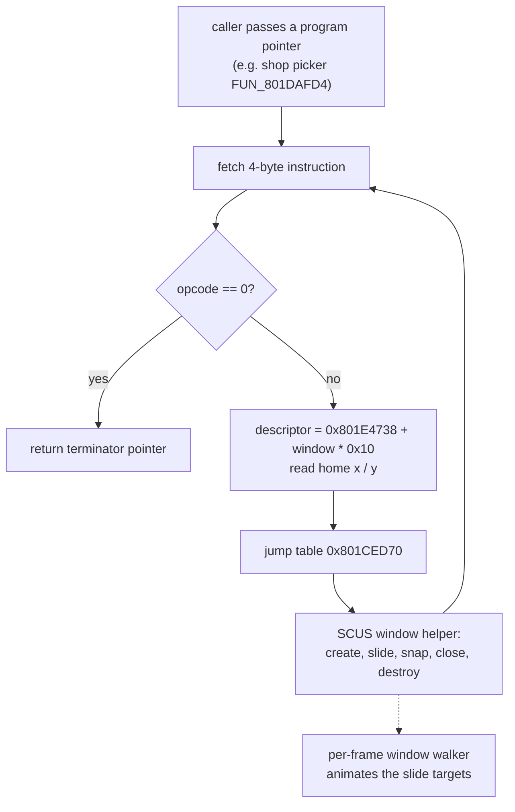

# Actor / sprite VM

The simplest of Legaia's runtime VMs, and despite the historical name it does
not drive actors: `FUN_801D6628` is the **menu overlay's window-widget script
interpreter**. Each fixed-width instruction names a UI window by its
descriptor-table id and opens, closes, snaps or slides it. The shop and menu
screens' window choreography is written in it. There is no cross-context
targeting, no branching and no subroutine call.

This page also documents three things that are *not* this VM but touch actor
records and have no better home: the per-actor **anim tick** `FUN_80021DF4`
(SCUS), the overloaded `actor[+0x4C]` pointer, and a few field-overlay actor
families.

## At a glance

| | |
|---|---|
| Interpreter | `FUN_801D6628`, menu overlay (PROT 0899, slot-A base `0x801CE818`); see `ghidra/scripts/funcs/overlay_menu_801d6628.txt` |
| Dispatch | 13-slot jump table at `0x801CED70` |
| Instruction | 4 bytes: `[opcode u8][window u8][operand u16 LE]`; a zero opcode ends the program |
| Programs | data in the menu overlay ([`window-script.md`](../formats/window-script.md)) |
| Operates on | the window descriptor table `0x801E4738` (`window * 0x10`, [field-menu.md](field-menu.md)) and the live window list at `gp+0x148` |
| Port | [`legaia_engine_vm`](../../crates/engine-vm/src/lib.rs) (`run`, `Host` trait), hosted by `engine-menus::menu_widget::MenuWidgetState`; live on both play hosts |



## Opcodes

Read off the arms at `0x801D66A8..0x801D6850`.

| Op | Effect | Helper |
|---|---|---|
| `0x00` | End of program | - |
| `0x01` | Open the window if absent, slide it to its home position | `FUN_800326AC`, `FUN_800357FC` |
| `0x02` | Open if absent, slide to the packed operand position | `FUN_800326AC`, `FUN_800357FC` |
| `0x03` | Write the window's style byte | - |
| `0x04` | Begin close (`+0x20 = -1`) | `FUN_80035978` |
| `0x05` | Close all windows | `FUN_80035A4C` |
| `0x06` | Clear the motion word `+0x20`, if the window exists | - |
| `0x07` | No-op (falls through to the default arm) | - |
| `0x08` | Destroy the window immediately (free buffers, unlink) | `FUN_800319A8` |
| `0x09` | Open if absent, snap to the packed operand position, or home when the operand is 0 | `FUN_800326AC`, `FUN_800358C0` |
| `0x0A` | Destroy, re-create and snap back in place | `FUN_800319A8`, `FUN_800326AC`, `FUN_800358C0` |
| `0x0B..=0x0D` | No-ops | - |

The helpers, all in SCUS, act on the live window list (a `0x5C`-stride linked
list at `gp+0x148`, descriptor id at node `+0x8`):

| Helper | Role |
|---|---|
| `FUN_80035334` | look a window up by descriptor id |
| `FUN_800326AC` | create |
| `FUN_800357FC` | **start a slide**: copy the node's current `+0xA` / `+0xC` into the motion sub-object's source, write the target, set `+0x20 = 1` (tail at `0x80035874`) |
| `FUN_800358C0` | **snap**: write source and target alike and clear `+0x20` (tail at `0x80035938`) |
| `FUN_80035978` | begin close (`+0x20 = -1`) |
| `FUN_80035A4C` | close all |
| `FUN_800319A8` | destroy now |

Motion is target-based: the VM installs slide targets and the per-frame
window walker animates them. The interpreter's own base materialisation
(`lui 0x801e / addiu 0x4738` at `0x801D6658`) is what ties it to the menu
window descriptor table.

In the port, the `Host` methods carry the helpers' meaning (`slide_to`,
`snap_to`, `begin_close`, `close_all`, `destroy`), and `MenuWidgetState` keeps
each window's live position, slide source and target, and the `+0x20` motion
word. The world-map panel interpreter `FUN_801E9B3C` calls the same helpers
from the same arm layout (ops `1` / `2` slide, `9` / `10` snap;
[`world-map.md`](world-map.md)).

For how this VM relates to the others, see
[the runtime VM family](move-vm.md#the-runtime-vm-family) and the
[VM inventory](vm-inventory.md).

## Where the programs live

The interpreted programs are **data resident in the menu overlay itself** -
a program table in PROT 0899's data segment (file `0x16260..0x16740`, VA
`0x801E4A78..0x801E4F58`), byte-level spec in
[`window-script.md`](../formats/window-script.md). Each caller materialises
a program pointer (`lui`/`addiu`, or a saved register) and calls the VM;
`legaia_asset::widget_script::scan` recovers the programs structurally from
the `jal` sites. Because the table is overlay data at fixed VAs, program
resolution is per-boot, not per-scene.

The engine wiring mirrors the retail chain end to end:
`World::install_menu_overlay_tables` (both hosts call it with the real
PROT 0899 bytes) resolves the programs
(`menu_widget::MenuWidgetScripts`) and seeds the window home
positions from the descriptor table; `MenuRuntime::tick` runs the shop
open script (`DAT_801E4E38`) on the picker entry edge and the slide-away
script (`DAT_801E4E54`) on the Sell transition - the transitions retail's
picker dispatcher `FUN_801DAFD4` drives ([shop.md](shop.md)) - through
`legaia_engine_vm::run` over the `MenuWidgetState` window-list host.
Disc-gated pins: `crates/asset/tests/widget_script_real.rs`,
`crates/engine-core/tests/menu_widget_scripts_real.rs`.

## Why it's separate from the field VM

The actor VM is a fixed-width 13-opcode dispatcher tailored to window choreography. The field VM (`FUN_801DE840`) is a 43-opcode variable-length dispatcher with cross-context targeting, halt-acquire semantics, sub-dispatcher families and far richer context state. They serve different layers: UI widgets at the presentation level, scripts at the gameplay-event level.

## Per-actor anim tick - `FUN_80021DF4`

The per-frame anim driver lives in `SCUS_942.54`, not in an overlay. `FUN_80021DF4` is the static-binary tick the field/battle scenes call once per **game tick** for every active actor. A game tick is not a vsync - see [Tick cadence](#tick-cadence-dat_1f800393) below.

### Tick cadence (`DAT_1F800393`)

One game tick spans `DAT_1F800393` vsyncs. `FUN_80016B6C` rewrites that byte every frame from two independent inputs (see `ghidra/scripts/funcs/80016b6c.txt`):

```text
adaptive = if frameskip_enabled && worst > 0xF0 {
    if worst > 0x2D0 { 4 } else if worst > 0x1FE { 3 } else { 2 }
} else { 1 };
DAT_1F800393 = max(adaptive, DAT_8007B9D8);
```

**Adaptive frame-skip.** `FUN_800173BC` returns `VSync(1)` - the hblank (scanline) duration of the frame just rendered. `FUN_80016B6C` keeps a 16-entry ring of those samples at `DAT_80084098` and takes the running maximum, so the factor is sticky against the worst of the last 16 frames. The thresholds `0xF0 / 0x1FE / 0x2D0` sit just under 1 / 2 / 3 NTSC fields (263 hblanks each): the game advances the simulation proportionally when it misses vsync, keeping wall-clock speed constant. It is gated on a boot-time config word (`gp+0x4CE == 0x10`), read at exactly this one site. On hardware keeping up, the adaptive term is `1`.

**Per-mode floor `DAT_8007B9D8`.** This is the deterministic half, installed by mode rather than by performance:

| Installer | Floor | Mode |
|---|---|---|
| `FUN_801D6704` | 2 | Field scene loader - ordinary field / town play |
| `FUN_801CFDA0` | 3 | Field-to-battle intro transition |
| `FUN_801DC6B4` / `FUN_801DE234` / `FUN_801DD35C` | 1 | Menu family; save/restore idiom |
| `FUN_801CF678` | 1 / 4 | Baka Fighter duel / scripted beat |
| `FUN_801D362C` | script | Move-VM `0x2F` `OVERLAY_EXT` sub-op `0x2F`: the halfword at `pc + 4`. `opdeene`'s prescript record 16 opens with it (operand `3`) |

`FUN_801D6704`'s install is `sw s0,-0x4628(v0)` at `0x801D6990`, with `li s0,0x2`
in the preceding instruction at `0x801D6988` (`overlay_0897`, base `0x801CE818`).

The `FUN_801D362C` row is the move VM's extension dispatcher, not a dialogue
routine: jump-table slot `0x2F` of `0x801CE868` is `0x801D45D4`, which loads
`lh v1,4(s3)` and stores it with `sw v1,-0x4628(v0)` at `0x801D45E4`
([`move-vm-overlay-ext.md`](move-vm-overlay-ext.md)). Across the extracted PROT
corpus the byte pattern `2F 00 2F 00 <v> 00` occurs in five scene prescripts -
`opdeene` (`3`), `jagaroom` (`3`), `juui1` (`3`, twice), `dohaty` (`5`, twice),
`concnow` (`5`) - so the opening cutscene's cadence of 3, which the cold-boot
`opdeene` capture reads at `DAT_8007B9D8`, is installed by the scene's own
stager, not by a mode loader. The engine applies it in
`MoveVmHostImpl::ext_set_8007b9d8`, raising `FrameClock::frame_step_floor`
and the cadence together.

`FUN_801CFDA0` is more than a floor installer - it is the field-to-battle intro
particle builder (dump `overlay_field_battle_intro_801cfda0.txt`). After setting
the floor-3 cadence and (on the first frame) fading to `0x101010`, it loops
`0x488` times over a per-particle source stride of `0x2C`, building one GTE
`0x2C`-byte GPU packet per particle straight into the ordering-table cursor
`_DAT_1F8003A0`: it stamps the shared colour/geometry via `FUN_8003D1A4` /
`FUN_8003D344` / `FUN_80026988`, transforms through `FUN_8005BAC8`
(RotTransPers-class), applies `>>1` velocity nudges scaled by the tick byte
`DAT_1F800393`, and screen-clips to `X in [-8,0x148)`, `Y in [-8,0xF8)` before
linking the packet into the OT. It is a direct GTE/GPU-packet emitter, not a
draw-list builder, so it is documented rather than ported into the from-scratch
render path.

Two worklist addresses in this overlay band are VA-aliased and not
independently portable. `0x801CEE80` is a field-VM interior label (jump-table
slot `[8]` of `FUN_801DE840` in `overlay_0897`) that the base-program dump
renders as a standalone gauge-fill helper reading an uninitialised `v0`; its one
`jal` caller (`FUN_80025980` mode switch) sets no arguments, confirming the alias.
`0x801D5A68` and `0x801D7B50` are real functions in the *field* overlay - the
ambient-motion direction resolver (`REF` in `engine-vm::ambient_motion`, see
[motion-vm.md](motion-vm.md)) and the sub-area window rebuild
([field-locomotion.md](field-locomotion.md)) respectively - but their
cutscene/menu-overlay dumps land mid-`FUN_801D5944` / `FUN_801D7B40`, so those
dumps are interior slices, not the owning entry.

**`FUN_801C6C78` is not an installer.** Its 441-instruction disassembly
(`0x801C6C78..0x801C7358`) writes exactly one global - `0x8007AA14`, via 17
copies of `sw t0,-0x55ec(at)` - and has no store to `DAT_8007B9D8` under any
addressing form. A `_DAT_8007b9d8 = 2` appears only in the *decompiled* half
of `overlay_0896_801c6c78.txt`: it is `FUN_801D6704`'s own store, pulled in
because Ghidra decompiled past the function into the field-overlay bytes that
PROT 0896's footprint over-reads (the same C body cites `MAP_NAME`,
`field_read_size` and blocks `0x801D6844` / `0x801D6854`, all the field scene
loader's).

Why the spliced code prints plausible addresses: PROT 0896 dumps are printed
at `0x801C5818` and PROT 0897 at `0x801CE818`, `0x9000` apart, and 0896's
bytes from file offset `0x9000` on *are* 0897's. So for a 0896 file offset
`X >= 0x9000` the printed VA `0x801C5818 + X` equals the field overlay's true
VA. `FUN_801C6C78` itself sits at file offset `0x1460`, below that seam, in
PROT 0896's own head at an unrecovered base
([`static-overlays.toml`](../../crates/asset/data/static-overlays.toml)), so
`0x801C6C78` is not a runtime VA. It also falls inside the window
[`call-target-integrity.md`](../tooling/call-target-integrity.md#scope-the-overlay_0896-window-below-0x801ce818)
marks untrustworthy: 18 of its 42 `jal`s target `0x8002CDD0` and
`0x8002D988`, the two non-enterable addresses that page names. PROT 0896's
head is a Japanese-build options menu the USA build never runs
(`crates/engine-core/src/options.rs`).

The menu family drops the floor to `1` on entry and writes the saved value back from `DAT_801EF19C` on exit, which is why the field floor survives a pause-menu round trip.

The consequence for ordinary field play: `DAT_8007B9D8 = 2`, so **actor motion advances every second vsync** (~30 Hz), not every vsync.

**Durations stay cadence-invariant.** Everything measuring a duration accumulates `DAT_1F800393` rather than `1` - the camera mover's `t = min(t + DAT_1F800393, d)` is the canonical case. A glide with `apply = 600` therefore arrives after 600 *vsyncs* at any cadence (600 ticks x 1, or 300 ticks x 2). Retail durations are denominated in vsyncs, so a port running at cadence 1 reaches the same endpoints at the same wall-clock moments. What changes is the **sample rate**: at cadence 2 retail emits a pose only every second vsync, so a port ticking every vsync shows intermediate poses retail never draws. That is the entire field-motion divergence - identical endpoints, double the samples between them.

`legaia_engine_vm::actor_tick::FrameCadence` models this law; `TickScalars::for_cadence` feeds it into the dispatcher multiplier.

#### Engine wiring

`World::tick` drives the pool on the same clock. It banks a vsync per retail frame and runs the per-actor passes (`tick_actor_physics` / `tick_actors` / `tick_actor_motions`) once every `World::clock.frame_step` of them; the pass that fires carries `frame_step` as the dispatcher's `frame_delta` rather than a constant `1`.

The gate and the scalar are one change, not two. Gating alone would halve wall-clock motion; scaling alone would double it. Together they conserve vsyncs-per-second, which is what leaves every duration where it was and moves only the sample rate. `World::tick_field_npc_ambient` rides the same gate, so op `0x0D` stays in lockstep with its ramp scheduler (see [`motion-vm.md`](motion-vm.md#the-ambient-vms-own-facing-ops)).

The property is pinned directly in `crates/engine-core/src/world/tests/actor_cadence.rs`: across cadences `1..=4` the integrated displacement and the timer drain are identical while the pose count scales as `1 / cadence`. A change that moves a duration is a regression, not a reason to retune the assertion.

### Actor record fields

The tick reads three fixed offsets on the per-actor record:

| Offset | Type | Field | Notes |
|---|---|---|---|
| `+0x4C` | `u32` | `record_ptr` | Per-record byte pointer; for a keyframe clip, written by the clip driver `FUN_800204F8` from the type-5 MOVE bank `_DAT_8007B888` ([`anm.md`](../formats/anm.md#public-entry-point---play_anm_by_id)). |
| `+0x5A` | `u16` | `dispatch_byte` | Selects the per-opcode handler block (`0x01..=0x07`). |
| `+0x68` | `u16` | `frame_counter` | Advanced each tick by `actor[+0x6A]` (per-actor frame delta). The CLUT-walk spawner `FUN_80024CFC` seeds it to `100` on the walkers it allocates. |

The `crates/engine-vm` constants `ACTOR_RECORD_PTR_OFFSET`, `ACTOR_DISPATCH_BYTE_OFFSET`, and `ACTOR_FRAME_COUNTER_OFFSET` mirror those addresses.

### Dispatch byte values

`FUN_80021DF4` ladders through the dispatch byte (`actor[+0x5A]`) and routes to per-opcode handler blocks. Reading the comparison ladder at `0x80021E78..0x80022F04`:

| Byte | Mnemonic | Handler block | Notes |
|---|---|---|---|
| `0x01` | `Plain` | none - no `== 1` test exists anywhere in the function | Common stages only (pre-update, default movement, late-update): plain kinematics with no keyframe / path / SFX / damp / spline arm. The comparison ladder tests `2/6`, `5`, `3`, `3\|\|5`, `7`, `4`, `6` and never `1`, so there is no pose-snap handler block to find. `see ghidra/scripts/funcs/80021df4.txt`. |
| `0x02` | `KeyframeAlt` | shares with `0x06` at `0x80021E90..` | Per-bone keyframe-style. |
| `0x03` | `Path` | `0x800226E8..0x800228A0` | Integrates `+0x96..+0x9A` into `+0x90..+0x94` and hands them to the CLUT-cell HSV cycler `FUN_80019D50`; skips the default motion block. |
| `0x04` | `VramScroll` | `0x80022CBC..0x80022EE4` | VRAM texture-rect wrap-scroll on the actor's `+0xD0` rect: StoreImage band (`0x80022D68`) → MoveImage remainder (`0x80022DB0`) → LoadImage at the far edge (`0x80022DE8`); countdown `+0xC6` drains by `*(0x1F800393)`, reloads from `+0xC4`, step `+0xCC/+0xCE`. Installer: move-VM op `0x1E` (body `0x80023694`, `+0x5A = 4` + seven u16 operands); op `0x45` (`0x8002409C`) is the dispatch-`7` sibling. Not damping / spring decay: the call order is read from the instructions. NB the 0874 atlas residue is **not** this mechanism - it is a field-VM `4C 60` face-frame stamp ([character-mesh.md](../formats/character-mesh.md#runtime-scroll-cell-residue-why-a-live-vram-dump-can-differ-from-the-tim)). |
| `0x05` | `PathAlt` | `0x80021FB4..0x800226D8` | The positional SFX emitter (the `bne` at `0x80021FAC`); skips the default motion block (`0x800228B8..0x80022B80`, which codes `0x03` and `0x05` branch *past* at `0x800228A8` / `0x800228B0`). |
| `0x06` | `Keyframe` | `0x80021EA0..0x80021FA4` and `0x80022F00..0x80023040` | The dominant path. Per-bone keyframe interpolation; **fully ported in [`legaia_anm::AnimPlayer`]**. |
| `0x07` | `Spline` | `0x80022C30..0x80022CB8` | Spline / curve-driven variant. |

`crates/engine-vm`'s `DispatchByte` enum exposes those values as a typed dispatch and reports `handled_natively()` for the cases the keyframe pose decoder can drive on its own (currently only `Keyframe`). The per-actor *physics* arms - the position / velocity / acceleration math common to every dispatch byte - are ported in [`crates/engine-vm/src/actor_tick.rs`](../../crates/engine-vm/src/actor_tick.rs).

### Per-arm physics tick

`FUN_80021DF4` is best understood as a layered pipeline rather than a per-opcode jump table - the dispatch byte selects which subset of side-effects fires:

| Stage | Runs for | Behaviour |
|---|---|---|
| Common pre-update | every dispatch byte | Drains the per-frame timer at `+0x54` and the rotation accumulator at `+0x22`. |
| Keyframe accel | `0x02` / `0x06` | Adds `+0xC0..+0xCA` * scalar >> 6 into the shake envelopes at `+0xB4..+0xC8`. |
| Positional SFX emitter | `0x05` | Either ramps a fade between `(+0x90, +0x92)` and `(+0x94 + +0x98, +0x96 + +0x9A)` over `+0xBC` frames, or simply integrates `+0x98 / +0x9A` into `+0x90 / +0x92`. Issues SsAPI `key-on` (`FUN_80065034`), `volume-only update` (`FUN_800657D0`), or `release` (`FUN_800250D4`) calls based on listener distance, channel authority, and the `release_pending` (`+0xB4` as i32) flag. Audio effects surface as `TickEvent::SfxUpdate` / `TickEvent::SfxRelease`. |
| Path interpolation | `0x03` | Adds `+0x96 / +0x98 / +0x9A` velocities into `+0x90 / +0x92 / +0x94`. Advances the zoom envelope at `+0x68` (clamped at `0x100`). The `+0x9C` path step counter caps at `1000` and triggers a "skip default movement" shortcut once non-zero. |
| Default movement | every dispatch byte except `0x03` and `0x05` (`0x800228B8..0x80022B80`) | Adds `+0x80..+0x84` into `+0x24..+0x28`. Runs the trig-LUT-driven world-position update via `apply_world_rotation` (engine supplies sin / cos LUTs). Steps the render scale `+0x72`, `+0x7A` and the depth-cue level `+0x78` by the rates at `+0x92` / `+0x94` / `+0x90` (move-VM ops `0x0F` / `0x11` / `0x0D`). |
| Common late-update | every dispatch byte | Caps the focal envelope at `0x1000`, the shake envelope at `15000`. Optionally fires the move VM kick (`FUN_800204F8`), the visibility cull (`FUN_801D79E8`, [motion-vm.md](motion-vm.md)), and the per-arm render: line-draws for `0x04` (`SplineDraw` / `DampDraw` events), scene-graph triangle for `0x07`. For `0x06` with a present record pointer, writes the keyframe pose (`KeyframePoseWritten` event). |

The `actor_tick` port surfaces every cross-cutting effect via the `TickEvent` enum so engines can fold them into their own audio mixer / scene graph / move-VM driver. The arithmetic mirrors the retail decompilation field-for-field; the only intentional simplifications are the use of `i64` multiply-shift in place of the MIPS `MULT` + `MFLO` pair (functionally equivalent) and the saturation-clamp helper in place of the explicit "`if (val < 0) val = 0`" / "`if (val > N) val = N`" pairs the compiler emitted.

### `+0xB4` aliases two dispatch arms

`+0xB4` (4 bytes) is read as `i32` by the SFX emitter (the "key-on done, release pending" flag) and as two `i16`s by the keyframe arms (`kf_shake[0]` and `kf_shake[1]`). The retail layout aliases these uses - the same actor record never runs the SFX emitter and the keyframe arms in the same frame, so the alias is benign. The Rust port keeps both views as named fields (`release_pending: i32`, `kf_shake: [i16; 4]`) and documents the alias in the field comments.

### Mednafen-state diff signature

Diffing the actor pool (`0x801C9594..0x801C9F7F`, 0x60-byte stride per anim slot) between a battle-intro idle save and an active-art-strike save shows the dispatch byte and the per-record pointer flipping in lockstep - the dispatch byte's lane (record `+0x0F`/`+0x10`) carries values like `0x04` (idle) and `0x06`/`0x06` (playing) across the same slot. The per-record pointer (`+0x00` of each anim slot, mirroring `actor[+0x4C]`) similarly flips between a self-reference (idle / sentinel pose) and a real RAM address that points into the scene-loaded ANM payload.

## Spawn-record consumption (`actor[+0x4C]` is overloaded)

`actor[+0x4C]` is **a multi-purpose pointer field whose semantic depends on which spawn path created the actor**, not on a per-frame dispatch lookup. Two writers + multiple readers populate it with structurally distinct payloads; the retail engine relies on disjoint actor classes for them never to collide.

### Writers

| Writer | Payload | When |
|---|---|---|
| `FUN_801D77F4` (overlay actor allocator, field-VM `0x4C 0xD8` host hook) | VDF body bytes (`[u32 record_count][record_0]...[record_n]` where each record is 12 bytes starting `[u32 group_idx]`) | Synchronous spawn of a background actor whose mesh comes from the global TMD pool. See [`docs/subsystems/script-vm.md`](script-vm.md). |
| `FUN_800204F8` (clip driver) | Keyframe clip from the type-5 MOVE bank `_DAT_8007B888` (or `_DAT_8007B840` for ids `>= 0x400`), sets `actor[+0x56] = 1` | Animation transition - bound when the engine starts a new keyframe arm. |
| `FUN_80024CFC` (CLUT-walk spawner) | `_DAT_8007B7C8 + table[id]` - an entry of the type-6 CLUT-walk table, with `actor[+0x56] = 0xB` (walker state) | Ambient palette-cycling walker spawn ([`field-ambient-fx.md`](field-ambient-fx.md)). |

### Readers

| Reader | What it does with `actor[+0x4C]` |
|---|---|
| `FUN_801D77F4` itself | Walks the VDF body's record table at spawn time to compute the per-actor vertex pool malloc size and to copy per-vertex bytes out of the indexed TMD groups into `actor[+0x90]`. The body is consumed *once at spawn*; the persisted pointer is a retention reference, not actively re-read. |
| `FUN_80021DF4` case `0x06` (Keyframe arm) | Writes per-bone interpolated pose bytes into the buffer at offsets `+0x00` (count), `+0x02..+0x03` (= 1), `+0x06` (= 1), `+0x0F..` (per-bone 8-byte stride). |
| `FUN_8001BE80` (per-bone pose interpolator, GTE-side render path) | Reads `*(int *)(actor + 0x4C) + bone_idx * 8 + 8` as the part's frame-0 entry - the blend target only on a clip's last frame when the clamp bit `+0x62 & 8` is clear (the loop wrap); otherwise the target is frame + 1. Indexed at 8-byte stride starting at offset 8 - matches the case-`0x06` writer's per-bone layout. |
| `FUN_800495C8` (animation envelope sampler) | Reads `*(int *)(actor + 0x4C) + 4` as a per-bone curve walker (4-byte header skip; per-record byte ranges describe interpolation envelopes). |
| `FUN_8003A1E4` (foreground actor spawner) and `FUN_801DE840` (field VM) | Both read `*(ushort *)(actor[+0x4C] + 2)` as an animation-period u16 (modulo target for the current frame index). Matches the case-`0x06` writer's `puVar15[2..3] = 1`. |

### What this means for the port

1. **The actor VM is not a consumer of `actor[+0x4C]`.** `FUN_801D6628` walks an *external* 4-byte-stride program passed in as its argument and addresses windows by the instruction's id byte. VDF-spawned actors are driven by the vertex-pool render pipeline (`actor[+0x90]`); nothing ticks their `+0x4C` body bytes as opcodes, so no PC-bootstrap entry exists or is needed.
2. **`Actor::spawn_record` in `legaia_engine_core` is a retention slot.** It mirrors the retail `actor[+0x4C] = VDF_body_ptr` write and keeps the bytes available for inspection. The consumer that matters is the per-actor vertex-pool allocator (the mirror of `FUN_801D77F4`'s second pass), which the host hook implements. One detail of that allocator is open: the first pass advances a 12-byte cursor while the second advances `vertex_count * 8`.

### VDF body layout

`FUN_801D77F4`'s walker reads `*body = record_count`, then steps 12-byte records starting 4 bytes in, each beginning `[u32 group_idx]`. A live body at `0x8011A2FC` reads:

```
+0x00  02 00 00 00     <- record_count = 2
+0x04  0b 00 00 00     <- record 0: group_idx = 0x0B
+0x08  00 00 00 00     <- record 0, bytes 4..7
+0x0C  0f 00 00 00     <- record 0, bytes 8..11
+0x10  00 00 4a 00     <- record 1 starts here
```

There is no 16-byte header: the only prefix is the 4-byte count.

## Field-spawned sprite-tick actors

Two field-overlay (PROT 0897) pool-actor families hang off a parent actor's
`+0x90` back-link on the shared actor list - the same list the
[field VM](script-vm.md#per-frame-scheduling) walks - rather than being
actor-VM opcode handlers themselves. They are two distinct families.

`FUN_801D25EC` is the **scripted arc** spawner, reached only from the field
VM's op `0x43` sub-0/1/A/B: given a source actor, a landing `xyz`, an apex
height and a frame count, it allocates an actor from template `0x801F227C`
(`func_0x80020DE0(0x801F227C, _DAT_8007C34C)`), records the source in `+0x90`,
copies the source position `+0x14/+0x16/+0x18`, stores the landing point in
`+0x24/+0x26/+0x28`, seeds the midpoints `+0x3C/+0x3E/+0x40`, and sets the
per-frame step `+0x9E = 0x1000 / duration`; a second record from template
`0x801F22AC` is the arc's release watcher. See
[`script-vm.md`](script-vm.md#0x43-sub-01ab---scripted-arc-jump).
`see ghidra/scripts/funcs/overlay_cutscene_dialogue_801d25ec.txt`.

`FUN_801E4470` is the per-frame tick of the other family, the op `0x34`
sub-1 **attached light** (template `0x801F28B8`, spawner `FUN_801E5668`): it
reads the parent `+0x90`, adds the parent's world position to its own offset,
screen-projects through `func_0x800195A8` with the actor's `+0x3C/+0x3E`
extents, and hands the projected midpoint + span to `FUN_801E3984`, which
draws an untextured semi-transparent light pool in colours `+0x74` / `+0x88`
at blend mode `+0x5A`. See
[`script-vm.md`](script-vm.md#0x34-sub-1-is-an-attached-light). Ported in
`engine-vm::field_actor_billboard` and drawn on both play hosts.
(`locate-entry-image.py 801e4470` puts the entry in PROT 0897 with a clean
frame.) Its direct `overlay_0897` dump is a truncated alias; the real
83-instruction body is in the cutscene-dialogue field capture.
`see ghidra/scripts/funcs/overlay_cutscene_dialogue_801e4470.txt`.

### The arc apex, and `FUN_801D5780`

`FUN_801D5780` is the **standalone spawn half** of the routine above: the
same template `0x801F227C`, the same field writes, but four arguments
(`source_actor`, `&target_xyz`, `arc_height`, `duration`) instead of five,
and it returns the new actor rather than continuing into a second stage.
`FUN_801D25EC` inlines this identical body and then keeps going.

`+0x3C` and `+0x40` are plain midpoints of the X and Z endpoints, but `+0x3E` is a
**quadratic-Bézier control point**, computed from the arc-height argument:

```
mid   = (start.y + target.y) / 2          ; +0x3E, provisionally
apex  = min(start.y, target.y) - height   ; height = the arc argument
+0x3E = mid + 2 * (apex - mid)            ; = 2*apex - mid
```

`2*apex - mid` is exactly the control point that makes a quadratic Bézier
pass through `apex` at its half-way parameter, so `arc_height` is how far
above the **higher** endpoint the hop peaks (world Y grows downward, so
`min` picks the higher one) - a lob, not a straight tween.
The per-frame parameter is the `+0x9E = 0x1000 / duration` step, with
`0x1000` (fixed-point `1.0`) substituted whole when `duration <= 0`.
Confidence: **Confirmed**, disassembled from PROT entry 0897 at base
`0x801CE818`.

## Scene-load actor fix-up

Two more field-overlay bodies run on the actor list at scene-load time
rather than per frame. Both are confirmed at their printed VA against the
extracted 0897 image.

**`FUN_801D7518(&list_head)`** is the **re-hydration pass**: the per-scene
field init `FUN_801D6704` calls it seven times, once per actor list, and
it walks each list through the `+0x00` next pointer allocating the runtime
side-buffers a freshly loaded actor record does not carry.

- Three handler VAs in `+0x0C` (`0x80025000`, `0x801DDC20`, `0x8002174C`)
  each get `+0x10 |= 8` - the "killed" bit, so these handler classes are
  retired on load rather than revived. The middle one is the field-overlay
  **colour tween** ([`functions/renderer.md`](../reference/functions/renderer.md#801ddc20)):
  the materialisation is `lui v0,0x801e; addiu v0,v0,-0x23e0`, which is
  `0x801DDC20` (not `0x801E1C20`, which would need `addiu v0,v0,0x1c20`).
- Every actor gets `+0x10 |= 0x10000`.
- An actor whose `+0x10` carries `0x800` receives a `0x9C`-byte block from
  the general allocator `FUN_80017888` into `+0x44`, has its OBJECT table
  rebuilt by `FUN_80024D78`, and gets `+0x94/+0x96/+0x98 = 0` with
  `+0x9A = -1` written into that block.
- An actor on handler `0x80021DF4` (the [per-actor anim
  tick](#per-actor-anim-tick---fun_80021df4)) with `+0x5A == 3` and
  `+0xA4 > 0x10` gets an `+0xA4 * +0xA6`-byte block into `+0xA8`, uploaded
  through `StoreImage` (`FUN_8005842C`) - a per-actor VRAM staging buffer.
- The same handler with `+0x5A == 6` builds a **two-key interpolation
  table**: it picks two half-word streams out of `+0x48` at the u16
  indices `+0xCC` and `+0xCE`, allocates `count*0x20 + 8` bytes into
  `+0x4C`, and fills a `0x18`-stride record per key with six halfwords
  from the first stream at `+0x00` and six from the second at `+0x0C`.
  The "from-pose / to-pose pair" reading of those two six-halfword halves
  is **Inferred**; the copy itself is Confirmed.

**`FUN_801D9C3C()`** is the field overlay's **MAN-load reset hook**,
called from the SCUS MAN decoder `FUN_8003AEB0` at `0x8003B444` - so it
only runs while 0897 is the resident slot-A overlay, which is exactly when
a field MAN is being decoded. It reseeds a block of overlay globals
(`0x801F2734 = 1`, `0x801F2738/0x801F273C/0x801F274C/0x801F2748/
0x801F2758/0x801F275C = 0`, `0x801F2740 = 3`, `0x801F2754 = 1`,
`0x801F3530/0x801F3534/0x801F3538 = 0`), zeroes the sixteen words ending
at `0x801F357C`, then asks the actor-list finder `FUN_8003CF04` whether a
live actor already exists on the list at `_DAT_8007C34C + 4`. If none
does, it allocates one from the template at `0x801F2760` via
`FUN_80020DE0` and clears the new actor's `+0x50` and `+0x54`. It returns
the actor pointer, or zero when one was already live - the standard
find-or-spawn shape of the
[widget control APIs](../reference/functions.md).

## See also

**Reference** -
[Field/event VM](script-vm.md) ·
[Move-table VM](move-vm.md) ·
[Motion VM](motion-vm.md) ·
[ANM animation](../formats/anm.md) ·
[Legaia TMD](../formats/tmd.md)
