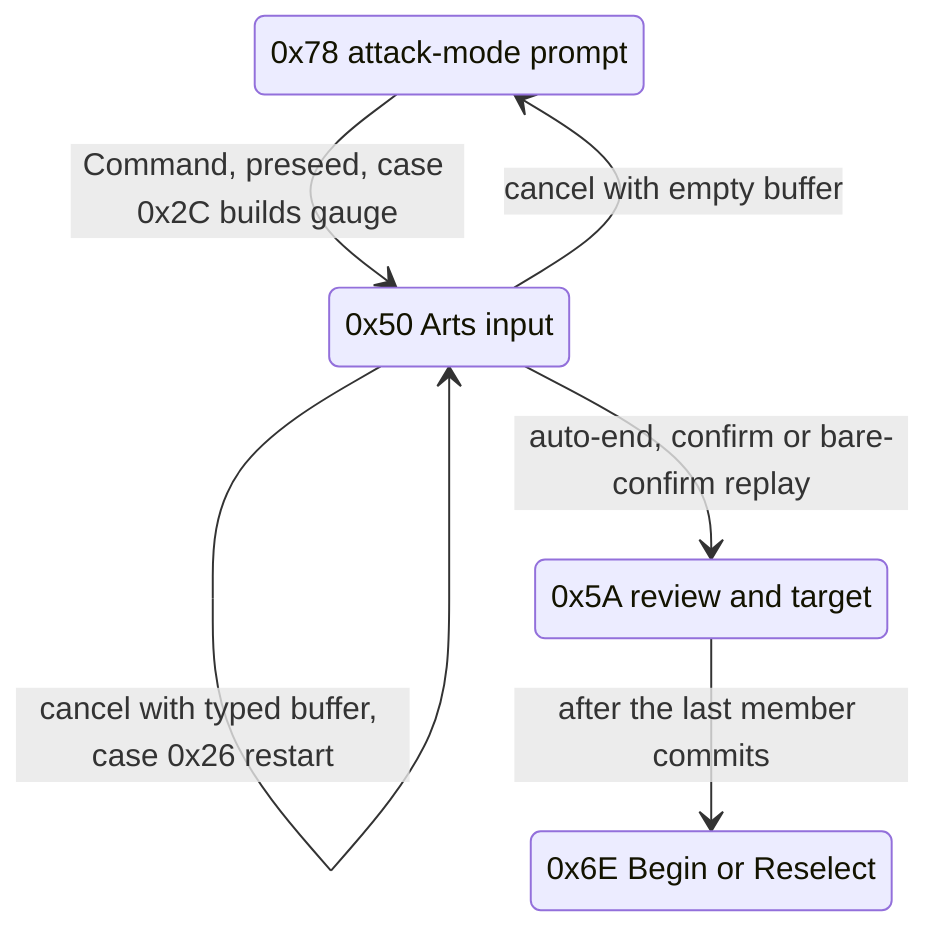

# Arts command gauge and weapon-specialty arm cost

When a character picks the Arts command, the battle UI opens an **action gauge**: a per-turn pool of AP (Action Points) that the player spends by pressing direction commands (High, Low and the two arm swings). Each command has a one-byte cost. The pool is the character's AGL stat, so a turn admits roughly `AGL / cost` commands.

The cost of the command that swings the **weapon hand** depends on the equipped weapon. A weapon outside the character's favoured class costs more, so fewer commands fit. This is the engine side of the "weapon specialty" mechanic. The game does no class comparison at runtime: the cost is authored per (character, weapon) in the character's player battle file and copied into RAM unchanged at battle load, which makes it plain editable data.

A second, unrelated AP figure lives on this page too: the **Spirit** cost of a named art, which is computed in code and paid from a different gauge.

## At a glance

| What | Where |
|---|---|
| Cost byte | `*(u8 *)(DAT_801C9360[char][cmd] + 0x74)`; favoured `0x1E` (30), off-class `0x2A` (42), far off-class `0x36` (54) |
| Turn pool | `ctx + 0x6DC`, seeded from the acting actor's AGL `actor + 0x154` |
| Gauge build / press / cancel | `FUN_801D388C` cases `9` / `0x2C`, `0xB`, `0x26` (battle overlay, PROT 0898, base `0x801CE818`) |
| Input state | `FUN_801D0748` state `0x50` (flow byte `ctx + 0x06`) |
| Cost writer | `FUN_800557B8` in `SCUS_942.54`, one write at `0x80055810`, at battle load |
| Disc source | weapon section `[+0x04] + 0x74` in the [player battle files](../formats/battle-data-pack.md) (extraction 863..865) |
| Named-art Spirit cost | `FUN_801EED1C`, paid from `actor + 0x170` through the accumulator `actor + 0x224` |
| Execution | `FUN_801EC3E4`, called from SCUS `0x800478A0` |
| Parser | `legaia_asset::battle_char_assembly::swing_command_costs` (`crates/battle-models`) |
| Port | `crates/engine-battle/src/arts_command_input.rs` + `ap_gauge.rs` (re-exported by `engine-core`), drawn by `engine-ui::arts_input` on both hosts |
| Mods | `--weapon-specialty`, the equipment editor's swing costs, `--arts-ap-grant` / `--arts-ap-cost` ([randomizer.md](../tooling/randomizer.md)) |

Every address is for the USA release. All of them are collected in the [address reference](#address-reference).

## Contents

- [Command costs](#command-costs)
- [How the gauge consumes it](#how-the-gauge-consumes-it)
- [Where the gauge pool comes from](#where-the-gauge-pool-comes-from)
- [Leaving state `0x50`](#leaving-state-0x50)
- [The auto command string](#the-auto-command-string)
- [Status limb gating](#status-limb-gating)
- [Where the cost comes from](#where-the-cost-comes-from)
- [Execution path](#execution-path)
- [Restoring the animation rate after an action](#restoring-the-animation-rate-after-an-action)
- [What an art costs in AP](#what-an-art-costs-in-ap)
- [Arts AP override hook](#arts-ap-override-hook)
- [If the Astral Sword is forced onto another character](#if-the-astral-sword-is-forced-onto-another-character)
- [The port's input session](#the-ports-input-session)
- [Common misconceptions](#common-misconceptions)
- [Confidence](#confidence)
- [Address reference](#address-reference)

<a id="where-the-cost-lives"></a>
<a id="measured-arm-cost"></a>
<a id="summary"></a>

## Command costs

The cost is a runtime field, not a static table row:

| Symbol | Meaning |
|---|---|
| `DAT_801C9360` | Per-character command-data pointer table, one pointer per active party member, in battle bss. Each entry points into the loaded player battle data ([extraction 863..866](../formats/battle-data-pack.md)). |
| `DAT_801C9360[char]` | That character's array of per-command record pointers, indexed `cmd * 4`. |
| `...[cmd] + 0x74` | The AP cost byte of that command. |

Full access: `*(u8 *)( *(u32 *)( *(u32 *)(DAT_801C9360 + char*4) + cmd*4 ) + 0x74 )`.

The bar shows four commands. Their codes come from `DAT_801F4B8C = [0x0C 0x0F 0x0E 0x0D]` (overlay 0898 rodata; Left, Up, Down, Right), with a sibling icon-base table `DAT_801F4B94 = [0x0D 0x10 0x11 0x0C]`.

One byte is both the price and the drawn width of a command:

| Tier | Cost | Penalty over base | Pennant width (`cost - 6`) | Commands from a 100 AGL pool | Who gets it |
|---|---|---|---|---|---|
| Favoured | `0x1E` (30) | 0 | 24 px | 3 | Every Ra-Seru arm, every High / Low, a favoured-class weapon |
| Off-class | `0x2A` (42) | `+0x0C` | 36 px | 2 | A weapon one class away |
| Far off-class | `0x36` (54) | `+0x18` | 48 px | 1 | Vahn's Astral Sword; Noa with any club or axe |

The "commands" column is `floor(100 / cost)` for a turn of that one command, as an illustration of the formula below.

Only the weapon-hand command varies: Left (`0x0C`) for Vahn and Gala, Right (`0x0D`) for Noa. The other three are `0x1E` in every retail section. The far penalty is twice the off-class penalty, which is where the popular "off-class doubles the arm" shorthand comes from. Off-class itself is ×1.4, not ×2.

Live readings of `DAT_801C9360[char][0x0C] + 0x74` agree with the disc: Gala + Ra-Seru Club reads `0x1E`, Gala + Nail Glove reads `0x2A`, Vahn + Astral Sword reads `0x36`.

### Gauge formulas

```text
cost[seat]     = *(u8 *)(DAT_801C9360[char][cmd] + 0x74)   -> ctx[+0x14 + seat]   (0x801D3B3C)
pool           = actor[+0x154]            (AGL)             -> ctx[+0x6DC]
readout        = pool - 6                                   -> _DAT_80076D7E      (0x801D3A38)

pennant width  = cost - 6                 pixels
pennant pitch  = cost                     pixels to the next pennant
chip re-centre = (cost - 30) * DAT_8007B650[slot] / 2                             (0x801D3B64)

press(seat):   if pool < cost[seat]  -> refused
               pool -= cost[seat];  count (ctx[+0x19]) += 1
auto-end:      when cost[seat] > pool for all four seats
turn length    ~ floor(AGL / cost), and never more than the 16-byte command buffer
```

## How the gauge consumes it

`FUN_801D388C` is the battle action/animation event handler, driven by the battle main dispatcher [`FUN_801D0748`](../reference/functions.md). Its **case `9` / `0x2C`** builds the gauge and reads the cost:

```c
bVar3 = *(u8 *)( *(u32 *)(DAT_801C9360[char][cmd]) + 0x74 );   // AP cost
ctx[slot + 0x14] = bVar3;                                       // per-seat AP cost
gauge_slot.icon_pos = bVar3 - 6;                               // drawn width on the bar
```

**Case `0xB`** spends it against the pool at `ctx + 0x6DC`:

```c
if (ctx[0x6DC] < ctx[slot + 0x14]) return;   // not enough AP for this command
ctx[0x6DC] -= ctx[slot + 0x14];              // consume the command's cost
```

A higher `+0x74` therefore both widens the pennant and drains more of the pool.



The empty-buffer cancel writes `0x28` instead of `0x78` when `_DAT_800846C4` is set.

A separate `+2` in case `9` (`icon = DAT_801F4B94[i] + 2`, gated on `equip[cmd] == 0`) is an empty-slot icon change, not a class penalty.

### Two budgets

The pool bounds a turn by cost. The committed command buffer `actor[+0x1DF..+0x1EE]` bounds it by count: sixteen bytes, a cap shared by the cancel wipe (`sltiu v0,s3,0x10` over `sb zero,0x1df`), the preseed `FUN_801DA34C` and the Super applier `FUN_801EF9E4`.

A plain direction press is one byte. A matched art keeps its leading arrows and replaces its last one with the two-byte `[0x19 starter][art id]` pair, so an N-arrow art occupies N + 1 bytes. A Super / Miracle tail-replaces the buffer with its own finisher bytes ([`super-art-queue-capture.md`](../tooling/super-art-queue-capture.md) shows Vahn's `0F 0E | 19 27 0F | 19 1F 0E | 1A 2B 2B 2B`). At retail costs the pool binds long before sixteen tokens do; a mod that prices commands low enough for `pool / cost` to pass sixteen hits the buffer instead.

### The lowest drawable cost

Each pennant is registered as a text-window actor of width `cost - 6` (`FUN_801D8DE8` → `FUN_8003541C(kind, .., label, x, y - 2, width, height, style)`, four `0x18`-byte window records at `0x80076E98..` in SCUS `.data`). The window renderer condenses the label (`High` / `Arms` / `RaSeru` / `Low`) horizontally to fit rather than clipping it.

| Cost | Width | Result |
|---|---|---|
| 30 | 24 px | Tightest width that draws every label cleanly (retail's floor) |
| 24 | 18 px | Condensed but legible |
| 20 and below | | Labels smear into glyph fragments |
| 7 | 1 px | Only the arrow caps remain |
| below 6 | | The width wraps negative |

Measured by injecting one cost into all four `+0x74` bytes and rebuilding the gauge (`scripts/pcsx-redux/autorun_apcost_visual.lua`). The re-centre term at `0x801D3B64` only moves the pennant; the AP fill bar is unaffected at any value. The patcher's equipment editor refuses costs below 24 for this reason.

### The chip words

The two arm chips do not read `Left` / `Right`. Each chip's window record (`0x80076E98 + seat*0x18`, seats Left, High, Low, Right) carries an icon id at `+0x0E` / `+0x0F`, an index into SCUS's 12-byte icon table `0x800732A4` (`(u, v)` at `+4`). Ids `0x0C..=0x11` are the label-strip words `RaSeru`, `Arms`, `Right`, `Left`, `High`, `Low`.

- The entry opener's seat loop (`FUN_801D388C`, `0x801D3A48..0x801D3BCC`) stamps them from `DAT_801F4B94 = [0x0D, 0x10, 0x11, 0x0C]`, so the Left chip reads `Arms` and the Right chip `RaSeru`.
- Character id `2` (Noa) swaps the two arm seats: her record holds the Ra-Seru in equipment index 2 and the weapon in index 3.
- An arm whose equipment byte is empty (index 2 for the Left seat, index 3 for the Right, keyed by the unswapped seat command `DAT_801F4B8C`) takes the seat's id `+ 2`, the plain direction word.
- A committed pennant copies its chip's id `+ 6` (`0x801D3D1C..0x801D3D38`), the same six words repeated at `0x12..=0x17`, so the bar reads `RaSeru` / `Arms` too.

Port: `arts_command_input::retail_chip_icons` (`crates/engine-battle`), drawn by `engine-ui::arts_input` on both hosts.

### Other users of the same machinery

- **Muscle Dome hand.** A dome card is one of the four direction commands (`0xC..=0xF`, the deck table `DAT_801f4b8c`), its cost is this same `+0x74` byte, and the commit debits the same `ctx+0x6DC` pool. See [`minigame-muscle-dome.md`](minigame-muscle-dome.md#hand-deck-decoded).
- **Input screen draw.** The High / Left / Right / Low chips, the pennant bar, the Triangle "Hyper Arts list" overlay and their texture sources are packet-pinned in [`minigame-muscle-dome.md` § Arts command input](minigame-muscle-dome.md#arts-command-input-packet-pinned). The dome runs the standard battle input verbatim, so that decomposition is the battle one.
- **Enemy AGL budget.** `FUN_801E9FD4` fills a monster's per-turn action queue by rolling candidate moves and paying each move's `+0x74` cost from `actor[+0x154]`. See [Enemy AGL action-budget](battle-action-helpers.md#enemy-agl-action-budget-fun_801e9fd4).

## Where the gauge pool comes from

The pool `ctx + 0x6DC` is the acting actor's AGL, the same `actor + 0x154` gauge the enemy action budget spends. `FUN_801D388C` seeds it straight off the actor-pointer table:

```text
801d38c8  addiu s4,v1,0x11        ; s4 = ctx + 0x11, so 0x2(s4) is ctx[0x13]
801d38e4  addiu s6,v1,0x6d6       ; s6 = ctx + 0x6D6, so 0x6(s6) is ctx + 0x6DC
...
801d4df8  lbu  v0,0x2(s4)         ; active actor index, ctx[0x13]
801d4e00  sll  v0,v0,0x2
801d4e04  addu v0,v0,v1           ; &DAT_801C9370[slot]
801d4e08  lw   v0,0x0(v0)         ; the live battle actor
801d4e10  lhu  v0,0x154(v0)       ; its AGL gauge
801d4e18  sh   v0,0x6(s6)         ; -> ctx + 0x6DC, the command-gauge pool
```

The party command gauge and the enemy AGL action budget are one mechanic: both fill a per-turn pool from `actor + 0x154` and both spend a per-action `+0x74` cost out of it. A retail party turn runs to two-to-four commands at the base cost 30; an off-class arm (42) or the Astral Sword (54) buys fewer.

There is no alternate seed. All four `ctx + 0x6DC` stores in the builder (`0x801D3A30`, `0x801D4E18`, `0x801D5068`, `0x801D5364`) read `+0x154`. The same value less 6 is also written to `_DAT_80076D7E` (`0x801D3A38`) for the readout; that is a destination, not a source. The decompiled C renders that pair in the opposite order, so read the disassembly.

## Leaving state `0x50`

There are three exits, two of them pad-driven. All are in `FUN_801D0748`'s `0x50` arm, and all consult the committed count `ctx+0x19` (`0x8(s1)`).

**Auto-end.** `801d2054`..`801d2078` walks the four costs at `ctx+0x14` against the pool, leaving `s0 = 0` when at least one is affordable and `s0 = 4` when none is. `801d208c bne s0,zero,801d20ac` then writes `0x5A`.

**Confirm** uses the configurable mask `_DAT_800846D0`, the same one the round prompt and every menu read:

```text
801d207c  lbu  v0,0x8(s1)        ; committed count; 0 skips to the cancel test
801d2084  beq  v0,zero,0x801d20e4
801d2094  lui  v0,0x8008
801d2098  lw   v0,0x46d0(v0)     ; _DAT_800846D0, the confirm mask
801d20a0  and  v0,s2,v0          ; s2 = the packed pad word built at 801d0b20
801d20ac  sb   v0,0x0(s3)        ; ctx+0x06 = 0x5A
```

**Cancel** uses the sibling mask `_DAT_800846D4` and forks on the same count:

```text
801d20ec  lw   v0,0x46d4(v0)     ; _DAT_800846D4, the cancel mask
801d20f4  and  v0,s2,v0
801d210c  lbu  v0,0x8(s1)
801d2114  bne  v0,zero,0x801d21a8 ; typed -> case 0x26, ctx+0x06 untouched
801d219c  li   v0,0x78            ; empty -> the attack-mode prompt
801d21a0  sb   v0,0x0(s3)         ; (0x28 instead when _DAT_800846C4 is set)
```

With a typed buffer the cancel is a restart, not an exit. Case `0x26` of `FUN_801D388C` wipes all sixteen queue bytes (`801d52d4 sb zero,0x1df(v0)` under `801d52d8 sltiu v0,s3,0x10`), re-seeds the pool from AGL (`801d535c lhu v0,0x154(v0)` -> `801d5364 sh v0,0x6(s6)`) and zeros the count (`801d536c sb zero,0x8(s4)`). Nothing writes `ctx+0x06`, so the flow stays in `0x50`.

**The pad word is packed.** `s2` is built at `801d0b20` as `_DAT_8007B874 | _DAT_8007B938`, the packed layout whose byte halves are swapped against the raw BIOS word. The entry's four direction tests at `801d1e60`..`801d1f38` (`0x8000 / 0x1000 / 0x4000 / 0x2000`) are therefore Left / Up / Down / Right, not Square / Triangle / Cross / Circle.

<a id="the-auto-command-string-preseed-on-open-replay-on-a-bare-confirm"></a>

## The auto command string

Retail has no "pick a saved art" list. It remembers one **auto command string** per character, preseeds the entry with it, and replays it on a bare confirm.

**Save.** `FUN_801DA59C` copies the actor's sixteen-byte window `actor[+0x1DF..]` into one of the character record's two bands (`+0x1A7` / `+0x1B7`; the gauge picks which on `u16[+0x156] < u16[+0x154]`) from the target confirm at `0x801D22BC`. This runs before the queue builder `FUN_801EED1C` tokenizes anything (that happens at the dispatch), so the string holds the raw arrows, one swing byte per press. The direction table `0x801F4B8C` reads `0C 0F 0E 0D` for Left / Up / Down / Right.

**Preseed.** `FUN_801DA34C` copies it back. It has two call sites in `FUN_801D0748`; the second is the arts entry itself. When the attack-mode prompt (`0x78`) takes Command, the jump at `0x801D1734` preseeds the window with the `sb 0x50` phase store in its delay slot, and case `0x2C` of `FUN_801D388C` builds the gauge.

**The gauge build draws the preseed.** With `+0x1DF[0]` non-zero, case `0x2C` (`0x801D4DC8..0x801D5070`) seeds a scratch pool from `+0x154` and walks the window:

1. Each command's cost (`ctx+0x14 + seat`, the seat from the `0x801F4B84` byte map) is tested against the pool (`slt` at `0x801D4E90`).
2. A pennant is registered and drawn exactly as for a typed press: window `0x20 + i` through `FUN_801D8DE8`, its chip's word `+ 6`, seated `cost` further right. The cost is debited.
3. At the first command the pool cannot pay, the walk zeroes that byte (`sb zero,0x1df(a1)` at `0x801D4DC4`) and stops. The window keeps only the prefix one full pool affords.
4. The pool and pennant seat are reset to the full gauge (`0x801D503C..0x801D5068`) and `ctx+0x1B` is raised.

The entry therefore opens with the string's pennants over a full bar. Captured example: Gala's off-class entry with a saved `Right Right Left Left Left Up`, a `197` pool and a `42`-AP arm opens as five pennants (`RaSeru RaSeru Arms Arms Arms`), the window cut to `0D 0D 0C 0C 0C` and the committed count `ctx+0x19` still `0`.

Two things then happen to the preseed, both in the entry arm:

- **The first press wipes it.** Case `0xB` of `FUN_801D388C`, with `ctx+0x19` at `0`, zeroes all sixteen window bytes before it tests the pool or stores the press (`0x801D3BE4..0x801D3C24`), and retires the preseeded pennants - the text windows of kinds `5..=0xD` in the forty-slot window table (`0x801D3C2C..0x801D3C94`). The pad replaces the preseed; it does not edit it.
- **A bare confirm replays it.** With no direction this frame, the arm at `0x801D1FA0..0x801D2044` checks the staging byte `DAT_8007BD04`, a zero count, a non-zero `+0x1DF[0]` and the confirm mask `0x800846D0`. It then measures the string, stores the length as the count (`0x801D2028`) and enters `0x5A` through case `0xC`, as a typed confirm does.

**Replayed presses cost no pool AP.** The replay never runs case `0xB`, so `ctx+0x6DC` is not debited; the gauge build only measured the string against one full pool. The band choice keeps a string saved under a raised gauge from replaying under the base one, because the primary band is written and read only while the live gauge exceeds its base. The **Spirit** cost of the arts the string performs is charged again: the builder re-tokenizes the raw arrows at the dispatch and accrues their art bodies into `actor[+0x224]`, as for any typed string.

**Port.** `ArtsCommandInputSession::preseed` / `replay` / `committed_string`, filled by `World::open_arts_command_input` through `preseed_auto_command_string` (`crates/engine-core/src/world/battle/auto_command.rs`). `with_preseed` runs the gauge build's cut, and `bar_commands` / `bar_spent` hand the preseeded pennants to the shared `engine-ui::arts_input` bar on both hosts. `World::run_battle_art` stages the arrows as swing bytes and runs the write-back at the commit; the Attack dispatch sends a preseeded string through `build_arts_action_queue` and `charge_art_spirit`, as the arts dispatch does.

The engine's named chain library `World::party.saved_chains` is separate data. The chain editor writes it, the save round-trip carries it, and the legacy `LEGAIA_ARTS_SAVED_LIST=1` list reads it, but nothing preseeds from it.

Because a turn performs however many arts the pool paid for, the shout cue and the learn-on-use check are per art, not per turn. See [audio.md](audio.md#battle-arts-voice-shout-path-engine).

## Status limb gating

A **Rot** status stamps individual command arrows and refuses their input. The gauge-input arm (`FUN_801D0748` state `0x50`) reads the active actor's `+0x16E` status halfword. The stamp pass (`0x801D1DA8..0x801D1E54`) and the input gate agree bit-for-bit:

| `+0x16E` bit | Rot stamp (`FUN_801DBDDC` anchor) | Blocks command |
|---|---|---|
| `0x08` (limb 0) | LEFT (`0xb3 - w/2, 0x42`) | Left `0x8000` / dir 0 |
| `0x10` (limb 1) | RIGHT (`0xe5 + w/2, 0x42`) | Right `0x2000` / dir 3 |
| `0x20` (limb 2) | UP (`0xcc, 0x22`) **and** DOWN (`0xcc, 0x62`), `w = 0x1E` | Up `0x1000` / dir 1 **and** Down `0x4000` / dir 2 |
| `0x1000` (**Curse**) | the ring's MAGIC chip (`FUN_801dbec4(0xf8, 0x42)`, the Curse plate) | Magic |

One bit (`0x20`) greys two arrows; the assignment is not one bit per arrow. Rot rolls exactly one of the three limb bits (`1 << (rand%3 + 3)`); see [battle-formulas.md § status application](battle-formulas.md#status-application-the-art--move-record-status-byte). With all three set (`0x38`) the whole Arm command is skipped and Attack is unusable (`801d0748:3226-3227,3277`; `801e295c:5452`).

**Stamp geometry.** `w` is the chip's AP cost, `ctx[+0x14 + seat]` in seat order Left, High, Low, Right (written by `FUN_801D388C` case `9`, `0x801D3B3C`); `w/2` is an unsigned `srl`. The stamp is the `etim` page's blue hand-lettered "Rot", 32x24 at `(80, 96)` through CLUT `0x770B`, drawn `y-8 ..= y+0xF` and `x+8-h ..= x+0x27+h` with `h = (w - 0x1E) >> 1`. It keeps the edge nearest the D-pad fixed exactly as the cost-widened chip does (the Left stamp's right edge at `0xCB`, the Right stamp's left edge at `0xFC`). The High / Low stamps stay at the favoured width whatever those chips cost.

**Command ring.** The ring marks the same states every frame, before the pad is read: all three limbs stamp Rot over the Attack chip (`FUN_801DBD04(0xA0, 0x42)`) and Curse lays the "Curse" plate over the Magic chip (`FUN_801DBEC4(0xF8, 0x42)`).

**Port.** Both play hosts draw these out of the chrome atlas, where `save_menu_atlas::add_cross_out_mark` (`crates/engine-menus`) bakes the two marks from the effect page beside the red X. The ring's go through `battle_command_ui::battle_command_menu_sprites` switched by `battle_hud::battle_ring_marks`; the entry's through `arts_input::arts_input_rot_stamp_draws` off `ArtsInputView::status`.

## Where the cost comes from

<a id="who-writes-the-cost"></a>

### The writer

The cost is written once at battle load (the `game_mode 0x14 → 0x15` transition) as a verbatim copy out of the assembled battle-character buffer.

- The writer is `FUN_800557B8`, the per-command-record copy routine in `SCUS_942.54`. It is a fixed 43-word block copy from the source `a1` to the runtime record `a0` (`lw v0,(a1)` → `sw v0,(a0)`; the word at `+0x74` lands inside that block), followed by a variable-length tail of `(src[0] * src[1] * 9 + 5) / 4` words. There is no arithmetic on the cost between load and store.
- It is called from the battle character-assembly chain (`FUN_80052770` → … → the call site at `0x80053330`; see [character-mesh assembly](../formats/character-mesh.md)), which splices the equipped item's section into the per-character battle buffer.
- A live write-watch on the cost field through a field→battle transition sees exactly one write, at `pc = 0x80055810`.

The "off-class penalty" is therefore per-(character, weapon) data. The same weapon yields different costs in different characters' files: a claw is cheap in Noa's file and expensive in Gala's.

<a id="disc-location"></a>

### Disc location

Inside the [player battle file](../formats/battle-data-pack.md), the cost sits in the weapon's section, reached through the section's swing-action record:

```
section (decoded)
  +0x04  u32 swing_rec_a   ; offset (within the section) to the swing/arm command record
  …
  swing_rec_a + 0x74       ; u8 arm cost  ← the weapon-specialty byte
```

The descriptor table keys sections by equippable item id, so each weapon has its own section and its own swing record. Decoding the three player files (`asset battle-data-pack <file> --out`) and reading `section[+0x04] + 0x74` per weapon:

| Weapon | Vahn (863) | Noa (864) | Gala (865) |
|---|---|---|---|
| Survival Knife, Battle Knife | `0x1E` | `0x1E` | `0x2A` |
| Short Sword, Force Blade | `0x1E` | `0x2A` | `0x1E` |
| Beast Buster, Chaos Breaker | `0x1E` | - | `0x1E` |
| Nail Glove, Crimson Nails, Fighter Claw, Bloody Claw | `0x2A` | `0x1E` | `0x2A` |
| Survival Club, Red Club | `0x1E` | `0x36` | `0x1E` |
| Power Club, Survival Axe, Battle Axe, Great Axe | `0x2A` | `0x36` | `0x1E` |
| Astral Sword (`0xBA`) | `0x36` | - | - |
| character-locked gear (Ra-Seru weapons, Feral / Hard Beat / Heavy Strike, Holy / Golden Claw, Mace) | `0x1E` | `0x1E` | `0x1E` |

By family:

| Character | Favoured → `0x1E` | Off-class → `0x2A` | Far off-class → `0x36` |
|---|---|---|---|
| Vahn | blade / knife / sword / fist | claw, axe | Astral Sword only |
| Noa | claw / feral / fang (+ knife) | sword / blade | club / axe |
| Gala | club / axe / mace | claw, knife | - |

The classes are finer than three families: Gala swings a Short Sword at the favoured price but a knife off-class, and Vahn swings the light clubs favoured but the Power Club and every axe off-class. The Astral Sword is not a code exception. It is Vahn's one `0x36` section, the same tier Noa gets from an axe.

Live RAM agrees with the file: Gala + Nail Glove reads `0x2A` and Gala + Ra-Seru Club reads `0x1E`, matching that file's `0x28` and `0x21` sections. The cost lives inside the section's **LZS-compressed** stream, so an editor decompresses the section, rewrites the byte at `swing_rec_a + 0x74`, recompresses, and writes back within the slot footprint.

### Reading it

`legaia_asset::battle_char_assembly::swing_command_costs(buf, pack, equipped)` returns the four costs for one equipped set, in direction-command byte order (`Left, Right, Down, Up` = runtime action slots `0xC..=0xF`). It follows the splice path, not a descriptor-id lookup: `select_sections` matches an equipped id positionally inside its own section, so the equipment index that re-prices a swing is whichever section the file keys the weapon under. That differs per character:

| Character | Section 2 (slot `0xC`, Left) | Section 3 (slot `0xD`, Right) | Record `+0x196..` in a retail save |
|---|---|---|---|
| Vahn | weapon | Ra-Seru | `[.., 0x1B Ra-Seru Blade, 0x09 Meta, ..]` |
| Gala | weapon | Ra-Seru | `[.., 0x21 Ra-Seru Club, 0x19 Ozma, ..]` |
| Noa | Ra-Seru Terra | weapon | `[.., 0x11 Terra, 0x1F Ra-Seru Fangs, ..]` |

This is why the [save-record](../formats/save-record.md) labels `+0x198` weapon / `+0x199` Ra-Seru hold for Vahn and Gala only.

An id placed at the wrong index silently falls through to the section default, and every weapon reads `0x1E`. That is the failure to expect when a cost sweep comes back constant.

Every consumer reads the cost through this one function: the port's Arts input, the Muscle Dome's per-command cost, and the disc-gated pin in `crates/asset/tests/battle_data_pack_real.rs`.

### Weapon classes and favored mapping

The class the game *describes* is legible from the static item-property records (`DAT_80074368 + id*12`, 12-byte stride). The description pointer (`+8`) is shared per class and the description carries a `Best:<character>` token. Universal weapons (equip-mask `0b111`) partition cleanly:

| Class (description pointer) | "Best" character | Example universal weapons |
|---|---|---|
| knife / sword (`0x800128D4`) | Vahn | Survival Knife, Battle Knife, Short Sword |
| claw (`0x80012870`) | Noa | Nail Glove, Crimson Nails, Fighter Claw, Bloody Claw |
| club / axe (`0x8001280C`) | Gala | Survival Club, Red Club, Survival Axe, Battle Axe |

Character-specific weapons (equip-mask `0b001` / `0b010` / `0b100`, e.g. Ra-Seru Blade / Fangs / Club) are locked to one owner by the [equip-character mask](../formats/equipment-table.md) and are always favoured for that owner. The Astral Sword (`0xBA`) has its own description pointer (`0x80011710`) and matches no character.

These descriptions are text only. No code reads them to price a command; the per-weapon table above is the actual pricing.

## Execution path

A committed combo is replayed by the **Arms execution resolver `FUN_801EC3E4`** (overlay 0898). It is called from `SCUS_942.54` at `0x800478A0` (`jal 0x801EC3E4`), which is why it has no caller inside the overlay. The resolver advances the input cursor (`actor + 0x1F4`) one step per recorded command and dispatches per-command sub-handlers through the jump table `PTR_801CF4B4[(actor + 0x1D9) - 0xC]`. These read the equipped weapon again to fold it into the damage calculation. That read is distinct from the gauge-build cost.

### The execution-time weapon fold

The dispatch is bounded at six arms (`(command - 0x0C) < 6`, commands `0x0C..=0x11`). The head admission gate is a different band read from a different place: it tests the caller's command-record byte with `(cmd - 0x0C) < 0x14` (`0x0C..=0x1F`). A command in `0x12..=0x1F` is admitted and then folds nothing.

Each arm resolves one or more of the character record's five equipment slots (`+0x196..+0x19B`) through a two-hop lookup: item property record `DAT_80074368 + id*0xC` byte `+1` → equipment stat row `DAT_80074F68 + row*8` byte `+1` (the **attack** bonus). It adds the result into the actor's ATK **working** halfword `+0x158`:

| command | equipment slots | fold into `+0x158` |
|---|---|---|
| `0x0C` | 2 | `atk[2] >> 1` |
| `0x0D` | 3 | `atk[3] >> 1` |
| `0x0E` / `0x0F` | 4 | `atk[4] >> 1` |
| `0x10` | none | nothing |
| `0x11` | 0,1,2,3,4 | `(sum of all five) >> 1` |

`0x0E` and `0x0F` share a jump-table arm (slots `[2]` and `[3]` hold the same target). `0x10`'s slot is the same address the bounds check bails to: a live table entry that folds nothing. Retail applies no empty-slot test and no `kind == 1` item-class guard here, matching the battle-load seeder.

This is the counterpart to the battle-load asymmetry recorded in [`battle-formulas.md`](battle-formulas.md). The seeder `FUN_80053CB8` folds the equipment table's UDF / LDF / SPD bytes and folds neither INT nor ATK, so a weapon's attack bonus never reaches the actor's ATK **base** (`+0x15A`). It reaches ATK working here, per committed command. The seeder's omission is correct.

Port: `legaia_engine_vm::battle_formulas::arms_command_equip_slots` / `arms_weapon_atk_fold` / `arms_resolver_admits` (`crates/engine-battle-vm/src/battle_formulas/arms_fold.rs`). The live loop seeds a party slot's `battle.attack` without the equipment sum and adds the halved slot per swing (`World::battle.equip_atk`). The player-facing formula is on [battle-formulas.md](battle-formulas.md#base-offense-value-base-atk-plus-half-of-one-equipment-slot).

## Restoring the animation rate after an action

`FUN_801e93c8` (battle overlay, PROT 0898; see `ghidra/scripts/funcs/overlay_battle_action_801e93c8.txt`) resets the per-actor animation rates. It is not a gauge re-arm: the byte it seeds is the anim-rate scalar, and the gauge builder never touches it.

**When it runs.** Its one `jal` is at `0x801E5F64`, the tail of the Done/cleanup arm (`0x50`) right after the `0x50 -> 0x51` advance. The attack band jumps to that same instruction on every frame of the strike loop (`0x1E`: `0x801E39AC`, `0x801E3A68`, `0x801E3A80`), the recovery (`0x1F`: `0x801E3AF8`, `0x801E3B18`) and the return (`0x20`: through `0x801E5660` and `0x801E55A0..0x801E56C8`). The rate therefore comes back the frame the gate opens, not when the action finishes.

**The gate.** It reads the active actor (`_DAT_8007bd24 + 0x13` indexes the actor-pointer table `DAT_801C9370`) and tests what was staged, the last-staged action id `+0x1D9`:

- Party slot (index `< 3`): runs only while `+0x1D9 < 0x10`, i.e. the staged id is a plain direction (`0x0C..=0x0F`) and not a materialized art or starter (`>= 0x10`). This is the same split the action queue uses ([art-data.md § Action Constants](../formats/art-data.md#action-constants)).
- Monster (index `>= 3`): resolves the materialized art record (`+0x4C`) and bails when the record's `+0x87` flag byte is set.

**The effect.** It walks all seven actor slots, clearing each slot's `+0x21C` latch (only when it holds `1`) and writing `+0x21D = 8`. That restores the animation-rate scalar after an art's slow-motion arms (`FUN_8004AD80`) dropped it to `4` / `2` / `0`. It then clears the battle **context's** `+0x243` byte (`ctx[+0x243] = 0`, `0x801E94F8`, off the pointer re-loaded from `_DAT_8007BD24`), the marker state `0x3C` sets.

## What an art costs in AP

This is a different AP from the command cost. The command byte `+0x74` is spent from the per-turn input pool; a named *art* is paid from the caster's **Spirit** gauge `actor[+0x170]`, the gauge the Spirit command charges (see [`randomizer.md` § spirit AP](../tooling/randomizer.md)).

**The gauge carries between fights** through the character record's AP cell `+0x10E`:

- The party loader `FUN_80053CB8` seeds `+0x170` from it as its last store (`lhu v0,0x6d6(record)` / `sh v0,0x170(actor)` at `0x800542BC..0x800542C4`).
- Both results arms of `FUN_8004E568` (victory and wipe) store it back beside MP (`0x8004F218..0x8004F220`, `0x8004FC18..0x8004FC20`).
- Port: seeded at `World::enter_battle_from_formation`, written back in `World::persist_battle_party_hp`.

**Retail stores no per-art AP cost.** The party arts queue builder `FUN_801EED1C` (PROT 0898, file `+0x20504`; see `ghidra/scripts/funcs/overlay_battle_action_801eed1c.txt`) computes it. It picks a multiplier into `t4` from three code immediates, keyed on how many art rows it has already visited for this character (`[sp+0x40]`, zeroed at `0x801EF300`, bumped once per row at `0x801EF844`):

| rows visited | multiplier | site |
|---|---|---|
| `0` | `0xB` (11) | `li t4,0xb` at `0x801EF328` |
| `1..3` | `0xA` (10) | `li t4,0xa` at `0x801EF32C` |
| `>= 4` | `6` | `li t4,0x6` at `0x801EF33C` |

```text
t4   = multiplier(rows visited)
t4 >>= 1                     if record[+0xF8] & 0x800     (srl t4,t4,0x1 at 0x801EF378)
gate = t4 * command_count    mult t4,s1 / mflo t7  (0x801EF40C)  compared against Spirit
cost = t4 * command_count    mult t4,v0 / mflo a2  (0x801EF474)  the amount charged
```

### Where the `0x800` halving flag comes from

It is not on the battle actor. The builder resolves the acting slot's roster character id through `DAT_8007BD10` and indexes the live character record:

```text
801ef340  lbu   v0,0x0(t6)      ; t6 = 0x8007BD10 + slot -> character id
801ef344  addiu t7,t7,0x4140    ;              t7 = 0x80084140
801ef348  addiu v0,v0,-0x1      ; index = id - 1
801ef34c..801ef35c              ; * 0x414
801ef364  lw    v0,0x6c0(v1)    ; 0x80084140 + i*0x414 + 0x6C0
801ef368  andi  v0,v0,0x800
801ef370  beq   v0,zero,0x801ef37c
801ef378  _srl  t4,t4,0x1       ;   half price
```

`0x80084140 + 0x6C0` is `0x80084800` and the character record base is `0x80084708`, so the word is record **`+0xF8`**: word 1 of the four-word [accessory-passive](../formats/accessory-passive-table.md) ability bitfield. Bit `0x800` of word 1 is passive index `32 + 11 = 0x2B`, **AP Used Down** ("consume 50% less AP", the Mettle Gem). The halved price is an equipment state, live while the accessory is worn. It is unrelated to the actor's `+0x16E` flag bank.

The menu renderer reads the same word the same way: `lw v0,0x6c0(v0)` / `andi v0,v0,0x800` at `0x801D4520..0x801D4528` in `FUN_801D33D8`. The sibling word 0 (`+0xF4`, `lw v0,0x6bc(v0)` at `0x801E39FC`) is the one the Attack x2 refill's War God Icon test reads; the two `lw`s are halves of one 64-bit field.

Port: `ap_gauge::AP_USED_DOWN_BIT` / `AP_USED_DOWN_PASSIVE` (`crates/engine-battle`); `World::charge_art_spirit` reads word 1 off the caster's roster record and passes it as the `halved` argument.

### Where the charge actually lands

The site-C debit (`subu v0,v0,a2` at `0x801EF498`) is not the spend. The builder's own tail undoes it (`Spirit += actor[+0x224]` at `0x801EF988`); it exists so a *chained* art's affordability gate accounts for what earlier arts in the same run already committed. The real spend is the accumulator `actor[+0x224]`, subtracted once in the battle-action cleanup arm:

```text
801e5d60  lbu  a0,0x224(s3)     ; accumulated art cost
801e5d6c  sb   v1,0x224(s3)     ; +0x224 = 8 (the per-action accrual)
801e5d74  subu v0,v0,a0         ; gauge -= accumulated art cost   <- the spend
801e5d78  sh   v0,0x170(s3)
```

Anything that changes an art's cost has to move the accumulator, not just the in-builder debit.

### The menu number is a separate source

The AP the pause menu's arts list shows is the `+2` byte of the static [arts-name table](../formats/art-data.md#arts-name-table-dat_80075ec4) (`DAT_80075EC4 + n*0x14`). Exactly one site reads it: `lbu a0,0x2(s2)` at `0x801D4524` in the menu overlay's status-panel renderer `FUN_801D33D8` (PROT 0899). That routine applies the same record `+0xF8` `0x800` halving (`sra a0,a0,0x1`) and hands the value to the 3-cell decimal drawer `FUN_80034B78`.

Retail keeps that byte consistent with the formula by authoring. For all 45 arts it equals `t4(rows visited) x command_count` exactly, including Noa's, whose display indices skip `2` and `3` while her *visit* order does not (her index-4 Vulture Blade carries `10 x 5`, not `6 x 5`). The battle path and the menu are two independent sources, and a mod that changes one must change the other.

## Arts AP override hook

The randomizer's **arts AP override** (`--arts-ap-grant` / `--arts-ap-cost`) detours three sites of that flow so a configured art either is admitted at any AP level and *adds* AP, or is gated on and charged a flat cost.

**Addressing.** The art identity is register `s3` (the art-row cursor, `li s3,0xb` at `0x801ef2ec`); the 0-based row is `s3 - 0x0B`, which equals the art's arts-table display index (`0` = Miracle Art). The row is shared across characters, so the character comes from `t6 = &DAT_8007BD10[slot]` (built by `addu t6,t9,t7` at `0x801EF30C`, read by retail as `lbu v0,0x0(t6)` at `0x801EF340`), where [`DAT_8007BD10[slot]`](battle.md) is the 1-based party-record id. The injected routines replay that load. The config index is `(id - 1) * 32 + (s3 - 0x0B)` over a `4 x 32` `i8` table: `0` = retail, `> 0` = grant that many AP (admit + no cost), `< 0` = charge `-value` AP. One art per cell, so an override never moves another character's art.

| Site | VA | Stock word | Role |
|---|---|---|---|
| A affordability guard | `0x801EF410` | `0x94A20170` (`lhu v0,0x170(a1)`) | Grant: forces `v0 = 0x7FFF` so `slt v0,v0,t7` reads "affordable". Cost: replaces `t7` with the configured value so the stock compare gates on it. |
| B per-art index | `0x801EF438` | `0x2665FFF5` (`addiu a1,s3,-0xb`) | Pins the config row `= s3 - 0x0B`. Read-only build fingerprint, not detoured. |
| C AP debit + accrual | `0x801EF490` | `0x94620170` (`lhu v0,0x170(v1)`) | Grant: adds AP (clamped at 100) and returns past the `+0x224` accrual (`0x801EF4A0..0x801EF4B4`). Cost: debits the gauge, accrues the override into `+0x224` and returns past both stock steps. Native art: falls through to `subu v0,v0,a2` at `0x801EF498`. |
| D end-of-turn refund | `0x801EF988` | `0x94620170` (`lhu v0,0x170(v1)`) | Replays `Spirit += +0x224` and clamps it at 100 (retail leaves this unclamped, deferring to the `FUN_801E295C` state-`0x50` cap). |

**A configured cost is flat.** It replaces the product outright, so it does not follow retail's `srl t4,t4,0x1` halving. The menu renderer still halves what it draws in that state (its own `sra a0,a0,0x1`), so an odd configured cost reads one lower there.

**Menu byte.** Each targeted art's menu `+2` byte is rewritten to match: a cost writes the cost, a grant writes `0`. `FUN_80034B78` emits digit sprites only (`u = digit*8`, `v = 0xD0`) and has no sign path. `0` is a value no retail art carries (the retail minimum is 18) and the smallest configurable cost (`1`) cannot collide with it, so it is the in-game marker for "this art pays you". A literal `+` / `-` would need an extra sprite draw injected into 0899.

**Placement.** The battle overlay is packed: the move-power window `0x801F4E63..0x801F69D8` is the only large zero run and it is runtime-indexed. The detour routines go into the verified-dead SCUS arenas `shiny_seru::ARENA1_VA` (guard + debit) and `ARENA2_VA` (refund), with the config table in the rodata gap `SCUS_GAP_VA`, all reached from the 0898 detours by `j`. The [shiny-Seru](../tooling/randomizer.md#shiny-seru) feature uses the same bytes, so the arts AP override and `--shiny-seru` are mutually exclusive, enforced in the CLI and the web patcher. All four site words plus the `t6` character read are byte-verified against the extracted 0898 image; an unrecognized build is refused.

Port: [`legaia_patcher::arts_ap_grant`](../../crates/arts-patch/src/arts_ap_grant.rs).

## If the Astral Sword is forced onto another character

The wide command does not follow the sword. The value `0x36` exists in exactly one place on the disc, the `0xBA` section of Vahn's file; Noa's and Gala's files contain no section for `0xBA`.

At battle load the section selector (`FUN_80052770` case 4, ported as `select_sections`) matches the record's equipment byte against the ids in the corresponding section and, when nothing matches, takes that section's id-0 default entry. Forcing `0xBA` into Noa's weapon byte therefore splices her default weapon section: default mesh, default swing record, cost `0x1E`. She swings at the favoured price and does not visibly hold the sword, since the model lives in the same missing section. The 97 attack still applies, because attack is folded in at execution from the static equipment table, which is keyed by item id alone. The equipment mask that restricts the sword to Vahn is enforced only in the menu.

This follows from the disc layout and the traced selector; it has not been confirmed with a live capture of an edited save.

A modification that wants the penalty to travel with the sword must add an `0xBA` section, or re-price the default record, in the other characters' files. The [patcher's equipment editor](../tooling/randomizer.md#equipment-editor-command-costs-and-equip-owners) reports these fall-through combinations when an owner edit creates one, and exposes each section default's cost (`CHAR:default=COST` for the weapon section, `raseru`, `feet` / `feet:up`). That is the only in-place knob, since the player files have no free space for a new section. The same editor reprices the other three commands through their own sections: the Ra-Seru arm's record and the footwear section's Down (`+0x04`) and Up (`+0x08`) records, all `0x1E` in retail.

## The port's input session

`arts_command_input` (`crates/engine-battle/src/arts_command_input.rs`, re-exported as `legaia_engine_core::arts_command_input`) is the retail flow:

1. The Arts command opens a per-press directional entry.
2. Each press appends its command byte to the actor's buffer and debits that command's `+0x74` cost from the turn pool.
3. Entry ends by itself once nothing is affordable, or on the confirm mask ([`0x50` exits](#leaving-state-0x50)).
4. The review screen's next press picks the target and commits the entry.
5. **Begin | Reselect** (`0x6E`) is raised once for the whole party, after the last member that can act has committed ([battle-command-flow.md](battle-command-flow.md#the-commit-confirm-screen-0x6e)). A party of one reaches it straight off its arts entry.

The entered sequence resolves through the `legaia-art` matcher family. An exact Miracle string replaces the whole queue, a recognised sequence ending on a Super combination replaces the tail, and otherwise each named art contributes its record's strikes with unmatched directions staying plain swings.

Costs come from the equipped set at scene entry ([above](#reading-it)) into `World::battle.swing_costs`; the pool seeds from the actor's AGL. Sessions live at `World::battle.arts_input`. `World::arts_input_active()` is what a host's party status strip reads to park itself, since retail moves the status plate off-screen for the whole session.

<a id="what-still-diverges"></a>

### Retail and port side by side

| | retail | port |
|---|---|---|
| pool | actor AGL (`+0x154`) | actor AGL; `100` with no roster loaded |
| direction command | the `+0x74` byte | the `+0x74` byte, per equipped set |
| ending entry | auto-end, **or** confirm mask | same |
| cancel, buffer typed | clears the entry, refunds the pool | same |
| cancel, buffer empty | leaves to `0x78` / `0x28` | leaves to the command menu |
| art body | paid from **Spirit** `+0x170` | same, at the commit rather than at the cleanup arm |
| target | the `0x5A` cursor after the entry (Left / Right walk `+0x1DD` through `FUN_801D8D00`, `0x801D21D4..0x801D2268`) | the target picker after the review press |

`ap_gauge` (`crates/engine-battle/src/ap_gauge.rs`) backs the Spirit-command path and the Spirit side of an art; it is not what an Arts input spends.

**Spirit charge.** `ap_gauge::art_spirit_cost` is the builder's three-immediate multiplier. `arts_turn_spirit_cost` sums it over the arts a turn performs, each at its **visit** ordinal in `battle_arts::spirit_catalog` (the builder's walk order, not the arts grid's display index). `World::charge_art_spirit` debits `actor[+0x170]` when the turn commits, with the halving flag read off the caster's record word 1.

One disclosed departure: retail accrues into `actor[+0x224]` and spends it once in the battle-action cleanup arm rather than at the commit. It is the same turn and the same total, observable only by a mid-action read.

## Common misconceptions

| Claim | What the bytes say |
|---|---|
| "An off-class weapon doubles the arm command." | Off-class is 30 → 42 (×1.4); the far tier is 30 → 54 (×1.8). The "double" most likely counts penalties: the far penalty (+24) is twice the off-class penalty (+12). |
| "The game checks the weapon's class against the character." | No comparison exists; the value is authored data. The equipment stat table, item property table and accessory tables were each checked and none carries the cost. |
| "The cost is recalculated when equipment changes." | Changing equipment in the field alters only the equipment id bytes in the character record. The cost is read from the disc at the next battle load. |
| "The Astral Sword has a unique penalty." | Its value, 54, is the far-off-class tier Noa receives from any club or axe. |
| "The AP shown next to an art is what the bar charges." | Two different gauges - see [What an art costs in AP](#what-an-art-costs-in-ap). |

<a id="confidence-and-open-threads"></a>

## Confidence

**Confirmed** (live-pinned and byte-validated against the disc): the cost field `DAT_801C9360[char][0x0C] + 0x74` and its measured values; the case-`9` read and case-`0xB` spend in `FUN_801D388C`; the SCUS call site of the execution resolver; the writer `FUN_800557B8` (verbatim copy at battle load, no runtime penalty arithmetic); and the disc location of the cost byte.

**Inferred**: naming the weapon-hand command "the arm" (`0x0C` Left for Vahn and Gala, `0x0D` Right for Noa). It is the only command whose cost tracks the weapon; the live measurements were taken on Gala and Vahn.

The mechanic is a fully editable data table. The [randomizer](../tooling/randomizer.md)'s `--weapon-specialty` permutes the three favoured families among the characters by rewriting these bytes, decompressing and re-compressing each touched section in place.

## Address reference

Every address on this page in one place (USA release, main-RAM virtual addresses). The battle overlay (PROT 0898) is based at `0x801CE818`.

### Character records

Four `0x414`-byte records, contiguous, in roster order. These are the records the save block is composed from and that the battle loader reads equipment from ([save-record.md](../formats/save-record.md)).

| Character | Record base | Armor `+0x196` | Head `+0x197` | Index 2 `+0x198` | Index 3 `+0x199` | Legs `+0x19A` | Accessories `+0x19B..+0x19D` | Name `+0x2A7` |
|---|---|---|---|---|---|---|---|---|
| Vahn | `0x80084708` | `0x8008489E` | `0x8008489F` | `0x800848A0` weapon | `0x800848A1` Ra-Seru Meta | `0x800848A2` | `0x800848A3..A5` | `0x800849AF` |
| Noa | `0x80084B1C` | `0x80084CB2` | `0x80084CB3` | `0x80084CB4` Ra-Seru Terra | `0x80084CB5` weapon | `0x80084CB6` | `0x80084CB7..B9` | `0x80084DC3` |
| Gala | `0x80084F30` | `0x800850C6` | `0x800850C7` | `0x800850C8` weapon | `0x800850C9` Ra-Seru Ozma | `0x800850CA` | `0x800850CB..CD` | `0x800851D7` |
| Terra (slot 3) | `0x80085344` | same layout; the tail overlaps the story-flag bitmap at `0x80085600` | | | | | | |

Index 2 and index 3 hold the weapon and the Ra-Seru in the order the character's player battle file expects ([which hand is priced](#reading-it)). The cheat-database labels "weapon = `+0x198`" are Vahn's and Gala's layout.

### Battle globals and the runtime command record

| Address | Type | Meaning |
|---|---|---|
| `0x8007BD24` | u32 | Pointer to the battle context struct (`0x800EB654` in captured battles; `0` in the field) |
| `0x8007BD10` | u8[] | Per-seat character id, 1-based (1 Vahn, 2 Noa, 3 Gala) |
| `0x801C9370` | u32[8] | Battle-actor pointer table (party seats 0..2, monsters 3..) |
| `0x801C9360` | u32[3] | Per-party-member pointer to that member's command-record pointer array |
| `DAT_801C9360[char][cmd]` | u32 | Pointer to the runtime record of direction command `cmd` (`0x0C..0x0F`), indexed `cmd * 4` |
| `record + 0x74` | u8 | The AP cost / pennant width byte |
| `0x801F4B8C` | u8[4] | Command codes displayed on the bar: `0C 0F 0E 0D` |
| `0x801F4B94` | u8[4] | Icon base per command: `0D 10 11 0C`; `+2` when the equipment slot is empty |
| `0x800846D0` / `0x800846D4` | u16 | Configurable confirm / cancel pad masks the input state tests |

### Battle context fields (`ctx = *0x8007BD24`)

| Offset | Type | Meaning |
|---|---|---|
| `+0x06` | u8 | Command-menu flow byte (`0x50` Arts input, `0x5A` review, `0x6E` Begin / Reselect, `0x78` attack-mode prompt) |
| `+0x13` | u8 | Active actor slot; indexes `0x801C9370` |
| `+0x14..+0x17` | u8[4] | Per-command AP cost for the current input, copied from `record + 0x74` |
| `+0x19` | u8 | Number of commands committed in the current input |
| `+0x1B` | u8 | Raised by the gauge build when it drew a preseeded string |
| `+0x243` | u8 | Marker state `0x3C` sets; cleared by `FUN_801E93C8` |
| `+0x6DC` | u16 | The turn pool: seeded from the actor's AGL, debited per press |

### Battle actor fields (`actor = 0x801C9370[slot]`)

| Offset | Type | Meaning |
|---|---|---|
| `+0x154` / `+0x156` | u16 | AGL, current / base; the turn pool is seeded from `+0x154` |
| `+0x158` | u16 | Working ATK; the execution resolver folds half of one equipment slot's attack bonus in here per command (footwear for Up / Down, slot 2 / 3 for the arms, all five for an art) |
| `+0x16E` | u16 | Status word; bits `0x08` / `0x10` / `0x20` disable Left / Right / Up+Down |
| `+0x170` | u16 | Spirit gauge; where a named art's cost is charged (not the bar) |
| `+0x1D9` | u8 | Last staged action id (`< 0x10` = plain direction) |
| `+0x1DF..+0x1EE` | u8[16] | The committed command buffer the presses append to |
| `+0x1F4` | u8 | Execution cursor into the command buffer |
| `+0x21C` / `+0x21D` | u8 | Animation-rate latch / scalar (`8` = normal) |
| `+0x224` | u8 | Accumulated art cost, subtracted from Spirit once in the cleanup arm |

### Functions

| Function | Image | Role |
|---|---|---|
| `FUN_801D388C` | battle overlay (0898) | Gauge build (case 9 / `0x2C`) reads `+0x74`, cost store at `0x801D3B3C`; press (case `0xB`) debits `ctx+0x6DC`; pool seeds at `0x801D3A30`, `0x801D4E18`, `0x801D5068`, `0x801D5364`; typed-buffer cancel (case `0x26`) at `0x801D52D4..0x801D536C` |
| `FUN_801D0748` | battle overlay (0898) | Command-menu state machine; state `0x50` is the Arts input (direction tests `0x801D1E60..0x801D1F38`, auto-end `0x801D2054..0x801D208C`, confirm `0x801D207C..0x801D20AC`, cancel `0x801D20EC..0x801D21A0`); pad word built at `0x801D0B20` |
| `FUN_801DA34C` / `FUN_801DA59C` | battle overlay (0898) | Auto command string preseed / write-back between `actor[+0x1DF..]` and record `+0x1A7` / `+0x1B7` |
| `FUN_800557B8` | SCUS | Swing-record copy at battle load; the single write to the cost field is at `0x80055810` |
| `FUN_80052770` | SCUS | Battle character assembly; case 4 selects equipment sections from the record's `+0x196..` bytes; calls into the copy chain at `0x80053330` |
| `FUN_80052FA0` | SCUS | Swing-splice half of the assembly: installs section 2/3/4 swing records into runtime slots `0x0C..0x0F` |
| `FUN_8001A55C` | SCUS | LZS decoder; fills the character buffer the copy above reads from |
| `FUN_801EC3E4` | battle overlay (0898) | Arms execution resolver; called from SCUS `0x800478A0`; folds equipment ATK into `actor+0x158` per command via jump table `PTR_801CF4B4` |
| `FUN_801EED1C` | battle overlay (0898) | Party arts queue builder; computes a named art's Spirit cost (`li t4` at `0x801EF328 / 0x801EF32C / 0x801EF33C`, halving at `0x801EF378`) |
| `FUN_801E9FD4` | battle overlay (0898) | Enemy action-queue filler; spends move `+0x74` costs from the monster's AGL |
| `FUN_801E93C8` | battle overlay (0898) | Animation-rate restore (`+0x21D = 8` on all seven slots), run every frame of the attack band `0x1E..=0x20` and at the Done arm (one `jal`, `0x801E5F64`) - not a gauge re-arm |
| `FUN_801D33D8` | menu overlay (0899) | Status-panel renderer; the one reader of the menu's per-art AP byte (`lbu a0,0x2(s2)` at `0x801D4524`) |

### Static tables in `SCUS_942.54`

| Address | Stride | Contents |
|---|---|---|
| `0x80074368` | 12 | Item property records; `+0` name pointer, `+1` equipment-row index, `+8` description pointer (shared per weapon class; the Astral Sword's is `0x80011710`) |
| `0x80074F68` | 8 | Equipment stat-bonus rows; `+1` attack bonus, `+6` equip-character mask, `+7` slot type |
| `0x80075EC4` | `0x14` | Arts-name table; `+2` is the menu's displayed art AP |
| `0x80084140` | `0x414` | Live game-state window the save block is composed from; `+0x5C8` = the first character record |

### Disc

| Location | Contents |
|---|---|
| PROT entry 863 / 864 / 865 | Player battle files for Vahn / Noa / Gala (extraction-index numbering) |
| weapon section `[+0x04] + 0x74` | The authored cost byte, inside the section's LZS stream |
| PROT entry 898 / 899 | Battle / menu overlay images; the cost store is at battle-overlay file offset `0x801D3B3C - 0x801CE818 = 0x5324` |

## See also

- [Art Data - Tactical Arts records](../formats/art-data.md) - the per-character art records and command-glyph strings.
- [Battle action state machine](battle-action.md) - `FUN_801E295C`, the layer that runs a committed action.
- [Battle command flow](battle-command-flow.md) - the command-menu states around the Arts input.
- [Battle-data pack](../formats/battle-data-pack.md) - the player battle files the per-command structs live in.
- [Equipment stat-bonus table](../formats/equipment-table.md) - the equip-character mask that locks character-specific weapons.
- [Move power table](../formats/move-power.md) - the per-move power/behaviour record used during execution.
