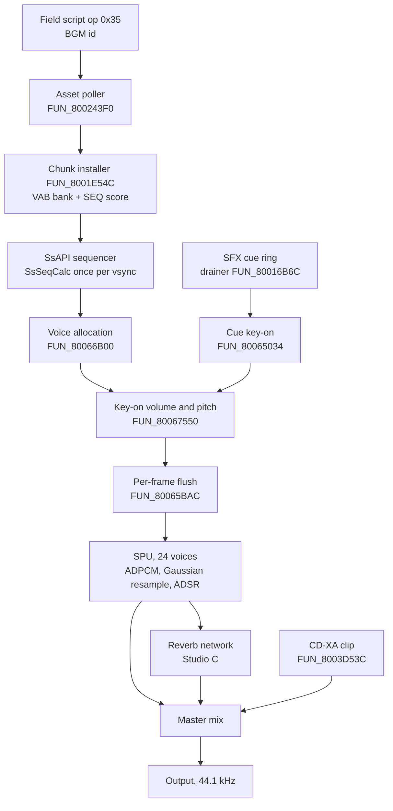
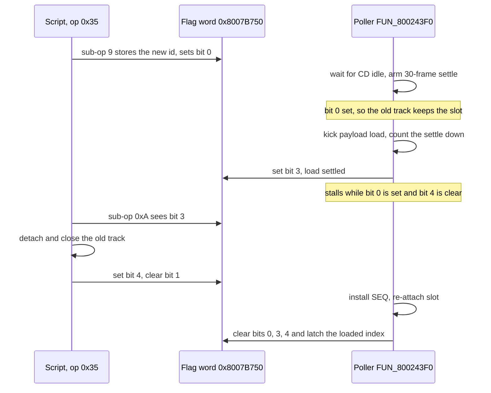
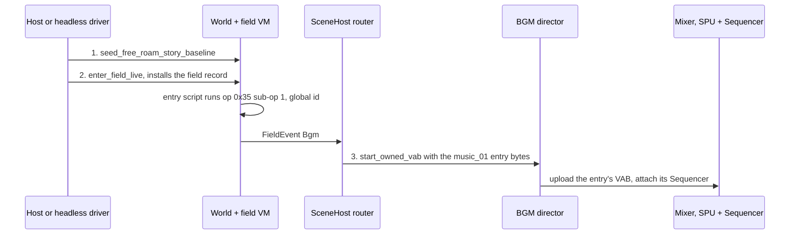

# Audio

Everything that makes sound: music, sound effects, character voice, and the
streamed CD audio under cutscenes. Retail drives all of it through Sony's PsyQ
sound libraries, statically linked into `SCUS_942.54`: **libsnd / SsAPI** (the
sequencer that plays `.SEQ` scores against VAB instrument banks) on top of
**libspu** (the driver for the SPU, the PlayStation's 24-voice sample chip).
This page covers how the game picks and swaps a track, how a note or a cue
becomes a keyed SPU voice, where voice clips come from, and how the Rust port
reproduces and measures each step.

The port plays all of it on both hosts (native window and browser page): scene
and battle music, cutscene track swaps, field and battle sound effects, arts
shouts, cast voices, victory lines and movie audio, through a from-scratch SPU
and sequencer in `crates/engine-audio`. Byte-level formats live on their own
pages - [SEQ](../formats/seq.md), [VAB](../formats/vab.md),
[XA](../formats/xa.md), [SFX descriptors](../formats/sfx-table.md),
[`bse.dat`](../formats/bse-dat.md) - and are linked, not repeated, here.

## The stack at a glance



| Layer | Retail | Port |
|---|---|---|
| Track selection | Field-VM op `0x35` writes `_DAT_8007BAC8`; `FUN_800243F0` resolves and swaps | `SceneHost::route_bgm_events` into `AudioBgmDirector` (`crates/engine-session`) |
| Bank + score install | `FUN_8001FC00` stream, `FUN_8001E54C` chunk walk, `SsVabOpenHead` | `chunk_install::owned_bank_offsets`, `VabBank::upload`, `spu_layout` |
| Sequencer | libsnd `SsSeqCalc` tier, `0x80061-0x80067` | `Sequencer`, with `seq_calc` / `seq_events` as instruction-level reference kernels |
| Voice allocation | `FUN_80066B00` + flush `FUN_80065BAC` | `Sequencer::alloc_voice`, `flush_key_ons` |
| SPU | hardware under libspu, `0x80068-0x8006D` | `spu::Spu` (voices, ADSR, ADPCM, Gaussian, reverb) |
| Sound effects | four-slot cue ring, static table + runtime bank | `SfxScheduler`, `SfxBank`, `BgmTail`, `SfxBankResidency` |
| Voice clips | CD-XA one-shots through `FUN_8003D53C` | `XaClipBank`, `ArtsShoutBank`, mixed beside the SPU output |
| Sound state | `_DAT_8007B750` flag word, timed release `FUN_800267FC` | `AudioState` (`engine-core::world`), `sound_state` (`crates/engine-system`) |
| Output | SPU DAC | `AudioOut` (cpal) and `WebAudioOut`, one `StreamResampler` core |
| Parity | - | `legaia_parity::audio_trace_oracle`, `mednafen-state spu`, key-on census |

Three facts that catch people out:

- **Legaia's SEQ is not stock PsyQ SEQ.** The version field is a u32 BE, and
  meta events carry no MIDI `length` byte: `0xFF 0x51` is followed directly by
  three tempo bytes. Reading a phantom length byte drops the first-body tempo
  override and plays ~3x fast against the 240 BPM placeholder header. See
  [`formats/seq.md`](../formats/seq.md).
- **A score sits at a non-zero offset in its entry.** A music entry is a chunk
  stream, `[chunk0 hdr][VAB header][chunk1 hdr][VAG bodies][chunk hdr][SEQ]`.
  Walk the chunk list (`chunk_install::seq_chunk_offset`,
  `SceneAssets::bgm_seq_offset`); do not probe fixed offsets.
- **Every real music track is a global-pool id.** Scenes carry no score of
  their own; the scene's script picks an id `>= 2000` out of the `music_01`
  bank ([below](#which-track-a-scene-plays)).

The per-scene `.dpk` / `sound_data2` pack decodes as a
[VAB + SEQ bundle](../formats/sound-driver.md#the-dpk--sound_data2-payload-is-a-vab--seq-bundle);
the `.MAP` / `.PCH` / `.spk` / `.pac` PsyQ intermediates are not present as
separate retail chunks.

## Contents

- **Loading**: [path strings](#path-string-cluster) · [SCUS consumers](#scus-consumers) · [VAB banks](#vab-sound-banks) · [VAB slots](#vab-slots---one-installer-twelve-records) · [monster bank](#monster-sound-bank---hmpackmonstersnd) · [file-API leaves](#file-api-leaf-cluster)
- **Music**: [BGM dispatch](#bgm-dispatch) · [which track a scene plays](#which-track-a-scene-plays) · [swap handshake](#the-track-swap-handshake-fun_800243f0--op-0x35-sub-op-0xa) · [stop / pause / replay](#the-control-words-stop-pause-replay) · [movies](#movies-and-the-score) · [cold scene entry](#the-cold-scene-entry-sequence-and-what-each-missing-step-sounds-like) · [battle track](#the-battle-sound-set-picks-the-fights-track) · [`music_01` bank](#global-pool-bgm-the-music_01-bank)
- **libsnd**: [SsAPI sequencer](#ssapi-sequencer-0x80061-0x80067-cluster) · [tempo](#where-wall-clock-tempo-becomes-an-integer-tick-step) · [event decode](#the-decoder-does-not-consume-a-whole-event) · [key-on pitch law](#the-key-on-pitch-law---note-against-the-tones-center) · [voice allocator](#voice-allocator--key-onoff-flush-the-middle-tier)
- **libspu**: [SPU control](#libspu--spu-control-0x80068-0x8006d-cluster) · [DMA transfer engine](#spu-dma-transfer-engine) · [reverb](#reverb-model-engine-audio) · [Gaussian resampler](#voice-resampler---4-point-gaussian-interpolation-engine-audio) · [seq-management layer](#ssapi-seq-management-layer-above-libspu)
- **Port**: [Sequencer](#engine-audio-model---sequencer-port) · [SPU](#engine-audio-model---from-scratch-spu-port) · [SFX bank + scheduler](#sfx-bank--scheduler) · [XA-ADPCM](#xa-adpcm)
- **Voice**: [arts shout](#battle-arts-voice-shout-path-engine) · [animation cue track](#the-second-shout-trigger---the-animation-cue-track-fun_800508dc) · [XA dispatchers and census](#cd-xa-voice-clip-dispatchers-and-static-cue-census) · [a normal attack](#what-a-normal-attack-sounds-like)
- **Measurement**: [audio-trace parity oracle](#audio-trace-parity-oracle) · [open items](#open-items)

## Path-string cluster

The string cluster at `0x8007B380` holds the file extensions the sound subsystem appends to scene-asset paths. Full layout in [`formats/sound-driver.md`](../formats/sound-driver.md). Eight extensions in the cluster: `.spk`, `.LZS`, `.dpk`, `.MAP`, `.PCH`, `.pac`, `STR`, `bse.dat` (the battle SFX descriptor bank, [`bse-dat.md`](../formats/bse-dat.md)).

## SCUS consumers

| Function | Role |
|---|---|
| `FUN_8001FA88` | **Battle sound-bank / `.dpk` loader.** Loads `bse.dat` (the battle occupant of the `>= 0x200` SFX descriptor bank - called only from battle init `FUN_800513F0`, not at boot), then per-scene `.dpk` from `h:\main\bg\domepack\…`. |
| `FUN_8001FC00` | **Streaming-asset loader.** Builds paths under the `sound\` prefix; the XA / `.pac` / `STR` consumer. |

`FUN_8001EBEC` is not a third sound consumer: it is the graphics-side character-TMD equipment-conditional group-transform swap (it reads `DAT_8007C018[_DAT_8007B824 + 0..2]`, the loaded battle-character TMD pointers) - see [`formats/sound-driver.md`](../formats/sound-driver.md#consumers) and [`formats/character-mesh.md`](../formats/character-mesh.md#10-group-cap--equipment-conditional-swap).

Both `FUN_8001FA88` and `FUN_8001FC00` carry a dev/retail split via `_DAT_8007B8C2`. The **retail** branch (`!= 0`, the value retail boots with) loads via PROT indices directly. The **dev** branch (`== 0`) opens an `h:\` path through `FUN_8003E6BC`, which is a plain host-trap wrapper - `strcpy`, then `FUN_800608F0` (`break 0x103`), then fseek/fread/fclose. It performs no name resolution of any kind, and the paths it opens do not exist on the disc, so retail never takes it. Note the opening gate in both functions is the unrelated word `_DAT_8007B868`; they reach `_DAT_8007B8C2` further into the body.

## VAB sound banks

Sony's standard `VABp`-magic instrument bank format. Documented at [`formats/vab.md`](../formats/vab.md). The dominant on-disc carrier is the [scene-VAB-prefixed streaming](../formats/scene-bundles.md) shape - the VAB body is preceded by a 4-byte chunk0 header. Implementation: `crates/vab` (header parser + extractor + ADPCM decoder).

Bulk scan finds 1191 `VABp` headers across 239 PROT entries. Multi-bank archives at `0889_sound_data2`, `0890_sound_data2`, `0891_level_up`. The `vab_01` cluster (CDNAME indices 1072–1194) is the standard distributed-bank layout.

## Per-actor sound effects

`FUN_800250D4(sound_id, voice)` is the per-actor SFX trigger called from the actor tick (`FUN_80021DF4`) when `actor[+0xb4] != 0` (one-shot pulse) or `actor[+0xac]` is staged (continuous). It looks up a sound entry at `&DAT_8006F198 + sound_id*8` for `sound_id < 0x200`, or in the runtime-allocated table at `_DAT_8007B8D0` for higher IDs (the `.dpk` consumer's bank). The entry's `byte[3] & 0x1F` is the voice count; the helper then calls `FUN_800653C8` (libSPU `SpuKeyOn`-equivalent) for each of `voice..voice+count-1`.

`actor[+0xac]` (sound ID) and `actor[+0xb0]` (voice) are written by move-VM and field-VM opcodes; the move-VM tick in `FUN_80021DF4` re-fires the SFX whenever the trigger flag at `actor[+0xb4]` is set.

The static `&DAT_8006F198` table is **100 8-byte descriptors** (sound ids `0x00..=0x63`); the `< 0x200` runtime check is a bound, not the size (id `0x64` onward is the `\PSX.EXE` dev-path rodata). Besides `FUN_800250D4` above, the cue-ring drainer `FUN_80016B6C` reads it and programs each voice via `FUN_80065034` (the libsnd `SpuSetVoiceAttr` analogue). Each entry decodes as `[+0 program][+1 tone/region base][+2 note-level][+3 voice-count + sustained bit 0x20][+4 channel]`; full layout + provenance on [`docs/formats/sfx-table.md`](../formats/sfx-table.md). Parser `legaia_asset::sfx_table` (disc-decoded, byte-exact vs live save-state RAM); the SPU programming itself is libsnd, outside the port boundary.

## VAB slots - one installer, twelve records

Every bank retail opens goes through one installer, and its argument is the same
category byte the SFX descriptors carry. `FUN_8001FC00(raw_toc_index, category,
buf, append, len)` streams the entry into a staging buffer; **`FUN_8001E54C(category,
buf, len)`** then walks the streamed chunk list and installs it, taking the
header buffer from the 12-byte mixer record at `0x80091508 + category*12` (`+0`)
and the VAB slot from that record's `+8`, and opening the bank through
`FUN_8002630C` → `SsVabOpenHead` (sticky, at the SPU address the per-slot table
at `0x800917B0` holds) → `SsVabTransBody`. So every call site's
`FUN_8001FC00` / `FUN_8001E54C` pair names one `(PROT entry, slot)` binding
outright.

The same walk installs the stream's **score**: a type-`2` chunk is copied into
the slot's staging buffer and opened with `SsSeqOpen` (`FUN_80026410` on the
SEQ record `0x8007051C + slot * 0x10`), after the slot's previous sequence is
detached and closed (`FUN_800266E0` / `FUN_80026520`). On the disc every
entry that carries a `pQES` score past offset 0 carries it as a type-`2`
chunk - chunk order `(0, 1, 2)`, or `(0, 2, 1)` where the score precedes the
VAG bodies. The engine's scene loader finds a stream's score the same way,
walking the list with the port (`legaia_engine_core::chunk_install::seq_chunk_offset`)
rather than searching the bytes for the magic.

| Slot | Bank | Installed by |
|---|---|---|
| `0` | PROT 0868 system bank | resident |
| `1` | the current BGM bank (`music_01`, variable) | `FUN_800243F0` |
| `2` | PROT 0869 class-2 bank (`0875` alternate); a minigame's own bank in fishing / slot machine / dance | `FUN_800520F0`, `FUN_801CF00C`, the minigame overlay inits |
| `3` | a `vab_01` side-band bank (variable) | `FUN_800243F0`, from `_DAT_8007BABC` |
| `6` | PROT 0876 field bank | field init `FUN_801D6704` |
| `7` / `8` | the two `monster.snd` banks | `FUN_8003E104` (below) |
| `11` | PROT 0889 reward bank | `FUN_8004E568` |

The record initialiser `FUN_8001D424` writes `+8 = record index` for all 16
records, then assigns their header buffers from one base with four pairs sharing
one - and `FUN_800265E8` gives those same pairs one SPU base. Slot 6 and slot 2
are therefore the same physical bank in two modes, which is why retail needs no
extra SPU room for the field cues: the field init loads PROT 0876 into slot 6
and the battle mode init closes it before the battle loader fills slot 2
([per mode](../formats/sfx-table.md#one-region-per-mode-slot-2-and-slot-6)). Slot sizes, the SPU map and the structural
checks behind each pin: [`formats/sfx-table.md`](../formats/sfx-table.md#which-prot-entry-reaches-which-slot).

The seeder and the reader are ported at opposite ends and never meet:
`legaia_engine_core::scus_leaf_kernels::seed_boot_offset_table` writes the
twelve-word image and `legaia_asset::sfx_table::spu_base_for_slot` answers the
query the engine's audio host actually makes, returning the same values as
literals. `crates/engine-core/tests/infra_boot_offset_table.rs` asserts the two
agree slot by slot, including the one slot the seeder skips and the four
aliased pairs, so the duplication is guarded rather than silent.

## Monster sound bank - `h:\mpack\monster.snd`

Battle-time monster sound banks live in a single packed `monster.snd` file. The loader is `FUN_8003E104(monster_idx, slot, dst_buf)` - called twice from the battle scene loader `FUN_800520F0` (slots 7 and 8, for the active battle's two monster sound banks). It reads the file's per-monster TOC at `0x801C8980 - 0x10` (4-byte stride, paired entries giving `[start_lba, end_lba+1]`), computes the LBA range, and dispatches:

The gate is `beq v0,zero,0x8003E25C` at `0x8003E1FC`, so the **zero** arm is the one that jumps to the path-based open:

- **Dev path** (`_DAT_8007B8C2 == 0`) - `0x8003E25C` onward, using the host-trap file API: `FUN_800608F0` (`break 0x103`) → `FUN_80060920` (fseek to record × 0x800) → `FUN_80060944` (fread) → `FUN_80060910` (fclose). Path string: `h:\mpack\monster.snd`.
- **Retail path** (`_DAT_8007B8C2 != 0`, the fall-through) - runs `FUN_8003EE7C` / `FUN_8003ED04`, stages `(size, dst)` into the gp window at `+0x97c` / `+0x894`, kicks the async CD read via `FUN_8003F128`. Sets a 120-frame timeout at `+0x91c`.

### Hero victory voices - the tail clips of `monster.snd`

`monster.snd`'s TOC (count word `0xCE` at file offset `+4`, then sector offsets) indexes more than the per-monster banks: its **tail clips carry the party's victory-pose voice lines**, streamed by the same `FUN_8003E104` at results time - which is why these vocals survive any sweep of the `XA/` CD-audio files. Runtime-confirmed via recomp CD-sector capture: a forced weak victory reads exactly the selected clip's sectors at pose time.

Selection, all in the results sequencer `FUN_8004E568` (see `ghidra/scripts/funcs/8004e568.txt`):

1. **Pose tier** from the pose actor's HP: `cur >= 3/4·max` → tier 0, `>= 1/2` → 1, `>= 1/4` → 2, below → 3; any status in mask `0x107B` at `+0x16E` forces tier 4. Tiers 2-3 roll into the weak arm with probability 1/2 and 3/4.
2. **Pose action id** (`0x11..=0x18`) from the per-character 6-byte table at SCUS `0x800788A0`: columns 0-1 the healthy pair, 2-3 the alternate pair, 4-5 the weak pair. Action id − `0x11` = the entry index in the character's base "ME" win-pose archive (readef slot `3·char + 2`); the weak entries 4/5 are the near-static breathing streams the sequencer **loops**, the others play one-shot.
3. **Voice clip byte** at SCUS `0x80078867 + action + char_id·8` (clip = byte − 1), fed to `FUN_8003E104(clip, 7, dst)`. Per-character clip bands: Vahn `0xB8..=0xBC`, Gala `0xBD..=0xC3`, Noa `0xC4..=0xCB`, fourth-slot `0xCC` (constant row).

The `gp+0x9F4`-keyed bark jukebox inside the same function (ids `0x19F`-`0x1AF` → `XA20`/`XA21`/`XA22`) is a **different, special-sequence path**: in captured ordinary victories `gp+0x9F4` is never written and no XA plays at pose time.

## BGM dispatch

The field VM's opcode `0x35` writes the BGM ID to `_DAT_8007BAC8`. `FUN_800243F0` (the per-frame asset poller) resolves it to a PROT index - `bgm_id >= 2000` is the global pool, and `bgm_id < 2000` is a scene-local id that retail answers with a fallback track ([below](#a-scene-local-id-loads-a-fallback-track-not-a-scene-bank)). There's no literal BGM table.

See [`subsystems/script-vm.md`](script-vm.md) → "BGM lookup table" for the resolver code. For the human-readable map between each track's debug sound-test ID, the scene it plays in, and its official OST title, see [`reference/music-tracks.md`](../reference/music-tracks.md).

### Resolver arithmetic

`FUN_800243F0` reads the id at `_DAT_8007BAC8` and branches on `slti … 0x7d0`:

| Branch | Resolved PROT index | Globals |
|---|---|---|
| `bgm_id < 2000` (scene-local) | stored: `*(0x80084540) + 6 + bgm_id`; loaded: `*(0x8007BC64) + 2` | `0x80084540` = scene block base |
| `bgm_id >= 2000` (global pool) | `*(0x8007BC64) + (bgm_id - 2000)` | `0x8007BC64` = `music_01` bank base |
| `bgm_id == 0x1000` | none - the load is suppressed | see below |

The result is stored to `0x8007BAB8` and compared against the currently-loaded
index at `0x8007BA9C`, so a re-select of the playing track is a no-op. Both
laws are readable at runtime: on a running retail image `0x8007BC64` holds
`990` - the **raw** in-RAM TOC pool base. Extraction-frame indices run two
below raw (the +2 filename skew, see [`../formats/cdname.md`](../formats/cdname.md)),
so the bank's low range sits at extraction `988`; the engine maps a sound-test
index to its extraction entry through the piecewise
`legaia_engine_core::music_labels::prot_entry_for_bgm_id` (a 2-entry gap at
extraction `1056`/`1057` splits it, see [`../reference/music-tracks.md`](../reference/music-tracks.md)).

#### A scene-local id loads a fallback track, not a scene bank

The scene-local row forms two different indexes. The one stored to
`_DAT_8007BAB8` (`0x80024458`) is the scene block's `*(0x80084540) + 6 + id`,
and it only drives the change test. The one handed to the loader is
overwritten: the arm at `0x800245A4..0x800245BC` (`slti v0,v1,0x7d0` /
`beq v0,zero,0x800245C0` with `move s1,a0` in the delay slot) sets
`s1 = *(0x8007BC64) + 2` for an id below 2000 and parks the id in `gp+0x728`,
whose only reader is the `WARNING BGM NO %d` debug print (`0x800164EC`, format
string at `0x8001010C`). `s1` is what the stage-1 arm loads into category 1
(`move a0,s1` / `li a1,0x1` at `0x80024668`). With `0x8007BC64 = 990`
(twelve of twelve catalogued mednafen states sampled), that is raw `992` =
extraction `990` = global slot `2` - the track id `2002` plays. The side-band
resolver's scene-local arms end the same way (`vab_01 + 2`,
[`sfx-table.md`](../formats/sfx-table.md#the-side-band-bank-a-field-script-selects)).

So retail has no scene-local bank and stages no scene bank at all: the field
initialiser's only bank loads are slot 6 (PROT 0876) and the ending arm below,
and the one BGM slot changes only when the resolved track does. Only `teien`
among the field scenes has a VAB-bearing entry in its block. Both play hosts
match: they stage no scene bank, and `SceneHost::route_bgm_events` plays a
scene-local id through the owned-VAB path on
`SCENE_LOCAL_BGM_FALLBACK_ID`'s entry, keeping the id itself for the
directors' same-track test (as retail's change test keeps its own index);
`engine-core/tests/global_bgm_owned_vab_disc.rs` pins it. The disc-wide
op-`0x35` census has no scene-local start, so no shipped script takes the arm.

#### `0x1000` is a park sentinel, not a track

`4096` is outside the `2000..=2077` pool and resolves to no entry, and the
resolver never tries: at `0x8002454C` it loads `_DAT_8007BAC8`, compares it
against `li v0, 0x1000`, and on equality falls into `0x80024560`, which copies
the pending index `_DAT_8007BAB8` straight onto the loaded-index barrier
`_DAT_8007BA9C`. The equality test four instructions later then reads them as
equal and skips the whole load. So the id means **leave this slot parked**,
and it is the shared sentinel of *both* streaming slots: the block at
`0x800244C0` applies the same `0x1000` test to the second slot's id
`_DAT_8007BABC`, copying it onto its own barrier `_DAT_8007BAA0`.

Across the catalogued mednafen corpus the sentinel appears only in the ending
states - three carry it on the BGM slot and three on the second slot - which
is where a save would be parked with no field track owed. Every other state
carries a `2000..=2068` id. A state's *scene* still does not decide this; the
globals do.

The port routes a sentinel start to no director - there is nothing to play -
so a director's last start cannot stand in for the word. The host keeps the
word itself: `SceneHost::bgm_track_word` takes every sub-op `1` / `9` id as
the start arm stores it, the sentinel included, and is what the retail
comparison corpus compares against a state's `0x8007BAC8`
(`engine-core/tests/bgm_track_word_disc.rs`).

### Which track a scene plays

The track is **script-selected, not table-driven**: nothing maps a scene to a
track. The scene's own event script picks it with an op-`0x35` operand, so the
resolution is recovered by running the scene's prescript and observing the
emitted id - `crates/engine-shell/tests/bgm_scene_resolution.rs` does this
across the CDNAME corpus.

The law that sweep establishes: **every scene that starts BGM selects a
global-pool id.** The scene-local branch of the resolver is never taken by a
field scene, and a scene's own `scene_vab_stream`-wrapped SEQ
(`SceneAssets::seq_in_stream_entries`) is *not* its music source. Attempts to
identify a playing track by fingerprinting it against the bank fail for this
reason - the scene-local corpus they search is the wrong one.

A linear disassembly walk over a scene's event records is **not** a substitute
for running the prescript: it decodes data bytes as instructions and yields
implausible ids (values far outside the `2000..=2077` band) mixed in with the
real ones.

**The sweep sees a scene's entry track and nothing else.** A prescript emits
op `0x35` sub-op 1; a scene's *cutscenes* change music with sub-op 9, from
partition-2 timeline records the sweep never reaches. So "which track does
scene X play" has more than one answer per scene, and a defect confined to
the sub-op 9 path is invisible here - see
[`script-vm.md`](script-vm.md#sub-op-9-is-a-start-not-a-queue).

### The track-swap handshake (`FUN_800243F0` + op-`0x35` sub-op `0xA`)

The resolver above is one stage of a staged swap protocol. `FUN_800243F0`
runs a stage counter at `gp+0x744` through a 7-entry jump table
(`0x800108C8`), entered only while `_DAT_8007BAB8 != _DAT_8007BA9C` (a track
change is in flight). The stages: wait for CD idle and arm a 30-frame settle
delay (`gp+0x768 = 0x1E`); tear down + close the BGM slot `0x8007052C`
(`FUN_800266E0` + `FUN_80026520`) **unless** `_DAT_8007B750` bit 0 is set,
then kick the async payload load (`FUN_8001FC00`); count the settle delay
down; install the SEQ (`FUN_8001E54C`); re-attach the slot
(`FUN_80026478`) **unless** bit 1 (pause) is set; latch
`_DAT_8007BA9C = _DAT_8007BAB8`.

A script-owned swap (sub-op 9, committed by sub-op `0xA`), using the flag bits
tabulated below:



The sound flag word `_DAT_8007B750` coordinates it with the script. The full
writer census (SCUS + every based overlay image; store-offset scan, see
[`../tooling/address-reference-scan.md`](../tooling/address-reference-scan.md)):

| Bit | Meaning | Set by | Cleared by |
|---|---|---|---|
| 0 | script-owned start pending (defer the slot teardown to the script) | sub-op 9 (`0x801E0260`) | poller commit (`0x8002472C` clears 0/3/4), scene entry `FUN_8003AEB0` |
| 1 | BGM slot paused / detached | sub-op 2 (`0x801E0150`), sub-op 3 (`0x801E0174`), dance overlay `0x801CF328` | sub-op 1, sub-op 4, sub-op `0xA`, scene entry, game-over `FUN_8003C7EC` |
| 2 | keep the audio across the next field init: the per-scene initializer skips its BGM level ramp (`FUN_80062004`, `0x78` ticks, test at `0x801D6A84`) and its key-off of voices `0x10..0x17` (test at `0x801D6B88`) while it is set | sub-op 6 (`0x801E01D8`) | field overlay `0x801D7348` |
| 3 | **load settled** - payload staged and the settle delay elapsed | the poller, one site only: `0x800246D0` (`\| 8`) | poller commit `0x8002472C` |
| 4 | **release-ack** - script has released the old slot occupant | sub-op `0xA` (`0x801E02B8`) | poller commit `0x8002472C` |

Bits 3 / 4 / 0 are the handshake: after setting bit 3 the poller **stalls**
(`0x800246E0..E8`) while bit 0 is set and bit 4 is not - i.e. when the swap
was started by sub-op 9, the old track keeps its slot until the *script*
commits. Sub-op `0xA` (arm `0x801E0264`) is that commit: it waits for bit 3,
releases the paused occupant (`FUN_800266E0` detach + `FUN_80026520` close -
the close is what the poller's own teardown also does; `FUN_80026520`
additionally clears the source's active flag and `SsSeqClose`s the handle
where `FUN_800266E0` only rewinds and detaches), then sets bit 4 and clears
bit 1. So a cutscene picks the exact beat the outgoing score dies on, and a
port that honours the sub-op 2 pause but drops the `0xA` commit leaves the
music paused after the cutscene. The arm's early-return when
`_DAT_8007B868 != 0` mirrors the whole actor-sound family (`FUN_800266E0` /
`FUN_80026520` / `FUN_80026478` all no-op behind the same gate): that word
has **no setter in SCUS or any based overlay** - its only store is a bit-1
clear in the boot mode-init `FUN_8001DCF8` - so it reads as the dev/dual-mode
flag it is everywhere else, zero in retail play.

Engine side: the host resolves BGM bytes synchronously, so bit 3's wait is
satisfied on arrival (the same reasoning as sub-op 9's barrier) and
`SceneHost::route_bgm_events` routes sub-op `0xA` straight to
`BgmDirector::unhalt_pause` - release the source only if the pause latch is
still set, then clear the latch unconditionally. `see
ghidra/scripts/funcs/800243f0.txt`, `800266e0.txt`, `80026520.txt`.

### The control words: stop, pause, replay

The op's arm table is `0x801CEE00` in the field overlay, indexed `sub - 1`
behind `sltiu 0xB`. The three control arms each set or clear pause bit 1 and
hand the BGM slot `0x8007052C` to one sound-source primitive, and what each
does to the sequence is read off the libsnd call under it:

| Sub-op | Arm | Primitive -> libsnd | What the sequence does |
|---|---|---|---|
| `2` | `0x801E0138`, sets bit 1 | `FUN_800266E0` -> `FUN_80064370` -> `FUN_800641EC` | **stop**: the channel's notes are killed now (`FUN_800684CC`), the read cursor goes back to the sequence start (`+0x4`), flag `0x4` is raised |
| `3` | `0x801E015C`, sets bit 1 | `FUN_80026740` -> `FUN_8006282C` -> `FUN_8006275C` | **pause**: flags `0x1` / `0x8` clear and `0x2` raised; the next calc (`FUN_80062F98`) keys the notes off through `FUN_800638D8`, and the cursor is left alone |
| `4` | `0x801E0180`, clears bit 1 | `FUN_80026478` -> `FUN_80062880(id, 1, 1)` -> `FUN_800628F0` | **replay**: `FUN_800628F0` resets the read cursor to the sequence start for every mode, then mode `1` raises the play flag |

So no script word resumes a track mid-phrase: the re-attach plays it again
from its first event. The engine's `BgmDirector::pause` (sub-ops `2` and `3`)
closes the sequencer gate, which keys off the attached sequencer's notes and
holds the playhead, and `BgmDirector::resume` (sub-op `4`) rewinds before it
reopens (`AudioOut::rewind_sequencer`, and the browser twin). The held
playhead is never heard through a script word - every way out of the pause
either replays from the top or replaces the track. A gate that only stopped
the clock held whatever was sounding for as long as it stayed shut - the
title theme's last note sustaining under the whole attract movie. `see
ghidra/scripts/funcs/800266e0.txt`, `80064370.txt`, `800641ec.txt`,
`8006282c.txt`, `8006275c.txt`, `80062880.txt`, `800628f0.txt`,
`80062f98.txt`.

Sub-op `3` is the pause and `4` the replay; the legacy labels have them the
other way round, and routing by those labels silences the score where retail
brings it back. The battle and minigame restores that stop the score when no
field track was playing raise the engine's own word,
`BGM_SUB_OP_ENGINE_STOP`, which retail's bounds test would dispatch nowhere.

### Movies and the score

Retail's movie path never touches the sequencer. Master mode `0x1A`'s entry
`FUN_80025FB4`, the dispatch `FUN_801CEA3C`, the play loop `FUN_801CF098` and
the main loop's mode-change arm (`FUN_80015E90` at `0x800161B8..0x80016200`,
with the pass `FUN_80016230` it calls) issue no BGM-slot call and no `SsSeq*`
call; the play loop's only sound calls open and close the SPU CD input
(`FUN_800643C4`, `FUN_80062A0C`). The sequencer is clocked from the
root-counter callback (the word at `0x8007A910` names `FUN_80062F98`), not
from the main loop. So **a movie inherits whatever state the script left**:
each of the nine `0x4C 0xE2` movie triggers is preceded by its own op-`0x35`
words - a pause, a commit, a flag set, or nothing.

**A running score plays on under the movie** (`capture`). The probe
`scripts/pcsx-redux/autorun_movie_bgm_audibility.lua` makes the trigger op's
two stores (`sh fmv_id -> 0x8007BA78`, `sh 0x1A -> 0x8007B83C`, handler
`0x801E30E4..0x801E3104` in PROT 0897) from a field state whose score is
sounding and samples the SPU every ten vsyncs while the movie is on screen. A
sounding voice is one with a non-zero envelope level and a non-zero channel
volume.

| Scene (state) | Samples with a sounding voice | Samples with a fresh key-on (envelope `>= 0x7000`) | Master volume | SPUCNT |
|---|---|---|---|---|
| `town01`, `fmv_id 1` (`town01_field_card_boot`) | 81 of 84 | 79 of 84 | `0x3FFF` throughout | `0xC081` |
| `chitei2`, `fmv_id 3` (`chitei2_field_card_boot`) | 83 of 84 | 79 of 84 | `0x3FFF` throughout | `0xC081` |

The BGM id at `0x8007BAC8` stays the scene's own track throughout and the
screenshots beside the samples show movie frames: the sequencer keeps keying
notes and the SPU mixes them next to the CD input. The words these records run
first leave the score sounding - `town01` starts and commits a new track
(sub-ops 9, `0xA`) and sets flag bit 2 (sub-op 6); `deroa` and `chitei2` only
set bit 2, the flag the field initialiser reads to skip its BGM ramp and its
key-off of voices `0x10..0x17`.

**A stopped score stays silent under the movie** (`capture`):

| Run | Samples with a sounding voice, movie on | Before the movie |
|---|---|---|
| `town01`, sub-op 2 emulated, then `fmv_id 1` | 0 of 85 | voices `0..8` sounding until the call, none 10 vsyncs after |
| `town01`, `fmv_id 1`, same core, no call (control) | 74 of 85 | score voices sounding |
| `garmel`, organic, `fmv_id 2` | 0 of 90 | no score voice; only voices `0x13` / `0x14` (and briefly `0x16` / `0x17`) |

- **Sub-op 2** (`taiku`'s one word before its trigger) is the arm at
  `0x801E0138`: it raises `_DAT_8007B750` bit 1 and calls `FUN_800266E0` on
  the slot `0x8007052C`, whose `FUN_80064370` stops the sequence. The probe
  issues the same flag store and call from the field tick (`LEGAIA_CALL`,
  `LEGAIA_FLAGS_OR`), then the trigger's two stores. It runs on the
  interpreter core, where neither run nor control draws a movie frame within
  840 vsyncs, so the pair differs only in the call.
- **`garmel`** plays its own trigger record from `chapter2_garmel_post_zeto`
  (`LEGAIA_MASH_EVERY=30`; mode `0x1A` at vsync 2619, `fmv_id 2`). The score is
  already stopped in that state (`_DAT_8007B750` bit 1 set, track id `2043`);
  what sounds in the field are voices in the `0x10..0x17` band, which end
  before the switch. Its sub-op 7 (arm `0x801E01DC`) makes no sequencer call:
  it stores the operand, or `-1` for `0xFF`, to `_DAT_8007B880`. The field
  initialiser `FUN_801D6704` reads that word at `0x801D6B48` and, when it is
  not negative and a track is attached, calls `FUN_80062004` with `0xB4` - a
  level ramp on the next scene's entry.

`town0d` and `jouine` are not captured (`inference` from their script words).
`town0d`'s Songi record `P2[31]` runs `9` (`2034`), `5` (`120`), `0xA`, then a
long scene before `fmv_id 6`; `jouine`'s post-Cort record `P2[16]` runs `9`
(`2040`), `0xA`, `5` (`60`), then `9` (`2069`), a 60-frame wait, `0xA`, a
20-frame wait and `fmv_id 8`. In both the last word before the trigger is a
commit that attaches a fresh track (the timed release fades and stops the one
before it - [the timed release](#the-timed-release-is-a-scheduled-bgm-pause)),
the `town01` shape measured sounding above, so both movies play over the score.

**The title attract is the exception.** The attract underflow arm of the title
tick releases the slot - `FUN_800266E0` + `FUN_80026520` at `0x801DDD7C` /
`0x801DDD84`, behind the entry word `_DAT_8007BB00 != 0`, which the boot image
always raises - and the return runs `CARD INIT` (`FUN_8002574C`), which streams
the title theme again (raw TOC `0x41F` into category 1,
`0x800258CC..0x80025934`) and re-attaches the slot (`0x80025948`). The theme
restarts from its first beat. The load route's `LaunchFade` arm releases the
slot the same way (`0x801DFB74`) before master mode 2 brings the field up.

**Port.** Both hosts decode a movie's XA onto the mixer the BGM plays through,
so the layering is one engine-side policy
(`legaia_engine_core::movie_audio::MovieScore`) the native window and the
browser page both consult:

- The attract stops the score when it is armed and restarts the title theme
  when it ends, played or not - the retail release and `CARD INIT` pair.
- A cutscene movie leaves the score alone, as retail does
  (`MovieScore::new`). The ducking policy (`MovieScore::ducking`) is the
  enhancement: a movie that stages an XA track ducks the score by closing the
  sequencer gate, but only if the gate is open. A track the script already
  paused is not claimed, so the movie's end does not reopen it.
- A movie with no audio track (an extracted-root boot, a cut slot, a page
  that never installed it) touches nothing.
- Every way a movie ends - played out, skipped, never installed, dropped -
  runs the same end, which reopens the gate only if this movie closed it.

The gate is the directors' only pause latch on both hosts, so the duck and
the op-`0x35` pause arms read and write one bit.

### Entry-script pauses and free-roam picker staging

A scene's entry script can start its track and immediately pause it for a
story moment: town01's `P1[0]` starts global id 2016 then, while system flag
`0x225` is clear, issues a sub-op 2 pause (`+0x5D..+0x91` of the record) -
the opening's silent dawn, repaired by the opening cutscene records' own
sub-op 9 restarts (`35 E7 07 09`, `35 E0 07 09` + sub-`0xA` commits in the
same MAN). The retail s3 free-roam capture confirms both halves: flag `0x225`
still clear, pause bit `_DAT_8007B750` bit 1 clear.

A scene-picker / `--scene` entry runs the entry script with none of that
choreography behind it, so the authored pause would park the BGM forever
("the music dies a second into the scene"). The engine's free-roam staging
(`World::seed_free_roam_story_baseline`) drops a sub-op 2 issued inside the
scene-entry window on picker entries only; the new-game chain keeps the
authored pause. The same staging seeds story-twin scenery flags (e.g.
`town0c`'s blown gate). Disc pins: `engine-core/tests/free_roam_staging_disc.rs`.

A twin's flags pick its **track** too. `town0b` (Rim Elm under attack) is
reached only through `MV2.STR`'s hand-off, after `town01`'s attack timeline
(`P2[25]`) raised `0x147` and left `0x141` clear. Its entry script opens on
the Rim Elm theme (`35 E0 07 01`, 2016) and then, on exactly that pair,
takes the attack arm (`P1[0]` `+0xF3`): the attack theme `35 DA 07 01`
(2010) over the subtractive night grade `34 01 30 30 00 14`. Every retail
`town0b` state holds `0x8007BAC8 = 2010`; a picker entry with neither flag
staged takes the other arm and plays 2016, so the staging seeds `0x147`.

#### The cold scene-entry sequence, and what each missing step sounds like

Anything that drops the engine into a scene from cold - both playable hosts
and every headless driver - owes the same three steps in order, because each
one is separately load-bearing for whether music sounds:

| Step | Kernel | Skipping it |
|---|---|---|
| 1. Free-roam story staging | `World::seed_free_roam_story_baseline` | The entry script's authored pause parks the track: a sequencer attaches on the first frame and its playhead never leaves tick 0. |
| 2. Live field entry | `BootSession::enter_field_live` (browser: the same pair in `runtime.rs`) | `load_scene` alone installs no field record, so the field VM steps nothing and op `0x35` never executes. |
| 3. Global-pool start hook | `BgmDirector::start_owned_vab` | Every real music cue is a global id, so a director that leaves this on the trait's no-op default plays nothing while looking fully wired. |



All three failures read identically from outside - silence - which is why a
driver missing any one of them reports as "the engine starts no BGM on scene
entry".

**Battle↔Field swap.** The port reuses the same dispatch: `World::set_battle_bgm`
configures a battle track id, the live gameplay loop queues an ordinary
`FieldEvent::Bgm{sub_op: 1}` start for it on encounter (`swap_to_battle_bgm`)
and resumes the stashed field track on battle end (`restore_field_bgm`). Both
transitions run through the host's `AudioBgmDirector` `start_inner` path - no
separate battle-audio code path. The battle id resolves like any op-`0x35` id
(`music_bank_entry_bytes` → `start_owned_vab`). The shipped default is the
global id `2026` (`music_labels::BATTLE_THEME_1_BGM_ID`, retail's
`battle_id == 0` bundle `0x36F` = extraction 877 = sound-test #26), installed
by `LiveLoopOpts::playable()` so both hosts swap without per-scene
configuration.

#### The battle sound set picks the fight's track

Which track a fight plays is the field script's choice, not the formation's.
Op `0x35` sub-op `7` stores `_DAT_8007B880` - its operand, or `-1` for an
operand byte of `0xFF` (`0x801E01DC..0x801E0208`) - and the scene map-init
`FUN_8003AEB0` zeroes it on every entry (`0x8003B4F8`). The battle intro
`FUN_801CF5BC` reads it: phase 2 loads battle bundle `0x36F + N` for `N >= 0`
(`0x370` for `N = 0` when `DAT_8007B64B` is set) and nothing for `-1`, and the
completion arm stops the field voice and starts the battle sequence only for
`N >= 0`. So a `-1` fight - Gaza on `korb3`, the first Nivora duel - plays
through on the boss theme the event started with sub-op `9` just before, and
the track word `0x8007BAC8` names that theme for the whole fight. The arm also
zeroes the set after the fight whose first monster is `0xA6`.

Each bundle of the battle bank (extraction `877 + N`) carries a byte-identical
copy of one `music_01` score: `0..9` = `2026`, `2027`, `2028`, `2030`, `2032`,
`2031`, `2051`, `2067`, `2061`, `2073` (`music_labels::BATTLE_BANK_BGM_IDS`,
pinned by `engine-core/tests/battle_bank_bgm_disc.rs`); the evolved-Cort fight
selects `8`. `World::swap_to_battle_bgm` follows the set: no swap and no stash
for `-1`, the bank's track for `N > 0`, the configured theme for `0`.

A direct entry into a scripted row (`play-window --battle <row>`, the retail
comparison corpus's battle seed) runs the fight without the record that
picks its music, so it replays the record's op-`0x35` words through the
field VM's own handler (`World::replay_scripted_battle_score`): the last
track start before the record's `3E FF <row>` with the control words after
it, then the last sound-set selection
(`man_field_scripts::walk_battle_entry_scores`). The Gaza, first-Nivora and
evolved-Cort fights then play their event's theme instead of the scene
entry's track and the default battle theme.

**Track changes are hard cuts.** Retail BGM changes cut (or run a short
`SsSeqSetVol` ramp), so `start_inner` calls `AudioOut::swap_bgm` when a track
is already playing: it keys off the outgoing sequencer - its notes release
through their own ADSR envelopes, so nothing cuts to a discontinuity - and
installs the new sequencer to tick from its first event that same instant.
Only a click-guard fade-in on the SPU master (a couple of frames) softens the
onset. `AudioOut::crossfade_to`, a symmetric fade-out-then-swap, remains for
callers that want one; BGM transitions do not use it, because it holds the
incoming intro near-silent for its first half-second.

### The timed release is a scheduled BGM pause

Op `0x35` sub-op `5` arms a deadline in vsyncs (`FUN_800267A8(0, operand)` at
`0x801E01B4`); the frame-begin driver's tick `FUN_800267FC` counts it down.
What the expiry does is read off its own arm: the record it releases is the
field-BGM slot `0x8007052C` (`addiu s0,v0,0x52c` at `0x80026828`), and the
arm is `FUN_800266E0`'s body inline - behind the same `_DAT_8007B868` gate,
`FUN_8002657C(0, slot)`, `FUN_80064370(slot[+0xA])`, then
`DAT_8007B708 = 0` (`0x80026834..0x8002686C`; see
`ghidra/scripts/funcs/800267fc.txt`). `FUN_800266E0` is sub-op `2`'s primitive,
so the expiry is the stop sub-op `2` issues, scheduled in advance. The port surfaces it
as exactly that: `World::tick` pushes a sub-op `2` BGM event on the expiry
frame, and `SceneHost::route_bgm_events` hands it to either host's director.
The raw expiry flag (`World::take_pending_sound_release`) stays for the mode
seat's own reader.

The arm half also starts the fade the stop finishes: `FUN_800267A8` hands the
slot's sequence handle (`lh 0x536` = slot `+0xA`), the audio level
`_DAT_8007B910` halved (`sll 15` / `sra 16`) and `deadline | 1` to
`FUN_80062004` (`0x800267E4`), the `SsSeqSetVol`-ramp shim. So sub-op `5`
fades the slot's occupant over the deadline and then stops it.

Which track that is depends on the swap window. A cutscene's commonest
music change is `9 · 5 · 0xA`: sub-op `9` raises sound-flag bit 0, the poller
keeps the **outgoing** track in the slot until the `0xA` commit
([above](#the-track-swap-handshake-fun_800243f0--op-0x35-sub-op-0xa)), and
the release fades that outgoing score out while the new one loads. Most
sub-op `9` starts on the disc are committed inside their own record, and a
large share of those run a sub-op `5` before the commit. The port starts the
incoming track at sub-op `9`, so it keeps retail's bit 0 as
`AudioState::start_pending_commit` (raised by sub-op `9`, ended by `0xA` and
by the scene load) and drops an expiry that lands inside the window: the
track it would release is already gone, and pausing the new score there would
leave every such cutscene - `korb3`'s Gaza event among them - silent from the
commit on. An expiry after the commit (`jouine`'s `9 · 0xA · 5`) stops the new
track, as retail's does.

### Sub-op 8 replays an empty record

Op `0x35` sub-op `8` is `FUN_80019898`, and it does not touch the field-BGM
slot. It hands the sound-source record at `0x8007057C` to `FUN_80026478`, which
- behind `_DAT_8007B438 == 0`, the dual-mode word and the record's `+8` active
halfword - replays the record's sequence once (`FUN_80062880(id, 1, 1)`, the
`SsSeqPlay` shape), raises `DAT_8007B708` and applies `_DAT_8007B910 >> 1` as
its level; `FUN_80019898` then sets that sequence's volume to
`(DAT_8007B6EC << 15) >> 16` through `FUN_80064890`
(see `ghidra/scripts/funcs/80019898.txt`, `80026478.txt`).

The record is a sibling of the field-BGM record `0x8007052C`: across the
mednafen state library (98 states) its `+0xA` sequence id is always the other
of the two ids `{1, 2}` the field-BGM record is not holding, and in 97 of the
98 the libsnd channel record that id names (`*(0x801CD2C0 + id * 4)`) carries
no stream - its start pointer is below RAM. The 98th has the record's `+8`
clear, where `FUN_80026478` returns before replaying anything. A five-form and
`gp`-relative scan finds no static reference to the record beyond
`FUN_80019898` itself. So in every captured state the op replays nothing
audible, and `BgmDirector::reattach_volume`'s default no-op is the faithful
director behaviour. `DAT_8007B6EC` reads `215` (`0xD7`, the cold audio level)
in 90 of those states, not the `-1` a boot-table reading gives it. The op is
issued eleven times on the disc, each right before a `49 08` state resume and
mostly next to a sub-op `2` pause or a sub-op `0xA` commit.

### Global-pool BGM: the `music_01` bank

Every real music track on the disc lives in the **`music_01` bank**, not in scene-local
slots - scenes carry no SEQ of their own (see
[`reference/music-tracks.md`](../reference/music-tracks.md) for the sound-test join). A
global-pool id (`>= 2000`) is `2000 + slot`, and a bank entry is normally one
self-contained `[VAB][SEQ]` pair - a DATA_FIELD chunk stream whose type-`0` chunk is the
`pBAV` header part, whose type-`1` chunk carries the VAG bodies and whose type-`2` chunk
is the `pQES` score, in `(0, 1, 2)` or `(0, 2, 1)` order. Not every slot is one: of the
81, slot `72` carries a score and no bank, slots `76..=79` are one-sector placeholder
fills, and slot `80` is a bank with no score, so those six have no pair to play
(`engine-core/tests/seq_chunk_walk_disc.rs`). The bank is **piecewise** in extraction
space (`988 + i` for index `i <= 67`, `990 + i` for `i >= 68`, a 2-entry gap at
`1056`/`1057`); `music_labels::prot_entry_for_bgm_id` owns that map. Playing one means
uploading **that entry's own VAB** into SPU RAM and driving the sequencer against it,
rather than the scene VAB the field path stages. Every owned-VAB staging
(`AudioBgmDirector`, which both play hosts run, and the audio-trace director) splits the entry with `engine-core::chunk_install::owned_bank_offsets` - the
installer walk's type-0 bank and type-2 score - rather than hunting it for the two magics;
the disc-gated test pins that the two readings agree on every slot, including which six
have no pair.

The site's minigame pages take exactly this path per game (`crates/web-viewer/src/minigames.rs`): `render_music01_bgm` / `render_music01_loop` split the pair, `VabBank::upload` the VAB, and render through the from-scratch `Spu` + `Sequencer` - the same components the live `AudioBgmDirector` uses. Minigame BGM sources are disc-pinned extraction constants (base-independent): the Baka Fighter init loads extraction 1043 (#55 `M112` "Sol disco fever"); the dance overlay loads extraction 1048/1054 (#60/#66, the Sol disco finals, mode-selected, see [`minigame-dance.md`](minigame-dance.md)); the slot machine and fishing/Muscle Dome start **no** track and inherit their host scene's op-`0x35` BGM. The `music01_bgm_render` WASM surface renders any bank slot for the dance's Sol-disco jukebox.

#### The ending theme: two entries on sound slot 10

One id does not play from a bank entry at all. The field initialiser `FUN_801D6704` (PROT 0897) special-cases `0x814` (`2068`, sound-test `#68` "Ending"), which `edteien` and `edbalden` start: while `_DAT_8007BAC8 == 0x814` and the one-shot latch `_DAT_8007B9B8` is clear (`0x801D71A0..0x801D7274`), it sets the latch, detaches and closes the BGM record `0x8007052C`, and stages the track on **sound slot 10** - the `0x80091508 + 10*12` table row and the `0x800705BC` sequence record:

1. `FUN_8001FC00(0x428, ..)` reads raw TOC `0x428` - extraction `1062`, one type-2 SEQ chunk (the "slot `72`" above that carries a score and no bank) - into the streaming buffer `*0x8007B85C`, and `FUN_8001E54C(10, ..)` installs it as slot 10's sequence.
2. `FUN_8001FC00(0x422, ..)` reads raw `0x422` - extraction `1056`, the gap's VAB-only bank (53 programs) - and the same walker opens its head as VAB `10` and sends the first part of the body. The body is larger than the `0x39800`-byte buffer and is a type-3 chunk, which ends the walk, so a second read in append mode and `FUN_8002630C(.., vab 10, 1, size)` send the rest. That split is the "two part".
3. `FUN_80026478(0x800705BC)` starts the sequence, and `_DAT_8007BA9C` takes `_DAT_8007BAB8`, so the ordinary resolver `FUN_800243F0` treats the track as loaded and never fetches it.

So the slot-10 load is not a sound-effect bank: it is the credits music. Raw `0x422` is also what the resolver's own law gives `2068` (`990 + 68`) - the instruments with no score - which is why the id needs the arm; `music_labels::prot_entry_for_bgm_id` sends `2068` to extraction `1058` instead, and the arm is the only field path that id takes.

The mednafen ending states confirm the staging (`ending_banner_mask_closed`, `ending_vignette_fullscreen`, `ending_panel_corner` in `edteien`; `ending_vignette_biron` in `edbylon`): slot 10's sequence record is open (`+8 = 1`, VAB id `+0xC = 10`) while the BGM record is closed, its sequence buffer holds extraction `1062`'s SEQ chunk byte for byte, VAB 10's SPU base is slot 0's (`0x800917B0[10] == 0x1010`), and the sounding voices start inside the region that bank was sent to. Every program change in the score names a program only `1056` defines. The credits then run on the park sentinel `0x1000`, so the track keeps playing across the vignette scenes.

The engine composes the pair into one owned-VAB stream (`mode_entry_init::two_part_bgm_stream`, score first) whenever `SceneHost::music_bank_entry_bytes` is asked for `0x814`, so both play hosts stage it through the path above; `engine-core/tests/credits_two_part_bgm_disc.rs` pins it. Where the bank lands is the next section.

#### Where the credits bank lands in SPU RAM

`FUN_8002630C` with `a3 = 0` opens a bank at its VAB id's fixed base (`jal
0x80068D34` with `a2 = 0x800917B0[vabid]`, `0x80026344..0x80026358`); with a
non-zero size it only sends more of the body (`0x80069230`). `FUN_800265E8`
seeds `0x800917B0[10]` with `0x1010`, slot 0's base (`sw v1,0x28(v0)` at
`0x80026668`). The ending arm opens the credits bank through the ordinary
walker as VAB 10 and sends the rest of its body with `FUN_8002630C(.., 10, 1,
size)` (`0x801D72A8`). So the bank is laid over the resident banks from
`0x1010` up; by its size (`0x631B0` bytes of bodies) it reaches `0x641C0`,
over the bases of slots 0, 1, 2 / 6 and 3 but short of slot 4 / 7's `0x65010`.
Nothing re-stages them inside the session: the latch `0x8007B9B8` keeps
`FUN_800243F0` off, and the only other store to it in a code image is a clear
in the debug menu overlay (PROT 0971, `0x801CE9B4`; `find-gp-relative-refs.py`
over SCUS and every PROT entry), so no BGM bank loads again in that session.

The play hosts split SPU RAM differently - a BGM region `0x1000..0x43000`
under a resident SFX region at the top - and the credits bank does not fit the
BGM region. Both hosts stage every track bank through one kernel,
`legaia_engine_audio::spu_layout::upload_owned_bank`, which places a bank that
does not fit the BGM region the way retail places VAB 10: from the BGM base
straight across the SFX region, reporting the eviction. While such a bank is
resident the hosts drop every resident SFX bank, so a cue is silent rather
than keyed against the credits samples, and the shared region does not refill.
The next track that fits hands the region back and the hosts re-stage slot 0
and the shared region through `spu_layout::upload_resident_sfx`, the same
kernel their boot staging uses - the port's version of the boot reload, for a
host that can leave the credits (a save load, a scene jump).
`engine-audio/tests/credits_bank_spu_layout_disc.rs` is the evidence: all 45
bodies upload (`0x1000..0x641B0`), the resident banks' bytes are overwritten,
and the re-staged banks land at the same addresses with the same bytes, the
menu cursor cue rendering as it did at boot. That test is the
evidence; the path has no listening check.

## SsAPI sequencer (`0x80061-0x80067` cluster)

Legaia statically links Sony's PsyQ **libsnd / SsAPI** sequencer for `.SEQ`-driven music. The cluster lives in SCUS at `0x80061B18..0x800681D8` and uses the standard SsAPI globals.

### Globals

| Global | Role |
|---|---|
| `_DAT_801CD2B8` | 16-bit slot-allocation bitmap (`MAX_SEQ_SLOTS = 16`). |
| `_DAT_801CD2C0[16]` | Per-slot pointer table - each entry points at a `0xB0`-byte SsAPI sequence-state struct. |
| `_DAT_801CD2C0[i] + 0x58/0x5A` | Per-slot vol/pan, clamped `0..0x7F`. |
| `_DAT_801CD2C0[i] + 0x88` | Running tick (advanced by the varint delta-time decoder). |
| `_DAT_801CD2C0[i] + 0x98` | Per-slot status flags (bit 0 = paused, bit 1 = active/playing, bit 2 = stopped, bit 3 = end-of-sequence, bit 4/5 = volume-ramp scheduling, bit 8 = ramp lock, bit 0xA = repeat). |
| `_DAT_801CE060` | Per-voice flag bank (32 voices, bit-packed). |
| `_DAT_801CE080..AC` | Voice-attribute slots (per-voice pitch + vol working state). |
| `_DAT_801CE088[voice]` | Voice base-note table (stride 2). |
| `_DAT_801CE204` | Ring index (0..15) into `_DAT_801CE208`, advanced once per `FUN_80065BAC` flush. |
| `_DAT_801CE208` | **16-word silent-history ring**: one word per recent flush frame, bit `v` set when voice `v`'s envelope read zero that frame. AND of all 16 = "silent 16 consecutive frames", the condition that unreserves a voice. Not a free/busy bitmap. |
| `_DAT_801CDB50` | Per-voice driver records (24 × stride `0x36`): `+0x02` allocation age, `+0x06` live envelope level, `+0x1A` note priority, `+0x1D` in-use marker. The state the allocation scan (`FUN_80066B00`) reads. |
| `_DAT_801CE362` | Chosen-voice halfword: the allocation scan's winner, consumed by `_SsVoKeyOnDirect` (`FUN_80065978`). |
| `_DAT_801CDB48 / _DAT_801CDB4A` | **Key-ON mask accumulator** (lo/hi 16 of the 24-voice key-on word). OR'd by the voice-alloc path, flushed to the SPU by `FUN_8006C048`, cleared at flush. Register-for-register the retail twin of `engine-audio`'s `Spu::key_on_mask`. |
| `_DAT_801CDB4C / _DAT_801CDB4E` | **Key-OFF mask accumulator** (lo/hi 16), set by the release sweep. Twin of `Spu::key_off_mask`. |
| `_DAT_801CE248 / _DAT_801CE24A` | Currently-sounding voice mask (lo/hi 16). |
| `_DAT_801CE2E8` | Pitch transpose base. |
| `_DAT_801CE334` | Program region table (stride `0x10`). |
| `_DAT_801CE344` | Sequence-active voice scan target. |
| `_DAT_8007A940` | 12-entry MIDI-key pitch table (used by `FUN_80066E50`). |
| `s_Can_t_Open_Sequence_data_any_mor_80015D34` | Error string emitted by `FUN_80062340` when the slot bitmap is full. |
| `s_This_is_not_SEQ_Data_*` / `s_This_is_an_old_SEQ_Data_Format_*` | Header-validation strings emitted by `FUN_80062410`. |

### Public SEQ API

| Function | Role |
|---|---|
| `FUN_80062340(seq_data, slot_hint)` | `SsSeqOpen` - walks the slot bitmap, marks the first free slot, calls `FUN_80062410`. Returns slot ID or `-1`. |
| `FUN_80061D18(slot)` | `SsSeqClose` - calls `FUN_80067E9C(slot,0,0,1)` + `FUN_800684CC`, clears bitmap bit, memsets all 16 channel records (size `0xB0`) to defaults (vol=`0x7F`, pan=`0x7F`). |
| `FUN_80061E94(seq_id)` | `SsSeqClose` short-arg shim - sign-extends, tail-calls `FUN_80061D18`. |
| `FUN_8006275C(slot,0)` | Pause - clears flags `0x1` / `0x8` in `+0x98`, raises `0x2` (the next calc keys the notes off); the read cursor is untouched. |
| `FUN_8006282C(slot)` | The pause's 1-arg shim - tail-calls `FUN_8006275C(slot,0)`. BGM sub-op `3`'s primitive under `FUN_80026740`. |
| `FUN_80062880(slot, mode, arg)` | Play shim - tail-calls `FUN_800628F0(slot,0,mode,arg)`. |
| `FUN_800628F0(slot,_,mode,_)` | Play core - resets the read cursor (`+0x0` / `+0x8` / `+0xC`) to the sequence start `+0x4` for **every** mode, then `mode==1` sets flag `0x1` and calls `FUN_80067E9C`, `mode==0` sets flag `0x2`. BGM sub-op `4` reaches it in mode `1` - a replay from the top. |
| `FUN_800641EC(slot, channel)` | Stop - clears flags `0x1/0x2/0x8/0x400`, sets `0x4`, kills the channel's notes (`FUN_800684CC`), full slot reset to start. BGM sub-op `2`'s primitive, under `FUN_800266E0` -> `FUN_80064370`. |

### SEQ internals

| Function | Role |
|---|---|
| `FUN_80062410(seq_data)` | `_SsSeqInit` - validates `'S'`/`'p'` magic + version byte `0x01`, reads PPQN base (`0x393_8700` = 60 000 000), BPM, ticks-per-quarter from the SEQ header. |
| `FUN_80061C68(slot)` | `_SsSeqGetVar` - MIDI-style 7-bit-with-continuation varint decode for delta-time bytes; accumulates into `+0x88` running tick. |
| `FUN_80061EDC(slot, channel, vol, ...)` | `SsSeqSetVol` - calls `FUN_800683D8` to fetch `(vol_l, vol_r)`, clamps target ≥ requested, calls `FUN_8006206C` (slewer), sets bit `0x20`, clears bit `0x10` in `+0x98`. |
| `FUN_8006206C(...)` | `_SsSetSlideVolume` - ramp from→to over N ticks. Touches `+0x48/0x4A/0x9C/0xA0/0x4C`, signed-divide per-tick delta. Gated by flags `4 & 0x100` in `+0x98`. |
| `FUN_8006171C(vab, prog, ev)` | Per-program SEQ controller/meta dispatch - post-increments the program's stream cursor (`_DAT_801CD2C0[vab] + prog*0xB0`, deref `+0`), switches on the event byte `ev`, routes through the installed handler vector `_DAT_801CD238..248`, and falls to the varint decoder `FUN_80061C68` for value events, storing the result at `+0x90`. |

**Per-frame tick call graph.** The concrete chain behind the prose "hand the
payload to `FUN_80062340` for playback": `FUN_80062F98` (per-slot fan-out) →
`FUN_8006320C` / `FUN_8006352C` (the **volume-slide ticks** over
`_DAT_801CD2C0[slot]` - see below) → `FUN_80067E9C` (`_SsSeqNoteOn`) →
`FUN_80066308` (note-trigger dispatch; `×0x81` velocity scale, per-slot status
`_DAT_801CE34x`) → `FUN_80066B00` (voice-allocation scan) → `FUN_80065978`
(`_SsVoKeyOnDirect`), with `FUN_80065BAC` / `FUN_800675C8` (the voice flush /
release sweep below) carrying the result to the SPU. The SEQ-stream cursor
advances through `FUN_80063CEC` (calls the varint decoder `FUN_80061C68`, steps
`_DAT_801CD220..230`). The per-`+0x98`-flag-bit map of everything `FUN_80062F98`
fans out to is tabulated once, in
[`reference/functions/audio.md`](../reference/functions/audio.md); this page
carries the handlers that need more than a table row.

**The volume-slide pair.** `FUN_8006320C` and `FUN_8006352C` are the
**ascending** and **descending** halves of one slide, not note or expression
handlers. Three things identify them together. They read exactly the field set
their installer `FUN_8006206C` (`_SsSetSlideVolume`) writes - `+0x48` / `+0x4A` /
`+0x4C` / `+0x9C` / `+0xA0`. They fetch `(vol_l, vol_r)` through `FUN_800683D8`,
the same helper `SsSeqSetVol` uses. And their arithmetic mirrors: `FUN_8006320C`
adds the step and bumps both sides (`addu` at `0x8006331C`, `addiu …,1` at
`0x8006332C` / `0x80063340`), `FUN_8006352C` subtracts it and lowers both
(`subu` at `0x8006363C`, `addiu …,-1` at `0x8006368C` / `0x80063698`).

### The calc tier's two shared conventions

Everything `SsSeqCalc` fans out to is ported across two modules: the envelope
kernels as `legaia_engine_audio::seq_calc`, and everything that reads a stream
byte - the start / stop arms, the delta-time pump and the event decoder - as
`legaia_engine_audio::seq_events`. [`Sequencer`](#engine-audio-model---sequencer-port)
remains the engine's playback replacement for the tier; these kernels are the
reference it has to agree with, and `note-trace --seq-calc` is the host that
runs them over a real `music_01` SEQ body. Two conventions recur across the
whole family and are worth stating once.

**The flag word is re-read from memory before every test.** `FUN_80062F98` does
not snapshot `+0x98`; it reloads it ahead of each `andi`. So a handler that
clears its own bit is observed immediately by the next test, and the dispatch is
a sequence of decisions rather than one decoded mask. Two consequences fall out
of that directly. The bit-`0x4` arm runs `SsSeqRewind` and then **zeroes the
whole word**, so the `0x200` "finished" flag `FUN_80063AA8` sets on a track's
last repeat - alongside `0x4` - never survives into the next frame. And because
`0x40` and `0x80` both dispatch to the tempo slide, a tempo tick that does *not*
settle leaves both bits standing and is therefore called **twice** in one frame,
while one that settles clears both and is called once.

**The sign of a step field selects the rate mode, not the direction.** Both the
volume slide (`+0x4C`) and the tempo slide (`+0x4E`) read a signed step and
branch on `blez`. A **positive** step means "move one unit every `step` ticks" -
the tick is gated on `remaining % step == 0` and skips entirely otherwise. A
**non-positive** step means "move `|step|` units every tick", clamped at the
target. Direction is carried by the function (`FUN_8006320C` up toward
`(0x7F, 0x7F)`, `FUN_8006352C` down toward `(0, 0)`) or by the target
(`+0xAC` for tempo), never by the step's sign. A `step` of exactly `0` lands in
the second arm and moves nothing.

### Where wall-clock tempo becomes an integer tick step

`FUN_800649B0`'s tail is the single place the sequence's tempo turns into the
per-frame budget the delta-time pump spends:

```text
+0x54 = (+0x50 * +0x94 * 10) / (*0x801CD2BC * 60)      ; unsigned divide
if ((s16) +0x54 <= 0) +0x54 = 1
```

`+0x50` is the sequence resolution (ticks per quarter), `+0x94` the current
tempo, and `0x801CD2BC` a runtime divisor. The floor at `1` is what keeps a very
slow tempo from stalling the pump outright. The multiply is signed on `+0x50` but
the divide is `divu`, so a negative tempo yields a huge quotient rather than a
negative one, and the `i16` truncation is what the floor then catches.

The recompute is skipped entirely on the sub-step early-out (a positive `+0x4E`
off its boundary returns before reaching the tail), so the budget only moves on
frames the tempo itself moved.

The shape `(ticks/quarter × beats/minute × 10) / (divisor × 60)` is tenths of a
tick per vsync, a fixed-point ×10 quantity. Two independent facts pin it:
`0x801CD2BC` reads `60` in every catalogued save state (`capture`;
`seq_calc::RETAIL_TICK_DIVISOR`), and the varint delta-time reader
`FUN_80061C68` multiplies every decoded delta by `10` before returning it and
before accumulating it into `+0x88`, so the pump's `+0x90 >= +0x54` comparison
is tenths against tenths on both sides. The divisor matters because the engine
`Sequencer` spaces events at the rate this budget implies, not at the written
tempo - see
[the tempo a track actually plays at](#the-tempo-a-track-actually-plays-at).

### The decoder does not consume a whole event

`FUN_80063CEC` reads a status byte, latches running status at `+0x16` and the
channel nibble at `+0x17`, and reads only *some* of the operands: two plus the
delta-time for `0x9n`, one for `0xBn` / `0xCn`, one skipped unread for `0xEn`,
and the kind byte for a meta. The rest of each event belongs to the **installed
handler** it tail-calls through the 17-entry vector `FUN_80026234` writes at
`0x801CD220`:

| class | vector slot | handler | further operands | reads the delta |
|---|---|---|---|---|
| `0x9n` note | `+0x00` | `FUN_80061B24` | 0 | no - the decoder did |
| `0xCn` program | `+0x04` | `FUN_80061BF8` | 0 | yes |
| `0xEn` bend | `+0x08` | `FUN_8006166C` | 1 | yes |
| `0xFF` meta | `+0x0C` | `FUN_80061954` | 3 | yes |
| `0xBn` control | `+0x10` | `FUN_8006171C` | 1 | yes |

So the stream is the conventional `[status][operands][delta]`, and a walker
needs both halves. Reading the decoder alone as a complete event consumer is
wrong and fails visibly: every program change comes back paired with a phantom
running-status program change whose operand is `0`, because the trailing delta
byte is re-decoded as the next status. `FUN_80062410` (the SEQ open) reads the
body's **leading** delta before the first frame, so a host seeding a channel by
hand has to do the same.

`FUN_80061954` reads its three bytes as a big-endian value and computes
`60000000 / v` into `+0x94`, which independently confirms the tempo meta's
three-operand, no-length-byte layout recorded in
[`seq.md`](../formats/seq.md).

**The slide pair is not a pitch kernel.** `FUN_8006352C` / `FUN_8006320C` each
carry exactly one `div`, and it is a **modulo of the slide tick counter**:
`FUN_8006320C` at `0x8006329C..0x800632C4` and `FUN_8006352C` at
`0x800635BC..0x800635E4` divide the just-decremented remaining-tick counter
`+0xA0` by the signed per-tick step `+0x4C` and read the **remainder** back
with `mfhi`. A non-zero remainder skips the update, so the pair is a sub-tick
divider - one volume unit every `N` ticks rather than `N` units every tick.
The divisor is positive on that path: a `blez` diverts a non-positive step to
its own arm first. The fixed-point note→pitch math is confined to
`FUN_80066E50` (`_SsPitchFromKey`) and `FUN_8006C6E4` (`_SsKey2Pitch`).

**Track end is a loop-repeat chain, not a vab release.** `FUN_80063AA8` handles
the last repeat of a track by **chaining to another `(slot, channel)`** named by
its own `+0x22` / `+0x23` bytes: `beq +0x22, 0xFF` at `0x80063C84` skips the
chain, otherwise `FUN_80064090(+0x22, +0x23)` starts the successor and `+0x14` is
zeroed. Both arms then kill the finished track's notes through `FUN_800684CC`.
Nothing in the body releases a VAB.

### Voice / mixer (audible-output critical path)

| Function | Role |
|---|---|
| `FUN_80067550(voice, key, vel, ...)` | `_SsVoNoteOn` - the key-on volume chain: `vel × bank_mvol(hdr+0x18) × 0x3FFF / 0x3F01`, then `× prog_mvol(801CE352) × tone_vol(801CE355) / 0x3F01`; seq path folds channel vol L/R (`+0x58/+0x5A`, `/0x7F` per side), then three one-sided pan attenuations (tone pan, prog `mpan`, staged channel pan), a mono fold on `_DAT_801CE330`, and - seq path only, not SFX slot `0x21` - a closing square taper `v²/0x3FFF` per side. Writes `&DAT_801CE080[voice]`, flags `0x7`, active-voice masks `_DAT_801CDB48/4A/4C/4E` + `_DAT_801CE248/24A`. Engine port: `VabBank::fire` (head + pans) and `Sequencer::note_volume` + `sequencer::channel_tail` (channel fold + taper). |
| `FUN_80067E9C(slot, vol, pan, ...)` | `_SsSeqNoteOn` - iterates `DAT_801CE344`, calls `FUN_80068B98` (the VAB program-change - see the [SsApi seq-management layer](#ssapi-seq-management-layer-above-libspu)), runs the same vol/pan chain as `FUN_80067550`. Sequence-driven keyon. |
| `FUN_80065978(...)` | `_SsVoKeyOnDirect` - consumes the **already-chosen** voice at `_DAT_801CE362` (the `FUN_80066B00` scan's winner): clears that voice's bit from all 16 silent-history ring words at `_DAT_801CE208`, sets its envelope word to `0x7FFF`, looks up region in `_DAT_801CE334` (stride `0x10`), writes pitch + base note to `&DAT_801CE088 + voice*2`, ORs flags `0x8/0x30` into `&DAT_801CE060`. |
| `FUN_80066E50(key, fine)` | `_SsPitchFromKey` - indexes 12-entry pitch table `&DAT_8007A940`, octave-shift by `(oct-5)`. Returns 16-bit SPU PITCH register value. |
| `FUN_80065B88` | `SsResetTranspose` - single-store stub: zeros `_DAT_801CE2E8` (a base-note offset shifted in by `FUN_80065978`). |

### VAB attribute accessors + utility note triggers

Between the sequencer event loop and the raw voice registers sits a band of SsAPI utility accessors (the `SsUt*` family shape) that copy VAB metadata in and out of the open-bank tables, gated on the per-vab open-state byte `_DAT_801CE368[vab] == 1` (they return `-1` when the bank is closed). These are the retail source of the tone/program attributes `crates/engine-audio`'s `VabBank` reads at upload and play time.

| Function | Role |
|---|---|
| `FUN_80064CF0(vab, prog, out[8])` | Program-attribute getter - copies the 8-byte ProgAtr record at `_DAT_801CE334 + prog*0x10` (mvol / mpan / prior / mode) into the caller buffer. |
| `FUN_80064DF8(vab, prog, note, out[0x18])` | Tone-region **getter** - selects the tone page via `FUN_80068B98`, then copies the 0x18-byte tone descriptor at `_DAT_801CE340 + (note + tone_page*0x10)*0x20` (ADSR words, pitch, SPU addr, pan) into the buffer. |
| `FUN_800655CC(vab, prog, note, in[0x18])` | Tone-region **setter** - the exact mirror of `FUN_80064DF8`, writing the 0x18-byte block back into the tone table. |
| `FUN_8006861C(packed, seq, prog, vel, dur)` | Utility velocity key-on - runs the full `FUN_80067550` vol/pan chain (bank/prog/tone vol, channel vol `+0x58/+0x5A` each `/0x7F`, three one-sided pan attenuations) after matching the voice-driver record (stride `0x36` at `_DAT_801CDB50`) on `(seq, prog, note)`. |
| `FUN_80067A1C(voice, seq, note, prog, wheel)` | **Pitch-bend apply** - offsets the key by the sounding tone's own bend range (`tone+0xD` = pbmax for `wheel > 0x40`, `tone+0xC` = pbmin for `wheel < 0x40`), calls `FUN_80066E50` (`_SsPitchFromKey`), writes the SPU PITCH to `&DAT_801CE084[voice]` and ORs flag `0x4` into `&DAT_801CE060`. |
| `FUN_80066F4C(voice)` | **Per-voice vol/pan/reverb recompute** - re-derives one sounding voice's L/R from the current channel vol (`prog_attr +0x58/+0x5A`), prog/tone vol, three pan attenuations and the `_DAT_801CE330` mono fold, commits reverb depth via `FUN_8006AA90(_DAT_801CE34A - _DAT_801CE358)`, and stages the result into `&DAT_801CE080/082[voice]` with flags `0x3`. |

`FUN_80067A1C` is the retail source for the per-tone pitch-bend range the engine ports as `VabBank::pitch_bend_range`: the wheel scales by the *sounding tone's* own `pbmin`/`pbmax` bytes, so a `(0,0)`-range tone does not bend - exactly the law [`engine-audio`'s sequencer](#engine-audio-model---sequencer-port) applies. `FUN_80066F4C` is the retail twin of `sequencer.rs`'s `remix_channel` (re-derive every sounding voice on a mid-note CC7/CC10 change) - the same vol/pan chain as `FUN_80067550`, run standalone rather than at note-on. Provenance: `see ghidra/scripts/funcs/80064cf0.txt`, `80064df8.txt`, `800655cc.txt`, `8006861c.txt`, `80067a1c.txt`, `80066f4c.txt`.

### The key-on pitch law - `note` against the tone's `center`

Both key-on paths converge on one arithmetic, and it is the value written
straight into the SPU voice's pitch register - nothing rescales it afterwards.

```text
  fine, carry = per-path from the tone's shift byte
  n           = note + 60 - center + carry
  pitch       = PITCH[(n % 12) * 16 + fine]  shifted by  (n / 12 - 5)
```

`PITCH` is the 192-entry `u16` table at `DAT_8007A940` (`SCUS_942.54` file
offset `0x6B140`), which is exactly `floor(0x1000 * 2^(k/192))` for every
entry - one octave at 1/16-semitone resolution. `n / 12` and `n % 12` truncate
toward zero (MIPS `div`). So `note == center` selects `PITCH[0] = 0x1000`:

- **Unity is 44.1 kHz, and it is what a tone plays at on its own centre note.**
  There is no separate source-sample-rate factor. A 22.05 kHz VAG body is
  authored with `center` twelve semitones above the key it is meant to sound
  at, so the same law lands on `0x800`. Folding a `22050/44100` ratio in as
  well - the shape a "libspu key-to-pitch formula" write-up invites - puts
  every voice, BGM note and sound effect alike, an octave low.
- **`shift` raises the pitch** by `shift/128` of a semitone, quantised to 1/16.
  It is the tone's fine-tune, positive, in 1/128-semitone units - not
  centi-semitones and not a downward correction.

The two paths differ only in how the fine index is formed:

| Path | Entry | Fine index |
|---|---|---|
| Sequencer note-on | `FUN_80066308` → `FUN_80066d8c` | `min(shift >> 3, 15)`; saturates, never carries a semitone |
| SFX / direct key-on | `FUN_80065034` → `FUN_80066e50` | `(0x40 + shift) >> 3`; `>= 16` carries one whole semitone and keeps the remainder |

`FUN_80065034`'s sixth argument is that `fine`, and it is the literal `0x40` at
every traced call site - the cue-ring drainer `FUN_80016B6C` (both arms), the
per-actor trigger under `FUN_80021DF4`, and the slot-machine / dance / debug
overlays' direct key-ons. So a **cue keys half a semitone above** where the
sequencer would put the same `(tone, note)` pair. Both paths hand the result to
`FUN_80067550`, which stores it into the shadow register file at
`0x801CE084 + voice*16` (SPU voice `+4` = pitch) and ORs the flush flags.

Measured, not just read: across catalogued mednafen states, 126 of the 128
voices whose libsnd note-staging record (`0x801CDB50 + voice*54`) holds a
non-zero pitch have exactly the value this law computes from that record's
`(note, program, tone)` against the live bank's `center` / `shift` - sequencer
voices and SFX voices (record `+0x10 == 0x21`) alike. The two misses are
records whose bank was swapped after the key-on, so the reconstruction reads a
`center` that is no longer the one used.

Port: `compute_pitch` + `PitchPath` in
[`crates/engine-audio/src/vab_bind.rs`](../../crates/engine-audio/src/vab_bind.rs);
`play_note` takes the sequencer arm and `play_tone` the cue arm. The table is
computed from its closed form rather than carried as data.
`see ghidra/scripts/funcs/80065034.txt`, `80066e50.txt`, `80066d8c.txt`,
`80067550.txt`, `80066308.txt`.

### Voice allocator + key-on/off flush (the middle tier)

Between the SEQ event dispatch above and the documented 24-voice SPU broadcaster `FUN_8006C048` sits the voice allocator + key-on/off mask accumulator - the tier `engine-audio`'s `spu::voice` + `Spu::key_on_mask` / `key_off_mask` reimplement, so parity is decided here (not in the already-documented SPU-register or pitch layers).

| Function | Role |
|---|---|
| `FUN_80066B00()` | **The voice-allocation scan** (winner lands at `_DAT_801CE362`). Ascending scan over the `_DAT_801CDB50` records: the **first** unreserved + envelope-silent voice wins, scan stops. Else steal the minimum-priority voice with priority `<=` the request (threshold starts at the tone `prior`, tightens per lower priority seen); ties: lowest envelope, then largest age. No candidate → returns the voice count as an out-of-range sentinel; the note is **dropped**. On success every age increments, the winner's resets and adopts the request priority. `0x63` is the sentinel 99 "no voice", not a loop count. |
| `FUN_80065BAC()` | **Per-frame voice flush** (SsSeqCalc tier). Advances ring index `_DAT_801CE204`, clears the new ring word, services each voice via `FUN_8006C9A8`, records envelope-silent voices into `_DAT_801CE208[ring]`; voices silent across all 16 ring words get the in-use marker cleared (marker-2 → reverb release `FUN_8006A7A4`). Stages per-voice vol/pitch/addr/ADSR attrs per the `_DAT_801CE060` flag bits through `FUN_8006C048`, flushes sounding/key-on/key-off masks to the SPU, zeroes the sounding + key-on accumulators. It does not choose voices. |
| `FUN_800675C8()` | **Key-OFF / release sweep** (no callees, pure state). Scans sounding voices, clears the per-voice flag `_DAT_801CE060`, sets the key-off accumulator `_DAT_801CDB4C/4E`, updates the sounding mask `_DAT_801CE248/24A`. |
| `FUN_80065FE8()` | **All-voice reset / calc-top.** Zeroes every mask (`DB48/4A/4C/4E`, `E248/24A`) + voice flags, drives `FUN_80065BAC` over the active set, installs the SPU transfer-callback block (`FUN_8006BC70`). A `Spu` reset + one `Sequencer` tick pass. |

**Port.** `sequencer.rs`'s `alloc_voice` implements the retail scan order
(`// PORT: FUN_80066B00`): first-idle-ascending with early stop, the
tightening-threshold steal tier keyed on the VAB tone `prior` byte
(`VabBank::tone_prior`), the envelope-then-age tie-breaks (with the retail
signedness quirk - challenger age sign-extends, incumbent zero-extends), the
drop-when-outranked case, and the age bookkeeping. Engine stand-ins: "reserved"
= bound to an active sequencer note; "envelope" = the live ADSR level. The
engine keeps no 16-frame silent-history ring - a released voice unreserves when
its owning note drops, and its decaying tail stays steal-visible through the
envelope tie-break.

**A note-on keys one voice per covering tone.** `FUN_80068568` walks the
program's tones on its page (count `0x801CE348`, page `0x801CE34F`) and records
every tone whose `min (+6) <= key <= max (+7)`; `FUN_80066308` then runs the
allocation scan and the key-on once per recorded tone
(`0x800664F0..0x8006684C`), staging each tone's own `prior` as the request and
skipping only the layer whose scan fails. A program that stacks two tones over
a key - a two-sample instrument - therefore sounds on two voices. The port does
the same (`VabBank::layer_tones`, `Sequencer::key_layer`); the [key-on
census](#count-the-key-ons-not-the-edges) reads `173` against `173` on `vozz`
(`2004`), where keying only the first covering tone reads `165`.

**A key-on waits for the flush, and a key-off before it cancels it.** A note-on
only ORs its voice into the key-on accumulator `_DAT_801CDB48/4A`;
`FUN_80065BAC` writes it to the SPU once per `SsSeqCalc`, after the key-off
mask. The key-off `FUN_80067480` sets the voice's key-off bit and clears every
accumulated key-off bit out of the key-on accumulator
(`0x80067500..0x80067544`), so a note whose note-off is processed in the same
vsync as its note-on never keys at all - it allocates a voice and then appears
only in the KOFF mask. The port stages each layer the same way
(`Sequencer::flush_key_ons`, every `FLUSH_SAMPLES` = one 60 Hz vsync of SPU
samples): the voice is chosen and reserved at the note-on, the key-on is
written at the period's end unless a note-off cancelled it. That puts every BGM
key-on on the vsync grid retail keys on, and the census agrees exactly on
`tunnelb` (`2007`, `291`) and `korb2` / `uru` (`2008`).

Provenance: per-instruction read of the four dumps' disassembly sections. `see
ghidra/scripts/funcs/80066b00.txt`, `80065bac.txt`, `80065978.txt`,
`80066308.txt`.

### SPU command shims (`*0x81` scaling = 0..127 → 0..16383)

| Function | Role |
|---|---|
| `FUN_80062AA0(x, y)` | `SsSetMVol` - packs `[cmd=3, x*0x81, y*0x81]`, calls `FUN_8006BCB4` (SPU-cmd dispatcher). |
| `FUN_80065440(p1, p2)` | Single-shot SPU command (likely `SsUtKeyOn` or `SsUtPitchBend`) - `[cmd=6, p1*0x81, p2*0x81]`, calls `FUN_8006ACBC` (sister of `FUN_8006BCB4`). |

### Per-channel event handlers over `_DAT_801CD2C0` (the `0x80060A1C..0x80061BF8` family)

Sixteen SCUS routines share one prologue shape, and reading that shape is what
identifies the family: each takes `(seq_no, channel_no, value)` as sign-extended
halfwords, resolves `seq_tab = *(u32 *)(_DAT_801CD2C0 + seq_no*4)`, adds
`channel_no * 0xB0`, and operates on the resulting per-channel record. All but
`FUN_80061B24` close by calling the varint decoder `FUN_80061C68` and storing
its result at `+0x90`, the record's stream cursor - i.e. they are the handler
leaves of the same dispatch `FUN_8006171C` drives, one per MIDI-style event
class, and `+0x90` is where each leaf republishes the advanced cursor.

The `0xB0` stride and the `+0x90` cursor are what identify an unfamiliar
`0x80060xxx` / `0x80061xxx` routine as a member of this family.

| Function | Record bytes written | Reading |
|---|---|---|
| `FUN_80060A1C` | `+0x00` (cursor), `+0x26` | Re-seeds the program/bank byte from the stream and re-publishes the cursor. |
| `FUN_80060A94` | (voice fan-out only) | The largest leaf: walks the channel's active-voice list and calls `FUN_80064CF0` / `FUN_80064DF8` / `FUN_800655CC` per voice. Note-level event. |
| `FUN_80060EBC` | `+0x60` (per-voice halfword) | Writes a per-voice halfword then re-triggers through `FUN_8006861C`. |
| `FUN_80060F8C` | `+0x27` | Sets the tone/region byte then re-triggers through `FUN_8006861C`. |
| `FUN_80061054` | - | Calls `FUN_80067D0C` then `FUN_8006861C` with the `+0x60` halfword - a re-key of sounding voices. |
| `FUN_8006113C` | - | Branches on `value < 0x40`: `FUN_80065B88` (transpose reset) or `FUN_80065B98` (transpose mode 2). |
| `FUN_800611E4` | - | Forwards `value` to the SPU command shim `FUN_80065440`. |
| `FUN_8006126C` | `+0x15`, `+0x1A`, `+0x1C`, `+0x1D`, `+0x1F` | Loop/repeat bookkeeping: latches a pending count at `+0x1D`, clears `+0x1C`, sets the busy flag `+0x15`. |
| `FUN_8006139C` | `+0x00`, `+0x08`, `+0x15`, `+0x1B`, `+0x1C`, `+0x1D`, `+0x1F`, `+0x90` | The loop-close twin of the above: rewinds the cursor from the saved pointer at `+0x08` and clears the busy flag. |
| `FUN_800614D0` | `+0x18`, `+0x1E` | Sets state byte `+0x18`, bumps the nesting counter `+0x1E`. |
| `FUN_80061540` | `+0x19`, `+0x1E` | Same shape for the sibling state byte `+0x19`. |
| `FUN_800615B0` | `+0x18`, `+0x19` | Clears both of the above, then `FUN_8006558C` / `FUN_80065B88`. |
| `FUN_8006166C` | `+0x00` | Cursor-only skip; forwards to `FUN_80067C1C`. |
| `FUN_80061954` | `+0x00`, `+0x52`, `+0x54`, `+0x94` | The tempo meta: `+0x94` = the integer BPM, `+0x54` = the per-vsync tick budget and `+0x52` = the sub-frame divider ([below](#the-tempo-a-track-actually-plays-at)) - not a volume pair or a cursor. |
| `FUN_80061B24` | - | The one member that does **not** end in `FUN_80061C68`: it calls `FUN_80066308` (note-trigger dispatch) and `FUN_8006688C` directly. |
| `FUN_80061BF8` | - | Minimal leaf - decode the varint, store the cursor, return. |

Provenance: `see ghidra/scripts/funcs/80060a1c.txt`, `80060a94.txt`,
`80060ebc.txt`, `80060f8c.txt`, `80061054.txt`, `8006113c.txt`, `800611e4.txt`,
`8006126c.txt`, `8006139c.txt`, `800614d0.txt`, `80061540.txt`, `800615b0.txt`,
`8006166c.txt`, `80061954.txt`, `80061b24.txt`, `80061bf8.txt`.

### Further libsnd / libspu leaves

| Function | Role |
|---|---|
| `FUN_80064BD0` | VAB-slot teardown: builds a default voice-attr block on the stack (pitch `0x1000`, `0x80FF`, `0x4000`) and loops `_DAT_801CDB44` times over the `0x36`-stride voice-driver records from `_DAT_801CDB52`, clearing each and calling `FUN_8006C048` then `FUN_80067480(1)`. |
| `FUN_80065B98` | Transpose-mode setter - stores `2` to `_DAT_801CE2E8`, the same global `FUN_80065B88` zeroes. The `< 0x40` / `>= 0x40` branch in `FUN_8006113C` picks between the two. |
| `FUN_80066D8C` | Octave/semitone → SPU pitch-step converter: divides the key by 12 for the octave, indexes the 16-entry halfword semitone table at `DAT_8007A940`, then shifts by `octave - 5` (left when positive, right when negative). Sibling of `FUN_80066E50`. |
| `FUN_80068C70` | `SsSetStereo` - zeroes the mono-fold flag `_DAT_801CE330`. (Its `SsSetMono` twin `FUN_80068C5C` sets it to `1`.) |
| `FUN_800693B8` | One-argument shim - tail-calls `FUN_800693D8(0)`, the SPU key/reset routine. |
| `FUN_8006B684` | Two-constant shim - calls `FUN_8006A7C8(a0, a1, 0xCC, 0xCD)`; the constants select the SPU register pair the callee programs. |
| `FUN_8006C9E4` / `FUN_8006CA04` / `FUN_8006D2F0` / `FUN_8006E600` | **Not libspu** - argument-free shims and helpers of the libpad driver; see [the `0x801CE628` cluster](#not-ssapi-the-0x801ce628-cluster-is-libpad). |
| `FUN_8005EBFC` | Single-hop shim onto `FUN_8005F024`. |

Provenance: `see ghidra/scripts/funcs/80064bd0.txt`, `80065b98.txt`,
`80066d8c.txt`, `80068c70.txt`, `800693b8.txt`, `8006b684.txt`, `8006c9e4.txt`,
`8006ca04.txt`, `8006d2f0.txt`, `8006e600.txt`, `8005ebfc.txt`.

### Renderer-citation correction

None of the functions in this cluster is libgpu / libgs. They appear in xrefs
from per-frame draw loops near `FUN_80026410+` only because battle / field code
triggers SFX cues during render passes; `FUN_80061EDC` / `FUN_80067E9C` /
`FUN_80066E50` / `FUN_80067550` are libsnd.

End to end: field-VM `0x35` writes `_DAT_8007BAC8 = bgm_id`, `FUN_800243F0`
loads the track's stream via the [streaming-asset
path](../formats/scene-bundles.md), and the score chunk is handed to
`FUN_80062340` for sequencer playback. The port replaces the whole cluster with
`legaia-engine-audio`'s `Sequencer`.

## libspu / SPU control (`0x80068-0x8006D` cluster)

Sits underneath the SsAPI sequencer and drives the SPU hardware directly. PsyQ `libspu` is statically linked here - the function names below correspond to the public PsyQ API.

### SPU globals

| Global | Role |
|---|---|
| `_DAT_8007AF40` | SPU register base pointer (SPU MMIO at `0x1F801C00..0x1F801E00`). |
| `_DAT_8007AF40 + 0x180/0x182` | `MAIN_VOL_L/R`. |
| `_DAT_8007AF40 + 0x1AA` | `SPUCNT` (control register). |
| `_DAT_8007AF40 + 0x1B0/0x1B2` | `REVERB_VOL_L/R`. |
| `_DAT_8007AF40 + 0x1C0..0x1FE` | Reverb config block (APF1, COMB1-4, IIR_ALPHA, …). |
| `_DAT_8007AF68` | SPU address-shift (typically `3` - the SPU 8-byte-word scale). |
| `_DAT_8007AF6C` | SPU address-alignment granule. |
| `_DAT_8007AFA4` | Block table base. Each entry: bit `0x80000000` = free, `0x40000000` = end-of-table. |
| `_DAT_8007AFF8` | Master attribute struct - 10 modes × `0x44` bytes = `0x2A8` bytes total. |
| `_DAT_8007AAC4 / _DAT_8007AAC8` | Pending-stream length / current slot (streaming SEP feeder). |
| `_DAT_801CDB60` | Per-slot SsApi record. Stride `0x36`. Indexed by VAB ID. |
| `_DAT_801CD2C0[i]` | Per-VAB program-attr table. Stride `0xB0` per program (`prog * 0xB0 + 0x58/0x5A`). |
| `_DAT_801CE344` | Open-seq-slot count. |
| `_DAT_801CE368` | Per-slot status byte (`0` = free, `1` = open, `2` = playing). |
| `_DAT_801CE564 / _DAT_801CE574` | **Not SPU globals** - the libpad driver's socket → port-context resolver and its port-busy check, installed by `PadInitDirect` / `FUN_8006E8D4`. See [the `0x801CE628` cluster](#not-ssapi-the-0x801ce628-cluster-is-libpad). |

### libspu primitives

| Function | PsyQ name | Notes |
|---|---|---|
| `FUN_80069E98` | `_SpuSetReg16` | Direct SPU register writer. |
| `FUN_80069EE0` | `_SpuAddrAlign` | Aligns + shifts an SPU address; conditionally writes to a register slot. |
| `FUN_8006A728` | `SpuFree` | Block-table free - flips matching addr's high bit (`|= 0x80000000`), calls `FUN_8006A420` (compactor). |
| `FUN_8006AC30` | `SpuMallocCheck` | Returns `1` if address is inside a live block. |
| `FUN_8006A7A4 / 8006A7C8` | `SpuSetReverbVol` (3-mode wrapper) | Modes: `0` clear, `1` or, `8` write. |
| `FUN_8006AA90` | `SpuSetReverbDepth` | Clamps `0..0x3F`, writes bits 8..13 of SPUCNT (`0x1AA`). |
| `FUN_8006ACBC` | `SpuSetVoiceAttr` | Mask-driven dispatcher (`mask=0..9` selects defaults from `_DAT_8007AFF8 + i*0x44`). 1272 bytes. |
| `FUN_8006B1B4` | `SpuSetReverbModeParam` | 30-attr reverb commit; writes regs `0x1C0..0x1FE`. |
| `FUN_8006B6A8` | `SpuSetReverbWorkAreaStart` | SPU-RAM zero-fill via 0x400-byte DMA chunks. |
| `FUN_8006BA50` | `SpuSetTransferStartAddr` | Clamps `<= 0x7EFF0`. |
| `FUN_8006BAB0` | `SpuGetTransferStartAddr` | Read-back of above; saves to `_DAT_8007AF58`. |
| `FUN_8006BB08` | `SpuSetTransferMode` | `_DAT_8007AF5C = (mode == 1)`. |
| `FUN_8006BB3C` | `SpuWrite` | Streaming-write continuation. |
| `FUN_8006BBC8` | `SpuIsTransferCompleted` | Polls the kernel event flag via `FUN_80056658` (`TestEvent` BIOS thunk). |
| `FUN_8006BC70` | `SpuSetTransferCallback` (block flag) | `_DAT_8007AF74 = (param != 1)`. |
| `FUN_8006BC9C` | `SpuIsTransferPaused` | Trivial predicate: `return _DAT_8007AF74 != 1`. |
| `FUN_8006BCB4` | `SpuSetCommonAttr` | Master vol L/R + reverb regs + SPUCNT bits. 7-mode jump table (`0x8000..0xE000` = master-vol attenuation). |
| `FUN_8006C048` | `SpuSetVoiceAttr` (24-voice broadcaster) | Loops `i=0..23` over `1<<i` mask, writes per-voice regs at `+i*0x10` (full SPU voice block: vol-L/R, pitch via `FUN_8006C6E4`, ADSR, env mode). 1548 bytes. |
| `FUN_8006C6E4` | `_SsKey2Pitch` | Two-octave-table pitch math: `((key1*0x80+fine1) - (key2*0x80+fine2)) / 0x600`, exponential build via `0x103B` factor. Returns 14-bit SPU PITCH (clamps `0x3FFF`). |

### SPU init / reset / key registers

The bottom of the libspu stack: cold init, the SPU-RAM transfer reset, and the raw KON/KOFF register writer. All are direct SPU MMIO or global-state resets, and all five leave the port worklist through scope rows in the `libspu` section of `scripts/ci/port-catalog-ignore.toml` rather than through Rust. The mechanism that covers them is `engine-audio`'s from-scratch `Spu`, which models the KON/KOFF masks and the reset at the **register-value** level - it has no MMIO window to poke and no DMA channel to settle, so a port of these would be a write into nothing.

| Function | PsyQ shape | Notes |
|---|---|---|
| `FUN_800693D8(mode)` | `SpuInit` / `SsInit` core | `FUN_8006954C` transfer reset, then (mode 0) fills the 0x18 reverb registers with `0xC000`, zeroes the whole SsApi transfer-state block (`_DAT_8007AAxx` / `_DAT_8007AFxx` masks + flags), and `FUN_80069E98(0xD1, reverb_base, 0)`. |
| `FUN_8006954C(mode)` | SPU transfer/DMA reset | ORs `0xB0000` into `SPUCNT`, warm-transfers 0x10 bytes via `FUN_800697E0`, and spins `FUN_8006A078` settle delays while polling for the reset to settle; on timeout logs `"SPU_T/O:%s"` (`wait` / `reset`). |
| `FUN_80062228()` | voice-block hardware clear | Zeroes the 24-voice register block from `0x1F801C00` and the reverb work area at `0x1F801D80`, then `FUN_80065FE8` (all-voice reset). The SPU half of a full audio-subsystem reset. |
| `FUN_800699AC()` | SPU DMA settle+kick | `FUN_8006A078` settle then `FUN_8005BD30(0xF0000009, 0x20)` - kicks the SPU DMA channel for a zero-fill sweep. |
| `FUN_8006B854(mode, mask24)` | `SpuSetKey` (KON/KOFF) | Writes a 24-bit voice mask to the SPU **KOFF** register (`_DAT_8007AF40 +0x18C/+0x18E`, `mode==0`) or **KON** (`+0x188/+0x18A`, `mode==1`). When the transfer-busy flag `_DAT_8007AF38 & 1` is set it stages the mask into shadow accumulators (`_DAT_801CE518..51E`, `_DAT_8007AB00/AB04`) for a deferred flush instead of touching hardware. |

Provenance: `see ghidra/scripts/funcs/800693d8.txt`, `8006954c.txt`, `80062228.txt`, `800699ac.txt`, `8006b854.txt`.

### SPU DMA transfer engine

Sits between the SsApi seq layer and the libspu register primitives. This is the path SEQ/VAG bytes take when moving from PSX RAM into SPU RAM.

| Function | PsyQ name | Notes |
|---|---|---|
| `FUN_80069B18(mode, addr, len)` | `_spu_t` core | 4-mode SPU transfer state machine. `mode=0`: arm READ (xfer-mode bits = `0x30`); `mode=1`: arm WRITE (`0x20`); `mode=2`: stage start address into SPU `+0x1A6`; `mode=3`: COMMIT - wait for SPUCNT bits `0x30` to settle, kick the DMA channel via `_DAT_8007AF44 / +0x48 / +0x4C` (DICR + BCR + CHCR) with packet `(addr, ((len+0x3F)>>6)<<16 \| 0x10, 0x1000201/0x1000200)`, then call `FUN_8006A020` (read) or `FUN_8006A04C` (write) to flip the SPU command-register direction bits. Times out at `0xF00` poll iterations and returns `0xFFFFFFFE`. |
| `FUN_800697E0(buf, len)` | `_SpuTransfer` outer wrapper | Saves SPUCNT `+0x1AE` mask, sets transfer addr `+0x1A6 = _DAT_8007AF58`, calls `FUN_8006A078` (settle), then loops over the transfer block in `0x40`-byte chunks. Alternative path to `FUN_80069B18` for non-DMA copies. |
| `FUN_80069DA8(addr, len)` | `SpuWrite` (top-level) | Picks between the two transfer paths: if `_DAT_8007AF5C == 0` (DMA mode), drives `FUN_80069B18` mode `2 → 1 → 3`; otherwise tail-calls `FUN_800697E0` (CPU copy). |
| `FUN_8006A020` | `_spu_a` (read direction) | Sets SPU command register `*_DAT_8007AF54` bits 24..27 = `0x2` (read) by clearing the field and OR-ing `0x20000000`. |
| `FUN_8006A04C` | `_spu_a` (write direction) | Sets SPU command register bits 24..27 = `0x22` by clearing the field and OR-ing `0x22000000`. The `0x2` upper-nibble flag selects write vs read direction. |
| `FUN_8006A078` | SPU register-settling delay | 60-iteration busy-wait spin (`for (i=0; i<0x3C; i++) {}`). Inserted between command-register write and transfer kick to give SPU MMIO time to latch. |
| `FUN_8006A158` | `SsSpuMalloc` core | 712-byte block allocator. Walks the `_DAT_8007AFA4` block table, returns the start of the first free run of size `>= request`, marks header word `0x40000000` end-of-table where appropriate. Called from `FUN_80068D94` (the VAB-open head). |
| `FUN_8006A420` | `SpuFree` compactor | 776-byte coalescer. Iterates the block table, merges adjacent free entries (high-bit `0x80000000` set), shifts entries down to fill gaps. Called from `FUN_8006A728` (`SpuFree`). |

### Reverb model (engine-audio)

The retail SPU implements reverb as a same-side / different-side IIR reflection pair feeding a 4-tap comb early-echo and two all-pass stages, run at 22050 Hz over a work buffer at the top of SPU RAM (`mBASE = 0x80000 - work_size`). The 9 standard libspu modes (`Room` / `StudioA-C` / `Hall` / `Space` / `Echo` / `Delay` / `Pipe`) plus `Off` each select a 32-register set (work-area size + IIR/comb/all-pass coefficients + tap addresses).

The `engine-audio` from-scratch port reproduces that network register-for-register in [`spu::reverb`](../../crates/engine-audio/src/spu/reverb.rs): each [`ReverbMode`](../../crates/engine-audio/src/spu/reverb.rs) loads the standard libspu preset (public PSX hardware-reference constants - the same tables every open SPU emulator ships, not Sony game data) into a recirculating `i16` work buffer sized to that mode's work area. Address-type registers are in 8-byte units, taps wrap within the work area, and the reverb multiply is `(sample * coeff) / 0x8000` (signed Q15, so a `0x8000` coefficient inverts phase exactly as the hardware does).

Per-voice routing follows the keyed tone: `Voice::reverb_send` (libspu `SpuSetVoiceReverb` analogue) sums the voice's pre-master output into the reverb send bus, and `VabBank`'s key-on sets it from the tone's `mode & 4` ([below](#per-voice-reverb-send-is-the-tones-mode-bit-2)); the wet output is mixed back into the master in `Spu::tick`.

#### Retail reverb routing - Studio C, always on (capture-confirmed)

A pure-Rust sweep of the save-state corpus (`mednafen-state spu <state>`, reading the SPU register shadow via [`PsxSpu::reverb_registers`](../../crates/mednafen/src/spu.rs) / `voice_reverb_mask` / `reverb_master_enabled` / `reverb_output_volume`) pins the global half of what retail runs:

- **The reverb network is master-enabled in every captured state** (`SPUCNT` bit 7 set) - field, town, battle, summon, title, minigames. There is no scene or cue that toggles it on.
- **The mode is `Studio C` everywhere.** The 32 reverb coefficient/address registers (`0x1F801DC0..0x1F801DFF`) are byte-identical across the corpus and match the `StudioC` libspu preset exactly (`dAPF1=0x00E3`, `dAPF2=0x00A9`, work area `0x6FE0`). [`ReverbMode::identify`](../../crates/engine-audio/src/spu/reverb.rs) resolves the captured block to `StudioC`.
- **The output depth is `0x3264` on both sides**, in battle and field states alike. `vLOUT` / `vROUT` (SPU `0x1F801D84` / `0x86`) are what libspu's `SpuSetReverbDepth` writes, and they sit *outside* the 32-register preset block, so matching the Studio C coefficients says nothing about them. `mBASE` reads `0xF204`, i.e. a work area at `0x79020` of size `0x6FE0`, which is Studio C's own size - a second, independent confirmation of the preset.

The engine installs that global half once at SPU init with [`Spu::set_retail_reverb`](../../crates/engine-audio/src/spu.rs) (the `StreamResampler` in [`engine-audio`](../../crates/engine-audio/src/lib.rs) does this, for the native and browser hosts alike): `ReverbMode::StudioC` at the measured depth `reverb::RETAIL_OUTPUT_VOL`.

#### Per-voice reverb send is the tone's mode bit 2

Which voices feed the network is **not** global. The key-on volume chain `FUN_80067550` - run by the sequencer note-on and by the cue key-on `FUN_80065034` alike - ends by testing the keyed tone's `mode` byte (`lbu v0,-0x1ca4(v0)`; `andi v0,v0,0x4` at `0x80067944..0x8006794C`) and then either ORs the voice's bit into the staged reverb-enable mask at `0x801CDB4C/4E` or clears it (`0x80067958..0x800679B4`). That mask is what the per-frame flush writes to `EON`. So a voice is wet exactly when the tone it was last keyed from carries `mode & 4`.

The corpus bears it out. Reading each voice's libsnd note-staging record (`0x801CDB50 + voice*0x36`: `+0x12` tone page, `+0x16` tone index, `+0x18` VAB slot) against that slot's live `VagAtr`, across the battle and minigame mednafen states, `EON` agrees with `mode & 4` on 1484 of 1520 sounding voices; the misses are records whose bank was swapped after the key-on. Restricted to cue voices (record `+0x10 == 0x21`), 251 of 255 agree, and **153 of those 255 are dry**. The shipped banks split the same way - PROT 0869, the class-2 battle bank, carries 61 dry tones to 13 reverb-flagged ones.

So `EON` varies from moment to moment (`0x27DDFF` on a melee hit, `0x07FA7F` mid-cast) - it is whatever the last key-on on each voice left. Battle hit cues are mostly authored dry. Routing every voice through Studio C instead washes each strike in a reverb tail retail never gives it. Port: `VabBank::fire` sets `Voice::reverb_send` from `vab_bind::tone_reverb` at every key-on, both arms.

Boundaries:
- Mode selection via `Spu::write_reverb_mode_byte(raw)` matches the libspu byte API (1=Room, 2=StudioA, …, 9=Pipe). Out-of-range bytes fall back to `Off`. This is the engine half of `SpuSetReverbModeParam` (`FUN_8006B1B4`, the 30-attribute commit).
- The hardware's 39-tap FIR input/output resampler (44.1 kHz ↔ 22.05 kHz) is approximated by decimation + zero-order hold; the tail's character comes from the network, the FIR only affects high-frequency detail.
- Output volume (`vLOUT`/`vROUT`) isn't part of the mode preset on hardware (libspu sets it separately via `SpuSetReverbDepth`); the engine installs the measured depth, overridable with `Reverb::set_output_volume`.

### Voice resampler - 4-point Gaussian interpolation (engine-audio)

Each SPU voice resamples its ADPCM stream through the hardware's fixed
512-entry Gaussian coefficient ROM: pitch-counter fraction bits 4..11 form the
8-bit interpolation index, and the output mixes the four most recent decoded
samples (`gauss[0xFF-i]`, `gauss[0x1FF-i]`, `gauss[0x100+i]`, `gauss[i]`, each
product `>> 15`). Table + formula are the published PSX hardware spec (no$psx
"4-Point Gaussian Interpolation") - the same provenance class as the libspu
reverb presets. This matters audibly: Legaia's VAG bodies are 22.05 kHz played
through the 44.1 kHz SPU, so *every* voice runs at a non-unity pitch step -
nearest-sample resampling aliases everything. The engine model is
[`spu::gauss`](../../crates/engine-audio/src/spu/gauss.rs), applied per tick in
[`spu::voice`](../../crates/engine-audio/src/spu/voice.rs) with a 4-sample
history that survives ADPCM block boundaries. The pitch step clamps at
`0x4000` (4.0×, 176.4 kHz), matching hardware.

### SsApi seq-management layer (above libspu)

| Function | Role |
|---|---|
| `FUN_800683D8(vab, prog)` | `SsVabTransfer`-shaped - VAB program-attr lookup at `DAT_801CD2C0[vab&0xFF] + (prog>>8)*0xB0 + 0x58/0x5A`. |
| `FUN_800684CC(owner_key)` | Key-off by owner - iterates the `0x36`-stride voice records at `0x801CDB60`, publishes the index at `0x801CE362` and calls `FUN_80067480(0)` for every voice whose `+0x0` halfword equals the argument. The key is `seq \| track << 8` - what `FUN_800638D8` and `FUN_80061D18` pass, and what the key-on `FUN_80066308` stamps at `+0x0` from its first argument (`0x8006661C`); `0xFF` / `-1` mark a free voice. Not a VAB id, and not `SsVabClose`. |
| `FUN_80068B98(vab_id, program)` | **VAB program-change.** Bounds-checks `vab_id < 0x10` + open-state, `program < _DAT_801CE332` (the bank's program-slot count), then installs the current-bank globals (`_DAT_801CE334` prog base / `_DAT_801CE33C` header / `_DAT_801CE340` tone base) and `DAT_801CE34F` = the `ProgAtr[program]+8` **packed tone-page index** the open wrote (below). Not `SsSeqOpen`. |
| `FUN_80068C5C` / `FUN_80068C70` | `SsSetMono` / `SsSetStereo` - `_DAT_801CE330 = 1 / 0`, the mono-fold flag `FUN_80067550` reads. |
| `FUN_80068C80(vab_id)` | VAB close (per-vab tables) - if the open-state byte at `0x801CE368+vab` is set, `SpuFree`s the bank's allocation from the addr table `0x801CE3C8+vab*4`, clears the state, decrements the open-bank count `_DAT_801CE3C0`. |
| `FUN_80068D34(hdr, vab_id, addr)` | `SsVabOpenHeadSticky`-shape wrapper - tail-calls `FUN_80068D94` with the caller-supplied SPU address (skips the `SsSpuMalloc`). |
| `FUN_80068D94(hdr, vab_id, sticky, addr)` | **`SsVabOpenHead` core.** Validates `pBAV` magic, sets `_DAT_801CE332` to 0x40 (0x80 for version >= 5), checks `ps` (`+0x12`) against it, registers header / ProgAtr / tone-region base pointers in the per-vab tables, and builds the **program-number → packed-tone-page rank map** into the ProgAtr `+8` reserved words ([`vab.md`](../formats/vab.md#program-slots-vs-packed-tone-pages)). Sums VAG sizes, `SsSpuMalloc`s (`FUN_8006A158`) unless sticky, stashes per-VAG SPU addresses `>>3` in ProgAtr `+0xC/+0xE`. Engine port of the rank map: `VabBank::upload`. (Not an `SsSepOpen` / `VAP` SEP loader - [`re-do-not-re-walk.md`](../reference/re-do-not-re-walk.md#audio--sound-driver).) |
| `FUN_80069170(slot)` | `SsSeqPlayResolved` - final play-start stage; calls `8006BB08(0)` (xfer-mode), `8006BAB0` (commit), `8006BA50` (data feed). |
| `FUN_80069230(...)` | Streaming SEP feeder - partial-buffer continuation via `_DAT_8007AAC4/AAC8`. |
| `FUN_80069390(...)` | `SsIsEos` - tail-call to `FUN_8006BBC8`. |

The runtime sequencer chain: slot bitmap @ `_DAT_801CD2B8` → ptr table @ `0x801CD2C0` → per-slot record (stride `0x36`) at `0x801CDB60` → VAB program-attr (stride `0xB0`) at `0x801CD2C0[i] + prog*0xB0`.

### Not SsAPI: the `0x801CE628` cluster is libpad

`0x801CE628` is **not** a sequencer worker table. It is libpad's two-port
driver-context array - stride `0xF0`, `0x1E0` bytes total, one context per
controller socket - and every entry that resolves a context through the
`_DAT_801CE564` hook is a libpad API call. Nothing in the cluster touches an
SPU register, a VAB, or a voice key. It is recorded here because the
`0x8006C000..0x8006F000` band also holds genuine libspu / libsnd code and the
two are easy to conflate.

The chain anchors on the game's controller + memory-card init `FUN_8001D230`,
which `bzero`s `0x44` = 2 x `0x22` bytes at `0x800840F8` and hands the two
halves to `FUN_8006E2B4` (`addiu a1,a0,0x22`). Those two 34-byte buffers are
what the pad pump `FUN_8001822C` decodes as `[status][type nibble][buttons:
inverted u16]`, port 1 at `+0x22`/`+0x23`.

| Function | PsyQ entry | What the instructions show |
|---|---|---|
| `FUN_8006E2B4(buf0, buf1)` | `PadInitDirect` | Clears `0x1E0` = 2 x `0xF0` at `0x801CE628`, stores `buf0`/`buf1` at each context `+0x30`, seeds each report buffer `[0] = 0xFF` / `[1] = 0`, and fills the six bytes at context `+0x5D` with `0xFF` - the actuator-alignment table's unassigned default. |
| `FUN_8006CE30(socket, table, len)` | `PadSetAct` | **Three** arguments: `a0` passes through untouched into the context resolver, `a1`/`a2` are forwarded to `FUN_8006D7B4`. Ghidra's C drops `param_1`. |
| `FUN_8006D7B4(ctx, table, len)` | `PadSetAct` inner | `ctx[+0x28] = table`, `ctx[+0x34] = (u8)len` - the per-port actuator buffer pointer and its length. |
| `FUN_8006CDB0(socket, align)` | `PadSetActAlign` | Two arguments, tail-calling `FUN_8006DDC8`: stores `align` at `ctx+0x20`, installs trampolines at `ctx+0x14`/`+0x18`, sets the port state byte `ctx+0x46 = 1`. |
| `FUN_8006CA7C(socket)` | `PadGetState` | Tests the report buffer's status byte through `ctx+0x30`, then normalises the port state byte `ctx+0x49` (`3 → 1`, `2 → 1`, `6 → 4`). |
| `FUN_8006CB3C(socket, term, offs)` | `PadInfoMode` | `term = 4` returns the id-table length `ctx+0xE3` when `offs < 0`, else `((u16 *)ctx[0])[offs]` bounds-checked against it - `InfoModeIdTable`'s contract verbatim. `1` → byte `+0xE8`, `2` → u16 `+0xE6`, `3` → byte `+0xE4`, `0x64` → u32 `+0x4C`. |
| `FUN_8006D1E0` / `FUN_8006D2AC` | `PadStartCom` / `PadStopCom` | Mirrored pair inside a BIOS critical section: `ChangeClearRCnt(3, 0)` against `(3, 1)`, hooking / unhooking the `_DAT_801CE540` vector. `FUN_8006C9E4` / `FUN_8006CA04` are their argument-free shims. |
| `FUN_8006E600(ctx)` | actuator payload build | Clears the 6-byte staging area `ctx+0x57`, bails when the extended-mode offset `ctx+0xE6` or the act-table pointer `ctx+0x28` is zero, clamps the act length `ctx+0x34` to `6`, and maps the caller's actuator values through the align table at `ctx+0x5D` into the outgoing poll packet. |
| `FUN_8006E46C(ack)` | per-port service step | Advances the port cursor `_DAT_8007B2B4` by one `0xF0` context from the base `_DAT_8007B2A8` and services it via `FUN_8006E9C0` / `FUN_8006EC24`. |
| `FUN_8006DAAC(ctx)` | per-port state dispatch | Branches on the port state byte `ctx+0x46` into `FUN_8006E0A0` / `_E0C0` / `_E0E0` / `_E100`, passing `ctx+0x47`. |
| `FUN_8006D2F0` | per-port transfer kick | Latches `_DAT_8007B2C4` into the cursor, calls `FUN_8006D358` on `base + idx*0xF0`, and on failure invokes the installed callback `_DAT_801CE560` with `0xFFFF`. |
| `FUN_8006CF9C` | hook installer | `_DAT_801CE544 = FUN_8006D030`, `_DAT_801CE548 = FUN_8006CFC8`; called at the tail of `PadInitDirect`. |

The BIOS thunks around it agree. `FUN_8005FD68` = `ChangeClearPAD` (B0 `0x5B`)
is called by `FUN_8006EE8C` / `FUN_8006EEE0` to hand the pad off from the BIOS
handler to the direct driver; `FUN_8005FD78` = `ChangeClearRCnt` (C0 `0x0A`);
`FUN_8006EF48` / `FUN_8006EF58` / `FUN_8006EF68` = `InitCARD` / `StartCARD` /
`StopCARD` (B0 `0x4A` / `0x4B` / `0x4C`); `FUN_80056618` = `_bu_init` (A0
`0x70`). `FUN_8001D230`'s eight `OpenEvent` / `EnableEvent` pairs on classes
`0xF4000001` / `0xF0000011` (specs `0x0004` / `0x8000` / `0x0100` / `0x2000`,
mode `0x2000`, no handler) are the **memory-card** event set, not SPU or DMA
interrupts.

**Why it is not a sequence-worker table**, despite a vtable of installed hooks
over a stride-`0xF0` record array with an `0xFF` idle fill and a per-record
state byte: `ctx+0x30` is provably the button report `FUN_8001822C` decodes;
`FUN_8006CB3C`'s `term = 4` branch is an id-table query with no sequencer
analogue; and the record count is 2 - the number of controller sockets, not a
sequencer's slot count.

**Consequence.** `DAT_800915DA` / `DAT_800915DB` are port 0's two actuator
bytes, so the per-frame kernel `FUN_80018DB0` that writes them is a **rumble**
cadence, not an audio one - see the
[`80018DB0` row](../reference/functions/audio.md) and
[`re-settled-threads.md`](../reference/re-settled-threads/audio.md#fun_80018db0-is-a-rumble-cadence-not-an-audio-one).

Provenance: `see ghidra/scripts/funcs/8006e2b4.txt`, `8006ce30.txt`,
`8006d7b4.txt`, `8006cdb0.txt`, `8006ca7c.txt`, `8006cb3c.txt`, `8006d1e0.txt`,
`8006d2ac.txt`, `8006e600.txt`, `8006e46c.txt`, `8006daac.txt`, `8001d230.txt`,
`8001822c.txt`.

## File-API leaf cluster

The dev/retail split for sound + monster-bank loading routes the dev branch through libapi-style file primitives at `FUN_800608E0..FUN_80060A04`: `fopen` / `fseek` / `fread` / `fclose` plus a `vsync_wait` (`FUN_8005FCCC`) and a `BREAK 0x105` trap at `FUN_80060A04`. These are PsyQ kernel-call wrappers around the BIOS `A()` table - `FUN_80056738` / `FUN_80056748` / `FUN_80056768` / `FUN_80057014` / `FUN_8005ACE8` are all `jr 0xA0` BIOS dispatchers. Engine reimpl can map the entire cluster to `std::fs` + a frame-paced sleep.

## Engine-audio model - Sequencer port

The `legaia-engine-audio::Sequencer` is the runtime side of the SsAPI
sequencer cluster above. Surface mirrors `SsSeqOpen` / `SsSeqPlay` /
`SsSeqClose` / `SsSeqSetVol` without copying any Sony bytes:

| Method | Maps to |
|---|---|
| `Sequencer::new(seq, bank)` | `SsSeqOpen` - bind one SEQ + one VAB bank, allocate channel state |
| `Sequencer::tick_sample(spu)` | production playback clock - advance exactly one SPU sample (44.1 kHz) |
| `Sequencer::tick_us(spu, dt_us)` | wall-clock / per-frame poller (parity oracles, tests) - converts µs to whole samples with a carry |
| `Sequencer::set_master_vol(vol)` | `SsSeqSetVol` master |
| `Sequencer::set_loop_to(idx)` | external loop-point fallback (`_DAT_801CD2C0[i] + 0x98` repeat bit equivalent) for tracks with no in-stream markers |
| `Sequencer::stop(spu)` | `_SsSeqCtrl(mode=1)` - silences and freezes |
| `Sequencer::rewind_to(idx, spu)` | `SsSeqRewind` |

Voice allocation is the retail scan
([voice allocator](#voice-allocator--key-onoff-flush-the-middle-tier)). The
sequencer tracks `(channel, key) → voice` so the matching key-off can
shut down the right slot. Tempo events from the SEQ override the running
tempo at the event's absolute tick (matching libsnd's mid-stream
`0xFF 0x51`).

### The tempo a track actually plays at

Retail does not clock a track in samples. A tempo set - the SEQ open
`FUN_80062410` (`0x8006265C..0x80062738`) and the tempo meta `FUN_80061954`
(`0x800619D4..0x80061AF4`), which share one tail - stores an integer BPM and
installs a budget of tenths of a tick
per call, `resolution * bpm * 10 / (divisor * 60)` **rounded to nearest**
(the remainder is compared against `(divisor * 15) << 1`; a half rounds down).
The pump spends that budget once per `SsSeqCalc` and carries the overshoot,
so the rate is exact in the budget and only the rounding is lost. The
divisor `0x801CD2BC` reads `60` in every catalogued save state - the libsnd
per-vsync tick mode. (The tempo *slide* `FUN_800649B0` recomputes the same
budget with a floor rather than a rounding; no shipped track reaches it
through the engine.)

The two paths derive that BPM differently. The tempo meta truncates
`60000000 / us_per_qn` (`div` / `mflo` at `0x800619D4`). The SEQ open rounds the
**header** tempo to nearest: it increments the quotient when the remainder
exceeds `tempo / 2` (`0x800625CC..0x800625E4`). A track whose header tempo is
its only tempo plays at the rounded BPM - the battle theme `2026` (PROT
`1014`, 421052 us/qn, 142.5 BPM) opens at `143` and a budget of `191`, not the
truncated `142` and `189`. Played at the truncated rate it drifts a frame late
every hundred vsyncs against a key-on census of a battle state; at the
rounded rate `166` of its `167` notes land within a frame. `Sequencer` keeps
the header's rounding until a tempo meta fires
(`seq_calc::retail_effective_header_us_per_qn`).

So a track runs at `budget * 6` ticks a second, not at its written tempo.
Over the disc's `music_01` scores the two differ by `0.44 %` on average
(tempos weighted by occurrence); `120` BPM and every tempo whose budget divides
evenly are exact, `80` BPM plays at `80.25`, and the slow tempos the scores
end on drift furthest - `24.83` BPM truncates to `24` and plays `3.4 %` slow.
`Sequencer` plays the retail rate by default
(`seq_calc::retail_effective_us_per_qn`); `Sequencer::set_exact_tempo(true)`
plays the score as written. The port's frame is a flat 60 Hz, which is the
rate the budget is spent at here; the console's own vsync is a little under
that. Retail fires an event at the first `SsSeqCalc` after it falls due and
writes its key-on at that call's flush, so every onset lands on a vsync. The
`Sequencer` runs the same pump: once per `FLUSH_SAMPLES` it spends one vsync's
budget the way `FUN_800639A0` does (`seq_events::pump_delta_time` is the
standalone port) - a wait that outlives the budget shrinks by it; otherwise
events fire until the accumulated waits reach the budget, re-read after every
event so a tempo meta retunes the vsync it lands in, and the overshoot carries
- then writes the period's key-ons
([voice allocator](#voice-allocator--key-onoff-flush-the-middle-tier)).
With the pump, `s3_rimelm_freeroam` matches all `292` census key-ons and
`rugi` all `201`; firing each event on its own sample instead moves notes near
a vsync boundary into the neighbouring flush after any tempo change.
`set_exact_tempo(true)` keeps the sample clock at the written tempo.

**Pitch bend (`0xEn`).** The retail score uses pitch bend - the corpus
sweep (`engine-audio/tests/real_seq_expressive_events.rs`) finds thousands
of `0xEn` events concentrated in a handful of music banks - so the
sequencer acts on it: a bend sets the channel's 14-bit wheel
(`ChannelState::pitch_bend`, center `0x2000`), re-pitches every voice
already sounding on that channel, and is folded into subsequent NoteOns.
Each `ActiveNote` keeps its unbent base pitch so repeated bends scale the
base rather than compounding.

The bend **range is a per-tone disc value**, not a global constant: each VAB
tone carries `pbmin`/`pbmax` (downward/upward bend in semitones), and the
wheel scales by the sounding tone's own range - `+pbmax` semitones at
full-up, `-pbmin` at full-down (`VabBank::pitch_bend_range`, captured into
the `ActiveNote` at NoteOn). A tone with a `(0, 0)` range does not respond
to the wheel at all, exactly as libsnd applies the per-tone range. A
disc-wide tone census (`engine-audio/tests/real_vab_tone_attributes.rs`)
pins this: the common non-zero range is 2 semitones (the GM default, which
is why a global `±2` would approximate it), with a few tones at 4/12/24/40;
vibrato (`vibw`/`vibt`) and portamento (`porw`/`port`) are zero on every
tone, so the voice model needs no LFO.

Channel and polyphonic aftertouch (`0xDn` / `0xAn`) are parsed but the
expressive-event sweep confirms the retail score never emits them, so they
have no consumer to drive.

**Loop points.** SEQ loop markers are read from the stream: the NRPN-style
control changes on `0xB0` (controller 99 value 20 = Loop Start, value 30 =
Loop Forever; see [`formats/seq.md`](../formats/seq.md)). A Loop Start records
the position immediately after the marker; a later Loop Forever - or an
end-of-track that follows a Loop Start - rewinds there rather than to event 0,
so looped BGM repeats from the correct bar instead of restarting the whole
track. The rewind resets the integer sample-clock, so the looped body re-fires
on the same sample offset every pass. `set_loop_to` is the fallback for the
four retail tracks with no markers.

`Sequencer::loop_count` exposes a monotonic rewind counter (bumped on every
`rewind_to`), and `render_bgm_loop_region` (in `legaia-engine-audio`) uses it
to render one **seamless loop period** off-line: it renders until the second
rewind and returns the PCM trimmed to that boundary plus the
`[loop_start, loop_end)` sample offsets. The playhead tick alone cannot mark
the boundary - on a zero-delta EOT the tick peaks and resets inside a single
sample. The site plays the result as an `AudioBufferSourceNode` with
`loopStart`/`loopEnd` set to one true period, so minigame BGM repeats without
a seam. An off-line render has to build its SPU the way the live mixer core
does (`StreamResampler`, which every output drives: cpal, WebAudio and the
test sink): `Spu::new()` plus `set_retail_reverb()`. A bare `Spu::new()`
renders the score dry. With the reverb installed the pre-render equals the
live core sample for sample (at the interpolator's two-sample lag;
`test_sink::the_pre_render_path_matches_the_live_mixer_core`).

**Controller census.** A disc-wide sweep of every SEQ-bearing PROT entry
(`engine-audio/tests/real_seq_expressive_events.rs`) fixes which control
changes the retail score actually emits: CC7 (channel volume) and CC10 (pan)
carry the bulk; CC99 carries **only** the two loop-marker values 20 and 30
(so the loop handler drops nothing); and CC6 (Data Entry) is a constant 127
emitted ~once per track (a fixed init the engine ignores - it varies nothing,
so it is not a per-track parameter). Notably **absent**: expression (CC11)
and reverb-depth (CC91). So per-channel volume swells and reverb sends are not
encoded in the SEQ stream - consistent with reverb being a fixed global
network (Studio C, master-on) whose per-voice send comes from the keyed tone,
not from the score ([reverb](#per-voice-reverb-send-is-the-tones-mode-bit-2)).

**Dynamic channel expression (CC7 volume + CC10 pan).** Volume and pan are
the two most-used controllers, and both are **dynamic** - the score swells
volume and pans voices around mid-note, not just at note-on (a corpus sweep
finds the majority of CC7 events fire while a note is already sounding). A
voice's volume is the sequencer path of `FUN_80067550` end to end, in retail's
order and integer steps (`Sequencer::note_volume`):

1. CC7 folded into the **velocity**: `FUN_80066308` stages `vel * chvol / 127`
   (the channel record's `+0x60 + ch * 2`) as the velocity the chain reads;
2. the head, `vel * bank_mvol * 0x3FFF / 0x3F01`, then
   `* prog_mvol * tone_vol / 0x3F01`;
3. the **sequence volume** (`SsSeqSetVol`, the record's `+0x58` / `+0x5A`)
   per side, `/ 0x7F`. The game gives every BGM sequence `107`:
   `FUN_8002614C` passes `(DAT_8007B6EC << 15) >> 16` = `(215 << 15) >> 16`
   to `FUN_80064890` for each sound-source record
   (`sequencer::RETAIL_BGM_SEQ_VOL`);
4. the tone, program and channel pans, each attenuating its far side by
   `pan / 63` or `(0x7F - pan) / 63`;
5. the square taper `v * v / 0x3FFF`.

A mid-note CC7 or CC10 re-runs the whole chain for every sounding voice on the
channel (`remix_channel`), as libsnd's re-key does. Against the mednafen states
`title_screen_new_game`, `sebucus_overworld_resident` and
`karisto_overworld_resident`, every sounding BGM voice's pitch, ADSR words,
left and right volume and reverb send is one the engine programs for the same
track (`engine-shell/tests/mednafen_voice_parity.rs`).

**Monaural.** libsnd's mono mode (`_DAT_801CE330 == 1`, the options screen's
"Sound: Monaural") sounds each voice at the larger of its two volumes on both
sides (`0x800677F4..0x80067818`) - every voice of a mono-mode state reads
`L == R == max` - not at their average. `Spu::mono` applies it at mix time.

**BGM / SFX buses (engine-only).** Retail has one SPU mix; the engine tags
each voice at key-on with the bus of whoever keyed it - a sequencer note
(`PitchPath::Sequencer`) is `VoiceBus::Bgm`, a cue key-on (`PitchPath::Cue`)
is `VoiceBus::Sfx` - and `Spu::bus_gain` scales the voice before the dry sum
and the reverb send. The config file's `bgm_volume` / `sfx_volume` (`0..=10`,
linear, level 8 = unity) set the two gains through
`AudioSink::set_bus_volumes` on both play hosts. At the default the mix is
bit-identical to the single-bus one; XA streams ride neither bus.

**Timebase.** The production path ticks the sequencer once per SPU sample
(`tick_sample`), so the music clock is locked to the audio clock. Under
`set_exact_tempo(true)` timing is an **exact integer accumulator** (units of
`sample × ppqn × 1_000_000`; an event of delta `d` fires when the accumulator
reaches `d × tempo_us × 44100`) - no per-tick float, no long-track drift, and
bit-deterministic for the replay oracle. The header tempo is a 240 BPM
placeholder that the first body `0xFF 0x51` overrides
([`formats/seq.md`](../formats/seq.md)).

Implementation:
[`crates/engine-audio/src/sequencer.rs`](../../crates/engine-audio/src/sequencer.rs);
its unit tests use synthetic SEQs and a stubbed `VabBank`, and the disc-gated
tests named above run it over real scores.

## Engine-audio model - from-scratch SPU port

`crates/engine-audio` ports the SPU side of the audio stack as a from-scratch model. No Sony bytes; the spec is this file plus the libspu API surface and the standard PSX SPU register layout. Surface:

| Module | Maps to |
|---|---|
| [`spu::Spu`](../../crates/engine-audio/src/spu.rs) | The 24-voice mixer (one [`Voice`] per slot) + master volume + the [`spu::reverb`] network. |
| [`spu::voice::Voice`](../../crates/engine-audio/src/spu/voice.rs) | Per-voice state: sample address, loop point, pitch, ADSR, L/R volume - the libspu `SpuSetVoiceAttr` surface. |
| [`spu::adsr`](../../crates/engine-audio/src/spu/adsr.rs) | The 5-phase ADSR envelope (Attack-Decay-Sustain-Release-Off) with linear / exponential / increase / decrease modes per the standard PSX formula. Increasing phases step by the `+7..+4` (`7 - step_bits`) StepValue table; every *decreasing* phase (decay, linear/exponential release, sustain-decrease) steps by the `-8..-5` (`-8 + step_bits`) table - the two sign tables differ by one unit, so a decreasing phase driven from the increase table fades ~one step slow. The `(adsr1, adsr2)` words are read verbatim off the VAB tone metadata (a decoded tone's ADSR word equals the SPU `ADSRControl` register libspu writes at key-on - no transform). |
| [`spu::adpcm`](../../crates/engine-audio/src/spu/adpcm.rs) | Streaming SPU-ADPCM block decoder (28 samples per 16-byte block). One stateful instance per voice carries the inter-block `prev1`/`prev2` history. |
| [`spu::ram`](../../crates/engine-audio/src/spu/ram.rs) | 512 KB SPU RAM model + libspu-shaped transfer engine (`SpuRam::set_direction` / `write` / `read` + `SpuAllocator` for `SsSpuMalloc` / `SpuFree`). |
| [`vab_bind::VabBank`](../../crates/engine-audio/src/vab_bind.rs) | Bridges `legaia_vab::VabReport` into the SPU: `upload(spu, alloc, report, buf)` drops every VAG body into SPU RAM through the allocator - resolving the body origin off the stream first, see [`vab.md`](../formats/vab.md#two-wrongs-that-cancel-and-the-six-entries-where-they-do-not) - and `play_note(spu, voice, prog, note, velocity)` translates a MIDI key into voice config + key-on. Pitch is the [key-on pitch law](#the-key-on-pitch-law---note-against-the-tones-center); key-on volume and pans are the `FUN_80067550` chain ([above](#voice--mixer-audible-output-critical-path)). |
| [`AudioOut`](../../crates/engine-audio/src/lib.rs) | Owns a single cpal output stream that drains the `Spu` at 44.1 kHz and resamples to the host device rate (linear). Engines call `with_spu(|spu| ...)` from outside the audio thread to push voice attributes / key-on masks. |

Not modelled:

- Pitch modulation, noise, FM. None of these are used by Legaia (verified
  against the libspu calls in the SCUS dumps - `SpuSetPitch` is the only pitch
  path).
- Asynchronous DMA timing. The transfer engine here is synchronous (the queue +
  drain are collapsed) - fine because the playback layer reads SPU RAM directly
  during voice ticks. The model preserves the *API shape*
  (`set_transfer_start_units_8` / `set_direction` / `write`) so the libspu
  callers map cleanly. One measurable consequence: retail parks a KON mask
  while a transfer is busy, which the [key-on
  census](#count-the-key-ons-not-the-edges) sees as a lag of up to three
  vsyncs.

## SFX bank + scheduler

Maps battle / field cue IDs (the `kind` byte the art-record `HitCue` / overlay scripts emit) to per-cue `SfxEntry` descriptors that describe how to fire a one-shot through the SPU. Engines populate the catalog at startup, then forward `ScheduledCue`-like requests through `SfxScheduler` which queues each request with its retail timing offset and dispatches when the per-frame tick reaches the firing frame.

`SfxBank::from_descriptors` builds the catalog straight from the disc-decoded static SFX table (`legaia_asset::sfx_table`): each active descriptor's `program` becomes the `program_index` and its `note` the `key`, so the cue ids `0x00..=0x63` resolve to the retail program/tone instead of a hand-authored stand-in.

**The bank those programs index is named by the cue itself.** `FUN_80065034`
calls `FUN_80068b98(vab_id, program)` *before* the program lookup, and that
repoints the libsnd current-bank globals
(`_DAT_801ce33c`/`_DAT_801ce334`/`_DAT_801ce340`) at the slot the cue's `+4`
category selects. Not "whichever VAB is open": the globals are shared with the
sequencer, so a save state sampled after a BGM note holds the music bank in
them (13 distinct VABs across the catalogue), which says nothing about where a
cue keys. Full law, the category -> slot -> PROT map and its four entries:
[`formats/sfx-table.md`](../formats/sfx-table.md#category-is-a-bank-selector-and-four-banks-are-open-at-once).

Practically, that makes the low id range emphatically **not** the scene's music VAB. The class-2 bank (PROT 0869) that the battle scene loader `FUN_800520F0` (`a1 = 2`) and the Baka init `FUN_801CF00C` stage carries a purpose-built SFX key map at **program 0**: one distinct VAG per semitone, single-note windows `min == max == 60 + i`, lining up 1:1 with the descriptor notes of the UI cue ids (`0x20` note 60, `0x21` note 61, `0x23` note 63, `0x09` note 69). The slot-0 system bank (PROT 0868) carries its own copy of that map, and it is the one the shared UI cues - which are category `0` - actually key.

A scene *music* VAB's program 0 is an ordinary melodic instrument instead - in the `town01` case two tones spanning keys `0..=68` and `69..=101`, with tones 3/5/9 empty - so those same ids would resolve there to an arbitrary instrument note or to nothing at all. The host therefore stages the two pinned SFX banks itself and fires each cue with `SfxBank::play_one_shot(spu, vab)` against the one its category names, falling back to the scene `VabBank` only when nothing staged.

| Cue ID | Meaning |
|---|---|
| `0x1A` | Generic SFX trigger ("play sound" hit cue). Catalog typically maps to per-strike weapon impact tones. |
| `0x4C` | Hit-effect visual (no sound on its own; engines that fold the visual into a synced sound use this slot). |
| `0x80..=0xFE` | Reserved per-character / per-art SFX IDs. Indexed from the per-actor `+0x9C0` table at retail. |

`SfxBank::play_one_shot` delegates to `VabBank::play_tone` - tone by explicit **region index**, the retail cue shape, not the sequencer's key-range `play_note` - for sample, ADSR and the [cue-arm pitch](#the-key-on-pitch-law---note-against-the-tones-center); the scheduler is a frame-driven queue that returns an `SfxFireBatch` per `tick_frame` call so engines can dispatch through the same `VabBank` they already wired for the BGM sequencer. A `PendingCue` with `frames_remaining = 0` fires on the next tick, so a cue queued mid-frame doesn't fire immediately and gives the host a chance to clear render state first - matching the retail timing where a `HitCue::timing_frames = 1` cue plays one frame after the strike begins.

Implementation: [`crates/engine-audio::sfx`](../../crates/engine-audio/src/sfx.rs).

### The field's scripted cues ride the retail ring

The field scripts' cues are not `PendingCue`s. Field-VM op `0x36` sub `0` and
the motion VM's op `0x09` call the ring enqueue `FUN_80035B50` with the id
straight from their bytecode, and op `0x36` sub `4` sets that slot's
countdown through `FUN_80035BAC`
([`sfx-table.md`](../formats/sfx-table.md#the-fields-producers-op-0x36-and-the-motion-vms-op-0x09)).
The engine queues each call on the world as a `SfxRingOp`;
`AudioBgmDirector::route_world_sfx`, which both play hosts call every tick,
replays the queue onto the scheduler's four-slot ring, and the
scheduler returns due ring cues in `SfxFireBatch::ring`, apart from the router
queue. A ring id is keyed as the drainer `FUN_80016B6C` keys it: below `0x200`
through the static table and its category's bank, at or above it through the
scene's own prescript record 0 and the bank that row's `+4` names - the
side-band slot `3` in a town, staged behind the BGM from the op-`0x36` sub-`1`
request ([`sfx-table.md`](../formats/sfx-table.md#the-side-band-bank-a-field-script-selects)).

Across every scene MAN on the disc, every scripted id resolves to a row of its
own scene's bank except one: `balden2`'s scripts push `0x20B`, one row past its
eleven-row record 0, which reads the next record's header - voice count zero -
and keys nothing in retail either. `engine-core/tests/field_sfx_ring_disc.rs`
is the census. No scene reaches either producer with no input in its first
4000 ticks: the sites sit behind interactions, walk-ons and timeline branches.

The static half of a field cue is mostly category `6` (the rest are category `0`),
so it keys slot `6` - PROT 0876, the field bank, which shares slot `2`'s SPU
region and which retail's field init reloads whenever a battle, a minigame or a
side-band teardown has cleared the field-bank latch `0x8007BAFC`. Both play
hosts refill that region per mode from `World::sync_sfx_residency`, so a
category-`6` cue keys PROT 0876 in the field and is silent in battle, where
retail's slot 6 is closed; the latch, the writers and the closed-slot rule are
in [`sfx-table.md`](../formats/sfx-table.md#one-region-per-mode-slot-2-and-slot-6).

### Retail capture of the slot-2 / slot-6 residency

The VAB slot records sit at `0x80091508 + slot * 12` (the drainer's `lui t1,
0x8009; addiu t1,t1,0x1508` at `0x80016CD8`), with the enable byte at `+0xB`;
slots 2 and 6 share the header pointer `0x8008D708`, so one header copy serves
whichever of them is open. Two probes of
[`autorun_w5b_field_watch.lua`](../../scripts/pcsx-redux/autorun_w5b_field_watch.lua)
watch the latch `0x8007BAFC` for writes, exec-break the VAB loader
`FUN_8001FC00` (`a0` raw PROT index, `a1` slot), the closer `FUN_8001FF58`, the
mode initialiser `FUN_8001DCF8` and the warp `FUN_80025980`, and sample both
enable bytes every vsync.

**Field -> battle -> field** (`retona_field_card_boot`, the step counter
`0x8007B5FC` poked to `1`, a Cross cadence through the fight; vsyncs):

| vsync | event |
|---|---|
| 174 | `FUN_8001DCF8(0x0A)` - the encounter transition; latch still `1` |
| 444 | `FUN_8001DCF8(0x0C)` with the mode word `0x14`: closes `6` (`0x8001DFB4`) and `3` (`0x8001DFBC`), latch `-> 0` at `0x8001DFC0`; slot 6's enable drops |
| 638, 674 | the battle scene loader (`ra 0x8005241C`) loads raw `0x367` (PROT 0869) into slot `2`, twice; slot 2 enabled at 675 |
| 3853 | raw `0x37B` (PROT 0889) into slot `11` at results, closed again at 3886 |
| 4252 | the field init closes `2`, `7`, `8`, `11` (`0x801D68A4..0x801D68BC`); slot 2's enable drops |
| 4379 | the field init loads raw `0x36E` (PROT 0876) into slot `6` (`ra 0x801D7034`), latch `-> 1` at `0x801D7028`; slot 6 enabled at 4437 |

Every row is the table in `sfx-table.md`, site for site.

**Field -> minigame** (`baka_fighter_entry_pretransition`; that state's resident
SCUS carries the new-game starting-bag seed, a patch site outside every audio
path): the warp `FUN_80025980` (`ra 0x800161A4`) clears the latch at `0x800259A4`
and closes nothing; `FUN_8001DCF8(0x0C)` runs from the minigame overlay
(`ra 0x801CF05C`) with the mode word `0x18`, so its close-and-clear arm - keyed on
the mode word reading `0x14` (`0x8001DF74..0x8001DF80`) - does **not** run; the
overlay then loads PROT 0869 into slot `2` (`0x801CF250` / `0x801CF288`). From
vsync 381 on, slots 2 **and** 6 are both enabled over the one region: slot 6's
header is PROT 0876's, the samples under it PROT 0869's.

**The Muscle Dome's hub** (`minigame_muscle_dome`, a retail mednafen state at mode
`0x19`): latch `0`, slot 2 **closed**, slot 6 **open**, and the shared header at
`0x8008D708` is PROT 0876's (`pBAV`, total size `0x2C090`, the same header bytes
as the field state `s3_rimelm_freeroam`). So at the dome's hub the region holds
the field bank intact and no class-2 bank at all.

**A Muscle Dome round** takes the battle residency, exactly as a field battle
does. [`run_w3a_captures.sh dome`](../../scripts/pcsx-redux/run_w3a_captures.sh)
starts from `baka_fighter_entry_pretransition` (the same seed-only SCUS as
above), re-pokes the warp's `u16` sub-id `0x8007BA34` from `4` to `5` so the
mode-24 init streams the arena (PROT 0977) instead of the Baka overlay, and
drives a Cross cadence into a round (vsyncs):

| vsync | event |
|---|---|
| 140 | the warp `FUN_80025980` clears the latch at `0x800259A4` |
| 347 | the hub runs (mode `0x19`): slot 2 closed, slot 6 open, header at `0x8008D708` PROT 0876's |
| 933 | `FUN_8001DCF8(0x0C)` from `0x80055D64` with the mode word `0x14`: closes `6` (`0x8001DFB4`) and `3` (`0x8001DFBC`); slot 6's enable drops |
| 1095, 1131 | the battle scene loader (`ra 0x800523B4`, `0x8005241C`) loads raw `0x367` (PROT 0869) into slot `2`; slot 2 enabled at 1132 |

In the round the shared header at `0x8008D708` is PROT 0869's (`pBAV`, total
size `0x2FB00`). So the class-2 bank replaces the field bank in the region for a
round, which is the port's model: `World::sync_sfx_residency` runs
`battle_init` on entering `SceneMode::MuscleDome`
([`sfx-table.md`](../formats/sfx-table.md#one-region-per-mode-slot-2-and-slot-6)).

**Engine port.** `SfxBankResidency` tracks slot 2's and slot 6's enables
separately (`slot_open`), so the Baka Fighter state - both open, slot 6 stale
(`stale_open_slot`) - is represented; the hosts stage only the bank the region
holds, so a cue on the stale slot is silent rather than played through the wrong
header. The port's dome mode is a leg and takes the battle arm.

### The banks that borrow the BGM region's tail

The port's SPU map has no room for two of retail's variable banks, so both play
hosts park them behind the current track, in the BGM region above its samples:
the reward bank (PROT 0889, slot `11`, staged when the results frame queues cue
`0x50`) and a script-selected side-band bank (slot `3`, staged while the world
is in a field-family mode). One kernel, `legaia_engine_audio::bgm_tail::BgmTail`,
holds their placement, their residency and the side-band retry memo, and both
directors drive it (`AudioBgmDirector` natively, `LegaiaRuntime`'s SFX channel
on the browser page).

**Residency follows retail's closes, not the track.** Retail gives both banks
their own SPU base (slot `3` at `0x60010`, slot `11` at `0x6F010`,
[`sfx-table.md`](../formats/sfx-table.md#which-prot-entry-reaches-which-slot)),
and `FUN_800243F0`'s BGM stream arm loads the next track into slot `1`
(`jal 0x8001FC00` with `a1 = 1` at `0x80024678`, then `FUN_8001E54C(1, ..)` at
`0x80024780`) with no call to the VAB closer `FUN_8001FF58`. A track change
therefore leaves both banks open. What closes them is their own close: the
battle mode init closes slot `3`, and the field init `FUN_801D6704` closes slots
`7`, `8` and `11` (`jal 0x8001FF58` at `0x801D68A4` / `0x801D68AC` /
`0x801D68B4`, each `a0` a delay-slot immediate; PROT 0897, read from the
image's bytes). The kernel's rule is that pair plus the port's own placement: a
track whose samples end past a borrower's base overwrote it and drops it
(`observe_bgm_end`); one that ends below keeps it. The side-band bank leaves
with the field-family mode, and the reward bank is dropped whenever the world
is in one.

Both directors apply that one rule, including the reward bank's drop at the
field init, so it cannot outlive its battle when the field track is smaller.

**The retry memo keys on the free tail.** A side-band bank that does not fit is
not re-read every tick: the attempt is remembered against
`BgmTail::generation`, which moves only when the free tail can have changed - the
track's sample end moved, or a borrower was dropped. A door stages no bank, so
the free tail is unchanged and the memo survives a door on both hosts, as
retail's side-band request does.

The director calls `observe_bgm_end` after every track upload and before each
tail placement; the call is idempotent.

### The scheduler under a menu-overlay screen

Retail runs the pause menu, a shop and the prize exchange at game mode `0x17`,
with the field overlay swapped out. That mode's per-frame handler `FUN_80025F74`
still calls the cue drainer `FUN_80016B6C` (`jal` at `0x80025F9C`, after
`FUN_8001698C` and `FUN_80017978` both return `0`) - the same shape as the
default handler `FUN_80025EEC`. A cue already delayed when the screen opened
therefore keeps ageing under it and fires on time.

Both hosts step the scheduler once per sim tick under such a screen: the native
window's frozen arms call `tick_menu_sfx`, and the page's frame loop, which runs
no `tick_frame` while the field is frozen, calls the export
`play_tick_overlay_sfx`, the same scheduler step. Menu blips themselves fire
immediately on both.

### Minigame announcer lines are listed ahead of use

The field's CD-XA one-shots are listed at scene load
(`field_xa::scene_xa_prestage` into `World::drain_field_xa_prestage`), so the
page, which decodes a clip the bank lacks one request per frame, has them
staged before their ops. The two minigame chromes that start `FUN_8003D53C`
lines feed the same list through `World::queue_xa_prestage`:

- **Baka Fighter.** Entering the duel lists every line the chrome can start -
  the intro card's two (`XA33` channels `0x0E` / `0x0F`), the countdown's four
  (`0x0A`..`0x0D`) and the round banner's `XA32` line for this round and the
  next (`baka_fighter_chrome::announcer_xa_prestage`). Each round advance lists
  the banner line one round further (`BakaChrome::take_xa_prestage`).
- **Muscle Dome hub.** The hub starts its first-visit intro line on the same
  frame the leg opens, and the scene host drains a door warp inside the tick
  whose field step armed it, so the hub's two lines (the intro and the ROUND
  card, `muscle_ringside::hub_xa_prestage`) are listed before the door
  instead: when a scene whose MAN carries a `3E 69` warp loads
  (`field_xa::scene_minigame_door_xa_prestage` - koin1's course menu), and at
  a launcher's `World::request_minigame_warp`, whose page export stages the
  list before the next tick. Each leg's opening lists them again (a no-op
  once staged).

The native window reads a clip's span synchronously and drains the list
unread.

## XA-ADPCM

`crates/xa` decodes CD-XA 4-bit ADPCM bit-exactly: on a real cutscene track its
per-channel PCM matches an external lossless reference decode
sample-for-sample. The on-disc `.XA` / `.STR` audio is standard CD-XA Mode 2
Form 2 (read it from raw 2352-byte sectors; a 2048-byte Form-1 view truncates
it). The demuxer (`legaia_xa::demux`) splits sectors by `(file_no, ch_no)` and
the group decoder reconstructs each channel. See
[`formats/xa.md`](../formats/xa.md) for the sound-group decode and [Cutscene /
STR](cutscene.md) for the interleaved A/V path.

## Battle arts-voice shout path (engine)

The Tactical-Arts **shout** - each character's voice clip when an art executes - is CD-XA audio,
not a VAB one-shot. Retail: the staged-animation materialiser (`FUN_8004AD80`) calls the cue
selector `FUN_8004C140(char_id, action_constant, flag)`, which picks a channel from the art's
candidate-channel pool (random, avoiding an immediate repeat) and fires the CD-XA clip player
`FUN_8003D53C(clip_slot, channel, dur)`. Clip files are per character: Vahn=`XA2.XA`,
Noa=`XA4.XA`, Gala=`XA6.XA` (16-channel short-mono banks). The SCUS cue tables are parsed by
`legaia_art::arts_voice` (`ArtsVoiceTable`); the mapping is capture-verified two ways -
PCSX-Redux call-site traces (Vahn's Somersault → XA2 channels 0/6), and recomp-runtime battle
rounds instrumented by `scripts/recomp/xa_cue_capture.py` (frame-tagged reads of the
`FUN_8003D53C` cue globals), whose per-art witnessed picks are committed as
`arts_voice::CAPTURED_ART_CHANNELS`. The captures also pin *which* first-half table variant a
live battle uses - see
[battle-action.md](battle-action.md#battle-voice-cues---the-xa30-grunt-vs-the-xa2xa4xa6-arts-shout).

The engine wires this end-to-end:

- **Cue emission** (`engine-core`): executing arts through the live battle Arts
  command input pushes one `BattleShoutCue { cslot, action }` **per art the turn
  performs** (`arm_battle_art_action`, from the art constants the built queue
  carries), each keyed on that art's own record action constant. Retail stages every art's animation separately and the materialiser
  calls the cue selector per staging, so a three-art entry - the ordinary case,
  since entry runs until the AP pool is spent - requests three shouts. The port
  has no per-art animation timeline in the live loop, so the list is requested
  together on the animation-start frame, in performed order. A Miracle / Super
  replacement answers a single constant, its finisher: the per-constant staging
  inside a replacement queue is not captured, so it is not expanded. Unmatched
  directions (plain swings) and synthetic arts carry no constant and stay silent
  - the same degradation retail applies to an art with no cue-table entry.
  Drain: `World::drain_battle_shout_cues`.
- **Bank staging** (`engine-session` boot): `read_arts_shout_bank` demuxes `XA2/XA4/XA6` per channel from the **raw 2352-byte sectors** (`legaia_xa::demux` - the CD-XA subheader carries the channel number, which a 2048-byte ISO view strips), decodes each channel to mono PCM, and pairs it with the `ArtsVoiceTable` pools in a `legaia_engine_audio::ArtsShoutBank`. Disc-image boots only; extracted-directory boots leave arts silent.
- **Playback** (`engine-audio` / `engine-session`): `AudioBgmDirector::play_art_shout` resolves the cue against the bank (`// PORT: FUN_8004C140`: a uniform draw from the art's pool, re-rolled while it equals the party-wide last pick `gp+0xA4A` - one byte for all three characters, not one each - and forced to channel `0xC` when the first formation id `gp+0x9F4` is `0x4F`, an override that is inert on both hosts, which supply no formation id) and stages the clip through `AudioOut::play_xa_shout`, which mixes decoded XA into the SPU output the way the PSX CD-input path does (never through the 24 voices).

Two timing behaviours model the retail CD/XA sequencing contract (the recomp cross-reference established that the shout **trails** the art animation - the XA response arrives after the animation begins, never before): a fixed response-presentation delay (`SHOUT_CD_RESPONSE_DELAY`, ~150 ms of 44.1 kHz samples - the modeled seek/first-sector latency) gates the clip silent after the animation-start request; and a back-to-back request while a shout is still sounding queues behind it rather than cutting it (only the most recent pending clip is kept), so consecutive arts don't drop the later voice line.
`OfflineMixer` exposes the same mixing core device-free; the disc-gated oracle `engine-shell/tests/arts_shout_battle.rs` types an art into the live Arts command input and asserts the shout PCM lands in the mix only after the delay window, with `engine-core/tests/battle_shout_cue.rs` as the disc-free cue-emission check - one art, three arts in one entry, and the silent synthetic baseline.

### The second shout trigger - the animation cue track (`FUN_800508DC`)

`FUN_8004C140` above is not the only route to a shout. A playing battle action
entry also carries its own **cue track** at `entry + 0x54` - eight `(u16 frame,
u16 cue)` pairs, terminated by `cue == 0` - which `FUN_800508DC` walks once per
animation frame, resuming from a persistent cursor in the battle actor at
`+0x1F6`. Each call fires every cue whose trigger frame the clip has reached and
parks on the first it has not. Everything it fires goes out through the cue router
`FUN_8004FE5C`. Port: `legaia_engine_core::anim_cue` (`walk_anim_cues`),
called per animation frame by `World::step_actor_anim_cues` beside the
effect-script stepper - retail's `FUN_80047430` makes the two calls with the
same `(slot, entry, frame)` arguments (`0x800478B8` / `0x800478E4`).

The shout band is the smallest part of the track. Most of what a fight sounds
like rides it: a party swing's entry carries `(0, 0xA7)` / `(0, 0x51)`,
`(3, 0x1A)`, `(7, 0x08)`, a walk cycle `(5, 0x12)` / `(0xB, 0x12)`, a
knockdown `(0, 0x56)`, `(5, 0x17)`, `(7, 0x17)`, a monster's knockdown
`(1, 0xF8)`. Neither the action SM nor the melee kernel emits any of these;
without the walk, a fight is silent but for the
[melee kernel's two rare sites](#what-a-normal-attack-sounds-like).

What the funnel does with each id decides where it sounds. Below `0x48` (party,
or below `0x1B`) the id enqueues as `id - 1`, a static
[`sfx-table.md`](../formats/sfx-table.md) row; `0x48..0x64` enqueues unchanged;
`0x64` and up enqueue as `id + 0x19C`, a row of the battle runtime bank
[`bse.dat`](../formats/bse-dat.md), after the funnel writes that row's `+4`
category. The category is the firing actor's render-node `+0x80` byte, which
is a **VAB slot**, not an element: battle init seeds it `7` on every node
(`FUN_800513F0`, `0x80051548`) and the battle scene loader re-seeds monsters
`7` / `8` by monster id (`FUN_800520F0`, `0x8005225C` / `0x8005234C`) - the
two `monster.snd` banks. A party cue `>= 0xA7` takes the literal `2`, the
class-2 battle bank. So a swing's `0xA7` keys PROT 0869 and a monster's
`0xF8` keys its own `monster.snd` bank.

Both hosts receive the routed ids on the field SFX ring
(`World::take_sfx_ring_ops`) and resolve ring ids `>= 0x200` against
`World::runtime_sfx_bundle`, which is `bse.dat` in battle (installed fresh per
battle by `SceneHost`, PROT 888) and the scene's prescript record 0 elsewhere.
The `monster.snd` slots `7` / `8` are staged per battle on both hosts:
`World::battle_monster_sound_banks` reads the bank choice off `FUN_800520F0`
(slot 7 = bank `min id - 1`, slot 8 = bank `max id - 1` when the formation
mixes ids, each through `FUN_8003E104`'s sector table), and the native
director and the browser page park the banks behind the BGM like the reward
bank (`BgmTail`'s monster borrower), dropping them when the battle ends.
Retail gives the two slots their own SPU bases (`0x65010` / `0x6C810`); the
port's SPU map has no room reserved there.

The voice band is per character in blocks of sixteen - Vahn `0xC8..=0xD7`,
Noa `0xD8..=0xE7`, Gala `0xE8..=0xF7`, each block ending on that character's
shout - so after the `+0x38` re-base each block lands on two clip slots:
`0` / `26` (`XA1` / `XA27`), `2` / `27` (`XA3` / `XA28`) and `4` / `28`
(`XA5` / `XA29`). The **Spirit** command's sound is this path: the commit
stages art-bank record 0 (`0x10`, installed at dynamic slot `0x11`), whose
track opens `(0, 0xC8)` - `XA1.XA` channel 0 - and whose effect script
spawns the aura (`0x07`, `0x08` and the direct `0x14`) on its first frame.
Both hosts stage those six banks with `XA30` as the battle clip set
(`BATTLE_XA_CLIP_SLOTS` in `engine-session::boot` and `web-viewer::play_xa`).

On a **party** seat (battle slot `< 3`) the cue-id band `0xC8..=0xFF`, minus the
single hole at `0xFA`, is the arts voice: the id is re-based by `+0x38`, which is
exactly what lifts `0xC8` to `0x100` and so puts the whole band in the `>= 0x100`
namespace `FUN_8004FE5C` routes to `FUN_8003D53C` instead of the SPU ring. Three
ids inside it are the per-character shout, and they map onto the same clip slots
the `FUN_8004C140` path uses:

| cue id | re-based | clip slot | character | XA file |
|---|---|---|---|---|
| `0xD7` | `0x10F` | `26` | Vahn | `XA2.XA` |
| `0xE7` | `0x11F` | `27` | Noa | `XA4.XA` |
| `0xF7` | `0x12F` | `28` | Gala | `XA6.XA` |

Those three, and only those three, get a **two-take coin flip**: one BIOS `rand()`
draw and `id + 0x38 - (r % 2)`, so the shout alternates between channels `7` and
`6` of the character's bank. They also bump a per-character tally at the live
`0x414`-stride record's `+0x98`, before any gate, and they honour a mute bit at
record `+0xF8 & 0x2000` that suppresses the shout outright.

The coin flip is further conditional on the CD being **free**. While a load is in
flight (`_DAT_8007BC20 != 0`) no XA stream can start, so the shout degrades to a
fixed SPU ring cue through `FUN_8004FCC8` - and the roster mapping there is not
monotonic: Vahn `0x56`, Noa `0x62`, Gala `0x5C`.

Cue ids below the band (and `0xFA`, and every id on a monster seat) route
unchanged except for a `+1` nudge when the entry's staged anim id is exactly
`0x12`; on a party seat whose record carries the `0x2000` bit that nudge becomes a
**suppression** for ids `>= 0x4D`. Source: `ghidra/scripts/funcs/800508dc.txt`
(disassembly).

### CD-XA voice-clip dispatchers and static cue census

Two SCUS entry points drive CD-XA voice/clip playback off the clip descriptor
table at `0x801C6ED8` (stride 8; `[+4]` = slot-valid flag, `[+0]` = the
descriptor word copied into the CD-read staging window):

- `FUN_8003D53C(clip_id, chan, dur)` - one-shot clip player. `clip_id` is the
  descriptor slot, `chan` the CD-XA channel inside that clip's interleave, `dur`
  the physical read span (clamped `<= 0x2A30`). Issues CD command `2`
  (see `ghidra/scripts/funcs/8003d53c.txt`).
- `FUN_8003EAE4(_, clip_id)` - **seek-ahead** to one descriptor slot: it
  issues `CdlSetloc` (`a0 = 2`, the slot's MSF) and then `CdlSeekL` (`li
  a0,0x15` at `0x8003EB68`), sets the drive-state word `gp+0x908` to `1` and
  records the slot in `gp+0x890`. It installs no callback and issues no read,
  so nothing plays: it parks the head on the file a following one-shot will
  read. `gp+0x890` has no reader on the disc. Its first argument is unused
  (see `ghidra/scripts/funcs/8003eae4.txt`). Most callsites pass a
  compile-time literal `clip_id` - see the streamed-cue census below, which is a census of seeks.
- `FUN_80019794(clip_id)` - SCUS wrapper around `FUN_8003EAE4`: a resumable
  five-state starter SM (state word `0x8007B9C8`, jump table `0x800103E4`) that
  arms the CD-busy byte, stops any in-flight read (`FUN_8003DE7C`), issues
  `FUN_8003EAE4(0, clip_id)` and finishes via the `CdSync`-shaped wait
  `FUN_8003F2B8(1)`. Returns 1 while in progress, 0 once the seek has
  settled. The field overlay is its only caller (both sites below).

#### The cast voice in the engine

A Seru cast's voice is the paged slot-B module's own `FUN_8004FCC8` head cue
([`cast-module.md`](cast-module.md#the-casts-own-cd-xa-voice)). The engine
scans it off the module's bytes at the arming seam
(`legaia_engine_vm::battle_cast_cue::module_head_cue`), runs the dispatcher's
CD-XA arm with its two gates (`admit_voice_cue`; the `ctx[+0x276]` side-band
stage is `0` on a resident side-band, the `FUN_8003DE7C(1)` span countdown is
`AudioState::battle_xa_busy_frames`) and raises the starter triple on
`battle_xa_cues`. Neither host decodes the seventeen voice files up front: a
`(slot, channel)` the clip bank lacks is read from the file's first sector to
the starter's stop point and that one channel decoded
(`XaClipBank::decode_channel_span`, `read_span_sectors`), kept under
`LAZY_CLIP_CAP` - the native director off the disc image
(`AudioBgmDirector::set_xa_lazy_source`), the play page through a
`play_xa_stage_requests_json` / `play_xa_install_span` round trip over the disc
bytes it holds. The per-host wiring is on
[`host-drift.md`](../tooling/host-drift.md#the-cast-voice-leg).

#### The clip-table writer - `FUN_801CFA78` (PROT 0895 `init.pak`)

The filler is not in `SCUS_942.54` and not baked into any disc file - it lives
in the **boot init overlay**, PROT entry 0895 (`init.pak`, CDNAME-labelled
`bat_back_dat`), which links at the slot-A base `0x801CE818`. Base recovery is
capture-free: the blob's own format strings (`\XA\XA%d.XA;1` at file `+0x124`,
`xa %s` `+0x134`, `not xa file %d` `+0x13C`, `\LEGAIA\MOV\MV2.STR;1` `+0x14C`)
are addressed by the code as `0x801CE93C`/`0x801CE94C`/`0x801CE954`/`0x801CE964`,
all four consistent with `base = 0x801CE818`, and every internal `j`/`jal`
resolves in-file under that base.

`FUN_801CFA78` (file `+0x1260`) fills all 34 slots at boot:

1. Zero-clears every slot's `+4` length word (loop from slot 33 down) and the
   counters `_DAT_8007BC20` / `_DAT_8007BBF8`.
2. For `i = 0..=0x21`: `sprintf(buf, "\XA\XA%d.XA;1", i+1)` (`FUN_800567B8`),
   debug-log `xa %s` (`FUN_800567A8`), then ISO9660 directory lookup
   `FUN_8005DBB4(&file_info, buf)` - the CdSearchFile-shape resolver that fills
   `{msf[3], size}` from the disc directory (its per-directory `CdlFILE` cache
   at `0x801CAE08` is why a title capture shows the `XA` directory resident).
3. On success, stores the three BCD-MSF bytes at slot `+0..+2` (byte `+3` stays
   zero) and the byte size at `+4`, then increments `_DAT_8007BBF8`. On a miss
   it logs `not xa file %d` and retries (retry budget 4; the retail flag
   `_DAT_8007B8C2` gates an immediate-retry variant).
4. After the loop, one extra lookup of `\LEGAIA\MOV\MV2.STR;1` - a dev-disc
   path that misses on the retail layout; it only re-targets the directory
   cache.

Caller: the init overlay's boot tick at `0x801CF500` (phase word == 3, one-shot
guarded by `_DAT_8007B868`), followed by `FUN_8003F120`. Three consequences:
the table is byte-exact against the disc's `XA/XA1.XA..XA34.XA` in a title
capture because it is *built from* the ISO directory at boot (slot `i` = file
`XA<i+1>.XA` by constructed name, not directory order - the raw directory is
alphabetical: `XA1, XA10, XA11, ...`); no `XA` filename exists anywhere in
SCUS because the names are `sprintf`-generated inside the overlay; and a disc
relayout stays safe because no absolute XA LBA is stored anywhere on the disc
(see [`formats/disc.md`](../formats/disc.md)).

#### One-shot cue census (`FUN_8003D53C`)

Byte-level `jal` sweep over `SCUS_942.54` + the full static-overlay corpus
(a decoded `jal` target is a property of the bytes - see
[`call-target-integrity.md`](../tooling/call-target-integrity.md)), deduplicated
against PROT entry over-read: a site only counts for the entry whose **true
extent** (`next_start_lba - start_lba`) contains it, because consecutive
entries' extraction footprints over-read into each other (the field-overlay
file carries PROT 0898's bytes from `+0x25000`, the slot-machine file carries
PROT 0976's from `+0x6000` - see
[`dump-corpus-integrity.md`](../tooling/dump-corpus-integrity.md)). Every
"field" hit above `+0x25000` and every "slot machine" `FUN_8003D53C` hit is
such an alias. The per-character-voice site sometimes cited as `0x8020a264` is
the same double-shift (PROT 0897 file `+0x4A264` mapped at `0x801C0000`); it is
battle-overlay VA `0x801F3A7C`.

**Literal `(clip_id, chan, dur)` cues** (`clip_id` = `0x801C6ED8` slot; slot
`i` = `XA<i+1>.XA`):

| clip | chan | dur | context | callsite |
|---|---|---|---|---|
| `0x10` (XA17) | `7` | `0x135` | scripted-scene fixed voice | field 0897 `0x801D509C` |
| `0x1D` (XA30) | `0` | `0x26` | normal-move grunt | battle 0898 `0x801EEB44` |
| `0x1D` (XA30) | `4` | `0x2E` | normal-move grunt | battle 0898 `0x801EEB44` |
| `0x1D` (XA30) | `6` | `0x1A` | normal-move grunt | battle 0898 `0x801EEB44` |
| `0x20` (XA33) | `1` | `0x36` | Baka Fighter duel line | 0976 `0x801D04EC` |
| `0x20` (XA33) | `2` | `0x45` | Baka Fighter announcer | 0976 `0x801D3968` |
| `0x20` (XA33) | `3` | `0x6D` | Baka Fighter announcer | 0976 `0x801D38E4` |
| `0x20` (XA33) | `4` | `0x35` | Baka Fighter announcer | 0976 `0x801D38A0` |
| `0x20` (XA33) | `5` | `0x39` | Baka Fighter announcer | 0976 `0x801D39BC` |
| `0x20` (XA33) | `8` | `0x4A` | Baka Fighter announcer | 0976 `0x801D1264` |
| `0x20` (XA33) | `9` | `0x4E` | Baka Fighter announcer | 0976 `0x801D0DF4` |
| `0x20` (XA33) | `0xA` | `0x46` | Baka Fighter announcer | 0976 `0x801D2220` |
| `0x20` (XA33) | `0xB` | `0x4D` | Baka Fighter announcer | 0976 `0x801D2258` |
| `0x20` (XA33) | `0xC` | `0x5A` | Baka Fighter announcer | 0976 `0x801D22FC` |
| `0x20` (XA33) | `0xE` | `0x3F` | Baka Fighter announcer | 0976 `0x801D5A50` |
| `0x20` (XA33) | `0xF` | `0x76` | Baka Fighter announcer | 0976 `0x801D5A98` |
| `0x1F` (XA32) | runtime (`0x801DBF8C`) | `0x48` | Baka Fighter duel line | 0976 `0x801D5CC4` |

Machine-readable form: `legaia_art::arts_voice::STATIC_XA_CUES`.

**Runtime-derived cues** (operands computed; the pair is named by its decode
rule):

| caller | clip_id | chan | note |
|---|---|---|---|
| `FUN_8004C140` arts shout | char `*2-1` = `1`/`3`/`5` | per-art pool pick | XA2/XA4/XA6; sites `0x8004C45C`/`0x8004C5B4`; parsed by `arts_voice` |
| `FUN_8004FCC8` / `FUN_8004FE5C` jingle | `(id-0x100)>>3` (odd slots 1/3/5 remap to `0x1A`/`0x1B`/`0x1C`) | `(id-0x100)&7` | dur `(u16[0x800788B8+n*2]*0x3C+99)/100`; sites `0x8004FD74`/`0x8004FF18` |
| `FUN_8004AD80` Hyper fanfare | char `*2` = `0`/`2`/`4` (XA1/XA3/XA5) | per-art pair, `rand()%2` flip | anim-`0x1A` block via the jingle queue; pinned in [battle-action.md](battle-action.md); mirror `legaia_art::hyper_fanfare` |
| `FUN_8004AD80` Super/Miracle fanfare | char `*2` (same banks) | `1` (generic, ids `0x101`/`0x111`/`0x121`) | Super-mark / scratch-word branch of the same block |
| anim cue track (`FUN_800508DC`) | `(cue+0x38-0x100)>>3` | `(cue+0x38)&7` | party cue ids `0xC8..=0xFF`; Miracle finisher witnessed at `0x12D` = XA29 ch 5 |
| field-VM XA opcode, `dur != 0` | `op>>3` | `op&7` | site `0x801E0420`; operands are per-scene MAN script literals |
| per-character voice | `char_byte + 0x19` = `0x1A`..`0x1C` (XA27..29) | `0` | dur `0x5A`; battle 0898 `0x801F3A7C` |
| debug sound-test | menu variable | menu variable | site `0x801CEF48` (overlay 0971) |

The field-VM opcode operands (`op>>3`, `op&7`) live in the per-scene MAN
scripts, which are disc-sourced and outside the committed dump corpus, so those
cues stay named by their decode rule. The arts-shout channel is a runtime pool
pick; the Hyper-fanfare channel pair and the Super/Miracle generic ids are
compile-time immediates of `FUN_8004AD80` (Confirmed - disassembly + recomp cue
captures; the full per-art table lives in
[battle-action.md](battle-action.md#battle-voice-cues---the-xa30-grunt-vs-the-xa2xa4xa6-arts-shout)).

#### Streamed cue census (`FUN_8003EAE4` / `FUN_80019794`)

Same sweep + dedupe. None of these rows plays audio: command `0x15` is
`CdlSeekL`, not a play command, so each row parks the drive on the file named
and the voice itself is a later `FUN_8003D53C` one-shot on the same slot. The
scripted-scene program shows the pairing in two consecutive states -
`FUN_80019794(0x10)` in state `0x16`, then `FUN_8003D53C(0x10, 7, 0x135)` in
state `0x17` - and the battle selector and the summon modules both store `0`
into the drive-state word `_DAT_8007BC20` straight after the call, so a seek
never reads as a clip in flight. The world-map-render (0901) and gameover
(0902) raw hits are pure over-read aliases - neither overlay seeks of its own.

| clip | file it seeks to | context | callsite |
|---|---|---|---|
| `0` (XA1) | slot-machine file | casino slot machine entry | 0975 `0x801CF0AC` |
| `0x1F` (XA32) | Baka Fighter duel-line file (the `0x801D5CC4` one-shot's) | duel start + round restart | 0976 `0x801CF6CC` / `0x801CFD90` |
| `0x21` (XA34) | long battle file | battle actions `0x2E`/`0x2F` | battle 0898 `0x801EBDD4` |
| `0x800787AF` table (heroes `0x08` = XA9) | battle voice file | `FUN_801E295C` SM state `0x6E` | battle 0898 `0x801E4F40`; same table in SCUS `FUN_8004DA00` |
| `(char-1)*2` = `0`/`2`/`4` (XA1/3/5) | per-character long bank | `FUN_8004DA00` battle seek selector | SCUS `0x8004DAFC` |
| `char + 0x19` = `0x1A`..`0x1C` (XA27..29) | per-character voice file | `FUN_8004DA00` (spell-table class `< 0x14`) | SCUS `0x8004DB70` / `0x8004DBC4` |
| `7` (XA8) | fallback battle file | `FUN_8004DA00` (other spell classes) | SCUS `0x8004DB9C` |
| `0x10` (XA17) | scripted-scene voice file | scripted-scene program state `0x16`, ahead of the state-`0x17` one-shot | field 0897 `0x801D4FCC` via `FUN_80019794` |
| `op>>3` | MAN-script literal | field-VM XA opcode, `dur == 0` path | field 0897 `0x801E0430` via `FUN_80019794` |
| `7` (XA8) | Ra-Seru summon file | summon overlays 0903/0904/0905/0906/0907/0908 | each at its own `0x801F6Cxx`-`0x801F71xx` site (slot-B base `0x801F69D8`) |
| `6` (XA7) | summon file | PROT 0909 (outside the static corpus; head decoded from PROT.DAT) | 0909 file `+0x218` |
| `0x11` (XA18) | attack-art stager file | stagers 0924/0925/0926 | 0924 `0x801F6C80`; 0925/0926 file `+0x240` |
| `0xE` (XA15) | high-summon / evil-god file | summons 0927..0934 | each at its own `0x801F6Cxx`-`0x801F6Dxx` site |

The three SCUS rows all belong to one resident selector, and it is not called
from anywhere: `FUN_8004DA00` is the `+0x08` tick of the
[static actor template](../reference/functions/runtime-libs.md#static-actor-templates)
at `0x800767F4`, which the battle scene-loader `FUN_800513F0` spawns into the
system actor pool as its last act (`0x80051D3C`). So the party seek selector
is a per-frame pass that goes resident when the battle loads and stays up for
its duration, seeking at most once per action behind the `_DAT_8007BDB0`
latch. Its side-band gate declines while the context's `+0x276` stage byte is
**non-zero** (`beq v0,zero` at `0x8004DA50` continues on zero), the same
polarity as `FUN_8004FCC8`. The port keeps the choice
(`legaia_engine_audio::battle_voice`) as `REPLACED-BY` the pre-decoded clip
bank: with no drive there is no seek latency to hide.

The field-VM XA opcode thus has **two shapes**: a non-zero third operand plays
one channel one-shot (`FUN_8003D53C(op>>3, op&7, dur)`); a zero operand seeks
ahead to the clip (`FUN_80019794(op>>3)`) and plays nothing. The engine queues
the first shape on the field XA queue both hosts drain in their field SFX
routing (`World::push_field_xa_cue`, `engine-core::world::field_xa`), the same
queue the scripted-scene programs' voice state feeds; the seek has no engine
counterpart.

## What a normal attack sounds like

The plain melee swing is the most common sound in a fight, and it is **one of
two** emissions from one routine, selected by the `_DAT_8007BD84` word.
`FUN_801EC3E4` (battle overlay 0898, the melee roll pair) calls:

- `FUN_8003D53C(0x1D, chan, dur)` at `0x801EEB44`, the **XA30 grunt** - three
  arms select `(0, 0x26)` / `(4, 0x2E)` / `(6, 0x1A)` off the seat's 1-based
  character id, the same character-indexed channel spacing the XA2/XA4/XA6
  shout banks use. `XA30.XA` is a ten-channel mono 37.8 kHz bank of ~1.5 s
  clips; `dur` cuts Vahn's to `0x26` vsyncs. The seat here is `s6`
  (`0x801EEA70 andi a0,s6,0xff`), not the `s4` seat the sting uses. Taken
  while `_DAT_8007BD84` is **zero** - every ordinary battle, see the writer
  census below - and further gated on the voice pass's in-flight level
  (`0x801EEAB8 slti v0,v0,0x2` over `_DAT_8007BC20`, so a level of `2` mutes
  the grunt while `1` does not) and on a per-strike equality: `s7` must be
  non-zero and equal the `s4` actor's `+0x1F3` (`0x801EEA88` / `0x801EEAA0`).
  `s7` is the staged pose byte the routine later commits to `+0x1DA`
  (`0x801EEC6C`); fourteen definitions reach the compare and only one of them
  (`0x801EC884`) loads `+0x1F3`, so this is a real per-strike condition and
  not a latch that always passes. `+0x1F3` is the defender's **block** entry
  (tag `0x0B`, [monster-animation.md](../formats/monster-animation.md#action-tags-and-the-0x1ef-reaction-map)),
  so the grunt is the sound of a strike being blocked: a swing that commits
  the flinch or the knockdown is silent here, which is what a capture of
  ordinary swings measured
  ([battle-action.md](battle-action.md#the-sound-a-melee-swing-makes-and-which-half-of-it-the-port-has)).
  Tabulated under the [one-shot cue census](#one-shot-cue-census-fun_8003d53c).
- `FUN_8004FE5C(0x10C, cat)` at `0x801EEBE8`, the cue router, with the
  **target's** index as `cat` (`s4`, the attacker's `+0x1DD`). `0x10C` is
  above `0x100`, so for a party target it takes the router's **XA voice**
  leg - clip `(0x0C >> 3) = 1` remapped to `26`, channel `0x0C & 7 = 4`, i.e.
  `XA27.XA` channel 4 (an eight-channel *stereo* bank of 2.4-4.5 s clips; the
  duration table entry `373` covers the whole clip) - and for a monster target
  the high ring leg (`id + 0x19C = 0x2A8`). Taken while `_DAT_8007BD84` is
  **non-zero** (`bne v0,zero,0x801EEB70` at `0x801EEAC8` jumps over the
  grunt), and further gated on the attacker's clip being a plain action-table
  entry and - inside the router - the drive being idle (`FUN_8003DE7C(1) ==
  0`, `0x8004FE9C`).

Both are `see ghidra/scripts/funcs/overlay_0898_801ec3e4.txt` (disassembly,
not the C). The word decides, never the order: after the grunt the routine
re-reads `_DAT_8007BD84` at `0x801EEB60` and, still zero, skips the cue at
`0x801EEB68`, so one strike never attempts both. Neither is the ordinary
impact sound: an unblocked swing reaches neither site. What a swing sounds
like is the playing clip's own cue track - see
[the animation cue track](#the-second-shout-trigger---the-animation-cue-track-fun_800508dc).

**`_DAT_8007BD84` is a pointer, and its writers are enumerable.** A sweep in
every reference form (`lui`-absolute, `lui`+`addiu`/`ori` materialise, literal
word, and the `gp`-relative `0xA6C(gp)` that an absolute-only scan cannot see -
zero hits in that form) over `SCUS_942.54`, all 1233 `PROT` entries and the
extracted overlay images finds exactly **three** stores: `0x8004D658` and
`0x80056080`, both `sw zero` (the per-frame actor pass `FUN_8004CE2C` and the
battle setup `FUN_80055B6C`), and one non-zero store at PROT 0940 file `+0xCA0`
= `0x801F7678` under that slot-B module's base `0x801F69D8` - the Cort "Mystic
Shield" stager, storing the `FUN_80021B04` effect handle it just spawned.
`FUN_8004CE2C` then *dereferences* the cell (`0x8004D548`, writing `+0x56` and
`+0x72`, reading `+0x10`) and consumes it - `0x8004D658` clears it in the same
block that fires cue `0x10D`. So the cell holds an effect-instance handle, and
an ordinary party swing - which pages in no capture-class module - reads it as
null. Callers that treat it as a mode flag (the melee selector here, and the
damage finisher's enemy-defender halve) are testing that handle for null.

**Port.** `World::fire_melee_impact_cue` is the producer: the selector on
`MonsterAiState::flag_bd84`, the grunt request or the routed `0x10C`, a
modelled busy window of `dur` vsyncs for the router's drive gate, and the
`0x800788B8` table off the user's SCUS. Both hosts play it. The native window
demuxes `XA27` / `XA30` into a `legaia_engine_audio::XaClipBank` at boot
(`read_battle_xa_clip_bank`) and `AudioBgmDirector::play_xa_clip` mixes the
requested `(slot, channel)` PCM, cut at the retail read span, through the same
XA path as the arts shouts. The browser page's `web-viewer` `play_xa` demuxes
the raw sectors the page slices out of the visitor's own disc bytes into the
same banks and plays them through `WebAudioOut::play_xa_shout`. The monster
leg's `0x2A8` resolves to a `bse.dat` row keyed through the struck monster's
`monster.snd` slot (7 / 8), which both hosts stage per battle. A Seru cast's
own voice also sounds on both hosts ([above](#the-cast-voice-in-the-engine));
what both decline is the cast-audio dispatcher's separate cue band, which no
measured retail cast raises
([`host-drift.md`](../tooling/host-drift.md#the-cast-voice-leg)).

`FUN_8004DA00`, the resident per-frame selector `battle_voice` ports, hands
its clip to `FUN_8003EAE4`, which seeks the drive to the clip file (`CdlSeekL`,
`li a0,0x15` at `0x8003EB68`) and raises `gp+0x908` / `gp+0x910` / `gp+0x890`.
Those three cells do not drive playback. The CD-callback sequencer is
`FUN_8003D764`
([`functions/script-vms.md`](../reference/functions/script-vms.md)); it
dispatches solely on the state ring `gp+0x928`, and the only writer of `gp+0x928`
is `FUN_8003D53C` (`0x8003D6F4`, `0x8003D724`), which also registers the
callback. `FUN_8003EAE4` never writes `gp+0x928` - it only *reads* it, as an
entry gate that makes the whole routine a no-op while a clip is already armed
(`0x8003EAE4 lw v0,0x928(gp)` / `0x8003EAF8 bne v0,zero,<epilogue>`). Of its own
three cells, `gp+0x908` is read widely as a "streamed clip busy" level (the
grunt gate above is one reader), while `gp+0x910` and `gp+0x890` have **no
reader anywhere** in SCUS or the 1233 PROT entries - every access to them on the
disc is a store. So `FUN_8003EAE4` alone is a seek plus bookkeeping; without a
`FUN_8003D53C` arm nothing streams. The engine models the busy level and has no
drive to seek.

## Audio-trace parity oracle

The third parity axis beside the VRAM-byte and mode-trace oracles: what the SPU
voices are doing, frame by frame, in the engine against retail. It answers two
questions of different strength. "Does music start on scene entry?" is a hard
gate. "Does the engine play the same notes?" is answered exactly by the
[key-on census](#count-the-key-ons-not-the-edges), and only approximately by
anything read off a captured envelope.

| Comparand | Retail source | Decides | Strength |
|---|---|---|---|
| Voice mask + sample start, one frame | mednafen save state (`.mc`) SPU section | music starts at all; master volume; reverb setup | hard floor, weak beyond it |
| Per-vsync voice state | PCSX-Redux save-state dump per vsync | pitch / ADSR-word vocabulary of the sounding voices | good for register writes, not for envelopes |
| Key-on census | PCSX-Redux breakpoint on `SpuSetKey` | every note the score keys, with timing | exact |
| Per-voice programming | mednafen states | pitch, ADSR words, L/R volume, reverb send of each BGM voice | exact per state (`engine-shell/tests/mednafen_voice_parity.rs`) |

### Capture shapes and the trace record

The retail side has two capture shapes with one `AudioTraceFrame` JSONL wire
format:

1. **Single-cycle snapshot** lifted from a mednafen save state's `SPU` section via `legaia_mednafen::PsxSpu` (24 voice records, master volume sweep, voice-on/-off masks, reverb registers, 512 KiB SPU RAM). One `.mc{slot}` save → one retail `AudioTraceFrame`.
2. **Multi-frame trace** captured by [`autorun_audio_trace.lua`](../tooling/pcsx-redux-automation.md#runtime-probes-lua-autorun) inside PCSX-Redux and decoded offline into JSONL by [`extract_audio_trace_from_sstates.py`](../../scripts/pcsx-redux/extract_audio_trace_from_sstates.py), compared frame by frame via [`first_audio_trace_divergence_multi`](../../crates/parity/src/audio_trace_oracle.rs).

PCSX-Redux's Lua API does not expose the SPU register file
(`SPUInterface::lockSPURAM` is C++-internal), so the probe calls
`PCSX.createSaveState()` each vsync, walks the ~20 MiB protobuf slice in place
via FFI and writes only the ~600 KiB SPU sub-message, which keeps GC pressure
from disrupting `GPU::Vsync` delivery (the `readAt(2 MiB)` caveat in
[`pcsx-redux-automation.md`](../tooling/pcsx-redux-automation.md)). The schema
is PCSX-Redux's `src/core/sstate.h` + `src/spu/types.h`.

The engine side runs a standalone `legaia_engine_audio::Spu` + `Sequencer`
alongside a headless `BootSession::tick` (a real cpal `AudioOut` cannot open in
CI), sampling voice / master / reverb state after each frame. A private
`TraceBgmDirector` owns that `Spu` the way `AudioBgmDirector` owns the cpal
one, takes the
[cold scene-entry sequence](#the-cold-scene-entry-sequence-and-what-each-missing-step-sounds-like),
and routes op-`0x35` events in lock-step with `SceneHost::route_bgm_events`.
The private SPU is built through `set_retail_reverb`, exactly as the shipped
mixer core builds its own: an oracle whose engine differs from the engine
cannot report a difference.

Record: `AudioTraceFrame { frame, sequencer_playhead_ticks, sequencer_finished, master_volume, reverb_mode, reverb_eon, reverb_depth, reverb_work_area, spu_control, active_voice_mask, voices[24] }`, each voice `{ active, start_addr, loop_addr, pitch, env_level, vol_left, vol_right, adsr_control, reverb_send, key_ons }`. Every field is optional and omitted when its emitter cannot fill it. `reverb_mode` is a libspu mode *number*, which no hardware capture holds; `spu_control` is a hardware register the engine has no equivalent of. In a PCSX-Redux ports blob (the hardware window `0x1F801C00..0x1F801DFF` verbatim) offset `0x1AA` is **`SPUCNT`** and `EON` sits at `0x198` / `0x19A` - `0xC081` there means SPU enabled, unmuted, reverb master on, CD audio on, not a voice-routing mask.

Convergence rule per retail frame: at least one engine frame's
`active_voice_mask` is a superset of retail's mask, and for every retail-active
voice the engine matches `start_addr` (when both sides report it).
`NoFrameMatched` is tolerable drift in both capture shapes;
`VoiceStartAddrMismatch`, `MasterVolumeMismatch`, and an engine trace whose
voice mask is empty where retail had voices are hard failures. The engine
produces `frames + 1` records either way.

Entry points:

- Library: [`legaia_parity::audio_trace_oracle`](../../crates/parity/src/audio_trace_oracle.rs) - `build_engine_audio_trace`, `load_runtime_audio_trace_from_save`, `load_runtime_audio_trace_jsonl`, `first_audio_trace_divergence`, `first_audio_trace_divergence_multi`, JSONL round-trip.
- CLI: `legaia-engine audio-trace --scene NAME` (explicit), `--scenario LABEL` (single-snapshot vs `.mc{slot}` SPU), `--retail-jsonl PATH` (multi-frame vs PCSX-Redux capture), `--per-voice`, `--retail-keyon-csv`.
- Disc-gated tests:
  - [`audio_trace`](../../crates/engine-shell/tests/audio_trace.rs) - auto-discovers scenarios with both `expected_active_scene` and an on-disk `.mc{slot}` save.
  - [`audio_trace_multi`](../../crates/engine-shell/tests/audio_trace_multi.rs) - same scenario walk but skips unless `LEGAIA_AUDIO_TRACE_JSONL_DIR` points at a directory containing `<label>.jsonl` files from the PCSX-Redux probe.

### Why `converged` is not the audio oracle's fidelity measure

**Audible means a non-zero envelope, on every emitter.** Mednafen's
`ADSR.Phase` runs `0 = Attack` .. `3 = Release` with **no** `Off` member: a
key-off parks a voice in `Release` and it stays there once the envelope
drains. A `phase != 0` test counts the residue of every cue since boot as
audible - over the retail state corpus it marks all but a couple of dozen of
2352 voice slots active, 69% of them at envelope level zero - and calls a
voice that has just keyed on silent. So `SpuVoiceState::is_active` reads
`ADSR.EnvLevel`, the retail analogue of the engine's `Phase::Off` line, and
the PCSX-Redux extractor reads `ADSRInfoEx.EnvelopeVol` (`Channel.Data.stop`
stays set after the tail drains, and `ADSRInfoEx.state` reads Sustain even for
unused voices). On that definition both sides sit in the same range: a median
of seven or eight audible voices per retail state against the engine's own
single-digit concurrent score.

A freeze frame and a cold scene-entry window are still different moments of a
track, so the superset rule can miss on timing alone: `0 converged` is a weak
signal, not a fidelity verdict. What the `.mc` axis decides is the **floor** -
with the scene's track playing, the engine's mask must be non-empty. That is
what a scene-entry BGM regression looks like: the field VM never reaching op
`0x35`, the director declining a global-pool start, an entry-script pause
parking the track.

### Which channel differs first on the per-vsync comparand

None of the global channels does, once both sides play the same track.

**Pair by the loaded track, not by the scene.** An engine `--scene town01`
trace plays the id that scene's prescript selects, global `2016`. A retail
capture taken in `town01` can hold a different track: one such capture holds
`_DAT_8007BAC8 = 2000`, the overworld theme, because the save reached the town
by chaining forward from the world map (`0x8007BA9C` / `0x8007BC64` both read
`990`, the pool's first entry). `0x8007BAC8` names the track; the scene does
not. Paired against an engine trace of a scene that selects `2000` (`map01`):

| Channel | Engine | Retail | Verdict |
|---|---|---|---|
| master volume | `(0x3FFF, 0x3FFF)` every frame | identical | not a difference |
| reverb `EON` / depth / work area | `0x00FFFFFF` / `0x3264` / `0x79020` | identical | not a difference |
| concurrent voices, same track, 60-second engine window | mean 9.67, max 18 | mean 9.78, max 19 | not a comparand |
| concurrent voices, 4-second engine window | mean 7.03, max 8 | mean 9.78, max 19 | window, not engine |

The all-voices `EON` is a property of the track: every tone of track `2000`'s
bank carries `mode & 4`, and the send is set per keyed tone
([above](#per-voice-reverb-send-is-the-tones-mode-bit-2)), so a battle bank's
dry hit tones leave their voices out of `EON`.

The voice-count rows measure the window. The engine trace starts a track at
tick 0; a retail save is frozen somewhere inside it. Decoded straight from the
SEQ, track `2000`'s note concurrency peaks at **9** over the first 4.3
seconds, 14 by 15 seconds, and **19** over the whole piece - the retail
capture's maximum. Nothing is dropped on the way: with trace logging on, the
sequencer's three note-drop paths (no tone for the program/key, tone not
playable, no voice free) fire **zero** times across the 60-second window.

### Comparing per voice

`first_audio_trace_divergence_multi` asks whether some engine frame's mask
*covers* a retail frame's, which two windows taken at different moments of the
same track can fail while playing identically. The per-voice comparison
([`compare_voice_allocation`](../../crates/parity/src/audio_trace_oracle.rs),
`legaia-engine audio-trace --per-voice`) asks what the sounding voices were
*doing*.

Its currencies are the ones that survive the two sides' independent SPU-RAM
allocators. **Pitch** is a hardware register computed from note against the
tone's centre, so it compares directly. The packed **ADSR config word** is the
closest thing the SPU keeps to "which tone programmed this voice". A voice's
`start_addr` is not a comparand and is only counted, never equated. Neither is
the sounding-voice **count**, nor pitch / tone *vocabulary* counts across two
windows of different length, nor the **voice index** a note lands on (see
[below](#count-the-key-ons-not-the-edges)).

The **slots-per-note** factor - sounding voices divided by distinct
`(sample, pitch)` pairs - is a property of the arrangement, not a fixed
difference between the two sides:

| Pairing | Retail | Engine |
|---|---|---|
| track `2000` (`map01`), retail capture taken in town01 | `1.158` | `1.002` |
| track `2016` (`town01`), retail capture `s3_rimelm_freeroam` | `1.002` | `1.037` - `1.061` |

The two rows point opposite ways, and a second retail capture walking the same
town streets reports `1.002`, so the first row's doubling is track `2000`'s
own arrangement and not town SFX in the retail window.

### Align the windows before comparing them

An engine trace opens its track at tick `0`; a capture sits wherever the
playthrough parked it. Pairing frame 0 of each compares two different bars of
one piece.

[`best_alignment_offset`](../../crates/parity/src/audio_trace_oracle.rs)
slides the retail window over the engine trace and scores each offset by the
mean per-frame **Jaccard** of the two frames' sounding-pitch multisets. The
symmetry matters: an intersection-only score ranks the busiest engine window
first whatever it is playing, because a window with more voices contains more
of retail's pitches by construction.
[`compare_voice_allocation_aligned`](../../crates/parity/src/audio_trace_oracle.rs)
is `compare_voice_allocation` over the window that scores highest, and
`audio-trace --per-voice` reports the offset it used. The engine trace must be
at least the aligned frame plus the retail window's length: a trace only as
long as the retail window has nowhere to slide, lands on frame `1`, and an
edge-rate pairing there reads `0.244` against `0.488` - a statement about
which bars were compared.

On the track-`2016` pairing the retail window from `s3_rimelm_freeroam` lands
at engine frame `3103` of a 3601-frame trace (`3111` at the written tempo),
with both scores peaking there. The aligned windows agree in every channel
that is a property of the score:

- the **same ten packed ADSR words**, with neither side carrying one the
  other does not;
- the **same key-on count per tone** - `8, 13, 4, 12, 2, 8, 4, 6, 2` on both
  sides across nine of the ten tones, the tenth reading twelve engine edges
  against eight retail ones, and `71` engine edges against `67` retail over
  the 120 frames (edge counts, superseded by the census below);
- **the same note lengths wherever the tone's release is instant**: the one
  tone whose `adsr2` selects a *linear* release at shift `7` (packed
  `0x0D07AAD9`, draining from peak inside one frame) sounds a mean of `22.62`
  frames per key-on on the engine against `22.38` on retail.

Every tone that does *not* drain instantly sounds two to six times longer on
the engine side of the same window - `0xCDAC80FF` `29.00` frames against
`5.25`, `0xCDAA80FF` `13.08` against `4.85`. That difference is the capture's,
as the next section shows.

### The envelope channel is not on emulated time

The engine's envelope matches the hardware model. Off its own trace, a voice
on `0xCDAA80FF` (exponential release, shift `10`, one step of
`-16 x level / 32768` per sample) falls by a factor of `0.68` per frame, a
time constant near `1900` samples against the formula's `2048`; a voice on
`0xCDAC80FF` (shift `12`, one step of `-8 x level / 32768` per two samples)
falls by `0.907` per frame, near `7500` samples against `8192`. The residue is
the `>> 15` floor turning the tail linear at `-1` per step, which is the
hardware's behaviour too.

A PCSX-Redux per-vsync capture does not advance the envelope on the emulated
clock. That emulator's SPU runs on **its own thread**
(`PCSX::SPU::impl::MainThread`), paced by the audio device accepting samples
(`m_audioOut.feedStreamData`), not by the emulated CPU's cycle budget, and
`PCSX::SPU::ADSR::mix` steps the envelope once per sample the thread produces.
A capture that writes a ~19 MiB save state every vsync runs far below real
time, so each captured "frame" carries an uncontrolled amount of envelope
motion:

- across a 250-frame capture the wall-clock gap between consecutive captured
  vsyncs averages `169` ms (min `61`, max `282`) against the emulated
  `16.67` ms, and the observed per-frame envelope decay rises across the
  quartiles of that gap;
- two captures of **the same save state with no pad input**, over the same
  250 emulated vsyncs, differing only in a host-side delay after each
  snapshot (mean gap `169` ms against `260` ms), agree on the voice *pitch*
  register for `5285` of `6000` voice-frames but on `env_level` for only
  `404` of the `1000` voice-frames either side reports non-zero (median
  absolute difference `8190` of `32767`); the `active_voice_mask` is identical
  on `109` of `250` vsyncs, the mean sounding-voice count reads `4.041`
  against `3.694`, and the envelope-edge counts read `122` against `130`.

So envelope level, note length, sounding-voice count and envelope *edges*
(`VoiceAllocationStats::onsets_per_frame`, `onset_ratio`) from such a capture
are not parity comparands: a short note can attack and drain between two
captures, and a note re-keyed while its voice still rings is no edge. The
probe that carries the wall-clock stamp is
[`autorun_w1a_audio_clock.lua`](../../scripts/pcsx-redux/autorun_w1a_audio_clock.lua),
with `scripts/pcsx-redux/analyze_audio_clock.py` as its offline half. A
mednafen `.mc` save is a single frozen SPU cycle, so it has no per-frame rate
to distort, and cannot measure a rate either.

### Count the key-ons, not the edges

A key-on is a register write the score performs from the game's own vsync
handler, so it is on the emulated clock on both sides, and counting it needs
no SPU state:

- **Retail**:
  [`autorun_keyon_census.lua`](../../scripts/pcsx-redux/autorun_keyon_census.lua)
  breaks on `FUN_8006B854` (`SpuSetKey`) and logs every KON mask the per-frame
  flush `FUN_80065BAC` hands it (`a0 = 1`, called from `0x80065F74`), with the
  voice allocator's verdict at `0x80066C84` beside it. Per call, not per
  capture, so it runs without the per-vsync save-state dump.
- **Engine**: each trace voice carries `key_ons`, the voice's running
  `Voice::key_on_count`; `engine_key_on_counts` differences consecutive
  frames.

`audio-trace --retail-keyon-csv <census.csv>` aligns the census on timing
(`compare_key_on_census`) and prints both totals. Four rules keep that
comparison honest:

- **Match key-on for key-on, with retail's lag.** Each retail KON takes the
  nearest unclaimed engine key-on up to three vsyncs earlier or one later.
  The engine writes a key-on at the flush of the vsync its note fires in;
  retail's can trail that, because `FUN_8006B854` parks the mask while an SPU
  transfer is busy (`_DAT_8007AF38 & 1`) - by up to three vsyncs on `rugi`,
  enough on a sparse score to put a strict alignment on the wrong bar.
  Matching key-ons rather than the census's `note` rows keeps a layered
  program, one note keying two voices on both sides, from penalising the
  right offset.
- **Score each offset symmetrically.** The offset maximises the Jaccard of
  matched key-ons against both sides' totals, so a dense engine window that
  merely contains every retail key-on does not outscore the one that plays
  those notes and no others.
- **Compare the span the score sounds in.** The window runs from the
  census's first score activity to its last: a state captured in a
  minigame's countdown or a cutscene's silence has nothing the engine trace,
  which starts its track at once, could pair with.
- **Count one score.** A field's ambient cues key voices next to the music
  and are left out (libsnd note owner `0x21`, the cue slot). A state can also
  hold two sequences - the Baka Fighter cabinet's duel track while the casino
  floor's is still open - so `--retail-keyon-owner` keeps one (`1` the field
  slot, `3` a battle or minigame track), and `--pin-bgm` keeps `--bgm-id`
  playing over the scene's own op-`0x35` starts.

**Result.** On `s3_rimelm_freeroam` (track `2016`) a 597-vsync census reads
**`292` engine key-ons against `292` retail**, every one matched. No drops:
the allocator never returns its out-of-range sentinel, so every note-on the
score issues reaches the KON register. The same holds across the field states
cold-booted from a memory card, the Gobu Gobu battle (`2026`), the title menu
(`2065`) and the minigames - the casino floor (`2018`), the Baka Fighter duel
(`2055`), the dance (`2060`), the fishing pond (`2017`) - with one exception:
`dolk2_market_noa` reads `358` against `357`. Its odd key-on is a note whose
note-off lands while retail's KON is still parked behind the busy transfer;
the key-off path of `FUN_8006B854` clears the parked bit, and the port models
no SPU transfer.

The sequencer rules the census pins, each of which moves the count when
broken: every tone layered over a key keys a voice
([voice allocator](#voice-allocator--key-onoff-flush-the-middle-tier)); a note
on an unused program slot keys none
([`vab.md`](../formats/vab.md#program-slots-vs-packed-tone-pages)); a note
released inside its own flush period never keys; and a repeated note-on of a
key already sounding on its channel keys fresh voices without releasing the
first (`FUN_80061B24` calls `FUN_80066308` straight). Two states need a
different track than their scene's: `rikuroa_pre_caruban` plays `2028` from
sequence slot `3` while `_DAT_8007BAC8` still names `2006`, and
`retock_field_card_boot`'s story flags select `2015` where the port's
free-roam staging starts `2005`.

Two cautions when reading a capture beside a census. A pitch-Jaccard alignment
lands on a bar that *rings* the same pitches, which need not be the bar that
*keys* the same notes: on `s3_rimelm_freeroam` the capture aligns at engine
frame `3103` and the census's key-on rhythm at `2936`, one phrase earlier, so
an edge ratio of `1.148` there is not a key-on surplus. And the allocator's
free-voice test reads each voice's envelope back off the SPU (`FUN_80065BAC`
stores `ENVX`, fetched by `FUN_8006C9A8`, into `+0x06` of the `0x801CDB50`
record at `0x80065C24`), so on PCSX-Redux even the voice index a note lands on
varies from run to run of one state.

### The Field↔Battle swap is not on this axis

The Field↔Battle BGM swap plays on both hosts but is not measured by this
oracle: the scenario captures hold no battle-entry window, so no trace pairs
the swap against retail. The default battle track is the global-pool id `2026`
(`music_labels::BATTLE_THEME_1_BGM_ID`), which resolves through the `music_01`
bank arm of `route_bgm_events` (`music_bank_entry_bytes` → `start_owned_vab`),
the path the disc-gated `global_bgm_owned_vab_disc` test pins. The transition
itself is pinned on the mode-trace axis
(`v0_1_battle_leg_mode_trace_matches_expected`), and the swap *contract*
(track stash → battle start → field restore) at the `World` level
(`battle_bgm_swaps_on_encounter_and_restores_on_finish`,
`playable_default_swaps_to_the_standard_battle_theme`). The battle key-on
census above covers the battle theme's notes once it is playing.

<a id="whats-left"></a>

## Open items

- **Credits bank SPU layout** is pinned by
  `engine-audio/tests/credits_bank_spu_layout_disc.rs`, not by a listening
  check ([above](#where-the-credits-bank-lands-in-spu-ram)).
- **Arts-shout forced channel.** `FUN_8004C140` forces channel `0xC` when the
  first formation id `gp+0x9F4` is `0x4F`; the port carries the rule
  (`shout::FORCED_CHANNEL_FORMATION_ID`) but neither host supplies the
  formation id, so it is inert.
- **Miracle / Super Art shouts** answer one constant, the finisher; the
  per-constant staging inside a replacement queue is not captured.
- **Field-VM XA seek** (`FUN_80019794`, the zero-duration operand shape) has no
  engine counterpart: the port has no drive to seek.
- **SPU transfer timing** is not modelled, which is the one-key-on residual on
  `dolk2_market_noa`.
- **Reverb resampler.** The hardware's 39-tap FIR is approximated by
  decimation and zero-order hold.
- **The Field↔Battle swap** has no retail audio trace
  ([above](#the-fieldbattle-swap-is-not-on-this-axis)).
- **`.MAP` / `.PCH` / `.spk` / `.pac`** have no retail carrier to decode; the
  dispatch chain into them and the `.dpk` payload are traced on
  [`sound-driver.md`](../formats/sound-driver.md). `FUN_8001FA88`'s buffer
  `_DAT_8007B8D0` holds `bse.dat`, not a `.dpk`: the `u16` at `+2` is a byte
  offset the tail rounds toward zero to an even value,
  `gp[0x678] = base + 2 * (n / 2)` (`0x8001FB9C..0x8001FBC0`; the `sll 16` /
  `sra 16` pair makes `n` signed, and the `srl 31` / `addu` / `sra 1` /
  `sll 1` run is the truncating `n/2*2` idiom, which is *not* `n & ~1` for a
  negative `n`). `see ghidra/scripts/funcs/8001fa88.txt`,
  [`bse-dat.md`](../formats/bse-dat.md).

## See also

[VAB sound bank](../formats/vab.md) ·
[SEQ sequence](../formats/seq.md) ·
[XA audio](../formats/xa.md) ·
[SFX descriptor table](../formats/sfx-table.md) ·
[`bse.dat`](../formats/bse-dat.md) ·
[Sound-driver outputs](../formats/sound-driver.md) ·
[Music tracks](../reference/music-tracks.md) ·
[Audio function tables](../reference/functions/audio.md) ·
[Cutscene / STR](cutscene.md) ·
[Host drift](../tooling/host-drift.md)
