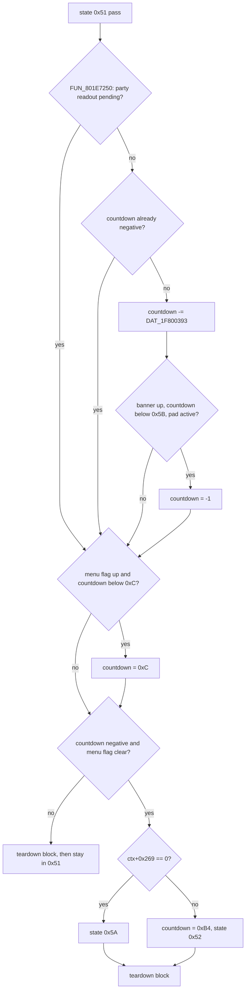

# Battle action exit gates and softlock classes

The battle action state machine `FUN_801E295C` (battle-action overlay, PROT entry 0898) has two states that wait on a condition with **no timeout**: state `0x51` (done / fade-down) waits for the party's HP readouts to finish counting, and state `0x19` (attack approach) waits for the attacker to come within reach. When the thing each one waits on can no longer happen, the battle never advances. The camera's idle azimuth sweep (`FUN_801D0748` stepping `_DAT_8007B792`) runs unconditionally and never consults the state machine, so both parks look the same on screen: the camera orbits the acting actor forever.

This page documents both gates, the invariant each relies on, the mechanism that breaks it, and what the disc patcher and the Rust port do about it. It also carries the rest of the Done band's tail (the level-up banner, the UI teardown) and the parts of the item / restore applier `FUN_800402F4` that the gate depends on. The state machine itself is in [`battle-action.md`](battle-action.md).

## At a glance

| | `0x51` HP-readout park | `0x19` approach park |
|---|---|---|
| Waits on | `FUN_801E7250` answering "settled" | range check `FUN_8004E2F0` returning 0 |
| Invariant | displayed HP minus live HP equals the pending accumulator, on every party slot | a clip with root motion is playing while the poll fails |
| Broken by | a displayed/live mismatch left with a zero accumulator | a stale exit-to-idle flag (`+0x1DC` bit 2) ending the approach clip |
| Retail trigger | a restore's assigning seed landing on a drain still in flight | a monster with no walk tag `0x20` starting a melee while its flinch clip still plays |
| Caught in unmodified play | no - every capture needed an external HP write | yes - Gaza 2, scenario `battle_gaza2_park_0x19` |
| Self-recovers | on a poison / regen tick of the affected member | never |
| Disc patch | none | `legaia-patcher --approach-softlock-fix` |
| Port | same conventions, seeds paired at every call site | approach drive runs in every approach state |

Key routines:

| Address | Role |
|---|---|
| `FUN_801E295C` | Action state machine; the `0x51` arm is `0x801E6044..0x801E6368`, the `0x14` / `0x19` arms `0x801E31F4..0x801E35D0`. Dump `ghidra/scripts/funcs/overlay_battle_action_801e295c.txt`. |
| `FUN_801E7250` | HP-bar settle check (52 instructions). Dump `overlay_battle_action_801e7250.txt`. |
| `FUN_80047430` | Per-actor tick (SCUS): drains the accumulator into the readout, plays clips, applies root motion. Dump `80047430.txt`. |
| `FUN_8004AD80` | Clip commit the tick calls. Dump `8004ad80.txt`. |
| `FUN_801EC3E4` | Battle damage / heal kernel: the accumulating seed. Dump `overlay_battle_action_801ec3e4.txt`. |
| `FUN_800402F4` | Item / restore applier (SCUS): the assigning seed, the cue-group sites, the flinch stager. |
| `FUN_801E6968` | Lost Grail **Final Heal** auto-revive, run by state `0x50`. |
| `FUN_801E752C` | [Per-round status ticker](battle-action-helpers.md#fun_801e752c---per-round-status-dot-ticker): the one readout re-sync. |
| `FUN_8004E2F0` | Range check `(acting seat, target)`. |
| `FUN_80050E2C` | Action-tag scan over a monster record's action table. |

Port: `crates/engine-battle-vm/src/battle_action/done.rs` (the Done band), `crates/engine-battle-vm/src/battle_hp_bar.rs` (the readout ramp), `crates/engine-core/src/world/battle/locomotion.rs` (the approach drive), `crates/code-hooks/src/approach_fix.rs` (the disc patch).

### Fields involved

Battle actor (`+0x14C` etc. are offsets into the per-seat actor record):

| Offset | Meaning | Writers |
|---|---|---|
| `+0x00` | Per-action accumulated damage total | credited per strike at `0x801EDB40`; consumed and cleared by the end-of-action commit (`0x801EEA14`, `0x801EEA74`) |
| `+0x10` | Signed **pending-delta accumulator**: how far the readout still has to move (positive = readout falls) | `FUN_801EC3E4` (accumulate), `FUN_800402F4` (assign), safe applier `0x801E1948`, drain `FUN_80047430` |
| `+0x14C` | Live HP (`+0x14E` = max HP) | `0x801EDAFC`, commit `0x801EEA2C` / `0x801EEA3C`, restore `0x800408AC`, safe applier `0x801E1960`, `FUN_801E752C` |
| `+0x172` | **Displayed HP** - what the party HUD draws | drain `FUN_80047430`; re-sync `FUN_801E752C` (`0x801E7600`, `0x801E7698`) |
| `+0x174` / `+0x178` | Displayed MP / MP accumulator | the tick's MP arm |
| `+0x1D9` / `+0x1DA` | Playing clip / queued clip | state arms stage `+0x1DA`; the commit `FUN_8004AD80` installs it |
| `+0x1DC` | Anim event flags: bit 0 commit now, bit 1 commit at event frame, bit 2 exit to idle at clip end, bit 3 (`& 8`) root-motion inhibit | state arms, `FUN_800402F4` flinch (`0x80042124..0x80042170`), the tick's two commit paths |
| `+0x1DD` | Active target slot (`0..2` party, `3..7` monster, `8` all) | action seed / command flow |
| `+0x1DE` | Action category (`1` Item, `5` Run) | action seed |
| `+0x1E8` / `+0x1E9` | Effect `(class, tier)` of the committed action | state `0x3C` only |
| `+0x1EF` | Light-flinch clip index | staged into `+0x1DA` by `FUN_800402F4` |
| `+0x21D` | Root-motion speed scale | monster init |

Battle context (`ctx = *0x8007BD24`):

| Offset | Meaning | Writers |
|---|---|---|
| `+0x00` | Party member count | battle load |
| `+0x07` | Action state byte | every state arm |
| `+0x17` | Done-band teardown latch | bumped at `0x801E6214`, cleared by `0x50` entry (`0x801E5F60`) |
| `+0x18` | The action's own UI element | seed's Attack arm writes `7` (`0x801E2F48..0x801E2F50`) |
| `+0x19` | Spirit-action latch | seed's Spirit arm bumps it at `0x801E2FF0`; never cleared |
| `+0x20` | Acting slot | seed (`sb t2,0xf(s5)` at `0x801E2F44`) |
| `+0x26` | Level-up banner element id (`0` or `0x65`) | [three writers](#ctx0x26---the-level-up-banner-tail) |
| `+0x269` | Spell id granted by a Seru capture | capture path |
| `+0x276` | Menu-open flag | command flow |
| `+0x6D2` / `+0x6D4` | Facing delta from `0x14` / approach stall counter | `0x14`; stall label `0x801E35D0` |
| `+0x6D8` | Done-band countdown | seeded by `0x50`, decremented by `0x51` |

## The `0x51` exit gate and the HP-bar settle invariant

State `0x50` seeds the countdown `ctx[+0x6D8]`; state `0x51` counts it down and leaves when `ctx[+0x6D8] < 0 && ctx[+0x276] == 0`. The decrement is gated on the settle check:

```
801e6044  jal  0x801e7250          ; HP-bar settle check
801e604c  bne  v0,zero,0x801e60b8  ; "not settled" -> branch PAST the decrement
801e6054  lh   v0,0x2(s7)          ; s7+2 is ctx+0x6D8
801e6068  lbu  v0,0x393(v0)        ; DAT_1F800393, the per-frame delta
801e6070  subu a0,v1,v0
801e6074  sh   a0,0x2(s7)          ; ctx+0x6D8 -= delta
```

The branch target `0x801E60B8` rejoins after the store, so "not settled" skips the store and nothing else. The signature of this park is therefore: state `0x51`, `ctx[+0x6D8]` frozen at the value `0x50` seeded, `ctx[+0x276] == 0`, a healthy `DAT_1F800393`. The state machine is still entered once per game frame (`DAT_1F800393 = 3` makes that roughly one vsync in three) and still reaches the `jal`.

### The exit decision



The test details (`0x801E60B8..0x801E6148`):

- **The seed.** State `0x50` stores `0x3C` on all three of its paths (`0x801E5EE8` / `0x801E5EFC` / `0x801E5F24` converge on the store at `0x801E5F28`). One override: `lbu v0,0x15(s5)` at `0x801E5F2C` re-seeds `0x96` when `ctx[+0x26]` is non-zero (`s5 = ctx + 0x11`).
- **The decrement stops at the sign change.** `bltz v0,0x801E60C4` at `0x801E605C` skips the store once the timer is negative, so the value parks just below zero.
- **`ctx[+0x276]` pins a floor of `0xC`.** `slti v0,v0,0xc` / `li v0,0xc` / `sh v0,0x2(s7)` at `0x801E60C0..0x801E60E4` re-raise the countdown to twelve while the menu flag is up. The teardown block runs *below* `0xC`, so it cannot start early, and the last twelve frames still run after the flag drops.
- **The exit tests the value, not the crossing.** `bgez v0,0x801E6158` at `0x801E60F0` reads `ctx[+0x6D8]` fresh every pass; `bne v0,zero,0x801E614C` at `0x801E610C` holds the transition while `ctx[+0x276]` is up. Nothing records "the countdown crossed zero this frame". An exit conditioned on the crossing loses the exit for good if the menu flag is up on that one frame.
- **The `0x52` branch re-seeds.** Taking it stores `0xB4` (`li v0,0xb4` / `sh v0,0x2(s7)` at `0x801E6134` / `0x801E6138`) before stamping the state. Its only entry condition is the absorbed Seru in `ctx[+0x269]`; the port names the state `DoneSeruAbsorb`. Without the re-seed that state would start on an expired timer.

Port: `done::done_fade_down`, written against the value; the `0x96` override rides on `BattleActionCtx::levelup_banner_element`.

### What `FUN_801E7250` measures

See `ghidra/scripts/funcs/overlay_battle_action_801e7250.txt`. It reads the acting actor's active-target slot `actor[+0x1DD]` and branches on the target class:

| `actor[+0x1DD]` | Result |
|---|---|
| `0`–`2` | 1 ("not settled") when that party actor's live HP `+0x14C` differs from its displayed HP `+0x172`; else 0. |
| `3`–`7` | 0 immediately - a monster target can never hold the exit. |
| `8` (all) | 1 when **any** slot below `ctx[+0x00]` has `+0x14C != +0x172`; else 0. |
| `> 8` | 0. |

`ctx[+0x00]` is the party member count, so both arms inspect party slots only. An action aimed at a monster clears the gate on the frame it asks. An action aimed at the party - an enemy attack, a heal, any all-target cast - is the only kind that can be held.

Port: `battle_action::hp_bar_drain_pending` (`crates/engine-battle-vm/src/battle_action/done.rs`).

<a id="why-only-the-party-side-has-anything-to-wait-for"></a>
### Why only the party side waits

Retail draws **no HP readout for monsters**. The party HUD counts HP down over several frames after a hit; the gate exists to let that count finish before the action ends. "HP bar" on this page means the displayed-HP mirror `+0x172`, which is a drawn readout only on the party side. Its readers are UI-side: `FUN_80046A20` (`0x80046AA8`) and the `FUN_801D8DE8` UI-element family (`0x801D9758`).

`+0x172` is still maintained for monster slots, but never drawn and never animated (see the drain below).

<a id="the-invariant-the-check-assumes"></a>
### The drain and the invariant

Live HP `+0x14C` and displayed HP `+0x172` converge through the accumulator `+0x10`. The per-actor tick `FUN_80047430` (`see ghidra/scripts/funcs/80047430.txt`) drains it:

- **Party slot:** a quarter per game frame. `+0x172 -= step` and `acc -= step`, with `step` biased so it is never zero for a non-zero accumulator (`(acc+3)>>2` positive, `acc>>2` negative). Total readout movement equals the seeded accumulator exactly, for either sign.
- **Monster slot:** the whole delta in one frame, then the accumulator is cleared (`0x80047578`).
- **Guard:** the whole ramp sits behind `0x800474E8` (`lw a0,0x10(s2); beq a0,zero,<skip>`). **With a zero accumulator the readout is not touched at all.**
- **No max clamp:** the drain never reads `+0x14E`, and the HUD draws `+0x172` raw. A readout seeded above max HP is drawn above max (an injected `live + 150` rendered as `1439/1289`).

The invariant the gate relies on is `(+0x172 - +0x14C) == +0x10` on every party slot. While it holds, a mismatch always has a non-zero accumulator behind it and the drain closes it.

The exact step drains a full readout in a size-insensitive number of frames: `600` in 20, `1289` in 23, `3000` in 26, `9999` in 30.

Two retail quirks sit in the non-party arms. Nothing draws the values they corrupt, so they are unobservable; a port reproduces them rather than correcting them.

- The HP arm reads the signed accumulator with `lhu` (`0x8004757C`), so a negative accumulator on a monster (a heal) wraps through the low halfword.
- The non-party **MP** arm at `0x80047624` operates on `+0x172` / `+0x10`, the HP fields, instead of `+0x174` / `+0x178`. A monster's MP accumulator `+0x178` is therefore never cleared, and that branch re-runs every frame for the rest of the battle, subtracting an already-zeroed HP accumulator.

### Softlock class: the absorbing readout

| | |
|---|---|
| **Invariant** | `(+0x172 - +0x14C) == +0x10` on every party slot. |
| **Broken state** | `+0x14C != +0x172` with `+0x10 == 0` on a party slot. The drain is the only thing that moves the readout and it is guarded off; every later hit or heal adds its delta to both sides, so the offset rides along. |
| **Effect** | Every action whose actor targets that slot (`+0x1DD` in `0..2`) or the whole party (`+0x1DD == 8`) reaches `0x51`, is told "not settled", and never decrements its countdown. Monster-targeted actions in between complete normally. |
| **Recovery** | `FUN_801E752C` force-assigns `+0x172 = +0x14C` after each of its own HP writes (`0x801E7600`, `0x801E7698`, one per status bit). A poison or regen tick on the affected member clears the park. It is the only re-sync in the dumped battle corpus. |
| **Reproduction** | Offset one party slot's `+0x172` by a single point and clear its `+0x10`: the next party-targeted action hangs. Probe `scripts/pcsx-redux/autorun_gaza2_hpbar_settle.lua`. |
| **Retail status** | Reachable on paper through the Final Heal race below. Not captured from unmodified play: every recorded `0x51` park needed an external HP write. |
| **Disc patch** | None. |
| **Port** | Reproduces both seeding conventions; keeps live-HP writes and readout seeds paired per call site ([below](#port-the-seed-is-per-call-site)). |

<a id="where-the-desync-comes-from-two-seeding-conventions"></a>
### The two seeding conventions

Every writer of `+0x10` follows one of two conventions. They disagree about a delta that arrives while the readout is still moving.

**`FUN_801EC3E4` accumulates** at every site (`see ghidra/scripts/funcs/overlay_battle_action_801ec3e4.txt`):

| Store | Shape | Branch |
|---|---|---|
| `0x801EDAF0` | `acc -= (max - hp)` | overheal - live HP saturates at `+0x14E` first, so only the amount applied is credited |
| `0x801EDB14` | `acc -= (s0 - s1)` | ordinary net delta, paired with the live-HP write at `0x801EDAFC` |
| `0x801EDB58` | `acc += (s0 - s1)` | the second actor the same hit credits |
| `0x801EDB7C` | `acc = bar` | anti-overkill clamp, guarded `if (bar < acc)` at `0x801EDB70` - caps the drain at the whole visible bar |

Each is a read-modify-write, so overlapping hits compose and the invariant survives.

**`FUN_800402F4` assigns.** Its head builds a pointer table over `&actor[+0x14C]`, `+0x14E`, `+0x150`, `+0x152` for slots `0..6` (battle mode `0x15`; a different source table otherwise). It applies the restore with `hp = hp + amount` at `0x800408AC`, then seeds the readout with a bare store:

```
800408f0  lw   v1,0x0(v1)      ; v1 = the actor
800408f4  subu v0,zero,v0      ; v0 = -amount
800408f8  jal  0x801e22c8
800408fc  _sw  v0,0x10(v1)     ; actor[+0x10] = -amount   <- the old value is never read
```

All three of its seeds - `0x800408FC`, `0x80040D28`, `0x800410BC` - have that shape.

`amount` is a **signed stat change**, not a damage magnitude: it is the value folded into the stat halfword at `0x800408A8` (`lhu v0,0x0(v1)` / `addu v0,v0,s4` / `sh v0,0x0(v1)`). Damage arrives as a negative `s4`, a heal as a positive one, so `-s4` is "positive means the readout falls" - the same sign convention `FUN_801EC3E4` uses.

Because no assigning seed reads the old accumulator, **a restore that lands while a damage drain is in flight discards the remainder**. With live HP `L`, readout `D` and remainder `A = D - L`, a restore of `H` leaves live HP at `L + H` and ramps the readout from `D` to `D + H`. The readout settles exactly `A` above live HP with a zero accumulator: the absorbing state. The residual desync equals the readout movement the restore cancelled.

The streamed capture-class per-spell modules (PROT 944..966; Gaza 2's Neo Star Slash is module 960, see [`battle-formulas.md`](battle-formulas.md)) carry their own HP writers, which breakpoints on the resident overlays do not see. A static store audit of the family (`scripts/asset-investigation/audit_module_hp_stores.py`) finds every actor-accumulator store to be the paired accumulate + live-HP shape - module-local copies of the safe applier (e.g. 0944 `+0x808` / `+0x824`). The module family follows the safe convention; a writer census has to include those streamed addresses.

<a id="phased-crediting-the-invariant-breaks-mid-action-by-design"></a>
### Phased crediting

A multi-strike action credits the readout **per strike** and commits live HP **once**. Each strike adds the same delta `a0 = s0 - s1` to the per-action total `actor[+0x00]` (`0x801EDB40`) and to the accumulator `+0x10` (`0x801EDB58`), paired stores off one register. Live HP is committed at the end of the resolution from the accumulated total (`0x801EEA10`).

Between the first credit and the commit, a watchpoint sees `+0x14C != +0x172` with `+0x10 == 0` as normal behaviour. At the commit the pair reconciles, and the `0x51` wait holds the action open until the tail of the drain lands. Measured on the Gaza 2 save (`autorun_gaza2_acc_discard.lua`, `invariant.csv` / `acc_writes.csv`): a three-strike physical produced readout credits of 338 + 344 + 304, one live-HP commit of 986, and a readout that landed exactly on live HP.

Only a mismatch that **survives the action's own commit and settle wait** is a desync.

<a id="the-clamp-asymmetry-two-overkill-guards-against-different-references"></a>
### The clamp asymmetry

Two routines apply damage to a party actor, and they clamp overkill against different values.

The **safe** shape is the enemy-cast damage applier at `0x801E1924`, reached from the cast dispatch just above it (`jal 0x801DD0AC` at `0x801E188C`). It clamps the damage, then applies that one value to both fields:

```
801e1924  lhu  a0,0x14c(v1)   ; live HP
801e192c  sltu v0,a0,a1       ; if (hp < damage)
801e1938  move a1,a0          ;     damage = hp          <- clamp the DAMAGE
801e1944  addu v0,v0,a1       ; acc += damage
801e1948  sw   v0,0x10(v1)
801e195c  subu v0,v0,a1       ; hp  -= damage
801e1960  sh   v0,0x14c(v1)
```

The **unsafe** shape is `FUN_801EC3E4`. The accumulator is credited while the action resolves and clamped against the **displayed readout** (`if (bar < acc) acc = bar` at `0x801EDB70`). Live HP is committed at the end from `actor[+0x00]` and clamped against **live HP**:

```
801eea10  lhu  a0,0x14c(v1)   ; live HP
801eea14  lw   v0,0x0(v1)     ; the action's accumulated damage
801eea1c  sltu v0,v0,a0       ; if (damage < hp)
801eea2c  _sh  zero,0x14c(v1) ;     else hp = 0          <- clamp the HP
801eea38  subu v0,a0,v0       ;     hp -= damage
801eea3c  sh   v0,0x14c(v1)
801eea74  sw   zero,0x0(v1)   ; damage total cleared
```

The two clamps agree whenever `+0x172 == +0x14C` at the action's start, which the previous party-targeted action's `0x51` wait guarantees. From a synced start the readout-side clamp trips only when the credited sum exceeds starting live HP too, so the commit floors at `0` and both land on zero together. The asymmetry is therefore an **amplifier of a pre-existing offset, not a generator**: it needs `+0x172` already below `+0x14C` when the action begins. A mid-action sample such as "live HP 266, readout 0, accumulator 0" is a phased state that closes with a death commit, not a settled desync.

Three guards above the commit (`0x801EE988`, `0x801EE9AC`, `0x801EE9EC`) branch to `0x801EEB5C` / `0x801EEB60` and skip the live-HP write entirely. A skip that fires with the accumulator already credited would move the readout without moving live HP. No capture has caught one firing that way; which action classes route through those guards is open.

Probe: `scripts/pcsx-redux/autorun_gaza2_hpbar_writers.lua` (Write watchpoints on each party actor's `+0x00` / `+0x10` / `+0x14C` / `+0x172`, Exec breakpoints on the commit and its skip exits).

<a id="the-auto-revive-reaches-the-assigning-seed-by-itself-one-state-early"></a>
### The Final Heal race

The one path that can land an assigning seed on a moving readout without player timing is the auto-revive.

- **Mechanism.** `FUN_801E6968`, run by state `0x50`, calls `FUN_800402F4` twice (`0x801E6A24`, `0x801E6BD0`), both with `a0 = 4, a1 = 1`: effect class 4 (revive), tier 1 (full). Class 4 dispatches through the jump table at `0x80014FA0` into the revive arm at `0x80040F14`, whose seed `0x800410BC` is a bare assign. Each call is guarded by `lhu v0,0x14c(<actor>); bne v0,zero,<skip>`, so it fires only on a member whose live HP has just reached zero.
- **Why it matters.** If the readout is still dropping when the revive lands, the assign discards the remainder, the readout settles above live HP, and `0x50`'s only successor is `0x51`. The park lands on the action that triggered the revive.
- **Why menu restores cannot do it.** A party-targeted action holds its own `0x51` open until every party readout settles, so the drain has always finished before the battle menu can act. A **Phoenix** (class 4) reaches the same arm and the class 0 / 1 heals reach the sibling seed `0x800408FC`, but never mid-drain. The intra-action Final Heal is the only crack.

Measured on the Gaza 2 save (`scripts/pcsx-redux/autorun_gaza2_acc_discard.lua`: Exec breakpoints on every `+0x10` writer plus the two Final Heal call sites, no harness write to any HP / readout / accumulator field):

- Three captures, ~84k vsyncs, twelve auto-revives across single-target and party-wide, cast-path and kernel-path kills, plus one menu heal. **Every assign landed on an accumulator already drained to zero**, margins 143-280 vsyncs. No assigning store hit a non-zero accumulator (`discards.csv`) and no settle streak froze `ctx[+0x6D8]` (`settle.csv`).
- Credits land per strike, early in the resolution; `0x50` arrives only after the remaining targets resolve and the effects tear down. Last-credit to first `0x51` settle check: minimum 90 vsyncs (~27 rendered frames at the light-load 3-4 vsync cadence), median ~110-220.
- Against that tail, the drain takes 20-30 frames (table above). A LV23 party (readouts 1289-1382, 23 frames) clears the fastest observed tail by ~4 frames; a `9999` readout (30 frames) does not.

The inference from those numbers: the discard-and-park is most reachable for high-max-HP parties killed by fast-tailed moves. Two things bound it. The frame-vs-vsync clocking of the tail states shifts the line by a few frames (timed states compensate by `DAT_1F800393`, animation waits do not). And a community capture of the live softlock (Japanese version; reported on both regions) shows a mid-game pool, `1476/1476`, on the target panel - so a large readout is not necessary. That panel shows a healthy member exactly at max, so the desynced slot is off-panel and the parked action is party-wide (`+0x1DD == 8`), which is what a boss's all-party cast uses.

<a id="consequences-for-instrumentation"></a>
### Measurement notes

- **An HP force-write manufactures this park.** Anything that writes `+0x14C` without re-seeding `+0x10` (a capture-harness clamp, a max-HP cheat code, a debug key) restores live HP while the in-flight accumulator keeps draining the readout, which then stops short of a pinned live HP. A clamp that also assigns `+0x172` and zeroes `+0x10` keeps the invariant.
- **Sample per action, not per frame.** Phased crediting makes per-frame sampling flag healthy fights. The two events that survive phasing are an assigning store on a non-zero accumulator and a `0x51` settle streak with a frozen `ctx[+0x6D8]`.
- **The stat aggregator does not tick during battle.** `FUN_80042558` runs only on isolated menu-side paths (twice in ~48k captured vsyncs), so an equipment id poked into a character record mid-battle never reaches the ability bitfield. To arm the Lost Grail Final Heal bit (`+0xF8 & 0x80`) from a save already in battle, seed the bit alongside the equipment id, and re-arm between deaths: the revive consumes the grail and any aggregator pass rebuilds the field.

<a id="port-the-seed-is-per-call-site-and-dropping-it-is-unconditional"></a>
### Port: the seed is per call site

The port reproduces the readout ramp and both conventions in `engine-battle-vm`'s `battle_hp_bar` (`accumulate_pending`, `assign_pending`, `clamp_damage_against_live_hp`, `resync_display`); the test `state_51_park_from_the_clamp_asymmetry` reaches the park in the engine. The per-action `+0x00` total is not modelled: the port applies live HP when a hit lands.

Retail's applier writes live HP and seeds the accumulator in one routine. `engine-core`'s `World::use_item` does not - it is shared with the field menu, where there is no readout. A heal that writes live HP alone would leave `hp != hp_display` with a zero accumulator on every use and park the next party-targeted action. The battle call sites therefore carry the seed themselves through [`BattleActor::assign_hp_bar`](../../crates/engine-battle-vm/src/battle_action/types.rs) (the `-delta` assign, `battle_hp_bar::assign_pending`):

| Port site | Retail counterpart |
|---|---|
| `World::apply_battle_item` (the battle item menu's applier) | `FUN_800402F4` class 0 / 1 heal arms |
| `fold_spell_outcome`'s `Revive` arm | `FUN_800402F4` class 4 revive arm |
| `apply_final_heal_revives` | `FUN_801E6968`'s two `FUN_800402F4(4, 1, slot)` calls |

Damage and heal spells route through `World::apply_battle_hp_delta`, the accumulating convention (`FUN_801EC3E4`).

`apply_final_heal_revives` also runs earlier than retail's state `0x50`: the port sweeps right after a tick's damage lands, when the killing hit's ramp has not moved. It therefore re-syncs the readout to the live zero before seeding - where the measured tail leaves retail's readout - so the fast-tail discard is not reproduced.

Regression: `engine-core` `a_battle_item_heal_keeps_the_readout_and_the_turn_pump_alive` (pad-driven, disc-free) and the `item` rung of `engine-shell`'s `battle_depth_replay`.

<a id="menu-committed-actions-must-be-claimed-the-tick-they-park"></a>
### Port: `EndOfAction` is claimed the tick it is written

A related park guard on the port side. Retail's `0x5A` non-wipe arm advances `EndOfAction -> PreActionWait -> ActionSeed` on the assumption that the flow state machine (`FUN_801D0748`) has already staged the next action. Four engine arms write `EndOfAction` directly: the spell cast, the Spirit guard, the Tactical-Arts fallback, and the monster cast fold. Each calls `World::cycle_battle_turn` in the same tick, so the next combatant (or the round boundary) claims the state before the state machine can re-seed the actor's stale action bytes. Coverage: `crates/engine-core/tests/seru_cast_magic_xp_ladder.rs`, `battle_item_cast_band.rs`, `battle_flee_ladder.rs`.

## The Done-band tail

### `ctx[+0x26]` - the level-up banner tail

`ctx[+0x26]` is a **UI element id**. `0` means none, and the only value retail assigns is `0x65`, the *"<spell>'s magic level increased"* banner. The reading is pinned by `0x801E61B4`, which passes the byte as the first argument of the UI-element unload `FUN_801D8DE8(ctx[+0x26], 1)`, in a run of sibling unloads that pass literal ids (`0x4E`, `0xF`, `0x52`, `0x44`).

Writers. A `sb`-at-`ctx+0x26` sweep over `SCUS_942.54` and every statically-based overlay image (tracking the ctx pointer from its `0x8007BD24` load and any `addiu`-derived base) finds only these:

| Site | What it does |
|---|---|
| `0x801E723C` | the in-battle magic level-up arm of `FUN_801E70BC` stores `0x65`, right after raising that element with `FUN_801D8DE8(0x65, 0)` at `0x801E722C` |
| `0x801E6D3C` | the Final Heal tail (`FUN_801E6968`) **increments** it on the arm gated `first_monster_id == 0xB5`, alongside `ctx[+0x07] = 0xFD` |
| `0x801E2CFC` | `ActionSeed` clears it (`sb zero,0x15(s5)`) at the head of every action |

Readers, all inside the Done band:

| Site | What it does |
|---|---|
| `0x801E5F2C` | the `0x50` seed: `0x96` frames instead of `0x3C` |
| `0x801E6078` | the `0x51` **banner skip**: once the countdown is below `0x5B`, any pad activity (`_DAT_8007B874 \| _DAT_8007B938`, tested only for non-zero) snaps the timer to `-1` |
| `0x801E61B4` | the `0x51` teardown unloads the element it names |

The seed and the skip together make the tail a banner: `0x96 - 0x5B` = 59 frames the player cannot skip, then a press ends it.

The `0x801E6D3C` increment is a make-non-zero idiom, not element selection. `ActionSeed` has cleared the byte, so the result is `1` (or `0x66` after a level-up) - neither an element retail raises. The arm is a one-shot, gated on the first monster slot being dead **and** `first_monster_id == 0xB5` (`0x801E6CFC..0x801E6D0C`); its neighbours are `_DAT_8007B64A = 3` and `ctx[+0x07] = 0xFD`, a state byte outside the state machine's own range. What the arm gets from `ctx[+0x26]` is the long `0x96` hold plus the skip window; the unload that follows is `FUN_801D8DE8(1, 1)` on an element that was never raised.

Port: `legaia_engine_vm::battle_action::done`'s `DONE_LEVELUP_BANNER_FRAMES` / `DONE_BANNER_SKIP_BELOW`, over `BattleActionHost::pad_word`. The writer is `World::accrue_summon_spell_xp` (`engine-core`), the port of `FUN_801E70BC`. The id round-trips: raised with the element, carried through the `0x50` seed, unloaded by `done::done_band_ui_teardown`, cleared by the next `ActionSeed`.

### The `0x51` teardown block

Everything the `0x51` arm does after its exit test is one straight line (`0x801E614C..0x801E6214`) behind two gates: the countdown must be below `0xC`, and the latch `ctx[+0x17]` must be clear. The latch is bumped at the end of the block and cleared by the `0x50` entry (`sb zero,0x6(s5)` at `0x801E5F60`), so the block runs once per action. It is reached on **every** pass, including the ones that store a new state: the exit branch at `0x801E610C` jumps to the head of this block, not to the epilogue.

| Step | Site | Condition |
|---|---|---|
| sprite-handle table reset `FUN_801D99BC` | `0x801E6170` | unconditional |
| unload `ctx[+0x18]`, the action's own element | `0x801E6188` | byte non-zero |
| unload `0x4E` and `0x4F` | `0x801E61A0` / `0x801E61AC` | `ctx[+0x18] == 6` |
| unload `ctx[+0x26]`, the level-up banner | `0x801E61C4` | byte non-zero |
| unload `0x0F` and `0x52` | `0x801E61DC` / `0x801E61E8` | `ctx[+0x19]` non-zero |
| unload `0x44` | `0x801E6200` | `actor[+0x1DE] != 5` (not Run) |

`ctx[+0x18]` is a context byte, written by the seed's Attack arm (`li v0,0x7` / `sb v0,0x7(s5)` at `0x801E2F48..0x801E2F50`). The same arm's `sb t2,0xf(s5)` at `0x801E2F44` writes the acting slot to `ctx[+0x20]`, not an element id. `ctx[+0x19]` is the Spirit-action latch the seed's Spirit arm bumps at `0x801E2FF0`. Nothing clears it, so once a battle has seen one Spirit action the `0x0F` / `0x52` pair is dropped at the end of every later action too.

Port: `done::done_band_ui_teardown`, over `BattleActionCtx`'s `done_ui_torn_down` / `action_ui_element` / `spirit_action_count` / `levelup_banner_element`. `FUN_801D99BC` (the per-actor UI-element array zeroing) is a scope row rather than a port: the engine's HUD is rebuilt from state each frame, so there is no element array to clear.

### The sweep the teardown falls into (`0x801E6218..0x801E6368`)

The tail past the latch increment is **inside** the latch. Nothing branches to `0x801E6218` (no word, `jal`, `j`, PC-relative branch, materialisation pair or `gp`-relative access, in any of the 84 images), so its only entry is the fall-through from `sb v0,0x6(s5)` at `0x801E6214`. Both of the block's gates (`beq v0,zero` at `0x801E6158`, `bne v0,zero` at `0x801E6168`) land on `0x801E6814` when taken - past the whole tail - and the second reads the byte `0x801E6210` / `0x801E6214` increments. The sweep therefore runs on the same once-per-action pass as the teardown.

| Step | Site | Condition |
|---|---|---|
| `FUN_801E92DC(ctx[+0x269])` then **raise** `0x59` (`a1 = 0`) | `0x801E6234` / `0x801E6240` | `ctx[+0x269]` non-zero |
| unload `(id, id - 4)` for each queued entry, row `_DAT_801F6834 + (count-1)*4` | `0x801E62CC` / `0x801E62F0` | any of the four `0x801F6980` value slots non-zero, and `_DAT_801F6974` non-zero |
| unload `0x51` | `0x801E6344` | all four value slots zero, `actor[+0x1DD] - 3 < 5`, `0 < actor[+0x1DE] < 4` |
| unload `0x50` | `0x801E6360` | all four value slots zero, `_DAT_8007BD14` non-zero |

- `0x59` is **raised** here: `a1 = 0`, where every unload in the block passes `1`. The `0x52` Seru-absorb band closes it.
- The multi-cast half is `FUN_801E805C`'s teardown inlined: same `(id, id - 4)` pair, same `(count - 1) * 4 + i` row, same `_DAT_8007BD14` gate on `0x50`.
- `FUN_801E92DC` takes a **spell id**. It resolves the acting slot through `_DAT_8007BD10`, indexes the live game-state window at `0x80084140 + char*0x414 + 0x704` and prepends there. So `ctx[+0x269]` is the spell a capture granted, and element `0x59` is that grant's banner.
- The capture arm's window is narrow. A non-zero `ctx[+0x269]` on the exit pass re-seeds the countdown to `0xB4` (`0x801E6138`) before the teardown reloads it at `0x801E614C`, so that pass fails the `< 0xC` gate; the menu-flag floor writes `0xC` exactly, which fails it too. The frames with both a live capture byte and a running teardown are the last twelve of the countdown, before it crosses zero.

Port: `done::done_band_capture_and_banner_sweep` carries the `0x59` raise and the `0x51` close. The multi-cast loop stays with `battle_value_readout` (`engine-battle-vm`), which owns the value window and the queued count. `FUN_801E92DC` is `magic_xp::learn_spell_prepend` (`engine-battle`, re-exported by `engine-core`).

## The item / restore applier `FUN_800402F4`

The applier is the assigning seed above and also the routine that stages the flinch behind the [`0x19` park](#the-stale-field-0x1dc-bit-2-the-exit-to-idle-anim-event-flag). Its class dispatch is a 132-entry jump table at `0x80014FA0`. The action state machine calls it once, at state `0x3F` (`0x801E4134`).

### The `(class, tier)` seed at state `0x3C`

State `0x3C` is the only writer of `actor[+0x1E8]` / `+0x1E9`. The branch it takes is the category byte `+0x1DE` (`0x801E3B70..0x801E3CB0`):

| `+0x1DE` | `+0x1E8` | `+0x1E9` |
|---|---|---|
| `1` (Item) | `+0` of the item-effect descriptor at `0x800752C0 + subtype*4`, where `subtype` is the item record's `+1` byte (`0x80074368 + id*0xC + 1`) | `+1` of that descriptor |
| anything else (Magic / Spirit) | `+0` of the spell record `0x800754C8 + id*0xC` | `+1` of the same record |

Both legs land in one class space. `0..=8` are the applier's effect classes - heal / cure / revive / shield / buff, the numbering [`item-effect-table.md`](../formats/item-effect-table.md) documents. The larger values (`0x14` plain cast, `0x32` summon, `0x63` capture) are the spell band's routing bytes. The spirit that raises the shield is therefore disc data: a Spirit's spell record carries a small class byte.

Three consumers read the pair: the applier call at `0x801E4134`, the cue-group site it selects, and the cast-audio cue `FUN_801F3990` fired one state earlier at `0x801E3E04`.

### `FUN_800402F4`'s cue-group sites

On its way out of most arms the applier asks the cue-group expander `FUN_801E22C8` to place the arm's visual effect. It reaches `jal 0x801e22c8` from **eleven** branches of the class jump table, and the group id is chosen per branch.

Arguments at every site are `(a0 = tint, a1 = actor-state word, a2 = actor slot, a3 = group id)`. `a2` is `param_3` everywhere except the class-1 loop, which passes its own loop index. Sites marked *gated* run only in battle mode (`*(s16 *)0x8007B83C == 0x15`).

| `jal` | Class arm | Reached when | `a3` (group) | Gated |
|---|---|---|---|---|
| `0x800408F8` | 0 - HP restore, single | class 0 | `param_2` | yes |
| `0x80040D70` | 1 - HP restore, loop | per live slot in range | `param_2 + 1` | yes |
| `0x80040E54` | 2 - MP restore | class 2 | `param_2 + 3` | yes |
| `0x80040F04` | 3 - status cure | class 3 | `5` | yes |
| `0x800410B8` | 4 - revive | class 4 | `6` | yes |
| `0x8004111C` | 5 - spirit shield | class 5 | `7` | no |
| `0x8004157C` | 7 - stat buff | `param_2 == 1` | `8` | no |
| `0x80041718` | 7 | `param_2 == 2` | `9` | no |
| `0x800417FC` | 7 | `param_2 == 3` | `0xA` | no |
| `0x80041BA0` | 7 | `param_2 == 4` | `0xB` | no |
| `0x80041C60` | 8 - status clear | class 8 | `0xC` | yes |

- Classes `6`, `9`, `0xA`, `0xB` / `0xC` / `0xD`, `0xE` and `0x82` never reach the expander. Class 6's own 7-entry inner table at `0x800151B0` only bumps counters.
- The class-1 loop is bounded by `param_3 == 9` (monster slots `3..7`) versus anything else (party slots `0..3`), with a second per-slot gate on the roster byte (`DAT_8007BD10[slot]` below 3, `DAT_8007BD09[slot]` above). A party-wide restore fires the expander once per **seated** member - occupancy, not liveness, so a downed member still gets the cue.
- `a0` and `a1` are literals, one pair per site: the tint, and the actor-state word the expander writes to `actor[+0x04]`. The class-0 / class-1 restore arms and the class-7 tier-1 / tier-2 buff arms pass the neutral tint `0x00808080` and recolour nothing.
- The revive arm (`0x800410B8`) is the one site whose `a1` is `0x20080200`, the word the expander tests for, so revive is the only arm that leaves `actor[+0x0C]` alone.

Port: the selection is a `(class, param_2)` table plus one loop, carried as `battle_cue_group::cue_group_for` (`engine-battle-vm`, re-exported by `engine-vm`) rather than a port of the applier's 1976 instructions. The acting actor's `+0x1E8` / `+0x1E9` pair selects the site, the expander runs, and each cue goes to the effect pool / SFX scheduler through the host.

<a id="fun_800402f4s-stone-and-curse-arms-classes-9--10"></a>
### The Stone and Curse arms (classes 9 / 10)

Two of the classes that skip the expander are status inflictors. Their class bytes appear in **no** spell or item record: a scan of the spell table (`0x800754C8`) and item-effect table (`0x800752C0`) finds no class-9 or class-10 row. The callers are the streamed capture-class boss modules (PROT 935..966), which pass the class as a code literal and reach the applier through runtime dispatch, so a static reference scan does not recover the pairing. From the jump table: entry `9` = `0x80041C70`, entry `10` = `0x80041E64`.

Both arms share one roll, in a single-target form (`sltiu v0,s0,0x3` - party seats only) and a `param_3 == 8` all-party loop (one `rand()` draw per member):

```text
80041c90  jal 0x80056798            ; rand()
80041cc4  addu v1, atk+0x168, tgt+0x168
80041cd4  div v0,v1 ; mfhi v1       ; roll = rand % (atk_agl + tgt_agl)
80041ce0  slt a0, tgt_agl, v1       ; lands when tgt_agl < roll
80041cf4  ori v0,v0,0x4             ; class 9: Stone   (class 10: ori 0x1000, Curse)
```

The group arm also zeroes a landed target's queued action category (`sb zero,0x1de`) and refunds a reserved battle item (`jal 0x800421d4` with `a1 = 1` when `+0x1DE == 1` and the initiative key `+0x16C` is live). Neither arm reads a guard accessory: retail writes the bit unconditionally, and the per-frame guard sweep (`FUN_8004CE2C`'s guard-clear half) removes it next frame for a protected wearer.

Port: roll kernel `legaia_engine_vm::status_effects::agl_status_inflict_roll`; live wiring `World::apply_enemy_agl_status` on the monster cast fold. The guard gate is applied at infliction, which is steady-state-equivalent to retail's clear-next-frame. The move-id list is an inference: Glare `0x3C` is capture-pinned; Stone Circle `0xB9`, Curse `0x40` and Curse All `0x53` come from record names and published behaviour. A landed Stone arms the status-CLUT recolour (`FUN_8004CE2C`'s fourth pass, `engine-battle`'s `battle_status_clut`).

<a id="the-0x19-attack-approach-park---a-second-distinct-softlock-class"></a>
## The `0x19` attack-approach park

| | |
|---|---|
| **Invariant** | While state `0x19` polls and the range check fails, a clip with non-zero root motion is playing on the attacker. |
| **Broken state** | The staged Move clip ends and idle is installed instead of a re-loop: `+0x1DA = +0x1D9 = 0`, position frozen out of reach. |
| **Conditions** | (a) attacker out of reach - the norm for a large monster; (b) its action table has no tag `0x20`, so the walk states `0x15..0x18` never run; (c) `+0x1DC` bit 2 is still set from a flinch when the Move clip is installed. |
| **Retail trigger** | A summon (or any hit that flinches the monster) immediately followed by that monster's melee. |
| **Evidence** | Caught in unmodified play on Gaza 2; trigger reproduced; flag causally verified. Scenarios `battle_gaza2_park_0x19`, `battle_gaza2_park_0x19_summon_melee` (`scripts/scenarios.toml`). |
| **Recovery** | None. Nothing bounds the poll. |
| **Disc patch** | `legaia-patcher --approach-softlock-fix`. |
| **Port** | Cannot park: the approach drive does not depend on a live clip. |

Every party HP triple is synced in the caught park (`+0x14C == +0x172`, `+0x10 == 0`); the `0x51` gate plays no part.

### The wait in state `0x19`

From the `FUN_801E295C` dump (`case 0x19`): recompute facing from the target's position, call `FUN_8004E2F0(acting_seat, actor[+0x1DD])`, advance to `0x1E` only when it returns 0. The not-in-range path is the shared stall label `0x801E35D0`, which adds the frame delta to `ctx[+0x6D4]` and breaks. **State `0x19` contains no movement code and no timeout.**

- **Reach.** Party attackers use the static table `DAT_80078870[acting_seat]` = `{256, 384, 1024}`. Monster attackers use a size-scaled reach (~416 for Gaza's `0x1A`).
- **All-target sentinel.** `FUN_8004E2F0` returns 1 for any target `>= 8`, so an all-target action can never satisfy a range poll.
- **Not a timeout.** `ctx[+0x6D4]` and `ctx[+0x6D2]` (the facing delta `0x14` computes) are read only by the arms / interference resolver `FUN_801EC3E4`, which adds them into an agility-style contested roll.

### Root cause: the walk-tag fallback in state `0x14`

The `0x14` arm's out-of-range branch (`ghidra/scripts/funcs/overlay_battle_action_801e295c.txt`, `0x801E31F4..0x801E32DC`):

```text
801e31f4  jal 0x8004e2f0           ; range check (a0 = acting seat, a1 = target)
801e3200  bne v0,zero,0x801e3230   ; out of range ->
801e3230  ...sltiu v0,v0,0x3       ; party attacker?
801e323c  bne v0,zero,0x801e32c0   ;   yes -> anim 1, state 0x19 (anim-driven approach)
801e325c  lw  a0,0x0(v0)           ; monster: a0 = DAT_801C9348[seat-3] (record)
801e3260  li  a1,0x20              ;   walk tag
801e3264  lbu a2,0x4a(a0)          ;   action count at record+0x4A
801e3268  jal 0x80050e2c           ;   tag scan over the table at record+0x4C
801e327c  bne v0,0xff,0x801e32b4   ;   found  -> state 0x15 (walk start)
801e329c  li  a1,0x1               ;   NOT found: fall back to tag 1 (the Move loop)
801e32a4  jal 0x80050e2c
801e32ac  j   0x801e32c4           ;   -> state 0x19: the park
801e32b0  _sb v0,0x1da(s3)         ;   (delay: stage that clip)
```

`FUN_80050E2C` scans the record's action-pointer table (`record+0x4C`, `record+0x4A` entries) for an action whose **first byte** equals the tag. It returns the entry index, or `0xFF` when absent. See [`monster-animation.md`](../formats/monster-animation.md) for the tag space; `0x20` / `0x21` are the attack pre-approach / close-in pair.

A monster with no tag-`0x20` action never enters the walking states `0x15..0x18`. Out of reach, it drops into the `0x19` poll with the tag-`1` Move clip staged, and the approach then depends entirely on that clip's root motion. Of the 186 monster records, 180 have no tag `0x20` and all 186 carry tag `1` (roster sweep, `crates/asset/examples/monster_move_tags.rs`).

The fallback normally closes the gap. Gaza's melee attacks approach during state `0x19` at a steady ~19 units/vsync (e.g. 977 -> 377 over 28 vsyncs, then `0x1E`). Starting out of reach is the norm: every recorded healthy Gaza melee began with the nearest target at 438-1078 units against ~416 reach and went `0x14 -> 0x19`.

### The stale field: `+0x1DC` bit 2, the exit-to-idle anim event flag

The Move clip is played by the per-frame tick `FUN_80047430` and its commit `FUN_8004AD80` (the driver documented in [monster-animation.md § Playback](../formats/monster-animation.md#playback); dumps `ghidra/scripts/funcs/80047430.txt`, `8004ad80.txt`). Three properties assemble the park:

- **The approach drive is the tick's root-motion term.** While a clip plays, `0x80047D20..0x80047E18` adds `facing sin/cos × entry[+0xC] × frame_dt × actor[+0x21D] >> 0xF` to the actor's position, gated on `+0x1DC & 8` clear and the range poll still failing. Gaza's Move entry has `+0xC = +20` and speed scale `+0x21D = 8`: the measured ~19-20 units/vsync. The idle entry's `+0xC` is `0`, so installing idle freezes the actor.
- **A looping clip loops by re-committing.** There is no loop counter. When the cursor `node+0x68` passes the stream's frame count, the tick calls the commit, which re-installs the still-queued `+0x1DA` and zeroes the cursor. Gaza's Move stream is 5 frames at rate 2 with speed scale 8: one cycle is ~12 vsyncs.
- **The two commit paths treat `+0x1DC` differently.** The natural-end path tests bit 2 (`& 0x4`): if set it **stages idle over whatever is queued** (`sb zero,0x1da` at `0x80047B44`), clears bits 0-2 (`andi 0xF8`, `0x80047B50`) and commits. The mid-clip event path (bit 0 = commit now, bit 1 = commit at event frame, `0x80047A38`) clears only bits 0-1 (`andi 0xFC`) and **preserves bit 2**.

Bit 2 is written by `FUN_800402F4`: a surviving target's light flinch is staged as `+0x1DA = +0x1EF`, `+0x1DC |= 4` and `|= 1` (`0x80042124..0x80042170`). Normally the flinch's own natural end consumes the bit and the actor returns to idle.

The sequence that parks:

1. A hit flinches the monster (the damage-reaction clip, pair `2/2`). `+0x1DC` bit 2 is set.
2. The monster's melee begins while the flinch still plays. State `0x14`'s fallback stages the Move clip (`sb v0,0x1da(s3)` at `0x801E32B0`) with `+0x1DC |= 1` (`0x801E32D4` / `0x801E35C4`).
3. The Move clip is installed through the **event-path** commit, which preserves bit 2.
4. The Move clip engages (pair `1/1`, ~19 units/vsync). At its first natural end, ~12 vsyncs in, the natural-end path sees bit 2, stages idle and clears the bit.
5. Pair `0/0`, drive dead, position frozen beyond reach. State `0x19` re-polls forever.

Any action between the flinch and the melee gives the flinch time to end and consume the bit, which is why only the directly-following melee parks. A parked save reads `+0x1DC == 0`: the commit that killed the clip consumed the bit, so the stale flag is visible only in flight.

### Evidence

- **The caught park** (poll-only probe `scripts/pcsx-redux/autorun_gaza2_park_hunter.lua`; replay probe `autorun_gaza2_range_wedge.lua`). The acting actor is the boss (seat 3, category 3 physical attack, 871/15000 HP) targeting Gala (seat 2) across ~556 units; the metric returns 554-557 every poll and the position never changes. The state trace is `0x0C -> 0x14 -> 0x19` within ~3 vsyncs. Gaza's anim bytes sit at idle (`+0x1DA = +0x1D9 = 0`).
- **The rest of the queue.** Vahn polls his own queued attack against Gaza (metric ~458 against his 256 reach). Noa and Gala hold `+0x1DD == 8`, stale all-target sentinels on actors that never got their turn. The round is stuck on the boss's action alone.
- **The action table** (RAM read via `legaia-pcsxr`, example `gaza2_walk_tag`). Gaza's seat-3 record holds 12 actions with tags `[00 01 02 03 04 05 0B 0E 13 0C 23 23]` - no `0x20`.
- **The trigger** (`autorun_gaza2_summon_displacement.lua`, scenario `battle_gaza2_park_0x19_summon_melee`). The summon stages Gaza to `(0, -2048)` and back while his damage-reaction clip plays. His melee starts directly next; the Move clip engages and dies ~12 vsyncs later, ~236 units in. With any other action in between, the same clip runs 28-67 vsyncs and arrives (e.g. 64 vsyncs / 1,260 units). Parked gaps of 556 / 786 units are ordinary formation spacing.
- **Causal check** (`scripts/pcsx-redux/autorun_gaza2_stale_flag_repro.lua`, write-watchpoints on `+0x1DA` / `+0x1D9` / `+0x1DC`). Control: bounce the state byte to `0x14`. The arm re-stages Move (`0x801E3270` stores the `0xFF` tag-`0x20` miss, `0x801E32B0` the fallback index), the first natural end 12 vsyncs later re-commits with the pair still `1/1` (`0x80047B58` + `0x8004BDE0`), and the boss walks in and strikes. Experiment: the same bounce with `+0x1DC |= 4` re-armed dies at its first natural end via the `0x80047B44` idle write and parks in `0x19`.
- **Core independence.** The recipe parks under both PCSX-Redux cores (recompiler and interpreter, `run_probe.sh --timing`) with the same onset: Move clip dead ~12-16 vsyncs in. Emulators with a substantially different CD latency model may schedule the summon's streamed staging restore differently and rarely land in the window.
- **Drift.** Each summon stages Gaza ~2,500 units off-arena and restores him with a committed ~35-40-unit home drift per cast; his own casts nudge his home 16-26 units without moving him; his melee both approaches and commits the new position.

### The disc patch

`legaia-patcher --approach-softlock-fix` (`crates/code-hooks/src/approach_fix.rs`, re-exported as `legaia_patcher::approach_fix`; off by default, also offered by the site's ROM patcher). The `0x19` arm spends nine words at `0x801E3568` re-deriving facing every frame, which is redundant: the target does not move during an approach, and states `0x14` and `0x1E` derive facing themselves. The patch replaces those nine words with a guard: if the staged clip is dead (`+0x1DA == 0`) while the poll still fails, set the state byte back to `0x14`.

Retail's own `0x14` arm then re-runs the staging next frame and the monster resumes walking. By the time the guard fires, the commit that killed the clip has consumed the stale bit, so the re-staged clip loops cleanly. The same bounce rescues a party attacker whose run clip dies. Healthy approaches never see a dead clip and are unaffected.

Verification: `autorun_gaza2_approach_fix_verify.lua` pokes the nine words into both live park states and touches nothing else - the guard bounces once, retail re-stages `1/1`, the boss walks in at ~19 units/vsync, the strike lands and the round completes. The byte-level edit is pinned by the `approach_fix_real` disc oracle (`crates/patcher/tests/approach_fix_real.rs`).

<a id="engine-port-note"></a>
### Port

The engine walks, and cannot reproduce this park.

- **Range.** The live host's `range_check` computes the retail law (`World::battle_range_metric`, the `FUN_8004E2F0` port).
- **Drive.** `World::tick_battle_locomotion` is the `FUN_80047430` root-motion term: the clip's entry speed `+0xC` when a committed clip carries one, else the captured Move-drive fallback. It runs in every approach state whether or not a clip is playing - the engine-native form of the patch's guard - so an approach always closes. The attacker strikes and stays where it struck ([`battle-action.md`](battle-action.md#where-an-action-leaves-its-combatants)).
- **Sub-unit motion.** Retail's `>> 0xF` floors once per battle frame. The port ticks once per vsync and spreads each battle frame's total over its ticks (`motion::RootMotionCarry`, over the frames `World::battle_frame_id` names - two vsyncs unless a replay installs another step, see [the battle frame step](battle-stage-camera.md#the-battle-frame-step-is-the-frames-own-cost)). The strike loop's swing drift (`0x801E386C..0x801E3994`) takes the same carry. A per-tick floor would drop any axis moving under a unit per vsync (a strike at heading `142` would drift straight along `z`).
- **Monster routing.** Every `FUN_80050E2C` call site in the action state machine - the `0x20` / `1` pair in `0x14`, the walk in `0x15`, the close-in in `0x16`, the capture takedown's walk, the `0x22` knockout taunt - runs the tag search over the monster's installed action table (`battle_action::monster_action_by_tag`, fed by `World::battle_monster_action_tags`). The 180 records without tag `0x20` take `0x19` as in retail; the six that carry one play their own pre-approach and close-in clips.
- **Positions are re-derived every frame.** The separation pass measures overlap on each actor's `+0x3C` / `+0x40` pair, so that pair must track the live position as retail's does. Holding it still for the length of an action pushes overlapping party members apart indefinitely and leaves a monster's approach measured against a stale target (seen on Zora in `taiku` and Rogue in `rugi`).

Tests: the disc-gated `boss_approach_disc` (`engine-shell`) fights both of those bosses, and `monster_approach_sweep_disc` (`engine-core`) fights every one of the 186 archive records.

### The knockout taunt

On the way into the Done band (`0x801E5594..0x801E5658`), a monster whose attack has left its target at zero HP searches its action table for tag `0x22`. While at least one party member still stands, it stages that entry with the stage latch `+0x1DC |= 2`. The wiping blow therefore plays no taunt, and 166 of the 186 records carry no `0x22` entry. Port: `attack::stage_ko_taunt`.
