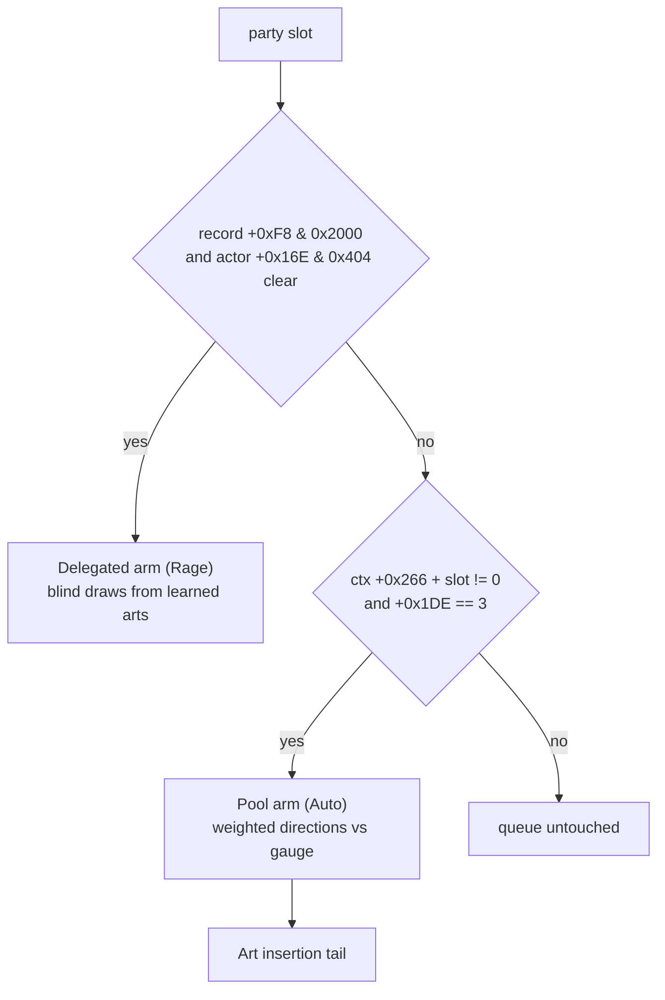
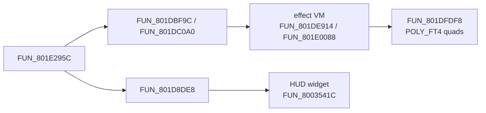
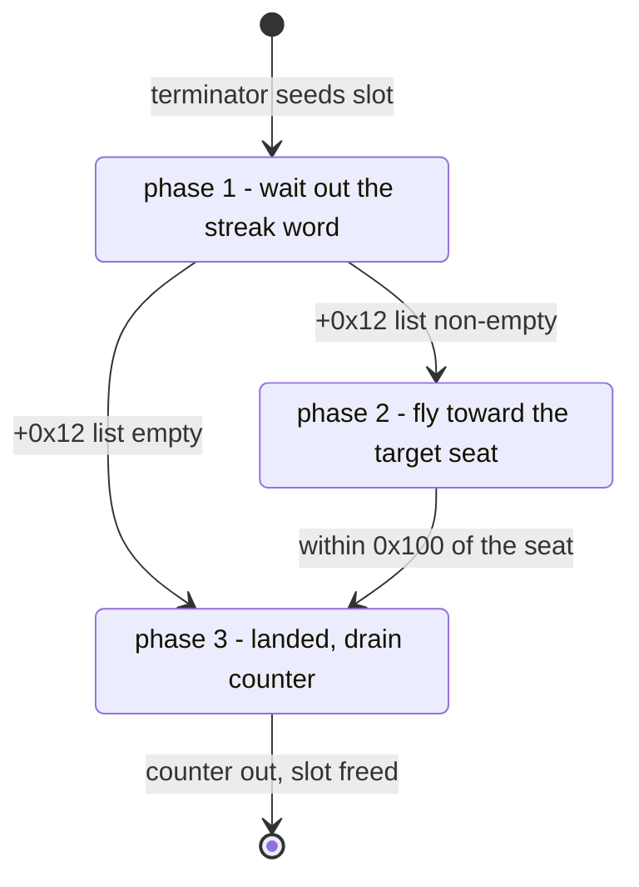
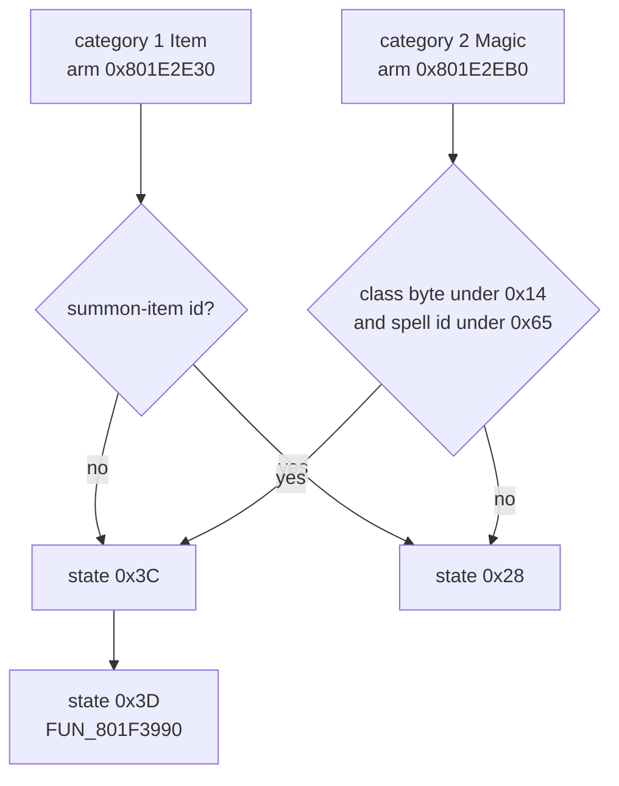

# Battle action helper functions

The battle action state machine `FUN_801E295C` ([battle-action.md](battle-action.md)) owns the order of a turn, but almost none of its arithmetic. Range tests, damage rolls, the escape roll, AI picks, effect and summon spawns, camera framings, voice cues and target scans all live in helper routines it calls, or that run beside it each frame. This page is the reference for those helpers: what each one reads and writes, the constants it carries, and where the Rust port keeps it.

Most helpers are resident in the **battle overlay**, PROT entry 0898 (extraction index), loaded at base `0x801CE818`. A few are in the main executable `SCUS_942.54` (addresses `0x8001xxxx..0x8006xxxx`). Terms used throughout:

| Term | Meaning |
|---|---|
| ctx | The battle context struct, pointer at `0x8007BD24`. `ctx[7]` is the action SM state, `ctx[+0x13]` the acting slot. Layout in [battle.md](battle.md). |
| actor | One battle-actor record. The pointer table is `0x801C9370` (8 slots: `0..2` party, `3..` monsters). |
| record | The persistent `0x414`-byte character record at `0x80084708 + n*0x414` ([save-record.md](../formats/save-record.md)), or a monster record from the monster table `0x801C9348`. |
| `DAT_8007BD10[slot]` | Per-slot roster character id, 1-based: `1` Vahn, `2` Noa, `3` Gala, `4` the AI companion (Terra). |
| slot B | The second overlay slot at `0x801F69D8`, above the resident battle overlay, where cast / summon modules page in. |
| GTE | The PlayStation geometry coprocessor. |

Port module names are given as `crate::module`. The battle kernels live in `engine-battle-vm` and are re-exported by `engine-vm` at their old paths, so `legaia_engine_vm::battle_action` and `engine-battle-vm::battle_action` name the same code.

## Helper index

| Address | Name | Role | Section |
|---|---|---|---|
| `FUN_8004E2F0` | range metric | Distance between attacker and target, `0` = in range | [Range metric](#fun_8004e2f0---battle-range--reach-metric) |
| `FUN_80042558` | stat aggregator | Rebuilds each character's effective stats and ability bitfield every frame | [Stat aggregator](#fun_80042558---per-frame-stat-aggregator) |
| `FUN_801E752C` | DoT ticker | Per-round Venom / Toxic drain and Grail recovery | [DoT ticker](#fun_801e752c---per-round-status-dot-ticker) |
| `FUN_801DD4B0` / `FUN_801DD6B4` | damage-roll wrappers | One hit's net damage, with or without the party resist ladder | [Damage-roll wrappers](#fun_801dd4b0--fun_801dd6b4---per-move-damage-roll-wrappers) |
| `FUN_801F3C34` / `FUN_801F3D3C` | follow-up guard / installer | Seru-magic side-effect latch and its element-keyed installer | [Follow-up guard](#the-queued-magic-follow-up-guard-fun_801f3c34) |
| `FUN_801F45A4` | status-`0x400` waker | Per-round 1-in-8 clear of status bit `0x400` | [Waker](#fun_801f45a4---per-round-status-0x400-waker) |
| `FUN_801E791C` | escape roll | Decides a flee and stages the run-away scene | [Escape roll](#the-escape-roll-fun_801e791c) |
| `FUN_801EED1C` | queue builder | Party action setup at state `0x0C`; hosts the companion's auto-pick | [Companion pick](#the-ai-companion-pick-in-fun_801eed1c) |
| `FUN_801F0450` | auto arts-combo assembler | Fills the action queue for Rage delegates and Auto members | [Auto assembler](#fun_801f0450---the-auto-arts-combo-assembler) |
| `FUN_801E9FD4` | monster AI picker | Queues several enemy actions out of an AGL budget | [Enemy AGL budget](#enemy-agl-action-budget-fun_801e9fd4) |
| `FUN_801E7320` | confuse retarget | Re-rolls a `0x380` monster's target at state `0x0C` | [Setup hooks](#fun_801eed1c--fun_801e7320---state-0x0c-setup-hooks) |
| `FUN_801DFDF8` / `FUN_801DFDF0` | effect spawn API | Sprite-anim spawn into the effect pool | [Effect spawn API](#fun_801dfdf8---effect-bundle-public-spawn-api) |
| `FUN_801D8DE8` | screen-element spawner | Raises a HUD text / chrome widget by element id | [Effect spawn API](#fun_801dfdf8---effect-bundle-public-spawn-api) |
| `FUN_801D84C0` | result-message builder | Points banner elements `0x59` / `0x65` at the ctx message buffer | [Message banner](#the-battle-message-banner-elements-0x59-and-0x65) |
| `FUN_801F30C4` | move-VM battle escape | Move-VM op `0x17`: a twelve-child burst | [Move-VM escape](#fun_801f30c4---the-move-vms-battle-escape-op-0x17) |
| `FUN_8004998C` (tail) | burning-body emitter | Sheds fire sprites from a burning body | [Burning body](#the-burning-body-emitter-at-the-tail-of-fun_8004998c) |
| `FUN_8003EC70` | overlay loader B | Pages a summon / cast module into slot B | [Summon dispatch](#seru-magic-summon-overlay-dispatch) |
| `0x801F1ED4` / `0x801F2160` | cast dispatchers | Jump-table dispatch into the slot-B routine for a summon id or effect class | [Cast dispatchers](#cast-dispatchers-0x801f1ed4-and-0x801f2160) |
| `FUN_801DEA50` | effect-script stepper | Walks the acting actor's effect script; installs the move-power record | [Per-frame effect helpers](#per-frame-action-effect-update-helpers) |
| `FUN_801E09F8` | cast census + flight | Counts outstanding effects; flies and lands projectiles | [Per-frame effect helpers](#per-frame-action-effect-update-helpers) |
| `FUN_801E0080` | effect-VM walker | Per-frame tick of the effect master / child pools | [Per-frame effect helpers](#per-frame-action-effect-update-helpers) |
| `FUN_801DF6B8` | damage-number popup | Scaling decimal sprite for accumulated damage | [Per-frame effect helpers](#per-frame-action-effect-update-helpers) |
| `FUN_8005112C` | signature effect trigger | Per-character weapon-trail accent on one anim frame | [Per-frame effect helpers](#per-frame-action-effect-update-helpers) |
| `FUN_801F17F8` | side-band streamer | Streams `summon` / `readef` pages off the disc | [Per-frame effect helpers](#per-frame-action-effect-update-helpers) |
| `FUN_801DA6B4` | target cursor tint | Brightens the current target, dims the rest | [Per-frame effect helpers](#per-frame-action-effect-update-helpers) |
| `FUN_801DBDDC` | Rot stamp | Draws the Rot stamp over an arts-entry chip | [Per-frame effect helpers](#per-frame-action-effect-update-helpers) |
| `FUN_801D5854` | pose driver | Camera / presentation program per pose id `0..9` | [Pose driver](#fun_801d5854---per-actor-pose-driver) |
| `FUN_801D829C` | angle-tween builder | Prescales `TR.z` and arms a camera tween | [Tween prescale](#fun_801d829c---camera-angle-tween-prescale) |
| `0x801F0348` | target-size framing | Camera height from a monster's size class | [Target-size framing](#0x801f0348---target-size-camera-framing) |
| `FUN_801EFE44` | camera bounds | Min / max X and Z over the actor table | [Camera bounds](#fun_801efe44---battle-camera-bounds) |
| `_DAT_8007B910` | audio duck cell | Live audio level the summon / capture arms ramp | [Audio duck](#the-audio-duck-_dat_8007b910) |
| `FUN_8003D53C` / `FUN_8004C140` | XA clip player / arts-voice selector | Battle voice cues | [Voice cues](#battle-voice-cues) |
| `FUN_801F3990` | cast audio-cue dispatcher | Item / Spirit voice cue at state `0x3D` | [Cast audio cue](#fun_801f3990---cast-audio-cue-dispatcher) |
| `ctx[+0x287]` / `ctx[+0x288]` | scripted-fight flag / defeat latch | Per-battle "scripted fight" bit and the lone-monster dying latch | [Flags](#the-scripted-fight-flag-ctx0x287-and-the-defeat-latch-ctx0x288) |
| `FUN_801D0290` | overlay-local PRNG | Shape hash for the lightning ribbon emitter `FUN_801CFA48` | [PRNG](#overlay-local-prng-fun_801d0290) |
| `FUN_801DB9C4` | flag-word scrub | Clears bits in pool `+0x8` | [Leaf helpers](#actor-pool-leaf-helpers) |
| `FUN_801DB318` | span normalise | Rescales and recentres the formation | [Leaf helpers](#actor-pool-leaf-helpers) |
| `FUN_801D8A88` / `FUN_801D8D00` | target queue / cycle | The enemy target cursor's ring | [Leaf helpers](#actor-pool-leaf-helpers) |
| `FUN_801DB8B4` | first live monster | First monster slot with liveness | [Leaf helpers](#actor-pool-leaf-helpers) |
| `FUN_801DBA04` / `FUN_801DB81C` | selectable scans | First / next commandable party slot | [Leaf helpers](#actor-pool-leaf-helpers) |
| `FUN_80019B28` | 12-bit bearing | `atan2` over the arctan LUT | [Leaf helpers](#actor-pool-leaf-helpers) |
| `FUN_801DB124` | dead-target redirect | Re-rolls a queued action off a dead target | [Leaf helpers](#actor-pool-leaf-helpers) |
| `FUN_801E6D84` | target banner plan | HUD element ids raised at the action seed | [Target banner](#the-per-action-target-banner-fun_801e6d84) |

Several `0x801Fxxxx` addresses on this page were once described from mis-based dumps; [Dump aliases](#dump-aliases-in-the-0x801fxxxx-band) lists which dump to read for each.

## Damage and status

### `FUN_8004E2F0` - battle range / reach metric

Called from states `0x14`, `0x16`, `0x19` (the attack chain) and from the anim tick's root-motion gate (`FUN_80047430`). Returns a 16-bit distance metric; `0` means "in range". From the disassembly (`ghidra/scripts/funcs/8004e2f0.txt`):

```text
if DAT_8007BD71 != 0xFF or either slot >= 8: return 1
base = 0; size = 0
if attacker < 3: base = i16 DAT_80078878[(DAT_8007BD10[attacker] - 1) * 2]
else:           size = monster_rec(attacker)[+0x1F]
if target >= 3:
    t = monster_rec(target)[+0x1F]
    size = t if size == 0 else ((size + t) * 3) / 5     ; unsigned divide
if attacker < 3 and target < 3: base >>= 1              ; sra - party on party
a = (FUN_80019B28(tgt[+0x40], tgt[+0x3C], att[+0x38], att[+0x34]) + 0x800) & 0xFFF
d = base + |(|att.x - tgt.x| * sin[a]) >> 12| + |(|att.z - tgt.z| * cos[a]) >> 12|
in_range = (d < i16 DAT_80078870[size*2])   if size < 3   ; signed slt
         = (d <u size << 4)                 otherwise     ; unsigned sltu
return 0 if in_range else (i16)d
```

- The position read is asymmetric: the **attacker's live** pair `+0x34` / `+0x38` against the **target's seat** pair `+0x3C` / `+0x40`.
- `DAT_80078870` = `{256, 384, 1024}`, the small-class thresholds.
- `DAT_80078878` = per-character reach offsets `{+43, 0, -53, -100}` for roster ids `1..=4`. They are **added to the distance**, so a positive value is a shorter reach.

Port: `legaia_engine_vm::battle_action::motion::range_metric`, assembled from live state by `World::battle_range_metric` (`engine-core::world::battle::locomotion`).

### `FUN_80042558` - per-frame stat aggregator

SCUS-resident. `FUN_801E295C` does not call it, but reads the ability bitmask it maintains: 4 x u32 at `0x80074358..0x80074368`, OR-aggregated from each character record's `+0xF4..0x100` block.

- State `0x28` cuts MP cost by half (bit `0x20`, `cost - cost>>1`) or by a quarter (bit `0x10`, `cost - cost>>2`). `0x20` wins when both are set.
- States `0x1E` (attack drift) and `0x46` (spirit-arts HP bar) read record bits `0x100` / `0x200` for impact-magnitude scaling.

The SM reaches the bits as `*(uint *)(((byte)(&DAT_8007BD10)[ctx[+0x13]] - 1) * 0x414 + -0x7FF7B804)`, which is the active character's record at `0x80084708 + (party_id - 1) * 0x414 + 0xF4`.

Field map of the character record (`0x80084708 + n*0x414`, `n = 0..2`), from `ghidra/scripts/funcs/80042558.txt`. Every field the routine reads or writes is in `+0xF4..+0x13D`, plus the equipped-item ids:

| Offset | Field |
|---|---|
| `+0xF4..0x103` | 128-bit ability / passive bitfield (4 x u32). Cleared, then each active passive sets bit `index` (`index < 0x40`); also OR-aggregated into `DAT_80074358..0x80074364`. |
| `+0x104..0x11B` | Effective (passive-boosted, capped) stat block, seeded from `+0x11C..0x12D`. `+0x104` HP (cap `9999`), `+0x108` MP (cap `999`), `+0x10C` (cap `100`), `+0x110` AGL-class (cap `0x118` = 280), `+0x112/0x114/0x116/0x118/0x11A` combat stats (cap `999`). `+0x106/0x10A/0x10E` are running-minimum companions. |
| `+0x11C..0x12D` | Base (unmodified) stat block, the source the effective block is rebuilt from each frame. |
| `+0x13C` | Count of learned Seru / ability entries. |
| `+0x13D..` | That many ability / Seru id bytes (ids `0x99..0xA0` handled). |
| `+0x196..0x19D` | 8 equipped-item ids. Each item's descriptor (`kind==1` -> equip-bonus `+5`, `kind==2` -> item-effect `+3`) supplies the passive index bit set in `+0xF4`. |

The percent boosts per ability bit are the accessory-passive magnitudes (`+10%` = base/10, `+25%` = base>>2, `+20%` = base/5; see [accessory-passive-table.md](../formats/accessory-passive-table.md)).

Scope: the routine touches only the character record. It does not write the battle-actor struct; `actor[+0x14C]` (HP), `actor[+0x150]` (MP) and `actor[+0x176]` are written by the battle loader and the action SM.

### `FUN_801E752C` - per-round status DoT ticker

Not an SM state. The round driver `FUN_801D0748` calls it once per round (flow state `0x14`, gated on the round counter `ctx[+0x28A] != 0`, so the first round never ticks). It applies the Venom / Toxic HP drains off the `+0x16E` status bits, and the same walk pays the Life Grail / Magic Grail per-round recoveries for party slots.

Arithmetic, caps and the never-kill clamp: [battle-formulas.md](battle-formulas.md#per-round-status-dot-ticker---fun_801e752c). Port: `engine-vm::status_effects::toxic_tick_damage` / `venom_tick_damage` (`StatusEffectTracker::tick_actor`).

### `FUN_801DD4B0` / `FUN_801DD6B4` - per-move damage-roll wrappers

Two sibling damage kernels that resolve one hit. Each draws an attacker roll and a defender roll from the two actor records (`(&DAT_801C9370)[slot]`), calls the affinity scale `FUN_801DD864`, then the closed-form finisher `FUN_801DDB30`, and returns `attacker_roll - defender_roll`.

| Wrapper | Working stat mixed into both rolls | Finisher `param_5` | Party resist ladder |
|---|---|---|---|
| `FUN_801DD4B0` | INT-working `+0x168` | `0` | runs (jewels, elemental guards, All Guard) |
| `FUN_801DD6B4` | ATK-working `+0x158` | `1` | **skipped** |

`param_5 = 1` is the resist-bypass path: a hit routed through it takes no Earth / Luminous Jewel or All Guard reduction even when the defender is elementally warded. That is the mechanism behind the non-elemental capture-class boss casts (Bloody Horns / Terio Punch). The affinity scale still reads the caster's slot element either way; only the defender's jewel stage is dropped.

Stat fields, the finisher stage list, the per-spell module census and the engine mirror (`damage_finish::bypass_party_resist`) are in [battle-formulas.md § Summon-magic damage roll](battle-formulas.md#summon-magic-damage-roll---fun_801dd0ac). See `ghidra/scripts/funcs/overlay_battle_action_801dd4b0.txt` / `_801dd6b4.txt`.

### The queued-magic follow-up guard (`FUN_801F3C34`)

State `0x36` calls this once per summon / Seru-magic return-from-fade (`jal 0x801f3c34` at `0x801E4CB8`, the SM's only reference to it).

1. Action ids `0x85`, `0x8E` and everything from `0x96` up return before any record is read.
2. It finds the acting actor's queued action `+0x1DF` in the caster's learned-spell list: record `+0x13D` ids against the parallel `+0x161` levels, the character selected through `(&DAT_8007BD10)[ctx[+0x13]]`.
3. When that spell's level is `>= 3` and no follow-up is pending (`*(0x801F6960) == 0`), it installs the follow-up routine pointer `0x801CFA20` into `*(0x800775B4)`, prints message `0x66` through `FUN_801D8DE8`, and mirrors `0x66` into `ctx[+0x18]`.

Its sibling **`FUN_801F3D3C`** is the installer that seeds the latch the guard reads. It repeats the level scan, runs a suppression roll, then picks a record from the `[element][level band]` table at `0x801F6870` (`0x20` bytes per element = four 8-byte records; band = `(level - 3) >> 1`).

- The roll indexes `0x801F53E8`, the same element-affinity matrix the damage path uses, with the two records' `+0x1D` element bytes: `(*(0x801C9358))[+0x1D]` for the acting side and `(*(0x801C9348))[+0x1D]` for the opposing side.
- It suppresses when that affinity percent is **below** `0x65`: the follow-up needs the opposing side to be elementally weak.
- Three shapes bypass the roll: `ctx[+0x287] == 0`, an acting element of `5`, and a `rand()` divisible by five.
- An acting element below `7` then dispatches through the seven-entry per-element jump table at `0x801CFA2C` instead of reaching the installer tail.

Port: `legaia_engine_vm::move_no_effect_guard`. State `0x36`'s settle body calls it (`battle_action::summon`) with the caster's spell list from `BattleActionHost::caster_spell_list`, which `World` answers from the character record. Every player Seru cast writes the `0x801F6960` / `0x801F6964` latch pair it reads. The debuff magnitudes are in [battle-formulas.md](battle-formulas.md#seru-magic-side-effects---the-element-debuffs-fun_801f3d3c--the-finisher-switch).

<a id="the-0x16e-status-word---one-bit-map-two-port-representations"></a>
### The `+0x16E` status word

Most scans on this page read one actor halfword. The bits are pinned individually by the HUD icon selector `FUN_8002C2E4`, whose priority ladder tests them in order, and by the appliers that set them ([writer inventory](battle.md#the-0x16e-status-halfword---retail-writer-inventory)).

| Bit(s) | Condition | Where it is set |
|---|---|---|
| `0x0001` | Venom | weak-DoT applier, 1/8 |
| `0x0002` | Toxic | strong-DoT applier, 1/8 |
| `0x0004` | Stone | petrify applier (`ori $v0,$v0,4` at `0x80041CF4`, over the `lhu` at `0x80041CEC`) |
| `0x0008` / `0x0010` / `0x0020` | Rot, one rolled limb | `1 << (rand % 3 + 3)` |
| `0x0040` | inside the Rot group, never set | - |
| `0x0080` / `0x0100` / `0x0200` | AI delegation, always as the group `0x0380` | `FUN_80047430`, from accessory passive bit 45 |
| `0x0400` | Numb | status applier |
| `0x0800` | Sleep | status applier |
| `0x1000` | Curse | curse applier, 1/4 |
| `0x2000` / `0x4000` / `0x8000` | unused: no applier in the dumped corpus | - |

Three masks are read as units:

- `0xF84` gates a slot out of the selectable scans (Stone, the delegation group, Numb, Sleep).
- `0x0F80` is what taking damage clears.
- `0x0404` is the whole-actor inert test.

There is **no KO bit**. A dead actor is one whose `+0x14C` is zero, which is why every consumer pairs the word with the liveness halfword.

The port holds the same conditions twice. `BattleActor::field_flags` is the raw word (the cast band ORs its debuff bits straight in), and the status tracker holds a typed instance list the turn loop reads. `World::raw_status_word` composes them: the typed list packs through `status_effects::pack_display_flags`, whose bit map is this table, and the raw word ORs in unchanged. A consumer that wants retail's word therefore gets every bit either half carries, including the delegation group the typed list has no kind for.

### `FUN_801F45A4` - per-round status-`0x400` waker

A 38-instruction leaf (`ghidra/scripts/funcs/overlay_0898_static_801f45a4.txt`). It loops the seven actor slots of `&DAT_801C9370`. For each live actor (`+0x14C != 0`) whose `+0x16E` carries bit `0x400`, it draws one `FUN_80056798` sample and, on `rng & 7 == 0`, clears exactly that bit (`andi 0xFBFF` at `0x801F4610`). The RNG is consumed only for live afflicted actors.

Its caller is the action SM's state `0xFF`, the round boundary (`jal 0x801f45a4` at `0x801E680C`), after the state parks the flow byte at `0x14` and bumps the round counter `ctx[+0x28A]`.

Port: `engine-battle-vm::battle_formulas::status_0x400_wakes` (one slot's step), swept by `World::tick_status_0x400_wakes` at the round boundary.

A different body was once documented at this address from the mis-based `overlay_0897_801f45a4.txt` dump (see [Dump aliases](#dump-aliases-in-the-0x801fxxxx-band)). That body is real battle-overlay code at some other, unidentified VA, and its decode is kept here for whoever pins it:

- Per action category (`actor[+0x1DE]` `1..6`) it tests ability bits in the character record's `+0xF4` / `+0xF8` bitfield (base `0x80084140 + (char_id-1)*0x414`, fields `+0x6BC` / `+0x6C0`).
- When set, it ramps a value pair `*s0` toward `*s2` by half per pass (`*s0 += (*s2 - *s0) >> 1`).
- It applies the AP-boost bits (`+0x200` / `+0x100`) to `actor[+0x170]` and clamps it at 100 (`0x64`), the same adjust-and-clamp the `0x50` Done arm performs.
- It clears `actor[+0x16E]` bits, resets brightness / screen globals, and ends in a per-actor jump-table dispatch keyed on `actor[+0x1D]`.

### The escape roll (`FUN_801E791C`)

Called by state `0x64` to decide a retail flee. It writes `_DAT_8007726C`, the battle-message source pointer states `0x64` / `0x65` test: `ctx + 0x159` ("escaped" text) on success, `ctx + 0x189` ("couldn't escape") on failure. From `ghidra/scripts/funcs/overlay_battle_action_801e791c.txt`:

```text
party_score = Σ_party  (SPD*3)>>1 + (maxHP - curHP)>>4    ; actor +0x164 / +0x14E / +0x14C
enemy_score = Σ_enemy   SPD      + (maxHP - curHP)>>5
roll_p = rand() % party_score ;  roll_e = rand() % enemy_score
if Escape Boost (ability bit 52):                 roll_p += roll_p >> 1
if Great Escape (bit 55) or ctx[+0x291] == 2
   or (_DAT_8007BAC0 & 0x100):                    roll_p = roll_e
FAIL iff  !(_DAT_8007BAC0 & 0x100)
          && (roll_p < roll_e  ||  ctx[+0x287] != 0)
```

**Scores.** Both sides run faster the more hurt they are, and the party's SPD is weighted 1.5x against the enemies' 1x. Every slot contributes, downed members included.

**Ability bits.** Both are read from the *living* party members' second accessory-passive word (character record `+0xF8`): bit 52 = passive `0x34` **Escape Boost** (Chicken Heart, roll x1.5), bit 55 = passive `0x37` **Great Escape** (Chicken King). See the [accessory-passive table](../formats/accessory-passive-table.md).

**"Assured" describes the compare, not the outcome.** The Great Escape bit forces the party roll equal to the enemy roll (`0x801E7AF0`), so the compare cannot fail. The scripted-fight flag `ctx[+0x287]` is tested after that (`0x801E7B14`) and still blocks the flee. That is why Chicken King is "assured escape (non-boss)".

**Forced flee.** The battle flag `_DAT_8007BAC0 & 0x100` forces the flee outright. It bypasses even `ctx[+0x287]` and skips the "No. of Escapes" Records counter (`_DAT_800846A8`) the normal success path increments. The bit is folded inside the party loop, once per living member (`0x801E7978`, the `s1 = 2` store at `0x801E7A14`).

**Both ctx inputs are written at battle setup, not by the roll.**

- `ctx[+0x287]` is the [scripted-fight flag](#the-scripted-fight-flag-ctx0x287-and-the-defeat-latch-ctx0x288). The SCUS battle-setup routine `FUN_800513F0` latches it in its first instructions: `ctx[+0x287] = (DAT_8007BD60 >> 5) & 4`, i.e. bit `0x80` of the battle-flags byte `DAT_8007BD60` (the byte state `0x5A` masks with `&= 0x7F`). A scripted "can't run" fight sets it to `4` at load (`0x801E5058` reads it; see `ghidra/scripts/funcs/800513f0.txt`).
- `ctx[+0x291]` is a **latch** of `ctx[+0x290]`. The SM's state-`0x00` action-begin does `ctx[+0x291] = ctx[+0x290]`, then clears `+0x290` (`0x801E2B38`).
- `ctx[+0x290]` is written by the formation-setup routine `FUN_80051D84`: `1` under a monster-id-range test (back attack), or `2` on a `func_0x80056798()` roll (pre-emptive strike). See `ghidra/scripts/funcs/80051d84.txt`.

So `ctx[+0x291] == 2` is a per-formation flag that reaches the same forced-tie store as Great Escape, with the same caveat. The roll never compares against `1`: a back attack costs the party its round-one initiative keys and nothing else. Because the latch runs **every round**, round two's pass copies the `+0x290` that round one cleared, so a pre-emptive strike's unfailable compare lasts one round. An engine that stores the latch and never reads it back disables pre-emptive-strike escapes entirely.

**Flee staging.** On success the routine also stages the scene (`0x801E7B98..0x801E8030`):

- Every party actor stages the looping walk (`+0x1DA = 1`, `+0x1DC = 1`), turns its back on the fight (facing `+0x46 = 0x800`) and takes target `+0x1DD = 9`. That is a group code the range law `FUN_8004E2F0` reads as out of range, so the walk's root motion carries the member away until the battle ends.
- Live `x` is halved and `z` quartered. The group is then re-centred on `(0, 0x400)`, and every pair closer than 200 units in `x` is pushed apart by half the shortfall each.
- Live HP / MP are written back to the character records with downed members **floored at 1 HP** (the record-side half of the state-`0x64` floor).
- The live camera is snapped to yaw `0xF00`, TR `(0, 0x600, 0x2000)`, focus at the origin. `FUN_801D829C` tweens it over `0x30` frames to the reverse angle: yaw `0x800`, TR `(0, 0x600, 0)`, focus on the regrouped party. Nothing re-frames it before the battle ends.

Port: `engine-battle-vm::battle_formulas::escape_roll` (+ `escape_party_score` / `escape_enemy_score` / `EscapeFlags`), rolled live by `World::roll_battle_escape` when the command menu resolves Run. The staging is `World::stage_party_flee` and the shot is `BattleCamera::arm_escape_shot`. Two port differences: it stages only the members still standing (a downed one stays where it fell), and it keeps no escape counter.

## AI and turn budget

<a id="ai-delegated-0x380-party-members---what-is-and-isnt-pinned"></a>
### AI-delegated (`0x380`) actors

`FUN_80047430` sets `actor[+0x16E] |= 0x380` each frame on a party slot whose character record carries ability-bitfield bit 45 (`+0xF8 & 0x2000`). That bit is accessory passive `0x2D`, Rage, the Evil Medallion's passive. The neighbouring bits byte-match the [accessory-passive index table](../formats/accessory-passive-table.md): `0x100` / `0x200` = AP Boost, `0x800` = AP Used Down, `0x20` / `0x40` = HP / MP After.

Who consumes the `0x380` group:

| Consumer | Use |
|---|---|
| `FUN_801E295C` (action SM) | Treats the slot as AI-controlled |
| `FUN_801E9FD4` (monster AI picker) | `& 0x380` guards on its picks |
| `FUN_801DABA4` (next-actor selector) | Calls the AI picker only for monster slots (`a0 = active_index - 3`, gated `active_index >= 3` at `0x801DAEF8`) |
| `FUN_801E7320` (charm redirect) | Retargets a confused monster at the action seed |

None of these chooses an action for a delegated **party** member, and the round driver `FUN_801D0748` routes party slots to the command menu with no `0x380` test. The party-side pick is made by `FUN_801F0450`'s delegated arm, which keys on the character record's Rage bit rather than on `0x380` (see [below](#fun_801f0450---the-auto-arts-combo-assembler)). The separate auto-fight block in `FUN_801EED1C` keys on roster **character id 4**, not on `0x380`: it drives the AI companion, not a Rage delegate.

#### The AI companion pick in `FUN_801EED1C`

`FUN_801EED1C`'s `(&DAT_8007BD10)[slot] == 4` block indexes the live character record `(id-1)*0x414 + 0x800847FC`. `DAT_8007BD10[slot]` is byte-confirmed `01 02 03` = Vahn / Noa / Gala in the `evil_medallion_rage_battle` state, so id 4 is the fourth roster character, Terra.

The block is a healer watching the party leader. It chooses by **battle seat 0's** gauge (`+0x14C` current / `+0x14E` max) and status word (`+0x16E`), and writes **battle seat 1**: the read at `0x801EEE50` is `lw v1, -0x6c90(0x801D0000)` = `actor_table[0]`, while every write goes through `lw v1, 4(s0)` = `actor_table[1]`.

| Condition (seat 0) | Category `+0x1DE` | Detail | Writer PC |
|---|---|---|---|
| `+0x14C == 0` | `2` (Magic) | spell id `0x16`, target 0 | `0x801EEE70` |
| `+0x14C < +0x14E >> 1` | `2` (Magic) | spell id `0x0D` | `0x801EEEAC` |
| healthy, `+0x16E != 0` (statused) | `2` (Magic) | spell id `0x11` | `0x801EEEE0` |
| healthy, no status | `3` (Attack) or none | `rand() & 1`: half Attack, half category `0` (stand by) | `0x801EEF28` |

The spell id lands in `+0x1DF` (`0x801EEEF8`) and `+0x1E7 = 9` (`0x801EEF00`). A separate, earlier gate on `DAT_8007BD11 == 4` (`0x801EEE10`) seeds the `0xC8` gauge onto seat 1's `+0x174` / `+0x150` / `+0x172` / `+0x14C`.

<a id="the-companions-physical-arm"></a>
The physical arm (`0x801EEF2C..0x801EF024`), in draw order:

1. `rand() % ctx[+1] + 3` picks a monster seat and is stored to `+0x1DD` (`0x801EEF74`).
2. If that seat's `+0x14C` is zero the roll is **redrawn**. The loop at `0x801EEF98` is unbounded, so a row with no living monster spins.
3. The chosen seat's monster record `+0x1E` (the swing class) is read through `0x801C9348[target - 3]` (`0x801EEFC8`).
4. On `+0x1E == 2` the stream is the single command `0x0E` and no further draw happens (`0x801EF028`).
5. Otherwise `+0x1DF` and `+0x1E0` each take an independent `rand() % 2 + 0x0C`, so the stream is exactly two commands, each `0x0C` or `0x0D`.

Port: `legaia_engine_vm::battle_action::ai_companion_pick`, wired from `World::arm_party_physical` for the party slot whose roster id is `4`. The port bounds the redraw at `AI_COMPANION_MAX_TARGET_DRAWS` and stands by instead of spinning.

#### `FUN_801F0450` - the auto arts-combo assembler

A 928-instruction battle-overlay body (`classify-worklist.py --explain 801f0450` => `REAL`, entry `801f0450`, `jr ra`; `ghidra/scripts/funcs/overlay_battle_action_801f0450.txt`). It fills the `actor[+0x1DF+n]` arts-command stream the strike loop later walks, for party slots the player does not steer by hand. It forks on the character record, not on the actor:



**Delegated arm (Rage).** The gate is `lw v0,0x6c0(v1)` at `0x801F04D4` with `v1 = 0x80084140 + (id - 1) * 0x414`, i.e. record `+0xF8`, bit `0x2000` = ability index `0x2D`. With `actor[+0x16E] & 0x404` clear the arm:

1. stamps category `+0x1DE = 3` and rolls a target over the live monster slots through `FUN_801DB124`;
2. loops (`0x801F05C4..0x801F06CC`): stop on `rand() % 7 == 0`, else draw `record[+0x186 + rand() % count]` from the learned-arts list (`record[+0x185]` count);
3. discards a draw under the per-character floor (`6` for roster id `2`, `4` otherwise), else stores `id + 0x1B`, up to fifteen entries.

One delegated pick is observed (`evil_medallion_rage_battle`; disc + library gated test `rage_delegated_pick`). Exactly the Evil Medallion wearer carries `+0x16E & 0x380 == 0x380` (the other party slots read `+0x16E == 0`), with category `+0x1DE == 3` and the `+0x1DF` stream `[0x22,0x26,0x25,0x22,0x21]`. That is learned arts `7, 11, 10, 7, 6`, all at or above either floor and drawn with replacement, which is this loop's output shape. Confidence: a single sample matched against the disassembly; no runtime write-watch of `+0x1DF` has been taken. In that state the **actor** struct's `+0xF8` bit `0x2000` is set on every party slot, so on the actor it is not the discriminator; the gate reads the character record.

**Pool arm (Auto).** Gated per slot on `ctx[+0x266 + slot] != 0` and category `actor[+0x1DE] == 3` (Attack). `ctx[+0x266 + slot]` is the per-fighter **Auto** flag the command SM's Auto pick writes (see [minigame-muscle-dome.md](minigame-muscle-dome.md)), so this arm and its tail are the Auto command's queue builder.

- It scans the per-command arm entries of the arts-command table `DAT_801C9360[slot][cmd]` (`cmd` `0xC..=0xF`) and reads each command's AP cost byte `+0x74`, the same [arts AP-gauge cost](arts-command-gauge.md) the randomizer edits.
- It builds a weighted candidate pool, dropping any command whose guard mask `DAT_801F672C[cmd-0xC]` collides with the target's status word `actor[+0x16E]`.
- It draws from the pool with `func_0x80056798` until the actor's action gauge `actor[+0x154]` no longer covers the cheapest command.
- A command's weight is a four-rung ladder (`8` default, `1` low band, `4` high band, `2` both) over two byte ranges selected by the **target monster's type byte** `+0x1E`: type `3` reads `..=0x10` / `0x16..=0x1A`, type `2` reads `0x11..=0x15` / `0x1B..=0x1F`. Any other type leaves every command at `8`, which is enough pushes to overrun the `0x10`-byte candidate scratch.

Port: `engine-battle-vm::battle_arts_auto_combo` carries both arms, the ladder, the guard reject and the gauge-spend loop. The arm-by-arm decode is in [`reference/functions/battle.md`](../reference/functions/battle.md#801f0450).

<a id="the-routine-runs-every-round-and-auto-rebuilds-the-queue"></a>
#### When the assembler runs

`FUN_801F0450` runs at the action SM's state `0x00`, and state `0x00` runs every round, not once per battle. Its one zero-writer is the flow SM's `0xFE` arm (`sb zero,0x7(v0)` at `0x801D3224`). The flow reaches `0xFE` from the commit confirm's Begin (`li v0,0xfe` at `0x801D31AC`, in the `0x6E` handler) and from the Run confirm, so every round opens with `jal 0x801f0450`.

A seat flagged Auto whose category is Attack therefore has its `+0x1DF` queue **rebuilt** at the round's start: directions drawn from the weighted pool and spent against the action gauge, then the tail's arts spliced over them (the pool arm's `sb a0,0x1df(v0)` at `0x801F0B04`). The saved command string the Attack confirm pre-seeds (`FUN_801DA34C`) is what the queue review shows; it is not what an Auto round plays.

The Auto flag's writers are all in `FUN_801D0748`:

| Value | When | Site |
|---|---|---|
| `0` | every frame the ring is up | `0x801D11A8` |
| `1` | the prompt's `Auto` chip | `0x801D17D0` |
| `0` | `Command` | `0x801D1760` |
| option word (`s0 = 1`) | the `Automatic` option skips the prompt | `sb s0,0x266` at `0x801D164C` |

Its readers are this routine (`0x801F0704`), the queue review's cancel arm (`0x801D23A0`) and two HUD gates.

Port: `World::begin_round_execution` (`engine-core::world::battle::auto_combo`) runs the pool arm and the tail for every Attack a player committed off an Auto pick, and the member's dispatch plays the parked queue. Command costs and leading entry bytes come from the equipped swing records, the four guard masks from PROT 0898 at `0x801F672C`, and the tail's records from the character's art-animation bank. The delegated arm and the formation arm run in the same place, once per round, through `battle_action::round_state_zero` (`World::run_round_state_zero`, which calls `auto_fill_party_queues`), before the round's first action dispatches. The per-action `Begin` the port re-arms finds the round's pass done and skips it.

#### The art insertion tail (`0x801F0B4C..0x801F1274`)

After the spend loop has written a run of direction swings, the tail walks the character's art-animation bank (`*(DAT_801C9360[slot] + 0x58)`, `0xD0` stride, [battle-data-pack.md](../formats/battle-data-pack.md#art-animation-bank-record0-0x58)). It splices learned arts' arrow strings over the end of the still-free part of the queue, paying out of a **local copy** of the Spirit gauge `actor[+0x170]` (nothing is stored back).

- **Start.** The walk starts at record `rand() % 5 + 0xB` (bank index `0xB` is learned-art id `0`). Noa (`char_id == 2`) steps over `0xD` / `0xE`.
- **Spirit gate.** Each pass stops the walk unless `rand() % 7 + 0x12` is below the budget and at least two free slots remain.
- **Need.** A record needs at least two arrows (byte `1` non-zero). Its need is counted from byte `1` on against a census of the free region; byte `0` is spliced but never counted (`li s2,0x1` at `0x801F0DA0`).
- **Cost.** `len * per_input`, with `per_input` `0xB` on the first pass, `0xA` after, `6` from the fifth, halved under record `+0xF8 & 0x800` (AP Used Down). Without the slot's Miracle marker `ctx[+0x25F + slot]` the first four passes demand `100` of arrow `1`, so nothing can be spliced before the cheap passes.
- **Roll.** A `rand() % 100` roll under `50` (below the tier bound: `0x11` for Noa, `0xF` otherwise) or `75`, a learned-list hit, not the art just placed, and not below the floor a placed low-tier art raises to that bound.
- **Accept.** The free region's head is refilled with `rand() % 4` directions drawn from what the census has left, its last `len` slots become the combo as `arrow + 0xB`, the region shrinks by `len`, and the walk re-seeds at `rand() % 3 + 0xB`.
- **Reject.** Skip ahead by twice the zero-terminated run at record `+0x0B`: the loop's `a0` is loaded once and its delay-slot increment fires on both edges. On the retail banks that run is empty on every Vahn and Gala record and one byte on one Noa record.
- **Step.** Every pass then steps `rand() % 2 + 1`.

Port: `battle_arts_auto_combo::insert_arts`, run by the player's Auto attack.

### Enemy AGL action-budget (`FUN_801E9FD4`)

The monster AI picker queues **more than one action per turn** out of an AGL-scaled budget, the enemy analogue of the party's [Arts command gauge](arts-command-gauge.md).

- Its physical branch fills the action stream at `actor[+0x1DF..]` by repeatedly rolling candidate moves and appending them while the budget holds.
- A candidate's tag byte is at entry `+0x00`, in the `0x0C..0x1F` command band. Its cost is the same `+0x74` swing-record byte the party gauge reads.
- The budget is the per-round **AGL gauge** at `actor[+0x154]`, seeded from the monster record's AGL (`+0x0E`) and reset to base at the start of each round by `FUN_801D88CC`. Each appended action debits the move's cost.
- The fill is bounded at 15 queued actions and 16 failed candidate rolls, so a low-cost roster cannot loop forever.

So an agile enemy takes several strikes per turn, the same "wide gauge = more commands" mechanic the party's arm width drives ([arts-command-gauge.md § How the gauge consumes it](arts-command-gauge.md#how-the-gauge-consumes-it)).

Both sides of the budget are disc data: the AGL seed is the record's `+0x0E` halfword and each candidate's price is its entry's `+0x74` byte in the monster archive (PROT 867). The per-turn hit count is therefore a randomizer target. The patcher's `--enemy-attack-count` multiplier rescales the affordable attack entries' cost bytes in place ([randomizer.md § Enemy attack count](../tooling/randomizer.md#enemy-attack-count)).

Port: `engine-battle::monster_ai` (re-exported as `engine-core::monster_ai`).

### `FUN_801EED1C` / `FUN_801E7320` - state-`0x0C` setup hooks

State `0x0C` (the action seed) calls one of two hooks by slot:

| Actor | Hook | Job |
|---|---|---|
| Party (`actor_id < 3`) | `FUN_801EED1C()` | The arts queue-builder: zeros the 16-word scratch at `0x801F6990`, writes the action queue `actor[+0x1DF..+0x1E2]`, calls the Super applier `FUN_801EF9E4`, and runs the [companion pick](#the-ai-companion-pick-in-fun_801eed1c). |
| Monster with `+0x16E & 0x380 != 0` | `FUN_801E7320()` | Random retarget: the rolled action is kept, only its target re-rolls to the opposite side. |
| Anything else | neither | The actor keeps what the picker queued. |

### The state-`0x20` reaction hold

Once the attacker's own last clip has ended, state `0x20` also waits out the **target's** reaction (`0x801E54FC..0x801E5580`). A flinch, a knockdown and its get-up, or a death and its fade all play before the Done band's countdown starts. The target is `s8`, the actor at the attacker's `+0x1DD` (loaded at `0x801E29CC`, and left unloaded for a group target code `>= 8`). The band holds while all three read true:

| Test | Instructions | Releases when |
|---|---|---|
| target committed anim `+0x1D9 != 0` | `lbu v0,0x1d9(s8)` / `beq v0,zero` at `0x801E5520..0x801E5528` | the target is back on idle |
| not a party target on entry `8` | `sltiu v0,t2,0x3`, `beq v1,v0` with `v0 = 8` at `0x801E5504..0x801E5518` | a downed party member reaches its downed loop (`4 -> 7 -> 8`) |
| render node still drawn | `lw v0,0x74(*(s8+0x22C))`, `& 0xFFFFFF` at `0x801E5530..0x801E5544` | a dead monster's defeat fade has walked it to black |

A dead monster holds its knockdown frame through the fade, so the third test is what ends a killing blow's hold.

One bypass lets the band out with the target still reacting: `ctx[+0x287] != 0 && 0x8007BD0D == 0 && ctx[+0x288] != 0` (`0x801E554C..0x801E557C`), a scripted lone monster whose defeat fade has raised the [latch](#the-scripted-fight-flag-ctx0x287-and-the-defeat-latch-ctx0x288). Every exit takes the same `0x50` store at `0x801E5588`, which falls into the monster's KO taunt (tag `0x22`). The `player_steal_skeleton_banner` capture shows the hold from outside: `ctx[7] == 0x20` with the attacker's clip already `0` and the killed skeleton on its knockdown.

Port: `battle_action::attack`'s `target_reaction_holds`, reading the target through `BattleActionHost::reaction_hold_view`. The engine plays reactions on a side channel, so its host merges that channel into the committed id. The latch is raised by `World::tick_battle_defeat_sink`. One engine choice sits beside it: a target whose animation rate `+0x21D` reads `0` (frozen by a starter commit that no art commit thawed) does not hold the band, since its clip cannot advance before the Done band restores the rates.

## Effects and summons

Four mechanisms put a visual on screen during an action, and they do not share code:

| Mechanism | Entry | What it makes |
|---|---|---|
| Effect pool | `FUN_801DFDF0` / `FUN_801DFDF8` | 2D billboard quads (`POLY_FT4`) from `efect.dat` scripts |
| Screen elements | `FUN_801D8DE8` | HUD text / chrome widgets |
| Move-VM part actors | `FUN_80021B04` (via `FUN_80050ED4`) | Full actors running move-VM bytecode |
| Slot-B modules | `FUN_8003EC70` | Per-summon / per-cast code paged in on demand |

### `FUN_801DFDF8` - effect-bundle public spawn API

`FUN_801E295C` does **not** call `FUN_801DFDF8` directly. Spell visuals reach the effect pool through `FUN_801DBF9C(party, spell_id)` and `FUN_801DC0A0(actor, anim_id)`, chained from states `0x29` and `0x2A..0x2D`:



The callers of the pool spawner `FUN_801DFDF0` are the per-actor effect-script walk `FUN_801DEA50`, `FUN_801E09F8`, `FUN_801E22C8` and SCUS `FUN_8004998C` / `FUN_80047430`. The port routes the walk's requests through `World::route_battle_effect_spawns` on both hosts. The effect VM itself is documented in [effect-vm.md](effect-vm.md).

**`FUN_801D8DE8(element, mode)`** is the hottest battle utility, called 30+ times across the state machine. It is a **screen-element spawner**, not an effect spawner:

- `element` indexes the placement table `0x80076C10 + element * 0x18` ([`memory-map.md`](../reference/memory-map.md#0x80076c10---one-table-three-names)).
- The record is seated as a text / chrome widget through `FUN_8003541C`, and `FUN_801DB7B0` glides it between the record's two seats. `mode & 1` picks the spawn seat, `mode & 2` suppresses the glide.
- Its only calls are `FUN_8003541C`, `FUN_801DB7B0`, `FUN_8003563C`, `FUN_80035F04` and the string helpers `FUN_8003CA78` / `FUN_8003CAC4` (see `ghidra/scripts/funcs/overlay_battle_action_801d8de8.txt`). None reaches the effect pool, so its argument is never an effect id.

### The battle message banner (elements `0x59` and `0x65`)

Two screen elements carry a sentence rather than a label:

| Element | Raised by | Site |
|---|---|---|
| `0x59` Seru-absorb message | the Done band, right after `FUN_801E92DC` teaches an absorbed Seru | `0x801E6240` |
| `0x65` magic-level message | the magic-level arm of `FUN_801E70BC` | `0x801E722C` |

Both render the same string. The result-message builder `FUN_801D84C0` points each record's `+0x14` content word at the context's message buffer `ctx + 0x1F9` (`sw v1,0x86c(a0)` / `sw v1,0x98c(a0)` at `0x801D850C` / `0x801D8514`, with `a0 = 0x80076C10`). The two records share their geometry: seat A `(16, -24)`, seat B `(16, 14)`, width 280, kind 3. A raise glides the framed line down onto the top banner's pen and the unload glides it back out.

Who writes the buffer differs:

- **`0x59`.** The spawner's own `0x59` arm composes it on a raise only (`bne s5,zero` at `0x801D914C`): `strcpy(ctx + 0x1F9, prefix[char - 1])`, then the Seru's spell name (`0x800754C8[(ctx[+0x269] + 0x80) * 12 + 8]`), then a suffix (`0x801D9154..0x801D91D0`). The prefix table `0x801F4DFC` is indexed by character and names that character's Ra-Seru (parser `legaia_asset::absorb_caption`).
- **`0x65`.** `FUN_801F452C` composes the line before its raise.

Port: the line lives on `World::battle.message_banner` from the raise to the matching unload (`world::battle::message_banner`). Both play hosts draw it through `engine-core::battle_hud::battle_banner_message` into the top banner widget.

A newly learned **art** is not announced here. Retail's cue for it is the `NEW ARTS!!` sprite banner the SpecialStarter `0x1A` commit raises (`engine-battle-vm::battle_action::flash_ramp`).

### `FUN_801F30C4` - the move VM's battle escape (op `0x17`)

The battle overlay's half of the move-VM extension pair, and a spawn path the action SM never touches. `FUN_80023070` case `0x17` calls `FUN_801F30C4(actor, op[1])` exactly as case `0x2F` calls the field overlay's `FUN_801D362C`. So `0x17` is battle-resident-only in the same sense `0x2F` is field-resident-only ([move-vm.md](move-vm.md)).

Its `mode` operand takes `0` or `1` and nothing else. Either arm seats **twelve child actors** through `FUN_80050ED4` -> `FUN_80021B04`: four iterations round the compass, three spawn blocks each. Every child sits on one of two static move-VM stager records in 0898's tail and carries a per-child heading, a `+0x3E` value and a `+0x98` value the burst computes from the trig LUTs plus bounded RNG jitter. The two arms are the same loop written twice, differing in nine constants that collapse to two exact relations.

Byte-level decode, the two records, and the 18-byte trigger programs that fire each arm: [`functions/battle.md`](../reference/functions/battle.md#801f30c4).

Port: `engine-vm::battle_burst`, wired through the engine's move-VM host (op `0x17` queues the call) and the effect host (`FUN_801DFDF0`'s ids `4` / `0x13` seat the trigger), both seated by `World::flush_battle_bursts`.

### The burning-body emitter at the tail of `FUN_8004998C`

The per-body anim decode `FUN_8004998C` ends in a second spawn loop (`0x8004A5FC..0x8004A8D8`).

- The frame driver keeps an accumulator `ctx[+0x328]`: low nibble kept, `DAT_1F800393 << 3` added every battle frame (`FUN_80046A20`, `0x8004713C..0x80047160`).
- Every body whose `+0x21F` impact selector is non-zero spends it `0x10` at a time.
- Each pass picks a random object of the body's current pose, turns its translation by the facing `+0x46`, and jitters each axis by `(r >> 4) - rand % (r >> 3)`, with `r` the node's `+0x58` size.
- When the point is at or above the floor (Y `<= 0`) it is handed to `FUN_801DFDF0`.

| Selector `+0x21F` | Effect | Condition |
|---|---|---|
| `1` | `0x0B` (fire) | once the node colour's red lane reaches `0xB0` |
| `2` | `0x10` | also sets screen-shake globals |

This is the fire the `gimard_burning_attack` state shows at the creature's mouth: two effect-`0x0B` masters live at `(127, -317, -1732)` / `(133, -404, -1730)` beside the red creature at `(143, -1606)`. It is also the fire a Tail-Fire-struck body sheds.

Port: `World::emit_battle_burn_sprites` over `engine-battle-vm::battle_impact_fx`'s `burn_effect` / `burn_emit_point`. Selector `2`'s screen-shake globals (`_DAT_8007B92C` / `_DAT_8007B930`) are not modelled.

### Seru-magic summon-overlay dispatch

The 3D visual of a player Seru-magic cast (the summoned Seru and its attack mesh) is not spawned by an opcode and does not live in `befect_data`. It is a **per-summon code overlay** paged into slot B on demand. In outer state `0x29`, when the queued spell id `actor[+0x1df]` is in the player Seru-magic block `0x81..0x8b`:

```c
_DAT_8007bd24[7] = 0x32;                                   // advance to the cast band
_DAT_8007ba2c = (&PTR_s_re_check_801f6734)[id - 0x81];     // the module's move-VM entry VA (a code pointer, called by op 0x20)
FUN_8003ec70(id - 0x79, 0);                                // overlay loader B: PROT (id - 0x79 + 0x381)
```

`FUN_8003EC70(param)` (overlay loader B) loads `FUN_8003E8A8(param + 0x381)` into `*DAT_80010390` (= `0x801F69D8`). The resolver indexes the raw in-RAM `PROT.DAT` head, 2 entries above extraction indexing ([formats/prot.md § In-RAM TOC](../formats/prot.md#in-ram-toc)), so in extraction index space the loaded entry is `param + 0x37F`, i.e. `extraction = param + 895`. The loader's current id is the global `gp+0x934` = `0x8007BC4C`, readable in any save state.

| Loader id (`param`) | Source | Extraction PROT | Evidence |
|---|---|---|---|
| `5` / `6` | move-FX / widget modules | 0900 / 0901 | enemy Tail Fire frames hold `5` |
| `8..=18` | player spell `0x81..=0x8B` (`id - 0x79`) | 903..=913 | every leg capture-pinned mid-cast |
| `19..=28` | evolved-Seru spell `0x8C..=0x95` | 914..=923 | eight of ten legs pinned |
| `32..=39` | high block spell `0x99..=0xA0` | 927..=934 | one mid-cast state per leg |
| `0x2B..0x47` | enemy special ids | 938..=966 | Cort, Delilas and Zeto states |
| `spell_record[+1] + 0x28` | capture-class (`'c'`) spell branch | [cast-module.md](cast-module.md) | - |

Notes on the pinned legs:

- **Gimard.** Player *Burning Attack* (`0x81`) is loader id `8` = PROT 903. The global reads `8` in all three catalogued cast states (`gimard_summon_start` / `_visible` / `_burning_attack`) and stays `8` through the whole cast.
- **Evolved block.** Extraction is `(id - 0x81) + 903`, the contiguous continuation of the player block (`summon_overlay::EVOLVED_SUMMON_STAGER_PROT`). Pinned: `0x8C..=0x8F` -> 914..917 and `0x92..=0x95` -> 920..923, one mid-cast state each with the loader id read and the stager 100% byte-resident at slot B (disc + library gated `evolved_summon_binding`). `0x90 -> 918` and `0x91 -> 919` are arithmetic-predicted only.
- **Base and high blocks.** `0x82..=0x8B` -> 904..913 and `0x99..=0xA0` -> 927..934 each byte-pin one mid-cast state per leg (`summon_binding_base_high`).
- **Cort.** Six final-boss mid-cast states: Mystic Circle `0x2B` -> **938**, Mystic Shield `0x2D` -> **940**, Guilty Cross `0x31` -> **944**, evolved-form Final Crisis `0x42` -> **961**, Ultra Charge `0x43` -> **962**, Evil Seru Magic `0x47` -> **966**. The last is distinct from the player-side Juggernaut stager 0927 (loader id `0x20`): the player and enemy arms of one spell ship separate stagers.
- **PROT 0907** (spell `0x85`) is Nighto's stager. Its head title "Hell's Music" is the attack's display name (the SCUS spell table carries the same string). It is not a dance song: the dance overlay, 0980, contains no slot-B loader call site.

Extraction of these modules from the disc: [`static-overlay-pipeline.md`](../tooling/static-overlay-pipeline.md). The capture-class modules and their phase machine: [cast-module.md](cast-module.md).

#### Inside a summon overlay (extraction PROT 905, decoded)

The file analysed here is extraction 905, the spell-`0x83` slot. PROT 903 (Gimard) parses identically as a stager under the same link base. Parse counts for any stager must come from the entry trimmed to its TOC-gap footprint ([below](#enemy-boss-stagers--the-record-table-trim)).

**No geometry in the overlay.** A summon overlay carries no embedded TMD (no `0x80000002` magic). The meshes are the separately loaded `DAT_8007C018` model library:

- **PROT 871** (`etmd.dat`) is a 30-entry `asset::pack` of Legaia TMDs. The battle scene loader `FUN_800520F0` pulls it at battle init (raw TOC index `0x369`, dev path `h:\prot\battle\etmd.dat`) and registers it via `FUN_80026B4C`, populating `DAT_8007C018[3..32]`. `[0..2]` are the party battle meshes.
- Despite its CDNAME label `sound_data`, PROT 871 is the effect-model library. Its texture sibling PROT 870 (a 256x256 flame-frame atlas, also labelled `sound_data`) is loaded by a separate path.

**Spawning parts.** Decompiled with `ghidra/scripts/dump_summon_overlay.py`:

- The overlay spawns part-actors through the SCUS part-stager **`FUN_80021B04(world_pos, render_slots, record_ptr, 0x1000)`**. `param_1` is the world position written to `actor[+0x14..0x18]`, `param_3` a part record, and the actor is allocated from the effect pool `DAT_8007062c`.
- The thin pool wrapper **`FUN_80050ED4`** stores the spawned actor pointer in the first free slot of the 0x60-pointer pool at `DAT_801C90F0`, then forwards the same arguments (see `ghidra/scripts/funcs/80050ed4.txt`). It is the dominant call form in the high-summon and enemy boss stagers.
- The same stagers flush what they seated through **`FUN_80050E74`**. See [`functions/game-modes.md`](../reference/functions/game-modes.md#move--animation-subsystem) for the per-slot writes and why it is not the same walk as the battle-teardown loop in `FUN_800480D8`.
- Three staging functions drive the spawn: **`FUN_801F16A0`**, **`FUN_801F36A0`**, **`FUN_801F4DD0`**. `FUN_801F16A0` phase 0 is a `do { FUN_80021B04(...) } while(< 8)` loop spawning **8** flame parts with `rand()`-seeded actor params (`actor[+0x84]`, `actor[+0xb4] = rng%15 + 16`, `actor[+0xb6] = rng%255 + 512`, `actor[+0x28]`); phase 1 spawns 1 more part. Per-frame motion is the standard actor tick consuming those fields.

**Part records.** Each `FUN_80021B04` call's record pointer resolves, under link base `0x801F69D8`, to PROT 905 file `0x180C..0x1E00`: a contiguous table of records recovered by `legaia_asset::summon_overlay` (disc-gated `summon_overlay_real`). A file imported at base `0x801F0000` resolves these pointers to the wrong place.

| Field | Meaning |
|---|---|
| `+0` `i16 model_sel` | `>= 0`: library mesh `DAT_8007C018[model_sel + gp[0x754]]` (`actor[+0x5A] = 1`). Negative (`-1` canonical): no-mesh transform / pivot node (`actor[+0x56] = 0`, `actor[+0x5A] = 0`, draw-flag bit 2). `0x4000` / `0x4001`: special render-mode nodes (`actor[+0x5A] = 3` / `5`). |
| `+2` `u16` | reserved |
| `+4..` | move-VM bytecode |

The records are move-VM bytecode. PROT 905 has zero `jal 0x80023070` inside the overlay because that `jal` lives in the SCUS stager `FUN_80021B04`, which seats `actor[+0x70] = 2`, points the PC at `record+4`, and ticks `FUN_80023070`.

**The player summon's body is an ordinary battle actor.** A PCSX-Redux trace of a player Gimard *Burning Attack* cast (`gimard_burning_attack`, 400 vsyncs, `scripts/pcsx-redux/autorun_enemy_move_render_path.lua`) shows:

| Function | Hits |
|---|---|
| `FUN_801F7088` | 0 |
| move VM `FUN_80023070` | 2-3 (noise) |
| battle per-actor draw `FUN_80048A08` | 213 |
| keyframe decoder `FUN_8004998C` -> cluster-A `FUN_80043390` | 213, in lockstep with the draw |

The draw fires at most once per live actor per rendered frame. So the player summon is drawn as a battle actor with per-object rigid-TRS keyframes, and the stager part records are not its per-frame render path. A pointer scan of the Palma / Mule / Jedo mid-cast states agrees: zero words in RAM reference any stager record start or its `record+4` entry, with the stager 99.9-100% byte-resident at slot B.

Port: every player summon's own body is seated as a battle creature with its keyframe clips (`engine-effects::summon::summon_spawn_asset`, on both hosts; keyframe path `engine-vm::anim_vm`). `summon::SummonScene` serves only the move-FX and cast-module effect paths.

**Flame rendering.** Observed in the live Tail-Fire captures:

- The flame renders as Gouraud-textured (`POLY_GT3` / `POLY_GT4`) prims sampling the resident `etim` page (832,256) 4bpp; `cba` / `tsb` are applied at render.
- The summon library occupies `DAT_8007C018[3..32]`. Ten of those (`[23..32]`) are fire-textured meshes (cba row 478 `0x778B` baked). The **active Gimard flame is `DAT_8007C018[26]`**, the only rendered model baking etim, with both rendering actors carrying `actor[+0x64]=26` and `actor[+0x56]=5` (full-TMD mode -> `FUN_8002735C`).
- Each flame mesh is **static geometry**. The visible fire motion is the spawned part-actors moving, **not** CLUT cycling: the entire CLUT band is byte-identical across the two animation-distinct `battle_gimard_tail_fire_a/_b` frames while the framebuffer differs ~21%.
- The PROT 905 `LoadImage` (`FUN_800583C8`) CLUT uploads target VRAM row `481+` (the character / party-CLUT region), conditionally, not the flame's row 478.

<a id="enemy-fire-tail---move-vm-part-not-the-widget-path"></a>
#### Enemy Tail Fire - a move-VM part

The retail string is `Tail Fire`: spell id `0x27` in the static SCUS spell table (`asset spell-names`) and in the enemy Gimard's spell list. Older links call it "Fire Tail". It is a different move from the *player* summon `0x81` (`Gimard`), whose attack is `Burning Attack`.

Characterized from two catalogued mid-cast frames (`battle_gimard_tail_fire_a/_b`; disc + library gated `firetail_movefx_liveness`):

- **Slot B holds PROT 0900**, the move-FX module itself (loader id `5`, byte-exact at the residency pin file `0x1628` <-> `0x801F8000`). No per-spell stager is paged in, unlike the player summons and the Cort / Delilas / Zeto specials.
- **PROT 0900's screen-widget family is dormant.** An effect-actor-list walk of both frames finds zero live mask / sprite / panel / letterbox widgets. That family stays exclusive to the ten ending scenes ([`move-vm.md` § screen-effect widget family](move-vm.md#screen-effect-widget-family-prot-0900)).
- **The live effect is one move-VM part-actor** in the part pool `DAT_801C90F0`, ticked per frame by the generic SCUS actor tick `FUN_80021DF4` (-> `FUN_80023070`).
- **Its record is battle-overlay data.** `actor[+0x48]` points at an `[i16 model_sel][u16 reserved][bytecode]` record in the 0898 resident data at `0x801F5xxx`, below the slot-B link base `0x801F69D8`. `model_sel` reads `-1` (transform node) or `5` (library mesh `DAT_8007C018[5 + base]`).

So the move-VM scene graph is Tail Fire's render path, with records sourced from the battle overlay rather than a stager. PROT 0900's role there is resident move-FX code, not the live driver. The flight that seeds those parts is the homing-slot machinery under [`FUN_801E09F8`](#per-frame-action-effect-update-helpers).

#### Enemy boss stagers + the record-table trim

**Cort.** The six final-boss stagers - extraction PROT **0938** (Mystic Circle), **0940** (Mystic Shield), **0944** (Guilty Cross), **0961** (Final Crisis), **0962** (Ultra Charge), **0966** (Evil Seru Magic) - parse as summon stagers under the same `0x801F69D8` link base and record format as the player block (`summon_overlay::ENEMY_BOSS_STAGER_PROT`; disc-gated `enemy_stager_real`). They spawn mostly through the `FUN_80050ED4` pool wrapper rather than direct `FUN_80021B04` calls.

**Ordinary bosses use the same path.** Mid-cast captures pin it on the same `extraction = id + 895` arithmetic (disc + library gated `enemy_stager_binding`):

| Boss | Attack | Loader id -> PROT |
|---|---|---|
| Gi (Delilas) | Blazing Slash | `0x3F -> 0958` |
| Che (Delilas) | Megaton Press | `0x40 -> 0959` |
| Lu (Delilas) | Plasma Strike | `0x41 -> 0960` |
| Zeto | Call Wave + Big Wave (one attack over two turns, one stager) | `0x33 -> 0946` |

None of these four carries a `0x4000` render-mode record, and at the captured instants the part pool `DAT_801C90F0` is empty.

**Stager extraction entries are over-read windows.** The TOC-indexed footprint of every stager entry runs past the next entry's start LBA, so an extraction `.BIN` is `[this stager][the following stagers' bytes...]`. Only the first `(next_start_lba - start_lba) * 0x800` bytes are the entry's own content (`summon_overlay::unique_content_len`). The Cort saves pin the boundary byte-exactly: each state's slot-B image matches its stager file up to the TOC gap and diverges after it (stale bytes of the slot's previous occupant).

| Stager | Own content |
|---|---|
| 0938 | `0x1800` |
| 0940 / 0944 / 0961 | `0x2000` |
| 0962 | `0x2800` |
| 0966 | `0x4000` |

Spawn sites in the over-read tail belong to neighbouring stagers. Their `lui/addiu` record pointers are valid only for the neighbour's own load at the shared base, and dereference unrelated bytes in the wrong file window.

**Record first words.** Across every trimmed stager (player 0903..=0913, evolved 0914..=0923, high 0927..=0934, the six Cort entries) the first word is only ever `-1` (transform node, dominant), a small library-mesh index, or `0x4000`. That matches `FUN_80021B04`'s dispatch exactly. `0x1000`- / `0x8000`-class values appear only in untrimmed files.

**Render-mode nodes (`0x4000`).** A static sweep of the trimmed corpus (disc-gated `summon_overlay_block`) finds `0x4000` records in **five** stagers:

| Stager | Cast | Records |
|---|---|---|
| 0928 | Palma (Sim-Seru high cast) | 4 |
| 0929 | Mule (Sim-Seru high cast) | - |
| 0931 | Jedo (Sim-Seru high cast) | - |
| 0916 | spell `0x8E`, Aluru (evolved player cast) | 4 |
| 0921 | spell `0x93`, Iota (evolved player cast) | 6 |

All five are player casts, and a player cast renders the namesake creature rather than keeping stager parts alive. The Cort enemy path does run live stager parts, but holds only `-1` nodes: every live pooled part-actor carries `actor[+0x48]` pointing into the trimmed record table at a `-1` record (RAM first word == file first word), with the spawn-time `+0x56` / `+0x5A` zeros rebound post-spawn by the move-VM ops (`+0x56 = 4` / `+0x5A = 2` dominate mid-cast) and `actor[+0x64] = 0` throughout.

So the `0x4000` / `0x4001` draw behaviour has **no live exerciser in the catalogued corpus**. Pinning it needs a frame-stepped capture inside an *enemy* stager-spawn window whose stager carries a `0x4000` record (`crates/mednafen/tests/summon_render_mode_node.rs`).

### Cast dispatchers `0x801F1ED4` and `0x801F2160`

Two sibling `jr`-jump-table dispatchers into the slot-B routines. Their clean self-entry dumps are in the muscle-dome overlay, whose bytes at these VAs are byte-identical to the PROT 898 battle-action image (`classify-worklist.py --explain` tags both `REAL`, capture `battle_action(898)`).

| | `0x801F1ED4` | `0x801F2160` |
|---|---|---|
| Role | player-summon effect-script dispatcher | magic effect-class dispatcher |
| Caller | state `0x36`, which holds while it returns non-zero | state `0x70` (magic-capture phase 2) |
| Key | `actor[+0x1DF] - 0x81` (summon / Enhanced-Seru-Magic ids `0x81..=0xA0`) | the spell's effect-class byte `*(DAT_800754C8 + actor[+0x1DF]*0xC + 1)` ([spell-table.md](../formats/spell-table.md)) |
| Bound | `sltiu` `0x20` | `sltiu` `0x20` |
| Jump table | `0x801D54EC` | `0x801D5A6C` |
| Targets | per-summon routines (`FUN_801F69D8`, `FUN_801F6A84`, ...) | per-effect-class routines (`FUN_801F69D8`..`FUN_801F9BA8`) |
| Tail | if `ctx[+0x27A] != 0`, calls `FUN_801F2410` | same |
| Shape | entry `801f1ed4`, 163 insns, `jr ra` | entry `801f2160`, 172 insns, `jr ra` |
| Dump | `overlay_muscle_dome_801f1ed4.txt` | `overlay_muscle_dome_801f2160.txt` |

`0x801F1ED4` is the summon spell's visual driver. The summon **creature spawn** is a separate mechanism (the `summon.dat` applier `FUN_801F12D0` / `FUN_801F19EC`, see [summon-readef](../formats/summon-readef.md)). `0x801F69D8` / `0x801F7088` are per-summon effect leaves reached through these dispatchers.

Port: `engine-battle-vm::battle_cast_dispatch` carries the `0x801F2160` dispatcher (the `+1` effect-class read, the `0x20` bound and the arm table). The targets `FUN_801F69D8..FUN_801F9BA8` are the slot-B cast modules, each with its own scope row in the `slot_b_cast_module` section of `scripts/ci/port-catalog-ignore.toml`; see [`cast-module.md`](cast-module.md).

### Per-frame action-effect update helpers

Battle-overlay functions that run the *visual* side of a chosen action: projectile flight, action-HUD chrome, side-band asset streaming. They are reached through the effect and anim paths rather than from the action SM.

#### `FUN_801DEA50` - action effect-script stepper

For the acting actor (`param_1 == ctx[+0x13]`) it walks 8-byte effect-script records at `param_2` under the `actor[+0x1F5]` cursor (`< 8`). It rotates each record's offset by the actor's `+0x46` facing through the sin / cos LUTs (`_DAT_8007B81C` / `_DAT_8007B7F8`) and spawns effects via `FUN_80050ED4` / `FUN_801DFDF0`.

On a terminator it installs the **move-power record** (`0x801F4F5C + map[actor+0x1DF]*0x1A`, map at `0x801F4E64`, `0x1A`-byte stride; [move-power.md](../formats/move-power.md)) at `ctx[+0x1014]` and seeds per-target homing state (`+0x1144` position, `+0x252` target, `+0x1166` bearing).

**`FUN_801E295C` does not call it.** A five-form reference scan (`scripts/ghidra-analysis/find-address-word-refs.py 801dea50`) finds exactly two references in the whole corpus, both `jal`s in `SCUS_942.54` at `0x800478B8` and `0x80047C08`, inside `FUN_80047430`, the per-frame anim-node tick. The effect-script walk is driven from the anim path.

Port: kernels in `engine-effects::action_effect_script` (re-exported by `engine-core`); the spawns come back as requests. See `overlay_battle_action_801dea50.txt`.

#### `FUN_801E09F8` - cast-effect census + projectile flight / impact

Runs two jobs each frame (0898 image at base `0x801CE818`; `overlay_battle_action_801e09f8.txt`).

**(1) Census** (`0x801E0A44..0x801E0BF0`). It recomputes from scratch the outstanding-effect fields the magic / summon exit states poll:

| Field | Count |
|---|---|
| `ctx[+0x249]` | actors still mid-animation: `+1` per live actor with `+0x1D9 != 0`, less party actors whose `+0x1D9 == 8` |
| `ctx[+0x24D]` | active spell-children: non-zero entries of `ctx[+0x252..=+0x255]` |
| `ctx[+0x24A]` / `ctx[+0x24B]` | sole-survivor target index, party / monster |

`ctx[+0x24D]` is gated: it is counted only if at least one entry of the per-slot kind array `ctx[+0x24E..=+0x251]` is non-zero. Otherwise retail returns from the whole tick before reaching the count (`0x801E0BA8`), so an empty kind array reads as "nothing outstanding" whatever the child array holds.

These are **live counts, not latched flags**. State `0x2E` (magic exit, gated on `ctx[+0x249] == 0`) and state `0x35` (summon sustain) wait on them, so a stalled effect child that never dies holds the band.

**(2) Flight / impact.** It steps the in-flight effect slots (`ctx[+0x24E]` phase, `+0x252` target, `+0x1144` position, `+0x6C6` per-slot timer), homing each with the LUT trig and spawning per-effect visuals via `FUN_801DFDF0`. On arrival it calls the damage kernel `FUN_801DD0AC` (indexed through the `0x801F4E64` map) and applies the roll to the target's HP (`+0x14C`), death anim (`+0x1DA`) and the accumulated-damage queue (`ctx[+0x83C]`).

The per-slot phase byte:



- **Phase 1** waits out the streak word, then every slot takes `2` when the record's `+0x12` list is non-empty, else `3` (`0x801E0CF8..0x801E0D34`).
- **Phase 2** (`0x801E0FB8..0x801E1430`) turns onto the child's live seat and steps `record[+0x08]` units along that heading. It spawns the `+0x12` list each time its counter is out and re-arms the counter to `0x40 - record[+0x08]`. It lands inside `|dx| + |dz| <= 0x100`: phase `3`, counter `record[+0x06]`, the slot on the seat raised by `record[+0x02]`, the `+0x16` list spawned there.
- **Phase 3** drains and frees the slot. The transition falls straight into the per-slot pass in the same call, so a zero landing counter frees the slot on the frame it lands.

Hit-arm details (`0x801E1844..0x801E1A6C`) that differ from the slot-B cast modules:

- The `+0x1DC` writes are bit **ORs** (`|= 4` on the reaction leg at `0x801E19D8`, `|= 1` on the face leg at `0x801E1A18`), not the `+= 1` bump the cast modules use.
- The face store has no `+ 0x800` term (`0x801E1A54` writes the raw `FUN_80019B28` result), so the victim turns to **face** its attacker here, where every cast module's equivalent store faces it away.
- The reaction pick has three legs: a dead victim takes `+0x1F1` regardless of the `+0x1F2` gate, and a zero `+0x1EF` falls on to `+0x1F0`.

Port, piece by piece:

| Retail piece | Port |
|---|---|
| Census head, including the `+0x24D` early-out ordering | `engine-battle-vm::battle_cast_census::cast_census` |
| Hit arm | `battle_cast_census::effect_child_hit`, driven from the cast fold by `World::apply_effect_child_hit`; it is the caller of `battle_hp_bar::clamp_damage_against_live_hp` |
| Per-slot staging arms | `engine-effects::action_effect_script::HomingSlots`, seeded by the terminator (`World::seed_homing_slots`) and stepped each battle frame (`World::tick_homing_slots`) |
| Per-effect spawn | `World::try_spawn_effect` (direct form) and `World::spawn_action_table_effect` (table form), drained by `World::drain_battle_effect_spawns` |
| GTE homing transform | render-track: the engine transforms effect positions through its own wgpu path; the retail primitives are scope rows under `[libgte]` |

One ordering difference. The spawns are the move's own list bytes. For a cast, the engine's fold would otherwise stage both lists at the target at once (`World::request_move_fx_spawn`), so the flight takes them over whether the caster's script terminator runs before or after the fold. A flight seeded ahead of a pending Magic-category fold emits, and the fold then stages nothing (`CastFxState::homing_holds_lists`). The hit stays with the cast fold, and the census is not fed from the slots.

Retail witness: a monster's Tail Fire (move `0x27`, record `map[0x27] = 0x12`, both lists `[0x1B]`) seeds its flight from Gimard's script. The `battle_gimard_tail_fire_b` state holds two `0x1B` prototype nodes (record `0x801F5A3C`) and nine live children of the `0x17` burst they run (record `0x801F5DA4`, the wide arm's stager).

#### `FUN_801E0080` - the effect-VM per-frame walker

Gated on `DAT_8007BD58 != 0 && DAT_8007BD71 == 0xFF` (battle live, no end signal).

- The 32-slot `0x1C`-stride pool at `_DAT_8007BD30 + 0x1010` holds the effect **master** slots; the 128-slot `0x20`-stride pool at `_DAT_8007BD30 + 0x10` holds their **children**.
- Their scripts are the `efect.dat` 2-pack (PROT 0873) the init `FUN_801DE914` fixes up. The zeroed pools are a slice of the battle heap block `FUN_800513F0` allocates.
- The third pass builds one textured-sprite primitive per live child (`0x09000000` tag, brightness envelope, random UV mirror).

This is the routine [`effect-vm.md`](effect-vm.md) documents from its prologue word `0x801E0088`. Its entry is `0x801E0080`, where the pool-ready byte is loaded, and the one `jal` to it is the draw tick `FUN_800480D8`'s per-frame pass.

Port: `engine-vm::effect_vm` (`Pool::tick_retail` / `Pool::child_billboards`), live through `World::tick_effects`.

#### `FUN_801DF6B8` - damage-number popup renderer

Draws a scaling decimal number sprite for one actor's accumulated damage `ctx[+0x83C]` (`overlay_battle_action_801df6b8.txt`).

- Each base-10 digit is extracted (`* 0x66666667` / `>>0x22` = divide by 10) and indexes the digit glyph atlas at `0x801F6..` (`-0x7FE09BA4`). One `0x09`-code sprite quad per digit goes into the ordering table, ramp-scaled by the per-frame timer `ctx[+0x85C]`.
- The anchor is the struck actor's display trio `+0x3C/+0x3E/+0x40` with Y replaced by `+0x3E / 2 - timer * 3 / 2`. The timer steps `0x10` a frame, and `FUN_800195A8` projects a view-space square of half-extent `timer / 2` about the anchor, so the number grows as it rises.
- The rect is widened to at least `clamp(timer >> 5, 1, 12)` and cut to 24 px, clamped to `y >= 32`, `x <= 280` and `x >= 8 + 32 * extra digits`.
- The value is zeroed once the timer passes `0x240` (37 frames).

Port: `engine-battle-vm::battle_value_readout::popup_cells` (layout) and `engine-ui::battle_numerals::popup_value_cells` (anchor + projection), which both hosts seat their numerals through.

#### `FUN_8005112C` - per-character signature effect trigger

SCUS-resident (`8005112c.txt`), gated on `actor[+0x68] != 0 && actor[+0x5A] < 3` (a party slot). It reads the roster id `DAT_8007BD10[actor[+0x5A]]`. When the actor's current anim id (`*(actor[+0x4C]) + 0x77`) hits that character's hard-coded frame value (`0x29` / `0x1E` / `0x2A` / `0x64`), it fires `FUN_80048310(actor, effect_id, 3, rgb)` with a per-character effect id and RGB tint. The accent is the weapon trail.

Port: `engine-battle-vm::battle_trail` carries the trigger's per-character identity-byte table together with `FUN_80048310`'s sweep schedule and band colour ladder. The projected quad emission is render-track (`engine-ui::battle_trail`).

#### `FUN_801F17F8` - summon / readef side-band streamer

A three-phase (`ctx[+0x26C]`) CD loader gated on `ctx[+0x26B]`. It opens `data\battle\summon` (arg `0x37F`) or `data\battle\readef` (arg `0x380`) via `FUN_800558FC`, reads a `0x10800`-byte page into `ctx[+0x314]`, and waits on `FUN_8003DE7C`. Pure CD I/O; the engine streams these through `SceneAssets`. See `overlay_battle_action_801f17f8.txt` and [summon-readef.md](../formats/summon-readef.md).

#### `FUN_801DA6B4` - target-select cursor tint

Over the fixed monster-slot window `3..=6` it brightens the acting actor's current target (`+0x1DD`) and dims the rest. Only alive slots (`+0x14C != 0`) are touched. `param_1 == 0` stamps the highlight; non-zero clears it.

| Field | Target | Others | Cleared |
|---|---|---|---|
| `+0x21C` render flag | `5` | `200` | `0` |
| `+0x4` colour word | `0x20080200` | `0x00401004` | - |
| `+0xC` tint-blend word | `0x1000` | `0` | `0` |

The blend word is the q12 intensity `FUN_8004A908` copies into the render packet's `+0x78` whenever it is non-zero. It weights how hard the `+0x4` colour modulates the mesh; it is not a mesh scale. `FUN_80050120` arm 0 drains it by `0x20` per frame back to `0` once the colour word has eased neutral. The item / spirit cue-group expander `FUN_801E22C8` flashes it to `0x2000`.

Port: `battle_action::target_cursor_highlight`. See `overlay_battle_action_801da6b4.txt`.

#### `FUN_801DBDDC` - the Rot stamp over an arts-entry chip

Gated on `ctx[+0x6CE] == 0`. Emits one `POLY_FT4` (tag `0x09000000`, colour `0x2C808080`) sampling the `etim` Rot stamp (`(0x50, 0x60)` 32x24, CLUT `0x770B`) over `(x, y, cost)`, widened by `(cost - 0x1E) >> 1` each side, and links it via `FUN_8003D2C4`. Called only by the round driver's arts-entry arm, once per rotted limb; see [arts-command-gauge.md](arts-command-gauge.md#status-limb-gating).

Port: `engine-vm::battle_party_panel::rot_stamp_on_arts_chip`.

## Camera and pose

The battle camera as a whole is documented in [battle-stage-camera.md](battle-stage-camera.md). The helpers here are the ones the action SM calls directly.

### `FUN_801D5854` - per-actor pose driver

The most-cited helper inside `FUN_801E295C` (~30 call sites). Signature `FUN_801D5854(actor_id, pose_id)`. Pose ids the SM passes:

| Pose | Used for |
|---|---|
| `0` | per-character command-menu close-up |
| `3` | second close-up, `0x10` units round from pose `0` |
| `6` | idle / breathing |
| `7` | ready / pre-action |
| `8` | action-end / hit-recovery |
| `9` | defeat / down; also the wide menu framing |

It is a **camera / presentation program driver**, not the animation system. Its body dispatches `pose_id` `0..9` through a jump table at `0x801CEA00`, computing three `i16[3]` tween-target vectors handed to `0x801D7130`. A secondary dispatch on `actor[+0x1DB]` values `0x11..0x18` selects per-art camera variants for the dynamically installed art anims.

It never writes `+0x1D9` / `+0x1DA`. The same-numbered **anim** ids 7 / 8 / 9 are staged separately, by the SM's own `+0x1DA` stores and the `FUN_8004AD80` end-of-clip chains. The two id spaces align numerically at 7 / 8 / 9 by design, but the anim system's idle id is `0`, and pose 6 has no anim counterpart (record[0] entry 6 is empty in every player file).

**Out-of-range guard** (`0x801D58C8..0x801D58E8`; `param_1` = `a0` = actor slot in `s5`, `param_2` = `a1` = pose id in `s4`). When `param_2 >= 6` *and* `param_1 >= 8` (a real pose requested for a slot outside the 8-entry pool) it forces `param_2 = 9` and calls `FUN_801DB9C4`, which scrubs the `+0x8` flag word across the pool. It is a defensive path, not a run-side animation lookup.

#### Case `0` - the submenu close-up framing

Called as `FUN_801D5854(actor_slot, 0)` from `FUN_801D388C`. Every component is a constant or a function of the acting actor; there is no per-seat table.

| Slot | Value | Kind |
|---|---|---|
| pitch | `0x20` | constant |
| yaw | `0x8F0 - actor[+0x46]` | facing-relative |
| TR.x | `-0x200` | constant |
| TR.y | `[0x801F4D2C + (char_id - 1) * 2]` | per-character height |
| TR.z | `0x600` (prescaled) | constant |
| focus | `-actor[+0x34/+0x36/+0x38]` | negated world position |
| duration | `0xC` = 12 frames | 6 camera steps x 2 vsyncs |

- The battle actor pointer table is `0x801C9370`, indexed by slot (sibling of the `0x801C9360` arts-gauge table).
- **TR.y keys on character identity**, not on seat. `char_id = DAT_8007BD10[slot]`, and the table holds one entry per playable character (Vahn / Noa / Gala / Terra). It is static overlay data, parsed off the disc by `legaia_asset::battle_camera_table` and installed on the world at scene entry. Vahn's entry is `0x480` = 1152, the value a solo-Vahn camera trace observes.
- **Yaw is facing-relative.** A yaw of `2288` measured on a solo-Vahn fight is `0x8F0` with Vahn's battle facing of `0` subtracted; `FUN_801E7824` resets `actor[+0x46] = 0`.
- **Per-seat variation lives in the focus trio** (`0x80089118/1C/20`): the camera orbits about whichever actor is acting. With one party member that is indistinguishable from a constant.
- `TR.z` is the one prescaled slot; see [`FUN_801D829C`](#fun_801d829c---camera-angle-tween-prescale).

Case `3` is the same shape with yaw `0x900 - actor[+0x46]`.

#### Case `9` - the far Begin/Run framing

The wide menu framing. Its depth and focus are computed from the live formation.

| Slot | Value | Kind |
|---|---|---|
| pitch | `0x20` | constant |
| yaw | `_DAT_8007B792` | passed through; the idle orbit owns it |
| TR.x / TR.y | `0`, `0x500` | constants |
| TR.z | `max(span * 3, 0x800)` (prescaled) | formation-sized depth |
| focus | `-(bbox centre)` | formation centre |
| duration | `0xE` = 14 frames | 7 camera steps x 2 vsyncs |

The builder walks a slot range selected by the framing argument (`0` = the whole field, `1` = enemies only, `2` = party only). It skips actors whose presence halfword `actor[+0x14c]` is zero and accumulates `min` / `max` of `actor[+0x34]` (X) and `actor[+0x38]` (Z). `span` is the **larger** of the two extents, so a wide-but-shallow line frames on its width. The walk folds the party and enemy blocks together: on reaching the party count it jumps to slot 3, the first enemy slot.

Worked example: a traced `TR.z` of `7680` is `prescale(0x12C0)`, i.e. `span = 1600`. The traced fight is a solo Vahn (party row 1, seat `z = -800`) against one monster (monster row 1, seat `z = +800`), a Z span of exactly `1600`. A three-member party frames wider.

#### `FUN_801D829C` - camera angle-tween prescale

The angle-tween builder takes three caller buffers of 3 x `i16` plus a frame count:

| Buffer | Address |
|---|---|
| rotation trio | `0x8007B790/92/94` |
| translation trio | `0x800840B8/BC/C0` |
| focus trio | `0x80089118/1C/20` |

It rewrites **slot 5 only**, `TR.z`, as `(z << 8) / 0xA0`. That converts a world-space camera distance into GTE projection units (`0xA0` = 160 = PSX screen half-width, `<< 8` = GTE `H = 256`). The divide truncates, so traced `TR.z` values are floors: `0x400 -> 1638`, `0x600 -> 2457`, `0x800 -> 3276`.

The fourth argument is a **frame count**, not a speed. The stored word is the per-frame increment and the tween lasts that many vsyncs. The submenu call passes `0xC`; the action-camera sites pass `1` (instant cut) and `0x30`.

Port: the framing rules are `legaia_engine_vm::battle_cam_script` (`BattleCamActor::submenu_pose` for case `0`, `menu_framing` for case `9`), which the native window (`crates/engine-shell/src/window/battle_cam.rs`) and the browser play page both consume. The fixed-point tween kernel is `legaia_engine_vm::battle_camera`. The port tweens the focus trio on the same clock as the rotation and translation trios and uses it as the look-at target, so a non-Vahn seat frames on the acting member.

### `0x801F0348` - target-size camera framing

Pinned from battle-resident bytes (`overlay_battle_action_801f0348.txt`). It writes the camera height / distance at `ctx+0x6D0` (i16) from a monster's **size class**, the byte at monster record `+0x1F`:

```text
ctx+0x6D0 = clamp(size_class << 7, 0x0C00, 0x1400)
```

The default `0x0C00` is also the floor, so only monsters with a size class above `0x18` pull the camera back, and everything from `0x28` up saturates. Record pointers come from the monster table at `0x801C9348 + (slot-3)*4`.

The slot it reads the size from is resolved twice:

1. from the acting actor's target slot (`+0x1DD`, when `>= 3`);
2. when the acting actor is *itself* a monster (`ctx+0x13 >= 3`), overwritten with the acting actor's own size.

The second store clobbers the first, so a monster's attack frames on the attacker's bulk rather than the target's.

Both lookups sit behind an **outer gate** on the target byte, `sltiu v0,v1,0x8` at `0x801F037C`, whose branch target is the clamp. A target slot of `8` or above therefore suppresses the attacker-side store as well and leaves `ctx+0x6D0` at the `0x0C00` seed. Live slot bytes are only ever `0..=6`, so the gate guards against a stale `+0x1DD`.

Port: `battle_formulas::camera_height_for_frame` (whole routine, gate included) over `camera_height_from_size_class` (the `<< 7` + clamp). It runs at `ActionSeed`, the same edge as retail's call at `801e2d2c`, ahead of the gated `FUN_801EFE44` bounds walk. It feeds `BattleActionHost::camera_frame_height` and lands on `World::battle.camera_frame_height`. The size input is the monster record's `+0x1F` ([`monster-animation.md`](../formats/monster-animation.md), `MonsterRecord::size_class` -> `MonsterDef::size_class`) through the `BattleActionHost::monster_size_class` hook.

Retail's monster-band base is the literal `3` at `0x801F0384` / `0x801F03CC`, because retail reserves three party slots whatever the party size. The port takes that base as a parameter (`RETAIL_MONSTER_SLOT_BASE` for the retail reading) because `engine-core` compacts its seating and seats the first monster at `party_count`. The two agree for any three-member party. `apply_side_lockout` documents the same seating split from the other side.

### `FUN_801EFE44` - battle camera bounds

Called from state `0x0C` for non-flee actions. Walks the 8-slot actor table computing min / max X and Z to set the battle camera's frustum. It reads the action state machine's data and writes none of it.

## Audio and voice

<a id="the-_dat_8007b910-ramps-are-an-audio-duck"></a>
### The audio duck (`_DAT_8007B910`)

States `0x35` (summon sustain), `0x51` (done) and `0x6F` / `0x70` (magic capture) ramp `_DAT_8007B910` against the reference `_DAT_8008457C`. The cell is the **live audio level**: these arms duck the mix under a summon and restore it afterwards.

Every reader of the cell is a volume setter. Across the dumped corpus it has 26 read sites and none reaches a draw primitive:

| Reader | What it does with the cell |
|---|---|
| `FUN_800267A8` | halves it (`<< 15`, then arithmetic `>> 16`) into `FUN_80062004`, which is `SsSeqSetVol(slot, channel 0, vol, ...)` via `FUN_80061EDC` |
| `FUN_80026478` | hands the same halved value to `FUN_8002657C`, which writes it as **both** channels of `FUN_80064890(slot, vol_l, vol_r)` (symmetric, so not a pan) |
| four `SpuSetCommonAttr` sites (`FUN_8006BCB4`) | build an `SpuCommonAttr` on the stack with the cell in the CD-volume pair |
| cold reset `FUN_8001FFA4` | seeds it `0xD7` beside its persistent reference, then calls the audio-context volume re-apply `FUN_8002614C(0)` |

The **screen fade is a different scalar**: `_DAT_8007B440`, drawn each frame by the wipe / curtain emitter `FUN_8003479C` (clamped `0xF2`). It is ramped by the function at VA `0x801ED308` in the menu / cutscene overlay family (see `ghidra/scripts/funcs/801ed308.txt`: own prologue, `jal 0x8003479c` at `0x801ED3F0` / `0x801ED4BC` / `0x801ED510`). Name the overlay when citing that VA: in the **battle** image `0x801ED308` is interior to `FUN_801EC3E4` (the underdog-rewrite arm's power-scalar read), which touches `_DAT_8007B440` nowhere. The two scalars ramp together, because a summon dims the screen and ducks the music.

Port: `BattleActionHost::duck_audio_level` -> `BattleEvent::DuckAudioLevel` (`75` from the summon / capture arms, `100` once on the `0x50 -> 0x51` transition). `engine-session`'s `AudioBgmDirector` mirrors the cell (`duck_level`, seeded `0xD7`), ramps it one unit per frame toward the target (`tick_duck`) and re-applies it through `AudioOut::set_sequencer_master_vol`. The browser play page consumes the same event through `play_battle_audio::drain_battle_audio_cues`.

<a id="battle-voice-cues---the-xa30-grunt-vs-the-xa2xa4xa6-arts-shout"></a>
### Battle voice cues

Legaia's battle voices are **XA stream cues, not SPU samples**. Every cue goes through the SCUS clip player `FUN_8003D53C(clip_slot, channel, dur)` (`ghidra/scripts/funcs/8003d53c.txt`):

- The runtime clip table at `0x801C6ED8` follows `slot i` = `XA<i+1>` (see [cutscene.md](cutscene.md)).
- The sequencer `FUN_8003D764` runs `CdlSetloc` + `CdlSetfilter{file 1, chan}` + `CdlReadS`.
- `dur` converts to an absolute CD stop position `end = start + (dur * 0x96 + 0x95) / 0x3c`, a physical span of about `dur * 2.5` sectors.

| Cue | Clip slots | Fired by | Channel choice |
|---|---|---|---|
| Normal-move grunt | `0x1D` = `XA30.XA` | hit handler near `0x801EEB44` | fixed per character |
| Tactical-Arts shout | `1` / `3` / `5` = `XA2` / `XA4` / `XA6` | `FUN_8004C140` | random from a per-art pool |
| Hyper-art fanfare | `0` / `2` / `4` = `XA1` / `XA3` / `XA5` | `FUN_8004AD80` anim-id-`0x1A` block | coin flip between two channels |
| Super / Miracle fanfare | same banks, channel 1 | same block, generic branch | fixed |
| Item / Spirit voice | `0x1A`.. | [`FUN_801F3990`](#fun_801f3990---cast-audio-cue-dispatcher) | by cue id |

#### Normal-move grunt (`XA30.XA`)

The battle-action overlay's handler around `0x801EEB44` (see `ghidra/scripts/funcs/overlay_battle_action_801ec3e4.txt`) reads the acting slot's roster id from `DAT_8007BD10[slot]` and fires `FUN_8003D53C(0x1D, chan, dur)`:

| Character | Channel | `dur` |
|---|---|---|
| Vahn | 0 | `0x26` |
| Noa | 4 | `0x2E` |
| Gala | 6 | `0x1A` |

Each XA30 hero channel is one clean ~0.4-0.7 s vocalization. Not every swing plays it: the cue is gated on the defender committing the `+0x1F3` reaction pose, and a swing that commits `+0x1EF` / `+0x1F0` / `+0x1F1` is silent. See [the sound a melee swing makes](battle-action.md#the-sound-a-melee-swing-makes-and-which-half-of-it-the-port-has).

#### Tactical-Arts shout (`XA2` / `XA4` / `XA6`)

When the staged-anim materialiser `FUN_8004AD80` runs a party art action, it calls the arts-voice cue selector `FUN_8004C140(char_id, action_constant, flag)` (`ghidra/scripts/funcs/8004c140.txt`), which fires `FUN_8003D53C(clip_slot = (char_id-1)*2+1, channel, dur)`:

| Character | Clip slot | Arts-voice file |
|---|---|---|
| Vahn | 1 | `XA2.XA` |
| Noa | 3 | `XA4.XA` |
| Gala | 5 | `XA6.XA` |

All are 16-channel short-mono shout banks.

**Channel pool.** The `channel` is chosen at random, avoiding an immediate repeat via `gp+0xa4a`, from a per-art candidate pool keyed by the art's action constant `ac`. The pools are SCUS tables:

| Table | Address | Indexing |
|---|---|---|
| range table | `0x800781A4` | `[lo, hi, second_lo]` per character |
| first-half tables | bases `0x80077B64` / `0x80077D5C` / `0x80077F54` | `base + (hi - ac)*0x0F` for `lo <= ac <= hi` |
| second-half tables | bases `0x800780A4` / `0x80078104` / `0x80078154` | `base + (ac - second_lo)*0x10` for `ac >= second_lo` |
| duration table | `0x80077A8C` | `dur = (dur_table[channel + char*0x10] * 0x3C + 99) / 100` |

- Three first-half table variants exist, keyed on the context byte `ctx+0x243` and the `flag` argument. **A live battle art goes through the `(0, 0)` variant**: recomp-runtime cue captures observe in-battle fires selecting channels 14 / 15, members only that variant's pools carry (`scripts/recomp/xa_cue_capture.py`, frame-tagged reads of the `FUN_8003D53C` cue globals `0x8007BBF0` / `0x8007BC6C` / `0x8007BC30`).
- The three second-half tables are un-varianted and packed back to back (Vahn 6 records `0x2B..=0x30`, Noa 5 `0x2E..=0x32`, Gala 5 `0x2B..=0x2F`). Each character's art constants end exactly at its span, so a walk past it reads the next character's rows.
- Each record is a channel list: byte `+0` is always a member (channel 0 is legal) and, when `+1 != 0`, the list runs to the next `0`.
- Duration check: Vahn `ch0` -> `0x2D`, `ch6` -> `0x3D`, and every recomp-captured cue's `dur` reproduces the arithmetic for its observed channel.

**Evidence.** A live PCSX-Redux trace of Vahn's Tri-Somersault fires `FUN_8003D53C(0x01=XA2, chan 0/6, ...)` and Noa's Miracle fires `(0x03=XA4, ...)`, both from `FUN_8004C140` (`ra = 0x8004C464`; scenarios `battle_vahn_tri_somersault_super` / `battle_noa_miracle_art_combo`, probe `scripts/pcsx-redux/autorun_arts_voice_cue.lua`).

Parser: `legaia_art::arts_voice`; the capture-witnessed per-art picks are `arts_voice::CAPTURED_ART_CHANNELS`.

The arts shout is **not** in the art record ([art-data](../formats/art-data.md)). The record's Hit Effect Cue `0x1A` low half is an SPU SFX-descriptor id ([sfx-table](../formats/sfx-table.md)), a separate subsystem.

#### Hyper-art fanfare (`XA1` / `XA3` / `XA5`)

An art whose action constant sits **below the range table's `lo`** (the `1A`-class Hyper constants) has no pool row and plays no shout. Its cue is the per-character stereo fanfare bank, the even clip slots, fired from `FUN_8004AD80`'s anim-id-`0x1A` block through the `FUN_8004FCC8` jingle queue. Confirmed from the disassembly (`ghidra/scripts/funcs/8004ad80.txt`) plus frame-tagged recomp cue captures of every art below.

- Per queued Hyper constant (`actor[0x1DF + cursor]`, cursor = `ctx+0x15`): `jingle_id = rand() % 2 * 3 + base`, a coin flip between the fixed channel pair `{base_ch, base_ch+3}`. There is no avoid-repeat memory; a Frost Breath double-fire landed the same member twice.
- Base ids are immediates in three per-character switch blocks (`0x8004B8D4` / `0x8004B9A0` / `0x8004BA6C`, fire at `0x8004BB34`).
- Jingle decode: `n = id - 0x100`, clip `n>>3`, channel `n&7`, `dur = (u16[0x800788B8 + n*2]*0x3C + 99)/100`. Every captured cue's `dur` reproduces this.

The pairs, all capture-witnessed (witnessed members in parentheses):

| Character | Bank | Art (constant) | Channel pair |
|---|---|---|---|
| Vahn | `XA1.XA` | Burning Flare `0x1C` | 4 / 7 (4) |
| Vahn | `XA1.XA` | Fire Blow `0x1D` | 3 / 6 (6) |
| Vahn | `XA1.XA` | Tornado Flame `0x1E` | 2 / 5 (both) |
| Noa | `XA3.XA` | Hurricane Kick `0x1D` (stages `1A 1D 1E`) | 4 / 7 (4) |
| Noa | `XA3.XA` | Vulture Blade `0x1F` | 3 / 6 (3) |
| Noa | `XA3.XA` | Frost Breath `0x20` | 2 / 5 (2, twice) |
| Gala | `XA5.XA` | Explosive Fist `0x1C` | 4 / 7 (both) |
| Gala | `XA5.XA` | Lightning Storm `0x1D` | 3 / 6 (3) |
| Gala | `XA5.XA` | Thunder Punch `0x1E` | 2 / 5 (5) |

**Super and Miracle** expansions take the generic branch of the same block. When the queue-builder's per-seat Super mark (`ctx[0x28D + seat]`, set by `FUN_801EED1C`) or its 16-word scratch `0x801F6990[cursor-1]` is non-zero, the id is the fixed per-character `0x101` / `0x111` / `0x121` = **channel 1** of the same bank (sites `0x8004B7D0` and `0x8004B840..68`; one-shot latch `ctx+0x28B`). Capture-witnessed on all three characters (Vahn Tri-Somersault, Noa Super Tempest, Gala Miracle).

A Miracle's **finisher** additionally fires its animation cue track (`FUN_800508DC`, ids `0xC8..=0xFF` re-based `+0x38`). Witnessed: Gala's Biron Rage ended on id `0x12D` = `XA29.XA` channel 5.

Table and decode are mirrored at `legaia_art::hyper_fanfare`.

**Sibling cue.** SM state `0x6E` of `FUN_801E295C` plays a whole-file XA stream via `FUN_8003EAE4(0, slot)` with the slot from the SCUS byte table at `0x800787AF` (heroes -> slot `0x08` = `XA9.XA`, no channel filter).

**On the site.** The arts page reproduces both cues: `crates/web-viewer/src/arts_view.rs` parses `legaia_art::arts_voice` off the visitor's `SCUS_942.54`, demuxes the character's `XA2` / `XA4` / `XA6` channels, and maps each art (by its record `anim_id` = action constant) to the capture-witnessed channel where one is pinned, else to a stable member of its real candidate pool (`ArtsVoiceTable::pick_channel`). Hyper / Super / Miracle records resolve their fanfare channel through `legaia_art::hyper_fanfare` and demux `XA1` / `XA3` / `XA5` the same way. `site/js/arts-viewer.js` plays the resolved clip as the art starts.

### `FUN_801F3990` - cast audio-cue dispatcher

Pinned from battle-resident bytes. Argument-less: it reads the active-actor index `ctx[+0x13]` and the roster table `DAT_8007BD10`, dispatches on `actor[+0x1E8]` through two 9-entry `jr` jump tables, and plays the per-class cast sound cues via `FUN_8004FCC8` (the band's `jal 0x8004FCC8` is at `0x801F3C18`). `actor[+0x1DF] == 0xFE` takes an effect-spawn path.

It is not a damage roll. The Spirit damage is state `0x3E`'s inline formula, ported as `battle_formulas::spirit_damage`.

<a id="the-one-caller-is-state-0x3d-and-it-is-an-item--spirit-state"></a>
#### Caller: state `0x3D`, the Item / Spirit wait state

`FUN_801F3990` has a single reference disc-wide: the `jal` at `0x801E3E04`, in the arm at `0x801E3DD8`. The arm's owner reads straight off the dispatcher's jump table: the table base is `0x801CED44`, the word holding `0x801E3DD8` is at `0x801CEE38`, and `(0x801CEE38 - 0x801CED44) / 4` = `0x3D`.

State `0x3D` is entered from exactly one place, state `0x3C`'s unconditional `ctx[7] = 0x3D` store (`addiu v0, zero, 0x3d` at `0x801E3B5C`, `sb v0, 7(v1)` at `0x801E3B60`). The arm's one branch (`sltiu v0, v0, 3` at `0x801E3B28` on the byte at `s5[+2]`, the same byte the state passes to `FUN_801D5854`) rejoins at `0x801E3B40`, above both, so no path through `0x3C` skips the store.

Which actions reach `0x3C` is fixed by two arms of the [category jump table](battle-action.md#inner-dispatch---actor-action-category) at `0x801CF144`:



- **Category 1 (Item)** stores `ctx[7] = 0x3C` first and overrides to `0x28` only for the two summon-item ids. Every ordinary item use walks `0x3C -> 0x3D`.
- **Category 2 (Magic)** stores `0x28` first and overrides to `0x3C` only when the spell's class byte is `< 0x14` **and** the spell id is `< 0x65` (`sltiu v0, a0, 0x65` at `0x801E2EF4`). The player Seru block `0x81..0x8B` fails the id test, so no player Seru cast reaches the band. Twenty-four of the ids below `0x65` satisfy both tests.

**Timing.** State `0x3C` stages `actor[+0x1DA] = actor[+0x1E7]`. State `0x3D` holds while `+0x1DA != +0x1D9`. When the queued clip byte and the live clip byte already agree, the wait is zero-length and the cue fires the frame after the pre-arm.

**Cue ids.** The party leg resolves `char_kind * 0x10 + 0xF8..0xFC`, with `char_kind` the 1-based roster id, so every id is `>= 0x108` and the cue is never an SPU descriptor. It is the character's CD-XA voice: Vahn's Healing Leaf is `0x0108`, clip slot `0x1A`, channel `0`.

**Capture.** Driving the seed state `0x0C` to category 1 on two battle scenarios, every item action entered `0x3C`, entered `0x3D`, passed the guard on the state's first frame, called `FUN_801F3990` with `ra = 0x801E3E0C`, fired the `jal` at `0x801F3C18`, and started a CD-XA clip through `FUN_8003D53C`. Resolved ids: `0x0108` / `0x010B` for a `char_kind` of `1`, `0x0128` for a `char_kind` of `3`. Probe: [`autorun_spirit_item_cue_band.lua`](../../scripts/pcsx-redux/autorun_spirit_item_cue_band.lua).

Port: the world resolves the cue through `admit_voice_cue` (`engine-battle-vm::battle_cast_cue`) onto the `(clip, channel, dur)` channel both hosts play.

#### The commit clip `actor[+0x1E7]`

The byte state `0x3C` stages is written by the command ring at the commit, one value per arm (`FUN_801D0748`):

| Arm | `+0x1DE` | `+0x1E7` | Store |
|---|---|---|---|
| Item | `1` | `9` | `li v0,0x9` / `sb v0,0x1e7(v1)` at `0x801D13E4..0x801D13E8` |
| Magic | `2` | `9` | `0x801D14BC..0x801D14C0` |
| Spirit | `4` | `0x10` | `0x801D16A8..0x801D16B0` |

Nothing between a Spirit turn and the next commit clears it; the only clearing store is `FUN_801D388C`'s all-party reset at `0x801D392C..0x801D3934`. An arm that skipped its own write would inherit the Spirit clip and its cue track, and an item used after a Spirit turn would sound like Spirit.

## Flags and RNG

<a id="ctx0x287-is-the-scripted-fight-flag-and-0x288-is-the-lone-monster-defeat-latch"></a>
### The scripted-fight flag `ctx[+0x287]` and the defeat latch `ctx[+0x288]`

The two bytes are adjacent and are read together at the state-`0x20` reaction hold, but they are separate things.

| | `ctx[+0x287]` | `ctx[+0x288]` |
|---|---|---|
| Scope | per **battle** | per dying monster |
| Writer | battle init, `(DAT_8007BD60 >> 5) & 4` = bit `0x80` of the formation's per-battle flags byte; never written again | the tint SM's defeat-fade arm `FUN_80050120` (`sb s4,0x288(v1)` with `s4 = 1` at `0x800504E8`) |
| Meaning | this is a scripted fight | the lone scripted monster is dying in place |
| Readers | the escape roll, the two magic-capture audio-duck arms (states `0x6F` / `0x70`), the defeat fade's floor sink, the reaction hold's bypass | the reaction hold (`0x801E5574`), the battle camera's case 8 (`0x801D6AC8`) |
| Cleared by | - | the Done band's menu arm (`0x801E6114`) |

The latch's writer predicate: a monster seat fading out on render flag `2`, still drawn (`node[+0x74] & 0xFFFFFF`), not captured (`+0x225`), no Seru absorb staged (`ctx[+0x269]`), in a scripted fight whose formation has no second monster (`gp+0x9F5` = `0x8007BD0D` zero). The same predicate skips the arm's floor sink (`0x80050444..0x8005045C`).

Port: `ctx[+0x287]` is derived at battle entry from `FormationDef::per_battle_flags()` ([battle-formulas.md](battle-formulas.md#seru-magic-side-effects---the-element-debuffs-fun_801f3d3c--the-finisher-switch)). It must be battle-scoped: seeded per *action* it would read zero at the moments the two duck arms and the attack-return arm test it, leaving them unreachable.

### Overlay-local PRNG `FUN_801D0290`

The battle overlay carries a second random-number generator, distinct from the SCUS PsyQ-shape `rand()` at `FUN_80056798` that [battle-formulas.md](battle-formulas.md#rng-primitive) documents. It is twelve instructions with no frame, and its whole state is the word at `0x801F6950` in the overlay's data tail:

```text
s = *0x801F6950
v = s * 12 + 2              ; (s << 2) + (s << 3) + 2
s = (v << 16) + (v >> 16)   ; 32-bit rotate by 16
*0x801F6950 = s
return s                    ; the store is the jr-ra delay slot
```

The final step is a true rotate. The `addu` sums `v << 16` (low sixteen bits zero) with `v >> 16` (high sixteen bits zero, because the shift is `srl`, not `sra`), so no carry can arise and the `addu` is bit-for-bit an `or`.

Dump: `ghidra/scripts/funcs/overlay_battle_action_0898_801d0290.txt`. The `overlay_0897_801d0290.txt` dump at the same VA holds a different five-instruction body (a mis-based field-VM fragment that advances a VM PC in `s8`). To disassemble from the image directly:

```bash
scripts/ghidra-analysis/disasm-overlay-fn.py \
    extracted/overlays/overlay_battle_action_0898.bin \
    --base 0x801CE818 --addr 0x801d0290
```

#### The one caller: `FUN_801CFA48`

Five call sites (`0x801CFCE4` / `0x801CFDE8` / `0x801CFED4` / `0x801CFF1C` / `0x801CFF5C`), none in SCUS, all inside one routine: **`FUN_801CFA48`**, the overlay-resident **effect-ribbon geometry emitter**. Its body runs `0x801CFA48..0x801D028C`, immediately before the generator in the image.

`0x801CFB94` is not a function entry in this overlay. It is a branch target inside that routine's plane-select switch: the words there are `j 0x801CFBE4` + `addiu t8, t8, 4`, one of four arms, and the enclosing prologue is `addiu sp, sp, -0x70` at `0x801CFA48` with a pointer table in the words before it. A `FUN_801CFB94` label in a decompile is the label-promoted-to-function artifact [`ghidra.md`](../tooling/ghidra.md#decompiler-artifacts-that-have-produced-false-claims) catalogues. The VA also collides across the slot-A family: `0x801CFB94` **is** a real `jal` target inside the cutscene overlay (PROT 0970), a different routine.

#### What the draws feed

`FUN_801CFA48` is the `0x2000` arm of the multi-target case of the per-actor render dispatcher [`FUN_8001ADA4`](world-map.md#per-actor-render-dispatcher---fun_8001ada4). At `0x8001B0F0..0x8001B124` SCUS tests `actor[+0x9E] & 0x2000` and calls it as `(scratch, actor[+0x9E], (s16)actor[+0x9C] + (((s16)actor[+0xC8] >> 3) << 8), actor + 0x9C)`. Its two SCUS siblings take the same call shape:

| Emitter | Selected by | Dev-harness label |
|---|---|---|
| `FUN_80028158` | neither bit | `CICLE1` |
| `FUN_8002A5A4` | `& 0x4000` | `SPRITE1` |
| `FUN_801CFA48` | `& 0x2000` | `THERNDER1` |

The labels are on the disc: the dev harness in PROT 0973 selects the three emitters from one switch and prints its own label first (`0x801CED30..0x801CEE10`). This one is the **lightning** emitter. `scratch` is `*_DAT_8007B85C + 0x5DC00`, the synthetic-TMD block the [cutscene tile shatter](cutscene.md) builds into as well.

What it builds is a synthetic Legaia TMD object: object descriptor at `out + 0xC`, vertices from `out + 0x28`, primitives after them, group header `count = 6 * segments`, `flags = 0x26`, `ilen = 9`, `mode = 0x3C`. Its shape is a jagged random walk.

- Each segment emits **six** 8-byte vertices at lateral offsets `±r`, `±2r` and `±8R` about the walk position. The lateral direction is the heading plus a quarter turn (the `+ 0x400` at `0x801CFD00`).
- Each segment emits **six** 9-word Gouraud-textured quads: the core drawn twice, then a mid band and an outer band on each side, the outer pair fading to a black vertex colour.

The five draws are exactly the five random things about that walk:

| Site | Draw | What it sets |
|---|---|---|
| `0x801CFCE4` | `s0/2 + rng() % s0` | the segment's **inner** half-width `r` (the `±r` and `±2r` vertex pairs) |
| `0x801CFDE8` | `s0 + rng() % s0` | the segment's **outer** half-width `R` (the `±8R` pair) |
| `0x801CFED4` | `rng() & 7` | a 1-in-8 **kink**: on zero the heading accumulator is quartered and negated (`0x801CFEEC..0x801CFF18`) |
| `0x801CFF1C` | `rng() % m - m/2` | the per-segment **turn** added to that accumulator, `m = param[+0x0C]` |
| `0x801CFF5C` | `L + rng() % L` | the segment's **advance length**, `L = (s16)param[+0x1A] >> 1` |

`s0` is the tapered half-width: `(s16)param[+0x18] >> 1` over the first half of the run, scaled linearly down to `1` over the second, and `1` at segment 0.

So the generator feeds **no battle quantity**. Every draw lands in vertex geometry; no damage number, target pick, formation slot, camera angle or timer depends on it, and its draws do not perturb the `FUN_80056798` stream the determinism oracles follow.

The state is **re-seeded on every call**, at `0x801CFC18`: `*0x801F6950 = (s16)param[+0x1C] >> 2`, where `param` is `actor + 0x9C`. To a caller the generator is a shape **hash** rather than a stream: the same seed halfword redraws the identical bolt frame after frame. That lets a growing bolt be rebuilt from scratch each frame with one fewer suppressed segment (`FUN_801CFA48` forces the leading `total - count` segments to zero width).

#### References to `0x801F6950`

A byte sweep over `SCUS_942.54`, every extracted overlay image and every PROT entry finds exactly **three** machine references to the word, all in PROT 0898: the seed store at `0x801CFC18` and the generator's own load and store (`0x801D0294` / `0x801D02BC`). The field (0897) and menu (0899) images carry none, and the address is outside the field overlay's own content, which ends at `0x801F3818`.

Four `overlay_0897_*` dumps appear to reference it under a text grep and do not:

- `801F747C`, `801F7628`, `801F5748` match only because `801f6950` occurs as an *instruction address* inside a mis-based print of `FUN_801D0748`.
- `overlay_0897_801E63E0` is the real seed store re-keyed. [`overlay-va-aliases.md`](../reference/overlay-va-aliases.md) resolves `0x801E63E0 - 0x167E8 = 0x801CFBF8`, inside `FUN_801CFA48`, and the twelve-word signature at that VA occurs in exactly one image on the disc (PROT 0898, file `+0x13E0`).

Port: `engine-battle-vm::battle_action::OverlayRng`; the emitter that draws from it is `engine-effects::effect_ribbon`.

## Leaf helpers

### Actor-pool leaf helpers

Small self-contained routines the SM and its round driver call over the 8-slot battle-actor pool (`&DAT_801C9370`) and the ctx target queue. Each is ported as a pure function in `engine-battle-vm::battle_action` (`pool_ops`), transcribed from the disassembly (`overlay_battle_action_801db9c4.txt` / `_801db318.txt` / `_801d8a88.txt` / `_801d8d00.txt` / `_801db124.txt` / `_801db8b4.txt` / `_801dba04.txt` / `_801db81c.txt`, plus `80019b28.txt`).

| Routine | Port |
|---|---|
| `FUN_801DB9C4` | `clear_pool_flag_words` |
| `FUN_801DB318` | `normalize_formation_span` |
| `FUN_801D8A88` | `build_attack_target_queue` / `AttackTargetQueue` |
| `FUN_801D8D00` | `cycle_attack_target` / `TargetCycle` |
| `FUN_801DB8B4` | `first_live_monster_slot` |
| `FUN_801DBA04` / `FUN_801DB81C` | `first_selectable_target` / `next_selectable_actor` |
| `FUN_80019B28` | `bearing_12bit` |
| `FUN_801DB124` | `redirect_dead_target` / `RedirectQuery` |

**`FUN_801DB9C4` - pool `+0x8` flag-word scrub.** AND-masks the `+0x8` flag word of pool slots `0..=6` with `0x7CFFFFFF` (clears bit 31 and bits 25 / 24). Its only static caller in the battle overlay is the pose driver's out-of-range guard (`jal` at `0x801D58E8`). State `0x5A`'s per-actor anim-flag clear is a separate inline mask (`lui a1,0x7cff` at `0x801E6478`, paired with `+0x21F = 0`); `FUN_801E295C` contains no call to `FUN_801DB9C4`.

**`FUN_801DB318` - formation span-normalise + recentre.** Over the included slots (`0..2` always, `3..` gated on `+0x14C`):

1. Take the X / Z extents. If an axis spans more than `0x800`, rescale every included coordinate by `(coord << 11) / span` (`span` is the extent narrowed to i16) and divide the matching camera-focus accumulator (`_DAT_80089118` X / `_DAT_80089120` Z) likewise.
2. Recompute the extents and subtract the centroid `((max + min) as u32) >> 1` from every included slot, shifting the focus accumulators back by the same centroid.

The port runs it at every round start and on the ring's cancel back to the round prompt, through `World::normalize_battle_formation` ([battle.md](battle.md#stage-seats-fun_800513f0-placement-tables)).

**`FUN_801D8A88` - attack target-queue builder.** Builds the ring the cycle accessor steps through. It counts live monsters (slots `3..=6`) into `ctx[+0x244]` and takes the acting actor's `+0x1DD` current target as the wrap slot `+0x245`. It then computes each monster's bearing offset from the current-target direction (via `FUN_80019B28`, each result `+0x800 & 0xFFF`, a positive angle in `[0, 0x1000)`) and appends the three nearest *alive, non-target* monster slots to `+0x246..` in ascending order, consuming each pick. In the port the bearing is a closure, so the ordering ports without the retail arctan LUT.

**`FUN_801D8D00` - attack target-cycle accessor.** Locates the active actor's current target inside that ring (`ctx[+0x244]` count, `+0x245` wrap slot, `+0x246..` ordered slots) and steps to the next (`param 0`) or previous (`param 1`) entry, wrapping at the ends.

These two are the **engine's** enemy target cursor. `engine-battle`'s `TargetPickerSession` builds the ring from its own monster rows (which carry each slot's battle-world seat) and steps it, so a Left / Right press moves to the angularly nearest live monster rather than to the next slot index. The bearing comes from `FUN_80019B28`'s ported quadrant algebra over a computed arctan table (`approx_arctan_lut`), because the retail table at `0x8006F4C8` is not extracted by any boot path. A host that never seated its actors leaves the seats at the origin, and the cursor falls back to a plain slot-order scan.

**`FUN_801DB8B4` - first live monster slot.** Scans pool slots 3, 4, 5, 6 and returns the first with a non-zero `+0x14C` liveness halfword; falls through to `7` when none is alive.

**`FUN_801DBA04` / `FUN_801DB81C` - selectable-participant scans.** Both walk the pool over `0..ctx[0]` applying three predicates: the slot's roster id `(&DAT_8007BD10)[i] != 4` (`0x801DBA44`), alive (`+0x14C`), and no can't-select ailment (`+0x16E & 0xF84`). `FUN_801DBA04` starts at slot 0 (first selectable target); `FUN_801DB81C` starts at `ctx[+0x13] + 1` (next participant after the current actor). Each returns `ctx[0]` when nothing qualifies. Both ports are called by `World::next_member_owing_command`.

The `!= 4` term excludes the AI companion seat, the same `== 4` test the auto-fight block in `FUN_801EED1C` uses. `DAT_8007BD10` is the per-slot roster id (`01 02 03` = Vahn / Noa / Gala) that the arts preseed indexes to reach a character record (`byte - 1` is the record slot, `0x801DA37C`). It is not an action-state byte: the scans exclude a seat the player does not command, not one that has finished commanding.

**`FUN_80019B28` - 12-bit bearing (atan2).** Folds the displacement `(p2 - p1)` into a quadrant by sign, divides the shorter leg into the longer (`(min << 11) / max`), indexes the retail arctan LUT at `0x8006F4C8`, and adds the per-octant `0x000/0x400/0x800/0xC00` base to reassemble a clockwise 12-bit heading (`0x000` = `-Z`, `0x400` = `+X`). The port's LUT is caller-supplied Sony data; no table bytes are embedded. The motion VM keeps a separate `f32` approximation for its face-target ramp.

**`FUN_801DB124` - dead-target redirect roll.** When a queued action's chosen target (`actor[+0x1DD]`) is dead and the category qualifies, it re-rolls a **living** slot on the same side (`rand % party_count`, or `rand % monster_count + 3`), retrying until alive.

| Category | Qualifies when |
|---|---|
| Attack | always |
| Magic | the spell's cast class byte `>= 0xA`, or the target is an enemy slot |
| Item | only ids `0xFE` / `0x98` |

- The Magic "class byte" is the spell record's cast class `+0` (`0x800754C8[id * 12]`). Every real class (`0x14` / `0x32` / `0x63`) clears `0xA`, so a cast at a fallen hero re-rolls onto a standing one. Only the class-`0` records (the internal `0x00..=0x24` tiers and the monster attacks `0x2E` / `0x2F`) keep a dead party target.
- An all-side target code (`8` / `9`) fails the `< 8` test and is left alone.
- **Party call site**: `FUN_801DABA4`'s party arm, `0x801DAF14`, gated on `ctx[+0x06] == 0xFF`. It stops a member whose target died earlier in the round from walking at the corpse: the short step `0x19` has no timeout, and the range law never brings a dead target into reach.
- **Monster call site**: unconditional, straight after the AI picker (`jal 0x801E9FD4` then `jal 0x801DB124` at `0x801DAF48..0x801DAF50`). That arm has no category gate, so it also reaches a monster's single-target **cast** (category `2`, spell id in `+0x1DF`).

The engine runs it at each party dispatch and on a monster's strike and single-target cast (`World::redirect_dead_battle_target`, called from `take_monster_turn`).

### The per-action target banner (`FUN_801E6D84`)

The seed state raises the per-action **target banner**. Retail's seed body ends every category arm at the same `jal 0x801e6d84` (`0x801E3028`). Category `5` (Run / Defend) is the one arm that returns before raising anything; categories `0` and `4` raise the caster banner and skip the target arm.

Port: `battle_action::dispatch::raise_target_banner` runs `plan_target_banner` (`engine-battle-vm::battle_cue_group`) and raises each HUD element id it lists through `BattleActionHost::ui_element`. Two retail inputs are abstracted, neither of which reaches the id list: `ctx[+0x24B]` (the `target == 9` override slot, passed as `0`) and the `FUN_80035F04` descriptor width the banner-width term subtracts.

<a id="battle-helper-functions"></a>
## Dump aliases in the `0x801Fxxxx` band

Read the battle-resident dump for any helper at a `0x801Fxxxx` VA, never an `overlay_0897_801f*` one. PROT 0897's extraction over-reads into PROT 0898, and that Ghidra program maps the file at base `0x801C0000` instead of the true `0x801CE818`. Every function it surfaces at a `0x801Fxxxx` / `0x8020xxxx` VA is therefore a different battle-overlay function at a shifted address. The general problem is covered in [`dump-corpus-integrity.md`](../tooling/dump-corpus-integrity.md) and [`overlay-va-aliases.md`](../reference/overlay-va-aliases.md).

The helpers on this page at these VAs, and the dump to trust:

| VA | Is | Trusted dump | The `overlay_0897` dump at this VA shows |
|---|---|---|---|
| `0x801F0348` | [target-size camera framing](#0x801f0348---target-size-camera-framing) | `overlay_battle_action_801f0348.txt` | a 40-slot widget-pool walk over ctx `+0x11B4`; the real body has no widget table, no free call and no `0x801C8FA0` clear |
| `0x801F1ED4` | [summon effect-script dispatcher](#cast-dispatchers-0x801f1ed4-and-0x801f2160) | `overlay_muscle_dome_801f1ed4.txt` | an interior slice (entry `801f1cc8`) of the centroid recentre, which is really `FUN_801DB318` |
| `0x801F2160` | [magic effect-class dispatcher](#cast-dispatchers-0x801f1ed4-and-0x801f2160) | `overlay_muscle_dome_801f2160.txt` | interior |
| `0x801F3990` | [cast audio-cue dispatcher](#fun_801f3990---cast-audio-cue-dispatcher) | battle-resident bytes | `FUN_801DD0AC`, the damage roll (move-power table + RNG, with the `FUN_801EC964` decimal-digit formatter), labelled there as `FUN_801F3894` |
| `0x801F45A4` | [status-`0x400` waker](#fun_801f45a4---per-round-status-0x400-waker) | `overlay_0898_static_801f45a4.txt` | an unattributed ability-bit settle body |

Addresses that exist only as shifted aliases resolve to these real entries (arbiter `classify-worklist.py --explain`; the first two independently confirmed from the disassembly):

| Alias VA | Real entry |
|---|---|
| `0x80205504` | `FUN_801EED1C`, the queue-builder |
| `0x8020A178` | `FUN_801F3990`, the cast audio-cue dispatcher |
| `0x802028C4` | `FUN_801EC0DC` |
| `0x801FD150` | `FUN_801E6968`, the Lost Grail Final Heal auto-revive (state `0x50`) |
| `0x801F8580` | `FUN_801E1D98` |
| `0x801F8AB0` | `FUN_801E22C8` |

The remaining worklist addresses at these VAs are non-standalone (interior citations, shared tails, `$zero`-absolute data decoded as code, or 0-instruction stubs) and carry no body to document.
