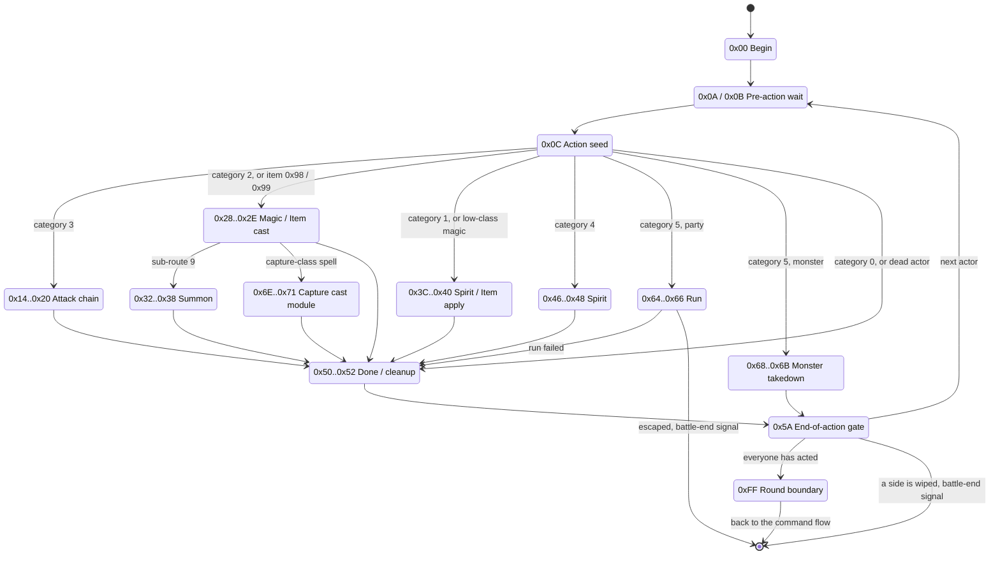

# Battle action state machine

Once a command is committed, something has to carry it out over many frames: walk the attacker in, play each swing, apply damage, run a spell's animation chain, wait for the HP bar to settle, then pick the next combatant. That is `FUN_801E295C`, the largest function in the battle overlay (extraction PROT 0898, resident in the `0x801C0000+` overlay region): 16 KB, 4099 MIPS instructions, 155 outgoing calls. It is a per-frame, edge-triggered state machine, not a bytecode VM - each state waits on a condition (a clip committed, a timer ran out, a range check passed) and stores the next state byte when it holds.

The Rust port carries the whole graph in `crates/engine-battle-vm` and both play hosts run every battle action through it.

## At a glance

| Item | Value |
|---|---|
| Driver | `FUN_801E295C`, called every frame from the battle tick `FUN_80046A20` right after the command-flow dispatcher `FUN_801D0748` |
| Dumps | `ghidra/scripts/funcs/overlay_battle_action_801e295c.txt`, `overlay_0898_801e295c.txt` |
| Context | `_DAT_8007BD24` -> the battle context (`0x800EB654` in the captures); `ctx[N]` below is byte `N` of that struct |
| State byte | `ctx[+0x07]` (written `ctx[7]`). Jump table `0x801CED44`, 256 slots, no default |
| Active actor | `(&DAT_801C9370)[ctx[+0x13]]` - the [8-slot actor table](battle.md#battle-actor-record), slots 0..2 party, 3..7 monsters |
| Action category | `actor[+0x1DE]`: `0` Tactical Arts, `1` Item, `2` Magic, `3` Attack, `4` Spirit, `5` Run |
| Queue | `actor[+0x1DF..+0x1F2]`, cursor `ctx[+0x15]`; attack band ends on `0x00`, magic band on `0xFF` |
| Animation handshake | The SM writes the queued clip `actor[+0x1DA]` and waits for the committed clip `actor[+0x1D9]` |
| Timer | `ctx[+0x6D8]`, an `i16` countdown decremented by the frame step `DAT_1F800393` |
| Turn cursor | `ctx[+0x1A]`, a position in this round's battle order |
| Battle end | Signalled through `DAT_8007BD71 = 0xFE`, never through the state byte |
| Port | `legaia_engine_vm::battle_action` (`crates/engine-battle-vm/src/battle_action/`), hosted by `engine-core`'s `World::step_battle` |

Three nested keys drive an action:

1. **Action category** - `actor[+0x1DE]`, read once at the seed state `0x0C` and used to pick the band.
2. **Execution phase** - `ctx[7]`, the outer `switch`.
3. **Per-actor sub-state** - the flag bits at `actor[+0x1DC]` (`0x01` windup done, `0x02` advance done - the latch held while a staged swing is in flight, `0x04` exit) plus scratch fields such as `+0x1DA` / `+0x1D9` and the queue.

### Related pages

| Topic | Page |
|---|---|
| The `0x51` exit gate, the HP-bar settle invariant, the `0x19` approach park (retail softlock classes) | [`battle-action-exit-gates.md`](battle-action-exit-gates.md) |
| Helpers this SM calls: range, escape roll, AI delegation, summon dispatch, pose driver, voice cues, PRNG | [`battle-action-helpers.md`](battle-action-helpers.md) |
| How the queue is built: Tactical Arts, Miracle / Super Arts, the action validator | [`battle-action-queue.md`](battle-action-queue.md) |
| Command menu that commits the action; the round loop | [`battle-command-flow.md`](battle-command-flow.md) |
| Damage, accuracy and block kernels | [`battle-formulas.md`](battle-formulas.md) |
| Capture-class cast modules driven by states `0x6E..0x71` | [`cast-module.md`](cast-module.md) |
| Slow motion, after-image ghosts, tint passes | [`battle-actor-rendering.md`](battle-actor-rendering.md) |
| Banners and screen-element placement | [`battle-hud.md`](battle-hud.md) |
| Context struct, actor record, scene loader | [`battle.md`](battle.md) |

### Phase diagram

Each box is a band of state bytes; the table below it lists every state.



## Outer dispatch - `ctx[7]` action-state cursor

`ctx[7]` is the **execution phase** byte at `_DAT_8007BD24[7]`. The runtime models it as a `byte`, but the value range is sparse: the handled states fall into contiguous bands (one per action category). The dispatcher is a single MIPS `jr` jump table at `0x801CED44 + (ctx[7] << 2)` (`sltiu` bound `0x100` → 256 word slots, **no `default` case**); every state byte indexes the table, and any slot outside the handled set points at the shared post-switch epilogue (see [Open work](#open-work)).

| State band | Phase | Action category |
|---|---|---|
| `0x00`, `0x0A`–`0x0C` | Init / re-entry | (any) |
| `0x14`–`0x20` | Attack chain | Attack (`+0x1DE == 3`) |
| `0x28`–`0x2E` | Magic / Item flow | Item (`+0x1DE == 1`) or Magic (`+0x1DE == 2`) |
| `0x32`–`0x38` | Summon flow | Magic with summon flag |
| `0x3C`–`0x40` | Spirit flow | Spirit (`+0x1DE == 4`) |
| `0x46`–`0x48` | Spirit band | Spirit (`+0x1DE == 4`, unconditionally - `li v0,0x46` at `0x801E2F5C`) |
| `0x50`–`0x52`, `0x5A` | Done / cleanup / end-of-action | (any) |
| `0x64`–`0x6B` | Run / Defend / capture-fail | Flee (`+0x1DE == 5`) |
| `0x6E`–`0x71` | Capture sequence - drives the paged [cast module](cast-module.md) | Magic with capture flag |
| `0xFD`, `0xFF` | Idle hold / round boundary | (any) |

### State table

One line per handled state; the full per-state behaviour is under [State detail](#state-detail).

| `ctx[7]` | Name | What it does | Exits |
|---|---|---|---|
| `0x00` | Action begin | Resets counters, seeds the turn cursor from the formation-advantage byte, latches it for the escape roll | `0x0A`, or `0x0B` while the menu is open |
| `0x0A` | Pre-action wait | Waits for the previous action to clear | `0x0C` |
| `0x0B` | Queued from menu | Holds while `ctx[+0x276] != 0` | `0x0A` |
| `0x0C` | Action seed | Builds the queue, rolls the camera variant, dispatches on the action category | `0x14` / `0x28` / `0x3C` / `0x46` / `0x50` / `0x64` / `0x68` |
| `0x14` | Attack - face target | Faces the target, range check, stages the approach clip | `0x15` (monster walk), `0x19` (party / walk-less monster), `0x1E` (in range) |
| `0x15` | Attack - windup | Waits for the pre-approach clip to commit, stages the walk | `0x16` |
| `0x16` | Attack - advance | Holds until in range (root motion walks), stages the close-in, shoves the target to the range boundary | `0x17` |
| `0x17` | Attack - close-range | Waits for the staged clip to commit | `0x18` |
| `0x18` | Attack - strike | Final clip match | `0x1E` |
| `0x19` | Attack - short step | Holds until range is 0; no movement code, no timeout | `0x1E` |
| `0x1E` | Strike loop | Stages one queue byte per swing, handles the counter-attack swap, re-faces the attacker | `0x1F` on the `0x00` terminator |
| `0x1F` | Attack - recovery wait | Recovery framing, waits for the stage latch to clear | `0x20` |
| `0x20` | Attack - return | Holds for the attacker's last clip, then the target's reaction | `0x50` |
| `0x28` | Cast begin | Faces the target, sets the cast timer, raises the monster spell label, debits MP | `0x29`, or `0x6E` for a capture-class spell |
| `0x29` | Pre-cast wait | Counts the timer down, runs the party cast trigger, stages the first clip | `0x2A`, `0x32` (summon), `0x50` |
| `0x2A` | Animation chain | Walks the `(clip, shot)` queue pairs | `0x2B` |
| `0x2B` | Sustained anim | Runs the cast-effect driver until the clip latch counts down | `0x2C` |
| `0x2C` | Hit-frame loop | Runs the effect driver until the clip ends or the hit count is reached | `0x2D` |
| `0x2D` | Recovery | Holds while an effect child is live, then clears cast scratch | `0x2E` |
| `0x2E` | Cast exit | Snaps a pitched cast camera back | `0x50` |
| `0x32` | Summon - invoke | Waits for the drive, computes the streaming slot, stages clip `9` | `0x33` |
| `0x33` | Summon - fade in | Close-up camera; on the clip's first effect record, white flash-in and cue `0x63` | `0x34` |
| `0x34` | Summon - actor freeze | Hides party and living monsters, seats the creature, starts the flash-out | `0x35` |
| `0x35` | Summon - sustain | Timer plus audio duck | `0x36` |
| `0x36` | Summon - return | Holds while the summon stager is busy, un-hides actors, spell level-up check | `0x37` |
| `0x37` | Summon - verify | Waits for every actor to settle, writes the fade sentinel | `0x38` |
| `0x38` | Summon - done | Kills the fade primitive | `0x50` |
| `0x3C` | Spirit / Item pre-arm | Stages the commit clip, seeds the `(class, tier)` pair, labels the HUD, debits MP for a non-item | `0x3D` |
| `0x3D` | Wait | Waits for the clip to commit, fires the cast audio cue | `0x3E` |
| `0x3E` | Fire | Waits for the clip to end, raises result elements, arms the post-cast timer | `0x3F` |
| `0x3F` | Apply | On timer expiry calls the applier `FUN_800402F4(class, tier, target, ...)` | `0x40` |
| `0x40` | Post-apply | Ramps the HP bar to its target | `0x50` |
| `0x46` | Spirit - entry | Close-up depth, stages the Spirit clip and the gauge targets | `0x47` |
| `0x47` | Spirit - sustain | Ramps the gauge and bar | `0x48` |
| `0x48` | Spirit - flush | Finishes the ramp, drains the hold | `0x50` |
| `0x50` | Done - cleanup | Final Heal revive, re-orders the round, action-end pose, arms the fade-down timer | `0x51` |
| `0x51` | Done - fade-down | Restores audio level, waits on the [HP-bar settle gate](battle-action-exit-gates.md), unloads HUD elements | `0x5A`, or `0x52` after a Seru absorb |
| `0x52` | Seru-absorb banner hold | Holds the "acquired the power of" banner; a press shortens it | `0x5A` |
| `0x5A` | End-of-action gate | Clears per-actor flags, tests for a wipe, advances the turn cursor | `0x0A` (next actor), `0xFF` (round over), or the battle-end signal |
| `0x64` | Run - begin | Runs the escape roll; a success floors party HP at 1 | `0x65` |
| `0x65` | Run - wait | Camera orbit (failed) or back-off (escaped) while the timer runs | `0x50` (failed), `0x66` (escaped) |
| `0x66` | Run - escape teardown | Fade to black, raises the battle-end signal | `0x67` (no body: terminal hold) |
| `0x68` | Monster run - start | Captured-monster takedown `FUN_801E7824`, re-orders the round | `0x69` |
| `0x69` | Monster run - wait | Timer, then marks the actor captured | `0x6A` |
| `0x6A` | Monster run - sustain | Timer, closes the run UI, hides the actor | `0x6B` |
| `0x6B` | Monster run - end | Timer | `0x5A` |
| `0x6E` | Capture module - load | Waits for the drive, pages the cast module in | `0x6F` |
| `0x6F` | Capture module - fade | Audio duck, waits for the load | `0x70` |
| `0x70` | Capture module - run | Ticks the paged [cast module](cast-module.md) every frame until it returns zero | `0x71` |
| `0x71` | Capture module - finalize | Waits for every slot to settle, resets render flags | `0x50` |
| `0xFD` | Idle hold | Action-end pose only | stays |
| `0xFF` | Round boundary | `ctx[+0x06] = 0x14`, bumps the round counter | back to the command flow |

Unhandled values are listed under [Unhandled states](#unhandled-states).

#### `0xFF` is the round boundary, not the battle's end

`0xFF` has exactly one writer: the **non-wipe** arm of `0x5A`, reached when every living actor has acted and both sides still stand. The wipe arms write no state byte at all - they raise the battle-end *signal* `DAT_8007BD71 = 0xFE` (with `_DAT_8007BD2C` = `5` party wipe / `0` monster wipe), which the successful-escape teardown `0x66` also raises. Battle end is signalled through `DAT_8007BD71`, never through the state byte.

Slot `0xFF` of the jump table at `0x801CED44` points at `0x801E67E8`, whose whole body is two context writes: `ctx[+0x06] = 0x14` (`0x801E67F4`), handing the round back to the command-flow SM's round-start arm, and `ctx[+0x28A] += 1` (`0x801E6810`) around a call to `FUN_801F45A4` (the per-round status-`0x400` waker). The only way in is the `jr v0` at `0x801E2AAC`, so a decompiler pass that does not resolve the table reports `Removing unreachable block (ram,0x801E67E8)` and the round bump is absent from the C. The command-flow side of the handshake is in [`battle-command-flow.md`](battle-command-flow.md#the-round-loop---what-re-arms-0x1e); `0x14` then stores `0x1E` unconditionally, which is why the `Begin` / `Run` prompt belongs to the round and not to a battle's first turn.

**Port.** `engine_vm::battle_action` maps `0xFF` to `ActionState::RoundEnd`, whose handler rewinds the turn cursor and hands control back through `EndOfAction`, the state the arming driver keys the next turn on. The retail `0xFF` body (`ctx[+0x28A]` bump, `FUN_801F45A4` wake sweep) runs host-side in `engine-core`'s live loop at its round boundary. The rewind is the engine's own: retail reseeds by re-entering `0x00`. `battle_end(..)` is raised only by the paths that raise `DAT_8007BD71 = 0xFE` in retail - the `0x5A` wipe arms and the escape teardown. Regressions: `engine-vm` `full_round_with_both_sides_alive_does_not_end_the_battle`, `engine-core` `round_boundary_state_is_not_a_spurious_victory`.

#### Attack chain - strike loop (`0x1E`)

The full step body for state `0x1E`:

Counters `actor[+0x15]` (per-strike index) + `actor[+0x16]` (combo bit). Reads the
per-actor attack-script byte stream at `actor[+0x1DF + +0x15]`. The inner step writes
`actor[+0x1DA] = next_anim_id` and OR's `+0x1DC |= 2`. The byte read is **gated on
`+0x1DC` bit `0x2` being clear** (`0x801E370C`: `lbu +0x1DC; andi 0x2; bne -> skip`) -
while the previous staged swing is still in flight the step does only the per-frame
physics, so strikes pace one-per-clip, with the anim system's end-of-clip edge clearing
the bit. Counter-attack handling (`0x801E35F0..0x801E36E0`, on the attacker's first
frame, `+0x1DC == 0`): if the latch `_DAT_801F6970` (counterer seat + 1) is set and the
*target's* committed category `s8[+0x1DE] == 3` (it chose Attack), the loop points
record `0x66` at `s_Counterattack_successful_801CED18`, holds it `0x78` frames
(`0x801F6964`) and raises it with `FUN_801D8DE8(0x66, 0)`, zeroes the attacker's staged
id and bumps its `+0x1DC`, aims the counterer at the attacker, makes it the active actor,
builds its queue (`FUN_801EED1C`), spends its initiative key (`+0x16C = 0`), clears the
target plaque's string and width (record `0x51`) and steps `ctx[+0x1A]`; either way the
latch drops. The latch is armed by the turn picker `FUN_801DABA4` after a monster's
physical pick on a party seat (`0x801DAF74..0x801DB050`: a `rand & 1` coin, no `0x380`
status on the monster, the target's key unspent, and the Counterattack passive, record
`+0xF4` bit `0x8000`). Port: `battle_action`'s counter head and the engine's
`world::battle::counterattack`. Per-frame physics: target/attacker drift along bearing scaled by
`actor[+0x21D]` (impact-step magnitude) when ability flags `0x10/0x20` are set in the
character record at `0x80084708 + (party_id-1)*0x414`. Reads `actor[+0x1DF + +0x15]`
until the `0x00` terminator is hit (the magic band is the one that terminates on `-1`). The stream alphabet for a party attack is direction
swings `0x0C..0x0F`, art starters `0x19`/`0x1A`, and art action constants `0x1B+` (see
[art-data.md](../formats/art-data.md)); the Miracle-Art continuation refills consumed
slots with `0x19` before re-walking. Staged ids `>= 0x10` are remapped to the dynamic
art slots `0x10`/`0x11` by the anim commit `FUN_8004AD80` at install (see
[battle-data-pack.md § Battle
animations](../formats/battle-data-pack.md#battle-animations-record0)).

#### Magic / Item - cast begin (`0x28`)

The full step body for state `0x28`:

- **Item-target re-route**, keyed on the **target** byte `actor[+0x1DD]` and not
  on the category (`lw t2, 0x20(sp)` at `0x801E4298` reloads the byte the
  prologue read out of `+0x1DD`): a target of `9` takes `ctx[+0x24B]`, a target
  of `8` takes `ctx[+0x24A] - 1`, each only when that ctx byte is non-zero. The
  two checks run in sequence on the rewritten value (`0x801E42E8`), so a `9`
  that resolves to `8` falls into the second arm. Those ctx bytes are the cast
  census's sole-survivor latches - `+0x24A` the lone living party slot
  (1-based), `+0x24B` the lone living monster - so this is a group code
  degenerating onto its last target.
- Then [faces the target](#the-cast-begin-facing-store) and writes
  `actor[+0x46]`. Sets `ctx[+0x6D8] = 0x14` (frame timer).
- For a **monster** caster (`ctx[+0x13] >= 3`), looks up the spell-name string via `&DAT_800754D0 + actor[+0x1DF]*0xC`, computes centered X for HUD, writes `_DAT_80077332/+0x33A/+0x344/+0x352/+0x35C` (the element `0x4C`/`0x4D` descriptor slots), fires UI element `FUN_801D8DE8(0x4C, 0)` (spell-name banner). The gate is `lbu v0,0x2(s5); sltiu v0,v0,3; bne v0,zero,0x801E4460` at `0x801E43D0` - the TAKEN side skips the block, so the banner is monster-only. A party cast has no banner writer anywhere: the same descriptor slots' only other writers are `FUN_8004AD80`'s two sites, the per-art name chase at anim install (party side) and its own monster-cast spell-name write.
- If the spell's first table byte is `'c'` (capture-class spell) → `ctx[7] = 0x6E` (capture path) + queues capture archive load via `func_0x8003EC70`.
- Reads MP cost from the spell record's `+3` byte (`lbu s0,0x3(v1)` at `0x801E451C`, record base `DAT_800754C8 + spell_id*0xC`, loaded at `0x801E4464`; `DAT_800754D0` is the same table viewed `+8`, which is how the name lookup reaches the record's `name_ptr`). Reduces it by half (`cost - cost>>1`) if the character's ability bitmask has `0x20` ("MP-half"), else by a quarter (`cost - cost>>2`) if `0x10` ("MP-quarter") - `0x20` is tested first and wins when both are set (`0x801E4568`). Stores the applied cost at `actor[+0x178]` and subtracts it from `actor[+0x150]` (MP).
- **Which copy is which.** The identical fold is inlined twice, and the two are easy to swap: `0x801E4568` is *this* state, immediately after the capture-archive `jal 0x8003EC70` at `0x801E44EC`; `0x801E3D0C` is state `0x3C`'s copy, immediately after that state's Pomander (`+0x1DF == 0xFE`) special case at `0x801E3C4C`. Behaviour is the same either way - only the state label differs.


### State detail

One subsection per handled state: what runs on a frame in that state, and where it goes. All citations are to `ghidra/scripts/funcs/overlay_battle_action_801e295c.txt`.

#### State `0x00` - Action begin

Resets ctx counters at `+0x6DA..+0x6DB`; seeds the [turn cursor](#the-turn-cursor-ctx0x1a) `ctx[+0x1A]` from the formation-advantage byte `ctx[+0x290]`; **latches** `ctx[+0x290]` → `ctx[+0x291]` and *then* clears `ctx[+0x290]` (`0x801E2B30`). The latch is what the escape roll reads all battle - see [the escape roll](battle-action-helpers.md#the-escape-roll-fun_801e791c). It also faces the actor at its target, [below](#the-cast-begin-facing-store).

**Next:** `0x0A` (or `0x0B` if `ctx[+0x276] != 0` is set, i.e. action queued from menu).

#### State `0x0A` - Pre-action wait

Calls `func_0x8003F2B8(1)` (likely a "pause until previous animation cleared" gate).

**Next:** `0x0C` when ready, else stays.

#### State `0x0B` - Action queued from menu

Holds while `ctx[+0x276] != 0` (menu still open).

**Next:** `0x0A` once cleared.

#### State `0x0C` - Action seed

Reads `actor[+0x1DE]` (action category) and dispatches into the appropriate band. Calls `FUN_801EED1C` (the arts queue-builder; slot < 3) or, for a monster slot with the `+0x16E & 0x380` bits, `FUN_801E7320` (random-retarget: the rolled action - including a Magic cast - is kept, only its target re-rolls to the opposite side; see the [`0x380` notes](battle-action-helpers.md#ai-delegated-0x380-party-members---what-is-and-isnt-pinned)). Reads RNG via `func_0x80056798()`. Calls `FUN_801EFE44` (camera bounds) and `FUN_801D5854(actor_id, 6)` (idle pose) unless `+0x1DE == 5` (run). The inner switch on `actor[+0x1DE]` is the "action category" dispatch - see [Inner dispatch](#inner-dispatch---actor-action-category).

**Next:** `0x14`/`0x28`/`0x3C`/`0x46`/`0x50`/`0x64`/`0x68` per category.

#### State `0x14` - Attack - face target

`FUN_801D5854(actor, 6)` (ready pose); computes target bearing via `func_0x80019B28(s8 X/Z, actor X/Z)` and writes facing into `actor[+0x46]`; iterates the 8-actor table at `0x801C9370` writing AI-side facing offsets at `ctx[+0x6E6 + i*2]`; calls `FUN_8004E2F0(actor, target)` for [range/LOS](battle.md). If range = 0 → `0x1E` (skip approach). Party arm: stages approach anim `+0x1DA = 1` (the walk entry) → short-step. Monster arm: first-byte tag search over its action-record array (`FUN_80050E2C`, tag `0x20`, retry `1`) stages the returned entry index.

**Next:** `0x15` (monster, tag-0x20 found); `0x19` (party, **or** a monster whose action table has no tag-`0x20` walk - the fallback stages tag `1` and skips the walk chain entirely); `0x1E` (in range).

#### State `0x15` - Attack - windup

Same idle pose + facing update; waits until the staged `actor[+0x1DA]` matches the committed `actor[+0x1D9]` (the pre-approach clip has started), then stages the monster's tag-`1` walk (`FUN_80050E2C` at `0x801E3340`).

**Next:** `0x16`.

#### State `0x16` - Attack - advance

Pose + facing recompute; range recheck. Out of range → stalls (`0x801E35D0`) - **no attacker movement here**; the walk is the clip's root motion in the anim tick (`FUN_80047430` `0x80047D20..0x80047E18`, gated on the same range check). On range 0: stages the tag-`0x21` close-in, then the **arrival shove** (`0x801E33EC..0x801E3490`): steps the *target's* live `+0x34`/`+0x38` **and** body `+0x3C`/`+0x40` pairs along the attacker's facing by `sin/cos >> 9`, looping while still in range - pushing the target back out to the range boundary. (An earlier revision read this as the attacker's advance loop; all four stores go through `s8`, the target.)

**Next:** `0x17`.

#### State `0x17` - Attack - close-range

Anim/facing update; matches `actor[+0x1DA]` against `actor[+0x1D9]`.

**Next:** `0x18`.

#### State `0x18` - Attack - strike

Final anim match → falls into the swing apex frame.

**Next:** `0x1E`.

#### State `0x19` - Attack - short-step (party attackers, and walk-less monsters via the `0x14` fallback)

Idle pose + facing + range recheck. While range > 0 → stays (no movement code, no timeout - see the park section below). Range == 0 → bumps `actor[+0x1DC] |= 1` (windup-done flag) and `actor[+0x16] = 0`.

**Next:** `0x1E`.

#### State `0x1E` - Attack chain - strike loop

Per-strike counters (`+0x15`/`+0x16`) advancing the attack-script byte stream at `actor[+0x1DF + +0x15]`, with counter-attack redirect and ability-flag impact-step physics. Re-faces the attacker every pass ([below](#the-strike-band-re-faces-the-attacker-every-pass)). Full step body: [Attack chain - strike loop (`0x1E`)](#attack-chain---strike-loop-0x1e).

**Next:** `0x1F` once the strike-script terminator is hit.

#### State `0x1F` - Attack - recovery wait

`FUN_801D5854(actor, 7 or 8)` (recover-pose; pose 8 if target's anim matched a counter trigger at `s8[+0x1F1]/+0x1F2`). Re-faces the attacker every pass. Waits for `actor[+0x1DC] & 2 == 0`.

**Next:** `0x20`.

#### State `0x20` - Attack - return

Two holds, then `0x50`. First the **attacker's** committed id: while `actor[+0x1D9] != 0` (`0x801E54EC`) it only re-poses and holds - the wait for the last swing's clip to end, since `0x1F`'s gate opens when that clip *commits* and its hit events (and the combo-total apply) all land after. Then the **target's reaction**: see [the reaction hold](battle-action-helpers.md#the-state-0x20-reaction-hold). Each held pass re-poses `FUN_801D5854(actor, 7 or 8)`. Every exit is the one `0x50` store at `0x801E5588`; there is no counter-attack route out.

**Next:** `0x50` (done) or stays.

#### State `0x28` - Magic / Item - cast begin

Resolves bearing + facing, sets the cast timer, looks up the spell-name HUD label, and deducts the (ability-bit-scaled) MP cost; capture-class spells route to `0x6E`. Full step body: [Magic / Item - cast begin (`0x28`)](#magic--item---cast-begin-0x28).

**Next:** `0x29` (or `0x6E` for capture).

#### State `0x29` - Magic - pre-cast wait

Decrements `ctx[+0x6D8]` by the frame dt. When negative: party_id < 3 → `FUN_801DBF9C(party, spell_id)` ([the cast trigger](#the-party-cast-trigger-fun_801dbf9c) - anim stream, not outcome). `actor[+0x1E0] == 9` → `0x32` (summon). Then **bumps the stream cursor before reading** (`0x801E4644..0x801E4650`) and stages the byte at `+0x1DA` (`0x801E4664`) - the first anim byte is `+0x1E0`, behind the spell id; a `-1` there clears the stage → `0x50`. Else if spell_id < 0x81: a second bump, `FUN_801DC0A0(party, byte)` (the cast-effect driver), and the id-keyed cues (`0x14C / 0x144 / 0x15E` for ids `0x3F / 0x2C / 0x6A`).

**Next:** `0x2A`, or `0x32` (summon), or `0x50` (done).

#### State `0x2A` - Magic - animation chain

Looks one byte **past** the cursor, `actor[+0x1DF + ctx[+0x15] + 1]` (the queue is `(clip, shot)` pairs). Not the terminator: while the clip latch `+0x1FA` is clear, steps the cursor onto the clip, stages it at `+0x1DA`, steps onto its shot and raises the latch; then calls `FUN_801DC0A0` with the byte two behind the cursor and holds. Terminator (`-1`): if the cursor is `2`, raises `+0x1FA` and `+0x1DC |= 4`.

**Next:** `0x2B`.

#### State `0x2B` - Magic - sustained anim

`FUN_801DC0A0` on `+0x1E1` while the cursor is `2` (else two behind it), until the commit `FUN_8004AD80` counts `+0x1FA` down at the clip's boundary.

**Next:** `0x2C` (and OR's `actor[+0x1DC] |= 4`).

#### State `0x2C` - Magic - hit-frame loop

`FUN_801DC0A0` per frame on the byte under the cursor; condition: `actor[+0x1D9] == 0` OR `(ctx[+0x24C] >= actor[+0x21B] && actor[+0x21B] != 0)` (hit-counter reaches script bound).

**Next:** `0x2D`.

#### State `0x2D` - Magic - recovery

While `ctx[+0x24D] != 0`, `FUN_801DC0A0` on the byte under the cursor. Once `0`: clears `actor[+0x176]` and `actor[+0x21B]`. Item-class spells (target == 9) set `DAT_8007B64C = 0x78` (UI flash).

**Next:** `0x2E` once `+0x24D == 0`.

#### State `0x2E` - Magic - exit

Gated on `ctx[+0x249] == 0`. A cast camera left pitched past `400` (`_DAT_8007B790`, `slti 0x191` at `0x801E4964`) snaps back: pitch `0`, eye Y `0x800840BC = 0x500`. Camera words, not a screen shake.

**Next:** `0x50`.

#### State `0x32` - Summon - invoke

`FUN_801D5854(actor, 6)` + waits on `func_0x8003DE7C(1)` (sound bank ready). When ready, computes summon-frame index `bVar5` from `actor[+0x1DF]` (if < 0x9A: `(actor[+0x1DF] + 0x7F) * 3 + 0x80`, else `actor[+0x1DF] * 4 + 99`); writes `ctx[+0x277] = bVar5`, `ctx[+0x276] = 1`, `ctx[+0x278] = 1`. Sets `actor[+0x1DA] = 9`, `actor[+0x1DC] |= 1`, `actor[+0x1FA]++`.

**Next:** `0x33`.

#### State `0x33` - Summon - fade in

`FUN_801DC0A0(party, 0x12)` - the cast-effect driver on the `0x12` the trigger staged, while the caster stays on clip `9`; its case `0x12` also arms the summon cast close-up camera (see [below](#the-summon-cast-close-up-camera)). When `actor[+0x1F5] != 0` (anim cue): writes the flash-in template at `DAT_801C9070` (kind `1` = additive, ramp `0x14`, black → white, start delay `0x14`, hold `-1`), spawns it with id `1` via `func_0x80024E80`, then fires cue `0x63` through `FUN_8004FCC8` (`0x801E4AA8`). The `-1` hold is why the white persists until `0x34` kills the actor.

**Next:** `0x34`.

#### State `0x34` - Summon - actor freeze

`FUN_801DC0A0(party, 0x12)`. When `actor[+0x1D9] == 0`: OR's the fade actor's bit `8` (kills the flash-in), clears `ctx[+0x278/+0x279]`, sets `ctx[+0x6D8] = 0x78` (timer), calls `func_0x801F1ED4` (the [player-summon stager dispatch](#the-engines-summon-stager), keyed on the summon id `actor[+0x1DF]` - phase 0 seats the creature), iterates the 8-actor table clearing `actor[+0x4]` and setting `+0x21C = 0xFF` on every party seat and every **living** monster (`lhu +0x14C` / `sltiu s0,3`, `0x801E4B30..0x801E4B6C`). Writes the flash-out template (additive, ramp `0x78`, white → black, no delay, hold `1`) and spawns it with id `1`.

**Next:** `0x35`.

#### State `0x35` - Summon - sustain

Decrements `ctx[+0x6D8]`; ducks the live **audio level** `_DAT_8007B910` down by `DAT_1F800393` per frame, clamped at `(_DAT_8008457C * 0x4B) / 100` (75% of the configured level) for spells < 0x99 or 50% for higher. If `+0x6D8 < 0` and `ctx[+0x276] != 0`, force-clamp `+0x6D8 = 1`.

**Next:** `0x36` when timer expires.

#### State `0x36` - Summon - return-from-fade

Runs `func_0x801F1ED4` and **holds while it returns non-zero** (`bne v0,zero,<exit>` at `0x801E4CB0`) - the stager's own phase machine paces this state. Calls `FUN_801F3C34` at `0x801E4CB8` - the [queued-magic follow-up guard](battle-action-helpers.md#the-queued-magic-follow-up-guard-fun_801f3c34). Then iterates 8-actor table clearing `+0x21C = 0` and resetting `+0x8 = 0x81000000` for actors with `+0x4 == 0`. Calls `FUN_801E70BC` (the summon-magic level-up check - see [`reference/functions.md`](../reference/functions.md); engine `World::accrue_summon_spell_xp` + `battle_formulas::summon_magic_levels_up`). Finally clamps the follow-up hold `*(0x801F6964)` to `1` when it is non-zero.

**Next:** `0x37`.

#### State `0x37` - Summon - verify all alive

`FUN_801D5854(actor, 6)`. Iterates the 8-actor table (party + active monsters); checks each is alive (`+0x14C != 0` AND `+0x1D9 != 0`). Sets a 4-byte fade-back-in sentinel at `ctx[+0x890..+0x893]` (`84 10 42 08`).

**Next:** `0x38`.

#### State `0x38` - Summon - done

OR's the fade primitive bit `8`; clears `DAT_801C938C[+0x22C]`.

**Next:** `0x50`.

#### State `0x3C` - Spirit / Item - pre-arm

`FUN_801D5854(actor, 6)`. Sets `actor[+0x1DA] = actor[+0x1E7]` (queued anim), the ring commit's [clip](battle-action-helpers.md#the-commit-clip-actor0x1e7) (`9` for Item). Sets `ctx[+0x243] = 1` ("action in progress" marker). **Seeds the `(class, tier)` pair `actor[+0x1E8]` / `+0x1E9`** ([below](battle-action-exit-gates.md#the-class-tier-seed-at-state-0x3c)). Item leg also writes HUD via `_DAT_80077332..+0x35C`; `actor[+0x1DF] == 0xFE` (Pomander) → label = `s_Points_returned_801CED34`. Non-Item computes MP cost (with ability-bit half/quarter), subtracts from `actor[+0x150]`; for party_id < 3 fires `FUN_801D8DE8(7, 0)` (UI element). Always fires `FUN_801D8DE8(0x4C, 0)` (HUD label).

**Next:** `0x3D`.

#### State `0x3D` - Spirit - wait

`FUN_801D5854(actor, 6)`. Holds while `actor[+0x1DA] != actor[+0x1D9]`. When matched, clears `actor[+0x1DA]`, calls `func_0x801F3990` (the [cast audio-cue dispatcher](battle-action-helpers.md#battle-helper-functions)). This is the **only** state that reaches that dispatcher, and an ordinary item use is the door into it - see [the one caller](battle-action-helpers.md#the-one-caller-is-state-0x3d-and-it-is-an-item--spirit-state).

**Next:** `0x3E`.

#### State `0x3E` - Spirit - fire

`FUN_801D5854(actor, 6)`. Holds while `actor[+0x1D9] != 0`. Calls `func_0x800319A8(0x21)` and `FUN_801D8DE8(0x4C, 1)`. For spirit-type 4 (Originals) on party, fires `FUN_801D8DE8(0x34, 1)`. For item class 5 (gauge extension, `0x801E3E90..0x801E4018`) it raises HUD elements `0x0F` / `0x52`, draws one `rand()` (`0x801E3F2C`) for the camera variant `(rand % 2) * 2`, stages the extended gauge `min(0x120, target base * 7 / 5 + 8)` into `ctx[+0x6DC]` and the actor's spirit `+8` (`+10` with ability bit `0x200`) capped at 100 into `ctx[+0x6DE]`, a gauge extension rather than damage (`spirit::gauge_extend_fire`). Otherwise re-fires UI elements 6/0x4E/0x4F (monster effect) or 7 (party effect) per slot. Sets `ctx[+0x6D8] = 0x20` (post-cast timer).

**Next:** `0x3F`.

#### State `0x3F` - Spirit - wait & fire damage

Decrements `ctx[+0x6D8]`. On expiration: calls `func_0x800402F4(actor[+0x1E8], actor[+0x1E9], target, party_id-1)` - the **damage application primitive**. Sets `ctx[+0x6D8] = 0x80` (post-damage cooldown).

**Next:** `0x40`.

#### State `0x40` - Spirit - post-damage

`FUN_801D5854(target, 6)`. Iterates HP-bar widget at `ctx[+0x1080]+0xE`: ramps it toward `ctx[+0x6DC]` (target HP) by `DAT_1F800393` per frame; mirrors damage-popup widget at `_DAT_801F6968+0x10`. When `ctx[+0x6D8] < 0` and target is no longer valid (dead or out of slot), sets `actor[+0x1DE] = 0` and clears HUD.

**Next:** `0x50`.

#### State `0x46` - Spirit - entry

Writes the camera depth `ctx[+0x6D0] = 0x800` first (`0x801E52AC`, the Spirit close-up), then `FUN_801D5854(actor, 6)`. Sets `actor[+0x1DC] = 2` (overrides flags). Stages anim `actor[+0x1DA] = actor[+0x1E7]` - the spirit clip `0x10` the Spirit commit wrote (`0x801D16A8`). Stages the bar target `ctx[+0x6DC] = min(((actor[+0x156] * 7) / 5) + 8, 0x120)` and the gauge target `ctx[+0x6DE] = min(actor[+0x170] + 0x20, 100)` (`+0x28` / `+0x23` per ability bits `0x200` / `0x100`), and arms the hold `ctx[+0x6D8] = 0x20` (`0x801E53A0`).

**Next:** `0x47`.

#### State `0x47` - Spirit - sustain

`FUN_801D5854(actor, 6)`. When `actor[+0x1D9] != 0`, clears `actor[+0x1DA]`. While `ctx[+0x6D8] > 0` it steps the hold and returns (`blez` at `0x801E53E0` - level-triggered, not an edge). Then ramps the gauge element (`*0x801F6968` `+0x10`) toward `ctx[+0x6DE]` and, when `actor[+0x1F9] == 0`, the bar at `ctx[+0x1074]+0xE` toward `ctx[+0x6DC] - 6`, returning while the bar moves.

**Next:** `0x48` once `actor[+0x1DC] == 0`, re-arming `ctx[+0x6D8] = 0x300` (`0x801E54E0`).

#### State `0x48` - Spirit - flush

Finishes the gauge ramp; drains `ctx[+0x6D8]` by `8 * step`, clamped at zero (`0x801E572C..0x801E5760`). Leaves when `actor[+0x1DA] == actor[+0x1D9] == 0`, the hold is out and the gauge element sits on its target.

**Next:** `0x50`.

#### State `0x50` - Done - cleanup phase

Calls `FUN_801E6968` (the Lost Grail **Final Heal** auto-revive; engine `World::apply_final_heal_revives`), counts living party + monster actors (`+0x14C != 0 && (+0x16E & 4) == 0`); if any survivors → `FUN_801DABA4` (recompute battle ordering). Resets `actor[+0x224] = 8` (or `0x20` for spirits/`+0x1DE == 4`). Adjusts `actor[+0x170]` (HP-bar target) by ability-flag bits `0x100`/`0x200`. Clamps `actor[+0x170]` at 100. OR's `actor[+0x1DC] |= 4`. Per category: `+0x1DE == 5` (run) → orbit yaw `2 * step` turn, no pose; `+0x1DE == 3` (attack) or party with dead s8 → pose 8; otherwise pose 6. Sets `ctx[+0x6D8] = 0x3C` (or `0x96` when the level-up banner byte `ctx[+0x26]` is set). If `ctx[7] == 0x50`, advances to `0x51`.

**Next:** `0x51`.

#### State `0x51` - Done - fade-down

Ramps `_DAT_8007B910` back up to `_DAT_8008457C` (the configured [audio level](battle-action-helpers.md#the-_dat_8007b910-ramps-are-an-audio-duck)). Per-category pose updates. Calls `FUN_801E7250` ([the HP-bar settle gate](battle-action-exit-gates.md#what-fun_801e7250-measures)); decrements `ctx[+0x6D8]`. When < 0 and `ctx[+0x276] == 0`: `ctx[+0x269] == 0` → `0x5A`, else `0x52`.

Under `timer < 0xC`, calls `FUN_801D99BC` and unloads: `FUN_801D8DE8(actor[+0x18], 1)` (anim), `+0x4E/+0x4F` if anim was 6, `ctx[+0x26]` (the level-up banner), `+0xF/+0x52` (damage), `+0x44`; then **raises** `+0x59` (the capture banner) and unloads `+0x51` / `+0x50`, plus the multi-cast `(id, id-4)` loop off `_DAT_801F6974` - see [the sweep section](battle-action-exit-gates.md#the-sweep-the-teardown-falls-into-0x801e62180x801e6368).

**Next:** `0x52` or `0x5A`.

#### State `0x52` - Done - Seru-absorb banner hold

Entered from `0x51` only when the killing blow absorbed a Seru (`ctx[+0x269]` non-zero), with the countdown re-seeded to `0xB4`; it holds the "acquired the power of" banner (`0x59`) the `0x51` sweep raised. `FUN_801D5854(actor, 8)` (action-end pose). Decrements `ctx[+0x6D8]`. If timer > 0x13 and a button was newly pressed (`_DAT_8007B874`, the pad's newly-pressed edge - not a screen-shake word; `0x801E63A8`), clamps timer at 0x13: a press shortens the wait. When < 0: clears `ctx[+0x269]`, advances to `0x5A`. When < 0x14 and **`ctx[+0x17]`** (the `0x51` block's own latch, not an actor byte) is non-zero: `FUN_801D99BC`, unload `0x59`, clear the latch - the close of the banner the `0x51` sweep raised. Port `done::done_seru_absorb`.

**Next:** `0x5A`.

#### State `0x5A` - End-of-action gate

Iterates 8-actor table clearing per-actor anim flag bits (`+0x8 &= 0x7CFFFFFF`, `+0x21F = 0`). Resets dead/inactive actors' `+0x36 = 0`, `+0x21C = 0`, `+0x225 = 0`. Counts living actors per side ([plus a special-battle rule](battle-formulas.md#the-flow-readers)): if all party or all monsters dead, sets `DAT_8007BD71 = 0xFE` (battle-end signal) + `_DAT_8007BD2C = 5` (party wipe) or `0` (monster wipe), AND's `DAT_8007BD60 &= 0x7F`. Otherwise, picks the next active actor: bumps the [turn cursor](#the-turn-cursor-ctx0x1a) `ctx[+0x1A]++`; if it is `< (party_count + monster_count - ctx[+0x25])`, advances to `0x0A` (next action); else → `0xFF` (round boundary - see below).

**Next:** `0x0A` (next actor) / `0xFF` (round ends).

#### State `0x64` - Run - flee anim begin

Calls `FUN_801E791C` ([the escape roll](battle-action-helpers.md#the-escape-roll-fun_801e791c) - decides the flee, writes `_DAT_8007726C`). Sets `ctx[+0x6D8] = 0x3C`. Fires `FUN_801D8DE8(0x43, 0)` (run UI). Advances the [turn cursor](#the-turn-cursor-ctx0x1a) past each monster with a rotation trigger (`+0x16C != 0`) that isn't immune (`(&DAT_8007BD10)[i] != 4`). If party-side ran (`_DAT_8007726C != ctx + 0x189`, the run roll succeeded): screen-shake, and **floors every party actor's live HP at 1** (`+0x14C == 0` → `1`, loop bound = party count) - the mechanism behind "escape restores a Stoned member". Ported: `RunBegin` + `StatusEffectTracker::cure_stone_on_escape`. Else screen-shake only.

**Next:** `0x65`.

#### State `0x65` - Run - wait

Two camera arms on the outcome (`_DAT_8007726C == ctx + 0x189` = failed). **Failed:** the orbit yaw `_DAT_8007B792` turns `2 * step` a pass (an orbit, not a shake), and a new press or a button held the whole 32-vsync ring (`_DAT_8007B874 | _DAT_8007B938`, `0x801E5978..0x801E59A0`) zeroes `ctx[+0x6D8]`. **Escape:** the eye Z `0x800840C0` backs off `32 * step` a pass; no press test (port `run::run_wait`). Both decrement `ctx[+0x6D8]` by the step `DAT_1F800393`. When < 0: **failed run** → `0x50` (Done band - the action is consumed, the battle continues); **successful escape** → `0x66`.

**Next:** `0x50` (failed) or `0x66` (escaped).

#### State `0x66` - Run - successful-escape teardown

Writes the fade template at `DAT_801C9070` - kind 2, time `0x40`, start `(0,0,0)` → end `(0xFF,0xFF,0xFF)` (a black→white ramp drawn with kind 2 = ABR `B - F`, i.e. a fade to **black**; ramped by the `FUN_80020B00` fade-state loader) - and spawns it via `func_0x80024E80(&DAT_801C9070, 0)`. Sets `DAT_8007BD71 = 0xFE` - the **battle-end signal**, the same byte the `0x5A` wipe gate sets - so the party leaves the battle. (The earlier "run failed, battle continues" reading of this state is falsified by that signal byte; the failed-run path is `0x65 → 0x50`.) Engine: `ActionState::RunEscape` → `BattleEndCause::Escaped`; the fade is the `engine_core::fade` kernel.

**Next:** `0x67` (terminal hold; no case body - falls through to default no-op).

#### State `0x68` - Capture - start

RNG via `func_0x80056798`. Adjusts `ctx[+0x6DA] += 0x780 + (rand%2)*0x80`. `FUN_801D5854(actor, 6)`, `FUN_801E7824(actor)` (the captured-monster takedown), `FUN_801DABA4`. Sets `ctx[+0x6D8] = 0x1E`.

**Next:** `0x69`.

#### State `0x69` - Capture - wait

`FUN_801D5854(actor, 6)`. Decrements `ctx[+0x6D8]`. When < 0: sets `ctx[+0x6D8] = 0x5A`, sets `actor[+0x225] = 2`, `+0x21C = 2`.

**Next:** `0x6A`.

#### State `0x6A` - Capture - sustain

Decrements `ctx[+0x6D8]`; if `ctx[+0x276] != 0` clamps timer at 1. When < 0: ctx[+0x6D8] = 0x3C, calls `FUN_801D99BC`, `FUN_801D8DE8(0x43, 1)` (run-UI close), `actor[+0x4] = 0`, `FUN_801D5854(0, 9)` (defeat pose). Screen rotates.

**Next:** `0x6B`.

#### State `0x6B` - Capture - end

`FUN_801D5854(0, 9)`; screen rotates; decrements timer. When < 0 → `0x5A` (end-of-action).

**Next:** `0x5A`.

#### State `0x6E` - Magic-capture branch

`FUN_801D5854(actor, 6)`; waits on `func_0x8003DE7C(1)` (CD ready). When ready: calls `func_0x8003EAE4(0, capture_index)` (load capture archive); sets `_DAT_8007BDB0` to capture-monster index.

**Next:** `0x6F`.

#### State `0x6F` - Magic-capture - fade

If `ctx[+0x287] != 0`: duck the audio level `_DAT_8007B910 -= DAT_1F800393`, clamp to `(_DAT_8008457C * 0x4B) / 100`. Adjusts ctx-buffer X position. Waits on `func_0x8003F2B8(1)`.

**Next:** `0x70`.

#### State `0x70` - Magic-capture - phase 2

Same audio duck as `0x6F`, behind the same `ctx[+0x287]` gate. Pins `ctx[+0xD] = 1` in the call's delay slot. Runs `func_0x801F2160` (the [magic effect-class dispatcher](battle-action-helpers.md#battle-helper-functions), keyed on the spell's effect-class byte) - for a capture-class action this is the drive loop of the paged **cast module**: the module tick re-enters every frame and the state advances only on a zero return, with no timer and no bail-out ([cast-module.md](cast-module.md)). When done, calls `func_0x801F0348` (the [target-size camera framing](battle-action-helpers.md#battle-helper-functions)). Ported as `magic::magic_capture_phase2` over `BattleActionHost::capture_stager_tick`.

**Next:** `0x71`.

#### State `0x71` - Magic-capture - finalize

`FUN_801D5854(actor, 6)`; checks all 8 slots are settled (alive with non-zero `+0x4`, or non-`8` `+0x1D9`). Once stable: clears ctx buffers, writes the 4-byte fade sentinel (`84 10 42 08`), iterates resetting per-actor `+0x21C = 0` and `+0x8 = 0x81000000`.

**Next:** `0x50`.

#### State `0xFD` - Idle hold

`FUN_801D5854(actor, 8)`. No state change.

**Next:** (stays).

#### State `0xFF` - End of round

Sets `ctx[+0x6] = 0x14`, increments `ctx[+0x28A]` (round counter), calls `func_0x801F45A4` (the per-round status-`0x400` waker, see [battle-action-helpers.md](battle-action-helpers.md#battle-helper-functions)).

**Next:** round boundary; the next round's actor selection follows.


## The cast-effect driver's camera script

`0x2A..0x2D` call no `FUN_801D5854` case: the camera of a non-Seru cast (every
monster spell) is `FUN_801DC0A0`'s, a 20-way jump table (`0x801CECAC`) keyed on
the queue byte the arm passes. The monster pick `FUN_801E9FD4` stages that byte
behind the clip: `+0x1DF` spell id, `+0x1E0` clip, `+0x1E1` opening shot, then
`0xFF` (`0x801EA53C..0x801EA588`) - case `7` below id `0x25`, else the byte at
`0x801F66D8 + id - 0x25` in PROT 0898 (`legaia_asset::spell_anim_pairs`).

Each case may rewrite the queue byte it was called with
(`s3 = actor + 0x1DF + ctx[+0x15]`), so the selector is a state machine the
effect drives: the caster close-ups `7` / `0xA` / `0xC` / `0xE` hand on to the
projectile shot `8` (`9` / `0xB` for a group target, `0xF` for a monster whose
first magic slot is `0x3A`) on the first frame an effect child is live
(`ctx[+0x24D] != 0`); the spins `3` / `5` hand on to `4` once the move-FX
counter `ctx[+0x6C6]` drops below `0x21`. `battle_gimard_tail_fire_a` holds
`[0x27, 8, 8, 0xFF]` - Tail Fire's table byte `7`, already rewritten to `8` by
the live flame - and its camera reads case 8 exactly: pitch `0x40`,
`TR (0, 0x400, 0x800)`, yaw `0x200 - actor[+0x46]`, focus the flame's position
`ctx[+0x1144]`. Port: `legaia_engine_vm::battle_cam_script::spell_cam_case`
(the nineteen non-summon cases), fed by `engine-core`'s
`battle_cam_inputs::spell_cam_inputs` from the host's `spell_anim_sustain`.
The engine flies the effect slots (`action_effect_script::HomingSlots`, below),
and the camera reads them: the seeded slot's child is what case 7 hands on at,
and slot 0's position is the point case 8 frames. The engine's own census
leaves `ctx[+0x24D]` at zero, so the camera takes the larger of the two counts;
the magic band's exit gates still read the census alone.

## The summon cast close-up camera

`FUN_801DC0A0` is the cast-effect driver *and* a camera script: its prologue
advances the same `ctx[+0x26E]` ramp (capped at `0xC8`) and `ctx[+0x87C]`
accumulator `FUN_801D5854`'s does, then a 20-way jump table (`0x801CECAC`)
picks a framing it hands to the tween builder `FUN_801D829C`. The summon band
calls it with `0x12` on every pass of `0x33` and `0x34`, and neither state
calls `FUN_801D5854`, so case `0x12` (`0x801DCCF0..0x801DCD94`, duration
`a3 = 3`) owns the camera while the caster plays its cast clip:

```text
pitch = -(ctx[+0x26E] * 2)
yaw   = -actor[+0x46] + ctx[+0x87C] * 2 + 0x500
TR    = (0, ctx[+0x87C] * 2 + 0x300, 0x680 - ctx[+0x87C] * 3)
focus = -(actor[+0x3C], 0, actor[+0x40])
```

A low camera beside the caster, pitched up by as much as `400` units, rising
and swinging round as the accumulator runs; it also sets `ctx[+0x243] = 1`.

The camera trails that target rather than sitting on it. The builder turns
`a3 = 3` into a per-frame increment `ceil(rem / 3)` per component, and the
walker task `FUN_8002149C` adds `increment * frame_step` (`0x1F800393`) a
pass and clamps on the endpoint. At retail's 30 Hz tick (`frame_step = 2`) a
pass covers two thirds of the gap while the target moves `16 * 2` TR y a
pass, so the walk settles `14` units short: `freed_summon_mid_cast`'s step
table at `ctx[+0x118C]` reads increments `16` / `16` / `39` (yaw, TR y, TR z)
with the live globals `14` / `14` / `37` short of the endpoints. A capture on a
dropped frame (`frame_step = 3`: `nighto_summon_mid_cast`,
`theeder_summon_mid_cast`, `gizam_summon_mid_cast`) walks `3 * 16` and lands.
The port steps it as `battle_cam_script::Glide::chase`: the builder's increment times the camera step's two frames.
Port: `legaia_engine_vm::battle_cam_script::summon_cast_framing`, stepped by
the shared battle camera both hosts drive. The focus is the **body pair**
(`lhu v0,0x3c(s2)` / `lhu v0,0x40(s2)` at `0x801DCD74..0x801DCD84`), not the
live `+0x34` / `+0x38`: the camera input carries it as
`BattleCamInputs::acting_body`, the engine's `BattleActor::seat`.

The swing starts at the **invoke clip**, not at the action. The staged-anim
commit `FUN_8004AD80` zeroes `ctx[+0x26E]`, `ctx[+0x87C]` and the latch
`ctx[+0x26F]` whenever the committing actor is `ctx[+0x13]`
(`0x8004BF50..0x8004BF78`; the death ramp `+0x270` is left alone), so when
clip `9` commits the close-up restarts from a level, unrotated camera - a
capture three frames in reads `ctx[+0x87C] = 72` and pitch `-144`. Port:
`BattleCamera::observe_active_commits` on the active actor's commit count.

`0x33`'s cue `actor[+0x1F5]` is that clip's **effect-script cursor**: the
battle effect-script walker `FUN_801DEA50` bumps it as each record fires on
its frame, and the commit zeroes it (`0x8004B060`). So the flash-in waits
for the invoke clip's first record, well after the clip commits - on the
captures, about `28` vsyncs in (`ctx[+0x87C] = 632` when the flash is `51` vsyncs
old). Port: `summon_windup_cue` reads `Actor::battle_effect_cursor`; a
caster with no effect script is cued at once.

## Inner dispatch - actor action category

Read once at `ctx[7] == 0x0C`, the byte `actor[+0x1DE]` selects the action category and seeds `ctx[7]`. The actor pointer is `(&DAT_801C9370)[ctx[+0x13]]` - i.e. the active battle actor.

| `actor[+0x1DE]` | Action category | Initial `ctx[7]` | Notes |
|---|---|---|---|
| `0` | **Martial Arts (Tactical Arts)** | `0x50` (skip - UI inputs handle the chain) | Sets `ctx[+0x6D0/+0x6D1] = (0, 8)` (UI cursor anchor), `ctx[+0xD] = 0`. The tactical-arts directional input is run by a separate flow before this state machine; by the time `ctx[7]` reaches `0x0C`, the chain is recorded and the action is "done" for this driver. |
| `1` | **Item** | `0x3C` (default), overridden to `0x28` for item id `0x98` / `0x99` | The override is `(actor[+0x1DF] + 0x68) & 0xFF < 2` and is **not** RNG-conditional - the arm's `rand()` draw feeds `ctx[+0xD]`, not the branch. See [the Item arm's summon override](#the-item-arms-summon-override). |
| `2` | **Magic** | `0x28` (default), overridden to `0x3C` for a low-class, low-id record | The arm stores `0x28` first and overrides only when **both** class byte `< 0x14` **and** spell id `< 0x65` hold - see [the class-byte discriminator](#the-magic-arms-class-byte-discriminator). |
| `3` | **Attack** | `0x14` | Sets `ctx[+0x6DA/+0x6DB] = (0, 2)` (combo timer). For party_id < 3, sets `actor[+0x20] = +0x1DE` and fires `FUN_801D8DE8(7, 0)` + `actor[+0x18] = 7` (UI weapon-slash element). |
| `4` | **Spirit (Originals)** | `0x46` | Sets `_DAT_80076D7E = actor[+0x154] - 6` (or `((actor[+0x156] * 7) / 5) + 8` capped at 0x120 if `actor[+0x1F9] != 0`). Fires `FUN_801D8DE8(0xF, 0)` + `0x52` (damage popup), bumps `actor[+0x19]++`. |
| `5` | **Run / Defend** | `0x64` (party) or `0x68` (monster) | Party run: rotates screen `_DAT_8007B792 += DAT_1F800393 * -2`, fires `FUN_801D5854(0, 9)` (defeat pose). Monster run hits the capture path at `0x68`. Either path resets `_DAT_801F69D0 = 0` (counter-attack flag). |

### The Magic arm's class-byte discriminator

The category-`2` arm (`0x801E2EB0..0x801E2F08`) writes `ctx[7] = 0x28`
**first**, then reads the spell's class byte off the static table
(`DAT_800754C8 + actor[+0x1DF]*0xC`, `+0`) and overrides the store only when
two tests both pass:

```text
801e2ebc  sb    v0,0x7(v1)         ; ctx[7] = 0x28   (the default store)
801e2ee4  lbu   v0,0x0(v0)         ; class = DAT_800754C8[id].+0
801e2eec  sltiu v0,v0,0x14         ; class < 0x14 ?
801e2ef0  beq   v0,zero,801e2f24   ;   no  -> keep 0x28
801e2ef4  sltiu v0,a0,0x65         ; id < 0x65 ?
801e2ef8  beq   v0,zero,801e2f24   ;   no  -> keep 0x28
801e2efc  li    v0,0x3c
801e2f08  sb    v0,0x7(v1)         ; both  -> ctx[7] = 0x3C
```

So the override is `class < 0x14 && id < 0x65`, and `LAB_801E2F24` is the
*keep-`0x28`* fall-through - the same label the Attack arm drops into, not the
`0x3C` store. Reading the two `beq`-to-zero senses the other way round gives the opposite routing (`class > 0x13` or `id > 100` to `0x3C`), which is wrong.

Consequences worth holding on to: the player Seru block `0x81..=0x8b` fails
the `id < 0x65` test, so player summon magic always takes `0x28`; the low
elemental tiers `0x00..=0x24` are the band that can take `0x3C`. Either way
the cast is charged - `0x3C` runs the same ability-bit MP fold for a non-Item
category - so the discriminator picks the animation/timing band, not the cost.

**Port.** `magic_seed_band` in `legaia_engine_vm::battle_action::dispatch`,
over `BattleActionHost::spell_class_byte`. A host with no spell table reports
`None` and keeps `0x28`, which is retail's own non-override branch.

### The Item arm's summon override

The category-`1` arm (`0x801E2E30..0x801E2EAC`) has the same shape as the
Magic one - default store, then a single override:

```text
801e2e3c  jal   0x80056798        ; rand()
801e2e40  sb    v0,0x7(v1)        ; ctx[7] = 0x3C   (delay slot: the default)
801e2e60  sb    v0,0xd(v1)        ; ctx[+0xD] = (rand % 2) * 2
801e2e6c  addiu v0,v0,0x68        ; item id + 0x68
801e2e74  sltiu v0,v0,0x2         ; ... < 2  ->  id == 0x98 or 0x99
801e2e78  beq   v0,zero,801e3028  ;   no  -> keep 0x3C
801e2e88  sb    v0,0x7(v1)        ;   yes -> ctx[7] = 0x28
801e2ea0  sb    v1,0x1e0(s3)      ;          actor[+0x1E0] = 9 (summon sub-route)
801e2eac  sb    v0,0x1df(s3)      ;          actor[+0x1DF] = id - 2
```

The `rand()` draw is unconditional and its result reaches `ctx[+0xD]` only -
the branch tests the item id only. Ids `0x98` / `0x99` are the two
summon-invoking items: they enter the cast band already staged as a summon, so
state `0x29`'s sub-route test sends them to `0x32`; that arm also re-stamps
`ctx[+0xD] = 0` (`sb zero,0xd(v0)` at `0x801E2E94`).

**Port.** `item_seed_band` in `legaia_engine_vm::battle_action::dispatch`,
including the draw and both stores.

### `ctx[+0xD]` - the per-action camera-angle variant

`ctx[+0xD]` is not a spare byte. Three sites read it as a four-way switch
(`0x801D6510`, `0x801D6698`, `0x801D689C`), all three inside the **battle
camera** `FUN_801D5854` - the only prologue in `0x801D5854..0x801D6A00` is its
own. The switch is really two independent bits: bit `0` (variants `1` and `3`)
adds `0x800` - a half-turn - to the staged yaw, and bit `1` (variants `2` and
`3`) raises the staged pitch by `0x80` and drops the staged `sp+0x1A` by
`0x100`. So the byte is what makes two runs of the same action frame from
different sides, at two heights.

The three sites spell the same rule three ways: `0x801D6510` reaches the
bit-1 body by **falling out** of the `== 3` arm into the `== 2` arm and stores
`0x1A` as the literal `0x400` (its seed was `0x500`), `0x801D6698` does the
same, and `0x801D689C` gives variant `3` its own arm and subtracts `0x100`
instead - the same value by a different route.

`sp+0x1A` is the **middle component of the translation vector**, not a roll: it
is the second halfword of the `a1 = sp + 0x18` triple `FUN_801D7130` takes
alongside `a0 = sp + 0x10` (pitch / yaw) and `a2 = sp + 0x20` (the negated
focus position), and its neighbour `sp+0x1C` carries the depth `ctx[+0x6D0]`.
It is not a roll angle.

`ActionSeed` rolls it `rand() % 4` before the category dispatch
(`jal 0x80056798` / `sb v0,0xd(a0)` at `0x801E2D04..0x801E2D30`), and each
category arm then narrows it:

| category arm | store | site |
|---|---|---|
| `0` Tactical Arts | `0` | `0x801E2E1C` |
| `1` Item | `(rand % 2) * 2`, then `0` on the summon route | `0x801E2E60` / `0x801E2E94` |
| `2` Magic | `0`, ahead of both of its routes | `0x801E2EC8` |
| `4` Spirit | `(rand % 2) * 2` | `0x801E3024` |

Attack (`3`) and Run (`5`) make no store of their own, so they keep the seed
roll. (The arm addresses come from the seed's own category jump table at
`0x801CF144`, six words indexed by `+0x1DE`, guard `sltiu v0,v1,0x6` at
`0x801E2D68`.)

Two later bands narrow it again. State `0x14` masks it to bit 0 on its
**in-range shortcut** into the strike loop (`lbu` / `andi 1` / `sb` at
`0x801E321C..0x801E322C`) - the outer `switch`'s entry for `0x14` is
`0x801E305C`, so that block is `0x14`'s own body, and it is the only one of
the dispatcher's three `ctx[7] = 0x1E` stores that carries the write (the
`0x18` and `0x19` stores at `0x801E3550` / `0x801E35AC` do not). The capture
band's `0x70` pins it to `1` outright (`0x801E50CC`).

**Port.** `BattleActionCtx::camera_variant`, and every writer above is
carried: the seed roll, the Item arm's draw and its two stores, the
Tactical-Arts / Magic zeroes, the Spirit arm's draw at `0x801E2FFC`
(`battle_action::dispatch`'s `spirit_seed_band`), state `0x14`'s bit-0 mask
at `0x801E3224` (`attack_face`'s in-range arm) and the capture band's `= 1` at
`0x801E50CC` (`magic_capture_phase2`). The consumer is
`legaia_engine_vm::battle_cam_script` - `action_framing`, `recover_framing`
and `action_end_framing` each carry the two-bit fork of their own site - and
both hosts feed it the live byte, so the four variants produce four framings.

`FUN_8004E13C` zeroes the byte from a clip commit (`sb zero,0xd(v1)` at
`0x8004E2B4`): the commit `FUN_8004AD80` hands it the new entry's `+0x87`
byte when that is non-zero (`0x8004BE18..0x8004BE2C`), and its value-2 arm -
byte `2`, the previous `ctx[+0x243]` not `2`, a party seat in `ctx[+0x13]` -
re-seeds the yaw counter `ctx[+0x6DA] = (rand() % 2) * 0x800 + 0x280` beside
the zero. It is not tied to a state edge: `player_steal_skeleton_pre` reads
style `2` and the Attack base `0x218` eight frames into the strike loop
`0x1E`. The engine runs it at its commit (`World`'s staged-anim commit, over
the clip's `entry_solo_flag`), writing the live byte and handing the coin to
the camera (`BattleCamera::observe_swing_reseed`).

### Magic in the port: which half of the cast the SM owns

States `0x28`–`0x2E` contain **no damage application**. The only
`jal func_0x800402F4` (the damage primitive) in `FUN_801E295C` is at
`0x801E4134`, in the attack band. What the magic band does is face the caster,
stage the `0x14`-frame pre-cast timer, raise the (monster-only) `0x4C`
spell-name label, debit MP, and drive the animation chain; the *outcome* is
produced by the per-spell streamed module that `FUN_801DBF9C` (`0x801E45E4`,
state `0x29`) stages the anim stream for and `FUN_8003EC70` pages in - for a
Seru id, inside the per-summon stager the summon band ticks - and by the
effect-class dispatcher `func_0x801F2160` on the capture side.

**The port routes every cast through the band.** The Magic submenu's confirm
and the monster AI's pick both *arm* the SM (`World::arm_player_cast` /
`arm_monster_cast`: category `2`, the spell id at `params[0]`, the target byte,
a monster's cast clip at `params[1]`) and park the resolved targets in one
owner, `World::casting.pending_cast`. The band then charges the ability-bit-folded MP at
`MagicCastBegin` and the outcome folds **once**, at retail's seam, through
`cast_spell_on_slots_prepaid` (no second debit): a Seru cast folds in the
engine's stager at its strike ([below](#the-engines-summon-stager)); a
monster's cast whose clip seeds a homing flight folds from that flight
([below](#a-monsters-cast-lands-from-its-homing-flight)); anything else folds
the frame the SM leaves `0x29` for the anim chain (`World::settle_cast_band`);
a cast that leaves the bands by another door (the capture branch, a dead
caster) folds at the band's end, so no turn spends MP for nothing. An escape spell that folds this way ends the encounter from the
live loop on the same frame, as the item path's fold already did.

#### A monster's cast lands from its homing flight

Retail's one damage site for a monster's non-capture cast is the effect-child
hit arm of the per-frame cast tick `FUN_801E09F8` (`0x801E1844..0x801E1A68`):
the move's sound cue (`record[+0x0D]` through `FUN_8004FCC8`), the roll
`jal 0x801DD0AC` at `0x801E188C`, the number-ring push, the clamped HP store
and the victim's reaction clip, then the slot's phase and child bytes zeroed.
It is reached per slot, on the pass a slot in phase `3` finds its counter
`ctx[+0x6C6 + i*2]` run out (`beq v0,zero,0x801e1844` at `0x801E17A0`). The
slots are the four the cast clip's effect-script terminator seeds
([the per-action effect script](#the-per-action-effect-script-fun_801dea50)),
so the hit is as late as the clip's terminator record, its streak, its flight
and its landing counter make it.

`battle_gimard_tail_fire_b` holds the result for Tail Fire, whose record has
no streak and no landing counter (`+0x04 = +0x06 = 0`) and whose launch point
`(181, -300, -674)` is already inside the arrival radius of its victim: state
`0x2B`, slot `0` freed on the victim's old position, the number ring's timer
at `352` - 22 vsyncs after the hit, 24 after the clip's commit.

The port folds there. `World::settle_cast_band` leaves a monster's cast owed
at the `0x29` exit when its staged clip carries a terminator and the
move-power table resolves the move (`PendingCast::on_flight`);
`HomingSlots::step` reports the child of every slot it frees after a landing
(`HomingSlots::hits`), and `World::tick_homing_slots` folds the cast onto that
one victim (`World::fold_pending_cast_target`). The census reads the same
slots (`World::homing_child_slots`), so the recovery state `0x2D` holds while
a child is still in flight, as retail's `ctx[+0x24D]` gate does. A target the
flight never reached is folded at the band's end with the rest. 
Disc-gated oracle: `monster_special_anim_sweep_disc::tail_fire_lands_from_its_homing_flight`.

#### The monster's cast is only as real as the catalog

A monster's cast is picked before the band is armed: `pick_monster_action`
rolls the record's `+0x21..=+0x23` magic ids (retail's generic core of
`FUN_801E9FD4`) and `take_monster_turn` keeps the pick only when
`World::tables.spell_catalog` resolves the id at an affordable cost - otherwise the
turn is a physical strike, silently. Retail has no catalog of its own: every
cast reads its record by id off the SCUS table (`DAT_800754C8`; state `0x28`
takes the `+3` MP byte at `0x801E4500`, capture route included), and a record
without a name casts like a named one - the name only feeds the label. So the
boot catalog (`retail_magic::seru_magic_catalog_from_scus`) is that table and
nothing else: the player Seru band, and every non-capture record outside it,
named or not, under the disc's name and cost (Gimard's `+0x21` is `0x27` =
Tail Fire, 16 MP, one enemy; Koru's `+0x21` is the unnamed class-1 `0x10`).
Capture-class records stay out; `World::monster_cast_def` builds them off the
disc for the module route. `SpellCatalog::vanilla` is a disc-free test fixture and no boot catalog carries it: its fabricated ids collide with real monster ids (`0x26` Thunderbolt, `0x40` Curse, `0xA2..=0xA5` Koru's phase casts). A capture roll
still downs only a monster seat (`World::resolve_capture`). The magnitude and impact status of the fold are the
move-power record's (`World::enemy_move_power`, installed at scene entry).
Disc-gated oracle: `spell_model_single_source_disc::the_boot_catalog_resolves_every_monster_special_the_archive_casts`.

#### The party cast trigger `FUN_801DBF9C`

The trigger is a **params stager, not an outcome producer**. Read off its
disassembly (`overlay_battle_action_801dbf9c.txt`):

- `spell_id >= 0x25` (`sltiu v0,a1,0x25; beq v0,zero,0x801dc064`) - every
  player Seru id: `actor[+0x1E0] = 9` (the summon sub-route `0x29` tests),
  `+0x1E1 = 0x12`, `+0x1E2 = 0xFF` (`0x801DC064..0x801DC09C`). So in retail's
  eyes **every** player cast, healing included, is a summon.
- `spell_id < 0x25`: the byte at `0x801F4E64 + id - 1` indexes an 8-byte
  anim-pair list at `0x801F4EDC`, copied pairwise into `+0x1E0..` until its
  `0xFF` terminator (`0x801DBFAC..0x801DC060`). The engine parses that table
  (`legaia_asset::spell_anim_pairs`, held on `World::battle.spell_anim_pairs`)
  and its `spell_anim_trigger` copies the pairs into the stream the same way;
  without a disc read the list is empty and the cast folds at once.

`FUN_801DC0A0`'s second argument is what this staged (`0x12` for a summon,
the monster's own byte otherwise), and the summon band keeps calling it with
`0x12` while the caster's `+0x1D9` stays `9` (capture `gimard_summon_start`)
- it is the cast-**effect** driver, not a clip stage. The clip stage is the
SM's own `+0x1DA` store at `0x29` / `0x2A`.

#### The engine's summon stager

`FUN_801F1ED4` dispatches into the streamed per-summon stager (extraction
PROT `903..=934` at slot B), overlay code the engine cannot run. The engine's
`World::summon_stager_tick` (`world/battle/cast_band.rs`) answers the same
seam with its own choreography and reports busy where retail reads the
stager's return. The choreography is capture-pinned on the player Gimard cast
(`gimard_summon_start` / `_visible` / `_burning_attack`, RAM of the PCSX-Redux
states):

| State / phase | Caster (slot 0) | Summon seat (slot 7) | Everyone else |
|---|---|---|---|
| `0x33` | clip `9`, `+0x1F5 = 0` | empty | drawn |
| `0x36`, `ctx[+0x279] = 6` | hidden (`+0x21C = 0xFF`, prim word `0`) | `x=185, z=-2272` (the caster sits at `82, -542`), facing `0xFD9` = the caster's, idle clip, `+0x21D = 2` | party + living monsters hidden |
| `0x36`, `ctx[+0x279] = 11` | hidden | `x=143, z=-1606`, clip `1` (the walk), `+0x21D = 4` | hidden; the flame parts live, the victim still at full HP (`+0x10 = 0`) |

So the creature is seated about `1730` units **behind the party**, facing the
enemy, and walks in toward the target while its effect parts play. The walk
arm holds on the range poll `FUN_8004E2F0(7, victim)` (`bne v0,zero` at
`0x801F7418`) and lands the hit on the pass the poll reads `0`, so the outcome
lands when the creature reaches the victim - the phase-11 capture is the walk
in flight, not its end. The engine stager requests the namesake-creature spawn
at that point (`pending_summon_spawn`, the hosts seat it and hand the seat back
through `World::seat_summon_actor`; a headless session seats it unrendered),
idles it, stages clip `1` and walks it onto the victim until the same range
metric reads in range (`World::creature_range_metric`, the creature's live
pair against the victim's seat), folds the outcome there, lingers, and
despawns it. A module with no directed walk arm keeps a fixed goal `1064`
behind the caster. The walk speed is the engine's. The per-summon effect parts (the `0x180C` move-VM records) are not
staged; the frame counts are the engine's, chosen to land the strike inside
the band's `0x78`-frame sustain. The two flashes ride `World::presentation.fade`
(`FadeState`, which honours the templates' start delay and `-1` hold) and both
hosts composite it through `fade_prim`; the band's hide (`RENDER_FLAG_HIDDEN`)
is honoured by both hosts' draw gates.

The retail player-summon frames carry **no** spell-name label (consistent
with the `0x4C` block being monster-only at `0x28`), and the party readout
follows the hide: the `0x33` / `0x34` crops (`theeder` / `gizam` / `nighto` /
`aluru` `_summon_mid_cast`) show the acting-actor plaque, the caster close-up
or the full white of the flash and no readout, `gola_gola` (`0x35`, stager
phase 2, every seat hidden) is the plaque over white, and `vera` (`0x35`,
stager phase 3) has the stager's un-hidden caster (`+0x21C = 0`, prim word
live, the other seats still `0xFF`) with the pill readout back under it. The
target plaque at the bottom right (`Vera Lv3 A` in `aluru`, `Gilium Lv3 A` in
`nighto`) stays up through the band.

## The turn cursor `ctx[+0x1A]`

`+0x1A` is a **context** field, not a per-actor one. Every access in
`FUN_801E295C` reaches it through `s5`, the register the prologue sets to
`ctx + 0x11` (`0x801E2994`), as `0x9(s5)`; the dispatcher's 4099 instructions
hold no read or write of `+0x1A` through an actor pointer at all. It counts how
many entries of this round's battle order have been consumed.

Four sites touch it:

| Site | What it does |
|---|---|
| `0x801E2AC0..0x801E2B24` | State `0x00` seeds it from the formation-advantage byte. |
| `0x801E36D0` | The counter-attack swap advances it past the counterer. |
| `0x801E5870` | The run arm advances it once per combatant it removes from the round. |
| `0x801E679C` | The end-of-action gate advances it and tests the round bound. |

The seed is a four-arm switch on `ctx[+0x290]`, and only three arms store:
`0` puts the cursor at the head of the order, `1` at `ctx[+0x00]` (the party
count) and `2` at `ctx[+0x01]` (the monster count), so an ambushed side starts
its round partway down. Any other byte value jumps clear of all three stores
and leaves the cursor where it was.

The end-of-action bound is what settles the reading. `0x801E67B4..0x801E67C8`
loads `ctx[+0x00]` and `ctx[+0x01]`, adds them, subtracts `ctx[+0x25]` and
compares the freshly bumped `+0x1A` against the result - a seated-combatant
count less a skipped tail. The quantity being compared is a position in an
ordering, which no per-actor counter could be.

### The three bytes the bound is built from

`ctx[+0x00]` is the **seated party count**: the `0x00` seed arm reads it for a
back attack (`0x801E2B0C`), and the settle gate `FUN_801E7250`'s all-target arm
scans slots `0 .. ctx[+0x00]` and nothing above, which is why an all-target
cast inspects the party side only. `ctx[+0x01]` is its monster-side twin, read
by the seed arm's pre-emptive-strike branch (`0x801E2B18`).

`ctx[+0x25]` is the **round-skip count** - combatants dropped out of this
round's order *without acting*. It has one writer of each kind (every other
`sb ...,0x25(...)` in PROT 0898 stores a `u`/`v` byte of a GPU packet, not
this context byte):

- **reset**, `0x801DAB84` - `sb zero,0x25(v0)`, in the delay slot of the
  `jal 0x801DABA4` that ends the initiative seeder `FUN_801DA780`. So it clears
  once per round, immediately before the order is recomputed.
- **bump**, `0x801DAC2C..0x801DAC38`, inside `FUN_801DABA4`'s per-slot loop over
  the seven actor-table entries. The loop reaches the bump only through two
  guards: `lhu v0,0x14c(v1); bne v0,zero,<next>` (`0x801DABD8`) skips a **living**
  actor, and `lhu v0,0x16c(v1); beq v0,zero,<next>` (`0x801DABE8`) skips one
  whose initiative key is already spent. What is left is exactly a combatant
  that **died while still holding an unspent turn**; the loop clears its key
  (`0x801DABF8`) and bumps the byte.

So the bound shortens the round by one entry per pre-emptively removed
combatant, and by nothing at all for an actor that died *after* its turn - that
one already consumed a cursor position.

**Port.** The engine's round end is keyed on the initiative keys rather than
on a cursor: `World::next_combatant_by_initiative` returns `None` once no
living actor holds an unspent key, and that is the round end
(`World::end_battle_round`). It agrees with retail's bound in both
directions: an actor that dies **after** acting had its key consumed at its
dispatch (retail: its cursor position was consumed), and one that dies
**before** acting has its key zeroed by the pick's first loop (retail: the
`0x801DABF8` clear plus the `+0x25` skip bump). The action SM's own bound is
modelled too: `BattleActionCtx::round_skip` is `ctx[+0x25]`, cleared by
`World::begin_battle_round` every round and bumped by the dead-slot sweep in
`World::next_combatant_by_initiative`, and `end_of_action` compares the turn cursor against the seated party plus the seated monsters (a monster seat the battle loaded, `max_hp != 0`) less that skip.

The cursor itself is `legaia_engine_vm::battle_action::BattleActionCtx::turn_cursor`. `ctx[+0x00]` / `ctx[+0x01]` are not modelled on the port's context; the host's party count and the slots above it stand in.

### A dead actor never dispatches - and where each side enforces it

The same `FUN_801DABA4` sweep is retail's whole guarantee that a **dead actor
never runs a staged action**. The dispatcher's own state `0x0C` has no
liveness test - it copies `ctx[+0x274]` into the acting slot (`0x801E2C50`)
and dispatches on the category byte - because nothing dead can reach
`+0x274`: the sweep zeroes a dead slot's unspent key (`0x801DABF8`), accounts
for it in the round bound (`+0x25`), and for a staged **Item** action refunds
the item and clears the category byte to `0`
(`jal 0x800421D4` / `sb zero,0x1de(v0)` at `0x801DAC54..0x801DAC68`) - and a
category of `0` dispatches straight to the Done band
(`li v0,0x50` at `0x801E2E24`), not into an attack.

**Port.** The engine's hosts *can* kill an actor between arming and seed - an
external HP write, a harness force-kill - a window retail's single-threaded
arm-then-run flow does not have. `action_seed` therefore gates on the acting
actor's liveness and routes a dead actor to `DoneCleanup` (`0x50`), the exact
state retail's cleared-action arm seeds; the turn is spent, no strike can
originate from a corpse, and a *living* actor's dispatch is untouched. Killed
**mid**-action still finishes the action - that is retail's behaviour too
(the end-of-action victory fix-up is what handles a dead acting actor after
the fact).

## The cast-begin facing store

The tail of the cast-begin arm (`0x801E4334..0x801E43A4`) turns the acting
actor to face whatever its target byte `+0x1DD` names, and it is the only
consumer of `FUN_801DCEAC` in this dispatcher. Two arms:

- **`+0x1DD < 8`** - a slot. The bearing is taken from the target actor's own
  seat, and the whole store is skipped when the actor is its own target
  (`0x801E4350`).
- **`+0x1DD >= 8`** - a target-group code. `FUN_801DCEAC` folds the group's
  live seats into a centroid, and the two components are negated
  (`0x801E438C`) back into a world position first.

Both arms end at `FUN_80019B28(p1z, p1x, p2z, p2x)`, which differences
`p2 - p1`: the target goes in as `p1`, so the raw bearing measures target →
actor and the `+ 0x800` half-turn at `0x801E439C` is what turns it back around.
The result is masked to 12 bits and stored at `actor[+0x46]`.

The group codes come from the monster-AI target resolver `FUN_801E7320`, whose
class-`8` arm writes `9` (the enemy row) and class-`7` arm writes `8` (the
party) - so the group arm is the ordinary all-target cast, not an edge case.

**Port.** `magic_cast_begin` in `legaia_engine_vm::battle_action`, over the
`BattleActionHost::actor_position` accessor (`+0x34` / `+0x38`);
`engine-core`'s `BattleHostImpl` answers it from the seat
`World::enter_battle` stamps out of the retail stage tables. Covered by
`crates/engine-vm/tests/battle_cast_facing.rs` and
`crates/engine-core/tests/battle_cast_facing_chain.rs`.

## Per-actor sub-state surface

Beyond `actor[+0x1DE]` (category), these per-actor bytes are read or written by `FUN_801E295C`:

| Offset | Type | Use |
|---|---|---|
| `+0x14C` | u16 | **Live HP** (`+0x14E` is max HP). Doubles as the liveness flag - every state's "is target valid" check is `+0x14C != 0`. Paired with the displayed-HP mirror `+0x172`; see [the `0x51` exit gate](battle-action-exit-gates.md#the-0x51-exit-gate-and-the-hp-bar-settle-invariant). |
| `+0x16E` | u16 | Per-actor flag bank. Bit `0x4` = "non-targetable", bit `0x380` = "AI-controlled", bit `0x404` = "AI + non-targetable". Read at state-`0x0C` to decide between `FUN_801EED1C` and `FUN_801E7320`. |
| `+0x10` | i32 | **Pending HP-bar delta** - how much `+0x172` still has to move. Ramped into the bar a quarter at a time by `FUN_80047430`, and only while it is non-zero. |
| `+0x172`/`+0x174` | u16 | **Displayed** HP / MP - the values the HUD bars draw, lagging live HP `+0x14C` and live MP `+0x150`. `FUN_80047430` ramps `+0x172` by the `+0x10` accumulator and `+0x174` by `+0x178`, in the same quarter-step shape. |
| `+0x178` | u16 | Last-action MP cost (used to display `-N MP` on screen). |
| `+0x1D9` | u8 | **Current** anim ID (read-only here; written by the animation system). |
| `+0x1DA` | u8 | **Queued** next anim ID. The state machine writes this; the animation system reads `+0x1D9` toward `+0x1DA`. |
| `+0x1DC` | u8 | Per-actor flag bits. `0x01` = "windup done", `0x02` = "advance done", `0x04` = "exit". Set by the strike/spell loops. |
| `+0x1DD` | u8 | Active-target slot index (used by Magic / Item to retarget mid-chain). |
| `+0x1DE` | u8 | **Action category** (the inner-dispatch key - see above). |
| `+0x1DF..+0x1F2` | u8 × N | Per-action parameter byte stream (item ID / spell ID / strike-anim list). The **attack band terminates on `0x00`**, the magic band on `0xFF` (`-1`). Read sequentially via `actor[+0x1DF + actor[+0x15]]`. For a party attack the bytes are direction-command swings `0x0C..0x0F`, art starters `0x19`/`0x1A`, and art action constants `0x1B+` (seeded by `FUN_801EED1C`); for a monster they are entry indices from the AI picker. |
| `+0x1E8` | u8 | **Effect class** of the committed action, seeded once at state `0x3C` (item-effect descriptor `+0` for an Item, spell record `+0` otherwise). Selects the applier's jump-table arm at `0x80014FA0`, the arm's [cue-group site](battle-action-exit-gates.md#fun_800402f4s-cue-group-sites), and the [cast-audio cue](#state-table). |
| `+0x1E9` | u8 | **Tier / sub-index** within that class, from `+1` of the same record. The `param_2` the applier's cue-group sites turn into a group id for classes `0`, `1`, `2` and `7`. |
| `+0x1F5` | u8 | Anim-cue flag (read at state `0x33` for fade-in trigger). |
| `+0x1F7` | u8 | **Juggle window** - `1` while the actor's current clip is still before its first event frame (`record[+0x10]`), re-derived every tick by the anim tick `FUN_80047430` (`0x80047E1C..0x80047E54`, its only writers). The damage kernel grows `ctx[+0x0A]` while the *defender's* byte is up; see [battle-formulas.md](battle-formulas.md#the-juggle-window---what-makes-a-monster-juggleable). |
| `+0x1F9` | u8 | "Spirit shield" flag - gates spirit-arts variant path. Written by `FUN_800402F4` case 5 (set) / case 4 (cleanse clears), selected by `actor[+0x1E8]` seeded from the spell-table class byte (`DAT_800754C8 +0`, `5` = shield / `4` = cleanse). |
| `+0x1FA` | u8 | Spell-cast iteration counter. |
| `+0x21B` | u8 | Hit-count bound (script-defined; loop exits at `ctx[+0x24C] >= +0x21B`). |
| `+0x21C` | u8 | Per-actor render flag - `0xFF` while hidden by summon fade, `0x02` while captured, `0` otherwise. |
| `+0x21D` | u8 | **Animation-rate scalar** (normal `8`; an art's arms drop it to `4`/`2`/`0`). The strike loop also multiplies it into the per-frame X/Z impact drift - that is one consumer, not the field. |
| `+0x224` | u8 | "Action recoil" magnitude - written by `0x50`. |
| `+0x225` | u8 | Capture state byte - `2` while captured. |
| `+0x46` | u16 | Facing angle (i12 in 0xFFF range; written from bearing checks). |
| `+0x6D6` (ctx) | u16 | The state machine's "PC offset" cursor - `_DAT_8007BD24 + 0x6D6` is the per-action ramp target. |
| `+0x6D8`/`+0x6D9` (ctx) | i16 | Frame countdown timer. Decremented by `DAT_1F800393` (frame dt) every state that needs to wait. |
| `+0x6DA`/`+0x6DB` (ctx) | i16 | Combo / sub-timer (separate from `+0x6D8`). |
| `+0x6DC`/`+0x6DE` (ctx) | i16 × 2 | Damage-target / HP-bar target values for the spirit-arts ramp (`0x47`/`0x40`). |
| `+0x6E6 + i*2` (ctx) | u16 × 8 | Per-actor facing offsets (one per slot 0..7). Written by `0x14` for AI bookkeeping. |
| `+0x890..+0x893` (ctx) | u8 × 4 | 4-byte fade-back sentinel `84 10 42 08`. Written by the summon `0x37` and capture `0x71` paths. |
| `+0x102C`/`+0x1080`/`+0x1074` (ctx) | int* | Scratch pointers to live UI widgets (fade primitive, HP-bar, damage-popup). |

### `+0x4` is a tint, not a flag - and it has a per-frame driver

`+0x4` reads like a visibility bit everywhere it is tested, and five separate
routines do test it that way, but the value itself is a **packed RGB tint**:
`FUN_8004A908` loads it (`0x8004A998`), strips the mesh colour and bails when it
is zero (`0x8004A9A0`), and otherwise OR-s it under `+0x8`'s top byte into the
render node's `+0x74` (`0x8004ABA0`). `0x20080200` is neutral grey; `0` draws
black.

Two routines keep it meaningful, and the summon fade only makes sense read
against them:

- **Seating.** `FUN_800513F0` stamps `0x20080200` on each occupied party slot
  (`0x800515F4`) and `0x10040100` on each occupied monster slot (`0x80051874`).
  An unoccupied monster seat is never written, so it keeps the allocator's zero
  - that is how `+0x4 == 0` also means "no monster here".
- **A per-frame tint tween.** `FUN_80050120` walks all eight slots each frame,
  skips any with no model (`+0x22C == 0`), holds `+0x4` frozen while
  `+0x21C >= 0x0B` (`0x8005017C`) and otherwise lerps it back toward neutral
  through `FUN_80050F30`, storing at `0x8005059C`.

So the summon sweep's `+0x4 = 0` / `+0x21C = 0xFF` pair at `0x801E4B50` is a
*hold*: the `0xFF` freezes the tween, and state `0x36`'s `+0x21C = 0`
(`0x801E4CFC`) releases it, after which the tint walks back to neutral in about
32 frames. The `+0x8 = 0x81000000` write beside it fires precisely because
`+0x4` is still black at that moment.

**Port.** The engine carries `+0x21C` and leaves `+0x4` at zero, so the target-
group walk reads the twin. The two are **not** interchangeable - an empty seat
reads `+0x21C == 0` where retail rejects it on `+0x4`, and a monster that dies
mid-fade keeps `0xFF` forever because the `0x36` clear is gated on liveness.
`engine-vm`'s `battle_target_group` module doc carries the full comparison and
why seeding `+0x4` without also porting the tween would be worse than the twin.

**The defeat fade is the one zero the port does model.** The monster-death arm
of the commit (`0x8004B66C`, `sb v1,0x21c(s1)` with `v1 = 2`) puts a fallen
monster into arm 2 of `FUN_80050120`, which steps each lane `8` per frame to
black while the body holds its knockdown (after the get-up, when a Seru is
staged) and ORs `0x81000000` into `+0x8`. A body whose word reaches zero is
not drawn, and its zero is what case 8's node test `actor_table[t][+4] &
0xFFFFFF` reads: `rim_elm_gimard_seru_capture_after` frames Vahn on the
stand-off arm at `0x52` because the absorbed Gimard has faded out. The port
arms `render_flag = 2` from the neutral word in the same arm
(`World::finish_battle_reaction`), and `battle_post_action_target` reports
`node_gone` for a body in that state whose lanes have reached zero.

## Notes for the engine port

- The state graph is **flat** within each band: `0x14 → 0x15 → 0x16 → 0x17 → 0x18 → 0x1E` is the attack-strike chain. There are no jumps backward except from `0x5A` (which restarts at `0x0A` for the next actor).
- `ctx[+0x6D8]` is a 16-bit signed countdown. Most states that wait do `*(short*)(ctx + 0x6D8) -= DAT_1F800393` and check sign-flip. Engine port: model as `i16` ticks-per-frame counter.
- The state machine does **not** own the animation. It writes `actor[+0x1DA]` (queued anim) and waits on `actor[+0x1D9]` (current anim) to converge. The convergence is performed by the SCUS anim trio - the per-frame anim-node tick `FUN_80047430` (cursor advance + end-of-clip detect) calls the commit `FUN_8004AD80` (id → action-record install, `+0x1D9 = +0x1DA` snap, reaction/end chains), and the decoder `FUN_8004998C` cross-blends the last frame toward the queued clip's frame 0. `FUN_801D5854` never touches the anim fields (see [pose driver](battle-action-helpers.md#fun_801d5854---per-actor-pose-driver)).
- Actions are **interruptible** only at `0x1E` (counter-attack steal). Every other transition is unconditional once the precondition fires.
- Battle-end (`DAT_8007BD71 = 0xFE`) is set from `0x5A` (post-cleanup count of survivors, with `_DAT_8007BD2C` carrying the wipe cause) or `0x66` (the successful-escape teardown - no wipe cause byte). The mode-state-machine then unloads the battle overlay.
- The `0x5A` **monster-wipe victory arm** stages the win pose off the acting actor's party slot, re-picking a living party member only when the acting actor is dead (the alive-skip at `0x801E6690`).
  Retail is safe because the wipe scan and the scheduler share the `+0x14C != 0 && !(+0x16E & 0x4)` predicate
  (`0x4` is Stone's own bit, so a petrified side is down; the port reads the whole word through `BattleActionHost::status_word`, because its Stone lives in the typed status tracker and not in the actor view's `field_flags`),
  so an alive acting actor is always a party member -
  but the randomizer's enemy-ally charm widens that mask to `0x384` and breaks the invariant.
  Full chain + the randomizer's disc-side fix (`legaia_patcher::charm_fix`, a single-word `0x801E6690` detour widening the keep-condition to a living party slot): [battle.md](battle-round-loop.md#enemy-ally-charm-at-the-end-of-action-gate-the-charm-battle-softlock).

## Decompile quirks worth knowing

- The decompile shows `_DAT_8007BD24` typed as `int*`. `_DAT_8007BD24[N]` is therefore byte N of the **pointed-to** struct (Ghidra resolves the pointer dereference as part of the indexing) - not byte N of the pointer itself. See [battle.md](battle.md#battle-context-struct).
- `ctx[+0x6DA]` and `ctx[+0x6DB]` look like u8 fields but are read as a u16 pair (the `0x6DA` access at line 4147 of the dump uses `*(short *)(_DAT_8007bd24 + 0x6da)`). Treat as packed `(timer_lo, timer_hi)` or `i16`.
- Several states share an exit edge into `0x5A` via fall-through (e.g. `0x6B` → `0x5A`). The C decompile materialises this as explicit assignment; the MIPS source sometimes uses `j 0x801E6814` (function epilogue) directly without a state write.
- `func_0x80056798()` returns the PSX `rand` BIOS call. Its veneer reads `li t2,0xA0; jr t2; li t1,0x2F`, so the vector is **A0 `0x2F`** - not `0x2E`, which is `memchr` and belongs to the separate veneer at `FUN_80057014`. It's used for combat RNG (combo timing, capture chance, run angle).
- Signed-vs-unsigned comparisons appear pervasively (`(int)((uVar10 - uVar16) * 0x10000) < 0` is the idiom for "i16 went negative this frame"). The compiler emitted these as explicit casts to satisfy Ghidra; the underlying MIPS is a `bgez`/`bltz` on a sign-extended halfword.

### Interior addresses cited as if they were entries

The corpus stores mid-function citations as their own `<addr>.txt` files whose
whole body is a pointer at the enclosing dump. Three land in this overlay's
documented functions, and none of the three is even a basic-block head - each
is a single instruction in the middle of an expression, which is why no
prologue and no `jr ra` appears anywhere near it.

| Address | Inside | The instruction |
|---|---|---|
| `0x801EA5C4` | `FUN_801E9FD4` (the [enemy AGL action budget](battle-action-helpers.md#enemy-agl-action-budget-fun_801e9fd4)) | One arm of the four-way `andi 0x60` classification of the spell record's byte `+2`: `beq a0,v0,0x801EA7E8` selecting the `0x20` class. |
| `0x801EC784` | `FUN_801EC3E4` (the [physical-attack damage kernel](battle-formulas.md#physical-attack-damage---overlay_battle_action_801ec3e4)) | `addiu a0,a0,0x4140` - the low half of the `lui/addiu` pair forming the character-record base `0x80084140`, immediately before the `slot * 0x414` stride multiply. |
| `0x801EF228` | `FUN_801EED1C` (the [arts queue-builder](battle-action-queue.md#the-retail-queue-builder-fun_801eed1c-and-super-applier-fun_801ef9e4)) | `addu v0,v0,v1` - the second step of that same `x*0x414` stride idiom (`((x<<6)+x)<<2 + x)<<2`), here indexing `+0x6BC` of the resolved record. |

The stride idiom is worth recognising on sight: any dump opening inside
`sll/addu/sll/addu` over a small integer, followed by an add of `0x80084140`,
is in the middle of a character-record lookup and is not a function.

## Engine port

`crates/engine-battle-vm/src/battle_action.rs` (and the `battle_action/` modules beside it; re-exported as `legaia_engine_vm::battle_action`) ports the state graph as a per-frame edge-triggered state machine. It is live: both play hosts run every battle action through it. Surface:

- `ActionState` - symbolic enum for every named state byte; `from_byte` returns `None` for unmapped values (so the dispatcher can surface them as `StepOutcome::UnknownState` for engine logging).
- `ActionCategory` - symbolic enum for the action-category byte at `actor[+0x1DE]`.
- `BattleActor` - the per-actor fields the state machine reads or writes. Field names mirror the `+0xNNN` byte offsets above so the link to the decompile stays explicit.
- `BattleActionCtx` - the subset of the live ctx struct (`_DAT_8007BD24`-pointed) the state machine touches: `action_state`, `active_actor`, the `+0x6D8` countdown timer, etc.
- `BattleActionHost` - engine callbacks for every cited helper (`FUN_801D5854` → `pose`, `FUN_801D8DE8` → `ui_element`, `FUN_8004E2F0` → `range_check`, `FUN_801DABA4` → `recompute_battle_order`, `FUN_801EFE44` → `camera_bounds`, `FUN_801EED1C` / `FUN_801E7320` → `party_setup` / `monster_setup`, `func_0x80056798` → `rng`, `func_0x8003F2B8` → `previous_action_cleared`, ...). All methods have default impls so a minimal host compiles.
- `step(host, ctx) -> StepOutcome` - runs one frame's worth of dispatch; returns `Stay` (still waiting on a precondition), `Transition { from, to }`, `BattleComplete` (terminal), or `UnknownState { state }` (default-arm fall-through for unmapped bytes).

`engine-core`'s `World` composes this with the move VM and effect kernels; `World::step_battle` drives it once per battle frame.

### Staged-anim playback (the attack band plays in-engine)

The ids the SM stages into `actor.queued_anim` actually play on the battle
actors. The id → slot/record ladder of the retail commit `FUN_8004AD80` is
`legaia_engine_vm::anim_vm::resolve_staged_anim`: ids `< 0x10` play their
action-table entry directly (`0` idle, `1` walk/approach, `0xC..0xF` the
equipment-spliced weapon swings); ids `>= 0x10` materialize **art-bank record
`id − 0x10`** into dynamic slot `0x10`/`0x11` - `0x11` for `0x10`, for the
`0x1A` SpecialStarter and for every art constant `>= 0x1B`, `0x10` for the
plain base ids `0x11..=0x19` (read off the slot register's delay-slot stores
at `0x8004B720` / `0x8004B76C` / `0x8004BB58` / `0x8004BBC0`; a live
Tri-Somersault capture reads `+0x1D9 = 0x11` under `0x27`, `0x1F` and `0x2B`
and `0x10` under the `0x19` starter) - and the staged id is rewritten to the
slot number.

`World::commit_staged_battle_anims` (called from `step_battle` pre-step and from `tick_battle_animations`) applies that ladder per actor: a staged swing/art plays as a one-shot `MonsterAnimPlayer` (rate from the record's entry `+0x78` byte through the same `step_for_rate` path as the idle clips), the id pair converges on the committed value, and the in-flight clip outranks the SM's per-frame `pose()` requests (the same precedence rule hit reactions use).
A commit happens only at a clip boundary, as in retail: the natural end (`tick_battle_animations`, the `0x80047B54` call) or the event-path cut (`tick_battle_hit_events`, `0x80047900..0x80047948`). Either one zeroes the per-clip hit index `+0x1F4` and releases the stage latch `ADVANCE_DONE` (bit 1 of `+0x1DC`), which is what opens the `0x801E370C` read gate for the next byte; a byte staged over a still-playing one-shot waits for that boundary (`commit_staged_battle_anim`), and a natural end with a byte behind the clip commits it in the same tick.

"A byte behind the clip" is the latch, not the id pair. A monster stream that repeats a byte (`[5, 5, 0]`) stages the second `5` while the first swing plays, so `+0x1DA == +0x1D9` already; retail's natural end calls `FUN_8004AD80` regardless (`0x80047B30..0x80047B58`), and with the pair equal that is the re-commit - the clip replays from its first keyframe with its hit index zeroed.

The replay matters beyond the animation: the strike loop has left for `0x1F` / `0x20` by then, so its hit is the one that lands with the cursor parked and subtracts the accumulated total from live HP.  An actor with no usable clip for a staged id releases the latch at once (a zero-length swing), so clip-less hosts keep the pre-animation pacing.

Clip sources, decoded at battle entry next to the mesh assembly (`play-window`): the record[0] action streams + `swing_battle_animations` (per equipped item, runtime slots `0xC..0xF`) feed `World::set_actor_battle_action_clips`; the art bank (`art_animation_bank`, streams resolved through the `readef.DAT` `"ME"` archives via `art_me_archive`/`art_animation`) feeds `World::set_actor_battle_art_bank`.
Monsters install no bank, so their staged ids stay plain archive entry indices across the whole range. Playback *stepping* follows the `+0x78` rate like every other entry (see [battle-data-pack.md § Art-animation bank](../formats/battle-data-pack.md#art-animation-bank-record0-0x58)).

**`+0x84` is the clip's loop count, not a second rate** - which matters here
because it is exactly the loop-vs-once channel this section's port approximates.

The commit `FUN_8004AD80` copies the byte into both `actor+0x21B` and
`actor+0x176 << 4` (`0x8004BDEC..0x8004BE0C`). The animation tick
`FUN_80047430` then gates on `+0x176`: once the 12.4 frame cursor
`actor[+0x22C][+0x68]` reaches `entry[+0x86] << 4` it rewinds the cursor to
`entry[+0x85] << 4` and decrements `+0x176` by `0x10`
(`0x80047828`), mirroring the remaining whole count back to `+0x21B`
(`0x80047768..0x800477E8`). The span is subtracted from the **cursor**
(`0x80047818`), not from the counter - `+0x176` holds the loop count in the
same 12.4 units as the cursor, so one rewind costs it exactly one whole
unit. The stream therefore cycles frames `[+0x85, +0x86]` that many times.

The sentinel `0xFF` additionally marks the eight base-archive records
(`ArtAnimRecord::uses_base_archive`). The parser's field is still spelled
`rate_alt`, and its doc comment carries the correction. See
`ghidra/scripts/funcs/8004ad80.txt` and `ghidra/scripts/funcs/80047430.txt`.

The port reads it: `MonsterAnimPlayer::new` seeds `loop_budget = count << 4` and the `[+0x85, +0x86]` window from the entry head (`MonsterAnimation::entry_loop_window`), and `apply_loop_window` runs the window test before the natural-end test exactly as the tick does - a `start == end` window parks the cursor and spends the overshoot, a real window rewinds by the span once per whole unit. `release_loop_window` is the `+0x176` / `+0x21B` clear a cast module performs to end an authored park early.

### Where an action leaves its combatants

An action does **not** return its combatants to their authored formation seats. Retail leaves each one standing on the ground the action put it on. `World::tick_battle_locomotion` therefore drives exactly one leg - the approach - and no walk-home leg at all.

The capture evidence is four save states of one solo fight. Two read the authored formation (party `z = -800`, monster `z = +800`, 1600 apart); two later ones read the party member at `z ~ -540` and the monster at `z ~ -250`, ~300 apart and both far off the formation. Across every mid-battle state in the library each actor's `+0x3C`/`+0x40` pair sits within ~110 units of its live `+0x34`/`+0x38` pair, so the reference pair cannot be a seat the actor has walked away from.

That ~110 is the pose centroid: `+0x3C`/`+0x40` is the actor's **body pair**, not a seat. Battle setup stamps it with the formation seat (`FUN_800513F0`), but from then on the pose decoder `FUN_8004998C` - called per actor from the battle draw callback `FUN_80048A08` - rewrites it on every drawn frame (`0x8004A3DC..0x8004A5F8`): it sums the decoded pose's per-part translations in halfwords, divides by the part count, rotates the `(x, z)` centroid by the facing `+0x46`, scales it by the render scale `+0x72`, and adds it to the live pair:

```text
+0x3C = +0x34 + ((sin[f]*cz >> 12) + (cos[0xFFF-f]*cx >> 12)) * s >> 12
+0x40 = +0x38 + ((sin[0xFFF-f]*cx >> 12) + (cos[f]*cz >> 12)) * s >> 12
```

(`sin` = `*0x8007B81C`, `cos` = `*0x8007B7F8`; a non-zero pitch `+0x44` re-derives `z` through a longer arm, `0x8004A534..0x8004A5F8`.) Everything that measures an actor from outside reads this pair: the target side of the range law `FUN_8004E2F0` and both sides of the separation pass `FUN_80050BB8`. Because it follows the live pair, an overlap the separation nudge resolves stays resolved, and the next attacker walks at where its target actually stands.

The port's `World::refresh_battle_body_pairs` makes the same store at the head of the locomotion pass, from the pose the actor's clip player last produced (a zero centroid for an actor with no clip player, so its pair is its live pair). The live pairs it reads are the ones retail's draw reads - nothing moves them between the draw and the next anim tick - so only the pose is one frame newer; the render scale is the allocator's `0x1000`, and the pitch arm is not taken (no battle actor the port models carries a pitch).

`tick_battle_locomotion` drives every playing clip's own `+0x0C` root speed (`drive_playing_root_motion`, the signed `0x80047D20..0x80047E18` term: `bltz` routes a negative speed straight to the step with no range test, a positive one steps only while the range poll fails, and the `+0x1DC` bit-3 latch blocks both).

The negative speeds in the player files are the reactions' - knockdown, block, some flinches - so a struck actor slides back; there is no recover backstep. Entry 8 carries speed `0` in every file and is the downed party member's kneel ([battle.md](battle-actor-rendering.md#the-commits-clip-tag-ladder)); the SM's pose `8` is a camera program.

### The sound a melee swing makes, and which half of it the port has

The melee kernel `FUN_801EC3E4` makes one submit to the battle overlay's sound funnel: `li a0,0x10c` / `jal 0x8004fe5c` at `0x801EEBD8`. Its second argument is the **target's** actor-table index - `move a1,s1` with `s1 = s4 & 0xFF`, and `s4` is the ticked attacker's `+0x1DD` (`0x801EC450`) - and because [`FUN_8004FE5C`](#engine-port) switches legs on `category < 3` the two sides of a fight sound different by construction:

| Target | Leg | Result |
|---|---|---|
| Party (`category < 3`) | CD-XA voice | `0x10C` → clip `26`, channel `4` - i.e. `XA27` |
| Monster (`category >= 3`) | high leg | ring id `0x10C + 0x19C = 0x2A8`, plus the struck monster's render-node `+0x80` byte (its `monster.snd` VAB slot, `7` or `8`) into that row's `+4` category |

Two gates guard the submit. The **attacker** must be playing a plain action-table clip (`lbu v0,0x1d9(v0)` off `0x801C9370[s6]`, `+0x1D9 < 0x10`, `0x801EEB88`), so a swing out of an art-bank animation is silent. And `_DAT_8007BD84` selects between this cue and the per-character `XA30` grunt immediately above it (`FUN_8003D53C(0x1D, ch, dur)` at `0x801EEB18..0x801EEB44`, channel and duration keyed on `DAT_8007BD10[slot]`). That cell is a **pointer**, not a mode word - an effect-instance handle whose only non-zero writer on the disc is the Cort "Mystic Shield" stager (PROT 0940 file `+0xCA0` = `0x801F7678`), dereferenced and released by `FUN_8004CE2C`; every caller here is testing it for null. Census in [`audio.md`](audio.md#what-a-normal-attack-sounds-like).

Neither site is what an ordinary swing sounds like. The whoosh, the impact and the target's knockdown ride the committed clips' own cue tracks, walked per animation frame by `FUN_800508DC` ([audio.md](audio.md#the-second-shout-trigger---the-animation-cue-track-fun_800508dc)); the port walks them in `World::step_actor_anim_cues`. `World::land_melee_hit` runs the kernel's two sites once per resolved hit event. The engine's compacted monster seating has to be re-based into retail's `0..=2` / `3..=7` index space first, or a monster seated at index 1 takes the party leg.

**Which half that is.** The cue site is one of the kernel's two sound emissions, and
`_DAT_8007BD84` picks which. While the word is zero the routine takes the per-character
**grunt** (`0x801EEAD0..0x801EEB44`), `FUN_8003D53C(0x1D, chan, dur)` - clip slot `0x1D` =
`XA30.XA`, a ten-channel mono bank; the seat (`s6`, `0x801EEA70` - not the `s4` seat the
`0x10C` cue uses) picks `(0, 0x26)` Vahn / `(4, 0x2E)` Noa / `(6, 0x1A)` Gala, gated on
`_DAT_8007BC20 < 2` (`0x801EEAB8`) and on a per-strike equality rather than a latch: `s7` must
be non-zero **and** equal the `s4` actor's `+0x1F3` (`0x801EEA88` / `0x801EEAA0`). `s7` is the
staged pose byte this routine commits to `+0x1DA` at `0x801EEC6C`; of the fourteen definitions
that reach the compare only `0x801EC884` loads `+0x1F3`, so the condition really can fail. The
re-read at `0x801EEB60` then skips the cue. While the word is
non-zero, `bne v0,zero,0x801EEB70` at `0x801EEAC8` jumps over the grunt into the `0x10C` cue,
gated on the attacker clip test and, inside the funnel, on the drive being idle
(`FUN_8003DE7C(1) == 0`, `0x8004FE9C`). The word's only dumped stores are zeros (the
battle-start sweep `FUN_80055B6C`, the round reset `FUN_8004CE2C`), so the grunt is the
unflagged leg and the `XA27` channel-4 sting is the flagged case.

**Which arm an ordinary swing takes.** The per-strike equality usually fails. `scripts/pcsx-redux/autorun_w4d_melee_grunt_gate.lua` breakpoints every `s7` definition, the gate, both emission sites and the `+0x1DA` commit. Across `party_basic_attack_vs_gobu_gobu`, `battle_gaza2_prompt` and `arts_bar_astral_sword_vahn`, four party-seat visits to `0x801EEA88` all skipped at the `+0x1F3` compare: `s7` read `0x04` / `0x02` / `0x03` / `0x03` against a defender whose `+0x1F3` read `0x06` three times and `0x00` once. The live reaching definition was `0x801EDE5C` / `0x801EDEA8` / `0x801EDE78` (`+0x1EF` / `+0x1F0`) or `0x801EE374` / `0x801EE3B4` (`+0x1F1`), never `0x801EC884`. Neither `FUN_8003D53C` nor `FUN_8004FE5C` was reached.

So `+0x1EF`, `+0x1F0`, `+0x1F1` and `+0x1F3` are four reaction-pose ids on the **defender**, and this routine commits one of them to the defender's `+0x1DA`. The `+0x1EF` / `+0x1F0` pair is picked by the mod-10 test at `0x801EDE40` over the queue byte the per-clip hit index `+0x1F4` selects; the `+0x1F3` load at `0x801EC884` sits behind `sltu s0,s1` at `0x801EC878`, with the `+0x16E & 0x400` guard-disable bit forcing `s0 = s1` first. The grunt goes out exactly when a strike commits the `+0x1F3` (block) reaction; an ordinary directional swing is silent. The four captures do not pin the `s0` / `s1` threshold that opens the `+0x1F3` arm.

**The block roll.** The `+0x1F3` arm is a contest between the two actors, run
before any damage (`0x801EC5A8..0x801EC878`) and only when the defender has a
block entry and still stands on the accumulated total - so a defender with no
block clip draws no randomness. Each side sums SPD (`+0x164`), four fifths of
the unfolded ATK (`+0x158`) and an approach term (`ctx[+0x6D2]` / `+0x6D4`);
the attacker's sum is raised to the defender's if lower, then the attacker adds
`(rand() % s0) * table[(pb - 0x0C) % 5] / 2` with the 0898 table `0x801F64E4` =
`[6, 4, 4, 4, 2]`, and the defender `rand() % s1`. Spirit on the defender and the
attacker's art slot `0x11` scale by 3/2, status `+0x16E & 0x1000` by 8/10, the
`+0xF4` ability bits `0x80000` / `0x100000` / `0x200000` double, raise or pin a
side, and `+0x16E & 0x400` disables blocking. The defender blocks when the
attacker's total is the smaller (`sltu s0,s1`). Two overrides follow: a defender
already holding its block pose with its reaction timer running keeps blocking
(`0x801EC93C..0x801EC984`), and one mid-way through any other reaction cannot
block (`0x801ECA20..0x801ECA68`); a party attacker with ability `0x4000` cancels
the block (`0x801ECB44`). A blocked hit jumps over the whole damage body (`bne
s7,zero,0x801EE6D4` at `0x801ECB60`): no damage, no combo accumulation, no
Spirit accrual, no tint - and the attacker's anim cue cursor `+0x1F6` steps over
one cue, the impact sound a landed hit would have made. The approach terms
decide most opening strikes: state `0x14` seeds `+0x6D2` as the folded facing
difference minus `0x800` - `0` face-on, down to `-0x800` - and `addu` adds it
unsigned, so an off-axis opener usually wraps the attacker's sum past any
defender sum and cannot be blocked; `+0x6D4` grows by the frame step each tick
the attacker walks in. Both are spent by the first hit, so the rest of a chain
rolls with neither. The `+0x1F7` window is not "a reaction is playing": the anim
tick sets it every frame for every actor as "the playing clip is before its
first listed beat" (`0x80047E28..0x80047E54`), so it is shut for an idle body
and for a block clip whose list starts at `0`. The kernel reads the byte, so a
block pose a hit commits does not move the window the next hit of the same
combo sees: that waits for the next anim tick. Port: `battle_formulas::block_roll`
and `World::roll_block`, wired ahead of the damage roll in
`World::land_melee_hit`; the terms are `BattleState::attack_ramp` / `guard_ramp`
(`World::track_block_approach_terms`), the window is `Actor::battle_juggle_window`,
written by `World::tick_battle_animations` from `World::juggle_window_open`
after each cursor advance. The damage roll still reads the two terms as zero,
and the blocked branch's own apply-mode walk (`0x801EE720..0x801EE918`) is the
port's ordinary apply mode.

#### The strike band re-faces the attacker every pass

States `0x1E` and `0x1F` each end their framing call with the same store the
approach states make - `actor[+0x46] = (FUN_80019B28(...) + 0x800) & 0xFFF` -
but with a different first point (`0x801E36F0..0x801E371C` in the strike loop,
`0x801E3AD0..0x801E3AFC` in the recovery wait):

| States | `a0`, `a1` (the target) | `a2`, `a3` (the attacker) |
|---|---|---|
| `0x14`, `0x15`, `0x16`, `0x18`, `0x19` | live pair `+0x38`, `+0x34` | live pair `+0x38`, `+0x34` |
| `0x1E`, `0x1F` | **body pair** `+0x40`, `+0x3C` | live pair `+0x38`, `+0x34` |

The store sits ahead of the `+0x1DC` bit-1 test (`bne v1,zero` with
`sh v0,0x46(s3)` in its delay slot), so it runs on every pass, staging or
holding. An attacker therefore keeps turning onto a target its own hits and
the separation pass move, and onto the target's pose rather than its feet: a
body the knockdown clip carries sideways pulls the attacker's heading with
it. The heading matters past the swing - root motion steps along it, and
cases 7 and 8 subtract it from the yaw counter.

`player_steal_skeleton_pre` reads Vahn at `484` in `0x1E`, the bearing from
his live pair `(-195, -214)` to the skeleton's body pair `(20, 20)`.

Port: `battle_action::attack`'s `update_strike_facing`, called by the
`AttackChain` and `AttackRecovery` arms through
`BattleActionHost::actor_anchor`. 

**The commit turns the defender.** The commit itself (`0x801EEC34..0x801EECBC`)
skips a zero `s7` and a Stoned defender (`+0x16E & 0x4`), stores `s7` into the
defender's `+0x1DA`, ORs `5` into its `+0x1DC`, and then stores
`FUN_80019B28(defender[+0x40], defender[+0x3C], attacker[+0x38],
attacker[+0x34]) & 0xFFF` into the defender's heading `+0x46`: the bearing from
the defender's body pair to the attacker's live pair with no half turn, the far
end of the attacker's own `+ 0x800` recompute, so the two stand face to face.
Every reaction a melee strike commits turns its defender that way, a block
included, and nothing turns it back - a struck monster keeps the heading until
its own action recomputes it, its knockback root motion steps along it, and the
post-strike framings that read the target's `+0x46` (case 8's dead-target yaw)
frame the body from it: `player_steal_skeleton_banner` reads its killed skeleton
turned onto Vahn, `rim_elm_gimard_seru_capture_after` its Gimard. Port:
`World::commit_melee_reaction`.

**The third gate is not a character level.** `slti v0,v0,0x2` at `0x801EEAB8` reads
`_DAT_8007BC20`, which the executable itself prints as the **`xa_flag`** debug
counter - `FUN_80016B6C` loads it at `0x80016EB8` and passes it straight to the
debug printf at `0x80016EC0` whose format string is at `0x80010238` - and which
`FUN_8004DA00` zeroes on five arms. It is XA-drive state, so the gate reads "don't
open a voice clip once the streamer is past level 1", not "mute at level 2". The
capture read it as `2` in one fight and `0` in the other.

The port carries both halves. `World::fire_melee_impact_cue` selects on
`MonsterAiState::flag_bd84` (the port's mirror of the word - the damage finisher's
enemy-defender halve). The grunt is gated on the strike committing the defender's
`+0x1F3` block entry, so an ordinary swing - which commits the flinch or the
knockdown - raises none; it goes out as a `(clip, channel, dur)` request on
`World::audio.battle_xa_cues`. The cue arm routes `0x10C` through the shared funnel
seat `World::route_battle_cue` with a modelled drive-busy flag (`dur` vsyncs after
any clip start: `dur * 2.5` sectors at 150/s is `dur / 60` s) and the `0x800788B8`
duration table parsed off the user's SCUS (`legaia_asset::xa_cue_table`). The native
window plays the clip requests off a boot-staged `XaClipBank` (`XA27` / `XA30`
demuxed + decoded, `crate::boot::read_battle_xa_clip_bank`) through the same XA
mixing path as the arts shouts; the browser play page's `play_xa` demuxes the raw
sectors the page slices out of the visitor's own disc bytes and plays the cut clip
through `WebAudioOut::play_xa_shout`. The monster leg's `0x2A8` goes out on the SFX
ring and resolves against the battle's `bse.dat` row, keyed through the struck
monster's `monster.snd` slot, which both hosts stage per battle.

### Three readings the port already satisfied

Three behaviours that look like port gaps and are not (falsified-hypothesis index: [re-do-not-re-walk.md](../reference/re-do-not-re-walk.md)):

- **The latched anim id `+0x1DB` is written on the ordinary Attack path.** Driving `town01 --battle 4` to a swing reads `+0x1DB` taking `0x01` (the approach walk), then `0x0D`, then `0x0C`, the two rolled arm swings the [no-directional-input queue](battle-action-queue.md#the-no-directional-input-attack-queue) writes. A retail mid-swing Attack state reads the same band (`+0x1D9 = 0x0D`, `+0x1DA = 0x0C`, `+0x1DB = 0x0D`, `+0x1DE = 3`). The per-art attack camera not arming for that swing is retail behaviour: its `0x1A..=0x2D` band is reached by action-constant queue bytes (a retail state reading `+0x1DB = 0x27` runs the arts chain `0f 0e 19 27 0f 19 1f 0e 1a 2b 2b 2b`).
- **The `0x51` fade-down countdown is bounded.** `DoneCleanup` seeds `ctx[+0x6D8] = 0x3C` and `done_fade_down` decrements it. A live `--battle 4` fight measures 128 frames of `0x51` across two actions and 195 across three: 60-65 each.
- **The command cursor walks in the sparring tutorial.** Stepping the live loop with Down after the prompt boxes are acknowledged moves it `0 -> 1 -> 2 -> 3 -> 4 -> 5 -> 0`. A *waiting* prompt box (`waits_for_input`) parks the whole battle tick until Cross - retail's own `ctx[+0x6B2]` guard. `open_battle_command` runs only on a rejected resolution.

## The per-action effect script (`FUN_801DEA50`)

Every battle action places its visual effects through a small per-frame
walker that is **not** part of this state machine: `FUN_801DEA50`, called
only from the per-frame anim-node tick `FUN_80047430` (`jal` sites
`0x800478B8` / `0x80047C08`, both gated on the effect-VM ready byte
`DAT_8007BD71 == 0xFF` and paired with `FUN_801EC3E4` on the same
arguments). A five-form reference scan finds no other caller in the corpus -
in particular none inside the battle-action overlay itself.

Its inputs resolve entirely out of state this page already names:

- **block** = the committed anim record (`node[+0x4C]`, shadowed from
  `actor[+0x234 + i*4]` by `FUN_80049348`) - on disc, the action entry whose
  `+0x14..+0x53` region holds the script. Layout:
  [`monster-animation.md` § Effect-script records](../formats/monster-animation.md#effect-script-records-entry-0x140x53).
- **cursor** = actor `+0x1F5`, zeroed by every anim commit
  (`FUN_8004AD80`, `0x8004B060`).
- **frame** = the node's 12.4 anim cursor (`node[+0x68] >> 4`).
- **facing** = actor `+0x46`, the SM's bearing writes
  ([the cast-begin facing store](#the-cast-begin-facing-store) and the
  attack-band's `FUN_80019B28 + 0x800` stores).
- **rotation LUTs** = `_DAT_8007B81C` / `_DAT_8007B7F8`, both into the one
  SCUS sine table at `0x80070A2C` (`FUN_80026BE0`; 5120 `i16` of
  `trunc(sin(i*2pi/4096)*4096)`, the second pointer a quarter revolution in).
- On a `0x7F` terminator record it installs the acting actor's
  [move-power record](../formats/move-power.md) at `ctx[+0x1014]`
  (`map[0x801F4E64 + action - 1]`, stride `0x1A` into `0x801F4F5C`) and seeds
  every targeted slot's homing state (`+0x24E` phase, `+0x1144` launch
  position, `+0x1166` bearing, `+0x252` target index) over the `+0x1DD`
  scope band.

Spawn routing splits on the record's effect byte: bit `0x80` set goes to the
battle overlay's 2D spawn `FUN_801DFDF0` with the actor's facing; otherwise
`0x801F6324[effect]` names a move-VM part prototype spawned through the
effect-actor pool allocator `FUN_80050ED4`, preceded by a **CLUT-row copy**
keyed by `0x801F6418[effect]`
([`move-power.md`](../formats/move-power.md) documents both tables). No sound
is submitted on either arm - see
[what `0x801F6418` really is](#0x801f6418-is-a-clut-row-map-not-an-sfx-map).
The two arms carry per-code behaviour worth pinning:

- **Table arm** (bit `0x80` clear, `0x801defa0..0x801df234`). The
  `0x801F6418` read is gated `code < 0x32` (`sltiu` at `0x801df0d8`) - a code
  at or above `0x32` reads nothing whatever the map holds - and a non-zero map
  byte builds the four-halfword block `[map[code], 0x1DC, 0x10, 1]` handed to
  `FUN_80058490`. That is a **`RECT`**, not a sound packet: see
  [what `0x801F6418` really is](#0x801f6418-is-a-clut-row-map-not-an-sfx-map).
  The prototype read `0x801F6324 + code*4` is
  **unbounded**: a code past the table's 61 entries reads into the SFX map -
  for the spreadsheet's `0x4C` "hit effect" constant the word at
  `0x801F6454` is zero, so `FUN_80050ED4` stages a part from a NULL record
  and no authored visual exists for it. Code `0` substitutes `9` when the
  active actor's `+0x1D9` reads `0x11`; code `0x7F` terminates. Spawn scale
  is `0x1000` except code `4` (`0xC00`) and code `6` (`0x2000`), all
  modulated by the actor's mesh-header `+0x72` scale. Codes `0xA` / `0x2D` /
  `0x2E` additionally store the spawned part at `ctx[+0x1028]` and the
  record's raw XYZ at `ctx[+0x1184..+0x1188]` (the follow-the-actor handle
  below); codes `4..=6` spawn two extra parts from the fixed prototypes
  `0x801F5E28` / `0x801F5E6C`.
- **Direct arm** (bit `0x80` set, `0x801ded54..0x801def54`). Codes `0x93` /
  `0x84` pass the scaled **Z** offset (record `+6`, the forward reach) through
  `FUN_801DF570` before the rotation (`0x801DEDC0..0x801DEDD0`), clamping it
  into `[3d/4, d]` of the attacker-to-target-seat separation `d` (engine:
  `action_effect_script::step_effect_script`); `0xFF` terminates;
  codes `0x81..=0x83` follow the digit spawn with a secondary part from
  prototype `0x801F5EB0` seated at the actor's `+0x3C..+0x43` position plus
  a screen-shake global write when the `+0x45C8` context word is clear.

#### `0x801F6418` is a CLUT-row map, not an SFX map

Two consumers read the byte table at `0x801F6418` - the effect-script walker's table arm above and the cue-group expander `FUN_801E22C8` - and both hand it to `FUN_80058490`, which is **`MoveImage`**, not a sound-driver call.

The routine names itself: it opens
`FUN_80058170(0x800156EC, self)`, the debug-name registration every PsyQ
primitive wrapper in this band performs, and the bytes at `0x800156EC` are the
ASCII `MoveImage`. Its shape agrees - `(RECT *rect, int dest_x, int dest_y)`,
an early-out when `rect->w` or `rect->h` is zero (`lh v0, 4(s0)` /
`lh v0, 6(s0)` at `0x800584C0` / `0x800584D0`), then `(dest_y << 16) | dest_x`
packed into one word and the rect pushed through the GPU DMA table.

The call site settles what the table holds. `FUN_801E22C8` at
`0x801E2400..0x801E2450` bump-allocates eight bytes out of the scratchpad
cursor `0x1F8003A0`, fills them as
`{ x = map[id], y = 0x1DC, w = 0x10, h = 1 }`, and calls
`MoveImage(rect, 0xE0, 0x1DC)`. `0x1DC` is VRAM row **476** and `0x10` is
sixteen pixels: this is a 16-entry CLUT row copied from `(map[id], 476)` to
`(224, 476)` - a palette swap that recolours whatever the cue draws.

The bytes confirm it. Over the table's `0x32` live entries the whole value set
is `0x00`, `0xB0`, `0xC0` and `0xD0` - four values, three of them non-zero,
every one a plausible VRAM x and none a plausible cue id. An SFX map would not
be three-valued.

Port: `legaia_engine_vm::battle_cue_group` (`CueTables::clut_map`, `CueSpawn::Effect::clut_x`) carries the table as a CLUT source x. The effect-script drain queues one stage per table-form spawn (`World::drain_battle_effect_spawns` -> `World::drain_battle_clut_stages`), and the native window applies each through `battle_effect_clut::stage_effect_clut` against its battle VRAM.

The walker's prologue (`0x801DEA50..0x801DEBEC`) services the
`ctx[+0x1028]` handle those table codes installed: it drops the handle when
the part's `+0x10` flags carry bit `3`, and - only for the context's active
actor - re-seats the part at the actor's position with the stashed raw legs
rotated by the *current* facing `+ 0x800` (Y minus `ctx[+0x1186]`). It is a
follow-the-actor re-seat, not target-seeking motion; the per-target homing
state lives in the `+0x1144` quads the terminator seeds and the move-power
`+0x0E` list consumes. A separate prologue lane: `ctx[+0x263]` non-zero
consumes the whole call, clearing the flag and bumping the actor's `+0x1F5`
and `+0x1F6` cursors without spawning. Its one writer is the melee kernel's
limb-vs-height miss (`0x801EC554`,
[battle-formulas.md](battle-formulas.md#the-limb-vs-height-miss)), ported with
it as `World::consume_effect_skip_strobe`.

The table arm reads the record's code `+0x01` into `s1` and, when it is
`0` and the **context's active actor** (`ctx[+0x13]`, not the stepped one)
has the dynamic art slot `0x11` committed in `+0x1D9`, replaces it with `9`
(`0x801DF054..0x801DF094`); the CLUT map, the scale arms and the prototype
table all read the substituted code. Codes `0` and `9` are twins - the same
ray-burst mesh in the PROT 0871 pool, index `8` baked red-to-yellow and
index `9` purple-to-pale - so a plain swing throws red rays and an art throws
purple ones (`battle_melee_hit_spark`'s Somersault draws pool `9`'s colours,
`(120, 0, 255)` cued to the captured `(52, 0, 111)`). The port applies it
where the walk queues the spawn (`World::step_actor_effect_script`).

Engine port: kernel `action_effect_script` (in `crates/engine-effects`, re-exported by `engine-core`) (stepper, rotation,
terminator maths, `RetailRotationLut`), driven per battle frame by
`World::tick_battle_animations`; spawn requests drain via
`World::drain_battle_effect_spawns` and route into the effect pool (direct
form) / `World::spawn_action_table_effect` (table form), and the drain queues the table arm's `0x801F6418` CLUT stage under the retail `< 0x32` gate. The table spawn carries the arm's pose and scale (`action_fx_base_scale`: `0xC00` for code 4, `0x2000` for code 6, times the mesh-header `+0x72`) and the two twin records for codes `4..=6` (`engine-core` `world/effects.rs`). The terminator's `ctx[+0x1014]` / `+0x1144` block is consumed by the afterimage streak (`action_effect_script::MoveFxStreak`) and the homing slots.

Not modelled: the prologue's follow-the-actor re-seat (`BattleEffectSpawn` carries no raw-offset channel, and a staged scene is not identified back to its record).

## Unhandled states

<a id="open-work"></a>

The state byte dispatches through a 256-entry `jr` jump table at `0x801CED44` with no `default` (`sltiu v0,ctx[7],0x100; jr v0`; see `ghidra/scripts/funcs/overlay_0898_801e295c.txt`). The handled states are `0x00`, `0x0A`-`0x0C`, `0x14`-`0x19`, `0x1E`-`0x20`, `0x28`-`0x2E`, `0x32`-`0x38`, `0x3C`-`0x40`, `0x46`-`0x48`, `0x50`-`0x52`, `0x5A`, `0x64`-`0x66`, `0x68`-`0x6B`, `0x6E`-`0x71`, `0xFD`, `0xFF`.

Every other value (`0x07`, `0x21`-`0x27`, `0x39`-`0x3B`, `0x41`-`0x45`, `0x49`-`0x4F`, `0x53`-`0x59`, `0x5B`-`0x63`, `0x6C`-`0x6D`, `0x72`-`0xFC`, and the low-band gaps) has no case body: its table slot is the shared post-switch epilogue (the knockback / shove settle at `0x801E6814`), a safe no-op. No path in the dumped battle-overlay corpus writes any of them into `ctx[7]`, with one exception: `0x67` is written by case `0x66` and has no body - the terminal hold after a successful escape.

Still open: every `0x51` park captured so far needed an external HP write to set up; the live-caught retail park is the `0x19` class. Both are written up in [`battle-action-exit-gates.md`](battle-action-exit-gates.md), with the settled thread in [`re-settled-threads.md`](../reference/re-settled-threads.md#endless-camera-orbit---the-0x19-attack-approach-park).

`FUN_801E7250` (the `0x51` HP-bar settle check: it freezes the `ctx[+0x6D8]` countdown while any relevant actor's live HP `+0x14C` differs from its displayed value `+0x172`) and `FUN_801E7824` (the `0x68` captured-monster takedown: queued anim from the monster record, HP pair and facing zeroed, retarget to `8`, run-UI banner opened) are both ported in `crates/engine-battle-vm/src/battle_action/`.

The `actor[+0x1F9]` Spirit-shield branch of state `0x47` is set by the applier `FUN_800402F4` case 5 (gated on a non-zero target roll) and cleared by case 4. The case is selected by `actor[+0x1E8]`, seeded at state `0x3C` from the spell table's class byte (`DAT_800754C8 + spell_id*0xC + 0`): class 5 is the shield, class 4 the cleanse ([`spell-table.md`](../formats/spell-table.md)).

## See also

**Reference** -
[Battle scene loader](battle.md) ·
[Damage / accuracy formulas](battle-formulas.md) ·
[Move-table VM](move-vm.md) ·
[Effect VM](effect-vm.md) ·
[Art records](../formats/art-data.md)

## Moved sections

These sections live on sibling pages; the anchors remain so existing links resolve.

- <a id="0x0e0x0f-is-the-frame-style-and-0x10-is-the-kind"></a>[`+0x0E`/`+0x0F` is the frame style, and `+0x10` is the kind](battle-hud.md#0x0e0x0f-is-the-frame-style-and-0x10-is-the-kind)
- <a id="3-damage-is-one-power-byte-per-animation-hit-event"></a>[3. Damage is one power byte per animation hit event](battle-action-queue.md#3-damage-is-one-power-byte-per-animation-hit-event)
- <a id="a-tactical-art-is-an-ordinary-attack-band-action"></a>[A Tactical Art is an ordinary attack-band action](battle-action-queue.md#a-tactical-art-is-an-ordinary-attack-band-action)
- <a id="action-validator-fun_8003fb10"></a>[Action validator (`FUN_8003FB10`)](battle-action-queue.md#action-validator-fun_8003fb10)
- <a id="actor-pool-leaf-helpers"></a>[Actor-pool leaf helpers](battle-action-helpers.md#actor-pool-leaf-helpers)
- <a id="ai-delegated-0x380-party-members---what-is-and-isnt-pinned"></a>[AI-delegated (`0x380`) party members - what is and isn't pinned](battle-action-helpers.md#ai-delegated-0x380-party-members---what-is-and-isnt-pinned)
- <a id="arts-announcement-banner-fun_801e2524--fun_801e2650"></a>[Arts announcement banner (`FUN_801E2524` / `FUN_801E2650`)](battle-hud.md#arts-announcement-banner-fun_801e2524--fun_801e2650)
- <a id="battle-helper-functions"></a>[Battle helper functions](battle-action-helpers.md#battle-helper-functions)
- <a id="battle-voice-cues---the-xa30-grunt-vs-the-xa2xa4xa6-arts-shout"></a>[Battle voice cues - the XA30 grunt vs the XA2/XA4/XA6 arts shout](battle-action-helpers.md#battle-voice-cues---the-xa30-grunt-vs-the-xa2xa4xa6-arts-shout)
- <a id="case-0---the-submenu-close-up-framing"></a>[Case `0` - the submenu close-up framing](battle-action-helpers.md#case-0---the-submenu-close-up-framing)
- <a id="enemy-agl-action-budget-fun_801e9fd4"></a>[Enemy AGL action-budget (`FUN_801E9FD4`)](battle-action-helpers.md#enemy-agl-action-budget-fun_801e9fd4)
- <a id="enemy-boss-stagers--the-record-table-trim"></a>[Enemy boss stagers + the record-table trim](battle-action-helpers.md#enemy-boss-stagers--the-record-table-trim)
- <a id="enemy-fire-tail---move-vm-part-not-the-widget-path"></a>[Enemy "Fire Tail" - move-VM part, not the widget path](battle-action-helpers.md#enemy-fire-tail---move-vm-part-not-the-widget-path)
- <a id="fun_80042558---per-frame-stat-aggregator"></a>[`FUN_80042558` - per-frame stat aggregator](battle-action-helpers.md#fun_80042558---per-frame-stat-aggregator)
- <a id="fun_801d829c---camera-angle-tween-prescale"></a>[`FUN_801D829C` - camera angle-tween prescale](battle-action-helpers.md#fun_801d829c---camera-angle-tween-prescale)
- <a id="miracle--super-in-the-live-player-driven-arts-submenu"></a>[Miracle / Super in the live player-driven Arts submenu](battle-action-queue.md#miracle--super-in-the-live-player-driven-arts-submenu)
- <a id="overlay-local-prng-fun_801d0290"></a>[Overlay-local PRNG `FUN_801D0290`](battle-action-helpers.md#overlay-local-prng-fun_801d0290)
- <a id="root-cause-the-walk-tag-fallback-in-state-0x14"></a>[Root cause: the walk-tag fallback in state `0x14`](battle-action-exit-gates.md#root-cause-the-walk-tag-fallback-in-state-0x14)
- <a id="seru-magic-summon-overlay-dispatch"></a>[Seru-magic summon-overlay dispatch](battle-action-helpers.md#seru-magic-summon-overlay-dispatch)
- <a id="the-0x19-attack-approach-park---a-second-distinct-softlock-class"></a>[The `0x19` attack-approach park - a second, distinct softlock class](battle-action-exit-gates.md#the-0x19-attack-approach-park---a-second-distinct-softlock-class)
- <a id="the-_dat_8007b910-ramps-are-an-audio-duck"></a>[The `_DAT_8007B910` ramps are an audio duck](battle-action-helpers.md#the-_dat_8007b910-ramps-are-an-audio-duck)
- <a id="the-after-image-ghost-walk-fun_80049348"></a>[The after-image ghost walk (`FUN_80049348`)](battle-actor-rendering.md#the-after-image-ghost-walk-fun_80049348)
- <a id="the-animation-rate-byte-actor0x21d"></a>[The animation-rate byte `actor+0x21D`](battle-actor-rendering.md#the-animation-rate-byte-actor0x21d)
- <a id="the-art-insertion-tail-0x801f0b4c0x801f1274"></a>[The art insertion tail (`0x801F0B4C..0x801F1274`)](battle-action-helpers.md#the-art-insertion-tail-0x801f0b4c0x801f1274)
- <a id="the-battle-message-banner-elements-0x59-and-0x65"></a>[The battle message banner (elements `0x59` and `0x65`)](battle-action-helpers.md#the-battle-message-banner-elements-0x59-and-0x65)
- <a id="the-escape-roll-fun_801e791c"></a>[The escape roll (`FUN_801E791C`)](battle-action-helpers.md#the-escape-roll-fun_801e791c)
- <a id="the-one-caller-is-state-0x3d-and-it-is-an-item--spirit-state"></a>[The one caller is state `0x3D`, and it is an **Item / Spirit** state](battle-action-helpers.md#the-one-caller-is-state-0x3d-and-it-is-an-item--spirit-state)
- <a id="the-raiser-and-why-its-three-writes-are-not-alternatives"></a>[The raiser, and why its three writes are not alternatives](battle-hud.md#the-raiser-and-why-its-three-writes-are-not-alternatives)
- <a id="the-retail-queue-builder-fun_801eed1c-and-super-applier-fun_801ef9e4"></a>[The retail queue-builder (`FUN_801EED1C`) and Super applier (`FUN_801EF9E4`)](battle-action-queue.md#the-retail-queue-builder-fun_801eed1c-and-super-applier-fun_801ef9e4)
- <a id="the-stale-field-0x1dc-bit-2-the-exit-to-idle-anim-event-flag"></a>[The stale field: `+0x1DC` bit 2, the exit-to-idle anim event flag](battle-action-exit-gates.md#the-stale-field-0x1dc-bit-2-the-exit-to-idle-anim-event-flag)
- <a id="the-target-select-plaque-record-0x29"></a>[The target-select plaque (record `0x29`)](battle-hud.md#the-target-select-plaque-record-0x29)
- <a id="the-three-movers"></a>[The three movers](battle-hud.md#the-three-movers)
- <a id="the-war-god-icons-per-stage-bump"></a>[The War God Icon's per-stage bump](battle-action-queue.md#the-war-god-icons-per-stage-bump)
- <a id="what-each-halfword-is-read-off-the-draw-site"></a>[What each halfword is, read off the draw site](battle-hud.md#what-each-halfword-is-read-off-the-draw-site)
