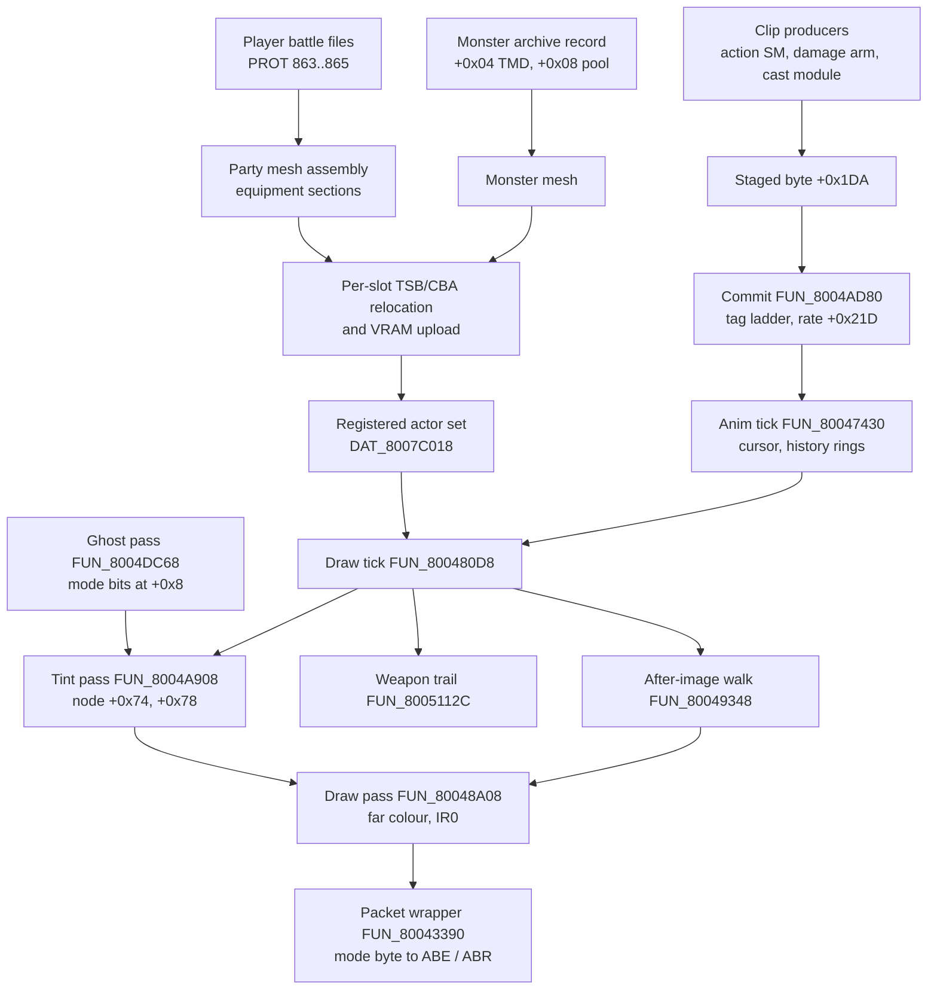
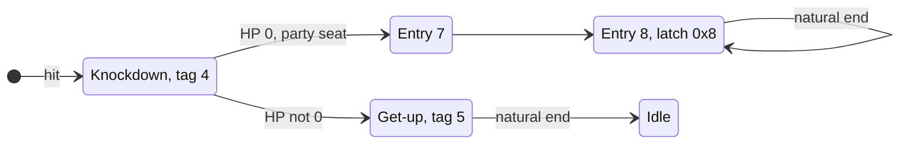

# Battle actor rendering

How a combatant gets on screen in a battle: which mesh it draws, which animation clip poses it, what colour and blend mode the draw takes, and the trails it leaves behind a swing. Party members are not stored as finished models - each is assembled per fight from equipment sections - and monsters carry their model and texture pool inside their archive record. Every clip an actor plays goes through one staged byte, and every colour effect (hit flash, distance dimming, status tint, the translucent body near the camera) goes through one tint pass. The page ends with how the Rust port's two hosts, the native `play-window` and the browser play page, draw the same thing from shared kernels.

All retail routines here are resident in `SCUS_942.54` unless marked as battle-overlay code (`0x801D....` and above, PROT entry 0898). GTE is the PlayStation's geometry coprocessor; CLUT is a colour look-up table (palette) in VRAM; TSB / CBA are a primitive's texture-page and CLUT words; OT is the ordering table primitives are linked into for depth-sorted drawing.

## At a glance

| Retail routine | Role |
|---|---|
| `FUN_800513F0` | Battle loader: registers backdrop, party blobs and monster meshes into `DAT_8007C018[]`, seeds the rate byte. |
| `FUN_80053A28` / `FUN_80053B9C` | Party registration-time TSB/CBA relocation / texture + CLUT block upload. |
| `FUN_800542C8` / `FUN_80055468` | Monster archive streaming loader / per-slot texture-pool upload. |
| `FUN_80054CB0` | Fills the reaction-clip map `actor[+0x1EF..+0x1F3]` from the action tags. |
| `FUN_8004AD80` | Anim commit: installs the staged clip, runs the clip-tag ladder, sets the slow-motion rate. |
| `FUN_80047430` | Anim tick: advances the cursor by the rate byte, decides when a staged clip commits, shifts the history rings. |
| `FUN_80046A20` | Battle frame driver; calls the ghost pass and the tint state machine `FUN_80050120`. |
| `FUN_8004DC68` | Near-camera ghost pass (mode bits `0x83000000` at actor `+0x8`). |
| `FUN_800480D8` | Per-actor draw tick; runs the tint pass, the weapon trail and the after-image walk. |
| `FUN_8004A908` | Tint pass: actor tint words to render-node `+0x74` / `+0x78`. |
| `FUN_80048A08` / `FUN_80043390` | Draw pass (far colour + `IR0`) / packet wrapper that decodes the mode byte. |
| `FUN_8005112C` / `FUN_80048310` / `FUN_800485BC` | Weapon trail: trigger / sweep / band emitter. |
| `FUN_80049348` | After-image ghost walk (two ghosts from the history rings). |
| `FUN_801E09F8` / `FUN_801E1AB0` / `FUN_801E1D98` | Overlay: move-FX streak phase driver / single-quad afterimage / chained ribbon. |

| Actor field | Meaning |
|---|---|
| `+0x04` / `+0x0C` | Tint colour lanes / tint blend weight. |
| `+0x08` | Mode word; top byte is the draw's semi-transparency mode. |
| `+0x16E` | Status bits (tint colours; `0x1000` = Slowed). |
| `+0x1D9` / `+0x1DA` / `+0x1DB` | Playing clip id / **staged** clip id / camera-variant key. |
| `+0x1DC` | Commit flags: bit 0 commit now, bit 1 commit past the gate frame, bit `0x4` idle at natural end, bit `0x8` root-motion latch. |
| `+0x1EF..+0x1F3` | Reaction-clip map, one slot per action tag `2/3/4/5/0xB`. |
| `+0x21C` | Render flag (`2` capture / defeat fade, `0xC8` cursor dim). |
| `+0x21D` | Animation-rate scalar, normal `8`. |
| `+0x226` | Additive fade. |
| `+0x22C` / `+0x230` | Radius source for the distance fade / mesh pointer. |

| Port piece | Where |
|---|---|
| Party assembly, monster mesh + texture relocation | `crates/battle-models` (`battle_char_assembly`, `monster_archive`), re-exported by `legaia_asset` |
| Per-fight form install | `engine-core::battle_party_form` |
| Staged clip commit, ladder, rate arms | `engine-core` `world/actors/battle_anim.rs`, `world/battle/clip_ladder.rs`; `engine-battle-vm::battle_anim_rate` |
| Tint pass, draw tick, ghost pass | `engine-battle-vm::{battle_actor_tint, battle_actor_tick, battle_action::camera_ghost}`, `engine-battle::battle_body_blend` |
| Trails, streaks, after-images | `engine-battle-vm::battle_trail`, `engine-battle::battle_afterimage`, `render-kernels::{battle_trail, streak_pass, afterimage}` |
| Hosts | `crates/engine-shell/src/window/battle.rs`; `crates/web-viewer/src/play_battle_render.rs`, `play_battle.rs`, `play_battle_fx.rs` |

`engine-vm` re-exports the `engine-battle-vm` modules, `engine-core` re-exports `engine-battle`, and `engine-ui` re-exports `render-kernels`, so code and older prose name the same modules under either crate.

## Draw pipeline



## Meshes

### Battle party meshes (assembled)

The party draws the **battle-form meshes**, built per character the way the retail loader builds the blobs it installs into `DAT_8007C018[0..=2]`.

- **Source.** Each member's mesh is spliced from the equipment-id sections of their player battle file (extraction PROT 863..865), selected by the equipped ids in the roster record's `+0x196..+0x19A` bytes. Parser: `legaia_asset::battle_char_assembly`.
- **Relocation.** `battle_char_assembly::relocate_tsb_cba` is the registration-time TSB/CBA pass `FUN_80053A28`: texpages `x ∈ [512, 896), y = 256`, CLUT row `481 + slot`. See [`character-mesh.md` § Battle render](../formats/character-mesh.md#battle-render-load-time-tsbcba-relocation).
- **Fallback.** PROT 1204 (the Baka Fighter / default-equipment sibling pack) is the per-member fallback when assembly fails. It also supplies the atlas pixel pages, uploaded at their authoring rects and, when an assembled mesh is bound, into the runtime band the relocated meshes sample.
- **Fourth slot.** The runtime texture band and CLUT rows cover party slots `0..=2` only, so Terra (player file 866, idle stream 17 parts) has no relocation target and is not drawn.

#### Pose source

The battle TMD is a set of object-local pieces (head, torso, limbs), not one pre-assembled mesh. The pieces are socketed with the character's own idle keyframe stream from `record[0]` of the same player file (`battle_char_assembly::idle_battle_animation`): the monster-format `[parts][frames][9-byte TRS]` stream at action entry `+0xAC`, where `parts` = skeleton bones. See [`battle-data-pack.md` § Battle animations](../formats/battle-data-pack.md#battle-animations-record0).

- Frame 0 is the combat-stance rest pose, applied `R*v + T` per object (`tmd_to_vram_mesh_posed_rot`). The clip then loops through the same `MonsterAnimPlayer` the enemies use.
- Channel `i` drives object `i` directly (post-sort object index == bone tag).
- `expand_animation_for_objects` duplicates each `200+` equipment extra's **attach-bone** channel onto it (the assembler's `anm_bones` map), so duplicate weapon / Ra-Seru pieces coincide with their attach piece.
- The PROT 1203 ANM (`other5`) is not this pose source. Its banks (Vahn @ 0 / Noa @ 9 / Gala @ 18) are authored against PROT 1204's own object order, which differs from the assembled tag order, so it is the rest pose of the **1204 fallback mesh only** (identity object→bone).

Pinned live and cross-pipeline in `crates/engine-shell/tests/battle_party_pose_live.rs`.

#### Palette

Every upload block is `[CLUT struct][pixels]` and `FUN_80053B9C` writes both halves. The band uploads of `record[0]` and the five **equipped** sections therefore already put the character's palette on row `481 + slot`, with the equipped pieces in their own colours (a Ra-Seru armour set is not the unequipped default).

The separator-default collectors (Vahn `parse_record`, Noa / Gala `collect_palette`) only paint a fallback picture: a PROT 1204 mesh, or an assembled mesh whose pool decode failed. Running them over a real band repaints every equipped piece in default colours. Pinned against two late-game captures in `crates/engine-core/tests/battle_party_palette_retail_capture.rs`.

#### Engine install

Building the forms is an engine duty, not a host one, because retail's loader assembles the party whether or not anything draws it.

- `SceneHost::tick` runs `SceneHost::ensure_battle_party_forms` the tick a battle is up, once per fight (`BattleState::entry_serial`, bumped by `World::enter_battle`). Play hosts and headless drivers (the ladders, the soak harness) all get the idle, action clips, art bank and art records; without them a fight swings zero-length clips and matches no art.
- The kernel is `engine-core::battle_party_form`: `install_party_battle_forms` runs `PartyFormSources::load`, then `build_party_battle_form` per member, then `World::install_party_battle_form`.
- Its VRAM writes go to a `VramWriteLog`, not a live VRAM. A renderer reads `SceneHost::battle_party_forms`, replays the log into the battle VRAM it composes, and adds only the GPU upload, its own posing and the facial animator's registration.
- A session that drives a bare `World` with no `SceneHost` has no disc index. It is the one explicit injection point and calls `install_party_battle_forms` itself after `World::enter_battle`.
- The kernel falls back to PROT 1204 when the player file carries no idle stream (an assembled mesh with no pose source draws every piece at its object origin), and overlays the separator-default battle palette on a fallback mesh's rows only.
- Monsters install their texture slot and idle clip through `World::install_monster_battle_form`. A mid-battle summon takes the slot one past the highest monster slot bound (`battle_party_form::monster_tex_slots_used`), since repeated species share a slot.

#### Battle display list

Retail's loader gives the fight its own actor set: `FUN_800513F0` registers the backdrop, the party blobs and the monster meshes into `DAT_8007C018[]` and links **those** actors into the render OT. The field scene's actor list does not survive the transition.

The port keeps one actor array across the transition (the world clones it into `field_return` and restores it at battle end), so every field slot arrives in the battle still holding its scene-mesh binding. A scene actor that never moved would draw at the origin, dead centre of the arena.

The gate is the registration set, not `active`: some scenes (rikuroa) hand the battle live field actors. `unregister_non_battle_meshes` (native host, `crates/engine-shell/src/window/battle.rs`) drops the `tmd_binding` of every slot the battle loader did not just register. Nothing is stashed for the restore; the bindings return with the field actor table. Regression: `battle_display_list_tests` in the same module.

Diagnostics on the native host: `LEGAIA_DIAG_BATDRAW=1` prints the display list at battle entry (one row per bound slot: party ordinal / monster id / `STRAY`, seat, mesh vertex count, projected seat). `LEGAIA_DIAG_BATCAM` reports per-frame framing and `LEGAIA_DIAG_POSE` the per-frame mesh pose.

### Monster mesh (record `+0x04`)

Each decoded monster block carries the monster's **battle model**: a [Legaia TMD](../formats/tmd.md) at the block-relative offset in the stat record's `+0x04` field. The loader installs that pointer at battle-actor `+0x230`, and `FUN_80049858` / `FUN_800495C8` walk it as `0x1C`-stride records - the TMD's per-object table, whose entries are exactly `0x1C` bytes.

Of the archive's 194 slots, 186 carry a Legaia TMD at `+0x04` that the parser walks cleanly; the other 8 are empty / filler ids. Example: Gimard (id 10) = 200 vertices / 269 textured prims at block `+0x7c`.

Decoded-block layout:

```
+0x00  stat record head (name_offset, +0x04 mesh offset, +0x08 pool offset, stats, rewards, spells)
name   NUL-terminated name string (at name_offset, typically just before the mesh)
+0x04→ Legaia TMD              ; the monster's battle model (magic 0x80000002)
spells spell-entry blobs       ; each carries its own attack-effect geometry
+0x08→ texture / CLUT pool     ; per-monster palettes + 4bpp texture pages
```

#### Name string escapes

The name carries a two-byte **element-icon escape**: a `^` + letter prefix (`^A Gimard`, `^F Aluru`) that the battle UI renders as the element badge.

| Escape | `^A` | `^B` | `^C` | `^D` | `^E` | `^F` | `^G` | `^H` |
|---|---|---|---|---|---|---|---|---|
| Element | Fire | Thunder | Wind | Water | Earth | Light | Dark | Evil |

That is the icon-glyph row `0x1D..0x24` in the same order - not the element-id order of the [`+0x1D` element byte](battle.md#monster-record-source-layout). Every carrying monster's letter agrees with its element byte; `^H` maps to element byte `7`, the no-affinity id whose matrix row and column are all-100. Only 64 of the 186 populated records carry an escape. Counts per letter: [`battle-hud.md`](battle-hud.md#the-element-badges-and-their-per-badge-palette). Boss-tier `$2` / `$3` name suffixes are literal ASCII, not markup.

#### Texture pool (record `+0x08`)

The mesh's primitives are textured through per-prim CBA / TSB. The palette and pixel bytes live in the pool at record `+0x08`. Its layout comes from the battle loader `FUN_80055468`, which the streaming archive loader `FUN_800542C8` calls with the pool pointer, the embedded TMD and the battle-slot index (see `ghidra/scripts/funcs/80055468.txt`):

```
+0x000  15 x [16 BGR555 colours]   ; CLUT region (0x1E0 bytes; zero-padded for
                                   ;   monsters that use fewer than 15)
+0x1E0  4bpp indices               ; texture page, width x 256 texels, row-major
```

- The CLUT region uploads to VRAM `(0, 484 + slot)`, 256 colours wide, with the STP bit set on non-zero entries.
- The page uploads to `(slot*64 + 320, 256)`. It is always 256 rows tall; its width is 128 texels (32 fb-units) for most monsters or 256 texels (64 fb-units) when the per-monster wide flag is set, so `width_texels = (pool_len - 0x1E0) / 256 * 2`.
- A primitive selects its palette by `cba & 0x3F` and samples the page at its per-vertex `(u, v)`. Index 0 (colour `0x0000`) is transparent.
- The arithmetic is exact: Gimard `0x1E0 + 128*256/2 = 0x41E0`, Tetsu `0x1E0 + 256*256/2 = 0x81E0`, both equal to their pool sizes.
- The on-disc CBA / TSB are nominal defaults the loader relocates per slot, so the raw pool bytes do not appear verbatim in a battle VRAM dump.

#### Parser and tools

`legaia_asset::monster_archive::mesh(entry, id) -> Option<MonsterMesh>` returns the decoded block plus the TMD / pool offsets; `MonsterMesh::texture()` decodes the pool into `MonsterTexture { palettes, indices, width, height }`.

- CLI: `asset monster-archive --id N --obj <out>` exports Wavefront OBJ, `--texture-png <out>` bakes the texture page.
- WASM: the `LegaiaViewer::monster_mesh_{positions,normals,indices,bounds,uvs,palette_index}` and `monster_texture_{indices,palette_rgba,dims}` accessors feed the WebGL viewer on the site's enemy-table page, which textures the model with the index→palette lookup the PSX GPU does in VRAM.

## Clip selection

### One staged-anim channel: `actor[+0x1DA]`

Which clip an actor plays is a single byte, `actor[+0x1DA]`, with two committed mirrors: `+0x1D9` (the *playing* id, which the end-of-clip chains and a cast module's confirm gates read back) and `+0x1DB` (the key of the camera-variant dispatch in `FUN_801D5854`). Every producer writes the same staged byte, and the last writer wins.

| Producer | Site | What it writes |
|---|---|---|
| Action SM, party approach | attack band state `0x14` | literal `1` (the walk entry) |
| Action SM, strike loop | attack chain | the strike-script byte (`0x0C..0x0F` swings, art ids) |
| Damage arm, flinch | `FUN_800402F4` `0x80042124` | `actor[+0x1EF]` (tag-2 entry) |
| Damage arm, knockdown | `FUN_800402F4` `0x80042118` | `actor[+0x1F1]` (tag-4 entry) |
| Knockdown → get-up chain | `FUN_8004AD80` `0x8004BEC4..0x8004BECC` (living actor); `0x8004B690` (dead monster, Seru staged) | `actor[+0x1F2]` (tag-5 entry) |
| Capture-class cast module | slot-B module code ([cast-module.md](cast-module.md)) | caster stage literals / steppers; victim `actor[+0x1F1]` |

The commit `FUN_8004AD80` snaps `+0x1D9 = +0x1DA` and copies `+0x1DB` unconditionally (`0x8004AEB0..0x8004AEB8` for the `+0x1DB` copy; see `ghidra/scripts/funcs/8004ad80.txt`). There is no reaction guard on that path: a hit reaction is not a mode an actor is in, only the current value of the staged byte, and the next thing staged replaces it.

**Flinch or knockdown.** Decided at `0x800420F4..0x80042124`: flinch when `actor[+0x1F2] == 0` (no get-up entry) **and** the damage is survivable, knockdown otherwise. The `+0x1EF..+0x1F3` map is filled by `FUN_80054CB0` (`0x80055360..0x800553F0`), one slot per action tag `2/3/4/5/0xB`, with the tag-4 → tag-2 fallback at `0x80055428`. Every player battle file carries a tag-5 entry, so a party member takes the knockdown arm on any hit.

**Engine.** The port models the reaction with an `Actor::battle_reaction` latch (`engine-core::world`), because its per-frame `pose(Idle)` hook is an engine-local channel with no retail counterpart and would otherwise cancel a reaction the frame after it starts. The latch does not outrank the staged channel: `commit_staged_battle_anim` clears it whenever it installs a staged clip, so a struck party member still plays its approach and swings on its own turn. Regressions: `crates/engine-core/tests/battle_reaction_stage_precedence.rs`, and the GPU-free pose oracle `crates/asset/tests/battle_pose_orientation_real.rs` (the upright family is upright, the reaction family prone).

### The commit's clip-tag ladder

Every path through `FUN_8004AD80` converges at `0x8004BDD8`: the new entry is installed at node `+0x4C`, `+0x1D9 = +0x1DA`, the entry's `+0x84` / `+0x87` bytes are folded, and the routine tests the **new** entry's tag byte `+0x00` once per commit (`0x8004BE30..0x8004BF4C`; `ghidra/scripts/funcs/8004ad80.txt`).

| Tag | Condition | Writes |
|---|---|---|
| `2` | first monster `0xB3` or `0xB5`, committing actor at HP `0` | the entry's tag byte becomes `4` in place (the tag-`4` row then runs); for `0xB3` also entry `+0x56 += 1` |
| `4` | HP not `0` | `+0x1DA = +0x1F2` (the get-up, staged behind the knockdown), `+0x1DC = 0` |
| `4` | HP `0`, party seat | `+0x1DA = 7`, `+0x1DC = 0` |
| `5` | - | `+0x1DC` bit `0x4` set (idle at the natural end) |
| `7` | - | `+0x1DA = 8` |
| `8` | - | `+0x1DC` bit `0x8` set (the latch that stops root motion, `0x80047D20`) |

`+0x1DA` is what the natural-end path commits next. `FUN_80047430` (`0x80047B30..0x80047B58`) replaces it with `0` when `+0x1DC` bit `0x4` is set, masks `+0x1DC &= 0xF8` (bit `0x8` survives) and calls the commit.



A downed party member's chain is knockdown, entry `7`, entry `8`; entry `8` re-commits itself at every natural end with the latch raised. The entry-`8` commit sets the latch, not the knockdown (whose own commit clears `+0x1DC`). Three catalogued battle states read a dead party member at `+0x1D9 = +0x1DA = 8`, `+0x1DC = 8`. The party files carry entries `7` and `8` with `tag == slot` (Terra's hold empty streams). The action SM never stages either id: its literal `+0x1DA` stores are `0`, `9` and `0x15`, the rest come from the queue bytes and the tag searches.

**Monster death.** An earlier arm of the routine (`0x8004B094..0x8004B6A0`) handles a committing monster whose **previous** entry is tagged `4` at HP `0`. It re-installs that entry held on its last frame, runs the death spoils, sets `+0x21C = 2` and the same bit-`3` latch. With a Seru staged in `ctx[+0x269]` it overwrites `+0x1DC = 4` and restages the get-up `+0x1F2` (`0x8004B688..0x8004B6A0`), so the fallen monster rises for the absorb. Captures hold both: dead monsters on their knockdown entry with `+0x1DC = 8` and `ctx[+0x269] = 0`, and one on its get-up entry with `+0x1DC = 4` while `ctx[+0x269] = 1`.

**Engine.** `engine-core::world::battle::clip_ladder` ports the ladder as a pure kernel (`commit_tag_ladder`) and runs it on the reaction channel:

- A hit commits the `+0x1EF` / `+0x1F1` entry (the `FUN_80054CB0` map: last match wins, a missing knockdown takes the flinch entry).
- The ladder's staged entry is committed at the clip's natural end; the downed party chain and the monster-death arm (latch, spoils via `battle_steal`, Seru get-up) follow the table.
- The root-motion drive reads the latch in `battle.flag_bits`, not "a knockdown is playing".

Differences from retail: the port stages the reaction inside the hit, ahead of the combo total's HP write, so the tag-`4` row is evaluated at the knockdown's natural end on the landed HP instead of at its commit. The tag-`2` rewrite changes the clip's tag, not the disc entry, and the `+0x56` bump has no engine field.

<a id="arts-presentation-slow-motion-and-after-image-ghosts"></a>

## Arts presentation: slow-motion and after-image ghosts

Two channels make a retail art read as an event: the battle clock slowing while the art plays, and the mesh trail behind a Super / Miracle dash. They are one per-actor byte and one per-actor draw walk.

### The animation-rate byte `actor[+0x21D]`

`+0x21D` is the per-actor **animation-rate scalar**, normal `8`. The anim tick `FUN_80047430` advances each render node's 12.4 anim cursor per game frame by

```
(DAT_1F800393 * actor[+0x21D] * clip[+0x78]) >> 1
```

- `4` is half speed, `2` quarter speed, `0` a freeze. Every animation-driven edge (swing pacing, root motion, the strike loop's per-clip gate) stretches with it.
- The shift is `>> 2` only for a **Slowed** actor on idle: status `+0x16E & 0x1000` at `0x800476E0`, then `+0x1D9 == 0` at `0x800476EC` (`0x800476D8..0x80047764`). An ordinary idle loop advances as fast as any clip.
- Battle seating (`FUN_800513F0`, `0x80051608` / `0x80051888`) seeds the byte from the scratchpad speed scalar `0x1F80037D`.
- The strike loop also multiplies the byte into its per-frame impact drift; that is one consumer, not the field's meaning.

**When a staged clip commits.** The same tick decides it, idle and walk loops included. Mid-clip, `+0x1DC` bit 0 commits at once and bit 1 commits once the cursor frame is past the entry's gate frame by more than two (`0x800478EC..0x80047948`); the entry's `+0x76` lock refuses both. Otherwise the staged byte waits for the natural end (`0x80047B54`), which calls `FUN_8004AD80` whatever is staged. A clip left staged behind itself re-commits from its first frame, which is how a loop loops.

So the strike loop's first swing, staged under bit 1 over the idle `0x19`'s arrival committed under bit 0 (`0x801E35C0`), waits for idle frame 3 (capture `player_steal_skeleton_pre`: idle cursor `0x20`, `0x0F` staged). Every loop cycle of the acting actor re-zeroes the camera's ramp / accumulator / latch like any other commit (`0x8004BF50..0x8004BF78`). Port: `World::commit_staged_battle_anim` (the looping-clip gate) and the natural-end re-commit in `World::tick_battle_animations`.

**Writers.** The rate is written by arms of the anim commit `FUN_8004AD80`, all on the **party** ladder (the monster path branches clear at `0x8004B6F4`):

| Trigger (raw staged id `+0x1DA`) | Effect | Site |
|---|---|---|
| any commit, rate `!= 8` | rate = `4` | `0x8004B080..0x8004B090` |
| `0x1A` SpecialStarter | all slots `0`, acting actor `2` | `0x8004B728..0x8004B750` |
| `>= 0x1B` art constant | all slots `2` if `ctx[+0x243]` set, else `4` | `0x8004BB78..0x8004BBA8` |

A Super / Miracle starter is therefore a freeze-frame with only the dashing actor moving, at quarter speed. Each art strike then plays the whole battle at half speed. Direction swings (`0x0C..=0x0F`) never slow anything.

The `0x1A` arm also raises the `ARTS!!` banner byte `ctx[+0x28B]` (from the queue-builder's side-array mark at `0x801F6990` / the Miracle marker; default `2`), zeroes the banner clock `+0x28C`, and queues the per-character arts shout (`FUN_8004FCC8` ids `0x101/0x111/0x121` plus per-follow-up variants). This is the `+0x28B` writer behind the [`flash_ramp` banner](battle-hud.md#arts-announcement-banner-fun_801e2524--fun_801e2650).

**Restore.** `FUN_801E93C8` is `jal`ed from the shared tail at `0x801E5F64`, which the Done arm falls into and which states `0x1E`, `0x1F` and `0x20` jump to on nearly every pass (`0x801E39AC`, `0x801E3A68`, `0x801E3A80`, `0x801E3AF8`, `0x801E3B18`, `0x801E56C8`, `0x801E55A0..0x801E5658`). Once the acting actor's materialised art clip has ended (party: `+0x1D9 < 0x10`; monster: committed record flag `+0x87 == 0`), every slot returns to `8` and `ctx[+0x243]` clears. The battle is back at full speed the pass the last art clip ends, so a monster an art killed plays the rest of its knockdown at normal speed.

**Port.** Kernel `legaia_engine_vm::battle_anim_rate` (`BattleActor::anim_rate`, default 8); commit arms in `engine-core`'s `commit_staged_battle_anim`; the rate-scaled advance in `battle_anim::MonsterAnimPlayer::tick_rated`; the restore in `battle_gauge_rearm::restore_anim_rates`.

### The after-image ghost walk (`FUN_80049348`)

The anim tick keeps four 32-deep per-actor **history rings**, shifted one slot per frame with slot 0 taking the live values (`0x80047E58..0x80048060`):

| Ring | Actor offset | Contents |
|---|---|---|
| Position | `+0x4C` (8-byte stride) | per-frame position |
| Anim cursor | `+0x17A` | per-frame cursor |
| Clip record | `+0x234` | committed clip record |
| Anim id | `+0x1FB` | party = `+0x1D9`; monster = `clip_tag + 0x10`, or `0x11` when record flag `+0x87` is set |

The per-actor draw tick `FUN_800480D8` runs `FUN_80049348`, which draws **two ghosts** of the actor's own mesh from the rings.

**Spacing.** `step = 8 / actor[+0x21D]` (monster seats double it), at ring depths `step` and `2*step`. The trail stretches exactly when slow-motion drops the rate (quarter speed → depths 4 and 8).

**Gate.** Ring id `> 0x10` (`sltiu 0x11` at `0x80049460`). The anim tick stamps the ring id from the committed record's own bytes, never from staging state:

- A party seat copies the committed dynamic slot `+0x1D9` (`0x80047FCC`). A party art materialises at dynamic slot `0x10`, except the `0x1A` / re-staged-`0x10` commits, which land at `0x11`. Party mesh ghosts therefore belong to the **SpecialStarter dash** and to **chained** arts (a re-staged `0x10`); an ordinary art swing leaves the 2D weapon trail instead. Capture `battle_melee_hit_spark` holds Vahn at `+0x1D9 = +0x1FB = 0x11` mid-Somersault with his ghosts drawn, and Gimard at ring id `0x10` with none.
- A monster seat stamps `record[+0x77] + 0x10`, or `0x11` when the record's `+0x87` solo byte is `1` (`0x80048044..0x80048060`). A monster ghosts only on a clip whose record carries a non-zero `+0x77` or `+0x87 == 1`: the solo / special entries (Tetsu's tag-`0x0F` special carries both; Gobu Gobu has none). No idle entry qualifies, so an idle or walking monster never ghosts. Not "any non-idle clip tag": see [re-do-not-re-walk.md](../reference/re-do-not-re-walk.md#battle--arts--level-up); disc census `crates/engine-core/tests/battle_afterimage_gate_real.rs`.

**Colour.** Flat additive. The draw wrapper `FUN_80043390` decodes the colour word's mode byte (`0x85`): bit `0x80` → the GP0 ABE bit, low bits → ABR mode 1 (B + F), bit `0x04` → the flat-colour prim bank with the GTE far colour as the RGB. The base colour is per character, from the SCUS word table `0x80076908` (Vahn red `0x60/0x30/0x30`, Noa green, Gala blue; monsters `0x80076914` olive `0x50/0x50/0x30`), stepped down `0x101010` per drawn ghost. The ghost's OT depth is pushed `0x50` buckets deeper than the live body (`FUN_80048A08`, the `+0x10` bit-`0x800000` arms).

**Port.** Kernel `engine-core::battle_afterimage` (schedule / gate / colour law, file `crates/engine-battle/src/battle_afterimage.rs`), history ring on `Actor::battle_pose_history`, plan API `World::battle_ghost_draws`.

- The native window draws each ghost as a flat-coloured additive posed mesh on the colour pipeline.
- The browser play page uploads per-actor ghost mesh copies on its flat + additive path and poses them from `play_battle_actor_ghost_pose`.
- Both hosts' additive passes deliberately pass on **equal** depth (coplanar decals), so each carries retail's deeper-bucket ordering explicitly; otherwise a ghost coincident with the live body would wash the whole mesh additive. The native window scales each ghost uniformly about the eye until it sits past the body (`battle_afterimage::ghost_eye_push_scale` in the redraw pass). The play page draws ghost placements with a strictly-nearer depth test (`strictDepth` → `gl.LESS`). Either way the live body hides the overlap and only the separated trail shows.

## Tint and blend

### How the tint words reach the pixel

The tint pass `FUN_8004A908` packs the actor's `+0x04` lanes (`>> 2`) into the render node's `+0x74` colour word, and copies `+0x0C` into the node's `+0x78` whenever it is non-zero (`0x8004AA24..0x8004AA70`). With `+0x0C == 0` it derives `+0x78` from the transformed depth instead - the [distance fade](#the-distance-fade).

The draw pass `FUN_80048A08` then stages the two words as the GTE far colour and `IR0` (`gp[0x9D8]` / `gp[0x9DC]`, `0x80048BEC..0x80048C00`) for the actor's prims. The prim's **modulation** colour becomes

```
baked + (tint - baked) * blend / 0x1000
```

and the GPU still multiplies the texel through it (`texel * colour / 128`). A hit is the actor's own texture pushed toward the element colour, never a flat silhouette. `IR0` is loaded bare, so the item / spirit cue-group flash's `0x2000` extrapolates past the far colour until the DPCS output clamp bounds it.

Facts pinned by capture and data:

- `battle_gimard_tail_fire_a` / `_b` (Tail Fire striking Vahn) hold `+0x21F = 1`, `+0x0C = 0x1000` and a red `+0x04` word eight lane-units apart between the two frames (the arm-0 ease at `1 * 8` per frame). The struck Vahn reads red `160..248` over green / blue `8..80` across his texture.
- The impact table's five words are red, two blues, a violet and white (`0x801F53D4`, parsed by `legaia_asset::move_power::parse_impact_effect_table`).
- A colour word of `0` is the summon-hide's "not drawn" value (`FUN_800480D8`'s word-zero arm), not a black tint.

**Engine.** Both hosts render the whole tint pass through the per-draw depth-cue seam, one rule for every writer. `World::battle_actor_draw_plan` runs `engine-vm::battle_actor_tint` (the port of `FUN_8004A908`) and the draw tick `engine-vm::battle_actor_tick` (`FUN_800480D8`) per body per frame; both hosts take the far colour and `IR0` from it and skip the bodies it does not draw.

The capture / defeat fade (`+0x21C == 2`, arm 2) additionally ORs `0x81000000` into the node's mode word, so the fading actor draws additive (ABR 1, `B + F`). `BattleActorDrawPlan::semi_mode` decodes that top byte and `apply_body_blend` (`engine-battle::battle_body_blend`) raises the blend on every stream the body draws, on both hosts. The fade takes the tint cue only while its word raises ABE (`tint_cue_applies`), so it is never drawn as an opaque black silhouette, and the body drops out once its lanes reach zero.

#### The distance fade

With no blend running the pass still writes both words.

- **Inputs.** View depth `a3 = node[+0x34] / 16` (the `MVMVA` of the node position, `FUN_8003D344`) against `a2 = radius / 2`. The radius is `*(actor[+0x22C]) + 0x58`: `640` on the party seats, the record size class `<< 5` on a monster.
- **Near body** (`a3 < a2`): its lanes at weight `a3 * 4`.
- **Far body:** each lane scaled by `a2 / a3` (floored at `4`) at weight `3 * (2*a3 - a2)`, saturated at `0x1000` - pushed toward a darker copy of itself.
- **Outdoor stages.** On the thirteen outdoor stages (`DAT_8007BDA8`, the `DAT_80078C1C` table) a grey result is complemented and its weight divided by eight, so the far body brightens a little instead.
- **Then** the `+0x16E` status colours (`0x1` → `0xFF2020`, `0x2` → `0xFF0420`, `0x380` → `0xF020F0`, weight `0x800`), bit 26 of the word, and the `+0x226` additive fade.

The view depth is one row of the battle camera: `R * (4p - 4*focus) + tr`, with `R = Rx(pitch) * Ry(yaw)` over the camera trio `0x8007B790` and translation `0x800840B8` (`battle_cam_script::battle_view_depth`). It reproduces the stored `+0x34` of 296 of 379 captured bodies to within two units (341 within 32); the rest read as states where the camera or the body moved after the draw.

Over the 97 catalogued battle states, recomputing the pass from each seated actor's fields reproduces the stored `+0x74` / `+0x78` exactly for 258 of 266 drawn bodies, 54 of them on the distance-fade arm (e.g. the Tetsu command menu's monster at depth `9098`: colour `0x48` a channel at weight `0x990`). The eight that differ are frames where a later writer touched the node after the draw.

**Cursor dim.** `+0x21C == 0xC8` (the target cursor's non-pointed monsters) is its own arm: colour `0x010101` at weight `0x1000`, unless the seat's formation cell (`0x8007BD09 + seat`) holds monster `0xA8`, which reads as a black silhouette. The arm is ported (`battle_actor_tint`), but no catalogued state holds that flag, so both hosts keep their own cursor cue (`battle_action::cursor_cue`) for the two cursor flags.

#### The near-camera ghost pass (`FUN_8004DC68`)

The tint pass takes the colour word's top byte from the pool actor's `+0x8` word (`0x8004AA44..0x8004AA50`), and that byte is the draw's mode: bit 31 raises semi-transparency, bits 24/25 pick the blend rule. `FUN_8004DC68` owns those bits. The frame driver `FUN_80046A20` calls it once per battle frame (`jal` at `0x80047124`, between the camera update and the tint SM `FUN_80050120`). It only ever sets or clears `0x83000000` - mode `3`, `B + F/4`, a faint ghost of the body (`ghidra/scripts/funcs/8004dc68.txt`). The reference point is the camera, not an actor, and the effect is translucency, not dimming.

- **Near the camera.** It forms a point on the view axis: the focus trio `0x80089118` / `0x80089120` pulled back by `dist * 25 / 128` along the yaw `0x8007B792`, `dist` being the eye depth `0x800840C0`. For each of pool slots `0..=6` it measures the planar distance to that point (the sum `|dx| |sin b| + |dz| |cos b|` over the `FUN_80019B28` bearing `b`). Within `dist / 4` a body ghosts.
- **Exceptions to that.** No ghost if the body is the acting actor; the command-flow byte `ctx[+6]` is below `0x1F` or one of `0x32` / `0x6E` / `0xFE`; the action state is below `0x0B`; or it is the actor's target while `ctx[+6]` is `0x64` / `0x65` (or `0xFF` with the actor's category in `1..=3`).
- **Whole-side scopes** clear a side: target byte `8` keeps the party's bits, `9` keeps the monsters', anything above clears both.
- **Nothing ghosts** during a run (category `5`), on a pre-emptive round (`ctx[+0x290] == 1`), in action state `0x0B`, or after the battle ends with `ctx[+0x26B]` raised.
- **Magic casts** (action states `0x28..=0x2E`, `MagicCastBegin` through `MagicExit`) ghost the caster's whole side, then clear the caster and its target: the allies fade while the spell plays and the one it lands on stays solid.

The action SM's `0x5A` end-of-action sweep clears the bits on every slot (`0x801E6478`), and `FUN_801D5854`'s out-of-range guard does the same through `FUN_801DB9C4`.

**Driver gate.** The driver skips the call while `gp[+0x330]` is non-negative (`lb` at `0x800470EC`). That byte is `0x8007B648`, the battle-load stage `FUN_80046A20` hands to the loader `FUN_80052770` while it is below `0x80` (`0x80046EEC..0x80046F08`). It reads `0xFF` in 59 of the 60 battle-mode (`0x15`) mednafen library states and `0x84` in the other, so the pass ran on every one of those frames.

**Measured.** Recomputing the pass from RAM over the catalogued battle states reproduces the stored bits on 277 of 279 seated slots. The two misses are bits set where the pass would clear them (action states `0x1E` and `0x35`, flow `0xFF`).

**`ctx[+0x26B]`** is the battle's side-band stream request. `FUN_80055B4C` stores `a0 + 1` there (`0x80055B58`) for the victory hook's win-pose archive and the summon stagers' streams; the stream tick `FUN_801F17F8` clears it once the stream lands (`0x801F19D8`). The pass reads it only with the battle-end signal `0xFE` up, where the request is the win-pose archive the results sequencer also waits on (`0x8004E5C0`). It reads `0` on the one results-frame state (`noa_levelup_banner`). The command-flow byte `ctx[+6]` reads `0x1E`, `0x28` and `0x14` in the library's command-band and round-start states, and `0xFF` in every state of a running action.

**Engine.** `engine-vm::battle_action::camera_ghost_pass` is the kernel. `World::tick_battle_camera_ghost` runs it every frame after the battle camera tick, converting the engine's compacted seating to retail's fixed pool slots, and keeps the word in `BattleActor::flag_word`. `battle_actor_draw_plan` hands that to the tint pass as its top byte (`BattleActorDrawPlan::semi_mode`). Both hosts draw the ghost: `engine-core::battle_body_blend` ORs the word's ABE / ABR into the body's TSB words, as `FUN_80043390` does into its packets.

- `ctx[+6]` is the engine's flow mirror `BattleFlowState` (the selection band byte for byte) while the command band runs, `0xFF` while the action SM owns the round, and `0x14` before the first round executes. Retail's one-frame `0xFE` hand-off has no engine frame.
- `ctx[+0x26B]` follows the measured span, since the engine streams nothing. On `rim_elm_gimard_victory` the request rises with the battle-end signal (v322) and clears 28 vsyncs later (v350); the phase walk's own two CD waits then run the rest of the 80-vsync load hold (`autorun_victory_timeline.lua`, columns `req26b` / `prog26c`). Bodies near the camera ghost again for the last 52 vsyncs, and the engine raises the byte for exactly the first 28 (`VictorySequence::side_band_request_up`).
- The `gp[+0x330]` gate has no engine twin because the engine has no load stage.
- **The pose actor is the acting slot.** The battle-over close-up sits right behind the posing character, well inside `dist / 4`. Retail keeps that body solid because the pass's acting slot `ctx[+0x13]` is the field the results sequencer frames (`noa_levelup_banner`: `ctx[+0x13] == 0`, seat 0's `+0x8` clear, the dead monster in slot 3 the only body near the point). The engine's acting mirror keeps the fight's last actor, so while a non-escape `VictorySequence` is armed `tick_battle_camera_ghost` feeds the pass the pose actor instead. Other party members near the close-up still ghost, as in retail.
- The field's camera-occlusion fade is a separate mechanism and never arms in battle (`field_occlusion::fade_armed` requires `SceneMode::Field`).

## Trails and streaks

Three different things trail a battle actor. The after-image ghosts above are copies of the mesh. The two below are 2D primitives: an untextured gouraud band swept behind a blade, and a textured streak tied to a staged move effect.

| Trail | Primitive | Driven by | Routine |
|---|---|---|---|
| Weapon trail | `POLY_G4`, untextured, semi-transparent | committed clip's `+0x77` identity byte | `FUN_8005112C` |
| Move-FX afterimage | one `POLY_FT4` billboard | streak counter `ctx[+0x6C6] >= 0x281`, party | `FUN_801E1AB0` |
| Move-FX ribbon | chained `POLY_FT4` strip | counter `< 0x201`, or any value for a monster | `FUN_801E1D98` |
| Mesh after-image | actor mesh, flat additive | ring id `> 0x10` | `FUN_80049348` |

### Weapon trail builder (`FUN_8005112C` + `FUN_80048310` + `FUN_800485BC`)

The swept `POLY_G4` streak an ordinary arts swing leaves behind a party character's blade.

**Trigger** (`FUN_8005112C`, called per party seat from the draw tick `FUN_800480D8`). Fires only while the committed action record's `+0x77` clip-identity byte matches a per-character constant, always with **3 control points** (the weapon bone chain `base..base+3`):

| Character | `+0x77` | Base object | Tint |
|---|---|---|---|
| Vahn | `0x29` | `0x0C` | `0x802040` |
| Noa | `0x1E` | `0x04` | `0x80FFC0` |
| Noa | `0x2A` | `0x0A` | `0x208040` |
| Gala | `0x64` | `0x06` | `0x204080` |

**Sweep** (`FUN_80048310`). Saves the anim cursor `actor[+0x68]`, then up to 16 times: re-decodes the pose at the current cursor (`FUN_8004998C`), copies the control points' decoded object positions out of the pose pool (`gp[0xa0c] + 0x6f4`, stride `0xC`) into a 16-step scratch, and rewinds the cursor by `2 * record[+0x78]` (two display frames per step), stopping at the clip start. With at least two captured steps it emits gouraud bands, all semi-transparent and stacking additively:

- segment 0: white → `0x808080`;
- segment 1: `0x7F7F7F` → black;
- then every segment `k` of `n` with the trigger tint faded linearly, `rgb * (n-k)/n → rgb * (n-k-1)/n` (truncating division).

**Band emitter** (`FUN_800485BC`, 275 instructions). Per band:

1. Yaw-rotates the two steps' local control points by `actor[+0x26]` against the sin / cos LUTs (`_DAT_8007B81C` / `_DAT_8007B7F8`, a 12-bit angle **mask** into 4096-entry `s16` 1.12 tables). Negative products take a `+0xFFF` bias before the `>> 12` (round toward zero).
2. Adds the battle slot's world base (`*(int*)(0x801C9370 + actor[+0x5A]*4) + 0x34/+0x38`).
3. Projects each vertex through `FUN_800195A8`.
4. Drops `0x3B808080` packets into the OT - a `POLY_G4`: four-point gouraud, semi-transparent, untextured. `0x808080` is a placeholder the per-vertex fill overwrites; `v0/v2` are the leading step's pair carrying the band's lead colour, `v1/v3` trailing. The OT slot is the average of the four corner depths with the same rounding fixup.

**Port.** Trigger table and sweep / band schedule: `engine-vm::battle_trail`. Projected band packets: `engine-ui::battle_trail` (a gouraud `FlatQuad` through the shared screen-prim pass, ABR 1). `World::battle_weapon_trail_draws` samples the sweep off the pose-history ring (step `k` = the pose `2k` frames ago, the retail rewind under a constant rate), bounded by the ring's per-frame clip key. Both hosts project with their own battle camera and composite the bands over the scene; retail's OT interleave with scene depth is not reproduced.

<a id="weapon-trail-afterimage-streak"></a>

### Move-FX afterimage streak (`FUN_801E1AB0`)

The streak a staged move leaves is one semi-transparent `POLY_FT4` per emitter call. Its two projection inputs are context words the action effect script's terminator writes: the billboard centre from `ctx[+0x1144]` and the half-width as `ctx[+0x6C6] - 0x200`.

The terminator stages both in one block (`FUN_801DEA50`, `0x801DF284..0x801DF2E0`): `sw` of the move-power record pointer to `+0x1014`, `sh` of that record's `+0x04` to `+0x6C6`, then a four-slot loop writing phase `1` to `+0x24E + i` and the launch position to `+0x1144 + i*8`.

The launch position is not the bare actor position. Retail re-seeds its stack pair from `actor[+0x34..+0x3B]` at the top of every record iteration and runs the scale + facing rotation on it before the terminator test, so the seed loop copies out the terminator record's own placement.

**Port.** `engine-core::action_effect_script::MoveFxStreak` (file `crates/engine-effects/src/action_effect_script.rs`) is the block: record id rather than pointer, one shared launch point rather than four identical copies. The live per-frame walk `World::step_actor_effect_script` installs it and `World::move_fx_streak` reads it back. `engine-ui::streak_pass` projects it once per frame and hands the corners to the packet builder `afterimage::build_afterimage_quad`, whose jitter law, brightness band, UVs, CLUT (`0x7700 + trail id`) and texpage (`0x0027`) are retail's.

Both hosts draw it: the native window appends the quads to its screen-space textured batch (`move_fx_streak_quads` in `redraw_passes.rs`), the play page emits them as screen prims at `streak_pass::MOVE_FX_STREAK_OT` (`play_battle.rs`).

Differences from retail:

- **Projection** is the engine camera's, not the GTE's. `project_streak_corners_mvp` takes the screen-space gradient of the battle MVP and fans the corners out along the screen axes - the operation `FUN_800195A8` performs in view space. The exact port `billboard::project_billboard` needs a GTE rotation / translation pair the engine's battle camera does not carry.
- **Depth.** Retail links each packet at the projected billboard's own OT bucket, inside the scene. The hosts draw the streak over the actors, not interleaved with them.

**When it draws.** The pass is gated on `World::active_move_fx_trail_texpage()`, which is set while a move-FX scene is staged: `World::spawn_move_fx` surfaces the move-power record's `+0x0b` trail id when it stages the record's Spawn prototypes, and drops it when the scene drains. The spawn is requested from the cast path (`World::request_move_fx_spawn`, `world/battle/casting.rs`). A plain weapon swing (the `0x0C..0x0F` bytes of the actor's `+0x1DF` action queue) stages no move-FX scene, so it draws the weapon-trail bands and no streak.

<a id="the-streak-emitter-schedule-decoded-dispatcher"></a>

#### Streak emitter schedule

Which 2D emitter runs is not per-move data. The phase driver `FUN_801E09F8` walks the streak counter `ctx[+0x6C6]` down by `DAT_1F800393 << 2` per frame (`0x801E0C1C..0x801E0C40`, floored at 0) and selects by its value (`0x801E0C64..0x801E0CE8`):

| Acting actor | Counter | Draws | Call site |
|---|---|---|---|
| Party | `>= 0x281` | single-quad afterimage `FUN_801E1AB0` (half-width `counter - 0x200`, so it shrinks) | `0x801E0CA0` |
| Party | `0x280..0x201` | nothing | - |
| Party | `< 0x201` | chained ribbon `FUN_801E1D98` | `0x801E0CD0` |
| Monster | any | chained ribbon | `0x801E0CD0` |

Port: `engine-ui::streak_pass::streak_quads_scheduled` + `MoveFxStreak::tick_counter`.

The ribbon has a second caller outside that dispatcher: the per-clip pass of `FUN_8004CE2C` (SCUS). Its Gala tag-`0x67` arm (`0x8004D1E8..0x8004D248`) calls `FUN_801E1D98(&target[+0x3C], 0xC)` on every frame the committed clip's cursor sits in `0xB0..=0xF0` (`addiu a0,s1,0x3c` in the branch delay slot at `0x8004D220`, `li a1,0xc` at `0x8004D224`). The anchor is the target's seat vector (`+0x3C..+0x43`, copied verbatim from the spawn node by the battle setup at `0x8005158C..0x80051598`), not the launch point `ctx[+0x1144]`, and the trail id is the literal `0xC`, not the move record's `+0x0B`. Port: the impact pass stores the frame's source in `BattleState::clip_ribbon` and both hosts draw it through `streak_pass::clip_ribbon_quads`.

### Move-FX streak ribbon (`FUN_801E1D98`)

Both streak emitters take the trail-texture id from the move-power record's `+0x0b` byte and build the same kind of packet: a semi-transparent textured `POLY_FT4` (`0x2e808080`), texpage `0x27`, CLUT `0x7700 + trail_id`.

The ribbon starts from one `FUN_800195A8` billboard projection of the actor point: half-width `0x100`, half-height `0x200`, no in-plane spin, and no `+0x120` Y push (that push is the afterimage's, not shared). Two numbers come out of the projected quad:

- **Suppression.** If the projected top edge spans `0x41` px or more (`x1 - x0`, signed), the routine returns without linking anything. The packet already carved out of the frame arena is abandoned; there is no single-quad fallback.
- **Segment height.** The projected height `y2 - y0` is kept when it is at least `0x40`, otherwise `0x40` is substituted. That is a floor, not a cap: a tall billboard produces tall segments and a shorter chain.

Every further segment reuses the previous segment's top edge as its bottom edge, so the quads form one continuous strip, and the un-jittered baseline steps up by exactly one segment height per iteration. The walk stops when the baseline (sign-extended to 16 bits) is no longer greater than `-height`, i.e. once the strip has left the top of the screen.

The jitter magnitudes are all shifts of the segment height `h`:

| Segment | `rand` draws | What each moves |
|---|---|---|
| Bottom (from the projection) | 7 | one shared `[-h/4, +h/4]` X wobble on the whole top edge, one shared `[-h/8, +h/8]` X wobble on the whole bottom edge, then four independent `[-h/8, +h/8]` Y wobbles in corner order, then the brightness band |
| Each further segment | 4 | one shared `[-h, +h]` X wobble carried across both new top corners, two independent `[-h/4, +h/4]` Y offsets off the stepped baseline, then the brightness band |

Because the X wobble is shared inside an edge, the strip keeps its width and snakes sideways rather than shearing. The brightness band is `(rand & 3) << 5`, selecting one of four `0x20`-wide texture sub-columns; the quad samples `band ..= band|0x1f` horizontally and `0 ..= 0x3f` vertically, assigned `TL, TR, BL, BR`. That corner assignment is **mirrored relative to `FUN_801E1AB0`**, which puts the `|0x1f` edge on corners 0 and 1, so the two UV builders cannot be folded together.

Retail links every segment at the **same** OT bucket, the depth `FUN_800195A8` returned for the bottom billboard, so the strip is depth-flat.

Port: `legaia_engine_ui::afterimage::build_streak_ribbon` (injected rng, unit-tested); projection `project_ribbon_corners`. Arena allocation and OT linking belong to the retail renderer the port replaces.

## Port hosts

Both hosts tick the same `World` and draw from the same kernels; each owns only its GPU upload, its camera-to-clip projection and its draw calls.

### Native renderer bridge (from-scratch engine)

The engine draws the decoded monster through its standard PSX-VRAM texture path. `MonsterMesh::battle_render_mesh(slot, &mut vram)` (`crates/battle-models/src/monster_archive/mesh.rs`) reproduces the loader's per-slot relocation:

- writes the CLUT region to VRAM row `484 + slot`, with the loader's STP bit on every non-zero entry (`battle_clut_region`). Without that bit the near-camera ghost and the defeat fade, both semi-transparent draws, blend nothing and draw the body solid;
- writes the 4bpp page to `((5 + slot) * 64, 256)`;
- rewrites every prim's CBA / TSB to point at those regions (`relocate_cba` / `relocate_tsb`), leaving the page-local UVs untouched.

The CLUT region (`x < 240`) and the texture pages (`x >= 320`) never overlap, so up to five monster slots coexist in one VRAM.

`World::battle_monster_slots()` reports the active enemies as `(actor_index, monster_id, battle_slot)`. The world itself never loads the archive, so the host resolves each id to a `MonsterMesh`, injects it, and binds the relocated mesh to the actor. `play-window` does this on each `Field → Battle` transition in `enter_battle_render` (`crates/engine-shell/src/window/battle.rs`), against a throwaway copy of the VRAM so the field VRAM is clean for `exit_battle_render`. The same entry replays the party forms' `VramWriteLog`, builds the stage (`build_battle_stage`), and prunes the display list (`unregister_non_battle_meshes`); `spawn_summon_creature` adds a mid-battle summon's mesh and texture slot.

### Browser play-page battle render

The browser play page runs the same `Field → Battle` edge through `legaia_web_viewer::play_battle_render` (`LegaiaRuntime::enter_battle_render` / `exit_battle_render`), reusing the shared kernels:

- **Stage.** The scene's battle-kind resource build (`SceneLoadKind::Battle`) makes the stage dome and its textures resident. The dome takes `drawn_objects_tmd` plus the `MirrorXTable` second copy, pre-appended via `VramMesh::append_scaled` so the page uploads one mesh. The ground grid comes from `build_ground_grid` with the `DAT_80078C1C` far colour.
- **VRAM.** The flame atlas, per-slot monster injection and assembled party bands land in a throwaway battle VRAM the page swaps in for the fight; battle exit re-uploads the untouched field VRAM.
- **Actors.** Each actor's idle / action / swing / art-bank clips are installed on the world so the shared battle SM poses them. Meshes are exported object-local, and the page poses them per frame from `play_battle_actor_pose` (the engine's live `pose_frame`). Actor draws compose the same live-facing yaw and retail 4× world scale as the native window.
- **Per-tick VRAM re-stamps.** Facial animation, the Stone CLUT recolour and the effect CLUT stage run the same three drains against the battle VRAM copy; the page re-uploads on `play_battle_vram_take_dirty`.

Shared with the native window from one kernel: the phase-scripted camera (`battle_cam_script`), the ground grid's per-draw depth cue, the battle-intro screen-prim emitter (`tick_battle_intro`), the mid-battle summon-creature spawn (`spawn_summon_creature_web`), the tint / ghost / blend plan (`play_battle_body_blend`), the weapon trail, the move-FX streak and clip ribbon, the after-image ghosts, and the floating damage numerals and `N HIT` / `TOTAL` counter (`engine-ui::battle_numerals`, sampling retail's 24x24 cells off the resident battle effect atlas; the page falls back to font-atlas text only on frames before the battle VRAM exists).

Remaining host difference: the field move-VM stager parts resolve against the scene TMD pack, which the page does not upload while a battle is on screen, so they are drawn on field frames (`build_field_fx`) and not during a battle.
