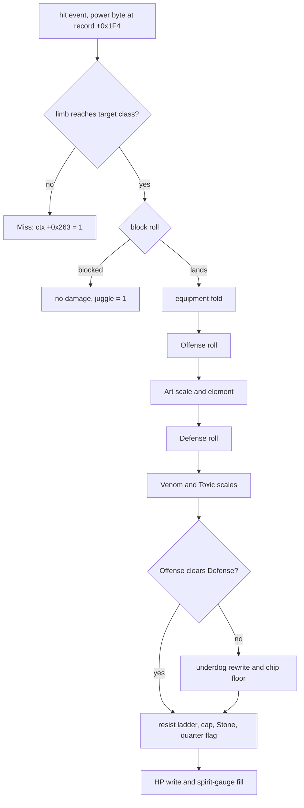
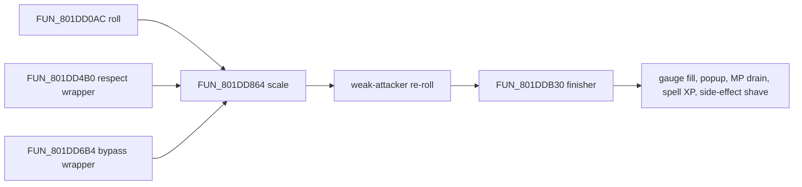

# Battle formulas

The arithmetic behind Legaia's battles: how much a hit does, how a Tactical Art
scales it, what the defender subtracts, and the smaller rolls around them (turn
order, fleeing, poison ticks, MP costs, spoils, the RNG). Every kernel on this
page is read from the game's own code - mostly the battle overlay (PROT `0898`,
link base `0x801CE818`) and `SCUS_942.54` - and mirrored as a pure Rust function
in `crates/engine-battle-vm/src/battle_formulas/`, which `engine-vm` re-exports
as `legaia_engine_vm::battle_formulas`.

Each kernel is presented the same way: a formula block with explicit integer
semantics, an inputs table (input -> where it comes from), provenance, and the
Rust mirror. The Offense Value / Defense Value shape of the physical formula
follows ZetaPhoenix's community analysis; see [Credits and sources](#credits-and-sources).

## Summary

> **A normal hit or an Art, in one paragraph.** Your attack starts from your
> **base ATK** (the number with everything unequipped) plus **half** the ATK of
> the one piece of gear the command uses - footwear for High/Low, the
> weapon-hand item for the arm command, the other hand's item for the other
> arm, and half of *all* your gear for an Art. That number is nudged up by a
> random 0-12.5%, multiplied by the move's **power** (20/16 for a normal hit;
> Arts carry 12, 18, 20, 22 or 28), and gets small extras for your current HP
> (1 per 256), for **juggling** (each consecutive hit while the enemy is still
> reeling adds ATK/64) and for the strike angle. An Art multiplies the total by
> **1.3** (1.4 with War Soul) and the element matchup applies (x1.04 for
> fire-vs-water and the other opposed pairs, x0.96 same-element; an Art takes
> the element factor twice). The defender's **UDF or LDF** - upper body for
> high strikes, lower for low ones - gets the same random 0-12.5% nudge plus a
> small approach-distance term on the first hit only. **Damage = Offense -
> Defense**, capped at 9999. When the defense would win outright the game does
> not floor the hit at 1: it rebuilds your attack on top of the defense so a
> weak attacker still lands a hit that scales with ATK.

Also true, and covered below: Venom / Toxic scale both sides by 9/10 and 7/10; a
defender in the **Spirit** stance triples its Defense Value; a petrified
defender takes nothing from a physical hit; Seru magic and monster specials use
a *different*, INT-driven kernel (`FUN_801DD0AC`) with its own finisher;
blocking and the limb-height "Miss" are separate gates.

## Conventions

- Integer arithmetic throughout. `/` truncates, `>>` is a shift, `%` is the
  remainder of an unsigned divide unless a kernel says otherwise.
- `rand()` is [`FUN_80056798`](#rng-primitive), the BIOS `rand` veneer: 15 bits,
  `0..=0x7FFF`.
- `Rnd(x)` is shorthand for `x + rand() % (x/8 + 1)`: `x` plus 0 to `x/8`, a
  factor of 1 to 1.125.
- Actor offsets (`+0x14C`, `+0x16E`, ...) are into the battle actor reached
  through the pointer table `DAT_801C9370` at `0x801C9370` (slots `0..=2` party, `3..=6`
  monsters, `7` the summon body). `ctx[+N]` is the battle context
  `*DAT_8007BD24`. "Record" is the monster-archive record (PROT 867) or the
  `0x414`-byte character record at `0x80084708 + (char-1)*0x414`, as named.
- PROT `0898` addresses are link addresses; file offset = VA - `0x801CE818`.
- Dumps are `ghidra/scripts/funcs/<name>.txt`. Confidence is **Confirmed**
  (read off the disassembly, or the disassembly plus a live capture) unless a
  row says otherwise.
- Rust names are in `battle_formulas` unless qualified.

## Kernel index

| Kernel | Function | One-line formula | Rust mirror |
|---|---|---|---|
| [Limb-vs-height miss](#the-limb-vs-height-miss) | `FUN_801EC3E4` head | class 2 misses on power byte `>= 0x11`, class 3 on `< 0x11`; `>= 0x16` always connects | `battle_action::limb_misses` |
| [Block roll](#block-roll) | `FUN_801EC3E4` `0x801EC5A8` | `SPD + ATK*4/5` both sides, two rolls, blocked if attacker `<` defender | `block_roll` |
| [Equipment fold](#equipment-fold---base-offense) | `FUN_801EC3E4` `0x801ECB90` | `atk = base ATK + equip ATK(slot) >> 1` | `arms_weapon_atk_fold` |
| [Melee Offense / Defense](#offense-value) | `FUN_801EC3E4` `0x801ECE78` | `Rnd(atk)*power>>4 + hp>>8 + juggle + angle` vs `Rnd(def) + distance` | `physical_predamage` |
| [Underdog rewrite + cap](#underdog-rewrite-chip-floor-and-cap) | `FUN_801EC3E4` `0x801ED308` | weak roll rebuilt on top of Defense; cap `Defense + 9999` | `physical_predamage` |
| [Special / summon roll](#roll---fun_801dd0ac) | `FUN_801DD0AC` | INT-driven attacker roll vs INT + HP + DEF defender roll | `summon_predamage`, `arts_physical_predamage` |
| [Scale](#scale---fun_801dd864-and-the-element-matrix) | `FUN_801DD864` | `atk * matrix[a][d] / 100`, Venom / Toxic, magic level | `apply_element_affinity`, `apply_status_weaken`, `apply_magic_power` |
| [Finisher](#finisher---fun_801ddb30) | `FUN_801DDB30` | resist halve, guard halve, `rand%9+8` floor, summon %, cap 9999 | `damage_finish` |
| [Spirit-gauge fill](#spirit-gauge-fill-on-damage-taken) | `FUN_801DDB30` / `FUN_801EC3E4` | `max(1, dmg*100/maxHP)` + AP Boost, cap 100 | `spirit_gauge_fill` |
| [Capture-class wrappers](#capture-class-wrappers---fun_801dd4b0--fun_801dd6b4) | `FUN_801DD4B0` / `FUN_801DD6B4` | baked power, respect or bypass the resist ladder | `battle_damage_wrappers` |
| [Recovery summons](#recovery-summons) | PROT 0905 / 0911 | Vera `level*0x20 + 0xE0`; Orb `(level<<6) + 0x1C0` | `heal_summon_amount` |
| [Spell XP + magic level](#summon-spell-xp--magic-level-up) | `FUN_801DDB30` tail, `FUN_801E70BC` | `gain = dmg*(12 or 4)/maxHP`; level up when `xp > table*mult>>1` | `summon_spell_xp_gain`, `summon_magic_levels_up` |
| [Seru side-effects](#seru-magic-side-effects---the-element-debuffs-fun_801f3d3c--the-finisher-switch) | `FUN_801F3D3C` | `stat -= stat * pct / 100` per hit, `pct` by element and magic level | `seru_side_effect::stage_side_effect` / `apply_hit` |
| [Spirit gauge extension](#spirit-gauge-extension) | `FUN_801E295C` state `0x46` | `min(agl_base*7/5 + 8, 0x120)`; Spirit `+0x20` | `battle_action` (`spirit_damage` shape) |
| [AP accrual](#the-battle-ap-gauge---every-writer) | `FUN_801E295C` state `0x50` | `gauge = min(100, gauge - cost + 8)` (`+0x20` for Spirit) | `battle_action::done` |
| [Applicator](#applicator---fun_800402f4) | `FUN_800402F4` | selector dispatch: HP apply, buffs `x6/5`, status rolls | `damage_cap_for_party_slot`, `buff_ramp`, `accuracy_roll` |
| [Battle-load stat boost](#actor-stat-block--monster-record-mapping) | `FUN_80054CB0` | profile A `DEF x7/4, INT x5/4`; profile B `ATK x5/4, DEF x2, INT x9/8` | `MonsterDef::installed_stats` |
| [Initiative](#initiative-key-seeding-fun_801da780) | `FUN_801DA780` | `key = SPD + rand % (SPD/2 + 1) + 1 + wounded bonus` | `seed_initiative`, `wounded_bonus` |
| [Formation advantage](#formation-advantage-fun_80051d84) | `FUN_80051D84` | blurred mean-SPD compare, then a 1-in-16 gate | `roll_formation_advantage` |
| [Round AGL restore](#per-round-agl-restore-fun_801d88cc) | `FUN_801D88CC` | Spirit: `min(base*7/5 + 8, 0x120)`; plain: base | `round_reset_agility`, `needs_retarget` |
| [Party escape](#run--escape-roll---fun_801e791c) | `FUN_801E791C` | caught iff `rand % party_score < rand % enemy_score` | `escape_roll` |
| [Monster escape](#monster-escape-roll---fun_801ec0dc) | `FUN_801EC0DC` | HP + ATK side averages, then a 1-in-8 gate | `monster_escape_roll` |
| [Status DoT](#per-round-status-dot-ticker---fun_801e752c) | `FUN_801E752C` | Toxic `maxHP>>4` cap 256; Venom `maxHP>>5` cap 128; never lethal | `status_effects::toxic_tick_damage` / `venom_tick_damage` |
| [Status application](#status-application-the-art--move-record-status-byte) | `FUN_801EC3E4`, `FUN_801E09F8` | byte `3..6` -> Venom / Toxic 1/8, Rot, Curse 1/4 | `monster_ai::enemy_impact_status_proc` |
| [Victory gold / EXP](#victory-spoils-rewards) | `FUN_8004E568` | gold `sum(g>>1)` halved again; EXP `sum*3/4` split | `victory_gold_finalize`, `victory_exp_per_member` |
| [Victory drop](#the-victory-drop-roll) | `FUN_8004E568` `0x8004F3D8` | `rand%100 < chance` per seat, one item, 1-in-4 gate | `victory_drop_roll` |
| [MP cost](#mp-cost--ability-bit-modifiers) | `FUN_80035394`, `FUN_801E295C` `0x28` | `cost - cost>>1` (bit `0x20`) or `cost - cost>>2` (bit `0x10`) | `mp_cost_after_ability_bits` |
| [RNG](#rng-primitive) | `FUN_80056798` | BIOS `rand`: `(seed >> 16) & 0x7FFF` | `psyq_rand_step`, `bios_rand_shape`, `world_rand` |

## Melee hit - `FUN_801EC3E4`

<a id="physical-damage---offense-value-and-defense-value"></a>
<a id="physical-attack-damage---overlay_battle_action_801ec3e4"></a>
<a id="the-melee-roll-pair-and-the-underdog-rewrite"></a>

Every direction-command hit and every Tactical-Art hit a party member lands, and
every plain swing a monster lands, resolves in `FUN_801EC3E4` (battle overlay
`0898`, called from `SCUS_942.54` at `0x800478A0`). It rolls ATK against UDF /
LDF and writes the HP loss itself; it never calls the special-attack roll
`FUN_801DD0AC` or the finisher `FUN_801DDB30`, and carries its own inlined copy
of the finisher's resist ladder and spirit-gauge fill.

```text
Damage = Offense Value - Defense Value        (cap 9999)
```



Provenance for the whole section: `overlay_0898_801ec3e4.txt` /
`overlay_battle_action_801ec3e4.txt`; the six jump-table arms sit in a gap
Ghidra's listing skips and are read from the PROT `0898` bytes at their link
addresses. Stage-by-stage addresses are in the
[address appendix](#address-appendix). `FUN_801EC3E4` reads no `+0x168` (INT)
anywhere: a physical swing has no to-hit roll.

Both rolls key on the **power byte** the command record supplies at the actor's
input cursor (`record[+0x1F4]`): `0x801F64EC[(byte - 0x0C) % 5]` is the power
scalar and `(byte - 0x0C) % 10 < 5` picks UDF over LDF. The Art arms key on a
second byte, the actor's staged id `+0x1D9` (`> 0x10` = an Art).

### The limb-vs-height miss

```text
if attacker_slot < 3:                         // party attackers only (0x801EC488)
    b   = hit power byte                      // lbu a0,0x0(a1), entry[+0x1F4]
    cls = target_record[+0x1E]                // via 0x801C9348[target - 3]
    if b < 0x16:                              // sltiu a1,a0,0x16 at 0x801EC49C; >= 0x16 always connects
        if cls == 2 and b >= 0x11: miss       // 0x801EC4C4..0x801EC4D8
        if cls == 3 and b <  0x11: miss       // 0x801EC500..0x801EC540
miss:  ctx[+0x263] = 1                        // 0x801EC554
       j 0x801EECC0 (at 0x801EC550)           // the epilogue: actor[+0x1F4] += 1, nothing else
```

| Input | Source |
|---|---|
| attacker slot | `a3`; gate `sltiu v0,a3,0x3` at `0x801EC488` |
| power byte | command record at the input cursor, `entry[+0x1F4]` (`0x801EC494`) |
| target class | monster record `+0x1E` (`0x801EC4C0`) |

A class-`2` target is reachable only by power bytes below `0x11`, a class-`3`
target only by `0x11..=0x15`. A miss draws no `rand`, accumulates nothing,
writes no HP and plays no flinch. Its only trace is `ctx[+0x263]`, which the
effect-script stepper `FUN_801DEA50` - called for the same actor straight after
the kernel (`0x800478A0` / `0x800478B8`) - consumes: it clears the byte and
bumps the actor's `+0x1F5` effect and `+0x1F6` cue cursors without walking a
record (`0x801DEBF4..0x801DEC48`). The apply-mode look-ahead tests the same
partition when it asks whether anything left in the action can still connect
([battle-action.md](battle-action.md), the `s2` arms), so a missed last hit
never strands a total. Monster attackers never take this gate.

**Provenance.** `overlay_0898_801ec3e4.txt`, `0x801EC488..0x801EC554`.
**Port.** `legaia_engine_vm::battle_action::limb_misses`, tested by
`World::resolve_hit_event` before the fold and the roll;
`World::consume_effect_skip_strobe` applies the `ctx[+0x263]` skip to the
attacker at once, because the engine walks the effect script earlier in the
frame than retail.

### Block roll

<a id="a-zero-damage-enemy-strike-is-a-block-keyed-on-the-swings-own-power-byte"></a>

A monster's ordinary attack that leaves a party member untouched is a **block**,
not a to-hit miss.

```text
runs only if defender[+0x1F3] != 0 (has a block entry)          // 0x801EC5BC
        and target[+0x0] < defender[+0x14C]                     // 0x801EC5CC..0x801EC5DC
s0 = A.SPD + A.ATK*4/5 + ctx[+0x6D2]          // attacker; ATK is the unfolded +0x158
s1 = D.SPD + D.ATK*4/5 + ctx[+0x6D4]          // defender
s0 = max(s0, s1)
s0 += (rand() % s0) * BLOCK[(b - 0x0C) % 5] >> 1     // BLOCK = 0x801F64E4 = [6,4,4,4,2]
s1 += rand() % s1
D chose Spirit (+0x1DE == 4)           -> s1 = s1 * 3 / 2
A committed Art slot 0x11              -> s0 = s0 * 3 / 2
A status +0x16E & 0x1000               -> s0 = s0 * 8 / 10
D status +0x16E & 0x1000               -> s1 = s1 * 8 / 10
A party, ability +0xF4 & 0x80000       -> s0 <<= 1
A party, ability +0xF4 & 0x200000      -> s0 = s1
D party, ability +0xF4 & 0x100000      -> s1 = s1 * 3 / 2
  else   ability +0xF4 & 0x200000      -> s0 = s1
D status +0x16E & 0x400                -> s0 = s1          // guard disabled
blocked = s0 < s1                                         // sltu s0,s1 at 0x801EC874
```

All arithmetic is unsigned 32-bit; both gates precede the two draws, so a
defender with no block clip consumes no randomness.

| Input | Source |
|---|---|
| SPD, ATK | actor `+0x164`, `+0x158` (working halves) |
| `ctx[+0x6D2]`, `ctx[+0x6D4]` | the [angle and distance words](#angle-and-distance-terms) |
| `b` | the **swing's** power byte - the clip the strike loop stages carries it on each hit event |
| `BLOCK` | `0x801F64E4`, PROT 0898 file `0x27CCC`, eight bytes below the power scalars |
| ability bits | character record `+0xF4` |

The picks a monster's AI physical branch queues are archive entry indices
written into its stream `+0x1DF..`; the picker only queues swing entries (tags
`0x0C..=0x1F` with a real AGL cost), each of which carries a hit event. A byte
staged behind a playing swing commits on that swing's event frame, *after* its
own hit, so every swing but the last lands while the strike loop still
accumulates; the last one lands parked (`0x801EE984..0x801EEA40`) and applies
the total. A blocked hit forces the juggle counter `ctx[+0x0A]` to `1`.

**Provenance.** `FUN_801EC3E4` `0x801EC5A8..0x801EC878`,
`overlay_battle_action_801ec3e4.txt`. **Port.** `block_roll` (`BlockSide`,
`BlockRoll`); `World::take_monster_turn` (`MonsterAction::Physical`) writes the
picks into the stream so each swing rolls on its own power byte. Two engine
choices sit beside it: seating a different monster record drops the seat's
previous clips, and a combo total still on a target when the band leaves `0x20`
is landed there, so the `0x51` settle gate (`FUN_801E7250`) cannot hold forever.

### Equipment fold - Base Offense

<a id="base-offense-value-base-atk-plus-half-of-one-equipment-slot"></a>

```text
Base Offense = Base ATK + Equipment ATK >> 1        // party slots only (sltiu a0,a0,0x3 at 0x801ECB80)
```

| Command | `+0x1D9` | Equipment slot read | Fold | Arm |
|---|---|---|---|---|
| Left arm | `0x0C` | slot 2 | `atk[2] >> 1` | `0x801ECBC4` |
| Right arm | `0x0D` | slot 3 | `atk[3] >> 1` | `0x801ECC0C` |
| High | `0x0E` | slot 4 (**footwear**) | `atk[4] >> 1` | `0x801ECC54` |
| Low | `0x0F` | slot 4 (**footwear**) | `atk[4] >> 1` | `0x801ECC54` |
| (starter) | `0x10` | none | nothing | `0x801ECDE4` |
| **Art** hit | `0x11` | slots 0-4 | `(sum of all five) >> 1` | `0x801ECCD0` |

| Input | Source |
|---|---|
| Base ATK | actor `+0x158` (`lhu s0,0x158` at `0x801ECB84`). The battle loader `FUN_80053CB8` copies it from character record `+0x112` with **no** equipment fold (store at `0x8005417C`; it folds only UDF / LDF / SPD). |
| equipment slots | character record `+0x196..+0x19A`: body, head, slot 2, slot 3, footwear (`+0x19A` read as `lbu v1,0x762(v0)`) |
| equipment ATK | `DAT_80074368 + id*0xC` byte `+1` -> row; `DAT_80074F68 + row*8` byte `+1` |
| jump table | `PTR_801CF4B4[(+0x1D9) - 0x0C]`, dispatch at `0x801ECB90..0x801ECBBC` |

The arms are keyed by **slot**, not item type: Vahn and Gala carry the weapon in
slot 2 and the Ra-Seru in slot 3, Noa carries Terra in slot 2 and her claws in
slot 3 ([arts-command-gauge.md](arts-command-gauge.md#the-execution-time-weapon-fold)).
The Art arm sums all five slots; body and head normally carry no ATK byte, so in
practice it is weapon + Ra-Seru + footwear. The menu's ATK figure is base plus
*all* gear at full value - the menu aggregator `FUN_801CF650` adds equipment for
display only. A monster's Offense starts from its actor ATK unchanged.

**Provenance.** `80053cb8.txt`; halving at `0x801ECCC4..0x801ECCCC` (single
slot) and `0x801ECDDC..0x801ECDE0` (Art arm, `0x801ECCD0..0x801ECDE0`).
**Port.** `arms_weapon_atk_fold`, `arms_command_equip_slots`,
`arms_resolver_admits`; the attacker's `battle.attack` is the un-equipped base
(`seed_party_battle_stats` subtracts the equipment sum the menu aggregator
adds) and the fold adds the halved slot from `World::battle.equip_atk`.

### Offense Value

```text
Offense = [ Rnd(atk) * Power >> 4
          + attacker.HP >> 8
          + (Juggle * atk) >> 6
          + (Angle  * atk) >> 16 ]
Art:     Offense = Offense * 13 / 10        (14 / 10 with War Soul), then * Element / 100
always:  Offense = Offense * Element / 100
Venom:   Offense = Offense * 9 / 10         Toxic: Offense = Offense * 7 / 10
```

`atk` is the Base Offense above.

| Input | Source | Where |
|---|---|---|
| `Rnd(atk)` | `atk + rand() % ((atk>>3) + 1)` | `0x801ECE78..0x801ECEB0` (`0x801ECE80..0x801ECE98`) |
| Power | `0x801F64EC = [12, 18, 20, 22, 28]`, indexed `(byte - 0x0C) % 5`. A direction hit carries the 20 tier (playtest); an Art carries any of the five per strike (art record `+0x24` run, [art-data.md](../formats/art-data.md#power-encoding)). | index `0x801EC588..0x801EC5C8`; use `0x801ECE9C..0x801ECEB4`, `0x801ECEFC` |
| HP | the **attacker's** current HP, actor `+0x14C` | `0x801ECEF8..0x801ECF04` |
| Juggle | `ctx[+0x0A]`, see [the juggle window](#the-juggle-window---what-makes-a-monster-juggleable) | set `0x801ECA20..0x801ECA80`, used `0x801ECEC4..0x801ECF0C` |
| Angle | `ctx[+0x6D2]`, `0..=0x800`, see [angle and distance](#angle-and-distance-terms) | `0x801ECED8..0x801ECF18` |
| Art gate | staged id `+0x1D9 > 0x10` | `0x801ED0A4..0x801ED138` (`x13/10` at `0x801ED118..0x801ED138`) |
| War Soul | attacker record `+0xF8` bit `0x1000` = accessory passive `0x2C` Arts Power | `0x801ED0F8..0x801ED104` |
| Element | `matrix[attacker element][defender element]` at `0x801F53E8`, see [the matrix](#element-affinity-matrix-fun_801dd864-0x801f53e8). Party element from `0x801F5480[char-1]`, monster from record `+0x1D`. | Art pass `0x801ED13C..0x801ED174`, unconditional pass `0x801ED178..0x801ED1B4` |
| Venom / Toxic | attacker `+0x16E` bit `0x1` / `0x2` | `0x801ED254..0x801ED2A0` |

The element pass runs once for every hit and a second time inside the Art arm,
so an Art scales by the factor squared.

### Defense Value

```text
Defense = Rnd(def) + (def * Distance) >> 10
Spirit stance / Safe Escape:  Defense = Defense * 3
Venom:  Defense = Defense * 9 / 10        Toxic: Defense = Defense * 7 / 10
```

| Input | Source | Where |
|---|---|---|
| `def` | defender **UDF** (`+0x15C`) when `(byte - 0x0C) % 10 < 5`, else **LDF** (`+0x160`). A monster's is the record stat after the [battle-load boost](#actor-stat-block--monster-record-mapping); a party member's is record UDF / LDF plus the equipment defence bytes `FUN_80053CB8` folds. | `0x801ECE0C..0x801ECE74` (pick at `0x801ECE14`) |
| `Rnd(def)` | `def + rand() % ((def>>3) + 1)` | `0x801ED1B0..0x801ED1D0` (`0x801ED1B8`) |
| Distance | `ctx[+0x6D4]`, see [angle and distance](#angle-and-distance-terms) | `0x801ED1E0..0x801ED220` |
| Spirit stance | defender `+0x1DE == 4`, or `+0x1DE == 5` (fleeing) while a living party member wears passive `0x35` **Safe Escape** (`+0xF8` bit `0x200000`) | `0x801ECFB8..0x801ED03C`, `0x801ED210..0x801ED230` |
| Venom / Toxic | defender `+0x16E` bit `0x1` / `0x2` | `0x801ED2B8..0x801ED304` |

### Underdog rewrite, chip floor and cap

<a id="damage-and-the-underdog-floor"></a>

```text
if Offense > Defense + Offense*Power/64 + Offense*Juggle/64 + Juggle:     // 0x801ED308..0x801ED358
    hit stands
else:                                                                      // 0x801ED360..0x801ED3E0
    Offense = Defense + (3/4 * Offense + rand() % (Offense/4 + 1)) * Power / 64
                      + Offense*Juggle/64 + Juggle
    Art: Offense *= 11/10 (12/10 with War Soul); element pass(es) again    // 0x801ED3E4..0x801ED49C
    chip floor:                                                            // 0x801ED4A0..0x801ED5C4
      plain swing within Defense + Juggle + 3 -> Defense + rand()%3 + 3 + Juggle
      Art within Defense + Juggle + 5         -> Defense + rand()%4 + 5 + Juggle

party defender: elemental-guard / All Guard ladder                         // 0x801ED5CC..0x801EDA00
Offense = min(Offense, Defense + 9999)                                     // 0x801EDA00
defender +0x16E & 0x4 (Stone):   Offense = Defense                         // 0x801EDA28..0x801EDA40
quarter-damage flag:             Offense = Defense + (Offense - Defense)/4 // 0x801EDA44..0x801EDA58
damage = Offense - Defense
```

There is no floor at 1. An attacker whose ATK sits under the defender's defence
still lands a hit that scales with its own roll - the ordinary case for long
stretches of the game. The chip floor guarantees at least three points to any
hit that lands, which is why a zero-damage enemy strike is always a block. The
quarter-damage flag is a local set at the head of the routine. The HP write
(`+0x14C`) and HP-bar accumulator (`+0x10`) follow at `0x801EDAB0..0x801EDB18`,
then the inlined [spirit-gauge fill](#spirit-gauge-fill-on-damage-taken).

**Port (Offense through cap).** `physical_predamage` (`PhysicalHit`,
`command_power_scalar`, `physical_defense_is_udf`) ports the stages from the
attack roll down; the party-defender guard ladder is `damage_finish`'s resist
stage. `World::land_melee_hit` runs every physical hit - party and monster,
swing and Art - through the fold and the roll, once per hit event the anim tick
admits; a committed Art clip (`+0x1D9 > 0x10`) takes the `0x11` all-slots arm.
RNG draws follow retail call order: attack roll, guard roll, then the rewrite
draw and the chip-floor draw only when those arms fire. `damage_finish`'s post
stages (equipment resists, the zeroed-hit floor, the cap) run on top by
default; `--no-damage-finish` keeps the flat path, and the finisher supplies no
guard halve because the Spirit stance is already the Defense triple. The
`legaia_asset::monster_archive` accessors (`attack()` / `defense_high()` /
`defense_low()`) and `engine-core`'s `monster_def_from_record` follow the ATK /
UDF / LDF binding. Regressions: `engine-vm/tests/battle_physical_predamage.rs`,
`engine-core/tests/battle_physical_damage.rs`.

### The juggle window - what makes a monster "juggleable"

`Juggle` (`ctx[+0x0A]`) is `1` on a chain's first hit and climbs by one for each
further hit that lands while the defender's `+0x1F7` byte is up; a hit that
lands after the byte has dropped resets it to `1`. The byte is not a hidden
stat and not a countdown: the per-frame anim tick re-derives it from whichever
clip the actor is playing.

```text
// FUN_80047430, every actor every frame, 0x80047E1C..0x80047E54
frame = cursor >> 4                               // node+0x68 is a 12.4 clip cursor
idx   = FUN_80050E00(record + 0x10)               // 0 unless +0x11..+0x13 are ALL non-zero
actor[+0x1F7] = (frame < record[0x10 + idx]) ? 1 : 0

// FUN_801EC3E4
defender clip is its block entry (+0x1D9 == +0x1F3): Juggle = 1     // 0x801ECA20..0x801ECA2C
defender[+0x1F7] != 0:                               Juggle += 1    // 0x801ECA4C..0x801ECA70
else:                                                Juggle = 1     // 0x801ECA74..0x801ECA80

window ticks = 32 * beat / (speed * rate)         = 4 * beat / rate at speed 8
```

| Input | Source |
|---|---|
| `record` | the action entry the actor is playing (`node+0x4C`) |
| `beat` | first byte of the entry's event-frame list `record[+0x10..+0x13]` ([monster-animation.md](../formats/monster-animation.md#event-frame-list-entry-0x100x13)) |
| `rate` | entry `+0x78` (`1` or `2`); the cursor gains `speed * rate / 2` sixteenths per tick |
| `speed` | actor scale byte `+0x21D`: `8` in normal play, `4` / `2` for *every* actor under an Art's slow-motion |

A landing hit stages the defender's light flinch (`+0x1DA = +0x1EF`, tag `2`),
the commit installs the flinch record with the cursor at `0`, and the next tick
raises `+0x1F7`. A hit that lands inside the window re-stages the flinch from
frame `0`, so the window **restarts on every juggling hit** and the counter has
no cap. The window belongs to the reaction clip, not the monster: a hit that
triggers a heavier reaction opens that clip's own window. An attack entry's
first beat is its contact frame, so an actor struck during its own wind-up
counts as juggled for that hit.

| Flinch entry | Window at speed 8 | Read as |
|---|---|---|
| Rogue `f1/2` | 2 ticks | effectively un-jugglable |
| bee family `f5/2` | 10 ticks | |
| Gobu Gobu `f8/2` | 16 ticks | |
| Zeto `f16/2` | 32 ticks | |
| Caruban `f10/1` | 40 ticks | about 0.67 s between hits |
| Vahn (party) `f3/1` | 12 ticks | enemy swings arrive 24+ ticks apart and never juggle him |

Across the roster the beat runs `1..16` at rate `2` (a few `1`). Monster id
`181` Cort's beat `10` lies past its 7-frame flinch, so its byte holds for the
whole clip. Party members use the same mechanic: the player battle files'
flinch entries carry the same list at the same offset. `legaia-patcher
monster-stats` prints the `juggle` column (`f<beat>/<rate>` and the ticks) for
every monster; reader `legaia_asset::monster_archive::light_flinch_window`.

**Provenance.** `80047430.txt`. A word-wise scan of `SCUS_942.54` and every
image in `extracted/overlays/` finds exactly two stores to `+0x1F7`: `sb
zero,0x1f7(s2)` at `0x80047E50` and `sb v0,0x1f7(s2)` at `0x80047E54`. Readers:
`0x801EC950`, `0x801ECA4C` in the damage kernel, and the SCUS anim commit
`FUN_8004AD80` at `0x8004AFD4` (the counter / guard window). **Capture.** A live
write-watch (`scripts/pcsx-redux/autorun_juggle_window.lua`) over three battle
states sees no other `pc` and measures the computed windows: Gilium id 161
(`f8/2`) 16 ticks at speed 8 and 32 under an Art, with the counter reading `2`,
`3`, `4` on hits 8-12 ticks apart; Gobu Gobu id 4 (`f8/2`) 16 ticks
(`t=326..342`), its tag-3 flinch `f10/2` 22 against a computed 20; Vahn
(`f3/1`) 12 ticks three times.

### Angle and distance terms

<a id="the-angle-term-is-bounded-at-atk--32"></a>

```text
// FUN_801E295C, when the defender turns to face the attacker
0x801E3078  bearing = FUN_80019B28(fp.z, fp.x, s3.z, s3.x)
0x801E3080  s3[+0x46] = (bearing + 0x800) & 0xFFF     // face the other actor
0x801E3094  d = (s3[+0x46] - fp[+0x46]) & 0xFFF       // 0 .. 0xFFF
0x801E309C  ctx[+0x6D2] = (d >= 0x800) ? d : 0x1000 - d      // branch 0x801E30A0, else arm 0x801E30AC
0x801E30C4  ctx[+0x6D2] -= 0x800                      // unconditional -> 0 .. 0x800

// FUN_801E295C, each step of the attacker's walk-in (0x801E35DC..0x801E35EC)
ctx[+0x6D4] += *(u8*)0x1F800393
```

| Word | Meaning | Magnitude | Zeroed |
|---|---|---|---|
| `ctx[+0x6D2]` angle | `0` head-on, `0x800` into the target's back | `angle * atk >> 16`: `0 .. atk/32` (about +3%) | after the first hit: hit path `sh zero,0x6d2` at `0x801EE3C4`, block path `0x801EC888` |
| `ctx[+0x6D4]` distance | accumulated approach steps; 30 measured for a straight walk-in from the starting line | `def * distance >> 10`: about +3% of DEF | one instruction later: `0x801EE3C8` / `0x801EC88C` |

The angle word cannot go negative, because the writer folds before it biases.
The kernel reads it signed (`lh v0,0x6d2(a0)` at `0x801ECED8`) and shifts the
product logically (`srl v0,t0,0x10` at `0x801ECF14`). Both terms apply to a
chain's opening hit only. The distance value is runtime scratchpad state, not a
code constant (the 30 is ZetaPhoenix's measurement).

**Provenance.** `overlay_0898_801e295c.txt` `0x801E3068..0x801E30C8`,
`0x801E35DC..0x801E35EC`. **Port.** `World::track_block_approach_terms` seeds
the pair and hands both to `block_roll` and `physical_predamage` before zeroing
them.

### Worked example - Vahn vs Evil Fly

ZetaPhoenix's playtest: Vahn with base ATK 188, weapon (slot 2) ATK 98, footwear
ATK 86, Ra-Seru (slot 3) ATK 100, HP 2747, no status, no War Soul; an Evil Fly
with UDF 42 / LDF 49 and a neutral element matchup. The combo is Left arm, Right
arm, then the Art Hyper Elbow (20-power, LDF-targeting). The random draws are
the ones he observed.

| Hit | Base Offense | Rnd roll | Offense terms | Offense | Base DEF | Rnd roll | Distance | Defense | Damage |
|---|---|---|---|---|---|---|---|---|---|
| 1 - Left arm | `188 + 98/2 = 237` | `+7` → 244 | `244*20/16 = 305`, HP `2747/256 = 10`, juggle 1 → `237/64 = 3`, angle 0 | 318 | UDF 42 | `+1` → 43 | 30 → `42*30/1024 = 1` | 44 | **274** |
| 2 - Right arm | `188 + 100/2 = 238` | `+10` → 248 | `248*20/16 = 310`, HP 10, juggle 2 → `238*2/64 = 7` | 327 | UDF 42 | `+2` → 44 | 0 | 44 | **283** |
| 3 - Hyper Elbow | `188 + (98+86+100)/2 = 330` | `+20` → 350 | `350*20/16 = 437`, HP 10, juggle 1 → `330/64 = 5`; sum 452, `x13/10` = 587 | 587 | LDF 49 | `+2` → 51 | 0 | 51 | **536** |

Total 274 + 283 + 536 = **1086**, matching the in-game figure. The second hit's
juggle 2 is why it out-damages the first; the Art takes *all three* gear ATKs at
half and then the `x1.3`. Seeding the attack from the menu aggregate instead of
the base would put hit 1's Base Offense at 472.

## Special-attack and Seru-magic damage

<a id="other-damage-kernels"></a>

Seru magic (player summons), monster special attacks and the Muscle Dome's
rolls run an INT-driven chain of three routines; the capture-class boss casts
reach the same scale and finisher through two wrappers. `INT` here is the
actor's `+0x168` stat - record `+0x18` for a monster, the character record's
live INT `+0x11A` for a party caster - **not** the AGL action gauge.



Dumps: `overlay_battle_action_801dd0ac.txt`, `_801dd864.txt`, `_801ddb30.txt`,
`_801dd4b0.txt`, `_801dd6b4.txt`; see the
[`FUN_801DD0AC` / `FUN_801DD864` / `FUN_801DDB30` rows](../reference/functions.md).

Who calls the roll: the battle-action overlay carries exactly one static call
site (`0x801E188C`, passing the acting seat `ctx+0x13`) - the monster
special-attack path. Every per-spell summon module (PROT 0902..0934) carries its
own `jal FUN_801DD0AC` (call word `0x0C07742B`) with `li a1, 7` immediately
before it, so a player cast rolls with the attacker slot hard-coded to 7 while
`ctx+0x13` stays on the caster. A party member's Tactical Art or plain swing
does **not** come here: it runs the [melee kernel](#melee-hit---fun_801ec3e4).

### Roll - `FUN_801DD0AC`

<a id="summon-magic-damage-roll---fun_801dd0ac"></a>
<a id="arts--physical-branch-attacker_slot--7"></a>

```c
// defender roll, both branches (one draw)
def = rand() % ((tgt.INT >> 1) + 1) + (tgt.HP >> 8)
    + (tgt.DEFa >> 4) + (tgt.DEFb >> 4) + tgt.INT*2;

// summon branch, attacker_slot == 7 (one draw)
atk = rand() % (summon.INT + 1) + summon.HP + caster.INT*2;

// special-attack branch, attacker_slot != 7 (two draws), 0x801DD18C..0x801DD2E4
atk = rand() % ((power >> 2) + 1) + rand() % ((a.INT >> 1) + 1)
    + (a.HP >> 8) + power + a.INT*2;

atk, def = FUN_801DD864(atk, def);                 // scale, next section

// weak-attacker re-roll (the bonus arm), after the scale
// summon (one more draw):
if (def + summon.HP > atk)
    atk = def + rand() % ((summon.INT >> 1) + 1) + summon.HP;
// special attack (two more draws):
if (atk < def + (power >> 1) + (a.INT >> 1))
    atk = def + (power >> 1) + rand() % ((power >> 3) + 1)
        + (a.INT >> 1) + rand() % ((a.INT >> 3) + 1);

FUN_801DDB30(&atk, &def, ...);                     // finisher
damage = atk - def;
```

| Input | Source |
|---|---|
| `INT` | actor `+0x168` |
| `HP` | actor `+0x14C`. The summon body's HP / INT are the stats the loader installs on the slot-7 actor from the creature's record (INT = record `+0x18`). |
| `DEFa`, `DEFb` | defender `+0x15C` (UDF), `+0x160` (LDF) |
| `power` | `(i16)` word `+0` of the 26-byte move-power record at `0x801F4F5C`, indexed by `map[actor[+0x1DF]]` ([move-power.md](../formats/move-power.md)) |
| `caster.INT` | the casting party member's `+0x168` |

A player Seru-magic *damage* summon has no static per-spell power scalar
([spell-table.md](../formats/spell-table.md#per-spell-damage-power-is-not-static-data---it-is-caster-state-derived))
and does not go through `FUN_800402F4`. The move-power table is
special-attack-only: its id map leaves the basic-attack and Art id bands
`0x08..=0x11` / `0x16..=0x18` unmapped (live capture). Draw counts: three or
five on the special-attack branch, two to four on the summon branch including
the finisher's lazy floor draw.

**Port.** `summon_attacker_roll` / `summon_defender_roll` / `summon_bonus_roll` /
`summon_predamage` / `summon_predamage_lazy` (`SummonRollActor`,
`SummonPredamage`); `arts_attacker_roll` / `arts_bonus_roll` /
`arts_physical_predamage` / `arts_physical_predamage_lazy` (`ArtsPredamage`).
Wiring, in `engine-core::world::battle::casting`:

- **Monster special attacks.** The move-power table loads from PROT 0898 onto
  `World::tables.move_power` (`move_power::MovePowerCatalog`). When a monster's
  move id resolves to a power record, `cast_spell_on_slots` takes its damage
  from `World::enemy_move_predamage`, which reads INT from `battle.accuracy`, HP
  from `battle.hp` and the two defence terms from `battle.defense_split`, and
  draws attacker x2 + defender x1 up front and the bonus pair lazily. Status and
  guard inputs to the scale are defaulted on this path.
- **Player Seru-magic casts.** `World::player_summon_predamage` seeds
  `summon_predamage_lazy` from the namesake creature's `battle_data` record
  (read from `DiscTables::summon_creatures`, filled at scene entry from the
  monster archive for every summon), the caster's `battle.accuracy` doubled, the
  affinity percent inside the roll, and the caster's per-spell magic level.
- **Gating.** Both overrides engage only when their disc tables are installed;
  a disc-free or synthetic battle keeps a placeholder magnitude and an untouched
  RNG stream.

### Scale - `FUN_801DD864` and the element matrix

<a id="element-affinity-matrix-fun_801dd864-0x801f53e8"></a>

```c
atk = atk * matrix[atk_elem*8 + def_elem] / 100;        // 8x8 @ 0x801F53E8, row = attacker
if (atk_status & 1) atk = atk*9/10;   if (atk_status & 2) atk = atk*7/10;
if (tgt.guard == 4)  def <<= 1;                         // defender +0x1DE == 4 (Spirit)
if (tgt_status & 1)  def = def*9/10;  if (tgt_status & 2) def = def*7/10;
if (attacker_slot == 7)                                 // summon only
    atk += atk * (magic_level - 1) >> 3;
```

| Input | Source |
|---|---|
| party element (slot `< 3`) | per-character table `0x801F5480`, indexed by 1-based char id: Vahn fire, Noa wind, Gala thunder, Terra wind |
| other slots (`>= 3`: monsters **and** the slot-7 summon body) | monster record `+0x1D`, through the record-pointer table `0x801C9348[slot - 3]` (not the live-actor table `0x801C9370`); `lbu ..,0x1d(record)` at `0x801DD8C4` / `0x801DD8DC`. No copy of the element exists in the live actor. |
| status | actor `+0x16E` bits `0x1` Venom, `0x2` Toxic |
| `magic_level` | the caster record's 32-entry spell-id list at `+0x13D` with parallel level bytes at `+0x161` (live `0x80084845` / `0x80084869`, the save window's `+0x705` / `+0x729`); `1..9`, identity `1` when the spell is absent |

**The matrix.** Static data in PROT 0898: matrix at file `0x26BD0`, character
table at file `0x26C68`. Values are a nudge, not a x0 / x2 weakness table:

| Pairing | Byte | Percent |
|---|---|---|
| same element (diagonal) | `0x60` | 96 |
| opposed pairs: earth-wind, water-fire, light-dark | `0x68` | 104 |
| everything else | `0x64` | 100 |
| neutral (id 7) row and column | `0x64` | 100 |
| thunder (id 4) row | - | attacks every element at 102, takes 98 from dark |

Element ids: 0 earth, 1 water, 2 fire, 3 wind, 4 thunder, 5 light, 6 dark, 7
neutral. Ids 2 / 3 / 4 / 7 are byte-pinned; 0 / 1 / 5 / 6 are **Inferred** from
the reciprocal pairs and the spell-table element vocabulary. The byte takes only
`0..=7` across the character table, every monster record and every summon cast
record (disc-gated tests in `crates/asset/tests/`).

**A player cast attacks as the summoned creature.** The attacker element is the
streamed cast-body record's `+0x1D` - not the caster's element, and not the
spell's own `SpellElement`, which this routine never reads. Slot 7 resolves
through `0x801C9348[4]` = `0x801C9358`, the pointer `FUN_801F19EC` installs when
a group's actor-record slot streams
([summon-readef.md](../formats/summon-readef.md#actor-record-slot-last-streamed-slot-of-a-group)).
That pointer is zero at battle init and written only by the installer, so a cast
whose readef group streams no actor record resolves through whatever the slot
last held (null lands the `lbu` on `main_ram[0x1D]`). Live-confirmed on a Gimard
cast (`scripts/pcsx-redux/autorun_element_attribution_trace.lua`).

**The unread second block.** The 64 bytes after the matrix (`0x801F5428`, file
`0x26C10`) are a second 8x8 block of the same shape with much stronger values.
Nothing reads it: no word, `jal`, `j`, branch or `lui` pair names any of its
words (`find-address-word-refs.py --range --prot`), and no `gp`-relative or
base-plus-displacement access reaches it (`find-gp-relative-refs.py --va
--prot`). The matrix base is formed at eight `lui` sites - `FUN_801DD864`, four
in `FUN_801EC3E4`, and `FUN_801F3D3C` at `0x801F3E4C` - each indexing `atk*8 +
def` unchecked, so only an element byte of `8` or more could reach the block.
The PAL and Japanese battle overlays carry the same block.

**Port.** `apply_element_affinity`, `apply_status_weaken`, `apply_magic_power`.
Parser `legaia_asset::element_affinity` (CLI `asset element-affinity
<0898.BIN>`), loaded onto `World::tables.element_affinity`.
`World::enemy_affinity_pct` supplies `matrix[enemy_element][party_member_element]`
(`MonsterDef::element`; the engine models `char_id == party slot + 1`);
`World::cast_affinity_pct` supplies the player direction from
`World::summon_attacker_element` and `World::battle_slot_element`. The percent
is applied inside the roll, before the bonus-arm threshold, matching retail's
scale-then-bonus order. An uninstalled table resolves to a neutral 100. When
the affinity tables are present but the creature is not resolvable, a cast
keeps the placeholder magnitude with the percent applied post-roll.

### Finisher - `FUN_801DDB30`

Works on `over = atk - def` and rewrites it in six closed-form stages:

```text
1. party defender, param_5 == 0:
     resist bit for the attacker's element set -> over >>= 1
     All Guard (+0xF8 & 0x10)                  -> over = over*3 >> 2
2. enemy defender halve (_DAT_8007bd84)
3. guard halve: defender +0x1DE == 4           -> over >>= 1
4. no-damage floor: mitigation zeroed the hit  -> over = rand() % 9 + 8
5. summon power-percent (attacker_slot == 7):  over = over * pct / 100
     pct = table[(caster_char_id - 1) * 8 + summon_element]
6. over = min(over, 9999)
```

| Input | Source |
|---|---|
| resist bits | the first two words of the character record's accessory-passive ability bitfield, `+0xF4` / `+0xF8` (aggregator `FUN_80042558`). The flag for element `e` is passive index `0x1D + e`: elemental guards sit at `0x1D..=0x23` (Earth, Water, Fire, Wind, Thunder, Light, Dark), so elements `0..=2` test `+0xF4` bits 29..31 and `3..=6` test `+0xF8` bits 0..3. See [accessory-passive-table.md](../formats/accessory-passive-table.md). |
| All Guard | `+0xF8 & 0x10`, passive `0x24` (Rainbow Jewel) |
| `param_5` | `0` = resist ladder runs; `1` = the whole party-defender resist block is skipped (only `FUN_801DD6B4` passes it) |
| summon power table | per caster, `0x801F5468` (PROT 0898 file `0x26C50`, the 24 bytes before the character element table); `ElementAffinity::summon_power` |

Each caster summons their own element at 100% and their opposed element weakest:
Vahn fire 100 / water 40, Noa wind 100 / earth 40, Gala thunder 100 / dark 60,
the rest 70-95 (`asset element-affinity` prints the rows).

The rest of the routine is its **tail**, which reads and writes about twenty
battle globals: the [spirit-gauge fill](#spirit-gauge-fill-on-damage-taken), the
damage-popup accumulator (`_DAT_8007bd14`), the `DAT_801f6980` AI revenge table,
the MP drain, the [spell-XP accrual](#summon-spell-xp--magic-level-up) and the
per-element stat-debuff `switch` keyed on the summon record's element
(`DAT_801c9358+0x1d`) - the Seru-magic
[side-effect](#seru-magic-side-effects---the-element-debuffs-fun_801f3d3c--the-finisher-switch).

**Port.** `damage_finish` / `damage_finish_lazy` (`DamageFinish`,
`DefenderResist`, `bypass_party_resist`). On by default
(`World::toggles.use_damage_finish`; `--no-damage-finish` disables).
`World::defender_resist` reads the two resist words off the character's rebuilt
ability bitfield (`refresh_party_ability_bits`), so an equipped elemental-guard
accessory halves a matching-element monster special and All Guard applies the
3/4 scale. The finisher draws its one RNG only when a hit zeroes out.

### Spirit-gauge fill on damage taken

<a id="the-spirit-gauge-fill-is-duplicated"></a>

```text
pct = max(1, damage * 100 / maxHP)
if defender record +0xF8 & 0x200:  pct += pct >> 2        // AP Boost, passive 0x28 / 0x29
if defender record +0xF8 & 0x100:  pct += pct / 10
defender[+0x170] = min(100, defender[+0x170] + pct)
```

The kernel exists **twice** in overlay 0898, as two independent inlined copies:

| Copy | Host | Registers (damage / defender / pct) | Site | Reached by |
|---|---|---|---|---|
| A | `FUN_801DDB30` | `v1` / `s1` / `a1` | `0x801DE1C8..0x801DE2D8` | magic, summon and special-attack hits |
| B | `FUN_801EC3E4` | `a0` / `a1` / `a2` | `0x801EDB80..0x801EDCC8` | ordinary physical hits |

Copy B's shift/add chain starts in a branch delay slot (the `beq` at
`0x801EDB74` joins at `0x801EDB80`) and interleaves its own max-HP load. The
count is exactly two: the `andi v0,v0,0x200` / `andi v0,v0,0x100` tests and the
`sltiu rX,v0,0x1` min-one floor co-occur at `0x801DE1F8` and `0x801EDBB0` and
nowhere else. The `100` scale is a shift/add chain, not an immediate, which is
why the patcher's [`--damage-ap`](../tooling/randomizer.md#enemy-damage-ap)
restates it as a multiply - and why an edit must touch both copies.

**Port.** `spirit_gauge_fill`, one function with two call sites.

### Capture-class wrappers - `FUN_801DD4B0` / `FUN_801DD6B4`

<a id="the-bypass-wrappers-heavy-defence-fold-does-not-mitigate-more"></a>
<a id="respect-is-a-different-kernel-not-the-shared-kernel"></a>

A spell whose table record's first byte is `'c'` (the boss cinematic casts,
[spell-table.md](../formats/spell-table.md#cast-classes-record-byte-0)) streams
its own code module (`FUN_8003EC70(record[+1] + 0x28)` -> PROT `944..966`). The
`0x63` arm pages the module and the module's tick calls one of two wrappers
with a **baked-in power constant**; `FUN_801DD0AC` is never reached. Both pass
`a1 = ctx+0x13`, so the scale reads the caster's true record element either way.

| | `FUN_801DD0AC` (special-attack branch) | `FUN_801DD4B0` respect | `FUN_801DD6B4` bypass |
|---|---|---|---|
| finisher `param_5` | `0` | `0` - jewels, elemental guards, All Guard apply | `1` - resist ladder skipped |
| power | move-power row | `a0` | `a0` |
| attacker stat | INT `+0x168`: `rand % ((INT>>1)+1) + INT*2`, two draws | same terms, same order | **ATK** `+0x158` (`lhu v0,0x158(s0)` at `0x801DD738`), one draw; no `+0x168` read |
| defender fold | UDF / LDF at `>> 4`; modulus on INT | same | UDF / LDF at `>> 1`; modulus `rand % (((UDF + LDF) >> 3) + 1)` (`0x801DD74C..0x801DD764`) |
| bonus threshold | `def + (power >> 1) + (INT >> 1)` | `def + power` | `def + power` |
| bonus rebuild | `+ rand % ((power >> 3) + 1) + (INT >> 1) + rand % ((INT >> 3) + 1)` | `def + power + rand % ((power >> 2) + 1)` | same as respect |
| bonus draws | two | one | one |

`FUN_801DD4B0`'s first modulus is `divu` (`0x801DD518`) where the shared
kernel's is `div` (`0x801DD1D4`); they agree because `rand()` is never
negative. On any hit that clears the defender's mitigation the respect wrapper
and the shared kernel agree exactly; the divergence is the bonus arm and its
draw count (four against five).

The bypass wrapper is a physical-stat kernel: an enemy's INT moves a respecting
cast and leaves a bypassing one alone. Its `>> 1` defence fold does **not**
mitigate more. On ordinary defence values the scaled attacker roll lands below
`def + power`, the bonus arm rebuilds the attacker roll out of the defender
roll, and `atk - def` collapses to `power + rand` - near-flat against defence.

Wrapper census over every capture-class module (byte-scan for the `jal` words
`0x0C0775AD` bypass / `0x0C07752C` respect; the `09xx` extents tile exactly, so
each offset names one word inside its own entry). Shared modules dispatch **per
spell** on `actor[+0x1DF]` at the module head.

| Module | Spell | Known caster | Wrapper |
|---|---|---|---|
| PROT 944 | Guilty Cross `0x37` (dispatcher `+0x1510` -> `+0x2C` tick) | Cort (humanoid phases) | **bypass** (playtest: an Ebony Jewel makes no difference) |
| PROT 944 | Curse All `0x53` (`+0xA98` tick) | none - casterless | no damage-wrapper call |
| PROT 952 | Bloody Horns `0x5C` (dispatcher `+0x1150` -> `+0x740` tick, hit `0x1D0`) | Xain; Gaza (first fight) | **bypass** |
| PROT 952 | Astral Slash `0xB8` (`+0x34` tick) | Xain; Gaza | no wrapper call in its tick; **respects** in play (Luminous Jewel halves it, 1570 -> 781) |
| PROT 953 | Terio Punch `0x5D` (`0x274`), Bull Charge `0x5E` - one shared tick | Xain | **bypass** |
| PROT 958 | Blazing Slash `0x79` | Gi Delilas | **bypass** (6 calls) |
| PROT 959 | Megaton Press `0x7A` | Che Delilas | **bypass** (3 calls) |
| PROT 960 | Plasma Strike `0x7B` (dispatcher `+0x1C60` -> `+0xB0C` tick) | Lu Delilas; Gaza (Sim-Seru) | **bypass** |
| PROT 960 | Neo Star Slash `0xA6` (`+0x0` tick) | Lu Delilas; Gaza | respect |
| PROT 966 | enemy Evil Seru Magic (`0x327` / `0x100`) | Cort | respect - which is why it behaves as Dark |
| every other damage-dealing capture module (935..966) | Earthquake, Hyper Crush / Lightning, Chaos Breath / Flare, Call / Big Wave, Water Column / Crystals / Hazard, Cross Beam, V- / Neo Windhash, Rolling Flare, Scythe Wind, Dead End / Final Crisis, Blade Breath band, Genocidal Cannon, Doomsday, Mystic Circle, ... | various | respect |

The full spell-to-module map is static spell-table data
([spell-table.md](../formats/spell-table.md#capture-class-module-index-prot-09350966)).
Notes on the census:

- Xain's Bloody Horns and Terio Punch bypass the ladder, which is why Earth
  Jewels do not reduce them although Xain's element byte is 0 (Earth).
- No monster record carries Curse All `0x53` and no case of the picker's
  [hardcoded special-cast switch](../formats/spell-table.md#the-hardcoded-special-cast-switch-the-second-selection-mechanism)
  queues it - unused content, like the dummied Freeze Thunder `0x2C`.
- Status-only modules (Glare / Divide / Curse / White Shield cluster / Mystic
  Shield / Clone / Fatal Decision / Kiss of Death band) carry no wrapper call.
- No Songi cast is in a bypass module (Hyper Wave is plain-class; Hyper
  Lightning / Hyper Crush / Chaos Flare / Genocidal Cannon all respect).
  Non-capture casts (plain-class, player summons, move-power specials) all reach
  the finisher with `param_5 = 0`.
- Open: PROT 952 carries one respect call (`+0x15B0`, power `0x80`) with no
  reachable in-module entry - same-shape twins sit at the same offsets in
  sibling modules, so it reads as shared template dead code - and the call site
  that applies Astral Slash's damage is unpinned.

Module anatomy (paging, phase machine, the seat-0-hardcoded apply sites) is on
[cast-module.md](cast-module.md).

**Port.** `engine-vm::battle_damage_wrappers` models both stat sets. The class
byte is `stats +0` of the `DAT_800754C8` record (`legaia_asset::spell_names`,
`SpellEntry::class` / `capture_class_records`); `World::capture_respect_predamage`
routes on it, checking the six bypass ids first because the class byte cannot
separate two ticks of one module. The finisher gate is
`damage_finish::bypass_party_resist`.

### Recovery summons

```text
Vera (PROT 0905):  heal = level * 0x20 + 0xE0,   clamped to maxHP - curHP (signed compare)
                   popup word +0x10 = -heal
Orb  (PROT 0911):  heal = (level << 6) + 0x1C0,  across the party row (unsigned clamp)
```

`level` is the caster's [magic level](#scale---fun_801dd864-and-the-element-matrix)
for the cast spell (`1..9`). Recovery summons skip the roll entirely.
**Port.** `heal_summon_amount` is Vera's formula; Orb's lives with its tick body
([cast-module.md](cast-module.md#the-player-seru-bands-tick-bodies-are-code-not-data)).

### Summon spell XP + magic level-up

Casting Seru magic trains the spell. The character record carries a per-spell
u32 **XP array at `+0x8`**, parallel to the id list `+0x13D` and the level bytes
`+0x161`.

```text
// accrual: FUN_801DDB30 tail, summon attacker (slot 7, 0x801DE440) only, per hit
if (_DAT_8007BAC0 != 0 || _DAT_8007BDB8 skip) gain = 0     // gate at 0x801DE450
else if (target_hp < 2)        gain = 0
else if (damage < target_hp)   gain = damage * (single ? 12 : 4) / target_max_hp
else                           gain = single ? 12 : 4      // killing hit: flat
xp[spell_slot] += gain

// level-up: FUN_801E70BC, once per cast at summon return (state 0x36)
mult      = (id in {0x86,0x88,0x8D,0x99,0x9B,0xA0}) ? 3 : 2
threshold = (u16_table[level - 1] * mult) >> 1             // table at SCUS 0x8007656C
if (level < 9 && threshold < xp)  level += 1               // strict compare, cap 9
```

| Input | Source |
|---|---|
| `damage` | the finisher's committed `*atk - *def` |
| `target_hp`, `target_max_hp` | defender `+0x14C`, `+0x14E` |
| `single` | summon target byte `+0x1DD`: `< 8` single-target, `8` / `9` group |
| spell slot | the live spell id `actor[+0x1DF]` found in the id list (bound `0x20`) |
| `_DAT_8007BAC0` | the [special-battle word](#the-special-battle-words-readers); `_DAT_8007BDB8` is an unidentified second skip |
| threshold table | 8 ascending u16 steps at SCUS `0x8007656C` (levels 1..=8) |

The levelled byte is the magic-level input of the next cast's scale stage, so
the loop is cast -> XP -> level -> stronger cast. Every damaging module strikes
through `FUN_801DD0AC(0x12, 7, seat)`, the high block included (Juggernaut
`0x801F7E0C`, Palma `0x801F8114`, Mule `0x801F7E4C`, Meta `0x801F7BA0`, Terra
`0x801F7CCC`, Ozma `0x801F8E04`), so "summon attacker" covers ids
`0x81..=0x95` and `0x99..=0xA0`.

Modules that credit XP in their own arm, under the same special-battle gate
(`+0x5D0 + slot*4` off `0x80084140` is record `+0x8`):

| Module | Rule | Sites |
|---|---|---|
| Vera | `+0xC` when the seat's missing HP covers the full heal, `+0x4` when it clamps | `0x801F7CCC` / `0x801F7CA4` |
| Orb | `+0x4` / `+0x2` | `0x801F7B50` / `0x801F7B2C` |
| Spoon | `+0x4` / `+0x2` | `0x801F80D4` / `0x801F80B0` |
| Horn `0x9C` (PROT 0930) | walks every party seat (`0x801F786C..0x801F7B1C`), refills to max HP and clears `+0x16E`; `+3` for a seat missing HP, `+1` for a seat carrying a status | `0x801F79A0`, `0x801F7A14` |
| Jedo `0x9D` (PROT 0931) | branches on the scripted-fight flag `ctx[+0x287]` (`0x801F8344`). Scripted: strikes, so the tail credits per hit. Otherwise `0x801F8558`: per monster seat `3..=6` with non-zero HP, bump the caster's magic-rank counter (record `+0x9C`), set the seat's `+0x21C` to `0xC8`, credit `+3`. | `0x801F8344`, `0x801F8558` |

A seat missing nothing earns nothing. The heal-spell arms of `FUN_800402F4`
(selector 0 tiers 3 / 4 / 5: spell ids `0x83` / `0x89`) accrue into the same
array inline.

**Provenance.** `overlay_battle_action_801ddb30.txt:1037..1084`,
`overlay_battle_action_801e70bc.txt`. **Port.** `summon_spell_xp_gain`,
`summon_magic_level_threshold`, `summon_magic_levels_up`;
`summon::module_trains_spell_xp`; `magic_xp::thresholds_from_scus` (decoded off
the user's `SCUS_942.54`, disc-gated `magic_xp_disc`),
`magic_xp::module_heal_xp_gain`, `magic_xp::horn_seat_xp_gain`,
`magic_xp::JEDO_XP_PER_LIVING_MONSTER`. Live wiring `World::cast_spell_on_slots`
-> `World::accrue_summon_spell_xp`; XP persists in the record's `+0x8` bytes and
round-trips through saves. Jedo's non-scripted effect on the monsters themselves
is not ported (the engine folds the catalog's placeholder outcome).

### Seru-magic side-effects - the element debuffs (`FUN_801F3D3C` + the finisher switch)

Every levelled player Seru-magic cast carries a secondary effect keyed on the
**summon creature's element**: a stat debuff for the six damaging elements, a
cure class for light. There is no per-monster immunity field for these debuffs
(the record's `+0x24..+0x43` tail is zero across the roster and no overlay reads
one); what players report as boss immunities falls out of the gates below.

```text
// stager FUN_801F3D3C, once per cast, called from inside the spell's module
if level < 3:                                   return          // 0x801F3D90..0x801F3DA0
if ctx[+0x287] && summon_el != 5 && rand() % 5 != 0:
    if affinity[summon_el][first_enemy_el] < 0x65: return       // suppressed
switch summon_el:                                                // 0x801F3EB4
  0 2 3 4 6:  if ctx[+0x287] && target is an enemy seat:
                  compare target BASE halfword vs raw record; differ -> return
  1:          same compare, in every fight (AGL base +0x156 vs record +0x0E)
  5 7:        no compare
band = (level - 3) >> 1
*0x801F6960 = table[summon_el][band].amount                      // 0x801F4420..
*0x800775B4 = banner string;  *0x801F6964 = 0xB4;  FUN_801D8DE8(0x66, 0)

// finisher FUN_801DDB30 tail, attacker_slot == 7, every hit (0x801DE60C..0x801DE8EC)
stat -= stat * (*0x801F6960) / 100
```

| Input | Source |
|---|---|
| `level` | caster magic level for `actor[+0x1DF]` (record `+0x161` array, `0x20`-entry scan of `+0x13D`) |
| `summon_el` | summon record `+0x1D` through `0x801C9358` - the creature's element, never the caster's |
| `ctx[+0x287]` | the **scripted-fight flag**: bit `0x80` of `DAT_8007BD60`, raised by a formation row whose header byte is non-zero ([encounter.md](../formats/encounter.md#the-per-battle-flags-byte-dat_8007bd60)), latched by `FUN_800513F0`. `4` in every boss capture, `0` in every random-encounter capture. |
| first enemy | the single target, or the first living enemy seat of a group cast |
| table | `0x801F6870` (PROT 0898 file `0x28058`), `[element][band]`, `0x20` bytes per element, 8-byte records `[u8 amount][3 pad][u32 banner_va]` |

| Summon element | Effect on the target | lv 3-4 | lv 5-6 | lv 7-8 | lv 9 |
|---|---|---|---|---|---|
| 0 earth (Mushura / Kemaro / Iota) | **DEF down** - all four defence halfwords (`+0x15C..+0x162`) | 5% | 10% | 15% | 20% |
| 1 water (Gizam / Freed / Slippery) | **AGL down** - the action-gauge **base** only (`+0x156`) | 5% | 10% | 15% | 20% |
| 2 fire (Gimard / Zenoir / Gola Gola) | **ATK down** (`+0x158`/`+0x15A`) | 5% | 10% | 15% | 20% |
| 3 wind (Swordie / Nova / Barra) | **SPD down** (`+0x164`/`+0x166`) | 5% | 10% | 15% | 20% |
| 4 thunder (Theeder / Viguro / Gilium) | **INT down** (`+0x168`/`+0x16A`) | 5% | 10% | 15% | 20% |
| 5 light (Vera / Orb / Spoon) | cure class, party targets (the modules read `0x801F6960` as `1..=4`) | 1 | 2 | 3 | 4 |
| 6 dark (Puera; Nighto stages nothing) | **MP down** - the current MP only (`+0x150`) | 5% | 10% | 15% | 20% |

A level-1 or level-2 spell has no side effect and no banner. What lands, by
fight class:

| Debuff | Random encounter (flag clear) | Scripted fight (flag set) |
|---|---|---|
| suppression roll | none | four casts in five suppressed, unless light or the first enemy is weak (`affinity >= 101`: thunder vs the four base elements at 102, each opposed pair at 104) |
| ATK, DEF, INT | every hit, stacking multiplicatively (two 10% hits leave 81%) | **never** - the scripted [boost profile](#actor-stat-block--monster-record-mapping) already moved the base halfword off the record value (exceptions: ATK `< 4`, INT `< 8`, UDF `0`, which the boost cannot move) |
| SPD | every hit | once per battle |
| AGL | once per battle (the compare is unconditional and the shave moves the compared halfword) | once per battle |
| MP | every hit | every hit that survives the roll (compares base `+0x152`, shaves current `+0x150`) |

"Once per battle" is literal: the first cast that passes moves the halfword the
compare reads, so later casts of that element print "No effect.". The byte three
**summon** ticks read as a resist gate - record `+0x20`, in PROT 0907 / 0908 /
0916 - is a different mechanism and plays no part here; see
[battle.md](battle.md#the-instant-death--status-resist-gate-record-0x20).

**Who calls the stager.** The `jal 0x801f3d3c` word `0x0C07CF4F` sits in 19 of
the 21 Seru-magic images `0903..=0923`; **Nighto** `0907` and **Aluru** `0916`
carry none, and no Ra-Seru image `0927..=0934` does.

**The "No effect." banner.** `FUN_801F3C34` runs at the summon's
return-from-fade (state `0x36`): when the spell is levelled (`>= 3`) but
`0x801F6960` is still zero it installs the `0x801CFA20` string at `0x800775B4`
and fires the same banner id. Its early-out ids `0x85` / `0x8E` / `>= 0x96` are
exactly the stager-free spells.

**Provenance.** `overlay_muscle_dome_801f3d3c.txt` (the stager, PROT 0898 file
`0x25524` - a 0898 body under a capture-named file, see
`dump-corpus-integrity.md`); `overlay_battle_action_801ddb30.txt`
`0x801DE60C..`; `80054cb0.txt` `0x80055234..` (the profile branch);
`801da51c.txt` `0x801DA5F8..` (the flag raise). **Capture.** `ctx[+0x287]` and
the installed stat block read off mednafen / PCSX-Redux battle states via
`mednafen-state extract` / `pcsxr-state extract`: Gaza `ATK 360 UDF 444 LDF 400
INT 247` from record `288/222/200/220` with flag `4`; a world-map Gobu Gobu `ATK
17 UDF 25 LDF 24 INT 12` from `17/15/14/10` with flag `0`.

**Port.** Parser `legaia_asset::seru_side_effect` (CLI `asset
seru-side-effect`); per-record verdict `Susceptibility::for_record`, which the
site's enemy table renders per row by fight class
(`legaia_asset::formation_census`, CLI `asset formation-census`). Both halves
run in the live loop: `engine-vm::seru_side_effect::stage_side_effect` once per
player cast through `World::stage_seru_side_effect`, for exactly the ids whose
module calls it (`summon::module_stages_side_effect`); `apply_hit` per damaged
target through `World::apply_seru_side_effect`; the banner pass is
`engine-vm::move_no_effect_guard`, live from state `0x36`. Three pieces of
state carry it:

- **Base halfwords.** `BattleState::attack_base` / `defense_base` /
  `speed_base` / `accuracy_base` (plus the actor's `agl_base`) are the second
  `sh` of every pair. `World::sync_battle_stat_bases` writes them at battle
  entry and nothing but a debuff writes one afterwards.
- **Scripted flag.** `BattleState::scripted_fight`, derived at battle entry
  from the formation's `record[+0]` header byte, ORed with the `no_escape` latch
  the field VM's scripted-battle op sets.
- **Boost profile.** The enemy seed picks `MonsterDef::installed_stats` by that
  flag; the catalog keeps the raw block (`MonsterDef::raw_stats`) to derive
  either profile.

With no disc the stager returns before its one `rand()` draw.

## Gauges

### Spirit gauge extension

```text
// FUN_801E295C state 0x46 - a Spirit turn
ctx[+0x6DC] = min(agl_base * 7 / 5 + 8, 0x120)    // the extended arts bar, cap 288
ctx[+0x6DE] = min(spirit + 0x20, 100)             // Spirit +32 (+0x28 / +0x23 under the
                                                  //   +0xF8 passives 0x200 / 0x100)
```

| Input | Source |
|---|---|
| `agl_base` | the **acting actor's own** `+0x156` (`lhu v0,0x156(s3)` at `0x801E52C4`) |
| `spirit` | actor `+0x170` |

A Spirit turn is not a damage formula and writes no HP. `ctx[+0x6DC]` is the
command-gauge pool the arts entry spends
([arts-command-gauge.md](arts-command-gauge.md#where-the-gauge-pool-comes-from)),
and the round boundary restores a Spirit-charged actor's `+0x154` to the same
value. State `0x3E`'s item class 5 stages the same `min(base*7/5 + 8, 0x120)`
shape off the target. See [battle-action.md](battle-action.md) states `0x46` and
`0x3E`. **Port.** `engine-vm::battle_action`; `spirit_damage` is the shape as a
pure function.

### The battle AP gauge - every writer

The 0..100 AP gauge Super and Miracle Arts spend is the battle actor's `+0x170`
halfword. A byte census of `sh rX,0x170(rY)` over PROT 0898 finds eighteen
stores; the only other images that store it are the three light-row heal
modules, PROT 0938 (Chaos Breath) and four SCUS battle-load / per-frame sites
(among them the Maximum AP passive's pin at 100, `0x8004CECC`).

| Writer | Site | Effect |
|---|---|---|
| per-action accrual | `FUN_801E295C` state `0x50`, `0x801E5D60..0x801E5E8C` | `gauge -= +0x224` (the turn's accrued art cost), then `+0x224 = 8`, or `0x20` when the action category `+0x1DE` is `4` (Spirit); a party seat adds the AP Boost passives on record `+0xF8` (`0x200`: `acc / 4`, `0x100`: `acc / 10`); then `gauge += acc`, capped at 100 |
| damage taken | `FUN_801DDB30` `0x801DE1C8..0x801DE2D8`, `FUN_801EC3E4` `0x801EDB80..0x801EDCC8` | the **defender** gains the [fill](#spirit-gauge-fill-on-damage-taken) |
| arts builder | `FUN_801EED1C` `0x801EF490..0x801EF994` | a transient debit per chained art and its refund at the builder's tail - net zero; the real spend is the state-`0x50` subtraction ([arts-command-gauge.md](arts-command-gauge.md#where-the-charge-actually-lands)) |
| level-9 heal | PROT 0905 `0x801F7F24..0x801F7F48`, PROT 0911 `0x801F7E10..0x801F7E3C`, PROT 0919 `0x801F8394..0x801F83C0` | cure tier `4` doubles each cured seat's gauge, capped at 100 |
| clamps | `FUN_801DABA4` `0x801DAC04..0x801DAC1C`, `FUN_801E9FD4` `0x801EB960..0x801EB974` | the dead-slot sweep caps at 100; monster `0x8A`'s Chaos Breath pick cuts its own gauge to 50 |

Consequences:

- No store credits the actor that **dealt** the damage.
- Every action ends with `+8`; a Spirit action ends with `+32` **instead**, not
  `+32 + 8`, because both are the one accumulator byte.
- The `+8` lands after the action's own spend in the same block: a 99-AP Miracle
  Art from a full gauge leaves `100 - 99 + 8 = 9`.
- A level-9 heal **after** the target's turn yields `(AP + 8) * 2`, one
  **before** it `AP * 2 + 8`: 17 AP becomes 50 or 42, 42 becomes 100 or 92.

These behaviours were first reported by the_rabidsquirel (save-state testing on
retail); the sites above are the disassembly behind them.

**Port.** `engine-vm::battle_action::done` (`done_cleanup`) for the accrual,
`spirit_gauge_fill` for the damage fill, `cast_seru_ticks_a::cure_tier4_ap` for
the doubling (run by the Vera and Orb ticks and by
`cast_seru_ticks_b::spoon_cure_sweep`). The cure tier is the side-effect
stager's latch, staged from inside each module, which is what lets Spoon
(`0x91`, evolved) read its own tier.

## Stats and the actor record

### Actor stat block + monster record mapping

The per-actor stat block runs `+0x14C..+0x16A`. Each stat is a **pair** of
adjacent halfwords: the lower offset is the working value the formulas read,
`+2` is the base. For enemies `FUN_80054CB0` (`80054cb0.txt`, lines 629-699)
copies the [monster stat record](battle.md) field by field:

| Record offset | Actor pair | Stat | Role |
|---|---|---|---|
| `+0x0C` | `+0x14C/+0x14E` (+`+0x172`) | HP | current / max |
| `+0x10` | `+0x150/+0x152` (+`+0x174`) | MP | current / max |
| `+0x0E` | `+0x154/+0x156` | **AGL** | per-round action gauge - spent per action; the "Power Up" buff prints *"agility increased!"* and raises it |
| `+0x12` | `+0x158/+0x15A` | **ATK** | melee Offense |
| `+0x14` | `+0x15C/+0x15E` | **UDF** | upper-body defence |
| `+0x16` | `+0x160/+0x162` | **LDF** | lower-body defence |
| `+0x18` | `+0x168/+0x16A` | **INT** | magic damage and magic defence in the special-attack kernel; the two status rolls of the applicator; the bestiary INT column |
| `+0x1A` | `+0x164/+0x166` | **SPD** | turn-order initiative seed |

Stat names match the game's own labels and the fan bestiaries; the curated
`enemies.toml` `agl` / `int` columns byte-match `+0x0E` / `+0x18`
(`gamedata/tests/enemy_stats_vs_disc`). `+0x168` is a full halfword (every
reader loads it with `lhu`; Songi's boosted 324 does not fit a byte). A party
member's `+0x168` is its INT too: `FUN_80053CB8` loads record `+0x11A` into
`+0x16A` (`0x80053F88`) and copies it to `+0x168` (`0x800541CC`), and its
equipment loop folds only UDF / LDF / SPD. SPD is reset to its base each round
(`FUN_80053CB8`: `+0x164 = +0x166`). The damage popup (`_DAT_80076D7E`) reads
`+0x154`.

**Battle-load stat boost.** After the plain copy `FUN_80054CB0` boosts four
combat stats, picking a profile by the scripted-fight flag `ctx[+0x287]`
(`= (*(u8*)0x8007BD60 >> 5) & 4`, bit 7 of the per-battle flags byte set by
`FUN_800513F0`):

```text
profile A (flag clear, random encounters):  UDF, LDF += (x>>1) + (x>>2)   // x7/4
                                            INT += INT >> 2               // x5/4
                                            ATK unchanged
profile B (flag set, scripted fights):      ATK += ATK >> 2               // x5/4
                                            UDF, LDF *= 2
                                            INT += INT >> 3               // x9/8
HP, MP, AGL, SPD: copied unchanged in both
```

Both profiles boost, so the raw record always understates the fight. A live
NTSC-U capture reproduces profile B byte for byte (Gaza Sim-Seru id 166: raw ATK
288 / UDF 222 / LDF 200 / INT 220 -> in-battle 360 / 444 / 400 / 247), which is
what the curated `enemies.toml` holds and what `MonsterRecord::battle_stats()`
returns. The JP and PAL executables install the stats **unboosted**
([battle.md](battle.md#no-boost-on-the-pal-executables)); the difference was
first surfaced by ZetaPhoenix. The
[enemy table](../../site/_content/monsters.html) shows boosted stats by default
with a raw-record toggle.

### Initiative key seeding (`FUN_801DA780`)

Runs once per round over the seven combat slots and ends in `jal FUN_801DABA4`.

```text
key = SPD + rand() % (SPD/2 + 1) + 1
party:    hp < max/4 -> key += (max - hp) >> 4
          hp < max/2 -> key += (max - hp) >> 5
          else       -> key += (max - hp) >> 6
monster:               key += (max - hp) >> 10
status +0x16E == 0x1000:           key >>= 1                 // Slow
ability +0xF4 & (0x8000 | 0x40000) -> key = 1                // always last
ability +0xF4 & 0x20000            -> key += 0x1000          // always first
      (each arm applies only when the other class is absent)
formation advantage ctx[+0x290]: the disadvantaged side's keys = 0
monster id 0xB4 with ctx[+0x28A] == 0: slot 3 key = 30000
monster id 0x4F: slots 0 and 3 fixed to a hand-written order
actor[+0x16C] = key
```

| Input | Source |
|---|---|
| SPD | actor `+0x164` |
| hp, max | actor `+0x14C`, `+0x14E` |
| ability bits | character record `+0xF4` |
| `ctx[+0x290]` | [formation advantage](#formation-advantage-fun_80051d84) |

A near-dead party member gains more turn order from the wounded term than from
its whole SPD roll; a wounded monster gains essentially nothing. A key of `0`
means "has acted this round / dead".

**Next actor - `FUN_801DABA4`.** Picks the actor with the highest `+0x16C` after
a dead-slot sweep that zeroes a fallen actor's unspent key, clamps its Spirit to
100 and hands back an item it had committed. The tiebreak is not an even
`rand % tie_count`: the tie list starts at seat 0 and a seat that *raises* the
maximum is entered twice, so the first seat above 0 to reach the top key wins
`2 / (ties + 2)` of the `rand % (count + 1)` draw (`0x801DAC7C..0x801DAD60`).

**Provenance.** The battle-flow SM calls the seeder at `0x801D0ED8`. The base
roll alone also appears under the phantom name `overlay_0897_801e23ec`: PROT
0897's extraction over-reads into 0898 and that Ghidra program maps the file at
`0x801C0000` instead of `0x801CE818`, so do not cite that address.
**Port.** `seed_initiative` / `wounded_bonus` / `initiative_roll_modulus`
(`InitiativeActor`, `InitiativeAbility`), driven by `World::reseed_initiative`
(`engine-core::world::battle::initiative`); next actor
`World::next_combatant_by_initiative` (see
[turn order](battle-round-loop.md#auto-resolve-vs-player-driven)). The engine
passes `slowed: false` - its status model does not carry the raw `+0x16E ==
0x1000` test - so the Slow halving never fires there; the wounded bonus, the
lockout and the ability arms do. `reseed_initiative` applies the lockout
against its own `party_count` boundary because the engine compacts battle
seating; `apply_side_lockout` keeps retail's fixed `0..=2` / `3..=6` split as
the test-side reference.

### Formation advantage (`FUN_80051D84`)

Battle setup rolls for a **back attack** (`ctx+0x290 = 1`) or a **pre-emptive
strike** (`= 2`).

```text
skip entirely if ctx[+0x287] != 0                       // scripted fight
p = mean(party SPD);  e = mean(enemy SPD)
a = p + rand() % (2*|p - e|)                            // party score
b = e + rand() % (2*|a - e|)                            // enemy score - spread about the rolled a
if +0xF8 & 0x40000:  a += a >> 1                        // pre-emptive passive
if +0xF8 & 0x80000:  b -= b >> 1                        // back-attack guard passive
back attack  if a < b && rand() % mod_back == 0         // mod_back 16, or 64 with the guard bit
pre-emptive  if b < a && rand() % mod_pre  == 0         // mod_pre  16, or  2 with the pre-emptive bit
forced back attack: monster ids 0x3D..=0x3F on maps 0x0C / 0x15 (also _DAT_8007BAC0 |= 0x200),
                    and monster id 0xA7 anywhere
```

The two draws are correlated: `b`'s spread is taken about `|a - e|`. The
disadvantaged side is turned to face the wrong way (`+0x46 = 0x800` for the
party on a back attack, `0` for the monsters on a pre-emptive strike) and loses
its initiative keys for round one.

`FUN_801E295C` state `0x00` **latches** `+0x290` into `+0x291` and clears the
original (`0x801E2B30`: `lbu v0,0x290(v1)` / `sb v0,0x291(v1)` / `sb
zero,0x290(v0)`). The initiative seeder reads `+0x290`; the
[escape roll](#run--escape-roll---fun_801e791c) reads the latched `+0x291`. The
order is load-bearing: latching before the seeder runs disables the lockout,
and never latching disables pre-emptive-strike escapes.

**Port.** `roll_formation_advantage` (`FormationAdvantage`, `FormationAbility`,
`FormationInputs`), `formation_roll_special_word`; wired
`World::roll_battle_formation` -> `World::seed_battle_initiative` ->
`World::run_round_state_zero` -> `World::roll_battle_escape`.

### Per-round AGL restore (`FUN_801D88CC`)

```text
loop A, all seven slots (0x801D892C):
  +0x1DE == 4 or +0x1F9 != 0 (spirit-charged):  +0x154 = min(+0x156 * 7/5 + 8, 0x120)
  +0x1DE == 3, or any monster slot (>= 3):      +0x154 = +0x156
  otherwise:                                    +0x154 untouched
  zero the action-parameter stream +0x1DF..+0x1EE
loop B, party band only (0x801D8A00, bound s1+0xc):
  if +0x1DD > 6 or the target is dead:  +0x1DD = FUN_801DB8B4()
  +0x1DE = 0

// FUN_801DB8B4 - 16 instructions, no RNG
for slot in 3..7: if actor[slot][+0x14C] != 0: return slot
return 7
```

A party actor mid-combo carries its spent AGL into the next round. A party
actor whose target died re-points at the *lowest* living monster slot. The
enemy AI picker (`overlay_0898_801e9fd4`) deducts each candidate action's
`+0x74` cost from `+0x154` and only queues actions it can still afford. Order in
the battle-flow SM: `FUN_801D88CC` at `0x801D0ED0`, `FUN_801DA780` at
`0x801D0ED8`, then the DoT tick `FUN_801E752C`.

**Port.** `round_reset_agility` / `needs_retarget` (`ACTION_STREAM_RANGE`); the
caller-side sweep is `engine-core::BattleRound::boundary`, which the live loop
runs at its round boundary ahead of the status tick and the reseed.

### Spell list (`record +0x4C`)

| Record field | Meaning |
|---|---|
| `+0x4A` u8 | spell count (`magic_count`) |
| `+0x4C` u32[count] | **block-relative offsets** to spell entries; the loader adds `block_base` |
| entry `+0x00` u8 | spell / action id, doubling as a category |
| entry `+0x04`, `+0x08` | **1-based indices** (`0` = none) into the per-block effect-offset table that follows the spell-offset array (word base `magic_count + 0x13`) |
| entry `+0x74` u8 | AGL cost; `0xFF` = never rolled |
| entry `+0x88` | self-pointer to `entry+0x8C`, set by the loader |

The battle loader `FUN_800542C8` (`800542c8.txt`, lines 633-658) fixes each
offset to a pointer and resolves the indices: `entry[+0x04] = block[(index +
magic_count + 0x12)*4] + block_base`. The target is a short per-spell effect /
animation descriptor (observed head `[00, a, b, b, len, 00 00 00, u32, ...]`),
not a TMD; its interior fields are open. 289 of 1811 spell entries carry an
effect index, 24 an aux index.

Id categories: `FUN_80054CB0` (lines 700-727) treats ids `2,3,4,5,0x0B` as
reaction / affinity markers and writes the matching spell's index into actor
`+0x1EF..+0x1F3`. The AI picker treats `0x0C..=0x1F` as offensive castable
spells (`*entry - 0xC < 0x14`) and `0x23` as a special category; it rolls a
spell only when `cost != 0xFF` and `+0x154 >= cost`, then subtracts it (lines
2219-2252 of `overlay_0898_801e9fd4`). Examples: Gimard (id 10, AGL 60) has 9
slots - the prefix `0,1,2,4,5,0x0B` at cost 0, `0x0D @ 28`, `0x0F @ 32` and the
`0x23` special; Hornet (id 61, AGL 88) has `0x0C @ 88` and `0x13 @ 88`.

**Port.** `legaia_asset::monster_archive::MonsterRecord::spells` (`MonsterSpell
{ id, agl_cost, offset, effect_offset, aux_offset }`, `is_castable()`).

## Applicator - `FUN_800402F4`

<a id="damage-application-primitive---fun_800402f4"></a>

```c
void FUN_800402F4(byte selector, byte sub_index, byte target_slot, uint flags);
```

The generic item / effect applicator in `SCUS_942.54` (`800402f4.txt`, 7,904
bytes / 1,976 instructions; no static SCUS caller - the battle overlay calls it
indirectly). Before dispatching it builds four per-slot pointer arrays, by
**game mode** (`*(i16*)0x8007B83C` loaded at `0x80040310`, branch on `!= 0x15`
at `0x80040330`; both arms `0x80040338..0x8004043C`):

| Local | In battle (mode `0x15`): 7 slots of `0x801C9370` | Outside battle: 3 records at `0x80084708 + slot*0x414` | Meaning |
|---|---|---|---|
| `local_b0[i]` | `+0x14C` | `+0x106` | current HP |
| `local_90[i]` | `+0x14E` | `+0x104` | max HP |
| `local_70[i]` | `+0x150` | `+0x10A` | current MP |
| `local_50[i]` | `+0x152` | `+0x108` | max MP |

<a id="the-selector-table---132-slots-15-arms"></a>

The switch is a jump table at `0x80014FA0`, `0x84` entries (`sltiu v0,v1,0x84`
at `0x80040448`, `jr v0` at `0x80040468`), with **15 distinct arms**:

| Selector(s) | Arm | What it does |
|---|---|---|
| `0x00` | `0x80040470` | [HP apply](#selector-0---hp-apply) |
| `0x01`..`0x05` | `0x80040908` / `0x80040D94` / `0x80040E64` / `0x80040F14` / `0x800410D4` | [stat buffs](#stat-buff-selectors-17); `0x05` (Fury Boost) sets the action-gauge flag |
| `0x06` | `0x8004112C` | permanent field stat-up - the *Water* line |
| `0x07` | `0x80041464` | one-battle stat-up - the *Elixir* line, `sub_index` = the item's tier |
| `0x08` | `0x80041BB0` | status clear + the cure flash |
| `0x09` | `0x80041C70` | [Stone roll](#selector-9---opposed-int-roll-stone) |
| `0x0A` | `0x80041E64` | opposed INT roll that sets status bit `0x1000` (Curse) |
| `0x0B`, `0x0C`, `0x0D` | `0x80041FB4` | learn a Tactical Art for party slot `selector - 0x0B` |
| `0x0E` | `0x8004209C` | Point Card discharge |
| `0x82` | `0x800421A0` | `jal FUN_80046870` - the Incense window top-up (`+0x40` walk ticks of encounter suppression, capped at `0x100`; see [battle-action.md](battle-action.md)) - then falls into the epilogue |
| `0x0F`..`0x81`, `0x83` | `0x800421A8` | the function's own epilogue - 116 no-op slots, also the out-of-range target (`beq v0,zero,0x800421A8` at `0x8004044C`) |

Not a band of stat-up animations or queue-end markers: only `0x82` has a body
above `0x0E`.

### Selector 0 - HP apply

<a id="selector-0---basic-damage-attack--item--generic-spell"></a>

```c
delta = *local_90[target_slot] - *local_b0[target_slot];     // max HP - current HP
if (sub_index < 3 && (i16)delta > DAT_8007655C[sub_index])   // party-side cap
    delta = DAT_8007655C[sub_index];
// the case body then writes the result back at +0x14C
```

This is an HP **applicator**, not an attack-vs-defence calculation. The cap
table `DAT_8007655C` is six halfwords. `800402f4.txt` lines 2037-2043.
**Confidence: Inferred** for the role of `sub_index` and the cap table - the
read is from the decompiled C. **Port.** `damage_cap_for_party_slot`.

### Selector 9 - opposed INT roll (Stone)

<a id="selector-9---accuracy--evasion-roll"></a>

```text
0x80041C90  jal   0x80056798                  ; rand()
0x80041CC4  lhu   v1,0x168(attacker)          ; attacker INT
0x80041CC8  lhu   a0,0x168(target)            ; target INT
0x80041CD4  div   v0,(v1 + a0) ; mfhi v1      ; roll = rand % (att + tgt)
0x80041CE0  slt   a0,a0,v1 ; beq a0,zero,<no> ; lands when tgt < roll
0x80041CEC  lhu/ori 0x4/sh 0x16e(target)      ; +0x16E |= 4          (Stone)
0x80041D04  lbu   v1,0x1de(target) ; == 1?    ; a queued Item action
0x80041D14  lhu   v0,0x16c(target) ; != 0?    ; ... not yet spent
0x80041D28  jal   0x800421d4  (a0=+0x1DF,a1=1); refund the reserved item
0x80041D4C  sb    zero,0x1de(target)          ; cancel the queued action
```

```text
lands iff  target.INT < rand() % (attacker.INT + target.INT)
           // probability about attacker / (attacker + target)
```

This is an **action-interrupt** roll, not a to-hit roll: it petrifies the
target, refunds an Item action still owed a turn (`+0x16C`, the initiative key,
non-zero) and clears the pending action category. No physical swing consults
it. Selector `0x0A` is the same roll with a different store: it sums the two
actors' `+0x168` (attacker from `DAT_8007BD24[+0x13]`, defender from
`sub_index`), draws `rand() % sum`, and on `defender_INT < roll` ORs `0x1000`
into the defender's `+0x16E` (`0x80041EB8..0x80041EEC`, the `ori 0x1000` at
`0x80041EE8`); it makes neither the refund nor the `+0x1DE` store. Each arm has
two bodies with identical stores: a single-target one gated `sltiu v0,s0,0x3`
(party seats only) and an all-party loop taken when the target index is `8`.

**No item reaches either arm.** The 130 records of the
[item-effect descriptor table](../formats/item-effect-table.md) (`0x800752C0`,
`+0` = class) carry classes `0`-`8`, `11`-`13` and the `0x7E`-`0x83` tail - no
`9` or `10`. The arms are reachable only from the streamed capture-class cast
modules, which pass the class as a call literal. **Capture.** A before / after
pair around an enemy Glare cast shows `+0x16E: 0 -> 4` with HP untouched,
`+0x1DE` cleared and the `+0x220` flag dropped.

**Port.** `accuracy_roll` is the arithmetic;
`vm::status_effects::agl_status_inflict_roll` is the live roll, applied by
`World::apply_enemy_agl_status` (`engine-core::world::battle::monster_ai`) from
the monster-cast fold `settle_cast_band`. Stone's tail is
`World::stone_cancels_queued_action`. No strike path applies the roll
(`apply_basic_attack_does_not_roll_accuracy`). Each actor's `+0x168` lives in
`battle.accuracy` / `battle.evasion`, both seeded from INT: party slots from the
character's INT less its equipment INT bytes (`seed_party_battle_stats`),
monster slots from the boosted record `+0x18`.

### Stat-buff selectors (1..7)

```text
buff:  stat = min(0xFFFF, stat + stat / 5)        // x6/5, both halfwords of the pair
                                                  // (decompiles as 0x4cccccccd >> 0x22)
```

Selector 7's `sub_index` is the item's descriptor `tier` byte
(`legaia_asset::item_effect`); `800402f4.txt` `case 7`, lines 2473-2639:

| `sub_index` (= tier) | Actor pairs raised | Stat(s) | Item |
|---|---|---|---|
| 1 | `+0x164/+0x166` | **SPD** | Speed Elixir |
| 2 | `+0x15C/+0x15E` and `+0x160/+0x162` | UDF + LDF | Shield Elixir |
| 3 | `+0x158/+0x15A` | **ATK** | Power Elixir |
| 4 | all of the above + `+0x168/+0x16A` | SPD + DEF + ATK + INT | Wonder Elixir |

Selector 6 (field use: Life / Power / Guardian / Swift / Wisdom / Magic Water,
plus the all-stats Honey / Miracle Water) adds a flat increment to the
**character record**, `tier` selecting the stat. Full taxonomy and item ids:
[item-effect-table.md](../formats/item-effect-table.md#stat-up--buff-items-class-567);
parser `legaia_asset::item_effect::stat_item_effect` /
`ItemEffectTable::stat_effect`.

**Port.** `buff_ramp`. `World::apply_battle_buff` routes a positive-magnitude
`Buff` outcome through `ramp_buff_scalar`, which ramps the live per-slot scalar
(`battle.attack` / `battle.magic` / `battle.defense`) by +20% and records the
exact `u16` delta for revert on expiry; a refresh reverts the old delta first.
Buffs consume no RNG. Negative-magnitude buffs keep a saturating additive
model - retail's only stat debuffs are the
[Seru side-effects](#seru-magic-side-effects---the-element-debuffs-fun_801f3d3c--the-finisher-switch),
which run on their own path. Accuracy / Evasion / Speed have no live-loop
scalar, so a buff on them only runs the turn timer.

### Other arms

<a id="the-four-arms-the-sections-above-do-not-cover"></a>

- **`0x08` - status clear.** Masks the target's status word with `0xFFFC`: in
  battle at `actor[+0x16E]` (`0x80041BFC..0x80041C0C`), outside battle at the
  game-state window `0x80084140 + slot*0x414 + 0x6F6`
  (`0x80041C2C..0x80041C38`). The battle arm then runs a two-colour flash
  (`0x0080C0C0` / `0x200C0300`).
- **`0x0B` / `0x0C` / `0x0D` - learn a Tactical Art.** `selector - 0x0B` picks
  the party slot (`0x80041FC0` `addiu v1,v1,0xfff5`, then the `0x414` stride).
  An **ordered insert** of `sub_index` into the learned-Arts list: greater
  entries shift up one (`0x80041FFC..0x80042028`), the id is written at the gap
  (`0x80042064`), the count byte `+0x74D` is bumped (`0x80042068..0x80042074`).
  The list the arts panel draws
  ([`functions/runtime-libs.md`](../reference/functions/runtime-libs.md)).
- **`0x0E` - Point Card discharge.** Reads the counter `0x800845B4` (game-state
  window `+0x474`), clamps the spend to `0x270F` (9999), writes the remainder
  back (`0x800420D8`), pops the number over the target via `FUN_801F44A0`, then
  stages the victim's reaction from `+0x1EF` or `+0x1F1` into `+0x1DA` by
  comparing the amount against `actor[+0x14C]` and sets `+0x1DC` bits `0x4` /
  `0x1`.

## Round mechanics and status

### Run / escape roll - `FUN_801E791C`

The flee decision battle-action state `0x64` requests.

```text
party_score = sum over party   (SPD*3)>>1 + (maxHP - curHP)>>4
enemy_score = sum over enemies  SPD       + (maxHP - curHP)>>5
roll_p = rand() % party_score ;  roll_e = rand() % enemy_score
Escape Boost (ability bit 52):   roll_p += roll_p >> 1
Great Escape (bit 55)            -> roll_p = roll_e          // forced tie
ctx[+0x291] == 2 (pre-emptive)   -> roll_p = roll_e          // 0x801E7AD8, store at 0x801E7AF0
_DAT_8007BAC0 & 0x100 (arena)    -> forced arm s1 = 2: wins past even ctx[+0x287]
caught iff  roll_p < roll_e  or  ctx[+0x287] != 0            // strict <; flag test at 0x801E7B14
```

| Input | Source |
|---|---|
| SPD, HP | actor `+0x164`, `+0x14C` / `+0x14E` |
| ability bits | folded over living wearers' records |
| `ctx[+0x291]` | the latched [formation advantage](#formation-advantage-fun_80051d84); a back attack (`1`) is never compared here |
| `ctx[+0x287]` | scripted no-escape flag |
| `0x100` bit | `0x801E7978` folds it per living party member (`s1 = 2` at `0x801E7A14`); `0x801E7B40` skips the lifetime escape counter `_DAT_800846A8` on success |

Missing HP raises both sides' scores and the party's SPD is weighted 1.5x. The
two forced-tie arms run before the `ctx[+0x287]` test, so neither is an
unconditional escape: a pre-emptive strike into a no-flee battle is still
caught. The outcome pointer and the success-side flee staging are in
[battle-action-helpers.md](battle-action-helpers.md#the-escape-roll-fun_801e791c).

**Port.** `escape_roll` / `escape_party_score` / `escape_enemy_score`
(`EscapeActor`, `EscapeFlags`), called by `World::roll_battle_escape`, which
folds the `0x100` bit. The engine keeps no lifetime escape counter.

### Monster escape roll - `FUN_801EC0DC`

Asked once per monster from the AI picker `FUN_801E9FD4`.

```text
refuse if ctx[+0x287] != 0
monster_sum = sum over ctx[+1] monster seats from slot 3:  maxHP + curHP>>1 + ATK
per party seat:  curHP == 0  ->  monster_sum <<= 1
                 else        ->  party_sum += maxHP>>3 + curHP>>4 + ATK>>3
                                 blocked |= record[+0xF8] & 0x400000
party_avg   = party_sum / party_count  +  (target.maxHP - target.curHP) >> 5
monster_avg = max(monster_sum / monster_count, (party_avg * 3) >> 1)
spread      = max(monster_avg - target.INT * 2, 1)
flee iff  monster_avg + rand()%spread < party_avg + rand()%(party_avg + target.INT)
          and rand() & 7 == 0  and  !blocked
```

| Input | Source |
|---|---|
| `party_count`, `monster_count` | the battle context's seat counts `ctx[+0]`, `ctx[+1]` (loop from slot 3 at `0x801EC118`; `div s1,v0` at `0x801EC280`). A downed monster stays in the divisor. |
| `target` | the monster being asked about |
| blocking bit | accessory passive `0x36` **No Escape** / Chicken Guard, bit 54 of the ability field ([accessory-passive-table.md](../formats/accessory-passive-table.md)) |

A wounded monster flees more readily; each downed party member doubles the
monster side. The `*3/2` floor and the flat `rand() & 7` gate keep a flee to at
most one action in eight. A granted flee is dropped when `_DAT_8007BAC0 != 0`
(`0x801EA994`; the draws are still taken). Retail traps on a zero side count
(`break 0x1C00`); the port saturates the divisors.

The seat count is the only safeguard a lone boss on a zero-header row gets. The
Rim Elm sparring fight (town01 row 4) reads `ctx+0x287 = 0`, `DAT_8007BD60 =
0x01`, `_DAT_8007BAC0 = 0`; Tetsu stays because a lone 999-HP monster's average
sits in the thousands. Averaging over the whole actor table instead of the
seated count makes him flee once wounded.

**Provenance.** `overlay_battle_action_801ec0dc.txt`. **Port.**
`monster_escape_roll` / `monster_escape_side_scores` (`FleeActor`).

### Per-round status DoT ticker - `FUN_801E752C`

```c
// once per round, all 7 slots, living actors only (+0x14C != 0); gated on ctx[+0x28A] != 0
if (status & 2) {                       // Toxic - tested FIRST, shadows Venom
    dmg = max_hp >> 4;
    if (cur_hp <= dmg) dmg = cur_hp - 1;//   never lethal: leaves 1 HP
    if (dmg > 0x100)   dmg = 0x100;     //   cap 256
} else if (status & 1) {                // Venom
    dmg = max_hp >> 5;
    if (cur_hp <= dmg) dmg = cur_hp - 1;
    if (dmg > 0x80)    dmg = 0x80;      //   cap 128
}
cur_hp -= dmg;                          // +0x14C and the +0x172 mirror
if (ctx[+0x287] && slot >= 3) status &= ~bit;       // scripted fight: a monster's DoT lasts one tick
// party slots, same walk:
if (record[+0xF8] & 0x20) FUN_800402F4(0, 0, slot); // passive 0x25 HP After / Life Grail
if (record[+0xF8] & 0x40) FUN_800402F4(2, 2, slot); // passive 0x26 MP After / Magic Grail
```

| Input | Source |
|---|---|
| `status` | actor `+0x16E` |
| `max_hp`, `cur_hp` | actor `+0x14E`, `+0x14C` |
| `ctx[+0x28A]` | the round counter, incremented at end-of-round (`0x801E67E8`) and by the scripted `case 0xFF` phase action - no DoT lands before round one completes |

Both arms key on **max** HP, so the drain does not taper. The never-kill clamp
precedes the cap. There is no 1-damage floor: a tiny `max_hp` ticks 0 and pushes
no popup (the ring at `ctx[+0x83C]` / `+0x318` is pushed only for `dmg != 0`).
The same two bits scale combat rolls `x9/10` / `x7/10` in `FUN_801DD864` and its
inline twin in `FUN_801EC3E4` (dump lines 2800-2808).

**Provenance.** `overlay_battle_action_801e752c.txt` (760 bytes / 190
instructions); called by the round driver `FUN_801D0748` state `0x14`, after
`FUN_801D88CC` / `FUN_801DA780`. **Port.** `status_effects::toxic_tick_damage`
/ `venom_tick_damage` (module `engine-vm::status_effects`); the roll scales are
`apply_status_weaken`. The scripted-fight one-tick clear for monsters is not
modelled.

### Status application (the art / move record status byte)

Two hit resolvers read an applier byte (`1..6`) and write two independent
fields: the mechanical status word `+0x16E`, and - for bytes `1..5` only - a
lingering-visual marker at `actor+0x21F` plus a tint word indexed `(value-1)*4`
into the 5-entry table at `0x801F53D4`.

| Byte | `+0x16E` effect | Chance | Guard |
|---|---|---|---|
| `1`, `2` | none - cosmetic lingering visuals only (`+0x21F` marker, tints `0x801F53D4` / `0x801F53D8`); `FUN_801D0748` never reads `+0x21F` | - | - |
| `3` | `\|= 1` (**Venom**) | `rand & 7 == 0` (1/8) | - |
| `4` | `\|= 2` (**Toxic**) | `rand & 7 == 0` (1/8) | - |
| `5` | `\|= 1 << (rand%3 + 3)` (**Rot**: bit `8` grays LEFT, `0x10` RIGHT, `0x20` UP and DOWN; `== 0x38` blocks Attack - [arts-command-gauge.md](arts-command-gauge.md#status-limb-gating)) | always, party target only | record `+0xF4` bit 24 (passive `0x18` Rot Guard) or bit 28 (`0x1C` Master Guard) nullifies |
| `6` | `\|= 0x1000` (**Curse**: grays the Magic command) | `rand & 3 == 0` (1/4) | physical-strike resolver only; writes no `+0x21F` marker |

| Resolver | Byte source | Ladder |
|---|---|---|
| `FUN_801EC3E4` (physical strike, dump ~line 3099) | art record `+0x7A` | tests `4` / `<5` / `3` / `5` / `6` (the last, `li v0,0x6` / `beq`, at `0x801EE478..0x801EE47C`); the marker is guarded by `if (param_2[0x7a] < 6)` |
| `FUN_801E09F8` (monster special, dump ~line 1416) | move-power record `+0x0A`, the [impact-effect selector](../formats/move-power.md#record-layout-26-bytes). `FUN_801DEA50` writes `ctx[+0x1014]` (`sw v0,0x1014(a0)` at `0x801DF284`) with `0x801F4F5C + map[actor[+0x1DF]] * 26`. | stops at `5` (compare at `0x801E1620`, fall-through to the join at `0x801E178C`); the Rot OR is at `0x801E1734..0x801E1740`, behind `sltiu v0,a1,0x3` at `0x801E1690` |

So a monster special attack **cannot inflict Curse**. Venom and Toxic each carry
two effects from the same bits: the [per-round drain](#per-round-status-dot-ticker---fun_801e752c)
and the roll scales.

**Other `+0x16E` bits.**

- **Stone `0x04`** and **Curse `0x1000`** by opposed INT roll come from
  [`FUN_800402F4` selectors 9 and 10](#selector-9---opposed-int-roll-stone),
  not from this byte. A petrified actor's full sprite is grayed by the
  render / update pass `FUN_8004CE2C` (`8004ce2c.txt:1011-1042`): each texel
  becomes its luminance `(r+g+b) >> 2` and is re-stamped via `MoveImage`.
- **`0x400`** is a guard-disabling status (read at `801ec3e4:2640` and the AI
  picker `801e9fd4:3035`; a victim carrying it auto-fails its block roll). Its
  applier is not in the byte map above nor anywhere in the dumped corpus. A
  per-round waker `FUN_801F45A4` clears it on `rand & 7 == 0` for each live
  afflicted actor (`andi 0xFBFF` at `0x801F4610`).

**Guard-passive auto-clear.** `FUN_8004CE2C` (`8004ce2c.txt:802-849`) strips
status bits each frame when the afflicted **party** actor's record `+0xF4`
carries the matching guard bit:

| `+0xF4` bit | Clears `+0x16E` bits | Passive |
|---|---|---|
| 22 | `0x1` | Poison Guard (Venom) |
| 23 | `0x3` | Venom + Toxic |
| 24 | `0x78` | Rot Guard (`0x18`) |
| 25 | `0x1000` | Curse Guard |
| 26 | `0x4` | Stone Guard |
| 27 | `0x400` | (the guard-disable status) |
| 28 | `0x1C7F` | Master Guard (`0x1C`, all bits) |

**Port.** `legaia_engine_vm::status_effects` follows the byte map (`4` = Toxic,
`5` = Rot with a rolled disabled limb; Sleep and Confuse kinds remain
host-drivable with no on-disc byte). The monster path is
`engine-core::world::battle::monster_ai::enemy_impact_status_proc`, called by
`World::apply_enemy_move_status` after a monster cast folds. Command gating
follows the limb map on every path: the arts entry drops a rotted direction
with cue `0x23` (`arts_command_input::rot_blocks`), the ring refuses Attack at
`0x38` and Magic under Curse with the same cue (`ring_arm_refused`,
`0x801D1434` / `0x801D1560`), and both hosts draw the Rot / Curse marks over
refused arms. The `0x400` waker is `status_0x400_wakes`
(`World::tick_status_0x400_wakes`).

## Rewards and costs

### Victory spoils (rewards)

`FUN_8004E568` walks the dead enemies through the per-enemy record-pointer
table `0x801C9348` (populated by the loader `FUN_800542C8`) and reads the reward
fields inline in each monster record
([`legaia_asset::monster_archive`](../formats/monster-animation.md),
[battle.md](battle.md)).

```text
// NTSC-U (SCUS_942.54)
gold = sum over dead enemies (record.gold >> 1)              // 0x8004EFBC
if a living member has +0xF4 bit 0x10000:  gold += gold >> 2 // Golden Book, 0x8004F094
if _DAT_8007BAC0 != 0:  gold = 0                             // 0x8004F0AC
gold = gold - (gold >> 1)                                    // second halving, 0x8004F0DC
purse (0x8008459C) = min(purse + gold, 99,999,999)

exp  = sum over dead enemies record.exp
exp -= exp >> 2                                              // x3/4, 0x8004F0B8
share = ceil(exp / living_members)                           // divu, 0x8004F198
if _DAT_8007BAC0 != 0:  share = 0                            // 0x8004F274
each living member: level-up applier FUN_801E9504(share)
```

| Record field | Meaning |
|---|---|
| `+0x44` u16 | base gold |
| `+0x46` u16 | base EXP |
| `+0x48` u8 | drop item id (`0` = none) |
| `+0x49` u8 | drop chance %, see [the drop roll](#the-victory-drop-roll) |

A lone enemy is credited `h - (h >> 1)` with `h = gold >> 1`.
**Capture.** The Gimard fight (`+0x44` = 60) credited exactly `+15` gold (`60>>1
= 30`, `30 - (30>>1) = 15`) under a write-watchpoint on `0x8008459C`; Gimard's
`+0x48` = 119 at 10% is Healing Leaf in `legaia-gamedata`. EXP does **not**
commit through `FUN_80026018`: that is the mode-24 minigame exit, and its
`_DAT_800845A4 += _DAT_80084440` is the casino-coin bank
([script-vm.md](script-vm.md#0x3e-warp-mode-24-minigame-door-warp)).

**Provenance.** `8004e568.txt`. **Port.** `victory_gold_per_monster` /
`victory_gold_finalize` / `victory_exp_per_member`, called by
`World::apply_battle_loot` / `apply_battle_xp`.

#### Regional difference - the PAL executables pay more

The record fields are the same bytes on every disc (`PROT 0867` is
byte-identical USA / FR / DE / IT for the stat and reward columns), but the JP
original (`SCPS_100.59`) and the three PAL executables (`SCES_019.44` / `.45` /
`.46`) run a shorter spoils routine. `SCUS_942.54` is the odd one out.

| Stage | NTSC-U `SCUS_942.54` | PAL (`SCES_019.45` VA, routine at `0x8004FE08..`) | JP `SCPS_100.59` |
|---|---|---|---|
| Per dead enemy | `acc += gold >> 1` (`0x8004EFBC`) | same (`0x8004FE48`) | same (`0x8005099C`) |
| Golden Book | `acc += acc >> 2` (`0x8004F094`) | same (`0x8004FF20`) | same (`0x80050A6C`) |
| Second halving | `credited = acc - (acc >> 1)` (`0x8004F0DC`) | **absent** - `purse += acc` (`0x8004FF60`) | **absent** (`0x80050AA4`) |
| EXP cut | `sum -= sum >> 2` (`0x8004F0B8`) | **absent** | **absent** |
| Per-member split | `ceil(sum / alive)` (`0x8004F198`) | same (`0x80050010`) | same (`0x80050B54`) |
| Purse cap | `99,999,999` | same | same |
| Enemy stat install | [boosted](#actor-stat-block--monster-record-mapping) | unboosted ([battle.md](battle.md#no-boost-on-the-pal-executables)) | unboosted |

| Payout for a lone enemy | NTSC-U | JP / PAL |
|---|---|---|
| gold | 1/4 of the record (5/16 with the Golden Book) | 1/2 (5/8 with the book) |
| EXP split | 3/4 of the record | the whole record |
| Zeto (record `8000` G / `9000` EXP), party of three | `2000 G` (`2500` with the book) + `2250 EXP` each | `4000 G` + `3000 EXP` each |

Community tables that show "double" gold print the JP / PAL payout or the raw
record. The engine's kernels mirror the NTSC-U chain, the build the port is
measured against.

#### The victory drop roll

At most **one** item per battle (`0x8004F3D8..0x8004F5A0`):

```text
bonus = 30 if a living member's record +0xF8 has bit 0x20000 (Items Up) else 0
item = 0; best = 0
if _DAT_8007BAC0 == 0:                                    // 0x8004F480: special battles skip the walk
  for seat i:                                             // records 0x801C9348[i], actors 0x801C9370[3 + i]
    best = max(best, record[+0x49])
    if rand() % 100 < record[+0x49] + bonus
       and actor[+0x227] == 0:                            // the capture takedown bumps +0x227
      item = record[+0x48]                                // last winner wins; a zero id clears
if best < 100 and bonus == 0:
  if rand() & 3 != 0: item = 0                            // 0x8004F584..0x8004F598
if item != 0 and FUN_80042F4C(item) != 99: grant + banner
```

Every seat costs one `rand()` whether or not it carries an item, and the
trailing 1-in-4 draw is taken even in a special battle. Without Items Up a lone
10% enemy drops 2.5% of the time; the gate stands aside only for a 100% seat or
the bonus. Items Up is the same `+0xF8` bit the steal attack's doubling reads.

**Port.** `victory_drop_roll` (`VictoryDropSeat`), called from
`World::apply_battle_loot`. The engine logs captures by monster id, so a
captured id claims the earliest formation seat that carries it.

#### The special-battle word's readers

`_DAT_8007BAC0` is the **special-battle word**, not the scripted-fight flag: a
boss row's header byte sets `ctx+0x287` and leaves this word alone. It is
non-zero in an arena leg (the Muscle Dome's course word) and in the two
Ra-Seru-forbidden fights, whose `0x200` battle init raises for first monster
`0xAF` and the formation roll raises for the Rim Elm ambush
([battle.md](battle.md#the-ra-seru-forbidden-bit-of-the-special-battle-word)).
Every `lui`+`lw` of the word across SCUS and PROT 0898:

| Routine | Site | Word non-zero means |
|---|---|---|
| `FUN_8004E568` | `0x8004F0AC` | gold `gp+0xA3C` zeroed, after the Golden Book bonus and before the halve |
| `FUN_8004E568` | `0x8004F274` | each member's EXP share `s6 = 0` (the doubled-EXP bit then adds `0` too) |
| `FUN_8004E568` | `0x8004F480` | the drop roll's seat walk is skipped (the trailing draw still runs) |
| `FUN_8004E568` | `0x8004F614` / `0x8004F8F0` | two `FUN_801D8DE8` presentation calls are skipped |
| `FUN_8004AD80` | `0x8004B48C` | the steal attack is not rolled |
| `FUN_801DDB30` | `0x801DE450` | the summon spell-XP accrual is skipped |
| `FUN_801E91E8` | `0x801E9224` | the Seru absorb answers "known" |
| `FUN_801E9FD4` | `0x801EA994` | a flee the roll granted is dropped (the roll's draws are still taken) |
| `FUN_801E295C` | `0x801E6578` | the wipe check counts the whole party down when the leader carries `+0x16E & 0x38 == 0x38` |
| `FUN_801D0748` | `0x801D322C` | with the leader's category `5`, clears `ctx+0x274` and sets `0x80084448 = 4`, except for first monster `0xAF` / `0x3D..=0x3F` |

The remaining readers test a bit: `0x100` at `0x80046DF0` / `0x80046E38` /
`0x80046E90` and in the escape roll (`0x801E7978` / `0x801E7B40`), and `0x200`
in `FUN_801D0748`'s Ra-Seru chip arm. A Ra-Seru-forbidden fight therefore pays
no gold, no EXP, no drop and no steal, cannot absorb or train a Seru, and its
monsters cannot flee.

**Port.** `World::special_battle_word` (the arena session's word ORed with
`BattleState::special_word`) is read at every site above;
`battle_init_special_word` and `formation_roll_special_word` raise it.

##### The flow readers

- **The wipe rule** (`0x801E6578..0x801E65AC`), between the party scan and the
  wipe compare: with the word non-zero and actor-table slot `0`'s `+0x16E &
  0x38 == 0x38`, it loads the party count into the compare register, so the
  battle ends as a wipe with the party standing. The three bits are the Rot
  limbs, so three rolls on the leader end an arena leg; the leader's liveness is
  not read. Port `special_battle_wipe`, read by the action SM's end-of-action
  scan through `BattleActionHost::status_word`.
- **The run arm** (`0x801D3228..0x801D328C`), the tail of the round driver's
  flow state `0xFE`, which the Run commit (`0x801D1148..0x801D1184`) enters
  after stamping category `5` on all three party actors. With the word non-zero
  and the leader's category `5`, it overwrites the initiative pick with the
  leader (`ctx+0x274 = 0`) and stores the leg outcome `_DAT_80084448 = 4`
  ("ran"). The four exempt first monsters are the two `0x200` raisers' fights.
  Port `special_battle_run_forfeit`, evaluated in
  `World::begin_round_execution`; the pick's draws are still taken and the
  winner keeps its key (the SM's `0x0C` seed spends only the acting slot's key,
  `0x801E2CDC`). The outcome store has no World-side reader - the engine's
  arena legs run on the dome session.
- **The two window calls** in `FUN_8004E568`. A win opens the result window
  `FUN_801D8DE8(0x41, 0)` (`0x8004F614..0x8004F660`, first storing the pose
  actor's roster id minus one into `ctx+0xAA` when the party has two or more
  members); a wipe opens the loss window `FUN_801D8DE8(0x42, 0)`
  (`0x8004F8F0..0x8004F904`). A non-zero word skips both. Port
  `VictorySequence::window_opened`, gating `World::battle_spoils_banner` and
  `World::battle_defeat_banner`. The two elements index the screen-element
  placement table and their records are byte-identical
  ([battle-round-loop.md](battle-round-loop.md#the-loss-window-is-the-result-windows-twin)).
- **The `0x100` bit at battle exit** (`FUN_80046A20`, once the results phase
  reaches `0x43` with `ctx+0xB` clear). `0x80046DF0` / `0x80046E38` pick the
  next game mode `_DAT_8007B83C`: `0x18` (the arena) with the bit, else `2` when
  `_DAT_8007B8B8` is set, else `0`. `0x80046E90` gates the `+0x16E = 0` in the
  exit's party loop (`0x80046EA0..0x80046EDC`; the loop's 1-HP floor is
  unconditional). Battle init reloads each party actor's `+0x16E` from the
  character record's `+0x12E` (`0x80051718..0x80051720`), and the per-frame
  `FUN_80047430` copies the actor word back (`0x80048040`, and `0x80047680` on
  the Sleep / Stone early-out). So an ordinary battle's statuses end with it and
  an arena leg's carry into the next leg. The clear reaches the record because
  the controller node `FUN_80046A20` (spawned by `FUN_80055B6C`, `0x80055FC0`)
  ticks ahead of the actor nodes battle init appends behind it (`0x80046F74`;
  `FUN_80020454` links at the tail, `FUN_8002519C` walks from the head). That
  the walk finishes the frame after the controller writes the next game mode is
  **Inferred**. Port `battle_exit_party_reset`, run by `World::finish_battle`;
  the arena returns through `World::exit_muscle_dome`.
- **The escape roll's `0x100`**: see [the escape roll](#run--escape-roll---fun_801e791c).

##### No writer clears the word before the results

The word is stored at eight sites disc-wide (`find-gp-relative-refs.py --va
0x8007BAC0 --prot`; the `gp+0x7A8`, `lui`+`sw` and base-displacement forms):
battle init `0x800519D8` / `0x80051A04`, the formation roll `0x8005205C`, the
boot initialiser `FUN_8001D424` (`0x8001D528`, called once from `0x80016024`),
the minigame exit `FUN_80026018` (`0x80026098`, `jal`-called only from PROT
0972..0980), the field overlay's `0x801E0794` and the arena's `0x801D00E4` /
`0x801D0FF4`. The field overlay and the arena share slot A with the battle
overlay, so neither is resident during a battle, and battle init runs before
the roll. So the word the Rim Elm ambush's roll raises is the word
`FUN_8004E568` reads: that fight pays nothing and opens no result window.

### MP cost & ability-bit modifiers

```text
base = spell_table[spell_id].mp_cost              // record +3
if   ability_bits & 0x20:  cost = base - (base >> 1)     // "MP-half": tested first, wins
elif ability_bits & 0x10:  cost = base - (base >> 2)     // "MP-quarter": pay 3/4
else                       cost = base
actor.mp -= cost
```

| Input | Source |
|---|---|
| `spell_table` | static `SCUS_942.54` table: `DAT_800754C8` (stats) / `DAT_800754D0` (name pointers), 12-byte stride, `+3` = MP cost; player Seru-magic block `0x81..=0x8b` ([spell-table.md](../formats/spell-table.md)) |
| `ability_bits` | the 4-byte field at `+0xF4` of the character record ([battle.md](battle.md#character-record-layout)) |

The modifier subtracts a right-shifted copy, so Half rounds *up* on odd costs
(`7 -> 4`) and "quarter" shaves a quarter **off** (`40 -> 30`).

**Provenance.** `FUN_801E295C` state `0x28` at `0x801E4568` (`andi 0x20; bne`
before the `0x10` test); the same block recurs in state `0x3C` at `0x801E3D0C`.
**Port.** `mp_cost_after_ability_bits` + `MpCostModifier::from_ability_flags`.

#### Field casts pay the same discounted price

The fold's SCUS home is `FUN_80035394(caster, cost)` (`lw v1,0x6bc(v0)` off
`0x80084140` at `0x800353B4` = record `+0xF4`), and every field cast path reads
its return for both the compare and the debit:

| Site | What it does with the discounted cost |
|---|---|
| `0x8003118C..0x800311A4` (SCUS, Magic list build) | inline copy of the fold; the row greys on `record+0x10A < cost` at `0x80031204` |
| `0x801D3064`, `0x801D4344` (PROT 0899) | the list and status panels draw it (`FUN_80034B78`, three digits) |
| `0x801D93C0` / `0x801D972C` (PROT 0899) | single and group cast: `record+0x10A -= v0` at `0x801D9404..0x801D9418` |
| `0x801D9534` / `0x801D989C` (PROT 0899) | the re-cast gates compare `record+0x10A` against it |

So a Spirit Jewel or Spirit Talisman discounts a menu heal exactly as a battle
cast, and a caster below the raw price but at the discounted one can cast.
**Port.** One kernel, `legaia_engine_core::spells::caster_mp_cost` (re-exported
from `engine-battle`), serves the Magic list, the confirm gate, the shared
`cast_spell` affordability test, the field debit
(`field_menu_dispatch::apply_spell_outcome`), the battle list, the battle fold
and the Muscle Dome price.

### RNG primitive

```text
80056798  li t2,0xa0
8005679c  jr t2
800567a0  _li t1,0x2f           ; BIOS A0 vector 0x2F = rand

seed = seed * 1103515245 + 12345        // 32-bit
return (seed >> 16) & 0x7FFF            // 0..32767
```

`FUN_80056798` holds no arithmetic of its own (`80056798.txt`). There is **one**
seed, in kernel-managed RAM (not at `0x8007AE5C`, which appears nowhere in the
dump corpus). The executable carries no `srand` (`A(30h)`) thunk, and every
`jal 0x80056798` on the disc - SCUS and every overlay - draws the same stream.
The overlays' own generators (the battle overlay's `FUN_801D0290`, which feeds
ribbon geometry; the slot machine's pair) are separate words, not reseeds.

<a id="the-battle-frame-driver-draws-once-a-pass-and-discards-it"></a>

**The battle frame driver discards one draw per pass.** `FUN_80046A20` calls the
generator unconditionally (`jal 0x80056798` at `0x80046D2C`) and overwrites the
result at `0x80046D34` without reading it. The stream's position at every
outcome roll therefore depends on how many driver passes ran before it: how long
the player waits before pressing Begin, the button skips that shorten a wait
(`0x51`'s banner, `0x52`'s Seru-absorb banner, `0x65`'s failed-run message), and
anything that changes the frame step. A few effect emitters add per-pass draws
while they run (the effect walker's UV mirror at `0x801E01D4`, Noa's tag `0x29`
/ `0x2D` clip arm at `0x8004D0EC`). **Capture.** A state parked at the Begin
prompt (`party_basic_attack_vs_gobu_gobu`, PCSX-Redux, a breakpoint counting
`0x80056798` hits) drew exactly once per pass and from no other site: 150 draws
over 300 idle vsyncs, slowing to one every 3 to 6 vsyncs during the swing.

#### How the port draws it

Callers test the **low** bits of the result (`rand & 1`, `& 0xF`, `% n`) and
divide it as a 15-bit quantity, so the shape matters.

| Rust | Role |
|---|---|
| `World::next_rng` | the raw 32-bit LCG state step |
| `bios_rand_shape` | `(state >> 16) & 0x7FFF` |
| `World::next_rand` | the retail draw: next state through `bios_rand_shape` |
| `world_lcg_step` / `world_rand` | the same step + shape for code holding `World::rng_state` without `&mut World` |
| `psyq_rand_step`, `BiosRand` | already-shaped generators for minigames and pure kernels with a private seed |
| `World::tick_battle_pass_draw` | the driver's discarded draw: one on the first tick of every battle frame (`BattleFrameClock`), under every battle owner of the frame; `WorldToggles::battle_pass_rand_draw` turns it off for an A/B |

Every battle-side consumer draws through `World::next_rand`: the battle-action
host's `rng`, the damage kernels, initiative, escape and flee, the monster
action picker and its scripted overrides, the status appliers, the cast and
summon modules, the steal attack, the capture roll, the victory pose and drop
rolls, and the battle effect pool's spawn offsets. The victory re-pick is
retail's `rand() % party_count` rejection loop. The tile-board fill and the
overworld region-encounter counter draw through it too, and the ambient element
channel shapes its own draws the same way.

Draws that run where `&mut World` is not in hand borrow `World::rng_state` and
write the advanced state back (`world_rand`): the battle camera's shake pair
(`FUN_801D9D30`), strike-loop yaw coin and per-art track column
(`FUN_8004E13C`) through `battle_cam_script::drive_on_stream`; the field follow
ease's shake (`FUN_801DB510`) through `Camera::tick_on_stream`; the dome's
damage rolls through `MuscleDomeSession::resolve_turn_on_stream`. A shake at
rest (`amplitude == 0`) draws nothing. The field overlay's move-VM extension
`FUN_801D362C` shares the stream: sub-op `0x05` (RAND_ADD, `jal` at
`0x801D3714`, retail's signed `div` by the `lh` operand, `rand % |divisor|`)
and `0x30` (RAND_PICK, `0x801D45F8`).

Not on the retail stream: a camera or dome session driven with no world behind
it (a preview, the standalone minigame page) keeps its own copy, and the
engine's own step tracker (`encounter::EncounterTracker::on_step`), which is not
a retail port, splits one raw word into a low trigger byte and a high pick half.

## Engine-side mirror - `engine-vm::battle_formulas`

The module lives at `crates/engine-battle-vm/src/battle_formulas.rs` plus the
`battle_formulas/` directory; `engine-vm` re-exports it
(`legaia_engine_vm::battle_formulas`). Everything is a pure function with unit
tests pinning the documented arithmetic. `FUN_800402F4`'s selector dispatch is
not reproduced as a whole; the state machine lives in
`engine-vm::battle_action`.

| File | Functions | Retail source |
|---|---|---|
| `basic.rs` | `psyq_rand_step`, `bios_rand_shape`, `world_lcg_step`, `world_rand` | BIOS `rand`, `FUN_80056798` |
| `basic.rs` | `spirit_damage` | `FUN_801E295C` states `0x3E` / `0x46` |
| `basic.rs` | `mp_cost_after_ability_bits`, `MpCostModifier` | `FUN_801E295C` state `0x28`, `FUN_80035394` |
| `basic.rs` | `accuracy_roll`, `damage_cap_for_party_slot`, `buff_ramp` | `FUN_800402F4` selectors 9, 0, 1..7 |
| `arms_fold.rs` | `arms_weapon_atk_fold`, `arms_command_equip_slots`, `arms_resolver_admits` | `FUN_801EC3E4`, `PTR_801CF4B4` |
| `block.rs` | `block_roll` | `FUN_801EC3E4` `0x801EC5A8..0x801EC878` |
| `physical.rs` | `physical_predamage`, `command_power_scalar`, `physical_defense_is_udf`, `PhysicalHit` | `FUN_801EC3E4`, attack roll onward |
| `summon.rs` | `summon_attacker_roll`, `summon_defender_roll`, `summon_bonus_roll`, `summon_predamage`, `summon_predamage_lazy` | `FUN_801DD0AC` summon branch |
| `summon.rs` | `apply_element_affinity`, `apply_status_weaken`, `apply_magic_power` | `FUN_801DD864` |
| `summon.rs` | `heal_summon_amount` | PROT 0905 (Vera) |
| `arts.rs` | `arts_attacker_roll`, `arts_bonus_roll`, `arts_physical_predamage`, `arts_physical_predamage_lazy` | `FUN_801DD0AC` special-attack branch |
| `damage_finish.rs` | `damage_finish`, `damage_finish_lazy`, `spirit_gauge_fill`, `DamageFinish`, `DefenderResist` | `FUN_801DDB30` |
| `victory.rs` | `victory_gold_per_monster`, `victory_gold_finalize`, `victory_exp_per_member`, `victory_drop_roll` | `FUN_8004E568` |
| `victory.rs` | `summon_spell_xp_gain`, `summon_magic_level_threshold`, `summon_magic_levels_up` | `FUN_801DDB30` tail, `FUN_801E70BC` |
| `escape.rs` | `escape_roll`, `escape_party_score`, `escape_enemy_score`, `EscapeFlags` | `FUN_801E791C` |
| `escape.rs` | `monster_escape_roll`, `monster_escape_side_scores` | `FUN_801EC0DC` |
| `round.rs` | `seed_initiative`, `wounded_bonus`, `apply_side_lockout` | `FUN_801DA780` |
| `round.rs` | `roll_formation_advantage`, `formation_roll_special_word`, `battle_init_special_word` | `FUN_80051D84`, battle init |
| `round.rs` | `round_reset_agility`, `needs_retarget` | `FUN_801D88CC`, `FUN_801DB8B4` |
| `round.rs` | `special_battle_wipe`, `special_battle_run_forfeit`, `battle_exit_party_reset` | the special-battle word's flow readers |
| `round.rs` | `status_0x400_wakes` | `FUN_801F45A4` |
| `stat_init.rs` | `init_party_battle_stats`, `equip_stat_bonuses` | `FUN_80053CB8` |
| `actor_tween.rs` | `packed3_approach_target`, `approach_channel_clamped` | `FUN_80050F30`, the battle-actor tint / tween step ([battle.md](battle.md#additional-scus-battle-band-helpers)) - presentation, not a stat |

Kernels that live elsewhere: `engine-vm::status_effects` (`toxic_tick_damage`,
`venom_tick_damage`, `agl_status_inflict_roll`), `engine-vm::seru_side_effect`,
`engine-vm::battle_damage_wrappers`, `engine-vm::battle_action` (`limb_misses`,
`done`), `engine-battle::magic_xp`, `engine-battle::spells`.

## What's still open

- **Juggle window.** (1) `FUN_80050E00`'s fall-through exit returns `a0 + 3` in
  `v0`, so an entry whose `+0x11..+0x13` are all non-zero hands the tick an
  index that depends on the block's load address. No reaction entry on the disc
  has such a list (`light_flinch_juggle_windows_resolve_over_real_archives`),
  so it only touches an attack-band entry's own `+0x1F7`, uncaptured. (2) The
  measured window can run 1-2 ticks past `32 * beat / (speed * rate)` - the
  cursor's sub-frame carry at the commit is not modelled. (3) Whether the anim
  commit's counter / guard window (`+0x1F6`, `0x8004AFC0..`) uses the same beat
  for a parry is untraced.
- **Status bit `0x400`.** Its applier is not in the dumped corpus.
- **Spell-entry effect descriptor.** The descriptor the
  [spell list](#spell-list-record-0x4c) indices resolve to has open interior
  fields; its consumer is the cast / effect path.
- **Ability-bit catalogue.** The bitfield at record `+0xF4` / `+0xF8` has the
  bits named on this page pinned (plus the HP-cap / MP-cap bits `0x100` /
  `0x200`, beside the record's stat fields at `+0x100..+0x110`, and the impact-step modifier `0x10` / `0x20` on attack actions); a
  full per-bit table is in
  [accessory-passive-table.md](../formats/accessory-passive-table.md).
- **Astral Slash's damage call site** and PROT 952's unreachable respect call
  ([wrappers](#capture-class-wrappers---fun_801dd4b0--fun_801dd6b4)).
- **Port gaps.** The Slow halving of the initiative key, the scripted-fight
  one-tick DoT clear for monsters, and Jedo's non-scripted effect on the monster
  seats are not modelled.

Not open: "`FUN_801F3894`" (`overlay_0897_801f3894`) is not a fourth caller of the damage chain. Its
257 instructions are `FUN_801DD0AC`'s byte for byte (the absolute `j
0x801dd260` / `j 0x801dd460` exits still target the `0x801DD0AC` body) under a
double VA shift: PROT 0897's extraction over-reads into 0898 (0897-file offset
`0x25000` = 0898-file offset `0x0`) and that Ghidra program maps the file at
`0x801C0000`. The retail overlay holds unrelated code at `0x801F3894`, and the
state-`0x3D` call target `0x801F3990` (`jal` at `0x801E3E04` in `FUN_801E295C`)
is an argument-less cast **audio-cue dispatcher** (actor `+0x1E8` jump-table
arms playing `FUN_8004FCC8` cues; the `+0x1DF == 0xFE` arm goes through
`FUN_800421D4` / `FUN_8003D53C`), not damage arithmetic.

## Credits and sources

- **ZetaPhoenix** - the Offense Value / Defense Value shape this page is
  organised around, the per-command equipment selection and halving, the
  `Rnd(1..1.125)` reading of the `% (x/8 + 1)` draw, the juggle, angle and
  distance terms, the question of what makes one monster more juggleable than
  another (the damage animation, as he guessed), and the Vahn vs Evil Fly worked
  example - measured against the running game and checked here against the
  disassembly. His [Legaia Arts Data spreadsheet](https://docs.google.com/spreadsheets/d/1_U_AKdEncylFwE0lXkvPG-OhMWpNXgUdoaSGZ6vSUg0/edit?usp=drive_link)
  is the source the `legaia-art` trigger tables are validated against, and his
  live-RAM readings pinned the AGL buff and the cross-region stat boost.
- **Meth962** - the original forum analyses of the damage formula on the old
  legendoflegaia.net boards:
  [thread 800](https://web.archive.org/web/20161205053304/https://www.legendoflegaia.net/forums/viewtopic.php?f=66&t=800&sid=b9049876cd2bcdd56c9eb66fe8614cf4&start=30)
  and [thread 941](https://web.archive.org/web/20161203095801/https://www.legendoflegaia.net/forums/viewtopic.php?f=66&t=941&sid=10471c996f5bab205174f85853bf65e7)
  (Wayback Machine). His INT reading ("affects your magical damage and defense
  against other magical spells") is what the special-attack kernel bears out,
  and his [100% walkthrough](https://gamefaqs.gamespot.com/ps/197766-legend-of-legaia/faqs/53721)
  grounds the curated enemy tables in `legaia-gamedata`.
- **the_rabidsquirel** - the battle AP accrual behaviours listed under
  [the battle AP gauge](#the-battle-ap-gauge---every-writer).
- The disassembly: `overlay_0898_801ec3e4.txt` /
  `overlay_battle_action_801ec3e4.txt` (melee kernel), `overlay_0898_801e295c.txt`
  (the action state machine), `80053cb8.txt` (party battle-load stat seeding),
  `800402f4.txt` (the applicator), `overlay_battle_action_801dd0ac.txt` /
  `_801dd864.txt` / `_801ddb30.txt` (the special-attack chain), and the PROT
  `0898` bytes for the jump-table arms Ghidra's listing skips. Read the
  disassembly rather than the decompiled C
  ([ghidra.md](../tooling/ghidra.md#decompiler-artifacts-that-have-produced-false-claims)).

## Address appendix

Battle overlay `0898` addresses are link-base `0x801CE818`. Everything below is
in `FUN_801EC3E4` unless a function is named.

| Address | What is there |
|---|---|
| `0x800478A0` | `SCUS_942.54` call site of `FUN_801EC3E4` (the arts execution driver) |
| `0x80047E1C..0x80047E54` | `FUN_80047430`: the juggle byte `actor[+0x1F7]` |
| `0x801CF4B4` | `PTR_801CF4B4`, the six-entry command jump table: `[801ECBC4, 801ECC0C, 801ECC54, 801ECC54, 801ECDE4, 801ECCD0]` |
| `0x801EC488..0x801EC554` | limb-vs-height miss |
| `0x801EC588..0x801EC5C8` | power index `(record_byte - 0x0C) % 5` into the stack local the two table reads use |
| `0x801EC5A8..0x801EC878` | block roll (scalar read at `0x801EC680`) |
| `0x801EC888..0x801EC88C` / `0x801EE3C4..0x801EE3C8` | zeroing of `ctx[+0x6D2]` (angle) and `ctx[+0x6D4]` (distance) by a blocked / landed first hit |
| `0x801ECA20..0x801ECA80` | juggle counter `ctx[+0x0A]` |
| `0x801ECB80..0x801ECBBC` | party-slot gate, `lhu s0,0x158` base ATK, jump-table dispatch on `+0x1D9 - 0x0C` |
| `0x801ECBC4` / `0x801ECC0C` / `0x801ECC54` | single-slot arms: record `+0x198` / `+0x199` / `+0x19A` -> equipment attack byte `>> 1` |
| `0x801ECCD0..0x801ECDE0` | Art arm: sum of the five equipment attack bytes, `sra 1` |
| `0x801ECE0C..0x801ECE74` | UDF (`+0x15C`) vs LDF (`+0x160`) by `(byte - 0x0C) % 10 < 5` |
| `0x801ECE78..0x801ECF18` | attack roll: rand window, `* power >> 4`, `+ hp >> 8`, `+ juggle*atk >> 6`, `+ angle*atk >> 16` |
| `0x801ECF1C..0x801ED07C` | attacker / defender element ids (party: `0x801F5480[char-1]`; monster: record `+0x1D`); Safe Escape wearer count |
| `0x801ED0A4..0x801ED138` | Art gate `+0x1D9 > 0x10`; `x13/10`, or `x14/10` on `+0xF8` bit `0x1000` |
| `0x801ED13C..0x801ED1B4` | element pass (Art-only copy, then the unconditional copy) against `0x801F53E8` |
| `0x801ED1B0..0x801ED230` | guard roll: rand window, `+ def*distance >> 10`, Spirit / Safe Escape triple |
| `0x801ED254..0x801ED304` | Venom / Toxic `x9/10` / `x7/10` on the attacker's roll, then the defender's |
| `0x801ED308..0x801ED3E0` | underdog test and rewrite |
| `0x801ED3E4..0x801ED49C` | rewrite's Art re-scale (`x11/10` / `x12/10`) and element pass |
| `0x801ED4A0..0x801ED5C4` | chip floor (`rand%3 + 3` plain, `rand%4 + 5` Art) |
| `0x801ED5CC..0x801EDA00` | party-defender elemental-guard / All-Guard ladder (`0x801ED844`) |
| `0x801EDA00..0x801EDA58` | 9999 cap, Stone zero-out, quarter-damage flag |
| `0x801EDAB0..0x801EDB18` | HP write (`+0x14C`) and the HP-bar accumulator (`+0x10`) |
| `0x801EDB74..0x801EDBB0` | inlined spirit-gauge fill (copy B) |
| `0x801EE478..0x801EE47C` | status-byte ladder's Curse arm |
| `0x801EE984..0x801EEA40` | parked last-beat hit that lands the accumulated total |
| `0x801F64E4` | `[6, 4, 4, 4, 2]` - the block-roll scalar table |
| `0x801F64EC` | `[12, 18, 20, 22, 28]` - the power scalar table |
| `0x801F53E8` | 8x8 element-affinity matrix (row = attacker) |
| `0x801F5480` | per-character element table (Vahn fire, Noa wind, Gala thunder, Terra wind) |
| `FUN_801E295C` `0x801E3068..0x801E30C8` | angle word `ctx[+0x6D2]` |
| `FUN_801E295C` `0x801E35DC..0x801E35EC` | distance word `ctx[+0x6D4] += *(u8*)0x1F800393` per approach step |
| `FUN_80053CB8` `0x8005417C` | party actor ATK (`+0x158`) seeded from the record with no equipment fold |
| `0x80074368` / `0x80074F68` | item property records (`0xC` stride, `+1` = equipment row) / equipment stat rows (`8` stride, `+1` = attack byte) |
| `0x80084708 + (char-1)*0x414` | character record; equipment slots at `+0x196..+0x19A`, ability words `+0xF4` / `+0xF8` |

## See also

**Reference** -
[Battle scene](battle.md) ·
[Battle action SM](battle-action.md) ·
[Arts command gauge](arts-command-gauge.md) ·
[Cast modules](cast-module.md) ·
[Level-up](level-up.md) ·
[Game-data tables](../reference/gamedata.md)
