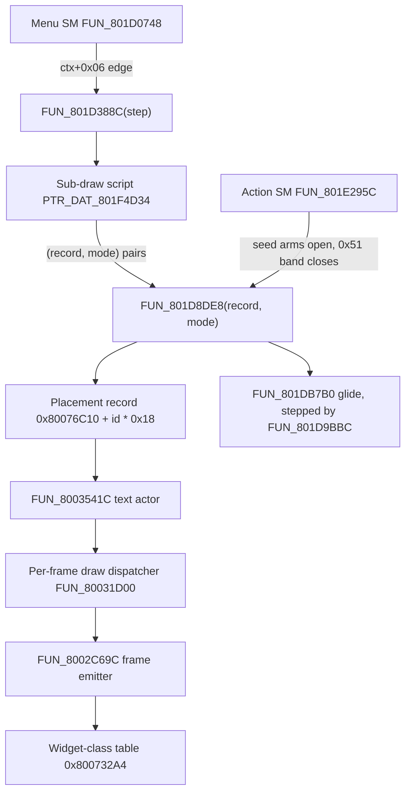

# Battle HUD and screen chrome

Everything the battle screen draws around the fight: the actor-name plaque, the
party status readout, the command chips, message and intro banners, status and
element badges, the item window and the Arts announcement banner. Retail does
not draw this per frame from game state. It keeps a list of retained text
actors, rebuilds that list from **disc data** at every state transition, and
frames each actor with sprites looked up in two static `SCUS_942.54` tables.
Knowing those two tables - the screen-element placement table and the
widget-class table - is enough to derive every seat, plate and palette below.

The geometry on this page is read out of retail's own display list (see
[Evidence](#evidence-the-display-list-in-a-save-state)), and the port draws the
same surface on both hosts from one shared builder.

## At a glance

| Thing | Where |
|---|---|
| Screen-element placement table | `SCUS_942.54` `0x80076C10`, `0x18`-byte records, 103 initialised; parser `legaia_asset::screen_elements` |
| Widget-class table | `SCUS_942.54` `0x800732A4`, `0x0C`-byte records, `0x9D` records; parser `legaia_asset::ui_widgets` |
| Frame tile-set pool | `0x80073A00` (9-slice sets), cap pairs viewed at `0x80073A60` |
| Sub-draw script table | `PTR_DAT_801F4D34`, battle overlay (PROT 0898) rodata, fifty steps |
| Element raiser | `FUN_801D8DE8(record, mode)` (PROT 0898) |
| Text-actor spawner / sweep | `FUN_8003541C` / `FUN_800355F0` (SCUS); list head `gp[+0x148] = 0x8007B460` |
| Sprite emitters | `FUN_8002C488` (one sprite), `FUN_8002C69C` (sized widget), `FUN_8002BDC4` (window fill) |
| Retained handle list | `ctx[+0x1074]`, forty handles; glide slots `ctx[+0x11B4 + slot * 0xC]` |
| Art | resident system-UI TIM `PROT.DAT` `0x18E0` -> VRAM page `(896, 256)`, CLUT row 511; menu-glyph atlas page `(896, 0)`, CLUT row 510 |
| Port | model `engine-core::battle_hud`, draw builder `engine-ui::ui_overlay::battle_hud_draws_for`, pins `engine-ui::battle_chrome` |

Every HUD element, with its art, placement record, retail draw routine and port module:

| Element | Art / widget record | Placement record | Retail draw | Port |
|---|---|---|---|---|
| Actor-name plaque | gold plate run, widget `0x02` | 68 (`0x44`); 26 (`0x1A`) behind the `Begin` tab | `FUN_801D8DE8` from the action seed `FUN_801E6D84` | `battle_chrome::name_plaque`, `battle_hud::battle_active_actor` |
| Roster panels | 102x48 marbled plate, chains `0x07` and `0x33..0x35` | 6, 78, 79 (`0x06` / `0x4E` / `0x4F`) | sub-draw steps; seats from `FUN_801D84C0` | `battle_hud::battle_panels_visible`, `engine-vm::battle_party_panel` |
| Active-actor bar | blue plate run, chain `0x2B` | 7 | sub-draw step 1, action-SM openers | `battle_hud::battle_readout_bar_slot` |
| Status badge | 48x16 word cells, widgets `0x18..=0x20` | none (drawn off the panel pen) | `FUN_8002C2E4` -> `FUN_8002C488` | `BattleSlotHud::status_element`, `battle_hud_chrome` |
| Element badge | 20x12 cells, widgets `0x8B..=0x92` | none (markup in the name string) | text engine icon escape | `battle_hud::battle_plaque_element_badge` |
| Command chips | blue plate run, widget `0x01`, D-pad glyph | 0..=5 prompt (`Begin` = 1), 8..=11 ring (up / left / right / down), `0x0C..=0x0E` trail tabs | sub-draw steps 0 / 1 | `engine-ui::battle_command_ui`, `battle_hud::battle_command_chips` |
| Target-select plaque | blue plate run | 41 (`0x29`), outgoing copy 42 (`0x2A`) | `FUN_801D5854` target arm | `BattleHudFrame::target_select`, `battle_chrome::target_select_plaque_x` |
| Action target plaque | blue plate run | 81 (`0x51`) | `FUN_801E6D84` | `battle_hud::battle_target_plaque` |
| Move name | plain glyphs, no plate | 76 / 77 (`0x4C` / `0x4D`) | SCUS `0x8004AF44..0x8004AF88` | `battle_hud::battle_move_name` |
| Combo cluster (`HIT` / `TOTAL`) | value-readout sheet | 80 (`0x50`) | `FUN_801E805C` | `engine-vm::battle_value_readout`, `battle_hud::battle_combo_style` |
| AP plate | blue plate | 82 (`0x52`); arts AP bar 15 | sub-draw steps 1 / 9 | `battle_hud::battle_ring_ap_plate_value` |
| Message banner | class-0 window, widget `0x03` | `0x45..=0x4B`, `0x59`, `0x65`, `0x66`; formation line 67 | `FUN_8002C69C` + `FUN_8002BDC4` | `engine-ui::battle_hud_chrome` |
| Intro enemy names | class-0 window, widget `0x03` | none (immediate geometry) | `FUN_801D9D3C` | `battle_hud::battle_intro_names` |
| Item window | window-skin 9-slice, hand cursor | step `0x05`; target strip = record 7 | state `0x3C` / `0x64` | `engine-ui::battle_item_ui` |
| Arts banner | value-readout sheet, tpage `(448, 0)` | none | `FUN_801E2524` / `FUN_801E2650` | `engine-vm::battle_action::flash_ramp`, `battle_numerals::arts_banner_prims` |

### Screen layout

Retail's display window is 320 wide and 228 lines tall. Seats are the plate
origins measured below, except the rows marked `y=`, which are content-box
rows. The plaque and the message banner share one seat, and
the roster panels and the active-actor bar are mutually exclusive.

```text
 x=0        96      160   196  240       312
  +----------------------------------------+ y=0
  | [plaque (8,8)]  or  [message banner    |     banner frame (8,4)..(304,32)
  |                      (8,4) 296x28]     |
  |              [Item (196,28)]           |     command diamond, centre (228,70)
  | [intro enemy-name labels, pen y=48]    |
  |      [Attack (152,60)] [magic (240,60)]|
  |     [Begin (96,82)] [Run (172,82)]     |     prompt pair, centre (160,92)
  |              [Spirit (196,92)]         |
  |           [move name, y=150]           |     centred on x=160
  |                  [target-select plaque, y=162, centred on x=232]
  | [panel][panel][panel]  y=164, 102x48   |     x = 7 / 109 / 211 (trio)
  |        [combo (168,170)] [AP (208,172)]|
  | [active-actor bar (8,188) 304x20]      |     replaces the panels
  +----------------------------------------+ y=228   park rows: y=230..236
```

## Draw pipeline

Retail's battle HUD is a list of retained text actors - `ctx[+0x1074]`, forty
handles - that the two battle state machines rebuild at every transition.



- The **placement record** supplies an element's two seats, content box, frame
  style, node kind and string ([layout](#placement-record-layout)).
- The **frame style** byte is an index into the **widget-class table**, which
  supplies the sprites, palette and seat bias ([layout](#record-layout)).
- The **sub-draw script** decides which records are up in which phase
  ([per-phase rule](#the-per-phase-rule---what-the-sub-draw-script-builds)).

Terminology: this page calls the placement record's `+0x0E` / `+0x0F` byte the
*frame style* and its `+0x10` byte the *node kind*. Where both style bytes are
quoted as one halfword (`0x0101`, `0x0202`) other pages call it the "kind
pair"; it is the same field.

### Evidence: the display list in a save state

A mednafen battle save state carries main RAM verbatim, and libgpu leaves its
queued primitives there as ordering-table nodes (`[u32 tag][GP0 words]`,
`tag = len<<24 | next`). The RAM image is therefore the frame's packet stream:
each `SPRT` carries its own `(x, y)`, `(u, v)`, `(w, h)` and CLUT id inline, and
the `DR_TPAGE` node traversed before it fixes the texture page. Seats are
cross-checked against a full-VRAM dump of the same frame
(`mednafen-state vram-dump`). A walk that keeps only `SPRT` packets misses the
`POLY_GT4` window fill and the `POLY_FT4` cursor and banner quads.

Anchor states (see [`scripts/scenarios.toml`](../../scripts/scenarios.toml)): the
Tetsu-tutorial pair `v0_1_battle_command_menu` / `v0_1_battle_command_submenu`,
the three-member `party_battle_gobu_gobu`, and the solo action frames
`battle_gimard_tail_fire_a` / `battle_melee_hit_spark` /
`player_steal_skeleton_pre`.

<a id="battle-screen-chrome-packet-pinned"></a>
## Battle screen chrome

The actor-name plaque, the party status readout and the command-chip cluster.
Port pins: [`engine-ui::battle_chrome`](../../crates/engine-ui/src/battle_chrome.rs).

### One sheet, one 3-slice, two palettes

The whole chrome samples the **resident system-UI TIM**
([`title_pak::OVERLAY_SYSTEM_UI_TIM_OFFSET`](../../crates/asset/src/title_pak.rs),
`PROT.DAT` `0x18E0`). Its pixels upload to VRAM page `(896, 256)` and its CLUT
block packs into VRAM row **511** as side-by-side 16-entry sub-palettes. The
chrome plates use the first sixteen; the
[status badges](#the-status-element-badge-sheet) reach sub-palette 18.

Text comes off the neighbouring menu-glyph atlas at page `(896, 0)` through row
**510** sub-palette 13, as 14x15 blits of 16x16 cells (`cell = ascii - 0x20`,
sixteen cells per row, `u = (i%16)*16`, `v = (i/16)*16`) advanced by each
glyph's own width.

The name plaque, the party bar and every command chip are the **same three
tiles** at two sheet rows:

| Row | Left cap / body / right cap | Sub-palette | Drawn by |
|---|---|---|---|
| `v = 0` | `(208,0)` / `(192,0)` / `(216,0)`, 8x20 / 16x20 / 8x20 | 4 (blue) | party status bar, command chips |
| `v = 64` | `(208,64)` / `(192,64)` / `(216,64)` | 12 (carved gold) | actor-name plaque |

The `v = 64` row is the art
[`title_pak::OVERLAY_SYSTEM_UI_TAB_CAP_L`](../../crates/asset/src/title_pak.rs)
pins as the field menu's tab banner: the battle plaque and the pause menu's
title tab are one asset (`battle_chrome::gold_plate_matches_tab_banner`).

A run is composed left to right: cap at `x`, 16-wide body tiles from `x + 8`
with the **final tile clipped** to the remainder, cap at `x + 8 + interior`. A
27-pixel interior emits a 16-wide and an 11-wide tile.

### One placement record derives every plate

The plate is not stored anywhere. It is derived from a **content box**, and the
box is a record of the
[placement table](#screen-element-placement-table-0x80076c10-and-its-copy-helpers).
One arithmetic fits every plate surface:

```text
glyph pen = (rec.x, rec.y - 2)
plate     = (rec.x - 8, rec.y - 6),  size (rec.w + 16, 20)
```

`rec.h` is `0x0C` on the plate records, so a plate is always 20 tall, and
`rec.w` **is** the interior width. The `-8` / `-4` content-to-plate bias is the
one `FUN_801DBC30` applies when it frames a box.

| Surface | Record `(x, y, w)` | Glyph pen | Plate |
|---|---|---|---|
| actor-name plaque | `(16, 14, 63)` | `(16, 12)` | `(8, 8)` 79x20 |
| active-actor bar | `(16, 194, 288)` | `(16, 192)` | `(8, 188)` 304x20 |
| `Item` chip | `(204, 34, 48)` | `(204, 32)` | `(196, 28)` 64x20 |
| `Begin` chip | `(104, 88, 36)` | `(104, 86)` | `(96, 82)` 52x20 |

The roster panel is the one exception: it is a fixed 102x48 sprite rather than a
plate run, so its record (`w = 88`, `h = 50`) insets by `(-5, -6)` and widens by
14 instead.

The table is **disc data** - initialised rodata in the executable's data
segment. The runtime writes back only the measured width, the string pointer
and the live seat while an element slides. The disc-gated oracle
`crates/asset/tests/screen_elements_real.rs` re-decodes it off the user's
`SCUS_942.54` and asserts each seat above.

### The actor-name plaque

Fixed seat `(8, 8)`, 20 px tall, in every battle. It names whichever actor is
currently acting - the party member on their turn, the monster through its
attack. Retail draws no monster gauge, so the plaque name is the whole of what
a monster contributes to the HUD.

The plaque is record **68** (`0x80077270`, element id pair `0x2323`, style pair
`0x0202`). Its `w` tracks the measured name exactly, its live seat is
`(16, 14)` and its parked seat `(16, -24)`, so it slides in from above the
screen. Its `+0x14` points at the name scratch buffer the string was measured
out of (a party-name buffer for a member, a monster-name buffer for an enemy).

The interior is exactly its content:

- no badge: `interior = name width`, first glyph at `(16, 12)`;
- with an element badge: `interior = 20 + 5 + name width`, badge at `(16, 12)`,
  first glyph at `(41, 12)`.

Captured widths: `Noa` 20 (right cap at x=36), `Carl` 23, `Zeto` 24, `Vahn` 27
(cap at 43), `CheDelilas` 62, `Gimard` behind a badge 63 (cap at 79). Total
plate width is `interior + 16`. The badge itself is covered in
[the element-badge section](#the-element-badges-and-their-per-badge-palette).

**Slide.** An action's plaque and its target plaque (record 81) are both opened
by the action seed: every category arm of state `0x0C` ends at
`jal 0x801E6D84` (`0x801E3028`), which measures the acting actor's name and
raises `FUN_801D8DE8(0x44, 0)` - plus `(0x51, 0)` for a single monster target.
Mode `0` spawns each at seat A and `FUN_801D9BBC` glides it to seat B over
`ctx[+0x1C] = 0x10` frames. A frame taken on the step the seed ran therefore
shows neither plate: the `super_queue_replace_*` captures, saved with
`ctx[+0x07]` already `0x14`, hold record 68 at `(16, -24)` and record 81 at
`y = 236`. Both hosts draw the two plates on that glide
(`battle_hud::battle_action_plaque_dy` / `battle_target_plaque_dy`).

**One seat, two surfaces.** The plaque and the
[message banner](#the-full-width-message-banner) share content pen `(16, 12)`.
They are alternatives, not layers. In the port `BattleHudFrame::banner` wins
when a message is up, and `plaque_seat_taken` lets a host claim the seat for a
box it draws itself (the sparring-tutorial prompt).

**The breadcrumb trail.** From the command ring on, the plaque sits behind the
round prompt's `Begin` chip, which has glided to `(16, 14)` as a gold tab
(record 1); the plaque (record `0x1A`) rests at `(68, 14)`. Choosing a ring arm
glides that arm's chip onto the trail as a third tab abutting the plaque, at
`x = width(name) + 0x54`:

| Third tab | Record | Shown through | Seat stores |
|---|---|---|---|
| `Attack` (SCUS `0x8007B674`) | `0x0D` | attack-mode prompt `0x78`, target cursor `0x5A`, arts entry `0x50` | `0x801D39A0..0x801D39AC` |
| magic arm (the member's Ra-Seru name, `FUN_801D8DE8` case `0xE`) | `0x0E` | the spell window and its target step | `0x801D3968..0x801D3974` |
| `Item` | `0x0C` | the item window (drawn by its own builder) | - |

Both `0x0D` and `0x0E` carry interior `w = 0x30`; the `arts_bar_*` captures
read `Begin | Vahn | Attack` over the direction chips. Port:
`engine-core::battle_hud::battle_breadcrumb_third_tab`, drawn by
`engine-ui::ui_overlay` on both hosts.

<a id="the-party-status-readout---and-it-has-no-gauge"></a>
### The party status readout

Two mutually exclusive surfaces, and **neither draws a gauge**. There is no HP
or MP meter primitive in either packet run, for party or for monsters: a label
sprite, numerals and a separator, nothing else.

**The roster panels** are the resting surface: one 102x48 marbled plate per live
member, texels `(0, 0)` of the system-UI sheet through sub-palette 0, at
`y = 164`, seated at x `109` (solo), `58` / `160` (pair), `7` / `109` / `211`
(trio) - a 102-pixel pitch. Content is panel-relative:

| Piece | Panel-relative seat |
|---|---|
| name glyphs | `(+5, +4)` |
| `LV` label sprite `(192,86)` | `(+64, +6)`, digits at `(+88, +4)`, right edge `+96` |
| `HP` / `MP` label | `(+4, +21)` / `(+4, +36)` |
| current value | right-aligned to `+57` |
| `/` separator | `(+57, row y - 4)` |
| maximum | right-aligned to `+97` |

The panel seats are the layout `FUN_801D84C0` publishes: its per-party-size
anchors (solo `0x72`; pair `0x3F` / `0xA5`; trio `0x0C` / `0x72`, port
[`battle_party_panel::panel_anchors`](../../crates/engine-vm/src/battle_party_panel.rs))
are the **name pen**, five pixels inside the panel plate.

**The active-actor bar** is one full-width blue run at `(8, 188)`, interior 288,
spanning `8..=312`. It appears while one actor holds the screen - entering a
command or playing an action out - and shows that actor only:

| Piece | Seat |
|---|---|
| name glyphs | `(16, 192)` |
| `HP` label sprite `(208,86)` 16x10 | `(80, 194)` |
| HP current | right-aligned to x=134, `y = 192` |
| HP `/` separator `(96,64)` 8x16, sub-palette 5 | `(136, 188)` |
| HP maximum | right-aligned to x=178 (three digits start at 154) |
| `MP` label sprite `(224,86)` | `(192, 194)` |
| MP current / separator / maximum | right edge 238 / `(240, 188)` / right edge 274 (two digits start at 258) |

When the bar takes over, the panels do not stop drawing. Retail moves the whole
cluster to `y = 230`, below the 228-line display window - the same park row the
arts input screen uses
([`minigame-muscle-dome.md`](minigame-muscle-dome.md#arts-command-input-packet-pinned)).
Which frames show which surface is
[the per-phase rule](#the-per-phase-rule---what-the-sub-draw-script-builds).

Inside an action the panels come back up for a party-wide target (`t2 == 8`)
through two openers, each raising records 6, `0x4E` and `0x4F` and leaving `6`
for the Done hold's close:

- the seed's plate routine `FUN_801E6D84`, only for a **monster** caster
  (`sltiu v0,v0,3` on the caster seat at `0x801E7038..0x801E7080`) and only past
  its Run / Arts / Spirit returns;
- the item band's `0x3E` arm (`0x801E404C`), reached from a single branch at
  `0x801E3E88` off its non-gauge-extend path, for any caster.

So a party member's magic cast on the whole party keeps them parked:
`orb_summon_mid_cast` holds `ctx[+0x18] = 0` with Orb's `+0x1DD` at `8`. The
same routine opens the target plaque (record 81) for a monster target, except
for Theeder, Zenoir and Mushura (`0x82` / `0x86` / `0x8D`), which it sends down
its row arm whatever their target byte (`0x801E6E4C..0x801E6E68`). Port:
`battle_hud::battle_panels_visible` / `battle_target_plaque`.

### Numbers are cells, names are glyphs

Every **number** on the battle screen is a run of fixed 8x12 cells - `v = 208`,
`u = digit * 8` on the font page, sub-palette 13. Only names use the
proportional dialog font. The separator sprite sits four rows above the
numerals it separates.

**Both halves of a `cur / max` pair are right-aligned.** Captures at different
digit counts pin the right edges:

| Field | 2 digits | 3 digits | 4 digits | Right edge |
|---|---|---|---|---|
| bar HP maximum | - | `154` | `146` | `178` |
| bar MP maximum | `258` | `250` | - | `274` |
| panel maximum | `81` | `73` | `65` | `97` |
| panel level | `80` | - | - | `96` |

**A field's width budget is a cell count**: four cells per HP field and per
panel field, three per bar MP field. The panel's numerals close five pixels
short of its right edge, mirroring the five-pixel inset of its name pen. A
proportional-font `9999` is wider than four cells and would overrun the 102-px
plate into the neighbouring panel.

The `LV`, `HP` and `MP` label cells are three texels in **one** sub-palette
(CLUT row 511 sub-palette 1). The gold-versus-green difference is baked into
the texels, so they draw untinted.

### The status element

Retail draws **one** status marker per party slot, chosen by a fixed priority
ladder in `FUN_8002C2E4` (`ghidra/scripts/funcs/8002c2e4.txt`). Its inputs come
from the display record at `0x80084140 + slot * 0x414`, which is the live
character record read `0x5C8` bytes early (`0x80084140 + 0x5C8 == 0x80084708`):

| Display offset | Character-record offset | Field |
|---|---|---|
| `+0x6F6` | `+0x12E` | packed status word |
| `+0x6CE` | `+0x106` | current HP |
| `+0x6F8` | `+0x130` | displayed level |

The status word is battle actor `+0x16E` verbatim: `FUN_80047430` mirrors it
with a paired `lhu` / `sh` on both its arms (`0x80047680`, `0x80048040`).

| Condition | Draw |
|---|---|
| word `== 0`, HP `!= 0` | base marker sprite `0x0A` at `(pen + 0x3B, pen + 2)`, then the **level** from `+0x6F8` as two digits at `(pen + 0x4B, pen)` |
| HP `== 0` | sprite `0x20`, tested before any bit - the KO marker wins outright |
| HP `!= 0`, bits set | the ladder's first match, at `(pen + 0x33, pen - 4)` |

The ladder tests `0x0004`, `0x0400`, `0x0800`, `0x0380`, `0x0078`, `0x1000`,
`0x0002`, `0x0001` in that order, emitting sprites `0x1A`, `0x1D`, `0x1E`,
`0x1C`, `0x1B`, `0x1F`, `0x19`, `0x18`. The band `0x18..=0x20` is nine sprites
for the nine conditions the status model tracks, KO being a zero-HP test rather
than a bit. Per-bit provenance is in
[`accessory-passive-table.md`](../formats/accessory-passive-table.md#status-guard-clear-masks) -
the seven accessory guards each clear exactly one ailment's mask - and the
badge art agrees independently ([the badge sheet](#the-status-element-badge-sheet)).

Three bits - `0x0040` inside the Rot group, and `0x2000` / `0x4000` / `0x8000`,
which survive even Master Guard's clear - have no writer anywhere in the dumped
corpus and stay unassigned.

Port: `BattleSlotHud::status_display_flags` packs the engine's typed status set
into the retail word (mirrored at `engine-vm::status_effects::display_flags`)
and `status_element` runs the ladder. The no-ailment arm is the level, drawn as
a panel row - the `LV` label cell at the panel's `(64, 6)` with its digits at
`(88, 4)`. The ladder is exclusive, so any set bit (or zero HP) replaces that
level with the selected badge at `panel + (56, 0)`, which is the caller's
`pen + (0x33, -4)` off the panel's `(+5, +4)` name pen. The HUD blits retail's
own 48x16 cell there; a host whose atlas cannot reach one badge's sub-palette
falls back to a labelled tag for that badge only.

### The command chips

Chips are blue plate runs around a D-pad glyph - texels `(0, 112)` 16x16,
sub-palette 7, drawn 15x15 as a textured quad centred on the cluster. Every
chip in one cluster is built at the **same** interior width. The label is
left-aligned at the interior's left edge, four rows down.

| Cluster | Centre | Chip interior | Seats |
|---|---|---|---|
| `Begin` / `Run` | `(160, 92)` | 36 | horizontal pair, plates at x=96 and x=172, y=82 |
| per-actor commands | `(228, 70)` | 48 | four-way diamond, `dx = 44`, `dy = 32` |

The command diamond seats `Item` up `(196, 28)`, `Attack` left `(152, 60)`, the
element command right `(240, 60)` and `Spirit` down `(196, 92)`. The
`Begin` / `Run` cluster is seat- and size-identical in a solo tutorial fight
and in a three-member battle. The Muscle Dome's element table names the same
four seats (`(204, 34)` / `(160, 66)` / `(248, 66)` / `(204, 98)` through the
plate law), so this is the one battle command cluster, not a per-mode variant -
see [`minigame-muscle-dome.md`](minigame-muscle-dome.md#the-command-cluster-is-the-battle-cluster).

**The ring's right arm** is record 10, and `FUN_801D8DE8`'s own case
(`0x801D8EC8`) picks its string: `0x801F4B9E + char_id * 10` - the character's
Ra-Seru, `Meta` / `Terra` / `Ozma` for `char_id` `1..=3` - when the member's
gate `ctx[+0x25F + member]` is set, and index 4 of the run, a lone `-`, when it
is clear. The gate has one writer, the party battle-actor init `FUN_80053CB8`
(`0x800541D0..0x80054270`). It reads the record's Ra-Seru equipment byte -
`+0x199`, through the `0x80084140` display alias as `+0x761`, for every
character but Noa, whose `char_id == 2` arm reads `+0x198` - and stores `1`
when it is non-zero. A fourth character (Terra is `char_id` 4) lands on the `-`
entry.

Two "cannot pick this" marks are different widgets: the `-` glyph is an
unavailable command, which still gets its chip, while a *forbidden* command
wears the red cross-out X (`FUN_801DBC30`, port
`battle_party_panel::cross_out_mark`).

**Port.** [`engine-ui::battle_command_ui`](../../crates/engine-ui/src/battle_command_ui.rs)
draws the plate run, both clusters, the shared D-pad glyph cell and the `-`
chip, and both hosts seat their command menu through it. The two clusters are
three **phases**, and the phase a frame is in
([`ChipPhase`](battle-command-flow.md#the-battle-open-flow---ctx0x06-from-the-intro-timer-to-the-first-swing))
names the seats. The `engine-ui` literals are pinned equal to `battle_chrome`
by `engine-shell`'s
`engine_ui_command_chips_mirror_the_packet_pinned_battle_chrome`.

### The per-phase rule - what the sub-draw script builds

Both rebuilds of the handle list are disc data:

- The menu SM `FUN_801D0748` runs `FUN_801D388C(step)` on every `ctx[+0x06]`
  edge, and `step` indexes the sub-draw script table `PTR_DAT_801F4D34`
  (overlay 0898 rodata, fifty steps). A step is `[count][anim][panel]` plus
  `count` x `(placement record, mode)`. `anim = 1` first hard-resets the handle
  list (`FUN_801D99BC`), so after the step the live elements are exactly the
  pairs listed.
- The action SM `FUN_801E295C` opens the per-action elements in its seed arms
  and closes every one of them in the `0x51` band (`0x801E6170..0x801E6364`).

`FUN_801D8DE8(record, mode)` is one body for both. The record indexes the
placement table directly (`0x80076C10 + id * 0x18`) and its text actor is
`FUN_8003541C(id byte, node kind, string, x, y - 2, w, h, frame style)`.

| Mode bit | Effect |
|---|---|
| bit 0 | which seat the actor spawns at: `+0x02/+0x04` for `0`, `+0x0A/+0x0C` for `1`; `FUN_801DB7B0` then glides it to the other |
| bit 1 | suppresses the glide (`0x801D92E0..0x801D93DC`) |

The glide stepper `FUN_801D9BBC` walks `ctx[+0x11B4 + slot * 0xC]` -
`[total][elapsed] .. [target x][target y][start x][start y]`, linear, snapping
on arrival. `elapsed` grows by the frame step `*(0x1F800393)` per battle pass
and a pass spans that many vsyncs, so `total` counts vsyncs: the sixteen-frame
raise lasts sixteen vsyncs at any cadence. The port ticks once per vsync and
steps every tracked glide by one a tick.

Which seat is on screen is per record, so "mode 0" means *appear* for the bar
and *unfold* for a chip. The port's `SubdrawStep::shows` reads it as "seat B is
the on-screen one", which holds for every record the battle HUD draws.

The steps the menu SM runs (`engine-core::battle_hud::subdraw_steps` /
`placement_record`):

| Transition | Step | Panels 6/78/79 | Bar 7 | Tab 1 + plaque 26 | AP plate 82 |
|---|---|---|---|---|---|
| `0x14` -> `0x1E` round prompt | 0 | up | - | - | - |
| `0x1E` -> `0x28` ring | 1 | park | up | both slide in | slides in |
| `0x28` -> `0x3C` item / `0x46` magic window | 5 / 7 | back up | park | snap | leaves |
| item / magic target step | `0x18` / `0x1B` | park | up, pointed member | snap | - |
| `0x28` -> `0x78` attack mode, `0x78` -> `0x5A` cursor | `0x30` / `0x2D` | - | park | snap | leaves |
| `0x28` -> `0x50` arts entry | 9 | - | park (AP bar 15 takes the seat) | snap | snap |
| `0x28` -> `0x6E` all committed | `0x23` | - | - | tab only | leaves |

So the roster panels belong to the round prompt and the browsed windows, the
full-width bar to the ring and the target steps, and the ring alone carries the
AP plate.

The handle lists of the catalogued states agree with the table element for
element:

| State | Holds |
|---|---|
| `v0_1_battle_command_menu` (`0x1E`) | `Begin`, `Run`, one panel at `(114, 168)` |
| `v0_1_battle_command_submenu` (`0x28`) | four ring chips, `Begin` at `(16, 12)`, plaque at `(68, 12)`, bar at `(16, 192)`, parked panel at `y = 234`, parked `Run` at `x = 328`, AP plate at `(208, 172)` |
| `party_battle_gobu_gobu` / `terra_party_battle` | three / two panels |
| `evil_medallion_rage_battle` (action `0x0A`) | nothing |

#### Action-phase openers

The action SM raises the bar from three places:

| Opener | Address | Raises |
|---|---|---|
| `0x0C` seed | `0x801E2F24` | the bar for the acting actor's target byte `+0x1DD` when it is a party slot; mode `0`, so it rises from `y = 234` to `192` beside the plaque's descent |
| Item pre-arm `0x3C` | `0x801E3DA0` | the bar for the acting member |
| item band `0x3E` | `0x801E401C` | the bar for a member target, or all three panels for a party-wide one (`t2 == 8`) |

A party member's attack on a monster therefore shows **no** readout at all, and
a monster's cast on a member shows that member's bar
(`nivora_duel_mid_blazing_slash` holds bar and plaque at ten of sixteen). The
openers test the target byte once, so a group cast raises no bar even after the
band rewrites its `8` / `9` to a slot (`sb t2,0x1dd(s3)` at `0x801E42D0` /
`0x801E431C`): `evolved_0x91_midcast`, Holy Eyes from a lone Vahn, holds `0`
mid-cast and its handle list carries no bar. The port draws the bar only after
an opener ran this action (`BattleState::readout_bar_glide`).

A counterattack runs no seed of its own. The strike loop's swap hands the
monster's action to the counterer, so the elements the monster's seed opened
stay up - the bar for its party target, the counterer - and the combo cluster
is never opened (`battle_vahn_tri_somersault_super`'s glide slots hold the bar
at `(16, 192)` and the move name, and no cluster record). Port:
`BattleState::counter_hud`, read by the bar and combo-style predicates.

#### Action-phase records

| Record | Element | Behaviour |
|---|---|---|
| 68 | actor plaque | at `(16, 12)` through every action |
| 81 | target plaque | a party member's action on a monster; `x` written to `304 - w` so the blue plate's cap ends at 312; rises from `y = 236` to the bar's row; closed in `0x51` only for categories `1..=3` |
| 76 / 77 | move name | `y = 150`, four X fields written to `0xA0 - width / 2`; plain glyphs, no plate |
| 80 | combo cluster anchor | `(328, 170)` to `(168, 170)` over sixteen frames |

The target plaque's name carries the `0xCE` badge escape (`Gimard` at `x = 241`,
`Skeleton A` at 245, `Gobu Gobu` at 249). Move-name seats: `Somersault` 130,
`Tail Fire` 135, `Glare` 146. The cluster's own seats are in
`engine-vm::battle_value_readout`.

**Every landed hit restarts the cluster slide.** The melee kernel's HP write
raises `DAT_8007B64C = 0x78` and stores the hit's damage in `DAT_8007BD14`
(`FUN_801EC3E4`, `0x801EEA64..0x801EEA78`). The readout pass `FUN_801E805C`,
which the action SM's prologue calls on every pass (`0x801E2A70`), answers a
raised flag with a non-zero damage word by calling `FUN_801D8DE8(0x50, 0)` and
clearing the flag (`0x801E808C..0x801E80B0`). Mode `0` spawns record 80 at seat
A and registers a fresh glide to seat B (`0x801D92E8..0x801D93D8`).
`battle_melee_hit_spark` is such a frame: the cluster reads `3 HIT` /
`TOTAL 29` beside the third hit's `15`, at elapsed 12 of 16, `x = 208` - the
`+40` every `HIT` / `TOTAL` packet of that frame shows. Port:
`BattleHud::push_popup` restarts the cluster's `age` on each landed damage hit.

**The `0x51` fade-down closes it in reverse.** The band's teardown - countdown
under `0xC`, once per action (`0x801E6158..0x801E6214`) - wipes the element
list (`FUN_801D99BC` at `0x801E6170`) and, when the action landed damage
(`_DAT_8007BD14 != 0`), re-spawns record 80 with mode `1`
(`FUN_801D8DE8(0x50, 1)` at `0x801E6360`), which places it at seat B and glides
it out to seat A. A `0x51` capture taken before the teardown still shows the
cluster at rest (`noa_levelup_fight_pre`); the continuation band `0x52` shows
none (`rim_elm_gimard_seru_capture_after`). Port:
`BattleHud::close_combo_on_fade_down`, keyed on the action SM's teardown latch.

#### Party HP / MP seed

`FUN_80053CB8` seats every member's HP and MP from its **character record**,
never from a field actor. Per present-party id `n = DAT_8007BD10[slot]` it reads
record `0x80084140 + (n - 1) * 0x414` (`0x80053D8C..0x80053E58`):

| Record field | Actor field |
|---|---|
| `+0x6CE` | live HP `+0x14C` and the displayed-HP cursor `+0x172` |
| `+0x6CC` | max HP `+0x14E` |
| `+0x6D2` | MP `+0x150` and `+0x174` |
| `+0x6D0` | max MP `+0x152` |

The port's party band is the field actor table, which a scene script can blank
(`opurud` resets slots 1 / 2), so its battle entry re-seats the three values
off the roster (`World::seed_party_battle_hp_from_records`).

**Port.** `engine-core::battle_hud` carries the rule as predicates
(`battle_panels_visible`, `battle_readout_bar_slot`, `battle_begin_tab_visible`,
`battle_ring_ap_plate_value`, `battle_move_name`, `battle_target_plaque`,
`battle_combo_style`, `battle_magic_chip`) and decodes the table itself
(`subdraw_step`). The disc-gated
`crates/engine-core/tests/battle_hud_subdraw_disc.rs` holds those constants to
the disc's bytes. Both hosts feed the predicates into one
`engine-ui::BattleHudFrame`, and the chip projection (`battle_command_chips`)
is shared too.

### The target-select plaque (record `0x29`)

While a target cursor rests on a monster, retail draws one blue plaque with that
monster's name - placement record `0x29` (disc seats `(328, 162)` /
`(200, 162)`, width `96`, style pair `0x0101`). `FUN_801D5854`'s target arm
seats it ([the shift](#the-record-4142-shift-inside-fun_801d5854)). Captured on
`party_basic_attack_vs_gobu_gobu`: "Gobu Gobu" measures `55`, rests at
`(205, 162)` and reads `x = 333` mid-slide. The commit arms of `FUN_801D388C`
later copy this record into the commit log's target column (`jal 0x801D5718`
with `a1 = 0x29`, `0x801D3E64..0x801D3E70`).

Both hosts draw it from the shared builder (`BattleHudFrame::target_select`,
model `battle_hud::battle_target_select_plaque`, seat law
`battle_chrome::target_select_plaque_x`) at its rest seat. The slide start is a
pinned kernel (`battle_chrome::target_select_slide_start`) that the builder
does not animate.

### Enemy target strip

While a target picker's cursor is on the enemy row, both hosts can list the
deduplicated monster names: `battle_hud::battle_enemy_target_rows` builds the
rows off the live monster slots (identical adjacent monsters collapse into one
run whose label takes the dedup suffix, `FUN_801D9D3C`), and each host runs the
centre / relax / clamp layout (`target_picker::layout_enemy_menu_rows`) with
its font as the measurer. The X the layout averages is each monster actor's
`+0x34`, its battle world X (`0x801D9E00`), so each row sits over its group.

<a id="the-widget-class-table---where-every-chrome-sprite-comes-from"></a>
## The widget-class table

Every sprite the chrome draws comes out of one array: the widget-class table at
`SCUS_942.54` VA `0x800732A4`, `0x0C` bytes per record, `0x9D` records. The
run's end is structural: `0x800732A4 + 0x9D * 0x0C` is exactly `0x80073A00`,
the frame tile-set pool the class arms read next. Parser
`legaia_asset::ui_widgets`; disc-gated oracle
`crates/asset/tests/ui_widgets_real.rs`.

A placement record's two frame-style bytes are indices into this table. Style
`0x01` is widget record `0x01`, the blue plate body; style `0x02` is record
`0x02`, the carved-gold one. The join holds for all 103 initialised placement
records: every style byte names a real widget record, and each named surface
resolves to the art the packets drew.

### Record layout

| Offset | Type | Field |
|---|---|---|
| `+0x00` | u8 | frame **class** - which layout arm draws it (`0..=6`, jump table `0x80010D18`) |
| `+0x01` | u8 | **tile-set** index into the frame pool at `0x80073A00` |
| `+0x02` | i8 | **chain delta** to the next record in this widget; `0` ends the run |
| `+0x03` | u8 | **palette** byte - bit 7 semi-transparent, the rest a packed CLUT address |
| `+0x04`..`+0x07` | u8 x4 | source rect `u`, `v`, `w`, `h` on the system-UI sheet |
| `+0x08` / `+0x0A` | i16 | seat bias `dx` / `dy` |

Two SCUS routines read it:

| Routine | Draws | Bias |
|---|---|---|
| `FUN_8002C488(x, y, id)` (`ghidra/scripts/funcs/8002c488.txt`) | exactly one sprite at the caller's `(x, y)` | never applies `+0x08` / `+0x0A` |
| `FUN_8002C69C(x, y, w, h)` (`ghidra/scripts/funcs/8002c69c.txt`), the `POLY_FT4` / `SPRT` emitter | a sized widget, record index in `gp+0x14C` | applies the bias, then follows the chain |

The chain loop in `FUN_8002C69C` is `lb v1, 0x2(s7)` at `0x8002FF00`, `addu`
into the index, and re-entry at `0x8002C780` unless the delta is zero.

The `(x, y)` it is called with is the **glyph pen** - the content box's
`(x, y - 2)` - and the bias converts pen to frame origin. The plate run's
`(-8, -4)` takes the plaque's pen `(16, 12)` to the plate at `(8, 8)`, and the
framed window's `(-8, -8)` takes a banner pen `(16, 12)` to a frame at
`(8, 4)`. Both are packet-confirmed.

That split is why the status marker lands at `pen + (0x3B, 2)` - its caller
`FUN_8002C2E4` supplies the offset - while the roster panel's `HP` label lands
at `pen + (-1, 17)` because record `0x07` carries it.

### The palette byte is a packed CLUT address

Both routines decode `+0x03` with the same six instructions, and it has two
forms:

```text
bit 6 clear:  CBA  = 0x7FC0 + (b & 0x3F)      -> VRAM row 511, x = (b & 0x3F) * 16
bit 6 set:    fb_y = 498 + ((b & 0x3F) >> 2)
              fb_x = 896 + (b & 3) * 16
```

The first form is the system-UI sheet's own sub-palette strip on VRAM row 511
(blue is sub-palette 4, carved gold 12, the marbled panel 0). The second
addresses a separate 4-wide block of CLUTs at VRAM `(896.., 498..501)`, which
the [element badges](#the-element-badges-and-their-per-badge-palette) use.

Bit 7 selects the GP0 code: `0x66` (semi-transparent sprite) instead of `0x64`
(opaque). The packet word is `0x64808080` / `0x66808080` (`0x8002C4C0`,
`0x8002C5C4..0x8002C5CC`) - colour `0x808080`, the neutral multiply, so a
widget sprite shows its palette colours unchanged.

### Chains: a widget is a run of records

`+0x02` is a signed hop, so one style draws several sprites:

| Style | Chain | What it lays out |
|---|---|---|
| `0x2B` | `0x2B → 0x2C → 0x2D → 0x2E → 0x2F` | the active-actor bar: `HP` label `(+64, +2)`, `/` `(+120, -4)`, `MP` label `(+176, +2)`, `/` `(+224, -4)`, then the blue plate body |
| `0x07` | `0x07 → 0x08 → 0x09` | a roster panel: `HP` row `(-1, +17)`, `MP` row `(-1, +32)`, then the 102x48 marbled plate at `(-5, -4)` |
| `0x33` / `0x34` / `0x35` | `→ 0x41 → 0x42 → 0x08 → 0x09` | the same panel with its level / status marker, one style per party slot |

Against the bar's pen `(16, 192)` those biases give `(80, 194)`, `(136, 188)`,
`(192, 194)`, `(240, 188)` - the four seats the packets carry.

### Classes and the frame pool

The class byte picks the layout arm. Two matter for the battle screen:

- **class 3** - the rounded **plate run**. It reads a `(left cap, right cap)`
  quad pair from `0x80073A60 + tileset * 8`; tile-set 3 gives
  `(208, 0, 8, 20)` / `(216, 0, 8, 20)` (blue) and tile-set 4
  `(208, 64, ...)` / `(216, 64, ...)` (gold). Body tiles come from the record's
  own rect. Tile-set `0` is the sentinel the arm skips, so a cap-less run is
  expressible.
- **class 0** - the rectangular **9-slice window**. It reads eight quads from
  `0x80073A00 + tileset * 0x20` in the order top-left, top-right, bottom-left,
  bottom-right, top, bottom, left, right. Tile-set 0 is the gold border: 4x4
  corners and 24x4 / 4x24 edges cut from one 32x32 patch at texels `(160, 0)`.

A cap pair is the last two quads of a frame set, which is why `0x80073A60` sits
three tile-sets into the pool.

### The status-element badge sheet

The nine ids the status ladder emits, `0x18..=0x20`, are **48x16 cells in a
two-column block** on the system-UI sheet, each with its own row-511
sub-palette. The art is a word tag, not an icon:

| Sprite | Mask tested | Sheet cell | Sub-palette | Reads |
|---|---|---|---|---|
| `0x18` | `0x0001` | `(0, 48)` | 9 | `Venom` |
| `0x19` | `0x0002` | `(48, 48)` | 10 | `Toxic` |
| `0x1A` | `0x0004` | `(48, 80)` | 16 | `Stone` |
| `0x1B` | `0x0078` | `(48, 112)` | 14 | `Rot` |
| `0x1C` | `0x0380` | `(0, 96)` | 17 | `Rage` |
| `0x1D` | `0x0400` | `(0, 64)` | 11 | `Numb` |
| `0x1E` | `0x0800` | `(0, 80)` | 15 | `Sleep` |
| `0x1F` | `0x1000` | `(48, 64)` | 13 | `Curse` |
| `0x20` | HP `== 0` | `(48, 96)` | 18 | `Faint` |

The block's tenth cell (`(0, 112)`) is other art - there is no tenth badge. The
no-ailment marker, sprite `0x0A`, is a plain 16x10 `LV` label at `(192, 86)` on
sub-palette 1, the same label set as `HP` and `MP`.

**Sub-palettes 16..18 come from a second file.** The system-UI sheet's own CLUT
block is `16 x 16` at VRAM `(0, 511)` - sub-palettes 0..15 and no more.
Sub-palettes 16 / 17 / 18 come from a separate **CLUT-only TIM** immediately
before it at `PROT.DAT[0x1858]` (`0x1858 + 0x88 == 0x18E0`), whose block is
`16 x 3` at VRAM `(256, 511)` (so the strip runs to VRAM x 288) and whose image
block is a four-word stub. An atlas bake rooted at the sheet cannot see it,
which is why the port's badge accessor answers per cell. Constants and bake:
`engine-menus::save_menu_atlas::SYSTEM_UI_CLUT_EXT_TIM_OFFSET`.

### The element badges and their per-badge palette

The badge strip is eight consecutive records, `0x8B..=0x92`: `20 x 12` at a
32-texel pitch from `u = 6`, row `v = 192`. Their palette bytes are
`0x40 + index`, and the bit-6 decode turns that walking byte into a 4-wide by
2-tall block of CLUTs:

```text
badge i -> palette 0x40 + i -> CLUT ( 896 + (i % 4) * 16 , 498 + i / 4 )
```

This reproduces every captured pair - `u = 6` with `(896, 498)`, `38` with
`(912, 498)`, `166` with `(912, 499)`, `230` with `(944, 499)`. The low two bits
of the index pick the column and the next two the row, so the colour is
per-element and the geometry is not.

A sibling strip of eight *winged* badges lives at `0x94..=0x9B`, `28 x 12` from
`u = 2` on row `v = 208`, on the second CLUT block (`0x48 + index`, rows
500 / 501 - byte-identical to 498 / 499 in a live frame). Record `0x9B` is the
one asymmetry: it reads `v = 192`, so the eighth wide badge samples the
square-framed art on the plain row. The winged eighth badge exists in VRAM and
no record selects it.

**Neither strip's texels are on the system-UI sheet.** Rows `v = 192` and
`v = 208` are past that TIM's 192 and belong to the **extension strip** that
continues the page at VRAM `(896, 448)`
(`title_pak::OVERLAY_SYSTEM_UI_EXT_TIM_OFFSET`, strip `v` = sheet `V - 192`).
Each of the four CLUT rows `498..501` is a whole sibling TIM of its own -
`0x10178` / `0x100D0` / `0x10028` / `0xFF80` - so a badge's palette is
`(row TIM, index & 3)`. The port bakes the plain eight from the first two
(`save_menu_atlas::add_element_badge_sprites`); the winged four on row 500 are
already baked as the status screen's ATR icons, which is the same art.

**The selector is markup in the monster's own name.** No code computes a badge
id. The badge is the `^`-plus-letter escape the archive name carries
([monster record](battle.md#monster-record-source-layout)), so the plaque draws
whatever badge its string names and nothing when the string has none. A census
of the decoded blocks (`asset monster-archive --dump-block`, all 186 populated
slots):

- **64 of 186** names begin with `5E` (`^`) plus a letter; the other **122** do
  not, and those actors wear no badge.
- The caret letter is a **bijection** onto the record's element byte `+0x1D`
  with zero exceptions:

  | Letter | Element byte | Element | Count |
  |---|---|---|---|
  | `^A` | 2 | Fire | 9 |
  | `^B` | 4 | Thunder | 9 |
  | `^C` | 3 | Wind | 9 |
  | `^D` | 1 | Water | 9 |
  | `^E` | 0 | Earth | 9 |
  | `^F` | 5 | Light | 12 |
  | `^G` | 6 | Dark | 6 |
  | `^H` | 7 | Neutral | 1 |

- Thirteen records carry element `7`; exactly one of them carries `^H`, and the
  other twelve carry no escape and draw nothing. So the badge follows the name,
  not the element byte.

Two escape encodings coexist. The **archive name's** badge prefix is plain
ASCII `^` (`5E`) plus a letter, verbatim in the decoded block and copied
verbatim into the actor's display-name buffer `+0x1BC`. The `0xCE`-lead form is
the *runtime-composed* HUD label string (actor `+0x29`, an icon index then the
text), where the text engine carries the leading `^X` as the `0xCE` icon escape
(`0xCE 0x14 0x20 'G' ...` for `^A Gimard`).

**Port.** The plaque widens by `20 + 5` exactly as `name_plaque` lays out, and
the geometry and palette decode are disc-read. Both plaques that carry a badge -
the top-left actor plaque (`battle_hud::battle_plaque_element_badge`) and the
bottom-right target plaque (`battle_hud::battle_target_plaque`) - read the caret
letter `legaia_asset::monster_archive` lifts off the name
(`MonsterDef::plaque_badge`), never the `+0x1D` element byte. Reading the
element byte would give Fire Gimard (element `2`) strip cell `2`, the green
Wind badge, and would badge every unescaped monster where retail draws
`Skeleton A` bare.

### Four ids are not on this sheet at all - they are the save-slot portraits

`FUN_8002C488` has a second arm for ids `0x86`, `0x87`, `0x88` and `0x8A`. They
draw through texture page `0x1F` (VRAM `(960, 256)`) instead of `0x1E`
(`(896, 256)`), take their CLUT from the four-word side table at `0x80073DB8`
instead of their palette byte, and are the only ids whose `+0x08` / `+0x0A` bias
appears on the single-sprite path. Only `0x8A` carries a non-zero one,
`(-8, -8)`, which centres the 32x32 frame on the seat a 16x16 face takes.

The side table reads `(976, 304)`, `(976, 305)`, `(976, 306)`, `(976, 307)`. The
records' rects (`(64|80|96, 0, 16, 16)` and `(64, 16, 32, 32)`) address VRAM
`x = 976 + u/4` at 4bpp, i.e. `(976..988, 256..272)` and `(976..984, 272..304)`.
Those are the framebuffer coordinates of the four load-screen TIMs at
`PROT.DAT[0x1AC90]` and `[0x1AED0]` - the three party-member face portraits and
the empty-cell frame the save-slot grid draws
(`title_pak::OVERLAY_LOAD_PORTRAIT_TIM_OFFSET`, port
`engine-ui::ui_title_save::slot_grid`). One asset, two consumers.

## Message and intro banners

### The full-width message banner

The top-of-screen banner every battle message uses is a class-0 window,
packet-pinned mid-fight (`rim_elm_gimard_seru_capture_after`,
`noa_levelup_banner`).

| Property | Value |
|---|---|
| content pen | `(16, 12)` |
| frame | origin `(8, 4)`, 28 tall (interior 20), spanning `(8, 4)..(304, 32)` |
| border | left / right columns 4 wide; top / bottom edges tile 24 wide from `x = 12`, last tile clipped |
| content box | fixed `280 x 12` - **not** measured from the message |
| raising records | `0x45..=0x4B`, `0x59`, `0x65`, `0x66`, frame style `3`, seat `(16, 14)` |

The class-0 law is the content box grown by 4 on each side for the interior
(`w + 8`) and by 4 more for the border, so the right column starts at
`pen.x + w + 4`.

**The frame is filled.** Ahead of the border sprites the display list carries a
run of opaque gouraud textured quads (`POLY_GT4`, code `0x3C`) covering the
whole frame rect: the 32x32 blue-marbled patch widget record `3` carries as its
own rect, texels `(128, 0)` on CLUT `(32, 511)`, tiled in 32-pixel columns from
the frame origin with the last one clipped (eight full columns and an 8-wide
one for the 296-wide frame), texels 1:1 with pixels, vertex grey `0x40` along
the top edge and `0x88` along the bottom. The emitter is `FUN_8002BDC4`, which
the layout dispatcher calls for every class-0 node (`jal` at `0x8002D7E8`). It
steps columns by the record's `w` and bands by its `h`, restarts the texture at
each band, and ramps the grey `0x900 / height` per band, so a taller frame -
the 58-tall window under the same `noa_levelup_banner` frame - is two bands,
`0x40 -> 0x67` and `0x67 -> 0x88`.

The same frames catch the actor-name plaque parked: a gold plate run at
`(8, -30)` with a 27-pixel interior (cap, one 16-wide body tile, one clipped to
11) and `Vahn` on the pen at `(16, -26)` - record 68's parked seat `(16, -24)`
through the pen and bias law.

**Port.** [`engine-ui::battle_hud_chrome`](../../crates/engine-ui/src/battle_hud_chrome.rs)
carries the geometry: `banner_frame` / `banner_interior`, the fixed
`BANNER_BOX_W`, the tiled-edge emit, and the fill `class0_fill_draws_at`, which
draws a one-band frame from the gradient-baked interior tile and a taller one
as tinted rows of the raw tile. The HUD builder draws it in place of the
plaque. It carries the port's two battle messages, level-up and Seru-capture.
The port raises both a mode-tick **after** the fight has handed the frame back
to the field, where retail raises them on the battle result screen, so the
widget is not gated on battle mode. A multi-line message grows the interior by
the 14-px text pitch per extra row and nothing else moves.

### The battle-intro enemy-name banner

The banner that names the enemies while a battle opens is **not** a placement
record. `FUN_801D9D3C` - the flow-`0x0A` composer, referenced by a single `jal`
at `0x801D0DFC` (sweep `scripts/ghidra-analysis/find-address-word-refs.py`) -
lays its labels out itself and hands each to `FUN_8003541C` with **immediate**
geometry. It reads no field of the placement table, and writes only record 67's
`+0x14` string pointer.

| `FUN_8003541C` argument | Intro name label | Formation line |
|---|---|---|
| id | group index `0..=3` | `4` |
| node kind (`a1`) | `0` | `0` |
| pen | `(laid-out x, 48)` | `(16, 12)` |
| box | measured width x `12` | `288` x `12` |
| frame style (eighth argument) | `3` | `3` |

Frame style `3` is widget record `3` - class 0, tile-set 0, sub-palette 2 - so
the intro wears [the message banner](#the-full-width-message-banner)'s frame. An
ordering-table walk of a live intro frame
([`widget-draw-sweep.py`](../../scripts/mednafen/widget-draw-sweep.py)) shows,
per label: a 4x4 corner pair from texels `(160, 0)` and `(188, 0)`, 24-wide top
and bottom edges from `origin + 4` with the last tile clipped, 4x20 side
columns, every piece on CLUT `(32, 511)`, over the same marbled fill (three
`POLY_GT4` columns for `Moldy Worm`, `(78, 40)` 32 / 32 / 18 wide). Frame
origin is the pen less `(8, 8)` and the right column lands at
`pen.x + width + 4`: `Moldy Worm` on pen `(86, 48)` 66 wide frames `(78, 40)` to
`(159, 67)` with its top edge tiled at x `82` / `106` / `130` and clipped to 2
pixels at `154`. The labels are white glyphs on that fill. None of the border
tiles matches a widget record's own rect, because a class-0 frame's eight quads
come from the tile-set pool at `0x80073A00`.

**One label per monster group.** The composer walks the four monster-slot ids
at `0x8007BD0C` and runs consecutive equal ids together. The first member of a
run copies the actor's display name (`actor+0x1BC`); the second drops that
name's trailing per-instance letter and appends the rodata string `* 2`
(`strlen` / `sb zero` / `strcat` at `0x801D9E34..0x801D9E60`); each further
member increments the appended digit. Three `Killer Bee` actors - the plaque in
the same capture reads `Killer Bee B` - reach the banner as `Killer Bee * 3`.

**The seat is over the enemy.** A group's label is centred on its members'
average battle world X, `actor+0x34` (`lhu a0,0x34(v0)` at `0x801D9E00` /
`0x801D9ED4`): `x = 0xA0 + (avg >> 3) - width / 2`. A relaxation pass then walks
every pair, splits an overlap evenly once the gap between two labels falls
under 20 pixels, clamps each label to `6 <= x <= 0x13A - width`, and repeats
until a whole pass moves nothing.

**No slide.** The intro labels are spawned at their final seat; this path calls
neither `FUN_801D8DE8` nor the glide `FUN_801DB7B0`. The round HUD that
replaces the banner is spawned from records 68 and 7 at their disc seats and
glides over sixteen frames.

**Lifetime is the intro timer.** The labels live from the `0x0A` edge to the
`0x0B` expiry, where `FUN_800355F0` destroys every text actor in one sweep, so
the banner's span is `ctx[+0x6D6]` - `0x5A` frames, or `0x78` when
`ctx[+0x290]` is set.

**The ids collide with the command chips.** Placement records `0..=5` carry
element ids `0x03` / `0x04`, the same values the intro hands out, and
`FUN_8003541C` *reuses* a node whose id already exists. Nothing overlaps only
because the expiry sweep empties the list before the round prompt builds
`Begin` / `Run` at the `0x14` edge.

**The formation line is record 67's content without record 67.** The
`ctx[+0x290]` arm at `0x801DA234` stores the chosen line into record 67's
`+0x14` and then draws it with immediates that reproduce that record - pen
`(16, 12)`, `288` wide, style `3` - under id `4`. Record 67 itself is opened
afterwards by the post-intro sub-draw, which re-raises the same string under
id `0x2B`, the record's `+0x01`. See
[the formation banner](battle-command-flow.md#the-formation-banner).

**Evolved Cort opens with no banner.** The `0x0A` arm compares monster-slot 0's
id (`0x8007BD0C`) against `0xB5` and on a match skips the composer
(`li v0,0xb5` / `beq` at `0x801D0DF0`), arming the same `0x5A` timer but
setting `ctx[+0x06] = 0x0C` instead of `0x0B`. `0x0C` is a value the
[state chain](battle-command-flow.md#the-state-chain)'s `beq` ladder has no arm
for, so the menu SM idles on it. Driving `cort_evolved_pre_battle` forward
shows flow `0x0A` at the intro edge, then flow `0x0C` with the timer at 90 and
the text-actor list empty. What carries the fight from there is
[the boss stage module's baton](battle-command-flow.md#flow-0x0c-is-the-boss-stage-modules-baton).

**Capture.** `scripts/pcsx-redux/autorun_battle_intro_banner.lua` breakpoints
`FUN_8003541C` and `FUN_800355F0` and walks the live text-actor list
(`gp[+0x148] = 0x8007B460`) every vsync. No catalogued save state sits at flow
`0x0A` or `0x0B`, so both pins are live runs:

| Run | Spawns | Hold | Teardown |
|---|---|---|---|
| `rim_elm_queen_bee_battle` (ambush, `ctx[+0x290] = 1`) | `Queen Bee` `(176, 48)` 55 wide and `Killer Bee * 3` `(78, 48)` 79 wide from `$ra = 0x801DA220`; `Ambushed!` `(16, 12)` 288 wide from `0x801DA31C` | 120 frames | `$ra = 0x801D0E84` |
| `karisto_sol_pre_encounter` into a random encounter (`ctx[+0x290] = 0`) | `Moldy Worm` `(86, 48)` 66 wide, `Acid Slime` `(171, 48)` 59 wide, both from `0x801DA220`; no id-`4` line | 90 frames | `$ra = 0x801D0EBC` |

Every spawn is node kind 0, style 3. After the second run's teardown the round
prompt builds `Begin` / `Run` on ids `3` and `4`.

**Port.** `engine-core::battle_hud::battle_intro_names` builds the labels (the
grouping and run suffix of `target_picker::enemy_menu_rows`, the layout of
`target_picker::layout_enemy_menu_rows`), measured with the host's
`legaia-font` and reading `+0x34` off the live actor position.
`engine-core::world::battle::intro_names` owns the `ctx[+0x6D6]` timer, armed
beside the formation banner and drained by the frame step. `engine-ui`'s HUD
builder draws each label on the class-0 frame
(`battle_hud_chrome::class0_frame_draws_at`, fill included) at `(x, 48)`. Both
hosts pass the labels through `BattleHudFrame::intro_names`, and the builder
drops them once any command surface past the round prompt is open.

Two port differences: the engine does not hold the round prompt back for the
span, so the prompt opens with the labels still up; and the engine's monster
names carry no instance letter, so the port gives each member of a seated
duplicate group one (`A`, `B`, ...) before the composer runs.

<a id="the-battle-item-window-0x3c---packet-pinned"></a>
## The battle item window (`0x3C`)

What state `0x3C` puts on screen, read out of its own display list. The
`battle_item_window` / `battle_item_window_cursor1` captures
(`scripts/pcsx-redux/autorun_battle_item_window_capture.lua`, pad-walked from
`cort_evolved_battle_first_menu`) hold the window open one Down press apart:

| Piece | Pin |
|---|---|
| item-list window | system-UI window-skin tile grid (widget page `(896, 256)`, CLUT row 511 sub-palette 2), spanning x `166..=313`, y `28..=164` |
| description window | same skin, x `8..=167`, y `122..=164`; shows the highlighted item's info-window line |
| hand cursor | 16x16 pointing-finger `POLY_FT4` (CLUT row 511 sub-palette 7) at `(167, 45 + 14*row)` - row pitch 14 |
| rows | eight per page; `PAGE n/m` header top-right, counts right-aligned at the interior's right edge |
| breadcrumbs | gold tab plates `Begin` \| acting member's name \| `Item` top-left, replacing the actor-name plaque while the window is up |

Content pens (row text, header, description line, breadcrumb seats) are
screenshot-read off the same captures - the glyph packets ride a different draw
pass than the window tiles.

**Row enable.** Which rows are selectable is the SCUS list builder's call
(`FUN_80030628`), and it branches on the menu context word `gp+0x85C`. The field
list (`0`) enables a field-usable row only when the relevance check
`FUN_8003043C` finds a member it would help (`0x800309A4`). The battle list
(`1`) enables a row on the descriptor's battle-usable bit alone
(`0x800309C8..0x800309E4`). A Healing Leaf with the whole party at full HP is
therefore pickable in a fight and greyed in the pause menu.

### Target confirm (`0x64`)

State `0x64` is packet-pinned the same way (`battle_item_target` /
`battle_item_target_cursor1`,
`scripts/pcsx-redux/autorun_battle_item_target_capture.lua`, one RIGHT press
apart). The item windows **close**, the third breadcrumb becomes the selected
item's name (`Begin | Vahn | Healing Leaf`), and the surface is a single
full-width **target strip** at the screen's foot:

| Piece | Pin |
|---|---|
| plate | window-skin caps at x `8` and `304`, one 20-px row at y `188` |
| target name | glyphs from `(16, 192)` |
| `HP` label widget (`#0x07`) | `(80, 194)`; current numerals ending at x `134`, maximum from `146` |
| `MP` label widget (`#0x08`) | `(192, 194)`; numerals at `214..238` / `250..` |

The regular three-member HUD parks offscreen (its digit rows sit at y
`234..264`), a name tag floats beside the targeted actor, and the camera
re-frames on the target. RIGHT steps the target across the party band and the
whole strip follows.

The strip is not a widget of its own. Every pen above is a seat of the
[active-actor bar](#the-party-status-readout), and the sub-draw step the menu
SM runs into `0x64` (`FUN_801D388C(0x12)`:
`01/3 07/0 1A/3 29/0 2A/0 34/1 3B/3`) opens **placement record 7** - the record
step 1 opens for the ring - sends the description window (`34/1`) off, and
re-points the bar per cursor move (step `0x18`).

**Port.** `engine-ui::battle_item_ui` carries the pins and composes the windows
through the shared 9-slice menu-window chrome, the tab-banner 3-slice and the
save-select hand cell. The projection (dedup row list with the cursor mapped
into it, disc description, breadcrumb name, same-side target rows) is
`engine-core::World::battle_item_menu_model` /
`InventoryUseSession::menu_view`, consumed by both play hosts. At target select
the window draws only the breadcrumb trail; the strip is the HUD builder's
party bar (`battle_readout_bar_slot` names the pointed member through
`CommandSurface::ItemTarget`), and the `TARGET_*` pins are held equal to the
bar's seats by test.

Known divergences, disclosed in the module doc:

- breadcrumb tabs are sized per label (the engine font is wider than retail's
  tab glyphs);
- the strip capture starts the HP maximum at `146` where the ring capture's
  three-digit maximum starts at `154`; the bar draws the ring's right-align to
  `178`, under which `146` is where a four-digit maximum starts;
- the floating world-anchored name tag and the target-camera re-frame are not
  drawn.

## Screen-element placement table `0x80076C10` and its copy helpers

A **24-byte-stride array based at `0x80076C10`** in `SCUS_942.54`, 103
initialised records, indexed directly by `FUN_801D8DE8`'s record argument. It
is one table that three subsystems name differently
([`memory-map.md`](../reference/memory-map.md#0x80076c10---one-table-three-names));
"pose-slot table" is not it - that name belongs to the actor's animation-pose
index in [`battle.md`](battle.md). Parser `legaia_asset::screen_elements`.

<a id="what-each-halfword-is-read-off-the-draw-site"></a>
### Placement record layout

Each record is one element's **pair of seats** plus a shared content box.
`FUN_801D8DE8`'s walker unpacks it field by field into `FUN_8003541C`, with one
arm per seat: seat A from `0x801D92E8` (`mode & 1 == 0`), seat B from
`0x801D935C` (`mode & 1 == 1`).

| Offset | Type | Field | Read at |
|---|---|---|---|
| `+0x00` | u8 | element id, seat A | `lbu a0, 0(rec)` |
| `+0x01` | u8 | element id, seat B | `lbu a0, 1(rec)` |
| `+0x02` / `+0x04` | i16 | seat A `x` / `y` | seat A arm |
| `+0x06` | i16 | content width | `lh v0, 6(rec)` at `0x801D92FC` / `0x801D9370` |
| `+0x08` | i16 | box height | `lh v0, 8(rec)` at `0x801D9308` / `0x801D937C` |
| `+0x0A` / `+0x0C` | i16 | seat B `x` / `y` | seat B arm |
| `+0x0E` | u8 | frame style, seat A | `0x801D9288` |
| `+0x0F` | u8 | frame style, seat B - used when `mode & 3 == 1`, else `+0x0E` | `0x801D92A8` |
| `+0x10` | u8 | default **node kind** | `lbu s4, 0x10(rec)` at `0x801D8E8C`, once per call before the seat branch |
| `+0x11`..`+0x13` | - | zero in every record; no image reads them | - |
| `+0x14` | u32 | content **string** pointer | `lw a2, 0x14(rec)` at `0x801D9314` / `0x801D9388`; the guard at `0x801D92C4` nulls it when its first byte is `0` |

Both arms subtract 2 from the seat's y before passing it (`0x801D92F4` /
`0x801D9368`) - the `pen = (x, y - 2)` law. Each arm then arms the glide at the
seat it did **not** spawn from: `FUN_801DB7B0` takes the target as arguments,
`(+0x0A, +0x0C - 2)` on the A path (`0x801D9344`) and `(+0x02, +0x04 - 2)` on
the B path (`0x801D93B8`). The glide's own `+0x08` / `+0x0A` start fields are
read off the *spawned text actor*, not the placement record:
`0x801DB7F4..0x801DB818` dereferences `ctx[+0x1074 + slot*4]` first.

**`+0x14` is the string being drawn.** `FUN_80035F04` is the rendered-width
measurement every name banner runs on, and its callers store the return in
`+0x06`. The SCUS site at `0x8004AF44..0x8004AF88` shows the idiom in the
clear: it measures one string, writes `0xA0 - width/2` into both seats' x of
records 76 and 77, and writes the string pointer into both records' `+0x14`.

**Which seat is the parked one is per record.** Record 68, the actor-name
plaque, ships `(16, -24)` at A against `(16, 14)` at B, and record 8, a command
chip, ships `372` against `204`. Record 42 ships the mirror (`200` at A, `328`
at B) so it can slide the other way. The two seats are an element's from / to.

<a id="0x0e0x0f-is-the-frame-style-and-0x10-is-the-kind"></a>
#### Frame style (`+0x0E` / `+0x0F`) and node kind (`+0x10`)

Both follow from the spawner's argument order.
`FUN_8003541C(key, kind, str, x, y, w, h, style)` stores `a1` as the node's kind
byte (`sb s6,0x1c` at `0x80035594`) and the eighth argument as the node's
`+0x1D` (`sb v0,0x1d` at `0x800355C0`). The walker passes the record's
`+0x0E` / `+0x0F` byte as that **eighth** argument (`sw a2,0x1c(sp)` at
`0x801D930C` / `0x801D9380`), while `a1` comes from `$s4`, loaded once from
`+0x10`.

The node's `+0x1D` selects the window **frame style**. The per-frame walker's
shared tail writes it into `gp+0x14C` (`0x800323E0`), and the frame emitter
`FUN_8002C69C` opens by comparing that cell against `0x31`, `0x33`, `0x34` and
`0x35`, each arm calling a different chrome builder
(`0x8002C6E4..0x8002C768`); every other value falls through to the plain frame
drawn from that [widget record](#record-layout). So a record whose style byte
is outside that set draws the ordinary framed box - the battle tutorial box's
`0x44 - waits` (`0x44` or `0x43`) wears the reading box's own chrome either
way.

The initialised table agrees:

- `+0x0E` / `+0x0F` spread over `1..0x44`. The `0x03` / `0x07` / `0x44` values
  quoted against the framed-window and roster-panel rows are frame styles.
- `+0x10` takes only two values across all 103 records, `0` (85 records) and
  `13` (18) - the two kinds the per-frame draw dispatcher `FUN_80031D00` has
  arms for at `0x80010DC0`. The disc sets `13` on the framed-window and
  roster-panel rows and `0` on the plate run.
- A taint scan for a materialised `0x80076C10` plus a runtime index, over
  `SCUS_942.54` and all 83 mapped overlay images, finds accesses at `+0x00` /
  `+0x01` / `+0x02` / `+0x04` / `+0x06` / `+0x08` / `+0x0A` / `+0x0C` / `+0x0E` /
  `+0x0F` / `+0x10` / `+0x14` and none at `+0x11` / `+0x12` / `+0x13`.

Some jump-table arms of `FUN_801D8DE8` override the loaded kind before the seat
branch (`addiu s4, s2, -0x13` at `0x801D8FAC`; the literal `6` / `7` / `9` /
`0x1E` stores at `0x801D9504`..`0x801D95F8`), so `+0x10` is the record's
**default** kind.

Evidence grade: **Confirmed** for every field, for the movers below and for
their call sites - disassembled from PROT entry 0898 at base `0x801CE818` and
cross-read against the table's initialised bytes in `SCUS_942.54`.

### The three movers

Three overlay leaves copy records inside the table. All take
`(dst_index, src_index)`, address `0x80076C10 + index * 0x18` by the
`(i*2 + i) << 3` idiom, and return nothing.

| Function | Role | Fields written into `dst` |
|---|---|---|
| `FUN_801D5718` | **lands** an element: both seats become the source's seat B, so nothing is left to glide | `+0x02 <- src+0x0A`, `+0x04 <- src+0x0C`, `+0x06`, `+0x0A <- src+0x0A`, `+0x14` |
| `FUN_801D57E8` | **adopts** a source's whole geometry into a row that keeps its identity | `+0x02`, `+0x04`, `+0x06`, `+0x0A`, `+0x0C`, `+0x14` - a straight clone |
| `FUN_801D5778` | **launches** it: seat A becomes the source's seat B, seat B that point minus one display width | `+0x02 <- src+0x0A`, `+0x04 <- src+0x0C`, `+0x06`, `+0x0A <- src+0x0A - 0x140`, `+0x0C <- src+0x0C`, `+0x14` |

None of the three writes `+0x00`, `+0x08`, `+0x0E`, `+0x10` or `+0x12`, so a
destination keeps its own id, box height and frame; only geometry and content
move. The literal `0x140` is 320, the PSX display width, so a launched element
glides a screen to the left.

Call sites inside the battle animation dispatcher
[`FUN_801D388C`](../reference/functions.md):

- `FUN_801D57E8(0x29, 0x3D)` at `0x801D4414` and `FUN_801D57E8(0x29, 0x3E)` at
  `0x801D4434`, each immediately after `FUN_801D5854(0, 4)` / `(0, 5)`. Records
  61 and 62 are the two fixed target-scope labels - `+0x14` points at the
  `All` / `All Allies` strings and their widths are already filled in - so the
  pair swaps the plaque's content from a measured actor name to a preset label.
- `FUN_801D5778` in two identical loops (`0x801D50A0`, `0x801D50F8`) over `i` in
  `0..3*ctx[+0x1F]`, copying record `0x2B + i` into `0x35 + i` and arming each
  with `FUN_801D8DE8(0x35 + i, ...)` on the same pass. Each unit is three
  consecutive records; with a three-member party the loop writes `0x35..0x3D`,
  and `0x3D` is the straight copy's source.
- `FUN_801D5718(0x2B + 3n, 0x1A)` at `0x801D4458`, with `n = ctx[+0x1F]` - the
  landing counterpart at the end of the same run.

### The record-41/42 shift inside `FUN_801D5854`

The per-actor pose driver
[`FUN_801D5854`](battle-action-helpers.md#fun_801d5854---per-actor-pose-driver)
shifts between the adjacent records at `0x80076C10 + 0x3D8` and `+ 0x3F0` (41
and 42) on two of its arms (`0x801D5B08..0x801D5BAC` and
`0x801D5C58..0x801D5CE4`; the `0x29` target arm ends at `0x801D5CDC`). This
fixes the 24-byte stride independently of the movers, and it is how
[the target-select plaque](#the-target-select-plaque-record-0x29) is seated:

```text
rec42[+0x14] = rec41[+0x14]         ; the outgoing plaque's string,
rec42[+0x06] = rec41[+0x06]         ; its measured width
rec42[+0x0A] = rec41[+0x0A]         ; and its seat-B x
rec41[+0x14] = actor + 0x1BC        ; the incoming actor's display name
w = FUN_80035F04(actor + 0x1BC)     ; measured, not looked up
rec41[+0x06] = w
rec41[+0x0A] = (0xE8 + w/2 < 0x131) ? 0xE8 - w/2 : 0x130 - w
rec41[+0x02] = max(rec41[+0x0A] + 0x80, 0x148)
```

The content box is **centred on x = 232** while it fits and right-aligned at
`x + w = 304` when it does not. Seat A is parked at least 8 pixels past the
right edge of the 320-wide display, so the plaque slides in from the right.
The two arms differ only in whose name it is: one resolves the actor through
the 8-slot table at `0x801C9370` by `actor[+0x1DD]`, the other takes the actor
it was handed.

The initialised bytes agree that 41 and 42 are a current / previous pair: their
seats are mirror images (41 is `328` at A and `200` at B, 42 is `200` at A and
`328` at B) and their id pairs are each other's byte swap (`0x150F` /
`0x0F15`).

## Arts announcement banner (`FUN_801E2524` / `FUN_801E2650`)

The pair that draws **`NEW ARTS!!` / `HYPER ARTS!!` / `MIRACLE ARTS!!` /
`SUPER ARTS!!`**. Not a full-screen flash ramp: the texel rows the emitter
addresses are the banner words, and the clock is the banner's slide.

`FUN_801E2524` runs once per frame off the battle context and reads two bytes:

| Byte | Meaning |
|---|---|
| `ctx[+0x28B]` | banner stage: `0` idle, `1..=4` live, `5..=8` a cancel that clears the byte and draws nothing, `>= 9` inert without clearing |
| `ctx[+0x28C]` | slide clock, walked by `DAT_1F800393 << 3`, saturating at `0xF0` |

A live frame emits four layers through `FUN_801E2650`. All share `stage - 1` as
the position selector, but each has its own clock `offset`
(`0x30 / 0x20 / 0x10 / 0x00`) and brightness percent (`5 / 10 / 20 / 50`, only
the last opaque). The four are the same banner at four points of its own
travel - a ghost trail behind the sliding word, gated off at clock
`0xF0 / 0xE0 / 0xD0` as the banner lands.

`FUN_801E2650` emits **two** textured `POLY_FT4`s per layer, both at texpage
`0x27` = `(448, 0)` under CBA `0x7703` - the value-readout sheet's page and
sub-palette. The second quad's texel rect is fixed (the sheet's single shared
`ARTS!!`); the first is position-selected. Sheet layout:
[`formats/effect.md`](../formats/effect.md#the-battle-value-readouts-glyph-sheet-lives-here-too).

Geometry, per layer:

- travel `t = min(ctx[+0x28C] - offset + 0x30, 0xF0) * 2`;
- quad 1 spans screen X `t - bias` to `seam`, quad 2 spans `seam` to `far - t`,
  so the halves march toward the seam as the clock runs;
- both share the vertical band `0x90 - h` to `0xB2 + h`,
  `h = (0x1E0 - t) * 7 / 20`.

| Position (`stage - 1`) | `bias` | `seam` | `far` | Quad-1 word |
|---|---|---|---|---|
| `0` | `0x198` | `0x90` | `0x2D8` | `NEW` |
| `1` | `0x1AC` | `0xA4` | `0x2EC` | `HYPER` |
| `2` | `0x1B4` | `0xAC` | `0x2F4` | `MIRACLE` |
| `3` | `0x1AC` | `0xA4` | `0x2EC` | `SUPER` |

The switch has **no default arm**, so a position `>= 4` reaches the CLUT /
tpage writes and `AddPrim` with whatever X the recycled packet held.

<a id="the-raiser-and-why-its-three-writes-are-not-alternatives"></a>
### The raiser

`ctx[+0x28B]` has five writers disc-wide (byte scan of `SCUS_942.54` and every
overlay image for `sb ..,0x28b(..)`). Four are in the SCUS-resident anim commit
`FUN_8004AD80` (see `ghidra/scripts/funcs/8004ad80.txt`). The fifth is the
tick's own clear - `sb zero,0x28b(v0)` at `0x801E263C` in `FUN_801E2524`
(PROT 0898), the `5..=8` cancel arm - the only write in the battle overlay and
the only one that stores zero.

The commit reaches the banner block only for a **party** actor
(`actor[+0x5A] < 3`, `0x8004B6F4`) whose staged id `actor[+0x1DA]` is the
SpecialStarter `0x1A` (`0x8004B6E8` bounds out anything below `0x10`,
`0x8004B720` selects the id) - the same arm that freezes every actor's `+0x21D`
animation rate. Inside it three writes run **in sequence and the later one
wins**; they are not an `if / else if / else`:

| Site | Condition | Banner |
|---|---|---|
| `0x8004B774` | the per-seat flag `ctx[+0x28D + slot]`, raised by the queue builder `FUN_801EED1C` at `0x801EF5A8` | `3` `MIRACLE` |
| `0x8004B80C` | the queue-builder side-array word `0x801F6990 + (ctx[+0x15] - 1) * 4` is non-zero | that word's low byte |
| `0x8004B87C` | the byte is *still* `0` | `2` `HYPER` |

Whichever wins, `0x8004BB44` clears the slide clock `+0x28C`, so a raise
restarts the slide rather than resuming it.

The middle row closes the banner space: the side array's two marks are the two
remaining stages. The build loop's `1` is `NEW` (`0x801EF788`) and the Super
tail-replace's `4` is `SUPER` (`0x801EFBA8`). Each mark *is* its banner's stage
byte, which the draw turns into the position index as `stage - 1`.

The fourth site is the commit **prologue** (`0x8004ADBC..0x8004ADE8`), ahead of
every other write in the routine: a commit that lands on the actor the context
is already running (`actor[+0x5A] == ctx[+0x13]`) while a banner is live writes
`banner + 4` and clears the clock, asking the next frame to retire the banner
through the `5..=8` band.

**Fanfare.** The raises queue the per-character Arts fanfare through
`jal 0x8004FCC8`, not all on one cue:

| Raise | Cue |
|---|---|
| `MIRACLE` (`0x8004B7D0`) and side-array (`0x8004B840..0x8004B868`) | fixed `0x101` / `0x111` / `0x121`, selected through `0x8007BD10 + ctx[+0x13]`; a commit that hits both fires two |
| `HYPER` default (`0x8004B87C`) | reads the art byte `actor[+0x1DF + ctx[+0x15]]` (`0x8004B8E0`), matches it against `0x1C` / `0x1D` / `0x1E` and picks a cue with a coin flip (`FUN_80056798`, `0x8004B91C`); any other art byte fires none |
| prologue retire | none |

The cue bank is documented in `legaia_art::hyper_fanfare`.

**Port.** `engine-vm::battle_action::flash_ramp` (`step_flash_ramp` +
`flash_quads`), with the raiser and the cancel as `banner_on_starter_commit` /
`banner_cancel_on_commit`, called from the engine's own commit
(`World::commit_staged_battle_anim_at_boundary`, beside the slow-motion arms -
see [Arts presentation](battle-actor-rendering.md#arts-presentation-slow-motion-and-after-image-ghosts)).
`World::tick_arts_banner` steps the clock once per battle frame and
`World::battle_arts_banner_quads` is the read both hosts draw through
(`legaia_engine_ui::battle_numerals::arts_banner_prims`).

<a id="battle-hud-model"></a>
## Engine port: the battle HUD model

[`engine-core::battle_hud`](../../crates/engine-core/src/battle_hud.rs) is the
renderer-agnostic UI state for the in-battle screen: per-slot HP / MP / AP and
status state plus a queue of damage popups and battle-event log lines.
`engine-ui::ui_overlay::battle_hud_draws_for` turns one `BattleHudFrame` into
draw lists. The native window folds the live actor table into the model each
tick in `engine-shell`'s `window/battle.rs::sync_battle_hud_rows`; the browser
play page runs the same fold in `web-viewer`'s `play_battle.rs`.

The HUD is fed by `World` events:

- `BattleEvent::ApplyArtStrike` → `push_damage` / `push_heal` (per-strike popup
  with a fade timer).
- `StatusEvent::TickDamage` / `Cleared` → `sync_status` (replaces the slot's
  status set from the `StatusEffectTracker`).
- the round boundary → `sync_slot` (refreshes HP / MP / AP per round).

Damage popups carry a 60-frame default lifetime and an `alpha()` helper for
fade-out. The log column rings the most recent N entries (default 6).

Slot indices are **absolute actor-table indices** - party ordinals below
`party_count`, monsters above - and stay absolute through the draw list. The
builder derives monster-row Y and popup anchors from the slice position, so a
host must not hand it a compacted "active slots only" list. Inactive slots are
passed through as empty-name rows, which the builder skips while still
consuming their Y.

MP has no ceiling on the battle actor: `World::tables.character_max_mp`, keyed
by battle ordinal, is the only source, so monster rows carry `mp_max = 0` and
the builder draws them no MP field.

### The drawn surface

`battle_hud_draws_for` returns two lists (`BattleHudDraws`): `text` samples the
dialog-font atlas (glyphs plus the solid-texel rects) and `sprites` samples the
resident system-UI atlas. Both hosts composite `sprites` under `text` in the
slot they already use for dialog and menu chrome.

**Seats.** Seats, sub-palettes and the 3-slice plate law are pinned in
`engine-ui::battle_chrome`. Name-pen anchors read the kernels directly
(`engine-vm`'s `battle_party_panel::panel_anchors`, falling back to
`battle_chrome::panel_seats` plus the pinned text inset for the seats retail
writes no anchor for); the panel backgrounds carry a local seat mirror, and
`engine-shell`'s HUD tests hold the drawn output to the packet-pinned seats.
`battle_hud::battle_active_actor` picks the plaque's actor.

**The surface samples the disc's own cells.** The 102x48 marbled panel plate,
the blue plate 3-slice, the 8x16 `/` separator and the 8x12 numerals are baked
into the shared sprite atlas and drawn 1:1 - the first three off the system-UI
sheet (sub-palettes 0 / 4 / 5), the numerals off the menu-glyph atlas through
sub-palette 13. Source rects live in
[`title_pak`](../../crates/asset/src/title_pak.rs) as
`OVERLAY_SYSTEM_UI_BATTLE_*`; atlas seats in
[`save_menu_atlas`](../../crates/engine-menus/src/save_menu_atlas.rs) as
`ATLAS_RECT_BATTLE_*`, all at their natural sheet coordinates except the
numeral strip, whose own row the filigree tile holds.

**Fallback without an atlas.** Plates degrade to a solid interior with a 1-px
rim, the labels and the `/` to tinted text, and the numerals to font glyphs
centred on the same 8-px cells - the fallback changes letterforms, never
layout. Filled rects need no dedicated pipeline: `font_solid_src` locates a
solid-white texel in the dialog-font atlas and every rect is a `TextDraw`
stretching that 1x1 source under a colour tint.

**Parked means not drawn.** The port emits no panel draws while retail parks
the cluster. The engine stage is 240 lines against retail's 228-line display
window, so retail's park row would still be visible.

**Colour laws.** Both are fed the **displayed** (ramping) HP -
`BattleActor::hp_display`, retail actor `+0x172`, walked by the quarter-step
ramp `FUN_80047430` so damage drains over frames:

- **Numerals** take the readout-tint law (`hp_bar_color_index` /
  `mp_bar_color_index`, ports of `FUN_800349EC` / `FUN_80035EA8`). A dead
  member's whole row dims.
- **Bar fills** take the whole-gauge law (`engine-vm::battle_gauge::gauge_colors`,
  port of `FUN_80046A20`): death greys the whole track, an active status forces
  both fills to the override colour, otherwise each bar bands independently on
  its floored half / quarter thresholds. Only the diagnostic rows draw bars.

`gauge_fill_color` maps a tier index to RGB. Retail resolves a tier by
selecting a whole font CLUT - palette byte `tier + 6`, at VRAM
`(16 * (tier + 6), 510)` - and the port's colours are that CLUT's entry 15,
read out of a retail battle frame's VRAM.

**Diagnostic surface** (`LEGAIA_DIAG_HUD` set to anything but `0` / empty).
Engine additions retail does not draw: monster rows with HP numerals and thin
gauge bars, the K.O. tag, the per-slot LV / AP tail, and the "ENCOUNTER!"
transition banner. Off by default on both hosts; the toggle is read from the
environment, and on wasm the variable never exists.
