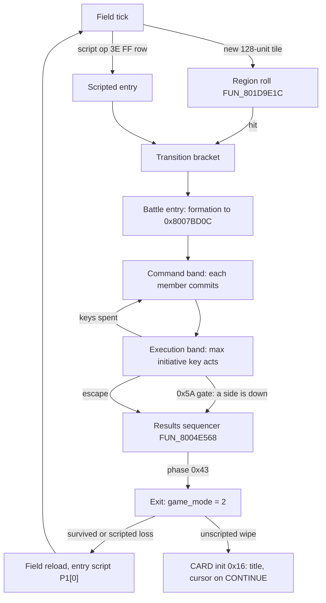
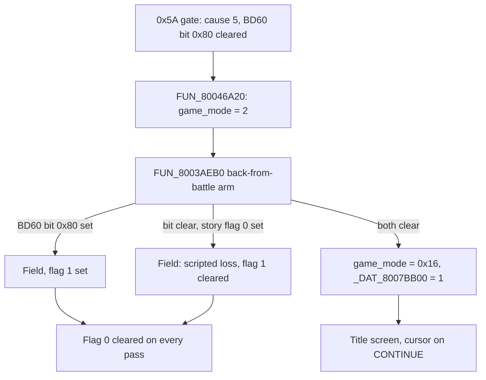

# Battle round loop, encounters and rewards

This page follows one fight from the outside in: how a field step or a script op becomes a battle, how a round hands turns out, how the battle ends, and what the party walks away with. It covers the retail mechanism (functions in `SCUS_942.54` and the battle overlay, PROT 0898 at base `0x801CE818`) and the port's live loop that mirrors it on both play hosts.

It is the most port-facing page of the battle set. The per-state detail of the action state machine lives on [`battle-action.md`](battle-action.md), the command menu on [`battle-command-flow.md`](battle-command-flow.md), and the damage kernels on [`battle-formulas.md`](battle-formulas.md).

## At a glance

| Retail routine | Where | Role |
|---|---|---|
| `FUN_801D9E1C` | field overlay | Per-step region encounter roll ([encounter.md](../formats/encounter.md#random-encounter-trigger-path)). |
| `FUN_801DE840` case `0x3E` | field overlay | Scripted-battle entry `3E FF <row>`. |
| `FUN_801DA51C` | field overlay | Encounter confirm: copies the formation row into `0x8007BD0C`. |
| `FUN_80055b6c` / `FUN_800513F0` | SCUS | Battle init; folds the scripted-fight bit into `ctx[+0x287]`. |
| `FUN_801D88CC` | 0898 | Round-boundary actor sweep. |
| `FUN_801DA780` / `FUN_801DABA4` | 0898 | Initiative key seed / max-key pick. |
| `FUN_801E295C` | 0898 | Action state machine; state `0x5A` is the end-of-action wipe gate. |
| `FUN_801E9FD4` / `FUN_801E7320` | 0898 | Monster action picker / target resolver. |
| `FUN_801EC3E4` | 0898 | Hit resolver: status appliers and the Seru capture roll. |
| `FUN_801E752C` | 0898 | Per-round poison ticker. |
| `FUN_80046A20` | SCUS | Battle tick and battle-exit mode selector. |
| `FUN_8004E568` | SCUS | Results sequencer (victory, escape, wipe arms). |
| `FUN_8003AEB0` | SCUS | MAIN INIT scene setup; carries the game-over gate. |

| Global / field | Meaning |
|---|---|
| `0x8007BD0C..0F` | Per-slot monster ids of the formation. |
| `DAT_8007BD10[0..2]` | Party roster (character id per seat). |
| `DAT_8007BD60` | Per-battle flags byte; bit `0x80` = scripted fight on entry, party-survived latch on exit. |
| `DAT_8007BD71` | Battle-end signal (`0xFE`). |
| `_DAT_8007BD2C` | Wipe cause: `0` monsters down, `5` party down. Also the results sequencer's phase word. |
| `ctx[+0x6CE]` | Sequencer phase halfword; the battle exits at `0x43`. |
| `ctx[+0x28A]` | Battle-mode counter (boss phase). |
| `actor[+0x14C]` / `[+0x16C]` / `[+0x16E]` | Live HP / initiative key / status halfword. |

`ctx` is the battle context `*0x8007BD24`; `actor` is an entry of the pointer table at `0x801C9370` (slots `0..2` party, `3..` monsters).

Port entry points: `World::tick` → `live_field_tick` / `live_battle_tick` (`crates/engine-core/src/world/`), round bands in `world/battle/loop_driver/round.rs`, battle end in `world/battle/victory.rs` + `teardown.rs`, encounters in `world/encounters.rs`. The pure kernels sit in `crates/engine-battle` and `crates/engine-battle-vm`; both hosts arm the loop through `World::arm_live_loop` (`crates/engine-core/src/live_loop.rs`).

## The loop in one picture



The port walks the same boxes: `EncounterSession` is the transition bracket, `RoundFlow` the two bands, `World::tick_battle_end_sequence` the sequencer, `World::finish_battle` the exit and the MAIN INIT gate, and `SceneHost::tick` the entry-script re-run.

## Encounters

<a id="encounter-system"></a>

### Encounter session

The port owns one `EncounterSession` per active field scene ([`crates/engine-battle::encounter`](../../crates/engine-battle/src/encounter.rs)). The field-step path calls `on_step(rng_word)` each step; the session brackets the transition in five phases:

| Phase | Drives |
|---|---|
| `Idle` | Steady state. Steps roll against the table; safe zones suppress. |
| `Transition` | Roll succeeded; `transition_frames` of camera shake / fade-out; the default is the battle-intro duration, `battle_intro_styles::INTRO_DURATION_FRAMES` (`0x84`). |
| `Triggered` | Engine drains the resolved `EncounterRoll` and loads the battle scene. |
| `Battling` | Battle is running; tracker is suspended. |
| `Grace` | Post-battle no-re-encounter window (`grace_frames`, default 30). |

`EncounterTable` holds the per-scene rows, the 1/256 trigger rate and the safe-zone rectangles. Rate modifiers are multiplicative (`EncounterTracker::set_rate_modifiers`), mirroring the `FUN_801D9E1C` shifts: High Encounter passive `0x3B` = `<<2`, Low Encounter `0x3C` = `>>1`, system flags `0x1D` / `0x1E` = `<<1` / `>>1` (see [encounter.md](../formats/encounter.md#random-encounter-trigger-path)). They are refreshed from the party ability mask and the flag bank each step.

<a id="the-session-is-a-bracket-not-the-roll"></a>

### The region roll and the bracket

On a scene whose MAN carries encounter regions - every field area that fights - the roll comes from `RegionEncounterTracker` (`crates/engine-battle/src/region_encounter.rs`), the model of `FUN_801D9E1C`: per-region rate counter, formation-range pick, one-step anti-repeat. The session supplies only the `Transition -> Triggered -> Battling -> Grace` bracket around it.

The tracker's trigger branch is destructive: it draws RNG, latches the anti-repeat formation and re-seeds its counter before returning the pick. A roll with no session to receive it would be a fight silently thrown away, so:

- `World::on_field_step` re-installs a bare bracket (`World::install_encounter_bracket`) when the session is missing (`World::begin_new_game` clears it).
- Every remaining way a roll can fail to become a battle logs at error: an unregistered formation in `begin_encounter_battle`, a scripted arm with no session, and a table / def id mismatch caught at `install_man_encounter`.

The MAN formation-row index the roll produces and the `World::tables.formation_table` key the battle load resolves are pinned equal across the scene corpus by [`scene_encounter_formations_disc.rs`](../../crates/engine-core/tests/scene_encounter_formations_disc.rs), which also carries the New-Game-reset regression.

`World::force_encounter(row)` arms a named row through the same bracket. It is the engine side of `play-window --battle` ([playing-and-viewing.md](../guides/playing-and-viewing.md#getting-into-a-battle-on-purpose)) and does not shortcut into `enter_battle_from_formation`, so the harness exercises the path it verifies.

### Scripted-battle entry (`3E FF <row>`)

Scripted boss fights enter through field-VM op `0x3E` with `op0 = 0xFF`, or any `op0 < 100`, which runs the same body (`op0 >= 100` is the door warp; see [`script-vm.md`](script-vm.md#0x3e-scripted-battle-op0--100)). The case-`0x3E` arm of `FUN_801DE840`:

1. sets the SYSTEM entity's 5-state SM to Activating (`sys_ctx[+0x8A] = 1`);
2. points its encounter-record slot at MAN formation-table row `op1` (`sys_ctx[+0x94] = *(ctrl+0x20) + op1 * *(ctrl+0x5D) + 1`);
3. requests the battle mode switch (`FUN_8003CE08(0xE)`).

The entity tick `FUN_801DA51C`'s confirm state then copies the row into the formation cell `0x8007BD0C`.

Boss rows sit outside every region's rollable `[base, base + count)` slice, so they can only enter through this op. They carry a non-zero first header byte, the predicate on which the confirm state ORs bit `0x80` into the per-battle flags byte `DAT_8007BD60` (see [encounter.md](../formats/encounter.md#the-per-battle-flags-byte-dat_8007bd60)). That bit selects the `SpinUpParticles` battle intro and the transition's second audio cue. The port carries it per row as `FormationDef::header_flags` / `per_battle_flags()`. `rikuroa` rows 16 / 17 read `01 00 00` where all sixteen of its random rows read `00 00 00`.

| Scene | Beat record | Op | Formation row | Contents |
|---|---|---|---|---|
| `garmel` | `P2[12]` (C1 gate `[0x198]`, self-latching) | `3E FF 09` | 9 | lone **Zeto** (`0x4B`) |
| `garmel` | `P2[11]` (C1 gate `[0x195]`) | `3E FF 08` | 8 | lone **Songi** (`0x4C`) |
| `rikuroa` | `P1[3]` (the Caruban stager, after its `52 89` marker SET) | `3E FF 11` | 17 | lone **Caruban** (`0x49`) |

So the formation is the scene's own MAN encounter-section row, selected by index from script bytes; there is no boss battle-id global. Evidence (capture): the Zeto capture pins the writer (the formation-store `ra` sits in `FUN_801DA51C`'s record-copy body while `0x8007B7FC` stays silent), and poll-tier playthrough captures pin the values - at battle entry `0x8007BD0C` reads exactly the lone id for all three rows (`0x49` in `rikuroa`, `0x4C` then `0x4B` in `garmel`).

**Carriers.** The garmel fights ride partition-2 beat records, spawned by the gated record dispatch. The Caruban op lives in a partition-1 boss-stager placement: `P1[3]` of the rikuroa streaming carrier is a parked special-model placement (SJIS locals ノア / Noa). Its record opens on a `SysFlag.Test 0x142` park gate, stations its actor at the nest tile via its own `0x4C 0x51` leg, self-suspends on a `4C 85` halt-acquire, and carries the beat body (`52 89` staged-marker SET -> `3E FF 11`). No script-side un-halt poke to the stager channel (`B2 10 0A`) exists in the MAN, so the resume is the engine-side approach dispatch: the locomotion touch (`FUN_801d5b5c`) or the interaction probe (`FUN_801cf9f4`) runs the placed actor's record.

**Port.** `World::trigger_scripted_battle(row)` ([`world/encounters.rs`](../../crates/engine-core/src/world/encounters.rs)) is reached from the field-VM host's `scripted_battle` arm for `op0 == 0xFF` and every `op0 < 100`. 

- The formation resolves against the rows `install_man_encounter` registered at scene entry, with the PROT 867 archive stats merged. The v12 dungeons resolve their encounter section from the streaming variant MAN, their only carrier.
- The battle enters through the same immediate latch the field-carrier SM uses - no field step, no synthetic boss formation id.
- Boss-stager placements are derived from the MAN at scene entry (`man_field_scripts::boss_stager_placements` in `crates/engine-field` -> `World::install_boss_stagers_from_man`): the `3E FF` site, the park-gate flag and the station tile all decode from the record's bytes. They run on approach / interact via `World::run_boss_stager_record`.

Oracles: [`organic_zeto_encounter_disc.rs`](../../crates/engine-core/tests/organic_zeto_encounter_disc.rs), [`organic_beat_records_disc.rs`](../../crates/engine-core/tests/organic_beat_records_disc.rs).

#### `DAT_8007b7fc` is a writer-less debug forced-battle id

No retail code writes `DAT_8007b7fc` (`0x8007B7FC`). A capstone sweep of `SCUS_942.54` plus every extracted static overlay (the `crates/asset/data/static-overlays.toml` set) - absolute lui/addiu/ori-tracked stores, gp-relative stores against the SCUS `gp = 0x8007B318` (`0x4e4($gp)`), and constant address materialisation into any register - finds only readers. The same sweep pointed at the game-mode word reproduces its known stores. Captures agree: the word is never observed non-zero across whole-chapter sessions spanning a dozen scripted boss entries.

The readers give it its role:

- Battle init `FUN_80055b6c` reads it after clearing the per-battle state block. Non-zero routes through `FUN_80055b20` + `FUN_8005567c`, which seed the formation cells `DAT_8007BD0C..0F` (and the sibling `DAT_8007BD10` array) from the id itself, bypassing the encounter record, with special-case formations for ids `0xA2..0xA4` and a canned default when the id reads zero at the final check.
- The battle-exit mode selector `FUN_80046A20` reads it at `0x80046ddc` before its mode store: non-zero routes to `game_mode = 0`, the debug menu.

A set id would enter a forced formation and exit to the debug menu. Retail never sets it, so both arms are dev-harness residue, like the [mode-18/19 game-over rows](#the-mode-1819-overlay-is-a-dev-harness).

### Encounter trigger - runtime memory layout

A pre / post encounter save pair on `map01` (one frame walking, the next with battle just initiated) pins what an encounter changes in RAM. `mednafen-state diff` over `0x801C0000..0x80200000`:

| Range | Bytes changed | What it is |
|---|---:|---|
| `0x801CE808..0x801F3818` | ~133 KB | Battle overlay loaded into RAM (one contiguous region). |
| `0x801C9370..0x801C9900` | ~200-500 B | Region holding the 8-slot battle actor pointer table (stride 4, 32 bytes; every consumer indexes it `<< 2`). The `0x590` span is what changes, not the table's size. |
| `0x80083000..0x80084000` | ~600 B | Scene-bundle / sound-pool: encounter formation + BGM resolution. |

The active scene-name table at `0x80084540` (CDNAME label + scene index) is identical across the pair: the battle is layered on the field scene rather than swapping it out. The port likewise preserves the active-scene state and resolves only the formation and battle assets.

Constants: `capture_observations::encounter_trigger` ([`crates/engine-system`](../../crates/engine-system/src/capture_observations.rs)); disc-gated test `encounter_trigger_diff_loads_battle_overlay` in [`crates/mednafen/tests/real_saves.rs`](../../crates/mednafen/tests/real_saves.rs).

### Scenes that cannot roll

`World::scene_can_roll_encounters` (cached as `World::encounters.scene_rollable`) answers whether the installed scene can produce a random encounter at all. Region lookup stops at the first containing region (`RegionEncounterTable::region_at_tile`, matching retail's walk), so a rollable region whose every tile is covered by an earlier rate-0 row is unreachable. That is the case for `town01`, the scene the binary boots into. It is retail scene data and the port keeps it; both hosts say so, so a town's designed silence does not read as a broken engine.

The hosts use different channels. The native window draws a bounded HUD line (`World::show_encounter_hint`). The browser prints its notice in the page's status bar off `LegaiaRuntime::scene_rolls_encounters`, not through the overlay draw list: the page treats a non-empty overlay as owning the frame, so a passive hint there would suppress NPC dialogue.

## Live gameplay loop - Field ↔ Battle in `tick`

`World::tick` drives the whole Field -> Battle -> Field round trip. Both hosts arm it through one kernel, `World::arm_live_loop` (`crates/engine-core/src/live_loop.rs`): scene label, the synthetic encounter fallback for scenes whose MAN carries no table, the loop / player-battle flags, the Seru registry and the battle-BGM swap. The native `BootSession::enter_field_live` (`crates/engine-session`) and the browser's `LegaiaRuntime::arm_live_battles` (`crates/web-viewer/src/play_battle.rs`) are callers of it.

Per frame:

- **Field tick** (`World::live_field_tick`). A step is the player actor crossing into a new 128-unit collision tile (`pos >> 7`). Each step drives one `World::on_field_step` roll; `World::tick_encounter` advances the session's `Transition` / `Grace` countdowns every frame. At `Triggered`, `World::begin_encounter_battle` resolves the rolled `formation_id` against `World::tables.formation_table`, snapshots the field actor table into `World::field_return`, seeds the battle actor table from the formation + `MonsterCatalog` (`enter_battle_from_formation`), and flips `mode` to `Battle`.
- **Battle BGM.** With a battle track configured (`World::audio.battle_bgm`, `World::set_battle_bgm`), `enter_battle_from_formation` calls `World::swap_to_battle_bgm`: it stashes the field track and queues a `FieldEvent::Bgm{sub_op: 1}` for the battle id, which the host's BGM director cross-fades to like a field op-`0x35` start.
- **Battle tick** (`World::live_battle_tick`). Wraps `step_battle` with the glue retail performs through its render and animation systems. It folds this frame's `BattleEvent::ApplyArtStrike` damage into target HP, applies a generic physical strike (`apply_basic_attack`, through the retail melee roll pair `battle_formulas::physical_predamage` - see [battle-formulas](battle-formulas.md#the-melee-roll-pair-and-the-underdog-rewrite)) on the `AttackChain -> AttackRecovery` edge when no art strike did, marks zero-HP combatants dead so the wipe scan resolves, and re-arms the next actor at `EndOfAction`. On `StepOutcome::BattleComplete` the [results sequence](#battle-end-retails-way---the-results-sequencer) starts.
- **Return** (`World::finish_battle`). See [what `finish_battle` does](#battle-end-both-hosts). When a BGM swap was active, `World::restore_field_bgm` queues a `FieldEvent::Bgm{sub_op: 1}` for the stashed field track, or a stop (sub-op 4) if none was playing at encounter start.
- **Post-battle script re-entry** (`SceneHost::tick`). Retail reloads the field scene after every battle, re-running the scene-entry system script `P1[0]` (`FUN_8003ab2c`). The host mirrors that on the `Battle -> Field` mode edge (`Scene::field_man_entry_script` -> `World::load_field_script_at`).

The re-run is what dispatches post-battle beat records. Rikuroa's `P1[0]` tests the transient staged marker `0x289` (SET by the stager `P1[3]`'s own `52 89` bytes before the battle) and issues the op-`0x44` spawn of the post-victory record `P2[50]` through the C1-gated dispatch, whose script bytes SET the progression gate `0x142`. No engine code writes the gate flag or the marker; both land from record execution. Oracle: `engine-core/tests/organic_beat_records_disc.rs`.

Integration test: `crates/engine-core/tests/live_loop_tick.rs` drives boot -> walk -> encounter -> victory -> return through `tick` alone.

### Auto-resolve vs player-driven

`World::battle.player_driven` selects the mode. `LiveLoopOpts::playable()` sets it, so both play hosts are player-driven by default.

- **Auto-resolve** (flag clear: tests, `--no-player-battle`). Every turn commits a generic physical strike against the first living combatant on the opposing side (`World::first_living_opponent_of`). Monsters take turns too, and a party wipe ends the battle the same way a monster wipe does.
- **Player-driven.** Each party turn pauses the action SM and opens a `battle_input::BattleCommandSession` (`crates/engine-menus/src/battle_input.rs`). While a session is open `live_battle_tick` skips the SM advance and drives the picker from `World::input`. On confirm, `World::tick_battle_command` arms `battle_ctx.{active_actor, queued_action, action_state}` and the actor's `active_target`, then resumes the SM. An abort with no valid target falls back to a default strike. Target selection reuses the [battle target picker](battle-command-flow.md#battle-target-picker).

#### The two bands of a round

Retail's two state machines hand a round back and forth (see [the round loop](battle-command-flow.md#the-round-loop---what-re-arms-0x1e)):

- The flow SM's **command band** (`0x14 -> 0x1E -> 0x28 ...`) walks every living party member through a ring while the action SM idles. Only `0x6E`'s begin arm stores `0xFE` (`0x801D31AC`), handing the round to the action SM (`ctx[+0x07] = 0` at `0x801D3224`).
- In the **execution band** `FUN_801E295C` dispatches every combatant, party and monster alike, by the max-key pick `FUN_801DABA4`, and consumes each key at its own `0x0C` dispatch (`sh zero,0x16c(s3)` at `0x801E2CDC`).

So a monster that won initiative still waits for the last party commit: initiative orders the execution band, it never lets anyone act before the prompt. The one way a round skips its command band is a rolled **back attack**: `0x0B`'s `ctx[+0x290] == 1` arm stores `0xFE` outright (`0x801D0E78`), and with the party's keys zeroed by the side lockout only the monsters dispatch.

The port runs the same bands (`battle_round::RoundFlow`, `RoundPhase::{Command, Execute}`; `World::begin_battle_round` / `begin_round_execution` / `end_battle_round` in `world/battle/loop_driver/round.rs`):

- **Command band.** `begin_battle_round` is retail's `0x14`: the actor sweep (`BattleRound::boundary`, the port of `FUN_801D88CC`), the initiative re-seed when no key is live, the per-round DoT ticker (round index `!= 0`), then `Begin | Run` for the first member that owes a command. `World::next_member_owing_command` ports `FUN_801DB81C` / `FUN_801DBA04`: it skips a committed member, one with no HP, and one whose status word carries `+0x16E & 0xF84`. Each commit (`World::commit_party_command`, retail's ten-site idiom at `0x801D16AC`) parks the typed command in `RoundFlow::pending` and walks the ring on, or begins the round.
- **Execution band.** `begin_round_execution` is `0x6E -> 0xFE`. Every idle of the action SM at `EndOfAction` is one pick by `World::next_combatant_by_initiative` (`FUN_801DABA4`): the living actor with the highest unspent key acts. A monster goes through its AI pick; a party member through `World::dispatch_pending_party_action`, where the swing stream is seeded (`FUN_801EED1C` from state `0x0C`), the art profile staged, the spell cast, the item effect landed, the Spirit AP charged and the escape rolled. The pick consumes the key. When no living actor holds one the round ends (`end_battle_round`: the `ctx[+0x28A]` bump + the `0x400` waker, retail's `0xFF` arm at `0x801E67E8`).

**Initiative key** (`BattleActor::init_key`, retail `+0x16C`). `FUN_801DA780` seeds it from SPD (`+0x164`): `speed + rand()%(speed/2 + 1) + 1`, plus the wounded bonus - party `(max-hp) >> 4` below a quarter HP, `>> 5` below half, `>> 6` above; monsters `>> 10` - then halved under Slow (`battle_formulas::seed_initiative`; see [battle-formulas](battle-formulas.md)).

- Battle entry seeds the keys ahead of the formation latch, because the seeder is the one reader of the unlatched `ctx+0x290` and the side lockout would otherwise be lost. Round 1 therefore finds live keys and does not re-roll.
- Dead actors' keys are zeroed on every pick (the function's first loop).
- Party SPD is the resolved stat - base plus the footwear bonus - written by `World::seed_party_battle_stats` at battle entry. Monster SPD is `MonsterDef::speed` (record `stats[5]`, unboosted).
- When no living actor carries SPD (disc-free synthetic worlds) every living slot gets one flat turn token and the pick walks them in slot order.

#### Commands

All six commands are wired. Attack opens a target cursor and commits a physical strike through the action SM. Arts / Magic / Item resolve to `Resolution::OpenArtsMenu` / `OpenSpellMenu` / `OpenItemMenu` and hand off to a host-owned submenu. Spirit and Run resolve at once.

- **Spirit** raises the guard stance at the commit (`World::battle.guarding`, the model of the pending-action byte `+0x1DE == 4` the melee kernel's guard roll reads), so it protects against every monster that dispatches ahead of the member, and lasts until the next round's sweep clears the category. The AP charge (`ApGauge::charge_spirit`) lands at the member's dispatch.
- **Run** stamps category `5` on every party actor at the commit and begins the round at once (retail `0x32`, `0x801D1174..0x801D1184`). Each member's dispatch then rolls the escape and arms the run band (`RunBegin` / `RunWait` / `RunEscape`): success tears the battle down `Escaped` (no loot, no game over, downed members floored at 1 HP), failure spends the turn. The roll is `FUN_801E791C`: party `(SPD*3)>>1 + missingHP>>4` vs enemy `SPD + missingHP>>5`, two rand draws, Chicken Heart / Chicken King passives honoured (`battle_formulas::escape_roll`; see [battle-action-queue.md](battle-action-queue.md#spirit--run-in-the-live-command-menu)).
- **Run in a no-escape fight** (`ctx[+0x287]`). States `0x1E` and `0x32` never read the byte, so Run commits as anywhere; the roll tests `ctx[+0x287]` after its compare (`0x801E7B14`) and fails, so the run band plays its failure arm.

#### Submenus

While a submenu is open both the SM and the command session are parked; `World::tick_battle_arts_input` / `tick_battle_{arts,spell,item}_menu` drive it from `World::input`. A completed action is the actor's whole turn: the result is applied, the popup surfaced (`World::drain_battle_hit_fx`), and the SM parked at `EndOfAction`. Backing out reopens the command menu for the same actor.

**Item** opens a battle-context `inventory_use::InventoryUseSession` on `World::battle.item_menu` (`World::build_battle_item_session`): one ally row per party slot plus one enemy row per live monster (`TargetRow::is_enemy`), the latter for the engine's synthetic offensive items.

- The side rule is structural, as in retail: state `0x64`'s cursor walk wraps inside the seated party band `[0, ctx[+0x00])` (`0x801D2BE8` / `0x801D2C78`), and the enemy-side classes go to the monster-ring states `0x5B` / `0x5D`. The target panel lists only the selected item's side (`inventory_use::target_on_effect_side`).
- On entering target-select the cursor lands on the first benefiting target.
- A completed use applies through `World::use_item`, removes one copy (`World::consume_item`) and raises a popup (heal- or damage-coloured).
- `use_item` folds offensive outcomes too: `DamageDealt` subtracts enemy HP and downs it at zero, `CaptureRolled` reuses `World::resolve_capture`, and `EscapeRequested` sets `World::battle.escaped` so the item tick returns to the field via `finish_battle` with no loot.

**Magic** opens a `battle_magic::BattleSpellSession` on `World::battle.spell_menu` (`World::build_battle_spell_session`: the caster's learned spells off the roster record plus live MP, MP-gated). The picker kind matches the spell's `SpellTarget` shape. Confirm commits a `PendingPartyAction::Spell`; the cast runs at the caster's dispatch through `World::cast_spell_on_slots`, which deducts MP once, resolves each affected slot through `spells::cast_spell` and folds the outcome via `World::fold_spell_outcome`:

- damage / heal / cure / revive;
- **buffs**: `World::apply_battle_buff` writes the delta into the per-slot `battle.attack` / `battle.defense` / `battle.magic` scalar with refresh semantics and a per-turn timer, reverted exactly on expiry. Accuracy / Evasion / Speed buffs are tracked but have no live-loop scalar to move;
- **capture**: `World::resolve_capture` rolls against the monster's missing-HP fraction, downing it and logging the id into `World::seru.battle_captures`;
- **escape**: sets `World::battle.escaped`.

**Arts** opens the per-press [Arts command input](#arts-command-input) on `World::battle.arts_input`. The player types the chain, one d-pad press per command, and the entry ends itself when the AP pool cannot afford a press.

- `World::build_arts_action_queue` builds retail's action queue from the entered buffer (`legaia_art::tokenize` + the learn-on-use verdict + the Miracle / MSB-clear / Super finish), and `arm_battle_art_action` hands it to the action SM's attack band verbatim. Each swing, starter and art constant is its own staged clip, and the clip's hit events resolve the damage (`World::tick_battle_hit_events`; see [battle-action-queue.md](battle-action-queue.md#what-the-port-does)).
- Art records come from `World::tables.art_records`, keyed by `(Character, ActionConstant)` and installed at battle entry from the character's art-animation bank (`World::install_art_bank_records`, both hosts). The hit-event driver reads them for the status effect and per-hit cue only; the power bytes are the clip entry's own.
- Several arts in one turn is the ordinary case. The performed-art list keys the shout cue and the learn-on-use check once per art (see [audio.md](audio.md#battle-arts-voice-shout-path-engine)). A Miracle / Super replacement answers a single constant, its finisher.
- The legacy saved-chain list (`battle_arts::BattleArtsSession` on `World::battle.arts_menu`, built by `World::build_battle_arts_rows` from `World::party.saved_chains`) stays reachable behind `LEGAIA_ARTS_SAVED_LIST=1`. A row collapses to the one art whose command string the chain ends with (`chain_matches_record`), or to a synthetic per-direction profile (`battle_arts::synthetic_power`: Down -> LDF, else UDF, tier-0 x12, clamped to `MAX_ART_HITS`). Both paths share the `apply_art_strike` kernel.

Modules: [`battle_input`](../../crates/engine-menus/src/battle_input.rs), [`arts_command_input`](../../crates/engine-battle/src/arts_command_input.rs), [`battle_arts`](../../crates/engine-battle/src/battle_arts.rs), [`battle_magic`](../../crates/engine-battle/src/battle_magic.rs).

Coverage: `crates/engine-core/tests/battle_player_driven.rs` asserts no strike lands until the player confirms, then drives to a monster wipe and loot. `battle_command_arms_reachable.rs` is the hand-off guard: each of Arts / Magic / Item must open exactly its own surface, consume the command session, arm nothing, and (for Arts) consume a directional press.

### What the loop flag does and does not gate

`World::toggles.live_gameplay_loop` gates the field side only - the step-driven random-encounter roll. It defaults to clear in a bare `World` (so tests can drive encounters externally) and both play hosts set it. Once the world is in `SceneMode::Battle`, `World::tick` always runs the full `live_battle_tick`, flag or no flag: battle entry is not gated (a scripted `3E FF` fight and a world-map region encounter flip the mode on their own), so a gated battle driver could strand a session mid-fight. Retail has no such concept either; `FUN_801E295C` drives the battle it is in. Regression: `crates/engine-core/tests/battle_always_resolves.rs`.

### Host-simulated animation edges

Three action-SM gates are retired in retail by the render / animation systems. `World::live_battle_tick` retires each on the frame its state is reached:

- `ADVANCE_DONE` at `AttackRecovery` - retail clears it when the recovery animation finishes.
- The caster's `spell_iter` (`actor+0x1FA`) at `MagicSustain` (`0x2B`). The SM only sets this byte; retail's cast-animation system counts it down. Regression: `a_monster_cast_does_not_park_the_action_sm` in `battle_always_resolves.rs`; the real-data version is `crates/engine-shell/tests/scene_encounter_rollable.rs`, which drives a `map03` encounter from the disc's own region table to a resolved battle.
- `ADVANCE_DONE` at `attack_chain` (retail `0x1E`), which stages one strike-script byte per clip into `queued_anim` and holds until the animation retires the flag. The anim commit `World::commit_staged_battle_anim` retires it for a clip-less swing only past its `queued_anim == current_anim` early-out, so `live_battle_tick` also retires the flag whenever the id pair has converged with no clip in flight.

A related invariant: the monster-AI picker writes the chosen spell id into the action-parameter stream (`params[0]`, retail `+0x1DF`) before `take_monster_turn` learns the cast cannot fold. `World::clear_action_stream` zeroes the stream when a physical action is armed (the per-action sibling of `FUN_801D88CC`'s round-boundary clear) so the fallback strike never walks a stale spell id as a swing byte. Regressions: `battle_attack_chain_stall.rs` and `a_starting_party_can_fell_a_real_early_enemy` in `battle_physical_damage.rs` (both under `crates/engine-core/tests/`).

### Host flags

`legaia-engine play-window` ships the loop on, matching the browser play page:

- `--no-live-loop` turns the encounter roll off (field VM + locomotion only). A battle the engine is already in still resolves.
- `--no-player-battle` turns off the command menu and auto-attacks each party turn. By default the HUD renders party / monster HP, the command menu, the target cursor and the arts / spell / item submenus. The host installs the boot spell catalog (the disc table) and the vanilla item catalog.
- `LEGAIA_DEMO_BATTLE_SEED=1` seeds demo items (Healing Leaf + Bomb), saved chains and a demo `Art1B` record into an empty save. Without it an empty save stays empty, as on retail.
- `--battle-bgm <id>` overrides the Battle <-> Field music swap track. The swap is on by default with retail's standard battle theme, global BGM `2026` (`music_labels::BATTLE_THEME_1_BGM_ID`, installed by `LiveLoopOpts::playable()`); `0` disables it. Ids route through the same director as field op-`0x35` starts: scene-local ids via the scene's BGM table, `>= 2000` via the global `music_01` pool. Browser twin: `LegaiaRuntime::set_battle_bgm`.
- `LEGAIA_SMART_MONSTERS=1` enables the [non-faithful targeting toggle](#monster-ai-fun_801e9fd4-action-picker--fun_801e7320-target-resolver).

## Battle end

### Battle end, retail's way - the results sequencer

The battle does not exit on the frame the `0x5A` gate raises the signal. Retail's battle tick `FUN_80046A20` stops stepping the action SM once `DAT_8007BD71 == 0xFE` (`0x80047040`) and runs the results sequencer `FUN_8004E568` every frame instead (`0x800470D0..0x800470E8`). The battle exits only when the sequencer's phase halfword `ctx[+0x6CE]` reaches `0x43` (`0x80046DAC`). The port's mirror is `World::battle.victory` (`world::battle::victory`), walked by `World::tick_battle_end_sequence` in place of the SM while the scene stays in `SceneMode::Battle`.

`_DAT_8007BD2C` is both the wipe cause and the sequencer's phase word:

- **Victory** (`0`) walks the jump table at `0x800152FC` as `0 -> 2 -> 4 -> 5` while the hero's `monster.snd` voice clip (slot 7) and PROT 0889 (the level-up jingle bank, slot 11) stream in, with the pose actor framed at `FUN_801D5854(seat, 8)`.
- **Party wipe** (`5`) lands on phase 5 at once with `DAT_8007BD60 & 0x80` clear, which selects the annihilated arm: the same `0x100` hold and fade, every seat below the party count floored at 1 HP on the fade frame, unconditionally (`0x8004FB94..0x8004FBA4`, with the roster record's HP / MP written beside it - so a scripted loss returns to the field standing). The win arm's floor (`0x8004F390`) touches only a seat at 0 HP.
- **Escape** runs the `0x67` arm: no results, the phase halfword counts up from the fade the SM's `0x66` teardown spawned, same `0x43` gate.

Victory timeline, measured on `rim_elm_gimard_victory` under PCSX-Redux (`scripts/pcsx-redux/autorun_victory_timeline.lua`):

| Frame (vsyncs from the signal) | Retail | Port |
|---|---|---|
| `+0` | `0x5A` gate: `DAT_8007BD71 = 0xFE`, cause `0` | `BattleComplete` arms the sequence |
| `+0..+80` | CD loads, pose-8 framing on the pose actor | `VICTORY_LOAD_FRAMES` hold, same framing |
| `+80` | results frame: flag `0x35`, round bump, pose clip staged, HP floor at 1 for downed members, XP / gold / drop / level-ups, result window `0x41`, level-up window `0x44+mask` + cue `0x50` | same, through `apply_battle_loot` |
| `+80..+336` | hold (`gp+0xA54` to `0x100`), framing 6 | `VICTORY_RESULTS_HOLD_FRAMES` |
| `+336` | exit-fade template (kind 2, `0x40` frames, black -> white), phase halfword from 2 | `screen_fade` = the escape template, drawn by both hosts |
| `+402` | `ctx[+0x6CE] >= 0x43`: `game_mode = 2` | `finish_battle`, windows come down |

**The pose actor** is `ctx[+0x13]`, and the party leader poses: no store in the battle overlay writes a seat there (every store is a round-boundary zero or the magic menu's MP-cost scratch), and the three-member `noa_levelup_banner` capture reads `ctx[+0x13] == 0` with seat 0 carrying the staged pose while Noa is the one who levelled. The pose id comes from the SCUS table at `0x800788A0` through the HP-quarter tier, aged by the round count and forced weak by the `0x107B` status mask (`victory_pose_tier` / `victory_pose_column`). The clip is one of the eight base-archive records the art-bank ladder resolves for ids `0x11..=0x18`.

Port divergences in the pose:

- The port commits the record as a one-shot that hands back to the idle loop, so the pose is struck once on the results frame rather than held for the `0x100` hold. Holding it needs the record's loop window (`+0x85..+0x86`), which `MonsterAnimation` does not model.
- The hero's voice line (`monster.snd` tail clips) is not staged; no engine bank carries `monster.snd`.

After an unscripted wipe retail is in CARD INIT, so the port runs no further battle frame while it holds the frozen scene for the [game-over hand-off](#the-ports-hand-off).

**The exit fade** is a fade to black. The template's kind word (`2`) is also the quad's blend: the fade actor's tick `FUN_80025000` hands it to the quad emitter `FUN_80024EE4` as the second argument, which folds it into the draw-mode packet's ABR bits (`sll a3,a1,0x5; ori a3,a3,0xe` at `0x80024FB0`) - the law the battle-intro styles obey (`abr == 1` brightens to a white-out, `abr == 2` darkens). Kind 2 is `B - F`, so the black -> white ramp subtracts more each frame, over the scene and the result windows alike.

The template's trailing id word, `0`, is the quad's OT bucket (the nearest). Its hold word is `-1`, so the black holds until `finish_battle` tears the battle down with its fade actor. Both hosts draw `World::presentation.fade` through `screen_prim::screen_fade_prim` (`crates/render-kernels`) in their screen-overlay pass.

#### The victory camera

The sequencer frames its pose actor `ctx[+0x13]` on every frame it runs, in two ways:

- **The load window** (the side-band hold at its head, `0x8004E5C0..0x8004E624`, and phases `0..=4`, `0x8004EE10..0x8004EE98`). It stores `ctx[+0xD] = 1`, forces a party seat's target `actor[+0x1DD]` into the monster band `3..=6` (`3` when it is not), turns that target to the pose actor's heading `+ 0x800`, and calls `FUN_801D5854(seat, 8)`. Every monster is down and a dead monster's node is gone (`noa_levelup_banner`: each dead seat's `+4` reads zero), so case 8 takes its stand-off arm (`0x801D6B9C`): `TR (0, 0x400, radius * 5 / 2)` with the radius `actor[+0x22C][+0x58]` (`0x280` for every party member in that state), pitch `0`, focus the pose actor's display X / Z, yaw `-target[+0x46] - ((ctx[+0x26D] << 9) - 0x100) + ctx[+0x6DA]`.
- **The results frame onward** (`0x8004FC80..0x8004FC90`). It stores `ctx[+0xD] = 0` and calls `FUN_801D5854(seat, 6)`. With the signal up and a party seat, case 6 takes the battle-over arm: the close-up from behind the posing character, moved by the per-character win-pose script (`battle_cam_script::battle_over_script`). The script reads the close-up accumulator `ctx[+0x87C]` - zeroed by the pose clip's commit (`FUN_8004AD80`, `0x8004BF68..0x8004BF78`) and advanced `8` a frame by every framing call - so the shot keeps moving through the hold.

The escape arm returns before either call (`0x8004E720`).

`noa_levelup_banner` reads the results framing directly: Vahn posing `0x14` with `ctx[+0x87C] = 616`, pitch `-0x20` and yaw `0x800 - actor[+0x46]` exactly, TR one tween step short of the script's `(0, 928, prescale(1126))` and walking down toward it from the stand-off pose.

The focus both arms take is the pose actor's body pair `+0x3C` / `+0x40`. The store that keeps it current is the battle draw callback's (`FUN_80048A08` -> `FUN_8004998C`, [battle-action.md](battle-action.md#where-an-action-leaves-its-combatants)), which runs for every drawn actor whether or not the action SM does. So the pair follows the win pose through the hold: in the same capture Vahn stands at a live `(2, -3)` with his pair at `(78, -15)`, 38 frames into pose `0x14`.

Port: `battle_cam_inputs::battle_end_cam_inputs` folds both framings over the camera inputs while `World::battle.victory` is armed, and `World::refresh_battle_body_pairs` refreshes the pairs on every sequence tick (the root-motion half of the locomotion pass stays with the SM). Disc-free regression: `engine-core/tests/battle_end_camera.rs`.

<a id="the-loss-window-is-the-result-windows-twin"></a>

### The result and loss windows

The results frame opens one framed window per outcome through the battle HUD's element spawner `FUN_801D8DE8`: element `0x41` on a win (`0x8004F65C`), `0x42` on a wipe (`0x8004F900`), both skipped while the special-battle word is set.

- An element id indexes the SCUS screen-element placement table (`0x80076C10 + id * 0x18`, `legaia_asset::screen_elements`), not the pause menu's window descriptor table.
- Neither id has a labelled arm in the spawner's jump table (`0x801CEB68`, indexed by `id - 0xA`). Both take the default post-switch tail (`0x801D91D4..0x801D93DC`), which registers the record's box through `FUN_8003541C` and slides it with `FUN_801DB7B0`.
- Records `0x41` and `0x42` are byte-identical on the disc: widget pair `(3, 3)` (the corner-framed window), content box `288 x 42`, node kind `0x0D` (which the layout dispatcher `FUN_80030628` fills with nothing), sliding from `(16, 236)` to `(16, 160)`. Outset by the frame's six pixels, that box matches the band measured off a retail framebuffer.

What differs is the string word `FUN_801D84C0` publishes into each at battle start (`sw` at `0x801D8500` / `0x801D84F0`):

| Element | Buffer | Solo party | Party of two or more |
|---|---|---|---|
| `0x41` | `ctx+0xA9` | lead's name + the victory tail (`0x801F4C38`) | team string (`0x801F4C2C`) + the victory tail |
| `0x42` | `ctx+0x129` | lead's name + the defeat suffix (`0x801F4C94`) | the defeat team string (`0x801F4C78`) |

A team string opens with the text engine's name escape `0xC1`, whose operand `FUN_801D84C0` patches to the lead's index. On a win the results frame re-patches the victory buffer's operand (`ctx+0xAA`, `0x8004F658`) to the pose actor's index when the party has two or more members; the pose actor is the lead, so the store names the same character. The loss arm stores nothing there.

Port: the two defeat pieces are read off PROT 0898 (`battle_party_panel::DefeatText` in `crates/engine-vm`, installed with the move-power table) and composed in `World::battle_defeat_banner`; without the disc pool the window opens empty. The win window's sentence is built from typed state.

<a id="battle-end-both-hosts"></a>

### What `finish_battle` does on both hosts

`World::finish_battle` (`world/battle/teardown.rs`) is what a resolved battle runs:

- **Party HP / MP persists.** The battle mutates the `BattleActor` mirrors; `finish_battle` writes them into the roster records (`World::save_party`) before restoring the field actor snapshot, then pushes them back onto the restored party actors (`World::resync_party_actors_from_roster`).
- **A victory raises the result screen in battle** (`World::battle_spoils_banner`, up from the results frame through the exit): retail's two framed windows, described by `engine-ui`'s `battle_spoils_windows` and filled by `battle_spoils_draws_for` on both hosts. Rects and columns are measured off a retail framebuffer; see [level-up](level-up.md#what-the-port-draws-between-the-last-enemy-dying-and-the-field-returning). A `finish_battle` that applies the loot itself (no victory sequence ran) arms the aging `World::SPOILS_BANNER_FRAMES` window instead.
- **A wipe raises the loss window** (`World::battle_defeat_banner`, same span), drawn by `battle_defeat_windows` on both hosts. The spoils panel answers only a win, since `last_rewards` outlives its battle.
- **A wipe raises `World::game_over`**, which both hosts route to the title screen - see [party wipe](#party-wipe--the-game-over-overlay).
- **The exit's party loop runs on every exit** (`battle_formulas::battle_exit_party_reset`): statuses clear unless the special-battle word carries the arena bit, and a member at 0 HP stands up at 1 - see [battle-formulas.md](battle-formulas.md#the-flow-readers).
- **The return flags** are folded by `battle_return_flags` (`crates/engine-battle`); see step 5 of the [wipe destination](#the-retail-wipe-destination-is-the-card-continue-screen).
- It ends the encounter session's battle (grace + suppression), restores the `field_return` snapshot and flips `mode` to `Field`.

### Battle rewards composite

`World::apply_battle_loot(formation, catalog) -> BattleRewards` (`crates/engine-core/src/world/items_arts.rs`) turns a defeated formation into its side-effects:

- Sums each `MonsterDef::exp` and distributes it via `World::apply_battle_xp`: an equal split among surviving party members (integer divide, remainder dropped; dead members get zero), with per-character level-up checks against `LevelUpTracker::xp_table`.
- Sums each `MonsterDef::gold` into `World::party.money` (saturating).
- Rolls the one drop retail offers through `battle_formulas::victory_drop_roll`: one `rand() % 100` per enemy seat against its percent chance, the last winning seat's item, then a 1-in-4 gate (see [battle-formulas.md](battle-formulas.md#victory-spoils-rewards)). The item joins `BattleRewards::drops` and the inventory unless 99 are already held.
- Returns `BattleRewards { xp, gold, level_ups, drops }` for the result window.

Monster ids missing from the catalog contribute zero. The rewards land in `World::battle.last_rewards`.

### Post-battle Seru learning

This is the path of the capture *spells* and capture items; the killing-blow absorb is [separate](#the-retail-capture-roll-fun_801ec3e4).

- A capture downs the monster and logs its monster id into `World::seru.battle_captures`.
- `World::finish_battle` resolves them through `World::resolve_captures`: each id maps to a Seru id via `MonsterDef::seru_id`, and `seru_learning::record_capture` banks capture points against `World::seru.log` for every active party slot eligible by the Seru's `learnable_mask`.
- When a slot's points cross the Seru's `learn_threshold` the taught spell joins that character's learned list. `World::build_battle_spell_session` unions the roster's saved spells with `World::seru.log.learned_spells(slot)`, so the spell is castable at once.
- Accepted `CaptureOutcome`s are stashed in `World::seru.last_capture_outcomes` (`drain_last_capture_outcomes`). The first accepted capture becomes `World::party.current_capture_banner` (a `seru_learning::SeruCaptureSession`), the sibling of `current_level_up_banner`.
- `World::tick` advances the banner one frame per call and clears it at `Done`, so it plays out over the field. `current_banner()` yields the active line (`"Captured: <Seru>!"`, then per-learn `"<char> learned <spell>!"`); both hosts draw it through `crates/engine-screens` (`engine-ui`'s `capture_banner_draws_for`).
- With an empty `World::seru.registry` nothing is banked - the monster is still downed. The live loop installs `SeruRegistry::retail`.
- Capture-point progress persists through `World::save_full` / `load_full` as `(seru_id, points)` pairs in each `CharSaveExt::seru_captures`.

The `MonsterDef::seru_id` mapping and the `learn_threshold` / `capture_points` values are engine-side approximations: `SeruRegistry::retail` pins only the taught spell ids. Pinning the capture spells' per-monster attachments is gated on the uncaptured stat-grant table loader (`capture_observations::battle_init_overlay`).

## Party wipe + the game-over overlay

Detection is the `0x5A` end-of-action gate of the action SM ([battle-action.md](battle-action.md)). It walks the actor pointer table counting party actors that are alive (`+0x14C != 0`) and not counts-as-defeated (`+0x16E & 4`, Stone). With no survivor it sets the battle-end signal `DAT_8007BD71 = 0xFE` and the wipe cause `_DAT_8007BD2C = 5`; the mirror-image monster scan sets cause `0`.

The retail destination is the CARD (menu / memory-card) continue screen, reached through a gate in MAIN INIT - not the mode-18 "GAME OVER" overlay.



### An unseeded party reads as a dead one

Retail never enters a battle without a seated party: the seated count at `*(0x8007BD24)` is established at battle load, and the `beq` at `0x801E6524` shows a zero count would fall straight into the wipe compare. Retail is saved by the count, not by a guard.

The port can represent the state retail cannot. `BattleActor::liveness` (the `+0x14C` mirror) defaults to `0`, which means dead; it is raised only by the roster projection in `load_party` / `set_active_party`. A world built straight from `SceneHost::open_extracted` has hollow party slots (`max_hp == 0`, liveness `0`).

So `BattleActionHost::slot_seated` gates the end-of-action `PartyWipe` arm on `party_seated > 0` (`engine-core` seats a slot when the roster projects a record onto it or `max_hp > 0`). An unseeded battle is never a party wipe, while `MonsterWipe` still resolves; a seated party with nobody standing still wipes. Disc-free pin: `engine-core/tests/unseeded_battle_wipe_guard.rs`.

Harnesses still seed a real party: the pad ladders seed the retail New Game roster (the `0x80078C4C` template, as `BootSession::begin_new_game` does) before scoring a fight, and a wipe is scored as a wipe, because the game-over hold means a wiped battle does not leave `SceneMode::Battle` on its own.

### The retail wipe destination is the CARD continue screen

The battle-exit mode selector `FUN_80046A20` (SCUS, `0x80046A20`) never reads `_DAT_8007BD2C`: the wipe cause is consumed only by `FUN_801D5854` (camera framing) and `FUN_8004E568`. Its three `game_mode` stores pick between `0` (debug-battle id set), `0x18` / mode 24 OTHER (arena / Muscle Dome, `_DAT_8007BAC0 & 0x100`) and `2` / MAIN INIT, back to the field. The battle always exits the same way; the wipe fork lives one mode later.

Pinned by a write-watch on the game-mode word across live wipes (probe `scripts/pcsx-redux/autorun_gameover_mode_writer.lua`; one scripted-loss wipe and one plain-formation wipe on the `map01` overworld):

1. **Exit store.** `FUN_80046A20` stores `game_mode = 2` (`0x80046E0C`), wipe or no wipe. It also leaves the battle-return marker `_DAT_8007B8B8 = 2`, but that store (`0x80046E28`) is conditional on the marker already being non-zero (`lw` at `0x80046E14`, `beqz` at `0x80046E1C`); it renormalises the `1` the field left there on the way in (`FUN_80016230`, `0x80016414`; see [`field-locomotion.md`](field-locomotion.md#who-writes-the-word)). On the `== 0` arm a second store overrides the first - `0x18` at `0x80046E50` with the arena bit set, `0` at `0x80046E60` otherwise - so a battle entered without a field departure exits to the debug menu.
2. **The gate.** MAIN INIT's scene-setup flow `FUN_8003AEB0` carries it in its `_DAT_8007B8B8 == 2` back-from-battle arm. When `DAT_8007BD60 & 0x80` is clear and story-flag index 0 (`0x80085758` bit `0x80`) is clear, the store at `0x8003B5D4` writes `game_mode = 0x16` (22, CARD INIT) and sets the CARD entry-context word `_DAT_8007BB00 = 1`. Mode 22 loads the menu overlay 0899 and self-advances to mode 23 (`0x80025974`). With that entry context the CARD surface presents the title screen with the cursor on CONTINUE (framebuffer captured at the wipe destination). Retail's game over is a silent return to the title: no GAME OVER art, no menu of its own.
3. **`DAT_8007BD60` bit `0x80` is a party-survived latch** by the time the battle ends.
   - Before the fight the bit is the scripted-fight input, seeded by `FUN_8001822C` (`0x80018670` / `0x8001869C`) and by the encounter reader for a non-zero `record[+0]`.
   - Battle init `FUN_800513F0` folds it into `ctx[+0x287]` and clears it (`andi 0x7f` at `0x80051A14`).
   - The `0x5A` wipe scans clear it again (0898 `0x801E65F0` / `0x801E6694`, beside their `_DAT_8007BD2C` writes).
   - The surviving exits re-set it: the results sequencer's victory arm (`ori 0x80` into `0xa48(gp)` at `0x8004EDD8..0x8004EDE0`), the successful-escape arm of `FUN_801E791C` (`0x801E802C`), the sparring fight's exit arm in PROT 0967 (`0x801F735C`) and the minigame exit `FUN_80026018` (`0x800260AC`).

   A wipe is the only battle end that leaves it clear. Captured both ways: a victory walks the byte to `0x80` before the mode-2 exit and returns to field even with a stale cause `5` in `_DAT_8007BD2C`; the plain wipe carries `0` into the CARD hand-off.
4. **Story-flag index 0 is the scripted-loss latch.** In the scripted Rim Elm ambush loss the scene script raises it at battle start, the gate reads it set, the wipe returns to field mode 3 like any battle end, and MAIN INIT consumes the latch (captured: the flag byte walks `0x41 -> 0xC1` at battle entry and back to `0x01` on return). The consumption is unconditional: the survived exit and the loss-return exit join at `0x8003B5F4..0x8003B60C`, whose `andi 0x7f` clears flag 0 on every back-from-battle pass, so it cannot linger or be read back as an outcome (`ghidra/scripts/funcs/8003aeb0.txt`).
5. **Story-flag index 1 (bit `0x40`) is a script-readable battle-outcome flag.** The gate sets it on the survived path (`ori 0x40` at `0x8003B58C`) and clears it on the wipe path (`andi 0xbf` at `0x8003B5A0`), before either reaches the flag-0 clear. A scene script that runs on the post-battle reload can test flag `1` to tell a won battle from a wiped one. The same block clears story flag 14 on every return and, when flag 28 is set, flags 29 and 30 (`0x8003B530..0x8003B568`).

   The Tetsu sparring capture pair shows the block at once: the flag bank's first four bytes walk `81 02 80 00` in the fight (`v0_1_battle_start_tetsu`) to `41 00 80 00` back in town01 (`v0_1_post_battle_tetsu_town`) - flag 1 up, flag 0 consumed, flag 14 cleared - with `DAT_8007BD60 = 0x81`. That `0x80` is the sparring overlay's close arm (`0x801F7358`): in the fight itself the byte reads `0x01` and `ctx+0x287 = 0`, because town01 row 4 carries header byte `0`.

   Port: `battle_return_flags`, run by `World::finish_battle` for every ending, with the survived bit keyed on the end cause not being a party wipe.
6. **Scripts can invoke the hand-off directly.** `FUN_8003C7EC` is a helper twin of the inline gate body (same three stores). Field-VM op `4C EA` (MENU_CTRL nibble-E sub-A, see [script-vm-menuctrl.md](script-vm-menuctrl.md#0x4c-nibble-0xe00xef---misc-scene-writes--emitter-helpers)) calls it and halts - the scripted game-over trigger.

### The mode-18/19 overlay is a dev harness

A game-over artwork screen exists as disc content. Mode-table rows 18 / 19 (table at `0x8007078C`, `0x18` stride) hand off to `FUN_80025B30`, which loads PROT 0902 at base `0x801CE818` with its entry at `0x801CE844`. The overlay carries the source path `h:\prot\field\gameover\gameover.pak`, 29 TIMs, a self-advance to mode 19 and a single unconditional exit that writes `game_mode = 0`.

The pair is unreachable in retail. A scan of every `sb` / `sh` / `sw` to `game_mode` across `SCUS_942.54` and every PROT entry finds the value `0x12` written nowhere, no mode-table `next` field chains into 18, and the only `jal 0x80025B30` is inside `FUN_80025B30` itself. The live wipe captures close the register-indirect remainder. 0902's exit to mode 0, the debug menu, fits a dev harness around dev art; its only readable string is `GAME OVER`, and nothing on the reachable path draws it.

Mode numbers are decimal in these docs and hex in the dumps: `_DAT_8007B83C = 0x18` is mode 24 (OTHER / minigame), game over is `0x12`. And `extracted/PROT/0002_gameover_data.BIN` is not game-over art; the +2 CDNAME filename shift makes it town01's table.

### The port's hand-off

`game_over::GameOverSession` (`crates/engine-menus/src/game_over.rs`) is the port of the mode-22 store pair, not of a panel. It holds for `TITLE_HANDOFF_FRAMES` - the window retail spends streaming the menu overlay, sized from the title's own `0x11` fade (the screen-fade level `_DAT_8007BAB4` is clamped to `0xFF` where it is consumed and drains `8` per frame at `0x801DDAEC`, so `0xFF / 8` = 32) - draws nothing, reads no button, and resolves to its single outcome `ReturnToTitle`. Both hosts route it into the title session their boot path uses: native pushes `BootUiState::GameOver`, the browser arms the same `GameOverSession`. There is no Continue / Retry / Quit menu, because retail has none.

The MAIN INIT gate folds into `World::finish_battle`. Its party-wipe arm mirrors the `FUN_8003AEB0` block:

- It reads the scripted-loss latch (story-flag index 0 = system flag 0). When set, it consumes it (`andi 0x7f`, `0x8003B608`) and returns to the field like any battle end.
- With the latch clear it clears the survived-flag bit (`andi 0xbf`, `0x8003B5A0`), raises `World::game_over`, and queues the BGM pause (`jal 0x800266E0(0x8007052C)` at `0x8003B5EC`, the primitive BGM sub-op 2 wraps) in place of the field-BGM cross-fade.
- The field restore (actor table, scene mode) is deferred behind `World::game_over_hold`, so the scene stays parked on the final battle frame - retail's frozen wipe frame while mode 22 streams. `World::resolve_game_over_hold` completes the restore when the host's session resolves into the title.

Regression: `crates/engine-core/tests/game_over_routes_to_title.rs`.

## Status effects

Each battle actor carries its ailments as the packed halfword `actor[+0x16E]`, mirrored for party slots to the character record (`+0x6F6` off `0x80084140`). The port keeps a typed instance list per actor (`StatusEffectTracker`, [`crates/engine-vm/src/status_effects.rs`](../../crates/engine-vm/src/status_effects.rs)) and packs the same word for the HUD (`display_flags`, `pack_display_flags`).

| Status | `+0x16E` bits | Kind byte | Retail effect | Port |
|---|---|---|---|---|
| Venom | `0x0001` | `3` | Poison: `min(max_hp/32, 128)` per round, never kills, skipped while Toxic; combat rolls x9/10 (`FUN_801DD864` bit 1) | exact tick; ATK and DEF x0.9 |
| Toxic | `0x0002` | `4` | Deadly poison: `min(max_hp/16, 256)` per round, never kills; rolls x7/10 (`FUN_801DD864` bit 2) | exact tick; ATK and DEF x0.7 |
| Stone | `0x0004` | `7` | Cannot act or be damaged, counts as defeated, lasts the battle | block, invulnerable, counts as defeated, cleared on escape |
| Rot | one of `0x0008` / `0x0010` / `0x0020` | `5` | One random limb (left / right / low) unusable | that limb's attack command is refused |
| AI delegation | `0x0380` (set and tested as a unit) | - | Action pick handed to the AI (Rage passive, charm) | Confuse: target re-rolled to the other side |
| Numb | `0x0400` | - | Paralysis; clears on being hit | block + clear-on-hit |
| Sleep | `0x0800` | - | Asleep; wakes when hit | block + clear-on-hit |
| Curse | `0x1000` | `6` | Blocks Magic | blocks Magic |
| Faint | none (`+0x14C == 0`) | `8` | KO; revived only by Phoenix / revive Magic | block until cured |

Notes on the table:

- **Kind byte** is the status-kind byte the two retail appliers switch on (below). Kinds `1` and `2` only install a lingering status visual; the art-record names for them (`1` = Toxic, `2` = Numb, `EnemyEffect::Toxic` / `Numb`) are kept in `StatusKind::from_enemy_effect` until a capture pins what they do mechanically. Sleep and Confuse have no on-disc kind byte and are host-driven kinds.
- **Stone = bit `0x04`** is capture-pinned: a Glare before / after pair shows the word go `0 -> 4` with HP untouched and the queued action category `+0x1DE` cleared.
- **Bit `0x0040`** sits inside the Rot group mask `0x0078` but no applier sets it.
- **Durations** are port approximations (no retail per-status duration table is in the dumped corpus): Toxic 4 turns, Numb 3, Venom 6, Sleep 3, Confuse 3, Rot 6, Curse 4, Stone and Faint 255 (whole battle / until cured).
- **Poison ticks** are pinned from the per-round ticker `FUN_801E752C` ([battle-formulas](battle-formulas.md), "Per-round status DoT ticker"). The ticker subtracts `current - 1` before applying the per-status cap, so a tick that would reach 0 leaves the actor at 1 HP. It draws no RNG.
- **Limb gating** for Rot is on [`arts-command-gauge.md`](arts-command-gauge.md#status-limb-gating).

Masks over the word that recur in the code:

| Mask | Reader | Meaning |
|---|---|---|
| `0x0004` | `0x5A` wipe scans, `FUN_801DABA4` | Counts as down (Stone, a captured monster). |
| `0x0380` | `FUN_801E7320` gate, `FUN_801E9FD4` | AI-delegated actor. |
| `0x0404` | `FUN_80047430` (`0x80047640`), AI picker (`0x801EB3D8`, `0x801E671C`) | Whole-actor inert: skips its per-frame update and is passed over as a pick. |
| `0x0F84` | `FUN_801DB81C` / `FUN_801DBA04` | Owes no command this round (Stone, delegation, Numb, Sleep). |
| `0x0F80` | `andi 0xF07F` at `0x801EDA5C` | Cleared by taking damage (the wakes-when-hit family). |
| `0x1C7F` | `andi 0xE380` in `FUN_8004CE2C` | Every ailment bit; what Master Guard clears. Delegation is not in it. |
| `0x107B` | victory pose tier | Forces the weak win pose. |

The **stat debuffs** a player's Seru magic inflicts (DEF / AGL / ATK / SPD / INT / MP down, 5-20% per hit by magic level) are a separate mechanism with no `+0x16E` bit: the element-keyed [side-effect](battle-formulas.md#seru-magic-side-effects---the-element-debuffs-fun_801f3d3c--the-finisher-switch). Its "immunities" are the scripted-fight boost profile, not a monster field.

### Port enforcement

- **Tick.** The live loop calls `World::tick_status_effects` once per round, at the initiative round boundary just before the keys reseed, and folds the Venom / Toxic damage into `BattleActor::hp` with the never-kill clamp. `StatusEffectTracker::drain_events()` feeds HUD log lines.
- **Turn grant.** When `World::live_battle_tick` hands a combatant its turn, an actor carrying a `blocks_actions` status (Numb / Sleep / Stone / Faint) loses the turn: its key is already consumed, so play passes on with no action armed.
- **Magic.** A monster caster carrying a `blocks_magic` status (Curse / Faint) falls back to a physical strike (`World::take_monster_turn`, like the MP-affordability fallback). On the party side `World::build_battle_spell_session` returns `None` for such a caster, so the Magic arm bounces back to the command menu. The gates are `World::actor_blocked_from_acting` / `actor_blocked_from_magic`.
- **Confuse.** A confused action (monster or party physical, plus monster casts) retargets to a random living member of the opposite side (`FUN_801E7320`). A confused party member auto-acts a physical strike with no command menu. That is a stand-in: retail's party-side delegated action pick is not in the dumped corpus (see [battle-action-helpers.md](battle-action-helpers.md#ai-delegated-0x380-party-members---what-is-and-isnt-pinned)).
- **Stone escape-restore.** The retail run band (`FUN_801E295C` case `0x64`, successful-escape branch) walks the party slots and floors any 0-HP actor at 1, which is how a petrified member returns when the party escapes. The port clears Stone at the tracker (`StatusEffectTracker::cure_stone_on_escape`) when the battle ends `BattleEndCause::Escaped`. Stone is also invulnerable at every damage entry point and counts as defeated in the wipe checks.

### The `+0x16E` status halfword - retail writer inventory

The writer set is fully enumerated in the static images (`SCUS_942.54` plus every overlay in `crates/asset/data/static-overlays.toml`). The sweep covers every `sh` / `sb` / `sw` / `swl` / `swr` whose offset window covers `+0x16C..+0x171`, every pointer precompute `addiu r,r,0x16E`, and every `ori` / `sllv`-shaped bit-set within reach of a `+0x16E` access.

**Lifecycle writers.**

- **Battle-start seed.** `0x80051720` copies the persistent per-character status word (`+0x6F6` off `0x80084140`) into `+0x16E`. The mirror runs the other way per frame (`sh v0,0x6f6` sites paired with each cure in `FUN_8004CE2C`, and the conditional persist `0x80047680` in `FUN_80047430`, gated on bits `0x404`). `+0x6F6` is only ever written as a copy of `+0x16E` or by those cure masks, so it originates nothing.
- **Battle-exit / KO clears.** `sh zero,0x16e` at `0x80046EB0` (`FUN_80046A20` per-party exit clear) and `0x80040EB8` / `0x80040FDC` (death cleanup).

**Infliction appliers.** Two overlay-resident legs share one kind -> bit map (dumps `ghidra/scripts/funcs/overlay_battle_action_801ec3e4.txt` / `overlay_battle_action_801e09f8.txt`):

- The **on-hit leg** inside `FUN_801EC3E4` reads the art record's kind byte (`lbu v0,0x7a(t4)` at `0x801EE3D4`, `t4` reloaded from the `param_2` spill at `0x54(sp)`) and dispatches at `0x801EE448`. This is the party-caster direction.
- The **special-attack leg** inside `FUN_801E09F8` reads `+0x0A` off `ctx[+0x1014]` (`0x801E1584`) and dispatches at `0x801E1600`. `ctx[+0x1014]` is the move-power record for the acting actor's queued move: `FUN_801DEA50` writes it (`sw v0,0x1014(a0)` at `0x801DF284`) as `0x801F4F5C + map[actor[+0x1DF]] * 26`, the `x26` built as `13a << 1` at `0x801DF264..0x801DF274`. So the kind byte is the record's `+0x0A` [impact-effect selector](../formats/move-power.md#record-layout-26-bytes), and the arm fires when the strike arm's phase byte reaches the impact value (`lbu a2,0x24e(v0)` / `li v0,0x3` / `bne` at `0x801E156C..0x801E1574`).

| kind | bit written | writer PCs (hit leg / special leg) | gate |
|---|---|---|---|
| `1`, `2` | none directly - only the `+0x21F` latch | consumed by `FUN_80047430`: `ori 0x380` + `sh` at `0x80047F88` / `0x80047F90`, then `+0x21F` cleared | `+0x21F != 0` |
| `3` | `ori v0,v0,0x1` | `0x801EE4C4` / `0x801E1654` | `rng & 7 == 0` |
| `4` | `ori v0,v0,0x2` | `0x801EE508` / `0x801E1684` | `rng & 7 == 0` |
| `5` | one random bit of `0x38`: `1 << ((rng % 3) + 3)` via `sllv` / `or` | `0x801EE618` / `0x801EE61C`, `0x801E1738` / `0x801E173C` | target slot `< 3` (`sltiu`), then the accessory-passive immunity bits `0x01000000` / `0x10000000` of char `+0x6BC` skip; the read precedes the roll, so a guarded target draws no RNG |
| `6` | `ori v0,v0,0x1000` | `0x801EE6C8` / absent | `rng & 3 == 0` (hit leg only) |
| `>= 7` | nothing | - | - |

Kinds `1..5` additionally latch `actor[+0x21F] = kind` and stage the effect word `actor[+0x4]` from the table `0x801F53D4[kind-1]` (hit leg `0x801EE3E8..0x801EE430`, guard `sltiu v0,v0,6` at `0x801EE3E0`; special leg `0x801E15A4..0x801E15EC`).

**The two ladders differ in length.** The hit leg tests `4`, `< 5`, `3`, `5`, then `6` (`li v0,0x6` / `beq` at `0x801EE478..0x801EE47C`). The special leg stops at `5`: `0x801E1620` compares against `5` and otherwise jumps to the join at `0x801E178C`. An enemy special attack therefore cannot inflict Curse; only the physical / arts leg can. (The special leg's `3` comparison reuses register `a2`, which still holds the impact-phase byte the `bne` at `0x801E1574` proved equal to `3`.)

**Port.** The special leg's ladder is `enemy_impact_status_proc` (`crates/engine-core/src/world/battle/monster_ai.rs`), driven by `World::apply_enemy_move_status` off the installed `MovePowerCatalog` at the end of a monster cast. The id -> index map is special-attack-only, so a monster's basic attack resolves to the all-zero record 0 and inflicts nothing.

**Other setters.** `ori 0x4` at `0x80041CF4` / `0x80041DE4` and `ori 0x1000` at `0x80041EE8` / `0x80041F84` (SCUS band `0x80041...`); the each-frame delegation `ori 0x380` at `0x8004D118` (`FUN_8004CE2C`) and `0x80047F88` (`FUN_80047430`); and `ori 0x380` / `ori 0x1` copies of the same shapes in the slot-B battle-support images (PROT 0902 / 0903 / 0905 / 0907, e.g. `0x801F7F50` in 0907's image).

**Bit `0x400` has no retail setter.** No instruction in any static image sets bit `0x400` (or `0x800`, or `0x40`): not by immediate, not through the `sllv` appliers (shift range `(rng%3)+3`, bits 3..5 only), not via the kind switch, not through `+0x6F6`, and not by an unaligned store (zero `swl` / `swr` hits near the offset). Every `0x400`-touching write is a clear:

- the accessory-passive cure `andi 0xFBFF` at `0x8004CFCC` (`FUN_8004CE2C`, keyed on char passive word `+0x6C0` bit `0x08000000`);
- the per-round waker `FUN_801F45A4`, which loops the 7 actor slots and clears exactly bit `0x400` behind a `rng & 7 == 0` roll (`andi v0,v0,0xfbff` at `0x801F4610`, `sh` at `0x801F4614`; dump `ghidra/scripts/funcs/overlay_0898_static_801f45a4.txt`). Not `FUN_801F452C`: that is the 30-instruction magic-level-increased banner composer ending at `0x801F45A0`;
- item / spell cure masks `andi 0xFB84` / `0xFF84` / `0xFFFC` in the slot-B battle-support images (e.g. `0x801FC6AC` in 0902's image);
- the on-hit strip `andi 0xF07F` at `0x801EDA5C` (`FUN_801EC3E4`) and its bit-`0x4`-gated sibling at `0x801DE2E8..0x801DE2FC` (`FUN_801DDB30`);
- the battle-exit and KO clears above.

So bit `0x400` is latent content: a complete consumer / curer lifecycle (hit-strip class, a dedicated RNG waker, an accessory immunity, item cures, a battle-exit clear) with no infliction path in the shipped images. It could only enter play through the `+0x6F6` mirror, which nothing seeds with it.

## AP / Spirit gauge

Each character has a per-turn AP budget that limits how many art commands they can chain. Retail reads it from the character record's `+0xC9` (`current_ap`) and `+0xCA` (`bonus_ap`) bytes.

Port: `ApGauge` ([`crates/engine-battle::ap_gauge`](../../crates/engine-battle/src/ap_gauge.rs)); `World` carries `[ApGauge; 3]`, one per party slot.

- Base AP grows by 1 each 10-level milestone: level 1..9 -> 4 AP, 10..19 -> 5 AP, ..., 60+ -> 10 AP capped (`ap_base_for_level`).
- `seed_party_battle_stats` seeds `ApGauge::base_ap` from the live character level at battle entry. The round-start `World::reset_party_ap` refills `current_ap` to that base, and Fury Boost extends from / reverts to it.
- A Spirit press adds `+5` command units (`ApGauge::charge_spirit`). That constant is the port's own; what a retail Spirit turn does is below.

| Action constant range | AP cost | Notes |
|---|---|---|
| `0x00` Nothing | 0 | placeholder |
| `0x01..=0x05` | 0 | system actions (Item / Magic / Attack / Spirit / Escape) |
| `0x0C..=0x0F` | 0 | direction bytes (free) |
| `0x19` Regular Art Starter | 1 | |
| `0x1A` Special Art Starter | 1 | |
| `0x1B..=0x32` | 1 | per-character art body |

### What a Spirit turn does to the gauge, and what it draws

The gauge the arts entry spends is the battle actor's action gauge `+0x154` / `+0x156` ([`arts-command-gauge.md`](arts-command-gauge.md#where-the-gauge-pool-comes-from)), seeded at battle setup from the character's live AGL. A Spirit turn extends it three ways, all in `FUN_801E295C`:

- **The seed arm** (`0x801E2F54..0x801E3024`) sends category `4` straight to `0x46`, never through the `0x3C` item pre-arm, so it raises no readout bar (record 7). It sizes placement record `0x0F` (the AP bar) to `+0x154 - 6` and raises it with the AP plate `0x52`, parking the plate's handle at `0x801F6968`.
- **The band** (`0x46..0x48`). `0x46` writes the camera depth `ctx[+0x6D0] = 0x800` (the Spirit close-up), stages the extended gauge `min(+0x156 * 7 / 5 + 8, 0x120)` and the Spirit target `+0x170 + 0x20` (`+0x28` / `+0x23` under the `+0xF8` passives `0x200` / `0x100`). `0x47` grows the bar one frame step at a time to the extended gauge less 6 and climbs the plate. `0x48` finishes the plate. The `0x51` teardown unloads both.
- **The Done band** pays the per-action accumulator `+0x224` into Spirit: `8` for every action, `0x20` for a Spirit turn, plus the two passives, capped at 100. The round boundary then restores a Spirit-charged actor's `+0x154` to the extended gauge, the pool the next arts entry opens on.

Retail captures of the band agree (`ctx[+0x6D0] = 0x800`, a 188-wide bar under a 194 AGL, `+0x154` already extended on the following turn). The port draws the pair through the arts-entry chrome builders on both hosts (`World::spirit_gauge_view`), so the bar is the arts bar: one pixel per AP between its end pieces. The aura the clip's effect script spawns (prototypes `0x07` / `0x08`) is a VDF-morphed mesh on `vdf.dat` entry 12 - see [`effect-vm.md`](effect-vm.md#battle-effect-parts-morph-through-vdfdat).

## Monster AI (`FUN_801E9FD4` action picker + `FUN_801E7320` target resolver)

Retail monster AI is two routines in the battle overlay (dumps `ghidra/scripts/funcs/overlay_battle_action_801e9fd4.txt`, `overlay_battle_action_801e7320.txt`).

**`FUN_801E9FD4` - action picker.** Called per monster from `FUN_801DABA4` (`recompute_battle_order`).

1. The generic core counts the live global magic ids in the monster record's `+0x21..=+0x23` array and rolls `rand % (1 + live_count)`.
2. A `0` selects a physical strike, target `rand % party_count`.
3. Otherwise it picks magic id `magic[roll-1]`, gates on affordability (`actor[+0x150]` MP `< spell_table[id*0xC + 3]` cost), and resolves the target by the spell's shape byte `spell_table[id*0xC + 2] & 0x60`: `0x40` = one enemy -> random party member; `0x60` = all enemies -> class `8`; `0x20` = all allies -> class `9`; `0x00` = one ally -> most-weakened-ally HP scan.
4. A large `switch` on `DAT_8007BD0C[slot]` can then override the choice with bespoke scripted casts (hard-coded ids `0x50` / `0x51` / `0x52` / `0x53` / `0x6f` / `0x40`, cooldowns in `DAT_801C8FE0`). `DAT_8007BD0C[slot]` is the per-slot monster id, filled by `FUN_801DA51C` from the encounter record's `[+4 + slot]` ids, so each case is AI for one monster id.

A data constraint hides in the cast path. After a magic choice the picker counts the block's rollable castable entries (record `+0x4C` entries with id `0x0C..=0x1F` and AGL cost `!= 0xFF`) into `sp+0x10` and rolls `rand % count` (`div` at `0x801EA30C`). A count of zero executes the divide-by-zero guard, `break 0x1C00` at `0x801EA318`, and the BIOS parks the machine (vsync alive, pads dead). Retail data never has that shape. It constrains rebuilt blocks: a modded block whose `+0x21` magic array is live must keep at least one rollable castable entry, which `legaia_asset::monster_archive::slim_castables` enforces (see [randomizer.md](../tooling/randomizer.md)).

**`FUN_801E7320` - target resolver.** Called from the action SM at `ActionSeed` as the `monster_setup` hook, only for actors with `actor[+0x16e] & 0x380 != 0`. It expands the targeting class the picker left in `actor[+0x1DD]`:

| Class | Result |
|---|---|
| `0..2` | A living monster slot: `rand % monster_count + 3` (`addiu a0,v1,0x3` at `0x801E73B8`; pool slot `3` is the first monster whatever the party size). |
| `3..6` | A living party slot: `rand % party_count`. |
| `8` / other | A `rand % 3` gate selecting all-target codes `8` / `9` or self. |

Context fields: `ctx[+0]` = party count, `ctx[+1]` = monster count, `ctx[+0x13]` = active slot.

### The port

| Port symbol | Retail piece |
|---|---|
| `World::pick_monster_action` (`engine-core/src/world/battle/monster_ai.rs`) | The picker's generic core: real RNG, real `magic_attacks`, spell-shape targeting through the catalog's `SpellTarget`. |
| `monster_ai::decide` (`crates/engine-battle/src/monster_ai.rs`) | The per-monster-id `switch`: low-HP self-heal, MP-gated nukes, multi-phase boss scripts. |
| `MonsterAiState` | Battle-scoped state: the `DAT_801C8FE0` cooldown latches, the `DAT_801C8FE4` phase counter, the recent-target ring. |
| `monster_ai::apply_recent_target_ring` | The post-switch anti-repeat ring. |
| `World::resolve_monster_target` | `FUN_801E7320`, wired as the `monster_setup` hook. |
| `World::advance_battle_mode` | The `ctx+0x28a` writer: the action SM's `case 0xFF` (`_DAT_8007BD24[0x28A] += 1`). |

- The cooldown latches arm once per battle with no per-round re-arm: retail clears the array only at battle init in `FUN_80055b6c`, so a boss self-heals at most once per fight.
- The picker drives the live loop's monster turns, folding a chosen cast through `cast_spell_on_slots` (the shared player / monster cast path) and parking the SM at `EndOfAction`.
- Scripted casts emit retail spell ids. They fold when the active catalog knows the id (the disc spell table; a capture-class special resolves off its disc record through `World::monster_cast_def`) and otherwise degrade to a physical strike. `SpellCatalog::vanilla` is a disc-free test fixture; no boot catalog carries it.
- The `actor+0x170` spirit-art gauge is modelled (`BattleActor::spirit_gauge`), filled on every damaging hit by the finisher's spirit stage (`spirit_gauge_fill`, see [`battle-formulas.md`](battle-formulas.md)). Monster `0x8A`'s AI reads it as a charge gate: past `0x31` it fires its `0x4E` all-enemies cast and the gauge is clamped back to `0x32` (`MonsterAiCtx::spirit_gauge` + `AiCast::spirit_gauge_writeback`, no RNG).

**Not ported** (listed in `monster_ai`'s module docs): the `'O'` (`0x4F`) boss post-amble that rewrites another actor slot's action queue, and the capture-archive preload for spell ids `0x2E` / `0x2F`.

**Faithful default = uniform-random single target.** Retail's `OneEnemy` / physical target is a uniform random living party member (`rand % party_count`, re-rolled past downed slots). An opt-in, non-faithful toggle (`World::toggles.smarter_monster_targeting`, off by default; `play-window` reads `LEGAIA_SMART_MONSTERS=1`) redirects a single-target attack to the lowest-HP living member. It is RNG-neutral: the faithful pick is still rolled in full (magic roll, target roll + re-roll loop, scripted override, anti-repeat ring) and only the resolved single party slot is replaced, so the RNG stream is byte-identical and all-party / monster-band / self targets are untouched.

### The two AI gates

- **`ctx+0x28a` (battle mode)** gates the multi-phase boss cases. Its writer is the SM's `case 0xFF`, a scripted phase-transition pseudo-action a boss issues at an HP / script boundary. It reads `0` until then. Advancing it walks a multi-phase boss to its next scripted cast on the following turn (`World::battle_mode`; proven by the `0xB6` phase-walk test).
- **`actor+0x16e & 0x380`** is not a monster flag. `FUN_80047430` sets it only on party slots (`slot < 3`) whose character record carries the Rage passive (`+0xF8 & 0x2000`), delegating that member to `FUN_801E7320`. A normal monster keeps `0x380` clear, so its `!ai380` scripted-cast cases fire and `monster_setup` stays dormant - which is what the port does (monster actors carry `field_flags == 0`).

### Enemy-ally charm at the end-of-action gate (the charm battle softlock)

The randomizer's enemy-ally ("charm") feature rides the stock `0x380` delegation flag plus one overlay word: the monster-wipe scan's down-mask at `0x801E6638` widens from `andi v0,v0,0x4` to `andi v0,v0,0x384`, so a living charmed monster counts as down and the player need not kill their own ally to win (`legaia_patcher::enemy_ally`). That widen breaks a retail invariant in state `0x5A` of `FUN_801E295C`, and the break is the pinned cause of the charm battle hard-freeze. The state is unreachable in retail; it is a randomizer-interaction defect.

**The retail invariant.** The `0x5A` wipe scans count a combatant as standing while `+0x14C != 0 && (+0x16E & 0x4) == 0` (party loop `0x801E6538..0x801E6570`, monster loop `0x801E6614..0x801E664C` with the mask test at `0x801E6638`). The initiative scheduler `FUN_801DABA4` gates on the same predicate (dead-key zeroing `0x801DABD8..0x801DABF8`; living-side scans `0x801DAD94..0x801DADC8` / `0x801DAE18..0x801DAE54`, same `andi 0x4`). So under the retail mask an alive acting actor at monster-wipe victory is always a party member (`0x4` marks a captured monster, staged out of the fight).

**The victory arm leans on it.** After the monster-wipe branch sets the end signal (`0x801E6670..0x801E6680`: `DAT_8007BD71 = 0xFE`, `_DAT_8007BD2C = 0`), it stages the win pose:

- `0x801E6688` / `0x801E6690` - `lhu a0,0x14C(s3)` / `bne a0,zero,0x801E6728`: a living acting actor keeps the acting slot unconditionally;
- `0x801E66A4..0x801E6724` - only a dead acting actor re-rolls `rand % ctx[+0]` (party count) until a slot with `+0x14C != 0` and `(+0x16E & 0x404) == 0` comes up (back-edges `0x801E670C` / `0x801E6720`);
- `0x801E6728..0x801E676C` - formation override: first monster id (`DAT_8007BD0C[0]`) `0xB3` forces the pose slot to `2`, `0xB4` to `1` (the Songi fights);
- `0x801E6770..0x801E6790` - reads the pose slot's character id from the 3-byte party roster `DAT_8007BD10[slot]` and arms the win-pose "ME" archive side-band request `FUN_80055B4C(char_id*3 - 1)` (see [`summon-readef.md`](../formats/summon-readef.md#streaming-state-machine)).

**What the widen breaks.** With the `0x384` mask the scheduler still picks the living charmed ally, but the wipe scan no longer counts it. When the ally's own action kills the last real enemy, victory fires with a living monster (slot `3..6`) as the acting actor. The alive-skip keeps the slot, and the roster read indexes past `DAT_8007BD10[0..2]` into the adjacent globals (`0x8007BD13` pad byte, `0x8007BD14..` the damage-popup accumulator). The stream request then receives a garbage slot: char byte `0` arms request `0` (no transfer ever starts for the win-pose staging), any other byte seeks `((req-1) & 0x7F) * 0x10800` into `readef.DAT` / `summon.dat`, far past either file. Either way the battle wedges at the victory hand-off.

**Not the cause: the reroll loops in `FUN_801E7320`.** Both (`0x801E7370..0x801E73D8` over the monster band, `0x801E7418..0x801E747C` over the party band) are structurally unbounded but terminate with probability 1 in every reachable state. The scheduler guarantees the acting `0x380` actor is alive; in the monster band the acting charmed monster is itself an in-band exit (a self-pick clears `+0x1DE`, a no-op action); and the party band always holds a living member or the previous `0x5A` would have fired the party wipe.

**A different freeze class** lives in the done / cleanup band: state `0x51` refuses to decrement its exit countdown while a party actor's displayed HP `+0x172` disagrees with live HP `+0x14C`, permanently once the pending-bar-delta accumulator `+0x10` reaches zero. The symptom is an endless camera orbit, and the trigger is an HP write that skips the bar bookkeeping. See [battle-action-exit-gates.md](battle-action-exit-gates.md#the-0x51-exit-gate-and-the-hp-bar-settle-invariant).

**Port.** `battle_action`'s `end_of_action` (`crates/engine-battle-vm/src/battle_action/done.rs`) carries the full gate. Both wipe scans mask `0x4`, `BattleActionCtx::charm_widen` models the `0x384` widen, and `victory_pose_fixup` ports the victory arm with the corrected invariant: the re-pick triggers whenever the acting slot is not a living party slot (dead, or a monster slot) and picks uniformly among eligible slots instead of rejection-sampling, so it cannot spin. The win-pose staging surfaces as `BattleActionHost::victory_stage(party_slot)` with a valid slot, and the Songi override as `BattleActionHost::first_monster_id`. Dump: `ghidra/scripts/funcs/overlay_battle_action_801e295c.txt`.

## Seru capture + spell learning

Two mechanisms teach Seru magic, and they are separate in retail and in the port:

- the **killing-blow absorb**, a percent roll off the monster record, decided inside the hit resolver;
- the **capture spells / items**, which the port models with a per-character capture-point accumulator ([Post-battle Seru learning](#post-battle-seru-learning)).

The accumulator lives in [`crates/engine-battle::seru_learning`](../../crates/engine-battle/src/seru_learning.rs). Each captured Seru contributes points toward a per-character learn threshold (default 100). `SeruDef::learnable_mask` is a 3-bit per-character mask (bit 0 = Vahn, bit 1 = Noa, bit 2 = Gala). `record_capture` is the pure resolver; `SeruCaptureSession` drives the banner sequence (`Capturing -> Announcing[i] -> Done`).

### The retail capture roll (`FUN_801ec3e4`)

Retail decides the absorb inside the hit resolver `FUN_801EC3E4` (overlay 0898, base `0x801CE818`; dump `overlay_0898_801ec3e4.txt`, block `0x801ee1c0..0x801ee2e8`) at the moment a physical hit resolves:

1. **Killing blow only.** The block is entered from the damage-vs-HP compare at `0x801ee1cc` (`sltu` of damage against the target's current HP `+0x14C`). The attacker must be a party slot (`< 3`).
2. **Capturable gate.** The target's record (per-enemy record-pointer table `0x801C9348[slot-3]`) is read directly: `+0x3E` (Seru id) zero -> no roll.
3. **The roll** (`0x801ee268..0x801ee2a8`). Base chance = record `+0x3F` (percent). If the attacker's character record carries ability-word `+0xF8` bit `0x4000` - passive index `0x2E`, Magic Boost (Ivory Book) - a flat `+30` percentage points is added first (`0x801ee238`). Then `rand() % 100 < chance` (rand at `jal 0x80056798`, the `%100` folded through the `0x51EB851F` reciprocal multiply).
4. **Success.** `FUN_801E91E8` (`jal` at `0x801EE2C0`) asks whether the acting character already knows the Seru. It scans the learned-spell list at `0x80084140 + char*0x414 + 0x704`, whose ids are full `0x8x` spell ids, and answers "known" outright for a slot without its Ra-Seru (`ctx[+0x25F + slot]`) or in a no-reward battle (`_DAT_8007BAC0`). Only an unknown Seru is stored into the battle context at `+0x269` (`sb v0,0x269(a0)` at `0x801ee2e8`, the byte the shiny-Seru patch hooks). The `rand()` is drawn on every Seru kill, before that check.
5. **The grant is in the same action.** The action SM's Done band reads `ctx[+0x269]` (`0x801E6224`) and calls `FUN_801E92DC` with it (`0x801E6234`), which prepends spell `seru_id + 0x80` to the character's list, raises the learn banner `0x59`, and holds its `0x52` arm `0xB4` frames so the banner can be read. (States `0x68..0x6B` are the capture *spells*' cinematic, not this path.)

**Which hits reach it.** The kill compare runs on one hit per landing. The resolver's per-hit gates (`0x801EE128..0x801EE1A4`) are its apply gate: the apply mode `s2` (`0x801EE060..0x801EE128`) of `0xFF` skips the check, a non-zero mode on a monster target takes it at once, and otherwise it needs the parked strike cursor (`ctx[+0x15] == 0xFF`, `0x801EE15C`) on the clip's last beat (`entry[0x11 + idx] == 0` or `idx == 3`, `0x801EE180..0x801EE19C`) - the pair that lands the combo total at `0x801EE984`. The compare is then the accumulated total `+0x0` against live HP (`sltu v0,a0,a2` at `0x801EE1CC`). A combo that crosses the target's HP on its second hit rolls once, on the hit that lands the total, after every damage draw of the chain.

**Port.** `World::roll_seru_absorb` (`world/battle/seru_absorb.rs`) sits on the melee hit fold's kill check and reads the record's `+0x3E` / `+0x3F` off the monster catalog; the Done band hands the staged byte to `World::learn_absorbed_seru`. The hit fold's callers pass the apply gate as the kill check, as retail shares it. `World::resolve_capture` (a missing-HP-fraction roll feeding the Seru registry) is the separate capture-spell path. The catch-rate byte is the `--seru-catch-rate` randomizer target ([randomizer.md](../tooling/randomizer.md#seru-catch-rate)).

## Port modules

Small modules the loop composes. Each mirrors one retail piece; detail that does not fit a row follows the table.

<a id="inventory-item-use-session"></a>
<a id="battle-stat-aggregator"></a>
<a id="battle-round-lifecycle"></a>
<a id="equipment-catalog"></a>
<a id="tactical-arts-chain-editor"></a>

| Module | What it is | Retail anchor |
|---|---|---|
| [`engine-audio::sfx`](../../crates/engine-audio/src/sfx.rs) | `SfxBank` + `SfxScheduler`: battle / field cue ids to SPU one-shots ([below](#sfx-bank--scheduler)). | Descriptor table `DAT_8006F198` |
| [`engine-menus::inventory_use`](../../crates/engine-menus/src/inventory_use.rs) | `InventoryUseSession`: open inventory -> pick item -> pick target -> use, shared by the field menu and the battle Item arm. | Flow states `0x64`, `0x5B` / `0x5D` |
| [`engine-menus::items`](../../crates/engine-menus/src/items.rs) | `ItemCatalog` + the pure `apply_effect` resolver ([below](#item-catalog)). | Item tables ([item-effect-table.md](../formats/item-effect-table.md)) |
| [`engine-menus::equipment`](../../crates/engine-menus/src/equipment.rs) | `EquipmentCatalog`: typed slot model over the `equip[8]` byte array at character record `+0x196`; `to_modifier_table()` feeds the stat aggregator. | `equip[8]` at `+0x196` |
| [`engine-battle::battle_stats`](../../crates/engine-battle/src/battle_stats.rs) | `compute_battle_stats(record, table, statuses, modifiers)`: sums the 8 equipment slots into attack / UDF / LDF / accuracy / evasion, ORs ability bits into the 4 x u32 mask, folds status modifiers. | `FUN_80042558` |
| [`engine-core::battle_round`](../../crates/engine-core/src/battle_round.rs) | `BattleRound::boundary` (round sweep) and `RoundFlow` (the two bands). | `FUN_801D88CC` |
| [`engine-battle::ap_gauge`](../../crates/engine-battle/src/ap_gauge.rs) | Per-slot AP budget ([above](#ap--spirit-gauge)). | Record `+0xC9` / `+0xCA` |
| [`engine-battle::arts_command_input`](../../crates/engine-battle/src/arts_command_input.rs) | Per-press Arts entry session ([below](#arts-command-input)). | Actor queue `+0x1DF`, cost `+0x74` |
| [`engine-battle::tactical_arts_editor`](../../crates/engine-battle/src/tactical_arts_editor.rs) | `ChainLibrary` (up to 8 saved chains per character, 3..=7 bytes) and the 4-phase `ChainEditor`: `Browsing { cursor } -> Editing { working } -> Naming { working, name } -> Done`. | Saved-chain records |
| [`engine-battle::encounter`](../../crates/engine-battle/src/encounter.rs) / `region_encounter` | Transition bracket and region roll ([above](#encounters)). | `FUN_801D9E1C` |
| [`engine-battle::monster_ai`](../../crates/engine-battle/src/monster_ai.rs) | Per-monster-id scripted AI. | `FUN_801E9FD4` |
| [`engine-battle::seru_learning`](../../crates/engine-battle/src/seru_learning.rs) | Capture-point accumulator + banner session. | - |
| [`engine-battle::levelup`](../../crates/engine-battle/src/levelup.rs) | `LevelUpTracker`, growth curves ([level-up.md](level-up.md)). | `FUN_801E9504` |
| [`engine-vm::status_effects`](../../crates/engine-vm/src/status_effects.rs) | Typed statuses + the packed `+0x16E` word. | `FUN_801E752C`, appliers |
| `engine-battle::battle_return_flags` | Story-flag fold on battle return. | `FUN_8003AEB0` block `0x8003B530..0x8003B60C` |
| [`engine-menus::game_over`](../../crates/engine-menus/src/game_over.rs) | Title hand-off after a wipe. | Stores at `0x8003B5D4` |

Module notes:

- **Stat aggregator.** Status modifiers follow the roll scales above: Toxic x0.7 and Venom x0.9 on ATK and both defenses (they stack), Confuse halves accuracy, Numb / Sleep / Stone / Faint zero evasion and block actions, Curse / Faint block Magic. The function is pure; the retail routine is described on [battle-action-helpers.md](battle-action-helpers.md#fun_80042558---per-frame-stat-aggregator).
- **Round sweep.** `BattleRound::boundary(&mut world)` re-arms the once-per-pass monster flee checkpoint, restores every slot's gauge, clears its action stream, and re-picks each target through `FUN_801DB8B4`'s first-living-monster scan. `BattleRound::begin` / `end` are older whole-round helpers that only tests call. The returned `BattleRound` carries per-slot `action_blocked` / `magic_blocked` arrays.
- **Equipment catalog.** The vanilla table is a from-scratch reconstruction covering the early-game roster; the disc values come from the [equipment table](../formats/equipment-table.md) and override per id. Slot indices: Weapon 0, Helmet 1, Body Armor 2, Hand Guard 3, Boots 4, Ring 5 / 6, Accessory 7.
- **Item-use session.** It filters items by `InventoryContext` (`usable_in_battle` / `usable_in_field`), validates the target (Revive needs a dead target, everything else a live one), and folds the `ItemOutcome` through `World::use_item`.

<a id="inventory"></a>
<a id="inventory-cratesasset-page-banked-layout"></a>

### Inventory storage

Battle reads and writes the one shared item bag at `0x80085958` (256 slots x 2 bytes) through its active window; the layout and the helpers are on [`inventory.md`](inventory.md). The field VM's op `0x3B` `SET_ITEM_COUNT` is a different store: it writes a per-character byte at `0x80084340 + (slot & 0xF) + (slot >> 4) * 0x414` (low nibble = entry, high nibble = character page of `0x414` bytes) and then calls the stat aggregator `FUN_80042558` ([`script-vm.md`](script-vm.md)). The field VM's op `0x4C` sub-3 sub-2 zeros the 512-byte region `[0x80085718 .. 0x80085918)`, the span around the fourth flag bank at `DAT_80085758`; it is not the item bag either (host hook `clear_party_state_region`).

### SFX bank + scheduler

The bank maps cue ids (the `kind` byte the art-record `HitCue` and the overlay scripts emit) to `SfxEntry` descriptors. `SfxScheduler` queues each request with its retail timing offset and returns an `SfxFireBatch` per `tick_frame`.

| Cue ID | Meaning |
|---|---|
| `0x1A` | Generic SFX trigger ("play sound" hit cue). |
| `0x4C` | Hit-effect visual (no sound on its own). |
| `0x80..=0xFE` | Reserved per-character / per-art SFX ids. |

- The bank is decoded from the user's `SCUS_942.54` descriptor table `DAT_8006F198` at boot (`SfxTable::from_scus` -> `SfxBank::from_descriptors`, see [`sfx-table.md`](../formats/sfx-table.md)) and plays through the per-scene music VAB. `SfxBank::play_one_shot` delegates to `VabBank::play_note` for tone lookup, pitch math and ADSR.
- The live battle loop drives it: each `BattleSfxCue` drained from `World::drain_battle_sfx_cues` is enqueued at its `timing_frames` delay, and one `tick_sfx_frame` per simulation tick keys matured cues on. The host side is `AudioBgmDirector::{set_sfx_bank, enqueue_sfx, tick_sfx_frame}` in `crates/engine-session`, used by both the native window and the browser page (`crates/web-viewer/src/play_sfx.rs`).
- Cues touch only the SPU (no RNG), so battle determinism is unaffected. A missing bank / VAB / free voice drops the cue silently.

### Item catalog

Each `ItemEntry` has an `ItemEffect` (Heal / Cure / Revive / Stat-up / Spirit-up / Capture / Escape / Damage / KeyItem) keyed by the real retail item id (Healing Leaf = `0x77`, Antidote = `0x7E`). `apply_effect(effect, &TargetSnapshot) -> ItemOutcome` is the pure resolver.

`World::use_item(item_id, target_slot)` is the shared apply kernel for the battle Item command and the field menu: it builds the `TargetSnapshot` from the live actor, resolves the outcome and writes it back. `StatRaised` (the permanent stat-up consumables - Power Tonic, Vital Tonic) goes through `apply_stat_raise`:

- an HP / MP-max raise bumps the persistent character record and the live actor's caps, refilling the gained amount;
- a combat-stat raise lands in the record's `+0x110` live-stat block that `seed_party_battle_stats` re-derives from, so the gain shows at once and survives a save;
- combat stats cap at the record's per-stat cap constant, HP / MP max at 9999.

These items are field-only and absent from the captured battle traces, so the exact retail cap / refill rule is not byte-pinned; the port's rules are self-consistent rather than measured.

### Arts command input

The Arts command opens a per-press directional entry, not a list. Each d-pad press appends its command to the acting actor's `+0x1DF` queue and debits that command's `+0x74` AP cost from the turn pool. The entry ends by itself the moment nothing is affordable, and the entered sequence is then matched against the character's learned arts. Retail's flow, the AP arithmetic and the port's divergences are on [`arts-command-gauge.md`](arts-command-gauge.md#the-ports-input-session); the screen's packet-pinned presentation is on [`minigame-muscle-dome.md`](minigame-muscle-dome.md#arts-command-input-packet-pinned) (the dome runs the same screen).

Port: session `arts_command_input` (`crates/engine-battle`), opened from the command menu's Arts arm and driven by the live loop while the action SM is parked. Chrome: `legaia_engine_ui::arts_input`, drawn by both hosts off the shared baked system-UI atlas. `World::arts_input_active()` / `arts_input_actor()` tell a host's party surface that an actor owns the pad; retail parks the status plate off-screen for the whole session.

<a id="captured-stat-growth-observations"></a>

### Captured stat-growth observations

A magic-rank-up + character-level-up save triplet, diffed with the `mednafen-state diff` toolkit ([mednafen-automation.md](../tooling/mednafen-automation.md)), pins the per-byte footprint inside Vahn's character record (`0x80084708`, stride `0x414`):

| Event | Offset | Before -> After | Interpretation |
|---|---|---|---|
| Magic-rank up | `+0x08` | `0x30 -> 0x3C` | `spell_counter[0]` (+12), the u32 array entry - not a flag word |
| Magic-rank up | `+0x9C` | `0x09 -> 0x0A` | magic-rank counter (+1) |
| Magic-rank up | `+0x10A` | `0x1B -> 0x11` | low byte of `mp_cur` (cast cost spent) |
| Magic-rank up | `+0x161` | `0x02 -> 0x03` | spell-level array (`spell_levels[0]` +1) |
| Level-up, 4-level jump | `+0x00` | `0x4F -> 0x73` | unconfirmed (+0x24 does not match a single-level granularity) |
| Level-up | `+0x04..+0x06` | `0x016D -> 0x02DA` | u16 LE XP delta (+365) |
| Level-up | `+0x10E` | `0x3A -> 0x42` | low byte of `ap_cur` (AP / arts gauge refill, +8) |
| Level-up | `+0x11C..+0x12C` | six per-byte +1..+4 | per-stat increments at byte stride 2 |
| Level-up | `+0x130` | `0x02 -> 0x03` | displayed character level (+1) |

The growth source is in `SCUS_942.54`: the per-stat 98-entry curves at `DAT_800769CC` (stride `0x62`) and the parameter block at `DAT_80076918` that selects each stat's curve row, read and applied by the overlay level-up function `FUN_801E9504` (see [`level-up.md`](level-up.md#stat-gains)). `legaia_asset::level_up_tables::growth_tables_from_scus` parses them, and `LevelUpTracker::with_growth_tables` installs per-character `StatGrowthCurve::PerLevel` (all 8 stats) at boot, byte-validated against the captured Noa L2 -> L3 single-level deltas.

Not a stat grant: the actor `+0x74` reads once suspected as a "Seru struct" growth source are the actor's colour word, which `FUN_800480D8` stamps with the 24-bit mid-grey `0x00808080` under the mask `0x00FFFFFF` (see [`functions/renderer.md`](../reference/functions/renderer.md#800480d8)).

A captured observation can also be installed directly, for tests:

```rust
let obs = legaia_engine_core::levelup::LevelUpObservation::vahn_4_level_jump();
let tracker = LevelUpTracker::new().with_observed_curve(0, &obs);
```

`LevelUpObservation::to_curve` produces a `StatGrowthCurve::PerLevel` that emits the per-level average inside the observed range and falls back to `StatGain::default` outside it.

<a id="cdname--mv-str-cutscene-routing"></a>

### CDNAME -> MV STR label map

`engine_core::scene::cutscene_str_for(scene_label)` (`crates/engine-core/src/scene/cutscene.rs`) is a static label -> file helper derived from CDNAME ordering; `cutscene_label_for_str(filename)` is its inverse (case-insensitive on the basename).

| CDNAME | STR file | Scene context |
|---|---|---|
| `opdeene` | `MOV/MV1.STR` | Drake Castle opening |
| `opstati` | `MOV/MV2.STR` | Statue scene |
| `opkorout` | `MOV/MV3.STR` | Korout opening |
| `opurud` | `MOV/MV4.STR` | Urud opening |
| `opmap01` | `MOV/MV5.STR` | World map opening |
| `edteien` | `MOV/MV6.STR` | Garden ending FMV |

The remaining `ed*` scenes (`edbylon`, `edbalden`, `edlast`, `edretoin`, `edkorout`, `edbubu`, `eddoman`, `edson`, `edstati3`) are dialogue-actor-overlay driven and have no FMV. This map is a convenience, not retail's routing: retail plays a movie from a literal `fmv_id` operand in the scene MAN script, resolved through the FMV dispatch table ([`str-fmv-table.md`](../formats/str-fmv-table.md)).

<a id="end-to-end-gameplay-loop-integration-test"></a>

### End-to-end gameplay loop test

`crates/engine-core/tests/end_to_end_gameplay_loop.rs` stitches the gameplay subsystems into one cycle:

1. **Boot** - load an `LGSF` `SaveFile` (party, story flags, money, inventory) into a fresh `World` via `load_full`, which hydrates the `LevelUpTracker` per-slot level from each record's `+0x130` level byte.
2. **Field walk** - `SceneMode::Field`, an `EncounterSession` keyed to `vanilla_formation_table` at saturated trigger rate, step until `EncounterPhase::Triggered`.
3. **Encounter** - drain the roll, populate monster slots 3..N from the `MonsterCatalog`, flip to `SceneMode::Battle`.
4. **Battle** - drive `World::tick`, applying formula damage on every `AttackChain -> AttackRecovery` transition until `BattleEndCause::MonsterWipe`.
5. **Rewards** - `World::apply_battle_loot`; assert at least one party slot crossed a level threshold.
6. **Save round-trip** - `world.save_full().write() -> SaveFile::parse() -> load_full()` into a fresh `World`; assert HP / MP, level, money, story flags and inventory survived.

| Test | Purpose |
|---|---|
| `synthetic_party_completes_full_gameplay_loop` | The disc-free cycle; hand-spins the action SM with `apply_strike`. |
| `real_battle_data_encounter_drives_loop` | Disc-gated: scans an early `PROT.DAT` entry for a valid `EncounterRecord` byte pattern, installs it via `World::install_encounter_from_record`, and runs the battle to `MonsterWipe`. |
| `real_psx_memory_card_save_drives_full_loop` | Boots the loop from a real Legaia memory-card save block via `Party::from_retail_sc_block` when `~/.mednafen/sav/` holds a Legaia card. |

The gated variants skip when `extracted/PROT.DAT` or the mednafen card is missing.
