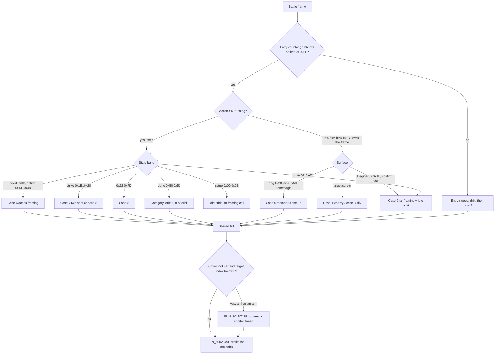
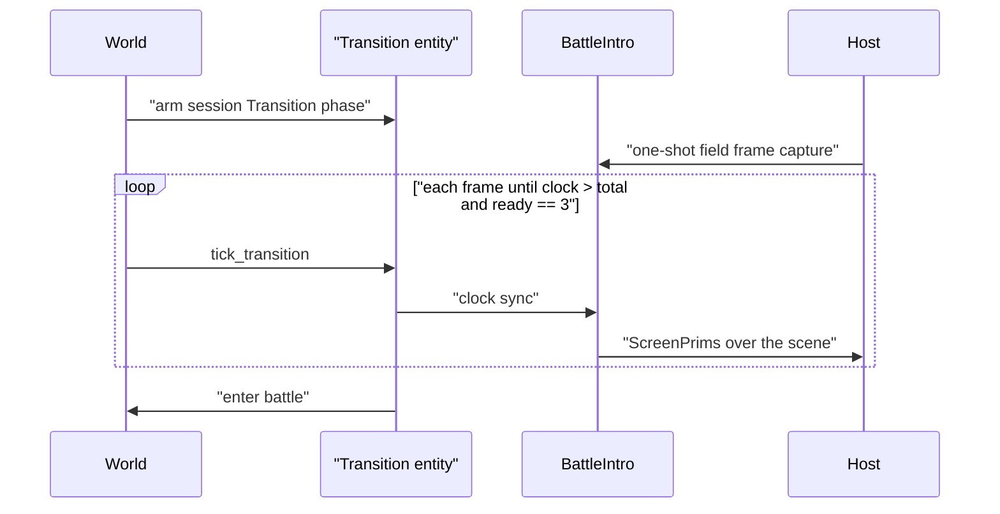

# Battle stage and camera

A battle has no arena file of its own. It is fought on a **stage** built from
three things: a procedural flat ground grid, a half-bowl backdrop shell drawn
twice (the scene's own `scene_tmd_stream` mesh), and the combatants. Over that
stage runs a **phase-scripted camera**: one dispatcher, `FUN_801D5854`, picks
one of ten framings per frame, and a tween builder eases the live pose toward
it. This page covers the stage geometry and its colour, the camera from the
battle-entry sweep to the post-strike shots, and the field-to-battle intro
transition that precedes both.

Terms used below: **GTE** is the PlayStation's geometry coprocessor, **CLUT** a
colour look-up table (palette) in VRAM, **PROT** the disc's main archive
(`PROT.DAT`), an **overlay** a code image loaded into RAM at `0x801C0000+`,
`ctx` the battle context struct ([`battle.md`](battle.md)), and **TR** the
camera's eye-space translation trio. Angles are 12-bit: `4096` is a full turn.

## At a glance

| What | Retail | Port |
|---|---|---|
| Ground grid emitter | `func_0x801d02c0` (battle overlay), the sole draw call of the mode-`0x15` render `FUN_80026F50` | `legaia_asset::battle_backdrop`, `battle_ground_grid` |
| Stage colour / depth-cue pass | `FUN_80050120` (ambient `0x8007B7B0`, far colour `0x8007BB48`) | `battle_ground_grid::ambient_base_step` / `backdrop_cue_step`, `World::tick_battle_ambient` |
| Stage stream selection | chunk walker `FUN_8001FE70` -> `_DAT_8007B864` | `ProtIndex::battle_stage_entry_for_scene` |
| Shell registration + second copy | `FUN_800513F0`; tables `DAT_80078B50` (mirror) and `DAT_80078C1C` (outdoor) | `battle_backdrop::MirrorXTable`, `SecondCopy`, `drawn_objects_tmd` |
| View matrix | `FUN_80026CE4` -> `FUN_80026F50`, Euler kernel `FUN_80026988` | `battle_cam_script::battle_vp`, `psx_camera` |
| Framing dispatcher | `FUN_801D5854`, jump table `0x801CEA00` (PROT 0898 file `0x1E8`) | `battle_cam_script` (phases, poses, glides) |
| Tween builder / walker | `FUN_801D829C` / `FUN_8002149C` | `battle_camera`, `Glide::chase` |
| Per-art attack camera | `FUN_801D71B8` | `battle_attack_camera` |
| Entry sweep | SCUS frame driver `FUN_80046A20`, counter `gp+0x330` | `BattleCamera::start_entry_sweep` |
| Frame step | `FUN_80016B6C` -> `DAT_1F800393` | `BattleFrameClock` |
| Intro transition | `FUN_801CF5BC`, PROT 0979 `field_battle_intro` | `battle_intro_transition`, `battle_intro_*`, `render-kernels::battle_intro` |

The VM-side modules live in `crates/engine-battle-vm` and are re-exported by
`legaia_engine_vm`. Camera inputs and the per-frame step are
`engine-core::battle_cam_inputs` (`World::tick_battle_camera`,
`World::battle_cam_pose`). Both hosts - the native `play-window`
(`crates/engine-shell/src/window/`) and the browser play page
(`crates/web-viewer/src/play_battle_render.rs`) - only read the pose.

Camera globals:

| Address | Meaning |
|---|---|
| `_DAT_8007B790` / `92` / `94` | rotation trio: pitch / yaw / roll, shared by the field and battle cameras |
| `_DAT_800840B8` / `_DAT_800840BC` / `_DAT_800840C0` | translation trio TR (x / y / z) |
| `_DAT_8007B6F4` | projection distance `H` (`256`), written to the GTE by `FUN_8003D254` |
| `_DAT_80089118` / `20` | negated focus (look-at) word pair |
| `DAT_8007BF10` | battle base matrix, `16384 * I` |
| `DAT_1F800393` | frame step |
| `ctx[+0x118C]` | tween step table |
| `ctx[+0x6D0]` | action depth, derived by `FUN_801F0348` from the framed monster's size class |
| `ctx[+0x6DA]` | per-action yaw counter |
| `ctx[+0xD]` | per-action camera style variant |
| `ctx[+0x26E]` / `ctx[+0x270]` | close-up ramp / death ramp |
| `_DAT_800846C0` | Battle Camera option (Close `0` / Normal `1` / Far `2`) |

## Battle background

The environment where the encounter triggered stays resident and renders as a
full 3D backdrop. The battle swaps the camera and overlays the actors and HUD.
For an overworld encounter the backdrop is two layers: the flat ground grid
and the map's `scene_tmd_stream` dome (sky and distant mountains). Both are
pinned from the four-angle capture set `overworld_battle_bg_angle_a..d` (one
Vahn-vs-Gobu-Gobu battle paused on the Begin/Run menu while the camera orbits).

<a id="backdrop-ground---a-procedural-flat-grid-func_0x801d02c0"></a>

### Ground grid (`func_0x801d02c0`)

The floor is not geometry from a file. `func_0x801d02c0` is a GTE rasteriser
that emits a flat tiled grid each frame
(`ghidra/scripts/dump_battle_backdrop_draw.py`; see also
[`functions/battle.md`](../reference/functions/battle.md#801d02c0)).

| Property | Value |
|---|---|
| Grid size | `_DAT_1f8003f8 × _DAT_1f8003fa` cells (28×28 live), on a `Y ≈ 0` plane |
| Cell pitch / sub-step | `0x200` / `0x100` |
| Origin | `x0 = -((w >> 1) << 9)`, `z0 = -((h >> 1) << 9) - 0x200` (`0x801d03b4..0x801d03d8`) |
| Span at 28×28 | `x ∈ [-7168, +7168]`, `z ∈ [-7680, +6656]` - one extra cell of `z` bias |
| Visibility buffer | `0x1000` bytes at `_DAT_8007b814` (up to ~64×64 cells) |
| Primitive | `POLY_GT4` (GP0 `0x0C000000`), four per visible cell |
| Texture page | 4bpp at framebuffer `(832, 0)`, tpage attr `0x000D` |
| CLUT | `(0, 479)`, CBA `0x77C0` |
| UV window | `(192..255)²`, one 64² window stretched over one cell |

**Two passes.** Pass 1 transforms each grid point and writes a per-cell
visibility byte into the buffer. Pass 2 transforms the corners of each visible
cell and emits its quads into the ordering table. The emit loop runs 2×2 times
per cell, so the sub-tile is `sub_row * 2 + sub_col`. The routine contains no
RNG and mirrors no corner: the tiling is deterministic. (A random corner mirror
does exist, in the effect-VM walker `FUN_801E0080` - `rand() % 4` gives two
mirror bits per child billboard.) These tiles are the 619 `POLY_GT4` in the
live primitive pool of the capture set. The grid is a full plane centred on the
actors, so it fills the ground at every orbit angle.

The grid is not the world-map continent heightfield: the `prim-trace`
"3715 hits in `0x80190000`" that suggested one were 3 degenerate `clut=0`
`POLY_FT4` prims flooding that window. The capture filed under the `0896` label
shows this same renderer and `_DAT_8007b814` buffer; it is battle-overlay code
seen through a mislabeled slot-A window image, and PROT 0896 itself is neither
the battle background nor an overlay that loads here.

<a id="the-grids-own-constants-read-off-the-emitter"></a>

#### Emitter constants

The sub-tile UVs are sixteen literal words the prologue builds into scratchpad
`0x1f800034` (`0x801d0304..0x801d03a0`). The emit loop reads back one group per
quad, advancing `0x10` each time (`0x801d0660` / `0x801d06c8`), and copies the
four UVs into the packet verbatim. Decoded as `POLY_GT4` UV words they are four
fixed 32×32 blocks of the `(192..=255)²` window:

| Quad | Words | `u` | `v` |
|---:|---|---|---|
| 0 | `77c0c0c0 000dc0df 0000dfc0 0000dfdf` | `0xC0..=0xDF` | `0xC0..=0xDF` |
| 1 | `77c0c0e0 000dc0ff 0000dfe0 0000dfff` | `0xE0..=0xFF` | `0xC0..=0xDF` |
| 2 | `77c0e0c0 000de0df 0000ffc0 0000ffdf` | `0xC0..=0xDF` | `0xE0..=0xFF` |
| 3 | `77c0e0e0 000de0ff 0000ffe0 0000ffff` | `0xE0..=0xFF` | `0xE0..=0xFF` |

The `clut` half of word 0 and the `tpage` half of word 1 carry the `0x77C0` /
`0x000D` address. The GT4 packets in the live prim pool of the Tetsu battle
states confirm them.

#### Where the tile comes from

The two addresses are constant for the whole game; the pixels behind them are
per stage. Each `scene_tmd_stream` entry carries its own TIM at framebuffer
`(832, 0)` with a palette at `(0, 479)` (`town01` is warm sandy pebbles). 178
of the 182 backdrop entries carry that pair, and no entry fills that page under
a different palette. The four that carry neither draw no floor: an untextured
grid would be a flat slab across the stage.
`battle_backdrop::ground_grid_drawable` is that decision, shared by every
viewer; the sweep is
`the_ground_tile_is_addressed_by_the_emitters_own_constants`.

#### The two culls

| Cull | Where | Rule |
|---|---|---|
| Depth | pass 1, per cell centre (`cop2 0x0480012` = `MVMVA` rotation / `V0` / `+TR` / `sf=1`, reading `IR3`) | `-1` when `z + 0x200 <= 0`, `0` when `z > 0x6500`, else `1` |
| Screen rect | pass 2 (`0x801d052c..0x801d05e8`) | drop when all four outer corners fall past the same edge of the `0x140 × 0xF0` display |

Only `1` emits: pass 2 skips on both the `bltz` and the `beq zero`
(`0x801d04b0` / `0x801d04b8`). Pass 1 has no screen-space test.

Both are ported and tested (`battle_backdrop::classify_cell` /
`cell_offscreen`), and the port's grid builder applies neither. They remove
only geometry that is off-screen or behind the camera, which a depth-buffered
projection discards anyway, and the port uploads the grid once while the camera
orbits over it.

<a id="the-grids-near-colour-and-cue-depth"></a>

#### Near colour and depth cue

Each lattice vertex is depth-cued by the GTE `DPCS` op from the `RGBC`
register. The emitter loads `RGBC` from scratch `0x1F800398`
(`lwc2 a2, 0x84(t9)` at `0x801d05f4`, `t9 = 0x1F800314`) and never writes it.
`FUN_80026CE4` rewrites that word every frame from the ambient word
`0x8007B7B0`.

**Ambient = stage base + `0x404040`.** The backdrop pass `FUN_80050120` stores
the ambient beside the far colour on every stage class
(`0x800507E0..0x800507F0`). The base is `ctx+0x890`, a packed `10:10:10` colour
(channel `c` at bits `2 + 10c`) that the pass ramps every frame on the latch
`ctx+0x243`:

| `ctx+0x243` | Ramp per lane | Per 8-bit channel per vsync | Limit | Code |
|---|---|---|---|---|
| set (`0x80050608`) | `- step * 0x20` | `-8` | floor `0x08020080` (base `0x20`) | `0x80050670..0x800506A4` |
| clear | `+ step * 8` | `+2` | ceiling `0x20080200` (base `0x80`) | `0x80050724..0x8005075C` |

`step` is the frame step `0x1F800393`. Settled, the base is `0x808080`, so the
floor's **near** colour is `0xC0` per channel: the texel is lifted by half
before the cue blends it toward the far colour. Every catalogued battle capture
outside a cast holds `0x8007B7B0 = 0xC0C0C0`. Battle init seeds the floor value
(`0x80051C84`), so every fight's floor fades in over its first 48 vsyncs. A
cast pulls the near colour from `0xC0` toward `0x60`. The far colour
`0x8007BB48` derives from the same word (`0x800507FC..0x80050834`).

**Who drives the latch.** The summon close-up (`FUN_801DC0A0` case `0x12`,
`sb v0,0x243(v1)` at `0x801DCCFC`) sets `ctx+0x243 = 1` on every `0x33` /
`0x34` pass. The summon band's `0x37` exit (`0x801E4E8C..0x801E4EA4`) and the
capture band's `0x71` exit (`0x801E5214..0x801E5248`) clear it together with
`ctx+0x278` and re-seed the base at `0x08421084` (`0x21` a channel), so the
floor climbs back from dark after the creature leaves.

**The store can freeze.** Once the base sits on the floor value, the pass skips
both colour stores when `ctx+0x278` bit 0 is set or `ctx+0x243 == 2`
(`0x80050790..0x800507D4`). It also clears bit 3 of `0x1F800394`, the gate on
`FUN_8001D058`'s call to `FUN_80026CE4`. The summon band sets `ctx+0x278 = 1`
at `0x32 -> 0x33` (`0x801E49F8`) and clears it at the `0x34` exit
(`0x801E4B14`), so through the close-up the grid holds its last pre-floor
ambient. The catalogued summon states agree: the `0x34` captures hold
`0x686868..0x787878` with the live base already at `0x20`, a `0x33` capture
still mid-ramp holds its live base plus `0x404040`, and every `0x35` capture
(stores resumed) holds `0x606060`. The frozen value varies with the frame step.

**The stage meshes do not ride the ambient.** The backdrop pair
(`ctx+0x106C` / `+0x1070`) has a parallel ramp in the same pass
(`0x800505B0..0x80050714`). Their `+0x78` depth-cue weight rises by
`step << 6` while `ctx+0x243` is set and falls back to `0` while it is clear.
The ceiling is `0x800` (indoor), `0xC00` (outdoor), or `0x1000` when
`ctx+0x278 > 1` or `ctx+0x243 > 1`. `FUN_8001ADA4` case 3 hands that weight and
the record's `+0x74` colour word (`0` from battle init) to `FUN_80043390`. A
weight of `0x1000` switches `+0x56` to `0`, which drops the pair from that
dispatcher entirely (`0x80050848..0x80050880`). The battle bodies are not lit
from the ambient either; `ctx+0x243` reaches them only through the tint pass's
plain arm ([the distance fade](battle-actor-rendering.md#the-distance-fade)).

**Cue depth.** `IR0` is `SZ >> 2` on the vertex's own screen depth, with no
battle world scale folded in. The `map01` Gobu Gobu capture's grid packets
(`mednafen-state display-list`, the `77C0/000D` family) climb from `0xCC` per
channel at the bottom edge through `0xE9` at mid-ground to the `0xFF` clamp at
the horizon. The bottom edge sits roughly `0xC00` deep under the far framing,
and `0xC0 + (0xFE - 0xC0) * SZ / 0x4000` lands there only with `SZ` unscaled.

**Port.** `battle_ground_grid::ambient_base_step` is the ramp,
`BattleActionCtx::ambient_base` the word, and `World::tick_battle_ambient`
runs it once a vsync, with the store-skip test over the band's and the slot-B
module's copies of `ctx+0x278`. `battle_ground_grid::backdrop_cue_step` is the
pair's `+0x78` ramp, stepped in the same tick; `BattleState::stage_outdoor`
(set by the host that resolved the stage) picks its ceiling. Both hosts build
the grid with `battle_backdrop::build_ground_grid_rgbc` over
`World::battle_ambient_base` (`build_battle_ground_grid` in `play-window`) and
cue it over the unscaled `grid_cue_far_z`. The native window re-uploads the
grid mesh when the ambient moves and re-derives the far colour every frame; the
play page re-reads the packet colours and the cue on the
`play_battle_ground_ambient_key` change key. Both hosts read the pair's weight
through `World::battle_backdrop_cue`: a flat per-draw cue toward black on the
stage draw, and no stage draw at all at full weight. A summon module drives
that by storing `2` or `3` into `ctx+0x278` (PROT 0903's arms 4 and 6), so
Gimard's attack plays inside its fire tunnel with nothing of the stage behind
it (`gimard_burning_attack` reads both records at `+0x78 = 0x1000`).

#### Viewers

The asset-viewer PROT browser and the browser entry viewer both draw the grid
under a backdrop. The grid is appended **after** the shell's second copy: it is
world-fixed, and handing it to the copy transform would draw it twice, once
flipped in `Z`. The browser viewer's VRAM upload is targeted at the blocks the
TMD's own primitives sample, so the grid's page is added to that request by
name (`ground_page_rect` / `ground_clut_rect`); without it the floor draws
untextured.

<a id="which-stage-stream-a-scene-fights-in"></a>

### Stage stream selection

A scene bundle is a fixed slot array: `.MAP`, v12 table, event scripts, asset
table, texture pack, then **one `scene_tmd_stream` per sub-area**. The battle
backdrop is whichever stream the type-`0x01` chunk walker `FUN_8001FE70` last
recorded in `_DAT_8007B864` (its sole writer, at `0x8001FEC0`). The choice is
scene data, not a code table, and it is not uniformly the block's first stream:

| Scene | Bundle slot | Extraction entry | Dome shape | Pinned from |
|---|---|---|---|---|
| `map01` (overworld) | 5 | 88 | 4 objects, 340 verts | the four camera-orbit angle saves |
| `town01` (Rim Elm) | 6 | 7 | 2 objects, 341 verts | the three Tetsu tutorial anchors |

Rim Elm's bundle carries four sub-area backdrops (entries 6..9); the Tetsu
sparring match is fought in the second. Each row is pinned by reading
`_DAT_8007B864` in a battle save state, taking object 0's live vertex pool, and
byte-matching it back to a PROT entry.

When scanning a block for the resident dome, reject hits beyond an entry's
unique length `(next_lba - lba) * 0x800`. An over-reading extraction of entry 6
also contains the Rim Elm dome, at offset `0x16038`, past entry 6's own
`0x14000`. Entries 7 and 8 share a vertex count, so only the bytes separate
them.

Port: `ProtIndex::battle_stage_entry_for_scene`, consumed by each host's
`build_battle_stage`. Tests
`crates/engine-core/tests/battle_stage_entries_real.rs` (disc) and
`crates/engine-shell/tests/battle_stage_live.rs` (save library).

<a id="backdrop-shell---two-copies-of-one-mesh"></a>

### Backdrop shell

The sky hemisphere, distant mountain ring and far ground ring come from the
scene's `scene_tmd_stream` entry (PROT `88` for `map01`) as `POLY_GT3` prims,
116 of them on screen in the angle-a capture. The entry lands contiguously in
battle RAM (base `0x800A8B34` for PROT 88, byte-matched across the four angle
saves; TMD magic `0x80000002` at file `+4`, uncompressed). PROT 88/89/90 share
identical geometry and differ only in texture payload.

The shell is authored as **half** a bowl. Across all 182 entries object 0 puts
at most 8 % of its X or Z extent past `X = 0` / `Z = 0`, and every object
satisfies `vert_top + n_vert * 8 == normal_top` exactly, so the half is the
real shape and not a truncated parse. A second draw of the same mesh closes the
circle.

| Constant | Value |
|---|---|
| Mesh registration | once, `80051a60 jal 0x80026b4c`; slot at descriptor `0x8007680c + 4` = `DAT_80076810` |
| Actors | two `actor_alloc` (`FUN_80020DE0`) calls, `80051a7c` / `80051aa8` |
| Actor pointers | `ctx + 0x106C` (copy A), `ctx + 0x1070` (copy B) |
| Part table | own `0x9C`-byte table per actor at `+0x44` |
| Draw mode `+0x56` | `3` = case 3 of `FUN_8001ADA4` (table `0x8001042C`); `0` = not drawn |
| Depth-cue weight `+0x78` | `0..0x800` indoor, `0..0xC00` outdoor, `0x1000` forced |
| Copy B default | `+0x26 = 0x800`, half turn about world Y |
| Copy B exception | `+0x5A = 2`, X scale `-1` (stage id in `DAT_80078B50`) |
| Mirror table | `DAT_80078B50`, `SCUS_942.54` file `0x69350`, zero-terminated `u16`, 99 slots / 98 stages |
| Outdoor table | `DAT_80078C1C`, 13 ids, flag byte `0x8007BDA8` |
| Stage id | `word[0x80084540] + byte[0x8007BD60] & 0x7F`; id + 3 = PROT extraction index |
| Object-1 drop | `80051ad4..80051bac`, gated on `DAT_8007B64B == 0` |

#### Texture classes

About a fifth of a shell by primitive count is `F*` / `G*` flat or gouraud
panels with a baked colour word and no UVs: the sky band, painted wall faces,
flat water. `town01`'s Tetsu arena is 325 textured triangles and 79 untextured;
`map01`'s dome is 336 and 78. Retail draws them together: `FUN_8001ADA4` case 3
walks the whole group chain.

The port builds them from two paths, because `tmd_to_vram_mesh` drops any prim
with no UVs. The native window pairs it with `tmd_to_color_mesh` on the
untextured pipeline; the browser page uses the single
`tmd_to_vram_mesh_field_hybrid` mesh with a per-vertex textured flag. Both
halves take the same second-copy transform (`ColorMesh::append_scaled` mirrors
the textured builder's, winding reversal included). Guard:
`the_backdrop_shells_untextured_half_is_a_double_digit_share` in
`crates/engine-core/tests/battle_stage_entries_real.rs`.

#### Shared VRAM across a bundle's stage streams

A bundle's stage streams are not allocated disjoint VRAM. Rim Elm's four
(extraction entries 6..=9) each declare the same two 4bpp pages, `(768, 0)` and
`(832, 0)`, under the same two CLUT rows, `473` and `479`; the field texture
pack puts a page at `(768, 0)` as well. Retail never arbitrates, because only
the stream recorded in `_DAT_8007B864` is resident.

The port's battle resource build uploads every TIM in the bundle
(`BuildOptions::upload_all_tims`), which leaves the last-written sibling
holding the address. `town01`'s semi-transparent cloud band (`(768, 0)` at `v`
191..254, palette `1` of row 473, a greyscale + STP ramp) would then draw
through a sibling's rainbow CLUT-cycling ramp as flat green rectangles.
`engine-core::scene::upload_battle_stage_tims_into_vram` re-uploads the
selected entry's own TIMs last; both hosts call it from `build_battle_stage`.
Sweeps: `rim_elms_four_stage_streams_all_claim_the_same_vram` and
`the_selected_stage_entry_owns_its_vram_after_the_reupload`.

<a id="two-actors-one-registered-mesh"></a>

#### Two actors, one registered mesh

`FUN_800513F0` registers the TMD once and allocates two actors from the same
descriptor (addresses in the table above). Both are ordinary battle actors on
the normal draw path, walked pointer-indirect, which is why `DAT_80076810` has
no resolved reader. They are two genuine draw entries: each gets its own part
table, zeroed in `actor_alloc` (`80020f04`) and allocated in the link pass
(`80021184`), and live battle states read two distinct table pointers.

`FUN_80050120` drives the pair in lockstep: the `+0x78` ramp and the `+0x56`
selector are written to both on the same path (`80050848..80050880`). `+0x56`
is read at `8001ae60 lhu v0,0x56(s0)`; the pair draws through `FUN_8001ADA4`,
not `FUN_80048A08`.

Copy A draws at raw coordinates. Copy B gets one of two transforms:

| Selector | Written by | Effect | Determinant |
|---|---|---|---|
| `+0x26 = 0x800` (default) | `80051bc0` / `80051bc4` | half turn about world Y | `+1` |
| `+0x5A = 2` (exception) | `80051cc4`..`80051ce4` | X scale `-1`, reflection in the YZ plane | `-1` |

`+0x26` is the second of the three half-words `FUN_80026988` reads at
`actor + 0x24`; that kernel writes `sin` of it into matrix element `[0][2]` and
`cos` into `[2][2]`, a Y rotation, and `0x800` of the `0x1000` turn is 180
degrees. The exception routes through `FUN_8001ADA4` case 3, which turns
`+0x5A & 2` into `_DAT_1F800348 = -0x1000` (`8001af28`..`8001af34`) and calls
`FUN_8005B4E8` (`ScaleMatrix`, column scaling, so the reflection is in model
space under the rotation). The predicate `+0x5A & 0xE` (`8001afd8`) negates the
per-object rotation argument and swaps the draw-call mode word from
`0x40000000` to `0x48000000`.

That mode-word swap disables culling rather than flipping a winding. The word
is ORed into the node's `+0x74` and handed to the prim dispatcher
`FUN_80043390` as its colour argument (`0x8001B014..0x8001B024`). The
dispatcher reads bit `0x08000000` as "both sides": the NCLIP mask it stores at
`-0x2D8(t2)` is `0xFFFFFFFF` without it and `0x7FFFFFFF` with it
(`0x80043520..0x80043540`), and every prim leaf ANDs the signed area with that
mask before its sign test (`and s2,s2,s3` / `bltz` at `0x80043E78` in the GT3
leaf `FUN_80043DD4`). So copy A, and copy B under the half turn, are back-face
culled; the mirrored copy B draws both sides. The two backdrop nodes of
`nivora_duel_pre_megaton_press` read `+0x74 = 0`, one with `+0x5A = 2`.

The port draws every battle mesh both-sided (`camera_view::nclip_cull_mode` is
`0` in battle). On that capture the difference is invisible: the shell's
`0x7640` additive group, which no retail packet of the frame carries, covers no
pixel of the port's frame either.

#### What the second copy covers

Projecting `map01`'s drawn objects through the camera of each angle capture
(yaw `_DAT_8007B792`, pitch `32`, `TR = (0, 1280, 7680)`, `H = 256`, read from
the save state) and counting the 320 screen columns the mountain ring covers:

| Capture | Camera yaw | One copy | Two copies | Retail pixels |
|---|---|---|---|---|
| a | 19.7° | 100.0 % | 100.0 % | 98.1 % |
| b | 334.7° | **71.9 %** | 100.0 % | **100.0 %** |
| c | 275.6° | 100.0 % | 100.0 % | 100.0 % |
| d | 231.3° | 99.7 % | 100.0 % | 100.0 % |

Capture **b** separates the models: one copy leaves columns `0..89` empty, and
the retail framebuffer has a mountain band in 90 of those 90 columns (mean
thickness 15.3 px).

#### The per-stage mirror table (`DAT_80078B50`)

The table is walked at `80051bc8`..`80051c18` against the stage id. A hit takes
the mirror; a miss takes the half turn. Every one of the 98 distinct ids
resolves to a `scene_tmd_stream` entry under the `+3` offset.

The table respects one geometric constraint. A shell whose open side faces `-Z`
is symmetric about `X = 0`, so a YZ reflection reproduces it in place and only
a half turn closes it. Of the 49 `-Z`-open shells in the corpus none is on the
mirror list; of the 133 X-open shells, 98 are. Sweep:
`no_z_open_shell_takes_the_mirror_transform` in
`crates/asset/tests/battle_backdrop_real.rs`.

`0007_town01` (stage id 4) is on the list: the Tetsu arena is completed by a
reflection. A half turn there plants a second village wall across the open sea
side (see
[`re-do-not-re-walk.md`](../reference/re-do-not-re-walk.md#the-backdrop-shell-is-drawn-once-so-no-completion-exists)).

Beyond that constraint the table is hand-maintained per-stage data and cannot
be inferred from the mesh. 39 backdrop meshes are carried byte for byte by more
than one PROT entry, and the table splits **12** of those groups across the two
transforms:

- `0730_concend` and `0736_conc3` are identical files (`concend` carries
  `conc3`'s three stage meshes in reverse slot order). The table names
  `conc3`'s variants and none of `concend`'s, so the same mesh is half-turned
  in one scene and mirrored in the other, and the colonnade and stairs sit
  differently around the ring. `conc` and `conc2` take the mirror alongside
  `conc3`; `urudre2` takes the half turn alongside `concend`.
- `0321_balden2` is mirrored and `0322_balden2` is half-turned on identical
  bytes, inside a single scene, which rules out a per-scene rule as well as a
  per-mesh one. That shell's cut section is symmetric in `z`, so the two draws
  are indistinguishable.

Sweep: `the_second_copy_transform_is_not_a_function_of_the_mesh`.

#### The outdoor table (`DAT_80078C1C`)

`80051c1c`..`80051c6c` scans a second zero-terminated `u16` table against the
same stage id and sets the byte flag `0x8007BDA8` (`gp + 0xA90`,
`gp = 0x8007B318`). Its 13 ids are the outdoor stages: the three variants of
each kingdom overworld (`map01` / `map02` / `map03`) plus `retona`, `deene`,
`kor5` and `rikuroa`. The 7 four-object shells are all inside the overworld
nine.

It is a depth-cue selector, not geometry. `FUN_80050120` reads the flag twice:

- `800505b8`..`800505c8` picks the `+0x78` ramp ceiling: `0x800` clear, `0xC00`
  set.
- `800507fc`..`80050834` picks how the far colour `0x8007BB48` derives from
  `ctx+0x890`: `>> 1` clear, `(c - 0x010101) * 2` set.

So it brightens the far-fog ramp on wide-open stages. Across 15 battle save
states the flag is `1` in exactly the captures whose stage id is in the table.

<a id="object-1-is-dropped"></a>

#### Object 1 drop

After allocating the pair, `80051ad4`..`80051bac` decrements each actor's
object count at `**(actor + 0x44)` and left-shifts the pointer array by one
from index 1 (`A[i] = B[i+1]`, `B[i] = B[i+1]`, `i >= 1`). The surviving draw
list is objects `0, 2, 3, ...`; object 1 stays resident, unreferenced. The 175
two-object stages draw object 0 alone, and the 7 four-object overworld shells
draw 0, 2 and 3. For `map01`: obj0 = sky (`Y` to `-10522`), obj2 = mountains
(`Y` to `-2257`), obj3 = flat far ground (`Y = 0`, inner radius `2889`), obj1 =
a near-detail prop that never appears.

The block is gated on `DAT_8007B64B == 0` (`80051abc` / `80051acc`). That byte
is bit 5 of byte `+8` of the field scene's encounter-region record
(`801DA09C`..`801DA0AC` in the field battle-intro overlay), the same byte whose
low 5 bits pick the stage variant. Set, it keeps object 1.

**Slot 1 of the draw list turns.** `FUN_8001ADA4`'s backdrop arm (draw
kind 3, `0x8001AF04`) post-rotates the composed matrix about Y ahead of each
object's prim walk, through `FUN_8004629C`, by a per-**slot** angle from the
table at `0x800891C8` (`lh a0,0x2(s1)` at `0x8001AFEC` / `0x8001B004`, `s1`
stepping `8` a slot; a reflected copy negates the angle first, `0x8001AFF4`).
The table has two references on the whole disc: that read, and one store in
the battle frame driver. On every pass, while the keep byte `0x8007B64B` is
up, `FUN_80046A20` adds half the frame step to slot 1's angle
(`0x800891D2 += *0x1F800393 >> 1`, `0x80046D34..0x80046D5C`). Nothing resets
it.

So the object a region keeps is the object that turns. On `nilboa`'s stage
(`638`, extraction 641) object 1 is twelve additive quads (group flags
`0x22`, the flat-textured leaf `FUN_80044DC8`; tpage `0x2D`, CLUT `0x77C1`) -
an arc of horizon mist, radius about `2330..2580`, height `614` - and it
drifts round the arena at one 4096th of a turn a frame. Where the band
stands in a capture is the angle its RAM holds: `nivora_duel_pre_megaton_press`
reads `1494`, `nivora_duel_pre_plasma_strike` `6867` (the draw masks it to
`0xFFF`). Drawn at the authored angle the arc sits on the far side of the
ring, a third the height and half missing; turned by the captured angle it
lands on retail's packets. A stage that drops object 1 never winds the angle
but still draws whatever sits in slot 1 - object 2 of a four-object dome -
at the angle the last keeping fight left.

The ribbon needs no special place in the ordering table. Its quads are
linked at their own mean depth like every other backdrop packet, and a
depth-tested mesh draws the same band once the arc stands where retail's
does.

The spin is `World::tick_battle_backdrop_spin` (once a battle frame) and
`legaia_engine_core::scene::backdrop_slot_1_basis`; both play hosts draw
slot 1 as one unbaked copy, twice a frame, under that basis
(`SceneHost::battle_stage_layers`).

#### Port

`legaia_asset::battle_backdrop` is the shared kernel: `MirrorXTable::from_scus`
parses the table, `drawn_objects_tmd` applies the object-1 drop, and
`SecondCopy::scale` / `flips_winding` give the second copy's transform (exact
integer diagonals). `Mesh::append_scaled` / `VramMesh::append_scaled` in
`legaia_tmd::mesh` append the transformed copy and reverse triangle winding
when the determinant is negative. The asset-viewer PROT browser and the browser
entry viewer both place backdrops this way and label them from the resolved
transform.

The play hosts add a black clear (`engine-ui::battle_stage_clear`): the draw
environments' background colour is `(0, 0, 0)` in every battle capture, so a
shell with no sky panel (a cave, a castle hall) shows black above it. Every
actor turns by its live facing `+0x46` (`f / 4096 * TAU` about Y) over a mesh
that rests facing `+Z`: a seated monster's `0x800` is the half turn that faces
the party, and the same rule turns an approaching attacker toward its target
and a fleeing party away from the fight. Actors and stage draw at the retail
[4× world scale](#the-4-world-scale).

<a id="battle-camera-exact"></a>

## Battle camera

### Projection and pose

In game mode `_DAT_8007b83c == 0x15`, `FUN_80026ce4` -> `FUN_80026f50` builds
the view matrix each frame through the Euler kernel `FUN_80026988` (cos table
`DAT_8007b7f8`, sin table `_DAT_8007b81c`), composed with the identity base
matrix `DAT_80010b84` and stored at `DAT_8007bf10`. For a PSX (Y-down) world
vertex `v`:

```
screen = H * (R*v + TR) / Ze          R = Rx(pitch) * Ry(yaw)
```

The far (round prompt) framing is the reference pose: `pitch = 32` (≈2.8°
down-tilt), `roll = 0`, `TR = (0, 1280, 7680)`, `H = 256`, look-at at the world
origin, and `yaw` the free orbit azimuth.
[`scripts/pcsx-redux/autorun_battle_render_capture.lua`](../../scripts/pcsx-redux/autorun_battle_render_capture.lua)
confirms it byte-exact on a `map01` battle save, reading at the
`func_0x801d02c0` breakpoint (at frame 0 the globals hold stale field state):
`mode=0x15 pitch=32 roll=0 TR=(0,1280,7680) H=256`, a 28×28 grid, battle actors
at scale `+0x72 = 0x1000` (1.0), and the dome registered at `DAT_8007C018[2]`.
`H = 256` and the base matrix hold through every phase; only the pose moves.

The port composes this as `Proj_H * T(TR) * R * F` (`F` = the renderer's
Y-flip). `battle_cam_script::battle_vp` is the shared matrix. In `play-window`:

| | `retail_battle_mvp` | `battle_dome_camera_mvp` |
|---|---|---|
| Pose | the fixed `TR = (0, 1280, 7680)` | the live phase-scripted pose |
| Role | camera-RE reference and regression target | every battle draw |
| Reached by | tests only (`#[allow(dead_code)]`) | the play-window battle path |

`retail_battle_mvp` matches the hand-rolled projection and the savestate
framebuffer to 0.0002 px. `battle_dome_camera_mvp` falls back to the far
framing at its minimum depth on the first frame. Both build on
`battle_mvp_with_tr`, which keeps the pinned projection a valid oracle for the
live one.

### How a frame's camera is chosen

Three owners hand the camera on in order: the SCUS frame driver's entry sweep,
the battle tick with its menu driver, and the action state machine. Each calls
`FUN_801D5854(actor, case)`, which builds three tween-target vectors and passes
them to the tween builder `FUN_801D829C`. The walker task `FUN_8002149C` then
moves the live pose.



`0x5A`, the end-of-action gate, arms nothing; the far framing takes over there
(`evil_medallion_rage_battle`, parked at `ctx[7] == 0x0A` with the flow byte
`0xFF` between actions, reads case 9's framing over its `±825` seats).

### Framing cases

`FUN_801D5854`'s case argument indexes a ten-entry jump table at `0x801CEA00`
(PROT 0898 file `0x1E8`).

| Case | Entry | Shot | Pitch | Yaw | TR | Focus | Tween `a3` |
|---|---|---|---|---|---|---|---|
| `0` | `0x801D59E0` | member close-up (ring, arts input, pickers) | `32` | `0x8F0 - actor[+0x46]` | `(-512, height[char], 2457)` | the member | `0xC` |
| `1` | `0x801D5A6C` | target cursor on one enemy; submenu-exit swing | `0x100` | `0x800 - bearing(target -> focus)` | `(0, 0x600, prescale(0x800))` | the commanding member | `0xC` |
| `2` | `0x801D5BB0` | menu-driver transition; the entry sweep's close-in | `0` | `0` | `(0, 0x600, 0x700)` | acting actor (the origin in the sweep) | `0xC` |
| `3` | `0x801D5BD4` | menu-driver transition; target cursor on one ally | `32` | `0x900 - ally[+0x46]` | `(0, height, 2457)` | the ally | `0xC` |
| `4` / `5` | `0x801D7138` | none - straight to the shared tail (whole-side cursors) | - | - | - | - | - |
| `6` | `0x801D5CE8` | per-action framing (in-fight arm; the battle-over arm only under `DAT_8007BD71 == 0xFE`) | `0` | `ctx[+0x6DA] - actor[+0x46]` | `(0, 0x500, ctx[+0x6D0])` | acting actor, live position | `0xC` |
| `7` | `0x801D65DC` | post-strike two-shot | `0` | as case 6, then a one-way unwrap | `(0, 0x500, ctx[+0x6D0])` | attacker-target midpoint | `0xC` |
| `8` | `0x801D67D0` | end of action, on the target | by target state | case 7's base `- 0x100` | by target state | the target | `0xC` |
| `9` | `0x801D6EF4` | far framing (round prompt) | `32` | passed through (orbit) | `(0, 1280, max(span * 3, 0x800))` prescaled | formation centre | `0xE` (`0x801D712C`) |

`a3` is a duration in display frames, and a camera step is two frames, so
`0xC` is a 6-step tween and `0xE` a 7-step one. `height[char]` is the
per-character table `0x801F4D2C`; it and the focus trio are detailed under
[case 0](battle-action-helpers.md#case-0---the-submenu-close-up-framing).

A PCSX-Redux camera trace on the `s5_tetsu_battle` anchor (rotation trio
`0x8007B790` and translation trio `0x800840B8` logged every vsync,
cross-checked against the catalogued mednafen Tetsu states) shows the same
cases as one solo fight plays them:

| Phase | pitch | yaw | TR | Motion |
|---|---|---|---|---|
| tutorial dialogue up | 0 | 0 | `(0, 1280, 1638)`, focus the speaking monster's seat `(0, 800)` | held static |
| dialogue dismiss | 0→32, `+6`/step | orbit resumes | z 1638→7680, `+864`/step | rate-clamped glide |
| Begin/Run menu | 32 | free | `(0, 1280, z)` | idle orbit `-4` yaw/step |
| command submenu | 32 | **2288** | `(-512, 1152, 2457)` | 6-step glide in, then held |
| submenu exit | swings 32→256→32 | eases to 0 | via `(0, 1536, 3276)`, back to menu TR | 6-step swing + 7-step return |
| target cursor (cursor `0x5A`) | 256 (enemy) / 32 (ally) | per case 1 / 3 | `(0, 1536, 3276)` / `(0, height, 2457)` | 6-step glide, re-armed per cursor move |
| action executing | 0 (or floor-tilted) | `0x800 − facing`, or `ctx[+0x6DA] − facing` | `(0, height, 0x500)` party / `(0, 0x500, ctx[+0x6D0])` monster | 6-step glide in, 7-step out, then held |

The traced numbers are one fight's instance of the formulas: the submenu yaw
`2288` is `0x8F0 - actor_facing`, and the menu depth lands on `7680` for the
solo Tetsu seats. Per-seat variation lives in the focus trio, which a solo
trace cannot tell from a constant.

### The tween is an ease-out

Every framing is **re-armed each pass**, so the three target vectors are
rebuilt from the live actor record each display frame and `FUN_801D829C`
re-emits the step table. The target is never frozen at the state change. Each
rebuild divides the remaining gap by `a3` again, and `FUN_8002149C` adds
`increment * frame_step` before the next pass. A pass therefore covers about a
sixth of what remains at the 30 Hz tick, and the camera is still closing in
long after the twelfth frame.

The step table at `ctx[+0x118C]` pins this in two captures.
`nivora_duel_mid_blazing_slash` reads yaw / TR z increments `59` / `55` with
`589` / `547` to go; `battle_noa_miracle_art_combo` reads `66` / `86` with
`587` / `772`. Each is exactly `ceil((rem + frame_step * step) / 0xC)`: a table
one pass old with one walk applied. A drifting yaw trails its counter by a few
units while the gap stays under `0xC` - the eight units the `0x19` parks read.

Port: `BattleCamera::retarget_action_glide` / `retarget_post_action_glide` /
`retarget_menu_glide` are the re-arms, each a `Glide::chase` over the case's
frame count. `retarget_menu_glide` skips only the two segments that are not a
walk to the far framing: the rate-clamped dialogue dismiss and the scripted
submenu-exit swing. The glide-table kernel itself is `battle_camera`
(`FUN_801D829C`).

<a id="the-resting-yaw-is-the-orbit-and-battle-init-zeroes-it"></a>

### Idle orbit and resting yaw

Battle init `FUN_80055B6C` overwrites the shared rotation trio: pitch `0x3C`,
yaw and roll `0` (`sh zero,-0x486e(at)` at `0x80055E84` is the yaw), TR
`(0, 0x500, 0x1C00)` (`0x80055E50..0x80055E90`). From there the yaw is a clock.
The entry sweep leaves it alone, case 9 passes it through, and two writers
decrement it by `DAT_1F800393 * 2`:

| Writer | Code | Gate |
|---|---|---|
| battle tick `FUN_801D0748` | `0x801D07AC..0x801D07CC` | flow byte `ctx[+6]` is `0x1E` / `0x32` / `0x6E` / `0xFE` |
| action SM `FUN_801E295C` | `0x801E2A3C..0x801E2A6C` | `ctx[7]` is `0x00` or `0x0B` |

The two never add up: the action SM does not run while the flow byte owns the
frame. A 240-vsync PCSX-Redux trace parked at `battle_gaza2_prompt`
(`scripts/pcsx-redux/autorun_battle_cam_orbit.lua`, Exec breakpoints on both
stores) counts the tick's store once per battle tick and the SM's never. The
prompt orbits at `-2` per display frame, which is `-4` per camera step (one
step per 2 vsyncs, -120 units/s).

No captured value is *the* resting yaw. Five battle save states at the
identical far framing (`ctx[7] == 0x00`, pitch `32`, `TR (0, 1280, 7680)`,
focus at the origin, `±800` seats) read yaws `224`, `2632`, `3136`, `3808` and
`3882`, because they were taken at five different times.

At yaw `0` the eye looks down the seat axis and the two rows project to the
same screen X. Retail opens every fight there and orbits out of it. **The port
does not**: it opens on the azimuth the field camera left, moved off the seat
axis by `battle_entry_yaw`. This is a port judgement, carried by
`BattleCamInputs::entry_yaw`, which `battle_cam_inputs` fills from
`World::locomotion.camera_azimuth`. The sparring fight is the exception and
keeps retail's zero: its sweep, its name hold and its caption close-up are
all framed on it.

<a id="the-battle-entry-sweep"></a>

### The battle-entry sweep

The SCUS frame driver `FUN_80046A20` owns the camera before the battle tick
does. Its entry counter `gp+0x330` (`0x8007B648`) counts the load up to `0x80`
and then, advancing by the frame step `0x1F800393` a pass, runs the sweep
(`0x80046EEC..0x8004700C`):

| Counter | Camera |
|---|---|
| `0x80..0xA1` | TR y `+= 0x30 * fs`, TR z `-= 0x40 * fs` from battle init's pose: the camera rises and pulls in |
| `0xA2..=0xC0` | `FUN_801D5854(0, 2)` every pass |
| past `0xC0` | parked at `0xFF`; the battle tick `FUN_801D0748` runs from then on |

Two captures of the sparring fight's entry pin it. `v0_1_battle_loading_tetsu`
(counter `0x84`) reads pitch `60`, `TR (0, 1472, 6912)` - four frames of drift
from `(0, 1280, 7168)` - with an empty step table. `s5_tetsu_battle` (`0xAF`)
reads pitch `16`, `TR (0, 2010, 3552)` under a case-2 step table whose
endpoints are `(0, 1536, 2867)`. The battle tick's first framing takes over
from wherever the sweep leaves the camera: the tutorial cuts to its dialogue
close-up, any other fight re-arms case 9.

Port: `BattleCamera::start_entry_sweep`, armed on a fight's first camera frame
(`BattleCamInputs::entry_sweep`). The port's battle tick does not wait for the
sweep, so the round prompt opens under it, and a command surface or an action
that opens under it (a fight that auto-acts on load) ends it early; retail
cannot open one there at all. The enemy-name intro keeps retail's order. Its
labels and their `ctx[+0x6D6]` hold belong to the battle tick's flow `0x0A` /
`0x0B`, which the frame driver reaches only past the sweep (`0x80046EF8` /
`0x80047014`), so the port neither shows nor drains them until the sweep is
over (`World::battle_entry_sweeping`).

The sparring fight keeps the whole of retail's order. The side-band arms
Tetsu's caption on the flow reading `0x14`, which retail reaches only past
the sweep and the name hold, so the port holds that fight's first round
start - and the battle loop with it - until both are done
(`World::sparring_open_held`): `s5_tetsu_battle`, caught under the sweep at
flow `0x00`, shows the bare arena, and `v0_1_battle_start_tetsu`, at `0x14`,
the caption over the close-up.

### Menu framings (cases 9, 0, 1, 3)

"A battle menu is open" does not select the close-up. The menu driver
`FUN_801D388C` arms both cases: `0x801D475C` / `0x801D53B8` pass `a1 = 0`,
`0x801D4908` / `0x801D5688` pass `a1 = 9`, and the battle tick arms case `9`
itself at `0x801D0E98`. The library's battle captures, keyed on the
command-flow byte `ctx[+0x06]`, show which surface takes which:

| `ctx[+0x06]` | Surface | Framing |
|---|---|---|
| `0x1E` | the round's Begin / Run prompt | case 9, both rows in frame |
| `0x28` | the member's command ring | case 0 on the member |
| `0x50` | the member's arts input | case 0, the same pose |
| `0x6E` | the commit confirm | case 9 again, after the submenu-exit swing |

**Case 9 follows the formation.** `FUN_801D0748` re-arms it per tick, so
`max(span * 3, 0x800)` and the bounding-box centre are rebuilt from the live
actor table. An attacker walks most of the way to its target during the
approach, collapsing the span onto the `0x800` floor; the depth has to recover
when it walks back.

**Case 0 is the member's.** The captures span Vahn, Noa, Gala and two Delilas
fighters on seats 0, 1 and 2, each on its own per-character height (`1152`,
`960`, `1408`) and its own seat as focus. The close-up holds from the ring
through the pickers it opens (the item and magic windows `0x3C` / `0x46`). A
commit lands on the next member's ring (`0x28`) or on the confirm (`0x6E`),
never on the round prompt, so between two members the camera stays in case 0.
The menu driver re-arms it with `a0 = ctx[+0x13]`, the member now commanding
(`lbu a0,0x2(s4)` with `s4 = ctx + 0x11`, at `0x801D4758` and `0x801D53B4`).
Port: `battle_cam_inputs`'s `member_surface_open` keys the phase on the ring
session as well as the submenu sessions, and `BattleCamera::set_actor` re-arms
the close-up when the actor changes under it. The item window carries no member
of its own and frames the member whose ring opened it.

**The target cursor is cases 1 and 3.** The menu driver re-arms `FUN_801D5854`
on every cursor step against the cursor's scope. The Attack command's steps
`0x0C` / `0x2D` / `0x30` (the `Auto` / `Command` prompt and the cursor it
opens) jump to `0x801D43C0`, case `1` on the commanding member. The item /
magic cursor steps switch on their scope argument: one enemy takes case `1`,
one party member case `3` on that member (`lbu a0,0x1dd` at `0x801D43F0`), and
a whole side cases `4` / `5`, which leave the framing as it stands.

- Case 1 (`0x801D5A6C..0x801D5B04`) takes its bearing from the cursor's target
  to the camera's current focus word `-_DAT_80089118/20`. With the target dead
  ahead on the seat axis that is yaw `0` - the "submenu exit" swing in the
  trace table.
- Case 3 (`0x801D5BD4..0x801D5C54`) is case 0 turned onto the ally: `TR.x = 0`,
  yaw base `0x900`.

Port: `BattleCamPhase::TargetEnemy` / `TargetAlly` over
`battle_cam_script::CursorFraming`, filled by `engine-core::battle_cam_inputs`
from the live picker for both hosts. No library save state is parked on the
cursor, so this framing rests on the disassembly and the trace's swing pose.

### The action framing (case 6)

The action SM arms case 6 before anything else in states `0x0C`,
`0x14`..`0x19`, `0x32`, `0x37`, `0x3C`..`0x40`, `0x46` and `0x47`. Because it
is re-armed every pass, the framing chases the actor: `0x14` stages the
approach walk and `0x19` runs it, and a party member crosses most of the gap to
its target before the swing. (At the close-up depth `prescale(0x500)` = 2048 a
focus pinned to the vacated seat would frame bare ground.)

Case 6 forks on `DAT_8007BD71 == 0xFE && slot < 3`
(`0x801D5CEC..0x801D5CFC`). `DAT_8007BD71` is the **battle-end signal**
([battle-action.md](battle-action.md#state-table)): the `0x5A` wipe scans and
the `0x66` escape teardown raise `0xFE`, SCUS `0x80056014` zeroes it at battle
init, and it reads `0xFF` for the whole of a running fight. Twelve battle save
states (five Begin/Run prompts, two mid-strike frames, three mid-approach
parks, the arts-input close-up and the tutorial open) all carry `0xFF`.

**In-fight arm (`0x801D64C4`)** - every action, party or monster, while a fight
runs. It frames the live position `actor[+0x34/+0x38]` with the focus height
left at the stage floor, on the case-table pose. The style byte `ctx[+0xD]`
selects three tweaks, and character id `4` overrides the whole translation.
Three PCSX-Redux captures parked in `ctx[7] == 0x19` with Gaza acting pin it
byte-exact: `TR (0, 1280, 5324)` from `ctx[+0x6D0] = 0xD00`, the focus trio the
negated `+0x34/+0x38` pair, the `ctx[+0xD] == 2` capture at pitch `0x80` over
`TR.y = 0x400`, and the live yaw eight units behind the counter.

**Battle-over arm (`0x801D5CFC`)** - the end-of-battle framing. It frames from
behind the actor (`yaw = 0x800 − actor[+0x46]`) at a height of
`−5 × actor[+0x3E]`, floored at `0x280`, with a quarter of the shortfall added
to the pitch so the camera tilts down instead of sinking (`0x801D6494`).
Between the base pose and that floor runs a per-character script dispatched at
`0x801D5D50` (`0x801D5DAC` / `0x801D5FC0` / `0x801D61E8` / `0x801D6440`,
rejoining at `0x801D645C`), which reads `actor[+0x1DB]` over the win-pose band
`0x11..=0x18` (bias `-0x11`, bound `8`). The port carries it behind
`ActionFraming::battle_over`, raised only by the battle-end sequence
([the victory camera](battle-round-loop.md#the-victory-camera)). `0xFE` is not
the in-battle state; see
[re-do-not-re-walk.md](../reference/re-do-not-re-walk.md#the-case-6-party-arm-is-the-battle-over-framing).

**The yaw counter `ctx[+0x6DA]` is a per-action ladder:**

| Event | Value | Code |
|---|---|---|
| `0x00` round-begin arm | `0` | `0x801E2B40` |
| `0x0C` seed arm | `0x800` | `0x801E2CF8` |
| seed's Attack branch entering `0x14` | `0x200` | `0x801E2F20` |
| party attacker's first swing-clip commit | `(rand() % 2) × 0x800 + 0x280`, and `ctx[+0xD] = 0` | `FUN_8004E13C` `0x8004E288..0x8004E2B4` |
| every SM pass | `+= max(1, 4 × frame_step / 3)` | `0x801E29E4..0x801E2A24` |

The swing-clip re-seed is reached from the anim commit `FUN_8004AD80` at
`0x8004BE28`, gated on the clip header byte `+0x87 == 2`, the previous commit's
not being `2`, and `ctx[+0x13] < 3`. So a monster's melee is filmed from the
`0x200` base and a party member's from `0x280` or `0xA80` - a three-quarter
view with both combatants in frame - while a spell or item keeps the seed's
`0x800`. The drift is about one unit per display frame; the
`battle_melee_hit_spark` capture reads `0x298`, `0x280` plus 24 frames.

Port: `BattleCamera::observe_action_state` applies the state-edge rungs. The
swing-clip re-seed is drawn by the world at the clip commit
(`crates/engine-core/src/world/actors/battle_anim.rs`, which also zeroes
`battle_ctx.camera_variant`) and applied by
`BattleCamera::observe_swing_reseed`. Both hosts get the style byte through
`battle_cam_inputs::battle_action_framing`, which reads
`World::battle_ctx.camera_variant` into `ActionFraming::style`. The action SM
writes the byte at its seed and narrows it per category arm, per
[`ctx[+0xD]`](battle-action.md#ctx0xd---the-per-action-camera-angle-variant).

### Post-strike shots (cases 7 and 8)

**Case 7** is the only framing that orbits both combatants. Its base
(`0x801D65DC..0x801D6694`) is the case-6 pose with the focus at the midpoint of
the acting actor and its target (`actor[+0x1DD]` through the actor table
`0x801C9370`), each component `(a + b) >> 1` and negated. Then:

- the shared `ctx[+0xD]` style fork: `1` / `3` add half a turn, `2` / `3` drop
  `TR.y` to `0x400` and tilt the pitch by `0x80`;
- a **one-way** yaw unwrap at `0x801D6700`: `yaw = (yaw - 0x700) & 0xFFF`, plus
  a full turn when that lands below the live `_DAT_8007B792`, so the swing
  never takes the short arc back;
- a pull-in at `0x801D6780` (pitch levelled, `TR.y += 0x40`, `TR.z = 3z/5`),
  gated on `_DAT_800846C0 == 0` and the acting actor's anim state.

**Case 8** is the same shape aimed at the target alone: an extra `-0x100` on
the yaw base, `focus.y` forced to the stage floor, a `-0x600` unwrap, and a
focus fork that falls back to the acting actor when `actor[+0x1DD] >= 8` or the
target's node is dead (`0x801D6870`). The focus fork tests the target's node
word `+0x4` (`0x801D682C`), not its HP, so a target killed but still drawn
stays framed. Both cases read the body pair `+0x3C` / `+0x40` for X / Z (the
live `+0x36` for case 7's Y), not the live pair case 6 reads.

**Which states arm them** is `FUN_801E295C`'s own fork:

| State | Entry | Case |
|---|---|---|
| `0x1E` strike loop | `0x801E35F0` | `7` every pass (`li a1,0x7` at `0x801E36EC`) |
| `0x1F` recovery wait | `0x801E3A88` | `7`; `8` when the target's anim `+0x1D9` is its knockdown `+0x1F1` or non-zero get-up `+0x1F2` |
| `0x20` return | `0x801E54EC`, fork `0x801E5660..0x801E56C0` | as `0x1F`; also `8` when a party slot faces a target in a death clip (anim `7` / `8`) |
| `0x52` / `0xFD` | `0x801E5F74` | `8` unconditionally |

`player_steal_skeleton_pre` (`0x1E`) reads case 7's tween targets;
`player_steal_skeleton_banner` (`0x20`, the skeleton on its knockdown at HP
`0`) reads case 8's death re-frame at the ramp cap.

#### Case 8 on a dead target

Case 8's tail from `0x801D69A8` forks on the framed target's live-HP halfword
`+0x14C`. The dead arm (`0x801D6A20`) lands three literals unconditionally at
`0x801D6AF8` - `TR.y = 0x300`, `pitch = 0x140`, `TR.z = ctx[+0x6D0]` - and
zeroes the yaw ladder beside them (`sh zero,0x4(t0)`, `t0 = ctx + 0x6D6`, so
the store is `ctx[+0x6DA]`): a death shot does not inherit the swing's orbit.
It then forks on the target's anchor height `+0x36` (`lh v0,0x36(v0)` at
`0x801D6B38`):

| target `+0x36` | Pose | `ctx[+0x270]` |
|---|---|---|
| `0` (body on the stage floor) | the three literals, unchanged | re-zeroed (`sb zero,0x270(a0)`, `0x801D6B4C`) |
| non-zero (still falling) | `TR.z = ctx[+0x6D0] - 4r`, `TR.y = 0x300 - r`, `pitch = 0x180 - (3r >> 1)` | left to ramp |

`r` is `ctx[+0x270]`, a byte ramp `FUN_801D5854`'s prologue advances beside
`ctx[+0x26E]` on every call: `8 x frame_step` per call, ceiling `0xC8`
(`0x801D5960..0x801D59B8`), no per-action reset, so a fight's second death
reads a ramp already at the cap. At the cap the re-frame is `TR.z - 0x320`,
`TR.y = 0x238`, `pitch = 0x54`: the camera drops, levels off and pushes in on
the falling body, then snaps to the flat pose the frame the body lands.

The lone-monster defeat fork above it (`ctx[+0x287]` / `ctx[+0x288]` /
`_DAT_8007BD0D` at `0x801D6AC8..0x801D6AF0`; `+0x288` is the
[defeat-fade latch](battle-action-helpers.md#ctx0x287-is-the-scripted-fight-flag-and-0x288-is-the-lone-monster-defeat-latch))
sends a scripted fight's lone monster, dying in place, to the same stand-off
arm as a gone node.

Port: `battle_cam_script::apply_death_reframe`, applied by
`BattleCamera::action_end_pose` whenever the post-action target reads dead; the
ramp is `battle_attack_camera::AttackCamCtx::death_ramp`, and the lone-defeat
fork is `PostActionTarget::lone_defeat`.

#### Case 8 on a live target (`0x801D6BFC`)

A target still standing takes a re-aim sized by how it stands:

| Target | `TR.z` (raw) | `TR.y` | Floor |
|---|---|---|---|
| party seat, animating (`+0x1D9 != 0`) | `0x600` | `-4y` level, `-7y/2` tilted | `0x280` |
| party seat, idle | `0x600` | `height[char] - 0x140` level, `- 0xC0` tilted | `0x280` |
| monster, animating (or `_DAT_8007BD84` set) | by formation id: `0xB4` `9z/10`, `0xA2` / `0xA7` `z`, `0x1F..=0x21` `8z/10`, else `7z/10` | `-7y/2` level, `-3y` tilted | `0x300` |
| monster, idle | as above | the live camera's `TR.y` and pitch, held | - |

`y` is the target's display height `+0x3E`, `z` is `ctx[+0x6D0]`, "tilted" is a
non-zero staged pitch (the style-2/3 tweak), and a floor raises `TR.y` to
itself while adding a quarter of the shortfall to the pitch. The
`battle_melee_hit_spark` capture (a swing on a monster held on its knockdown)
reads tween target `TR.z` `prescale(0x866)` = `3440` exactly and `TR.y` within
a few units of `-7y/2`.

Port: `battle_cam_script::apply_live_target_reframe`; `recover_framing` /
`action_end_framing` are the two cases, armed by the `Recover` / `ActionEnd`
phases, and `post_strike_phase` runs the fork on `World::battle_on_knockdown` /
`battle_current_anim`.

### The Done band (`0x50..=0x52`)

The `0x50` arm seeds a tail timer `ctx[+0x6D8] = 0x3C` and leaves for `0x5A`
when the frame step drives it negative, so the per-action framing survives ~60
display frames past the strike. A non-zero `ctx[+0x15]` raises the seed to
`0x96` (150 frames) at `0x801E5F2C..0x801E5F3C`.

The framing forks on the action category, in the `0x50` arm
(`0x801E5E90..0x801E5EF4`) and identically in the `0x51` arm
(`0x801E5FC0..0x801E6018`):

| Condition | Framing |
|---|---|
| `actor[+0x1DE] == 5` (Run) | no framing call; the yaw orbit runs |
| `actor[+0x1DE] == 3` (Attack) | case `8` (`li a1,0x8`) |
| the target is a party seat whose live HP `+0x14C` is zero | case `8` |
| everything else | case `6` (`li a1,0x6`) |

The seat test reads the spill `sp+0x20`, which the prologue fills from
`lbu t2,0x1dd(s3)` (`0x801E29B0`): the **target** index, beside `s8`, the
target actor - not the acting seat `ctx[+0x13]`. A party caster whose spell
killed a monster therefore keeps case 6 on itself through the tail
(`shiny_refactor_gimard_levelup`: target slot `3` at `0` HP, step-table
endpoints case 6's). `zora_glare_petrify_post` (`ctx[7] == 0x51` after a
monster's spell) reads pitch `0`, `TR (0, 1275, 4820)` - one tween step short
of case 6's `(0, 0x500, prescale(0xC00) = 4915)` - with the focus on the
caster's own seat and the yaw `ctx[+0x6DA] − actor[+0x46]`.

The other bands, for reference: the setup band (`0x00`, `0x0B`) arms nothing
and runs the orbit; the Run band (`0x64..=0x67`) arms case `9` plus the orbit.

Port: `battle_cam_script::done_band_phase` over `DoneBandInputs`, which both
hosts fill from the acting actor; the Done band films per category and the tail
is bounded by the same `0x3C`-frame timer. Note the far framing at a collapsed
formation's `0x800` floor (`z = 3276`) is a closer shot than the in-fight arm's
`4915`. Guards: `the_done_band_owns_the_action_framing_until_end_of_action`,
`a_monster_spell_done_tail_reads_the_zora_capture` and
`a_real_turn_films_its_done_tail_and_hands_back_at_end_of_action`.

### The per-art attack camera (`FUN_801D71B8`)

`FUN_801D71B8` is an override, not part of case 6. Its only call site is
`FUN_801D5854`'s shared tail (`0x801D7180`), after whichever case has handed
its pose to the tween builder, gated on `_DAT_800846C0 != 2` and the acting
actor's `+0x1DD < 8` (`0x801D7138..0x801D7178`). It therefore overrides cases 7
and 8 as well as case 6, which matters because the strike loop, where most art
swings are filmed, is case 7. Its first test is the target's live HP
(`0x801D71E8..0x801D7208`), so a death re-frame is never overridden.

The routine seeds a **fresh** pose from the actor - pitch `0`, yaw
`−actor[+0x46]`, `TR = (0, 0x400, 0x400)` (`0x600` height for character `3`),
look-at the negated actor position - runs a per-character / per-art arm over
the second band `0x1A..=0x2D`, and calls the same tween builder again with a
much shorter duration (`1`, `3` or `6` display frames). The last call owns the
step table that frame. An art id with no arm returns without arming anything,
and the case's framing stands. Both the seed depth and the arms' folds make the
swing close-up tighter than case 6's `0x500`, ramping as `ctx[+0x26E]` climbs.

The arm offsets come from the disc table
[`battle-attack-camera-table.md`](../formats/battle-attack-camera-table.md),
whose two columns are a per-action coin flip rather than two swing phases; that
page carries the row map, the ramp counters and the `actor[+0x1DB]` id space.

Port: `battle_attack_camera` runs the thirteen arm bodies and owns the ramp
quartet; `battle_cam_script`'s Action phase steps the live pose toward whatever
the arms produce, each frame, on the arm's own duration. Both hosts feed it the
same three per-actor channels: `actor[+0x1DB]` as `BattleActor::latched_anim`,
`actor[+0x21B]` as `hit_count_bound`, and `actor[+0x22C][+0x68]` from the
battle animation player's cursor, `<< 4` into retail's sixteenths.

### The Battle Camera option

The options screen's Battle Camera row (Close / Normal / Far, config word
`_DAT_800846C0`, [field-menu](field-menu.md)) is not a distance. Retail reads
it in four places, each making the action shots calmer as it rises:

| Site | Close (`0`) | Normal (`1`) | Far (`2`) |
|---|---|---|---|
| action SM prologue `0x801E29D4`: `ctx[+0x6DA]` drift and the setup-band orbit | run | run | skipped |
| case 7 pull-in `0x801D6724` | allowed | - | - |
| case 8 `0x801D6958..0x801D69EC`: yaw | built | built | the live `_DAT_8007B792` |
| case 8's dead- / live-target arms | run | skipped | skipped |
| `FUN_801D71B8` call `0x801D7138` | run | run | skipped |

Case 8 keeps its arms on Normal / Far in a scripted fight (`ctx[+0x287]`) once
the results phase word `_DAT_8007BD2C` is non-zero.

Port: `World::toggles.battle_camera`, pushed by `OptionsState::apply_to_world`
on both hosts and read through `BattleCamera::set_camera_option`. Two parts are
not carried: the scripted-fight exception above, and the skipped setup-band
orbit store (the port runs one orbit for both of retail's writers).

<a id="the-battle-frame-step-is-the-frames-own-cost"></a>

### The frame step

Every per-frame battle path - the camera walker `FUN_8002149C`, the effect
waits, the root-motion term - scales by the frame step `DAT_1F800393`. The
frame driver `FUN_80016B6C` rebuilds that byte every frame from what the frame
cost:

1. The newest frame time (`FUN_800173BC`'s `VSync(1)` hblank count) goes into a
   sixteen-entry ring at `0x80084098`, index `gp+0x440`, clamped to `0x2BC` at
   `0x2D0` or more (`0x80017098..0x800170CC`).
2. The step is the ring's maximum against `0xF1` / `0x1FF` / `0x2D1` - `1` /
   `2` / `3`, else `4` (`0x80017108..0x8001715C`).
3. It is raised to the floor `0x8007B9D8` (`0x80017170..0x80017198`).

Only mode word `gp+0x4CE == 0x10` measures; a non-zero `gp+0x5D8` forces the
step instead.

The battle's floor is `1` in every catalogued battle state, so the step is the
load alone, not a property of the game state. Across the battle captures the
ring reads `2` on about three in five. Summon close-ups, module casts, the arts
input and the Spirit-heavy Delilas fights read `3` (`theeder_summon_mid_cast`
peaks at `625`, `gimard_burning_attack` sits at the `700` clamp); two light
casts and the battle-loading frame read `1`.

A capture recovers only its newest sixteen frames. `gp+0x480` counts frames and
the libetc vsync count `0x8007A894` counts vsyncs, but the frame counter
restarts somewhere no `SCUS_942.54` store shows (only its increment at
`0x80016BA8` is there) and nothing records the vsync count beside it. Two
captures of one session show how mixed the steps are:
`player_steal_skeleton_pre` to `_banner` is `304` vsyncs over `115` frames.

**Port.** The engine ticks once a vsync, which keeps every per-vsync rate
whatever the step; the step only places the frame boundaries.
`BattleFrameClock` groups the ticks into frames - two vsyncs by default - for
the root-motion carry and the camera (`BattleCamera::set_frame_step`). The
camera keeps every tween's length in display frames: a step fires every `step`
vsyncs, the walker scales each increment by it, a tween armed over `a3` frames
lands in `a3 / step` steps (`frames_to_steps`; `steps_of` for the glides
authored in default-step steps), and the idle orbit turns `2 * step` a step.

Play keeps the default. A replay that knows retail's step installs it while the
action SM sits in one state (`World::seed_battle_frame_step`). The
retail-compare drive does so for a replayed cast caught in the summon close-up
`0x33` / `0x34`, where each pass re-arms case `0x12`'s three-frame tween: at
step `3` the walker lands it every pass, at `2` it trails
([retail-compare](../tooling/retail-compare.md#an-ease-out-camera-carries-its-history)).

The cast modules keep their per-vsync passes. Run once a battle frame with
every drain, drift and ramp scaled by the step (retail's own shape), they
measured worse on the step-`3` captures: `nova_summon_mid_cast` `image` `.963`
to `.717` (its flash fade spawned up to two vsyncs later),
`gimard_burning_attack` `camera` `.965` to `.932`. The captures these modules
reach are placed by the module's own arm and countdown
([retail-compare](../tooling/retail-compare.md#driving-to-the-phase)).

### Screen shake

`FUN_801D9D30` jitters the translation pair `0x800840B8/BC` by two LCG samples
masked to `0xFFFFFF >> (0x15 − amplitude)`, where the amplitude is
`_DAT_8007B630`. That global has one retail non-zero writer: field-VM opcode
`0x4C` outer-nibble `8` sub-`4` (`[4C, 84, amplitude]`, arm `0x801E2134`,
jump-table slot `0x801CEF58`); the scene reset `FUN_8003A024` zeroes it.
`FUN_801D9D30`'s only callers are the field-family overlay's per-frame camera
updaters (`0x801D1344` and siblings), so in retail the shake is a field effect
and no caller is resident during a fight.

The port models the opcode (`FieldHost::op4c_n8_sub4_set_b630` ->
`World::camera.shake_amplitude`) and steps the kernel from the shared battle
camera, which owns the same translation pair. The offset is held beside the
framing pose rather than inside it, so a live shake cannot stall a rate-clamped
glide.

### The 4× world scale

The battle base matrix `DAT_8007BF10` holds `16384 * I` (GTE `4096` = 1.0, so a
**4.0× uniform scale**) in every catalogued battle savestate at every orbit
angle. It is a base, not the composed rotation; the composed view matrix lives
in GTE scratch `0x1F8003C8`. The actor render `FUN_80048A08` multiplies that
camera matrix per actor (`FUN_8005B3A8(&DAT_1f8003c8, ...)` with the actor's
`+0x24` rotation trio, GTE TR from the actor's `+0x2C` view-translation trio).
The actors and their stage translations therefore draw at 4× under the same
camera. That is what makes the small battle meshes (party 134–284 units,
monsters 77–368) read at retail size against the deep translation:
`256 * 4*370 / 7680` ≈ 49 px for a 370-unit monster.

The 4× comes from the base matrix, not from the actor field `+0x78`, which
`FUN_8001ADA4` passes as `FUN_80043390`'s IR0 depth-cue argument
([`renderer.md`](renderer.md)).

**Every battle draw class rides the scale in the port.** The backdrop is
registered as an ordinary background actor (`FUN_800513F0` -> `FUN_80020de0`
alloc), so the port lifts the arena and the ground grid with the same
`BATTLE_WORLD_SCALE = 4.0` (`PlayWindowApp::battle_stage_model` natively,
`BattleMesh::stage_positions` in the browser upload). The camera's translation
trio is authored in this scaled space: the far framing's `TR.z = 7680` is the
eye distance to a formation whose seats are `±800` before the scale. A draw
class left at 1× would orbit at four times the intended radius and sit
`3 × seat` away from its actors, a fault invisible on a centred formation at
the far framing. Guard: `the_ground_under_an_actor_projects_under_the_actor`
projects each retail seat through both classes at every framing and requires
the same pixel.

The grid's `DPCS` ramp window is **not** scaled: it is keyed on view depth
`SZ`, and the scale is a model transform under a camera whose translation is
already in view units
([near colour and depth cue](#near-colour-and-depth-cue)).

## Field-to-battle intro presentation

The transition between leaving the field and the battle scene coming up is its
own overlay, PROT 0979 `field_battle_intro`. It sequences the battle handoff
and drives one of five visual styles. Both halves are live on both hosts.



### Handoff

`FUN_801CF5BC` is ported as `battle_intro_transition::tick_transition` and
driven once per frame by `World::tick_battle_intro` while the encounter session
sits in its `Transition` phase. Phase 7 is terminal: it raises `ready` bit 1
and stops advancing, and bit 0 comes from the post-switch spin test, so
`ready == 3` is the completion state.

Every battle entry rides this phase, as in retail: the field step roll, a
scripted carrier fight (the op-`0x3E FF` / dialogue-engage path,
`World::begin_field_carrier_battle`), and a world-map contact
(`World::begin_world_map_encounter`). A scene with no session of its own
(towns, the overworld) gets a bare bracket installed on demand
(`World::install_encounter_bracket`). A post-battle `Grace` window never
swallows a story fight (it is reset before arming). The drain into the actual
entry runs in every relevant mode: `live_field_tick` under the live loop, a
live-loop-off arm of the `Field` tick (`--no-live-loop` gates the roll, never
an armed fight), and the `WorldMap` tick (which drains into
`World::enter_world_map_battle`).

**Duration.** The session's `Transition` length is the intro's own
`DAT_801D2458`: 132 display frames, 252 for the swirl
(`battle_intro_styles::intro_duration_frames`,
[`cutscene.md`](cutscene.md#how-long-a-transition-runs-dat_801d2458)). The
entity clock counts up to the number the session counts down from. Every fade
ramp is a lead before it, and the tile shatter's records hold at their seeded
pose until `delay < elapsed * 0x3C` with `delay = rand() % 5000`, so the grid
needs ~84 frames just to finish starting.

### The five styles

| Style | Retail tick | Simulation port | Packet builder port |
|---|---|---|---|
| Scatter particles | `FUN_801CFDA0` | `battle_intro_styles::tick_particle_field` (`PARTICLE_TICK_A`) | `battle_intro::emit_particle_field` |
| Scatter with spin-up | `FUN_801D0370` (+ ring tail `FUN_801D1CFC`) | same, `PARTICLE_TICK_B` | same + `emit_spinup_ring` |
| Tile shatter | `FUN_801D0D24` | `battle_intro_tiles::tick_tile_grid` | `battle_intro::emit_tile` |
| Swirl fan | `FUN_801D1888` / `FUN_801D1A20` | `battle_intro_swirl::tick_swirl` | `battle_intro::emit_swirl_band` |
| Screen-strip curtain | `FUN_801D11D0` | `battle_intro_styles::tick_curtain` | `battle_intro::intro_quad_to_screen` |

The simulation kernels are in `crates/engine-battle-vm`. The packet builders
are `crates/render-kernels/src/battle_intro.rs`, re-exported as
`engine-ui::battle_intro` and `engine-render::battle_intro`. `BattleIntro`
holds the style's working set between frames and synchronises its clock from
the live transition entity. The one-shot field frame capture lands the drawn
field in the texture pages each style's packets name (`Renderer::capture_rgba`
-> `land_capture_rgba` on the native window, `gl.readPixels` ->
`play_intro_land_capture` on the page). The emitted `ScreenPrim`s composite
over the scene: through `RenderTarget::SceneWithScreenPrims` natively, through
the page's screen-prim pass in the browser. The hosts differ only in how the
captured frame is read back
([`host-drift.md`](../tooling/host-drift.md#screen-space-psx-primitives-across-the-two-hosts)).

Per-style packet detail - what each emitter builds, the dispatcher flag decode,
and the two nuances the port leaves un-carried - is on
[`cutscene.md`](cutscene.md#per-style-emitters-render-track-gtegpu).
`crates/engine-render/src/tests/battle_intro_emitter.rs` pins per-style packet
counts, geometry and OT linkage, and
`crates/engine-vm/tests/battle_intro_chain.rs` the working-set arithmetic.

<a id="the-curtain-is-a-render-to-texture-and-only-its-row-pass-is-on-screen"></a>

### The curtain: a render-to-texture

`FUN_801D11D0` draws two passes to two different places. Between them it links
draw-environment packets into the ordering table; a higher OT bucket draws
first:

| OT bucket | Packet |
|---|---|
| `0x1F4` | `SetDrawOffset(0, 0)` + `SetDrawArea(320, 0, 320, 240)` |
| `0x1EA` | `FUN_801D1D9C(0x1EA, 2, 0x808080)`, the mid-pass emitter |
| `0x1C2` | the column strips |
| `0x190` | `SetDrawArea(0, y, 320, h)` + `SetDrawOffset(0, y)`, the back buffer |
| `0x12C` | the row strips |

The column pass runs with the draw area on VRAM `(320, 0)` and its offset at
zero, so its primitive coordinates are absolute VRAM. `CURTAIN_COL_DRAW_BIAS`
(`0x1E0`) makes that fit: a column that passes the visibility test (which
re-centres on `0xA0`) lands at `x` in `320..640`. That rect is what the row
pass's texture pages `0x105` / `0x108` decode to, so **the row pass samples
what the column pass just drew**. The image is warped horizontally into an
intermediate, then sliced vertically out of it; only the second slice reaches
the display.

Retail never clears, and the effect rides on two decays:

- **Display side.** `FUN_801D11D0` re-arms the screen wash
  `FUN_8004695C(0x80808)` at the top of every frame
  (`0x801D1228..0x801D1230`), so a scanline decays by 8 per channel behind the
  ones drawn after it - ~31 frames to black.
- **Intermediate side.** The mid-pass emitter `FUN_801D1D9C`
  (`ghidra/scripts/funcs/overlay_field_battle_intro_801d1d9c.txt`) is
  `FUN_80024EE4`'s shape pointed one screen right: a five-word `0x2B`
  semi-transparent quad over `x 0x140..0x140+W, y -4..H` (the display halfwords
  `_DAT_1F80038C` / `_DAT_1F80038E` biased by `0x140`) behind a
  `SetDrawMode((abr << 5) | 0xE)` packet at the same layer. With the curtain's
  arguments it subtracts `0x80` per channel from the whole intermediate each
  frame, between the draw-area install and the column strips, so a culled
  column ghosts out over two frames.

Port:

- The one-shot field capture goes in the *columns* rect only
  (`capture_rects_for`); the rows rect is the intermediate, overwritten every
  frame.
- `battle_intro::compose_curtain_intermediate` rasterises the column pass on
  the CPU, because a screen-space quad list has no render-to-VRAM target. The
  intermediate persists across frames and decays by one mid-pass step.
- A CPU model of the display buffer - seeded from the same field capture
  retail's init lands in both display buffers, decayed one wash step per frame,
  overdrawn with each frame's row strips - is uploaded into a spare VRAM rect
  and drawn as textured backdrop quads behind the live strips
  (`battle_intro::CURTAIN_TRAIL_RECT` + siblings), so the gaps between
  departing rows show the fading trail.

Two disclosed approximations: the wash drain (`FUN_80046978`) scales its
constant by the scratchpad brightness byte, taken at full brightness; and
retail's display is double-buffered, so its per-buffer trail may interleave at
half this rate. The second is an inference; settling it needs a retail frame
capture of one of the three curtain formations.

### The transition owns the whole frame

Retail's transition init writes game mode `9`, and the field renderer does not
run again until the completion arm hands over (details, including the capture
chain and the per-style fade blend modes, on
[`cutscene.md`](cutscene.md#the-transition-owns-the-whole-frame)). The port has
no such mode: it composites the transition's primitives over a live scene.

`battle_intro::backdrop_prim` stands in for the absent mode: an opaque
display-rect quad at the farthest OT bucket, emitted on every frame of the
window as `prims[0]`, including frames a style draws nothing on. It keeps a
rest-pose patch from drawing additively over a live copy of itself, and keeps
the live field hidden once the last particle expires.

The dry stretch is retail's own. `FUN_801D0370` decays a moving particle's
colour by `-0x50505` per frame, and the tick's top-byte test masks it for good
once that underflows, so the spin-up field expires around a third of the way in
and the fade ramp does not start until `total - 0x18`. Retail spends the gap on
the CD: phase 5 issues the battle-data read and phases 3 and 6 sit in
`FUN_8003DE7C`'s "READ WAIT" poll. Because the completion arm needs
`clock > total` **and** `ready == 3`, the 132 frames are a floor rather than a
length. The port's loads are instant, so the floor is the whole window and the
gap draws as black. Guard: `every_transition_frame_covers_the_screen` in
`crates/engine-render/src/tests/battle_intro_emitter.rs`.
