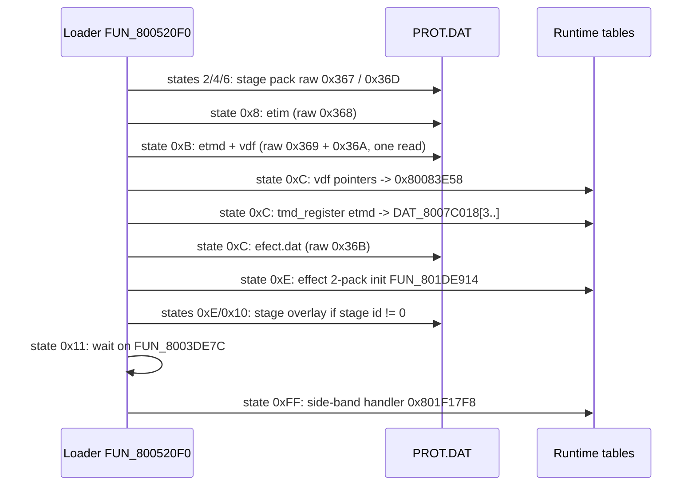
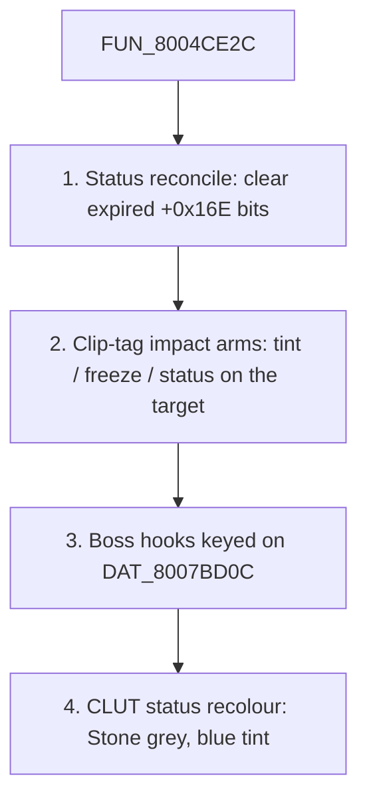

# Battle subsystem

A battle is run by two cooperating bodies of code. The static executable `SCUS_942.54` carries the scene loader, the seat stager, the monster and party-file loaders and the per-frame actor passes. The **battle overlay** (extraction PROT entry 0898, loaded at RAM `0x801CE818` - the slot the town overlay also uses, so the two never coexist) carries the command menu, the action state machine, the HUD and the effect cluster. Both work on one battle context struct and an eight-slot actor pointer table.

This page is the hub: how a battle loads, the records it works on, and where each remaining topic is documented. The from-scratch Rust port runs the same pipeline - battle entry, command ring, action state machine, rewards and the return to the field are all live on the native window and the browser play page.

## Where things live

| Topic | Page |
|---|---|
| Scene loader, context struct, actor record, seats, monster record + archive, heap budget, character record, per-frame actor passes | this page |
| Command menu flow byte `ctx[+0x06]`, round loop, commit / confirm, target picker, tutorial and boss stage overlays (967 / 968 / 969) | [`battle-command-flow.md`](battle-command-flow.md) |
| Action state machine `FUN_801E295C` (state byte `ctx[+0x07]`) and its port | [`battle-action.md`](battle-action.md) |
| The state-`0x51` exit gate, the HP-bar settle invariant, the two retail softlock classes | [`battle-action-exit-gates.md`](battle-action-exit-gates.md) |
| Helpers the action SM calls (AI delegation, escape roll, summon dispatch, voice cues, PRNG) | [`battle-action-helpers.md`](battle-action-helpers.md) |
| Action queue, Tactical Arts as attack-band actions, Miracle / Super Arts, action validator | [`battle-action-queue.md`](battle-action-queue.md) |
| Ground grid, backdrop shell, battle camera, entry sweep, field-to-battle curtain | [`battle-stage-camera.md`](battle-stage-camera.md) |
| Party mesh assembly, monster mesh, tint passes, weapon trails, after-image ghosts | [`battle-actor-rendering.md`](battle-actor-rendering.md) |
| HUD model, screen chrome, widget classes, banners, the item window | [`battle-hud.md`](battle-hud.md) |
| Encounters, status effects, monster AI, capture, rewards, results, party wipe, the port's Field / Battle loop | [`battle-round-loop.md`](battle-round-loop.md) |
| Damage, accuracy, escape, spoils and RNG kernels | [`battle-formulas.md`](battle-formulas.md) |
| Seru-magic cast modules (PROT 0903..0966) | [`cast-module.md`](cast-module.md) |
| Arts AP gauge and per-command cost | [`arts-command-gauge.md`](arts-command-gauge.md) |
| Post-battle XP and stat growth | [`level-up.md`](level-up.md) |
| Formats: encounter record, player battle files, monster animation | [`encounter.md`](../formats/encounter.md), [`battle-data-pack.md`](../formats/battle-data-pack.md), [`monster-animation.md`](../formats/monster-animation.md) |

## At a glance

| Item | Value |
|---|---|
| Battle overlay | extraction PROT 0898, base `0x801CE818` |
| Scene loader | `FUN_800520F0` (SCUS), sub-state byte `gp+0xA59` |
| Per-frame tick | `FUN_80046A20` (SCUS) - drives everything below |
| Command menu / round driver | `FUN_801D0748` (overlay), switch on `ctx[+0x06]` |
| Action state machine | `FUN_801E295C` (overlay), switch on `ctx[+0x07]` |
| Context pointer | `_DAT_8007BD24` -> `0x800EB654` in the captured battles |
| Actor pointer table | `DAT_801C9370`, 8 slots: `0..2` party, `3..7` monsters |
| Monster record pointer table | `0x801C9348`, indexed `seat - 3` |
| Formation cells | `DAT_8007BD0C[0..3]` (monster ids; `[0]` doubles as "the formation id") |
| Party-slot id table | `DAT_8007BD10` (1-based character ids) |
| Battle-stage id | `_DAT_8007B64A` (`0` = no stage overlay) |
| Per-battle flags byte | `DAT_8007BD60` (bit 7 = scripted fight, mirrored to `ctx[+0x287]`) |
| Special-battle word | `_DAT_8007BAC0` (`0x100` arena Item restriction, `0x200` Ra-Seru forbidden) |
| Battle-end byte | `0x8007BD71` (`0xFF` = running; wipe and escape store `0xFE`) |

One per-frame order, from `FUN_80046A20` (2576 bytes, 644 instructions): scene loader `FUN_800520F0`, seat stager `FUN_800513F0`, party-file loader `FUN_80054A6C`, main dispatcher `FUN_801D0748`, action SM `FUN_801E295C`, separation driver `FUN_80051078`, actor-presentation tick `FUN_80050120`.

## Battle scene loader (`FUN_800520F0`)

A multi-step asynchronous state machine with its sub-state byte at `gp+0xA59`. The dual-mode loader flag `_DAT_8007B8C2` chooses between PROT-TOC indices and `h:\prot\battle\*.dat` ISO9660 paths for the same data; the shipped build takes the PROT-index path.

Every index in this section is a **raw TOC** index - the space the loader's own `li a0,...` constants live in. The extraction entry is two lower ([`cdname.md`](../formats/cdname.md#numbering-space)). The four effect members belong to the `befect_data` block: raw 872..875 = extraction 870..873 = `etim` / `etmd` / `vdf` / `efect` ([`effect.md`](../formats/effect.md)).



| State | What it does |
|---|---|
| `2` / `4` / `6` | Load the paired stage pack, raw TOC `0x367` / `0x36D` (extraction 0869 / 0875). |
| `0x8` | Load the battle texture pack: raw `0x368` (872) = extraction 870 `etim.dat`. |
| `0xB` | Load the battle model pack and the VDF pack in one read: `FUN_8003E8A8(0x369)` leaves 873's LBA in `gp+0x8F0` and its sector count in `gp+0xA84` (`0x80052518`); `FUN_8003E68C(0x36A)` adds 874's sector count (`0x8005253C`). The 874 half lands at `base + size(873)*2048`, cached at `0x8007B878`. |
| `0xC` | Two walks over that load, then `efect.dat` (raw `0x36B` = extraction 873). See below. |
| `0xE` | Initialise the runtime [effect 2-pack wrapper](../formats/effect.md) through `FUN_801DE914`. Also fires for the field-VM op `0x3E` scripted-battle / door-warp paths on the system context. |
| `0xE` / `0x10` | Read the battle-stage id and page in a stage overlay ([below](#stage-overlay-dispatch-the-0x47-loader-band)). |
| `0x11` | Load-wait (dispatched at `0x800521D0`): polls `FUN_8003DE7C` in the shared wait block `0x800526C8`. |
| `0xFF` | Dispatch the side-band streaming handler `0x801F17F8` for `summon.dat` / `readef.DAT` (extraction 893 / 894, [`summon-readef.md`](../formats/summon-readef.md)). |

**State `0xC` in detail.** The first loop (`jal 0x8001FBCC` at `0x80052584`) walks the 874 half - the `vdf` pack, header `[u32 count][u32 byte_offsets[count]]` with count `0x20` - and appends each `base + offset` to the VDF pointer table `0x80083E58` (`FUN_8001FBCC` is that table's append). It does not touch the character pack, whose *extraction* label is also 874 ([`character-mesh.md`](../formats/character-mesh.md#not-a-dual-consumer---the-battle-vdf-pack-is-a-different-entry)). The second loop walks the 873 `etmd` pack and calls `tmd_register` (`jal 0x80026b4c` = `FUN_80026B4C`, the sole `DAT_8007C018` installer) on every entry. That fills the effect / model window `DAT_8007C018[3..]`, **not** the party slots `[0..=2]`.

**Party meshes come from elsewhere.** `DAT_8007C018[0..=2]` is installed by two static SCUS state handlers: `FUN_800513F0` registers the active-actor meshes (`tmd_register(*(actor+0x50)+0x18)` in a `while < 3` loop, beside the `FUN_80052FA0` palette decode) and `FUN_800542C8` registers additional party members (`tmd_register(*(*rec+4))`). Both are dispatched indirectly, so a static cross-reference to `DAT_8007C018` finds no writer; the install is pinned by a write watchpoint at battle entry ([`autorun_battle_party_mesh_install.lua`](../../scripts/pcsx-redux/autorun_battle_party_mesh_install.lua); the installed pointers byte-match the battle form, e.g. Vahn at `0x80165F48`).

The party actor's mesh pointer `actor[+0x230]` resolves to those entries. The meshes are assembled per character from the player battle files by `FUN_80052FA0` / `FUN_800536BC` ([`character-mesh.md`](../formats/character-mesh.md#battle-form---assembled-from-the-player-files), [`battle-actor-rendering.md`](battle-actor-rendering.md#battle-party-meshes-assembled)). The field pack 0874 section 0 is field-only; PROT 1204 is the Baka Fighter default-equipment sibling pack.

The asset viewer's `--bundle battle` mode mirrors this loader's PROT 865-890 set so character meshes get the right CLUT (colour look-up table) bindings.

### Stage-overlay dispatch (the `+0x47` loader band)

Sub-states `0x0E` (dispatched at `0x80052198`) and `0x10` (`0x800521EC`) route into `0x8005266C` / `0x80052670` and fall through to the read of the **battle-stage id** byte `_DAT_8007B64A` at `0x80052678`. Only a non-zero id pages a per-stage code overlay into slot B:

```
stage_id = *(u8 *)0x8007B64A;                     // lbu v1,-0x49b6(v1) @ 0x8005267C
if (stage_id == 0) goto no_stage;                 // beq v1, zero  @ 0x80052688
sub_state = 0x11;                                 // sb v0,0xa59(gp) @ 0x80052698
FUN_8003EC70(stage_id + 0x47, 0);                 // addiu a0,a0,0x47 @ 0x800526A0
```

Overlay loader B resolves extraction entry `param + 0x37F`, so a stage overlay lives at **extraction `stage_id + 966`**. This is the only call site that reaches entries 967 / 968 / 969; no constant-parameter site produces them. The overlay is battle *code*, not stage geometry - the backdrop comes from the resident scene bundle ([`battle-stage-camera.md`](battle-stage-camera.md)).

| Stage id | Overlay | Writer | When |
|---|---|---|---|
| `0` | none | default (the `sb zero` in the `jal` delay slot at `0x801DA69C`; two SCUS clears) | Every ordinary battle. The fight draws over the resident field / world backdrop. |
| `1` | 967, sparring tutorial | Field / world entity SM `FUN_801DA51C` (`0x801DA698..0x801DA6B0`) | System flag `0x19` is set when an encounter record commits. |
| `2` | 968, Cort phase 1 | `FUN_80055B6C` (`0x80055D2C..0x80055D44`) | Formation cell `*_DAT_8007BD0C == 0xB5` (Cort, archive id 181). |
| `3` | 969, Cort phase 2 | Battle overlay `FUN_801E6968` tail arm (`0x801E6CE4..0x801E6D64`, store at `0x801E6D2C`) | Mid-fight: cell still `0xB5` and the first monster seat (`actor_table[3]`) has HP `+0x14C == 0`. |

<a id="who-writes-stage-id-1---the-one-shot-arm-flag-0x19"></a>

**Stage id 1 is a one-shot flag arm.** The entity SM tail that commits an installed encounter record - right after it clears `entity[+0x94]` and bumps the battle counter `entity[+0x8A]` - tests system flag `0x19` in the `DAT_80085758` bank (`FUN_8003CE64` tests, `FUN_8003CE34` clears):

```
801da698  jal 0x8003ce64            ; TEST(a0 = 0x19)
801da69c  _sb zero,-0x49b6(s0)      ; delay slot: stage id = 0
801da6a0  beq v0,zero,0x801da6b4    ; flag clear -> no stage overlay
801da6a4  _li v0,0x1
801da6a8  sb v0,-0x49b6(s0)         ; stage id = 1  -> extraction 967
801da6ac  jal 0x8003ce34            ; CLEAR(0x19)   - fire once
801da6b0  _li a0,0x19
```

So the id is not a property of the formation, the scene or the monster. The setter is disc data: a disc-wide field-VM flag census finds exactly one site writing flag `0x19`, town01's Tetsu sparring record, where `50 19` (op `0x5x` SET) sits two ops before that record's `3E FF` battle-entry op. No script tests the flag; the entity SM is the only reader. In the tutorial states the loader-B current-id tracker `gp+0x934` (`0x8007BC4C`) holds `0x48` (extraction 967) and `_DAT_8007BD0C` reads `0x4F` (Tetsu's archive id).

**Stage id 3 is written mid-fight.** The arm sits in the Lost Grail Final Heal sweep `FUN_801E6968`, run by cleanup state `0x50` of the action SM (`overlay_battle_action_801e6968.txt`). It issues the loader-B page-in itself, in the same frame (`jal 0x8003EC70` at `0x801E6D14` with `a0 = 0x4A = 3 + 0x47`), bumps the context phase counter `ctx[+0x26]`, forces the state byte `ctx[+0x07] = 0xFD`, and zeroes the dead seat's `+0x21C` / `+0x225`.

The Cort fight therefore walks two stage overlays, and the guard separating them is the seat's liveness. The store's byte pattern occurs in PROT 0898 only, at file offset `0x18510`; older base-tag-less `overlay_0897` dumps print this arm at the phantom address `0x801FD514` (`+0x167E8` high). The 0968 / 0969 identifications are recorded in [`re-settled-threads.md`](../reference/re-settled-threads.md).

**Port.**

| Retail | Port |
|---|---|
| Overlay entry for a stage id | [`engine-core::overlay_loader::battle_stage_overlay_entry`](../../crates/engine-core/src/overlay_loader.rs); oracle `crates/engine-shell/tests/battle_stage_live.rs` |
| Stage ids 2 / 3 | `engine-core::battle_stage_module::battle_init_stage_override` / `boss_transition_stage_id`, stored by `World::enter_battle_from_formation` and `World::run_boss_transition_arm` (`world/battle/stage.rs`). The 968 / 969 behaviour itself is in [`battle-command-flow.md`](battle-command-flow.md#what-the-two-boss-stage-modules-do-overlays-968--969). |
| Stage id 1 | [`battle_tutorial::TUTORIAL_ARM_FLAG`](../../crates/engine-core/src/battle_tutorial.rs) + `stage_id_at_battle_entry`, consumed by `World::enter_battle` through `World::take_battle_tutorial_arm`. The arm is disc-side, so both hosts get the tutorial in the one fight retail gives it. |
| Direct entry (`play-window --battle 4`) | The record is skipped, so the arm is replayed from the record's bytes: `man_field_scripts::walk_battle_entry_arms` pairs every system SET with a `3E FF <row>` op that follows within a few coherently decoded instructions, and `World::replay_scripted_battle_arm(row)` raises the flag when the pair `(0x19, row)` exists. |
| Why the pairing | The pairing is the key rather than the flag census's `clean` bit, because the SET sits just past dialogue bytes where the linear walk is still resynchronising. |

## Battle context struct

`_DAT_8007BD24` is a **pointer** to the active context, resolved at battle entry (`0x800EB654` in the captured battles). Code reads fields as `(*_DAT_8007BD24)[N]`. A 32-byte prefix varies between captures; beyond `+0x40` the struct is mostly text-rendering scratch filled as battle messages print.

| Offset | Type | Meaning |
|---|---|---|
| `+0x00` | u8 | Party count (seat-table row; also the actor-count bound of the per-frame sweeps). Bytes `+0x00..+0x05` read `01 01 01 00 00 00` while a turn resolves. |
| `+0x01` | u8 | Monster count (monster seat-table row). |
| `+0x06` | u8 | **Command-flow byte** - the menu SM's cursor, dispatched by `FUN_801D0748`. Values: `0xFD` (SCUS battle init, `FUN_80055B6C` at `0x80055FA8`), `0x00`, `0x0A`, `0x0B`, `0x0C`, `0x14`, `0x1E`, `0x28`, `0x32`, `0x3C`, `0x46`, `0x50`, `0x5A..0x5E`, `0x64..0x67`, `0x6E`, `0x78`, `0xFE`. Table in [`battle-command-flow.md`](battle-command-flow.md). |
| `+0x07` | u8 | **Action-state byte** (`0xFF` idle) - the outer switch of `FUN_801E295C`. Table in [`battle-action.md`](battle-action.md). |
| `+0x09` | u8 | Turn / phase counter. |
| `+0x13` | u8 | Active-actor slot index: `(&DAT_801C9370)[ctx[0x13]]`. |
| `+0x14..+0x17` | u8 x 4 | Per-action parameters (target slot, sub-action; meaning varies with `+0x07`). |
| `+0x18..+0x1B` | u8 x 4 | More action parameters (direction / element at `+0x18`, turn cursor at `+0x1A`). |
| `+0x1D` | u8 | Action context flag: `0x03` for summon and capture, else `0x00`. |
| `+0x26` | u8 | Phase counter (bumped by the boss transition; the level-up banner tail). |
| `+0x29..+0x2D` | string | Active spell / move icon glyph (`0xCE 0x14 0x20` then the name). |
| `+0xA9..+0xEC` | text | Battle dialog buffer (the win banner and its item names). |
| `+0x269` | u8 | Captured Seru id, written by the capture roll. |
| `+0x272` | u8 | Per-frame global-pass latch raised by `FUN_80046A20`, consumed by the first body `FUN_800480D8` draws. |
| `+0x277` | u8 | Side-band streaming applier base slot (`3 * readef group`). |
| `+0x287` | u8 | **Scripted-fight flag** (`(DAT_8007BD60 >> 5) & 4`): no escape, boss stat profile, alternate seat family. |
| `+0x290` | u8 | Non-zero lengthens the intro timer to `0x78`. |
| `+0x6D0` | u16 | Per-action camera framing depth, `clamp(size << 7, 0x0C00, 0x1400)`. |
| `+0x6D6` | u16 | Battle-open **intro timer**: set by flow `0x0A` (`0x5A`, or `0x78` when `ctx[+0x290] != 0`), counted down by `0x0B`. Base of the camera / timer trio with `+0x6D8` (Done-band countdown) and `+0x6DA` (drifting yaw). |
| `+0x894` | block | Per-party-slot palette source, `3 * 0x1E0` bytes (three party slots, no monster). |
| `+0xE34` | block | CLUT staging row for the status recolour. |

Action-state values seen in the save-state library, for orientation: `0x20` special move / capture, `0x28` menu cursor active, `0x35` magic summon, `0x47` Spirit, `0x50` Arts directional input. All six captured battle modes load identical overlay code; only data buffers (actor table, context, GPU ordering tables, audio scratch) differ.

## Battle actor record

One record per combatant, reached through `DAT_801C9370[slot]`. **Pool slots are fixed**: party member `i` takes slot `i` and monster `k` takes slot `3 + k` whatever the party size (`addiu s0,s2,0x3` at `0x8005185C`), so a party of one leaves slots 1 and 2 empty. The port compacts monsters down to `party_count + k`; where a routine reads a fixed slot it converts through `World::retail_battle_pool_slot`.

| Offset | Type | Meaning |
|---|---|---|
| `+0x04` | u32 | Tint colour word. |
| `+0x08` | u32 | Draw-mode bits; `0x83000000` = semi-transparent ghost. |
| `+0x0C` | u16 | Tint blend weight (`0x1000` = full). |
| `+0x1F` | u8 | Hit radius / size byte, read by the range check `FUN_8004E2F0`. |
| `+0x34` / `+0x38` | i16 | Live world X / Z (Y in the adjacent halfwords `+0x36` / `+0x3A`; `0` on the flat stage). |
| `+0x3C` / `+0x40` | i16 | **Body pair**: stamped with the stage seat at setup, then rewritten every drawn frame by the pose decoder `FUN_8004998C` as the live pair plus the facing-rotated pose centroid ([`battle-action.md`](battle-action.md#where-an-action-leaves-its-combatants)). The b-actor position for `FUN_8004E2F0` and both sides of the separation pass. |
| `+0x4A` | u8 | Spell-entry count. |
| `+0x4C` | ptr[] | Spell-entry pointers. Entry byte 0 = local spell / action id, entry `+0x74` = AGL (action) cost. |
| `+0x50` | ptr | Party mesh descriptor (`+0x18` = the TMD registered at setup). |
| `+0x58` | u16 | `size << 5` (monster size class, written by `FUN_800513F0`). |
| `+0x74` / `+0x78` | u32 / u16 | Drawn colour word and blend weight, written by the tint pass `FUN_8004A908`. |
| `+0x14C..+0x152` | u16 | HP and MP (`+0x14C` / `+0x14E` HP, `+0x150` / `+0x152` MP), mirrored at `+0x172` / `+0x174` for the gauges. |
| `+0x154` / `+0x156` | u16 | AGL - the action gauge (current, base). |
| `+0x158` / `+0x15A` | u16 | ATK. |
| `+0x15C` / `+0x15E` | u16 | UDF (upper defence). |
| `+0x160` / `+0x162` | u16 | LDF (lower defence). |
| `+0x164` / `+0x166` | u16 | SPD. |
| `+0x168` / `+0x16A` | u16 | INT. |
| `+0x16E` | u16 | Status halfword ([bit map](battle-round-loop.md#the-0x16e-status-halfword---retail-writer-inventory)). |
| `+0x1BA` | u16 | Boss-hook angle ramp. |
| `+0x1BC..+0x1BE` | u8 x 3 | Damage-display bytes (monster init also stores the name length at `+0x1BC`). |
| `+0x1DA` | u8 | Staged-animation channel ([`battle-actor-rendering.md`](battle-actor-rendering.md#one-staged-anim-channel-actor0x1da)). |
| `+0x1DD` | u8 | Target slot of the committed action. |
| `+0x1DE` | u8 | Committed **action category** (`1` item, `3` attack, `4` spirit, `5` run), stamped on all three party actors at commit (`0x801D1174..0x801D1184`). |
| `+0x1DF..+0x1E3` | u8 x 5 | Head of the action / arts command queue ([`battle-action-queue.md`](battle-action-queue.md)). Not the monster size byte. |
| `+0x1EF..+0x1F3` | u8 x 5 | Hit-reaction staged-animation ids: slot indices of the spell entries tagged `2` / `3` / `4` / `5` / `0xB` (flinch, knockdown, get-up; Block at `+0x1F3`). Cast modules stage a victim's reaction from `+0x1F1`. |
| `+0x1F4` | u8 | Landed-hit flag. |
| `+0x21B` | u8 | Read by the monster `0x3B` clip arm (`== 0x13` test). |
| `+0x21C` | u8 | Presentation arm for the tint SM `FUN_80050120`. |
| `+0x21D` | u8 | Animation-rate byte (`0` = pose frozen). |
| `+0x21F` | u8 | Impact tint selector. |
| `+0x220..+0x223` | u8 x 4 | Status-marker latches (Stone at `+0x220`; `+0x221..+0x223` for status bits `0x08` / `0x10` / `0x20`). |
| `+0x22C` | ptr | Body sub-struct (`+0x58` = body radius); a null pointer skips the presentation tick. |
| `+0x230` | ptr | Battle-model TMD (monster record `+0x04`, or the party entry in `DAT_8007C018[0..=2]`). `FUN_800495C8` walks it as a `0x1C`-stride object table. |

## Stage seats (`FUN_800513F0` placement tables)

Every combatant's position is stamped at setup from two static `SCUS_942.54` tables of 8-byte seats `[i16 x, i16 y, i16 z, i16 pad]` (`y` is `0` on every row - the stage is flat). `FUN_800513F0` hands the entry to the spawn-node builder `FUN_80024C88` (copied verbatim to node `+0x14` / `+0x16` / `+0x18`), writes node `+0x14` / `+0x18` to the actor body pair `+0x3C` / `+0x40`, then copies that into the live pair `+0x34` / `+0x38`. The party faces `+Z`, the monsters `-Z`, and the camera orbits the origin between the rows.

**Party table `0x800775C8`** - row = `ctx[+0]` (party count), stride `0x18` (3 seats):

| Count | Seats (x, z) |
|---|---|
| 1 | `(0, -800)` |
| 2 | `(300, -800)` `(-300, -800)` |
| 3 | `(0, -825)` `(600, -775)` `(-600, -775)` |

**Monster table `0x80077608`** - stride `0x20` (4 seats; the placement loop seats at most 4 monsters):

| Count | Normal family (x, z) | Alternate family |
|---|---|---|
| 1 | `(0, 800)` | same |
| 2 | `(-300, 800)` `(300, 800)` | same |
| 3 | `(-600, 825)` `(0, 750)` `(600, 825)` | `(0, 900)` `(-600, 700)` `(600, 700)` |
| 4 | `(-900, 900)` `(-300, 800)` `(300, 800)` `(900, 900)` | `(0, 1000)` `(-600, 800)` `(600, 800)` `(0, 600)` |

**Row selection.** The monster row index is `ctx[+1] + ((DAT_8007BD60 >> 5) & 4) + s4` (`0x80051838..0x8005184C`). The first addend is the scripted-fight bit; `s4 = 4` is the map-gated arm, taken when the first monster is `0x3D..=0x3F` on map `0x0C` / `0x15`. Either addend alone selects the alternate family (rows 5..8); both select rows 9..12, which the disc leaves zero-filled and no known retail fight reaches. Port: `World::seat_monster_family`.

The map id is `_DAT_80084540`, the loaded scene's **raw CDNAME define** (`town01` = `3`, `town0b` = `0x0C`, `town0c` = `0x15`, `map01` = `0x55`; every catalogued save state reads the define of the scene named at `0x80084548`) - two above the extraction index `Scene::start` holds. The port carries it as `BattleState::map_id`; the formation roll's ambush arm and the intro style picker read the same value.

**The Rim Elm ambush** reaches row 8 by the map arm alone. Its formation row (`town0b` / `town0c` row 3, `[0x3F, 0x3E, 0x3E, 0x3E]`) carries header byte `0`, and the field VM's `3E FF 03` arm (`0x801E070C..0x801E0788`) writes only the system entity's `+0x8A` / `+0x94`, the step counter and the mode request. `DAT_8007BD60` bit 7 stays clear (a capture reads `0x00100003`) and `ctx[+0x287]` is `0`, so the ambush is escapable, draws the random-encounter stat profile, and runs the formation roll.

Two more `3E FF` rows carry header byte `0`: `town01` row 4 (`0x4F`, the Tetsu spar) and `deene` row 11 (`0xA7`). The spar still skips the formation roll through its other gate, the stage id `DAT_8007B64A` (`0x80051DB8`). The port derives `ctx[+0x287]` from the row alone (`World::enter_battle_from_formation`). Disc-gated check: `crates/engine-core/tests/rim_elm_ambush_disc.rs`.

**The formation recentres every round.** The flow SM runs `FUN_801DB318` at every round start (`FUN_801D388C(0, 0)` at `0x801D0EE4`, between the initiative seeder and the DoT tick) and when the ring's first member cancels back to the round prompt (case 2, `0x801D11E0`). It takes X / Z extents over pool slots `0..3` unconditionally and `3..7` with live HP, squashes an axis whose span exceeds `0x800` back to `0x800`, then subtracts the centroid `((max + min) as u32) >> 1` from every included actor. Nothing walks a combatant home after an action, so this is what pulls a wandered formation back into frame.

It also shifts the focus pair `_DAT_80089118` / `_DAT_80089120` (the negated camera target), which the far framing armed next (`FUN_801D5854(0, 9)`) re-derives. On an authored three-on-one formation the recentre is `-13` in Z (`z = -825 ..= 800`), which is why those captures read the party at `z = -812 / -762` and the monster at `813`; balanced formations read their authored rows unmoved. Port: `World::normalize_battle_formation`, called from `begin_battle_round` and the ring cancel.

Port: [`engine-battle::battle_seats`](../../crates/engine-battle/src/battle_seats.rs), consumed by `World::enter_battle`. Seven battle captures read the count-1 seats byte-exactly at `+0x34` / `+0x38`.

### The Ra-Seru-forbidden bit of the special-battle word

Bit `0x200` of `_DAT_8007BAC0` forbids the Ra-Seru (Magic) chip. Two routines write it at setup:

- **Battle init** (`FUN_800513F0`, `0x800519C0..0x80051A04`) clears the word when it holds exactly `0x200`, so a lone Ra-Seru bit does not outlive its battle, then raises `0x200` when the formation's first monster is `0xAF`.
- **The formation roll** (`FUN_80051D84`, `0x8005200C..0x8005205C`) raises `0x200` for first monster `0x3D..=0x3F` on map `0x0C` / `0x15` - the Rim Elm ambush. The test sits at the tail of the back-attack arm, which the forced ambush always takes. A roll the caller skips (`ctx[+0x287]`, `DAT_8007B64A`) raises nothing, and the `0xA7` force reaches the same tail and raises nothing.

The round driver `FUN_801D0748` reads the bit twice in the command ring's flow-`0x28` arm: `0x801D12DC..0x801D12F4` draws the red cross-out (`FUN_801DBC30(0xF8, 0x42)`) over the chip, and `0x801D1448..0x801D1454` returns from the chip's arm without committing. A sweep of SCUS, 0897, 0898 and 0899 for `lw` of `0x8007BAC0` followed by `andi 0x200` finds only those two readers. The word's other readers test it whole (`!= 0`), so the bit also withholds gold, EXP, drop and steal, the Seru absorb and spell XP, and a monster's flee ([`battle-formulas.md`](battle-formulas.md#the-special-battle-words-readers)).

Port: `BattleState::special_word` carries the regular battle's word (the Muscle Dome session keeps its own); the raisers are `battle_formulas::battle_init_special_word` and `formation_roll_special_word`. `battle_hud::battle_magic_chip` clears the chip's `enabled` flag and `World::tick_battle_command` refuses the Magic arm. `battle_hud::battle_raseru_cross_out` drives the cross-out sprite on both hosts (`engine-ui::battle_command_ui::cross_out_mark_sprite`, anchor `(0xF8, 0x42)`, texels baked by `save_menu_atlas::add_cross_out_mark`). All readers go through `World::special_battle_word`, the arena word ORed with this one.

## Range / line-of-sight (`FUN_8004E2F0`)

`FUN_8004E2F0(actor_a_id, actor_b_id) -> i16` is the battle range check the action SM calls repeatedly.

1. It first tests the battle-end byte `0x8007BD71`: anything but `0xFF` returns the out-of-range `1` before any slot is read (`0x8004E2F4..0x8004E310`). The port reads `battle.end`.
2. It reads both actors through `DAT_801C9370`, takes a Euclidean distance from `+0x34` / `+0x38` (the b-actor from `+0x3C` / `+0x40`), and sums the two `+0x1F` size bytes into a hit radius. Party sizes come from the table at `0x80078878`; a monster's from the live actor.
3. The result is clamped to a per-actor cap, and to `0xF` on the `param_2 < 3` party tier.

## Monster init (`FUN_80054CB0`)

Called from the monster streamer `FUN_800542C8`. It populates the actor at `DAT_801C9370[slot + 3]` from a monster record:

- HP / AGL / MP and the five combat stats into `+0x14C..+0x16A`, with the gauge mirrors at `+0x172` / `+0x174`.
- The reaction-clip slot indices at `+0x1EF..+0x1F3`: the tag-match loop (`0x80055340..0x800553F0`) walks the `+0x4C` entry list (count `+0x4A`), compares each entry's first byte against `2` / `3` / `4` / `5` / `0xB`, and stores the **loop index**.
- The battle-model TMD pointer (record `+0x04`) into `+0x230`.
- The battle-load stat boost ([below](#battle-load-stat-boost)).

The record itself stays reachable through the pointer table `0x801C9348`, which is why reward, element and size fields are never copied to the actor.

### Monster-record source layout

`param_1` is the in-RAM record after the loader's offset-to-pointer fixups. Parser: `legaia_asset::monster_archive::MonsterRecord`.

| Offset | Type | Meaning |
|---|---|---|
| `+0x00` | u32 | Name string pointer (`strlen` stored to actor `+0x1BC`). |
| `+0x04` | u32 | Block-relative offset of the **battle-model TMD** -> actor `+0x230`. Not XP or drop data. See [Monster mesh](battle-actor-rendering.md#monster-mesh-record-0x04). |
| `+0x08` | u32 | Shared-resource pointer; as a block offset it is the texture-pool offset, i.e. the record's heap cost. |
| `+0x0C` | u16 | **HP** -> actor `+0x14C` / `+0x14E` / `+0x172`. |
| `+0x0E` | u16 | **AGL** -> actor `+0x154` / `+0x156`. The action gauge: spent per action, reset each round, raised by "Power Up". |
| `+0x10` | u16 | **MP** -> actor `+0x150` / `+0x152` / `+0x174`. |
| `+0x12` | u16 | **ATK** -> actor `+0x158` / `+0x15A`. |
| `+0x14` | u16 | **UDF** -> actor `+0x15C` / `+0x15E`. |
| `+0x16` | u16 | **LDF** -> actor `+0x160` / `+0x162`. |
| `+0x18` | u16 | **INT** -> actor `+0x168` / `+0x16A`. Magic damage and magic defence, and the accuracy / evasion seed. |
| `+0x1A` | u16 | **SPD** -> actor `+0x164` / `+0x166`. Turn-order initiative seed. |
| `+0x1C` | u8 | **readef animation-group index** (`0..=25`), record-direct. The initiative scheduler `FUN_801DABA4` sets `ctx[+0x277] = 3 * group` (`0x801DB098` / `0x801DB0C8`). The AI picker `FUN_801E9FD4` also reads it as a family tag (`0x801EBB90`: group `0x17` selects a hardcoded action). See [`summon-readef.md`](../formats/summon-readef.md#which-monsters-name-which-readef-group). `MonsterRecord::readef_group`. |
| `+0x1D` | u8 | **Element id** (`0..=7`: earth, water, fire, wind, thunder, light, dark, neutral), record-direct, read by the affinity scale `FUN_801DD864` (`0x801DD8DC`). `MonsterRecord::element`. |
| `+0x1F` | u8 | **Size class** (`14..=48`, tracks model bulk, not HP), record-direct. `FUN_801F0348` computes `ctx[+0x6D0] = clamp(size << 7, 0x0C00, 0x1400)`; `FUN_800513F0` writes `actor+0x58 = size << 5`. `MonsterRecord::size_class`. |
| `+0x20` | u8 | **Double-width texture page** flag (`0` / `1`), set on 37 of 186 records. Primary reader: the model upload `0x801F1D0C` -> `FUN_80055468`, where it widens the VRAM rect from `0x20` to `0x40` halfwords (`0x800554E0..0x800554F4`). Reused as a resist gate by three summons ([below](#the-instant-death--status-resist-gate-record-0x20)). `MonsterRecord::wide_texture_page`. |
| `+0x21..+0x23` | u8 x 3 | **Magic-attack ids**: up to three *global* spell ids, live when `> 1`. `FUN_801E9FD4` writes the pick to actor `+0x1DF`; the name comes from `&DAT_800754D0 + id*0xC` (`0x27` = `Tail Fire`). Distinct from the local `+0x4C` entry ids. `MonsterRecord::magic_attacks`. |
| `+0x24..+0x43` | - | Zero across the roster except `+0x3E` / `+0x3F`. |
| `+0x3E` | u8 | **Seru id** (`0` = not capturable; 63 records carry `0x01..=0x15`). Read by the [capture roll](battle-round-loop.md#the-retail-capture-roll-fun_801ec3e4); on success written to `ctx[+0x269]`; the granted spell is global id `seru_id + 0x80` (Gimard's `1` gives `0x81`). `MonsterRecord::seru_id`. |
| `+0x3F` | u8 | **Seru catch chance** in percent (`rand() % 100 < pct`, `1..=80`). `MonsterRecord::catch_rate_pct`. |
| `+0x44` | u16 | Base **gold**. |
| `+0x46` | u16 | Base **EXP**. |
| `+0x48` | u8 | **Drop item id** (`0` = none). |
| `+0x49` | u8 | **Drop chance** in percent. |
| `+0x4A` | u8 | Spell-entry count. |
| `+0x4C` | u32[] | Spell-entry offsets (block-relative, fixed to pointers at load). Entry byte 0 is a local id: `2` / `3` / `4` / `5` / `0x0B` tag the reaction clips, `0x0C..0x1F` are offensive spells, `0x23` is special. Entry `+0x74` is the AGL cost. See [`battle-formulas.md`](battle-formulas.md#spell-list-record-0x4c). |

The six stat names match the game's own labels and are cross-checked against each actor slot's runtime consumer ([`battle-formulas.md`](battle-formulas.md#actor-stat-block--monster-record-mapping)). Accessors: `MonsterRecord::{attack, defense_high, defense_low, intelligence, speed, agility}`.

**Rewards.** The victory-spoils function `FUN_8004E568` reads `+0x44..+0x49` through the record-pointer table `0x801C9348`:

- Gold: summed `>> 1` across dead enemies, optionally `* 1.25` (a living member with ability bit `0x10000`), then the total is halved. A lone enemy yields `floor((gold >> 1) / 2)` - Gimard `60` gives `15`, confirmed by a write watchpoint on party gold `0x8008459C`.
- EXP: summed `* 3/4`, split evenly among living members.
- Drop: per dead enemy, `rand() % 100 < chance` grants the item (id added to the win banner at `ctx[+0xA9]` and to the bag through `FUN_800421D4`).

Formula detail is in [`battle-formulas.md`](battle-formulas.md#victory-spoils-rewards). `FUN_80026018` is not part of this path: it is the mode-24 minigame exit handler and its `_DAT_800845A4 += _DAT_80084440` commit is the casino-coin bank ([`script-vm.md`](script-vm.md#0x3e-warp-mode-24-minigame-door-warp)).

### Battle-load stat boost

The record bytes are not what the player fights on the NTSC-U disc. After the copy, `FUN_80054CB0` boosts four stats, choosing a profile by the scripted-fight flag `ctx[+0x287]`:

| Stat | Scripted fight (profile B) | Random encounter (profile A) |
|---|---|---|
| ATK (`+0x12`) | `+= ATK >> 2` (x5/4) | unchanged |
| UDF (`+0x14`) | `x 2` | `+= (UDF >> 1) + (UDF >> 2)` (x7/4) |
| LDF (`+0x16`) | `x 2` | `+= (LDF >> 1) + (LDF >> 2)` (x7/4) |
| INT (`+0x18`) | `+= INT >> 3` (x9/8) | `+= INT >> 2` (x5/4) |
| HP / MP / AGL / SPD | unchanged | unchanged |

The flag is bit `0x80` of `DAT_8007BD60`, raised for a formation row with a non-zero header byte ([`encounter.md`](../formats/encounter.md#the-per-battle-flags-byte-dat_8007bd60)). Both branches are save-state pinned. Boss captures carry `+0x287 == 4` and profile B: Gaza Sim-Seru (id 166) raw `ATK 288, UDF 222, LDF 200, INT 220` reads `360 / 444 / 400 / 247` in battle. Random-encounter captures carry `0` and profile A: a world-map Gobu Gobu raw `17 / 15 / 14 / 10` reads `17 / 25 / 24 / 12`. The same flag gates which Seru-magic side-effect debuffs can land ([`battle-formulas.md`](battle-formulas.md#seru-magic-side-effects---the-element-debuffs-fun_801f3d3c--the-finisher-switch)).

Accessors: `MonsterRecord::battle_stats()` (profile B), `battle_stats_random()` (profile A), `battle_stats_for(scripted)`. The curated `enemies.toml` bestiary holds profile B for every enemy, which overstates a random encounter's UDF / LDF by 8/7 and its ATK by 5/4. The cross-region difficulty difference was first surfaced by **Zetopheonix**.

**Port.** Battle entry seeds ATK / UDF / LDF / INT through `MonsterDef::installed_stats(scripted)` (`engine-battle::monster_catalog`) and AGL / SPD / HP / MP from the plain record fields. The accuracy / evasion bytes clamp the *boosted* INT, because the interrupt roll reads actor `+0x168`. Both defence facets are seeded into `World::battle.defense_split`: the melee kernel picks UDF or LDF by the swing's command parity (`FUN_801EC3E4` at `0x801ECE14`), and a Defense buff moves both halves together.

#### No boost on the PAL executables

The boost is specific to `SCUS_942.54`. In the JP original (`SCPS_100.59`) and the three PAL executables (`SCES_019.44` / `.45` / `.46`) the record copy is followed directly by the `+0x4A` spell-list loop, with no `ctx[+0x287]` test and no shift-add block. A byte search for the boss-profile arm (`lhu 0x12(s4); lhu 0x15A(a0); srl 2`) and for the switch load (`lbu 0x287`) finds neither in any PAL or JP image.

| Executable | Record copy | Spell loop |
|---|---|---|
| `SCUS_942.54` | `0x8005516C..0x8005520C`, then the boost block | after the boost |
| `SCES_019.45` | `0x80055FC0..0x80056060` | from `0x8005607C` |
| `SCPS_100.59` | `0x80056EE0..0x80056FF8` (each stat loaded twice), byte clears at `0x80057004` | from `0x80057014` |

The monster records' stat and reward columns are byte-identical across the five discs, so a JP or PAL fight uses the raw record: Zeto reads `ATK 108 / UDF 95 / LDF 76 / INT 117` on PAL and `135 / 190 / 152 / 131` on the USA disc. Bestiaries printing `108 / 165 / 133 / 146` show profile A applied to the record, which no Zeto fight installs.

For the JP archive, `MonsterRecord::decode_all` reports zero populated slots because the name field is not ASCII; `--dump-block --id N` decodes the slot and shows the same stat / reward head (only the mesh offset at `+0x04` moves with the name length). The reward side of the regional split is in [`battle-formulas.md`](battle-formulas.md#regional-difference---the-pal-executables-pay-more).

### The instant-death / status-resist gate (record `+0x20`)

Three slot-B summon ticks share one gate:

```text
801F6BF0  lbu  v0,0x287(a1)          ; the scripted-fight flag
801F6BF8  beqz v0, <roll>
801F6C00  v1 = 0x801C9348
801F6C04  v0 = victim_seat - 3
801F6C10  v0 = [0x801C9348 + (seat-3)*4]  ; the monster RECORD pointer
801F6C18  lbu  v0,0x20(v0)
801F6C20  bnez v0, <resist>
```

| Summon | PROT | Sites | Extra |
|---|---|---|---|
| Nighto | 0907 | `0x801F6BF0` / `0x801F6C18` | The resist arm sets module word `0x801F853C`; the arm-13 fork reads it to abandon both the instant-death and the confuse outcome. |
| Zenoir | 0908 | `0x801F81F0` / `0x801F8208` | Also tests the formation cell `_DAT_8007BD0C` against `0x4D` / `0xAD` / `0xAE`. |
| Aluru | 0916 | `0x801F6D44` / `0x801F6D70` | - |

Over 84 images with 113 materialisations of `0x801C9348`, exactly three loads at `+0x20` follow one, plus the model-upload site in PROT 0898 (the controls `+0x1F` and `+0x3E` return 12 and 1 at their known sites).

This is not a dedicated immunity table: `+0x20` is the texture-page width flag, and the summons reuse it as a "big model" proxy. The set is every named boss plus the Evil Fly / Death Wings / Demon Fly family. The port carries it as `MonsterDef::wide_texture_page`, which feeds the Nighto roll's resist input. There is separately no per-monster immunity for the Seru-magic **stat debuffs** ([`battle-formulas.md`](battle-formulas.md#seru-magic-side-effects---the-element-debuffs-fun_801f3d3c--the-finisher-switch)).

### Monster archive (PROT entry 867)

`FUN_800542C8` streams records as **per-monster `0x14000`-byte LZS slots** at archive offset `(id - 1) * 0x14000`; the id is the global monster-table index (about 194 slots). Each slot is `[u32 decompressed_size][Legaia LZS stream]`. The decoded block's head is the record above, with name and spell-entry payloads at the block-relative offsets the loader fixes up.

The archive is **extraction PROT entry `0867_battle_data`** - the 15.9 MB body sits in the entry's trailing-gap sectors. It is the `monster_data` block: the define `monster_data 869` names extraction 867 under the raw-TOC -2 correction, and the loader index `0x365` (raw 869) resolves there directly. Extraction 869 is a `sound_data` VAB stream. The shipped build takes the `FUN_8003E8A8(0x365)` PROT-index path (`_DAT_8007B8C2 != 0`); the alternate `data\battle\<name>` open through the `break 0x103` host trap (`FUN_800608F0`) is a dev-host path with no matching ISO9660 file.

Pinned by a PCSX-Redux watchpoint during the Rim Elm scripted battles (`scripts/pcsx-redux/autorun_monster_record_source.lua`): the relative seek `(id - 1) * 40` sectors plus the read's CdlLOC resolve to PROT.DAT offset `0x38AF000` = entry 867, and three decoded records match the live actors (Gimard id 10 = HP 99 / MP 20, Killer Bee 62 = 288 / 288, Queen Bee 63 = 888 / 888). town01's formations resolve to Gobu Gobu 4, Green Slime 7, Gimard 10, Hornet 61, Killer Bee 62, Queen Bee 63 and Tetsu 79 (the 999 / 999 sparring partner).

Parser: [`legaia_asset::monster_archive`](../../crates/asset/README.md) (`record(entry, id)` / `records(entry)`; CLI `asset monster-archive`). Engine bridge: `legaia_engine_core::monster_catalog::catalog_from_monster_archive`, merged by `SceneHost::enter_field_scene` for the scene's encounter ids.

## Battle archive loaders (`FUN_80052FA0` / `FUN_800542C8`)

Two SCUS loaders feed the actor table: `FUN_80052FA0` (party battle files) and `FUN_800542C8` (monsters). Their record-walk helpers:

| Function | Role |
|---|---|
| `FUN_800536BC` | Copies `0x1C`-stride records into runtime layout, applying offset-to-pointer fixups to 6 of the 7 u32 fields (`record[+0x18..0x30]`). |
| `FUN_80053898` | Bubble sort over the 7-u32-stride records, keyed on parallel byte arrays. |
| `FUN_80053B9C` | Copies short-array records into the per-slot palette buffer at `ctx + 0x894 + slot*0x1E0`, ORing `0x8000` (the STP bit) into each entry. |

<a id="the-battle-heap-budget---why-a-formation-of-large-distinct-bosses-cannot-load"></a>

### The battle heap budget

Everything the loader places in RAM comes from one heap, and its arithmetic - not VRAM and not the AI - bounds a formation. Each battle seat owns its own texture-page column at `(320 + slot*64, 256)` and CLUT row `484 + slot`, so distinct enemies never contend for VRAM.

**The heap.** `FUN_8002B3D4(pool_count=2, DAT_8007B414, size)` initialises a best-fit free-list heap with 12-byte node headers, one shared free ring and a per-pool allocated ring. Stage init (`FUN_8001E1B4`) sizes it `0x134800` (about 1.23 MB) over the arena `0x80091800..0x801C6000`. With `gp = 0x8007B318`: descriptor pointer `gp+0x840 = 0x8007BB58`, allocation counter `gp+0x488 = 0x8007B7A0`, malloc-error accumulator `gp+0x510 = 0x8007B828`. The wrapper `FUN_80017888(pool, size)` -> `FUN_8002B468` returns NULL on exhaustion (dev-console `malloc err size %d`), and `FUN_800542C8` copies through that pointer **unchecked**. An over-budget formation therefore writes the decoded block over low kernel RAM and the machine locks inside the mode-`0x15` tick.

**Per-monster cost** is `block[+0x08]` bytes: stats, name, TMD, every action entry and animation stream. The texture pool never enters the heap; it is decoded into staging at `DAT_8007B728 + 0x12800` (inside the GPU packet buffer) and uploaded from there (`FUN_80055468`). The loader dedupes by id - only the first occurrence in `DAT_8007BD0C[0..3]` streams and allocates - so instanced trios are nearly free.

**Ledger** (allocator breakpoint trace over a forced battle load from a town scene; every row is `FUN_80017888(0, size)`):

| Allocation | Size | Source |
|---|---|---|
| Scene asset buffer | `0x62C00` | - |
| GPU primitive-packet double buffer | `0x64000` | `FUN_8001E3B8` (`packet_size 0x32000 << 1`) |
| Enemy stager working buffer | `0x2E390` | `FUN_800513F0` at `0x80051740`, stored `gp+0xA5C = 0x8007BD74`. Fixed size, independent of party count. |
| Battle context | `0x7A34` | `FUN_80055B6C` |
| Party-mesh decode temp | `0x19000` | `FUN_80052FA0`, freed in-loop |
| Sound streaming chunks | `0x1014` each | - |
| One block per distinct monster | `block[+0x08]` | `FUN_800542C8` |
| Post-monster tail | `0x1800` + `0x3100` + small nodes (about 19.5 KB) | - |

About `0x28230` (164.4 KB) remains at the first monster allocation, so the workable distinct-monster budget is about **145 KB**. Probe-bracketed: `[162,10]` (123.3 KB) loads with 18.5 KB free; `[162,79]` (152.2 KB) seats both monsters but dies on the `0x3100` tail allocation; `[162,163]` (165.2 KB) dies on the second monster. The largest distinct-id formation on the disc costs 124.3 KB (`[108,3]` / `[107,2]` in the Drake kingdom bundle). The three Delilas blocks cost `0x15030` / `0x144D0` / `0x147E8` (84.0 / 81.2 / 82.0 KB), so any two overshoot by 20-25 KB - which is why the Delilas Challenge dome course fields them one per round.

Instruments: `scripts/pcsx-redux/autorun_delilas_battle_load.lua` (formation install, allocator breakpoints, free-ring walk); offline `scripts/asset-investigation/battle-heap-walk.py`.

<a id="the-species-order-rebuild---why-2-distinct-species-is-an-engine-invariant"></a>

### The species-order rebuild

Before any monster streams, `FUN_80055B6C` (loop at `0x80055C80..0x80055D2C`) classifies the cells `DAT_8007BD0C[0..3]` into "the first species" (`cells[0]`, copy count in `s1`) and "the other species" - held in a **single register** `s3`, count in `s0` - then, behind a 50% coin flip (`FUN_80056798() & 1`), rebuilds the array as `[other x s0, first x s1]`. For two species this is an exact multiset-preserving swap: the same formation opens with either species in front.

With **three** distinct species `s3` is overwritten by each later species, so `[a, b, c]` rebuilds as `[c, c, a]`: the middle species vanishes and the last is duplicated. On the other half of the flip the cells load verbatim and all three blocks stream, which turns an over-budget trio into a *probabilistic* load hang. No retail formation has more than two distinct species.

Pinned live (write watchpoints at `0x80055D14` / `0x80055D18` plus cell readback, `autorun_formation_cell_writers.lua`): forced `[133,151,94]`, `[94,133,151]`, `[151,133,94]` and `[32,34,14]` each read back `[c2, c2, c0]`, seat 1 sharing seat 0's block. With the flip forced verbatim, `[133,151,94]` (180.0 KB) ran the heap to 0 bytes free, and `[14,150,93]` (177.2 KB) and `[162,163]` (169.2 KB) each crashed with decoded-block bytes over the exception vector at `0x80000080`. Passing brackets: 146.3 KB with 17 KB free, 137.6 KB with 6 KB free.

Both limits are why the encounter randomizer's unconditional battle-load safety pass (`legaia_patcher::encounter::SceneEncounters::enforce_species_limits`) caps every random formation at two distinct species and at the disc's own authored heap-cost maximum ([`randomizer.md`](../tooling/randomizer.md)).

## Character record layout

The persistent party record: stride `0x414` per character at `0x80084708 + n*0x414`. The full schema is in [`save-record.md`](../formats/save-record.md); the fields the battle-side helpers (`FUN_80042558`, `FUN_80042DBC`, `FUN_800432BC`, `FUN_800431FC`, `FUN_80043264`) touch:

| Offset | Meaning |
|---|---|
| `+0x00` | u8 that moved `0x4F -> 0x73` across one level-up; unidentified. |
| `+0x04` | XP word (`365 -> 730` across one level-up). |
| `+0x08..+0x98` | u32 per-spell counter array (36 entries), parallel to the two byte arrays below. |
| `+0x9C` | Magic-rank mirror. |
| `+0xF4..+0x100` | "Active abilities" 16-byte block, ORed into the global mask `0x80074358..0x80074368`. |
| `+0x104..+0x10E` | HP / MP / AP as `(max, cur)` u16 pairs: maxima at `+0x104` / `+0x108` / `+0x10C`, currents at `+0x106` / `+0x10A` / `+0x10E`. AP is the arts gauge; the AGL stat is the adjacent `+0x110` / `+0x122`. |
| `+0x110..+0x11A` | Stat maxima capped by the aggregator (`+0x110` at `280`, `+0x112..+0x11A` at `999`). |
| `+0x11C..+0x122` | Six stat bytes, raised by small deltas on level-up. |
| `+0x130` | Displayed character level ([`save-record.md`](../formats/save-record.md#0x130-is-the-displayed-character-level)). |
| `+0x13C` | Spell-list count. |
| `+0x13D..+0x160` | Spell ids (up to 36). |
| `+0x161..+0x184` | Per-spell level / rank, same index. Floored to `1` when learned. |
| `+0x196..+0x19D` | Equipment slot bytes (8 slots). |
| `+0x2A7..+0x2B0` | NUL-padded ASCII display name, 9 bytes. In the retail SC save block: `game+0x66F + n*0x414`, SC `+0x86F` for slot 0 ([`save-screen.md`](save-screen.md)). `legaia_save::CharacterRecord::name`. |
| `+0x2B0..+0x37F` | Active spell-slot array, stride `0x14`, filled by `FUN_80042DBC`. Slot `+1..+4` = counter bytes, `+5` = level. |

### The three parallel spell arrays

The spell list is three arrays at one index. `FUN_800432BC` (learn a spell: insert at the head) shifts all three up by one in the loop at `0x80043338..0x80043370`, writes the new entry at index 0, then increments the count at `+0x13C` (`0x80043384` / `0x8004338C`).

| Array | Stride | Shift loop | Insert store |
|---|---|---|---|
| `+0x13D` spell id | 1 | `lbu 0x13d` `0x80043344` -> `sb` `0x8004334C` | `sb t3,0x13d(t0)` at `0x80043378` |
| `+0x161` level | 1 | `lbu 0x161` `0x80043350` -> `sb` `0x80043358` | `sb t1,0x161(t0)` at `0x8004337C` |
| `+0x08` counter | 4 | `lw 0x8` `0x80043364` -> `sw` `0x80043370` | `sw t2,0x8(t0)` at `0x80043380` |

The level byte is read from the source slot's `+0x2B5` and floored to 1 (`bne t1,zero` at `0x8004331C`, `addiu t1,t1,0x1` at `0x80043324`). The u32 counter is assembled from the slot's four bytes `+0x2B1..+0x2B4` (`0x800432F8..0x8004331C`). `FUN_80042DBC` moves the data the other way (`lbu 0x161` at `0x80042E64` -> `sb 0x2b5` at `0x80042E6C`) and runs the mirror compaction loop at `0x80042E84..0x80042E9C` on removal.

What the `+0x08` counter counts is **Inferred**: structure, lifetime and stride are pinned by the disassembly and one capture shows `+12` on a rank-up, but no consumer that tests it against a threshold has been traced. Spell experience is the likeliest reading.

### Why the pair order is `(max, cur)`

The clamp triple that closes `FUN_80042558` (`0x80042CE4..0x80042D34`) writes the low halfword into the high slot when the high slot is larger:

```
80042ce4  lhu  v1,0x104(s0)     ; max
80042ce8  lhu  v0,0x106(s0)     ; cur
80042cf0  sltu v0,v1,v0         ; max < cur ?
80042cfc  sh   v1,0x106(s0)     ; cur := max
```

Repeated for `0x108` / `0x10A` and `0x10C` / `0x10E`. Corroboration: the hard caps just above (`0x80042C0C..0x80042C50`) apply to `+0x104` / `+0x108` / `+0x10C` only, at `9999` / `999` / `100`; and the walk-regen tick `FUN_801D0B90` bumps `+0x106` by 8 and clamps it at `+0x104` (`0x801D0C00..0x801D0C20`). Consumers: `legaia_save::HpMpSp`, `engine-field::walk_regen`.

### Captured record deltas

Vahn's record across a single character-level event (Noa and Gala are byte-identical across the pair):

| Offset | Width | Before -> after | Reading |
|---|---|---|---|
| `+0x00` | u8 | `0x4F -> 0x73` | Unidentified. |
| `+0x04` | u16 | `0x016D -> 0x02DA` | XP word, +365. |
| `+0x10E` | u8 | `0x3A -> 0x42` | AP current, +8. |
| `+0x11C..+0x122` | 6 x u8 | `67/1C/13/10/16/0B -> 6B/20/15/12/1A/0F` | Per-stat increments `+4 +4 +2 +2 +4 +4`. |
| `+0x130` | u8 | `0x02 -> 0x03` | Displayed level. |

Across a single magic-rank-up event:

| Offset | Width | Before -> after | Reading |
|---|---|---|---|
| `+0x08` | u32 | `0x30 -> 0x3C` | `spell_counter[0]`, +12. |
| `+0x9C` | u8 | `0x09 -> 0x0A` | Magic-rank mirror. |
| `+0x10A` | u16 | `0x1B -> 0x11` | MP current: the cast that earned the rank. |
| `+0x161` | u8 | `0x02 -> 0x03` | Spell-level byte. |

## Stat aggregator (`FUN_80042558`)

A per-frame SCUS helper over the three active party members. It:

1. Clamps each stat maximum to a per-field ceiling (`0x80042C0C..0x80042CE0`): `+0x104` at `9999`, `+0x108` at `999`, `+0x10C` at `100`, `+0x110` at `280`, then `999` each for `+0x112` / `+0x114` / `+0x116` / `+0x118` / `+0x11A`. The currents are handled by the [clamp triple](#why-the-pair-order-is-max-cur).
2. ORs each character's ability block `+0xF4..+0x100` into the global 4 x u32 mask at `0x80074358..0x80074368` - the "currently active accessory effects" register every other system reads.
3. Calls `FUN_800432BC` / `FUN_80042DBC` to add or remove temporary spells per the active spell-slot layout at `+0x2B0`.

Related helpers:

| Function | Role |
|---|---|
| `FUN_800431D0(bit) -> bool` | Reads the mask: `(&DAT_80074358)[bit >> 5] & (1 << (bit & 0x1F))`. Six instructions, cited from most damage and status paths. Port: `World::party_has_ability(index)` over `World::party.party_ability_mask`. |
| `FUN_800349EC` / `FUN_80035EA8` | HP / MP threshold classifiers: return `2` (zero), `6` (low), `7` (warn) or `9` (healthy); the dialog renderer keys text colour on the result. |
| `FUN_8003FB10` | Per-slot target-validity walker (18-arm jump table, bound `0x84`). It tests per-slot HP / MP, record stats, system flags (`FUN_8003CE64`) and the inventory-count leaf `FUN_80046898`; it does not consult the ability mask. Arm map and port in [`battle-action-queue.md`](battle-action-queue.md#action-validator-fun_8003fb10). |

## Battle main dispatcher (`FUN_801D0748`)

11124 bytes, 2781 instructions: the top of the per-frame battle loop in the overlay. It loads `_DAT_8007BD24` and dispatches on the command-flow byte `ctx[+0x06]`. Flow states `0x1E` / `0x32` / `0x6E` / `0xFE` update the camera yaw `_DAT_8007B792`.

One body serves four game modes. The dumps from the battle-action, magic-capture, magic-level-up and Muscle Dome captures, and the static `overlay_0898` print, are byte-identical across all 2781 instructions - "the capture dispatcher", "the level-up tick" and "the dome match controller" are this one routine. The flow table is in [`battle-command-flow.md`](battle-command-flow.md); the dome's use in [`minigame-muscle-dome.md`](minigame-muscle-dome.md).

## Battle action state machine (`FUN_801E295C`)

16 KB, 4099 instructions, 155 outgoing calls: it takes the committed action and runs it to completion across frames. The outer switch is on `ctx[+0x07]`; the inner switch is on the actor's action category `+0x1DE`. It resolves the active actor through `(&DAT_801C9370)[ctx[0x13]]` and guards on `_DAT_800846C0 != 2`. It is a state machine, not a bytecode VM, and is distinct from the [field VM](script-vm.md) (which does not run in battle), the [effect VM](effect-vm.md) and the [move VM](move-vm.md) (a layer below it). Dump: `ghidra/scripts/funcs/overlay_battle_action_801e295c.txt`; overlay inventory in `overlay_battle_action_inventory.txt`. Full write-up: [`battle-action.md`](battle-action.md).

## Hottest battle utility (`FUN_801D8DE8`)

3028 bytes, 757 instructions, 77 incoming references: the **HUD element renderer**. Signature `(elem_id, mode, ...)`, bounded by `sltiu v0,v1,0x50` and dispatched through the 80-entry jump table at `0x801CEB68`, one case per on-screen element. The battle HUD and the Muscle Dome plate share it ([`battle-hud.md`](battle-hud.md), [`minigame-muscle-dome.md`](minigame-muscle-dome.md#hud-elements-fun_801d8de8), [`functions/battle.md`](../reference/functions/battle.md)). The tiny 3- and 4-instruction bodies at this VA in the fishing, dance, slot-machine, debug-menu and Baka Fighter images belong to different overlays.

## Per-frame actor maintenance (`FUN_8004CE2C`)

A SCUS-resident sweep over the actor table, reached from the battle tick, bounded by the actor count `ctx[+0]`. Dump: `ghidra/scripts/funcs/8004ce2c.txt` (`0x8004CE30` is the function's second instruction, not its entry). It is not a mode dispatcher: the master mode word `_DAT_8007B83C` never appears. It calls `FUN_80021B04`, `FUN_8004FE5C`, `FUN_800583C8`, `FUN_80031D00` and the RNG `FUN_80056798`.



**1. Status-flag reconcile.** For each actor it walks the condition word in the `0x80084140`-region record and clears matching bits in the status halfword `+0x16E` (masks `0x0001` / `0x0003` / `0x0078` / `0x1000` / `0x0004` / `0x0400`).

**2. Clip-tag impact arms.** Each arm is keyed on the acting actor's committed record `+0x77` (the `attach_key` slot of [`battle-data-pack.md`](../formats/battle-data-pack.md)) and the anim-player node's cursor `+0x68` (sixteenths of a keyframe), and writes to the target named by the acting actor's `+0x1DD`. A tint arm writes the impact-config words `_DAT_801F53D4` / `_DAT_801F53D8` into the target's `+0x04` tint and `+0x21F` selector and stamps `+0x0C = 0x1000`. The table is [below](#the-other-clip-tag-arms).

The same tint triple is what a landing hit stamps on the struck actor. The melee / arts routine `FUN_801EC3E4` reads the acting record's `+0x7A` status / impact selector (`0x801EE3D4..0x801EE43C`; the tint is gated `0 < sel < 6` because selector 6 is the tint-less Curse arm at `0x801EE690`). The monster special-attack tick `FUN_801E09F8` reads the move-power record's `+0x0A` at each arm's impact phase (`0x801E15AC..0x801E15EC`, unguarded; that ladder ends at 5). The tint decays through the presentation SM `FUN_80050120` arm 0. Pixel path: [`battle-actor-rendering.md`](battle-actor-rendering.md#how-the-tint-words-reach-the-pixel).

**3. Per-encounter boss hooks.** Gated on the formation cell `DAT_8007BD0C` for boss ids `0x8A` / `0xA7` / `0xAA` / `0xB4` (138 / 167 / 170 / 180). Each arm applies hand-written camera, pose and scale overrides to the first monster actor. The `0x51EB851F` multiply is a fixed-point divide by 50 (the Spirit value is clamped to 50 first), and `0x1F80 - frame*0x12` is a triangular angle ramp written to `+0x1BA`.

**4. CLUT status recolour.** For actors with status bit `0x04` (Stone, latched through `+0x220`) or bits `0x08` / `0x10` / `0x20` (latched through `+0x221..+0x223`), it recolours the actor's **240-entry palette row**, not its texels. It stages through `ctx[+0xE34]` and uploads a 1-pixel-tall rect; each party actor owns VRAM CLUT row `481 + slot` (rows `481..=483`; monster rows start at `484`). Stone averages the three BGR555 channels into a grey (`l = (r+g+b) >> 2`, clamped to 31). The other three build the same luminance plus `b = (l*3) >> 1` and set the STP bit, giving a blue tint over a per-character index window from the 3-pair table at `DAT_80078630` (stride 6). The recolour is latched once per affliction; it is not a per-frame flash.

**Port.**

| Pass | Port |
|---|---|
| Clip-tag arms | `engine-vm::battle_impact_fx` (in `crates/engine-battle-vm`), applied by `World::tick_battle_impact_fx`. Every row of the table is ported. |
| Tint decay | `engine-vm::battle_formulas::tint_sm_step`, driven by the same tick. |
| Landing-hit tint | `World::arm_impact_tint`, called from the basic-strike kernel, the `ApplyArtStrike` fold and the enemy status-proc arm; the class rides the clip as `MonsterAnimation::impact_class`. |
| Stone recolour | `engine-battle::battle_status_clut::StatusClutState` holds the palette copy, the `+0x220` latch and the staged row. The latch arms from `BattleHud::sync_status` on the Stone edge; the pass greys the pristine copy through `scus_battle_helpers::bgr555_to_grey` and rewrites row `481 + slot` in the host's battle VRAM. The copy is snapshotted off that VRAM row, which differs from the disc palette only in bit 15, so a second fire re-greys the original instead of compounding. Reachable in play through `World::apply_enemy_agl_status` (the port of `FUN_800402F4`'s class-9 / class-10 arms, [`battle-formulas.md`](battle-formulas.md#status-application-the-art--move-record-status-byte)). |
| Blue-tint arm | **Not ported**: the per-character index window `DAT_80078630` has no parser in any crate. |

### The other clip-tag arms

| Who acts | Tag (`+0x77`) | Cursor (`+0x68`) | Writes |
|---|---|---|---|
| Gala | `0x16` | `>= 0x20` | target tint, entry 1, selector `2`, blend `0x1000` |
| Gala | `0x17` | `>= 0x40` | the same tint |
| Gala | `0x18` | `0x40..=0x80` | the same tint plus a pose freeze (target `+0x21D = 0`, restored by `FUN_801E93C8`); acting `+0x21F = 2` on the tag alone |
| Gala | `0x67` | `0xB0..=0xF0` | the same tint plus `FUN_801E1D98(&target[+0x3C], 0xC)` |
| Vahn | `0x18` | `0x90..=0xA0` | target tint, entry 0, selector `1` |
| Vahn | `0x2B` | any | acting `+0x21C = 3` below `0x51`, `0` from there |
| Noa | `0x29` / `0x2D` | any | target `+0x16E` takes bits `0x380`, gated below |
| a monster | `0x3B` | any | acting `+0x21C = 3`, target `4` while acting `+0x21B == 0x13`; both `0` when it reads `0` |

The two Gala tint-only arms are open-ended: `slti v0,v0,0x20` / `0x40` at `0x8004D14C` / `0x8004D168` gate the start and nothing gates the end. Noa's arm needs a landed hit (acting `+0x1F4 != 0`), an ordinary fight (`ctx[+0x287] == 0`), an even `rand()` (`0x8004D0EC`) and a first monster other than `0xA7` (the byte read is `gp+0x9F4` = `0x8007BD0C`). The pass spans `0x8004D01C..0x8004D32C`.

The tag-`0x67` ribbon call is surfaced as `ClipImpactWrite::effect_at_target`, staged on `World::battle.clip_ribbon` and drawn on both hosts by `engine-ui::streak_pass::clip_ribbon_quads`.

## Runtime residency windows

Save-state pairs that bracket a transition, codified as constants in [`capture_observations`](../../crates/engine-system/src/capture_observations.rs) with disc-gated tests in `crates/mednafen/tests/real_saves.rs`.

<a id="battle-scene-init-residency-window"></a>

**Battle scene init** (a `map01` pair: encounter armed, then battle just initiated; both frames are post-load, so the loader that reads PROT entry `0x05C4` and the sibling Seru blobs has already returned). Module `battle_init_overlay`, test `battle_init_overlay_pair_pins_battle_bundle_window_and_actor_tick_wiring`.

| Range | Size | What it is |
|---|---:|---|
| `0x80124690..0x801503C4` | ~168 KB | Battle-bundle residency window: field-scene payload before, battle-bundle data after. `BATTLE_BUNDLE_WINDOW`. |
| `0x801CE808..0x801D3018` | ~16 KB | Battle-overlay scratch slice, reset wholesale on entry; inside the broader overlay residency `0x801CE800..0x801F4000`. `OVERLAY_SCRATCH_WINDOW`. |
| `0x800836C8` | 4 B | Per-frame actor-tick function-pointer slot. Reads `0x80024C50` before and `0xF41D0280` (= `FUN_80021DF4`) after. `ACTOR_TICK_FN_PTR_ADDR` / `ACTOR_TICK_FN_PTR_VALUE`. |
| `0x801FFCA0..0x801FFFFE` | ~600 B | CD I/O state; rewires while the bundle pages in. |

<a id="item-use-battle-event-residency"></a>

**Item use** (a mid-battle pair around a Healing Leaf). Module `item_use_battle_event`, test `item_use_pair_pins_field_pack_base_flip_and_script_vm_ctx_shift`.

| Address | Change | Notes |
|---|---|---|
| `_DAT_8007B8D0` | `0x8014BD30 -> 0x800ABA4C` | Field-pack base pointer flips: the item-use sub-mode reseats the active scene asset buffer. |
| `0x801BA7DC..0x801BADEC` | ~660 B | Script-VM context block, rewritten as the menu / item / target / commit pipeline runs. |
| Actor pool slots 0..4 | motion deltas | 3 party + 2 monsters; slots 5..7 stay zero. |

The pair uses a consumable, so it does not isolate the spell-learn item writer to the displayed-skills array at `+0x185`.

## Additional SCUS battle-band helpers

Small `SCUS_942.54` routines the battle tick and scene init reach through the actor / mode tables (no static caller). Roles are read off the stores in each dump under `ghidra/scripts/funcs/`.

| Function | Role | Port |
|---|---|---|
| `FUN_80055B6C` | Battle scene initialiser: clears the actor / effect pools, resolves the party-slot composition from `DAT_8007BD0C..`, sizes the LZS scratch, allocates the `0x7A34` context / object arena at `_DAT_801C9370`, programs the display / draw environment. | - |
| `FUN_80055B20` | Seeds the fallback party-slot id table `DAT_8007BD10 = {1, 2, 3}`; `FUN_80055B6C` overwrites it from the live party. Slot bytes index character records as `(id-1)*0x414`. | - |
| `FUN_80054A6C` | Party-file loader: builds the `data\battle\` filename (`s_data_battle_800153B8`) and streams each live member's player battle file at stride `(id-1)*0x14000`. Dual-mode on `_DAT_8007B8C2` (ISO9660 `FUN_800608F0` / `FUN_80060920` / `FUN_80060944` vs PROT-TOC `FUN_8003E8A8` / `FUN_8003E964` / `FUN_8003E800`, entry `0x365`); bumps the loaded count `DAT_8007B649`. | The port streams the same four files through `SceneAssets` from the disc image. |
| `FUN_800480D8` | Per-actor draw tick, called by the render dispatcher's mode-2 arm on bodies at view depth `>= 0xA1`. The first body each frame runs the per-frame global passes (effect-VM walker `FUN_801E0080`, cast census, damage popup, effect-node sweep) off the latch `ctx[+0x272]`; then the tint pass and the zero-colour / lone-monster grey gate decide how the body draws. | `engine-vm::battle_actor_tick` ([details](battle-actor-rendering.md#the-distance-fade)) |
| `FUN_8004A908` | Actor tint pass: writes colour word `+0x74` and blend weight `+0x78` from view depth against half the body radius (the distance fade), with the `+0x16E` status colours, the outdoor-stage invert on `DAT_8007BDA8` and the cursor-dim arm. | `engine-vm::battle_actor_tint`, both hosts; capture-matched 258 / 266 |
| `FUN_80046A20` | The battle-scene per-frame tick (see [At a glance](#at-a-glance)). Its one self-contained kernel is the HP / MP gauge-fill colour selector keyed on `+0x172` / `+0x174` against `+0x14E >> 1` / `>> 2` and `+0x16E`. | `battle_gauge::gauge_colors` |
| `FUN_8004DC68` | Near-camera ghost pass: sets / clears mode bits `0x83000000` at `+0x8` on bodies within `dist / 4` of the camera's view point, and on a caster's allies during a cast. | `engine-vm::battle_action::camera_ghost_pass` ([details](battle-actor-rendering.md#the-near-camera-ghost-pass-fun_8004dc68)) |
| `FUN_8004C650` | **Move-name** banner placement (records 76 / 77; captured as `Poisonous Sting` at `(117, 148)`). Measures the string (`FUN_80035F04`) and centres four banner X coords around `0xA0`, with `0xCF` / `0xC1` leading-byte nudges. The enemy-name banner is composed by `FUN_801D9D3C`. | [`battle-hud.md`](battle-hud.md) |
| `FUN_8004CCD4` | Per-command display resolver: for each of the actor's up-to-2 command slots, tests a threshold against the `+0xA4` range pairs and writes the `+0x1034` (hit) or `+0x1030` (fallback) display pointer. | - |
| `FUN_80046978` | Screen-flash colour submit: when trigger `gp[0x9D4]` is set, scales stored colour `gp[0x9D0]` by scratch byte `0x1F800393` and submits through `FUN_80024EE4`. | `scus_battle_helpers::scale_rgb24` (the scale kernel) |
| `FUN_80050120` | Per-actor presentation tick: skips actors with no `+0x22C` sub-struct and dispatches on `+0x21C` (11-entry jump table at `0x8001532C`). Arm 0 eases `+0x04` to neutral, drains `+0x0C`, then clears `+0x21F`; arms `1` / `3` / `4` / `6..=10` ease toward fixed colours (dim, red, blue, magenta, soft red, green, yellow, white) with `+0x0C = 0x1000`; arm 2 is the defeat / capture fade to black. | `engine-vm::battle_formulas::tint_sm_step` |
| `FUN_80050F30` | 3 x 10-bit packed approach step: eases each channel of a packed `u32` toward an 8-bit target (widened `<< 2`) by at most `step_scale * DAT_1F800393 * 8`, clamping without overshoot; only differing channels are rewritten. | `battle_formulas::packed3_approach_target` / `approach_channel_clamped` |
| `FUN_80050BB8` | Pairwise separation: reads two actors' radii (`+0x22C -> +0x58`) and body pairs `+0x3C` / `+0x40`, projects the gap onto the angle from `FUN_80019B28` through the sin / cos tables `_DAT_8007B81C` / `DAT_8007B7F8`, and if the gap is below `(r1+r2)/6` nudges both **live** pairs `+0x34` / `+0x38` apart by `sin/cos >> 10`. | `engine-vm::battle_separation::push_apart`, driven by `World::tick_battle_separation` right after the action-SM step |
| `FUN_80051078` | Separation driver: a 7 x 7 loop calling `FUN_80050BB8(i, j)` for every ordered pair of living actors (`i != j`, both `+4 != 0`). `FUN_80046A20` runs it every battle frame directly after the action SM (`jal 0x801E295C` then `jal 0x80051078`). | same |
| `FUN_8005133C` | Per-actor status-marker spawn: allocates a primitive on the ordered list `_DAT_1F8003A0` (type tag `0x1E1 + slot`, size `0xF0`, priority 1), fills it from `gp[0xA0C] + slot*0x1E0 + 0x894` through `FUN_800583C8`, then sets `+0x220..+0x223 = 1`. | The primitive is a wgpu draw; the markers ride the actor's status flags. |

The animation pair `FUN_800495C8` / `FUN_80049858` (pose-to-vertex blend) is in [`monster-animation.md`](../formats/monster-animation.md#vertex-blend-variants-fun_800495c8--fun_80049858). The tween / separation cluster is presentation only: it moves and tints actors but touches no HP, MP or stat field.

## See also

[Battle action SM](battle-action.md) · [Damage / accuracy formulas](battle-formulas.md) · [Encounter record](../formats/encounter.md) · [Player battle files](../formats/battle-data-pack.md) · [Function directory](../reference/functions/battle.md)

## Moved sections

These sections live on sibling pages; the anchors remain so existing links resolve.

- <a id="an-unseeded-party-reads-as-a-dead-one"></a>[An unseeded party reads as a dead one](battle-round-loop.md#an-unseeded-party-reads-as-a-dead-one)
- <a id="auto-resolve-vs-player-driven"></a>[Auto-resolve vs player-driven](battle-round-loop.md#auto-resolve-vs-player-driven)
- <a id="backdrop-ground---a-procedural-flat-grid-func_0x801d02c0"></a>[Backdrop ground - a procedural flat grid (`func_0x801d02c0`)](battle-stage-camera.md#backdrop-ground---a-procedural-flat-grid-func_0x801d02c0)
- <a id="backdrop-shell---two-copies-of-one-mesh"></a>[Backdrop shell - two copies of one mesh](battle-stage-camera.md#backdrop-shell---two-copies-of-one-mesh)
- <a id="battle-camera-exact"></a>[Battle camera (exact)](battle-stage-camera.md#battle-camera-exact)
- <a id="battle-end-retails-way---the-results-sequencer"></a>[Battle end, retail's way - the results sequencer](battle-round-loop.md#battle-end-retails-way---the-results-sequencer)
- <a id="battle-party-meshes-assembled"></a>[Battle party meshes (assembled)](battle-actor-rendering.md#battle-party-meshes-assembled)
- <a id="battle-screen-chrome-packet-pinned"></a>[Battle screen chrome (packet-pinned)](battle-hud.md#battle-screen-chrome-packet-pinned)
- <a id="dat_8007b7fc-is-a-writer-less-debug-forced-battle-id"></a>[`DAT_8007b7fc` is a writer-less debug forced-battle id](battle-round-loop.md#dat_8007b7fc-is-a-writer-less-debug-forced-battle-id)
- <a id="enemy-ally-charm-at-the-end-of-action-gate-the-charm-battle-softlock"></a>[Enemy-ally charm at the end-of-action gate (the charm battle softlock)](battle-round-loop.md#enemy-ally-charm-at-the-end-of-action-gate-the-charm-battle-softlock)
- <a id="flow-0x0c-is-the-boss-stage-modules-baton"></a>[Flow `0x0C` is the boss stage module's baton](battle-command-flow.md#flow-0x0c-is-the-boss-stage-modules-baton)
- <a id="how-the-engine-raises-the-flow-state"></a>[How the engine raises the flow state](battle-command-flow.md#how-the-engine-raises-the-flow-state)
- <a id="how-the-tint-words-reach-the-pixel"></a>[How the tint words reach the pixel](battle-actor-rendering.md#how-the-tint-words-reach-the-pixel)
- <a id="inventory"></a>[Inventory](battle-round-loop.md#inventory-cratesasset-page-banked-layout)
- <a id="live-gameplay-loop---field--battle-in-tick"></a>[Live gameplay loop - Field ↔ Battle in `tick`](battle-round-loop.md#live-gameplay-loop---field--battle-in-tick)
- <a id="monster-ai-fun_801e9fd4-action-picker--fun_801e7320-target-resolver"></a>[Monster AI (`FUN_801E9FD4` action picker + `FUN_801E7320` target resolver)](battle-round-loop.md#monster-ai-fun_801e9fd4-action-picker--fun_801e7320-target-resolver)
- <a id="monster-mesh-record-0x04"></a>[Monster mesh (record `+0x04`)](battle-actor-rendering.md#monster-mesh-record-0x04)
- <a id="move-fx-streak-ribbon-fun_801e1d98"></a>[Move-FX streak ribbon (`FUN_801E1D98`)](battle-actor-rendering.md#move-fx-streak-ribbon-fun_801e1d98)
- <a id="object-1-is-dropped"></a>[Object 1 is dropped](battle-stage-camera.md#object-1-is-dropped)
- <a id="one-placement-record-derives-every-plate"></a>[One placement record derives every plate](battle-hud.md#one-placement-record-derives-every-plate)
- <a id="one-staged-anim-channel-actor0x1da"></a>[One staged-anim channel: `actor+0x1DA`](battle-actor-rendering.md#one-staged-anim-channel-actor0x1da)
- <a id="party-wipe--the-game-over-overlay"></a>[Party wipe + the game-over overlay](battle-round-loop.md#party-wipe--the-game-over-overlay)
- <a id="scripted-battle-entry-3e-ff-row"></a>[Scripted-battle entry (`3E FF <row>`)](battle-round-loop.md#scripted-battle-entry-3e-ff-row)
- <a id="the-0x16e-status-halfword---retail-writer-inventory"></a>[The `+0x16E` status halfword - retail writer inventory](battle-round-loop.md#the-0x16e-status-halfword---retail-writer-inventory)
- <a id="the-battle-entry-sweep"></a>[The battle-entry sweep](battle-stage-camera.md#the-battle-entry-sweep)
- <a id="the-battle-frame-step-is-the-frames-own-cost"></a>[The battle frame step is the frame's own cost](battle-stage-camera.md#the-battle-frame-step-is-the-frames-own-cost)
- <a id="the-battle-intro-enemy-name-banner"></a>[The battle-intro enemy-name banner](battle-hud.md#the-battle-intro-enemy-name-banner)
- <a id="the-battle-open-flow---ctx0x06-from-the-intro-timer-to-the-first-swing"></a>[The battle open flow - `ctx+0x06` from the intro timer to the first swing](battle-command-flow.md#the-battle-open-flow---ctx0x06-from-the-intro-timer-to-the-first-swing)
- <a id="the-command-flow-byte-ctx0x06---what-the-hook-table-indexes"></a>[The command-flow byte `ctx+0x06` - what the hook table indexes](battle-command-flow.md#the-command-flow-byte-ctx0x06---what-the-hook-table-indexes)
- <a id="the-commit-confirm-screen-0x6e"></a>[The commit-confirm screen (`0x6E`)](battle-command-flow.md#the-commit-confirm-screen-0x6e)
- <a id="the-commit-log"></a>[The commit log](battle-command-flow.md#the-commit-log)
- <a id="the-commits-clip-tag-ladder"></a>[The commit's clip-tag ladder](battle-actor-rendering.md#the-commits-clip-tag-ladder)
- <a id="the-curtain-is-a-render-to-texture-and-only-its-row-pass-is-on-screen"></a>[The curtain is a render-to-texture, and only its row pass is on screen](battle-stage-camera.md#the-curtain-is-a-render-to-texture-and-only-its-row-pass-is-on-screen)
- <a id="the-distance-fade"></a>[The distance fade](battle-actor-rendering.md#the-distance-fade)
- <a id="the-drawn-surface"></a>[The drawn surface](battle-hud.md#the-drawn-surface)
- <a id="the-full-width-message-banner"></a>[The full-width message banner](battle-hud.md#the-full-width-message-banner)
- <a id="the-grids-near-colour-and-cue-depth"></a>[The grid's near colour and cue depth](battle-stage-camera.md#the-grids-near-colour-and-cue-depth)
- <a id="the-grids-own-constants-read-off-the-emitter"></a>[The grid's own constants, read off the emitter](battle-stage-camera.md#the-grids-own-constants-read-off-the-emitter)
- <a id="the-near-camera-ghost-pass-fun_8004dc68"></a>[The near-camera ghost pass (`FUN_8004DC68`)](battle-actor-rendering.md#the-near-camera-ghost-pass-fun_8004dc68)
- <a id="the-party-status-readout---and-it-has-no-gauge"></a>[The party status readout - and it has no gauge](battle-hud.md#the-party-status-readout---and-it-has-no-gauge)
- <a id="the-per-phase-rule---what-the-sub-draw-script-builds"></a>[The per-phase rule - what the sub-draw script builds](battle-hud.md#the-per-phase-rule---what-the-sub-draw-script-builds)
- <a id="the-resting-yaw-is-the-orbit-and-battle-init-zeroes-it"></a>[The resting yaw is the orbit, and battle init zeroes it](battle-stage-camera.md#the-resting-yaw-is-the-orbit-and-battle-init-zeroes-it)
- <a id="the-retail-capture-roll-fun_801ec3e4"></a>[The retail capture roll (`FUN_801ec3e4`)](battle-round-loop.md#the-retail-capture-roll-fun_801ec3e4)
- <a id="the-rings-cancel-steps-back-a-member"></a>[The ring's cancel steps back a member](battle-command-flow.md#the-rings-cancel-steps-back-a-member)
- <a id="the-sparring-tutorial-prompt-machine-overlay-967"></a>[The sparring-tutorial prompt machine (overlay 967)](battle-command-flow.md#the-sparring-tutorial-prompt-machine-overlay-967)
- <a id="the-victory-camera"></a>[The victory camera](battle-round-loop.md#the-victory-camera)
- <a id="the-widget-class-table---where-every-chrome-sprite-comes-from"></a>[The widget-class table - where every chrome sprite comes from](battle-hud.md#the-widget-class-table---where-every-chrome-sprite-comes-from)
- <a id="weapon-trail-builder-fun_8005112c--fun_80048310--fun_800485bc"></a>[Weapon trail builder (`FUN_8005112C` + `FUN_80048310` + `FUN_800485BC`)](battle-actor-rendering.md#weapon-trail-builder-fun_8005112c--fun_80048310--fun_800485bc)
- <a id="what-the-two-boss-stage-modules-do-overlays-968--969"></a>[What the two boss-stage modules do (overlays 968 / 969)](battle-command-flow.md#what-the-two-boss-stage-modules-do-overlays-968--969)
- <a id="where-the-words-come-from"></a>[Where the words come from](battle-command-flow.md#where-the-words-come-from)
- <a id="which-stage-stream-a-scene-fights-in"></a>[Which stage stream a scene fights in](battle-stage-camera.md#which-stage-stream-a-scene-fights-in)
