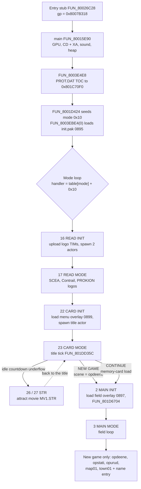

# Boot path

Everything between power-on and the player standing in a field scene. The
executable's `main()` brings up the hardware, reads the table of contents (TOC)
of `PROT.DAT` - the archive holding nearly every asset and code overlay - and
then hands control to a 28-entry **mode table** that drives every screen for the
rest of the session. The publisher logos, the title screen, the opening
cutscene chain and the name-entry prompt are all ordinary passes through that
table.

Terms used below: an **overlay** is a block of code + data streamed from
`PROT.DAT` into RAM above `0x801C0000` and replaced when another one loads;
**slot A** is the overlay window based at `0x801CE818`; a **VA** is a runtime
virtual address; **SCUS** is the main executable `SCUS_942.54`.

## At a glance

| Stage | Retail routine | Where it lives | Port counterpart |
|---|---|---|---|
| Entry + init | `FUN_80026C28` → `main()` `FUN_80015E90` | SCUS | `engine-session`'s `BootSession` construction |
| TOC load | `FUN_8003E4E8` → RAM `0x801C70F0` | SCUS | `legaia_prot` reads the disc image directly |
| Mode dispatch | table at `0x8007078C`, word `_DAT_8007B83C` | SCUS | `engine-field::mode` (`ModeSeat`, `GameMode`); parser `legaia_asset::mode_table` |
| Publisher logos | `FUN_801CE9C0` + sequencer `FUN_801CEFD4` | PROT 0895 (`init.pak`) | `engine-menus::publisher_logos` |
| Title screen | tick `FUN_801DD35C`, modes 22/23 | PROT 0899 (menu overlay) | `engine-menus::title` (`TitleSession`) over `engine-vm::title_overlay` |
| New-game seed | `FUN_80034A6C` → `FUN_800560B4` | SCUS | `World::begin_new_game`, `legaia_asset::new_game` |
| Field entry | mode 2 `FUN_80025B64` → `FUN_801D6704` | SCUS + PROT 0897 | `BootSession::enter_field_live` |
| Opening chain | scene scripts; skip in `FUN_801D1344` | PROT 0897 + scene MANs | `engine-core` `world/narration.rs` |
| Name entry | `FUN_801F03F0` / `FUN_801E6B34` | field/dialog overlay | `engine-menus::name_entry` |



**Three things that catch people out:**

- **No mode-table row is named for the title screen.** It runs under the
  `CARD` pair (22/23), sharing a mode and an overlay with the pause menu; see
  [The title screen runs under the `CARD` pair](#the-title-screen-runs-under-the-card-pair-modes-2223).
- **Loader constants and extraction indices differ by 2.** The in-RAM TOC is
  raw `PROT.DAT` from byte 0, so a loader's `param + 0x381` is extraction entry
  `param + 0x37F`; see [the index-space note](#overlay-loaders-and-index-spaces).
- **The pad mask is not the raw PSX pad word.** See
  [Pad-mask layout](#pad-mask-layout-important) before reading any input code.

## The main loop (`FUN_80015E90`)

`FUN_80015E90` is the game's `main()`. The entry stub `FUN_80026C28` (where the
SCUS header's initial PC resolves) sets `$gp = 0x8007B318` and calls it once; it
never returns in normal play. `see ghidra/scripts/funcs/80015e90.txt`.

**Init sequence.** Each stage is bracketed by dev-checkpoint prints through the
formatter `FUN_800567A8` (`main.exe` / `pad_init` / `init_mem` / `init_work` /
`enter main_loop`), compiled in but inert in retail.

1. **GPU / display.** `FUN_80057C44` (display-mode reset), `FUN_80058068(0)`
   (`SetDispMask` off), `FUN_80057EDC`, a full-frame `ClearImage`
   (`FUN_80058298`) and a queue flush (`FUN_80058104`).
2. **CD + XA.** `FUN_8003EE7C(0)`, `FUN_8003F024`, and the console probe
   `FUN_8002B92C`, whose result is stored at `gp+0x550` (`0x80015F18`) and
   selects the heap size. In retail the probe is a stub (`jr ra; move v0, zero`),
   so the word is always `0`.
3. **Sound.** libsnd init `FUN_80062310` + `FUN_800644C0(&DAT_80085B58, 4, 4)`
   (the sound-driver work area; see [`audio.md`](audio.md)).
4. **Heap.** `FUN_8002B3D4(2, DAT_8007B414, size)` with `size = 0x134800`, or
   `0x200000` when the probe reports the expanded-RAM dev console - a branch the
   stub probe never takes.
5. **Build flag, boot scene name, CDNAME map.** The store at `0x80015F08`
   writes the build-mode halfword `gp+0x5AA` = `_DAT_8007B8C2` from
   `FUN_8003F084`, a two-instruction leaf returning `1`; it is the flag's only
   writer, so retail always boots with it **set** (see [Debug flags](#debug-flags)).
   The default scene string is `opdeene`; with the flag set it is copied over
   the scene-name slot at `0x8007050C`. `FUN_8001D8FC` (only caller
   `0x8001D6FC`) primes the CDNAME map: flag zero (dev) opens
   `h:\prot\cdname.txt` through the host trap `FUN_8003E6BC`, flag non-zero
   (retail) loads `cdname.txt` through `FUN_8003D3C4`. It fills the
   16-byte-record name table at `0x80088758` with an unbounded, unterminated
   copy loop, so long names come back mangled rather than truncated
   ([`formats/cdname.md`](../formats/cdname.md#the-loader-mangles-long-names)).
6. **Display env + mode machine.** `FUN_8001DAF8(0x400)` (DISPENV/DRAWENV
   pair), `FUN_8001DCF8(10)` (the boot mode-init), `FUN_8001E3B8(0xC800)`
   (primitive-packet + ordering-table allocator), one priming `FUN_8001698C` /
   `FUN_80016B6C` frame pass, `SetDispMask(1)`, then `FUN_8003EBE4(0)` at
   `0x8001612C` streams the boot `init.pak` (PROT 0895) into slot A.

**Master loop.** While the current-mode register `gp[0x524]`
(`_DAT_8007B83C`) is non-negative: call `FUN_8003D254` with the frame counter,
then dispatch `(*(0x8007078C + mode*0x18 + 0x10))()` - the handler word of the
[mode table](#game-mode-state-machine). When the handler wrote a new mode
(`gp[0x524] != gp[0x494]`), the loop runs the transition housekeeping at
`0x800161B8..0x80016200` before the next dispatch: XA/CD stop (`FUN_8003DE7C` /
`FUN_8003ED04`), dev print (`FUN_80016230`), GPU-queue flush, pad re-read
(`FUN_8001822C`), and clears of the held-input / frame-state globals
(`gp+0x3D8`, `gp+0x538`, `_DAT_8007B938`, `gp+0x55C`), then latches the new
mode into `gp[0x564]` / `gp[0x494]`. A negative mode exits the loop (dev quit
path; retail never takes it).

The port's counterpart is the [mode seat](#the-ports-seat-at-the-mode-table).

## TOC loader (`FUN_8003E4E8`)

Reads the first three sectors of `PROT.DAT` (6 KB) into RAM at `0x801C70F0`.
The copy is raw `PROT.DAT` from byte 0, header words included - no
transformation - which is why the runtime index space sits 2 above the
extraction index space ([`formats/prot.md`](../formats/prot.md)).

Two boot callers, differing only in whether they bring the CD stack up first:

- **`FUN_8003EFE8`** (`see ghidra/scripts/funcs/8003efe8.txt`) - the bare open.
  Zeroes the async-load queue globals (`gp+0x984` byte cursor, `gp+0x8BC`
  queued-entry count), dev-prints `open port.dat`, then calls
  `FUN_8003E4E8("PROT.DAT", 1)` with the do-read flag set.
- **`FUN_8003F08C`** (`see ghidra/scripts/funcs/8003f08c.txt`) - the cold-start
  path. Behind a `param == 0` gate it first programs the drive through the CD
  command sender `FUN_8005C160` (`0x0E` set-mode with the mode block at
  `0x8007BBC0`, then `0x03`), bracketed by the `FUN_8005BE0C` / `FUN_8005BE8C`
  sync helpers, then performs the same open.

Afterwards retail resolves every asset by **integer constant** through
`FUN_8003E8A8` (index-based; consumed by the streaming loader and the overlay
loaders).

**`FUN_8003E6BC` is not a resolver.** Ghidra labels it `path_opener` and
annotates it "dev path -> PROT index via CDNAME map"; the body does neither. It
calls `FUN_800608F0`, whose whole body is `break 0x103` (the SN/PsyQ
debug-station host trap), then the lseek / read / close siblings
`FUN_80060920` / `FUN_80060944` / `FUN_80060910`, then zero-fills to the next
2 KB boundary. On a `-1` open it bumps the failure counter at `0x8007B86E` and
returns. It reads a **host-PC file over the debug link**, which is why its
operands are literal `h:\…` paths; no `h:\…` string is ever resolved onto a
PROT entry by name. The genuine ISO9660 path is `FUN_8003D3C4`, through the CD
stack (`FUN_8005DBB4`, `FUN_8005BEFC`, `FUN_8005E9A4`, `FUN_8005EA84`,
`FUN_8005FB84`).

## Asset-type dispatcher (`FUN_8001F05C`)

The central per-asset-format dispatcher - every TIM, TMD, MES, ANM, etc. branch
is reached through it. Spec: [`formats/asset-type.md`](../formats/asset-type.md);
loader chain: [`asset-loader.md`](asset-loader.md). Calling convention:
`result = FUN_8001F05C(byte *src_data, u32 type_and_size, int param3, int copy_only)`
with the type byte in the high 8 bits of `type_and_size` and the size in the low
24.

The boot path does not call the dispatcher itself; it only makes sure the buffer
pointers it writes to are valid. `FUN_80020224` (the asset descriptor walker) is
one of its two static call sites and is called from the field overlay's
`FUN_801D6704` (the mode-2 scene init) at runtime.

## Game-mode state machine

The mode-dispatch table at `0x8007078C` is **28 entries × 24 bytes = 672
bytes**: fourteen INIT / per-frame pairs (even index = INIT, odd = per-frame).
The current mode is the halfword `_DAT_8007B83C`. See also
[`reference/functions/game-modes.md`](../reference/functions/game-modes.md#game-mode-state-machine).

| Offset | Width | Field |
|---|---|---|
| `+0x00` | u32 | Name-string pointer (see the name pools below). |
| `+0x04` | u32 | Reserved / zero. |
| `+0x08` | u16 | Reserved / zero (low half of the next-mode word). |
| `+0x0A` | i16 | Next-mode index: `-1` = self-managed, `0` = return to mode 0. Retail uses only those two. The word at `+0x08` reads `0xFFFF0000` on self-managed modes - the `-1` over a zero low half, not a sentinel. |
| `+0x0C` | u32 | Reserved / zero. |
| `+0x10` | u32 | Handler function pointer (may land in the overlay window, e.g. mode 6's `0x801CF730`). |
| `+0x14` | u32 | Handler parameter. |

<a id="full-handler-map-recovered-from-the-disc"></a>

**The whole table**, as [`legaia_asset::mode_table`](../../crates/game-tables/src/mode_table.rs)
reads it out of `SCUS_942.54` (`asset mode-table SCUS_942.54`; disc-gated
`mode_table_real`):

| Modes | Dev names (INIT / per-frame) | INIT handler | Per-frame handler | What INIT does |
|---|---|---|---|---|
| 0/1 | `CONFIG` / `CONFIG MODE` | `FUN_80025C68` | `0x80025EEC` | loads PROT 0971, the debug menu |
| 2/3 | `MAIN ` / `MAIN MODE` | `FUN_80025B64` | `0x80025EEC` | loads PROT 0897 (field), runs scene init |
| 4/5 | `MONSTER TEST` / `MONSTER MODE` | `FUN_8002611C` | `0x80025EEC` | nothing: writes mode `0` |
| 6/7 | `TMD TEST` / `TMD MODE` | `0x801CF730` (overlay) | `0x80025EEC` | dev-only; needs 8 MB RAM |
| 8/9 | `EFECT TEST` / `EFECT MODE` | `FUN_80025E68` | `0x80025EEC` | loads PROT 0979, effect test |
| 10/11 | `TEST TEST` / `TEST MODE` | `0x8002B97C` | `0x80025EEC` | `jr ra; nop` - hangs |
| 12/13 | `MAPDSIP MODE INIT` / `MAPDSIP MODE` | `FUN_80025DA0` | `0x80025F2C` | swaps PROT 0981 over the field head |
| 14/15 | `MAP TEST` / `MAP MODE` | `0x8002B904` | `0x80025EEC` | nothing: same body as mode 4 |
| 16/17 | `READ` / `READ MODE` | `FUN_8002612C` | `0x80025EEC` | calls into resident PROT 0895 (logos) |
| 18/19 | `GAME OVER` / `GAMEOVER MODE` | `FUN_80025B30` | `0x80025EEC` | loads PROT 0902; unreachable in retail |
| 20/21 | `BATTLE` / `BATTLE MODE` | `FUN_800565D8` | `0x80025EEC` | calls SCUS-resident `FUN_80055B6C` |
| 22/23 | `CARD` / `CARD MODE` | `FUN_8002574C` | `0x80025F74` | loads PROT 0899 (menu / card / title) |
| 24/25 | `OTHER` / `OTHER MODE` | `FUN_80025980` | `0x80025EEC` | loads a minigame overlay by sub-id |
| 26/27 | `STR` / `STR MODE` | `FUN_80025FB4` | `0x80025EEC` | loads PROT 0970 (cutscene / FMV) |

Notes on the table:

- **Two name pools, and no `<NAME> INIT` string on the disc.** Odd (per-frame)
  names live in the 12-byte-stride pool at `0x800109D0..0x80010AD8`. Even names
  point into a tighter pool at `0x8007B3DC..0x8007B408` holding the bare nouns;
  six even modes (4, 6, 8, 10, 12, 14) point into the odd pool instead and carry
  the `TEST`-suffixed names (and `MAPDSIP MODE INIT`).
- **Spellings to keep when quoting.** Mode 2's name has a trailing space
  (`MAIN `); the 12/13 pair is misspelled `MAPDSIP` on the disc.
- **One shared per-frame handler.** 12 of the 14 per-frame modes use
  `0x80025EEC`, parameterised by `+0x14`. Only mode 13 (world-map display) and
  mode 23 (menu / memory card) carry their own.
- **The dev names mislead.** `MAIN` is field / town gameplay (`game_mode 0x03`
  is the on-field loop), not an options screen: its scene init `FUN_801D6704`
  is the map loader (debug strings `map_name`, `map_read`, `man_set`,
  `camera_set`, `fog_set`, `tmds: %d`, `game_mode`, `program_mode`; it calls the
  field asset loader `FUN_8001F7C0` and the MAN decoder `FUN_8003AEB0`).
  `CONFIG` is the dev debug menu, not game config. `CARD` covers the title
  screen, the memory-card manager and the in-field pause menu. The port's
  `GameMode` enum (`crates/engine-field/src/mode.rs`) keeps the dev names and
  documents the real roles.

### Overlay loaders and index spaces

`FUN_8003EBE4` and `FUN_8003EC70` are the two parallel overlay loaders
(destination pointers `*DAT_8001038C` = slot A and `*DAT_80010390` = slot B).
Both call `FUN_8003E8A8(param + 0x381)`. The resolver indexes the in-RAM TOC at
`0x801C70F0` (raw `PROT.DAT`, byte-verified against the
`door_warp_town01_to_map01` save state), reading `start = toc[idx+2]`; the
extraction index space (`crates/prot`, `extracted/PROT/NNNN_*.BIN`) slices entry
`p`'s start from file word `p+4`. So in extraction space the loaded entry is
**`prot_index = param + 0x37F`**.

Content anchors confirm it: param 2 → 0897 field, 3 → 0898 battle and 4 → 0899
menu (both RAM-byte-verified), `0x4A` → 0969 STR-path table, `0x4B` → 0970
cutscene/STR, `0x4C` → 0971 debug menu, `0x54` → 0979 (literal `"efect init"`
strings), and the seven mode-24 minigame slots whose init VAs land on prologues
([script-vm.md § 0x3E WARP](script-vm.md#0x3e-warp-mode-24-minigame-door-warp)).

**The loader census is exhaustive for static SCUS**: a full-image scan for both
loaders' `jal` sites, with the `a0` setup decoded, finds 16 call sites.

- Constant params: 0 / 2 / 3 / 4 / 7 / `0x4B` / `0x4C` / `0x53` / `0x54` /
  `0x56`, plus the mode-24 `sub_id + 0x4D` band.
- Computed params: the battle SM's special-attack (`+0x28`) and summon-stager
  (`id - 0x79`) bands, the battle stage band (`+0x47`), and the slot-B default
  `FUN_80025BA0` (param 5 or 6 by flag `DAT_8007B6A8` → extraction 0900 / 0901,
  the summon-render pair).
- Param **0** has exactly one producer, `main()` itself: `0x8001612C jal
  0x8003ebe4` with `a0 = 0` (`0x80016128 addu a0,zero,zero`) - the pre-loop load
  of extraction entry **0895**, the boot `init.pak`.
- Param **1** has no producer, so extraction entry 0896 is unreachable from any
  static loader call
  ([re-settled-threads.md](../reference/re-settled-threads.md#prot-0896-bat_back_dat-identity)).

### INIT handlers that stage an overlay

Each of these resets core state, waits, loads into slot A and `jal`s into the
loaded image.

| Mode | Loader call | PROT | Content (verified) |
|---|---|---|---|
| 0 `CONFIG` | `FUN_8003EBE4(0x4C)` | 971 | Debug-menu overlay: "DEBUG MODE" header + FOG / WORK_TBL / SAVE DATA / MAP NAME / TMD NO / POLY / VERT strings. |
| 2 `MAIN` | `FUN_8003EBE4(2)` | 897 | Field overlay; then the per-scene initializer `FUN_801D6704`. |
| 8 `EFECT TEST` | `FUN_8003EBE4(0x54)` | 979 | Effect-test dev mode: strings `"efect init"` / `"efect init end"` / `"battle bgm %d"`. |
| 12 `MAPDSIP` | `FUN_8003EBE4(0x56)` | 981 | World-map display sub-overlay, swapped over the field overlay's head. |
| 18 `GAME OVER` | `FUN_8003EBE4(7)` | 902 | Game-over overlay; no retail path stores mode 18. |
| 22 `CARD` | `FUN_8003EBE4(4)` | 899 | Menu / memory-card / title overlay (RAM-byte-verified). |
| 24 `OTHER` | `FUN_8003EBE4(sub_id + 0x4D)` | 972..977, 980 | Minigame overlay per warp sub-id (`+2` first when `sub_id >= 6`). |
| 26 `STR` | `FUN_8003EBE4(0x4B)` | 970 | Cutscene / STR FMV overlay. |

Per-row detail:

- **Mode 0.** Not 973: 973 is the 1-sector `OTHER2` dev module at mode-24 warp
  sub-id 1, and the casino slot machine is 975 (sub-id 3).
- **Mode 2.** 0897 is the entry the static overlay map pins at slot-A base
  `0x801CE818`. `FUN_801D6704` loads map + MAN + camera + fog + BGM, allocates
  the game-mode work buffer and hands off by writing `_DAT_8007B83C = 3`. The
  options strings ("Display Off / Vibration On / Voices On") are in the **menu**
  overlay 0899, which mode 22 loads, not here.
- **Mode 12.** Same save / restore pattern as mode 24. `FUN_80025DA0` saves the
  slot-A head (`*0x8001038C` = `0x801CE818`, `0x4000` bytes), loads PROT 981
  over it and calls its init `0x801CF4AC` (file `+0xC94`, so the base is pinned
  by the call target); on exit it restores 0897's head and re-enters it. The
  init seeds the scratchpad display-list base `0x1F800314` from world-state
  globals; the body is a 21-state display SM reading the co-resident 0897 body
  (`0x801D5334`, beyond the swap window), so the world-map *controller* stays in
  0897 (`FUN_801E76D4`). See
  [`world-map.md`](world-map.md#per-frame-dispatch-scus-resident).
- **Mode 18.** A party wipe routes to the CARD / CONTINUE title flow instead
  (mode 22 with `_DAT_8007BB00 = 1`, stored in `FUN_8003AEB0` at `0x8003B5D4`).
  Only the dev harness reaches 0902. See
  [`battle.md`](battle.md#party-wipe--the-game-over-overlay).
- **Mode 24.** Entered by the field VM's op `0x3E` door warp
  (`sub_id = op0 - 100`). `FUN_80025980` backs up the active scene name
  `0x80084548` → `0x8007BAE8` (and `_DAT_80084540` → `0x8007BAC4`), streams the
  minigame overlay into slot A over the field overlay, then calls its init
  entry; `FUN_80026018` restores both on exit and re-enters mode 2. Sub-id
  table: [script-vm.md § 0x3E WARP](script-vm.md#0x3e-warp-mode-24-minigame-door-warp).
  Capture-confirmed (Baka Fighter, sub-id `0x8007BA34 = 4` → PROT 0976). Mode 24
  does **not** load PROT 0896: its bytes appear nowhere in RAM across the entry
  window nor in any parked library state.
- **Mode 26.** The title tick writes `_DAT_8007B83C = 0x1A` on attract
  underflow to enter it.

##### Three INIT handlers stage nothing

Modes 4, 16 and 20 carry no overlay request at all.

| Mode | Handler | Whole body |
|---|---|---|
| 4 `MONSTER TEST` | `FUN_8002611C` | `sh zero, _DAT_8007B83C`; `jr ra` |
| 16 `READ` | `FUN_8002612C` | frame, `jal 0x801CE9C0`, epilogue |
| 20 `BATTLE` | `FUN_800565D8` | frame, `jal 0x80055B6C`, epilogue |

- **Mode 4 bounces off itself.** It writes master mode `0`, handing straight
  back to the debug menu it was entered from; mode 5 is never reached. Mode 14's
  `FUN_8002B904` has the same body.
- **Mode 16 calls into the `init.pak` overlay.** `0x801CE9C0` is PROT **0895**
  file `+0x1A8`, a clean `addiu sp, sp, -0x230` prologue at the slot-A base, and
  is the mode's whole body. The handler never calls the loader, so it assumes
  0895 is already resident - which the boot path guarantees. Image:
  [the `init.pak` overlay](#boot-initpak-prot-0895); per-function rows:
  [`functions/battle.md`](../reference/functions/battle.md#boot--initpak-overlay-prot-0895).
  Not a retail-stripped dev path: the "`0x801CE9C0` is not a function entry"
  reading is VA aliasing at the shared slot-A base against the debug-menu
  overlay's `FUN_801CE97C`.
- **Entered from the debug menu, mode 16 lands in the wrong image.** Any slot-A
  load replaces 0895. Once the debug menu (0971) is resident, `0x801CE9C0` is
  0971 file `+0x1A8` - `lui at` / `sw zero, -0x4748(at)` in the middle of
  `FUN_801CE97C`'s global-clear block, entered with no frame. That is why
  picking READ from the debug menu fails.
- **Mode 20 is an ordinary call.** `FUN_80055B6C` is the battle scene setup
  entry and is linked into SCUS, so battle needs no overlay swap here.

All three are mirrored as `mode_init_bare` in `engine-field::mode`, beside
`mode_init_stage` for the staging rows.

##### Two debug modes that cannot run on a retail console

**Mode 6 `TMD TEST` writes its draw buffers over the kernel.** The init handler
`0x801CF730` (PROT 0971 file `+0xF18`) calls `FUN_8001E3B8` at `0x801CF758`
while the master mode still reads `6`, and `FUN_8001E3B8` calls `FUN_8001F690`
at `0x8001E510`. That routine compares the mode against `6`
(`addiu v1, zero, 6` at `0x8001F6D4`, `beq v0, v1, 0x8001F728` at
`0x8001F6D8`). Every other mode takes its two draw buffers from the heap (two
`jal 0x80017888`, stored at `0x8007BFA0` / `0x8007C014`); mode 6 branches to
`0x8001F728`, which builds `0x80419040` and `0x80400040` (`lui 0x8041` /
`ori 0x9040`, `lui 0x8040` / `ori 0x40`) and stores those instead, with no
RAM-size probe. Both are past `0x801FFFFF`, where only the 8 MB development
console has RAM. On a 2 MB console the window mirrors, so the `0x19000`-byte
buffers cover `0x80000040..0x80032040` - the exception vector at `0x80000080`,
the BIOS tables and the game's own code from `0x80010000`
([memory map](../reference/memory-map.md#kernel-ram-0x80000000-0x8000ffff)). No
other code on the disc builds either address.

Replacing the `beq` at `0x8001F6D8` (file offset `0xFED8`) with a `nop` sends
mode 6 down the heap path; the delay slot's `move a0, zero` is already the
allocator's first argument. That patch is read off the instructions and has not
been run. Two other 8 MB-only paths exist behind dev flags: the halfword
`gp+0x704` selects `0x806FA000` / `0x80600000` at `0x8001E438`, and the field
overlay stores `0x80400000` / `0x80600000` at `0x801D7410` behind `0x8007B868`
and `0x8007B8BE`.

**Mode 10 `TEST` hangs.** Its init handler `0x8002B97C` is `jr ra; nop`. The
record's next-mode field (`+0x08 = 0`) is read only by `FUN_800179C0`
(`lh 0xa(v1)` at `0x80017A48`), the Start + Select exit, which runs only from
the per-frame drivers. Mode 10 never reaches one, so the main loop calls the
empty handler forever.

##### Mode 23 runs no frame driver

The in-field pause menu runs under the CARD pair, not field mode 3: every
menu-open capture in the save library (equipment / status / options, from
`map01` and `town01`) holds `_DAT_8007B83C = 0x17`.

Mode 23's handler `FUN_80025F74` calls the frame-begin pass `FUN_8001698C`,
then `FUN_80017978` where the other handlers call the master frame driver
`FUN_80016444`, then the frame-end pass `FUN_80016B6C`. `FUN_80017978` is
eighteen instructions (`0x80017978..0x800179BC`) with three `jal`s - the debug
mode-advance chord `FUN_800179C0` (inert on a shipped disc), an indirect call
through the CARD actor's `+0x0C` tick handler, and the dev readout HUD
`FUN_800188C8` - and none of them is `0x80016444`.

`FUN_80016444` holds the five `FUN_8002519C` actor tick passes, so while the
menu (or the title) owns the frame retail advances no actor, no effect, no move
VM and no animation, and runs no render pass: the CARD actor's handler draws the
whole frame. That handler ends `move v0,zero`, so the caller's abort test never
fires and the frame-end pass always runs - which is why the timed sound-source
release and the cadence resolver keep working under the menu.

Port: `engine-field::mode::runs_master_frame_driver`, which `World::tick`
consults to suspend its actor / effect / move-VM passes. `BootSession` hosts
the pause-menu session (`open_field_menu` and the Start edge in
`BootSession::tick`), holding the world in `SceneMode::Menu`, which `GameMode`
maps from the CARD pair. The mode-trace oracle (`mode_trace_e3`) drives
menu-open scenarios with a scripted Start press and asserts convergence on scene
mode, active scene and the `game_mode` byte (engine `0x17` vs the retail
snapshot).

##### The mode word does not determine the scene

Modes 24 / 25 host **all five** warp minigames. Retail's discriminator is a
second register, the signed halfword `_DAT_8007BA34`: the field VM's op-`0x3E`
arm writes `sub_id = op0 - 100` there (`sh v1,-0x45cc(v0)` at `0x801E07B8`) in
the delay slot of the pair that puts `0x18` into `_DAT_8007B83C`, and
`FUN_80025980` reads it twice with `lh` to pick the overlay and its init entry.
That init's last act sets the mode word to `0x19` and leaves the sub-id
standing.

So the pair is the key, not the word: `0x19` alone cannot tell fishing from
dance. And `0x18` is the INIT half, which runs for one frame - keying a live
minigame on it never observes one. The port's `GameMode::scene_mode_with_warp`
takes the pair; `GameMode::for_scene_mode` is its deliberately lossy inverse.

#### New Game boot chain (title → field)

1. **Title confirm.** On a cold boot the title sits in sub-mode `0x10`: a
   two-option cursor (`_DAT_8007B820`), confirm on `Start|L1|Cross`
   (`pad & 0x844`), then fade sub-mode `0x16` → `0x06` `LaunchGame`. See the
   [sub-mode dispatcher](#sub-mode-dispatcher). (The `0x02` `TextMenu` arm - live
   cursor `state[+0x1FC]`, confirm `pad & 0x44`, chosen row stashed at
   `state[+0x200]`, advance to `0x14` - is
   [unreachable from a cold boot](#a-cold-boot-always-shows-sub-mode-0x10-never-0x02).)
2. **Launch write.** `0x801DFC00` (`li v0,0x2; sh v0,-0x47C4(v1)`) writes
   `_DAT_8007B83C = 2`, resets the title sub-mode and kicks a fade-out
   (`FUN_80024EE4(1, 2, 0xFFFFFF)`). The load route writes the same `2` at
   `0x801DFAFC`.
3. **Mode-2 init.** `FUN_80025B64` loads the field overlay (`FUN_8003EBE4(2)`)
   and calls `FUN_801D6704`.
4. **Field scene init.** `FUN_801D6704` reads the resident scene name, loads
   geometry + MAN + camera + fog + BGM, allocates the game-mode work buffer and
   writes `_DAT_8007B83C = 3`. It is generic field entry, used for every scene
   transition; it reads the fresh-state seed from globals rather than seeding it.

**The fresh-state seed** is the new-game data-init `FUN_80034A6C`, called via
the boot mode initializer `FUN_8001DCF8`:

- **Gold.** `_DAT_8008459C` (the word the battle-victory reward writer
  `FUN_8004F0E8` credits) is set to a hardcoded **500** - a constant in the
  routine, not a template field. Mirror: `NEW_GAME_STARTING_GOLD`.
- **Story flags.** A ~`0x200`-byte story-flag region is zeroed.
- **Starting party.** `FUN_800560B4` expands a static SCUS template -
  `[8×u16 stats][10-byte name]` per record (Vahn, Noa, Gala, Terra), parsed by
  [`legaia_asset::new_game`](../formats/new-game-table.md) - into the live
  per-character records (stride `0x414`). Vahn's row (HP 180 / MP 20 / AGL 100 /
  ATK 24 / uDEF 16 / lDEF 12 / SPD 19 / INT 9) is byte-validated against an
  early `town01` save state.
- **Opening scene.** The default map-name buffer holds the literal `"town01"`
  (Rim Elm). `FUN_8001D424` (the global reset / init) leaves it there and reads
  a dev `initmap.txt` override (16 bytes into `0x8007050C`) only when
  `_DAT_8007B8C2` is clear, which retail never is. The title's `LaunchGame` then
  overrides it with `opdeene` for a real New Game.

**Record expansion** (ported as `legaia_asset::new_game::seed_live_records`).
Each template row fans into two stat blocks per live record: a current-stat
block at `+0x104`, where HP and MP each occupy a current *and* a max cell so a
New Game starts at full health, and a max-stat block at `+0x11C`. `+0x130` (the
level) and `+0x131` are both seeded to `1`; `+0x131` is write-only and is not
the magic-rank byte
([`new-game-table.md`](../formats/new-game-table.md#0x131-is-seeded-and-never-read)).
The default display name is copied to `+0x2A7` - the name the
[name-entry screen](#name-entry-overlay) pre-fills. That is twenty `sh` stores
per slot, all `$s0`-relative with `$s0` at the save-context base; the disc-gated
`new_game_seed_disc` oracle re-derives them from the executable's encodings.

**The cap cells are a literal, not a template field.** Record `+0x10C`
(current) and `+0x120` (max) take a hardcoded `100` for every roster slot.
Vahn's template agility is also `100`, so his record alone cannot tell the two
apart; Noa (`120`) and Gala (`80`) seed the cap at `100` while their agility
cells carry the per-character value.

**Port.** The control flow is mirrored in
`crates/engine-vm/src/title_overlay/state_layout.rs`
(`MASTER_GAME_MODE_FIELD_LAUNCH` = 2, `MASTER_GAME_MODE_FIELD_RUN` = 3,
`FIELD_SCENE_INIT_PC`, `MENU_INDEX_NEW_GAME`) and `World::begin_new_game`
(`crates/engine-core/src/world/state.rs`), which clears the story flags and
seeds gold and party the same way.

The port also applies the seed on a **cold scene boot** - entering a scene
directly (native `play-window --scene X`, the play page's scene picker) with no
New Game confirm and no save loaded. Retail has no such path, so this is a
port-side invariant rather than a traced routine. `SceneHost::enter_field_scene`
consults an optional `NewGameDefaults` (template party + starting bag, parsed
from the boot source's `SCUS_942.54`, installed by the native `BootSession` and
the browser runtime's `load_disc`), and `World::seed_cold_boot_defaults` fires
it once, guarded on an empty roster, so the pause menu always reads valid party
data and a loaded save is never clobbered.

On a scene-picker host (`NewGameDefaults::picker_party`) the party half is
`World::seed_picker_party`: Vahn, Noa and Gala as the present battle party, each
from their own template row and in a starter loadout (`new_game::starter_loadout`
- the weakest gear the `DAT_80074F68` equipment table lets the character wear
per slot, exclusive weapon family first). The loadout is the port's choice;
retail's New Game leaves the equipment bytes zero. Headless sessions keep the
retail roster, and a NEW GAME reseeds it.

<a id="title-screen-is-not-in-the-mode-table"></a>

#### The title screen runs under the `CARD` pair (modes 22/23)

No mode-table row is named for the title: the table is a fixed 28-record array
and its `+0x00` pointers yield the fourteen name pairs above and nothing else.
The title is still mode-table-driven:

- **`main()` seeds the mode before the loop.** `FUN_8001D424` (called at
  `0x80016024`) writes `_DAT_8007B83C = 0x10` - mode 16 - at `0x8001D5B8`
  (`sh s0,-0x47c4(at)`, `s0` set to `0x10` one instruction earlier).
- **One overlay load precedes the loop, and it is `init.pak`.** Of the 16
  loader call sites, the only one before the loop is `0x8001612C` with `a0 = 0`
  (extraction 0895). The loop's first read of the table is
  `0x8001616C addiu s0,v0,0x78c`, forty instructions later.
- **Mode 16 runs the publisher-logo boot pass.** `FUN_8002612C` is eight
  instructions whose only call is `jal 0x801CE9C0`. That routine forms
  `0x801D09E4` / `0x801DBC04` / `0x801E7624` / `0x801EB664` - `+8` into each of
  the four TIMs of the [init.pak layout](#boot-initpak-prot-0895) - writes
  their `RECT` halfwords, uploads each through `FUN_800198E0`, spawns two actors
  from descriptors at `0x801D09AC` / `0x801D09C4`, and closes with
  `_DAT_8007B83C = 0x11` at `0x801CEC94`.
- **`init.pak` hands the front end to `CARD`.** PROT 0895 stores the mode cell
  at exactly three sites; the second, `0x801CF4D4`, writes `0x16` = 22.
- **Mode 22 spawns the title as an actor.** `FUN_8002574C` loads PROT 0899
  (`0x800258B4 jal 0x8003ebe4`, `a0 = 4`), spawns the actor for spawn-descriptor
  `0x800706D4` (`0x800257A0 jal 0x80020de0`) whose `+8` handler word is
  `0x801E36A0`, and ends `_DAT_8007B83C = 0x17` at `0x80025974`.
  `FUN_801E36A0` is 0899 file `+0x14E88`, and the `jal 0x801dd35c` inside it is
  0899 `+0x14E94`. So the title tick runs as a spawned actor under the mode-23
  per-frame handler.

The tick's home is byte-decided: `FUN_801DD35C`'s 48-byte prologue occurs
**once** in the whole of `PROT.DAT`, at extraction entry 0899 file `+0xEB44`,
and `0x801CE818 + 0xEB44` reproduces the VA exactly; it is absent from SCUS. Its
own master-mode stores are `0x801DDCF0` (`0x1A`, attract underflow into STR) and
`0x801DFC00` / `0x801DFAFC` (`2`, into the field).

PROT 0899 carries the options-menu config bundle **and** this overlay code,
which is why the title screen, the memory-card manager and the in-field pause
menu share one mode pair and one overlay. The title *wordmark* TIM is in PROT
0890 (see [Title art](#title-art)).

#### The boot mode chain, end to end

Six stores carry a cold boot from reset to the field; each is a `sh` of a
literal into `_DAT_8007B83C`.

| Store | Writes | Hands the frame to |
|---|---|---|
| `0x8001D5B8` | `0x10` `READ INIT` | the pre-loop boot init, before the loop's first pass |
| `0x801CEC94` | `0x11` `READ MODE` | the publisher logos, which animate as ordinary actors |
| `0x801CF4D4` | `0x16` `CARD INIT` | the front end, once the logo pass reaches its phase 3 |
| `0x80025974` | `0x17` `CARD MODE` | the title dispatcher, spawned as mode 22's actor |
| `0x801DFC00` | `0x02` `MAIN INIT` | the field, on the title's NEW GAME row |
| `0x80025E50` | `0x03` `MAIN MODE` | the field per-frame loop |

Mode `0x10` is not the title screen - it is one frame of logo INIT, and the
logos run under `0x11`. The title has no mode of its own; it shares `CARD MODE`
with the pause menu.

**The `0x801CF4D4` store is one arm of a branch.** `0x801CF490..0x801CF4E8`
runs on the logo sequencer's phase `3`, calls the shared core-state reset
`FUN_80025CB4`, then tests the front-end entry word `_DAT_8007BB00`: non-zero
stores `CARD INIT`; zero stores `CONFIG INIT` (the debug menu) at `0x801CF4E4`
and clears the word. `init.pak` raises that word itself at `0x801CEB84` before
it hands off, so a retail cold boot always takes the front-end arm. The title
dispatcher's `Init` arm reads the same word at `0x801DD97C` to route to
sub-mode `0x11`.

#### The port's seat at the mode table

The engine's counterpart of `_DAT_8007B83C` is `ModeSeat`
(`crates/engine-field/src/mode.rs`, re-exported as `engine-core::mode`), owned
by `engine-session`'s `BootSession` and driven once per frame from
`BootSession::tick`. It is a seat rather than a mirror because its **writes are
the port's own transitions**: the session enters `MAIN INIT` where retail's
title dispatcher stores `2`, and `CARD INIT` where retail's field image calls
the request leaf `FUN_801D84B4`. Each `ModeSeat::enter` returns that mode's INIT
staging plan and performs the mode's own hand-off store.

What the seat provides:

- **The INIT column runs.** `enter` resolves `mode_init_stage` /
  `other_warp_init_stage` / `mode_init_bare` for the mode being entered, then
  advances the word to that mode's pinned successor. The overlay *load* each
  plan names is replaced by native scene entry - the port has no mode-table
  residency model - so the plan is data the caller stages against, not a jump.
- **The mode-change edge runs.** Of the fixed sequence at
  `0x800161B8..0x80016200`, the observable half is the pad swallow: the edge
  words `gp+0x538` and `gp+0x55C` are cleared, so the button that caused a
  transition is not delivered again as the first input of the mode it opened.
  The port clears the same edges through `InputState::clear_edges`. (Two stores
  in that block, `gp+0x564` and `gp+0x494`, are copies of the new mode rather
  than clears; a fourth clear at `0x8007B938` sits beside the three.)
- **Where the swallow may not go.** Retail clears the pad words and the *next*
  loop pass polls the pad fresh, so the clear only discards input for the mode
  being left. The port's hosts publish a pad word immediately *before* each
  tick, so clearing at the top of a frame would discard that frame's own input.
  The seat therefore swallows on `enter` (a host-performed transition) and not
  on a change it adopts from the world.
- **Every frame carries a mode word.** The mode-trace oracle
  (`legaia-engine mode-trace`) samples the seat for its `game_mode` field.
- **The title row persists.** `ModeSeat::title_row` carries retail's
  never-reset title row counter across titles; see the
  [sub-mode dispatcher](#sub-mode-dispatcher).

The seat deliberately does **not** own `SceneMode`. Scene sessions own the
loaded assets, and the minigames are resident rules engines rather than paged
overlays, so a session outlives the word that staged it. The two are reconciled
once per tick by `ModeSeat::adopt_scene_mode`, which stages the warp sub-id
alongside the word whenever the target is `OTHER MODE` - the one arm where the
word alone cannot round-trip. It never overwrites an INIT frame and never
writes for `SceneMode::Title`.

### CD-read API stack

The SCUS-side CD I/O is layered. Bottom-up:

| Function | Role |
|---|---|
| `FUN_8005D9A0` | CD-DMA-channel-3 synchronous read primitive: writes the CD command registers and triggers DMA. Takes `(dest_buffer, mode)`. `0x8005DA40` is an instruction inside it (`lui v1, 0x8008`) that Ghidra promotes to a fake function label; there is no `_DAT_800795B4` pointer table. |
| `FUN_8005C2C4` | One-line wrapper around `FUN_8005D9A0` returning `iVar1 == 0`. |
| `FUN_8005C42C` | BCD-MSF → LBA: `(minBCD * 60 + secBCD) * 75 + frameBCD - 150`. |
| `FUN_8005C328` | LBA → BCD-MSF (inverse of `FUN_8005C42C`). |
| `FUN_8005DBB4` | ISO9660 directory lookup: `(file_info_out, filename)` → `{msf[3], size, ...}`. |
| `FUN_8005E574` | Streaming-read per-IRQ callback (registered by `FUN_8005E788`). Drives multi-sector reads via `DAT_800796CC` (destination cursor), `DAT_800796D8` (sectors remaining), `DAT_800796E4` (current LBA). |
| `FUN_8005E788` | Streaming-read **starter**: copies `DAT_800796C8` → `DAT_800796CC` and `DAT_800796C4` → `DAT_800796D8`, registers `FUN_8005E574`, sets the initial LBA via `FUN_8005C42C(FUN_8005BD70())`. |
| `FUN_8005E9A4` | Public streaming-read API: `(sector_count, dest_buffer, mode_flags)`. Sets the streaming globals and calls `FUN_8005E788(0)`; the caller must SetLoc first. Sector size from `mode_flags & 0x30`: `0` → `0x200` (2048, data), `0x20` → `0x249` (2336, XA), else `0x246`. |
| `FUN_8005E4D4` | Sync LBA-based reader: `(sector_count, lba, dest_buffer)`. Wraps `FUN_8005C328` + `CdControl(SetLoc)` + `FUN_8005E9A4` + the block-mode completion poll `FUN_8005EA84(0, …)`. |
| `FUN_8005EA84` | Streaming-read completion sync: `(poll_once, result)` → sectors remaining, `0` = complete, `-1` = timed out. Detail below the table. Port: `engine-core::cd_dma::stream_read_sync`. |
| `FUN_8003D3C4` | Path-based ISO9660 file loader: `(path, dest)`. Wraps `FUN_8005DBB4` + SetLoc + `FUN_8005E9A4`. Used for `.STR` / `.XA` filesystem files. |
| `FUN_8003E4E8` | Boot-time TOC loader: `(filename_str, do_read_flag)`; reads 3 sectors into `0x801C70F0`. |
| `FUN_8003E800` | Async sector-count loader: `(dest, sector_count, flags)`. Queues via `gp+0x97c` (**count**) / `gp+0x894` (dest) and kicks `FUN_8003F128`, which forms the LBA from the `CdlLOC` at `0x8008BC5C`. Used by both overlay loaders. |
| `FUN_8003E8A8` | PROT TOC index resolver: `(prot_index, flag)` → the entry's **sector count** (`subu s0,v0,s2` over `TOC[idx+3]` / `TOC[idx+2]` at `0x8003E90C`), start LBA left at `gp+0x8f0`. Matches the [PROT TOC math](../formats/prot.md). |
| `FUN_8003EBE4` / `FUN_8003EC70` | Overlay loaders A / B (see [index spaces](#overlay-loaders-and-index-spaces)). They differ only in destination pointer (`*DAT_8001038C` vs `*DAT_80010390`) and current-id tracker (`gp+0x924` vs `gp+0x934`, i.e. `0x8007BC3C` / `0x8007BC4C`). |

**`FUN_8005EA84` detail.** Poll mode (`a0 = 1`, used by `FUN_8003E4E8` /
`FUN_8003D3C4`) makes one pass; block mode (`a0 = 0`) loops. The overall timeout
is `DAT_800796E0 + 0x4B0` vsyncs. A negative `DAT_800796D8` (IRQ error) or more
than `0x3C` vsyncs since `DAT_800796DC` (sector stall) restarts via
`FUN_8005E788(1)` and reports the full `DAT_800796C4` count. It exits through
`FUN_8005BEAC(1, result)` (drive-status delivery; the decompiled C drops both
register arguments).

**`FUN_8003E360` is a dual-mode loader** keyed on `_DAT_8007B8C2`. The gate is
`bne v0,zero,0x8003E49C` at `0x8003E37C`: the non-zero (retail) branch takes the
PROT TOC index path (`FUN_8003E8A8(0x3D5,1)` + `FUN_8003E800`); the zero (dev)
fall-through opens a path through the host trap `FUN_800608F0`, then
`FUN_80060920` / `FUN_80060944`, and zero-fills the tail to the next 2 KB
boundary, recording the padded length rather than the file length.

#### Low-level CD driver + async load queue

Beneath the API stack sits Legaia's own CD driver - hardware-register and
callback code, not the PsyQ `libcd` BIOS path. It splits into two tiers with
different port status.

**The queue tier is arithmetic over the PROT TOC and is ported** in
`engine-core::cd_dma` (`FUN_8003E800`, `FUN_8003F128`, `FUN_8003E8A8` and the
enqueue below):

- **`FUN_8003DDA0`** - index-based streaming **enqueue**. Reads the in-RAM TOC:
  `start = toc[idx+2]`, `size_sectors = toc[idx+3] - toc[idx+2]`. It appends an
  8-byte `(idx, byte_offset)` descriptor to the queue table at
  `gp+0x1A8 + count*8`, bumps the queued-entry count `gp+0x8BC`, and advances the
  running byte cursor `gp+0x984` by `size_sectors << 11`. Each append is
  bracketed by the XA-control toggles `FUN_8003EE7C` / `FUN_8003DE7C` /
  `FUN_8003ED04`. `see ghidra/scripts/funcs/8003dda0.txt`. Port:
  `cd_dma::StreamLoadQueue` (descriptor table + cursor arithmetic; the XA
  toggles are left to the hardware side-band). It is tagged `NOT WIRED`: every
  engine host resolves assets synchronously through `Scene` / `SceneAssets`, so
  nothing enqueues.
- **`FUN_8003DAA8`** - the load-kick / completion driver the queue drains
  through. Reads the in-progress flag `_DAT_8007B876 & 1`, converts the pending
  LBA (`gp+0x97C`) to BCD-MSF via `FUN_8005C42C`, issues the drive read
  (`FUN_8005FB84`, `FUN_8005C034`) into the destination `gp+0x894`, and
  maintains the load counters `gp+0x8E8` / `gp+0x964`. Drive transport, not
  ported. `see ghidra/scripts/funcs/8003daa8.txt`.

**The register / interrupt tier is documented only.** The engine reads a disc
image directly and has no drive to command. These rows leave the port worklist
through scope rows in `scripts/ci/port-catalog-ignore.toml`: `libcd` for the
driver and its re-arm / init / mixer entries, `worklist_phantom` for the BIOS
trampolines, `cd_transport_shims` for `FUN_8003DAA8`.

| Function | Role |
|---|---|
| `FUN_8005DAB0` | CD response dispatcher. Loops on the interrupt-cause read `FUN_8005C4AC` until it returns 0; on cause bit `0x4` calls the data-ready callback `DAT_800793B0`, on bit `0x2` the completion callback `DAT_800793AC`; restores the saved command byte on exit. `see ghidra/scripts/funcs/8005dab0.txt`. |
| `FUN_8005D5F8` | Driver re-arm. Zeroes the two callback slots (`DAT_800793AC` / `DAT_800793B0`) and their counters, masks via `FUN_8005FD88`, then hands `FUN_8005DAB0` to the driver-vector call `FUN_8005FDB8`. |
| `FUN_8005D648` | Driver init / reset. Dev-prints, zeroes the callback + counter globals, then walks the drive through its init command sequence, spinning on the status bits (`& 0x7`) until the drive settles. |
| `FUN_8005D504` | SPU + CD-audio mixer init. Pokes the SPU main-volume (`+0x180/0x182`), CD-input-volume (`+0x1B0/0x1B2`) and control (`+0x1AA = 0xC001`) registers through the base pointer `DAT_80079684`, then issues CD command `0x20`. |
| `FUN_8005BD40` / `FUN_8005BD50` | CD status-byte getters (`DAT_800793BC` / `DAT_800793CC`). |
| `FUN_8005EB50` | Streaming destination-callback swap: get-and-set `DAT_800796C0`. |
| `FUN_8005C2E4` | DMA-channel-3 (CD) queue helper: forwards to `FUN_8005FDE8(3, dest)`. |

The BIOS-trampoline stubs in this cluster (`FUN_8005BD30` = B(`0x07`),
`FUN_8005DB9C` = B(`0x3F`), and the `FUN_80056648`-family B-table wrappers -
each `li t2,0xB0; jr t2; _li t1,N`) are syscall shims with no game logic.

#### Side-band loader constants

Three boot-path call sites resolve an entry from a hardcoded constant rather
than from a scene name. `legaia_asset::boot_overlay` ports the arithmetic. Each
index is pinned by **content**, because CDNAME labels inherit forward and name a
neighbouring block on two of the three.

| Call site | Constant | Extraction entry | Pinned by |
|---|---|---|---|
| `FUN_8003E360` (effect data) | raw `0x3D5` | 979 | `efect init` / `battle bgm %d` at the entry's head |
| `FUN_8002574C` (CARD-mode init) | raw `0x37E` | 892 | parses as an `asset::pack` of PSX TIMs |
| `FUN_80025BA0` (slot-B default) | param `5` / `6` | 900 / 901 | the summon-render pair |

Reading either raw constant *as* an extraction index lands two entries high on
unrelated content; `boot_overlay_disc` asserts the off-by-two neighbour fails
the same content check.

`FUN_80025BA0` is the only one of the three that decides at runtime: it mirrors
the summon-render flag `DAT_8007B6A8` into a work word, picks param `6` when set
and `5` otherwise, skips the load when that overlay is already resident, and
clears its one-frame suppression word unconditionally on the way out.

### Pre-`init_data` system-UI gap (menu-glyph atlas + boot cursors)

A 236 KB / 118-sector region sits **between the TOC and the first indexed
entry**: the TOC ends at `PROT.DAT` offset `0x1800` (3 sectors) and the first
indexed payload (`init_data`) starts at `0x3C800` (sector 121). No per-entry
extraction covers it.

It is a packed bundle of system-UI TIMs, all 4bpp + CLUT (colour look-up
table), targeting the right-hand "system UI" region of VRAM (`fb_x >= 640`):

| PROT.DAT offset | TIM dims | VRAM target | Purpose |
|---|---|---|---|
| `0x01858` | tiny | `(896,256)` 1×4 | boot cursor variant |
| `0x018E0` | 256×192 | `(896,256)` 64×192 | **battle-chrome widget page** (see below) |
| `0x07B00` | 32×32 | `(928,352)` 16×32 | UI element |
| `0x07F40` | 256×256 | `(896,0)` 64×256 | **ASCII battle font** (see below) |
| `0x0FF80` | 4×4 | `(896,448)` 1×4 | cursor |
| `0x10028` | 4×4 | `(896,448)` 1×4 | cursor |
| `0x100D0` | 4×4 | `(896,448)` 1×4 | cursor |
| `0x10178` | 256×32 | `(896,448)` 64×32 | AP / status-icon sprite sheet |
| **`0x11218`** | 256×256 | `(960,256)` 64×256 | **menu-glyph small-caps font** |
| `0x19438` | 240×24 | `(960,400)` 60×24 | UI sprite strip |
| `0x1AC90` | 16×16 | `(976,256)` 4×16 | cursor part |
| `0x1AD50` | 16×16 | `(980,256)` 4×16 | cursor part |
| `0x1AE10` | 16×16 | `(984,256)` 4×16 | cursor part |
| `0x1AED0` | 32×32 | `(976,272)` 8×32 | cursor |
| `0x1B80C` | 256×256 | `(640,0)` 64×256 | system sprite sheet |

- **`0x018E0`, battle-chrome widget page.** The blue / gold chip + plate
  3-slice art, D-pad glyph, AP-plate pieces, HP/MP badges and status words. Its
  CLUT bank packs into VRAM row 511 as 16 sub-palettes (live dome-battle packets
  sample sub-palettes 1/4/5/7/12). See
  [`minigame-muscle-dome.md`](minigame-muscle-dome.md#hud-chrome-texture-sources-capture-pinned).
- **`0x07F40`, ASCII battle font.** 16×16 cells, drawn as 14×15 sprites through
  the menu-glyph atlas CLUT bank's sub-palette 13 at `(208,510)`; chip labels and
  battle captions.

#### Menu-glyph atlas

The TIM at `PROT.DAT[0x11218..0x11218 + 33312]` (256×256 4bpp + 16×16 CLUT
bank) is the small-caps glyph atlas of the in-game menu UI (shop / inventory /
status panels). The in-RAM copy at `0x80106478` in a live title-menu state is
byte-equal to `PROT.DAT` modulo the runtime CLUT relocation. It appears in no
extracted PROT entry.

| Glyph row | Atlas Y | Cell W | Cells | Content |
|---|---|---|---|---|
| Digits | 209..220 | 8 | 10 | `0123456789` |
| Alphabet | 224..238 | 8 | 26 | `ABCDEFGHIJKLMNOPQRSTUVWXYZ` |

Each cell is 8 px wide on a fixed 8 px pitch starting at `x = 8`. The atlas also
carries non-glyph dev content (a `<DEMO>` row, the dev string
`ここは常駐エフェクトが入る予定 / Pochi`, a `FONT CLUT` palette-bar indicator,
cursor / arrow sprites), none of which the engine uses.

CLUT row 0 renders the alphabet in solid red with magenta highlights; retail
switches CLUT rows per context to read white / gold / dim. The port decodes once
to a stencil (pixel index 0 → transparent, 1..15 → opaque white) and applies a
`SpriteDraw::color` tint at draw time
(`crates/engine-menus/src/menu_glyph_atlas.rs`).

**Extraction.** `legaia_asset::menu_glyph_atlas::extract_from_prot_dat(&prot_dat)`
returns the 33312-byte slice; the engine reads it through
`ProtIndex::prot_dat_raw_bytes(byte_offset, len)`.

#### Loader pathway (hypothesis)

These TIMs land in main RAM at `0x80105000..0x80110200`, well below the overlay
window, so they are shared static assets loaded once at boot before any overlay.
The loader is **not pinned**; the likely candidate is the CD-DMA primitive
`FUN_8005D9A0` driven from the SCUS boot sequence. It is not the path the title
overlay takes (that is the ordinary overlay loader in mode 22's init).
Confirming it needs a write-breakpoint capture over that RAM range on cold boot,
in the manner of
[`autorun_title_overlay_writer_hunt.lua`](../../scripts/pcsx-redux/autorun_title_overlay_writer_hunt.lua).

### Title-overlay source on disc

The title-overlay code lives **inside PROT entry 899**, and the per-entry
extraction emits it: `0899_xxx_dat.BIN` is 151 552 bytes = 74 sectors.

| Range (PROT.DAT) | Sectors | Bytes | Contents |
|---|---|---|---|
| `0x5C3D800..0x5C62800` | 47227..47301 | 151 552 | PROT entry 899, whole payload |
| `0x5C62800..0x5C67800` | 47301..47311 | 20 480 | PROT entry 900 payload |

The title tick `FUN_801DD35C` is at `PROT.DAT` offset `0x5C4C344` = entry-899
offset `+0xEB44` (sector +29); its first word is `27bdfe50`
(`addiu sp,sp,-0x1b0`). The image is **not compressed**.

**How the load happens.** The read starts at PROT 899's LBA (47227) and covers
the entry's 74 contiguous sectors. The CD-DMA primitive `FUN_8005D9A0` breaks it
into 5 DMA bursts, every one inside entry 899 (all from `pc=0x8005DA50,
ra=0x8005C2D4`):

| DMA burst | RAM dst | PROT.DAT source offset | Entry-899 offset |
|---|---|---|---|
| 1 | `0x801CF818` | `0x5C3E800` | `+0x1000`, sec +2 |
| 2 | `0x801D4818` | `0x5C43800` | `+0x6000`, sec +12 |
| 3 | `0x801D9818` | `0x5C48800` | `+0xB000`, sec +22 |
| 4 | `0x801DD018` | `0x5C4C000` | `+0xE800`, sec +29 |
| 5 | `0x801E4818` | `0x5C53800` | `+0x16000`, sec +44 |

Capture pipeline:
[`scripts/pcsx-redux/autorun_title_overlay_writer_hunt.lua`](../../scripts/pcsx-redux/autorun_title_overlay_writer_hunt.lua)
(cold-boot mode, `LEGAIA_NO_SSTATE=1`) arms write breakpoints inside the overlay
range; PCSX-Redux Lua write breakpoints catch CD-DMA-channel-3 writes.

**There is no unindexed gap after entry 899.** An entry's size is the sector gap
to the next entry, `size_sectors = toc[p+3] - toc[p+2]` - exactly what retail's
span routine `FUN_8003E68C` computes (`see ghidra/scripts/funcs/8003e68c.txt`).
That gives 899 its 74 sectors, ending at sector 47301 where 900 begins. The
superseded `toc[p+5] - toc[p+3] + 4` expression gave 14 sectors, and the missing
60 are what older notes call a "hidden overlay in the gap". Any such reading
after any entry N is an artifact of that expression, not a property of the disc;
`crates/prot/src/archive.rs` keeps it only as a legacy `decl_span` field. See
[`formats/prot.md`](../formats/prot.md).

Where the VMs live, for orientation: the actor / sprite VM (`FUN_801D6628`) is
in this menu overlay, the field / event VM (`FUN_801DE840`) in the field
overlay, and the effect VM cluster (`FUN_801DE914` / `FUN_801DFDF8` /
`FUN_801E0088`) in the battle overlay - none is in SCUS. See
[actor VM](actor-vm.md), [field VM](script-vm.md), [effect VM](effect-vm.md).

## Title-screen overlay state

The title screen is code in PROT 0899, streamed into slot A (base
`0x801CE818`) by mode 22's init `FUN_8002574C`. Its mode state is a struct at
`0x801EF018`, i.e. entry-0899 file `+0x20800`:

| Offset | Width | Field |
|---|---|---|
| `+0x154` | u32 | Title-attract idle countdown (`_DAT_801EF16C`), initial value `0x8000`. Decremented per frame by `_DAT_1F800393` (the global per-frame scalar); underflow writes master mode `0x1A` (STR) and zeroes the FMV id at `_DAT_8007BA78` → `MV1.STR`. See [`cutscene.md`](cutscene.md). |
| `+0x158` | u32 | Title-overlay frame counter (`_DAT_801EF170`), incremented every tick. |

Initial values are **disc bytes**: the overlay image arrives with its
initialized data, so the countdown's `0x8000` is part of the on-disc data, not
computed by an init routine. A write-watch on the countdown fires at the
DMA-trigger instruction `0x8005DA4C` inside `FUN_8005D9A0`.

### Tick function

The per-frame tick is `FUN_801DD35C` (12 104 bytes / 3 026 instructions, PROT
0899 file `+0xEB44`). It is pinned by a PCSX-Redux watchpoint on the countdown,
which captures `pc=0x801DDCCC` on the `sw v0, -0xe94(a0)` that writes the
decremented value back. Disassembly: `ghidra/scripts/funcs/overlay_title_801ddccc.txt`;
capture pipeline: `scripts/pcsx-redux/autorun_countdown_trigger.lua`.

Decrement sequence (`0x801DDCB0..0x801DDCCC`):

```asm
lui   a0, 0x801f
lui   v1, 0x1f80
lbu   v1, 0x393(v1)     ; v1 = *_DAT_1F800393  (per-frame scalar)
lw    v0, -0xe94(a0)    ; v0 = *0x801EF16C     (countdown, u32)
nop
subu  v0, v0, v1        ; v0 -= scalar
bgez  v0, 0x801dfc3c    ; if signed >= 0, branch to the shared epilogue
_sw   v0, -0xe94(a0)    ; <-- captured pc: store decremented value
```

`0x801DFC3C` is the tick's **shared epilogue**, not an attract-specific loop.
Every handler ends there, and it carries the panel slider, the alpha ramps, the
cursor stepping the menu states rely on, and six of the function's 56 sub-mode
stores. The underflow path falls through into a block that prepares draw
primitives via `FUN_80058490`, writes `_DAT_8007B83C = 0x1A` (at `0x801DDCF0`)
and zeroes `_DAT_8007BA78`.

**A second timer gates the menu's arrival.** Sub-mode `0x11` `AttractDelay`
spends the accumulator `_DAT_8007BAB4` at `8 * frame_scalar` per frame before it
hands to `0x10`. The tick never seeds that word: mode 22's init does, with
`0x100` at `0x8002579C` (`addiu s0,zero,0x100` / `sw s0,0x79c(gp)`), its only
writer outside this function. The test is `bgtz` on the value just loaded, so
the hand-off fires on the frame that reads it already at zero: 33 frames of hold
before the menu comes up.

### Sub-mode dispatcher

The first ~250 instructions of `FUN_801DD35C` set up per-frame state (input
read, fade-fill via `FUN_80024EE4`, slider / cursor clamps), then fan out over
the sub-mode word `state[+0x204]` = `0x801F0204` through a 25-entry jump table:

```asm
801dd6ac  lw   a0, 0x204(v0)        ; a0 = state[0x204]  (= sub-mode)
801dd6b0  jal  0x801e38d0            ; identity (jr ra ; _move v0,a0)
...                                  ; input/cursor/screen-fade preamble
801dd7f8  sltiu v0, s2, 0x19         ; clamp s2 < 25
801dd7fc  beq  v0, zero, 0x801dfc3c  ; out-of-range -> shared epilogue
801dd800  _lui  v0, 0x801d
801dd804  addiu v0, v0, -0xdbc       ; JT base = 0x801CF244
801dd808  sll  v1, s2, 0x2
801dd80c  addu v1, v1, v0
801dd810  lw   v0, 0x0(v1)
801dd818  jr   v0                    ; dispatch
```

The jump table at `0x801CF244`, with the role names the port's
`TitleOverlaySubMode` gives each arm:

| Mode | Handler | Role | Mode | Handler | Role |
|---|---|---|---|---|---|
| `0x00` | `0x801dd820` | `Init` | `0x0d` | `0x801de728` | `SaveNotice` |
| `0x01` | `0x801dfc3c` | `Idle` (epilogue) | `0x0e` | `0x801dec40` | `SlotConfirm` |
| `0x02` | `0x801dddfc` | `TextMenu` | `0x0f` | `0x801dee0c` | `CardOpPrompt` |
| `0x03` | `0x801df5bc` | `SaveWrite` | `0x10` | `0x801ddb0c` | `AttractIdle` (the menu) |
| `0x04` | `0x801df33c` | `BlockTransfer` | `0x11` | `0x801dda90` | `AttractDelay` |
| `0x05` | `0x801df82c` | `LoadVerify` | `0x12` | `0x801def38` | `CardOpRun` |
| `0x06` | `0x801dfb5c` | `LaunchGame` | `0x13` | `0x801df404` | `CardOpResult` |
| `0x07` | `0x801de134` | `CardOpStage` | `0x14` | `0x801ddf30` | `MainMenu` |
| `0x08` | `0x801de4a4` | `CardFault` | `0x15` | `0x801de260` | `CardCheck` |
| `0x09` | `0x801de638` | `ScanSetup` | `0x16` | `0x801df8d0` | `LaunchFade` |
| `0x0a` | `0x801de798` | `BlockScan` | `0x17` | `0x801df6f4` | `SaveResult` |
| `0x0b` | `0x801dea5c` | `SlotGrid` | `0x18` | `0x801ddd94` | `ContinueFadeIn` |
| `0x0c` | `0x801de680` | `LoadNotice` | | | |

**This state machine is the front-end title menu + memory-card manager +
new-game / continue launcher.** It contains no opening narration and no name
entry; both happen downstream of the field launch. Every string it references is
a card / save message (`s_Now_checking_MEMORY_CARD`, `s_Do_you_wish_to_format`,
`s_Load_successful`, `s_No_Legend_of_Legaia_data_on_this`, …), drawn by the
centred text + box drawers `FUN_801E3EE0` / `FUN_801E36C4`.

Facts about the graph:

- **`0x01` is never entered.** Nothing in the function stores `1` to the
  selector; the slot jumps straight to the epilogue.
- **`0x10` is the menu and the only attract-fire state.** Two-option cursor
  `_DAT_8007B820`, up / down on `pad & 0x4000` / `0x1000`, confirm on `0x844`.
  The countdown decrement at `0x801DDCC8` and the two attract stores below it sit
  inside this handler's extent (`0x801DDB0C..0x801DDD94`), and no branch from
  outside targets the block.
- **`0x15` is the card-check poll.** Counter to `0x259`, "Now checking" / "An
  error occurred" + retry.
- **Two master-mode-`2` writers.** `LaunchGame` (`0x06`) writes it at
  `0x801DFC00` on the NEW GAME route, reached as menu confirm → `0x16` → `0x06`.
  `LaunchFade` (`0x16`) writes it at `0x801DFAFC` on the load route
  (`state[-0xea8] == 1`). Both clear `_DAT_8007BB00`.
- **`LaunchGame` writes the opening scene id** `opdeene` (the prologue scene,
  CDNAME/PROT #748) into the active-scene-name buffers `0x8007050C` /
  `0x80084548`. `s_opdeene` is a scene id, not a player name: the
  `new_game_cutscene_intro_a` save holds `opdeene`, the later Rim Elm saves
  `town01`.
- **Three stores are reached from two sub-modes each**, because one handler
  `j`s into the middle of another's body: `0x15` into `0x0A` at `0x801DE838` and
  into `0x0F` at `0x801DEF2C`, and `0x0E` into `0x13` at `0x801DF47C`. Without
  the last, the `0x04` / `0x05` / `0x13` cluster has no entry from the rest of
  the graph.

**The menu opens on NEW GAME on the US build, saves or no saves.** The row
counter has three stepping writers in the title tick and two more in `init.pak`
(`0x801CF1DC` / `0x801CF300`), which raise it to `1` (CONTINUE) only when
`0x801F3978` is non-zero. That word is the match count of `init.pak`'s card scan
`FUN_801CFF68`, which `strncmp`s every directory entry at `0x801F39A4` against
`"BISCUS-94254PRO-"` (`0x801D098C`, 16 bytes) - a prefix no US save
(`BASCUS-94254PRO-`) carries. The `title_attract` capture shows nine
`BASCUS-94254PRO-nn` files in the table, count `0`, row `0`. The counter is
never reset, so a later title (after a party wipe or a backed-out Continue)
opens on whichever row it last held this power-on.

**Port.** `legaia_engine_vm::title_overlay`
([source](../../crates/engine-vm/src/title_overlay.rs)) pins the jump table,
the state-struct offsets, every handler body and all 56 `state[+0x204] = N`
stores; `TitleTickState::step` executes the graph one arm per sub-mode plus the
shared epilogue. Exported launch constants: `MASTER_GAME_MODE_FIELD_LAUNCH`,
`PHASE06_LAUNCH_GAME_PC`, `PHASE16_LOAD_LAUNCH_PC`.

`engine-menus::title::TitleSession` owns the title tick both hosts run. Its menu
half steps `title_overlay::TitleMenuState`, the port of the `0x10` block, so
both hosts get retail's cursor step + wrap, confirm mask, cue pair and attract
countdown from one kernel. Three things around it are the port's own:

- `TitlePhase::FadeIn` / `PressStart` are port staging ahead of the menu; the
  attract countdown runs through the prompt by the same rules.
- `continue_enabled` greys out CONTINUE when no save exists. Retail always lets
  the row be picked and lets the save screen say "No data".
- The attract hand-off is opt-in per host (`TitleSession::attract_enabled`).
  The native window plays `fmv_id 0` through its MDEC path; the browser play
  page enters the same phase and finishes it immediately, having no STR
  playback.

A cold `TitleSession` opens on row 0. Each host records the running title's
`row_counter` into `ModeSeat::title_row` every frame and opens every later title
through `TitleSession::for_front_end_at` on that row (CONTINUE folds to NEW GAME
when the port has greyed it out).

#### A cold boot always shows sub-mode `0x10`, never `0x02`

`Init` (`0x00`) writes `state[+0x204] = 0x02` and then overwrites it with
`0x11` when the entry word `_DAT_8007BB00` reads non-zero. On retail that
overwrite always happens, so the `0x02` two-row menu is unreachable from a cold
boot:

- **`init.pak` raises `_DAT_8007BB00` unconditionally.** `FUN_801CE9C0` does
  `li s2,0x1` / `sw s2,-0x4500(s0)` at `0x801CEB84` with `s0 = 0x80080000`, with
  no branch between the function head and that store. Two later sites store zero
  back (`0x801CEBC0` behind `_DAT_8007B98C != 0` **and** `_DAT_8007B8C2 == 0`;
  `0x801CEBF8` behind the dev / dual-mode word `_DAT_8007B868 != 0`), and one
  re-raises it (`0x801CEBD8` stores `1` when `_DAT_8007B850 & 1`) - all dev-flag
  or pad-hold arms.
- **Capture agrees.** Polling the word and the sub-mode per vsync across a cold
  boot: `_DAT_8007BB00` goes `0 -> 1` in the frame the master mode steps
  `0x10 -> 0x11`, holds `1` through `CARD INIT` (`0x16`) and the title (`0x17`);
  the sub-mode is written `0x11` on the frame after the title mode is entered,
  then `0x10` about 75 vsyncs later. `0x02` is never observed. Coming back to
  the title from the attract FMV the word reads `2`, so the overwrite holds on
  the second entry too.

**The sub-mode word is at `0x801F0204`, not `0x801DD920`.** `0x801DD920` is the
*instruction* address of the `sw v0,0x204(a2)` that writes it, with
`a2 = 0x801F0000` from a `lui a2,0x801f` four instructions earlier.

### The opening scene chain + the `FUN_801D1344` intro skip

After `LaunchGame`, the retail opening is a **five-scene, engine-rendered
chain** (not an STR movie), all in master mode `0x03` with zero input:

`opdeene` (the Genesis-tree creation-myth crawl, *"It was the Seru."*) →
`opstati` (Seru intro) → `opurud` (Mist story) → `map01` (the world-map fly-in:
title card + crawl over an aerial approach of Rim Elm) → `town01` (establishing
pan → [name entry](#name-entry-overlay) → Vahn's scripted walk-out → free roam).

It is pinned by a PCSX-Redux cold-boot pixel capture and the save-state anchors
`new_game_cutscene_intro_a` / `rim_elm_zoom_intro` / `vahn_walks_out` /
`name_input_ui` ([`scripts/scenarios.toml`](../../scripts/scenarios.toml)). Full
chain + narration mechanics:
[`cutscene.md`](cutscene.md#in-engine-3d-opening-the-five-scene-new-game-chain).

**The chain advances by script execution.** `opdeene`'s timeline record P2[18]
ends with a field-VM `0x3F` SceneChange to `opstati`, which chains to `opurud`,
then `map01`, which scene-changes into `town01` at tile `(0x1D, 0x5B)`. Each
leg's opening record spawns through one of two mechanisms, both pinned by an
exec breakpoint on the record dispatcher `FUN_8003BDE0` (exactly 5 hits across
the opening): **op `0x44` SPAWN_RECORD** in the scene's P1[0] entry script
(`opdeene` / `opstati` / `opurud`), or the **walk-on tile trigger** at the
arrival tile (`map01` / `town01`; `FUN_801D1EC4` → `FUN_801D5630` →
`FUN_8003BDE0`). See
[`cutscene.md`](cutscene.md#record-spawn-mechanisms-live-probe-pinned).

**The intro skip.** A confirm press at any time after `opdeene`'s timeline arms
bit 26 fires a name-based scene-change packet straight to `town01`. The press is
never required: the chain advances by itself. The packet is not the mode-24 door
warp either - that handler backs up the scene name into `0x8007BAE8`, and the
buffer is empty in the `town01` opening saves.

- **`FUN_8001FD44(name_ptr)`** - the scene-change-packet API. Copies the target
  name into `0x8007050C`, syncs it to the active buffer `0x80084548` via
  `FUN_8001D7F8`, and (gated on `_DAT_8007B8C2`) stages the load. The error
  string `s_ERR_CHANGE_PACKET` guards re-entry while a packet is pending
  (`_DAT_8007BA3C`). It takes one argument; the `a1` = `3` the decompiler shows
  at the opening call site is dead. The next `FUN_801D6704` reads `0x80084548`
  and loads the named scene. See also
  [`asset-loader.md`](asset-loader.md#name-based-scene-change-fun_8001fd44--the-transition-streamer-fun_80021934).
- **`FUN_801D1344`** - the per-frame field / cutscene controller that issues the
  packet from a one-shot, flag-gated, pad-gated block:

  ```c
  if (_DAT_8007b868 == 0 && (_DAT_1f800394 & 0x4000000) && (_DAT_8007b850 & 0x100)) {
      FUN_801d58f0(2, 0, 0xffffff, 0, 0x3c, -1);   // fade out
      _DAT_80073ef4 = 0xec0;  _DAT_80073ef8 = 0x2dc0;   // town01 entry coords
      _DAT_1f800394 &= 0xfbffffff;                  // clear bit 0x4000000 (fire-once)
      func_0x8001fd44(s_town01_801ce82c, 3);        // next scene = "town01"
  }
  ```

  The target `"town01"` is the overlay literal at `0x801CE82C`, which is why
  `opdeene`'s own data (MAN + event scripts) contains no `town01` string. The
  pad bit `_DAT_8007B850 & 0x100` is the skip press; it fires mid-narration too,
  since the crawl is timer-driven.
- **The trigger flag** (`_DAT_1F800394` bit 26) is set by the field VM's
  scratchpad-bit opcode `GFLAG_SET` (op `0x2E`, operand `0x1A`; `FUN_801DE840`
  runs `_DAT_1f800394 |= 1 << (idx & 0x1f)`). The only `GFLAG_SET 26` in
  `opdeene`'s MAN is in the **last record of partition 2** (count 19; record
  start at MAN file offset `0xA47`, the `2E 1A` at `0xA5E` = body `+0x17`) -
  the cutscene-timeline record, not a partition-1 entry script. It arms the bit
  near its top, right after the opening colour reset (op `0x34`, instant
  neutral), so the skip is available almost immediately. There is no
  `0x2E` / `0x2F` byte in record 0.

**Port.** [`World::take_prologue_handoff`](../../crates/engine-core/src/world/narration.rs)
mirrors the `FUN_801D1344` gate: while the opening chain is playing
(`World::cutscene.opening_chain_active`, set at the `opdeene` entry and carried
through the later legs) and the trigger bit (`PROLOGUE_HANDOFF_FLAG` = `1 << 26`,
in the engine's `_DAT_1F800394` mirror) is set, a confirm press clears the bit,
tears down the playing narration / timeline and returns `town01`; the host then
runs `BootSession::enter_field_live` on it.

- **The arm fires by execution.** Entering `opdeene` installs its timeline
  record as a spawned field-VM context (`World::load_cutscene_timeline_from_man`)
  and the `GFLAG_SET 26` writes the bit through the same host path the main
  field VM uses. A static MAN-walk arm (`World::arm_prologue_handoff_from_man`,
  built on `man_field_scripts::walk_partition_gflag_sites`) remains as the
  fallback, so a cutscene scene that never issues the write cannot produce a
  false skip. Disc-gated `opdeene_prologue_arm.rs` pins the `GFLAG_SET 26` at
  the partition-2 record-18 offset `0xA5E` and asserts `town01` carries no arm.
- **The narration plays from the timeline records by execution.** Each leg's
  inline subtitle pages (`legaia_asset::cutscene_text`) roll through the crawl
  roller (`FUN_80037174`; engine
  [`CutsceneNarration`](../../crates/engine-field/src/cutscene_narration.rs)) as
  a child context, so the parent timeline and its camera cuts keep running under
  the scroll. Mechanics:
  [`cutscene.md`](cutscene.md#narration-playback---the-crawl-roller-fun_80037174).

### Name-entry overlay

The *"Select your name."* screen (default `Vahn`) runs **after** the field
launches, during the `town01` opening (master mode `0x03`; captured in the
`name_input_ui` save state). It belongs to the field / dialog overlay, not the
title state machine.

**The opening script opens it.** Field-VM op `0x49` STATE_RESUME sub-op 3 at
`town01` partition-2 record 3 (P2[3]) body offset `0x02c6` (`49 03 00`), in the
opening cutscene timeline. After the establishing camera pan the script suspends
there and `op49_invoke_setup` (`func_0x80020de0(0x8007065c, _DAT_8007c34c)`)
hands off to the overlay; Vahn's walk-out plays after the name commits. In the
`name_input_ui` state the op-`0x49` state slot `_DAT_8007B450` holds
`0x800EB297`, the op's RAM address + 1 (the record loads with body `0x02b0` at
RAM `0x800EB280`, byte-identical), so the script is parked exactly on this op.
Regression: `crates/engine-core/tests/town01_opening_timeline_trace.rs`.

**Only the script freezes.** The prompt is an actor on the field list, not a
mode, so the field frame and the camera mover `FUN_801DC0BC` keep running. The
op before the `49 03` (`+0x2B1`) is an op-`0x45` configure with a 16-frame glide
to pitch `292`, yaw `-510`, eye `(-600, 8, 3840)`; the glide lands under the
prompt (`name_input_ui` holds those exact words and no mover on its lists, with
Vahn standing in the upper left). A port that froze the clock would hold the
camera on the previous shot, with Vahn's head behind the name box.

Pinned addresses (live in `name_input_ui`):

| Datum | Address | Notes |
|---|---|---|
| Character grid | `0x801F29F0` | Flat ASCII, 6 rows × 17 bytes, NUL-terminated; layout below. |
| Live name buffer | `0x801F2A6C` | The name being edited (`Vahn` by default). |
| Cursor index | `0x8007BB88` | Linear position over a 7-row × 17-col space (`0..0x77`), wrapped modulo `0x77`. Cells `0..0x66` are the glyph rows, `0x66..0x77` the control row. `row = cursor/17`, `col = cursor%17`. |
| Pad edge bits | `0x8007BB84` | Just-pressed mask (d-pad tested as `0x1000` / `0x4000` / `0x2000`; confirm via the button-mask table AND-ed with held pad `0x8007B874`). |
| Op-`0x49` state slot | `0x8007B450` | `0` idle, `1` done, else an armed PC pointer. The character record being named is reachable through it. |
| Committed name | record `+0x2A7` | Record base `0x80084708 + n*0x414`; save-block offset `+0x86F` for slot 0. |
| Prompts | `0x801CF698`+ | "Is this name okay?", "Cannot enter that name.", "Tell me my name.", "Select your name.", "[Nameless]". |

The grid is three column-groups of five, separated by `|` (`0x7C`), with spaces
padding the short last row - 15 columns × 6 rows of glyphs:

```text
ABCDE|abcde|12345
FGHIJ|fghij|67890
KLMNO|klmno|!?#%&
PQRST|pqrst|.,'<>
UVWXY|uvwxy|+-*/=
Z    |z    |:;()~
```

The control row (grid row 6) tiles sentinel bytes across its columns:
`00 00 | 66×6 | 64×6 | 65×3` (filler / Backspace / Space / End).

Two functions carry the screen:

- **`FUN_801E6B34`** (render) - draws the grid (skipping `|` / space) via the
  glyph drawer `FUN_80036888`, plus the current name, the blinking caret (the
  `Vahn_` underscore, measured with MES `FUN_8003CA38` + width `FUN_80035F04`)
  and the box frames (`FUN_8002C69C`).
- **`FUN_801F03F0`** (state machine) - substate at `struct+0x54`, dispatched
  through a 5-entry jump table at `0x801CF71C`:
  - `0x801F0444` **init** - sets the active flag and advances to interactive.
  - `0x801F0480` **interactive** - d-pad deltas `-0x11` (up) / `+0x11` (down) /
    `+1` (right) / `-1` (left); after each move the cursor wraps modulo `0x77`
    and skips non-selectable cells (the `|` separators) in the direction of
    travel. Confirm on a glyph cell appends its character, length-bounded by the
    proportional-font pixel width (cap `0x39` = 57 px). Confirm on a control cell
    runs its sentinel: `0x66` Backspace (truncate one glyph), `0x64` Space,
    `0x65` End (gated on a non-empty name via a `blez` check → confirm).
  - `0x801F095C` / `0x801F09C0` / `0x801F097C` **confirm** - the "Is this name
    okay?" Yes / No prompt; Yes commits the name to record `+0x2A7` and exits,
    No returns to interactive.

**Port.** The state machine is
[`engine-menus::name_entry`](../../crates/engine-menus/src/name_entry.rs)
(`NameEntry` + `NameEntryState` + `Control`), driven on the world by
`World::open_name_entry` / `step_name_entry` (committing into
`World::party.party_names`) and rendered through
[`legaia_engine_ui::ui_menu::name_entry`](../../crates/engine-ui/src/ui_menu/name_entry.rs).

- **It is reached by executing the scene's own bytecode.** The `town01` entry
  installs P2[3] as a spawned cutscene timeline: on the natural chain arrival via
  the walk-on tile trigger at `(0x1D, 0x5B)`, or on the intro skip via
  `World::install_town01_opening_timeline` (gated on `entering_town01_opening`
  and the record's own C1 gate, so both routes share the retail one-shot). The C1
  gate lists flag `0x225` (549), which the record's opening `52 25` bytes set
  when the timeline executes, so a later `town01` visit does not re-prompt
  (disc-gated `organic_beat_records_disc.rs`).
- **Timeline pacing.** The establishing camera beats play over ~490 frames. The
  engine honours `0x4A` timed waits and steps past the conditional-wait parks it
  does not model (`0x4C` nibble-C `script_alloc` / globals, `0x2D` / `0x30`
  flag tests). Op `0x49` then opens the overlay through the op-49 host hooks
  (`op49_invoke_setup` → `open_name_entry(0)`; `op49_state` Armed while open,
  Done after commit), and the timeline resumes with the walk-out once a name
  commits. Disc-gated `town01_opening_name_entry_wiring.rs` +
  `opening_full_chain_e2e.rs`.
- **The prompt frame keeps the camera running**, matching retail:
  `World::step_name_entry_frame`, `BootSession::step_name_entry_frame` and the
  play page's `name_entry_advance_frames` pass the display frame and run the
  camera half.
- **Both hosts reach it.** The browser play page runs the same state machine
  and the same shared [`legaia_engine_ui`](../../crates/engine-ui/README.md)
  builders (`name_entry_draws_for` + `name_entry_chrome_sprite_draws_for`)
  through [`legaia_web_viewer::play_name_entry`](../../crates/web-viewer/README.md).
  Neither host owns name logic - only the pad bridge and the draw target
  (`scripts/ci/check-ui-host-drift.py`). The native window also has a dev `N` key
  that opens the prompt outside the new-game flow.

### Sprite-emit helpers

The title tick reaches three SCUS-side helpers to emit GPU primitives:

| Helper | Role | Port (`legaia_engine_vm::title_prim`) |
|---|---|---|
| `FUN_80058298` | `ClearImage` rect-fill queue (37 instructions) | `exec_clear_image(host, rect, r, g, b)` |
| `FUN_80058490` | `MoveImage` VRAM-to-VRAM copy (49 instructions) | `exec_move_image(host, src, dst_x, dst_y)`, early-out on zero extent like the original's `li v0, -1` path |
| `FUN_800198E0` | Sprite-descriptor dispatcher (146 instructions) | `exec_sprite_descriptor(host, &SpriteDescriptor)`: tag-`0x11` simple variant + complex variant (alpha-OR pre-pass under `flags & 8`, four width-divisor variants from `flags & 3`) |

`FUN_800198E0` accepts a packed struct with custom magic `0x11` **or** a real
PSX TIM (flags bit 3 = "has CLUT"), and dispatches to `FUN_800583C8`, the
`LoadImage` wrapper (it references the literal `s_LoadImage_800156d4` for debug
logging). `init.pak` uses the same helper for its logo uploads.

`SpriteDescriptor { tag, flags, rect, pixel_data_ptr }` and
`Rect12 { x, y, w, h }` capture the wire shapes; the `PrimHost` trait abstracts
the engine callbacks (`queue_clear_rect`, `queue_move_image`, `emit_sprite`,
`stp_or_gate_set`, plus the defaulted `stp_or_pixels`). The module
([source](../../crates/engine-vm/src/title_prim.rs)) also carries ports of the
menu overlay's box / centred-text drawers `FUN_801E36C4`, `FUN_801E3EE0` and
`FUN_801E373C`.

`title_prim` is the decoded packet protocol, **not the live draw path**: the
renderer has no packet-level ingest, and both hosts draw the title and card
screens through the draw-list builders in `engine-ui` (`ui_title_save`).

### State struct (extended)

Base `0x801F0000` (the `a0` argument), inside PROT 0899's own image extent
(`0x801CE818..0x801F3817`), so it is menu-overlay data that the next slot-A load
overwrites. A sibling region at `0x801EF014..0x801EF200` is reached via negative
displacements off the same `lui 0x801f`.

| Address | Off | Use |
|---|---|---|
| `0x801EF14C` | `-0xeb4` | Horizontal slider X. Step per frame = `frame_scalar * 8`; converges on `0x2c` from either side (see below). |
| `0x801EF160` | `-0xea0` | Fade / sweep accumulator (clamped `[0, 0x1000]`). |
| `0x801EF16C` | `-0xe94` | Attract countdown (u32, initial `0x8000`). |
| `0x801EF170` | `-0xe90` | Tick counter (unconditional increment). |
| `0x801EF190` | `-0xe70` | Alpha A, clamp `0x1000`. |
| `0x801EF194` | `-0xe6c` | Alpha B, clamp `0x1000`. |
| `0x801EF1A0` | `-0xe60` | Alpha C, clamp `0x1000`. |
| `0x801F01E0` | `+0x1e0` | Slider direction (`1` = left, `2` = right, else idle). |
| `0x801F01F4` | `+0x1f4` | X-cursor grid, clamp `[0, 4]`. |
| `0x801F01F8` | `+0x1f8` | Y-cursor grid, clamp `[0, 2]`. |
| `0x801F01FC` | `+0x1fc` | Linear cursor index, clamp `[0, s7-1]`. |
| `0x801F0200` | `+0x200` | Chosen menu row (stashed on confirm). |
| `0x801F0204` | `+0x204` | **Sub-mode** (drives the jump table above). |
| `0x801F0230` | `+0x230` | Top-of-tick early-out guard. |

The slider's two arms both clamp at `0x2c`: the decreasing arm floors there
(`slti 0x2c`, `0x801DFC88`) and the increasing arm ceils there (`slti 0x2d`,
`0x801DFCB4`), so the value does not sweep a `[0, 0x2c]` range.

### Title art

**Two TIMs embedded in the menu overlay's data segment**, at the addresses the
tick's `FUN_800198E0` calls reference; both byte-match
`extracted/PROT/0899_xxx_dat.BIN`:

| RAM | File offset | TIM |
|---|---|---|
| `0x801E5120` | `0x16908` | 256×256 4bpp save-menu UI atlas (memory-card icons + Japanese strings) |
| `0x801EE120` | `0x1F908` | 256×16 4bpp strip: the save-slot portrait sheet ([`save-icon.md`](../formats/save-icon.md)) |

[`scripts/asset-investigation/scan_tims_and_match_prot.py`](../../scripts/asset-investigation/scan_tims_and_match_prot.py)
walks a main-RAM dump for TIM-magic records and byte-greps the PROT corpus to
pin each candidate.

**The main title art** (wordmark, orb, `PRESS START BUTTON`, `NEW GAME` /
`CONTINUE`, copyright lines) lives outside the overlay window: it loads into
main RAM at `0x80170DF8` from **PROT 0890**, in the trailing pool past that
entry's audio payload.

```text
PROT 0890 @ 0x14228    - 256×256 8bpp, 66 080 bytes - the only copy
```

There is exactly one copy on the disc. `0888 @ 0x1AA28` and `0889 @ 0x19A28`
resolve to the same absolute `PROT.DAT` offset (LBA 38009 + `0x228`); they name
other entries only under the superseded over-reading entry size. A byte scan for
the TIM's header signature across the archive returns one hit, inside 0890's own
73 sectors ([`formats/prot.md`](../formats/prot.md)). The dev string
`h:\prot\field\title\title.pak` in `init.pak` is only a debug-print referent;
SCUS does not contain `title.pak`, and the entry is reached by integer constant.

The image is a **sprite sheet**; retail composes the screen from sub-rects
rather than blitting the full quad:

| Source rect (`x, y, w, h`) | Content | Drawn when |
|---|---|---|
| `(0, 17, 256, 124)` | Orb + "Legend of Legaia" wordmark | every post-fade phase |
| `(96, 151, 64, 10)` | `<DEMO>` | **never** - demo-build leftover |
| `(60, 178, 196, 16)` | "PRESS START BUTTON" prompt | PressStart phase only |
| `(4, 195, 244, 14)` | "TM of Sony..." copyright | every post-fade phase |
| `(8, 209, 234, 14)` | "© 1998,1999..." copyright | every post-fade phase |
| `(0, 226, 256, 11)` | "NEW GAME CONTINUE" strip | the menu rows, sampled as two halves |

- **`<DEMO>` is never sampled.** In a live title-screen state (sub-mode `0x10`)
  the in-RAM TIM bytes match the disc TIM while the framebuffer omits the band.
- **The menu rows are strips of this TIM**, not glyph-atlas or dialog-font
  text. The menu overlay's descriptor records address NEW GAME at
  `(0, 224, 64, 16)` and CONTINUE at `(64, 224, 64, 16)`
  ([`save-screen.md`](save-screen.md#the-title-strips-behind-the-load-window)).
  Both strings sit in one 128×10 strip; the port samples its left half
  (`x = 0..65`) and right half (`x = 65..127`) as two sprites
  (`TITLE_BAND_MENU_NEW_GAME` / `TITLE_BAND_MENU_CONTINUE`). Selection is
  colour-coded - bright for the cursor row, dim otherwise - with no arrow or
  cursor mark.

**Port.** [`legaia_asset::title_pak`](../../crates/asset/src/title_pak.rs)
parses the entry: `extract_title_tim(&prot_0890_bytes, TITLE_TIM_OFFSET)`
returns a zero-copy slice + decoded VRAM rects, and the `TITLE_BAND_*` constants
pin the sub-rects above (disc-gated `extracts_real_title_tim_when_disc_extracted`).
The RGBA decoder is
[`title_screen_atlas::build_atlas_from_prot_888`](../../crates/engine-menus/src/title_screen_atlas.rs)
(it reads 0890; the `888` in the name is kept for call-site stability). The
native window uploads it as a sprite atlas and emits one `SpriteDraw` per active
band each frame (`title_screen_sprite_draws`), with the press-start band gated
on phase; the `atlas_present` flag on `title_draws_for` suppresses the
font-rendered "PRESS START" so the band is not duplicated.

### Pad-mask layout (important)

The per-frame mask `_DAT_8007B850` and the newly-pressed mask `_DAT_8007B874`
use a **packed** layout built by `FUN_8001822C`, not the raw 16-bit PSX pad
word. The builder does `~((pad[2] << 8) | pad[3]) & 0xFFFF`, so the libpad
face / shoulder byte (`pad[3]`) is bits 0..7 and the d-pad / system byte
(`pad[2]`) is bits 8..15:

| Bit | Button | Bit | Button |
|----:|--------|----:|--------|
| 0 | L2 | 8 | Select |
| 1 | R2 | 9 | L3 |
| 2 | L1 | 10 | R3 |
| 3 | R1 | 11 | Start |
| 4 | Triangle | 12 | Up |
| 5 | Circle | 13 | Right |
| 6 | Cross | 14 | Down |
| 7 | Square | 15 | Left |

Masks the title tick uses: `0x44 = L1|Cross` (confirm), `0x21 = L2|Circle`
(cancel), `0x844 = Start|L1|Cross` (press-start / confirm), `0xf5` = all face
buttons + L1 + L2 (generic "any interaction" filter).
The port carries both layouts in `crates/engine-vm/src/pad.rs`: `PadButton` is
the raw PSX word (used for host keyboard / gamepad plumbing, re-exported by
`engine-system`'s `input`), and `retail_packed` + the `PACK_*` constants are
this packed word, which kernels ported from retail input code read.

**Not the master mode index:** a town / field subsystem prints from a separate
format-string pool at `0x80011079..0x80011109` (`"    town "`, `"mode %d"`,
`"    baria mode "`, `"    walking set"`, `"end of mes works set"`,
`"open port.dat"`, `"nt_group_table %x"`). Those have no LUI+ADDIU caller
resident until the field overlay is loaded, and their "mode 17 / mode 16" values
are town-subsystem transitions.

## Boot init.pak (PROT 0895)

PROT entry `0895_bat_back_dat` is the **boot-time `init.pak`**: the
publisher-logo code, four logo TIMs and their quad table. The `bat_back_dat`
label is a CDNAME block-inheritance artifact (in raw-TOC index space that define
lands on the `summon.dat` / `readef.DAT` files = extraction 893 / 894; see
[`formats/summon-readef.md`](../formats/summon-readef.md)).

| File offset | Content |
|---|---|
| `+0x0000` | 16 bytes: two PSX `RECT`s, not a pack header - `(0, 500, 16, 1)` then `(0, 0, 640, 500)` |
| `+0x0010` | ~528-byte string pool (dev paths, below) |
| `+0x01A8..+0x216C` | code, 20 functions (VA `0x801CE9C0..0x801D0984`) |
| `+0x21C4` | TIM, PROKION boot logo (8bpp, 176×256, ~45.6 KB) |
| `+0xD3E4` | TIM, "A Contrail Production" (8bpp, 184×256, ~47.6 KB) |
| `+0x18E04` | TIM, SCEA Presents (4bpp, 256×128, ~16.4 KB) |
| `+0x1CE44` | TIM, health WARNING (4bpp, 256×256, ~32.8 KB) |
| `+0x24E84..+0x24EFC` | six 20-byte sprite descriptors |
| to `0x25800` | `0x904` bytes of sector padding |

String pool contents: `"init program \n"`, `h:\prot\field\init\init.pak`,
`h:\prot\field\title\title.pak`, `h:\mpack\monster.snd`, `\XA\XA%d.XA;1`,
`not xa file %d`, `\LEGAIA\MOV\MV2.STR;1`, `card name %s `,
`card_sts=%d old=%d`, `bu%1d%1d:*`, `BISCUS-94254PRO-`.

CLUT and pixel data are byte-identical to live RAM after boot; only the `RECT`
fields are rewritten at runtime. On disc each TIM has CLUT `fb=(0, 480+N)` and
pixel `fb=(640..800, 0..256)`.

Parser: [`legaia_asset::init_pak`](../../crates/asset/src/init_pak.rs) -
`parse(&prot_0895_bytes)` returns a struct view over the four logos (disc-gated
`parses_real_init_pak_when_disc_extracted`).

### The VRAM upload

The mode-16 body `FUN_801CE9C0` (file `+0x1A8`) **uploads** the logos; it draws
none of them. For each TIM it forms the header `+8` (the CLUT block), writes
that block's `+4` / `+6` destination halfwords and the pixel block's, then hands
the TIM to `FUN_800198E0`. The pixel block's offset from the CLUT block gives
the bit depth: `+0x2C` is a 16-colour CLUT (4bpp), `+0x20C` a 256-colour one
(8bpp).

| TIM (file) | Logo | Depth | CLUT → VRAM | Pixels → VRAM | `tpage` | `clut` |
|---|---|---|---|---|---|---|
| `+0x21C4`  | PROKION  | 8bpp | (320, 507) | (640, 256) | `0x9A` | `0x7ED4` |
| `+0xD3E4`  | Contrail | 8bpp | (320, 509) | (768, 256) | `0x9C` | `0x7F54` |
| `+0x18E04` | SCEA     | 4bpp | (320, 508) | (640, 0)   | `0x0A` | `0x7F14` |
| `+0x1CE44` | WARNING  | 4bpp | (0, 506)   | (704, 0)   | `0x0B` | `0x7E80` |

SCEA and WARNING are uploaded where their rects are written; PROKION and
Contrail have their rects written in the same pass but upload later in the body,
after the display env is up. The routine also:

- selects the **640×480** wide display mode (`FUN_8001DAF8(0x400)`);
- clears VRAM `(0, 0, 640, 500)` to black through `FUN_80058298` with the RECT
  at file `+0x08`;
- loads a 16-entry CLUT to VRAM `(0, 500)` from the RECT at file `+0x00`;
- raises the front-end entry word `_DAT_8007BB00` (`0x801CEB84`);
- spawns the two boot actors and stores game mode `0x11` (`0x801CEC94`).

**The logo CLUT rows stay resident after boot.** Nothing re-uploads
`(320..575, 507)` until a scene's own TIM claims the cells, so PROKION's palette
- entries `131..161` are a 31-step grey ramp `0x0421 * k` at `(451..481, 507)` -
shows up in the VRAM of every field state, `teien`'s hedge CLUT row included. A
cold-boot exec breakpoint on the upload body `FUN_80059BD4`
(`scripts/pcsx-redux/autorun_grey_ramp_writer.lua`) sees exactly one write
covering `(451, 507)`: this 256×1 rect, from `0x801D09F0`, at vsync 317. No TMD
on the disc names a CLUT cell past `x = 255` on row 507, so a port that leaves
the boot palettes out of a field scene's VRAM loses nothing on screen.

### The per-logo quads

The quads come from a **six-record sprite-descriptor table** at `0x801F369C`
(file `+0x24E84`, immediately after the fourth TIM). Records are 20 bytes:

| Offset | Field |
|---|---|
| `+0x00` `u32` | size scale, `0x1000` in every record |
| `+0x04` `u16` | `tpage` |
| `+0x06` `u16` | `clut` |
| `+0x08` `u8` ×4 | `u`, `v`, `w`, `h` in texels |
| `+0x0C` `u8` ×3 | top-edge vertex colour |
| `+0x0F` `u8` | semi-transparency select (`0` in every record) |
| `+0x10` `u8` ×3 | bottom-edge vertex colour |
| `+0x13` `u8` | `tpage` adder, `<< 5` - the blend-mode bits |

`FUN_801CFBB8(z, cx, cy, desc, level, scale)` turns one record into a
`POLY_GT4` (GP0 `0x3C`, 13 words) at the centre `(cx, cy)` with half-extents
`(w * 0x1000) >> 13` and `(h * 0x1000) >> 13` - `w >> 1` and `h >> 1`, so an odd
dimension loses its last row or column. The prim is **opaque**: the fade is the
PSX texture blend `texel * colour / 128` over a vertex colour of
`record.rgb * level >> 8`, with `level` running `0` (black) to `0x80`
(neutral). There is no alpha in the path.

Matching each record's `tpage` / `clut` against the upload table assigns it to a
logo:

| Record | Logo | `u, v` | `w × h` | Centre | Screen rect (640×480) |
|---|---|---|---|---|---|
| 0 | PROKION  | (0, 0)   | 176×127 | (232, 228) | (144, 165) 176×126 |
| 5 | PROKION  | (0, 128) | 176×127 | (408, 228) | (320, 165) 176×126 |
| 4 | Contrail | (0, 0)   | 184×254 | (320, 232) | (228, 105) 184×254 |
| 2 | SCEA     | (0, 0)   | 253×64  | (194, 224) | (68, 192) 252×64 |
| 3 | SCEA     | (0, 64)  | 252×64  | (446, 224) | (320, 192) 252×64 |
| 1 | WARNING  | (0, 0)   | 254×254 | -          | never drawn |

PROKION and SCEA are **vertically packed**: the top and bottom halves of the TIM
are drawn side by side, meeting on the stage centre `x = 320`. PROKION's halves
complete a single sun; SCEA's two 64-row halves read
`Sony Computer Entertainment America` beside `Presents`. Contrail draws whole.
`FUN_801D0868` emits the SCEA pair and `FUN_801D08F0` the PROKION pair, each
taking the level as its only argument and reading the centre offsets from the
records' own `w` byte.

### The health warning is never drawn

Retail uploads the WARNING TIM and never displays it - not from this overlay and
not from any other.

- **Static.** All five `FUN_801CFBB8` call sites in PROT 0895 pass descriptor
  ids 0, 2, 3, 4 and 5; none passes 1. No other reference to the descriptor
  table exists in the image (`find-address-word-refs.py 0x801F369C` finds exactly
  the two `lui` / `addiu` pairs inside `FUN_801CFBB8` and `FUN_801D0868`).
- **The descriptor is never requested at runtime.** Over one cold boot carried
  through the logos, the title, the attract FMV and back to the title
  (`scripts/pcsx-redux/autorun_boot_warning_screen.lua`), an exec breakpoint on
  `FUN_801CFBB8` logs descriptor 1 zero times; 0, 2, 3, 4 and 5 all draw, in
  sequencer order.
- **No primitive carries its CLUT.** A textured-primitive sweep of main RAM (the
  CLUT id is the high halfword of packet word 3) finds no packet bearing
  descriptor 1's CLUT `0x7E80`. The three logo CLUTs, swept as a positive
  control, each land on their documented screen rect: SCEA at `(68, 192)` +
  `(320, 192)` with `tpage 0x2A`, PROKION at `(144, 165)` + `(320, 165)` with
  `0xBA`, Contrail at `(228, 105)` with `0xBC`. Each logo packet appears in both
  halves of the double-buffered ordering table; the few raw `0x7E80` byte
  matches decode to five-digit screen coordinates outside the packet pool.

Descriptor 1's own pair, read from the bytes at file `+0x24E84`, is
`tpage 0x000B` / `clut 0x7E80` (`0x9A` / `0x7ED4` is PROKION's pair, carried by
descriptors 0 and 5).

The pixels are also destroyed later in the same boot: the menu overlay's park
pass moves the card-screen kanji page from `(320, 256)` onto `(704, 0)` on the
way into game mode `0x1A` ([`data-field.md`](../formats/data-field.md)) - exactly
the rect the WARNING pixels occupy.

### The logo sequencer

`FUN_801CE9C0` spawns two actors from static templates at `0x801D09AC` and
`0x801D09C4`. The first's `+0x08` tick slot is `FUN_801CECD0`, a 21-arm
asset-load state machine (CD reads, LZS, and a `TIM_LIST` pack walk that uploads
each member through `FUN_800198E0`). The second is `FUN_801CEFD4`, the logo
sequencer.

The sequencer is a 13-arm switch on the actor's `+0x1A` state halfword (jump
table `0x801CE8E8`), with a per-actor timer at `+0x22` and a shared one at
`0x801F3EA8`. Play order is **SCEA, then Contrail, then PROKION** - not the file
order.

| States | Logo | Pacing |
|---|---|---|
| 0, 1, 2 | - | two `0x11`-tick settles either side of one `FUN_80058068(0)` |
| 3, 4, 5 | SCEA | level `+8`/frame to `0x80` (16), hold `0x83` frames, level `0x80 - t/2` as `t` runs `+8` to `0x100` (32) |
| 6 | - | `0x11`-tick settle |
| 7, 8 | Contrail | one counter `0` → `0x441` at `+8`/frame with the level clamped at `0x80` (16 up, 121 held), then back down from `0x80` at `-8` (16) |
| 9, 10 | PROKION | counter `0` → `0x351` at `+8`/frame, clamped (16 up, 91 held); state 10 holds the logo at full while a full-screen blend quad ramps the screen to white over `0x101` at `4 × frame_delta` per tick |
| 11, 12 | - | back to the 320-wide display env, both `DRAWENV` backgrounds to white, and a 320×8 black strip cleared at `(0, 232)` - the loading bar |

State 10's blend quad is `FUN_801D0460(ot_slot, abr, rgb)`, a full-screen
semi-transparent flat quad (GP0 `0x2B`) sized from the scratchpad draw-context
extents, with its blend mode set by `FUN_80059010`. The sequencer's tail
(`0x801CF490..0x801CF4E8`) leaves game mode `0x16` (CARD INIT) when
`_DAT_8007BB00` is set and `0` otherwise.

**Port.** [`engine-menus::publisher_logos`](../../crates/engine-menus/src/publisher_logos.rs):
`LOGO_QUADS` holds the quad table, `RETAIL_SEQUENCE` the order and frame counts,
`LEVEL_FULL` the `0x80` neutral point. One deviation: state 10 is modelled as a
fade-down of the logo over the same 65 frames rather than compositing the white
blend quad. Both hosts play the pass - the native `play-window --boot-ui` chain
and the browser play page, which opens its logo stage ahead of the title card -
through the shared quad builder
`legaia_engine_ui::ui_boot_logos::publisher_logo_sprite_draws`.

### The code region, and where it ends

The entry is mapped in
[`static-overlays.toml`](../../crates/asset/data/static-overlays.toml) as
`boot_init_pak`, slot A, base `0x801CE818`. The base is recovered from the
image's own call graph - 23 internal `jal`s, 8 landing on prologues; whole-file
pointer resolution 22/25 and 7 string anchors at slot A against 1/12 and 0 at
slot B - so it is a disc fact, independent of the mode-16 call.

- **Code.** One contiguous region, file `+0x1A8..+0x216C` (VA
  `0x801CE9C0..0x801D0984`, 8132 bytes), then 88 bytes of padding before the
  first TIM at `+0x21C4`. It partitions into **20 functions**, all dumped
  (`overlay_boot_init_pak_0895_<addr>.txt`); roll in
  [`functions/battle.md`](../reference/functions/battle.md#boot--initpak-overlay-prot-0895).
- **Tail.** The fourth TIM ends at `+0x24E84`; the six descriptors run to
  `+0x24EFC`. The remaining `0x904` bytes to `0x25800` are three-quarters zero
  with no printable run longer than eight bytes - sector padding, not another
  table.
- **Mode stores.** The mode-16 body stores `0x11` at `0x801CEC94` as its last
  act, and the third function stores `0x16` at `0x801CF4D4`. The boot chain out
  of `READ INIT` is therefore set inside this overlay, not by the mode table's
  next-mode column.
- **No `anchor_va` on the map row.** `static_overlay::is_prologue` only accepts
  `addiu sp, sp, -X` immediates in `0xFF80..0xFFF8` (frames up to `0x100`) and
  this entry's frame is `0x230`; the base rests on jal recovery plus the
  string-anchor cross-check.

**Where the dev-tree `title.pak` went.** It is split across two retail entries,
both confirmed by fingerprinting RAM TIMs of the `title_screen_new_game` save
state against the PROT corpus: the title wordmark TIM is in **PROT 0890**, and
the options / config-menu bundle is **PROT 0899** (`xxx_dat`). Entry 0899 opens
with the config-menu string pool - `Display Off` / `Gradual` / `Immediate` /
`Field HP Display` / `Encounters` / `Battles` / `Vibration Off` / `On` /
`Dual Shock` / `Voices Off` / `On` / `Battle Camera` / `Monaural` / `Stereo` /
`Sound` - followed by the small config-screen TIMs (CLUTs byte-matched at 0899
offsets `0x169DC` and `0x1F91C`+), with the title-overlay code at `+0xEB44`.
The mismatch between dev path and PROT label is the same pattern as 0895's
`bat_back_dat`: confirm an entry by its loader-call constant or magic bytes, not
its CDNAME label.

## Debug flags

**`_DAT_8007B8C2` - dev / retail loader-path selector.** `!= 0` is retail (PROT
TOC index), `== 0` is dev (host trap); retail boots with the halfword at `1`.

- **Every read is a test.** All 40 read sites in SCUS are `lh` at `0x8007B8C2`
  and split the same way: `!= 0` loads a PROT entry by constant index, `== 0`
  opens a literal `h:\…` path through `FUN_800608F0` (`break 0x103`), which
  retail hardware cannot service. `FUN_8001D8FC`, `FUN_8003E360` and
  `FUN_8002574C` are the clearest examples; sound init, the field loader, the
  save-card path, the scene-change packet and the title overlay branch on it
  too.
- **There is exactly one write**, in `main()`: `0x80015F08 sh v0,0x5aa(gp)`,
  storing the return of `FUN_8003F084`, a two-instruction leaf returning `1`.
  The store is **gp-relative** (`gp = 0x8007B318`), so an address sweep for the
  absolute `lui 0x8008` / `-0x473e` form misses it. BSS zero-init does not apply:
  the PS-X EXE header carries `b_addr = 0, b_size = 0`. The value is `1` in all
  60 captured save states.
- **A `0` only arrives by external poke** (the published GameShark codes), and
  it selects the branch that traps.
  ([memory map](../reference/memory-map.md#0x8007b8c2---build-mode-devretail-loader-selector))

**`_DAT_8007B98F` - the debug-mode byte.** It is the most-significant byte
(offset +3) of the 32-bit debug-mode word `_DAT_8007B98C` (NA build offset; JP
retail uses `0x07D51F`, an `0x1B90` build shift). No code reads the *byte*; the
consumers read the *word*, tested as the debug gate by the input dispatcher
`FUN_8001822C` (`8001822c.txt:500/533`) plus ~14 resident field-overlay (0897)
gates, and written by the shared menu / title / save-init routine. Poking
`0x8007B98F = 1` sets the word's MSB, so every `_DAT_8007B98C != 0` gate reads
debug mode active, and SELECT+△ then brings up the debug menu in the NA retail
build. Full combo table: [`reference/builds.md`](../reference/builds.md) "Debug
input bindings".

## See also

[PROT.DAT TOC](../formats/prot.md) ·
[Asset loader](asset-loader.md) ·
[Cutscenes and the opening chain](cutscene.md) ·
[Save screen and title Load window](save-screen.md) ·
[Mode table function rows](../reference/functions/game-modes.md) ·
[Extraction pipeline](../tooling/extraction.md)
