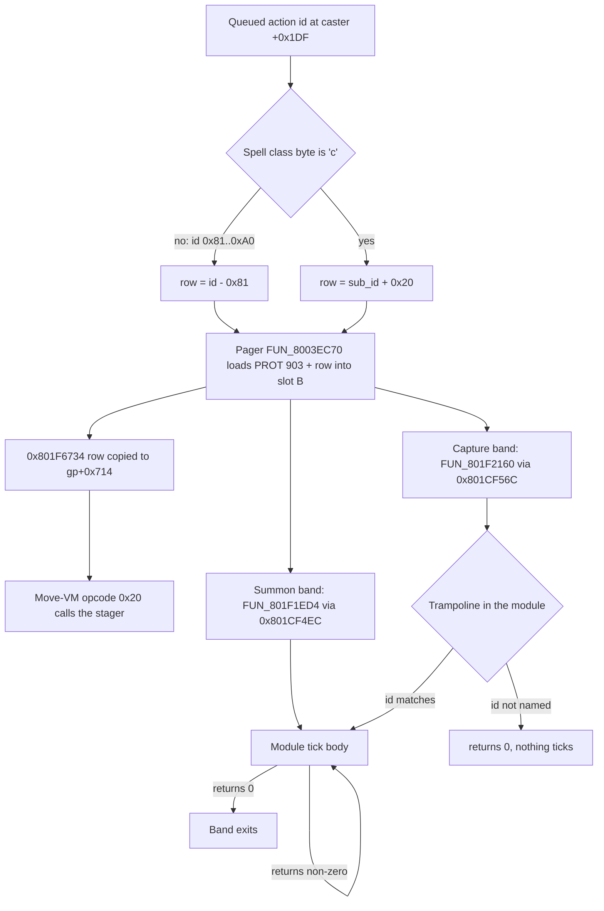
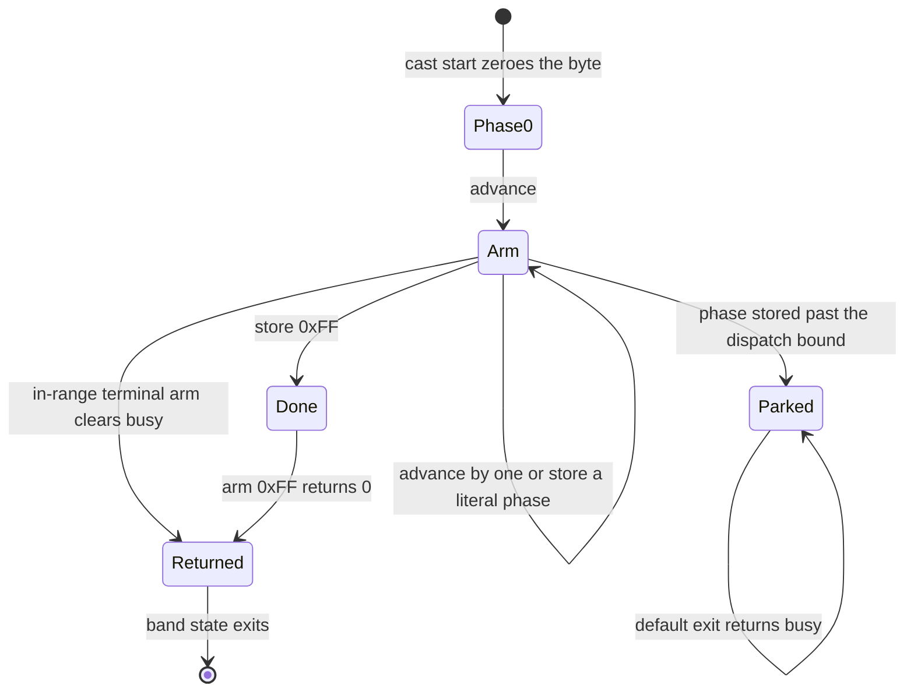

# Cast modules: the slot-B summon and capture-class band

Every summon and every capture-class cast (Seru capture, the item-capture
Amulet, the boss cinematic specials) runs its choreography from its own small
overlay program, a **cast module**. The 64 modules are PROT entries
`0903..=0966`. The battle overlay (PROT 0898) pages one into the side overlay
window "slot B" at `0x801F69D8` and re-enters it every frame until it reports
done. A module owns the cast's phase machine, its camera, its particle
spawns, its voice cue and its damage constants, so anything that edits or
ports a special attack ends up here.

This page is the module anatomy: how an action reaches a module, the image
layout, the `ctx+0x279` phase machine, the tick ABI, the damage shapes, the
routine catalogue, and what the Rust port runs. Related pages:

- File layout and spawn records: [slot-b-module-layout.md](../formats/slot-b-module-layout.md).
- The streamed creature / texture side-band: [summon-readef.md](../formats/summon-readef.md).
- The battle action state machine that drives the band: [battle-action.md](battle-action.md),
  and its [Seru-magic summon-overlay dispatch](battle-action-helpers.md#seru-magic-summon-overlay-dispatch).
- Staged clip sequences per module: [monster-animation.md](../formats/monster-animation.md#a-special-attack-can-be-a-chain-of-entries).
- The damage wrappers and their per-module call census: [battle-formulas.md](battle-formulas.md).
- Per-arm behaviour rows and non-entry addresses: [functions/battle.md](../reference/functions/battle.md#slot-b-summon--cast-modules-prot-09030966),
  [functions/cast-modules.md](../reference/functions/cast-modules.md).
- What a player-caster port of a module has to change: [randomizer.md](../tooling/randomizer.md#the-retail-cast-route).

## At a glance

| Item | Value |
|---|---|
| Module band | extraction PROT `0903..=0966`, 64 images, one per stager-table row |
| Load base | slot B, `0x801F69D8` (shared by all 64, so a VA needs its owning entry) |
| Pager | `FUN_8003EC70(arg)`; TOC index = `arg + 0x381` |
| Summon tick dispatcher | `FUN_801F1ED4` (0898, file `+0x236BC`), table `0x801CF4EC`, row `id - 0x81` |
| Capture tick dispatcher | `FUN_801F2160` (0898, file `+0x23948`), table `0x801CF56C`, row = spell record `+1` sub-id |
| Stager table | `0x801F6734` (0898, file `+0x27F1C`), 64 words, called by move-VM opcode `0x20` through `gp[+0x714]` = `0x8007BA2C` |
| Battle context | pointer at `0x8007BD24`; module phase byte `ctx+0x279`, `ctx+0x278`, caster seat `ctx+0x13`, band timer `ctx+0x6D8` |
| Actor pointer table | `0x801C9370` (`DAT_801C9370`), eight seats: party `0..2`, monsters `3..7`, summon creature seat `7` |
| Damage wrappers | `FUN_801DD0AC`, `FUN_801DD4B0`, `FUN_801DD6B4` in 0898 |
| Port | `crates/engine-battle-vm` (`cast_module_ticks`, `cast_arm_ticks`, `cast_seru_ticks_a` / `_b`, `cast_module_camera`, `cast_fatal_decision`, `battle_cast_dispatch`, `battle_cast_cue`), re-exported as `legaia_engine_vm::*`; band driver `crates/engine-core/src/world/battle/cast_band.rs`; spawn pool `crates/overlay-images/src/cast_effect_pool.rs` |

### The module band

| PROT | Class | Reached by | What it is |
|---|---|---|---|
| `0903..=0913` | player Seru magic | action ids `0x81..=0x8B`, `0x801CF4EC` rows 0..10 | Gimard, Theeder, Vera, Gizam, Nighto, Zenoir, Viguro, Swordie, Orb, Freed, Nova |
| `0914..=0934` | evolved / high summons and item casts | ids `0x8C..=0xA0`, rows 11..31 | Gola Gola .. Ozma; 0924 Ultimate Rave, 0925 the Spikefish flute, 0926 a null stub (id `0x98`, no tick arm) |
| `0935..=0966` | capture class (spell class byte `'c'`) | spell record `+1` sub-id `0x00..=0x1F`, `0x801CF56C` rows 0..31 | monster specials and boss cinematics: Earthquake (0935) .. Evil Seru Magic (0966) |

The spell-table side of the capture-class index is on
[spell-table.md](../formats/spell-table.md#capture-class-module-index-prot-09350966).
The three Delilas signature modules are the fully decoded exemplars: PROT
**958** (Blazing Slash `0x79`, Gi), **959** (Megaton Press `0x7A`, Che) and
**960** (Plasma Strike `0x7B`, Lu).

Module addresses below are VAs at the slot-B base, or file offsets with
`VA = 0x801F69D8 + off`. Because every image shares the base, an offset or VA
is meaningless without its module.

## How an action reaches a module

<a id="the-entry-tables-and-where-the-addresses-live"></a>

A module is a **library, not a program**: nothing inside it names its own
entry points. No entry VA appears in any extracted image as a word, a
`lui`+`addiu` pair or a `jal` / `j` target (five-form sweep,
`scripts/ghidra-analysis/find-address-word-refs.py`) except inside PROT 0898,
where they are fixed at link time. Each module has two callable routines, a
**tick** and a **stager**, and three tables in 0898 name them.



### Paging and the drive loop

Battle phase `0x28` routes a capture-class action to `0x6E..0x71` and pages
the module via `FUN_8003EC70(record[+1] + 0x28)`; a summon pages with
`id - 0x79`. Both arguments index the TOC at `+0x381`, which is the same
entry the tables below reach.

Phase `0x70` re-enters the module's tick **every frame and advances only when
the tick returns zero**. There is no timer and no bail-out, so a module phase
whose exit gate can never pass is a softlock
([re-do-not-re-walk.md](../reference/re-do-not-re-walk.md)).

While a module is resident, the word at `0x801F69D8` is the module's own
word 0. That is a third meaning for an address the corpus maps twice already
(PROT 0900's jump-table head, and the world-map band's `FUN_801F69D8`). A
probe watching it sees `0x001000E2` when slot B is empty (the bytes 0898's own
image holds there), then the module's word 0 at paging. Word 0 is **not** an
entry VA: it is arm 0 of the head jump table where the image has one, and the
first instruction where it does not.

### The three tables in PROT 0898

| Table | Dispatcher | Index | Entry it reaches | Battle-SM call sites |
|---|---|---|---|---|
| `0x801CF4EC`, 32 slots | `FUN_801F1ED4` | `id - 0x81`, bounded `< 0x20` | PROT `903 + row`: the tick, called directly | `0x801E4B1C`, `0x801E4C7C`, `0x801E4CA8` |
| `0x801CF56C`, 32 slots | `FUN_801F2160` (`0x801F2160..0x801F2410`, 688 B) | spell record `+1` sub-id, `sltiu v0, sub_id, 0x20` | PROT `935 + row`: a trampoline or the tick | `0x801E50C8` only |
| `0x801F6734`, 64 words | move-VM opcode `0x20` | row `i` = PROT `903 + i`, `i = 0..0x3F` | the stager | row copied at `0x801E44C8` and `0x801E4630` |

**The summon tick.** `FUN_801F1ED4` loads the caster `actor_table[ctx+0x13]`
from `0x801C9370`, takes its queued action byte `actor[+0x1DF]`, and jumps
through `0x801CF4EC`. Each arm is a hard-coded `jal` into the resident module
plus `s0 = v0`. The shared epilogue at `0x801F2128` calls `FUN_801F2410` when
`ctx[+0x27A] != 0` and returns `s0`. Id `0x98` has no arm: its slot points
straight at the epilogue, so that id ticks nothing. The three call sites in
the battle SM `FUN_801E295C` are:

| Site | Role |
|---|---|
| `0x801E4B1C` | cast start: zeroes `ctx+0x278` and the module phase `ctx+0x279`, seeds the countdown `s7[+2] = 0x78` |
| `0x801E4C7C` | per-frame re-entry; the countdown running out forces battle phase `0x36` |
| `0x801E4CA8` | proceeds only when the tick returns `0` |

**The capture-class tick.** `FUN_801F2160` derives the caster the same way,
reads `caster[+0x1DF]`, indexes the static spell table `0x800754C8` at
`id * 12`, takes the record's `+1` byte and jumps through `0x801CF56C`. Each
arm is a `jal` into the resident module plus `s0 = v0`; the epilogue at
`0x801F23D8` mirrors `0x801F2128` exactly. `jal 0x801F2160` occurs once in
0898's bytes, so one dispatcher entry is one module tick.

**The stager.** The battle SM copies the selected `0x801F6734` row into
`gp[+0x714]` = `0x8007BA2C` at `0x801E44C8` (capture class, row
`sub_id + 0x20`) and `0x801E4630` (row `move_id - 0x81`). Move-VM opcode `0x20`
calls it: `lw v0, 0x714(gp); jalr v0` at SCUS `0x80023764`, with `a0` = actor
and `a1` / `a2` = the move-table instruction's two signed halfwords. `a1` is an
arm index. 15 of the 64 stagers bound it with `sltiu vX, a1, N` and jump
through a table; the rest compare it against literals in a `beq` / `slti`
chain. `0x8007BA2C` is a code pointer, not an effect-data pointer, and the
table is bounded by byte tables below it and ASCII above.

All three indexings agree on the entry: the `move_id - 0x81` band
`0x81..0xA0` covers PROT 0903..0934, and the capture-class `sub_id + 0x20`
band covers 0935..0966.

**Identity check.** For every one of the 64 entries, the `0x801F6734` row and
the arm from whichever tick table covers it land on a function head recovered
from that image's own bytes and from no other image: all 64 stager rows, all
31 `0x801CF4EC` arms and all 32 `0x801CF56C` arms. The map rows in
[`static-overlays.toml`](../../crates/asset/data/static-overlays.toml) rest on
that test, which needs only the disc.

A module's entry can sit a few instructions **above** its prologue, where the
routine materialises the battle ctx `0x8007BD24` and the frame-delta scalar
`0x1F800393` before setting up the frame. PROT 0946 and 0953 both enter at
`0x801F69FC` with the prologue at `0x801F6A0C`. The table is the authority,
not a prologue scan.

### Capture-class trampolines

<a id="the-trampolines-are-their-own-port-and-one-cell-holds-six-spells"></a>

**21 of the 32** `0x801CF56C` arms do not call a tick body. They call a
trampoline, an 88 to 204 byte routine in the module that opens
`addiu sp, sp, -0x18`, materialises the battle ctx `*0x8007BD24`, loads the
caster `actor_table[ctx+0x13]` out of `0x801C9370`, reads `caster[+0x1DF]` and
`jal`s the tick body for that action id. An id the routine does not name
returns `a0 = 0`, so the module ticks nothing and the drive loop proceeds. The
other eleven arms (PROT 0935, 0936, 0937, 0939, 0946, 0947, 0948, 0949, 0953,
0954, 0966) point straight at a body.

The 21 trampolines name **48** `(action id -> body)` arms over 32 distinct
bodies. Eleven cells hold more than one choreography, so a dispatcher keyed on
the PROT entry alone runs the wrong one for the cell's other ids.

| Owner | Trampoline | Action id -> tick body |
|---|---|---|
| 938 (`cast_chaos_breath`) | `0x801F7A40` | `0x4E` -> `0x801F726C`, `0xB7` -> `0x801F69EC` |
| 940 (`cast_glare_divide`) | `0x801F8228` | `0x3C` -> `0x801F69F8`, `0x50` / `0xAE` -> `0x801F78B8`, `0xAC` -> `0x801F7240` |
| 941 (`cast_steal`) | `0x801F7D38` | `0x51` -> `0x801F730C`, `0xB9` -> `0x801F6A04` |
| 942 (`cast_power_up`) | `0x801F80A0` | `0x52` -> `0x801F7D34`, `0xAA` -> `0x801F69F4` |
| 943 (`cast_curse`) | `0x801F7624` | `0x40` -> `0x801F6EF4`, `0xB5` -> `0x801F6A04` |
| 944 (`cast_guilty_cross`) | `0x801F7EBC` | `0x37` -> `0x801F6A04`, `0x53` -> `0x801F7470` |
| 945 (`cast_water_column`) | `0x801F76F4` | `0x54` -> `0x801F6EDC`, `0xBA` -> `0x801F69F8` |
| 950 (`cast_rolling_flare`) | `0x801F8190` | `0x5A` -> `0x801F79F8`, `0xAB` -> `0x801F6A24` |
| 951 (`cast_chaos_flare`) | `0x801F816C` | `0x36` -> `0x801F6A20`, `0x5B` -> `0x801F77E8` |
| 952 (`cast_bloody_horns`) | `0x801F7B28` | `0x5C` -> `0x801F7118`, `0xB8` -> `0x801F6A0C` |
| 955 (`cast_white_shield`) | `0x801F92A4` | six ids, [below](#prot-0955-is-a-six-spell-cell) |
| 956 (`cast_water_hazard`) | `0x801F7E4C` | `0x71` -> `0x801F7298`, `0x75` -> `0x801F69D8` |
| 957 (`summon_effect_table`) | `0x801F9BA8` | `0x76` -> `0x801F798C`, `0x77` -> `0x801F6A14` |
| 958 (`cast_blazing_slash`) | `0x801F8E60` | `0x79` -> `0x801F6DD8` |
| 959 (`cast_megaton_press`) | `0x801F87F4` | `0x7A` -> `0x801F69F0` |
| 960 (`cast_plasma_strike`) | `0x801F8638` | `0x7B` -> `0x801F74E4`, `0xA6` -> `0x801F69D8` |
| 961 (`cast_dead_end_crisis`) | `0x801F7A54` | `0xA1` and `0xB4` -> `0x801F69D8` |
| 962 (`cast_blade_breath`) | `0x801F8080` | `0xA2` -> `0x801F7AE4`, `0xA3` -> `0x801F74A0`, `0xA4` -> `0x801F6D54`, `0xA5` -> `0x801F69D8` |
| 963 (`cast_genocidal_cannon`) | `0x801F8438` | `0xB3` -> `0x801F6A20` |
| 964 (`cast_element_change`) | `0x801F8E3C` | `0xAF` -> `0x801F88EC`, `0xB0`..`0xB2` -> `0x801F69D8` |
| 965 (`cast_doomsday`) | `0x801F7B1C` | `0xB6` -> `0x801F69D8` |

Two arm maps read against the grain of their `beq` chains. PROT 0940's `0x50`
and `0xAE` both reach `0x801F78B8` (the `beq` at `0x801F825C` and the `bne` at
`0x801F8288` land on the same `jal`). PROT 0964's second body is reached by a
**range** test (`slti v1, 0xaf` then `slti v1, 0xb3` at `0x801F8E88` /
`0x801F8E90`), so ids `0xB0`, `0xB1` and `0xB2` share it.

The port carries the map as data (`cast_arm_ticks::CAPTURE_TRAMPOLINES`,
`capture_tick_body`), and `crates/asset/tests/cast_module_data_rows_real.rs`
re-derives each row off the disc from the `0x801CF56C` arm and the
trampoline's own `jal` set.

<a id="a-body-va-is-not-a-key---only-entry-body-is"></a>

**A body VA is not a key; only `(entry, body)` is.** Six trampolines send an
id to `0x801F69D8`, the load base itself: PROT 0956, 0960, 0961, 0962, 0964
and 0965. Those are six different routines, each its own image's word 0.
`0x801F6A20` is PROT 0951's Chaos Flare *and* PROT 0963's only arm.
`0x801F6A04` is an arm in PROT 0941, 0943 and 0944, frame-matching at three
different sizes (2312 B, 1264 B, 2668 B). On the summon side, five VAs cover
the eleven player-Seru arms, and `0x801F69D8` alone is the arm for six of them
(PROT 0903, 0904, 0905, 0908, 0911, 0912). Anything that resolves a body (a
dispatcher, a damage-shape lookup, a port tag) carries the owning entry beside
the VA.

#### PROT 0955 is a six-spell cell

`0x801F92A4` is the one trampoline that dispatches through a jump table. It
bounds `id - 0x60` with `sltiu 0x14` and indexes the module's **head table**,
twenty words filling file `0x00..0x50`. Fourteen point at the shared epilogue
`0x801F9360` and tick nothing. The other six are whole choreographies:
`0x60` -> `0x801F8F0C`, `0x6E` -> `0x801F86A4`, `0x6F` -> `0x801F7FA4`,
`0x70` -> `0x801F767C`, `0x72` -> `0x801F7158`, `0x73` -> `0x801F6A28`. The
image's first function opens at file `+0x50`, immediately past the table. This
head table therefore belongs to the trampoline, not to the tick or the stager
(see [image anatomy](#image-anatomy)).

## Image anatomy

<a id="image-anatomy-recovered-from-the-bytes"></a>

A function in these images starts at `addiu sp, sp, -F` and ends at the first
`jr ra` whose delay slot restores the **same** `F`. That frame-matched pairing
is exact over the band and survives a frameless leaf, an early `jr ra` inside
a body, and a `jr ra` word that is tail data (PROT 0906 has one at
`0x801F8070`). It recovers **196 framed functions** across the 64 images,
between one (0903, 0926, 0939, 0947, 0954) and eight (0955) each. 25 of the 64
images contain internal `jal`s (a multi-spell module calls its own bodies);
the rest call only SCUS and the resident battle overlay, so Ghidra dumps have
to be driven from an address list rather than a call graph.

| Region | Contents |
|---|---|
| head | the jump table of one switch, 0 to 256 words; the first function's prologue is the first word past it |
| tick | the `ctx+0x279` phase machine, reached from `0x801CF4EC` / `0x801CF56C` |
| stager | the `a1` spawn switch, reached from `0x801F6734` |
| tail | data: the spawn / emitter records handed to `FUN_80050ED4` and `FUN_80021B04`, plus the module's scratch words |

**Which switch owns the head table varies; read the `sltiu` immediate.** PROT
0934's table is 26 words and its tick bounds on `sltiu a0, 0x1A`. PROT 0929's
is 9 words and its **stager** bounds on `sltiu a1, 9` (0928: 7 and 7). Over the
band the head table is the tick's in 8 images (0921, 0922, 0925, 0930..0934)
and the stager's in 11 (0906, 0909, 0910, 0913, 0914, 0916, 0917, 0928, 0929,
0941, 0959); 25 images head with code and no table. The per-image answer is on
[`functions/battle.md`](../reference/functions/battle.md#slot-b-summon--cast-modules-prot-09030966).

The data tail is the bulk of the residue `disc-coverage.py` reports on these
images. PROT 0934's is `0x801F9C08..0x801FA9D8`, and the `lui 0x8020` +
negative-displacement operands its stager passes as `a2` resolve into exactly
that span.

### The three exemplar images

| Module | Size | Head shape | Tick trampoline | Tick body |
|---|---|---|---|---|
| PROT 958 | `0x3000` B | 256-entry VA dispatch table fills file `0x0..0x400` (default arm `0x801F8CFC`) | `0x801F8E60` | `0x801F6DD8` = file `+0x400`, 8024 B |
| PROT 959 | `0x3000` B | 6-entry head table (`0x801F8290, 82C4, 8478, 850C, 8600, 878C`), owned by its **stager** dispatcher at `0x801F8250` | `0x801F87F4` | `0x801F69F0` = file `+0x18`, 6240 B |
| PROT 960 | `0x2800` B | none, code at file `+0` | `0x801F8638` | `0x801F74E4` (`0x7B` Plasma Strike, 4436 B) / `0x801F69D8` (`0xA6` Neo Star Slash, 2828 B) |

958's 256 slots hold only 27 arms: `0..=25` and `0xFF` (`0x801F8CBC`). The
other 229 point at the default exit, which returns busy without advancing. Arm
25, once its countdown runs out, stores `0xFF` to the phase
(`0x801F8CB0..0x801F8CB8`), and arm `0xFF` clears the return register
(`sw zero,0x28(sp)` at `0x801F8CF4`): the module's one Done. The bound
`sltiu 0x100` covers the whole byte, so a port that only increments the phase
wraps and holds state `0x70` forever.

Two interior addresses are not entries. `0x801F6E9C` (958 file `+0x4C4`) is
0xC4 bytes inside the tick body's register-save block. `0x801F8290` (959 file
`+0x18B8`) is inside the 1444-byte stager `0x801F8250`.

### Inherited tails

<a id="a-module-image-ends-in-another-images-bytes"></a>

Every one of the 64 images ends in a byte-identical, same-file-offset run of
another extracted image, and the run always ends exactly at the shorter
image's own length. Nine end in **PROT 0899's** bytes (the menu overlay, a
slot-A image at a different base), which settles the direction: the module was
mastered over a buffer that still held the previous build. PROT 0926 is the
limit case: 2040 of its 2048 bytes are PROT 0925's, and its own content is the
eight-byte null stager at `0x801F69D8`.

Consequences:

- **A dump's filename does not name the owner.** Seven catalogued addresses
  sit in an image that only holds the residue: `0x801F6A14` and `0x801F798C`
  (owner 0957, residue in 0964), `0x801F74E4` and `0x801F86B0` (0960, in 0961),
  `0x801F8118` (0942, in 0943), `0x801F8578` (0919, in 0920) and `0x801F8EAC`
  (0904, in 0910). The decisive test is the residual trampoline's own `jal`
  targets: PROT 0961's copy of `0x801F8638` calls `0x801F69D8` and
  `0x801F74E4`, and in 0961's own bytes `0x801F74E4` is interior to the tick
  body.
- **The tail is not shared library code.** The words 958 and 959 hold in
  common past `~+0x2A00` are inherited. In the four 12288-byte images 904 /
  912 / 917 / 918 the inherited words are PROT 0899's, at file offset
  `0x2A80`: a routine that materialises the live game-state window
  `0x80084140` and tail-jumps to `0x801D1298 + 0x8C`. Its printed VA under the
  slot-B base, `0x801F9458`, names no routine.
- **The residue is what `disc-coverage.py` reports as un-dumped code.** Of the
  137 `ambiguous = no` runs of 64 bytes or more in this band, 103 are the
  module's own data tail, 24 are byte-identical residue of a sibling's real
  function, 4 are the PROT 0899 tail, and 6 are interior to a tick body (PROT
  0915, 0935). None is an un-dumped function of the image it is filed under.
- **A frame partition is not an own-content measure.** An inherited tail
  carries the donor's prologue / epilogue pairs. PROT 0949 partitions into two
  framed routines, and the second, `0x801F8504`, is PROT 0948's stager sitting
  in 0949's tail, while 0949's own stager `0x801F75BC` is frameless and
  invisible to the partition. What bounds an image's own content is the top of
  the record chain, walked as move-VM programs
  ([slot-b-module-layout.md](../formats/slot-b-module-layout.md#bounding-the-highest-record)).
- **The boundary is per image.** PROT 0912's tick uses three module-local
  words at `0x801F92A8` / `0x801F92AC` / `0x801F92B0` (file `+0x28D0` /
  `+0x28D4` / `+0x28D8`), inside the run `0x801F8D2C..0x801F99D8` filed as
  inherited from PROT 0899. The byte-identical run is exactly file
  `+0x2908..+0x3000` (slot-B `0x801F92E0..0x801F99D8`, 1784 bytes). The three
  words sit `0x38` bytes below it, in a window that is zero in 0912 while 0899
  carries code there: the image's own zero scratch.

**Same VA, different routine.** Six "also present in" pairs are byte-for-byte
residue at the same file offset, each run ending at the shorter image's
length: `0x801F8EAC` (904, also in 908 and 910), `0x801F7F2C` (944 in 945),
`0x801F8118` (942 in 943), `0x801F8504` (948 in 949), `0x801F8578` (919 in
920) and `0x801F86B0` (960 in 961). `0x801F81DC` is not: PROT 0910's words
there differ from PROT 0951's in the first instruction. They are two routines
at one VA, 0951's 272-byte spawn stager and 0910's 2040-byte damage applier.

**The appendix check.** A byte-level re-derivation of the seventeen
`ambiguous = no` runs large enough to reach `disc-coverage.py`'s 64-byte floor
names no new routine. Force-disassembled, each run's own half decodes 9-34%
implausible opcodes against 0% for a real body in the band. A prologue scan
over the seventeen images finds five `addiu sp, sp, -F` words outside the
partition (`0x801F8078`, `0x801F816C`, `0x801F88EC`, `0x801F89D4`,
`0x801F9458`), each inside an inherited tail and a function head of the donor
image. The run-by-run boundaries are on
[`functions/cast-modules.md`](../reference/functions/cast-modules.md), and
`ghidra/scripts/dump_static_overlay.py`'s `NOT_CODE` record carries the band.

### The slot-B base cross-check

<a id="the-three-entries-that-nearly-lost-their-base-row"></a>

All 64 entries carry a
[`static-overlays.toml`](../../crates/asset/data/static-overlays.toml) row and
an extracted image. The base cross-check in
`crates/asset/tests/static_overlay_extract.rs` counts each image's
`lui 0x801f` / `0x8020` + `addiu` pairs and asks how many resolve **inside**
the image. References that legitimately leave the image are excluded rather
than counted against the base, which lets the acceptance floor sit at 0.90
(0.60 when they were counted). Three entries make such references:

| Entry | Spell | Where the outside references point |
|---|---|---|
| 0915 | `0x8D` Mushura | `0x801F6978` / `0x801F6980`, below the slot-B base, inside PROT 0898's own data |
| 0935 | capture sub-id `0x00`, Earthquake | `0x801FA320..0x801FA3B8`, above the image end: post-image `.bss` working storage in the shared slot-B buffer |
| 0926 | `0x98`, no tick arm and no spell-table record | `0x801F7D3C` / `0x801F7F2C`, the same post-image scratch; a 1-sector stub has almost nothing else to measure |

All three also pass the stronger test: their `0x801F6734` row (and, for 0915,
its `0x801CF4EC` arm) lands on a byte-recovered function head.

### Null stagers and unreferenced routines

<a id="six-of-the-64-stagers-are-a-null-routine"></a>

**Six stagers are a null routine.** PROT 0920, 0939, 0940, 0947, 0952 and 0954
answer opcode `0x20` with eight bytes, `jr ra` + `nop`, byte-identical across
the six. Those spells stage nothing from the move script. PROT 0903's row
(`0x801F771C`) and PROT 0926's (`0x801F69D8`) are the same routine.

**`0x801F7948` is reachable from nothing.** PROT 0909 partitions into five
framed functions. Two are the tick (`0x801F69F4`) and the stager
(`0x801F7AF4`). The other three (`0x801F7948`, `0x801F7CC8`, `0x801F7D30`)
have real prologues and clean epilogues and no reference: the five-form sweep
over `SCUS_942.54` and all 83 mapped overlay images reports no word, `jal`,
`j`, PC-relative branch or `lui`+`addiu` pair, and PROT 0909 holds no jump
table that could reach them. The sweep's only hits are cross-image aliases,
which its `--home` flag filters: a PC-relative branch inside PROT 0908 lands
on `0x801F793C` and one inside PROT 0949 on `0x801F7CD8`, neither of which can
leave its own image, and PROT 0958's head table carries `0x801F7D30` as one of
its own arms.

**PROT 0949's stager is a frameless table dispatch.** `0x801F75BC` has no
prologue. It bounds its operand with `sltiu v1, a1, 8`, forms the table base
with `lui v0, 0x801F; addiu v0, v0, 0x69F0` and `jr`s through it. The table is
eight words, `0x801F69F0..0x801F6A0C` inclusive (`0x801F6A10` is the next
routine's `addiu sp, sp, -0x50`). The arms are one eight-step ramp writing the
victim's tint `+0x0C` (`0x200`..`0x1000`) and anim rate `+0x21D` (`7`..`0`).
Seven are 20-byte leaves ending in `jr ra` with the `sb` in its delay slot
(arm 0 at `0x801F761C` is the fall-through past the `jr`). Arm 7 at
`0x801F76A8` is twelve bytes with no `jr ra` of its own and falls into the
shared epilogue at `0x801F76B4`, where the out-of-range `beqz` also lands.

**Two entries carry no spawn record.** PROT 0926 is the null stub. PROT 0952's
two spawn sites sit in its inherited tail (file `+0x11E8..+0x1800`, PROT
0951's bytes), and their `lui` / `addiu` pairs resolve to `0x801F8348` /
`0x801F836C`, two of PROT 0951's records, past the end of 0952's
`0x1800`-byte image.

### SCUS calls into slot B at one VA (PROT 0920)

<a id="scus-calls-into-slot-b-at-one-fixed-va---and-only-prot-0920-arms-it"></a>
<a id="the-arm-is-an-in-battle-frame-path-not-a-teardown"></a>

`FUN_800480D8`, the per-actor battle draw tick, calls `jal 0x801F7B88` at
`0x800481A0` under `_DAT_8007BDC0 != 0` (`lui v0,0x8008` /
`lw v0,-0x4240(v0)` / `beq` at `0x8004818C..0x800481A0`,
`see ghidra/scripts/funcs/800480d8.txt`). The `jal` alone names no image:
sixty-five of the sixty-eight slot-B rows in `static-overlays.toml` are long
enough to hold a routine at base `+0x11B0`. The gate names it.
`_DAT_8007BDC0` is `gp+0xAA8`, and `find-gp-relative-refs.py --va 0x8007BDC0`
finds it in exactly two images across SCUS and all 83 mapped overlays: SCUS,
which only stores zero (`0x80055BBC`), and **PROT 0920** (`summon_slippery`,
the Slippery / "Deadly Rain" module).

The word is a drain **budget**, touched by five sites in PROT 0920:

| Site | Effect |
|---|---|
| `0x801F6BBC` | zeroes it before the cast |
| `0x801F6FEC` | `addiu v0,zero,0x204` ; `sw v0,-0x4240(v1)`: seeds `0x204` (516) inside the module's 64-iteration spawn loop |
| `0x801F70CC` | `sw v0,-0x4240(t0)` after `subu v0,v0,a0`: drains it per frame by `2 * byte[s0+0x7F]` (`8` per frame across 64 writes in the capture) |
| `0x801F712C` | floors it at `4`, so it never reaches zero on its own |
| `0x801F7B4C` | `sw zero,-0x4240(v0)`: clears it, in the epilogue of the function that ends at `0x801F7B84` |

`0x801F7B88` is the next routine: 1632 bytes at file `+0x11B0`
(`addiu sp,sp,-0x60`, 408 instructions, reading the per-frame scalar
`_DAT_1F800393`). It reads the budget it never writes, walks the module's own
particle records and hands them to `FUN_80021B04`.

The call is an in-battle frame path, not a teardown. `FUN_800480D8` reaches
the gate when the request byte `gp[+0xA0C]->[+0x272]` is non-zero **and** the
battle-end signal `_DAT_8007BD71` reads `0xFF`, the *battle running* value
(`0xFE` is what the end sequence raises, see
[`battle-action.md`](battle-action.md)). The arm consumes its own request byte
(`sb zero, 0x272(v0)` at `0x800481B0`), so it is a per-frame one-shot.

Measurements (`capture`):

- Driving action id `0x92` pages PROT 0920 in (loader tracker `25`) and the
  `jal` fires **212 times in one cast**, with `_DAT_8007BD71 = 0xFF`
  throughout, across module phases `6..10` and once at `0xFF`. The module's
  own clear closes the arm 1039 VSyncs after it opened.
- Outside a Slippery cast the gate read is entered once per rendered frame
  and blocked by the budget alone: 123 entries across `rim_elm_gimard_victory`
  (`scripts/pcsx-redux/autorun_slippery_budget_gate.lua`, 1800 vsyncs), all
  with the budget zero, and none after the victory raises `0xFE` at vsync 323.
- `_DAT_8007BDC0` reads zero in all 176 states of
  [`scripts/scenarios.toml`](../../scripts/scenarios.toml). In the mednafen
  state `slippery_summon_mid_cast` PROT 0920 is byte-resident at slot B (8183
  of 8192 bytes) and the sixteen bytes at `0x801F7B88` equal the image's
  `+0x11B0`.

So the routine is a per-frame tick of the module while its effect drains. Its
purpose beyond that is `inference`.

## The module phase machine (`ctx + 0x279`)

<a id="the-module-phase-byte-ctx--0x279"></a>

A tick body is a dispatcher over its own phase byte at battle-ctx `+0x279`
(ctx pointer `0x8007BD24`). It is a **second, module-local phase space** riding
under the battle SM's band state (`0x34..0x36` for a summon, `0x70` for a
capture-class cast); probes log it alongside the battle phase `ctx+7`. The
tick seeds a saved register with `1` and returns it, so the default answer is
"busy"; only a terminal arm zeroes it.



| Phase value | Name | What the arm does | Exits |
|---|---|---|---|
| `0` | entry | first tick of the cast, typically the opening camera cut or shot | advances to `1` (dwell is one tick in every measured walk) |
| `1 ..= N` | working arms | stage clips (`+0x1DA` / `+0x1DC`), spawn records, move the camera, roll damage, write stats; `N` comes from the module's dispatch bound (`sltiu 0x1D` in PROT 0927 and 0966, for example) | holds (returns busy) while its gate is closed; then `+1`, or a literal store that skips arms (PROT 0905 arm 5 -> 8, 0907 arm 13 -> 15, 0911 arm 5 -> 9, 0966 arm 4 -> 10) |
| in-range terminal arm | finish | spends the countdown, tests the settle state, clears the busy register and `ctx[+0x0D]`; stores **no** phase | tick returns `0` |
| past the bound | parked | the default arm: nothing | returns busy forever; a softlock if reached |
| `0xFF` | Done | chain-dispatched and table-with-`0xFF`-arm bodies store `0xFF` from their last working arm; the `0xFF` arm clears the returned register | tick returns `0` after exactly one `0xFF` tick |

Dispatch takes two forms: a `sltiu` bound and a jump table (the head table, or
one inside the image), or a `beq` / `slti` compare chain over literals (960's
is at file `+0x0BB0..+0x0C70`, reaching arms `0..=0x10` before `0xFF`).
Measured arm sets match the bound walked: each table-dispatched body walks
exactly the arms its `sltiu` allows and stops on the terminal arm with no
`0xFF` (`0..7` for PROT 0940's `0xAC`, `0..4` for the three `sltiu 5` bodies,
`0..5` for PROT 0944's `0x37`). Each chain-dispatched body walks `0..3`
(`0..4` for PROT 0962's) and then latches `0xFF` for one tick.

**Exit rules.**

- *Out of range is busy, not done.* PROT 0949's out-of-bound `beqz` at
  `0x801F6AA4` targets `0x801F758C`, one instruction past the `move s7, zero`
  at `0x801F7588`.
- *A terminal arm is in range and stores no phase.* PROT 0951's Chaos Flare
  (arm 11, `0x801F76F4`) and Scythe Wind (arm 5, `0x801F801C`) and PROT 0952's
  Bloody Horns (arm 6, `0x801F79DC`) each end on the last word of their table:
  they spend the countdown, test the victim's settle state, then clear the
  busy register and `ctx[+0x0D]` and return without touching `ctx[+0x279]`
  (`0x801F77A0`, `0x801F8138`, `0x801F7AF4`). A port that advances through
  that arm walks into the parked state.
- *Most capture bodies end on three stores:* the busy result cleared,
  `sb zero,0xd` (the framing style) and `0x780` into the yaw counter
  `ctx[+0x6DA]` (Zora's Glare at `0x801F7208` in PROT 0940, for one). PROT
  0935..0937, 0939, 0946..0948, 0953, 0959, 0960 and 0962 clear the style
  without the yaw store.

**Two store forms write the phase.** Every player-Seru tick materialises a
pointer to `ctx + 0x279` in its prologue (`addiu s6, s1, 0x279` at
`0x801F6A78` in PROT 0903, `addiu s5, v1, 0x279` at `0x801F6A54` in 0908) and
writes the byte through that register at displacement zero, beside the literal
`sb rX, 0x279(rY)` form. Eight of the eleven write their terminal `0xFF`
through the register form, and PROT 0908 writes the phase six times with no
literal-displacement store. A store census counts both forms.

**What gates an arm.** An arm holds on one of:

- the caster's or victim's clip state (`+0x1D9` playing id, see
  [staging](#tick-abi-caster-victim-staging));
- progress halfwords of the model or the scene (a travel distance, a range
  poll);
- the shared settle loop, which waits until no live actor plays anything but
  the settle id `8` (960 file `+0x0A40`);
- a **module countdown**: one word in the module's own image, seeded as a
  multiple of the speed scalar `*(0x1F80037D)` and drained per pass by a
  multiple of the frame-delta byte `*(0x1F800393)`.

The countdown's per-pass drain is part of each arm's code, not a property of
the word. Three forms appear, two of them inside one body:

| Drain per pass | Arm | Instructions |
|---|---|---|
| `*(0x1F800393) * *(0x1F80037D)` | PROT 0940 `0x50` arm 1; PROT 0941 `0x51`'s last arm | `lbu 0x69(v0)` / `lbu 0x7f(v0)` off `0x1F800314`, `mult`, `mflo`, `subu` at `0x801F7A88..0x801F7AA4`, `0x801F7CCC..0x801F7CE8` |
| `*(0x1F800393) << 1` | PROT 0940 `0x50` arm 2 | `lbu 0x393(v1)`, `sll v1,v1,1`, `subu a0,a0,v1` at `0x801F7B6C..0x801F7B7C` |
| `*(0x1F800393)` | PROT 0943 `0xB5` | `lbu 0x7f(a1)` off `0x1F800314`, `subu a2,v0,v1` at `0x801F6B88..0x801F6B94` |

PROT 0940's `0x50` drains the same word `0x801F864C` by two expressions in two
arms. The frame step is adaptive and changes inside a cast (the audio frame
driver rewrites `DAT_1F800393` per frame, see [`audio.md`](audio.md)), so a
dwell is the seed divided by the *sum* of per-pass drains. Measured dwells are
in [measured arm timing](#measured-arm-timing).

The band timer `ctx[+0x6D8]` is separate. A player-Seru cast finds it at `120`
(`0x78`) on its first tick and it decrements by `1` per tick; a capture-class
cast leaves it at `20` throughout (333 tick entries of PROT 0959).

### Worked example: PROT 0903 (Gimard)

Thirteen arms and `0xFF`. Dwell is in module ticks from one driven cast at a
frame step of `4` (see [measured arm timing](#measured-arm-timing)).

| Arm | What it does | Dwell |
|---:|---|---:|
| 0 | camera snap | 1 |
| 1 | camera pan | 1 |
| 2 | countdown gate | 64 |
| 3 | places the creature half a unit from the victim toward the caster, facing the victim; spawns the arrival records | 1 |
| 4 | camera cut, gate | 9 |
| 5 | gate; prints the spell name | 8 |
| 6 | camera cut, gate; replaces the caption with the actor record's attack name (`FUN_8003541C(.., 0x96, ..)`); spawns the fire tunnel | 99 |
| 7 | `0xC0`-frame pan, gate | 1 |
| 8 | gate; spawns the breath | 15 |
| 9 | gate; sets the creature's render flag and tint word (`+0x21C = 3`, red) | 8 |
| 10 | gate; stores depth `ctx[+0x6D0] = 0x800` and yaw base `ctx[+0x6DA] = 0x200`; its exit queues the walk clip | 24 |
| 11 | walk-in: `FUN_801D5854(7, 6)` every pass, holds on the range poll `FUN_8004E2F0(7, victim)`; lands the hit; adds `scalar * 192` to the countdown | 16 |
| 12 | drains that countdown, then waits for the victim to settle | 87 |
| `0xFF` | Done | - |

The run from arm 1 to the hit is about 500 display frames, so the module, not
a fixed stager script, sets how long battle state `0x36` lasts. Arm details
are under [spawn reports](#a-module-that-reports-its-spawns) and
[the summon-band camera](#summon-band-camera).

## Tick ABI: caster, victim, staging

| Datum | Where | Notes |
|---|---|---|
| ctx | `*0x8007BD24` | battle context |
| caster | `actor_table[ctx+0x13]` | `actor_table` = `DAT_801C9370` |
| victim | `actor_table[caster+0x1DD]` | the caster's target-slot byte |
| queued action | `caster+0x1DE` (category, `2` = Magic), `+0x1DF` (id) | read by dispatchers and trampolines |
| staged clip | `+0x1DA`, restage counter `+0x1DC` | the commit mirrors the id into `+0x1D9` (playing) and `+0x1DB` |
| clip loop count | `+0x1F4` | counts loops while a staged clip repeats |
| reaction map | `+0x1F1` knockdown, `+0x1F2`, `+0x1F3` Block | the victim's own ids, copied to its `+0x1DA` |
| HP / damage popup | `+0x14C` / `+0x10` | combo accumulator at `+0x00` |
| status / targetable | `+0x16E` | bit `4` skips a seat (Stone); bit `0x400` set by the turn steal |
| anim rate | `+0x21D` | `8` is normal |
| tint / render | `+0x0C` tint, `+0x04` prim word, `+0x21C` render flag | |
| party / monster count | `ctx[+0]` / `ctx[+1]` | see [below](#ctx0-is-the-party-count-not-the-actor-count) |
| return | `v0` | non-zero = busy, `0` = done |

**Derivation.** The tick prologue derives caster and victim as above (958 at
file `+0x0438..+0x0460`, 960 at `+0x0B44..+0x0B6C`). Register discipline
differs per module and matters to any patch: 959 keeps the victim in `$s4`
(written exactly twice, the derivation and the epilogue restore); 960 keeps it
in `$s3` (derived once at `+0x0B6C`); 958's `$s1` holds the victim only until
an arm reuses it, and its finale arm burns `$s1/$s3/$s4` (and `$s2`) as
GPU-packet constants.

**Staging.** The module drives clips through the actor anim channel
([battle-actor-rendering.md](battle-actor-rendering.md#one-staged-anim-channel-actor0x1da)):
store the action id to `+0x1DA` and bump `+0x1DC`. Victim reactions are staged
from the victim's own reaction map (`lbu +0x1F1` stored back to its `+0x1DA`),
with Block (`+0x1F3`'s id) held through build-up phases. Two caster idioms
appear, literal (`li <id>`) and stepper (`lbu +0x1DA; addiu; sb`). The
per-module walks are on
[monster-animation.md](../formats/monster-animation.md#a-special-attack-can-be-a-chain-of-entries).

**Paired stage / confirm gates.** A staging literal can have a twin. 960's
phase-5 arm stages id `0x0D` per tick and holds the phase until
`lbu caster+0x1D9` equals the same literal (compare at file `+0x118C`, VA
`0x801F7B64`), ANDed with a progress check (`ctx[+0x22C]->+0x68 >= 0x90`). An
edit that remaps the stage without the compare stalls phase 5 forever
(probe-measured on a natural duel cast). 959's two gates compare `+0x1D9`
against `+0x1F2`, register-register and immune to id remaps. 958 has no
caster-literal gate: its `+0x2134` gate is victim `+0x1D9` vs `+0x1F1`, and
the shared-tail gates compare the settle id `8`, which no cast stages.

**The victim is the core's target, not the caster.** The monster AI's Delilas
arms (`FUN_801E9FD4`, `0x801EB7C0..0x801EB81C`) store only `+0x1DE = 2` and
`+0x1DF = id - 0x29`; `+0x1DD` keeps the generic core's party pick, so the
derived victim is a party seat.

**The attacker seat differs by band.** Player-Seru wrapper calls pass the
summon seat `7` as a literal (`addiu a1, zero, 7` at `0x801F74A8` in PROT 0903
and `0x801F8880` in 0910; the capture reads `a1 = 7` with `ctx[+0x13] = 0`).
Capture-class bodies pass the caster's seat: PROT 0959's three sites set
`a1` from `lbu a1, 0x13(...)` (`0x801F71E4`, `0x801F7A8C`, `0x801F7EB8`), and
its tick returns to `0x801F8838`, inside slot B, not to a 0898 arm.

### `ctx[+0]` is the party count, not the actor count

The two bytes bound disjoint halves of `actor_table`:

- **`ctx[+1]` = monster count.** The two party-wipe sweeps read it as the loop
  bound (`lbu a1,1(ctx)` at `0x8004B10C`, `lbu v0,1(ctx)` at `0x8005039C`) and
  index `actor_table[(i + 3)]` (`addiu v0,v0,3; sll v0,v0,2` at `0x8004B12C` /
  `0x800503B4`), the enemy row.
- **`ctx[+0]` = party count.** `0x8004B3F0` reads it as the bound of a loop
  indexing `DAT_8007BD10[i]`, the per-seat 1-based party character id, and
  turns it into a `0x414`-byte party-record address: `v1 = DAT_8007BD10[i] - 1`,
  then the shift / add chain at `0x8004B430..0x8004B444` multiplies by `0x414`
  and adds `0x80084140`, reading `+0x6C0` off it. Only party seats have such a
  record.

Retail seats monster `k` at pool slot `3 + k` whatever the party size, and
leaves a small party's seats `1..2` empty (`FUN_800513F0`,
`addiu s0,s2,0x3` at `0x8005185C`). In the Tetsu tutorial's solo capture those
two slots are zeroed structs: HP `0`, `+0x16E` flags `0`, prim word `+0x04`
`0`. The port's seat mapping is under [what the port runs](#retail-seats-in-the-engine).

### The seat-0 hardcode

<a id="the-seat-0-hardcode-and-where-it-does-not-hold"></a>

In the three exemplars every apply site loads `actor_table[0]`
(`lw rX, 0x9370(base)`) instead of the derived victim: twelve sites in 958
(six clamp / write pairs), five in 959, two in 960 (`+0x17AC` / `+0x17DC`).
Retail never notices, because a boss cinematic's victim is the party's seat 0.
Any reuse that points the cast at a monster inherits friendly fire from these
sites. The finale has the same assumption: a dead-victim arm declares game
over on the spot. It is not a band-wide rule: the [AoE sweeps](#the-two-aoe-sweeps)
index the table by their own loop counter and pass that seat as `a2`.

## Damage

Each hit is one call into a roll wrapper with a **baked per-hit power** in
`a0`, then an apply: clamp the roll against the victim's HP `+0x14C`,
accumulate into the damage-popup word `+0x10`, write HP back. The power is an
immediate compiled into the module image, so a cast never reads the
move-power table for its magnitude. Which wrapper a module calls is tabulated
on [battle-formulas.md](battle-formulas.md).

### Baked power constants

<a id="the-baked-power-constants"></a>

Read off the `a0` set at each `jal` into `0x801DD0AC` / `0x801DD4B0` /
`0x801DD6B4`:

| Module / routine | Wrapper | Powers (call-site order) |
|---|---|---|
| 903 tick | `FUN_801DD0AC(.., 7)` at `0x801F74AC` | `0x12` |
| 904 tick | `FUN_801DD0AC` at `0x801F7D38` | `0x11` |
| 908 tick | `FUN_801DD0AC` at `0x801F76CC`, `0x801F7C14` | `0x12`, `0x10` |
| 910 applier `0x801F81DC` | `FUN_801DD0AC(0x12, 7)` at `0x801F887C` | `0x12`, four slashes from one site |
| 927 (Juggernaut) stager and tick | `FUN_801DD0AC` with `a1 = 7`, the shared kernel's summon branch | `0x12` at `0x801F8758` (stager) and `0x801F7E0C` (tick) |
| 935 (Earthquake) | capture wrapper at `0x801F7AFC` | `0x1AE` |
| 945 (Water Column) | `FUN_801DD4B0` | `0x30` |
| 949 tick | `FUN_801DD4B0` at `0x801F7318` | `0xC0`, baked at `0x801F72F8` |
| 957 tick `0x801F6A14` | `FUN_801DD4B0` | `0x100` |
| 958 (Blazing Slash) | `FUN_801DD6B4` | `0x30, 0x38, 0x38, 0x38, 0x40, 0x30` (the sixth site is `0x801F88D8`) |
| 959 (Megaton Press) | `FUN_801DD6B4` at `0x801F71E8`, `0x801F7A90`, `0x801F7EBC` | `0x80`, `0x80`, `0x30` (the last fires four times inside arm 15) |
| 960 (Plasma Strike) | `FUN_801DD6B4` | `0x1C0` |
| 966 stager `0x801F8D64` | `FUN_801DD4B0` | `0x100` |
| 966 tick body | `FUN_801DD4B0` at `0x801F8610` | `0x327` |

Further constants are in the [tick-body tables](#tick-bodies).
`World::baked_module_power` seeds the engine's wrappers from these
(`cast_module_ticks::baked_power_for`, `CAPTURE_SITE_POWERS`), feeding
`capture_bypass_predamage` / `capture_respect_predamage`.

Reading rules:

- **Stager and tick are two routines.** 966's stager bakes `0x100` and clamps
  shape B; its tick bakes `0x327` and clamps shape A at `0x801F863C`. 0927 has
  `0x12` on both sides and only the clamp differs. A module's entry number
  answers for its stager.
- **Read the delay slot.** PROT 0951's `0x5B` body sets `a0` after the call
  word: `jal 0x801DD4B0` at `0x801F7F88` with `addiu a0, zero, 0x80` in its
  delay slot.
- **A power can ride a reused register.** PROT 0918's arm gate
  `addiu v0, zero, 0x12; bne v1, v0` compares the phase byte against `0x12`
  and the call reuses the register (`move a0, v0` at `0x801F8798`), so the
  phase number and the baked power are one constant.

Measured rolls (`capture`, one driven cast each; see
[measured arm timing](#measured-arm-timing)):

| PROT | Call site | `a0` | Wrapper return | HP lost |
|---|---|---|---|---|
| 0903 | `0x801F74AC` | `0x12` | 247 / 417 | 76 (bar emptied) / 417 |
| 0904 | `0x801F7D38` | `0x11` | 371 | 371 |
| 0908 | `0x801F76CC` | `0x12` | 522 | 130 (a quarter) |
| 0908 | `0x801F7C14` | `0x10` | 541 | 405 (three quarters) |
| 0910 | `0x801F887C` | `0x12` | 427, 427, 380, 384 | 106, 106, 95, 96 |
| 0959 | three sites | `0x80`, `0x80`, `0x30` | 67 / 71 / 26 / 25 / 30 / 25 | applied unscaled |

PROT 0910 takes `return >> 2` per slash: the `srl s1, s1, 2` at `0x801F8898`
sits between the two operands of the running-total update at `0x8007BD14` and
rewrites the register the clamp at `0x801F88F0` and both stores at
`0x801F8900..0x801F8910` then use. The two heals land on their arithmetic: at
magic level `3`, PROT 0905 restored `320` (`3 * 0x20 + 0xE0`) into a seat on
`42` of `999` HP and PROT 0911 restored `640` (`(3 << 6) + 0x1C0`). MP costs
read off the same casts: `0x81` 10, `0x82` 24, `0x83` 6, `0x85` 13, `0x86` 36,
`0x88` 32, `0x89` 18.

### The three clamp shapes

<a id="the-three-clamp-shapes"></a>
<a id="the-two-clamp-shapes"></a>

The 64 images hold **83** `jal` words into the three wrappers, **79** inside a
frame-matched function of the image carrying them. The other four sit in an
inherited tail: PROT 0911's `0x801F887C` is 0910's, 0951's `0x801F8E04` is
0934's, 0952's `0x801F7F88` is 0951's and 0965's `0x801F853C` is 0964's. Of
the 79 own sites, **70 clamp shape A, seven shape C, two shape B**. All three
are ported in `cast_module_ticks`.

| Shape | Cap | Compare | Can kill | Negative roll | Sites |
|---|---|---|---|---|---|
| A | live HP | `sltu` (unsigned) | yes | reads as huge, rewritten to the whole bar: kills | 70, including 0945, 0957 (both bodies), 0958, 0960 |
| B | `HP - 1` | `slt` (signed) | no, leaves 1 HP | passes unclamped: the subtract raises HP | 2, both stagers: `0x801F8758` (0927), `0x801F8F08` (0966) |
| C | `HP - 1` | `sltu` (unsigned) | no | rewritten to `HP - 1` | 7, all tick bodies or their callees |

```text
shape A                    shape B                    shape C
a0 = victim[+0x14C]        v0 = victim[+0x14C]        v0 = victim[+0x14C]
sltu v0, a0, dmg           v1 = v0 - 1                v1 = v0 - 1
if v0 { dmg = a0 }         slt v0, v1, dmg            sltu v0, v1, dmg
victim[+0x10]  += dmg      if v0 { dmg = v1 }         if v0 { dmg = v1 }
victim[+0x14C] -= dmg      (same two stores)          (same two stores)
```

The wrapper's return is a signed word, which is what makes the
signed / unsigned choice matter. "0927 / 0966 never kill" is true of their
stager sweeps and false of their ticks, which clamp shape A.

Shape C sites:

| Wrapper site | Owner | Routine |
|---|---|---|
| `0x801F76CC` | 908 `summon_zenoir` | tick `0x801F69D8`, the `/4` splash arm |
| `0x801F7108` | 915 `summon_mushura` | tick `0x801F69D8` |
| `0x801F8114` | 928 `summon_palma` | tick `0x801F69F4` |
| `0x801F7E4C` | 929 `summon_mule` | tick `0x801F69FC`; the apply is 117 instructions later at `0x801F8020` |
| `0x801F7BA0` | 932 `summon_meta` | tick `0x801F6A34` |
| `0x801F7CCC` | 933 `summon_terra` | tick `0x801F6A30` |
| `0x801F8E04` | 934 `summon_ozma` | tick `0x801F6A40`; apply at `0x801F8F9C` |

0929 and 0934 park the return in a saved register across a branch, so a census
has to follow the roll register to its apply rather than window the call.

**PROT 0910 picks its cap at run time.** The applier `0x801F81DC` counts its
slashes in the module word `0x801F8DAC` and chooses the cap from that count:
`HP - 1` on slashes 1..3 (`0x801F88D8` / `0x801F88E4`), live HP on slash 4
(`0x801F88E8`), with one `sltu` at `0x801F88F0` either way. Kill capability
there is per hit. A cap of `HP - 1` on a victim already at `0` is `0xFFFFFFFF`
(`lhu` then `addiu -1`), so nothing clamps.

The applier is a per-slash state machine. Each slash owns a progress word at
`0x801F8D9C + slash * 4`. A call returns at once when the word has reached
`speed << 6` (`0x801F8264`); otherwise it grows the word by `rate * speed`
(`0x801F8280`, `rate` = `0x1F800393`, `speed` = `0x1F80037D`) and lands the
hit (counter, wrapper roll, cap, reaction) only on the call that carries it
over the limit. The tick `0x801F69EC` calls it from three sites
(`0x801F78E8`, `0x801F7928`, `0x801F7A08`); the roll is
`addiu a0, zero, 0x12` / `addiu a1, zero, 7` / `jal 0x801DD0AC` at
`0x801F8874..0x801F887C`, and the HP store is `sh v1, 0x14C(s2)` at
`0x801F8910`. Arm `9` starts slash `i` once `ctx[+0x6D8]` passes
`(i + 2) * speed * 16`, so the four slashes overlap, and arm `0x0A` keeps
calling all four until the last has landed and a `speed << 7` countdown
(`0x801F8DB0`) has drained. At four vsyncs a tick those gates give arm `7` 65
ticks and arm `9` 25, the measured dwell. Port:
`cast_seru_ticks_b::swordie_slash_step`, driven by
`World::run_cast_module_code` on the world's frame step with a neutral wrapper
return, so each landing stages its reaction clip while the HP outcome stays
the fold's.

### Row sweeps

<a id="the-two-aoe-sweeps"></a>

Two **stagers** apply damage across a row, driven by the move script through
opcode `0x20` rather than by the phase machine:

| | PROT 0927 (Juggernaut) `0x801F85A8` | PROT 0966 (Evil Seru Magic) `0x801F8D64` |
|---|---|---|
| seats swept | `actor_table[3 ..]`, the enemy row | `actor_table[0 ..]`, the party row |
| bound | `ctx[+1]` (monster count) | `ctx[+0]` (party count) |
| skips | `+0x14C == 0`, `+0x16E & 4` | the same two |
| wrapper | `FUN_801DD0AC(0x12, 7, seat)` | `FUN_801DD4B0(0x100, ctx[+0x13], seat)` |
| clamp | shape B | shape B |
| also writes | - | `+0x1DA = +0x1F1`, `+0x1DC += 1`, `+0x21D = 2` |

Cort's ESM sweep stages each victim's knockdown and drops every hit seat into
slow motion. Four **tick** bodies sweep the party row
`actor_table[0 .. ctx[+0]]` too, all with shape A, so they kill:

| Body | Sweep arm | Site |
|---|---|---|
| 938 `0x4E` Chaos Breath | phase `2` | `0x801F7750` |
| 938 `0xB7` Mystic Circle | phase `3` (table word 3 at `0x801F69E4`) | tests only `+0x14C == 0` (`0x801F70D0`): **no Stone guard**, it hits a petrified seat |
| 965 `0xB6` Doomsday | phase `0x0B` (the `beq v1,0x0C` / `slt` pair at `0x801F6AE8` sends it to `0x801F7648`) | |
| 966 tick | arm 26 | power `0x327`, see [PROT 0966](#prot-0966-evil-seru-magic) |

### One owner per hit

**The flurry lands in the module, not in the hit kernel.** A cast clip's hit
events run the damage kernel `FUN_801EC3E4` like any swing, but the kernel
only applies the combo total once the strike cursor `ctx[+0x15]` is parked at
`0xFF`, and during a cast it is not (it reads `0` mid-cast in a captured
Plasma Strike). Each hit adds to the victim's combo accumulator `+0x00` and
the bar's `+0x10`, and live HP keeps the damage. 960's arm `0x0C`
(`0x801F8098..0x801F80C8`) lands it: `total = victim[+0x00]` clamped to
`+0x14C`, `+0x14C -= total`, `+0x00 = 0`. Arm `0x0D` then fires the burst:
`li a0,0x1C0` / `lbu a1,0x13(ctx)` / `clear a2` / `jal 0x801DD6B4` at
`0x801F8160..0x801F816C`, aimed at seat `0`, followed by the shape-A clamp,
the `+0x10` accumulate and the HP write (`0x801F818C..0x801F81CC`). A Plasma
Strike is exactly two HP writes. A port that stops 960 short of arm `0x0C`
leaves the bar below live HP, and the action SM's `0x51` settle gate
(`FUN_801E7250`, a plain `+0x14C` vs `+0x172` compare) never opens.

Every `jal` to a wrapper in `0903..0966` is a hit the cast owes once. The port
gives each exactly one owner:

- **The fold** is the default. A body the port runs with a neutral wrapper
  return (`None`, `|_| 0`, a zero heal) writes no HP, and the band's generic
  fold rolls the cast with the baked power. That covers every player-Seru and
  summon tick and every single-target capture body except Plasma Strike's
  burst.
- **The tick** owns the outcome where a body rolls in-tick, and the fold is
  waived:
  - PROT 0927 / 0966's stager sweeps: the fold runs the stager itself,
    `run_cast_module_aoe_for`.
  - The three whole-row tick sweeps (PROT 0938's two and 0965's), waived by
    `tick_body_owns_the_fold` once the phase is past the sweep arm. The waiver
    is keyed on `(entry, body)`, because six images put a body at
    `0x801F69D8` and only 0965's is Doomsday.
  - The three trampoline-arm sweeps (PROT 0941 `0xB9`, 0950 `0xAB`, 0956
    `0x71`), waived by `arm_sweep_arm` past the arm.
  - PROT 0966's arm-11 stager hit and PROT 0960's burst, which raise
    `module_skips_fold`.

Whatever rolls the wrapper in-tick must waive the fold on the same branch.
Two module HP writes are not wrapper rolls and owe the fold nothing: PROT
0907's kill / confuse fork and PROT 0924's finale `sh zero, 0x14c` at
`0x801F76A0`. The tests
`no_capture_module_lands_its_hit_through_both_the_tick_and_the_fold` and
`no_seru_or_summon_tick_writes_hp_beside_its_fold`
(`crates/engine-core/src/world/tests/cast_band.rs`) drive every choreography
and check the rule.

### Stat-block writers

<a id="the-band-has-eight-stat-block-writers-not-one"></a>

A sweep of all 64 images for `sh` with an immediate in `+0x150..+0x16D` (the
HP / MP / AGL triplet, the five `(working, base)` stat pairs and the
initiative key) finds stores in **eight** images:

| Image | Routine | What it does to the block |
|---|---|---|
| 0940 `cast_glare_divide` | `0x801F78B8` | the `0xAE` coin flip: `+0x14C` / `+0x150` / `+0x154` / `+0x156` / `+0x158` on one of two exclusive branches of five stores, plus `+0x16C` at `0x801F8064` |
| 0942 `cast_power_up` | `0x801F7D34` | one store: `+0x156` (AGL base) `= record[+0x0E] * 3 / 2` |
| 0943 `cast_curse` | `0x801F6A04` (`0xB5`) | the MP pair `+0x150` / `+0x152` at `0x801F6D08` / `0x801F6D1C`, over `0 .. ctx[+0]` with no liveness guard |
| 0945 `cast_water_column` | `0x801F69F8` (`0xBA`) | arm 2 (`0x801F6DA8..0x801F6E44`): all ten stat halfwords `x + (x >> 2)`, then the same `+0x156` write as 0942 |
| 0954 `cast_fatal_decision` | `0x801F6A58` | halves stat halfwords (`srl 1`, then `bnez` / `addiu +1`: floor of `1`), ORs status bits into `+0x16E` |
| 0955 `cast_white_shield` | six bodies | [below](#the-four-prot-0955-bodies-that-write-no-damage), plus two turn-steal `+0x16C` clears |
| 0925 `summon_spikefish` | `0x801F6A00` | `+0x16C` only, at `0x801F7A70..0x801F7A88` |
| 0956 `cast_water_hazard` | `0x801F69D8` | `+0x16C` only, at `0x801F7098` |

0945's operands are all `lhu` and the shift is `srl`, so a stat near `0xFFFF`
wraps. The AGL write is shared verbatim: `+0x156` takes
`record[+0x0E] * 3 / 2` through `0x801C9348[ctx[+0x13] - 3]`, in PROT 0942 at
`0x801F8060..0x801F8074` and in 0945 at `0x801F6E38..0x801F6E44`. Neither
writes `+0x154`, so the working gauge picks the buff up at the next round
reset. Ports: `cast_module_ticks::power_up_tick`, `all_stats_surge_tick`.

#### The four PROT 0955 bodies that write no damage

<a id="the-four-prot-0955-bodies-that-write-no-damage"></a>

| Body | What its working arm writes |
|---|---|
| `0x801F8F0C` White Shield | both halves of both defence pairs (`+0x15C` / `+0x15E`, `+0x160` / `+0x162`) = the caster's **record** base `x 3/2`, read through `0x801C9348[seat - 3]`; idempotent, since the source is the record |
| `0x801F7158` Power Charge | both halves of the ATK pair (`+0x158` / `+0x15A`) `+= x >> 2`, each capped at `999` (`sltiu 0x3E8` at `0x801F74D4`) |
| `0x801F7FA4` Melt Spray | ten halfwords (ATK, UDF, LDF, SPD, INT, working and base), each `x - (x + 9) / 5` |
| `0x801F6A28` Void Accessories | `rand() % 3` picks one of the victim's accessory slots (`record[+0x19B + slot]`); on a second `rand() & 1 == 0` and a non-empty slot it refunds the id to the bag (`FUN_800421D4`), clears the record byte and rebuilds the ability bitfield (`FUN_80042558`) |

Melt Spray's floor: each store is followed by `bnez ...; addiu v0,v0,1`, which
tests the full 32-bit difference while the store is a 16-bit `sh`. A stat of
`2` lands on zero and is corrected to `1`; a stat of `0` or `1` goes to `-1`,
misses the `bnez`, and is written back as `0xFFFF`. This differs from the item
buffs' `x * 6/5` clamped to `0xFFFF`
([battle-formulas.md](battle-formulas.md)), and from 0954's floor of `1`.

**The turn steal.** The other two 0955 bodies share one idiom
(`0x801F8CF4..0x801F8D54` in Kiss of Death's miss arm,
`0x801F7E18..0x801F7E4C` in Terror Scream's arm 3): refund the victim's queued
item when `+0x1DE == 1` and `+0x16C != 0`, clear `+0x1DE`, clear the
initiative key `+0x16C` and bump the turn cursor `ctx[+0x1A]`. Kiss of Death
reaches it only on the odd half of a `FUN_80056798() & 1` coin flip and sets
`+0x16E` bit `0x400` beside it; its even half clears `+0x16E & 0x0F80`,
applies exactly one point of damage and stages the victim's reaction.

### Cure tiers

<a id="where-a-cure-tier-comes-from"></a>

Three ticks switch on a cure tier `1..=4` and `and` a keep-mask into the
target's `+0x16E`: PROT 0905 (Vera) at `0x801F7D68`, 0911 (Orb) at
`0x801F7BE4` and 0919 (Spoon) at `0x801F8168`. The masks are `0xFFFC` /
`0xFF84` / `0xFB84` / `0xFB84`. Tier `4` also doubles the battle AP gauge
`+0x170` under a `0x64` clamp (Vera `0x801F7F24..0x801F7F48`, Orb
`0x801F7E10..0x801F7E3C`, Spoon `0x801F8394..0x801F83C0`), the level-9 heal
doubling first reported by the_rabidsquirel from retail save-state testing
([battle-formulas.md](battle-formulas.md#the-battle-ap-gauge---every-writer)).
Orb and Spoon skip a dead seat whole, but `+0x16E & 4` skips only their HP
store; the cure ladder still runs on that seat.

The tier is not module data. All three read the battle-overlay word
`0x801F6960`, below the slot-B base: the Seru side-effect stager's output
latch. `FUN_801F3D3C` selects an 8-byte record from the
`[element][level band]` table at `0x801F6870`
(`0x801F6870 + ((level - 3) >> 1) * 8 + element * 0x20`, built at
`0x801F4420..0x801F4440`) and stores its first byte there
(`sw v1,0x6960(v0)` at `0x801F4480`). On the light row that byte is the cure
class `1, 2, 3, 4` by magic-level band. On the six damaging rows it is a
percent `5 / 10 / 15 / 20`, which matches none of the four arms, so a
non-light summon cures nothing with no second test. Below magic level `3` the
stager returns before staging, the latch holds `0`, and each module's own
`sltiu v0,v0,0x3` skips the ladder too. The table is on
[`battle-formulas.md`](battle-formulas.md#seru-magic-side-effects---the-element-debuffs-fun_801f3d3c--the-finisher-switch).

Parser: [`legaia_asset::seru_side_effect`](../../crates/game-tables/src/seru_side_effect.rs).
Masks and constants are in `cast_seru_ticks_a`; the latch is
`BattleActionCtx::follow_up_pending`, and `World::cure_selector` feeds the
ported ticks.

## Routine catalogue

<a id="the-band-as-a-port-worklist"></a>

Every routine in the band is one of the two PROT 0898 names per module (tick,
stager), a body one of those reaches, or an artefact (a null stager, an
unreferenced routine, inherited residue). "Owner" is the image whose 0898
table row or own trampoline names the VA, established from the bytes.

### Stagers

The `0x801F6734` rows, plus the bodies the catalog once listed beside them.
Verdicts:

- **DATA**: an arm switch on `a1` whose arms only call `FUN_80021B04` /
  `FUN_80050ED4` / `FUN_801DFDF0` / `FUN_80024E80` with a module-resident
  record pointer and a scale literal. The spawn pool produces its whole
  output. Scope rows under `[slot_b_spawn_stagers]` in
  `scripts/ci/port-catalog-ignore.toml`;
  `crates/asset/tests/cast_module_data_rows_real.rs` re-derives per row that
  the routine frame-matches in its owning image, that its spawn count is the
  one below, and that it calls no damage wrapper.
- **PORT**: reads or writes simulation state (a damage roll with the HP
  clamp, the staged-clip bytes, `ctx+0x279`, `ctx+0x278`, the victim's
  fields). Ported in `cast_module_ticks`.
- **SCOPE-IGNORE**: nothing there. Scope rows under `[slot_b_cast_module]`: six
  null stagers, one unreferenced routine, and PROT 0920's per-frame effect
  updater `0x801F7B88`.

| VA | Owner | Routine | Verdict |
|---|---|---|---|
| `801F6A14` | 957 (`summon_effect_table`) | cast tick body via the trampoline; damage roll (resist); writes HP `+0x14C`, staged `+0x1DA`, restage `+0x1DC`, `ctx+0x278`, phase `ctx+0x279` | PORT |
| `801F74E4` | 960 (`cast_plasma_strike`) | cast tick body via the trampoline; damage roll (bypass); writes `+0x0C`, HP `+0x14C`, `+0x1DA`, `+0x1DC`, `ctx+0x278`, `ctx+0x279` | PORT |
| `801F798C` | 957 (`summon_effect_table`) | cast tick body via the trampoline; writes `+0x0C`, HP `+0x14C`, `+0x1DA`, `+0x1DC`, `ctx+0x279` | PORT |
| `801F81DC` | 951 (`cast_chaos_flare`) | spawn stager, 4 spawn calls | DATA |
| `801F81DC` | 910 (`summon_swordie`) | per-slash damage applier, three `jal`s from the tick; rolls `FUN_801DD0AC(0x12, 7)`, run-time cap, writes HP `+0x14C`, `+0x1DA`, `+0x1DC` | PORT |
| `801F8EAC` | 904 (`summon_theeder`) | spawn stager, 1 spawn call (residue in 908, 910) | DATA |
| `801F6A0C` | 952 (`cast_bloody_horns`) | cast tick body (`0xB8`, Astral Slash), 5 phase arms; writes `+0x1DA`, `+0x1DC`, anim rate `+0x21D`, `ctx+0x279` | PORT |
| `801F6DD8` | 958 (`cast_blazing_slash`) | cast tick body via the trampoline; damage roll (bypass); writes HP `+0x14C`, `+0x1DA`, `+0x1DC`, `ctx+0x278` | PORT |
| `801F6EDC` | 945 (`cast_water_column`) | cast tick body via the trampoline; damage roll (resist); writes HP `+0x14C`, status `+0x16E`, `+0x1DA`, `+0x1DC` | PORT |
| `801F7F2C` | 944 (`cast_guilty_cross`) | spawn stager, 3 spawn calls (residue in 945) | DATA |
| `801F8118` | 942 (`cast_power_up`) | spawn stager, 2 spawn calls (residue in 943) | DATA |
| `801F8504` | 948 (`cast_cross_beam`) | spawn stager, 1 spawn call (residue in 949) | DATA |
| `801F8578` | 919 (`summon_spoon`) | spawn stager, 4 spawn calls (residue in 920) | DATA |
| `801F86B0` | 960 (`cast_plasma_strike`) | spawn stager, 2 spawn calls (residue in 961) | DATA |
| `801F74B4` | 939 (`cast_spore_gas`) | null stager | SCOPE-IGNORE |
| `801F75BC` | 949 (`cast_water_crystals`) | frameless stager, `sltiu a1, 8`, 0 spawn calls; writes the **victim**'s `+0x0C` and anim rate `+0x21D` | PORT |
| `801F769C` | 943 (`cast_curse`) | spawn stager, 3 spawn calls | DATA |
| `801F76C4` | 946 (`cast_call_wave`) | spawn stager, 5 spawn calls | DATA |
| `801F7740` | 906 (`summon_gizam`) | spawn stager, `sltiu a1, 7`, 3 spawn calls; writes `+0x0C`, `ctx+0x279` | PORT |
| `801F776C` | 945 (`cast_water_column`) | spawn stager, 2 spawn calls | DATA |
| `801F7820` | 924 (`stager_ultimate_rave`) | spawn stager, 1 spawn call | DATA |
| `801F7850` | 937 (`cast_hyper_lightning`) | spawn stager, 5 spawn calls | DATA |
| `801F78A4` | 961 (`cast_dead_end_crisis`) | spawn stager, 6 spawn calls | DATA |
| `801F78F8` | 947 (`cast_v_windhash`) | null stager | SCOPE-IGNORE |
| `801F7948` | 909 (`summon_viguro`) | framed routine no table names and nothing references | SCOPE-IGNORE |
| `801F7A80` | 914 (`summon_gola_gola`) | spawn stager, `sltiu a1, 6`, 2 spawn calls | DATA |
| `801F7AB8` | 938 (`cast_chaos_breath`) | spawn stager, 3 spawn calls | DATA |
| `801F7AE8` | 925 (`summon_spikefish`) | spawn stager, 3 spawn calls | DATA |
| `801F7AF4` | 909 (`summon_viguro`) | spawn stager, `sltiu a1, 7`, 2 spawn calls; writes `+0x0C`, `+0x1DA`, target `+0x1DD`, `ctx+0x279` | PORT |
| `801F7B74` | 965 (`cast_doomsday`) | spawn stager, 2 spawn calls | DATA |
| `801F7BA0` | 952 (`cast_bloody_horns`) | null stager | SCOPE-IGNORE |
| `801F7BD0` | 936 (`cast_hyper_crush`) | spawn stager, 4 spawn calls | DATA |
| `801F7DB0` | 941 (`cast_steal`) | spawn stager, `sltiu a1, 5`, 2 spawn calls | DATA |
| `801F7EA4` | 930 (`summon_horn`) | spawn stager, `sltiu a1, 7`, 8 spawn calls | DATA |
| `801F7EC4` | 956 (`cast_water_hazard`) | spawn stager, 5 spawn calls | DATA |
| `801F7FA8` | 907 (`summon_nighto`) | spawn stager, 2 spawn calls | DATA |
| `801F7FE8` | 911 (`summon_orb`) | spawn stager, 1 spawn call | DATA |
| `801F800C` | 921 (`summon_iota`) | spawn stager, 2 spawn calls | DATA |
| `801F8078` | 905 (`summon_stager_x83`) | spawn stager, 2 spawn calls | DATA |
| `801F813C` | 962 (`cast_blade_breath`) | spawn stager, 3 spawn calls | DATA |
| `801F81A0` | 963 (`cast_genocidal_cannon`) | spawn stager, 4 spawn calls | DATA |
| `801F81E8` | 920 (`summon_slippery`) | null stager | SCOPE-IGNORE |
| `801F8208` | 950 (`cast_rolling_flare`) | spawn stager, 1 spawn call | DATA |
| `801F8250` | 959 (`cast_megaton_press`) | spawn stager, `sltiu a1, 6`, 11 spawn calls | DATA |
| `801F82CC` | 940 (`cast_glare_divide`) | null stager | SCOPE-IGNORE |
| `801F82D8` | 917 (`summon_barra`) | spawn stager, `sltiu a1, 5`, 3 spawn calls | DATA |
| `801F8310` | 908 (`summon_zenoir`) | spawn stager, 5 spawn calls | DATA |
| `801F835C` | 912 (`summon_freed`) | spawn stager, 3 spawn calls | DATA |
| `801F84A4` | 932 (`summon_meta`) | spawn stager, 1 spawn call | DATA |
| `801F85A8` | 927 (`summon_juggernaut`) | spawn stager, `sltiu a1, 9`, 7 spawn calls; damage roll (shared); writes HP `+0x14C` | PORT |
| `801F85D4` | 954 (`cast_fatal_decision`) | null stager | SCOPE-IGNORE |
| `801F864C` | 913 (`summon_nova`) | spawn stager, `sltiu a1, 6`, 3 spawn calls | DATA |
| `801F8748` | 933 (`summon_terra`) | spawn stager, 2 spawn calls | DATA |
| `801F88F8` | 916 (`summon_aluru`) | spawn stager, `sltiu a1, 8`, 7 spawn calls | DATA |
| `801F89D4` | 910 (`summon_swordie`) | spawn stager, `sltiu a1, 5`, 1 spawn call | DATA |
| `801F8ADC` | 931 (`summon_jedo`) | spawn stager, 1 spawn call | DATA |
| `801F8B90` | 923 (`summon_gilium`) | spawn stager, 3 spawn calls; writes `ctx+0x278` | PORT |
| `801F8BF8` | 964 (`cast_element_change`) | spawn stager, 2 spawn calls | DATA |
| `801F8C30` | 929 (`summon_mule`) | spawn stager, `sltiu a1, 9`, 10 spawn calls | DATA |
| `801F8D30` | 958 (`cast_blazing_slash`) | spawn stager, 7 spawn calls | DATA |
| `801F8D64` | 966 (`cast_evil_seru_magic`) | spawn stager, `sltiu a1, 9`, 7 spawn calls; damage roll (resist); writes HP `+0x14C`, `+0x1DA`, `+0x1DC` | PORT |
| `801F8E68` | 928 (`summon_palma`) | spawn stager, `sltiu a1, 7`, 12 spawn calls | DATA |
| `801F90E4` | 922 (`summon_puera`) | spawn stager, 0 spawn calls; writes `ctx+0x278` | PORT |
| `801F92AC` | 934 (`summon_ozma`) | spawn stager, 11 spawn calls | DATA |
| `801F7F34` | 915 (`summon_mushura`) | spawn stager, two arms sharing one `jal` and two record pointers | DATA |
| `801F7FF0` | 935 (`cast_earthquake`) | spawn stager, arm 0 only, 1 spawn call | DATA |
| `801F9370` | 955 (`cast_white_shield`) | spawn stager, 1 spawn call | DATA |
| `801F99F4` | 957 (`summon_effect_table`) | spawn stager, `sltiu a1, 5`, 3 spawn calls | DATA |

A null stager is `jr ra` + `nop`, the whole routine. Of the PORT rows, four
have a byte-recovered arm map because their head is a word table: PROT 0906,
0909, 0949 (stagers) and 0952 (the Astral Slash tick).

### Tick bodies

<a id="tick-bodies"></a>

Sizes are the frame-matched extent in the **owning** image. "Wrapper" counts
`jal` to `FUN_801DD0AC` / `FUN_801DD4B0` / `FUN_801DD6B4`. Every body here is
ported unless a row says otherwise; `World::run_cast_module_code` drives them.

#### Player Seru magic (PROT 0903..0913)

<a id="the-player-seru-bands-tick-bodies-are-code-not-data"></a>

A stager's DATA verdict answers for the stager only. Each of the eleven
`0x801CF4EC` arms for ids `0x81..=0x8B` is a full tick body:

| Id | PROT (spell) | Tick | Size | Wrapper calls | HP `+0x14C` stores | Stage `+0x1DA` stores | Phase stores (literal + register) |
|---|---|---|---|---|---|---|---|
| `0x81` | 903 `summon_gimard` (Gimard) | `0x801F69D8` | 3396 B | 1 | 1 | 3 | 4 (2 + 2) |
| `0x82` | 904 `summon_theeder` (Theeder) | `0x801F69D8` | 6020 B | 1 | 1 | 3 | 6 (4 + 2) |
| `0x83` | 905 `summon_stager_x83` (Vera) | `0x801F69D8` | 5792 B | 0 | 1 | 3 | 4 (3 + 1) |
| `0x84` | 906 `summon_gizam` (Gizam) | `0x801F69F4` | 3404 B | 1 | 1 | 4 | 8 (5 + 3) |
| `0x85` | 907 `summon_nighto` (Nighto) | `0x801F69E8` | 5568 B | 0 | 1 | 2 | 10 (9 + 1) |
| `0x86` | 908 `summon_zenoir` (Zenoir) | `0x801F69D8` | 6456 B | 3 | 3 | 10 | 6 (0 + 6) |
| `0x87` | 909 `summon_viguro` (Viguro) | `0x801F69F4` | 3924 B | 1 | 1 | 4 | 6 (3 + 3) |
| `0x88` | 910 `summon_swordie` (Swordie) | `0x801F69EC` | 4652 B | 0 (+1) | 0 (+1) | 3 (+2) | 5 (3 + 2) |
| `0x89` | 911 `summon_orb` (Orb) | `0x801F69D8` | 5648 B | 0 | 1 | 1 | 3 (3 + 0) |
| `0x8A` | 912 `summon_freed` (Freed) | `0x801F69D8` | 6532 B | 1 | 1 | 3 | 6 (4 + 2) |
| `0x8B` | 913 `summon_nova` (Nova) | `0x801F69F0` | 7260 B | 1 | 1 | 4 | 5 (1 + 4) |

`(+n)` on 0910's row is what its callee `0x801F81DC` adds
([above](#the-three-clamp-shapes)). The image labels are the
`static-overlays.toml` ones, kept for filename stability; `summon_stager_x83`
is Vera ([spell-table.md](../formats/spell-table.md)), whose tick restores HP
and cures status, hence zero wrapper calls. The arm pairing and entry VAs are
confirmed from live RAM: a probe decoding the `jal` in each 16-byte
`0x801CF4EC` arm reads the same eleven targets, and PROT 0907 enters at
`0x801F69E8` with `ra = 0x801F1F84` (stub 4 + 8), 0910 at `0x801F69EC` with
`ra = 0x801F1FB4`, 0911 at `0x801F69D8` with `ra = 0x801F1FC4`.

Ports: `cast_seru_ticks_a` (`gimard_tick`, `theeder_tick`, `vera_tick`,
`gizam_tick`, `nighto_tick`, `zenoir_tick`) and `cast_seru_ticks_b`
(`viguro_tick`, `swordie_tick` with `swordie_slash`, `orb_tick`, `freed_tick`,
`nova_tick`, plus PROT 0919's `spoon_cure_sweep` / `spoon_heal_amount`). The
damage folds once at `World::cast_spell_on_slots_prepaid` with the module's
magnitudes routed in (Vera's `level * 0x20 + 0xE0`, Orb's
`(level << 6) + 0x1C0`), so no body applies HP twice.

#### Other directly-called ticks

| Tick | Owner | Reached from | Phase arms | Damage |
|---|---|---|---|---|
| `0x801F6A00` | 925 (`summon_spikefish`) | `0x801CF4EC` row 22 | `sltiu a0, 0x0A` -> 10, table at file `+0` | none |
| `0x801F6A18` | 924 (`stager_ultimate_rave`) | row 21 | `sltiu a1, 0x0C` -> 12, table at `0x801F69E8` | none; the finale arm zeroes `+0x14C` outright |
| `0x801F6A3C` | 922 (`summon_puera`) | row 19 | `sltiu a0, 0x19` -> 25 | `FUN_801DD0AC(0x12, 7)` at `0x801F8E1C`, shape A |
| `0x801F6A84` | 927 (`summon_juggernaut`) | row 24 | `sltiu a1, 0x1D` -> 29 | `FUN_801DD0AC(0x12, 7)` at `0x801F7E0C`, shape A (`sltu a0, s1`) |
| `0x801F6C70` | 918 (`summon_kemaro`) | row 15 | `beq` / `slti` chain, literals `1 ..= 0x14` + `0xFF` | `FUN_801DD0AC` at `0x801F87A4`, shape A |
| `0x801F6A10` | 949 (`cast_water_crystals`) | `0x801CF56C` row 14 | `sltiu v1, 6` -> 6 | `FUN_801DD4B0(0xC0)` at `0x801F7318`, shape A |

The summon-branch wrapper `FUN_801DD0AC(0x12, 7)` is not itself a never-kill
shape: 0922 and 0927's ticks pair it with shape A. PROT 0918's damage arm also
credits a kill: past the clamp it increments the word at `+0x664` of the
caster's per-character record in the `0x80084140 + n * 0x414` block
(`0x801F87D4..0x801F881C`).

The summon ticks of PROT 0914..0917, 0920, 0921, 0923, 0928..0934 are not
ported as bodies; the engine runs their camera arms through camera-only
directors ([below](#summon-band-camera)) and folds their damage.

#### Twelve capture-class bodies with full ports

<a id="the-twelve-bodies-the-trampoline-map-names"></a>

Each is a whole choreography behind a trampoline arm, ported in
`cast_module_ticks`:

| Body | Owner | Action id | Size | Phase bound | Damage |
|---|---|---|---|---|---|
| `0x801F726C` | 938 | `0x4E` Chaos Breath | 2004 B | `beq` / `slti` chain | `FUN_801DD4B0(0x274)` at `0x801F77C0`, shape A, party row |
| `0x801F69EC` | 938 | `0xB7` Mystic Circle | 2176 B | `sltiu 5`, table `0x801F69D8` | `FUN_801DD4B0(0x309)` at `0x801F70EC`, shape A, party row |
| `0x801F6A20` | 951 | `0x36` Chaos Flare | 3528 B | `sltiu 0x0C`, table `0x801F69D8` | `FUN_801DD4B0(0x3A0)` at `0x801F7414`, shape A |
| `0x801F77E8` | 951 | `0x5B` Scythe Wind | 2436 B | `sltiu 6`, table `0x801F6A08` | `FUN_801DD4B0(0x80)` at `0x801F7F88`, shape A |
| `0x801F7118` | 952 | `0x5C` Bloody Horns | 2576 B | `sltiu 7`, table `0x801F69F0` | `FUN_801DD6B4(0x1D0)` at `0x801F7948`, shape A |
| `0x801F69D8` | 965 | `0xB6` Doomsday | 4420 B | `beq` / `slti` chain | `FUN_801DD4B0(0x600)` at `0x801F77B4`, shape A, party row |
| `0x801F8F0C` | 955 | `0x60` White Shield | 920 B | `beq` / `slti` chain | none: a defence buff |
| `0x801F86A4` | 955 | `0x6E` Kiss of Death | 2152 B | `beq` / `slti` chain | no wrapper; a coin flip, a status mark and a literal `-1` HP |
| `0x801F7FA4` | 955 | `0x6F` Melt Spray | 1792 B | `beq` / `slti` chain | none: a five-stat debuff |
| `0x801F767C` | 955 | `0x70` Terror Scream | 2344 B | `beq` / `slti` chain | none: a turn thief |
| `0x801F7158` | 955 | `0x72` Power Charge | 1316 B | `beq` / `slti` chain | none: an ATK buff |
| `0x801F6A28` | 955 | `0x73` Void Accessories | 1840 B | `beq` / `slti` chain | none: strips an equipped accessory |

`0x801F69EC` runs `0x880` bytes to where the `0x4E` body opens, and 0965's
`0x801F69D8` runs `0x1144` bytes from the load base to where its trampoline
begins. The 0955 bodies' writes are under
[stat-block writers](#the-four-prot-0955-bodies-that-write-no-damage).

**Chaos Breath spends the gauge that gated it.** Monster `0x8A`'s pick fires
the breath once its own `+0x170` gauge passes `0x31` and clamps the gauge to
`0x32` (`FUN_801E9FD4`, `0x801EB960..0x801EB984`). The breath's arm 3 closes
the gate: every seat the sweep hits re-arms the module timer `0x801F8040` to
`0x32` (`0x801F7880`), and arm 3 spends that timer out of the caster's
`+0x170` a frame step at a time (`0x801F793C..0x801F7978`). A cast leaves the
gauge at zero, and the breath returns only after the monster takes fresh
damage. The port folds the whole drain at the sweep.

#### Fourteen trampoline-arm bodies

<a id="the-fourteen-trampoline-arms-that-are-the-bands-other-tick-bodies"></a>
<a id="the-fourteen-trampoline-arms-that-are-unported-tick-bodies"></a>

Ported as `cast_arm_ticks`, keyed on `(entry, body)`. Per-arm behaviour rows
are on [`functions/battle.md`](../reference/functions/battle.md#slot-b-summon--cast-modules-prot-09030966).

| Body | Owner | Action id | Size | Damage wrapper |
|---|---|---|---|---|
| `0x801F7240` | 940 `cast_glare_divide` | `0xAC` | 1656 B | none |
| `0x801F78B8` | 940 `cast_glare_divide` | `0x50` / `0xAE` | 2416 B | none |
| `0x801F730C` | 941 `cast_steal` | `0x51` | 2604 B | none |
| `0x801F6A04` | 941 `cast_steal` | `0xB9` | 2312 B | one |
| `0x801F6EF4` | 943 `cast_curse` | `0x40` | 1840 B | none |
| `0x801F6A04` | 943 `cast_curse` | `0xB5` | 1264 B | none |
| `0x801F6A04` | 944 `cast_guilty_cross` | `0x37` | 2668 B | one |
| `0x801F7470` | 944 `cast_guilty_cross` | `0x53` | 2636 B | none |
| `0x801F79F8` | 950 `cast_rolling_flare` | `0x5A` | 1944 B | one |
| `0x801F6A24` | 950 `cast_rolling_flare` | `0xAB` | 4052 B | one |
| `0x801F7298` | 956 `cast_water_hazard` | `0x71` | 2996 B | two |
| `0x801F7AE4` | 962 `cast_blade_breath` | `0xA2` | 1436 B | one |
| `0x801F74A0` | 962 `cast_blade_breath` | `0xA3` | 1604 B | one |
| `0x801F6D54` | 962 `cast_blade_breath` | `0xA4` | 1868 B | one |

Notes on individual arms:

- **PROT 0941 `0x51` (enemy Steal) reaches no damage wrapper.** Its ten
  distinct `jal` targets are `0x80019B28`, `0x8003CA78`, `0x8003CAC4`,
  `0x80042310`, `0x8004E2F0`, `0x8004FE5C`, `0x80050E2C`, `0x80056798`,
  `0x801D5854` and `0x801D8DE8`. The outcome is an inventory consume
  (`FUN_80042310`) or a roll against the static steal table
  ([`functions/cast-modules.md`](../reference/functions/cast-modules.md)).
  The module's wrapper belongs to its `0xB9` body.
- **PROT 0943's `0xB5` body drains MP and sits at `0x801F6A04`.**
  `0x801F69D8` there is the head table: eleven words holding two stacked
  five-arm tables (the `0xB5` body's at `0x801F69D8`, the `0x40` body's at
  `0x801F69F0`, one zero word between), with the first prologue at file
  `+0x2C`.
- **PROT 0940's `0x50` / `0xAE` body is the only routine in the band that
  allocates a battle seat** (the Glare split's clone, seated at
  `3 + ctx[+1]`, bounded `ctx[+1] < 5`).
- **PROT 0940's `0xAC` is Cort's Mystic Shield.** It blanks
  `actor_table[3]`'s reaction-clip run through a reassigned `s0`, and stores
  the handle of the effect it spawns into `_DAT_8007BD84` (`0x801F7678`), the
  word's only non-zero writer. While the handle is non-null the damage
  finisher halves every hit on an enemy defender (`FUN_801DDB30`,
  `0x801DDB98..0x801DDBC8`), and the `0xB4` pick's Evil Seru Magic arm, which
  tests the word for null, stays shut. The shield breaks in the per-frame
  actor pass `FUN_8004CE2C` (`0x8004D534..0x8004D668`): with the first
  formation id `0x8007BD0C` at `0xB4`, once the first monster seat's HP falls
  to half its maximum, the pass restores the reaction run
  (`+0x1EF..+0x1F2 = 3, 2, 4, 5`), retires the effect, fires cue `0x10D` and
  clears the word. Engine: `MonsterAiState::flag_bd84`,
  `World::tick_mystic_shield_break`. It is the one module effect retail keeps
  alive across actions; the engine stages no visual for it.
- **Neither `0x40` (Curse) nor `0x53` (Curse All) has a retail caster.** No
  monster record's `+0x21..+0x23` magic slots name them (disc-gated assertion
  in `crates/engine-core/tests/cast_arm_retail_gating.rs`, with Cort's `0x37`
  as the positive control), and the AI picker's formation switch queues
  neither ([`spell-table.md`](../formats/spell-table.md)). Arm 0 of both
  stages clip `0x0B` on the caster (`sb 0x0B, 0x1DA(s1)` at `0x801F6FBC`;
  Curse All's at `0x801F758C`), which only a monster record with twelve or
  more spell entries can resolve (see
  [measured arm timing](#clip-index-overrun)).

#### Fourteen phase-chain bodies

<a id="the-fourteen-phase-chain-bodies"></a>

Seven sit behind a trampoline arm: PROT 0942 `0xAA`, 0956 `0x75`, 0959
`0x7A`, 0960 `0xA6` (Neo Star Slash), 0961 `0xA1` / `0xB4`, 0963 `0xB3` and
0964 `0xB0..=0xB2`. Seven are called directly: PROT 0919 (Spoon), 0935, 0936,
0937, 0939, 0947 and 0948. Each is the band's skeleton and nothing more: a
head over the phase, arms that stage clips and set `+0x21D` rates and
`ctx[+0x278]`, one exit per arm, and at most one damage site per arm. The port
is therefore data. `cast_module_ticks::chain_bodies` holds one descriptor per
body, with every arm's landing VA and every stage, rate and wrapper site;
`run_chain_body` interprets them. The disc-gated
`crates/engine-vm/tests/cast_chain_bodies_real.rs` re-derives each descriptor
from the owning image.

Four need more than a descriptor:

- **PROT 0964 forks three ways inside the body.** Its three ids run the same
  code, and nothing in it reads `+0x1DF`. Arm 1 picks one of three six-arm
  variants (phases `2..`, `0x32..`, `0x64..`) from `0x801C8FE4`, which holds
  the roll the module's own `0xAF` Element Change body last accepted.
- **PROT 0956 `0x75` steals a turn.** After its hit it sets
  `+0x16E |= 0x400` on a live victim and runs the turn-steal idiom
  (`0x801F6FC4..0x801F70A8`). The record immunity bits
  (`+0x6BC & 0x18000000`) that spare a victim are not visible to the port.
- **PROT 0961 is two casts.** In formation `0xB5` (the evolved Cort) it rolls
  `FUN_801DD4B0(0x880)` per party seat. In any other formation (the one other
  caster is Koru, whose round-4 finisher is `0xA1`) arm 3 keeps the `9999` it
  loaded in the `bne` delay slot (`0x801F739C`), calls no wrapper and draws no
  RNG, so every party seat goes to zero. Arm 5 then finds no one standing and
  raises the party-wipe end itself (signal `0xFE`, cause `5`), the same end
  the action SM's `0x5A` gate raises. The port lands both through the fold
  (`World::dead_end_crisis_wipes`), and the engine's own wipe scan ends the
  fight.
- **PROT 0919 heals.** It writes `+0x14C` directly, with no wrapper.

The hit on every chain body is the fold's; the descriptor records the site
without applying it. Two runner rules:

1. **Caster stages.** A body with a `CAPTURE_CASTER_STAGES` row has its
   caster clips replayed ahead of its arms, each to its clip's end, so the
   runner does not stage those literals again.
2. **Rates.** A `+0x21D` store is carried only when the body itself returns
   the actor to rate `8`. PROT 0942's `0xAA`, 0960's `0xA6`, 0961 and 0963
   leave their caster slowed or frozen and rely on a reset outside the module.

**Arm gates.** Every capture-class chain body opens its arms on the countdown
shape, and its table sits in `cast_module_camera::capture_countdown`, keyed
`(entry, body)` behind a trampoline and the entry alone otherwise. The drain
is the product on every body but PROT 0963, which drains the bare step and
re-arms literals. Four arms do not fit one word:

- PROT 0956's `0x75` arm 3 leaves on a ramp
  (`0x801F86A8 += (scalar * step) << 2`) reaching `0x1000` long before its
  countdown would; the row runs the arm at the ramp's rate.
- PROT 0937's arm 7 paces its four hits on a second word that arm 6 zeroes;
  the row carries that cadence on the main word.
- PROT 0936's arm 4 holds on its own tick counter reaching `6` while it
  drains the word untested; the row passes it at once and carries the six
  drains forward.
- PROT 0935's arms 1 and 3 hold on the caster's `+0x21B` and on its model's
  `+0x68`, which no table carries; the rows keep only their seeds.

**Settle waits** are carried (`ChainSettle`, held by the band's caller). Each
tests a seat the same way: live (`+0x14C != 0`) once its playing clip `+0x1D9`
is back at `0`, dead once it reads the down clip `8`.

| Body | Arm | Seats | Dead monster settles on |
|---|---|---|---|
| PROT 0935 Earthquake | 6 | the row the caster's `+0x1DD` names | prim word `+0x04` at `0` |
| PROT 0936 Hyper Crush, 0960 `0xA6` | 8, 6 | party seats `0 .. ctx[+0x00]` | - |
| PROT 0937, 0939, 0956 `0x75` | 7, 5, 3 | the victim | clip `8` |
| PROT 0947, 0948 | 5, 5 | the victim | clip `8` or prim word `0` |

Retail's waits have no bound. The port lets go after `SETTLE_TICK_LIMIT`,
since an engine clip that never reports the id retail waits for would hold the
band for good. The engine's prim word is its colour word: a monster's defeat
fade has run out when it reads `0`. PROT 0919 (Spoon) stays ungated; it is a
summon-band module and the stager decides that band's length.

## Module notes

### PROT 0904 (Theeder)

The creature is seated once, in arm 4 (`0x801F6EEC..0x801F6F8C`, right after
`FUN_801F19EC`): facing `atan2(victim -> caster) + 0x800`, standing half a
unit (`sin / 2`, `cos / 2`) short of the victim on the caster-victim line. No
later arm stores to the seat's `+0x34` / `+0x38`. Port:
`cast_seru_ticks_a::theeder_seat_placement`, pinned from arm 4 on.

Arms 10 to 12 are ramps on `ctx[+0x6D8]`. Arm 10 zeroes it (`0x801F7768`).
Arm 11 adds `(step * scalar) >> 1` a pass and holds below `0x100`
(`0x801F778C..0x801F77BC`) before it retargets and zeroes the word. Arm 12
adds `(step * scalar) << 3` until `0x1000` (`0x801F7AE4` / `0x801F7EF0`). The
word is a sweep **phase**: the ray runs from a root `0x5C` ahead of the summon
(height `-0x11D`) to a tip `2/3` of a unit away at the summon's facing plus
`sin[phase & 0xFFF] / 16` (`0x801F7B90..0x801F7C4C`), so it swings `+-0x100`
(22.5 degrees) about the facing, and the cone (`+-0x30`, both bearings from
the root) reaches only the monsters in that arc. The port runs both ramps at
64 ticks (`theeder_ramp_per_tick`), builds the ray with `theeder_ray_tip`,
tests the cone against it, and gives the module a profile whose outcome arm is
the sweep, so the band holds `0x36` until the phase has run its turn.

The packet arms are drawn:

| Arm | Routine | What it draws |
|---|---|---|
| 8, 9 | `FUN_801F815C` | arm 8 seeds `ctx[+0x6D8] = scalar * 0x78`, arm 9 drains it, drawing two lightning prongs a pass: a textured `POLY_FT4` on texture page `0x27` / CLUT `0x7700`, one of four 32-texel cells by `rand() & 3`, from the beam root to points `0xA0` ahead and `0x5C` to either side |
| 10 | - | empties the trail ring at `0x801F90FC` (count `0x801F91FC`) |
| 11 | `FUN_801F83A4` | the charge beam: two `POLY_G4` glowing four pixels out from the line in `(L >> 5, L >> 5, L)`, `L` its ramp; the full beam once on exit |
| 12 | `FUN_801F8634` | shifts the ray tip into the ring, fans a blue quad from each consecutive pair of past tips back to the root (`(16 - i) * 15`), edges it with a one-pixel line, caps the count at `0xF`, draws the core root-to-tip in `(0x40, 0x40, 0xC0)` |
| 13 | `FUN_801F8B84` | the same fan without the core, dropping the count by one a pass until empty |

Port: `cast_seru_ticks_a::theeder_tick` with `TheederFx`, sampled once per
retail pass; both hosts build the primitives with `engine-ui::cast_theeder`
(`crates/render-kernels/src/cast_theeder.rs`) from `World::theeder_draw`. The
prong cells come from a per-cast counter rather than the battle RNG. The
module's camera arms are not ported: its director passes every arm and case 6
keeps the caster.

### PROT 0907 (Nighto)

The tick writes no wrapper damage; its outcome is a kill / confuse fork. The
resist word has two producers. `0x801F6BF0..0x801F6C24` reads `ctx[+0x287]`
(the scripted-fight flag) and, when it is set, indexes
`0x801C9348[victim_seat - 3]` and tests the monster record's `+0x20`: a
non-zero byte branches to `0x801F6CB8`, which stores a literal `1` into
`0x801F853C`, and the `rand()` throw at `0x801F6C28` never runs. So a scripted
boss's immunity is forced, not rolled.

The phase target forks on the **kill roll alone** (`beqz v0, 0x801F7E48` at
`0x801F7E04`): a non-zero roll takes the confuse path and its unconditional
`sb 0xF, 0x279` at `0x801F7E28`. The resist word only suppresses the victim
writes inside each path.

`capture`: on the Gaza 2 fight (`ctx[+0x287] = 4`, record `+0x20 = 1`) the
driven cast reads `0x801F853C = 1` on the first tick after arm `0`, kill roll
`0x801F8534 = 6`, leaves the boss's `+0x14C` at 15000 and `+0x16E` and
`+0x21C` untouched, and still walks `13 -> 15`. The same record carries the
scripted boost profile live: record ATK 288 / UDF 222 / INT 220 install as
360 / 444 / 247 (`x5/4`, `x2`, `x9/8`), against the random encounter's
17 / 15 / 10 installing as 17 / 25 / 12.

### PROT 0925 (the Spikefish flute)

<a id="prot-0925-the-spikefish-flute-flees-or-skips-the-round"></a>

Arm 8 of `FUN_801F6A00` carries the outcome. With the no-escape byte
`ctx[+0x287]` clear it stages the party's flee (the run band's own staging:
members walk off at facing `0x800`, the group re-centred on `(0, 0x400)`), the
reverse-angle camera, live HP floored at `1`, and stores `ctx[7] = 0x65` with
`ctx[+0x6D8] = 0x3C` and the escape outcome, so the action SM leaves the
summon band for the run band's wait and then the escape teardown. On a
scripted fight none of that runs, except the arm's **round tail**, which runs
on every fight (`0x801F79B4..0x801F7A88`):

- every living party seat bumps the turn cursor `ctx[+0x1A]`, and a seat
  still due an Item turn has the item refunded (`FUN_800421D4`);
- the cursor is then decremented once, and seats `0..2` have their initiative
  key `+0x16C` zeroed.

The cursor moves by the living party, not by the members who still had a
turn. Cast early in a round of a scripted fight, the flute pushes the cursor
past the monsters still due to act: the round ends before they move, and the
next round's picker (`FUN_801DABA4`, run at the round top before the
round-end check in state `0x5A`) chooses their action afresh. A boss's charged
move chosen the round before (an evolved Cort's Final Crisis) is lost that
way, and Koru's four-turn strip counts a round in which Koru never acted. That
is retail behaviour and the port reproduces it:
`cast_module_ticks::spikefish_round_tail`, `World::spikefish_outcome`, and
the action SM's write-back carries the module's cursor and flee stores over
its own context (`World::step_battle`).

### PROT 0948 (Cross Beam)

The image's other routine, `0x801F726C`, is the beam's packet builder, called
only from arm 3 of the body (`0x801F6EF4`) ahead of the arm's gate, so it
draws on every tick the arm holds. It writes no actor or context state. It
advances its own counter (`0x801F8858`, zeroed by arm 2) by `step * 2` and
builds every packet from that counter and the sine table: two `POLY_G4` beams
swept up from the bottom corners along
`(sin[16 i] / 12, 0xE0 - sin[12 i] / 32)`, each a red-to-yellow head and a
trail of core, glow and flare quads that dims by `2` per segment, the right
beam the left's mirror run `0x20` steps behind, all under ABR 1.
`World::cross_beam_draw` carries the counter and `legaia_engine_ui::cast_beam`
builds the packets for both hosts.

### PROT 0954 (Fatal Decision)

<a id="prot-0954-fatal-decision-is-ported-whole"></a>

A roulette. Its body (`0x801F6A58`, thirteen arms and a terminal `0xFF`) runs
the whole cast: camera, records, wheel and outcome. Port:
`cast_fatal_decision` (the arms) and `world::battle::fatal_decision` (the
battle side), dispatched ahead of every other body; nothing of it reaches the
fold.

- **The wheel.** Arm 4 fills eight slots at `0x801F9020` from the caster's
  formation id (`rand() % 8` for `0x77`, `% 12` for `0x78`, `% 16` for
  `0x79`), blanks a Stone slot when the victim already carries a Rot bit
  (`& 0x38`), and blanks slot `rand() % 8` when no slot came out blank. A
  monster victim trades the four party-only outcomes for monster ones (Stone
  to Death, Rot to Halve HP, Steal to Halve ATK, Gold to Halve DEF). Each
  slot spawns its outcome's icon record (`0x801F86DC + id * 0x4C`) at render
  scale `0x20`; the sprite is authored `0x1000` wide.
- **The spin.** Arm 5 spirals the icons out to the ring
  (`sin * r / 6 >> 10`, `r` growing a frame-delta a frame) while the angle
  `0x801F9010` falls `32` a delta. Arm 6 holds the ring (radius `85`)
  spinning.
- **Who stops it.** Arm 6 holds while the countdown is positive and the
  packed pad edge misses the confirm mask `_DAT_800846D0`. The countdown is
  `scalar * 1200` for a party victim, with "Press the (button) to decide your
  fate!" in the message bar, and `scalar << 6` for a monster victim. The port
  reads the engine's confirm (Cross).
- **The landing.** Arm 7 decelerates over `scalar << 9` drained `2 * scalar`
  a frame, snaps the angle back to the slot boundary it crosses, flashes white
  (`FUN_80024E80`, a `0x20`-frame ramp), retires the backdrop, spawns the
  three landing records and raises cue `0x14A` (`0x14B` on the full heal). The
  slot at angle `0x800` is the outcome. Arm 9 opens the ring out, grows that
  icon (`+0x72` and `+0x16` up a delta a frame) and puts its name
  (`0x801F8D50 + id * 0x28`) in the move-name label.
- **The outcome.** Arm 10 retires the icons and applies one of sixteen
  effects through the jump table `0x801F6A18`: nothing; HP and max HP halved;
  HP to zero; MP and max MP halved; MP and max MP to zero; Venom, Toxic, all
  three Rot limbs, Curse; Numb or Stone, each also cancelling a queued item
  action and handing the item back; the ATK pair or both defence pairs halved
  with a floor of `1`; a full heal that clears every status bit; one bag item
  destroyed (the PROT 0941 draw over the whole 256-slot bag, written into the
  thief's cell and cleared in the same arm, so a slain caster hands nothing
  back); a tenth of the gold. The HP and MP arms do nothing to a petrified
  victim. Nothing, Numb, Stone and the full heal skip arm 11 (the victim's
  reaction clip), as do the HP / MP arms on a petrified victim and a steal
  that finds nothing.

Not ported: the `FUN_801D5854(caster, 8)` framing arms 11 and 12 re-arm each
pass, and the full heal's party-seat CLUT reload and effect-list spawn
(`FUN_800583C8`, `FUN_801E22C8`). Arm 12's settle wait has no bound in retail;
the port lets go after `600` ticks.

**The icon art is the caster's own side-band page.** The icons sample texture
page `0x8A` (8bpp at `(640, 0)`) through CLUT row `490`, the side-band
applier's second texture target. A capture-class cast streams nothing of its
own (the band has no case `0x32`), so what sits there is what the caster's
turn streamed. The initiative scheduler `FUN_801DABA4` seeds the applier's
base byte with `3 * monster_record[+0x1C]` on every monster turn. The
roulette's casters (monster ids `119..=121`, Evil Shadow / Shade / Nightmare)
all carry group `7`, so the turn streams `readef.DAT` slots 21 and 22, and
slot 22 is the 4x4 icon sheet
([summon-readef.md](../formats/summon-readef.md)). A retail capture of a
Skeleton fight (group `7` too) holds that page at `(640, 0)` with its CLUT on
row 490. The engine streams nothing per turn;
`engine-core::battle_sideband_textures` writes every formation group's pages
into the battle-entry VRAM log both hosts replay.

### PROT 0966 (Evil Seru Magic)

<a id="prot-0966-evil-seru-magic"></a>
<a id="prot-0966-evil-seru-magic-is-ported-whole"></a>

Cort's Evil Seru Magic (action `0xAD`) runs one tick body, `0x801F6A74`: 8944
bytes, 29 arms behind `sltiu a1, 0x1D`, the longest choreography in the band.
Arms 5..9 are the table default and never entered; arm 4 writes
`ctx[+0x279] = 10` itself. The body returns `1` until arm 28's gate passes.
Its countdown `0x801FA464` is armed in absolute vsyncs and drained by the
frame delta alone, with no speed scalar. The whole cast runs `0xCC4` vsyncs,
close to a minute. It is ported whole.

- **The camera** is `cast_module_camera::evil_seru_magic_camera`: arm 0's
  `0x30`-frame opening shot, eight cuts and arm 22's re-armed `0x24`-frame
  shot, plus the drifts the arms add to pitch, yaw and all three TR globals.
  This is the only body that walks TR x `0x800840B8`.
- **The seats** are `cast_module_ticks::evil_seru_magic_seat_writes`. The
  party is hidden (`+0x04 = 0`, `+0x21C = 0xFF`) from arm 0, shown at arm 10,
  hidden at 18 and shown at 21. The caster stages clip `6` at rate `2` on arm
  1's pass, hides at arm 10, comes back on clip `0` at arm 21, takes the
  defeat-fade tint state `2` at arm 23 and is shown again at arm 27. Because
  the body stages its own caster, it has no row in the caster-stage table.
- **The first hit is the stager's.** Arm 10 spawns record `0x801F937C`, whose
  script is `WAIT 0x7F` then op `0x20` with arm `4`. Op `0x20` calls
  `gp[+0x714]`, which holds the stager `0x801F8D64` in the
  `cort_evil_seru_magic_mid_cast` capture. Arm 4 is the `0x100` never-kill
  sweep. The wait is `0x7F << 3`, drained `scalar * delta` a battle frame, so
  it lasts 127 vsyncs, one short of arm 11's `0x80`. The port lands that sweep
  on arm 11's pass and raises the band's skip-fold.
- **The second hit is the tick's.** Arm 26 walks `actor_table[0 .. ctx[+0]]`,
  skips a dead or non-targetable seat, and calls
  `FUN_801DD4B0(0x327, ctx[+0x13], seat)` with the shape-A clamp
  (`0x801F8610` / `0x801F863C`), so it can kill a member the first hit left
  low. It also stages the seat's knockdown at rate `2`.

Not carried: arms 0 / 27 / 28 save the party's poses, re-seat them in a row of
half-size models at `z = 0x190`, and restore them; arm 10 seats the creature
at seat 7. The engine keeps every seat where the battle put it, so the cuts
frame the stage rather than the moved seats. The effect records and the arm-20
spell-name banner are also left out. The screen fades are carried on the
engine's one fade seat; arm 26 spawns three at once, and the seat keeps the
last, the delayed white-in that arm 27 fades out of.

## The module owns the camera

Neither band's tick state calls a framing case of the action SM. The camera
is the module's, moved with two kernels:

- **the shot**: three stack trios (`sp+0x20` pitch / yaw / roll, `sp+0x28` TR
  with TR z raw, `sp+0x30` the negated focus) and a duration in display
  frames, handed to the tween builder `FUN_801D829C`. What varies per arm is
  where the halfwords come from: immediates, the negated creature seat
  `actor_table[7]`, a yaw `K - facing`, or a heading between caster and victim
  through `FUN_80019B28`;
- **drifts**: values added straight into the pitch / yaw / TR globals every
  pass an arm runs (pitch `0x8007B790`, TR x / y / z `0x800840B8` /
  `0x800840BC` / `0x800840C0`), behind the module countdown.

Port: `cast_module_camera` (`ModuleShot`, `ModuleCountdown`, `ModuleFollow`)
with one director per module. A director runs on the phase the body is about
to run and withholds the body's pass while an arm's gate holds. The battle
camera steps the shot (`BattleCamera::arm_module_shot` /
`arm_module_follow`) on both hosts. A module with no director arms no shot and
keeps the held pose.

### Summon-band camera

<a id="summon-band-camera"></a>
<a id="the-module-owns-the-camera-and-the-bands-length"></a>

From the actor freeze `0x34` on, states `0x35` and `0x36` only re-enter the
module through `FUN_801F1ED4`. The countdown is one word in the module's own
image (`0x801F7960` in PROT 0903), armed as a multiple of `*(0x1F80037D)` and
drained by `*(0x1F80037D) * *(0x1F800393)` per battle frame.

A walk arm hands the camera back to the action SM's framing: PROT 0903's arm
11 calls `FUN_801D5854(7, 6)` (case 6 on the creature) every pass, with
`6 * scalar * delta` added to the yaw base per pass. The yaw base
`ctx[+0x6DA]` is the action SM's own counter, not a module copy: the prologue
keeps drifting it, and once the module returns, the Done band's case 6 frames
the caster from whatever the walk and the drift left. The port loads the
director's `yaw_base` from the battle camera's counter before each pass and
stores it back after (as it does for PROT 0966's `0x780`).

Directors, each read off its own tick's disassembly:

| PROT | Kind | Covers |
|---|---|---|
| 0903 Gimard | full | the whole choreography ([phase table](#worked-example-prot-0903-gimard)), its spawn calls and its two caption arms; the caption shows through `battle_hud::battle_move_name` until the band's `0x37` exit |
| 0904 Theeder | pass-through | no camera arm; the ported ramps pace the band |
| 0905 Vera | full | the whole choreography, plus a third kernel: arms 8..10 write the camera globals directly every pass (pitch `0x8007B790`, TR y / z), a drift on top of arm 8's cut. Its gate is the `bgez` form (hold while the word is non-negative). Arm 5 advances the phase by 3, so arms 6 and 7 are unreachable |
| 0908 Zenoir | summoning only (arms `0..=5`) | the framed point is the victim's `0x200` grid cell half a unit back toward the caster; arm 3 waits on the **band's** timer `ctx[+0x6D8]` (the sustain `0x35`'s own `0x78` frames) before arm 4 seats the creature and reuses that word as the module's countdown. The clip-paced strike (arms 6..10) is not directed |
| 0913 Nova | camera-beside | the tick body is ported, so the director reads the phase and never holds it: arm 0's cut behind the caster (pitch `0x400`, yaw `0x900 - caster[+0x46]`, TR `(0, 0, 0x400)`) and the `(scalar * delta) / 4` TR z drift of the stream-request and CD-poll arms 1 and 2 |
| 0914, 0915, 0917, 0920, 0923, 0928, 0930, 0931 | camera-only | the opening arms the sustain `0x35` runs (the arm-0 cut, an arm-1 cut or pan, and any drift written while the load runs); owns the module phase over those arms and **parks** on the first arm it does not cover |
| 0916, 0921, 0929, 0932, 0933, 0934 (Aluru, Iota, Mule, Meta, Terra, Ozma) | camera-only | the same, plus the arms that frame the arrived creature, gated on the module's own countdown |

For camera-only modules the tick body is not ported and the engine's stager
keeps deciding the band's length. Per-module details:

- **0903 walk-in.** It is the creature clip's root motion: arm 11 turns the
  creature onto the victim, whose seat is its target `+0x1DD`, and the anim
  tick's positive-speed term steps it while the range poll fails. The
  capture's creature runs at `+0x21D = 4`, half rate, about 30 units a frame
  against the 670 units in 20.5 frames `gimard_burning_attack`'s yaw base
  implies. The port sets the facing and target and lets that term move the
  body; a 32-unit step remains for a creature whose clip carries no speed.
- **0923** counts its drift on the frame delta alone (`8 * delta` off the
  word, `4 * delta` off TR z). **0917**'s arm 1 gates on the camera itself,
  climbing TR y until it reaches `0x800`. **0931** and **0930** dispatch
  through a jump table at the image head (`sltiu 0x20`).
- **Terra and Meta** drain their countdown by the frame delta alone; **Iota**
  by `scalar * delta` while pulling TR z in by the same amount; **Aluru** moves
  the band timer `ctx[+0x6D8]` itself (`scalar * 20`, drained under `bgez`).
- **Meta**'s arm 1 is a swing written into the globals (pitch `-4 * delta`,
  TR y `+12 * delta`, TR z `-12 * delta`) that passes once its `0xC0` word
  falls below `0x41`. Its arm 4 writes five halfwords of the camera block at
  `0x80083FF8`, and Mule's arms 1 and 2 drift `0x80089120`; a module nudge
  carries neither.
- Aluru's arm 1 and Ozma's arm 2 skip the band-timer wait when the timer is
  already spent, which the port reaches one tick later.

Two gates the engine reads as already open: the creature stream load
(`FUN_8003EAE4` / the `0x8007BDB0` token) and the CD poll `FUN_8003F2B8(1)`.
The engine has the record resident, so a module that spends its opening frames
on the load (Nova sits in arm 2 on that poll through most of the sustain)
frames differently until a director models the read.

### Capture-band camera

<a id="a-capture-class-module-owns-the-camera-in-0x70"></a>

State `0x70` runs the module through `FUN_801F2160` and leaves for `0x71` when
that returns zero (`0x801E50C8..0x801E50E8`). The camera holds the pose
`0x6F`'s last case-6 pass left and moves only where the module moves it. Port:
`cast_module_camera::capture_camera_director`, keyed on `(entry, body)`. The
exit yaw store `ctx[+0x6DA] = 0x780` is applied as the module finishes
(`capture_exit_yaw_base`, which lists the bodies and their store sites).

| Body | Shots and drifts | Countdown |
|---|---|---|
| 0940 `0xAC` Mystic Shield, `0x801F7240` | arm 0's shot behind the caster (pitch `0x200`, TR `(0, -0x100, 0x400)`, `0x40` frames); drifts on arms 2, 4, 5, 6 | `0x801F864C` gates arms 1..7: seeded `scalar * 0x60`, re-armed `scalar << 8` / `<< 6` / `* 0xC0`. `cort_mystic_shield_mid_cast` sits in arm 1 with `496` left, 34 vsyncs into the shot |
| 0944 `0x37` Guilty Cross, `0x801F6A04` | arm 0's `0x20`-frame shot behind the caster (TR `(0, 0x600, 0x800)`), arm 2's cut to the victim (pitch `0x100`, TR `(0, 0x400, 0xA00)`), arm 4's cut back; TR z drift on arms 1 / 2 / 5 (`+4`) and 3 (`+32`) | `0x801F8360` gates arms 1..5 |
| 0962 `0xA5` Ultra Charge, `0x801F69D8` | arm 0's `0xC`-frame shot behind the caster (TR y `0xC00` when the formation's first monster is `0xB5`, `0x240` otherwise; TR z `0xC00`); arm 1's TR z drift of `scalar * delta` | `0x801F89AC`, seeded `scalar * 0x180`. The body has no other port, so the director owns the phase (`0 -> 1 -> 0xFF`) |
| 0961 `0xA1` / `0xB4` Dead End Crisis / Final Crisis, `0x801F69D8` | four `a3 = 1` cuts on the caster at depth `ctx[+0x6D0]`: arm 0 behind it (TR y `0x800` in formation `0xB5`, `0x200` otherwise), arm 1's low cut, arm 2's pull-out (`depth + 0x400` in `0xB5`), arm 5's return (TR y `0x800`); drifts below | `0x801F82E4`; the phase chain is ported (`DEAD_END_CRISIS_CHAIN`), so the director runs the countdown table and leaves the phase alone |
| 0938 `0xB7` Mystic Circle, `0x801F69EC` | arm 0's cut behind the caster (pitch `-0x40`, TR `(0, 0x600, 0x600)`), arm 2's cut to the front (pitch `0x180`, TR `(0, 0x600, 0xC00)`); drifts on arms 1 / 2 (TR z `+4`, TR y `-1` a vsync) and 3 (`+96`, `-29`) | `0x801F8040`, **absolute**, not scalar-scaled: `0x800`, drained `8 * delta` |
| 0946 Call Wave `0x55` / Big Wave `0x56`, `0x801F69FC` (`SINGLE_BODY`) | below | `0x801F7F20`; the director owns the phase and finishes the module at arm 8 |
| 0953 Terio Punch, `0x801F69FC` (`SINGLE_BODY`) | below | - |

- **0944** frames on the caster's facing, which the cast begin points at its
  target, so a replay is steered onto the capture's target too
  ([retail-compare](../tooling/retail-compare.md#driving-to-the-phase)).
- **0961 drifts**, stored before each gate tests the countdown, with
  `s = scalar * delta`: arm 1 TR z `+s`, TR y `-s/4`, pitch `+s/8`; arm 2 in
  `0xB5` TR y and pitch `+delta`, TR z `+s`; arm 3 TR z `+3s`, TR y `-s`,
  pitch `+s/8`; arm 6 TR z `+s`; and the terminal arm's
  `ctx[+0x6DA] = 0x780`.
- **0946** arm 0 forks the two choreographies off a per-seat word retail
  toggles on every cast (the port keys on the action id). With
  `z = ctx[+0x6D0]`: Call Wave cuts to `(0, 0x600, 2z)` and pans to `z/2` then
  `z` (arms 1..3); Big Wave cuts to `z/2` and pans to `2z` over `0x100` frames
  (arms 4, 5), then cuts to pitch `0x180`, yaw `0xF00 - facing`,
  TR `(0, 0x600, 3z/2)` (arm 6) and spins the yaw `delta * scalar / 4` a frame
  through arms 7 and 8.
- **0953** arm 0 forks on the caster's battle-scoped latch word
  `0x801C8FE0 + (ctx[+0x13] + 1) * 4` (the monster AI's cooldown
  `dat[m + 4]`). Zero takes the **charge**: the body sets the latch and leaves
  without reaching its `FUN_801DD6B4`, so the fold owes that cast nothing (the
  director reports `skips_fold`). Non-zero takes the **punch** (arms 4..8):
  the latch is cleared and the party sweep lands through the fold at power
  `0x274`. The branches hold different caster stages (`0x5E` charge, `0x5D`
  punch).

The rest of the measured set carries its gate as a countdown table with no camera arms
(`cast_module_camera::capture_countdown`: per arm, the drain form and the
re-arm store): PROT 0940's `0x50` / `0xAE`, 0941's `0x51` and `0xB9`, 0943's
`0x40` and `0xB5`, 0944's `0x53`, 0950's `0x5A` and `0xAB`, and 0956's `0x71`.
Dividing each seed by the capture's per-tick drain reproduces the
[measured dwells](#capture-class-walks) arm for arm. PROT 0962's `0xA2` /
`0xA3` / `0xA4` stay ungated: no arm of theirs drains a module word on that
shape (`0xA3` counts one **up** to `0x41`, the others wait on the scene).

## The cast voice (CD-XA)

<a id="the-casts-own-cd-xa-voice"></a>

Near its head every module calls the cue dispatcher `FUN_8004FCC8` (a few
reach the battle sound funnel `FUN_8004FE5C`) with a **literal** id in `$a0`.
That id selects the `XA*.XA` file, the sector-filter channel and the read
span the CD-XA clip starter `FUN_8003D53C` runs with. Nothing about the caster
enters the choice.

The cast-audio dispatcher `FUN_801F3990` emits a different, character-split
band (`char_kind * 0x10 + 0xF8..0xFC`, plus `0x20C..0x20E` on the enemy leg).
A cast cannot reach it: its one caller is battle-SM state `0x3D`, entered only
from `0x3C`, and the Magic arm sets `0x3C` only when the spell's class byte is
`< 0x14` and its id is `< 0x65`, which the player Seru block `0x81..0x8B`
fails. The Item arm stores `0x3C` unconditionally. See
[`battle-action-helpers.md`](battle-action-helpers.md#the-one-caller-is-state-0x3d-and-it-is-an-item--spirit-state).

### Cue id to file, channel and span

From `FUN_8004FCC8` (`0x8004FCC8..0x8004FD7C` in `SCUS_942.54`):

| Step | Rule |
|---|---|
| SFX split | `sltiu v0, s0, 0x100`: ids below `0x100` leave on the SFX-queue path. No upper bound |
| decline gate 1 | `ctx[+0x276] != 0` (pointer `gp+0xA0C` = the battle context `0x8007BD24`) |
| decline gate 2 | `FUN_8003DE7C(1) != 0` |
| slot | `a1 = id - 0x100`; slot = `a1 >> 3`, remapped `1 -> 0x1A`, `3 -> 0x1B`, `5 -> 0x1C`; slot `n` is `XA<n + 1>.XA` |
| channel | `andi a1, a1, 7` |
| span | `(raw * 60 + 99) / 100` vsyncs, `raw` = the `u16` at `0x800788B8 + (id - 0x100) * 2` |

The span is coded as `(raw << 4) - raw << 2` plus `0x63`, then the reciprocal
`0x51EB851F` with `sra 5`. The table pointer is formed
`lui v1, 0x8008; addiu v1, v1, -0x7748; sll v0, a1, 1; addu v0, v0, v1` with
no range check. The table's real extent is `0x110` entries (ASCII text begins
at index `0x110`; cast ids run to `0x20F`, index `0x10F`). A reader that stops
at `0x40` entries covers the menu / jingle band only.

The decline gates mean a cue can resolve and still play nothing. The battle
sound funnel `FUN_8004FE5C` runs the same pair on its voice leg
(`0x8004FE84..0x8004FEA4`).

- `ctx[+0x276]` is the **side-band applier stage**: the per-turn
  `summon.dat` / `readef.DAT` streaming phase byte that `FUN_801DABA4` seeds
  to `1` every turn and `FUN_801F12D0` steps back to `0`
  ([`summon-readef.md`](../formats/summon-readef.md)). No CD-XA clip starts
  while an ME archive is streaming. A summon module polls the byte itself
  before installing its actor record and raises its head cue after (PROT
  0903: `lbu v0,0x276(s1)` at `0x801F6CC0`, `jal 0x801F19EC` at `0x801F6D3C`,
  the cue at `0x801F6E50`).
- `FUN_8003DE7C(1)` is the read-span countdown `gp+0x91C`, which the starter
  arms with `dur` and each poll steps down by the frame-speed byte, plus the
  read-in-flight cells. A cast inside the previous clip's span plays no voice.

The engine models the second gate (`AudioState::battle_xa_busy_frames`) and
passes the first as `0`, its side-band being resident rather than streamed
(`battle_cast_cue::admit_voice_cue`).

Four dispatcher sites in the band pass an id below `0x100` and raise an SFX,
not a voice: `0x22` at `0x801F88FC` and `0x801F894C` and `0x21` at
`0x801F8B54` in PROT 0957, and `0x56` at `0x801F87BC` in PROT 0958. None is a
head cue; every head cue is `>= 0x130`.

`capture`: the resolved spans match the demuxed per-channel clip lengths of
`XA7.XA` channels 0..6 to within 0.05 s on all seven (`extracted/XA_WAV`).
Two live casts confirm the chain: Vera (`0905`) started
`FUN_8003D53C(6, 1, 568)` and Gimard (`0903`) `FUN_8003D53C(6, 4, 686)`.

**Two modules pick their take at random.** `0936` and `0937` call the BIOS RNG
(`jal 0x80056798`), reduce it to `v0 % 2`, and add it to a base:
`addiu a0, v0, 0x1b0` in `0936` and `addiu a0, v0, 0x1b2` in `0937`. Hyper
Crush speaks on `XA23.XA` channel 0 or 1 and Hyper Lightning on channel 2 or
3. A backward scan for `addiu a0, zero, imm` reports no literal on both.

### Per-module cue census

The **head** cue of each image: the first dispatcher call inside the image's
own `content_bytes`, never its inherited tail. Several modules raise further
cues later (`0955` has six sites, `0962` four, `0941` seven counting the
funnel); those are per-phase beds. `0925` and `0926` share a cue because
`0926` is the null-stager sibling of `0925`.

| PROT | image | site | cue | file | channel | span (vsyncs) |
|---|---|---|---|---|---|---|
| 903 | `summon_gimard` | `0x801F6E50` | `0x134` | `XA7.XA` | 4 | 686 (11.43s) |
| 904 | `summon_theeder` | `0x801F6CA8` | `0x136` | `XA7.XA` | 6 | 807 (13.45s) |
| 905 | `summon_stager_x83` | `0x801F6E70` | `0x131` | `XA7.XA` | 1 | 568 (9.47s) |
| 906 | `summon_gizam` | `0x801F6D08` | `0x133` | `XA7.XA` | 3 | 1141 (19.02s) |
| 907 | `summon_nighto` | `0x801F71F4` | `0x135` | `XA7.XA` | 5 | 960 (16.00s) |
| 908 | `summon_zenoir` | `0x801F6E30` | `0x132` | `XA7.XA` | 2 | 903 (15.05s) |
| 909 | `summon_viguro` | `0x801F6C20` | `0x130` | `XA7.XA` | 0 | 1278 (21.30s) |
| 910 | `summon_swordie` | `0x801F6CEC` | `0x160` | `XA13.XA` | 0 | 898 (14.97s) |
| 911 | `summon_orb` | `0x801F6BC8` | `0x161` | `XA13.XA` | 1 | 935 (15.58s) |
| 912 | `summon_freed` | `0x801F6C2C` | `0x162` | `XA13.XA` | 2 | 1392 (23.20s) |
| 913 | `summon_nova` | `0x801F6D1C` | `0x163` | `XA13.XA` | 3 | 1630 (27.17s) |
| 914 | `summon_gola_gola` | `0x801F6CA0` | `0x164` | `XA13.XA` | 4 | 1281 (21.35s) |
| 915 | `summon_mushura` | `0x801F6D10` | `0x165` | `XA13.XA` | 5 | 1137 (18.95s) |
| 916 | `summon_aluru` | `0x801F6F34` | `0x166` | `XA13.XA` | 6 | 1400 (23.33s) |
| 917 | `summon_barra` | `0x801F6DE8` | `0x168` | `XA14.XA` | 0 | 1578 (26.30s) |
| 918 | `summon_kemaro` | `0x801F6F80` | `0x169` | `XA14.XA` | 1 | 1953 (32.55s) |
| 919 | `summon_spoon` | `0x801F6DA0` | `0x16a` | `XA14.XA` | 2 | 941 (15.68s) |
| 920 | `summon_slippery` | `0x801F6CF4` | `0x16b` | `XA14.XA` | 3 | 1152 (19.20s) |
| 921 | `summon_iota` | `0x801F6D70` | `0x16c` | `XA14.XA` | 4 | 1233 (20.55s) |
| 922 | `summon_puera` | `0x801F6D5C` | `0x16d` | `XA14.XA` | 5 | 1438 (23.97s) |
| 923 | `summon_gilium` | `0x801F6CC4` | `0x16e` | `XA14.XA` | 6 | 2208 (36.80s) |
| 924 | `stager_ultimate_rave` | `0x801F6D10` | `0x189` | `XA18.XA` | 1 | 1713 (28.55s) |
| 925 | `summon_spikefish` | `0x801F6D5C` | `0x188` | `XA18.XA` | 0 | 1487 (24.78s) |
| 926 | `summon_stager_x98` | `0x801F6D5C` | `0x188` | `XA18.XA` | 0 | 1487 (24.78s) |
| 927 | `summon_juggernaut` | `0x801F6D94` | `0x177` | `XA15.XA` | 7 | 2590 (43.17s) |
| 928 | `summon_palma` | `0x801F6D9C` | `0x171` | `XA15.XA` | 1 | 2771 (46.18s) |
| 929 | `summon_mule` | `0x801F6E34` | `0x170` | `XA15.XA` | 0 | 2706 (45.10s) |
| 930 | `summon_horn` | `0x801F6DA0` | `0x173` | `XA15.XA` | 3 | 1857 (30.95s) |
| 931 | `summon_jedo` | `0x801F6D5C` | `0x175` | `XA15.XA` | 5 | 2890 (48.17s) |
| 932 | `summon_meta` | `0x801F6DF8` | `0x172` | `XA15.XA` | 2 | 2789 (46.48s) |
| 933 | `summon_terra` | `0x801F6D60` | `0x174` | `XA15.XA` | 4 | 2844 (47.40s) |
| 934 | `summon_ozma` | `0x801F6D60` | `0x176` | `XA15.XA` | 6 | 2532 (42.20s) |
| 935 | `cast_earthquake` | `0x801F6C10` | `0x19c` | `XA20.XA` | 4 | 583 (9.72s) |
| 936 | `cast_hyper_crush` | `0x801F6B30` | `0x1b0/0x1b1` | `XA23.XA` | 0/1 | 705/839 (11.75/13.98s) |
| 937 | `cast_hyper_lightning` | `0x801F6AFC` | `0x1b2/0x1b3` | `XA23.XA` | 2/3 | 735/696 (12.25/11.60s) |
| 938 | `cast_chaos_breath` | `0x801F6AA4` | `0x1ac` | `XA22.XA` | 4 | 792 (13.20s) |
| 939 | `cast_spore_gas` | `0x801F6BB8` | `0x152` | `XA11.XA` | 2 | 522 (8.70s) |
| 940 | `cast_glare_divide` | `0x801F6AEC` | `0x1b7` | `XA23.XA` | 7 | 539 (8.98s) |
| 941 | `cast_steal` | `0x801F6AB0` | `0x155` | `XA11.XA` | 5 | 783 (13.05s) |
| 942 | `cast_power_up` | `0x801F6A9C` | `0x1b6` | `XA23.XA` | 6 | 1355 (22.58s) |
| 943 | `cast_curse` | `0x801F6A9C` | `0x1c3` | `XA25.XA` | 3 | 1061 (17.68s) |
| 944 | `cast_guilty_cross` | `0x801F6B3C` | `0x1ad` | `XA22.XA` | 5 | 879 (14.65s) |
| 945 | `cast_water_column` | `0x801F6AA8` | `0x19d` | `XA20.XA` | 5 | 441 (7.35s) |
| 946 | `cast_call_wave` | `0x801F6C28` | `0x151` | `XA11.XA` | 1 | 604 (10.07s) |
| 947 | `cast_v_windhash` | `0x801F6AEC` | `0x19e` | `XA20.XA` | 6 | 375 (6.25s) |
| 948 | `cast_cross_beam` | `0x801F6CB0` | `0x148` | `XA10.XA` | 0 | 411 (6.85s) |
| 949 | `cast_water_crystals` | `0x801F6E20` | `0x145` | `XA9.XA` | 5 | 597 (9.95s) |
| 950 | `cast_rolling_flare` | `0x801F6AC8` | `0x1a8` | `XA22.XA` | 0 | 1388 (23.13s) |
| 951 | `cast_chaos_flare` | `0x801F6C60` | `0x1b5` | `XA23.XA` | 5 | 1288 (21.47s) |
| 952 | `cast_bloody_horns` | `0x801F6E88` | `0x15f` | `XA12.XA` | 7 | 392 (6.53s) |
| 953 | `cast_terio_punch` | `0x801F6CDC` | `0x15a` | `XA12.XA` | 2 | 602 (10.03s) |
| 954 | `cast_fatal_decision` | `0x801F6D74` | `0x149` | `XA10.XA` | 1 | 540 (9.00s) |
| 955 | `cast_white_shield` | `0x801F6B0C` | `0x157` | `XA11.XA` | 7 | 359 (5.98s) |
| 956 | `cast_water_hazard` | `0x801F6AB4` | `0x15b` | `XA12.XA` | 3 | 783 (13.05s) |
| 957 | `summon_effect_table` | `0x801F6AF8` | `0x15c` | `XA12.XA` | 4 | 1012 (16.87s) |
| 958 | `cast_blazing_slash` | `0x801F6E9C` | `0x198` | `XA20.XA` | 0 | 1192 (19.87s) |
| 959 | `cast_megaton_press` | `0x801F6B80` | `0x199` | `XA20.XA` | 1 | 1437 (23.95s) |
| 960 | `cast_plasma_strike` | `0x801F6AC4` | `0x15d` | `XA12.XA` | 5 | 849 (14.15s) |
| 961 | `cast_dead_end_crisis` | `0x801F6AD4` | `0x1c1` | `XA25.XA` | 1 | 1224 (20.40s) |
| 962 | `cast_blade_breath` | `0x801F6A90` | `0x1c0` | `XA25.XA` | 0 | 767 (12.78s) |
| 963 | `cast_genocidal_cannon` | `0x801F6AD4` | `0x1b4` | `XA23.XA` | 4 | 1828 (30.47s) |
| 964 | `cast_element_change` | `0x801F6C1C` | `0x1c4` | `XA25.XA` | 4 | 1202 (20.03s) |
| 965 | `cast_doomsday` | `0x801F6B0C` | `0x1c2` | `XA25.XA` | 2 | 1910 (31.83s) |
| 966 | `cast_evil_seru_magic` | `0x801F6B1C` | `0x1ae` | `XA22.XA` | 6 | 3269 (54.48s) |

## Choreography: data versus code

<a id="what-of-the-choreography-is-data-and-what-is-code"></a>

A signature cast is half data. Its particle layer is a record in the format a
player art already names by id. Its lift and camera are module instructions.

**The spawn layer is data.** Each module reaches the pool spawner
`FUN_80050ED4` from hardcoded `jal` sites, and at each one `a2` is a constant
module-resident pointer and `a3` a scale literal:

| Module | Spawn sites | Distinct records | Record band | Scales |
|---|---|---|---|---|
| 958 | 15 | 14 | `0x801F8EB8..0x801F9348` | `0x1000` at every site |
| 959 | 41 | 44 (a site `switch` arms jump to gets one pointer per arm) | `0x801F884C..0x801F95CC` | `0x1000`, plus `0x0C00` four times and `0x0800` once |
| 960 | 24 | 23 | `0x801F8768..0x801F8E0C` | `0x1000` at every site |

Counting them needs a resolver that follows pointers completed in a delay
slot or loaded in an arm
([`slot-b-module-layout.md`](../formats/slot-b-module-layout.md#resolving-the-pointer-a-spawn-call-is-handed)).
The records are the **summon part-record shape** the whole spawn stack
shares: `[i16 model_sel][u16 reserved][move-VM bytecode]`, `model_sel = -1` on
pure-transform records and a real index on modelled ones (960's `0x801F8CB8`
carries `27`). That is byte-for-byte the shape of the art path's effect
prototypes
([move-power.md](../formats/move-power.md#effect-prototype-records---the-spawn-path)).

**The art path is id-driven over the same shape.** A move's effect-list byte
`0x01..=0x63` spawns `0x801F6324[id]` through `FUN_80050ED4` at scale `0x1000`
and copies the CLUT row `0x801F6418[id]`. That table is 61 entries
(`(0x6418 - 0x6324) / 4`), every one populated, resolving to 54 distinct
records in the battle overlay's data band `0x801F5484..0x801F62C0`; seven ids
alias a shared record (`00/30/31`, `04/05/06`, `0E/22/23/24`).

**The module's band is not resident when an art plays.** The prototype table
and its 54 records sit below the slot-B base, inside the battle overlay; a
module's parameter blocks sit above it. A `0x801F6324` entry pointing at
`0x801F8EB8` would read whatever occupies slot B at that moment. A duplicated
block has to be copied into overlay-resident space, and the battle overlay
has 247 bytes of it: two zero runs of 64 bytes or more in the `0x28800`-byte
image, `131` B at `0x801F4FC3` and `116` B at `0x801F6960` (the tail just
below the slot-B base).

**The lift and camera are code.** The victim's knockdown and the caster's
clip chain are `sb`s into `+0x1DA` (16 / 6 / 8 across 958 / 959 / 960), each
paired with a `+0x1DC` bump (15 / 7 / 7), read back through the `+0x1D9`
confirm gates and the victim's `+0x1F1` reaction map. The camera is a
`ctx+0x279` phase arm. A spawn record is passed
`(world_pos, src_pos, record, scale)` and can express neither.

So reskinning a signature move's **fire** is a data edit the art path can
drive: duplicate the parameter block into overlay-resident space and repoint
one `0x801F6324` id at it. No id is free, so an alias group must be split or
an existing id retargeted, and only about 131 contiguous bytes of slack exist.
Its lift and camera live in the module's phase machine, reachable only through
the capture-class `0x63` action arm, so a full reskin is a module edit.

## What the port runs

<a id="what-the-port-runs"></a>

Both hosts (native `play-window` and the browser play page) run the band
through one `World` seam, so a live cast reaches every routine below.

| Piece | Where | What it does |
|---|---|---|
| Spawn pool | `legaia_asset::cast_effect_pool` (`crates/overlay-images`) | indexes all 64 entries by PROT number; parses each image's spawn records with `summon_overlay::parse`, which scans `jal FUN_80021B04` and `jal FUN_80050ED4` sites and follows each `a2`. Built once by the scene host (`ensure_cast_effect_pool`); a host with no disc holds none |
| Dispatch key | `battle_cast_dispatch` | the two dispatchers answer with the emitter VA and band entry: `FUN_801F1ED4` row `id - 0x81` = PROT `903 + row`, `FUN_801F2160` row `sub_id` = PROT `935 + sub_id`. `World::cast_module_for` picks on the record's `+0` class byte |
| Staging | `World::spawn_cast_module_fx` | seats the module's records as a move-VM scene (`SummonScene`) at the two seams retail uses: the capture band's pager (`load_capture_archive`, the `0x6E` arm) and the summon stager's first tick (`0x801E4B1C`) |
| Code | `cast_module_ticks`, `cast_arm_ticks`, `cast_seru_ticks_a` / `_b`, `cast_fatal_decision` | one function per VA: dispatch bound, simulation-state writes, damage step (baked power, wrapper, clamp shape, `+0x10` accumulate, HP write, reaction stage, anim-rate write) and phase advance. `World::run_cast_module_code` drives them from the stager tick the action SM calls at states `0x34` / `0x35` / `0x36`, and from the capture band's `0x70` |
| Camera and gates | `cast_module_camera` | [directors](#the-module-owns-the-camera) and countdown tables |
| Damage | `World::cast_spell_on_slots_prepaid`, `World::run_cast_module_aoe` | the [one-owner rule](#one-owner-per-hit) |
| Caster clips | `CAPTURE_CASTER_STAGES`, `World::capture_stager_tick` | below |

Left out, per function: the GPU-packet arms (except Theeder's and Cross
Beam's, which are drawn), the camera arms of modules with no director, and
the per-arm frame gating of bodies with no director or countdown table.

**Caster clips.** Most capture-class body ports carry the phase walk, the
damage and the victim's reaction but not the body's
`sb <literal>,0x1DA(<caster>)` sites. `CAPTURE_CASTER_STAGES` lists, per such
body, the literals the caster is staged with and their sites;
`World::capture_stager_tick` replays them at the head of phase `0x70`, each to
its clip's end, before the module's arms run. Bodies whose ports stage the
caster are not in it, nor are bodies that stage nothing on the caster in
retail (`CAPTURE_BODIES_WITHOUT_CASTER_STAGE`). The table and the three clip
routes a monster cast can take are on
[`monster-animation.md`](../formats/monster-animation.md#which-byte-a-cast-actually-plays).

**When the fold lands.** A capture-class record is not in the spell catalog,
so the fold resolves the cast the way the arm did and seeds the roll with the
module's baked `a0`. A body with no damage site (Glare, Fatal Decision) folds
no damage. A phase-chain body folds on the tick its hit arm first runs, so the
victim reacts where retail's does. Every other body folds at the band's exit
into `0x50`, after the caster's stages and the module's arms.

**PROT 0957's two bodies.** Its trampoline `0x801F9BA8` picks on the queued
id: `0x76` to `0x801F798C`, `0x77` to `0x801F6A14`, anything else to the
epilogue. The port routes on the same two ids.

### Retail seats in the engine

<a id="retail-seats-in-the-engine"></a>

The kernels are ported against retail's pool (row sweeps `3..7`,
`target_code < 3` party tests, `3 + ctx[+1]` seat arithmetic), while the
engine compacts its monster row to `party_count + k`.
`World::run_cast_module_code` therefore hands the kernels a retail-shaped seat
row (`world::battle::cast_band::seat_map`): the party in `0..party_count`,
zeroed empty seats up to `3`, the engine's monster row from `3` on. The
caster, victim and summon seats, the `+0x1DD` target codes, `ctx[+0x13]`,
Theeder's cone seats and Orb's max-HP lookup are mapped in; writes, hit seats
and target codes are mapped back, and a write to an empty seat is dropped
(retail's lands in a struct nothing reads). `ctx[+1]` counts the live seats of
retail's `3..8` through the same map. For a party of three the map is the
identity. Seat expressions outside the kernels (Element Change's first-monster
record, the Mystic Shield seat, Steal's monster test) go through
`World::engine_slot_for_retail_pool`.

`CastModuleCtx::party_count` is seeded at `World::cast_module_ctx` from
`PartyState::party_count`, clamped to the party row, not from the actor
table's length. The Glare split's clone is seated right after the engine's
seated monsters (`World::apply_glare_divide_split`), bounded by the same five
monster seats; at the raw retail index a lone member's clone would land past
the enemy row the target picker walks.

### The creature seat

<a id="the-creature-is-seated-in-an-arm"></a>

A summon module seats its creature itself: one arm of its tick calls
`FUN_801F19EC`, which installs the streamed creature as actor slot 7. In about
half the modules that arm also polls the stream (`FUN_8003F2B8(1)`) and seats
on its first pass with the stream resident; in the rest an earlier arm polls
and exits (PROT 0905 polls in arm 3 and seats in arm 5).
`zenoir_summon_mid_cast` holds phase 3 with slot 7 still empty (`+0x14C` zero,
the seat at the origin), one arm short of its seat in arm 4. The arms are
`cast_module_camera::module_seat_arm`. Viguro's seat sits in a routine
(`FUN_801F7AF4`) nothing in its image references, so it has none. The engine's
stream is resident at once, so a module with a seat arm has its creature
requested as its phase reaches the arm. Four camera-only directors (PROT 0917,
0928, 0929, 0931) park short of their seat arm and keep the first-tick seat.
The engine seats the creature in a high slot, and
`World::battle_actor_draw_plan` hands that slot seat 7 so the tint pass
reaches it on both hosts.

### Module fades

<a id="a-modules-fades-run-beside-the-bands"></a>

The fade spawner `FUN_80024E80` takes a fresh pool actor per call, so a
module's ramps run beside the summon band's flash. PROT 0905 (Vera) spawns a
white rise in arm 2 (`0x20` vsyncs, additive, held) and in arm 4 kills it and
spawns a warm `(0xFF, 0xE0, 0x80)` and a blue `(0, 0x1F, 0x7F)` flash decaying
to black. `vera_summon_mid_cast` holds the rise eight vsyncs in beside the
band's flash-out, and the frame is their sum. The engine keeps such fades in
`presentation.module_fades` (`ArmDirection::fades`), and both hosts composite
every live fade through `World::screen_fade_draws`.

### Spawn reports

<a id="a-module-that-reports-its-spawns"></a>

Seating every record on the stager's first tick puts late records on the
wrong clock. A director whose profile sets `stages_spawns` reports its
`FUN_80021B04` calls per arm (`ArmDirection::spawns`: the record, as a module
VA or a pointer word into PROT 0898's effect-prototype table, and the anchor),
and `World::summon_stager_tick` seats each on the pass its arm makes the call.
The parts drain their wait timers at retail's per-frame product
(`SummonScene::retail_wait_drain`).

PROT 0903 (Gimard):

| Arm | Calls | What |
|---:|---|---|
| 3 | `0x801F7820`, `0x801F7870`, `0x801F78C4` on the creature | the creature's arrival |
| 6 | `0x801F7724`, `0x801F7794`, `0x801F7804` on the shot | the camera-relative fire tunnel |
| 8 | `*(0x801F63A8)` (PROT 0898 record `0x801F5B28`, library mesh `0x18`) on the creature, after a 16x1 `MoveImage` of the CLUT at `(0xD0, 0x1DC)` onto `(0xE0, 0x1DC)` | the breath |

Arm 3's `0x801F7820` is not recovered by the static spawn scan (its `lui` /
`addiu` pair is split across the arm), which is why the director names the
records. Further 0903 facts:

- Nothing kills the tunnel; its three programs halt on their own (`0x09`
  waits, a `0x0D` depth-cue fade-out, then `0x08`). Arm 12 keeps the cast off
  the Done band: it drains the `scalar * 192` arm 11 added
  (`0x801F7628..0x801F7654`), then waits for a dead victim's render word
  `+0x04` to fade to zero or a living one to return to idle
  (`0x801F765C..0x801F768C`).
- Every pass of arm 12 frames the caster through the action SM's case 8
  (`jal 0x801D5854` with `a1 = 8` at `0x801F761C`), whose dead-target arm
  zeroes the yaw ladder `ctx[+0x6DA]`, and halves the victim's animation rate
  (`+0x21D = scalar >> 1` at `0x801F76D8`), slowing the knock-back clip and
  the fade the arm waits on.
- Arm 11 stamps the victim's burn presentation (`+0x04 = 0x3FF`,
  `+0x0C = 0x1000`, `+0x21C = 0`, `+0x21F = 1`) inside its targetable branch.
- `gimard_burning_attack` (arm 11) holds the two tunnel parts mid-program and
  `0x801F7804` (render mode `4`, wait `1360`) still allocated, and no breath
  node: the breath's program has halted and the list walk has killed it, so a
  port must stop drawing a halted part. `shiny_refactor_gimard_plus35` (arm 9)
  holds the breath at lane 25 weight `2048`, depth cue `0x340`, wait `584`,
  the values the engine's part reaches on the matching tick: a column of flame
  that fades in, grows through `vdf.dat` entries 25..27 and halts during arm
  10.
- The capture's puff cloud is the burning-body emitter's effect-`0x0B`
  sprites ([`battle-action.md`](battle-action.md)), each quad twice its pass-2
  size across ([`effect-vm.md`](effect-vm.md#pass-2---render)). Effect
  `0x0B`'s one `efect.dat` record is all zeros, so each puff sits where the
  emitter put it: the creature's live `+0x34..+0x38`, plus a decoded pose
  object turned by `+0x46`, plus `±(+0x58 >> 4)` of jitter. The decoded object
  table `ctx+0x6F4` matches the port's pose to a few units in both
  `gimard_burning_attack` and `gimard_summon_visible`.
- At frame step `3` retail's creature takes its first walk step one whole
  frame (3 vsyncs) before the yaw base starts to swing, so at a given yaw base
  it stands about 56 units further on than a port ticking once a vsync. Puffs
  live about 23 vsyncs, so the cloud trails the creature by that much.
- The same capture holds the creature (pool slot 7) red: `+0x21C = 3`,
  `+0x04 = 0x3FC`, `+0x0C = 0x1000`. The Gimard record's disc palette is grey;
  the red is the tint pass.

PROT 0909, 0911, 0912 and 0913 close like 0903: each hit arm re-arms its
countdown (`scalar << 7`, `scalar << 8` for Orb, plus a `scalar << 5` second
hold in Freed's arm `0x12`) and the settle arm drains it before its row or
victim poll, so the Done band opens 128 to 256 vsyncs after the hit. PROT 0910
paces its slashes and settle on its own two timers.

PROT 0905 (Vera) anchors on points the arm builds on its stack
(`cast_module_camera::spawn_anchor_point`):

| Arm | Calls | Anchor |
|---:|---|---|
| 0 | `0x801F81E4`, `0x801F823C`, `0x801F8294`, `0x801F82FC` | the framed point (the shot focus negated back) at `y = -0x280`, angles zeroed (`0x801F6BF4..0x801F6C7C`) |
| 4 | `0x801F8364`, `0x801F83CC`, `0x801F8434` | the target plus `trunc(sin / 32)` / `trunc(cos / 32)` of its heading, `y = -0x1C2` (`0x801F707C..0x801F7144`) |
| 5 | `0x801F8494`, `0x801F8500` | the creature it has just seated plus `trunc(sin / 24)` / `trunc(cos / 24)` of the target's heading, `y = -0x1C2` (`0x801F7340..0x801F7420`) |
| 8 | `0x801F85D4`, `0x801F862C` | the creature (`0x801F7A48` / `7A60`) |
| 9 | `0x801F868C`, `0x801F86EC`, `0x801F8730`, `0x801F8774`, `0x801F87D4` | the target (`0x801F7B34..0x801F7B94`) |

`vera_summon_mid_cast` holds arm 0's four records and nothing else, at
`(-365, -418, -810)`: dropped `+0x3E = 3 << 3` a step by the part tick's
motion block from `y = -0x280` over the target's raised hand. A part seated
this way holds a real `+0x14..+0x18`, so it moves by the motion block's
velocity integration. One record is outside the per-arm form: `0x801F8568`,
which the module's stager `0x801F8078` seats eight at a time with random
spreads, and which no host runs.

### Staged records end with their action

<a id="staged-records-end-with-their-action"></a>

In retail the tick body spawns records phase by phase and also halts the
long-lived ones. The engine's scene has no such owner, and roughly half of the
band's modules carry at least one record that never halts on its own (an
emitter loop or a held glow: PROT 0905, 0917, 0918, the run 0927..0934, and
most of 0938..0966). Two retail facts bound a record's life: the band leaves
`0x70` only on the tick's zero return (`0x801E50C8`), and a record's bytecode
lives in the slot-B image, which the next cast re-pages. `World::step_battle`
therefore retires the staged scene when the action SM opens the next action
(state `0x00`), which keeps every finite record's tail and cuts only the
loops. The bound is an `inference`; the module's own halt sites are not
captured. Everything else in the battle's effect state comes down with the
actor-pool reset at the mode switch
([`effect-vm.md`](effect-vm.md#battle-effects-die-with-the-battle)).

## Measured arm timing

<a id="frame-gating-measured"></a>
<a id="measured-arm-timing"></a>

How long each arm holds is a live measurement. Its unit is **module ticks**
(one per entry into the body), not VSyncs: the battle SM does not advance once
per VSync, so a VSync dwell carries host timing. All figures here are
`capture`, N = 1 driven cast per row unless stated.

### Method

`scripts/pcsx-redux/autorun_w3a_cast_oracle.lua` resumes a pre-cast battle
state and rewrites the acting party seat's queued action:
`actor[+0x1DE] = 2` (Magic), `+0x1DF = <action id>`, `+0x1DD = <target seat>`.
Retail then pages the module through the loader-B tracker `0x8007BC4C` and
runs its own tick. Constraints on the rewrite:

- **At `ctx[7] == 0x0A`**, past the command-flow SM's (`ctx[+0x06]`) confirm
  arm `0x6E`, which parks forever on a Magic action the caster has not
  learned, and before state `0x0C` reads the category
  ([`battle-action.md`](battle-action.md)).
- **Only into the acting seat** `ctx[+0x13]`; a monster commonly acts first.
- **Live and displayed HP together.** `+0x172` is the displayed HP the HUD
  ramps towards, and the `0x51` exit gate `FUN_801E7250` holds the action band
  while a party target's `+0x14C` differs from it.

The body's entry is found by arming five consecutive prologue VAs
(`0x801F69D8`, `E8`, `EC`, `F0`, `F4`): a tick trips every armed VA at or
after the real entry, so the lowest VA that fires is the entry.

Capture-class bodies need an enemy caster.
`scripts/pcsx-redux/autorun_capture_arm_gating.lua` converts the monster
seat's already-rolled action on a pre-turn state the same way. An exec
breakpoint on `FUN_801F2160` is one hit per module tick, and the phase byte
read there is the arm about to run. In every run that ticked, exactly one of
the twelve armed body VAs was entered once per dispatcher hit, and it agrees
with the [trampoline map](#capture-class-trampolines) in all twelve cases. The
reducer `scripts/pcsx-redux/analyze_capture_arm_gating.py` sums per-tick
steps.

### Player-Seru walks

From `party_basic_attack_vs_gobu_gobu` (one party seat, one monster seat,
scripted-fight flag `ctx[+0x287] = 0`), frame step `4`. An arm absent from a
row was never entered.

| PROT | Arm dwell, phase `0` upward |
|---|---|
| 0903 Gimard | 1, 1, 64, 1, 9, 8, 99, 1, 15, 8, 24, 16, 87, then `0xFF` |
| 0904 Theeder | 1, 1, 119, 1, 6, 14, 54, 47, 1, 31, 1, 20, 16, 15, 24, then `0xFF` |
| 0905 Vera | 1, 1, 32, 2, 10, 15, **jump to 8**, 45, 28, 38, then `0xFF` |
| 0907 Nighto | 1, 1, 1, 118, 1, 34, 29, 15, 53, 1, 51, 33, 1, 41, **jump to 15**, 18, then `0xFF` |
| 0908 Zenoir | 1, 1, 1, 118, 1, 32, 41, 56, 3, 1, 14, 14, 60, then `0xFF` |
| 0910 Swordie | 1, 1, 4, 8, 17, 46, 1, 65, 1, 25, 53, then `0xFF` |
| 0911 Orb | 1, 1, 4, 32, 25, 54, **jump to 9**, 76, 66, then `0xFF` |

These are retail **passes**. The engine runs a body once a vsync, so a ported
countdown advances by the speed scalar alone a tick and lasts four times as
many ticks (PROT 0910's arm 7 is `256` engine ticks, `65` passes). PROT 0911's
jump is the `sb s7,0x279` at `0x801F7780`.

PROT 0907 run again against a scripted boss (three party seats,
`ctx[+0x287] = 4`) holds arms `0`, `1`, `4`, `7`, `9`, `11`, `12` and `13` for
the same `1, 1, 1, 15, 1, 33, 1, 41` ticks and moves every other arm: `2` from
1 to 5, `3` from 118 to 65, `5` from 34 to 30, `6` from 29 to 22, `8` from 53
to 41, `10` from 51 to 39, `15` from 18 to 28. Arms that reproduce are the
module's own countdowns; arms that move wait on the scene (a travel distance
or a clip length).

### Capture-class walks

<a id="the-fourteen-measured"></a>
<a id="capture-class-walks"></a>

| PROT | Action | Body entered | Arms walked | Dwell, ticks per arm |
|---|---|---|---|---|
| 940 | `0xAC` | `0x801F7240` | `0..7` | 1, 30, 64, 16, 16, 48, 18, 27 |
| 940 | `0x50` | `0x801F78B8` | `0..3`, `0xFF` | 1, 3, 64, 19, 1 |
| 940 | `0xAE` | `0x801F78B8` | `0..3`, `0xFF` | 1, 4, 64, 16, 1 |
| 941 | `0x51` | `0x801F730C` | `0..3`, `0xFF` | 1, 21, 16, 32, 1 |
| 941 | `0xB9` | `0x801F6A04` | `0..4` | 1, 65, 32, 64, 25 |
| 943 | `0x40` | `0x801F6EF4` | `0..4` | 1, 9, 40, 8, 32 (Che Delilas' turn) |
| 943 | `0xB5` | `0x801F6A04` | `0..4` | 1, 65, 32, 64, 32 |
| 944 | `0x37` | `0x801F6A04` | `0..5` | 1, 33, 32, 32, 64, 82 |
| 944 | `0x53` | `0x801F7470` | `0..4` | 1, 9, 40, 8, 32 (Che Delilas' turn) |
| 950 | `0x5A` | `0x801F79F8` | `0..4` | 1, 13, 1, 32, 13 |
| 950 | `0xAB` | `0x801F6A24` | `0..6` of 14 | 1, 65, 21, 64, 8, 40, 15+ |
| 956 | `0x71` | `0x801F7298` | `0..3`, `0xFF` | 1, 33, 32, 32, 1 |
| 962 | `0xA2` | `0x801F7AE4` | `0..3` | 1, 21, 1, 1862+ |
| 962 | `0xA3` | `0x801F74A0` | `0..4` | 1, 21, 1, 42, 684+ |
| 962 | `0xA4` | `0x801F6D54` | `0..4`, `0xFF` | 1, 21, 1, 18, 42, 1 |

A `+` marks a floor: the arm was still running when the capture window closed.
Twelve rows come from `party_basic_attack_vs_gobu_gobu`; the two Curse rows
from `nivora_duel_pre_megaton_press` (Gala against Che Delilas, one seat
each).

- PROT 0941's `0x51` shows the countdown rule plainly: arm `2` seeds `0x100`
  and arm `3` seeds `0x200`, both drain `16` per tick, and the arms run `16`
  and `32` ticks.
- PROT 0943's `0xB5` draws `4` per tick (the bare step byte read `4`); PROT
  0940's `0x50` draws `8` on arm `2` (the byte doubled).
- `0xAB`, driven twice with capture windows of 300 and 600 seconds, returned
  the same `1, 65, 21, 64, 8, 40` for arms `0..5` and parked in arm `6` both
  times.
- PROT 0962's `0x801F89AC` holds a constant `1024` across all three of its
  bodies' walks, and PROT 0950's `0x801F86B0` goes negative (`0xFFFFFF80`)
  inside `0x5A`'s last arm, so neither word is the gate for those arms. PROT
  0962's `0xA2` and `0xA3` sit in their last listed arm for hundreds of ticks:
  an exit gate the fight does not satisfy.

**PROT 0959 (Megaton Press, `0x7A`)**, a real retail cast from the Nivora duel
re-queued in place: arms from phase `0` run 1, 3, 16, 32, 16, 22, 30, 22, 2,
56, 32, 24, 24, 8, 16, 29, the last still running when the window closed, so
`15` is a floor. `ctx[+0x6D8]` holds `20` at every one of the 333 tick
entries.

**PROT 0950 `0xAB` at arm 6.** The arm's tail is the ordinary countdown
expiry: `lw` the countdown `0x801F86B0`, subtract the step product, `bgtz`
back to the return, and on fall-through reseed it (`stepA << 5`) and bump
`ctx[+0x279]` through the shared tail at `0x801F7928`. The capture's last tick
leaves the countdown at `48` against a step of `32`, two ticks from advancing;
the run ends on an emulator-reported unmapped 8-bit read. The matching shape
is arm **10**, which materialises the actor pointer table
(`addiu s2, v0, -0x6c90`) and walks it with `lw ($s2)` / `addiu s2, s2, 4`: a
sweep whose bound is the seat count, over a table a forced cast on a
one-monster fight does not fill (`inference`). Each arm's fall-through reseeds
a per-arm multiple of the step byte (`<< 8` at arm 0, `<< 6` at arms 1, 5 and
8..12, `<< 5` at arms 3 and 6, `* 24` at arm 7, `* 160` at arm 4), and
several arms subtract a multiple of the product, so one law predicts arm 6's
16 ticks and misses arm 1's 65 by a factor of two.

<a id="clip-index-overrun"></a>
<a id="the-two-curse-arms-fault-on-a-caster-with-too-few-spell-entries"></a>

**Clip-index overrun on a forced Curse.** Driving PROT 0943's `0x40` or 0944's
`0x53` from the Gobu Gobu fight pages the module (loader-B tracker `48` and
`49`) and enters the body once (`0x801F6EF4` ticks, arm `0` runs), then
produces 57 unmapped reads, all in SCUS: the anim commit `FUN_8004AD80`
(`pc 0x8004AF24`), the actor tick and the keyframe decoders (`FUN_80047430`,
`FUN_80048A08`, `FUN_800495C8`), dereferencing `0x626F4720` (first reported
read `0x626F4797`). Arm `0` stages clip `0x0B`, and the anim commit resolves a
staged clip by indexing the monster record's spell-entry offset array:
`lw v0, 0x4C(block + clip*4)` at `0x8004AF08..0x8004AF18`, then
`lbu 0x77(v0)`. Gobu Gobu's record has ten entries (`+0x4C..+0x74`), so index
`0x0B` reads word `+0x78`, the name text `" Gob"` = `0x626F4720`. The modules'
other ids (`0xB5`, `0x37`) stage clips inside the ten. The emulator's
`UnknownMemoryRead` hook (`LEGAIA_TRAP_UNMAPPED=1`) names the instruction;
under `-debugger` the read pauses with no PC.

Twenty-seven records carry twelve or more entries. Forced on Che Delilas'
turn (twelve entries), `0x40` enters `0x801F6EF4` and `0x53` enters
`0x801F7470`; each walks arms `0..4` in `1, 9, 40, 8, 32` ticks with zero
unmapped accesses, and the battle phase runs `0x51 -> 0x5A -> 0xFF`. Both
bodies seed the same countdown (`0x100`, `0x500`, `0x100`, `0x400` against a
step of 32).

## Provenance

- Disassembly of the PROT 958 / 959 / 960 images; the anim commit mirror
  `see ghidra/scripts/funcs/8004ad80.txt`.
- The entry tables and image partition: disassembly of the 0898 image
  (`FUN_801F1ED4` at file `+0x236BC`, the tables at `0x801CF4EC`, `0x801CF56C`
  and `0x801F6734`) plus per-image dumps of the slot-B modules taken with
  `ghidra/scripts/dump_static_overlay.py` against one Ghidra program per PROT
  entry (`see ghidra/scripts/funcs/overlay_summon_ozma_0934_801f6a40.txt` and
  its siblings), and `see ghidra/scripts/funcs/80023070.txt` for the
  opcode-`0x20` call site.
- Natural-cast playouts captured per frame under PCSX-Redux
  (`autorun_delilas_enemy_cast_watch.lua`) pin the staging walks, the loop
  counter and the phase-5 confirm gate.
- Patcher mirror: `legaia_patcher::delilas_cast` (expect-verified word edits
  against these images); staged player rows
  `legaia_patcher::party_swap::cast_stage`.
