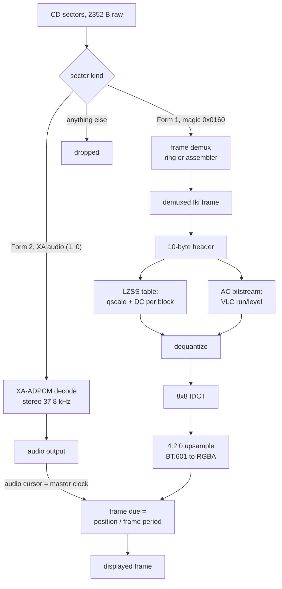
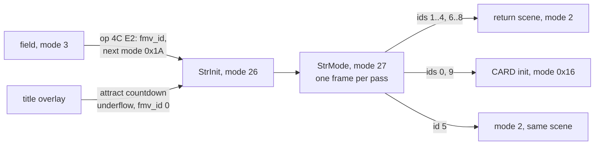
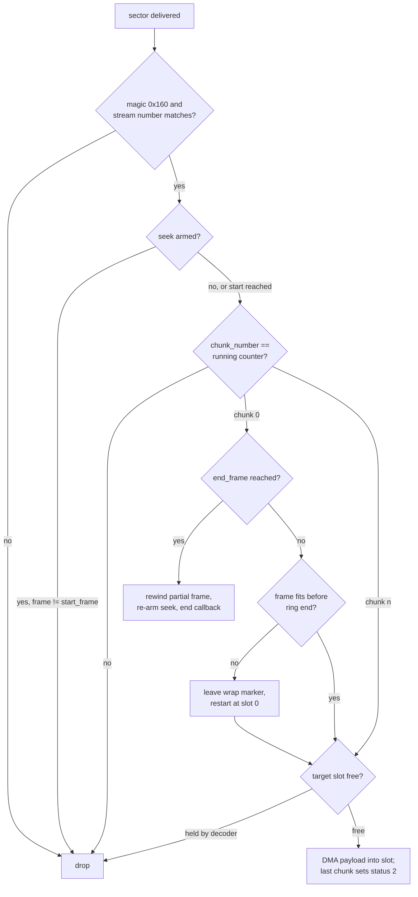
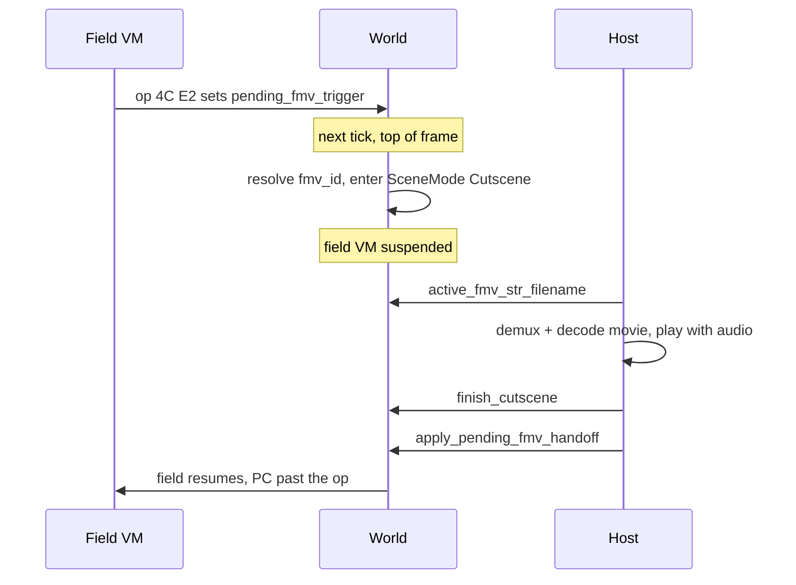
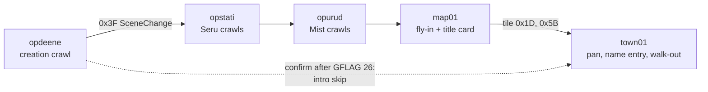
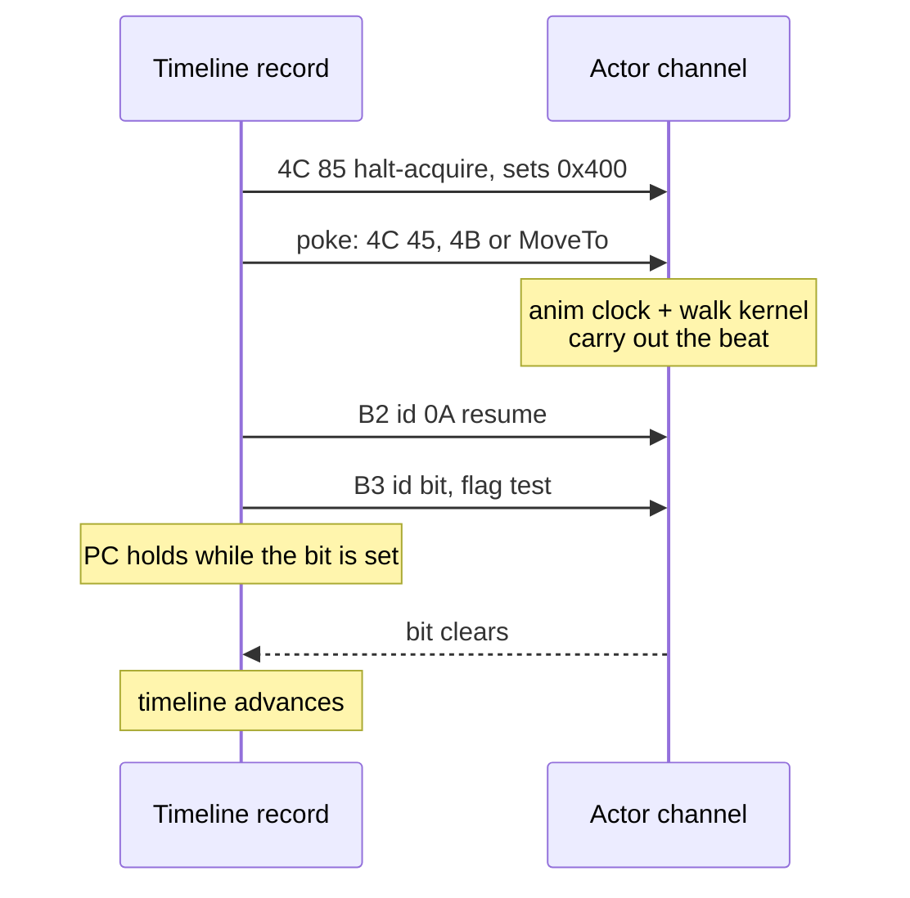
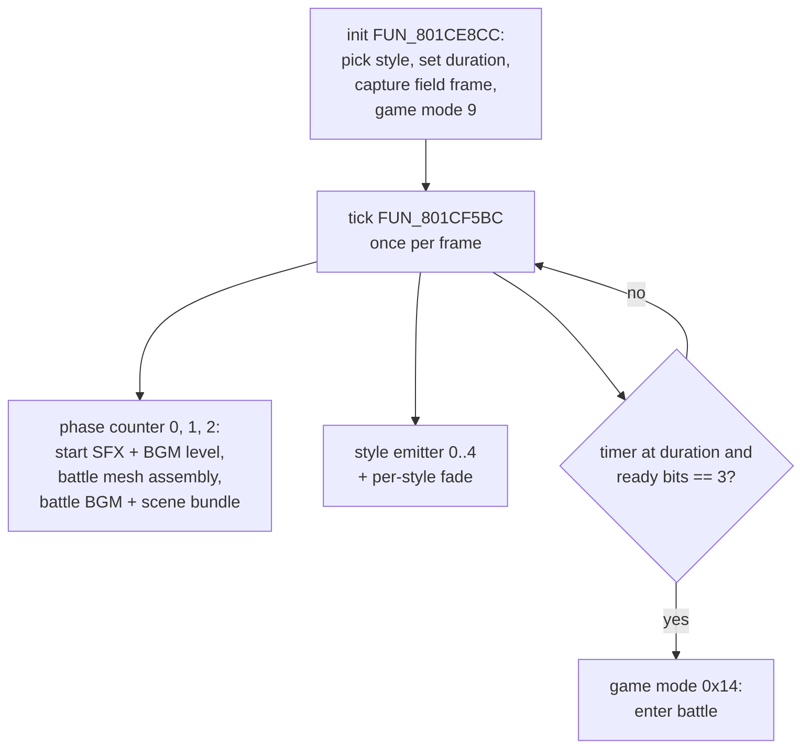
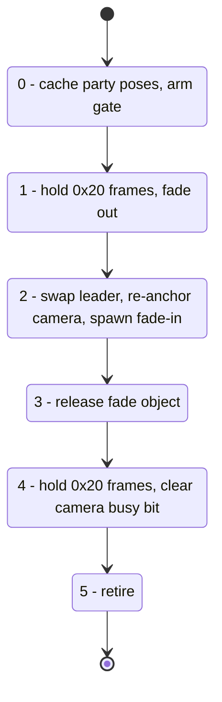

# Cutscene

Legend of Legaia tells its story three ways, and this page covers all of them:

1. **Pre-rendered movies (FMV).** PSX STR video decoded by the MDEC chip, with XA-ADPCM audio
   interleaved in the same CD sectors. Retail runs them in game modes 26 and 27 (`StrInit` /
   `StrMode`); the port maps both to `SceneMode::Cutscene`.
2. **In-engine scripted scenes.** The New Game opening, the ending vignettes and door beats are
   ordinary field scenes whose scripts drive the camera, the actors and on-screen narration.
   There is no dedicated cutscene executor - they run on the field VM.
3. **The field-to-battle transition.** The full-screen shatter / swirl between an encounter
   trigger and the battle scene, in its own overlay.

The port plays all three on both hosts (native `play-window` and the browser play page): movies
decode through the from-scratch `crates/mdec` + `crates/xa` decoders with the audio cursor as the
master clock, and the scripted scenes execute their retail bytecode.

**The two things that catch people out:**

- **Legaia movies are not STRv2.** They are the **Iki** bitstream - an LZSS-compressed per-block
  qscale/DC table plus an AC-only entropy stream. A standard STRv2 decoder rejects them. See
  [MDEC decoder (Iki bitstream)](#mdec-decoder-iki-bitstream).
- **"The opening cutscene" is mostly not a movie.** The five-scene New Game opening is rendered
  **in-engine in 3D**; `MV1.STR` is the title-attract movie. See
  [In-engine 3D opening](#in-engine-3d-opening-the-five-scene-new-game-chain).

## At a glance

| Piece | Retail home | Port home |
|---|---|---|
| FMV dispatch + play loop | STR overlay, PROT 0970 (`FUN_801CEA3C`, `FUN_801CF098`) | `legaia_engine_core::cutscene`, `legaia_mdec::str_player` |
| Sector demux (ring) | SCUS `St` library (`FUN_8005ECD4` / `FUN_8005F024`) | `legaia_mdec::st_ring`, `str_sector::StrFrameAssembler`, `str_av::StrAvDemuxer` |
| Bitstream decode | `FUN_801D0378` (Iki), `FUN_801D070C` (STRv2/v3, dev slots only) | `legaia_mdec::MdecDecoder`, `strv2_decode` |
| IDCT + colour conversion | MDEC hardware | `legaia_mdec::MdecDecoder` (software) |
| Movie audio | drive plays XA sectors in hardware into the SPU CD input | `crates/xa` decode into `AudioOut::play_xa` |
| FMV trigger | field-VM op `4C E2`, title attract countdown | `legaia_engine_vm::field`, `World::cutscene.pending_fmv_trigger` |
| Dispatch table | `0x801D0A6C`, 23 slots of 32 bytes | `legaia_asset::fmv_dispatch` |
| Scripted scenes | field VM `FUN_801DE840` + record dispatcher `FUN_8003BDE0` | `engine-core` `world/narration.rs`, `engine-dialog` `cutscene_timeline` |
| Narration crawl | roller actor `FUN_80037174` | `engine-field` `cutscene_narration` |
| Battle-intro transition | PROT 0979 (`FUN_801CF5BC` + five style emitters) | `engine-vm` `battle_intro_*`, `engine-ui::battle_intro` |

### Movie pipeline



In retail the left branch never reaches the CPU: the drive plays XA sectors in hardware, and the
right branch ends at the MDEC chip, whose output strips are `LoadImage`d into VRAM. The port
replaces both with software and locks the picture to the audio cursor.

### Mode flow



## Contents

- **Movies:** [Game modes](#game-modes) · [STR sector format](#str-sector-format) · [Retail playback engine](#retail-playback-engine-str-overlay--scus-st-streaming-library) · [XA channel selection](#xa-channel-selection) · [MDEC decoder](#mdec-decoder-iki-bitstream) · [XA audio + A/V sync](#xa-audio) · [`play-str`](#playback-loop-play-str) · [overlay residency](#strmdec-fmv-overlay-residency) · [FMV-trigger op](#field-vm-fmv-trigger-op)
- **Scripted scenes:** [In-engine 3D opening](#in-engine-3d-opening-the-five-scene-new-game-chain) · [narration](#inline-narration-format) · [crawl roller](#narration-playback---the-crawl-roller-fun_80037174) · [timeline execution](#timeline-execution-model-ghidra-traced) · [pacing](#record-pacing---the-60-hz-sub-clock) · [engine port](#timeline-execution-engine-port) · [actor channels](#per-actor-channels---the-vignette-actors) · [tint + effect colour](#the-op-0x4c-0x12-tint-op-0x4c-0x12--the-effect-colour-op-0x34-sub-0) · [sepia grade](#full-scene-sepia-grade-the-gold-prologue-look) · [script helpers](#script-cutscene-helpers-overlay_cutscene_dialogue)
- **Battle intro:** [Field-to-battle transition](#field-to-battle-transition-the-battle-intro-overlay)
- [Open items](#open-items) · [Provenance](#provenance)

## Game modes

| Index | Name | param | next |
|---|---|---|---|
| 26 | `STR` (`StrInit`) | `0x80A` | - |
| 27 | `STR MODE` (`StrMode`) | `0x000` | `ConfigInit` |

`StrInit` opens the STR stream, initialises the MDEC and starts the XA audio. `StrMode` runs the
per-frame loop: read the next batch of sectors, decode a frame, blit it full-screen. Both map to
`SceneMode::Cutscene` in the port (`crates/engine-field/src/mode.rs`). The mode table lists
`ConfigInit` (index 1) as mode 27's `next`; the hand-off a movie takes is written by the master
dispatch per `fmv_id` ([below](#master-dispatch---fun_801cea3c-overlay)).

The handlers live in a dedicated overlay, **PROT 0970** (`cutscene_str`, slot-A base
`0x801CE818`). It is identified statically from the disc by its leading `MV*.STR` movie paths and
the MDEC strings (`MDEC_in_sync` / `MDEC_out_sync` / `MDEC_rest:bad option`), and is
Ghidra-importable straight from the disc (`asset overlay ghidra`; see
[`static-overlay-pipeline.md`](../tooling/static-overlay-pipeline.md)). Dump script:
`ghidra/scripts/dump_str_fmv_overlay.py`.

The two script-cutscene captures in the Ghidra project (`overlay_cutscene_dialogue.bin`,
`overlay_cutscene_mapview.bin`) are a different overlay: they cover the actor-scripted `op*` /
`ed*` scenes and share the town field-VM binary, not the FMV decoder.

## STR sector format

STR video is carried in 2048-byte Mode 2 Form 1 sectors. Each sector's user data starts with a
32-byte header; the remaining 2016 bytes are payload. Concatenating the payloads of a frame's
sectors in arrival order reconstructs the demuxed frame, which begins with the
[Iki frame header](#1-frame-header-10-bytes).

```text
Offset  Bytes  Field
0x000   2      magic            - 0x0160 = video sector; any other value = non-video, skip silently
0x002   2      type             - 0x8001
0x004   2      chunk_number     - 0-indexed position of this sector within the frame
0x006   2      chunks_per_frame - total sectors needed to complete this frame
0x008   4      frame_number     - sequential, wraps at 0xFFFF
0x00C   4      frame_size_bytes - total demuxed bytes across all chunks for this frame
0x010   2      width            - frame width in pixels (multiple of 16)
0x012   2      height           - frame height in pixels (multiple of 16)
0x014   12     replicated frame-header copy + zero padding (not used by the decoder)
0x020   2016   demux payload chunk
```

`StrFrameAssembler` (`crates/mdec/src/str_sector.rs`) accumulates payloads in arrival order and
returns the frame, truncated to `frame_size_bytes`, when `chunk_number + 1 == chunks_per_frame`.

## Retail playback engine (STR overlay + SCUS St streaming library)

Statically decompiled from PROT 0970 at base `0x801CE818`, plus the SCUS-resident
PsyQ-libpress-shape "St" streaming library it calls. The disc image is byte-identical to the
FMV-resident RAM capture (`overlay_str_fmv.bin`), so dumps from either agree address-for-address.

### Master dispatch - `FUN_801CEA3C` (overlay)

The mode-26/27 entry. Before play, per `_DAT_8007BA78` (the `fmv_id`), it:

- selects the bitstream decoder: `DAT_801E09FC = 1` (**Iki**) by default; dev slots 9/10
  (`MV1A.STR` / `MOV15.STR`) clear it to select the STRv2/v3 VLC-table decoder;
- clears four bands via `ClearImage` (fmv 3 opens on a white flash instead). The four rects
  bracket the tops and bottoms of **both** decode buffers rather than forming a letterbox - the
  middle pair straddles the seam between the two frame rects and overlaps by four scanlines;
- calls the play loop on the dispatch slot: `FUN_801CF098(wide_flag, 0x801D0A6C + fmv_id * 0x20)`.
  The stride is **32 bytes** (`sll v0,v0,0x5` at `0x801CEC9C`); see
  [`str-fmv-table.md`](../formats/str-fmv-table.md#fmv-dispatch-table-0x801d0a6c-23--32-b).

After play it hands control back per `fmv_id`:

| `fmv_id` | Hand-off |
|---|---|
| 1..4, 6..8 | copy a **return-scene label** from the table at `0x801CE8AC` into the next-scene name global `0x80084548`, write a spawn/door word to `0x80084540`, set game mode 2 |
| 0 (intro), 9 (dev) | game mode `0x16` (22 = CARD init), `_DAT_8007BB00` = 2 / 1 |
| 5 | game mode 2 with `_DAT_8007B8B8 = 2`, no scene-name write (stay in the current scene) |

The return labels are `town0b` / `map01` / `chitei2` / `map02` / `jou` / `uru2` / `town0e`. Full
table in [`str-fmv-table.md`](../formats/str-fmv-table.md#authoritative-runtime-mapping).
`see ghidra/scripts/funcs/overlay_cutscene_str_0970_801cea3c.txt` (`0x801CECA0` is a body address
inside this function, not a sibling entry point).

**Port.** Both `switch`es live in `legaia_engine_core::cutscene` (defined in
`crates/engine-system/src/cutscene.rs`): `fmv_post_play_handoff` returns the control transfer as
an `FmvHandoff` (field scene + spawn word / resume-in-place / card init / mode 0), and
`fmv_bitstream`, `fmv_is_skippable` and `fmv_clear_rects` carry the three pre-play decisions.

Performing the transfer is one kernel shared by every host. `World::finish_cutscene` ends
playback and parks the finished id; `SceneHost::apply_pending_fmv_handoff` reads
`fmv_post_play_handoff` and enters the named scene, returning an `FmvHandoffOutcome` the host
only formats. The source is a drained edge (`World::take_finished_fmv`), so a host can poll it
more than once per frame without transferring control twice. Skipping the *movie* is not skipping
the *hand-off*: a cut slot, an undecodable STR, and a browser page that never installed the
segment (the play page's `play_fmv` lane auto-finishes after its install timeout) all still
transfer, because retail's dispatch writes the scene globals whether or not the picture played.

### Play loop - `FUN_801CF098` (overlay)

`(wide_flag, &dispatch_slot)`:

1. `CdSearchFile` (`FUN_8005DBB4`) resolves the slot's path string; the result populates the
   libcd `CdlFILE` directory cache at `0x801CAE08` (see
   [Directory-record cache](#directory-record-cache)).
2. Ring + stream setup (below), then seek `(start_frame - 1) * 10` sectors past the file start
   (`CdIntToPos` / `CdPosToInt` + `CdControl(CdlSetloc)`) - the 15 fps cadence.
3. Opens the SPU CD input for the interleaved XA audio: `FUN_800643C4(0, 0x7F, 0x7F)`
   (`SpuSetCommonAttr` CD-volume L/R) + `FUN_80062A0C(0, 0, 1)` (CD-mix enable).
4. Per frame: poll a complete demuxed frame (`FUN_801CFA14`, up to 2000 spins), VLC-decode it
   into the MDEC-code double buffer, kick MDEC, build the display rect (24-bit slots draw at
   `width * 3/2` 16-bit pixels), `LoadImage` / swap. A stall re-seeks via the timeout handler
   `FUN_801CFB94` (re-`Setloc` + re-read, `time out in strNext` debug print).
5. Loop exit: the end-frame latch `DAT_801E09F8` - or a pad press (`_DAT_8007B850 & 0x1F0`)
   **only when `fmv_id == 0`**. The intro/attract movie is skippable; mid-game FMVs are not.
6. Teardown: CD-mix mute (`FUN_800643C4(0,0,0)`), MDEC reset, `CdControl(CdlPause)`.

`see ghidra/scripts/funcs/str0970_801cf098.txt`.

### Frame-demux state machine (SCUS St library)

The overlay primes a **sector ring** in the streaming asset buffer (`_DAT_8007B85C + 0x10000`,
end `+0x38000`) and registers the demuxer:

- `FUN_801CF8B0` - ring / VRAM-rect init: stores the per-slot frame rects (double-buffered at
  `(fb_x, fb_y)` and `(fb_x, fb_y + height)`).
- `FUN_801CF988` - `StSetRing` (`FUN_8005BBF8(ring, 0x20)` - 32 sectors) + `StSetStream`
  (`FUN_8005EDC4(color_flag, start_frame, -1, 0, 0)`) + MDEC reset + `DecDCToutCallback`
  (`FUN_801CFEBC` -> `FUN_801CF56C`) + first seek/read.
- `FUN_801CFB94` - seek + read start: `CdControlF(CdlSetloc)`, `CdControlF(CdlSetmode, 0x80)`
  (double speed for the seek), then `FUN_8005EB68(0x1E0)`: Setmode **`0xE0`**
  (`CdlModeSpeed | CdlModeRT | CdlModeSize1` - XA-ADPCM realtime play ON, **sector filter OFF**),
  install the CD data-ready callback (`CdReadyCallback(FUN_8005ECD4)`), issue **`CdlReadS`**
  (`0x1B`). See [XA channel selection](#xa-channel-selection) for why no filter is set.

The demuxer proper is the data-ready pair `FUN_8005ECD4` / `FUN_8005F024` (SCUS). Per delivered
sector it DMAs the 32-byte STR header out of the CD FIFO and walks the assembler state:



- **Video gate**: magic `0x160` at `+0x00` and the type field's stream number
  (`(type >> 10) & 0x1F`) matching `_DAT_801CADB0` (0 for every retail movie). XA audio sectors
  never reach this path - the drive's RT mode consumes them in hardware.
- **Seek-to-start** (`_DAT_801CADD0 = 1`, armed by `StSetStream`): skip sectors until
  `frame_number == start_frame`, so a mid-file segment starts exactly on its first frame.
- **Sequence check**: `chunk_number` must equal the running counter `_DAT_801CAD94` within the
  current `frame_number` (`_DAT_801CAD90`); chunk 0 latches a new frame.
- **End check**: on chunk 0, `end_frame` reached -> rewind the partial frame, re-arm the seek,
  fire the optional end callback.
- **Wrap**: a frame that no longer fits before the ring end leaves a wrap marker (status 1) in
  the slot and restarts the write cursor at slot 0.
- **Ring-full**: the target slot is still held by the decoder -> the sector is dropped rather
  than overrunning it.
- Payloads DMA into per-frame ring slots (2016 bytes per sector); status 2 = frame complete.

The overlay consumes frames via `StGetNext` (`FUN_8005EF40`: status 2 -> 4 "in use") and returns
slots with `StFreeRing` (`FUN_8005EE4C`).

#### The frame window comes from `StSetStream`

`FUN_8005EDC4` installs the window as its PsyQ prototype implies. Its first act is

```
8005ede4  jal 0x8005f004
8005ede8  _li a0,0x1        <- the delay slot writes a0 and nothing else
```

`a1` and `a2` are never written before that call (only `a3` is saved into `s1`), so
`StSetStream`'s own `start_frame` / `end_frame` arguments fall through into the callee. Retail is
`FUN_8005F004(1, start_frame, end_frame)`, which stores them to `_DAT_801CADD0` (seek arm, forced
to 1), `_DAT_801CADAC` (`start_frame`) and `_DAT_801CADCC` (`end_frame`). `FUN_8005F004` has no
other caller in any dump - it is `StSetStream`'s helper, not a separate entry point.

Ghidra's decompiler prints the call as `FUN_8005f004(1)`. **The dropped arguments are a
decompiler artifact**: a port built on the C never seeks, so every mid-file segment starts on the
file's first frame.

The St library's end-frame stop is unused in retail. The one call site, `FUN_801CF988`, is
`StSetStream(slot[+0x04], slot[+0x08], -1, 0, 0)`: mode and `start_frame` come from the dispatch
slot, but `end_frame` is a literal `-1`. The segment end is enforced one level up, by the play
loop comparing the demuxed frame number against the slot's `+0x0C` (`801cf384 lw v0,0xc(s3)` /
`801cf38c slt v0,v0,s0`).

### Ring layout + slot status

`StSetRing(base, slots)` hands the library one flat buffer holding two parallel arrays: `slots`
32-byte slot headers at `base`, then `slots` 2016-byte payload areas at `base + slots * 32`. One
slot holds one sector - its STR sector header (the `u16` at `+0x00` overwritten in place by the
slot status once inspected) and its payload. A frame occupies `chunks_per_frame` **consecutive**
slots, so an assembled frame is a contiguous run the decoder reads without copying - which is
what forces the wrap handling when a frame does not fit before the ring end.

| Status | Meaning |
|---:|---|
| 0 | free |
| 1 | wrap marker - the reader restarts at slot 0 on landing here |
| 2 | frame complete, ready for `StGetNext` |
| 3 | filling (sectors of this frame still arriving) |
| 4 | handed to the decoder; released by `StFreeRing` |

### Engine port - `legaia_mdec::st_ring`

[`StRing`](../../crates/mdec/src/st_ring.rs) is the port of the ring and its per-sector state
machine, minus the CD/DMA register pokes: `set_ring` / `set_stream` / `set_mask` /
`deliver_sector` / `get_next` / `free_ring`, with the demuxer's trace codes surfaced as
`StStatus` (ring full, sequence break, end frame, wrap-stop, wrap-blocked, accepted).

`set_stream(mode, start_frame, end_frame)` mirrors retail's argument list and installs the window
itself; `set_mask` stays exposed because the demuxer re-arms the same three globals on its
end-frame path. Only bit 0 of `mode` is kept (`_DAT_801CAD98`), readable as `mode_flag()` -
retail uses it for the sector-lost check and the DMA attribute word, both hardware-side, so the
port only records it.

Who uses which demuxer:

| Demuxer | Used by | Why |
|---|---|---|
| `StRing` | [`str_player::StrPlayer`](#engine-port---legaia_mdecstr_player), and through it `mdec decode-str` | back-pressure-aware; makes a *segment* of a movie playable off the CLI |
| [`StrFrameAssembler`](../../crates/mdec/src/str_sector.rs) | the play hosts (via `cutscene_av` / `StrAvDemuxer`), `legaia-engine play-str`, offline extraction | no ring exists to overrun |

The disc-gated `st_ring_real_str` test streams a real `MV1.STR` through both and asserts they
agree frame-for-frame and byte-for-byte, and that the armed seek lands exactly on `MV3.STR`'s
`0xE2` segment boundary.

### Engine port - `legaia_mdec::str_player`

[`str_player`](../../crates/mdec/src/str_player.rs) is the layer between the ring and the
bitstream decoder - the retail play loop minus its CD, DMA and GPU register pokes:

| Retail | Port |
|---|---|
| `FUN_801CF098` play loop | `StrPlayer` + `seek_sector_offset` + `vram_units` + `display_rect` |
| `FUN_801CF8B0` decode-env init | `DecodeEnv::init` |
| `FUN_801CF988` ring + stream setup | `StrPlayer::open` |
| `FUN_801CFA14` frame pump | `StrPlayer::next_frame` |
| `FUN_801CFD84` MDEC output control word | `mdec_output_control` |
| `FUN_801CFEBC` slice-callback (un)install | `DecodeEnv::set_slice_callback` |
| `FUN_801CF56C` MDEC-out slice callback | `DecodeEnv::advance_slice` |
| `FUN_801CF740` frame poll | `end_of_stream` + `DecodeEnv::apply_frame_dimensions` |

Four details the port pins that the loop's shape alone does not show:

- **The end frame is inclusive.** The latch is set inside the `StGetNext` wrapper `FUN_801CF740`
  (`801cf788`) on the frame whose number *reaches* the slot's `+0x0C`, so that frame is decoded
  and displayed before the loop exits.
- **The code-buffer toggle runs before use** (`FUN_801CFA14` computes `ctx[8] = (ctx[8] == 0)`
  and then indexes with the new value), so a movie's first frame decodes into buffer **1**.
- **Signed MDEC output is unconditional.** The one `FUN_801CFD84` call site passes flags `3` for
  a colour slot and `2` otherwise; bit 1 - the `0x02000000` signed-output bit - is set either
  way, and only the `0x08000000` depth bit tracks the slot. That is the register-level
  counterpart of the `+128` luma offset in
  [`MdecDecoder`](#6-420-upsampling--bt601-colour-conversion).
- **The decode geometry follows the bitstream, not the dispatch table.** `FUN_801CF740` reads
  the frame's width and height out of the **sector header** (`+0x10` / `+0x12`), caches them in
  `DAT_801D0D50` / `DAT_801D0D54`, and every frame writes them into five halfwords of the decode
  context: both frame rects' width (`+0x1C` / `+0x24`, through the same `* 3 / 2` 24-bit scale)
  and height (`+0x1E` / `+0x26`), plus the slice rect's height (`+0x32`). The slice rect's
  *width* at `+0x30` is left alone - it is the fixed macroblock-column stride. The slot's `+0x18`
  / `+0x1C` only seed `FUN_801CF8B0`, so a table that disagrees with the movie loses from the
  first frame onward.

Three ping-pongs run at different rates: the **MDEC code buffers** (`ctx+0x00` / `+0x04`) flip
once per frame, the **frame rects** (`ctx+0x18` / `+0x20`) once per frame buffer, and the
**slice staging buffers** (`ctx+0x0C` / `+0x10`) once per 16-pixel column.

`ctx` is the `0x50`-byte structure at **`0x801D19A0`**, a fixed address in the overlay's own
uninitialised data region (`801cf10c addiu a0,v0,0x19a0` materialises it as `FUN_801CF8B0`'s
first argument; every helper takes the same pointer). The MDEC code buffers are
`_DAT_8007B85C + 0x10000` and `+ 0x38000`, in the shared streaming asset buffer; the two slice
staging buffers are `0x801D19F0` and `0x801D91F0`, `0x7800` bytes each, inside the overlay
image. That region is zero on the disc and reaches RAM only because the overlay loader's
transfer length is the PROT entry's own sector extent; its map is in
[`byte-accounting.md`](../tooling/byte-accounting.md#the-str-overlays-hole-region-by-region).

The slice cursor is a small state machine: each MDEC-out completion advances `ctx+0x2C` by one
column (`0x18` VRAM cells at 24bpp, `0x10` at 16bpp), and when the cursor passes the active
rect's right edge the two frame rects flip and the cursor restarts on the new origin. A buffer
whose width is not a whole number of columns takes its remainder as the *leading* step, so the
last column of every row lands flush on the right edge.

### Bitstream decode + MDEC feed (overlay)

`FUN_801CFA14` VLC-decodes each demuxed frame into an MDEC-code list, double-buffered; the
decoder is selected by `DAT_801E09FC`:

- **Iki** (`FUN_801D0378`, every retail movie): decompresses the per-block qscale/DC table with
  the LZSS decoder `FUN_801D0604` (the retail original of `legaia_mdec::iki_lzss_decompress` -
  control-byte LSB-first, length `+3`, 1/2-byte offsets) and converts the AC-only bitstream
  using the GTE leading-zero-count register as the VLC prefix scanner.
- **STRv2/v3** (`FUN_801D070C`, dev slots 9/10 only): standard VLC with per-block DC deltas,
  through a lookup table unpacked at runtime by `FUN_801F1A00` into `DAT_801E0A00`. The play
  loop calls the unpacker **unconditionally**, once per FMV (`801cf210`), even for Iki slots
  that never read the table.

#### STRv2 VLC lookup table (`FUN_801F1A00`)

The table is `0x8800` `u16` entries (`0x11000` bytes) at `0x801E0A00`, ending flush against
`FUN_801F1A00` itself - the abutment pins the size, and it matches the `0x87FF` loop bound at
`801f1ab8`. It is unpacked in two passes from a compressed blob at `0x801F1AE8`, the bytes
immediately after the unpacker:

1. **Mode-switched LZ77.** A control byte `< 0xF0` emits `n + 1` bytes; `0xF0` selects literal
   mode; `0xF1..=0xFF` reads one more byte and sets the match distance to
   `((b << 8) | next) - 0xF0FF`. The distance is *sticky* - it survives across control bytes
   until the next escape - and copies are byte-at-a-time, so they may overlap. `0xFF 0xFF` ends
   the stream (distance `0xF00`).
2. **XOR de-delta at a four-entry stride**: `out[i] ^= out[i - 4]` for every `u16` index
   `4..=0x87FF`. The eight-byte lag is the table's own record width.

It is not a run/level table - it stores the **pre-baked MDEC output codes** (one to three per
hit, plus a per-entry bit length), carved into four regions:

| Region | Offset | Index |
|---|---|---|
| luma DC | `+0x0000` | `acc >> 24` |
| chroma DC | `+0x0400` | `acc >> 24` |
| AC primary (8-byte entries) | `+0x0800` | `acc >> 19` |
| AC secondary | `+0x10800` | `acc >> 23` |

So `FUN_801D070C` is a bit-prefix lookup: only the DC coefficients (raw 10-bit in v2,
size-prefixed predicted differences chained per channel in v3), the `0x7C1F`-escape raw codes
and the 65-code `0xFE00` end padding are computed.

Ports: [`legaia_mdec::strv2_table`](../../crates/mdec/src/strv2_table.rs) (the unpacker,
reachable as `mdec strv2-table <overlay>`) and its consumer
[`legaia_mdec::strv2_decode::decode_frame`](../../crates/mdec/src/strv2_decode.rs). The path is
dead in retail (no released movie uses it), so the port has no golden decode to check against;
the tests pin the distinct code paths against the disassembly.

#### The MDEC feed and the port boundary

The MDEC feed is register-level in the overlay:

| Function | Role |
|---|---|
| `FUN_801CFD84` | sets the 24bpp/16bpp control bits and starts the DMA-0 code upload (`FUN_801CFFDC`) |
| `FUN_801CF56C` | MDEC-out slice callback: `LoadImage`s each decoded 32-pixel-wide strip into the slot's VRAM frame rect, alternating the double-buffered rects |
| `FUN_801D0100` / `FUN_801D0198` | in / out sync waiters: spin on the MDEC status register (`0x100000`-iteration budget) |
| `FUN_801D0248` | timeout dump of the DMA/FIFO state (the `MDEC_in_sync` / `MDEC_out_sync` strings) |
| `FUN_801CFEE0` | reset (`MDEC_rest:bad option(%d)`) |
| `FUN_801CFFDC` / `FUN_801D0070` | DMA kick routines; each calls its waiter (`FUN_801D0100` / `FUN_801D0198`) before starting its transfer |

`FUN_801CFFDC` / `FUN_801CFEE0` / `FUN_801D0100` / `FUN_801D0198` / `FUN_801D0248` are the **port
boundary**: MDEC command/status register writes, DMA-0/DMA-1 channel kicks, busy spins and a
printf of the FIFO bits. They describe a chip the software decoder does not model, so they carry
no port site and are listed in `scripts/ci/port-catalog-ignore.toml`. Everything above them - the
play loop, ring and stream setup, frame pump, slice callback, output control word - has a
[`crates/mdec`](../../crates/mdec/README.md) counterpart, because each is a decision about the
bitstream. The two spin waiters also share their VA with the fishing overlay's own resident, so
the bare address is not one function.

Four more overlay helpers sit on the same boundary and carry no port site:

- `FUN_801CFAD4` - MDEC-decode watchdog: spins up to `0x800000` iterations on the decode-done
  flag `ctx+0x34` and, on timeout, prints `time out in decoding` and force-flips the code buffer
  (`ctx+0x28`).
- `FUN_801CFE00` - 8-instruction thunk to the DMA-0 code upload `FUN_801D0070`.
- `FUN_801CFC18` - wraps the MDEC reset `FUN_801CFEE0`, adding a DMA reset (`func_0x8005FD88`)
  when its argument is `0`.
- `FUN_801CFCDC` - MDEC table upload. It copies the caller's 128-byte quant table pair - luma
  `a0[0..0x40]` into `0x801D0D5C`, chroma `a0[0x40..0x80]` into `0x801D0D9C`, sixteen words each -
  into the body of the command packet whose header `0x4000_0001` (MDEC command 2, set quant
  table, colour bit) sits at `0x801D0D58`, then hands that packet and the static IDCT scale-table
  packet (header `0x6000_0000`, command 3, at `0x801D0DDC`) to `FUN_801CFFDC` with `a1 = 0x20`.
  `FUN_801CFFDC` writes the header word to the MDEC command register (the pointer at
  `0x801D0E90` holds `0x1F801820`) and DMA-0s the `0x20`-word body (`MADR = pkt + 4`,
  `BCR = 0x20 | (len >> 5) << 16`, `CHCR = 0x01000201`). `0x801D0D5C` / `0x801D0D9C` are the
  quant packet's two matrix halves, not output rects.

The frame-poll wrapper `FUN_801CF740` is the logic sibling that stays *inside* the port: it loops
`StGetNext` (up to 2000 spins), sets the inclusive end-frame latch `DAT_801E09F8`, and
re-programs the decode rects from the sector header's dimensions - both ported in
[`str_player`](#engine-port---legaia_mdecstr_player). It also builds a stack `RECT` of
`(0, 0, slot_width * 3/2, slot_height * 2)` whenever the cached dimensions change; nothing in the
body consumes it, so the port does not reproduce it.
`see ghidra/scripts/funcs/overlay_str_fmv_0x801CFAD4.txt` / `overlay_str_fmv_0x801CF740.txt`.

#### Linked but never called

A five-form reference scan ([`address-reference-scan.md`](../tooling/address-reference-scan.md))
over `SCUS_942.54`, every based overlay and the raw bytes of every extracted PROT entry finds
four routines in this overlay that nothing reaches. They are the unused entries of the libpress
`DecDCT*` surface, linked in as a unit with the ones the overlay does call.

| Address | What it is | Evidence |
|---|---|---|
| `FUN_801CFE20`, `FUN_801CFE5C` | `mode`-selecting wrappers over the two sync waiters (argument `0` blocking, else poll the busy bit - the `DecDCTinSync` / `DecDCToutSync` shape) | `0x801CFE5C` has no hit; `0x801CFE20`'s one hit is a PC-relative branch inside the *field* image, a different function at that VA |
| `FUN_801CFE98` | nine-instruction wrapper forwarding its argument to the PsyQ `DMACallback` entry `FUN_8005FDE8` with channel **0** (MDECin, the CPU->MDEC feed) | zero hits in any form; one apparent branch hit at `0x801CFE84` is in the slot-machine overlay, which does not hold the routine |
| `0x801CFD78` | halfword-load leaf (`lhu v0,0(a0); jr ra; nop`) | no reference of any form (`overlay_cutscene_str_0970_801cfd78.txt`) |

Retail drives MDEC-in synchronously and only hooks the out-channel: `FUN_801CFE98`'s twin at
`0x801CFEBC` (the same nine instructions with channel `1`, MDEC**out**) is called twice by the
overlay, at `0x801CF524` (`a0 = 0`, clearing the callback) and `0x801CF9C4` (installing one), and
the reset `0x801CFEE0` is called from `0x801CFC34`. `FUN_801CFE98` is the FMV path's sibling of
the SPU callback registration `FUN_8006A0E0`, which calls the same PsyQ entry with channel `4`.
It is byte-identical, at the same VA, in PROT 0970 and PROT 0971 (`debug_menu`; file offset
`0x1680`, inside 0971's own `0x1800` bytes).

The two sync wrappers are ported for shape in `legaia_engine_system::mdec_dma_sync`, which
records them as retail-unreachable rather than as a wiring gap: no host call could make them
correspond to something the game does. Sweep commands:
[`find-address-word-refs.py`](../../scripts/ghidra-analysis/find-address-word-refs.py)
`801cfe98 --prot --home cutscene_str` and
[`find-gp-relative-refs.py`](../../scripts/ghidra-analysis/find-gp-relative-refs.py)
`--va 0x801cfe98 --prot`; the set is catalogued in
[`address-reference-scan.md`](../tooling/address-reference-scan.md#the-retail-unreachable-set).

## XA channel selection

There are two retail audio paths, and the STR overlay holds **no** channel selector.

**STR movies: no channel selection at all.** The streaming read runs Setmode `0xE0` -
`CdlModeRT` (play XA-ADPCM sectors in hardware) *without* `CdlModeSF` (sector filter). With the
filter off the drive plays **every** ADPCM-flagged sector it passes, and each `MV*.STR`
interleaves exactly one XA track - `(file 1, chan 0)`, stereo 37.8 kHz 4-bit, 1 audio sector per
8 (verified across all six movies' raw subheaders). The audio is routed through the SPU CD input
(opened and muted by the play loop), never through the data path. Audio selection *is* file +
frame-range selection via the dispatch table. (The `\DATA\MOV.STR` path string is a dev
leftover; that file is not on the retail disc.)

**XA clips (`XA1.XA..XA34.XA` - voice banks + streamed music): `CdlSetfilter`.**

- The SCUS-static clip starter `FUN_8003D53C(clip_id, chan, duration_sectors)` reads the 8-byte
  `[CdlLOC][u32 byte_len]` clip table at `0x801C6ED8`. **Slot `i` = file `XA<i+1>`** (34 slots,
  runtime-built from the ISO file list; title-capture-pinned, lengths byte-exact vs the disc
  files).
- Its CdSync-callback state machine `FUN_8003D764` sequences the drive: `CdlSeekL` -> Setmode
  **`0xC8`** (`Speed | RT | SF` - filter ON) -> `CdlSetloc` -> **`CdlSetfilter` with
  `{file = 1, chan = <caller's chan>}`** (filter struct at `0x8007BBC0` / `0x8007BBC1`) ->
  `CdlReadS` -> `CdlNop` / `CdlGetlocP` polling until the end LBA (`gp+0x974`).
- Every XA sector on the disc carries `file_no = 1` (subheader-verified), matching the
  hard-coded file byte; the **channel is caller-supplied**. The menu voice dispatcher
  `FUN_8004FCC8` derives `clip slot = (id - 0x100) >> 3` (remapped `1/3/5 -> 0x1A/0x1B/0x1C`) and
  `chan = id & 7`.
- `FUN_8003EAE4` is the by-index sibling starter; `FUN_8003ED04` the stop.
  `see ghidra/scripts/funcs/8003d764.txt` / `8003d53c.txt`.

**Port.** The pure computations of that chain - the id -> `(clip_slot, channel)` mapping, the
length-field -> `duration_sectors` scale `(len*60+99)/100`, and the starter's end-LBA offset
`(duration*150+149)/60` clamped at `0x2A30` - are in
[`legaia_engine_shell::xa_clip`](../../crates/engine-shell/src/xa_clip.rs). The callback ring
`FUN_8003D764` is decoded in `legaia_engine_audio::xa_transport::xa_transport_step`; the CD
control around it stays hardware-side (scope row `[cd_transport_shims]`).
`legaia-engine xa-cue <ids> [--xa-dir extracted/XA]` runs the mapping for a set of cue ids and
reports the `XA<n>.XA` bank, the filter channel and the duration / end-LBA arithmetic, checking
each resolved bank against the extracted files.

So the complete map is: **movies** = one track per file at `(1, 0)`, selected by
`fmv_id -> MVn.STR + frame range`; **XA files** = `(1, chan)` inside `XA<clip_id + 1>.XA`, with
`chan` picked per cue by the caller. The per-`(file, chan)` content is extractable via
`xa demux-disc-all` (316 channels across the 34 files - 16-channel mono voice banks and
8-channel stereo music). Which game systems fire which `(clip_id, chan)` cues beyond the menu
voice path is per-caller data, not a single table - an open census, tracked in
[`open-rev-eng-threads.md`](../reference/open-rev-eng-threads.md).

## MDEC decoder (Iki bitstream)

`MdecDecoder::decode_frame(frame)` converts a complete demuxed frame into an RGBA8 pixel buffer.

Legaia's movies use the PSX **"Iki"** bitstream variant, **not** the common STRv2 layout. The
distinguishing trait: the per-block DC and quantization scale are **not** in the entropy
bitstream. They live in a separate LZSS-compressed table right after the frame header, and the
bitstream carries only AC coefficients. STRv2 would put a per-frame qscale in the header and
each block's DC inside the bitstream; Legaia overwrites STRv2's header qscale/version fields
with the frame width/height, which is what a strict STRv2 parser rejects.

The decoder is from-scratch; sources are the PSX-SPX BS-compression pages and jPSXdec's
`PlayStation1_STR_format.txt` (format docs only).

### 1. Frame header (10 bytes)

```text
Offset  Bytes  Field
0x000   2      mdec_code_count
0x002   2      0x3800 magic
0x004   2      width
0x006   2      height
0x008   2      lzss_size   - byte length of the compressed qscale/DC table that follows
```

### 2. LZSS qscale/DC table

The `lzss_size` bytes after the header decompress to a `block_count * 2`-byte table. One control
byte's 8 bits are tested LSB-first: a `0` bit copies one literal byte, a `1` bit is a
back-reference - a length byte (`+3`, range 3..=258) then a 1- or 2-byte offset (high bit of the
first byte selects the 2-byte form; offset is `+1`, relative to the current output position;
overlapping copies allowed). For block `i` the packed word is
`(table[i] << 8) | table[i + block_count]`: top 6 bits = quant scale, low 10 bits = signed DC.

### 3. AC bitstream

Read as **16-bit little-endian words, MSB-first within each word**, beginning immediately after
the compressed table. Per block: AC run/level codes from the PSX VLC table (`AC_CODES`),
terminated by the End-of-Block code `10`. The escape code `000001` is followed by a 16-bit raw
MDEC value (`run << 10 | signed-10-bit level`). A block that fills all 63 AC positions is *still*
terminated by an explicit EOB, so the decode loop always reads the next code rather than
stopping when the coefficient index saturates.

### 4. Dequantize + IDCT

DC: `coef[0] = DC * Q_MAT[0]`. AC: `coef[zigzag[i]] = (level * Q_MAT[i] * qscale + 4) >> 3`
(arithmetic shift = floor, matching PSX rounding; not range-clamped - escape codes carry large
levels). Two-pass separable 8x8 IDCT using `IDCT_C[k][n]` (pre-scaled by 2048); the row pass
keeps full `i64` precision and the single `>> 24` after the column pass normalises a DC-only
block to `coef[0] / 8`.

### 5. Macroblock layout

Each macroblock decodes six 8x8 blocks in the order **Cr, Cb, Y0 (top-left), Y1 (top-right),
Y2 (bottom-left), Y3 (bottom-right)**. Macroblocks are laid out **column-major**: down each
16-pixel column top-to-bottom, then the next column to the right.

### 6. 4:2:0 upsampling + BT.601 colour conversion

Each Cb/Cr sample covers a 2x2 luma region. PSX MDEC outputs signed (zero-centred) samples, so
the luma is offset by `+128` on the final RGB. Fixed-point BT.601 YCbCr -> RGBA8:

```
R = (Y+128) + ((91881 * Cr) >> 16)
G = (Y+128) - ((22554 * Cb + 46802 * Cr) >> 16)
B = (Y+128) + ((116130 * Cb) >> 16)
A = 255
```

Output is a `width x height` RGBA8 buffer in row-major order.

Implementation: `crates/mdec/src/lib.rs` (`MdecDecoder`, `AC_CODES`, `iki_lzss_decompress`,
`IDCT_C`, `Q_MAT`). The disc-gated `str_mdec_decode_is_pixel_stable` test pins a decoded-frame
fingerprint as a regression guard.

## XA audio

XA-ADPCM audio is carried on Mode 2 Form 2 sectors with `submode & 0x24 == 0x24`. The demuxer
splits them by `(file_no, ch_no)` into per-channel streams. Each 128-byte sound group holds 8
sound units of 28 4-bit ADPCM samples; for stereo the LEFT channel is the even units (0,2,4,6)
and the RIGHT channel is the odd units (1,3,5,7), output L,R interleaved. The decode is bit-exact
against an external lossless reference decode of a real cutscene track.

The 8-bit coding mode is decoded too (`BitsPerSample::Eight`: 4 units/group, full-byte samples,
selected by each channel's `coding_info` width). No 8-bit audio appears on the disc, so that
path is covered by synthetic unit tests rather than a bit-exact reference.

See [`formats/xa.md`](../formats/xa.md) for the sector layout, coding-info bits, filter
coefficients, the per-sound-group decode and the demuxer invocation.

### Interleaved cutscene audio (A/V sync)

The six `MOV/MV*.STR` movies **interleave** their audio with the video at the sector level: the
video sectors (Form 1, magic `0x0160`) and one XA track (Form 2, `(1, 0)`, stereo 37.8 kHz
4-bit) share the same LBA range. The audio needs no name-based pairing - it comes from the same
sector stream as the video.

The Form-1 extract written to `extracted/MOV/*.STR` keeps the video sectors intact but truncates
each Form-2 audio sector from 2324 to 2048 bytes, corrupting the audio. Faithful playback reads
the raw 2352-byte sectors **straight off the disc image**:

- [`legaia_engine_shell::cutscene_av::decode_str_av_from_disc`](../../crates/engine-shell/src/cutscene_av.rs)
  makes one pass over the sectors through the shared demuxer
  [`legaia_mdec::str_av::StrAvDemuxer`](../../crates/mdec/src/str_av.rs), routing Form-2 audio
  to a per-`(file_no, ch_no)` buffer and the rest to the `StrFrameAssembler`, then decodes the
  dominant audio channel to PCM and the video to RGBA frames.
- The browser play page opens a movie through the same demuxer (`play_fmv.rs`). Both hosts index
  frames by assembled frame (a frame that later fails to decode keeps its slot), derive the
  frame rate from the same sector stride and pick the same soundtrack channel. They differ only
  in when a frame is decoded: the native window decodes all of them up front, the page one per
  request.

**The audio cursor is the master clock.** The decoded PCM is staged into the audio output
(`AudioOut::play_xa`) and the visible frame is `audio_position / frame_period`
(`cutscene_av::due_video_frame` over `AudioOut::xa_cursor_secs`), so the picture stays locked to
the soundtrack instead of free-running on a wall-clock timer that drifts against the hardware
audio rate. With no audio track the same function falls back to a wall-clock position.

## Playback loop (`play-str`)

`legaia-engine play-str` decodes and plays one movie in a window. It has two modes:

- **`play-str <file>`** (no disc): plays a raw filesystem STR file (2048-byte Form-1 sectors,
  the `legaia-extract` shape) as **video only** - the extract truncates the interleaved audio.
- **`play-str MOV/MV1.STR --disc <bin>`**: resolves the movie inside the disc image and plays it
  **with its interleaved XA audio** in sync (raw 2352-byte sectors).

The loop:

1. Decode the video frames and (disc mode) the audio track up front
   (`cutscene_av::decode_str_av_from_disc` / `decode_str_video_only`).
2. Stage the decoded audio into `AudioOut` on the first redraw, so the audio cursor and the
   picture start together.
3. On `RedrawRequested`: show the frame due at the current playback position
   (`cutscene_av::due_video_frame`) through `RenderTarget::Texture`. With audio the position is
   the audio cursor; without, wall-clock `elapsed`. Either way the movie plays at its real rate,
   not the display refresh rate.

### Frame-rate detection

PSX STR files carry no frame-rate field; the rate is implied by how many CD sectors elapse per
frame at the 2x delivery rate (150 sectors/s). The raw 2048-byte-per-sector files preserve the
on-disc sector order 1:1 (audio sectors appear as skipped chunks), so the mean sectors-per-frame
recovers the authored rate:

```text
fps = 150 / (total_sectors / video_frame_count)
```

`legaia_mdec::str_sector::analyze_str_timing` computes this and `StrTiming::frame_period` returns
the per-frame hold duration (falling back to 15 fps for a degenerate stream). All six Legaia
movies measure **exactly 10 sectors/frame -> 15.00 fps** (`MV1` = 1345 frames = 89.7 s). The
in-flow cutscene driver and `play-str` both pace to this clock when no audio track is playing;
frames are held when the host runs faster and dropped if it falls behind.

## CLI reference

```bash
# Report frame inventory + detected frame rate of a raw STR file
mdec scan-str cutscene.str

# Decode all frames to PPM images
mdec decode-str cutscene.str --out-dir frames/

# Play STR video in a window
legaia-engine play-str cutscene.str
```

## CDNAME → STR override map

The retail mapping is decoded straight from the disc: `fmv_id -> movie + frame range` via
`legaia_asset::fmv_dispatch`, per-scene trigger ids via `man_field_scripts::scene_fmv_triggers`,
and the post-play return scene via the master dispatch (see
[`str-fmv-table.md`](../formats/str-fmv-table.md#authoritative-runtime-mapping)).

For booting an `op*` / `ed*` scene label directly (`play --scene <label>`), the engine also
carries a label heuristic, `cutscene_str_for`, and a TOML override layered on top of it:

```toml
# legaia-cutscene-map.toml
[scenes]
opdeene  = "MOV/MV1.STR"
opstati  = "MOV/MV2.STR"
opkorout = "MOV/MV3.STR"
opurud   = "MOV/MV4.STR"
opmap01  = "MOV/MV5.STR"
edteien  = "MOV/MV6.STR"
```

```bash
# Generate a starter file pre-seeded with the heuristic mapping
legaia-engine config dump-cutscene-map --out legaia-cutscene-map.toml

# Run with the override
legaia-engine play --scene opdeene --cutscene-map legaia-cutscene-map.toml
legaia-engine play-window --scene opdeene --cutscene-map legaia-cutscene-map.toml
```

Explicit entries win; missing keys fall through to `cutscene_str_for`. API:
[`CutsceneMap::from_toml_path`](../../crates/engine-core/src/scene/cutscene.rs) /
`from_toml_str` / `to_toml_string`.

## STR/MDEC FMV overlay residency

Data structures resident while an FMV plays (addresses from a save state during playback; they
match PROT 0970 loaded at `0x801CE818`):

| Address | Size | Stride | Contents |
|---|---:|---:|---|
| `0x801CAE08` | variable | 24 B | libcd `CdlFILE` directory cache (the `MOV` dir while an FMV plays: `.`, `..`, `MV1.STR;1`..`MV6.STR;1`) |
| `0x801CCA80` | 336 B | 56 B × 6 | ISO9660-shape directory record copies of the same six files |
| `0x801CE810` | ~150 B | variable | Path-string table (\\DATA\\MOV.STR;1, \\DATA\\MOV15.STR;1, \\MOV\\MV1A.STR;1, \\MOV\\MV6..MV1.STR;1) |
| `0x801CE8AC` | ~50 B | variable | Post-FMV return-scene labels (CDNAME shape) |

The residency check and pinned addresses are in
`legaia_engine_core::capture_observations::str_fmv_overlay`.

### Directory-record cache

The 24-byte records at `0x801CAE08` are PsyQ `CdlFILE` structs -
`[u32 CdlLOC][u32 size][char name[16]]` - libcd's `CdSearchFile` cache for the last directory
searched, not an FMV structure. Not a "compact MV table at `0x801CAE40`": that name-first parse
is phase-shifted 8 bytes and pairs each name with the *next* record's location. Details and the
title-capture cross-check (the same cache holding `XA1.XA..XA34.XA`) are in
[`str-fmv-table.md`](../formats/str-fmv-table.md#directory-record-cache-0x801cae08-24-b-cdlfile-records).
`legaia_asset::str_fmv_table::parse_entries` keeps the name-first window parse as a
capture-forensics helper.

### Post-FMV return scenes

The overlay's data section carries the CDNAME labels of seven field scenes:

```text
town0b  map01  chitei2  map02  jou  uru2  town0e
```

These are the **destinations the master dispatch hands control to after playback**, one per
mid-game `fmv_id` (1..4, 6..8). They are *not* the trigger-scene set - the `4C E2` ops live in a
different scene set, with only `chitei2` in both (a scene that returns to itself).
[`cutscene_str_for`](../../crates/engine-core/src/scene/cutscene.rs) covers the `op*` / `ed*`
scenes in CDNAME order; its sibling constant `FMV_TRIGGER_FIELD_SCENES` records this label list.

## Field-VM FMV-trigger op

The field VM triggers an FMV via a 7-byte instruction sub-dispatched off opcode `0x4C`:

```text
0x4C  0xE2  lo  hi  _  _  _      ; PC advances by 7
            ^^^^^^
            i16 LE  fmv_id (sign-extended through FUN_8003CE9C)
```

Outer opcode `0x4C` enters the high-nibble re-dispatch at `FUN_801E0C3C` (JT base
`0x801CEE60`). The high nibble of byte 1 selects the secondary handler; the low nibble selects
the inner sub-op. For byte 1 = `0xE2`:

| Step | Address | What it does |
|---|---|---|
| Outer dispatch | `0x801DE94C..0x801DE980` | `andi 0x7F`, subtract `0x21`, jump through the 47-entry JT at `0x801CECC0`. PC += 1. |
| Outer JT entry | `0x801CED6C` | Outer op `0x4C` → handler `0x801E0C3C`. |
| High-nibble JT | `0x801CEE98` (base `0x801CEE60` + `0xE * 4`) | `byte1 >> 4 == 0xE` → handler `0x801E3040`. |
| Sub-op JT | `0x801CF010` (base `0x801CF008` + `2 * 4`) | `byte1 & 0xF == 0x2` → handler `0x801E30E4`. |
| FMV handler | `0x801E30E4` | `_DAT_8007BA78 = (s16)bytecode[2..3]`; `_DAT_8007B83C = 0x1A` (next game mode = 26 = `StrInit`). PC += 6. |

`0x801E30E4` is a label inside `FUN_801DE840`, not a callable subroutine - Ghidra promotes it to
a `FUN_` symbol because the jump table resolves to it, so it has zero static callers. The
trailing 3 bytes of the instruction are skipped by the handler's fixed `addiu s8, s8, 6` and
never read; disassemblers should leave them as opaque padding.

The two globals it writes are the only side-effects:

- **`_DAT_8007BA78`** - FMV index. The master dispatch uses it to select a 32-byte slot from
  `0x801D0A6C`. The table has 23 slots; the nine retail movies occupy `fmv_id 0..=8`, and every
  `MVn.STR` on the disc is dispatched (`MV3.STR` carries four segments by frame range; slots 9+
  are dev files absent from the disc). It is static overlay data, decoded from the disc by
  `legaia_asset::fmv_dispatch`; mapping in
  [`str-fmv-table.md`](../formats/str-fmv-table.md#fmv-dispatch-table-0x801d0a6c-23--32-b).
- **`_DAT_8007B83C`** - next-game-mode global. `0x1A` kicks the main mode dispatcher
  (`FUN_80017714`) into `StrInit` on the next frame, which loads the STR overlay.

#### `_DAT_8007BA78` has exactly two writers

An instruction-level sweep finds every access to `0x8007BA78` across `SCUS_942.54`, all 1233
extracted PROT entries and the extracted overlay images, in every reference form: `lui`-based
loads and stores, the address materialised by `lui` + `addiu`/`ori`, the literal 32-bit word,
and the `gp`-relative displacement (`0x760(gp)` with `gp = 0x8007B318`). The `gp` form yields
zero hits, which is what closes the enumeration.

| Site | Kind | Where |
|---|---|---|
| `0x801E30F4` (PROT 0897 `+0x148DC`) | store | field overlay, the `4C E2` FMV-trigger op |
| `0x801DDCE8` (PROT 0899 `+0xF4D0`) | store | menu/title overlay, the title attract-countdown tick |
| `0x801CEA74`, `0x801CEC94`, `0x801CECA8`, `0x801CF4E0` (PROT 0970 `+0x25C`, `+0x47C`, `+0x490`, `+0xCC8`) | loads | STR overlay dispatch + play loop |
| `0x801CFA50` (PROT 0971 `+0x1238`) | literal word | debug-menu overlay's editable-globals pointer table |

`SCUS_942.54` never touches it, in any form. The one non-instruction reference is the debug
menu's pointer-table word - the static witness for dev-menu `WORK_TBL` editing, which writes the
global through a register pointer (`FUN_801DBD04` family, field overlay 0897) that no addressing-form scan sees.

So nothing but the trigger op, the attract tick and the dev menu can set the id, and **there is
no per-FMV event table**: an FMV cannot carry teleport or story-flag side-effects of its own.
The debug "jump to beat" behaviour is the MAP CHANGE warp appliers (`FUN_801EE094` /
`FUN_801EE328`) plus the EVENT FLAG editor; see [`functions.md`](../reference/functions.md).

Coverage limits of the sweep:

- It reads raw bytes, so it cannot see code inside an LZS-compressed section. Every code-bearing
  class in `PROT/categorize.json` (`mips_overlay`, `overlay_data_blob`, `overlay_ptr_table`) is
  stored uncompressed, so no overlay hides there - an inference from the classifier, not a
  decode.
- Entry attribution uses the sector-gap entry size ([`prot.md`](../formats/prot.md)); a scan
  that over-reads entries reports the STR overlay's head again under PROT 0967 / 0968 / 0969,
  which are 6 / 4 / 2 KB (battle-tutorial overlay, a slot-B module, the STR-path table) and hold
  none of the STR code. PROT 0896 is `0x9000` bytes, too small to hold a second copy of the
  field overlay's `0x46800`-byte span.

Every one of the dispatch slot's eight words is read by the play loop and by nothing else - see
[the consumer sweep](../formats/str-fmv-table.md#every-word-of-the-record-is-a-play-loop-input).
`legaia_asset::fmv_dispatch` keeps six of the eight; the two it drops (`fb_x`, `fb_y`) are the
decode rect's VRAM origin, resolved in `legaia_mdec::str_player`.

### Static FMV-trigger sites - exhaustive

Three sites write `_DAT_8007B83C = 0x1A` in retail, all codified in
[`legaia_engine_vm::cutscene_trigger`](../../crates/engine-vm/src/cutscene_trigger.rs) as
`FMV_TRIGGER_SITES`:

| Site | Function | Mode-write addr | FMV-id source | Trigger condition |
|---|---|---|---|---|
| `field_vm_op_4c_e2` | `FUN_801DE840` | `0x801E3104` | signed 16-bit LE operand of the field-VM instruction | bytecode hits `0x4C 0xE2 lo hi` |
| `title_attract_loop` | `FUN_801DD35C` (label `FUN_801DE234`) | `0x801E0F50` | hardcoded `0` (= `MV1.STR`, intro) | title-screen idle countdown `DAT_801ef16c` underflows |
| `title_tick_inline` | `FUN_801DD35C` | `0x801DDCF0` | inline: `sh zero, -0x4588(v0)` zeroes `_DAT_8007BA78` at `0x801DDCE8` immediately before | fall-through past the decrement at `0x801DDCCC` (`bgez v0, 0x801DFC3C` not taken) |

Both title-side sites live in the per-frame title-overlay tick `FUN_801DD35C`; `FUN_801DE234` is
a Ghidra-promoted label inside its body. The `0x801DDCF0` site is the one a watchpoint pins in
practice - every per-frame decrement passes through `0x801DDCCC` and the underflow path writes
the mode byte before any sub-call (see [`boot.md` § Tick function](boot.md#tick-function)).

### The per-scene trigger assignment is disc-sourced (the "runtime-reconstructed" reading is falsified)

The scene scripts live **LZS-compressed** inside each scene's MAN, so a raw bytewise PROT scan
cannot see the trigger ops. Decompressing every scene MAN and walking its partition-1 scripts
with the field-VM disassembler (`man_field_scripts::scene_fmv_triggers`) recovers the full
assignment statically:

| Scene | `fmv_id` |
|---|---|
| `town01` | 1 |
| `garmel` | 2 |
| `deroa`, `chitei2` | 3 |
| `dohaty` | 4 |
| `town0d` | 6 |
| `uru` | 7 |
| `jouine` | 8 |

One op per scene; no other scene MAN carries one. Pinned by the disc-gated
`scene_fmv_triggers_disc` test; full table in
[`str-fmv-table.md` § Per-scene trigger assignment](../formats/str-fmv-table.md#per-scene-trigger-assignment-disc-sourced).
The trigger bytecode is not reconstructed at scene load - the ops are simply compressed on disc.

Outside the MAN-carried scripts, a raw sweep also finds in-range `4C E2` byte candidates in
`taiku` (`fmv_id 5` - the fourth `MV3.STR` segment, the one slot with a "stay in the current
scene" hand-off, which fits a `taiku` trigger) and `opmap01` / `koin1b` (`fmv_id 7`), in
uncompressed regions of non-MAN scene structures. These are uncontextualized byte matches (the
same sweep "finds" triggers inside VAB sample data), kept as candidates rather than pins.

### Per-STR FMV trigger corpus

Nine save states captured right before each FMV begins playing, one per `fmv_id ∈ 0..=8`, pin
the trigger-side state across the full retail range:

- `_DAT_8007BA78 = expected_fmv_id` (s16 LE) for each save
- `_DAT_8007B83C = 0x1A` (StrInit) for every save
- `_DAT_8007BAC8 = 2000` (BGM ID) for every save
- active scene = `map01`, `recover_base()` = `0x80139530` (`map01`'s field-pack base) for every
  save

The states were produced through the **debug menu**, not by stepping a scene's trigger op: the
`4C E2 lo hi` byte sequence appears in no save's field-pack RAM. So the corpus pins the
`(fmv_id, game_mode)` tuple, and the per-scene assignment comes from the disc walk above. It is
codified at `legaia_engine_core::capture_observations::cutscene_trigger_corpus` and exercised by
the disc-gated test
`crates/mednafen/tests/real_saves.rs::cutscene_trigger_corpus_pins_fmv_id_across_nine_saves`.

### Engine port of the trigger flow

The field-VM port handles the op as `op4c_n_e_sub2_fmv_trigger(fmv_id: i16)` in
[`legaia_engine_vm::field`](../../crates/engine-vm/src/field.rs); the world's
[`FieldHostImpl`](../../crates/engine-core/src/world.rs) records the request as
`World::cutscene.pending_fmv_trigger` plus a `FieldEvent::FmvTrigger { fmv_id }`.



- The **next** `World::tick` consumes `pending_fmv_trigger` at the top of the frame - one frame
  after the op fires, as `FUN_80017714` reads the next-game-mode global a frame late. If the id
  resolves to a playable slot (`cutscene::fmv_index_to_str_filename` is `Some`) the world flips
  into `SceneMode::Cutscene` and records the active FMV (`World::active_fmv()`).
- While the FMV plays the world **suspends the field VM** (the STR overlay owns the frame in
  retail). The host polls `World::active_fmv_str_filename()`, plays the resolved `MV*.STR`, and
  calls `World::finish_cutscene()` when playback ends, which returns to the field with the
  program counter already past the op.
- A `fmv_id` whose slot points at a dev/missing path is drained as a no-op (no mode flip).
- `fmv_index_to_str_filename` mirrors the retail nine-slot map - `fmv_id 0..=8`, `MV3.STR`
  shared by slots `2..=5`, dev slots `9..=22` returning `None` - and its sibling
  `fmv_post_play_return_scene` carries the `0x801CE8AC` list. The disc-parsed
  `legaia_asset::fmv_dispatch::FmvTable` is the authoritative source.

Per host:

| Host | What it does |
|---|---|
| `legaia-engine play` (headless) | runs the flow and decodes the resolved STR via MDEC to report its frame count |
| `play-window` (native) | resolves and decodes the movie (shared `cutscene_av` module with `play-str`), suspends world ticks, shows the due frame per redraw, then calls `finish_cutscene()` |
| browser play page | `play_fmv.rs`: the page installs the movie's disc segment, the runtime demuxes and decodes it, and the page draws frames paced off its audio cursor |

When booting from a **disc image** the movie is read from the ISO with its interleaved XA audio
and the video is paced off the audio cursor; from an **extracted root** it plays video only (the
extract truncates the audio). What the movie does to the BGM - retail's movie path never touches
the sequencer, the title attract releases the title theme and `CARD INIT` restarts it - is one
engine policy both hosts consult (`legaia_engine_core::movie_audio`), described in
[`audio.md`](audio.md#movies-and-the-score).

## In-engine 3D opening (the five-scene New-Game chain)

Not every cutscene is an STR movie. The New Game opening - the "Genesis tree" prologue with the
*"…the Seru."* narration - is a chain of **field scenes running in game mode `0x03` (field
RUN)**, rendered in 3D by the engine. `MV1.STR` is the title-attract movie, not this sequence
(see [`boot.md`](boot.md#the-opening-scene-chain--the-fun_801d1344-intro-skip)).

Each scene runs one **timeline record**: a field-VM script in MAN partition 2 that stages camera
shots, pokes actors, spawns narration and ends by changing scene. The rest of this section is
the record format, how it is spawned and paced, and how the port executes it.



### The five-scene chain

NEW GAME boots **`opdeene`** (CDNAME/PROT #748) and the opening chains through **five scenes
with zero input** (pinned by a PCSX-Redux cold-boot pixel capture; disc-gated oracle
`crates/engine-core/tests/opening_full_chain_e2e.rs`):

| Scene | Content | Opening record + how it spawns |
|---|---|---|
| `opdeene` | Creation-myth crawl (14 + 8 pages) over the Genesis-tree vignettes | timeline P2[18], spawned by op `0x44` (`44 23`) in the P1[0] entry system script; ends with a `0x3F` SceneChange to `opstati` |
| `opstati` | Seru-intro crawls (3 + 6 pages) | P2[0], op `0x44` (`44 21`); chains to `opurud` |
| `opurud` | Mist-story crawls (4 + 3 + 5 pages) | P2[9], op `0x44` (`44 32`); chains to `map01` |
| `map01` | World-map fly-in: static "twilight of humanity" title card + a 5-page crawl over an aerial approach of Rim Elm | P2[38], spawned by the **walk-on tile trigger** at the arrival tile; scene-changes into `town01` at tile `(0x1D, 0x5B)` |
| `town01` | Establishing pan → **name entry** → Vahn's walk-out (the walk-out is post-confirm) | P2[3], walk-on tile trigger; C1 gate lists flag `0x225` (one-shot) |

The natural chain needs no input. A confirm press at any time after `opdeene`'s timeline arms
`GFLAG 26` (near the record's top) fires the `FUN_801D1344` `town01` scene-change packet - the
**intro skip**, not a hand-off gate. See
[`boot.md`](boot.md#the-opening-scene-chain--the-fun_801d1344-intro-skip).

### Record spawn mechanisms (live-probe-pinned)

An exec-breakpoint on the record dispatcher `FUN_8003BDE0` across the whole opening fires
**exactly five times** - one opening record per scene, via two mechanisms:

- **Field-VM op `0x44` SPAWN_RECORD** (`opdeene` / `opstati` / `opurud`). The scene's P1[0]
  entry system script runs `[44, global_index]`; the dispatcher (`FUN_801DE840` case `0x44`,
  call site ra `0x801DF098`) hands it to `FUN_8003BDE0` with the gate forced to 1. The operand
  is a **global** record index, re-based into partition 2 by subtracting the partition-0/1
  record counts (`- N0 - N1`). See
  [`script-vm.md`](script-vm.md#0x44-0x4f-record-spawn--camera--render--state--move-block).
  Engine: `legaia_engine_vm` decodes it as `SpawnRecord` and the host installs the record
  ([`FieldHost::op44_spawn_scene_record`](../../crates/engine-vm/src/field/host.rs) →
  [`World::install_spawned_record`](../../crates/engine-core/src/world/narration.rs)).
- **Walk-on tile trigger** (`map01` / `town01`). The per-frame tile trigger `FUN_801D1EC4` →
  `FUN_801D5630(1, x, z)` → `FUN_8003BDE0(x, z, rec[2], rec[3])` (ra `0x801D218C`): kind-1
  records `[tile_x][tile_z][p2_record][gate]` in the scene `.MAP`'s `+0x10000` trigger block
  (and its `+0x12000` fallback window - see
  [`field-locomotion.md`](field-locomotion.md#trigger-block-0x10000---four-kind-sub-tables)).
  The scene-entry seat lands *on* the trigger tile, and the stale last-tile compare fires the
  same tick, so an arrival spawns the opening record immediately. `gate = 1` spawns the P2
  record; `gate = 0` records are object-binds consumed at scene init (`FUN_8003A55C`) and never
  spawn. Engine:
  [`field_regions::TileTrigger` / `parse_tile_triggers` / `lookup_tile_trigger`](../../crates/engine-vm/src/field_regions.rs),
  [`Scene::field_tile_triggers`](../../crates/engine-core/src/scene/scene_ty.rs), `SceneHost`'s
  `spawn_arrival_trigger_record`.

Before spawning, `FUN_8003BDE0` checks the P2 record's **C1/C2 story-flag gates** against the
bitmap at `DAT_80085758` (`bit = byte[flag >> 3] & (0x80 >> (flag & 7))`): **C1 blocks the spawn
if ANY listed flag is set** - the one-shot mechanism (`town01` P2[3] lists `0x225`, set once the
opening has played) - and **C2 requires ALL listed flags set**. Engine mirror:
[`World::p2_record_gates_pass`](../../crates/engine-core/src/world/narration.rs) over
[`man_field_scripts::partition2_record_gates`](../../crates/engine-field/src/man_field_scripts/partitions.rs).

### The `opdeene` timeline record

`opdeene`'s timeline record (partition 2, record 18; record start at MAN offset `0xA47`) is a
field-VM script that interleaves:

- camera staging - op `0x45` `Camera Configure` (a 23-byte payload block) and op `0x46`
  `ViewWindow` (the camera visible-tile-window setter,
  [`encounter.md`](../formats/encounter.md#the-scratchpad-window-0x1f8003e8eb));
- actors - op `0x23` `MoveTo` and op `0x34` `Effect` spawns;
- the intro-skip arm - op `0x2E` `GFLAG_SET 26` (`2E 1A` at `0xA5E`);
- **inline narration text** (below);
- the terminal `0x3F` SceneChange to `opstati`.

### Inline narration format

The narration is carried as **inline ASCII text pages embedded in the timeline script**, not as
a `MES` text id. A **crawl block** is introduced by field-VM op `0x4C` in its outer-nibble-8
form with the cross-context target `0xF8`:

```text
0xCC 0xF8 0x80 N        ; op (0xCC = 0x80|0x4C extended), N = page count
1F <ascii…> 00          ; page 1
1F <ascii…> 00          ; page 2
…                       ; N pages total
```

Each page is framed `0x1F <printable ASCII> 0x00`. The page count `N` equals the number of
framed pages that follow, which validates the parse.

A sibling **static title-card op** `[0xCC 0xF8 0x89 b1 b2]` carries the same page framing (after
an optional short placement word) but presents differently: the pages show **simultaneously**,
centered, while the parent script continues; a later card block whose pages are blank clears the
card. `map01`'s fly-in uses it for the "twilight of humanity" card and its clear.

The parser is [`legaia_asset::cutscene_text`](../../crates/asset/src/cutscene_text.rs)
(`parse_narration` / `narration_pages`), which distinguishes `NarrationKind::Crawl`
(`op0 = 0x80`) from `NarrationKind::Card` (`op0 = 0x89`); the engine surfaces a card via
`World::cutscene.card`. It decodes the runtime disc bytes - no narration text is in the repo.
`opdeene` carries two crawl blocks, 14 + 8 pages. Inspect with:

```bash
legaia-engine man-scripts --scene opdeene --disc "<disc>.bin" \
  --narration --disasm-partition 2
```

The disc-gated test `crates/engine-core/tests/opdeene_narration.rs` checks the structure (two
blocks, 14 + 8 pages, every page non-empty ASCII, declared count matches decoded).

### Narration playback - the crawl roller (`FUN_80037174`)

The narration is a **bottom-up scrolling crawl**. The `[CC F8 80 N]` op spawns an on-screen-text
actor whose handler is `FUN_80037174` (SCUS-static):

- One roller actor owns all `N` pages of a block and runs as a **child context**: the parent
  timeline **keeps executing** while the pages scroll, so the camera cuts, fades and
  `WaitFrames` authored between crawl blocks play **under** the text. (A cold-boot capture of
  `opdeene` crawl 1 shows the eye cut from an establishing shot through the Genesis-grove
  foliage to the villager tableau while the crawl scrolls; probe
  [`autorun_crawl1_capture.lua`](../../scripts/pcsx-redux/autorun_crawl1_capture.lua).)
- The spawn is a halt-acquire on its target, the player (`ori v0,v0,0x400` at `0x801E1F24`), and
  the roller clears that bit as it retires its last page. A second block's spawn therefore
  retries until the first roller is gone - two rollers never stack.
- Each line is drawn centered with **all glyphs at once** (no typewriter), scrolling upward
  inside a clipped window; several lines are visible at once.

**Geometry and speed come from the scene.** The roller reads a config block through
`*0x801C6EA4` (`+0x4C` window top, `+0x4E` line slots, `+0x50` scroll divisor, `+0x52` release
count). The scene reset `FUN_8003A024` stores `0x40 / 8 / 4 / 0` and a `CC F8 E8` seed op
overwrites the first three. Every crawl block on the disc runs on a seed op placed immediately
before it, or on the one an earlier block of the same scene left:

| Scene | Seeds (`top / slots / divisor`), in script order |
|---|---|
| `opdeene` | `0x40 / 8 / 4` (all three words zero - the defaults) for both blocks |
| `opstati` | `0x80 / 5 / 5`, then `0x80 / 5 / 4` |
| `opurud` | `0x80 / 4 / 4` twice, then `0x80 / 4 / 3` (the second block reuses the first seed) |
| `map01` | `0x80 / 5 / 4` |

The line pitch is a fixed 16 (retail `addiu s3,s3,0x10`). The clock is the adaptive frame step
`DAT_1F800393`: the accumulator gains it each frame and a pixel of climb happens when it reaches
the divisor, the remainder dropped.

The cold-boot `opdeene` capture (`s1_newgame_field`) holds the frame-step floor `DAT_8007B9D8`
at `3` and a live roller's accumulator at `3` one frame after a step, so at divisor 4 the crawl
climbs a pixel every two frames - 10 px/s. The same capture pins the roller's `n + 1 = 9` slot
states and its sub-scroll. The floor's writer is the scene: `opdeene`'s prescript record 16
opens with move-VM ext sub-op `0x2F` operand `3` (stored to `DAT_8007B9D8` at `0x801D45E4`,
PROT 0897). The engine's field scene entry installs the loader's `2`, the stager raises it to
`3` before the first crawl opens, and the roller takes the world's cadence at open.

The narration does **not** gate the `town01` hand-off: the roller is timer-driven, and the
intro skip fires mid-narration too
([`World::take_prologue_handoff`](../../crates/engine-core/src/world/narration.rs) tears down the
playing narration / card / timeline wholesale).

#### Where a record waits for its crawl

A record that wants its pages to finish waits on `B3 F8 0A` - the halt-bit test on the player.
Nothing else holds the parent; the terminal SceneChange does **not** wait for a roller. A
per-vsync capture of the zero-input chain
(`scripts/pcsx-redux/autorun_opdeene_pacing.lua`: record PC + roller retire count + scene label)
shows the three cases:

| Record | Behaviour |
|---|---|
| `opurud` | parks on `B3 F8 0A` (`+0x491`) until its 5-page roller retires the last page; runs its `3F` four vsyncs later |
| `opstati` | runs its `3F` 70 vsyncs after its roller ends |
| `opdeene` | carries no such test: its `3F` executes with the 8-page Seru-history roller three pages short of retiring, and the scene load tears the roller down with the rest of the actor pool |

The engine's stepper has exactly retail's two holds: at a **new** block's op while a prior
roller still scrolls, and at a `B3 F8 0A` while any pages are still up. It does not park at the
crawl op or at the terminal SceneChange. Parking at the crawl op would serialize the roller
against the authored tail: `map01`'s fly-in record follows its final crawl with `WaitFrames`
600 + 330, and the retail leg span only fits those waits running concurrent with the roller.

Retail has no hidden per-context parallelism beyond this: its actor lists are walked in full
every frame (`FUN_8002519C`), so the timeline, the crawl roller and the camera mover each get
one run-until-yield slice per frame, and the engine runs them the same way. What matters is the
clock unit - see [Record pacing](#record-pacing---the-60-hz-sub-clock).

#### Roller op operands (Ghidra-traced)

The spawner and the geometry config are two distinct sub-ops of field-VM op `0x4C`
(`MENU_CTRL`), dispatched by `switch(op0 >> 4)` then `switch(op0 & 0xF)` inside `FUN_801DE840`
(`see ghidra/scripts/funcs/overlay_0897_801e0c3c.txt`). Both take the cross-context target
`0xF8` (the player / camera-anchor actor).

**Spawn - `CC F8 80 N`** (op0 `0x80`: outer nibble `8`, sub `0`). `N` is the page count. The op
allocates a child actor from the template `DAT_801F28A0` (via `FUN_80020DE0`, which copies
template `+0x8 = FUN_80037174` into the actor's handler word `+0xC`), points the child's script
pointer `+0x90` at the operand's `N` byte, and leaves the following bytes framed
`[N][page0]…[page(N-1)]`. The parent then measures each of the `N` pages (`FUN_8003CA38`) to
advance its own PC past the whole block and continues. The roller reads `N` back as the first
byte at `+0x90`.

**Geometry config - `CC F8 E8 …`** (op0 `0xE8`: outer nibble `0xE`, sub `8`; 10-byte op). The
handler at `0x801E3378` advances the PC by `0xA`, then fetches four signed-16 LE words at
operand `+1/+3/+5/+7` via `FUN_8003CE9C`. `word3` is a selector only - it is never stored:

| `word3` | Action | Store address |
|---|---|---|
| `0` | seed the three geometry words at `_DAT_801C6EA4`: `+0x4C = word0`, `+0x4E = word1`, `+0x50 = word2`; a source word of `0` takes the default `0x40` / `0x08` / `0x04` | stores `0x801E34B0/B4/BC`, defaults `0x801E348C/98/A4` |
| `1` | find the live roller by handler (`FUN_8003CF04`), then **pause** it (`word0 == 0`: actor `+0x10 \|= 0x80000`) or write the stop trigger `+0x52 = word0` | `0x801E3408` / `0x801E3414` |
| `2` | **resume** the roller (clear `+0x10 & ~0x80000`) | `0x801E343C` |
| `3` | unlink the child and raise the terminal-kill flag (`+0x10 \|= 8`) | `0x801E347C` |

Not `4C 88`: op0 `0x88` (nibble-8 sub-8) is a different op that writes
`_DAT_80084628/80084624/8008462C`. `FUN_8003CF04` is a list **finder** (walks `0x8007C34C`
matching `node[+0xC] == handler && !(node[+0x10] & 8)`), not a kill function.

**Seed meaning** (from the roller's reads, `see ghidra/scripts/funcs/80037174.txt`):

| offset | role | default |
|---|---|---|
| `+0x4C` | window **top Y**. Slot `i` draws at `Y = (+0x4C) - subscroll + 16*i`. | `0x40` (64) |
| `+0x4E` | **line-slot count** `n`. The roller keeps `n + 1` slot states at `actor+0x80…` (`0xFF` empty, `0xFE` blank page, `1` text). | `0x08` (8) |
| `+0x50` | scroll **divisor**. A per-actor accumulator gains the frame step `DAT_1F800393` each frame (not while paused); on reaching `+0x50` it resets to zero and the sub-scroll `actor+0x9E` (0..15) steps. | `0x04` (4) |
| `+0x52` | **release line count**. With it non-zero and slot 1 occupied, the roller pauses itself (`actor+0x10 \|= 0x80000`) and clears `+0x52` when the pages retired so far (`actor+0x6A`, plus one if slot 0 is occupied) equal it. Written only by the `word3 == 1` sub-mode. | `0` |

The **clip window** is `Y` from `(+0x4C) + 4` to `min((+0x4C) + 16*n - 1, 0xE8)`, `X` from `0` to
`0x13F`, so lines enter and leave it a pixel at a time. A full 16-pixel climb shifts the slot
states up one, counts a retired page when slot 0 held one, and admits the next page at slot `n`.
The block ends when the retired count reaches the page count: the roller clears its parent's
`+0x10` bit `0x400` and kills itself.

**Port.** [`CutsceneNarration`](../../crates/engine-field/src/cutscene_narration.rs); its
`RollerSeed` is read off the seed op before each block. Neither host scissors the text, so
`visible_lines` returns only the rows wholly inside the clip window. The roller counts display
vsyncs: `World::tick` is one retail vsync and hands it `display_frame_step`, and the roller
runs one pass of the handler per `frame_step` vsyncs (the cadence it was opened at), adding that
step to its accumulator the way retail adds `DAT_1F800393`. Disc-gated
`crates/engine-core/tests/opdeene_narration_playback.rs` cold-boots `opdeene` and drives the
crawl blocks to completion; `opening_full_chain_e2e.rs` asserts the block cadence across all
five scenes.

#### The single-line balloon is a different op

`4C E1` (spawner `FUN_8003C764` → handler `FUN_801DA7F0`, dispatcher case at `0x801E30B8` /
`C8`) draws one centered line: `X = (320 − width)/2`, `Y = 180`, a 120-frame timer, killing its
predecessor (in `FUN_801DA7F0`'s own first lines), and ending early when the player-engaged flag
`_DAT_8007C364 +0x10 & 0x80000` re-raises after the spawning engagement drops. Port:
`legaia_engine_dialog::text_balloon`. It is **not** the crawl.

#### The "It was the Seru." caption is an image

The caption between `opdeene`'s two crawls - a centered line over the villager-tableau shot - is
neither a balloon nor any live-rendered font string. It is a baked **112×32 4bpp TIM** (two CLUT
palettes - the fade steps) in the `opdeene` geometry pack **PROT entry 0749** at LZS-decoded
offset `0x01EC30`, VRAM `fb=(384,0)`, among that pack's scene textures
(`tim-scan extracted/PROT/0749_opdeene.BIN`). The scene renderer draws it as a screen-space
textured quad.

Evidence (cold-boot probes in `scripts/pcsx-redux/`):

- **Text-path census** (`autorun_text_census.lua`): over the whole `opdeene` leg the only text
  renderers that fire are the crawl roller `FUN_80037174` and the MES glyph renderer
  `FUN_80036888`, rendering only the 22 ASCII crawl pages (resident at `0x80109D89` /
  `0x8010A581`). The balloon spawner `FUN_8003C764`, text-actor register `FUN_8003541C`,
  single-line `FUN_8003CC98` and dialog-glyph emitter `FUN_8003C1F8` fire zero times.
- **Blit census** (`autorun_seru_blit_probe.lua`): the image-blit `FUN_8002BDC4` and icon drawer
  `FUN_8002C488` also fire zero times, and no MES rendering happens during the caption window.
- A full-RAM dump during display finds the string in no encoding (ASCII, 2-byte-glyph or
  interleaved) - the pixels live only in VRAM.

**Port.** On entering `opdeene`,
[`cutscene_caption::decode_opdeene_caption`](../../crates/engine-core/src/cutscene_caption.rs)
locates the TIM in PROT 0749's LZS sections and decodes it to RGBA (its background palette entry
is `0x0000`, so `legaia_tim::decode_rgba8` gives it alpha 0), stored on
`World::cutscene.caption`. [`World::tick`](../../crates/engine-core/src/world/frame_tick.rs)
fades `caption_alpha` in after the first crawl block scrolls out
(`World::cutscene.narration_seq == 1` and narration inactive) and back out after a ~2 s hold
(`CAPTION_HOLD_FRAMES`) or when the second crawl opens, whichever comes first. The host uploads
the image once as a sprite atlas and emits one centered, alpha-tinted `SpriteDraw`. Disc-gated
oracle: `crates/engine-core/tests/opdeene_caption_playback.rs`.

### Timeline execution model (Ghidra-traced)

The timeline runs on the **same field/event VM** (`FUN_801DE840`) as every other field script.
The pieces:

- **Record header.** Partition-2 records are **named records**, not the partition-1
  `[u8 N][N*2 locals][4-byte header]` shape. Layout:
  `[u8 name_len][name_len*2 SJIS name][u8 C0][C0 bytes][u8 C1][C1*u16][u8 C2][C2*u16]<script>`.
  The name length is in characters; C1 / C2 are the story-flag gates
  [above](#record-spawn-mechanisms-live-probe-pinned) (block 0 is skipped). The script entry
  offset is `1 + name_len*2 + (1+C0) + (1+C1*2) + (1+C2*2)`. For `opdeene`'s record 18
  (`name_len=6` "Opening", all blocks empty) that is `0x10` - the `0x34` EFFECT op (an instant
  colour reset to neutral) that opens the prologue, followed by `GFLAG_SET 26` at `+0x17`.
  Decoder:
  [`man_field_scripts::partition_record_span`](../../crates/engine-field/src/man_field_scripts.rs).
- **Dispatch.** `FUN_8003BDE0` resolves a partition record by index, walks the header, and
  **spawns a VM context** (`ctx[+0x90]` = record base, `ctx[+0x9e]` = entry PC,
  `ctx[+0x10] |= 0x100` "run me"); the per-frame runner `FUN_80039B7C` then loops `FUN_801DE840`
  on it until a yield.
- **Cross-context target `0xF8`.** Nearly every op in the timeline carries the extended-target
  byte `0xF8` (`A3 F8 …` = MoveTo, `CC F8 …` = MenuCtrl). `FUN_8003C83C(0xF8)` resolves to
  `_DAT_8007C364` - the **player / camera-anchor actor** - so the timeline drives the
  camera/lead actor.

#### Camera Configure (op `0x45`)

The CONFIGURE sub-path (`op0 & 0xC0 == 0`) reads a big-endian 10-bit field mask
`(op0<<8)|op1`; bit `(9−i)` selects param `i`, each a signed-16 LE word written into the camera
staging struct at `0x801C6EA8 + 0x02 + i*4`, followed by the commit
`FUN_801DE084(struct, apply, curve)`. The commit (`overlay_cutscene_dialogue_801de084.txt`) maps
every param to a camera global:

| param | struct off | global | role |
|---|---|---|---|
| 0 | `+0x02` | `_DAT_8007b790` | **pitch** |
| 1 | `+0x06` | `_DAT_8007b792` | **yaw** (heading) |
| 2 | `+0x0a` | `_DAT_8007b794` | **roll** - see [Camera roll](#camera-roll-slot-2) |
| 3 / 4 / 5 | `+0x0e/12/16` | `_DAT_800840b8/bc/c0` | **eye-space translation trio** (post-rotation `(dx, dy, depth)`; the analog of the battle camera's `(0, 1280, 7680)` - slot 5 is the eye-back depth) |
| 6 / 7 / 8 | `+0x1a/1e/22` | `_DAT_80089118/1c/20` | **camera focus**, stored negated on X and Z |
| 9 | `+0x26` | `_DAT_8007b6f4` | **GTE H** projection register (focal length / zoom) via `func_0x8003d254` = `setCopControlWord(2, …)` |

Param 0 is the camera pitch, not a "rot/zoom" word; the zoom is H.

**Focus.** Three independent consumers store the *negated* world focus in the focus globals: the
follow-cam `FUN_801DBE9C` sets `_DAT_80089118 = -(anchor+0x14)` /
`_DAT_80089120 = -(anchor+0x18)`; the culling test `FUN_80021DF4` reads `-_DAT_80089118` as the world focus X;
the smooth-scroll in `overlay_0896_801ca998` targets `tile*-0x80 - _DAT_80089118`. So the world
focus is `(-param6, param7, -param8)` (Y is stored un-negated, per the camera-param builder
`FUN_801DAB90`). Each slot is written **only when its mask bit is set** - an absent slot keeps
the prior beat's value. `opdeene`'s opening beats supply focus X/Z (slots 6/8) but never slot 7,
so a beat pans horizontally and Y holds.

**The full transform** is `screen = H · (R·(v − focus) + tr_eye) / Ze`. The view builder
`FUN_800172c0` assembles it:

1. build `R = Rx(pitch) * Ry(yaw) * Rz(roll)` from the angle globals `0x8007B790` via the Euler
   kernel `FUN_80026988`, inline from the sin LUT at `0x80070A2C` (each angle masked to 12 bits,
   `4096 = 360°`);
2. left-multiply the constant base matrix `DAT_8007BF10` (a uniform `24576·I` = **6x world
   scale**);
3. copy the eye-space translation trio `_DAT_800840B8/BC/C0` into the view struct's `.t`;
4. MVMVA the negated focus through `R` and add `.t`, giving the uploaded GTE translation
   `TR = R·(−focus) + tr_eye`.

So the eye sits *behind* the focus by `tr_eye` (in the 6x-scaled space), and the eye-back depth
is `tr_eye.z` (slot 5). See
[`renderer.md`](renderer.md#the-field-view-matrix-where-tr-comes-from). `FUN_8001CF50`, which
calls `RotMatrixX` / `RotMatrixY` / `RotMatrixZ` (`0x800461A4` / `0x8004629C` / `0x8004638C`)
over the same globals, is the per-node camera-relative variant, reached only for a node whose
`+0x52` carries a bit of `0x780`
([`renderer.md`](renderer.md#camera-relative-nodes-fun_8001cf50)).

**Snap or glide.** The field VM calls `FUN_801DE084(0x801C6EA8, apply, op0 >> 2 & 0xF)`, reading
`apply` as the u16 at operand `+2` (`overlay_0897_801de840.txt`, case `0x45` sub-`0x00`):

- **`apply == 0` - snap.** The ten params go straight into the camera globals and every live
  mover actor is marked dead, cancelling a glide in flight.
- **`apply != 0` - glide.** It tail-calls `FUN_801DD310`, which finds (or allocates) the **one**
  camera-mover actor - the node in list `_DAT_8007C34C` whose tick fn is `FUN_801DC0BC` - and
  hands it a 40-byte block of ten `(start, end)` u16 pairs. `start` comes from the live globals,
  `end` from the staging struct. It then sets `actor[+0x9C] = 0` (progress),
  `actor[+0x9E] = apply` (duration) and `actor[+0x50] = curve`.

Two structural consequences:

- The mover is a **separate actor**, dispatched by the per-frame actor-list walk `FUN_8002519C`.
  The record that staged the beat does **not** block on it, and a record whose `WaitFrames` run
  out first moves on while the camera keeps travelling. A long `apply` is a *dolly velocity*,
  not a promise of arrival: `opurud` stages an `apply 2300` eye glide whose next beat lands
  about a quarter of the way through.
- A beat landing **mid-tween** re-seeds every axis' `start` from the current interpolated
  globals and resets the shared progress to `0`. There is one progress counter, one duration and
  one curve for all ten axes.

**Per-frame law** (`FUN_801DC0BC`, body `0x801DC104..0x801DD220`):

```text
t = min(t + DAT_1F800393, d)
per axis (start s, end e):  s if e == s;  e if t >= d;  else s + curve_offset(e - s, t, d, curve)
```

`DAT_1F800393` is the adaptive frame-skip factor, so `t` counts **display frames** and `apply` is
a duration in display frames 1:1 (live-confirmed: `opurud`'s `apply 2300` beat advances its
progress exactly 30 per 30 display frames while the factor reads `3`). Arrival is exact, and on
`t >= d` the mover sets its own dead bit and frees the pair block.

| `curve` | shape | `curve_offset(k, t, d, ·)` |
|---|---|---|
| `2` | quadratic ease-**out** | `n = k*t; (n + (n/d)*(d - t)) / d` |
| `3` | quadratic ease-**in** | `((k*t)/d * t) / d` |
| `4` | ease-in-out | quad-in over `h = d>>1` to the midpoint `k>>1`, then curve `2` from there over `h` |
| `1`, and any other value | linear | `(k*t) / d` |

The double truncating divisions are load-bearing - `(k*t/d)*t/d` is not `k*t*t/(d*d)` in integer
arithmetic. Every axis uses the **same** curve, the three angles included; the angles are lerped
as plain integers over their raw 12-bit values, with no shortest-arc handling. Not a per-axis
split (the mover re-reads the same `actor[+0x50]` once per axis), and mode 4 is the two-half
integer curve, not smoothstep. `FUN_801DB510` is not the mover: it is the **follow / scroll**
camera (a `srav` lerp toward `_DAT_801F2798`-table targets), a different mode of the same
globals.

**Port and validation.**
[`legaia_engine_vm::camera_mover`](../../crates/engine-battle-vm/src/camera_mover.rs) is the
integer law verbatim, plus `curve_unit` as the normalized `f32` shape the renderer-side
[`CutsceneCameraInterp`](../../crates/engine-battle-vm/src/psx_camera.rs) evaluates.

- Against a live headless capture of the retail mover, 2471 of 2480 sampled
  `(axis, start, end, t, d, curve) -> global` tuples reproduce exactly; the rest resolve under a
  1-6 display-frame read skew, except the two frames on which a new beat re-armed the block
  mid-read.
- The env-gated oracle
  [`camera_mover_recomp_oracle`](../../crates/engine-vm/tests/camera_mover_recomp_oracle.rs)
  (`LEGAIA_RECOMP_TRACE_DIR`; see [recomp differential](../tooling/recomp-differential.md))
  replays whole staged beats against per-display-frame captures of the opening chain and
  reproduces the snap, mode-1, mode-2 and mode-4 beats **bit-exact** per frame within the
  mover's 2-3-frame tick quantisation. Mode 1 measures linear on pitch/yaw across three
  independent beats.
- The `town01` arrival H glide (`P2[3] +0x00C4`, `op0 0x13`, `apply` 600, H 412 → 512) decodes
  and measures as **mode 4** - the H slot glides like every other slot. The disc-gated pin
  `town01_arrival_camera` holds the three arrival beats' decoded `(apply, mode)` staging.
- The `new_game_cutscene_intro_a` save state reads focus `(8640, 0, 10304)` (mode byte `0x10` =
  anchor-follow), pitch `180` (≈15.8°), yaw `-2967`, roll `0`, H `792`,
  `tr_eye = (260, 1293, 17145)`; the focus projects to screen
  `(792·260/17145 + 160, 792·1293/17145 + 120) = (172, 180)`, matching the party position in
  that frame. The captured RAM is the tween between two op-`0x45` keyframes (`opdeene` beat 0
  `tr_eye = (−740, 512, 16384)`, focus `(10816, ?, 12224)`; a later beat
  `tr_eye = (118, 2241, 20795)`, focus `(5824, ?, 1984)`).

Do not recover `R` from a save state's GTE rotation matrix: it is the last-rendered object's
composed transform (row norms ≈ 6.0, the base-matrix world scale). Recover it from the angle
globals.

#### What a build census actually measures

`FUN_800172c0` is **not** a once-per-frame builder. It has seventeen `jal` sites - four in
`SCUS_942.54`, eleven in slot-A overlay images, two in the slot-B image PROT 0901. `0x801D0F90`
(A) and `0x801D1854` (B) in the field overlay 0897 plus `0x80016670` (C) in SCUS are the three a
field frame usually runs. (A probe that reports `0x801D0F98` / `0x801D185C` / `0x80016678` is
printing `ra`, the `jal` address plus eight.) A capture that taps the builder's entry, the `TR`
it leaves and the OT link helper `FUN_8003D2C4`
([`autorun_view_build_attribution.lua`](../../scripts/pcsx-redux/autorun_view_build_attribution.lua),
`capture`) attributes prims to whichever build's matrix was live:

- **The count is per field frame, not per vsync, and site A is optional.** Over a
  world-map-to-town entry, 749 of 1800 vsyncs carried any build; 389 ran `A -> B -> C` and 313
  ran only `B -> C`. A static town scene split 504 / 396. The order, when a site runs, is fixed.
- **The scene draws under A and B; C frames no geometry.** The link helper's `$a1` is the prim,
  and a linked PsyQ prim's GPU command code is the byte at `a1 + 7`, so links split into
  polygons (`0x20..0x3F`, the scene) and rects / sprites (`0x60..0x7F`, the UI layer). Over
  three runs (two static towns and a `map01` -> `town0c` crossing) 4289 polygons were linked:
  3861 (90%) with A's matrix live, 428 with B's, **zero** after C. C's whole share is attribute
  packets and 2D rects (14 of 31046 links in the town-entry run; 16810 followed A, 3562 B, and
  10472 landed before the vsync's first build, inheriting the previous one's matrix).
- **A divergence between builds is rare and lands on C.** Across the 749 build-carrying vsyncs,
  exactly one had two builds read different camera words - B against C, the build the frame does
  not draw under.
- **The two slot-B sites are a bracket, not a camera.** The capture recorded builds returning to
  `0x801F7428` and `0x801F761C` (sites `0x801F7420` / `0x801F7614`), always last and always
  together (47 of each). The image is **PROT 0901**, the world-map render module, resident on
  the `map01` run. Both sites are in `FUN_801F73E4` (608 bytes, `0x801F73E4..0x801F7644`): it
  saves the yaw word `_DAT_8007B792`, **zeroes it in the first `jal`'s delay slot** and
  rebuilds; draws the overworld sky band - up to five clipped `SPRT`s and a draw-mode packet,
  linked through `FUN_8003D2C4` off the scratchpad prim cursor `0x1F8003A0`, colour chosen by
  story flag `0x14C` through `FUN_8003CE64`; then restores the yaw and rebuilds again. No
  polygon follows either slot-B build.

Two cautions from the same runs: the TMD renderer `FUN_8002735C` was entered **zero** times, so
a town's polygons on these frames come from the per-prim path, not the mesh path; and links
that land before a vsync's first build are bucketed apart and are 2D in every run but one.

#### Camera roll (slot 2)

Retail authors camera roll, and the engine composes it. Slot `2` is the third angle
`FUN_80026988` reads when `FUN_800172C0` builds the camera matrix - the third factor of
`Rx * Ry * Rz`. (The per-node variant `FUN_8001CF50` hands the same global to `RotMatrixZ` at
`0x8004638C` unless the node's `+0x52` bit `0x200` is set, `0x8001CFD0..0x8001CFE8`.) Nothing in
the field-camera build path zeroes it: `FUN_801DAB90`, `FUN_801DB8EC` and `FUN_801DBE9C` never
touch `_DAT_8007B794`, and the only write that clears it is the scene-entry reset
`FUN_80025C24`. On the world map the same global is the top-view **azimuth** - the same Z
rotation seen from a top-down camera ([`world-map.md`](world-map.md)).

Eight scenes stage a non-zero roll, from a `10`-unit (0.9 deg) lean to `-660` (-58 deg):
`edstati3` (an ending cutscene), `station3`, `map03`, `nilboa`, `taiku`, `korout`, and the two
Juggernaut interiors `juui1` / `juui2`, which carry the two steepest tilts. Each such beat
carries the full nine-slot mask and holds the same tilt across the beats of its shot. Per-scene
values are on
[`re-settled-threads.md`](../reference/re-settled-threads.md#does-any-retail-shot-author-a-non-zero-camera-roll);
the executing oracle is `crates/engine-core/tests/thread_camera_roll_execution.rs`.

Engine side: `Camera::roll`, the shared op-`0x45` decode `camera_view::cutscene_view`, the
shared projection `psx_camera::psx_camera_vp` (rotation `Rx * Ry * Rz`), and
`CutsceneCameraInterp`'s tenth packed component, so a roll glides on the beat's own curve. Both
hosts frame the shot from that one decode and that one matrix.

### Record pacing - the 60 Hz sub-clock

Retail paces cutscene records in **display frames**, and the two clocks that matter both count
them through the same factor:

- Op-`0x4A` `WAIT_FRAMES` accumulates `DAT_1F800393` into `ctx[+0x54]` per visit and returns to
  the caller while the sum is below the operand (`overlay_0897_801de840.txt`, case `0x4A`).
- The camera mover accumulates the same `DAT_1F800393` into its progress (`FUN_801DC0BC`).

`DAT_1F800393` is the adaptive frame-skip factor - the number of display frames one logic tick
spans (it reads `2`-`3` through the opening chain). A logic tick that runs once per `dt` display
frames and credits `dt` per visit banks exactly one unit per display frame, so **every authored
duration is a duration in 60 Hz frames**, independent of the skip factor.

The engine's sim clock runs at 100 Hz, so everything a record can time runs on a 60 Hz sub-clock
(`field_frame_accum += 60; step = accum >= 100`):
[`World::step_spawned_record_contexts`](../../crates/engine-core/src/world/narration.rs) paces
the modal timeline and the concurrent helper contexts off it, the narration roller counts the
same display frames, and `World::clock.display_frames` counts elapsed display frames for
consumers that advance in retail-frame time across a variable number of sim ticks - the camera
glide diffs it rather than counting sim ticks. Stepping a record at the sim rate instead drains
`WaitFrames` 1.67x fast.

The disc-gated oracle
[`opening_chain_wall_time`](../../crates/engine-core/tests/opening_chain_wall_time.rs) pins the
result against a headless capture of retail playing the same zero-input chain, per leg and for
the whole chain.

The residual errors are **one-sided**: a retail leg span (scene-label flip to scene-label flip)
includes the scene's load + mode-transition window before its opening record's first tick, which
the engine does not model - its scene loads are instant. The `map01` leg carries the largest
window (~355 display frames of kingdom-bundle load + mode-2 init before the walk-on trigger's
record starts, measured by aligning the retail camera trace against the P2[38] disasm), so the
engine lands short of the retail label-to-label span by roughly that window. The oracle's
per-leg bands are asymmetric for this reason: running LONG is the regression signal.

### Timeline execution (engine port)

The engine **executes** the timeline as a spawned field-VM context - camera beats, skip arming
and the scene chain all happen by execution, not by a static walk of the MAN.

| Record kind | Installed by | Behaviour |
|---|---|---|
| `opdeene` opening | [`World::load_cutscene_timeline_from_man`](../../crates/engine-core/src/world/narration.rs): finds the P2 record that issues `GFLAG_SET 26` (via `man_field_scripts::walk_partition_gflag_sites`) and resolves its named-record span | modal [`CutsceneTimeline`](../../crates/engine-dialog/src/cutscene_timeline.rs): camera seize + locomotion lock |
| `opstati` / `opurud` | the op-`0x44` spawn, [`World::install_spawned_record`](../../crates/engine-core/src/world/narration.rs) | modal timeline |
| `map01` / `town01`, gated walk-on beat records | the walk-on tile trigger / `install_gated_p2_record` | modal timeline |
| an ordinary scene's mid-play op-`0x44` spawn | [`World::install_spawned_helper_record`](../../crates/engine-core/src/world/narration.rs) | **concurrent helper context** in `World::field_vm.helper_contexts` (a bounded table mirroring retail's small fixed context set), stepped by `step_helper_contexts`; no camera seize, does not read as `cutscene_timeline_active()` |

The timeline is a second `FieldCtx`, separate from the scene-entry system script on
`World::field_ctx`, seeded on the system channel (`script_id = 0xFB`) so cross-context
(`0x80`-bit) ops keep running after the record's first yield sets the context halt bit. Pending
spawns queue (FIFO) rather than dropping while another record executes.

A helper still holds the pad while it runs (`World::script_context_engages_player`): retail's
script runner `FUN_80039B7C` raises the player's engaged bit for every context it steps, modal
or not ([`field-locomotion.md`](field-locomotion.md#where-the-294-vsyncs-go)).

[`World::step_cutscene_timeline`](../../crates/engine-core/src/world/narration.rs) runs the
context through the same `legaia_engine_vm::field::step` each frame, run-until-yield, bounded by
a per-frame step budget and a frame cap:

- Camera Configure (`0x45`) and `MoveTo` (`0x23`) emit the same
  [`FieldEvent`](../../crates/engine-field/src/field_events.rs)s the runtime
  [`Camera`](../../crates/engine-field/src/camera.rs) folds in.
- `GFLAG_SET 26` arms the **intro skip** through the same host path the main field VM uses.
- The terminal `0x3F` SceneChange chains the next leg.
- [`World::arm_prologue_handoff_from_man`](../../crates/engine-core/src/world/narration.rs) (a
  static walk) remains as a fallback for a scene whose timeline record cannot be resolved, and a
  safety net arms the skip if execution cannot reach the arming op within the frame cap, so the
  prologue cannot stall.

**Narration blocks.** The inline page bytes are data, not opcodes, so the stepper never walks
the VM into them.
[`World::install_cutscene_timeline_record`](../../crates/engine-core/src/world/narration.rs)
parses each block into a `NarrationSite` (`op_offset` +
[`byte_span`](../../crates/asset/src/cutscene_text.rs) end + pages + kind). When the PC reaches
a crawl site the stepper installs the pages on the roller and **advances the PC past the
block** - for every block, the last included. The two holds are the retail ones
([above](#where-a-record-waits-for-its-crawl)): `CutsceneTimeline::narration_pc` /
`narration_pending_open` hold a block reached while a prior roller is still scrolling, and a
`B3 F8 0A` holds while pages are up. A card site installs `World::cutscene.card` (blank pages
clear it) and the parent continues. `World::tick` advances the roller independent of the
timeline; the host renders `visible_lines()`.

**Camera params.** The op-`0x45` events flow to the `Camera` controller, which holds the ten
live globals as `RetailCamGlobals`, seeded on scene entry with the `FUN_80025C24` field defaults
(angles `(0x1B8, 0x64, 0)`, `tr_eye = (0, -256, 16420)`). A Configure with `apply == 0` writes
the masked slots through; `apply != 0` arms the shared `camera_mover` over the beat's duration
in display frames. The host also **merges** each beat's masked slots into a persistent
`World::camera.state.params` set, mirroring `FUN_801DE084`'s per-slot writes: one of
`opdeene`'s nine op-`0x45` beats sets **only slot 9 (H)** (`[(9, 792)]`), and a wholesale replace
would drop that shot's focus / pitch / eye depth. The set is cleared on scene entry.

- Each focus slot applies on its own presence; an absent focus Y falls back to retail's `0` (the
  vertical framing rides the eye-space Y offset in the translation trio).
- In free-roam the follow camera owns the focus globals (`FUN_801DBE9C`, negated anchor XZ);
  once a scene executes any Configure the script keeps them, matching retail's step-shaped focus
  across a shot.
- The follow frame (`camera_view::field_follow_view`) projects through those globals too, not
  through the lead actor: a Configure from a record that is **not** the modal timeline - a
  helper spawned by op `0x44`, as `jouine`'s evolved-Cort arrival is - stages its shots through
  the follow frame.

**Camera model.** Both hosts render a cutscene shot with the **retail GTE model** whenever a
timeline is installed. The shell's `compute_scene_camera` hands the glided view to
`camera_view::resolve_field_camera`, whose `Cutscene` arm draws through `FieldCameraView::vp` -
the same `screen = H·(R·(v − focus) + tr_eye)/Ze` builder the field follow camera uses -
composed with `FIELD_WORLD_FLIP` like every resolver arm. The browser play page resolves the
same frame.

- `cutscene_view` decodes **focus** `(-param6, param7, -param8)`, **pitch/yaw/roll** from params
  0/1/2 (`4096` = full turn), **H** from param 9, and **tr_eye** from params 3/4/5. There is no
  eye-distance heuristic: the depth is a decoded param.
- Retail folds a `6x` world scale into `R` while the engine renders geometry at native `1x`, so
  `tr_eye` is divided by `6` - the perspective divide makes `6x`-geometry-at-`z` and
  `1x`-geometry-at-`z/6` project to identical pixels (the same trick as the follow view's
  `FIELD_CAM_DEPTH = 1200 = 7200/6`).
- `CutsceneCameraInterp` moves the rendered pose toward each new beat with the mover's curves:
  `apply == 0` snaps (a hard cut), `apply > 0` glides over `apply` display frames with the
  beat's curve on **every** slot. `opdeene` mixes both: the entry shot snaps, but the
  mid-prologue forest dolly is `apply 840` paired with a `760`-frame `WaitFrames`, so the
  camera glides continuously while the crawl scrolls. `opurud`'s `apply 2300` eye glide is
  still ~3/4 short of its target when the next snap beat lands, as in retail.
- The framing is pinned by the disc-free `cutscene_framing_tests` (focus → `(172, 180)`; a
  `133`-unit character subtends the retail ~1/6-frame height, upright).

Three places where the port's cutscene camera differs from retail:

- It arms glides **per component** (re-arming only an axis whose target changed), where retail
  re-seeds all ten axes and restarts the shared progress on every apply beat. Under the retail
  rule a single-slot follow-up poke re-times the whole glide over the new `apply`. Closing this
  needs a beat-sequence counter on `CameraState` so the interp can tell a re-stage from an
  unchanged frame.
- Angles glide along the shortest arc; retail lerps the raw 12-bit words with no wrap handling.
  No opening-chain beat stages a wrap crossing.
- The eye-space translation trio has no representation outside `RetailCamGlobals` and the
  shell's `cutscene_view`, so headless consumers (`sim-trace`, the state-trace oracle) frame a
  scripted shot from the follow orbit while the angles move correctly around it.

The orbit-radius framing
[`window::cutscene_camera_mvp`](../../crates/engine-render/src/window.rs) is kept only as a
unit-tested reference; no render path uses it.

**Two overlay-variant pins from the live opening run:**

- **Op `4C 49` (nibble-4 sub-9) never jumps in the cutscene-dialogue overlay.** Its case 9
  (`overlay_cutscene_dialogue_801de840.txt`, around the `_DAT_1f800394 & 0x1000000` test)
  selects a **write variant**: bit 25 → Delta (write/ramp target slot + the delta global), bit
  24 → **player-relative write** (`+0x4A = value + player_anchor[+0x16]`), else Default - always
  advancing 6 bytes. The field-overlay-0897 dump's absolute-jump arm does not apply to the
  opening path (live probe: `opurud`'s entry script reaches its `44 32` at `+0x7A` with bit 24
  set). Engine: [`Sub9State::PlayerRelative`](../../crates/engine-vm/src/field/types.rs).
- **`4C 9F` (nibble-9 sub-F, `LAB_801DA930` via `0x8003CF40`) never fires during the opening**
  (live probe: zero exec hits). It is a **floor-height-ladder retire sweep**: `LAB_801DA930`
  handles descriptor `0x801F27EC`, whose tick animates one rung of the scene elevation LUT at
  `0x1F80035C`, and `FUN_8003CF40` only sets `node[+0x10] |= 8` on a live actor with that
  handler ([`script-vm.md`](script-vm.md#the-two-actor-list-leaves-the-vm-keys-on-0x0c)). The PC
  advances two bytes whatever the sweep finds - see
  [the arm](script-vm-menuctrl.md#4c-86--4c-87-are-the-reflection-controllers-install-and-teardown).

**The `town01` opening** (`P2[3]`) runs on the same machinery. It installs two ways: the natural
chain arrival fires the walk-on tile trigger at `(0x1D, 0x5B)`, and the intro skip
([`World::take_prologue_handoff`](../../crates/engine-core/src/world/narration.rs)) sets
`entering_town01_opening` so the field entry installs the record via
[`World::install_town01_opening_timeline`](../../crates/engine-core/src/world/narration.rs),
which honors the record's C1/C2 gates - both routes share the retail one-shot. The one-shot
writes itself: the record's opening `52 25` bytes SET its own C1 gate flag `0x225` (549) when
the timeline executes (disc-gated `organic_beat_records_disc.rs`), the same self-latch shape as
the rikuroa post-victory record. Two differences from the `opdeene` prologue:

- **It does not chain onward.** `town01` is the destination, so completion drops the timeline
  (reverting the cutscene camera to field gameplay) and un-parks the townsfolk the establishing
  shot hid.
- **It opens name entry at op `0x49`.** The retail order is establishing pan → name entry →
  Vahn's walk-out. The op `0x49` at body `0x02c6` opens the *"Select your name."* overlay
  through the op-49 host hooks (`op49_invoke_setup` →
  [`World::open_name_entry`](../../crates/engine-core/src/world/narration.rs); `op49_state`
  reports Armed while the overlay is up, Done once a name commits). The timeline is frozen
  while name entry is open and resumes - playing the walk-out - when the player names the lead.
  See [`boot.md`](boot.md#name-entry-overlay).

**Waits the stepper honours and skips.** `step_cutscene_timeline` keeps `0x4A` WAIT_FRAMES and
`0x49` STATE_RESUME parking, and the channel / player handshakes
[below](#per-actor-channels---the-vignette-actors). It steps past, by encoded width, the
conditional waits a spawned sub-context would satisfy and the engine does not model: `0x4C`
nibble-C `script_alloc` / globals-gate and the `0x2D` / `0x30` flag-tests.

**Tests.** Disc-gated: `opening_full_chain_e2e.rs` (the whole zero-input chain to `town01` name
entry, each hand-off, the narration cadence, and the confirm-skip path);
`opdeene_timeline_execution.rs` (installs with the skip bit clear, arms by execution, follows
the terminal SceneChange); `town01_opening_name_entry_wiring.rs` (install → camera/wait beats →
name entry at op `0x49` → freeze → commit → resume → drop); `town01_opening_timeline_trace.rs`
(the op-`0x49` site). Disc-free: `cutscene_timeline_synthetic.rs` exercises both paths.

#### The ending vignettes refuse the pad

The end-credits scenes (`ed*`) each spawn one long vignette record from their entry script, and
retail holds the pad for as long as it runs.

Five mednafen states captured inside the credits (`ending_vignette_rimelm_walkaway` on `map01`,
three `edteien` states, `ending_vignette_biron` on `edbylon`) all hold the player's engaged bit
(`*(0x8007C364) + 0x10 & 0x80000`) with the running count at `*(0x801C6EA4) + 0xA` between 24
and 476. The sixth, `ending_scene_load_gap`, sits in the mode-`0x02` scene init between two
vignettes with the bit clear and the count at zero. The pad controller `FUN_801D1344` skips
locomotion while the bit is up (`0x801D1694..0x801D16A0`, PROT 0897). The engine's helper pad
lock reproduces this, and the chapter-1 ladder's ending scenes score no walk rung for that
reason.

The last one, `edlast` `P2[1]`, ends on a press, not a timer: `4A 08 00` then `42 01 08` /
`42 01 09` (Circle / Cross held, [op `0x42` mode 1](script-vm.md)) and a `26` back to the wait.
The timeline's natural-termination rule reads a backward jump onto an executed PC as a wrapped
choreography; a loop whose body polls the held pad is exempt (`loop_polls_held_pad` in
`narration.rs`), so the record keeps the pad until the press. The record needs roughly 14100
vsyncs to reach that poll.

After the press the record dims the scene and issues `49 0C`, whose handler slot `0x33` is
`FUN_801EDF00`, the return-to-title soft reset:

1. the play records (`FUN_801ED710` at `(0x20, y)`) slide up from `y = 0xE6` to `0xE`, one step
   per game tick;
2. a face button (`_DAT_8007B850 & 0x9F0`) starts a `0x78`-frame white fade
   (`FUN_801D58F0(2, 0, 0xFFFFFF, 0, 0x78, -1)`);
3. when its counter reaches `0x78` the executable is reloaded (`FUN_80017714`).

The screen never hands the frame back, so the op stays parked until the reboot. Port: slot
`0x33` in `World::tick_submode_screen` (`SoftResetScreen`); both hosts draw the records at
`World::soft_reset_records_pen`, and the reload raises the same title hand-off field-VM op
`4C EA` does (`World::game_over`). Retail's reboot also replays the boot logos on the way; the
port goes straight to the title.

### Per-actor channels - the vignette actors

The "characters doing things" during the narration are **per-actor script channels**.

**Retail.** Scene setup `FUN_8003AEB0` calls `FUN_8003A1E4` once per MAN partition-1 placement
record `1..N1`, spawning one script context each: the record base becomes the context's
bytecode buffer (`actor[+0x90]`), its first opcode the entry PC (`actor[+0x9E]`), and its script
id (`actor[+0x50]`) is `partition-0 count + placement index` - the id space the cross-context
(`0x80`-bit) ops resolve through `FUN_8003C83C`.

The `opdeene` timeline drives them. After the camera-configure opening it **halt-acquires**
channels `0x05..0x0F` (a sweep of `4C 85` = op `0x4C` n8 sub-5 against each target), then pokes
them beat by beat - a `4C 45` (n4 sub-5) parameter write, a `4B` morph-lane arm, an `A3`/`23`
MoveTo. The poke itself does the work (the morph envelope runs on the actor's anim clock and the
walk kernel moves it), and the timeline waits on a context flag. The channel's own placement
script does not respond: it runs only while a touch engages it.



**Port.** [`legaia_engine_core::field_channels`](../../crates/engine-core/src/field_channels.rs):
`spawn_channels` builds one `FieldChannel` per placement (with the retail script-id rule),
spawned alongside a cutscene timeline in
[`World::install_cutscene_timeline_record`](../../crates/engine-core/src/world.rs).

- A channel's own script runs only in the load-frame spawn pre-run
  (`World::pre_run_field_channel_prologues`, one `FUN_80039B7C` slice: ops until a yield, a
  park, or a `0x21` NOP). After that it stays parked, because retail steps a placement context
  only while a touch holds its `+0x10 & 0x100` up and a poke does not raise it (see
  [`script-vm.md`](script-vm.md#engagement-and-the-system-script)).
- The timeline's cross-context pokes run against the resolved channel context (the acquirer
  clears the target's halt bit - the poke from the owner is the resume signal). Scripted moves
  write through to `World::npcs.positions`, so the field render and interact probes follow.
- A `0x4B` poke is not a clip cue: the arm writes the actor's VDF morph lanes (the sub-entry
  bytes at `+0xB0`, the ramp velocities at `+0xB8` / `+0xC8`) and never touches `+0x5C`, so it
  lands on `World::npcs.morphs`
  ([`field-ambient-fx`](field-ambient-fx.md#the-vdf-vertex-morph-chain)). The clip re-targets
  the hosts play come from the `A2` ExecMove pokes and the `4C 51` run's move-anim id
  (`World::npcs.anim_cues`, `record = anim id - 1`, the same rule as the placement anim byte).
- Channels are cutscene-scoped: they drop when the timeline completes.

Disc-gated `crates/engine-core/tests/opdeene_field_channels.rs` cold-boots `opdeene`, asserts 13
channels spawn with the right ids, and observes them execute, raise animate cues and take
timeline pokes.

**Placement-default idle clips.** A halt-acquired channel keeps playing its clip: retail's
per-actor animation tick (`FUN_8003BC08 → FUN_80021DF4`) advances each actor's keyframe
interpolation every frame, independent of the parked script PC. The play-window render builds a
looping [`FieldClipPlayer`](../../crates/engine-field/src/field_anim.rs) from each on-screen
placement's default anim id (`record = anim id - 1`) and ticks it every frame, gated only on
Field mode. The clip source is the **per-scene ANM bundle** (`player_anm::find_in_entry`, the
type-`0x05` section of the scene's first PROT slot), and its descriptor count is **not
uniform**: `town01`'s bundle surfaces at count `3`, while `opdeene` (PROT 749), `opstati` (754)
and `opurud` (764) only surface at count `≥ 5`. The lookup searches
`SCENE_BUNDLE_DESCRIPTOR_COUNTS = [3, 5, 6, 7]` and takes the first bundle any entry yields; a
hardcoded `3` resolves no bundle for the three prologue scenes and renders their actors as a
frozen tableau. Disc-gated `opening_scene_anm_bundle.rs` pins the invariant.

**Channel-completion handshake.** A cross-context `CFLAG_TST` (`B3 <id> <bit>` = op `0x33` with
the `0x80` bit, targeting a channel's `ctx[+0x50]` id and testing `ctx.flags & (1 << bit)`) is
the beat-completion wait. Retail's op-`0x33` arm holds the PC on a set bit and advances once it
clears (`0x801DEE44`). `step_cutscene_timeline` models it: on a failing cross-context `0x33` it
**parks** (`CutsceneTimeline::channel_wait`), re-tests the awaited bit each tick, and resumes
past the op once it is clear. The park is bounded by `CHANNEL_WAIT_PARK_TIMEOUT`: a channel the
port cannot advance to drop the flag falls back to a by-width step-past, so the prologue never
stalls. Bit 10 (`0x400`, the halt/busy bit the acquire sweep toggles) is a suspension *verify*
(`B3 <id> 0A`), not a completion wait, so it steps past by width; so do a bare
(non-cross-context) `0x33` and the `0x2D` / `0x30` flag-tests. Unit-covered by
`cutscene_timeline_parks_on_channel_wait_until_flag_clears` plus the timeout fallback.

**Player-channel (`0xF8`) ExecMove / halt-acquire.** Door-cutscene records drive the **player**
through the same handshake: `A2 F8 <move_id>` (ExecMove) pokes a move-table clip onto the
player, then `C3 F8 <sub> …` (op `0x43` sub-0/1/A/B halt-acquire) waits for the motion (jou's
castle-door record `P2[5]` at `+0x60`; the record's terminal `0x3F` to `jouina` sits at
`+0xD0`). Retail resolves `0xF8` to the live player object (`_DAT_8007C364`, `FUN_8003C83C`,
`li v0,0xf8` / `lw v0,-0x3c9c(v0)`; the same compare is inlined twice more in the halt-resume
kernel `FUN_8003774C`, at `0x800377A0` and `0x80037E04`). What the retail arms do, from the
disassembly:

- **ExecMove arms nothing.** The `0x22` arm at `0x801DE998` writes only the target's `+0x5C` /
  `+0x5E` / `+0x56`, calls the clip selector `FUN_800204F8` and advances. It never sets the
  `0x400` halt bit or a wait field.
- **The halt-acquire creates the wait object.** `0x801DF384` saves the op pointer into `+0x94`
  and ORs `0x400` into `+0x10` for the target (and, when the target is the player, for the
  calling record too, `0x801DF404`), then `0x801DF5AC jal 0x801d25ec` spawns the glide actor
  plus a release helper (handler `0x801D5D60`) carrying `watch` / `owner` / `mask = 0x400`. The
  helper polls the glide actor's done bit (`0x801D5DB4 andi v0,v0,8`) and clears the halt
  (`0x801D5DD4`, plus the player's own at `0x801D5DFC`).
- **The record does not park on the acquire.** The acquire advances (`0x801DF5B8 addiu
  s8,s8,0x8`: 9 bytes extended for sub-0/1, 11 for sub-A/B; a failed predicate advances 0). The
  park happens at the *next* cross-context op, through the VM prologue's generic busy gate
  `0x801DE90C..0x801DE944`, which returns the unadvanced PC that the run loop reads as "stop
  this frame" (`0x8003CFF0`). There is no backward resume PC: the two halfwords at operand
  `+3` / `+5` are `FUN_801D25EC` tween arguments read by `FUN_8003CE9C`, not a jump target.

The engine spawns no player channel, so
[`field_channels::resolve_target`](../../crates/engine-core/src/field_channels.rs) returns
`None` for `0xF8` and `run_spawned_record_slice` models the two ops directly. The ExecMove emits
the `ExecMove` field event and arms an in-flight countdown
([`CutsceneTimeline::player_move_frames`](../../crates/engine-dialog/src/cutscene_timeline.rs),
standing in for the playout, since engine player pokes complete synchronously). The halt-acquire
**parks** at the op (`CutsceneTimeline::player_wait`) until the countdown drains, then steps
past it by encoded width, so the record flows on to its trailing scene change. A halt-acquire
with no move in flight completes at once; the op-`0x38` halt-acquire variant resumes forward at
its post-instruction PC. The engine parks at the acquire itself, where retail parks at the next
cross-context op. Unit-covered by
`cutscene_timeline_player_channel_door_reaches_scene_change`; the disc-gated
`chapter1_hub_depth_oracle` drives the jou castle door through this path to
`SceneEntered("jouina")`.

### The op `0x4C 0x12` tint (op `0x4C 0x12`) + the effect colour (op `0x34` sub-0)

Two script ops change colour over time in a cutscene, and they are easy to confuse:

| Op | What it drives | Neutral | Who reads it |
|---|---|---|---|
| `4C 12 r g b ramp_lo ramp_hi` | the tint bytes `DAT_8007BCB8/B9/BA` | `0x80` | only the fog particle update - **not a screen fade** |
| `34 op0 r g b ramp_lo ramp_hi` (sub-0) | a colour-tween actor that pushes one full-screen semi-transparent quad per frame | `0xFF` | the GPU, through `FUN_80024EE4` |

**Op `0x4C 0x12`** (7 bytes) sets the tint, optionally ramped over `LE_u16(ramp)` frames by the
slot-job spawner `FUN_8003C5F0`. Every field scene's `P1[0]` entry script carries the arrival
arm of the `0x52F`/`0x530`/`0x531` handshake (see
[`script-vm.md`](script-vm.md#the-0x5270x531-scene-transition-scratch-band)) -
`4C 12 00 00 00 00 00` (instant) then `4C 12 80 80 80 44 00` (ramp to neutral over 68 frames) -
and the departure arm ramps it to `0` over 46.

A disc-wide reference scan (`find-gp-relative-refs.py --va` over SCUS, every based overlay and
every PROT entry) finds one reader of the three bytes: the fog particle update `FUN_8003F3FC`
(`lbu 0x9A0(gp)` at `0x8003F558`, `0x8003F588`, `0x8003F5B8`), which folds it into each sheet's
colour. Every other site is the op's own store / ramp start (`0x801E0CF0..0x801E0D58`) or a
reset (`FUN_8003AEB0`, `FUN_801D6704`). The `retona_field_card_boot` state agrees: caught
mid-arrival with the word at `27`, its frame shows the cave at full brightness and only the fog
sheets dim. So the arrival arm fades the fog in, and neither host multiplies the frame by it.

Engine model: [`fade::SceneTintRamp`](../../crates/engine-system/src/fade.rs) (normalized,
`1.0` = neutral) in `World::presentation.tint`, stepped per `World::tick`, read by
`World::fog_render_step` (and by the non-retail volumetric fog, so the two fade together). It
persists across scene changes. New Game arms the handshake (`World::begin_new_game` sets sysflag
`0x52F`), and the engine runs the entry script's load-frame slice at prologue entry
(`World::pre_run_entry_script`).

**Op `0x34` sub-0** (7 bytes; the arm at `0x801E1FB0` inside `FUN_801DE840` is a Ghidra-promoted
intra-function label, not a separate function) ramps the effect colour toward the operand RGB
over the trailing word's frame count. The opening timeline drives it in the crawl gaps:
`34 05 00 00 00 D2 00`, `34 01 FF FF FF 00 00`, `34 01 FF FF FF 78 00` (up over 120 frames);
the timeline's first op (`34 05 FF FF FF 00 00`, instant neutral) is a colour *reset*, not a
white flash. An **all-zero target clears the effect** rather than ramping to black
([below](#the-arm-is-a-pair-and-the-sub-op-byte-carries-both-selectors)) - consistent with the
retail cold-boot capture, which holds the lit villager tableau across the span of the
timeline's `34 01 00 00 00 28 00` → `34 05 FF FF FF 5A 00` pair.

Engine model: a pool colour tween per spawn (`World::spawn_colour_tween`, stepped by
`World::tick_handler_actors`), read back as this frame's `World::screen_tint_pushes` and kept
out of `scene_screen_tint`. Disc-gated `opening_fade_from_black` pins it against the real
`opdeene` bytecode, and `field_screen_effect_op34` pins the template and the push beats against
the capture below.

#### What the beat looks like, measured

A live capture of one retail beat - an overworld state walked through a town portal, so the
destination scene's entry fade-from-black runs - with breakpoints on the spawner, the per-frame
step and the draw
([`autorun_w1a_tint_beat.lua`](../../scripts/pcsx-redux/autorun_w1a_tint_beat.lua)):

- **The spawn is the op `0x34` sub-0 arm.** `FUN_801DE2B0` is entered once in the beat with
  `ra = 0x801DFEF0`, the instruction after the second of the two `jal 0x801DE2B0` sites inside
  `FUN_801DE840`. Its 13-halfword template reads `kind = 2`, `duration = 57`, start RGB
  `(0, 0, 0)`, end RGB `(255, 255, 255)`, `delay = 0`, `hold = 0xFFFF` - fade **up from black
  over fifty-seven frames, then hold forever**.
- **The step runs on one actor.** `FUN_801DDC20` is entered with the same `a0` every time, its
  clock climbing by one per vsync (the breakpoint fires every third vsync with a frame delta of
  three) from `0` to `57`, where it stays - `delay + duration`, then the hold-forever sentinel.
  The actor's selectors read `+0xD2 = 2` (blend) and `+0xD6 = 0` (kind) throughout.
- **The observable is the push.** `FUN_80024EE4` is called once per step with `a0 = 0` (the
  ordering-table bucket), `a1 = 2` (the ABR equation) and a grey packed colour climbing
  `0x000000 -> 0x0D0D0D -> 0x1A1A1A -> ... -> 0xFFFFFF` in steps near `13`, reaching neutral at
  the frame the clock reaches `57` and repeating neutral while the tween holds. Walking back out
  of the scene runs the mirror envelope with `a0 = 1`, the packed colour falling from `0xE5E5E5`
  toward black in steps near `17`.
- **The global tint is not involved.** `DAT_8007BCB8/B9/BA` reads neutral `0x80` on every vsync
  of the capture.

The beat is a `(a0, a1, packed)` triple per frame, which is the shape of the port's
[`ScreenTintPush`](../../crates/engine-field/src/field_actor_kernels.rs) triples emitted by
[`step_colour_tween`]. Both arguments are live selectors, not constants a scalar fade factor
could stand in for.

##### What the three arguments are, and what draws them

`FUN_80024EE4` builds **one** primitive pair: a semi-transparent `POLY_F4` (`GP0 0x2B`) over the
scratchpad display rect (`0x80024F68..0x80024F98`), plus the `GP0(0xE1)` draw-mode packet that
precedes it.

| arg | actor field | what it is |
|---|---|---|
| `a0` | `+0xD6` | the **ordering-table bucket**; floored at `0` (`bgez s1`, `0x80024F00`), capped at `OT_len - 1`, then `AddPrim(OT + a0*4, ..)` twice |
| `a1` | `+0xD2` | the **ABR equation**: `(a1 << 5) \| 0xE` is the draw-mode word, whose bits 5..6 are the semi-transparency mode. `2` = `B - F` (darken), `1` = `B + F` (brighten) |
| `a2` | packed tween colour | a **GP0 colour word** - red in bits 0..7 - masked to 24 bits under the `0x2B` command byte at `0x80024F54` |

The port names `a0` `ScreenTintPush::kind`, after the spawner argument it arrives on; it is the
OT bucket, not a quad family.

Both hosts composite the frame's pushes through one emitter - `World::screen_tint_push_args`
into `legaia_engine_ui::screen_prim::screen_effect_push_prims`, which applies the floor, the
two-bit mask and the red/blue swap. The page-side consumer is pinned by
`crates/web-viewer/tests/w4b_screen_effect_page_prims.rs` (the `town0e` entry script issues the
instruction), the native call site by the `SIM_PAIRS` row in
`scripts/ci/check-ui-host-drift.py`.

##### A push in front of the text, or behind it

The bucket decides whether a wash dims the text drawn over the scene. Every MES glyph - the
opening crawl included - is linked at `*(0x1F8003F4) + 4`, bucket `1` (`FUN_80036888`,
`0x80036B88..0x80036B98`; the roller `FUN_80037174` adds its clip-window packets at the same
`+4`). The table is cleared with `ClearOTagR` and drawn from its last entry, so bucket `0` draws
after the glyphs.

| Push kind | Sub-op condition | Effect on text |
|---|---|---|
| `0` | `op0 & 4` and not `op0 & 2` (e.g. `34 05`) | washes the crawl with the scene |
| `2`, `8` | `34 01`; `op0 & 2` | draws under the text, which stays at full strength |

A push sharing bucket `1` with the glyphs would be ordered by `AddPrim` sequence, which no
capture has read; the port keeps it under the text.

Both hosts split on that one predicate (`screen_prim::screen_effect_push_prims_split`). The
native window draws the under-text half beneath its overlay text and the other half above it.
The browser play page draws both halves over the scene in its GL pass and applies the over-text
half to its 2D overlay canvas's own pixels (`play_text_layer_washes_json`, the PSX ABR equations
of `screen_prim::wash_channel`), since that canvas sits above the GL canvas.

##### The arm is a pair, and the sub-op byte carries both selectors

From `0x801DFCD4..0x801DFEF8` in the field overlay, one instruction does up to two spawns:

1. If `_DAT_8007B62C` names a live effect actor, retire it (`+0x10 |= 8`) and spawn a
   **walk-out** whose start RGB is the *previous* target (`_DAT_8007BCCD/CE/CF`, read before
   they are overwritten), end RGB black, and hold **1** - one frame, then it retires itself.
2. Recompute the two selectors from the sub-op byte: the template's `+0x00` blend word
   (`_DAT_8007BCE0`) is `(op0 & 1) != 0 ? 2 : 1`, and the spawner's `a1` push kind
   (`_DAT_8007BCCC`) is `8` when `op0 & 2`, else `0` when `op0 & 4`, else `2`. Latch the operand
   RGB as the new target.
3. An **all-zero target clears the effect**: retail stores zero into `_DAT_8007B62C` and leaves
   without spawning. It is not a ramp to black.
4. Otherwise spawn the **walk-in**, black up to the target, hold `-1`.

One conditional touches the duration: a pure-white target under blend `2` loses an eighth
(`sra v0,s1,3` / `subu s1,s1,v0` at `0x801DFE60`), which is why the captured template reads `57`
where the instruction's own word is `0x41`.

[`step_colour_tween`]: ../../crates/engine-field/src/field_actor_kernels.rs

### Full-scene sepia grade (the gold prologue look)

The prologue legs of the opening render in a **persistent warm gold monochrome** - every 3D
surface is tinted gold while the white narration text stays white. The cold-boot pixel capture
pins its scope: the grade **persists across `opdeene` / `opstati` / `opurud`** and drops for the
full-colour `map01` fly-in and `town01`.

It has two halves, both applied to **loaded assets** rather than per frame:

| Half | What is rewritten | Law | Status |
|---|---|---|---|
| Textures | every CLUT row the scene bundle uploads | `L = max(r,g,b)` → `(L, max(L−1, 0), L >> 1)` | capture-pinned; the retail writer is not located |
| Baked vertex colours | the colour words of every resident TMD | the `4C E6` HSV pair below | disassembly + capture |

**The CLUT law.** A live capture of the retail opening (VRAM peeked against the disc TIMs) shows
every CLUT row the `opdeene` bundle uploads rewritten entry-for-entry from the disc value
`(r, g, b)` (5-bit BGR555) to

```
L = max(r, g, b)   →   (R, G, B) = (L, max(L − 1, 0), L >> 1)
```

with the STP bit preserved - zero mismatches across the graded terrain rows (the green
foliage/ground page's row 509, the amber-rock row 508, the grey-scree row 501; 768 entries). The
gold look is a **palette-space luminance collapse**: the same texel indices draw through
gold-monochrome palettes.

**The packet colours.** Partition 1 record 0 of `opdeene`, `opstati` and `opurud` issues
field-VM op `4C E6` twice - `4C E6 00 00 00 FF 00 00` then `4C E6 38 00 90 00 E2 FF` - the only
six `4C E6` sites on the disc (`asset field-op-census --only "4C E6"`). The arm calls
`FUN_801D8280`, which walks every resident TMD in `DAT_8007C018[0..=DAT_8007BB38]` and hands
each object to [`FUN_801D5E20`](#fun_801d5e20-rotates-a-meshs-own-colour-words): saturation
`-0x100` first (every baked word greyed at `W = min(max(r, g, b), 0xF8)`, the `0xF8` cap being
`FUN_8001A6C8`'s), then hue `+0x38`, saturation `+0x90`, value `-0x1E`. The second pass starts
from a grey, so a word ends as a function of its `max` alone:

```
V = max(min(max(r, g, b), 0xF8) - 30, 0)   ->   (V, V*246 >> 8, V*112 >> 8)
```

(`FUN_8001A8DC`'s sector-0 arm at hue `0x38`: `f = 238`, `t = V*(256 - (0x90*18 >> 8)) >> 8`,
`p = V*(256 - 0x90) >> 8`.) The retail state `s1_newgame_field` (`opdeene` at field-run) holds
all 18425 baked colour words of its 77 resident TMDs on that curve with none off it, an authored
`0x80` word at `(98, 94, 42)` - `crates/engine-core/tests/prologue_sepia_retail_capture.rs`.
`G/R` is `246/256` and `B/R` is `112/256`, with a value drop of 30. Only baked-colour rows are
touched: the colour counts at `0x801F26F0` are non-zero for `flags >> 1` in `12..=19` alone
(flags `0x18..=0x27`), so the light-source rows `0x10..=0x17` keep their GTE colour.

In the GP0 draw list this shows as two families of textured prim colour: the runtime-emitted
neutral `0x80,0x80,0x80` (the ground tile kernel's quads, gold purely through their collapsed
CLUT) and the amber family (the loaded TMDs' rewritten words).

**What the grade is not.**

- **Not a depth cue.** Walking every render node (the seven list heads at `0x8007C34C..`) across
  the whole opening, node `+0x78` (`IR0`, the DPCS blend factor `FUN_8002735C` loads per node,
  far colour packed at `+0x74` → GTE cr21-23) holds **0** on every node at every beat; the only
  non-zero sightings are momentary `far = black, IR0 = 0x1000` fades on vignette/text actors.
- **Not a script-set ambient or far colour.** The `opdeene` MAN carries no ambient op
  (`0x4C 0x8A`), no far-colour op (`0x4C 0x81`) and no per-actor depth-cue op `0x0C` in its
  motion-VM section. The GTE back/ambient colour `DAT_8007B788` is `0x00202020` in `opdeene` vs
  `0x00FFFFFF` in `town01` (`FUN_80043390`); it reaches only the light-source rows.
- **Not a scannable CPU loop.** A signature scan for the CLUT law (the `>>10/11` blue-field
  extract + `andi 0x1f` + `>>1` reconstruct + a `max`) across the STR overlay 0970 (28
  functions), the field overlay 0897 (690) and `SCUS_942.54` (945) finds no CLUT-rewrite loop.
  Overlay 0970 is MDEC/STR play code only; the strong SCUS hits are the SFX driver (`setbl`,
  `DAT_8006F198`) and the arts-gauge path (`DAT_801C9370`). What rewrites the CLUT rows is
  therefore still open - a table or DMA upload rather than an arithmetic loop.

**Engine port.** The engine keeps the disc palettes in its software VRAM and applies the law in
the mesh shaders instead - equivalent, because a 4/8bpp texel *is* a palette entry.
[`Renderer::set_palette_grade`](../../crates/engine-render/src/renderer/state.rs) arms the
**palette-collapse mode** (`palette_law_word` / `palette_collapse_prim` in
[`shaders.rs`](../../crates/engine-render/src/shaders.rs), CPU mirrors + lockstep tests in
[`psx_light.rs`](../../crates/engine-render/src/psx_light.rs)):

- each decoded texel word goes through the 5-bit law;
- each non-neutral packet colour takes the `4C E6` curve of its `max` (`prologue_sepia_word`;
  the page shader carries the twin);
- exact-neutral words stay neutral (the ground tile kernel's runtime word);
- the view-depth cue ramp is inert.

[`World::scene_color_grade`](../../crates/engine-core/src/world/narration.rs) owns the scene
gate (`opdeene` / `opstati` / `opurud`, `None` elsewhere), guarded by
`scene_color_grade_only_on_the_prologue_cutscene`; `play-window` stages the mode whenever the
grade is active. With the mode off (every interactive scene) all shader paths are bit-identical
to the multiply-grade render, and the text/UI overlays keep their own shaders, so the narration
stays white. Pixel-verified on the villager tableau against a matched-region retail capture of
the same beat: the ground lands at `G/R 0.890` / `B/R 0.46..0.48` (retail `0.890` / `0.471`).

`apply_grade`'s pixel multiply and the
[`fade::DepthCueRamp`](../../crates/engine-system/src/fade.rs) view-depth ramp
(`Renderer::set_depth_cue_ramp`) still exist and are staged by the host, but the palette mode
bypasses both while active.

**Known residual: far geometry reads brighter.** On the villager-tableau region the far
geometry (spires / wings) measures retail `B/R ≈ 0.15..0.16` / brightness `~51` against the
engine's `B/R ≈ 0.27` / `~80`. This is not a missing palette or depth law. A far prim drawn with
a baked amber packet lands `B/R ≈ 0.44 × 0.44 ≈ 0.19` on both sides; the engine's excess is
un-darkened **neutral** packets in the sampled region:

- Lit-descriptor prims (rows 0/1 of `DAT_8007326C`, `byte1 = 0`, no baked colour block) are fed
  neutral `0x80` by the mesh builder (`prim.colors...unwrap_or([128,128,128])` in
  `crates/tmd/src/mesh/{color,vram}.rs`), so `palette_collapse_prim`'s neutral guard leaves them
  un-graded.
- The same guard leaves an authored word of exactly `(0x80, 0x80, 0x80)` neutral, which retail's
  rewrite takes to `(98, 94, 42)`; the renderer cannot tell the two apart at the shader.
- Retail draws those lit prims as [light-source rows](renderer.md#the-light-source-rows):
  `NCCS` / `NCCT` against the GTE back colour, which the per-prim dispatcher `FUN_80043390`
  loads from `_DAT_8007B788` (`ctc2` to `RBK`/`GBK`/`BBK` at `0x80043464..0x8004346C`).
  `opdeene`'s `0x00202020` is unusually dim, which is why the prologue shows the gap, and the
  port's lack of distance culling widens the sampled far region.

Both play hosts shade light-source rows through `engine-core::field_lit_mesh` (over
`engine-vm::field_light`), replacing the builder's neutral `0x80`; the engine figures above are
those prims at the neutral packet.

## Field-to-battle transition (the battle-intro overlay)

The full-screen effect between a field encounter trigger and the battle scene - the screen
shatters or swirls into battle - is its own overlay, **PROT 0979** (`field_battle_intro`, slot-A
base `0x801CE818`). It is identified statically by its head strings `efect init` /
`battle bgm %d` (`0x801CE854`) / `brule.xxx` (`0x801CE864`); see
[`static-overlay-pipeline.md`](../tooling/static-overlay-pipeline.md). It shares the slot-A
window with the STR player but is a distinct disc entry (own content `0x4000`; the static
footprint over-reads into the dance overlay 0980 past `+0x4000`).



### Transition tick + battle handoff - `FUN_801CF5BC`

The per-frame driver. A **phase counter** at `actor+0x22` sequences the handoff:

| Phase | Work |
|---:|---|
| 0 | battle-start sound + BGM level re-apply (below) |
| 1 | battle-mesh assembly (`FUN_80052770`) |
| 2 | load the battle BGM (`func_0x800567A8("battle bgm %d", id)`) and the battle-scene bundle (`func_0x8001FC00(0x36F + id, ...)`) |

Phase 0 makes two audio moves:

- It stores the battle-start cue id as a halfword **directly into `_DAT_8007B6D8`** - slot 0 of
  the 4-slot pending SFX ring the battle funnel `FUN_8004FE5C` appends into - bypassing the
  funnel, so the value is already in resolved ring-id space (= the static SFX descriptor index
  for sub-`0x64` ids; both are populated category-0 descriptors). The id is `0x1F` plain, or
  `0x4D` when the per-battle flags byte `DAT_8007BD60` has bit `0x80` up (the `battle_id == -1`
  pre-arm) or a scripted battle id `> 0` is already set. The plain store sits in the branch
  delay slot, so the flagged value **overwrites** it with no ring-counter bump.
- For a non-negative battle id only, it calls
  `FUN_80062004(DAT_80070536, _DAT_8007B910 << 15 >> 16, 100)` -
  `SsSeqSetVol(voice, ch 0, vol, ramp)` via `FUN_80061EDC` - re-applying the live audio level
  (halved into libsnd's `0..0x7F`) to the field-BGM voice over a 100-tick ramp. `DAT_80070536`
  is not a cue id: it is `0x8007052C + 0xA`, byte `+0xA` of the field-BGM sound-source actor -
  the bound voice id `FUN_80026478` keys on - runtime-written when the field track attaches (the
  static SCUS image holds `0`).

A parallel spin/camera timer `actor+0x1a` counts display frames (`+= DAT_1F800393`) against the
total duration `DAT_801D2458`: near the end it raises the ready bits `actor+0x2a |= 1` / `2`
(at `- 0x1E` / `- 6`), and at completion (`actor+0x2a == 3`) it writes the game-mode handoff
**`_DAT_8007B83C = 0x14`** (enter battle).

Two switches drive the visuals. A **style selector `DAT_801D2460` (0..=4)** dispatches to one of
five per-frame emitters through the jump table at `0x801CE890`; a second switch, table at
`0x801CE8A8`, applies a per-style screen fade `func_0x80024EE4(2, blend, level*0x10101)`, the
fade `level` ramped from the `actor+0x1a`-vs-`DAT_801D2458` remaining-time delta (a different
slope and threshold per style). Both run with `sp` swapped onto the scratchpad at `0x1F800310`.

The function is a 1528-byte body ending on `jr ra` at `0x801CFBAC`; full phase/BGM detail is in
the `FUN_801CF5BC` row of [`functions.md`](../reference/functions.md).
`see ghidra/scripts/funcs/overlay_field_battle_intro_801cf5bc.txt`.

**Port.** This state machine is the encounter session's `Transition` phase:
`legaia_engine_vm::battle_intro_transition::tick_transition`, driven once per frame by
`legaia_engine_core::World::tick_encounter`. The style and fade switches are
`engine-vm::battle_intro_styles::{IntroStyle, intro_fade}`.

| Effect | Engine handling |
|---|---|
| phase-2 `LoadBattleBgm` | starts the battle track during the spin, where retail starts it |
| phase-0 `SetAudioCue` | pushed to `World::audio.battle_sfx_cues`, the queue both hosts drain into their SFX scheduler each frame; the last cue of the tick (retail's slot-0 overwrite) plays on the spin's first frame |
| `ReapplyBgmLevel` | a no-op: the BGM director already plays at its configured level and the world models no field-mode duck |
| mesh assembly, bundle read, load waits | surfaced on `World::battle.intro_effects` for a host that owns those reads |

### Per-style emitters (render-track GTE/GPU)

Each style builds primitives into the ordering-table cursor `_DAT_1F8003A0`, transforms
vertices through the GTE (`FUN_80026988` RotMatrix, `FUN_8005BAC8` RotTransPers-class,
`FUN_8003D2C4` / `FUN_8003D344` / `FUN_8003D1A4` primitive helpers) and screen-clips before
linking. Every style is an **(init, tick)** pair:

| `DAT_801D2460` | Look | Init | Tick | Sub-emitter | Working set |
|---:|---|---|---|---|---|
| 0 | scatter | `FUN_801CFBB4` | `FUN_801CFDA0` | - | one `0xDC00` block: 1280 records of `0x2C` |
| 1 | spin-up | `FUN_801D0164` | `FUN_801D0370` | `FUN_801D1CFC` | the same shape as style 0 |
| 2 | tile shatter | `FUN_801D081C` | `FUN_801D0D24` | `FUN_801D0E54` | `0x908` corner grid + `0x5C00` tile records |
| 3 | curtain | - | `FUN_801D11D0` | `FUN_801CF1B0`, `FUN_801D1D9C` | the static descriptor table at `0x801D1EC4` |
| 4 | swirl | `FUN_801D1564` | `FUN_801D1888` | `FUN_801D1A20` | `0x100` + `0x6300` + `0x18C0` |

Any allocation failure bumps the error counter `_DAT_8007B828` by ten.

**Port.** The per-record simulation each style runs - seeding, gating, integration - is in
`legaia-engine-vm`: `battle_intro_particles` (the two seeders), `battle_intro_styles` (styles 0,
1, 3), `battle_intro_tiles` (style 2), `battle_intro_swirl` (style 4). All five styles **draw**
through the engine's screen-overlay path; the packet builders are in `engine-ui::battle_intro`
(`emit_particle_field`, `emit_tile`, `intro_quad_to_screen`, `emit_swirl_band`,
`emit_spinup_ring`). Two retail nuances are not carried, because the screen-overlay path has no
depth-cue channel: a moving tile's opaque faces and the late-phase swirl fade toward a far
colour in retail, and keep their packet colours in the port. The spin-up ring models only the
case-0 annulus of the multi-shape generator `FUN_80028158`.

#### Which style a battle gets

The style is chosen inside the overlay, by the style-selection block of the transition init
`FUN_801CE8CC` (`0x801CE97C`..`0x801CEB38`). The entry is `0x801CE8CC`:
`0x801CE8C0..0x801CE8C8` are three data words. Inputs are the battle flags byte `DAT_8007BD60`
bit `0x80`, the resolved formation cell's first monster id `DAT_8007BD0C`, and - for two arms -
the current map/scene index `DAT_80084540`.

The default is style 2, so an ordinary random encounter shatters; style 3 is reached by three
formations and style 4 by one. Two of the eleven stores are delay-slot stores that land on both
arms of their branch, which is why the flags-set path defaults to style 1 rather than the
initial style 2. Port: `engine-vm::battle_intro_styles::select_intro_style`, whose doc comment
carries the full override table in retail's evaluation order.

`FUN_801D1CD4` is an inert stub - it writes a 12-byte local (`0, 0, 0x7D0, 0, 0, 0`) that never
escapes, then returns. `see ghidra/scripts/funcs/overlay_field_battle_intro_<addr>.txt` for each.

#### How long a transition runs (`DAT_801D2458`)

The same init block seeds the duration two instructions before the style switch:
`addiu v0,zero,0x84` / `sw v0,0x2458(v1)` at `0x801CED14` / `0x801CED2C`, then
`sltiu v0,a0,0x5` on `DAT_801D2460`. **Every style runs 132 display frames** except the swirl,
whose jump-table arm (slot `4` of the table at `0x801CE840`, body `0x801CEFEC`) re-stores `0xFC`
at `0x801CEFF4` / `0x801CEFFC` - **252 frames**. Both stores are read off the overlay image's
instruction words (the decompiler's rendering of the init reaches past the dumped window). Port:
`engine-vm::battle_intro_styles::intro_duration_frames`.

That number is the denominator of everything time-shaped in the transition: each
`INTRO_FADE_RAMPS` entry is a *lead* before it (the longest is the curtain's `0x40`, so `0x84`
starts every fade at or after the midpoint), the ready bits are raised at `- 0x1E` / `- 6`, and
the tile shatter's spawn gate is measured against it.

The shatter makes a wrong duration visible. Its records hold at their seeded pose until
`delay < elapsed * 0x3C`, and `delay` is `rand() % 5000`, so the last record starts around frame
**84**. A transition shorter than that leaves part of the grid parked for its whole length; one
shorter than ~20 frames leaves all of it parked, which draws as a whitening fade over a
statically re-tiled screen. The signature is a per-frame primitive bounding box that never
leaves the seeded sheet's rect (`[0,-4]..[320,252]`, the projection of the `17 x 17` lattice at
view z `0x800`); a working transition's box grows past it on all four sides within the first two
dozen frames and its primitive count decays as records retire. `engine-render`'s
`the_tile_sheet_breaks_apart_over_a_retail_length_transition` pins that.

A degenerate seeder RNG parks the grid the same way: the delays come from 256 consecutive draws,
so a generator that converges hands every record the same delay (an LCG with an even multiplier
walks its state to a fixed point within a handful of draws). The port's stand-in,
`engine-vm::battle_intro_particles::IntroRng`, is shared by every host.

#### The transition owns the whole frame

Nothing else is drawn while it runs. The init routine's last act is `addiu v0,zero,9` /
`sh v0,-0x47c4(v1)` at `0x801CF180` / `0x801CF188` - **`_DAT_8007B83C = 9`**, the "efect" game
mode - so the field's mode-3 renderer does not run again until the completion arm writes `0x14`.

The field's last frame is captured once, at init: `DrawSync`, a `MoveImage` of the drawn frame
into the other display buffer, a `StoreImage` readback, an OR of the STP bit over every pixel,
then a `LoadImage` into the texture page at VRAM `(320, 256)` plus three `ClearImage` calls
blanking the borders. From there every visible pixel is a transition primitive sampling that
page.

So the base colour the styles compose onto is **black**, not the field. A particle packet is
semi-transparent on a page whose ABR is `1` (`B + F`), so a record still at its rest pose
reproduces its captured patch exactly only over a cleared frame; every patch that flies away
leaves the base colour behind it. Rendering the live field underneath gets both halves wrong:
the rest-pose patches read at double brightness, and the window's tail shows a still-animating
field once the last particle has expired.

The port composites the transition's screen primitives over a live scene
(`RenderTarget::SceneWithScreenPrims`), so it emits `engine-ui::battle_intro::backdrop_prim` -
an opaque display-rect quad at the farthest OT bucket - on **every** frame of the window to
stand in for the cleared frame.

#### The fade's second argument is a blend mode, not a depth

`func_0x80024EE4(layer, blend, rgb)` pushes a five-word untextured quad over the whole display
rect - command byte `0x2B`, semi-transparent - preceded by a `SetDrawMode` packet whose tpage
word is `(blend << 5) | 0xE` (`sll a3,s3,0x5` / `ori a3,a3,0xe` at `0x80024FB0` / `0x80024FBC`).
GP0 tpage bits `5..=6` are the ABR field, so the second argument lands there verbatim. `a0` is
the OT layer, `2` on all five arms.

| Style | Ramp lead / slope | `blend` | Where the tail lands |
|---|---|---|---|
| `0` scatter | `0x18` / 12 | `2`, or `1` when `DAT_801D2464 == 2` | black (white-out on the sub-2 arm) |
| `1` spin-up | `0x18` / 16 | `1` | white |
| `2` tile shatter | `0x1C` / 16 | `2` | black |
| `3` curtain | `0x40` / 4 | `2` | black |
| `4` swirl | `0x20` / 10 | `1` | white |

ABR `1` is `B + F` and ABR `2` is `B - F`; the ramp colour is the level smeared across all three
channels, so the same white ramp whites out under `1` and blacks out under `2`. Reading the
argument as an OT depth would put every style on ABR `0` (`0.5B + 0.5F`) - a tail that never
reaches either end.

The armed wash `FUN_8004695C(rgb)` goes through the same emitter. It only sets `gp+0x9D4 = 1` /
`gp+0x9D0 = rgb` (and clears `_DAT_8007B6CC`); the drain `FUN_80046978` scales each channel by
the scratchpad brightness byte at `0x1F800393`, clamps, clears the armed flag - so it is
one-shot per arm, which is why style `0` re-arms it every frame - and calls
`func_0x80024EE4(otlen - 1, 2, rgb)`: the farthest bucket, subtractive. It darkens what the
framebuffer already holds rather than filling it.

#### What the styles actually draw

**Styles 0 and 1 - particle fields.** The captured screen is cut into 8x8-pixel patches that fly
apart. Both walk `0x488` of the seeder's 1280 records (the last 120 are seeded and never
visited) and read the record the same way:

| Record offset | Meaning |
|---|---|
| `+0x04` | colour; a **non-zero top byte skips the particle entirely** |
| `+0x08..+0x0C` | Euler angles (into `FUN_80026988`, the rotation) |
| `+0x10..+0x14` | position (through `FUN_8003D344` into the translation slot) |
| `+0x18..+0x1C` | position velocity: radial drift + the fall rate on z, which flies the patch toward the camera |
| `+0x1E` | spawn delay, measured against the scaled entity clock |
| `+0x20..+0x24` | angular rate |
| `+0x28`, `+0x2A` | source patch `u` (low 6 bits) + page (`>> 6`), and `v` |

The pose assignment is from the per-record chain at `0x801CFF08..0x801CFF3C` /
`0x801D04E8..0x801D0524`: `SetRotMatrix(view)` → `FUN_8003D344(rec+0x10)` →
`FUN_80026988(rec+0x08)`. Style 1 additionally ramps each particle's position velocity by
`1.375x` per frame, decays its colour by `-0x50505`, pre-divides the position by 8 before the
transform, and links a moved particle one OT word nearer (`OT+396` vs the shared `OT+400`).

The packet (`0x801CFEA4..0x801CFF08` / `0x801D0440..0x801D04EC`) is a 10-word `POLY_FT4`: colour
code `0x2C` from the record tint, `|= 2` (semi-transparent; the page's ABR is 1, additive) once
the delay has expired, texture page `(rec[+0x28] >> 6) + 0x135` with `u = rec[+0x28] & 0x3F`,
`v = rec[+0x2A]`, corners `(u,v)..(u+8,v+8)`. Pages `0x135..=0x139` are 15bpp pages at
`(320+64k, 256)` - the captured field frame. At the seeded rest pose the projection
(`FUN_8005BAC8`, whose return is `SZ3 >> 2`) maps every cell back onto its own patch, which is
why the ticks stop at `0x488`: 40 columns x 29 rows of 8px covers the 320x240 frame, and the
unvisited 3 rows would sample below it. Style 0 also washes the screen with `0x101010`
(`FUN_8004695C`) on every frame after the first. Both styles latch the packet fields **before**
the integration block, so a particle draws its frame-entry pose and colour.

**Style 1's sub-emitter `FUN_801D1CFC`** runs after the particle loop with the pre-increment
clock: for `clock * 0xA0` in `1..=0x1000` it builds an annulus via the SCUS procedural mesh
generator `FUN_80028158(scratch, 0, 0x60, params)` - case-0 parameters: 96 segments, inner rim
radius `clock * 0xA0` at z 0, outer rim `+2` at z `0xC8`, x/y scale `0xE00`, colour `0x303030` -
staged at view translation `(0, 0, 0x800)`, and dispatches it with flag word `0x89000000` and
`a2 = phase`: an expanding shockwave ring behind the confetti that fades out (the depth-cue bank
against the flag word's zero ambient) as it grows.

**Style 2 - tile shatter.** The screen breaks into a `16 x 16` grid of tiles cut from a jittered
`17 x 17` corner lattice (only interior vertices are jittered, so the outline stays a clean
rectangle). A tile record carries eight `SVECTOR` corners - a front face at z `-0x80` and a back
face at z `+0x80` - and packs its velocities into **five of those vectors' pad halfwords**:

| Record offset | Meaning |
|---|---|
| `+0x02` | `tpage` |
| `+0x04` | **world position** (seeded with the tile's grid `(x, y, 0x880)`; `0x880 = GRID_Z + 0x80` puts the front face on the grid plane) |
| `+0x0C` | **Euler angle triple** |
| `+0x14` | the eight corner vectors |
| `+0x1A`, `+0x22`, `+0x2A` | linear velocities (in the corner pads) |
| `+0x3A`, `+0x42` | angular rates (in the corner pads) |
| `+0x54..+0x5B` | UVs, corner `k` at `+0x54 + 2k` |

Position versus rotation is pinned by the tick's per-tile call order at
`0x801D0DA0..0x801D0DD8`: load the view matrix from `0x1F8003C8`, push `rec+0x04` through
`MVMVA` (`cop2 0x480012`, rotation / `V0` / `+TR`) into `0x1F800348`, then run `RotMatrix` on
`rec+0x0C` into `0x1F800334`. `0x1F800348` is `0x1F800334 + 0x14`, which is `MATRIX.t[0]`. The
integration arithmetic looks correct with the two swapped, and only an emitter that consumes the
semantics inverts - `battle_intro_tiles` names the fields `pos` / `angles` and pins both
directions in `record_semantics`.

`FUN_801D0E54` doubles `+0x1A` / `+0x22` every frame, so a tile's radial drift accelerates
geometrically. `FUN_801D081C` writes `sin >> 5` / `cos >> 5` into `+0x1A` / `+0x22` and then
immediately zeroes both (`801d0bac` / `801d0bb0`), so only the `DAT_801D2464 == 2` sub-style
carries them at all.

**Style 3 - curtain.** It slices the screen twice. First `0xF0` horizontal strips, each drawn in
two halves (`0xC0 + 0x80 == 0x140`) at `y = (row - 120) * (clock + 28) / 28 + 120` - a vertical
stretch about the screen centre. Then `0x140` vertical strips, each warped the same way
horizontally, culled when the warp pushes them off-screen, and stretched vertically by
`(|col - 160| * clock) >> 5`. Both passes **patch the shared descriptor record in place** before
every `FUN_801CF1B0` call rather than carrying per-strip records.

**Style 4 - swirl.** A radial fan of the captured screen. Each of 16 bands samples the trig
tables at stride `0x80` - one entry every 64 units of a 4096-entry table, so `0x21` columns span
exactly half a turn - and the other half is written as an x-negated mirror, which is why a band
is `2 * 99` vertices rather than `65 * 3`. A band carries an inner radius `4 + b * 0x10` and an
outer `0x14 + b * 0x10`; the products are clamped to `+-0xA00` (x) and `+-0x760` (y), so the
outer bands stop being circular and become the screen rectangle.

- **The band scalar at `+0x08` is a view depth.** `FUN_801D1888` stages each band as identity
  rotation (`FUN_80026988` over a zero triple) with translation `(0, 0, scalar)`
  (`0x801D1904..0x801D195C`), and the `> 0x80` draw gate is a near-plane test. The alternating
  rate signs (`((band & 1) ? .. : -..) * 0x1400 + 0xA00`) fly alternating bands toward and away
  from the camera.
- **A band half is 64 `POLY_FT4` quads.** `FUN_801D1A20` uses the tile shatter's mechanism: a
  synthetic Legaia-TMD object at `_DAT_8007B85C + 0x5DC00` (group header `count = 0x40`,
  `flags = 0x22` - dispatch kind 17 - `ilen = 6`, `mode = 0x2C`), whose 32-iteration loop writes
  **two quads per column pair**: the ring quad `(p, p+1, p+3, p+4)` at colour `0x2C808080` and
  the darker wall quad `(p+2, p, p+5, p+3)` - the far-z copies joined to the near rim - at
  `0x2C404040`, texture page `0x117` (primary, the capture's right 320-column half) or `0x115`
  (mirrored, the left half).
- **Before frame `0x5A`** the submit goes to `FUN_80043390` with flag word `0x1880_8080`: bit 27
  selects the **double-sided** NCLIP mask (`0x7FFFFFFF`, the dispatcher's
  `0x80043520..0x80043540` decode), without which the x-mirrored half's reversed winding would
  cull; `a2 = 0` keeps the opaque bank, and the `0x808080` low bytes multiply nothing because
  the descriptor's `+0xC` word is zero.
- **From `0x5A` on** the submit swaps to the light-source TMD renderer,
  `FUN_80029888(desc, 0x8180_8080, 0, (clock - 0x3C) * 4)`, which stages a mid-grey far colour (`param_2`'s three bytes
  each `<< 4` into GTE control registers `21`/`22`/`23` at `0x800299EC..0x800299F4`) and builds
  an extra Euler rotation from the fourth argument. The rotation is **two axes**: `a3 << 4` goes
  into the X and Z angle halfwords and Y is zeroed (`sh v0,0x58(sp)` / `sh zero,0x5a(sp)` /
  `sh v0,0x5c(sp)` at `0x80029930..0x80029940`), and bit `0x10000` of `a3` zeroes all three.
  Before that it calls `FUN_8003D20C` to save GTE control regs `0..7` to `0x1F800334` and
  `FUN_8003D190`, whose three instructions are `ctc2 zero, cr5/cr6/cr7` - the **translation
  vector**, which makes the extra rotation act about the origin. Nothing in the routine writes a
  light register (`cr8..cr20`).
- The tick also washes the screen `0x101010` once the *previous* frame's clock has passed the
  bound.
- The two texture pages pin the trig tables' phase: the primary half's `u = (x >> 4) + 0x20` and
  the mirrored half's `-0x61 - (x >> 4)` stay inside their capture halves only when x is
  non-negative over the sampled half turn, so `_DAT_8007B81C` (the x lane) is sine-phased and
  `_DAT_8007B7F8` cosine-phased - the transpose of the convention the particle-seeder port
  assumes for the same pair.

#### What style 2's emitter builds

`FUN_801D0E54` contains **zero** coprocessor instructions and exactly one `jal`, to
`0x80043390`. It is a *packet-descriptor builder*: it assembles a synthetic Legaia TMD object in
the scratch block at `_DAT_8007B85C + 0x5DC00` and hands it to the generic per-prim dispatcher.
All projection, culling, depth cue and OT linking happen inside the SCUS dispatch handler, which
the engine already models (`engine-vm::prim_dispatch` + `engine-ui::gte`). The emitter never
writes the tile record; the integration in the same function does.

The object: 8 vertices (the record's `+0x14` corner array), 10 primitives at `0x18` stride,
group header `count = 10`, `flags = 0x22` (dispatch kind `0x22 >> 1 = 17`, TMD descriptor row 4 -
a **flat textured quad**, emitted as `POLY_FT4`, tag `0x09000000`, 10 words), `ilen = 6`,
`mode = 0x2C`. Ten words past the body are zeroed - the group-chain terminator, since the
dispatcher re-reads a header at `body_end + 0x18` and bails on `count == 0`.

Six box faces become ten primitives because the four sides are emitted twice - once opaque with
the tile's own UVs, once semi-transparent over a fixed 64x64 shade page; the semi-transparent
set links last, so it lands on top within its OT bucket. Corner indices are byte offsets into
the 8-vector array, packed two per word at `+0x10` / `+0x14`:

| # | corners | code | rgb | UV source |
|---:|---|---|---|---|
| 0-3 | `1,5,3,7` / `4,0,6,2` / `4,5,0,1` / `2,3,6,7` | `0x2E` | `0x60` / `0x40` / `0x30` / `0x20` | shade page |
| 4 | `0,1,2,3` (front) | `0x2C` | `0x80` | record |
| 5-8 | the four sides again | `0x2C` | `0x60` | record |
| 9 | `6,7,4,5` (back) | `0x2C` | `0x20` | record |

Record UVs come from `+0x54..+0x5B`, `tpage` from `+0x02`, `clut` `0`. The shade set is three
literals: `uv0 = (0,0)` .. `uv3 = (0x40,0x40)`, `tpage 0x0027`, `clut 0x7641`.

The dispatcher then runs `RTPT` on corners 0-2, `NCLIP`, `RTPS` on corner 3, `NCLIP` again -
accepting unless `nclip1 <= 0 && nclip2 >= 0` - a near cutoff against `0x1F80037E`, and `AVSZ4`
for a per-primitive OT slot. The accept rule is **single-sided**: a planar quad's two strip
triangles wind oppositely, so the straight orientation passes and the reversed one rejects,
which is why the packet's back face reverses its corner order relative to the front (each culls
exactly when it faces away).

**All four inputs a port needs are pinned:**

| Input | Value | Pinned by |
|---|---|---|
| Corner table `0x801CE8BC` | `[0, 1, 17, 18]` | PROT 0979 at `+0xA4`; word 4 is `addiu sp,sp,-0x48`, which bounds it |
| GTE `OFX` / `OFY` | `160` / **`114`**, in 16.16 | the GTE control file of nine save states, across field, battle, load and minigame |
| GTE `H` | `0x80` | `0x801D0D30`: `li a0,0x80` into `FUN_8003D254` |
| The `(448, 0)` shade page | `field_char_textures` entry 0 (below) | mid-transition capture (`autorun_tile_shatter_page.lua`) |

`OFY = 114` is **not** `240 / 2`: a port that assumes the naive centre puts every screen-space
primitive six pixels low. Oracle: `crates/mednafen/tests/gte_projection_real.rs`.

**The shade page is disc data the engine already parses.** The 4bpp page at VRAM `(448, 0)` that
the four semi-transparent side faces stretch over is the top-left `64 x 64` texel corner of the
**field-character texture pack's entry 0** (`legaia_asset::field_char_textures`, PROT 0874
section 2): a `256 x 256` 4bpp TIM whose declared destination is `(448, 0)`, uploaded at field
init and resident for the whole field session. `clut 0x7641` decodes to `(16, 473)` - CLUT index
1 of that entry's 16-CLUT block, which the field uploader lands as a `256 x 1` strip on row 473:
a 16-entry black-to-bright ramp (dark half black, bright half a blue-tinted grey ladder), every
entry STP-set in the TIM itself. Since `tpage 0x0027` carries ABR mode 1, the side faces **add**
those ramped texels over their opaque siblings - a glint cut from the resident player-texture
page, not a dedicated transition asset.

A scripted mid-transition capture (`scripts/pcsx-redux/autorun_tile_shatter_page.lua`:
breakpoint on `FUN_801D0D24`, save states on shatter frames 1 / 8 / 24, LoadImage/MoveImage rect
log) pins the rest:

- The rect and CLUT row are byte-identical to the pack entry before the encounter, mid-shatter,
  and across two different field scenes, and **no upload touches them during the transition**.
  The page is resident whenever a field scene is (a *battle*-load state lays those VRAM columns
  out differently).
- The scratch view matrix `0x1F8003C8` the per-tile loop loads is **identity rotation with zero
  translation** from the second shatter frame on, so the per-tile GTE translation is the
  record's position verbatim. On frame one it still holds the field camera's last value, which
  puts every tile behind the near plane: retail's first shatter frame draws no tiles, and
  `_DAT_8007B6CC` (`elapsed != 0`) is that same "not the first frame" signal.
- The FT4 handler's near cutoff reads scratch `0x1F80037E = 0x10`, applied to the `AVSZ4`
  result.
- `ZSF4` is `0x400` (shift word zero), so a primitive's OT depth is the plain four-corner SZ
  average.

**Port.** `battle_intro_tiles::tile_face_quads` is the ten-primitive packet,
`engine-ui::battle_intro::emit_tile` the projection + accept chain (with `euler_rot_psx` as the
`FUN_80026988` port), and the capture path re-lands pack entry 0 in the transition's cloned VRAM
page. Not carried: a moving tile's record (`progress != 0`) dispatches through the depth-cue
alpha bank in retail (fade toward a zeroed far colour); in the port receding tiles keep their
face grey instead of also dimming with depth.

## Script-cutscene helpers (`overlay_cutscene_dialogue`)

The actor-scripted `op*` / `ed*` scenes run in the overlay that shares the town field-VM binary.
These four per-frame steps in that overlay are byte-identical to the `overlay_cutscene_mapview`
capture (and `FUN_801D27E0` also to the world-map overlay), so they are shared scripted-scene
machinery rather than dialogue-only code.

| Address | Role |
|---|---|
| `FUN_801D27E0` | **party-leader swap** state machine (6 states, actor `+0x54`). It *changes* `DAT_80084597`; see below. |
| `FUN_801D5C08` | the hop-arc helper's tick: accumulates `+0x9c += (+0x9e) * DAT_1F800393`, evaluates the quadratic Bezier start (`+0x14`) / control (`+0x3C`, preloaded into `a0`) / end (`+0x24`) at `t = +0x9c` via `FUN_801E45BC`, writes the result onto the linked actor (`+0x90`) plus `-y` into its `+0x8E` unless it is the player context `_DAT_8007C364`, and snaps to the end + sets done bit `8` at `t >= 0x1000`. Ported as `field_ledge_hop_arc::advance_hop_arc` |
| `FUN_801D5D60` | the hop-arc release watcher: eases the follow camera (`FUN_801DB510` + `FUN_801DAA50`) when armed, and once the arc helper's done bit `8` is set clears mask `+0x74` out of the `+0x94` context's flags and, with `+0x50` set, the player's. Ported as `field_ledge_hop_arc::release_watcher_tick` |
| `FUN_801D6058` | ambient particle emitter (gated on `_DAT_8007B854`, optional `fog_set` trace): with actor `+0x1a == 0` occasionally spawns one particle at the actor position + random jitter via `FUN_801D629C`; otherwise loops 0x18 times spawning random bursts across the scene bounds (`DAT_1F8003E8..EB`) |

`see ghidra/scripts/funcs/overlay_cutscene_dialogue_<addr>.txt` for each.

**`FUN_801D6058` is a scene-wide field element, not a cutscene-only step.** It is the `+0x08`
handler word of the `0x18`-byte plain-template descriptor at `0x801F271C` in the *field*
overlay's template table - the same table and shape as the floor-ladder oscillator
(`0x801F27EC`), the eased move (`0x801F2840`) and the shutter bars (`0x801F2858`). Its one spawn
site is field MAIN INIT `FUN_801D6704`: `lui $a1,0x801f; addiu $a1,$a1,0x271c` then
`jal 0x80024c88` at `0x801D6FD8`, followed by `sh $s0,0x1a($v0)` - `+0x1A = 1`, the emitter's
**scene** arm. The whole site sits behind a `bnez` on `_DAT_8007B8B8` at `0x801D6FB0`, so it
runs once per scene entry while that global is clear. The port hosts it as an element channel
(`engine-core::world::cutscene_elements`), produced by `World::install_field_scene_elements`.

Its master gate `_DAT_8007B854` (`lw v0,-0x47ac(v0)` at `0x801D605C`) is **script-driven**. The
gate has six references disc-wide:

- two SCUS clears (`0x800259AC`, `0x8003B690`);
- one SCUS reader in the field render pass (`0x80026EBC`, which stages a 16-byte-stride table
  into scratchpad `0x1F8002D0` only when the game mode is `3` and the gate is set);
- the emitter's read;
- two field-VM writers, `0x801E0F38` (set) and `0x801E0F44` (clear) - the sub-`0` and sub-`1`
  arms of the op-`0x4C` outer-nibble-`3` jump table at `0x801CEEB8`
  ([`script-vm-menuctrl.md`](script-vm-menuctrl.md)).

So the emitter exists for the whole scene and the script decides when it emits.

**`FUN_801D5C08` and `FUN_801D5D60` belong to the ledge-hop / op-`0x43` arc family.** Every
spawn site is in `FUN_801D2404`, `FUN_801D25EC` or the unreferenced `FUN_801D5780`. Nothing
names the handler VAs directly; the field overlay names their `0x18`-byte templates
`0x801F227C` and `0x801F22AC`, as `lui 0x801F` + `addiu` pairs feeding
`FUN_80020DE0(descriptor, *(0x8007C34C))`: the arc helper at `0x801D245C`
(`addiu $a0,$a0,0x227c` in the delay slot), `0x801D2634` and `0x801D57C0`; the watcher at
`0x801D2760` (`addiu $a0,$a0,0x22ac`). Both sites store the driven object into the returned
actor's `+0x90` immediately afterwards - the linked-object back-link the handlers gate on. (A
word-form scan classifies those template hits as `incidental-code`, so a scan for the handler
addresses alone reports them unreferenced.)

### `FUN_801D27E0` swaps the party leader

This state machine does snap the camera onto the party actor `DAT_80084597` - but only after
writing a *new* index there. It is a leader swap, not a camera focus.

Story flags `0x10`, `0x11` and `0x12` are the leader encoding: `801d2b04`..`801d2b1c` clears all
three (`func_0x8003CE34`) and sets `0x10 + new` (`func_0x8003CE08`), while
`801d2aec`..`801d2b08` writes the same index to `_DAT_8007B8F8`, `DAT_80084597` and
`DAT_80084598`. The new index is found by stepping forward from the current one, wrapping at
three, until a presence flag `ctx[+0x50] + n` reads **clear**.



- State `0` caches the three party actors' `x/y/z/facing` into the `0x800845E4` table and runs
  the arm gate. The gate refuses when all three presence flags are set - a full party has
  nothing to swap to - and when only two are set it additionally requires the leader's own flag.
- State `2` performs the swap and re-anchors the camera and field grid on the incoming leader.
- State `4` clears the camera's busy bit `0x80000`.
- Both fades are kind `2`, `0x20` frames, black-to-white then white-to-black, so the swap
  happens behind a white flash.

Port: `legaia_engine_core::cutscene_script_elements::LeaderSwap` (defined in
`crates/engine-field`).

**The request is a pad edge, which makes it player-reachable.** `801d2998..801d29a8` is
`lw _DAT_8007B874; andi 0x80` - the newly-pressed word AND packed bit `0x80`, which is Square
(the same bit [`minigame-fishing.md`](minigame-fishing.md) pins as reel B). The engine reads it
inside `World::tick_three_actor_talk`, not in a host key handler: every host drives
`World::set_pad`, so one read reaches all three. `World::request_talk_leader_switch` remains for
callers with no pad word - scripted timelines, replay fixtures, tests.

Why it matters: in `nilboa` the `43 02` that arms the talk spawns a partition-2 record that
branches on the leader flags `0x10` / `0x11` / `0x12` and installs *that leader's* destination
banner and tile walls. The leader is the player's choice of where to go.

The port's field **run** mask defaults to retail's `Cross | R1`
([`field-locomotion.md`](field-locomotion.md#base-step-selection-walk--run)), which does not
include the swap bit. Square is available as an alternate run binding; with it enabled, one
press inside an armed talk both runs and swaps.

### `FUN_801D5E20` rotates a mesh's own colour words

`FUN_801D8280` walks the resident-object table `DAT_8007C018` and calls `FUN_801D5E20` on each
object's primitive block. The routine is an HSV colour grade applied **destructively to the
TMD's packed colour words**: for every primitive it converts each colour to HSV
(`func_0x8001A78C`), adds the caller's `(dh, ds, dv)`, and converts back (`func_0x8001A6C8`).

- The hue folds modulo **`0x167`** (359), not 360, so a full turn of the shift walks the palette
  one step.
- How many colour words a primitive carries comes from a table at `0x801F26F0` indexed by
  `group.flags >> 1` - a *different* selector from the TMD renderer's per-mode table at
  `DAT_8007326C`, which uses `((flags >> 1) - 8) >> 1`. The table holds
  `[1, 1, 3, 4, 1, 1, 3, 4]` at indices `12..=19` and zero everywhere else, so the walker
  rewrites the baked-colour rows (flat, gouraud, flat-textured baked, gouraud-textured baked)
  and skips the light-source rows.
- The `ilen * 4` stride add runs once per primitive **and** once more after the group's loop
  (`801d5FF8` inside, `801d6010` after), and the `count == 0` arm jumps straight to the trailing
  add. Against the `count x ilen*4` body [`tmd.md`](../formats/tmd.md) documents, that over-runs
  by one primitive per group.

The disc's only callers are the prologue's six `4C E6` sites; what their two-op pair does to a
word is under [the sepia grade](#full-scene-sepia-grade-the-gold-prologue-look).

Port: `legaia_engine_core::cutscene_script_elements::shift_primitive_colours`; the renderers'
`prologue_sepia_word` is its two-op result in closed form.

### What the tween and the emitter do beyond the one-line role

Three details of these bodies are visible only in the disassembly; the port
(`legaia_engine_core::cutscene_script_elements`) carries all three.

- **The tween's entry test is on the linked object.** `0x801D5C1C` loads `linked[+0x10]` and
  branches on bit `8`, and the taken branch lands on the store that sets the *element's own* bit
  `8`. An element whose target has already finished retires itself without writing a position.
  Every position write is accompanied by a facing/sort write - `linked[+0x8E] = -y` of the value
  just applied - except for the camera object, compared by pointer identity against
  `_DAT_8007C364` (`0x801D5CA8` and `0x801D5D38`). Both the blend arm and the snap arm do it.
- **The emitter picks between two parameter pairs** on `_DAT_1F800394 & 1` (`0x801D60A0`): bit
  clear leaves `(2, 1)`, bit set replaces them with `(6, 0x0E)`. The first is added to the
  scene's Y span before it is halved, the second is subtracted from each particle's Y offset -
  so the bit widens the band and shifts it. Only the scene-wide burst arm reads them.
- **The burst count is always `1..=4`.** The decompiled C reads
  `if ((uVar1 & 3) != 0xffffffff)`, a decompiler artifact: the disassembly is `addiu s2,v0,0x1`
  then `beq s2,zero`. Every burst that passes the one-in-sixteen gate spawns at least one
  particle.

## Open items

- **XA clip-table writer + cue census.** The `0x801C6ED8` clip-table *content* is pinned (34
  slots = `XA1..XA34`, `[CdlLOC][byte len]`), but its filler is a DMA/computed-pointer write no
  static addressing-form scan sees (both `lui 0x801c`-materialised sites in SCUS are the readers
  `FUN_8003D53C` / `FUN_8003EAE4`). Which game systems fire which `(clip_id, chan)` cues beyond
  the menu voice dispatcher `FUN_8004FCC8` is a per-caller census, still open.
- **The prologue CLUT rewrite.** The gold CLUT law is capture-pinned and reproduced, but the
  retail routine that rewrites the rows is not located
  ([sepia grade](#full-scene-sepia-grade-the-gold-prologue-look)).
- **`MOV15.STR` + `MV1A.STR`.** Two extra path strings (`\DATA\MOV15.STR;1` and
  `\MOV\MV1A.STR;1`) sit alongside the six numbered movies, dispatched by dev slots 9/10 (the
  only slots selecting the STRv2/v3 decoder and non-default VRAM rects): `MOV15` is the 15-FPS
  test file (referenced by the `psx.cdspeedup` / 15 fps debug paths), and `MV1A` is an alternate
  / cut version of MV1. Neither ships on the released disc.
- **Cutscene camera re-seed.** `CutsceneCameraInterp` arms glides per component where retail
  re-seeds all ten axes per apply beat
  ([engine port](#timeline-execution-engine-port)).

## Provenance

| Subject | Source |
|---|---|
| Master dispatch + return-scene hand-off | `FUN_801CEA3C`; `see ghidra/scripts/funcs/overlay_cutscene_str_0970_801cea3c.txt` |
| Play loop | `FUN_801CF098`; `see ghidra/scripts/funcs/str0970_801cf098.txt` |
| Frame-demux SM (St library) | `FUN_8005ECD4` / `FUN_8005F024`; `see ghidra/scripts/funcs/8005f024.txt` |
| StGetNext frame poll + end latch + display width | `FUN_801CF740`; `see ghidra/scripts/funcs/overlay_str_fmv_0x801CF740.txt` |
| MDEC decode watchdog / reset / DMA-out thunk | `FUN_801CFAD4` / `FUN_801CFC18` / `FUN_801CFE00`; `see ghidra/scripts/funcs/overlay_str_fmv_0x801CFAD4.txt` |
| Field->battle transition SM + style dispatch | `FUN_801CF5BC` (PROT 0979 `field_battle_intro`); `see ghidra/scripts/funcs/overlay_field_battle_intro_801cf5bc.txt` |
| Field->battle per-style GTE/GPU emitters | `FUN_801CFDA0` / `FUN_801D0370` / `FUN_801D0D24` / `FUN_801D11D0` / `FUN_801D1888` + helpers `FUN_801CF1B0` / `FUN_801D0E54` / `FUN_801D0164` / `FUN_801D1564` / `FUN_801D1A20` / `FUN_801D1CFC`; PROT 0979 `field_battle_intro` |
| Script-cutscene camera / tween / particle steps | `FUN_801D27E0` / `FUN_801D5C08` / `FUN_801D5D60` / `FUN_801D6058`; `see ghidra/scripts/funcs/overlay_cutscene_dialogue_<addr>.txt` |
| Iki / STRv2 bitstream decoders | `FUN_801D0378` / `FUN_801D070C` (+ LZSS `FUN_801D0604`); `see ghidra/scripts/funcs/overlay_str_fmv_0x801D0378.txt` |
| XA-clip channel selector (`CdlSetfilter`) | `FUN_8003D53C` / `FUN_8003D764`; `see ghidra/scripts/funcs/8003d764.txt` |
| Per-movie XA `(file 1, chan 0)` single track | raw-sector subheader scan of all six `MOV/MV*.STR` on the disc |
| STR sector header layout | `crates/mdec/src/str_sector.rs`; PSX-SPX §STR Video Files |
| Iki AC VLC table + LZSS qscale/DC table | `crates/mdec/src/lib.rs`; PSX-SPX BS-compression pages + jPSXdec `PlayStation1_STR_format.txt` (format docs) |
| IDCT + dequantize formula | `crates/mdec/src/lib.rs`; PSX-SPX §MDEC |
| BT.601 coefficients | `crates/mdec/src/lib.rs` |
| XA sector layout + demux | `crates/xa/src/demux.rs`; [`formats/xa.md`](../formats/xa.md) |
| Interleaved STR A/V decode + sync clock | `crates/engine-shell/src/cutscene_av.rs`; browser twin `crates/web-viewer/src/play_fmv.rs` |
| Audio-cursor playback clock | `crates/engine-audio/src/lib.rs` (`AudioOut::xa_cursor_secs`) |
| Game modes 26 / 27 | `crates/engine-field/src/mode.rs` |
| `play-str` frame loop | `crates/engine-shell/src/window/str_player.rs` (`cmd_play_str` / `StrPlayerApp`) |

## See also

**Reference** -
[STR FMV table](../formats/str-fmv-table.md) ·
[XA audio](../formats/xa.md) ·
[Audio stack](audio.md) ·
[Field/event VM](script-vm.md)
