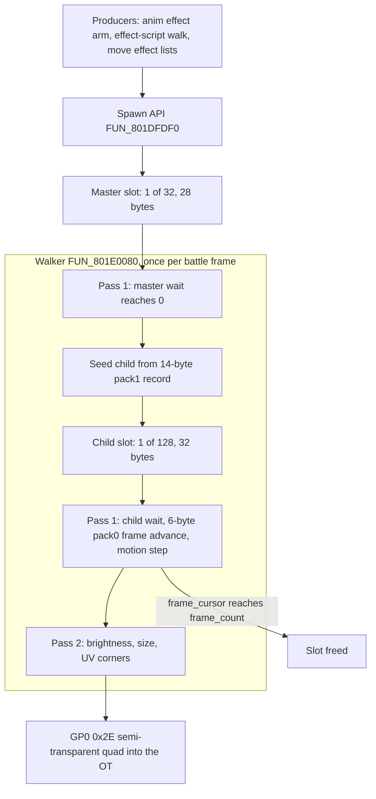

# Effect VM (battle effect cluster)

The effect VM is the runtime behind battle-spawned 2D effects: hit sparks,
dust, flame puffs, spell and item flashes. An effect is spawned by id at an
actor's position; a fixed pool then releases its child sprites on a timed
cadence, animates and moves each one, and draws it as a blended camera-facing
quad. It lives in the battle overlay (PROT 0898) and reads its scripts from
`efect.dat`.

**It is not a bytecode VM.** It is the one member of
[the runtime VM family](move-vm.md#the-runtime-vm-family) with no opcode table:
the per-slot "state" bytes are wait counters, and the lifecycle is a pair of
countdown-driven cursor walks inlined through 600+ instructions of the walker.
It is called a VM for symmetry with its four siblings.

This page also covers the effect geometry that does *not* come from the pool:
the three procedural emitters behind the render dispatcher's draw kind 4
(ribbon, sprite quad, ring / disc), which move-VM parts select.

## At a glance

| What | Where |
|---|---|
| Init / pack fixup | `FUN_801DE914` (span `0x13C`), called from `FUN_800520F0` case `0xE` with `(0x1000, 0xA00)` |
| Spawn API | `FUN_801DFDF0(byte effect_id, short* world_pos, ushort angle)` (span `0x288`) |
| Per-frame walker | `FUN_801E0080` (span `0x978`), one `jal` on the disc: the battle draw tick `FUN_800480D8` at `0x80048128` |
| Pool | `_DAT_8007BD30`, 5008 bytes: 16-byte head, 128 child slots, 32 master slots |
| Ready flags | pool-ready byte `0x8007BD58` (entry guards); walker body runs only when `DAT_8007BD71 == 0xFF` |
| Input data | [`efect.dat`](../formats/effect.md) (PROT entry 873): pack1 = effect-id scripts, pack0 = frame-batch animations, plus the inline sprite atlas |
| Dumps | `overlay_battle_801e0088.txt` (walker), `overlay_battle_801dfdf8.txt` (spawn), `overlay_battle_action_801e0080.txt` |
| Port | [`legaia_engine_vm::effect_vm`](../../crates/engine-vm/src/effect_vm.rs): `Pool`, `EffectCatalog`, `EffectHost` |
| Engine drive | `World::tick_effects`, `World::active_effect_sprites` (`crates/engine-core/src/world/effects.rs`) |
| Draw-kind-4 emitters | `engine-effects`: `effect_ribbon`, `effect_sprite_arm`, `effect_default_arm` |

**Entry addresses.** Both the spawn API and the walker begin two words ahead
of their stack prologue: `lui v0,0x8008` / `lbu v0,-0x42a8(v0)` load the
pool-ready byte `0x8007BD58` first. Every `jal` on the disc names the entries
`0x801DFDF0` and `0x801E0080`. Pages and dumps that cite `0x801DFDF8` /
`0x801E0088` (`FUN_801DFDF8`, `FUN_801E0088`) name the prologue word of the
same routines.

Spawn ids `4` and `0x13` make a side call to the move-VM part spawner
`0x80050ED4` (descriptor `0x801F5D90` / `0x801F5CF8`) and then take the
ordinary spawn path.

## Lifecycle

Pass 1 repeats `DAT_1F800393` times per call (the adaptive frame-skip factor,
so effect time tracks wall-clock under frame skip). Pass 2 runs once per call.

## Pool layout (`_DAT_8007BD30`, 5008 bytes total)

| Offset | Size | Contents |
|---|---|---|
| `+0x000` | 16 bytes | Head record set by init |
| `+0x010` | 4096 bytes | 128 x 32-byte child slots: per-sprite render state |
| `+0x1010` | 896 bytes | 32 x 28-byte master slots: per-effect-instance state |
| `+0x1390` | - | End of pool (16 + 4096 + 896 = 5008 = `0x1390`) |

32 simultaneous effects at about 4 sprites each is the 128-child budget.

### Head record (16 bytes)

| Offset | Type | Field |
|---|---|---|
| `+0x0` | i16 | Motion scale: first init immediate, retail `0x1000` |
| `+0x2` | i16 | Sprite scale: second init immediate, retail `0xA00` |
| `+0x4` | u32 | Inline sprite-atlas base (8-byte entries) |
| `+0x8` | u32 | pack0 pointer-table base (frame-batch animations) |
| `+0xC` | u32 | pack1 pointer-table base (effect-id scripts) |

### Master slot (28 bytes, 32 slots at pool `+0x1010`)

| Offset | Field | Behaviour |
|---|---|---|
| `+0` | `child_count` | Total spawn records (pack1 header byte 0). Doubles as the active flag: 0 = free slot. |
| `+1` | `flags` | pack1 header byte 1 (bit 0 = randomized offsets, consumed at spawn time). |
| `+2` | `spawn_cursor` | Records consumed so far. |
| `+3` | `wait` | 5.3 wait counter. Non-zero: decrement by 8 and stop. Zero: run the spawn loop. |
| `+4` | `angle` | Spawn angle `& 0xFFF` (12-bit PSX angle). |
| `+8..+0x10` | `origin x/y/z` | World position, 16.8 fixed (`i16 << 8` at spawn). |
| `+0x14` | - | Never written by the spawn API; its copy into `child[+0x18]` is a dead lane. |
| `+0x18` | `script_cursor` | pack1 `entry + 4`, advanced `+14` per record. |

### Child slot (32 bytes, 128 slots at pool `+0x10`)

| Offset | Field | Seeded with |
|---|---|---|
| `+0` | `frame_count` | pack0 byte 0. Doubles as the active flag. |
| `+1` | `mirror` | `rand() % 4`: **random UV flip bits** (bit 0 = horizontal, bit 1 = vertical), consumed by pass 2. |
| `+2` | `frame_cursor` | 0 |
| `+3` | `wait` | First frame's delay `<< 3` |
| `+4` / `+6` / `+8` | velocity x / y / z (i16) | The record's planar legs rotated by the master angle (`>> 12`); `vel_y` direct |
| `+0xC` / `+0x10` / `+0x14` | position x / y / z (16.8) | Master origin; `y -= height << 8`; x / z offset by the rotated planar legs (`>> 4`) |
| `+0x18` | - | Copy of `master[+0x14]` (dead lane) |
| `+0x1C` | anim cursor | pack0 `entry + 2` |

## Pass 1 - spawn cadence and child walk

Traced instruction-for-instruction from `overlay_battle_801e0088.txt` (walker)
and `overlay_battle_801dfdf8.txt` (spawn). There is no opcode byte anywhere:
the only data consumed are the pack1 spawn records and the pack0 anim frames.

- **Wait counters are 5.3 fixed-point.** A frame count is stored `<< 3` and decremented by 8 per logic frame; a value already `< 8` clamps to 0. Fractional catch-up ticks stay cheap.
- **Byte truncation.** The wait store is a byte (`sb` truncates the `<< 3`), so a delay `>= 32` frames wraps mod 32. This applies to master delays and child frame delays alike.
- **Idle early-out.** A sweep that finds zero active masters and zero active children adds 4 to the sweep counter, skipping the remaining catch-up iterations (fully, at any retail frame-skip factor `<= 5`).

### Master tick

With `wait` at zero, the spawn loop:

1. Seeds the next free child slot from the current 14-byte record. Allocation scans forward with a cursor that persists across masters within one sweep. On **pool exhaustion the record is still consumed** with no child: effects degrade rather than stall.
2. Advances: `spawn_cursor += 1`, `script_cursor += 14`, `wait = record.delay << 3`.
3. Repeats while the new wait is zero, so zero-delay records spawn as one burst.

When `spawn_cursor` reaches `child_count` the master frees itself (`+0 = 0`)
and forces `wait = 8` to exit the loop.

### Child tick

- `wait` non-zero: decrement by 8, plus one motion step.
- `wait` zero: loop { advance one anim frame (`anim_cursor += 6`, `frame_cursor += 1`, `wait` = new frame's delay `<< 3`; reaching `frame_count` retires the slot), then one motion step } while the new wait is zero.

A motion step is `pos += vel * frame.speed * pool_scale_0 * 8 >> 15` per axis.
With the retail init scalar `0x1000` at pool `+0` this reduces exactly to
`pos += vel * frame.speed`.

**Retirement overrun.** Retiring zeroes both the active flag and the wait, but
the frame-advance loop tests only the wait. Retail therefore keeps consuming
6-byte strides past the batch end **on the already-retired slot** until it
meets a non-zero byte in the delay position. The extra reads and motion steps
touch only the dead slot (the next seed rewrites every field), so
`Pool::tick_retail` breaks at retirement instead.

## Pass 2 - render

For each live child, one flat textured **semi-transparent quad** (9-word GPU
packet, tag `0x09000000`, prim code `0x2E`):

- **Brightness envelope.** With `n = frame_count >> 3`, the modulation ramps in over the first eighth of the animation (`0x80 * (frame_cursor+1) / n`), then back out over the rest (`0x80 * (frame_count - frame_cursor) / (frame_count - n)`), clamped at `0x80` (neutral) and written as `r = g = b`.
- **Size.** Atlas `w/h * pool_scale_1 >> 8` (retail init `0xA00`, so x10 texel size) is the **half**-extent: `FUN_800195A8` forms the corners as the view-space centre minus and plus it (`0x801E082C..0x801E0880` hand it over as `a1` / `a2`), so the quad spans twice the value. The quad is inserted into the ordering table at `_DAT_1F8003F4 + depth * 4`.
- **UV corners.** Base / extent from the 8-byte atlas entry, corner order swapped per the child's mirror bits.
- **Atlas fields.** `+4` is the CLUT (u16) and `+6` the tpage (byte): the emit at `~0x801E0980` writes `atlas[4..5]` into the primitive's CLUT field and `atlas[6]` into its tpage field. `0x7680` in that slot is a CLUT - CBA framebuffer `(0,474)`, an effect-CLUT row - not a tpage naming page `(0,0)` at 8bpp. A melee hit-spark capture confirms it: no prim samples page `(0,0)`, and the spark's quads sample the loaded effect pages.

### Blending comes from the prim code

`0x2E` is GP0 `0x20 | quad | textured | semi-transparent`, so every effect
child blends, whatever page it names. The page's own ABR bits then choose how.
The `efect.dat` inline atlas's two entries name pages `0x25` (`(320,0)`, ABR
`1` = `B + F`) and `0x66` (`(384,0)`, ABR `3` = `B + 0.25F`), both against
CLUT rows 474 / 475 of the flame atlas.

The atlas stores its page in a single byte, so a port that pushes the page
verbatim into a TSB word never sets its prim-ABE bit and the whole effect
system rasterises opaque. Flame CLUT row 474 is a fire ramp whose hot end
(`0xC73F` = `(248, 200, 136)`) is a pale tan: additive, a glow over a dark
arena; opaque, solid tan blobs with a puff silhouette (index `0` is `0x0000`
and discards either way).

Port: `EffectSprite::packet_tsb` (`crates/engine-core/src/world/types.rs`),
called by the native window's billboard builder and the play page's battle and
field FX builders. Pinned by `packet_tsb_forces_the_prim_semi_enable` and a
`SIM_PAIRS` row in `check-ui-host-drift.py`.

### The half-extent is a view-space quantity

`FUN_800195A8` transforms the sprite **centre** through the GTE camera matrix
(`FUN_8003D344`, one `MVMVA`), forms the four corners by adding the
half-extents to that already-transformed centre, then resets the rotation
matrix to identity with `TRX/TRY/TRZ = 0` before the `RTPT`. The camera matrix
multiplies the centre and never touches the half-extents.

In battle that matrix carries retail's base matrix `0x8007BF10` = `16384 * I`,
a **4x uniform scale**. A port that offsets the corners in world space under
the same scaled MVP applies the 4x to the half-extents as well: a 32-texel
puff reaches 1280 view units either side instead of 320. The shared correction
is `effect_billboard::world_half_extents(size, view_scale)`
(`crates/render-kernels`, re-exported by `engine-ui`); the native window
passes its `fx_scale` into `effect_sprite_corners`.

### A battle billboard's centre is Y-flipped

The pool integrates in raw PSX units, **Y down**: a spark climbing off the
floor runs negative. The battle view-projection both hosts share
(`battle_cam_script::battle_vp`) carries a trailing `scale(1, -1, 1)` that
cancels the per-model Y-flip every mesh draw carries, so it consumes Y-up
input. A billboard has no model matrix, so its centre is flipped before the
corners are built (`effect_billboard::battle_billboard_centre`, called by both
hosts). Without it, a spark rising past an actor's head projects the same
height below its feet; dust at `y = 0` reads the same either way. The field
cameras compose the world flip themselves and take the raw position.

## Spawn sources

### Catalog load

The runtime effect catalog (PROT 0873 `efect.dat`) loads at scene entry via
`EffectCatalog::from_efect_dat_bytes` (the 2-pack parser, see
[`formats/effect.md`](../formats/effect.md)) and stays resident on
`World::effect_catalog` across field / battle transitions. It carries the
pack1 effect scripts and per-child descriptors, the pack0 animation batches,
and the inline sprite atlas.

### Producers

| Producer | Retail | Port |
|---|---|---|
| Animation effect arm | `FUN_8004998C` at `0x8004A634..0x8004A81C` calls `FUN_801DFDF0(id, sp+0x10, actor+0x46)` (`ghidra/scripts/funcs/8004998c.txt`) | `BattleActionHost::ui_element` spawns at the acting actor's battle seat with its `facing_angle` |
| Per-action effect-script walk | `FUN_801DEA50` -> `FUN_801DFDF0` ([`battle-action.md`](battle-action.md#the-per-action-effect-script-fun_801dea50)) | `World::route_battle_effect_spawns` -> `World::try_spawn_effect` |
| Move-power effect-id lists | `+0x12` / `+0x16` lists dispatched by `FUN_801e09f8` | `World::spawn_move_fx` |
| Per-move effect-list spawner | `FUN_801e22c8` (called by the battle effect driver `FUN_800402f4`), 5-byte-stride list at `0x801F6470` | `engine-battle-vm::battle_cue_group::expand_cue_group` + `cue_group_for` |

- **A spawn is seated at an actor, never the world origin.** The caller copies the owning actor's world position (`actor+0x34..0x3B` via `lwl` / `lwr`), offsets it by the per-effect planar legs rotated through the facing's sin / cos LUTs, and passes the facing halfword (`actor+0x46`) as the spawn angle.
- **The effect-script walk has two record forms.** Its `0x80`-flagged records route into the pool. Its table-form records stage a `0x801F6324` prototype scene via `World::spawn_action_table_effect`: a small move-VM scene-graph in `World::casting.active_action_fx`, ticked by `World::tick_move_fx` and drawn through `World::active_move_fx_part_draws`.
- **The last two producers share the bit-7 multiplex** ([`effect.md`](../formats/effect.md#how-a-move-reaches-this-2d-pool---the-bit-7-multiplex)). The cue-group expander is reached from the action SM's item / spirit applier band; each expanded cue routes into `World::try_spawn_effect` / `World::spawn_action_table_effect` and its SFX byte into `World::audio.battle_sfx_cues`.
- **`ui_element` raises do not spawn here.** `FUN_801D8DE8` is the HUD screen-element spawner and calls no effect routine ([`battle-action-helpers.md`](battle-action-helpers.md#fun_801dfdf8---effect-bundle-public-spawn-api)).

### Effect ids have no names

No string table maps an id to "fireball / thunder / heal". To name one, trace
the call sites of `FUN_801DFDF0` in damage / battle-action code: each caller
passes a literal byte for `effect_id`, which correlates with the action that
triggered it (a Tactical Arts move, an item use, a spell cast).

## Engine port

| Retail | Port |
|---|---|
| Init `FUN_801DE914` | `Pool::init_head` |
| Spawn `FUN_801DFDF0` | `Pool::spawn`, `Pool::spawn_by_ui_id` |
| Walker pass 1 | `Pool::tick_retail` (master cadence + child anim / motion walk, with the `frame_skip` catch-up factor) |
| Walker pass 2 | `Pool::child_billboards` (brightness envelope, atlas resolution, `sprite_scale` sizing, UV-mirror corner order) |
| `rand()`, ids `4` / `0x13` side call | `EffectHost::next_random`, `is_summon_effect` / `handle_summon` |

The GTE projection `FUN_800195A8` and the ordering-table insert stay with the
renderer. `World::tick_effects` runs one `tick_retail` sweep per retail logic
frame (`World::tick` calls it on the retail-frame sub-clock), and
`World::active_effect_sprites` maps `child_billboards` one-for-one. This
walker is the engine's only per-frame effect path.

Two deliberate port-side deltas, both invisible to retail behaviour: the
retirement overrun is cut at retirement, and `master.field_14` (a retail dead
lane) is bumped once per call per active master as an age counter for
age-based render fades.

### Render snapshots

- `World::active_effect_markers` - one coarse `EffectMarker` per effect still in its spawn phase (origin + age), plus the dev `debug_effects`. For hosts and tests that only need positions.
- `World::active_effect_sprites` - the per-child billboard view: each child's integrated 16.8 position, its current pack0 frame's atlas rect + `tpage` / `clut`, the pass-2 size, the brightness envelope and the UV-mirror corner order.

Both hosts draw each `EffectSprite` as a **camera-facing textured quad**: the
native window through the VRAM-mesh pipeline (`upload_vram_mesh`, sampling the
scene VRAM at the sprite's atlas page / CLUT / UV as a `SceneDraw`), the play
page through the same shape in `web-viewer::play_battle_fx`.

`World::spawn_debug_effect` seats a synthetic marker by hand (the `E` key in
`play-window`). It is not a retail path; dev spawns keep a fixed budget and
live outside the pool in `World::debug_effects`, so the walker never sees them.

### The billboard outline is a diagnostic and defaults off on both hosts

Each host carries a **tinted outline** builder: a flat rectangle around the
quad, faded by animation age. Retail draws no such rectangle. The strips are
untextured, carry no ABE bit and rasterise in the **opaque** pass, and the
tint law `(80 + 175f, 200f, 255f)` for `f = 1 - age01` is red-dominant
throughout, so enabled it draws a solid box around every effect sprite. The
Rim Elm spar (`play-window --scene town01 --battle 4`) carries up to 25 live
sprites in one frame.

| Host | Builder | Gate | Default |
|---|---|---|---|
| native `play-window` | `effect_sprite_line_geometry` (`UploadedLines`) | env `LEGAIA_DIAG_FX=1` | off |
| browser play page | `play_battle_fx` outline strips (hybrid-flat quads) | `LegaiaRuntime::set_battle_fx_outline(true)` | off |

The gates differ because a WASM module has no process environment to read.
When changing one, check that the other host reaches the same builder under
the same condition ([`tooling/host-drift.md`](../tooling/host-drift.md)).

### Reading a faint effect layer

On `play-window --scene town01 --battle 4`, differencing two otherwise
identical frames with the billboard draw suppressed shows a real in-frame
delta (up to ~53 per channel, mean ~10 over the puff): spawn, projection,
texel residency and the blend pass all work. It still does not look like much,
for two data reasons:

- Every effect the Rim Elm spar fires (`0x01`, `0x05`, `0x06`) resolves through pack0 anim batch `1` to atlas page **`0x66`** = `(384, 0)`, whose texpage bits carry **ABR 3 = `B + 0.25*F`**, under CLUT `0x76C0` = row 475 palette 0, a dark warm-grey ramp topping out at `(184, 144, 112)`. A quarter of a dark grey ramp over a bright tan floor is a few percent.
- The bright effects are on the other pages. `0x25` = `(320, 0)` and `0x27` = `(448, 0)` are **ABR 1 = `B + F`**, the pages a retail melee-hit-spark capture draws from. They belong to other effect ids (`0x04`, `0x0B..0x0E`, `0x10..0x14`, `0x16`, `0x17`, `0x1C..0x1E`), which the spar's clips never request.

Native diagnostics:

| Env | Effect |
|---|---|
| `LEGAIA_DIAG_FX=1` | Logs each live sprite's world position, quad size, page / CLUT, brightness, projected NDC and a VRAM texel-residency verdict |
| `LEGAIA_DIAG_NOFX=1` | Suppresses the billboard draw so two runs can be differenced |
| `LEGAIA_DIAG_NOSEMI=1` | Turns the semi-transparency pass off, so a deferred fragment draws opaque instead of vanishing |

### Battle effects die with the battle

Retail never tears an effect down one by one at a battle's end; it drops the
whole actor pool. The mode initialiser `FUN_8001DCF8` calls the per-stage init
`FUN_8001E1B4` (`jal` at `0x8001E020`) on every mode switch. That init
re-seeds the 143-slot actor free stack (`FUN_800203EC` at `0x8001E324`) and
re-pops the seven actor-list sentinels (`FUN_80020424` x7,
`0x8001E32C..0x8001E364`), each left pointing at itself. Every effect actor
still on a list - a move-FX part, an effect-script table-form record, a cast
module's spawn record - is unlinked with no walk (see
`ghidra/scripts/funcs/8001e1b4.txt`). The `efect.dat` pool needs no reset on
the way out: its walker is battle-overlay code behind the pool-ready byte, and
the battle loader re-initialises it on the way in (`FUN_801DE914`, stage
`0xE`).

The port's `World` outlives every mode switch, and both play hosts draw the
pool's billboards and the move-VM scene-graphs with no mode test, so it drops
the same state by name:

- `World::teardown_battle_effects` runs at battle entry, at battle exit (`World::finish_battle`, or `World::resolve_game_over_hold` when a wipe holds the frozen frame) and at every scene load (`SceneHost::load_scene`).
- It resets the `efect.dat` pool and every battle-scoped member of `World::casting`: the summon / cast-module, move-FX and effect-script scene-graphs, the streak block and its trail texpage, the cast band's pending requests and stager. Only the installed cast-effect data pool is kept.
- `World::battle_effect_residue` names whatever of that is still live. The soak harness's `effect_residue` detector and `engine-shell/tests/battle_effect_teardown_disc.rs` read it on the first frame past each exit and scene load.

One teardown is earlier than the mode switch. The engine stages a cast
module's spawn records as data and runs its tick body separately
([`cast-module.md`](cast-module.md#staged-records-end-with-their-action)), so
nothing halts a record the module code would have halted, and many records are
infinite loops. `World::step_battle` retires that scene when the action SM
opens the next action (state `0x00`).

## Effect textures and models

The retail `befect_data` block (CDNAME defines `872..875` -> extraction
entries **870..873**) holds the four battle effect files - `etim.dat` (0870),
`etmd.dat` (0871), `vdf.dat` (0872), `efect.dat` (0873) - pulled by
`FUN_800520F0` at raw TOC indices `0x368..0x36B`. The verified
case -> index -> entry map is in
[`formats/effect.md`](../formats/effect.md#battle-effect-cluster-befect_data).

### Two effect-texel pools

| Pool | Contents | Residency | Engine upload |
|---|---|---|---|
| `etim.dat` = extraction 0870 | Three 64x256 4bpp TIMs targeting VRAM `(320,0)` / `(384,0)` / `(448,0)`, CLUT rows 474..476 | **Battle-only**: those columns hold town stage textures during a field scene | `scene::upload_flame_atlas_into_vram` on battle entry, into a throwaway VRAM copy that battle exit discards |
| `player_data` section 2 (extraction 0874 section 2) | Eight TIMs at `fb_y=256+`; this is `player.lzs` section 2, the field-character texture pack ([`character-mesh.md`](../formats/character-mesh.md#textures-field-form)), not "etim" | **Field-resident** through battle | `scene::upload_effect_textures_into_vram` at scene entry |

- The `fb(320,256)` / `fb(384,256)` pages match a `town01` field capture 256 rows byte-exact, and a mid-cast battle capture byte-matches the `(832..880, 256+)` tiles. The Gimard flame model samples this band (page `(832,256)`, CLUT row 478).
- The field VRAM-parity oracle uploads image pages only (`upload_clut = false`), since retail uploads the CLUT rows at battle entry.
- Full byte evidence: [`formats/effect.md`](../formats/effect.md#effect-texels-in-vram---pixel-verified).

### Effect-model library

`engine-core::scene::seed_effect_model_library_from_etmd` reads extraction
0871 (`etmd.dat`, raw index `0x369`) at scene entry: an uncompressed 30-entry
`asset::pack` of Legaia TMDs spanning the entry's *extended* footprint. It
registers all 30 into `World::global_tmd_pool[3..=32]`, the same
`DAT_8007C018[3..=32]` window retail fills at battle init (`FUN_800520F0` ->
`FUN_80026B4C`), overwriting the two trailing slots of the field character
pack exactly as retail's load order does.

Gimard's *Tail Fire* is `GIMARD_TAIL_FIRE_MODEL_INDEX = 26` (pack entry 23).
The `F`-key dev spawn in `play-window` draws it from the loaded library,
falling back to the field-character-pack preview mesh
(`ETMD_TAIL_FIRE_MODEL_INDEX`, the flame-like auxiliary TMD of extraction 0874
section 0) only when the library is not resident.

`World::active_effect_models` snapshots each dev-spawned model effect
(`EffectModel` = global-TMD-pool index + world position + age, from
`World::debug_effects`); `play-window` builds a textured `legaia_tmd` VRAM
mesh for it and draws it at the effect origin. The production effect-id ->
model selection is the move / art-VM path, `World::spawn_move_fx`.

## The three render-mode-4 emitters, and which one the disc uses

The pool's quads are not the only primitive path an effect actor can take. The
per-actor render dispatcher `FUN_8001ADA4` switches on `actor[+0x56]` (loaded
at `0x8001AE60`), and its case `4` - multi-target - picks one of three
emitters off the separate flag halfword `actor[+0x9E]`:

| `+0x9E` bits | Emitter | Builds | Move-VM setup op |
|---|---|---|---|
| `0x4000` | `FUN_8002A5A4` (SCUS) | one textured quad | `0x23` (arm `0x800237D8`) |
| `0x2000` | `FUN_801CFA48` (battle overlay) | random-walk **ribbon**: lightning bolts, beams, whips | `0x42` (arm `0x80023F94`) |
| `& 0x6000 == 0` | `FUN_80028158` (SCUS) | ring / disc / fan family | `0x13` |

The dispatcher hands the emitter `src = actor + 0x9C`, so the emitter's
"record" is the actor. The selector and the draw kind are written by the
**move VM**: op `0x42` sets `actor[+0x56] = 4`, `+0x5A = 2` and
`+0x9E = op[1] | 0x2000` (`ori 0x2000` at `0x80023FBC`, `sh v0,0x1e(s1)` at
`0x80023FC0`, where `s1 = actor + 0x80` from `addiu s1,s2,0x80` at
`0x80023088`), and fills the ribbon's inputs: `+0x9C`, `+0xC8`,
`+0xB4..+0xBA`, `+0xA8`, and two packed colour words at `+0xA0` / `+0xA4`.
Operand detail:
[move-vm.md](move-vm.md#draw-kind-4-setup-ops-0x13-0x23-0x42).

**All three arms carry shipped content.**

- Op `0x42` appears five times in the disc's move programs, all in slot-B cast / summon images (PROT 0923, 0934 twice, 0957, 0964), and nowhere in the PROT 0898 move-FX prototypes or the field stager records.
- The 97 catalogued battle states hold 188 render-mode-4 nodes: 128 on the default emitter, 60 on the `0x4000` sprite arm, no live ribbon.
- Walking all seven actor-list heads (`0x8007C34C..0x8007C368`) of the 98 catalogued mednafen states finds 226 live default-arm nodes and 122 sprite-arm nodes, no ribbon.
- Staging every slot-B image (`0903..0966`) through the port's summon spawner puts default-arm nodes in 61 of the 64 (all but PROT 0926, 0939 and 0952), 3 to 42 live at once (42 in PROT 0923); 15 of the 64 reach the sprite arm. The default arm is the bulk of the summons' procedural geometry (`effect_sprite_arm_carriers_real.rs` reports both).

Both hosts draw every live kind-4 node of the summon, move-FX, effect-script
and field ambient parts through `World::active_effect_kind4_draws`, composed
like a mesh part by the native part pass and the browser play page's battle
and field FX frames.

### The ribbon's draw

The emitter draws nothing itself. It writes a **Legaia TMD object** into a
scratch buffer (`*(0x8007B85C) + 0x5DC00`):

- the object header at `out + 0xC` (vertex top `out + 0x28`, `(steps + 2) * 6` vertices, no normals, then the primitive block of `steps * 6` primitives);
- the step vertices;
- one primitive group: `count = steps * 6`, flags `0x26` (the baked-colour `GT4` row), `ilen = 9`, mode `0x3C` (`0x801D000C..0x801D0024`).

The render dispatcher then stores `out + 0xC` into every slot of the actor's
model list `actor[+0x44]` (`0x8001B08C..0x8001B0B4`), so the ribbon is drawn
as the actor's own model through the ordinary TMD path.

Each step contributes six packets joining its six vertices to the next step's:

| Packets | Span | Colour |
|---|---|---|
| core strip, stored **twice** | the `±1` pair | core colour `src[+4]` |
| two inner flares | out to the `±2` pair | core to flare (`src[+8]`) |
| two outer fringes | out to the `±8` pair | flare to black |

Every packet samples the same 2x2 texel patch, UVs `(0..2, 0xF0..0xF2)` in
texture page `0x001F` (`(960, 256)`, 4bpp) through CLUT `0x7F84`
(`(64, 510)`), and the chain ends in twenty zero words.

Port: `engine-effects::effect_ribbon` (re-exported from `legaia_engine_core`).
`World::active_effect_ribbons` rebuilds each live ribbon node's mesh every
frame. In play that is **Gilium**'s summon (spell `0x95`, PROT 0923). Ozma
(`0xA0`, PROT 0934) and the two capture-class carriers (PROT 0957, 0964) are
not staged as scenes by the engine.

### The sprite arm's draw

The `0x4000` arm (`jal 0x8002A5A4` at `0x8001B0E8`) builds one textured quad
from the node's `+0x9C` block into the same scratch buffer. Case 4 then falls
into the ordinary model draw at `0x8001B160`, so the quad is drawn like a mesh
part:

- scaled by `+0x72 / 0x1000` when that is not `0x1000` (`0x8001B240..0x8001B2C4`);
- turned by the rotation banks;
- handed to the prim dispatcher with the colour word `+0x74` and level `+0x78` (ABE and ABR ORed into the packet, the colour depth-cued toward the word's far colour).

Its builder is SCUS code, so unlike the ribbon it draws in every mode.

**The scale is seated by the spawn, not the record.** `FUN_80021B04` stores
its fourth argument at `+0x72` (`sh s4,0x72(s0)` at `0x80021DAC`) before the
part's first move-VM run, and the pool wrapper `FUN_80050ED4` forwards its own
`$a3` unchanged. Nearly every seater passes `0x1000`: the battle stagers of
the slot-B band (`0903..0966`) and PROT 0898's effect-prototype spawns load
`li a3,0x1000`, as do the two ambient seaters. A few calls pass another
immediate (`0x400`, `0x800`, `0x2000`) or forward a parent's `+0x72`. The
engine seats every staged part at `0x1000` (`summon::SPAWN_RENDER_SCALE`, the
ambient install likewise); its part set is keyed by record rather than by
call, so those per-call scales are not carried.

Port: `engine-effects::effect_sprite_arm` turns every live sprite-arm node
into a one-quad mesh. The quad geometry is
`engine-minigames::baka_impact_fx::sprite_arm_quad`, the one Baka Fighter's
impact flash draws through.
`crates/engine-core/tests/effect_sprite_arm_carriers_real.rs` reports the
slot-B images whose programs reach the arm and pins that each lands on the
draw list as one quad.

### The default arm's draw

With neither bit set, case 4 calls `FUN_80028158(out, +0x9E, (s16)+0x9C +
(((s16)+0xC8 >> 3) << 8), actor + 0x9C)` (`0x8001B128..0x8001B15C`) and falls
into the same model draw as the sprite arm. The builder writes a Legaia TMD
object at `out + 0xC` - no normals, one `GT4` group (`flags 0x26`, `ilen 9`,
`mode 0x3C`, the ribbon's row) - and closes it with twenty zero words. It
never clears the scratch block, so the words it does not write are the
previous draw's.

Besides move-VM op `0x13`, three callers reach it directly: the battle ground
shadow, the field battle-intro ring and Baka Fighter's floor disc
([renderer.md](renderer.md#the-ground-shadow)).

**Arguments.** `count = packed & 0xFF`, `phase = packed >> 8` (a logical
shift). From `src`:

| `src` offset | Field |
|---|---|
| `+0x04` / `+0x08` | inner / outer colour words |
| `+0x0C..+0x12` | UV rectangle |
| `+0x14` / `+0x16` | tpage / CLUT |
| `+0x18` / `+0x1A` | inner / outer radius (negative clamped to zero) |
| `+0x1C` / `+0x1E` | inner / outer height |
| `+0x20` / `+0x22` | two in-plane scales (`0x1000` = 1) |

**The mode word splits three ways.**

- `mode & 3` is the **plane**: which vertex component each of the builder's three axes lands in. `0` XY-Z, `1` XZ-Y, `2` ZY-X, `3` ZX-Y (`0x800283D8..0x800284A0`). Mode `1` lays a ring on the ground.
- `(mode >> 3) & 0xF` is the **shape**, through the jump table at `0x80010BC0` (shapes `0 / 4 / 5 / 6 / 7` share one setup arm, `1 / 3` another, `2` a third). A shape `>= 8` skips the table and reads stack slots no path wrote.
- `mode >> 8` is the **texture mode**, read only for shape `0`: every other shape masks the mode to its low byte first (`0x800281F0`).

Texture modes:

| Value | Sampling |
|---|---|
| `0` | The ribbon's fixed 2x2 patch (page `0x001F`, CLUT `0x7F84`, UVs `(0..2, 0xF0..0xF2)`) |
| `1` / `4` | Each column's quad subdivided four ways along the radius, `src`'s rectangle mapped polar |
| `2` / `3` | Same subdivision, the rectangle as-is or turned |

Modes `1..4` interpolate both the UVs and the corner colours across the four
sub-quads. A tpage word carrying `0x4000` selects one of the two 15-bit
display pages (`0x100` / `0x110`, picked by the halfword at `0x8007B74C`): the
frame itself as the texture.

| Shape | Geometry |
|---|---|
| `0` | A ring of `count` columns (at least three), an inner and an outer vertex each; an inner radius of zero makes a disc. `phase == 0` turns the ring half a column; `0 < phase < count` draws an open arc of `phase` quads over `count + 1` columns; otherwise the ring closes onto column 0. |
| `1` | Per column three inner / outer pairs at `+0`, `+phase`, `+2 phase`, plus a seventh vertex extrapolated half a step past the middle pair's outer one; three quads a column. |
| `2` | Per column three pairs; vertex 2 is moved to the origin and each column fans one quad to it. |
| `3` | Shape `1`'s vertices with two of its three quads degenerate. |
| `4` | A ring whose radius each column jitters by `rand()` (`FUN_80056798`, three calls a column). |
| `5` | As `4`, shifted so the first column's inner vertex sits at the origin, the height ramping from `+0x1C` to `+0x1E` across the columns. |
| `6` | A ring whose outer vertex keeps the inner one's second coordinate. |
| `7` | A ring whose inner vertices are offset so the column at angle `-phase - 0x800` pivots at the origin. |

The live default-arm nodes in the catalogued states use modes `0x00`, `0x01`,
`0x08`, `0x10`, `0x18` and `0x100` - shapes `0..3` and texture mode `1` - and
none of shapes `4..7`.

**Port.** `engine-effects::effect_default_arm` (re-exported from
`engine-core`). `build` transliterates the routine onto a byte buffer - every
word retail stores, at the offset it stores it, with a record of which bytes
it wrote - and `decode` reads the object back the way the TMD renderer reads
it. `crates/engine-core/tests/effect_default_arm_retail_capture.rs` holds it
to the scratch blocks the save library captured:

- every ground-shadow build (`+0x62400`) reproduces byte for byte, whole or up to a later overwrite of its last four packets;
- the dispatcher's block (`+0x5DC00`) reproduces for modes `0x0`, `0x1`, `0x10` and `0x100` from a live node's own arguments;
- modes `0x8` / `0x18` reproduce once the radii, heights and phase are read off the block itself. The part tick steps those channels after the draw, so a captured node has already moved one frame past the build it left.

## Battle effect parts morph through `vdf.dat`

The effect-script **table form** (`0x801F6324` prototypes,
`World::spawn_action_table_effect`) stages move-VM parts like any other
scene-graph. Four things decide how they show:

- **Wait timers drain at retail's per-frame rate.** `FUN_80021DF4` subtracts `DAT_1F800393 * DAT_1F80037D` from `+0x54` per frame, so `WAIT_SET v` holds `v` frames. The table-form scenes tick their waits with that channel delta, not the `0x400` scene-graph step the summon scenes use (under which a `0x4F`-frame hold lasts three ticks).
- **A part with op `0x0A` lanes draws morphed.** The lanes index the battle VDF pack `vdf.dat` (PROT 0872): battle init rebuilds the sub-entry table `0x80083E58` from index 0. A mid-Spirit capture reads the append counter `0x8007B7EC` at the pack's 32 entries and table entry 12 equal to the pack's entry 12. The engine runs the ramp envelope `FUN_80020740` on these parts and both hosts draw `World::morphed_part_tmd`. The Spirit charge's prototypes `0x07` / `0x08` are small rest meshes that entry 12 grows into the aura cone.
- **The lanes grow at `authored * DAT_1F80037D / 8` per frame.** Op `0x0A` scales each velocity by the rate byte `DAT_1F80037D` (`8`, planted by SCUS at boot), and the envelope adds it times the frame byte `DAT_1F800393` alone. The envelope runs from the part tick's tail (`FUN_800204F8`, `jal` at `0x80022EF4`), which the spawn's own first VM step does not reach, so a lane grows from the frame after the spawn. Both mid-Spirit captures that hold the aura read the lane at exactly `0x66` per elapsed frame (`0x2CA` seven frames in, `0xB28` at twenty-eight), so the cone takes `0x28` frames to open.
- **The model draw applies the part's render scale and colour word.** The draw at `0x8001B160` scales the mesh by `+0x72 / 0x1000` and hands the prim dispatcher the colour word `+0x74` and level `+0x78` (ABE / ABR ORed into every packet, each colour cued toward the word's far colour). The aura's op `0x0C` writes the additive word `0xC9000000` (far colour black) at level `0x1000`; op `0x0D`'s level rate takes it to `0` over `0x20` frames and back to `0x1000` over the last `0x0B` - a fade in and a fade out.

The rates integrate in the part tick's motion block, whose rotation, scale and
level channels the engine runs for every summon / move-FX part
(`engine-effects::part_motion::level_block`; that is also what spins the cones
at op `0x04`'s `0x222` a frame). Both hosts draw every part that is not a
plain rest mesh through `World::part_draw_vram_mesh`.

## What draws a summon

The 2D pool above is not what draws a Seru-magic summon, and neither is a
move-VM scene-graph.

- **The player summon is posed like an enemy monster body.** A live PCSX-Redux trace of a player Gimard *Burning Attack* cast shows the **battle per-actor draw `FUN_80048A08`** in exact lockstep with the per-object rigid-TRS keyframe decoder `FUN_8004998C` -> cluster-A `FUN_80043390`. The faithful render is the battle TRS-keyframe draw ported in `engine-vm/anim_vm.rs`.
- **Measured rates.** `scripts/pcsx-redux/autorun_enemy_move_render_path.lua` on the catalogued `gimard_burning_attack` state (400 vsyncs): `FUN_80048A08` = 213, `FUN_8004998C` = 213, `FUN_80023070` = 11, `FUN_801F7088` = 0. The draw never exceeds **2** per rendered frame (Vahn solo against one monster); the same probe reads 6 per frame in a 3-vs-3 (`rim_elm_queen_bee_battle`) and 2 in a 1-vs-1 (`rim_elm_gimard_victory`): one call per live actor.
- **Not `FUN_801F7088`.** That address is the world-map top-view tile renderer aliasing the same `0x801Fxxxx` band.
- **The flame motion is geometric, not palette.** Two animation-distinct Tail Fire frames have a **byte-identical** CLUT band (VRAM rows 470..499) while the framebuffer differs ~21%. The static flame renders with the baked row-478 CLUT.
- **The stager overlays hold real move-VM part records.** Extraction PROT 903..913, recovered under the link base `0x801F69D8` by `legaia_asset::summon_overlay`. The `jal 0x80023070` that runs them lives in the SCUS stager `FUN_80021B04`, not inside the overlay. The engine drives them as a **stand-in** (`summon::SummonScene`).
- **The enemy move is a different move.** The player summon `0x81` performs *Burning Attack*; the enemy Gimard's boss move is *Tail Fire*, spell id `0x27` in the SCUS spell table. It seats the move-FX module PROT 0900 in slot B and renders as a single move-VM part actor in `DAT_801C90F0` ticked by `FUN_80021DF4` -> `FUN_80023070`. In both captures above `FUN_80023070`'s per-frame hits equal the part pool's live-slot count, with `FUN_80021DF4` 1:1 beside it. See [`battle-action-helpers.md`](battle-action-helpers.md#enemy-fire-tail---move-vm-part-not-the-widget-path).

Full reconciliation:
[`battle-action-helpers.md`](battle-action-helpers.md#seru-magic-summon-overlay-dispatch)
and the [`re-settled-threads.md`](../reference/re-settled-threads.md)
"Seru-magic summon visual" row.

## The floating value readout rides the same atlas

The numeral a landed hit throws is not an effect-pool child, but it samples
the same texture page: `etim.dat`'s third TIM, page `(448, 0)`, through the
sub-palette at VRAM `(48, 476)` (CBA `0x7703`, tpage `0x27`). The sheet's
layout - ten 24x24 digit cells in strip order `1234567890`, plus the `DAMAGE`
/ `HIT` / `TOTAL` labels - is in
[`formats/effect.md`](../formats/effect.md#the-battle-value-readouts-glyph-sheet-lives-here-too).

The geometry is read out of retail's own display list. Both frame arenas of
the `battle_melee_hit_spark` capture carry the same two-digit run, so the pair
is an animation: the run's horizontal **centre** holds while the cell
**grows** toward its 1:1 24-px size, and the run **rises** to a fixed screen
row `y = 32`. Cell pitch is the drawn width plus one. The quads are `0x2C` at
colour `0x808080`, so retail neither modulates nor fades the numeral. Port:
`engine-battle-vm::battle_value_readout::value_cells`.

Placing it is a **host** job: the seat is the struck actor's projected screen
position, which only the layer holding the camera knows. Both hosts project
the actor under the FX camera and emit the cells as screen-space VRAM quads
through one builder, `battle_numerals` (`crates/render-kernels`, re-exported
by `engine-ui`), using retail's own texels. Before the battle VRAM exists a
host falls back to `engine-ui::battle_value_readout_draws_for`: retail's cells
and pitch in the dialog font. `engine-ui`'s HUD builder draws the popup queue
only under `LEGAIA_DIAG_HUD`.

## Side-band streaming-effect handler (`0x801F17F8`)

Called from `FUN_800520F0` case `0xFF`. Streams two runtime-only files via
`FUN_800558FC`:

- `data\battle\summon.dat` - selected when `_DAT_8007BD24[0x26B] & 0x80 != 0`.
- `data\battle\readef.dat` - the opposite branch.

`FUN_800558FC` ignores the path string and consumes its fourth argument as a
retail TOC index: `summon.dat` = `0x37F`, `readef.DAT` = `0x380`, which are
**extraction entries 893 / 894** (the retail in-RAM TOC keeps the PROT.DAT
8-byte header, so retail index = extraction index + 2). Each file is an exact
array of `0x10800`-byte slots (103 / 78) carrying per-special-attack CLUT rows
+ 4bpp texture pages and summon-creature actor records, byte-verified RAM to
disc and VRAM to disc in a mid-cast save state. Format:
[`summon-readef.md`](../formats/summon-readef.md); parser
`legaia_asset::summon_readef`.

## See also

[efect.dat format](../formats/effect.md) ·
[Battle action SM](battle-action.md) ·
[Move-table VM](move-vm.md) ·
[Cast modules](cast-module.md) ·
[Renderer](renderer.md)
