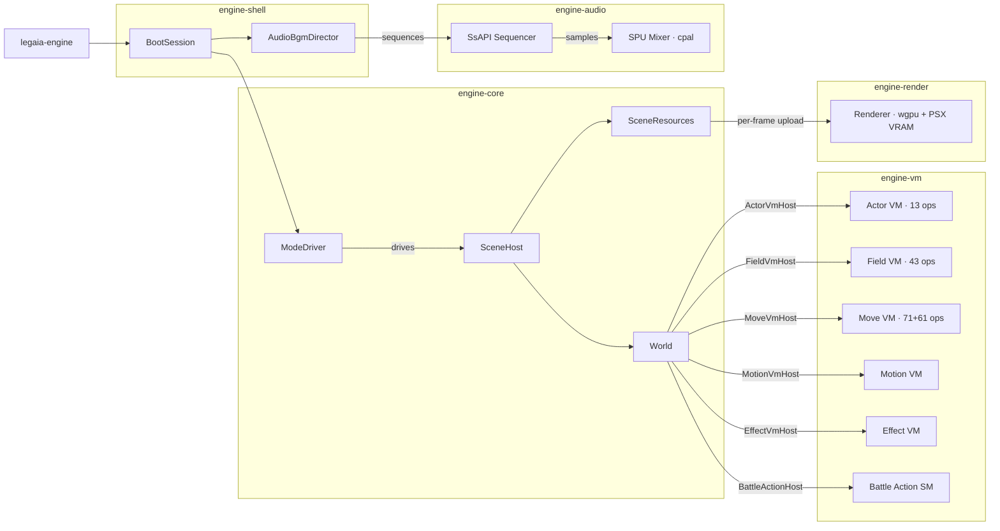

# Engine reimplementation

The clean-room Rust port of the Legend of Legaia engine. End-user model: the engine is a binary; the user supplies a disc image; the engine extracts the assets at first run and plays the game using clean-room ports of every runtime subsystem.

## Goal

A playable port of Legend of Legaia (NA SCUS-94254) on modern systems via Rust + wgpu, with an optional WASM/web target. JP/EU regions land after NA is solid.

"Playable port" is a claim about the *simulation*, not about the pixels. What the game does - damage arithmetic, RNG, script pacing, save-record layout - reproduces retail. How it is presented is a separate question, answered in [Fidelity and enhancements](#fidelity-and-enhancements).

## Non-goals

- **Static recompilation of `SCUS_942.54`.** The engine is **clean-room from documented specs and decompile-then-rewrite logic** - not auto-translated MIPS. This is the boundary the whole [legal posture](#legal-posture) rests on.
- **Redesigning the game.** Retail's balance, damage rounding, encounter rates and script timing are reproduced, not tuned. A quirk is behaviour to replicate, not a bug to fix.
- **Re-authoring the game's assets.** Every texture, mesh, sample and sequence comes off the user's own disc at runtime. Nothing is upscaled, redrawn, or bundled.

Modding and translation are conspicuously *not* on that list. The [randomizer](../tooling/randomizer.md) and [language packs](../tooling/translation.md) are shipped, deliberately-designed parts of this repo, described below rather than disclaimed. Both are disc-patching tools that operate on a user-supplied `.bin` rather than engine features - the randomizer does not touch the clean-room engine at all.

## Fidelity and enhancements

The port draws a hard line between the two, so that "faithful" stays a testable claim rather than a mood.

**Simulation is faithful, with no opt-out.** There is no toggle that changes damage, drop rolls, AP costs, encounter rates or story-flag behaviour, because the parity oracles depend on there not being one: [engine scenarios](#engine-integration-scenarios) hash the resulting save bytes against a blessed baseline, the [VRAM diff harness](#vram-diff-harness) diffs engine uploads against runtime blobs captured from save states, and the [record / replay](../tooling/determinism-replay.md) format requires the same input file to produce bit-identical state traces twice.

**Presentation is where the knobs live.** Every enhancement is renderer or host state with no path into the world, so flipping one leaves replays and every oracle above untouched. The ones that depart from retail default off; the two that do not are called out in the table:

| Knob | Default | Effect |
|---|---|---|
| `Renderer::set_dynamic_lighting` (`--dynamic-lighting`, `I` in `play-window`) | off | Soft warm directional light + screen-centred light pool over the baked shading. |
| `World::precise_movement` (`R`) | off | Free-angle locomotion instead of retail's 4/8-way quantisation. |
| `Renderer::set_psx_mode` (`LEGAIA_PSX_RENDER=1`) | off | Strict-PS1 rasterisation artefacts - see below. |
| `Renderer::set_semi_blend` | **on** | Retail ABE semi-transparency blending. On because it *is* retail. |
| `CameraDistance` (`T`) / debug orbit camera (`C`) | `Far` / off | Framing only; never feeds the simulation. |
| WebXR [VR mode](vr-mode.md) | off | Stereo presentation on the site's WebGL pages, not the wgpu path. |

Two details are worth having straight, because the direction is not uniform:

- **Shading defaults to retail.** The field path has no runtime light source at all - both retail TMD renderers issue exactly one GTE colour op (`DPCS`, the depth cue) and never an `NC*` op, so shading is baked into the TMD colour words and applied as `texel * colour / 128`. The engine's field pipelines draw exactly that. `dyn_light` is layered *over* it and is an exact identity when disabled, which is what keeps the render oracles honest. See [`crates/engine-render/src/dyn_light.rs`](../../crates/engine-render/src/dyn_light.rs) and [renderer](renderer.md).
- **Rasterisation defaults to clean.** `psx_mode` is off, so the default image is sharper than a PlayStation's: no sub-pixel vertex snap and no 15-bit ordered dither. Here faithfulness is the mode you opt into, not the default.

`CameraDistance::Far` is the interactive `play-window` default (1.35x retail's eye-back distance); `CameraDistance::Retail` is the pinned retail framing and the type's own `Default`.

## Legal posture

The "user brings their own disc" model is the same one ScummVM, OpenRCT2, OpenMW, OpenLara, OpenJK, etc. use. As long as:
- Zero Sony bytes ship in the repo or in any released binary.
- All code is clean-room Rust written from format docs + decompiled-C reference (not derived assemblies, not auto-translated MIPS).
- Disc-dependent tests skip without the user's disc.

…the legal pattern is well-established. CI enforces this for every track.

The boundary to respect: **the decompiled C in `ghidra/scripts/funcs/*.txt` is reference material, not committable engine code.** A handler implementation in `crates/engine-vm/` is a fresh Rust function written *from* the decompile, not the decompile itself.

## Crate layering

```
iso          ← (none)
prot         → iso (conceptual)
lzs          ← (none)
asset        → lzs, prot
tmd          ← (none)
tim          ← (none)
xa           ← (none)
vab          → xa  (shares SPU-ADPCM F0/F1 filter constants)
mdt          ← (none)
mes          ← (none)
anm          ← (none)
extract      → all of the above

engine-vm     → asset, prot, art, anm       (VM layer; no GPU / audio deps)
engine-core   → engine-vm + the parser crates
engine-ui     → asset, tim, font            (draw-list builders; no wgpu)
engine-render → engine-ui, asset, tim, font (wgpu; no engine-core dep)
engine-audio  → xa, vab, seq, prot          (cpal + SPU model; no engine-core dep)
engine-shell  → engine-core, engine-vm, engine-render, engine-audio
asset-viewer  → engine-*, all parser crates
```

Asset crates (`tim`, `tmd`, `vab`, etc.) stay engine-agnostic - they produce typed in-memory representations. The engine layer turns those into GPU resources / audio buffers. `engine-core` sits *above* `engine-vm` (it implements the per-VM `Host` traits on `World`), while `engine-render` / `engine-audio` are leaf presentation crates the shell composes with the core - they do not depend on `engine-core`.

`engine-ui` is the wgpu-free leaf under `engine-render`: it builds the renderer-agnostic UI draw lists (`TextDraw` / `SpriteDraw`), which is what lets the browser target consume them without linking wgpu. `engine-render` re-exports its items at their historical crate-root paths, so native callers see no difference.

Sequenced music is covered by `crates/seq` (the SEQ parser) plus the `engine-audio` `Sequencer`; the `.dpk / .MAP / .PCH` family decodes through `legaia_asset::sound_pack`. Battle / menu modules live inside `engine-vm` / `engine-core` next to the actor + field VMs rather than as separate crates.

## Runtime architecture

The diagram below traces data-flow from the top-level binary through crate boundaries at runtime.  Arrows show the direction data or control flows; edge labels on the `World` → VM arrows name the Rust trait `World` implements to drive each VM.



## Architectural principles

- **Asset crates stay engine-agnostic.** `crates/tim`, `crates/tmd`, etc. don't depend on wgpu / winit / cpal.
- **Mockable I/O for tests.** The disc read path is abstracted via `crates/iso::RawDisc`; the same pattern extends to file-system extraction so tests can run without a disc.
- **Deterministic gameplay.** RNG seeded from a known value; physics tick on a fixed timestep. Required for any future TAS / verification work.
- **Fixed-timestep game tick, uncapped render.** The windowed engine uses `wgpu::PresentMode::AutoVsync`; the render rate is driven by the display refresh. A `f64` accumulator in the event-loop handler converts wall-clock delta-time into an integer number of 1/60 s game ticks (capped at 4 per render frame to absorb minor VSync jitter without a runaway spiral). This separation means the game logic advances at a stable 60 Hz independent of the display refresh rate, and render frames can interpolate ahead-of-tick state in the future without changing the tick interface.
- **No "fix the bug" temptation.** If the original game has quirky damage rounding or oddly-timed cutscenes, replicate them. Simulation fidelity is the baseline; the enhancements above ride on top of it as opt-in presentation state and never edit it.
- **Behaviour tests against runtime traces.** Inputs, RNG and frame outputs captured from the original game replay through the engine and diff against it - the [VRAM diff harness](#vram-diff-harness) and the [mode / audio parity oracles](../tooling/determinism-replay.md) are where that lands.

## The ported VMs

Every VM is a handler-by-handler translation: the opcode handler is dumped from Ghidra, hand-ported to Rust, and unit-tested against captured runtime traces. The target is behavioural fidelity per opcode, not byte-exactness of the VM's internals. Each VM abstracts its SCUS callbacks behind a `Host` trait, so the VM crate itself stays free of GPU and audio dependencies.

- **Actor VM** - `crates/engine-vm/src/lib.rs`. 13 opcodes, full unit-test coverage. Drives the title screen sprite cluster.
- **Field VM** - `crates/engine-vm/src/field.rs`. All 43 explicit opcodes of `FUN_801DE840`, with a `FieldHost` trait abstracting every SCUS callback. Cross-context dispatch (extended-bit prefix), YIELD caller-propagation, `Op49State` tristate, the `0x4C` outer-nibble dispatcher, and the `0x5x/0x6x/0x7x` default-route fourth-flag-bank dispatchers are all wired. See [script VM](script-vm.md).
- **Move VM** - `crates/engine-vm/src/move_vm.rs`. All 71 main opcodes (`0x00..0x46`) of `FUN_80023070`, plus the `0x2F` extension dispatcher (61 sub-opcodes via `FUN_801D362C`). Per-frame entry is `actor_tick`, mirroring the gate at `FUN_80021DF4 + 0x80022B94`: skip when `wait_timer >= 0`, otherwise step, then report `Halted` if the post-call `flags & 0x8` bit is set. See [move VM](move-vm.md).
- **Effect VM** - `crates/engine-vm/src/effect_vm.rs`. Slot pool (`Pool`), 28-byte `MasterSlot` + 32-byte `ChildSlot`, the `Pool::init` / `Pool::spawn` ports of `FUN_801DE914` / `FUN_801DFDF8`, and the per-frame `Pool::tick`. The retail walker's inlined per-state transitions do not form a clean opcode dispatch, so they are delegated to the host through the `EffectHost::advance_state` extension hook rather than ported as a table. See [effect VM](effect-vm.md).
- **Battle action state machine** - `crates/engine-vm/src/battle_action.rs`. Port of `FUN_801E295C` (16 KB, the largest function in the battle overlay) as a per-frame edge-triggered state machine. 47 explicit states across 7 bands (Attack `0x14..0x20`, Magic / Item `0x28..0x2E`, Summon `0x32..0x38`, Spirit `0x3C..0x40` / `0x46..0x48`, Done `0x50..0x52` / `0x5A`, Run / Capture `0x64..0x6B`, Magic-capture `0x6E..0x71`, terminal `0xFD` / `0xFF`). `BattleActionHost` abstracts every SCUS helper (`FUN_801D5854`, `FUN_801D8DE8`, `FUN_8004E2F0`, `FUN_801DABA4`, ...).

  The Tactical-Arts strike band reads per-strike power bytes, hit timing, status effects and hit cues from `BattleActionHost::art_record`, surfacing them through the `apply_art_strike(ArtStrikeInfo)` host hook when the active actor's `chosen_art` is set. HP deduction and SFX scheduling are the host's to wire off that. See [battle action](battle-action.md).
- **Title-overlay sub-mode dispatcher** - `crates/engine-vm/src/title_overlay.rs`. 25-entry JT at `0x801CF244` (the per-frame `FUN_801DD35C` tick), state-struct field offsets, observed `state[+0x204] = N` transitions. Four modes are semantically labelled (`Init`, `Idle`, `AttractIdle`, `AttractDelay`); the other 21 carry `Phase0xNN` placeholders. Standout pin: `Phase06` writes `_DAT_8007B83C = 0x02` at `0x801DFC00` - the title-screen → main-game master-mode transition, exported as `MASTER_GAME_MODE_FIELD_LAUNCH` + `PHASE06_LAUNCH_GAME_PC`. See [boot](boot.md#sub-mode-dispatcher).
- **SCUS sprite-emit primitives** - `crates/engine-vm/src/title_prim.rs`. Clean-room ports of the three SCUS helpers the title tick calls into: `FUN_80058298` (`ClearImage` fill-rect), `FUN_80058490` (`MoveImage` VRAM-copy), `FUN_800198E0` (sprite-descriptor dispatcher with tag-`0x11` + alpha-OR pre-pass + width-divisor variants). `PrimHost` abstracts the four engine callbacks (`queue_clear_rect`, `queue_move_image`, `emit_sprite`, `alpha_or_gate_set`). The overlay-side helpers (`FUN_801E1C1C` and friends, shared across the menu / battle / shop / save UI overlays) are a separate port.

`crates/engine-core/src/world.rs` is where they meet. `World` owns the actor table, battle ctx, effect pool, field-VM ctx + bytecode + PC, per-actor move-VM bytecode buffers and RNG state, and implements every per-VM `Host` trait by routing through itself. `World::tick` runs the effect pool, then per-actor move-VM ticks for active actors with bytecode loaded, then the mode-specific top-level VM: the battle-action state machine in `Battle`, a field-VM step in `Field` / `Cutscene`. Hosts reuse this instead of maintaining four parallel VM-state tables.

## Gameplay systems

The shell loop closes: title → save-select → field / encounter → battle → save.

- **Game-mode driver** - `crates/engine-core/src/mode.rs`. Port of the 28-entry table at SCUS `0x8007078C` as a `GameMode` enum + `ModeEntry` table + `ModeDriver`. Each game mode maps to a [`SceneMode`](#the-ported-vms) for the `World`'s tick path; hosts plug per-mode behaviour through the `ModeHandler` trait (default: no-op). Boot starts in `MainInit`, mirroring the retail boot path.
- **Title screen** (`engine-core::title::TitleSession`) - `FadeIn → PressStart → MainMenu → Done` with a no-save fallback. The real title TIM (PROT 0888, 256×256 8bpp) is decoded by `engine-core::title_screen_atlas::build_atlas_from_prot_888` and uploaded as a sprite atlas by `play-window`; the title-tick body's on-screen layout is documented under [boot - title overlay](boot.md#title-screen-overlay-state).
- **Save-select** (`engine-core::save_select::SaveSelectSession`) - slot-list browse with Load / Save / Delete confirms.
- **Encounter system** (`engine-core::encounter`) - per-scene table + step-driven random battle trigger + 5-phase transition SM.
- **Battle** - the [battle subsystem](battle.md) runs end to end, Tactical Arts included: the `FUN_801E295C` state machine above drives a scene the loader stages, with the party assembled from the player battle files' equipment sections. `engine-core::target_picker` is the post-action target cursor, parameterised on a `TargetKind` enum.
- **Equipment catalog** (`engine-core::equipment`) - vanilla 30-entry table covering weapons / armor / accessories with character restrictions.
- **Seru capture + spell learning** (`engine-core::seru_learning`) - per-character per-Seru point accumulator with banner session.
- **Tactical Arts chain editor** (`engine-core::tactical_arts_editor`) - menu-side compose + name + save flow with a per-character library.
- **Field map + dialog** - the field-loader chain is wired, so scenes load and run their own MAN bytecode. `World::step_inline_dialogue` ports the retail dialog state machine `FUN_80039B7C` through the real field VM (default on; `play-window --simple-dialogue` opts back out to the segment-pool fallback).
- **MES renderer** - `legaia-mes::DialogPlayer` paces glyph / spacing / substitution / page-break events; `engine-render::dialog_box_draws_for` turns that typed glyph stream into `TextDraw`s with CLUT-aware tinting and greedy width-based wrap. `asset-viewer dialog` is the standalone demo, blitting one quad per glyph through `RenderTarget::TextOnly`. The bytecode encoding is documented in [`formats/mes.md`](../formats/mes.md) and matches the four SCUS interpreter functions (`FUN_8003CA38` / `FUN_80036044` / `FUN_80036888` / `FUN_80036514`); `FUN_801D84D0` (dialog overlay) is the per-frame line pager the renderer drives.
- **Save / load** - `World::save_full` / `load_full` populate and read the extension fields from live `World` state, and `legaia_save::card::write_block` writes back to a memory card.

### The LGSF save format

`crates/save/src/ext.rs`. Versioned and backward-compatible, each version a sentinel-guarded extension the previous reader stops at:

| Version | Adds |
|---|---|
| v1 | Party records, story-flag word, money, inventory. |
| v2 (`LGX2`) | Play-time, active party, per-character ext (learned arts mask, spell list, Seru captures, active chains), saved-chain library. |
| v3 (`LGX3`) | The full 512-byte story-flag bitmap. |
| v4 (`LGX4`) | The per-spell-slot shiny-Seru block. |

The writer emits the highest version any populated field requires; readers accept every earlier one.

## Render + audio

`engine-render` and `engine-audio` are leaf presentation crates - the shell composes them with the core, and neither depends on `engine-core`.

- **`crates/engine-render`** - `Renderer` (wgpu device + surface + textured-quad pipeline + flat / textured-mesh pipelines + lines pipeline), aspect-preserving letterbox, and software PSX VRAM emulation (1024×512 R16Uint, per-prim CBA/TSB + 4/8/15bpp + CLUT decoded in the fragment shader). See [renderer](renderer.md).
- **`crates/engine-audio`** - `AudioOut` (cpal-backed, F32 / I16 / U16 device formats) over a clean-room model of the 24-voice PSX SPU in `src/spu/`: streaming ADPCM decoder, ADSR envelope, 512 KB SPU RAM, libspu-shaped transfer engine. `src/vab_bind.rs` bridges parsed VAB banks (`legaia_vab::VabReport`) into the SPU via `VabBank::upload` + `play_note`. See [audio](audio.md#engine-audio-model---clean-room-spu-port).
- **Cutscene audio** - `legaia-engine play-str` decodes a PSX STR's interleaved XA track off the disc and plays it through `AudioOut` in sync with the MDEC video. The track decodes up front rather than through an incremental streaming voice in `engine-audio`. See [cutscene](cutscene.md).

**Smooth shading.** `legaia_tmd::mesh::tmd_to_vram_mesh` emits a per-vertex normal stream by accumulating face normals into per-position bins (weighted by triangle area), so connected geometry shades smoothly. The VRAM-mesh shader reads the normal at vertex location 3 and falls back to `dpdx`/`dpdy` only for unbinned positions. Those normals are what the opt-in [dynamic light](#fidelity-and-enhancements) reads; retail's own render uses none of them. Per-prim normal indices in the TMD format itself remain unparsed - a separate RE task.

## The asset viewer

`crates/asset-viewer` is a standalone winit binary that loads the disc, navigates PROT entries, and renders / plays them. It de-risks the engine's integration surface: everything it draws goes through the same crates the engine does.

| Subcommand | What it shows |
|---|---|
| `tim <PATH> [--clut N]` | A single TIM. |
| `tmd <PATH> [--start N]` | A Legaia TMD as a flat-shaded auto-rotating mesh. PATH may be a file or a directory; in directory mode N/P/PgDn/PgUp cycle every `*.tmd` recursively. `--bundle battle` (or `--vram-extra-dir`) switches to the textured-mesh pipeline. |
| `stage <PATH>` | A stage-geometry PROT entry, as wireframe. |
| `vab <PATH> [--offset 0xN] [--sample N] [--rate Hz]` | One VAG sample from a VAB bank. |
| `prot <PROT.DAT> [--cdname FILE] [--start N]` | Every PROT entry: auto-detects via the `categorize` classifier and shows / plays the first viewable sub-asset. |
| `dialog <PATH> [--message N]` | A Compact MES blob through the `legaia-mes` interpreter and dialog player, against the extracted dialog font. Z/Enter advance past page breaks; N/P jump messages. |

The PROT browser dispatch handles `tim_passthrough`, `tim_pack`, `data_field_streaming`, `scene_tmd_stream`, `scene_vab_stream`, and a VAB byte-search fallback for any class with embedded banks.

## Targets

Native via winit + wgpu (Vulkan / Metal / DX12) and a WASM browser target ([the browser host](#the-browser-host)). Mobile and console targets are out of scope.

Open ports are tracked structurally rather than as a hand-maintained list: the [port catalog](../tooling/port-catalog.md) cross-references every dumped Ghidra function against its docs page and its `// PORT:` tag in `crates/`, and `port-catalog.py --dashboard` regenerates the open-work view on demand. The question-level companion is [open RE threads](../reference/open-rev-eng-threads.md).

## The browser host

The WASM target runs the **engine itself**, not a second implementation of it: `legaia_web_viewer::runtime::LegaiaRuntime` owns a real [`SceneHost`](../../crates/engine-core/src/scene/host.rs), so the browser executes the same field / event VM, free-movement controller, floor sampler, NPC motion VMs, interaction probe, and inline-dialogue runner the native window drives. The host's per-frame contract is small: hand the engine a PSX pad word, tell it the camera azimuth (so the d-pad remaps camera-relative), tick it, draw what it reports. Rendering goes through the site's shared WebGL TMD renderer rather than `engine-render`'s wgpu path.

What the browser host reaches today: field and town scenes (map, player, NPCs, doors, dialogue). What it does not: battles, the title / prologue chain, the pause-menu screens, and audio - each of those has its *state* ported but its *draw path* only in the native window (`engine-render`).

Two responsibilities fall to any host that enters a scene without a door to arrive through - the browser's scene picker is the case that exists:

- **Seating.** `enter_field_scene` seeds the player at the retail cold-boot spawn (`FIELD_COLD_SPAWN_XZ`), which is authored for `town01` - the one scene retail cold-boots into; every other scene expects a door warp to override X/Z with an entry tile. For a cold entry the seed is then resolved by `World::resolve_cold_field_spawn`:
  - the retail seat is kept only when it is standable, inside the scene's **largest** connected walkable component (4-connected flood fill over the 64-unit sub-cell lattice: walk-visible floor + clear of the wall bits), and not a `.MAP` kind-0 teleport tile;
  - otherwise the spawn relocates to a kind-0 door-arrival destination inside that component, or to the component's centroid. A warp arrival still overrides X/Z afterwards.
  - Hosts seating a player manually should also avoid gate-1 walk-on trigger tiles ([`SceneHost::tile_has_walk_on_trigger`]) - the first tick would fire it and warp the scene away.
  - If an entry-spawned record ends with the player parked inside a wall (a first-visit record's `MoveTo` choreography, e.g. izumi's spring), the helper-context teardown re-seats them at the resolved spawn (`World::step_helper_contexts`).
- **Framing.** Retail authors a camera per scene; a generic follow camera puts a cave roof between the lens and the player. The browser host culls meshes straddling the camera-to-player line.

## Provenance + memory hygiene

The decompiled C dumps under `ghidra/scripts/funcs/` are reference material. Engine code in `crates/engine-vm/` is fresh Rust written *from* the decompile - never paste, always rewrite from the documented spec.

Per-opcode tests live next to the port; they use synthetic bytecode (no Sony bytes) so the test suite stays clean-room.

## Engine integration scenarios

[`scripts/engine/scenarios.toml`](../../scripts/engine/scenarios.toml) declares scenarios that drive the headless `BootSession` for a fixed frame count and assert the SHA-256 of the resulting `SaveFile` byte stream matches a recorded baseline. Mirrors the byte-level [mednafen scenarios manifest](../tooling/mednafen-automation.md#the-scenarios-manifest) - both files live side by side so a feature touching either layer is forced to consider regression coverage on the other.

Schema lives in [`crates/engine-shell/src/scenarios.rs`](../../crates/engine-shell/src/scenarios.rs); the disc-gated runner in [`crates/engine-shell/tests/scenarios.rs`](../../crates/engine-shell/tests/scenarios.rs) exercises every entry. The CLI runner is `legaia-engine scenarios [--bless]` (the `--bless` flag rewrites the manifest in place with observed hashes for blessing).

A scenario row whose `expected_save_sha256` is empty is "unblessed" - the test reports the observed hash and skips assertion; the CLI runner exits non-zero unless `--bless` is on. That forces every new scenario to be reviewed once before it can drift silently.

## VRAM diff harness

`legaia-engine info --runtime-vram <bin> --vram-diff-png <path>` and `legaia-engine vram-oracle --runtime-vram <bin>` already compare engine VRAM (built via `SceneResources::build_targeted`) against a runtime VRAM blob captured from a save state. The `vram-oracle` subcommand also exposes:

- `--rows-csv <path>` - per-Y row CSV of pixel-level diff stats (`y, runtime_nz, engine_nz, overlap, runtime_only, engine_only`). Drift in any single row above a threshold (e.g. row 479 NPC CLUT) shows up as a high `runtime_only` count for that row only, which is the regression signature of a missed targeted-upload pass.
- `--clut-regions` - one-line health report per documented CLUT band (NPC palette row 479, character / texture-page CLUT rows). A `<-- gap` flag flags the engine-missing case.

Pair with `mednafen-state vram-dump --out-bin` to get the runtime ground-truth blob, and with `mednafen-state prim-dispatch-survey` to confirm the per-prim renderer dispatch tables haven't drifted between the saves you're comparing.

### Static-mask parity (`vram_oracle_e1`)

A save state's VRAM is a *live snapshot*: much of the texpage region is dynamic / residual state (animation frames, battle leftovers, scroll position). Comparing two captures of the **same** scene (town01 pre- vs post-battle) shows ~40% of the primary texture band differs between them, so a stateless engine pre-pass can never be byte-exact against a single snapshot. The disc-gated `vram_oracle_e1` test therefore asserts against the **static mask** - the words identical across every same-scene capture (the scene's genuine static VRAM). For each scene with ≥ 2 captures it builds the engine VRAM with the field-mode DMA-every-TIM pre-pass (`upload_all_tims`) and asserts the engine never uploads a *wrong* texel on a static pixel in the texpage region,
excluding the runtime-managed NPC / character CLUT band (`vram_oracle::NPC_CLUT_BAND_ROWS`, row 479 ±). Incompleteness is not flagged - the engine doesn't yet assemble every boot-resident texture (font / menu atlases) - but the correctness of what it does upload is. The helpers `compute_static_mask` / `first_static_upload_divergence` have disc-free unit tests.

The per-scene mask premise ("stable across same-scene captures = genuinely static") has two capture-pinned failure modes, each with its own refinement:

- **Global shared bands are history-dependent, not per-scene static.** The `befect_data` effect-texture band (one disc source, resident across every field scene) carries a handful of pixels whose boot-resident value differs from the disc copy until a battle re-uploads the disc bytes (pinned at `(853, 271)`: pre-battle / menu captures hold `0xFFFF` words where the disc TIM - and every post-battle capture - holds `0x3333`). When a scene's captures share battle history the per-scene mask misclassifies those pixels as static. `refine_mask_with_shared_band` demands staticity across **all** scenes' captures for cells inside `scene::effect_texture_image_rects`.
- **World-map CLUT palette cycling.** Row 506's head is the 13-frame ocean CLUT animation ([`world-map.md`](world-map.md) "Ocean animation") - a capture holds an arbitrary phase, never the disc base CLUT - and capture evidence shows the cycling reaches further: rows 508 / 509 each animate a few entries, row 508's entries 32..47 mirror its own 0..15 head, and row 506's tail holds a runtime-*generated* palette found in no disc bundle. Those words are animation phase, not static texture; `WORLD_MAP_CLUT_CYCLE_ROWS` / `clear_world_map_clut_cycle_rows` exclude the three rows for world-map scenes only (row 507, a non-animated terrain CLUT, stays asserted).

## See also

**Reference** -
[Project overview](../overview.md) ·
[Boot sequence](boot.md) ·
[Renderer](renderer.md) ·
[Field/event VM](script-vm.md)
