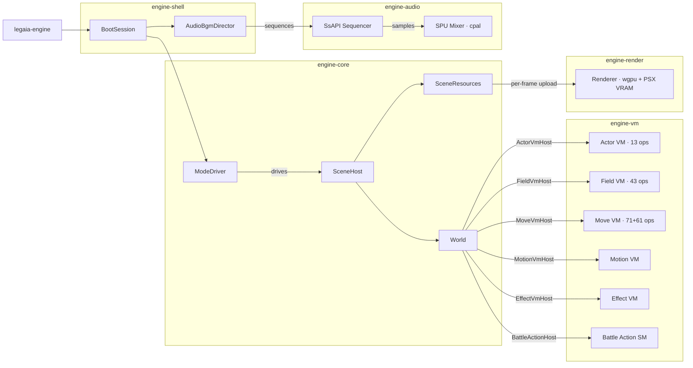

# Engine reimplementation

The clean-room Rust port of the Legend of Legaia engine. End-user model: the engine is a binary; the user supplies a disc image; the engine extracts the assets at first run and plays the game using clean-room ports of every runtime subsystem.

## Goal

A playable port of Legend of Legaia (NA SCUS-94254) on modern systems via Rust + wgpu, with optional WASM/web target. JP/EU regions land after NA is solid.

## Non-goals

- Improving the game (no HD remaster, no balance changes, no QoL beyond what the original supported).
- Modding kit (useful as a side-effect, not as a designed deliverable).
- Translation work.
- Static recompilation of `SCUS_942.54`. The engine is **clean-room from documented specs and decompile-then-rewrite logic** - not auto-translated MIPS.

## Legal posture

The "user brings their own disc" model is the same one ScummVM, OpenRCT2, OpenMW, OpenLara, OpenJK, etc. use. As long as:
- Zero Sony bytes ship in the repo or in any released binary.
- All code is clean-room Rust written from format docs + decompiled-C reference (not derived assemblies, not auto-translated MIPS).
- Disc-dependent tests skip without the user's disc.

…the legal pattern is well-established. CI enforces this for every track.

The boundary to respect: **the decompiled C in `ghidra/scripts/funcs/*.txt` is reference material, not committable engine code.** A handler implementation in `crates/engine-vm/` is a fresh Rust function written *from* the decompile, not the decompile itself.

## Crate layering

```
iso          ← (none)
prot         → iso (conceptual)
lzs          ← (none)
asset        → lzs, prot
tmd          ← (none)
tim          ← (none)
xa           ← (none)
vab          → xa  (shares SPU-ADPCM F0/F1 filter constants)
mdt          ← (none)
mes          ← (none)
anm          ← (none)
extract      → all of the above

engine-core  ← (none)
engine-render → engine-core
engine-audio → engine-core
engine-vm    → engine-core
asset-viewer → engine-*, all parser crates
```

Asset crates (`tim`, `tmd`, `vab`, etc.) stay engine-agnostic - they produce typed in-memory representations. The engine layer turns those into GPU resources / audio buffers.

A future `sound` crate (sequencer playback for `.spk` sequences and the `.dpk / .MAP / .PCH` family) would depend on `vab`. A future battle / menu module belongs inside `engine-vm` next to the actor + field VMs rather than as a separate crate.

## Runtime architecture

The diagram below traces data-flow from the top-level binary through crate boundaries at runtime.  Arrows show the direction data or control flows; edge labels on the `World` → VM arrows name the Rust trait `World` implements to drive each VM.



## Architectural principles

- **Asset crates stay engine-agnostic.** `crates/tim`, `crates/tmd`, etc. don't depend on wgpu / SDL3 / cpal.
- **Mockable I/O for tests.** The disc read path is abstracted via `crates/iso::RawDisc`; the same pattern extends to file-system extraction so tests can run without a disc.
- **Deterministic gameplay.** RNG seeded from a known value; physics tick on a fixed timestep. Required for any future TAS / verification work.
- **Fixed-timestep game tick, uncapped render.** The windowed engine uses `wgpu::PresentMode::AutoVsync`; the render rate is driven by the display refresh. A `f64` accumulator in the event-loop handler converts wall-clock delta-time into an integer number of 1/60 s game ticks (capped at 4 per render frame to absorb minor VSync jitter without a runaway spiral). This separation means the game logic advances at a stable 60 Hz independent of the display refresh rate, and render frames can interpolate ahead-of-tick state in the future without changing the tick interface.
- **No "fix the bug" temptation.** If the original game has quirky damage rounding or oddly-timed cutscenes, replicate them. Behavioural fidelity is in scope; QoL is not.
- **Behaviour tests against runtime traces.** Long-term, capture inputs + RNG + frame outputs from the original game, replay through the engine, diff. The asset-viewer phase landed enough infrastructure to make this possible later.

## Phase plan

### Phase 1 - asset viewer (de-risks integration)

A standalone binary that loads the disc, lets the user navigate PROT entries, and renders / plays them. Render API: **winit + wgpu** (Vulkan / Metal / DX12 / WebGPU backends). Audio: cpal-backed mixer.

Implemented:
- `crates/engine-core` - `Vfs` trait + `DirVfs` (extracted-dir backend), `AssetCache`, `FrameTime`. Engine-agnostic, no GPU deps.
- `crates/engine-render` - `Renderer` (wgpu device + surface + textured-quad pipeline + flat / textured-mesh pipelines + lines pipeline). Aspect-preserving letterbox. Software PSX VRAM emulation (1024×512 R16Uint, per-prim CBA/TSB + 4/8/15bpp + CLUT decoded in fragment shader).
- `crates/engine-audio` - `AudioOut` (cpal-backed), single-voice mixer with linear resample + mono-to-N-channel fanout, supports F32 / I16 / U16 device formats.
- `crates/asset-viewer` - winit binary with subcommands:
  - `tim <PATH> [--clut N]` - display a single TIM.
  - `tmd <PATH> [--start N]` - display a Legaia TMD as a flat-shaded auto-rotating 3D mesh. PATH may be a single file or a directory; in directory mode N/P/PgDn/PgUp cycle through every `*.tmd` recursively. With `--bundle battle` (or `--vram-extra-dir`) it switches to the textured-mesh pipeline.
  - `stage <PATH>` - render a stage-geometry PROT entry as a wireframe.
  - `vab <PATH> [--offset 0xN] [--sample N] [--rate Hz]` - play one VAG sample from a VAB bank.
  - `prot <PROT.DAT> [--cdname FILE] [--start N]` - walk every PROT entry; auto-detects via the `categorize` classifier and shows / plays the first viewable sub-asset.
  - `dialog <PATH> [--message N]` - render a Compact MES blob through the `legaia-mes` interpreter and dialog player against the extracted dialog font. Z/Enter advance past page breaks; N/P jump messages.

The PROT browser dispatch handles `tim_passthrough`, `tim_pack`, `data_field_streaming`, `scene_tmd_stream`, `scene_vab_stream`, and a VAB byte-search fallback for any class with embedded banks.

Open Phase 1 milestones:
- XA stream playback (streaming voice in `engine-audio`).

Smooth shading: `legaia_tmd::mesh::tmd_to_vram_mesh` now emits a per-vertex normal stream by accumulating face normals into per-position bins (Max-weighted by triangle area) so connected geometry shades smoothly. The VRAM-mesh shader reads the normal at vertex location 3 and falls back to `dpdx`/`dpdy` only for unbinned positions. Per-prim normal indices in the TMD format itself remain unparsed; that's a separate RE task.

### Phase 2 - runtime port

Port the script VM, field-loader chain, and effect VM. Handler-by-handler translation: dump each opcode handler from Ghidra, hand-port to Rust, unit-test against captured runtime traces. Aim for behavioural fidelity per opcode, not byte-exactness of the VM internals.

In progress:
- **Actor VM** - `crates/engine-vm/src/lib.rs`. 13 opcodes, full unit-test coverage. Drives the title screen sprite cluster.
- **Field VM** - `crates/engine-vm/src/field.rs`. All 43 explicit opcodes of `FUN_801DE840` are ported with a `FieldHost` trait abstracting every SCUS callback. Cross-context dispatch (extended-bit prefix), YIELD caller-propagation, `Op49State` tristate, the `0x4C` outer-nibble dispatcher, and the `0x5x/0x6x/0x7x` default-route fourth-flag-bank dispatchers are all wired. See [script VM](script-vm.md).
- **Move VM** - `crates/engine-vm/src/move_vm.rs`. All 71 main opcodes (`0x00..0x46`) of `FUN_80023070` ported, plus the `0x2F` extension dispatcher (61 sub-opcodes via `FUN_801D362C`). Per-frame entry is `actor_tick`, mirroring the gate at `FUN_80021DF4 + 0x80022B94`: skip when `wait_timer >= 0`, otherwise step, then report `Halted` if the post-call `flags & 0x8` bit is set. See [move VM](move-vm.md).
- **Effect VM** - `crates/engine-vm/src/effect_vm.rs`. Slot pool (`Pool`), 28-byte `MasterSlot` + 32-byte `ChildSlot`, the `Pool::init` / `Pool::spawn` ports of `FUN_801DE914` / `FUN_801DFDF8`, and the per-frame `Pool::tick` skeleton with `EffectHost::advance_state` extension hook. The retail walker's inlined per-state transitions are delegated to the host since they don't form a clean opcode dispatch. See [effect VM](effect-vm.md).
- **Battle action state machine** - `crates/engine-vm/src/battle_action.rs`. Port of `FUN_801E295C` (16 KB, the largest function in the battle overlay) as a per-frame edge-triggered state machine. 47 explicit states across 7 bands (Attack `0x14..0x20`, Magic / Item `0x28..0x2E`, Summon `0x32..0x38`, Spirit `0x3C..0x40` / `0x46..0x48`, Done `0x50..0x52` / `0x5A`, Run / Capture `0x64..0x6B`, Magic-capture `0x6E..0x71`, terminal `0xFD` / `0xFF`). `BattleActionHost` abstracts every SCUS helper (`FUN_801D5854`, `FUN_801D8DE8`, `FUN_8004E2F0`, `FUN_801DABA4`, ...). The Tactical-Arts strike band reads per-strike power bytes, hit timing, status effects, and hit cues from `BattleActionHost::art_record` via the `apply_art_strike(ArtStrikeInfo)` host hook when the active actor's `chosen_art` is set;
  engines wire the actual HP deduction and SFX scheduling off that. See [battle action](battle-action.md).
- **Title-overlay sub-mode dispatcher** - `crates/engine-vm/src/title_overlay.rs`. 25-entry JT at `0x801CF244` (the per-frame `FUN_801DD35C` tick), state-struct field offsets, observed `state[+0x204] = N` transitions. Four modes are semantically labelled (`Init`, `Idle`, `AttractIdle`, `AttractDelay`); the other 21 carry `Phase0xNN` placeholders. Standout pin: `Phase06` writes `_DAT_8007B83C = 0x02` at `0x801DFC00` — the title-screen → main-game master-mode transition, exported as `MASTER_GAME_MODE_FIELD_LAUNCH` + `PHASE06_LAUNCH_GAME_PC`. See [boot](boot.md#sub-mode-dispatcher).
- **SCUS sprite-emit primitives** - `crates/engine-vm/src/title_prim.rs`. Clean-room ports of the three SCUS helpers the title tick calls into: `FUN_80058298` (`ClearImage` fill-rect), `FUN_80058490` (`MoveImage` VRAM-copy), `FUN_800198E0` (sprite-descriptor dispatcher with tag-`0x11` + alpha-OR pre-pass + width-divisor variants). `PrimHost` trait abstracts the four engine callbacks (`queue_clear_rect`, `queue_move_image`, `emit_sprite`, `alpha_or_gate_set`). The overlay-side helpers (`FUN_801E1C1C` etc., shared across menu / battle / shop / save UI overlays) are deferred to their own port.
- **Composite world / actor system** - `crates/engine-core/src/world.rs`. A `World` struct that owns the actor table, battle ctx, effect pool, field-VM ctx + bytecode + PC, per-actor move-VM bytecode buffers, and RNG state, and implements every per-VM `Host` trait by routing through it. `World::tick` runs the effect pool every frame, then per-actor move-VM ticks for active actors with bytecode loaded, then the mode-specific top-level VM: battle-action state machine in `Battle`, field-VM step in `Field` / `Cutscene`. This is the integration layer engines reuse so they don't have to maintain four parallel VM-state tables.
- **PSX SPU mixer** - `crates/engine-audio/src/spu/`. Clean-room model of the 24-voice SPU: streaming ADPCM decoder, ADSR envelope, 512 KB SPU RAM, libspu-shaped transfer engine. `crates/engine-audio/src/vab_bind.rs` bridges parsed VAB banks (`legaia_vab::VabReport`) into the SPU via `VabBank::upload` + `play_note`. See [audio](audio.md#engine-audio-model---clean-room-spu-port).

Pending Phase 2:
- **MES renderer** - `legaia-mes::DialogPlayer` paces glyph / spacing / substitution / page-break events for the renderer; the `dialog` subcommand of `asset-viewer` is the first end-to-end demo, blitting one quad per glyph through `RenderTarget::TextOnly` against the extracted dialog font. The bytecode encoding is documented in [`formats/mes.md`](../formats/mes.md) and matches the four SCUS interpreter functions (`FUN_8003CA38` / `FUN_80036044` / `FUN_80036888` / `FUN_80036514`); `FUN_801D84D0` (dialog overlay) is the per-frame line pager that the renderer drives.
- **Sprite engine** - back the actor VM's `Host` trait with real actor state. The `World` in `engine-core` provides a default scaffolding; a full sprite engine still needs the rendering wiring (sprite sheet → wgpu draw calls) plus the per-frame motion tween.
- **Field / cutscene / menu VMs** - overlay capture pipeline ready for the ones still pending capture.

### Phase 3 - gameplay assembly

In progress:
- **Game-mode driver** - `crates/engine-core/src/mode.rs`. Port of the 28-entry table at SCUS `0x8007078C` as a `GameMode` enum + `ModeEntry` table + `ModeDriver`. Each game mode maps to a [`SceneMode`](#phase-2---runtime-port) for the `World`'s tick path; engines plug per-mode behaviour through the `ModeHandler` trait (default: no-op). Boot starts in `MainInit` mirroring the retail boot path.

Top-level shell loop (closed loop title → save-select → field/encounter → battle → save):
- **Title screen** (`engine-core::title::TitleSession`) - `FadeIn → PressStart → MainMenu → Done` with no-save fallback. Real title TIM (PROT 0888, 256×256 8bpp) is decoded by `engine-core::title_screen_atlas::build_atlas_from_prot_888` and uploaded as a sprite atlas by the play-window subcommand; the title-tick body's actual on-screen layout is documented under [boot — title overlay](boot.md#title-screen-overlay-state).
- **Save-select** (`engine-core::save_select::SaveSelectSession`) - slot-list browse with Load / Save / Delete confirms.
- **Encounter system** (`engine-core::encounter`) - per-scene table + step-driven random battle trigger + 5-phase transition SM.
- **Battle target picker** (`engine-core::target_picker`) - post-action target cursor parameterised on a `TargetKind` enum.
- **Equipment catalog** (`engine-core::equipment`) - vanilla 30-entry table covering weapons / armor / accessories with character restrictions.
- **Seru capture + spell learning** (`engine-core::seru_learning`) - per-character per-Seru point accumulator with banner session.
- **Tactical Arts chain editor** (`engine-core::tactical_arts_editor`) - menu-side compose + name + save flow with per-character library.
- **LGSF save format** (`crates/save/src/ext.rs`) - versioned + backward-compatible: the v1 prelude carries party records, story-flag word, money and inventory; the v2 extension block carries play-time, active-party, per-character ext (learned arts mask, spell list, Seru captures, active chains), and the saved-chain library; the v3 extension appends the full 512-byte story-flag bitmap. The writer emits the highest version any populated field requires (v3 once `SaveExt::story_flag_bits` is non-empty); readers accept v1, v2, and v3.
- **Dialog renderer pipeline** (`engine-render::dialog_box_draws_for`) - turns the dialog panel's typed glyph stream into `TextDraw`s with CLUT-aware tinting + greedy width-based wrap.

Pending:
- Field map + dialog (the field-VM port already runs; needs the field-loader chain wired).
- The [battle subsystem](battle.md) including Tactical Arts and the per-actor state machine `FUN_801E295C` (state machine port landed; still needs scene loader integration).
- Menu + save / load (LGSF round-trips via `SaveFile::write` / `parse`; engine-side population of the extension fields from the live `World` state still pending).

### Phase 4 - targets

Native (winit + wgpu via Vulkan / Metal / DX12), WASM browser target. Mobile / console targets are deferred.

## Provenance + memory hygiene

The decompiled C dumps under `ghidra/scripts/funcs/` are reference material. Engine code in `crates/engine-vm/` is fresh Rust written *from* the decompile - never paste, always rewrite from the documented spec.

Per-opcode tests live next to the port; they use synthetic bytecode (no Sony bytes) so the test suite stays clean-room.

## Engine integration scenarios

[`scripts/engine/scenarios.toml`](../../scripts/engine/scenarios.toml) declares scenarios that drive the headless `BootSession` for a fixed frame count and assert the SHA-256 of the resulting `SaveFile` byte stream matches a recorded baseline. Mirrors the byte-level [mednafen scenarios manifest](../tooling/mednafen-automation.md#the-scenarios-manifest) - both files live side by side so a feature touching either layer is forced to consider regression coverage on the other.

Schema lives in [`crates/engine-shell/src/scenarios.rs`](../../crates/engine-shell/src/scenarios.rs); the disc-gated runner in [`crates/engine-shell/tests/scenarios.rs`](../../crates/engine-shell/tests/scenarios.rs) exercises every entry. The CLI runner is `legaia-engine scenarios [--bless]` (the `--bless` flag rewrites the manifest in place with observed hashes for blessing).

A scenario row whose `expected_save_sha256` is empty is "unblessed" - the test reports the observed hash and skips assertion; the CLI runner exits non-zero unless `--bless` is on. That forces every new scenario to be reviewed once before it can drift silently.

## VRAM diff harness

`legaia-engine info --runtime-vram <bin> --vram-diff-png <path>` and `legaia-engine vram-oracle --runtime-vram <bin>` already compare engine VRAM (built via `SceneResources::build_targeted`) against a runtime VRAM blob captured from a save state. The `vram-oracle` subcommand also exposes:

- `--rows-csv <path>` - per-Y row CSV of pixel-level diff stats (`y, runtime_nz, engine_nz, overlap, runtime_only, engine_only`). Drift in any single row above a threshold (e.g. row 479 NPC CLUT) shows up as a high `runtime_only` count for that row only, which is the regression signature of a missed targeted-upload pass.
- `--clut-regions` - one-line health report per documented CLUT band (NPC palette row 479, character / texture-page CLUT rows). A `<-- gap` flag flags the engine-missing case.

Pair with `mednafen-state vram-dump --out-bin` to get the runtime ground-truth blob, and with `mednafen-state prim-dispatch-survey` to confirm the per-prim renderer dispatch tables haven't drifted between the saves you're comparing.

### Static-mask parity (`vram_oracle_e1`)

A save state's VRAM is a *live snapshot*: much of the texpage region is dynamic / residual state (animation frames, battle leftovers, scroll position). Comparing two captures of the **same** scene (town01 pre- vs post-battle) shows ~40% of the primary texture band differs between them, so a stateless engine pre-pass can never be byte-exact against a single snapshot. The disc-gated `vram_oracle_e1` test therefore asserts against the **static mask** - the words identical across every same-scene capture (the scene's genuine static VRAM). For each scene with ≥ 2 captures it builds the engine VRAM with the field-mode DMA-every-TIM pre-pass (`upload_all_tims`) and asserts the engine never uploads a *wrong* texel on a static pixel in the texpage region,
excluding the runtime-managed NPC / character CLUT band (`vram_oracle::NPC_CLUT_BAND_ROWS`, row 479 ±). Incompleteness is not flagged - the engine doesn't yet assemble every boot-resident texture (font / menu atlases) - but the correctness of what it does upload is. The helpers `compute_static_mask` / `first_static_upload_divergence` have disc-free unit tests.

## See also

**Reference** —
[Project overview](../overview.md) ·
[Boot sequence](boot.md) ·
[Renderer](renderer.md) ·
[Field/event VM](script-vm.md)
