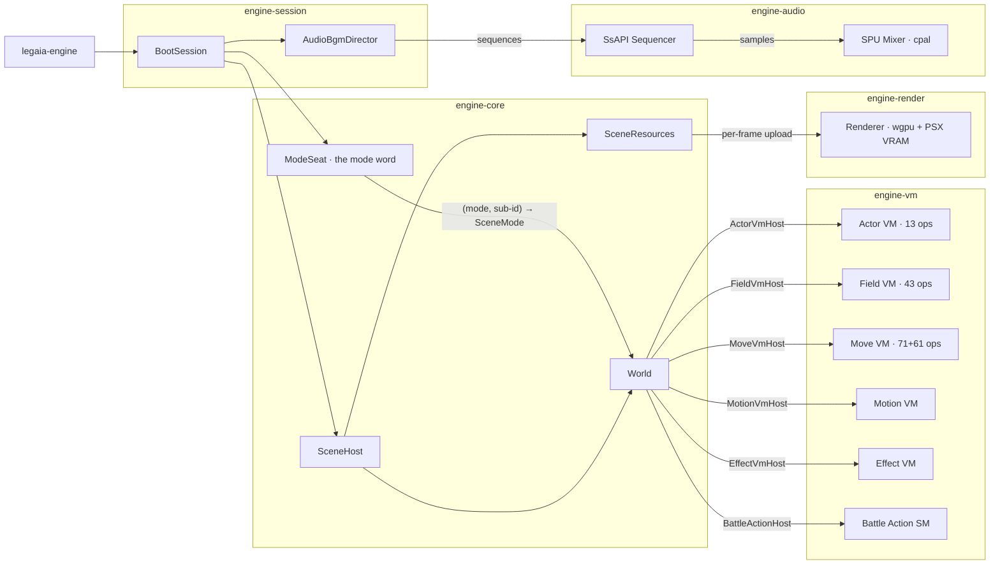

# Engine reimplementation

The from-scratch Rust port of the Legend of Legaia engine, written from the project's own reverse-engineering record - Ghidra-traced function dumps and live emulator probes. End-user model: the engine is a binary; the user supplies a disc image; the engine reads the assets straight off that image (`--disc`, no extraction step) and plays the game using from-scratch ports of every runtime subsystem.

## Goal

A playable port of Legend of Legaia (NA SCUS-94254) on modern systems via Rust + wgpu, with an optional WASM/web target. JP/EU regions land after NA is solid.

"Playable port" is grounded in retail, not bound by it. The Ghidra-traced dumps, the format docs and the parity oracles pin down exactly what the original does - damage arithmetic, RNG, script pacing, save-record layout - and the engine reproduces it, provably, in its retail-faithful mode. That ground truth is a measuring stick, not a ceiling: the port is free to add features, mechanics, rendering and audio the original never had, exposed as toggles so a retail-faithful mode stays one flip away wherever a faithful mode makes sense. The split is described in [Fidelity and enhancements](#fidelity-and-enhancements).

## Non-goals

- **Decompilation or static recompilation of `SCUS_942.54`.** No byte-matching decompile is attempted, and nothing is auto-translated from the MIPS. The engine is **fresh Rust written from documented specs and the Ghidra-traced dumps** - the boundary the whole [legal posture](#legal-posture) rests on.
- **Losing retail.** The port departs from retail freely - new features, mechanics, rendering, audio - but never silently: departures live behind toggles, and the oracles keep "faithful" a testable claim about the retail mode. A quirk is behaviour to preserve in the faithful mode, and fair game to improve outside it.
- **Re-authoring the game's assets.** Every texture, mesh, sample and sequence comes off the user's own disc at runtime. Nothing is upscaled, redrawn, or bundled.

Modding and translation are conspicuously *not* on that list. The [randomizer](../tooling/randomizer.md) and [language packs](../tooling/translation/index.md) are shipped, deliberately-designed parts of this repo, described below rather than disclaimed. Both are disc-patching tools that operate on a user-supplied `.bin` rather than engine features - the randomizer does not touch the from-scratch engine at all. The separation is not a wall, though: what the patcher proves out against retail - randomizer logic, softlock fixes, tuning sliders - is expected to graduate into engine features and toggles. A mod that works on the disc has no reason not to become a mode of the port.

## Fidelity and enhancements

The port draws a hard line between the retail-faithful mode and everything layered on top, so that "faithful" stays a testable claim rather than a mood.

**The retail simulation is the measured ground truth.** In the faithful mode no toggle changes damage, drop rolls, AP costs, encounter rates or story-flag behaviour, and the parity oracles hold it there: [engine scenarios](#engine-integration-scenarios) hash the resulting save bytes against a blessed baseline, the [VRAM diff harness](#vram-diff-harness) diffs engine uploads against runtime blobs captured from save states, and the [record / replay](../tooling/determinism-replay.md) format requires the same input file to produce bit-identical state traces twice. Every parity measurement runs against that mode.

**The port is not bound to that mode.** Enhancements - presentation today, mechanics and audio as they mature - land as explicit toggles that leave the faithful mode bit-identical when off, which is why flipping one never touches replays or the oracles above. Defaults follow the better experience, not the museum: where an enhancement is clearly better it ships enabled by default; a knob that currently defaults to retail marks an enhanced side still maturing, not a policy of restraint. Current knobs and defaults:

| Knob | Default | Effect |
|---|---|---|
| `Renderer::set_dynamic_lighting` - enhanced lighting (`I` in `play-window`, `--dynamic-lighting` / `--no-dynamic-lighting` force it; "Enhanced lighting" checkbox on the browser play page; persisted `OptionsState::enhanced_lighting`) | **on** in `play-window` + browser play page | A time-of-day mood over the baked shading, point lights at the scene's glowing props, emissive surfaces (the Genesis Tree), lit town windows at dusk and night and additive halos, from the one `legaia_engine_ui::scene_lighting` kernel on both hosts ([renderer](renderer.md#enhanced-lighting-enhancement-default-on)). Off is pixel-identical to the faithful render; replays and `retail-compare` force it off. |
| `Renderer::set_dyn_shadows` (`--no-dyn-shadows` disables, `Y` in `play-window`) | on | PCF shadow maps for the enhanced-lighting point lights, on both hosts (the page's "Lamp shadows" box). Shadows only: off, the lamps still light the scene. Inert while enhanced lighting is off. |
| `OptionsState::lighting_time_of_day` (`F8` in `play-window`; the page's time-of-day selector) | `auto` | The mood enhanced lighting lights under: `auto` follows the scene (daylight outdoors, a dim mood for caves and dungeons), `day` / `dusk` / `night` force one. |
| `Renderer::set_occlusion_fade` (`--no-occlusion-fade` disables, `F4` in `play-window`; "See-through walls" checkbox on the browser play page) | **on** in `play-window` + browser play page | Camera-occlusion fade: when a ray-cast visibility gate finds the character **completely** hidden, the covering geometry dissolves to a screen-door dither in a circle around them, above the line of their feet so the ground in front of them never fades - a partially visible character never fades ([renderer](renderer.md#camera-occlusion-fade-see-through-walls-opt-in-enhancement)). Presentation-only; replays force it off. |
| `OptionsState::volumetric_fog` -> `World::toggles.volumetric_fog` (`--no-volumetric-fog` disables, `F9` in `play-window`; "Ground fog" checkbox on the browser play page) | **on** in `play-window` + browser play page; off in headless hosts | Volumetric ground fog: a low drifting mist bank over the outdoor areas of the scenes that read as misty or night (never inside a door-reached room), parted by every character walking through it, with wakes that refill; a battle inherits its field scene's bank ([renderer](renderer.md#volumetric-ground-fog-enhancement)). The engine simulates it once per tick; off draws the frame without it. Presentation-only; replays and the retail comparison corpus force it off. |
| `World::locomotion.precise_movement` (`R` in `play-window`; "Precise movement" checkbox on the browser play page; persisted `OptionsState::precise_movement`) | off | Free-angle locomotion instead of retail's 4/8-way quantisation. |
| `World::locomotion.leading_edge_wall_probes` (`--no-edge-collision` disables) | **on** in `play-window` + browser play page | Retail's three-probe leading-edge wall footprint (`FUN_801cfe4c`'s `DAT_801f2214` table): the player rests ~47 units off a wall plane ([field-locomotion](field-locomotion.md#collision---fun_801cfe4c)). Off = the single candidate-centre test the locomotion oracles and BFS nav drivers run on, which is why the `World` field itself still defaults off. |
| `World::npcs.solid` (`--no-solid-npcs` disables) | **on** in `play-window` + browser play page | Retail's actor-collision probes (`FUN_801cfc40`'s `DAT_801f21b4` table) make field NPCs solid. Placed props are solid either way; this gates the NPC arm only. |
| `World::npcs.animate` (`--no-live-npcs` disables) | **on** in `play-window`, the browser play page and the headless `BootSession` | Publishes the villagers' ambient tail-section-1 wander ([motion-vm](motion-vm.md#from-scratch-port--wiring)); off holds them on their seats. A placement's own `0x4C 0x51` ops are seats, never a patrol ([motion-vm](motion-vm.md#field-npc-walking)). Scripted walks run regardless, and no setting steps a placement's script outside its engaged window. |
| `World::locomotion.run_button_mask` | **retail + one alternate** | Which pad buttons invert the Field Move option. Defaults to retail's `Cross \| R1` (the config word `0x800846DC` = `0x48`, which retail seeds once and never exposes) plus **Square**, the port's historical binding, kept so it does not break under anyone's hands. A host wanting the retail set exactly assigns `FIELD_RUN_BUTTON_MASK_RETAIL`. Which *key* produces each button is the binding table (`legaia-engine config set --binding W=R1`), not this mask. See [field-locomotion](field-locomotion.md#base-step-selection-walk--run). |
| `World::toggles.reduce_flashing` (`OptionsState::reduce_flashing`) | **on** | Photosensitivity guard: slew-limits the applied luminance channels of the ambient CLUT-cell palette cyclers ([field-ambient-fx](field-ambient-fx.md#photosensitivity-guard)). Retail's koin3 dance floor strobes bright/black at 15 Hz - far past the 3-flashes-per-second guideline - so the safe presentation is the default; off restores the retail-exact palette steps. Presentation-only: the move-VM simulation is identical either way. |
| `World::toggles.entry_pulse_enabled` (`--no-entry-pulse` disables) | on | Scene-entry VDF pulse: a rolling vertex-morph envelope over the packs it is authored for (jou's flesh ground, Rim Elm's shoreline; every other scene keeps retail's still geometry; [field-ambient-fx](field-ambient-fx.md#mechanism-3---strip-cycling-and-vertex-morphs)). Retail-armed morph scenes are unaffected either way. |
| `OptionsState::retail_view_window` -> `World::toggles.view_window_crop` | **on**, effective at retail framing only | Retail's visible-tile crop: the field ground and decoration cells are drawn only inside the camera's tile window clipped to the walk region ([`field_view_window`](../../crates/engine-core/src/field_view_window.rs), [encounter.md](../formats/encounter.md#the-scratchpad-window-0x1f8003e8eb)). Both hosts apply it while the camera is at `CameraDistance::Retail` with the drag / tilt / zoom knobs at identity and `F3` off, so the retail-distance frames the comparison corpus takes are cropped. Any wider or re-aimed view draws the map whole - see [below](#the-visible-tile-crop-follows-the-framing). |
| `Renderer::set_psx_mode` (`LEGAIA_PSX_RENDER=1`; "PSX rasterisation" checkbox on the browser play page) | off | Strict-PS1 rasterisation artefacts - see below. |
| `Renderer::set_semi_blend` | **on** | Retail ABE semi-transparency blending. On because it *is* retail. |
| `CameraDistance` (`T`) / debug orbit camera (`F3`) | `Far` / off | Framing only; never feeds the simulation. Both hosts carry both knobs: the default camera on each is the engine's ([`camera_view`](../../crates/engine-core/src/camera_view.rs)) - the retail zone-driven follow camera, whose pitch / yaw / `H` come from the scene's MAN section-3 camera-region record through the retail composer and ease ([`camera_zone`](../../crates/engine-core/src/camera_zone.rs), [encounter.md](../formats/encounter.md#man-section-3-the-camera-region-table)) - and `F3` swaps in that host's own wide vantage. |
| Follow-camera user knobs: drag orbit / drag tilt / wheel zoom (`Camera::manual_orbit` / `manual_tilt` / `manual_zoom`) | identity (retail shot) | The player steers the retail follow camera about the character on both hosts through one engine vocabulary ([`camera::follow_knobs`](../../crates/engine-core/src/camera.rs)). **Locked while a cutscene owns the camera**: the setters drop the gesture when a timeline is live, so a scripted shot never snaps on return. Field-only: the overworld walk camera ignores them. Orbit feeds the movement compass; tilt and zoom are pure framing. Double-click resets all three. A direct scene entry (picker / warp / load) runs `Camera::reset_for_scene_entry` on both hosts, so an interrupted shot never frames the next scene. |
| Solo Tetsu spar (`World::sparring_fight_pending`) | **on**, not a knob | The sparring tutorial seats Vahn alone even over a fuller field party, which comes back on the return to the field. Retail has no such override - the story's party is Vahn alone there - so with the retail party it is an identity ([battle](battle.md#the-sparring-tutorial-prompt-machine-overlay-967)). |
| WebXR [VR mode](vr-mode.md) | off | Stereo presentation on the site's WebGL pages, not the wgpu path. |
| `World::poll_minigame_escape` (Start inside a minigame) | **on**, not a knob | Leaves any of the five mode-24 minigames (Baka Fighter from its player select on: on the attract card Start begins the game). Retail quits each through its own overlay's SM - a different control in a different overlay per game - and the port has none of those arms wired to a control a player can find, so without this an entered minigame is a softlock ([below](#every-minigame-must-be-leavable)). Each game's own `exit_*` runs, so the cash-out / leg report / point bank match a deliberate exit. |

Two details are worth having straight, because the direction is not uniform:

- **Shading defaults to retail.** The field path has no runtime light source at all - both retail TMD renderers issue exactly one GTE colour op (`DPCS`, the depth cue) and never an `NC*` op, so shading is baked into the TMD colour words and applied as `texel * colour / 128`. The engine's field pipelines draw exactly that. Enhanced lighting (`dyn_light`) is layered *over* it and is an exact identity when disabled, which is what keeps the render oracles honest - the interactive hosts turn it on, every parity capture turns it off. See [`crates/engine-render/src/dyn_light.rs`](../../crates/engine-render/src/dyn_light.rs) and [renderer](renderer.md).
- **Rasterisation defaults to clean.** `psx_mode` is off, so the default image is sharper than a PlayStation's: no sub-pixel vertex snap and no 15-bit ordered dither. Here faithfulness is the mode you opt into, not the default.

### The visible-tile crop follows the framing

Retail never draws a field scene's whole map: the render library walks only the cells the camera's visible tile window reaches, and each region record sizes that window for retail's own frustum. The port reproduces the crop, but only where that frustum is what the player sees. The play-window's default `CameraDistance::Far`, the drag / tilt / zoom knobs and the `F3` vantage all show ground the window was never sized to cover, and cropping there would open black edges that retail's own frame never has - a restriction of the enhanced views, not a fidelity to anything.

So the knob defaults on and the policy lifts it off retail framing, rather than defaulting it off: every frame at the retail vantage (including every `retail-compare` capture) is cropped as retail crops it, and every enhanced frame draws the map whole.

### Every minigame must be leavable

A mode the player can *enter* has to be one the player can *leave*, on every host, or reaching it is a softlock. `SceneHost::drain_minigame_warp` already states that invariant for its failure arms - "a script that armed a warp must never be left in a mode with no exit" - and it holds for the successful ones too.

It is not free, because retail does not have one exit to port. Each of the five minigames quits through its own overlay's state machine: the slot cabinet's exit menu row, the duel's decided-match confirm, the arena's give-up arm. None of those is wired to a control a player can find on either host - the native window's `O` / `B` / `M` are developer hotkeys and the browser play page has none - so without an engine-level exit, a minigame entered through its door would leave a frozen field with the BGM still running and no input that did anything.

`World::poll_minigame_escape` is therefore an engine affordance rather than a port: Start leaves whichever minigame is live, through that game's own `exit_*` - except on the Baka Fighter attract card, which reads Start as its own begin edge - and closes the mode-24 round trip (`World::minigame_return_warp`) when the entry came through a door warp. It lives in `World::tick`, so both hosts inherit it and neither can drift from the other. Pinned by `engine-shell/tests/casino_floor_softlock.rs`, which enters each of the five the way the door warp does and asserts a pad press gets back out.

`CameraDistance::Far` is the interactive `play-window` default (1.35x retail's eye-back distance); `CameraDistance::Retail` is the pinned retail framing and the type's own `Default`. The continuous wheel zoom and the drag tilt pivot the pose about the **character's body** (`camera_view::FOLLOW_PIVOT_LIFT` above the feet), not about retail's floor-level focus - which sits a tier under the feet in `town01` and would walk the character out of frame - so the character holds its screen point while the scene dollies and turns around it; the tilt clamp is widened to include the scene's own pitch, and both knobs at identity return the retail pose bit for bit.

## Legal posture

The "user brings their own disc" model is the same one ScummVM, OpenRCT2, OpenMW, OpenLara, OpenJK, etc. use. As long as:
- Zero Sony bytes ship in the repo or in any released binary.
- All code is from-scratch Rust written from format docs + decompiled-C reference (not derived assemblies, not auto-translated MIPS).
- Disc-dependent tests skip without the user's disc.

…the legal pattern is well-established. CI enforces this for every track.

The boundary to respect: **the decompiled C in `ghidra/scripts/funcs/*.txt` is reference material, not committable engine code.** A handler implementation in `crates/engine-vm/` is a fresh Rust function written *from* the decompile, not the decompile itself.

The project deliberately does not describe this as "clean-room": the same people read the Ghidra output and write the Rust, which is not the two-team firewall that term formally means. The boundary actually enforced is narrower and checkable - the dumps stay reference material, no Sony-derived bytes are ever committed, and no code is mechanically translated.

## Crate layering

```
iso          ← (none)
prot         → iso (conceptual)
lzs          ← (none)
asset        → lzs, prot, tim, tmd, vab, mes, anm, mdec, bytes
tmd          → tim
tim          ← (none)
xa           → iso
vab          → xa  (shares SPU-ADPCM F0/F1 filter constants)
mdt          ← (none)
mes          ← (none)
anm          ← (none)
extract      → iso, prot, lzs, asset, tim, tmd, xa, font

engine-vm     → asset, prot, art, anm       (VM layer; no GPU / audio deps)
engine-battle → engine-vm, asset, art, anm, save, tim, tmd  (World-free battle kernels; no GPU / audio deps)
engine-minigames → engine-vm, asset, save, tmd    (minigame rules engines; no World)
engine-core   → engine-battle, engine-minigames, engine-vm + the parser crates
engine-ui     → engine-vm, asset, tim, font (draw-list builders; no wgpu)
engine-render → engine-ui, engine-vm, asset, tim, font (wgpu; no engine-core dep)
engine-audio  → xa, vab, seq, prot          (cpal + SPU model; no engine-core dep)
engine-session → engine-core, engine-audio, engine-vm (+ parser crates)  (BootSession + BGM director; no wgpu / winit / cpal)
engine-screens → engine-core, engine-ui, asset, font  (shop / prize / inn / banner screens both hosts draw; no wgpu)
parity       → engine-session, engine-core, engine-vm, engine-render, engine-audio (+ parser crates, mednafen, pcsxr)  (parity oracles + retail-compare)
engine-shell  → parity, engine-session, engine-screens, engine-core, engine-vm, engine-render, engine-audio (+ parser crates)
asset-viewer  → engine-*, all parser crates
```

Asset crates (`tim`, `tmd`, `vab`, etc.) stay engine-agnostic - they produce typed in-memory representations. The engine layer turns those into GPU resources / audio buffers. `engine-core` sits *above* `engine-vm` (it implements the per-VM `Host` traits on `World`), while `engine-render` / `engine-audio` are leaf presentation crates the shell composes with the core - they do not depend on `engine-core`.

`engine-ui` is the wgpu-free leaf under `engine-render`: it builds the renderer-agnostic UI draw lists (`TextDraw` / `SpriteDraw`), which is what lets the browser target consume them without linking wgpu. `engine-render` re-exports its items at their historical crate-root paths, so native callers see no difference.

`engine-ui` deliberately does not link `engine-core`, so projecting engine state into its builders is a layer of its own. `engine-screens` is that layer for the shop-family screens - the gold shop and its descriptor windows, the casino prize exchange and coin counter, the inn / seru-trade fallback panel and the post-action banners: both play hosts (`engine-shell`, `web-viewer`) call its `shop_overlay_frame` and keep only the input assembly, the stage scale and the upload.

Sequenced music is covered by `crates/seq` (the SEQ parser) plus the `engine-audio` `Sequencer`; the `.dpk / .MAP / .PCH` family decodes through `legaia_asset::sound_pack`. Battle splits three ways: the action SM and the arithmetic kernels it calls live in `engine-vm`, the `World`-free battle kernels (monster AI script, catalogs, encounters, level-up, the per-frame battle passes) in `engine-battle`, and the stateful `World` side (round loop, command flow, cast band, monster turn picker) in `engine-core`, which re-exports every `engine-battle` module at its old path. Menu modules live in `engine-core` next to the field VM hosts.

The minigame rules engines split the same way: `engine-minigames` holds the ones that need no `World` (slot machine, Baka Fighter, dance, fishing, the prize exchange, the Muscle Dome's contest ladder and damage model), and `engine-core` re-exports each at its old path while keeping their `World` glue and scene assembly - the split line is in [that crate's README](../../crates/engine-minigames/README.md).

## Runtime architecture

The diagram below traces data-flow from the top-level binary through crate boundaries at runtime.  Arrows show the direction data or control flows; edge labels on the `World` → VM arrows name the Rust trait `World` implements to drive each VM.


```mermaid
graph LR
    BIN["legaia-engine"]

    subgraph session ["engine-session"]
        BS["BootSession"]
        BGM["AudioBgmDirector"]
    end

    subgraph core ["engine-core"]
        MD["ModeSeat · the mode word"]
        SH["SceneHost"]
        W["World"]
        SR["SceneResources"]
    end

    subgraph vm ["engine-vm"]
        AVM["Actor VM · 13 ops"]
        FVM["Field VM · 43 ops"]
        MVM["Move VM · 71+61 ops"]
        MotVM["Motion VM"]
        EVM["Effect VM"]
        BSM["Battle Action SM"]
    end

    subgraph ren ["engine-render"]
        REN["Renderer · wgpu + PSX VRAM"]
    end

    subgraph au ["engine-audio"]
        SEQ["SsAPI Sequencer"]
        SPU["SPU Mixer · cpal"]
    end

    BIN --> BS
    BS --> MD
    BS --> BGM
    BS --> SH
    MD -->|"(mode, sub-id) → SceneMode"| W
    SH --> W
    SH --> SR
    W -->|ActorVmHost| AVM
    W -->|FieldVmHost| FVM
    W -->|MoveVmHost| MVM
    W -->|MotionVmHost| MotVM
    W -->|EffectVmHost| EVM
    W -->|BattleActionHost| BSM
    SR -->|per-frame upload| REN
    BGM -->|sequences| SEQ
    SEQ -->|samples| SPU
```

`ModeSeat` is the port of retail's outermost dispatch level, the 28-entry mode
table at `0x8007078C` indexed by `_DAT_8007B83C`. It is a seat rather than a
mirror because the session writes it where retail's code stores that word -
field entry through `MAIN INIT`, the pause menu through `CARD INIT` - and each
entry returns the INIT column's staging plan before the seat performs the
mode's own hand-off store. It also runs the transition edge, whose observable
half is the pad-edge swallow. `SceneMode` stays the scene sessions' state and
is reconciled with the word once per frame; the direction that is lossy (five
minigames share `OTHER MODE`) is closed by staging the warp sub-id beside it.
See [boot](boot.md#the-ports-seat-at-the-mode-table).

### The frame model

One `World::tick` is one retail vsync, and retail runs one sim step per vsync without ever catching up: a slow frame makes a slow game. The hosts render at the display's refresh instead, so the engine owns the rules that turn display frames into ticks, in `engine-core::frame_step`, and every host calls them rather than spelling them out:

| Rule | Kernel | What it pins |
|---|---|---|
| Ticks per display frame | `SimStepper::drain` | Whole 1/60 s ticks with the remainder carried, at most four a frame; a backlog past four is dropped, not carried. |
| Camera around the world tick | `camera_before_world_tick` / `camera_after_world_tick` | The compass azimuth the d-pad remap reads is published before the tick that reads it; op-`0x45` routing, the globals advance and the scene-entry reset (`FUN_80025C24`) follow it. |
| Cutscene glide clock | `CutsceneGlide` | The glide advances by the display frames the world ran, so a redraw that ran no tick advances it by nothing, and a scene entry drops it. |
| Move-VM strips on screen | `MoveVmGlobals::strip_frame` | The latest tick's `0x2C` strips, held across idle redraws and replaced when the next tick starts. |

The pause menu, the name-entry prompt and a movie consume a frame's ticks without ticking the world; under the pause menu that is retail's own shape, since the CARD mode handler runs no master frame driver. Under a shop both hosts skip the whole tick tail as well - the field overlay is swapped out in retail - and keep only the menu session and the SFX scheduler step, as retail's mode-`0x17` handler does; see [`host-drift.md`](../tooling/host-drift.md#the-frame-loop-rules-are-engine-side).

Retail's adaptive frame step (`DAT_1F800393`) is a different quantity: the number of vsyncs per *game* tick, which the engine pins per scene. It changes how often the per-actor passes run, never how many vsyncs a second of play contains, so it does not enter the host frame loop.

## Architectural principles

- **Asset crates stay engine-agnostic.** `crates/tim`, `crates/tmd`, etc. don't depend on wgpu / winit / cpal.
- **Mockable I/O for tests.** The disc read path is abstracted via `crates/iso::RawDisc`; the same pattern extends to file-system extraction so tests can run without a disc.
- **Deterministic gameplay.** RNG seeded from a known value; physics tick on a fixed timestep. Required for any future TAS / verification work.
- **Fixed-timestep game tick, uncapped render.** The windowed engine uses `wgpu::PresentMode::AutoVsync`; the render rate is driven by the display refresh. The shared `frame_step::SimStepper` ([the frame model](#the-frame-model)) converts wall-clock delta-time into whole 1/60 s game ticks, at most four per render frame, on both hosts. The game logic therefore advances at a stable 60 Hz independent of the display refresh rate.
- **Quirks are preserved in the faithful mode, fixable outside it.** Quirky damage rounding and oddly-timed cutscenes are replicated exactly where the oracles measure - that is what keeps ground truth honest. Changing them is legitimate engine work, but it lands as a toggle over the faithful path, never a silent edit to it.
- **Behaviour tests against runtime traces.** Inputs, RNG and frame outputs captured from the original game replay through the engine and diff against it - the [VRAM diff harness](#vram-diff-harness) and the [mode / audio parity oracles](../tooling/determinism-replay.md) are where that lands.

## The ported VMs

Every VM is a handler-by-handler translation: the opcode handler is dumped from Ghidra, hand-ported to Rust, and unit-tested against captured runtime traces. The target is behavioural fidelity per opcode, not byte-exactness of the VM's internals. Each VM abstracts its SCUS callbacks behind a `Host` trait, so the VM crate itself stays free of GPU and audio dependencies.

- **Actor VM** - `crates/engine-vm/src/lib.rs`. 13 opcodes, full unit-test coverage. `FUN_801D6628` is the menu overlay's window-widget script interpreter; its programs are the [window scripts](../formats/window-script.md) behind the shop / menu window choreography. See [actor VM](actor-vm.md).
- **Field VM** - `crates/engine-vm/src/field.rs`. All 43 explicit opcodes of `FUN_801DE840`, with a `FieldHost` trait abstracting every SCUS callback. Cross-context dispatch (extended-bit prefix), YIELD caller-propagation, `Op49State` tristate, the `0x4C` outer-nibble dispatcher, and the `0x5x/0x6x/0x7x` default-route fourth-flag-bank dispatchers are all wired. See [script VM](script-vm.md).
- **Move VM** - `crates/engine-vm/src/move_vm.rs`. All 71 main opcodes (`0x00..0x46`) of `FUN_80023070`, plus the `0x2F` extension dispatcher (61 sub-opcodes via `FUN_801D362C`). Per-frame entry is `actor_tick`, mirroring the gate at `FUN_80021DF4 + 0x80022B94`: skip when `wait_timer >= 0`, otherwise step, then report `Halted` if the post-call `flags & 0x8` bit is set. See [move VM](move-vm.md).
- **Effect VM** - `crates/engine-vm/src/effect_vm.rs`. Slot pool (`Pool`), 28-byte `MasterSlot` + 32-byte `ChildSlot`, the `Pool::init_head` / `Pool::spawn` ports of `FUN_801DE914` / `FUN_801DFDF0`, and the per-frame walker `FUN_801E0080` as `Pool::tick_retail` (pass 1) + `Pool::child_billboards` (pass 2). The faithful walker's only host callback is `EffectHost::next_random`. See [effect VM](effect-vm.md).
- **Battle action state machine** - `crates/engine-vm/src/battle_action.rs`. Port of `FUN_801E295C` (16 KB, the largest function in the battle overlay) as a per-frame edge-triggered state machine. 47 explicit states across 7 bands (Attack `0x14..0x20`, Magic / Item `0x28..0x2E`, Summon `0x32..0x38`, Spirit `0x3C..0x40` / `0x46..0x48`, Done `0x50..0x52` / `0x5A`, Run / Capture `0x64..0x6B`, Magic-capture `0x6E..0x71`, terminal `0xFD` / `0xFF`). `BattleActionHost` abstracts every SCUS helper (`FUN_801D5854`, `FUN_801D8DE8`, `FUN_8004E2F0`, `FUN_801DABA4`, ...).

  The Tactical-Arts strike band reads per-strike power bytes, hit timing, status effects and hit cues from `BattleActionHost::art_record`, surfacing them through the `apply_art_strike(ArtStrikeInfo)` host hook when the active actor's `chosen_art` is set. HP deduction and SFX scheduling are the host's to wire off that. See [battle action](battle-action.md).
- **Title-overlay sub-mode dispatcher** - `crates/engine-vm/src/title_overlay.rs`. 25-entry JT at `0x801CF244` (the per-frame `FUN_801DD35C` tick), state-struct field offsets, and all 56 `state[+0x204] = N` stores with their guards; `TitleTickState::step` executes the graph. Every sub-mode carries the role its handler body shows. Standout pin: master game mode `0x02` has **two** writers - `LaunchGame` (`0x06`) at `0x801DFC00` on the NEW GAME route and `LaunchFade` (`0x16`) at `0x801DFAFC` on the load route. See [boot](boot.md#sub-mode-dispatcher).
- **SCUS sprite-emit primitives** - `crates/engine-vm/src/title_prim.rs`. From-scratch ports of the three SCUS helpers the title tick calls into: `FUN_80058298` (`ClearImage` fill-rect), `FUN_80058490` (`MoveImage` VRAM-copy), `FUN_800198E0` (sprite-descriptor dispatcher with tag-`0x11` + alpha-OR pre-pass + width-divisor variants). `PrimHost` abstracts the engine callbacks (`queue_clear_rect`, `queue_move_image`, `emit_sprite`, `stp_or_gate_set`, plus the defaulted `stp_or_pixels`). The overlay-side helpers (`FUN_801E1C1C` and friends, shared across the menu / battle / shop / save UI overlays) are a separate port.

`crates/engine-core/src/world.rs` is where they meet. `World` owns the actor table, battle ctx, effect pool, field-VM ctx + bytecode + PC, per-actor move-VM bytecode buffers and RNG state, and implements every per-VM `Host` trait by routing through itself. `World::tick` runs the effect pool, then per-actor move-VM ticks for active actors with bytecode loaded, then the mode-specific top-level VM: the battle-action state machine in `Battle`, a field-VM step in `Field` / `Cutscene`. Hosts reuse this instead of maintaining four parallel VM-state tables.

## Gameplay systems

The shell loop closes: title → save-select → field / encounter → battle → save.

- **Game-mode driver** - `crates/engine-core/src/mode.rs`. Port of the 28-entry table at SCUS `0x8007078C` as a `GameMode` enum + `ModeEntry` table + `ModeDriver`. Each game mode maps to a [`SceneMode`](#the-ported-vms) for the `World`'s tick path; hosts plug per-mode behaviour through the `ModeHandler` trait (default: no-op). Boot starts in `MainInit`, mirroring the retail boot path.
- **Title screen** (`engine-core::title::TitleSession`) - `FadeIn → PressStart → MainMenu → Done` with a no-save fallback. The real title TIM (PROT 0890 at `0x14228`, 256×256 8bpp) is decoded by `engine-core::title_screen_atlas::build_atlas_from_prot_888` and uploaded as a sprite atlas by `play-window`; the title-tick body's on-screen layout is documented under [boot - title overlay](boot.md#title-screen-overlay-state).
- **Save-select** (`engine-core::save_select::SaveSelectSession`) - slot-list browse with Load / Save / Delete confirms.
- **Encounter system** (`engine-battle::encounter`, re-exported as `engine-core::encounter`) - per-scene table + step-driven random battle trigger + 5-phase transition SM.
- **Battle** - the [battle subsystem](battle.md) runs end to end, Tactical Arts included: the `FUN_801E295C` state machine above drives a scene the loader stages, with the party assembled from the player battle files' equipment sections. `engine-core::target_picker` is the post-action target cursor, parameterised on a `TargetKind` enum.
- **Equipment catalog** (`engine-core::equipment`) - the typed 8-slot model plus a from-scratch vanilla table of weapons / armor / accessories with character restrictions, overridable per id (`EquipmentCatalog::set`).
- **Seru capture + spell learning** (`engine-battle::seru_learning`, re-exported in `engine-core`) - per-character per-Seru point accumulator with banner session.
- **Tactical Arts chain editor** (`engine-battle::tactical_arts_editor`, re-exported in `engine-core`) - menu-side compose + name + save flow with a per-character library.
- **Field map + dialog** - the field-loader chain is wired, so scenes load and run their own MAN bytecode. `World::step_inline_dialogue` ports the retail dialog state machine `FUN_80039B7C` through the real field VM (default on; `play-window --simple-dialogue` opts back out to the segment-pool fallback).
- **MES renderer** - `legaia-mes::DialogPlayer` paces glyph / spacing / substitution / page-break events; both hosts render the resulting `DialogSnapshot` at the byte-pinned retail geometry (native `window/hud.rs`, web `play_dialog` - REF `FUN_801D84D0`, the per-frame line pager). `asset-viewer dialog` is the standalone demo, blitting one quad per glyph via `text_draws_for` through `RenderTarget::TextOnly`. The bytecode encoding is documented in [`formats/mes.md`](../formats/mes.md) and matches the four SCUS interpreter functions (`FUN_8003CA38` / `FUN_80036044` / `FUN_80036888` / `FUN_80036514`).
- **Save / load** - `World::save_full` / `load_full` populate and read the extension fields from live `World` state, and `legaia_save::card::write_block` writes back to a memory card.

### The LGSF save format

`crates/save/src/ext.rs`. Versioned and backward-compatible, each version a sentinel-guarded extension the previous reader stops at:

| Version | Adds |
|---|---|
| v1 | Party records, story-flag word, money, inventory. |
| v2 (`LGX2`) | Play-time, active party, per-character ext (learned arts mask, spell list, Seru captures, active chains), saved-chain library. |
| v3 (`LGX3`) | The full 512-byte story-flag bitmap. |
| v4 (`LGX4`) | The per-spell-slot shiny-Seru block. |
| `LGX5` trailer (optional, no version bump) | The resume point (`SaveResume`): the CDNAME label of the scene the save was written in and its banner name. Appended only when populated, so a file without one is byte-identical to a v4 file; hosts write it from the loaded scene and Continue / Load re-enter that scene before hydrating the world. |

The writer emits the highest version any populated field requires; readers accept every earlier one. The retail-card bridge carries the same engine-only state in the SC block's unread tail (`LGXE`, [save-screen](save-screen.md#the-engine-ext-blob-in-the-unread-tail)).

## Render + audio

`engine-render` and `engine-audio` are leaf presentation crates - the shell composes them with the core, and neither depends on `engine-core`.

- **`crates/engine-render`** - `Renderer` (wgpu device + surface + textured-quad pipeline + flat / textured-mesh pipelines + lines pipeline), aspect-preserving letterbox, and software PSX VRAM emulation (1024×512 R16Uint, per-prim CBA/TSB + 4/8/15bpp + CLUT decoded in the fragment shader). See [renderer](renderer.md).
- **`crates/engine-audio`** - `AudioOut` (cpal-backed, F32 / I16 / U16 device formats) over a from-scratch model of the 24-voice PSX SPU in `src/spu/`: streaming ADPCM decoder, ADSR envelope, 512 KB SPU RAM, libspu-shaped transfer engine. `src/vab_bind.rs` bridges parsed VAB banks (`legaia_vab::VabReport`) into the SPU via `VabBank::upload` + `play_note`. See [audio](audio.md#engine-audio-model---from-scratch-spu-port).
- **Cutscene audio** - `legaia-engine play-str` decodes a PSX STR's interleaved XA track off the disc and plays it through `AudioOut` in sync with the MDEC video. The track decodes up front rather than through an incremental streaming voice in `engine-audio`. See [cutscene](cutscene.md).

**Smooth shading.** `legaia_tmd::mesh::tmd_to_vram_mesh` emits a per-vertex normal stream by accumulating face normals into per-position bins (weighted by triangle area), so connected geometry shades smoothly. The VRAM-mesh shader reads the normal at vertex location 3 and falls back to `dpdx`/`dpdy` only for unbinned positions. Those normals are what [enhanced lighting](#fidelity-and-enhancements) reads; retail's own render uses none of them. Per-prim normal indices in the TMD format itself remain unparsed - a separate RE task.

## The asset viewer

`crates/asset-viewer` is a standalone winit binary that loads the disc, navigates PROT entries, and renders / plays them. It de-risks the engine's integration surface: everything it draws goes through the same crates the engine does.

| Subcommand | What it shows |
|---|---|
| `tim <PATH> [--clut N]` | A single TIM. |
| `tmd <PATH> [--start N]` | A Legaia TMD as a flat-shaded auto-rotating mesh. PATH may be a file or a directory; in directory mode N/P/PgDn/PgUp cycle every `*.tmd` recursively. `--bundle battle` (or `--vram-extra-dir`) switches to the textured-mesh pipeline. |
| `stage <PATH>` | A stage-geometry PROT entry, as wireframe. |
| `vab <PATH> [--offset 0xN] [--sample N] [--rate Hz]` | One VAG sample from a VAB bank. |
| `prot <PROT.DAT> [--cdname FILE] [--start N]` | Every PROT entry: auto-detects via the `categorize` classifier and shows / plays the first viewable sub-asset. |
| `dialog <PATH> [--message N]` | A Compact MES blob through the `legaia-mes` interpreter and dialog player, against the extracted dialog font. Z/Enter advance past page breaks; N/P jump messages. |
| `save-icons <PATH> [--tile N]` | The save-slot portrait sheet from the menu overlay (PROT 899), each tile through its own CLUT. |
| `seq <SEQ> <VAB> [--vab-offset 0xN]` | A SEQ through the SsAPI-shape sequencer against a VAB bank, with a live status window. |
| `field <SCENE>` | A CDNAME scene with the field VM stepping its event-script records; the HUD shows the VM PC, last `StepResult` and an opcode tally. |
| `battle-scene [--queued-action N]` | The battle bundle driven by the battle-action state machine through `World::tick` in `SceneMode::Battle`. |
| `world <SCENE>` | The `engine-core` `World` composite ticking over a CDNAME scene. |

The PROT browser dispatch handles `tim_passthrough`, `tim_pack`, `data_field_streaming`, `scene_tmd_stream`, `scene_vab_stream`, and a VAB byte-search fallback for any class with embedded banks.

## Targets

Native via winit + wgpu (Vulkan / Metal / DX12) and a WASM browser target ([the browser host](#the-browser-host)). Mobile and console targets are out of scope.

Open ports are tracked structurally rather than as a hand-maintained list: the [port catalog](../tooling/port-catalog.md) cross-references every dumped Ghidra function against its docs page and its `// PORT:` tag in `crates/`, and `port-catalog.py --dashboard` regenerates the open-work view on demand. The question-level companion is [open RE threads](../reference/open-rev-eng-threads.md).

## The browser host

The WASM target runs the **engine itself**, not a second implementation of it: `legaia_web_viewer::runtime::LegaiaRuntime` owns a real [`SceneHost`](../../crates/engine-core/src/scene/host.rs), so the browser executes the same field / event VM, free-movement controller, floor sampler, NPC motion VMs, interaction probe, and inline-dialogue runner the native window drives. The host's per-frame contract is small: hand the engine a PSX pad word, tell it the camera azimuth (so the d-pad remaps camera-relative), tick it, draw what it reports. Rendering goes through the site's shared WebGL TMD renderer rather than `engine-render`'s wgpu path.

The browser host reaches field and town scenes (map, player, NPCs, doors, dialogue), live battles (`play_battle*`), the title and the opening chain (`boot_title`, `play_cutscene`, `play_fmv`), the pause menu and shops (`play_menu`, `play_shop`), the minigames (`play_minigames`, `play_fishing`) and audio (`play_bgm`, `play_sfx`, `play_xa`). Each draws its own screen from the engine's state through the shared `engine-ui` builders rather than `engine-render`; per-feature parity between the two hosts is policed by the [host-drift](../tooling/host-drift.md) gates.

Two responsibilities fall to any host that enters a scene without a door to arrive through - the browser's scene picker is the case that exists:

- **Seating.** `enter_field_scene` seeds the player at the retail cold-boot spawn (`FIELD_COLD_SPAWN_XZ`), which is authored for `town01` - the one scene retail cold-boots into; every other scene expects a door warp to override X/Z with an entry tile. For a cold entry the seed is then resolved by `World::resolve_cold_field_spawn`:
  - the retail seat is kept only when it is standable, inside the scene's **largest** connected walkable component (4-connected flood fill over the 64-unit sub-cell lattice: walk-visible floor + clear of the wall bits), and not a `.MAP` kind-0 teleport tile;
  - otherwise the spawn relocates to a kind-0 door-arrival destination inside that component, or to the component's centroid. A warp arrival still overrides X/Z afterwards.
  - Hosts seating a player manually should also avoid gate-1 walk-on trigger tiles ([`SceneHost::tile_has_walk_on_trigger`]) - the first tick would fire it and warp the scene away.
  - If an entry-spawned record ends with the player parked inside a wall (a first-visit record's `MoveTo` choreography, e.g. izumi's spring), the helper-context teardown re-seats them at the resolved spawn (`World::step_helper_contexts`).
- **Framing.** Both hosts run the engine's retail follow camera ([`camera_view`](../../crates/engine-core/src/camera_view.rs)), and neither culls geometry: a wall or roof between the lens and the player is handled by the camera-occlusion fade ([Fidelity and enhancements](#fidelity-and-enhancements)), which the browser stages through `play_occlusion_focus`.

## Provenance + memory hygiene

The decompiled C dumps under `ghidra/scripts/funcs/` are reference material. Engine code in `crates/engine-vm/` is fresh Rust written *from* the decompile - never paste, always rewrite from the documented spec.

Per-opcode tests live next to the port; they use synthetic bytecode, so the test suite ships no Sony bytes.

## Engine integration scenarios

[`scripts/engine/scenarios.toml`](../../scripts/engine/scenarios.toml) declares scenarios that drive the headless `BootSession` for a fixed frame count and assert the SHA-256 of the resulting `SaveFile` byte stream matches a recorded baseline. Mirrors the byte-level [mednafen scenarios manifest](../tooling/mednafen-automation.md#the-scenarios-manifest) - both files live side by side so a feature touching either layer is forced to consider regression coverage on the other.

Schema lives in [`crates/engine-shell/src/scenarios.rs`](../../crates/engine-shell/src/scenarios.rs); the disc-gated runner in [`crates/engine-shell/tests/scenarios.rs`](../../crates/engine-shell/tests/scenarios.rs) exercises every entry. The CLI runner is `legaia-engine scenarios [--bless]` (the `--bless` flag rewrites the manifest in place with observed hashes for blessing).

A scenario row whose `expected_save_sha256` is empty is "unblessed" - the test reports the observed hash and skips assertion; the CLI runner exits non-zero unless `--bless` is on. That forces every new scenario to be reviewed once before it can drift silently.

## VRAM diff harness

`legaia-engine info --runtime-vram <bin> --vram-diff-png <path>` and `legaia-engine vram-oracle --runtime-vram <bin>` already compare engine VRAM (built via `SceneResources::build_targeted`) against a runtime VRAM blob captured from a save state. The `vram-oracle` subcommand also exposes:

- `--rows-csv <path>` - per-Y row CSV of pixel-level diff stats (`y, runtime_nz, engine_nz, overlap, runtime_only, engine_only`). Drift in any single row above a threshold (e.g. row 479 NPC CLUT) shows up as a high `runtime_only` count for that row only, which is the regression signature of a missed targeted-upload pass.
- `--clut-regions` - one-line health report per documented CLUT band (NPC palette row 479, character / texture-page CLUT rows). A `<-- gap` flag flags the engine-missing case.

Pair with `mednafen-state vram-dump --out-bin` to get the runtime ground-truth blob, and with `mednafen-state prim-dispatch-survey` to confirm the per-prim renderer dispatch tables haven't drifted between the saves you're comparing.

### Static-mask parity (`vram_oracle_e1`)

A save state's VRAM is a *live snapshot*: much of the texpage region is dynamic / residual state (animation frames, battle leftovers, scroll position). Comparing two captures of the **same** scene (town01 pre- vs post-battle) shows ~40% of the primary texture band differs between them, so a stateless engine pre-pass can never be byte-exact against a single snapshot. The disc-gated `vram_oracle_e1` test therefore asserts against the **static mask** - the words identical across every same-scene capture (the scene's genuine static VRAM). For each scene with ≥ 2 captures it builds the engine VRAM with the field-mode DMA-every-TIM pre-pass (`upload_all_tims`) and asserts the engine never uploads a *wrong* texel on a static pixel in the texpage region,
excluding the runtime-managed NPC / character CLUT band (`vram_oracle::NPC_CLUT_BAND_ROWS`, row 479 ±). Incompleteness is not flagged - the engine doesn't yet assemble every boot-resident texture (font / menu atlases) - but the correctness of what it does upload is. The helpers `compute_static_mask` / `first_static_upload_divergence` have disc-free unit tests.

The per-scene mask premise ("stable across same-scene captures = genuinely static") has two capture-pinned failure modes, each with its own refinement:

- **Global shared bands are history-dependent, not per-scene static.** The `befect_data` effect-texture band (one disc source, resident across every field scene) carries a handful of pixels whose boot-resident value differs from the disc copy until a battle re-uploads the disc bytes (pinned at `(853, 271)`: pre-battle / menu captures hold `0xFFFF` words where the disc TIM - and every post-battle capture - holds `0x3333`). When a scene's captures share battle history the per-scene mask misclassifies those pixels as static. `refine_mask_with_shared_band` demands staticity across **all** scenes' captures for cells inside `scene::effect_texture_image_rects`.
- **World-map CLUT palette cycling.** Row 506's head is the 13-frame ocean CLUT animation ([`world-map.md`](world-map.md) "Ocean animation") - a capture holds an arbitrary phase, never the disc base CLUT - and capture evidence shows the cycling reaches further: rows 508 / 509 each animate a few entries, row 508's entries 32..47 mirror its own 0..15 head, and row 506's tail holds a runtime-*generated* palette found in no disc bundle. Those words are animation phase, not static texture; `WORLD_MAP_CLUT_CYCLE_CELLS` / `clear_world_map_clut_cycle_rows` exclude the cycled cells - `(500, 48..64)`, `(506, 0..48)`, `(508, 0..48)`, `(509, 32..48)`, the destinations of the kingdom-universal CLUT-walk operand table - for world-map scenes only (row 507, a non-animated terrain CLUT, stays asserted).

## See also

**Reference** -
[Project overview](../overview.md) ·
[Boot sequence](boot.md) ·
[Renderer](renderer.md) ·
[Field/event VM](script-vm.md)
