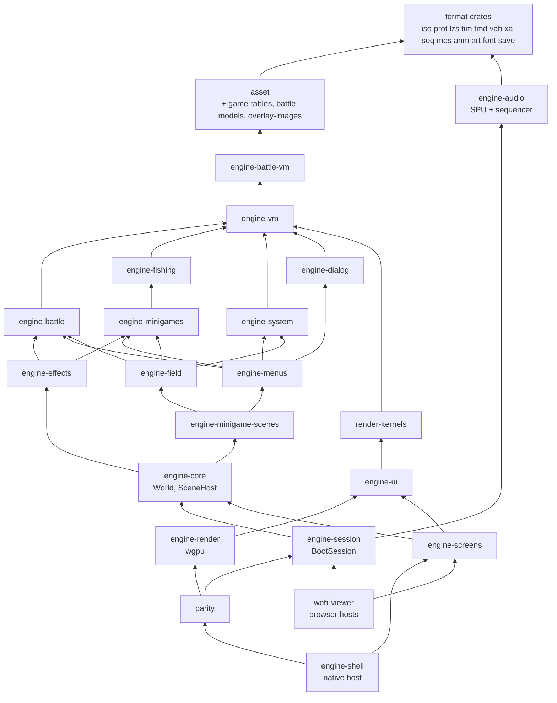
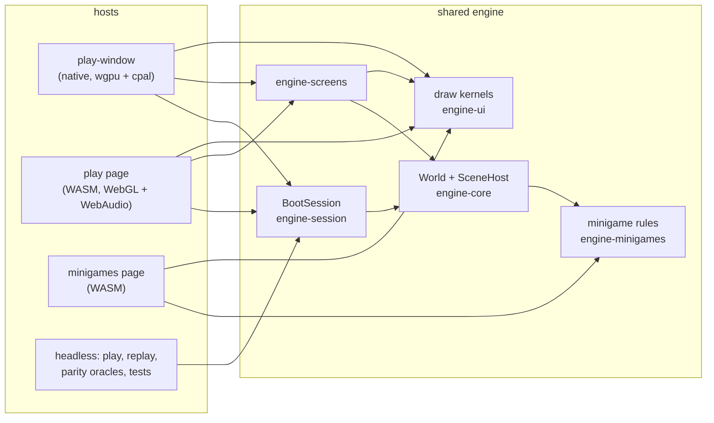
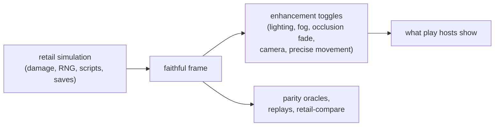

# Engine reimplementation

The engine is a from-scratch Rust port of Legend of Legaia (NA, `SCUS-94254`). You give it your own disc image; it reads every asset straight off that image (`--disc`, no extraction step) and runs the game through its own ports of the retail runtime: the script VMs, field movement, battle, menus, minigames, audio and movies. It runs natively (winit + wgpu) and in the browser (WASM), and both run the same simulation code.

Most of the game works on both hosts: the title and opening, field and town scenes with their event scripts and dialogue, the world map, battles with Tactical Arts and Seru magic, the pause menu and shops, the five minigames, sequenced music and sound effects, FMV movies, and saves (the engine's own format and real memory-card blocks). What is still rough is parity detail rather than missing systems: residual differences against retail frames and RAM are measured and ranked by the [retail comparison corpus](../tooling/retail-compare.md), and the end-to-end story walk is tracked segment by segment in the [full-game ladder](../tooling/full-game-ladder.md).

The code is written from the project's own reverse-engineering record - Ghidra disassembly dumps and live emulator probes - not translated from the executable. See [Legal posture](#legal-posture).

## At a glance

| Question | Answer |
|---|---|
| What runs it | `legaia-engine` (native: launcher, `play-window`, headless `play`) and the site's play and minigames pages (WASM). |
| What it needs | A user-supplied disc image. No Sony bytes ship in the repo or in any release. |
| Simulation | One `World::tick` per retail vsync, fixed 60 Hz, deterministic; shared by every host. |
| Rendering | Native: wgpu with a software PSX VRAM. Browser: the site's WebGL renderer, fed by the same wgpu-free draw kernels. |
| Audio | A from-scratch 24-voice SPU model plus an SsAPI-shaped sequencer; cpal natively, WebAudio in the browser. |
| Retail vs. enhanced | Retail behaviour is measured ground truth and stays one toggle away; enhancements ship on by default where they are clearly better. See [Fidelity and enhancements](#fidelity-and-enhancements). |
| How it is checked | Parity oracles against emulator save states, a record / replay determinism format, a soak harness, and host-drift gates. |

## Goals and non-goals

**Goal:** a playable port of the NA release on modern systems, native and in the browser. The engine targets the NA disc; other regions are not supported by it yet. (The official PAL discs matter to the [translation toolchain](../tooling/pal-localizations.md), which works on the disc.)

"Port" is grounded in retail, not bound by it. The dumps, the format docs and the parity oracles pin what the original does - damage arithmetic, RNG, script pacing, save-record layout - and the engine reproduces it in its retail-faithful mode. That ground truth is a measuring stick, not a ceiling.

**Non-goals:**

- **Decompilation or static recompilation of `SCUS_942.54`.** No byte-matching decompile is attempted and nothing is auto-translated from the MIPS.
- **Losing retail.** The port departs from retail freely, but never silently: departures live behind toggles and the oracles keep "faithful" a testable claim. A quirk is behaviour to preserve in the faithful mode and fair game to improve outside it.
- **Re-authoring the game's assets.** Every texture, mesh, sample and sequence comes off the user's disc at runtime. Nothing is upscaled, redrawn or bundled.

Modding and translation are not on that list. The [randomizer](../tooling/randomizer.md) and [language packs](../tooling/translation/index.md) are shipped tracks of this repo. They patch a user-supplied `.bin` and do not touch the engine, but what the patcher proves out against retail - randomizer logic, softlock fixes, tuning sliders - is expected to graduate into engine toggles.

## Crate layering

The workspace is two stacks that meet at the format parsers. The preservation stack turns the disc into typed data; the engine stack turns typed data into a running game. Arrows point from a crate to what it depends on, with transitive edges omitted.

```mermaid
flowchart BT
    FMT["format crates<br/>iso prot lzs tim tmd vab xa seq mes anm art font save"]
    ASSET["asset<br/>+ game-tables, battle-models, overlay-images"]
    EBV["engine-battle-vm"]
    EVM["engine-vm"]
    EB["engine-battle"]
    EFISH["engine-fishing"]
    EMG["engine-minigames"]
    ESYS["engine-system"]
    EDLG["engine-dialog"]
    EFX["engine-effects"]
    EMENU["engine-menus"]
    EFIELD["engine-field"]
    EMGS["engine-minigame-scenes"]
    CORE["engine-core<br/>World, SceneHost"]
    RK["render-kernels"]
    EUI["engine-ui"]
    EREN["engine-render<br/>wgpu"]
    EAUD["engine-audio<br/>SPU + sequencer"]
    SESS["engine-session<br/>BootSession"]
    SCR["engine-screens"]
    PAR["parity"]
    SHELL["engine-shell<br/>native host"]
    WEB["web-viewer<br/>browser hosts"]

    ASSET --> FMT
    EBV --> ASSET
    EVM --> EBV
    EB --> EVM
    EFISH --> EVM
    ESYS --> EVM
    EDLG --> EVM
    RK --> EVM
    EMG --> EFISH
    EFX --> EB
    EFX --> EMG
    EMENU --> EDLG
    EMENU --> ESYS
    EMENU --> EB
    EMENU --> EMG
    EFIELD --> ESYS
    EFIELD --> EB
    EFIELD --> EMG
    EMGS --> EMENU
    EMGS --> EFIELD
    CORE --> EFX
    CORE --> EMGS
    EUI --> RK
    EREN --> EUI
    EAUD --> FMT
    SESS --> CORE
    SESS --> EAUD
    SCR --> CORE
    SCR --> EUI
    PAR --> SESS
    PAR --> EREN
    SHELL --> PAR
    SHELL --> SCR
    WEB --> SESS
    WEB --> SCR
```

The shape to read off it:

- **The VM layer is at the bottom of the engine stack.** `engine-battle-vm` and `engine-vm` hold the bytecode interpreters and state machines. They know nothing about GPU, audio or the `World`; each reaches the rest of the engine through a `Host` trait.
- **A ring of `World`-free kernel crates sits above it** (`engine-battle`, `engine-fishing`, `engine-minigames`, `engine-system`, `engine-dialog`, `engine-menus`, `engine-field`, `engine-effects`, `engine-minigame-scenes`). Each holds rules and state that never touch the `World` struct, so it can be unit-tested alone.
- **`engine-core` is where they meet.** It owns `World` and `SceneHost`, implements the per-VM `Host` traits, and re-exports the kernel crates at their historical `legaia_engine_core::` paths.
- **Presentation is a separate branch.** `render-kernels` -> `engine-ui` -> `engine-render` and `engine-audio` do not depend on `engine-core`; the hosts compose them with it.
- **`engine-session` and `engine-screens` are the host-shared top.** `BootSession` (scene host + per-frame order + BGM director) and the shop-family screens are written once and ticked by both play hosts.

### Dependency table

Internal dependencies as declared in each crate's `Cargo.toml`.

| Crate | Depends on | Role |
|---|---|---|
| `bytes`, `iso`, `prot`, `lzs`, `tim`, `mes`, `anm`, `mdt`, `art`, `font`, `save`, `seq`, `cheats` | - | Leaf format crates. |
| `tmd` | `tim` | Legaia TMD meshes. |
| `xa` | `iso` | XA-ADPCM. |
| `vab` | `xa` | Sound banks (shares the SPU-ADPCM filter constants). |
| `mdec` | `xa` | Movie decoder. |
| `game-tables` | `bytes` | Static tables in `SCUS_942.54` and the overlays. |
| `battle-models` | `game-tables`, `lzs`, `prot`, `tim`, `tmd`, `bytes` | Battle model formats + glTF export. |
| `overlay-images` | `lzs`, `bytes` | Code-overlay images and their resident tables. |
| `asset` | the three above + `lzs`, `prot`, `tim`, `tmd`, `vab`, `mes`, `anm`, `mdec`, `bytes` | The format hub. |
| `extract` | `iso`, `prot`, `lzs`, `asset`, `tim`, `tmd`, `xa`, `font` | Disc -> files pipeline. |
| `disc-patch` | `iso`, `prot`, `lzs`, `asset`, `xa` | `DiscPatcher`, PPF, space ledger. |
| `translate` | `disc-patch`, `asset`, `art`, `font`, `lzs`, `prot` | Language packs. |
| `party-swap` | `asset`, `lzs`, `tim`, `tmd`, `bytes` | Battle-model swap kernels. |
| `texture-replace` | `disc-patch`, `translate`, `asset`, `iso`, `lzs`, `tim` | Image replacement. |
| `code-hooks` | `disc-patch`, `asset`, `lzs` | MIPS encoders, simulator, hook mods. |
| `patcher` | the five above + the parser crates | The `legaia-patcher` CLI. |
| `engine-battle-vm` | `asset`, `art` | Battle action SM, formulas, battle camera, cast ticks. |
| `engine-vm` | `engine-battle-vm`, `asset`, `art`, `anm` | The VM layer; no GPU or audio deps. |
| `engine-battle` | `engine-vm`, `asset`, `art`, `anm`, `save`, `tim`, `tmd`, `bytes` | `World`-free battle kernels. |
| `engine-fishing` | `engine-vm`, `asset`, `tmd` | Fishing rules engine. |
| `engine-minigames` | `engine-fishing`, `engine-vm`, `asset`, `save` | Minigame rules engines. |
| `engine-effects` | `engine-battle`, `engine-minigames`, `engine-vm`, `asset`, `tmd` | Effect kernels. |
| `engine-system` | `engine-vm`, `bytes`, `cheats`, `gamedata` | Input, fades, streaming, sound state. |
| `engine-dialog` | `engine-vm`, `asset`, `font`, `mes` | Dialog pager, inline-dialogue and cutscene-timeline state. |
| `engine-menus` | `engine-dialog`, `engine-system`, `engine-battle`, `engine-minigames`, `engine-vm`, `asset`, `art`, `font`, `save`, `tim` | Menu, title and memory-card front end. |
| `engine-field` | `engine-system`, `engine-minigames`, `engine-battle`, `engine-vm`, `asset`, `anm`, `bytes`, `mes`, `tmd` | Field kernels: actor programs, camera, cue routers, mode seat. |
| `engine-minigame-scenes` | `engine-minigames`, `engine-menus`, `engine-battle`, `engine-field`, `engine-system`, `engine-vm`, `asset`, `tim`, `tmd` | The minigames' 3D scene surfaces. |
| `engine-core` | every `engine-*` kernel crate above + the parser crates | `World`, scene host and loading, battle loop, menu runtime, saves. |
| `render-kernels` | `engine-vm`, `asset`, `tim`, `tmd` | GTE math, screen prims, VRAM capture, effect emitters; no wgpu. |
| `engine-ui` | `render-kernels`, `engine-vm`, `asset`, `tim`, `tmd`, `font` | Draw-list builders; no wgpu. |
| `engine-render` | `engine-ui`, `engine-vm`, `asset`, `tim`, `font` | wgpu renderer. |
| `engine-audio` | `xa`, `vab`, `seq`, `prot` | SPU model, sequencer, output backends. |
| `engine-session` | `engine-core`, `engine-audio`, `engine-vm` + parser crates | `BootSession` + BGM director; no wgpu or winit. |
| `engine-screens` | `engine-core`, `engine-ui`, `asset`, `font` | Shop / prize / inn / banner screens both hosts draw. |
| `parity` | `engine-session`, `engine-core`, `engine-vm`, `engine-render`, `engine-audio`, `mednafen`, `pcsxr` + parser crates | Parity oracles + retail comparison. |
| `engine-shell` | `parity`, `engine-session`, `engine-screens`, `engine-core`, `engine-vm`, `engine-render`, `engine-audio` + parser crates | The native host. |
| `web-viewer` | `engine-session`, `engine-screens`, `engine-core`, `engine-vm`, `engine-ui`, `engine-audio`, `patcher` + parser crates | The browser hosts and site tools. |
| `asset-viewer` | `engine-core`, `engine-vm`, `engine-render`, `engine-audio` + parser crates | Standalone asset viewer. |

Notes on the split lines:

- **Format crates stay engine-agnostic.** They produce typed in-memory data; the engine turns that into GPU resources and audio buffers.
- **`engine-ui` is the wgpu-free leaf under `engine-render`.** It builds renderer-agnostic draw lists (`TextDraw` / `SpriteDraw`), which is what lets the browser consume them without linking wgpu. `engine-render` re-exports its items at their historical paths.
- **`engine-ui` does not link `engine-core`,** so projecting engine state into its builders is a layer of its own. `engine-screens` is that layer for the shop-family screens: both play hosts call `shop_overlay_frame` and keep only input assembly, stage scale and upload.
- **Battle splits three ways.** The action state machine and the arithmetic kernels it calls are in `engine-battle-vm` ([README](../../crates/engine-battle-vm/README.md) has the split line). The `World`-free kernels (monster AI script, catalogs, encounters, level-up, per-frame passes) are in `engine-battle`. The stateful side (round loop, command flow, cast band, monster turn picker) is in `engine-core`.
- **Minigames split the same way.** Rules engines are in `engine-minigames` / `engine-fishing` ([README](../../crates/engine-minigames/README.md)); `World` glue and scene assembly stay in `engine-core`. The two 3D surfaces that load through a `read_prot` closure rather than a `Scene` (the Baka Fighter duel, the Muscle Dome arena) are in [`engine-minigame-scenes`](../../crates/engine-minigame-scenes/README.md).
- **Sequenced music** is `crates/seq` (parser) plus the `engine-audio` `Sequencer`; the `.dpk` / `.MAP` / `.PCH` family decodes through `legaia_asset::sound_pack`.

## Hosts

Three interactive hosts run one engine. None of them carries a second implementation of the game: each hands the engine a PSX pad word, ticks it, and draws what it reports.

```mermaid
flowchart LR
    subgraph hosts ["hosts"]
        PW["play-window<br/>(native, wgpu + cpal)"]
        PP["play page<br/>(WASM, WebGL + WebAudio)"]
        MP["minigames page<br/>(WASM)"]
        HL["headless: play, replay,<br/>parity oracles, tests"]
    end
    subgraph shared ["shared engine"]
        BS["BootSession<br/>engine-session"]
        SCR["engine-screens"]
        W["World + SceneHost<br/>engine-core"]
        MG["minigame rules<br/>engine-minigames"]
        UI["draw kernels<br/>engine-ui"]
    end
    PW --> BS
    PP --> BS
    HL --> BS
    PW --> SCR
    PP --> SCR
    BS --> W
    SCR --> W
    SCR --> UI
    PW --> UI
    PP --> UI
    MP --> MG
    MP --> UI
    W --> MG
```

| Host | Crate | Renders through | Notes |
|---|---|---|---|
| Native window | `engine-shell` (`legaia-engine play-window`) | `engine-render` (wgpu) | With no subcommand, `legaia-engine` runs a first-run launcher that asks for the disc once and boots `play-window`. |
| Browser play page | `web-viewer` (`runtime.rs` + `play_*.rs`) | the site's WebGL renderer | Runs the same `SceneHost`; see [The browser host](#the-browser-host). |
| Browser minigames page | `web-viewer` (`minigames*.rs`) | the site's WebGL / canvas modules | Drives the minigame rules engines directly, outside a scene. |
| Headless | `engine-shell` (`play`, `record` / `replay`, `scenarios`), `parity`, test binaries | none, or an offscreen renderer | Same `BootSession`; this is what the oracles and replays measure. |

A feature wired into one host and not another is a defect class of its own. The [host-drift](../tooling/host-drift.md) gates police it.

### The browser host

`legaia_web_viewer::runtime::LegaiaRuntime` owns a real [`SceneHost`](../../crates/engine-core/src/scene/host.rs), so the browser executes the same field / event VM, free-movement controller, floor sampler, NPC motion VMs, interaction probe and inline-dialogue runner as the native window. The per-frame contract is small: hand the engine a pad word, tell it the camera azimuth (so the d-pad remaps camera-relative), tick it, draw what it reports. Rendering goes through the site's shared WebGL TMD renderer rather than `engine-render`'s wgpu path.

It reaches field and town scenes (map, player, NPCs, doors, dialogue), live battles (`play_battle*`), the title and opening chain (`boot_title`, `play_cutscene`, `play_fmv`), the pause menu and shops (`play_menu`, `play_shop`), the minigames (`play_minigames`, `play_fishing`) and audio (`play_bgm`, `play_sfx`, `play_xa`). Each screen is drawn from engine state through the shared `engine-ui` builders.

Two responsibilities fall to any host that enters a scene without a door to arrive through - the browser's scene picker is the case that exists:

- **Seating.** `enter_field_scene` seeds the player at the retail cold-boot spawn (`FIELD_COLD_SPAWN_XZ`), which is authored for `town01`, the one scene retail cold-boots into. Every other scene expects a door warp to override X/Z. `World::resolve_cold_field_spawn` then resolves a cold entry:
  - the retail seat is kept only when it is standable, inside the scene's **largest** connected walkable component (4-connected flood fill over the 64-unit sub-cell lattice: walk-visible floor, clear of the wall bits), and not a `.MAP` kind-0 teleport tile;
  - otherwise the spawn relocates to a kind-0 door-arrival destination inside that component, or to the component's centroid. A warp arrival still overrides X/Z afterwards.
  - Hosts seating a player by hand should also avoid gate-1 walk-on trigger tiles (`SceneHost::tile_has_walk_on_trigger`): the first tick would fire it and warp the scene away.
  - If an entry-spawned record ends with the player parked inside a wall (a first-visit record's `MoveTo` choreography, e.g. izumi's spring), the helper-context teardown re-seats them at the resolved spawn (`World::step_helper_contexts`).
- **Framing.** Both hosts run the engine's retail follow camera ([`camera_view`](../../crates/engine-core/src/camera_view.rs)) and neither culls geometry. A wall or roof between the lens and the player is handled by the camera-occlusion fade, which the browser stages through `play_occlusion_fade`.

## Fidelity and enhancements

The port draws a hard line between the retail-faithful mode and everything layered on top, so that "faithful" stays a testable claim.

**The retail simulation is the measured ground truth.** In the faithful mode no toggle changes damage, drop rolls, AP costs, encounter rates or story-flag behaviour, and the oracles hold it there: [engine scenarios](#engine-integration-scenarios) hash the resulting save bytes against a blessed baseline, the [VRAM diff harness](#vram-diff-harness) diffs engine uploads against VRAM captured from save states, and the [record / replay](../tooling/determinism-replay.md) format requires the same input file to produce bit-identical state traces twice. Every parity measurement runs against that mode.

**The port is not bound to that mode.** Enhancements land as explicit toggles that leave the faithful mode bit-identical when off, which is why flipping one never touches replays or the oracles. Defaults follow the better experience: where an enhancement is clearly better it ships enabled; a knob that still defaults to retail marks an enhanced side that is maturing, not a policy of restraint.

```mermaid
flowchart LR
    SIM["retail simulation<br/>(damage, RNG, scripts, saves)"] --> FAITH["faithful frame"]
    FAITH --> ENH["enhancement toggles<br/>(lighting, fog, occlusion fade,<br/>camera, precise movement)"]
    ENH --> PLAY["what play hosts show"]
    FAITH --> ORA["parity oracles,<br/>replays, retail-compare"]
```

### Current knobs and defaults

| Knob | Default | Effect |
|---|---|---|
| `Renderer::set_dynamic_lighting` - enhanced lighting (`I` in `play-window`, `--dynamic-lighting` / `--no-dynamic-lighting` force it; "Enhanced lighting" checkbox on the browser play page; persisted `OptionsState::enhanced_lighting`) | **on** in `play-window` + browser play page | A time-of-day mood over the baked shading, point lights at the scene's glowing props, emissive surfaces (the Genesis Tree), lit town windows at dusk and night and additive halos, from the one `legaia_engine_ui::scene_lighting` kernel on both hosts ([renderer](renderer.md#enhanced-lighting-enhancement-default-on)). Off is pixel-identical to the faithful render; replays and `retail-compare` force it off. |
| `Renderer::set_dyn_shadows` (`--no-dyn-shadows` disables, `Y` in `play-window`) | on | PCF shadow maps for the enhanced-lighting point lights, on both hosts (the page's "Lamp shadows" box). Shadows only: off, the lamps still light the scene. Inert while enhanced lighting is off. |
| `OptionsState::lighting_time_of_day` (`F8` in `play-window`; the page's time-of-day selector) | `auto` | The mood enhanced lighting lights under: `auto` follows the scene (daylight outdoors, a dim mood for caves and dungeons), `day` / `dusk` / `night` force one. |
| `Renderer::set_occlusion_fade` (`--no-occlusion-fade` disables, `F4` in `play-window`; "See-through walls" checkbox on the browser play page) | **on** in `play-window` + browser play page | Camera-occlusion fade: when a ray-cast visibility gate finds the character **completely** hidden, the covering geometry dissolves to a screen-door dither in a circle around them, above the line of their feet so the ground in front of them never fades - a partially visible character never fades ([renderer](renderer.md#camera-occlusion-fade-see-through-walls-enhancement)). Presentation-only; replays force it off. |
| `OptionsState::volumetric_fog` -> `World::toggles.volumetric_fog` (`--no-volumetric-fog` disables, `F9` in `play-window`; "Ground fog" checkbox on the browser play page) | **on** in `play-window` + browser play page; off in headless hosts | Volumetric ground fog: a low drifting mist bank over the outdoor areas of the scenes that read as misty or night (never inside a door-reached room), parted by every character walking through it, with wakes that refill; a battle inherits its field scene's bank ([renderer](renderer.md#volumetric-ground-fog-enhancement)). The engine simulates it once per tick; off draws the frame without it. Presentation-only; replays and the retail comparison corpus force it off. |
| `World::locomotion.precise_movement` (`R` in `play-window`; "Precise movement" checkbox on the browser play page; persisted `OptionsState::precise_movement`) | off | Free-angle locomotion instead of retail's 4/8-way quantisation. |
| `World::locomotion.leading_edge_wall_probes` (`--no-edge-collision` disables) | **on** in `play-window` + browser play page | Retail's three-probe leading-edge wall footprint (`FUN_801cfe4c`'s `DAT_801f2214` table): the player rests ~47 units off a wall plane ([field-locomotion](field-locomotion.md#collision---fun_801cfe4c)). Off = the single candidate-centre test the locomotion oracles and BFS nav drivers run on, which is why the `World` field itself still defaults off. |
| `World::npcs.solid` (`--no-solid-npcs` disables) | **on** in `play-window` + browser play page | Retail's actor-collision probes (`FUN_801cfc40`'s `DAT_801f21b4` table) make field NPCs solid. Placed props are solid either way; this gates the NPC arm only. |
| `World::npcs.animate` (`--no-live-npcs` disables) | **on** in `play-window`, the browser play page and the headless `BootSession` | Publishes the villagers' ambient tail-section-1 wander ([motion-vm](motion-vm.md#from-scratch-port--wiring)); off holds them on their seats. A placement's own `0x4C 0x51` ops are seats, never a patrol ([motion-vm](motion-vm.md#field-npc-walking)). Scripted walks run regardless, and no setting steps a placement's script outside its engaged window. |
| `World::locomotion.run_button_mask` | **retail + one alternate** | Which pad buttons invert the Field Move option. Defaults to retail's `Cross \| R1` (the config word `0x800846DC` = `0x48`, which retail seeds once and never exposes) plus **Square**, the port's historical binding, kept so it does not break under anyone's hands. A host wanting the retail set exactly assigns `FIELD_RUN_BUTTON_MASK_RETAIL`. Which *key* produces each button is the binding table (`legaia-engine config set --binding W=R1`), not this mask. See [field-locomotion](field-locomotion.md#base-step-selection-walk--run). |
| `World::toggles.reduce_flashing` (`OptionsState::reduce_flashing`) | **on** | Photosensitivity guard: slew-limits the applied luminance channels of the ambient CLUT-cell palette cyclers ([field-ambient-fx](field-ambient-fx.md#photosensitivity-guard)). Retail's koin3 dance floor strobes bright/black at 15 Hz - far past the 3-flashes-per-second guideline - so the safe presentation is the default; off restores the retail-exact palette steps. Presentation-only: the move-VM simulation is identical either way. |
| `OptionsState::bgm_volume` / `sfx_volume` (`legaia-options.toml` keys; no in-game row) | `8` / `8` = unity | Engine-only music and sound-effect levels, `0..=10` linear with `8` the retail mix and `10` a 1.25x boost. Each SPU voice is tagged at key-on with the bus of whoever keyed it - a sequencer note is BGM, a cue is SFX - and scaled before the dry sum and the reverb send; XA voice and FMV audio ride neither bus. Both play hosts apply it, and at the default the mix is bit-identical to the single-bus one ([audio](audio.md)). |
| `World::toggles.entry_pulse_enabled` (`--no-entry-pulse` disables) | on | Scene-entry VDF pulse: a rolling vertex-morph envelope over the packs it is authored for (jou's flesh ground, Rim Elm's shoreline; every other scene keeps retail's still geometry; [field-ambient-fx](field-ambient-fx.md#mechanism-3---strip-cycling-and-vertex-morphs)). Retail-armed morph scenes are unaffected either way. |
| `OptionsState::retail_view_window` -> `World::toggles.view_window_crop` | **on**, effective at retail framing only | Retail's visible-tile crop: the field ground and decoration cells are drawn only inside the camera's tile window clipped to the walk region ([`field_view_window`](../../crates/engine-core/src/field_view_window.rs), [encounter.md](../formats/encounter.md#the-scratchpad-window-0x1f8003e8eb)). Both hosts apply it while the camera is at `CameraDistance::Retail` with the drag / tilt / zoom knobs at identity and `F3` off, so the retail-distance frames the comparison corpus takes are cropped. Any wider or re-aimed view draws the map whole - see [below](#the-visible-tile-crop-follows-the-framing). |
| `Renderer::set_psx_mode` (`LEGAIA_PSX_RENDER=1`; "PSX rasterisation" checkbox on the browser play page) | off | Strict-PS1 rasterisation artefacts - see below. |
| `Renderer::set_semi_blend` | **on** | Retail ABE semi-transparency blending. On because it *is* retail. |
| `CameraDistance` (`T`) / debug orbit camera (`F3`) | `Far` / off | Framing only; never feeds the simulation. Both hosts carry both knobs: the default camera on each is the engine's ([`camera_view`](../../crates/engine-core/src/camera_view.rs)) - the retail zone-driven follow camera, whose pitch / yaw / `H` come from the scene's MAN section-3 camera-region record through the retail composer and ease ([`camera_zone`](../../crates/engine-field/src/camera_zone.rs), [encounter.md](../formats/encounter.md#man-section-3-the-camera-region-table)) - and `F3` swaps in that host's own wide vantage. |
| Follow-camera user knobs: drag orbit / drag tilt / wheel zoom (`Camera::manual_orbit` / `manual_tilt` / `manual_zoom`) | identity (retail shot) | The player steers the retail follow camera about the character on both hosts through one engine vocabulary ([`camera::follow_knobs`](../../crates/engine-field/src/camera.rs)). **Locked while a cutscene owns the camera**: the setters drop the gesture when a timeline is live, so a scripted shot never snaps on return. Field-only: the overworld walk camera ignores them. Orbit feeds the movement compass; tilt and zoom are pure framing. Double-click resets all three. A direct scene entry (picker / warp / load) runs `Camera::reset_for_scene_entry` on both hosts, so an interrupted shot never frames the next scene. |
| Solo Tetsu spar (`World::sparring_fight_pending`) | **on**, not a knob | The sparring tutorial seats Vahn alone even over a fuller field party, which comes back on the return to the field. Retail has no such override - the story's party is Vahn alone there - so with the retail party it is an identity ([battle](battle.md#the-sparring-tutorial-prompt-machine-overlay-967)). |
| WebXR [VR mode](vr-mode.md) | off | Stereo presentation on the site's WebGL pages, not the wgpu path. |
| `World::poll_minigame_escape` (Start inside a minigame) | **on**, not a knob | Leaves any of the five mode-24 minigames (Baka Fighter from its player select on: on the attract card Start begins the game). Retail quits each through its own overlay's SM - a different control in a different overlay per game, and only some of those arms are ported - so this is the one exit every game shares ([below](#every-minigame-must-be-leavable)). Each game's own `exit_*` runs, so the cash-out / leg report / point bank match a deliberate exit. |

Two directions are worth having straight, because they are not uniform:

- **Shading defaults to retail.** The game's textured and colour mesh paths have no runtime light source: the TMD's baked colour word goes through the GTE depth cue (`DPCS`) and is applied as `texel * colour / 128`. The exception is the light-source rows (TMD group flags `0x10..=0x17`), which the field dispatcher sends to its `NCCS` / `NCCT` handlers and which shade through the GTE light ([shading](shading.md)). The engine's pipelines draw exactly that. Enhanced lighting is layered *over* it and is an exact identity when disabled - the interactive hosts turn it on, every parity capture turns it off. See [`dyn_light.rs`](../../crates/engine-render/src/dyn_light.rs) and [renderer](renderer.md).
- **Rasterisation defaults to clean.** `psx_mode` is off, so the default image is sharper than a PlayStation's: no sub-pixel vertex snap and no 15-bit ordered dither. Here faithfulness is the mode you opt into. Affine texture mapping is not gated - it is unconditional, and it is the faithful behaviour.

### The visible-tile crop follows the framing

Retail never draws a field scene's whole map: the render library walks only the cells the camera's visible tile window reaches, and each region record sizes that window for retail's own frustum. The port reproduces the crop, but only where that frustum is what the player sees. The play-window's default `CameraDistance::Far`, the drag / tilt / zoom knobs and the `F3` vantage all show ground the window was never sized to cover, and cropping there would open black edges that retail's own frame never has.

So the knob defaults on and the policy lifts it off retail framing: every frame at the retail vantage (including every `retail-compare` capture) is cropped as retail crops it, and every enhanced frame draws the map whole.

`CameraDistance::Far` is the interactive `play-window` default (1.35x retail's eye-back distance); `CameraDistance::Retail` is the pinned retail framing and the type's own `Default`. The wheel zoom and drag tilt pivot the pose about the **character's body** (`camera_view::FOLLOW_PIVOT_LIFT` above the feet), not about retail's floor-level focus - which sits a tier under the feet in `town01` and would walk the character out of frame. The tilt clamp is widened to include the scene's own pitch, and both knobs at identity return the retail pose bit for bit.

### Every minigame must be leavable

A mode the player can enter has to be one the player can leave, on every host, or reaching it is a softlock. `SceneHost::drain_minigame_warp` states that invariant for its failure arms ("a script that armed a warp must never be left in a mode with no exit"), and it holds for the successful ones too.

Retail does not have one exit to port. Each of the five minigames quits through its own overlay's state machine: the slot cabinet's exit menu row, the duel's decided-match confirm, the arena's give-up arm. Some of those arms are ported - the cabinet's Triangle / Select cash-out picker and its quit row, and the duel cabinet's PAY OUT choice after a decided match, both end the visit through the return warp on both hosts - but each is a different control in a different state, and not every game's own exit is ported.

`World::poll_minigame_escape` is therefore an engine affordance rather than a port. Start leaves whichever minigame is live, through that game's own `exit_*` (so the cash-out / leg report / point bank match a deliberate exit), except on the Baka Fighter attract card, which reads Start as its own begin edge. It closes the mode-24 round trip (`World::minigame_return_warp`) when the entry came through a door warp. It lives in `World::tick`, so both hosts inherit it. Pinned by `engine-shell/tests/casino_floor_softlock.rs`, which enters each of the five the way the door warp does and asserts a pad press gets back out.

## Runtime architecture

Data and control flow at runtime. Edge labels on the `World` -> VM arrows name the Rust trait `World` implements to drive each VM.

```mermaid
graph LR
    BIN["legaia-engine"]

    subgraph session ["engine-session"]
        BS["BootSession"]
        BGM["AudioBgmDirector"]
    end

    subgraph core ["engine-core"]
        MD["ModeSeat (the mode word)"]
        SH["SceneHost"]
        W["World"]
        SR["SceneResources"]
    end

    subgraph vm ["engine-vm"]
        AVM["Actor VM, 13 ops"]
        FVM["Field VM, 43 ops"]
        MVM["Move VM, 71+61 ops"]
        MotVM["Motion VM"]
        EVM["Effect VM"]
        BSM["Battle Action SM"]
    end

    subgraph ren ["engine-render"]
        REN["Renderer (wgpu + PSX VRAM)"]
    end

    subgraph au ["engine-audio"]
        SEQ["SsAPI Sequencer"]
        SPU["SPU Mixer"]
    end

    BIN --> BS
    BS --> MD
    BS --> BGM
    BS --> SH
    MD -->|"mode, sub-id to SceneMode"| W
    SH --> W
    SH --> SR
    W -->|ActorVmHost| AVM
    W -->|FieldVmHost| FVM
    W -->|MoveVmHost| MVM
    W -->|MotionVmHost| MotVM
    W -->|EffectVmHost| EVM
    W -->|BattleActionHost| BSM
    SR -->|"per-frame upload"| REN
    BGM -->|sequences| SEQ
    SEQ -->|samples| SPU
```

`World` (`crates/engine-core/src/world.rs`) owns the actor table, battle context, effect pool, field-VM context + bytecode + PC, per-actor move-VM bytecode buffers and RNG state, and implements every per-VM `Host` trait by routing through itself. `World::tick` runs the effect pool, then per-actor move-VM ticks for active actors with bytecode loaded, then the mode-specific top-level VM: the battle-action state machine in `Battle`, a field-VM step in `Field` / `Cutscene`.

`ModeSeat` is the port of retail's outermost dispatch level, the 28-entry mode table at `0x8007078C` indexed by `_DAT_8007B83C`. It is a seat rather than a mirror because the session writes it where retail's code stores that word - field entry through `MAIN INIT`, the pause menu through `CARD INIT` - and each entry returns the INIT column's staging plan before the seat performs the mode's own hand-off store. It also runs the transition edge, whose observable half is the pad-edge swallow. `SceneMode` stays the scene sessions' state and is reconciled with the word once per frame; the lossy direction (five minigames share `OTHER MODE`) is closed by staging the warp sub-id beside it. See [boot](boot.md#the-ports-seat-at-the-mode-table).

### The frame model

One `World::tick` is one retail vsync, and retail runs one sim step per vsync without ever catching up: a slow frame makes a slow game. The hosts render at the display's refresh instead, so the engine owns the rules that turn display frames into ticks, in `engine-core::frame_step`, and every host calls them rather than spelling them out:

| Rule | Kernel | What it pins |
|---|---|---|
| Ticks per display frame | `SimStepper::drain` | Whole 1/60 s ticks with the remainder carried, at most four a frame; a backlog past four is dropped, not carried. |
| Camera around the world tick | `camera_before_world_tick` / `camera_after_world_tick` | The compass azimuth the d-pad remap reads is published before the tick that reads it; op-`0x45` routing, the globals advance and the scene-entry reset (`FUN_80025C24`) follow it. |
| Cutscene glide clock | `CutsceneGlide` | The glide advances by the display frames the world ran, so a redraw that ran no tick advances it by nothing, and a scene entry drops it. |
| Move-VM strips on screen | `MoveVmGlobals::strip_frame` | The latest tick's `0x2C` strips, held across idle redraws and replaced when the next tick starts. |

The pause menu, the name-entry prompt and a movie consume a frame's ticks without ticking the world; under the pause menu that is retail's own shape, since the CARD mode handler runs no master frame driver. Under a shop both hosts skip the whole tick tail as well - the field overlay is swapped out in retail - and keep only the menu session and the SFX scheduler step, as retail's mode-`0x17` handler does; see [host-drift](../tooling/host-drift.md#the-frame-loop-rules-are-engine-side).

Retail's adaptive frame step (`DAT_1F800393`) is a different quantity: the number of vsyncs per *game* tick, which the engine pins per scene. It changes how often the per-actor passes run, never how many vsyncs a second of play contains, so it does not enter the host frame loop.

### Architectural principles

- **Deterministic gameplay.** RNG is seeded from a known value and the simulation ticks on a fixed timestep; the same input file produces bit-identical state traces.
- **Fixed-timestep tick, display-rate render.** The window presents with `wgpu::PresentMode::AutoVsync`; `SimStepper` keeps game logic at 60 Hz whatever the display refresh.
- **Mockable I/O.** The disc read path is abstracted behind `crates/iso::RawDisc`, so tests run without a disc.
- **Quirks are preserved in the faithful mode, fixable outside it.** Quirky damage rounding and oddly-timed cutscenes are replicated where the oracles measure. Changing them lands as a toggle over the faithful path, never a silent edit to it.
- **Behaviour is tested against runtime captures.** Inputs, RNG and frame outputs captured from the original replay through the engine and diff against it.

## The ported VMs

Every VM is ported handler by handler: the handler is dumped from Ghidra, written fresh in Rust, and unit-tested with synthetic bytecode (so the suite ships no Sony bytes). The target is behavioural fidelity per opcode, not byte-exactness of the VM's internals. The full census, including the state-byte dispatchers that are VM-shaped without being bytecode interpreters, is [vm-inventory](vm-inventory.md).

| VM | Retail entry | Port | Page |
|---|---|---|---|
| Field / event VM | `FUN_801DE840`, 43 opcodes | `engine-vm/src/field.rs`, `FieldHost` | [script-vm](script-vm.md) |
| Move VM | `FUN_80023070`, 71 opcodes + 61 `0x2F` sub-opcodes (`FUN_801D362C`) | `engine-vm/src/move_vm.rs` | [move-vm](move-vm.md) |
| Motion VMs | `FUN_8003774C`, `FUN_80038158` | `engine-motion-vm/src/motion_vm.rs` | [motion-vm](motion-vm.md) |
| Effect VM | `FUN_801DE914` / `FUN_801DFDF0` / `FUN_801E0080` | `engine-vm/src/effect_vm.rs` | [effect-vm](effect-vm.md) |
| Actor VM (window widgets) | `FUN_801D6628`, 13 opcodes | `engine-vm/src/lib.rs` | [actor-vm](actor-vm.md) |
| Battle action SM | `FUN_801E295C` | `engine-battle-vm/src/battle_action.rs`, `BattleActionHost` | [battle-action](battle-action.md) |
| World-map entity SM | `FUN_801DA51C` | `engine-vm/src/world_map.rs` | [world-map](world-map.md) |
| Title sub-mode dispatcher | `FUN_801DD35C`, 25-entry JT at `0x801CF244` | `engine-vm/src/title_overlay.rs` | [boot](boot.md#sub-mode-dispatcher) |

Per-VM notes that are not on the owning pages:

- **Field VM.** Cross-context dispatch (extended-bit prefix), YIELD caller-propagation, the `Op49State` tristate, the `0x4C` outer-nibble dispatcher and the `0x5x` / `0x6x` / `0x7x` default-route fourth-flag-bank dispatchers are all wired.
- **Move VM.** The per-frame entry is `actor_tick`, mirroring the gate at `FUN_80021DF4 + 0x80022B94`: skip when `wait_timer >= 0`, otherwise step, then report `Halted` if the post-call `flags & 0x8` bit is set.
- **Effect VM.** A slot pool (`Pool`) of 28-byte `MasterSlot`s and 32-byte `ChildSlot`s; `Pool::init_head` / `Pool::spawn` port `FUN_801DE914` / `FUN_801DFDF0`, and the per-frame walker `FUN_801E0080` is `Pool::tick_retail` (pass 1) + `Pool::child_billboards` (pass 2). The walker's only host callback is `EffectHost::next_random`.
- **Battle action SM.** A per-frame edge-triggered state machine with 47 explicit states across the bands Attack `0x14..0x20`, Magic / Item `0x28..0x2E`, Summon `0x32..0x38`, Spirit `0x3C..0x40` / `0x46..0x48`, Done `0x50..0x52` / `0x5A`, Run / Capture `0x64..0x6B`, Magic-capture `0x6E..0x71`, terminal `0xFD` / `0xFF`. The Tactical-Arts strike band reads per-strike power bytes, hit timing, status effects and hit cues from `BattleActionHost::art_record` and surfaces them through `apply_art_strike(ArtStrikeInfo)`.
- **Title dispatcher.** `TitleTickState::step` executes the graph, including all 56 `state[+0x204] = N` stores with their guards. Master game mode `0x02` has **two** writers: `LaunchGame` (`0x06`) at `0x801DFC00` on the NEW GAME route and `LaunchFade` (`0x16`) at `0x801DFAFC` on the load route.
- **SCUS sprite-emit primitives** (`engine-vm/src/title_prim.rs`). Ports of the three SCUS helpers the title tick calls: `FUN_80058298` (`ClearImage` fill-rect), `FUN_80058490` (`MoveImage` VRAM copy), `FUN_800198E0` (sprite-descriptor dispatcher with tag-`0x11` + alpha-OR pre-pass + width-divisor variants), behind a `PrimHost` trait. The overlay-side helpers (`FUN_801E1C1C` and friends, shared across the menu / battle / shop / save UI overlays) are a separate port.

## Gameplay systems

The shell loop closes: title -> save-select -> field / encounter -> battle -> save. Each system below has its own page; this is the map from system to module. Modules that moved into a kernel crate are still re-exported at their `legaia_engine_core::` path.

| System | Module | Notes |
|---|---|---|
| Game-mode driver | `engine-field::mode` (`GameMode`, `ModeEntry`, `ModeDriver`); `World` side in `engine-core::mode` | The 28-entry table at SCUS `0x8007078C`. Boot starts in `MainInit`, as retail does. |
| Title screen | `engine-menus::title::TitleSession` | `FadeIn -> PressStart -> MainMenu -> Done`, with a no-save fallback. The title TIM (PROT 0890 at `0x14228`, 256x256 8bpp) is decoded by `title_screen_atlas`. Layout: [boot](boot.md#title-screen-overlay-state). |
| Save select | `engine-menus::save_select::SaveSelectSession` | Slot-list browse with Load / Save / Delete confirms. See [save-screen](save-screen.md). |
| Encounters | `engine-battle::encounter` | Per-scene table, step-driven random battle trigger, 5-phase transition. |
| Battle | `engine-core` round loop over `engine-battle-vm` | Runs end to end, Tactical Arts included; the party is assembled from the player battle files' equipment sections. `engine-battle::target_picker` is the target cursor. See [battle](battle.md). |
| Equipment | `engine-menus::equipment` | The typed 8-slot model and the catalog, overridable per id (`EquipmentCatalog::set`). |
| Seru capture + spell learning | `engine-battle::seru_learning` | Per-character per-Seru point accumulator with banner session. |
| Tactical Arts chain editor | `engine-battle::tactical_arts_editor` | Menu-side compose / name / save flow with a per-character library. |
| Field scenes + dialogue | `engine-core` scene host, `engine-field`, `engine-dialog` | Scenes load and run their own MAN bytecode. `World::step_inline_dialogue` ports the retail dialog state machine `FUN_80039B7C` through the field VM (`play-window --simple-dialogue` opts out to the segment-pool fallback). |
| Dialog text | `legaia-mes::DialogPlayer` | Paces glyph / spacing / substitution / page-break events; both hosts render the `DialogSnapshot` at the retail geometry (`FUN_801D84D0`, the per-frame line pager). Encoding: [mes](../formats/mes.md) (`FUN_8003CA38` / `FUN_80036044` / `FUN_80036888` / `FUN_80036514`). |
| Save / load | `World::save_full` / `load_full`, `legaia_save` | LGSF files and real memory-card blocks (`legaia_save::card::write_block`). |

### The LGSF save format

`crates/save/src/ext.rs`. Versioned and backward-compatible, each version a sentinel-guarded extension the previous reader stops at:

| Version | Adds |
|---|---|
| v1 | Party records, story-flag word, money, inventory. |
| v2 (`LGX2`) | Play-time, active party, per-character ext (learned arts mask, spell list, Seru captures, active chains), saved-chain library. |
| v3 (`LGX3`) | The full 512-byte story-flag bitmap. |
| v4 (`LGX4`) | The per-spell-slot shiny-Seru block. |
| `LGX5` trailer (optional, no version bump) | The resume point (`SaveResume`): the CDNAME label of the scene the save was written in and its banner name. Appended only when populated, so a file without one is byte-identical to a v4 file. Continue / Load re-enter that scene before hydrating the world. |
| `LGX6` trailer (optional) | The item-slot block: slot-level bag data. |
| `LGX7` trailer (optional) | The minigame purses: casino coin bank, Point Card bank, fishing point record. |
| `LGX8` trailer (optional) | The field position (`i16 x`, `i16 z`). |
| `LGX9` trailer (optional) | The audio levels (`i32 configured_level`, `i32 voice_volume`). |

Each optional trailer is emitted only when it has something to carry, so a save without one is the same bytes as before the trailer existed. The writer emits the highest version any populated field requires; readers accept every earlier one. The retail-card bridge carries the same engine-only state in the SC block's unread tail (`LGXE`, [save-screen](save-screen.md#the-engine-ext-blob-in-the-unread-tail)).

## Render + audio

- **`engine-render`** - `Renderer` (wgpu device + surface, textured-quad, flat / textured-mesh and line pipelines), aspect-preserving letterbox, and a software PSX VRAM (1024x512 `R16Uint`; per-prim CBA / TSB, 4 / 8 / 15bpp and CLUT lookup decoded in the fragment shader). See [renderer](renderer.md) and [shading](shading.md).
- **`engine-audio`** - a from-scratch model of the 24-voice PSX SPU (`src/spu/`: streaming ADPCM decoder, ADSR envelope, 512 KB SPU RAM, libspu-shaped transfer engine), the SsAPI-shaped `Sequencer`, and two outputs: `AudioOut` (cpal; F32 / I16 / U16 devices) and `WebAudioOut` for WASM. `src/vab_bind.rs` bridges parsed VAB banks into the SPU (`VabBank::upload`, `play_note`). See [audio](audio.md).
- **Movies** - `legaia-engine play-str` and the play hosts decode a PSX STR's MDEC video and its interleaved XA track and play them in sync. `play-str` decodes the audio track up front rather than through a streaming voice. See [cutscene](cutscene.md).
- **Vertex normals.** `legaia_tmd::mesh::tmd_to_vram_mesh` emits a per-vertex normal stream by accumulating area-weighted face normals into per-position bins, so connected geometry shades smoothly; the shader falls back to `dpdx` / `dpdy` for unbinned positions. These normals are what [enhanced lighting](#fidelity-and-enhancements) reads; retail's baked-colour paths use none.

## The asset viewer

`crates/asset-viewer` is a standalone winit binary that loads the disc, navigates PROT entries and renders or plays them. Everything it draws goes through the same crates the engine uses.

| Subcommand | What it shows |
|---|---|
| `tim <PATH> [--clut N]` | A single TIM. |
| `tmd <PATH> [--start N]` | A Legaia TMD as a flat-shaded auto-rotating mesh. PATH may be a directory (N / P / PgDn / PgUp cycle every `*.tmd`). `--bundle battle` or `--vram-extra-dir` switches to the textured-mesh pipeline. |
| `stage <PATH>` | A stage-geometry PROT entry, as wireframe. |
| `vab <PATH> [--offset 0xN] [--sample N] [--rate Hz]` | One VAG sample from a VAB bank. |
| `prot <PROT.DAT> [--cdname FILE] [--start N]` | Every PROT entry: auto-detects via `categorize` and shows / plays the first viewable sub-asset. |
| `dialog <PATH> [--message N]` | A Compact MES blob through the dialog player against the extracted font. Z / Enter advance past page breaks; N / P jump messages. |
| `save-icons <PATH> [--tile N]` | The save-slot portrait sheet from the menu overlay (PROT 899), each tile through its own CLUT. |
| `seq <SEQ> <VAB> [--vab-offset 0xN]` | A SEQ through the sequencer against a VAB bank, with a live status window. |
| `field <SCENE>` | A CDNAME scene with the field VM stepping its event-script records; the HUD shows the VM PC, last `StepResult` and an opcode tally. |
| `battle-scene [--queued-action N]` | The battle bundle driven by the battle-action state machine through `World::tick`. |
| `world <SCENE>` | The `engine-core` `World` composite ticking over a CDNAME scene. |

The PROT browser dispatch handles `tim_passthrough`, `tim_pack`, `data_field_streaming`, `scene_tmd_stream`, `scene_vab_stream`, and a VAB byte-search fallback for any class with embedded banks.

## Legal posture

The "user brings their own disc" model is the one ScummVM, OpenRCT2, OpenMW and OpenLara use. It holds as long as:

- zero Sony bytes ship in the repo or in any released binary;
- all code is fresh Rust written from format docs and the disassembly reference - not derived assemblies, not auto-translated MIPS;
- disc-dependent tests skip without the user's disc.

CI enforces this for every track.

The boundary to respect: **the dumps in `ghidra/scripts/funcs/*.txt` are reference material, not committable engine code.** A handler in `crates/engine-vm/` is a fresh Rust function written *from* the dump - never pasted from it.

The project deliberately does not call this "clean-room": the same people read the Ghidra output and write the Rust, which is not the two-team firewall that term formally means. The boundary actually enforced is narrower and checkable - the dumps stay reference material, no Sony-derived bytes are committed, and no code is mechanically translated.

## How it is verified

Open work is tracked structurally rather than as a hand-maintained list. The [port catalog](../tooling/port-catalog.md) cross-references every dumped function against its docs page and its `// PORT:` tag in `crates/`; the question-level companion is [open RE threads](../reference/open-rev-eng-threads.md).

| Instrument | What it measures | Page |
|---|---|---|
| Retail comparison corpus | Engine RAM and VRAM against every walkable and battle library state, worst first. | [retail-compare](../tooling/retail-compare.md) |
| Record / replay | Same input file twice gives bit-identical state traces. | [determinism-replay](../tooling/determinism-replay.md) |
| Full-game ladder | New Game to credits, per story segment. | [full-game-ladder](../tooling/full-game-ladder.md) |
| Soak harness | Seeded random pad input over every scene and minigame, with softlock / stall detectors. | [soak-harness](../tooling/soak-harness.md) |
| Host drift | A feature wired into only one host. | [host-drift](../tooling/host-drift.md) |
| Engine scenarios | Save-byte hash after a fixed headless run. | [below](#engine-integration-scenarios) |
| VRAM diff harness | Engine VRAM uploads against a captured VRAM blob. | [below](#vram-diff-harness) |

### Engine integration scenarios

[`scripts/engine/scenarios.toml`](../../scripts/engine/scenarios.toml) declares scenarios that drive the headless `BootSession` for a fixed frame count and assert the SHA-256 of the resulting `SaveFile` byte stream against a recorded baseline. It mirrors the byte-level [mednafen scenarios manifest](../tooling/mednafen-automation.md#the-scenarios-manifest), so a feature touching either layer has regression coverage on the other to consider.

The schema is in [`crates/engine-shell/src/scenarios.rs`](../../crates/engine-shell/src/scenarios.rs); the disc-gated runner [`crates/engine-shell/tests/scenarios.rs`](../../crates/engine-shell/tests/scenarios.rs) exercises every entry. The CLI runner is `legaia-engine scenarios [--bless]`; `--bless` rewrites the manifest in place with the observed hashes.

A row whose `expected_save_sha256` is empty is "unblessed": the test reports the observed hash and skips the assertion, and the CLI runner exits non-zero unless `--bless` is on. Every new scenario is therefore reviewed once before it can drift silently.

### VRAM diff harness

`legaia-engine info --runtime-vram <bin> --vram-diff-png <path>` and `legaia-engine vram-oracle --runtime-vram <bin>` compare engine VRAM (built via `SceneResources::build_targeted`) against a VRAM blob captured from a save state. `vram-oracle` also exposes:

- `--rows-csv <path>` - per-Y-row pixel diff stats (`y, runtime_nz, engine_nz, overlap, runtime_only, engine_only`). A missed targeted-upload pass shows as a high `runtime_only` count on one row (e.g. row 479, the NPC CLUT row).
- `--clut-regions` - a one-line health report per documented CLUT band (NPC palette row 479, character / texture-page CLUT rows); `<-- gap` flags the engine-missing case.

Pair it with `mednafen-state vram-dump --out-bin` for the ground-truth blob, and with `mednafen-state prim-dispatch-survey` to confirm the per-prim dispatch tables match between the saves being compared.

#### Static-mask parity (`vram_oracle_e1`)

A save state's VRAM is a live snapshot: much of the texture-page region is dynamic or residual (animation frames, battle leftovers, scroll position). Two captures of the same scene (town01 before and after a battle) differ over roughly 40% of the primary texture band, so a stateless engine pre-pass cannot be byte-exact against one snapshot.

The disc-gated `vram_oracle_e1` test therefore asserts against the **static mask** - the words identical across every same-scene capture. For each scene with at least two captures it builds the engine VRAM with the field-mode DMA-every-TIM pre-pass (`upload_all_tims`) and asserts the engine never uploads a *wrong* texel on a static pixel in the texture-page region, excluding the runtime-managed NPC / character CLUT band (`vram_oracle::NPC_CLUT_BAND_ROWS`, around row 479). It checks correctness of what is uploaded, not completeness: boot-resident textures the scene pre-pass does not assemble (font / menu atlases) are not flagged. `compute_static_mask` / `first_static_upload_divergence` have disc-free unit tests.

"Stable across same-scene captures" is not always "static". Two capture-pinned exceptions each have a refinement:

- **Global shared bands are history-dependent.** The `befect_data` effect-texture band (one disc source, resident across every field scene) carries a few pixels whose boot-resident value differs from the disc copy until a battle re-uploads the disc bytes. Pinned at `(853, 271)`: pre-battle / menu captures hold `0xFFFF` where the disc TIM and every post-battle capture hold `0x3333`. `refine_mask_with_shared_band` demands staticity across **all** scenes' captures for cells inside `scene::effect_texture_image_rects`.
- **World-map CLUT palette cycling.** Row 506's head is the 13-frame ocean CLUT animation ([world-map](world-map.md)), so a capture holds an arbitrary phase, never the disc base CLUT. The cycling reaches further: rows 508 / 509 each animate a few entries, row 508's entries 32..47 mirror its own 0..15 head, and row 506's tail holds a runtime-generated palette found in no disc bundle. `WORLD_MAP_CLUT_CYCLE_CELLS` / `clear_world_map_clut_cycle_rows` exclude the cycled cells - `(500, 48..64)`, `(506, 0..48)`, `(508, 0..48)`, `(509, 32..48)`, the destinations of the kingdom-universal CLUT-walk operand table - for world-map scenes only. Row 507, a non-animated terrain CLUT, stays asserted.

## See also

[Project overview](../overview.md) ·
[Boot sequence](boot.md) ·
[Renderer](renderer.md) ·
[Shading](shading.md) ·
[Audio](audio.md) ·
[Field / event VM](script-vm.md) ·
[VM inventory](vm-inventory.md) ·
[Host drift](../tooling/host-drift.md)
