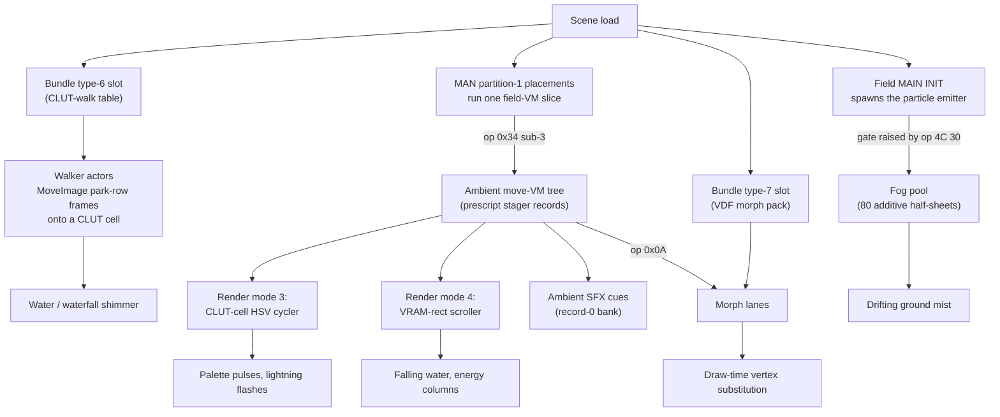
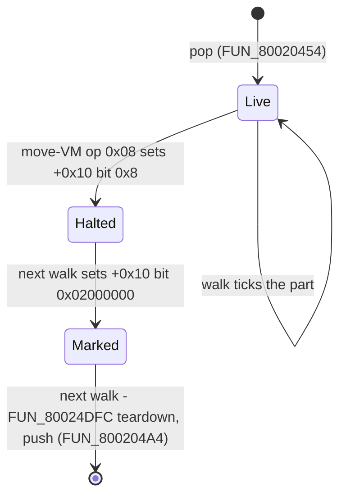
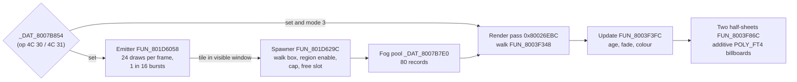

# Field ambient animation - the moving parts of a "static" scene

Field maps are not static: water shimmers, waterfalls roll, mist drifts, and
jou's fused Juggernaut ground pulses under lightning. None of that is animated
vertex data in the environment pack. It is a small set of runtime mechanisms
that repaint the scene's VRAM (palettes and texels) or bend its meshes at draw
time, all authored per scene on the disc and started when the scene loads.



| Mechanism | Carrier | Stepper | What it animates |
|---|---|---|---|
| [Walker table](#mechanism-1---the-scene-walker-table-bundle-type-6-slot) | Scene bundle type-6 slot | `FUN_8001ADA4` case 0xB | CLUT-cell `MoveImage` cycling: water / waterfall shimmer |
| [Ambient move-VM tree](#mechanism-2---the-ambient-move-vm-effect-tree) | Prescript stager bundle + MAN P1 scripts | Move VM + `FUN_80021DF4` render tail | Palette pulses (HSV cycling), VRAM-rect scrolling, lightning, ambient SFX |
| [Texture strips / morphs](#mechanism-3---strip-cycling-and-vertex-morphs) | Move records (op `0x40`) / bundle type-7 VDF | Move VM / morph stager `FUN_8001C604` + envelope `FUN_80020740` | Texel strip frames; vertex deformation (render substitution) |
| [Particle emitter](#mechanism-4---the-ambient-particle-emitter) | Field-overlay template `0x801F271C` + MAN section 4 regions | `FUN_801D6058` + fog pool `FUN_8003F348` | Drifting fog / mist sheets |

Confidence: **Confirmed** (disassembly) for the walker-table chain, the
ambient install chain, the actor pool and its halted-part free, both
render-tail arms (the mode-3 CLUT-cell cycler and the mode-4 rect scroller),
the record-0 SFX bank, the VDF pack format and the fog pool; **Inferred**
where marked.

## Mechanism 1 - the scene walker table (bundle type-6 slot)

The CLUT-walk `MoveImage` table documented for the world-map ocean
([`world-map.md`](world-map.md) "Ocean / water animation",
[`clut_walk`](../../crates/asset/src/clut_walk.rs)) is **not kingdom-only**.
The asset-type dispatcher installs any bundle's type-byte `0x06` slot at
`DAT_8007B7C8` (`FUN_8001F05C` case 6) and field init spawns one walker actor
per entry. Each walker copies successive frames from a "park" CLUT row onto a
destination cell, so the palette - and every texel drawn through it -
cycles. Twelve bundles ship a populated table:

| Scenes | Table shape |
|---|---|
| `map01` / `map02` / `map03` | 8 entries (ocean head + shimmer cells), byte-identical |
| `garmel`, `dohaty` | 1 entry: dest `(80, 506)`, 8 frames from park row 505 |
| `geremi`, `rayman`, `rayman2`, `tunnelb`, `tunnelc`, `son`, `edson` | 2 entries: dest `(0, 505)` from row 504 + dest `(160, 506)` from row 503 - the shared waterfall / water table |

Every other scene's type-6 slot is a 4-byte placeholder (`count = 0`).
The field carriers' park strips ride the same slot-0 TIM_LIST raw CLUT-block
records the kingdoms use; resolution is **by type byte**, not slot position -
the `rayman`-family carrier is the MAN-less count-4 table variant
(`[1, 2, 6, 0x14]`).

## Mechanism 2 - the ambient move-VM effect tree

Most ambience is a tree of small invisible actors ("stager parts") running
move-VM bytecode out of the scene's prescript bundle. A part never draws a
mesh of its own for these effects; instead its render tail edits VRAM every
frame - re-tinting a captured palette rect (mode 3) or rotating a texel
rect (mode 4) - or it fires sound cues.

### Install chain

At scene entry the placement installer runs each MAN **partition-1 placement**
through the field VM for one frame slice, and every op `0x34` sub-3 that slice
executes installs one stager record:

```text
field VM op 0x34 sub-3 (arg)
  -> FUN_800252EC(arg + 1)              ; record = _DAT_8007B8D0 + offsets[id]
  -> FUN_80021B04(parent+0x14, ..., record, 0x1000)
                                       ; seat the part, PC = 2, and run its
                                       ; move-VM bytecode ONCE immediately
  -> FUN_80023070 every game tick thereafter
```

Scene entry is not a second mechanism. `FUN_8003A1E4` carries no install code
of its own: it calls `FUN_801DE840` - the field VM - for one frame slice per
just-spawned placement, and the install happens in that dispatcher's op `0x34`
sub-3 arm at `0x801E00B0`. A load-slice install and a runtime install are the
same instruction reached at two moments.

The arm also fixes the **seat**: `FUN_800252EC(bytecode[1] + 1, s5 + 0x14,
s5 + 0x24)` where `s5` is the executing script's context, retargeted by the
`0x80` cross-context prefix. `FUN_80021B04` copies `ctx[+0x14..+0x1A]` into
the part's world position (`0x80021B94..`) and `ctx[+0x24..+0x2A]` into its
render banks (`0x80021D8C..`), so a scripted install stages where its actor
stands - not at the player.

The carrier is not a distinguished kind of script. Many scenes put the
install on a dedicated effect-actor record (`install id N` + infinite loop -
the Shift-JIS-named "effect" actors of the prescript consumer census,
[`scene-bundles.md`](../formats/scene-bundles.md#scene_event_scripts---prescript-only)),
but a fully scripted, dialogue-bearing placement installs exactly the same way,
and on the retail disc that is the majority case: of the scenes that install an
ambient tree at entry, 22 carry it on a pure effect-actor record and 41 on an
ordinary placement. What decides it is
[which ops the load slice reaches](#which-installs-fire-at-scene-entry).

#### Which installs fire at scene entry

`FUN_8003A1E4`, the pre-run the placement spawn loop calls per just-spawned
placement, carries its own copy of the per-actor script runner's frame slice.
Two raw-branch facts settle which installs run:

- **The pre-run is gated on the record's first opcode.** `0x8003A480` reads
  `bytecode[pc0]` and runs `addiu v0,v1,-0x24; sltiu v0,v0,0x2; beq v0,zero`
  past the whole VM loop - unless the first byte is `0x24` or `0x25` the
  record's script never runs at load. Every placement authored to install
  something at entry opens with `25`.
- **The slice runs while `(opcode & 0x7F) >= 0x20` and breaks *after* executing
  an opcode whose full byte is `0x21`** (`0x8003A4C4` `beq s1,s4` against
  `li s4,0x21` - the raw byte, so the cross-context `0xA1` does not break), or
  when the dispatcher returns an unchanged PC. `FUN_80039B7C`'s per-frame slice
  (`0x80039E20`) is the identical pair of tests.

`0x21` and `0x25` are both "nop" to a disassembler and only one of them ends the
slice. A record written `25 / 34 30 00 / ...` fires its install in the load
slice whatever follows, and the `21` further down is where the placement parks.
A second install *after* that `21` (`edkorout` P1[15]) belongs to a later
slice, which a free-roam placement never gets - the per-actor ticker only
dispatches script stepping for an actor carrying the script-engaged bit.

A static reader can take this as the record's **unconditional entry prefix**:
walk from the record's first opcode and stop at the first branch, jump,
blocking op or `0x21`. That under-approximates on purpose - a flag-gated
install deeper in a record (`nilboa` P1[3]'s second install, both of `suimon`
P1[4]'s) depends on runtime state.

#### Fan-out and loops

Installer records fan out with move-VM op `0x25` (spawn child from the
prescript bundle); each child is also first-run inside the parent's spawn op,
which is what sequences the self-modifying fan-outs below. The counted-loop
pair op `0x18`/`0x19` (and `0x1A`/`0x1B`) drives repeated spawns: `0x18`
latches the PC and a counter, `0x19` decrements and jumps back to the saved
PC + 2 **while the decremented count has not underflowed** (retire is the
underflow past zero, advancing 1 word; a counter of N runs the body N + 1
times; the `0x4000` bit marks a never-decrementing infinite loop).

### The part pool and the halted-part free

A stager part is an ordinary actor out of the scene's shared actor pool, and
the pool is small and fixed. `FUN_800203EC` seeds the free stack with `0x8E`
down to `0` - **143 slots**, `0xD8` bytes apart - `FUN_80020454` pops one per
spawn (returning null when the stack is empty, which `FUN_80020DE0` treats as
an error and reports through `FUN_800567A8`), and `FUN_800204A4` pushes it
back. Every actor in the scene draws on that pool, not the ambient tree alone.



What returns a slot is the per-frame actor-list walk `FUN_8002519C`. Per live
actor it tests `actor[+0x10] & 0x8` - the bit move-VM op `0x08` HALT sets
(`0x800251E8`) - **before** dispatching the actor's tick word, and only the
not-halted branch reaches the `jalr`. So a part renders one last time inside
the call that halts it and never again: its CLUT-cell write and strip rotation
stop there.

Freeing is one walk later than stopping. The halted arm tests bit
`0x02000000` and, while it is **clear**, branches past the entire teardown to
set it (`0x800251F4` `and`/`beq` against `lui s3, 0x200`) - so the first walk
that sees a halted actor only marks it. The next one runs `FUN_80024DFC`,
releases the heap buffers (including the mode-3 capture at `+0xA8`, keyed on
the tick word being the stager render tail `FUN_80021DF4` with `+0x5A == 3`,
and firing the `+0x5A == 5` cue through `FUN_800250D4`), and pushes the slot
back with `FUN_800204A4`.

That free is what keeps the counted-loop fan-outs finite. Several scenes are
**emitters**: an infinite `0x18 0x4000` loop around a wait and an op-`0x25`
spawn, whose children halt within a few ticks. The live population is
spawn-rate times lifetime - single digits to a few dozen, no scene near the
143 ceiling - while the number of parts *created* over a minute of standing
still runs into the thousands. Read without the free path, those scenes look
like enormous authored trees.

An op-`0x25` operand of **0** cannot be authored: table entry 0 is the
[SFX descriptor bank](#the-master-ambient-record-0---the-per-scene-sfx-descriptor-bank),
not bytecode, and the install op always calls `FUN_800252EC` with `arg + 1`.

### The pool's control block `0x8007C348`

The words in front of the pool are a heterogeneous control block, not a table
indexed by channel. Its layout comes from the pool helpers' own stores and
from the stage init that fills it:

| Offset | Content | Written by |
|---|---|---|
| `+0x00` | free-stack **top index** (`0x8E` when full; the pop's `bltz` refuses at `-1`) | `FUN_800203EC` seed, `FUN_80020424` / `FUN_80020454` pop, `FUN_800204A4` push |
| `+0x04`, `+0x08`, `+0x0C`, `+0x10`, `+0x18`, `+0x14`, `+0x24` (pop order) | seven actor-list **sentinel nodes**, each a pool slot popped by `FUN_80020424` and left pointing at itself | per-stage init `FUN_8001E1B4` (`0x8001E324..0x8001E364`) |
| `+0x1C` | the **player** actor | field MAIN_INIT `FUN_801D6704` at `0x801D6D7C`: the return of the spawn allocator `FUN_80020DE0(0x800705FC, *(block + 4))` |
| `+0x28 + 4*i` | the free stack itself, 143 slot pointers | `FUN_800203EC`, then the pop / push pair |

So the channel resolver `FUN_8003C83C` (and the inline copy of it in
`FUN_8003A9D4`) does not index this block by channel either: `0xF8` reads
`+0x1C`, `0xFB` walks the `+0x04` list for the node whose tick word is the
world-map entity SM `0x801DA51C`, and any other id walks the `+0x0C` list
comparing actor `+0x50`. Read as `0x8007C348 + 4*i`, index 7 lands on the
player only because the player word happens to sit at `+0x1C`.

### The CLUT-cell HSV cycler (the "pulsating flesh")

A `model_sel = 0x4000` render-mode part (`actor[+0x5A] = 3`) whose program
runs op `0x2C` `[x, y, w, h]` captures that VRAM rect into a per-actor
buffer (`FUN_8005842C` descriptor init + StoreImage; `w >= 0x11` heap, else
the inline `+0xAC` buffer) and arms the gate `+0x9C = 1`. The actor render
tail (`FUN_80021DF4` mode-3 arm, `0x800226D8..`) then every frame:

1. integrates the **H / S / V adds**: `+0x90/92/94 += (+0x96/98/9A *
   DAT_1F800393 * DAT_1F80037D) >> 6` - the tween source/scale registers,
   repurposed; ops `0x2B` (absolute), `0x2E` (velocities), `0x2D` (add)
   steer them;
2. ramps the white-blend amount `+0x68 += (+0x6A * dt) >> 6`, clamped at
   `0x100`;
3. once `+0x9C > 1` calls **`FUN_80019D50`**(mode `+0x9E`, white `+0x68`,
   h `+0x90`, s `+0x92`, v `+0x94`, buffer, descriptor): per captured
   15-bit texel - zero texels stay zero, STP preserved - RGB->HSV
   (`FUN_8001A78C`), `H += h` (mod `0x168`), `S += s`, `V += v` (clamped
   `0..0xFF`), HSV->RGB (`FUN_8001A6C8`, caps `0xF8`), and when
   `mode == 1` a white/invert blend `c += (255 - 2c) * white >> 8`; the
   repacked row is emitted as a fresh `LoadImage` packet onto the captured
   rect (`FUN_800583C8`);
4. advances `+0x9C` (clamped 1000).

So the "pulsating flesh" never moves a vertex: it is **palette-space HSV
cycling on the texture's CLUT rows**, re-uploaded every frame from the
original capture.

### The self-modifying spawn stepper

jou's cycler record opens with ext op `0x2F 0x1E` - the in-place add
`bytecode[pc + op2 + 4] += op3` - targeting **its own following op-`0x2C`
`x` operand** in the shared prescript bundle. Each spawned instance
increments the shared word by 16 and then captures its own (stepped) cell,
so fifteen spawns of one record tile a whole CLUT row in 16-halfword cells.
Ext `0x1E`'s size is **4** (it skips its own operand words). Because the op
writes the bundle in memory, the op-`0x2C` after the `0x1E` reads the bumped
`x` in the same run: the fifteen cyclers take cells `0x10..=0xF0` of row 502,
and the lightning director's own capture holds cell `0x00`, so the row is
covered end to end.

### jou worked example (prescript records, extraction 0630)

jou's MAN carries **one** ambient install (P1[1]: `34 30 00` -> record 1).
Record 1 clears system flag `0x364`, then spawns:

| Child | Parts | Role |
|---|---|---|
| record 20 | 1 | Lightning **director**: mode-3 cell `(0, 502)`, strike cadence randomised by ext `0x05` `RAND_ADD` (writes `min + rand % range` into the next wait's operand), player-bbox gates (ext `0x06`), sets flag `0x364`, screen flash (ext `0x3C` fade toward grey), thunder cue (op `0x1D` -> `DAT_8007B6DE = 0x20B`) |
| record 21 | **15** (loop `0x18 0x0E` + `0x19`) | The flesh-palette cyclers: mode-3 cells tiling CLUT **row 502**, idle at zero adds, 4-step bright/desaturate decay on flag `0x364` |
| record 22 | 1 | Mode-3 cell `(0x70, 504)` - the lightning palette: idles at `V-add = -255` (dark), jumps bright on flag `0x364`, decays |
| record 23 | 1 | Render-mode-4 setup (op `0x1E` - the [VRAM-rect scroller](#the-vram-rect-scroller-render-mode-4)) |
| record 45 | 1 | Ambient SFX loop: infinite `0x18 0x4000` loop of op `0x1D` cues `0x20E..0x211` with `0x09` waits |

Partition-2 cutscene timelines install args 1..9 (records 2..10) - the
story-beat effects (op `0x13` effect-descriptor children, op `0x1F` morph
installs, op `0x14` colour ramps at absolute world positions). These are
cutscene-driven, not entry-ambient.

### The VRAM-rect scroller (render mode 4)

Mode 4 is the sibling of the CLUT-cell cycler, and it animates **texels in
place**: an authored VRAM rect is rotated under whatever meshes sample it,
with no vertex, UV or CLUT touched. It is what makes waterfalls fall.

Move-VM op `0x1E` seats it in one instruction - `+0x5A = 4` then seven
operands into `+0xC4` (period reload), `+0xCC` / `+0xCE` (per-period
horizontal / vertical step) and the rect `+0xD0..+0xD6` (`x, y, w, h`), in
that order (`FUN_80023070` `0x80023694..0x800236F0`). The countdown `+0xC6`
is *not* seated, so a freshly spawned part fires on its first tick.

The render tail then runs, per game tick (`FUN_80021DF4`
`0x80022CB8..0x80022EE0`):

1. `+0xC6 -= DAT_1F800393` - the adaptive frame step **alone**; unlike the
   mode-3 arm this one does not fold in the `DAT_1F80037D` speed scalar.
   The branch is `sll v0,0x10; bgez`, so the arm fires exactly on the tick
   the stored halfword's sign bit sets, i.e. on underflow.
2. On that tick `+0xC6` reloads from `+0xC4` and the two steps are read;
   otherwise both stay zero and both arms below are skipped.
3. Each non-zero step runs the same three-call strip rotate, horizontal
   first (`0x80022D08..`), vertical second (`0x80022DF8..`). With
   `sw = +0xCC * frame_step`: `FUN_8005842C` (`StoreImage`) captures
   `(x, y, sw, h)` into a scratch buffer bump-allocated off `0x1F8003A0` at
   `((sw*h*2) + 3) / 4 * 4` bytes; `FUN_80058490` (`MoveImage`) slides
   `(x + sw, y, w - sw, h)` onto `(x, y)`; `FUN_800583C8` (`LoadImage`)
   re-inserts the strip at `(x + w - sw, y, sw, h)`. Net: a **cyclic left
   rotation** by `sw` halfwords. The vertical arm is the transpose
   (`sh = +0xCE * frame_step`, top strip out, remainder up, strip back in at
   `y + h - sh`) - a cyclic up rotation.

```text
horizontal step sw:   [ A | B ............ ]   ->   [ B ............ | A ]
                        sw   w - sw                   w - sw           sw
```

Seventeen scenes put a live scroller on screen from their plain scene-entry
ambient tree, resolved by walking the records through the move VM (a
*linear* scan for the op word over-reports - the records jump):

| Scene | Rect `(x, y, w, h)` | Per-period step |
|---|---|---|
| `jou` | `(0x220, 0x80, 0x0E, 0x80)` | up 1 |
| `jouinb` | `(0x280, 0x100, 0x14, 0x80)`, `(0x280, 0x180, 0x14, 0x80)`, `(0x294, 0x100, 0x14, 0x50)` | up 3 / 6 / 7 |
| `jouind`, `jouine` | `(0x240, 0x100, 0x14, 0x80)`, `(0x240, 0x180, 0x14, 0x50)` | up 3 / 7 |
| `vell` | `(0x2AA, 0x28, 0x14, 0x80)`, `(0x2AA, 0xA8, 0x14, 0x50)` | up 3 / 7 |
| `korout` | `(0x280, 0x00, 0x40, 0x100)` | up 1 |
| `koin3`, `other7` | `(0x280, 0x00, 0x08, 0x100)` | up 2 |
| `keikoku` | `(0x240, 0x00, 0x20, 0x100)` | up 1 |
| `deroa` | `(0x268, 0xA0, 0x18, 0x60)` | up 1 |
| `noaru` | `(0x240, 0x00, 0x18, 0x60)`, `(0x258, 0x00, 0x08, 0x20)` | up 1 / 1 |
| `dolk` | `(0x2E0, 0xE0, 0x10, 0x20)`, `(0x2F0, 0xE0, 0x10, 0x20)` | up 1 / 2 |
| `dolk2` | the same two rects | up 1 / 1 |
| `jiji` | `(0x310, 0x00, 0x10, 0x20)` | up 1 |
| `dohaty` | `(0x2C0, 0xC0, 0x10, 0x40)` | up 1 |
| `station` | `(0x300, 0x100, 0x18, 0x60)` | up 1 |
| `tunnelc` | `(0x300, 0x100, 0x20, 0x80)`; `(0x00, 0x1FC, 0x100, 0x01)` | up 1; **right 0x10** |

Sixteen of the seventeen scroll **vertically only**, upward, over a rect in
the upper texture band (`x >= 0x200`) - falling water and energy columns.
`tunnelc`'s second seat is the exception: a full-width one-row rect at
`(0, 508)` stepping right by 16 halfwords is a **CLUT row**, so the same
rotate primitive walks a palette when the authored rect is a palette. Nothing
in the mode distinguishes the two cases - `StoreImage` / `MoveImage` /
`LoadImage` do not care what the texels mean.

None of them retires: jou's record 23 is the shape to read, three lines long -
the `0x1E` seat, then an infinite `0x1A` / `0x1B` wait loop - so the VM parks
and the render tail scrolls forever. Unlike the mode-3 write (recomputed each
frame from a cached capture), the rotate is **destructive**: each fires on
the VRAM the previous one left.

### The master ambient record 0 - the per-scene SFX descriptor bank

Town prescripts' record 0 is the fixed run of 8-byte rows
`[u8 p][u8 t][u8 l][u8 n][u16 3][u16 0]` (the "768-byte master ambient
stager"). It is not move-VM bytecode: it is the **per-scene extension of the
sound-effect descriptor table** ([`sfx-table.md`](../formats/sfx-table.md)),
covering cue ids `>= 0x200`.

The addressing pins it. In field mode the bundle base `_DAT_8007B8D0` is the
scene buffer + `0x12800` - the prescript bundle (`field_asset_loader`
`0x8001F840..0x8001F864`, `lw v0,0xd8(s3)` with `s3 = 0x1F800314`). Both SFX
consumers then reach the bank through the bundle's own offset table:

```text
id <  0x200:  desc = DAT_8006F198 + id*8               ; the static table
id >= 0x200:  desc = _DAT_8007B8D0 + offsets[0]        ; = record 0
                     + (id - 0x200)*8
```

`FUN_800250D4` (`0x800250FC..0x8002514C`) keys `+3 & 0x1F` voices on;
`FUN_80016B6C` (`0x80016C24..0x80016CB0`) drains the cue ring and, on the
same descriptor, prints the designer's `"setbl p:%d t:%d l:%d n:%d id:%d"`
line from bytes `+0..+4`. `offsets[0]` is the identical word
`FUN_800252EC` reads for stager id 0 - so "record 0" and "the runtime SFX
bank" are two names for one address.

| Byte | Field | Observed |
|---|---|---|
| `+0` | program | - |
| `+1` | tone | consecutive within a program |
| `+2` | level | clustered in the low 60s, where the static table's `l` sits |
| `+3` | voice count | `1..=2` |
| `+4..+5` | category | always **3** - the variable VAB slot a per-scene bank keys |
| `+6..+7` | trailer | zero, as in the static table |

The record is sized per scene: jou reserves 96 rows and populates 40
(`0x200..=0x227`); `rugi` carries 21, all populated. jou's lightning director
cues `0x20B` and its ambient SFX loop cues `0x20E..0x211`, i.e. rows 11 and
14..17 of its own record 0, all inside the populated span. What each row's
`p` / `t` selects inside the scene's VAB is the open half - the same question
the static table leaves open.

Two knock-ons. First, `0x8007B8D0` is a shared *current-bundle* slot, not
one subsystem's pointer: the **battle** sound-bank loader `FUN_8001FA88`
(sole caller `0x80051A3C` inside battle init `FUN_800513F0`) puts its own
`0x1800`-byte buffer there and saves that bank's record-0 address at
`gp+0x678`, because the next scene load overwrites the slot; the battle cue
router `FUN_8004FE5C` writes each cue's category through that pointer
([`bse-dat.md`](../formats/bse-dat.md)). Second, record 0 being data is why
it must **not** be spawned as a stager - walking it as move-VM bytecode reads
the `0x0003` category word as `WORLD_ROTATE_ADD` and dies on the next row.

## Mechanism 3 - strip cycling and vertex morphs

- **Texture strip cycling** (op `0x40` `MOVE_IMAGE`): a move program stamps
  authored VRAM frames over the displayed texel rect - the field 4-frame
  strip cycles live-traced in [`move-vm.md`](move-vm.md#0x40---move_image-size-7).
- **Vertex morphs** - the type-7 **VDF pack** chain, next section.

### The VDF vertex-morph chain

Every scene bundle reserves a type-7 **VDF pack** - per-vertex delta sets
that are blended onto a mesh at draw time:

```text
VDF pack
  u32 count
  u32 offsets[count]              -> sub-entry
sub-entry
  u32 record_count
  record[record_count]:
    u32 group                     TMD group the deltas apply to
    u32 dst_index                 first vertex
    u32 count
    count x 8-byte deltas
```

61 bundles populate it (jou: 17 sub-entries of ground-vertex deltas; the
`jouina`/`jouind`/`jouine` interiors carry the largest packs; `rikuroa`
carries its pack as a streaming `DATA_FIELD` VDF chunk instead of the bundle
slot). Dispatcher case 7 installs the decoded pack at `DAT_8007B7DC` and
`FUN_8001FBCC` builds the sub-entry pointer table at `0x80083E58`.

**Arming from the ambient tree.** A stager part **with a mesh** - `model_sel`
binds scene-pack TMD `model_sel - 5` (the retail global-TMD table
`DAT_8007C018` keeps the five character meshes ahead of the pack,
`DAT_8007B6F8 = 5`) - runs op `0x0A`
`[reset][count][(vdf_idx, up, down) x count]`, which writes the lane
sub-entry indices (`+0xB0 + i`, bytes), the per-lane ramp velocities
(`+0xB8`/`+0xC8`), and sets the actor flag bit `0x1000`. The ramp envelope
`FUN_80020740` then moves each lane's weight (`+0xA0 + i*2`) per frame,
steered by the `+0x62` envelope flags the record sets with op `0x32`
(rikuroa `0x0400` = hold at peak; town0e `0x1000` = recycle the pulse).
Op `0x1F` is the direct-install sibling (writes the index bytes + four
weights outright).

Corpus census of op-`0x0A` carriers: `rikuroa`/`rikuroa2` records 69/70
(spawned from the entry install behind system flags `0x281`/`0x282` - the
generator sacs swell only in that story state), `town0e` records 10/11
(spawned x3+1 from its record-1 tree - see
[below](#town0es-installer-is-a-placed-actor-not-an-effect-actor)),
`jagaroom` records 20/21 (not referenced by any op-`0x25` in the table -
non-entry installs). **jou arms nothing at plain entry**: no `0x0A`
anywhere in its 47 stager records; its flesh-growth morphs ride the P2
cutscene chains (op `0x1F` in record 13).

**Render substitution** (`FUN_8001ADA4` `0x8001B424..`, per drawn group):
when the part's flags carry bit `0x1000`, `FUN_8001C604(actor, group)`
copies the group's rest-pose GTE vertices into scratch at the top of the
`_DAT_8007B85C` buffer, applies every armed lane's matching records
scaled by the lane weight (`FUN_8005B038`: `dst += delta * weight >>
12`, GPF saturation), retargets the group-table vertex pointer at the
scratch for that draw, and the caller restores the authored pointer
afterwards - the rest pose is never mutated.

**Field actors arm the same lanes through field-VM op `0x4B`**
(`0x801E0820..0x801E08C0` in `FUN_801DE840`): `[4B count base (up:u16
down:u16) x count]` writes sub-entry `base + i` to `+0xB0 + i`, the two
velocities to `+0xB8` / `+0xC8`, a zero weight to `+0xA0`, raises
`+0x10 & 0x1000` and rewrites `+0x62 = (+0x62 | 0x1000) & 0xD3FF` - nothing
there selects a clip, and the actor tick's anim step `FUN_800204F8` runs the
envelope before its cursor work. A census over the disc's MAN scripts finds
the op in most towns and dungeons, as a placement's own prologue or as a
cutscene's cross-context poke. The deltas land per TMD object in
object-local space, ahead of the bone transform, as `FUN_8001C604` runs per
group before the draw.

Two worked examples on this side:

- **rikuroa's Genesis tree** - three `.MAP` placed objects bound to
  `P0[2..4]`, whose bind-time prologues arm `4B 07 00 ..` / `4B 01 08 ..` /
  `4B 01 07 ..` while story flag `0x142` is clear and raise HOLD (`2B 0A`)
  behind it, so the envelope primes every lane to `0x1000` and the tree draws
  withered. A pre-Caruban state holds those weights with `+0x62 = 0x415`; a
  post-Genesis state holds them at `0` and draws the full tree.
- **Rim Elm's Genesis tree** - placement `P1[50]` in `town01`, clip-less,
  holds sub-entries `3..=6` at peak until the tree revives, so the withered
  tree is drawn over an authored mesh that is the revived one.

#### town0e's installer is a placed actor, not an effect actor

The install op is the same one every other ambience uses - `0x34` sub-3
with arg 0, i.e. stager record 1 - but it does not sit on a dedicated
effect-actor script. It is the **second instruction of partition-1
placement 29**, a full placed actor with its own dialogue: `25` (nop),
`34 30 00` (install), then a `SysFlag.Test 0x1A` that either parks the
actor at the off-map `(0x7F, 0x7F)` tile and self-loops, or seats it on a
real tile and runs its script.

Both halves of the [entry-slice rule](#which-installs-fire-at-scene-entry)
apply: the record opens `25`, so the pre-run runs at all; the install sits
ahead of the `SysFlag.Test`, so it is in the unconditional prefix and fires
whichever way the flag reads. A census that discriminates on script *shape*
(a record of nothing but nops, flag writes, the install and a self-loop)
reports town0e as having no ambient install - the record is not pure, but
the install is there. The moment inside scene load is read off the bytes too:
MAIN INIT `FUN_801D6704` calls the MAN loader `FUN_8003AEB0` with
`a0 = (s4 & 4) != 0` (`0x801D6D98..0x801D6DA8`), where `s4` ORs the bundle
walk's and the streamed walk's dispatch returns and the MAN arm of
`FUN_8001F05C` contributes the `4` (`ori s4,s4,4` at `0x8001F304`); the loader
runs its spawn-and-pre-run loop over placements `1..count-1` only behind that
flag (`sll v0,s5,0x10; beq` at `0x8003B89C`, loop `0x8003B8BC..0x8003B8EC`).
town0e's bundle carries its MAN, so the install fires inside that loop. No live
capture of this scene has shown it.

The tree it installs is small and entirely about the VDF morphs: record 1 fans
out into two render-mode nodes, three copies of the mesh record binding
env-pack slot 112 and one binding slot 113, and it is the slot-113 part whose
op-`0x0A` arms lanes 10 / 11 under the `0x1000` recycle envelope.

#### Scene-entry VDF pulse (enhancement)

Not retail. For a scene whose pack is populated but whose stager table never
arms morph lanes in any story state (jou), the port can install a rolling
envelope over the pack at entry - one lane per sub-entry, cascading up and back
down forever, each sub-entry targeting the pack meshes its records fit exactly
(`dst + count == n_vert`). The delta arithmetic is the retail kernel chain; the
arming is the engine's own, so jou's fused-Juggernaut ground throbs at plain
entry instead of only during its cutscene set pieces. It is **opt-in per
scene** (the jou family and Rim Elm's shoreline slots): most populated packs
hold set-piece morphs that retail arms from a cutscene, a placed object's op
`0x4B`, or an op-`0x4C 0xD8` morph-weight actor spawned at rest, and keep still
otherwise (pulsing them all throbbed `chitei2`'s rail and the walls of `balden`
/ `balden2`). Scenes with retail arming, and slots owned by an op-`0x4B`
object, are left alone.

### map01's mist bank is ambient sprite-arm sheets

The white bank north of Rim Elm on `map01` is neither the fog pool nor the
ground's depth cue: it is the ambient tree's draw-kind-4 sprite-arm nodes
(`+0x56 == 4`, `+0x9E & 0x4000`, keyframe mode `+0x5A == 6`), eight sheets per
node at `x = 9152` along the ridge, texpage `0x06` with ABR 1 (additive) and
CLUT `0x774A`. A captured state near the keikoku chest holds nine such nodes
with `+0x74 = 0xC9000000` (black far colour, ABE + ABR 1) and `+0x78` levels
between `0` and `0x1080` - the move VM fades each node in and out - and its
ordering table carries the matching additive `POLY_FT4`s at packet colours up
to `0x7F7F7F`. Additive sheets of that texture stacked eight to a node
saturate to white where they overlap, so a player walked up to the bank sees a
white screen on retail's rules too.

### A spawned sheet drifts along its spawner's yaw

`garmel`'s cave mist is the same family on a different tree: stager record
`14` re-seats itself at `(3008, y, 8128)` with a random `y` and a random yaw
(`2F 05` writes `rand` into the `07` and `06` operands that follow it) and
spawns record `15`, a sheet that sets a `+0x98` speed and nothing else. Forty
of them drift out from the one spawn point in every direction because the
stager seeds a child's **motion heading** `+0x96` from the yaw it inherits:
`FUN_80021B04` copies its second argument (`actor+0x24`) into the child's
`+0x24 / +0x26 / +0x28` (`0x80021D8C..0x80021DB8`), and for every render mode
but `0x4000` / `0x4001` it also stores that yaw `& 0xFFF` at `+0x96`
(`0x80021D54..0x80021D7C`, `a3 = actor + 0x80`). The motion block then runs
the speed along that heading. Port: the ambient pool's child spawn carries the
spawner's banks (`World::push_ambient_part`). A retail frame holds whichever
sheets the `rand()` stream has put where, which no seed replays, so a frame
comparison of the mist scores its placement, not its presence.

## Mechanism 4 - the ambient particle emitter

The fourth carrier is neither a bundle slot nor a move-VM record:
`FUN_801D6058`, the `+0x08` handler of the `0x18`-byte plain template at
`0x801F271C` in the field overlay's own template table. Field MAIN INIT
`FUN_801D6704` spawns exactly one per field entry - `jal 0x80024c88` at
`0x801D6FD8`, then `+0x1A = 1` to select its **scene** arm - behind a `bnez`
on the field-entry mode word `_DAT_8007B8B8`, so a warp entry (a return from
battle, a minigame or an FMV) skips it.



The scene arm takes twenty-four independent draws per frame, each with a one
in sixteen chance of bursting `(rand & 3) + 1` particles at one point sampled
inside the camera's visible-tile span `DAT_1F8003E8..EB`, centred on the
negated player X/Z that `_DAT_80089118` / `_DAT_80089120` hold. What decides
whether any of that happens is the master gate `_DAT_8007B854`, read by the
handler's first instruction (`0x801D605C`). The gate is **script-driven**,
not per-scene data: field-VM op `0x4C`, outer nibble `3`, sub-`0` sets it
(`0x801E0F38`) and sub-`1` clears it (`0x801E0F44`), off the 16-entry jump
table at `0x801CEEB8`. Its only other reader is the field render pass at
`0x80026EBC`, which stages the four 16-byte UV rows at `0x8007322C` into
scratchpad `0x1F8002D0` when the game mode is `3` and the gate is set - and
then draws the pool (below).

The emitter names tiles; it draws nothing. Each burst point goes to
`FUN_801D629C(tile_x, tile_z)` (the `a2` / `a3` velocity it also loads are
never read), and everything from there on is the **fog pool** - retail's
own name for the system is the dev trace `fog_set %d %d` the emitter can
print, whose two numbers are the pool's live count and its cap.

The emitter and the spawner draw BIOS `rand()` (`FUN_80056798` is the
`A(2Fh)` thunk), which returns the **high** half of its LCG state,
`(seed >> 16) & 0x7FFF`, and both test low bits of the result (`rand & 0xF`
for the burst gate, `& 7`, `& 0x7F`). A raw 32-bit LCG state in its place has
a low nibble that cycles with period 16: the burst gate then fails on almost
every frame and passes on all 24 draws of one frame.

### The fog pool: spawner, records, render pass

Three routines, one pool at `_DAT_8007B7E0` (see
[`fog_particles`](../../crates/engine-core/src/fog_particles.rs) for the
byte layout):

| Routine | Image | Role |
|---|---|---|
| `FUN_801D629C` | field overlay (0897, file `0x7A84`) | **Spawner.** Rejects a tile outside the walk-region box `0x1F800384..87`; finds the first MAN section-4 region whose open box holds the tile and stops if it is disabled; requires `_DAT_8007BCA8 < _DAT_8007BCB0` (live count under the cap); on the overworld drops a tile whose camera-space depth passes `0x4000` (see below); pops a slot off the pool's free stack (`FUN_8001FA34`); fills the record - drift from the region's angle base + random spread through the sin/cos LUTs times its speed, height `-(rand & 0x7F)`, grey `rand & 0x7F`, age rate `(rand & 7) + 8`. |
| `FUN_8003F348` | SCUS | **Walk.** Called only from the render pass's gated site (`0x80026F24`); pushes the matrix stack, folds `RotMatrixX(0x400)` into the camera rotation, then runs the update on every one of the 80 records whose alive byte is set. |
| `FUN_8003F3FC` | SCUS | **Per-particle update + draw.** Kills a record outside the walk box; brightness ramps `0..0xFF` over age `0..0x400`, holds to `0xC00`, then fades and kills; colour is `grey * tint * brightness >> 15` per channel with the tint the op `0x4C 0x12` global multiply (`_DAT_8007BCB8..BA`, `0x80` neutral); drift and age advance by `DAT_1F800393`; the player's `+-0x180 / +-0x80 / +-0x80` box ages it again, three times more with a d-pad bit held; then two halves through `FUN_8003F86C`, and a record whose two halves both cull is freed (`FUN_8001FA68`). |
| `FUN_8003F86C` | SCUS | **Half-sheet emitter.** One `POLY_FT4` (tag `0x09` words, command `0x2E`: textured, semi-transparent, texture-blended), a **view-space billboard** at the particle's depth - see [the sheet is a billboard](#the-sheet-is-a-view-space-billboard); culled when both corners are off the `[-8, 0x148)` columns, both above row `0`, or both below row `0x190`; kept but not drawn between rows `0xF0` and `0x190`; NCLIP-culled at a signed area past `0x1F40` quarter-pixels; linked at OT bucket `SZ >> 5`. On the overworld it also drops a half nearer than `SZ 0x310`, links at `(SZ - 0x10) >> 5` and adds the curvature table's `SY` term. |

```text
fog particle lifetime (brightness vs age)
0xFF |      ______________________
     |     /                      \
     |    /                        \
   0 |___/                          \___ killed
     0       0x400            0xC00      age
```

**Regions.** The region table is MAN section 4 (`DAT_80073ED8`, count
`DAT_80073EDC`), `0xB`-byte records:

| Byte | Field |
|---|---|
| `+0` | enable |
| `+1..+4` | `x0, z0, x1, z1` tile box |
| `+5` | angle base |
| `+6` | angle spread |
| `+7` | speed |
| `+8` | unread |
| `+9..+10` | story flag index (`u16`; set means off) |

A raised gate does not by itself put fog on screen: the region a tile falls
in must also be **enabled**, and that byte is script state. Op `4C C1`
rewrites every region's `+0` from the inverse of its story flag
([menu-ctrl](script-vm-menuctrl.md#0x4c-nibble-0xc00xcf---small-per-actor--per-scene-writes)),
and most scene entry scripts run it. Retail's `retock` inn states hold the
gate raised, all three regions off under flag `0x51C` and an empty pool;
`rikuroa` and `garmel` key their spent regions on `0x007`. The MAN's raw
enable bytes alone would draw a full fog field over the inn.

The region flags `0x51A..0x521` are the per-area **Mist lifts**: each is set
by the scripted event that clears its area (a kingdom overworld `P2` record
that then scene-changes into the cleared scene - `map03` `P2[12]` sets
`0x51F` and enters `bubu1`). Frozen `bubu2` and thawed `bubu1` both key every
Mist region on `0x51F`, and `map03`'s door `P2[2]` picks `bubu1` only while
`0x378` is set, a flag every retail card save carries together with `0x51F`
(Nilboa's twins `nilboa` / `nilboa2` share the gate). Retail therefore never
draws the pool in `bubu1`; entering it without that story state means staging
both flags. Flag `0x007`, on the other hand, is the one-shot the town
cupboards share (`town01` `P0[14]` and its siblings) - player state, not
story - so a scene keying a region on it shows the Mist until any of those
cupboards is opened.

**Cap.** The MAN installer `FUN_8003AEB0` stores `MAN[1] & 1` into
`_DAT_8007B6A8` (`0x8003AF54`, the per-scene save-allow / overworld flag),
then at `0x8003B6BC..0x8003B6E8` writes `0x48` into `_DAT_8007BCB0` when
`MAN[1] & 4` or that flag is set, `0x18` otherwise. So every kingdom
overworld runs the pool at `0x48`, and a field scene reaches it only through
header bit 2. Across the 101 scene MANs on the disc four raise it: `map01`,
`map02` and `map03` (bit 0) and `opurud` (bit 2).

**Live count.** The walk zeroes the live-count word before it counts
(`sw zero,0x990(gp)` at `0x8003F398`) and adds as it goes (`sw v0,0x990(gp)`
at `0x8003F3C8`), so a read that lands inside the walk sees a partial count.
The spawner compares that word as the last walk left it, so one frame's
spawns can overshoot the cap by what one frame can spawn.

**Sheet size and art.** The half-width is `(0x180 + (age >> 4)) >> 1`.
Retail adds a byte from `FUN_8003F838` here, but it seeds that PRNG's state
with the record's age rate first, and the step
`v = state * 12 + 2; state = (v << 16) + (v >> 16)` leaves a zero low byte
for every rate the spawner can write - the random term is dead code. The art
is two cloud wisps in the effect-texture pool: texture page `0x0027` (VRAM
`(448, 0)`, 4bpp, ABR `1` additive) through CLUT `0x7640` (`(0, 473)`); the
left half samples staged row 1 (`v 0x58..0x6F`), the right half row 0
(`v 0x40..0x57`), each `u 0..0x3F`. Rows 2 and 3 are staged and unread.

### Where the fog texels come from

The page halfword is the upper half of the second staged UV word
(`0x0027403F` at `0x8007323C`), a GP0 texpage: bits `0..3` give X `7 * 64 =
448`, bit 4 - the Y-base bit - is clear, bits `5..6` are ABR `1`. So the
sheets sample `(448, 0)`, not `(448, 256)`, and the cells they read are
rows `0x40..0x6F` of the `(448, 0)` 64x256 page of the PROT 0874 section-2
effect-texture pool, whose CLUT strip also lands on row 473. Retail keeps that
pool resident in field and world-map VRAM: the fog cells and the row-473 CLUT
are byte-identical across captured states in `retona`, `town01`, `chitei2`,
`dolk`, `map01`, `son`, `vozz`, `map03` and `vell`.

The pool is resident **before** the scene loads, and where a scene TIM covers
a pool rect the scene's texels win: `dolk`'s TIMs reach into the `(448, 0)`
page, and its capture holds the scene's texels on all 1010 halfwords where the
two differ. A disc-wide census of every CDNAME scene finds that overlap in
`dolk` and `dolk2` (the `(448, 0)` page), `bubu2` (the CLUT rows), the `ed*`
ending scenes (mostly the `(320, 256)` page) and the non-field `other4..6` /
`befect_data` blocks; every other scene's TIMs miss the pool entirely.

"Scene wins" means every word a scene upload **wrote**, not only its non-zero
words. Retail's `LoadImage` replaces the whole rect, so a scene TIM's
transparent background - index-0 texels, a written `0x0000` word - hides the
pool as completely as its ink does. The ending scenes show it: their credit
caption TIMs (`edteien`'s `(320, 416)` 40x32 card among them) sit on the
pool's `(320, 256..)` kanji sheet. Conversely, VRAM without the pool draws the
fog quads against zero words, and a textured fragment on a zero word is
transparent: the pool is live, the quads are emitted, and nothing reaches the
frame.

### Pool density against retail

A per-vsync poll of the pool in `vell` (1800 vsyncs standing at the `map01`
entrance, gate raised, cap `0x18`) reads the alive-record population at 21 to
38, mean 25.9, with the frame step `DAT_1F800393` at `2` on every sample -
`vell` runs at 30 frames a second. Every PCSX-Redux `map01` / `map03` library
state holds the overworld cap `0x48`.

### The pool on the kingdom overworld

The overworld is a game-mode-3 field-run scene, so the render pass's gate
at `0x80026EA4..0x80026EC4` (`_DAT_8007B83C == 3` and `_DAT_8007B854 != 0`)
passes there exactly as in a field, and retail draws the fog over the
continent. In a captured `map01` state near the keikoku chest the gate is
raised and all `0x48` records of the raised cap are alive, every one at a
height in `-0x28 - 0x7F ..= -0x28`: the spawner's overworld arm wrote them.

That arm keys on scratchpad `_DAT_1F800394` bit 0 - the overworld flag (set on
every non-battle kingdom-overworld state in the mednafen library and clear on
every other, battles fought on an overworld included). It changes three
things in `FUN_801D629C`:

- **Depth test before the pop.** After the height draw the spawner builds an
  `SVECTOR` of `(tile_x << 7, y, tile_z << 7)` on its stack and transforms
  it with `FUN_8003D344` (`0x801D6460`) - one `MVMVA` of `V0` by the
  rotation matrix plus the translation, i.e. the resident camera
  (**Inferred**: the routine never loads a matrix of its own, so the matrix
  is read as the one the frame draws with). A result depth past `0x4000`
  (`slti v0,v0,0x4001` at `0x801D6470`) ends the spawn before the slot pop,
  having consumed two draws.
- **A further lift.** After the record is filled, `0x801D651C..0x801D653C`
  subtract `0x28` from its height.
- **The emitter's dense profile.** `FUN_801D6058` switches its burst span
  bias and offset from `(2, 1)` to `(6, 0x0E)` on the same bit.

What puts the fog *ahead* of the player is the emitter's span. The burst arm
samples its tiles across the visible-tile window `0x1F8003E8..EB`, read
afresh every frame (`lb` of `0xD4..0xD7(s0)` with `s0 = 0x1F800314`,
`0x801D6158..0x801D6168`), and `map01`'s entry script (`P1[0]`) sets that
window to `(-18, -12, 18, 32)` (`46 24 EE F4 12 20`) two ops before it raises
the gate (`4C 30`, unconditional). The field default `(-8, -6, 6, 10)` with
the dense profile places every burst behind the player; the overworld window
reaches 32 tiles ahead. In the keikoku-chest capture the pool spans 1075 units
behind to 1337 ahead of the player.

Because retail links the sheets into the same ordering table as the meshes,
each half-sheet is depth-ordered against the scene. On the field the key is
the particle's own `SZ` (the sheet links at `SZ >> 5`): a particle whose fixed
height puts it inside a raised ledge is covered by the ledge. On the overworld
the key is the sheet's ordering-table bucket - see
[closing the draw order](#closing-the-draw-order-flat-per-primitive-terrain-depth).

**Camera vertical offset.** The render step subtracts the camera vertical
offset `_DAT_8007BCAC` from every particle height. In the keikoku-chest
capture it reads 252: the ease walks toward
`scene_ctrl[+0x4A] - player[+0x16]`, the control word reads `60` and the
player stands on the `-192` floor. The `60` is `map01`'s own entry script.
`P1[0]`'s per-frame park loop (`+0x142..+0x1BD`) opens on `CD F8 00 00 7E 7E`,
a whole-map box test on the player, and its first pass after an entry (system
flag `0x528` is cleared by the prologue and set by that pass) runs `2E 18`,
`4C 49 3C 00 00 00`, `2F 18` at `+0x1B0`. The prologue's `2E 19` at `+0x2E`
has already raised `_DAT_1F800394` bit 25, and op `0x4C` sub-9 tests that bit
before bit 24 (`0x801E1488`), so the op takes the delta arm: `sh s0,0x4a(v1)`
at `0x801E14BC` stores `60`, and `0x801E14D4` stores `60 - player[+0x16]`
straight into `_DAT_8007BCAC`. The scene reset `FUN_8003A024` zeroes the word
at `0x8003A0D4`, and the only later store is `0x801E14BC`, once, two frames
into game mode 3, from `P1[0]` `+0x1B2`. The box test needs the system
context's position anchor seated on the player in overworld mode as well as
field mode, or it fails every frame and the op is never reached.

#### The texture blend is 5-bit

A fog half is a texture-blended `POLY_FT4` (command `0x2E`) on an additive
page (`ABR 1`), and every entry of its row-473 CLUT has `STP` set, so every
non-zero texel blends. The GPU multiplies the texel by the packet colour over
`128` and writes the product at the framebuffer's 5-bit depth: `(t5 * c8) >>
7` per channel, saturated at `31`. The fraction is dropped *before* the
additive blend. The wisp is mostly faint - in the keikoku-chest VRAM the
texels of rows `0x40..0x6F` sit at `1..14` of `31`, most of them `1..4` -
and the packet colours are dim (median `39`), so a texel of `1..3` adds
nothing at that colour and a whole sheet delivers about half the light an
unquantised multiply gives (about a third at colour `20`, three quarters at
`90`). Over a hundred overlapping sheets an unquantised blend lays a film of
fractional steps across the whole frame, where retail's haze shows only where
the brighter texels and the brighter, older particles overlap - the band above
the ridges. The law is exact at the neutral `0x80`. The GPU's dither, when on,
spreads the dropped fraction over a 4x4 pattern instead; the average light is
close to the truncated figure.

#### The sheet is a view-space billboard

`FUN_8003F3FC` transforms the particle through the field view (`0x1F8003C8`)
and stores the result as the translation of the matrix at `0x1F800334`, whose
rotation the walk `FUN_8003F348` set up: the base matrix `_DAT_8007BF10`
(`S * I`, `S = 6`) with `RotMatrixX(0x400)` folded in (`0x8003F374..94`) -
`[[S,0,0],[0,0,-S],[0,S,0]]` in the capture's scratchpad. `FUN_8003F86C` then
`RTPT`s `(dx0, 0, 0x80)` and `(dx1, 0, 0)` through it (`0x8003F86C..E8`), so
the two corners are the particle's view point plus `(dx0 * S, -0x80 * S, 0)`
and `(dx1 * S, 0, 0)`: screen-aligned, both at the particle's depth,
`H * 0x80 * S / vz` pixels tall whatever the camera pitch. Not world-space
corners `0x80` units above the particle - that reading foreshortens the sheet
by the pitch's cosine (about `0.84` at `map01`'s pitch) and moves its bottom
edge.

On the overworld (`_DAT_1F800394 & 1`, `0x8003F958..0x8003F9A0`) the emitter
also drops a half nearer than `SZ 0x310`, links it at `(SZ - 0x10) >> 5`, and
adds the entry at `*_DAT_8007BB04 + (SZ >> 5) * 2 + 2` to both corners' `SY`
before the row tests. That table is the overworld's screen-Y curvature
([`renderer.md`](renderer.md#frame-setup--present), `FUN_800271A8`); without
it the far sheets at the top of the frame - retail's band above the ridges -
fail the "both above row `0`" test and are never drawn. The continent's mesh
takes the same table per vertex; a sheet takes one entry at its particle's
depth.

#### Closing the draw order: flat per-primitive terrain depth

Retail compares the fog and the ground once per *primitive*, by
ordering-table bucket: a continent cell in a nearer bucket covers every sheet
linked behind it wherever the two overlap, whatever the per-pixel depths.

**The continent's key.** The walk-view ground is not drawn through the
overworld mesh leaves: it is `FUN_801F89B8` (PROT 0901), `jal`'d from
`0x801F733C` at the end of the decoration sweep `FUN_801F69D8`, one
`POLY_FT4` per map cell. Each column step `RTPT`s two new corners and keeps
the previous step's two `SZ` values in the scratchpad, takes the largest of
the four (`0x801F8DC8..0x801F8E04`), and links the cell at bucket
`(max(SZ) >> 5) + 2` of `*0x1F8003F4` plus `0x30` bytes
(`0x801F8E08..0x801F8E20`) - `(max(SZ) >> 5) + 14`, with no `>> shift`: the
`0x1F8003A4` shift only forms the routine's unused far-bucket pointer
(`0x801F89E8..0x801F89F8`). The fog links at `(SZ - 0x10) >> 5` of the same
base pointer, so the two keys are on one scale. The `gp - 0x2D1` bit-`0x10`
choice between `max(SZ) >> shift` and `AVSZ` that
[`world-map.md`](world-map.md#per-slot-delta-vs-scus-sibling) records is the
mesh leaves' (the landmarks'), not the ground's.

```text
ordering table (far -> near is high bucket -> low bucket; low buckets draw last)

  bucket k:   [fog half] [fog half] ... [ground cell] [ground cell]
               linked after the ground, so drawn before it:
               a cell covers every sheet in its own bucket
```

**Ties.** In a walked table, in every bucket holding both a sheet and a cell,
every sheet precedes every cell in the chain - the fog links after the ground,
so a cell covers a sheet in its own bucket. On a walked overworld frame the
continent covers about one percent of the fog's light; the rest of what makes
the haze read as a band above the ridges is the
[5-bit blend](#the-texture-blend-is-5-bit).

## Photosensitivity guard

An engine enhancement, not retail behaviour. Retail koin3 (the casino dance
venue) is the corpus's worst flasher: its entry-ambient tree spawns ~24 live
parts, 21 of them mode-3 CLUT-cell cyclers over the venue palettes (CLUT rows
504-508), and the strobe row's records re-key `v_add` **-256 <-> 0 on
consecutive game ticks** - a full-swing bright/black palette strobe at 15 Hz
cycles on retail hardware (the photosensitivity guideline ceiling is 3 flashes
per second).

The `reduce_flashing` option (default **on**) shapes only the **applied**
luminance of each mode-3 write: the move-VM parts always advance
retail-exact, `v_add` and `white` slew toward the simulated target at 16 units
per elapsed game tick (the first application snaps, so scene-entry state is
exact), while `h_add` / `s_add` pass through untouched - the venue's coloured
cone sweeps and hue wheels keep their full motion, and the bright/black strobe
collapses to a low-amplitude shimmer (~0.9 Hz full cycles at the town clock).
A drained backlog steps proportionally. Turning the option off restores the
retail-exact steps. The scripted `4C 61` CLUT family needs no guard: its
fades are already ramps and its one-shots are singular event stamps, not
oscillators.

## Port notes

- Walker tables: `legaia_asset::clut_walk::{from_scene_bundle, scene_park_strips}`
  feeding `engine-core::clut_walk_anim`. VDF packs: `legaia_asset::scene_vdf`.
- Ambient tree: `engine-core::world::ambient` (pool capped at the retail 143,
  op-`0x25` record 0 refused), entry census
  `engine-core::man_field_scripts::scene_entry_ambient_installs`; render tails
  `engine-core::clut_cell_fx` (mode 3) and `world::ambient::vram_scroll`
  (mode 4); morph kernels `engine-vm::vdf_morph` and
  `engine-core::world::npc_morph`; enhancement pulse `engine-core::vdf_pulse`.
- Fog: `engine-core::fog_particles::FogPool` (cap from the MAN header),
  emitter `engine-core::cutscene_script_elements::AmbientEmitter`, overworld
  flat bucket depth `engine-core::overworld_draw_order`, 5-bit blend
  `engine-ui::screen_prim::psx_texture_blend`. World draws stand in for BIOS
  `rand()` through `engine-vm::battle_formulas::bios_rand_shape`. The
  effect-texture pool is underlaid beneath each scene build on unwritten
  cells only. A separate non-retail volumetric ground fog never touches this
  pool ([renderer](renderer.md#volumetric-ground-fog-enhancement)).

## Evidence

Disassembly sources: `ghidra/scripts/funcs/8003a1e4.txt`, `80039b7c.txt`
(entry slice), `80023070.txt` (move VM; loop-back conditions at
`0x800235DC..` / `0x80024150`, where the decompiled C renders the loop-back as
a dead `goto` chain), `80019d50.txt` (HSV kernel), `80021df4.txt` (mode-3 and
mode-4 arms), `8005842c.txt` / `800583c8.txt` (capture / upload),
`overlay_0897_801d362c.txt` (ext `0x1E`, raw arm `0x801D3E18..` ending
`li s2, 0x4` before the shared `j 0x801D4A3C` size-return - the decompiled C
renders that return as a `func_0x801d4a3c()` label-call and drops the size;
see [`ghidra.md`](../tooling/ghidra.md#decompiler-artifacts-that-have-produced-false-claims)),
`overlay_0897_801de840.txt` (field VM ops `0x34`, `0x4B`, `0x4C`). The
continent emitter was read off the PROT 0901 image based at `0x801F69D8`.

<details><summary>Captures behind the control block, fog density and overworld readings</summary>

- **Control block.** A PCSX-Redux write-watch over `+0x04..+0x27` across a door
  crossing (`korb2` -> `kor`, the `korb2_field_card_boot` save,
  [`autorun_w7c_kor5_tail.lua`](../../scripts/pcsx-redux/autorun_w7c_kor5_tail.lua)
  with `LEGAIA_POOL_WATCH=1`) sees exactly the table's stores: the seven
  sentinel stores at `0x8001E338..0x8001E364` in mode `0x02`, then `+0x1C` at
  `0x801D6D7C` about eighty vsyncs later. Read across ten library states
  (field, battle, world map and minigame), the six sentinels at `+0x04..+0x18`
  are the same six pool slots every time (`0x80083D7C` down to `0x80083944`,
  `0xD8` apart), `+0x1C` is `0x80083794` in every field state and
  `0x800830D4` in the battle, world-map and minigame ones, and every live
  free-stack entry lands on a slot boundary.
- **Fog texels resident.** Byte-identical fog cells and row-473 CLUT across
  nine PCSX-Redux states, read with `scripts/pcsx-redux/extract_vram_from_sstate.py`.
- **Fog density.** [`autorun_w1a_fog_pool_poll.lua`](../../scripts/pcsx-redux/autorun_w1a_fog_pool_poll.lua)
  in `vell`. With `rand()` shaped the BIOS way, the engine's `vell` pool over
  2400 ticks reads 19 to 35, mean 26.4, at most twelve spawns in one tick; an
  unshaped 32-bit LCG read 40 to 62.
- **Overworld flag.** `_DAT_1F800394` bit 0 is set on all nine non-battle
  kingdom-overworld states (`map01` / `map02` / `map03`, field-run and pause
  menu) and clear on the other 89.
- **Camera offset.** A PCSX-Redux run of `drake_castle_to_worldmap` across the
  castle-to-`map01` entry
  ([`run_w1a_halt_and_offset_watch.sh offset`](../../scripts/pcsx-redux/run_w1a_halt_and_offset_watch.sh))
  sees the zeroing store at `0x8003A0D4` and the single later store at
  `0x801E14BC` (the player there stands at `-276`, so the accumulator lands
  on `336`).
- **Fog packets.** In `keikoku_chest_preload`, each walked fog packet's
  modulation colour is `grey * tint * brightness >> 15` of its record rolled
  back two passes of the frame step (libgpu double-buffering the table): all
  104 packets match, median `rgb` 39. Fed that pool, its camera words, vertical
  offset and walk box, the billboard model reproduces 103 of the 104 packets
  within a pixel (the miss is a borderline NCLIP case on a sheet `363` pixels
  wide), every one at bucket `22 + ((SZ - 0x10) >> 5)` with the base pointer at
  bucket `22`. Of 584 reproduced opaque continent cells, 538 sit at
  `22 + (max(SZ) >> 5) + 14` and 32 one bucket off (rounded `SZ` across a
  bucket edge); eleven buckets hold both a sheet and a cell.
- **Coverage.** Grey-weighted fog coverage over the 320 x 240 stage: the
  continent covers 1.0 % of the fog's light in retail's walked table (88 k of
  8.96 M grey-pixels); per-pixel depth over-hides at 3.3 % (a sloping ridge's
  near pixels lie in front of a sheet whose bucket retail draws after the
  whole cell); flat bucket depth gives 1.1 %. An earlier "about a fifth"
  opaque-coverage figure was mostly the two `SPRT` families at the top of the
  frame (CLUTs `0x7F8D`, `0x7FC1`, 18.6 points), with only 1.4 points of
  continent cells.

</details>

**Not these readings:** `FUN_801D629C` is not "a per-particle actor" of a
separate template family - it allocates no actor and returns at once - and
the pass draws textured sheets, not line packets (the `0x09` in the packet's
first word is the `POLY_FT4` tag length, and the command byte is `0x2E`). The
`overlay_0896_801d629c.txt` dump at the spawner's VA is a 71-instruction
fragment of another routine (no prologue, `v0` read before any write) and is
not this function. The battle bank loader `FUN_8001FA88` is not a boot loader.

## Related

- [`cutscene.md`](cutscene.md) - the element channel the particle emitter
  runs on, fuller spawn-site provenance, and why its two template-table
  neighbours are the hop-arc pair.
- [`world-map.md`](world-map.md) - the kingdom walker table (ocean).
- [`move-vm.md`](move-vm.md) / [`move-vm-overlay-ext.md`](move-vm-overlay-ext.md) -
  the opcode set the ambient records run on.
- [`effect-vm.md`](effect-vm.md) - the battle-side effect pool (a different
  subsystem; the field ambience never touches it).
- [`../formats/scene-bundles.md`](../formats/scene-bundles.md) - the
  prescript bundle + consumer census.
- [`../formats/asset-type.md`](../formats/asset-type.md) - the type-6 /
  type-7 slot dispatch.
