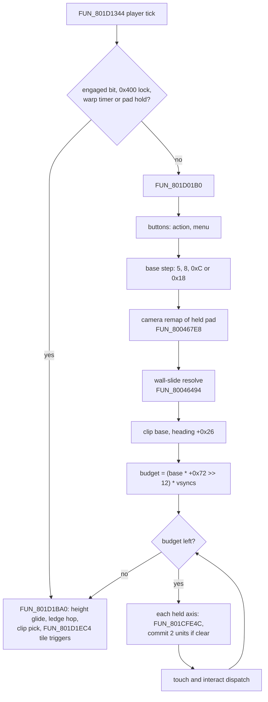
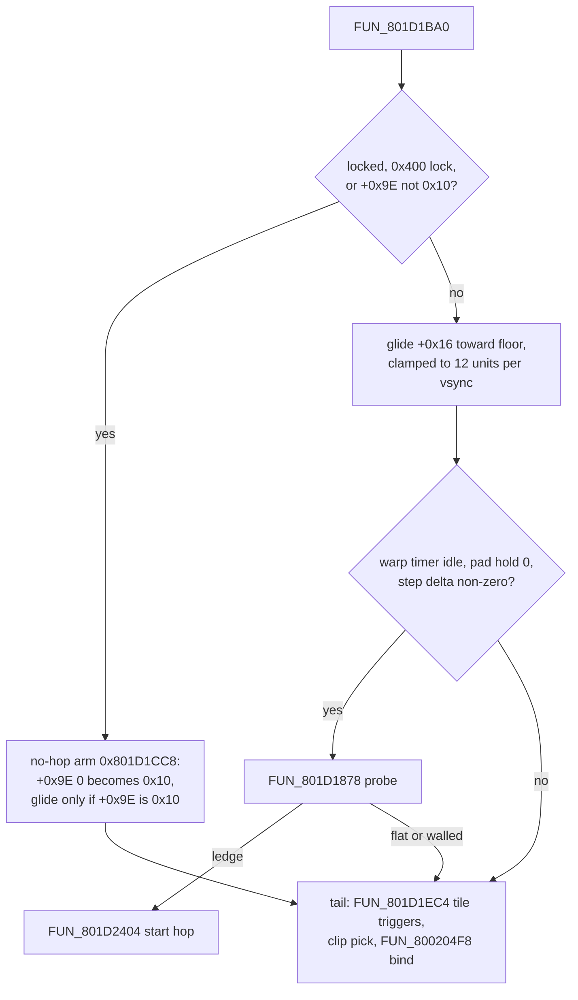
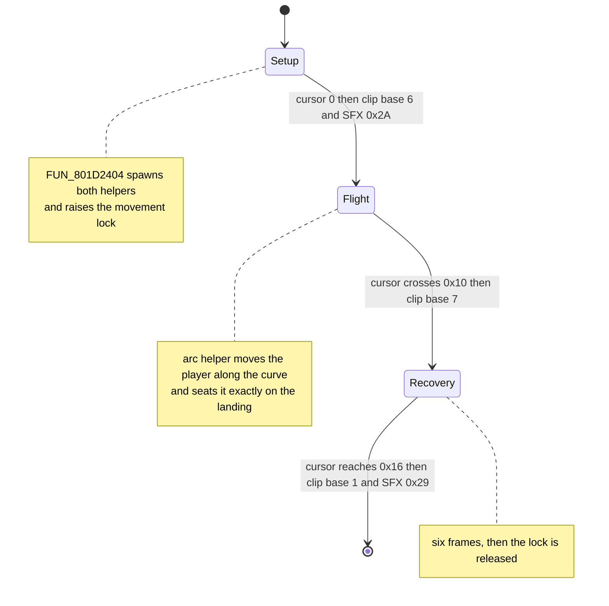
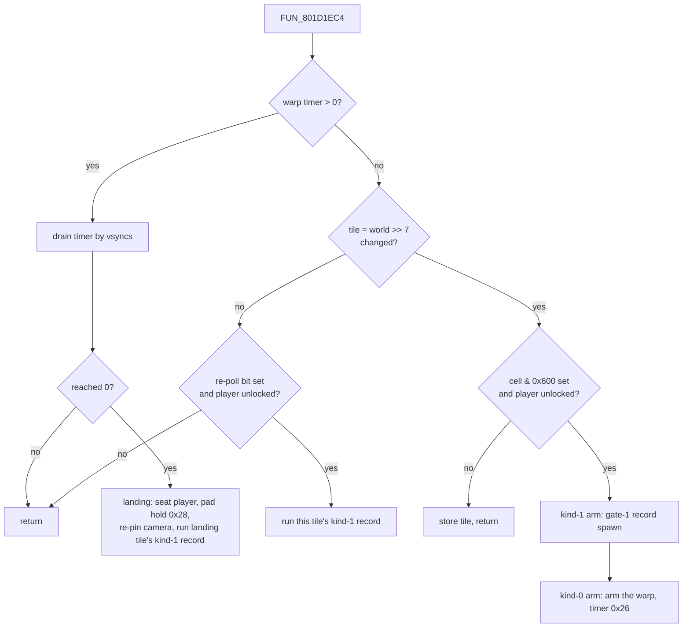
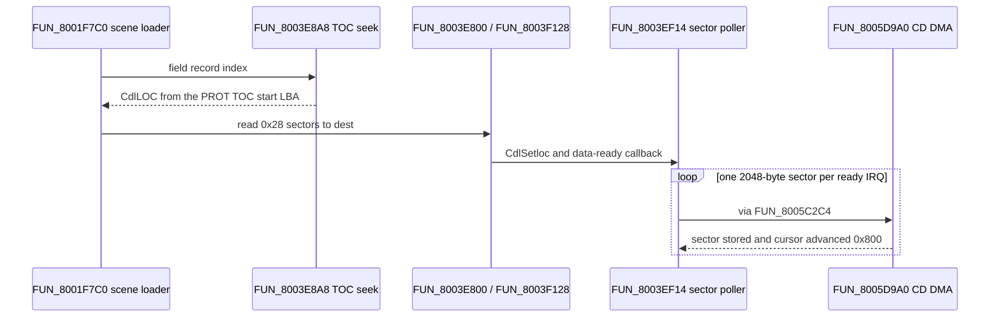

# Field free-movement locomotion

Walking around a town, dungeon or the overworld is one routine: **`FUN_801d01b0`** in the field overlay (PROT 0897, loaded at `0x801CE818`). Each frame it reads the held pad, rotates it into a camera-relative direction, moves the player a fixed distance in 2-unit sub-steps with a collision test per axis, and sets the facing angle. A second routine, `FUN_801d1ba0`, then settles the player's height and starts ledge hops, and a third, `FUN_801D1EC4`, fires whatever the tile underfoot is wired to.

This page covers that controller, the collision grid and the rest of the per-scene `.MAP` data it reads (walls, floor heights, tile triggers, placed objects), the door mechanisms built on those triggers, and how NPCs face and glide. It is **not** the [tile-board grid mode](tile-board.md), a puzzle / board minigame that lives in the same overlay. The file layout of the `.MAP` itself is on [`field-map.md`](../formats/field-map.md).

The port runs all of it: `World::step_field_locomotion` in `engine-core` against the same per-scene grid, shared by the native window and the browser play page. Where the port differs from retail on purpose, the section says so.

Static analysis does not find the controller: the field overlay only exists in RAM, so there is no static call site. It is pinned by a runtime write-watchpoint on the player position (`scripts/pcsx-redux/autorun_player_pos_watch.lua`), which fires at the four `sh` stores `0x801D0684 / 06E4 / 0744 / 07B4` (player Z+- / X+-), all inside the 1964-byte `FUN_801d01b0`.

## At a glance

| Routine | Image | Job |
|---|---|---|
| `FUN_801D1344` | field 0897 | The player's per-tick handler (the field frame pump). Gates and calls the controller. |
| `FUN_801d01b0` | field 0897 | Pad controller: buttons, base step, direction, speed, 2-unit stepping, touch dispatch. |
| `func_0x800467e8` | SCUS | Rotates the held pad by the authored octant `gp+0x2D8` into a camera-relative mask. |
| `FUN_80046494` | SCUS | Wall-slide resolver: returns the direction mask, widened along a wall when blocked. |
| `FUN_801cfe4c` | field 0897 | Per-axis collision: three wall probes on the leading edge plus three actor probes. |
| `FUN_801cfc40` / `FUN_801cf9f4` / `FUN_801cf754` | field 0897 | Actor box test / facing interact probe / per-frame collision candidate list. |
| `FUN_801D56C4` | field 0897 | Single-point walkability probe (the slide resolver's sampler). |
| `FUN_80019278` | SCUS | Floor-height sampler (two height models). |
| `FUN_801d1ba0` / `FUN_801d1878` / `FUN_801d2404` | field 0897 | Vertical settle and clip pick / ledge-hop classifier / hop-arc setup. |
| `FUN_801D1EC4` | field 0897 | Walk-on trigger dispatch and the timed kind-0 warp. |
| `FUN_801d5b5c` | field 0897 | Touch event post (engages the player, resumes the touched actor's script). |
| `FUN_8003AEB0` / `FUN_8003a55c` / `FUN_8003A1E4` | SCUS | Scene-entry map init / placed-object spawn sweep / partition-1 placement seater. |
| `FUN_801D6704` | field 0897 | Per-scene initializer: seats the player and installs the view window. |



## Contents

- [The frame denomination law](#the-frame-denomination-law)
- [Player actor fields used](#player-actor-fields-used)
- [Per-frame flow](#per-frame-flow) - [base step](#base-step-selection-walk--run) · [clip base](#the-clip-base-and-the-settle-tail) · [wall slide](#wall-slide-resolution-fun_80046494) · [pad octant](#gp0x2d8-is-authored-not-computed)
- [Collision](#collision---fun_801cfe4c) - [wall probes](#wall-probes) · [actor probes](#actor-probes-fun_801cfc40) · [touch and interact](#touch-and-interact-dispatch) · [port](#engine-model)
- [Vertical settle + ledge hop](#vertical-settle--ledge-hop---fun_801d1ba0--fun_801d1878) - [hop-arc controller](#the-scripted-hop-arc-controller)
- [Where the collision grid comes from](#where-the-collision-grid-comes-from) - [collision byte](#collision-byte-walls--floor-height) · [object-grid cell word](#object-grid-cell-word) · [floor height](#floor-height-two-models) · [trigger block](#trigger-block-0x10000---four-kind-sub-tables) · [timed warp](#the-timed-kind-0-warp) · [object records](#object-record-format-0x0000-0x20-byte-stride) · [object bind](#the-object-bind-which-sweep-owns-the-object-and-its-rest-pose) · [door swing](#the-door-swing-how-a-bind-script-drives-the-clip) · [load chain](#field-buffer-load-chain)
- [Spawn position on scene entry](#spawn-position-on-scene-entry)
- [Intra-scene doorways](#intra-scene-doorways---the-walk-touch-teleport-family)
- [Field-VM actor-placement + motion opcodes](#field-vm-actor-placement--motion-opcodes) · [scripted-scene actor](#the-scripted-scene-actor---fun_801d4a60) · [submode return state](#the-submode-return-state---a-parked-word-nothing-reads)
- [NPC initial facing](#npc-initial-facing) · [NPC dynamic facing](#npc-dynamic-facing) · [NPC glide speed](#npc-glide-speed)
- [Engine port](#engine-port) · [Open](#open) · [Provenance](#provenance)

## The frame denomination law

Every per-frame number on this page is counted in one of two retail clocks. Mixing them up is the usual cause of a "1.67x fast / 0.6x slow" field bug.

### Retail's two clocks

- **The vsync.** The display frame, 60 per second.
- **The game tick.** One pass of the master frame driver `FUN_80016444`.

`DAT_1F800393` (scratchpad, `0x7f` off the `0x1F800314` base) is the number of vsyncs one game tick spans. `FUN_80016B6C` resolves it once per frame at `0x80017044..0x800171D8`: it samples the frame time with `VSync(1)` through `FUN_800173BC`, picks `1..4`, raises the result to the per-mode floor `DAT_8007B9D8` (`2` in field scenes, installed by the scene loader `FUN_801D6704`; `3` on the kingdom overworlds), then `VSync(n)`-waits on the previous frame's value. An ordinary field frame therefore runs the driver **30 times a second**.

The whole field frame lives inside that pass. `FUN_80016444` runs the actor-pool sweeps `FUN_8002519C`, which `jalr` each actor's `+0x0C` handler. The player's handler is `FUN_801D1344`, which calls the controller with `jal 0x801D01B0` at `0x801D16F4`. The only gates ahead of that call are the engaged flag, the system lock, the warp timer and the post-warp hold - not a cadence gate (see [the timed warp](#the-timed-kind-0-warp)).

### Cadence invariance

Because a pass covers a variable number of vsyncs, everything measured inside it is denominated **in vsyncs and scaled by `DAT_1F800393`**, never in passes:

| Site | What it scales | Address |
|---|---|---|
| `FUN_801D01B0` | the frame's travel budget | `0x801D0564..0x801D05C4` |
| `FUN_801D01B0` | the walk-regen accumulator `_DAT_801F2274` | `0x801D0910..0x801D0928` |
| `FUN_8003774C` | every NPC glide leg | `0x80037868` then each `mult` |
| `FUN_801D1344` | the post-warp pad hold `_DAT_8007B6B4` | `0x801D1618..0x801D1630` |
| `FUN_801D1344` | the field-control byte `+0x62` | `0x801D1670..0x801D1690` |
| `FUN_801D1BA0` | the vertical settle's glide rate | `0x801D1C30..0x801D1C68` |

The travel budget is the clearest case (`mult s4,v0`, `sra s4,t1,0xc`, `lbu v1,0x7f(a1)`, `mult s4,v1`):

```text
speed = ((base_step * player[+0x72]) >> 12) * DAT_1f800393
```

At the field floor the controller runs 30 times a second and spends `2 * base_step` each time; at cadence 1 it runs 60 times and spends `base_step`. Both cover the same ground per second. A cadence change moves the *sample rate* - how many intermediate poses exist - and never a duration or a speed.

### The engine's rule: one tick is one vsync

`World::tick` is denominated in **retail display frames**: one call advances the simulation by exactly one vsync. Both hosts drain wall time through one fixed-timestep kernel (`engine-core::frame_step::SimStepper`, `TICK_SECS = 1/60`, backlog capped at four ticks; the browser page reaches it through `play_drain_sim_steps`). See [`engine.md`](engine.md#the-frame-model). `World::clock.display_frame_step` is `1` on every tick and `World::clock.display_frames == World::frame`; it survives as a unit marker on consumers whose durations are authored in display frames, not as a throttle.

The port takes the fine-grained half of retail's identity - the controller once per vsync with the scalar at `1` (`World::move_vm.ramp_ratio`) - instead of once per game tick with the scalar at `2`. Same wall speed, twice the poses. `World::clock.frame_step` still carries the retail cadence for the consumers that genuinely sample at game-tick rate (the actor pool, the CLUT / ambient game-tick banks).

Do not oversample: a sim rate above 60 with the retail frame derived from an accumulator withholds frames from the gated consumers while the ungated ones keep 60, and a wall-time test that divides by the same constant cannot see it. If oversampling ever returns, every consumer has to be re-derived, not just the constant.

### Walk speed in units per second

With `player[+0x72] = 0x1000` (1.0, seeded by `FUN_8003AEB0`) cancelling the `>> 12`:

| base step | selector | units/vsync | units/second | tiles/second |
|---|---|---|---|---|
| `5` | forced slow | 5 | 300 | 2.34 |
| `8` | plain walk | 8 | **480** | 3.75 |
| `0xC` | run | 12 | **720** | 5.63 |
| `0x18` | debug turbo | 24 | 1440 | 11.25 |

One collision tile is `0x80` = 128 units. The diagonal normalise trims x0.75 on the quantised path. Pinned by `engine-core/tests/sim_cadence_wall_speed.rs`: displacement per second of held pad on the walk and run arms, the gated and ungated halves of the frame advancing the same number of retail frames, and the speed holding still while `World::clock.frame_step` sweeps `1..=4`.

## Player actor fields used

The player actor pointer is the global `_DAT_8007c364` (the field-scene control block `0x8007c348` `+0x1C`).

| Offset | Meaning |
|---|---|
| `+0x10` | flags. `0x80000` = movement disabled / engaged (encounter pending, cutscene, talk). `0x1000000` = clip comes from the **party** locomotion bank (tested by the clip selector `FUN_800204F8` at `0x8002053C`). `0x200000` = raised for the flight of a ledge hop and by the Riremito travel art. On any actor, bits `0` / `1` are the collision and touch kill switch. |
| `+0x14` | world X (`s16`) |
| `+0x16` | **footing** - the height of the floor the actor stands on (`s16`), glided toward the floor sample by [`FUN_801d1ba0`](#fun_801d1ba0---settle-then-trigger). Not an angle; see [the Y field](#0x16-is-the-actors-y-and-no-consumer-reads-it-as-a-tilt). |
| `+0x18` | world Z (`s16`) |
| `+0x24` / `+0x26` / `+0x28` | rotation triple (pitch, **yaw**, roll), PSX angle units. `+0x26` is the heading, set from the pad direction. |
| `+0x5c` | clip id - `1`-based record in the bank the `0x1000000` bit selects; `+0x5e` is the bound id |
| `+0x62` | anim control word (hold / clamp / reverse / end / restart - see [the door swing](#the-door-swing-how-a-bind-script-drives-the-clip)) |
| `+0x68` / `+0x6a` | clip frame cursor (1/16-frame units) / cursor step |
| `+0x72` | per-actor speed multiplier (fixed-point, `>> 12`); also the draw scale, `0` = not drawn |
| `+0x94` | encounter-record pointer (see [encounter format](../formats/encounter.md)) |
| `+0x98` | interaction-target / collision-partner actor pointer |

World coordinates are plain `s16` at 1-unit resolution; one collision tile is `0x80` (128) units. Runtime heading values: `0` = Z-, `0x400` = X-, `0x800` = Z+, `0xC00` = X+ (from the pad-to-facing writes at `0x801d04b8..0x801d0548`). The engine's `render_26` convention stores `0` = Z+, so `engine = (retail + 0x800) & 0xFFF`, with no axis mirror.

**Probe trap - read position as 16-bit.** `+0x14`, `+0x16` and `+0x18` are adjacent `s16` fields. A 32-bit read of `+0x14` folds the footing into the X high half and reads height changes as position drift. See the [S4 grid-BFS capture](../tooling/playthrough-coverage.md#s4-captured-the-grid-bfs-door-nav-walks-out-of-vahns-house).

## Per-frame flow

1. **Disabled gate.** If `player.flags & 0x80000` is set the function branches out (`0x801D01F0`: `lw v0,0x10(v0)` / `lui v1,0x8` / `and` / `bne 0x801D0334`). This is the first test, so it skips the movement legs **and** the pre-movement header: the action-button accept and the menu-open accept at `0x801D0250..0x801D02DC`. While the bit is up the pad opens no pause menu at all, not even the `0x23` deny buzz (that belongs to a different refusal, `_DAT_1F800394 & 0x8000000`).
   The bit is raised by a queued encounter (the roll's own store in `FUN_801D9E1C`; the intro overlay PROT 0979 then pages out the frame pump until the battle), a cutscene, or a live talk engagement. The engine's counterparts are `World::dialogue_owns_input`, an active cutscene timeline and `World::field_scripts_held_for_battle` (the engine raises no bit on an encounter roll, and battle entry releases the engaged bit of any prop run it drops); both hosts' menu-open paths consult them through `World::field_menu_open_allowed` ([below](#the-menu-after-a-door-of-light-arrival)).
2. **Action button.** An edge-pad action bit (`_DAT_8007b874 & 4`, gated by `DAT_8007b6a8`) plays the confirm SFX `func_0x80035b50(0x20)` and raises `player.flags |= 0x1000000`, short-circuiting movement that frame. The menu-open accept is the sibling arm: SFX `0x20` on accept, the deny buzz `0x23` when refused under `_DAT_1f800394 & 0x8000000`.
3. **Base step.** One of four values, chosen at `0x801D0334..0x801D03E0` - see [Base-step selection](#base-step-selection-walk--run).
4. **Direction.** `func_0x800467e8(&_DAT_8007b850)` rewrites the held pad in place into a *camera-relative* mask. `FUN_80046494(player)` (`jal` at `0x801D03EC`, result kept in `s0` at `0x801D0404`) reads that mask (`gp+0x538`) and returns the movement direction in bits `& 0xf000`, resolving diagonals (`0x9000 / 0xc000 / 0x3000 / 0x6000`) and [sliding along walls](#wall-slide-resolution-fun_80046494). The heading `+0x26` is set to one of eight angle constants from the held mask. The tile board uses the same bit convention because it calls the same remap.

   | mask bit (post-remap) | axis delta | collision `dir` code |
   |---|---|---|
   | `0x1000` | Z + | `2` |
   | `0x4000` | Z - | `0` |
   | `0x2000` | X + | `3` |
   | `0x8000` | X - | `1` |

5. **Speed.** `speed = ((base_step * player[+0x72]) >> 12) * DAT_1f800393`, with two modifiers:
   - **Terrain slow.** If the player's current collision tile has flag `0x4000` set and the scene control byte `_DAT_801c6ea4[+0x61] == 1`, `speed >>= 1` (mud / shallow water).
   - **Diagonal normalise.** Under camera mode 4 with both axes pressed, `speed -= speed >> 2` (x0.75).
6. **Step loop.** The loop advances **2 units per iteration** until `speed` units are consumed. Each iteration tests the candidate axis with `FUN_801cfe4c` and commits only if clear (or the debug no-clip `_DAT_8007b98c` / `_DAT_8007b850 & 2` is on):

   ```text
   if (dir & 0x1000) and collide(player, scene, 2) == clear:  player.Z += 2;  dZ = +8
   else if (dir & 0x4000) and collide(player, scene, 0) == clear:  player.Z -= 2;  dZ = -8
   if (dir & 0x2000) and collide(player, scene, 3) == clear:  player.X += 2;  dX = +8
   else if (dir & 0x8000) and collide(player, scene, 1) == clear:  player.X -= 2;  dX = -8
   ```

   The last committed direction is stored at `_DAT_8007bde0` (X) / `_DAT_8007bde4` (Z) for the [settle](#the-step-delta-globals), the transform commit and the camera follow. The step loop plays **no SFX** - walking and wall contact are silent; the controller's `0x20` / `0x23` cues belong to the header in step 2.
7. **Touch and interact.** Each sub-step also runs the [touch / interact dispatch](#touch-and-interact-dispatch), which posts a touched prop's event or, on a just-pressed interact button, probes for an actor ahead.

### Base-step selection (Walk / Run)

`$s4` holds the frame's base step across `0x801D0334..0x801D03E0`. Four values, tested in this order:

| base step | selected when | address |
|---|---|---|
| `5` | `_DAT_8007B6A8 != 0` - forced slow | `0x801D0354` |
| `0xc` | run (see the XOR below) | `0x801D03A0` |
| `0x18` | `_DAT_8007B98C != 0` **and** `_DAT_8007B868 != 0` **and** held pad `_DAT_8007B850 & 0x80` - a debug turbo | `0x801D03DC` |
| `8` | nothing above fired - plain walk | `0x801D0334` |

The forced-slow arm is exclusive of run: `0x801D0350` `j`s to `0x801D03A4`, past the run test. It lands before the turbo test (`0x801D03A8`), which is last and overwrites whatever arm chose.

**Forced slow is the overworld's step.** `_DAT_8007B6A8` is the per-scene MAN flag `FUN_8003AEB0` copies from `MAN[1] & 1` - the byte the pause menu's save gate also reads - and it is set on exactly the three kingdom world maps. There the player always takes base step `5` and never runs.

With the `0xC00` speed multiplier each kingdom's entry script gives the player (`CC F8 40 00 0C 00 00`), that is `(5 * 0xC00) >> 12 = 3` units per vsync; the overworld runs at cadence `3`, and the 2-unit stepper rounds the `9` up to the `10` units per tile-step the state-poll captures record. The port, ticking per vsync, pays that `10` out over three ticks; see [`world-map.md`](world-map.md#overworld-walk-speed-and-clip).

**Run is an exclusive or, not a button.** The inputs are the held run button (`_DAT_8007B850 &` the mask word `0x800846DC`) and the Field Move option word `0x800846CC` (= `0x80084140 + 0x58c`, the pause menu's Walk / Run row - see [`field-menu.md`](field-menu.md#options-screen)). The paired branches encode XOR: from the button-held side (`bnez` at `0x801D0370` -> `0x801D0390`) a set option jumps *past* the `$s4 = 0xc` store, and from the button-clear side it falls *into* it. The option sets the default and the button inverts it: hold to run when Walk is selected, hold to **walk** when Run is.

The mask word is **`0x48` = Cross | R1**. It is the last of four button-mask words the new-game data init `FUN_80034A6C` seeds into the live game-state window at `0x80084140` (`0x80034A9C..0x80034AB8`):

| word | value | packed bits | seeded at | one read site |
|---|---|---|---|---|
| `+0x590` = `0x800846D0` | `0x44` | Cross \| L1 | `0x80034AA0` | the heading-directed field interact test `0x801D0818` |
| `+0x594` = `0x800846D4` | `0x21` | Circle \| L2 | `0x80034AA8` | menus test `0x590 \| 0x594` together - `0x801D8590` (menu overlay), `0x80032328` (SCUS) |
| `+0x598` = `0x800846D8` | `0x10` | Triangle | `0x80034AB0` | the controller's menu press test at `0x801D0250`, widened to `\| 0x100` (Select) on the fall-through |
| `+0x59C` = `0x800846DC` | `0x48` | Cross \| R1 | `0x80034AB8` | the run test, `0x801D0364` |

The bit names are the packed pad layout `FUN_8001822C` builds (`0x40` Cross, `0x20` Circle, `0x10` Triangle, `0x08` R1, `0x04` L1, `0x01` L2 - see [`minigame-fishing.md`](minigame-fishing.md)). The run word is ANDed against the *held* mask `_DAT_8007B850`; the other three against the *edge* mask `_DAT_8007B874`, which makes them press tests. The confirm / cancel reading of the first pair is an inference from those sites; the values and the wiring are disassembly.

**The run button is not configurable in retail.** `FUN_80034A6C` is the only writer of any of the four words in `SCUS_942.54` or in any of the 31 based overlay images, and none is an option row. The word sits inside the `0x1A18`-byte block a save is composed from ([`save-screen.md`](save-screen.md)), so a load restores `0x48`.

A reference scan needs the base-plus-displacement walk to see it: `0x800846DC` is reached as `lui`+`addiu` to `0x80084140` then `lw v1,0x59c(a0)`, so neither the address nor its low half appears in any instruction and the five-form [address-reference scan](../tooling/address-reference-scan.md) is blind to it. [`find-gp-relative-refs.py`](../../scripts/ghidra-analysis/find-gp-relative-refs.py) finds the one writer and the one reader.

**Engine port.** `World::field_base_step` (the selector) over `World::field_run_active` (the XOR), with the four base-step constants in `engine-core::world::config`. The option arrives as `World::locomotion.run_default` (hosts mirror `OptionsState::field_move`); the button as `World::locomotion.run_button_held`, latched inside `World::set_pad`. The latch mask `World::locomotion.run_button_mask` defaults to `FIELD_RUN_BUTTON_MASK_DEFAULT` = the retail pair (`FIELD_RUN_BUTTON_MASK_RETAIL`, `Cross | R1`) plus Square; Square is retail's debug-turbo bit `0x80`, kept as a convenience run key.

A host wanting the retail set exactly assigns `FIELD_RUN_BUTTON_MASK_RETAIL`; `the_default_run_button_is_the_retail_pair` in `engine-core`'s locomotion tests pins the default. `_DAT_8007B6A8` is `World::party.scene_save_allowed`; `World::locomotion.forced_slow` forces the slow arm for tests and debug drivers. The turbo arm is recorded as a constant and never taken. Which key is "R1" is a host binding (`legaia-engine config set --binding W=R1`).

### The clip base and the settle tail

Retail picks the player's clip in three steps, and the controller is only the first.

1. **`FUN_801d01b0` writes the clip base `_DAT_8007BDD8`** (`0x801D0424..0x801D04A4`) on every frame it runs with the clip id `+0x5c` positive. No direction held stores `2`. A direction under the plain walk step `8` stores `1`; any other base step (run, turbo, forced slow) stores `3`; and under `_DAT_8007B6A8` the store is overwritten with the sentinel `99`. The same frames stamp `+0x6a = 8` and raise the party-bank bit `+0x10 |= 0x1000000`.
2. **The settle `FUN_801d1ba0` strides the base into a clip id** (`0x801D1D88..0x801D1EAC`): `base + leader * 7` into `+0x5c`, the leader being `_DAT_8007B8F8`. The sentinel instead stores `leader + 1` and drops the party-bank bit.
3. **`FUN_800204F8` binds it**: record `id - 1` of the party bundle (PROT 0874 section 1) when the bit is set, of the scene's own bundle otherwise, rewinding when the id changed.

| base | bank slot | clip | writer |
|---|---|---|---|
| `1` | `0` | walk | pad walk, hop tear-down |
| `2` | `1` | idle | pad idle, scene entry (SCUS `0x8003B364`), system channel |
| `3` | `2` | run | pad run |
| `6` | `5` | hop | hop take-off (`FUN_801d2298`) |
| `7` | `6` | land | hop landing crossing (`FUN_801d2298`) |
| `99` | - | overworld walk | pad, under `_DAT_8007B6A8` |

Other writers: the walk-on dispatcher `FUN_801D1EC4` and the touch post `FUN_801d5b5c` (each `2`, under `_DAT_8007B6A8` only), and field-VM op `0x22` aimed at the player (its operand).

**The sentinel `99` is the overworld walk.** On the three kingdom maps a held direction stores `99` and the settle binds clip `leader + 1` with the party-bank bit down: record `leader` of the kingdom's own ANM bundle (`*(0x8007B888)`, slot 4 of the kingdom bundle - [`world-map-overlay.md`](../formats/world-map-overlay.md)). Standing stores `2` and binds the party idle as in a town. Every retail overworld state holds `_DAT_8007B6A8 = 1` and the idle `+0x5C = 2`.

Slots `0` and `1` are capture-pinned ([`anm.md`](../formats/anm.md)); `2`, `5` and `6` rest on the writers' arithmetic plus the capture below. The run clip is reached by a held **Cross or R1**; Square and Circle are not in the run mask and never change the record.

<a id="retail-capture-of-the-base-writers"></a>

#### Retail capture of the base writers

A width-4 write watch on `_DAT_8007BDD8` from `s3_rimelm_freeroam` (`town01`; [`autorun_w5b_field_watch.lua`](../../scripts/pcsx-redux/autorun_w5b_field_watch.lua), which decodes the store at the watch's `pc`) sees every table row written by the named site, one write per field tick:

- idle `2` at `0x801D04A4`, walk `1` at `0x801D0498`, run `3` at `0x801D0498` under R1 + direction and under Cross + direction alike; the clip id `+0x5C` reads `1` / `2` / `3` on the same ticks (Vahn leads, so `base + 0 * 7`);
- a ledge hop at `(5152, 96)` with Up held: `6` at `0x801D22FC`, `7` at `0x801D237C` seven ticks later, `1` at `0x801D23E0` three ticks after that, all with `ra = 0x801D22C8` inside `FUN_801d2298`; the floor goes `48 -> -128`.

It also finds the **system channel's store**: `sw v0,-0x4228(v1)` at `0x80039D94` stores `2`. That is `FUN_80039B7C`, the per-actor interaction stepper, in the arm that **starts** an interaction - taken when the actor's `+0x9C` is `0`, storing only when the scene control block's `+0xA` interaction count is below `2`.

The same arm raises the player's movement lock and bumps the count; the arm that ends the script drops the count and, at zero, clears the lock. In free roam its `a0` is the system channel `0x8007E694`, ticked by `FUN_801DA51C` (`jal 0x80039B7C` at `0x801DA7BC`) after the player's tick. The base's two readers are `0x801D1D8C` and `0x801D1E08`, both in the settle, so each tick runs pad write -> settle reads -> system-channel store of `2`.

<a id="when-the-system-channels-store-reaches-the-settle"></a>

#### When the system channel's store reaches the settle

`FUN_801DA51C` calls `FUN_80039B7C` for the system channel only when the channel's own `+0x10 & 0x100` (script running) is up or the **player's** `+0x10 & 0x80000` is clear (`0x801DA78C..0x801DA7AC`), and not at all under the channel's `+0x8A`, its own `0x80000`, or scratchpad `0x1F800394 & 0x8000`. So the store runs on every tick the player is not movement-locked, after the settle has read the base.

While the pad controller runs it rewrites the base before the next settle and the store is invisible. The store decides the clip only on a tick the controller skips **without** a lock, and on the tick a lock begins. Captures (same script, per-vsync samples of `+0x5C` and of the count `*0x801C6EA4 + 0xA`):

- **A talk opened running** (`s4_rimelm_door_transition`, player at `(3456, 3072)`, Down held, Cross pressed): on the talk's first tick the pad stores run `3` and the system channel `2`; the clip id reads `3` for that tick and `2` for every tick after, with no further store for the 150-vsync capture. The player stands idle through the conversation.
- **A base changed under the lock** (`town01_npc16_dialogue_first_page`, base poked to walk `1`): the next settle binds clip `1` and it stays `1` for the 160-vsync capture; no store arrives to undo it, with the count at `2..4`.
- **A ledge hop** holds the lock through its phases: no store at `0x80039D94` between the take-off `6` and the tear-down `1`.
- **A kind-0 warp** is the case the store decides: the warp clears the lock when it arms, the pad controller is skipped through the timer and the hold, and every settle reads the `2` the previous tick's store left. See [the timed warp](#the-timed-kind-0-warp).

#### Engine port of the clip pick

The pad step writes `World::locomotion.clip_base` through `legaia_engine_vm::field_player_clip::locomotion_clip_base`; the hop tick applies the phase machine's stamps; `World::field_settle_clip_tail` runs `settle_clip_pick` and hands the bank slot to `FieldPlayerAnim::select_retail_slot`. Both play hosts build the player's clips with `FieldPlayerAnim::from_locomotion_bank`, which loads the leader's whole seven-record bank.

The system channel's store is `World::tick_field_system_channel_clip_reset`, run once per field tick after the settle and skipped while `World::field_player_movement_locked` holds (the `0x80000` bit, an open dialogue, a cutscene timeline, the tile board, a ledge hop or a scripted arc). A kind-0 warp is not a lock, so its ticks idle.

**Script writers.** Op `0x22` `EXEC_MOVE` (`0x801DE998..0x801DEAB8`) and the player arm of op `4C 51` (`0x801E1954..0x801E1A3C`) each test the context against `_DAT_8007C364`, store their clip operand into `_DAT_8007BDD8`, and run the pick and bind at once. The port routes both through `World::field_player_script_clip`.

A script ExecMove on the player (`A2 F8 <id>`) with the party-bank bit up strides into the leader's bank; only a pick that binds the **scene** bank also queues the scene-record one-shot the hosts draw over idle / walk (`World::player_move_cue`), and the drain refuses a one-shot whose bone count differs from the player's clips.

**The party-bank bit from scripts.** `B1 F8 18` / `B2 F8 18` are op `0x31` / `0x32` (`CFLAG_SET` / `CFLAG_CLR`) with the extended target `0xF8`, which `FUN_8003C83C` resolves to the player object. The field VM hands every `0xF8`-targeted `0x31` / `0x32` to the host (`FieldHost::player_cflag`), and the port routes bit `24` to `World::locomotion.player_party_bank` (`World::field_player_cflag`). The player's other script-written bits (`0x01`, `0x0A`, `0x0D`, `0x13`, `0x15`, `0x1D`, `0x1F`) stay on the caller's context, because the port has no single player `+0x10` word their readers consult.

**The clip override `_DAT_8007B6AC`.** Op `4C CE <value>` stores its byte there (`0x801E2A20..0x801E2A30`); scene entry zeroes it (SCUS `0x8003B6F0`, inside `FUN_8003AEB0`). While non-zero, a party-flagged pick binds `base + override - 1` from the **scene** bank, the party-bank bit cleared around the bind. Its two disc users are `jagaroom` (`4C CE 24`, after `CC F8 50 26 00` swaps the player's mesh to scene model `0x26`) and `urudre1` (`4C CE 12`, cleared by `4C CE 00`).

The port keeps it on `World::locomotion.clip_override`; a pick that lands in the scene bank goes to `FieldPlayerAnim::select_scene_record`, loaded from the scene's ANM bundle (`FieldPlayerAnim::resolve_scene_clip`). A scene record whose bone count differs from the player's clips is refused and the motion-derived pair plays instead.

**The model swap.** A player-targeted `4C 50` (`CC F8 50 lo hi`) reaches the port as `World::field_player_set_model`: it writes the party-bank bit (raised for `>= 0xF0`, dropped below) and the model id on `World::locomotion.player_live_model`.

A change raises a rig-change signal (`World::take_player_rig_change`) both hosts drain each frame, rebuilding the rig from `SceneHost::player_rig_mesh`: the lead's field form with no re-stage, player-bank slot `value - 0xF0` at or above `0xF0`, scene-bank model `value` below it. A party-slot mesh takes that slot's locomotion rest pose and bone cap; a scene-bank mesh takes neither. Whether the bone-count guard fires on `jagaroom`'s swapped mesh has not been measured.

### Motion-derived locomotion animation

In the port, which clip plays is a function of whether an actor **moved**, not of what moved it. `World::detect_field_actor_motion` runs once per field tick, after every mover in the frame (cutscene timeline, channels, field VM, NPC motion legs, locomotion) and before the animation tick, diffing each tracked actor's position against last frame's into `World::locomotion.actor_moving`; the player's bit folds into `FieldPlayerAnim::moved_this_frame`.

The pad and nav-walk paths also raise that flag directly, because a wall-blocked pad step walks in place as retail does and a position diff cannot see it. An actor first appearing in the tracked set seeds the snapshot without reporting motion, and the snapshot clears on scene entry so a warp does not read as one enormous step.

A script walk of the player keeps the motion-derived walk for a party-bank pick; a scene-bank pick binds whoever moved the player, as retail's selector does.

**The NPC half is signal-only.** `actor_moving` carries a bit for every tracked placement slot, but no host reads the NPC bits: an NPC's clip changes only on an explicit `Animate` cue, so a script-walked NPC glides in its current pose. Wiring it needs an idle-to-walk clip pairing per NPC, and only the party placements have one pinned (the PROT 0874 section-1 bank's `LOCOMOTION_IDLE_SLOT` / `_WALK_SLOT`); an ordinary scene NPC names a single record of the scene's ANM bundle and its walk sibling is not identified.

### Party members in story beats

Vahn, Noa and Gala appear in field events as MAN placements with a party model (`>= 0xF0`), and the bank rule applies to them as actors in their own right. The placement seater `FUN_8003A1E4` seats every partition-1 actor with the class bit `0x20000` and, for a party model, the party-bank bit `0x01000000` too (`sltiu v0,v0,0xf0` at `0x8003A2DC` selects `lui s3,0x100`, ORed into `+0x10` at `0x8003A3A4..0x8003A3B4`).

Story scripts bracket each gesture with the bit: `B2 <id> 18` drops it so `A2 <id> <clip>` binds scene-bundle record `clip - 1`, and `B1 <id> 18` raises it again for the walk and idle clips. Across the disc's scene MANs, party placements receive about 5,600 such bit writes against about 5,600 ExecMoves.

The port seeds both bits in `field_channels::spawn_channels`. `World::drain_field_anim_cues` picks each placement's bank from the channel's **live** bit (`World::npc_party_bank`); the spawn-model answer stands in only for a slot no channel carries.

A re-target whose bone count differs from the clip the slot was first bound with is refused, because both hosts cut the actor's mesh to that count (`FieldNpcState::clip_bones`) - a two-bone save-crystal record on a ten-bone hero is the "body comes apart" shape. A placement that spawns clip-less and takes its first clip from a cue (`rikuroa`'s party Noa, `A2 10 18`) is cut when the clip binds: the native window at pose time, the play page by re-uploading the mesh when `play_npc_mesh_cut` moves.

Because a party placement carries the bit, the port does not infer "this is the player" from it. Retail's `0x23` and `4C 51` player arms compare the context **pointer** against `_DAT_8007C364` (`bne s5,v0` at `0x801E1954`); the port's test is `FieldHostImpl::ctx_is_player`. Disc-gated: `crates/engine-core/tests/field_party_gesture_bank_disc.rs` spawns every story record that drops a party member's bit and asserts every party re-target is a ten-bone hero pose.

<a id="wall-slide-resolution"></a>

### Wall-slide resolution (`FUN_80046494`)

The "direction decode" is a **wall-slide resolver**. When the held direction is blocked it probes along the wall and ORs in a *perpendicular* direction, which is what makes the player skid along a wall instead of sticking. The returned mask can name an axis the pad never asked for.

Two paths return the raw mask untouched: the remapped pad has bit `1` set (`mask & 2`, the no-clip bit), or the direction is one of the four pure diagonals. **Diagonals are never slide-resolved** - the per-axis step already resolves their two axes independently.

Otherwise it walks a 4-entry direction table at `DAT_800766BC` (8-byte stride: `u32 mask`, `s16 dx`, `s16 dy`; the four cardinals, each `(dx, dy)` = +-62 units along its travel axis). For each entry whose bit is held:

1. **Three-point block test.** The walkability probe `FUN_801D56C4` is called at the candidate point `(x+dx, z+dy)` three times: offset `+0x21` along the axis perpendicular to travel, `-0x21`, and dead centre. Results collect as bits `1` / `2` / `4`; non-zero means blocked. The `0x21` lateral offsets give the player a body width, so a corner clips before the centre does.
2. **Slide-direction search.** If blocked, it sweeps the signed seven-entry offset table at `DAT_800766EC`, probing sideways along the free axis (the `dx == 0` and `dy == 0` arms take the X and Z sweeps) and summing the offsets that come back walkable.
3. **Sign picks the slide.** A negative total ORs in `(&DAT_800766DC)[i*2]`, a positive total `(&DAT_800766DE)[i*2]`. A total of exactly zero adds nothing, so a symmetric dead end leaves the player stopped.

The original direction bit is ORed in regardless, and the resolved mask is cached to `gp+0x9c4`. Under the debug flag (`gp+0x3b8 & 1`) each stage prints (`HIT`, `chk %d`, `pad %x not %x`, `pl_angle %d`). Only the step loop reads the resolved mask; the heading and the diagonal speed cut stay on the held one.

Provenance: `ghidra/scripts/funcs/80046494.txt`; the three tables are static `SCUS_942.54` data. Port: [`World::resolve_field_slide`](../../crates/engine-core/src/world/field_movement.rs), a pure resolver over `World::field_tile_is_wall`, called from `World::step_field_locomotion` and fed to `World::advance_with_collision`. All hosts share that kernel; the opt-in precise free-angle path keeps its own vector step.

<a id="the-skid-measured-on-retail"></a>

#### The skid, measured on retail

`scripts/pcsx-redux/autorun_w3b_field_slide.lua` taps the resolver's return landing `0x801D03F4` and records `(player +0x14, +0x18, remapped held mask, returned mask)` per call, driving the pad with `probe.pad_force`. On `s3_rimelm_freeroam` the resolver answers the held mask on 261 of 276 calls and widens it on 15 - all on one held-`LEFT` run down the town01 exterior wall, `0x8000` becoming `0xC000`, `(3248, 3520)` to `(3102, 3296)`.

Six of those rows plus two unwidened controls are the retail pin in `engine-shell/tests/field_collision_discriminator.rs` (`wall_slide_matches_retail_resolver_rows`). The two wall-press rest positions pinned in the same file are slide-neutral (the resolver returns the held cardinal there), so the rests and the slide are pinned independently.

### `gp+0x2D8` is authored, not computed

The pad remap `func_0x800467e8` rotates the held direction by an eighth-turn index at `gp+0x2D8` over the 8-direction ring `DAT_800766fc`. That index is **not** derived from the camera anywhere in retail. Its writers disc-wide are two, and both are content:

| Writer | Form |
|---|---|
| Field VM op `0x4C` outer nibble `2`, arm `0x801E0EB8` in PROT 0897 | `gp+0x2D8 = sub_op & 7` (`andi a1,s3,7`; `sw a1,-0x4a10(v1)` at `0x801E0ED0`) |
| The tile-board walker (`0x801EF8B8` / `0x801EF8CC`, same image) | `(cell - 3) * 2` off the board cell's terrain type, in two bands - [tile-board.md](tile-board.md#the-walkers-octant-store) |

Plus one clear at `0x801E5664`, the walker's delay-slot clear at `0x801EF8B0` (every walkable cell), and the walker's restore at `0x801EFE7C` (the second half of the save / restore pair opened at `0x801EF320`). The readers are the two `lw 0x2d8(gp)` in `func_0x800467e8` and two more in the same overlay. A scene author picks the octant to match the fixed camera the same script installs; a bare tile crossing never changes it.

The `0x4C 2x` arm turns the player with it. When `0x8007B6B0` reads `-1000` the arm also rewrites the facing by the delta it applied - `actor[+0x26] += (new - old) * 0x200` (`0x801E0EE4..0x801E0EFC`) - so the character keeps facing the same way on screen across a camera change.

**Port.** `World::remap_pad_direction` is the faithful 45-degree ring; `World::decode_field_direction` builds retail's raw direction nibble from the held keys and rings it. The rotation index is where the port departs: its camera free-orbits, so an authored constant goes stale the moment the player drags the view. `World::field_pad_ring_rotation` rounds the live camera azimuth to the nearest of the eight steps instead. On every axis-aligned camera this decodes identically to a 90-degree quantisation and halves the worst-case heading error elsewhere. See [movement compass](#movement-compass-and-precise-movement).

## Collision - `FUN_801cfe4c`

`FUN_801cfe4c(player, scene, dir)` returns `0` when the move is clear. It ORs together bit `2` (a static wall blocks it) and bits `1` / `4` from the actor probe `FUN_801cfc40`. The controller commits a 2-unit axis step only on `0`, so NPCs and props block exactly like walls.

It samples the **per-scene collision grid** at `*(_DAT_1f8003ec) + 0x4000`: one byte per `128x128` world tile, `0x80`-byte rows, up to `0x80` rows. That byte is two fields and this routine reads only one: the **high** nibble is four sub-cell wall bits (the tile split into four `64x64` quadrants), isolated with `byte >> 4`. The low nibble is the floor-elevation tier the floor sampler reads. The layout is under [Collision byte](#collision-byte-walls--floor-height).

### Wall probes

**Leading-edge footprint, not a centre point.** A direction is blocked if **any** of three probe points along the player's leading edge hits a wall sub-cell. The offsets are the per-direction table `DAT_801f2214` (16-byte stride; `dir` in `{0=Z-, 1=X-, 2=Z+, 3=X+}`), three `(dx, dz)` pairs each, applied as `(x+dx, z-dz)` at the player's **pre-step** position. The footprint is a row of three points **47-48 units ahead** of the player centre, **spread +-16 laterally** - 48 in the positive directions and 47 in the negative ones. Each on-disc row carries a fourth half-distance centre pair the wall probe never reads.

| `dir` | leading-edge probes `(dx, dz)` | edge |
|---|---|---|
| `0` Z- | `(-16,+48) (0,+48) (+16,+48)` | `z-48`, +-16 in X |
| `1` X- | `(-47,-16) (-47,0) (-47,+16)` | `x-47`, +-16 in Z |
| `2` Z+ | `(-16,-47) (0,-47) (+16,-47)` | `z+47`, +-16 in X |
| `3` X+ | `(+48,-16) (+48,0) (+48,+16)` | `x+48`, +-16 in Z |

For each probe the byte and sub-cell are derived as:

```text
zc   = (z >> 6) + 2                      ; Z floored, then +2
xc   = ((x + 0x3f) >> 6) - 1             ; X rounded up, then -1 (negative-coordinate corrections apply)
byte = (xc/2 & 0x7f) + ((zc >> 1) * 0x80) + 0x4000
quad = 1 << ((zc & 1) << 1 | (xc & 1))   ; tested against byte >> 4
```

The `+2` (Z) and round-up / `-1` (X) push the half-tile-centred player (positions are `tile*128 + 64`) onto the **forward** tile, which is how the ~47-unit lookahead lands a full tile ahead.

**The `+2` Z bias is authored into the wall bits.** The floor sampler `FUN_80019278` indexes the *same bytes* with plain floor (`>> 6`, then `>> 1`, no bias) for the low nibble, while the wall probe applies the bias to the high nibble. So one byte's two nibbles live under two different world-to-cell mappings, and grid **row 0's wall bits are unreachable** for `z >= 0`. In X, `ceil - 1` equals the floor everywhere except exact 64-multiples, which the even step parity never reaches. Capture evidence is under [Engine model](#engine-model).

`FUN_801D56C4` (PROT 0897, `0x801D56C4..0x801D577C`) is the single-point form of the same sampler - same row / column / high-nibble / quadrant shape - which the wall-slide resolver calls. (`0x801D5718` is that probe's own row-index `sll` at `+0x54`, not an entry.)

### Actor probes (`FUN_801cfc40`)

Before the wall probes, `FUN_801cfe4c` makes three calls to `FUN_801cfc40` with the pairs of the **sibling table `DAT_801f21b4`** (same stride and application; the fourth pair is unread here too). The actor sweep is wider than the wall edge - **64 ahead in the positive directions / 63 in the negative, spread +-32 laterally** - because actors block with a body box:

| `dir` | actor probes `(dx, dz)` |
|---|---|
| `0` Z- | `(-32,+64) (0,+64) (+32,+64)` |
| `1` X- | `(-63,-32) (-63,0) (-63,+32)` |
| `2` Z+ | `(-32,-63) (0,-63) (+32,-63)` |
| `3` X+ | `(+64,-32) (+64,0) (+64,+32)` |

**The three probe tables.** The 192 bytes `0x801F21B4..0x801F2274` at the head of the field overlay's data segment (file `0x2399C..0x25000`; 231 sites in PROT 0897 form addresses into that segment) are three tables, each starting at a base some consumer forms:

| Base | File offset | Rows | Content | Formed at |
|---|---|---|---|---|
| `0x801F21B4` | `0x2399C` | 6 | actor-collision probes; rows `4..5` pair a `+64` lead with a `+-32` lateral and have no reader on the locomotion path | `0x801CFE74` (`FUN_801cfe4c`), `0x801D5A70` (`FUN_801d5a68`) |
| `0x801F2214` | `0x239FC` | 4 | leading-edge wall probes | `0x801CFEE8`, `0x801CFFC0`, `0x801D009C` |
| `0x801F2254` | `0x23A3C` | 8 points | interact facing compass, `+-64` | `0x801D0834` |

The last ends at `0x801F2274`, a `lw` / `sw` scalar. The bases are pinned in [`legaia_asset::field_probe_tables`](../../crates/asset/src/field_probe_tables.rs), each re-derived from its `lui` pairs.

`FUN_801cfc40(actor, scene, dx, dz, ex, ez)` walks the **collision candidate table** `DAT_801c93c8` (count `_DAT_8007b6b8`) and box-tests the probe point against each other actor:

- A **static entity** (`+0x10 & 0x1020000 == 0`) anchors at its live `+0x14` / `+0x18` plus a **collision-footprint offset** from its `.MAP` object record (`actor[+0x60]` indexes the `+0x0000` record table): `off = (rec[+6]*0x80 + rec[+0xE]*0x10, rec[+7]*0x80 + rec[+0xF]*0x10)`. When the actor's `+0x52 & 8` is set (mirrored at spawn from record flag bit `0x8`) it is further corrected by `(-x_off, +z_off)` from record halfwords `+0` / `+4`. It blocks within `+-(0x40+0x10)` = **80 units** per axis (strict).
- A **moving actor** uses its live position with caller extents `+-(0x40 + ex - 0x18)`; the locomotion passes `ex = ez = 0`, so +-40.
- A hit links the pair mutually at `+0x98`, posts `func_0x8003d038(other[+0x50])`, and contributes result bit `1` (`flags & 0x40020000` class) or `4` (static prop). `func_0x8003d038` stores the touched bind-record index into `DAT_80073F1C` unless the per-record `DAT_801C6470` byte is `0x8C`; the motion-VM wait-for-touch opcode at `0x8003882C` consumes and resets it.
- When the actor table is full (`_DAT_8007b6b8 == 0x20`) the whole call delegates to the `FUN_801cf9f4` box-test variant.

The static anchor is live-verified against four catalogued captures (town01 records 315 and 137 - the latter the correction arm - town0c 331, koin3 116): the live actor position equals the placement spawn position and the live-computed centre equals the disc-computed one (`engine-shell/tests/field_prop_colliders_live.rs`).

**The candidate table is rebuilt per frame by `FUN_801cf754`** (`ghidra/scripts/funcs/overlay_0897_door2_801cf754.txt`). It walks the actor list at the scene control block's `+0x0C` (the controller loads `0x8007C354` into `s6` at `0x801D0344`; every `jal 0x801cf754` site takes `lw a1,0xc(v0)`), culls to +-`0x180` of the player, caps at `0x20` entries, and **skips any actor whose `+0x10 & 3 != 0`**. `FUN_801cf9f4` applies the same skip inline (`0x801cfa4c`). Those two bits are the placed-prop collision / touch kill switch, and prop bind scripts author them:

- A **door's touch pass runs `31 00`** (field-VM CFLAG_SET bit 0 on its own `+0x10`) right after its swing-start ops (`2C 07 / 2C 01 / 2B 03`, e.g. `town01` P0[0] offset `0x24`) and before the `2D 08` end-latch spin. A closed door is solid; its collision and touch box drop **as the swing starts**, not at full-open. Props born pass-through carry `31 00` in their spawn prologue.
- A **searchable prop's spawn prologue runs `31 1E`** (`+0x10 |= 0x40000000`, e.g. the `town01` cupboard P0[12] offset `0x09`), flipping its contact class to result bit `1`. It still blocks, but the locomotion dispatch never auto-posts bit-1 partners. That one authored op is the whole door-vs-cupboard discriminator: doors open on body contact, cupboards only on the interact button. `31 11` (bit 17, `0x20000`) also selects the bit-1 class and the moving-arm box.

**The overworld walk runs the same probe.** The world-map overlay's `FUN_801cfe4c` is instruction-identical to the field overlay's (217 instructions, matching by VA; `ghidra/scripts/funcs/overlay_0897_801cfe4c.txt` and `overlay_world_map_top_801cfe4c.txt`), both tables it indexes are data in overlay 0897, and the world-map-walk `FUN_801d01b0` commits in the same 2-unit increments (`overlay_world_map_walk_801d01b0.txt`).

A higher overworld speed buys more sub-steps per frame, not a longer reach. The three kingdom maps carry real wall data (about 7968 / 2283 / 3837 high-nibble wall sub-cells). See [`world-map.md`](world-map.md#overworld-collision--walkability).

**There is no second per-direction probe.** `FUN_801c1634` is this same function printed at a phantom VA: an `overlay_0897` import based at `0x801C0000`, where `0x801CFE4C - 0x801C1634` is exactly the real base's `0xE818`. No overlay image bases below `0x801CE818`. See [`overlay-va-aliases.md`](../reference/overlay-va-aliases.md) and [`dump-corpus-integrity.md`](../tooling/dump-corpus-integrity.md).

### Touch and interact dispatch

Each sub-step the controller also runs the touch / interact dispatch (`0x801d07c0..0x801d08dc`). It is gated off while the player's `+0x10 & 0x80000` engaged flag, scratchpad `_DAT_1f800394 & 0x400`, or the field-control dialog byte `_DAT_801c6ea4+0x62` is set.

- **Prop walk-touch is automatic for the static (bit-4) class only.** A step whose probe result carries bit `4` posts the touched entity's event on the spot - `FUN_801d5b5c` on the `+0x98` partner (`0x801d0800..0x801d0808`), every contact step, no button. A bit-1-class prop (the `31 1E` cupboards) never reaches this arm.
- **Everything else is button-gated.** With no bit `4`, and only when the interact button is **just pressed** (`_DAT_8007b874 & _DAT_800846d0`), it runs one facing-indexed probe: the table `DAT_801f2254` supplies one `(dx, dz)` pair per 45-degree facing sector (`sector = (facing & 0xfff) >> 9`), a single **radius-64 compass point ahead of the player**, box-tested through `FUN_801cf9f4` with extents `0x20`.

| sector (facing) | `(dx, dz)` | probe point `(x+dx, z-dz)` |
|---|---|---|
| 0 (`0` = Z-) | `(0, +64)` | 64 ahead in Z- |
| 2 (`0x400` = X-) | `(-64, 0)` | 64 ahead in X- |
| 4 (`0x800` = Z+) | `(0, -64)` | 64 ahead in Z+ |
| 6 (`0xC00` = X+) | `(+64, 0)` | 64 ahead in X+ |
| odd | `(+-64, +-64)` | diagonals |

`FUN_801cf9f4` walks the **whole actor list**: the box is `0x40 + 0x20 - 0x18` = 72 around a moving-class actor's live position (`flags & 0x01020000`), or `0x50` around a static actor's footprint centre, and the hit is a talk when the actor carries `0x40020000`.

A bit-`1` hit posts the touch event, turns the player toward the partner when it is a plain moving-class actor (`flags & 0x20010 == 0x20000`; `func_0x80019b28` arctan-LUT angle into player `+0x26`), and raises the field-control interact flag `_DAT_801c6ea4+0x60 = 1`. This probe is the whole talk trigger - no field-VM opcode opens a conversation (op `0x3E` with `op0 < 100` is the scripted-battle install; see [`script-vm.md`](script-vm.md#0x3e-scripted-battle-op0--100)).

The probe compares the player's position against each actor's `+0x14` / `+0x18` directly, so **the runtime actor frame is the MAN placement frame**. `FUN_8003A1E4` spawns each partition-1 placement at `world = tile*128 + 0x40` (the placement's [`world_x`](../formats/encounter.md)) and `FUN_80024C88` writes it straight into `actor[+0x14/+0x16/+0x18]` with no anchor subtraction. A patrolling NPC reads at a different tile than its placement, but the frame is identical.

**`FUN_801d5b5c`, the touch event post**, marks the engagement:

- player `flags |= 0x80000` (the bit that suppresses the controller);
- touched actor `flags |= 0x100`, its touch counter `+0x2a += 1`, the field-control event counter `_DAT_801c6ea4+0xA += 1`;
- the actor's facing `+0x26` saved into `+0x5A`;
- `FUN_8003c9ac`, which sweeps the scene actor list and copies byte `0` of each moving-class actor's `0x801C6470` record (its standing move) into the requested-move pair `+0x5C` / `+0x88`. That is a clip request, not a hold: nothing counts down and the motion VM keeps running ([`motion-vm.md`](motion-vm.md#the-motion-pause-kick)).

The **teardown** is the dialog SM's exit path (`FUN_80039b7c`): it restores `+0x26` from the `+0x5A` save (moving-class partners), subtracts the actor's `+0x2A` out of the global `+0xA`, and when the global reaches zero clears the player's `0x80000` flag and `ctrl+0x60`. Overlapping touches therefore keep locomotion suppressed until every one is dismissed. Decode `FUN_801d5b5c` from a live overlay image; the static `overlay_0897` copy is garbled in this region.

<a id="contact-resumes-the-script-it-does-not-run-the-scripts-last-instruction"></a>

**Contact resumes the script; it does not run the script's last instruction.** `FUN_801d5b5c` resumes the touched actor's parked script from where it stopped. A `koin1` casino cabinet's script is a coin compare into a confirm dialogue, and only the taken arm reaches its `0x3E` minigame warp - brushing a slot machine costs nothing and opens nothing. A port that applies a script's structurally-decoded terminal effect on contact skips both gates.

### Engine model

The port's collision is the same per-axis stepper over the same tables. What each host runs by default, and what is still approximate:

| Retail piece | Port | Status |
|---|---|---|
| Sub-cell derivation, `FUN_801D56C4` | `World::field_tile_is_wall` | Exact, including both `& 0x7F` wraps. The quadrant formula is verified against the decomp for all four parities. |
| Three-probe wall footprint | `World::field_dir_blocked` over `DAT_801f2214`, enabled by `World::locomotion.leading_edge_wall_probes` | On in `play-window` and the browser play page. `play-window --no-edge-collision` (and the bare `World` default the oracles and BFS nav drivers use) falls back to a single candidate-centre test, which walks deeper into walls. |
| Moving-actor arm of `FUN_801cfc40` | `World::field_actor_dir_blocked`: the three `DAT_801f21b4` probes against `World::npcs.positions`, +-40 box | Gated by `World::npcs.solid`, on in both play hosts; `play-window --no-solid-npcs` clears it. The player rests 102 units short of an NPC head-on. |
| Static-prop arm | One `FieldPropCollider` row per `.MAP` placement, built by `SceneHost::install_field_props` | Always on. A head-on press rests 142 units short of a prop centre. |
| `flags & 3` skip | `FieldPropCollider::solid = false` once the prop's script runs `31 00` | Modelled. |
| Bit-4 auto-post | `World::props.pending_touch` on the refused step | Modelled. |
| Facing interact probe | `World::field_interact_probe_slot` (radius-64 compass point, +-72 box), driven by `World::tick_field_interaction_probe`, which opens the dialogue through `World::trigger_field_interact` | Modelled. The sector index adds a half-turn for the engine's heading convention. The face-the-NPC turn (`World::face_field_npc`) uses float `atan2` where retail uses its arctan LUT. A `World::dialog.input_consumed` per-tick guard keeps the dismissing press from racing the field VM's `0x4C` dialog poll. |
| Touch post `FUN_801d5b5c` | engaged flag, parked-script resume (`world/prop_interact.rs`), facing save / restore | Modelled except the touch counters (see [Open](#open)). |
| `FUN_801cfc40`'s `+0x98` link bookkeeping and the table-full delegation | - | Not modelled; no return value depends on them. |

**Captures the wall model rests on.** Two cheat-free Rim Elm wall-press captures (scenarios `rimelm_wall_press_left` / `rimelm_wall_press_down`, parked in the `town0c` variant, whose `.MAP` is byte-identical to `town01`'s) pin the derivation; disc-gated `engine-shell/tests/field_collision_discriminator.rs`:

- **Down press** (world `Z-`): the player rests at `(3386, 2606)`, whose plain floor-indexed cell `(26, 20)` is an all-quads wall byte. Under the biased read that byte covers `z` in `[2432, 2560)`, one tile north, exactly where the `Z-` probe (`z-48 = 2558`) blocks: blocked while `z <= 2607`, resting at 2606 on the even step parity. Plain floor indexing is refuted.
- **Left press**: the player rests at `(1838, 2526)` against the full-height wall column at grid col 13; the probe `x-47 = 1791` reads the column's last wall sub-cell, and one 2-unit step shallower reads clear.
- With `leading_edge_wall_probes` set, the engine stepper over each capture's live grid reproduces the retail rest **byte-exactly** (`*_engine_rest_matches_retail`), and so does a real `BootSession::enter_field_live` scene entry walked through the pad path (`*_full_scene_rest_matches_retail`). The candidate-centre fallback demonstrably walks deeper.
- **`rimelm_npc_press_tetsu`** pins the NPC class: with the player pressed into the sparring partner, the mutual `+0x98` link is live both ways and Tetsu's `+0x10 = 0x08020884` carries the `0x20000` moving-class bit. Village NPCs take the bit-1 arm. `npc_press_pins_moving_actor_arm` asserts the link, the class, and the rest; the captured press-rest position also talks to Tetsu through the interact probe (`interaction_probe_matches_tetsu_capture_geometry` in `engine-core`'s world tests).

**Placed props.** `Scene::field_object_placements` returns exactly the collision-actor spawns (the placed flag `0x4` is the spawn gate; flag `0x11` / `0x12` / `0x13` records are the terrain layer), each with its `collider_x` / `collider_z` box centre (`legaia_asset::field_objects::collision_footprint_offset`).

Each row is classed by its bind record's spawn-prologue `0x31` ops (`interact` / `moving_box` / born-exempt). A placement the **window sweep** creates (anchor cell without `CELL_BIND_OWNED`) is built non-solid: `FUN_801D7B50` puts it on the `+0x24` list, which no collision routine reads, so retail walks through it. Octam's gondola is one - `ropeway` `P2[6]` seats the player on its footprint.

**Prop bind records run through the field VM.** A static-class touch or an interact-class confirm press (`World::field_interact_prop_anchor`) starts `World::start_prop_interaction`: the bind record runs through the inline field-VM runner from the prop's parked cursor (`PropAnimState::parked_pc`, the engine's `actor+0x9E`), with the context bridged to the prop actor - `ctx.local_flags` is `+0x62`, `ctx.flags` is `+0x10`, `ctx.field_6a` is `+0x6A`.

Waitable ops (`2D 08` until the anim tick latches the clip end, `4A` frame waits) park the run; `0x1F` segments open the real dialog panel (name escapes via `OwnedDialogPanel::substitutions`); `39` GIVE_ITEM grants through the host; the raw `21` ends the interaction and re-parks the record. The player's movement lock is held for the run.

Disc-gated `engine-core/tests/field_prop_anim_disc.rs`: a closed door blocks at the retail standoff, opens on the blocked step's touch and stops blocking via its `31 00`; the cupboard blocks silently, opens only on interact, grants once under its `70 xx` guard, and swings shut when the box is dismissed.

**Walk-touch events.** `man_field_scripts::placement_walk_touch_event` classifies each non-parked placement's script: a genuine `0x3E` door-warp (`Warp`, gated by `is_genuine_warp` to `op0` in `100..=106`, the mode-24 minigame sub-ids - see [`script-vm.md`](script-vm.md#0x3e-warp-mode-24-minigame-door-warp)), or a cross-context `0x23` into the player channel `0xF8` (`PlayerMoveTo` - the cave-guard throw-back / intra-scene teleport).

`World::check_field_walk_touch` tests contact with the **same forward probe points that block movement** (plus a stand-inside fallback) against the placement's +-80 box and posts once per contact through `trigger_field_interact`, so a solid doorway object fires while the player stands pressed against it.

Only `PlayerMoveTo` and `SpawnRecord` apply their decoded effect; a `Warp` applies none on contact, because retail's contact only resumes the record. The warp runs when the record's own `0x3E` arm is reached from the button probe.

Disc-gated: `engine-core/tests/field_walk_touch_disc.rs` (koin1 cabinets, cave01 guard throw-backs) and `engine-shell/tests/casino_floor_softlock.rs`, which walks the player into every koin1 cabinet and NPC from four sides and asserts the scene mode never leaves the field. (koin1 seats its NPCs inside neighbouring cabinets' +-`0x50` boxes, so the two inputs overlap; leaving a minigame is an engine affordance, [`engine.md`](engine.md#fidelity-and-enhancements).)

**Door placements are probe-able.** Retail runs the touched placement's record through the dialog SM whatever it contains ([`script-vm.md`](script-vm.md#the-interaction-cursor-one-record-two-consecutive-scripts)), so `install_field_carriers_from_man` seeds a `World::npcs.dialog_prologue` entry for every genuine `0x3E` placement as well as every talk NPC, and `field_interact_probe_slot` admits those slots off their walk-touch anchors. Disc-gated: `engine-core/tests/placement_interact_disc.rs`.

**A talk proxy answers for the actor it touches.** An undrawn placement can stand in for a speaker the probe cannot reach: its interaction raises the other actor's touched mark (`B1 <id> 08`), and the context runner `FUN_80039B7C` then steps that actor's record. The port reads such placements at scene entry (`placement_talk_proxy_target`). `concnow` P1[26] is the gate guards' proxy. Disc-gated: `engine-core/tests/talk_proxy_disc.rs`.

**A prop record that walks the player carries them.** A cross-context walk-to-tile on the player (`C7 F8 <tx> <tz> <mode>`) parks the calling record until the walk kernel lands the player (`FUN_801DE840` `0x801DF034..0x801DF044`, `FUN_8003774C` case `0x47`); the prop run arms the same player leg the cutscene timeline does and resumes on arrival.

`taiku` P0[6], Zora Castle's lift, walks the player onto its platform and off the far side this way. A door bind whose record also teleports the player keeps its decoded `MoveTo` and plays no walk leg on top of it (`tower`'s floor doors). Disc-gated: `engine-core/tests/prop_ride_player_walk_disc.rs`.

**NPC motion.** A villager's free-roam movement is its MAN tail-section-1 ambient stream (`FUN_80038158`); script-started legs step through the ported pursue VM (`FUN_8003774C`) in `World::tick_field_npc_motions`, one step per field tick, writing the live position back into `World::npcs.positions` so the collision and interact boxes follow. A placement's own `4C 51` ops are story-branch seats the entry pre-run applies, not a route. See [`motion-vm.md`](motion-vm.md#field-npc-walking). Disc-gated: `engine-core/tests/field_npc_motion_disc.rs`.

**Auto-navigation.** `World::nav_step_toward(tx, tz, tol)` steps the player one frame toward a world target with the same per-axis collision but a world-space direction, returning `true` on arrival. A driver loops it along a BFS route over the collision grid - the v0.1 oracle's Battle leg walks from the spawn to the sparring partner and talks to it through the probe, which starts the Tetsu fight through the dialogue-accept auto-arm. (The partner's placement tile `(76,65)` is its post-tutorial spot; the opening repositions it next to Vahn - `RIM_ELM_SPARRING_CARRIER_TUTORIAL_POS`.)

## Vertical settle + ledge hop - `FUN_801d1ba0` / `FUN_801d1878`

The walk controller only writes X and Z. Height, and the step up onto a ledge, belong to a **second per-frame controller**, `FUN_801d1ba0`, which runs after the walk commits and reads what the walk left behind.

### The step-delta globals

`FUN_801d01b0` records the last **committed** sub-step direction into `0x8007BDE0` (X) and `0x8007BDE4` (Z) alongside each 2-unit position write. `0x801d0550` clears the pair before the direction decode; `0x801d07bc` and its per-axis siblings write `+-8`. The magnitude is a **probe scale, not a distance**: nothing moves 8 units, the value exists so the hop probe can derive its sample points. A wall-blocked axis records `0`, which keeps a hop from being attempted along an axis the walk never moved on.

### `FUN_801d1ba0` - settle, then trigger

The routine runs `0x801D1BA0..0x801D1EC0`.



**Its gates decide the hop, not the glide.** The movement-disabled flag `+0x10 & 0x80000` or scratchpad `_DAT_1F800394 & 0x400` (`0x801d1bb4..0x801d1bd8`) sends it to the no-hop arm at `0x801D1CC8`; so does a `+0x9e` other than the grounded `0x10`. That arm promotes a `+0x9e` of `0` to `0x10` (`0x801D1CE8`) and still glides whenever `+0x9e` is `0x10`; any other `+0x9e` (mid-hop, scripted motion) skips the glide too.

**The glide** moves `+0x16` toward the floor beneath the actor at `delta_scalar * 12` units per frame, halved for the `+0x10 & 0x2000` slow-fall class. The step is clamped to that rate, so a tall drop takes several frames. An actor carrying `+0x10 & 0x20000000` takes `-(+0x8E)` instead of the sample, in both arms.

The glide (`0x801D1C30..0x801D1C68`: `jal 0x80019278`, `subu a0, v0, v1`, two `slt` clamps against `+-rate`, `sh v0, 0x16(s1)`) stores into `+0x16` before the `jal 0x801d1878` at `0x801D1CB0` reads it back. So when the classifier runs, `+0x16` is the actor's **footing**, and the rise it measures is the local step ahead. Both wall-press captures park the player on `town0c`'s `-192` floor and read `player + 0x16 == -192`.

**The hop** is considered only on the grounded, unlocked path, when `_DAT_8007B6B0 <= 0` (the kind-0 warp timer), `_DAT_8007B6B4 == 0` (the post-warp pad hold) and the step delta is non-zero (`0x801D1C6C..0x801D1CA8`).

**The tail.** Every frame that did not start a hop, with `+0x9e <= 0x10`, ends in the animation tail - the locked arm included, so it runs through a hop: `jal 0x801D1EC4`, then the [clip pick](#the-clip-base-and-the-settle-tail) into `+0x5C` from `_DAT_8007BDD8`, `_DAT_8007B8F8 * 7` and `_DAT_8007B6AC`, and `FUN_800204F8` (`0x801D1D80..0x801D1EAC`).

The bind call is skipped when scratchpad `0x1F800394 & 0x400` is set or the picked clip is `0`. The arithmetic is byte-for-byte the unreferenced field-overlay helper `FUN_801E58A8` (`legaia_engine_vm::menu_actor_seed::actor_clip_pick`) plus the two bind gates; the override arm clears the party-bank bit around the bind and restores it after.

### `FUN_801d1878` - probe and post

It scales the step delta by 4 (`s1 = dx << 2`) and tests two forward points against the collision grid:

| Point | Offset from the actor | Body |
|---|---|---|
| near | `pos + 2 * delta * 4` (64 units, one sub-cell) | `0x801d18b0..0x801d1984` |
| far | `pos + 3 * delta * 4` (96 units) | `0x801d198c..0x801d1a5c` |

**Both must be clear**; a wall at either returns `0`. The wall test is `FUN_801cfe4c`'s sampler inlined instruction for instruction (same biases, row index, quadrant selector and high-nibble read).

Both clear, it samples the floor one delta ahead: the actor is temporarily moved to `(x + s1, z + s0)`, `FUN_80019278` is called, and the position is restored, with the sample stashed in the half-word `0x8007BDE2` between the two step-delta globals (`0x801d1ac4..0x801d1b04`). Then it classifies the rise:

| `floor_ahead - +0x16` | Apex passed as `a1` | Meaning |
|---|---|---|
| `>= +0x61` | `0x10` | drop - the floor ahead is *lower* |
| `< -0x60` | `0x18` | step up - the floor ahead is *higher* |
| otherwise | - | flat ground; no hop |

**World Y grows downward**, so a numerically larger floor ahead sits further down; the `>= +0x61` arm is the drop and gets the shorter apex. The class byte **is** the apex height, passed straight into `FUN_801d2404`'s `a1`.

The landing triple (`x + 3 * s1`, sampled height, `z + 3 * s0`) plus the class goes to `FUN_801d2404`, and `FUN_801d1878` returns `1`. The landing *height* is the sample taken 32 units ahead while the landing *position* is 96 ahead - retail does not re-sample at the far point.

**The two wall probes do not by themselves stop a hop into a wall.** They refuse only once a probe crosses into the wall's sub-cell. At `rimelm_wall_press_left` the wall occupies sub-cell column `27`, the walk rests the player at `1838`, and both forward probes still read the open column `28` from anywhere at `1892` or beyond.

What refuses the hop on those approach frames is the height band: the floor ahead is the floor underfoot, so the rise is `0`. The wall probes catch the other case, a ledge whose landing is walled off. Since **the arc runs no collision**, one frame that passes both gates in error puts the player inside the wall.

### The scripted hop-arc controller

A hop is the setup `FUN_801d2404` plus two per-frame ticks on two helper actors. It is a single-instance arc controller with its own cursor pair (`actor+0x9c` / `actor+0x9e`), separate from the prop system's `+0x68` / `+0x6A` clip cursor. It works on the field-scene control block at `0x8007c348` (cleared by `FUN_801d6704`, which memsets `0x7b0c` bytes through `func_0x8001a8b0`): `+0x1c` is `_DAT_8007c364`, the player pointer ([`script-vm.md`](script-vm.md)), and `+0x4` is the pool handle the spawn allocator takes.



**`FUN_801d2404` - arc setup** (122 instructions, file `+0x3BEC`). The image holds exactly one `jal 0x801D2404`, at `0x801D1B70` inside `FUN_801d1878`. `a0` points at the three-half-word landing triple built at `sp+0x18`, `a1` is the apex (`0x10` drop, `0x18` step up) and `a2` is the clip length in frames (always `0x10`).

1. If the player pointer is null, return.
2. Spawn the **arc helper** from pool allocator `func_0x80020de0` with template `0x801f227c`. Copy the player's 8-byte transform (`+0x14..+0x1b`) into it as start point `P0`; store the landing triple into `+0x24` / `+0x26` / `+0x28` as end point `P2`.
3. Write the three midpoints to `+0x3c` / `+0x3e` / `+0x40`, then **overwrite the Y one** with the quadratic Bezier control point `C = mid + 2 * (min(P0y, P2y) - a1 - mid)`. At `t = 0.5` the curve gives `(P0y + 2C + P2y) / 4 = min(P0y, P2y) - a1` exactly, so the hop peaks `a1` units above whichever endpoint is higher.
4. Seed the clip: `+0x9c = 0`, step `+0x9e = (a2 <= 0) ? 0x1000 : 0x1000 / a2`.
5. Spawn the **paired helper** from template `0x801f2294` (`+0x9e = a2`, `+0x9c = 0`) and raise the player's lock `+0x10 |= 0x80000`. If this spawn fails, the arc helper gets the tear-down bit `8` in its `+0x10` and the hop is abandoned.

An actor template is six words and word `2` is its tick pointer ([`runtime-libs.md`](../reference/functions/runtime-libs.md#static-actor-templates)), which settles which routine ticks which helper:

| Template | File offset | Tick |
|---|---|---|
| `0x801F227C` - arc helper | `0x23A64` | `FUN_801d5c08` |
| `0x801F2294` - paired helper | `0x23A7C` | `FUN_801d2298` |
| `0x801F22AC` - emitter | `0x23A94` | `FUN_801d5d60` |

Both ticks are template words invoked by the actor-list walk; neither has a caller. (`0x801F5748` is not their driver: it lies `0x1F30` past PROT 0897's own `0x25000` bytes, and the bytes there are PROT 0898's `FUN_801D0748`.)

**`FUN_801d5c08` - the arc tick** (86 instructions, file `0x73F0`). It bails when the parent (`+0x90`, the player) already carries the pool tear-down bit `+0x10 & 8`. Otherwise:

1. `+0x9c += (s16)(+0x9e) * DAT_1f800393`, stored back with `sh`. The scalar **multiplies** here where the phase tick adds it, which keeps the two in step at any cadence.
2. While `(s16)+0x9c < 0x1000`, it evaluates the Bezier at the cursor (control point `+0x3c`, start `+0x14`, end `+0x24`) through the shared fixed-point evaluator `FUN_801e45bc` (file `0x15DA4`) and copies the result into the **parent's** `+0x14..+0x1b`.
3. At `0x1000` or past it, `+0x9c` is clamped, the end point is copied into the parent verbatim (the landing is exact by construction), and the helper sets its own tear-down bit. A non-player parent additionally gets `-P2y` written to its `+0x8e`.

`FUN_801e45bc` splits each basis coefficient into integer and fractional halves (`sra 12` / `andi 0xfff`) so the accumulator fits 32 bits, folds the fractional sum down by `sra 12` and shifts once more: `floor(numerator / 0x1000^2)`. Floor, not truncate, matters because world Y is routinely negative. The same evaluator is a **linear blend** for a caller that seeds the control point with the plain midpoint - the move VM's [ext sub-ops `0x0E` / `0x12`](move-vm-overlay-ext.md) and the [cutscene position tween](cutscene.md) use it that way. The hop's one overwritten Y midpoint is the whole difference between a slide and an arc.

**`FUN_801d2298` - the phase tick**, called with the paired helper in `a0`. It writes no position. Each frame it re-transforms the player actor (`func_0x801db510` then `func_0x801daa50`) and steps a small state on the cursor `+0x9c` against the extent `+0x9e`, all through `*(0x8007c348 + 0x1c)`:

| Phase | Condition | Effect |
|---|---|---|
| start | `+0x9c == 0` | set bit `8` of player `+0x62`, OR `0x200000` into `+0x10`, clip base `0x8007bdd8 = 6`, SFX `0x2a` |
| advance | every frame | `+0x9c += DAT_1f800393`, **unclamped** |
| mid | `+0x9c` crosses `+0x9e` this frame | clear `0x200000`, set bit `8` of `+0x62`, clip base `= 7` |
| end | `+0x9c >= +0x9e + 6` | clear bit `8` of `+0x62`, clear `0x80000` (release the lock), clip base `= 1`, SFX `0x29`, set bit `8` of helper `+0x10` (tear-down) |

The cursor store sits in a branch delay slot (`sh a0, 0x9c(s0)` at `0x801D233C`) and no arm clamps it; a saturated cursor could never reach `+0x9e + 6` and the hop would hold the lock forever. A hop is 16 frames of arc plus six of recovery, with the player unable to steer throughout.

**Two more entries share the arithmetic.** `FUN_801d5780` is the four-argument standalone form (start point from the `a0` actor, no paired helper, no lock). `FUN_801d25ec` inlines that body and chains an **emitter** record from template `0x801F22AC` carrying the caller's encounter-record pointer at `+0x94`, asset pointer at `+0x74`, class byte at `+0x5C`, the raw frame count at `+0x9E` and an `owner == player` flag at `+0x50`; if that allocation fails it sets tear-down bit `8` on the arc helper and abandons the spawn.

**`FUN_801d5780` is dead code in the retail image.** It has no reference of any form - `jal`, `j` or literal word - in `SCUS_942.54`, any base-mapped overlay image, or any extracted PROT entry, and none of the three templates names it. `FUN_801d2404` and `FUN_801d25ec` are each found by `jal` and `FUN_801d2298` as a table word at `0x801F229C`, which makes the zero a real one.

The bytes are a complete routine (file `0x6F68`, opening `addiu sp, sp, -0x28`, null-`a0` bail at `0x801D57A4`). Do not use `ghidra/scripts/funcs/801d5780.txt` to check: it is a wrong-image import resolving `entry=801d56fc`, and the VA is a different function's entry in the cutscene images.

### Engine port of the settle and hop

`World::step_field_vertical` (`FUN_801d1ba0`) runs in the field frame tick after `step_field_locomotion`. The movement lock, an input-owning dialogue and the warp pair withhold the hop but not the glide; the tail is `World::field_settle_clip_tail`, which also runs through a hop in flight. It calls `World::try_field_ledge_hop` (`FUN_801d1878`), which starts the hop through `World::start_field_ledge_hop` (`FUN_801d2404`). The step-delta pair is `World::locomotion.step_delta`.

The arc family lives in [`legaia_engine_vm::field_ledge_hop_arc`](../../crates/engine-vm/src/field_ledge_hop_arc.rs): `build_hop_arc` (setup), `advance_hop_arc` with `bezier_at` (arc tick), `advance_hop_session` (phase tick, returning the frame's writes). `engine-core` has no actor pool, so both clips live on the `World::locomotion.ledge_hop` session and `step_field_vertical` advances them through `World::tick_field_ledge_hop` before anything else. A started session is a committed clip: releasing the pad does not cancel it, and the record is reaped the tick after it finishes, which leaves the landing frame's cue readable.

Deliberate differences:

- **The glide is opt-in** (`World::locomotion.vertical_settle`, default off). The play hosts instead set `World::locomotion.follow_terrain_height`, which snaps Y to the floor sample on each committed step; with neither set Y is untouched, which is what the locomotion oracles pin. The hop classifier therefore cannot read `World::world_y` as retail's `+0x16` unconditionally. `World::field_actor_footing` supplies the baseline: `world_y` when either height controller runs, and the floor sampled under the actor otherwise (the value retail's glide converges to).
- The two forward points are cleared with `World::field_actor_point_blocked`, the single-point shape of the sweep the classifier calls (`0x801D1A8C` / `0x801D1AB0`), not the walk controller's three-point footprint.

Coverage: `engine-core/tests/field_ledge_hop_wired.rs` (the whole flight on a synthetic grid: take-off, peak above both endpoints, exact landing, lock release, reap); `field_ledge_hop_footing.rs` (what the rise is measured from - flat non-zero ground classifies nothing, an authored step does, and a wall press on a non-zero-tier floor starts no hop); disc-gated `field_ledge_hop_disc.rs` (an authored ledge in a real scene's `.MAP`).

Authored ledges are common - retail's predicate finds candidates in most field scenes, Rim Elm included. The full-scene wall-press legs in `engine-shell/tests/field_collision_discriminator.rs` also catch a misclassifying hop, as a 42-unit overshoot into the wall.

## Where the collision grid comes from

`_DAT_1f8003ec` (scratchpad `0x1F8003EC`) is the base of the **per-scene field buffer**. It is the scene's `DATA\FIELD\<scene>.MAP` file read straight off the disc, plus the head of the next PROT entry:

| Offset from base | Content | Filled by |
|---|---|---|
| `+0x0000` | [object records](#object-record-format-0x0000-0x20-byte-stride) (`0x20`-byte stride; up to 512) | `.MAP`; the runtime copy is mutated |
| `+0x4000` | **collision + floor grid** - 1 byte/tile, `0x80`-byte rows | `.MAP` base; field-VM `0x4C` nibble-7 paints add story-conditional deltas |
| `+0x8000` | **object grid** - one `u16` [cell word](#object-grid-cell-word) per tile, `0x100`-byte rows | `.MAP`; derived bits refreshed by `FUN_8003aeb0` / `FUN_80017bec` |
| `+0x10000` | [**trigger block**](#trigger-block-0x10000---four-kind-sub-tables) - shared header + four kind sub-tables | `.MAP` |
| `+0x12000` | the scene's [`.PCH` walk-on trigger sidecar](../formats/scene-v12-table.md) (zero-filled when the scene has none) - the trigger lookup's **fallback window**, same header shape as `+0x10000` | the next PROT entry's first sectors |
| `+0x12800` | `efect.dat` (`= _DAT_8007b8d0`) | scene asset loader |

There is no "field-pack" in this buffer: the scene's texture pack lives in its own PROT entry ([`field-pack.md`](../formats/field-pack.md)).

### Collision byte: walls + floor height

```text
 bit   7    6    5    4  |  3    2    1    0
     +----+----+----+----+-------------------+
     | q3 | q2 | q1 | q0 |  floor tier 0..15 |
     +----+----+----+----+-------------------+
       wall sub-cells       index into the 16-entry
       (1 = wall)           s16 height LUT at 0x1F80035C

 quadrant q = (z_cell & 1) << 1 | (x_cell & 1)     one tile = 128 units, one sub-cell = 64
     q0 = even-X / even-Z      q1 = odd-X / even-Z
     q2 = even-X / odd-Z       q3 = odd-X / odd-Z
```

- **High nibble - walls.** The quadrant expression is a **shift amount**; the sampled bit is `1 << quad`, so the masks are `1`, `2`, `4`, `8` in the order above (`overlay_0897_801cfe4c.txt`, `0x801CFF80..0x801CFFB8`, whose four arms load `v1` with `1`, `2`, `4`, `8` off the two parity tests). The cell derivation carries the [`+2` / `ceil-1` bias](#wall-probes).
- **Both `& 0x7F` index masks are load-bearing.** The 47-instruction probe `FUN_801D56C4` computes `(x_cell/2 & 0x7F) + (z_cell/2 & 0x7F) * 0x80`. Retail spells the row term `((z_cell + sign) << 6) & 0x3f80` (`0x801D5710..0x801D571C`), so the index never leaves the `0x4000`-byte grid and a Z past the last row **wraps** onto a real row. Dropping the row mask runs off the buffer from `z >= 0x3F80`, and a port that answers "no wall" there opens a corridor along the far edge of every scene. Port: [`World::field_tile_is_wall`](../../crates/engine-core/src/world/field_movement.rs).
- **Low nibble - floor tier.** A 4-bit index into the 16-entry `s16` height LUT at scratchpad `0x1f80035c` (`= 0x1f800314 + 0x48`), filled at scene entry by `FUN_8003aeb0` from the MAN asset header (`_DAT_8007b898 + 2`, 16 negated `short`s). The spawn iterator `FUN_8003a55c` adds `LUT[byte & 0xf]` to each placed object's Y. It is indexed with **plain floor** cells (no bias): `FUN_80019278` forms `s0 = *(0x1f8003ec) + (row>>1)*0x80 + 0x4000 + (col>>1)` at `0x80019354..0x8001938c`, then `andi v0, v0, 0xf` before the `sll 1` LUT index at `0x800193dc..0x800193f4`.

A sweep that reads the whole byte as a wall mask calls every raised tile a wall.

**Story-conditional wall deltas.** Field-VM op `0x4C` (MENU_CTRL) outer nibble 7 (`[4C, 0x7s, b1, b2, b3, b4 (, mask)]`) paints the high-nibble wall bits over a tile rectangle: `col` in `[b1, b3+1)`, `row` in `[b2+1, b4+2)` - the row range carries a `+1` bias the column range does not.

Sub-op `s` = `0` clear-walkable / `1` block-all (6-byte ops) / `2` clear-mask / `3` set-mask (7-byte ops with a mask byte). The handler is at `0x801e1c64`, entry `[7]` of the `0x4C` outer-nibble jump table at `0x801CEE60` - an intra-function label inside `FUN_801de840`. Scripts gate these behind system-flag tests; see [`script-vm.md`](script-vm.md#0x4c-menu_ctrl---outer-nibble-dispatch).

### Object-grid cell word

Each tile's `u16` at `+0x8000 + tile_z*0x100 + tile_x*2`:

| Bits | Meaning | Writer |
|---|---|---|
| `0x01FF` | index into the `+0x0000` object-record table - which object occupies the tile | `.MAP` |
| `0x0200` | a kind-0 (teleport) trigger names this tile | `FUN_80017bec` (`0x200 << kind`) |
| `0x0400` | a kind-1 trigger names this tile. On a placed object's **footprint-anchor** tile it means "the init sweep owns this object" (port `CELL_BIND_OWNED`) | on-disc `.MAP`; `FUN_8003aeb0` ORs it from the `+0x12000` window's kind-1 records; `FUN_80017bec` |
| `0x0800` | a kind-2 record names this tile: the floor sampler takes the [elevation-override model](#floor-height-two-models) (port `CELL_ELEVATION_OVERRIDE`) | `FUN_80017bec` |
| `0x1000` | walk-view draw gate (port `CELL_WALK_VISIBLE`) | `FUN_80017bec`, mirrored from the owning descriptor's flags bit 0 |
| `0x2000` | overhead-view draw gate (port `CELL_VISIBLE`) | `FUN_80017bec`, from descriptor flags bit 1 |
| `0x4000` | terrain slow - the tile flag the controller halves speed on (a collision byte has no such bit) | `.MAP` |
| `0x8000` | per-tile depth-sort flag on the ground quad (port `CELL_GROUND_DEPTH_SORTED`) | `.MAP` |

The grid-prep refresh **`FUN_80017bec`** (called from `FUN_801D6704`) is the one writer of the derived bits: it decays flags bit 0 of any object descriptor whose `+0x16` countdown reached zero, mirrors each cell's owning-descriptor flags bits 0 / 1 into `0x1000` / `0x2000`, and stamps `0x200 << kind` on every tile named by the kind-0 / 1 / 2 sub-tables. That is where the walk-on dispatch's `cell & 0x600` fast gate and the `0x800` marker come from. Port: `legaia_engine_core::field_regions::refresh_object_grid_marks` (derived from the static-recomp instruction stream; the Ghidra dump for this function carries no disassembly).

`FUN_8003aeb0` is the field / town scene-entry map init (it carries `town_mode` / `baria_mode` debug strings). It ORs `0x400` in from the fallback window's kind-1 records (offset / count at `+0x12006` / `+0x12008`, 4-byte records). The on-disc `.MAP` already carries the bit: a live town field buffer is byte-identical to the disc bytes here.

The `0x8000` bit belongs to the renderer: PROT 0900's ground pass buckets the tile by its own farthest projected Z when the bit is set and drops it into a fixed far bucket when clear (`0x801F6F94` / `0x801F6FEC`). In `teien` 297 of 451 non-zero cells carry it. No draw channel reads cell bit `0x0800`. See [`renderer.md`](renderer.md#the-field-ground-pass-two-emitters-one-gate).

### Floor height: two models

`FUN_80019278` is the runtime floor sampler: given `(x, z)` it returns the ground height. It picks between **two** models per tile on cell bit `0x800`:

| Cell `0x800` | Model |
|---|---|
| clear | **Bilinear nibble surface.** The four corner tiles' tiers (`grid[0], [1], [0x80], [0x81]`) through the LUT, weighted by the sub-tile position (`x & 0x7F`, `z & 0x7F`) and `>> 14`. All four corners equal short-circuits to the LUT value. Flat ground and gentle terrain; this is what makes the world-map continent a heightfield ([`world-map.md`](world-map.md)). |
| set | **Elevation override.** The **flat mean** of the four corner tiers (`sum >> 2`) plus the delta from the tile's kind-2 trigger record: `rec[2] * -0x20` (whole-tile step) + `((rec[3] >> shift) & 3) * -0x10` (per-sub-cell step, `shift = ((x>>6) & 1) * 2 + ((z>>6) & 1) * 4`). No interpolation. A flagged tile with no record keeps just the mean. |

**Ramps and staircases are the second model only.** A ramp tile's nibble carries no useful elevation - Rim Elm's two shore ramps sit on nibble-`0` tiles and hold their whole elevation in kind-2 records, whose two step fields (`-32` per whole-tile count, `-16` per 64-unit sub-cell) make a 128-unit tile a staircase. Interpolating a ramp's nibbles reads it as sea level: an actor walking off the plateau drops the full tier at the lip and travels under the stair mesh. The kind-2 record replaces the bilinear branch; it is not a fast path over it.

**Port.** `World::sample_field_floor_height(world_x, world_z)` carries both branches over the per-scene LUT (`World::terrain.floor_height_lut`), the collision grid, the cell words (`World::terrain.object_cells`) and the parsed kind-2 records (`World::terrain.elevation_overrides`, `world::field_elevation`), all installed at field entry.

With `World::locomotion.follow_terrain_height` set (on in the browser play page and in `play-window`; `play-window --flat-y` opts out) each committed step snaps the player's `world_y` to the sample. Scene entry samples the floor once the same way - the entry operand lands the player at `y = 0`, and a card load at a raised save point would otherwise draw the player inside the ground. Field NPCs and props are floor-snapped through the same sampler.

### Trigger block (`+0x10000`) - four kind sub-tables

The `.MAP` file's `+0x10000..+0x12000` region is a per-tile trigger block. For kind `k`, the sub-table body offset is the `s16` at `+4k+2`, the record count the `s16` at `+4k+4` (both relative to the block start), and the record stride the byte at `DAT_8007B318 + k`: kinds 0..2 are 4-byte records, kind 3 is 8 (`FUN_801D5AE0`). The four sub-tables tile the block back-to-back in every scene. The generic lookup matches `rec[0] == tile_x && rec[1] == tile_z`.

| Kind | Record | Content |
|---|---|---|
| 0 | `[tile_x][tile_z][dest_x][dest_z]` | **Intra-scene teleport** - a map door. The destination is in half-tiles: `world_x = dest_x*64 + 64`, `world_z = (dest_z + 1)*64`, landing tile `dest >> 1`. See [the timed warp](#the-timed-kind-0-warp). |
| 1 | `[tile_x][tile_z][record][gate]` | **MAN record trigger.** `gate = 1`: walking onto the tile spawns MAN partition-2 record `record`. `gate = 0`: an [object-bind](#the-object-bind-which-sweep-owns-the-object-and-its-rest-pose) entry consumed at scene init, never spawned by walking. |
| 2 | `[tile_x][tile_z][coarse: i8][quads: u8]` | **Elevation override** for a ramp / staircase tile ([above](#floor-height-two-models)): `coarse` x `-0x20`, four 2-bit sub-cell steps in `quads` x `-0x10`. |
| 3 | `[x0, z0, x1, z1, type, 0, 0, 0]` | **Region AABB** - the resumable point-in-AABB scan `FUN_80017FBC` (body at `+0x1000E`, count at `+0x10010`). Region types feed the bitmask `_DAT_8007B8F4` and the camera zone query `FUN_801DBA20`. |

The per-tile lookup `FUN_801D5630(kind, x, z)` scans the `+0x10000` block first and **falls back to the `+0x12000` window**. Port: [`field_regions::TileTrigger` / `parse_tile_triggers` / `lookup_tile_trigger`](../../crates/engine-vm/src/field_regions.rs), `IntraSceneTeleport`, `RegionTable`, and [`Scene::field_tile_triggers`](../../crates/engine-core/src/scene/scene_ty.rs). See [`cutscene.md`](cutscene.md#record-spawn-mechanisms-live-probe-pinned) for the opening-chain use.

#### The walk-on dispatcher `FUN_801D1EC4`

`FUN_801D1EC4` (PROT 0897, `0x801D1EC4..0x801D2294`) is reached once per frame from the settle's tail. It is one routine with two halves keyed on the warp timer `_DAT_8007B6B0`.



- **Timer idle** (`<= 0`, `0x801D2068..0x801D227C`) - the tile compare. `tile = world >> 7` (the raw shift at `0x801d2068`, not the `(world - 0x40) >> 7` the region refresh uses; the two differ by a half-tile band and a door tile is one tile deep) against the last-tile pair `(_DAT_8007BDC8, _DAT_8007BDCC)`.

  On a new tile it clears the re-poll bit, applies the `cell & 0x600` filter (`0x801d2140`) and the player's movement-lock test - each failure stores the tile and returns - then runs the kind-1 arm (`FUN_801D5630(1, x, z)` -> `FUN_8003BDE0(x, z, rec[2], rec[3])`, ra `0x801D218C`), under `_DAT_8007B6A8` resets the clip base to `2` with the party-bank bit, then the kind-0 arm (`0x801d21c0..0x801d2268`).
- **Record gates.** `FUN_8003BDE0` checks the record's own C1 / C2 story-flag headers against the bitmap at `DAT_80085758` (C1 = block if ANY set).

<a id="a-crossing-made-under-the-movement-lock-is-consumed"></a>

**A crossing made under the movement lock is consumed.** The compare records the new tile before it decides whether to act: both the `cell & 0x600` filter (`0x801D2144`) and the lock test `+0x10 & 0x80000` (`0x801D214C..0x801D2158`) land on `0x801D226C` / `0x801D2270`, which store the tile without a lookup. A crossing made while a cutscene holds the player is spent; when the lock lifts, standing on the tile fires nothing, only a further crossing does.

A PCSX-Redux capture on `kor5_field_card_boot` shows it ([`autorun_w7c_kor5_tail.lua`](../../scripts/pcsx-redux/autorun_w7c_kor5_tail.lua), captures `captures/w7c-0921/kor5_k2` and `kor5_k3a`). `kor5` P2[3]'s cutscene holds `+0x10` at `0x098A2880` (lock set) until well after it latches `0x43A`; a tile poke onto P2[4]'s trigger `(32, 41)` under the lock moves the last-tile pair and never reaches `FUN_801D5630`. From a checkpoint after the lock clears (`+0x10 = 0x09820880`), a poke onto `(32, 40)` then `(32, 41)` dispatches P2[4] (`FUN_8003BDE0(32, 41, 4, 1)`, `ra 0x801D218C`) on the first crossing.

The same captures walk `kor5`'s `0x43A -> 0x436 -> 0x6C4` chain, whose links are the partition-2 C1 / C2 headers plus the `.PCH` walk-on table (P2[3] `(32,43)`, P2[4] `(32,41)`, P2[5] `(21,52)`, P2[8] `(32,86)`):

1. P2[4] latches `0x464` at `+0x1037` and its closing `3E FF 0E` starts a battle (monster `165`; the capture holds its HP at `1`, a synthetic bypass - losing is a game over, master mode `0x16`).
2. Back in the field the scene reloads; P1[0] sees `0x464`, clears it and spawns P2[5] through op `0x44` (`FUN_8003BDE0` from `ra 0x801DF098`).
3. P2[5] sets `0x436` at `+0xD0D` (`54 36`, `FUN_8003CE08` from `ra 0x801E3598`) - 3,336 vsyncs after `0x464` clears (`kor5_post_436_organic`, from `kor5_post_43a_checkpoint`).
4. P2[8] (C1 `{0x6C4}`, C2 `{0x436}`) dispatches on the first crossing of `(32, 86)` and writes `0x6C4` in the same frame (record `+0x75`).

The chain runs with nothing poked but the two trigger tiles and the enemy HP. A probe leg on this chain has to end on the flag: poking `(32, 41)` again after the reload re-dispatches P2[4] over the running P2[5].

<a id="the-same-tile-re-poll"></a>

**The same-tile re-poll.** On an unchanged tile the dispatcher re-runs the tile's kind-1 record every tick while scratchpad `0x1F800394 & 0x80000` is set and the player's lock is clear (`0x801D2090..0x801D20F8`; kind-1 only, without the changed-tile arm's clip reset). A crossing clears the bit first (`0x801D2110..0x801D2120`).

Its only setter is field-VM op `2E 13`, its script clear `2F 13`, and every mode entry clears it. The users are Rim Elm's "stand here and press" beats - `town01` P2[12..14] on tiles `(30..32, 19)` and their `town0b..0e` twins: each record raises the bit, tests the held pad (`42 01 00 05 00`), and on a press clears it and runs its beat.

**A committed battle holds the compare.** Between a `3E FF` and the fight, the intro overlay (PROT 0979) sits over the field overlay's head, this dispatcher included, so no trigger tile fires in that window.

#### Kind-1 gate 1: walk-on record spawn

A gate-1 hit spawns its partition-2 record as a new field-VM context. This is how town exits work - Rim Elm's south-gate tiles reference the record whose script runs the `0x3F` named scene change to `map01` - and how walk-on story beats and the opening-cutscene records launch (`map01` / `town01`: the entry seat lands on the trigger tile and fires the same tick).

**The gate bitmap is the system-flag bank.** `DAT_80085758` is the field VM's `0x50` / `0x60` / `0x70` flag bank, one store shared by the record dispatcher's C1 / C2 test and the VM's flag writes, so a `set` is immediately visible to the next record's gate. It overlaps the saved story-flag window at byte `+0x158` (`0x80085758 - 0x80085600`).

**The C1 one-shot latch.** A beat that should play once `0x50 SET`s the very flag its `C1` lists. The `town01` dinner chain is the canonical example: `P2[4]` (`C1=[550]`, sets `550`), `P2[5]` (`C1=[551]` `C2=[550]`, sets `551`). Two variants: a record with **empty** C1 / C2 is spawned on every crossing and self-manages through an internal `0x70 TEST` / `0x50 SET` on a private flag (`town01` `P2[6]`, flag `558`); and the overworld mist-wall bands (`map01` P2[34..36], `C1=[0x482]`) carry no `set`, staying live until an external story event sets `0x482`.

**Port.** `SceneHost::dispatch_walk_on_trigger` is the per-frame tile compare. It ticks the warp first, compares against the host's last-tile mirror, and on a crossing runs the kind-1 arm (`World::install_gated_p2_record`, C1 / C2 checked through `World::p2_gate_flag_set` = `system_flag_test`) then the kind-0 arm. A scene entry or warp arrival marks the compare stale so the arrival tile fires on the first tick. It mirrors the retail rules above:

- A crossing is **consumed** whenever a script owns the player - a cutscene timeline, a dialogue, or a concurrent helper record (`World::script_context_engages_player`). Deferring it instead bounces the player between `rugi`'s two warp pads forever, and lets `taiku` P2[16] (Zora Castle's post-boss cutscene, which walks the player onto P2[15]'s tile `(16, 28)`) re-arm itself.
- The re-poll is `world::WALK_ON_REPOLL_FLAG`.
- `World::field_scripts_held_for_battle` holds the compare.
- It runs in field and world-map mode. On the overworld a gate-1 record that is a portal (carries a `0x3F`; `SceneHost::p2_record_is_portal`) is left to the world-map entity SM (`OverworldPortal`), and only non-portal beat records spawn here - the Drake mist-wall force-walk bands.
- Retail's `cell & 0x600` pre-filter is subsumed by the exact table lookup; every kind-0 trigger tile on the disc carries those bits.
- The engine save mirrors the flag bank into the story-flag window and reloads seed it back.

Disc-gated: `crates/engine-core/tests/walk_on_trigger_dispatch_disc.rs` (opening-to-free-roam progression, south-gate exit to `map01`, house-door contact teleport, ambient no-lock, gate-flag save round-trip, `a_repoll_record_reruns_until_the_press`, `a_crossing_under_a_running_helper_is_consumed`).

**How the port runs a spawned record.** On-disc partition-2 records have **no end opcode**. Retail leaves finished records spinning as parallel contexts; the port's modal cutscene-timeline stepper (`World::step_cutscene_timeline`) recovers a completion point three ways:

- **Choreography wrap.** An `Advance` jumping backward onto an already-executed PC completes the timeline. Records finish in a tight `Nop` + `JmpRel`-to-self park (the fog-config / flag-reset ambients `town01` P2[16] / P2[21] / P2[22]) or loop back to their conversation top as a resident actor-driver (the Mei walk-on beat's op-`0x45` APPLY jump). Real waits (`0x4A` WAIT_FRAMES, flag-test handshakes) `Halt` at their own PC and never trip the rule.
- **Inline dialog boxes.** A record byte with `& 0x7F < 0x20` at the PC is the retail dialog-SM transition (`FUN_80039B7C`), not an opcode. A `0x1F` lead opens a dialog panel over the record bytes and parks the timeline; confirm dismisses the box or commits a picker choice. Stray terminators (`0x00..0x1E`) are consumed.
- **Cross-context targets.** A record's `0x80`-bit ops resolve against both channel families: partition-1 placement contexts (`script id = N0 + placement`, `FUN_8003A1E4`) and `.MAP` object-bind contexts (`script id = flat record index`, `FUN_8003A55C`). The `town01` Mei beat (`P2[4]`) uses both: `CC 46 51 11 1D 00 3C` seats placement 34 (Mei) at the Vahn's-house door tile `(17,29)`, while the `CC 01 ...` ops swing the door object (flat record 1).

  A `4C 51`-family poke seats the target exactly, hide-box `(127,127)` seats included - the beat despawns Mei that way and she stays hidden until the next scene entry re-runs her prologue. An id that matches no channel is skipped by its decoded width; running it against the timeline's own context corrupts the caller. Resolved-channel `4C A0` busy-waits fall through, because engine channel pokes complete synchronously. Disc oracle: `crates/engine-core/tests/field_npc_entry_positions_disc.rs`.

#### Kind-1 gate 0: object binds

A gate-0 trigger is **not** a tile the player steps on. It is the lookup key a `.MAP` *object* uses to find its script. `FUN_8003A55C` walks the object grid at scene init and, for each placed object, looks the kind-1 trigger up at the object's **key tile** (`object_tile + (i8)desc[+0x06], (i8)desc[+0x07]`), then resolves `trigger[2]` as a **flat** MAN record index (`FUN_8003C8F0` with partition base 0 - partitions 0 / 1 / 2 concatenated).

- The record becomes the object's script (`actor+0x90` / `+0x9E`), its trailing header byte the anim id (`actor+0x5C`), and the flat index the actor's script id (`actor+0x50 = trigger[2]`, `sh t3,0x50(s0)` at `0x8003a8c4`) - so a bound object is a resolvable cross-context target through the `FUN_8003C83C` actor-list walk.
- A record whose first opcode is `0x24` / `0x25` gets its prologue pre-run at bind time (the inline `FUN_801DE840` loop, stopping at a `0x21`, a stalled PC, or a dialog byte). That is how the Vahn's-house door carries its `4C 41` rate seed before anything pokes it.
- The touch box is the **object's**, not the trigger tile's: `FUN_801CFC40` centres it at `object_world + (desc[+0x06]*128 + (i8)desc[+0x0E]*16, desc[+0x07]*128 + (i8)desc[+0x0F]*16)`, half-extent `0x40 + 0x10`. Key tiles are routinely inside a wall (Rim Elm's house-door key tile `(38,25)` is one), so binding the box at the trigger tile makes most doors unreachable.
- Record headers differ per partition, so the flat index must be resolved to its partition before the script offset: P0 `[u8 n][n*2 SJIS name][u8 attr]` (`pc0 = 1 + 2n + 1`), P1 `[u8 N][N*2 locals][4-byte placement header]` (`pc0 = 1 + 2N + 4`), P2 name + three condition blocks (`FUN_8003BDE0`).

Port: `field_channels::spawn_object_channels` + `World::seed_object_channels` (poke-target channels, not autonomously stepped); `field_regions::parse_map_objects` -> `man_field_scripts::object_walk_touch_binds` -> `World::install_trigger_walk_touch_with_records` (synthetic walk-touch slots from `World::TRIGGER_WALK_TOUCH_SLOT_BASE`); `man_field_scripts::flat_record_span` for the per-partition header. Contact routes through the same `check_field_walk_touch` dispatch as placement touches.

### The timed kind-0 warp

Crossing onto a kind-0 tile does not move the player at once. The kind-0 arm **arms** a timer; the landing is `0x26` vsyncs later behind a fade to black, and the pad stays off for `0x28` more.

- **Arming.** The arm stores the tile, the destination `(_DAT_8007BDD0, _DAT_8007BDD4) = (rec[2], rec[3])` in half-tiles, `_DAT_8007B6B0 = 0x26`, spawns two fades through `FUN_801D58F0` - kind `2` black-to-white over `0x1C` frames holding `0xE` (a fade to black under the subtractive blend), then the reverse ramp delayed `0x29` frames - and clears the player's movement lock.
- **Timer running** (`> 0`, `0x801D1EF4..0x801D2064`). It tags for tear-down the first live actor whose handler `+0x0C` is `0x801DA7F0` (the `4C E1` text balloon, `FUN_8003C764`'s handler), subtracts `DAT_1F800393`, and returns while positive.
- **The landing** is the frame it reaches zero: `_DAT_8007B6B4 = 0x28`, the lock cleared, the encounter step counter re-rolled through `FUN_801DDF48` **only when it is `<= 0`** (`bgtz` at `0x801D1F64`, `jal` at `0x801D1F6C`), `_DAT_8007B6B0 = -1000`, the player seated at `(dest_x * 64 + 64, (dest_z + 1) * 64)`, the last-tile pair re-stamped, the camera re-pinned (`FUN_80017EC8`, `FUN_801DE3E0`, `FUN_801DB8EC`, `FUN_801DAA50`), the floor re-sampled into `+0x16`, and the kind-1 record at `(dest_x >> 1, dest_z >> 1)` run through `FUN_8003BDE0`, so the arrival's own record spawns.
- **The pause.** The player's tick `FUN_801D1344` drains `_DAT_8007B6B4` by the frame delta, clamped at zero (`0x801D161C..0x801D1630`), and skips the pad controller while `_DAT_8007B6B0 > 0` or `_DAT_8007B6B4 != 0` (`0x801D16C8..0x801D16E4`). The player stands **idle** through both spans: with the controller skipped nothing rewrites the clip base, so the settle reads the `2` the [system channel stores every tick](#when-the-system-channels-store-reaches-the-settle).

`_DAT_8007B6B4` is often called a dialogue-pacing countdown; this landing is one of its writers and the player tick is its drain. The timer half does not walk the actor anywhere, and the crossing tile is `(_DAT_8007BDC8, _DAT_8007BDCC)` - a dump printed at the phantom VA `0x801C36AC` reads otherwise ([`overlay-va-aliases.md`](../reference/overlay-va-aliases.md)).

<a id="retail-capture-of-the-warp"></a>

#### Retail capture of the warp

From `s3_rimelm_freeroam` with Down held, a position poke onto `town01`'s kind-0 tile `(30,40)` (record `(30,40 : 146,132)`) on vsync 60 ([`autorun_w5b_field_watch.lua`](../../scripts/pcsx-redux/autorun_w5b_field_watch.lua), write watches on the four globals, exec-BPs on the fade spawner and the re-roll):

| vsync | writer | event |
|---|---|---|
| 60 | `0x801D2218` | crossing: `_DAT_8007B6B0 = 38`, destination `(146, 132)`; `FUN_801D58F0` called twice from `0x801D2234` / `0x801D2254` with `a0 = 2` and `a3 = 0` / `0x29`, colours `0 -> 0xFFFFFF` then `0xFFFFFF -> 0` |
| 62..98 | `0x801D1F3C` | the timer drains by `2` a tick, 19 ticks |
| 98 | `0x801D1F54`, `0x801D1F80` | landing: `_DAT_8007B6B4 = 40`, `_DAT_8007B6B0 = -1000`, player seated at `(9408, 8512)` = `(146 * 64 + 64, 133 * 64)`; no re-roll (the step counter was positive) |
| 98 | `0x801DA7D8` | the **same** tick, `FUN_801DA51C` writes `_DAT_8007B6B0 = 0`: its tail compares the timer with `-1000` and clears it |
| 100..138 | `0x801D162C` | the hold drains by `2` a tick; the pad controller runs again at vsync 138 |

So the landing is `38` vsyncs after the crossing and the pad returns `40` vsyncs after that. The `-1000` sentinel lives for the rest of the landing tick only - it is gone before the next tick's readers (op `0x4C 2x`'s facing turn, the settle's hop gate) look, in any scene whose system channel runs `FUN_801DA51C`. The clip id `+0x5C` reads `2` (idle) from vsync 64 to 136 while Down stays held, and `1` again from 140. Each drain tick also stores the clamped `0` at `0x801D1630` after the `-2` at `0x801D162C` when the hold is already empty.

**Port.** `legaia_engine_vm::field_warp_tile` carries the timer, the landing, the hold drain, the pad gate and the sentinel clear (`clear_landed_sentinel`); `World::arm_field_warp` / `World::tick_field_warp` apply them. `SceneHost::dispatch_walk_on_trigger` ticks the warp before its tile compare and runs the landing tile's kind-1 record on the landing frame; the kind-0 arm itself is `SceneHost::dispatch_intra_scene_teleport`. `tick_field_warp` ends every frame with the clear.

The pad-off ticks bind the idle clip through `World::field_system_channel_clip_reset`; `engine-core/tests/field_player_clip_disc.rs` pins the captured sequence (walk on the crossing frame, idle through the `0x26` timer and the hold, walk again `0x28` frames after the landing with Down still held).

Each running frame and the landing frame drop `World::cutscene.text_balloon`. Differences: the port has one fade slot, so the fade-in replaces the held fade-out when its delay runs out; the system channel's own gates (its `+0x8A`, the scratchpad dialogue bit, its movement lock) are not modelled; and the camera re-pin is limited to the player `MoveTo` event the hosts follow.

### Object-record format (`+0x0000`, 0x20-byte stride)

`FUN_8003a55c` reads each record at `field_buffer + idx*0x20`:

| Offset | Type | Meaning |
|---|---|---|
| `+0x00` | `i16` | X offset; `world_x = col*128 + this + 0x40` |
| `+0x02` | `i16` | Y offset added to the tile floor height (`heightLUT[grid_byte & 0xf]`) |
| `+0x04` | `i16` | Z offset; `world_z = row*128 - (this - 0x40)` |
| `+0x06` | `i8`  | footprint column delta to the anchor tile |
| `+0x07` | `i8`  | footprint row delta to the anchor tile |
| `+0x08` | `u16` | rotation about world X, PSX angle units (`4096` = full rev); zero on every retail walk `.MAP`, rare prop tilts in towns (`koin2`) |
| `+0x0a` | `u16` | **rotation about world Y (yaw)** - the authored mesh orientation (the Sebucus island bridges' quarter-turns `0x400` / `0xC00`, the walk decoration layer's per-tree variety) |
| `+0x0c` | `u16` | rotation about world Z; zero on every retail walk `.MAP` |
| `+0x0e` / `+0x0f` | `i8` | fine collision-footprint deltas, 16 units each |
| `+0x10` | `u16` | **mesh index** into the scene pack - for every object id (`FUN_80020f88`: `actor+0x64 = record[+0x10] + DAT_8007b6f8`) |
| `+0x12` | `u16` | flags: `0x1` / `0x2` mirror into the cell draw gates (`0x2` clear = draw kind `0`, never drawn), `0x4` = placed / active, `0x8` = footprint correction arm, `0x800` ORs actor `+0x74` bit `0x10000000`, `0x1000` = cull when off screen |
| `+0x16` | `u16` | countdown `FUN_80017bec` decays flags bit 0 on |
| `+0x1e` | `u8`  | cull radius in `0x40` units, copied to `actor+0x58` and read by the screen-space bounding-box cull `FUN_8001b73c`; non-zero ORs actor `+0x74` bit `0x40000000` |

**This table is the static environment placement** - the visible terrain segments, buildings and props. Each placed tile allocates a static-object actor (shared tick `0x8003BC08`) that draws its mesh from the [`scene_asset_table`](../formats/scene-bundles.md) TMD pack through its `+0x44` mesh chain. Validated against a live `town01` save: object id `137` = Vahn's house, anchor tile `(col 38, row 25)` -> `world (4864, _, 3208)`.

The anchor actor is created by `FUN_80024c88(pos, ...)` (writes `actor+0x14/16/18`); `FUN_8003a55c` then writes `actor+0x60 = object_index` and copies record `+0x08` / `+0x0a` / `+0x0c` into `actor+0x24` / `+0x26` / `+0x28`, the rotation triple. The render dispatcher `FUN_8001ADA4` hands `actor+0x24` to the angle-triple -> GTE-matrix builder `FUN_80026988` (`addiu a0,s0,0x24` at `0x8001AF04`, `jal` at `0x8001AF08`, delay slot `move a1,s8`).

That builder reads three angles at `a0+0x00` / `+0x02` / `+0x04` (`lhu` at `0x80026998`, `0x800269A4`, `0x800269F8`, each `& 0xFFF`, `<< 1`, indexed into the cos / sin LUTs at `DAT_8007b7f8` / `_DAT_8007b81c`) and writes exactly `Rx(a0+0x00) * Ry(a0+0x02) * Rz(a0+0x04)` - `m[0][2] = LUT_B[a0+0x02]` alone at `0x80026AC0`, which only the Y slot of that product can be. So `+0x26` is the yaw by construction. For a pure-Y angle the matrix is the row-major `[c 0 s; 0 1 0; -s 0 c]`, mapping local `+Z` to `(sin, 0, cos)` - the forward vector the locomotion walks along.

**The mesh is the record's `+0x10`, for every object id.** The id selects the record, never the mesh; ids `1` / `2` / `3` are the protagonist / NPC meshes from the shared pool, and the bind's anim id poses geometry without picking it. Not a positional band rule (`pack_index = obj_idx - 5` for ids `93..=118`): Rim Elm cell `(30, 17)` carries object id `99` whose record `+0x10 = 2`, and the retail GPU prim pool draws that cell from env-pack mesh 2 (`cba = 0x7D00` / `tsb = 0x000C` and the UV set match byte-for-byte).

NPCs and event triggers ride a sibling path (`FUN_8003a1e4`, partition-1 records, the `0x7F,0x7F` parked-sentinel decode). The actor pool they draw from holds **143 slots** of `0xD8` stride (`FUN_800203EC` seeds the free stack `0x8E` down to `0` inclusive; list heads `0x8007C34C..0x36C`) - see [`field-ambient-fx.md`](field-ambient-fx.md).

Parser: [`legaia_asset::field_objects`](../../crates/asset/src/field_objects.rs) (`parse_placements` + `pack_mesh_index`); the engine reads it via `Scene::field_object_placements`.

### The object bind: which sweep owns the object, and its rest pose

A placed record becomes an actor through **one of two sweeps**, never both.

| | Init sweep `FUN_8003a55c` (SCUS) | Window sweep `FUN_801d7b50` (field overlay) |
|---|---|---|
| Runs | once at scene init, over the whole grid | on every camera re-centre, over the region box |
| Gate | the anchor tile must resolve a kind-1 bind (`func_0x801d5630(1, anchor_col, anchor_row)`); a miss skips the tile | the anchor tile must **not** carry cell bit `0x400` (`801d7ccc: andi v0,v0,0x400` -> `bne` skips) |
| Script | the bind's flat record (partition 0 comes first, so a **partition-0 record**): base into `actor+0x90`, post-header offset into `+0x9E`, trailing header byte into `+0x5C` | none; `+0x5C == 0` |
| List | the actor list `FUN_801cf754` builds collision candidates from | the scene control block's `+0x24` list, which no collision routine reads |

A partition-0 record's header is `[u8 n][n*2 name bytes][u8 anim_id]`.

The window sweep differs in four more ways, all mirrored by the port `legaia_engine_core::field_regions::window_rebuild_spawns_resident`:

- **It is bounded.** Both loops run over the scratchpad region box `0x1F800384..0x1F800387` (`[x0, z0, x1, z1]`, latched by `FUN_800180EC`), half-open (`while t < limit`), so an empty or inverted box spawns nothing.
- **It frees first.** It walks the whole `+0x24` list and releases each entry, including the mesh buffer of any actor whose `+0x10` carries bit `0x800`.
- **Y comes from the walk grid.** It reads the collision byte at `.MAP +0x4000 + tile_x + tile_z * 0x80`, takes its low nibble through the LUT at `0x1F80035C`, then adds the descriptor's `+0x2`.
- **Two enable gates.** `_DAT_8007b868 & 2` and `_DAT_8007b8b8 != 0` each skip the whole sweep, and it resets the spawn counter `_DAT_8007b924` either way. Both are unreachable in retail: `_DAT_8007b8b8` is cleared by the initializer's epilogue before any mid-scene re-centre, and `_DAT_8007b868` is the dev menu's `CLOSED` word, held at `0` ([`world-map.md`](world-map.md)).

**When the window sweep runs.** It has two callers, the camera re-centre routines `FUN_80017DD4` (`jal` at `0x80017E14`) and `FUN_80017EC8` (`0x80017F08`). Both store the scroll-origin pair `0x1F8003F8` / `FA`, call `FUN_800180EC(tile_x, tile_z)` to re-latch the region box, run the sweep, then poll the empty stub `FUN_8002B96C` once per cell of a `32 x 32` window. `FUN_80017DD4` is the field initializer's window install (`0x801D6ECC`, on the seat tile).

`FUN_80017EC8` is every mid-scene re-centre: the `0x23` `MOVE_TO` and `4C 51` player arms (`0x801DEC9C` / `0x801E1A58`), the kind-0 warp landing (`0x801D1FE0`), the leader swap (`0x801D2BC0`), and three sites the engine does not model - the player arms of `FUN_801D03A4` (`0x801D0484`) and `FUN_801D4908` (`0x801D4990`), and a dev-menu row handler (`0x801EA7A4`). So the list follows the camera's re-centres, not the player's tile: walking across a region boundary keeps the old list, and a door warp into an interior brings the interior's placements in.

**The two sets partition every placed record.** Across `town01` / `town0c` / `koin3` / `map01`, every placement whose anchor tile carries a bind trigger also carries `0x400` (37 / 58 / 6 of them), and every placement without one has the bit clear (9 / 5 / 0). Rim Elm's cavern shell (record `168` at cell `(32, 93)`, env mesh `72`, a ~3100 x 4000-unit chamber) is the window sweep's; reading the bind as a spawn gate deletes the cave interior. The init sweep's half is live-verified against a Rim Elm capture: its 37 static-object actors are exactly `town01`'s 37 bound placements, each with `+0x5C` equal to the anim id its bind resolves.

**The anim id decides how the mesh is drawn.**

- `+0x5C == 0`: draw kind `5`, the single-transform arm `0x8001B1A8` of `FUN_8001ada4` - every TMD object of the mesh with the actor's one transform. Right for a single-object prop.
- `+0x5C != 0`: the anim tick `FUN_800204f8` binds scene-ANM record `anim_id - 1` (bundle base `DAT_8007b75c`) into `actor+0x4C` and flips the actor to draw kind `1`, whose walker `FUN_8001b964` applies the clip's per-bone rigid transform to each TMD object and refuses to draw unless bone count equals object count.
- Draw kind `0` (descriptor flags without bit `0x2`) exists and never draws: the dispatcher indexes an 11-entry table by `kind - 1` (`0x8001AE68..0x8001AE70`), and `FUN_800204F8` returns at its `blez` (`0x8002052C`) before the store that would flip it to kind `1`.

So a **multi-object placed prop is posed, not stamped**: its TMD objects are the clip's bones, and the clip's frame 0 is the rest state. Rim Elm's searchable cupboard (object id `230`, env mesh `15`) is three objects driven by a 3-bone, 30-frame clip whose frame 0 closes the doors flush. Drawn unposed, the doors hang at the cabinet's mid-depth and sink through the floor.

**The other descriptor bits do not change on-screen pixels.** Flags `0x1000` is read after the on-screen probe `FUN_8001B73C`: a miss with the bit set skips the draw. The two `+0x74` bits make the colour word's high byte non-zero, which the prim dispatcher `FUN_80043390` reads as a blend argument (`0x800433C0..0x800433CC`): far colour from the low 24 bits, `IR0` cleared (`0x800434D4`), the depth-cue handler bank, ABR `0`, no semi-transparency - a depth cue at `IR0 = 0`, the identity. Across the disc's window placements two have kind `0` (`ropeway` descriptor `122`, `suimon` descriptor `233`); none carries flags `0x1000`.

**Port.** `legaia_engine_core::field_env::object_binds` (bind lookup + header decode; anchor tile `Placement::anchor_col` / `anchor_row`) and `resolve_placed_env_draws` (`EnvDraw::anim_id`); disc-gated `crates/engine-core/tests/field_object_binds_disc.rs`.

`World::recentre_field_window` (`world/static_window.rs`) is the re-centre pair: it re-latches the box through `refresh_region_attributes` and re-plans the list against the `.MAP` descriptor region held on `FieldTerrain::static_window`. It runs from the field entry, the warp landing, the `0x23` / `4C 51` player arms, the leader swap, and a host debug seat (`LEGAIA_SEAT`, `play_debug_seat`). Both play hosts ask one kernel per placed draw, `field_env::placed_draw_live`: a bound draw is always live; a window-owned one is live only while the list holds a drawn actor for it, under the `retail_static_window` option.

That option **defaults on** in both hosts, because window-owned props are other sub-areas' scenery: `retona`'s cloud bowl (env pack 37, a `5550 x 2971 x 5754` shell) otherwise covers the cave the `retona_field_card_boot` player stands in. At `town01`'s seat it hides 7 of 46 placed draws, at `vell`'s 62 of 105. The cost is retail's own pop-in on a region change without a re-centre; off draws the whole map. Disc-gated: `crates/engine-core/tests/field_static_window_disc.rs`, which also checks that the two sweeps partition every drawn placement.

The per-cell ground and decoration passes read a second window, the camera's visible tile window at `0x1F8003E8..EB` ([`encounter.md`](../formats/encounter.md#the-scratchpad-window-0x1f8003e8eb)), which the port tracks (`Camera::zone.view_window`) and crops by at retail framing (`engine-core::field_view_window`, `World::toggles.view_window_crop`); see [engine.md](engine.md#the-visible-tile-crop-follows-the-framing).

### The door swing: how a bind script drives the clip

The bind record **is** the prop's field-VM script, and running it is what opens a door. Its passes are delimited by the `0x21` park opcode, and it drives the clip through the anim control word `actor+0x62` plus the rate `actor+0x6A`.

The per-frame advancer is `FUN_800204f8` (called from the actor tick `FUN_80021df4`). It rebinds `actor+0x4C` whenever the requested id `+0x5C` differs from the bound id `+0x5E`, then walks the **frame cursor** `actor+0x68`, which is in **1/16-frame units** (`FUN_8001b964` poses from `(i16)(actor+0x68) >> 4`). The step is `actor+0x6A`, scaled by the clip's own `clip[1] & 1` / `clip[6]` divisor when set, times `DAT_1F800393`. It latches the end once the cursor reaches `frames * 16 - 1` (`0x800206E4..0x8002072C`).

| `+0x62` bit | name | effect in `FUN_800204f8` |
|---|---|---|
| `0x0002` | hold | skip the cursor advance - the clip freezes |
| `0x0008` | clamp | stop at the clip's end; clear = wrap (loop) |
| `0x0080` | reverse | count the cursor down instead of up |
| `0x0100` | end | latched by the tick when the cursor reaches an end |
| `0x0200` | restart | consumed by the next tick: snap to frame 0 (or the last frame, reversed) |

| Field-VM op | Effect |
|---|---|
| `0x2B <bit>` / `0x2C <bit>` / `0x2D <bit>` | set / clear / test-and-spin a bit of `actor+0x62` (the per-actor flag word `+0x10` is `0x31` / `0x32` / `0x33`) |
| `0x4C` nibble-4 sub-1 (`4C 41`) | rate: `+0x6A = max(1, operand >> 1)` |
| `0x4C` nibble-3 sub-5 (`4C 35`) | `+0x62 = (+0x62 & !reverse) \| 0x20A` - restart at frame 0, one-shot, **hold** |
| `0x4C` nibble-3 sub-6 (`4C 36`) | `+0x62 \|= 0x28A` - restart at the last frame, reversed, one-shot, hold |
| `0x22 <id>` | SET_ANIM: `+0x5C`, forces a rebind via `+0x5E = 0xFFFE`, picks draw kind `1` / `5` by whether the id is non-zero |

An actor is born with the placed-object template `DAT_80073E70`'s `+0x62 = 0x0015` (no hold, no clamp: **looping**) and `+0x6A = 0x10`, which `FUN_8003a55c` halves to `8`. The passes:

- **Spawn.** `FUN_8003a55c` runs the record's prologue itself, stopping on the first `0x21`. A door's is `4C 41 <rate>` then `4C 35`: rate `16` (one frame per tick), then reset-and-hold. The door is shut and frozen. A prop with no `4C 35` keeps the looping template flags and turns forever - Rim Elm's windmill.
- **Touch.** Resumed when the player's body hits the prop (`FUN_801cfc40` links the pair, `FUN_801d5b5c` posts the engagement, the dialog SM `FUN_80039b7c` runs the parked script). A house door's pass is a creak (`0x36` sub-`0x8000` -> the SFX cue player `FUN_80035b50`), then `2C 07` / `2C 01` / `2B 03` (clear reverse, **clear hold**, set clamp), then **`31 00`** (the door leaves the collision candidate list as the swing starts), then `2C 08` / `2D 08`, which spins until the tick latches the end. The clip plays forward and clamps open; the opened door neither blocks nor re-fires.
- **Search body.** Rim Elm's cupboard continues past that spin: a `70 xx` searched-flag guard, `50 xx` flag SET + `39 xx` GIVE_ITEM, the `0x1F` message segments (found / empty, with the `C2` item-name escape), and only then the closing segment (`2B 07` / `2C 01` / `2B 03`, set reverse and play again). Because the script resumes only when the pager returns, the doors swing shut **after the message is dismissed**.
- **Locked doors** (`town01` P0[1]) are the same shape with story-flag arms: while locked, the touch pass shows "The house is locked..." and never reaches the open ops or the `31 00`, so a locked door stays solid.

Live PCSX-Redux Rim Elm captures read those words back off the actor list: a resting door is `+0x62 = 0x001F` / cursor `0`; the door the player stands at is `0x011D` / cursor `479` (`= 30 * 16 - 1`); one that has played back shut is `0x019D` / cursor `0`. The scene's NPCs sit at the untouched template `0x0015`.

**Port.** `legaia_engine_core::field_env`: `PropAnim::tick` (the `FUN_800204f8` arithmetic), `decode_prop_program` (the record's spawn / touch command shape + the `0x31` class bits), and `PropAnimBank`, one cursor **per placement** plus each prop's record, parked cursor and `+0x10` word. The touch / interact dispatch runs the record through the field VM ([above](#engine-model)). Hosts keep the baked frame-0 mesh for a prop at rest and re-pose only running clips.

The bank also holds the **unposed** interact-gated binds. `FUN_8003A55C` copies the header's anim byte into `+0x5C` (`0x8003A8DC`) without branching on it, so a bind whose anim byte is `0` is still examined for its record. `rikuroa` P0[2], the Genesis Tree, has no clip: its body polls `0x28A` / `0x142`, and examining it after Caruban spawns P2[53], the revival that carries the party down to `map01`.

An unposed entry gets a one-frame stand-in clip that never draws. An unposed touch-class object (a door marker) stays with the walk-touch dispatch, which resolves its record's arm against live flags at contact time. Disc-gated: `crates/engine-core/tests/field_prop_anim_disc.rs`. Raw record evidence: `cargo run -p legaia-engine-core --example dump_prop_scripts -- town01`.

**NPC clips use the same cursor.** Each bound NPC clip has a cursor in `World::npcs.clip_cursors` (a `PropAnim`), stepped by `World::tick_npc_clips` once per field frame under the actor's own `+0x62` word (the spawned channel's `ctx.local_flags`), with the end latch written back; both hosts pose their `FieldClipPlayer` from it (`World::sync_npc_clip`) and rotate the model to the live heading `World::npcs.headings`.

The **treasure chest** is the common case: a partition-1 actor (`宝箱N`, player-bank model `0xF4`) whose spawn script binds the lid clip (`22 17`), then branches on its opened flag to `4C 35` (held shut) or `4C 36` (held open); its touch body unholds and clamps the clip and spins on `2D 08` before the item box opens. Pinned by `engine-core/tests/field_chest_lid_disc.rs`.

### Field-buffer load chain

The base grid is **streamed from disc**, not script-authored. `FUN_8001f7c0(dest, scene_name, field_record)` fills the field buffer at `dest`:



- *Retail* (`_DAT_8007b8c2 != 0`): `FUN_8003e8a8(field_record, 1)` sets the `CdlLOC` at `0x8007bc5c` from the in-RAM PROT TOC (`target_sector = CdPosToInt(base_loc@0x8007bc50) + toc[field_record + 2]`); `FUN_8003e800(dest, 0x28, 1)` issues a 40-sector (`0x14000`-byte) read. That contiguous read is what pulls the next PROT entry's head into `+0x12000`.
- *Dev* (`_DAT_8007b8c2 == 0`): builds `DATA\FIELD\<scene>.MAP` and opens it by name via `FUN_8003e6bc` / `FUN_800608f0` - the latter is `break 0x103`, a dev-station host trap, so this arm cannot run on retail hardware.
- Shared core: `FUN_8003e800` -> `FUN_8003f128` (copies dest / count into `gp+0x940` / `gp+0x968`, issues `CdControl(CdlSetloc)`, registers the data-ready callback) -> `FUN_8003EF14` -> `FUN_8005C2C4` -> `FUN_8005D9A0` (DMA store at `0x8005DA50`). The cursor at `gp + 0x940` is `0x8007BC58`. The same entry serves other clients (`FUN_8003e104`, the `monster_snd` pack loader). See [`boot.md`](boot.md).

A write-watchpoint on the live grid across a Drake-Castle to Drake-world-map transition confirms it: one bulk writer (the DMA), the grid going 2093 -> 6805 wall tiles while only **6** nibble-7 CPU-store writes fire. Base collision is a load step; the nibble-7 ops are conditional deltas layered on by the scene's scripts, which run multi-context at load (`FUN_8003aeb0` -> the MAN system-script runner `FUN_8003ab2c`, whose `0xFB` system context is the delta painter).

## Spawn position on scene entry

The player's spawn position is set by the per-scene initializer `FUN_801D6704` (MAIN_INIT), not by the locomotion controller. Its arms are selected by the field-entry mode word `_DAT_8007b8b8`, a **one-shot argument the departing mode leaves behind**: the initializer's own epilogue clears it (`sw zero,-0x4748(v0)` at `0x801d750c`, two instructions before `jr ra`). Every field entry reads what the previous mode wrote and hands the next entry a `0`.

| Word | Meaning | Reached by |
|---|---|---|
| `0` | **cold**: a fresh player actor is allocated; the player lands on the destination entry coordinates | every ordinary scene change (door, `0x3F`), New Game, FMV exits that name a scene |
| `2` | **warp**: the existing player actor is reused; the player lands where the party left | return from battle, a minigame, or the FMV resume arm |
| `1` | transient, renormalised to `2` before the initializer runs | `FUN_80016230` on the way out of the field |

<a id="who-writes-the-word"></a>

### Who writes the word

Census over `SCUS_942.54` + the 83 mapped overlay images. Every reference is a `lui 0x8008` + `-0x4748` pair or the one `0x5a0(gp)` store (the five-form absolute scan reports nothing at `0x8007b8b8`). **Ten writers, twenty-five readers.**

| Site | Routine | Value |
|---|---|---|
| `0x80016414` | `FUN_80016230`, the mode-transition pass | **1** |
| `0x80026094` | `FUN_80026018`, the minigame return warp | **2** |
| `0x80046e28` | `FUN_80046A20`, the battle exit - **only when the word is already non-zero** | **2** |
| `0x801cef18` | PROT 0970's FMV-exit "resume" arm (no scene-name write) | **2** |
| `0x8001d530` | `FUN_8001D424`, the global reset | `0` |
| `0x80025d10` | `FUN_80025CB4`, the shared core-state reset | `0` |
| `0x801cef68` / `0x801cf020` | PROT 0970's two FMV-exit arms that name a new scene (by name / by id) | `0` |
| `0x801ce9c4` | PROT 0971's debug-menu init | `0` |
| `0x801d750c` | `FUN_801D6704`'s own epilogue | `0` |

`FUN_80016230` writes `1` when the next game mode is `8`, `0x14`, `0x18` or `0x1A` (battle intro, battle, minigame warp, STR cutscene) **and** `_DAT_8007b7ac == 3`, and in the same block snapshots the player's X / Z into `_DAT_80084568` / `_DAT_8008456C` (`0x800163e0..0x80016418`). Each of those modes' return handlers renormalises `1` to `2`.

### What the initializer does with it

Three tests, not one predicate:

- `0x801d6d00`, `== 2` - **warp**: the seven `FUN_801D7518` retire sweeps run, one per actor-list head, and the existing player actor is reused. Otherwise `FUN_80020DE0` allocates a fresh player actor from the resident template into the scene control block's `+0x1C`.
- `0x801d6e14`, `== 2` - **warp**: the saved transition coords `_DAT_80084568` / `_DAT_8008456C` overwrite the stack anchor pair `sp+0x20` / `sp+0x22`, and the sub-tile remainders (`saved % 0x80 - 0x40` per axis) are computed into `$s7` / `$fp` (`0x801d6e1c..0x801d6e78`).
- `0x801d6fb0`, `!= 0` - skip the ambient-emitter spawn.

**The player's seat** is written on both arms from the stack anchor, at `0x801d6f64` (`+0x14`) and `0x801d6f7c` (`+0x18`), with `+0x16` zeroed between them. `FUN_8003AEB0` fills that anchor from `_DAT_80073EF4` / `_DAT_80073EF8` (`0x8003b7b0..0x8003b7d4`) - the **destination entry coordinates** the field VM's `0x3F` scene change writes ([`script-vm.md`](script-vm.md)), which the new-game data init seeds for `town01` at `0x80034ad4`.

A cold entry lands on the door's operand; a warp lands where the party left. The New Game seat is `_DAT_80073EF4/EF8 = 0xE40 / 0x2DC0`, taken by the prologue scene `opdeene` ([`new-game-table.md`](../formats/new-game-table.md)).

**`(0xA40, 0, 0xA40)` is the ambient emitter, not the player.** The cold-only `func_0x80024c88` call at `0x801d6fd8` spawns template `0x801F271C`, whose handler word is `0x801D6058` - the ambient particle emitter ([`cutscene.md`](cutscene.md)), started with `actor+0x1a = 1` at `0x801d6fe0`. `$s7` and `$fp` are still `0` on that arm (`move $fp,$zero` at `0x801d6994`, `move $s7,$fp` at `0x801d69f8`), so its seat is the view-window centre.

Spawning it only on a cold entry keeps a return from battle from stacking a second emitter. The sub-tile remainders are consequently dead code: they are computed only on the warp arm, and the only reads of those registers (`0x801d6fc8` / `0x801d6fd0`) sit in the cold-only emitter spawn, where both are zero.

**The view window.** Whichever arm ran, the initializer installs the camera view window and writes the player position, choosing on `_DAT_8007bacc`:

- `== 0`: the window is installed on the anchor's own tile (`FUN_80017DD4(anchor >> 7, ..., 0x0E, 0x10)` - `0x0E` by `0x10` tiles, from the scratchpad pair `0x1F8003F8` / `0x1F8003FA`) and the player keeps the anchor's exact coords.
- `!= 0`: the window is re-centred on the map origin (`_DAT_8007b76c + 0x0E/2 - 1`, `_DAT_8007b770 + 0x10/2`) and the player is seated at that tile's centre, `tile * 0x80 + 0x40`.

The second form is unreachable in retail. `0x8007bacc` has two references on the disc, both in this function: the read at `0x801d6e88` and a `sw zero` at `0x801d6f50`, in the delay slot of the `jal 0x800567a8` at `0x801d6f4c`. Nothing stores a non-zero value. `_DAT_8007b76c`, which only that arm reads (`0x801d6ee0`), has no writer at all.

Provenance: `ghidra/scripts/funcs/overlay_dialog_mc4_801d6704.txt` (the base-`0x801C0000` live-RAM capture; 901 instructions, epilogue at `0x801d7510`) and `ghidra/scripts/funcs/80024c88.txt`. Do not cite `overlay_0897_801d6704.txt`: it is base-correct but incomplete (its stream jumps `0x801d71b4 -> 0x801d72d4`, dropping the two-part-BGM arm, and carries no `jr ra`); see [`dump-corpus-integrity.md`](../tooling/dump-corpus-integrity.md).

### The port's cold seat

`legaia_engine_core::mode_entry_init::field_spawn` ports the initializer's seat logic, applied in `SceneHost::enter_field_scene`. Its `FIELD_COLD_SPAWN` (= `world::FIELD_COLD_SPAWN_XZ`, `0xA40`) is retail's **ambient emitter** seat. The engine also keeps it as a *player* fallback, because its scene picker can enter a scene with no door operand, which retail never does. `0xA40` is `tile 20 * 128 + 0x40`.

`World::resolve_cold_field_spawn` synthesises a seat for that case. It keeps `0xA40` when that coordinate is standable, inside the scene's **main region**, not on a kind-0 teleport pad, and a seat the player can walk off; otherwise it falls back to a kind-0 door-arrival anchor and then to the main region's centroid. A scene whose grids record no floor keeps the constant.

- **The main region** is the largest connected open-floor component that does not reach three or more of the map's outer edges. On `map01` / `map02` / `map03` the collision grid leaves the sea open - the coastline is a closed wall ring and retail only arrives by door warp onto land - and the sea is each map's largest open region by roughly 4:1 (25435 sub-cells against the continent's 7201, 29624 against 6733, 27183 against 6859; each sea is 2-3% raised floor against its continent's 83-99%). The edge rule excludes exactly those three scenes' seas; no other `.MAP` scene's chosen region reaches three edges.
- **"Standable" is two tests.** Retail decides from the wall bits alone. The port adds an "inside the authored area" filter over the object grid, because the wall grid leaves large tracts of unauthored space open. Most scenes set cell bit `0x1000` on every tile the party may stand on; eighteen author `0x2000` and no `0x1000` cell at all: `dream`, `edkorout`, `edlast`, `jagaroom`, `jouinb`, `jouinc`, `jouind`, `jouine`, `juui2`, `kor`, `kor3`, `kor4`, `kor5`, `korb2`, `korb3`, `korout`, `noaru`, `tunnela`.

  `World::terrain.floor_cell_bit` therefore picks the bit each scene authored, set once per scene by `World::load_field_object_cells`. (In `kor5` the bare constant is a tile with all four leading-edge probes blocked.)
- **`World::seat_player_at_tile` is region-aware.** A standable tile is taken exactly as given, so every op-`0x3F` door arrival lands byte-exactly on its operand. Only a tile the walkability grid does not cover is nudged to the nearest open sub-cell within four tiles (`World::nearest_standable_seat`); past that bound the coordinate is returned unchanged. This protects callers whose tile is derived, not authored - the `LEGAIA_START_TILE` debug seat, an encounter region's AABB centre (`map03`'s first encounter region centres on a wall).

Disc-gated: `crates/engine-core/tests/cold_seat_walkable_disc.rs` (every CDNAME scene's cold seat is on the authored floor or is the retail constant, and none is walled in on all four sides); `field_spawn_ashore_disc.rs` (each overworld spawns on raised ground in the smaller region, holding any direction for 1500 frames never reaches the larger one, `town01`'s New Game seat stays byte-identical, and the scenes seated outside their largest region are exactly the three overworlds).

## Intra-scene doorways - the walk-touch teleport family

Walking into a town house is **not** a scene change. The scene name buffers (`0x8007050C` / `0x80084548`) are unchanged across the warp: the interior is a sub-area of the *same* 128x128 collision grid, parked in an otherwise unused corner of it, and the door repositions the player.

**There are two door mechanisms, and one house can use one of each.**

| | Script door | Map door |
|---|---|---|
| Carrier | a `.MAP` object whose key tile resolves a gate-0 kind-1 trigger to a MAN record | a `.MAP` kind-0 trigger record on a plain tile |
| Fires on | touching the **object's** contact box | crossing onto the tile |
| Effect | the record's script teleports the player channel | [timed warp](#the-timed-kind-0-warp) to the record's destination |
| Story-gated | yes - the record is a script with flag branches | no |
| Disc census | 114 `0x23` + 67 `4C 51` + 207 `0x47` player-move ops in trigger-bound MAN records | **2330 records across 73 scenes** (`nilboa2` alone carries 128) |

Map doors are the larger class and are where most house *exits* live. A MAN-only census cannot see them, because there is nothing in the MAN to see; an engine that dispatches only MAN doors lets the player into most interiors and never back out.

### The three player-move op forms

A door record repositions the player by addressing the **player system channel** `0xF8` from another context. Three ops do it:

```text
A3 F8 <xb> <zb>                 ; op 0x23 | 0x80  MOVE_TO      - instant teleport
CC F8 51 <xb> <zb> <depth> <mv> ; op 0x4C nibble-5 sub-1       - teleport + move anim
C7 F8 <xb> <zb> <mode>          ; op 0x47 | 0x80  walk-to-tile - animated glide
```

- The `0xF8` prefix is the whole discriminator between a door and an NPC's self-placement: a plain `0x23` moves the *executing* actor, and the disc carries hundreds of those.
- World coords are `(b & 0x7F) * 0x80 + 0x40` (+`0x40` more when bit 7 is set).
- `0x23` and the `4C 51` form are teleports; `0x47` is an animated walk, used by a landing choreography to step the player away from the door.
- The `4C 51` form's `depth & 0xF` is its own facing index. Otherwise the arrival facing comes from a preceding `B8 F8 <dir> 00` (op `0x38 | 0x80` CAM_CFG, simple path `op1 & 0x7F == 0`), which copies the SCUS compass LUT entry `0x80073F04 + (op0 & 0xF) * 2` into the player's `+0x26`. Retail authors IN records with LUT index 4 (into the room) and OUT records with index 0 (back into the street).

Census tool: `cargo run -p legaia-engine-core --example scan_door_triggers` (no args = every CDNAME scene, with a per-class count).

### The record is a branch, not a constant

A door record is a **script**: the same key tile runs different arms depending on story flags. `town01`'s 主人公の家の中 ("inside the protagonist's house") is three arms deep - a `0x7x` TEST chain over flags `0x226` / `0x227` selecting between a plain teleport and a `0x44` SPAWN_RECORD of the in-house dinner beat. Taking a record's first teleport unconditionally fires the wrong arm for every story-gated door.

The engine resolves the arm at **contact time**, against live flags, by walking the record from its script start with the VM's real branch semantics (`SysFlag.Test` jumps when the flag is **set**; `JmpRel` follows; a revisited PC is the trailing idle park): `man_field_scripts::resolve_walk_touch_event`.

- The first player teleport it reaches is the door's landing.
- A `0x44` SPAWN_RECORD it reaches instead makes the touch spawn that record (`WalkTouchEvent::SpawnRecord`) - a door that leads into a cutscene.
- A walk that reaches the idle park with neither moves nobody; the contact only runs the record. `tower`'s rapid lift (P0[4] / P0[5]) needs this: its first op tests the switch flag `0x1C6`; clear, the arm types "Out of service" and loops; set, it parks the player on tile (0, 0) for the ride (`A3 F8 00 00`) before the arrival `MoveTo`.
- The record's *structural* decode (its first teleport regardless of branch) stands in only when the record cannot be walked at all (`man_field_scripts::resolve_walk_touch_arm` tells the two apart).
- **A move the record takes back is not a landing.** `chitei2`'s Rapid Transport switches (P0[32..34]) store the player's spot in actor `0x39` (`CC 39 37`), move the player to (44, 47) to watch the car (`A3 F8 2C 2F`), and end with `CC F8 E3 39`, the [`4C E3` position copy](script-vm-menuctrl.md#4c-e3-position-copy-teleport) run in the player's context. Both decodes skip a player move that such a copy follows.

### The arrival bracket

A lift ride lands the player on the partner lift's platform, and the riding record brackets that arrival: a cross-context `B1 <obj> 00` sets bit 0 of the partner's `+0x10` (the `flags & 3` filter, so it neither blocks nor posts a touch) before the scripted walk-off (`A2 F8 02`), and `B2 <obj> 00` clears it after. `tower` P0[2] brackets P0[3] this way, as does every lift pair of the tower. Without the bracket the first step off the landing re-fires the partner and rides straight back.

A bracketed record also moves the player more than once (onto tile (0, 0) while the car travels; on the rapid lift, through each floor of a camera tour). Its landing is the last player `MoveTo` before the `B1`, so the resolver keeps walking a bracketed record to that point.

Not every ride brackets. `balden`'s elevator cars (P0[7] / P0[14]) run the player to the partner car with `CC F8 51` and walk it out through the partner's door with `A2 F8 01` / `A2 F8 02`, with no `B1` at all; retail's walk-off carries the player off the box before the record lets go.

**Port.** The engine does not run the walk-off clips as motion, so it keeps the bracket's effect: `World::arm_arrival_bracket` reads the partners off the teleporting record (`man_field_scripts::record_exempted_objects`) into `FieldPropState::arrival_exempt`, together with every other bind whose contact box holds the landing (the unbracketed car's case).

The touch dispatch and the prop collision probe skip them, and an entry clears once no probe point of the player reaches its contact box - never while the ride's own record is still running. For a landing the walls seal on every side (the rapid lift down sets the player at (1856, 9280), in the wall niche behind its platform), `World::sealed_arrival_walk_off` carries the player through the platform to the first open spot past it. Disc-gated: `crates/engine-shell/tests/tower_lift_arrival_disc.rs`.

### Pairing, geometry and landings

- **Pairing convention.** Doorway records pair by their fullwidth SJIS record name: `...ＩＮ` / `...ＯＵＴ` (digit-suffixed when an inn has several exits), 入口 / 出口 for gates, Ａ / Ｂ for elevator endpoints. The ＯＵＴ record is the return trip, a door in its own right bound by its own object. An exit may own several objects (a wide doorway). The naming is a convention, not the mechanism: an exit can also live in **partition 2**, reached through a gate-0 record's SPAWN_RECORD arm.
- **Geometry.** The contact box is the object's ([gate 0](#kind-1-gate-0-object-binds)), half-extent `0x50`. Each landing is placed clear of the paired door's contact box, so an arrival cannot re-fire the door it came through - the ping-pong is authored out in the data, not guarded in code.
- **Landing records.** The tile a door lands on frequently carries a gate-1 trigger of its own - サウンド内 / サウンド外 ("sound inside / outside") ambience switches, 閉扉 ("closed door"), or a story beat. These spawn as ordinary partition-2 records on arrival.

### Rim Elm

`town01` / `town0b` / `town0c` are three story states that share one partition-0 table and one `.MAP` trigger table. Two complete object-bound doorway pairs - 恋人ＩＮ / 恋人ＯＵＴ (Mei's house) and 木ＩＮ / 木ＯＵＴ (the tree) - plus 主人公の家の中, Vahn's own house, which is the **mixed** case:

- **In** = a script door. The P0 record's arms: flag `0x226` clear -> `A3 F8` teleport to interior tile `(97,10)`; `0x226` set and `0x227` clear -> SPAWN_RECORD the in-house beat (`town01` P2[5], which seats the player with the `4C 51` form and later walks him with `0x47`); both set -> teleport. The door object is recessed: the collision grid walls its contact box on three sides, leaving one walkable channel due north.
- **Out** = a map door. The kind-0 record at interior tile `(97,9)`, one tile back toward the doorway, lands the player at half-tile `(72,46)` = world `(4672, 3008)` = tile `(36,23)`, the doorstep. No story flag gates it.

There is no ＯＵＴ record for Vahn's house in the MAN; a byte-scan of partition 0 for `A3 F8` sees "an ＩＮ with no ＯＵＴ", which is the map door, not a one-way story warp.

### Engine port of the doors

`man_field_scripts::object_walk_touch_binds` joins the `.MAP` object layer to the trigger table and the flat MAN record space. The binds install in `SceneHost::enter_field_scene`, keyed at each object's contact centre with the record index alongside. `World::check_field_walk_touch` re-resolves the record's arm on contact and applies position + facing + a fresh floor-height sample (the interior sits at its own elevation on the shared grid), or spawns the record the arm names. Map doors run through the tile-crossing dispatch: `Scene::field_intra_scene_teleports` caches the kind-0 tables at scene load.

Disc-gated: `crates/engine-core/tests/rim_elm_door_roundtrip_disc.rs` (both members of each script-door pair install with their decoded target and facing in all three Rim Elm scenes, the pairs are reciprocal and cannot re-fire, and the locomotion walks each doorway in and back out); `vahn_house_roundtrip_disc.rs` (pad-walk in through the script door and out through the map door, no story flags); `walk_on_trigger_dispatch_disc.rs`.

## Field-VM actor-placement + motion opcodes

The field / event VM (`FUN_801DE840`, [`script-vm.md`](script-vm.md)) reaches a family of small field-overlay handlers that write the actor motion state the paths above read. Each is a leaf of the VM dispatch: it consumes inline operand bytes off the script cursor (`s6`) against the current actor (`s5`) and exits through the VM return idiom `j 0x801e3624` / `0x801e3628` (advancing `s8`). Dumps: `ghidra/scripts/funcs/overlay_0897[_xxx_dat]_<addr>.txt`.

| Handler | Role |
|---|---|
| `FUN_801d03a4` | Place actor at operand tile: `+0x14` / `+0x18` from the two 7-bit tile bytes (`bit 0x80` = half-tile `+0x40`), terrain-conform `+0x16` via `func_0x80019278`. For the player (`_DAT_8007c364`) it re-centres the follow camera (`func_0x80017ec8`); otherwise it stores the tile into `+0x8c` / `+0x8d`. |
| `FUN_801d3f24` | Spawn / init actor at tile: Z from the operand, motion-script cursor `+0x9e`, speed `+0x72 = 0x1000`, walk counter `+0x5c`, clip control `+0x62 = 0x15`, residual motion fields cleared, anchor tile `+0x8c` / `+0x8d` derived from the world position. |
| `FUN_801d30b8` (interior label `801d3170`) | Step actor along a facing: nudges Z `+0x40`, sets heading `+0x26` from the 8-direction LUT at SCUS `0x80073F04` (index `(op[3] & 0xf) * 2`), terrain-conforms `+0x16`. |
| `FUN_801d2968` | Set the per-actor speed multiplier `+0x72` from the operand (single store). |
| `FUN_801d2774` | Set the clip control word `+0x62` (clears `bit 0x80`, ORs `0x20a`). |
| `FUN_801d207c` | Set clip control `+0x62` (mask `0xd3ff`, OR `0x1000`) and the direction byte `+0x6c`; clears `+0x7c`; VM advance `+3`. |
| `FUN_801d4908` | Copy transform (`+0x14` / `+0x16` / `+0x18` / `+0x26`) from another actor and mirror facing into `+0x8e`; the player case re-centres the follow camera. |
| `FUN_801d1314` | Actor-in-tile-rectangle test: compares the actor's tile pair against the operand rect (`op[0..3]`); inside advances the script `+7`, outside arms actor action `0x2c` (state `+0x54 = 0`). |
| `FUN_801d701c` | Spawn a positioned sub-actor (template `0x801f2978`): inits `+0x54 = 0`, `+0x50`, `+0x14`, `+0x16`, `+0x9c` from operands. |
| `FUN_801d567c` | Advance a per-actor motion keyframe: when the frame timer expires it reads the next motion bytes from `actor[+0x94] + actor[+0x9e]` through `func_0x8003ce9c`; otherwise, when `+0x9c == 0`, it latches the current transform (`+0x3c` -> `+0x40`, `+0x16` -> `+0x6a`, packing `+0x74` / `+0x88` into `+0x80..+0x85`) and runs `FUN_801e4404`. |

Addresses in this neighbourhood that are **not** handlers:

- **`0x801CFF3C`** is interior to `FUN_801cfe4c` (`0x801CFE4C..0x801D01AC`). A dump that printed file offsets as VAs gave `FUN_801DE754` - the `43 0C` shutter-blackout spawner from template `0x801f2858` ([`script-vm.md`](script-vm.md#0x43-sub-23-6789cdef---actor--sound--face--position-cluster)), at file offset `0xFF3C` - that heading.
- **`0x801dfb10`** and **`0x801E8B10`** are phantom prints of `FUN_801EE328` (the `+0xE818` re-key; file offset `+0x1FB10`). See [`phantom-print-index.md`](../tooling/phantom-print-index.md).
- **`FUN_801d0094`** (jump table `0x801CECC0` indexed by `op - 0x21`) is the field-VM opcode dispatcher, on [`script-vm.md`](script-vm.md). The `DAT_801f35xx` number-display / wager handlers that share the overlay are a betting-minigame subsystem, not the [tile board](tile-board.md).

Read any of them with `scripts/ghidra-analysis/disasm-overlay-fn.py --base 0x801CE818`.

**`FUN_801EE328`, the Rula travel-art handler,** is the actor that locks player input and scrolls the player's `+0x16` (also the dev-menu "ON RULA," MAP CHANGE warp applier; [`world-map.md`](world-map.md#field-overlay-actor-state-machines-sparkle--travel-magic--dev), [`functions/world-map.md`](../reference/functions/world-map.md)). A 5-state actor SM on `+0x54`, 171 instructions:

| `+0x54` | What it does |
|---|---|
| `0` | Sets story flag `0xB` (`func_0x8003ce08`), calls `FUN_801d5a24(0)`, clears `+0x9E`. |
| `1` | Waits while flag `0xB` still tests set; then accumulates `+0x9E += *(u8*)0x1F800393` per frame until `(i16)+0x9E >= 0x28`, then clears `+0x9E`. |
| `2` | Locks the player (`player[+0x10] \|= 1`, `*(0x1F800394) \|= 0x1000000`), accumulates `+0x9E` the same way and **subtracts** it from `player[+0x16]` each frame (`0x801EE400..0x801EE4C4`); once `(i16)player[+0x16] < -0x618` it spawns a fade (`FUN_80024E80`) and clears `_DAT_8007B6B4`. |
| `3` | Walks the map table from `func_0x80019788()` (stride `0x10`) for map number `_DAT_80084628`; on a hit loads it via `func_0x8001fd44` and seats the player (`_DAT_80073EF4` / `EF8` = `_DAT_80084624` / `_DAT_8008462C * 0x80 + 0x40`); on a miss jumps to state `0x63`. |
| `4` / `0x63` | Done / print the `"UNFIND MAP NUMBER %d"` report. |

## The scripted-scene actor - `FUN_801d4a60`

A 38-state jump-table dispatcher on the actor's `+0x54`: bound `sltiu v1,0x26`, table at `0x801CE960` (`0x801D0000 - 0x16A0`), one word per state, `jr v0`, out-of-range falls to the epilogue. It is not a locomotion handler: it is **four voice-over cutscene programs** that play the two world-map travel arts. Port: [`field_actor_program` in `engine-field`](../../crates/engine-field/src/field_actor_program.rs).

### `+0x50` is a program selector

The entry state computes its own successor (`sll v1,a0,2; addu v1,v1,a0; sll v1,v1,1`):

```text
actor[+0x54] = (actor[+0x54] + 1) + actor[+0x50] * 10
```

So the state space is **four programs on a stride of ten**, entered at `1` / `11` / `21` / `31`. The fifteen table slots that point at the epilogue (`6..=10`, `16..=20`, `27..=30`) are the unused tails of each ten-wide block. The spawner is **`FUN_801D5A24(program)`** (17 instructions): allocate from spawn descriptor `0x801F26D8`, whose `+8` handler word is `FUN_801D4A60` itself, then `+0x54 = 0`, `+0x50 = program`.

### Openers and closers

Programs 0 and 1 are **openers**, 2 and 3 their **closers**, and a flag in the shared bank `DAT_80085758` is the handshake that survives the scene boundary between them.

The openers belong to the two travel arts: the only `jal 0x801D5A24` sites on the disc besides the loader are phase 0 of the Riremito handler `FUN_801EE094` (`0x801EE110`, program 1) and of the Rula handler `FUN_801EE328` (`0x801EE3A4`, program 0) - see [`travel_art_actor`](../../crates/engine-vm/src/travel_art_actor.rs). The opener plays in the scene being left. The closer is spawned by the scene MAN loader `FUN_8003AEB0` in the scene arrived at, gated on the flag the opener set (bits are MSB-first, so `0x8008575A & 0x01` is flag `0x17` and `0x80085759 & 0x08` is flag `0x0C`):

| loader site | gate | spawns |
|---|---|---|
| `0x8003BB10` | flag `0x17` set | program `2` |
| `0x8003BB38` | flag `0x0C` set | program `3` |

| program | states | what it does |
|---|---|---|
| 0 (Rula opener) | `1..=5` | Set flag `0x17`, clear `0x18`; request side-band sound bank `0x7F3` and wait for the acknowledge; SFX `0x200`; stage the `0x801F2658` ambient record until `+0x9E >= 0x28`, then the `0x801F2498` / `0x801F250C` pair and clear flag `0x0B`; then idle, staging the ambient record forever. |
| 1 (Riremito opener) | `11..=15` | Set flag `0x0C`, clear `0x18`, SFX `0x1B`; two staged part-pair beats at `0x14` and `0x32`; a third at `0x14` that clears flag `0x0B`, zeroes the player's `+0x72` and raises `player[+0x10] \|= 0x200000`; retire at `0x64`. |
| 2 (Rula closer) | `21..=26` | Engage the player, park its speed on the actor's `+0x72`; wait for the bank acknowledge then seek **XA17** (`FUN_80019794(0x10)`); at `0x28` set scratchpad story bit `0x01000000`, seed the lift, stage the `0x801F2580` / `0x801F25EC` pair and fire the voice cue `FUN_8003D53C(0x10, 7, 0x135)`; wind the lift down; wait out the clip; clear flag `0x17` and the story bit, release, retire. |
| 3 (Riremito closer) | `31..=37` | Engage as program 2 does; SFX `0x1B` at `0x28`; the same two part-pair beats as program 1; restore the parked speed and drop `0x200000`; a `0x40` beat; clear flag `0x0C`, release, retire. |

### Three shapes that make the 23 live arms short

- **snapshot** (prologue, and again inside state `0x18`): copy the player's `+0x14..+0x1B` and `+0x24..+0x2B` into two stack vectors through unaligned `lwl` / `lwr` pairs, then bias the position's Y by `-0x40`. Those are the `(pos, rot)` arguments of every `FUN_80021B04(pos, rot, record, 0x1000)` part stage.
- **stage-per-vsync**: `for _ in 0..DAT_1F800393 { stage }`, so the emission rate is cadence-invariant.
- **accumulate**: `+0x9E += DAT_1F800393`, compare `(i16)+0x9E` against a per-state threshold; at or above it the arm does its one-shot work and advances through the shared tail `0x801D5594` (`+0x9E = 0`, `+0x54 += 1`).

Several arms **fall through** into the next state inside the same call - `1->2->3->4`, `11->12`, `21->22`, `23->24`, `31->32->33` - because they bump `+0x54` without a jump and the arms are laid out in state order. A one-arm-per-frame reading delays each program's first part stage by three frames and its voice cue by two.

The lift leg (state `0x18`) winds `player[+0x8E]` down by `((lift + actor[+0x16] + 0x1F) >> 5)` per vsync, clamped at `0x10` (`slti v0,v1,0x11`), mirrors `-lift` into `player[+0x16]`, and ends when that footing returns to the value latched at `+0x16`. It is the same `+0x8E` / `+0x16` idiom as `FUN_801EE328`'s rise-up arm.

Both closers end at `0x801D55E0`: test flag `0x18` (`func_0x8003ce64`), clear `player[+0x10] & 0x80000` only if the flag is **clear**, then set the actor's own retire bit `+0x10 |= 8`. The guard gates the release, not the retire.

<a id="provenance-and-why-the-old-reading-was-wrong"></a>

### Provenance and the audio pair

The routine is **756** instructions: five live-RAM field captures agree, and so does capstone over `extracted/overlays/overlay_field_0897.bin` at base `0x801CE818` (file `0x006248`), ending on the `jr ra` at `0x801D5628`. The static `overlay_0897_801d4a60.txt` dump stops at 690, dropping states `0x22..0x25` and the shared tail (most of program 3); do not read the function from it.

The request word is `_DAT_8007BABC` against the acknowledge `_DAT_8007BAA0` - the **side-band sound-bank** pair `FUN_800243F0` settles into VAB slot 3, the same pair field-VM op `0x36` subs `1` / `2` drive, not a BGM track. State `0x02`'s guard is inlined at `0x801D4B58..0x801D4B90` ([`audio.md`](audio.md#vab-slots---one-installer-twelve-records) slot `3`). The XA call at `0x801D4FCC` (program 2's state `0x16`, listed in [`audio.md`](audio.md#streamed-cue-census-fun_8003eae4--fun_80019794) as clip `0x10`) is a seek-ahead (`CdlSeekL`, no read); the voice itself is state `0x17`'s `FUN_8003D53C(0x10, 7, 0x135)` one-shot.

### The travel arts in the engine

`World::tick_scene_programs` steps every live program once per actor tick, feeding the bank pair from `World::audio.sound_stream` and applying the flag, SFX, request and player effects. The voice one-shot lands on the field XA queue both hosts drain (`World::push_field_xa_cue`), and the drive stays busy for its span, which the voice state's wait reads; the seek-ahead has nothing to do in an engine with no drive. **Not rendered:** the part stages. Their move-VM effect records live in the field overlay's data segment (`0x801F22F8..0x801F2658`), which no engine loader reads, so they are counted and dropped.

The openers are seated by the travel arts. Phase 0 of each handler raises flag `0x0B` and calls `FUN_801D5A24(n)`; the world applies that (`World::apply_travel_art_frame`, through `World::spawn_scene_program`), and the phase-1 dwell waits on flag `0x0B`, which the opener clears in its state 4 (program 0) or its third beat (program 1). The world applies Rula's phase-2 writes to the player actor. Riremito clears the same pad hold at its own fade spawn (`0x801EE168`), and its resolve restores the render scale its opener zeroed (`+0x72 = 0x1000`) and drops `+0x10 & 0x200000` (`0x801EE268..0x801EE294`).

The "flash" both arts spawn is one stack template handed to `FUN_80024E80(template, 1)`: kind `2`, a `0x20`-frame ramp from black to white, hold `-1` - under the kind-`2` `B - F` blend, a fade to black that holds until the destination loads. The warp seats the player at the stored tile with arrival facing `0` (`*0x80073EFC = 0`) and then runs the MAN loader's resume (`World::man_load_resume_programs`); the engine's warp stays on the loaded map, so that stands in for the scene load `FUN_8001FD44` stages.

**How a Door item reaches them.** Both arts are what the **Door of Light** (`0x88`) and **Door of Wind** (`0x89`) items run:

1. The menu button in the pad controller (`0x801D0250..0x801D0328`, SFX `0x20`) spawns the op-`0x49` subsystem actor `FUN_801F159C`, which dispatches by `jalr` on `table[+0x50]` at `0x801F1634` over the handler-id table at `0x801F33B4`. `FUN_801F1278` stores the default handler id `7` at `0x801F140C`.
2. Handler `7` (`FUN_801F1F4C`) moves on to id `0x30`, the pause-menu session `FUN_801ED308` - unless a debug build holds the packed pad's `0x100` bit with no op-`0x49` park.
3. The menu overlay's item use consumes `0x88` and returns exit code `4` (`FUN_80042310(0x88, 1)` at `0x801D8B24`, store `0x801D8B6C`), or consumes `0x89`, stages the destination from the quick-travel records `0x80073A98` into `0x80084624..0x8008462C` and returns `5` (`0x801D8CD0`, `0x801D8D3C`). The menu's close adds `3` (`0x801DC9E0`).
4. `FUN_801ED308`'s case 4 stores `code - 1` as its next state, and states `6` / `7` (`0x801ED530` / `0x801ED554`) store handler id `0x29` (Riremito, table slot `0x801F3458`) / `0x2B` (Rula, `0x801F3460`). No word on the disc points at either slot; the ids are reached by value.

**The resolve's scan table is the resident CDNAME define table**, not a record of visited maps: `FUN_80019788` returns `0x80088758`, the count is the halfword at `0x8007B806`, and each `0x10`-byte record is a scene name followed at `+0xC` by its `#define` number, read as an `s16` by `FUN_8003CE9C` (a retail `retock` RAM image holds 125 records: `init_data` = 0, `gameover_dat` = 1, `town01` = 3). The scan turns the raw TOC index at `0x80084628` into a scene name, and `FUN_8001FD44` copies it into the scene-name buffer `0x80084548`.

**Port.** Both play hosts run the chain through the world tick. A host that closes its pause menu on a Door use stages the destination (`World::menu.pending_warp` / `pending_escape`); `World::drain_staged_menu_warp` hands it to the session (`World::begin_pause_session_exit`); `World::tick_pause_session` runs `FUN_801ED308`'s ramp-down (`fade_flash_tick`) to its phase-6 or phase-7 arm, installs the art that arm's handler id names (`TravelArt::for_handler_id`), runs it, spawns its fade, and on the resolve frame issues the scene transition the scene host drains.

The handler-`7` hop is `legaia_engine_vm::field_state_pick::state_pick` behind `World::field_menu_button_state`; `World::field_menu_open_allowed` opens only when it picks `0x30` (the debug word is the overworld controller's `debug_enabled`). Two differences: the menu itself is the hosts' `MenuRuntime`, so the session starts at its park phase, not phase 0; and a destination that does not resolve drops the use before the art is installed, where retail would run the art and park in `UNFIND MAP NUMBER` with the opener still holding the player. The world-map debug sub-list's hand-off still installs Riremito on the overworld panel host.

### A Door use, captured

`scripts/pcsx-redux/autorun_door_item_use.lua` pokes a Door into the bag, walks the pause menu and logs, per field tick, the subsystem actor's handler id `+0x50`, phase `+0x54` and dwell `+0x9E` at the dispatcher's `jalr` (`0x801F1634`), with `_DAT_8007B43C`, `_DAT_8007B440` and every `FUN_80024E80` fade spawn. A Door of Light in cave01 (`cave01_attached_light`, frame step 2), from the first field tick after the menu overlay swaps out:

| Ticks | Handler | Phase | What |
|---|---|---|---|
| 1 | `0x30` | 2 -> 4 | the counter the close left (`4 + 3`) is past the park; level `0xF2` |
| 12 | `0x30` | 4 | level `222 .. 2`, `-10` per frame step |
| 1 | `0x30` | 4 -> 6 | level `0`, counter cleared |
| 1 | `0x30` -> `0x29` | 6 -> 0 | Riremito installed |
| 1 | `0x29` | 0 -> 1 | opener effect queued |
| 47 | `0x29` | 1 | gated on the effect (`FUN_8003CE64(0x0B)`) |
| 40 | `0x29` | 1 -> 2 | dwell to `0x50`; fade spawn (kind 2, `0x20` frames, hold `-1`), dwell zeroed |
| 20 | `0x29` | 2 -> 3 | dwell to `0x28`, **not** zeroed (`0x801EE1D4` only bumps the phase) |
| 1 | `0x29` | 3 -> 4 | `FUN_8001FD44(record, 0x55)`; seat `0x80073EF4` / `F8` |

The scene load (game mode `2`) follows 36 ticks later. A Door of Wind on map03 (`karisto_sol_pre_encounter`, frame step 3) runs the same session with the counter at `5 + 3`, phase 7 and handler `0x2B`; Rula's phase 1 waits on its own opener and dwells to `0x28`, phase 2 lifts, and the fade spawns on the lift's exit. The session's park phase reads 2: phase 2's saturating path (counter already `>= 6`) jumps into phase 3's body, so the two seeds are indistinguishable after one tick.

**The Door of Light's destination is not where the party last stood on the world map.** The resolve reads `0x80084628` / `24` / `2C`, and in cave01 those hold `0x55 @ (37, 109)` - what cave01's long-layout region record stored (`region[+9..+0xB]`, [`script-vm.md`](script-vm.md)) - although the party entered the cave from `(37, 110)`. The menu's installer refreshes that record before the menu opens: `FUN_801F1278` presets the player's `+0x8E` / `+0x8F` to `0xFF` and calls `FUN_801D9E1C(player, 0)` at `0x801F12F8`. The seat lands at `(37 << 7) + 0x40, (109 << 7) + 0x40` on map01.

The engine follows both: `World::drain_staged_menu_warp` refreshes the region setup, reads the target off `RegionBattleSetup::world_map_return`, and falls back to the world-map panel host's last map only when no region has stored a triple; `TravelArtActor::tick` keeps Riremito's dwell across the phase-2 exit. `tests/door_item_retail_timeline.rs` pins the session and Riremito shape tick for tick.

### The menu after a Door of Light arrival

The menu button does nothing for a while after a Door of Light lands on `map01`, and the cause is the arrival tile. `(37, 109)` is the cave mouth and carries a gate-1 walk-on trigger: the first field frame after the load spawns `map01` `P2[9]`. The record waits 40 frames, walks the player out of the cave, applies a camera, and parks on the player's clip-end flag for most of its run, reaching its closing `21` 294 vsyncs after the arrival.

For that whole span the per-actor script runner `FUN_80039B7C` holds the player's engaged bit. It raises the bit on every frame it steps an engaged context (`0x80039DB8..0x80039DD4`, counting the context into `_DAT_801C6EA4+0xA`) and clears it only when that count drains on a `0x21` yield (`0x80039EE8..0x80039F14`).

`FUN_801D1344` tests the bit before it calls the pad controller (`0x801D1694`), so `FUN_801D01B0` is not entered: no deny buzz, no accept. `scripts/pcsx-redux/autorun_door_menu_refusal.lua` reads zero controller entries on every press inside the span; the first press after it reaches the accept at `0x801D02E8` and the installer `FUN_801F1278`. The refusal lasts exactly as long as the record, wherever a spawned record parks mid-script.

**The four gates in front of the controller**, each silent (the controller is never entered):

| Gate | Site |
|---|---|
| engaged bit `player +0x10 & 0x80000` | `0x801D1694` |
| scratchpad system lock `_DAT_1F800394 & 0x400` | `0x801D16A8..0x801D16B8` |
| kind-0 warp timer `_DAT_8007B6B0 > 0` | `0x801D16C8..0x801D16E4` |
| post-warp pad hold `_DAT_8007B6B4 != 0` | same |

The **menu lock** `_DAT_1F800394 & 0x8000000` is the one refusal inside the accept (`0x801D02C0..0x801D02E4`): the press is taken and answered with the deny buzz `0x23` through `FUN_80035BD0`. `town0e` and `urudre1` raise it with `2E 1B`; `urudre1`, `edteien` and `edbalden` drop it with `2F 1B`. No shipped script issues `2E 0A`, so the system lock has no field-VM writer.

`World::field_menu_open_allowed` carries all of them and treats an active cutscene timeline as the engaged state; `World::field_menu_press_denied` is the buzz both hosts call on a refused press. It also refuses while the New Game opening chain plays (the engine seats each leg's entry record one tick after the leg's scene loads). Tests: `tests/door_arrival_menu_refusal_disc.rs` (the refusal, its release and its length on the real `map01` record), `tests/opening_chain_menu_refusal_disc.rs`.

<a id="where-the-294-vsyncs-go"></a>

#### Where the 294 vsyncs go

The record parks three times:

| Park | Op | Length | Mechanism |
|---|---|---|---|
| Frame wait | `4A 28 00` | 40 vsyncs | `WaitFrames 40`. |
| Walk-out | `B7 F8 00 81` | 16 vsyncs | Op `0x37` against the player: the walk kernel `FUN_8003774C` translates it in place (arm `0x8003789C..0x800379F8`). |
| Clip end | `AD F8 08` | 240 vsyncs | The spin on the end latch of scene-bank clip 13, 120 frames at two vsyncs a frame. |

The walk-out's operand decodes as direction `b0 & 7 = 0` (`-Z` in the axis table at `0x80073F14`), divisor `4 << ((b0 >> 5 & 4) | (b1 >> 6)) = 16`, and a budget of `(b1 & 0x3F) * 16 = 16` speed units. The kernel spends `DAT_1F800393` units a game tick and moves `0x80 * spent / 16`, so the leg is one vsync per unit and one tile in all. The `A2 F8 01` before it only selects the locomotion walk clip (the party-bank bit is up, `B1 F8 18`).

The long wait is the gesture. `B2 F8 18` drops the party-bank bit, so `A2 F8 0D` binds scene-bank record 12 of map01's ANM bundle, a 120-frame clip; `AC F8 08` clears the end latch and `AD F8 08` spins until `FUN_800204F8` sets it. Record 12 carries no blend gate, so it steps the plain rate `8` - two vsyncs a clip frame (`field_anim::clip_end_ticks`).

The three sum to 296 against the capture's 294 (the capture reads the span off the spawn write and the engaged-bit clear, and retail steps the record once per two-vsync game tick). The engine's timeline parks on the walk leg (`CutsceneTimeline::player_glide`) and on the latch spin while the poked clip's length runs (`player_clip_ticks`, from the per-record end-latch lengths `SceneHost::load_scene` stores in `FieldLocomotion::scene_clip_ticks`; see [`anm.md`](../formats/anm.md#the-frame-blender-two-entries-one-gate)). A party-bank clip gets no timed latch - the locomotion loops latch every cycle - so a spin after one steps past.

**Retail has one pad rule for every spawned context.** A record `FUN_8003BDE0` spawns gets `+0x10 |= 0x100` and its script pointer (`0x8003C088..0x8003C0AC`), so the per-actor tick `FUN_8003BC08` steps it through `FUN_80039B7C` every frame (`jal` at `0x8003BD34`; the only other caller is the world-map entity SM at `0x801DA7BC`).

A concurrent helper record therefore refuses the pad - walking, the action button and the menu button - from its first slice to its closing `0x21`, exactly as a modal cutscene does; "modal" decides only the camera and the opening chain's beat sequencing. The engine's predicate is `World::script_context_engages_player` (the modal timeline or any live helper), which gates locomotion, the menu open and a prop touch. `korout`'s first-visit record (`P2[3]`, `C1 F8 04 90`: eight tiles along `+Z` over 256 vsyncs) is the helper case.

## The submode return state - a parked word nothing reads

Opening a field sub-screen parks a state. The op-`0x49` enter does it twice, in two copies of one idiom in the field overlay, both reaching the scene struct through the pointer at `0x801C6EA4`:

| site | what it does |
|---|---|
| `0x801F13F4` | `scene[+0x2E] = -1` |
| `0x801F1400` | `scene[+0x40] = s4[+0x50]` - park the **pre-enter** handler slot |
| `0x801F140C` | `s4[+0x50] = 7` - install the submode **return** state |
| `0x801F148C` | `scene[+0x40] = s4[+0x50]` - park again, now the `7` |
| `0x801F14AC` | `s4[+0x50] = table[b]`, the op-`0x49` sub-op's own slot |

The second copy is taken only when the install pointer `_DAT_8007B450` is live and its sub-op's table byte (`0x801F33A4 + b`) is not `-1`, so the word ends up holding either the pre-enter slot or the constant `7`.

**Nothing reads it.** Two independent checks:

- *Disassembly.* The idiom (a `+0x2E` stamp followed by a `+0x40` store on the same base) appears twenty-two times in the field overlay under the loosest reading (base-register agnostic, any adjacency window from four to thirty-two instructions), and is the only way `+0x40` is touched through that pointer. A sweep of `SCUS_942.54` and every extracted overlay image for a load off a register holding `*(0x801C6EA4)` finds zero reads of `+0x40` in any width. Every disp-`0x40` load left in the image is off `$sp` or an unrelated record.
- *Capture.* A two-byte read watch on the live `scene + 0x2E` and `scene + 0x40` across a field-to-minigame transition ([`autorun_field_submode_park.lua`](../../scripts/pcsx-redux/autorun_field_submode_park.lua)): while the pointer still named the scene struct - 212 vsyncs - neither word was read. Later hits belong to other consumers of the same address, because the scene buffer is recycled into a GPU working buffer at the transition (writers `0x8001A664` and `0x8001A8C8`; then `lw s4, 0x20(a1)` at `0x80043F74`, `0x80044054` and `0x800455E8` in GTE vertex walks, and the VRAM DMA loop at `0x80059DE4`).

The return is carried by the driver's own `+0x50` handler slot. The port (`crates/engine-field/src/field_submode.rs`) collapses enter and return into one step and keeps no `scene[+0x40]`, dropping a store retail never consumes.

## NPC initial facing

The placement record carries **no facing byte**: its 4-byte header is `[model, anim, tile_x, tile_z]`. A never-walked NPC's heading comes from a **spawn-time prologue pre-run**. The placement installer `FUN_8003A1E4` ends by executing the record's leading field-VM ops one at a time through `FUN_801DE840` when the first opcode is the `0x24` / `0x25` spawn-prologue marker, stopping at a `0x21` terminator or any below-`0x20` byte (body `0x8003A474..0x8003A4F8`; `ghidra/scripts/funcs/8003a1e4.txt`).

Two prologue ops write `+0x26` from the 8-direction LUT at SCUS `0x80073F04` (entry `i` = `i * 0x200`; 16 addressable slots, only `0..=7` are directions):

- `0x4C 0x51` (nibble-5 sub-1, the NPC move-to-tile op): writes `+0x14` / `+0x18` from the tile bytes **and** `+0x26 = table[b3 & 0xF]` (`overlay_0897_801de840.txt`, case 5 sub 1). Operand byte +3 is `[bit 7 = special-model flag | low nibble = facing index]` and is read nowhere else, so the op carries no speed operand. Byte +4 is the move-anim id written to `+0x5C`; the trailing `FUN_801D81E0` is an active-list relink via `FUN_800204A4` / `FUN_80020454`.
- `0x38` CAM_CFG **simple path** (`op1 & 0x7F == 0`): `+0x26 = table[op0 & 0xF]`.

Town prologues route the facing leg through a story-flag `0x7x`-TEST branch chain (jump when the flag is **set**), so the fall-through branch is the fresh-game state.

**Port.** `World::pre_run_field_channel_prologues` (the `FUN_8003A1E4` port) executes every `0x24` / `0x25` prologue against live flags with retail's stop tests (an executed `0x21`, an unmoved PC, a sub-`0x20` byte) and takes the heading from the `4C 51` / `38` / `4C 48` ops on the arm the flags select. `dolk2`'s King Drake turns to index 4 only while `0x178` is clear, and `dolk` `P1[22]` turns on a `38` that follows a `41` glide.

For a record that pre-run does not execute, the heading is a static decode of the fall-through leg ([`man_field_scripts::placement_initial_facing`](../../crates/engine-field/src/man_field_scripts/npc_motion.rs), converted by `facing_index_to_engine_heading`, seeded into `World::npcs.headings` by `World::seed_field_npc_facings`); a later walk overwrites the slot as retail's does. Disc-gated `field_npc_initial_facing_disc.rs`: town01's side-by-side villagers at tiles `(29,22)` / `(30,22)` derive LUT indices 6 (X+) and 2 (X-) and face each other.

## NPC dynamic facing

Who may overwrite a heading after spawn, and whether the turn is instant. The opcode-level arithmetic is in [motion-vm.md](motion-vm.md#how-an-actors-facing-changes).

### Snap or ramp

Which one you get is a property of the bytecode:

- **Walking snaps.** Every walk kernel writes the heading from the compass LUT at `0x80073F04` - the `0x47` tail in `FUN_8003774C` and the directional / wander steps in `FUN_80038158`. Retail has no walk-turn interpolation. The write lands **once per leg**: a frame-exact trace of the Mei dinner walk-on shows each leg (straight and diagonal alike) holding a single heading for its whole run, so the engine writes at the leg's first moving frame and on a step-direction change only.
- **Scripted turns ramp.** The four rotate ops (`0x38` / `0x4C` in `FUN_8003774C`, `0x04` / `0x0D` in `FUN_80038158`) interpolate over a frame budget the op carries, stepping `arc * speed / frames_remaining` off the *live* heading and snapping to the exact target on the terminal frame. The ramp is linear at `arc / budget`; per-op turn rates are disc data (the traced corpus spans ~16 units/frame slow turns through the ambient 32 / 64 / 128 ladder up to ~85 units/frame story beats), never an engine constant.

Only the **arc** is normalised into `0..0xFFF`. The heading write-back is raw 16-bit wrapping: a wrap-crossing ramp holds out-of-range values mid-turn (`0xFFxx` on a decreasing turn through zero; the `0x0D` tween pre-unwraps past `0x1000`) and only the terminal snap lands in range. The direction is picked once (shortest arc or operand-forced).

The `0x38` / `0x04` endpoints are always compass entries; the `0x4C` endpoint is the live arctan bearing - the interact face-the-player write is a single instant bearing write with a non-compass endpoint (`1024 -> 1075` measured), and no walk snap re-quantises it. Frame-level oracle: `crates/engine-core/tests/recomp_facing_trace.rs` (gated on `LEGAIA_RECOMP_TRACE_DIR`), raw-value exact.

### Which writer wins

Retail resolves conflicts by **execution order inside the per-actor tick** `FUN_8003BC08`: the last writer of the frame is the facing that draws. The whole block is gated on the global freeze bit `_DAT_1F800394 & 0x400`.

| order | routine | gate | what it may write |
|---|---|---|---|
| 1 | `FUN_80039B7C` | `+0x10 & 0x100` and `+0x90 != 0` | the dialog / interaction SM, including the facing restore from `+0x5A` on interaction end |
| 2 | `FUN_8003774C` | `+0x10 & 0x400` | scripted yield legs: walk snap (`0x47`), rotate ramps (`0x38` / `0x4C`) |
| 3 | `FUN_80038158` | `*(s16 *)(_DAT_801C6EA4 + 8) == 0`, `+0x80 != 0`, `!(+0x10 & 8)` | ambient tail-section-1 motion: wander snaps, facing ramps (`0x04` / `0x0D`) |
| 4 | move-table consumer | `+0x5C > 0` or `+0x10 & 0x1000` | animation only |

An actor running both a scripted leg and an ambient stream in one frame faces wherever the **ambient** stream put it. Stage 3's gate word `*(s16 *)(_DAT_801C6EA4 + 8)` is a bracket guard, not a pause: the scene-init bind sweep `FUN_8003AEB0` and the field VM's script-context spawn calls set it around one call and clear it after ([motion-vm.md](motion-vm.md#the-driver-fun_8003bc08)). Outside this tick, the spawn-prologue pre-run writes the heading once at scene load, and the player's is set by `FUN_801D01B0` straight from the remapped pad, a snap.

### `+0x16` is the actor's Y, and no consumer reads it as a tilt

The actor tick's first block ramps `+0x16` from `FUN_80019278`, the floor sampler. It is a ground-follow smoother, not an angle ramp:

- skipped entirely when `+0x5C < 0` or `+0x10 & 2`;
- forced to `-actor[+0x8E]` when `+0x10 & 0x20000000`;
- **snapped** to the sampled value when `+0x10 & 0x2000` is clear;
- otherwise **ramped** toward it, clamped to `+-6 * _DAT_1F800393` per frame.

Not a tilt, by two byte sweeps:

- **Nothing angle-masks it.** A PSX angle is used by masking it `& 0xFFF` and indexing the sine / cosine tables. Of every load at displacement `0x16` with a base other than `sp`, the field overlay has **77** and masks none; `SCUS_942.54` has **44** and masks four, all of them re-bases behind a materialised `base + 0x80` (`0x80021E3C` `addiu s6,s5,0x80` in `FUN_80021DF4`, `0x80023088` `addiu s1,s2,0x80` in the move VM `FUN_80023070`), so they read `actor[+0x96]`, the tween-scale angle op `0x03` rotates ([`move-vm.md`](move-vm.md#0x03---world_rotate_add-size-2)). The same sweep at displacement `0x26`, the real yaw, masks 10 of 42 in SCUS and 1 of 31 in the field overlay - the positive control.
- **Every actor-shaped access groups it with the position pair.** In the field overlay 34 accesses sit on an actor-shaped base, and all 34 co-access `+0x14` and `+0x18` within +-20 instructions. Two copy the triple as raw bytes (`0x801D2498` / `0x801D2670`: `swl 0x17` + `swr 0x14`, then `swl 0x1b` + `swr 0x18`, an unaligned copy of `+0x14..+0x1B`), and the same routines read `+0x24`, `+0x26` and `+0x28` separately.

The engine ports `+0x16` as the actor's Y, which the settle, the [ledge classifier](#fun_801d1878---probe-and-post) and the tile-placement op `FUN_801d03a4` all need. The reference table agrees ([`functions/game-modes.md`](../reference/functions/game-modes.md#8003bc08-ground-follow)).

### Live corroboration

A cold-boot `town01` sample off the static recompilation reads every field actor's `+0x26` per frame. Every *settled* heading on an on-field actor is a multiple of `0x200`, and all eight compass points appear; the only non-compass settled values belong to actors parked on the `(0x7F, 0x7F)` sentinel tile (world `16320, 16320`). The Mei dinner walk-on capture adds the dynamic half: mid-ramp headings are arbitrary (including raw values outside `0..0xFFF`), every ramp terminates on an exact compass snap, and every walk leg holds the one heading its step direction implies.

## NPC glide speed

An NPC's per-frame glide is not the player's `+0x72` walk step: `FUN_8003774C` never reads `+0x72`. Both walk kernels encode the base step **in the walk op's own operands**, on the shared ladder `numerator >> (2 + bits)` units per frame (base steps 32 / 16 / 8 / 4 / 2 / 1 for `bits` 0..5 at numerator `0x80`, floored at 1):

- **Field-VM yield ops** (`FUN_8003774C`, scripted glide legs): per-frame magnitude `_DAT_1f800393 * numerator / (4 << bits)`. `bits = (op0>>5 & 4)|(op1>>6)` for the axis-glide ops `0x37` / `0x41`; `b2 & 7` (high nibble = approach-mode selector) for the walk-to-tile op `0x47`. The numerator is `0x80` for `0x37` / `0x47` but **`0x40` for `0x41`** - half speed, the `li a1,0x40` / `li a1,0x80` split at `0x80037908`.
- **Tail-section-1 motion streams** (`FUN_80038158`, the ambient town-NPC wander; [motion-vm.md](motion-vm.md#the-second-motion-vm---fun_80038158)): the directional steps `0x03` / `0x19` / `0x20` carry `bits` in operand byte 1's low nibble; the home-relative step `0x06` and the AABB wander `0x18` scatter a 4-bit selector over their four operand bytes' high bits (`(b1&0x80)>>4 | (b2&0x80)>>5 | (b3&0x80)>>6 | b4>>7`). All step `0x80 >> (2 + bits)`.

There is no synthesised motion bytecode for the yield ops: `0x37` / `0x41` / `0x47` are the field VM's own yield-class opcodes. The dispatcher parks the op's instruction pointer at actor `+0x94` (progress cursor `+0x54`, HALT flag `0x400`) and `FUN_8003774C` interprets the record bytes in place each frame, with the same `0x80` extended-target convention as the field VM ([script-vm.md](script-vm.md)).

**Port.** [`man_field_scripts::placement_glide_speed`](../../crates/engine-field/src/man_field_scripts/npc_motion.rs) decodes each placement's speed from those operands. It tries the placement's bound tail-section-1 stream first (`placement_wander_step`; binding id = `N0 + placement_index`, default variant first), then the record's own pre-text yield ops (`placement_yield_step`, own-context only, with park-sentinel / locality filters on a `0x47`'s target).

The selector maps through [`World::field_npc_walk_step_speed`](../../crates/engine-core/src/world/config.rs) into `World::npcs.glide_speeds`, and `World::start_field_npc_motion` writes it into the leg's motion-VM `speed`. Disc-gated `field_npc_glide_speed_disc.rs` pins town01's wandering villagers to their `0x18`-decoded steps (binding `0x30` = slot 12, `bits` 3 = step 4) and the plaza nudge NPCs to their `0x41`-decoded step 16.

Two fallbacks have no retail speed semantics: a placement with no walk-kernel op in either carrier reads the first local `4C 51` leg's facing nibble as a step selector (`facing_nibble_glide_speed`, a stable per-NPC variation), and a placement with no decodable motion leg at all (and the actor-VM sprite glide) takes `FIELD_NPC_MOTION_SPEED` (base step 8).

## Engine port

The sections above name the port routine beside each retail one. This section covers what the port needs around them: loading the grid, the scene-entry script, encounters, and the camera-relative pad.

### Base grid

`SceneHost::enter_field_scene` resolves the `.MAP` entry via `Scene::field_map_index` - the scene's retail block's **first entry** (extraction `define - 2`; CDNAME defines are raw-TOC indices, see [cdname.md](../formats/cdname.md#numbering-space)), identified by its extended on-disc footprint of exactly `0x12000` bytes - and copies its `+0x4000..+0x8000` region into `World::terrain.collision_grid` (`World::load_field_collision_grid`). The byte format matches the runtime 1:1, so it copies verbatim, and the `0x4C` nibble-7 hook layers deltas on top as the scene's scripts run.

- The rule mirrors the runtime resolution (`FUN_8003e8a8`'s `toc[idx+2]`) and is universal: the live `keikoku` field buffer matches PROT 0109 (`define 111 - 2`) with zero diffs while the neighbouring `0x12000` candidate (0118) differs by thousands, and `koin3` matches 0559 exactly. The **next** scene's map is a wrong pick that adjacent Rim Elm variants mask, because town01 / town0b / town0c share one byte-identical map (PROT 0001 / 0010 / 0019; 0028 is `izumi`'s).
- **Footprint caveat.** The TOC-indexed payload of the `.MAP` entry is only the first `0x4000` bytes (the object-record region); everything past it lives in the entry's trailing-gap sectors, so the engine reads `ProtIndex::entry_bytes_extended`, not `SceneEntry::bytes`. Verified byte-exact: `town01`'s `entry10[0x4000..0x8000]` equals the live collision grid in a town01 save state (1297 wall tiles, zero diff).

Disc-gated: `crates/engine-core/tests/field_locomotion_disc.rs` (base grid non-empty on `town01` + `map03`, and the player stops at a real base wall).

### Town and overworld share the controller

The controller is selected by **game mode**: mode `0x03` loads the field overlay, which contains the single controller. It is runtime-pinned on `map03`; Rim Elm (`town01`) also runs at mode `0x03` (`scripts/scenarios.toml`, the `v0_1_pre_battle_tetsu` anchor). The scene-entry init `FUN_8003aeb0` has an explicit `town_mode` debug-string branch and configures the same player actor (speed `+0x72 = 0x1000`, `+0x6a = 8`) for both. The world-map-walk overlay's locomotion is the same `FUN_801d01b0` over the same grid format; see [`world-map.md`](world-map.md#overworld-collision--walkability).

### Environment geometry

A field / town scene's environment meshes are Legaia TMDs packed inside **LZS streams of the scene_asset_table** PROT entry (`town01` = entry 4: 121 meshes, about 8041 vertices). The `SceneResources` TMD pass scans each entry's LZS-decompressed sections as well as its raw bytes (`tmd_scan::scan_entry`); the `scene_tmd_stream` skip still drops battle-character meshes in field mode. The field build uses `SceneLoadKind::Field` with `upload_all_tims`, matching retail's field loader, which DMA-uploads every TIM - the environment meshes sample texture pages across the whole atlas.

Per-mesh world placement is the [object-record table](#object-record-format-0x0000-0x20-byte-stride). Per-tile world Y = `-floorHeightLUT[tile_nibble] + y_off`, the LUT being 16 `s16` at the MAN header `+0x02` (`Scene::field_floor_height_lut`). `resolve_field_placement_draws` pairs each placement with its uploaded pack mesh and world transform and draws them in `SceneMode::Field`.

### Scene-entry script

On entry the engine runs the scene's **scene-entry system script** (context channel `0xFB`), not event-script record 0, which is a trigger / dispatch table that halts the VM at pc 0.

The retail per-frame driver `FUN_8003ab2c` builds the system script from the MAN's partition 1, first record; `Scene::field_man_entry_script` mirrors that (`legaia_asset::man_section::ManFile::scene_entry_script` -> `(start, pc0)`), and `SceneHost::enter_field_scene` loads the MAN slice from `start` with the VM PC at `pc0` (`World::load_field_script_at`). Slicing from the script start keeps the VM's 16-bit-wrapping relative jumps anchored at the slice base, as retail's `buffer_base = script_start` does.

Every field / town scene carries its MAN in a [`scene_asset_table`](../formats/scene-bundles.md): kingdom-bundle scenes use the `count = 7` form, and the early standalone towns (`town01`, `town0c`, ...) a `count = 6` form in their block's 2nd PROT entry (`town01` = entry 4, MAN at descriptor 1). `find_bundle` resolves both. The MAN source is pinned by a runtime write-watchpoint on `_DAT_8007B898`: the dispatcher `FUN_8001F05C` case 3 mallocs the buffer and LZS-decodes it from the table descriptor. Disc-gated coverage asserts the field VM advances past pc 0 (`town01`: 65, `map03`: 61 distinct PCs, settling into a per-frame loop).

**Story-conditional wall deltas (map03).** `map03`'s entry script tests flag `0x6C2` (script offset `0x2c`) into a sub-1 "block all" paint over tile (col 66, row 102), and flag `0x378` (at `0x4f`) into a three-paint cluster (sub-0 "clear walls" at `0x56` / `0x5c` / `0x62`). At a fresh boot both are clear and the grid stays at its disc base. The flag-bank base is `0x80085758` (= SC offset `0x1618`). Disc-gated: `crates/engine-core/tests/map03_conditional_walls_disc.rs`.

### Encounters

The MAN's section 0 carries the scene's **random-encounter table** (`FUN_8003AEB0` installs it into `_DAT_801C6EA4 + 0x20`; [`encounter.md`](../formats/encounter.md)). `Scene::field_man_encounter_table` decodes it via `scene_encounter_from_man`, and `SceneHost::enter_field_scene` installs it (`World::install_man_encounter`): the per-formation rows become `EncounterEntry`s keyed by row index, and the matching `FormationDef`s are merged into the formation table.

The MAN carries monster ids but not stat blocks, so the host installs the stat catalog separately; scenes whose bundle has no MAN keep the synthetic `EncounterRegistry` fallback. Towns carry encounters too: `town01`'s section declares **7 formations** at a low mean trigger rate (`6/256`), gated by its region records. Disc-gated: `crates/engine-core/tests/field_man_encounter_disc.rs`.

With `World::toggles.live_gameplay_loop` set, `World::live_field_tick` treats the player crossing into a new 128-unit tile (`pos >> 7`) as one *step* and drives a single `World::on_field_step` roll, mirroring retail's per-step counter. A successful roll transitions `Field -> Battle`; on victory the field actor table is restored. See [`battle.md`](battle.md#live-gameplay-loop---field--battle-in-tick).

### Input locks

`World::step_field_locomotion` is gated on `current_dialog`, an active tile board, the movement-disabled flag (`move_state.flags & 0x0008_0000`), and an active cutscene timeline (`World::cutscene_timeline_active`) - during the `town01` opening's establishing sweep the [timeline](cutscene.md) drives the lead actor through its own MoveTo ops. Control returns the frame the timeline drops.

### Movement compass and precise movement

The held d-pad goes through the eight-entry ring retail's remap walks, rotated by `World::locomotion.camera_azimuth` rounded to the nearest 45-degree step ([why the port derives it](#gp0x2d8-is-authored-not-computed)). The azimuth feed is `Camera::compass_azimuth_units()`: scripted yaw + the user's `manual_orbit` (the play-window's drag-orbit) + the follow camera's base yaw in the compass sense, pushed into the world each `BootSession::tick`.

All three default to 0, so headless hosts keep the identity remap. A host that renders the retail follow view sets `render_yaw_bias`; while the zone-driven follow camera composes that view the base term is the negation of the live yaw it eased (`Camera::zone_follow_yaw_units`), so the compass turns with the scene's authored camera. The follow camera itself is documented with its record format in [`encounter.md`](../formats/encounter.md#man-section-3-the-camera-region-table) and ported in `camera_zone`.

Two non-retail, opt-in knobs (play-window keybinds, persisted in `legaia-options.toml`):

- **Camera distance** (`Camera::distance`, presets retail / far / farther; `T` cycles) - a framing scale on the follow camera's eye-back depth that never feeds the simulation. The engine-core default stays `retail` so oracle / replay paths are bit-identical; the windowed host defaults to `far`.
- **Precise movement** (`World::locomotion.precise_movement`; `R` toggles, default off) - swaps the quantised remap for a continuous decode (`decode_field_direction_precise`): the azimuth rotates the screen vector at full angular resolution, key diagonals walk true 45-degree vectors at normalised speed (no x0.75 cut), and a deflected analog stick (`InputState::lstick`) passes its angle through. The step still routes through the same 2-unit per-axis collision probes (`advance_with_collision_vector`, Z before X per sub-step), with a sub-step remainder carried across frames.

## Open

- **Touch counters.** The `FUN_801d5b5c` post kernel's `+0x2A` / `_DAT_801c6ea4+0xA` counters, which let overlapping touches keep the engaged flag raised until every one is dismissed, are not modelled. The engaged flag, the parked-script resume and the facing save / restore (`World::npcs.facing_save` / `World::release_talk_facing`; [`motion-vm.md`](motion-vm.md#talk-time-facing-is-not-this-vm)) are.
- **Terrain slow.** The controller's half-speed test (cell flag `0x4000` with scene control byte `+0x61 == 1`) has no counterpart in the port's locomotion step.
- **NPC walk clips.** A script-walked scene NPC glides in its current pose; see [motion-derived animation](#motion-derived-locomotion-animation).
- **Static facing fallback.** A placement whose prologue the entry pre-run does not execute takes the fall-through leg's facing, so a later-chapter branch's facing is not selected for it.
- **Travel-art part stages** are counted, not drawn ([above](#the-travel-arts-in-the-engine)).
- More open questions: [`open-rev-eng-threads.md`](../reference/open-rev-eng-threads.md).

## Provenance

- Controller `FUN_801d01b0`, position writes `0x801D0684 / 06E4 / 0744 / 07B4` - `ghidra/scripts/funcs/overlay_0897_801d0684.txt`; the touch / interact dispatch body (`0x801d07c0..0x801d08dc`) in `overlay_cutscene_dialogue_801d01b0.txt` (the `overlay_0897` copy is garbled in this region). Runtime pin: `scripts/pcsx-redux/autorun_player_pos_watch.lua` (write-watchpoint on `*(0x8007c364) + 0x14/0x18`).
- Collision `FUN_801cfe4c`, actor probe `FUN_801cfc40`, interaction `FUN_801cf9f4` - `overlay_0897_801cfe4c.txt`, `overlay_0897_door_801cfc40.txt`, `overlay_0897_801cf9f4.txt`. Candidate-list builder `FUN_801cf754` - `overlay_0897_door2_801cf754.txt`. Touch-post side-band `FUN_8003d038` (`DAT_80073F1C`) - `8003d038.txt`; its motion-VM consumer at `0x8003882C` inside `80038158.txt`.
- Pad remap `func_0x800467e8`, slide resolver `FUN_80046494` - `800467e8.txt` / `80046494.txt`.
- Scene-entry map init `FUN_8003aeb0` (height LUT fill, cell `0x400` OR, player-actor setup) - `8003aeb0.txt`. Object spawn iterator `FUN_8003a55c` - `8003a55c.txt`.
- Floor sampler `FUN_80019278` (both height models) - `80019278.txt`. Its kind-table lookups `FUN_801D5630` / `FUN_801D5AE0` - `overlay_cutscene_mapview_801d5630.txt`, `overlay_0896_801d5ae0.txt`.
- Hop-arc controller: `overlay_0897_door_raw_801d2298_801d2600.txt` and `overlay_0897_door_801d2404.txt` (the base-correct contiguous dumps; the short standalone `801d2404.txt` / `801d2298.txt` are wrong-base fragments, and the bare-named `801d5c08` / `801d5d60` dumps are wrong-image imports).
- `FUN_801d1878` (file `0x3060`), `FUN_801d1ba0` (`0x3388`), `FUN_801d2404` (`0x3BEC`), `FUN_801d5c08` (`0x73F0`), `FUN_801e45bc` (`0x15DA4`) and the three template records (`0x23A64` / `0x23A7C` / `0x23A94`) read directly out of the extracted `overlay_field_0897.bin` at slot-A base `0x801CE818` (`scripts/ghidra-analysis/disasm-overlay-fn.py --base 0x801CE818`).

## See also

[Field/event VM](script-vm.md) · [Motion VMs](motion-vm.md) · [World map](world-map.md) · [Tile board](tile-board.md) · [Field map file](../formats/field-map.md) · [Scene bundles](../formats/scene-bundles.md) · [Scene v12 table](../formats/scene-v12-table.md) · [Encounter + camera regions](../formats/encounter.md)
