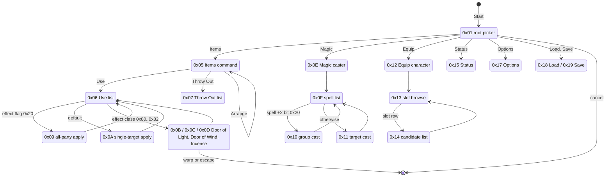
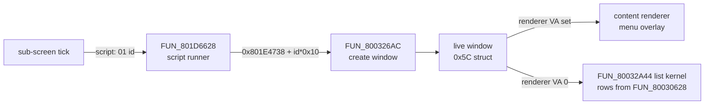

# Field Menu - Windows + Status Panel Renderer

The pause menu is the screen the Start button opens in the field: Items,
Magic, Equip, Status, Options, Load and Save. Retail builds every one of its
screens out of one pool of 52 bordered **windows**, each described by a
16-byte record that gives the window's rectangle and names the routine that
draws its contents. This page documents that window system, every pause
screen's layout and input flow, and where each piece lives in the Rust port.

All of it is code and data in the **menu overlay** (PROT 0899, link base
`0x801CE818`, game mode `0x17`) - the same image that hosts the shop, the
save screen and the casino prize counter - plus a handful of shared drawing
routines resident in `SCUS_942.54`. The port runs the whole menu on both
hosts (native window and browser play page) from one session and one set of
draw builders; the remaining differences from retail are listed under
[Engine port](#engine-port).

## At a glance

| Thing | Where |
|---|---|
| Window descriptor table | VA `0x801E4738`, 52 records x `0x10` bytes (PROT 0899 file `0x15F20`); parser `legaia_asset::menu_windows` |
| Window creator / per-frame walker | SCUS `FUN_800326AC` / `FUN_80031D00` |
| Window-script runner | `FUN_801D6628` (programs in [`window-script.md`](../formats/window-script.md), VM in [`actor-vm.md`](actor-vm.md)) |
| Master menu tick + sub-screen table | `FUN_801DC6B4`, pointer table `0x801E4F40` (ids `0x00..=0x20`), selector `DAT_801E46A4` |
| List paging kernel / row builder | SCUS `FUN_80032A44` / `FUN_80030628` |
| Status / party panel renderer | `FUN_801D33D8` (window 28) |
| Live party records | `0x80084708 + n*0x414` ([`save-record.md`](../formats/save-record.md)) |
| Port: session | `engine-menus` (`field_menu`, `pause_screens`, `equip_session`, `spell_menu`, `menu_list_rows`), driven by `engine-session::BootSession` |
| Port: drawing | `engine-ui` (`pause_menu`, `ui_menu::*`, `ui_menu_window_painters`, `ui_menu_window_dispatch`) |

`engine-core` re-exports the `engine-menus` modules at their old paths, so
`engine-core::pause_screens::X` and `engine-menus::pause_screens::X` name the
same item. Dumps cited as `overlay_menu_<addr>.txt` live in
`ghidra/scripts/funcs/`.

Every content renderer draws **content only**: the window frame is drawn by
the caller. A renderer receives the live window struct in `a0` and hangs every
position off the content origin `WX = *(i16*)(a0+0xa)`, `WY = *(i16*)(a0+0xc)`;
`a0+0xe` / `a0+0x10` are the content width / height. Offsets on this page are
relative to `(WX, WY)` unless stated.

### Screen navigation

Each screen is one or more **sub-screens**: tick functions indexed out of the
table at `0x801E4F40` by the selector `DAT_801E46A4`. The pause-menu part of
that id space (the shop and save ids are on [`shop.md`](shop.md) and
[`save-screen.md`](save-screen.md#sub-screen-function-pointer-table)):



Every sub-screen returns to its parent on cancel; the root picker's routes are
`[5, 0x0E, 0x12, 0x15, 0x17, 0x18, 0x19]` in row order (see the
[root command picker](save-screen.md#root-command-picker-fun_801d6b20)).

### How a window gets on screen



The per-frame walker `FUN_80031D00` draws each live window's frame and then
calls its renderer or runs the list kernel.

## Contents

- Window system: [descriptor table](#window-descriptor-table) · [live structs](#live-window-structs) · [renderer dispatch](#which-painter-draws-a-descriptor-renderer_va-dispatch) · [which screen opens a window](#which-screen-opens-a-window) · [ported painters](#ported-painters)
- Drawing: [primitives + CLUT staging](#draw-primitives--clut-staging) · [health-tier ink](#health-tier-ink-fun_800349ec--fun_80035ea8)
- [Top-level pause menu](#top-level-pause-menu)
- Status: [tab banner](#tab-banner) · [satellites](#status-satellite-windows) · [main panel](#status-main-panel-fun_801d33d8) · [status page](#status-page-submenu-0-or-5) · [magic](#magic-list-submenu-2) · [moves](#moves-list-submenu-3) · [skills](#skills-page-submenu-1)
- Lists: [sub-screen state machines](#submenu-state-machines) · [kind-4 kernel](#the-kind-4-list-kernel-scus-fun_80032a44) · [Use-list build](#use-list-row-build-content-id-3-fun_80030628)
- [Items screen](#items-screen) · [Magic screen](#magic-screen) · [Equip screen](#equip-screen) · [stat-compare panels](#equip-stat-compare-panels-windows-25-and-41) · [Options screen](#options-screen)
- [Prize-exchange windows](#prize-exchange-ticket-counter-windows) · [windows 34 and 46](#two-more-descriptor-table-renderers-windows-34-and-46)
- [Name columns](#name-columns-and-translated-text) · [dialog reading box](#dialog-reading-box-fun_801d84d0) · [inn stay](#inn-stay-there-is-no-inn-screen)
- [Battle-panel siblings](#battle-readout-tint-law-the-panels-sibling) · [overlay identity](#overlay-identity--va-aliasing) · [engine port](#engine-port)

## Window descriptor table

Every menu window - rect plus content renderer - is one record of a 52-entry
table in the menu overlay's data segment, indexed by window id. The base is
VA `0x801E4738`: the window-script runner `FUN_801D6628` passes
`0x801E4738 + id*0x10` to the SCUS window creator `FUN_800326AC`, whose field
reads (`lbu 0x0(s4)` / `lbu 0x1(s4)` / `lhu 0x2(s4)` / `lh 0x4..0xa(s4)` at
`0x800326dc..`, `0x80032874..0x8003288c`) fix the layout:

```text
 +0x0      +0x1       +0x2        +0x4   +0x6   +0x8   +0xA   +0xC
+---------+----------+-----------+------+------+------+------+----------------+
| content | slide    | class u16 | x    | y    | w    | h    | renderer VA    |
| id  u8  | home u8  |           | i16  | i16  | i16  | i16  | u32 (0 = list) |
+---------+----------+-----------+------+------+------+------+----------------+
```

| off | type | field |
|---|---|---|
| `+0x0` | u8 | **content id** - copied into live window `+0x1C` at create (`sb` at `0x80032990`); selects the SCUS content-builder case and gates the [kind-4 kernel](#the-kind-4-list-kernel-scus-fun_80032a44) |
| `+0x1` | u8 | slide-home variant (the `< 8` switch at `0x800326e8`: which screen edge a closed window parks against) |
| `+0x2` | u16 | window class: 2 = title tab, 3 = standard, 4 = list page (low byte lands in live `+0x1D`) |
| `+0x4..+0xb` | 4 x i16 | `x, y, w, h` - the **content** rect the renderer receives |
| `+0xc` | u32 | content-renderer VA (a menu-overlay function); `0` = a list window the content builder fills |

Facts about the table:

- **Extent** is structural: record 52 fails the rect / renderer validity
  envelope.
- **Content ids** are non-zero exactly on the renderer-less list windows:
  15 (Items Use list) = `3`, 16 (Throw Out) = `0x22`, 18 (spell list) = `5`,
  11 (Door of Wind) = `0x19`, 23 (Equip candidates) = `0x15`, 38 (price-gated
  bag list) = `2`, 40 (shop list) = `0xB` - the id space of the kernel
  allowlist at `0x80073E1C`.
- **Disc vs RAM**: the disc bytes match the resident overlay in the six
  catalogued menu-open mednafen states
  (`menu_{status,equipment,options}_{field,town}`) except id 23's content id
  (rewritten per Equip slot row) and id 49's `y` (178 -> 180).
- **Frame**: the drawn frame extends 8 px past the content rect on every side
  (window 26's content `(14, 38)` frames from `(6, 30)`; GPU-prim scan of the
  `menu_status_town` state, cross-checked against its framebuffer).
- **Not `0x801E473C`**: the decompiled C of `FUN_801D6628` renders the base as
  `&DAT_801e473c + id*0x10`, folding the `x` load offset into the symbol. Read
  as a record base that address is skewed by `+4` - each record would open on
  `x, y, w, h` and close on the next record's head fields. The corpus hex dump
  `ghidra/scripts/funcs/data_801e473c_overlay_operand_table_801E473C.txt`
  carries the skewed address; the record boundary is `0x801E4738`.

Window sets per screen, in draw order, read from the live window lists (each
live window carries its descriptor id). Status / Equip / Options come from the
mednafen states above, Items / Magic from PCSX-Redux pad walks
(`scripts/pcsx-redux/autorun_menu_screen_dump.lua`):

| screen | windows (draw order) |
|---|---|
| top-level | 50 command list `(24,24,104,94)` -> `FUN_801CFD68`; 49 money / play-time `(24,178,104,24)` -> `FUN_801D0148`; 51 party panel `(144,24,152,180)` -> `FUN_801D030C` |
| Status | tab 3 -> `FUN_801DCAD8`; 26 party list `(14,38,60,38)` -> `FUN_801D2094`; 27 pager `(14,92,60,10)` -> `FUN_801D30A4`; 30 summary `(14,134,60,70)` -> `FUN_801D31EC`; 28 main panel `(90,16,218,188)` -> `FUN_801D33D8` |
| Equip | tab 2 -> `FUN_801DCA94`; 21 party `(14,42,80,38)` -> `FUN_801D2094`; 23 candidate list `(174,22,132,182)` (renderer-less); 22 main `(14,96,292,108)` -> `FUN_801D21C0` |
| Options | tab 4 -> `FUN_801DCB1C`; 48 settings `(24,40,256,148)` -> `FUN_801DCEF0`; 47 value popup `(170, *, 128, *)` -> `FUN_801D2B44` (y / h stamped per open) |
| Items | tab 0 -> `FUN_801DCA0C`; 13 command `(32,44,80,38)` -> `FUN_801D0D18`; 15 item list `(174,22,132,182)` (renderer-less); 17 info `(14,108,144,40)` -> `FUN_801DCB60` |
| Magic | tab 1 -> `FUN_801DCA50`; 18 spell list `(174,22,132,182)` (renderer-less); 19 caster `(14,40,144,96)` -> `FUN_801D2C98`; 20 spell info `(14,152,144,52)` -> `FUN_801D2E74` |

## Live window structs

Windows are a doubly-linked list of `0x5C`-stride structs (at `0x800AB7BC..`
in the captures):

| off | field |
|---|---|
| `+0x0` / `+0x4` | next / prev |
| `+0x8` | descriptor id |
| `+0xa..+0x11` | the **live** rect (`x, y, w, h`) - the animated position |
| `+0x18` | list node pointer (list windows) |
| `+0x1C` / `+0x1D` | content id / class byte |
| `+0x20` | slide motion (zeroed by script op 6) |
| `+0x28` | content-renderer VA |

Windows slide to the nearest screen edge on exit and park offscreen (x = 332
right, x = -124 left, y = 240 bottom). The top-level windows 49 / 50 / 51 stay
parked while a sub-screen is up.

### Window-script runner (`FUN_801D6628`)

A sub-screen opens and closes windows by handing `FUN_801D6628` a script of
4-byte entries `[op u8][window id u8][arg u16]`, op `0` terminating; the op
jump table is at `0x801CED70`. Ops the pause screens use:

| op | effect |
|---|---|
| 1 | create if absent + slide to the descriptor home rect |
| 2 | open at a packed position |
| 3 | poke live-window byte `+0x1D` |
| 4 | close (slide out) |
| 5 | close all |
| 6 | zero live `+0x20` (snap the slide) |
| 8 | destroy |
| 9 | create + slide to `arg` |
| 0x0A | destroy + re-create in place (content refresh at the animated position) |

The format and the full program table are on
[`window-script.md`](../formats/window-script.md). The field overlay's
dispatcher at the same VA is a different image (see
[Overlay identity](#overlay-identity--va-aliasing)).

### Which painter draws a descriptor (`renderer_va` dispatch)

Retail resolves the renderer per window, not per screen: `FUN_800326AC` copies
descriptor `+0xC` into live `+0x28`, and the per-frame walker `FUN_80031D00`
calls it indirectly (`lw v0,0x28(s4); beq v0,zero,..; jalr v0; move a0,s4` at
`0x80031E30..0x80031E44`). A `0` is a renderer-less list window.

The port mirrors that step in
[`engine-ui::ui_menu_window_dispatch`](../../crates/engine-ui/src/ui_menu_window_dispatch.rs):
`painter_for_renderer_va` maps a renderer VA to its painter, `painter_at`
resolves one id through a parsed table and refuses a descriptor whose renderer
is not the painter the caller expected, and `menu_window_painters` reports
every window the crate can paint. Keying on the renderer means:

- The six plain title tabs are one painter. `FUN_801DCA0C` / `CA50` / `CA94` /
  `CAD8` / `CB1C` (tabs 0..=4) and `FUN_801DCFE4` (window 43) are the same 17
  instructions with a different string pointer; all resolve to
  `title_tab_draws_for`.
- The two counter windows differ only in data. Window 32 reads party gold
  `_DAT_8008459C` with pictogram `0x62`, window 45 the coin bank
  `_DAT_800845A4` with `0x66`; `CounterSource` tells the host which total to
  feed.

Both hosts draw the pause tabs, the shop's vendor plate / purse / item-info /
sell-quantity windows, the recipient picker (window 36,
`recipient_picker_draws_for`) and the prize counter through this dispatch at
the disc-parsed rects. Shop composition is on
[shop.md](shop.md#screen-composition).

### Which screen opens a window

The descriptor says what a window looks like; the **open script** says which
screen shows it. Every `jal 0x801D6628` in the overlay carries its script
address in `a0`, so decoding those scripts and mapping each call site back
through the sub-screen table gives a complete window -> screen map from the
bytes alone. A window no `01 <id>` command names is never created. A second
sweep - every `sw rt,0x46a4(rs)`, the writers of the selector `DAT_801E46A4` -
pins which sub-screen each site requests (66 writers).

| Window | Script | Sub-screen | Screen |
|---|---|---|---|
| 5 | `0x801E4BD4` | `3` (`FUN_801D6D38`) | battle-start ready check; reached from the root picker's cancel when the entry-context kind is `0x0D` (`0x801d6cf8..0x801d6d18`) |
| 6 | `0x801E4BE0` | `4` (`FUN_801DD1B8`) | briefing notice; the entry screen for kind `0x0D` (selector written only at `0x801dc8e4`) |
| 7 | `0x801E4D50` / `0x801E4D78` | `0x10` / `0x11` | spell level-up notice after a menu cast |
| 8 | `0x801E4C60` | `0xA` | art-learned notice after a Hyper-Art book |
| 24 + 25 | `0x801E4DC8` (loaded at `0x801d9d00`) | `0x14` (`FUN_801D9C14`) | the Equip screen's candidate step |
| 31 | `0x801E4EDC` / `0x801E4EA8` | `0x1D` / `0x1C` | the shop's Point Card toast |
| 41 | `0x801E4E64` | shop entry | the shop's party stat compare |
| 46 | `0x801E4F2C` | `0x20` (`FUN_801DC1CC`) | the casino prize counter's Yes/No confirm (selector written only at `0x801dc8cc`, on kind `7`) |

Notes on those rows:

- **Window 25 is an Equip window.** Its id appears in exactly one `01`
  command in the overlay; the shop's own stat compare is window 41, and the
  shop's recipient sub-screen adds only window 36.
- **Windows 5 / 6 belong to entry-context kind `0x0D`**, a scripted pre-battle
  party menu. Window 5's two headings are the ready check whose Yes exits
  into the fight; window 6's six labels are the matching briefing - six
  static VAs in the overlay's own pool (`lui a0,0x801d` + `addiu` pairs at
  `0x801d636c..0x801d6448`), not content the entry-context record owns.
- **Window 31** is opened by both shop buy commits with a one-command script
  (`01 1F` + terminator), from the quantity commit `FUN_801DB7F4` and the
  recipient picker `FUN_801DB380`, which then park until a confirm / cancel
  press. See [shop.md](shop.md#point-card).
- **Window 46**: `FUN_801DC1CC` hands the runner `0x801E4F2C` (`01 2E 00 00`)
  at `0x801DC3F4..0x801DC41C`, staging the state word `_DAT_801E46D0` at
  `0x801DC414`. A `04 2E` close command at `0x801E4F38` has no reference in
  any image.

#### Scripted menu opens (entry-context kinds)

A field script can open the menu without a Start press. Op `0x49`'s Idle arm
spawns the same subsystem actor the pad path spawns
(`FUN_80020DE0(0x8007065C, *0x8007C34C)` at `0x801E0998..0x801E09A4`, against
`0x801D0324` on the pad path) and parks the operand pointer in `_DAT_8007B450`
(`0x801E09A8`). The actor's enter half `FUN_801F1278` stores handler `7` into
`+0x50` (`0x801F140C`) and zeroes `+0x54` (`0x801F141C`) before it reads the
signed 14-byte table at `0x801F33A4` (`0x801F1468`); a `-1` row only skips the
overwrite (`0x801F1470`). Handler `7` is the state pick `FUN_801F1F4C`, which
with a park live moves on to `0x30`, the pause-menu session `FUN_801ED308`.
The menu's entry decode then picks the screen off the record's kind byte:
`0x19` (save-card driver) for a save point's `49 01`, the notice panel for
`49 0D`, sub-screen `0x20` for kind `7`.

Release is the dispatcher's retire arm: the session's last phase clears the
cursor context's `+0x3E` (`0x801ED52C`), `FUN_801F159C` retires the actor and,
with the park still live, stores the Done sentinel `1`
(`0x801F1678..0x801F16AC`); the op's Done arm zeroes it (`0x801E08D8`). The
two SCUS leaves that zero `gp+0x138` are not on this path (`FUN_8003540C` has
no reference on the disc; `FUN_800353E0` is reached only from the scene
loaders at `0x8003B2C8`, `0x80055FC8`). Capture:
[`autorun_save_point_press.lua`](../../scripts/pcsx-redux/autorun_save_point_press.lua)
at the `town01` save point logs the park store, the enter half, the state pick
and game mode `23` with no Start press.

Port: `World::scripted_menu_open_pending` is the press; every host opens the
menu on it (no Start edge, no engagement refusal, no confirm cue).
`FieldMenuSession::open_entry_screen` opens a kind-`1` menu straight on the
Save sub-session, and carries the `Notice` (entry) and `ReadyConfirm`
(root-cancel) phases for kind `0x0D`; their labels are read from the PROT
0899 image (`pause_screens::ContextLockedLabels`).
`World::release_menu_entry_context_park` resumes the parked op on close. A
save point carries no text, so its interaction record is installed by
`man_field_scripts::placement_scripted_menu_record`.

### Ported painters

The table's content renderers for windows 5 (`FUN_801D61B0`), 6
(`FUN_801D6360`), 7, 8, 24, 31, 32, 33, 34, 36, 37, 43, 45 and 46, plus the
bottom-clipped box emit `FUN_801E4140`, are draw-list builders in
[`engine-ui::ui_menu_window_painters`](../../crates/engine-ui/src/ui_menu_window_painters.rs)
(windows 25 and 41 in `ui_menu_window_painters_large`). Every window painter
is reached by a screen on both hosts. The port keeps the pen arithmetic and the
state-word rules and drops two globals every painter touches - the ink word
`DAT_8007B454` and the glyph-advance byte `DAT_80073F20` - because a host that
composites in call order and lays glyphs out proportionally needs neither.
The **accent pen** (`DAT_8007B454 = 6`) is kept as a colour
(`PAINTER_INK_ACCENT`, the same colour as a rising stat): window 34 stages it
for the item name and owned count, window 24 for its count, window 31 for its
number, each restoring `7` afterwards.

`FUN_801E4140` is not a painter. Past its `y < 0xF1` guard it calls the
fill-state setter `FUN_80034B6C` and the box writer
`FUN_8002C69C(x, y, w, h)`. `a0` / `a1` are untouched from the prologue to the
setter's `jal`, so the setter receives the caller's first two arguments - a
mode selector and a packed RGB word (`0x44`, `0x02202020` at the menu call
site), which the decompiled C drops. The pair is a **shaded colour fill**, not
the gold 9-slice border, and `FUN_8002C69C` inflates its rect by 8 px per
side, so the guard tests the content y. The port is `guarded_box_rect`, which
no host calls (see [Engine port](#engine-port)).

Three rules the shop-side painters encode:

- **Window 36's character mask is a table, not a shift.** `FUN_801D56FC`
  indexes four bytes at `0x801E43F0` (`01 02 04 00`). Classes `0..=2` agree
  with `1 << class`; class `3` gets mask zero and matches no equipment, not
  even the "any party member" mask `7` of
  [equipment-table.md](../formats/equipment-table.md). A row that fails the
  mask is drawn at ink `0`, not skipped.
- **Window 37's sell total is halved**: `FUN_801D5944` multiplies quantity by
  unit price and arithmetic-shifts right by one.
- **Window 37's digit field is a ladder**: it starts at 4; `>= 100` and
  `>= 1000` each add one, and `>= 10000` assigns 5 before those two still add -
  widths 4 / 5 / 6 / 7, so a four-digit price reserves six cells.

### Frame and interior

The frame chrome and the navy filigree interior come from the system-UI TIM
at `PROT.DAT[0x018E0]`, CLUT row 2: gold-bronze 9-slice tiles plus the 32 x 32
marbled-blue patch at texels `(128, 0)`. Under every menu frame retail's
window drawer `FUN_8002BDC4` runs the **class-0 fill**: 32-texel columns and
bands of the patch, each band a neutral-grey gouraud ramp from `0x40` at the
frame's top to `0x88` at its bottom in steps of `0x900 / h` (the 204-tall
status window of `menu_status_town` draws seven bands
`64, 75, 86, 97, 108, 119, 130 -> 136`).

Port: `engine-ui::menu_window_chrome_draws_for` frames each window;
`nine_slice_panel_into(.., tile_filigree = true)` runs the fill through the
battle banners' kernel `battle_hud_chrome::class0_fill_draws_at` over
`SaveMenuAtlasRects::panel_filigree`. The save / load screen keeps the
gradient-baked `panel_interior` variant.

## Draw primitives + CLUT staging

| tag | function | signature | notes |
|---|---|---|---|
| STR | `FUN_80036888` | `(str, count, 0, x, y)` | proportional string; tokens: `0x7c` = line break (`y += 0xe`, x resets), `0xcf b` = set text CLUT inline, `0xce b` = inline icon / number via aux record `b` of `0x80074050` (`[i16 ico_code, u8 x_advance, i8 dy]`; a zero code draws a number variable) |
| ICO | `FUN_8002c488` | `(x, y, code)` | one UI-icon sprite; 12-byte records at `0x800732a4`: `+3` CLUT byte, `+4..+7` U/V/W/H, `+8/+0xa` baked dx/dy (codes `0x86..0x8a`, texpage from `0x80073db8`) |
| NUM | `FUN_80034b78` | `(value, digits, x, y)` | decimal digits against the powers-of-ten table `0x80073dcc`; fixed 8-px cells, right-aligned, leading cells blank |
| CUR | `FUN_8002b994` | `(kind, mode, x, y)` | 16x16 cursor; 4 records x `0x18` at `0x80073d18` (`[frames u8, clut u8, period i16, last_xy 2 x i16, frame UVs 4 bytes each]`): kind 0 pointing hand `(152,64)`, 1 two-frame `(224/240,64)`, 2 left triangle `(168,8)`, 3 right triangle `(168,40)`, all CLUT row 7. Mode 1 animates (0..2-px bob from `0x80073d78`), 0 is static |

The ICO CLUT byte: `& 0x7f` = a row at VRAM y 511; bit `0x40` = the alternate
encoding `(896 + (b&3)*16, 0x1F2 + ((b&0x3f)>>2))`; bit `0x80` = blend.

The text palette is staged in **`DAT_8007b454`**; the in-primitive CLUT
halfword is `index + 0x7f86`. Only the string primitive reads it (at
`80036b74`) - icons take their CLUT from the `0x800732a4` record and numbers
from `gp+0x13c` - so a write just before an ICO / NUM draw is staging the
*next* string.

### Ink CLUT rows

The staged index selects a 16-colour CLUT at VRAM `(16*(6+index), 510)`. The
main ink is palette **entry 15**; entries 12..14 are the outline / shade ramp.
Entry-15 values from the `menu_status_town` VRAM:

| index | entry-15 RGB | role |
|---|---|---|
| 0 | `(132,132,132)` | grey (disabled / non-selected rows) |
| 1 | `(107,107,231)` | lavender (command labels, falling stat) |
| 2 | `(231,33,0)` | red (0 HP) |
| 4 | `(107,222,107)` | green (skill passives, MP Used) |
| 5 | `(66,222,222)` | teal (separators, parenthesised base values) |
| 6 | `(231,173,0)` | gold (caution tier, headers, accent) |
| 7 | `(206,206,206)` | white (default text) |
| 9 | `(222,90,0)` | orange (danger tier, moves header) |

<a id="hp--mp-health-tier-inks"></a>

### Health-tier ink (`FUN_800349EC` / `FUN_80035EA8`)

HP and MP number fields (current **and** max) take their ink from two SCUS
functions. Both take a character index, resolve the record at
`0x80084140 + id*0x414`, compare the **live** pairs, and use integer shifts of
the max (`srl 2`, `srl 1`) with a strict `max_frac < current` test - an exact
quarter or half falls in the lower tier.

`FUN_800349EC` (HP, `+0x104` max / `+0x106` current) runs five tests in order.
The ailment arm sits between the two HP thresholds, so a character under a
quarter HP stays orange while poisoned:

| Test | Ink |
|---|---|
| `hp == 0` | `2` (red) |
| `hp <= max/4` | `9` (orange) |
| `+0x12E != 0` (the battle-status halfword) | `6` (gold) |
| `hp <= max/2` | `6` (gold) |
| otherwise | `7` (white) |

`FUN_80035EA8` (MP, `+0x108` max / `+0x10A` current) has no zero case and no
ailment arm: `mp <= max/4` -> `9`, `mp <= max/2` -> `6`, else `7`. An empty MP
bar is orange, not red.

Port: `engine-ui::{menu_hp_ink, menu_hp_ink_with_status, menu_mp_ink}`; the
party view structs carry `+0x12E` as `status`. The battle HUD's resolution of
the same tiers is [below](#battle-readout-tint-law-the-panels-sibling).

## Top-level pause menu

Three windows: 50 command list, 49 money / play-time box, 51 party panel.
Dumps `overlay_menu_801cfd68.txt` / `_801d0148.txt` / `_801d030c.txt`.

**Command list (id 50, `FUN_801CFD68`)**: seven rows at
`(WX+0x14, WY + n*0xe)` - **Items, Magic, Equip, Status, Options, Load,
Save** - CLUT 7. The selected row draws the hand at `(WX, row_y)` via
`FUN_8002b994` (skipped when `DAT_801e46bc` bit `0x4000` is set; bit `0x2000`
selects the dimmed variant). Two rows grey to CLUT 0 when blocked: **Load**
when the entry-context pointer `DAT_8007b450` targets an `0x0D` byte,
**Save** when the save-enabled flag `DAT_8007b6a8` is clear. The confirm arm
applies the same two gates in the same order, so no row draws white and then
buzzes.

`DAT_8007b6a8` is per-scene: the MAN header bit `[0x01] & 1`
(`legaia_asset::man_section::ManHeader::low_flag`) seeds it. The bit is set on
the three kingdom world maps and clear on every field scene, so Save is grey
everywhere but the overworld.

The seven labels are NUL-terminated strings in the overlay's leading rodata
pool: `@Items` at `0x801CE9D0`, then `@Magic` / `@Equip` / `@Status` /
`@Options` / `@Load` / `@Save`. Each pointer targets the leading `0x40` (`@`)
marker byte `FUN_80036888` consumes. The same pool (`0x801CE81C..0x801CEC78`)
holds the options choices, the stat labels (`ATK` / `UDF` / `LDF` / `SPD` /
`INT` / `AGL`, `Experience`, `Next Level`) and the shop / equip / status
command strings. The battle overlay (PROT 0898) keeps its own pool at
`0x801F4B98..0x801F4D2A` (`Spirit` / `Defense` / `Escape` / `Begin` and the
result messages; the `Attack` / `Arts` / `Magic` / `Item` ring labels are
sprites). These pools are what the translation pipeline's `ui_menu` section
patches in place ([`ui-strings.md`](../tooling/translation/ui-strings.md)).

**Money / play-time box (id 49, `FUN_801D0148`)**: money pictogram (ICO
`0x62`) at `(WX, WY+2)`, amount as an 8-digit field at `(WX+0x28, WY)`. When
the casino-coin flag `FUN_8003ce64(8)` is set a coin row follows: ICO `0x66`
at `(WX, y+0x10)`, coin bank `0x800845A4` 8-wide at `(WX+0x28, y+0xe)`. The
play-time row draws ICO `0x63` at `(WX, y+0x10)` and the clock from the 60 Hz
counter `0x80084570`: hours 3-wide at `+0x20` (clamped 99, then minutes /
seconds pin 59), colon glyphs (`FUN_8003c1f8` code 9) at `+0x38` / `+0x50`,
zero-padded 2-wide minutes / seconds (`FUN_80034e4c`) at `+0x40` / `+0x58`.
With the coin row the live window grows past its descriptor rect
(`(24,166,104,38)` against `(24,178,104,24)`).

**Party panel (id 51, `FUN_801D030C`)**: one block per roster member (ids
`u8[3]` at `0x80084598`, count `0x80084594`) at stride `0x3e`:

| element | position | source |
|---|---|---|
| name | `(WX+0x10, Y)` | record `+0x2A7` |
| LV icon (ICO `0x0a`) + 2-digit level | `(WX+0x70, Y+2)`, `WX+0x80` | `+0x130` |
| HP label (ICO `0x3f`), current / slash / max | `(WX+0x28, Y+0x11)`; `WX+0x38` / `+0x58` / `+0x60` on row `Y+0xf` | `+0x106` / `+0x104` |
| MP label (ICO `0x40`), current / max | rows `Y+0x1e` / `Y+0x1c` | `+0x10A` / `+0x108` |
| AP gauge (widget kind `0x31`) | `(WX+0x28, Y+0x29)` | persistent AP `+0x10E` |

ICO `0x3f` is the same `(208,86,16,10)` sheet rect as status code `0x07`. HP /
MP values take the [health-tier ink](#health-tier-ink-fun_800349ec--fun_80035ea8).

### The menu does not open at all while a dialogue is up

Retail has no separate Start handler: the menu-open accept sits in the
pre-movement header of the locomotion controller `FUN_801D01B0`
(`0x801D0250..0x801D02DC`). That function's first test (`0x801D01F0`) branches
out when the player actor's engaged bit `+0x10 & 0x80000` is set - the bit the
touch post `FUN_801D5B5C` raises on every talk and the dialog teardown
clears. A talking player's Start opens nothing and buzzes nothing.

<a id="which-scenes-the-menu-opens-in"></a>
Because the accept is a leg of `FUN_801D01B0`, the menu opens in every scene
that controller walks, including the three kingdom overworlds - ordinary
`game_mode 0x03` scenes on the same `FUN_801D1344` -> `FUN_801D01B0` chain as
a town. That is the only reason the Save row is reachable. `FUN_801E76D4` is
the top-view debug renderer, not a second controller; see
[`save-screen.md`](save-screen.md#where-the-save-rows-pad-route-is).

### Port: session and composition

The port runs the menu as a two-level session owned by
`engine-session::BootSession`, the same on every host:

| Piece | Owner |
|---|---|
| Open gate (mode test + engaged bit; `SceneMode::Field` and `WorldMap`) | `World::field_menu_open_allowed`, called by `BootSession::press_field_menu`; `open_field_menu` re-checks the engaged bit |
| Save / Load row gates | `World::install_scene_save_permission` seeds `party.scene_save_allowed`; sampled with `World::menu_entry_context_kind` into `field_menu::FieldMenuGate` |
| Root list | `engine-menus::field_menu::FieldMenuSession`; `pause_screens::root_menu_confirm_route` decides both row ink and advance-vs-buzz, over `ROOT_MENU_ROUTES` |
| Sub-screen | `engine-core::field_menu_dispatch::FieldMenuSubsession`; a confirm suspends the root (`FieldMenuPhase::Suspended { row }`) until the sub-screen ends and `apply_*_outcome` runs |
| Persistence | a finished Save / Load leaves a `save_screen::SaveCommit` on `BootSession::last_save_commit`; the host owns the bytes behind the `SaveRack` |
| Descriptor rects with pinned fallback | `engine-ui::pause_menu::MenuRects` (`MENU_WINDOW_FALLBACK`) |
| Window set, tab painter, draw order, 320x240 stage scale | `engine-ui::pause_menu::pause_screen_draws` + `stage_transform` |
| Top-level content | `engine-ui::field_menu_draws_for` + `field_menu_info_draws_for` (text), `field_menu_icon_sprites_for` (hand, pictograms, labels, `ap_gauge_sprites`) |

A gated row stays navigable and draws grey, matching retail's unconditional
7-row cursor walk. `engine-ui` does not depend on `engine-core`, so each host
projects the session into plain view structs and the shared composition takes
those; the Load / Save sub-screen is the save-select surface
(`SaveScreenFlow::overlay_model` + `save_select_overlay_draws`), shared with
the boot Continue path - see [`save-screen.md`](save-screen.md). Tests:
`crates/engine-shell/tests/menu_replay.rs` walks all seven rows from
`World::set_pad` alone, and `engine-ui/tests/pause_menu_compose.rs` drives
every screen's composition with no disc, GPU or host. The host-drift row for
the press is in
[`host-drift.md`](../tooling/host-drift.md#tier-3---simulation-do-both-hosts-feed-the-same-kernel).

One difference from retail: the port draws no coin row in window 49; the time
tag sits at the no-coin-row position whatever the casino bank holds.

## Tab banner

The class-2 title-tab windows (ids 0..=4) draw no 9-slice frame. Their chrome
is the carved brown **plaque**, textured sprites on CLUT row 12 of the
system-UI sheet (`PROT.DAT[0x018E0]`):

| piece | src rect | placement |
|---|---|---|
| left cap | `(208, 64, 8, 20)` | `(WX-8, WY-4)` |
| body tile | `(192, 64, 16, 20)` | tiled from `WX` across the content width (partial remainder) |
| right cap | `(216, 64, 8, 20)` | `(WX+w, WY-4)` |

All five tab renderers stage CLUT 7 and draw the label at `(WX, WY)`. Port:
`engine-ui::tab_banner_draws` + `tab_label_draws`, both taking the same pen.

## Status satellite windows

The three left-column windows of the Status screen:

**Party list (id 26, `FUN_801D2094`)** - shared with the Equip screen's
window 21. One row per roster slot (roster byte `< 3` only) at pitch `0x0e`:
name (`+0x2A7`) at `(WX+6, Yrow)`, always CLUT 7. The focused row draws the
hand at `(WX-0xc, Yrow)`, gated by the focus word `DAT_801E46C4` (bit `0x4000`
hides, `0x2000` selects the blink variant, low 12 bits = row).

**Pager (id 27, `FUN_801D30A4`)** - the folded submenu id picks the label
("Condition" for the status page; Skills / Magic / Moves for ids 1..3) at
`(WX+6, WY)` CLUT 7, flanked by the triangle cursors: kind 2 at
`(WX-0x10, WY-2)`, kind 3 at `(WX+0x3A, WY-2)`.

**Summary (id 30, `FUN_801D31EC`)** - name at `(WX, WY)`; LV icon at
`(WX+0x1c, WY+0xf)` with the level at `(WX+0x2c, WY+0xd)`; "ATR:" at
`(WX, WY+0x1a)` followed by the **element icon**, drawn through the
per-character 2-byte string at `0x801E4720 + char*4` (`0xCE 0x1D/0x1F/0x1E`).
Aux records `0x1D/0x1F/0x1E` resolve to ICO codes `0x94/0x96/0x95`
(Vahn / Noa / Gala): 28x12 sprites at sheet V 208 with the alternate CLUT
encoding. Their pixels are in the system-UI extension strip TIM at
`PROT.DAT[0x10178]` (256x32 4bpp, VRAM `(896,448)`); the row-500 palettes are
the CLUT block of the TIM at `PROT.DAT[0x10028]` (rows 498 / 499 / 501 come
from `0x10178` / `0x100D0` / `0xFF80`). A character carrying a Seru gets a
second block: class icon (ICO `0x45`) + Seru name at `WY+0x2f`, its level at
`WY+0x3c`.

<a id="plumbing"></a>
<a id="submenu-dispatch"></a>
<a id="header-row-always-drawn"></a>

## Status main panel (`FUN_801D33D8`)

Window 28, content origin `(90, 16)`. Dump `overlay_menu_801d33d8.txt`.

| Item | Value | Instr |
|---|---|---|
| Menu / party base `s2` | `0x80084140` | `801d33dc` |
| Highlighted record index | `*(u8*)(0x80084598 + (DAT_801e46c4 & 0xfff))` | `801d33f0`, `801d3424` |
| Submenu id | `DAT_801e46c0 & 0xfff`, folded `if id >= 6 { id -= 5 }` | `801d33f4`, `801d3460` |
| Live record base | `0x80084708 + index*0x414` | `801d3440`, `801d3454` |
| Window X `s7` / Y `s8` | `*(i16*)(a0+0xa)` / `*(i16*)(a0+0xc)` | `801d3494`, `801d3490` |

`s8` is a running Y cursor (`+0x13` after the header, then `+0x2f` / `+0x2b` /
`+0x38` between status blocks); `s7` is set to `WX+0x10` for the list pages.

The folded id selects the page (raw ids 6..10 alias onto 1..5):

| id | page |
|---|---|
| 0 or 5 | full status page |
| 1 | skills / accessory-passive list |
| 2 | magic list |
| 3 | moves / arts list |
| 4 | header only |

**Header row** (always drawn, instr `801d3478..801d35c8`):

| element | prim | X | Y | source |
|---|---|---|---|---|
| character name | STR | +8 | +0 | record `+0x2A7` |
| "LV" label | ICO | +0x50 | +2 | icon `0x0a` |
| LV value | NUM | +0x60 | +0 | record `+0x130`, 2 digits |
| class / Seru label | ICO | +0x8a | +0 | icon `0x45` (conditional) |
| class / Seru name | STR | +0x96 | +0 | `*(u32*)(0x801e46d4 + char*4)` |

### Status page (submenu 0 or 5)

**HP row** (`WY+0x13`) / **MP row** (`WY+0x20`), instr `801d35e8..801d374c`:
current at `X+0x30`, max at `X+0x58`, base at `X+0x84` (4-digit NUM);
separators at `X+0x50`, `X+0x7c`, `X+0xa4`. HP = record
`+0x106 / +0x104 / +0x11c`, MP = `+0x10a / +0x108 / +0x11e`. Current / max
take the health-tier ink; the `/` is white and the whole parenthesised base
group is teal. Fields end flush against their separators
(`180/ 180 ( 180)`).

**AP gauge** at `(X+0x40, WY+0x2d)`, value record `+0x10e`.
`FUN_80034b6c(0x31)` stages the widget kind into `gp+0x14c`; the widget
dispatcher `FUN_8002c69c(x, y, 1, value)` sees kind `0x31`, calls the content
renderer `FUN_8002c0b0(x, y, value)` (dump `8002c0b0.txt`) and falls through
to the table-driven frame. Frame = four 1:1 sprites, CLUT row 4:

| piece | src rect | at |
|---|---|---|
| left arrow cap with the red "AP" chip | `(128,64,24,16)` | anchor |
| trough body | `(128,80,56,16)` | `+0x18` |
| bordered value box (ICO `0x69`) | `(176,64,16,16)` | baked `dx = 0x50` |
| pointed right end (ICO `0x6A`) | `(184,80,8,16)` | baked `dx = 0x60` |

Content:

- **Fill** (`value > 0`): two untextured gouraud quads spanning
  `x+0x1B .. x+0x1B + value/2` (50 px at 100 AP; `value > 100` clamps the width
  to `0xFF` for the wider field-HUD variants), rows `y+5..y+10`, dark red
  `rgb(0x80,0x20,0x10)` to gold `rgb(0xC0,0xA0,0x40)` at the shared middle
  edge and back. Prepended into the frame's OT bucket, so drawn on top of the
  trough.
- **Value**, all at `y+5`: `== 100` draws ICO `0x6B` (`(64,136,16,6)`, CLUT
  row 1) at `x+0x50`; otherwise the tens digit ICO `0x6C+tens` at `x+0x50`
  (when non-zero) and the ones digit at `x+0x56`. Digit records are ten 6x6
  cells at `(64 + 6*digit, 128)`, CLUT row 4.

**Derived-stat grid** (instr `801d3780..801d3b48`): rows at
`WY+0x42 / +0x4f / +0x5c`, two columns. Left: label `X+0`, live value
`X+0x28`, `(` `X+0x40`, growth value `X+0x48`, `)` `X+0x60`. Right: label
`X+0x74`, value `X+0x9c`, `(` `X+0xb4`, growth `X+0xbc`, `)` `X+0xd4`. Live
values (3 digits, clamp 999, white) are the aggregator words
`DAT_801ef088..09c` computed by `FUN_801cf650` (see
[the stat block](#the-eight-word-stat-block)); growth values are record
`+0x122..+0x12c` in teal.

**Equipment grid** (instr `801d3b4c..801d3dd8`): seven slots, icon + item
name. Icon codes are the fixed array `DAT_801e43f4` =
`[0x24, 0x22, 0x23, 0x25, 0x46, 0x46, 0x46]` (u16); names via
`*(u32*)(0x8007436c + id*0xc)` with `id = record[0x196 + slot_off]`
([`item-table.md`](../formats/item-table.md)). Slots 0..3 stack at
`X+0 / +0x10` on rows `WY+0x6d / +0x7a / +0x87 / +0x94`; slots 4..6 sit at
`X+0x6a / +0x7a` on rows `WY+0x7a / +0x87 / +0x94`. The codes are 12x12
pictograms on CLUT row 8: weapon fist `(244,36)`, helmet `(244,24)`, body
armour `(232,36)`, boot `(232,48)`, Goods ring `(0,128)`. All seven draw
whether or not the slot is equipped.

**Experience / Next Level** (instr `801d3ddc..801d3e60`): "Experience" at
`(X+0x18, WY+0xa5)` with the 8-digit value (record `+0x0`) at `X+0x78`;
"Next Level" at `(X+0x18, WY+0xb2)` with the threshold (record `+0x4`).

### Magic list (submenu 2)

Instr `801d4098..801d43c4`. `X = WX+0x10`. Header (CLUT 6): "Magic" at
`(X, WY+0x13)`, "MP Used" at `(X+0x60, WY+0x13)`. Rows from `WY+0x28`, pitch
`0x0d`, up to 7 visible, scroll `_DAT_8007bb90`, count `record[+0x13c]`. Per
spell (id `+0x13d`, level `+0x161`): name via `0x800754d0 + id*0xc`
([`spell-table.md`](../formats/spell-table.md)); level digit at `X+0x78`;
3-digit MP cost at `X+0xa8` via `FUN_80035394`. The selected row draws a
cursor and a CLUT-6 preview line; other rows use CLUT 0. Empty: "-No magic
skills-" at `(X, WY+0x50)`.

### Moves list (submenu 3)

Instr `801d43c4..801d477c`. `X = WX+0x10`. Header (CLUT 9): "Moves" at
`(X, WY+0x13)`, "AP Used" at `(X+0x60, WY+0x13)`. Rows match the arts table
`DAT_80075ec4` (stride `0x14`, [`art-data.md`](../formats/art-data.md)); up
to 7 rows, pitch `0x0d`. Per art: name (CLUT 7) at `X+0x10`, 3-digit AP cost
at `X+0x82` (halved when record `+0x800` bit `0x800` is set). The selected row
also draws "Command:" (CLUT 1) plus the direction arrows via `FUN_8003c310`
(X step `0xc` per input) and a description glyph. Empty: "You have not learned
any moves."

### Skills page (submenu 1)

Instr `801d3e64..801d4098`. `X = WX+0x10`. Loops accessory equip slots 5..7; a
slot draws only when its passive index is `< 0x40`. Per slot (pitch `0x3b`):
label icon (CLUT 6) at `(X+0x10, Y)`, item name at `X+0x20`, and two
passive-effect lines from `0x8007625c`
([`accessory-passive-table.md`](../formats/accessory-passive-table.md)) at
`(X+0x30, Y+0xe)` (CLUT 4) and `(X+0x38, Y+0x1c)` (CLUT 7). Empty: "You do not
have any skills."

<a id="scroll-widgets-submenu-2-or-3"></a>
**Scroll widgets** (submenus 2 and 3, instr `801d477c..801d4838`): up arrow
(ICO `0x67`) when `_DAT_8007bb90 > 0` and down arrow (ICO `0x68`) when rows
follow, both at `X = WX + (w >> 1) - 4`; scrollbar thumb at
`(WX, WY + h - 0x28)`, length from `w`, `FUN_80034b6c(3)`.

<a id="record-fields-consumed"></a>
### Record fields the panel reads

| offset | field |
|---|---|
| `+0x0` / `+0x4` | cumulative experience / next-level threshold |
| `+0x104 / +0x106 / +0x11c` | HP max / current / base |
| `+0x108 / +0x10a / +0x11e` | MP max / current / base |
| `+0x10e` | persistent out-of-battle AP (0 on a fresh party) |
| `+0x122..+0x12c` | growth-stat values |
| `+0x12E` | battle-status halfword |
| `+0x130` | displayed level |
| `+0x13c / +0x13d / +0x161` | spell count / ids / levels |
| `+0x196..` | eight equip bytes |
| `+0x2A7` | name string |

Port of the Status screen: `engine-ui::status_screen_draws_for` (main panel,
off the id-28 origin), `status_satellite_draws_for`, and the sprite passes
`status_icon_sprites_for` / `status_satellite_icon_sprites_for` (labels at
codes `0x0A/0x07/0x08`, pictograms, gauge pieces, hand, triangles, element
icons). Values come from the typed record in `legaia_save`; number fields use
the retail 8-px cells (`num_field_draws`). The gauge fill is a baked column of
the gouraud endpoint colours stretched to `value/2` px with per-row linear
interpolation; retail's GPU sub-pixel truncation is not pinned (both reference
captures hold AP 0).

## Submenu state machines

Every screen's input handling is a per-sub-screen tick function, dispatched
from the master menu tick (inside `FUN_801DC6B4`) through the pointer table at
`0x801E4F40`, indexed by `DAT_801E46A4`. The table runs `0x00..=0x20` and ends
on a `0` word. A handler *requests* a switch by writing `DAT_801E46A4`; the
master tick compares it with the settled copy `DAT_801E46A8` and, on a change,
zeroes the shared phase word `DAT_801E46AC` - every sub-screen starts at
phase 0.

| id | handler | screen |
|---|---|---|
| `0x01` | `FUN_801D6B20` | root command picker |
| `0x03` / `0x04` | `FUN_801D6D38` / `FUN_801DD1B8` | ready check / briefing notice (entry kind `0x0D`) |
| `0x05` | `FUN_801D7C00` | Items command window |
| `0x06` | `FUN_801D7E50` | Use list |
| `0x07` | `FUN_801D8734` | Throw Out list + confirm |
| `0x09` | `FUN_801D7FF8` | all-party apply (cursor count 0: confirm / cancel only) |
| `0x0A` | `FUN_801D8308` | single-target apply |
| `0x0B` / `0x0C` / `0x0D` | `FUN_801D8A58` / `FUN_801D8B90` / `FUN_801D8D94` | Door of Light / Door of Wind / Incense |
| `0x0E` | `FUN_801D8F10` | Magic caster picker |
| `0x0F` | `FUN_801D9110` | spell list (cancel -> `0x0E`; confirm -> `0x10` / `0x11`, `li` at `0x801d920c` / `0x801d924c` / `0x801d9258`) |
| `0x10` | `FUN_801D9280` | group cast (cursor count 0) |
| `0x11` | `FUN_801D9594` | single-target cast |
| `0x12` / `0x13` / `0x14` | `FUN_801D98F0` / `FUN_801D99F0` / `FUN_801D9C14` | Equip character picker / slot browse / candidate list |
| `0x15` | `FUN_801DA2A0` | Status (the [per-character list screen](save-screen.md#sub-screen-0x15---the-per-character-list-screen-fun_801da2a0)) |
| `0x17` | `FUN_801DD330` | Options |
| `0x20` | `FUN_801DC1CC` | casino prize counter |

The remaining ids (save, shop, debug editor) are tabulated on
[`save-screen.md`](save-screen.md#sub-screen-function-pointer-table). Both
apply pairs (`0x09` / `0x0A`, `0x10` / `0x11`) call the effect applier
`FUN_800402F4` and differ only in the row count they hand the cursor
primitive: `0` for the whole-party form, the live party count otherwise.

**Cursor navigate `FUN_801D688C(cursor_ptr, rows, wrap)`** - the shared
picker. Held-pad confirm / cancel masks (`DAT_801EF0F0` / `F4`) return 1 (SFX
`0x36`) / 2 (SFX `0x37`); pad-edge Up / Down (`_DAT_8007BB84` bits `0x1000` /
`0x4000`) move the cursor word's low 12 bits (SFX `0x21`), wrapping when
`wrap` is set, and return 3. The high cursor bits pass through: `0x4000` hide,
`0x2000` dim / all-row variant, `0x1000` editing / static.

**List protocol.** List windows (class 4) are paged by the SCUS kind-4 kernel
below; the overlay talks to it through globals:

| global | meaning |
|---|---|
| `_DAT_8007BB94` | list mode: 0 idle, 1 browsing, 2 row confirmed, 3 cancelled, 4 parked behind another window |
| `_DAT_8007BB88` | selected row's payload (entry low 12 bits; the bag slot on item lists) |
| `_DAT_8007BB9C` | selected row's class nibble (`entry & 0xF000`; the key `FUN_80034250` dispatches descriptions on) |
| `_DAT_8007BB90` / `_DAT_8007BB98` / `_DAT_8007BBA0` | scroll top / selected row / row count |
| `_DAT_8007BB80` | window-slide latch; every phase step waits for `== 0` |

### The kind-4 list kernel (SCUS `FUN_80032A44`)

Runs per frame for each live list window whose content id (live `+0x1C`) is in
the allowlist at `0x80073E1C` (`02 03 22 07 08 09 0A 0E 0F 10 0B 05 19`,
`0x23`-terminated).

**List node** (live `+0x18`; allocator `FUN_80030104`, `count*2 + 0x2A`
bytes): `+0x0` scroll top, `+0x2` visible rows (`(content_h - 4) / 0xE`),
`+0x4` row count, `+0x6` selected row, u16 row entries from `+0x28`. A row
entry is `[class: high nibble][0x800 = disabled][0x400 = alt-ink][payload:
low 12 bits]`. The SCUS content builder `FUN_80030628` (per-content-id switch,
jump table `0x80010D38`, index `id - 2`) writes the entries at create /
refresh; the kernel only reads them. The dim bits are decided per row at build
time and never rewritten with focus (the row words are bit-identical between
command focus, list focus and 60 vsyncs of browsing -
`autorun_use_list_rows_dump.lua`).

**Navigation** (held pad `_DAT_8007BB84`, mode 1 only):

| input | behaviour | instr |
|---|---|---|
| Up `0x1000` | step up; at the page top wrap to the page's last row | `80032ae8..80032c74`, `80032b28` |
| Down `0x4000` | step down; past the page bottom or last row wrap to the page top | `80032b44..80032b84` |
| Left `0x8000` | page up while `top > 0` | `80032b90` |
| Right `0x2000` | page down while `top + visible < count`, clamping the selection to `count - 1` | `80032c1c` |
| Confirm (`0x800846D0 & _DAT_8007B874`) | disabled row (`entry & 0x800`, `80032d04`) buzzes (cue `0x23`); else mode = 2 + cue `0x20` (`80032d34`) | `80032ccc..` |
| Cancel (`0x800846D4`) | cue `0x37`, mode = 3 | `80032dcc` |

Up / Down never scroll, which is why the lists read as fixed 12-row pages.
Move cues (`0x21`) enqueue into the 4-slot UI ring at `0x8007B6D8`.

**PAGE header** (`80032e18..80032f20`, drawn while the count is non-zero).
The current page is recovered by walking `visible`-sized steps up to the
scroll top. All glyphs are UI-icon sprites:

| glyph | ICO | UV / size | at |
|---|---|---|---|
| "PAGE" tag (teal `(16,181,156)`, CLUT byte 1) | `0x76` | `(80,136)` 24x8 | `(WX + W - 0x38, WY - 2)` |
| current page digits (gold) | `0x7A + digit` | `(64 + 6*digit, 144)` 6x8 | `WX + W - 0x20` (tens), `+6` (ones) |
| slash | `0x79` | `(120,136)` | `+0xD` |
| page total | `0x7A + digit` | | `+0x14` / `+0x1A` |

The tens cell is leading-zero-suppressed. The total is `ceil(rows / visible)`
over **occupied** rows (the builder skips an empty slot, `beq s0,zero` at
`0x8003089C`): one held item reads `PAGE 1 / 1`, an empty list draws no
header.

**Rows** (`80033050..`): the block is vertically centred -
`row0_y = WY + (content_h - visible*0xE)/2 + 5`, pitch `0xE` (12 rows from
`WY + 0xC` for the item-list rect). The draw switches on the class nibble:

| class | row |
|---|---|
| `0x1000` | bag row: name via the resolver `FUN_8002FF8C` at `WX+0xC`; count from `0x80085959 + slot*2` as three 8-px cells from `WX+0x6C` (a count capped at 99 inks `WX+0x74` / `WX+0x7C`) |
| `0x6000` | bag row with an equip-slot pictogram (icon via equip record `+7` bits `0x60` through the halfword table `0x80073A90`, name at `WX+0x1C`); a non-equipment item draws its count from `WX+0x78` instead |
| `0x9000` | passive row: ICO `0x46` + name at `WX+0x1C` |
| `0x7000` | ICO `0x21` + name, payload is the id itself |
| `0x3000` / `0xA000` | shop rows: name (item record `+4`) at `WX+0x18`, 5-digit price (record `+2`) at `WX+0x80`; `0xA000` stages ink 5 |
| `0x8000` | fixed-advance name (monospace override byte `0x80073F20`) |
| `0x2000` / `0x5000` / `0x4000` | plain name rows |

**Row ink** (`8003312c..80033154` and per-class clones): ink 7, dropping to 0
when the row's `0x800` bit is set and to 1 when `0x400` is set - **unless the
list is parked** (mode 4), which keeps every row white. So a list goes from
all-white to its per-row inks the moment the hand enters it; a page that reads
all-grey is a page whose rows are each individually disabled.

**Hand + page arrows** (`80032f5c..8003304c`): hand
`FUN_8002B994(0, browsing, WX - 6, row_y)`, suppressed when parked and, in
mode 0, for window 11. Blink-gated page triangles (`0x80084570 & 0x18`): ICO
`0x27` at `(WX - 0xC, WY + h/2 - 3)` while scrolled, ICO `0x28` at
`(WX + w + 4, WY + h/2 - 3)` while rows remain. The live list rect is
`128 x 172` (trimmed from the descriptor's `132 x 182`), which puts the right
arrow at `(WX + 0x84, WY + 0x53)`.

Port: `engine-menus::pause_screens::list_kernel_navigate` (navigation, page
wrap, page flip) and `engine-menus::menu_list_rows` - the allocator
(`list_alloc`), row-entry bit constants, row-name resolver (`row_name_source`,
`FUN_8002FF8C`), content-builder cases (below) and the live-window upsert
(`LiveWindowSet`, `FUN_80032434`). The description dispatcher is
`engine-ui::ui_menu_window_painters::description_source`. Row and header draws
are in `engine-ui::ui_menu::pause_lists`.

### Use-list row build (content id 3, `FUN_80030628`)

The Items Use list (window 15) is the builder's id-3 case
(`0x80030828..0x80030A88`, dump `80030628.txt`). Per bag slot
(`0x80085958 + i*2` over the window `gp[+0x2D2]..gp[+0x2D4]`) the item record
(`0x80074368 + id*0xC`) kind byte `+0x0` routes the row:

| item | entry | placement |
|---|---|---|
| kind 2 with item-effect flag `0x8` (`0x800752C0[eff*4+2]`, `0x800308B8..0x800308F8`) | `slot \| 0x1C00` (dim + alt-ink) | third buffer, appended **last** |
| kind 1 (equipment / key items, `beq` at `0x80030918`) | `slot \| 0x1800` (dim) | second buffer, appended after the in-place rows |
| anything else | by the context chain below | in place |

In the **field** context (`gp[+0x85C] == 0`) an in-place row dims when any of
these holds:

1. it is Door of Light / Door of Wind (ids `0x88` / `0x89`,
   `0x80030930..0x80030974`) and scratchpad word `0x1F800394` bit
   `0x100000` / `0x200000` is **set** (`bne` at `0x8003094C` / `0x8003096C`);
2. the effect's field-usable bit `0x2` is clear (`0x80030990`);
3. the applicability probe `FUN_8003043C` (`0x800309A4`) returns 0 - a party
   scan through the action validator `FUN_8003FB10`, which fails when the item
   would affect nobody (`0x800309BC`). A Healing Leaf greys at full party HP
   this way (captured entry `0x1800`, item `0x77`).

In the **battle** context (`gp[+0x85C] == 1`) the gate is the effect's
battle-usable bit `0x4` (`0x800309E0`), and an unusable row joins the kind-1
tail buffer (`0x800309FC`) instead of dimming in place. Any other context
value emits no row (`0x800309C0`).

Sibling cases:

- **Throw Out** (window 16, content id `0x22`, case `0x80030AF8`): kind-1 rows
  go to the tail buffer white unless equip-record `+0x7` bit `0x1`
  (no-discard) dims them (`0x80030C08..0x80030C18`); in-place rows dim on
  item-effect flag `0x1` (key items, `0x80030C40`).
- **Price-gated bag list** (window 38, content id `2`): rows whose item price
  `+0x2` is zero dim and sort last (`0x8003071C` / `0x80030734`).

Port: `engine-menus::menu_list_rows::{build_use_list_rows,
build_throw_out_rows, build_price_gated_rows}` (row words + buffer order).

## Items screen

Windows: tab 0, command 13, list 15, info 17. Sub-screen `5` while the command
window has focus, `6` in the Use list, `7` in the Throw Out list. Dumps
`overlay_menu_801d0d18.txt`, `_801dcb60.txt`, `_801d0f1c.txt`, `_801d7c00.txt`,
`_801d7e50.txt`, `_801d8734.txt`, `_801d1b20.txt`, `_801d0520.txt`.

**Command window (id 13, `FUN_801D0D18`)** - "Use" / "Throw Out" / "Arrange"
(`@` strings at `0x801CEA10..`) at `(WX+0x14, WY + row*0xE)`, CLUT 7, dropping
to CLUT 0 when the bag scan (slot pairs `[id, count]` at `0x80085958 + i*2`
over `_DAT_8007B5EA.._DAT_8007B5EC`) finds no held item. Hand at
`(WX, row_y)`, cursor word `DAT_801E46C0`.

**Item list (id 15, content id 3)** - renderer-less; the
[kernel](#the-kind-4-list-kernel-scus-fun_80032a44) draws class-`0x1000` rows
built by the [id-3 case](#use-list-row-build-content-id-3-fun_80030628). All
white while the command window has focus (parked), per-row ink once the hand
enters. The hand is the only selection highlight.

**Info window (id 17, `FUN_801DCB60`)** - draws only while an item id is
staged in `DAT_801E46B0`: the 2-digit bag count (CLUT 6) at `(WX+0x7C, WY)`
(re-resolved through the bag scan `FUN_80042EE0`), then the shared item-info
panel `FUN_801D0F1C`:

- name (CLUT 6, item-table `+4`) at `(WX, WY)`; description (CLUT 7,
  item-table `+8`) at `(WX, WY+0x10)`;
- for accessories, the passive lines from `0x8007625C` at `(WX, WY+0x38)`
  (CLUT 4) and `(WX, WY+0x48)` (CLUT 7), plus a single / all-scope icon
  (`0x84` / `0x85`) at `WX+0x84`;
- for a Point Card (id `0xFE`), instead: "Points Left" at
  `(WX+0x18, WY+0x41)` and the 8-digit bank `_DAT_800845B4` at
  `(WX+0x38, WY+0x4E)`. This is a branch (id test at `0x801d0fd0` jumps to the
  tail), so the passive block never runs on that row.

The renderer always emits a second framed box
`FUN_8002C69C(WX, WY+0x38, 0x90, 0x28)` under its window; the passive / points
lines land inside it. Port: the Point Card arm is a separate builder
(`engine-ui::item_points_panel_draws`) over `items_screen_draws_for`, fed from
`World::minigames.point_card`.

### Command sub-flows (Use / Throw Out / Arrange)

**Command SM `FUN_801D7C00`** (sub-screen 5). Phase 0 zeroes the staged item
id / count (`DAT_801E46B0` / `B4`), parks the list (`_DAT_8007BB94 = 4`) and
re-runs the window script; phase 1 navigates with
`FUN_801D688C(&DAT_801E46C0, 3, 1)`. Every confirm re-runs the bag scan (a
slot counts only when both id and count bytes are non-zero) and buzzes (SFX
`0x23`) on an empty bag. Then: **Use** -> sub-screen 6 (SFX `0x20`); **Throw
Out** -> 7 (SFX `0x20`); **Arrange** -> phase 2, which calls the sort kernel,
zeroes the list scroll, re-opens the list and returns to phase 1 (SFX `0x36`).
Cancel -> sub-screen 1.

**Arrange kernel `FUN_801D64A8`** (`overlay_menu_801d64a8.txt`) - inverts the
display-order table at `0x801E4A88` (`table[rank] = item_id`, PROT 0899 file
`0x16270`) into an id -> rank map in a 256-byte scratch (a duplicated id keeps
its last rank), then selection-sorts the occupied bag pairs by rank; emptied
slots sink behind the occupied run. Port: `engine-menus::menu_arrange`.

**Use list `FUN_801D7E50`** (sub-screen 6). Phase 0 hides the command hand
(`|= 0x1000`) and runs the script (re-creating list 15 in place, snapping 13 /
17); phase 1 arms the kernel (`_DAT_8007BB94 = 1`); phase 2 stages the hovered
slot's id / count every frame and polls. Cancel -> 5. A pick dispatches on the
item's effect class (item record `+1` indexes `0x800752C0`,
[`item-effect-table.md`](../formats/item-effect-table.md)) at
`801d7f80..801d7fd8`:

| effect class | route |
|---|---|
| `0x80` | `0x0B` Door of Light |
| `0x81` | `0x0C` Door of Wind |
| `0x82` | `0x0D` Incense |
| other, effect `+2` flag `0x20` set | `0x09` all-party apply |
| other | `0x0A` single-target apply |

Port: `pause_screens::use_route_for_effect`.

**All-party apply `FUN_801D7FF8`** (sub-screen 9). Phase 0 derives the preview
mode (`FUN_801D6A54`, below), sets the target cursor `DAT_801E46C4 |= 0x2000`
(the all-row hand) and runs script `0x801E4C30`: close-all, reopen the tab,
snap 13 / 17, open **window 14**. Phase 1 polls
`FUN_801D688C(&DAT_801E46C4, 0, 0)`; cancel -> 6. Confirm: SFX `0x25`, the
applier `FUN_800402F4(effect_class, effect_arg, roster_id[cursor], 0)`, the
ability-bit rebuild `FUN_80042558`, then `FUN_80043048(slot, 1)` consumes one
copy. When the stack runs out (or the item stops resolving, `FUN_8003043C`) a
~20-frame timer phase runs (`DAT_801E46D0` as the accumulator against the
frame delta `DAT_1F800393`) before returning to the list - or to sub-screen 5
when the bag emptied.

**Single-target apply `FUN_801D8308`** (sub-screen 0xA). Same shape with a
navigable hand: script `0x801E4C48` (identical to `0x801E4C30`), phase 1
`FUN_801D688C(&DAT_801E46C4, party_count, 1)`. A confirm re-checks usability
through `FUN_8003FB10(effect_class, effect_arg, roster_id[cursor])` (failure
buzzes, `801d8480`, cue `0x23`), sets cursor bit `0x1000` and applies through
the same chain (`801d84b0..`). When the applier reports through
`_DAT_8007BB78` (seeded `0xFF` at `801d850c`), script `0x801E4C60` opens
**window 8** and waits for a confirm before closing it (`0x801E4C68`).

**Art-learned notice (window 8, `FUN_801DCD58`)**. The template string is in
the overlay's data segment at `0x801E4700` (its only reference is this
renderer's `lui` / `addiu` at `0x801DCD68` / `0x801DCD6C`). Each frame the
renderer finds the first `0xC1` and first `0xC5` markup token (`FUN_8003CBF8`)
and overwrites the byte after each: the `0xC1` operand takes the low byte of
`_DAT_8007BB70`, the `0xC5` operand `_DAT_8007BB78 + _DAT_8007BB70 * 0x40`. It
then draws the message in ink 7 at the content origin with the hand (kind 1,
mode 1) at `(WX+0xE6, WY+0xD)`. The two globals have one writer on this path:
the applier's Hyper-Art-book arm (`0x80042040..0x80042090`) inserts the art
and calls `FUN_80035C00` (`sh a0,0x858(gp)` / `sh a1,0x860(gp)`) with
`a0 = class - 0xB` (roster slot) and `a1` the art id, skipped when the mode
word is `0x15` (battle). So `0xC1` names the learner and `0xC5` is the
arts-name token's `[character, art]` key. Port:
`pause_screens::{notify_window_operands, notify_template_from_menu_overlay}`,
drawn by `engine-ui::pause_menu::art_learned_notice_draws` while
`MenuRuntime::art_learned_notice` holds the beat.

**Preview mode `FUN_801D6A54`** - mode 0 unless the item's kind byte is `2`
and its effect class is `6` (the permanent-stat Waters); then the effect arg
maps `0 -> 1` (Life Water), `5 -> 1` (Magic Water), `1 -> 2` (Power), `2 -> 3`
(Guardian), `3 -> 4` (Swift), `4 -> 5` (Wisdom). Port:
`pause_screens::target_panel_mode`.

**Party target panel (window 14, rect `(174,28,132,176)`, `FUN_801D0520`)** -
replaces the list column during target pick. One block per roster member
(roster byte `< 3`), pitch `0x3E`. Header: name at `WX+0x14`, LV icon at
`(WX+0x58, Yb+2)`, level at `WX+0x68`. The body switches on the preview word
`DAT_801E46CC`:

| mode | body |
|---|---|
| 0, 2, 4, 5 | HP row: ICO `0x3F` at `(WX+0x1C, Yb+0x11)`, current (`+0x106`, tier ink) at `(WX+0x2C, Yb+0xF)`, slash (`FUN_8003C1F8` cell 6) at `WX+0x4C`, max at `WX+0x54` (`801d0764..801d07d4`). MP row (ICO `0x40`, `+0x10A` / `+0x108`) at `Yb+0x1E` / `Yb+0x1C` (`801d07ec..801d0850`) |
| 1 (Life / Magic Water) | both rows as `eff_max ( base_max )`: tags ICO `0x64` / `0x3F` (HP), `0x65` / `0x40` (MP) at `WX+0x14` / `WX+0x28`; effective max (`+0x104` / `+0x108`) white at `WX+0x38`; teal parens (cells 7 / 8, ink 5) at `WX+0x58` / `WX+0x80` around the base max (`+0x11C` / `+0x11E`) at `WX+0x60` (`801d0658..801d0850`) |
| 2..5 (stat Waters) | after `FUN_801CF650(roster_id)` at `801d0854`: `LBL eff ( base )` - label (`0x801CE9A0..B0`) at `WX+0x1C`, aggregator word (`DAT_801EF08C/90/94/98/9C`, clamp 999) at `WX+0x44`, parens at `WX+0x5C` / `WX+0x7C` around the record base stat (`+0x124..+0x12C`) at `WX+0x64`. Modes 2 / 4 / 5 draw one row at `Yb+0x29` (ATK / SPD / INT); mode 3 skips the MP row (`801d07e4`) and draws UDF at `Yb+0x1C` and LDF at `Yb+0x29` (`801d08a4..801d0c38`) |

The modes are the Water previews only; restore items use the plain mode-0
panel. Hand (`801d0c40..801d0c94`): `DAT_801E46C4` bit `0x4000` hides it,
`0x2000` draws it on every row, else the low 12 bits pick the row; bit
`0x1000` selects the static variant; drawn `FUN_8002B994(0, variant, WX, Yb)`.

A second renderer, `FUN_801D56FC`, draws the equip-recipient form of this
panel (window 36): a header plus one row per member, greyed when the item's
equip mask (`0x80074F68 +6`) misses `DAT_801E43F0[member]` - the shop's
buy-recipient test.

Port: `engine-ui::target_panel_draws_for` / `target_panel_sprites_for`, fed by
`pause_screens::target_panel_view_model`.

**Door of Light `FUN_801D8A58`** (sub-screen 0xB, class `0x80`). Phase 0
zeroes the confirm cursor `DAT_801E46D0` (**Yes** default) and opens window 10
(script `0x801E4CBC`; renderer `FUN_801D1DAC`, rect `(76,100,168,40)`). Yes
consumes one `0x88` (`FUN_80042310(0x88, 1)`, `801d8b20`) and exits the menu:
`DAT_801E46A0 = 0xF2` (fade) + outer exit code `_DAT_8007B43C = 4`
(`801d8b5c..801d8b6c`), the dungeon-escape handoff. No / cancel -> 6.

**Door of Wind `FUN_801D8B90`** (sub-screen 0xC, class `0x81`). Phase 0 parks
the kernel and saves the Use-list scroll (`_DAT_8007BB98/90 ->
DAT_801EF070/74`, `801d8bd8..801d8bf8`); phase 1 zeroes the scroll and opens
**window 11**, the destination list (same rect as list 15, content id
`0x19`); phase 2 re-arms the kernel; phase 3 on a pick reads the 6-byte
quick-travel record `0x80073A98 + slot*6` (`legaia_asset::worldmap_menu`) and
stages `+2 -> 0x80084628`, `+4 -> 0x80084624`, `+5 -> 0x8008462C`
(`801d8c88..801d8ccc`), consumes one `0x89` and exits with code
`_DAT_8007B43C = 5`, the world-map warp. Cancel restores the scroll -> 6.

**Incense `FUN_801D8D94`** (sub-screen 0xD, class `0x82`). Window 12 Yes / No
(script `0x801E4CE4`; renderer `FUN_801D1F10`, rect `(76,88,168,54)`), cursor
seeded Yes. Yes consumes one `0x8A` (`FUN_80042310(0x8A, 1)` at `0x801D8E68`,
before the applier) and calls `FUN_800402F4(class, arg, roster_id[cursor], 0)`
with class / arg read from Incense's own effect record (`lbu` at `801d8e78`),
then returns to the Use list - no menu exit.

The applier's class-`0x82` arm (`0x800421A0`) is `jal 0x80046870`: add `0x40`
to `_DAT_8007B600` (`gp+0x2E8`), cap at `0x100`. That word is the **Incense
window**, counted in walk ticks:

- the field walk tick `FUN_801D0B90` decrements it once per running tick
  (`0x801D0CD4..0x801D0CE8`);
- the region encounter roll `FUN_801D9E1C` skips the whole roll while it is
  non-zero (`0x801DA174`) - after the region's battle-setup half, before the
  rate scale, so the step counter does not drain;
- the Use list greys the row at `>= 0xE0`: validator arm `0x82` is
  `FUN_80046898`, `_DAT_8007B600 < 0xE0`.

So one Incense suppresses encounters outright for `0x40` walk ticks and uses
stack to `0x100`. On the tick the window reaches zero the walk tick installs
the field-overlay record `0x801F2278` (kind `0x0B`) as the entry context,
raises the movement lock and spawns the submode actor, whose table
`0x801F33A4` maps kind `0x0B` to handler `0x32`, `FUN_801F1E48` - a
three-state **wear-off notice**: state 0 shows window record 16 (descriptor
`0x801F3294`, painter `FUN_801F1B64`, string `0x801CF1A4` = the `0xC2 0x8A`
item-name escape plus the "effect is gone" line); state 1 waits for confirm /
cancel, plays cue `0x20` and hides the window (`0x801F32A4`); state 2 zeroes
`_DAT_8007B450` and retires. See
[script-vm.md](script-vm.md#which-screen-a-sub-op-opens-the-table-at-0x801f33a4).
The overworld runs the same walk tick (`FUN_801D1344` calls `FUN_801D0B90` at
`0x801D16EC`), so the window drains and the notice fires there too.

**Throw Out list `FUN_801D8734`** (sub-screen 7). Phase 0 re-points the live
list window from descriptor 15 to 16 (live `+0x8` write; same rect, content id
`0x22`) and runs the enter script; phase 1 arms the kernel; phase 2 stages the
hovered slot and polls. Cancel restores descriptor 15 -> 5. A pick closes
command window 13 and opens **window 9** with the confirm cursor
`DAT_801E46D0` seeded to **1 ("No")**. Phase 3 navigates
`FUN_801D688C(&DAT_801E46D0, 2, 1)`; Yes (SFX `0x37`) zeroes both bytes of the
selected bag pair - the whole stack, no compaction - then fixes up the scroll
(deleting the last row steps selection and scroll back one) and closes the
confirm. An empty rescan restores descriptor 15 and drops to sub-screen 5.

**Throw Out confirm (window 9, rect `(14,38,144,54)`, `FUN_801D1B20`)** -
drawn from the staged slot (`_DAT_8007BB88`): the item name (CLUT 7; the
item-table `+4` string, whose leading byte is its glyph count) at `(WX, WY)`;
the count (min-1-digit `FUN_80034B78`) at `WX + 8 + glyphs*0xC`; "You are
about to" 8 px past the count (16 px for a 2-digit count); "Throw out?" at
`(WX+6, WY+0xE)`; then CLUT 5 "Yes" at `(WX+0x3C, WY+0x1C)` and "No" at
`(WX+0x3C, WY+0x2A)` with the hand at `WX+0x28`. The name renderer honours a
`0xF1` second-byte escape that substitutes a character name (`+0x2A7`). The
strings are in the rodata pool (`@You are about to` at `0x801CEA60`, then
`@Throw out?` / `@Yes` / `@No`).

**Port of the Items screen.** Session: `pause_screens::PauseItemsSession`
(command / list / throw-out focus, page flip, No-default confirm, whole-stack
discard) and `SpecialUseSession` for the three special routes, entered through
`special_use_route_for_item`. Text comes from the executable via
`pause_screens::MenuTextTables` (`World::install_menu_text`); Arrange ranks
via `World::install_menu_overlay_tables`. Draws:
`engine-ui::items_screen_draws_for` / `items_screen_sprites_for`,
`items_throw_confirm_draws_for`, and `confirm_prompt_draws` for windows 10 /
12 at their descriptor rects. Outcomes land through
`field_menu_dispatch::{apply_inventory_outcome, apply_pause_items_outcome}`.
Specifics:

- **Door of Wind** rows come from `field_menu_dispatch::warp_destinations`,
  the same walk as `FUN_80030628` case `0x19`: skip a record whose `name_idx`
  repeats the last accepted row's, gate on system flag `record[1] + 0x20`,
  keep the record ordinal as the row identity (retail pushes string id
  `0x8000 | index`). A pick writes `World::menu.pending_warp`;
  `World::drain_staged_menu_warp` resolves the scene on the next tick (a miss
  logs retail's `UNFIND MAP NUMBER %d` and drops the use).
- **Incense**: each commit tops `FieldLocomotion::walk_regen_window` up through
  `engine-vm::battle_helpers::top_up_cooldown`; `World::on_field_step` and
  `World::tick_world_map` skip the region roll while it is open; the zero edge
  raises `World::raise_incense_notice` (the ported `FUN_801F1E48`), drawn by
  `engine-ui::incense_notice_sprites_for` / `incense_notice_text_draws_for`
  with the line read off the disc.

Known differences from retail on this screen:

- The list drops **every** row to grey once the hand enters it
  (`ItemsScreenModel::focus_list`) rather than showing each row's build-time
  ink; the row words themselves are built correctly by `menu_list_rows`.
- The Door of Light / Incense prompt strings are not recovered from the
  overlay, so the port stages the item name and its own question in the retail
  line slots (geometry is exact).
- The Door of Wind list reuses the item-list renderer, so its count column
  shows `0` where retail draws no count.

## Magic screen

Windows: tab 1, list 18, caster 19, info 20. Sub-screen `0x0E` = caster focus,
`0x0F` = list focus. Dumps `overlay_menu_801d2c98.txt`, `_801d2e74.txt`.

**Caster window (id 19, `FUN_801D2C98`)** - one block per roster member
(roster byte `< 3`) at `Yb = WY + 1 + i*0x23`: name at `WX+0x14`; LV icon at
`(WX+0x60, Yb+2)` with the level at `WX+0x70`; MP icon (ICO `0x40`) at
`(WX+0x24, Yb+0x10)` with current (`+0x10A`) / slash / max (`+0x108`) at
`WX+0x34 / +0x54 / +0x5C` on row `Yb+0xE`, in the MP tier ink. Hand at
`(WX, Yb)`, cursor word `DAT_801E46C8`.

**Spell list (id 18, content id 5)** - renderer-less, the same page layout as
the item list. Each row is one string whose leading `0xCE` escape draws the
element icon plate, so the name starts 25 px right of the row pen (22 px for
the wider winged Ra-Seru icon).

Row ink is decided in the list build. The out-of-battle arm of `FUN_80030628`
(`0x80031130..0x80031264`) writes each learned spell as `0x5800 | id`
(disabled) and rewrites it as `0x5000 | id` only when all three hold:

1. the spell record's `+2` bit `0x02` (ally-side, field-castable);
2. current MP covers the cost after the per-caster discount (`FUN_80035394`);
3. the broadcast `FUN_8003053C` answers non-zero (`0x80031210`) - it runs the
   validator `FUN_8003FB10` with the record's `+0` / `+1` as arm and sub-case,
   once on slot 0 when `+2` bit `0x20` is set, otherwise once per present
   member. A heal greys while the whole party is at full HP.

Both cast flows ask the broadcast again before committing (`0x801D954C`,
`0x801D98B4`) and debit the discounted cost (`0x801D93C0..0x801D9418`).

**MP-cost kernel `FUN_80035394`**: the caster's `+0xF4` ability word bit
`0x20` halves the cost, bit `0x10` takes a quarter off, Half winning when both
are set.

**Info window (id 20, `FUN_801D2E74`)** - draws only while a spell id is
staged in `DAT_801E46B0`: spell name (CLUT 6, leading element icon) at
`(WX, WY)`; the learned level (from the character's `+0x13C` / `+0x13D` /
`+0x161` list) as "Lv`n`" at `WX+0x78`; the description (`stats[+4]` indexes
the pointer table `0x80075DB0`, CLUT 7, multi-line at pitch `0xE`) from
`(WX, WY+0xE)`; "MP Used" (CLUT 4) at `(WX+0x18, WY+0x2A)` with the 3-digit
discounted cost at `WX+0x74` in the same green.

### The two target flows

A confirmed spell's stats `+2` byte picks the flow: bit `0x20` set -> the
no-pick **group** flow (`0x10`, `FUN_801D9280`; no target rows, confirm or
cancel only, the list and info windows stay drawn); clear -> the per-member
**target picker** (`0x11`, `FUN_801D9594`). Cancel returns to the list.

### Menu-cast spell leveling + the window-7 notice

Casting a heal from the menu trains the spell with the same counter the battle
path uses. Both cast flows run the SCUS effect applier `FUN_800402F4` (dump
`800402f4.txt`), whose HP-heal arms carry an inline accrue-and-test loop:

- **Accumulator**: the u32 at `0x80084140 + char*0x414 + slot*4 + 0x5D0`,
  which is the character record's per-spell XP array at `+0x8` - the array the
  battle finisher `FUN_801ddb30` trains.
- **Grant**, flat per cast. Single-target arm (`0x80040470`): `+0xC` when the
  target's deficit covered the spell's full level-scaled heal cap
  (`(level-1)*{32,64,128} + {0x100,0x200,0x400}` by tier), `+0x4` when
  clipped. Multi-target arm (`0x80040908`): `+0x3` / `+0x1` per member,
  skipping members with no deficit.
- **Level test**, only outside battle (`_DAT_8007B83C != 0x15`): with the
  level byte `+0x729` (= record `+0x161 + slot`) below 9, a u16 entry of the
  threshold table `0x8007656C[level-1]` strictly below the accumulator bumps
  the byte and calls `FUN_80035C00(char, slot)`, the two-store setter for
  `(_DAT_8007BB70, _DAT_8007BB78)`. The raw compare equals the battle check's
  default multiplier (`FUN_801e70bc`, `(entry*2)>>1`); none of that check's
  six x1.5 spell ids is a menu heal.
- **Window 7**: the cast sub-screens seed the pair to `0xFF` before the apply
  and, if it changed, run a one-command script (`0x801E4D50` group /
  `0x801E4D78` single: open window 7) and wait for confirm / cancel. The
  renderer `FUN_801DCCB4` patches byte `+1` of the scratch sentence at
  `0x801E46E4` with `record[0x13D + _DAT_8007BB78]` (the leveled spell's id)
  and draws it with the corner hand at `(WX+0xE6, WY+0xD)`.

**Port of the Magic screen.** `engine-menus::spell_menu::SpellMenuSession`
(`CharSelect` = caster focus, `SpellSelect` = list focus, `GroupConfirm` for
the group flow via `spell_targets_group` over
`SpellTarget::retail_target_flag_bits`), projected by
`pause_screens::magic_screen_model` and drawn by
`engine-ui::magic_screen_draws_for` / `magic_screen_sprites_for`. Greying and
confirm refusal use `engine-core::menu_validator::spell_affects_anyone` and
the discounted cost; `field_menu_dispatch::apply_spell_outcome` debits the
discounted cost once, applies every grant of a group cast
(`SpellOutcome::MultiHeal`), and runs the leveling arm through the shared
kernel `magic_xp::accrue_and_level` with `magic_xp::menu_heal_xp_gain`. Both
writes land in the `legaia_save::CharacterRecord`, so they round-trip through
saves. `MenuRuntime::arm_spell_level_notice` holds the window-7 beat, drawn by
`char_prompt_draws_for` at the disc-parsed rect.

Known differences: the window-7 line is composed from the battle-banner
sentence around the spell name rather than retail's own rodata sentence, and
the notice overlays the resumed menu because the engine's spell session closes
on cast. The element-icon plates are covered under
[Engine port](#engine-port).

## Equip screen

Browse-step windows in draw order: tab 2, party 21, candidate list 23, main 22
(the main window's opaque interior covers the list window's lower span). The
candidate step swaps in a different set, [below](#what-the-candidate-step-draws-measured).
Dumps `overlay_menu_801d2094.txt`, `_801d21c0.txt`, `_801dca94.txt`.

**Party window (id 21, rect `(14,42,80,38)`)** - `FUN_801D2094`, the same
renderer as the Status [party list](#status-satellite-windows).

**Main window (id 22, rect `(14,96,292,108)`, `FUN_801D21C0`)** - early-outs
unless the shown character's roster byte is `< 3`. First pass:

- "Best Equipment" at `(X+0x10, Y)` - cursor row 0 of `DAT_801E46C0`, hand at
  `(X, Y)`.
- Seven slot rows at `Y + 0xE*(i+1)`: hand at `X`, the slot pictogram (ICO
  code `DAT_801E43F4[i]`) at `X+0x10`, the equipped item's name at `X+0x20`.
  The item id is resolved through the [row map](#the-0x801e43e8-run-is-three-tables-not-one).

Second pass, only when the screen is settled on slot browse
(`DAT_801E46A4 == DAT_801E46A8 == 0x13`) and no slide is pending
(`_DAT_8007BB80 == 0`):

- **Cursor row 0**: for each armament row 0..3 whose best candidate
  (`DAT_801EF0C0[i]`) differs from the equipped id: a change arrow
  `FUN_8003C310(2)` at `X+0x8E` (CLUT 0), then for class-1 (equipment) items a
  class pictogram at `X+0xA8` (equip record `+7` bits `0x60` indexing
  `DAT_801E43F4`: class 2 -> 0 weapon, 1 -> 1 helmet, 0 -> 2 armour, 3 -> 3
  boot, `0x801D24F8..0x801D251C`) with the candidate name at `X+0xB8`
  (non-equipment names at `X+0xA8`). Below, the stat-compare block: rows at
  `Y+0x48 / +0x55 / +0x62`; label (`0x801CE9A0/A4/A8`) at `X+0xA0`, current
  value (3 digits, clamp 999, `DAT_801EF08C/90/94`) at `X+0xC8`; when the
  preview value (`DAT_801EF0AC/B0/B4`) differs, an arrow `FUN_8003C1F8(4|5)`
  at `X+0xE4` (CLUT 6 raised / CLUT 1 lowered) and the preview value (ink 7)
  at `X+0xF0`.
- **Cursor rows 1..7**: the slot's equipped id lands in `DAT_801E46B0` and,
  when non-zero, an item info panel draws at `(X+0x94, Y+0xC)`:
  `FUN_801D0F1C` over two `0x90 x 0x28` shade boxes (`FUN_8002C69C`) at
  `Y+0xC` and `Y+0x44`.

### Sub-screen chain

| id | handler | behaviour |
|---|---|---|
| `0x12` | `FUN_801D98F0` | pick the character; confirm -> `0x13`, cancel -> root |
| `0x13` | `FUN_801D99F0` | browse 8 rows; row = `DAT_801E46C0 & 0xFFF`, dispatched by `beq row, zero` at `0x801D9B4C`. Row 0 = Best Equipment, row `n` = slot `n - 1` -> `0x14`; cancel -> `0x12` |
| `0x14` | `FUN_801D9C14` | candidate list through the kind-4 kernel |

**Best Equipment confirm** recomputes the candidates
([`FUN_801CF88C`](#best-equipment-how-the-candidates-are-picked)) and applies
them through `FUN_801CF760`: per armament slot, skip when candidate ==
equipped or the bag lacks it, else take one from the bag, return the old item,
write the slot; SFX `0x24` on any change, buzz `0x23` on none.

**Candidate list `0x14`**: per frame it resolves the hovered row (class
`0x4000` payload 0 = Remove, `0x7000` = the equipped item itself, else a bag
slot) and derives the stat preview by **trial-equipping** - the record's 8
equip bytes save into `DAT_801EF0C8`, the candidate (or 0) is written,
`FUN_801CF650` re-aggregates, the bytes restore. The confirm arm
(`0x801DA0B4..0x801DA1D0`) tests only class `0x4000` (Remove: return the
equipped item to the bag, buzz `0x37` on an empty slot) and the bag classes
`0x6000` / `0x9000` (take one copy via `FUN_80042EE0` + `FUN_80043048`, return
the old item via `FUN_800421D4`, write the slot). Every other row - including
the equipped row - falls through to the shared tail at `0x801DA1DC`, which
steps the hand to the next slot row (wrapping at 8) and returns to `0x13`.

#### The `0x801E43E8` run is three tables, not one

The slot rows do not index the record's equip bytes in order. Three small
tables in the overlay's data segment and one in SCUS do the mapping:

| VA | shape | read by |
|---|---|---|
| `0x801E43E8` | 7 bytes `00 01 00 04 05 06 07` - browse row -> equip byte (entry `0` unused) | ten `lui` / `addiu` sites in PROT 0899 |
| `0x801E43EF` | one alignment byte | nothing, in any image |
| `0x801E43F0` | 4 bytes `01 02 04 00` - per-character equip **mask bits**, `and`ed with the equipment record's `+6` mask | `0x801CFA0C`, `0x801D5808`, `0x801DB580` |
| `0x801E43F4` | 8 halfwords - per-row slot **pictogram ids** (`0x24, 0x22, 0x23, 0x25`, `0x46` x 3, `0` terminator) | `lh` at `0x801D22B4`, `0x801D252C`, `0x801D3F44` |
| `0x8007B42C` (SCUS) | 3 halfwords `2, 3, 2` - per-character weapon byte | row 0 of every resolver |

Row 0 reads `lh` from `DAT_8007B42C + char*2`; rows 1+ read `lbu` from
`0x801E43E8 + row`; the resulting index addresses
`0x80084140 + char*0x414 + 0x75E`, which is record `+0x196`. Nine of the ten
sites inline that two-arm resolver; the tenth (`0x801D3C14`) reads the fixed
entry `1`. In `FUN_801D1290` the two arms are the `lh` at `0x801D1308` and the
`lbu` at `0x801D131C`.

So the retail `+0x196` array is
`[body, head, weapon (Vahn / Gala), weapon (Noa), footwear, goods x 3]` -
**not** weapon-first - and the browse order is weapon, helmet, body, footwear,
Goods x 3. The byte of the weapon pair a character does not use is the
Ra-Seru byte; no row resolver names it, so the Equip screen neither shows nor
changes a Ra-Seru. The hub's
[equipment sub-panel](world-map.md#the-per-entry-equipment-sub-panel)
resolves `(+7 & 0x60) >> 5` to the same four destinations.

`FUN_801CF760` uses the same indirection for its armament writes (`bne
s1,zero` / `lbu v1,0x0(v0)` at `0x801CF7B4..0x801CF7C8`): armament 0 through
the weapon halfword, armaments 1..3 through `DAT_801E43E8[i]`.

### Which candidate list a slot row opens

The slot-browse step writes window 23's content id per row from the 8-byte
table at `0x801E4DC0` (`00 17 15 16 18 1C 1D 1E`, stored by the `sb` at
`0x801D9AC4`). Those are two builder families in `FUN_80030628` with
different filters:

| Family | Content ids | Reads | Accepts |
|---|---|---|---|
| armament (rows 1..4) | `0x15`..`0x18` (also `7`..`10`) | the row's equip byte | item record `+0` class `1`, equipment `+7` category matching the row, and the `+6` character mask against `0x8007B48C[char]` (`lui 0x8008` / `addiu -0x4b74` at `0x80031538`) |
| Goods (rows 5..7) | `0x1C`..`0x1E` (also `0xE`..`0x10`) | equip bytes `5` / `6` / `7` | item record `+0` class **2** (`bne` at `0x800317D8`) and item-effect `+3` other than `0x41` (`0x800317F4..0x800317F8`); no character-mask term |

Armament rows are tagged `0x6000`, Goods rows `0x9000`. Both lists lead with
the Remove verb (`0x4000`, payload 0) and, when the slot is occupied, the
equipped id (`0x7000`). `0x41` is one past the 64-slot passive index space: on
retail data the Goods gate is exactly "this item carries an accessory
passive".

### What the candidate step draws, measured

The candidate step opens its windows through one script, `0x801E4DC8` =
`[05 00] [01 02] [06 17] [0A 17] [01 18] [01 19]`: close-all, reopen the tab
(2), snap and refresh the list (23, now drawn to its full height), open 24 and
25. The party (21) and main (22) windows are gone, and three panels stack in
the left column on the rects they vacated. One frame per row is captured by
`scripts/pcsx-redux/autorun_equip_item_panel_capture.lua`; all seven rows open
a populated list.

- **Window 25** (top) - the character's name, then one stat row set
  ([below](#window-25---the-active-character)).
- **Window 24** (middle) - the hovered item's name with its owned count, its
  description, and for equipment its bonus values.
- **Window 24's reserved box** (`(WX, WY + 0x38)`, `0x90 x 0x28`) - the
  accessory-passive name and description, only when the hovered item has a
  passive. Gear rows leave it empty.

Rows 1..4 (weapon, helmet, body, footwear) always print ATK / UDF / LDF in
window 25. The Goods rows depend on the hovered item: an HP-boost accessory
draws the MAX HP / MAX MP pair, one outside the banded ranges draws the same
ATK / UDF / LDF triple.

### Best Equipment: how the candidates are picked

`FUN_801CF88C` seeds `DAT_801EF0C0` with the four items the character wears,
then walks the bag (`0x80085958 + i*2` over
`_DAT_8007B5EA.._DAT_8007B5EC`), keeping one winner per armament slot. An id
competes only when its item record `+0` is `1` and its equipment `+6` mask
shares a bit with `0x801E43F0[char]`. Its slot is `(equip[+7] & 0x60) >> 5`
(body / head / weapon / footwear) permuted through `[2, 1, 0, 3]` into the
weapon-first candidate array.

- **Armour ranks on `UDF + LDF` only** (equipment `+2` plus `+3`). INT (`+0`)
  and SPD (`+4`) are never read.
- **A weapon's category check dominates its ATK.** The score is
  `equip[+1] + FUN_801DD0C0(char, id, 1)`, and that check returns a flat
  `1000` or `0` from the favour table `DAT_801E4B88`.
- An empty slot is filled by the **first** eligible entry (the
  `incumbent == 0` test runs first); ties keep the incumbent (strict `<`).

The routine then trial-equips the winners (backup, write, `FUN_801CF650`,
swap the stat block into the preview pair, restore, re-aggregate), leaving the
character wearing exactly what it found.

### Manual equip applier (`FUN_801E5A08`)

A whole per-slot equip commit resident in the **field** overlay (PROT 0897,
file `+0x171F0`, 81 instructions). Signature
`FUN_801E5A08(item_id, char, slot_row)`; returns `1`, or `0` if the bag pull
fails.

**Nothing on the disc calls it**: no `jal` (encoding `0x0C079682`), no data
word and no `lui` / `addiu` pair in any image. The live commit is
`FUN_801D9C14`'s confirm arm, with `FUN_801CF760` behind Best Equipment. The
routine is documented because it states the equip law in one place, and the
port mirrors it.

1. `FUN_80042EE0(item_id & 0xFF)` locates the id in the bag; `0x100` = miss,
   return `0`.
2. `FUN_80043048(bag_index, 1)` takes one.
3. **Destination.** `slot_row >= 4` (a Goods row) writes equip byte
   `slot_row + 1`. Otherwise the destination comes from the item's equip class
   (equip record `+7` bits `0x60 >> 5`, via item record `+1` into
   `0x80074F68`), not from the row confirmed.
4. The prior occupant (`record[0x196 + slot]`) returns to the bag through
   `FUN_800421D4(old, 1)` when non-zero.
5. The new id is stored and SFX `0x24` plays (`FUN_80035BD0`).

| Equip class | Equip byte | Branch |
|---|---|---|
| `0` body | `0` | `bnez v0,0x801E5AE8` at `0x801E5A9C`, `a2 = v1 = 0` |
| `1` head | `1` | `beq v1,1` at `0x801E5A94` -> `0x801E5ADC` |
| `2` weapon | `*(i16*)(0x8007B42C + char*2)` = `2` / `3` / `2` | `0x801E5AC0..0x801E5AD8` |
| `3` footwear | `4` | `beq v1,3` at `0x801E5AB0` -> `0x801E5ADC` |

Class `3` lands on byte `4` through a **delay slot**: the branch that takes it
to the shared `move a2,v1` carries `addiu v1,zero,4`.

<a id="why-0x801e5ae8-is-not-a-second-function"></a>
`0x801E5AE8` is this routine's own inline placer at `+0xE0` (file `+0x172D0`),
reached by its intra-function `j`; it is not a separate function. The dump
`ghidra/scripts/funcs/overlay_0897_801d71f0.txt` is mis-based by `0xE818`
(printed `0x801D71F0` = `0x801E5A08`), so its body addresses print low while
its `j` targets print correctly - see
[`call-target-integrity.md`](../tooling/call-target-integrity.md) and
[`dump-corpus-integrity.md`](../tooling/dump-corpus-integrity.md).

### Port of the Equip screen

- **Session**: `engine-menus::equip_session::EquipSession`
  (`preview_candidate`, `unequip`, `slot_browse_confirm`,
  `apply_best_equipment`, `best_equipment_candidates`, `armament_slot_of`).
  The `0x12` character picker is the `picking` phase of
  `FieldMenuSubsession::Equip`. The browse cursor is the retail row space: row
  0 runs Best Equipment, row `n` opens slot `n - 1`.
- **Slot order**: the engine's `EquipSlot` array inserts a Hand Guard (Ra-Seru)
  slot retail has no row for, so footwear is engine slot `4`.
  `engine_equip_from_record` reads the record,
  `BROWSE_SLOT_ORDER` gives retail's seven rows, `ARMAMENT_ENGINE_SLOTS`
  carries `FUN_801CF760`'s indirection, and
  `retail_slot_row_for_engine_slot` converts for window 25. A record is
  re-ordered before a routine that indexes in retail's space walks it
  (`field_submode_screen::hub_panel_slots`).
- **Commit**: `EquipSession::commit` runs
  `engine-vm::dev_equip_commit::commit_equip` (the `FUN_801E5A08` body) over
  `world_map_overlay::resolve_equip_slot`, staging the record's `+0x196`
  window in retail order; `retail_destination_slot` exposes the routing.
- **Candidate lists**: Goods slots use
  `menu_list_rows::{goods_candidate_accepts, build_goods_candidate_rows}` with
  ids indexed by `equipment::DiscEquipInfo::install_goods`, and take the
  builder's row order (`EquipSession::items_for_slot`: Remove, the equipped
  item, then accepted bag slots).
- **Favour table**: `DAT_801E4B88` is parsed from PROT 0899 by
  `World::install_menu_overlay_tables` and handed to the session with the
  party slot by `field_menu_dispatch::build_equip_session`. Without the
  overlay the table is empty and Best Equipment ranks on raw ATK.
- **Drawing**: `pause_screens::equip_screen_model` -> `engine-ui`
  `equip_screen_draws_for`, `equip_screen_sprites_for`,
  `equip_best_change_sprites_for`; the candidate step adds windows 24
  (`item_info_panel_draws_for` + `count_panel_draws_for`) and 25.

Known difference: the four **armament** candidate lists are sorted by item id,
with Remove only on an occupied slot and no equipped row, where retail's
builder gives both families the same two leading rows in bag order.

## Equip stat-compare panels (windows 25 and 41)

| Window | Rect `(x, y, w, h)` | Class | Renderer | Opened by |
|---|---|---|---|---|
| 25 | `(14, 40, 144, 52)` | 4 | `FUN_801D1290` | Equip candidate step (`0x14`, script `0x801E4DC8`) |
| 41 | `(14, 46, 108, 158)` | 3 | `FUN_801D4C28` | shop entry script `0x801E4E64` |

No script opens both.

### The eight-word stat block

Both read eight words at `0x801EF080` and the trial-equip mirror at
`0x801EF0A0`. `FUN_801CF5D0(char)` seeds the first from the character record
(`overlay_menu_801cf5d0.txt`) and `FUN_801CF650` sums equipment bonuses in:

| Word | Game-state offset | Record | Stat |
|---|---|---|---|
| `+0x00` | `+0x6CC` | `+0x104` | HP max |
| `+0x04` | `+0x6D0` | `+0x108` | MP max |
| `+0x08` | `+0x6D8` | `+0x110` | AGL |
| `+0x0C` | `+0x6DA` | `+0x112` | ATK |
| `+0x10` | `+0x6DC` | `+0x114` | UDF |
| `+0x14` | `+0x6DE` | `+0x116` | LDF |
| `+0x18` | `+0x6E0` | `+0x118` | SPD |
| `+0x1C` | `+0x6E2` | `+0x11A` | INT |

A row prints the `0x801EF080` value and, **only when the two words differ**, a
rise / fall arrow (`FUN_8003C1F8` glyph `4` at ink `6`, or `5` at ink `1`)
followed by the `0x801EF0A0` value at ink `7`.

<a id="the-five-slot-menu-walk"></a>
`FUN_801CF650` sums only the first **five** equip bytes (`slti a2, 5` at
`0x801CF744`); the battle aggregator `FUN_80042558` walks all eight. Port:
`pause_screens::menu_stat_block` zeroes the tail before calling the shared
`compute_battle_stats`.

### Window 25 - the active character

Draws the name at the content origin, then one of three row sets at
`+0x10 / +0x1D / +0x2A`:

| Category byte | Rows | Layout |
|---|---|---|
| `< 6` | HP / MP pair | icon pairs `0x64` / `0x3F` and `0x65` / `0x40` at `+0x10` / `+0x24`; the record halfword (4 digits) at `+0x34`; arrow / delta at `+0x58` / `+0x64`, clamp 9999 |
| `10..=12` | SPD, INT, AGL (words 6, 7, 2) | label `+0x10`, value `+0x38`, arrow `+0x54`, delta `+0x60`; clamp 999 |
| anything else | ATK, UDF, LDF (words 3, 4, 5) | same columns |

Both compares are unsigned (`sltiu cat, 6`, then `sltiu (cat - 10), 3`); there
is no jump table. The byte defaults to `0x40` and a lookup may replace it:

- The **staged** id `DAT_801E46B0` is consulted only on slot rows `>= 4`
  (`(DAT_801E46C0 & 0xFFF) - 1`; the `slti v0, s0, 4` guard at `0x801D137C`).
  Gear rows keep `0x40`.
- When **nothing** is staged (`DAT_801E46B0 == -1`) the category comes from
  the item already in the slot, with no row gate.

#### Both category arms are live on retail data

The lookup reads the item record's class byte (`0x80074368 + id*0xC + 0`),
then one of two tables indexed by the record's `+1` byte:

| Item class | Table | Byte |
|---|---|---|
| `1` (equipment) | equipment bonus row `0x80074F68 + row*8` | `+5` |
| anything else | item-effect descriptor `0x800752C0 + row*4` | `+3` |

Of the 255 non-zero item ids, 104 are class `1` and every equipment row they
resolve to carries the `0x40` no-passive sentinel at `+5`, so that arm only
ever yields ATK / UDF / LDF - which is why retail skips the lookup on gear
rows. Of the remaining 151 ids, 80 carry a passive index `< 0x40` at `+3`: 9
under `6` (HP / MP), 4 in `10..=12` (SPD / INT / AGL), the rest in the ATK /
UDF / LDF band. The category byte is the **accessory passive index**
([accessory-passive-table.md](../formats/accessory-passive-table.md)), and the
panel shows the stats that passive moves. Port:
`pause_screens::compare_category_for_item`.

#### Two early-outs of `FUN_801D1290`

The renderer returns before the name draw when:

- the staged id `DAT_801E46B0` is `0` (`0x801D12BC`) - the panel appears and
  disappears with the candidate list;
- the record slot the party cursor resolves to
  (`roster[DAT_801E46C4 & 0xFFF]`) is not `< 3` (`slti v0, s5, 3` at
  `0x801D1340`).

### Window 41 - the whole party

Iterates the roster at a `0x37` pitch, drawing each name at the content origin
and then one of:

1. the staged id is already in one of the member's eight equip bytes - one
   note at `(+0x0C, +0x14)`, ink `4`;
2. the equip record's `+6` mask rejects the member - the same position, ink
   `9`;
3. otherwise ATK / UDF / LDF at `+0x0D / +0x1A / +0x27`, columns `+0x04`
   label, `+0x2C` value, `+0x48` arrow, `+0x54` delta.

The candidate column is an inline trial equip: back the eight bytes up to
`0x801EF0C8`, write the staged id into the resolved slot, swap the two stat
blocks, re-run `FUN_80042558` and `FUN_801CF650`, swap back, restore,
re-aggregate. A non-equipment id draws current values with no arrows.

Port: `engine-ui::equip_compare_panel_fields` (window 25, from
`pause_screens::EquipCompareModel`) and `party_compare_panel_fields` (window
41, from `engine-menus::shop::party_compare_members`, drawn for the whole buy
flow through `engine-ui::shop_screen`). The port installs the staged id in a
copy of the equip bytes and re-runs the aggregator rather than swapping
blocks.

## Options screen

Three functions in the menu overlay:

- **Row renderer** `FUN_801D2910` (`overlay_menu_801d2910.txt`), called by
  window 48's renderer `FUN_801DCEF0` as `FUN_801d2910(win, 0, 9)`. Per row:
  cursor arrow at `x-10`, label at `x+8`, value string at `x+140`, then y
  advances by the row's pitch.
- **Input SM** `FUN_801DA9F8` (cursor `DAT_801E46C0`: low 12 bits = row, bit
  `0x1000` = editing, `0x4000` = hidden), entered through
  `FUN_801DD330` = `FUN_801DA9F8(0, 9, 0x30, 1)` (`overlay_menu_801dd330.txt`).
  Arguments: display-row span, a **window id** and the exit sub-screen. State
  0 stores the third into bytes `+5` and `+9` of the window script at
  `0x801E4E08` (`0x801DAA78` / `0x801DAA7C`) - `0x30` is window 48 - and the
  exit arm stores the fourth into `DAT_801E46A4` (`0x801DAC24`).
- **Value-popup renderer** `FUN_801D2B44` (window 47).

| VA | contents |
|---|---|
| `0x801E4404` | display layout: 10 x `[u16 row_id, u16 advance]` - row ids `0,1,2,3,6,4,7,9,8,10`, advance 14 px (20 px on Battle Command and Field HP Display) |
| `0x801E44B8` | row descriptors: 8-byte nodes `[config_word_ptr u32][value_count u8][label_ink u8][row_id u8][string_index u8]`, a linked list keyed on `row_id` |
| `0x801E442C` | string pointer table; value string = `strings[string_index + value + 1]` |

| row | choices | config word |
|---|---|---|
| Battle Camera | Close / Normal / Far | `0x800846C0` |
| Battle Select Attack | Select / Automatic / Command | `0x800846C4` |
| Battle Command | Directional Buttons / cross-glyph " button" | `0x800846C8` |
| Field Move | Walk / Run | `0x800846CC` |
| Field HP Display | Immediate / Gradual / Display Off | `0x800845C4` |
| Sound | Stereo / Monaural | `0x800846BC` |
| Dual Shock (header, no value) | - | - |
| "  Battles" | Vibration On / Off | `0x800845C8` |
| "  Events" | Vibration On / Off | `0x800845A8` |
| "  Encounters" | Vibration On / Off | `0x800845CC` |

A descriptor node with no layout row exists: "Battle Voices" (Voices On / Off,
`0x800845AC`) - strings present, never displayed in the US build.

**Inks**: labels 7, values 6, the indented Dual Shock sub-rows 5 (the node's
`+5` byte). While the popup is open every non-cursor row drops to ink 0,
except a header row above the cursor.

**Interaction**: Up / Down move the cursor, skipping valueless rows; Cross
opens the popup seeded with the current value; Cross inside writes the popup
cursor **directly into the config word** (committing "Events" to Off also
zeroes the live rumble state `0x8007B92C / 0x8007B930`); Circle backs out.
There is no revert. The popup's x / w `(170, 128)` are static; y / h are
stamped per open: `y = window-48 y + 0x16 + sum of advances above the cursor
row`, `h = choices * 13 - 4`, flipped up by `choices * 13 + 0x1C` when the
bottom would pass y = `0xB0`. `FUN_801D2B44` lists the choices at a 13-px
pitch, text inset `+0x14`, cursor at the content origin.

**Port**: `engine-core::options` (`OPTIONS_DISPLAY_ROWS`,
`options_display_rows`, the `OptionsSession` Browsing -> Editing SM,
`options_popup_content_rect`) + `engine-ui::options_draws_for`. Sound drives
the mixer's monaural downmix (`AudioOut::set_mono`); Field HP Display sets the
field party HUD's idle delay (`WorldToggles::field_hp_display`, read through
`world_map_panel_host::field_hud_view_mode`: `0x28` frames, `0xA0` frames, or
no HUD - see
[`world-map.md`](world-map.md#fun_801d0d38---the-field-party-hud)); the rest
persist in the engine's options config file.

The settings window is retail's ten rows on every host. The port's one
engine-only screen, **Key Config**, is not a row: on a host with a keyboard
binding table, Select on the Options screen opens it (retail's picker reads no
Select edge). It reuses window 48 with its sixteen buttons in two columns of
eight at the popup's 13-px pitch.

### Dev-menu EVENT FLAG editor (debug build only)

The debug build's developer menu lives in the field overlay (0897), not in the
pause menu. Its EVENT FLAG editor is a raw index / value poke tool; two
kernels are ported from the disassembly
(`ghidra/scripts/funcs/overlay_0897_*`):

- **Value step** (`FUN_801dbd04`): `DAT_801f2aa0` moves by Up / Down (`0x8`,
  or `0x80` with Triangle held) and Left / Right (`1`), clamped to
  `[0, 0xFFF]`.
- **List cursor** (`FUN_801db8f4` / `FUN_801db8b4`): the row cursor
  `DAT_801f2e90` steps and wraps across the `'X'` (0x58) end sentinel of the
  stride-`0xA` table at `DAT_801f2e94`.

They read the **packed** pad words from `FUN_8001822C` (`_DAT_8007bb84` edge,
`_DAT_8007b850` held: `0x10` Triangle, `0x1000` Up, `0x2000` Right, `0x4000`
Down, `0x8000` Left). `FUN_801d3444` and `FUN_801d9bbc` are decompiler
fragments of the same dispatcher (a PC-delta exit and a row-text emit), not
functions. Port: `engine-core::dev_menu` (`edit_flag_value`, `flag_list_prev`,
`flag_list_next`, `EventFlagEditor`); it has no draw code.

## Prize-exchange (ticket-counter) windows

The casino prize counter is hosted in this overlay: its prize table is at VA
`0x801E4518` (PROT 0899 file `0x15D00`), its session is sub-screen `0x20`
(`FUN_801DC1CC`, entered on entry-context kind `7`), and it draws from the
same window pool. Its content renderers:

| renderer | draws |
|---|---|
| Exchange tab `FUN_801DCFE4` (window 43) | "Exchange" (`0x801CEC6C`) at `(WX, WY)` CLUT 7 |
| Gold box `FUN_801DCF84` (window 32) | ICO `0x62` at `(WX, WY+2)` + 8-digit party gold `_DAT_8008459C` at `(WX+0x28, WY)` |
| Coin box `FUN_801DD028` (window 45) | ICO `0x66` at `(WX, WY+2)` + 8-digit coin bank `_DAT_800845A4` at `(WX+0x28, WY)` |
| Points box `FUN_801DCE20` (window 31) | label (`0x801CEA40`) at `(WX, WY)`; 8-digit point-card bank `_DAT_800845B4` at `(WX, WY+0xE)` CLUT 6; "point(s)" (`0x801CEA50`) at `(WX+0x40, WY+0xE)`; hand `FUN_8002B994(1,1, WX+0xE6, WY+0xD)` |
| Item-info `FUN_801DCC20` (window 24) | when an id is staged: `FUN_801D0F1C` (name / description), then the 2-digit bag count (`FUN_80042F4C(id)`, CLUT 6) at `(WX+0x80, WY)`; always a `0x90 x 0x28` box at `(WX, WY+0x38)` |
| Prompt line `FUN_801DCF14` (window 33) | the armed record's trailing string at `(WX, WY)` CLUT 7, with the monospace override (`DAT_80073F20 = 0x10`) set for the draw |
| Message box `FUN_801DCCB4` (window 7) | the [spell level-up notice](#menu-cast-spell-leveling--the-window-7-notice) |

Dumps: `overlay_menu_801dcfe4.txt`, `_801dcf84.txt`, `_801dd028.txt`,
`_801dce20.txt`, `_801dcc20.txt`, `_801dcf14.txt`, `_801dccb4.txt`.

<a id="these-window-ids-are-shared-not-exchange-only"></a>
**The window ids are a shared pool.** The town shop's open script
`DAT_801E4E38` slides in `0x20` (32), `0x21` (33), `0x22` (34), `0x28` (40)
and `0x2A` (42) - see [shop.md](shop.md#mode-select-panel-buy--sell--quit) -
and the only caller that opens window 31 is the shop's buy commit
([shop.md](shop.md#point-card)). `FUN_801DB380` / `FUN_801DB7F4` are the
shop's sub-screens (they debit the gold purse `0x8008459C`), not exchange
drivers, and `0x801DB510` is interior to `FUN_801DB380`.

`FUN_801DCF14` prints "the armed record's trailing string":
`_DAT_8007B450` points at the armed op-`0x49` opcode's sub-op byte (see
[boot.md](boot.md) and
[tile-board.md](tile-board.md#where-the-board-comes-from)), and the string
starts at `_DAT_8007B450 + record[2] + 3`, where `record[2]` is a skip count
the record owns. For a shop record `[count][count x item_id][ASCII name]` that
lands on the vendor name
([`legaia_asset::shop_stock`](../../crates/asset/src/shop_stock.rs)), which is
why window 33 is the vendor plate in a shop and a prompt line here.

Small sub-screen ticks on the same phase protocol:

- **`FUN_801DD12C`** runs script `0x801E4A78`, then exits the menu with
  `DAT_801E46A0 = 0xF2` + outer exit code `_DAT_8007B43C = 3`.
- **`FUN_801DD1B8`** (script `0x801E4BE0`) and **`FUN_801DD26C`** (script
  `0x801E4CA4`) wait for a confirm / cancel edge
  (`_DAT_8007B874 & (_DAT_800846D0 | _DAT_800846D4)`): the first plays SFX
  `0x20` and requests the prior sub-screen, the second requests sub-screen 5.
- **`FUN_801DD310`** only pumps the window engine `FUN_80031D00`.

Port: `engine-minigames::prize_exchange` (the `FUN_801DC1CC` session) drawn by
`engine-ui::ui_prize_exchange::prize_exchange_draws_for` on both hosts.

## Two more descriptor-table renderers (windows 34 and 46)

| Window | Rect `(x, y, w, h)` | Class | Renderer |
|---|---|---|---|
| 34 | `(138, 166, 168, 38)` | 4 | `FUN_801D4A80` |
| 46 | `(16, 84, 104, 42)` | 3 | `FUN_801D603C` |

**`FUN_801D4A80` - item / accessory description box** (shop). Returns when the
selected id `_DAT_801E46B0` is `<= 0`. Otherwise:

1. Ink `6`, the item **name** (`0x80074368 + id*0x0C`, field `+0x04`) at the
   content origin.
2. `FUN_80042EE0(id)`; `0x100` means "not held", otherwise it indexes the bag
   count byte at `0x80085959 + result*2`. The count draws at origin `+0x94`
   through `FUN_80034B78`.
3. Ink `7`, the description. When the item record's leading byte is `2` and
   the item-effect `+0x03` index is `< 0x40`, the **accessory-passive**
   description (`0x8007625C + index*0x0C`, field `+0x08`) through the
   word-wrapping renderer `FUN_8003CD00` at `y + 0x0E`; otherwise the item's
   own `+0x08` string through `FUN_800337B0`.

**`FUN_801D603C` - the prize counter's Yes / No confirm.** Two labels from
rodata (`0x801CEA84`, `0x801CEA8C`) under a heading (`0x801CEAC8`, "Is this
OK?"), inks `7` / `5`, on a 16 px then 14 px step. Each row is followed by a
cursor sprite whose kind is decoded from `_DAT_801E46D0`:

- bit `0x4000` set - no marker for that row;
- else bit `0x2000` set - kind `(!(w & 0x1000)) << 2`, i.e. `4` or `0`;
- else - kind `(w >> 12) ^ 1` masked to one bit, compared against `0` on the
  first row and `1` on the second.

## Name columns and translated text

None of these surfaces wraps or clips; a name longer than its column draws
over the next one. Each budget is the distance from the name pen to the first
cell the next column can ink, at `DAT_800740E8 = 0`. A number field is a run
of 8-px cells with leading zeros blank, so its first used cell depends on the
value range.

| Surface | Name pen | Next column | Budget |
|---|---|---|---|
| Item list (class `0x1000`) | `WX+0xC` (`0x8003316C`) | 3-cell count from `WX+0x6C` (`0x8003317C`); counts cap at 99 | **104 px** |
| Shop buy list (`0x3000` / `0xA000`) | `WX+0x18` (`0x800335A8`) | 5-cell price from `WX+0x80` (`0x800335B0`) | **104 px** |
| Item info window (17) | `WX` (`0x801D0F8C`) | 2-digit count at `WX+0x7C` (`0x801DCBD4`) | **124 px** |
| Status magic page | `WX+0x10` (`0x801D42EC`) | level string at `WX+0x78` (`0x801D430C`); the element-icon escape counts against it | **104 px** |
| Status moves page | `WX+0x10` (`0x801D44F4`) | 3-cell AP field at `WX+0x82` (`0x801D4538`) | **114 px** (+8 while every cost is under 100) |

A class-`0x6000` row draws a non-equipment item's count from `WX+0x78`
(`0x80033374`), and equipment as a pictogram plus the name at `WX+0x1C` with
no count.

These are the `legaia_font::limits::TEXT_LIMITS` entries `item_list_name`,
`shop_buy_name`, `item_info_name`, `status_magic_name` and
`status_moves_name`; `legaia_font::Font::measure` gives a string's advance.
Dialog and battle budgets are on
[`dialog-font.md`](../formats/dialog-font.md#line-width-and-wrapping).

## Dialog reading box (FUN_801D84D0)

The field dialog pager `FUN_801D84D0` (dialog overlay) draws the message box
with the same emitter `FUN_8002C69C` the menu uses. Geometry from the live
pager context (`*DAT_801C6EA4`) in the `v0_1_tetsu_dialogue_accept` state:

- **Centre rect** = `(ctx+0x12, ctx+0x14, 0xF4, lines*0xF + 5 - 8)` with
  `ctx+0x12 = 0x26`, `ctx+0x14 = 0x10` and `_DAT_801F2740 = 3` lines - the box
  sits at the top of the screen. The skin extends 8 px past the centre rect
  (measured footprint `x 30..289, y 8..65`): the outer 4 px are the tan
  border, the gradient fill covers the centre inflated by 4.
- **Interior** = two stacked semi-transparent gouraud `POLY_G4` quads (top
  `(0x18,0x18,0x28)`, bottom `(0x40,0x40,0xA0)`), composing to
  `0.25*back + 0.75*gradient`.
- **Text** = `FUN_80036888(line, 0, 0, ctx+0x12, ctx+0x14 + i*0xF)`, CLUT 7
  (first-line ink at `x 38, y 18`). The pager stores `DAT_800740E8 = 1` before
  each row, so dialogue glyphs advance one pixel wider than menu text - see
  [`dialog-font.md`](../formats/dialog-font.md#the-field-dialog-box).
- **Advance hand** (page-wait state `0x19`) =
  `FUN_8002B994(1, 1, 0x10A, ctx+0x14 + lines*0xF - 0x13)`.
- **Option picker** = `x 0x26, y 0x94 + ((4-n)*0xF)/2, w 0xF4,
  h 0x38 - (4-n)*0xF` (2..4 options); rows at `x+0x10`, `y + i*0xF`; hand
  `FUN_8002B994(0, 1, x-6, y + cursor*0xF)`.

Port: `engine-ui::dialog_window_chrome_draws_for`,
`dialog_advance_hand_sprite`, `dialog_option_hand_sprite`; each host's
`dialog_stage_layout` carries the rects.

## Inn stay (there is no inn screen)

An inn stay is not a menu. Retail composes it inline in the scene's MAN script
from generic field-VM ops (dialogue, an option picker, the `0x4E` gold gate,
`0x3A` `ADD_MONEY`, fades), and the only inn-specific opcode is the restore:

```text
4C 82 <slot>        ; hp_cur (+0x106) = hp_max (+0x104); mp_cur (+0x10A) = mp_max (+0x108)
```

The slot is a literal operand against the `0x80084708` records, one op per
party member. Charge and restore are decoupled, so a free rest is the same
tail without the gate, and the price is a script literal - there is no inn
cost table. The full flow, the cost scanner (`legaia_asset::inn_costs`) and
the port (`op4c_n8_sub2_restore_party_slot`; `MenuRuntime::open_inn` is an
engine-side convenience session, not a port of a retail screen) are on
[`inn.md`](inn.md).

## Battle readout tint law (the panel's sibling)

The battle roster panel uses the same tier functions as the field panels.
`FUN_800349EC` / `FUN_80035EA8` return a tier, and retail resolves it by
selecting a 16-entry font CLUT: palette byte `tier + 6`, CLUT at VRAM
`(16 * (tier + 6), 510)`, glyph body = **entry 15**.

| tier | palette byte | VRAM CLUT x | entry 15 | reads as |
|---|---|---|---|---|
| 2 empty / K.O. | 8 | 128 | `(230, 32, 0)` | red |
| 3 status lock | 9 | 144 | `(230, 106, 230)` | magenta |
| 6 caution | 12 | 192 | `(230, 172, 0)` | amber |
| 7 normal | 13 | 208 | `(205, 205, 205)` | light grey |
| 9 danger | 15 | 240 | `(222, 90, 0)` | orange |

From a retail battle frame with a downed third member (its HP **and** MP
numerals on CLUT `(128, 510)`, all three names on `(208, 510)`):

- a downed member's readout is **red**, not greyed;
- a downed member's **name is not tinted**, and its MP field takes the death
  tier even when its own ratio says "normal" - the death override sits above
  the MP tier.

Port: `engine-ui::gauge_fill_color` + `READOUT_NORMAL`.

### Status-element badge on the roster panel

`FUN_8002C2E4` draws one element per panel, and its two arms share a seat. The
no-ailment arm is `FUN_8002C488(pen.x + 0x3B, pen.y + 2, 10)` (the `LV`
marker) plus the level at `pen.x + 0x4B`. The matched-ailment arm does
`addiu s1, s1, 0x27` / `addiu s2, s2, -0x4` and calls
`FUN_8002C488(s1 + 0xC, s2, sprite)`, so the badge lands at `pen + (0x33, -4)`.
With the pen at the name seat `+(5, 4)` that is panel-relative **`(56, 0)`**;
the badge is a 48x16 cell, running to `104` on a 102-wide plate.

Capture: a frame with a downed third member queues widget record `0x20` as a
48x16 `SPRT` at `(267, 164)` with CLUT `(288, 511)` (sub-palette 18), with
panel backgrounds at `(7, 164)` / `(109, 164)` / `(211, 164)`; the badge reads
`Faint`. A host that cannot bake the cell (the atlas slice must be rooted at
the row-511 CLUT extension) falls back to a text tag centred in the same cell.

### The party surface is an exclusive seat, like the plaque

The sparring-tutorial prompt (`battle_tutorial::BoxStyle`) bottom-anchors at
`0xCC` / `0xB0` / `0x9A`, and its skin extends 8 px past the centre rect. A
one-line style-2/3 box spans `186..212` - through the active-actor bar at
`188..208` and inside the roster panels' `164..212`.
`engine-ui::BattleHudFrame::host_box` carries the live box's centre rect and
the builder omits whichever party surface its inflated footprint covers. The
target cursor's name draws as the target-select plaque (placement record
`0x29`, row `162`; see
[`battle-action.md`](battle-action.md#the-target-select-plaque-record-0x29)).

## Overlay identity + VA-aliasing

Every menu function here is a body in PROT 0899 (base `0x801CE818`), code
`0x801CF5D0..0x801E435C`; the data segment above carries the equip tables
(`0x801E43E8+`), the options tables (`0x801E4404+`), the prize table
(`0x801E4518`) and the window descriptor table (`0x801E4738`). Its dumps carry
the `overlay_menu_` prefix. Confirm a citation with the classifier
(`scripts/ghidra-analysis/classify-worklist.py --explain <VA>`): the
`image=menu` line is the arbiter, and it also catches interior addresses
(`0x801CF754` decodes inside `FUN_801CF650`).

A VA in `0x801Cxxxx..0x801Fxxxx` does **not** identify a menu function by
itself. The slot is shared at different times by the field (0897), battle
(0898), cutscene and minigame overlays, all based at `0x801CE818`:
`0x801CF650` is the equip aggregator here and a "Give" string in the field
overlay; `0x801D84C0` is a menu body here and a battle-action body in 0898.

<a id="the-0896-dump-band-yields-no-menu-function"></a>
**`overlay_0896_*` dumps are never menu code.** PROT 0896 is `bat_back_dat`;
its file over-reads the field overlay's bytes from `+0x9000`, so a dump above
`0x801CE818` is field-overlay code, and below it the call targets are
untrustworthy ([`call-target-integrity.md`](../tooling/call-target-integrity.md),
[`dump-corpus-integrity.md`](../tooling/dump-corpus-integrity.md)). Every
worklist row from that band falls in one of these buckets (vocabulary of
[worklist classification](../tooling/worklist-classification.md)):

| Bucket | Addresses |
|---|---|
| Cross-program print collision - phantom prints of field entries `FUN_801D01B0` / `FUN_801D25EC` (`+0x5818`) against `base=0x801C5818` prints of 0896's own content ([`overlay-va-aliases.md`](../reference/overlay-va-aliases.md#prot-0896-two-programs-one-law-each)) | `0x801CA998`, `0x801CCDD4`; `0x801CA850`, `0x801CCBB0`, `0x801C7F38`, `0x801C802C` |
| Prologue-less tail fragment | `0x801D34A4`, `0x801D95A8`, `0x801DCF24`, `0x801DD690`, `0x801DE268` |
| Interior of a resident SCUS function | `0x80016E4C` / `0x80016EB8` (in `0x80016B6C`), `0x800379A8` (in `0x8003774C`, [`motion-vm.md`](motion-vm.md)), `0x8003CD68` (in `0x8003CD00`) |
| Duplicate reprint of a menu body at a shifted VA (cite the right-hand one) | `0x801CC6AC` = `0x801D1EC4`, `0x801CD520` = `0x801D2D38`, `0x801CD6A4` = `0x801D2EBC`, `0x801CD998` = `0x801D31B0`, `0x801EC204` = `0x801F1A1C`, `0x8020E504` = `0x801EED1C` (the Super-Art queue builder) |
| Shared tail (no `jr ra`; mid-routine entry) | `0x801D31D8`, `0x801DABB4`, `0x801DAC78`, `0x801DB6CC`, `0x801DBA78`, `0x801E6548`, `0x801F03C0`, `0x801F20DC` |
| Phantom stub / undecodable | stubs `0x801D0338`, `0x801DB2FC`, `0x801DB4E8`, `0x801DD094`; data decoded as loads `0x801EE5B0`; no disassembly `0x801D56D4`, `0x801DA1F8` |
| Self-entry body below `0x801CE818` (printed VA unattested) | `0x801C5C90`, `0x801C5F40`, `0x801C6A34`, `0x801C7760`, `0x801C8400`, `0x801CA850`, `0x801CB244`, `0x801CB4A8`, `0x801CCBB0`, `0x801C0D1C`, `0x801C2720` (`0x801C0D1C` calls the non-enterable interior `0x8002CDD0`) |
| Self-entry body at / above `0x801CE818` - field or battle code ([`field-locomotion.md`](field-locomotion.md), [`battle-action.md`](battle-action.md)) | `0x801D4A3C` (dialog pager context `0x801C6EA4`), `0x801E7448` / `0x801E8B10` (field SMs), `0x801F69A0` (battle actor `+0x1DD`), `0x802097BC` |

## Engine port

The pause menu is fully playable on both hosts: all seven root rows, every
sub-flow above, the scripted save-point and pre-battle entries, and the shop
and prize counter that share the window pool. The table is parsed from the
user's disc at boot (`legaia_asset::menu_windows`, with `MENU_WINDOW_FALLBACK`
as a pinned mirror when no disc table is available) and each section above
names its session and draw builders.

All draw builders live in **`legaia-engine-ui`**, the wgpu-free leaf.
`engine-render` re-exports the crate (`pub use legaia_engine_ui::*`), which is
what lets the browser play page build the same menus without linking wgpu.
Screens are placed on the shared 320x240 stage via
`engine-ui::scale_stage_text_draws`. Labels, gauges, pictograms, cursors and
element icons are UI-icon sprites whose source rects are the `0x800732a4`
records, staged into the menu atlas (`engine-menus::save_menu_atlas`).

Where the port differs from retail today:

| Area | Difference |
|---|---|
| List PAGE header | UI-icon records `0x76`, `0x79`, `0x7A..=0x83` are not in the baked atlas, so `list_page_header_draws` draws dialog-font glyphs at the measured columns (label `x + 0x4D`, fraction cells `x + 0x68 / 0x74 / 0x78`) |
| Spell element plates | the plates (widget records `0x8B..=0x92`) are in the atlas as `save_menu_atlas::band_element_badges` and used by the battle HUD, but `PauseMagicRow` carries only `name` + `ra_seru`, so the spell list leaves the gap without the plate |
| Items list ink | every row greys on list focus instead of per-row build-time ink ([Items screen](#items-screen)) |
| Special-route prompts | Door of Light / Incense prompt text is the port's own; Door of Wind rows show a `0` count |
| Armament candidate lists | id-sorted, without retail's leading rows on an empty slot ([Equip screen](#port-of-the-equip-screen)) |
| Money box | no casino coin row |
| Spell level-up notice | port-composed sentence, shown over the resumed menu |
| AP gauge fill | linear per-row interpolation; retail's sub-pixel truncation unpinned |
| `FUN_801E4140` | `guarded_box_rect` has no caller on either host (nothing produces an out-of-range `y`); waived in `scripts/ci/ui-host-drift-waivers.toml` |

### Tactical Arts chain editor (engine extension)

The chain editor (`engine-ui::tactical_arts_editor_draws_for`, backed by
`engine-battle::tactical_arts_editor::ChainEditor`) has no retail counterpart:
composing a named command chain outside battle is an opt-in engine extension.
Its entry is Triangle on the **Status** screen
(`field_menu_dispatch::try_open_arts_editor`), which swaps the status
sub-session for an editor on the shown character. Retail's status panel reads
Left / Right / L1 / R1 / Circle / Start only, so the extension takes no retail
input and adds no eighth root row. Both hosts project the editor through
`field_menu_dispatch::arts_editor_view`; saving folds the edit into
`World::chain_library` / `store_chain_library`, so the next battle's Arts rows
reflect it.
