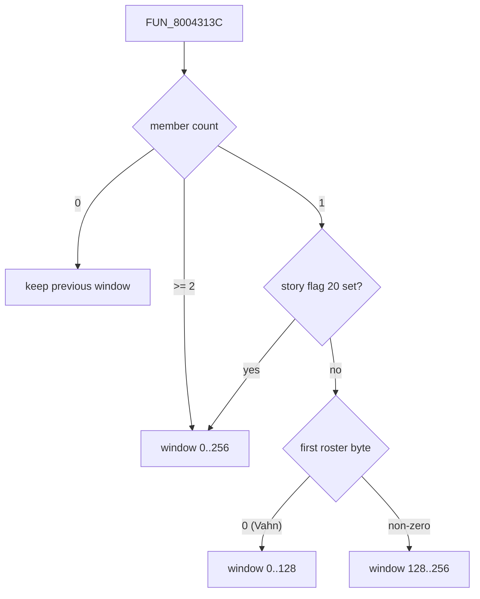

# Inventory - one array, an active window, and the "split bag"

Legaia keeps one shared 256-slot inventory in a single flat array in main RAM. Every helper that adds, finds, consumes or tidies items is bounded by an **active window** over that array, and the window collapses to one 128-slot half whenever a character travels alone. A solo character therefore has an isolated pocket of the bag: they cannot see or spend the party's items, and what they pick up alone never reaches the party inventory.

That window is the whole story behind the "divided" inventory players describe. Storage is never partitioned; only access is. The folklore "72-slot" bag is a menu page size, not an engine bound.

## At a glance

| What | Where |
|---|---|
| Array | `0x80085958`, 256 slots × 2 bytes `[item id : u8][count : u8]` |
| Save location | SC block `+0x1818` inside the `0x1A18`-byte live game-state block at `0x80084140` |
| Window | `gp[+0x2D2]` start, `gp[+0x2D4]` end, `gp[+0x2D6]` span; written by `FUN_8004313C` |
| Helpers | `FUN_800421D4` add, `FUN_80042310` consume by id, `FUN_80042EE0` find, `FUN_80043048` consume by slot, `FUN_800423E0` normalize (all `SCUS_942.54`) |
| Direct writer outside SCUS | `FUN_801D8734` (menu overlay, PROT 0899): the Throw Out confirm |
| Unwindowed readers | cast modules PROT 0941 (Steal / Stone Circle) and PROT 0954 (Fatal Decision) |
| Known quirk | the add helper stores the id before its bound check ([off-by-one](#the-add-helpers-off-by-one)) |
| Port | `legaia_save::retail_inventory` (the helper family), `ItemBag` in `crates/engine-menus/src/item_bag.rs`, held as `PartyState::inventory` |

## Contents

- [Memory layout](#memory-layout)
- [Accessors](#accessors)
- [The active window](#the-active-window)
- [Adjacent divisions people conflate with the halves](#adjacent-divisions-people-conflate-with-the-halves)
- [The add helper's off-by-one](#the-add-helpers-off-by-one)
- [Every reference to the array](#every-reference-to-the-array)
- [The menu list and slot identity](#a-list-rows-payload-is-a-slot-and-the-bag-is-not-compacted-first)
- [Two use legs that are not a heal](#two-use-legs-that-are-not-a-heal)
- [What the port does](#what-the-port-does)
- [Function map](#function-map)
- [Provenance](#provenance)

## Memory layout

**The bag.** One slot is two bytes; nothing reads a slot as a halfword or word.

| Address | SC block offset | Size | Contents |
|---|---|---|---|
| `0x80084140` | `+0x0000` | `0x1A18` | Live game-state block the save is composed from |
| `0x80085958 + slot*2` | `+0x1818 + slot*2` | u8 | Item id; `0` = free slot |
| `0x80085959 + slot*2` | `+0x1819 + slot*2` | u8 | Count; stacks cap at 99 |
| `0x80085958..0x80085A58` | `+0x1818..+0x1918` | 128 slots | Lower half: Vahn's solo window |
| `0x80085A58..0x80085B58` | `+0x1918..+0x1A18` | 128 slots | Upper half: any other lone character's window |

The array ends exactly where the game-state block ends, so it rides verbatim into every memory-card save.

**The window and its inputs.** `gp = 0x8007B318`.

| Address | Form | Type | Contents |
|---|---|---|---|
| `0x8007B5EA` | `gp[+0x2D2]` | i16 | Window start slot: `0` or `128` |
| `0x8007B5EC` | `gp[+0x2D4]` | i16 | Window end slot (exclusive): `128` or `256` |
| `0x8007B5EE` | `gp[+0x2D6]` | i16 | Window span |
| `0x80084594` | block `+0x454` | u8 | Party member count |
| `0x80084598` | block `+0x458` | u8[] | Roster id bytes |
| `0x8007BB88` | `_DAT_8007BB88` | - | The menu's selected payload: a bag **slot index** |

**Slot rules.**

| Rule | Value |
|---|---|
| Free slot | `id == 0`. Occupancy keys on the id alone, so a live id with a zero count still survives compaction. |
| Stack cap | 99 |
| New-game seed | `FUN_80034A6C` writes exactly one slot, `(0x77 Healing Leaf, x5)`; both callers pre-zero the whole range first |

Cheat databases call this region *Have 99 Items* / *Item Modifier*. The *Have 99 Items* code covers `0x80085958..0x800859E8`, 72 slots. That is the size of the general-items **display page** the code targeted.

## Accessors

Every access materialises the block base inline and indexes by slot. Most producers and consumers go through a small `SCUS_942.54` helper family, passing item ids or helper-returned slot numbers:

| Helper | Role |
|---|---|
| `FUN_800421D4` | add - find a matching id, else the first free slot |
| `FUN_80042310` | consume by id - zeroes the emptied id in place and returns; never compacts on its own |
| `FUN_80042EE0` | find-slot-by-id - linear scan of the active window, returns the slot index or none |
| `FUN_80043048` | consume-by-slot - the consume decrement addressed by index; zeroes the id in place when the count reaches 0 |
| `FUN_800423E0` | normalize - calls window setup first, merges duplicate stacks (cap 99), pulls occupied slots down into holes |
| `FUN_8004313C` | window setup - the sole SCUS writer of `gp[+0x2D2 / +0x2D4 / +0x2D6]` |

Every helper scans and bound-checks only inside the window the last call to `FUN_8004313C` installed.

Who goes through the helpers: the pause menu's add / consume / normalize operations, the field VM's `GIVE_ITEM` op (`0x39`, chests and scripts), battle rewards (`FUN_8004E568`), shops, and the equip swap-back that refunds displaced gear. There is no raw-index sort or swap primitive anywhere in retail.

Who does not:

- **The Throw Out confirm** (`FUN_801D8734` in PROT 0899, state `3`) zeroes the selected slot's id and count itself: `sb zero,0x1818(v0)` / `sb zero,0x1819(v0)` at `0x801D88FC` / `0x801D8910` over `0x80084140 + _DAT_8007BB88 * 2`. It does so after cue `0x37` and before it walks `[gp[+0x2D2], gp[+0x2D4])` for any slot still occupied. The pair sits inside PROT 0899's clean-copy prefix (see `ghidra/scripts/funcs/overlay_menu_801d8734.txt`).
- **The field, battle and menu overlays** read slots directly.
- **Two capture-class cast modules** reach the array without the window at all ([below](#every-reference-to-the-array)).

Thirteen SCUS functions touch the array in all.

## The active window

The helpers never see "256 slots". They see `[start, end)` in three `gp`-relative halfwords. `FUN_8004313C` is the only function in `SCUS_942.54` that writes them (11 call sites; an overlay writer has not been excluded). It picks the window from the party roster: member count at `0x80084594`, roster id bytes at `0x80084598`.

| Members (`0x80084594`) | Story flag 20 | First roster byte | Window installed |
|---|---|---|---|
| `0` | - | - | none - the previous window stays |
| `1` | set (`FUN_8003CE64(0x14)`) | - | `[0, 256)` |
| `1` | clear | `0` (Vahn) | `[0, 128)` |
| `1` | clear | `!= 0` | `[128, 256)` |
| `>= 2` | not tested | not tested | `[0, 256)` |

The span also lands in `gp[+0x2D6]`, so `gp[+0x2D4]` is only ever `128` or `256`. Slots outside the window exist in RAM but are out of bounds to add, find, consume and normalize alike.

**Live cross-check** on a mid-game battle state: party count 3, window `(0, 256, 256)`, 160 contiguous occupied slots.

**The "72-slot inventory" is not an engine bound.** 72 is the size of the general-items display page the *Have 99 Items* GameShark code targeted. The accessors bound on `gp[+0x2D4]`. Arithmetic built on a 72-slot bag, including older ACE out-of-bounds ceilings, is void.

**Design intent.** The game has story segments where the party splits and the player controls one character alone. The window gives that character an isolated pocket. Vahn owns the lower half because the game opens with Vahn alone: the early-game bag is `[0, 128)` until the party forms. Once two or more members are present the full 256 opens and the halves stop mattering.

## Adjacent divisions people conflate with the halves

Three unrelated boundaries get called "divided inventory". Only the first is the window mechanic.

| Division | Where | What it is |
|---|---|---|
| The window halves | `FUN_8004313C`, `gp[+0x2D2..+0x2D6]` | Runtime bounds over one shared array, keyed on party composition. Storage is never partitioned - only access is. |
| Per-character gear | `0x80084708 + n*0x414`, equip bytes `+0x196..+0x19D` | Equipped weapon, armor and Goods live inside each character's `0x414`-byte [record](../formats/save-record.md), not in the bag. Equipping refunds the displaced item through the add helper; once worn, it belongs to the record. |
| Menu pages | consumables `0x77..0x8E`, equipment below, books and key items above | The pause menu's tabs filter the one array by item-id band. A page is a view, not a second store - and the 72-slot figure is a page size. |

## The add helper's off-by-one

`FUN_800421D4` scans for a matching id, then for the first free slot. Its id store precedes the bound check. On a completely full window the scan exits at `i == end` and the id byte lands one slot past the window, at `0x80085958 + gp[+0x2D4]*2`: `0x80085A58` (`end = 128`) or `0x80085B58` (`end = 256`). Only the count store is guarded.

This is the core of the arbitrary-code-execution reachability thread, which is settled: the write primitive is real and normal play cannot reach it. Reasoning and grades are in [`re-settled-threads.md`](../reference/re-settled-threads.md#full-window-item-add-oob-reachability). Two cautions:

- An exec probe at `pc = 0x800422BC` fires on **every** successful add, before the guard. A hit there is not out-of-bounds evidence by itself.
- `0x800859E8` (SC `+0x18A8`) is not "the first key-item slot". That reading assumed the 72-slot page was the window.

**The two window sizes fail differently.** The merge pass keys on the id byte, so each non-zero id occupies at most one slot and `0` is the empty sentinel: at most **255** distinct ids can be live.

- The **full** window is 256 slots, so a hole always remains and the scan cannot reach `end`.
- The **half** windows are 128 slots, and the id space does not save them. The static [item-name table](../formats/item-table.md) `PTR_DAT_8007436C` carries **250** non-empty names over its 256 ids (only `0x00`, `0x12`, `0x1A`, `0x52`, `0xB9` and `0xFD` are blank), so 128 distinct live ids is arithmetically reachable. What bounds this case is how much of the item population is obtainable while a character travels alone. That is a progress bound, not a capacity one, and it has not been measured.

## Every reference to the array

The array is reachable in exactly one addressing idiom, and three structural facts close the enumeration of its users.

- **The `gp`-relative form is arithmetically impossible.** `0x80085958 - gp` is `0xA640` and the array ends at `gp + 0xA840`; a signed 16-bit displacement reaches only `gp + 0x7FFF`. No `imm(gp)` instruction can name any byte of it.
- **The literal-word form has zero occurrences.** Neither `0x80085958` nor the block base `0x80084140` appears as a 32-bit word anywhere in `SCUS_942.54` or the 1233 `PROT` entries, so no pointer table offers an indirect route in.
- **Every access materialises the block base inline**, as `lui rX,0x8008` / `addiu rX,rX,0x4140` then `sll slot,1` / `addu` / `lbu|lb|sb rW,0x1818(rZ)` (id) or `0x1819` (count).

Decoding every instruction of the based images for that displacement pair gives **125 sites across six images**:

| Image | Sites | Notes |
|---|---:|---|
| `SCUS_942.54` | 51 | 13 functions, `0x8003004C..0x800430A0` |
| PROT 0899 menu | 55 | 19 functions; four sit behind a `lui` in a branch delay slot, which a linear scan misses |
| PROT 0897 field | 5 | |
| PROT 0898 battle | 2 | |
| PROT 0941 + PROT 0954 cast modules | the remaining 12 | see below |
| Every other based overlay and PROT entry | 0 | |

Exactly two of the 125 are absolute rather than indexed, and both are the new-game seed's slot-0 write (`0x80034B10` / `0x80034B18`). **No instruction on the disc names an address inside the key-item band**; it is only ever reached through a runtime index.

**The two cast modules** are the consumers no window bounds.

- [PROT 0941](../formats/spell-table.md) (Steal / Stone Circle) picks a random slot and tests it against the window-start halfword (`lh v1,0xB5EA(a1)` at `0x801F7828`). Its full rule set is under [the port's Steal](#the-consumer-that-indexes-by-slot).
- PROT 0954 (Fatal Decision) has no such test: `0x801F81A4` leaves `rand & 0xFF`, so it samples the **whole** 256-slot array. It accepts the first slot whose id, count and item-record price (`+2`) are all non-zero, retrying up to `0x400` times (`0x801F81FC`). It is the only reader that reaches the key-item band without going through the menu window.

**The `& 0x3ff` slot mask** belongs to 4 sites only: the SCUS packed-handle decoders `FUN_8002FF8C` / `FUN_800302E4` / `FUN_80032A44`, where the handle's low bits carry the slot and its high nibble carries a tag (`0x800302F4 andi v1,a1,0xf000`). The mask is not a 256-slot bound: `0x3FF` admits slot 1023, `0x5FE` past the array's end. What confines those reads is whoever builds the handle.

## A list row's payload is a slot, and the bag is not compacted first

The menu's selected payload `_DAT_8007BB88` is a **bag slot index**. The pause item list hides empty slots, so the row ordinal and the slot agree only while nothing above the selection is a hole. Holes do reach the list, because nothing compacts the bag when a menu opens.

The normalize helper `FUN_800423E0` has exactly one call site in the dump corpus: a field-VM arm at `0x801E05D0` in PROT 0897. It sits behind two equality tests on the dispatcher's own context register. The byte at `+0x454` must read `2` (`0x801E05B0..0x801E05B8`) and the halfword at `+0x458` must read `0x100` (`0x801E05C0..0x801E05C8`). Either mismatch jumps past the call.

Measured on a bag holed at slots 1 / 3 / 6: the cursor stepped `0, 2, 4, 5, 7, 8` across six displayed rows, never rested on a zero-id slot, and `FUN_800423E0` ran zero times. The Throw Out confirm (`FUN_801D8734` phase 3) then zeroes `bag[cursor*2]`, the pair at the slot the row named.

Two consequences for anything reading this list:

- **Removing by row ordinal is wrong** as soon as a hole sits above the selection.
- **Removing by item id is wrong** as soon as one id occupies two slots: an id-keyed scan finds the first, which is not the stack the player pointed at.

## Two use legs that are not a heal

The item-use applier `FUN_800402F4` dispatches on the descriptor's **class** byte, and two of its arms are not target effects. The engine runs both through `World::use_item`.

**The Hyper-Art books** (classes `11` / `12` / `13`, item ids `0x8F..=0x97`: Fire / Wind / Thunder Book I..III) write the character record's displayed-skill list at `+0x185` (count) / `+0x186` (ids), not any live battle field. The arm is at `0x80041FB4`.

- **The picked target is never read.** The record written is `class - 11`, i.e. roster slot 0 / 1 / 2, derived from the descriptor alone (`addiu v1,v1,-0xb` at `0x80041FC0`). A Fire Book used on Noa still teaches Vahn.
- **The descriptor's `tier` byte is the art id**, so the three lines do not share a tier space: Fire and Thunder I/II carry `3` / `2`, Wind I/II carry `5` / `4`, and all three line IIIs carry `1`. Reading `tier` as a book *level* inverts the numbering.
- **The insert is ordered ascending by id.** The loop at `0x80041FFC..0x8004202C` moves an entry up only while the new id compares lower.
- **The shipped descriptors carry flag byte `0x83`**: field-usable, not battle-usable.
- **The out-of-battle leg raises a "learned" notification** (`jal 0x80035C00`), skipped when the mode word `0x8007B83C` reads `0x15`. The engine surfaces it as the `ItemOutcome::ArtLearned` it returns.

Ports: `legaia_engine_vm::battle_action::selector_insert_displayed_skill` for the insert, `World::use_item` for the seat. The record-side capture and the menu reader are on [level-up.md](level-up.md#arts-book-skill-list).

**The Point Card strike** (class `14`, arm `0x8004209C`) spends `min(bank, 0x270F)` of the Point Card counter `_DAT_800845B4` and applies it as HP damage with the cast band's usual kill-capable clamp. No retail item row resolves to the class: decoding all 256 static item rows through the effect descriptors finds zero class-`14` descriptors. On the shipped disc it is reachable code over unreachable data, and only an edited effect table opens it. The engine's catalog seeder therefore sweeps the id space for the class rather than naming ids. Port: `legaia_engine_vm::battle_action::selector_point_card` against `World::minigames.point_card`, the same purse a shop buy credits ([`shop.md`](shop.md)).

## What the port does

The engine keeps the bag as `PartyState::inventory`, an `ItemBag` (`crates/engine-menus/src/item_bag.rs`, re-exported by `engine-core`) over retail's own **256-slot array**: `(id, count)` pairs in slot order, holes included, with an active [window](#the-active-window) installed over them. The slot arithmetic is not re-implemented there. It is `legaia_save::retail_inventory`, where the accessor family is ported once, so the preservation model (`save-tool items`) and the running engine share one copy of each routine.

Most consumers address the bag by **id**: the pause menu's filtered pages, `GIVE_ITEM`, buy / sell, the battle Item arm. `ItemBag` keeps a map-shaped adapter (`get` / `insert` / `entry` / `remove` / `len`) over the array for them. What the array gives underneath:

- **Iteration is slot order**, the order the menu pages and the sell list walk.
- **A hole is expressible.** `id == 0` is the free sentinel and a live id with a zero count survives, which is retail's occupancy rule.
- **The window is expressible.** `find` / `add` / `consume` / `normalize` all scan `[gp[+0x2D2], gp[+0x2D4])`, so a solo character's half-bag behaves as the selector makes it behave.

**Rows carry slots.** The port carries the slot on the row (`engine-core::world::BagRow::slot`, and `PauseItemRow::slot` on the pause screen) and removes through the by-slot consume helper `FUN_80043048` (`ItemBag::consume_slot`), which zeroes the id byte in place and leaves the hole. Use, Throw Out and the shop's sell list all take that path. A host that built its rows without a slot-indexed bag keeps the id-addressed fallback.

### The consumer that indexes by slot

PROT 0941's enemy Steal ([cast-module.md](cast-module.md)) is a rejection sampler over the physical array, and it is the reason the array shape matters. `World::roll_cast_steal` reproduces all four of its rules:

| rule | retail | where |
|---|---|---|
| uniform draw over **256 slots**, budget `0x400`, one `rand()` per rejection | `0x801F77C4` loop | `cast_arm_ticks::steal_pick_bag_slot` |
| accept only `id != 0 && count != 0 && shop price != 0` | `0x801F7884..0x801F78A4` | the price mask `roll_cast_steal` builds from `ShopItemData` |
| re-draw while `slot < window start` when the second party member is character `4` | `0x801F77E8` arms on `DAT_8007BD10[1]`, floor `*(i16*)0x8007B5EA` | the `min_slot` argument |
| the removal scans only the **window** and returns `0x100` outside it | `FUN_80042310`, miss arm `0x80042374` | `ItemBag::consume_returning_slot` |

**The third rule is a shop price**, not an "item table knows this id" test. The halfword at `0x80074368 + id*0xC + 2` is the field the shop prices a purchase from, so a quest or found-only item, which has no price, cannot be stolen. Over the 256 ids the table carries, **96 are priced `0`**: more than a third of the id space is unstealable by construction.

**The fourth rule is an asymmetry, and it is retail's.** The draw is over the whole array while the removal is window-bounded, so a steal that lands in the half the active window does not cover announces an item the party keeps.

### Slot order in a save

`SaveExt::item_slots` carries the array itself - 256 `(id, count)` pairs, slot order, holes intact - beside the compact `inventory` list the v1 prelude carries. The engine save format writes it as the optional `LGX6` block; a file without one seeds densely from the list.

On the retail side `SaveFile::from_retail_sc_block` lifts the **whole** `0x200`-byte span, not the 72-slot consumable page. A played-through bag runs well past slot 71: a three-member mid-game card reads 160 occupied slots.

## Function map

| Function | Role | Notes |
|---|---|---|
| `FUN_8004313C` | window setup | sole SCUS writer of `gp[+0x2D2 / +0x2D4 / +0x2D6]`; 11 callers; branches on party count, story flag 20, first roster byte |
| `FUN_800421D4` | add (find-or-insert) | id store precedes the bound check (the off-by-one); count store is guarded |
| `FUN_80042310` | consume by id | zeroes the emptied id in place; never compacts on its own |
| `FUN_80042EE0` | find-slot-by-id | linear scan `[start, end)`; bounded |
| `FUN_80043048` | consume-by-slot | `count = max(count - qty, 0)` at a slot index, id zeroed in place at 0; bounded, no-op on an out-of-range or empty slot |
| `FUN_800423E0` | normalize (merge + squeeze) | calls window setup first; merges duplicate stacks (cap 99); pulls occupied slots down into holes; occupancy = `id != 0` alone |
| `FUN_80034A6C` | new-game seed | writes exactly slot 0 = `(0x77 Healing Leaf, x5)`; both callers pre-zero the whole range first |
| `FUN_800402F4` | item-use applier | dispatches on the descriptor class; arts-book arm `0x80041FB4`, Point Card arm `0x8004209C` |
| `FUN_801D8734` (PROT 0899) | Throw Out confirm | the one non-SCUS writer: zeroes slot `_DAT_8007BB88`'s id and count in place (`0x801D88FC` / `0x801D8910`), then scans the active window for a surviving occupied slot |

## Provenance

Ghidra-traced disassembly of `SCUS_942.54` plus live emulator cross-checks: a three-member mid-game battle state for the window read, and a menu-overlay sweep of all 129 functions (`dump_menu_inventory_refs.py`). Cheat-device names (*Have 99 Items*) are cited as third-party anchors, not as engine facts. The per-cell detail also lives in [`memory-map.md`](../reference/memory-map.md#0x80085958---item-inventory); this page is the mechanism-first view.

## See also

- [`memory-map.md`](../reference/memory-map.md) - the RAM map this array sits in.
- [`save-record.md`](../formats/save-record.md) - the per-character record equipped gear lives in.
- [`field-menu.md`](field-menu.md) - the pause-menu renderer that walks the bag over the window.
- [`script-vm.md`](script-vm.md) - the field VM's `GIVE_ITEM` op.
- [`shop.md`](shop.md) - buy / sell over the same bag.
