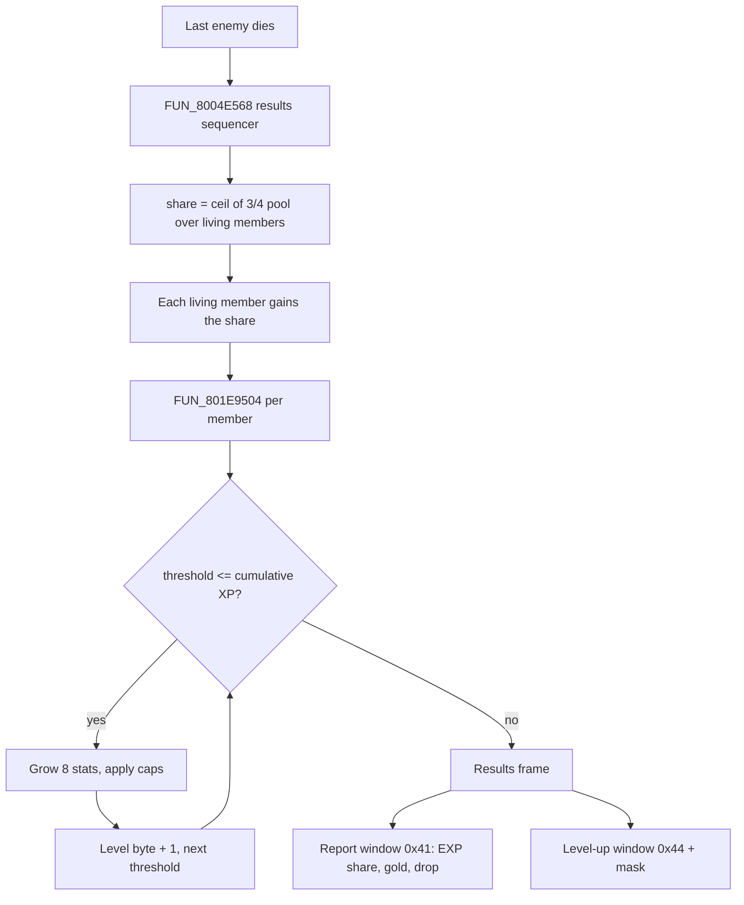

# Level-up: XP distribution, stat growth and the results windows

After a won battle the game splits the monsters' experience among the living party members, checks each member against a per-level threshold, and grows eight stats for every threshold crossed. One routine does the threshold check, the growth and the level bump: the overlay-resident applier `FUN_801E9504`. Everything it needs - the XP curve and the per-character growth tables - is static data in `SCUS_942.54`, so the whole curve is reproducible from the user's executable.

The page also covers what the player sees: the two framed windows the results sequence raises over the battle, and the port's own banner. A level-up raises maxima only; it does not heal.

## At a glance

| What | Where |
|---|---|
| Results sequencer | `FUN_8004E568` (SCUS); computes the share, calls the applier at `0x8004F34C` (`jal 0x801E9504`, argument = active-party slot − 1) |
| Applier | `FUN_801E9504` (battle overlay; the same code is aliased into the `overlay_magic_level_up` / `overlay_magic_capture` / `overlay_muscle_dome` dumps) |
| XP delta table | `DAT_80076AF4`, u16 × 98, `delta(n) = ⌊n²/4⌋ + 1` |
| XP correction divisors | `_DAT_8007B81C` → `0x80070A2C`, `i16` at `level × 0x28` |
| Growth curves | `DAT_800769CC`, 3 rows, stride `0x62` |
| Growth parameters | `DAT_80076918`, stride `0x3C`, 8 × `{u16 start, u16 max, u8 jitter, u8 row}` per character |
| Record fields | cumulative XP `+0x0`, next threshold `+0x4`, HP / MP max + six stats `+0x11C..+0x12D`, level byte `+0x130` (record base `0x80084708 + slot×0x414`) |
| Results windows | screen elements `0x41` (report), `0x42` (loss), `0x44 + mask` (level-up), drawn by `FUN_8002C69C` |
| Parser | `legaia_asset::level_up_tables` (`crates/game-tables/src/level_up_tables.rs`) |
| Port | `LevelUpTracker` in `crates/engine-battle/src/levelup/` (re-exported as `engine_core::levelup`), driven by `World::apply_battle_xp` |

Provenance: `ghidra/scripts/funcs/overlay_battle_action_801e9504.txt` (identical `overlay_magic_level_up_801e9504.txt` / `overlay_muscle_dome_801e9504.txt`), caller in `ghidra/scripts/funcs/8004e568.txt`.



## Contents

- [XP distribution](#xp-distribution)
- [XP table](#xp-table)
- [Stat gains](#stat-gains)
- [Record write footprint](#record-write-footprint)
- [Battle-actor stat struct](#battle-actor-stat-struct-dat_801c9370-pool)
- [Results windows](#results-windows)
- [Engine port](#engine-port)
- [Arts-book skill list](#arts-book-skill-list)
- [Readings that do not hold](#readings-that-do-not-hold)

## XP distribution

`FUN_8004E568` sums the defeated monsters' experience, keeps three quarters of it and ceiling-divides the result among the members still alive:

```text
pool   = sum of monster EXP
scaled = pool - (pool >> 2)                 ; 3/4
share  = ceil(scaled / living_members)      ; 0 in a no-reward fight
```

Dead members receive nothing and leave the divisor. The share `s6` is stored to `gp+0xA04` at `0x8004F684` and is the figure the report window prints, so the window shows **one member's share**, not the battle's EXP: a 48-EXP monster beaten by a party of three reads `12` (`noa_levelup_banner` capture).

Port: `battle_formulas::victory_exp_per_member` (`crates/engine-battle-vm/src/battle_formulas/victory.rs`), carried as `BattleRewards::xp_share`.

## XP table

The XP-to-next-level curve is a static table plus a scaling formula, applied inside `FUN_801E9504`.

**Delta table `DAT_80076AF4`** (u16 entries, referenced as `&DAT_80076AF4` at `0x801E9588` / `0x801E9594`). It is static `SCUS_942.54` data, below the `0x801C0000` overlay boundary and clear of the sin LUT range (`0x80070A2C..0x80072A2C`). The 98 entries are exactly `delta(n) = ⌊n²/4⌋ + 1` (`1, 2, 3, 5, 7, 10, …, 2402`; the pattern continues through the two trailing entries past the L99 window). Its only readers in the corpus are the four alias copies of `FUN_801E9504`.

**Threshold formula** (`0x801E95D0`–`0x801E9624`):

```text
sum       = Σ DAT_80076AF4[0 .. level]
threshold = (sum × 9_999_999) / 0x140FE      if level <  0x11   (≈ sum × 121.69)
threshold = sum × 0x79                       if level >= 0x11   (× 121)

corr      = (threshold × 0x14) / divisor[level]     ; divisor = i16 at *(_DAT_8007B81C) + level × 0x28
threshold = threshold - corr                 slot 1 (Noa)
threshold = threshold + corr                 slot 2 (Gala)
```

**The correction divisor.** The pointer global `_DAT_8007B81C` is constant in retail: it reads `0x80070A2C` in every library save state, so the divisor table is static data. It is the head of the GTE sin LUT sampled at a `0x28` stride (125, 251, 376, … by level), so the correction shrinks from about 16% at L1 toward about 0.5% mid-game. The divisor is indexed by the character's *current* level.

**Level-up loop.** A `do … while (threshold ≤ record cumulative XP)` (the `sltu` at `0x801E9714` / `0x801E9F70`) bumps the level and applies one round of stat growth per crossed threshold. A single large award can advance several levels in one call.

**Validation.** Every sampled `(level, next-threshold)` pair from L1 through L37 across the save-state library matches the formula exactly, including the slot corrections (New Game: Vahn / Terra 121, Noa 102, Gala 140; the captured L3 example is 365 ± 29). At L99 the record carries 0. A New Game Status screen shows Vahn L1 "Next Level 121".

**In the engine.** The curve ships twice and the two agree byte for byte:

- `legaia_save::RETAIL_XP_CUMULATIVE` / `engine_core::levelup::retail_xp_table()` carry the derived base curve (`121, 365, 730, 1338, 2190, …, 9_646_483`), computed from the closed form plus the scaling arithmetic. No table bytes are copied.
- `legaia_asset::level_up_tables::xp_thresholds_from_scus` reads `DAT_80076AF4` and applies the formula from the user's `SCUS_942.54` at boot; `legaia_engine_session::BootSession` installs it over `LevelUpTracker::xp_table`.
- `xp_correction_divisors_from_scus` parses the divisors; `LevelUpTracker::threshold_for` applies them (slot 1 earlier, slot 2 later).

### Record fields + status display

The applier maintains three record fields the Status menu draws verbatim (`FUN_801D33D8`, menu overlay):

| Record offset | Type | Status line | Engine accessor |
|---|---|---|---|
| `+0x0` | u32 | "Experience": cumulative XP | `CharacterRecord::cumulative_xp` |
| `+0x4` | u32 | "Next Level": the cumulative total at which the next level lands, not the remaining difference | `CharacterRecord::next_level_xp` |
| `+0x130` | u8 | "LV": the displayed level | `CharacterRecord::level` / `set_level` |

`World::apply_battle_xp` re-stamps all three after every grant, and `World::seed_starting_party` seeds `+0x4 = 121` at a New Game.

## Stat gains

`FUN_801E9504` takes the 0-based party slot (`a0 = active-slot − 1`; slot 3 returns immediately) and indexes the character record at `0x80084140 + slot×0x414`. Each loop iteration grows **eight stats** at `+0x6E4..+0x6F4` off that base (HP `+0x6E4`, MP `+0x6E6`, then six battle stats at `+0x6EA..+0x6F4`, skipping the `+0x6E8` 100-cap slot), then increments the level byte at `+0x6F8`.

The `0x80084140`-based block is the same RAM as the record's `+0x11C..+0x12D` stat window: the two bases differ by a constant `0x5C8` at the same `0x414` stride (`+0x6F8` = record `+0x130`).

### Tables

**Growth curves `DAT_800769CC`** (`lui v0,0x8007; addiu s4,v0,0x69CC`). `GROWTH_ROW_COUNT` = 3 rows, stride `0x62` (= 98 = `MAX_LEVEL − 1`). Each row is a monotonic ramp (row 0 = `0x50, 0x52, 0x54, …`) settling to a `0x40` plateau byte at high levels. Each row sums to exactly `0x24C0` (9408).

**Parameter block `DAT_80076918`** (`lui a0,0x8007; addiu a0,a0,0x6918`). Stride `0x3C`, one record each for Vahn / Noa / Gala; the fourth slot is never grown. Each record is 8 contiguous 6-byte sub-records:

| Offset | Type | Field |
|---|---|---|
| `+0` | u16 | `start`: the stat's level-1 value |
| `+2` | u16 | `max`: the level-99 ceiling |
| `+4` | u8 | `jitter`: half-range of the random spread |
| `+5` | u8 | `row`: which growth curve |

The block has no length word; its leading `0x00B4` is Vahn's HP `start` (180). `start` matches the new-game starting template (`legaia_asset::new_game`): Gala on all 8 stats, Vahn and Noa on HP / MP / AGL (their late-join templates are lightly retuned).

### Per-level gain arithmetic (decoded + validated)

Per stat per level (disassembly `0x801E9758..0x801E97F8`):

```
jitter_val = rand() % (2*jitter + 1)                  ; BIOS A(0x2F) rand, 0..2*jitter
byte       = curve[row][level - 1]                    ; 0x62-stride row index
gain       = (max - start) * byte / 0x24C0            ; the 0x6F74AE27 >> (32+12) magic divide
gain       = gain + jitter_val - jitter               ; recenter jitter to [-jitter, +jitter]
gain       = max(1, gain)                             ; +1 floor
record[stat] += gain                                  ; then caps: HP ≤ 9999, MP ≤ 999, SP ≤ 0x118, others ≤ 999
```

The divisor `0x24C0` is the curve normalizer. Because each curve sums to exactly `0x24C0`, the term `(max − start) × byte / Σcurve` accumulates to `(max − start)` across all 98 levels, so a stat lands on its `max` at level 99 (before jitter).

**Validation.** The `noa_levelup_field_pre` / `noa_levelup_field_post` library saves (Noa, growth slot 1, L2 → L3; the `noa_levelup_*` scenarios in `scripts/scenarios.toml`) give byte-exact single-level deltas: HP +39, MP +5, and the six record stats +2 / +4 / +4 / +3 / +4 / +3. Leveling from L2 reads `curve[row][1]`, and all 8 deltas land within `[core − jitter, core + jitter]` (for example HP core `(4500 − 150) × 82 / 9408 = 37`, observed +39, jitter half-range 4). Decoded and checked in `legaia_asset::level_up_tables` (`GrowthTables::char_params` / `level_gain_core`) by the disc-gated `crates/asset/tests/level_up_tables_real.rs`, which also pins the first correction divisors.

### A level-up is not a heal

`FUN_801E9504` stores to exactly eleven addresses, and every one is a maximum, a stat or a level:

- `+0x6E4` / `+0x6E6`: the record window's `hp_max` / `mp_max`, capped `0x270F` / `0x3E7`.
- `+0x6EA..+0x6F4`: the six battle stats, AGL capped `0x118` and the rest `0x3E7`.
- `+0x6F8` (= record `+0x130`): the displayed-level byte, and its actor-table mirror.
- The two `+0x5CC` globals.

The live window's current HP (`+0x106`) and current MP (`+0x10A`) are not among them. The routine's only `jal` is the BIOS `rand` at `0x80056798`, so no helper writes them either. Both dumps of the routine agree.

The captures agree as well. The single-level `noa_levelup_*` triplet reads Noa's live window at `164/182` HP and `16/16` MP going into the fight, and `164/221` HP / `16/21` MP once the level-up has settled in the field. Both maxima move by the growth amount; both currents stand where the fight left them. The `+0x106` / `+0x10A` write the multi-level captures see in their "settle" frame is the battle-end resync of the live pools, not a grant.

Crossing a threshold mid-dungeon raises the ceiling and leaves the player exactly as hurt as they were.

## Record write footprint

### Multi-level captures

Three per-character multi-level observations come from the mednafen save corpus. Each is a settled pre→post diff over the character record window, from pre / mid / post triplets at battle scene `map01`.

| Character | Slot | Next-threshold word (u16 LE at `+0x004`) | HP_max | MP_max | SP_max |
|---|---:|---|---:|---:|---:|
| Vahn | 0 | 365 → 730 (+365) | (`+0x126` wrap, +38) | +8 | +8 |
| Noa | 1 | 102 → 336 (+234) | +32 | +6 | **+40** |
| Gala | 2 | 140 → 394 (+254) | +44 | +8 | **0** |

These pin the write **footprint** and the phase split. They are not a per-level growth oracle: their HP deltas are far below the validated ≈ +38 per level, so the level count attached to them is unreliable. Use the single-level Noa capture above for growth arithmetic.

They are codified as `LevelUpObservation` associated functions in [`engine-battle::levelup`](../../crates/engine-battle/src/levelup/observation.rs): `vahn_4_level_jump` (its source saves are no longer in the active corpus), `noa_4_level_jump` and `gala_4_level_jump`. `LevelUpObservation::stat_deltas` is an 18-byte window covering `+0x11C..+0x12D` (9 u16 LE values: HP_max, MP_max, the per-stat cap, six record-side stats); `record_stats_u16()` lifts it as `[u16; 9]`.

### Phase split (multi-frame writes)

The level-up event splits the character record write across frames. Noa's triplet pins three phases:

| Phase | Window | Writes |
|---|---|---|
| Record write | pre → mid₁ | `+0x11C..+0x12D` (record stat window), `+0x004..+0x005` (XP), `+0x130` (level byte +1) |
| Live copy | mid₁ → mid₂ | `+0x104..+0x11B` (HP_max, MP_max, six u16 live stats) |
| Settle | mid₂ → post | `+0x106 / +0x10A / +0x10E` (live HP_cur / MP_cur / AP_cur - the battle-end resync, not a refill) |

Gala's runs in two phases: record write, then live copy and settle collapsed into one frame.

The slot indices holding each frame live in [`scripts/scenarios.toml`](../../scripts/scenarios.toml). The phase split and the per-character record bases (Vahn `0x80084708`, Noa `0x80084B1C`, Gala `0x80084F30`, slot 3 `0x80085344`, stride `0x414`) are in [`engine_core::capture_observations::char_level_up`](../../crates/engine-system/src/capture_observations.rs) with helpers `read_record_stats` / `read_rank_counter` / `read_xp_u16`.

### Per-character semantic findings

- **Noa's `+0x10E` moves by `+40`** across her triplet; **Gala's by `0`**. An engine that copies one character's curve to another mis-grants this cell.
- **`+0x120` (u16 LE) is a per-stat cap constant `100`**, not SP_max. It holds across every captured save and character. `legaia_save::character::CharacterRecord::stat_cap` reads and writes `+0x120`, the same field as `RecordStats::cap_constant` (pinned by `character::tests::stat_cap_aliases_record_cap_constant`). `+0x11A` is the live INT stat (`LiveStats::int`), which a level-up mutates. The runtime `999` clamp in `FUN_80042558` is a code constant (`legaia_save::STAT_CAP`), not this field.
- **`+0x130` is the displayed character level**, read directly and not re-derived from XP. Details below.

### The level byte `+0x130`

This is the byte the status screen reads as "LV" and the `Level 99` GameShark code targets. Boot-confirmed through the starting-level randomizer: a New Game record with level-10 cumulative experience (`+0x0`), level-10 stats and the correct threshold (`+0x4`) but `+0x130 == 1` displays **LV 1**; setting `+0x130 = 10` makes it display **LV 10**. The new-game seed writes it ([`new-game-table.md`](../formats/new-game-table.md)).

The captured multi-level jumps moved it by one per level-up event, so it can momentarily lag the XP-derived level after a rare multi-level grant. For single-level play and the new-game seed it equals the level.

- It is not a magic-rank byte. The magic-rank counter is capture-pinned at record `+0x9C` ([`save-record.md`](../formats/save-record.md#0x130-is-the-displayed-character-level)).
- The adjacent `+0x131`, which the seed also inits to 1, has one writer on the disc (`0x800561C8`) and no reader in any image.
- The port keeps its level in the same byte (`CharacterRecord::level`). It must not live at `+0x100`: that is word 3 of the ability bitfield `+0xF4..+0x103`, which the aggregator zeroes and rebuilds from equipment on every pass.

## Battle-actor stat struct (`DAT_801C9370` pool)

The in-battle actor is a runtime struct distinct from the character record. `DAT_801C9370[slot]` (`slot * 4`) is a pointer to it; 8 slots, party 0..2, monsters 3..7. It is not the record's `+0xF4..+0x13D` window that the per-character ability aggregator `FUN_80042558` builds.

- Party actors are initialised by `FUN_80053cb8`, which copies the record's **live**-stat window `+0x104..+0x11A`.
- Monster actors are initialised by `FUN_80054cb0`, which copies the monster-archive record.
- Both write the identical `+0x14C..+0x176` layout. The block uses **working / base pairs**: an even-offset working copy that buffs and damage mutate, plus a `+2` base copy kept for un-buff and percentage math.
- The AI picker `FUN_801E9FD4` and the battle action SM `FUN_801E295C` read this struct each turn.

| Offset | Field | Party source (`FUN_80053cb8`) | Monster source (`FUN_80054cb0`) |
|---|---|---|---|
| `+0x14C` | HP current | char live HP_cur (`+0x106`) | monster HP (`+0x0C`) |
| `+0x14E` | HP max | char live HP_max (`+0x104`) | monster HP (`+0x0C`) |
| `+0x150` | MP current | char live MP_cur (`+0x10A`) | monster MP (`+0x10`) |
| `+0x152` | MP max | char live MP_max (`+0x108`) | monster MP (`+0x10`) |
| `+0x154` | AGL working | copy of `+0x156` | copy of `+0x156` |
| `+0x156` | AGL base | char live AGL (`+0x110`) | monster AGL (`+0x0E`) |
| `+0x158` | ATK working | copy of `+0x15A` | copy of `+0x15A` |
| `+0x15A` | ATK base | char live ATK (`+0x112`) | monster ATK (`+0x12`) |
| `+0x15C` | UDF working (physical def) | copy of `+0x15E` | copy of `+0x15E` |
| `+0x15E` | UDF base | char live UDF (`+0x114`) + equip-def bonus | monster record |
| `+0x160` | LDF working (magical def) | copy of `+0x162` | copy of `+0x162` |
| `+0x162` | LDF base | char live LDF (`+0x116`) + equip bonus | monster record |
| `+0x164` | SPD working | copy of `+0x166` | copy of `+0x166` |
| `+0x166` | SPD base | char live SPD (`+0x118`) + equip bonus | monster record |
| `+0x168` | INT working | copy of `+0x16A` | copy of `+0x16A` |
| `+0x16A` | INT base | char live INT (`+0x11A`) | monster record |
| `+0x16C` | AI turn-eligibility gate | set later; `FUN_801E9FD4` skips actor when 0 | same |
| `+0x16E` | side / element bit-field | char `+0x12E` (`FUN_800513F0`); charm sets `\| 0x380` | monster |
| `+0x170` | Spirit gauge (SP) | char live SP_max (`+0x10E`) | const `100` |
| `+0x172` | HP snapshot (battle-start current) | copy of `+0x14C` | copy of `+0x14C` |
| `+0x174` | MP snapshot | copy of `+0x150` | copy of `+0x150` |
| `+0x176` | per-action transient | cleared to 0 on action-state entry (`0x801E490C`) | same |

Notes:

- The record source offsets are the live-stat window the aggregator `FUN_80042558` writes (`+0x104` HP_max, `+0x106` HP_cur, `+0x108` MP_max, `+0x10A` MP_cur, `+0x10E` SP, `+0x110..+0x11A` = AGL / ATK / UDF / LDF / SPD / INT).
- Equipment defence and accessory bonuses are folded into the `+0x15E` / `+0x162` / `+0x166` base copies by `FUN_80053cb8`'s 5-slot equip loop on the party side. Monster actors take the archive value directly.
- `+0x16E` is the word the enemy-ally **charm** randomizer hook flips (`\| 0x380`) and the shiny-Seru summon bits ride; the AI retarget `FUN_801E7320` reads it.

Provenance: `ghidra/scripts/funcs/80053cb8.txt` (party init), `.../80054cb0.txt` (monster init), `.../overlay_0898_801e9fd4.txt` (AI reads), `.../overlay_0898_801e295c.txt` (action SM).

### Data in the level-up overlay image

The captured overlay data section (`overlay_magic_level_up_full.bin`, `0x801C0000–0x801FFFFF`, full 256 KB) holds no growth table. What it does hold:

| Address | Content |
|---|---|
| `0x801F4B8C` | Muscle Dome hand-command id table, 4 bytes `0C 0F 0E 0D` (`legaia_asset::muscle_dome::DECK_TABLE_VA`) - not a magic-slot table. Its sibling `0x801F4B94` holds the 4 card-sprite ids `0D 10 11 0C`. |
| `0x801F4B98` | Magic-type name strings: Spirit / Defense / Meta / Terra / Ozma |
| `0x801F4C28+` | Battle-result text strings (win / annihilated / escaped / …) |
| `0x801F5CF8`, `0x801F5D90` | 18-byte **move-VM trigger programs** (`WAIT_SET 0 / 0x17 <mode> / WAIT_SET 0 / HALT`), one per burst arm. Not tables, and they do not call `FUN_80050ED4` - the `0x17` in them escapes to `FUN_801F30C4`, which does. Each precedes its arm's stager record one alignment word later (`0x801F5DA4` / `0x801F5D0C`); the constant `-0x14` skew between the two address pairs is the tell. See [`functions/battle.md`](../reference/functions/battle.md#801f30c4). |
| `0x801F6000+` | Live animation state globals (runtime values; zero at rest) |

<a id="what-the-port-draws-between-the-last-enemy-dying-and-the-field-returning"></a>

## Results windows

The results frame of the end-of-battle sequence raises two framed windows over the battle and keeps them up for as long as the sequencer `FUN_8004E568` runs. Its timeline, the leader's victory pose and the exit gate are in [battle-round-loop.md](battle-round-loop.md#battle-end-retails-way---the-results-sequencer).

| Window | Screen element | Content |
|---|---|---|
| Report | `0x41` | `<leader>'s team won the battle!`, then `Gained N Experience and M G.`, then an optional drop line |
| Loss | `0x42` | The defeat text, in place of the report |
| Level-up | `0x44 + mask` (`0x45..=0x4B`) | One line however many members levelled |

### The report text

The victory text is one buffer (`ctx + 0xA9`). The second row is the overlay's `Gained` sentence with blanks the two number draws fill; both figures are right-aligned inside the sentence. The EXP figure is the per-member share from `gp+0xA04`, handed to the number draw `FUN_8003563C` ([XP distribution](#xp-distribution)).

A drop appends the SCUS template `gp + 0x384` points at: a `0x7C` row break and a `0xC2` item escape that the results frame patches with the item id (`0x8004F5C4..0x8004F600`). It becomes a third row inside the same fixed `288 x 42` box.

Port: `engine-ui::battle_spoils_windows` + `battle_spoils_draws_for`. The template is read off the user's executable (`legaia_asset::screen_elements::drop_line_template`) and the item name spliced in by `World::drop_line`. The two window rects, the text pen and the two numeral columns come from the `noa_levelup_banner` capture at 320x240.

### The level-up window is one element per party mask

The mask is built from the three per-character level-up bytes `ctx[+0xE..=+0x10]` (bit `k` = character `k`, `0x8004F6F8..0x8004F728`). The seven records `0x45..=0x4B` share one box - content `280 x 12`, sliding from `(16, -24)` to `(16, 14)`, so the band ends at column `302` where the report window's `288`-wide `0x41` ends at `310`. They differ only in the string their `+0x14` word points at: one line naming the masked characters through the `0xC1 k` name escape (character record `k`), or, for all three, a line that names nobody.

Port: the seven strings are read off the user's executable (`legaia_asset::screen_elements::payload_string`, held as `MenuTextTables::level_up_lines`), the names spliced in `World::level_up_line`, and the window drawn at `SPOILS_LEVELUP_RECT`. A disc-free host falls back to one `<name>'s level increased!` line per member.

### Window glide

Every window the results frame opens spawns at its record's seat A, off screen (`y = 236` for the report or loss window, `-24` for the level-up window), and glides to seat B (`160` and `14`) over the `0x10` frames `FUN_801D9BBC` steps every tracked widget by. The battle main dispatcher keeps calling it under the sequencer.

Port: one glide armed on the results frame (`BattleState::result_windows_glide`); both hosts offset the windows by `battle_hud::battle_result_windows_dy`.

### The gold frame band is a nine-slice off the system-UI atlas

The band is **36 `SPRT` packets**, all CLUT `0x7FC2` on texture page `0x1E` (the system-UI page), laid out as a nine-slice over the report rect `x 8..312, y 152..210` (`engine-ui`'s `SPOILS_REPORT_RECT`, which the packets reproduce exactly). Read from the live primitive pool of the `noa_levelup_banner` state:

| Piece | Size | Atlas `(u, v)` | Placement |
|---|---|---|---|
| corners | `4 x 4` | `(160, 0)` `(188, 0)` `(160, 28)` `(188, 28)` | the four rect corners |
| horizontal edge | `24 x 4` | `(164, 0)` top, `(164, 28)` bottom | repeated across, last tile clipped to `8` |
| vertical edge | `4 x 24` | `(160, 4)` left, `(188, 4)` right | repeated down, last tile clipped to `2` |

This is the chrome the port draws elsewhere (`menu_window_chrome_draws_for`), at the same cells. The port's outset-by-2 rule for the two `SPOILS_*` constants makes its rect land on these pixels.

<a id="fun_8002c69c-does-run-in-battle---the-jal-sweep-was-blind-to-its-caller"></a>

### The emitter: `FUN_8002C69C` through the retained widget list

The SCUS window emitter `FUN_8002C69C` draws these windows. Battle overlay 0898 has no `jal` to it, and does not need one: the emitter's SCUS caller `FUN_80031D00` (`jal 0x8002C69C` at `0x800323E4`) runs off the per-frame retained widget list, which battle code writes into rather than draws from. A `jal`-target sweep cannot see a caller reached through a list.

A breakpoint on the OT linker `AddPrim` (`FUN_8003D2C4`; every emitter links through it) across a whole battle and its end sequence records three `AddPrim` sites inside `FUN_8002C69C` live throughout: `0x8002E558` (left cap), `0x8002E76C` (repeated middle) and `0x8002E620` (right cap), together with three inside the text kernel `FUN_80036888`. The battle HUD's name plaques are the same three-part strip at a different tile size (`8 x 20` caps, `16 x 20` middles) on the same page `0x1E`, one CLUT row over at `0x7FC4` / `0x7FCC`.

<a id="which-arm-lays-it-window-style-0x03-jump-table-slot-0"></a>

### Window style `0x03`, jump-table slot 0

`FUN_8002C69C(x, y, w, h)` does not dispatch on its arguments. It reads a window **style** id from `gp[+0x14C]`, indexes a 12-byte descriptor at `0x800732A4 + style * 12`, and `jr`s through the seven-entry jump table at `0x80010D18` on the descriptor's first byte (see `ghidra/scripts/funcs/8002c69c.txt`).

The descriptor is `[kind, tileset, ?, clut, u0, v0, w, h, s16 dx, s16 dy]`. `clut` becomes `0x7FC0 + (clut & 0x7F)`, and `dx` / `dy` shift the drawn band out from the caller's rect.

| Style | Use | `kind` | `tileset` | CLUT byte → CLUT | `dx`, `dy` |
|---|---|---|---|---|---|
| `0x03` | report chrome | `0` | `0` | `0x02` → `0x7FC2` | `-8`, `-8` |
| `0x01` | HUD name plaque | `3` | `3` | `0x04` → `0x7FC4` | |
| `0x02` | HUD name plaque | `3` | `4` | `0x0C` → `0x7FCC` | |

Kind `0` is jump-table slot `0` at `0x8002C800`, which outsets the caller's rect by a further 4 and falls into the slot-1 body at `0x8002CE7C`. Its `SPRT` tiles come from row `tileset` of an eight-entry table at `0x80073A00` (32-byte rows, four bytes `[u, v, w, h]` each). Row 0 is `(160,0,4,4) (188,0,4,4) (160,28,4,4) (188,28,4,4) (164,0,24,4) (164,28,24,4) (160,4,4,24) (188,4,4,24)`, which is the corner / edge set measured above, byte for byte.

**Live confirmation.** An exec breakpoint on the emitter across the Rim Elm Gimard fight and its end sequence (`scripts/pcsx-redux/autorun_gpu_call_census.lua`) sees 782 calls, every one with `ra = 0x800323EC`, i.e. the `jal` at `0x800323E4` inside `FUN_80031D00`. 152 of them carry style `0x03` with rect `(16, 160, 288, 42)`, which the `-8` descriptor shift expands to exactly `x 8..312, y 152..210`. The band is emitted on every frame from vsync 406 to 725 of the `rim_elm_gimard_victory` state, the whole battle-end window. The remaining calls are the two HUD name plaques.

## Engine port

### Level-up flow

After a battle win with `BattleEndCause::MonsterWipe`:

1. The engine calls `World::apply_battle_xp(xp_reward)` (`crates/engine-core/src/world/items_arts.rs`).
2. It enumerates the surviving party members (slots whose `BattleActor::hp > 0`), scales the summed reward by 3/4 (`v - (v >> 2)`) and ceiling-divides it among them (`battle_formulas::victory_exp_per_member`). Dead members receive zero XP and leave the divisor.
3. It calls `LevelUpTracker::grant_xp(char_id, share)` for each survivor.
4. `grant_xp` accumulates XP and checks the XP table for threshold crossings. A multi-level jump collapses into a single `LevelUpResult` with summed gains.
5. For each level-up, `LevelUpTracker::apply_to_record(result, record)` bumps `hp_max` and `mp_max`, leaves `hp_cur` and `mp_cur` where the fight left them ([a level-up is not a heal](#a-level-up-is-not-a-heal)), grows the six battle stats in the record-side window (`+0x11C..+0x12D`) and mirrors them into the live window (`+0x110..+0x11B`), matching the applier's write-then-mirror. It writes `result.new_level` to the `+0x130` level byte via `CharacterRecord::set_level`.
6. Whether or not a threshold was crossed, `apply_battle_xp` re-stamps the record's cumulative XP (`+0x0`), next-level threshold (`+0x4`, slot-corrected via `threshold_for`) and level byte (`+0x130`).
7. `BattleEvent::LevelUp { char_id, new_level, hp_gained, mp_gained }` is pushed to `World::pending_battle_events`.
8. The first character to level takes `World::party.current_level_up_banner`; any others queue behind it in `World::party.pending_level_up_banners`, and `World::tick` promotes the next one when the current banner expires.

### Growth curves

`StatGain` carries the full eight-stat gain (HP, MP, AGL, ATK, UDF, LDF, SPD, INT). `LevelUpTracker::with_growth_tables` builds a per-character `StatGrowthCurve::PerLevel` from the parsed SCUS tables (`legaia_asset::level_up_tables::growth_tables_from_scus`, the jitter-free `level_gain_core` for each stat). `BootSession` installs it from the user's `SCUS_942.54` at boot, alongside the XP curve, for Vahn / Noa / Gala.

Without a disc the tracker falls back to `StatGain::default()`, a flat placeholder of +10 HP / +5 MP per level with no battle-stat growth. `with_stat_gains([StatGain; 4])` / `with_stat_curves` override per slot, and `with_seru_roster` (flat table in `crates/engine-battle/src/seru_stats.rs`) is the legacy Seru-roster convenience path. No per-level character stat table exists in `crates/gamedata`; the ground truth is the new-game seed plus the single-level capture.

**Jitter is modelled and opt-in.** `LevelUpTracker::with_level_up_jitter(seed)` seeds a PSX BIOS-rand LCG (`BiosRand`: `seed = seed×0x41C6_4E6D + 0x3039; (seed>>16)&0x7FFF`). The level-up pass then draws one `rand()` per stat per level in the applier's stat order (HP, MP, AGL, ATK, UDF, LDF, SPD, INT), including the draw when `jitter == 0` (`rand() % 1 == 0`), and applies the spread to the **unfloored** core (`level_gain_core_raw`) before the `max(1, …)` floor, as `FUN_801E9504` does.

It is off by default: with no jitter RNG installed the tracker applies only the deterministic core and draws zero `rand()`, so replay and determinism oracles stay bit-identical. Reproducing a *specific* retail level-up bit-exactly would also need the BIOS-rand state at that moment, which is runtime state and not on the disc. The jitter mean is 0, so default totals are unbiased.

### Hydration on load

`World::load_party` (which the party-install primitive `load_full` and the New Game seeder go through) syncs `LevelUpTracker::xp[]` from each record's cumulative XP word (`+0x0`) and `LevelUpTracker::level[]` from the level byte (`+0x130`). The cell is the same for engine LGSF saves and records lifted from retail cards. A reloaded level-30 party therefore keeps its level on the next grant.

### Level-up banner

Besides the two retail windows, the port raises a text banner per levelled character. `LevelUpBanner` carries `char_id`, `new_level`, `hp_gained`, `mp_gained` and a `frames_remaining` countdown (`DEFAULT_FRAMES` = 180 frames, 3 s at 60 Hz). `World::tick` decrements it each frame. `ArtLearnedBanner` uses the same tick pattern.

`legaia_engine_ui::ui_overlay::level_up_draws_for` (re-exported by `engine-render`) returns two text draw calls. It takes the font, the four banner scalars and a pen rather than the banner struct, so it stays renderer- and world-agnostic:

- Line 1 (yellow): `LEVEL UP! (char N -> Lv M)`
- Line 2 (green): `HP +X  MP +Y`

Both hosts draw it at the same anchor `(8, 60)` in the 320x240 stage, scaled with the rest of the stage text. The pen is one constant, `legaia_engine_screens::LEVEL_UP_PEN`, and the banner is one call, `legaia_engine_screens::banner_stage_draws`, that both the native `play-window` and the browser play page reach. The hosts substitute the character's roster name for the `char N` ordinal when the roster carries one (for example `LEVEL UP!  Gala -> LV 2 / HP +43  MP +8`), falling back to `P<n>` only for an unnamed slot.

The banner shows HP and MP only. The other six gains are applied to the record but not displayed.

### Key types

`LevelUpTracker` (`crates/engine-battle/src/levelup/tracker.rs`):

| Field | Type | Meaning |
|---|---|---|
| `xp` | `[u32; 4]` | Accumulated XP per party slot |
| `level` | `[u8; 4]` | Current level per party slot (1-based) |
| `xp_table` | `Vec<u32>` | Cumulative XP thresholds (len = MAX_LEVEL − 1 = 98) |
| `xp_corrections` | `Option<Vec<i16>>` | Slot 1 / 2 threshold-correction divisors |
| `stat_gains` | `[StatGain; 4]` | Flat per-level gain per slot |
| `stat_curves` | `[StatGrowthCurve; 4]` | Per-level growth curve per slot |
| `growth_tables` | `Option<GrowthTables>` | Parsed SCUS tables, kept for the jitter pass |
| `jitter_rng` | `Option<BiosRand>` | Opt-in jitter RNG |

`LevelUpResult`:

| Field | Type | Meaning |
|---|---|---|
| `char_id` | `u8` | Party slot |
| `old_level` | `u8` | Level before XP grant |
| `new_level` | `u8` | Level after XP grant (may skip multiple levels) |
| `xp_gained` | `u32` | XP granted in this call |
| `hp_gained` | `u16` | Total HP max increase (sum across all levels gained) |
| `mp_gained` | `u16` | Total MP max increase |
| `battle_gained` | `[u16; 6]` | Total gain of the six battle stats |

`LevelUpBanner`:

| Field | Type | Meaning |
|---|---|---|
| `char_id` | `u8` | Character who levelled up |
| `new_level` | `u8` | New level |
| `hp_gained` | `u16` | HP max increase (for display) |
| `mp_gained` | `u16` | MP max increase (for display) |
| `frames_remaining` | `u16` | Counts down from 180; cleared when zero |

### Tests

| Test | Covers |
|---|---|
| `crates/asset/tests/level_up_tables_real.rs` (disc-gated) | Parser, `start` vs new-game seed, correction divisors, the captured-L3 threshold |
| `crates/engine-core/tests/growth_curve_disc.rs` (disc-gated) | Engine install vs seed, Noa L2 → L3 capture |
| `crates/engine-shell/tests/new_game_seed.rs` (disc-gated) | `boot_installs_the_real_retail_xp_curve_from_disc`, `boot_installs_the_real_per_character_growth_curves_from_disc` (Noa's curve produces the L2 → L3 core, HP 37 / MP 6) |

<a id="fire-book-i---captured-write-footprint"></a>

## Arts-book skill list

Using an arts book writes the character record's displayed-skill list. It is an item-use path, not a level-up, but it shares the record and the Status renderer.

**Layout.** `[u8 count at +0x185][u8 ids[N] at +0x186..]`. The on-record array fits 16 bytes (the gap to the equipment-slot field at `+0x196`). The values are skill-table indices, not action-queue constants.

**Captured write.** A pre/post save pair (Fire Book I used on Vahn) diffs Vahn's record (`0x80084708..+0x414`) to exactly one 3-byte region at `+0x185..+0x188`:

| Offset | Pre-event | Post-event | Read |
|---|---|---|---|
| `+0x185` | `0x01` | `0x02` | count (+1) |
| `+0x186` | `0x0C` | `0x03` | first list entry - the new id |
| `+0x187` | `0x00` | `0x0C` | second list entry - the previous entry shifted right |

**It is an ordered insert, ascending by id**, not a head insert. The sample alone cannot tell (`0x03 < 0x0C`); the writer does. The applier's `0x0B`..`0x0D` arm (`0x80041FB4`, ported as `legaia_engine_vm::battle_action::selector_insert_displayed_skill`) walks down from the count shifting entries up only while the new id compares smaller (`sltu` at `0x8004200C`, loop `0x80041FFC`..`0x8004202C`).

### Reader

The only reader cluster in the menu overlays (`overlay_menu_801d33d8.txt` and the identical save_ui / shop_save copies) is at `0x801D4440..0x801D44A4`:

```text
801d4440  lbu t2,0x185(t2)        ; load count from char_rec[+0x185]
801d4454  lbu v0,0x185(t1)
801d445c  slt v0,s6,v0            ; loop while s6 < count
801d4480  addu a0,t1,s6
801d4498  lbu v1,0x1(s2)          ; spell-table[+1] = id
801d449c  lbu v0,0x186(a0)        ; load id from char_rec[+0x186 + s6]
801d44a4  beq v1,v0,...           ; match id against spell-table entry
```

The menu's spell table at `0x801E472C` is indexed by these ids (stride `0x14`; `record[+0]` = sort key, `record[+1]` = id, `record[+0xC]` = name pointer). Display is capped at 7 by `slti v0,t2,0x7` later in the loop.

Engine accessor: `legaia_save::character::CharacterRecord::displayed_skills` (`DisplayedSkillList { count: u8, ids: [u8; MAX_DISPLAYED_SKILLS = 16] }`). `engine_core::capture_observations::vahn_fire_book_use` carries `MENU_READER_ADDR` (`0x801D4440`) and `MENU_OVERLAY_FN` (`0x801D33D8`).

### Writer

The writer is in `SCUS_942.54`: the item-effect applier `FUN_800402F4`'s arts-book arm at `0x80041FB4`. It addresses the record through the field base `0x80084140` rather than `0x80084708`, so an `+0x185(reg)` search over the overlays never reaches it: `0x80084140 + 0x74D` is record `+0x185`, and `+0x74E` is `+0x186`. The two stores are `sb $s6, 0x74e($a0)` at `0x80042064` (the id) and `sb $v0, 0x74d($v1)` at `0x80042074` (count + 1).

The arm is entered from the pause menu's Item command (`jal 0x800402F4` at `0x801D8538` in the **menu** overlay PROT 0899, passing the descriptor's `(class, tier)` byte pair as arguments 0 and 1). `FUN_800402F4` has eleven `jal` sites disc-wide:

| Image | Sites |
|---|---|
| Menu overlay 0899 | five: `0x801D8538`, `0x801D818C`, `0x801D8EAC`, `0x801D9438`, `0x801D97A4` |
| Battle overlay 0898 | five |
| Field overlay 0897 | one: the field-VM arm at `0x801E28E4` |

Which character it writes comes from the class alone. See [item-effect-table.md](../formats/item-effect-table.md#arts-books-class-111213-the-tier-is-an-art-id) for the roster-slot derivation and for why the picked target is ignored.

Tests: the disc-gated `fire_book_use_diff_pins_vahn_record_write` in [`crates/mednafen/tests/real_saves.rs`](../../crates/mednafen/tests/real_saves.rs) asserts exactly one record-internal region at the documented offset; three unit tests in `legaia_save::character` (`displayed_skills_*`) exercise the accessor's round-trip and the `MAX_DISPLAYED_SKILLS` clamp.

<a id="open-items"></a>
<a id="cross-character-delta-search-negative-finding"></a>

## Readings that do not hold

| Reading | Why not |
|---|---|
| The XP table is a 98-entry slice of the sin LUT at `0x80070A2C` (`sin[0x408..0x46A]` = `50, 56, 62, …`; also cited as `0x8007123C` / `0x80070A3C`, from a file-offset `0x6123C` vs VA confusion) | That slice is sin data consumed by the GTE rotation builders `RotMatrixX/Y/Z` (`0x800461A4` / `0x8004629C` / `0x8004638C`) and the cutscene camera (`FUN_8001CF50`). It would give "Next Level 50" at L1; retail shows 121. The scanners [`find_xp_table_readers.py`](../../ghidra/scripts/find_xp_table_readers.py) / [`find_xp_table_all_overlays.py`](../../ghidra/scripts/find_xp_table_all_overlays.py) target that address and are superseded. |
| A Seru level-up applies a per-Seru `+0x74` "HP grant" to the battle actor | Growth comes from `DAT_800769CC` / `DAT_80076918`. The only `+0x74` reads in the captured overlays surface a colour word the SCUS handler `FUN_800480D8` stamps with `0x00808080` (`lui 0x80` + `ori 0x8080`, masked under `0x00FFFFFF`): the defeated-monster grey. |
| The growth writer is in the `overlay_magic_level_up` display code | The writer is the victory-path applier `FUN_801E9504`; that overlay dump only aliases it. |
| A stat-grant table sits in `PROT.DAT` at byte offset `0x033E9000` (128-byte stride) | Those records are ramp-up-peak-ramp-down per-effect animation curves (`06 06 07 08 09 0A 0B 0C 0D 0E 0F 0F 0F 0E 0D 0C 0B 0A 09 08 07`). The stat-shaped runs inside them (`04 04 02 02 04 04`, `02 04 04 02 02 02`) are coincidental. The grant tables are not in `PROT.DAT` at all. |
| A level-up refills HP / MP | See [A level-up is not a heal](#a-level-up-is-not-a-heal). |

## See also

**Reference** -
[Battle scene](battle.md) ·
[Battle round loop](battle-round-loop.md) ·
[Battle formulas](battle-formulas.md) ·
[Save record](../formats/save-record.md) ·
[New-game table](../formats/new-game-table.md) ·
[Shop UI](shop.md) ·
[Game-data tables](../reference/gamedata.md)
