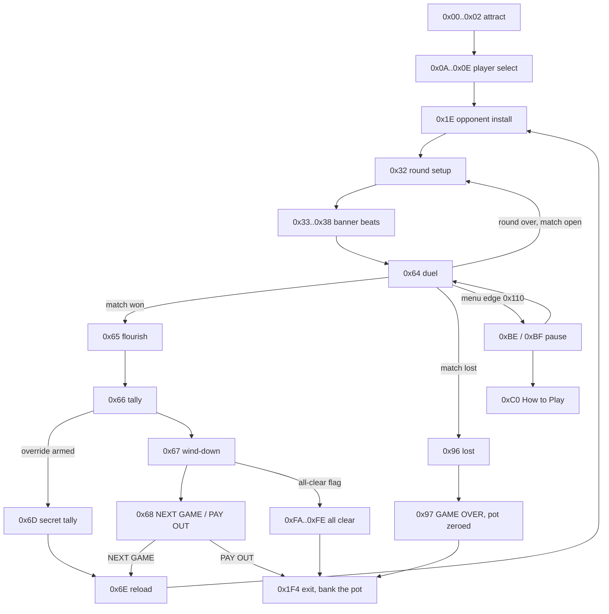
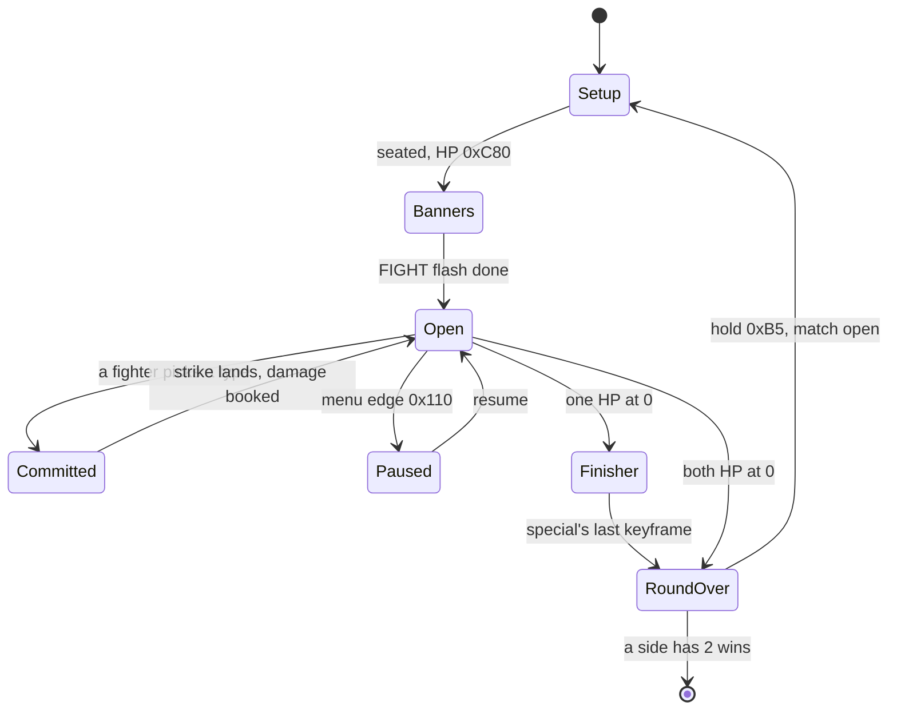
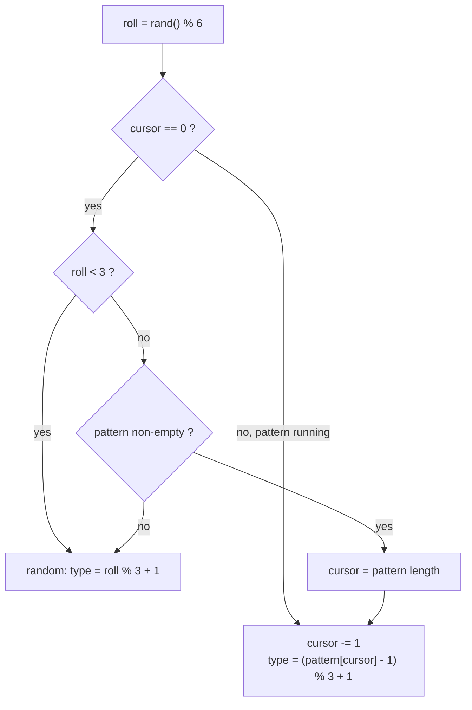

# Baka Fighter minigame

Baka Fighter is the Sol casino's one-on-one fighting cabinet. The player picks a battle-form party member (Vahn / Noa / Gala) and climbs a ladder of CPU opponents in best-of-three matches. Each exchange is a rock-paper-scissors matchup between three attacks, with damage scaled by per-fighter stats and combo length; a downed opponent is finished by an automatic special. Won rungs accumulate a coin pot that the player can bank or risk on the next rung.

The whole minigame is one RAM overlay (code loaded at run time above `0x801C0000`): PROT 0976 (an entry of the disc's `PROT.DAT` archive), `0xE000` bytes at base `0x801CE818`. Fight logic occupies the `0x801D4C50`-`0x801D6F44` band; the cabinet and round state machines sit below it. The Rust port runs the same rules, cabinet, chrome and 3D duel on all three hosts (native play window, browser play page, standalone minigames page).

## At a glance

| Item | Value |
|---|---|
| Overlay | PROT 0976, base `0x801CE818`, size `0xE000` (dump prefix `overlay_baka_fighter_`) |
| Entry | field-VM op `0x3E` with `op0 = 104` (`sub_id 4`), game mode `0x18` |
| Init | `FUN_801CF00C` |
| Cabinet state machine | `FUN_801CF388`, state word `DAT_801DBF44` (37 states) |
| Round / match state machine | `FUN_801D3468`, phase `DAT_801DBF78` |
| Exchange resolver | `FUN_801D3A14` |
| Damage kernel / critical roll | `FUN_801D3B18` / `FUN_801D6660` |
| Per-fighter combat tick | `FUN_801D3F44` |
| CPU move picker | `FUN_801D487C` |
| HUD renderer / score tally | `FUN_801D2AFC` / `FUN_801D239C` |
| Widget quad emitter | `FUN_801D5ED0` over the 51-record table `DAT_801D7160` |
| Fighter data | roster table `0x801D769C` (17 records, `0x6C` stride); action tables `PTR_DAT_801DB8B8[char]` |
| Art | party pack PROT 1204 / 1205, ladder fighters 1206..=1219, HUD + stage pack 1203 |
| Sound | SFX VAB extraction PROT 0869, BGM extraction PROT 1043 |
| Pot | casino prize accumulator `_DAT_80084440`, banked into the coin bank `0x800845A4` |
| Port (rules) | `engine-minigames`: `baka_fighter`, `baka_cabinet`, `baka_fighter_chrome`, `baka_impact_fx`, `baka_duel` |
| Port (3D duel) | `engine-minigame-scenes::baka_duel_scene` |
| Port (parsers) | `legaia_asset::baka_opponents`, `legaia_asset::minigame_art` |

The `engine-minigames` modules are re-exported at their old `legaia_engine_core::baka_*` paths. Provenance for every function named here is `ghidra/scripts/funcs/overlay_baka_fighter_<addr>.txt`. Read the two dispatchers from the disassembly: the decompiled C of `FUN_801CF388` renders most exit paths as fake `FUN_801Dxxxx()` label-calls.

The field VM (`FUN_801DE840`), actor VM, move VM, world-map controller (`FUN_801E76D4`) and summon / effect paths that appear in RAM beside this overlay are not Baka-Fighter code; see [`script-vm.md`](script-vm.md), [`actor-vm.md`](actor-vm.md), [`move-vm.md`](move-vm.md) and [`world-map.md`](world-map.md).

## Entry from the field

The cabinet is reached by the **mode-24 minigame door-warp**: field-VM op `0x3E` with `op0 = 104` (`sub_id 4`), which sets game mode `0x18` and loads PROT 0976. The mechanism, its `sub_id` -> overlay table and the return warp are in [`script-vm.md` § 0x3E WARP](script-vm.md#0x3e-warp-mode-24-minigame-door-warp). The port's id decoder is `legaia_engine_field::minigame_entry::MinigameSubId`.

A disc-wide walk of every scene MAN finds four sites: the three interchangeable cabinet placements in the Sol casino (`koin1` P1[51], P1[52], P1[53]) and one in `map03` P2[20]. The last is **dev residue** - a bare record with nothing but the warp, in a partition-2 slot no reachable script spawns. Census test: `crates/engine-core/tests/minigame_entry_census_disc.rs`.

The `koin1` doors sit behind an entry gate: an `0x4E` inventory compare and a one-coin `0x4C 0xE5` debit before the fade and the warp. Failing it skips the warp.

**The state machines have no `jal` callers.** The minigame is two-stage. The sub-id-4 init `FUN_801CF00C` spawns the actor prototype at `0x801D75DC`, whose `+0x08` tick word is the cabinet SM `FUN_801CF388`. That SM spawns the prototype at `0x801D75F4`, whose tick word is the round SM `FUN_801D3468`. Both run through `jalr actor[+0x0C]` in the pool walk `FUN_8002519C`.

### Actor prototypes

Eight `0x18`-byte prototype records tile `0x801D75DC..0x801D769C`, ending immediately before the roster table. Each is `[0, 0xFFFF0000, callback, 0x00020080, 0, 1]` with the callback at `+0x08`. The spawn `FUN_80020DE0` takes one record: it allocates an actor, copies `+0x08` to `actor[+0x0C]`, the `+0x04` half to the model word `+0x64`, and the `+0x14` half onward.

| Record | Callback | Role | Named at (`lui`+`addiu`) |
|---|---|---|---|
| `0x801D75DC` | `FUN_801CF388` | cabinet SM | `0x801CF184` |
| `0x801D75F4` | `FUN_801D3468` | round SM | `0x801CFC94` |
| `0x801D760C` | `FUN_801D3390` | player-select lineup tick | `0x801CF8A0` |
| `0x801D7624` | `FUN_801D6310` | round-start cameo | `0x801D01C4` |
| `0x801D763C` | `FUN_801D3F44` | fighter combat tick | `0x801CFBC0`, `0x801CFD98` |
| `0x801D7654` | `FUN_801D6F18` | effect-part flag setter | `0x801D1ACC` |
| `0x801D766C` | `FUN_801D4FC8` | developer keyframe editor | `0x801D1D68` |
| `0x801D7684` | `FUN_801D49E8` | special afterimage | `0x801D4558` |

Parser: `legaia_asset::baka_opponents::parse_actor_prototypes`, which refuses an image whose records break the band's uniform shape (a mis-based image would otherwise yield eight plausible pointers). Disc-gated in `crates/asset/tests/baka_presentation_real.rs`.

## Assets

### Fighter packs (PROT 1204..=1219)

The cabinet reuses the **battle-form character pack** rather than shipping its own party meshes. `FUN_801CF00C` loads `data_field/other5.lzs` (the LZS-compressed battle pack, PROT 1204) when the streaming-mode flag `_DAT_8007B8C2 == 0` - the dev arm - and otherwise loads the equivalent uncompressed PROT entry `0x4B5` (1205) directly. Retail boots that flag at `1`, so the raw-PROT load is the path that runs.

It then calls the per-fighter installer twice: `FUN_801D4C50(0)` for the player, `FUN_801D4C50(1)` for the opponent. The installer either streams a `data_field` body or loads PROT entry `char_index + 0x4B6` and walks the pack, registering each chunk through the standard asset dispatcher `FUN_8001F05C` (type byte -> handler) with the "already decompressed" flag. It folds the party slots away first (`if (idx >= 3) idx -= 3`) and loads **extraction entry `1204 + k`**:

| Entries | Content |
|---|---|
| `1204` / `1205` | the party pack (meshes + the 8 party atlases), LZS / raw |
| `1206..=1219` | the fourteen ladder fighters, one entry each: roster id `3 + n` -> entry `1206 + n` |
| `1220` | not a fighter pack (breaks the pattern) |

Each ladder entry is a raw `[u32 (type<<24)|size][payload]` chain of `[TIM 256x256][TMD][anim]`:

| Chunk type | Content |
|---|---|
| `0` | a standard PSX TIM: the fighter's 256x256 4bpp atlas. Image rects `(448, 256)` / `(512, 256)` / `(576, 256)`, CLUT strips on rows 496 / 497 / 498. The rungs past the first two share one slot, loaded one at a time. |
| `9` | the fighter's Legaia TMD (the same `TMD2` streaming class as the PROT 1204 party slots) |
| `11` | the fighter's animation bank: a canonical ANM container (`[u32 count][u32 offsets]` + records per [`../formats/anm.md`](../formats/anm.md), marker `0x080C`), 8 records with `bone_count` equal to the TMD's `nobj` |

Record 0 of the bank is the idle; the attack / special / knockdown records follow in action-table order. The meshes are the same high-detail party TMDs the turn-based battle uses and render as full 3D TMDs through the registered-mesh pipeline. Pack layout and provenance: [`../formats/character-mesh.md`](../formats/character-mesh.md) and [`battle.md`](battle.md).

Parser `legaia_asset::baka_opponents::parse_fighter_pack`. Disc-gated oracle `crates/asset/tests/baka_presentation_real.rs`: all fourteen packs decode, every anim rig covers its TMD, entry 1220 is refused. **Confirmed** (load path and entry indices traced in `overlay_baka_fighter_801cf00c.txt` + `overlay_baka_fighter_801d4c50.txt`).

### HUD art and stage pack (PROT 1203)

**Extraction PROT 1203** is a separate 4-descriptor container:

| Descriptor | Content |
|---|---|
| 0 (`TIM_LIST`) | LZS -> a pack of **9 TIMs**: banner sheets, digit fonts, the pip / combo / attack-icon glyph page, the "Baka" / "Fighter" logo pieces, the boxing-glove halves, the title flame ellipse |
| 1 (type `0x02`) | a pack of **4 Legaia TMDs**, the stage set: model `0` a single-object arena wall whose floor plane is `y = 0`, models `1` / `2` single-object props, model `3` a 10-object piece with object-local parts (the [cameo](#the-round-start-cameo) figure) |
| 2 (type `0x05`) | the 30-record battle-form ANM bank ([`../formats/anm.md`](../formats/anm.md)) |

The widget pages sit at `(320, 0)`, `(384, 0)`, `(448, 0)`, `(320, 256)`, `(384, 256)`, `(832, 256)` with CLUT strips on rows 477 / 478 / 479 / 485 / 502..505. Every image block byte-matches the parked title-screen VRAM capture (`minigame_baka_fighter` scenario) except the `(832, 0)` sheet, which is partially overwritten live. The live CLUT rows differ because the engine merges several sources onto them.

### Action table

Each fighter is driven by a per-character action table reached through `PTR_DAT_801DB8B8[char]`: 17 (`0x11`) tables of 9 actions each, `0x60` bytes per action record. Record `0` is the idle, `1`..`3` the three attacks, `4` the special, `5` the hit reaction, `7` the knockdown and `8` the win flourish.

| Offset | Meaning |
|---|---|
| `+0x04` | clip speed: the combat tick's cursor step is `speed * DAT_1F80037D >> 3` |
| `+0x18` | base attack power (the damage formula's `power`) |
| `+0x1C` | sub-keyframe count |
| `+0x20` / `+0x22` / `+0x24` | per-keyframe strike offset (the impact pair's position), `0x08`-byte stride |
| `+0x26` | the keyframe's **strike frame**, in whole clip frames |

`FUN_801D6E5C(char, action, from, to)` returns the index of the first sub-keyframe whose frame falls in `[from, to]`, or `-1` when the range is inverted, the action has no sub-keyframes, or none match. The fixed point sits on the **query**: the function shifts `from` and `to` right by 4 (rounding toward zero) and compares `+0x26` raw, so callers pass a `<< 4` frame range against whole-frame keyframes. Port: `engine-minigames::baka_fighter::keyframe_in_range`.

Parser: `legaia_asset::baka_opponents::parse_actions` (`BakaActionSet::{speed, sub_keyframes}`). Across all 17 tables every attack and special record carries at least one strike, every strike frame is in `0..=64`, and a record's strikes are in frame order (disc-gated in `crates/asset/tests/baka_opponents_real.rs`). Record-space labels: `legaia_asset::baka_opponents::action_slot_label`.

Confidence: **Confirmed** record-field usage; **Inferred** action-slot meanings, from how the per-fighter controller indexes them.

### Roster record

The per-fighter roster table is based at `0x801D769C`: **17 records**, `0x6C` stride. The fighter-setup path installs the stat pointer as `DAT_801DC060[slot] = 0x801D769C + id * 0x6C`, so the "stat block" is the roster record. `DAT_801D76BC` is the same table viewed at `+0x20`, and `DAT_801D76E8` its `+0x4C` field.

| Offset | Field |
|---|---|
| `+0x00` | fighter name: 32-byte NUL-padded ASCII |
| `+0x20` | gold (coin) prize |
| `+0x24` | damage modifier (`mod`) |
| `+0x28` / `+0x2C` / `+0x30` | DEF tiers |
| `+0x34` | critical chance, percent |
| `+0x38` / `+0x3C` / `+0x40` | ATK tiers |
| `+0x44` | duel stand-off: the round setup stands the fighter at `X = ±(stand_off + 200)` |
| `+0x4C` | CPU pattern: a NUL-terminated byte list |

Roster ids `0..=2` are Vahn / Noa / Gala; `3..=16` are the fourteen ladder fighters. Parser `legaia_asset::baka_opponents::parse` (the 17 records with stats; `BakaOpponent::attack_at` is a forward view of the pattern). Names: `legaia_asset::minigame_art::baka_roster_names`. The names, gold values, stats and patterns decode from the disc (`baka_opponents_real`) and are not reproduced here.

<a id="cabinet-state-machine-fun_801cf388"></a>
## Cabinet state machine (`FUN_801CF388`)

Above the fight sits the **cabinet**: one function, 2973 instructions, switching on the single word `DAT_801DBF44`. That word has **37** branch targets and covers the whole run - attract, player select, per-rung setup, the round bracket, the duel, the win / lose / all-clear sequences, the "NEXT GAME / PAY OUT" menu, the in-duel pause menu and the developer menu. Only the value `0x64` (100) is "a round is live".



| State | Role | Leaves on |
|---|---|---|
| `0x00` | cold entry: zero the counters, arm the attract BGM | immediately, to `0x01` |
| `0x01` | attract / title card (`FUN_801D59D4` animates it) | pad edge `0x844` |
| `0x02` | attract fade-out | `DAT_801DC128 >= 0x3D` |
| `0x0A` | spawn the three party fighters, seed the RNG | immediately |
| `0x0B` | **player select** - a horizontal 3-way cursor | confirm edge `0x44` |
| `0x0C` / `0x0D` / `0x0E` | wipe start / hold (`0x1F`) / preview pose | timer, then immediately |
| `0x1E` | **opponent install**: resolve the rung, load its mesh + roster record | immediately |
| `0x32` | round setup: seat both fighters, HP to `0xC80` | immediately |
| `0x33`..`0x36` | round-banner beats (`FUN_801D5C7C`); the last holds `0x79` | timers |
| `0x37` / `0x38` | scene-ready wait / "FIGHT!" flash | flag, then `0x31` |
| `0x64` | **the duel** - the round bracket + the pause-menu edge | round-over hold `0xB5` |
| `0x65` / `0x66` / `0x67` | victory flourish / score tally / wind-down | timers |
| `0x68` | **"NEXT GAME / PAY OUT"** - a horizontal 2-way cursor | confirm edge |
| `0x6D` | the secret opponent's own tally variant, entered from the tally's exit when `DAT_801DBF06` is non-zero | timer `0xB5` |
| `0x6E` | teardown + reload for the next rung | immediately |
| `0x96` / `0x97` | match lost / **"GAME OVER"** | timers |
| `0xBE` / `0xBF` | in-duel pause menu, 2 / 3 options (vertical cursor) | confirm or cancel |
| `0xC0` | "How to Play" screen (`FUN_801D6CBC`) | any face button `0xF0` |
| `0xC8` | **developer menu**, 5 rows | confirm edge |
| `0xFA`..`0xFE` | the all-stage-clear sequence, five beats | timers |
| `0x190` / `0x191` | developer keyframe editor entry / run | Select edge `0x100` |
| `0x1F4` | exit: pay the pot into the coin bank, fade out | never (mode leaves) |

Every unlisted value falls through to the shared epilogue, which draws the arena, calls the HUD renderer for the in-duel states, and decays the screen shake `DAT_801DBEC0`. **Confirmed** - branch targets, thresholds and transitions are read off the dispatcher's disassembly.

Port: `engine-minigames::baka_cabinet::BakaCabinet`.

<a id="the-front-end"></a>
### Front end

- **Attract (`0x01`, `0x801CF6E4..0x801CF804`).** The blink phase `DAT_801DC128` advances by the frame step first. Its bit 4 picks the level of the "PRESS START" widget (`0`) drawn at `(0xA0, 0xCC)`: `0x40` while set, `0x80` while clear. The title card `FUN_801D59D4` is then called with `DAT_801DBE94`, which advances after the call. The pad edge `0x844` fires cue `0x20`, zeroes the blink phase, moves to `0x02` and spawns a fade actor (`FUN_801D657C(1, 0, 0xFFFFFF, 0, 0x1E, 0x3E8)`).
- **Fade-out (`0x02`, `0x801CF808..0x801CF884`).** While the blink phase is below `0x1E` the prompt flashes at level `0x100` and the card is drawn; past that neither is. The card's clock does not advance here. At `0x3D` the state moves to `0x0A`.
- **Lineup (`0x0A`, `0x801CF88C..0x801CFA60`).** Sets the select camera - pitch `0x8C`, yaw `0`, roll `0`, eye trio `(0, 0x2D0, 0x3FC0)`, focus left alone (zero from the attract state). Spawns three actors off the prototype at `0x801D760C` from the 8-byte position records at `0x801DBC04`: Vahn `(0, 0, -1000)`, Noa `(350, 0, -600)`, Gala `(-350, 0, -600)`, yaw `0x800` (facing the camera), roster `+0x5A` = the column, clip `+0x5C` = `1 + 9 * column` (each fighter's idle). The stage counter re-seeds to `2`, and the "PLAYER SELECT" widget (`0x0C`) spawns as an effect actor through `FUN_801D6E04(0xC, 0x801DBA6C)`, re-seated at `(0xA0, 0x20)`.
- **Select (`0x0B`).** No widget draw and no cursor arrows. The lineup's tick `FUN_801D3390` shows the cursor: it sets each fighter's depth-cue level `+0x78` to `0` on the cursor's column and `0x800` (half toward black) on the other two, and steps the idle clip at its record's byte `+0x07`. The second focus id it tests, `DAT_801DBF74`, is `rand % 5 + 100` - never a column. The tick retires the actor once the match phase `DAT_801DBF78` is non-zero, which the confirm state `0x0C` sets.
- **Pose (`0x0E`, `0x801CFBBC..0x801CFCB4`).** The chosen fighter's duel actor spawns off `0x801D763C` with the cursor as its roster id and its X at `-(record[cursor] +0x44 + 200)`, and the round SM spawns.

**The pick is a roster record, not a skin.** The round setup stores the select cursor `DAT_801DBF70` as slot 0's roster id (`sw a0,0x94(v1)` into `DAT_801DC050` at `0x801D0058`) and reads that record's `+0x44` stand-off (`0x801D0040..0x801D005C`). The picked party fighter brings its own stats, action table, strike clips and special camera.

`FUN_801D3390` picks the clip bank by `actor+0x5C < 0x400` and reads byte `+0x07` of the record the id's low 10 bits reach into the clip step `actor+0x6A`. It matches `actor+0x5A` against both focus ids (`DAT_801DBF70` / `DAT_801DBF74`).

The arena pass runs from `0x0A` on, so the lineup stands in the walled arena; the attract arms draw no 3D. **Confirmed** (disassembly; the attract layout against the parked `minigame_baka_fighter` state, which sits on `0x01` with `DAT_801DBE94 = 373` and the whole card up - the card's last segment has no upper bound).

Port: the cabinet emits these as `CabinetFrame::widgets` / `title_card` / `install_player`. `BakaFight` runs no rule while `baka_cabinet::front_end` holds; it steps the select camera (`baka_duel::SELECT_CAMERA`) and the lineup clock, and `BakaDuelScene` poses the lineup (`SELECT_LINEUP`, the half depth cue as `SELECT_DIM_KEEP`). Every host enters here: the scene host's mode-24 arm boots the fight with `BakaFight::with_attract`, and the minigames page opens the same cabinet (`baka_start_cabinet`). The port keeps Start as its minigame escape everywhere except the attract card, whose own edge reads it.

<a id="the-epilogues-two-draw-gates"></a>
### Epilogue draw gates

The dispatcher carries two draw flags in registers, both entering at `0`:

| Flag | Gates | States that leave it clear / raise it |
|---|---|---|
| `s4` | the **arena pass** (the four walls, through `FUN_801D6BB8` / `FUN_801D6D60`) | clear in `0x00`..`0x02`, `0x66`, `0xFB` / `0xFD` / `0xFE` (the last two clear it explicitly) and the exit state |
| `s7` | the **HUD pass** (`FUN_801D2AFC`) | raised only in `0x36`, `0x37`, `0x38`, `0x64`, `0x65`, `0x6E`, `0x96`, `0x97` |

The tally screen and the "NEXT GAME / PAY OUT" menu draw no duel HUD. Both passes are additionally suppressed whole by `DAT_801DBED4`. Port: `baka_cabinet::{draws_arena, draws_hud}`. **Confirmed.**

<a id="the-cabinets-pad-masks"></a>
### Pad masks

The cabinet reads the **packed** Legaia pad word, not the raw PSX layout (the `PACK_*` bits in `engine-core::dev_menu`, the pump in `engine-system::retail_pad`). Every mask in this overlay reads against that packing:

| Mask | Meaning |
|---|---|
| `0x44` | confirm (Cross plus L1) |
| `0x21` | cancel (Circle plus L2) |
| `0x844` | attract "press to start" (Start, Cross or L1) |
| `0xF0` | any of the four face buttons |
| `0x110` | in-duel menu (Select or Triangle - the HUD's "PRESS SELECT TO MENU") |
| `0x8000` / `0x2000` | cursor **left** / **right** (player select, tally menu) |
| `0x1000` / `0x4000` | cursor **up** / **down** (the pause + developer menus) |
| `0x4` / `0x100` | developer editor: dump the action table (L1) / leave (Select) |

### Cursor folds

| Screen | Fold | Behaviour |
|---|---|---|
| player select `0x0B` | two clamps: `>= 3` -> `0`, then `< 0` -> `2` | wraps both ways |
| tally choice `0x68`, pause `0xBE` | `& 1` | wraps both ways |
| pause `0xBF`, developer menu `0xC8` | unsigned `% 3` / `% 5` | wraps at the bottom, **sticks** at the top |

In the third row `-1` as a `u32` is `0xFFFFFFFF`, which both `3` and `5` divide exactly, so stepping up off row `0` folds back to row `0`. Ports: `baka_cabinet::{cursor_step, cursor_step_mod}`. **Confirmed** (the `0xAAAAAAAB` / `0xCCCCCCCD` reciprocal multiplies are in the disassembly).

<a id="the-ladder---which-roster-id-each-round-serves"></a>
### The ladder

The stage counter `DAT_801DC10C` is **seeded to 2** (`FUN_801CF00C`, and again by the lineup state), incremented once per stage, and on reaching `0xE` sets the all-clear flag and **wraps to 0** (`FUN_801D0748`). Every consumer folds it the same way:

```text
roster_id     = stage + 3
mesh_name_idx = stage + 5
```

So the twelve rungs the cabinet serves first are roster ids **5..=16**, and across exactly those the prize gold is strictly monotonic. Every visit's first opponent is roster `5`. Roster ids `3` and `4` are the post-clear opponents the victory art promises ("ALL STAGE CLEAR! ... IT'S NOT OVER YET"); the roster's gold column is ordered so that those two sit outside the first lap's range, not by prize.

Ids `3` and `4` are reachable two ways: the counter wrap serves them on a second lap (stage `0` / `1`), and the score gate below inserts them mid-run. Helper `legaia_asset::minigame_art::baka_ladder`. **Confirmed.**

<a id="the-secret-opponents-are-score-gated-not-lap-gated"></a>
### Secret opponents (score gate)

Between the match-won test and the stage advance, the cabinet tests the rung it just cleared against the **running high score** `DAT_801DBEE4` and may arm the override `DAT_801DBF06`:

```text
stage == 5    && high_score > 0x3D090 (250,000)  ->  override = 1
stage == 0xD  && high_score > 0xAAE60 (700,000)  ->  override = 2
```

Both comparisons are `slt`, so a score exactly on the threshold does not qualify. An armed override **suppresses the stage advance** and replaces the rung fold: the install state loads `roster = override + 2` / `mesh = override + 4` instead of `stage + 3` / `stage + 5`. The two secret rungs are therefore inserted at stages 5 and 13 rather than replacing a rung. The override is consumed on use (the install state clears it, and `override == 2` additionally latches `DAT_801DBEB8 = 2`), so each bonus rung is served once per arming. A dev build can force either through the held pad (`_DAT_8007B9B0` gate, `_DAT_8007B850 & 0x8` / `& 0xA`).

Port: `baka_cabinet::{secret_opponent_gate, rung_fold, advance_stage}`. **Confirmed.**

<a id="a-mid-run-defeat-really-does-forfeit-the-pot"></a>
### Pot, payout and forfeit

The pot is the casino prize accumulator `_DAT_80084440`.

- **Only the score tally adds to it** (`FUN_801D239C`, `0x801D28AC..0x801D28BC`). The cabinet's match-won arm writes the rung prize to `DAT_801DBEE8` for the tally to drain (`lw v1,0x20(v0)` / `sw v1,-0x4118(v0)` at `0x801D06FC`) and never touches the pot.
- **"GAME OVER" (`0x97`) zeroes it** on its first frame, before the banner spawns (`sw zero,0x300(s2)` at `0x801D1288`, `s2 = 0x80084140`). A mid-run loss forfeits the whole accumulated pot. The same state fires the game-over voice line (`FUN_8003D53C(0x20, 8, 0x4A)`) and spawns banner widget `0xB`.
- **Every exit runs through `0x1F4`**: PAY OUT on `0x68` (cursor row 1), the end of the all-clear chain, and `0x97`. The return warp `FUN_80026018` there pays the accumulator into the **casino coin bank** `0x800845A4` - not party gold `0x8008459C`.

The match-won arm also seeds the tally's first score row: `0x7530` (30,000) when the opponent won **no** round, else `0x4E20` (20,000) - a shutout bonus. Port: `baka_cabinet::match_bonus`. **Confirmed.**

In that arm, the store that sets the next state to the victory flourish (`0x65`) sits in the **delay slot** of the "did the opponent take a round" branch, so it runs either way: any match win reaches the flourish, and the branch only skips the dropped-round tally `DAT_801DBF28`.

There is no save point inside mode 24, so the coin bank is the only result that outlives a visit.

### "NEXT GAME / PAY OUT" sheet

State `0x68` draws five widgets (`FUN_801D5ED0(x, y, widget, brightness, 0x1000)`, `0x801D0C10..0x801D0D24`) plus the pot numeral:

| Widget | Where | Brightness |
|---|---|---|
| `0x2C` NEXT GAME | `(0x4C, 0x20)` | `0xA0` when picked, else `0x40` |
| `0x2D` PAY OUT | `(0x100, 0x20)` | `0xA0` when picked, else `0x40` |
| `0x30` lit arrow | `(0x94, 0x20)` on NEXT GAME, `(0xAC, 0x20)` on PAY OUT | `0x80`, `0xA0` while blink bit 4 is clear |
| `0x31` unlit arrow | the other arrow slot | `0x40` |
| `0x2E` GET COIN | `(0x70, 0xCC)` | `0xA0` |

The pot draws through the `0x10` px coin strip `FUN_801D6F44` at `(0x78, 0xCC)` off `_DAT_80084440`. The sheet is drawn only while the latch `DAT_801DBF88` is zero (`bne v1,zero` at `0x801D0BB4`), so it vanishes the frame NEXT GAME is taken. **Confirmed** (disassembly).

Port: `baka_cabinet::choice_sheet` / `choice_pot_placements`. The play hosts draw the sheet's widgets as textured quads against the duel VRAM, with `choice_sheet_labels` font labels as the fallback when the art is not resident (see [HUD in the port](#hud-in-the-port)).

<a id="round--match-state-machine"></a>
## Round state machine (`FUN_801D3468`)

The match driver is `overlay_baka_fighter_801d3468.txt`. It is gated by the phase global `DAT_801DBF78` (`0` = teardown / exit, `1` = paused, `2` = active) and runs its resolution body only while the cabinet state `DAT_801DBF44 == 100` (`0x64`).

A match is **best of 3 - first to 2 round wins**. `FUN_801CF00C` writes the target `DAT_801DBED0 = 2`, and the match-over check in `FUN_801D0FE4` (an entry Ghidra dumps separately, inside the cabinet SM's body) tears the match down (`DAT_801DBF78 = 0`) once a fighter's round-win count (`DAT_801DBFF0` for the player, `DAT_801DC098` for the opponent) equals it. **Confirmed.**



| State | Where it lives | What happens |
|---|---|---|
| Setup | cabinet `0x32` | seats both fighters, HP to `0xC80`, idle clips, strike words cleared, round camera snapped |
| Banners | cabinet `0x33`..`0x38` | round banner, camera spin, READY / FIGHT; presentation only |
| Open | cabinet `0x64`, phase `2` | cooldowns decay; each combat tick may commit one attack type per fighter |
| Committed | same | `FUN_801D3A14` has a result; the booking waits for the winner's strike keyframe ([strike clock](#the-strike-clock)) |
| Finisher | same | the standing fighter auto-commits the type-4 special against a foe at 0 HP |
| RoundOver | same | finisher latch `+0x2C` or both HPs at zero; the hold timer runs to `0xB5`, result banners rise |
| Paused | cabinet `0xBE` / `0xBF`, phase `1` | pause menu |

Per frame, while active, the body:

1. Decays the two per-fighter cooldown timers `DAT_801DBEA0` / `DAT_801DBEA4` by the frame-rate step, clamped at 0.
2. Records who is on the left (smaller world X at actor `+0x14`) into the facing flags `DAT_801DC08C` and `DAT_801DBFE4`.
3. Calls `FUN_801D3A14` to resolve the current exchange.
4. On a decided exchange whose strike has landed: spawns the impact pair (`FUN_801D4DF8`), applies damage (`FUN_801D3B18`), rolls a critical (`FUN_801D6660`), and resets per-fighter exchange state. A draw does both sides. Round wins are counted in the per-fighter records (`&DAT_801DBFF0[...]`), and the round index `DAT_801DBF20` advances.
5. Drives the round-end banners through the sub-state `DAT_801DBF84` ([Round-result banners](#the-round-result-banners)).

`FUN_8003D53C`, called along these paths, is the XA / CD streaming player (`xa_play_warning_1` / `xa_play_err_2`), not a cue queuer: it plays the announcer lines.

### Round-over hold

The duel state only *reads* the hold timer `DAT_801DBF88` against `0xB5` (`0x801D0620`). The round SM advances it, by the frame step, only on frames its round is decided (`0x801D3614..0x801D3668`): either fighter's finisher flag `+0x2C` - raised by `FUN_801D3B18` when a special lands its full chain (`0x801D3C2C`), which is how a KO ends a round - or both HPs at zero. The hold therefore runs `0xB5` frames from the deciding exchange. Until the duel state sees it out and moves to the round setup (zeroing the timer, `0x801D063C`), the fighters, their HP and the result banners stay as the exchange left them.

Port: the cabinet advances the word on those frames (`CabinetInput::round_clock`), and `BakaFight` holds `RoundOver` until the cabinet has left the duel state.

<a id="exchange-resolution-fun_801d3a14"></a>
### Exchange resolver (`FUN_801D3A14`)

The resolver compares the two fighters' chosen attack types: P1's `DAT_801DBFE0` against P2's `DAT_801DC088`.

| Type | Meaning |
|---|---|
| `0` | no input this exchange |
| `1` / `2` / `3` | the three attacks: **2 beats 1, 3 beats 2, 1 beats 3** |
| `4` | the special: an immediate win for whoever throws it |

Outcome matrix (rows = P1's type, columns = P2's type):

| P1 \ P2 | `0` | `1` | `2` | `3` | `4` |
|---|---|---|---|---|---|
| `0` | undecided | undecided | undecided | undecided | **P2** |
| `1` | undecided | draw | **P2** | **P1** | **P2** |
| `2` | undecided | **P1** | draw | **P2** | **P2** |
| `3` | undecided | **P2** | **P1** | draw | **P2** |
| `4` | **P1** | **P1** | **P1** | **P1** | **P1** |

Return value: `0` = P1 wins, `1` = P2 wins, `3` = draw (same type), `-1` = undecided. The tests run in this order:

1. The settle timer `DAT_801DBF54` has not elapsed -> undecided. The timer is **vestigial**: it is only ever decremented / zeroed here and never positively stored anywhere in the overlay, so it stays `0`. Exchange pacing comes from the cooldowns `DAT_801DBEA0` / `DAT_801DBEA4`.
2. A type of `4` on either side returns that side, P1 checked first (`0x801D3A54` / `0x801D3A5C`).
3. Both sides idle -> undecided.
4. Either committed flag `DAT_801DBFE8` / `DAT_801DC090` set -> undecided.
5. Equal types -> draw; otherwise the beats relation. The single-idle cells are undecided in the port (`BakaFight::resolve`): an attack never lands on a non-attacker.

**Confirmed** (the matchup table and special handling are fully visible in `overlay_baka_fighter_801d3a14.txt`; all six ordered attack pairs are consistent with the relation).

<a id="damage-fun_801d3b18"></a>
### Damage (`FUN_801D3B18`)

```text
hit  = power + power * ATK / 100
dmg  = (hit * (200 - (mod + mod * DEF / 100)) * 0x20) / 100  +  (combo - 1) * 0x40

critical pending on the winner:  dmg = power << 7
```

| Input | Source |
|---|---|
| `power` | the winning action's record `+0x18` |
| `ATK` | the **winner's** roster record `+0x38` / `+0x3C` / `+0x40`, picked by HP tier |
| `DEF` | the **loser's** roster record `+0x28` / `+0x2C` / `+0x30`, picked by HP tier |
| `mod` | the loser's roster record `+0x24` |
| `combo` | the loser's consecutive-hits-taken counter `&DAT_801DBFEC[loser]`: incremented after each application, cleared when that fighter wins an exchange |
| critical | `&DAT_801DC05C[winner]`, set by `FUN_801D6660` |

| HP | Tier index |
|---|---|
| `>= 0x8C1` | `[0]` |
| `0x3C1..=0x8C0` | `[1]` |
| below `0x3C1` | `[2]` |

The stat pointer is `&DAT_801DC060[slot]` (the roster record). The `atk %d def %d dm %d` debug printf receives the `+0x38`-family value as `atk`, which pins the ATK / DEF labels.

Effects of one application:

- Writes the hit cue `0x09` to the cue ring at the top of the routine, before the arithmetic ([Sound](#sound)).
- Decrements HP (`&DAT_801DBFC4[slot]`), floored at 0, and gated on `hp > 0` (`0x801D3E58..0x801D3E68`: `blez` skips the `subu`).
- Pushes the loser back `0x20` world units and switches the struck side to the hit clip (record `5`), or the knockdown (record `7`) when the landed keyframe is the special's last (`0x801D3C60..0x801D3CA0`).
- Writes `2` to the winner's strike-state word (`0x801D3EB0`).
- A type-4 special landing on its **final sub-keyframe** (`DAT_801DC054[winner] == record[+0x1C] - 1`, tested at `0x801D3C00..0x801D3C0C`) credits the winner a round win outright and raises the finisher latch `+0x2C` (`0x801D3C2C`).

**The special's HP delta is zero by construction.** Its action record's `+0x18` power is 0 for all 17 fighters, so the raw total for a type-4 win on a fresh combo is the bare combo term `(0 - 1) * 0x40 = -0x40`. The HP write is `hp > 0`-gated and the special only ever runs as the auto-finisher against a foe already at 0 HP, so the negative never lands. The special's whole payoff is the round win. The port applies exactly 0 damage for any special-won exchange (`engine-minigames::baka_fighter::apply_damage`).

**Critical roll (`FUN_801D6660`).** For the rolled fighter: only while its own HP is above 0 and below `0x280`, `rand() % 100 <` its roster record's `+0x34` chance sets its critical-pending flag - a comeback mechanic.

**Confirmed**: inputs and structure; the constants (`0x20`, `0x40`, `<< 7`, the HP thresholds) are read straight from the dump.

<a id="player-input--actions"></a>
## Combat tick (`FUN_801D3F44`)

The per-fighter combat tick is called once per fighter actor. The fighter's slot is `*(actor + 0x50)` (0 = player, 1 = opponent). Each frame it picks at most one attack type:

| Mask bit | Button | Type written to `DAT_801DBFE0[slot]` | Display clip |
|---|---|---|---|
| `0x80` | **Square** | `1` | base + 2 |
| `0x20` | **Circle** | `2` | base + 3 |
| `0x40` | **Cross** | `3` | base + 4 |
| (none - automatic) | - | `4` | base + 5 (spawns the afterimage actor) |

- **Player (slot 0).** The mask comes from the edge-triggered pad word `_DAT_8007B874`.
- **Opponent (slot 1).** The mask comes from the [CPU move pick](#cpu-move-pick-fun_801d487c), whose result index `0` / `1` / `2` maps to the same bits (`0x80` / `0x20` / `0x40`).
- **Special (type 4).** Not a button. It is an auto-finisher gated on own HP `!= 0`, opponent HP `== 0`, and the round not already decided. When the gate fires it sets `DAT_801DBF50 = 1`, plays clip base + 5, spawns the afterimage actor (prototype `0x801D7684`) and copies the fighter's transform onto it.

When an attack commits, the tick seeds the fighter's clip id (`actor + 0x5C`, `0x801D44D8` / `0x801D44DC`), zeroes the cursor (`actor + 0x68`), seeds the motion speed from the action record, zeroes both fighters' strike-state words (`0x801D44B8` / `0x801D44BC`) and records the combo step.

**Action record vs display clip.** The display clip id is `fighter_base + {idle 1, t1 = 2, t2 = 3, t3 = 4, special = 5}`. The damage kernel's record index is derived back as `anim - (fighter_base + 1)` = `{idle 0, t1..t3 = 1..3, special = 4}` and stored to the fighter record `+0x10` (`0x801D4534`). The record index and the attack type are the same value.

Debug strings emitted under `DAT_801DBF94`: `%d %d`, `stat no %d %d %d`, `hit frame %d fo %d fn %d`, `mot speed %d`. The traces go through `func_0x8001a068`.

**Confirmed**: the button-bit -> type mapping, the physical buttons (slot-0 branch of `overlay_baka_fighter_801d3f44.txt`), and the auto-finisher gate.

### The strike clock

The exchange is booked on the frame the winner's **strike keyframe** is crossed, not when both fighters have chosen. Three words of the fighter block `&DAT_801DBFBC[slot * 0xA8]` carry it. The debug print at `0x801D439C` names them: `hit frame %d fo %d fn %d` is the landed keyframe, the cursor before the step ("frame old") and after it ("frame new").

| Block word | Meaning |
|---|---|
| `+0x0C` (`DAT_801DBFC8`) | strike state: `0` armed (a fresh commit), `1` landed, `2` consumed |
| `+0x90` | the clip cursor before the last step |
| `+0x98` (`DAT_801DC054`) | the sub-keyframe last landed; `-1` at commit |

Each combat tick:

1. Unless the state is `1`, calls `FUN_801D6E5C(table, action, block[+0x90], actor[+0x68])` at `0x801D4334` - the range the cursor covered on its last step. A hit on a keyframe other than the cached one stores it at `+0x98` and sets the state to `1`.
2. Stores the cursor into `+0x90` (`0x801D47EC`).
3. Lets the clip selector `FUN_800204F8` advance the cursor by `frame_step * step`.

The step `actor +0x6A` is recomputed every tick as record `+0x04` times the rate divisor `DAT_1F80037D`, shifted right three (`0x801D4780..0x801D47CC`). The round setup stores `8` in the divisor (`0x801D01A4`), so the step is the record speed. A clip whose ANM record has bit 0 of byte `+1` set is stepped by `(step * 2 + n - 1) / n` instead (`n` = record byte `+6`); the party bank and two ladder packs (PROT 1209 / 1210) use that.

The round SM reads the state before every damage call: a fighter-0 win needs block 0's `+0x0C == 1` (`0x801D36DC`), a fighter-1 win block 1's (`0x801D3730`), a draw either (`0x801D378C..0x801D37A4`). The damage kernel's `2` re-arms the lookup, so the special's second strike lands the same way.

A **special** commit also lowers `DAT_1F80037D` to `4` (`0x801D4568`), which halves both fighters' steps for the rest of the round - the special plays in slow motion.

Port: `engine-minigames::baka_fighter::{StrikeClock, StrikeTable, ClipHeader}`, running inside `BakaFight::tick_with_input` for every duel built from the disc tables on all three hosts. `roster_clip_headers` stages each fighter's ANM record headers off PROT 1203 and the ladder packs.

### The display clip

What a fighter *shows* is a separate clip from the strike clock: the actor's clip id `+0x5C` and cursor `+0x68`, advanced by `FUN_800204F8` once per combat tick. It outlives the exchange - an attack plays to its ANM frame count even after its exchange is booked, then drops to the idle. Four writers set it:

| Writer | Clip | `+0x62` bit `8` (hold) |
|---|---|---|
| commit (`0x801D44D8` / `0x801D44DC`) | the attack's record, cursor `0` | set only for the special (`0x801D4640`) |
| damage kernel on the struck side (`0x801D3C60..0x801D3CA0`) | record `5` (hit), or `7` (knockdown) when the landed keyframe is the special's last | set |
| round setup `0x32` (`0x801CFFB0` / `0x801CFFC0`) | record `0` (idle) | clear |
| tally exit `0x66` / secret variant `0x6D` (`0x801D0AA4`, `0x801D100C`) | record `8` (win flourish), player seat | set |

The selector's rule (`0x800205F0..0x8002072C`): the cursor steps by `+0x6A * DAT_1F800393`. Once it reaches `frames * 16 - 1` it holds there when bit `8` is set and wraps to `0` when it is not, and either way raises bit `0x100` for that tick. The combat tick's **idle reset** (`0x801D411C..0x801D415C`) reads that bit on the next tick and, unless the block's knockdown latch `+0x2C` is set, stores the idle and clears bit `8`.

So a normal attack plays out once and idles; a hit reaction plays out, holds one tick and idles; a knockdown holds until the next round setup.

**Display id -> ANM bank record.** The play path resolves `actor + 0x5C` through the ANM container header (`0x801D4744..0x801D47B4`). It picks the bank by id band (`< 0x400` = the party / roster container at `_DAT_8007B888`, `>= 0x400` = the ladder fighter's own pack bank), reads `word = container[(anim & 0x3FF) * 4]` and takes `container + word` as the record.

The container is `[u32 count][u32 offsets[count]][records]`, so word `d` is `offsets[d - 1]`: display id `base + k` is bank **record `k - 1`**. Record 0 is the idle (display `base + 1`: the idle reset at `0x801D4144..50` and both round-start seeds in `overlay_baka_fighter_801d0fe4.txt` store `base + 1`). The party base is `_DAT_801DBFD0 = DAT_801DBF70 * 9`. The tally exits store `base + 9` - bank record 8, the win flourish.

Port: `engine-minigames::baka_duel::FighterMotion` (re-exported through `baka_duel_scene`), one per seat (`BakaFight::motion`), stepped every tick after the rules. It feeds only the presentation; the exchange still books off the strike clock. **Confirmed** (disassembly).

### CPU move pick (`FUN_801D487C`)

Each opponent mixes random throws with a canned sequence. The picker keeps a cursor in `&DAT_801DC044[slot]` over the opponent's roster-record pattern (`+0x4C`, the NUL-terminated byte list at `DAT_801D76E8 + opponent_id * 0x6C`, opponent id from `DAT_801DC050[slot]`). The pattern is consumed **backward**.



So an idle cursor gives a 3-in-6 chance of one uniformly random attack and a 3-in-6 chance of starting the pattern, which then plays back-to-front to exhaustion regardless of later rolls. The result is always one of the three attack types. Port: `BakaFight::ai_pick`, on a BIOS-`rand` stream. **Confirmed** (the roll and the pattern table).

**Mirror / reaction remap (dev).** In the opponent branch, gated by `_DAT_8007B9B0`, the held pad `_DAT_8007B850 & 2` and the mode global `DAT_801DBF94 == 2`, the tick re-derives the opponent's type through `DAT_801DC124`, so the CPU counters the player's committed input rather than leading.

## The arena in 3D

Everything the duel draws in 3D is placed by the cabinet state machine and the combat tick: the camera globals, the fighters' stand, the four walls and the floor are all immediates in PROT 0976.

### The camera

The world goes through the field view build `FUN_800172C0`, called once a frame from the cabinet's epilogue (`0x801D2074`), with the base matrix at `0x6000` (6x) and `H = 0x200`. Both are read off the parked `minigame_baka_fighter` state; `H` is stored by the init at `0x801CF080`. Four writers move the globals:

| Writer | Pitch / yaw / roll | Eye trio `0x800840B8` | Focus |
|---|---|---|---|
| round setup `0x32` (`0x801CFF34..0x801CFF7C`) | `0` / `0x2F8` / `0` | `(0xC8, 0x708, 0x1FE0)` | zero |
| state `0x35` spin (`0x801D0324..0x801D03C8`) | yaw `+= dt << 6` until it passes `0x1000`, then `0` | Y `+= dt << 2`, Z `+= dt << 5` | - |
| the spin's glide (`0x801D03D0..0x801D0454`) | parked | Y to `0x898` at `0x1E`, Z to `0x3520` at `0xC8` | parked |
| tally exit `0x66` / `0x6D` (`0x801D0A38`, `0x801D0FBC`) | `0` (`0x64` on `0x6D`) / `0x3D4` / `0` | `(0, 0x8FC, 0x1900)` | - |

Every round opens on an oblique shot that swings a full turn while backing off, and settles side-on: yaw `0`, eye `(0xC8, 0x898, 0x3520)`. The duel state `0x64` writes no camera global. The only thing that moves the camera during a round is a **special commit** (`0x801D4644..0x801D4740`): the player's special glides to its row of the table at `0x801D7DC8` (three `0x20`-byte rows, one per party fighter, indexed by the actor's `+0x5A`), the opponent's to a fixed record - pitch `-0x14`, yaw `0xA8C`, eye `(-0x3C, 0x80C, 0x2120)`.

Both glides use the SCUS camera-relative glide family. `FUN_801D6910` / `FUN_801D693C` / `FUN_801D6968` / `FUN_801D6994` fill the ten `(step, target)` halfword pairs of the record at `0x80070764` (the angles, the eye trio, the focus, `H`). `FUN_80021248` normalizes it against the live globals and spawns the actor whose tick `FUN_8002149C` walks them there. The record is handed to `FUN_80021248` two instructions after the setters at both call sites (`0x801D044C`, `0x801D4738`).

### Placement

The round setup stands the player at `X = -(stand_off + 200)` and the opponent at `+(stand_off + 200)` on `Y = Z = 0` (`0x801D005C..0x801D00F4`; `sh v0,0x14(a3)` at `0x801D006C` for the player, `sh v0,0x14(t0)` at `0x801D00F4` for the opponent). `stand_off` is the roster record's `+0x44`: `0` for the first three ladder rungs, up to `140` for the widest.

The combat tick sets each yaw every frame from the block's facing word `+0x28`: `0x400` while it is clear, `-0x400` while it is set (`0x801D4070..0x801D4084`). The round setup clears it for the player and sets it for the opponent. The tally exit steps the player `0x3C` along Z when the actor's `+0x5A` is `1` (`0x801D0A74..0x801D0A90`).

<a id="which-side-the-player-stands-on"></a>
**The player is on the left of the screen.** The duel camera settles at yaw / pitch / roll `0` with the focus at zero, so the camera rotation is the identity and eye-space X is world X plus the eye trio's `0xC8`. The base matrix is `0x6000` on the diagonal (no reflection) and the GTE - the PlayStation's geometry coprocessor - projects `SX = OFX + H * X / Z` with no mirror. The player select agrees: the cursor's Right step (`0x2000`, `+1`) goes Vahn -> Noa, and Noa's record sits at `X = +350`. **Confirmed** (disassembly + the parked state's base matrix and focus).

Both mesh families (the party pack and the opponent packs) are authored with the same intrinsic facing, so the two fighters take opposite world yaws to look at each other.

### Walls and floor

The epilogue draws stage model `0` - the patterned wall with its lattice fence and lamps - **four** times through `FUN_801D6D60` (`0x801D20E4..0x801D2188`): at `(0, 0x64, 0x640)` yaw `0`, `(0x640, 0x64, 0)` yaw `0x400`, `(-0x640, 0x64, 0)` yaw `-0x400` and `(0, 0x64, -0x640)` yaw `0x800` - a room. `FUN_801D6D60` transforms the position through the camera and draws only when the resulting depth is past `0x2710` (`slti v0,v0,0x2711` at `0x801D6D98`), which drops the wall between the camera and the fighters. It applies `RotMatrixY` (`FUN_8004629C`) of the rotation's `Y` and draws scene model `DAT_8007C018[_DAT_8007B6F8]`.

The floor is `FUN_801CEB84`, the battle ground grid's emitter (`FUN_801D02C0` in PROT 0898) relocated: the same `0x200`-pitch cells of four quarter quads on the `(832, 0)` page's `(0xC0, 0xC0)` window, over the `6 x 6` window the init seeds at `0x1F8003F8` / `0x1F8003FA` (`0x801CF20C..0x801CF218`). It is gated off only when the pitch drops below `-0x4F` (`0x801D20B4..0x801D20C4`).

`FUN_801D6BB8` draws a flat marker at a world point (the combat tick passes each fighter's position, the epilogue the focus X) - the actor drop shadow.

### In the port

`engine-minigame-scenes::baka_duel_scene` is the whole 3D surface, and every duel host draws through it:

- `DuelCamera` (`engine-minigames::baka_duel`) holds the ten globals and runs the round setup's snap, the spin, the glides (through `engine-vm::camera_rel_actor` and `engine-vm::camera_rel_glide`) and the tally-exit close-up. It hands a host one view-projection (`vp_raw`) for raw Y-down world vertices - the same unmirrored projection as retail. `BakaFight` owns it and steps it every tick; `parse_special_cameras` reads the player's table.
- `BakaDuelScene` builds one buffer set - both fighters, two darkened ghost copies of each, the four walls, the floor (`legaia_asset::battle_backdrop::build_ground_grid_sized`) - and poses it each frame from the display clips, the afterimage passes, the wall cull and the round-start [cameo](#the-round-start-cameo). The impact parts draw into reserved ranges of the same buffers.
- `BakaDuelSurface` is the per-host cache: it decodes the assets once (PROT 1203 / 1204 / 1205 and the ladder packs), rebuilds the buffers when a rung seats a new opponent, and poses them.

The drop shadow `FUN_801D6BB8` is the one piece of the arena the surface does not draw.

| Host | How it draws the surface |
|---|---|
| native play window | uploads the posed buffers and the duel VRAM (`engine-shell` `window/minigames.rs`, `refresh_baka_duel_gpu`) and draws them in place of the field |
| browser play page | reads the buffers and matrix through the `play_mg_baka_scene_*` exports (`site/js/play-minigames.js`) |
| minigames page | reads its own fight's surface through the `baka_scene_*` exports (`site/js/minigame-baka.js`) |

Both browser export sets flatten the surface through one reader (the `duel_surface` module in `crates/web-viewer/src/minigames_baka.rs`), so the two pages cannot lay the same buffers out differently. The same surface draws the cabinet's front end - the select camera and the lineup - on all three hosts. The duel layout is also exposed as data: `baka_duel_facing_json()` returns `{ player: { side: -1, facing: 1 }, opponent: { side: 1, facing: -1 } }` (`side` / `facing` = the sign of the fighter's X placement / heading).

## Effects

<a id="impact-cue-and-afterimage"></a>
### Impact pair (`FUN_801D4DF8`)

`FUN_801D4DF8` is an effect spawn. It does not touch the fighter's clip id or cursor. It zeroes the fighter's `+0x38` accumulator (`&DAT_801DBFF4[slot * 0xA8]`), then places two spawns at the fighter's world position offset by the current action keyframe's strike offset (`+0x20` / `+0x22` / `+0x24`):

- X is **added** when the facing flag `&DAT_801DBFE4[slot]` is set and **subtracted** when clear.
- Y is added.
- Z is added, with a further `0x32` taken off unless the special latch `DAT_801DBF50` is up.

Its second argument forces the keyframe index to `0` instead of the fighter's live cursor `&DAT_801DC054[slot]`. Both spawns go through the shared part-spawn API `FUN_80021B04` at scale `0x1000`: the first with no rotation, the second with a yaw of `-0x400` for slot 0 and `+0x400` for slot 1, which mirrors the effect across the arena.

Callers are the round SM's booking arms: `0x801D36F0` (fighter 0 wins, `(0, 0)`), `0x801D3744` (fighter 1, `(1, 0)`) and the draw's `0x801D37B4` / `0x801D37C0` (`(0, 1)` / `(1, 1)` - both slots, keyframe reset). The spawn sits at the winner's strike offset: the fist, on the frame the strike lands.

**What the pair spawns.** The four templates are move-VM records in the overlay's rodata.

- **Template A** (`0x801DB8FC` / `0x801DB960`) is a transform node (`model_sel = -1`). Op `0x0C` sets the colour word `+0x74` to mode byte `0xC9` (ABE on, ABR 1 - additive). Op `0x23` makes it a draw-kind-4 node on the render dispatcher's `0x4000` **sprite arm** `FUN_8002A5A4` - one textured quad `0xA0` units square in the XY plane. Two loop pairs step its UV rect `0x20` texels at a time with op `0x24`, eight cells along one row and seven along the next, then halt. A flip-book flash.
- **Template B** (`0x801DBBA4` / `0x801DBBD4`) is a mesh node, `model_sel` `1` / `2`. `FUN_80021B04` adds `gp[+0x754]` (`0x8007BA6C`), which the init zeroes at `0x801CF1B0` next to the scene-bank base (`0x801CF1C0`), so the meshes are the stage pack's TMDs `1` and `2`.

  Its colour word starts at depth-cue level `+0x78 = 0x1000`, fully toward the word's black far colour (the prim dispatcher `FUN_80043390` loads the word's RGB into the GTE far colour and `+0x78` into `IR0`), so under additive blending the mesh starts invisible. Op `0x0D` sets `+0x90`, which is `+0x78`'s **rate** in the part tick's motion block (`FUN_80021DF4` `0x80022B4C..0x80022B7C`): the level falls to zero and the mesh flashes on, then a second `0x0D` fades it back out before the halt. The yawed second spawn is this mesh.

The part tick runs at `DAT_1F800393 * DAT_1F80037D`. On the duel the second factor is the rate divisor the special halves, so a special's impact plays in slow motion with the fighters.

Port: `engine-minigames::baka_fighter_chrome::impact_effect_pair` for the placement; the parts are `engine-minigames::baka_impact_fx` (seat, tick, `FUN_8002A5A4`'s quad build, the colour word), spawned from `BakaFight`'s booking arms and drawn by the duel surface.

### Special afterimage (`FUN_801D49E8`)

The combat tick spawns it on every special commit (`0x801D4538..0x801D4634`, prototype `0x801D7684`). The spawn copies the thrower's position, rotation and clip id, sets live mask `+0x5A = 3`, colour word `+0x74 = 0x81000000` and `+0x78 = 0x800`, and takes the step `+0x6A = record[+4] * 4 >> 3` against the divisor the commit just lowered.

Each frame an empty live mask retires it. Otherwise it re-copies the owner's position, advances its own cursor by `(step * 2 + n - 1) / n * frame_step` (`n` = the clip record's byte `+6`; the double-step formula applied unconditionally, so the ghosts' clip runs at the pre-slow-motion rate), and runs **two** passes. Each pass sets the cursor back another `0x30` (three frames) and draws the actor through the animated mesh renderer `FUN_8001B964` while the lagged cursor is inside `0 ..< record[+2] * 0x10 - 1`, clearing its bit once it has run past. `+0x78` steps `0x800 -> 0xC00` between passes, and both draw with the ordering-table offset `_DAT_1F8003F4 + 0x40`.

`+0x78` is the depth-cue level `FUN_8001B964` hands its colour-blend call with the colour word `+0x74` (`lw a1,0x74(s0); lhu a2,0x78(s0)` at `0x8001BC7C`) - not a yaw. The passes are two ghosts of the same pose family, three and six frames behind the cursor, pulled half and three quarters of the way to black, sorted behind the fighter.

The body reads `s5` without ever writing it: the transform call `FUN_8003D344(s5 + 0x14, s5 + 0x2c)` runs against whatever the caller left in the register (visible in the disassembly; Ghidra renders it `unaff_s5`). The port takes no such argument.

Port: `baka_fighter_chrome::{afterimage_pass, AfterimageActor}`, spawned and stepped by `BakaFight`. Every host draws the ghosts as darkened copies of the thrower's mesh through the duel surface.

### VRAM cell blit (`FUN_801D65F8`)

It builds a VRAM `RECT` out of the 4-byte record at `&DAT_801DBE84 + index * 4` - source `x = 0x340 + (byte 0 >> 2)` (`0x801D6628` / `0x801D6634` / `0x801D6638`), source `y = 0x80 + byte 1` (`0x801D6644` / `0x801D664C`) - and blits it to `(0x340, 0x86)` through `FUN_80058490`, which is **`MoveImage`** (a VRAM-to-VRAM blit).

The table pointer and the rect's `(w, h) = (6, 0x18)` (`0x801D6610` / `0x801D6618`) are written only inside the first argument's `== 0` arm, so the routine is only defined for its mode-0 call. Retail's one caller (`FUN_801D6310`, `jal` at `0x801D6354` for index 0 and `0x801D63B0` for index 1) passes `0`.

`DAT_801DBE84` is the **last initialised data in the overlay**: its eight bytes run to `0x801DBE8B` and every byte above that, to the end of the entry's `0xE000`, is zero. The table is exactly two records:

| Index | Record bytes `0` / `1` | Source rect | Destination |
|---|---|---|---|
| `0` | `00` / `48` | `(0x340, 0xC8)` `6 x 0x18` | `(0x340, 0x86)` |
| `1` | `00` / `60` | `(0x340, 0xE0)` `6 x 0x18` | `(0x340, 0x86)` |

The blit moves a cell up its own column: a 6-halfword-wide, 24-row strip (24 x 24 texels at 4bpp) copied into the live cell at `y = 0x86`. Each record's high half (`+2` / `+3`, `00 70` in both) is never read.

Parser `legaia_asset::baka_opponents::parse_blit_rects` (disc-gated in `crates/asset/tests/baka_presentation_real.rs`); port `baka_fighter_chrome::sprite_blit`.

### The round-start cameo

`FUN_801D6310`, prototype record 3 (`0x801D7624`), is spawned by the round setup (`0x32`) only while Triangle is **held** - `_DAT_8007B850 & 0x10`, the packed held-pad word (`0x801D0190..0x801D01C4`).

The prototype's `+0x04` half is `0` on the disc but not at spawn. The cabinet init zeroes the scene-bank base `_DAT_8007B6F8` (`0x801CF1C0`), loads the PROT 1203 stage pack, then stamps base `+ 3` into the prototype (`lhu v0,-0x4908(s3)` / `addiu v0,v0,3` / `sh v0,0x7628(v1)` at `0x801CF2C8..0x801CF2D8`; records 2 and 4 read `6` and `9` in the same captured RAM, written by other init stores). `FUN_80020DE0` copies that half to the actor's model word `+0x64`, so the walk-on is scene model `3` - the stage pack's fourth TMD, the 10-object piece.

Each frame the animator forces `+0x6A = 8`, raises `+0x10 |= 0x200000` and the camera-relative bit `+0x52 |= 0x400`, poses from its phase `+0x22`, runs the clip selector and advances the phase by the frame step:

| Phase | `x` (`+0x14`) | yaw (`+0x26`) | clip (`+0x5C`) | VRAM cell |
|---|---|---|---|---|
| `0..0x20` | `0x100 - 8p` | `0x400` | `0x1D`, looping | 0 |
| `0x20..0x40` | `0` | `0x400 - 32(p - 0x20)` | `0x1D` | 0 |
| `0x40..0x90` | `0` | `0` | `0x1C`, held on its last frame | 1 |
| `0x90..0xB0` | `0` | `32(p - 0x90)` | `0x1D`, looping | 1 |
| `0xB0..` | `8(0xB0 - p)` | `0x400` | `0x1D` | 1 |

`y = 0x8C` and `z = 0x400` throughout; the retire bit is raised from phase `0xF0`. A figure walks in side-on, turns to the camera, strikes clip `0x1C`, turns back and walks off. The cell column is the blit above: index `0` runs every frame from phase `0`, index `1` every frame from `0x40`, so the cell swaps once, at the pose, and stays swapped.

**Captured** (`run_w3a_captures.sh baka_cameo`: `baka_fighter_entry_pretransition` with Triangle held, and a control run without it). The cameo spawns only in the held run. The spawn store at `0x80020E70` writes `3` into `+0x64`, and the sampled phase / `x` / yaw / clip follow the table frame for frame. The figure is a purple-haired girl in a blue jacket and cap - a ring girl, not a party model. The VRAM cell hashes equal source `0` before the pose and source `1` from it on, and the two sources are the page's eye sprites, open and closed: the swap is a **wink** at the pose.

Port: `baka_fighter_chrome::cameo_pose`. `BakaFight` spawns the cameo at a round setup under a held Triangle - the play hosts hand it the packed held word (`BakaFight::set_held_pad`, from `World`'s duel tick), the minigames page through `baka_set_held_pad` - and steps it as `CameoActor`: the pose above, and the clip cursor at the forced step `8`.

The duel surface draws stage model `3` posed by records `0x1B` / `0x1C` of the PROT 1203 bank (display ids `0x1C` / `0x1D`), placed camera-relative. `FUN_8001CF50` loads the base matrix alone for an actor with `+0x52 & 0x400` (`0x8001D018`), so its eye position is `6 * (Ry(yaw) . pose(v) + pos)`. The surface applies the blit row the frame leaves showing to its VRAM and bumps its generation so each host re-uploads.

<a id="hud-widget-table--traced-draw-geometry"></a>
## HUD and chrome

### Widget table (`DAT_801D7160`)

Every HUD glyph and banner goes through the textured-quad emitter `FUN_801D5ED0(x, y, id, brightness, size)`, which indexes a **51-record widget descriptor table** at `DAT_801D7160` (`0x14` stride - the same family as the slot machine's `DAT_801D347C`, plus per-quad gradient colour fields). Record 51 onward is string rodata, which bounds the table.

| Offset | Field |
|---|---|
| `+0x00` | base-size scale, 20.12 fixed point (`0x1000` = pixel-exact) |
| `+0x04` | texpage attribute |
| `+0x06` | CLUT id |
| `+0x08`..`+0x0B` | cell `u, v, w, h` |
| `+0x0C` / `+0x10` | top / bottom gouraud RGB (the glyphs' vertical tint) |
| `+0x0F` | semi-transparency enable (`(bit << 1) \| 0x3C` = the poly code) |
| `+0x13` | ABR rate, folded as `texpage + abr * 0x20` (`1` = additive `B + F`) |

The quad is **centred** on `(x, y)`:

```text
half_extent = ((cell * scale) >> 13) * size >> 12      (both shifts round toward zero)
span        = x - hw ..= x + hw - 1
channel     = c * brightness >> 8
```

A one-shot mirror latch (`DAT_801DBE98`, zeroed by every call) swaps the left / right texture columns. The quad links into the OT bucket at `_DAT_801DBEBC`.

Two records are patched live:

- **Widget 5** (the 24 px stage digit): `u` at `DAT_801D71CC = stage * 0x18`, written by `FUN_801D69A8` and the banner draw hook `FUN_801D67F0`.
- **Widget `0x13`** (the 8 px digit): `u = digit * 8`, patched by the digit drawer `FUN_801D69E4`. `FUN_801D6A18` draws right-aligned numbers with it.

`FUN_801D6F44` draws the coin strip through widget `0x2F`: `u = 0x58 + digit * 0x10`, `0x10` px stride. `FUN_801D6E04` is the screen-centre effect spawn that raises a banner widget as a sprite actor.

Parser `legaia_asset::baka_opponents::parse_baka_hud`. Ports in `engine-minigames::baka_fighter`: `hud_widget_quad` (the whole quad computation), `center_effect_spawn`, `right_aligned_number_cells`, `coin_digit_cells`, `single_digit_cell`.

### Duel HUD (`FUN_801D2AFC`)

Drawn per frame on the retail 320x240 frame, from the per-fighter block `&DAT_801DBFBC[slot * 0xA8]` (HP at `+0x08`, combo at `+0x8C`):

- **VITAL fill bars** - raw `POLY_GT4`s, y `0x26..0x2B`, one pixel per 32 HP. The player's is right-anchored at x `0x89` and fills leftward; the opponent's is left-anchored at `0xB8` and fills rightward. The gouraud runs `(0xBC, hp >> 5, 0)` at the far end to `(0xBC, 0, 0)` at the anchor - the bar reddens toward the anchor and dims as HP drops.
- **Bar frames** - 3 `POLY_FT4` cells per side (texpage 5 = `(320, 0)`, CLUT `0x7D80`, colour `0x808080`), laid left to right from x `0x1C` / `0xB0`, y `0x20..0x30`. The cells come from a 16-byte-stride table at `0x801DBC34` (`+0` screen width, `+8..+0xF` the four corner UVs), initialised data that only the HUD renderer reads. It holds an 8-wide cap, a 100-wide body stretched from 8 texels, and an 8-wide cap: a 116-pixel frame round the 100-pixel bar. Both land in one OT bucket with the frames linked after the bars, so the bars draw over them. Parser `legaia_asset::baka_opponents::parse_baka_bar_frame`, layout `baka_cabinet::vital_frame_cells`.
- **No "VITAL" label.** The duel HUD draws only widgets `0x12` and `0x14` plus digits. Widget `0x18` (the 32x8 VITAL cell) is drawn elsewhere, at `(0x5B, 0x60)` (`0x801D2450`, inside the tally `FUN_801D239C`).
- **Round-win pips** - 16x16 cells at `u = 0x30` (filled) / `0x40` (empty), `v = 0` on the `(320, 0)` page; player at `x = 0x70 + i*16`, opponent at `0xC0 - i*16`, y `0x30`; `DAT_801DBED0` pips per side.
- **Combo counters** - digit cells `(digit*16, 0x20)` and the "HIT!" label cell `(0, 0x10)` (32x16), y `0x40`, descending from x `0x30` / `0x100`, flashing as the count grows. The sides are **crossed**: the `(uVar8 & 1)` fold draws the *opponent's* hits-taken counter on the player's side (your streak) and vice versa.
- **Attack-icon columns** - the three 16x16 cells `(i*16, 0x30)` at x `0x20` / `0x110`, y `0x60 + i*16`; the row matching the fighter's current action index (record `+0x24`) brightens with the combo count.
- **Top strip** - the "STAGE" label (widget `0x12`) at `(0x30, 0x1E)` with the stage number through the 8 px digit drawer - ones at x `0x48`, tens at `0x40` only from stage 10 (`0x801D32B4` / `0x801D32F8`) - and "PRESS SELECT TO MENU" (widget `0x14`) at `(0xEA, 0x1E)`.

The renderer also shows the round timer digits (`DAT_801DC110`) and the running high score (`DAT_801DBEE4`), and latches the running-max combo `DAT_801DBEC8` once per frame ([Score-bonus tables](#score-bonus-tables)). Port: `baka_cabinet::hud_frame`.

### The round-result banners

The round SM's tail (`0x801D3864..0x801D39F0`) raises them once per round, gated by the sub-state `DAT_801DBF84`, on the first frame a fighter's HP (block `+0x08`) is down. It reads which banner off the two HPs and the untouched flag `DAT_801DBF24`. The cabinet raises that flag at the round's go (`0x801D04E0`), and both exchange arms that damage slot 0 clear it (`0x801D375C`, `0x801D37B8`).

Every spawn goes through the screen-centre wrapper `FUN_801D6E04` at `(0xA0, 0x78)` with the template `0x801DB9C4`. The two-word banners shift the second word right by `0x30`, in the delay slot of the next `jal`, and "YOU" left by the same.

| Round | Widgets (x) | Announcer `FUN_8003D53C(0x20, ch, dur)` |
|---|---|---|
| both HPs down | DRAW `0x0A` (`0xA0`) | ch `4`, `0x35` |
| player down | YOU `0x07` (`0x70`) + LOSE... `0x09` (`0xD0`) | ch `3`, `0x6D` |
| foe down, player hit | YOU `0x07` (`0x70`) + WIN! `0x08` (`0xD0`) | ch `2`, `0x45` |
| foe down, player untouched | PERFECT!! `0x11` (`0xA0`) | ch `5`, `0x39` |

The perfect arm also increments `DAT_801DBF20`. **Confirmed** (disassembly).

Port: `BakaChrome::raise_result`, raised by `BakaFight`'s `tick_result_banner`. Retail's banner lifetime belongs to the spawn template, which the port does not run. The port holds the banners for the round-over hold (`0xB5` frames from the deciding exchange), then lets the next round's banner take the screen; on the deciding round they stand until the cabinet reaches its tally. **Inferred** - no library capture holds a result screen.

### Banner draw hook (`FUN_801D67F0`)

The per-frame sprite-actor draw callback, installed into the actor-draw hook `_DAT_8007BA2C` during init. The widget id is in `actor + 0x50`. Its shape follows the mode argument:

| Mode | Draw |
|---|---|
| `0` | widget `actor+0x50` at size `actor+0x72` |
| `1` | the same, then raises the actor's retire bit once `DAT_801DBF78` is live |
| `2` | the widget-5 glyph strip paged to `actor+0x50` |
| other | nothing |

The brightness is `actor+0x78` conditioned three ways first: values at or above `0x4001` are discarded to zero, the level rounds toward zero by `>> 4`, then clamps to `0..=0xFF`. The banners it draws are the "YOU" / "WIN!" / "LOSE..." / "DRAW" / "ROUND" / "FIGHT!" / "PERFECT!!" / "GAME OVER" cells of the widget table.

### Round chrome timelines

Three chrome bodies are pure frame-counter timelines over `FUN_801D5ED0`: given the elapsed frame they decide which widget is drawn where, at what brightness and size, and which announcer line fires. They hold no fight state, and the round SM never waits on them. All three are ported in `engine-minigames::baka_fighter_chrome`.

**Intro title card (`FUN_801D59D4`).** Three independent range tests on the same counter:

| Frames | Draw |
|---|---|
| `30..99` | fades the logo (widget `0x28`) up at `(0xA0, 0x80)`, brightness `(t - 30) * 8` with the multiplier held at `0x10`; fires `XA33` channel `0x0E` once |
| `100..139` | holds the logo at `0x80`, fires `XA33` channel `0x0F`, tints the screen white for four frames, and shrinks the subtitle (widget `0x22`) in from `size = 0x1000 + (0x10 - k) << 11` while flipping widget 34's CLUT (`0x801D740E`) between `0x7742` and `0x7740` |
| `140..` | the full card: a four-cell caption ramp (widgets `0x24..0x27`, one per four frames from `t = 147`, tested **unsigned** so the negative early quotients fall through undrawn), a sweep bar (widget `0x32`) whose level ramps `4` per frame from `-0x80`, a screen tint fading white to black over 64 frames, then the logo, the subtitle, the two side ornaments (`0x2A` at `x = 0x86`, `0x2B` at `x = 0xBB`) and the underline (`0x23`) |

The Ghidra dump at this address is truncated (80 bytes / 20 instructions, no `jr ra`); the overlay image holds 680 bytes / 170 instructions. Disassemble PROT 0976 at base `0x801CE818` instead.

The card belongs to the cabinet, not the duel: its only two `jal` sites (`0x801CF784`, `0x801CF840`) are inside the attract arms, the only arms that advance its counter `DAT_801DBE94`. The port draws it on exactly those frames (`CabinetFrame::title_card`).

**Round banner (`FUN_801D5C7C`).** Two mirrored halves (widget 3, drawn through `FUN_801D5ED0` / `FUN_801D69A8`) converging on `x = 0x90`: offset `0xB4 - 6t` while `t < 30`, `0` through the hold, then `6 * (t - 90)` on the way out. The level ramps `0x80 + (t - 30) * 127 / 30` in (reaching `0xFF` at `t = 60`) and `0xC8 - (t - 90) * 127 / 30` out, clamped to `0..=0xFF`. The parted poses draw at half level and set the two banner sprite flags; the joined pose clears them. Frame `0` fires the round-announce voice line, and **its channel is the round index itself** - `FUN_8003D53C(0x1F, DAT_801DBF8C, 0x48)` - while the digit drawn beside the caption is that index plus one.

**READY / FIGHT countdown (`FUN_801D21FC`).** State `DAT_801DC134` walks `0 -> 1` (`XA33` channel `0x0A`), `1 -> 2` (channel `0x0B`, seeding the timer `DAT_801DC138 = 0x20`), then waits for the banner level `DAT_801DBEB4` to reach `0x11` before decaying the timer by `DAT_1F800393`. Running out fires channel `0x0D` on the final round (`DAT_801DC110 == 0x0E`) or `0x0C` otherwise. The scene-load flag `_DAT_8007BC20` freezes the walk but not the two draws, which always run at half level: widget `0x1A` at `(0xA0, 0x60)` and `0x1D` / `0x1C` at `(0xA0, 0xA0)`. `DAT_801DC134` is read and written nowhere else in the overlay, so the sequence is presentation only.

### Score tally (`FUN_801D239C`)

The end-of-match tally animates four counters, each a row with its own fade-in:

| Counter | Fed by | Drains into |
|---|---|---|
| `DAT_801DBEE0` | the match bonus (30,000 shutout / 20,000) | score total `DAT_801DBEE4` |
| `DAT_801DBED8` | combo bonus ([below](#score-bonus-tables)) | score total `DAT_801DBEE4` |
| `DAT_801DBEDC` | HP clear bonus ([below](#score-bonus-tables)) | score total `DAT_801DBEE4` |
| `DAT_801DBEE8` | the rung's coin prize (roster record `+0x20`) | the pot `_DAT_80084440` |

The rows drain **strictly in sequence**: a row's fade counter only advances once every earlier row has emptied, and the row starts draining when its fade reaches `0x11` frame steps. It moves one `FUN_801D6710` step per frame and writes the tick blip (`0x21`) to the cue ring on every step.

`FUN_801D6710` draws nothing; it returns the per-frame step for a remainder:

| Remainder | Step |
|---|---|
| `> 5` | a fifth |
| `3..=5` | a half |
| `< 3` | exactly one |

The fast-forward flag `DAT_801DBF00` is latched at the top of `FUN_801D239C` from `_DAT_8007B874 & 0xF0` (any face button) and short-circuits the step to the whole remainder, so holding a button snaps the tally to its end. Nothing inside the tally clears the latch. **Confirmed.**

Port: `engine-minigames::baka_fighter::{BakaTally, tally_drain_step}`. `tally_drain_step` delegates to `engine-minigames::other_game_overlay::step_scale` ([shared scaler](#the-tally-drain-scaler-is-shared-with-the-muscle-dome)).

### Score-bonus tables

`FUN_801D2A28` is the per-exchange **score accumulator**. Per resolved hit it adds:

- a combo-step bonus `DAT_801D70C4[combo]`, the combo clamped to `0x13`, into row `DAT_801DBED8`;
- an HP-keyed clear bonus into row `DAT_801DBEDC`: `50000` at full HP `0xC80`, else `DAT_801D711C[hp / 0x140]`.

Both tables are overlay rodata. Their index spaces are what the consumers can produce: 20 `i32` combo rows and 11 `i16` health rows (`0xC80 / 0x140 = 10` is the last reachable). Neither table has a terminator.

The combo input is the running maximum `DAT_801DBEC8`, which the HUD renderer latches once per frame (`if (DAT_801DBEC8 <= DAT_801DC094) DAT_801DBEC8 = DAT_801DC094;`). `DAT_801DC094` is the hits-taken array `&DAT_801DBFEC[slot * 0x2A]` at slot 1 (`0x801DBFEC + 0xA8`), so the score's combo term tracks how long a streak the player is landing. `DAT_801DBF58` is a second running-max latch fed from the same word.

Port: `BakaScoreTables::from_overlay` reads both tables out of a loaded PROT 0976 image; `BakaFight::max_combo` feeds `baka_round_score` at every round end. With no tables supplied the port runs no score channel and the tally opens on the coin prize alone - a host model, since retail always has the tables resident. The full-HP bonus is an immediate in the kernel, not a table cell. See `overlay_baka_fighter_801d2a28.txt`. **Confirmed.**

### The help panel's pointer table

`PTR_..._801D7134` (file `+0x891C`) is eleven words running `0x801CE948` **down** to `0x801CE818`. `0x801CE818` is the overlay base: the words address the image's own head string pool at `+0x00..+0x130`, emitted in reading order over a pool the compiler laid out backwards. The lowest word points at the image's leading NUL, so the panel's eleventh line is a deliberate blank.

`FUN_801D6CBC(x, y)` stages widget kind `0xC` into `DAT_80073F20`, walks the table drawing each line through the glyph renderer `FUN_80036888(str, 0, 0, x - 0x10, y)` with `y` advancing `0xD` per line, and closes with the widget dispatcher `FUN_8002C69C(x - 0x10, y, 0xF0, 0x8F)` - a 240x143 frame. Its one caller is the cabinet SM at `0x801D1638`, the state `0xC0` "How to Play" arm. The body forms `0x801D7134` with a `lui` / `addiu` pair split across an unrelated store, so a backward-only scan from the table finds no reference.

### HUD in the port

`BakaChrome` emits one `ChromeDraw` per call of the retail emitter, carrying the same `(widget, x, y, brightness, size)` tuple, plus whichever announcer line fired (`BakaFight::chrome_frame`). The cabinet emits its own cells the same way (`BakaFight::cabinet_cells`).

| Host | Widgets | Fallback |
|---|---|---|
| native play window, browser play page | `BakaDuelSurface::hud_quads` runs every cabinet cell and every `ChromeDraw` through `hud_widget_quad` (glyph draws paged through `glyph_u` on a copy of widget 5); `engine-ui::ui_baka_strips::baka_hud_prims` links them at OT bucket `3` as screen primitives against the duel VRAM, which carries the PROT 1203 pages (`BakaDuelAssets::vram`) | font labels (`chrome_labels`, `choice_sheet_labels`, drawn by `baka_widget_label_draws_for`) on a frame whose HUD art is not resident (`hud_art_resident`) |
| minigames page | widget corners and inclusive UV spans from `baka_hud_quad_json`, drawn with the sheet art; chrome from `baka_chrome_json`; bar frames from `baka_bar_frame_json` | page-drawn banners only for a run with no engine chrome |

The duel HUD's digit strips are still font glyphs at the ported pens on the play hosts (`baka_fighter_chrome::hud_digit_placements`, `ui_baka_strips::baka_digit_strip_draws_for`): the layout is retail's, the glyph source is not.

The chrome's announcer line plays through each play host's CD-XA clip path. The minigames page decodes every line the chrome can start (`baka_fighter_chrome::announcer_xa_prestage`, `XA32` / `XA33`) at disc load and plays them through the same XA output (`baka_xa_state_json` reports staged and fired lines).

## Sound

Baka Fighter fires **no** runtime-bank cue (`>= 0x200`): every cue is a **static** descriptor (`DAT_8006F198 + id*8`, see [`sfx-table.md`](../formats/sfx-table.md)). It does not go through the cue dispatcher `FUN_8004FCC8` either. It writes the cue **ring** `_DAT_8007B6D8` directly, and the ring value is the descriptor index the drainer `FUN_80016B6C` looks up. A sweep of every ring write in the overlay finds exactly **four** cue ids:

| Event | Cue | Written by |
|---|---|---|
| hit - an exchange's damage lands | `0x09` | `FUN_801D3B18` (top of the damage kernel) |
| confirm / cursor / cancel | `0x20` / `0x21` / `0x37` | the menu SM (`FUN_801CF388` family) |
| score-tally tick | `0x21` | `FUN_801D239C` |

The round-start READY / FIGHT banner, the KO, a drawn exchange's trade, the round-result banners and the victory flourish fire no cue; the only fight sound effect is the hit. Because the ring write sits at the top of `FUN_801D3B18`, a draw (which applies damage twice) queues the hit cue twice. Voice lines are separate: they are XA clips through `FUN_8003D53C`.

| Asset | Entry | Loader |
|---|---|---|
| SFX bank (class-2 VAB) | extraction PROT 0869 (raw `0x367`) | `FUN_8001FC00(0x367, 2, ...)` + `FUN_8001E54C(2, ...)` |
| BGM | extraction PROT 1043 (raw `0x415`) | `FUN_8001FC00(0x415, ...)` + `FUN_8001E54C(5, ...)` |

The SFX bank is the same one the battle scene loader `FUN_800520F0` loads (also class 2, swapping to raw `0x36D` when `DAT_8007BD11 == 4`), so it is the shared battle / minigame bank. All four cue descriptors resolve in it (programs `0` and `3`). The BGM is `music_01` sound-test #55 `M112` "Sol disco fever"; the bank map is piecewise, see [`../reference/music-tracks.md`](../reference/music-tracks.md). **Confirmed.**

Port: the rules engine queues the cues itself. `BakaFight::take_cues` drains `BAKA_CUE_HIT` (queued from inside `apply_damage`, where the retail ring write sits), the cabinet's menu blips and the tally ticks. Both play hosts drain it each frame. The minigames page drains it in its per-frame calls (`baka_frame` / `baka_tick`) into the page's live SPU through the catalog path the play hosts take (`minigame_sfx_cue`, opened inside a user gesture and gated on the site-wide `LegaiaSound` toggle), and plays nothing else.

## Developer screens

Retail carries three dev-kit screens it cannot reach: the developer menu (`0xC8`), the keyframe editor (`0x190` / `0x191`) and the action-table dump.

**Why they are unreachable.** The editor band is written in exactly one place, the developer menu arm (`0x801D19DC`, state `0xC8`). The cabinet enters `0xC8` only when `_DAT_8007B868` is non-zero (`0x801D08E8`, the pause-menu edge; otherwise state `0xBF`). A disc-wide `find-gp-relative-refs.py --va 0x8007b868 --prot` sweep finds two stores to that word in any image: the boot store of `FUN_8002B92C`'s result (`0x80015F18`), whose whole body is `jr ra; move v0, zero`, and a bit-clear (`0x8001E008`). The word boots to zero and is only ever cleared. The ports carry `REPLACED-BY:` tags saying so.

### The developer keyframe editor

`FUN_801D4FC8` is the in-game **action-table editor**. It is linked, not dead: its address is the callback of prototype record `0x801D766C` ([Actor prototypes](#actor-prototypes)), so it is spawnable through the ordinary actor path and it is the state band that never opens. Contrast `FUN_801D5C2C` in [`minigame-fishing.md`](minigame-fishing.md#scene-geometry-helpers), which has no reference of any form.

Its gate is the cabinet state read as an unsigned window - `DAT_801DBF44 - 400 < 100`, the `400..=499` band. Outside it the tick retires both the editor actor and the fighter actor and returns. Inside it:

- draws the action / frame cursors and their labels (`func_0x8002b98c` / `func_0x8002b984` / `func_0x80017d98`);
- on a change of the selected action, reloads the record's speed `+0x04` and power `+0x18` into the edit fields;
- calls `FUN_801D6E5C` to find the keyframe the frame cursor sits on, and on a cursor move installs or removes that keyframe through `FUN_801D57BC` / `FUN_801D58E0` depending on the edit-mode flag;
- writes the edited values back into the action record - speed `+0x04`, power `+0x18`, and, for a selected keyframe with the write flag set, the strike offset `+0x20` / `+0x22` / `+0x24`;
- wraps the action cursor at `0x11` (the 17 tables) and the frame cursor at `record[+2] - 1`;
- spawns a marker effect at the edited keyframe's position and re-poses the fighter by writing `actor + 0x5C` and re-entering the actor dispatcher.

So `FUN_801D6E5C` has two callers: this editor and the combat tick. Only the second is on a shipping path.

**Slot helpers.** `FUN_801D57BC` ("add frame") rounds the incoming key toward zero by `>> 4`, scans the fighter's live slots (count at `+0x1C`, key at slot `+0x26`, `8` stride) for a match, rewrites that slot or appends a new one, zeroes the slot's three accumulators either way, and refuses once the block already holds 8 slots. It always returns `-1`. `FUN_801D58E0` is "delete frame".

**Action-table dump.** `FUN_801D553C` writes a human-readable dump of the whole action table to a debug file (`ot5stat.txt`, "ot5" = `other5`), looping the `0x11` tables of 9 actions. It is reached from cabinet state `0x191` on the L1 edge. Port: `baka_cabinet::action_table_dump`.

## RAM state

All addresses are overlay-resident globals. The fighter cluster sits around `0x801DBF00` and `0x801DC040`. Per-fighter arrays are strided `0x2A` words (`* 0x2a` in C) = `0xA8` bytes by slot (0 = player, 1 = opponent).

**Cabinet and match**

| Global | Role |
|---|---|
| `DAT_801DBF44` | **cabinet state** - the 37-way `FUN_801CF388` switch; `100` is the one value a live round runs in |
| `DAT_801DBF78` | match phase (0 teardown / 1 paused / 2 active) |
| `DAT_801DC10C` | stage counter (seeded `2`, wraps at `0xE`) |
| `DAT_801DBF06` | secret-opponent override (`0` none / `1` / `2`), armed by the high-score gate |
| `DAT_801DBEB8` | latched to `2` when override `2` is consumed |
| `DAT_801DBF70` / `DAT_801DBF74` | player-select cursor (slot 0's roster id) / second lineup focus id |
| `DAT_801DBED0` | round-win **target = 2**; also the drawn pip count |
| `DAT_801DBF20` | round index |
| `DAT_801DBF8C` | round index the round banner announces |
| `DAT_801DBF84` | round-end banner sub-state |
| `DAT_801DBF88` | round-over hold timer in `0x64` (runs to `0xB5`); the choice sheet draws only while it is zero |
| `DAT_801DBF24` | player-untouched flag (PERFECT) |
| `DAT_801DBF28` | dropped-round tally |
| `DAT_801DC110` | round timer digit value; `0xE` flags the last round |
| `DAT_801DC128` | attract blink phase |
| `DAT_801DBE94` | title-card clock |
| `DAT_801DC134` / `DAT_801DC138` | READY / FIGHT state / timer |
| `DAT_801DBEB4` | banner level (fade threshold `0x11`) |
| `DAT_801DBEC0` | screen-shake amplitude the epilogue decays toward zero |
| `DAT_801DBED4` | suppresses both epilogue draw passes |
| `_DAT_8007B868` | non-zero routes the in-duel menu to the developer menu; retail boots it to zero and never sets it |
| `DAT_801DBF94` | debug-verbosity / mode global (enables the `func_0x8001a068` traces; `== 2` = mirror input mode) |

**Fight**

| Global | Role |
|---|---|
| `DAT_801DBFA0` / `DAT_801DBFA4` | player / opponent actor pointers |
| `&DAT_801DBFAC[slot]` | per-fighter actor-pointer table |
| `&DAT_801DBFBC[slot*0xa8]` | per-fighter block; the rows below are its fields, listed by slot-0 address (slot 1 is `+0xA8`) |
| `+0x08` `DAT_801DBFC4` | HP |
| `+0x0C` `DAT_801DBFC8` | strike state (0 armed / 1 landed / 2 consumed) |
| `+0x10` | action-record index (= attack type) of the committed clip |
| `+0x24` `DAT_801DBFE0` | chosen attack type this exchange (0..4); `DAT_801DC088` is the opponent's |
| `+0x28` `DAT_801DBFE4` | facing flag; `DAT_801DC08C` is the opponent's |
| `+0x2C` `DAT_801DBFE8` | the resolver's "already committed" short-circuit; the same word the round SM and the idle reset read as the finisher / knockdown latch. `DAT_801DC090` is the opponent's |
| `+0x30` `DAT_801DBFEC` | consecutive-hits-taken counter; `DAT_801DC094` is the opponent's |
| `+0x34` `DAT_801DBFF0` | round-win count; `DAT_801DC098` is the opponent's |
| `+0x38` `DAT_801DBFF4` | accumulator the impact spawn zeroes |
| `+0x88` `DAT_801DC044` | CPU pattern cursor |
| `+0x8C` `DAT_801DC048` | read by the HUD as the combo counter; also described as a hold timer for the chosen type |
| `+0x90` | clip cursor before the last step |
| `+0x94` `DAT_801DC050` | roster id (indexes the pattern table) |
| `+0x98` `DAT_801DC054` | sub-keyframe last landed |
| `+0xA0` `DAT_801DC05C` | critical-pending flag (set by `FUN_801D6660`) |
| `+0xA4` `DAT_801DC060` | stat pointer -> the fighter's roster record |
| `DAT_801DC124` | queued / last player input the mirror remap reads |
| `DAT_801DBEA0` / `DAT_801DBEA4` | per-fighter action cooldown timers |
| `DAT_801DBF50` | special-in-progress latch |
| `DAT_801DBF54` | vestigial settle timer (always `0`) |
| `_DAT_801DBFD0` | party clip base (`DAT_801DBF70 * 9`) |

**Score and tables**

| Global | Role |
|---|---|
| `DAT_801DBEE4` | running high score |
| `DAT_801DBEE0` / `DAT_801DBED8` / `DAT_801DBEDC` / `DAT_801DBEE8` | tally counters (three score rows, coin prize) |
| `DAT_801DBEC8` / `DAT_801DBF58` | running-max combo latches, fed from `DAT_801DC094` |
| `DAT_801DBF00` | tally fast-forward latch |
| `PTR_DAT_801DB8B8[char]` | per-character action-table base |
| `0x801D769C` / `DAT_801D76BC` / `DAT_801D76E8` | roster table base / its `+0x20` view / its `+0x4C` pattern field |
| `DAT_801D7160` | HUD widget descriptor table (51 records, `0x14` stride) |
| `DAT_801D71CC` | widget 5's `u` field, patched to `stage * 0x18` |
| `DAT_801DBC34` | VITAL bar-frame cell table (3 cells per side) |
| `DAT_801D70C4` / `DAT_801D711C` | combo / HP score-bonus tables |
| `DAT_801DBE84` | cameo blit-rect table (2 records) |
| `DAT_801DBE98` | emitter mirror latch |
| `_DAT_801DBEBC` | emitter OT bucket link |
| `_DAT_8007B8C2` | streaming-mode flag; `0` = dev LZS `other5`, non-zero (retail) = raw PROT load |
| `_DAT_8007BA2C` | actor-draw hook (set to `FUN_801D67F0`) |

## Key functions

| Address | Role |
|---|---|
| `FUN_801CF00C` | overlay init: loads the battle pack, stage pack, SFX bank + BGM; installs both fighter meshes; seeds stage counter and round target |
| `FUN_801CF388` | **cabinet state machine** (port `baka_cabinet::BakaCabinet`) |
| `FUN_801D4C50` | per-fighter mesh installer (`data_field` or PROT `idx + 0x4B6`) |
| `FUN_801D3468` | **round / match state machine** |
| `FUN_801D3A14` | exchange resolver |
| `FUN_801D3B18` | damage kernel |
| `FUN_801D6660` | critical roll |
| `FUN_801D3F44` | per-fighter combat tick (input / CPU pick -> type, clip sequencing, strike clock) |
| `FUN_801D487C` | CPU move picker |
| `FUN_801D0FE4` | match-over check; seeds round-start clips; loads the rung prize. An entry inside the cabinet SM's body (its dump repeats the cabinet's disassembly) |
| `FUN_801D0748` | stage advance + wrap; likewise an address inside the cabinet SM's extent |
| `FUN_801D2AFC` | HUD renderer (port `baka_cabinet::hud_frame`) |
| `FUN_801D239C` | score tally |
| `FUN_801D2A28` | per-exchange score accumulator |
| `FUN_801D6710` | tally drain step |
| `FUN_801D21FC` | READY / FIGHT countdown |
| `FUN_801D5C7C` | round banner fly-in / hold / fly-out |
| `FUN_801D59D4` | title card animator |
| `FUN_801D4DF8` | impact effect pair spawn |
| `FUN_801D49E8` | special afterimage |
| `FUN_801D6310` | round-start cameo animator |
| `FUN_801D65F8` | cameo VRAM cell blit |
| `FUN_801D6E5C` | action-table keyframe lookup by frame range |
| `FUN_801D67F0` | banner sprite-actor draw callback (`_DAT_8007BA2C`) |
| `FUN_801D5ED0` | textured-quad emitter over the widget table |
| `FUN_801D6E04` | screen-centre banner / effect spawn |
| `FUN_801D69A8` | stage-digit helper: patches widget 5's `u`, then draws widget 5 |
| `FUN_801D69E4` / `FUN_801D6A18` | 8 px single digit / right-aligned decimal number |
| `FUN_801D6F44` | "GET COIN" coin-strip drawer |
| `FUN_801D6CBC` | "How to Play" text drawer |
| `FUN_801D3390` | player-select lineup tick |
| `FUN_801CEB84` | arena floor grid emitter |
| `FUN_801D6D60` | placed stage-model draw (the walls) |
| `FUN_801D6BB8` | flat marker at a world point (drop shadow) - not drawn by the port |
| `FUN_801D6910` / `FUN_801D693C` / `FUN_801D6968` / `FUN_801D6994` | setters of the camera-glide record at `0x80070764`: angles, eye trio, focus, `H` |
| `FUN_801D6480` / `FUN_801D6770` | raw GPU quad emitters into the OT scratch `_DAT_1F8003A0` (gouraud code `0x3A` / flat `0x28`; `FUN_801D6770` links through `FUN_8003D2C4`) |
| `FUN_801D657C` | vertex-colour packet build (two packed RGBs -> 6 components) + GTE submit `FUN_80024E80`; the fade actor |
| `FUN_801D6F18` | effect-part flag setter + spawn (`actor +0x10 \|= 0x200000`, `FUN_800204F8`) |
| `FUN_801D6300` | do-nothing stub (`jr ra`); a disabled hook the SM family still calls |
| `FUN_801D4FC8` | developer keyframe editor tick |
| `FUN_801D57BC` / `FUN_801D58E0` | editor "add frame" / "delete frame" |
| `FUN_801D553C` | developer action-table dump (`ot5stat.txt`) |

## Shared code outside this overlay

### The tally drain scaler is shared with the Muscle Dome

`FUN_801D14B0` (PROT 0977, the contest hub) and `FUN_801D6710` (this overlay) are **the same routine linked into two overlays**. Over the 96-byte body, 22 of the 24 words are byte-identical. The two that differ are the `lui` / `lw` pair that loads the bypass flag: `lui v0,0x801d` + `lw v0,0x1ab4(v0)` = `DAT_801D1AB4` in the hub image against `lui v0,0x801e` + `lw v0,-0x4100(v0)` = `DAT_801DBF00` here - one relocation across two instructions.

The three internal branches are PC-relative, so their encoded words match. There is no `jal` in the body. Each flag lives in its own image's `.bss` (hub file `+0x329C` of `0x32D0` own content; this image's at file `+0xD6E8`). The word before the entry and the word after the `jr ra` delay slot differ between the two images.

A third copy of those 96 bytes sits at `0x801D6710` in `overlay_dance_0980.bin`, with `jal` sites at the same file offsets in `overlay_field_battle_intro_0979.bin`. Neither is a link site: both images' own content stops below them (PROT 0980 at file `0x787C`, PROT 0979 at `0x3C68`, donor PROT 0976 in both cases), so the bytes are [inherited tail](../tooling/disc-coverage.md). The dance copy even reads `DAT_801DBF00`, an address past the end of the dance image.

The port keeps one implementation (`engine-minigames::other_game_overlay::step_scale`). The same shape - one retail routine, two link sites - is recorded for `sin_4096` in the [live-audit triage](../tooling/live-audit-triage.md).

<a id="shared-overlay-helpers-out-of-scope"></a>
<a id="the-0x801f-band-belongs-to-the-field-overlay"></a>
### The `0x801F` band is field-overlay code

The statically extracted Baka Fighter overlay stops at `0x801DC818` and cannot hold any `0x801F....` address. Dumps named `overlay_baka_fighter_801f....txt` are a [dump-corpus artifact](../tooling/dump-corpus-integrity.md): the Ghidra programs are RAM-derived captures in which those addresses belong to resident **field-overlay** code (PROT 0897, base `0x801CE818`). The same byte-identical dumps exist under the dance / fishing / slot-machine / debug-menu names.

- `FUN_801F6D48`, `FUN_801F159C`, `FUN_801F0ADC` and `FUN_801F20B0` byte-match the field overlay at the same VA (classifier image `field(897)`). The `0x801F1138`-`0x801F2200` cluster is instruction-for-instruction the field overlay's, and the field overlay's own two tables name these routines.
- The minigame-named dumps of `FUN_801F0ADC` are truncated at 46 instructions;
  `overlay_0897_801f0adc.txt` carries the whole discontiguous 264-instruction body.
- `field_subsystem_enter.rs` diagnoses the same artifact at `FUN_801F1278`.

`FUN_801F159C` is the family's dispatcher: the resume / close half of the field VM's op-`0x49` submode, whose enter half is `FUN_801F1278` ([`script-vm.md`](script-vm.md#the-op-0x49-party-cursor-submode-fun_801f1278--fun_801f159c)). The family is ported as `engine-vm::baka_hub_actors`, hosted by `engine-core::field_submode_screen`.

<a id="the-two-tables"></a>
**Handler table.** `PTR_FUN_801F33B4` is the 52-slot table the dispatcher indexes by the actor's `+0x50` word:

| Slot | Handler | Role |
|---|---|---|
| `0x00`, `0x14`-`0x18` | `FUN_801F2134` | close tick - what a fresh driver actor carries |
| `0x13` | `FUN_801F1D90` | deactivate with a chosen re-arm state |
| `0x1A` | `FUN_801F20B0` | draw tick - the hand-back re-arm target |
| `0x25` | `FUN_801F0ADC` | casino coin counter |
| `0x27` | `FUN_801F1138` | start / confirm menu |
| `0x28` | `FUN_801F1FDC` | prompt |
| `0x32` | `FUN_801F1E48` | Incense wear-off notice ([`script-vm.md`](script-vm.md)) |

**Panel-window record table.** `0x801F2B98` holds 17 records of `0x1C` bytes: `[u32 0][u32 kind][3 geometry words][u32 0x0c][u32 painter]`. The base and stride are the installer's own arithmetic: `FUN_801E9B3C` forms `0x801F2B98` (`addiu s4,v0,0x2b98` at `0x801E9B70`) and indexes it by the descriptor entry's window halfword times `0x1C` (`0x801E9B78..0x801E9B8C`). Painters are not handler slots: a state machine installs a panel descriptor through `FUN_801E9B3C`, and the descriptor names the window whose `+0x18` callback draws it.

| Records | Kind | Painter |
|---|---|---|
| `0`..`3` | `0x2A` | none |
| `5` / `6` / `7` | `3` | `FUN_801F1950` / `FUN_801F1A1C` / `FUN_801F16C0` |
| `11` / `12` | `3` | `FUN_801F1890` / `FUN_801F17D8` |
| `13` / `14` | `3` | name-entry renderer `FUN_801E6B34` / `FUN_801E6984` |
| `15` / `16` | `3` | `FUN_801F1AB0` / `FUN_801F1B64` |

Not `0x801F2C0C` with the painter at `+0x14`: the records are periodic, so that frame lands on every painter but starts four records late. Port indices: `engine-vm::baka_hub_actors::window`.

Every handler shares one shape. It reads its sub-state `+0x54`, installs its panel, and - where it takes input - hands the actor back on a confirm: write `-1` into the cursor context's `+0x2E`, stash `+0x50` into its `+0x40`, then re-arm `+0x50` to `0x1A` and `+0x54` to `0`. Most confirm tests are `_DAT_8007BB80 == 0 && (pad_edge & (_DAT_800846D0 | _DAT_800846D4)) != 0`; the coin counter tests the two masks separately.

### The casino coin counter (`FUN_801F0ADC`)

Handler slot `0x25`. Its head runs every frame whatever the sub-state: divide party gold `0x8008459C` by `100` (the `0x51EB851F` reciprocal multiply plus the sign fixup, truncating toward zero), publish that to `0x8007BB90`, and clamp it so the casino coin bank `0x800845A4` cannot pass `9,999,999`. `+0x54` then tail-jumps a five-slot sub-table at `0x801CF734` whose arms share the frame, which is why the dumped body is discontiguous.

| `+0x54` | Arm |
|---|---|
| `0` | zero the eight digit cells + both cursors, install panel `0x801F3340`, advance |
| `1` | digit entry |
| `2` | Yes / No confirm through `FUN_801E9DC8(&_DAT_8007BB98, 2, 1)` |
| `3` | the commit |
| `4` | count `_DAT_8007B458` down by `DAT_1F800393`, then hand back |

The entry field is eight signed byte cells at `DAT_801F35F0`, **least significant first**, so the amount is `sum(cell[i] * 10^i)`. The cursor `_DAT_8007BB9C` wraps over six of them - the top two are only ever written by the clamp - and counts right to left, so the right-edge bit `0x2000` walks the index **down**. Up / down (`0x1000` / `0x4000`) edit the selected cell with `0..=9` wrap. Every edit is followed by an affordability pass that rewrites the whole field to `min(gold / 100, ceiling)` when the typed amount is out of reach.

The commit at `0x801F1080`-`0x801F109C` has two different destinations:

```text
coin_bank(0x800845a4) += n          ; the credit is COINS
gold(0x8008459c)      -= n * 100    ; the debit is GOLD
```

Port `engine-vm::baka_hub_actors::coin_exchange`, whose `HubAction::BuyCoins` carries the two deltas separately.

### Other `0x801F` helpers

| Address | Role |
|---|---|
| `FUN_801F1138` | start / confirm menu tick (2-state): counts active entries from `_DAT_8007B450`, sizes the panel, waits a face button, then plays confirm cue `0x20` and re-arms |
| `FUN_801F16C0` | stacked per-entry label list over the `DAT_80084594` entries; publishes each code to `DAT_8007B469` first, draws only codes below `3`, restores `y` |
| `FUN_801F17D8` | header string + a row of per-row sprite cells keyed by the grid actor's `+0x54` bytes (`_DAT_8007BB88` rows) |
| `FUN_801F1890` | three-line panel draw + a cursor sprite positioned by `_DAT_8007BB98` |
| `FUN_801F1950` | two-option panel with the selected row (`_DAT_8007BB88`) highlighted by a cursor sprite |
| `FUN_801F1A1C` | count-gated single label (`DAT_80084594 < 2` picks the alternate string) + cursor sprite |
| `FUN_801F1AB0` | two-line panel + cursor (`_DAT_8007BB88 * 0x10`), then fires effect `FUN_80024EE4(3)` |
| `FUN_801F1B64` | single label + cursor sprite (offset by actor `+0xE`) |
| `FUN_801F1C88` / `FUN_801F1CB0` / `FUN_801F1D20` | thin wrappers over `FUN_801ECA08(actor, lo, hi, mode)` for frame bands `0..7` / `8..0x10` / `0x11..0x17` (modes `0` / `1` / `2`) |
| `FUN_801F1CD8` / `FUN_801F1D48` | actor deactivate / reset: draw, stash `+0x50` into `DAT_801C6EA4`, zero `+0x50` / `+0x54` (identical bodies) |
| `FUN_801F1D90` | actor deactivate with the re-arm state (`+0x50 = 0x2C` vs `2`) chosen from hub-progress flags |
| `FUN_801F1E48` | Incense wear-off notice (3 states): show window record 16, wait for confirm / cancel (cue `0x20`, hide), clear `_DAT_8007B450` and hand back ([`field-menu.md`](field-menu.md)) |
| `FUN_801F1FDC` | prompt SM (2 states): entry sting `FUN_80035B50(0x26)` + draw, then wait-confirm + deactivate |
| `FUN_801F2134` | draw tick that clears the grid actor's `+0x3E` when `_DAT_8007BB80 == 0` |
| `FUN_801F69EC` | shared 3D tile-grid GTE rasterizer: per visible tile (attr bit `0x1000`) of the scene map (`_DAT_1F8003EC + 0x8000`) runs RTPT + depth-cue and links a textured `POLY_GT` into the OT `_DAT_1F8003A0` |

**`0x801F90DC` is not a hub routine.** Every dump at that address is `dump-extent-attribution.csv` class `misbased`: the bytes are the menu overlay's (PROT 0899) shared item-info panel `FUN_801D0F1C` printed `0x281C0` high. The first sixty-three instructions match `overlay_menu_801d0f1c.txt` operand for operand (the one branch among them differs by exactly that delta), and the Baka print holds zeros from there on. `engine-ui`'s pause lists port the panel.

What the panel reads: `DAT_801E46B0` is an **item id**, and the two strings it draws are the static `SCUS_942.54` item table's record fields. The routine bases at `0x80074368` with a `0x0C` stride and reads words `1` and `2`, which is `0x8007436C + id * 0x0C` - the item-name pointer of [`item-table.md`](../formats/item-table.md) - and the record's next word.

The id `0xFE` is the **Point Card**: it adds a fixed caption and prints the eight-digit total at `_DAT_800845B4`, the Point Card counter of [`memory-map.md`](../reference/memory-map.md), the same counter the shop's buy commit credits behind a `FUN_80042F4C(0xfe)` inventory-has gate ([`shop.md`](shop.md)). Party gold `_DAT_8008459C` and the coin bank `_DAT_800845A4` are not read there.

## Engine port

The port is from-scratch Rust. The rules crates carry no world, scene or renderer; the 3D surface loads through a `read_prot` closure.

| Retail | Port |
|---|---|
| exchange resolver `FUN_801D3A14` | `baka_fighter::BakaFight::resolve` |
| damage kernel `FUN_801D3B18` | `baka_fighter::apply_damage` (HP-tiered ATK / DEF, combo bonus, crit override, the special's keyframe-gated round win) |
| critical roll `FUN_801D6660` | `baka_fighter` (comeback-crit roll) |
| CPU picker `FUN_801D487C` | `BakaFight::ai_pick` (BIOS-rand stream) |
| strike clock, display clip | `baka_fighter::StrikeClock`, `baka_duel::FighterMotion` |
| score tally `FUN_801D239C` | `baka_fighter::BakaTally` |
| cabinet SM `FUN_801CF388` | `baka_cabinet::BakaCabinet` |
| chrome timelines, banners, afterimage, cameo | `baka_fighter_chrome::BakaChrome` and its kernels |
| impact parts | `baka_impact_fx` |
| camera, walls, floor, fighters | `baka_duel::DuelCamera`, `engine-minigame-scenes::baka_duel_scene` |
| roster, action tables, widget table, packs | `legaia_asset::baka_opponents` |

**Nesting.** Retail's cabinet SM owns the frame and the fight resolution runs under it. The port's `BakaFight` owns one `BakaCabinet` and one `BakaChrome` and steps both once per tick. The state the cabinet occupies while a duel is live is retail's `0x64`, so the bracket is retail's: the round count, the win / lose exits, the score-gated secret rung, the stage advance and wrap, the shutout bonus and the pot.

**Per-frame kernel.** `BakaFight::frame(edge, held, pot)` runs the front end, the duel's throw, the result tally, the choice sheet and the next rung off the packed pad words. It hands back what the host's winnings accumulator does: add the tally's drain, clear it on a forfeit, leave on the exit state. The player's commit reads the face buttons the way the slot-0 branch does - Square / Circle / Cross = types 1 / 2 / 3, tested in that order with the last edge winning. No button throws the special: `BakaFight` commits it for whoever has just put the foe at 0 HP, and its last strike credits the round. A fight built without strike data has no finisher clip and ends the round at the knockout.

<a id="the-ladder-in-the-port"></a>
**Ladder and pot.** The ladder lives inside one mode-24 visit. `World::tick_baka_fighter` hands the packed pad edge to the cabinet (`BakaFight::set_cabinet_pad`); the cabinet walks the tally into `0x68`; NEXT GAME passes through `0x6E` into the install state `0x1E`, and the fight seats the roster record the rung fold names (`BakaFight::install_rung`, off the tables `BakaFight::from_tables` keeps). The first opponent is roster `5` (`baka_fighter::first_rung_roster`).

The cabinet takes the live accumulator from the host (`BakaCabinet::set_pot`) and never adds the prize itself. PAY OUT and the all-clear reach `0x1F4`; the World leaves on the exit fade's end (`BakaCabinet::exit_done`). A loss's first "GAME OVER" frame zeroes the accumulator.

**Payout.** A player match win installs `BakaTally`, which the world's tick runs frame by frame, adding each drained step into the mode-24 winnings accumulator as retail adds it into `_DAT_80084440`. Leaving the duel before the tally finishes banks the remainder. The exit runs the mode-24 return warp (`World::minigame_return_warp`, `FUN_80026018`), which pays the accumulator into the coin bank `_DAT_800845A4`, restores the backed-up scene name and latches the field mode.

**Hosts.**

| Host | Entry | Notes |
|---|---|---|
| native play window | the casino door warp, or the `B` key (same mode-24 warp; `B` again aborts with no coins) | `SceneMode::BakaFighter`; `engine-shell` `window/minigames.rs` |
| browser play page | the casino door warp | `crates/web-viewer/src/play_minigame_arena.rs`, `site/js/play-minigames.js` |
| minigames page | `baka_start_cabinet`, stepped with `baka_frame` | `crates/web-viewer/src/minigames.rs` + `minigames_baka.rs`, `site/js/minigame-baka.js`; keeps the winnings accumulator the play hosts keep on the world, and no ladder of its own |

The minigames page hands the duel its held Triangle (`baka_set_held_pad`) for the cameo and keeps ticking past the deciding exchange so the cabinet's tally, the result close-up and the pinned win flourish draw.

**Known differences from retail.**

- Exchange recovery is immediate: `BakaFight::end_exchange` clears both fighters' exchange state where retail sequences the recovery through the per-action keyframes. Cooldowns pace re-entry.
- The result banners' lifetime is the round-over hold, not the retail spawn template ([above](#the-round-result-banners)).
- The play hosts draw the duel HUD's digit strips as font glyphs ([HUD in the port](#hud-in-the-port)).
- The drop shadow `FUN_801D6BB8` is not drawn.
- The developer menu, keyframe editor and slot helpers are not ported (`REPLACED-BY:` tags); the action-table dump is.

**Tests.** World-level oracles in `crates/engine-core/tests/`: `baka_tally_world.rs` (disc-free: the tally, the accumulator and the return warp), `baka_front_end_world.rs`, `baka_ladder_world.rs`, and the disc-gated `baka_minigame_real.rs` (counter-play through the world tick beats a real ladder opponent and banks the parsed prize), `baka_duel_scene_real.rs`, `baka_impact_fx_real.rs`. Format and export oracles: `crates/asset/tests/baka_opponents_real.rs`, `crates/asset/tests/baka_presentation_real.rs`, and `crates/web-viewer/tests/baka_presentation_wasm_api.rs` (`a_cabinet_run_banks_the_rung_prize_on_pay_out`).

## See also

**Reference** -
[Battle character mesh](../formats/character-mesh.md) ·
[Battle scene loader](battle.md) ·
[Tile-board grid](tile-board.md) ·
[Move VM](move-vm.md) ·
[Actor VM](actor-vm.md)
