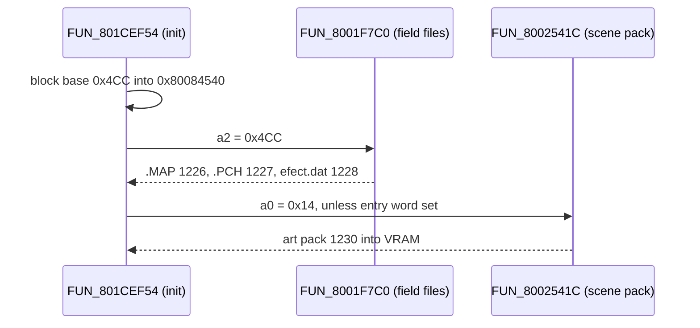

# Noa dance (rhythm) minigame

The dance minigame is a rhythm game. A beat counter advances with the music, a step chart says which button to press on each beat, and a press counts only inside a timing window around the beat. Closing a chain of correct presses pays points and fills a "groove" gauge; the gauge promotes the dancer to a denser, higher-scoring chart row.

Three dancers share the floor in the competitive modes: the player and two rivals. The rivals play the *same* chart through the *same* judge off an auto-fed pad word, so their scores are real runs rather than a scripted curve. The **Triangle** button is not a direction: it is a three-per-song wildcard (the "groovy move") that pays its multiplier only on a 4-beat combo slot. The run ends when the song timer elapses, and the qualifier / finals modes grade the player against a rival's score.

The minigame lives in its own code overlay (a code image loaded into RAM at `0x801CE818` for the duration of the mode), one of the minigame-hub family that shares that load slot with fishing, the slot machine and Baka Fighter. This page covers the dance-specific logic only; the shared move VM, window-widget VM and SDK helpers are in [`move-vm.md`](move-vm.md) and [`actor-vm.md`](actor-vm.md).

Provenance is `ghidra/scripts/funcs/overlay_dance_<addr>.txt` unless a section says otherwise. Statements are read from the disassembly; the few that are consistent readings without a separate observation are marked **Inferred**.

## At a glance

| Item | Value |
|---|---|
| Overlay | extraction PROT 0980, base `0x801CE818`, `0x8000` bytes (ends `0x801D6818`) |
| Entry | field-VM op `0x3E` with `op0 = 106` (`sub_id 6`) → game mode `0x18`; init `FUN_801CEF54` |
| Per-frame tick | `FUN_801cf470` - state machine on `DAT_801d5334`, beat clock, song end, grading |
| Per-dancer handler | `FUN_801d1358` - calls the award routine `FUN_801d1af4` once per dancer per frame |
| Judge | `FUN_801d1960` - timing window `0xD2` of a `0x119`-unit beat, accuracy weight `0..0x1000` |
| CPU input | `FUN_801d1820` (chart lookup) → `FUN_801d4040` (symbol → pad bit) |
| Step chart | `0x801D509C`, 3 rows x `0x20` beats, one byte per beat (PROT 0980 file `0x6884`) |
| Scoring tables | bonus points `0x801D41A4`, CPU triangle schedule `0x801D41E4` |
| Key RAM | score `DAT_801d53cc[]`, groove gauge `DAT_801d544c[]`, triangle stock `DAT_801d534c[]`, beat phase `DAT_801d581c` |
| Scene block | `other7` (CDNAME raw `0x4CC`, extraction 1226..1232): hall geometry, art pack 1230, SFX 1228 / 1231 |
| Win flag | story flag `0x50a` - set on entry, cleared on a loss |
| Parsers | `legaia_asset::dance_chart`, `dance_cast`, `dance_art` |
| Rules port | `legaia_engine_minigames::dance` (re-exported as `legaia_engine_core::dance`) |
| Hosts | native `play-window`, browser play page, browser minigames page - see [Engine port](#engine-port) |

## Entry from the field

The contest is reached by the **mode-24 minigame door-warp**: field-VM op `0x3E` with `op0 = 106` (`sub_id 6`), which sets game mode `0x18` and loads PROT 0980. The mechanism, its `sub_id` → overlay table and the return warp are in [`script-vm.md` § 0x3E WARP](script-vm.md#0x3e-warp-mode-24-minigame-door-warp). The port's id decoder is `legaia_engine_core::minigame_entry::MinigameSubId` (`crates/engine-field`).

The `sub_id` → PROT arithmetic is the one place retail's loader steps: `prot_index = sub_id + (2 if sub_id >= 6) + 0x4D + 0x37F`, so `sub_id 6` resolves to 0980 rather than 0978.

A disc-wide walk of every scene MAN puts every dance door in `koin3`: P1[16] plus the partition-2 contest records P2[6] and P2[9]. A fourth site sits in P2[5], inside a record whose walk desyncs upstream in dialogue, so only its raw byte window resolves. The hall's own scene module `other7` carries **no** genuine warp; its `0x3E` hits are cross-context text phantoms. Census test: `crates/engine-core/tests/minigame_entry_census_disc.rs`.

`FUN_801cf470` has no `jal` caller. It is the `+0x08` tick word of the static 24-byte actor template at `0x801D42E4`. The sub-id-6 init `FUN_801CEF54` materialises that template and spawns an actor from it (`jal FUN_80020DE0` at `0x801CF210`), and the per-frame pool walk reaches it through `jalr actor[+0x0C]` in `FUN_8002519C`.

## Beat-clock state machine

The per-frame controller `FUN_801cf470` is a `switch` on the game-state global `DAT_801d5334`, through a 21-word jump table at `0x801CEE68` (PROT 0980 file `0x650`).

```mermaid
stateDiagram-v2
    direction LR
    S0: 0 mode menu
    S1: 1 setup
    S2: 2 load wait
    S3: 3 run reset + READY
    S4: 4 GO in
    S5: 5 GO out
    S6: 6 start song
    S7: 7 lead-in
    S10: 10 play
    S11: 11 finish countdown
    S12: 12 result wipe
    S20: 20 results
    [*] --> S0: entry word zero
    [*] --> S1: field entry
    S0 --> S1: pad 0x20
    S1 --> S2: mode 2
    S1 --> S3: other modes
    S2 --> S3: load flag clear
    S3 --> S4: counter at 0x6F
    S4 --> S5: ramp at 0x3C
    S5 --> S6: ramp below 0
    S6 --> S7
    S7 --> S10: countdown 0
    S10 --> S11: song timer at limit
    S11 --> S12
    S12 --> S20: wipe done
    S20 --> [*]: fade at 0x100
```



| State | Role |
|---|---|
| `0` | Debug mode menu. Prints the four mode labels, moves the cursor on pad `0x4000` (mode `+1`, wrapped mod 4), advances on pad `0x20`. Reached only when the field-entry word `_DAT_8007B8B8` is zero. |
| `1` | Setup. Picks the mode from story flags, sets the win flag, spawns the cast (`FUN_801d0190`), registers the effect bundles, arms the load flag `DAT_801d5830`. Next state is `2` in mode 2, `3` otherwise. |
| `2` | Waits for `DAT_801d5830` to clear, then zeroes the run counters (gauge `DAT_801d544c`, etc.) and advances. |
| `3` | Resets per-dancer run state: triangle stock `DAT_801d534c`/`+4`/`+8` = `3`, triangle-schedule cursors `DAT_801d574c` cleared. Draws the `READY...` banner and streams the song. See [the count-in](#the-count-in-state-by-state). |
| `4` | `GO!` in: ramps the accumulator `DAT_801d515c` up to `0x3c`, queues the run-start cue. |
| `5` | `GO!` out: ramps `DAT_801d515c` back to 0, then calls the actor-start helper and advances. |
| `6` | Zeroes the beat counters `DAT_801d581c` / `DAT_801d5820` / `DAT_801d5824`, sets the lead-in countdown `DAT_801d513c = 4`, goes to `7`. Its `func_0x80026478` call (`FUN_80026478`) is the actor sound-source attach / re-pan primitive ([`functions.md`](../reference/functions.md)), not the BGM start. |
| `7` | Decrements `DAT_801d513c`; at 0 jumps to `10`. |
| `10` (`0xa`) | **Main play loop.** The beat clock advances, `FUN_801d231c` draws the HUD, the song-end test runs. |
| `11` (`0xb`) | Finish countdown: spawns `3`, `2`, `1` and `FINISH!` as four sprite parts at once and advances. |
| `12` (`0xc`) | Result wipe: ramps `DAT_801d515c`, raises the pause flag `DAT_801d5130` past a threshold, then jumps to `0x14`. |
| `0x14` (20) | Results: copies the scores to display RAM, grades the run, clears the win flag on a loss, and tears down through `FUN_801D414C` once the fade reaches `0x100`. |

A dev shortcut sits ahead of the switch: with `_DAT_8007b9b0` non-zero, pad `0x100` forces state `0x14` with the human score at `999`.

**Beat clock.** In states 10 / 11 / 12 (`DAT_801d5334 - 10 < 3`) the tail of `FUN_801cf470` adds `DAT_1f800393 * 10` to the beat phase `DAT_801d581c` and to the song accumulators `DAT_801d5820` / `DAT_801d5824`. `DAT_1f800393` is the engine's frame-delta scalar, so the clock is framerate-compensated; the hall runs at a delta of `3` (20 fps).

| Quantity | Value |
|---|---|
| Beat period | `0x119` (281) phase units |
| Acceptance window | phase `0..=0xD2` (210); the remaining ~71 units are a dead zone |
| Chart cycle | `DAT_801d581c` wraps at `0x2320` = 32 beats |
| Secondary bar counter | `DAT_801d5824` wraps at `0x464` = 4 beats |
| Song length | `DAT_801d5820` reaching `0x64fc` (92 beats), or `0x41dc` (60 beats) in mode 2 |

**Song end** is tested in state 10 only, and only while the dev counter `_DAT_8007B6D0` is zero: at the limit the state advances to `0xb`.

### Mode global `DAT_801d514c`

Four modes, `0..3`. The state-0 menu prints the labels `s_yosenn` / `s_hosenn` / `s_setumei` / `s_asobi` at y `0x50` / `0x58` / `0x60` / `0x68` with the cursor at y `= value*8 + 0x54`. The English glosses are **Inferred**.

In normal play the field script picks the mode by setting a story flag before the warp. State 1 tests `0x133 → 2`, `0x134 → 0`, `0x135 → 1`, `0x428 → 3` in that order (`0x801CF8F4..0x801CF94C`), each hit overwriting the global, so the last flag set wins and no flag leaves the entry's `0`. It then clears `0x135` / `0x134` / `0x133` - **not** `0x428`, the standing free-play state - and sets the win flag `0x50a`.

| Value | Name | Behaviour |
|---|---|---|
| `0` | yosenn (予選, qualifier) | Versus. Grading compares the human score `DAT_801d53cc` against score slot 2 `DAT_801d53d4`; a lower score clears the win flag. |
| `1` | hosenn (本選, finals) | Versus. Grading compares `DAT_801d53cc` against score slot 1 `DAT_801d53d0`; a lower score clears the win flag. |
| `2` | setumei (説明, how-to) | Short song (`0x41dc`), no [camera track](#the-camera-keyframe-track) (the camera holds the entry pose), state 1 routes through state 2. Grading clears the win flag when the score exceeds `300`. |
| `3` | asobi (遊び, free play) | Draws the personal-best panel (`FUN_801d2f38` + `FUN_801d32f8` over `_DAT_80084464`) and rotates its BGM through `_DAT_80084468` (see [the BGM pick](#the-bgm-pick)). The grading switch has no branch for it, so free play sets no win / lose flag. |

### Win / lose flag

The outcome is story flag `0x50a`, a bit in the `DAT_80085758` flag bank. `func_0x8003ce08` sets, `func_0x8003ce34` clears and `func_0x8003ce64` tests a flag (`8003ce08.txt` / `8003ce34.txt` / `8003ce64.txt`).

- **Set** in state 1 (`func_0x8003ce08(0x50a)`).
- **Cleared on a loss** in state `0x14` (`func_0x8003ce34(0x50a)`): modes 0 / 1 when the human loses the score comparison, mode 2 against the fixed threshold `300` (`0x12d`). Mode 3 leaves it untouched.
- The downstream field script tests it: set = passed, clear = failed.

State `0x14` also copies the three scores into display halfwords (`DAT_801c6460..`) and updates the saved high score `_DAT_80084464` when `DAT_801d53cc` exceeds it.

## Step chart and scoring tables

All three tables are **baked into the overlay's static image**; nothing is loaded per song. Parser: [`legaia_asset::dance_chart`](../../crates/asset/src/dance_chart.rs) (`parse` for the chart, `parse_tables` for the two scoring tables).

| Table | VA | File offset | Shape | Index |
|---|---|---|---|---|
| Step chart | `0x801D509C` (`DAT_801d509c`) | `0x6884` | 3 rows x `0x20` bytes | `row * 0x20 + beat` |
| Sequence-bonus points | `0x801D41A4` (`DAT_801d41a4`) | `0x598C` | 4 kinds x 4 lanes, `i32` | `kind * 0x10 + lane * 4` |
| CPU triangle schedule | `0x801D41E4` (`DAT_801d41e4`) | `0x59CC` | 4 kinds x 16 slots, `i32` | `kind * 0x40 + n * 4` |

### Chart record

One chart row is 32 bytes, one byte per beat of the 32-beat cycle:

| Offset | Size | Field |
|---|---|---|
| `+0x00` | 1 | symbol for beat 0 |
| `+0x01` | 1 | symbol for beat 1 |
| ... | | |
| `+0x1F` | 1 | symbol for beat 31 |

| Symbol | Meaning | Pad bit (`FUN_801d4040`) |
|---|---|---|
| `0` | rest | none |
| `1` | Square | `0x80` |
| `2` | Circle | `0x20` |
| `3` | Triangle - the [wildcard](#the-triangle-wildcard-the-groovy-move), produced only by the CPU feed | `0x10` |

The row is the dancer's **difficulty lane**, `gauge / 1000`, so the three rows are three difficulty tiers and every dancer - human or CPU - reads the row its own gauge has promoted it to. The lane-0 row places every one of its steps on a 4-beat boundary (`0,0,0,1, 0,0,0,2, ...`), so lane 0's notes sit exactly on the combo slots (`beat & 3 == 3`).

### Scoring tables

Both are indexed by the dancer's **kind** (`DAT_801d540c[slot]`, stamped from the spawn table by `FUN_801d0190`, so it is also the mesh / face-rig id).

- **Bonus points** (`DAT_801d41a4`). Each retail row is `k, 2k, 3k`: the `(lane + 1)` scaling is baked into the data. Kind 0 (Noa) is the richest row; the competitor kinds are progressively poorer.
- **Triangle schedule** (`DAT_801d41e4`). Entry `n` is the number of combo slots the dancer must bank (`DAT_801d578c`, incremented once per `beat & 3 == 3` by `FUN_801d1358`) before spending its `n`-th groovy move. A huge value means never. Kind 0's row is all zeros: the human's triangles are pressed, not scheduled.

The shapes are pinned by the index arithmetic in `FUN_801d1960` / `FUN_801d1820`.

## Input judging + timing windows

Two routines read the chart. They share the window arithmetic and differ on the combo slots.

```
phase     = DAT_801d581c % 0x119            // 0..280 inside the beat
beat      = DAT_801d581c / 0x119            // 0..31
in_window = phase <= 0xD2
lane      = DAT_801d544c[player] / 1000
cell      = chart[lane * 0x20 + beat]
w         = 0x1000 - (phase * 0x1000) / 0xD2    // accuracy weight, stored in DAT_801d6090
base      = DAT_801d41a4[kind * 0x10 + lane * 4]
points    = base / 2 + ((base * w) >> 13)       // player 0
points    = base                                // CPU dancers
```

### The judge `FUN_801d1960`

`FUN_801d1960(player, lane, pressed)` is called from the `0x80` / `0x20` branches of the award routine. The pressed direction is `(pressed & 0xf) + 1`, compared against the chart cell.

| Condition | Return | Score | Gauge | Chain cursor `DAT_801d550c` |
|---|---|---|---|---|
| `phase > 0xD2` (dead zone) | `0` miss | - | - | unchanged |
| in window, cell ≠ pressed direction | `0` miss | - | - | unchanged |
| in window, match, chain still open | `1` hit | **nothing** | - | `+1` |
| in window, match, `cursor + 1 == lane + 1` | `2` chain closed | `+ points` (`DAT_801d608c`) | `+250` (`DAT_801d6088 = 0xfa`) | reset |

- A chain is `lane + 1` matched notes in a row. The cursor is cleared every 8 beats (`FUN_801d1358`: `beat & 7 == 0`), so a chain must close inside one 8-beat bar.
- The accuracy weight `w` is maximal dead on the beat and decays to 0 at the window edge. It weights the **human's** bonus only: half the table value at the edge, the full value on the beat. A CPU dancer takes the flat table value.
- There is no Perfect / Good text tier in the judge; hit quality is carried continuously by `w`.

### The CPU auto-feed `FUN_801d1820`

`FUN_801d1820(player)` answers "what does this dancer press right now". Its only caller is `FUN_801d4040`, whose only caller passes a non-zero player index, so it never runs for the human.

1. Outside the window (`phase > 0xd2`) it returns 0.
2. On a combo slot (`beat & 3 == 3`) it checks the dancer's triangle schedule: `DAT_801d41e4` indexed by the cursor `DAT_801d574c[player]`, against the banked count `DAT_801d578c[player]`. When the schedule is due it advances the cursor, clears the counter and returns symbol `3`.
3. Otherwise it returns the chart cell for the dancer's own lane.

`FUN_801d4040(player)` maps the symbol to the pad bit in the [chart record](#chart-record) table. The button identities are confirmed by the how-to script, whose lines name the Triangle as the three-times-only groovy move.

### Judged cell versus fed symbol

The feed can substitute the triangle on a combo slot; the judge always reads the raw cell. Because lane 0's notes all sit on combo slots, the two diverge on exactly the beats that carry notes.

For any host that renders the chart, **the note the player must press is the judged cell**, not `FUN_801d1820`'s return. The port exposes both: `DanceGame::judged_symbol` (the judge's source) and `DanceGame::required_symbol` (the CPU-feed source). The site's playable dance drives its note highway off the former.

## The triangle wildcard (the "groovy move")

The Triangle button (`0x10`) has its own branch in the award routine and **matches no chart cell**. The how-to script teaches it as a wildcard: press it with the last command of a combo, three uses a song. `FUN_801d1af4`'s `0x10` branch, in order:

1. Gate on the hit-tier latch `DAT_801d548c[player]` being clear **and** on the stock `DAT_801d534c[player]` being non-zero. The stock is set to **3** per dancer in state 3 and is never replenished mid-song.
2. Decrement the stock.
3. On a **combo slot** (`beat & 3 == 3`) inside the window (`phase < 0xd2`): set the landed flag `DAT_801d570c[player] = 1`, add `(lane + 1) * 0x19` (25) to the score, and step the gauge a full **`+1000`** - one whole lane. Otherwise clear the flag and add only `(lane + 1) * 3`.
4. Return the move-clip index `lane*2 + 0x10` (the on-beat step clip, move pair `8 + lane`), set the spin counter `DAT_801d564c[player] = lane + 1`, latch `DAT_801d548c = 3` / `DAT_801d54cc = 0xf`, and arm the feedback window `DAT_801d5144 = 0x3c` (60).

**Input lockout.** After step 4 the dancer spins `lane + 1` full turns: `FUN_801d1358` advances its yaw by `(lane * 0x20 + 0x80) * frame_delta` per frame and decrements the spin counter every `0x1000`. The award routine is only called while the dancer's bound clip is its idle or dance loop, so nothing that dancer presses is judged for the whole move: 32 / 51 / 64 frames by lane.

So the move is worth `8.3x` an ordinary press plus a lane promotion, but only on the combo slot, and it costs the next second of input. It belongs on the **last** note of a combo, in the lane where `(lane + 1)` is biggest.

**Finale tier.** The `× 0x22` (34) multiplier in the same branch is selected by `DAT_801d5334 - 0xb < 2`, i.e. the game state being 11 or 12 - the finish countdown and result wipe, where the pad is still read. It is not a "perfect" tier. The arm at `0x801D1CE0..0x801D1D30` pays `(lane + 1) * 17 << 1` and raises `DAT_801d538c[player]`, whose reader is not in the dump corpus. The port pays it while `DanceGame::in_finale` and keeps the flag as `finale_landed`.

## Scoring

`FUN_801d1af4(player)` is the award routine for the **whole floor**: `FUN_801d1358` calls it once per frame for every spawned dancer. It first picks the pad word - the live pad `_DAT_8007b874` for player 0, `FUN_801d4040(player)` for every other dancer. It runs only in the play states (`DAT_801d5334 - 10U < 3`) with the pause flag `DAT_801d5130` clear.

**Score** `DAT_801d53cc[player]` is clamped to `999` (`0x3e7`). It has exactly two sources, the triangle and a closed chain:

| Press | Score | Gauge |
|---|---|---|
| Triangle (`pad & 0x10`) on a combo slot, in window | `(lane + 1) * 0x19` (25) | `+1000` |
| Triangle anywhere else | `(lane + 1) * 3` | - |
| Direction (`pad & 0x80` / `& 0x20`) closing the lane's chain | `+ DAT_801d608c` (the kind's bonus, accuracy-weighted for the human) | `+250` |
| Direction that matches but does not close the chain | nothing (the cursor advances) | - |
| Direction that misses | nothing (the miss counter `DAT_801d568c` rises) | - |

**Groove gauge** `DAT_801d544c[player]` is clamped to `[0, 2999]`. The chart row is `gauge / 1000`, so crossing 1000 / 2000 promotes the dancer. **No path in the overlay lowers it** - not a miss, not a dropped chain: every writer in the image is an award, a clamp, or a run / tutorial reset. The how-to script says the same ("the level rises automatically").

**Latch.** Every judged press sets the hit-tier latch `DAT_801d548c[player]` (0/1/2/3) and its timer `DAT_801d54cc[player]` (`0xf`, decayed `2 * frame_delta`), so a held button is not re-judged every frame.

**Feedback** is player 0's only: a sound cue (`_DAT_8007b6de` / `_DAT_8007b6d8`), a banner through the sprite spawner `FUN_801d3fd0`, and the face pose switch `FUN_801d03c4`. See [rating banners](#rating-banners-per-tier-fun_801d1af4-body) and [Sound](#sound).

### The rival dancers

The competitors run the same award routine off a pad word synthesised from the same chart. They differ from the human only by **kind**, which selects their row of the two [scoring tables](#scoring-tables). A CPU dancer therefore hits every note its own lane calls for (so its gauge climbs and promotes it), takes the flat table bonus for each closed chain, and throws its groovy moves on the disc's schedule. Its cadence is limited by the same latch as the human's plus the move clip it is playing.

## The setumei (how-to) tutorial script (`FUN_801d0750`)

Mode 2 is driven by a dedicated actor script: the Disco King's per-frame state machine, a `switch` on the actor's own step counter (`+0x9c`). It prints dialogue lines (`func_0x80036888`, fixed y `0x78` / `0x88` / `0x98`) and advances on any face button (`_DAT_8007b874 & 0xf0`, keying the confirm cue `0x20`). Between segments it resets the shared run state, so it is the mode's controller and not only a caption printer. Provenance `overlay_dance_801d0750.txt`.

**Dispatch.** A **19**-slot jump table at `0x801ceee8`, guarded by an unsigned `state < 0x13`; slot `0x12` has no body, so 18 states do work. Three tails share the store at the bottom of the function: the common one stores `state + 1`, one stores a literal, one stores `state + 2`.

**Steps, in order:**

| Step | What it does |
|---|---|
| opening prompt | Yes / no cursor `DAT_801d607c`, moved by **Left / Right** (`0x1000` / `0x4000`) although the options are stacked at y `0x98` / `0xa8`. The cursor row is masked to one bit and confirms to state `1` (yes) or state `5` (no thanks) - the literal-store tail. |
| pages 1..4 | Text pages explaining the buttons. State `5`'s `+2` hops the acknowledgement at `6`, which only the "no thanks" path reaches. |
| case `7` | "Try Square / Circle now": probes the human's press with two direct calls `FUN_801d1960(0, gauge/1000, 0x100)` / `0x101` and praises a correct one. Ends when the progress accumulator `DAT_801d5150` reaches `900`. |
| level page | "The level rises automatically": arms the load gate (`DAT_801d5830 = 1`, `DAT_801d5334 = 2`). |
| groovy-move lesson | Text. |
| case `0xd` | Groovy-move practice: reads the triangle-landed flag `DAT_801d570c` to print praise or a timing scold, for the duration of the feedback window `DAT_801d5144`. Shares the `900` gate. |
| cases `0xc` / `0x11` | Countdown holds on the timer `DAT_801d6080` that clear the beat clock (`DAT_801d581c` / `DAT_801d5820` / `DAT_801d5824`) before advancing. |

**Timers.** Case `7`'s scold window `DAT_801d5140` counts **up** and snaps back to zero past `0x20` (a blink). Case `0xd`'s feedback window `DAT_801d5144` counts **down** to a floor of zero (a decay). Both countdown holds seed `DAT_801d6080 = 0x3c` and advance only once it goes **negative**, so they run one frame longer than the seed reads.

**Port.** The script's output is Sony dialogue, so only its shape is ported: `legaia_engine_core::dance_tutorial` (`crates/engine-minigames/src/dance_tutorial.rs`) carries the step classification, the option prompt, the advance tails and the two free-dance steps. `DanceTutorial` is the actor as one advancing object - one `step` per frame, fed the live session's score, feedback window and combo latch. Hosts draw placeholder captions at the retail line positions; the strings stay unread.

## Dancers

### Dancer bodies: the retail cast + choreography tables

The overlay issues no mesh load, but it names every dancer. The spawner `FUN_801d0190` reads a per-mode **spawn table** of `0x10`-byte records `[u32 kind, x, y, z]` and a **kind descriptor table** of 5 records x `0x80` bytes at `0x801D4E1C`. Parser: `legaia_asset::dance_cast`.

| Mode | Spawn table | Count (`$s3`) | Cast |
|---|---|---|---|
| `0` yosenn | `0x801D4D5C` | 3 | Noa centre (`x 0x1800`) + kinds 2 / 3 flanking (`0x1740` / `0x18C0`), all `z 0x3480` |
| `1` hosenn | `0x801D4D8C` | 3 | Mary centre + Noa right + kind 2 left |
| `2` setumei | `0x801D4D5C` | 1 | Noa alone (first qualifier record), plus the Disco King from a second template |
| `3` asobi | `0x801D4DBC` | 6 | six dancers (kind 3 twice + the Disco King) |

Kind descriptor fields:

| Offset | Field |
|---|---|
| `+0x0C` | mesh id |
| `+0x10` / `+0x14` | pre-game idle anim id + rate |
| `+0x18` / `+0x1C` | in-play dance-groove loop anim id + rate |
| `+0x20` | no reader - see [closed negatives](#two-descriptor--atlas-questions-that-are-closed-as-negatives) |
| `+0x28..+0x80` | eleven `[anim \| flags, rate]` **move pairs** the judge triggers; anim bit `0x200` = [party clip bank](#the-party-bank-bit) |

Kind 0's mesh id is written *without* the scene TMD base `hw(0x8007B6F8)`, so it indexes the resident global pool. The others get the base added, so they are scene-pool indices in the MAN model-byte space.

The clips resolve against the **dance-hall scene module**, CDNAME block `other7`. Its first MOVE section is a **60-record ANM bundle (PROT 1229)**, and the descriptor anim ids are placement-space ids into it (`record = id - 1`), pinned by the bone-count partition being exact:

| Kind | Mesh | Rig bones | Anim ids | Identity |
|---|---|---|---|---|
| 0 | global pool slot 1 | 10 | idle 6, dance 18, moves 7..17 (recs 5..17) | **Noa** - her field-view model (PROT 0874 §0 slot 1); the rig-0 face stamp reads her field atlas |
| 1 | scene TMD 58 | 11 | idle 47, dance 51, moves 48..58 | **Mary** - face-strip rig 1 (`(400,0)`); koin3's Mary (its model 63) shares her CLUTs `(192/208, 480)` |
| 2 | scene TMD 62 | 12 | idle 33, dance 36, moves 37..46 | dancer NPC - rig 2 (strip `(416,0)`, CLUT `(224,480)`); koin3 twin model 67 |
| 3 | scene TMD 61 | 12 | idle 19, dance 31, moves 20..30 | dancer recolor - rig 3 (strip `(432,0)`, CLUT `(224,481)`); koin3 twin model 66 |
| 4 | scene TMD 63 | 10 | idle 59, dance 60 (moves all 60) | **Disco King** (koin3 twin model 71) - the how-to demo dancer |

The AI dancers are dedicated dancer NPCs, not party members. The host town scene **koin3** places the same NPCs on its own dance floor at the matching coordinates, with sibling clips in its own 95-record bundle.

**Move-pair index.** On a judged event `FUN_801d1af4` returns a u32-word index into the descriptor's move array. In pair units: pair `0` / `1` = miss reaction (Square / Circle), pair `lane*2 + 2` / `+ 3` = the sequence-complete move per lane, pair `8 + lane` = the groovy-move step.

Several choreography records carry frame data past the header's frame count. The retail cursor clamps at `frame_count*16 - 1`, so the tail never plays; `PlayerAnmBundle::record_lenient` accepts them.

### The spawner's two actor kinds

`FUN_801d0190` seats two kinds of actor (`overlay_dance_801d0190.txt`):

- **Dancers**, one per spawn-table record. Kind 0 (Noa) is the one record whose model id skips the scene TMD base (`0x801D0280`) and the only one given the actor render scale `+0x72 = 0x1400` (`0x801D02B8`): her field mesh draws at `1.25x` beside the hall's NPCs.
- **The Disco King**, in mode 2 only (`0x801D0338..0x801D0390`), from a second template at `0x801D4344` whose tick word is the tutorial script `FUN_801d0750`: scene model `base + 0x3F` (kind 4's mesh), clip `0x3B` at rate `8`, at `(0x1800, 0, 0x3200)`. He has no slot in the per-dancer arrays, so nothing judges or scores him, and his script's only actor store is its step counter `+0x9C` - the one clip loops for the whole lesson.

Under the entry camera the Disco King projects **below** the frame. He stands on the lower floor (`y = 0` against the dancers' `-0x80`) only `0x190` in front of the eye, where his vertices land at NDC `y` between `-1.4` and `-2.5`. Nothing moves the how-to camera (the keyframe block is gated off for mode `2`, and neither the lesson script nor the entry writes the camera globals again), so a retail lesson shows Noa alone centre-stage and the Disco King is an off-screen voice. A live how-to run confirms the entry pose every vsync - pitch `0x3C`, eye `(0, 0x62C, 0xFF0)`. The port frames the lesson the same way.

### The dancer actor record

Per floor slot, `FUN_801d0190` writes:

| Offset | Value |
|---|---|
| `+0x10` | flag word; kind 0 gets `\|= 0x1000000` (`0x801D02C4`) |
| `+0x14` / `+0x16` / `+0x18` | the spawn record's world position |
| `+0x48` | kind descriptor address (`sll a0, s0, 7` at `0x801D02D0`, `sw a0, 0x48(a1)` at `0x801D02F8`) |
| `+0x56` | `1` |
| `+0x5A` | slot index |
| `+0x5C` | **bound clip id**: the kind's idle anim id masked to `0x1FF` |
| `+0x6A` | the clip's rate word |
| `+0x72` | render scale (`0x1400` for kind 0) |

`+0x5C` is the bound clip id, not a spin counter. `FUN_801d1358` rewrites it with each judge-returned move pair (`andi ...,0x1ff` then `sh ...,0x5c(s0)`) and compares it against the descriptor's idle / dance-loop ids to decide whether the award routine may run. The groovy-move turn counter is the overlay global `DAT_801d564c[i]`, not an actor field.

**Clip driver gate.** `FUN_801d4098` runs the shared clip driver `FUN_800204f8` only when `+0x5c > 0` (a clip is bound) or `+0x10` carries bit `0x1000` (the force-drive flag the field motion driver also uses).

**Clip end and judging.** A dancer's clip returns to its loop when the clip driver raises its end flag (`+0x62 & 0x100`, tested at `0x801D14C8`). `FUN_801d1af4` is called only while the bound clip **is** the idle or the dance loop (`0x801D168C..0x801D16B4`), so that same end flag re-opens judging: a move, the miss reaction included, locks its dancer's presses out for its whole length, far past the eight-frame note latch.

Port: `minigame_actor::MinigameActor` is the record, `DanceGame::dancer_actors` the per-slot pool, `DanceGame::dancer_clip_frames` the gate's per-frame output (`dance_clip_driver_gate`). `DanceGame::attach_clip_bank` reads every descriptor clip's length from the hall's MOVE bundle (`field_anim::clip_end_ticks` over the record's frame count and the rate's per-record step), and a bound move holds `+0x5C` and the lock until it runs out. A chart-only run has no clip lengths and falls back to the note latch.

<a id="the-party-bank-bit-not-a-draw-mode"></a>
### The party-bank bit

A descriptor anim word's bit `0x200` is not a translucent draw. `FUN_801d1358` folds it into actor flag `0x01000000` (`0x801D155C..0x801D1574` for a queued move, `0x801D171C..0x801D1748` for the award path, which also clears it when the bit is absent). That flag has one reader on the clip path: the clip selector `FUN_800204F8` tests it first and, when set, resolves the clip id against `_DAT_8007B75C` - the resident party clip bank, PROT 0874 section 1 - instead of the scene's own bank (`0x80020530..0x80020560`). It is the same flag the field's placement seater raises on a party-bank actor and the ambient move-VM's op `0x0E` raises when it switches an actor to the second model bank.

No clip in the five descriptors on the disc carries the bit, so every dancer clip resolves against the hall's bank. Kind 0's spawn raises the flag, but its handler re-derives it from the bound loop's word on its first tick, so Noa's clips resolve against the hall's bank too. Port names: `DanceClip::party_bank`, `minigame_actor::FLAG_PARTY_CLIP_BANK`; with no carrier on the disc, the cast surface holds no second bank.

### The dancer face stamp (`FUN_801d03c4`)

The dancers are field-scene actors; the overlay animates their **faces**. `FUN_801d03c4(dancer, pose)` does two `MoveImage` (`FUN_80058490`) blits inside a per-dancer VRAM strip, copying an **eye cell** and a **mouth cell** from the strip's pose bank into its live window (the rows the head samples). The rig is picked through a jump table at `PTR_LAB_801ceec8`; frame tables are 4-byte `[eye_u, eye_v, mouth_u, mouth_v]` records, `u` in pixels `>> 2` to halfwords.

| Case | Strip | Frame table | Eyes (w_hw x h → dst) | Mouth |
|---|---|---|---|---|
| 0 | `(0x354, 0x100)` = **Noa's field atlas** (PROT 0874 §2 entry 2 at `(852, 256)`) | `0x801D435C` (5 poses) | 6x16 → `(0x354, 0x10C)` | 4x8 → `(0x355, 0x11C)` |
| 1 | `(0x190, 0)` = pack strip `(400, 0)` | `0x801D4370` (4) | 13x16 → `(0x190, 8)` | 3x8 → `(0x192, 0x20)` |
| 2 | `(0x1A0, 0)` = pack strip `(416, 0)` | `0x801D4380` (4) | 13x16 → `(0x1A0, 8)` | 3x8 → `(0x1A2, 0x2F)` |
| 3 | `(0x1B0, 0)` = pack strip `(432, 0)` | `0x801D4390` (4) | 12x16 → `(0x1B2, 0xA)` | 3x8 → `(0x1B2, 0x29)` |

In mode 0 the overlay remaps dancer `2 → 3` and `1 → 2` - the qualifier cast's kinds (slots hold kinds 0 / 2 / 3) - so **rig id = dancer kind**. The four poses are expression variants (open / blink / intense / wink). `FUN_801d1af4` switches the human's pose on a scoring event; the per-dancer pose latch is `DAT_801d56cc[]`. Rigs 1..3 are sampled by the heads of the `other7` dancer meshes (Mary and the two competitors). The strip diffs against a live VRAM capture land exactly on the blit destination rows.

## Dance-floor rendering

The floor is drawn by a small cluster that **reuses the field engine's scene infrastructure** rather than a dance-specific renderer: the scene-data base `_DAT_1f8003ec` (the per-scene pointer whose `+0x4000` slice is the field walkability grid - see [`field-locomotion.md`](field-locomotion.md)) and the actor-list head `_DAT_8007c36c`.

| Function | Role |
|---|---|
| `FUN_801d3a2c` | **Per-frame floor pass.** Clears `DAT_801d6084`, walks the actor list when not paused, then sweeps the cell grid spawning one tile actor per drawn cell. The exact per-cell emit is **Inferred**. |
| `FUN_801d2a10` | **Height-ramp install + step-marker floor pass** over a `(x0, y0, width, height)` rect. |
| `FUN_801d3ec0` | **Two-layer lookup.** Calls `FUN_801d3f54` against scene-data layer `+0x10000`; on a miss, retries against `+0x12000`. |
| `FUN_801d3f54` | **Sub-table record lookup by cell.** First argument is the **kind** index: header offset `s16` at `base + kind*4 + 2`, count `s16` at `+4`, record stride the byte at `_DAT_8007B318 + kind`. Returns the first record whose two leading bytes match `(x, y)`, else NULL. |

Several interior addresses of `FUN_801d2a10` (`0x801d2b44`, `0x801d2c98`, `0x801d2cfc`, `0x801d2d1c`, `0x801d2d2c`) are real function entries in sibling overlays that load at the same base (menu / field). In the resident dance overlay they are loop-body PCs of the one function.

### The floor pass

`FUN_801d3a2c` and `FUN_801d2a10` are the same walk over the scene floor buffer, and the byte-identical `FUN_801d6bbc` in the shared overlay band is a third copy (see [`minigame-fishing.md`](minigame-fishing.md#fishing-actors-and-scene-render)). Port: `legaia_engine_core::minigame_floor` (`crates/engine-fishing/src/minigame_floor.rs`).

Three regions of the scene buffer are involved:

| Region | Layout |
|---|---|
| buffer base | tile **records**, `0x20` bytes each, indexed by tile id |
| `+0x4000` | **terrain byte** grid, row pitch `0x80`. Low nibble = height-ramp index; high nibble = the four sub-cell wall bits the field collision probe `FUN_801cfe4c` reads (`>> 4 & quadrant`) |
| `+0x8000` | `u16` **cell grid**, row pitch `0x100` (the `y << 8` in the cell address). Bits `0..8` = tile id, flag bits above |
| `+0x10000` / `+0x12000` | the two overlaid `.MAP` region blocks the marker lookup scans |

Per cell, both passes:

1. Read the cell word and its tile record; require the record's `+0x12` bit `0x4`.
2. Probe the neighbour cell `(x + rec[6], y + rec[7])` and require it inside `0 ..= 0x7f`. `FUN_801d3a2c` additionally rejects a neighbour whose cell word carries bit `0x400`; `FUN_801d2a10` does not.
3. Spawn at `(x * 0x80 + rec[0] + 0x40, ramp[height nibble] + rec[2], y * 0x80 - (rec[4] - 0x40))` - the **z** term subtracts.
4. Fold the record's `+0x1e` / `+0x12` bits into the spawned actor's `+0x74` and `+0x10`.

`FUN_801d2a10` adds two things. Before the walk it writes the 16-entry terrain height ladder `ramp[i] = i * 0x20` into scratchpad at `0x1f80035c` - the same table `FUN_801d6028` and both floor passes index by the terrain nibble. Its loop bounds are `x1 = a2 + a0` and `y1 = a3 + a1`, so the third and fourth arguments are extents, not end coordinates. And per cell it asks for a step marker.

### Step-marker tiles

The marker lookup is `FUN_801d3ec0(1, x, z)`: kind **1** of the `.MAP` region block. That is the same 4-byte `[tile_x, tile_z, record, gate]` tile-trigger record the field's own per-tile lookup (`FUN_801D5630` / `FUN_801D5AE0`) resolves, scanned primary-then-fallback the same way - not a marker-specific format. See [`field-map.md`](../formats/field-map.md) and [`encounter.md`](../formats/encounter.md); the engine decodes it as `field_regions::TileTrigger`.

The clip index is the record's `record` byte plus one:

| Clip | Template |
|---|---|
| `0` | cell skipped |
| `6 ..= 9` | marker template, with `clip - 6` (the class) stamped into the actor's `+0x50` |
| any other | plain floor template (static hall geometry) |

**Pool.** `FUN_80024C88(&pos, template, list)` is called with `list` read from `0x8007C348 + 0xC` (`lw a2,0xc(t0)` at `0x801D2C1C` / `0x801D2C3C`), i.e. `_DAT_8007C354` - the field-actor list whose per-node tick is `FUN_8003BC08`. A marker tile is an ordinary field actor.

**Tick.** Each marker runs `FUN_801d0640`, a mesh flipbook. It counts `+0x54` down by the frame delta and, on expiry, stages the next `[mesh, duration]` pair from `0x801D44CC + class * 0x80` through the set-model primitive `FUN_80024E08`, biased by the field actor pack base `_DAT_8007B6F8`. There are four `0x80`-byte rows of 25 pairs each, `[-1, -1]`-terminated, and the four rows are the same loop at four phase offsets, so the four marker classes flip out of step. Full read: [`minigames-debug.md`](../reference/functions/minigames-debug.md#801d0640-is-a-mesh-flipbook-on-the-marker-tiles).

**Measured on the venue.** `other7`'s `.MAP` carries sixty kind-1 trigger records, ten of which land on drawn floor cells with a clip in `6..=9`, spread over the classes as `[2, 2, 2, 4]`; all ten swap mesh inside 240 frames (`crates/engine-core/tests/dance_marker_floor_disc.rs`).

**Port.**

- Kernel: `legaia_engine_vm::dance_marker::step_marker`, with `MarkerActor` carrying the three fields the retail actor does (`+0x50` class, `+0x9C` script cursor, `+0x54` countdown). `DanceGame::advance` steps one cursor per class.
- Pool: `minigame_floor::MarkerFloor` runs the `floor_tile_spawns` sweep over a venue's floor rect, keeps the cells `marker_template` classes as markers, advances every tile in `MarkerFloor::step`, and reports the staged meshes through `draws`.
- Both browser pages draw the tiles. `bake_dance_markers` in `web-viewer::minigames_dance` bakes every candidate mesh of every tile into the page's static-topology buffer; each frame `dance_marker_step` (`play_mg_dance_marker_step` on the play page) returns positions with the non-current meshes collapsed to a point, so the index buffer stays static.
- The native play window builds and draws the hall but does not draw the marker tiles. See [`host-drift.md`](../tooling/host-drift.md).

The marker lookup is the read side of the step data in *floor space* ("is there a marker at cell (x, z)"); the chart read in [Input judging](#input-judging--timing-windows) is the *beat-space* side.

### The sprite-part emit dispatch

`FUN_801d387c(part, mode, arg)` is the sprite / shadow draw for the **effect parts** - the banners, stars and countdown digits the spawner `FUN_801d3fd0` creates - not for the dancer bodies. The spawner stamps `+0x50 = sprite_id` and stores `x << 3` / `y << 3` into `+0x14` / `+0x16`; this dispatch reads those three slots and shifts the pair back down by three. (A dancer body carries a *world* triple in `+0x14..+0x18` and no `+0x50`.)

**Fade.** The prologue derives a fade weight from the part's `+0x78` halfword: a value **above** `0x4000` collapses to zero outright, anything else is `>> 4` and clamped to `0xff`. A part past the window goes invisible in one step instead of fading. Port: `dance::sprite_part_fade_weight`.

**Mode** selects one of five jump-table arms (`0x801ceef4`), ported as `dance::sprite_part_emit`:

| Mode | Emit |
|---|---|
| `0` | No draw: copy the transform template `DAT_801d51a0`'s `+0x90` / `+0x92` / `+0x94` into the part and zero its `+0x96` / `+0x98` / `+0x9a` |
| `1` | No draw: store the caller's third argument into the part's `+0x94` |
| `2` | **Two** emits at the part's `+0x14` / `+0x16` rounded toward zero then `>> 3`, with semi-transparency flags `0x400` then `0x800` |
| `3` | One emit at the **unshifted** `+0x14` / `+0x16` pair |
| `4` | One emit with the flag word forced to `1` and the scale word to `0x1000`, after stamping `(+0x50) << 4` into the overlay byte `DAT_801d46e8` |

Modes past `4` draw nothing. The two shifting arms round with retail's `bgez / addiu 7 / sra 3`, so a part at `-1` lands on screen `0`, not `-1`.

**Caller.** The routine has no `jal` caller. The hall init installs it at `gp+0x714` (`0x801CF07C`) as the move VM's sprite hook, and a part's move program reaches it through op `0x20 2`, i.e. mode `2` - see [the finish countdown](#the-count-in-state-by-state). The port draws every part in mode `2`. For the judge's banner and star parts it drives `+0x78` downward as the part's age, which is a port decision: the store that writes `+0x78` for those parts is not pinned.

### The dance hall itself

The hall - the raised stage, the yellow / black checkered floor, the portrait banners, the spotlight cones, the smoke columns, the speaker and lamp fixtures - is **the `other7` scene module's own field geometry**, not overlay art. The block is a full scene (65-mesh environment pack, `.MAP` placed-object and terrain-tile layers, walk-ground heightfield), and the qualifier spawn coordinates land mid-stage in its placement frame. Its texture pages are the `(512..832, 0/256)` rects of [PROT 1230](#the-art-pack-prot-1230).

## Camera and scene staging

### Entering and leaving the hall

Entry and exit are two different routines forming a save / restore pair. The entry is the overlay's init `FUN_801CEF54`. The exit is `FUN_801D414C`, whose one call on the disc is `0x801CFF44` in the results-state fade tail, gated on the fade accumulator `DAT_801D515C` reaching `0x100` (`0x801CFF34`).

| Cell | `FUN_801CEF54` (entry) | `FUN_801D414C` (exit) |
|---|---|---|
| scene-name buffer `0x80084548` | copied **out** to `0x801D518C` (`0x801CF0B0`) | copied **back in** (`0x801D416C`) |
| scene PROT-block base `0x80084540` | saved to `0x801D5180` (`0x801CF0D8`), then set to `0x4CC` (`0x801CF100`) | restored from `0x801D5180` (`0x801D4184`) |
| `_DAT_8007BA9C` | - | set to `-1` (`0x801D4198`) |
| `_DAT_8007B880` | - | zeroed (`0x801D417C`) |

- **`0x801D518C`** is BSS in the static image (zeros at file `0x6974`). It holds whatever field scene the player walked in from; the literal `other1` belongs to `overlay_fishing_0972.bin`, not to this overlay.
- **`0x80084540`** is the scene's PROT block base index. The SCUS BGM resolver reads `*(0x80084540) + 6 + bgm_id` at `0x8002443C` as its change-test index only; the index it loads for a scene-local id is `*(0x8007BC64) + 2` ([`audio.md`](audio.md#a-scene-local-id-loads-a-fallback-track-not-a-scene-bank)).
- **`_DAT_8007BA9C`** is the force-reload arm of the BGM swap. `FUN_800243F0` loads it at `0x8002457C`, XORs it against `_DAT_8007BAB8`, and skips its seven-stage swap machine when the two are equal (`0x80024588..0x8002458C`); stage 6 latches them together at `0x800247C4`. Writing an impossible value is the "reload the track" idiom; the field overlay uses the same one (`-0x64` at `0x801D70DC`, reader at `0x801D70AC`, blocking wait loop at `0x801D7314`). The consumer runs on the next image in the slot - the field overlay, where `FUN_800243F0`'s two callers live (`0x801D72E4`, `0x801DA548`).
- **`_DAT_8007B880`** is the script-set sound-set id with `-1` = none, not a pad latch. Field-VM op `0x35` sub-op 7 stores `-1` for an operand byte of `0xFF` (`0x801E01F4`) and the u16 operand otherwise (`0x801E0208`); every reader tests it for negative (`0x8002453C`, `0x801D6B48`) or `== -1` (overlay 0979, `0x801CF618`). See [`script-vm.md`](script-vm.md) and [`battle.md`](battle.md). The dance writes `0`, as `baka_fighter` and `arena_init` do. The dance's pad word is `_DAT_8007B874`; no input or judging code reads `0x8007B880`.

**Entry camera.** The init stores angles `(0x3C, 0, 0)` at `0x8007B790` (`0x801CF29C..0x801CF2AC`), projection distance `H = 0x200` at `0x8007B6F4` (`0x801CF294`), and the eye-space trio `(0, 0x62C, 0xFF0)` at `0x800840B8`. The mode initialiser `FUN_8001DCF8` loads the 6x world scale for game mode `0x18` as for mode `2` (`0x8001DF4C..0x8001DF70`). The focus is the spawned beat-clock actor: its tick writes `-(+0x14)` / `-(+0x18)` into the focus trio every frame (`0x801CFF84..0x801CFFA4`), and focus Y keeps the `0` the mode initialiser cleared (`0x8001E154`). So the entry record's `(0x1800, -0x64, 0x3300)` is the camera's anchor, not a drawn dancer.

**Entry face stamps.** The init makes five `(dancer, pose)` face-stamp calls. It raises the mode global `DAT_801D514C` to `1` for the first three (no slot remap) and drops it to `0` for the last two (qualifier remap), clearing the three-word pose latch at `0x801D56CC` before each batch. The calls therefore stamp rigs `0`, `1`, `2`, `2`, `3` - every face the floor can show, before the first frame.

**Port.** `dance::dance_scene_entry` carries every store and fixed-argument call of the init; `dance::dance_scene_stage` is the exit. `engine-core::dance_venue` consumes them:

- `sync_dance_venue` runs once a host frame on the native play window and the browser play page. On the first dance frame it saves and replaces the `_DAT_80084540` mirror (`World::battle.map_id`) with the record's block base and the camera's visible-tile window with the record's symmetric `(-8, -10, 8, 10)`, and publishes the venue camera. On the first frame after the run it restores both. While staged, `camera_view::resolve_field_camera` returns `FieldCameraFrame::Venue`.
- The port keeps the walked-in scene loaded and suspended under the dance, so the scene-name save / restore has nothing to copy. `InputState::clear_edges` on the dance edges is a port affordance, not the `_DAT_8007B880` store.
- `dance_venue::entry_face_stamps` replays the five calls through `dance_face_rig` and the latch; `stamp_face` is the two `MoveImage` blits.
- `DanceVenue::build` loads the block the record's stream id names (`other7`), with Noa's field atlas, the HUD page and the face stamps in its VRAM, and resolves its terrain and placement draw list with coplanar lifts. The native window draws it under the venue camera in place of the walked-in scene for exactly the staged frames, with its own VRAM upload; the field VRAM is never touched.
- Both browser pages build their hall through the same call, framed by a two-define CDNAME map (`venue_cdname_stub`), read the dance SFX VAB off the record's second stream id, and frame the hall through the same camera (`dance_venue_vp`) until the visitor drags the view.

### The camera keyframe track

The entry pose is only the camera's first key. `FUN_801cf470` flies the camera through a keyframe track every frame, in a block ahead of its state switch (`0x801CF51C..0x801CF7D8`). `0x801CF704` is an instruction inside that block (the `mult` of the eye's `z` lerp), not a table.

**Gate.** The block runs while the state `DAT_801D5334` is non-zero, the dev counter `_DAT_8007B6D0` is zero and the mode is not `2` (`0x801CF4E4..0x801CF514`). The entry leaves the state at `1` unless the field-entry word `_DAT_8007B8B8` is zero, when it parks at state `0` - the four-row mode picker (`0x801CF810`) - and the camera holds (`0x801CF19C..0x801CF1A8`). From state `1` on the camera moves through the count-in, the song and the results alike.

**Timing.** Two counters seeded by the entry (`0x801CF348..0x801CF350`): the segment timer `DAT_801D533C` (`0`) and the key `DAT_801D5338` (`-1`). Each frame the timer drops by the frame delta `0x1F800393`; when it goes negative it reloads `0x151` and the key steps, wrapping from `13` back to **`1`** (`0x801CF52C..0x801CF560`). A segment therefore lasts `0x152` frames, is not locked to the `0x119` beat, and key 0 plays only on the first pass.

**Data.**

| Table | VA | Content |
|---|---|---|
| pose-index track, mode `0` | `0x801D4440` | `u32` pose indices, read at `key` and `key + 1` (the latter also wrapping to `1`) |
| pose-index track, other modes | `0x801D4488` | same shape |
| pose records | `0x801D43A0` | 8-byte `[i16 x, i16 y, i16 z, i16 pad]`; pose `k` = record `2k` (angle trio) + record `2k + 1` (eye-space trio) |

Both tracks open on pose 0, whose records are the entry's own stores, so the first frame lands exactly on the staged pose.

**Ease.** The weight is `ease[((0x151 - timer) << 10) / 0x151]` (the division is the `0x309E0185` multiply at `0x801CF638..0x801CF664`). The entry builds the table into BSS at `DAT_801D583C` from the SCUS sine table (`0x801CEF98..0x801CF054`): `(sin[0xC00 + 2i] + 0x1000) / 2` for the first 512 entries, `sin[2i] / 2 + 0x800` for the next 512, then 32 entries of `0x1000` - a half-cosine rise from `0` to `0x1000`. The table reads back byte-exact off the `minigame_dance_noa` save state. Each component is `a + (b - a) * w / 0x1000`, the product truncated toward zero; the eye trio is stored as words into `0x800840B8`, the angles as halfwords into `_DAT_8007B790`.

**What the far poses draw.** Poses 1 and 3 ease the eye back to `z = 0x1810`, which puts it on the audience side of the stage-entrance curtain (the two-panel placed prop at `(0x1800, 0, 0x2F60)`, bound to clip 4). A live qualifier run reproduces the track value for value and shows the stage clear through the pull-back: the curtain never reaches the frame. Two retail rules keep it out, and the port applies both:

- **NCLIP (back-face rejection).** The hall is drawn by the field render path (the decoration pass under game mode `0x19`, the placed actors through the prim dispatcher `FUN_80043390`). The placed actors' colour words read `0x40808080` in a live capture - no double-sided bit - so their back faces are rejected. Port: `camera_view::nclip_cull_mode` arms for `SceneMode::Dance`.
- **The GPU's polygon-size limit.** The GPU skips any polygon whose corners lie more than `1023` pixels apart horizontally or `511` vertically, and the prim leaves do no clipping of their own. From just behind the curtain every one of its quads is that wide. Port: `dance_venue::psx_gpu_visible_indices` (the GTE projection with its divide saturation and screen-XY clamp, then the span test).

**Port.** `DanceCameraTrack` (`from_overlay` for the tables, `dance_camera_ease_table` for the ease, `tick` for the block), held by the run (`DanceGame::advance_camera` / `camera_pose`), plus `dance_venue::venue_camera_at` for the field-frame pose. `sync_dance_venue` advances it once per staged frame on the native window and the browser play page.

The native window re-uploads its hall bake through the visibility rule whenever the kept set changes (`refresh_dance_venue_view`); the browser pages swap the hall's index span for `play_mg_dance_env_visible_indices` / `dance_env_visible_indices`. A disc-gated test pins the curtain out of the key-1 frame and the rest of the hall in it. The minigames page advances its track in `dance_tick`, which it does not call during its count-in, so there the camera starts moving with the song.

## Assets

The overlay issues **no direct texture load and no mesh load**. A sweep of the 32 KB image finds no `jal 0x8003eb98` (PROT entry load), no `jal 0x8001f05c` (asset dispatcher) and no `jal 0x800198e0` (TIM → VRAM), and it never touches the global TMD pool `DAT_8007C018`. Its art arrives through the SCUS scene loaders its init calls, like any field scene's. Its own PROT loads are all sound:

| Raw | Extraction | Role |
|---|---|---|
| `0x4D1` | **1231** | the dance's SFX sample bank (`VABp`) |
| `0x41A` | **1048** | BGM (`music_01` #60 `M116` "Sol disco final 1") |
| `0x420` | **1054** | alternate BGM (`music_01` #66 `M120` "Sol disco final 2") |
| `0x42B` | **1065** | third song, free play only |

The `music_01` bank map is piecewise (extraction = `988 + index` for sound-test index `<= 67`), which places the first two at #60 / #66; see [`music-tracks.md`](../reference/music-tracks.md). Both are short ~33-beat loops sized to the chart: extraction 1048 is 291 notes over 15 840 ticks, 1054 is 266 over 15 860, both at 480 ppqn - about one 32-beat chart cycle. The full Sol-disco floor set (`M112` / `M115` / `M116` / `M120`) is also the host casino scene's op-`0x35` BGM; the site's dance page offers it as a jukebox.

PROT 1230 / 1231 sit against the PROT TOC's zeroed tail, where the indexed size formula `toc[p+5] - toc[p+3] + 4` underflows; the TOC readers fall back to the LBA footprint for them (`legaia_prot::archive`).

### The BGM pick

`FUN_801CF470` state 3 streams the song once the intro counter reaches `0x6F` (`slti v0,v0,0x6f` at `0x801CFAB4`), through `FUN_8001FC00(raw, 5, buf, 0)` with a `0x32000` size word. The mode picks the entry (`0x801CFAC0..0x801CFB80`):

| Mode | Raw | Extraction |
|---|---|---|
| `0` yosenn, `2` setumei | `0x41A` (`0x801CFB24`) | 1048 |
| `1` hosenn | `0x420` (`0x801CFB14`) | 1054 |
| `3` asobi | rotation over `_DAT_80084468` | 1065 / 1048 / 1054 |

Free play reads the counter at `0x80084140 + 0x328`: `0x81D`, `0x80C` or `0x812` for counter `0`, `1`, `2`, less `0x3F2` (`addiu a0,a0,-0x3f2` at `0x801CFB6C`), giving `0x42B`, `0x41A`, `0x420`. It then bumps the counter and wraps it to `0` at `3` (`0x801CFB84..0x801CFBA0`). The counter sits in the game-state window the save block is composed from, so the rotation carries across visits and saves.

Extraction 1065 is chart-sized like the other two: its SEQ (at `+0x1828`) runs 15 840 ticks. The piecewise map labels it sound-test #75, `M47B`; the bytes measured here do not test that label.

### The staging chain in the init

`FUN_801CEF54` (arm 6 of `FUN_80025980`'s switch, `jal` at SCUS `0x80025AE0`) makes the dance an ordinary scene load over the `other7` block (CDNAME raw `0x4CC`, extraction 1226..1232). It stores the block base into `0x80084540` (`sw v0,0x400(s0)` at `0x801CF100`, `s0 = 0x80084140`) and calls two SCUS loaders that key on it:



- **`efect.dat` (1228)** - `jal 0x8001F7C0` at `0x801CF0FC` with `a2 = 0x4CC`. On the retail by-index arm (`0x8001F9A4..0x8001F9B4`) the field-file loader reads `0x28` sectors from the block base in one call: `.MAP` (1226, `0x12000`), `.PCH` (1227, `0x800`) and the `+2` slot (1228) at scratch `+0x12800`, the `efect.dat` base [`field-pack.md`](../formats/field-pack.md#per-scene-runtime-ram-base) names.
- **the art pack (1230)** - `jal 0x8002541C` at `0x801CF1A0` with `a0 = 0x14`, skipped when `_DAT_8007B8B8` is non-zero (`lw` at `0x801CF190`). Mode `0x14` is the scene-pack route: `FUN_800255B8` loads `*(0x80084540) + 4` = raw `0x4D0` = extraction 1230 by index, and `FUN_8002541C` walks its DATA_FIELD chunks into VRAM ([`field-pack.md`](../formats/field-pack.md#runtime-consumers)).

### The art pack (PROT 1230)

Extraction PROT 1230 is a `prot::timpack` of **31 TIMs** - parser [`legaia_asset::dance_art`](../../crates/asset/src/dance_art.rs):

| VRAM rect | Content |
|---|---|
| `(512, 0)` 4bpp, CLUT strip `(0, 500)` 256x1 | the **HUD page**: blue digit font, `Lv.` cells, score box, beat-track parts, note dots, `1 2 3 READY... GO! FINISH!`, and the `Miss! / Good! / Cool! / Great!! / Fever!!! / Chicken!!` banners. The strip's 16 palettes are CLUT ids `0x7D00..0x7D0F` |
| `(400, 0)` / `(416, 0)` / `(432, 0)` 16hw x 128 | the three **dancer face strips** (live window on top, 4-pose eye / mouth bank in rows 64..128) |
| `(320..384, 0..192)` 16hw x 64 cells | face-part cells (alternate expressions) |
| `(512..832, 0/256)` 64hw x 256 pages | the hall's **venue textures**: floor tiles, brick / speaker / crate walls, the disco ball, spotlight beam cones, the crowd, dancer body art |

27 of the 31 image blocks and the HUD CLUT row are byte-identical to a live retail VRAM capture parked in the minigame. The four that differ are the face strips whose live window the [pose blit](#the-dancer-face-stamp-fun_801d03c4) rewrites.

The HUD member at `(512, 0)` matches live VRAM exactly: 16384 of 16384 halfwords, plus 256 of 256 CLUT entries at `(0, 500)`. The widget table's `tpage` / `clut` pair therefore resolves to disc data with no runtime edit in between.

## HUD

### HUD widget table (`DAT_801d46cc`) + emitter geometry

Every HUD element goes through the textured-quad emitter `FUN_801d2f38`, which indexes a **34-record x 20-byte widget table** at `0x801D46CC`. Record 33 at `0x801D4960` is the last; the next slot is the head of a pointer table.

| Field | Content |
|---|---|
| `i32 scale` | 12.12 fixed point; `0x1000` in every row |
| `u16 texpage` | `0x0008` in 31 rows, `0x001F` in three - see [the two pages](#the-widget-tables-two-pages) |
| `u16 CLUT id` | |
| `u8 u0, v0, w, h` | cell rect in texels |
| top / bottom RGB tints | |
| `+0x0F` | semi-transparency bit |
| `+0x13` | ABR (blend) rate; `1` in all 34 rows |

**Geometry.** Quads draw **centred** on the emitter's `(x, y)`. The `w` / `h` bytes are texel extents that become half-extents: `(extent * record_scale) >> 13` (`sra ...,0xd` at `0x801D319C` / `0x801D31D0`), then `(that * caller_scale) >> 12`. With both scales `0x1000` a cell draws 1:1 - widget 0's `0xA0 x 0x20` covers 160x32 stage pixels. Cell rects are **half-open**: the emitter writes `u + w` and `x + hw` straight out, where the Baka Fighter emitter's are inclusive (`u + w - 1`).

**The `id` argument is two fields.** `id & 0x3FF` is the widget index; `id >> 10` (rounded toward zero) is a per-draw **blend mode** (`0x801D2F5C`):

| Mode | Effect |
|---|---|
| `0` | the record's own semi-transparency bit (`+0x0F`) and ABR rate (`+0x13`) |
| non-zero | semi-transparency forced on, the mode value itself used as the ABR rate |
| `2` | additionally replaces the record's CLUT with the fixed `0x7D0F` (palette 15 of the row-500 strip) |

The ABR rate folds into the texpage attribute as `tpage + abr * 0x20`, so `abr = 1` is the additive `B + F` blend, and since all rows carry `1` the whole HUD draws additively. `legaia_asset::dance_art::parse_widgets` does not decode `+0x13`; the port lifts it separately (`dance_widgets_with_abr`) and passes it to `dance::dance_hud_widget_quad`.

**In-place patches.** Callers rewrite records before emitting:

| Caller | Patch |
|---|---|
| score digits `FUN_801d32f8` | widget 1's `u0 = digit * 0x10` |
| gauge `FUN_801d3e28` | widget 7's `u0 = 0xD0 + level * 8` |
| beat track `FUN_801d2524` | CLUT `0x7D08` idle / `0x7D0D` on the flash beat for caps + body (widgets 16 / 17 / 30); `0x7D0E` for the scrolling notes |

**Layout** (retail 320x240):

| Element | Position |
|---|---|
| score boxes (widget 8) | centred at `(64, 20)` / `(160, 20)` / `(256, 20)`; digit bases `-0x20` / `0x40` / `0xA0`, 8 slots stepping 16 |
| gauge | `Lv.` at `(88, 192)`, level digit at `(96, 192)` |
| beat track | anchored at `(120, 192)`; arrow at `(128, 184)`; caps at `x-4` / `x+84`; 12 body tiles stepping 8; stock markers at `y+16` |
| scrolling notes | `x = 120 + i*16 - (phase*16/0x119 + 5) - 4`, under a draw area of `[x, x+0x50)` |
| banner spawns (`FUN_801d3fd0`) | `(160, 120)` for `READY...` / `GO!` / the finish countdown; `(160, 128)` for `Miss!`; `(160, 144)` for the rating banners, star sparkles at `±0x38` / `±0x50` |

### The widget table's two pages

- **`tpage = 0x0008`** (31 rows): the 4bpp page at `(512, 0)` under the 256-entry CLUT strip at `(0, 500)`. Each widget CLUT id `0x7D00 + n` indexes a 16-colour column of it. Supplier: PROT 1230, of which exactly one member targets that origin and carries the strip as its CLUT block.
- **`tpage = 0x001F`** (records `27` / `28` / `29`): the 4bpp page at `(960, 256)`, CLUT ids `0x443D` / `0x447D` / `0x44BD`, `0x10 x 0x10` cells at `u = 0x40` / `0x50` / `0x60`. These rows are drawn: the GPU control-register snapshot of a parked dance state reads `tex_page = (960, 256)`.

The `(960, 256)` page is not in any PROT entry. It is boot-resident system UI, uploaded from the unindexed head gap of `PROT.DAT` that [`boot.md`](boot.md#pre-init_data-system-ui-gap-menu-glyph-atlas--boot-cursors) catalogues:

- `PROT.DAT[0x11218]` - the **menu-glyph atlas**, image origin `(960, 256)`, `64 x 256` halfwords. That rect is texpage `0x001F`.
- `PROT.DAT[0x1AED0]` - image origin `(976, 272)`, `8 x 32` halfwords, one of the four cursor-part TIMs that patch sub-rects of the atlas page. The three CLUT ids decode to `(976, 272)` / `(976, 273)` / `(976, 274)` (column `61 * 16 = 976`, rows `272..274`): the first three rows of that patch, read as palettes.

So no second staging step exists: the page is up before the hall loads. Parser + uploader for the atlas half: `legaia_asset::interior_page` (see [`formats/tim.md`](../formats/tim.md#flat-strip-clut-uploads)).

### Where the HUD's texels come from

In retail the dance **is** the `other7` scene, so the whole art pack is resident before the minigame starts. The port hosts the session over whichever scene the player walked in from and keeps that scene's VRAM, so it stages the HUD art **selectively**: only the rects the run's own widget table names. The pack's eleven other 256x256 members target `(576, 0)` through `(768, 256)`, the columns a field scene's texture pack occupies.

Port: `engine-core::dance::stage_dance_hud_vram`, driven from `DanceGame::hud_vram_rects`. The residency flag is `World::minigames.dance_hud_art_staged`; both play hosts read it to choose between the retail sprites and placeholder font text.

### HUD render driver (`FUN_801d231c`)

`FUN_801d231c` is the per-frame driver, called from the main play state. In order it draws:

1. the three score readouts (`FUN_801d32f8`), then their box frames;
2. the human's groove gauge (`FUN_801d3e28`) and beat track (`FUN_801d2524`);
3. **only while `_DAT_8007B6D0` is set**, the two rivals' gauges and tracks at `(0xDC, 0x40)` / `(0xDC, 0xD4)` and `(0x50, 0x40)` / `(0x18, 0xD4)`.

**The rival rows never draw in retail.** `_DAT_8007B6D0` is the dev counter. Its only writers disc-wide are the boot clear (`sw zero,0x3b8(gp)` at `0x80015F64`), the world-map dev menu's pad ring (`0x801EA00C` / `0x801EA030`, cleared at `0x801EABF8`) and the debug menu (`0x801CED54`, PROT 0971) - enumerated over SCUS, every based overlay and every PROT entry in all reference forms (`find-address-word-refs.py`, `find-gp-relative-refs.py`). The dance tick reads it twice more as a dev switch: raised, it freezes the [camera track](#the-camera-keyframe-track) (`0x801CF4F8`) and skips the song-end test (`0x801D00B0`). Retail's versus HUD is therefore three score boxes plus the human's own gauge and track; `DanceGame::rival_hud_visible` returns that.

**Score-box permutation.** Which score slot each box carries is per mode, chosen so the human always lands in the centre box:

| Mode | centre `(0x40)` | left `(-0x20)` | right `(0xA0)` |
|---|---|---|---|
| `0` yosenn | `0` | `1` | `2` |
| `1` hosenn | `1` | `2` | `0` |
| `2` setumei / `3` asobi | `0` | `2` | `1` |

Mode `3` skips both side boxes and both side digit runs. The default arm (a mode outside `0..=3`) reads its third slot index out of a register it never writes; the mode is always `0..=3`, so the arm is unreachable, and the port returns `None` for it.

**Digits.** `FUN_801d32f8(style, x, y, value, brightness, size)` is an 8-place decimal split with leading zeros suppressed. Style `0` uses widget `1` at a 16-px step, any other style widget `0x21` at 8 px. It seeds its units slot with `0` before the fill (`sw zero,0x34(sp)` at `0x801D3358`), so a zero score draws one `0`.

**Draw order.** Every widget quad links into one ordering-table bucket through `AddPrim` (`jal 0x8003d2c4` at `0x801D32D8` in `FUN_801d2f38`), which prepends. The digit runs are emitted first (`0x801D23D0..0x801D2428`) and so draw last, over the box frames' opaque interiors (emitted at `0x801D2440..0x801D247C`).

**Beat track** (`FUN_801d2524`). The body and notes draw under a draw area of `[x, x + 0x50)` (the `E3` / `E4` pair at `0x801D28E8..0x801D2974`); the caps, arrow and stock markers draw unclipped. The body is twelve tiles of widget `0x1E`; the eight notes are widget `sym + 0xD` (`addiu a2, a2, 0xd` at `0x801D289C`) for the chart cell of beat `(beat + i - 1) & 31`. Body and caps flash to CLUT `0x7D0D` on `beat & 7 == 3` (`beat & 3` at level `0`) inside the first `0x46` phase units (`0x801D2620..0x801D266C`). The stock markers read the triangle stock `DAT_801d534c` directly.

Port: `dance::{dance_hud_draws, dance_score_box_slots}` behind `DanceGame::hud_draws`; `DanceGame::hud_draw_quads` keeps the retail emission order for the port's LIFO screen-primitive pass, and `DanceGame::beat_track_quads` applies the draw area by cropping. The second note's `0xFF` hit-flash pass (`DAT_801D558C`) is the one part not modelled: every note draws at `0x80`.

### The count-in banner

`FUN_801d2d98` is the pre-song banner's animator (slide-in / hold / fade envelope plus the intro cue `0x200`). Its emit half is three `FUN_801d2f38` calls on **widget 0** (`clear a2` at every call), each storing `0x1000` at `sp + 0x10` as the caller scale:

- **Sliding arm** (`a0 == 0`): two whole copies of the cell at `(0xa0 + s2, 0x77)` and `(0xa0 - s2, 0x77)`, with the record's `+0x0F` translucency byte poked to `1` (`sb $v0, 0xf($t0)` at `0x801D2ED8`, `$t0 = 0x801D46CC`) and the brightness halved with a `bgez`-biased shift.
- **Hold arm**: one copy at `(0xa0 - s2, 0x78)` with `+0x0F` cleared (`sb $zero, 0xf($t0)` at `0x801D2F0C`) and the brightness unhalved. `s2` is zero throughout the hold.

Widget 0's cell is the word **`READY...`** alone: `u = 0x48`, `v = 0x90`, `0xA0 x 0x20` on the `(512, 0)` page, palette column `0x0A` of the row-500 strip. The `1 2 3`, `GO!` and `FINISH!` beside it on the sheet belong to other draws.

Port: `dance_countin_banner_envelope` + `engine-ui::ui_dance::dance_countin_prims`.

### The count-in, state by state

The pre-song states sit at `0x801CFA60` (3), `0x801CFBBC` (4) and `0x801CFC4C` (5). With the frame delta at `3`, every state body runs once per three vsyncs.

| State | What it draws and decides |
|---|---|
| 3 | `FUN_801d2d98(counter)` - the READY banner - then leaves once the counter it drew is at least `0x6F` (`slti v0,v0,0x6f` at `0x801CFAB4`). The counter grows by the delta at the tail of every run (`0x801D015C..0x801D0184`), so the last READY frame is counter `111` and the slide-out is cut before its `0x78` end. |
| 4 | `GO!` - widget `0x0C`, `FUN_801D2F38(0xA0, 0x78, 0xC, acc * 2)` - while the accumulator `DAT_801D515C` grows by `dt * 2`; the run that reaches `0x3D` parks it at `0x3C` and advances. Once the READY hold's latch `DAT_801D5134` is `1` and the accumulator has reached `0x1F`, it queues the run-start cue `0x201` and sets the latch to `2` (`0x801CFBBC..0x801CFBF4`). |
| 5 | The same `GO!` while the accumulator falls by `dt * 2`; the run that takes it below zero clears it and hands over to state 6 (`0x801CFC4C..0x801CFCA0`). |

The whole count-in is 38 READY runs, 11 `GO!`-in runs and 11 `GO!`-out runs. There is **no** `1 2 3` before the song.

**The finish countdown** (state `0xB`) is where the digits are used. Four `FUN_801d3fd0` spawns at `(0xA0, 0x78)` (`0x801CFD5C..0x801CFDB8`) seat sprite ids `0x17..0x1A` - widgets `FINISH!`, `1`, `2`, `3` - each on its own move program in the overlay's data. The programs differ only in one `WAIT` operand and one cue:

| Part | Program | Wait (ticks) | Cue |
|---|---|---|---|
| `3` | `0x801D4C8C` | 0 | `0x209` |
| `2` | `0x801D4C24` | 50 | `0x208` |
| `1` | `0x801D4BBC` | 100 | `0x207` |
| `FINISH!` | `0x801D4CF4` | 150 | `0x206` |

The pad is still read through the countdown, at the [finale tier](#the-triangle-wildcard-the-groovy-move).

**Port.**

- `dance::CountIn` runs states 3 to 5 (`COUNTIN_READY_EXIT`, `COUNTIN_GO_STEP`, `COUNTIN_START_CUE`). `World::enter_dance` arms it and the world's dance tick plays it out, holding `DanceGame::advance` off until the `GO!` fade ends. All three surfaces - the native window, the play page and the minigames page (`dance_countin_step`) - draw READY then `GO!` (`dance_countin_prims`, `dance_go_prims`) and fire `0x200` then `0x201` off that one kernel.
- `dance::FinishCountdown` runs states `0xB` / `0xC` from `DanceGame::advance` once the song is over. The four programs are read out of the overlay and stepped by the port's move VM under `FUN_80021DF4`'s own tick: the `+0x78` rate step before the VM (`0x80022B4C..0x80022B7C`), the wait-timer decrement, and the clamp after it (`0x80022BC0..0x80022BEC`). Op `0x20 2` is the [sprite hook](#the-sprite-part-emit-dispatch) and op `0x1D` the cue, so a part draws exactly on the ticks its program calls the hook. The parts join `DanceGame::sprite_part_emits`.
- `DanceGame::finished` - the song over and the state `0xC` wipe past `0x489` - is when the world restores the interrupted mode. The disc-gated `dance_minigame_real` test pins `3, 2, 1, FINISH!` with cues `0x209, 0x208, 0x207, 0x206` and the wipe at 384 vsyncs.

### Rating banners per tier (`FUN_801d1af4` body)

The award routine's tier value selects the banner. Tiers 3..5 are the groovy move's, one per lane (`tier = lane + 3`, with the lane read off the gauge before the move's `+1000` step), and fire only when `DAT_801d570c` says the triangle landed on the combo slot.

| Tier | When | Banner (widget) | Sound |
|---|---|---|---|
| 1 | a missed direction | `Miss!` (10) at `(160, 128)` | cue `0x210` |
| 2 | a closed direction chain | `Good!` (11) + 2 stars (`FUN_801d40dc`; the star actors carry the accuracy weight at `+0x72`) | direct-keyed sting `FUN_801d3d78(rand() % 3)` |
| 3 | a landed triangle on lane 0 | `Cool!` (19) at `(160, 144)` + stars `±0x38` | cue `0x202` and the sting at `r = 5` |
| 4 | a landed triangle on lane 1 | `Great!!` (20) + stars `±0x50` | cue `0x203` and the sting at `r = 5` |
| 5 | a landed triangle on lane 2 | `Fever!!!` (21) | cue `0x205` and the sting at `r = 5` |

The `Chicken!!` cell on the HUD page has no widget record and no spawner - see [closed negatives](#two-descriptor--atlas-questions-that-are-closed-as-negatives).

Port: the human's scoring judge spawns the banner and stars (`good_banner_spawn` → `step_mark_effect_spawn`) into the run's own part pool inside `DanceGame::judge_press`, and every host draws them off `DanceGame::sprite_part_emits`. They are not in the shared `minigame_fx` pool, which carries the spawns of overlays that have no session to hold them.

## Sound

Cues go to the runtime SFX bank (ids `>= 0x200`; see [`sfx-table.md`](../formats/sfx-table.md)). The descriptor block is the scene module's `efect.dat` at **extraction PROT 1228**; the samples are the class-2 VAB at **extraction PROT 1231**.

| Event | Cue | Site | Ring slot |
|---|---|---|---|
| intro flourish | `0x200` | `FUN_801D2D98` | 0 (`0x8007B6D8`) |
| run start | `0x201` | `FUN_801CF470` | 0 |
| confirm / cursor | `0x20` / `0x21` | `FUN_801D0750` (static table) | 0 |
| **miss** | `0x210` | `FUN_801D1AF4` | 3 (`0x8007B6DE`) |
| combo tier 3 / 4 / 5 | `0x202` / `0x203` / `0x205` | `FUN_801D1AF4` | 3 |
| finish countdown `3` / `2` / `1` / `FINISH!` | `0x209` / `0x208` / `0x207` / `0x206` | move-VM op `0x1D` | 3 |

Every cue is a **direct store** into the SFX ring (`sh id, 0x8007B6D8` and so on), not a call to the cue dispatcher `FUN_8004FCC8` - through the dispatcher the `>= 0x200` ids would classify as CD-XA voices. The award's sounds are the human's only: the block sits behind `bne s3,zero` at `0x801D20F0`, and its tier cues behind the triangle-landed flag `DAT_801d570c`.

**The good-step sting.** A closed chain fires no ring cue. `FUN_801D3D78(r)` keys two SPU voices (`0x12` / `0x13`) directly: VAB **program 1, tones `2r` and `2r + 1` together**, at note `0x3C + r`, via `func_0x80065034`. Both calls fill the primitive's eight-argument shape `(voice, vab_id, program, tone, note, 0x40, vol_l, vol_r)` - the order the SCUS cue drainer `FUN_80016B6C` pins - with **`a1 = 2`** (`li a1,0x2`), a VAB id (the program-attr lookup at `0x80065034..`), so the stings sound out of the dance's own slot-2 bank. Both volume slots are the `(_DAT_80084580 << 0xf) >> 0x10` halving every ordinary cue uses.

The award routine reaches the sting from **four** sites: the chain-closed tier passes `rand() % 3` (the `0x55555556` magic-multiply divide), and each of the three groovy-move tiers passes the literal `5` - two as `li a0,0x5`, the third as a `move a0,v0` off the `li v0,0x5` its own tier compare just loaded. A groovy move therefore plays its cue *and* a sting at tones `0xA` / `0xB`, note `0x41`, which the random space never reaches. Exported as `dance::STING_RANDOM_VARIANTS` / `STING_TIER_VARIANT`.

Port: `World::tick_dance` stores each cue as a ring `WriteSlot` (`dance::award_sounds` is the award's arm) and queues the stings on the direct voice-key queue (`dance_hit_sting_voices`), both drained by the session's `route_world_sfx` on both play hosts. The scene host stages PROT 1228 as the current bundle on every dance entry (`SceneHost::stage_dance_sfx_bundle`), and PROT 1231 spills into the BGM tail ([`sfx-table.md`](../formats/sfx-table.md#spu-budget---both-banks-in-one-region)). The count-in and tutorial cues leave through `World::drain_minigame_sfx_cues`.

## RAM state

Globals live in the overlay's data region around `0x801d5xxx` / `0x801d6xxx`. Per-dancer arrays use a `player * 4` stride from the listed base. Rows marked *(I)* are **Inferred**.

| Global | Width | Role |
|---|---|---|
| `DAT_801d5334` | u32 | Game-state selector for `FUN_801cf470` (states 0..0x14) |
| `DAT_801d514c` | u32 | Mode `0..3`, set from a story flag in state 1 |
| `DAT_801d5130` | u32 | Pause / suppress-input flag (judging skipped when set) |
| `DAT_801d5830` | u32 | Load / pre-roll gate (state 2 waits on it clearing) |
| `DAT_801d513c` | u32 | Lead-in countdown (state 7) |
| `DAT_801d515c` | u32 | `GO!` / result-wipe ramp accumulator |
| `DAT_801d5134` | u32 | READY-hold latch (`1` → run-start cue → `2`) |
| `DAT_801d581c` | u32 | **Beat phase counter**; `% 0x119` = intra-beat phase, `/ 0x119` = beat index; wraps at `0x2320` |
| `DAT_801d5820` | u32 | **Total-song timer**; song ends at `0x41dc` / `0x64fc` |
| `DAT_801d5824` | u32 | Secondary bar counter (wraps `0x464`) |
| `DAT_801d5138` | u32 | Beat-clock hold flag: freezes the `DAT_801d5820` advance when set *(I)* |
| `DAT_801d5338` / `DAT_801d533c` | u32 | Camera key / segment timer |
| `DAT_801d53cc[]` | u32×3 | **Per-dancer score**, clamped to `999`. `[0]` is the human, and the "dance points" cheat anchor `0x801d53cc` ([`cheats.md`](../reference/cheats.md)) |
| `DAT_801d544c[]` | u32×3 | **Groove gauge**, clamped `[0,2999]`; `/1000` selects the chart row. Never lowered |
| `DAT_801d534c[]` | u32×3 | **Triangle stock** (3 per song, no refill) |
| `DAT_801d538c[]` | u32×3 | Finale-tier landed flag (no reader in the corpus) |
| `DAT_801d540c[]` | u32×3 | Dancer **kind** (spawn-table id); row index of both scoring tables |
| `DAT_801d548c[]` | u32×3 | Hit-tier latch (0/1/2/3); non-zero = not judged |
| `DAT_801d54cc[]` | u32×3 | Hit-tier latch timer (`0xf`, `-2 * frame_delta`) |
| `DAT_801d550c[]` | u32×3 | Direction-chain cursor (advanced per matched note; cleared every 8 beats) |
| `DAT_801d564c[]` | u32×3 | Groovy-move spin turns left (`lane + 1`) |
| `DAT_801d568c[]` | u32×3 | Miss / wrong-press counter *(I)* |
| `DAT_801d56cc[]` | u32×3 | Face-pose latch (`FUN_801d03c4`) |
| `DAT_801d570c[]` | u32×3 | Last triangle landed on a combo slot (drives the banner and tutorial caption) |
| `DAT_801d574c[]` | u32×3 | CPU triangle-schedule cursor (index into `DAT_801d41e4`'s kind row) |
| `DAT_801d578c[]` | u32×3 | CPU combo slots banked since its last triangle |
| `DAT_801d5144` | u32 | Triangle feedback window (`0x3c`, `-frame_delta`) |
| `DAT_801d5140` / `DAT_801d5150` / `DAT_801d6080` / `DAT_801d607c` | u32 | Tutorial scold blink, progress accumulator, hold timer, prompt cursor |
| `DAT_801d6088` | u32 | Gauge award staged by the judge on a closed chain (`0xfa`) |
| `DAT_801d608c` | u32 | Bonus points staged by the judge (accuracy-weighted for the human) |
| `DAT_801d6090` | u32 | **Accuracy weight** `0..0x1000` (peaks on the beat) |
| `DAT_801d509c` | bytes | **Step chart** - see [Step chart and scoring tables](#step-chart-and-scoring-tables) |
| `DAT_801d41a4` / `DAT_801d41e4` | i32 tables | Bonus points `[kind][lane]` / CPU triangle schedule `[kind][n]` |
| `DAT_801d43a0` | i16 table | Camera pose records ([camera track](#the-camera-keyframe-track)) |
| `DAT_801d583c` | i16 table | Camera ease table, built by the init |
| `DAT_801d46cc` | records | HUD widget table |
| `DAT_801d518c` / `DAT_801d5180` | bytes / u32 | Saved caller scene name / PROT block base |

## Key functions

Each row's dump is `overlay_dance_<addr>.txt`.

| Function | Role |
|---|---|
| `FUN_801CEF54` | Overlay init: scene staging, entry camera, ease table, five face stamps, tick-actor spawn. |
| `FUN_801cf470` | Per-frame controller: state machine, camera track, beat clock, song end, grading. |
| `FUN_801d0190` | Dancer spawner: per-mode spawn table + kind descriptor table → actor list. |
| `FUN_801d03c4` | Dancer face-pose stamp (two `MoveImage` blits). |
| `FUN_801d0640` | Step-marker tile tick (mesh flipbook). |
| `FUN_801d0750` | The how-to tutorial script - the Disco King actor's state machine. |
| `FUN_801d1358` | Per-dancer actor handler: binds idle / the dance loop, applies the judge-returned move clip and its party-bank bit, banks combo slots, then hands to the shared clip driver `FUN_800204F8`. |
| `FUN_801d1820` | CPU auto-feed: the symbol a competitor presses this beat. |
| `FUN_801d1960` | Hit judge: dead zone + accuracy weight + chart match → 0 miss / 1 matched / 2 chain closed. |
| `FUN_801d1af4` | Per-dancer award routine: reads input, judges directions, spends triangles, drives gauge, score, banners and pose. |
| `FUN_801d231c` | HUD render driver. |
| `FUN_801d2524` | Beat-track HUD. |
| `FUN_801d2a10` | Height-ramp install + step-marker floor pass. |
| `FUN_801d2d98` | Pre-song banner animator + intro cue `0x200`. |
| `FUN_801d2f38` | Textured-quad sprite emitter; the id's upper bits carry a per-draw blend mode. |
| `FUN_801d32f8` | Multi-digit number renderer. |
| `FUN_801d387c` | Sprite-part / shadow emit dispatch. |
| `FUN_801d3a2c` | Per-frame dance-floor draw pass. |
| `FUN_801d3d78` | Good-step sting: keys two SPU voices directly. |
| `FUN_801d3e28` | Groove-gauge level draw. |
| `FUN_801d3ec0` / `FUN_801d3f54` | Two-layer / per-cell `.MAP` record lookup. |
| `FUN_801d3fd0` | Sprite-part spawner (banners, stars, countdown digits). |
| `FUN_801d4040` | Chart symbol → pad-mask bit. |
| `FUN_801d4098` | Actor clip-driver gate. |
| `FUN_801d40dc` | Sequence-clear (`Good!`) banner + two flanking stars. |
| `FUN_801d414c` | Teardown: restores the caller's scene name and PROT block base, arms the BGM reload. |

**Three dumps named `overlay_dance_*` are not dance code.** The image ends at `0x801D6818`, so `FUN_801D73B8`, `FUN_801D7D44`, `FUN_801D7DD8` and the globals `DAT_801D8610` / `DAT_801D8778` are past it. Their bytes belong to `overlay_fishing_0972.bin`, which loads at the same base and so is never co-resident (`0x801D73B8` = file `0x8BA0`). The descriptions are accurate reads of the fishing routines:

| Function | Role (fishing overlay) |
|---|---|
| `FUN_801d73b8` | Centred text / number draw: measures the string (`func_0x80056768`), shifts x left by half its pixel width (13-unit glyph pitch), draws via `func_0x80036888` at `(x, y + 7)`; skipped when `y >= 0xf1`. |
| `FUN_801d7dd8` | Small-digit glyph emit: sets the source column `DAT_801d8610 = digit*8 + 0x28`, draws one sprite (tile id `6`) via the quad emitter `FUN_801d63b0`. Called per digit by `FUN_801d76e0` when its style arg is 0. |
| `FUN_801d7d44` | Large-digit glyph emit: sets `DAT_801d8778 = (digit & 0x3ff) << 4`, draws two overlaid layers (tile ids `0x418` + `0x818`) via `FUN_801d63b0`. Called by `FUN_801d76e0` for a non-zero style. |

## Engine port

The dance is fully playable in the port on all three surfaces. The rules, the cast, the HUD, the camera and the sound all run off disc data.

| Layer | Where | What it carries |
|---|---|---|
| Parsers | `legaia_asset::dance_chart`, `dance_cast`, `dance_art` | chart + scoring tables, spawn + descriptor tables, art pack + widget table |
| Rules engine | [`legaia_engine_minigames::dance`](../../crates/engine-minigames/src/dance.rs) (re-exported as `legaia_engine_core::dance`) | beat clock, per-dancer handler, judge, CPU feed, award, count-in, finish countdown, camera track, HUD layout |
| Tutorial | `legaia_engine_minigames::dance_tutorial` | the Disco King script's shape |
| Marker kernel | `legaia_engine_vm::dance_marker`, `minigame_floor::MarkerFloor` | marker flipbook + floor sweep |
| World wiring | `engine-core`: `World::enter_dance` / `tick_dance` / `exit_dance`, `SceneMode::Dance` | suspending scene mode, flag writes, count-in, SFX |
| Venue | `engine-core::dance_venue`, `dance_cast_scene` | hall build, staging, camera, face stamps, posed cast surface |
| Draw builders | `engine-ui::ui_dance` | HUD / count-in / tutorial screen primitives |
| Hosts | `engine-shell` (`window/minigames.rs`, `window/hud.rs`), `web-viewer` (`minigames_dance.rs`, `play_minigame_arena.rs`) | upload and input |

**Rules.** `DanceGame::press` returns the full event (Miss / Hit / Sequence with its points / Groovy with its landed flag, lock frames and remaining stock / NoCharge / Ignored-while-spinning) and applies the score, gauge and latch side effects. `judge_press` folds it to a three-way Miss / Hit / Sequence result. `advance` steps the clock and runs the competitors' auto-fed presses through the same award path; `dancer_score(i)` / `dancer_triangles(i)` expose their runs.

**Floor size is a property of the mode.** `DanceGame::from_overlay_for_mode` ports `FUN_801d0190`'s selection (three dancers in the competitive modes, one in the how-to, six in free play) and `DanceMode` carries the mapping; the how-to mode also forces the short song. `DanceGame::from_overlay` is the qualifier entry point. The disc-gated `dance_minigame_real` test auto-plays the real chart end to end and drives a hands-off run to watch the rivals score.

**Entry and exit.** The door warp picks the mode through `dance::dance_mode_from_flags`, `World::enter_dance` runs state 1's flag writes, and the song's end applies `DanceGame::results_clear_win_flag`. These live in `engine-core`, so every host that drains the warp gets them. A `DanceMode::HowTo` run installs `minigames.dance_tutorial` in the same call; the dance tick steps it beside the session and publishes `dance_tutorial_frame` for `ui_dance::dance_tutorial_draws_for`.

**HUD.** Each frame the host lays the HUD out from `DanceGame::hud_draws` at its 320x240 stage positions and builds the textured-quad frame (`hud_draw_quads`, `beat_track_quads`) with the glyph-U patches applied. With the HUD page staged, both play hosts emit the quads as `POLY_GT4` screen primitives through `ui_dance::dance_hud_prims` off `MinigameState::dance_hud_quads`; without it they fall back to `DanceGame::hud_frame_rows` as font text. The count-in banner makes the same either / or off the same flag, with `dance_countin_draws_for` as its placeholder. A disc-gated oracle pins the layout and quads against the real widget table.

The HUD kernels kept in the rules crate: `dance_number_digits` / `dance_score_digit_u` / `dance_level_digit_u` (`FUN_801d32f8`), `dance_combo_window_bright` / `dance_beat_track_note_x` (`FUN_801d2524`), `dance_hit_sting_voices` (`FUN_801d3d78`), `good_banner_spawn` (`FUN_801d40dc`), `dance_face_rig` (`FUN_801d03c4`), `dance_countin_banner_envelope` (`FUN_801d2d98`), `dance_clip_driver_gate` (`FUN_801d4098`), `dance_hud_widget_quad` (`FUN_801d2f38`) and `dance_hud_draws` / `dance_score_box_slots` (`FUN_801d231c`).

<a id="drawing-the-floor-one-cast-surface"></a>
**Cast surface.** `DanceGame::body_frames` lists every body the spawner seats for the run's mode, each with a display track (the standing loop, the last judge move, the ticks since the track restarted), advanced every dance frame including the count-in. `legaia_engine_core::dance_cast_scene::DanceCastSurface` turns that into one posed vertex buffer in raw world coordinates: the meshes off the venue's scene TMD pool plus Noa's resident mesh (PROT 0874, capped to the ten live groups), the cursor through `field_anim::clip_step` / `clip_end_ticks`, the record's sub-frame blend, `Rz.Ry.Rx . v + T` per object, then the render scale, the spin yaw and the position. The buffers rebuild when the run's model list changes.

**Hosts.**

- **Native `play-window`.** Reached by the door warp, or from the debug keys: `K` starts a qualifier (and aborts a running one), `U` starts the how-to floor with the tutorial runner. It judges the three retail pad bits, draws the hall and the cast surface under the venue camera, and draws the HUD.
- **Browser play page.** The same world session; it poses the run through the same cast surface (`play_mg_dance_scene_*`), re-bases the positions onto its baked hall, and draws the marker tiles.
- **Browser minigames page.** Runs its own qualifier-only session and poses it in its own script (`crates/web-viewer/src/minigames_dance.rs` `dance_body_*` / `dance_cast_json`; `site/js/minigame-dance.js`): the retail cast at the spawn-table offsets, the descriptor-named clips, the dance loop synced to the beat clock, Noa's judge-triggered moves, and the two competitors scoring their own runs. It bakes the hall once at disc load (`dance_env_*`: the same `field_env` placement / terrain resolution the play page runs, bound props posed at frame 0 of their clip), re-based on the human dancer's spawn, with the hall's semi-transparent prims (spotlight glows, smoke) on an additive second pass.

## Two descriptor / atlas questions that are closed as negatives

**`desc+0x20` has no reader.** The spawner writes a kind-descriptor record's address into the dancer actor's `+0x48` and nowhere else. Two byte scans close the field. A materialised-base + runtime-index taint scan of the table over `SCUS_942.54` and all 83 mapped overlays touches only `+0x0C`, `+0x10` and `+0x14`, all inside `FUN_801D0190`. A pointer scan - taint every `lw rX, 0x48(rY)` and record each displacement subsequently loaded off `rX` - sees `0x00 / 0x04 / 0x10 / 0x14 / 0x18 / 0x1C` in this overlay and nothing at `0x20`.

The sole consumer `FUN_801D1358` derives `s5 = desc + 0x28` (`0x801D140C`), and both of its indexed reads are floored at or above that (`bltz` guard at `0x801D16BC`; the other path's minimum is `s5 + 0x10`). Four of the five records repeat a neighbouring clip id at `+0x20`, and only kind 2's value names a record no other slot does. Consumer absence is graded `disassembly`; "dead data" is `inference`.

**The `Chicken!!` cell has no spawner.** The cell is real: PROT 1230 entry 6 at file `0x30D44` is the 4bpp HUD page, image rect `(512, 0, 64, 256)` / CLUT `(0, 500, 256, 1)`, and decoding its pixels puts `Chicken!!` on the same row and height as `Good!` and `Cool!`, inked at `u = 0x74..0xF6`. No widget record has a `u0` in that range on that row. A constant-propagating census of every `jal` into the two emitters - `FUN_801D2F38` and `FUN_801D3FD0` - shows the producible id set tops out at `0x21`; the only two non-constant sites are the beat-track note cells (`0x801D289C`) and a re-emit of a part's own id (`0x801D3980`). The banner is art with no drawer in this overlay; a results-screen drawer elsewhere stays possible and unevidenced.

## Open

- The dancers' **yaw** on the retail floor: the spawn tables pin kind and world position but not the facing, and the actor records are not RAM-pinned live.
- The reader of the finale-tier flag `DAT_801d538c[]`.
- The writer of a banner / star part's `+0x78` fade word.

## See also

[Cheats](../reference/cheats.md) · [Move-table VM](move-vm.md) · [Actor / sprite VM](actor-vm.md) · [Tile-board grid](tile-board.md) · [Host drift](../tooling/host-drift.md)
