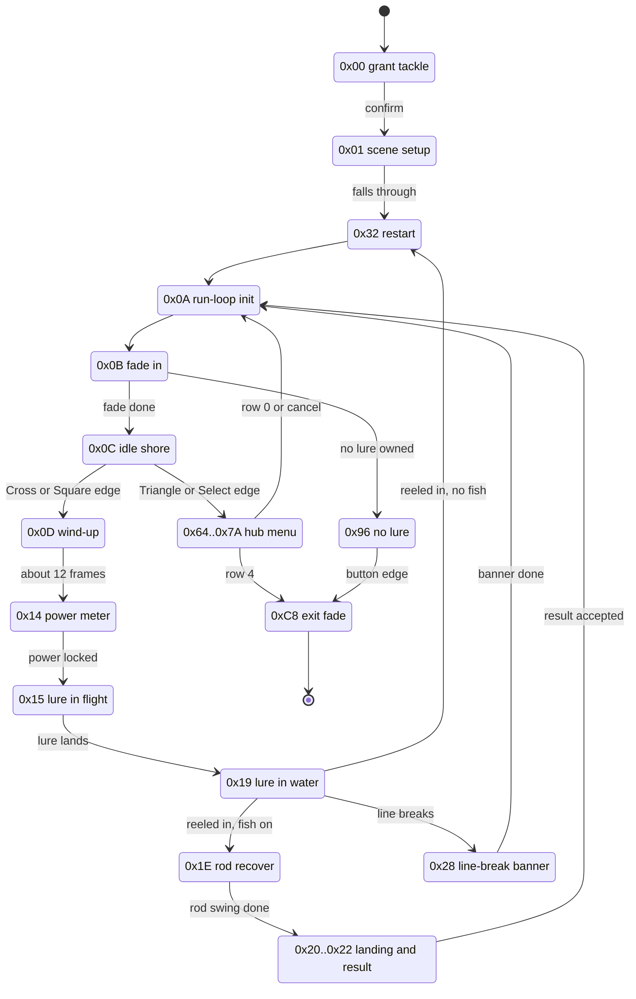

# Fishing minigame

Fishing is one mode of the minigame-hub overlay family: the party stands on a pond shore, casts with a power meter, coaxes a bite by reeling in a rhythm, then fights the hooked fish on a tension gauge. A landed fish pays fishing points, which the venue's prize counter trades for items. The points, the best catch, the equipped lure and rod and a lifetime cast counter live in the save block and survive between sessions.

The retail code is PROT entry 0972 (`data\OTHER1`), loaded at the slot-A overlay base `0x801CE818`. The fishing-specific code occupies roughly `0x801CF000..0x801D8000`; the band above it re-uses the shared field / actor / move VMs ([`script-vm.md`](script-vm.md), [`actor-vm.md`](actor-vm.md), [`move-vm.md`](move-vm.md)).

The port runs the whole game as one session type, `PondSession`, on all three hosts: the native `play-window`, the browser play page and the site's standalone minigames page.

## At a glance

| What | Where |
|---|---|
| Overlay | PROT 0972, base `0x801CE818`; venue scene bundle `other1` (raw CDNAME `#define other1 1195`, extraction entries 1193..1197) |
| Entry | Field-VM op `0x3E` with `op0 = 100` -> game mode `0x18` (24), `sub_id 0`; init `FUN_801CF070` |
| Mode driver | `FUN_801cf3bc` - state word `DAT_801d926c`, jump table `0x801CEBE0` |
| Lure / bite tick | `FUN_801d26cc` - band roll, strike roll, species pick, line packet, line-break and reel-in exits |
| Fish AI + tension | `FUN_801d4004` - gauge `DAT_801d9168`, `0..0x1000` |
| Cadence recogniser | `FUN_801d3db4` over the templates at `DAT_801d87d4` |
| Scoring + result plate | `FUN_801d5298` |
| Species table | `0x801D81A4`, 10 records, stride `0x28` |
| Spawn tables | `0x801D8334` (Buma) / `0x801D8434` (Vidna), `8 x 8` u32 |
| Prize tables | `0x801D8088` (Buma) / `0x801D80D0` (Vidna), 6 rows, stride 12 |
| Persistent state | `_DAT_8008444C..0x8008446C` in the save block ([RAM state](#ram-state)) |
| Parsers | `legaia_asset::fishing_species`, `fishing_exchange`, `fishing_sprites`, `fishing_captions` |
| Rules port | crate [`engine-fishing`](../../crates/engine-fishing/README.md), re-exported as `legaia_engine_core::fishing*` |
| World / scene port | `engine-core`: `fishing_venue`, `fishing_scene`, `fishing_hub`, `fishing_exchange_input`, `World::tick_fishing` |
| Draw port | `engine-ui`: `ui_fishing`, `ui_fishing_sprite`, `ui_fishing_hub`, `ui_fishing_exchange`, `ui_fishing_line`, `ui_fishing_rod` |

Dump files are `ghidra/scripts/funcs/overlay_fishing_<addr>.txt` for every `FUN_801cxxxx` / `FUN_801dxxxx` named on this page.

## Entry from the field

The pond is reached by the **mode-24 minigame door-warp**: field-VM op `0x3E` with `op0 = 100` (`sub_id 0`), which sets game mode `0x18` (`OTHER INIT`) and loads PROT 0972. The mechanism, its `sub_id` -> overlay table and the return warp are in [`script-vm.md` § 0x3E WARP](script-vm.md#0x3e-warp-mode-24-minigame-door-warp). The port's id decoder is `legaia_engine_core::minigame_entry::MinigameSubId`; the mode pair is `GameMode::OtherInit` / `OtherMode` (`crates/engine-field/src/mode.rs`).

The op is the only way in: there is no menu entry and no dedicated opcode, and the venue bundle `other1` carries essentially no field-VM script of its own. A disc-wide walk of every scene MAN finds the fishing door at exactly two sites, both signboard placements on the overworld: `map02` P1[7] and `map03` P1[19]. Census test: `crates/engine-core/tests/minigame_entry_census_disc.rs`.

The entry is the ordinary scene-backup -> overlay-load -> return-to-field sequence of any mode-24 minigame, so the game returns to the exact field state it suspended.

**The driver has no `jal` caller.** `FUN_801cf3bc` is the `+0x08` tick word of the static 24-byte actor template at `0x801D8FF4`. The sub-id-0 init `FUN_801CF070` materialises that template and spawns an actor from it (`jal FUN_80020DE0` at `0x801CF22C`); the per-frame pool walk reaches it through `jalr actor[+0x0C]` in `FUN_8002519C`.

**BGM.** Fishing loads no BGM of its own: the overlay has no streaming-loader call (`8001fc00`). The `func_0x80026478(&DAT_8007056c)` calls in the state machine are the actor sound-source attach / re-pan primitive (`FUN_80026478` in [`functions.md`](../reference/functions.md)) - the positional reel / water / cast SFX voice. The music is whatever the departure field scene was playing (its op-`0x35` BGM), the same host-scene-inherited shape as the [slot machine](minigame-slot-machine.md).

### Venue select

The mode-24 entry `FUN_80025980` backs the departure scene's id word `_DAT_80084540` up into `0x8007BAC4`. State `1` of the driver compares that backup against two immediates (`0x801cf5a4..0x801cf5d0`):

| `_DAT_8007BAC4` | Scene | `DAT_801d90d0` | Venue | Anchor tile | Pond area in `other1` |
|---|---|---|---|---|---|
| `0x187` | `map03` (Karisto) | `0` | Buma | `(0x25, 0x54)` | fenced wooden deck on a grassy pond, mountain backdrop (high-Z half) |
| `0xF4` | `map02` (Sebucus) | `1` | Vidna | `(0x2E, 0x23)` | rocky-shore blue pool with two rock islets (low-Z half) |

Any other value leaves the variant alone. The immediates are the raw CDNAME `#define`s of the two scenes whose scripts carry a fishing door. The variant then selects the [prize page](#point-exchange-prize-shop) (`PTR_DAT_801d90b8`) and the [spawn page](#venue-spawn-tables) (`PTR_DAT_801d9114`). Both pond areas are in the bundle's one map; the area column follows from the anchor tile's Z.

Port: `fishing::venue_for_departure_scene`, applied by `SceneHost::enter_fishing_from_overlay` to the still-loaded departure scene.

### Entry rod and lure

The init runs an ownership scan before anything reads the rod: it keeps the persistent index `_DAT_80084454` when the party holds that rod, otherwise steps forward with wrap, and lands on `0` for a party holding none (`0x801cf35c..0x801cf39c`). The lure gate `FUN_801d712c` does the same for the lure cell `_DAT_80084450` over inventory ids `0x9d..0x9f` (`func_0x80042f4c`). It is not read-only: it re-points the persistent lure index onto an owned lure, so the HUD's lure label can change without the player touching the menu.

Port: `fishing::entry_rod_index` and `select_owned_rod`. `World::resolve_fishing_entry_rod` writes the corrected index back and passes it as the session's `rod_stat`, so the [tension divisors](#tension-and-the-fight) and the HUD's rod row read one value. Every entry runs it through `World::enter_fishing_session`.

## State machine

`FUN_801cf3bc` switches on the mode-state word `DAT_801d926c` through the jump table at `0x801CEBE0`, then runs a [shared tail](#shared-tail). State values are sparse; many states `+1` to advance. The lure tick `FUN_801d26cc` runs from the actor side of the loop and writes the state word too.



| State | Role |
|---|---|
| `0` | Rod / type select: queues a small menu, reads a select edge, and on confirm grants the inventory rod + lure items (`func_0x800421d4` ids `0x9d..0xa2`: Light / Normal / Heavy Lure, Old / Deluxe / Legendary Rod) and advances to `1`. |
| `1` | Scene / actor setup: spawns the [shore party](#the-shore-party-and-the-venue-camera) (`func_0x80020de0`), picks the venue `DAT_801d90d0` ([Venue select](#venue-select)), initialises camera-tint bytes, falls through to `0x32`. |
| `0x32` | Sets state `10`. |
| `10` (`0xa`) | Run-loop init: zeroes the per-cast working set - tension `DAT_801d9168`, depth `DAT_801d9298`, cast power `DAT_801d9274` (seeded `0x40`) and its direction `DAT_801d9278`, the spawn latch `DAT_801d9294`. |
| `0xb` | Fade-in: ramps the fade level `DAT_801d905c` down to 0, then advances - or jumps to `0x96` when `FUN_801d712c` reports no lure owned. |
| `0xc` | Idle shore. The packed pad edge `_DAT_8007B874 & 0xC0` (Cross / Square, `0x801CF99C`) starts the cast. `& 0x110` (Triangle / Select, `0x801CF9EC`) raises SFX `0x21`, zeroes the menu cursor `0x801D912C` and opens the [hub menu](#the-hub-menu) at `0x64`. |
| `0xd` | Cast wind-up: advances a counter, pans the camera ([polar helper](#the-shared-polar-offset-helper-fun_801d7bb8), radius `0x14`), and after about 12 frames jumps to `0x14`. |
| `0x14` | Power meter: bounces `DAT_801d9274` between `0x20` and `0x1000`. On the `& 0xC0` edge (`0x801CFBA4`) it locks the power, clears the line-break latch `DAT_801d91a4`, spawns the rod, lure and line actors, computes the lure spawn point from the locked power and advances to `0x15`. |
| `0x15` | No case of its own: the lure is in flight. The lure tick moves the state to `0x19` when the flown lure's power countdown reaches zero, raising cue `0x204` and bumping the cast counter. |
| `0x19` | Lure in water (sets the allow-leave flag only). The lure tick ends it - see [Fight exits](#fight-exits). |
| `0x1e` | Clears `DAT_801d90bc`, waits for the rod swing word `DAT_801d91ac` to reach `0x14`, then jumps to `0x20`. |
| `0x20..0x22` | Lure-landing / line-sink sequence (camera + line-actor setup), each advancing to the next; `0x21` / `0x22` read the result-accept word `DAT_801d90bc`. |
| `0x28` | Waits on the converging banner (`DAT_801d9164`, `FUN_801d7528`), then returns to `10`. |
| `0x2d` | Miss / retry bookkeeping: runs the `DAT_801d9268` timer through `FUN_801d6f10`, then back to `0x32`. |
| `0x64..0x66`, `0x6e`, `0x78..0x7a` | The [hub menu](#the-hub-menu) and its sub-screens. |
| `0x96` | "You have lost the lure" / no-rod end screen; a button edge advances to `200`. |
| `200` (`0xc8`) | Exit: ramps the fade to white and, once full, plays the leaving XA cue and tears the mode down. |

### Shared tail

The tail at `LAB_801d01a4` runs every frame after the switch:

- services three one-shot timers `DAT_801d9160` / `DAT_801d915c` / `DAT_801d90f0` through `FUN_801d78ec` / `FUN_801d75dc` / `FUN_801d71d4` ([banners](#banners)). Each is idle at `0`, seeded to `1` by its event, passed to its animator as the frame count, advanced by the frame step `DAT_1f800393` while the animator reports active, and zeroed when it expires. While the `FUN_801d75dc` timer runs, the tail forces the `FUN_801d78ec` timer to zero;
- applies the screen fade and draws the persistent HUD (`FUN_801d13f0`) and, while a fish is hooked (`DAT_801d9058`), the catch HUD (`FUN_801d1580`);
- runs the scene floor pass `FUN_801d6bbc`;
- honours the abandon edge: Circle or L2 (`_DAT_8007B874 & 0x21` at `0x801D0318`), gated on the allow-leave flag (`s7`), drops the session back to state `10`.

### The hub menu

The pond is entered directly at the idle shore; the menu opens from there on Triangle or Select.

| State | Screen | Hands back to |
|---|---|---|
| `0x64` | Five-row picker `FUN_801d0474(1)`: rows at `(0x6C, 0x58 + 0x10*row)`, cursor icon `0x4E` at `x = 0x5B`, frame `FUN_801d74b0(0xA0, 0x50, 0x68, 0x50)` | row 0 or cancel -> `0x0A`; row 1 -> `0x65`; row 2 -> `0x6E`; row 3 -> `0x78`; row 4 -> `0xC8` |
| `0x65` | Help page 0, `FUN_801d72a0(0x14, 0x10, 0)` | any `& 0xF0` edge -> `0x66`, SFX `0x21` |
| `0x66` | Help page 1, `FUN_801d72a0(0x14, 0x10, 1)` | any `& 0xF0` edge -> `0x64`, SFX `0x37` |
| `0x6E` | Rod / lure select `FUN_801d0f5c(1)` | cancel -> `0x64` (`0x801D1088`) |
| `0x78` | Prize list `FUN_801d0c3c(1)` | cancel -> `0x64` (`0x801D0DB0`) |
| `0x7a` | Quantity picker `FUN_801d092c` | - |
| `0x79` | Confirm `FUN_801d06c8` | - |

The sub-screens draw over the menu, which runs non-interactive beneath them. The row strings are fixed overlay addresses the picker forms with `lui`/`addiu` pairs (`0x801CEF04 .. 0x801CEF44`).

Rows 2 and 3 copy the persistent lure index `_DAT_80084450` into `0x801D90DC` before switching (`0x801D0680..0x801D0690`). That word is the tackle screen's cursor, so the screen opens on the equipped lure.

**Help pages.** `FUN_801d72a0(x, y, page)` (PROT 0972 file offset `0x8A88`) draws 14 text lines from the string-pointer table at `0x801D8130` for page 0 and 15 lines from `0x801D8168` for page 1 (the second table starts exactly 14 words after the first). Both use a 13 px line pitch through the glyph renderer `FUN_80036888`, draw a per-page footer string (`0x801CF048` / `0x801CF050`) at `(0xE0, 0xCA)`, emit the widget frame `FUN_8002C69C(x, y, 0x119, 0xC3)`, and store the field-subsystem mode byte `DAT_80073F20 = 0x10` on entry.

**Rod / lure select.** `FUN_801d0f5c` is input and render in one. It counts owned rods (ids `0xa0..0xa2`), moves the cursor `DAT_801d90dc` on the D-pad edge (`0x1000` / `0x4000`), and wraps it against `owned + 2`. The accept edge (`0x44`) equips the highlighted entry: a lure (cursor `< 3`, item `0x9d` + cursor) writes `_DAT_80084450`; a rod (cursor `>= 3`, item `0xa0`+) writes `_DAT_80084454`. Cancel (`0x21`) sets the leave SFX and stores `100` into `DAT_801d926c`.

Rows are named by the `0xC2 id` item-name escape over lure ids `0x9D..0x9F` and rod ids `0xA0..0xA2`, at `x = 0x89` from `y = 0x50` on a 16 px pitch, lure counts at `x = 0xF1`, the equipped row in palette `7` (`_DAT_8007b454 = 7`), rods only when owned, cursor at `x = 0x78`.

Port: `fishing_hub` - `FishingHubText` reads the text off the user's disc; `FishingHub` runs the screens over the ported picker (`FishingMenu`), help layout (`help_panel_layout`) and tackle kernel (`RodLureSelect`); `PondSession::hub_step` opens it from the idle phase. The native window and the browser play page reach it through `World::tick_fishing_hub` / `World::fishing_hub_lines` and draw it with `engine-ui::ui_fishing_hub`; the minigames page steps the same kernel and draws its `fishing_hub_json` lines. The help footers' `0xCE` button escapes are consumed without a glyph on every host.

## Reel input

The pad-mask packer `FUN_8001822C` builds the held mask `_DAT_8007b850` (and the edge mask `_DAT_8007B874`) from pad 1's low 16 bits; its digital and analog paths agree on the map:

| Bit | Button | Bit | Button |
|---|---|---|---|
| `0x0001` | L2 | `0x0100` | Select |
| `0x0002` | R2 | `0x0200` | L3 |
| `0x0004` | L1 | `0x0400` | R3 |
| `0x0008` | R1 | `0x0800` | Start |
| `0x0010` | Triangle | `0x1000` | Up |
| `0x0020` | Circle | `0x2000` | Right |
| `0x0040` | Cross | `0x4000` | Down |
| `0x0080` | Square | `0x8000` | Left |

| Input | Retail meaning |
|---|---|
| Cross `0x40` | reel A; also casts and locks the power meter |
| Square `0x80` | reel B; also casts and locks the power meter |
| R2 `0x2` | reel-direction mirror toggle, read alongside the reel buttons |
| Circle `0x20`, L2 `0x1` | the tail's abandon edge - not a cast; no cast state tests `0x20` |
| Triangle `0x10`, Select `0x100` | open the hub menu from the idle shore |

**Decoder.** `FUN_801d7450` reduces the held mask to a reel state: `if (m & 0x40) return 1; else return (m >> 6) & 2;` - Cross wins and returns reel A (`1`), Square alone returns reel B (`2`), neither returns idle (`0`). Holding both resolves to reel A.

**Cadence recogniser.** `FUN_801d3db4` decodes the reel button each frame and compares it to the previous decode `DAT_801d9064`. While unchanged it adds the frame step `DAT_1f800393` to the current slot of a 16-entry `{button, held-frames}` ring buffer `DAT_801d91e4` (write index `DAT_801d91dc`, mod 16); on a change it advances the index and opens a fresh slot. It then walks a window of that history backwards against the [cadence templates](#cadence-templates) with a +/-10 frame-step tolerance. On a full match it resets the ring through `FUN_801d746c` and returns the template id, which the caller stores as the cast band.

`FUN_801d746c` zeroes `DAT_801d91dc` and both words of all sixteen 8-byte records of `DAT_801d91e4`. Retail unrolls the loop two words at a time, so the table is `16 * 8` bytes.

Port: `ReelInput::from_pad_mask`, `ReelCadence`. The templates are decoded from the user's disc by `legaia_asset::fishing_species::parse_cadence_templates`.

The port's cast input differs from retail by choice: **Circle (`0x20`) casts and locks the meter**, Cross reels (reel A), Square reels harder (reel B).

## Species selection and the band-4 gate

Which species strikes is decided in the pre-hook half of `FUN_801d26cc`. At the strike:

```text
species = spawn_table[lure * 8 + band]        DAT_801d91cc
lure    = _DAT_80084450                       equipped lure, 0..2
band    = DAT_801d90e8                        cast band, 0..4
```

### Band roll

While no fish is hooked (`DAT_801d91b4 == 0`) and the line record `DAT_801d927c` exceeds `500`, the check body runs every frame: the countdown `DAT_801d90ec` clamps to `0` on underflow, so the steady state re-enters each tick. Each entry first consults the cadence recogniser.

- **Match:** the template id is stored as the band, the countdown is armed to `0x40` (the body is skipped for the next 64 frame-steps, so the band holds), and the strike-splash timer `DAT_801d90f0` is seeded. The splash fires for any matched template, including the ones that select common bands.
- **No match:** the band is re-rolled from `r = rand & 0xfff`, so an unmatched band is only ever the current frame's roll.

| Roll `r` | Band | Share of rolls |
|---|---|---|
| `r <= 0xc00` | 3 | 3073/4096 (~75.0%) |
| `0xc00 < r <= 0xe70` | 2 | 624/4096 (~15.2%) |
| `0xe70 < r <= 0xf38` | 1 | 200/4096 (~4.9%) |
| `0xf38 < r` | 0 | 199/4096 (~4.9%) |

No roll outcome and no template maps to band 4.

### Cadence templates

The rodata at `DAT_801d87d4` holds four `0x40`-byte records: `u32 step_count`, `u32 history_window` (frame-steps), then `step_count` pairs of `{u32 duration, u32 button}`. Button values are the decoder's: `0` idle, `1` Cross, `2` Square. In chronological order:

| Template = band | Cadence (durations in frame-steps) |
|---|---|
| `0` | idle 40, Cross 25, idle 40, Square 15 |
| `1` | Square 15, Cross 25, release (a zero-duration final step) |
| `2` | Square 15, idle 40, Square 15 |
| `3` | Cross 25, idle 40, Cross 25 |

Template 3 is the natural "pump Cross" motion, so unprompted reeling tends to select the most common band while still showing the splash. Template 0 is the only way to pin band 0 by choice.

### Strike roll

```text
strike  <=>  reel held  and  rand % denom < credit
```

| Input | Value | Site |
|---|---|---|
| reel held | `_DAT_8007b850 & 0xc0` - a strike only lands on a frame with a reel button held | |
| `credit` base | `DAT_801d90ec + 2`, sampled before the countdown decays; `0x40` on the cadence-match frame | |
| water bonus | `+0x1E` / `+0x14` / `+0x14` by water class (below) | `addu s1,s1,s2` at `0x801D3434` |
| pad nudges | `+1` per mask hitting the edge word `_DAT_8007B874`: D-pad left `0x8000`, D-pad right `0x2000`, and the reel bits `0xC0` as one mask | `0x801D343C..0x801D3468`, one `addiu s1,s1,1` each from `0x801D3450` |
| zeroing | `credit = 0` while the length readout `DAT_801d9280` is under `100` | |
| `denom` | `1000` for a readout of `201` or more, `0x200` at exactly `200`, `2000` below | ladder at `0x801D3284` |
| far-band override | below `200` the arm also writes `s1 = -0x64`, replacing the credit base | same ladder |

The ladder is six `slti` / `bne` pairs writing one register in ascending threshold order, so each later arm overwrites an earlier one that is also true. Four arms are unreachable: `200` at `>= 401`, `350` at `>= 351`, `400` at `>= 301`, `500` at `>= 251`.

Consequences:

- A readout under `200` can never strike: the bonuses added after the `-0x64` top out around `0x21`. This is the "a shallow cast cannot bite" rule; retail runs no separate length test.
- A cadence match arms the bite as well as the band: the credit jumps from about 2 to `0x42` and decays with the countdown, so a strike is roughly twenty times more likely while the matched band is held.
- Completing template 0 and holding the final Square press is the retail-optimal sequence: band 0 pinned, bite boosted, and the reel-held requirement met by the same button.

**Water class.** The handler reads a `u16` at `*(_DAT_1F8003EC) + 0x8000 + (z >> 7) * 0x100 + (x >> 7) * 2`. A cell whose word carries bit `0x4000` maps through the region routine `func_0x800180ec` (called at `0x801D3384`) to `_DAT_8007b8f4` flags:

| Flag | Credit bonus (`$s2`) | Fish weight (`$s4`) | Weight store |
|---|---|---|---|
| none | `0` | `0xA` | `li $s4,0xA` at `0x801D3304` |
| `4` | `0x1E` | `0x64` (100) | `0x801D33B4` |
| `8` | `0x14` | `0x12C` (300) | `0x801D33EC` |
| `0x10` | `0x14` | `0x1F4` (500) | `0x801D3424` |

Pond position and bait-twitching change how often a strike is rolled, never which species results.

Port: `BandCheck::tick` (the countdown, band store, credit and roll), `fishing_actors::bite_interval` / `bite_credit_override` (the ladder; the dead arms are recorded as `BITE_LADDER_DEAD_ARMS`), `band_roll`, and `fishing_actors::bite_pad_nudge` / `water_tile_class` for the two addends.

### Band-4 gate

Inside the hook-success branch (reel held, strike roll passed, `DAT_801d91b4 == 0`), immediately before the species lookup:

| Venue | Conditions (all required) | Roll | Result |
|---|---|---|---|
| Buma (`DAT_801d90d0 == 0`) | `_DAT_80084460 > 0x32` (over 50 lifetime casts), `(_DAT_80084460 & 1) == 0`, `_DAT_80084450 == 1` (Normal Lure), `_DAT_80084454 == 2` (third rod), `DAT_801d90e8 == 0` | `rand & 0xf == 0` (1/16) | band 4 -> species id 9, the rarest catch |
| Vidna (`DAT_801d90d0 != 0`) | same shape with no cast-count threshold and `_DAT_80084450 == 2` (Heavy Lure) | `rand & 3 == 0` (1/4) | band 4 -> species id 8 |

`_DAT_80084460` is the persistent cast counter. Its writer is in the same lure tick, reached through the save-block base rather than the `0x4460` displacement the reads use (`t0 = 0x80084140`, `lw` / `addiu` / `sw 0x320($t0)` at `0x801D2954..0x801D296C`) on the arm that raises cue `0x204` (`0x801D2950`) and moves the state to `0x19`. So it advances once per landed cast.

Each venue's gate hardwires the lure row, so band 4 is only ever read on the row carrying that venue's rare species; the band-4 cells of the other rows are dead data. The one bypass is a debug shortcut in the same branch: with the debug print flag `_DAT_8007b9b0` set, holding R1 (`_DAT_8007b850 & 8`) at the strike stores band 4 unconditionally.

Port: `band4_gate`, `spawn_species`.

### Fish weight

The water class's second half, `$s4`, is callee-saved and survives from the class walk to its single use: `div $s0,$s4` at `0x801D3728`, remainder at `mfhi $a3` (`0x801D3750`). The class is the modulus of a random draw. The tick calls the RNG (`FUN_80056798`) three times at `0x801D3708..0x801D3718` and sums four terms into `$a0`:

| Term | Where | Meaning |
|---|---|---|
| `rand1 % weight` | `0x801D3728` / `0x801D3750` | the water class's contribution |
| `(*0x801D927C >> 5) + 10` | `0x801D3790` / `0x801D3794` | the line record, scaled, plus a floor |
| `rand2 % 600` | `0x801D3780..0x801D37DC` (magic-multiply reciprocal) | a class-independent spread |
| `100 * (rand3 % (counter + 1)) + 50 * (counter + 1)` | `0x801D376C..0x801D380C`, counter from `$s6+0x314` | a session-progress term |

The sum is stored to `DAT_801D91B8` (`sw $a0,-0x6E48($v0)`, `0x801D3814`) - the fight strength the [score](#catch-scoring-and-the-result-plate) reads. `sum + 0x400` goes to `+0x72` of the object the hook just spawned (`addiu $a0,$a0,0x400`, `sh $a0,0x72($s1)` at `0x801D3818` / `0x801D381C`; `$s1` is the return of `jal 0x80024C88` at `0x801D36A8`, also parked at `DAT_801D91D0`) and to `DAT_801D9108`. Actor `+0x72` is the render scale, so a better water cell can produce a visibly larger fish. The weight touches neither the species roll nor the credit.

### Venue spawn tables

State `1` pages the venue's spawn table into `PTR_DAT_801d9114`, from the rodata directly after the species table:

| Venue | Table VA | Shape |
|---|---|---|
| Buma | `0x801D8334` | `8 x 8` u32 species ids |
| Vidna | `0x801D8434` | `8 x 8` u32 species ids |

| Axis | Index | Live range |
|---|---|---|
| Row | equipped lure `_DAT_80084450` | `0..2` (Light / Normal / Heavy); rows 3..7 are zero padding |
| Column | cast band `DAT_801d90e8` | `0..4`; column 4 is live only on the gate's row - Normal at Buma (id 9), Heavy at Vidna (id 8) |

The species ids themselves decode from the user's disc (`fishing_species::parse_spawn_tables`); they are not reproduced here. `FUN_801d7c84(row)` is a species-name list drawer over the same table: it reads up to four ids at `row*8 + i` (`i = 0..3`) and draws each non-`-1` id's name (`&DAT_801d81a4 + id*0x28`) through `FUN_80036888` at `x = 0`, rows 16 px apart from `y = 0x10`, palette `0xa0`.

### The lure the bite tick probes

Both of `FUN_801D26CC`'s per-frame map reads take the same point - the tick's own actor at `+0x14` / `+0x18`, which is the lure the cast arm spawned:

- the `+0x8000` cell word's bit `0x4000` is the water gate above, and feeds the credit;
- `FUN_801D7030`'s `+0x4000` high-nibble probe (`jal` at `0x801D2E10`, see [Scene geometry helpers](#scene-geometry-helpers)) **drifts the lure**: on a hit the handler adds or subtracts `frame_delta << 11` on the 24.8 `x` accumulator `0x801D9174` (`0x801D2E34..0x801D2E58`). The sign is the low bit of the cast counter `_DAT_80084460` (`0x801D2E28`): odd adds (`0x801D2E34`), even subtracts (`0x801D2E48`). Since the counter advances once per cast, the drift direction alternates between casts.

Capture evidence (`scripts/pcsx-redux/autorun_fishing_lure_drift.lua`): an exec tap on each arm splits cleanly by counter parity, and the accumulator moves by exactly `frame_delta << 11` per hit. Across two full casts the walk-grid probe returned zero on every call, so the pond never triggers the drift on its own.

Port: `fishing_actors::LureActor` - `cast` is the spawn arm, `probe` runs both reads in retail's order. The class walk is `field_regions::refresh_region_attributes` (`FUN_800180EC`), so the port reaches `_DAT_8007B8F4` through the same producer retail does. The play window also reads the session's lure as the origin of its celebration bursts.

## Tension and the fight

The hooked fight is a tug-of-war on the tension gauge `DAT_801d9168` (`0..0x1000`), updated at the tail of `FUN_801d4004`. `FUN_801d26cc` calls it while the fish is engaged.

```text
reel A held (Cross):   tension += pull * step / (rod * 9 + 0x23)
reel B held (Square):  tension += pull * step / (rod * 6 + 0x19)
neither held:          tension -= (rod * 0x40 + 0x4a) * step
tension = clamp(tension, 0, 0x1000)
```

| Input | Source |
|---|---|
| `rod` | persistent rod index `_DAT_80084454` (`0..2`); a better rod softens both directions |
| `step` | frame step `DAT_1f800393` |
| `pull` | the fish's per-frame pull, from the species record's [`+0x08` factor](#per-species-parameter-table) |
| held test | `_DAT_8007b850 & 0x40` / `& 0x80`; released is `(& 0xc0) == 0` |

Holding a reel button also nudges the line depth `DAT_801d9298` down by a small per-state amount.

**Fish behaviour.** A sub-state machine on `DAT_801d910c` (run / dart-left / dart-right / dive) moves the fish actor and modulates the pull. The timer `DAT_801d9110` counts each behaviour down and re-rolls the next from the BIOS `rand` (`func_0x80056798`) against the species record's cutoffs. Per-fish parameters come from the species record `DAT_801d91cc * 0x28` based at `&DAT_801d81a4`.

### Fight exits

The lure tick `FUN_801d26cc` ends the in-water state from its tail (`0x801D3AFC..0x801D3CD4`):

| Condition | Effect |
|---|---|
| the line packet's `+0x10` screen `x` below `-0x20` or at / above `0x161` (`0x801D3AFC..0x801D3B2C`) | line-break latch `DAT_801d91a4 = 3` |
| hooked (`DAT_801d91b4 != 0`), `DAT_801d91b0 == 0`, record `DAT_801d927c >= 0x899` (`0x801D3B34..0x801D3B8C`) | `tension += step * 300` - a fish run far out strains the line |
| tension `>= 0x1000` (`0x801D3B9C..0x801D3BE4`) | clamped to `0x1000`, then `rand % 10 == 0` sets the latch to `2` - a one-in-ten roll per frame at the ceiling |
| lure in water (actor `+0x22 == 2`) and latch non-zero (`0x801D3C04..0x801D3C64`) | **line breaks**: voice-stop `FUN_800653C8(0x13)`, one lure consumed (`FUN_80042310(_DAT_80084450 + 0x9D, 1)`), `DAT_801d9160 = 0`, `DAT_801d90f4 = 0x3C0`, rod recover (`DAT_801d91ac = 10`, `0x801D3C44`), converging banner seeded (`DAT_801d9164 = 1`), state `0x28` |
| record `< 0x136`, no fish | state `0x32` |
| record `< 0x136`, fish on | `FUN_800653C8(0x13)`, `DAT_801d91c8 = 4`, rod recover, from-right banner seeded (`DAT_801d915c = 1`), state `0x1e` - the catch |

### Port fight model

`TensionGauge` ports the divisors, the release decrement and the clamp; `FishAi` ports the per-field pull / dart / sink formulas of the species table. `PondSession` composes them with glue that is an engine-side reconstruction, marked at each call site and listed under [Open](#open).

The port snaps the line on the first frame the gauge reaches `0x1000`, where retail rolls one-in-ten per frame and spends a lure. Under the port's rule the two reel buttons are a risk choice: reel A (Cross) recovers line faster and divides the pull harder. Measured over the whole `PondSession` parameter space (both venues, three lures, three rods, reel held throughout), reel A never reaches the ceiling (peak `2017` of `0x1000`); reel B does, on the hardest-pulling common fish. Ladder: `crates/web-viewer/tests/w1f1_fishing_banner_ladder.rs`.

## Per-species parameter table

The species table is static `.rodata` in the fishing overlay: head `0x801D81A4` (file offset `0x998C`), record `N` at `0x801D81A4 + N*0x28`. The decompiler resolves the head as `(&PTR_s_Spikefish_801d81a4)[DAT_801d91cc * 10]`. It runs for **10 records** (`Spikefish` = id 0 .. the rarest catch = id 9); record 10's `+0x00` is no longer an in-overlay pointer, which bounds the table.

Each record is 10 words. Every field has a reader in `FUN_801d4004` (fish AI) or `FUN_801d5298` (scoring):

| Off | Field | Consuming formula |
|---|---|---|
| `+0x00` | name pointer (string in this overlay) | `FUN_801d4004` hooked-fish banner; the result plate |
| `+0x04` | score base value (`&DAT_801d81a8 + id*0x28`) | `FUN_801d5298`: `points = value * (strength + 0x9c0) / 0x32000` |
| `+0x08` | pull factor | per-frame pull `((rand & 0xff) + bias) * f / 150` (also a `/0xc8000` term) |
| `+0x0c` | dart push factor | dart-state lateral push `((step >> 2) + 0x20) * f / 100` |
| `+0x10` | depth-sink factor | run-state line sink `(pull * f) / 150` |
| `+0x14` | depth gate | behaviour pick when `f < line depth` |
| `+0x18` | behaviour-roll cutoff A | `f <= rand & 0xfff` |
| `+0x1c` | behaviour-roll cutoff B | `rand & 0xfff < f` |
| `+0x20` | behaviour-roll cutoff C | `rand & 0xfff < f` |
| `+0x24` | strike / record gate | hook check `record < f + 300` |

The `+0x04` score value and `+0x08` pull factor both climb with rarity, so a higher-value fish is also the harder fight.

Parser: [`legaia_asset::fishing_species`](../../crates/asset/src/fishing_species.rs) - `parse` decodes the 10 records, `FishingSpecies::score_for` reproduces the award, `name` resolves the `+0x00` pointer. Values and names decode from the user's disc (disc-gated `fishing_species_real`).

## Catch scoring and the result plate

A landed catch is resolved in `FUN_801d5298`:

```text
points = fish_base_value * (strength + 0x9c0) / 0x32000
```

| Input | Source |
|---|---|
| `fish_base_value` | species record `+0x04` |
| `strength` | `DAT_801d91b8`, the [fish weight](#fish-weight) sum |

The points are added to the persistent counter `_DAT_8008444c`, clamped to `999999`. A per-catch latch at actor `+0x2a` scores a fish once. If the catch beats the current best (`_DAT_80084458`), the best value and its fish id (`_DAT_8008445c`) are updated.

`FUN_801d5298` is the tick of the **result actor**. The landed fish's lift `FUN_801d4948` seats it when it raises `DAT_801d9294` (`0x801D5208`); the driver clearing that word retires it. Each frame adds `frame_step * 4` to the actor's `+0x1A` counter (held at `0x1000`), and `lift = clamp(+0x1A - 0x180, 0, 0x100)` drives the whole draw, every sprite at brightness `lift / 2`:

| Element | Position | Detail |
|---|---|---|
| rank plate | `(0xA0, 0x78)` | ids `\| 0x400` then `\| 0x800`, picked by the strength ladder below |
| points | `(0x20, 0x88)` | large digit style, `FUN_801d76e0(1, ..)` (`0x801D5640`) - the overlay's only call of that style |
| label glyph `0x17` | `(0xC0, 0x98)` | drawn as `0x417` then `0x817` |
| species name | `FUN_801d73b8(name, 0xA0, 0x1A0 - lift)` | centred by `13 * (len - 1) / 4`, drawn at `y + 7`, skipped while `y >= 0xF1` - the name rises into view as the plate fades up |

Rank ladder (`0x801D5448..0x801D54B4`):

| Fight strength | Plate id |
|---|---|
| below `0xC9` | `0x15` |
| from `0xC9` | `0x13` |
| from `0x259` | `0x12` |
| from `0x321` | `0x11` |
| from `0x4B1` | `0x14` |

When `lift` reaches `0x100` the best-catch update runs and `DAT_801d90bc` is raised; the driver reads that word as its next-state accept.

Port: `FishingRecord` (award credit, cap, best catch). The plate is drawn on all three hosts through one builder, `legaia_engine_ui::catch_result_draws`, fed by `PondSession::catch_result`. The engine does not model the fish's lift, so its counter starts on the landing frame and the `0x180` lead-in is the only delay before the plate fades up; it does not gate the recast on `DAT_801d90bc`.

## Point exchange (prize shop)

The shop branch (states `0x78..0x7a`) spends the fishing-point pool `_DAT_8008444C` on items.

| Screen | Function | Behaviour |
|---|---|---|
| Prize list (`0x78`) | `FUN_801d0c3c` | 6 rows. Each prints its item name through the MES `0xC2` item-name token plus the per-unit price; the point total renders capped at `999999`. |
| Quantity picker (`0x7a`) | `FUN_801d092c` | "Trade how many?" Max = `min(points / price, limit - owned)`, `owned` being the live inventory count (`func_0x80042f4c`); a not-yet-purchased one-time row treats `owned` as 0. |
| Confirm (`0x79`) | `FUN_801d06c8` | "Are you sure?" Yes grants `func_0x800421d4(item_id, qty)`, deducts `price * qty`, raises cue `0x206` (`0x801D089C`), and for a `limit == 1` row latches bit `row + venue*8` of `_DAT_8008446C`. |

**Row 0 is hidden until strictly affordable**: the cursor floor is `(price0 < points) ^ 1`, so each venue's top prize only appears once the pool exceeds its price. A row is available (white, not grey; `FUN_801d6f90`) when it is affordable, the inventory count is not `99`, and - for a one-time row - its purchased bit is not latched.

**Record** (12-byte stride, 6 rows per venue, read through `PTR_DAT_801d90b8`):

| Off | Field | Meaning |
|---|---|---|
| `+0x00` | `limit` | Max obtainable count: `1` = one-time prize (latched in `_DAT_8008446C`), `99` = repeatable |
| `+0x04` | `price` | Fishing points per unit |
| `+0x08` | `item_id` | Granted item id (SCUS item-name-table space) |

**Venue pages:**

| Venue | Selector `_DAT_8007BAC4` | Table VA | One-time bits in `_DAT_8008446C` |
|---|---|---|---|
| Buma | `0x187` | `0x801D8088` | `0..5` |
| Vidna | `0xF4` | `0x801D80D0` | `8..13` |

Both venues spend and latch against the same globals. The rows match the curated walkthrough prize lists ([`gamedata.md`](../reference/gamedata.md)) row for row, plus one entry the walkthroughs miss: **Vidna's row 0 is a 50,000-point one-time War God Icon**, invisible until the pool exceeds its price. Row contents decode from the user's disc.

Parser: [`legaia_asset::fishing_exchange`](../../crates/asset/src/fishing_exchange.rs); disc-gated `fishing_exchange_real` pins the structural invariants. Engine: `fishing::PrizeExchange` (list floor, availability, quantity cap, confirm), with the grant committed by `World::fishing_exchange_buy` against `World::minigames.fishing_points` and `fishing_prizes_purchased`; disc-free oracle `fishing_exchange_runtime`. Both play hosts route input through `engine-core::fishing_exchange_input` and draw `engine-ui::ui_fishing_exchange`. The patcher edits prices in place (`--fishing-price`, [`randomizer.md`](../tooling/randomizer.md)).

In the port the exchange opens from the hub's row 3 (or the native window's `P`) and owns the pad while open: Up / Down move, Cross or L1 trades one, Circle or L2 closes back to the hub, and Left / Right switch the venue page (a port affordance).

## Fishing actors and scene render

The run loop drives a small pool of actor handlers through the actor table, plus the scene render pass:

| Function | Role |
|---|---|
| `FUN_801d1c5c` | **Rod actor**: the first-person rod model, posed in view space, bent by a VDF morph; the source of the line's rod end. See [The fishing line](#the-fishing-line). |
| `FUN_801d26cc` | **Lure tick**: bite logic, the line packet, the fight exits. |
| `FUN_801d2050` | **Lead angler's tick + fish-sprite spawn** (spawn record `0x801D8FAC`). An init-once latch installs the per-frame callback `FUN_801d7c30` into `_DAT_8007ba2c` and records the actor pointer in `DAT_801d928c`. When `DAT_801d9294` steps it spawns the fish sprite keyed on species `DAT_801d91cc` (special-casing id `8`). Motion goes to `FUN_801d2278` and `FUN_801d6028`. |
| `FUN_801d2278` | **Lead's aim, camera and ambient ripple** - see [The shore party](#the-shore-party-and-the-venue-camera). |
| `FUN_801d70ec` | **Flanking members' tick** (spawn record `0x801D8FC4`): calls the height solver `FUN_801d6028`, stores the result into `+0x16`, clears the dispatcher's `+0x10` bit `2` and re-enters `FUN_800204F8`. The solver's `0x800000` maintenance survives into the stored flag word. |
| `FUN_801d4948` | **Reeling-line / hooked-lure actor**: a sub-state machine on `DAT_801d91c8` (`0` arm, `1` attach to the hooked-fish actor `+0x48`, `2` track) that positions the line end from `DAT_801d9174` / `DAT_801d9178` / `DAT_801d917c`, applies an orbit offset via `FUN_801d7bb8`, and raises the hook SFX cue `_DAT_8007b6da = 0x3a`. It also runs the landed fish's lift. |
| `FUN_801d67bc` | **Caught-fish 3D mesh render**: GTE rotate (`+0x24` / `+0x26` / `+0x28` Euler angles), matrix push, per-fish tint from actor `+0x72`, and a subdivided-primitive draw. Render-track: a scope row in the `mesh_submit` section of `scripts/ci/port-catalog-ignore.toml`, because `engine-render` submits a mesh with a model matrix and a tint. |
| `FUN_801d24ec` | **Sky backdrop** - see [The sky backdrop](#the-sky-backdrop). |
| `FUN_801d6bbc` | **Scene floor pass**, called from the driver tail: walks the live actor list (transform + submit + free), then spawns one tile actor per drawn cell of the floor grid at `_DAT_1f8003ec`. Not the field-VM tile board of [`tile-board.md`](tile-board.md), which is a byte cell array installed by script op `0x49`; see [The scene floor buffer](#the-scene-floor-buffer). |
| `FUN_801d78c0` | **Venue camera reset**: zeroes the rotation trio `_DAT_8007b790` / `_DAT_8007b792` / `_DAT_8007b794` and `TR.x` (`_DAT_800840b8`), parks `TR.z` (`_DAT_800840c0`) at `0x974`. It never touches `TR.y`. |
| `FUN_801d79e0` | **Step-layer lookup** for the ground solver - see [The scene floor buffer](#the-scene-floor-buffer). |

### The fishing line

Retail draws the line as **one** GPU packet a frame, built at the tail of the lure tick (`0x801D3A28..0x801D3D34`): a `LINE_G2` (`0x50`, Gouraud, opaque) whose `+0x08` end is the fish (colour `0x303030`) and whose `+0x10` end is the rod tip (`0x808080`). Both ends are clipped by the overlay's 2-D clipper `FUN_801D56E4` (its one `jal`, at `0x801D3D00`) against the draw-window halfwords `0x1F800388..0x1F80038E`, which the `minigame_fishing` save state holds as `(0, 4, 320, 228)` - retail's 320x224 drawing area. The packet links at the rod tip's depth `>> (0x1F8003A4 + 2)`, the scratchpad byte being `3`.

**The fish end** is the lure actor's `+0x14 / +0x18` with its height zeroed (`sh zero,0x3a(sp)` at `0x801D3A90`), projected by `RTPS` (`FUN_8003D368`) through the scene camera. The polar helper call just before it (`0x801D3AA0`, radius `0x100`) writes two stack words nothing reads; it does not offset the point. The unclipped projection is kept at `0x801D9198`.

**The rod end is a vertex of the rod model.** `0x801D9194` is written by the rod actor (`0x801D1FB4`), which projects `+0x128` into the staged vertex array of its model's object 0: vertex 37. The cast lock spawns the rod actor from the template at `0x801D8FDC` with its model word set to `_DAT_8007B6F8 + _DAT_80084454 + 0x19` (`0x801CFC34..0x801CFC4C`) - scene models `0x19..0x1B` of the venue bundle, one per rod. All three are the same 42-vertex shaft; vertex 37 is the centre of its last ring, on the axis at the far end.

The rod actor is posed in **view space**:

- **Matrix:** the per-mode base `0x8007BF10` (`0x6000 * I` in the fishing mode) with its diagonal forced to `0x6000`. The translation is the actor's `(0, 0x46, 0x64)` pushed through it: `(0, 420, 600)`.
- **Rotation:** `RotMatrixX(pitch)`, `RotMatrixY(0)`, `RotMatrixZ(2 * roll)`, `RotMatrixY(-yaw)`, each post-multiplied (`FUN_800461A4` / `FUN_8004629C` / `FUN_8004638C`).
- **Angles:** `pitch = swing + (lift + bend / 2) / 16`, both divisions truncating (`DAT_801d9134`, `DAT_801d914C`, `DAT_801d9150`); `roll` is `DAT_801d9140`; `yaw` is `DAT_801d911C = 3 * (tip.x - fish.x)` off the previous frame's pair (`0x801D2A90`), which turns the rod toward the fish.
- **Bend:** the morph stager `FUN_8001C604` runs over group 0 at the actor's one morph slot: VDF sub-entry `0`, weight = the bend's low halfword. The venue's sub-entry 0 moves vertices `8..41` of group 0.
- **Projection:** `RTPS` runs under `H = 0xDC` (`FUN_8003D254`); the scene `H` is restored after the draw.

**Swing.** The rod's swing SM is on `DAT_801d91ac`: state `1` dips the pitch term `DAT_801d9134` at `-0x40 * step` down to `-700`, state `10` raises it at `+0x40 * step` up to `0x400`, then latches `0x14` and retires the actor. A landed catch or a broken line starts the recover swing (state `10`).

**Rod inputs.** In water (lure state `2`) the lure tick feeds the rod:

| Input | Effect per frame delta |
|---|---|
| D-pad down | lift `+0x60`, capped `0x1000` |
| reel held, or fish on | bend `+0x100`, `+0x80` more on Square; capped `0x1000`, or `0x1800` with a fish on |
| D-pad sides | roll target `+/-0x100`, bleeding back at `4`; the roll follows at `0x10` |
| rod actor's own bleed | lift `-0x20`, bend `-0x60` |

A hooked rod bent past its cap with the countdown `_DAT_801D90C4` spent raises the creak cue `0x201` into ring slot 1 (`0x801D2BD0`), then re-arms at `rand() % 200 + 60` vsyncs.

Port: `fishing_actors` - `RodMesh` (the three rods and the bend, lifted off the venue scene's bank), `RodActor` (`tick` = `FUN_801D1C5C`, `drive` = the lure tick's rod writes), `rod_tip_screen` (the integer matrix chain and `RTPS` with the UNR divide, `legaia_engine_vm::gte_divide`) and `fishing_line` (the clip and the packet).

`PondSession` spawns the rod at the cast lock and exposes `line_frame`, which every host calls once a frame with its own projection of the fish end. The native window and the browser play page project through the venue camera (`fishing_venue::fishing_line_frame`) and wrap the packet with `engine-ui::ui_fishing_line`; the minigames page projects its own lure and strokes the endpoints `fishing_line_json` returns. The port's lure exists from the landing, so the line is out while waiting and hooked, not during the flight.

### The rod model

The rod actor draws its model in the same tick that projects the tip. After the morph stager has bent object 0, it hands the object to the per-primitive dispatcher `FUN_80043390` (`jal` at `0x801D1FF4`) with the GTE still holding the rod's matrix and `H = 0xDC`. Its two arguments are the actor's `+0x74` and `+0x78`, which the allocator `FUN_80020DE0` sets to `0x00808080` and `0` (`0x80020F3C..0x80020F40`), so the dispatcher runs **bank 0**: opaque, no depth cue, and the single-sided cull mask `0xFFFFFFFF` (bit 27 of the argument is clear).

All three rods are untextured: rods 0 and 1 are 8 flat triangles, 18 flat quads and 18 Gouraud quads; rod 2 is 7 flat quads, 8 Gouraud triangles and 29 Gouraud quads - dispatcher kinds 12..15.

| Kinds | Bank-0 handlers | Cull | Depth |
|---|---|---|---|
| 12, 14 (triangles) | `0x80043658`, `0x80043B58` | culled when `NCLIP(v0, v1, v2) < 0` (`bltz` at `0x80043700`) | `AVSZ3` |
| 13, 15 (quads) | `0x80043768`, `0x80043C6C` | kept when `NCLIP(v0, v1, v2) > 0`; otherwise kept only when the second `NCLIP`, over `(v1, v2, v3)` after the fourth `RTPS`, is negative (`blez` at `0x80043818`, `bgez` at `0x8004384C`) | `AVSZ4` |

The dispatcher loads `ZSF3 = 0x555 >> s` and `ZSF4 = 0x400 >> s` with `s` the scratch byte `0x1F8003A4` (`0x80043568..0x8004357C`), `3` in the `minigame_fishing` state. A primitive whose `OTZ` is below the scratch halfword `0x1F80037E` (`0x10` in the same state) is dropped; the packet links at `OTZ >> 2` (the word index `OTZ & 0xFFFC` addresses). With `s = 3` that bucket is the mean depth `/ 32`, the scale the line's `IR3 >> 5` links at, so the rod's far end and the line share buckets. The rod actor runs ahead of the lure tick, so in a shared bucket its packets draw after the line: the line meets the rod under its tip.

Port: `fishing_actors::rod_faces` (per-vertex projection, both culls, the two averages, the cutoff and the bucket) over `RodMesh::prims`, off the pose the rod actor records each tick (`RodActor::pose`), reached through `PondSession::rod_faces`. The native window and the browser play page wrap each face with `engine-ui::ui_fishing_rod::fishing_rod_prim` and submit them ahead of the line in the same screen-prim pass. The minigames page fills the faces `fishing_rod_json` returns in the same draw order, each face in its corners' mean colour (its canvas has no per-vertex colour, so Gouraud quads lose their gradient there).

### The shore party and the venue camera

The driver's setup state (`0x801CF59C..0x801CF7D8`) picks the venue's [anchor tile](#venue-select) `(tx, tz)` and spawns three actors on it through `FUN_80020DE0`, the spawn record's `+0x04` half (the model word) set to `0`, `1`, `2` before each call:

| Spawn | Record (tick) | Model | `+0x14` | `+0x18` | `+0x26` | Clip `+0x5C` | `+0x6A` | Flag `0x01000000` |
|---|---|---|---|---|---|---|---|---|
| lead | `0x801D8FAC` (`FUN_801d2050`) | `0` | `tx << 7` | `tz << 7` | `0x800` | `2` | - | set |
| second | `0x801D8FC4` (`FUN_801d70ec`) | `1` | `(tx << 7) + 0x60` | `tz << 7` | `0x680` | `0xB` | `8` | cleared |
| third | `0x801D8FC4` | `2` | `(tx << 7) - 0x60` | `(tz << 7) - 0x40` | `0x600` | `0xC` | `8` | cleared |

The models are the global pool's party slots, so the three are the party in order: Vahn in the middle, the second member to his right, the third to his left and a step nearer the camera. The lead's clip resolves against the resident party clip bank (his standing idle); the other two play records `0xA` / `0xB` of the venue scene's own ANM bank, whose rigs match their field bodies bone for bone. The `minigame_fishing` library state holds exactly these three actors at `(4736, -128, 10752)`, `(4832, -128, 10752)` and `(4640, -128, 10688)`; the `-128` is the ground solver's step layer.

**The lead's tick** (`FUN_801d2278`) writes `TR.y = 0x400 - 6 * (+0x16)`, decrements the timer `DAT_801d9060`, and on expiry rolls a dwell and a point out in the water (BIOS `rand`): an offset of an on-stack copy of the actor's position, `z + 0x400` plus a jitter. It spawns a ripple there (`FUN_80021B04(sp+0x10, ..)`, `0x801D23FC`). Nothing writes the position back, so the lead stands still. In the idle state (`DAT_801d926c == 0xc`) the D-pad (`0x8000` / `0x2000`) turns his facing `+0x26` in `0x40` steps clamped `0x700..0x900`, and the camera yaw and focus follow him.

**The camera** the same state reads: angles `(0, 0, 0)`, `TR.x = 0` and `TR.z = 0x974` from `FUN_801d78c0`; `TR.y = 0x400 - 6 * y = 0x700`, yaw `-((facing + 0x800) & 0xFFF)` and the focus `(-x, 0, -z)` from `FUN_801d2278`; and `H = 0x140`, which the setup stores at `0x801CF764` in place of the field's `0x200`. Under the field's 6x world scale that is a level camera behind the party, the lead's head just below the centre of the frame and the three cut off at the waist.

Port: `fishing_venue::party_placements` (the table), `venue_camera_view` (the camera), `lead_spawn`, and `fishing_actors::FishWander` / `fish_camera` (the lead's facing step, ripple roll and camera publish).

Both play hosts draw the frame through one engine surface, `engine-core::fishing_scene::FishingSurface`: the `other1` venue (its environment pack instanced by the `.MAP` placements and terrain layers, plus the walk ground), the three seated bodies on their clips, and the venue camera over the lead, so the D-pad aim turns him and the view together. The native window uploads it into its minigame 3D slot (`refresh_fishing_gpu`); the browser play page draws it as its `fishing` screen (`play_mg_fishing_scene_*`). The minigames page seats the same three bodies and frames them through the same camera (`fishing_party_json` / `fishing_venue_vp`).

Retail swaps the field out for the fishing scene and the return warp brings the backed-up field back. The port keeps the departure field loaded underneath and never touches its render state while the pond is up, so leaving shows that field exactly as it was. The cast lure anchors on the lead's seat at his rest facing `0x800`, as retail's lure spawn reads the lead actor's `+0x14` / `+0x18` / `+0x26` (`0x801CFC78..0x801CFC98`).

### The sky backdrop

The sky is not geometry. `FUN_801d24ec` draws it as a screen-space strip every frame, at ordering-table word `0x400` behind the whole venue:

1. It stores `(0x17, 0x50, 0xA0)` into the `r0 / g0 / b0` clear-colour bytes of both draw environments (`0x801D24F8..0x801D2544`) - the blue above the strip.
2. It saves the yaw global `_DAT_8007B792`, zeroes it, rebuilds the view (`FUN_800172C0`), loads the eye trio as `TR` (`FUN_8003D1EC`) and projects the view-space point `(0, 0, 0x1000)` (`FUN_8003D368`): straight ahead at the camera's pitch, so its `(sx, sy)` is the horizon.
3. The strip spans `sy - 0x74 .. sy + 0x8C` (256 rows) and starts at column `((sx + focus_x / 64 + yaw) & 0xFF) - 0xFF`, with `focus_x` the stored (negated) focus `_DAT_80089118`, rounded toward zero, and `yaw` the saved global. So it scrolls as the lead aims and differs between the two ponds.
4. Six 128 x 256 `POLY_FT4`s follow, two per 256-pixel step, alternating the 8bpp pages `0x88` / `0x89` (VRAM `(512, 0)` / `(576, 0)`), `u 0..0x80`, `v 0..0xFF`, CLUT `0x7D40` (row 501), colour `0x80`. Then the yaw is put back and the view rebuilt.

The `minigame_fishing` library state's ordering table holds exactly these six packets, from `x = -169`, `y 19..275`. The texture is part of the pond bundle's own TIM upload.

Port: `fishing_scene::sky_quads` (the strip), and `sky_mesh` / `sky_positions`, which unproject each screen corner through the venue camera to a far eye-space depth, so the strip and the clear-colour plate draw as world-space geometry that lands on the retail screen rects on every host. The surface moves them every frame with the lead's aim; the minigames page seats them per venue (`fishing_sky_*`).

### The scene floor buffer

`FUN_801d6028` is the **ground-height solver**: given an actor it returns the world height under it and maintains the actor's off-floor flag. It is shared library code in the overlay band above `0x801D0018` - the fishing, slot-machine and debug-menu dumps of it are byte-identical - and the dance overlay's floor pass `FUN_801d3a2c` indexes the same tables. Port: [`minigame_floor`](../../crates/engine-fishing/src/minigame_floor.rs).

Three regions of the buffer at `_DAT_1f8003ec` matter:

| Region | Offset | Layout |
|---|---|---|
| Tile records | `+0x0000` | `0x20` bytes each, indexed by tile id |
| Terrain bytes | `+0x4000` | row pitch `0x80`. Low nibble = index into a 16-entry height ramp; high nibble = the four sub-cell wall bits the field collision probe `FUN_801cfe4c` reads (`>> 4 & quadrant`) |
| Cell grid | `+0x8000` | `u16`, row pitch `0x100`. Tile id in bits `0..8` plus flag bits (`0x800` step layer, `0x1000` clears the off-floor flag, `0x4000` water) |
| Step layers | `+0x10000`, `+0x12000` | sub-tables searched by `FUN_801d79e0` |

The height solver never reads the wall bits, and the collision probe never reads the height nibble.

The solver reduces the actor's `+0x14` / `+0x18` world pair to a **half-cell** index (`>> 6`) and halves that toward zero for the grid index, so a floor cell is 128 world units and the half-cell's low bit is the quadrant. The sub-cell fraction is the raw coordinate's low seven bits.

| Cell bit `0x800` | Height |
|---|---|
| clear | If all four corner nibbles agree, that ramp entry exactly (early return). Otherwise the four corners are bilinearly blended over the fraction in `0x80` units per axis, with the `>> 14` biased `+0x3fff` when negative. |
| set | The four corners are averaged by a plain `>> 2` (no rounding bias, unlike the blend), and a step-layer patch found by `FUN_801d79e0` in the `+0x10000` layer (falling back to `+0x12000`) subtracts a whole step scaled `0x20` plus a 2-bit quadrant bias scaled `0x10`. |

The flag maintenance runs before either path and is never skipped. A negative flag word only ORs `0x800000` in; a non-negative one clears the bit and re-raises it when the cell lacks bit `0x1000`.

**Step-layer lookup.** `FUN_801d79e0` reads sub-table kind `a0 = 2` of a floor layer: `i16` body offset at `kind * 4 + 2`, `i16` count at `+4`, record stride the resident byte `0x8007B318 + kind` = `4`. It scans linearly for the record whose first two bytes are the grid `(x, z)` and returns the record pointer or null. Port: `minigame_floor::step_patch_in_layer` / `step_patch_lookup`.

## HUD

### Persistent HUD

`FUN_801d13f0` is drawn every frame by the driver tail, all rows at brightness `0x80`:

- the best-catch row (`_DAT_80084458`, glyph `0x1a`);
- the point-total row (`_DAT_8008444c`, capped at `999999`, glyph `0x1c`);
- the selected lure label, one of three overlay strings picked by `_DAT_80084450` = 0/1/2 (any other index draws no label);
- a lures-remaining line: a caption, the live inventory count of item `_DAT_80084450 + 0x9d` (`func_0x80042f4c`) as a 4-digit number, and a trailing caption.

### Catch HUD

`FUN_801d1580` renders the live cast state: the line length `DAT_801d927c`, the cast-power bar `DAT_801d9274` (`FUN_801d1a90`), the depth `DAT_801d9298`, and - gated on `DAT_801d91b4` - the tension bar `DAT_801d9168` (`FUN_801d1870`). It uses the digit field `FUN_801d76e0` and the sprite-quad emitter `FUN_801d63b0`.

```text
length  = max(record - 300, 0) * 100 >> 9  +  max(DAT_801d9178 >> 9, 0)
          drawn as  length / 10  .  length % 10
power % = power * 100 >> 12
```

`record - 300` uses the same `300` base as the hook check, and is written back to `DAT_801d9280` each frame. The power percent is of the `0x1000` meter ceiling. A debug length print sits behind the global print flag `_DAT_8007b9b0`.

**LINE readout layout.** Digit style `0` draws an eight-slot right-aligned field at `x + 8 * slot`, so the whole part at `x = 0xDA` puts its units digit at `0x112` and the tenths at `0xE8` land at `0x120`. The plate (record `0xB`, `104 x 16` at `0xD4`) carries its own `.` (about `0x11B`) and `m` (about `0x129`) in its texels.

The routine then emits record `0x10` at `(0x114, 0x30)` (`0x801D16B0..0x801D16C8`, no branch around it) - a `16 x 16` cell at page `u = 128` holding a second `m` - which lands on the whole part's units digit. Nothing patches record `0x10`, and the runtime table in the `minigame_fishing` state matches the disc. So the overlapped "`11m3 m`" both hosts draw is what the emit sequence produces; no retail cast-state frame has been captured to compare.

### Banners

Five one-shot animators take their timer value as a frame count and return whether they are still active. Four share one ramp: slide in at 8 px/frame, hold at `x = 0xa0` from frame `0x14`, slide off from frame `0x8c` (`x = frame*8 - 0x3c0`, joining the hold continuously), active while `frame < 0xc8`.

| Function | Timer | Glyph | Motion | Seeded by |
|---|---|---|---|---|
| `FUN_801d78ec` | `DAT_801d9160` | `7`, `y = 0x78` | ramp from the left | the hook (`FUN_801d26cc`, with `DAT_801d91b4 = 1`) |
| `FUN_801d75dc` | `DAT_801d915c` | `0xd` | mirrored, `x = 0x140 -` ramp | reel-in complete with a fish on (record below `0x136`) |
| `FUN_801d6f10` | `DAT_801d9268` | `0x19` | mirrored | the miss / retry state `0x2d` |
| `FUN_801d7528` | `DAT_801d9164` | `0xc`, drawn twice | ramp and its mirror, converging on `0xa0` and parting again | the line break; state `0x28` waits on it |
| `FUN_801d71d4` | `DAT_801d90f0` | `0x416` / `0x816` pair | strike splash, below | a cadence match before the hook (`DAT_801d91b4 == 0`) |

The strike splash sits at `x = 0xa0`, rising one pixel every 32 frames from `y = 0x50`. Its brightness ramps `frame*8` up to a `0x80` hold at frame `0x10`, holds until frame `0x88`, then fades `0x80 - (frame-0x88)*8` to expire at frame `0x98`.

### Bar and digit primitives

`FUN_801d1870` and `FUN_801d1a90` are the same gauge bar on the two axes. Each emits a three-glyph frame - a start cap, a body stretched by `segments << 12` along the bar's axis, an end cap - at brightness `0x80`, then overlays the fill quad. The fill is `segments * value * 8 / 0x1000` pixels long and its brightness ramps `value * 0xff / 0x1000`.

| Function | Axis | Glyphs | Fill direction |
|---|---|---|---|
| `FUN_801d1870` | horizontal | `3` / `4` / `5` | left to right |
| `FUN_801d1a90` | vertical | `0` / `1` / `2` | upward from the bottom cap |

`FUN_801d1870`'s first argument selects the fill colour ramp only (`g` = `value * 0xff >> 12`):

| `param_1` | Fill RGB | Used by |
|---|---|---|
| `0` | `(0xbc, g, 0)` - constant red against the ramp | depth gauge |
| `1` | `(g, ~g, 0)` - the ramp against its complement | tension gauge |
| other | colour stores skipped; the buffer keeps its previous contents | no call site |

`FUN_801d1a90` takes no style argument: it is a four-argument function that stores `0xbc` into red unconditionally.

**Digit field.** `FUN_801d76e0` lays a number out in a fixed **eight-slot** field: slot `i` holds `value / 10^(7-i)` and is emitted only once that quotient is non-zero, so leading zeros are blank and the number is right-aligned. The last slot is pre-seeded with `0`, so zero draws a single `0`. The first argument picks the slot pitch: `0` = 8 px, anything else = 16 px. A negative value draws nothing: the fill leaves seven slots at `-1` and puts the negative quotient in the units slot, which the draw loop's `bltz` skips.

The two styles use two emitters: `FUN_801D7DD8` patches sprite record `6` to `u = digit * 8 + 0x28`; `FUN_801D7D44` patches record `0x18` to `u = digit << 4` and draws it twice, as ids `0x418` / `0x818`.

The fill loop is shared with `FUN_801D1308`, the Muscle Dome door/init overlay's decimal readout (same `-1` init, pre-seeded units slot, `!= 0` store gate, eight `/10` steps by the `0x66666667` magic multiply). The emit halves differ: `FUN_801D1308` has one emitter, one pen and one widget id (`9`), and passes the digit by patching that widget descriptor's texture column (`digit * 8 - 0x80`) and CLUT in place, restoring the CLUT on return. The port shares the fill - `number_digit_cells` takes its slots from `engine-ui::other_game_hud::decimal_slots` - and keeps the emit halves apart.

### Sprite emitter

`FUN_801D63B0` draws one record of the 29-entry, 20-byte sprite table at `0x801D8590` as a `POLY_GT4`. A record holds a 20.12 cell scale, texpage, CLUT, the `u v w h` cell, top and bottom RGB, a semi-transparency bit and an ABR rate.

- An id's upper bits (`id >> 10`) override the record's blend with that rate and, at `2`, swap in the white palette `0x7DCF`.
- A non-zero first argument anchors the quad's top-left corner on `(x, y)`; zero centres it.
- Each channel is `colour * brightness >> 8`.
- Every quad links at ordering-table bucket `3` (`_DAT_801D9158`).

Every record cuts the 4bpp page at `(832, 0)` with a palette of the `(0, 503)` strip. That is the first TIM of the `other1` bundle's texture list, byte-identical to a retail fishing state's VRAM, so the pond VRAM each host already uploads holds the art.

### Draw helpers and chrome leaves

Each is pinned to PROT 0972 by content and reached from a fishing-overlay caller ([VA aliasing](#va-aliasing-in-this-band)).

| Function | Signature | What it does |
|---|---|---|
| `FUN_801d74b0` | `(cx, y, w, val)` | Centred bar-widget draw. Skips when `y > 0xF0`; otherwise stages widget kind `0x44` via `FUN_80034b6c` and emits through the bar-widget dispatcher `FUN_8002c69c` at `(cx - w/2 - 2, y + 6)` with width `w` and fill `val`. Called by the driver and the shop / help helpers. |
| `FUN_801d7964` | `(x, rgb0, rgb1, y, arg4, arg5)` | Coloured screen-fade spawn. Unpacks two packed 24-bit colours and the coordinates into an on-stack fade template, then spawns the fade actor via `FUN_80024e80(template, 1)`. |
| `FUN_801d03b0` | - | Idle sway. Samples the shared sine table `*_DAT_8007B81C` at `angle`, `angle + 0x400` and `angle + 0x800`, scales each `>> 8` rounding toward zero, biases it `-0xA`, writes the triple to `0x1F80035E/60/62` after clearing `0x1F80035C`, and advances the angle at `0x801D9118` by `DAT_1F800393 << 4`. The stored angle is unmasked; only the table index is folded into a turn. |
| `FUN_801d7c30` | `(actor, mode)` | Ripple spawn. Non-zero mode does nothing; mode zero spawns the `0x801D899C` part at `(actor+0x14, 0, actor+0x18)` - world XZ, not a screen point. |
| `FUN_801d7a5c` | `(.., packed)` | Splash burst: spawns the `0x801D899C` part three times and fans them apart (below). |

**Splash burst forms.** `FUN_801d7a5c`'s fourth argument packs a spread in the low 12 bits and a form bit at `0x1000`:

| Form bit | Where the nudge lands | Parts moved |
|---|---|---|
| set | the part's `+0x80` sub-block (`+0x34/+0x36`) | first by twice the spread, second by once |
| clear | the part's own `+0x14/+0x16` | first `-spread` on both axes, third `+spread` on x and `-spread` on y |

Each form leaves one of the three parts unmoved as the anchor, and the two forms use different rotation-word triples.

Port: `fishing_chrome` (`sway_vector`, `venue_camera_reset`, `float_actor_tick`, `ripple_spawn`, `splash_burst`, `centred_panel`, and the cadence ring reset shared with `ReelCadence`).

## Scene geometry helpers

The fishing overlay carries its own copies of four small geometry routines. It is a slot-A occupant, so the field overlay (PROT 0897) is not resident while it runs and nothing in the `0x801CE818+` window can be borrowed from it. All four are confirmed at their printed VA by disassembling PROT 0972 at base `0x801CE818`; the field overlay holds unrelated code at each address.

| Function | Shape | What it computes | Caller |
|---|---|---|---|
| `FUN_801d7030` | `(x, z) -> bool` | Walk-grid wall probe, **high** nibble | lure tick, `0x801D2E10` |
| `FUN_801d765c` | `() -> cells` | Separation of two overlay globals, in sub-cells | hooked-fish handler |
| `FUN_801d56e4` | `(&p, &q)` | 2-D segment clip against the draw window | lure tick, `0x801D3D00` (the line) |
| `FUN_801d5c2c` | `(&p, &q, &o0, &o1)` | 3-D segment transform + depth clip | none |

**`FUN_801d7030(x, z)`** queries the terrain-byte grid at `*(_DAT_1F8003EC) + 0x4000`, the same grid the field's per-axis collision uses ([field-locomotion.md](field-locomotion.md)). The two coordinate conversions differ:

- `z` truncates toward zero (`z < 0` is biased `+0x3F` first), then is biased **`+2` sub-cells**;
- `x` rounds up unconditionally (`(x + 0x3F) >> 6`), then is biased **`-1`**.

The byte it addresses is `((z_cell / 2) & 0x7F) * 0x80 + ((x_cell / 2) & 0x7F)` - `z` picks the row, `x` the column. The sub-cell bit is `1 << ((x_cell & 1) + 2 * (z_cell & 1))`, tested against the byte's high nibble (`>> 4`). A leaf: no frame, result in `v0`. Port: `fishing_actors::walk_grid_overhead`, driven from [`LureActor::probe`](#the-lure-the-bite-tick-probes).

**`FUN_801d765c()`** reads two `(i16 x, i16 y)` pairs from `0x801D9184` and `0x801D918C` (`+0` = x, `+4` = y - the pair the hooked-fish handler feeds to the bearing helper `FUN_80019B28`), squares and sums the absolute component differences, normalises through the SCUS `isqrt`-style helper `FUN_8005AF0C`, arithmetic-shifts right by 6, and clamps a negative result to zero. The `>> 6` is the 64-unit sub-cell step, not the 128-unit tile. Port: `fishing_actors::tracked_point_separation`.

**`FUN_801d56e4(&p, &q)`** clips a 2-D segment in place. `p` and `q` are `(i16 x, i16 y)` pairs; the bounds are the four halfwords of the scratchpad draw context at `0x1F800314`: `+0x74` x-min, `+0x76` y-min, `+0x78` x-max, `+0x7A` y-max. The body is eight arms, each bound applied to each endpoint in turn, `p` before `q`. An arm fires only when the endpoint it moves is outside the bound **and the other endpoint is strictly inside it**, so a segment wholly outside one bound is left alone. Every arm has the same fixed-point form; for x-min on `p`:

```text
t   = ((q.x - bound) << 12) / (q.x - p.x)
p.y = q.y + (((p.y - q.y) * t) >> 12)     +0xFFF bias rounds a negative product toward zero
p.x = bound
```

Port: `fishing_actors::clip_segment_2d`.

**`FUN_801d5c2c(&p, &q, &o0, &o1)`** is the 3-D sibling. It pushes both endpoints through the GTE wrapper `FUN_8003D344` (one `MVMVA`, rotation x V + TR) into on-stack view-space triples. If both transformed Z values fall inside the near cutoff `_DAT_1F80037E` it zeroes the two output pairs and returns. Otherwise it writes the transformed coordinates back through `p` / `q` and clips against the depth bound at `0x1F800314 + 0x6A` with the same `<< 12` / `>> 12` lerp.

It has no caller. A five-form reference sweep (literal word at every alignment, `lui`+`addiu` / `ori`, `jal`, `j`, PC-relative branch) over `SCUS_942.54`, every base-mapped overlay image and every raw PROT entry finds zero references to `0x801D5C2C`, and the overlay holds exactly one literal pointer in the surrounding `0x801D5000..0x801D63FF` band, so it is not reached as `table_base + index` either. It is dead code the linker kept, with no call site to wire.

Confidence: **Confirmed** for the arithmetic of all four (disassembly of the extracted 0972 image).

### The shared polar-offset helper (`FUN_801d7bb8`)

`FUN_801d7bb8` is byte-identical across the fishing, slot-machine and debug-menu overlay images, so it is shared library code the hub overlays link, like the [ground-height solver](#the-scene-floor-buffer). The dump at this VA under the field overlay (PROT 0897) reports `0 instructions`; that is the empty-dump artifact, not another copy.

```text
FUN_801D7BB8(angle, radius, &out_a, &out_b, scale)
    i      = angle & 0xFFF                     a full turn is 4096 steps
    *out_a = sin_table[i] * radius * scale >> 12
    *out_b = cos_table[i] * radius * scale >> 12
```

- **Tables.** The pointers live at `_DAT_8007B81C` (sine) and `_DAT_8007B7F8` (cosine). `FUN_80026BE0` installs the pair at boot from the SCUS statics `0x80070A2C` and `0x8007122C` (4096 entries, amplitude `0x1000`; [`functions/runtime-libs.md`](../reference/functions/runtime-libs.md)). They are `0x800` bytes apart - a quarter turn of an `i16` table - so the pair is one 5120-entry run read at two phases.
- **Entries** are `trunc(0x1000 * sin)`, truncating toward zero. An analytic stand-in that rounds differs on about half the table by one LSB, and `radius` multiplies that error. Oracle: `engine-core/tests/minigame_polar_trig_tables_disc.rs`.
- **Shift.** Both products are formed at full 32-bit width and folded by a plain arithmetic `sra`, which rounds toward minus infinity - unlike the `bgez`-biased shifts the HUD emitters use. A 12.12 `scale` gives a 12.12 result.

Port: `minigame_floor::polar_offset`. **Confirmed** arithmetic.

Every `jal` to `0x801D7BB8` in the fishing image passes an actor's `+0x26` facing word as the angle and the frame delta (`0x1F800393`) as the scale, so the result is a facing-relative world offset for one frame:

| Caller | What it offsets |
|---|---|
| `FUN_801CF3BC` case `0xD` | camera translation `_DAT_80089118` / `_DAT_80089120`, radius `0x14` |
| `FUN_801CF3BC` case `0x14` | the cast lure spawn, `actor.xz - polar(facing, 200)` |
| `FUN_801D26CC` | the lure's per-frame run along the rod facing |
| `FUN_801D4004` / `FUN_801D4948` | the hooked-fish run and the line / celebration actors |

The slot machine's reel cylinders do not use it: `FUN_801D0FA8` reads the same two table pointers inline.

Case `0x14` writes the lure point the walk-grid probe reads: `DAT_801D918C` (x) / `DAT_801D9190` (z) and their `<< 8` fixed-point copies `DAT_801D9174` / `DAT_801D917C`. The halfword between them, `DAT_801D918E` (`0x801D918E`), is the lure's **height**: the arm stores `actor + 0x16` less `0x80` there (`sh $a0, 2($a2)` at `0x801CFCEC`), with its `<< 8` copy in `DAT_801D9178`. So the tracked triple is `(x, y, z)` in the same `+0x14 / +0x16 / +0x18` order the field player record uses. **Confirmed.**

## VA aliasing in this band

The dumps covering `0x801d1xxx` and `0x801d6f00..0x801d78ff` are runtime captures whose overlay labels are unreliable: a save-state slice can retain bytes from a previously-resident overlay, so a file labelled for one minigame can hold another's code at some VAs. Attribute by content, not by filename. The functions on this page are pinned by their own reads - the lure item ids `0x9d..0x9f`, the `DAT_801d9xxx` globals, the shared emitter `FUN_801d63b0` - and the arbiter byte-matches all five minigame-overlay captures at each helper VA back to `fishing(972)`.

Two specific cases:

- `FUN_801d3db4`: the `undoc` tool attributes this VA to `overlay_0971`. The fishing occupant is the cadence recogniser, pinned by its reads of `DAT_801d9064` / `DAT_801d91dc` / `DAT_801d91e4` and its calls to `FUN_801d7450` / `FUN_801d746c`.
- `FUN_801d72a0`: settled by the clean static extract (file offset `0x8A88`) as the two-page [help-panel renderer](#the-hub-menu). Confirm gating lives in the buy / sell helpers, not in this body.

## RAM state

Overlay-resident unless noted; `_DAT_8008xxxx` are in the persistent save block.

**Session and cast**

| Address | Type | Meaning |
|---|---|---|
| `0x801d926c` | `u32` | Mode-state word for `FUN_801cf3bc`. |
| `0x801d90d0` | `u32` | Venue (`0` Buma, `1` Vidna). |
| `0x801d905c` | `s32` | Screen-fade level (down-ramped on fade-in, up-ramped on exit). |
| `0x801d9274` | `s32` | Cast-power meter; oscillates `0x20..0x1000` in state `0x14`, locked on cast. |
| `0x801d9278` | `s32` | Cast-power oscillation direction (`+1` / `-1`). |
| `0x801d927c` | `s32` | Line length / record value shown on the HUD. |
| `0x801d9280` | `s32` | HUD length term `max(record - 300, 0)`, written back by `FUN_801d1580` each frame. |
| `0x801d9178` | `s32` | Lure height, 24.8; also the second length-readout term (`>> 9`), drawn alone as the lower readout. |
| `0x801d9298` | `s32` | Line depth / sink value during the fight (clamped against the cast power). |
| `0x801d90dc` | `u32` | Rod / lure select cursor (`0..2` = lures, `3`+ = rods). |
| `0x801d90bc` | `u32` | Result-accept word, raised by the result plate. |

**Bite and species**

| Address | Type | Meaning |
|---|---|---|
| `0x801d90e8` | `u32` | Cast band (0..4): spawn-table column. |
| `0x801d90ec` | `s32` | Band-check countdown: parks at `0`; armed `0x40` by a cadence match, during which the band holds and the strike credit stays boosted. |
| `0x801d9064` | `s32` | Last decoded reel button (`0` / `1` / `2`). |
| `0x801d91dc` | `u32` | Cadence ring write index (mod 16). |
| `0x801d91e4` | `u64[16]` | Cadence ring - sixteen `{button, held-frames}` entries. |
| `0x801d91cc` | `u32` | Hooked-fish species id; indexes the species table. |
| `0x801d91b8` | `s32` | Fight strength (the fish-weight sum); feeds the score. |

**Fight**

| Address | Type | Meaning |
|---|---|---|
| `0x801d9168` | `s32` | Tension gauge, `0..0x1000`. |
| `0x801d91b4` | `u32` | Set at the hook; gates the catch HUD's depth + tension block and the strike-splash seed. |
| `0x801d9058` | `u32` | "Fish hooked" flag; gates the catch HUD. |
| `0x801d910c` | `u32` | Fish behaviour sub-state (run / dart / dive). |
| `0x801d9110` | `s32` | Countdown to the next fish-behaviour re-roll. |
| `0x801d91a4` | `u32` | Line-break latch (`2` tension roll, `3` line end off screen). |

**Timers and actors**

| Address | Type | Meaning |
|---|---|---|
| `0x801d9160` | `u32` | From-left banner timer (`FUN_801d78ec`); seeded at the hook. |
| `0x801d915c` | `u32` | From-right banner timer (`FUN_801d75dc`); cancels `0x801d9160` while running. |
| `0x801d90f0` | `u32` | Strike-splash timer (`FUN_801d71d4`). |
| `0x801d9060` | `s32` | The lead's ambient-ripple dwell timer. |
| `0x801d9294` | `u32` | Fish-sprite spawn step latch; seats the result actor. |
| `0x801d928c` | `u32` | The lead angler's actor pointer, saved by `FUN_801d2050`, read by `FUN_801d4948`. |
| `0x801d91c8` | `u32` | Reeling-line actor sub-state (`0` / `1` / `2`). |
| `0x801d91ac` | `u32` | Rod swing state: `1` cast, `2` hold, `10` recover, `0x14` done. |
| `0x801d9134` | `s16` | Rod swing pitch term, `-700 .. 0x400`. |
| `0x801d9150` | `s32` | Rod bend: a pitch term and the morph weight. |
| `0x801d914c` | `s32` | Rod lift (D-pad down). |
| `0x801d9140` / `0x801d9144` | `s32` | Rod roll and its target (D-pad sides). |
| `0x801d911c` | `s32` | Rod yaw toward the fish, `3 * (tip.x - fish.x)`. |
| `0x801d9194` / `0x801d9198` | `i16[2]` | Projected rod tip / fish point - the line's two ends before the clip. |

**Save block**

| Address | Type | Meaning |
|---|---|---|
| `0x8008444c` | `s32` | Fishing-point score, capped at `999999`. |
| `0x80084450` | `u32` | Selected **lure** index (`0..2` = Light / Normal / Heavy, items `0x9d..0x9f`): spawn-table row, HUD label, SFX base. |
| `0x80084454` | `s32` | Rod index (`0..2`, items `0xa0..0xa2`): scales the tension change; a band-4 gate condition. |
| `0x80084458` | `s32` | Best-catch point value. |
| `0x8008445c` | `u32` | Best-catch fish id. |
| `0x80084460` | `s32` | Cast counter: +1 per cast at lure landing. Magnitude and parity gate band 4; parity flips the lure's wall-contact drift. |
| `0x8008446c` | `u32` | Prize purchased bitmask. |

The pad globals `_DAT_8007b850` (held) and `_DAT_8007b874` (edge) and the frame step `DAT_1f800393` are the shared field globals; see [`field-locomotion.md`](field-locomotion.md) / [`script-vm.md`](script-vm.md).

## Engine port

The rules engine is the crate [`engine-fishing`](../../crates/engine-fishing/README.md), re-exported as `legaia_engine_minigames::fishing*` and `legaia_engine_core::fishing*`. Entry point: [`fishing.rs`](../../crates/engine-fishing/src/fishing.rs).

| Retail | Port |
|---|---|
| `FUN_801cf3bc` state `0x14` | `CastPower` (bounds `0x20..=0x1000`, seed `0x40`) |
| `FUN_801d4004` | `TensionGauge`, `FishAi` |
| `FUN_801d5298` | `FishingRecord`, `FishingSpecies::score_for`, `PondSession::catch_result` |
| `FUN_801d7450` / `FUN_801d3db4` / `FUN_801d746c` | `ReelInput::from_pad_mask`, `ReelCadence` |
| `FUN_801d26cc` | `band_roll`, `BandCheck`, `band4_gate`, `spawn_species`, `LureActor`, `fishing_line` |
| `FUN_801d1c5c` | `RodActor`, `RodMesh`, `rod_tip_screen`, `rod_faces` |
| `FUN_801d2278` / `FUN_801d4948` | `FishWander`, `LineActorSim` |
| `FUN_801d712c`, entry scan | `select_owned_rod`, `entry_rod_index` |
| `FUN_801d0474` / `FUN_801d72a0` / `FUN_801d0f5c` | `FishingMenu`, `help_panel_layout`, `RodLureSelect`, `FishingHub` |
| `FUN_801d0c3c` / `FUN_801d092c` / `FUN_801d06c8` | `PrizeExchange` |
| `FUN_801d6028` / `FUN_801d79e0` / `FUN_801d7bb8` | `minigame_floor::ground_height`, `step_patch_lookup`, `polar_offset` |
| `FUN_801d13f0` / `FUN_801d1580` | `ui_fishing::persistent_hud_draws`, `catch_hud_draws` (+ `length_display` / `extent_display` / `cast_power_percent`) |
| `FUN_801d78ec` / `FUN_801d75dc` / `FUN_801d71d4` / `FUN_801d6f10` / `FUN_801d7528` | `banner_from_left_draw` / `banner_from_right_draw` / `strike_splash_draws` / `banner_miss_draw` / `banner_converge_draws`, `BannerTimer` |
| `FUN_801d1870` / `FUN_801d1a90` / `FUN_801d76e0` | `bar_frame` / `power_bar_frame` / `number_digit_cells` |
| `FUN_801D63B0` | `ui_fishing_sprite` over `legaia_asset::fishing_sprites` |

**Session.** `PondSession` composes the kernels into the cast -> wait -> strike -> fight -> score loop. It is the only fishing session: the minigames page drives it directly (`crates/web-viewer/src/minigames_fishing.rs`), and the native window and the browser play page run it through `World::tick_fishing`. No Sony bytes are baked in; the species, spawn, cadence, sprite, prize and caption tables decode from the user's disc.

**Runtime wiring.** Fishing installs as a suspending scene mode (`SceneMode::Fishing`; `World::enter_fishing_session` / `tick_fishing` / `exit_fishing`). The door warp and both play hosts' launchers (`L` in `play-window`, the Fish button on the browser play page) all reach it through `SceneHost::enter_fishing_from_overlay`.

The session seeds from the persistent words the world keeps between sessions (`World::minigames.fishing_points` / `fishing_best_points` / `fishing_best_fish` / `fishing_lure` / `fishing_rod` / `fishing_casts` / `fishing_prizes_purchased` - retail `_DAT_8008444C..0x8008446C`), and `exit_fishing` banks every one back. The lure lands in the `other1` venue map (`SceneHost::fishing_venue_map`), the same bytes the minigames page reads.

**Events and cues.** Each frame's session events (`World::minigames.fishing_events`) seed both hosts' banner one-shots and queue the hook / celebration cues. The overlay's runtime-bank cues are direct ring stores, resolved through the venue scene's bundle (the fishing init loads no `efect.dat`): `0x204` into slot 2 at the lure landing, `0x206` into slot 0 on a purchase, and the rod creak `0x201` into slot 1. The port raises all three.

**Actor-side frame.** Both play hosts run the overlay's actor frame through one kernel, `engine-core::fishing_venue::tick_fishing_venue_on_host` (actors on `World::minigames.fishing_venue`); each host's `tick_fishing_actors` is that call plus applying the returned venue-camera writes to its own engine camera. It covers:

- the lead angler (`FishWander`, spawned by `fishing_venue::lead_spawn`), aimed by the held D-pad while the cast is idle, spawning the rolled ripple (`fishing_chrome::ripple_spawn`) into the shared minigame effect pool (`minigame_fx`, on `World::minigames.fx`);
- the venue floor solve: the pond `.MAP`'s extended footprint is read at entry (the `_DAT_1F8003EC` buffer) and the actor settles onto it each frame through `fishing_chrome::float_actor_tick` -> `minigame_floor::ground_height`;
- the camera: `venue_camera_reset` on entry and the per-frame `fish_camera` publish, folded into the engine camera's retail global trios (`Camera::globals`: the `_DAT_8007B790..` / `_DAT_800840B8..` / `_DAT_80089118..` axes);
- the reeling-line actor (`LineActorSim`): armed on the hook (the `HOOK_CUE` arm phase), tracked through the fight, and run through the staged catch celebration on a landed fish - the `CELEBRATION_STAGE_FRAMES` timer firing `CELEBRATE_CUE` plus every unlocked `celebration_bursts` tier into the effect pool and SFX scheduler;
- the strike splash (`fishing_chrome::splash_burst`) on the cadence-match event, the point-exchange panel framed by `centred_panel` and swayed by `sway_vector`, and the overlay's developer readout (`debug_tile` / `debug_readout_visible`) when the dev-menu session is up and the pad modifier is held.

**HUD consumer.** `fishing_hud_draws_for` (in [`ui_fishing`](../../crates/engine-ui/src/ui_fishing.rs)) renders the `HudDraw` list - the fishing sibling of `battle_hud_draws_for`. It draws `Number` and `Count` items through the ported digit field as font-atlas text, resolves `Caption` items against host-supplied strings (read from the disc by `legaia_asset::fishing_captions`), resolves `Glyph` ids and gauge fills through a host-supplied atlas lookup, and routes `Bar` / `PowerBar` through `bar_frame` / `power_bar_frame`. An id the host cannot place is dropped.

The sprite half - the HI SCORE / POINT plates, gauge labels and caps, banners, score digits - goes through `ui_fishing_sprite`. The native window and the browser play page draw the quads in their screen-primitive pass; the minigames page rasterises them over its pond VRAM (`screen_prim_raster::rasterize_rgba_overlay`) onto its HUD canvas. With the table decoded, `FishingHudAtlas::sprites_drawn` leaves the text consumer the captions, the lure count and the gauge fills; the native window fills the gauges from its font's solid texel and the play page from the `bars` payload.

## Open

The retail tables, kernels and screens above are pinned. What remains is the glue `PondSession` reconstructs, each marked at its call site:

- **Line break.** Retail's rule is in [Fight exits](#fight-exits). The port snaps on the first frame at the ceiling, does not spend a lure, and plays the miss banner on the snap (the converging banner on the recast). The off-screen latch and the far-record tension strain are not ported.
- **Fight pacing.** The line-record reel-down rates, the fish-AI branch order and re-roll interval, and the pull bias literal are engine-side readings of `FUN_801d4004`. The held-reel operand order (`pull * step / divisor`) is the natural integer reading, not separately pinned.
- **Cast.** The power meter's per-frame step (hosts use `0x80`), the flight timing, and the mapping from locked power to the line record are approximations; retail's line-projection vector math is not decoded.
- **Result plate.** The fish's lift before the plate and the `DAT_801d90bc` recast gate are not modelled.
- **State `0x2d`.** No writer of this state has been identified.
- **Mode states `0`, `0xb`, `0x96`, `200`.** The tackle grant, the fade ramps, the no-lure screen and the exit fade are not session phases; the hosts' leave affordance replaces the exit.
