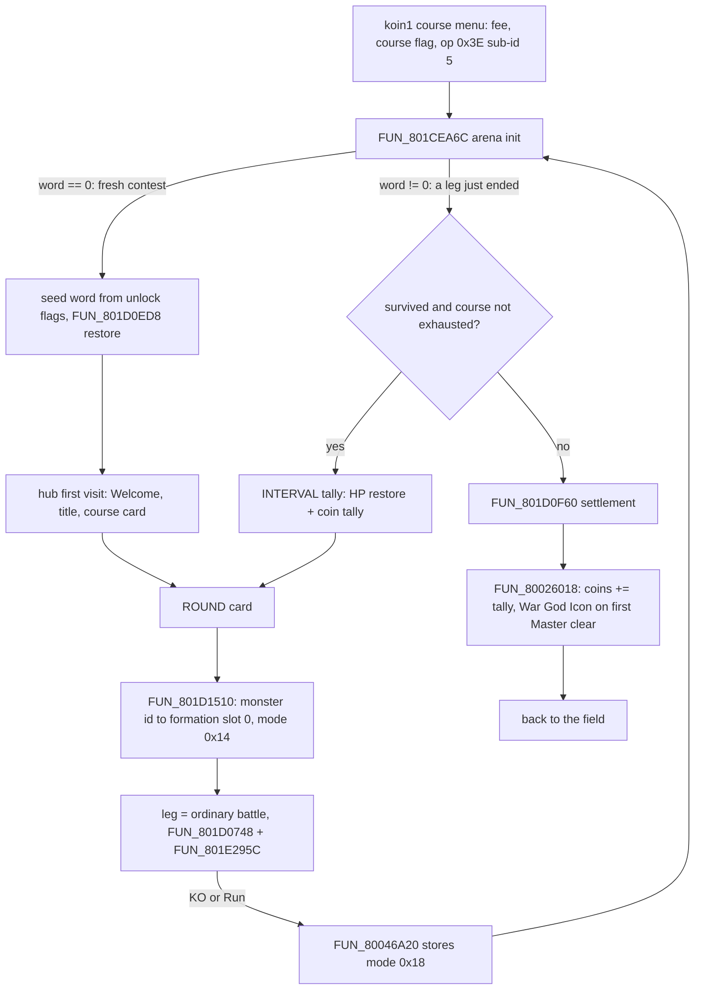
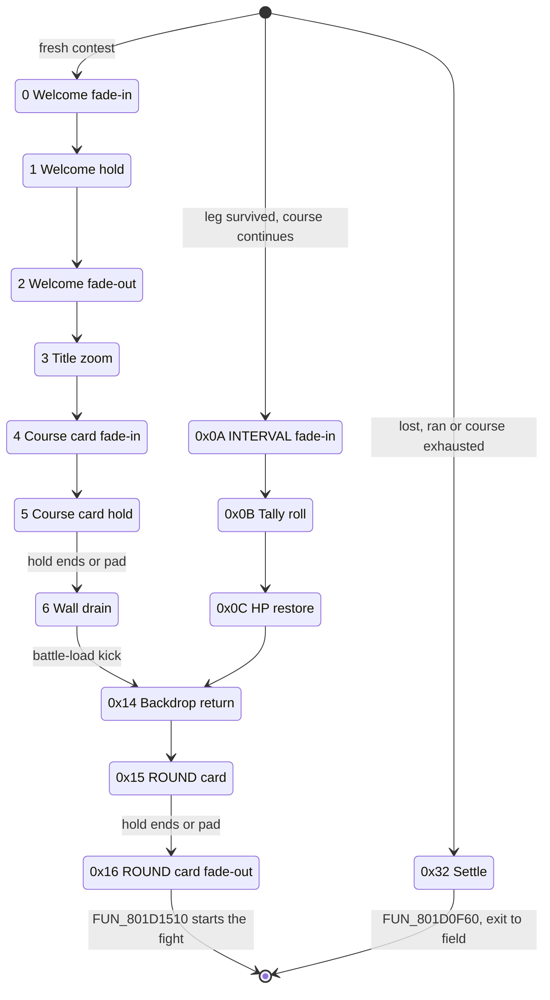

# Muscle Dome minigame

The **Muscle Dome** is an arena contest fought as a ladder of **ordinary Legaia battles**. The player picks one of three courses and fights its fixed sequence of rounds (8 / 8 / 13), one real monster per round, with one party character. Between rounds ("legs") the arena shows a score tally that heals the fighter and banks casino coins; a finished contest pays the coins out.

Two pieces of code run it. The **contest hub** (`FUN_801CF870`, PROT 0977) owns the ladder: which course, which round, the intro / INTERVAL / ROUND screens, the tally and the settlement. Each **leg** is a normal battle on the shared battle round driver (`FUN_801D0748`, PROT 0898) with the usual command ring and directional arts input; nothing in a leg's damage, input or ending is dome-specific.

Three things it is **not**:

- **Not a card battle.** The four "cards" are the four direction commands `0xC..=0xF`, always the same four, each at that fighter's own AP cost. Nothing is drawn, discarded or reshuffled.
- **Not turn-limited.** A leg ends on a knockout and on nothing else. The `Turns Left / HP Left` strip in the same overlay is the Koru boss fight's ([below](#the-koru-timed-fight-strip)).
- **Not part of the minigame-hub family.** It shares no controller library with fishing, the slot machine, dance or Baka Fighter.

## At a glance

| What | Where |
|---|---|
| Contest init / re-entry | `FUN_801CEA6C`, PROT 0977 (slot-A base `0x801CE818`) |
| Contest hub (per frame) | `FUN_801CF870`, PROT 0977; state byte `DAT_801D1A78`, 51-entry jump table `0x801CE990` |
| Opponent installer | `FUN_801D1510`, PROT 0977 (file `+0x2CF8`) |
| Score tally screen / row maths | `FUN_801CF074` / `FUN_801D1184`, PROT 0977 |
| Contest settlement | `FUN_801D0F60`, PROT 0977 (file `+0x2748`), tail-calls the shared exit `FUN_80026018` |
| Leg round driver | `FUN_801D0748`, PROT 0898 (battle-action overlay, base `0x801CE818`); phase byte `ctx+6` |
| Leg action SM / end scans | `FUN_801E295C`, PROT 0898 |
| Battle exit selector | `FUN_80046A20`, `SCUS_942.54` (stores mode `0x18` when `_DAT_8007BAC0 & 0x100`) |
| Contest cursor | `_DAT_8007BAC0`: low byte = `(course, round)`, bits `0x100` / `0x200` = Item / Ra-Seru restriction |
| Opponent cell | `0x8007BD0C` (formation slot 0), written by `FUN_801D1510` |
| Score / coins | running tally `_DAT_80084440`, coin bank `0x800845A4` |
| Battle context | `_DAT_8007BD24` (**ctx**), actors through `&DAT_801C9370` |
| Data file | `data\field\other6.lzs` = extraction 1220..=1225 (hub art, ringside stills, arena backdrop) |
| Ladder + score tables | PROT 0977: roster `0x801D1920`, course descriptors `0x801D1A08`, score table `0x801D1860` |
| Ringside still loader | `FUN_801F6B24`, PROT 0978 (`field_back_read`, slot-B base `0x801F69D8`) |
| Port | [Engine port](#engine-port): `engine-minigames::muscle_dome`, `engine-menus::muscle_dome`, `engine-core::muscle_ringside`, `engine-minigame-scenes::muscle_dome_scene`, `web-viewer::minigames_muscle` |
| Disc parsers | `legaia_asset::muscle_dome` (deck tables), `muscle_dome::parse_course_ladder` / `parse_score_table` |

Throughout, "ctx" is the shared battle context at `_DAT_8007BD24` and "actor" is a battle actor record reached through `&DAT_801C9370`. Port paths written `muscle_dome::X` resolve as `legaia_engine_core::muscle_dome::X`.



## Entry from the field

The arena is reached by the **mode-24 minigame door-warp**: field-VM op `0x3E` with `op0 = 105` (`sub_id 5`), which sets game mode `0x18` and loads the door/init slot PROT 0977. The mechanism, its `sub_id` -> overlay table and the return warp are in [`script-vm.md` § 0x3E WARP](script-vm.md#0x3e-warp-mode-24-minigame-door-warp); the port's id decoder is `engine-field::minigame_entry::MinigameSubId`.

Every dome door on the disc is in `koin1` P1[9] - three sites in one record, which is the **course menu**: each arm debits its entry fee through `0x4C 0xE5` and latches one of the course flags before its own `0x3E 0x69`. `taiku` carries none (its only `0x3E` sites are `0xFF` interacts), so it is not the arena's door despite the label. Census test: `crates/engine-core/tests/minigame_entry_census_disc.rs`.

**How the two routines are reached.**

- The hub `FUN_801CF870` has no caller: it is the `+0x08` tick word of the static 24-byte actor template at `0x801D1A20`. The sub-id-5 init `FUN_801CEA6C` materialises that template and spawns an actor from it (`jal FUN_80020DE0` at `0x801CEAFC`); the per-frame pool walk reaches it through `jalr actor[+0x0C]` in `FUN_8002519C`.
- The round driver `FUN_801D0748` is reached through the **battle** overlay's own template (`0x800767DC`, tick `FUN_80046A20`), not through the 0977 slot. It has **exactly one** `jal` disc-wide - `0x80047014`, inside `FUN_80046A20`, with no test in front of it and the fall-through rejoining at `0x8004701C` - across `SCUS_942.54`, every based overlay image and every raw PROT entry. Every battle frame steps it; it is the shared round driver, not a dome-specific controller.
- `FUN_80046A20` is also the second of only two writers of game mode 24 on the disc: with `_DAT_8007BAC0 & 0x100` set it stores `0x18` rather than the field's `0x2`, which is what returns a finished round to the arena instead of to the field.

<a id="two-state-machines-not-one"></a>

## The contest hub

The dome stacks **two** state machines. The inner one is the battle: `FUN_801D0748` plays a leg out and ends it on a knockout ([What ends a leg](#what-ends-a-leg)). It has exactly **one** contest-gated arm, at `0x801D322C`, where a `lw` of the mode-24 sub-id word `_DAT_8007BAC0` and a `beq …, zero` skip the block unless a contest is running. That block is the flee arm ([Leg opening and Run](#leg-opening-and-run)).

The outer one is the **contest** - the ladder above the legs - and lives entirely in PROT 0977:

- `FUN_801CEA6C` is its entry, re-entered after **every** leg. A zero sub-id word means a fresh contest; a non-zero one means a leg just finished, and the only thing that arm does before the common tail is `word += 1` (`0x801CEC00`).
- `FUN_801CF870` is its per-frame hub, dispatching `DAT_801D1A78` through the **51-entry jump table at `0x801CE990`**. Fourteen states are real; the other 37 route to the table's default arm. Every state but `0x32` falls through the same tail at `0x801D00B8`, which re-packs `(course, round)` into the word.



| State | Name | What it does | Exits |
|---|---|---|---|
| `0` | Welcome fade-in | "Welcome to the Muscle Dome!" strip climbs `+dt*4` | `1` at full |
| `1` | Welcome hold | holds `0x7B` ticks | `2` |
| `2` | Welcome fade-out | strip drains `-dt*4` while the brick wall rises; seeds title scale `0x1640` (`0x801CFA58`) | `3` |
| `3` | Title zoom | course-title art scale ramps `0x1640` -> `0x1000`; starts the card level climbing (`0x801CFA74`) | `4` |
| `4` | Course card fade-in | `FUN_801D042C` over the title art, `+dt*2` | `5` at full |
| `5` | Course card hold | holds `0xB4` ticks, pad-skippable | `6` |
| `6` | Wall drain | drains the backdrop level `-dt*4`; kicks the battle load (`0x801CFC88..0x801CFC94`) | `0x14` |
| `0x0A` | INTERVAL fade-in | heading + backdrop climb `+dt*4`; arms the four tally cues | `0x0B` at full |
| `0x0B` | Tally roll | `FUN_801CF074` drains the four lanes; backdrop eases to `0x40` | `0x0C` when the roll stops |
| `0x0C` | HP restore | `hp_cur = min(hp_max, hp_cur + DAT_801D1AC8)` (`0x801CFE7C..0x801CFEA8`); heading drains | `0x14` |
| `0x14` | Backdrop return | backdrop climbs back to `0x80` (`0x801CFEF4..0x801CFF34`); a single pass-through tick on a first visit | `0x15` |
| `0x15` | ROUND card | `FUN_801D02F0` banner fades in `+dt*2`, holds `0x3D` ticks, pad-skippable | `0x16` |
| `0x16` | ROUND card fade-out | card and backdrop drain `-dt*2` (`0x801D002C..0x801D0040`) | starts the fight (`FUN_801D1510`) |
| `0x32` | Settle | contest settlement `FUN_801D0F60`; the one state that skips the re-pack tail | leaves the arena |

The fade rates, holds and draws per screen are in [Hub screens](#hub-screens). The committed dump `overlay_0977_slotA_801cf870.txt` stops at `0x801D0094` while the function runs to the `jr ra` at `0x801D00F0` (extent `0x801CF870..0x801D00F8`), so arm `0x0B`'s body, the HP restore and the shared draw tail are read from the image, not the dump.

### The cursor: `(course, round)` packed in one word

Both the course and the round live in the low byte of the mode-24 sub-id word `_DAT_8007BAC0`:

| Quantity | Expression | Site |
|---|---|---|
| course | `((word - 1) & 0xFF) >> 4` | `0x801CEBD4..0x801CEBE8`, `0x801CEC30` |
| round | `(word - 1) & 0xF` | `0x801CEC18` |
| next leg | `word + 1` | `0x801CEC00` / `0x801CEC08` |
| re-pack | `(word & ~0xFF) + 1 + (course << 4) + round` | `FUN_801D0088`, `0x801D00B8..0x801D00E4` |

The re-pack leaves every byte above the low one alone, so the restriction bits seeded at entry (`0x100` / `0x300` above the low byte) survive the whole contest. Decoded course / round land in `DAT_801D1A90` / `DAT_801D1A94`, the pair `FUN_801D1510` indexes the ladder with.

### Which course opens

On the fresh-entry side of the `bnez` at `0x801CEB58`, `FUN_801CEA6C` seeds the word `1` (`0x801CEB8C` stores `$s2`, loaded with `1` at `0x801CEAF8`) and then lets three story-flag tests (`jal 0x8003CE64`) overwrite it in order, so the highest unlocked course wins:

| Flag | Seed | Store | Course | Restriction bits |
|---|---|---|---|---|
| *(none set)* | `0x001` | `0x801CEB8C` | 0 - Beginner | none |
| `0x536` | `0x101` | `0x801CEBA0` | 0 - Beginner | `0x100` (no Item) |
| `0x537` | `0x111` | `0x801CEBB4` | 1 - Expert | `0x100` |
| `0x538` | `0x321` | `0x801CEBC8` | 2 - Master | `0x100` + `0x200` (no Item, no Ra-Seru) |

That `0x538` is the Master unlock is inference from the three arms' course indices; the literals are disassembly. The default `1` is `muscle_dome::CONTEST_ENTRY_WORD_DEFAULT`; the port's seed is `contest_entry_word`. The pad-driven three-column picker in `FUN_801D0CD4` is a dev screen, not the course choice.

### How long a course runs

The course descriptor's round count is the length - 8 / 8 / 13 - except on the **Master course**: the clamp block at `0x801CED28..0x801CEDA4` sits behind `bne course, 2`. Three story flags each shorten it, each consulted only once the run has reached its threshold:

| Reached round | Missing flag | Course stops at |
|---|---|---|
| 8 | `0x378` | 8 |
| 11 | `0x382` | 11 |
| 12 | `0x471` | 12 |

Retail applies them in that order and lets a later one overwrite an earlier one, so a run missing all three stops at 12 rather than at 8; the port reproduces that. "Course exhausted" is `round >= cap` (`0x801CEDB8`).

<a id="which-arm-decides-a-leg-was-survived"></a>

### Leg outcome routing

"Survived" is a single byte test at `0x801CEDD8` (and again at `0x801CEE1C`): `DAT_8007BD60 & 0x80`. The battle's own state-`0x5A` party-wipe scan clears the bit, and the shared minigame-exit routine `FUN_80026018` re-raises it (`ori 0x80`, `0x800260A4`) on the way back out - so on arena re-entry the bit reads "the party is still standing".

`continuing` (`DAT_801D1ADC`) is **derived**, not prompted; there is no continue prompt. The latch has three writers: zeroed on every arena entry (`0x801CECE0`), zeroed at settlement (`0x801D1058`), and raised at `0x801CEE08` on the one path that reaches it - *course exhausted **and** survived*.

| Leg | Next hub state |
|---|---|
| survived, course not exhausted | `0x0A` - the between-leg tally screen (seeded at `0x801CEE2C`) |
| survived, course exhausted | `0x32` - settle, latch **up** |
| not survived | `0x32` - settle, latch down |
| ran (`_DAT_80084448 == 4`) | `0x32` - settle, latch down, `DAT_801D1A74 = 1` |

<a id="the-intermission-is-per-fight-not-per-turn"></a>

### The intermission is per fight, not per turn

No turn boundary reaches the table above. The two boundaries are written by different arms of `FUN_801E295C`, and only one leaves the battle:

| Boundary | Written at | What happens |
|---|---|---|
| turn | `0x801E67E8..0x801E6810` | `ctx[6] = 0x14` (the round driver's turn-top arm) and `ctx[+0x28a] += 1`; the driver re-enters its own command cluster `0x28` |
| leg | `0x801E65D8` / `0x801E6674` | `DAT_8007BD71 = 0xFE` - party wipe (cause `5`) / monster wipe (cause `0`); the exit selector routes to arena mode `0x18` |

While a leg runs the game is in battle mode, so the hub - the only thing that draws INTERVAL and the tally - is not executing. Retail has no beat between turns: the command cluster comes straight back.

Both boundaries reach a port host as "the turn's playback ended", so the verdict lives in one shared place: `muscle_dome::leg_boundary_raises_interval` (`engine-minigames`), called at the leg boundary by the hub timer kernel both play hosts drive (`engine-core::muscle_ringside::HubTimers`) and by the browser dome page (the `muscle_leg_shows_interval` binding). `MusclePhase::ends_turn` / `ends_leg` name the same split on the session side. Locked by `engine-core/tests/muscle_intermission_cadence.rs` and `web-viewer/tests/muscle_page_cadence.rs`.

<a id="course-ladder-the-opponent-per-course-round"></a>

## Course ladder

The opponent is a real monster id, pinned by two adjacent tables in PROT 0977 immediately after the score table:

| Table | VA | File offset | Shape |
|---|---|---|---|
| Score table | `0x801D1860` | `+0x3048` | 3 courses x 16 `i32` cells: `DAT_801D1860 + course*0x40 + (round-1)*4` |
| Round roster | `0x801D1920` | `+0x3108` | 29 x 8 bytes: `{ u32 name_ptr; u32 monster_id }` |
| Course descriptors | `0x801D1A08` | `+0x31F0` | 3 x 8 bytes: `{ i32 round_count; ptr first_round }` |

The descriptors are `(8, 0x801D1920)`, `(8, 0x801D1960)`, `(13, 0x801D19A0)` - contiguous, 8 + 8 + 13 = 29.

| Course | Rounds | Monster ids (round order) | Score-row sum (coins for a cleared run) |
|---|---|---|---|
| 0 Beginner | 8 | `13 0D 10 49 62 4B 86 8B` | 818 |
| 1 Expert | 8 | `14 06 6D 3C 81 49 50 8B` | 1532 |
| 2 Master | 13 | `81 86 3C 49 4B 4D 8B 8A A4 A3 A2 A9 AA` | 13830 |

Resolved against the monster archive (PROT 867, slot `(id-1) * 0x14000`) the names reproduce the curated `[[muscle_dome_course]]` line-ups in `data/gamedata/casino.toml` 29 of 29, in order. The score rows carry 8 / 8 / 13 populated cells; 818 and 1532 equal the curated `reward_coins` exactly, and the disc's Master sum of **13830** corrects the walkthrough table's 13856.

**The installer** `FUN_801D1510` is the whole handoff from arena to battle:

```mips
801d1564  lui   a1,0x8008
801d1574  addiu a0,a0,0x1a08     ; a0 = course descriptor table
801d158c  lw    v1,0x4(v1)       ; course_desc[course].first_round
801d1598  lbu   a0,0x4(v0)       ; roster[round].monster_id
801d159c  addiu v0,a1,-0x42f4    ; v0 = 0x8007BD0C, formation slot 0
801d15a4  sb    zero,0x1(v0)     ; clear slots 1..3
801d15b8  sh    v0,-0x47c4(v1)   ; game_mode = 0x14 (BATTLE INIT)
801d15bc  sb    a0,-0x42f4(a1)   ; slot 0 = monster_id
```

It indexes the descriptor by `DAT_801D1A90 << 3`, the round pointer by `DAT_801D1A94 << 3`, and writes one enemy with no formation variety. That `sh` is the arena overlay's **only** write of the stage word `0x8007B83C`, and mode `0x14` is `BattleInit`, whose initializer `FUN_80055B6C` builds the battle from the cell just filled.

`FUN_801D0CD4` reads the other two fields: it walks all three descriptors to draw the dev course menu (`+0x00` count as the loop bound, each round's `+0x00` name pointer through the text drawer at `0x80036888`) and clamps the round counter against the count.

Parsers: `muscle_dome::parse_course_ladder`, `parse_score_table`, `course_score_cell` (`crates/engine-minigames/src/muscle_dome/course.rs`), all reading the raw PROT 0977 entry.

<a id="what-a-cleared-leg-is-worth"></a>

## Score tally and restores

`FUN_801D1184` computes four count-up rows. Three are scaled `× max_hp / 100` (the `0x51EB851F` reciprocal multiply); the fourth is not scaled:

| Row | Value | Global | Drains into |
|---|---|---|---|
| round | `round * 2 * max_hp / 100` | `DAT_801D1ACC` | HP accumulator `DAT_801D1AC8` (`0x801CF0DC`) |
| turns | `min(turns_taken, 8) * max_hp / 100` | `DAT_801D1AD0` | `DAT_801D1AC8` (`0x801CF150`) |
| outcome | `DAT_801D1A5C[min(outcome, 3)] * max_hp / 100` | `DAT_801D1AD4` | `DAT_801D1AC8` (`0x801CF1C8`) |
| score | `score_table[course][round - 1]` | `DAT_801D1AAC` | coin tally `_DAT_80084440` (`0x801CF244`) |

`DAT_801D1A5C` is `[8, 12, 4, 2]`. `turns_taken` is `_DAT_80084444` and `outcome` is `_DAT_80084448` - the word the flee arm sets to 4.

The tally screen `FUN_801CF074` drains all four, one `step_scale` step per lane per frame with a voice blip per step. Three lanes are **healing**, not score; only the fourth is coins. So a contest costs no permanent HP.

The screen shows six rows, not one per lane: the three lane pendings, the shared HP accumulator `DAT_801D1AC8`, lane 3's pending and the running tally `_DAT_80084440`, with brightness from four fade counters in the order `[0, 1, 2, 0, 3, 3]`. Row by row: [`functions/minigames-debug.md`](../reference/functions/minigames-debug.md#the-contest-score-tally-screen-fun_801cf074).

### The between-leg restore

Hub state `0x0C` adds the accumulator to the `+0x6CC` / `+0x6CE` pair of the game-state window `0x80084140` - the lead party record's own `+0x104` / `+0x106` HP fields (`0x80084708 - 0x80084140 = 0x5C8`).

The restore raises **current** HP only, so a later leg can open hurt. The next leg's battle init seeds the actor's two HP words from two record fields - current `+0x14C` and maximum `+0x14E`, the maximum off record `+0x104` (`FUN_80053CB8`, `0x80053DD4..0x80053DDC`) - so the status plate reads `hp / max`. The port carries the maximum separately from the entry HP (`MuscleDomeSession::set_hp_max`, seated by the door warp from `SceneHost::dome_lead_fighter`).

### The contest-start restore (`FUN_801D0ED8`)

- Refills HP / MP / SP to their maxima at contest start.
- Only when `course != 0` (behind a `bnez` at `0x801D0EE8`), first zeroes the four gear bytes `+0x75E` / `+0x75F` / `+0x760` / `+0x762` - record `+0x196` armour, `+0x197` head, `+0x198` weapon, `+0x19A` leg gear. "No equipment" is an **Expert / Master** rule; Beginner keeps its gear.
- The Seru-lock byte `+0x199` and the accessory bytes `+0x19B..+0x19D` are untouched, so a stripped fighter keeps accessories and summon access.
- It is a **one-shot**: its `jal` at `0x801CEBF0` is on the `_DAT_8007BAC0 == 0` side of the `bnez` at `0x801CEB58`; a re-entered arena jumps to `0x801CEC00` instead, so a leg boundary never refills.
- Settlement (`0x801D0FDC`) restores the whole saved SC block.

Port: `muscle_dome::apply_contest_start_restore`, handed to the host by `DomeContest::take_start_restore` and applied in `World::enter_muscle_dome`.

<a id="contest-settlement--the-one-shot-prize"></a>

## Contest settlement and prize

`FUN_801D0F60` (PROT 0977 file `+0x2748`; cited as `FUN_801C2748` in older `0x801C0000`-band imports) restores the SC block (`FUN_8001A8B0`) and settles the running tally `_DAT_80084440`:

| Case | Effect |
|---|---|
| Continuing (`DAT_801D1ADC` up) | keeps the tally and adds the final `(course, round)` score cell; sets flag `0x50A` |
| Not continuing | halves the tally (signed `/2`) |
| Gave up (`DAT_801D1A74`, raised only by the flee path) | zeroes the tally, drops the continue latch, sets flag `0x35` |
| Gave up on **round 1** | also sets flag `0x130 + course` - the Muscle Paradise / Chicken King trigger ("run from the first battle in all three difficulties") |
| Master final fight (`DAT_801D1A94 >= 0xD`) with flag-bank bit `FUN_8003CE64(0x6CB)` clear | awards item `0xCD`, the **War God Icon**, via `FUN_800421D4(0xCD, 1)` - once per save |

Flags `0x50A` and `0x35` are both cleared at the top of every settlement.

The tally is then paid by the tail call to the **shared** minigame-exit routine `FUN_80026018`: `casino_coins += tally`, saturating at `0x0098967F` (9,999,999), on the coin bank `0x800845A4` (`0x80026058..0x80026078`).

So a **leg** pays nothing and a **contest** pays coins: each score cell exactly once, the non-final legs through the tally screen and the last one at settlement. The victory caption's spell id (`ctx+0x269 + 0x80`) is a *string* index into `0x801F4DFC`, the shared battle-family cast-caption label table read by any cast in any battle overlay. It is not a Seru award; nothing in the arena overlay grants anything but the War God Icon.

Port: `muscle_dome::{DomeContest, settle_contest}`, driven by `World::report_muscle_leg` / `World::settle_muscle_contest` on the play hosts and by the `muscle_contest_*` bindings on the minigames page - one model, no per-host ladder rule. `World::exit_muscle_dome` credits no capture. See `ghidra/scripts/funcs/overlay_0977_slotA_801d0f60.txt`.

## Hub screens

<a id="the-hub-screens-are-envelopes-not-frame-counts"></a>

### Screen envelopes

Each hub screen is a **fade-in at its own rate, a hold, and a fade-out**, and two of the holds end early on a pad press. The counter family `DAT_801D1A70 / 1A7C / 1A80 / 1A84 / 1A88 / 1A8C` lives entirely inside the PROT 0977 image, and every step is scaled by the adaptive frame-skip factor `_DAT_1F800393`, so the figures are ticks (frames at the normal cadence).

`DAT_801D1A80` is a **brightness level**, not a tick count: the emitter `FUN_801D050C` scales each stored channel by `c * a3 / 256` (`mult` then `sra 8`), and the counter clamps at `0x80` - a PSX textured primitive's neutral modulation. Drawing a hub screen at `0x100` is twice retail's brightness.

| Screen | States | Fade in | Hold | Skippable | Fade out |
|---|---|---|---|---|---|
| "Welcome to the Muscle Dome!" strip | `0` / `1` / `2` | `+dt*4`, 32 ticks | `0x7B` = 123 ticks (`slti 0x7b`, `0x801CF9A0`) | no | `-dt*4` |
| Course-title art | `3` | scale ramp `0x1640` -> `0x1000` at `dt<<7`, 13 ticks | - | - | - |
| Course card (`FUN_801D042C`) over the title art | `4` / `5` / `6` | `+dt*2`, 64 ticks | `0xB4` = 180 ticks (seed `li v1,0xb4`, `0x801CFB68`) | yes | cleared on `5`'s exit; `6` drains the backdrop `-dt*4` |
| ROUND-n card (`FUN_801D02F0`) | `0x15` / `0x16` | `+dt*2`, 64 ticks | `0x3D` = 61 ticks (`slti 0x3d`, `0x801CFFB8`) | yes | `-dt*2` |
| INTERVAL + score tally | `0x0A` / `0x0B` / `0x0C` | `+dt*4`, 32 ticks | the tally roll (data-dependent) | no | `-dt*2` to the `0x40` floor (`slti 0x40`, `0x801CFDAC`), then `-dt*4` |

- **Skip.** A skippable hold reads the pad-edge snapshot `DAT_801D1A9C` (`_DAT_8007B874 | _DAT_8007B938`, stored at `0x801CF8C4`) and leaves on any bit of `& 0xF4` (`0x801CFBE0`, `0x801CFFE4`).
- **Course card.** `FUN_801D042C` (drawn at `*(0x801D1A84)` beside the title art at a fixed `0x80`) is six corner-anchored draws: the course-name strip (record `5 + course`, `*(0x801D1A90)`) as variant 1 at `(8, 0x78)`, variant 2 at the same seat and variant 2 again at `(0x10, 0x80)`, then record `8` the same way at `(0xB8, 0x7B)` / `(0xC0, 0x83)` - a shadow, an under-layer and a face in OT order. Variant-2 packets subtract a white knockout palette and the variant-1 face adds over it; the arena uploads the hub CLUTs STP-set ([`ringside-still.md`](../formats/ringside-still.md#which-hub-packets-blend)). The ROUND banner `FUN_801D02F0` is drawn only by state `0x15`.
- **Other seats.** The Welcome strip (record 3) is centred on `(160, 120)`, the course-title art (record 4) at `(160, 64)` with a variant-2 shadow at `(168, 72)`, the INTERVAL heading (record 16) at `(160, 32)`.
- **Tally roll.** The four lanes' tick counters `DAT_801D1AB8 / 1ABC / 1AC0 / 1AC4` each test `slti 0x11` (a 17-tick lead-in) and reseed to `0x10`.

Port: `muscle_dome::HubScreen` (`engine-minigames`, envelope literals), `other_game_hud::course_card_draws`, `muscle_ringside::FirstVisitHub` for the first visit ([`ringside-still.md`](../formats/ringside-still.md#in-the-port)), and `muscle_ringside::HubTimers`, armed and ticked once per world tick by `World::tick_muscle_hub` from the shared scene host. Each play host's own `tick_muscle_hub` only sounds what fired (`World::take_muscle_hub_sounds`); the minigames page samples the same kernel through `muscle_hub_screen_json`. No host picks a count or a brightness of its own.

<a id="the-tally-cues-key-the-arenas-own-bank"></a>

### Tally cues

State `0x0A` writes the cue ring `DAT_8007B6D8 = [0x202, 0x202, 0x202, 0x203]` alongside the vsync countdown `DAT_8007C338 = [0, 0x1E, 0x3C, 0x5A]` - four "ka-ching" cues staggered 0 / 30 / 60 / 90 frames (`0x801CFCAC..0x801CFCEC`).

Both ids are `>= 0x200`, so the drainer resolves them against the current-bundle slot `_DAT_8007B8D0` ([`sfx-table.md`](../formats/sfx-table.md)), which the arena points at its own bundle: `FUN_801CEA6C` allocates a `0x14000` buffer, stores `buffer + 0x12800` to `_DAT_8007B8D0` (`0x801CEEDC..0x801CEEFC`) and fills it with `FUN_8003EB98(0x220, …)` at `0x801CEF14` - raw TOC `0x220`, extraction **542**, the third slot of the `koin1` block. A `minigame_muscle_dome` state parked in the hub reads those bytes at `*(0x8007B8D0)`.

| Cue | Program | Tone | Voices | Category |
|---|---|---|---|---|
| `0x200` | 0 | 0 | 2 | 3 |
| `0x201` | 0 | 2 | 1 | 3 |
| `0x202` | 0 | 3 | 1 | 3 |
| `0x203` | 0 | 4 | 2 | 3 |

Category `3` is VAB slot 3, which the same init fills with extraction **1157** (`vab_01 + 0x57`, one program of six tones). Only `0x202` and `0x203` have a writer in the arena image.

Port: the scene host stages the bundle on the warp (`legaia_asset::minigame_sfx::ARENA_SFX_BUNDLE_PROT_INDEX`), `World::runtime_sfx_bundle` returns it in `SceneMode::MuscleDome`, and `World::tail_side_band_bank` names the slot-3 bank for both hosts' BGM-tail stagers. `HubTimers` emits the four slot writes on the INTERVAL arm's first frame as `SfxRingOp::ArmSlot`, replayed by both hosts onto their cue ring.

<a id="the-arenas-per-frame-voice-cue-fun_801d1288"></a>

### Per-frame voice cue (`FUN_801D1288`)

The overlay keys one SPU voice per frame, rotating over `0x10 ..= 0x13` on the free-running counter `DAT_801D1AE4 & 3`: `FUN_80065034(voice, 0, 0, 1, 0x3C, 0x40, vol, vol)`. The eight-argument shape is pinned by the SCUS cue drainer `FUN_80016B6C`, which fills the same slots from a cue descriptor `(voice, level, program, tone, note, 0x40, vol_l, vol_r)` - so the cue is program `0`, tone `1`, note `0x3C`, level `0`.

Both volume slots are `(_DAT_80084580 << 0xf) >> 0x10` - the **voice/SFX volume config**, seeded to `200` by the cold reset `FUN_8001FFA4`, so a freshly booted game keys it at `100` per channel. Not a position: `FUN_80016B6C` passes the same expression for every ordinary SFX cue, as does the dance overlay's direct key-on `FUN_801D3D78`. Port: `engine-minigames::other_game_overlay::cue_volume`.

### Between legs the arena keeps the frame

A survived leg with the course not exhausted never leaves the arena: the battle exits to mode `0x18`, the re-entered hub runs `0x0A..0x0C` and `0x14..0x16`, and the end of state `0x16` starts the next fight itself.

In the port the in-world dome's decided leg closes on Cross through `World::tick_muscle_dome`, which reports it and asks `leg_boundary_raises_interval`. A continuing contest sets `MinigameState::muscle_hub_between_legs` and keeps `SceneMode::MuscleDome` with no leg open; every other leg settles and hands the field back. `HubTimers` raises `HubTimersFrame::next_leg` once its INTERVAL and backdrop arms have drained, answered by `World::begin_next_muscle_leg`, which stages the next fight through the same mode-24 drain the arena door uses without re-arming the round trip.

While the hub owns the frame neither host draws the field or battle chrome, and a decided leg puts no text up. Start between legs is the give-up arm (the contest ends and the tally is void). Locked by `engine-core/tests/muscle_contest_world.rs` and `web-viewer/tests/play_ringside_still_disc.rs`.

Both hosts draw the hub screens through the shared `engine-ui::other_game_hud` emitters: the browser dome page via `muscle_hub_quads_json`, the native play-window by baking the two hub page TIMs per referenced sub-palette into a sprite atlas and running the same builders (`crates/engine-shell/src/window/minigames.rs`, `muscle_hub_sprite_draws`).

<a id="arena-backdrop-extraction-1225"></a>

## Arena data file (`other6`, extraction 1220..=1225)

The 0977 overlay loads the dome's data file by its dev path `data\field\other6.lzs` - a string literal in the entry's pool, alongside its `mini_battle_flag %d` / `round %d level %d` traces and the monster-name roster. CDNAME maps `other6` to raw TOC index **1222**, i.e. extraction block **1220..=1225** (`legaia_prot::cdname::block_for_extraction_index`; [`cdname.md`](../formats/cdname.md#numbering-space)).

| Extraction | Content |
|---|---|
| 1220 | LZS container; section 0 = the **hub UI art**: two TIMs uploading `(320, 0)` / `(320, 256)` with CLUT rows 502 / 503 ([HUD chrome](#hud-chrome-texture-sources)) |
| 1221 / 1222 | the two ringside panel stills `int.tim` / `int2.tim` ([below](#ringside-panel-stills)) |
| 1223 / 1224 | pochi fillers ([`pochi.md`](../formats/pochi.md)) |
| 1225 | the arena **battle backdrop**, the block's only `scene_tmd_stream` |

### Arena backdrop (extraction 1225)

An ordinary battle backdrop in the standard carrier shape ([battle background](battle-stage-camera.md#battle-background)), the stream the battle init walker `FUN_8001FE70` records into `_DAT_8007B864`:

- A leading arena-shell TMD (2 objects, 367 verts). Object 0 is the ring shell, authored at `X >= 0` with the open side facing `-X` - the half-stage rule `town01`'s dome also follows.
- Two type-`0x01` TIM chunks (`0x8220` bytes each): 4bpp 256x256 pages at framebuffer `(768, 0)` / `(832, 0)` with CLUT rows **473** / **479**.
- `(832, 0)` through CLUT `(0, 479)` is the constant address the battle **ground grid** `func_0x801d02c0` samples; that page's `(192..255)^2` window is the dome's plain dirt tile. The rest of the two pages is arena furniture (chain-link fence, flooring, the tiered ring wall).
- Two **semi-transparent prim sets** (ABE set, ABR mode 1 = additive). The shell owns the lamp-glow quads (mode `0x3F`, page `(768, 0)` window `(48..109, 161..251)`, CLUT x 112 of row 473). **Object 1** is a separate 12-quad dust decal (mode `0x2F`, page `(832, 0)` window `(128..190, 192..253)`, CLUT x 16 of row 479) ringing the wall base.

The dust decal is **not drawn** in a live match: the loader trims it (next section). Its texels are bright (the CLUT ramp at `(16, 479)` climbs to `(208, 208, 248)`), so any draw of it reads as a mist band; the retail match interior is mist-free (capture: the `minigame_muscle_dome_pcsx` scenario run forward into a match).

Confidence: load chain, carrier shape and texture addresses are **Confirmed** (disassembly + structural decode). That a live contest's `_DAT_8007B864` holds this stream is **Inferred** - 1225 is the only backdrop-shaped stream in the file - with no dome-battle save-state byte-match taken.

<a id="object-1-is-trimmed-by-the-loader-_dat_8007b64b"></a>

### Object 1 is trimmed by the battle scene loader

Nothing in the arena's own code touches the backdrop. `_DAT_8007B864` (written by `FUN_8001FE70` at `0x8001FEC0`) has exactly two references on the disc; the second is the SCUS battle scene loader `FUN_800513F0` reading it at `0x80051A5C`. Overlays 0977 and 0898 reference it in no form. The loader:

1. `FUN_80026B4C(_DAT_8007B864, 0)` at `0x80051A60` magic-checks `0x80000002`, relocates every object via `FUN_800268DC`, and registers the TMD into the shared model bank `0x8007C018[n++]` (`n` at `0x8007B774`).
2. Writes the slot index into the backdrop template `0x8007680C+4` (`0x80051A80`) and spawns **two** backdrop actors (`FUN_80020DE0` at `0x80051A7C` / `0x80051AA8`), parked at ctx `+0x106C` / `+0x1070`. The spawn copies `template+4` into `actor+0x64` (`0x80020E70`), and `FUN_80021B04` binds every object into the part array `actor+0x44`.
3. Tests the byte `_DAT_8007B64B` at `0x80051ABC` / `0x80051ACC`. **When it is zero** it decrements both actors' part counts (`0x80051AD4..0x80051B10`) and shifts each list down one slot from index `1` (`0x80051B14..0x80051BAC`): **object index 1 is removed from the draw list.** Non-zero keeps every object.

`_DAT_8007B64B` has **one writer**: the field overlay's battle handoff `FUN_801D9E1C` at `0x801DA0AC`, `= (s2[+8] >> 5) & 1` - bit 5 of the per-encounter setup byte, written only on the `(*_DAT_801C6EA4)[+0x5F] >= 0xC` arm. Bit 7 of the same byte clears the render flag `0x00100000` on the actor's `+0x80` (`0x801DA0B8`) and bit 6 takes a third arm (`0x801DA0D8`). The field-battle-intro overlay 0979 reads the byte at `0x801CF700`, and SCUS reads it again at `0x80046D34` as `gp+0x333`.

So object 1 is a per-encounter background option, not a dome feature and not an effect draw. The arena leaves the byte clear - measured: `scripts/pcsx-redux/autorun_w4d_dome_decal_flag.lua` drives the contest through modes `0x03 -> 0x18 -> 0x19 -> 0x14 -> 0x15`; `FUN_800513F0` is entered once from `ra = 0x80046F7C` with the byte `0x00`, and a write watch logs zero writes (`FUN_801D9E1C` never runs on the arena's path).

**The shell is drawn twice.** Like every battle stage, the arena is two backdrop actors over one registered TMD ([two actors, one registered mesh](battle-stage-camera.md#two-actors-one-registered-mesh)): copy A at raw coordinates, copy B half-turned about Y, closing the half-stage into the full ring. The half turn is the default arm of the `DAT_80078B50` mirror list: the contest leaves `_DAT_80084540` and `DAT_8007BD60` at `3` each (the retail `minigame_muscle_dome` state), and backdrop id `6` is not on the list. Only about a third of the shell's vertices are symmetric in `z`. Kernel: `engine-minigame-scenes::muscle_dome_scene::arena_ring`.

<a id="inttim--int2tim---the-ringside-panel-stills"></a>

### Ringside panel stills

Extraction **1221** / **1222** (`int.tim` / `int2.tim`) are headerless 16-bit BGR555 stills, each exactly `0x28000` bytes = `320 * 256 * 2`, uploaded as one VRAM rectangle at `(384, 0)`. They are the backdrop of a **re-entered** hub - the INTERVAL + tally screen and the ROUND card after a finished leg. The format, the draw and the port are owned by [`ringside-still.md`](../formats/ringside-still.md); this section keeps the loader mechanics.

**File layout.** The first five sectors of both are the halfword `0x5862` repeated - 5,120 halfwords = 16 scanlines of 320 - then one zero sector, then pixels. The 240-line picture occupies rows 16..255. Both are pre-rendered scenes of characters at the ring fence; `int2` differs by their reaction.

**Loader.** PROT **0978** (`field_back_read`, slot-B base `0x801F69D8`) names both files by dev path - `h:\prot\field\other6\tim\int.tim` at file `+0x20`, `…\int2.tim` at `+0x44`. Its streamer `FUN_801F6B24` (file `+0x14C`) computes the raw TOC index rather than carrying a literal:

```text
801f6b90  lhu   v0,0x4824(v0)      ; party slot 0 hp_max_record  (+0x11C)
801f6b98  lhu   v1,0x480e(v1)      ; party slot 0 hp_curr_live   (+0x106)
801f6ba4  srl   v0,v0,1
801f6bac  sltu  s0,v1,v0           ; s0 = current HP < max/2
...
801f6c3c  addiu a0,s0,0x4c7        ; raw TOC 0x4C7 + s0
801f6c40  jal   0x8003e8a8         ; LBA resolver
```

Raw `0x4C7` / `0x4C8` are extraction 1221 / 1222, so `int.tim` is the default and `int2.tim` the **below-half-HP** variant, chosen from the lead character's live record ([`save-record.md`](../formats/save-record.md)). The same `s0` selects between the two dev path strings on the dev branch (`lh` on `_DAT_8007B8C2` at `0x801F6C38`). Four `addiu a0,s0,0x4c7` sites exist, at file `+0x264`, `+0x2F4`, `+0x398`, `+0x440` - one per strip. Port: `muscle_ringside::still_prot_index`.

<a id="one-counter-two-tables-and-the-word-that-picks-one"></a>

**Two families behind one counter.** `FUN_801F6B24` is two phase machines sharing the counter `_DAT_8007B6C8`. Three instructions in, `lw a0,-0x4540(a0)` (`0x801F6BA0`) loads `_DAT_8007BAC0` and `beqz a0,0x801f6ed0` (`0x801F6BA8`) picks the table: the special-battle word is non-zero for the length of a contest and zeroed by the door-warp arm of op `0x3E` ([`re-settled-threads.md`](../reference/re-settled-threads.md)). An ordinary battle teardown therefore reads a different table and cannot reach the stills at all.

| | Panel-still family (`word != 0`) | Field-restore family (`word == 0`) |
|---|---|---|
| jump table | `0x801F6AA8`, 12 arms (`sltiu v0,v1,0xc`, `0x801F6BBC`) | `0x801F6AD8`, 19 arms (`sltiu v0,v1,0x13`, `0x801F6EDC`) |
| module phases | `2..=11` | `2..=18` |
| terminal arm | `0x801F6EC8` | `0x801F7304` |
| rect init | `0x801F6BE4..0x801F6C20` | `0x801F6FC8..0x801F6FF0` |
| rect (at `0x801F735C`) | `x = 0x180`, `w = 0x140`, `h = 0x40` | `x = 0x180`, `w = 0x40`, `h = 0x100` |
| stepped field | `y += 0x40` (`0x801F6D2C`) | `x += 0x40` (`0x801F70F8`) |
| bytes per strip | `0xA000` (20 sectors) | `0x8000` |
| seeks | sectors `0 / 0x14 / 0x28 / 0x3C` | sectors `0 / 0x10 / 0x20 / 0x30` |
| raw TOC index | `0x4C7` / `0x4C8` | `0x36C` = extraction **874** (`player_data` head) |

Both tables send indices `0` and `1` to their terminal arm because those counts belong to the caller: SCUS `FUN_80025358` advances `_DAT_8007B6C8` through its own states `0` and `1` while the overlay pages in, and only calls this tick at state `2`.

The panel-still family is four passes over one rect: `FUN_8003E964` seeks, `FUN_8003E800` reads 20 sectors (`320 * 64 * 2`) into the staging buffer, and `FUN_800583C8` (`LoadImage`) uploads with the rect's `y` set to `0 / 0x40 / 0x80 / 0xC0` in the `jal` delay slot. The rect's fixed fields are written once at `0x801F6BE4` / `0x801F6BF0` / `0x801F6BFC`.

The field-restore family is the entry's literal `FIELD BACK READ NOW` path (beside its `f_read %d size %d KB` string): four `LoadImage` calls from `0x801F7078` / `0x801F7108` / `0x801F7190` / `0x801F7224` upload `(384, 0)`, `(448, 0)`, `(512, 0)`, `(576, 0)`, each `64 x 256` - **PSX texture pages 6..9**, restoring the field party's textures over the VRAM the battle borrowed (`0x20000` bytes in all).

Disassemble with `disasm-overlay-fn.py extracted/overlays/overlay_field_back_read_0978.bin --base 0x801F69D8 --addr 0x801F6B24`.

<a id="what-arms-the-load"></a>

**What arms the load.** `ctx[+0xC]` is a battle-teardown state byte:

| `ctx[+0xC]` | What runs |
|---|---|
| `1` | Free the four enemy record buffers `0x801C9348[0..3]` (each gated on `ctx[+0x02 + i] != 0`) through `FUN_80017B94`, free the side-band stream buffer `*0x8007BD74`, then write `2`. |
| `2` | Tick `FUN_80025358` once a frame, storing its "still loading" return in `ctx[+0xB]` - the staged load of PROT 0978, whose `FUN_801F6B24` streams into the space the `1` arm freed. |

- The SCUS post-battle routine `FUN_8004E568` drives values `1` / `2` from two identical blocks. `0x8004E670..0x8004E6E4` is gated on `ctx[+0x7] == 0x67`, the **escape** path: `0x67` is written only by case `0x66` of `FUN_801E295C` (`0x801E5A84`), which spawns the fade template at `DAT_801C9070` and raises `DAT_8007BD71 = 0xFE`; `0x67` has no case body ([`battle-action.md`](battle-action.md)). `0x8004F7A4..0x8004F8B0` (state arms at `0x8004F840..0x8004F8B0`) is the victory tail, under `gp[+0xA54] >= 0x100`, `ctx[+0xB] == 0` and `ctx[+0x6CE] == 1`.
- A third tick site sits in the battle side-band pass `FUN_80056208` at `0x80056428` (stage `_DAT_8007B64A == 1`, phase `ctx[+0x289] == 3`).
- `ctx[+0xC] = 1` has one writer on the disc: `0x800474CC` (store pair from `0x800474C4`) in the per-frame battle anim-node tick `FUN_80047430`, for an enemy node only (`node[+0x5A] >= 3`), under `gp[+0xA48] & 0x80` set and the enemy id byte `gp[+0x9F4]` not `0xB5`. The same instructions set `node[+0x10] |= 8`, so the enemy stops ticking that frame.
- `gp[+0xA48] |= 0x80` comes from the battle-end spoils path at `0x8004EDE0` (`FUN_8004E568`) and from a pad-gated branch at `0x80046D98` (`FUN_80046A20`, under `_DAT_8007B98C != 0` and pad mask `0x100`).

Capture (`scripts/pcsx-redux/autorun_battle_teardown_hook.lua`, on `rim_elm_gimard_victory` and on an escaped dome match) reproduces the chain on both paths: one arm hit at `0x800474CC` with `ra = 0x800252BC` (the actor-list tick iterator); `gp[+0xA48]` goes `0x00 -> 0x80` on the arm frame in the ordinary fight and is already `0x80` from the hub in the dome; `ctx[+0xC]` reads `1` next frame and `2` two frames later; and the loader-B tracker `0x8007BC4C` (which holds `extraction - 895`) goes `-1 -> 83` four frames after the arm - **PROT 0978**.

<a id="a-call-site-census-closes-the-sampling-question"></a>

**Who uses VRAM `(384, 0)`.** An exec-breakpoint census of the libgpu entry points (`scripts/pcsx-redux/autorun_gpu_call_census.lua`: `LoadImage` `0x800583C8`, `StoreImage` `0x8005842C`, `MoveImage` `0x80058490`, `PutDispEnv` `0x800589D0`, GP1 issue `0x8005A094`, direct GP0 FIFO write `0x8005A0D0`) over 1800 vsyncs of an ordinary battle, its teardown and the return to field:

| Call | Count | At `x = 384` |
|---|---|---|
| `PutDispEnv` / GP1 `0x05` display start | 641 / 641 | 0 |
| `MoveImage` | 632 | 0 |
| `LoadImage` | 214 | 4 - the field-restore texture-page strips |
| `StoreImage` | 5 | 4 - the dev round-trip `FUN_8001E890` reading `(384, 0)` 256x256 back in four `0x8000`-byte strips |
| direct GP0 list carrying `0x80` / `0xA0` / `0xC0` | 0 | 0 |

So on an ordinary teardown `(384, 0)` is four texture pages sampled by ordinary tpage-addressed primitives (a `tpage 0x0006` / `clut 0x7702` 4bpp family: before the first dome match it is 27 packets covering screen `x[25,151] y[91,101]`, a label strip). Statically, of 33 `addiu rX, zero, 0x180` / `ori rX, rX, 0x180` sites in SCUS and the based overlays, only `FUN_801F6B24`'s two rect writes (`0x801F6BE4`, `0x801F6FC8`), `FUN_8001E890` and the battle scene loader `FUN_800542C8` at `0x80054928` (rect `(384, 256)`, a different page) pair it with a rect.

<a id="the-interval-screen-is-a-live-render-not-the-still"></a>
<a id="the-interval-screen-draws-the-still-on-a-re-entered-hub"></a>

**What draws the still.** `FUN_801D00F8` in PROT 0977 (file `+0x18E0`), called by the hub at the backdrop level `*(0x801D1A7C)`. It emits two `POLY_FT4` quads forming one 320x240 image out of VRAM `(384, 0)..(704, 240)` - tpage `0x106` at screen `(0,-20)-(192,220)` and `0x109` at `(192,-20)-(320,220)`, `tp = 2` (16-bit direct), code word `0x2C080808` at level `8`. Geometry, OT path and fade byte: [`ringside-still.md`](../formats/ringside-still.md#what-draws-it).

The emitter draws the still only when the re-entry latch `_DAT_801D1AE0` is set. `FUN_801CEA6C` stores it zero on the first entry (the word is zero) and `1` on every re-entry; a first visit takes the emitter's six-tile brick-wall arm instead (79 of 79 entries over 3600 vsyncs of a walk-in from `koin1`, [measured](../formats/ringside-still.md#measured-live)).

On a natural re-entry (`autorun_muscle_hud_capture.lua`, the first `0x19` checkpoint of the second and third hub visits, vsyncs 4824 and 7867) the latch reads `1`, the hub state `0x0A`, the backdrop and heading levels (`*(0x801D1A7C)`, `*(0x801D1A84)`) both `8`, and the prim pool holds both still packets ([envelope per arm](../formats/ringside-still.md#on-a-natural-re-entry)). The still is loaded at battle teardown and drawn a mode later by an image that is not resident when the load runs.

Not established: whether the live `koin1` scene geometry also present in those frames (1822 packets across 22 texture families in a `mednafen-state display-list` walk, 971 `POLY_GT4` and 406 `POLY_GT3`, none on a page at x `384`) is ordered in front of or behind the still's far-end OT slot (`OT + 0xFA0`).

### Drawing the arena in the port

- **One surface for every host.** `engine-minigame-scenes::muscle_dome_scene::MuscleDomeSurface` seats the ladder's current rung, loads the bodies and the merged VRAM once per seated pair, replays a resolved turn's plays as swings (the defender flinching on a connecting one), holds the loser's knockdown when the leg settles, and hands hosts one view-projection (`DomeCamera::vp_raw`). The native window, the browser play page and the minigames page (`muscle_surface_*`) all draw it. The choreography clock is the port's, not a retail track.
- **Minigames page panel.** The ring + ground grid come through `legaia_web_viewer` (`muscle_arena_*` / `muscle_vram`), the lamp glows through the renderer's two-pass PSX blend (`site/js/minigame-muscle.js`, `semiTwoPass`), and the object-1 decal is omitted (`muscle_arena_hybrid` filters it).
- **Browser play page.** It draws the surface through the WebGL renderer's single-mesh path (`TmdRenderer.render`) on the program the field pass just used, so every scene-pass uniform that path does not own (NCLIP rejection word, prologue grade, palette collapse, depth cue) is staged to its identity there - uniforms persist on a shared program.
- **Packet colour.** Shell, fighter and monster upload their prims' baked packet colour on `a_flat_rgba`, because the page shades the retail way (`texel * colour / 128`, no light source). The dome's packet colours run well under the neutral `0x80` (much of the shell near `0x60`); a missing colour stream reads as over-lit, not unlit. `legaia_web_viewer::packet_color` splits textured (modulation off the mesh) from untextured (fill off the shading).

## The leg: an ordinary battle

`FUN_801D1510` picks the opponent and hands the round to the ordinary battle. The fighters are battle actors in `&DAT_801C9370`: the active fighter index is `ctx+0x13`, the player party member id `ctx+0x20`, the opponent id `ctx+0x21` (clamped to <= 2 in `FUN_801D8DE8`), and `&DAT_8007BD10` maps a per-actor character id onto the `0x414`-byte party records.

### Round driver phases (`ctx+6`)

`FUN_801D0748` each frame:

1. **Reads input.** It folds the pad-edge masks `_DAT_8007B874` and `_DAT_8007B938` into one press mask `s2`. The four directions are bits `0x8000`, `0x2000`, `0x1000`, `0x4000`; the pressed direction maps to one of the four input slots `ctx+0x1114 / +0x1118 / +0x111C / +0x1120` and is recorded in `ctx+0x880`.
2. **Dispatches on `ctx+6`** through a compare chain at `0x801D0C84..0x801D0DCC` (not a jump table, so arms sit in source order). Phases advance by writing the next value back (`s3`). Phases `0x1E / 0x32 / 0x6E / 0xFE` also tick the azimuth global at `_DAT_8007B938+2` each frame (the idle orbit).
3. **Runs presentation + camera.** Most arms call the presentation driver `FUN_801D388C` and the camera director `FUN_801D5854`, then a UI cue through `FUN_8004FCC8`.

| Phase | Arm | Phase | Arm | Phase | Arm |
|---|---|---|---|---|---|
| `0x00` | `0x801D0DD0` | `0x50` | `0x801D1D84` | `0x64` | `0x801D2A00` |
| `0x0A` | `0x801D0DE0` | `0x5A` | `0x801D21CC` | `0x65` | `0x801D2B3C` |
| `0x0B` | `0x801D0E3C` | `0x5B` | `0x801D23F0` | `0x66` | `0x801D2DB4` |
| `0x14` | `0x801D0EC4` | `0x5C` | `0x801D2590` | `0x67` | `0x801D2EF4` |
| `0x1E` | `0x801D102C` | `0x5D` | `0x801D278C` | `0x6E` | `0x801D3024` |
| `0x32` | `0x801D10F8` | `0x5E` | `0x801D28C0` | `0xFE` | `0x801D31E8` |
| `0x28` | `0x801D1188` | `0x3C` | `0x801D17DC` | default | `0x801D3290` |
| `0x78` | `0x801D16E8` | `0x46` | `0x801D19F8` | | |

The **input chain** is capture-pinned (recomp phase-byte watch across a driven round): `0x1E` Begin | Run -> `0x28` command ring -> `0x78` Auto | Command -> `0x50` direction entry -> `0x5A` queue review -> `0x6E` Begin | Reselect -> `0xFE` / `0xFF` playback -> `0x14` turn top -> `0x1E`. Arms confirmed by content:

- `0x14` (`0x801D0EF0..0x801D1010`): the **turn-top** arm. Resets the direction handles and, for the Koru fight only, computes and stamps the timed-fight strip. `FUN_801E295C` parks the phase byte here at the end of every turn.
- `0x3C` / `0x46` / `0x50`: write the chosen action id into the actor's `+0x1DD` (action) and `+0x1DE` (action-state) and kick the battle action.
- `0x6E` (`0x801D3010..0x801D3178`): the confirm / reselect menu (`FUN_801DB8F4(0x98,0x58)`, cursor result via `FUN_801DBA04`).
- `0x64` / `0x65` / `0x66` / `0x67`: the win / lose phases, branching on the HP fields.

The deal / interval arms outside the input chain are not walked individually; full state semantics are on [`battle-command-flow.md`](battle-command-flow.md) and [`battle-round-loop.md`](battle-round-loop.md).

The pre-pass ahead of the dispatch has one arm per direction bit: the `0x4000` arm is skipped when `ctx+0x275 < 4` and the `0x1000` arm when `ctx+0x275 < 3`, so a panel with fewer than four slots takes fewer directions.

### Leg opening and Run

A leg opens through flow `0x0A` / `0x0B`: `0x0A` composes the enemy-name banner (`FUN_801D9D3C`) and seeds `ctx[+0x6D6] = 0x5A`, `0x0B` drains it, and the turn top `0x14` raises the round prompt `0x1E` (`0x801D0DE0..0x801D0EB8`). `0x14` is the only writer of `0x1E` and stores it unconditionally (`0x801D0ED4`), so **every** turn opens on `Begin | Run` with the far framing; Begin opens the ring with the highlight on its Left (Attack) arm, seeded into `ctx[+0x880]` at `0x801D0ECC`.

Run is offered like anywhere else - the `0x1E` arm has no contest test. The contest gives it its meaning in the `0xFE` arm, behind the sub-id test at `0x801D322C`: on action state 5 (`actor+0x1DE == 5`) it stores `_DAT_80084448 = 4` (`0x801D3228..0x801D328C`) unless the formation monster is `0xAF` / `0x3D` / `0x3E` / `0x3F`, and the re-entered hub settles that as a give-up.

Port: `MuscleDomeSession::arm_intro` / `tick_intro` / `intro_up` carry the banner hold (armed by `World::enter_muscle_dome`, drained once no hub screen covers the leg); `battle_hud::battle_intro_names` lays the opponent's name over the lone monster seat. `DomeMenu` opens each turn on the round prompt, and Run reports the leg as ran through `World::leave_muscle_dome`. The escape roll a retail Run makes is not modelled - the leg ends on the press.

<a id="what-ends-a-leg-a-knockout-and-nothing-else"></a>

### What ends a leg

A knockout, and nothing else. The arena has no battle loop of its own to bound.

| Step | Where |
|---|---|
| End detection | The `0x5A` end-of-action gate of `FUN_801E295C` walks the actor table; with no combatant standing on a side it sets `DAT_8007BD71 = 0xFE` (party wipe: cause `5`, `-0x42D4`; monster wipe: cause `0`). See [`battle-round-loop.md`](battle-round-loop.md#party-wipe--the-game-over-overlay). |
| Exit routing | `FUN_80046A20` picks the next mode. With `_DAT_8007BAC0 & 0x100` set it stores `0x18` at `0x80046E50` rather than the field's `0x2` at `0x80046E0C`. |

**The turn counter is a counter, not a budget.** `ctx+0x28a` has one writer in the battle overlay - the increment at `0x801E6800` / `0x801E6810` (case `0xFF` of `FUN_801E295C`: `ctx[6] = 0x14; ctx[+0x28a] += 1`). Every read selects scripted per-turn enemy behaviour (turn-`0` openers at `0x801DAAD4` / `0x801EB994`, parity alternation at `0x801EA0B8` / `0x801EB4C8`, a five-entry per-turn action table at `0x801EB538`, turn-`1`/`3` dispatch at `0x801EBE08` / `0x801EEDB0`) or draws Koru's countdown. No read reaches the battle-end signal, whose only two writers are the KO scans.

<a id="hand-deck-decoded"></a>

### Direction commands (the "deck")

The fighter's four selectable actions are its four direction commands, laid out by `FUN_801D388C` case `9` / `0x2C`. Tables in the battle-overlay rodata (parser `legaia_asset::muscle_dome`: `hand_command_ids` / `hand_sprite_ids` / `victory_message_count`; disc-gated `muscle_dome_real`):

| Table | Content |
|---|---|
| `DAT_801F4B8C[0..4]` | the four command ids `0xC..=0xF` (the weapon-swing runtime slots); the commit path appends the id verbatim into `actor+0x1DF` |
| `DAT_801F4B94[0..4]` | per-slot chip sprite ids `[0D 10 11 0C]`, with a `+2` "unlearned" face variant gated on the character record's per-move flag at `record+0x18C+move_id` |
| `DAT_801F4B84[move_id]` | per-move display lookup used by the sub-draw path |
| `DAT_801C9360[char][cmd]+0x74` | the command's **AP cost** - the byte the Arts gauge reads as the arm width, copied at battle load from the equipment sections' swing records (`FUN_800557B8`; `legaia_asset::battle_char_assembly::SwingAnimation::cost`). Retail values: favored `0x1E` / off-class `0x2A` / far `0x36` |

- The deal is a four-iteration loop (`uVar17 < 4`); each slot's cost byte is cached in `ctx[slot + 0x14]` and normalised against a `0x1E` baseline to size the chip. The per-slot screen layout is read from a parallel table walked at stride 6.
- For party character index `2` slots `0` and `3` exchange (the layout is mirrored for that fighter).
- The turn budget is `ctx+0x6DC`, seeded from actor `+0x154`; the running spent total is `ctx+0x6D8`; the count of directions entered is `ctx+0x19`; the slot being committed is `ctx+0x1A`.
- **Commit** (`FUN_801D388C` case `0xB`): rejects when the remaining budget is smaller than the direction's cost (`ctx[ctx+0x1A + 0x14]`); otherwise spawns the pennant sprite, writes the id to `actor+0x1DF + ctx+0x19`, debits `ctx+0x6DC`, adds to `ctx+0x6D8` and increments `ctx+0x19`.
- Case `3` clears `+0x1E7` / `+0x1DE` at the start of each round.

The opponent's selection runs through the same deal / commit paths keyed on its own `ctx+0x13`; no dome-specific AI table exists in the overlay *(inference from the symmetric use of `ctx+0x13`)*.

<a id="round-resolution"></a>

### Presentation script (`FUN_801D388C`)

`FUN_801D388C` (7820 bytes, `overlay_muscle_dome_801d388c.txt`) is a `switch` over presentation step ids `0..0x31`. It computes no damage; it lays out sprites, runs the deal / commit loops, and at its tail walks the per-step script table `PTR_DAT_801F4D34[step]` (battle-overlay rodata at file offset `0x2651C`):

| Byte | Meaning |
|---|---|
| `[0]` | sub-draw count |
| `[1]` | animation selector: `1/2/3` -> the panel-sprite reset / teardown pair `FUN_801D99BC` / `FUN_801D9AE8` |
| `[2]` | dual role: active-panel id (compared against `ctx+0x275`; `record[2] + ctx+0x275 == 6` triggers a panel-swap reset of `ctx+0x880..0x883`) **and** the count of leading sub-draw handles bound to the four input slots `ctx+0x1114[]` (flagged `+0x1D = 2`) |
| `[3+2k]`, `[4+2k]` | `(element id, mode)` pairs fed to `FUN_801D8DE8` |

When `_DAT_800846C8` is set, the returned sprite handles are stashed into `ctx+0x1114[]`. The `func_0x80035f04` calls are the shared screen-projection helper anchoring sprites over the 3D fighters.

**Resolution.** In the commit phases the driver walks the actor's `+0x1DF` queue, sets `+0x1DD` / `+0x1DE`, and the shared battle-action path plays each queued action against the opponent record (HP `+0x14C`, max `+0x14E`). Per-command damage uses the shared battle formulas unmodified; there is no dome-local scaling.

<a id="hud-elements-fun_801d8de8"></a>

### HUD elements (`FUN_801D8DE8`)

`FUN_801D8DE8(elem_id, mode)` is the shared battle **HUD element / status-plate composer** (dumped under ten overlays). It switches on `elem_id` through an 80-entry `jr` table at `0x801CEB68` (`sltiu v0,elem_id,0x50`, dispatch near `0x801D8EC0`); `mode` selects the sprite / anchor variant in the shared layout tail. The active fighter's record id is `charid = (&DAT_8007BD10)[ctx+0x13]`. Labelled cases:

| `elem_id` | HUD element |
|---|---|
| `0x0A` | Ra-Seru / Spirit name -> `_DAT_80076D14`; blank-gated on `ctx[fighter+0x25F]` (blank = `&DAT_801F4BC6`, else `s_Spirit_801F4B98 + charid*0xA + 6`) |
| `0x0B` | "Spirit" heading (`_DAT_80076D2C = s_Spirit_801F4B98`) |
| `0x0E` | name second panel -> `_DAT_80076D74` (same blank gate) |
| `0x16`-`0x19` | the four direction-command portraits; sets `_DAT_8007BB8C = charid-1`, frame = `elem_id-0x13` |
| `0x1A` | formatted number - `func_0x80035f04` on actor `+0x1BC` -> `_DAT_80076E86` / `_DAT_80076E94` |
| `0x52` | player gauge value: copies actor `+0x170` into the char record, sets `DAT_8007BD00 = charid-1` and `_DAT_800773C8` |
| `0x53` | opponent gauge value (opponent actor `+0x170` -> `_DAT_800773E0`) |
| `0x58` | opponent name -> `_DAT_80077464` (blank-gated, keyed on the opponent id) |
| `0x59` (`mode == 0`) | victory caption: `func_0x8003ca78(ctx+0x1F9, "…acquired the power of…")` + spell name `DAT_800754D0[(ctx+0x269)+0x80]` (12-byte stride) + suffix `DAT_801F4C28`. A caption, not a reward ([settlement](#contest-settlement-and-prize)) |

Its numeric work is four `func_0x8003563c` registrations at `0x801D959C..0x801D9648`, one per plate field: `+0x172` / `+0x14E` (HP `cur` / `max`, 4 digits) and `+0x174` / `+0x152` (MP `cur` / `max`, 3 digits). A dome match shows these per-fighter numerals and no percentage.

Per-frame helpers the driver also calls:

- `FUN_801D3444` - a 0..`0xC` meter counter `DAT_801F4E0A`, ramped up by the frame delta while `ctx+6 == 0x50` and an enable flag is set, drained otherwise, mapped to a bar Y of `counter * 160 / 12 - 0x92`. Port: `muscle_dome::time_meter_step`, ticked by the session.
- `FUN_801D9BBC` - advances every active sprite handle (`ctx+0x1074[]`, up to `0x28`) one linear-ease step toward its target over a per-handle frame count (`ctx+0x11B4 + i*0xC` records: total / elapsed frames + target / start positions; arrival snaps and deactivates). Port: `muscle_dome::SpriteGlide::step`. The kernel has **no producer** in the engine - no host spawns the pennant / chip sprites this table animates; its contract is pinned by `crates/engine-core/tests/w1b_dome_leg_ladder.rs`.

## Retail presentation

Retail presents the contest as a **standard battle** with the course restrictions applied:

- **Intro card.** A black frame with one centred line of white cursive script: "Welcome to the Muscle Dome!".
- **Fighter.** Vahn, Noa or Gala in the normal assembled battle form ([`character-mesh.md`](../formats/character-mesh.md)), not the PROT 1204 Baka form.
- **Command menu.** The standard cluster: gold "Begin" and name chips top-left; the **Item** chip crossed out with a red X; "Attack", a grey D-pad glyph, the character's Ra-Seru name ("Meta" for Vahn) and "Spirit" on blue-marble plates. Bottom: the pointed blue status plate (name, HP `cur/max`, MP `cur/max`) with the AP plate above-right.
- **Arts banner.** A committed string that performs an art raises the art-class banner during playback ("HYPER ARTS!!" over white speed-line rays, attacker's gold name chip top-left, defender's blue chip bottom-right). Recognition happens on the battle-action side, as in a normal battle.
- **No enemy HP, no mist.** As in any battle, the enemy's HP is not drawn, and the interior is mist-free.

Which chips are live is not a course table: it is the special-battle word's restriction bits and the fighter's own status / Ra-Seru gate ([chip gates](#command-ring-gates)). The curated course rules in `data/gamedata/casino.toml` (no equipment, no items, magic forbidden on Master) are walkthrough labels.

<a id="hud-chrome-texture-sources-capture-pinned"></a>

## HUD chrome texture sources

The match's chrome resolves to five disc sources and one SCUS-static layout table. Provenance: a live PCSX-Redux dome battle (`minigame_muscle_dome_pcsx` driven with a scripted pad, `scripts/pcsx-redux/autorun_muscle_hud_capture.lua`) snapshotted at the command cluster, an enemy art and a HYPER ARTS!! playback; GP0 packets read from the live prim arena, every texture page byte-matched between snapshot VRAM and disc.

**Layout.** The screen-element placement table at SCUS `0x80076C10` (24-byte stride, 80 records, file `0x67410`):

| Offset | Field |
|---|---|
| `+0` / `+1` | sprite / style selector bytes |
| `+2` / `+4` | seat A `(x, y)` |
| `+6` / `+8` | width / height |
| `+0xA` / `+0xC` | seat B `(x, y)` - the glide endpoints the `FUN_801DB7B0` slide moves between |
| `+0xE` / `+0xF` | per-variant style bytes |
| `+0x10` | kind byte |
| `+0x14` | text pointer (rewired at runtime by `FUN_801D8DE8`'s labelled cases) |

Confirmed elements: 0..5 = the Begin / Run centre-menu chips; 7 / `0x34` = the 288-wide status plate at `(16, 236 -> 194)`; 8 = Item at `(204, 34)`; 9 = Attack at `(160, 66)`; `0xA` = Ra-Seru at `(248, 66)`; `0xB` = Spirit at `(204, 98)`; `0x29` / `0x2A` = the opponent name chip at `(200, 162)`. Sprites emit through the SCUS text-actor pipeline (`FUN_8003541C`).

<a id="the-command-cluster-is-the-battle-cluster"></a>

The four command anchors run through the plate law (`plate = (rec.x - 8, rec.y - 6)`) give `(196, 28)` / `(152, 60)` / `(240, 60)` / `(196, 92)` about a centre of `(228, 70)` - exactly `CLUSTER_COMMAND` (`legaia_engine_ui::battle_chrome`, used by `battle_command_ui`). The dome cluster is the battle cluster, drawn from that one module on every host.

**Textures.** `(page, uv)` from the captured packets, byte-matched to the disc source:

| Chrome | Page / CLUT | Piece rects (texels) | Disc source |
|---|---|---|---|
| Chip / plate 3-slice art | `(896,256)`; row 511 sub-pal 4 (blue) / 12 (gold) | caps `(208,v)` / `(216,v)` 8×20, body `(192,v)` 16×20; blue `v=0`, gold `v=64` | boot-gap TIM `PROT.DAT 0x18E0` ([`boot.md`](boot.md#pre-init_data-system-ui-gap-menu-glyph-atlas--boot-cursors)) |
| D-pad glyph | `(896,256)`; sub-pal 7 | `(0,112)` 16×16, drawn 15×15 | same TIM |
| AP plate | `(896,256)`; sub-pals 4 + 1 | label `(128,64)` 24×16, trough `(128,80)` 56×16, end box `(176,64)` 16×16, cap `(184,80)` 8×16; drawn at `(208..312, 172)`; "100" numeral tile `(64,136)` 16×6 (sub-pal 1) | same TIM |
| Status plate row | `(896,256)`; sub-pals 4 / 1 / 5 | plate slices at `y=188`, HP badge `(208,86)` 16×10 at `(80,194)`, MP badge `(224,86)` at `(192,194)`, `/` separator `(96,64)` 8×16 | same TIM |
| Chip / caption text | `(896,0)`; menu-atlas sub-pal 13 = CLUT `(208,510)` | 16×16 cells drawn 14×15; cell = ASCII − 0x20, column-major 16/row; pen advance = glyph texel width (`i`/`m`/`M` +1, space 5) | boot-gap ASCII font TIM `PROT.DAT 0x7F40` |
| Small digits | `(960,256)`; sub-pal 13 | `u = digit*8`, `v=208`, 8×12 | menu-glyph atlas `PROT.DAT 0x11218` |
| Red cross-out X | `(448,0)`; row 476 sub-pal 4 | `(0,96)` 64×16, drawn over the forbidden chip (`(196,30)` for Item) | `etim` (extraction 0870) third TIM at file `+0x10450` |
| Arts banner words | `(448,0)`; sub-pal 3 | SUPER `(3,152)` 105×24, HYPER ARTS!! `(0,176)` 216×24, MIRACLE `(0,200)` 127×24, NEW `(132,200)` 64×24; pinned draw: two FT4s covering `(52,144)-(268,178)` | same `etim` TIM |
| Damage numerals + words | `(448,0)`; sub-pal 3 | digits 24×24 at `v=64`, `u=(d−1)*24`, `0` at `u=216`; DAMAGE `(0,224)` 52×14, HIT `(0,240)` 32×16, TOTAL `(32,240)` 48×16; hit numbers drawn 24×23, tally row 16×15 | same `etim` TIM |
| Hub strips + digits | `(320,0)` + `(320,256)`; rows 502 / 503 | PROT 0977 sprite descriptor table at VA `0x801D170C` (file `+0x2EF4`, 17 × `0x14`-byte records): record 3 = Welcome `(0,224)` 240×18, 16 = INTERVAL `(0,192)` 192×32, 0 = ROUND `(0,0)` 144×32, 1 = the 24×32 digit strip | extraction **1220**: LZS section 0 = `[12-byte header][TIM -> (320,0), row 502][TIM -> (320,256), row 503]`, byte-identical to live VRAM |

A gap TIM's 16-row CLUT block uploads **packed into one VRAM row** as 16 side-by-side sub-palettes (widget bank -> row 511, menu-atlas bank -> row 510), which is what the packets' CLUT words address (`0x7FC4` = `(64,511)`, `0x7FCC` = `(192,511)`, `0x7F8D` = `(208,510)`). Sprite-table parser: `legaia_engine_ui::other_game_hud::parse_sprite_table`.

**The AP meter has no source rect.** Retail draws it as two untextured 3-px gouraud strips - the `FUN_8002C0B0` fill the status screen's AP gauge uses, dark `(0x80,0x20,0x10)` to gold `(0xC0,0xA0,0x40)` and back. Only the value is art: the 6-px digit strip has no 3-digit seat, so the sheet carries one baked "100" tile for the end box. That tile is not a fill tile. Both callers of the plate (command menu, direction entry) take their fill from `legaia_engine_ui::arts_input`'s span + gouraud endpoints.

**Minigames page.** `legaia-web-viewer::minigames_muscle` (`muscle_hud_json` + `muscle_hud_sheet_rgba`) decodes these sources per sheet / sub-palette; the disc-gated oracle is `crates/web-viewer/tests/muscle_web_real.rs` (`muscle_hud_chrome_decodes_from_the_disc`). Fitted rather than pinned on that page: the banner's speed-line rays (retail draws untextured polys), the SUPER / MIRACLE word composition, and the chips' glide-in motion.

<a id="arts-command-input-packet-pinned"></a>

## Command input

The dome's Attack command runs the **standard battle arts input** verbatim - the `FUN_801D0748` state `0x50` gauge-input arm and `FUN_801D388C` case-`9` / `0xB` accounting of [`arts-command-gauge.md`](arts-command-gauge.md). This section pins the presentation. Provenance: a live dome match in the static recomp ([`recomp-differential.md`](../tooling/recomp-differential.md)), read with the runtime's per-frame GP0 packet ring and cross-checked against a full-VRAM dump.

### Flow

- Command cluster (`0x28`) -> Attack opens an **Auto | Command** pick (`0x78`, chips at the Attack / Ra-Seru anchors) -> Command opens the input screen (`0x50`).
- Each direction press debits `ctx+0x6DC` by the command's `+0x74` cost and appends to `actor+0x1DF` (RAM-verified per press). Entry **ends by itself** when no command is affordable (`0x50 -> 0x5A` on the exhausting press, no confirm).
- `0x5A` reviews the committed bar; any press reaches **Begin | Reselect** (`0x6E`), the party-wide commit confirm ([`battle-command-flow.md`](battle-command-flow.md#the-commit-confirm-screen-0x6e)). Begin plays the round; Reselect reopens the ring. There is no target cursor between `0x5A` and `0x6E`.
- The previous round's pennants persist when the input reopens and clear on the first fresh press (the [Auto reload](#the-auto-arm) seen from the Command side).
- **Triangle** cycles the learned-arts list: closed -> page 1 -> ... -> last page -> closed; inert when the character's learned-art constant ([`art-data.md`](../formats/art-data.md#learned-art-constant)) names no art.
- The right-hand AP plate reads the **Spirit gauge** (`actor+0x170`) and never moves during entry; the budget's visible form is the bar filling with pennants.

### Input screen pieces

All from the boot-gap widget TIM's page (`(896,256)`; sub-palette = row-511 CLUT x/16) unless noted:

| Piece | Sub-pal | Rects (texels) | Screen seats |
|---|---|---|---|
| Direction chip | 6 | body `(215,96)` 24x26, caps `(200,96)` / `(239,96)` 15x26 | body anchors: High `(216,26)`, Left `(176,58)`, Right `(256,58)`, Low `(216,90)`; caps at body -15 / +24 |
| Chip label strip | 5 | `u=104` 24x18; `v`: Left 20, Low 40, Right 84, High 104 (Arms 0, RaSeru 64 sheet-read) | FT4 at body `+ (0,4)` |
| Diamond ends | 5 | `(192,24)` / `(204,24)` 9x18 | body -9 / +24, `y+4` |
| D-pad glyph | 7 | `(0,112)` 16x16 | FT4 `(220,62)`-`(235,77)` |
| Input bar | 6 | left end `(240,0)` 16x18, body tile `(224,0)` 16x18, arrow end `(192,44)` 18x18 | y=188, x `0..128` at a 100-AP pool |
| Command pennant | 5 | caps `(192,24)` / `(216,24)` 9x18 + the label strip between | slot `n` at x = 16 + spent-AP-before, width `cost - 6`, y 192 ([cost law](#pennant-and-chip-geometry)) |
| AP plate | 4 | the pinned label / trough / end / cap pieces | `(208,172)`; fill = two 3-px gouraud strips x `235..285`, y `177..183`, RGB `(128,32,16)` <-> `(192,160,64)` |
| Triangle caption | own TIM | the 64x32 button-glyph gap TIM at `PROT.DAT 0x7B00` (uploads `(928,352)`, own CLUT `(304,511)`), local rect `(48,0)` 16x16 | glyph `(162,154)` open / `(12,170)` closed; caption "Button: View Next page" / "Button: View Hyper Arts list" at glyph `+ (16, 2)` |

The status plate is parked off-screen during input (its draws move to `y=230`, below the 228-line display window).

**Arts list window** (Triangle): rect `(6,28)`-`(160,188)`. Interior = the system-UI panel tile `(128,0)` 32x32 (sub-pal 2, the `OVERLAY_SYSTEM_UI_PANEL_INTERIOR` region the pause menu tiles, [`field-menu.md`](field-menu.md)), tiled as shaded-textured quads under a vertical gouraud `0x40` top -> `0x88` bottom.

- Borders (sub-pal 2): edge strips `(164,0)` / `(164,28)` 24x4 and `(160,4)` / `(188,4)` 4x24, corners at `(160,0)` / `(188,0)` / `(160,28)` / `(188,28)` 4x4.
- Five rows per page at `y = 36 + 30n`: art name (battle font, 14x15 glyphs) and AP cost (menu-atlas 8x12 digits, right-aligned ending x=152) through the orange sub-palette 15 of CLUT row 510, and the command string at `(44 + 12k, y+14)` as 12x12 menu-atlas arrow glyphs at `v=208`, `u`: Up 208, Down 220, Right 232, Left 244.
- Name / AP / command string are the SCUS arts-name table's columns ([`art-data.md`](../formats/art-data.md#arts-name-table-dat_80075ec4)).

The review screen's piece decomposition is screenshot-read only.

<a id="the-pennant-geometry-is-linear-in-the-commands-ap-cost"></a>

### Pennant and chip geometry

The pennant has no cost special-case. `FUN_801D388C` case `0xB` (called from `FUN_801D0748` at `0x801D1F90`) copies the pressed chip's record into the pennant's:

| Site | Effect |
|---|---|
| `0x801D3D00` / `0x801D3D08` | pennant width = chip width (= `cost - 6`, set in case `9` at `0x801D3B44`) |
| `0x801D3D0C` / `0x801D3D18` | landing x = `ctx[+0x6D8]` |
| `0x801D3D10` / `0x801D3D14` | landing y = `0xC0` (immediate) |
| `0x801D3D1C..0x801D3D38` | style = chip style + 6 |
| `0x801D3CE8` / `0x801D3CF0`, `0x801D3CF4` / `0x801D3CFC` | spawn seat A = the chip record's seat-B `(x, y)` |
| `0x801D3D40`, `0x801D3D48` | clear the seat-mode byte; 24-frame glide, then `FUN_801D8DE8(0x20 + n, 0)` spawns it |
| `0x801D3D68..0x801D3D74` | advance the cursor by the command's own `+0x74` cost |

The cursor `ctx[+0x6D8]` is seeded to `16` on the gauge build (`0x801D3A3C` / `0x801D3A44`). So pennant `n` sits at `x = 16 + sum(cost of 0..n-1)`, is `cost(n) - 6` wide, and lands on `y = 192`; the captured `x = 7` is the left diamond cap at `16 - 9`. The bar record `0x0F` is anchored at `16` and `pool - 6` wide, so a 100-AP pool spans `0..128`.

The spawn anchor is the pressed chip, not the fighter: nothing on the path reads an actor screen position. `FUN_801D9BBC` is the per-frame stepper; registration is `FUN_801D8DE8` -> `FUN_801DB7B0`, which takes the glide start from the just-created node (`0x801DB7FC` / `0x801DB810`) and its target from the record's other seat.

**The direction chip** is where cost geometry branches. Case `9`'s loop pulls each chip's seats from the 12-byte-stride array at `0x80076BBC` (SCUS file `0x673BC`, immediately before the placement table) and subtracts `(cost - 30) * K[slot] / 2`, with `DAT_8007B650 = [2, 1, 1, 0]` (SCUS file `0x6BE50`, immediately followed by the `Auto` / `Command` strings). `30` appears exactly twice (`0x801D3B6C`, `0x801D3B98`) as the zero point of that subtraction.

| Slot | Command | Seats `(A x, B x)` | `K` | How it widens |
|---|---|---|---|---|
| 0 | `0x0C` arm (Vahn / Gala) | `(352, 176)` | 2 | right edge pinned at 200, grows left |
| 1 | `0x0F` High | `(392, 216)` | 1 | centred on 228 |
| 2 | `0x0E` Low | `(392, 216)` | 1 | centred on 228 |
| 3 | `0x0D` arm (Noa) / Right | `(424, 256)` | 0 | left edge pinned at 256, grows right |

The array's `+0` halfword goes to the record's seat A `x` (`sh v0,0x2(a1)` at `0x801D3B54`, the off-screen glide start) and its `+2` halfword to seat B `x` (`sh v0,0xa(a1)` at `0x801D3B60`, the resting anchor); the same product is subtracted from each (`0x801D3B64..0x801D3B8C`, `0x801D3B90..0x801D3BC4`). The halving is the compiler's signed divide (`srl 31` / `addu` / `sra 1`), truncating toward zero.

**Nine pennant seats.** Placement records `0x20..0x28` (ids `05 05` .. `0d 0d`, `h = 0x0C`, seat-B `y = 0xC2`, kind `0`, no string); the bar-clear loop frees exactly the handles with id `5..13` (`0x801D3C50..0x801D3C88`). Nine is the floor of the `0x120` AP clamp over the 30-AP minimum. A mod that lowers a cost below 30 lets `ctx[+0x19]` run past 8, and `0x801D3CF0` writes into record `0x29` - the opponent-name chip. The pennant carries no text: indices `0x20..0x28` land on `FUN_801D8DE8`'s default arm, so `+0x14` stays `0`; the label between the caps is a sprite strip selected by the style byte.

Inferred, not measured: the bar's record is anchored at seat-B `y = 194` and the pennant lands on `192`, so with the captured `BAR_Y = 188` the pennant top edge should be 186. Confirming it (and off-class widths) wants a placement-table read on `arts_bar_offclass_gala_nail` / `arts_bar_astral_sword_vahn` diffed against `arts_bar_ideal_gala_club`.

Port: `engine-ui::arts_input` (`ArtsInputFrame::chip_anchor` / `chip_w` / `pennant_w`, `CHIP_WIDEN_K`, `COST_WIDTH_BIAS`), fed the per-(character, weapon) cost row both hosts resolve through `legaia_asset::battle_char_assembly::swing_command_costs` ([`arts-command-gauge.md`](arts-command-gauge.md#reading-it)).

<a id="the-auto-arm-reloads-a-saved-string-and-the-round-rebuilds-it"></a>

### The Auto arm

Auto is not a picker. The string the review screen shows was already in the actor's queue, copied out of the character's save record; the pick skips the editing screen and sets a per-fighter mode flag that makes the round rebuild the queue.

- **Load.** `FUN_801DA34C`, called at `0x801D15C8` on the phase-`0x28` Attack confirm (beside the `actor+0x1DE = 3` stamp at `0x801D15CC`). Gated on `_DAT_8007BD04`, it copies **16 bytes** from the acting character's record (`0x80084140 + 0x414*(char-1)`) into `actor+0x1DF..+0x1EE`: field **`+0x1A7`** when `actor+0x156 < actor+0x154`, **`+0x1B7`** otherwise, falling back from `+0x1A7` to `+0x1B7` when the first byte is zero and zero-filling when neither is set (`0x801DA3CC` / `0x801DA41C` / `0x801DA4C4` / `0x801DA51C`).
- **Two AP bands.** `FUN_801D88CC` writes `actor+0x154 = (7 * actor+0x156) / 10 + 8` (clamped at `0x120`) on the restricted arm and `= actor+0x156` on the other (`0x801D8954..0x801D89BC`), which is why two slots exist.
- **Save.** `FUN_801DA59C(fighter)` at `0x801D22BC`, on the review confirm (phase `0x5A`), copies the queue back into the same field by the same test, for a live actor whose `+0x1DE == 3` (`0x801DA638` / `0x801DA69C`).
- **Empty confirm.** Confirming the entry screen with nothing entered accepts the reloaded string: `0x801D1FA0` checks `_DAT_8007BD04`, `ctx+0x19 == 0` and a non-zero `actor[+0x1DF]`, measures the string into `ctx+0x19` and jumps to phase `0x5A`.
- **The `0x78` arm.** Command (`s2 & 0x2000`) calls `FUN_801DA34C` again, sets phase `0x50`, writes `ctx[+0x266 + ctx[+0x13]] = 0` and opens the entry screen (`FUN_801DBB8C`). Auto (`s2 & 0x8000`, or the confirm mask `*(0x800846D0)`) sets phase `0x5A` and writes the flag `1`.
- **The flag's readers.** The cancel arm of phase `0x5A` at `0x801D23A0` (back to `0x78` when set, `0x50` when clear), two HUD gates (`0x801D5198`, `0x801D54BC`), and `FUN_801F0450` at `0x801F0704`: run by the action SM's state `0x00` every round, its pool arm rebuilds a flagged Attack seat's queue from a weighted, AP-budgeted draw of the four direction commands and splices learned arts over it ([`battle-action-helpers.md`](battle-action-helpers.md#the-routine-runs-every-round-and-auto-rebuilds-the-queue)). The dome-side effect is read off the disassembly, not captured.
- **Whether the pick is shown.** The option global `*(0x800846C4)` at `0x801D15DC`: `0` opens the `0x78` menu, `1` goes straight to review, `2` takes a third arm.

Both halves are the battle system's command-block restore / persist pair ([`functions/battle.md`](../reference/functions/battle.md)).

<a id="three-marks-for-you-cannot-pick-this-and-the-gates-that-raise-them"></a>
<a id="what-makes-a-ra-seru-chip-render"></a>

### Command ring gates

The ring is direction-selected; each arm carries its own gate. Pad bits are the Legaia mask's (`Up 0x1000`, `Right 0x2000`, `Down 0x4000`), and **Attack is the configured confirm button** (`0x800846D0`), not Left. `special` is the word at `0x8007BAC0`.

| Chip | Arm | Refuses when |
|---|---|---|
| Item (Up) | `0x801D1364..0x801D137C` | `special & 0x100` |
| Ra-Seru (Right) | `0x801D1400..0x801D1454` | `ctx[+0x25F + member] == 0`, then `actor+0x16E & 0x1000`, then `special & 0x200` |
| Attack (confirm) | `0x801D1534..0x801D156C` | `actor+0x16E & 0x38 == 0x38` |
| Spirit (Down) | `0x801D1670..0x801D1690` | never |

Three mark emitters, all called from the phase-`0x28` arm, draw "you cannot pick this":

| Emitter | Source rect on the `etim` page | CLUT | Raised by |
|---|---|---|---|
| `FUN_801DBC30` | `(0,96)` 64x16 - the red cross-out X | `0x7704` | the special-battle word's restriction bit |
| `FUN_801DBD04` | `(80,96)` 32x24 - the blue Rot stamp | `0x770B` | `actor+0x16E & 0x38 == 0x38`, all three Rot limbs (over Attack) |
| `FUN_801DBEC4` | `(120,96)` 64x16 - the blue Curse plate | `0x7700` | `actor+0x16E & 0x1000`, Curse (over Ra-Seru) |

Each takes `(x, y)` and emits one `POLY_FT4` (tag `0x09000000`, code `0x2C808080`, tpage `7`) covering `(x-8, y-4)` to `(x+0x37, y+0xB)` - a 64x16 quad at the chip's plate box - and returns early when `ctx+0x6CE` is non-zero. A command that is merely **unavailable** draws none of them: its label becomes a single `-` (`FUN_801D8DE8` record `0xA`'s blank arm; `legaia_engine_ui::battle_command_ui`). A fighter with no Ra-Seru is that case.

**Who raises the restriction bits.** The arena's entry seed carries them ([Which course opens](#which-course-opens)): every flagged seed has `0x100`, so a visit with any course unlocked forbids Item, and the Master seed `0x321` has `0x200`, so **once the Master course is unlocked every dome round in that visit crosses out the Ra-Seru chip**.

Bit `0x200` has two more raisers, in `SCUS_942.54`'s battle init keyed on the first enemy id at `0x8007BD0C`: `0x800519DC..0x80051A04` for monster `0xAF`, and `0x8005200C..0x8005205C` for a first enemy in `0x3D..=0x3F` while the mode word `0x80084540` is `0xC` or `0x15`. Neither fires for a dome round (the ladder tops out at `0xAA`). *(Evidence: disassembly, plus an unwindowed store sweep of `0x8007BAC0` over SCUS and all 83 mapped overlays: 13 stores, 5 of which clear the word. `find-gp-relative-refs.py` caps `lui`-to-use pairing at 24 instructions and misses the four seed stores, 34..49 instructions past their `lui`.)*

The member gate `ctx[+0x25F + member]` is written once by the party battle-actor init `FUN_80053CB8` from the record's Ra-Seru equipment slot; port mirror `engine-core::battle_hud::battle_member_has_raseru`.

**A cast spends MP, not AP.** Taking the chip writes `ctx+6 = 0x46` and, at the confirm, the spell id into `actor+0x1DF[0]` with `actor+0x1DE = 2` and `actor+0x1E7 = 9` (`0x801D1A14..0x801D1A34`, `0x801D14A4`, `0x801D14C0`). Nothing on that path reads `ctx+0x6D8` / `ctx+0x6DC`; the cast replaces the direction string. The cost is the static spell table's `+3` byte (`DAT_800754C8 + id*12`) discounted by the record's ability bitfield `+0xF4` - bit `0x20` halves it, bit `0x10` takes a quarter off (`0x801D1A38..0x801D1B70`) - and the confirm arm refuses when `actor+0x150` is short (`0x801D1C0C..0x801D1C28`). The debit is the shared band's (`FUN_801E295C` state `0x28`).

Port (`crates/engine-menus/src/muscle_dome/ring.rs`, `session.rs`): `DomeRing` / `ChipMark` / `DomeMagic` carry the gates, marks and the learned list with its ability-bit price; `MuscleDomeSession::commit_cast` is the pick; the cast resolves through `engine-battle::spells::cast_spell`, the rule the regular battle's cast band uses. The special word is the session's (`set_special_word`, overlaid by `MuscleDomeSession::ring`), seeded on both hosts through `contest_entry_word` - the play hosts from the world's flag bank (`World::dome_special_word`), the minigames page from the `unlock` mask its `muscle_contest_start` is handed (`muscle_special_word` reads it back). A standalone leg opened without a contest keeps the word at `0`, which forbids nothing.

<a id="the-dd0ac-chain-is-not-a-direction-swings"></a>
<a id="the-queue-the-dome-resolves-is-the-tokenizers"></a>

### Queue resolution and swing power

Selection appends raw direction ids to `actor+0x1DF`, but what plays out is the retail action queue: the tokenizer pass the battle's Arts command runs, so a matched art's constant replaces the swings it consumed.

The damage route for arts and magic is `actor+0x1DF` -> `FUN_801E09F8` -> `FUN_801DD0AC`. `FUN_801E09F8` has exactly one `jal 0x801dd0ac` (`0x801E188C`), whose `a0` is `map[queued byte]` from the byte table at `0x801F4E63` (`lui` + `addiu 0x4e64`, then `lbu a0,-0x1(v1)` at `0x801E1874..0x801E1888`). `FUN_801DD0AC` uses `a0` as a 26-byte-stride index into the move-power table at `0x801F4F5C` (`0x801DD1A4..0x801DD1BC`) and takes the row's `+0` halfword arithmetic-shifted right by two as its power ([`move-power.md`](../formats/move-power.md)).

That route is **not** a bare swing's: `map[0x0C..=0x0F] = 0`, and move-power row 0 is 26 zero bytes (its per-move sound-cue byte `+0x0D` included). The map's 44 non-zero entries include every art constant (`0x1B` -> 12, `0x1F` -> 15, `0x25..0x28` -> 16..19). A swing's tier is the melee kernel's per-command scalar `0x801F64EC[(id - 0x0C) % 5]` = `12 / 18 / 20 / 22 / 28`. *(The map, table bytes and `a0` derivations are disassembly; that swing damage is therefore `FUN_801EC3E4`'s is inference.)*

Port: `MuscleDomeSession::install_art_catalog` + `tokenized_queue` over `legaia_art::tokenize`; without a catalog the string stays swings, retail's own answer for a character with no arts. `DomeDamageModel::damage` falls back to `battle_formulas::command_power_scalar` for a byte with no move-power row. The catalog is built by `muscle_dome::art_catalog_for` (this character's rows, real arts only, two arrows or more, grid order) and installed on the arena-door warp path, which the native `M` launcher also takes.

## Sound

**UI cues.** The round driver fires its blips through the one-arg cue funnel `FUN_8004FCC8`, whose `< 0x40` leg enqueues `id - 1` as the static descriptor row (`sltiu $s0, 0x40` at `0x8004FD94`, `addiu $a1, $s0, -1` at `0x8004FD9C`, ring append at `0x8004FE28`; [`sfx-table.md`](../formats/sfx-table.md)). `FUN_801D0748` carries **37** immediate call sites: ids `0x21` (15), `0x22` (7), `0x23` (15), i.e. static rows `0x20` / `0x21` / `0x22`, whose category routes them to the slot-0 system bank (extraction PROT **0868**).

<a id="which-blip-is-which-0x21--0x22--0x23"></a>

| id | Row | Meaning | Representative site |
|---|---|---|---|
| `0x21` | `0x20` | **accept / confirm** - a direction taken into the string, and every confirm that advances the phase | `0x801D20D4` (phase `0x50`) |
| `0x22` | `0x21` | **highlight moved** - the pre-pass when the pressed direction differs from the latched `ctx+0x880`, and target-select cursor moves | `0x801D082C` (pre-pass, `s2 & 0x8000`) |
| `0x23` | `0x22` | **refused / back** - a direction the status mask `+0x16E` blocks, and every press of the cancel mask `*(0x800846D4)` | `0x801D1EA0` (phase `0x50`: `+0x16E & 8`) |

Per arm (site addresses are `0x801D....`):

| Phase | `0x21` (accept) | `0x22` (move) | `0x23` (refuse / back) |
|---|---|---|---|
| pre-pass | - | `082C` `08D0` `0988` `0A40` (bits `0x8000` / `0x2000` / `0x4000` / `0x1000`) | - |
| `0x32` | `1158` | - | `1130` |
| `0x28` | `15D0` | - | - |
| `0x78` | `175C` (Command) `17CC` (Auto) | - | via the shared tail `2968` |
| `0x50` | `20D4` | - | `1EA0` `1EE8` `1F30` `1F78` (one per blocked direction) + `2104` (cancel) |
| `0x5A` | `22B0` | - | `2320` |
| `0x5B` / `0x5C` / `0x5D` | `24AC` / `2690` / `2828` | - / `263C` / - | `2560` / `26F4` / - |
| `0x5E` / `0x64` / `0x65` | `29B8` / `2AA4` / `2D6C` | - / - / `2BE8` `2C78` | `2968` / `2A1C` / `2B58` |
| `0x66` / `0x67` / `0x6E` | `2E5C` / `2FDC` / `31A4` | - | `2DD0` / `2F10` / `3054` |

Only two cue sites are `j` targets: `0x801D20D4` (from inside its own arm) and `0x801D2968`, targeted from phase `0x78`'s cancel branch at `0x801D1720` - a shared back tail belonging to both arms.

**Melee impact.** The shared battle path's: static row `0x09` (category 2 -> extraction PROT **0869**; pinned at the top of the Baka duel damage kernel `FUN_801D3B18`). A swing's move-power row carries cue `0`, so no per-move cue overrides it.

**Bank residency.** A retail state parked at the hub (`minigame_muscle_dome`, mode `0x19`) has class-2 slot `2` closed and slot `6` open over PROT 0876's header - the field bank the warp left behind ([capture](audio.md#retail-capture-of-the-slot-2--slot-6-residency)) - so a category-`2` cue is silent at the hub. A round is entered through mode word `0x14`, the value `FUN_8001DCF8`'s close-6 / clear-latch arm keys on, so a round takes the ordinary battle residency (PROT 0869 staged into slot 2); no retail capture of a round's residency exists. The port's `SceneMode::MuscleDome` is a leg, so `World::sync_sfx_residency` gives it the battle arm.

**BGM.** The arena loads its music itself, bypassing the BGM-id word `_DAT_8007BAC8`. `FUN_801CEA6C` runs two `FUN_8001FC00` / `FUN_8001E54C` pairs: raw `0x3F8` into slot `5` at `0x801CF000..0x801CF020` - extraction **1014**, `music_01` sound-test #26 `M26B1`, the standard battle theme, global `2026` - and raw `*(0x8007BBE4) + 0x57` into slot `3` at `0x801CEF50..0x801CEF70` (extraction **1157**). A state parked in the hub therefore still reads the host scene's id in `_DAT_8007BAC8` (`0x7E0`, `town01`'s track).

Port: `MinigameSubId::bgm_id` names `2026`; the shared door-warp drain queues it as an op-`0x35` start, both hosts swap to it through their BGM director, and `World::restore_minigame_bgm` restores the venue's track on exit. The venue is `koin1` (PROT 543), whose casino-floor entry arm plays global BGM `2018` ([`minigame-slot-machine.md` § Sound](minigame-slot-machine.md#sound)).

<a id="the-four-turn-strip-belongs-to-koru-not-the-dome"></a>

## The Koru timed-fight strip

The `Turns Left / HP Left` strip lives in the battle overlay and its phase-`0x14` arm runs in every battle, but it is gated to the game's one turn-limited boss fight and no dome round can raise it.

| Piece | Where |
|---|---|
| Format string | `"      Turns Left:          HP Left: "` at PROT 0898 file offset `0x0` = VA `0x801CE818` |
| Gate | `*(u8*)0x8007BD0C == 0xB6`, tested at every draw site (`0x801D0F18`: `lui v0,0x8008` / `lbu v1,-0x42f4(v0)` / `addiu v0,zero,0xb6` / `bne`) |
| Turns-Left digit | `DAT_801F6958 = 4 - ctx[+0x28a]`, drawn at x=`0x68`, 1 digit |
| HP-Left number | `DAT_801F6959 = DAT_801C937C[+0x14c] * 100 / DAT_801C937C[+0x14e]`, drawn at x=`0xD2`, 3 digits |
| Draw calls | `func_0x8003541c` registers the label (key `1`, `addiu a0,zero,1` at `0x801D0F98`); one `func_0x8003563c` per number - the per-actor draw-record queue append ([`script-vms.md`](../reference/functions/script-vms.md)), not a gauge routine |

- `0x8007BD0C` is the four-slot **formation cell** the encounter reader fills ([`encounter.md`](../formats/encounter.md), `engine-battle::encounter_record`, `capture_observations::battle_init_overlay::FORMATION_CELL_ADDR`). Monster `0xB6` is **Koru** (PROT 867 slot `(0xB6-1) * 0x14000`); the neighbouring `0xB5` tested at `0x801D0DEC` is the final-form Cort, which `engine-core::overlay_loader` special-cases.
- The dome cannot satisfy the gate: its highest roster id is `0xAA`, the cell has one writer in the arena overlay (`FUN_801D1510`) and none in the battle overlay.
- The `× 100` is a shift-add chain at `0x801D0F38..0x801D0F4C` (`sll 1`, `addu`, `sll 3`, `addu`, `sll 2`); an independently based dump (`overlay_0896_801f04b0.txt`) reproduces it. `DAT_801C937C` is actor-table index 3, the first **enemy** slot, so the percentage is the opponent's and there is one number on screen.
- Phase `0x14` computes and stamps; phase `0x6E` (and the input arm around `0x801D2900`) only re-stamps the two globals. The function contains exactly two ratio computations, both in the `0x14` arm.
- **Where the four turns end.** No code compares `ctx[+0x28A]` to a bound. The per-monster AI switch indexes its jump table at `0x801CF1CC` by `formation_cell[slot] - 4` (`0x801EA9C0..0x801EA9FC`); entry `178` is Koru's (`0x801EB52C`), which switches on the round counter (`sltiu v0,v1,5` at `0x801EB540`, table `0x801CF49C`): rounds `0..=3` cast spell ids `0xA2`..`0xA5` and round `4` casts `0xA1`, the all-party finisher. Port: `engine-battle::monster_ai::decide`, case `0xB6`. The curated `bosses.toml` records the same four-turn timed kill.
- **Lifetime.** The strip is text actor `1` on the `gp+0x148` list, which `FUN_800355F0` drains whole in the intro countdown arm before it stores `0x14` (`0x801D0EB4`) and in `FUN_801D99BC` (`0x801D9A24`), called by the `0xFE` arm as the round plays out (`0x801D31E8`). So it is up from each round's start until `Begin`. The ring's cancel back to `0x1E` (`0x801D11EC`) and `Reselect` (`0x801D30E4`) re-register it.
- **Draw order.** `FUN_8003541C` keeps the list sorted by key (walk at `0x800354FC..0x80035518`). The name plaque registers its placement record's element id (`lbu a0,0(s0)` at `0x801D92E8`), `0x23` for record 68. The per-frame walker `FUN_80031D00` visits head to tail and every packet goes on one OT entry, `[0x1F8003F4] + 4`, through the head-linking `FUN_8003D2C4` - so the plaque is drawn first and the strip lands over it.

<a id="what-the-strip-looks-like-in-retail"></a>

**In retail** (PCSX-Redux capture [`autorun_w1a_koru_strip.lua`](../../scripts/pcsx-redux/autorun_w1a_koru_strip.lua), scenario `koru_strip_forced`: cells `0x8007BD0C..0F = [0xB6, 0, 0, 0]` and master mode 8 installed from a field state, Gala alone):

- `ctx[+0x28A]` rises by one per round; each round `ctx[+6]` steps `0x14 -> 0x1E -> 0x28 -> 0x3C -> 0x64 -> 0x6E -> 0xFE -> 0xFF`, and `DAT_801F6958` takes its new value (`4, 3, 2, 1, 0`) on the `0x14 -> 0x1E` step. `DAT_801F6959` read `100` throughout.
- The strip is one framed window across the top: gold border from framebuffer column `9` to `309`, top edge on row `11`. The per-actor name plate sits in the same top-left seat, from column `9`, rows `13..28`.
- They never share a frame. Of 27 checkpoints, the three at a `Begin / Run` prompt show the strip, and the plate shows only in action frames (phase `0xFF`).

Port: `engine-menus::timed_fight` (gate, numbers, lifetime; re-exported by `engine-core`) and `legaia_engine_ui::battle_timed_fight_strip` (the format string off the user's PROT 0898, the two numbers at `+0x68` / `+0xD2`), drawn by both hosts. The port draws all chrome sprites, then all text, so while the strip is up both hosts park the plaque (`plaque_seat_taken`). `TIMED_FIGHT_TURN_LIMIT` is the numerator of `timed_fight_turns_left`, reachable by no dome session.

<a id="the-dump-set-is-the-whole-battle-overlay---a-filename-prefix-is-not-dome-evidence"></a>

## Shared battle code in the `overlay_muscle_dome_*` dumps

`ghidra/scripts/funcs/overlay_muscle_dome_*.txt` is the **entire battle-action overlay** dumped while the arena was resident (the "`overlay_muscle_dome.bin`" capture is the PROT 0898 slot, not a separate overlay). A filename prefix is not dome evidence: an entry also dumped under `overlay_battle_action_` / `overlay_magic_capture_` / `overlay_baka_fighter_` / `overlay_dance_` / `overlay_fishing_` is shared battle code, documented in [`battle-action.md`](battle-action.md) / [`battle-formulas.md`](battle-formulas.md).

| Address | What it is |
|---|---|
| `FUN_801D0748` | the shared battle round driver (also under `overlay_battle_action_` / `overlay_magic_capture_` / `overlay_magic_level_up_` / `overlay_0898_`) |
| `FUN_801D32BC` | next / prev **living-actor cursor**: skips actors with 0 HP at `+0x14C` or a set status mask `+0x16E & 0xF84`; steps `ctx+0x13 / 0x20 / 0x21 / 0x1F` |
| `FUN_801D84C0` | battle-outcome message builder ("won the battle / Gained Experience", "is out of strength", "escaped") into `ctx+0xA9 / 0x129 / 0x159 / 0x189` |
| `FUN_801F44A0` | pushes one entry into the 8-slot damage / number-popup ring (`ctx+0x83C` value / `+0x318` param / `+0x85C` timer, counter `+0x262 & 7`) |
| `FUN_801F3C34` | the Seru-magic **"No effect." banner pass** |
| `FUN_801F3D3C` | the Seru-magic **side-effect stager** |
| `FUN_801F2410` | the **cast colour-wash emitter**, dumped only under this prefix. Its only callers are the two cast dispatchers' epilogues, `FUN_801F1ED4` at `0x801F2144` and `FUN_801F2160` at `0x801F23F4`, gated on `ctx[+0x27A] != 0` ([`cast-module.md`](cast-module.md)). It builds screen-wide `POLY_G4` packets (GP0 code `0x38`, tag length `8`, right vertices at `x = 0x13F`) on the scratchpad packet cursor `*(0x1F8003A0)`, coloured `ctx[+0x27E..+0x280] * ctx[+0x27A] / 255` and scrolled by `ctx[+0x32A]` in a mode `ctx[+0x27C]` selects |
| `FUN_801F2E10` | the oriented-quad **beam emitter**, dumped only under this prefix. One textured `POLY_FT4` between two endpoints: angle + length from an atan2 helper (`func_0x80019b28`) and the SCUS sin / cos LUTs (`_DAT_8007B7F8` / `_DAT_8007B81C`), per-edge width jitter via BIOS `rand` (`func_0x80056798`), a random 32px texture column, greyscale tint and OT depth from args. Its only callers are 11 `jal` sites in the slot-B summon module PROT 0909, whose `FUN_801F7948` (`0x801F7980` onward at base `0x801F69D8`) paces widening beam pairs against `_DAT_8007BD1C` |

<a id="the-side-effect-pair"></a>

**The side-effect pair.** `FUN_801F3C34` and `FUN_801F3D3C` are two halves of one mechanism and run in the dome exactly as in any battle. They share a preamble - resolve the acting actor by `ctx[+0x13]`, take its queued action byte `+0x1DF`, scan the caster's spell-id array (record `+0x13D`, `0x20` entries), read the parallel magic-level byte at `+0x161`, bail below level `3` - and both raise banner `0x66` through `FUN_801D8DE8(0x66, 0)`.

- `FUN_801F3D3C` runs at cast time from the spell's summon module and **stages**: it selects the `[summon element][level band]` record of the table at `0x801F6870`, writes its percent to `0x801F6960` (shaved off the target per hit by the damage finisher's element switch) and its banner-string pointer to `0x800775B4`, and seeds the hold `0x801F6964 = 0xB4`.
- `FUN_801F3C34` runs at the summon's return-from-fade, **reads** `0x801F6960`, and when it is still zero installs the "No effect." string (`0x801CFA20`) instead.

The stager's gates (the scripted-fight suppression roll on `ctx[+0x287]`, the per-element base-vs-record compare) and the table are on [`battle-formulas.md`](battle-formulas.md#seru-magic-side-effects---the-element-debuffs-fun_801f3d3c--the-finisher-switch). Port: `engine-battle-vm::move_no_effect_guard` (the banner pass, live from state `0x36`) and `engine-vm::seru_side_effect` (stager + finisher switch). See `ghidra/scripts/funcs/overlay_muscle_dome_801f3d3c.txt`.

## RAM state

Hub globals (PROT 0977 image):

| Address | Role |
|---|---|
| `DAT_801D1A78` | hub state |
| `DAT_801D1A7C` | backdrop level (still / brick wall) |
| `DAT_801D1A80` | screen brightness level, clamp `0x80` |
| `DAT_801D1A84` | heading / card level (intro hold counter in state `1`) |
| `DAT_801D1A70`, `DAT_801D1A88`, `DAT_801D1A8C` | further fade / hold counters of the same family |
| `DAT_801D1A90` / `DAT_801D1A94` | decoded course / round |
| `DAT_801D1A9C` | pad-edge snapshot |
| `DAT_801D1A74` | gave-up flag |
| `DAT_801D1ADC` | continuing latch |
| `_DAT_801D1AE0` | re-entry latch (still vs brick wall) |
| `DAT_801D1AE4` | free-running voice-cue counter |
| `DAT_801D1ACC` / `1AD0` / `1AD4` / `1AAC` | tally row pendings; `DAT_801D1AC8` HP accumulator; `DAT_801D1AB8..1AC4` lane tick counters |
| `DAT_801D1A5C` | outcome weights `[8, 12, 4, 2]` |

Contest-wide globals:

| Address | Role |
|---|---|
| `_DAT_8007BAC0` | mode-24 sub-id / special-battle word (cursor + restriction bits) |
| `_DAT_80084440` / `_DAT_80084444` / `_DAT_80084448` | running coin tally / turns taken / leg outcome (4 = ran) |
| `0x800845A4` | casino coin bank |
| `0x8007BD0C..0F` | formation cell |
| `DAT_8007BD60` | bit `0x80` = party still standing |
| `DAT_8007BD71` | battle-end signal (`0xFE`) |
| `0x8007B83C` | game-mode stage word |

Battle context (offsets relative to `_DAT_8007BD24` unless noted):

| Address / offset | Type | Role | Confidence |
|---|---|---|---|
| `ctx+0x00` | u8 | fighter count (loop bound for per-fighter HUD draws) | Inferred |
| `ctx+0x06` | u8 | round-driver phase id | Confirmed |
| `ctx+0x0d` | u8 | camera / view sub-mode (selects `FUN_801D5854` view offsets) | Inferred |
| `ctx+0x13` | u8 | active fighter index into `&DAT_801C9370` | Confirmed |
| `ctx+0x14 … +0x17` | u8[4] | per-slot AP cost cache | Confirmed |
| `ctx+0x19` | u8 | directions entered this turn | Confirmed |
| `ctx+0x1a` | u8 | slot currently being committed | Confirmed |
| `ctx+0x1b`, `ctx+0x1c` | u8 | sprite step / advance used during the deal layout | Inferred |
| `ctx+0x1e` | u8 | pending HUD element id to redraw | Inferred |
| `ctx+0x1f` | u8 | panel-layout variant (1/2/3) | Confirmed |
| `ctx+0x20` / `ctx+0x21` | u8 | player party member id / opponent id (clamped <= 2) | Confirmed |
| `ctx+0x25F + member` | u8 | member carries a Ra-Seru | Confirmed |
| `ctx+0x266 + seat` | u8 | per-fighter Auto mode flag | Confirmed |
| `ctx+0x269` | u8 | victory-caption spell index (`+0x80` into the spell-name table) | Confirmed |
| `ctx+0x275` | u8 | active panel id / direction-slot count | Confirmed |
| `ctx+0x28a` | u8 | battle turn counter | Confirmed |
| `ctx+0x6b2` | u16 | per-frame tick counter (bumped each `FUN_801D388C` call) | Confirmed |
| `ctx+0x6d6` | - | scratch sub-block for HUD layout; intro banner hold | Inferred |
| `ctx+0x6d8` | u16 | AP spent this round (pennant cursor) | Confirmed |
| `ctx+0x6dc` | u16 | remaining AP budget (seeded from actor `+0x154`) | Confirmed |
| `ctx+0x880` | u32 | chosen direction bitmask | Confirmed |
| `ctx+0x884` | u32 | latched input mask for the round | Inferred |
| `ctx+0x1074[0..0x27]` | ptr[40] | active sprite-handle array (flags at `ctx+0x11B7` / `ctx+0x11B4`) | Confirmed |
| `ctx+0x1114 … +0x1120` | ptr[4] | the four direction-slot sprite handles | Confirmed |
| `ctx+0x11b4[0..0x27]` | u8[40] / `+ i*0xC` records | per-handle active flags and glide records (walked by `FUN_801D9BBC`) | Confirmed |
| actor `+0x14c` / `+0x14e` | u16 | current / max HP | Confirmed |
| actor `+0x154` / `+0x156` | u16 | round AP budget / AP pool | Confirmed |
| actor `+0x16e` | u16 | status mask (Rot `0x38`, Curse `0x1000`) | Confirmed |
| actor `+0x170` | u16 | Spirit gauge | Confirmed |
| actor `+0x1dd` / `+0x1de` | u8 | current action id / action state | Confirmed |
| actor `+0x1df + n` | u8[16] | queued action ids for the round | Confirmed |
| `&DAT_8007bd10` | u8[] | per-actor character id -> party-record selector | Confirmed |
| `&DAT_800754d0` | ptr[] | shared spell-name pointer table | Confirmed |
| `_DAT_800846c0` | u32 | global sub-mode flag (gates camera / HUD arms) | Inferred |
| `_DAT_800846c8` | u32 | "store handles back into the direction slots" enable | Confirmed |
| `DAT_801f4e0a` | u8 | meter counter (0..`0xC`) | Confirmed |

## Key functions

Arena overlay (PROT 0977):

| Address | Role |
|---|---|
| `FUN_801CEA6C` | contest init / re-entry: seeds or bumps the cursor, routes the hub state, loads SFX bundle + BGM |
| `FUN_801CF870` | contest hub (dump `overlay_0977_slotA_801cf870.txt`, truncated) |
| `FUN_801CF074` | score tally screen |
| `FUN_801D00F8` | hub backdrop emitter (ringside still / brick wall) |
| `FUN_801D0088` | `(course, round)` re-pack tail |
| `FUN_801D02F0` / `FUN_801D042C` / `FUN_801D050C` | ROUND banner / course card / scaled sprite emitter |
| `FUN_801D0CD4` | dev course / round picker |
| `FUN_801D0ED8` | contest-start restore |
| `FUN_801D0F60` | settlement (dump `overlay_0977_slotA_801d0f60.txt`) |
| `FUN_801D1184` | tally row maths |
| `FUN_801D1288` | per-frame voice cue |
| `FUN_801D1510` | opponent installer |

Battle overlay (PROT 0898), in the dome's role:

| Address | Role | Dump |
|---|---|---|
| `FUN_801D0748` | per-frame round driver: pad, `ctx+6` dispatch, direction pick / commit / resolve | `overlay_muscle_dome_801d0748.txt` |
| `FUN_801D388C` | presentation driver: deal, commit, sprite layout, `PTR_DAT_801F4D34` script | `overlay_muscle_dome_801d388c.txt` |
| `FUN_801D5854` | battle camera director: 10-way (`param_2` 0..9) view switch | `overlay_muscle_dome_801d5854.txt` |
| `FUN_801D8DE8` | HUD element / status-plate composer; returns a sprite handle | `overlay_muscle_dome_801d8de8.txt` |
| `FUN_801D3444` | meter bar animation | `overlay_muscle_dome_801d3444.txt` |
| `FUN_801D9BBC` | sprite-handle glide stepper | `overlay_muscle_dome_801d9bbc.txt` |
| `FUN_801D99BC` | panel-sprite table reset + rebuild: zeroes all `0x28` handle slots and the 16-word scratch `DAT_801C8FA0`, drains the text-actor list, re-creates the panel sprites | `overlay_muscle_dome_801d99bc.txt` |
| `FUN_801D9AE8` | panel-sprite teardown: for each slot with flag `ctx+0x11B7` set and a live handle, destroys the sprite via `FUN_800319A8(handle+8)`, clears the slot, zeroes `DAT_801C8FA0` | `overlay_muscle_dome_801d9ae8.txt` |
| `FUN_801DA34C` / `FUN_801DA59C` | command-string load / save (the Auto arm) | - |
| `FUN_801DBC30` / `FUN_801DBD04` / `FUN_801DBEC4` | cross-out X / Rot stamp / Curse plate emitters | - |
| `FUN_801F19EC` | fighter model installer: relocates a TMD bundle, uploads it, binds it to an actor | `overlay_muscle_dome_801f19ec.txt` |

## Engine port

The port models the same two layers and shares every rule between the native `play-window`, the browser play page and the site's minigames page.

| Layer | Module | Notes |
|---|---|---|
| Ladder + score tables | `engine-minigames::muscle_dome` (`course.rs`) | `parse_course_ladder`, `parse_score_table`, `course_score_cell` off raw PROT 0977 |
| Contest | `engine-minigames::muscle_dome` (`contest.rs`) | `DomeContest` (cursor, unlock seed, Master clamp, tally rows, start restore), `settle_contest`, `leg_boundary_raises_interval` |
| Damage | `engine-minigames::muscle_dome` (`damage.rs`) | `DomeDamageModel`: move-power row via the id map, predamage roll (`FUN_801DD0AC`), element affinity (`FUN_801DD864`), finisher (`FUN_801DDB30`), on a PsyQ `rand()` stream in retail call order; defender's `+0x170` gauge accrues per hit |
| Hub envelopes | `engine-minigames::muscle_dome` (`hub.rs`), `engine-core::muscle_ringside` | `HubScreen`, `HubTimers`, `HubBackdrop`, `FirstVisitHub` |
| Leg session | `engine-menus::muscle_dome` (`session.rs`) | `MuscleDomeSession`: deal, budget-gated commit, queue, tokenizer, cast, KO-only ending |
| Command flow | `engine-menus::muscle_dome` (`menu.rs`, `ring.rs`, `loadout.rs`) | `DomeMenu`, `DomeRing`, `ChipMark`, `DomeMagic`, `art_catalog_for`; world loadout via `engine-core::muscle_dome::magic_loadout_for` |
| World | `engine-core` (`world/frame_tick/minigame_sessions.rs`, `scene/host/minigame_warp.rs`) | `SceneMode::MuscleDome`, `World::enter_muscle_dome` / `tick_muscle_dome` / `leave_muscle_dome` / `report_muscle_leg` / `settle_muscle_contest` |
| 3D surface | `engine-minigame-scenes::muscle_dome_scene` | `MuscleDomeSurface`, `arena_ring`, `DomeCamera`, `turn_timeline` |
| Minigames page | `web-viewer::minigames_muscle` | `muscle_*` wasm bindings; `site/js/minigame-muscle.js` |

**Entry.** Both play hosts enter through the mode-24 door warp (the `koin1` arena door, or the native window's `M` key, which requests the same warp). The warp opens the contest off the party's unlock flags (`DomeContest::from_overlay`), resolves `(course, round)` through `parse_course_ladder` to a monster id, reads that monster's PROT 867 record for the stat block, and installs the lead's art catalog, magic loadout and the battle-theme swap. The minigames page fills a foe picker from the ladder (`muscle_course_ladder_json`, `muscle_start_vs`) or runs a contest (`muscle_contest_*`). Stand-in fighter / opponent constants survive only as the fallback for a disc whose ladder or archive does not decode.

<a id="the-selection-is-the-battles-command-flow"></a>

**Selection is the battle's command flow.** `DomeMenu` holds a `battle_input::BattleCommandSession` for the ring (`0x28`), the `Auto | Command` prompt (`0x78`) and the `Begin | Reselect` confirm (`0x6E`), an `arts_command_input` entry session for direction entry (`0x50`) and review (`0x5A`), or the Ra-Seru list (`0x46`). `MuscleDomeSession::select_input` steps whichever owns the pad; only `Begin` closes the turn. The entry session's buffer is mirrored into the session's budget / spent / queue triple after every press (retail's `ctx+0x6DC`, `ctx+0x6D8`, `actor+0x1DF`). The minigames page drives the same flow through `muscle_select` and draws whichever screen `muscle_menu_json` names.

**HUD is the battle's.** During a leg `battle_hud::battle_command_chips`, `battle_ring_marks`, `World::arts_input_view` and `sync_battle_hud_rows` answer from the dome session, so both play hosts draw the chips, the cross-out / Rot / Curse marks, the entry chrome, the readout bar and the AP plate through the builders a battle uses. They hold the chrome while a hub screen covers the leg (`muscle_ringside::HubTimers::covers_leg`). The minigames page builds its `arts_input` JSON and `muscle_arts_list_json` from the same `legaia_engine_ui::arts_input` composition, and resolves its arts banner against the SCUS arts-name table's combo strings (`muscle_round_arts_json`).

**Turn resolution.** A turn resolves each fighter's whole queued string in order - the player's, then the opponent's - as a retail turn plays one actor's `+0x1DF` string to completion before the next. Damage goes through the one `DomeDamageModel` installed by whichever host started the contest; a session with no model installed resolves to no damage. A leg ends only on a knockout, and pays nothing.

<a id="the-leg-is-filmed-by-the-battle-camera"></a>

**Camera.** A leg's camera is the battle camera director `FUN_801D5854`. `MuscleDomeSurface` seats the fighter and the monster on the lone formation seats `(0, -800)` / `(0, 800)` (`engine-minigame-scenes::battle_seats`, facings `0` / `0x800`) at the battle world scale and steps the shared `engine-battle-vm::battle_cam_script` once a frame:

| Dome moment | Battle state | Framing |
|---|---|---|
| Begin / Reselect confirm | flow `0x6E` | case 9 far framing + idle orbit |
| command ring, direction entry, Ra-Seru list | flow `0x28` / `0x50` / `0x46` | case 0 over-the-shoulder close-up |
| Auto / Command prompt | flow `0x78` | case 1, the member turned toward the opponent |
| the closing walk | action `0x14` | case 6 in-fight arm |
| each strike | action `0x1E` | case 7 two-shot |
| an attacker's done tail | action `0x50`, category Attack | case 8 on the target |
| a won leg | battle-end signal up | case 6 battle-over arm |

`DomeCamera::vp_raw` projects the script's pose through `battle_vp`; all three hosts upload that one matrix. The minigames page names its selection screen with `MuscleDomeSurface::set_select_framing` and times its hit numerals off `muscle_surface_beat_json`. The case-6 depth is `FUN_801F0348` over the seated monster's size class, the close-up height the character's `0x801F4D2C` row.

**Playback.** The port resolves a turn in one tick, so the action band has a stand-in: after `Resolve` the leg holds at `TurnOver` for the surface's replay (`muscle_dome_scene::turn_playback_ticks`, one play every `PLAY_CADENCE_TICKS`; `World::muscle_playback_frames`). One schedule, `turn_timeline`, feeds the surface, the hold and the tally: the leg's first acting play walks its attacker in on its walk clip (tag `1`), each play swings, and each attacker's string closes on the done band's `0x3C`-frame tail; the knockdown lands on the play that ends the leg.

The HUD kernels read the hold as an action frame (`battle_hud::battle_hud_phase`): the acting side's plaque holds the top-left seat and the running tally of the side acting (`World::muscle_playback_tally`) rides the status rows as text - the dome VRAM carries no `(448, 0)` page for the `etim` TOTAL cells.

**Host models** (where the port runs something other than retail's mechanism):

- The opponent commits greedily in deal order out of the player's own direction deck. Only the monster's stats are real; its own action stream is not modelled.
- **Auto** fills the string greedily in deal order rather than reloading the saved string and rebuilding it per round.
- The ring's **Item** arm always refuses (the session carries no bag). **Spirit** commits an empty string.
- The **Ra-Seru list** is drawn as text rows (`engine-core::minigame_status::muscle_status_rows`); its window's pieces are not pinned.
- **Run** ends the leg on the press; the escape roll is not modelled.
- The approach length and per-swing cadence are the port's clock, not retail's root-motion arithmetic.
- The **minigames page's** standalone panel installs no art catalog, so its turn resolves the raw direction string: its only art source is the SCUS arts-*name* table, which carries a display index rather than an action constant, and it does not decode the per-character art records (PROT `0x05C4`). Its arts banner is unaffected.

**Tests.** `engine-core/tests/muscle_dome_minigame_real.rs` (real deck + real swing costs drive a leg to a decision), `dome_leg_ends_on_ko_real.rs` (the arena's sole game-mode write is `BattleInit`; the formation cell's only writer is the arena; the ladder tops out below the timed fight's id), `muscle_contest_real.rs` / `muscle_contest_world.rs`, `muscle_hub_tally_cues_disc.rs`, `muscle_dome_lead_max_hp_disc.rs`, and `web-viewer/tests/dome_ladder_and_hub_real.rs` (29 real monster records, round counts agree with the score table, every hub draw row's cited call site still holds a `jal` to its emitter).

## Open

- The deal / interval arms of `FUN_801D0748` outside the capture-pinned input chain are not walked arm by arm.
- A live `_DAT_8007B864` byte-match during a dome contest, to upgrade the backdrop residency (extraction 1225) from Inferred to capture-Confirmed.
- A retail capture of the SFX bank residency inside a round.
- The pennant's 2-px offset above the bar row and the off-class widths, by placement-table read.
- The review screen's and the Ra-Seru list window's piece decomposition.
- Whether live `koin1` geometry is ordered over the ringside still in a re-entered hub.

## See also

[Battle hub](battle.md) · [Battle command flow](battle-command-flow.md) · [Battle HUD](battle-hud.md) · [Battle action SM](battle-action.md) · [Ringside stills](../formats/ringside-still.md) · [Arts command gauge](arts-command-gauge.md) · [Spell table](../formats/spell-table.md) · [Tile-board grid](tile-board.md) · [Overlay capture](../tooling/overlay-capture.md)
