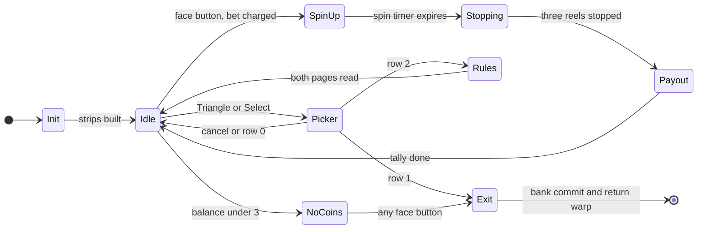
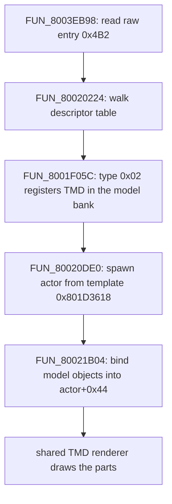

# Casino slot machine

The casino's slot machine is three reels of ten pictographic symbols. Every spin costs a flat 3 coins and plays all **five** paylines (three straight, two diagonal); a matched line pays a per-symbol amount, and a line of either jackpot symbol opens a bonus round on the same reels. The machine keeps its own coin balance, copied from the casino coin bank on entry and assigned back on exit.

It is a **3D scene**, not a sprite collage: the reels are textured cylinders, the paylines are 3D line segments, the cabinet is a mesh, and the medallions, lamps, pedestals and marquee are billboards, all projected through the GTE (the PlayStation's geometry coprocessor) and depth-sorted into the ordering table.

The code lives in a minigame overlay (a code module loaded into RAM for the visit). Shared locomotion, sprite and SDK helpers are documented elsewhere; this page covers the slot-specific logic, its data tables, its rendering and the Rust port.

## At a glance

| | |
|---|---|
| Overlay | extraction PROT 975 (dev module `other4`), slot-A base `0x801CE818`, so `file = VA - 0x801CE818` |
| Entry | mode-24 minigame door-warp, sub-id 3: field-VM op `0x3E` with `op0 = 103`, init entry `FUN_801CEC94` |
| Reel state machine | `FUN_801cf0d8`, dispatched on the state word `DAT_801d3c84` |
| RNG | the slot LCG `FUN_801d30cc` over `DAT_801d3c80`, plus the BIOS `rand` `func_0x80056798` |
| Feature roll / stop / landing | `FUN_801d258c` / `FUN_801d2114` / `FUN_801d2440` |
| Win evaluation | `FUN_801d13e8` over the display strip `DAT_801d3d50` and the payout bytes `DAT_801d3598` |
| Balance / coin bank | overlay-local `DAT_801d4114` / global `_DAT_800845A4` |
| Assets | PROT 1200 (five TIMs, cabinet TMD, ANM), PROT 1198 (VAB) and PROT 1199 (`efect.dat`) |
| Parsers | `legaia_asset::minigame_slot_scene`, `slot_payout`, `minigame_art`, `minigame_sfx` |
| Port | rules `legaia_engine_minigames::slot_machine`; draws `engine-ui::ui_slot_cabinet` / `ui_slot_paylines`; world wiring `World::tick_slot_machine` |

Provenance: the dumps are `ghidra/scripts/funcs/overlay_slot_machine_<addr>.txt`. Confidence is marked per claim. The reel layout, RNG, bet charge, feature odds, payout lookup, entry seed and coin commit are **Confirmed** from the disassembly. Table *values* (payout bytes, HUD descriptors) decode from the user's disc and are not reproduced here.

**Not the prize exchange.** Trading coins for items is a separate static table (`DAT_801e4518`, PROT 899 file `0x15D00`) that debits the coin bank. The randomizer edits it (`casino::CasinoExchange`) and the engine runs it: field-VM op `0x49` sub-op 7 at the koin1 / balden prize counters arms `PrizeExchangeSession` (`engine-minigames::prize_exchange`, re-exported by `engine-core`; windows 43/44/45/46, `engine-ui::ui_prize_exchange`). The slot machine pays *into* the coin balance; the exchange spends it.

## Entry from the field

The cabinet is reached by the **mode-24 minigame door-warp**: field-VM op `0x3E` with `op0 = 103` (`sub_id 3`), which sets game mode `0x18` and loads PROT 0975 (`FUN_80025980` → `FUN_8003EBE4(0x50)`, init entry `0x801CEC94`). The mechanism, its `sub_id` -> overlay table and the return warp are in [`script-vm.md` § 0x3E WARP](script-vm.md#0x3e-warp-mode-24-minigame-door-warp). The port's id decoder is `MinigameSubId` (`engine-field::minigame_entry`, re-exported as `legaia_engine_core::minigame_entry`).

The reel state machine `FUN_801CF0D8` and the payout `FUN_801D13E8` land on function prologues in PROT 975 at base `0x801CE818`, and the `"insert 3 coins"` / `"game_coin %d"` strings sit inside its runtime slice. Two sibling dev modules take sub-ids 1 / 2 (PROT 973 `OTHER2`, a 1-sector module; PROT 974 `OTHER3`); their identities are open. Mode 0 loads the debug-menu overlay PROT 971, not this one.

A disc-wide walk of every scene MAN finds five slot doors: three in the Sol casino (`koin1` P1[54], P1[55], P1[56]) and one in the Vidna casino, present in both that scene's bundle MAN and its streaming variant (`balden` / `balden2`, P1[24] in each). The three `koin1` cabinets are interchangeable doors to one machine: the `0x3E` operand byte after `op0` tracks the cabinet instance and the VM never reads it. Census test: `crates/engine-core/tests/minigame_entry_census_disc.rs`.

**The door gate is a coin-bank compare**, not an item check. The record's `0x4E` is sub-op `9`, whose value loader (`0x801E0B34`) reads the coin bank `_DAT_800845A4` and compares it `<` against the literal `1`. Taking the branch jumps past the warp to the record's refusal line. Falling through runs the casino-coin debit `0x4C 0xE5` (a sub-op only the two casino scenes' MANs use), a white fade, and then the `0x3E`.

A player with no coins never reaches mode 24. The *first* `0x1F` text segment in a cabinet record is that refusal line, so a record must be entered at its [interaction cursor](script-vm.md#the-interaction-cursor-one-record-two-consecutive-scripts).

**The debit is a fee, not a stake.** It is one coin at each Baka Fighter cabinet (`4C E5 FF FF FF`, koin1 P1[51..53], before `3E 68`) and nothing at each slot cabinet (`4C E5 00 00 00`, P1[54..56], before `3E 67`), because the machine charges its own bets from the balance it copies in. The arm (`FUN_801DE840`, `0x801E328C..0x801E32E4`) adds the signed 24-bit operand to the bank, caps it at `9999999` with no lower clamp, and sets system flag 8. The engine runs it through `engine-core::casino_coin_bank` (`World::add_script_coins`) on the field VM's host hook.

**`FUN_801cf0d8` has no `jal` caller.** It is the `+0x08` tick word of the static 24-byte actor template at `0x801D3618`. The init materialises that template and spawns an actor from it (`jal FUN_80020DE0` at `0x801CEEA8`), and the per-frame pool walk reaches it through `jalr actor[+0x0C]` in `FUN_8002519C`.

### Entry init - `FUN_801cec94`

The overlay's init entry (mode-24 warp target `0x801CEC94`) seeds the session before state `0` runs. **Confirmed** from the disassembly:

- the slot LCG `DAT_801d3c80` is written the literal seed `0x6C0A2AF0`;
- the playing balance is assigned from the coin bank: `DAT_801d4114 = _DAT_800845A4`, the counterpart of the state-`100` commit;
- when the battle-return flag `_DAT_8007B8B8` is zero (the overlay launched outside the casino door path) the balance defaults to `0x46` = 70 coins, a dev-launch fallback printed by the adjacent `"battle_return_flag %d"` / `"game_coin %d"` debug strings;
- the state word is cleared to `0`.

The same function loads the art pack and spawns the cabinet actor ([the cabinet mesh](#the-cabinet-is-a-mesh---prot-1200-descriptor-1)), sets the camera ([the camera](#the-camera)) and unpacks the marquee message bank.

## Reel state machine

The machine is one per-frame handler, `FUN_801cf0d8` (`overlay_slot_machine_801cf0d8.txt`), dispatched on `DAT_801d3c84` through a jump table (the overlay-resident table just below `0x801d2ac0`; the prologue bounds the index `< 0x65`).



| Diagram | `DAT_801d3c84` | Role |
|---|---|---|
| Init | `0` | reseed (`func_0x80056798`), build the reel strips, clone the symbol strip into the display strip, fade in, advance to `1` |
| Idle | `1` | attract; tests the submenu edge, then the coin gate, then the bet (order below) |
| SpinUp | `2` | adds the reel velocities `DAT_801d3cd0..` into the positions `DAT_801d3cc0..` each frame (mod `0x1400`) until the spin timer `DAT_801d3c90` expires; a face-button edge raises the [spin-up press latch](#the-spin-up-press-latch) |
| Stopping | `3` | each Stop press (pad bits `0x80` / `0x40` / `0x20` → reels 0 / 1 / 2) calls `FUN_801d2114`; at `DAT_801d3d2c == 3` it runs `FUN_801d13e8` and advances to `4` |
| Payout | `4` | ticks the win `DAT_801d3d38` into the balance `DAT_801d4114` ([timing](#sound)), then returns to `1` |
| Picker | `0x32` | the 3-row [cash-out submenu](#the-cash-out-submenu), cursor `DAT_801d4110` |
| Rules | `0x33`..`0x39` | the two rules pages behind the picker's third row |
| NoCoins | `0x5a` | not-enough-coins prompt; any face button (`& 0xf0`) leaves through `100` |
| Exit | `100` | fades out `0x10` a frame; at full black writes `_DAT_800845A4 = DAT_801d4114` and runs the return warp `FUN_80026018` |

State `1` reads the packed pad-edge word `_DAT_8007b874` in a fixed order:

1. Triangle or Select (`& 0x110`) routes to `0x32`, so the submenu opens even on an empty balance.
2. A balance under 3 routes to `0x5a`.
3. A face button (`& 0xe0`) charges the flat bet (3 coins, or 1 in feature modes 4..6), runs the [feature roll](#feature-roll---fun_801d258c) and advances to the spin-up.

**There is no bet-line selection.** Every spin plays all five paylines for the flat cost. `DAT_801d4110` is the cash-out submenu cursor and nothing else.

After the switch, the tail of `FUN_801cf0d8` runs every frame: it advances the three reel positions (`FUN_801d0554`), refills one display-strip row per reel, draws the reels (`FUN_801d0fa8`), and refreshes the marquee and HUD (`FUN_801cfff0`).

### Reel strips

Each of the 3 reels is a 20-slot (`0x14`) strip. The init builds **two** source strips per reel and a third the machine actually reads. Each array is `3 × 0x14` ints at `0x50` stride.

| Array | Contents | Probe step |
|---|---|---|
| `DAT_801d3e90` | the ten reel **symbols**, ids `0..=9` (`slot / 2`) | `+0xd` |
| `DAT_801d3fd0` | the ten bonus **numerals**, values `0x10..=0x19` (`slot / 2 + 0x10`) | `+1` |
| `DAT_801d3d50` | the **display strip**, the only one the win eval and the renderer read | (copied) |

State `0` fills both source strips in one interleaved pass. For each of the 20 slots it draws an RNG value, reduces it mod `0x14`, probes forward by the array's step until an unused position turns up, and places the slot's value there. Each value therefore lands on two scattered positions per reel. The symbol strip is then cloned into the display strip. **Confirmed** from `overlay_slot_machine_801cf0d8.txt` (the `% 0x14` / `(uVar1 + 0xd) % 0x14` placement loops and the `+ 0x10` on the second array).

The live reel position `DAT_801d3cc0[reel]` is a fixed-point angle. The on-screen symbol index is `(pos >> 8)` reduced mod `0x14`, and adjacent rows are read at `±1` / `±0x10` / `±0x11` offsets (the three pay rows).

<a id="the-display-strip-is-refilled-one-row-per-frame---and-that-is-the-bonus-swap"></a>

### Display-strip refill and the bonus swap

The state machine never rewrites a strip wholesale. Its render tail copies exactly **one row per reel per frame** into the display strip, from whichever source strip the feature mode names (**Confirmed**, the tail of `FUN_801cf0d8`):

```c
row = ((pos >> 8) + 0x19) % 0x14;                       // 9 rows AHEAD of the payline
display[reel][row] = (feature_mode == 6 ? bonus : symbols)[reel][row];
```

So a bonus round does not relabel symbols or swap a strip in one frame. The numerals **rotate into** the reels from off-screen as they turn, and rotate back out when the round ends. Three consequences:

- The refilled row is `0x19 - 0x10 = 9` rows ahead of the payline row `(pos >> 8) + 0x10`, so a row is converted well before it can be paid on.
- A reel has to travel about 9 rows before the conversion reaches the payline. State `1` therefore forces `DAT_801d3c90 = 0x18` (24 extra spin frames) when `DAT_801d3cac == 6` **or** when the "bonus just ended" flag `DAT_801d3798` is set. The long spin-up on both edges of the bonus round is load-bearing.
- During the rotation the strip is legitimately **mixed**, some rows symbols and some numerals. The renderer copes because it switches artwork per *row*, not per mode ([symbol art](#symbol-art)).

### The cash-out submenu

State `0x32` is a picker of three rows drawn over the running machine. Its input, read off the packed edge word (`0x801CF944..0x801CFA9C`):

| Edge | Bits | Effect | Cue (ring slot 0) |
|---|---|---|---|
| Up / Down | `0x1000` / `0x4000` | cursor `-1` / `+1` | `0x21` |
| Circle / L2 | `0x21` | back to state `1` | `0x37` |
| Cross / L1 | `0x44` | take the row | `0x20` |

Row `0` returns to play (state `1`), row `1` quits (state `100`), row `2` opens the rules (state `0x33`). Opening the picker stores the confirm cue `0x20` too (`0x801CF418`).

The cursor is reduced `% 3` by a `multu` with `0xAAAAAAAB`, an **unsigned** remainder. Up on row `0` (`0xFFFFFFFF % 3 = 0`) stays on row `0`, while Down on row `2` wraps to row `0`.

The cancel test runs before the confirm test, and the confirm arms add to whatever state the cancel just wrote. A frame pressing both on row `2` therefore lands in state `2`: a spin-up with no bet charged. The port does not reproduce that collision.

The picker draws three things each frame:

- the **row words**, one 80x48 4bpp image rather than text: `FUN_801D317C(0xEC, 0x62)` emits a `POLY_FT4` over framebuffer `(236, 98)..(404, 146)` sampling page `(832, 256)` at `uv (0, 160)` under CLUT `0x7B43`;
- the **cursor**, HUD widget 2 through `FUN_801D2CC0(0, 0xDC, row * 0x10 + 0x6C, 2, 0x80, 0x2000, 0x1000)`, its x scale doubled for the 640-wide mode;
- the **box**, `FUN_8002C69C(0xDC, 0x68, 0xD2, 0x27)` with the skin record `gp+0x14C` holds, which the `minigame_slot_machine` capture reads as `0x44` (the dialog skin). It is the two semi-transparent gouraud fill passes and the border tiles of the system-UI sheet the boot loads at `(896, 256)` (`PROT.DAT` `0x018E0`) and never unloads. The tiles are framebuffer sprites, so in the 640-wide mode they come out half as wide. The port uploads the sheet beside the art pack (`SlotCabinetAssets::with_system_ui`).

The rules row (states `0x33..0x39`) fades to black `0x10` a frame (`FUN_80024EE4(0, 2, level * 0x10101)`), switches the display to 320 wide (`FUN_8001DAF8(0x140)`) and shows two pages in a full-screen box:

| State | Page | Leaves on |
|---|---|---|
| `0x35` | the fourteen attract lines (`FUN_801D30F8(0x10, 0x10)`, pointer table `0x801D34B8`, `0xD` apart) and a footer string at `(0xE8, 0xCC)` | Cross / L1 once faded in, cue `0x21` |
| `0x36` | the payout chart: `FUN_801D2AA4(0)` and `(1)`, two columns of five rows, each three 32x32 reel faces in the order `0x801D3784` lists and that symbol's line payout in the 16x16 digits `FUN_801D32C8` draws (page `(832, 256)`, `uv (d * 16, 112)`, CLUT `0x7B42`) | Cross / L1, cue `0x37` |

`0x38` fades back to black on the chart and restores the 640 mode; `0x39` fades in on the machine before state `1`. State `0x37` is never entered (`0x36` adds 2). The rules text's button glyphs are `0xCE` escapes, drawn as sprites by the line renderer ([`dialog-font.md`](../formats/dialog-font.md#escape-table-0x80074050)).

The not-enough-coins prompt (`0x5a`) is one 256x48 `SPRT` at `(192, 100)` off page `(768, 0)`, `uv (0, 208)`, CLUT `0x7A8D`. It takes no other input: an empty machine can only leave.

Port: `SlotMachine::cash_out_input` (states, cursor arithmetic, cues, fades), `SlotMachine::screen` / `fade_level` (what a host draws), and `engine-ui::ui_slot_cabinet::slot_menu_prims` / `slot_rules_text_draws_for` (the draws). The rules text and chart order are read by `legaia_asset::minigame_slot_scene::parse_rules`.

## RNG

Two independent generators feed the machine. Both are **Confirmed**.

**The slot LCG**, `FUN_801d30cc` (`overlay_slot_machine_801d30cc.txt`), over the word `DAT_801d3c80`:

```text
x = x * 5 + 1
x = (x << 16) + (x >> 16)        // fold the 16-bit halves; x is the result
```

It drives reel-strip construction, reel-landing selection and the "feature stays on / turns off" rolls. It is a self-contained word, so reel outcomes are reproducible from the seed state. Port: `SlotRng`.

**The BIOS `rand`**, `func_0x80056798` (the A0(0x2F) sibling, the same source the tile-board filler uses). It drives the per-spin feature / bonus rolls in `FUN_801d258c` and the landing-line row `FUN_801d2440` reads: the parts that should not be replayable from the visible reel state alone. The port substitutes a second deterministic generator (`BiosRand`) so replays stay bit-identical.

### Feature roll - `FUN_801d258c`

`FUN_801d258c` (`overlay_slot_machine_801d258c.txt`) runs once at spin start, in this draw order:

```text
DAT_801d4134 = rand % 5                    // landing-line row
DAT_801d3cb8 = rand % 6 + 2                // normal-mode target symbol
widen        = DAT_801d3790 ? rand % 100 + 200 : 0
if DAT_801d3cac == 0:                      // no feature already active
    mode 1 if rand % (widen + N1) == 0     // bracketed on the net take
    mode 2 if rand % (widen + N2) == 0
    mode 3 if rand % (widen + 600) == 0
```

`N1` / `N2` are bracketed on the **net-take counter** `DAT_801d3d40`, not on the balance:

| `DAT_801d3d40` | mode-1 / mode-2 denominators |
|---|---|
| `< 1000` | `700` / `500` |
| `1001..=1999` | `0x15E` (350) / `0xFA` (250) |
| `> 2000` | `0xAF` (175) / `0x7D` (125) |

Exactly `1000` or `2000` falls in **no** bracket; only the mode-3 roll runs. A **high** net take gets the small denominators, so features become roughly 4x more likely once the machine has taken 2000+ net. The machine pays back what it has taken: the counter accrues `+6` / `+1` per spin and each bonus payout is *subtracted* ([coin economy](#coin-economy)). **Confirmed** arithmetic. Port: `feature_roll`.

### The spin-up press latch

`DAT_801d3790` is an **input** latch, not a machine setting. State `2` raises it on any face-button edge (`_DAT_8007b874 & 0xF0`) while the spin timer `DAT_801d3c90` is non-zero (`0x801CF6D4..0x801CF704`, `li v0,1` / `sw v0,0x3790(v1)` in the jump's delay slot). State `1` clears it as soon as the next spin's roll has read it (`sw zero,0x3790(v0)` at `0x801CF56C`, straight after `jal 0x801D258C`).

The roll **widens** every feature-entry denominator by `rand % 100 + 200`. Pressing buttons while the reels spin up makes the next spin's reach and hot modes rarer: the mode-1 odds in the lowest bracket go from `1/700` to `1/900..=1/999`. **Confirmed** (disassembly).

Port: `SlotMachine::latch_spin_up`, called by the per-frame kernel `SlotMachine::frame`, which every host runs (`World::tick_slot_machine` on the native window and the play page, `slot_step` on the standalone page). The port's tick leaves the spin-up one frame before retail's test runs on the expiring frame, so an edge on exactly that frame does not latch.

### Reel landing - `FUN_801d2114` / `FUN_801d2440`

When a reel is told to stop, `FUN_801d2114(reel)` (`overlay_slot_machine_801d2114.txt`) picks a target *symbol* and a search depth keyed on the **feature mode** `DAT_801d3cac` (**Confirmed** switch 0..6):

| `DAT_801d3cac` | Behaviour (search depth + biased target symbol) |
|---|---|
| `0` | normal: scan `rand%3 + 2` rows, target `DAT_801d3cb8` |
| `1` / `2` | "reach" / tease modes: scan `(rand&3)+6` rows, target symbol `9` / `8` (the two jackpot symbols) |
| `3` | hot mode: random target `rand%7 + 0x18`, landing offset `rand%7 + 10` |
| `4` | guaranteed-hit mode: drives the reel to a winning symbol, decrementing a guarantee counter `DAT_801d3c90` |
| `5` | hold variant: depth `0x14`, target `rand%10 + 8` |
| `6` | **the bonus round: depth `0`, target `-1`**, a free stop |

`FUN_801d2440(reel, depth, target_symbol)` (`overlay_slot_machine_801d2440.txt`) is the landing search. With `cur` = reel position `>> 8`:

```text
for R in cur + 1 ..= cur + depth:          // 0x801D2494..0x801D2528
    if strip[R] == target: return (R + 3 + word) % 20     // 0x801D24F4..0x801D2520
return cur + 1                             // no hit: the next natural row
```

The display reads `cur + 0x10`, so the walked rows are five to `4 + depth` rows past the row the payline shows.

**`word` picks the payline.** It is `table[DAT_801d4134 * 0x10 + reel * 4]` from the five-row table at `0x801D3630` (`0x801D2444..0x801D2464`), and `DAT_801d4134` is the per-spin `rand % 5` that `FUN_801d258c` seeds (`0x801D25A0..0x801D25D0`). The `* 0x10` is the table's row stride.

The stop lands the target at payline offset `-(19 + word) mod 20`: word `0` on the top row, `21` on the middle, `22` on the bottom. The five rows decode to the five paylines, three horizontal and then the two diagonals as `0 / 21 / 22` and `22 / 21 / 0`. A forced stop therefore lands on a randomly chosen line, and in the guaranteed-hit mode the three reels line the target up along it. **Confirmed** (disassembly).

Port: `land_row` with `minigame_slot_scene::LANDING_LINE_BY_JITTER`, pinned against the disc table.

**The bonus round steers nothing.** Mode 6 passes `depth = 0` with `target = -1`, the search is guarded by `0 < depth`, so it runs zero iterations and returns the next natural row. The three numbers a bonus round multiplies are the player's timing and nothing else. Mode 6 does not reuse the guaranteed-hit plan: it is the least steered of the seven cases.

## Payout / win evaluation

After all three reels stop, `FUN_801d13e8` (`overlay_slot_machine_801d13e8.txt`) evaluates the win. **Confirmed** structure.

### The five paylines

Each line reads one display-strip row per reel and pays when all three are equal. The absolute row reads are `+0x11 / +0x10 / +0x0F` from `(pos >> 8)`; the centre row is `+0x10`. Relative to it:

| line | reel 0 | reel 1 | reel 2 | on screen |
|---|---|---|---|---|
| 0 | `+1` | `+1` | `+1` | top row |
| 1 | `0` | `0` | `0` | middle row (the payline proper) |
| 2 | `-1` | `-1` | `-1` | bottom row |
| 3 | `-1` | `0` | `+1` | diagonal, bottom-left to top-right |
| 4 | `+1` | `0` | `-1` | diagonal, top-left to bottom-right |

```text
            reel 0    reel 1    reel 2
row +1       [0,4] --- [ 0 ] --- [0,3]      line 0  top
row  0       [ 1 ] --- [1,3,4] - [ 1 ]      line 1  middle
row -1       [2,3] --- [ 2 ] --- [2,4]      line 2  bottom

each cell lists the lines that read it
```

The evaluator keeps the **highest-value matching line**: `DAT_801d3d34` = winning symbol id, `DAT_801d3c8c` = winning line index. The line index doubles as the medallion / lamp index, and lines 3 / 4 terminate on the `y = ±336` medallions, where the two diagonal segments in the payline geometry table end.

### Payout table

| Result | Credit `DAT_801d3d38` | Side effect |
|---|---|---|
| three of symbol `0..=7` on a line | `DAT_801d3598[symbol]` (one byte per symbol id) | - |
| three of symbol `8` (blue "kick") | `DAT_801d3598[8]` | feature mode `6`, `DAT_801d3cb0 = 1` bonus round |
| three of symbol `9` (red "punch") | `DAT_801d3598[9]` | feature mode `6`, `DAT_801d3cb0 = 3` bonus rounds |
| any bonus-round spin | product of the three centre-row `(value - 0xf)` factors, `1..=1000` | subtracted from the net take `DAT_801d3d40` |
| no matching line | `0` | - |

Details:

- The payout byte scales with symbol rarity. The table is exactly **10 bytes** at `DAT_801d3598` (PROT 0975 file offset `0x4D80`), bounded by zero padding and an overlay string at `+0x10`. Its values are **Inferred** as disc data and not reproduced. Parser `legaia_asset::slot_payout`.
- A jackpot match also starts a celebratory actor (`func_0x800653c8`).
- During an active feature (`DAT_801d3d30 != 0`) the product is computed **unconditionally**: no all-equal check and no payout-table lookup. The rows read are `display[reel][((pos >> 8) + 0x10) % 0x14]`, the winning line is forced to the centre (`DAT_801d3c8c = 1`, so the middle lamp lights), and the round counter decrements. When it hits zero the feature ends and `DAT_801d3798` latches so the next spin runs long enough to rotate the symbols back on.
- In feature mode 3 a `rand % 0x96 == 0` roll can spontaneously clear the feature.

### The reach scanner - `FUN_801d1af4`

`FUN_801d1af4` (`overlay_slot_machine_801d1af4.txt`) is presentation only; it sets no payout. State 3 calls it only while exactly two stops are in (the `DAT_801d3d2c == 2` test at `0x801CF7EC`).

On each of the five paylines it tests the reel pairs `(0,1)`, `(1,2)`, `(0,2)`, each only when both reels have landed (the landed flags `DAT_801d3d10` / `14` / `18`, set by `FUN_801d0554` and ANDed per pair), for an equal pair of `9`s (punch) or `8`s (kick). A punch pair writes `DAT_801d3ca4 = 1`, else a kick pair writes `2`. The first sighting per spin also raises SFX cue `_DAT_8007b6dc = 0x200` behind the guard `DAT_801d3ca8`.

State 3 zeroes the latch every frame before the scanner runs. The store sits in the delay slot of the Stop-0 test at `0x801CF71C`, so it runs whatever the pad holds. State 2 clears latch and guard on entry (`0x801CF600` / `0x801CF608`). **Confirmed.** Port: `SlotMachine::anticipation_scan`; the sting and the reach-loop key ride `SlotMachine::tick` behind the same guard.

### The bonus game - the two jackpot symbols

The two jackpot symbols are the **blue "kick"** (id `8`) and the **red "punch"** (id `9`), told apart by their reel-art cell in PROT 1200: the average opaque hue of the `0x0C`-page cell is blue-dominant for symbol 8 and red-dominant for symbol 9. `FUN_801d13e8` pins the rounds each earns:

| line symbol | colour / art | bonus rounds |
|---|---|---|
| `8` | blue "kick" | 1 |
| `9` | red "punch" | 3 |

A bonus round runs as feature mode `6`:

1. The reels rotate onto the **numeral strip** (`DAT_801d3fd0`, values `0x10..=0x19`; see [display-strip refill](#display-strip-refill-and-the-bonus-swap)).
2. The player stops each reel with no help from the machine.
3. The round pays the **product of the three numbers on the centre payline**, `1` (`1×1×1`) to `1000` (`10×10×10`), credited into the balance and subtracted from the net-take counter.
4. `DAT_801d3cb0` counts the earned rounds down. At zero, feature mode returns to `0` and the normal game resumes.

Every bonus spin still costs 1 coin. The factor `value - 0xf` is the same number the reel *draws* and the marquee *tallies*: one byte read through one bias, so the three cannot disagree.

#### The claimed-column tally

The strip across the top of the machine reads `0 x 0 x 0` at the start of a round, fills in each column's number as that reel's stop is taken, then shows e.g. `48 coin` when the round pays. It is the **dot-matrix marquee** ([below](#the-marquee-is-a-dot-matrix-display---fun_801d0e1c)), recomposed every frame by `FUN_801cfff0`. Two globals carry it, both **Confirmed**:

- **The latch.** `FUN_801d0554` (the per-frame reel integrator) writes, on the frame a reel snaps to its landing row:

  ```c
  DAT_801d3d20[reel] = display[reel][((pos >> 8) + 0x10) % 0x14] + 1;   // payline value + 1
  ```

  State 1 clears all three with the bet charge. The `+ 1` makes "unclaimed" (`0`) distinguishable from a landed value of `0`.

- **The print.** `FUN_801cfff0`, in feature modes 4..=6 and reel states 3 / 4, blits one message per reel at dot columns `reel << 5` (`0`, `0x20`, `0x40`) with the multiplication glyph between them (`0x10`, `0x30`):

  ```c
  msg = (claimed > 0xf ? claimed - 0x10 : 0) + 6;   // the numeral, or the "0" glyph
  ```

A claimed column prints `claimed - 0x10` = `value - 0xf`. The tally is the result itself, read one frame earlier.

The same matrix has two other bonus faces, also from `FUN_801cfff0`:

- Between spins of a round (states 1 / 2) it shows the **rounds still owed** as three pips (message `0x12` filled / `0x13` hollow).
- Once a paying spin tallies it shows the **payout figure**: digits at fixed right-aligned columns `0 / 0xd / 0x1a / 0x27`, each drawn only once the figure reaches its place, then the word "coin" at column `0x34`, whose tail runs off the 78-column matrix. It slides down into place over 13 frames (`row = min(frame - 0xd, 0)`).

#### The message bank's roles

The payout caption prints digits with `FUN_801d3230(n / 1000 + 6)`, `(n % 1000) / 100 + 6`, `/ 10 + 6`, `% 10 + 6`, so records `6..=15` are the glyphs `"0".."9"`. Record **16** is a glyph of its own for **"10"**: the tally indexes `claimed - 0x10 + 6` over a claimed value of `0x10..=0x1A`, and a bonus reel can land on ten.

| id | glyph |
|---|---|
| `0`..`5` | the attract legend + the per-feature-mode legends (scrolled by `FUN_801d069c`) |
| `6`..`16` | the eleven numerals `"0"` .. `"10"` |
| `0x11` | the multiplication sign |
| `0x12` / `0x13` | the bonus-round pips, filled / hollow |
| `0x14` | the word `"coin"` |

Exports:

- Message ids and dot columns: `legaia_asset::minigame_slot_scene` (`MSG_NUMBER_BASE`, `MSG_TIMES`, `MSG_COINS`, `TALLY_NUMBER_COLS`, …).
- Symbol ids, round counts, the bonus value space and the `1..=1000` bounds: `legaia_asset::slot_payout` (`KICK_SYMBOL_ID` / `PUNCH_SYMBOL_ID`, `KICK_BONUS_ROUNDS` / `PUNCH_BONUS_ROUNDS`, `bonus_rounds_for`, `BONUS_VALUE_BASE`, `bonus_number_for_value`, `bonus_round_payout`).
- Numeral art: `legaia_asset::minigame_art::slot_bonus_number`.

Disc-checked by `slot_payout_real::kick_is_blue_punch_is_red_on_disc` and `the_bonus_reels_carry_ten_distinct_numerals_on_their_own_art_page` (ten distinct-coloured 64x64 cells; the grid goes blank past ten, so `1..=10` is bounded by the art as well as by the code).

## Coin economy

Two different words hold coins:

| Word | What it is |
|---|---|
| `DAT_801d4114` | the **overlay-local** playing balance; capped at `9999999` in the tally path, displayed capped at `99999` by the HUD |
| `_DAT_800845A4` (u32) | the global casino **coin bank** |

The machine touches the bank in exactly two places, both **Confirmed**:

- **Entry seed** (`FUN_801cec94`): `DAT_801d4114 = _DAT_800845A4`, with the 70-coin dev fallback when the battle-return flag is clear.
- **Cash-out commit** (state `100` of `FUN_801cf0d8`): `_DAT_800845A4 = DAT_801d4114` once the fade completes.

The bank round-trips by *assignment* on both ends; it is not debited or credited per spin.

**Per-spin betting** (**Confirmed**, state `1`). Every spin is a flat charge: `DAT_801d4114 -= 3` in the normal modes 0..3 (the overlay's "insert 3 coins" text), `-= 1` in the feature modes 4..6, so a bonus "free spin" costs 1 coin. The same branch accrues the net-take counter: `DAT_801d3d40 += 6` per normal spin, `+= 1` per feature spin. The `< 3` not-enough gate runs before the mode check, so even a 1-coin feature spin needs 3 banked. The per-reel masks `DAT_801d3d10/14/18` are match bookkeeping filled at stop time, not bet selections.

**The "Infinite Coins" cheat** (`0x800845A4 = 0x05F5E0FF`, see [`cheats.md`](../reference/cheats.md)) works at the casino but does **not** make individual spins free, because betting decrements the overlay-local balance. The cheat-database pointer noted "near `0x801d3cac`" lands in this overlay's state block: `DAT_801d3cac` is the feature mode, and the `0x801d3c80..0x801d4134` window holds the words in [RAM state](#ram-state). The address window is **Confirmed**; the specific cheat-pointer semantics are **Inferred**.

### The coin-exchange counter is a field-overlay screen

Coins are bought with gold at a counter, not inside the slot overlay. The counter is the field VM's op-`0x49` sub-op 6 (the koin1 / balden counters), which runs submode handler slot `0x25`, `FUN_801F0ADC`, in the **field overlay** (PROT 0897, base `0x801CE818`). The state machine (entry, Yes/No, commit of coins into `_DAT_800845A4` and gold out of `_DAT_8008459C`) is ported as `engine-vm::baka_hub_actors::coin_exchange`.

`FUN_801E6F70` is the counter's **entry panel**. It is not slot-machine code: the extent attribution (`scripts/ghidra-analysis/dump-extent-attribution.csv`) puts its bytes in PROT 0897 and nowhere else, and the `overlay_slot_machine_801e6f70.txt` dump is the same resident field-overlay code seen through a minigame capture. It is the painter word (`+0x18`) of record `10` of the field overlay's panel-window table at `0x801F2B98`, and the counter's idle descriptor `0x801F3340` (`[5, 0] [6, 10] [1, 10]`) opens that record.

From the image bytes, relative to the window actor's origin `(x, y)` (record 10's geometry, `(0x40, 0x26)`):

| Row | Pen | What it draws |
|---|---|---|
| `y + 2` | 7 | label `0x801CF0D4`, then the coin bank as an 8-cell number at `x + 0x78` |
| `y + 0x12` | 6 | label `0x801CF0E0`, then entry cells `5..=0` one digit each from `x + 0x88`, 8 px apart |
| `y + 0x1D` | - | system-UI cell `0x67` at `x + 0xB0 - 8 * cursor`, while `cursor < 10` and the play clock `_DAT_80084570 & 0xC` is non-zero |
| `y + 0x30` | 7 | label `0x801CF0F0`, then party gold, 8 cells at `x + 0x78` |
| `y + 0x40` | 7, then 5 or 9 | label `0x801CF0FC`, then the total cost, 8 cells at `x + 0x78` |

The entry value is the eight signed cells at `0x801F35F0` accumulated least-significant first (`0x801E6FB8..0x801E6FE4`). Only cells `0..=5` are drawn, so the two top cells count toward the total without showing.

The total is `entry * 100` (`0x801E7138`). It is drawn in pen 9 when party gold is below it or when the published ceiling `_DAT_8007BB90` is below the entry (`0x801E7148..0x801E7174`), else pen 5. That ceiling is not a counter stock: the state machine's head writes `min(gold / 100, 9999999 - bank)` there every frame. The epilogue restores pen 7. Port: `slot_machine::coin_entry_panel` (with `coin_entry_value` / `coin_exchange_quote`).

The Yes/No confirm opens record `11` (`FUN_801F1890`, the three-line panel) with the descriptor `0x801F3360`, whose program is `[1, 11]` alone.

The installer `FUN_801E9B3C` dispatches a descriptor entry's op through the table at `0x801CF25C`; op `5` is `FUN_80035A4C`, a walk of the live window list that starts the close of every window still opening or open. The confirm program has no op `5`, so the entry panel stays drawn **under** the Yes/No. When the player backs out, the state machine re-installs the idle program, whose leading op `5` closes the Yes/No and whose op `1` re-opens the entry panel. A painter's `a0` is the window's actor, which op `1` places at the record's geometry through `FUN_800357FC` (target x / y into the actor's `+0x0A` / `+0x0C`).

Both hosts draw the counter through one builder. `engine-core::field_submode_screen::coin_counter_lines` resolves the entry panel and the confirm's hub-painter draws to positioned, pen-tagged lines with the labels read off the user's disc, and `engine-ui::ui_text_lines::pen_line_draws_for` turns them into text draws on the native window and the play page. The window frames and the two system-UI sprites (the hand cursor, the caret cell) are text stand-ins. Disc-gated `casino_coin_counter_disc` pins the labels off PROT 0897.

## RAM state

All overlay-local; the block clusters in `0x801d3c80..0x801d4140`. **Confirmed** addresses (roles from the disassembly):

| Global | Role |
|---|---|
| `DAT_801d3c80` | slot LCG state (`FUN_801d30cc`; seeded `0x6C0A2AF0` by the init entry) |
| `DAT_801d3c84` | **state word** (reel state machine dispatch) |
| `DAT_801d3c88` | last message id `FUN_801d069c` drew (scroll reset) |
| `DAT_801d3c8c` | winning payline index (for the highlight) |
| `DAT_801d3c90` | spin timer / guaranteed-hit countdown (`0x18` on a bonus spin, and on the first spin after one) |
| `DAT_801d3c94` | payout-tally / prompt frame counter |
| `DAT_801d3c98` | screen-fade level (`0..=0xFF`) |
| `DAT_801d3c9c`/`DAT_801d3ca0` | animation tick counters (blink, marquee scroll) |
| `DAT_801d3ca4`/`DAT_801d3ca8` | bonus-anticipation latch + one-shot guard (`FUN_801d1af4`) |
| `DAT_801d3cac` | **feature mode** (0 normal … 6 bonus round) |
| `DAT_801d3cb0` | bonus-round counter |
| `DAT_801d3cb8` | normal-mode target symbol (`rand%6 + 2`) |
| `DAT_801d3cc0`/`+4`/`+8` | live reel positions (fixed-point, 3 reels) |
| `DAT_801d3cd0..` | reel velocities |
| `DAT_801d3ce0..`/`DAT_801d3cf0..` | per-reel landing offset + search depth |
| `DAT_801d3d00`/`+4`/`+8` | per-reel stop-still-open flags (set by the bet charge, cleared by that reel's Stop) |
| `DAT_801d3d10`/`14`/`18` | per-reel landed / line-match masks (filled at stop time; read by the reach scanner) |
| `DAT_801d3d20`/`+4`/`+8` | per-reel **claimed value**: `payline value + 1`, latched at the snap (`FUN_801d0554`), cleared at the bet charge |
| `DAT_801d3d2c` | reels-stopped count (0..3) |
| `DAT_801d3d30` | feature / bonus-round active flag |
| `DAT_801d3d34` | winning symbol id (`-1` = no win) |
| `DAT_801d3d38`/`DAT_801d3d3c` | this-spin payout (live + latched for display) |
| `DAT_801d3d40` | net-take counter: `+6`/`+1` per spin, minus bonus payouts; the feature-odds bracket input |
| `DAT_801d3d50..` (3 × 0x14) | **display strip**, refilled one row per reel per frame from the active source |
| `DAT_801d3e90..` | source strip: the ten reel **symbols** (`slot/2`, ids `0..=9`) |
| `DAT_801d3fd0..` | source strip: the ten bonus **numerals** (`slot/2 + 0x10`, values `0x10..=0x19`) |
| `DAT_801d37a0..` | the marquee's dot buffer (`col * 0x10 + row`), recomposed each frame by `FUN_801cfff0` |
| `DAT_801d3790` | spin-up press latch: widens (rarefies) the next spin's feature denominators |
| `DAT_801d3794` | flash / whiteout intensity |
| `DAT_801d3798` | "bonus just ended" flag: forces the next spin's long spin-up |
| `DAT_801d4110` | cash-out submenu cursor (`% 3`) |
| `DAT_801d4114` | **player credit balance** (seeded from `_DAT_800845A4` at entry, committed back on exit) |
| `DAT_801d4134` | per-spin landing-line row (`rand%5`), an index into the table at `0x801D3630` |
| `_DAT_800845A4` | global casino **coin bank** (written on cash-out; read by the HUD) |
| `_DAT_8008459C` | party **gold** (read by the field overlay's coin counter, not by this overlay) |

Overlay rodata tables (**values** decode from the disc):

| Table | File offset | Role |
|---|---|---|
| `DAT_801d347c` (0x14 stride, 3 records) | `0x4C64` | [HUD widget descriptors](#the-screen-space-draws---fun_801d2cc0) for `FUN_801d2cc0`; not per-symbol reel art |
| `0x801D34B8` (14 x u32) | - | attract / rules text line pointers into the string block at the overlay head |
| `DAT_801d34f0` (21 x 8B) | `0x4CD8` | marquee message bank |
| `DAT_801d3598` (10 x u8) | `0x4D80` | per-symbol line payout, read by `FUN_801d13e8` and the chart `FUN_801d2aa4` |
| `0x801D3630` (5 rows x 4 u32) | - | landing-line table |
| `DAT_801d3680` (5 x 16B) | `0x4E68` | payline segments |
| `DAT_801d36d0` (5 x 8B) | `0x4EB8` | medallions |
| `DAT_801d36f8` (5 x 8B) | `0x4EE0` | lamps |
| `DAT_801d3720` (3 x 16B) | `0x4F08` | marquee panel + mascots |
| `DAT_801d3784` | - | payout-chart symbol order |

## Key functions

Each has a dump `overlay_slot_machine_<addr>.txt` unless marked SCUS.

| Address | Role |
|---|---|
| `FUN_801cec94` | overlay init entry: LCG seed, balance from the coin bank (70-coin dev fallback), asset load, cabinet actor spawn |
| `FUN_801cf0d8` | per-frame reel state machine |
| `FUN_801cfff0` | per-frame HUD / balance + **marquee composer**: coin readout, bonus tally, round pips, payout caption |
| `FUN_801d0554` | per-frame **reel integrator**: advances each reel `+0x66`, snaps a stopping reel to its landing row, latches `DAT_801d3d20[reel]` |
| `FUN_801d30cc` | slot LCG (`x*5+1`, 16-bit fold) |
| `FUN_801d258c` | per-spin feature roll (BIOS `rand`, net-take-bracketed odds) |
| `FUN_801d2114` | per-reel stop: target symbol + depth by feature mode |
| `FUN_801d2440` | landing search: find the target within depth and land it on the spin's payline, else next row |
| `FUN_801d13e8` | win evaluation + payout lookup + bonus trigger |
| `FUN_801d1af4` | bonus-symbol reach scanner (presentation only) |
| `FUN_801d0fa8` | **reel cylinder** renderer |
| `FUN_801d08e4` | the **billboard pass**: medallions, lamps, pedestals, marquee panel + mascots |
| `FUN_801d3380` | the **5 paylines** as `RTPS`-projected line segments |
| `FUN_801d0e1c` | the **dot-matrix marquee**: 78x13 projected 2x2 sprites |
| `FUN_801d069c` | marquee scrolling blit (`msg < 0` clears) |
| `FUN_801d3230` | marquee blit at a `(col, row)` |
| `FUN_801d2cc0` | HUD widget rasteriser over `DAT_801d347c` |
| `FUN_801d2914` | coin-readout digit renderer (screen space) |
| `FUN_801d2aa4` | payout chart: per row the symbol icons (order table `DAT_801d3784`, page selected by the arg) + the `DAT_801d3598` payout split into tens / units via `FUN_801d32c8` |
| `FUN_801d32c8` | single-digit glyph: one gouraud `POLY_GT4` for `(x, y, digit)`, texpage `0x1D`, CLUT `0x7B42`, `U = digit * 0x10`, 16x16, semi-transparent (GP0 word `0x2c808080`, shade `0x70` / `0x80`), into the prim buffer `_DAT_1f8003a0` (advanced `0x28`), linked via `func_0x8003d2c4`. **Confirmed** from the prim writes |
| `FUN_801d079c` | bonus-rounds-remaining lamps: three 16x16 HUD sprites (`x = 0x230` step `0x10`, tpage `0x84`, CLUT `0x7A8D`) into `_DAT_1f8003a0`; the first `DAT_801d3cb0` draw at the bright / dim shade `DAT_801d3c9c & 1` selects, the rest neutral, then a trailing quad linked via `func_0x80059010` |
| `FUN_801d30f8` | attract-text column: sets text attribute `DAT_80073f20 = 0xc`, walks the 14-entry pointer table `0x801d34b8` drawing each string via `func_0x80036888` at `(param1, param2)`, y `+0xd` per line |
| `FUN_801d317c` | UI panel quad: one 168x48 `POLY_FT4` (tag `0x9000000`, colour `0x2c808080`, CLUT word `0x7b43`) at the caller's `(param1, param2)` into `_DAT_1f8003a0`, linked via `func_0x8003d2c4` |
| `FUN_801d13c4` | effectively empty: a 3-iteration counter loop with no writes and no calls (loads the address of `DAT_801d3cc0`, never uses it) |
| `FUN_800172c0` | SCUS: the per-frame **scene camera** |
| `FUN_800195a8` | SCUS: the **billboard projector** |
| `FUN_8005bac8` / `FUN_8003d368` | SCUS GTE wrappers: `RotTransPers4` / `RTPS` |
| `FUN_801e6f70` | **not this overlay's**: the field overlay's coin-counter entry panel (PROT 0897), see [the coin-exchange counter](#the-coin-exchange-counter-is-a-field-overlay-screen) |

## Engine port

[`legaia_engine_minigames::slot_machine`](../../crates/engine-minigames/src/slot_machine.rs) is the from-scratch rules engine over this page, re-exported as `legaia_engine_core::slot_machine`. It runs on all three hosts: the native `play-window`, the browser play page and the standalone minigames page.

| Retail | Port |
|---|---|
| `FUN_801d30cc` | `SlotRng` |
| `FUN_801cf0d8` state 0 strip build | `build_reel`: both strips per reel in retail's interleaved draw order (mod-`0x14` draw, `+0xd` / `+1` probe, values `slot/2` and `slot/2 + 0x10`) |
| render-tail display refill | `SlotMachine::tick`, `DISPLAY_REFRESH_LEAD` = 9, `BONUS_SPIN_UP_FRAMES` = `0x18` |
| `FUN_801d258c` | `feature_roll` (exact draw order + bracket edges) |
| state-1 bet charge | flat charge + net-take accrual (3 / +6 normal, 1 / +1 feature) in `SlotMachine::spin` |
| `FUN_801d2114` / `FUN_801d2440` | `stop_plan` / `land_row`, including mode 6's free stop |
| `FUN_801d0554` + `FUN_801cfff0` | the claimed latch and tally: `SlotMachine::claimed` / `tally` / `tally_product` |
| `FUN_801cfff0` + `FUN_801d3230` + `FUN_801d069c` | `SlotMachine::marquee` / `marquee_placements` over `minigame_slot_scene`'s `compose_marquee_frame` / `place_message` / `clear_dots` / `render_marquee` |
| `FUN_801d13e8` | `SlotMachine::evaluate_spin`: five paylines, payout, bonus product, centre winning line, product subtracted from the net take |
| `FUN_801cec94` constants | `ENTRY_DEFAULT_BALANCE` = 70, `ENTRY_LCG_SEED` = `0x6C0A2AF0` |
| coin economy | balance seeded from the bank, `9999999` tally cap, cash-out **assignment** back into the bank |
| cash-out submenu, prompt, leave fade | `SlotMachine::cash_out_input`, `screen`, `fade_level` |

**Where the port differs from retail** (each marked at its site in the source):

- The spin-up pacing constants (`SPIN_UP_FRAMES`, `SPIN_VELOCITY`) are engine-chosen; the retail magnitudes are not pinned.
- The BIOS-`rand` stream is a deterministic LCG (`BiosRand`), so replays stay bit-identical.
- Feature modes 3 (hot) and 5 (hold) fall back to the normal landing plan; their bonus-strip value targeting is not modelled.
- A host press collects the rest of a payout tally at once (`SlotMachine::collect`).
- The submenu's cancel + confirm collision and the last-frame spin-up latch are not reproduced (see their sections).

**Runtime wiring.** The machine is a suspending scene mode: `SceneMode::SlotMachine`, with `World::enter_slot_machine` / `tick_slot_machine` / `exit_slot_machine`. The exit performs the state-100 bank commit into `World::minigames.casino_coins` (= `_DAT_800845A4`). `tick_slot_machine` hands the machine the packed edge word first (`SlotMachine::cash_out_input`), so Triangle / Select open the cash-out submenu on both play hosts, and a quit or an empty machine's leave runs the bank commit and the return warp when the fade completes.

**Reaching it.** A walked cabinet door runs the record's script through the field VM on both hosts, including the coin-bank compare that refuses an empty bank. For testing:

- `play-window`'s `O` key arms the mode-24 door warp with sub-id 3 (`World::request_minigame_warp`, the call the browser page's `play_mg_debug_warp` makes), so the session is the one a cabinet installs, with its balance assigned from the coin bank. This launcher is the `0x3E` arm alone, without the door gate; a bank below three coins meets the machine's own state-1 gate.
- Coins: `play-window --cheat-coins N` (with `--key-script 60:O` to warp in and `--pad-script` for the presses), or the play page's Cheats panel (`cheat_set_coins`). The standalone minigames page racks its own 60.
- Controls: Cross spins and collects; the three stops are Square / Cross / Circle for reels 0 / 1 / 2, the pad bits `0x80` / `0x40` / `0x20` retail's state-3 arms test, which is also the glyph each reel's pedestal carries.

Disc-gated `slot_minigame_real` drives real-table spins through the World pad path.

## Rendering - a 3D scene

Every element on the machine's face is a quad in a 3D scene, projected through the GTE and depth-sorted into the ordering table. The slot overlay contains **no `cop2` instruction of its own**; it reaches the GTE entirely through SCUS wrappers, so a sweep for GTE ops inside the overlay wrongly reports the machine as 2D.

| SCUS | GTE op | Role |
|---|---|---|
| `FUN_8003d368` | `cop2 0x180001` = **RTPS** | project one vertex (`VXY0`/`VZ0` in, `SXY2` out) |
| `FUN_8005bac8` | `RTPT` + `RTPS` | project a 4-vertex quad (`RotTransPers4`) |
| `FUN_800195a8` | via `8003d344` (`MVMVA`) + `8005bac8` | the **billboard projector**: transform a 3D centre into view space, build four corners around it at a view-space half-extent, project |
| `FUN_800172c0` | matrix compose + `SetRotMatrix` / `SetTransMatrix` | the per-frame scene camera |

What draws what:

| Element | Emitter | Kind |
|---|---|---|
| cabinet body | shared actor / TMD renderer | untextured mesh (PROT 1200 descriptor 1) |
| reels | `FUN_801d0fa8` | 8 `POLY_GT4` cylinder faces per reel |
| paylines | `FUN_801d3380` | 5 `LINE_F2` |
| medallions, lamps, pedestals, marquee panel, mascots | `FUN_801d08e4` | billboards |
| marquee dots | `FUN_801d0e1c` | 1014 projected 2x2 sprites |
| paytable board, "COIN" label, cursor, coin digits | `FUN_801d2cc0`, `FUN_801d2914` | screen space |

### The camera

`FUN_800172c0` runs every frame before the machine's 3D emits. The init clears the camera rotation `_DAT_8007b790` to zero and writes the scale matrix `_DAT_8007bf10` as `diag(0x6000, 0x3000, 0x3000)` = `diag(6, 3, 3)` in 4.12 fixed point. Identity rotation makes the machine face the camera head-on. The 2:1 x:y scale is the **640-wide hi-res video mode's** pixel aspect (the init sets mode `0x280` = 640, so horizontal pixels are half-width). The projection distance `_DAT_8007b6f4` is set to `0x400`.

**`-z` is toward the viewer.** The *glass* (paylines, medallions, lamps, pedestals, marquee) sits at `z = -768` / `-800`. The reel cylinders are centred on `z = 0` with the payline symbol at `z = -512`, i.e. **behind** the glass.

### The projection

The screen mapping on the retail 640x240 framebuffer is the GTE's own, read out of the `minigame_slot_machine` mednafen state, whose `GTE` section carries the COP2 register file. While the machine draws, the rotation matrix is `diag(0x6000, 0x3000, 0x3000)`, the translation `TR = (-1440, 20, 24480)`, `OFX = 320`, `OFY = 114` and `H = 1024`:

```text
view   = (6x - 1440, 3y + 20, 3z + 24480)
screen = (320 + 1024 * vx / vz, 114 + 1024 * vy / vz)
```

Every path reduces to it. The reel renderer and the cabinet's actor renderer project under the camera matrix. The billboard projector `FUN_800195a8` transforms the centre with `MVMVA` (`FUN_8003D344`), loads an identity matrix with a zero translation (`FUN_8003D178`), and projects the view-space corners, so a billboard's half-extent is `H * half / vz` on both axes.

Port: `legaia_asset::minigame_slot_scene::project` / `billboard_half` (`GTE_*`). The exporters (`asset slot-art`'s manifest, the VRChat kit) carry the same form rearranged around its vanishing point: `k = z0 / (z0 + z)` with `z0 = TRz / Sz = 8160`, scaling about model `(-TRx / Sx, -TRy / Sy) = (240, -20/3)` rather than the model origin (`PROJ_Z0` / `PROJ_SX0` / `PROJ_VANISH`).

Not the lamp-fitted projection (`OFX 253`, `OFY 118.5`, `z0 9324`, `sx0 0.2547`): it matches x to a pixel on the glass plane but sits `3.6` rows low and diverges away from that plane. Nothing emits those constants.

### The reels are cylinders - `FUN_801d0fa8`

Each reel emits 8 `POLY_GT4` faces per frame. A face spanning reel angles `a` and `a + 0x100` has corners

```
(x,            y(a),     z(a)   )   (x + 0x100,  y(a),     z(a)   )
(x,            y(a+100), z(a+100))   (x + 0x100,  y(a+100), z(a+100))
```

with `y(a) = (sin(a) * -0x249) >> 12` and `z(a) = cos(a) >> 3`. The reel is an ellipse of radius 585 in `y` and 512 in `z`: **a cylinder**, whose four corners go through `RotTransPers4`. The symbols curl away from the payline because the cylinder does.

The trig comes from the SCUS sine / cosine tables: 4096-entry, amplitude `0x1000`, reached through the pointers `_DAT_8007b81c` / `_DAT_8007b7f8`. The tables live at SCUS `0x80070A2C` / `0x8007122C`, `0x800` bytes apart, so the "cosine table" is the sine one a quarter turn ahead.

`FUN_801d0fa8` reads both pointers **inline**; it does not go through the shared polar helper `FUN_801d7bb8` the fishing overlay uses on the same tables. The entries are `trunc(0x1000 * sin)`, truncating toward zero, which matters because the cylinder multiplies each entry by a radius before shifting it back down (see [the polar helper](minigame-fishing.md#the-shared-polar-offset-helper-fun_801d7bb8)).

Reel `r` spans `x = -0x200 + r * 0x180` to `+ 0x100` (`FUN_801cf0d8`'s render tail). The first face's angle is `0x380 + (pos & 0xFF)`: the low byte of the reel position is the **sub-symbol fraction**, which rotates the cylinder between symbols.

The gouraud shade is depth-cued off `z`:

```
shade = clamp(0xB4 - ((z + 0x200) * 0x21C >> 9), 0, 0xB4)
```

The `POLY_GT4` blend is `texel * shade / 128`, so the shade peaks (a 1.41x **brighten**) exactly at `z = -0x200 = -512`, the payline face, and falls to black within about 48 degrees either side. That fade caps each reel window top and bottom and hides the near half of the cylinder. There is no backface cull.

**The payline face is the fifth emitted, not the first.** It carries the strip row the win eval pays on (`strip[(pos >> 8) % 0x14]`). With the first face at angle `0x380` and a `0x100` step, the face at the shade peak is `z(0x380 + 4*0x100 + 0x80) = -512`, and the faces above / below it carry the rows either side as the strip walks downward with the angle. A renderer that indexes the strip straight off the face index draws a payline whose three symbols are not the three that paid.

<a id="symbol-art---computed-not-tabled"></a>

### Symbol art

`FUN_801d0fa8` draws the reel quads with **arithmetic UVs from the strip value itself**; no descriptor table is involved (**Confirmed**, `overlay_slot_machine_801d0fa8.txt`). The value's `>= 0x10` test is the whole symbol / numeral switch, applied **per row**:

```c
tpage = 0x0C + (v >= 0x10);                       // 0x0D = the (832, 0) page
clut  = (v >= 0x10 ? 0x7AC0 : 0x7A80) + (v & 0xF);
U, V  = (v & 3) * 0x40, (v & 0xC) * 0x10;         // a 4x4 grid of 64x64 cells
```

- The ten **symbols** live on art page 0 with a per-symbol CLUT at `0x7A80 + sym` (row 490, column = symbol). The palette is load-bearing: symbol ids 0 / 1 / 2 are *one* cell of artwork recoloured three ways, as are 4 / 5. A renderer that ignores the CLUT draws three identical reels.
- The ten **bonus numerals** `1..=10` live on art page 1 with CLUT `0x7AC0 + (v & 0xF)` (row 491, one column per numeral), so every numeral on the bonus reels is a different colour and one strip can carry both kinds mid-rotation. The 4x4 grid goes blank past the tenth cell. The bonus reels are not the coin font scaled up.

Decoders: [`legaia_asset::minigame_art::slot_symbol` / `slot_bonus_number`](../../crates/asset/src/minigame_art.rs).

### The paylines are 3D lines - `FUN_801d3380`

Five `LINE_F2` prims, each of whose two endpoints is `RTPS`-projected on its own. The geometry is the 5 x 16-byte table `DAT_801d3680` (`[SVECTOR a, SVECTOR b]`), all at `z = -768`, `x` from `-640` to `+640`: three horizontal at `y = -192 / 0 / +192` and two diagonals crossing at `y = ±320`.

The packet is GP0 code `0x43`: flat, **semi-transparent**. The idle colour is a neutral `0x808080`. The winning line is redrawn by overwriting only the three colour bytes of the already-assembled command word with `(0xFF, 0xFF, 0x80)`, so the `0x43` code byte survives and a lit line is still semi-transparent. The highlight test is a plain equality against `DAT_801d3c8c`, so a frame where that word still holds `0` lights line `0`; only a value outside `0..5` leaves the whole rack dark.

Retail links the packet at the OT bucket derived from the **second** endpoint's returned depth alone: `(depth >> 2) >> ctx[+0x90]`, with a `+3` bias first when the depth is negative so the shift truncates toward zero.

Port: `slot_machine::payline_prims` + `payline_ot_depth`, with the geometry from the parsed table (`legaia_asset::minigame_slot_scene::SlotScene::paylines`). The projection runs once for every host, in `slot_machine::projected_paylines`, through `minigame_slot_scene::project`.

- Both browser pages stroke the projected segments in the prim's colour, half-blended for the `0x43` code (`sa` / `sb` in `slot_payline_prims_json` / `play_mg_slot_payline_prims_json`).
- The native window stages the geometry on the machine (`SlotMachine::with_paylines`) and draws the segments as one-pixel flat quads through `engine-ui::ui_slot_paylines`, as the play page does whenever it draws the machine through the shared builder ([who draws the machine](#who-draws-the-machine)).
- OT linkage stays caller-side: all three hosts draw the lines over the reels.

### The furniture is billboards - `FUN_801d08e4`

Four passes, each through `FUN_800195a8`. All the geometry is disc data, in four tables that **tile contiguously** from file offset `0x4E68` to `0x4F38` (PROT 0975; load base `0x801C_E818`, so `file = VA - 0x801C_E818`):

| Table | VA | File | Records | Draws |
|---|---|---|---|---|
| paylines | `DAT_801d3680` | `0x4E68` | 5 x 16B | the 5 line segments (above) |
| medallions | `DAT_801d36d0` | `0x4EB8` | 5 x 8B | the payline medallions down the **left** |
| lamps | `DAT_801d36f8` | `0x4EE0` | 5 x 8B | the payline lamps down the **right** |
| marquee | `DAT_801d3720` | `0x4F08` | 3 x 16B | the marquee panel + the two mascots |

- **Medallions** (`SVECTOR pos`, whose `pad` word is the CLUT column): page `0x0C`, cell `uv (0xA8, 0x80)` 32x32, CLUT `0x7A80 + art`, view-space half `0x1A0 x 0xD0`. One cell of artwork recoloured five ways; the column is symmetric (`2, 1, 0, 1, 2` top to bottom), and each medallion's `y` is its payline's `y`.
- **Lamps**: page `0x1C`, CLUT `0x7B09`, half `0xB4 x 0xA0`; unlit cell `uv (0x10, 0xE0)` 16x16, lit cell `uv (0, 0xE0)`. The winning line's lamp lights.
- **Reel-stop pedestals** (positions computed, not tabled: `x = -0x180 + r * 0x180`, `y = 0x1E0`, `z = -800`): page `0x1C`, half `0x230 x 0x120`, 32x32 cell on row `v = 0x80 + r * 0x20`. The branch reads `DAT_801d3d00[r]`, the reel's **stop-still-open** flag: the bet charge sets all three (`0x801CF4DC..0x801CF4E4`), the reel's Stop press clears it (`FUN_801d2114`), and the state-3 Stop tests accept a press only while it is set (`0x801CF724`). While open the pedestal draws `u = 0` with CLUT `0x7B06 + r`, the "press now" button; otherwise (before a spin, and once that stop is taken) `u = 0x60` with CLUT `0x7B03 + r`. The branch overrides only the `U`s, so the pedestal stays on its own row.
- **Marquee panel + mascots**: page `0x1C`, CLUT `0x7B00 + clut_off`; each record carries its own view-space half-extent and texture cell. The panel's interior is palette index 0, **transparent**: the navy behind the legend is the cabinet's, not the panel's.

The medallion and marquee passes OR the three stop-open flags (`0x801D0A58..0x801D0A68`) and brighten to `0xA0` while any stop is open.

### The marquee is a dot-matrix display - `FUN_801d0e1c`

A **78 x 13 grid of individually projected 2x2 sprites**, 1014 of them, one `RTPS` each, at `(-0x1AD + col * 0xB, -0x280 + row * 0xC, -800)`. Each dot samples page 3 at `(u, 0)` where `u` is its byte in the dot buffer `DAT_801d37a0` (`buf[col * 0x10 + row]`). The buffer holds `nibble << 2`, so a nibble `n` picks the lamp swatch at page-3 `u = n * 4`. Nibble `0` is an unlit dot.

The dots' CLUT is `0x7B4F` (row 493, **column 15**), and that column is **empty on the disc**. The reel SM `MoveImage`s a 16x1 palette from `((tick & 1) * 16, 493)` into it every frame: the marquee **blinks** between page 3's CLUT columns 0 and 1. Decoding column 15 straight off the disc yields a fully transparent marquee.

The buffer's content is a **message bank**: 21 records at `DAT_801d34f0` (file `0x4CD8`, 8-byte stride `[u8 u, u8 v, u8 w, u8 h, u32 runtime_ptr]`), every one 13 rows tall, laid out on page 3 at `v = 16..144`. `FUN_801CEC94` `StoreImage`s each rect back out of VRAM and expands its nibbles into a byte-per-texel bitmap. Record roles are in [the message bank's roles](#the-message-banks-roles).

<a id="the-dot-matrix-has-two-blits-not-one"></a>

### Marquee composition - `FUN_801cfff0`

Two blits compose messages into the dot buffer, and they clip opposite ends of the copy:

| | `FUN_801d069c` | `FUN_801d3230` |
|---|---|---|
| Offsets | the **source** `(x, y)` | the **destination** `(col, row)` |
| Clips | source coords, signed | dest coords, **unsigned** |
| Used for | scrolling one message through a fixed window | placing a message at a spot |

The unsigned clip lets one `sltiu` cover both bounds: a negative offset fails the compare as a huge unsigned value. The payout caption depends on it. It is composed at `row = min(frame - 0xD, 0)`, starting 13 rows above the matrix and counting up to 0, and the unsigned clip is the only thing hiding the rows that have not arrived. A port that bounds with a bare `row < DOT_ROWS` shows the caption fully formed on its first frame.

A negative `msg` id is `FUN_801d069c`'s **clear** command: the `bgez $a0` at its head skips the scroll body into a `78 x 13` zero-fill of `DAT_801d37a0`. `FUN_801cfff0` opens every frame with that call, so the marquee is rebuilt from scratch each frame.

`FUN_801cfff0` then picks the frame's one occupant, in priority order:

1. **The payout caption**, whenever both the figure `DAT_801d3d3c` and the frame clock `DAT_801d3c94` are non-zero. Its leading-zero suppression tests the **whole figure** at each of its four places: all four guards re-read `DAT_801d3d3c`, while the digit values come off a remainder chain that runs whether or not its own place drew. So `405` prints `4`, `0`, `5`, and `7` prints a bare `7` in the units column.
2. **The bonus tally / round pips**, only in feature modes `4..=6` and reel states `1..=4` ([the tally](#the-claimed-column-tally)).
3. **The attract legend** (the tail, `0x801D038C..0x801D0538`), outside feature modes `4..=6` only:
   - a raised anticipation latch `DAT_801d3ca4` (`1` / `2`) scrolls message `4` / `5` at source column `counter % 200 - 100`;
   - otherwise the feature mode indexes a 7-entry jump table at `0x801CEC58`: mode `0` places message `0` still at column `0`, modes `1..=3` scroll message `1..=3` at `counter % 168 - 84`, and the other entries draw nothing.

`counter` is `DAT_801d3ca0`, which the reel renderer's tail advances once a frame (`0x801CFF00..0x801CFF24`, beside the `DAT_801d3c9c` blink counter). `FUN_801d069c` resets it to `100`, and scrolls from column `0` that call, on the frame the message id differs from the last one it drew (`DAT_801d3c88`).

Port: `minigame_slot_scene::attract_legend` plus the reset in `engine-ui::ui_slot_cabinet::SlotMarqueeClock`, with the latch from `SlotMachine::anticipation`.

<a id="the-two-screen-space-draws---fun_801d2cc0"></a>

### The screen-space draws - `FUN_801d2cc0`

These are the only things on the machine that do not go through the GTE. `FUN_801d2cc0` is the **HUD widget rasteriser**: it draws a `POLY_GT4` at a caller-supplied pixel position from the 20-byte-stride descriptor table `DAT_801d347c` (PROT 0975 file offset `0x4C64`), indexed by the *low 10 bits* of its id argument; the id's high bits override the semi-transparency mode. Record layout, **Confirmed** from the field-by-field prim writes:

| Offset | Field |
|---|---|
| `+0x00` | `i32` base-size scale, 20.12 fixed point (multiplies the w/h bytes, then the caller's per-axis scale args) |
| `+0x04` | `u16` texpage attribute (written to the prim tpage slot `+0x1A`, ORed with `semi_mode << 5`) |
| `+0x06` | `u16` CLUT id (prim `+0x0E`; overridden with `0x7D0F` when the id's high field is `2`) |
| `+0x08` | `u8 u, v` texture origin |
| `+0x0A` | `u8 w, h` cell size |
| `+0x0C` | `u8 r, g, b` primary shade (scaled by the caller's brightness arg) |
| `+0x0F` | `u8` semi-transparency enable (into the GP0 command byte) |
| `+0x10` | `u8 r2, g2, b2` far-edge shade |
| `+0x13` | `u8` semi-transparency mode (0..3, into tpage bits 5-6) |

The table has exactly **3 records**:

| Rec | Drawn at | Cell | Role |
|---|---|---|---|
| 0 | screen `(560, 128)` | page `(640, 0)`, CLUT row 494, `uv (0, 16)`, 127x239 | the **paytable board** on the right ("x30 back" / "x9 back" / "Bonus games", with the coin box under it) |
| 1 | screen `(560, 160)` | page `(768, 0)`, CLUT `0x7A8D`, `uv (0, 192)`, 64x16 | the **"COIN"** label (the cell immediately left of digit `0` on the `0x0C` page) |
| 2 | screen `(0xDC, cursor * 0x10 + 0x6C)` | page `(832, 256)`, `uv (96, 160)`, 16x16 | the cash-out cursor (state `0x32`, `DAT_801d4110`) |

Record 0's page is sampled **8bpp**: its texpage attribute `0x8A` has the GPU's 8-bit colour bit set, so the 64-halfword-wide block is 128 texels across and its CLUT is one 256-entry palette. The TIM header declares 4bpp; decoding it as the header claims yields noise.

The coin digits are `FUN_801d2914` at screen `(546, 168)`: `U = 0x40 + digit * 0x10`, `V = 0xC0`, 16x16, CLUT `0x7A8D`, zero-padded to 5. That font is the coin readout's alone.

Immediately after the third record (`0x801D34B8`) the region is a **14-entry pointer table**: the attract / rules text lines, pointing at the string block at the head of the overlay ("To spin the wheels, insert 3 coins by pressing the ... buttons").

### The cabinet is a mesh - PROT 1200 descriptor 1

The machine's **body** (the grey shell, the dark-red face the reels sit in, the navy marquee backing and the floor ramp) is an ordinary **Legaia TMD** shipped as descriptor 1 of the machine's asset entry, installed into the shared model bank and drawn by the shared TMD renderer like any other actor. No slot function emits it and it is on no texture page: `scripts/ghidra-analysis/find-addprim-emitters.py` over PROT 0975 returns **0 hits**.

The mesh is **1 object, 65 vertices, 76 primitives** (38 tri + 38 quad) in four groups, all **untextured**: modes `0x21` (flat tri), `0x29` (flat quad), `0x31` (gouraud tri), `0x39` (gouraud quad), no UVs, no CBA/TSB. Its baked packet colours are the machine's palette. Tallying the **leading** colour word of each prim (the one carrying the GP0 code byte; a gouraud prim's other corners carry their own):

| leading packet colour | prims | what it is |
|---|---|---|
| `#4E2727` / `#472121` / `#3A1D1D` / `#310A0A` / `#1D0000` | 48 | the dark-red reel face and its shading ramp |
| `#6F6F6F` | 14 | the grey body |
| `#080808` / `#000000` | 12 | the black recesses |
| `#000057` / `#00002D` | 2 | the navy marquee backing |

Evidence that it is the cabinet:

- **Shape.** The vertices span `x` +-853, `y` -732..+737, `z` +-653 about the origin the rest of the machine is authored around. That box encloses the five paylines (`x` +-640, `z = -768`), the dot-matrix grid (`x` -429..418, `y` -640..-496), the three reel cylinders (`x` -512..512) and the pedestals (`y = 480`), and nothing else.
- **Colour.** The capture-measured navy `rgb(0, 0, 72)` sits between the mesh's two navy corners, as a gouraud span across them gives. The capture's greys read darker than `#6F6F6F` because the grey prims are **gouraud ramps** from `#6F6F6F` at one edge to `#080808` at the other.
- **Frame comparison.** Drawing the baked words with no depth cue (`IR0 = 0`, the identity; see [`shading.md`](shading.md#step-5-the-depth-cue-and-fog)) against the `minigame_slot_machine` display crop, region means over the left frame, the red face either side of the reels, the right frame and the bottom band land within a few levels of retail in both directions. The red face's centre reads `(143, 55, 55)` against retail's 5-bit `(132..140, 49, 49)`.

The install chain, all outside the slot overlay's own draw code:



1. `FUN_801CEC94` reads the entry: `FUN_8003EB98(0x4B2, *(0x8007B85C), 1)` at `0x801CEE2C`.
2. `FUN_80020224(0)` at `0x801CEE44` walks the descriptor table and hands each `(payload, type)` to the asset dispatcher `FUN_8001F05C` ([`asset-type.md`](../formats/asset-type.md)). Type `0x02` registers the TMD into the shared model bank `0x8007C018[n++]` (`n` at `0x8007B774`).
3. `FUN_80020DE0(0x801D3618, *(0x8007C34C))` at `0x801CEEA8` spawns an actor from the overlay's template, after writing the model-slot index into `template+4` (`0x801CEEA0..0x801CEEAC`, the value `0`). The spawn copies `template+4` into `actor+0x64` (`0x80020E70`).
4. `FUN_80021B04` reads `actor+0x64`, indexes the bank, and binds **every** object of that model into the actor's part array `actor+0x44`: count at word `0`, one descriptor pointer per slot after it (`0x80021BF4..0x80021C58`).

This is the same `(model bank, template, part array)` triple the battle backdrop uses ([`minigame-muscle-dome.md` § Arena backdrop](minigame-muscle-dome.md#arena-backdrop-extraction-1225)). The actor sits at the origin: the init zeroes its position and rotation (`0x801CEEB8..0x801CEECC`).

Descriptor 2 (`MOVE`, 2924 B) is a 2-record ANM bundle in the canonical `marker_1 = 0x080C` shape, the animation keyed to the same model.

Confidence: the descriptor table, the mesh census and its packet colours are **Confirmed** (structural decode of the user's own disc entry). The four install steps are **Confirmed** (disassembly, each cited at its instruction). That the per-frame draw of the bound parts is the shared TMD renderer ([`renderer.md`](renderer.md)) is **Inferred**: it is the only consumer of an actor part array and the path the battle backdrop takes, but no frame has been traced from `actor+0x44` to a GP0 word at the machine.

Not the casino room's geometry (`koin1`..`koin6`): the `minigame_slot_machine` capture reaches the machine by a debug warp from `town01`. A RAM TMD census over it finds town01's env meshes resident (56 of 114 body-slice matches) and effectively none of any `koin*` bundle's, yet both framebuffers carry the fully drawn cabinet.

### Who draws the machine

Both play hosts draw the whole frame through one builder, `engine-ui::ui_slot_cabinet::slot_cabinet_prims`: the native window from its slot frame, the browser play page through its screen-prim pass with the art pack uploaded as the renderer's VRAM for the visit. The builder emits:

- the cabinet mesh (PROT 1200's `TMD` descriptor, decoded by `minigame_slot_scene::parse_cabinet`, back faces culled);
- the reel faces with their per-edge depth-cue shade;
- the four furniture passes with their tints (any open stop `0xA0`, the record matching the winning-line word `0xE0`);
- all 1014 dots, including the unlit ones;
- the `FUN_801d2cc0` widgets plus the coin digits.

Every quad samples the art pack uploaded at its own framebuffer destinations, so palettes, the 8bpp panel page and the per-texel STP blend come from VRAM rather than from per-sprite decodes. Every projected element is linked at a bucket proportional to its depth. The walked-in casino floor is not drawn while the machine is up.

The standalone minigames page draws the same primitive list. Its slot panel is a 2D canvas with no GPU pass, so the list is rasterised on the CPU onto the 640x240 framebuffer (`engine-ui::screen_prim_raster`, with the GPU screen-prim pass's per-pixel rules: ordering-table walk, affine UV, VRAM CLUT fetch, the 5-bit texture blend, the ABR equations) and put into the canvas (`slot_frame_rgba`).

The page keeps no projection of its own. Both pages keep a canvas composition only as the fallback for a bundle without the cabinet exports. The standalone page collects a resolved spin on the frame it lands, which drops the machine's own payout caption, so it holds the caption itself for the marquee.

Residuals:

- Corners are snapped to the 320-wide display space every screen primitive is authored in, so a dot lands to the nearest even framebuffer column.
- The reel faces and cabinet are drawn without retail's 15-bit dither, the port's clean-rasterisation default.
- The cabinet body lands on the capture's rows `15..214` and columns `22..486` through the captured projection.

## Art pack (PROT 1200)

The init `FUN_801CEC94` loads the machine's assets from **extraction PROT entry 1200** (raw TOC `0x4B2`, read at `0x801CEE2C`). The entry is a descriptor container with **three** descriptors:

| desc | type | size | role |
|---|---|---|---|
| 0 | `0x01` `TIM_LIST` | 166584 | five PSX TIMs |
| 1 | `0x02` `TMD` | 2160 | the **cabinet mesh**, see [The cabinet is a mesh](#the-cabinet-is-a-mesh---prot-1200-descriptor-1) |
| 2 | `0x05` `MOVE` | 2924 | a 2-record ANM bundle (`marker_1 = 0x080C`) keyed to the same model |

Descriptor 0 LZS-decodes to a [`pack`](../formats/pack.md) of **five standard PSX TIMs**. Their framebuffer destinations *are* the texture pages and CLUT rows the renderers sample:

| pack | image fb | CLUT row | texpage attr | role |
|---|---|---|---|---|
| 0 | `(768, 0)` | 490 | `0x0C` | reel symbols + digit font + the payline medallion |
| 1 | `(832, 0)` | 491 | `0x0D` | the bonus round's reel faces: the numerals `1..=10` |
| 2 | `(768, 256)` | 492 | `0x1C` | marquee panel, mascots, reel-stop pedestals, payline lamps |
| 3 | `(832, 256)` | 493 | `0x1D` | dot-matrix message bank + the marquee's lamp swatches + cursor |
| 4 | `(640, 0)` | 494 | `0x8A` | the paytable / coin info panel, sampled **8bpp** |

Every image block is **byte-identical to a retail VRAM dump** taken at the machine (`minigame_slot_machine` capture), so `texpage 0x0C = (768,0)` / `0x0D = (832,0)` is **Confirmed**. Page 4 is the paytable board, not the cabinet; the cabinet carries no texture at all.

Per-sprite geometry is in the rendering sections: [symbol art](#symbol-art), [the furniture](#the-furniture-is-billboards---fun_801d08e4), [the marquee](#the-marquee-is-a-dot-matrix-display---fun_801d0e1c) and [the screen-space draws](#the-screen-space-draws---fun_801d2cc0). Parser `legaia_asset::minigame_art`; the machine's *geometry* is `legaia_asset::minigame_slot_scene`.

The siblings PROT 1198 / 1199 (raw `0x4B0` / `0x4B1`) are **not** backdrop art; they are the machine's sound bank.

## Sound

The machine's cues are **runtime-bank** ids (`>= 0x200`), so they resolve through the cue ring's second space (see [`sfx-table.md`](../formats/sfx-table.md)). The descriptor block is the overlay's `efect.dat` at **extraction PROT 1199**, loaded by the same init, and the samples come from the class-2 VAB at **extraction PROT 1198**.

Descriptors are 8 bytes, `[program, tone, note, voices, class]`, starting at the `u16` at `bank + 2`. The block yields exactly **11** class-2 records over 2 programs (4 tones + 7), and the PROT 1198 VAB declares exactly 2 programs and 11 tones; that agreement pins the table offset. Parser `legaia_asset::minigame_sfx`.

Every cue is a bare store into one ring slot (`DAT_8007B6D8[slot] = id`); the overlay never goes through the cursor producer `FUN_80035B50`:

| Event | Cue | Slot | Site |
|---|---|---|---|
| reel stop, once per Stop press taken | `0x20A` | 0 | `FUN_801CF0D8` state 3 (`0x801CF74C`, `0x801CF794`, `0x801CF7DC`) |
| payout tally, once per transfer | `0x209` | 0 | state 4 (`0x801CF900..0x801CF90C`) |
| spin start in feature mode 1 / 2 | `0x201` / `0x202` | 2 | state 1 after the roll (`0x801CF5C0` / `0x801CF5DC`) |
| two landed bonus symbols, once per spin | `0x200` | 2 | `FUN_801D1AF4` (`0x801D2050`, guard `DAT_801d3ca8`) |
| cash-out menu confirm / cursor / cancel | `0x20` / `0x21` / `0x37` | 0 | states 1, `0x32`..`0x36`, `0x5a` (static table, class-0 VAB), see [the cash-out submenu](#the-cash-out-submenu) |

**The reel motor is not a ring cue.** The bet charge keys voice `0x13` directly: `FUN_80065034(0x13, 2, 1, 0, 0x3C, 0x40, 0x28, 0x28)` (class-2 VAB, program 1, tone 0). The scanner re-keys the same voice on tone `1` with its sting (the reach loop), and the evaluation releases it (`FUN_800653C8(0x13)` at `0x801CF878`).

**The payout state tallies over time.** It advances its caption timer every frame (starting at `0` on a win, `0x6B` on a loss), moves `11` coins per odd frame while more than `20` are owed and `1` otherwise, ticks `0x209` for each move, and returns to idle with the winning line cleared once nothing is owed and the timer reaches `0x79`.

Port: `SlotMachine` (`take_sounds`, the `CUE_*` constants, `tick_payout`). The world routes the stores as `SfxRingOp::WriteSlot` and the motor through its direct voice-key / voice-stop queues. Both play hosts resolve the runtime rows through `World::runtime_sfx_bundle` (the machine's own `efect.dat` while it is up) against the PROT 1198 bank the residency stages in slot 2. The cash-out menu's three cues ride the same `WriteSlot` stores; being static-table ids (`< 0x200`), they resolve through the class-0 bank, and the minigames page keys them through its static-cue path (`slot_pad`).

### BGM

The slot machine starts **no BGM**; it inherits the host scene's track, which is authored disc script. There are two hosts, so there are two answers.

**Sol (`koin1`, PROT 543).** Sol Tower's minigame floor carries the mode-24 door-warps for all three cabinets: `0x3E` with `op0 = 103` (slot machine), `104` (Baka Fighter) and `105` (Muscle Dome), three sites each ([`script-vm.md` § 0x3E WARP](script-vm.md#0x3e-warp-mode-24-minigame-door-warp)). Its scene-entry script (partition 1, record 0) sets the track by where the player spawns:

| record offset | op | picked when |
|---|---|---|
| `+0x000C` | `0x35` id `2018` | unconditional, at scene entry |
| `+0x00E1` | `0x35` id `2018` | spawn inside the bbox `(16,37)-(32,67)`: the casino floor, where the cabinets stand |
| `+0x00E8` | `0x35` id `2024` | spawn inside `(24,4)-(41,18)`: Sol's bar |
| `+0x00DA` | `0x35` id `2045` | otherwise (also clears system flag `0x4B6`) |

So the Sol machine's track is **`2018`** = `music_01` sound-test slot 18, `M16` "Sub-game" / **Sol casino** ([`music-tracks.md`](../reference/music-tracks.md)). The bank map is piecewise: a slot in this range is extraction `988 + slot`, not `990 + slot`, so id `2018` resolves to extraction **1006** (`legaia_asset::slot_payout::SLOT_HOST_BGM_PROT_INDEX`). The other two arms are the bar (`2024` = `M23`) and Sol (`2045` = `M100`). The dome and the Baka Fighter cabinet share the floor, so they inherit the same `2018` at their warp.

**Vidna (`balden` / `balden2`).** An ordinary town, not a casino. Its entry script plays `2058` (`M114` "Ordinary town 2" / Vidna) or, on the mist story state (`SysFlag 0x1D4` / `0x1D5`), `2010` (`M10` "Mist outbreak").

The library captures reach the machine by a debug warp from `town01`, so their *resident* track is Rim Elm's. That is a property of the captures, not of the machine.

## Open

- The identities of the sibling dev modules PROT 973 (`OTHER2`) and PROT 974 (`OTHER3`).
- The cabinet's per-frame draw path is **Inferred**: no frame is traced from `actor+0x44` to a GP0 word at the machine.
- The cheat-database pointer "near `0x801d3cac`" has **Inferred** semantics.
- Retail's spin-up timer and velocity magnitudes are not pinned; the port uses its own pacing constants.

## See also

**Reference** -
[Tile-board grid](tile-board.md) ·
[Cheats](../reference/cheats.md) ·
[Casino prize exchange (randomizer)](../tooling/randomizer.md) ·
[VRChat cabinet (world kit)](../../scripts/vrchat-world/README.md#the-casino-slot-machine)
