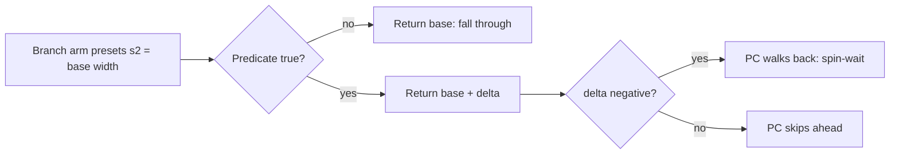

# Move VM - `0x2F` overlay-extension dispatcher

The [move VM](move-vm.md)'s opcode `0x2F` (`OVERLAY_EXT`) hands the
instruction to a second dispatcher, `FUN_801D362C`, which lives in the field
overlay rather than in `SCUS_942.54`. Its 61 sub-opcodes are the vocabulary
field effects need and battle effects do not: player-relative tests, story-flag
branches, shared scratch slots, self-modifying bytecode, curve motion and
colour ramps. Every field scene's ambient effect tree is written in it.

Two things to know before reading a move program that uses it. The dispatcher
is resident **only while the field overlay (PROT 0897) is loaded**. And each
sub-op's width must be read from the disassembly: the decompiled C hides it.

## At a glance

| What | Where |
|---|---|
| Dispatcher | `FUN_801D362C(actor, op)` in PROT 0897 (`ghidra/scripts/funcs/overlay_0897_801d362c.txt`), 1293 instructions |
| Jump table | `0x801CE868`, 61 entries x 4 bytes (0897 file `+0x50`) |
| Sub-opcode | `op[1]`, range `0x00..0x3C` |
| Only caller | `jal` at SCUS `+0x13AE0` (VA `0x80023AE0`), the `0x2F` arm of `FUN_80023070` |
| Return value | Instruction width in u16 halfwords, via the shared epilogue `0x801D4A3C` |
| Callee | `FUN_801D31B0` (strip emitter), from sub-op `0x2C` only |
| Shared state | scratch table `&DAT_801F3498`, globals `DAT_801F22F4` / `DAT_801F22F6`, flag bank `DAT_80085758`, object-effect table `0x80083FF8` |
| Port | `legaia_engine_vm::move_vm::ext` (dispatch), `move_vm_overlay_ext::canonical_size` (widths), `move_ext_strip` (strip emitter) |

```c
param_3 = func_0x801d362c(actor, op);   // move-VM op 0x2F; size = handler return
```

## Dispatch

### Bounds check

The sub-opcode is bounds-checked before the indirect jump:

- `lh v1, 0x2(s3)` loads it sign-extended, then `sltiu v1, 0x3D` gates the `jr`. Out-of-range values branch to the dispatcher's plain return (`size = 1`).
- The compare is *unsigned*, so the sign-extended `lh` also rejects negative sub-opcodes (they read as huge unsigned values).

There is therefore **no out-of-bounds-jump path**, which matters because the
move buffer is writable by the program itself (the self-modifying sub-ops
`0x04` / `0x1B` / `0x1E`). The port mirrors the guarded return with a
`_ => default_arm()` catch-all for any sub-opcode `>= 0x3D`.

### Overlay residency - one copy, in the field overlay only

The dispatcher and its jump table live in **PROT 0897 alone**. They are not a
per-overlay family with differing tables.

- The `0897` **static** dump and the six **capture-derived** ones (`world_map` / `world_map_walk` / `dialog_mc4` / `dialog_typing` / `cutscene_dialogue` / `cutscene_mapview` `_801d362c.txt`) disassemble **byte-identically**, 1293 instructions each. It is one 0897-resident function seen under different scenario labels: world-map, dialog and mapview-cutscene play are all 0897-hosted modes. The static dump has no coverage gaps.
- In every other mapped slot-A overlay image the VA `0x801D362C` holds unrelated bytes. Menu 0899, fishing 0972, slot-machine 0973, baka 0976 and dance 0980 carry mid-function code of their own. `cutscene_str` 0970 is zero-fill there. Battle-action 0898 has a different function (a save-block `0x80084140` walker). The title overlay holds data tables. None has a 61-pointer table at `0x801CE868`.

The SCUS opcode arm calls the **fixed VA** `0x801D362C`, so op `0x2F` is only
executable while the field overlay is resident; in any other overlay
generation it would jump into unrelated code. Battle-side move records
(monster archive, summon stagers) therefore cannot use op `0x2F`. The
extension sub-ops are a field / world-map / dialog-mode vocabulary.

### One caller, and it is ported

A five-form reference scan over `SCUS_942.54`, every based overlay image and
every raw PROT entry (`scripts/ghidra-analysis/find-address-word-refs.py
0x801D362C`) finds **one** reference to the dispatcher: the `jal` at SCUS
`+0x13AE0` (VA `0x80023AE0`), which is `FUN_80023070`'s `0x2F` arm. There is no
word reference, no `lui` / `addiu` pair and no `j`. The scan's second hit is a
plain branch inside a PROT 0898 function that lands on the aliased VA, not a
call.

The engine hosts exactly that caller. `move_vm::dispatch`'s `0x2F` arm calls
`MoveHost::ext_dispatch`, whose default body is
`move_vm::ext::ext_default_dispatch`, and `engine-core::world::vm_hosts`
inherits the default, so the dispatcher runs for every part the world ticks.
`move_vm_overlay_ext`'s standalone `step` / `walk` walker is a second surface
over the same routine with no retail caller of its own; its `canonical_size`
table is live on its own account.

The one arm that calls out to a routine of its own is `0x2C`:
`jal 0x801D31B0` at `0x801D44C8`, the
[scanline strip emitter](#the-scanline-strip-emitter-0x2b--0x2c--0x2d).
`0x801D32F8`, `0x801D3444` and `0x801D3748` are interior addresses of that
emitter and of the dispatcher, not table members.

## Sub-opcode reference

Operands are `op[2..]` (`op[0]` is `0x2F`, `op[1]` the sub-opcode). Width is
the fall-through width in halfwords. "Slot" is a row of the
[shared scratch table](#shared-scratch-table-dat_801f3498).

| Sub-op | Width | Effect |
|---|---|---|
| `0x00` | 16 | No side effect: the arm at `0x801D3680` is a bare jump to the epilogue. The widest arm. |
| `0x01` | 2 | Debug print of the world position (`"EFC %d %d %d"`) |
| `0x02` | 2 | Clears the actor's face-rotation id |
| `0x03` | 2 | Clears actor flag bit `0x1000` |
| `0x04` | 3 | Self-modify: writes world XYZ into the bytecode - [below](#self-modifying-bytecode-ops-0x04--0x1b--0x1e) |
| `0x05` | 5 | Self-modify: writes `op[2] + rand() % op[3]` to bytecode word `pc + op[4] + 5` |
| `0x06` / `0x07` | 7 | Branch when the player is outside / inside a box - [below](#world-position-lerp-0x24--0x2a-and-box-gates-0x06--0x07) |
| `0x08` / `0x09` | 2 | Set / clear the global predicate `DAT_801F22F4` |
| `0x0A` / `0x0B` | 3 | Branch when `DAT_801F22F4` is set / clear |
| `0x0C` / `0x0D` | 3 | `actor[+0x50] = op[2]` / `+= op[2]` (the curve parameter `t`) |
| `0x0E` | 11 | Quadratic Bezier position, all-operand form - [below](#curve-to-actor-0x0e--0x12) |
| `0x0F` | 2 | Clears the cycle counter `DAT_801F22F6` |
| `0x10` | 2 | Wraps the cycle counter mod 16, latches it into `actor[+0x86]` low byte, increments |
| `0x11` | 2 | Saves world coords to the slot indexed by `actor[+0x86] & 0xFF` |
| `0x12` | 8 | Quadratic Bezier position, slot-indexed start point |
| `0x13` / `0x14` | 4 | Branch when flag `op[2]` of bank `DAT_80085758` is set / clear |
| `0x15` / `0x16` | 2 | Set actor flag bit `0x800000` / `0x200000` |
| `0x17` | 8 | Object-effect row write - [below](#0x170x1a-write-the-object-effect-parameter-table) |
| `0x18` | 5 | Object-effect row reset |
| `0x19` | 8 | Object-effect row add |
| `0x1A` | 8 | Object-effect row yaw seat |
| `0x1B` | 5 | Self-modify: in-bytecode copy loop |
| `0x1C` / `0x1D` | 3 | Set / clear flag `op[2]` of bank `DAT_80085758` |
| `0x1E` | 4 | Self-modify: `bytecode[pc + op[2] + 4] += op[3]` |
| `0x1F` / `0x20` | 5 | HSV ramp on the colour at `actor[+0xA0]` / `actor[+0xA4]` - [below](#hsv-colour-ramps-0x1f--0x20) |
| `0x21` | 5 | `actor[+0x3C..+0x40] += op[2..4]` |
| `0x22` | 5 | World XYZ `+= op[2..4]` |
| `0x23` | 6 | Anim-bank lerp toward operand world coords, ratio `_DAT_1F800393` over `op[5]` (guarded against `op[5] == 0`) |
| `0x24` | 8 | World-position lerp, X / Z toward the fixed map origin |
| `0x25` / `0x26` | 3 | Save / load world coords (8 bytes) to slot `op[2]` |
| `0x27` / `0x28` | 3 / 5 | Save / load the tween-source triple at `+0x90` |
| `0x29` | 5 | Scratchpad write (`op[4] == 0`) or ramp of slot `op[2]` toward `-op[3]` over `op[4]` ticks |
| `0x2A` | 8 | World-position lerp, X / Z toward the player |
| `0x2B` | 6 | Strip slab set: `actor[+0xB4..+0xBA] = op[2..5]` |
| `0x2C` | 7 | Calls the strip emitter `FUN_801D31B0`; operands are padding |
| `0x2D` | 6 | Strip slab add: `actor[+0xB4..+0xBA] += op[2..5]` |
| `0x2E` | 13 | Builds a GP0 draw-mode packet and links it into the ordering table |
| `0x2F` | 3 | Writes `_DAT_8007B9D8 = op[2]` |
| `0x30` | 5 | Self-modify: writes `op[2]` or `op[3]` (on `rand() & 1`) to bytecode word `pc + op[4] + 5` |
| `0x31` / `0x32` | 3 | Save / load the render-bank section `+0x24..+0x2C` |
| `0x33` | 6 | `actor[+0xC0..+0xC6] += op[2..5]` |
| `0x34` / `0x35` | 3 | Save / load `actor[+0x72]` |
| `0x36` / `0x37` | 4 | Branch on the live actor count - [below](#player-and-pool-predicates-0x360x39) |
| `0x38` / `0x39` | 4 | Branch when the actor is outside / inside radius `op[2]` of the player |
| `0x3A` | 3 | Self-modify: writes the angle to the player into the bytecode |
| `0x3B` | 4 | Self-modify: writes party member `op[2]`'s position into the bytecode |
| `0x3C` | 6 | Screen fade colour, immediate or ramped |

`rand()` in `0x05` / `0x30` is the BIOS `A(2Fh) rand` thunk `FUN_80056798`
(`jal 0x80056798` at `0x801D3714` / `0x801D45F8`), a draw in `0..=0x7FFF`.
`0x05`'s divide is signed and a zero divisor traps on retail.

## Instruction widths

Every arm leaves its instruction's width, in u16 halfwords, in `s2` before
joining the shared epilogue at `0x801D4A3C` (`sll v0, s2, 0x10`, then the
return shifts back, so the count is a sign-extended 16-bit value).

**There is no size-1 arm.** The only `li s2, 0x1` in `FUN_801D362C` is at
`0x801D365C`, in the branch delay slot of the `sltiu v1, 0x3D` bounds check:
the resync width for a sub-opcode the jump table does not cover. Every
in-range sub-opcode has a wider arm of its own.

**The width is invisible in the decompiled C.** Ghidra renders each arm's
`j 0x801D4A3C` exit as a `func_0x801d4a3c()` label-call and drops the
`li s2, N` in its delay slot, so a C-sourced reading of any arm reports the
bounds-check default. This is the label-call artifact catalogued in
[`ghidra.md`](../tooling/ghidra.md#decompiler-artifacts-that-have-produced-false-claims).

**Why a wrong width is loud.** Returning 1 from an in-range arm leaves the PC
on the sub-opcode word, which the **outer** move-VM opcode space then decodes
as an instruction: `0x25` there is `CHILD_SPAWN`, `0x1F` / `0x20` are
anim-block ops, and so on. On a looping record that mis-decode re-fires every
tick.

### Fall-through width by sub-opcode

| Width | Sub-opcodes |
|---|---|
| 2 | `0x01` `0x02` `0x03` `0x08` `0x09` `0x0F` `0x10` `0x11` `0x15` `0x16` |
| 3 | `0x04` `0x0A` `0x0B` `0x0C` `0x0D` `0x1C` `0x1D` `0x25` `0x26` `0x27` `0x2F` `0x31` `0x32` `0x34` `0x35` `0x3A` |
| 4 | `0x13` `0x14` `0x1E` `0x36` `0x37` `0x38` `0x39` `0x3B` |
| 5 | `0x05` `0x18` `0x1B` `0x1F` `0x20` `0x21` `0x22` `0x28` `0x29` `0x30` |
| 6 | `0x23` `0x2B` `0x2D` `0x33` `0x3C` |
| 7 | `0x06` `0x07` `0x2C` |
| 8 | `0x12` `0x17` `0x19` `0x1A` `0x24` `0x2A` |
| 11 | `0x0E` |
| 13 | `0x2E` |
| 16 | `0x00` |

The mirror is `move_vm_overlay_ext::canonical_size`; `crates/engine-vm`'s unit
tests dispatch every sub-opcode against it.

Two members are easy to lump with a neighbour and are not the same width:

- `0x18` is 5 where `0x17` / `0x19` / `0x1A` are 8. It reads two operand words, not five.
- `0x11` is 2 where `0x25` is 3. `0x11` takes its slot index from the cycle counter, `0x25` from the bytecode.

### The ten conditional-branch arms

Ten arms have a second, data-dependent exit. They are **branches**: the last
operand word is a signed halfword displacement added to the fall-through
width.



All ten reach the same tail at `0x801D4830`, which returns the preset `s2`
when the predicate is false and `lhu v0,0x6(s3); addiu s2,v0,0x4` (at
`0x801D4838`) when it is true. The `lhu` is zero-extending but the epilogue
truncates to 16 bits and sign-extends, so a negative displacement walks the PC
backwards: the spin-wait-until-condition idiom.

| Sub-ops | Encoding | Branch taken when | Delta from |
|---|---|---|---|
| `0x06` / `0x07` | `[2F][op][xa][za][xb][zb][delta]`, base 7 | player outside / inside the box | `op[6]`, through `0x801D3868` (`addu s2,s2,v0`) |
| `0x0A` / `0x0B` | `[2F][op][delta]`, base 3 | `DAT_801F22F4` set / clear | `op[2]`, through `0x801D38C8` |
| `0x13` / `0x14` | `[2F][op][flag][delta]`, base 4 | flag set / clear | `op[3]` |
| `0x36`..`0x39` | `[2F][op][arg][delta]`, base 4 | the arm's own predicate holds | `op[3]` |

Three arms look conditional and are not. `0x28`'s clamp cascade, `0x3B`'s
party-lookup miss and `0x23`'s divide-by-zero guard each choose what the
instruction *does*, not how wide it is: `li s2` is set before the branch in
all three.

## Sub-op clusters

### Shared scratch table `&DAT_801F3498`

A 16-slot, 8-byte-stride table shared across actors:

| Save / load | Round-trips |
|---|---|
| `0x25` / `0x26` | World coords (8 bytes: `actor[+0x14..+0x1C]`, including the Y mirror) |
| `0x27` / `0x28` | The tween-source triple at `+0x90` (with `>> 12` fixed-point scaling and `[-0xFF, 0xFF]` clamping on read) |
| `0x31` / `0x32` | The render-bank section at `+0x24..+0x2C` |
| `0x34` / `0x35` | `actor[+0x72]` |

### Globals and the cycle counter

- `DAT_801F22F4` - a u32 predicate set / cleared by sub-ops `0x08` / `0x09` and tested by `0x0A` / `0x0B`.
- `DAT_801F22F6` - a u16 counter wrapped mod 16.

Sub-op `0x0F` clears the counter. `0x10` reads it (wrapping when `>= 16`),
captures the low byte into `actor.field_86`, and increments. `0x11` then saves
world coords to `slot_table[field_86 & 0xFF]`: the cycle counter feeds the
slot-save index, distinct from `0x25`, which takes the index from the operand
stream.

<a id="0x170x1a-write-the-object-effect-parameter-table"></a>

### `0x17..0x1A` write the object-effect parameter table

The four arms address row `op[2]` of the **object-effect parameter table** at
`0x80083FF8` (stride `0x14`): three rotation angles at `+0` / `+2` / `+4` and
two clip words at `+0x10` / `+0x12`. `FUN_8001C204` composes the row into the
transform of every actor whose `+0x42` is `row + 1`
([`renderer.md`](renderer.md#what-a-raised-0x42-draws)). They are four
different writes:

| Sub-op | Arm | Effect on the row |
|---|---|---|
| `0x17` | `0x801D3BB4` | Writes `op[3..=7]` into `+0`, `+2`, `+4`, `+0x10`, `+0x12`. |
| `0x18` | `0x801D3C0C` | Zeroes the three angles; `+0x10` / `+0x12` = actor `+0x16` (`world_y`) plus `op[3]` / `op[4]`. |
| `0x19` | `0x801D3C5C` | **Adds** `op[3..=7]` to the same five halfwords. |
| `0x1A` | `0x801D3CE0` | `+0 = 0`, `+2 = yaw = (op[3] + 0x400) & 0xFFF`, `+4 = 0x400`; both clip words are `op[6]` / `op[7]` plus `(op[5] * sin[yaw] + op[4] * cos[yaw]) >> 12`. |

The table is seeded twice outside the VM. The boot init `FUN_8001D424` writes
row 0 as angles `0` with clip words `(-100, -20)` (`0x8001D618..0x8001D664`).
The battle scene setup `FUN_80055B6C` re-seeds it as angles `0` with
`+0x10 = -0x7FFF` (`0x80055DDC..0x80055DF8`).

Port: `MoveHost::ext_world_struct_init` / `_write` / `_add`, wired by
`MoveVmHostImpl` (`crates/engine-core/src/world/vm_hosts.rs`).

### World-position lerp (`0x24` / `0x2A`) and box gates (`0x06` / `0x07`)

Sub-ops `0x24` / `0x2A` share the per-axis form
`actor[axis] = base + ((target - base) * t) >> 12`. The Y axis always lerps
toward `_DAT_8007C364 + 0x16` (player Y). For X / Z:

- `0x24` uses the fixed map origin `(_DAT_80089118, _DAT_80089120)` (target = `-(base + origin)`);
- `0x2A` uses the player position (target = player X / Z).

Sub-ops `0x06` / `0x07` are the box-vs-player branches. Both are 7 halfwords
wide and branch by `op[6]`: `0x06` when the player is **outside** the
canonicalised box `[xa..xb] x [za..zb]` (each scaled by `0x80` with a `0x40`
half-cell margin), `0x07` when **inside**.

The canonicalisation is a bytecode write, not a local: `sh v1,0x4(s3)` /
`sh a0,0x4(s0)` at `0x801D3784` swap `op[2]` with `op[4]` when
`op[4] < op[2]`, and the sibling pair swaps `op[3]` with `op[5]`. That puts
these two in the self-modifying family with `0x04` / `0x1B` / `0x1E`.

### Curve-to-actor (`0x0E` / `0x12`)

These place the actor on a **quadratic Bezier**. Each arm builds a control
point `C = offset + ((P0 + P2) >> 1)` on the stack and calls
`FUN_801E45BC(a0 = &C, a1 = &P0, a2 = &P2, a3 = actor[+0x50])`. That evaluates
`((0x1000-t)^2 P0 + 2t(0x1000-t) C + t^2 P2) / 0x1000^2` per axis (integer and
fractional halves of each basis coefficient summed separately, so the result
floors) and writes it back into `C`. The arm then copies that triple to
`actor[+0x14..]` with a `swl` / `swr` pair (`0x801D39B4..0x801D39D0`,
`0x801D3B34..0x801D3B50`).

- `t` is `actor[+0x50]`, set by sub-op `0x0C` and added to by `0x0D`. It is read `lhu` and never clamped.
- `0x0E` is the all-operand form (size 11): P0 = `op[2..4]`, offset = `op[5..7]`, P2 = `op[8..10]`.
- `0x12` (size 8) is the slot-indexed variant: P0 comes from `slot_table[actor[+0x86] & 0xFF]`, and only `op[2..4]` (offset) and `op[5..7]` (P2) live in bytecode.
- Not a midpoint write: the actor lands on `C` itself only at `t = 0x800` with a zero offset.
- The eight-byte copy also stores an uninitialised stack halfword into `+0x1A`, which the port does not model.

Port: `move_vm::ext::write_bezier_world`; `MoveHost::ext_midpoint_set` is an
observation hook ahead of it.

### Player and pool predicates (`0x36..0x39`)

All four are 4-halfword branches on the shared `0x801D4830` tail: pass ->
`4 + op[3]`, fail -> 4. Each arm presets `li s2, 0x4` (`0x801D4744`,
`0x801D4764` for `0x36` / `0x37`) before jumping to the tail.

- **`0x36` / `0x37`** compare `op[2]` against `0x8E - DAT_8007C348`. That global is the actor allocator's free-stack top, so the operand is a **live actor count**. `0x36` passes when `op[2]` is below the count, `0x37` when the count is below `op[2]`.
- **Shipped `0x37`** is always a pool-headroom guard: `[2F][37][0x80..0x87][1]` jumps the `HALT` behind it while fewer than `op[2]` actors are live, so the effect only spawns with room in the pool.
- **Shipped `0x36`** has four sites: two spin-waits (`0x76` / `0x77`, `delta -6`: hold until the count drops to the operand) and two (`map03`, `korout`) that skip two halfwords while more than `0x78` actors are live - in `map03`'s emitter, the op-`0x25` child spawn.
- **`0x38` / `0x39`** are squared-distance gates between the move actor and the player (`_DAT_8007C364`): `0x38` passes when *outside* radius `op[2]`, `0x39` when *inside*.

Port: `World::actor_pool_top` (`crates/engine-core/src/world/actors.rs`)
derives the count from the live actor, ambient-part and script-actor
populations, in the 7..128 range the library states hold. A constant answer
here halts every guard and spins every wait, which thins the ambient trees of
`kor`, `korb2`, `dohaty`, `garmel` and `map03`.

### Flag branches (`0x13` / `0x14`)

Conditional branches on the fourth flag bank (`DAT_80085758`, tested through
`FUN_8003CE64`): encoding `[2F][13|14][flag][delta]`. `0x13` branches when the
flag is set, `0x14` when it is clear. A negative delta onto a preceding `0x09`
wait forms the spin-wait-until-flag idiom jou's ambient lightning cyclers idle
on (`2F 14 0364 FFFA`).

### Fourth flag bank (shared with the field VM)

The bank at `DAT_80085758` is shared between the move VM (sub-ops `0x13` /
`0x14` test, `0x1C` / `0x1D` set / clear) and the field VM (high-byte default
routes `0x5x` set / `0x6x` clear / `0x7x` test). `engine-core::World` exposes
it as a single lazily-grown `system_flags: Vec<u8>` with MSB-first bit
ordering, mirroring `FUN_8003CE08`'s `0x80 >> (idx & 7)`.

The field VM's `idx` encoding is `((opcode_byte & 0x8F) << 8) | operand_byte`,
ranging over `0..=0x8FFF` in retail: the route select at `0x801E3570` tests
the **raw** opcode byte (`andi v1,v0,0x70`), so `0xF0..0xFF` reach the same
routes and `0xFF & 0x8F = 0x8F` tops the index out. That is why the bank
cannot be a fixed-size 256-bit array. The port's match arm is narrower -
`0x50..=0x77`, which caps the index at `0x87FF` - and does not cover masked
opcodes `0x78..=0x7F`.

### Self-modifying bytecode ops (`0x04` / `0x1B` / `0x1E`)

Three sub-ops mutate the move bytecode buffer in place, changing the operand
stream that later instructions read:

| Sub-op | Write | Base offset |
|---|---|---|
| `0x04` | `buffer[pc + op[2] + 3..+6] = actor[+0x14..+0x18]` (world XYZ, 3 u16 stores) | 3 |
| `0x1E` | `buffer[pc + op[2] + 4] += op[3]` (read-modify-write of one u16) | 4 |
| `0x1B` | for `i in 0..op[4]`: `buffer[pc + op[3] + i + 5] = buffer[pc + op[2] + i + 5]` | 5 |

- `0x1B`'s base of 5 targets the operand region past the count word, so the words following its header act as an inline scratch buffer indexed by `op[2]` / `op[3]`.
- **`0x1E` is 4 wide** and skips its own operand words: the arm at `overlay_0897_801d362c` `0x801D3E18..` ends `li s2, 0x4` before the shared `j 0x801D4A3C`. The disc witness is jou's ambient CLUT-cycler record, which patches its *following* op-`0x2C` operand and then falls through to execute that `0x2C` ([`field-ambient-fx.md`](field-ambient-fx.md#the-self-modifying-spawn-stepper)).
- `0x05`, `0x30`, `0x3A`, `0x3B` and the `0x06` / `0x07` box swap write the bytecode too.

Port: `MoveHost::move_bytecode_{read,write}_u16` expose the actor's move
buffer (`actor[+0x48][word_off]`). For ambient field parts `MoveVmHostImpl`
routes them to the shared prescript bundle, retail's `_DAT_8007B8D0` copy.

### HSV colour ramps (`0x1F` / `0x20`)

HSV-space ramps on a packed 24-bit RGB colour stored in `actor[+0xa0..+0xa3]`
(`0x1F`) or `actor[+0xa4..+0xa7]` (`0x20`). Encoding `[2F][1F|20][dH][dS][dV]`.

1. Unpack `(R, G, B)` (R = byte 0, G = byte 1, B = byte 2).
2. RGB -> HSV via the SCUS helper `FUN_8001a78c` (H in 0..0x167, S and V in 0..255).
3. Add `op[2..4]` per channel: H wraps mod `0x168`, S / V clamp to 0..255.
4. HSV -> RGB via `FUN_8001a8dc` (clamped to 0..0xF8 by `FUN_8001a6c8`).
5. Re-pack with a full 32-bit `sw` (`sw v1,0x0(s0)` at `0x801D3F84`), so the packed word's top byte is cleared, not preserved.

Both are ordinary **5-halfword** instructions. The single arm serving them
sets `li s2, 0x5` at `0x801D3F60`, after the HSV -> RGB call and before the
shared `j 0x801D4A3C` at `0x801D3F80`, and no other path through it writes
`s2`. The three operand words are the H / S / V deltas, not a second outer
instruction.

Port: `move_vm::color` (`rgb_to_hsv` / `hsv_to_rgb`).

### Angle, party lookup and fade (`0x3A` / `0x3B` / `0x3C`)

- `0x3A` writes the angle from the actor to the player (`atan2(dz, dx)` quantised to PSX 12-bit angle units, 4096 = full circle) into `bytecode[pc + op[2] + 3]`. Port: `MoveHost::ext_compute_angle`, reading `world.player_actor_slot`.
- `0x3B` looks up the position of party member `op[2]` and writes the world-XYZ triple into `bytecode[pc + op[3] + 4..+6]`, pre-clearing the destination slots. Port: `MoveHost::ext_party_member_lookup` over `world.party.party_actor_slots: Vec<Option<u8>>`.
- `0x3C` writes the immediate fade colour to scratchpad globals (`ticks == 0`) or schedules a per-frame ramp (`ticks > 0`). Port: the request lands in `world.presentation.pending_fade: Option<FadeRequest>`, drained each frame to drive the screen overlay.

## The scanline strip emitter (`0x2B` / `0x2C` / `0x2D`)

Sub-op `0x2C` calls `FUN_801D31B0` (PROT 0897, `0x801D31B0..0x801D362C`; see
`ghidra/scripts/funcs/overlay_0897_801d31b0.txt`) with the actor and the
instruction pointer. The routine never reads the pointer: it overwrites `a1`
before its first use (`addiu a1,sp,0x30` at `0x801D31C4`), so the
instruction's five operand words are padding the width skips. It is
field-overlay code with exactly one reference on the disc, that `jal`.

It draws a textured object built of one-pixel-tall rows:

1. `FUN_8005BA38` (`RotTransPers`) projects the actor's `+0x14` position for the screen centre `(sx, sy)` and the ordering-table depth; a zero depth ends the call.
2. The billboard projector `FUN_800195A8` projects a camera-facing box of half-extent `(slab+0x18, slab+0x1A)` about the same point. The routine keeps the box's top-edge corners and its bottom row.
3. From the bottom row up to the top edge, each row's width is the top edge scaled about `sx` by `cos(((sy - y) << 10) / (sy - y0 + 2))` (the cosine view `_DAT_8007B7F8`), optionally wobbled by `sin((y - sy) * slab+0x1E -/+ actor+0x26) * slab+0x1C >> 12` (the sine view `_DAT_8007B81C`, left edge on `-`, right on `+`).
4. The row samples one texel row `v`, scrolled by `actor+0x28` and wrapped into the slab's `v0..=v1` band. It is tiled with `POLY_FT4` spans of the slab's `u0..=u1` width, scrolled by `actor+0x24`, one texel per pixel, clipped to the row and to the draw-area halfwords `0x1F800388..0x1F80038E`.
5. Every span is opaque (`0x2C808080`) at the slab's tpage and CLUT; a `SetDrawMode` packet linked last at the same slot installs the tpage.

The slab is the actor's `+0x9C` window:

| Slab | Actor | Field |
|---|---|---|
| `+0x0C..+0x12` | `+0xA8..+0xAE` | texture rect `u0, v0, u1, v1` |
| `+0x14` / `+0x16` | `+0xB0` / `+0xB2` | tpage / CLUT |
| `+0x18` / `+0x1A` | `+0xB4` / `+0xB6` | box half-extent |
| `+0x1C` / `+0x1E` | `+0xB8` / `+0xBA` | wobble amplitude / frequency |

So sub-ops `0x2B` (set) and `0x2D` (add), which write `slab+0x18..+0x1E`, set
a box size and a wobble, not UV bounds.

**Nothing on the disc issues `0x2C`.** The disc-gated census
`crates/engine-core/tests/move_ext_strip_census_disc.rs` walks every CDNAME
scene's prescript stager records through the move-VM decoder (the carrier the
field VM installs through `FUN_800252EC`) and scans every PROT entry's
type-`0x05` MOVE slot for the aligned `[0x002F, 0x002C]` pair. It decodes
thousands of extension instructions, `0x2B` and `0x2D` among them, and no
`0x2C` in either carrier; the uncompressed PROT entries hold no move-shaped
`0x2F 0x2C` either. `0x2E`, the dispatcher's other packet builder, is absent
the same way.

**Port.** `legaia_engine_vm::move_ext_strip::emit_strip` is the row walk. The
engine-core field host captures each `0x2C` execution
(`MoveVmGlobals::push_strip_request`), and both play hosts drain the queue on
their draw path through one kernel, `move_strip::move_strip_prims`
(`crates/render-kernels`, re-exported by `engine-ui`), which makes the two
projections under the frame's field camera. One deliberate difference:
retail's wrap loops never terminate for a slab whose `u` or `v` span is not
positive, and the port declines such a slab.

## Sub-op coverage in `crates/engine-vm`

**61/61 dispatched** (every entry of the `FUN_801D362C` jump table at
`0x801CE868`). State-only sub-ops are handled inside `move_vm::ext`; the rest
go through `MoveHost` callbacks whose defaults are no-ops.

| Callbacks | Status in `engine-core` (`MoveVmHostImpl`) |
|---|---|
| `ext_query_flag_bank`, `ext_set_flag_bank`, `ext_clear_flag_bank` | wired to the system flag bank |
| `ext_world_struct_init` / `_write` / `_add` | wired to the object-effect table |
| `ext_rand16` | wired to the world's BIOS-shaped random stream |
| `ext_scratchpad_write`, `ext_scratchpad_ramp`, `ext_set_8007b9d8`, `ext_fade_color` | wired |
| `ext_compute_angle`, `ext_party_member_lookup` | wired |
| `ext_func801d31b0` | wired: queues a strip request |
| `move_slot_*`, `move_global_*`, `move_bytecode_*`, `move_player_world_xyz`, `move_fixed_origin_xz`, `move_axis_threshold`, `move_dat_1f800393` | wired |
| `ext_debug_world` (`0x01`), `ext_emit_ot_packet` (`0x2E`), `ext_midpoint_set` (observation hook) | default no-op |

## See also

[Move-table VM](move-vm.md) ·
[Field ambient FX](field-ambient-fx.md) ·
[Field / event VM](script-vm.md) ·
[Renderer](renderer.md)
