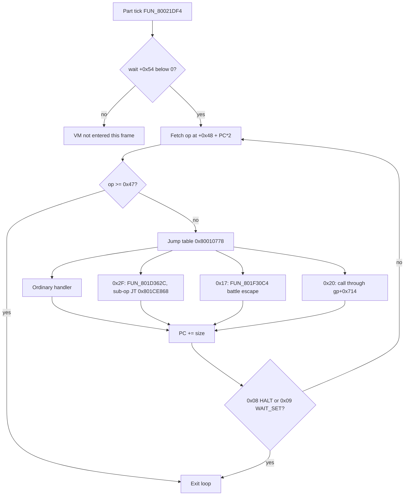

# Move-table opcode VM

The move VM is a small per-actor animation engine. Every part actor - a party
member, an enemy, an NPC, an effect node - owns a "move buffer" and a program
counter into it, and every frame the part tick runs opcodes out of that buffer
until one of them stops the loop. It turns a move record into world-space
motion, animation-bank selection, tween setup, texture-strip animation and
per-actor flag writes. It is the bytecode behind Tactical Arts, summon stagers
and every field scene's ambient effect tree.

**Operands are 16-bit, not 8-bit.** The program counter (PC) counts u16 words
and each handler returns its size in u16 words. The actor VM and the field VM
are byte-stream VMs, so a reader arriving from either tends to misread move-VM
operand widths by a factor of two.

## At a glance

| What | Where |
|---|---|
| Interpreter | `FUN_80023070(actor)` in `SCUS_942.54` (`ghidra/scripts/funcs/80023070.txt`) |
| Opcodes | 71 (`0x00..0x46`), jump table `0x80010778` (71 entries x 4 bytes) |
| Field escape | op `0x2F` -> `FUN_801D362C`, 61 sub-opcodes, field overlay (PROT 0897) only - [`move-vm-overlay-ext.md`](move-vm-overlay-ext.md) |
| Battle escape | op `0x17` -> `FUN_801F30C4`, battle overlay (PROT 0898) only |
| Slot-B hook | op `0x20` -> indirect call through `gp[+0x714]` (`0x8007BA2C`) |
| Buffer base / PC | `actor[+0x48]` / `actor[+0x70]` (i16, u16 units) |
| Buffer setup | `FUN_800204F8` (`EXEC_MOVE`), `FUN_80021B04` (part seater), `FUN_800252EC` (prescript installer) |
| Per-frame caller | part tick `FUN_80021DF4` (`ghidra/scripts/funcs/80021df4.txt`); one-shot at spawn from `FUN_80021B04` |
| Port | [`legaia_engine_vm::move_vm`](../../crates/engine-vm/src/move_vm.rs) (`step`, `run_until_break`, `actor_tick`, `MoveHost`); part tick blocks in `engine-effects::part_motion`; field host in `engine-core::world::ambient` |

## The runtime VM family

Legaia runs **five** distinct bytecode / state VMs. Confusing them is the
classic mistake, so each page states which one it is. This table is the shared
orientation; the per-VM pages carry the detail.

| VM | Driver fn | Where | Opcode count | Operand width |
|---|---|---|---|---|
| [Actor / sprite VM](actor-vm.md) | `FUN_801D6628` | Menu overlay (PROT 0899, slot-A base `0x801CE818`) | 13 | byte stream |
| **Move VM** (this page) | `FUN_80023070` | `SCUS_942.54` | 71 (`0x00..0x46`) + 61 sub-ops via `0x2F` | u16 stream |
| [Motion VMs](motion-vm.md) | `FUN_8003774C` (pursue / patrol / face-target) and `FUN_80038158` (scripted motion + flag writes) | `SCUS_942.54` | see page | byte stream, high bit = "select target" |
| [Field / event VM](script-vm.md) | `FUN_801DE840` | Town / field overlay (0897) | 43 (`0x21..0x4F`, with gaps) + 0x5x/6x/7x default-route | byte stream |
| [Effect VM](effect-vm.md) | `FUN_801E0088` (per-frame walker) | Battle overlay (0898) | per-slot state machine, no opcode table | inline state tokens |

How the move VM wires to the others:

- Field VM op `0x22` `EXEC_MOVE` calls `FUN_800204F8`, which finds the move record for `move_id` and stages it into the actor at `actor[+0x48]` (buffer base) / `actor[+0x70]` (PC).
- The part tick (`FUN_80021DF4`, per frame) and the part seater (`FUN_80021B04`, one-shot) both call `FUN_80023070(actor)` to step the buffer.
- Op `0x2F` calls `FUN_801D362C(actor, opcode_ptr)` at a fixed VA. The dispatcher exists **only in the field overlay (0897)**, so `0x2F` is a field-resident-only opcode ([residency evidence](move-vm-overlay-ext.md#overlay-residency---one-copy-in-the-field-overlay-only)).

### Move-buffer record sources

The move buffer is seated from one of three record tables, all in the **same
record format**: `[i16 model_sel][u16 reserved][move-VM bytecode]`. `model_sel`
is `-1` for a transform node, `0x4000` / `0x4001` for a render-mode node, and
`>= 0` for a library mesh. Bytecode ends at op `0x08` Halt.

1. **`FUN_800204F8`** - the `EXEC_MOVE` path: a per-actor move record from the runtime root (`_DAT_8007B888` MOVE / `_DAT_8007B840` MOVE2). Per-actor offsets are baked in at setup time.
2. **Per-summon stagers** - `FUN_80021B04` spawns parts from a stager overlay's records (see [`formats/effect.md`](../formats/effect.md), `legaia_asset::summon_overlay`).
3. **Per-scene prescript stager table** - the `scene_event_scripts` / `scene_v12_table` prescript: a `[u16 count][u16 offsets]` table of these records, loaded into `_DAT_8007b8d0`. The field VM installs a record by id via **`FUN_800252EC`** (`record = _DAT_8007b8d0 + offsets[id]`) -> `FUN_80021B04` -> this VM. See [`formats/scene-bundles.md`](../formats/scene-bundles.md#scene_event_scripts---prescript-only) (parser `legaia_asset::scene_event_scripts::move_stager_records`).

## Fetch / dispatch loop

```c
int FUN_80023070(int actor);                              // no PC argument

short* op = (short*)(actor[+0x48] + actor[+0x70] * 2);   // u16-aligned PC
short  v1 = op[0];
if (v1 >= 0x47) goto epilogue;                            // sltiu v0, v1, 0x47
goto jt[v1];                                              // JT at 0x80010778
```

Each handler sets `param_3`, its size in u16 words, and the shared epilogue
commits `actor[+0x70] += param_3`. The loop then repeats unless the handler
cleared the loop flag (`bVar3`).



- **Break opcodes.** `0x08` (HALT, size 0, sets flag bit `0x8`) and `0x09` (WAIT_SET, size 2) clear the loop flag. Every other opcode continues in the same frame.
- **Out of range.** An opcode `>= 0x47` falls through to the loop exit, the same shape as the field VM's `default` arm. Treat it as "end of move buffer", not "unknown opcode".
- **`0x2F` size.** The extension handler's return is the whole instruction's width, added to the PC like any other size ([widths](move-vm-overlay-ext.md#instruction-widths)).
- **Re-entry.** The next frame's `FUN_80021DF4` runs its integration blocks, then re-enters `FUN_80023070` from the saved PC once the wait has drained below zero. A halted part (`flags & 8`) goes to the tick's halt handler at `0x80023040`.
- **Sizes hide in delay slots.** Cases that look like no-ops in the decompiled C still advance the PC: `param_3` is set in a MIPS branch-delay slot (same pattern as the field VM, see [`script-vm.md`](script-vm.md) "Decompile quirks").

### Same-frame first tick

A part seated by a list-0 callback - the battle action SM `FUN_80046A20`
driving a cast module, or the anim tick `FUN_80047430` walking an effect
script - takes its first `FUN_80021DF4` on the **same** frame as the seater's
VM run. The frame's list walk `FUN_80016444` runs list 0 (`lw a0,0x4(s0)` /
`jal 0x8002519C` at `0x800165A4`) before list 1, where move-VM parts live
(`0x800165C0`). That first tick already drains the wait the seat set, steps the
channel and motion blocks, and runs the envelope tail. Port:
`SummonScene::seat_run` (`crates/engine-effects/src/summon.rs`) runs it there;
the `nighto_summon_mid_cast` capture's ray burst is the reference frame.

## Actor fields the opcodes touch

| Offset | Type | Use |
|---|---|---|
| `+0x10` | u32 | Actor flag word. Bit `0x8` set by op `0x08`; `0x2` / `0x1000` / `0x10000` / `0x40000000` toggled by various opcodes. |
| `+0x14` / `+0x16` / `+0x18` | u16 | World X / Y / Z (op `0x07` absolute set, op `0x01` add, op `0x03` rotate-add). |
| `+0x22` | u16 | Y-rotation (ramped by ops `0x2D` / `0x35` / `0x37`); the 12-bit keyframe blend cursor under mode 6. |
| `+0x24` / `+0x26` / `+0x28` | u16 | Rotation / render slots (op `0x05` add, op `0x06` write `+0x26`, op `0x39` write all three). |
| `+0x2A` | u16 | World Y mirror (kept in sync with `+0x16` for collision lookup). |
| `+0x3C` / `+0x3E` / `+0x40` | u16 | Velocity / animation bank (op `0x00`: `v << 3`). |
| `+0x44` | int* | Pointer to the per-actor model list (count word at `*+0x44`; used by `0x3C` and the `0x44+` family). |
| `+0x54` | u16 | Wait timer (op `0x09` set; drained by `FUN_80021DF4`). |
| `+0x56` | u16 | Draw kind `FUN_8001ADA4` switches on (`4` = multi-target arm). |
| `+0x5A` | u16 | Part-tick render mode ([table](#part-render-tail-the-0x5a-render-modes-fun_80021df4)). |
| `+0x62` | u16 | Local flag bank, 16 bits. AND / OR by ops `0x31` / `0x32`. |
| `+0x70` | i16 | **The move-VM PC** (u16 units; `x 2` is the byte offset). |
| `+0x74` | u32 | Composite control word (op `0x0C` builds, op `0x33` clears bit `0x40000000`). |
| `+0x80` / `+0x82` / `+0x84` | u16 | Rotation rates, `v << 3` (op `0x04`). |
| `+0x88` / `+0x8A`, `+0x8C` / `+0x8E` | u16 | Loop PCs and loop counters A / B (ops `0x18..0x1B`). |
| `+0x90` / `+0x92` / `+0x94` | u16 | Per-tick rates of the depth-cue level `+0x78`, the render scale `+0x72` and `+0x7A` in the tick's default motion block (`0x80022B18..0x80022B7C`). Under render mode `3` the same three words are the CLUT-cell HSV channels. |
| `+0x96` / `+0x98` / `+0x9A` | u16 | Heading, speed along heading, heading turn rate (op `0x2E`, `v << 3`). |
| `+0x9C` / `+0xA0` / `+0xA4` / `+0xA8` | i32 | Word block (op `0x34` stores all four sign-extended; `+0x9E` is the `+0x9C` word's high half and selects the draw-kind-4 emitter). |
| `+0xAC..+0xCA` | mixed | Per-frame anim slots (key / curve data; op `0x2C` configures, `+0xC0` is the duration). |
| `+0xB0..` | u8 | Per-lane morph index (op `0x0A` writes `count` slots). |
| `+0xB2` | i16 | Misc (op `0x38` add, op `0x41` set). |
| `+0xCC..+0xD6` | u16 | Keyframe latch PCs / cursor rate (`0x3C` / `0x3D` / `0x3F`), or the mode-4 / mode-7 operand block (`0x1E` / `0x45`). |

## Opcode reference

Decoded from `FUN_80023070` (`ghidra/scripts/funcs/80023070.txt`). `v1..vN` are
`op[1]..op[N]`; sizes are u16 words. Rows marked "below" have a detail
subsection under the table.

<a id="0x03---world_rotate_add-size-2"></a>
<a id="0x40---move_image-size-7"></a>

| Op | Name | Size | Effect |
|---|---|---|---|
| `0x00` | `ANIM_BANK_SET` | 4 | `+0x3C..+0x40 = v1..v3 << 3` |
| `0x01` | `WORLD_ADD` | 4 | `+0x14 += v1; +0x16 += v2; +0x2A += v2; +0x18 += v3` |
| `0x02` | `BANK_SET_98` | 2 | `+0x98 = v1 << 3` |
| `0x03` | `WORLD_ROTATE_ADD` | 2 | Adds rotated `v1` into world X / Z through the sin / cos tables `_DAT_8007B81C` / `DAT_8007B7F8`, indexed by `+0x96 & 0xFFF` |
| `0x04` | `ANIM_BANK_2` | 4 | `+0x80..+0x84 = v1..v3 << 3` |
| `0x05` | `RENDER_BANK_ADD` | 4 | `+0x24..+0x28 += v1..v3` |
| `0x06` | `WRITE_26` | 2 | `+0x26 = v1` |
| `0x07` | `WORLD_SET` | 4 | `+0x14..+0x18 = v1..v3`; Y mirror `+0x2A = v2` |
| `0x08` | `HALT` | 0 | `+0x10 \|= 0x8`; ends the loop without advancing the PC |
| `0x09` | `WAIT_SET` | 2 | `+0x54 = v1 << 3`; ends the loop |
| `0x0A` | `KEYFRAME_LOAD` | 3 + 3*count | Morph-lane install - [below](#0x0a---keyframe_load) |
| `0x0B` | - | - | No distinct handler: falls straight to the continue-epilogue |
| `0x0C` | - | 6 | `+0x74 = (v1<<24 \| 0x40000000) + v2 + (v3<<8) + (v4<<16)`; `+0x78 = v5` |
| `0x0D` | - | 2 | `+0x90 = v1 << 3` (the `+0x78` depth-cue rate) |
| `0x0E` | - | 2 | `+0x72 = v1` (scale X) |
| `0x0F` | - | 2 | `+0x92 = v1 << 3` (the `+0x72` render-scale rate) |
| `0x10` | - | 2 | `+0x42 = v1` |
| `0x11` | - | 2 | `+0x94 = v1 << 3` (the `+0x7A` rate) |
| `0x12` | - | 2 | `+0x7A = v1` (scale Z) |
| `0x13` | - | 0x10 | Draw-kind-4 node, default emitter - [below](#draw-kind-4-setup-ops-0x13-0x23-0x42) |
| `0x14` | - | 5 | `+0xC0/+0xC2/+0xC4/+0xC6 = v1..v4 << 3` (duration + colour channels) |
| `0x15` | - | 2 | `+0x52 = v1`; `v1 & 0x400` also clears flag bit `0x80`. Bits `0x780` make the node [camera-relative](renderer.md#camera-relative-nodes-fun_8001cf50) |
| `0x16` | `STUB` | 2 | Calls `FUN_80024C80(actor, v1)`, a bare `jr ra` (`ghidra/scripts/funcs/80024c80.txt`) |
| `0x17` | - | 2 | Battle-overlay escape `FUN_801F30C4(actor, v1)` - [below](#0x17---battle-overlay-escape) |
| `0x18` | - | 2 | Loop-open A: `+0x88 = PC`, `+0x8C = v1` - [below](#loop-pairs-0x18--0x19-and-0x1a--0x1b) |
| `0x19` | - | 1 / 2 | Loop-back A |
| `0x1A` | - | 2 | Loop-open B: `+0x8A = PC`, `+0x8E = v1` |
| `0x1B` | - | 1 / 2 | Loop-back B (mirror of `0x19` on `+0x8E` / `+0x8A`) |
| `0x1C` | - | 2 | `+0xCA = v1 << 3` (beam length channel) |
| `0x1D` | - | 2 | `DAT_8007B6DE = v1`: SFX ring slot 3's cue id - [below](#0x1d---sfx-ring-slot-3) |
| `0x1E` | - | 8 | Render-mode-4 setup: `+0x5A = 4`, `+0xC4/+0xCC..+0xD6 = v1..v7` |
| `0x1F` | - | 8 | Morph install: `+0x9E \|= byte`, `+0xB0/+0xB2/+0xA8/+0xAA/+0xAC/+0xAE = v2..v7` |
| `0x20` | - | 3 | Indirect call `(*(gp+0x714))(actor, v1, v2)` - [below](#0x20---slot-b-module-hook) |
| `0x21` | - | 7 | Per-id record write to `DAT_8007BE60 + v1*0xC` (5 halfwords + i32); `+0x6D = v1` |
| `0x22` | - | 1 | Continue-epilogue (advances the PC, nothing else) |
| `0x23` | - | 0xD | Draw-kind-4 node, `0x4000` sprite arm - [below](#draw-kind-4-setup-ops-0x13-0x23-0x42) |
| `0x24` | - | 3 | `+0xA8 += v1; +0xAC += v1; +0xAA += v2; +0xAE += v2` (sprite pos / UV double-add) |
| `0x25` | - | 2 | Spawn a child part from the prescript stager - [below](#0x25---spawn-child-part) |
| `0x26` | - | 5 | `+0xA8/+0xAA/+0xAC/+0xAE = v1..v4` (absolute sprite pos / UV) |
| `0x27` | - | 3 | `+0xB0 = v1; +0xB2 = v2` |
| `0x28` | - | 2 | `+0x9A += v1` |
| `0x29` | - | 2 | `+0x96 = v1` (no shift) |
| `0x2A` | - | 2 | `+0x9A = v1 << 3` |
| `0x2B` | - | 4 | `+0x90 = v1; +0x92 = v2; +0x94 = v3` (the three rates, absolute) |
| `0x2C` | `KEY_BUFFER_ALLOC` | 5 | VRAM-rect capture into a buffer - [below](#0x2c--0x30---key-buffer-alloc--free) |
| `0x2D` | `WORLD_INC_VARIANT` | 4 | `+0x90 += v1; +0x92 += v2; +0x94 += v3` |
| `0x2E` | `TWEEN_SCALE_SET` | 4 | `+0x96 = v1 << 3; +0x98 = v2 << 3; +0x9A = v3 << 3` |
| `0x2F` | `OVERLAY_EXT` | handler return | Field-overlay escape - [below](#0x2f---overlay_ext) |
| `0x30` | `KEY_BUFFER_FREE` | 1 | Releases the op-`0x2C` buffer, then the `0x22` epilogue |
| `0x31` | `LFLAG_AND` | 2 | `+0x62 &= v1` |
| `0x32` | `LFLAG_OR` | 2 | `+0x62 \|= v1` |
| `0x33` | `CLEAR_BIT_40000000` | 1 | `+0x74 &= ~0x40000000` |
| `0x34` | `TWEEN_SETUP` | 9 | Eight-operand block store - [below](#0x34---tween_setup) |
| `0x35` | `WORLD_INC_VARIANT2` | 3 | `+0x90 += v1; +0x92 += v2` |
| `0x36` | `TWEEN_DURATION_SET` | 3 | `+0x98 = v1 << 3; +0x9A = v2 << 3; +0xB8 = 0` |
| `0x37` | `WORLD_SET_VARIANT2` | 3 | `+0x90 = v1; +0x92 = v2` |
| `0x38` | `B2_ADD` | 2 | `+0xB2 += v1` |
| `0x39` | `RENDER_BANK_SET` | 4 | `+0x24..+0x28 = v1..v3` |
| `0x3A` / `0x3B` | `FLAG_2_SET` / `FLAG_2_CLEAR` | 1 | `+0x10 \|= 2` / `+0x10 &= ~2` |
| `0x3C` | `KEYFRAME_SEAT` | 2 + 6*count | Seats a keyframe pose - [below](#keyframe-pose-ops-0x3c--0x3d) |
| `0x3D` | - | 3 + 6*count | Keyframe-pose retarget - [below](#keyframe-pose-ops-0x3c--0x3d) |
| `0x3E` | - | 2 | `+0x22 = v1` (the keyframe blend cursor, 12-bit) |
| `0x3F` | - | 2 | `+0xD0 = v1` (the cursor rate) |
| `0x40` | `MOVE_IMAGE` | 7 | VRAM-to-VRAM copy - [below](#0x40---move_image) |
| `0x41` | - | 2 | `+0xB2 = v1` |
| `0x42` | - | 0xF | Draw-kind-4 node, `0x2000` ribbon arm - [below](#draw-kind-4-setup-ops-0x13-0x23-0x42) |
| `0x43` | - | 1 | `+0x86 \|= 0x2000` |
| `0x44` | - | 4 | `+0x9E = v1; +0x68 = v2; +0x6A = v3 << 3` |
| `0x45` | - | 8 | Render-mode-7 setup: `+0x5A = 7`, `+0xC4/+0xCC/+0xCE/+0xD4/+0xD6/+0xD0/+0xD2 = v1..v7` |
| `0x46` | - | 4 | Tween-delta seed: `+0x94/+0x96 = +0x92`, `+0x98 = v1 - +0x94`, `+0x9A = v2 - +0x92`, `+0xBC/+0xC0 = v3`, `+0xB8 = 1` |

### 0x0A - `KEYFRAME_LOAD`

`+0x10 |= 0x1000`, `+0x6C = byte(op[2])`, then `count = op[2]` operand triples
`(index, up_curve, down_curve)`, writing per lane `i`:

| Write | Stride | Meaning |
|---|---|---|
| `+0xB0 + i = byte(op[3+3*i])` | 1 byte | VDF sub-entry index: the morph record this lane drives, read back by the morph stager `FUN_8001C604` |
| `+0xB8 + i*2 = (op[4+3*i] * DAT_1F80037D) >> 3` | 2 bytes | The lane's **up**-ramp velocity |
| `+0xC8 + i*2 = (op[5+3*i] * DAT_1F80037D) >> 3` | 2 bytes | The lane's **down**-ramp velocity |

- The ramp velocities are **per lane**: the envelope `FUN_80020740` reads them at `0xb8(a1)` / `0xc8(a1)` with `a1 = actor + lane*2`. The index array's byte stride is what gives the record room for eight lanes before `+0xB0 + i` reaches `+0xB8`.
- When `op[1] == 0` the loop also resets per lane `+0xA0 + i*2 = 0` (the morph **weight** the envelope ramps) and `+0x7C = 0` (the lane-completion bitfield). `+0xA0` overlaps the op-`0x2C` descriptor; the overlap is the layout.
- Port: `MoveHost::keyframe_curve_multiplier` supplies the scale byte; `MoveVmHostImpl` returns the retail boot value (`summon::RETAIL_CHANNEL_DELTA`).

**The two speed bytes.** The scale byte is `DAT_1F80037D`, the game-speed
**rate** scalar: case `0x0A`'s multiply is `lui 0x1f80; ori 0x314; lbu
0x69(t0)`, and `0x1F800314 + 0x69 = 0x1F80037D`. It is not the per-frame byte.
Across every image, in both addressing forms (`0x37d(lui 0x1f80)` and
`0x69(0x1F800314)`), it is written only by:

- `FUN_80025CB4`'s core-state reset (`sb a2,0x69(v1)` at `0x80025D70`);
- one SCUS init that plants the literal `8` (`addiu v0,zero,8` / `sb v0,0x37d(at)` at `0x80055FB4` / `0x80055FBC`);
- the Baka Fighter and DEBUG MODE overlays.

The byte that moves every frame is `DAT_1F800393` (`= 0x7f(0x1F800314)`),
rewritten by the frame pacer at `0x80017068` and clamped to `1..4` against the
elapsed-time thresholds `0xF1` / `0x1FF` / `0x2D1` at `0x80017120..0x8001715C`.
Anything shaped "countdown `-= DAT_1F800393 * DAT_1F80037D`" is frames x rate.

### 0x17 - battle-overlay escape

Calls `FUN_801F30C4(actor, v1)`, the battle-side sibling of `0x2F`. The live
body is in the **battle overlay (0898)** (563 instructions); the
`overlay_0897_801f30c4` dump is empty because the field overlay does not carry
it. So `0x17` has an effect only while the battle overlay is resident, exactly
as `0x2F` is field-only. `v1` is a mode: only `0` and `1` do anything, each
seating twelve child parts on one of two stager records in 0898's tail (a
radial burst).

Port: `engine-vm::battle_burst` (`run_burst`), reached through
`MoveHost::ext_17`. `MoveVmHostImpl::ext_17` queues the burst and
`World::flush_battle_bursts` spawns it.

### Loop pairs (`0x18` / `0x19` and `0x1A` / `0x1B`)

`0x18` latches the current PC (its own opcode's index) into `+0x88` and a
repeat count into `+0x8C`. `0x19` then:

- **count's `0x4000` bit clear**: decrements `+0x8C` and loops while the decremented count has not underflowed (`uVar8 <= 40000` in the arm at `0x800235DC`). The loop-back stores `+0x88` into the PC and the shared epilogue (`0x80024150`, `pc += a2` with `a2 = 2`) lands at **saved + 2**: the body start, past the `0x18` and its operand, so the counter is not re-seeded. The retire path (underflow, `uVar8 > 40000`) advances 1 word. A counter of `N` runs the body `N + 1` times.
- **count's `0x4000` bit set**: never decrements and always jumps back. This is the authored infinite-loop marker the ambient effect records idle on.

`0x1A` / `0x1B` are the identical mechanism on the second register pair
`+0x8A` / `+0x8E`, so a move program can nest two counted loops.

### 0x1D - SFX ring slot 3

Stores `v1` to `DAT_8007B6DE`, SFX ring slot 3's cue id, with no cursor pair
and no countdown
([`sfx-table.md`](../formats/sfx-table.md#the-fields-producers-op-0x36-and-the-motion-vms-op-0x09)).
This is how ambient effect scripts sound: `kor5`'s looping cue `0x204`, the
lightning director's thunder `0x20B`. Port: `MoveVmHostImpl::global_write_1d`
queues `SfxRingOp::WriteSlot(3, v1)`.

### 0x20 - slot-B module hook

The `jalr` at SCUS `0x80023764` calls whatever sits in `gp[+0x714]`
(`0x8007BA2C`). The slot has two kinds of tenant:

- **Battle.** The action SM installs the paged module's spawn stager from the 64-word entry table `PTR_801F6734[row]` (row = extraction index - 903; installers at `0x801E44C8` / `0x801E4630`). See [`cast-module.md`](cast-module.md#the-entry-tables-and-where-the-addresses-live).
- **Minigames.** The fishing / Baka Fighter overlays install their own per-frame sprite callback.

Port: `MoveHost::ext_20`. The dance minigame's part host implements it
(`crates/engine-minigames/src/dance/finish.rs`); the default is a no-op.

### 0x25 - spawn child part

Calls `FUN_80021B04(actor+0x14, actor+0x24, _DAT_8007B8D0 + offsets[v1],
0x1000)`. It seats a **child part** from the per-scene prescript stager table
([record source 3](#move-buffer-record-sources)), passing the parent's world
position (`+0x14`) and rotation slots (`+0x24`) as the child origin. This is
how one move program spawns another as a sub-actor. Port:
`MoveVmHostImpl::spawn_child`, collected for the ambient field-effect tree.

### 0x2C / 0x30 - key buffer alloc / free

`0x2C` is `[op, x, y, w, h]`: `+0xA0..+0xA6 = ops[1..4]`. If `w >= 0x11` it
allocates `w * h * 2` bytes via `FUN_80017888` into `+0xA8`; otherwise it uses
the inline buffer at `+0xAC`. `FUN_8005842C` then fills the buffer from the
descriptor at `+0xA0` - the operands are a VRAM rect and the call captures it,
which is what the mode-3 CLUT-cell cycler recolours every frame
(`engine-field::clut_cell_fx`).

`0x30` calls `FUN_800583C8(actor + 0xA0, buf)` with the heap buffer at `+0xA8`
or the inline one at `+0xAC`, clears `+0x9C`, and joins the `0x22` epilogue
(size 1, loop continues).

### 0x2F - `OVERLAY_EXT`

```c
param_3 = func_0x801d362c(actor, op);
```

`FUN_801D362C` reads `op[1]` as a 16-bit sub-opcode (`0x00..0x3C`) and
dispatches through its own jump table at `0x801CE868` (61 entries x 4 bytes),
bounds-checked so there is no out-of-bounds jump. All 61 sub-ops are
dispatched in `crates/engine-vm` (`move_vm::ext`, via `MoveHost::ext_dispatch`).

The return is the whole instruction's width in halfwords and is never 1 for a
recognised sub-opcode: a size-1 return would leave the PC on the sub-opcode
word, where this table's opcode space decodes it again. Ten sub-ops are
conditional branches whose taken side adds a signed displacement from their
last operand word.

The full sub-op reference - the shared `&DAT_801F3498` scratch table,
world-position lerps, bbox / distance branches, self-modifying bytecode ops,
HSV colour ramps and the `DAT_80085758` fourth flag bank - is
**[move-vm-overlay-ext.md](move-vm-overlay-ext.md)**.

### 0x34 - `TWEEN_SETUP`

Arm `0x80023B64` (jump-table word at `0x80010848`) stores through
`s4 = actor + 0x90`:

| Operand | Load | Destination |
|---|---|---|
| `v1` | `lh`, stored as a sign-extended word | `+0xAC` |
| `v2` | `lhu`, halfword | `+0xB0` |
| `v3` | `lhu`, halfword | `+0x90` |
| `v4` | `lhu`, halfword | `+0x92` |
| `v5` | `lh`, word | `+0x9C` (its sign half lands in `+0x9E`, the emitter-select word) |
| `v6` | `lh`, word | `+0xA0` |
| `v7` | `lh`, word | `+0xA4` |
| `v8` | `lh`, word | `+0xA8` |

Nothing here touches `+0xAE..+0xC8` beyond `+0xAC`'s own sign half. Not a
zero-extended run into `+0xAC..+0xC8`: the stores are relative to `actor +
0x90`. Taken as `+0xAC`-relative, `v7` lands at offset `0xF8`, which reaches
`+0xA4` only after an eight-bit wrap. The six
[draw-kind-4 setup](#draw-kind-4-setup-ops-0x13-0x23-0x42) arms have the same
base-register shape.

### 0x40 - `MOVE_IMAGE`

```c
RECT r = { op[1], op[2], op[3], op[4] };   // source x, y, w, h (VRAM halfwords)
MoveImage(&r, (short)op[5], (short)op[6]); // FUN_80058490 - dest x, y
```

A literal-operand VRAM-to-VRAM copy through the libgpu `MoveImage` wrapper.
This is the **animated-texture strip** primitive: the frames are authored
inside the scene / character texture uploads, parked in VRAM next to the live
rect, and a move program stamps one frame per `0x40` instruction over the
displayed texel rect. Field scenes run 4-frame strip cycles from this op (for
example 16x64 strips at one-frame cadence), traced by an exec breakpoint on
`FUN_80058490` (`scripts/pcsx-redux/autorun_battle_moveimage_trace.lua`).

The battle party's facial-texel stamps share `MoveImage` but are not this op:
they come from the facial animator `FUN_8004C7B4`
([`battle-data-pack.md`](../formats/battle-data-pack.md#facial-animation-tracks-entry-0x8c--0x98)).

Port: the hook is `MoveHost::move_image`
(`crates/engine-vm/src/move_vm/host.rs`), default no-op. `MoveVmHostImpl` in
`engine-core` does not override it.

### Keyframe-pose ops (`0x3C` / `0x3D`)

**`0x3C`** (`0x80023CA4..0x80023D60`) seats a per-part pose for the actor's
model list:

- `count = (short)v1` goes to the list's count word `*actor[+0x44]`;
- `+0x5A = 6` (the keyframe-mesh render mode); the cursor `+0x22`, `+0x68` and `+0x5C` clear;
- a `count << 5 | 8`-byte block is allocated into `+0x4C` if it is empty (`FUN_80017888`);
- `+0xCC = PC` and `+0xCE = +0xD0 = +0xD2 = 0`.

The block is an 8-byte clip header, `count` packed 8-byte clip entries, then
`count` 24-byte keyframe records: six halfwords of the current keyframe and
six of the target. Each part's six operands seed both halves.

**`0x3D`** (`0x80023D64..0x80023F18`) retargets it. `+0xD0 = v1` is the cursor
rate and `v2` the part count. When a keyframe is already latched
(`+0xCE != 0`), every part's current keyframe first moves to where the cursor
has blended it (`cur += (tgt - cur) * +0x22 >> 12`, all six halfwords) with
`+0xCC = +0xCE`, `+0xD2 = 1`. Then the cursor clears, `+0xCE = PC`, and the
operands become the new targets. `0x3F` writes the rate `+0xD0` alone.

**Tick side.** The part tick advances the cursor in every mode, right after
the wait drain: `+0x22 += (short)+0xD0 * DAT_1F800393`
(`0x80021E50..0x80021E74`, the frame step without the speed scalar). Its
mode-`6` tail (`0x80022EFC..0x8002303C`) blends each part,
`cur + (tgt - cur) * +0x22 >> 12`, and packs it into the clip entry
`FUN_8001BE80` decodes:

| Keyframe halfword | Packed as |
|---|---|
| 0 | blended but never packed |
| 1 `>> 4` | both the X and the Z rotation byte |
| 2 `>> 4` | the Y rotation byte |
| 3 / 4 / 5 | the 12-bit X / Y / Z translation |

The header is stamped `count` parts, one frame, rate 1. The draw dispatcher
sends a `+0x5A == 6` actor to the animated renderer `FUN_8001B964`
(`0x8001B160`), which poses list slot `i` by entry `i`. On a draw-kind-4
sprite-arm node every slot is the one built quad, so the pose places `count`
copies of it - `map01`'s mist puffs
([world-map.md](world-map.md#per-actor-render-dispatcher---fun_8001ada4)).

Port: `move_vm::step` (ops), `advance_keyframe_cursor`,
`keyframe_pose_entries`; the draw is
`engine-effects::effect_sprite_arm::sprite_arm_draws`.

### Draw-kind-4 setup ops (`0x13`, `0x23`, `0x42`)

Three opcodes put a part into the render dispatcher's **draw kind 4**, the
multi-target arm of `FUN_8001ADA4`. Two fields are involved and are easy to
conflate: `+0x56` is the **draw kind** `FUN_8001ADA4` switches on
(`lhu v0,0x56(s0)` at `0x8001AE60`), while `+0x5A` is the part tick's
integration mode ([render-tail table](#part-render-tail-the-0x5a-render-modes-fun_80021df4)).
All three ops write `+0x56 = 4` and `+0x5A = 2` and clear flag `0x2`. They
differ in `+0x9E`, whose bits pick the emitter:

| Op | Arm | `+0x9E` | Emitter |
|---|---|---|---|
| `0x13` | `0x80023454` | `v1` | default `FUN_80028158` |
| `0x23` | `0x800237D8` | `v1 \| 0x4000` | sprite arm `FUN_8002A5A4` |
| `0x42` | `0x80023F94` | `v1 \| 0x2000` | ribbon `FUN_801CFA48` (battle overlay) |

All stores go through `s1 = actor + 0x80` (`addiu s1,s2,0x80` at
`0x80023088`), so `sh v0,0x1c(s1)` is `+0x9C`:

- **`0x13`**: `+0x9C = v2`, `+0xC8 = v3 << 3`, the packed words `+0xA0` from `v4..v6` and `+0xA4` from `v7..v9`, then `+0xB4..+0xBE = v10..v15`.
- **`0x23`**: the packed word `+0xA0` from `v2..v4`, then `+0xB4 = v5`, `+0xB6 = v6`, `+0xB0 = v7`, `+0xB2 = v8`, and `+0xA8/+0xAA/+0xAC/+0xAE = v9..v12`.
- **`0x42`**: `+0x9C = v2`, `+0xC8 = v3` (no shift), `+0xB4..+0xBA = v4..v7`, `+0xA8 = v8`, and the packed words `+0xA0` from `v9..v11` and `+0xA4` from `v12..v14`.

A packed word is `lh a + (lh b << 8) + (lh c << 16)`, an unmasked `addu`
chain, so a negative operand borrows from the byte above it.

**Ribbon count argument.** For the ribbon arm the dispatcher passes
`(s16)+0x9C + (((s16)+0xC8 >> 3) << 8)` as the emitter's count. The shipped
carriers (one or two parts each in PROT 0923, 0934, 0957 and 0964) store a
plain step cap in `+0x9C` (12, 10, 10, 10 and 7) with `+0xC8 = 0` and no
`+0xCA` rate, so each bolt draws its full length from its first frame. Every
one seeds the emitter's RNG with `0x3039` at `+0xB8`. `+0x9C` is not a clock
on these nodes: a value such as `0x040C` there is a `0x400` frame step added
by a translation glide, not authored data.

**Channel growth.** For render modes `2` and `6`, `FUN_80021DF4` steps
`+0xB4..+0xBA` and `+0xC8` by the rates at `+0xC0..+0xC6` and `+0xCA`, each
`(rate * DAT_1F800393 * DAT_1F80037D) >> 6`, and clamps a negative `+0xC8` to
zero (`0x80021E78..0x80021FA0`), ahead of its move-VM call.

Port: `move_vm::integrate_draw_channels`; stores go through
`ActorState::set_actor_u16` (absolute offsets). The emitters and their readers
are `engine-effects::effect_ribbon`, `effect_sprite_arm` and
`effect_default_arm` (re-exported from `legaia_engine_core`); see
[`effect-vm.md`](effect-vm.md#the-three-render-mode-4-emitters-and-which-one-the-disc-uses).

## Part render-tail: the `+0x5A` render modes (`FUN_80021DF4`)

`FUN_80021DF4`, the per-frame part tick, wraps the move-VM call with a
per-part **render mode** dispatch keyed on `+0x5A`. The seater `FUN_80021B04`
sets `+0x5A` from the record's `model_sel` (`0x4000 -> 3`, `0x4001 -> 5`; all
others default) and move-VM ops can rebind it (`0x1E -> 4`, `0x3C -> 6`,
`0x45 -> 7`, the draw-kind-4 ops `-> 2`). Each mode integrates a different
channel set by the frame delta (`DAT_1F800393` x the speed scalar
`DAT_1F80037D`) and selects a different draw / emit path. This covers the
`0x4000` / `0x4001` summon-stager nodes and the 239 field-resident prescript
render-mode nodes. Mode `5` is **not a visual node at all**.

| `+0x5A` | `model_sel` | Mode | Per-frame integration | Draw / emit |
|---|---|---|---|---|
| `2` / `6` | - | parameter / colour tween | `+0xB4..+0xC8` colour / scalar channels by frame delta (`>> 6`), `+200` clamped `>= 0` | mode 6 also runs the keyframe-mesh blend |
| `3` | `0x4000` | CLUT-cell HSV cycler | channels `+0x90` / `+0x92` / `+0x94` (+ `+0x68` scale `<= 0x100`) by frame delta | recolour `FUN_80019D50` |
| `4` | - | cyclic VRAM-rect scroller | `+0xC6` countdown by the frame step, reloaded from `+0xC4`; steps `+0xCC` / `+0xCE` | `StoreImage` / `MoveImage` / `LoadImage` (`FUN_8005842C` / `FUN_80058490` / `FUN_800583C8`) through the scratch `_DAT_1F8003A0` |
| `5` | `0x4001` | **3D positional sound emitter** | screen-space position + L/R range and volume attenuation (`SE_RANGE` / `SE_VOL` / `CH_NO..SE_NO..VOL_LV` debug strings) | SE trigger `FUN_80065034` / `FUN_800657D0` / `FUN_800250D4` - **no mesh draw** |
| `7` | - | matrix transform + billboard | screen position from the `_DAT_8007B81C` / `DAT_8007B7F8` sine tables (`+0x96` phase) | matrix `FUN_8003D368` + GP0 emit `FUN_800468A4` |
| else | `-1` | transform node | `+0x14` / `+0x18` position via the sine tables, `+0x24` / `+0x26` / `+0x28` rotation, `+0x72` / `+0x78` / `+0x7A` scale | none (pivot for child meshes) |

Order within one tick: drain the wait, advance the keyframe cursor, the mode
channel block, the motion block (`0x800228A0..0x80022B90`, every mode but `3`
and `5`), the move-VM call (gate at `0x80022B94..0x80022BBC`: entered only
when `+0x54` is below zero; `flags & 8` afterwards means halted), the post-VM
clamps of `+0x78` and `+0x72` (`0x80022BC0..0x80022C1C`), then the mode-`4`
(`0x80022CB8..0x80022EE0`) / mode-`7` draw and the mode-`6` keyframe-pose pack
([keyframe-pose ops](#keyframe-pose-ops-0x3c--0x3d)).

### Mode 3: `FUN_80019D50` is an HSV recolour

The mode-`3` callee recolours an image; it spawns nothing. It walks `w * h`
little-endian RGB555 texels, converts each through `FUN_8001A78C` /
`FUN_8001A6C8` (RGB <-> HSV), applies a per-call `(hue, sat, val)` shift,
repacks, and ends with a `FUN_800583C8` `LoadImage` of the destination rect.
Hue wraps modulo `0x168` (= 360, so the channel is degrees); saturation and
value clamp to `0..=0xFF`.

- **Texel `0x0000` is copied through untouched**, checked on the whole 16-bit word before any unpack. Fully-zero is transparent on the PSX, so recolouring it would turn transparent pixels opaque black. The semi-transparency bit `0x8000` is carried from source to result.
- **The optional blend targets the colour's inverse, not white.** The expression is `c + (((~c & 0xFF) - c) * amount >> 8)`; `~c & 0xFF` is `255 - c`, so at full weight the image is a photographic negative.

Port: `engine-field::clut_cell_fx` (`mode3_integrate`, texel kernel
`apply_hsv_cell`; re-exported from `engine-core`), driven by
`engine-core::world::ambient` from the field scenes' CLUT-cell effect tree.
The RGB / HSV conversions are `move_vm::color`. See
[`field-ambient-fx.md`](field-ambient-fx.md).

### What the port carries

`FUN_80021DF4` is not transcribed as one function: its emission half is GP0
packets, SPU triggers and libgpu VRAM copies. The port splits it by block.

| Tick block | Port |
|---|---|
| Wait drain, move-VM gate | `move_vm::decrement_wait_timer`, `move_vm::actor_tick` |
| Mode 2 / 6 channel growth, keyframe cursor and pack | `move_vm::integrate_draw_channels`, `advance_keyframe_cursor`, `keyframe_pose_entries` |
| Motion block + post-VM clamps | `engine-effects::part_motion` (`motion_block`) |
| Mode 3 CLUT-cell integrator | `engine-field::clut_cell_fx::mode3_integrate` |
| Mode 4 VRAM-rect scroller | `engine-core::world::ambient::vram_scroll::mode4_integrate` |
| `+0x5A` seeding from `model_sel` | `engine-effects::summon::RenderMode::from_model_sel` (`0x4000 -> Particle`, `0x4001 -> SoundEmitter`) |
| Part seater `FUN_80021B04` | `move_vm::spawn_move_actor`; field host `World::spawn_ambient_record_at` |

The **field** path is live on both play hosts. Field-VM op `0x34` sub-3 ("Play
3D animation", `FUN_800252EC`) and the scene-entry installer are the same
dispatch seen at two moments, and both land in
`World::spawn_ambient_record_at` (`crates/engine-core/src/world/ambient.rs`).
`World::tick_ambient_fx` steps the parts once per game tick and
`World::step_ambient_fx` applies their mode-3 and mode-4 VRAM writes to the
renderer's software VRAM.

Not ported as executable code: the mode-`5` positional sound emitter and the
mode-`7` billboard arm. `SummonScene::part_draws` excludes mode-`5` parts from
the mesh draw list and `special_render_nodes` surfaces them (with the `0x4000`
nodes) for a host; no host consumes them. `World::spawn_field_stager` is a
thinner `SummonScene`-backed port of the same `FUN_800252EC` chain with
neither render tail. It is the `play-window` `J`-key debug exerciser (one
prescript stager per press, cycling the table) and is on no retail path.

## Summon part interpolation

The summon scene-graph driver (`crates/engine-effects/src/summon.rs`) is the
engine's **stand-in** render for a Seru-magic cast. Retail draws the
**player** summon as an ordinary battle actor through the per-object
TRS-keyframe decoder `FUN_8004998C` (ported in `engine-vm/anim_vm.rs`); see
[`battle-action-helpers.md`](battle-action-helpers.md#seru-magic-summon-overlay-dispatch).
The move-VM stager records (extraction PROT 903..913) are real disc data and
the driver runs them opcode-for-opcode, but they are not the player render
path.

The driver ticks each part through this VM, then applies an interpreted
render-side translation glide (`summon::apply_translation_update`):

- no tween active (`+0x9E == 0`): snap to `origin + anim banks`;
- otherwise advance `+0x9C += frame_delta` (clamped to `+0x9E`), lerp each axis with the `FUN_801DE4C8` mode-1 arm, and latch exactly on `+0x9C == +0x9E` (clearing `+0x9E`).

The engine models anim banks as summon-local offsets, so `SummonScene` adds
the cast-target `origin` to each axis's endpoint.

The glide borrows the *shape* of `FUN_801F811C`'s tween and nothing more.
`FUN_801F811C` itself is the per-frame handler of the 2D screen-mask widget
below (PROT 0900 decoded at the slot-B link base `0x801F69D8`): its four
tweened channels (`+0x3c/3e/40/42` targets vs `+0x14/16/18/1a` current) are
the left / top / right / bottom edges of a screen rectangle and its "4 render
quads" are the black border bands. The faithful port of that function is
`screen_fx::MaskWidget`.

## Screen-effect widget family (PROT 0900)

The resident slot-B overlay PROT 0900 (link base `0x801F69D8`) hosts a
four-kind family of 2D screen widgets: the cutscene presentation layer (iris
mask, scripted sprites, image panel, letterbox bands). It is documented here
because its handlers share the slot-B address band and the tween helper with
move-VM part records.

**Port.** `crates/engine-effects/src/screen_fx.rs` (re-exported as
`engine-core::screen_fx`), layout pinned on disc bytes by the disc-gated
`screen_fx_disc` test. The field-VM op-`0x43` sub-op handlers route to
`screen_fx::ScreenFxHost` on `World::presentation.fx`; one `tick` per Field /
Cutscene frame publishes `World::presentation.fx_frame`.
`ScreenFxFrame::draw_quads` emits all four kinds in retail ordering-table
order - mask borders, panel quads, sprites with their tweened modulation
colour, letterbox bands and their subtractive-blend feather strips - and both
play hosts draw them through `engine-screens::screen_layers`. A sprite spawn
keeps the field-script bytes after its 19-byte record, so the widget script
runs.

Widgets are actors on the generic effect-actor list (`_DAT_8007C34C`). SCUS
`FUN_80020DE0(descriptor, list)` allocates one and binds the per-frame handler
from `descriptor+8` at `actor+0xc`; `FUN_8003CF04(list, handler)` finds a live
widget by handler. The four 0x18-byte handler-binding descriptors sit at
`0x801F8FE4/8FFC/9014/902C` (`[u32 0][u16 0][u16 0xFFFF][u32 handler][u32 0]...`).

| Kind | Handler | Spawn / control API | OT slot |
|---|---|---|---|
| sprite | `FUN_801F7A9C` | `FUN_801F8004(record)` | `+0xc` |
| mask | `FUN_801F811C` | `FUN_801F8D4C(l,t,r,b,dur)` | `+0x1c` |
| panel | `FUN_801F849C` | `FUN_801F88FC(rec)` spawn; `FUN_801F8E6C(x, y, scale, dur)` move / scale | `+0x10` |
| letterbox | `FUN_801F8A34` | `FUN_801F8F28(block)` | `+0x4` |

### Sprite widget

Widget-script-driven tweened 2D sprite: GP0 `0x64` SPRT (position `+0x14/16`,
size `+0xa8/aa`, UV `+0xa4/a6`, CLUT `+0xa2`, RGB `+0x74`), texpage packet from
`+0xa0`.

The spawn record is `[x][y][w][h][tex_x][tex_y][clut_x][clut_y]` i16s + `rgb`
u24, with the script at `+0x13`. The spawner derives:

- `texpage = (tex_x>>6) + ((tex_y & ~0xff)>>4)`
- `u = (tex_x & 0x3f)<<2`, `v = tex_y & 0xff`
- `clut = (clut_y<<6) + (clut_x>>4)`

The **widget script** (cursor at `actor+0x90`) is byte-coded: opcode `0x40`,
sub-op at `+2`, dispatched through the 5-entry table at the overlay head
(`0x801F7B14` / `0x801F7B28` / `0x801F7B54` / `0x801F7B8C` / `0x801F7D90`; the
same table the overlay-resident dispatcher `FUN_801F2D68` consumes via
`jr *(0x801F69D8 + sub*4)`):

| Sub | Operands | Semantics |
|---|---|---|
| 0 | - | kill: set actor flag bit 8 (suppresses the draw; `FUN_8003CF04` skips it) |
| 1 | `flag:i16@3` | wait until story flag set (`FUN_8003CE64`, bank `0x80085758`); then `cursor += 5` and continue same-frame |
| 2 | `flag:i16@3` | wait until story flag **clear**; then `cursor += 5` |
| 3 | `x:i16@3, y:i16@5, rgb:u24@7, mode:u8@0xA, dur:i16@0xB` | tween position + colour; `cursor += 0xD` on completion |
| 4 | `rgb:u24@3, mode:u8@6, dur:i16@7` | tween colour only; `cursor += 9` on completion |

### Mask widget

A 4-edge rect tween plus **4 black border quads** (GP0 `0x28`, colour 0):

| Quad | Corners |
|---|---|
| top | `(x0,0)-(0x140,T)` |
| bottom | `(x0,B)-(0x140,H-1)` |
| left | `(x0,T)-(L-1,B)` |
| right | `(R,T)-(0x140,B)` |

`x0` / `H` come from render scratch `0x1F800388` / `0x1F80038E`. In the
control call, `-1` per edge selects the full-open default; a fresh spawn
starts fully open `[x0, 0, 0x140, H-1]`.

### Panel widget

A **five**-channel tween (x, y, w, h, first-page width `+0x24`<->`+0x26`) plus
1-2 textured quads (GP0 `0x2C`, colour `0x888888`) over **15bpp** texpages:
the spawn ORs `0x100` into the page selector, so there is no CLUT. A panel
wider than 256 px splits across two pages.

- Spawn record: `[x][y][w][h][tex_x][tex_y]` from operand `+1`; `w > 0x100` computes the second page and clamps the first-page width.
- Move / scale: `scale` is 4.12 fixed against the `+0xb8/ba/bc` base sizes.

### Letterbox widget

No tween. Two solid black bands (`-y_off..y0`, `y3..H`) plus two gradient
feather strips (`y0`->`y1` white->black, `y2`->`y3` black->white): GP0 `0x3B`
shaded semi-transparent behind a **subtractive**-blend draw-mode packet
`FUN_80059010(..., 0x55, ...)`. The control block is six i16s
`[x_left][x_right][y0][y1][y2][y3]`.

### Shared tween

All tweens share `FUN_801DE4C8(a, b, t, D, mode)`
(`overlay_dance_801de4c8.txt`; port `screen_fx::interp`, all four modes):

```c
if (a == b || D <= t) return a;
// mode 1 = linear (a-b)*t/D + b      mode 2 = quadratic ease-out
// mode 3 = quadratic ease-in          mode 4 = two-segment ease-in-out
// integer truncating division throughout
```

Results store via the sized store `FUN_801DE648(value, *dst, size)`
(`overlay_baka_fighter_801de648.txt`). A tween **re-interpolates from a
captured start value each frame** (mask: the latched `+0x14..` edges; sprite:
the `+0x3c/3e` / `+0x7c` start slots written when `+0x9C == 0`), not
iteratively from the moving current value, and latches exactly on
`+0x9C == +0x9E`.

### Consumers

The spawn / control APIs are called by **field-VM op `0x43` sub-ops**
([script-vm.md](script-vm.md#0x43-actor_ctrl---sub-dispatcher)), dispatched
through the 0x43 sub-op jump table at `0x801CEDA8`:

| Sub-op | `jal` site in `FUN_801DE840` | Call |
|---|---|---|
| `0x10` | `0x801DF918` | sprite spawn, inline record |
| `0x11` | `0x801DF974` | mask, operands `[L][T][R][B][dur]` i16s |
| `0x13` | `0x801DFA70` | panel spawn |
| `0x14` | `0x801DFABC` | panel move / scale |
| `0x15` | `0x801DFACC` | letterbox |

On disc only the ten ending-sequence scenes' cutscene-timeline (partition-2)
scripts invoke them; `script-vm.md` has the scene list and the census.

- **Not the summon stagers.** Hits on these handler VAs in the summon stagers 0910..0915 are in-file `FUN_80021B04` part records whose addresses coincide under the shared slot-B base.
- **Residency.** PROT 0900 file `0x0640..0x2660` (the whole family) is byte-resident at `0x801F7018..0x801F9038` in the fingerprinted `battle_gimard_tail_fire_a` save. The function bodies are byte-identical to the dance / Baka Fighter overlay images (`overlay_dance_801f811c.txt` etc.).

### Battle does not drive the widget path

PROT 0900 is the slot-B occupant in the enemy Gimard "Fire Tail" mid-cast
frames (loader-B id 5; byte-exact at the residency pin file `0x1628` <->
`0x801F8000`), but the widget path is dormant there. An effect-actor-list walk
of both catalogued frames (`battle_gimard_tail_fire_a/_b`) finds **zero** live
mask / sprite / panel / letterbox actors.

The Fire Tail's live effect is a single **move-VM part actor** in the part
pool `DAT_801C90F0`, ticked each frame by `FUN_80021DF4` (-> `FUN_80023070`).
Its `[i16 model_sel][u16 reserved][bytecode]` record sits in the **battle
overlay (0898)** resident data at `0x801F5xxx` (below the 0900 slot-B link
base), with `model_sel` reading `-1` (transform node) / `5` (library mesh):
the summon part-record format, sourced from the battle overlay rather than a
per-spell stager. The widget family is therefore **ending-scene-exclusive**,
and `FUN_80021DF4` is the live part render-tail. Disc + library gated test
`firetail_movefx_liveness` (crate `legaia-mednafen`).

### Interior addresses in the widget band

Captures that hold PROT 0900 in slot B produce dumps at many addresses inside
this family that are **not entries**. Ghidra splits a body wherever a branch
target it did not follow lands, so the corpus carries a `FUN_` at each split
point. None of these dumps opens with a prologue; several open in a delay slot
(`_li`, `_nop` as the first printed line) and several end in `j` to a shared
tail rather than `jr ra`. The enclosing entry is the address to cite and the
only one worth a port row.

| Printed | Enclosing entry | What the block does |
|---|---|---|
| `0x801F7A40` / `0x801F7A54` | `FUN_801F76F4` | Scratchpad restore tail: writes four saved bytes back into the render view window `0x1F8003E8..0x1F8003EB` (after `0x1F800384/385`), calls `FUN_8003D1A4(0x1F8003C8)`, then the `0x80`-byte-frame epilogue. |
| `0x801F7B1C` | `FUN_801F7A9C` (sub-op 0, `0x801F7B14`) | Tail of the sprite-script **kill** sub-op: `flags \|= 8` into `actor+0x10`, then `j` to the shared dispatcher tail `0x801F7F04`. |
| `0x801F7B28` | `FUN_801F7A9C` (sub-op 1) | The **wait-until-story-flag-set** body: reads the cursor `actor+0x90`, decodes the `i16` operand at `+3` via `FUN_8003CE9C`, tests it with `FUN_8003CE64`, and on set advances the cursor by 5 and sets the continue-same-frame flag. |
| `0x801F7D38` / `0x801F7EBC` | `FUN_801F7A9C` | Colour-tween arms of sub-ops 3 and 4: each pairs `FUN_801DE4C8` with `FUN_801DE648` writing one RGB byte at `actor+0x75` / `+0x76`, then joins the tail at `0x801F7F04`. |
| `0x801F80A0` | `FUN_801F8004` | The sprite spawner's texture-address arithmetic (`texpage` / `u` / `v` / `clut`), storing to `+0xA0` / `+0xA4` / `+0xA6` / `+0xA2` and the modulation colour to `+0x74` and `+0x7C`. |
| `0x801F816C` | `FUN_801F811C` | One arm of the mask edge tween: stores the interpolated left edge to `+0x14` and reloads `+0x42`. |
| `0x801F8228` | `FUN_801F811C` | The four-channel tween loop: per edge, compare current against target, and where they differ run `FUN_801DE4C8` + `FUN_801DE648` with size 4. |
| `0x801F8438` | `FUN_801F811C` | The emit tail: fills the last black border quad (GP0 `0x28`, colour word zeroed byte by byte), links it into OT slot `+0x1C` through `FUN_8003D2C4`, and returns. |
| `0x801F8638` / `0x801F87F4` | `FUN_801F849C` | Continuation blocks of the panel's five-channel tween and its textured-quad emit. |
| `0x801F8E3C` / `0x801F8E60` | `FUN_801F8D4C` | Latch-and-return tail of the mask control API: stores the duration pair into `+0x9C` / `+0x9E` and runs the `0x28`-byte-frame epilogue. |

Provenance: the `overlay_muscle_dome_<addr>.txt` dump of each printed address
(that capture's slot B is PROT 0900; see
[dump-corpus integrity](../tooling/dump-corpus-integrity.md#printed-vas-resolved-against-the-extracted-images),
where four more addresses in this band are resolved the same way).

## Related crates

- **`crates/mdt`** parses the [MDT format](../formats/mdt.md). The per-frame data inside an MDT record is the move-VM bytecode this VM consumes.
- **`crates/engine-vm`** holds the port in `move_vm.rs` and `move_vm/` (`dispatch`, `ext`, `host`, `spawn`, `state`, `color`). `run_until_break` adds a per-frame opcode budget that retail does not have.
- **`crates/engine-effects`** holds the part-tick blocks, the summon driver, the draw-kind-4 emitters and the screen widgets.

## See also

[Move table (MDT)](../formats/mdt.md) ·
[Overlay extension sub-ops](move-vm-overlay-ext.md) ·
[Effect VM](effect-vm.md) ·
[Field ambient FX](field-ambient-fx.md) ·
[Motion VM](motion-vm.md) ·
[Battle action SM](battle-action.md) ·
[Actor VM](actor-vm.md)
