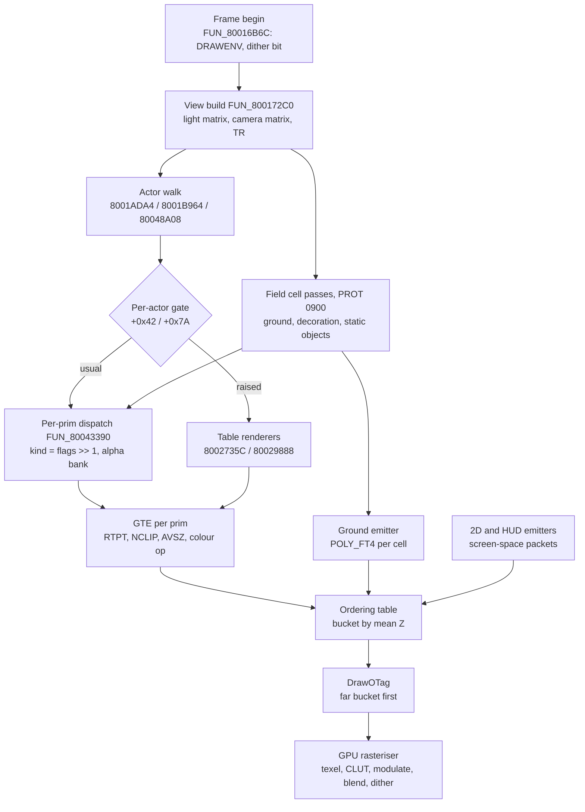
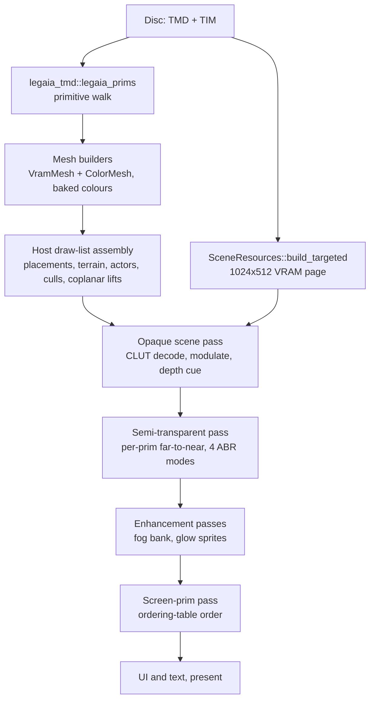
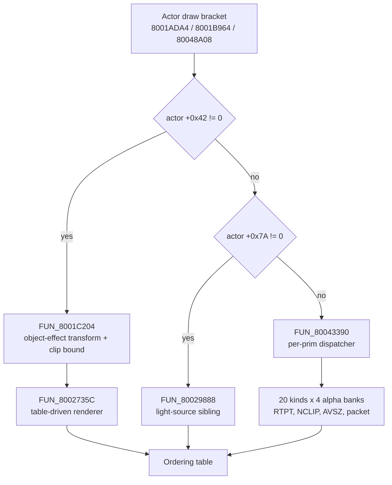
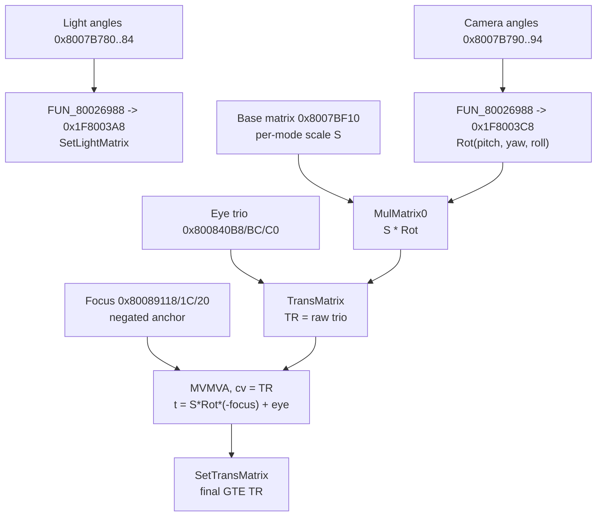

# Renderer (Legaia TMD)

How the game turns its 3D meshes into GPU packets, and how the port draws the
same frame. Retail Legaia transforms each primitive on the GTE (the
PlayStation's geometry coprocessor), sorts the resulting packets into an
ordering table, and lets the GPU rasterise them back to front with no depth
buffer. The port walks the same primitives out of the same TMD meshes and
draws them through wgpu (native) or WebGL2 (browser) against an emulated VRAM
page. This page covers the geometry half - dispatch, transform, ordering,
culling, the port's render passes and knobs. How a pixel gets its colour is
[`shading.md`](shading.md).

## At a glance

- **The leaf that draws retail's geometry is the per-prim dispatcher
  `FUN_80043390`.** The table-driven renderer `FUN_8002735C` (60 GTE ops,
  descriptor table `DAT_8007326C`) and its sibling `FUN_80029888` sit behind
  a gate on the drawn actor's `+0x42` / `+0x7A`, raised only for scripted
  beats ([which leaf](#which-mesh-leaf-a-frame-actually-enters)).
- **Shading defaults to retail.** Nearly every primitive draws its TMD's
  baked colour word through the GTE depth cue, with no light source. The
  exception is the light-source rows (TMD group flags `0x10..=0x17`), which
  the dispatcher sends to its `NCCS` / `NCCT` handlers and which shade
  through the GTE light. The port does both by default on both hosts
  ([Lighting](#lighting)).
- **Rasterisation defaults to clean.** `Renderer::set_psx_mode` is opt-in and
  gates vertex jitter + 15-bit dither only. Affine UVs are unconditional, and
  they are the faithful behaviour
  ([knobs](#rendering-knobs-what-is-faithful-what-is-a-choice)).
- **Simulation is faithful with no opt-out.**
- **The port adds no culling of its own** - no frustum cull, no draw
  distance, no LOD. What drops geometry is retail's: the visible-tile crop at
  retail's framing, the actor cull and the per-primitive rejects. The clip
  volume holds the whole scene (`SCENE_FAR`)
  ([culling](#no-distance-culling-every-loaded-body-is-drawn)).
- **Retail has no depth buffer; the port has one**, and resolves the coplanar
  surfaces retail's painter order hides with a small set of shared kernels
  ([coplanar surfaces](#coplanar-surfaces-retails-ordering-model-the-ports-depth-policy)).
- **Enhancements are layered on top and default on in the play hosts**:
  enhanced lighting, the camera-occlusion fade, volumetric ground fog. Each
  is pixel-identical to the faithful render when off.

### The retail frame



### The port's frame



| Port piece | Crate |
|---|---|
| Primitive walk, mesh builders, coplanar passes | `crates/tmd` (`legaia_prims`, `mesh`) |
| wgpu renderer, VRAM page, shaders, blend / dither / occlusion kernels | `crates/engine-render` |
| wgpu-free kernels both hosts link: GTE math, `screen_prim`, `vram_capture`, `battle_intro`, `scene_lighting`, `prim_near_reject` | `crates/render-kernels`, re-exported by `crates/engine-ui` |
| Scene VRAM build, culls, lifts, per-frame draw plans | `crates/engine-core` and the crates it re-exports |
| Native draw-list assembly | `crates/engine-shell` (`window/`) |
| Browser draw-list assembly and WebGL shaders | `crates/web-viewer`, `site/js/webgl-*.js` |

## Which mesh leaf a frame actually enters

The mesh-chain walk is a **three-way** choice, opened by the same test at
every site. `FUN_8002735C` has exactly three `jal` sites in `SCUS_942.54`
(and one in the dev image PROT 0973); each is the far arm of a test on the
drawn actor's `+0x42` halfword:

| Bracket | Gate | Far arm (`+0x42 != 0`) | Near arm |
|---|---|---|---|
| `FUN_8001ADA4` | `lh $s7,0x42($s0)` at `0x8001B220`, `bne` at `0x8001B454` | `jal 0x8002735C` at `0x8001B594` | `+0x7A != 0` &rarr; `FUN_80029888`, else `FUN_80043390` |
| `FUN_8001B964` | `lhu $s2,0x42($s0)` at `0x8001B9E0` (copied to `$s7` at `0x8001BB00`), `bne` at `0x8001BC64` | `jal 0x8002735C` at `0x8001BD88` | same |
| `FUN_80048A08` | `lh $v0,0x42($s0)` at `0x80048E9C`, `bne` at `0x80048EA4` | `jal 0x8002735C` at `0x80048FE4` | same |



The gate is a property of the actor, not of the mode. In ordinary play the
near arm's dispatcher is the leaf.
`scripts/pcsx-redux/autorun_w4c_mesh_path_census.lua` taps the three renderer
entries and the three gates over four save states, 180 vsyncs each - a
`town01` battle (mode `21`), a `map03` world map (mode `3`), a `nilboa`
in-engine cutscene (mode `3`) and the casino slot machine (mode `3` &rarr;
`24`):

- `FUN_8002735C` entries: **0** of 720 vsyncs; `FUN_80029888` entries: **0**.
- Gate hits: 5089 actor draws, every one with `+0x42 == 0` (and so
  `+0x7A == 0`).
- `FUN_80043390` entries: 10621.

The battle state enters none of the three brackets (zero gate hits, 1710
`FUN_80043390` entries). It sits at the command menu; the third bracket
`FUN_80048A08` is what the arts after-image renderer `FUN_80049348` draws each
motion-trail ghost through, so a swing is the frame that exercises it. On
`map03` the world map's case-5 landmark gate fired 756 times in 180 vsyncs
and took the near arm every time ([`world-map.md`](world-map.md)).

### The disc does ship writers of `+0x42`

The census is a statement about the sampled states, not about the disc.
Three writer families put a non-zero value in that halfword:

- **The actor allocator (dev-reachable only).** `FUN_80020DE0` clears `+0x42`
  at `0x80020EAC` and, when `_DAT_8007B6D0 & 2`, writes `2` at `0x80020EC0`
  (`lui v1,0x8008` / `lw v1,-0x4930(v1)` at `0x80020E88..0x80020E8C`,
  `andi 2` / `beq` at `0x80020EB0..0x80020EB4`). The global is the dev
  counter: `sw zero,0x3b8(gp)` at `0x80015F64` boots it clear, and its only
  non-zero writers disc-wide are the debug menu's store at `0x801CED54`
  (PROT 0971) and the pad-driven 12-bit ring at `0x801EA00C` / `0x801EA030`
  in the field overlay (increments on pad bit `0x2000`, decrements on
  `0x8000`).
- **A move program.** Move-VM opcode `0x10` writes its u16 operand straight
  into the field: `lhu $v0,2($s0)` / `sh $v0,0x42($s2)` at
  `0x80023420..0x8002342C` ([`move-vm.md`](move-vm.md)). A cast or summon
  record that issues it non-zero raises the gate for its own actor.
- **A field script.** Field-VM `4C C2 <b>` stores its operand byte into the
  executing (or `0x80`-prefix targeted) actor's `+0x42`: `lbu v0,0x1(s6)` /
  `sh v0,0x42(s5)` at `0x801E26F0..0x801E26FC` in `FUN_801DE840`, `s5` being
  the actor the prologue resolved (`0x801DE898..0x801DE8B0`). The disc-wide
  [field-op census](../tooling/field-op-census.md) finds 50 clean occurrences
  in nine scenes - `garmel`, `rikuroa`, `station`, `uru`, `uru2`, `kor5`,
  `jou`, `rugi`, `noaru` - every operand `0` or `1`, raised and lowered
  around a scripted beat; several targets are the player (`F8`). Placed field
  actors are drawn by `FUN_8001ADA4` / `FUN_8001B964`, so these actors are
  drawn through the far arm while the byte is up.

The `sh $v0, 0x42(...)` pairs inside the brackets themselves (`0x8001B4C8`,
`0x80048F24`) are not writers: their base register is the scratchpad packet
block at `0x1F80xxxx`, a different struct that reuses the displacement.

### What a raised `+0x42` draws

The far arm is not only a different leaf. `FUN_8001ADA4` zeroes two scratch
triples at `0x1F8002C0` (`0x8001B570..0x8001B588`), calls `FUN_8001C204`, and
only then hands the object to `FUN_8002735C`.

`FUN_8001C204` reads `+0x42 - 1` as a row of the **object-effect parameter
table** at `0x80083FF8` (stride `0x14`). It saves the GTE rotation, loads the
base matrix, rotates it by the row's three angles (`+4`, `+2`, `+0`),
transforms the actor's position through that, folds in the actor's own Euler
`+0x24..+0x28`, and stores the working transform at `0x1F800314` with its
translation at `0x1F800328..0x1F800330`. It also copies the row's `+0x10` /
`+0x12` to `0x1F800380` / `0x1F800382` - the bound `FUN_80027F00`'s clip loop
reads as `[0x1F800314]+0x6C`, a word nothing else reads disc-wide besides a
store in the dev image PROT 0973.

So a raised `+0x42` gives the actor a group rotation about the row's frame
plus a per-actor clip bound. The row is written by move-VM ext sub-ops
`0x17..0x1A`
([`move-vm-overlay-ext.md`](move-vm-overlay-ext.md#0x170x1a-write-the-object-effect-parameter-table))
and seeded at boot as angles `0` with clip words `(-100, -20)`.

Every shipped `4C C2` writes `1`, so every field use selects row 0, and each
of the nine scenes' prescripts writes row 0 through ext `0x17` / `0x18` /
`0x1A`. The clip keeps the slab `lo <= y_eff <= hi`: `FUN_80027F00` drops a
vertex below `[0x1F800314]+0x6C` (`lo`) or above `+0x6E` (`hi`) and
synthesises the crossing on each edge. The effect point is
`s * Rrow * (Ractor * v + pos)` - world space turned by the row, because the
base `FUN_8001ADA4` stores at `0x1F8002F4` is the identity (`FUN_8003D178`,
`0x8001B230..0x8001B238`). A zero-angle row (`garmel`'s `0x17`, `lo = -4096`,
`hi = 0`) keeps an actor above the floor plane; the `0x1A` yaw seat
(`+4 = 0x400`) turns the slab into a vertical plane, so the actor appears as
it steps through a doorway - `rugi` and `noaru` seat theirs a few units in
front of the two NPCs their beat raises.

**The clip reads the posed vertex.** `FUN_8002735C` copies each prim's
object-local vertices to the stack and `MVMVA`s them through `0x1F800314`
(`0x800275A8..0x800275D0`); what that transform holds depends on the bracket:

| Bracket | Actors | Effect point |
|---|---|---|
| `FUN_8001ADA4` | static: placed objects, unanimated props | `s * Rrow * (Ractor * v + pos)` - the keyframe triples at `0x1F8002C0` / `0x1F8002C8` are zeroed |
| `FUN_8001B964` | animated: NPCs, the player | `s * Rrow * (Ractor * (Rkey * v + Tkey) + pos)` - the posed vertex |

For the animated bracket `FUN_8001C204` runs per object after `FUN_8001BE80`
has left that object's interpolated keyframe translation at `0x1F8002C0` and
its angles at `0x1F8002C8..0x1F8002CC`. It transforms the translation through
`Rrow * Ractor` (`FUN_8003D344` at `0x8001C2B8`), adds the transformed actor
position (`0x8001C2C8..0x8001C300`), and turns the matrix by the keyframe's
`RotZ` / `RotY` / `RotX` (`0x8001C2FC..0x8001C328`).

**Port.** `engine-core::object_effect` holds the table (boot seed, battle
re-seed, the four ext writes through the field `MoveHost`) and the clip
math. `World::object_effect_clips` lists every raised context and
`World::object_effect_mesh_clip` turns one into a mesh-space slab for a
draw's model matrix. Both hosts discard outside that slab per draw: the
native mesh shaders through `EFFECT_CLIP_WGSL` (three half-float lanes of the
draw's uniform, staged by `Renderer::set_draw_clips`), the play page through
`u_eclip_m` / `u_eclip_b` (`play_effect_clip`). A fragment discard keeps the
same pixels as retail's per-edge clip, and since each draw clips in its own
mesh space - the posed mesh for an animated actor - both brackets agree with
retail.

A `4C C2` aimed at the player (`CC F8 C2`, five of the 50 sites, in `uru2`,
`rugi` and `noaru`) runs on the same player stand-in context the `CC F8 40`
scale op uses (`field_step_routed`) and lands in
`FieldVmState::player_field_42`, so the player's draws clip on both hosts
too. Disc-gated test: `crates/engine-core/tests/object_effect_row_disc.rs`.

One known difference: the effect transform leaves out the side buffer's look
turn (`4C 45`,
[`script-vm-menuctrl.md`](script-vm-menuctrl.md#4c-45-the-11-byte-form)).
`FUN_8001B964` applies it to the drawn object (`0x8001BB40..0x8001BB88`) but
`FUN_8001C204` never reads `+0x94..+0x9A`, so retail clips the unturned head
and the port clips the turned one. It shows only on an actor carrying both
at once.
## Per-mode descriptor table

The table-driven renderers read an 8-byte-stride table at `0x8007326C` as a
packed `{u32 first; u32 second}` per row. The row is
`((flags >> 1) - 8) >> 1`, **byte3 = `first >> 24`** is the shape selector and
**byte4 = `second & 0xFF`** is the base vertex-index offset in u16 units.
Because the row index shifts twice, each row covers four `flags` values - a
tri pair and a quad pair - and the legal span is `flags 0x10..=0x27`
(`flags >> 1` in `8..=0x13`):

| flags (tri / quad) | row | raw 8 bytes               | byte3 (shape) | byte4 (vtx off) |
|--------------------|-----|---------------------------|---------------|-----------------|
| 0x10/11 · 0x12/13  | 0   | `04 00 00 05 07 00 00 00` | 0x05          | 0x07            |
| 0x14/15 · 0x16/17  | 1   | `09 00 00 07 06 00 00 00` | 0x07          | 0x06            |
| 0x18/19 · 0x1A/1B  | 2   | `04 00 00 00 02 00 00 00` | 0x00          | 0x02            |
| 0x1C/1D · 0x1E/1F  | 3   | `06 00 00 02 06 00 00 00` | 0x02          | 0x06            |
| 0x20/21 · 0x22/23  | 4   | `07 03 00 01 07 00 00 00` | 0x01          | 0x07            |
| 0x24/25 · 0x26/27  | 5   | `09 03 00 03 0B 00 00 00` | 0x03          | 0x0B            |

- The low 2 bits of byte3 select the packet shape: `0` flat untextured, `1`
  flat textured, `2` gouraud untextured, `3` gouraud textured.
- The quad bit `(flags >> 1) & 1` picks tri or quad, which is why each row's
  second `flags` pair is its quad form.
- Byte1 says whether the prim carries a leading **colour** block: rows 4/5
  (`flags 0x20..=0x27`, `byte1 = 3`) do, rows 0-3 (`byte1 = 0`) do not.
- Rows 0/1 are the **light-source** textured rows: the texture block starts at
  prim offset 0 and normal indices trail the vertex indices.

The full per-mode record layout is in [`formats/tmd.md`](../formats/tmd.md).

## Per-prim dispatch table (`FUN_80043390`)

`FUN_80043390` is the per-prim dispatcher, and the leaf retail geometry comes
out of. It decodes a primitive kind (`0..19`, `flags >> 1` - `srl s5,s7,0x11`
at `0x800435A4`) and a count, then tail-calls a **20-slot x 4 alpha-bank jump
table**: `0x8007657C` on the SCUS path, `0x801F8968` when the world-map overlay
is paged in (`_DAT_1F800394 & 1`). Each handler runs `RTPT` / `RTPS`, an
`NCLIP` back-face cull, `AVSZ3` / `AVSZ4` for depth, and writes a packet into
the ordering table (deferred `DrawOTag`; no direct GPU DMA).

The alpha bank is the `_DAT_1F800028` offset the dispatcher itself writes:
`0x00` with no blend argument, else `0x50`, raised to `0xA0` by tint bit
`0x04000000` and to `0xF0` by bit `0x20000000` (`0x800434D8..0x80043500`). The
bank is not the blend equation: that is `((a1 >> 24) & 3) << 21`, stored
separately to `0x1F800030`.

| kind | bank 0 (opaque) | banks 1-3 (depth-cued) | topo | colour op |
|---:|---|---|---|---|
| 0-7 | - | - | - | none (NULL in every bank) |
| 8 | `0x8004409C` | (shared) | tri | **NCCS** (lit) |
| 9 | `0x8004423C` | (shared) | quad | **NCCS** (lit) |
| 10 | `0x80044434` | (shared) | tri | **NCCT** (lit) |
| 11 | `0x800445B0` | (shared) | quad | **NCCT+NCCS** (lit) |
| 12 | `0x80043658` | `0x800448B0` | tri | DPCS (cued banks) |
| 13 | `0x80043768` | `0x80044A3C` | quad | DPCS |
| 14 | `0x80043B58` | `0x80044FDC` | tri | DPCT |
| 15 | `0x80043C6C` | `0x80045194` | quad | DPCT+DPCS |
| 16 | `0x800438B8` | `0x80044C14` | tri | DPCS |
| 17 | `0x800439E4` | `0x80044DC8` | quad | DPCS |
| 18 | `0x80043DD4` | `0x800453BC` (b2 `0x800457C4`) | tri | DPCT/DPCS |
| 19 | `0x80043F10` | `0x80045584` (b2 `0x80045988`, b3 `0x80045BB4`) | quad | DPCT/DPCS |

Structural facts, read from the raw table:

- **Kinds 8-11 are bank-invariant** and the only handlers carrying a light
  source. Their consumer is the field's
  [light-source rows](#the-light-source-rows).
- **Kinds 12-19 are bank-dependent**: bank 0 is opaque with no colour op,
  banks 1/2/3 add the `DPCS` / `DPCT` depth cue. These are the hot path:
  runtime GTE sampling of a summon / battle catches kinds 16 (bank 1,
  `0x80044C14`) and 18/19 (bank 2, `0x800457C4` / `0x80045988`).
- **Topology is parity-based** (from `AVSZ3` vs `AVSZ4`): even kinds are
  triangles, odd kinds quads.
- **Bank 3** (offset `0xF0`) is a depth-cued handler set like banks 1 and 2,
  not a blend mode. It is the only bank that selects `0x80045BB4`, a
  composite / tessellating body (emits both `POLY_G3` and `LINE_F2`, dual
  `RTPT`). No world-map capture sets the flag that reaches it
  ([`world-map-overlay.md`](../formats/world-map-overlay.md) has the per-bank
  counts); unreached in a capture is not unreachable, so it belongs in any
  sweep of the family.
- **`0x80044798` is not a table entry.** It sits between the lit set and the
  cued banks and is a transform-free `mfc2`-only read-back / packet-pack
  helper. The cued bodies for kinds 12..19 are full per-kind handlers past
  it, running to about `0x80045BB4`.
- **The world map swaps the handlers.** The bulk-terrain path uses eight
  overlay-resident replacements for kinds 12..19 (`0x801F7644..0x801F8690`,
  PROT 0901), so a sweep bounded to the SCUS span misses them, and on a
  kingdom overworld the SCUS family is not entered at all.

Provenance: the table's computed `jr` is not statically resolvable, so the
map is read from the SCUS PSX-EXE directly (`t_addr = 0x80010000`, file
offset = `VA - 0x80010000 + 0x800`).

Port: `legaia_engine_vm::prim_dispatch` models the table - `slot_to_kind`
(topology-correct `PolyKind`), `slot_lit` (`NccMode` for slots 8-11) and
`RenderMode::applies_depth_cue` (the cued banks). The `NCCS` / `NCCT` kernels
are `legaia_engine_ui::gte::lighting`, exercised by the `gte_trace` parity
oracle.

## Per-primitive TMD render helpers (`FUN_8002735C` family)

Three helpers hang off the table-driven renderer `FUN_8002735C`. None is
ported as a routine: the port projects and rasterises through wgpu, and the
one visible effect of the clip - the object-effect slab - is reproduced as a
fragment discard ([below](#what-a-raised-0x42-draws)).

- **`FUN_80027C6C`** - the per-primitive GTE emitter. Loads a group's
  vertices (`lwc2`), runs `RTPT` (`cop2 0x280030`), and dispatches on the low
  2 bits of the group mode byte (`F` / `FT` / `G` / `GT`) to pack the matching
  `POLY_*` packet into the primitive cursor `_DAT_1F8003A0`. See
  `ghidra/scripts/funcs/80027c6c.txt`.
- **`FUN_80027F00`** - the vertex clip loop. For each edge with an endpoint
  outside the bound at `[0x1F800314]+0x6C`, it computes the crossing fraction
  `((bound - a) << 12) / (b - a)` and calls the interpolator to synthesise a
  clipped vertex before handing the group to `FUN_80027C6C`. See
  `ghidra/scripts/funcs/80027f00.txt`.
- **`FUN_80029724`** - the interpolation kernel the clip loop calls. Given an
  output slot, two vertices and a q12 fraction `a3`, it lerps X/Y/Z
  (`out = b + ((a-b)*frac >> 12)`) and, by flag word `a2`, the packed
  attributes: bit `0x1` the UV pair at `+0x18/0x19`, bit `0x2` the RGB triple
  at `+0x14..0x16`, bit `0x800` selects the trailing endpoint. It carries a
  `[render_pipeline]` scope row in `scripts/ci/port-catalog-ignore.toml`. See
  `ghidra/scripts/funcs/80029724.txt`.
## Lighting

**Retail has no general light source.** Nearly every primitive is shaded by a
colour word baked into its TMD, run through the GTE depth cue and multiplied
into the texel by the GPU (`out = texel * colour / 128`). The one exception is
the [light-source rows](#the-light-source-rows) - TMD group flags
`0x10..=0x17` - which carry no colour word and take their colour from the GTE
light against their normals. The port does both by default on both hosts. The
full pixel chain - palette, colour word, depth cue, blend, dither - is
[`shading.md`](shading.md); this section holds the renderer-side evidence.

The trap for any new draw path: an unbound colour attribute defaults to
white, and white is `texel * 255/128`, so a missing colour stream reads as
"too bright", not as "unlit". A synthetic Lambert survives only in two viewer
aids - the asset-viewer's bare-geometry `MESH_SHADER_SRC` and the site's lit
bestiary preview - and neither is a claim about retail.

### What issues a colour op

- **The two table-driven renderers issue one.** `FUN_8002735C` and its
  light-source sibling `FUN_80029888` between them issue exactly one GTE
  colour op: `DPCS` (`cop2 0x780010`; command `0x10`, `sf = 1`), the depth
  cue. Neither issues `NCDS` / `NCDT` / `NCS` / `NCT` / `NCCS` / `NCCT` /
  `CDP` / `CC`.
- **The light matrices are populated anyway.** `FUN_8005B648`
  (`SetLightMatrix`) fills `L` (cr8-12) and `FUN_8005B678` (`SetColorMatrix`)
  fills `LC` (cr16-20).
- **Four handlers consume them.** A disc-wide `cop2` census
  (`scripts/ghidra-analysis/find-gte-light-consumers.py`, over `SCUS_942.54`
  plus every statically based overlay image) finds five light-matrix consumer
  sites, all in SCUS, all inside dispatch kinds 8..11 (`FUN_8004409C` /
  `FUN_8004423C` / `FUN_80044434` / `FUN_800445B0`): `NCCS` at `0x800441C8`,
  `0x800443C8` and `0x80044750`, `NCCT` at `0x80044540` and `0x80044724`. No
  overlay contains one, and `NCS` / `NCT` / `NCDS` / `NCDT` occur nowhere.
- **Nothing else can reach `L`.** `MVMVA` can select the light matrix through
  its `mx` field, and disc-wide none does: 29 select the rotation matrix, one
  the colour matrix. The sweep covers 238 GTE command words over roughly two
  megabytes of code.

The census is of opcodes because the light matrix is consumed implicitly, by
the GTE's own normal-colour commands; an xref query cannot answer it. A GTE
command word is four unrelocated bytes, so it also occurs in data (`"ATK "`
in a menu string, words of PROT 0899's and 0895's data segments). The sweep
keeps a hit only when it sits among several **distinct** `lwc2` / `mtc2` /
`mfc2` / `swc2` neighbours - real commands have five to eight, data hits zero
or one - which rejects 37 GTE-shaped words.

Two instrument limits to keep in mind when re-measuring: the static recomp's
`gte_ring` records only `RTPS` / `RTPT` (`0x01` / `0x30`) and `INTPL`
(`0x11`), so "zero NCC in a GTE-ring dump" is vacuous; and a scene with a
white back colour (`town01`, op `4C 8A`) draws its few lit rows at or above
neutral, where a frame cannot tell them from baked ones. `cave01`'s dark
walls can.

### The light-source rows

The field object and decoration passes emit through `FUN_80043390`, and flags
`0x10..=0x17` are its kinds `8..=11`, the `NCCS` / `NCCT` handlers. Those are
descriptor-table rows 0 / 1: textured rows with a normal index per prim or per
corner and no colour word ([`tmd.md`](../formats/tmd.md)). Most scene packs
hold few or none; `cave01`'s rock columns are nothing else.

A lit-row corner's colour is the GTE's `NCCS` / `NCCT` (`sf = 1`, `lm = 1`):

```text
IR   = clamp0(L * n >> 12)                  L: light matrix, n: TMD normal
IR'  = clamp0((BK << 12) + LC * IR >> 12)   BK: back colour, LC: colour matrix
out  = RGBC * IR' >> 12                     saturated to 0..255 per channel
```

Every input is disc data or a retail global:

| Input | Source |
|---|---|
| `RGBC` | The dispatcher's colour argument times the object's `+0x18` colour word, `>> 7` per channel (`0x80043404..0x8004347C`, staged only for an object with normals). Both field sweeps pass `0x808080` (`_DAT_8007BB48` for the decoration pass, the actor's `+0x74` for a placed object), and `cave01`'s lit objects carry `0x808080`. |
| `BK` | `_DAT_8007B788`'s three low bytes, each `<< 4` (`0x80043418..0x8004346C`). |
| `LC` | The static block `0x800704EC` (`FUN_8001DCF8` uploads it with `SetColorMatrix`): every row `(4096, 0, 0)`, so all three channels follow the first light alone. |
| `L` | The world light matrix `FUN_800172C0` builds each frame into `0x1F8003A8` from the angle trio `_DAT_8007B780..84` with `0x800` added to the first (`FUN_80026988`, `Rx * Ry * Rz`), folded with the draw's rotation before `SetLightMatrix`. |

The fold differs per pass: the placed-object draw `FUN_8001ADA4` takes
`L * Rot(angles)` (`0x8001B2F4..0x8001B368`), and the decoration pass
`FUN_801F7088` turns the matrix through `Rz`, `Ry`, `Rx`
(`0x801F781C..0x801F7870`). A corner's intensity is therefore the light
against its **world** normal.

Every scene load resets the trio to `(0x994, 0x9CC, -0x62C)` and the back
colour to `0x202020` (`FUN_8003AEB0` at `0x8003B4B4..0x8003B4D8`). Field-VM op
`4C 8A` sets all four: `town01`'s `P1[0]` sets a white back colour, `koin3`'s
cutscene records set black and `0x582020`. Under the load default a face
turned from the light keeps `0x80 * 0x200 >> 12 = 0x10` - an eighth of its
texel - and a face square to it takes `0x90`.

Evidence:

- The `cave01_attached_light` state holds exactly the scene-load trio, back
  colour and matrix (`engine-vm::field_light`'s test pins the matrix element
  for element). Shaded this way, the port's frame of that state matches
  retail's to within the image channel's noise.
- Exec breakpoints (`autorun_w4d_light_kind_hits.lua`,
  `LEGAIA_WARP_BTN=NONE`) on that state count 882 kind-8 and 200 kind-9
  entries in 60 vsyncs, every one returning to `0x801F78D4` - the decoration
  pass's `jal 0x80043390` - with the depth-cue control group live beside
  them.

**Port.** Both hosts run one kernel,
[`field_lit_mesh`](../../crates/engine-field/src/field_lit_mesh.rs)
(re-exported as `engine-core::field_lit_mesh`), over the light state in
[`engine-vm::field_light`](../../crates/engine-vm/src/field_light.rs). The
mesh builder keeps each lit vertex's normal and object colour
(`legaia_tmd::mesh::LitVertex`). Because the intensity depends on the draw's
rotation, a lit mesh gets one shaded copy per `(mesh, rotation)`:
`play-window` keys its copies by the draw matrix, the play page by the record
angles (`field_mesh_lit`), and the site's field-scene viewer the same way
(`field_scene_mesh_posed_lit`). A live op `4C 8A` re-shades them.

A posed placed prop (a door, a windmill - most of `town01`'s and `bylon`'s
lit rows sit on them) shades its frame-0 rest pose with each normal turned by
its bone (`tmd_to_vram_mesh_posed_rot_lit`) before the draw's rotation folds
in. `play-window` re-shades a prop off its rest pose every frame; the two
browser pages re-pose positions only and keep the frame-0 colours. The
kingdom overworld packs carry no light-source rows, so the world-overview
page has nothing to shade, and the prologue legs keep their ambient restage.

### The baked colour word and the depth cue

Every other primitive carries a colour word `[R][G][B][GP0 code]`. The code
byte is one of `0x20` (`F3`), `0x24` (`FT3`), `0x28` (`F4`), `0x2C` (`FT4`),
`0x30` (`G3`), `0x34` (`GT3`), `0x38` (`G4`), `0x3C` (`GT4`), each optionally
`| 2` for the semi-transparent variant. A flat prim stores one word; a
gouraud prim one per corner, and only the leading word carries the command
byte. The renderer loads the word into the GTE's `RGBC`, runs `DPCS`, and
hands the result to the GPU as the packet colour. What the GPU does with it
is [`shading.md` step 4](shading.md#step-4-the-colour-word---why-raw-textures-look-darker-or-brighter).

Across the field scenes' environment packs about 79% of colour components
sit below `0x80`, 12% at it and 10% above, which is why retail's field has
more contrast than a render without the colour stream.

`DPCS` blends the colour toward the far colour (`RFC` / `GFC` / `BFC`,
cr21-23) by `IR0`. Both are staged per drawn object: `FUN_80029888` writes
the far colour from its `param_2` (each byte `<< 4`) and `IR0` from
`param_3`, and `FUN_80043390` does the same and also stages the back colour
(`RBK` / `GBK` / `BBK`, cr13-15), which only the `NC*` ops consume. An
unfogged field scene passes `IR0 = 0`, making the cue the identity: a retail
`town0c` capture's GTE register file shows `RGB.Raw8 = 30 30 30 34` (a `GT3`
prim) and an `RGB_FIFO` of `0x30, 0x60, 0x30` - the prim's three baked corner
colours, out of the op unchanged.

**Port.** `legaia_tmd::legaia_prims::Prim::colors` is populated for every
prim (the lit rows get `MODULATION_NEUTRAL` and are shaded by the kernel
above). It flows through `legaia_tmd::mesh::VramMesh::colors` to a per-vertex
attribute on the VRAM-mesh pipeline and into `psx_modulate` /
`psx_depth_cue` in the shader prelude, mirrored on the CPU by
`legaia_engine_render::psx_light` and pinned by its tests. The far colour and
`IR0` are set with `Renderer::set_depth_cue` (default `IR0 = 0`); the opening
prologue's per-node pull is a view-depth `IR0` ramp
(`Renderer::set_depth_cue_ramp`, see
[the grade section](#full-scene-colour-grade)).

### The same shading in an exported `.glb`

An export is one more surface the packet colour has to survive. The three
exporters (`legaia_asset::monster_gltf` / `scene_gltf` / `character_gltf`)
carry it as a **`COLOR_0` vertex attribute** under the one convention in
`legaia_asset::gltf_color`:

| prim | attribute | over |
|---|---|---|
| textured | `srgb_to_linear(colour / 128)` | `baseColorTexture` (the atlas) |
| untextured | `srgb_to_linear(colour / 255)` | a white base (the fill) |

- **The divisor differs between the halves.** Reading one array for both
  halves a textured model or doubles an untextured one.
- **The ratio goes through the sRGB EOTF.** Retail (and the site's WebGL
  canvas) multiplies in display space; a glTF viewer multiplies in linear
  light after sRGB-decoding the texture. The raw ratio would render
  `texel * (colour/128)^(1/2.2)`, washing dark packet words toward gray (dark
  clothing at about x0.79 instead of x0.59). The linearized factor cancels
  the viewer's round trip - exactly for untextured fills, to within a few
  8-bit steps for textured prims.
- **The accessors are float.** A faithful factor exceeds 1.0
  (`0xFF / 128 = 1.99` display, about 4.9 linear), which normalized integer
  `COLOR_0` cannot express. The PSX clamps the *product* at 255, exactly
  where an LDR renderer clamps its output, so an unclamped float is
  equal-or-closer to the canvas than a pre-clamped one.
- **Materials declare `KHR_materials_unlit`** in `extensionsUsed`, never
  `extensionsRequired`, so a viewer's lights do not re-introduce a synthetic
  Lambert and non-supporting viewers fall back to the material's PBR fields.

`crates/web-viewer/tests/glb_packet_colour_real.rs` re-reads a summon `.glb`
and compares its `COLOR_0` accessors against the stream the canvas uploads.

### No handler in the lit set executes on a kingdom overworld

The lit kinds 8..11 run for field light-source rows and, as far as capture
shows, for nothing else. Battle, summon and `map01` samples never catch them,
and the `map01`-class world map dispatches through its own jump table
(`0x801F8968` to the 0901 overlay's emit leaves), so it never reaches the
SCUS handlers. Not the kingdom slot-4 "landmark meshes": slot 4 is an ANM
animation bank with no geometry
([`world-map-overlay.md`](../formats/world-map-overlay.md)).

Exec breakpoints settle it, since they cannot miss an execution.
`scripts/pcsx-redux/autorun_w4d_light_kind_hits.lua` arms one on each of
`0x8004409C` / `0x8004423C` / `0x80044434` / `0x800445B0` and walks the pad:

| Run | What it covers | Lit hits (8/9/10/11) |
|---|---|---|
| `sol_to_karisto_worldmap` | warp in, then walk `map03` for 1111 field frames | 0 / 0 / 0 / 0 |
| `octam_to_sebucus_worldmap` | `map02` for 347 frames, then the `ropeway` field scene | 0 / 0 / 0 / 0 |
| `karisto_sol_pre_encounter` | rolls straight into a random encounter; about 1160 battle frames | 0 / 0 / 0 / 0 |

A zero needs a live control, and **the control has to change when the scene
does**. In the town window the SCUS bank-0 handlers for kinds 12..19 plus
kind 16 bank 1 fire (eight of nine inside the first frame). On the overworld
that same list reads zero over 1111 frames, because the terrain renders
through PROT 0901's replacements; re-armed on those (`0x801F7644` / `7838` /
`7AA4` / `7CCC` / `7F78` / `8198` / `8454` / `8690`), all eight fire on
`map03` at vsync 276 of the run that reads zero on the lit set.
## Other SCUS-band emitters

Beyond the TMD renderers, the SCUS render band carries smaller GTE / GPU
emitters. Per-address roles are in
[`reference/functions.md` § Renderer / GPU primitives](../reference/functions/renderer.md#renderer--gpu-primitives).
Each is either ported behind its render half, or reproduced by the wgpu path
and carried as a scope row in `scripts/ci/port-catalog-ignore.toml`:

| Routine | What it is | Port |
|---|---|---|
| `FUN_80028158` | Procedural ring / crown / fan builder: a Legaia TMD object of `GT4` packets ([`effect-vm.md`](effect-vm.md#the-default-arms-draw)) | **Ported and drawn** - `legaia_engine_core::effect_default_arm`, a byte-exact builder behind every default-arm node and every battle ground shadow |
| `FUN_8002A5A4` | One textured billboard quad into a caller buffer | Scope row (`render_pipeline`) |
| `FUN_801CFA48` | Lightning effect-ribbon random walk ([`battle-action.md`](battle-action.md#overlay-local-prng-fun_801d0290)) | **Ported and drawn** - `legaia_engine_core::effect_ribbon`, the geometry and the TMD packet chain it installs as the actor's model |
| `FUN_80019D50` | CLUT-cell HSV cycler ([`field-ambient-fx.md`](field-ambient-fx.md)) | **Ported** - `legaia_engine_core::clut_cell_fx`, live through `world::ambient` |
| `FUN_800351C0` | Full-screen `320x224` backdrop quad (tag `0x08000000`) | Scope row (`render_pipeline`) |
| `FUN_8001B73C` | On-screen visibility test, not an emitter ([probes](#on-screen-probes-two-tests-that-are-not-the-same-test)) | Scope row (`libgte`) |
| `FUN_80029DD8` | 39-`cop2`-op 3D primitive emitter, sibling of `FUN_8002735C` / `FUN_80029888` | Scope row (`render_pipeline`) |

`FUN_80028158` / `FUN_8002A5A4` / `FUN_801CFA48` are the three emitters the
per-actor render dispatcher `FUN_8001ADA4` case 4 picks on `actor[+0x9e]`;
each builds the actor's model for the frame into a caller buffer from a
packed count argument.

`FUN_80019D50` emits no quads. It walks a captured VRAM rect's 15-bit texels
through `FUN_8001A78C` / `FUN_8001A6C8` (RGB to HSV and back, `jal` at
`0x80019E30` / `0x80019F2C`), repacks them, and enqueues **one** `LoadImage`
packet of the whole rect on the cursor at `_DAT_1F800314+0x8C`
(`FUN_800583C8`, `0x8001A030`).

### 2D gradient-tile primitive - `FUN_8002BDC4`

`FUN_8002BDC4` (`ghidra/scripts/funcs/8002bdc4.txt`) fills a screen rectangle
with a tiled, double-gradient textured quad strip - the primitive behind
gradient panels and bar fills. It is a pure primitive-buffer writer with no
GTE transform.

- **Arguments:** an origin `(x, y)`, a texture descriptor `param_3`
  (`[0]=u0, [1]=v0, [2]=tile_w, [3]=tile_h`), a `tpage/clut` word `param_4`,
  and optional `w` / `h` overrides (`0` takes the descriptor's tile size).
- **Walk:** `tile_h + 8` row bands by `tile_w`-wide columns, one `0x34`-byte
  gouraud-textured quad (`0x0C000000` tag) per cell written at the cursor
  `_DAT_1F8003A0` and added through `FUN_8003D2C4`.
- **Shading:** a bilinear ramp. Luminance runs from `0x40` and steps by
  `0x900 / (h + 8)` down each band and by a per-column delta across each row.
  `param_4 & 0x80` toggles the base RGB word between `0x3E800000` and
  `0x3C800000`.
## The field ground pass: two emitters, one gate

The per-cell ground plane of a field scene is drawn by the slot-B field
render library **PROT 0900**, which ships the emitter twice as a
**depth-cued / flat pair** differing in one block:

| Body | File offset, size | Packet colour |
|---|---|---|
| `FUN_801F69EC` | `+0x14`, 860 B | through the depth cue: `RGBC` takes the colour word, `IR0` takes `SZ1 >> 3`, `DPCS` at `0x801F6C44`, result out of `RGB2` (`swc2 $22,4($t5)` at `0x801F6C4C`) |
| `FUN_801F6D48` | `+0x370`, 832 B | the raw colour word: `sw $s2,4($t5)` at `0x801F6F88`, no GTE colour op |

Every other instruction matches once the `0x1C` branch-displacement shift is
normalised, and both test `andi $s0,$s5,0x1000` on the cell word at the same
instruction index (`0x801F6AB4` / `0x801F6E10`).

The caller picks one at `0x801F79A0` (`beqz $a0`) on `_DAT_8007BB4C` (loaded
at `0x801F7958`). Non-zero calls `SetFarColor` (`FUN_8005B7D8`, three `ctc2`
into GTE control regs 21/22/23) with the bytes at `0x8007BB48..4A` and then
the depth-cued body; zero selects the flat body. Ordinary field play takes
the flat one (the selector reads zero in a `teien` field-run frame). Read
with `disasm-overlay-fn.py extracted/overlays/overlay_summon_render_0900.bin
--base 0x801F69D8 --addr 0x801F69EC` (and `0x801F6D48`).

`FUN_801F6D48(tile_x, tile_z, world_x, world_z)` is frameless and keeps its
state in the scratchpad through one base register `t6 = 0x1F800314`:

| Scratchpad | Role |
|---|---|
| `0x1F8003A0` | packet cursor - bumped `0x28` per emitted `POLY_FT4`, stored back at exit |
| `0x1F8003F4` | ordering-table base; `0x1F8003A4` is its shift |
| `0x1F8003EC` | the per-scene field-env block (the streamed `.MAP`) |
| `0x1F8003E8..EB` | the camera's visible-tile window, four **signed** bytes `x0, z0, x1, z1` |
| `0x1F80035C..7B` | the 16-entry floor-height ladder the corner tiers index |

The window bytes are relative tile offsets, so the double loop runs
`(x1 - x0) x (z1 - z0)` cells around the caller's tile; in `teien` that is
`32 x 48 = 1536` cells per pass. Per cell it reads the object-grid word at
`*(0x1F8003EC) + 0x8000 + (z << 8) + (x << 1)` and then:

- **gates on `cell & 0x1000`** (`0x801F6E10`). A cell without that bit
  branches straight to the loop increment; there is no second arm;
- takes the four corner tiers from the collision grid at `+0x4000` (`& 0xf`,
  through the height ladder), `RTPT`s them, and near-clips on `OTZ < 0x40`;
- indexes the object-record table at the block's base by `cell & 0x1FF`
  (`* 0x20`), taking the tile's UVs from record `+0x14`, its tpage / CLUT
  from `+0x1C` / `+0x1D`, and OR-ing the semi-transparency bit when `+0x1A`
  is non-zero;
- sorts on `cell & 0x8000`: set, the packet goes in the bucket its farthest
  vertex `Z` picks (`(max SZ >> 5) + 2`, the `sub` / `bgez` / `move` steps at
  `0x801F6FAC..0x801F6FD8`); clear, it goes in the fixed far bucket
  `(0x3FF6 >> ot_shift) * 4`.

### The far bucket draws under everything

The far bucket is the last ordering-table slot, which the GPU walks first, so
a far-bucket ground cell is painted over by every other primitive in the
frame, nearer or not. A depth buffer agrees for a **flat** cell but not for a
**sloped** one: where a cell's corner tiers are a cliff apart it is a
near-vertical sheet of ground texture that retail never shows, because the
cliff mesh in front paints over it. `town01`'s cell `(30, 38)` is the worked
case: three corners on the town floor, one on the plateau 384 units up.

The port keeps the bit as `WalkHeightfield::far_bucket`
(`legaia_asset::field_objects::CELL_GROUND_DEPTH_SORTED`, field ground only;
the overworld emitter keys every cell on its own corners). The shared kernel
`legaia_engine_core::field_ground::flat_refs` marks cells in the per-vertex
flat-depth references both hosts upload beside the ground, and the ground
shaders - `field_far_bucket_depth` in `engine-render`, `fieldFarBucket` in
`site/js/webgl-shaders.js` - act on the mark:

- **Sloped far-bucket cells** (`x0` / `x1` pair swapped) have their depth
  scaled into the thin slice at the far end of the range, keeping their own
  per-pixel order inside it.
- **Flat far-bucket cells** (`z0` / `z1` pair swapped) are pushed back by
  `field_ground::FLAT_FAR_BUCKET_PUSH` of their depth - within half a
  percent of real. Post passes that read the depth buffer (the volumetric
  fog's soft edge, the lamp halos) still see the floor where it is, while a
  decal authored on the floor plane paints over it. Without the push the two
  tie at float rounding: `doman`'s subtractive shadow strips (CLUT `0x7F84`,
  tpage `0x5F`), a tenth of a unit above the sunk ground at view depth near
  1700, lose every pixel.

Disc-gated pin: `crates/engine-core/tests/field_ground_far_bucket_disc.rs`.

### No draw channel is gated on object-grid bit `0x0800`

Bit `0x0800` marks a **kind-2 tile-trigger** cell (the elevation override
`FUN_80017BEC` stamps as `0x200 << kind`). Retail has no ground channel keyed
on it, and the search space is small enough to say so exhaustively:

- Of the 84 images with a static base (`SCUS_942.54` plus the 83 mapped
  overlays), only eight contain an instruction form that can reach the
  field-env pointer at scratchpad `0x1F8003EC` - the direct
  `lw rY, 0x3EC(rX)` or the `ori rX, rX, 0x314` + `lw rY, 0xD8(rX)` pair -
  and only PROT 0900 and PROT 0901 are per-cell render passes.
- Each of those two has exactly one `andi rt, rs, 0x800` (`0x801F78B8` in
  0900, `0x801F7244` in 0901), and both read an **object record's** `+0x12`
  flag halfword, not a cell word. Both OR `0x10000000` into the argument of
  `FUN_80043390`.
- The libraries' only per-cell passes are this ground pass (gate `0x1000`)
  and the static-object pass at `0x801F756C` (gate `0x2000`).
- In SCUS the sole consumer of cell bit `0x0800` is the floor sampler
  `FUN_80019278` (`0x8001932C` / `0x80019384`, see
  `ghidra/scripts/funcs/80019278.txt`), which returns a height and emits
  nothing.

A live pass confirms the gate. In a `teien` field-run frame (`teien_field_run`
in [`scenarios.toml`](../../scripts/scenarios.toml), probe
`scripts/pcsx-redux/autorun_field_ground_cells.lua`) the pass visits all 1536
window cells and emits **370** packets: every visited cell carrying `0x1000`
emits, no cell without it does, and none of the 42 `0x0800`-only cells in the
window produces anything. The scene's live grid is 451 non-zero cells - 400
with `0x1000`, 53 with `0x2000`, 45 with `0x0800` and no `0x1000`. Those 45
are a solid `6 x 6` block at tiles `(40..45, 46..51)`, a ten-cell run along
`z = 28` and three cells at `z = 6`: a raised platform plus a step
(`edteien` has the same shape and the same 400 / 45 split). The port's
`build_walk_heightfield` gate matches retail's.

## The billboard projector (`FUN_800195A8`)

Every camera-facing rectangle in the game goes through one helper: `MVMVA`
the centre point into view space, fan four corners out around it with 16-bit
adds, reset the GTE rotation to identity with `TR` zeroed, optionally compose
an in-plane `Rz` from the 12-bit-angle LUT, then `RTPT` + `RTPS` the corners
and hand back four SXY words plus `SZ3 >> 2` as the OT bucket. Riders include
the battle move-FX afterimage streak and ribbon (`FUN_801E1AB0` /
`FUN_801E1D98`), the on-screen probe `FUN_8005126C` below, and the cutscene
and world-map sprite emitters.

Two properties of the projection are hardware, and a port has to reproduce
them:

- The perspective divide is the GTE's **UNR reciprocal**, not an exact
  `h * x / z`, and `MAC0 >> 16` is an arithmetic shift - it floors. A
  symmetric box does not project symmetrically about the screen centre.
- `swc2` stores the **SXY FIFO** entry, already saturated to signed 11 bits
  (`[-0x400, 0x3FF]`). A behind-camera corner is not a special case: `SZ3`
  clamps to `0`, the divide returns its saturated `0x1FFFF` quotient, and the
  corner lands near `OFX + 2 * IR1` - the classic behind-the-lens smear.

Port: [`legaia_engine_ui::billboard`](../../crates/render-kernels/src/billboard.rs),
on the same `gte_divide` / `saturate_sxy` kernels the `Camera::transform`
COP2 oracle is pinned against.

## On-screen probes: two tests that are not the same test

Retail has two GTE-backed "is this thing visible" probes. Both project a box
about an actor and return a boolean, and they are not interchangeable:

| | `FUN_8001B73C` | `FUN_8005126C` |
|---|---|---|
| box | actor `+0x14` ± `(size+1)<<6` in X/Z, `<<7` in Y | seat position ± `actor[+0x58]`, square |
| projection | `RTPT` per corner triple, in-line | the billboard projector `FUN_800195A8` |
| accept | any corner inside a real rectangle | the box's horizontal **span** overlaps the screen band |
| Y tested | yes, `0 <= y < 0xF1` | **no** |

`FUN_8001B73C` is the rectangle test: it takes the first corner whose X
passes `sltiu 0x140` (unsigned, so negatives fail on the same instruction)
and whose Y is in `0 ..= 0xF0`.

`FUN_8005126C` is the battle sprite's re-anchor + horizontal test. It
resolves the sprite's owner through the 8-slot battle actor table
`&DAT_801C9370` at `actor[+0x5A]`, copies that actor's `+0x3C` `SVECTOR`
into its own `+0x14`, projects a square box of half-extent `actor[+0x58]`
about it with no in-plane spin, and reads back two halfwords: the X of
corner 0 and of corner 1. It rejects only when both are `>= 0x141` or both
are `< 0`. No Y is read, so an actor a full screen above or below the
viewport still reads as on-screen.

Port: [`legaia_engine_render::battle_on_screen`](../../crates/engine-render/src/battle_on_screen.rs)
(`battle_actor_on_screen`), on
[`billboard::project_billboard`](../../crates/render-kernels/src/billboard.rs).
It is inert, and so is retail's: `0x8005126C` has no reference of any kind on
the disc - no literal address word, `jal`, `j`, PC-relative branch or
`lui`+`addiu` pair - across `SCUS_942.54`, every based overlay image and the
raw bytes of every `PROT.DAT` entry
([`address-reference-scan.md`](../tooling/address-reference-scan.md);
[`battle.md` § Unreferenced SCUS entry points](../reference/functions/battle.md#unreferenced-scus-entry-points)).
No pass consults the verdict, so the port's lack of a cull here is parity;
the port carries the routine as a
[`REPLACED-BY`](../tooling/port-catalog.md#replaced-by) row.
## The battle per-actor draw

`FUN_80048A08` is the draw every battle body goes through once per rendered
frame - monsters, the party, and a player Seru summon's parts. It:

1. composes the actor matrix (`RotMatrix(actor+0x24)`, translation
   `+0x2C/+0x30/+0x34`, under the camera matrix saved at `0x1F8003C8`);
2. runs the pose decoder `FUN_8004998C`;
3. applies the render scale `actor+0x72` when it is not `0x1000`;
4. walks the mesh's objects (count `*(*(actor+0x4C)+0x88)`), handing each to
   one leaf: `FUN_8002735C` while `actor+0x42` is set, `FUN_80029888` while
   `actor+0x7A` is set (with the 12-byte row `0x8007BE60 + actor+0x6D * 12`),
   else the dispatcher `FUN_80043390`.

An actor whose `+0x10` carries bit `0x00800000` draws every object `0x50`
ordering-table buckets deeper. The function row is
[`80048A08` in the battle function table](../reference/functions/battle.md#80048a08);
see `ghidra/scripts/funcs/80048a08.txt`.

### Which bodies reach it, and with what colour

The draw is reached through the draw tick `FUN_800480D8`, which the render
dispatcher's mode-2 arm calls only for a body at view depth `>= 0xA1` - a
near-plane reject on the `MVMVA`'d `+0x34`, not an id window. The tick first
runs the tint pass `FUN_8004A908`, which writes the colour word `+0x74` and
weight `+0x78` this draw stages: the actor's lanes, a distance fade that
darkens a body past half its radius (brightens it on the outdoor stages), the
status colours and the cursor-dim arm. A zero word skips the draw unless a
lone defeated monster in a scripted fight is stamped grey.

Bit 26 of the word is the dispatcher's alpha-bank raise
([per-prim dispatch](#per-prim-dispatch-table-fun_80043390)); the tint pass
sets it for a body at depth `>= 0x180 * 16` (and for a near one carrying any
of `0x8300_0000`) on every seat but `7`.

Both play hosts run the pair per body per frame through
`World::battle_actor_draw_plan`; the decode and the capture match are in
[`battle.md`](battle.md#the-distance-fade).

### Rotted limbs draw dark

The colour word `actor+0x74` and blend `actor+0x78` are reloaded for **each
object** (`0x80048BEC..0x80048C00`), because a party seat (`actor+0x5A < 3`)
may override them per object. The seated battle actor's status word `+0x16E`
carries the three Rot limb bits, and a five-byte row per character at
`0x80077998` (indexed by the roster id `0x8007BD10[seat] - 1`) gives each bit
an object range of that character's battle mesh:

| Status bit | Dimmed objects |
|---|---|
| `0x08` | `row[0]..=row[1]` |
| `0x10` | `row[2]..=row[3]` |
| `0x20` | every object from `row[4]` up |

A dimmed object draws with R and G quartered and B halved
(`((c & 0xFEFCFC) >> 1)`, then B `& 0x7F0000` and G/R `(& 0x7E7E) >> 1`) and
a blend of `0xC00`, which the dispatcher stages as the GTE far colour and
`IR0` - the limb's own packet colours pushed three quarters of the way toward
a blue-black. No other per-object colour rule exists in the draw.

Port: `legaia_engine_vm::battle_actor_draw` (`LimbDimPlan`), resolved by
`World::battle_limb_dim_plan`. The native window applies it to the per-frame
posed mesh; the browser play page re-uploads the actor's packet-colour stream
when the plan's key changes (`web-viewer::play_battle_limb_dim`). One
deliberate difference: the port's tint flash is a per-draw cue over the whole
mesh, so a limb dimmed during a flash also takes the flash, where retail's
override replaces it.

### The ground shadow

Unless `actor+0x6A` is set, the draw ends with a shadow disc under the actor.
The position is projected with its height `+0x16` zeroed, and the procedural
builder `FUN_80028158` builds a 24-column ring of inner radius `0` and outer
radius `actor+0x58 * 4 / 10` into `_DAT_8007B85C + 0x62400`. Its mode word is
`1`, which is shape `0` laid in the XZ plane, not a separate "disc" shape
([effect-vm.md](effect-vm.md#the-default-arms-draw)). `FUN_80043390` draws it
with flag word `0x8A000000` - semi-transparent, blend mode 2, subtracted from
the frame - only while the actor is neither pitched nor rolled
(`+0x24 == 0 && +0x28 == 0`).

| Case | Centre / rim colour |
|---|---|
| default | `0x404040` / `0x080808` |
| `+0x74 & 0x83000000` | `0x202020` / `0x040404` |
| `+0x16` non-zero | derived from `+0x74`: `>> 1 & 0x3F3F3F` / `>> 5 & 0x070707` |

The party's radius is `256` (`640 * 4 / 10`).

The skip flag `+0x6A` belongs to the after-image walk. The draw tick
`FUN_800480D8` raises it to `1` for the call to `FUN_80049348`, which draws
each motion-trail ghost through this routine (`sh` in the `jal`'s delay slot
at `0x80048258`), and clears it before the body's own draw unless `+0x5A` is
the move VM's render mode `7` (`0x80048264..0x80048274`). A battle body's
`+0x5A` is its pool slot, so its own draw always casts a shadow and its
ghosts never do.

Port: `battle_actor_draw::shadow_plan` models the numbers and
`engine-core::effect_default_arm::ground_shadow_mesh` builds the disc; every
ground-shadow block in the capture library is reproduced byte for byte
(`effect_default_arm_retail_capture.rs`). `World::battle_ground_shadows`
lists one per battle body, gated on the same draw plan the host's actor pass
uses, and both hosts draw that list in their battle FX pass. The disc sits
`BATTLE_SHADOW_DEPTH_LIFT` above the floor so a depth test draws it over the
coplanar stage floor; retail has no depth buffer to tie. The after-image
bracket is `battle_actor_draw::body_shadow_skip`, and the after-image pass
(`battle_afterimage`) draws no shadow.

## The field drop shadow (`FUN_8001C394`)

Every field actor the animated-actor renderer `FUN_8001B964` draws can end
with a dark blob under its feet. The gate is the last thing the renderer runs
(`0x8001BE20..0x8001BE48`): the actor's flag word, which the actor pass
`FUN_8001ADA4` stages into scratchpad `0x1F8002D0`, must carry a class bit of
`0x01020000` and must not carry `0x200000`.

- The MAN placement seater `FUN_8003A1E4` ORs `0x20000` into every
  partition-1 actor it seats (`0x8003A3A4..0x8003A3B4`) and `0x01000000` into
  a party-bank one; the player carries `0x01000000`.
- `0x200000` is what the jump take-off and the scripted vanish raise
  ([`field-locomotion.md`](field-locomotion.md)).
- The renderer's own `+0x72 == 0` early-out branches to the gate, not past
  it, so an actor collapsed to a point still casts its blob unless
  `0x200000` is up.

`FUN_800460AC(actor + 0x14)` projects the grid with the camera matrix the
renderer has just restored from `0x1F8003C8`: three `RTPT`s over the rows
`z + 0x20`, `z` and `z - 0x20`, each row `x - 0x20`, `x`, `x + 0x20`, all at
the actor's own `y`. Each point lands as an `[SXY, SZ]` word pair from
scratchpad `0x1F800020`, a row every `0x18` bytes. `FUN_8001C394` walks the
four cells and links one `POLY_FT4` per cell:

| field | value |
|---|---|
| command + colour | `0x2E808080`: textured, semi-transparent, texture-blended, neutral |
| texpage | `0x001F`: `(960, 256)`, 4-bit, ABR `0` (`B / 2 + F / 2`) |
| CLUT | `0x7F86`: row 510, `x = 96` |
| UVs | `u = 0xE0 + 8c .. 0xE7 + 8c`, `v = 8r .. 8r + 7` |
| OT slot | `((SZ_a + SZ_b + SZ_c + SZ_d + 0xA0) >> 4) >> DAT_1F8003A4`, ten slots nearer when the actor carries `0x800000` |

The four cells tile one `16 x 16` blob of the menu-glyph atlas page: a dark
grey fill with the STP bit set, surrounded by the transparent index `0`. The
`0xA0` bias sorts the blob behind the actor standing on it; a ground tile
without the `0x8000` sort bit sits in the fixed far bucket
([the field ground pass](#the-field-ground-pass-two-emitters-one-gate)), so
the blob draws over it. On the overworld every corner's `SY` also takes the
curvature entry at `(sum >> 2) >> 5` - the mean depth, with **no** `+1`,
unlike the prim leaves and the fog. Nothing culls.

Port: `legaia_engine_core::drop_shadow` (the grid and the packet) under
`World::field_drop_shadows`, which walks the player and every partition-1
channel whose clip id `+0x5C` is non-zero - the port's stand-in for draw kind
`1`, which an actor with no clip never reaches. Both hosts wrap the cells
through `screen_prim::drop_shadow_prim` into their field screen-prim pass
with each corner's scene depth taken six units above the floor, so the depth
test does the job retail's ordering does: under the actor, over the ground.
`crates/engine-core/tests/drop_shadow_retail_capture_disc.rs` rebuilds the
packets from `town01`, `map01` and `map03` states and matches every retail
blob packet exactly (vertices and UVs), and checks the blob's texels and
palette in the engine's scene VRAM against the state's VRAM word for word.
See `ghidra/scripts/funcs/8001c394.txt`, `800460ac.txt` and `8001b964.txt`.
## The field view matrix: where `TR` comes from

The field camera's ten globals become GTE control registers once a frame in
**`FUN_800172C0`**. The field per-frame controller `FUN_801D1344` ends its
tail on it (`0x801D1854`), and every minigame overlay and the world-map
renderer call it too: four `jal` sites in `SCUS_942.54` and thirteen across
the based overlay images - field `0897` (three), fishing `0972` (four),
world-map renderer `0901` (two), monster test `0981` (two), slot machine
`0975` and Baka Fighter `0976` (one each); the monster-test siblings
`0982..0987` repeat the `0981` site over the same bytes.



It runs eight `jal`s in five steps:

1. `FUN_80026988(gp+0x468, 0x1F8003A8)` builds a rotation from the *light*
   angle trio `0x8007B780..84` (a half-turn added on X) and `FUN_8005B648`
   uploads it. This is the light matrix, not the view.
2. `FUN_80026988(0x8007B790, 0x1F8003C8)` builds `Rot(pitch, yaw, roll)` from
   the camera angle trio into a scratch `MATRIX`.
3. `FUN_8005B3A8(0x8007BF10, 0x1F8003C8)` (`MulMatrix0`) folds in the **base
   matrix**. `_DAT_8007BF10` is a per-mode uniform scale: a live `town01`
   state holds `24576 * I`, i.e. **6x** (GTE `4096` = 1.0).
4. `FUN_8005B4B8(0x1F8003C8, 0x800840B8)` (`TransMatrix`) copies the
   eye-space translation trio `_DAT_800840B8/BC/C0` into the matrix's `t` at
   `+0x14` as three 32-bit words, and `FUN_8003D1A4` uploads all eight
   control words, so `TR` is briefly the raw trio. `FUN_8003D344(sp+0x18,
   0x1F8003DC)` then `MVMVA`s the focus trio through the scaled rotation with
   `cv = TR` and writes `MAC1..3` back into the same `t`
   (`0x1F8003C8 + 0x14 == 0x1F8003DC`).
5. `FUN_8005B6A8(0x1F8003C8)` (`SetTransMatrix`) uploads that `t` as the
   final GTE `TR`.

So the field transform is

```text
screen = proj(H) * (S * Rot * (v - focus) + tr_eye)
```

with `S` the base-matrix scale and `tr_eye` in **unscaled** GTE units. There
is no eye-back depth constant in the chain: the live trio is the eye-space
offset. A renderer that draws geometry at `1x` reproduces the frame by
dividing the trio by `S`, since the perspective divide is invariant under a
uniform scale of the whole eye-space vector. That is the rule
`engine-core::camera_view::FIELD_CAM_DEPTH` is derived from, and the one an
op-`0x45` beat's offset trio goes through ([`cutscene.md`](cutscene.md)).

Details that matter to a port:

- **The focus is X and Z only.** It is read as the low signed halfwords of
  `_DAT_80089118/1C/20` (three `lhu` at `0x80017358..0x80017360` into a stack
  `SVECTOR`), and those globals already hold the **negated** anchor. In the
  field only X and Z are written (`FUN_801DBE9C`'s retail leg and the focus
  clamp `FUN_801DAA50`), and the Y global measures `0` on every sampled field
  frame while the player's footing is not `0`. The camera's vertical framing
  rides the composed eye Y. The port ships the zeroed focus wherever a zone
  camera is active (`engine-core::camera_view`) and falls back to the
  player's sampled floor only in a world with no terrain to compose an eye
  trio from.
- **The staging descriptor at `0x801F3580` is not in this chain.** The
  composer's staging focus at `+0x1A/+0x1E/+0x22` does carry the footing, but
  the view build reads the live globals only.
- **The d-pad ring goes with the framing.** Retail rings the pad heading at
  45 degrees (`func_0x800467E8`); the port's is `World::remap_pad_direction`,
  driven by `World::field_pad_ring_rotation`. With a four-cardinal heading
  the measured framing tilts the screen path of a held `Up` past the
  `|dx| < 0.5 * |dy|` threshold of the compass law.
- **`FUN_80026F50` is a different mode's build.** The sibling (one caller,
  `0x80026DE0`) builds the same shape from the ROM-constant base matrix at
  `0x80010B84` (`16384 * I`, 4x) and copies the trio's low halfwords
  sign-extended, with no focus `MVMVA`. It never fires in a field run.
- **The field-entry reset `FUN_80025C24` writes three different values**:
  `0x800840B8 = 0`, `0x800840BC = -0x100`, `0x800840C0 = 0x4024`, plus the
  angle trio `(0x1B8, 0x64, 0)`. The `addiu v0, v0, 0x40b8` after its first
  store (`sw zero` at `0x80025C28`) re-bases the next two.

The field-camera `TR` probe (`scripts/pcsx-redux/autorun_field_camera_tr.lua`)
confirms the formula on every sampled frame across three field states,
including frames where the staging trio differs from the live one;
`0x8007BF10` reads `0x6000` throughout. See
`ghidra/scripts/funcs/800172c0.txt`, `80026988.txt`, `8005b3a8.txt`,
`8005b4b8.txt`, `8005b6a8.txt`, `8003d344.txt`, `8003d1a4.txt`.

### The rotation's precision: q3.12 against the port's `f32`

`FUN_80026988` forms the camera rotation in q3.12 from the truncating sin
LUT, with every product shifted down on its own; the port's retail-exact
rendition is `engine-ui::battle_intro::euler_rot_psx`. Both play hosts build
the camera from the shared `engine-vm::psx_camera::camera_rotation` instead -
the same `Rx * Ry * Rz` product in `f32`. The two differ by at most about
2.4/4096 in any element over the camera angle trios of the 98 catalogued
mednafen states.

Projecting a uniform sample of the view volume through both rotations (4000
points per state over the 320x240 screen and eye depths 1000 to 20000, each
state's own `H` and eye trio) moves 0.8% of points by half a pixel or more.
The median per-state worst case is 0.18 px; the worst is 3.0 px on
`ending_vignette_fullscreen`, whose eye trio sits 25,888 units back. The
sample bounds the effect rather than counting changed pixels. The port keeps
the `f32` product: neither host projects through the integer GTE.

### Camera-relative nodes: `FUN_8001CF50`

A render node whose `+0x52` carries a bit of `0x780` is not drawn under the
camera matrix. The render dispatcher `FUN_8001ADA4` (`andi v0,v0,0x780` at
`0x8001B374`, `jal` at `0x8001B3A0`) and the animated mesh renderer
`FUN_8001B964` (`0x8001BA0C` / `0x8001BA24`) send such a node through
`FUN_8001CF50`, the camera build's per-node variant (the camera matrix
itself is the chain above). It rebuilds the camera rotation from the same
angle trio with the flagged axes left out and multiplies the node's own
matrix, scaled six-fold, onto it. Every other node takes `FUN_8005B3A8`
against the camera matrix at `0x1F8003C8`.

| Bit | Effect |
|---|---|
| `0x80` | skip pitch |
| `0x100` | skip yaw |
| `0x200` | skip roll |
| `0x400` | replace the rotation with the base matrix and `MVMVA` the node's position through it: the node is placed in view space, locked to the camera. Tested first (`0x8001CF7C`), so it wins over any skip bit |

What each arm leaves in the node's matrix slot (`0x1F8002D4`), from the
disassembly (`FUN_8005B3A8` is `MulMatrix2`, writing `a0 * a1` back into
`a1`; `FUN_8005B4E8` scales the matrix by a vector):

| `+0x52 & 0x780` | Matrix | Translation `TR` |
|---|---|---|
| clear | `S_b * R * N` (camera matrix `0x1F8003C8`, which carries the base) | `+0x2C`, the full-camera view position |
| skip bits only | `P * 6 * N` - `P` the camera rotation minus the flagged factors; `6` is the literal `0x6000` at `0x8001CFFC`, not the base | `+0x2C`, unchanged |
| `0x400` | `S_b * N` (`FUN_8003D1A4` loads the base block `0x8007BF10`, zero translation) | `+0x2C = S_b * (+0x14)`, written by `FUN_8003D344` |

`N` is the node's own Euler matrix (`FUN_80026988` over `+0x24`, scaled by
`+0x72`) and `S_b` the base scale - `6x` in the field and on the overworld,
`4x` in battle - so a camera-relative part in battle draws at one and a half
times a plain part's size.

**Who carries the flags.** Across the 98 mednafen states, 334 of the 3956
nodes on the actor lists carry one, nearly all move-VM parts (`FUN_80021DF4`,
written by move-VM op `0x15`): `0x380` (a screen-aligned billboard) on
battle-effect parts, `0x100` / `0x180` on field and overworld parts, and the
`0x400` arm on summon casts. On the overworld walk the camera yaw is `0`, so
`map01`'s `0x100` kind-4 column draws the same either way.

Over every op-`0x15` site in the scenes' stager records and the slot-B spawn
records the words are `0x20`, `0x80`, `0x100`, `0x180`, `0x300`, `0x380`,
`0x400`, `0x500`, `0x580` and `0x780`
(`crates/engine-core/tests/move_ctrl52_census_disc.rs`). The lone `0x80` -
pitch skipped, yaw and roll kept - is `urudre1` stager record 14's, past an
ext `0x37` branch that jumps the record's first `HALT`, so a walk that stops
at the first `HALT` misses it. It is live content: `urudre1` is Vahn's dream
at Uru Mais, its walk-on band at tile `(97, 10)` starts cutscene record
`P2[1]`, whose `34 30 05` installs stager record 6, whose op `0x25` spawns
record 14 as a run of `0x4000` sprite-arm quads
(`crates/web-viewer/tests/dream_yaw_part_page_ladder.rs` plays it).

**A `0x400` node's `+0x14` is an eye-space offset.** It comes from the part's
own op `0x07` WORLD_SET, moved on by the part tick's motion block
(`FUN_80021DF4` `0x800228A0..0x80022B90`, which integrates `+0x3C..+0x40` as
velocities). The retail camera-locked parts sit at `(0, -192, 1536)` in
`cort_mystic_circle_mid_cast` (PROT 0938), `(0, 0, 256)` in
`cort_evolved_ultra_charge_mid_cast` (0962) and on the `z = 2048` plane in
`horn_summon_mid_cast` (0930), with `+0x2C` equal to `S_b` times each - never
near the cast target.

**The field decoration pass has its own copy of the skip arm**, keyed on the
cell record's flags. In `FUN_801F7088`, `+0x12 & 0x380`
(`0x801F770C..0x801F7718`) loads the base matrix and post-multiplies
`RotMatrixX(pitch)` unless `0x80`, `RotMatrixY(yaw)` unless `0x100`,
`RotMatrixZ(roll)` unless `0x200` (the angles `_DAT_8007B790..94`), then the
record's own `+0x08 / +0x0A / +0x0C` rotations; the clear arm puts those on
the full camera matrix. There is no `0x400` arm and no `6 / S_b` factor.
About a third of the field maps carry such cells: `rugi`'s candle glows
(`0x80`, a vertical quad that stays square to the lens), the `vell` / `vozz`
forest trees (`0x180`), the `0x380` billboards of `deene` and `retona`.

**Port.** Both hosts honour both forms.

- *Move-VM parts.* Every part draw record carries the node's `+0x52` word as
  `flags_52` (`SummonPartDraw`, `RibbonDraw`). Each host's part pass - the
  native window's `build_summon_and_move_fx_part_draws` /
  `build_field_fx_part_draws`, the play page's `build_battle_fx` /
  `build_field_fx` - composes the part with
  `engine-ui::gte::camera_relative_model_prefix` in place of its translation,
  through the one placement kernel `gte::part_model_place`. The hosts cannot
  branch around their view matrix, so the kernel expresses the retail result
  under it: the skip arm is the basis `(6 / S_b) * R^T * P` (`P` from the
  port `camera_view_rotation`), the `0x400` arm is `R^T` at the world point
  the full camera maps onto the locked eye offset.
- *Battle Y.* The hosts' battle view-projection ends in the `scale(1,-1,1)`
  that cancels the per-model Y-flip, so a node at retail `+0x14 = p` is
  placed at `(x, -y, z)` on both the plain and the skip arm. Placed at `p`,
  an off-floor effect draws mirrored through the floor
  (`vera_summon_mid_cast`'s glows over the target's raised hand).
- *No prefix.* A part with no `0x780` bit gets none, and neither does any
  part drawn through a host's own vantage (the debug orbits, the stage-less
  battle orbit, the overworld top view), where there is no retail rotation
  to undo.
- *Summons.* `engine-core::summon` runs a camera-locked part through the
  motion block and leaves its position to its program; its translation
  glide, which snaps a part to `origin + anim bank`, is kept for world-space
  parts only (`summon_camera_locked_retail_capture` pins the three states
  above). The Baka Fighter cameo is the same `0x400` shape written as its own
  placement ([`minigame-baka-fighter.md`](minigame-baka-fighter.md)).
- *Decoration cells.* Both hosts rebuild a flagged cell per frame as
  `T(pos) * K * R_record` with `K = R^T * P` (`gte::decoration_cell_basis`;
  the native terrain draws, the play page's `field_terrain_facing`).

**Capture evidence.** Across the mednafen library every flagged part-tick
node's `+0x2C` is the scratchpad camera matrix `0x1F8003C8` applied to
`+0x14` on the skip arm, and `S_b * (+0x14)` under `0x400`. Two kinds of node
fall outside, both timing: a part spawned this frame still holds its recycled
slot's `+0x2C`, and in one state the camera moved between the node's update
and the view build.

The frame half is the hit spark in `battle_melee_hit_spark`: twelve `0x380`
parts, each one `±16` quad, under a camera yawed `2925`. Retail draws them as
axis-aligned squares of `7` and `14` px for `+0x72` `0x800` and `0x1000` at
depth about `3500` - the size the `0x6000` literal gives, where the `4x`
battle base would give about `5` and `9`. Projecting each quad through the
hosts' composition (`T(pos) * K * N` under the full camera, `H`, `OFX = 160`,
`OFY = 114`) lands every corner on a packet in retail's primitive pool within
1.5 px, as it does `opdeene`'s two camera-locked quads. Overworld parts are
left out of the packet compare, because the curvature table bends their `SY`
after projection. Test `engine-ui/tests/camera_relative_retail_oracle.rs`
(save-library gated).
## Frame setup + present

### The overworld curvature table (`FUN_800271A8`)

`FUN_800271A8` is the overworld's scratch init and builds the **screen-Y
curvature table**. It is gated on the overworld byte `_DAT_8007B6A8`; the MAN
installer `FUN_8003AEB0` calls it as `(0x28, 0x2AB980)` (`0x8003AF90..9C`,
the low half in the delay slot). It:

1. sets the overworld bit `_DAT_1F800394 & 1`;
2. allocates two `0x8000`-byte buffers (`FUN_80017888`, each
   first-use-guarded) into `0x8007BB04` / `0x8007BB08`;
3. fills the second with a `0x4000`-entry quadratic drop (`ramp[k] = s0 >>
   18`, `s0` stepping by a running sum of `0x28`);
4. sets `H = 0x3C0` (`FUN_8003D254`) and the base matrix (`FUN_8003D1A4`),
   then `RTPS`es `(0, ramp[3n / 2], 2000)` to fill the first buffer with
   `SY - 0x78`, two iterations behind the transform.

The result is a `0x2000`-entry `i16` table, flat near the eye and growing
with depth, that consumers index at `(SZ >> 5) + 1` and add to a vertex's
`SY`:

- The overworld mesh dispatch hands it to its prim leaves (`FUN_80043390`,
  `0x800435E8..0x80043600`). The leaves bend **per vertex**: after the
  `NCLIP` and the OT depth, each corner's `SY` takes the entry its own `SZ`
  indexes (`0x801F7770..0x801F77E4` in the world-map leaf at `0x801F7644`).
  Only the eight overlay leaves (kinds `12..19`) read the pointer; the four
  SCUS lit kinds (`8..11`) never bend.
- The fog emitter `FUN_8003F86C` and the drop-shadow emitter `FUN_8001C394`
  add it themselves.

No TMD in the three kingdom bundles' scene entries or in the party pack PROT
0874 carries a `flags 0x10..=0x17` group, so no overworld draw reaches the
lit kinds and every overworld mesh the disc ships bends. See
`ghidra/scripts/funcs/800271a8.txt`.

**The table carries the `OFY` of the frame that built it.** The builder sets
`H` and the matrix but not the screen offset, and stores `SY - 0x78`, so
every entry is offset by whatever `OFY` the GTE held when the installer ran,
less `120`. The frame-begin pass `FUN_8001698C` sets `OFY` to half the draw
height (`0x1F80038E >> 1`, `0x80016A3C..0x80016A50`), which is `114` on the
field's `228`-row area. Every overworld state in the retail comparison corpus
holds an unbiased table (entry `0` is `0`: built at `OFY = 120`) except
`sebucus_overworld_resident`, whose entry `0` is `-6` (built at `OFY = 114`):
it lifts every overworld vertex six rows over the port's closed form, and
that state's engine frame lands about seven rows low with a camera identical
to retail's. Which transition installs the overworld under the field's draw
area is not pinned (that state's party is level 99, so a debug warp is a
candidate). The port builds the common, unbiased table.

**Port.** `engine-core::overworld_curvature`, pinned entry for entry against
the `keikoku_chest_preload` capture. The fog sheets and the drop shadow add
it on the CPU. The continent, its landmarks, the player mesh and the
overworld markers bend in the hosts' mesh shaders, which evaluate the table
in closed form (`OVERWORLD_CURVE_WGSL`, the page's `overworldCurve`, both
pinned by `curvature_closed_form`) with a per-frame scale
(`frame_curve_scale`): `1` under the walk camera, whose matrix carries the 6x
world scale; `6` under a `1x` scripted shot; `0` under the top-view debug
camera.

### `FUN_8003DAA8` is a CD driver, not a present driver

Despite the counters it advances, `FUN_8003DAA8` is the CD load-kick /
completion driver the asset queue drains through. The four routines it calls
are **libcd**, not libgpu: `FUN_8005C42C` is the LBA to BCD-MSF conversion,
`FUN_8005C034` the `CdControl` retry wrapper over `FUN_8005CF80`, and
`FUN_8005BEE4` / `FUN_8005BECC` the ready / sync callback installers. The
`gp+0x8E8` / `gp+0x964` pair are load counters, and `_DAT_8007B876 & 1` is
the read-in-progress flag, not a display mode. Full contract in
[`boot.md`](boot.md) § the CD-read API; the `FUN_8005C034` identity is in
[`re-settled-threads.md`](../reference/re-settled-threads/audio.md#fun_80018db0-is-a-rumble-cadence-not-an-audio-one).
See `ghidra/scripts/funcs/8003daa8.txt`.

### The battle backdrop is built by a different mesh builder on each host

One TMD and one second-copy transform go through two builders:

| | native `play-window` | browser play page |
|---|---|---|
| Textured half | `tmd_to_vram_mesh` | `tmd_to_vram_mesh_field_hybrid` |
| Untextured `F*`/`G*` half | `tmd_to_color_mesh`, uploaded through `upload_color_mesh_blended` with its per-prim `blend` channel, drawn on the colour pipeline | folded into the same mesh, surfaced as a per-vertex RGBA `flat` channel (alpha `0` = untextured) |
| Draws per frame | two (one textured, one colour) | one |

Both hosts append the second copy at build time (`VramMesh::append_scaled`
under `SecondCopy`), so neither draws it as a second `SceneDraw`; the single
`draws.push` in the battle branch is not evidence that the shell is drawn
once. Retail draws it twice, and which transform the copy takes is per stage
(`legaia_asset::battle_backdrop`).

The split is real, and the host-drift gate cannot see it because both hosts
do reach a backdrop builder. It is not a shading divergence: both builders
carry the same per-vertex colours and the same ABE bit, and both of
`site/js/webgl-shaders.js`'s paths are retail (the untextured branch draws
the packet colour, the textured branch applies `texel * colour / 128`). If
the browser's sky and mountain arc show repeating lighter vertical bands,
suspect a Lambert off the screen-space normal in the fragment shader, not the
builder - a sky dome's panels sweep every azimuth
([`host-drift.md`](../tooling/host-drift.md)).

Reproducing a backdrop on the browser host needs no encounter roll:
`play_battle.rs` exports a wasm `debug_force_battle(row)` mirroring native
`--battle <ROW>`. Town stages roll no encounters and are otherwise
unreachable in the browser.

### The screen the GTE projects onto is 320x224, not 320x240

| Quantity | Retail value | Where it is read |
|---|---|---|
| `OFX` | `160` (`160 << 16` in the control word) | GTE control file, save state |
| `OFY` | `114` (`114 << 16`) | GTE control file, save state |
| Drawing area | `320 x 224` | GPU `ClipX0/Y0/X1/Y1` |
| Draw offset | `(0, 4)` / `(0, 244)` | GPU `OffsX/OffsY`, alternating buffers |
| Display window | `320` x **228** scanlines | GPU `DisplayFB_*` + `DisplayVStart/End` = `(28, 256)` |

All five hold across a nine-state corpus spanning field, battle, battle load
and the dance minigame, on both halves of the double buffer. `H` does vary -
it is written per phase (`256` in battle, `512` in the field) - so the
constancy is a finding, not a property of the measurement. Oracle:
`crates/mednafen/tests/gte_projection_real.rs` for the control file,
`mednafen-state vram-dump --regs` for the GPU registers.

`OFY = 114` is `228 / 2`: dead centre of the display window, two rows below
the centre of the 224-row drawing area. It reads as "six pixels above centre"
only against a 240-row frame, which retail never draws. `SetGeomOffset`
writes `(width / 2, height / 2)`, and Legaia's height is 228.

**Port.** Both hosts keep a 320x**240** logical screen, because every 2D rect
the port draws is a retail draw-area coordinate copied verbatim (HUD panels,
dialog boxes, menu windows), authored in the space `OFY = 114` lives in. The
projection puts the GTE origin on row 114 of the port's frame as well, as a
constant `w`-scaled term on clip `y`, `GTE_OFY_NDC_BIAS = (120 - OFY) / 120`,
which survives the perspective divide:
`legaia_engine_vm::battle_cam_script::battle_vp` (shared by the play page)
and `psx_camera_mvp` (native window). Guard:
`the_projected_origin_lands_on_the_retail_screen_centre`, which reads the
expected row from `GTE_OFY`, so a projection rebuilt on `240 / 2` fails it.

The residual is the frame height: retail's picture occupies `224 / 240` of
the port's vertical extent, so everything reads about 7% smaller relative to
the window and the bottom 16 rows are frame the hardware never shows.
Closing it moves every pinned 2D rect - a screen-convention change, not a
projection one.

## 2D and HUD emitters

### 2D `POLY_*` packet emitters

A small family builds flat 2D `POLY_G3` / `POLY_G4` packets from an
already-projected screen-XY vertex array (no GTE transform) into the
primitive cursor `_DAT_1F8003A0`, advancing it by the packet size and linking
through `FUN_8003D2C4`. They back the HUD / menu number and panel draws:

| Addr | Packet | Bytes | Role |
|---|---|---|---|
| `FUN_8003C510` | `POLY_G3` (cmd `0x28`) | 24 | gouraud triangle; copies 3 XY pairs + inline per-vertex RGB |
| `FUN_8003C43C` | `POLY_G4` (cmd `0x38`) | 36 | gouraud quad; copies 4 XY pairs, then fills colours via `FUN_80036C4C` |
| `FUN_80036C4C` | colour writer | - | packs per-vertex RGB into a `POLY_*` packet, `a2` = 3 (tri) or 4 (quad) |

`(a2 << 1) | a3` forms the semi-transparent-bit + command byte; the leading
tag word is the packet-length code (`0x05000000` / `0x08000000`). See
`ghidra/scripts/funcs/8003c510.txt`, `8003c43c.txt`, `80036c4c.txt`.

### Numeric-glyph string emitters

`FUN_80034CC4` / `FUN_80034FA0` draw a base-10 integer as a run of font
glyphs. Both divide the value against the place-value table at `0x80073DCC`,
offset each digit by the glyph base `0x82` (ones digit `+0x4F`), assemble the
string in a stack buffer seeded from the `0x80010C10` template, and submit it
through the sprite drawer `FUN_80036888`. `FUN_80034FA0` presets the
leading-digit flag `gp+0x15C = 1` (zero-padded / fixed-width form);
`FUN_80034CC4` honours the flag as passed. See
`ghidra/scripts/funcs/80034cc4.txt`, `80034fa0.txt`.

### Arts-list panel renderer

`FUN_80034358` draws a scrollable list of the active character's learned
Arts. The active character index is `gp+0x874`; per-character state is the
`0x414`-byte block at `0x80084140 + char*0x414`. The learned-art id list
starts at block `+0x74E`, its length at block `+0x74D`, and `gp+0x140` is the
scroll top. Visible rows = `param+0x10 / 0x1C`, laid out `0x1E` apart in Y
from `param+0xC`, at base X `param+0xA`.

For each visible slot it scans the arts-name table `DAT_80075EC4` (stride
`0x14`, terminated when a record's first byte reaches `99`) for the entry
keyed on `[character, art-id]`, then draws:

- the art name via the glyph-string primitive `FUN_80036888` under text
  attribute `gp+0x13C = 7` (CLUT 7);
- the AP cost, decimal-split against the place-value table `0x80073DCC`,
  through the sprite primitive `FUN_8003C11C` - halved when the character
  block's flag word `+0x6C0` has bit `0x800` set;
- the input command as arrow sprites via `FUN_8003C310`, one per input, keyed
  on the four direction codes `DAT_80073E4D` / `4F` / `51` / `53`.

It is the SCUS-resident sibling of the overlay "Moves" submenu (same arts
table, same name / AP / command-arrow layout) in
[`field-menu.md`](field-menu.md#moves-list-submenu-3); the two differ in row
pitch and host screen. See `ghidra/scripts/funcs/80034358.txt`.

## TMD pointer table

`FUN_80026B4C` writes registered TMDs to `*(int **)(idx * 4 + 0x8007C018)`.
Its retail consumers are four functions, all setup rather than render:

- `FUN_80021B04` - actor-spawn helper; builds the per-actor OBJECT pointer
  table.
- `FUN_80024D78` - per-actor OBJECT-table rebuild.
- `FUN_8001EBEC` - per-frame OBJECT[10/11] swap (pose select for player
  TMDs).
- `FUN_8001E890` - the "DATA_FIELD player loader" (name misleads; see below).

The per-actor `OBJECT[i]` is a 28-byte struct copied into
`actor[0x44][i+1]` from `tmd + 12 + i*28` (`sizeof(OBJECT) = 28`).

**`FUN_8001E890` does not load the player meshes.** Its name is inherited
from the dev string `data\field\player.lzs`, which maps to PROT 876
(`player_data`) - a streaming VAB + TIM_LIST + SEQ payload, not a TMD pack.
The `DAT_8007C018[0..4]` character TMDs come from PROT 0874 (`befect_data`)
section 0; see
[`world-map-overlay.md` § Disc-side source of `[0..4]`](../formats/world-map-overlay.md#disc-side-source-of-04).
What `FUN_8001E890` does write into `DAT_8007C018[0..2]` is the post-install
group-count cap (`entry[+0x08] = 10`) and the equipment-conditional patch
dispatch into `FUN_8001EBEC`.
## VRAM emulation in the engine port

`crates/engine-render` emulates a 1024x512 R16Uint VRAM page so the per-prim
CBA / TSB selectors and the 4 / 8 / 15bpp + CLUT decode run in a fragment
shader, as on the console. What a draw reads out of that page is the subject
of [`shading.md`](shading.md); this section is how the page gets filled.

The difficulty is that CLUT data scatters across PROT entries: many meshes
reference CLUT rows that live in different entries from their TMD. Engine
scene loads resolve that from the disc with no hand-supplied directory -
`SceneResources::build_targeted` walks the scene's own entries plus the
shared and boot-resident blocks
([below](#engine-side-targeted-upload--shared-blocks)). The asset-viewer's
`--vram-extra-dir` is a viewer flag for browsing extracted `tim_scan/` dirs
not tied to a CDNAME scene; `engine-core` never reads it
([`asset-loader.md`](asset-loader.md#clut-data-scattering)).

### Targeted VRAM upload

A single PROT entry can carry hundreds of TIMs. Uploading all of them
clobbers regions another mesh references as its CLUT row, and the paletted
decode then reads image pixels as palette entries - rainbow noise.

The asset viewer and the `tmd` CLI go through
`legaia_tmd::vram_targeted::build_vram_targeted`. For every TIM the image
block and the CLUT block are decided **independently** against the
prim-target rectangles of the current TMD, so a TIM can contribute one
block, both, or neither.

`legaia_tim::vram::Vram::prim_texture_status` then classifies each prim's
`(cba, tsb, uv)` lookup as `Ok` / `MissingClut` / `MissingTexturePage`. The
viewer drops bad prims at mesh-build time; the CLI can say why. The same
filter runs in engine scene loads through
`ResolvedTmd::build_filtered_vram_mesh`.

**A CLUT row's width says nothing about a prim.** The status enum keeps a
`ClutDepthMismatch` variant (and the diagnostics keep its `depth_mm` /
`DEPTH MISMATCH` column), but nothing produces it and the count is always
zero. A 4bpp `CBA` addresses 64 distinct 16-entry palettes on a row
(`(cba & 0x3F) * 16` spans `0..=1008`; 8bpp has four 256-entry palettes), so
a densely packed row is legitimately populated across all 1024 pixels, and
the GPU reads only the entries at the prim's own `CBA`. `MissingClut`, which
reads exactly that window, is the sound test. Scenes do pack rows that
densely - every primitive of `town0b`'s placed house at tile `(37, 42)`
samples row 491 - and
`crates/engine-core/tests/scene_clut_row_packing_disc.rs` asserts both that
the house keeps its prims and that the row is packed past 256 pixels.

### Engine-side targeted upload + shared blocks

`SceneResources::build_targeted` is the engine-side mirror of the targeted
path. It parses every TMD in a scene, collects the union of all prim-target
rectangles (CLUT rows + texture-page UV bounding boxes), then walks every TIM
and decides per block whether to write it. The TIM scan covers raw entry
bytes and any LZS-decompressed sections (`legaia_asset::tim_scan::scan_entry`),
so bundles that pack their TIMs inside an LZS container need no fallback.
`SceneHost::enter_field_scene` calls it with the field shared blocks by
default; `SceneResources::build` / `build_with_shared` remain for tests and
unfiltered diagnostic uploads.

**Upload order.** Later writes win, so the layers go down in retail's
boot-then-scene order:

1. **The boot-resident system-UI bundle** - `prot::timpack` at raw PROT TOC
   entry 0 (CDNAME `init_data`). `legaia_asset::system_ui_bundle` parses raw
   TOC entries 0/1 (20 + 1 members, including six bare
   `(960, 456..462, 256, 1)` row-patch members that overlay the atlas image)
   with the flat-strip CLUT semantics of the per-TIM uploader
   `FUN_800198E0`. Row layout:
   [`npc-palette.md`](../formats/npc-palette.md#boot-resident-strip-band-rows-510511).
2. **The shared CDNAME blocks**
   [`FIELD_SHARED_BLOCKS`](../../crates/engine-core/src/scene_resources.rs)
   (`init_data` + `player_data`) - what retail keeps resident across field
   transitions.
3. **The scene's own TIMs**, in two passes
   (`build_vram_targeted_from_buffers`): first every useful **image** block
   (overlaps a mesh's texture-page region and does not overlap another
   mesh's CLUT row), then every useful **CLUT** block (overlaps a mesh's CLUT
   row), unconditionally.

The image-then-CLUT order is the whole collision policy. PSX games routinely
place palette rows on the bottom of texture pages, so a CLUT row brushing
another mesh's UV rectangle is normal: `town01`'s character TMDs have a
256-pixel palette at `y = 479` inside a scene mesh's texture-page rectangle,
and suppressing CLUT uploads on such an overlap drops 388 prims as
`MissingClut`.

**Where the player's data comes from.** `player_data` (PROT 876) is a
streaming file - VAB + an empty `TIM_LIST` + a SEQ trailer - and carries
neither the character meshes nor their textures. Both come from **PROT
0874**: §0 is the 5-TMD character mesh pack that populates
`DAT_8007C018[0..4]`, and §2 is the field-character texture pack whose
entries 1/2/3 are the Vahn / Noa / Gala atlas pages at texpage `(832, 256)`
with per-character CLUTs on row 478. Not PROT 876 at `fb=(768, 0)` with CLUT
`(0, 500)`. See
[`character-mesh.md` § Textures (field form)](../formats/character-mesh.md#textures-field-form)
and
[`world-map-overlay.md` § Disc-side source of `[0..4]`](../formats/world-map-overlay.md#disc-side-source-of-04).

**Render set vs parity set.** The targeted upload writes only the texture
bytes the current meshes sample, which keeps the prim filter and the uploaded
set consistent. The retail field loader DMAs **every** scene TIM. The VRAM
parity oracle reproduces live VRAM, so `BuildOptions { upload_all_tims: true }`
switches `build_targeted` to `build_vram_full_from_buffers`: every parseable
collected TIM is written to its header destination - images first as
sequential DMA, then CLUTs with merge-zeros to preserve the row-479 palette
split. On `town01` that takes oracle coverage from about 4% (targeted) to
about 38% of the runtime texture region, with engine-only texels falling
from about 11.5k to about 250. The flag defaults `false`.

**Kingdom overworlds overwrite CLUT zeros.** An overworld's slot-0 atlas is
a known, ordered DMA list, and retail's `LoadImage` replaces every word of
each CLUT block, transparent zeros included. After the merge pass the build
re-writes the atlas's CLUT blocks in pack order, last write wins. Under
merge-zeros alone a boot-resident `init_data` row survives beneath a kingdom
CLUT's entry 0: on `map03` the row-484 slot at `x = 240` (the trees' base
quads) keeps `0x8023`, an opaque near-black, where retail holds `0x0000`.
Both hosts build the overworld VRAM through this kernel. Test:
`engine-core/tests/world_map_kingdom_clut_overwrite.rs`.

#### Field static-object placement (town01)

The field static-object table (`FUN_8003A55C`, `legaia_asset::field_objects`)
places 46 environment-pack meshes in `town01`. **45 draw** on the
VRAM-textured path and **1** (pack 31 / obj 315) is untextured and draws on
the colour pipeline; no placement drops for a missing CLUT. Pinned by
`field_object_placement_disc::town01_dropped_placements_split_untextured_vs_missing_clut`.
The rules below hold for every scene.

**The mesh id is the placement record's `+0x10` field** (retail
`FUN_80020F88`), not its position in the pack. Not `pack = obj_idx - 5`: that
maps obj 114 to the untextured pack 109, where the record resolves it to the
textured pack 84, which is what the live battle-scene actor list shows. The
retail binding pass - both refresh arms, the kind table, the `0x9C`-byte
render-node allocation and the mesh-chain follow-through - is under
[`FUN_80020F88`](../reference/functions/renderer.md#80020f88) and ported as
`legaia_engine_render::actor_bind`, which carries the index rule as a unit
test on the obj-114 case.

**Untextured props take the colour pipeline.** A prop whose prims carry no
UVs is skipped by the VRAM-textured builder. `legaia_tmd::mesh::tmd_to_color_mesh`
builds a `ColorMesh` from those prims (the per-prim colour block: F4 / G3 /
G4 layouts, the `00 01 03 02` quad winding remap, no per-prim normal - see
[`tmd.md`](../formats/tmd.md#per-prim-color--texture-block)), and the
renderer's vertex-colour pipeline draws them (`scene_color_mesh_pipeline`,
`Renderer::upload_color_mesh`, `Scene::color_draws`) with no VRAM lookup. A
mixed mesh renders both halves at the same placement: the colour mesh is
built unconditionally and is disjoint from the VRAM mesh, because
`tmd_to_color_mesh` skips textured groups.

**Some env prims sample the boot-resident page, not a scene TIM.** Pack 74 /
obj 347's four prims sample texture page `(960, 256)` + CLUT `(64, 510)`.
The atlas TIM at `PROT.DAT[0x11218]` supplies the page and, through the
flat-strip upload, the 256-entry strip on row 510; CBA `(64, 510)` selects
strip entries 64..79. The pattern recurs: `rikuroa` env slots 50/51/63 beside
`town01` slots 21/26/74, all CBA `(64,510)` / tpage `(960,256)` 4bpp. Their
UVs sample a small constant mid-grey texel patch (u `0..2`, v `240..242`,
VRAM rows 496..498 of the page) - a flat-material trick that modulates the
prim colour through the textured pipeline. This is why the system-UI bundle
is the bottom layer of the upload order; the web-viewer full-map path and the
VRAM oracles ride the same source, and `vram_oracle_e1` stays byte-exact on
the static masks (the atlas rows that differ at runtime are the pack's own
row patches).

**A placed object draws at its actor's render scale.** A bound placement is
an actor, and the per-actor draw composes `actor[+0x72]` into the model
matrix whenever it is not `0x1000`: `FUN_8001ADA4` case 5 reads it at
`0x8001B240` (`lhu v1,0x72(s0)` / `li v0,0x1000` / `beq v1,v0`) and otherwise
stores it three times into the scale vector at `0x1F800348` and calls
`ScaleMatrix` (`jal 0x8005B4E8` at `0x8001B288`) on the actor's rotation. The
bind record's spawn prologue sets the word, so the `.MAP` record alone does
not say how big an object draws. `town01`'s horizon backdrop is the worked
case: pack 85, a `17920 x 9600` plane placed at `(3264, 6744)` behind
partition-0 record 26, draws at `0x400` (a quarter) - the value the actor
holds in a retail `first_town_interactive` capture. The port reads the scale
off the object-bind channels once the prologues have run
(`World::object_render_scales`), and both hosts fold it in after the
rotation through `field_env::placed_render_scales`; a zero scale stays the
story-hidden gate's business. The scale is baked with the scene's draw
lists, so a script that ramps it mid-scene is not followed. Pinned by
`crates/engine-core/tests/field_object_render_scale_disc.rs`.

**A placed object draws at its actor's angles.** The scene-init sweep copies
the record's `+0x08 / +0x0A / +0x0C` into the actor's `+0x24 / +0x26 / +0x28`
(`FUN_8003A55C`), and case 5 composes those actor words, so a script that
turns the object turns the drawn mesh. Op `0x38`'s simple path writes the
compass entry into the executing context's own `+0x26` whatever kind of
actor it is. `town0c`'s two exit rocks (partition-0 records 20 / 21) are the
worked case: once system flag `0x141` is up their bind prologues run
`38 83 00` / `38 87 00` and seat them at tiles `(22, 46)` / `(27, 45)`, so a
retail state holds them at yaw `0x600` / `0xE00` where the `.MAP` authored
`320` / `4000`. The port seeds each object-bind context's angles from its
object (`man_field_scripts::object_script_bind_rots`), lets op `0x38` and
`4C 48` move them, and both hosts turn a placed draw about its origin by the
difference (`World::object_draw_turn_matrices`,
`field_env::turn_placed_model`; the play page reads `field_placement_turns`)
before the scripted displacement (`World::object_draw_displacements`).

**A placed object can lose its `.MAP` lift.** The scene-init sweep seats a
bound object at `lut[nibble] + y_off` (`FUN_8003A55C`, `0x8003A640`), but the
field actor tick `FUN_8003BC08` rewrites `+0x16` with the floor sample under
the actor (`FUN_80019278`, `jal` at `0x8003BC98`) on every tick the
visibility cull leaves it in view, whenever `+0x10 & 0x20200` is up and
`0x20000000` is down. A bind prologue raises that class bit with `31 11`
(`CFlag.Set` bit 17). `rikuroa`'s `P0[0]` does, and it binds most of the
summit's props, the sky panorama among them: pack 37 carries `y_off = 2080`,
and every retail capture holds its actor at the `-480` floor tier. Both hosts
re-seat such draws through `field_env::follow_floor_placed_draws` over
`World::object_floor_follow_records` when they bake the placed layer.

#### CLUT-trace + VRAM-oracle diagnostics

Every tool here works straight off `PROT.DAT` + `CDNAME.TXT` (extracted root
or in-place disc image), with no pre-extracted `tim_scan/` tree.

| Command | Reports |
|---|---|
| `legaia-engine info --scene <name> --tmd-stats` | Per-TMD `kept / miss_clut / depth_mm / miss_page` counts |
| `legaia-engine info ... --vram-png` / `--vram-bin` | The engine VRAM as a 1024x512 PNG / raw BGR555 blob |
| `legaia-engine info ... --runtime-vram <bin>` | Per-region pixel coverage against a runtime dump (`mednafen-state vram-dump --out-bin`); `--vram-diff-png` writes the colour-coded diff |
| `legaia-engine clut-trace --scene <name> --disc <bin> [--runtime-vram <bin>]` | Every dropping `MissingClut` prim grouped by `(cba, depth)`, with the PROT entries whose TIM CLUT block covers each missing row |
| `legaia-engine vram-oracle --scene <name> --disc <bin> --runtime-vram <bin> [--diff-png <path>] [--tiles]` | Per-band overlap counts between rebuilt engine VRAM and the runtime dump, plus an optional 64x64-tile breakdown |

- **Diff colours:** greyscale = exact match, blue = both non-zero but
  different, red = runtime-only, green = engine-only.
- **`clut-trace` coverage is by rectangle containment**, because a 256-wide
  row packs 16 distinct 16-entry palettes and a CBA's 16-pixel slot sits
  inside a wider supplier block. With `--runtime-vram`, "row absent from
  engine but present at runtime" is an engine loader gap; "absent from
  runtime too" means the mesh references a CLUT nothing uploads - a parser
  issue or a sub-pack the loader does not walk.
- **The oracle picks its load kind** through `oracle_load_kind`, mirroring
  the live `enter_field_scene` choice: world-map scenes (`map\d\d`) build
  with `SceneLoadKind::WorldMap` so the kingdom bundle's slot-0 terrain atlas
  (opaque to the generic TIM scanner) lands in VRAM. Without it the
  grass / water terrain pages read as a phantom gap
  (`world_map_vram_alignment.rs`).

Standalone-file tools:

- `tmd prims <PATH> --vram-dir extracted/tim_scan/<entry>` simulates the
  targeted upload and adds a per-prim verdict trailer (`-> Ok` /
  `-> MISSING CLUT (row N)` / `-> MISSING TEXTURE PAGE (tpage 0xNN)`).
- `tmd vram-dump <PATH> -o vram.png [--vram-dir ...] [--annotate]` exports
  the post-upload software VRAM as a 1024x512 PNG with optional red CLUT-row
  and green texture-page outlines.
- `asset-viewer tmd <PATH> --no-textures` (alias `--flat-shaded`) suppresses
  the VRAM path and renders bare geometry - for inspecting silhouettes when
  a standalone TMD's palette rows are not among the TIMs supplied.

### Capturing a drawn frame into VRAM

On the console the framebuffer **is** VRAM: the display area is a rect inside
the same 1024x512 page textures are read from, so a primitive can sample
pixels the GPU drew moments earlier. The field-to-battle transitions depend
on it - the curtain style slices a captured field frame into 240 row strips
and 320 column strips, each an ordinary textured quad whose texture page is
the capture.

The port draws through wgpu into a colour attachment unrelated to
`legaia_tim::Vram`: `Renderer::upload_vram` pushes the software page to the
GPU and nothing comes back. The shared `vram_capture` kernel
(`crates/render-kernels`) adds the missing direction, and
`Renderer::capture_into_vram` is `capture_rgba` plus that blit.

**Where retail parks the capture** follows from the curtain's texture-page
words. `0x105` / `0x108` decode to 15-bpp pages at VRAM `(320, 0)` and
`(512, 0)`; the column pass' `0x115` / `0x118` to `(320, 256)` and
`(512, 256)`. The row pass draws a `0xC0`-wide strip from the first page
followed by a `0x80`-wide strip from the second - `0xC0 + 0x80 = 0x140`, one
320-pixel scanline spanning VRAM columns `320..=639`. So the capture is a
320x240 15-bpp image at `(320, 0)` with a second copy at `(320, 256)`, to the
right of the two display buffers at `(0, 0)` and `(0, 240)`.

- **The quantisation is exact.** The last stage of every 3D shader expands a
  5-bit channel as `(c5 << 3) | (c5 >> 2)`, so `byte >> 3` recovers `c5` for
  all 32 values and a dithered frame round-trips bit for bit; an undithered
  one takes the same 24-to-15-bit truncation the GPU applies on store.
- **The resample is the one deviation.** Retail captures at native 320x240;
  the port renders at the window size, so the blit point-samples down. At
  320x240 the map is the identity.
- **The mask bit is the caller's choice.** A 15-bpp texel of `0x0000` is
  transparent when sampled, and black framebuffer pixels are exactly
  `0x0000`. Setting bit 15 (the default) makes a captured black pixel opaque;
  clearing it reproduces "black reads as a hole", at the cost of making the
  capture indistinguishable from an unwritten region.

The write lands in the **CPU-side** page, so a capture is visible to
`Vram::move_image`, `region_has_data` and the VRAM parity oracle. That costs
a full readback per capture, which makes it a transition-frame primitive.

### Screen-space ordering-table pass

The 2D half of the renderer: PSX `POLY_FT4` / `POLY_GT4` quads plus flat
quads, drawn back to front by ordering-table bucket with per-ABR
semi-transparency, sampling the shared VRAM through the same CLUT decode the
3D path uses. `order_primitives` reproduces `AddPrim` + `DrawOTag` exactly:
descending OT index, LIFO within a bucket.

**The model lives in the shared kernel `screen_prim`** (`render-kernels`,
re-exported by `engine-ui`): the primitive record (`ScreenPrim` /
`ScreenQuad` / `FlatQuad`), the ABR extraction, the ordering-table sort, and
`build_geometry` - the only public route from a primitive list to something
drawable. `engine-render`'s `screen_overlay` re-exports it and adds the wgpu
wiring plus the afterimage packet builder; the browser play page links the
same module and uploads the same three arrays to WebGL2. A host receives
only `build_geometry`'s output (a vertex buffer, an index buffer, a run
table), so the OT order is baked in before either host sees it and the two
cannot disagree about a sort neither performs.

- **It composites.** `RenderTarget::ScreenOverlay` is a whole-frame mode
  (clears and draws nothing but quads). `RenderTarget::SceneWithScreenPrims`
  draws a `Scene` and then the quad list in the same frame. A vertex without
  `FLAG_DEPTH_TESTED` sits at the reversed-Z near plane and passes against
  any scene depth; one with it carries its own scene depth (the drop shadow,
  the fog sheets). Retail has no such split: 3D primitives and screen-space
  packets share one ordering table.
- **Its coordinate space is the PSX display, not the window.** Every retail
  screen-space emitter authors in 320x240 and clamps against it, so the
  staging pass maps that space across the whole surface - the same mapping
  the shell's `screen_fx` meshes get from `orthographic_rh(0, 320, 240, 0)`.
- **Colours.** A quad carries one flat modulation colour (`POLY_FT4`) or four
  per-vertex colours (`POLY_GT4`); a transition quad's descriptor carries
  separate top-edge and bottom-edge colours.

Both hosts draw this list - the page's WebGL2 pass runs the same fragment
decode and the same four ABR equations as its 3D blend pass - and both
produce it from the shared emitters. See
[`host-drift.md`](../tooling/host-drift.md#screen-space-psx-primitives-across-the-two-hosts).

#### Field fog sheets (`FUN_8003F348`)

The one draw list retail emits from inside the field render pass rather than
from an actor. When the game mode is `3` and the script gate `_DAT_8007B854`
is set, `FUN_80026CE4` stages the four UV rows at `0x8007322C` into
scratchpad `0x1F8002D0` and calls `FUN_8003F348`. It walks the 80-record fog
pool at `_DAT_8007B7E0` and, per live record, ages, drifts, colours and emits
two `POLY_FT4` halves (command `0x2E`, page `0x27`, CLUT `0x7640`, OT bucket
`SZ >> 5`) through `FUN_8003F86C`. Each half is a view-space billboard at the
particle's depth, not a world-space quad
([`field-ambient-fx.md`](field-ambient-fx.md#the-sheet-is-a-view-space-billboard)).
The records come from the ambient emitter's spawner `FUN_801D629C`
([`field-ambient-fx.md`](field-ambient-fx.md#the-fog-pool-spawner-records-render-pass)).

Port: `engine-core::fog_particles` is the pool and the pass's arithmetic,
`World::fog_render_step` is the draw-path call each host makes with its
follow camera, and the quads join this pass through
`screen_prim::fog_puff_prim`. Each quad carries a scene depth and is
depth-tested, so nearer geometry covers a sheet as retail's shared ordering
table does: the particle's own `SZ` on the field, the bucket depth on the
overworld, where ridges stand in front of the fog behind them.

### The field-to-battle transition emitter

`battle_intro` is the consumer the capture and the screen-prim pass exist
for: the per-frame, per-style working-set owner between the transition state
machine (`engine-core`, driven by `World::tick_encounter`) and the ordering
table. It seeds the selected style's working set, advances it off the
transition entity's own `+0x1A` clock, and emits `ScreenPrim`s plus the
per-style fade. It is wgpu-free (`render-kernels`, re-exported by `engine-ui`
and at its old `engine-render` path).

**All five styles draw**, each through its own retail packet builder, so
every battle opens with the transition retail gives it
([`cutscene.md`](cutscene.md#which-style-a-battle-gets) has the selection):

| Style | Retail builder | Shape |
|---|---|---|
| Curtain | `FUN_801CF1B0` | Screen-space corners with texture page, CLUT, UVs and a top / bottom colour pair; `0x14`-stride descriptor table in PROT 0979; no projection step |
| Tile shatter | `FUN_801D0E54` | Synthetic Legaia-TMD objects for the per-prim dispatcher |
| Swirl | `FUN_801D1A20` | Same, dispatched double-sided via flag bit 27, which lets its x-mirrored half draw |
| Two particle fields | `FUN_801CFDA0` / `FUN_801D0370` | `POLY_FT4` patches of the captured frame straight into the ordering table; the spin-up style adds the expanding-ring tail `FUN_801D1CFC` |

The four non-curtain styles end in the GTE projection the module reproduces
(the FT4 handler's NCLIP-pair / `AVSZ4` / near-cutoff accept chain).

Each host owns only the readback that lands the captured field frame. The
native window re-renders the scene offscreen and lands it through
`battle_intro::update_field_capture`. The browser page reads back its own
drawn frame (`gl.readPixels`, rows bottom-up - the emitter's blit flips
them) and re-uploads its single VRAM texture with the captured clone for the
length of the window. The page's field meshes sample the same texture the
capture rects land in, but the emitter's opaque backdrop covers the display
from the first armed frame.

### Texture-window register

`Renderer::set_texture_window(mask_x, mask_y, off_x, off_y)` maps to
GP0(0xE2): four 5-bit values in 8-pixel steps that wrap texture-coordinate
sampling to a smaller window inside the texture page. The fragment shader
applies `coord = (coord & ~(mask*8)) | ((offset & mask)*8)` per pixel, before
the texture-page lookup. The default is all-zero (a no-op), and retail leaves
the register at zero almost everywhere; the API exists so a `LoadImage` /
DMA trace replay can carry the register state.

### Full-scene colour grade

Three grade paths exist; every scene but the opening prologue renders with
all of them off, bit-identical to the ungraded pipeline. Text and UI overlays
use separate shaders and are never graded.

- **Multiply grade.** `Renderer::set_color_grade(gold, strength)` stages
  `(gold_rgb, strength)` into every field `MeshUniforms`; `apply_grade`
  cross-fades each shaded pixel toward `rgb * gold` by `strength`
  (`strength = 0` is a no-op).
- **Palette-collapse mode** (`Renderer::set_palette_grade`) - what the
  prologue's gold sepia (`opdeene` / `opstati` / `opurud`) uses. Retail
  applies the grade to the *loaded assets*: every uploaded CLUT entry is
  rewritten to `L = max(r, g, b) -> (L, max(L-1, 0), L >> 1)`, and every
  resident TMD colour word is rewritten by the scripts' two `4C E6` HSV ops
  to `(V, V*246 >> 8, V*112 >> 8)`, `V = min(max(rgb), 0xF8) - 30`. The
  port's shaders apply the same laws per decoded texel / packet colour
  (`palette_law_word`, `prologue_sepia_word`), with runtime-neutral `0x80`
  words kept neutral. The gold coefficients play no part in this mode.
- **Depth-cue ramp.** Retail's per-render-node depth cue also crushes
  far-field blue (`B/R` down to about `0.13`).
  `Renderer::set_depth_cue_ramp(far, near_z, far_z, max_ir0)` stages it as a
  view-depth `IR0` ramp (`cue_ramp` in `MeshUniforms`, `cue_ramp_ir0` in the
  shader prelude): `ir0 = clamp((z - near_z) / (far_z - near_z), 0, 1) *
  max_ir0`, blended in retail's order - the cue runs on the packet colour
  before the texel multiply. It is inert in palette-collapse mode and cleared
  (`clear_depth_cue_ramp`) on every other scene.

Drivers: [`World::scene_color_grade`](../../crates/engine-core/src/world/narration.rs)
and [`World::scene_depth_cue`](../../crates/engine-core/src/world/narration.rs)
on the prologue gate, with the calibration in
[`fade::DepthCueRamp`](../../crates/engine-system/src/fade.rs). Captures,
calibration and the per-node residual:
[`cutscene.md`](cutscene.md#full-scene-sepia-grade-the-gold-prologue-look).

The field-VM op `0x4C 0x12` tint is **not** staged here: its one reader
disc-wide is the fog particle update `FUN_8003F3FC`, so it never multiplies
the frame
([`cutscene.md`](cutscene.md#the-op-0x4c-0x12-tint-op-0x4c-0x12--the-effect-colour-op-0x34-sub-0)).

### Colour space: PSX framebuffer values end to end

Every colour in the engine - texels, CLUT entries, vertex colours, menu inks,
grade coefficients - is a **PSX framebuffer value**: display-referred,
exactly what the console clocks out. Nothing on the path converts colour
spaces:

- The swapchain is presented through a **UNORM** view
  (`choose_surface_format`), never sRGB. An sRGB attachment would treat
  shader output as linear and lift every midtone on store - retail's mid-grey
  (5-bit `16`, byte `132`) would present as `190`.
- Sampled RGBA textures (TIM-decoded uploads, the font atlas) are
  `Rgba8Unorm`: an sRGB source would be decoded to linear on sample and
  written verbatim, darkening instead.
- The last stage of every 3D shader is `psx_dither`, which quantises to 5
  bits and expands with `(c5 << 3) | (c5 >> 2)`; that survives only if the
  attachment stores the byte unmodified.
- `psx_blend` blends raw 5-bit values as retail does, so the fixed-function
  blend runs in the same space.

Pinned by `tests::color_space` (engine-render): the attachment is never sRGB
for any surface the adapter might offer, and a known BGR555 texel presents at
the byte retail puts on the wire.
## No distance culling: every loaded body is drawn

The port adds no culling of its own: no frustum cull, no draw-distance
heuristic, no LOD. The field draw lists (`field_placement_draws`,
`field_terrain_draws`, the ground heightfield, the posed props, the NPCs) are
resolved once at scene load; a town is a few hundred draws of a few thousand
triangles. What removes geometry is retail's own rules:

| Rule | Where | Port |
|---|---|---|
| Visible-tile crop | Retail's render library walks only the `.MAP` cells inside the camera's visible tile window ([encounter.md](../formats/encounter.md#the-scratchpad-window-0x1f8003e8eb)), clipped to the walk region (`FUN_801F7088` prologue) | `engine-core::field_view_window`; both hosts gate the terrain draws (`terrain_draw_visible`) and the ground index list on it |
| Actor cull | Placed objects and NPCs | `placed_actor_visible` / `npc_actor_visible` over `World::field_actor_culled_at`; the play page reads the NPC half as `play_npc_culled` |
| Back-face cull | Field pass and battle bodies | [below](#the-field-pass-culls-back-faces) |
| Placed-object near reject | Field actor draw walk | [below](#the-placed-object-near-reject) |
| Per-primitive near reject | Every per-prim handler | [below](#the-per-primitive-near-reject) |
| GPU polygon-size limit | The GPU itself | [below](#the-gpu-polygon-size-limit) |

**The crop holds only at retail's framing.** The tile window is sized for
retail's frustum, so under the play-window's default `CameraDistance::Far`,
the drag / tilt / zoom knobs or `F3`, the map is drawn whole and the actor
cull goes off with the crop
([engine.md](engine.md#the-visible-tile-crop-follows-the-framing)).

**The clip volume holds the whole scene.** Its planes are sized to contain
an entire scene from any vantage, not to frame the current view:

- [`window::SCENE_FAR`](../../crates/engine-render/src/window.rs) = `1e6` for
  every camera. A field map is `128 x 128` tiles of 128 units (about 23 k
  units on the diagonal), and the overworld walk camera composes a 6x world
  scale onto `psx_camera_mvp`, so eye-space depth there runs to about 140 k.
  The far plane costs no depth precision because the renderer runs
  reversed-Z ([below](#coplanar-surfaces-retails-ordering-model-the-ports-depth-policy)).
- `window::scene_clip_planes(distance)` gives the orbit-family cameras
  (`orbit_camera_mvp`, `world_map_camera_mvp`, `walk_view_camera_mvp`,
  `cutscene_camera_mvp`) a near plane of `distance * 0.005` clamped into
  `[0.05, 8]`: a few units in front of the lens on any scene-sized framing,
  while the asset-viewer's unit-radius TMD previews keep a sub-unit plane.

Both are pinned by `camera_tests` in `window.rs`: a full-size field map's
corners must project inside the depth range, and the near plane must stay
within a few units of the lens at every framing distance.

**An actor slot is not a body until something spawns it.**
`World::init_scene_animations` binds every actor slot `K` to scene TMD `K`
ahead of time so a field-VM spawn finds its mesh; slots nothing spawns stay
bound, inactive and at the origin. Retail's scene load (`FUN_8001E890`)
registers the TMDs in the pointer table and allocates no actor for them, so
the port's per-actor pass draws a slot only through
`World::actor_slot_drawn` (bound **and** active). In `uru` the scene pack's
sky and cliff geometry wraps the origin, so drawing unspawned slots fills the
frame. Pinned by
`crates/engine-core/tests/field_unspawned_actor_draw_disc.rs`.

**The site play page** (`site/js/play-app.js`) applies the same crop and
actor cull and adds nothing: `OCCLUDER_CULL = false`. A per-body occlusion
cull (drop a body the eye-to-player segment pierces) is the wrong tool even
in exact segment-vs-AABB form, because placement boxes are axis-aligned over
whole terrain tiles, walls and buildings, so the segment sweeps through a
neighbour's box and blinks it out. Both hosts solve "wall between lens and
player" per fragment with the
[camera-occlusion fade](#camera-occlusion-fade-see-through-walls-opt-in-enhancement).

### The field pass culls back faces

Retail rejects the back faces of every field mesh. Each per-prim handler
behind `FUN_80043390` runs `NCLIP` after the `RTPT` and ANDs the signed area
with a mask before the sign test - in the quad handler `FUN_80043768`,
`mfc2 s2,$24` / `and s2,s2,s3` / `blez s2` at `0x80043808..0x80043818` - and
a quad is kept when either of its two triangles faces the eye. The dispatcher
loads the mask as `0xFFFFFFFF` and lowers it to `0x7FFFFFFF` (every area
non-negative, so both sides draw) only when its colour argument carries bit
`0x08000000` (`0x80043520..0x80043540`).

A field actor's colour word `actor[+0x74]` is born `0x00808080`
(`FUN_80020DE0` at `0x80020F3C`), and both placed-object spawners only OR in
`0x40000000` or `0x10000000` (`FUN_8003A55C` at `0x8003A730..0x8003A76C`, the
window sweep `FUN_801D7B50` at `0x801D7D78..0x801D7DB4`), so no placed object
is double-sided. A retail `first_town_interactive` capture agrees: no drawn
actor carries the bit.

The port arms the rejection through one kernel both hosts read,
`camera_view::nclip_cull_mode`:

| Pass | Cull |
|---|---|
| Field (`SceneMode::Field`), and a cutscene camera on any other non-overworld mode | back faces culled (mode `2`). Drawn both-sided, a sky dome seen from outside paints its outer shell over the scene (`korout`, `retona`) |
| Dance hall | culled. It is a field-shaped pass: game mode `0x19` is one of the three `FUN_80026CE4` runs the decoration pass `FUN_801F7088` for, and a live dance capture has its placed actors' colour words at `0x40808080` ([`minigame-dance.md`](minigame-dance.md#the-camera-keyframe-track)) |
| World map | both sides (its continent terrain's winding parity is the world-map pass's) |
| Battle stage, other minigame venues | both sides |
| Battle **bodies** | culled per draw under the field's parity, word `2` (`BattleActorDrawPlan::nclip_mode`; `Renderer::set_draw_nclip` natively, the placement `nclip` on the play page) |

Battle bodies go through the same dispatcher with their render node's colour
word, which never carries the double-sided bit. On an opaque body the depth
test hides the far shell anyway; on a semi-transparent one - the near-camera
ghost, a defeat fade - both shells add, and an unculled body draws about
twice retail's brightness.

### The placed-object near reject

Retail has no near-plane clip on the per-prim path; for placed objects the
field actor draw walk drops the whole object first. `FUN_8001ADA4` runs
`MVMVA` on each drawn actor's world position (`cop2 0x480012` at
`0x8001AE20`) into `+0x2C..+0x34`, then dispatches on the draw kind `+0x56`
through the jump table at `0x8001042C`. The placed static object's arm, kind
`5` at `0x8001B1A8`, skips the draw when the render scale `+0x72` is
non-zero, the view depth `+0x34` is below `0xA0` (`slti v0,v0,0xa0` at
`0x8001B1C0`) and `+0x52` does not carry `0x20`. The kind-`1` and kind-`2`
arms test the same depth against `0xA1`.

So an object whose origin sits within 160 units of the eye, or behind it, is
not drawn, where a per-pixel near clip would draw its inside. The Thunder
Ravine walk-in (`nilboa`, the Delilas intro) parks its cutscene camera inside
an additive mist shell (placement at `(11840, 0, 13784)`); retail holds that
actor at view depth `-423`.

Both hosts ask `field_env::placed_origin_near_culled` per placed draw with
the origin's clip `w` under the frame's retail camera - the native placed,
colour and posed-prop passes, and the play page's placed draws through the
`field_placed_near_culled` export. The `F3` debug orbit is exempt.

### The per-primitive near reject

The per-prim handlers carry a finer gate. After `AVSZ3` / `AVSZ4` each reads
`OTZ` back and drops the primitive when it is below the scratch halfword
`0x1F80037E` (kind 13, `FUN_80043768`: `mfc2 s2,$7` / `sub s1,s2,t4` /
`bltz s1` at `0x80043868..0x80043874`; kind 15 at `0x80043D6C`). The
dispatcher loads that floor into `t4` per group (`lhu t4,0x6A(t2)` at
`0x8004359C`, `t2 = 0x1F800314`) and stages `ZSF3 = 0x555 >> s` /
`ZSF4 = 0x400 >> s` from the ordering-table shift byte `0x1F8003A4`
(`0x80043568..0x8004357C`), so `OTZ` is the mean corner `SZ` shifted by `s`.

The scene init writes the floor as `0x10` (`FUN_8001D424` at `0x8001D4E8`,
`FUN_8001DCF8` at `0x8001DD5C`); the catalogued PCSX-Redux states hold
`s = 3` on the field and `s = 2` in battle. So a field primitive whose mean
depth is under 128, or a battle one under 64, is not drawn. `SZ` saturates at
`0`, so a corner behind the eye pulls the mean toward zero rather than below
it. Worked case: the evolved-Cort approach in `jouine` parks the camera
against a root-wall body that a per-pixel clip would stretch across the
frame.

Both hosts reproduce the cut in their mesh vertex stage through one kernel,
`legaia_engine_ui::prim_near_reject`. Every vertex carries its primitive's
corners (a split quad's two triangles share one record; a vertex two
primitives weld is never rejected); the stage computes the same integer
`OTZ` from the draw's matrix and parks a rejected primitive's corners outside
the clip volume. `camera_view::prim_near_cut` picks the shift per pass -
field and battle only, never under the debug orbit. The native renderer
stages it with `Renderer::set_prim_near_reject`, the play page with
`TmdRenderer.setPrimNear`.

### The GPU polygon-size limit

The prim leaves hand the GPU the GTE's `SXY` with no clip of their own, and
the GPU skips any polygon whose corners lie more than `1023` pixels apart
horizontally or `511` vertically. A corner just in front of the eye, or
behind it, projects far off screen: `RTPS` divides by `SZ` saturated at `0`
with its quotient capped at `0x1FFFF` (`H / SZ` at most `2`), and `SX` / `SY`
saturate to `-0x400..=0x3FF`. In battle that removes the primitives of a body
whose limbs reach past the camera - a summon close-up that seats a monster
between the eye and the caster.

Both hosts run the span test in the same vertex stage as the near reject
(`prim_near_reject::gpu_span_rejected`, the WGSL `prim_sxy` and the GLSL
`primSxy`), armed in battle and on the field (`camera_view::prim_gpu_span_h`:
the battle camera's `H = 256`, the field camera's own `_DAT_8007B6F4`, riding
the parameters' enable lane). A split quad is dropped only when both halves
exceed the limit. On the field it keeps `rim_elm_queen_bee_battle`'s frame
clear: its camera stands beside a decoration rock whose near face projects
past the span. The dance hall applies the same rule to its baked hall on the
CPU ([`minigame-dance.md`](minigame-dance.md#the-camera-keyframe-track)).

**A near body that survives the limit.** `theeder_summon_mid_cast` puts
monster `0xA1` (Gilium) between the eye and the caster. Its render node's
colour word reads `0x87FF2020` - Venom's `0xFF2020`, the ghost's `0x83` and
bit 26 - where the far Giliums' read `0x00FF2020`. `FUN_80043390` therefore
takes bank 2 (`0xA0`), whose `GT3` / `GT4` leaves (`0x800457C4`,
`0x80045988`) emit flat-textured `POLY_FT3` / `POLY_FT4` packets (codes
`0x24` / `0x2C`, one colour - the first corner's, depth-cued toward the tint
by `DPCS`) on tpage `0x75`, ABR `3`. The near body is drawn whole: its
packets' screen corners match the engine's projection of the same pose prim
for prim, the claw tips across the caster included. Its texels are dark (the
leg CLUT tops out at `(128, 88, 0)`), so `B + F/4` under `(67, 67, 179)` adds
under twenty a channel - which is why the single-sided
[body cull](#the-field-pass-culls-back-faces) matters to its brightness.

## Coplanar surfaces: retail's ordering model, the port's depth policy

Retail has **no depth buffer**. Every primitive goes into the ordering table
by its mean GTE Z and the table is drawn back to front, so coplanar surfaces
- which the assets use freely - resolve painter-style:

- a small decal on a large base usually lands in a **nearer bucket** (its
  mean Z is local; the base's averages a span that reaches deeper), so it
  paints after the base and wins;
- prims in the **same** bucket resolve by insertion order (`AddPrim` is a
  head insertion, so the earliest-emitted prim draws last, on top);
- **double-sided prims** - one triangle authored once per visible side with
  opposite winding - never conflict, because the per-prim `NCLIP` rasterises
  only the camera-facing copy.

A depth-tested port turns each into per-pixel z-fighting. A disc census over
`town01` / `rikuroa` / `jou` finds about 200 double-sided pairs per cave or
town environment pack (about half differing per side in UVs), dozens of
exactly coplanar decal prims inside single meshes, and hundreds of
cross-draw pairs where terrain tiles overlap each other or a placed slab.

The port resolves each class where it occurs, shared by the native renderer
and the site's WebGL viewers:

| Class | Kernel | Rule |
|---|---|---|
| Double-sided pairs | `legaia_tmd::mesh::mark_double_sided_pairs` | flag both copies; the shader discards the away-facing one |
| Intra-mesh decals | `legaia_tmd::mesh::separate_coplanar_prims` | nudge each overlapping layer half a unit toward its visible side |
| Cross-draw overlaps | `legaia_engine_core::coplanar_draws` | lift the smaller / later draw `DRAW_NUDGE` per rank |
| Walk-ground vs floor art | `coplanar_draws::GROUND_SINK` | sink the ground layer `0.4` units at render sites |
| Depth precision | reversed-Z (native), scaled near plane (WebGL) | keeps sub-unit offsets resolvable at any distance |

**Double-sided pairs.** `mark_double_sided_pairs` is an opt-in post-pass the
scene-assembly consumers run (preservation / export builders stay
byte-faithful). It flags both copies in bit 15 of the per-vertex CBA
attribute, unused by the PSX CBA encoding, and the fragment shaders discard
the away-facing copy of flagged prims only. Outside the field pass this is
the only `NCLIP` the port applies; the field pass also runs the
[global back-face cull](#the-field-pass-culls-back-faces). Which facing is
"away" depends on the view chain's reflection parity: the native field frame
and the site's `buildMvp` carry one net reflection, and the site's assembled
views add the retail screen-X mirror. The WebGL shader takes the parity as
the `u_pair_front` uniform; the native shader's is fixed by its field frame.

**Intra-mesh decals.** `separate_coplanar_prims` nudges each successive
overlapping layer half a unit toward its visible side (the negative
cross-product side of the emitted winding), with ranks assigned by greedy
graph colouring so chains of edge-adjacent prims alternate 0/1 instead of
accumulating. Retail art authors about 1-unit offsets for the decals it
separates explicitly, so the nudge stays inside authored practice.

Both passes run over the **hybrid** of a TMD's textured and untextured halves
as one stream (`legaia_tmd::mesh::resolve_hybrid`), because baked floor
shadows and wall paintings are untextured `F*` / `G*` prims lying on textured
bases. The kernel merges, runs both passes, then splits positions back to
their owning half. A flagged colour vertex carries the pair bit in blend bit
14 (`BLEND_DOUBLE_SIDED_BIT`): the colour-mesh shader's facing discard reads
it natively, and the web merge re-keys it onto the merged CBA bit 15. Both
hosts call the one kernel (native `assets.rs` static-env + posed-placement
builds; web `build_hybrid_env_mesh(_posed)`).

**Cross-draw overlaps.** `coplanar_draws` detects coplanar overlap clusters
across a scene's resolved `EnvDraw` list (terrain + placed layers) and
returns a per-draw world offset: the largest surface in a cluster stays put,
and each overlapping smaller / later draw lifts `DRAW_NUDGE` per rank toward
the surface's visible side - the "small decal wins" outcome of mean-Z
bucketing. A lift never points down: a plane visible from below (a fallen
log's underside) moves up, because a downward lift can sink it past the
ground heightfield's `GROUND_SINK` (`vell`'s log). All three hosts that
assemble field scenes apply the same map - the native play-window in its
placement / posed-prop resolvers, the browser play page and the field-scene
viewer in their placement / terrain position exporters (the drift gate's
sim-pair rows pin all three call sites).

Five properties of the kernel, each closing a view-angle-dependent fight:

- **Normal families.** Conflicts are partitioned by normal (clustered by
  angle, never by quantizing the normal into a hash key); each family gets
  its own colouring and lift component, and the components sum. One rank per
  draw resolves only the largest conflict - a draw lifted along Z for its
  floor tie keeps fighting a wall on X.
- **`DRAW_NUDGE = 0.75` is not commensurate** with the intra-mesh `0.5`
  nudge or retail's 1-unit decal lattice. A whole-draw lift of exactly `1.0`
  maps a mesh's authored offset layer onto the neighbouring draw's base
  plane.
- **Rank capacity is 16**, above the largest mutual-overlap clique in the
  corpus (`taiku`'s plaza stacks six-plus instances of one slab on a single
  plane); a low clamp parks the overflow on one shared lift.
- **Plane distance is measured point-through-plane, never `d - d`.** Two
  matching sloped clusters carry representative normals that differ by float
  noise, and at world coordinates that scales into tens of units of spurious
  `d` difference (the bucket walk computes its distance key against the
  bucket's own quantized normal for the same reason).
- **A final repair pass** re-measures every detected pair under the summed
  offsets and bumps any still-coincident pair apart; per-family lifts of a
  pair that conflicts in many families can otherwise sum back into
  coincidence.

**The walk-ground heightfield.** The `.MAP` walkable base grid is a fourth
surface layer, and indoors and in towns the env pack lays authored floor art
on the same plane with a different tessellation (`koin6`: the whole
972-triangle ground grid and the env floor slabs at `y = 0`), which z-fights
as wedge streaks along the grid's cell diagonals. The port sinks the ground
layer `coplanar_draws::GROUND_SINK` (`0.4`) units below its authored height
at every **render** site (native `heightfield_to_vram_mesh`, the play page /
field-scene viewer / kingdom-walk position exporters, the dance stage), so
the authored art wins and the ground still draws where nothing covers it.
The heightfield struct keeps its authored heights - the `.glb` exporter and
the fishing shore-anchor height queries must not shift.

**Depth precision.** The native renderer runs **reversed-Z**
(`renderer/helpers.rs::reverse_z`: clip `z' = w - z`, depth cleared to 0,
compares mirrored to Greater / GreaterEqual, applied at the two MVP upload
sites so every camera inherits it). With the `Depth32Float` target, depth
resolution stays proportional to view depth (about `z * 2^-23`), so the
sub-unit nudges and the assets' 1-unit authored offsets resolve at every
distance up to `SCENE_FAR`. The clip `w` row is untouched, so CPU blend-order
keys and the shaders' `clip_pos.w` depth-cue reads are unaffected. WebGL2 has
no clip control and keeps a fixed-function 24-bit buffer, so its single-mesh
projection scales the near plane with the framing distance (`buildMvp`).

**Oracle and known residual.**
`engine-core/tests/coplanar_residual_disc.rs` rebuilds a scene's final
world-space triangle soup as the hosts draw it (hybrid passes, yaw-instanced
draws, lifts applied, ground sunk) and scans for surviving coplanar
overlapping pairs; `DIAG_ALL=1` sweeps the whole field corpus. It tolerates
two residuals:

- **Same-position stacks of curved shells** (`jouine`'s flesh walls), which
  no translation can separate everywhere.
- **Slivers the lift itself makes.** `koin4`'s one survivor is two
  decoration meshes from its env pack (extraction PROT entry 571, offsets
  `0x5770` and `0x9AC8`, both placed unrotated) sharing two planes:
  `z = 12288`, where their wall faces coincide, and `x = 13056`, where they
  meet edge to edge with no authored overlap. The lift that clears the first
  is `[0, -0.75, -0.75]`, and both components lie inside the second plane,
  so it slides the abutment into a strip exactly `DRAW_NUDGE` wide (94.56
  units of overlap, against 0 at authored positions). The lift is not
  optional: without its Z component 8 pairs / 32 604 units fight on the real
  plane. Both planes are far above `MIN_PLANE_AREA`; the kernel
  declines the pair because `aabb_overlaps` correctly reports edge-adjacent
  at authored positions, and the strip is half the
  kernel's `1.5`-unit adjacency margin. No retail display list of `koin4` is
  in the save library to compare against; the nearest, a `koin3` field run,
  shows 4 screen-coincident groups above 16 px out of 1471 packets, each a
  different texture family with a stable winner.

## Render kernels by surface

The port draws through **five** surfaces, and each assembles its own draw
list before a shader runs. The two minigame venues resolve `EnvDraw`s and
instance env-pack meshes exactly as the field hosts do.

| # | Surface | Draw-list assembly |
|---|---|---|
| 1 | native `play-window` | `engine-shell` `window/field_render.rs` + `window/geometry.rs` |
| 2 | browser play page | `web-viewer` `play.rs` + `play_battle_render.rs` |
| 3 | browser field-scene viewer | `web-viewer` `field_scene.rs`; `scene_geom.rs` for the world map |
| 4 | browser dance-hall venue | `web-viewer` `minigames_dance.rs` |
| 5 | browser fishing venue | `web-viewer` `minigames_fishing_scene.rs` |

A kernel wired into one and not another is invisible in a diff, because no
file holds two of the columns. Host-drift
[tier 7](../tooling/host-drift.md#tier-7---render-kernels-same-draw-list-same-kernel-every-surface)
is the gate that measures it.

### The structural split: what a browser surface *can* share

`engine-render` links wgpu, so `web-viewer` cannot depend on it. Every kernel
that lives there - `psx_dither`, `psx_blend`, `dyn_light`, the shadow half of
`scene_lights`, `occlusion_fade` - is native-only as code, and its browser
twin is a second implementation in GLSL or JS. Kernels in `engine-core`,
`engine-vm`, `render-kernels` (re-exported by `engine-ui`) or `legaia-tmd`
are one implementation both hosts link, which tier 7 can pair by name. That
is why `gte`, `vram_capture`, `billboard`, `streak_pass`, `screen_prim` and
the `battle_intro` emitter live in `render-kernels`, re-exported at their old
`engine-render` paths.

So the two halves of the render law are policed differently: the draw-list
half is one kernel, and a checker can ask "does this surface call it"; the
fragment half is one law written in two shading languages, and only a
rendered frame from each host compares those
([host-drift.md](../tooling/host-drift.md#the-two-hosts-do-not-share-a-shading-law)).

### Kernels expressed twice by intent

Three asymmetries are deliberate:

- **`set_psx_mode`** (vertex snap + 15-bit dither) is opt-in and defaults off
  on both hosts; the page's "PSX rasterisation" box drives its own GLSL twin
  (`setPsxMode`).
- **`set_dynamic_lighting`**'s shadow maps are pixel-identical when off; the
  page draws its own (`setDynShadows`, the "Lamp shadows" box), and the rest
  of enhanced lighting reaches it through the shared `scene_lighting` kernel.
- **`LEGAIA_DIAG_*`** bisect gates are development instruments; the
  [tier 6](../tooling/host-drift.md#tier-6---diagnostics-is-a-debug-draw-off-on-both-hosts)
  rule is only that an additive one needs a default-off twin.

### Placement rotation is three angles on every surface

A `.MAP` object record carries three authored angles (`+0x08` pitch, `+0x0A`
yaw, `+0x0C` roll), and retail composes all three as `Rx * Ry * Rz`
(`FUN_80026988`; the port's pinned copy is
`legaia_engine_ui::battle_intro::placement_rotation`, the browser's is
`placementModelEuler` in `site/js/webgl-math.js`).

The yaw-only builders (`placementModelScaled*`) take a **negated** yaw,
because their inline `Ry` is transposed and the two negations cancel. That
cancellation is specific to `Ry`: a tilted placement has to be handed a whole
model matrix.

Across 49 field scenes, **94 of 1667 placements carry a nonzero `rot_x` or
`rot_z`**, and the distribution is lumpy: `juui1` tilts all nine of its
placements a quarter turn about X, `vozz` 31 of 119, `jouina` 21 of 103,
`koin3` 17 of 63. Terrain-layer cells tilt more often than the placed layer:
`retona` composes 56 tilted draws against 3 tilted placements. A surface that
reads only the yaw loses those scenes.
## Rendering knobs: what is faithful, what is a choice

**Simulation is faithful, with no opt-out. Shading defaults to retail;
rasterisation defaults to clean.** "Faithful" and "default" are different
axes, so each knob states both:

| Knob | Renderer default | Play hosts | Which side is retail | Gates |
|---|---|---|---|---|
| `Renderer::set_psx_mode` | off | off (`LEGAIA_PSX_RENDER=1`, the page's "PSX rasterisation" box) | *on* | vertex snap + 15-bit dither, and nothing else |
| `Renderer::set_semi_blend` | on | on | *on* | ABE semi-transparency; independent of `psx_mode` |
| `Renderer::set_dynamic_lighting` | off | on (`I`, `--no-dynamic-lighting`, the page's "Enhanced lighting" box) | *off*, pixel-identical | enhanced lighting: mood, point lights, emissives, glow |
| `Renderer::set_dyn_shadows` | on | on (`Y`, `--no-dyn-shadows`, "Lamp shadows") | inert while dynamic lighting is off | the point-light shadow maps only |
| `Renderer::set_occlusion_fade` | off | on (`F4`, `--no-occlusion-fade`, "See-through walls") | *off*, pixel-identical | the camera-occlusion fade |
| `Renderer::set_fog_volume` | nothing staged | on (`F9`, `--no-volumetric-fog`) | nothing staged, pixel-identical | the [volumetric ground fog](#volumetric-ground-fog-enhancement) |

Replays and `retail-compare` captures force the enhancements off, so recorded
sessions and the parity oracles stay on the faithful render.

Two things are routinely mis-stated about this table:

- **Lighting is not a `psx_mode` knob, and the default is already
  faithful.** The game's meshes go through the VRAM-mesh and vertex-colour
  pipelines, which draw the TMD's baked colour words, and the light-source
  rows through retail's own GTE light ([Lighting](#lighting)). The only
  non-retail light on a game path is
  [enhanced lighting](#enhanced-lighting-enhancement-default-on).
- **Affine UVs are not gated - they are always on**
  ([below](#affine-uv-interpolation-always-on)). `psx_mode` produces exactly
  one value, `snap`, which drives the vertex snap and is shared as the dither
  enable.

### `set_psx_mode` - vertex snap + dither

`Renderer::set_psx_mode(true)` enables the two strict-PS1 rasterisation
artefacts that are off by default:

- **Sub-pixel vertex snap ("vertex jitter").** Clip-space `x` / `y` are
  snapped to integer pixel positions in the vertex shader (NDC to pixel grid
  and back), reproducing the GTE's per-vertex truncation shimmer on slowly
  moving geometry.
- **15-bit ordered dithering.** When packing the 24-bit shaded colour into
  the 15-bit (BGR555) framebuffer, the PSX GPU adds a signed 4x4
  ordered-dither offset per pixel before truncating each channel to 5 bits.
  The shader helper `PSX_DITHER_WGSL` (prepended to every shaded 3D shader)
  reproduces it and mirrors the unit-tested CPU `psx_dither` module; the
  composed shader sources are naga-validated in the engine-render test suite.

#### Retail's dither law, stated separately from the port's default

**Retail: dither is on at boot and script-controlled.** The GPU's `dtd` bit
lives in the DRAWENV byte at `+0x2A` of each of the two draw environments the
frame-begin driver swaps. Four sites, read off the disassembly:

| Site | Instruction | Effect |
|---|---|---|
| `0x8002004C` | `sb zero, 0x2a(a0)` | DRAWENV pair initialiser (`FUN_80020038`) stamps `dtd = 0` |
| `0x80017208` / `0x80017210` | `lbu v1, -0x459a(v1)` / `sb v1, 0x2a(v0)` | frame-begin driver `FUN_80016B6C` **re-stamps** `dtd` from `_DAT_8007BA66` every frame, indexing the pair by `gp+0x434` at stride `0x74` |
| `0x8001D520` | `sh s2, -0x459a(at)`, `s2 = 1` | boot (`FUN_8001D424`) writes `1` to `_DAT_8007BA66` |
| `0x801E350C` | `lbu v1, 0x1(s6)` / `sh v1, -0x459a(v0)` | field-VM opcode takes a one-byte script operand into `_DAT_8007BA66`, then advances the VM PC by 3 |

The initialiser's `dtd = 0` never survives a frame: the per-frame refresh
overwrites it from the global, the global boots at `1`, and a scene script
can flip it. `FUN_80026CE4` reads the same global as an `lh` and passes it to
the mode-`0x15` STR packet submit, so the FMV blit path honours the same bit.

**Port: off by default, by choice.** That is a project decision about the
default look; turning `set_psx_mode` on reproduces the retail bit.

### Affine UV interpolation (always on)

Per-vertex UVs interpolate linearly in screen space, with no
perspective-correct division, on every path in every mode. This is the
texture warp on retail surfaces with steep depth gradients: the
GP0(0x24)-class triangle commands transmit only `(u, v)` per vertex and the
rasteriser does not divide by `1/w`.

- **Native:** WGSL `@interpolate(linear)`, a static qualifier on the
  vertex-output struct, not a uniform-driven branch. The baked per-prim
  colour carries the same qualifier - PSX gouraud interpolation is affine
  too.
- **Browser:** GLSL ES 3.00 lacks `noperspective`, so the vertex shader in
  `site/js/webgl-shaders.js` writes the UV and the gouraud colour
  premultiplied by clip `w`, alongside `w`, and the fragment shader divides.
  Perspective-correct interpolation of `a * w` over `w` is the screen-linear
  interpolation of `a`.
- Texture page (`tsb`) and CLUT base address (`cba`) stay
  `@interpolate(flat)`: they are per-primitive in retail.

### Enhanced lighting (enhancement, default on)

`Renderer::set_dynamic_lighting` is the one lighting knob, staged into
`MeshUniforms.light_dir[3]`. **Off is retail**: the disabled path returns the
baked colour before reading any lighting state. The renderer defaults off;
`play-window` and the browser play page turn it on from the persisted
`OptionsState::enhanced_lighting` option (default on).

Both hosts light from `legaia_engine_ui::scene_lighting`
(`crates/render-kernels`): the light list, the emissive set, the mood and the
glow sprites are derived there, and the two shader twins (`dyn_light` in
`shaders.rs`, its GLSL copy in `site/js/webgl-shaders.js`) are mirrored on
the CPU by `scene_lighting::shade`.

**The mood.** A frame is lit under one `LightingMood` - ambient floor, key
light colour and direction, screen-pool weight, lamp strength, emissive gain,
glow strength - picked by `TimeOfDay::mood`. `auto` (the default) follows the
scene: daylight outdoors, a dim neutral mood for the enclosed scenes listed
in `ENCLOSED_SCENE_PREFIXES`. `day` / `dusk` / `night` force a preset (`F8`
in `play-window`, the page's selector; persisted as
`OptionsState::lighting_time_of_day`). The shading law:

```text
base = ambient + (DIFFUSE * |N.L| + pool_w * pool(frag)) * key
gain = min(min(base, MAX_GAIN) + point_gain, TOTAL_MAX_GAIN)
out  = baked * gain                                  (ordinary prims)
out  = baked * min(emissive_gain + point_gain, TOTAL_MAX_GAIN)   (emissive)
```

`|N.L|` reads the smoothed per-vertex normals (a screen-space-derivative
facet normal for the normal-less colour-mesh prims); `abs` because the
corpus' prim winding is mixed. The daylight mood is tuned to sit close to the
baked brightness on average; night drops the ambient to a blue moonlight and
lets the lamps carry the scene. The ambient word rides the per-frame
scene-lights block, not `MeshUniforms`, which stays one 256-byte
dynamic-offset slot; the single-mesh pipelines' stub reads the daylight mood.

**Emissive surfaces.** A prim that glows draws at the emissive gain, ignoring
the mood's darkening, so a lamp stays lit at night. The tag is bit 13 of the
per-vertex TSB word (textured prims) or blend word (untextured) - bits no
retail word uses, masked out of every decode - set by
`scene_lighting::tag_emissive_*` on every mesh build, including each
per-frame rebuild (clip re-pose, op-`0x4B` morph, VDF terrain morph, posed
props). Two rules set it:

- **The blend rule** reads the authoring signal: a semi-transparent prim in
  the PSX additive mode (ABR 1, `B + F`), or a semi-transparent prim whose
  baked colour is bright (`EMIT_MIN_BRIGHT`) and warm (red above blue by
  `EMIT_MIN_WARMTH`, which excludes water, glass and grey sky sheets).
- **The curated table** (`EMISSIVE_MESHES`) lists what the art implies but no
  blend mode carries, keyed by a content signature of the model (object
  counts + parsed vertices, stable across scan slices, model-bank copies and
  morphs). It holds the Genesis Tree in its two models; an entry tags every
  prim or only its green-drawn prims (`CuratedTexels`). The disc-gated
  `crates/web-viewer/tests/scene_lighting_real.rs` pins every entry.

**Lit windows.** A glazed window is an opaque prim on a wall tile, painted in
daylight, so neither rule finds it, and blue texels alone also match sky
sheets, water and slate. The windows are curated by **art**: `LIT_WINDOWS`
lists each glazed-window rectangle of a town atlas as its CLUT word, texture
page, UV rectangle and an FNV-1a hash of the rectangle's decoded texels
(`window_art_hash`) - coordinates and a hash, no disc bytes. A textured prim
whose UVs sit inside an entry's rectangle on the same CLUT and page, with
VRAM hashing to the entry's key, is tagged with TSB bit 12 (`WINDOW_BIT`).
The content key makes the table scene-independent: Rim Elm's story revisits
load the same art and match without entries of their own. The table covers
Rim Elm's two glazed arts and Vidna's four (two outdoor, two interior).

The shader lights only the **glass** of a tagged prim, per texel:

```text
glass = (texel.b - texel.r >= WINDOW_GLASS_MIN_BLUE && texel.b >= texel.g)
     || max(texel) <= WINDOW_GLASS_BLACK_MAX
pane  = WINDOW_RGB * (WINDOW_FLOOR + (1 - WINDOW_FLOOR) * texel.b)
out   = glass ? mix(lit, pane, window_glow) : lit
```

The art paints panes as saturated blue or as near-black voids; frames,
mullions, shutters and walls are greys, wood and plaster that fail both
tests, as do the grey lower panes some art paints. `window_glow` is a mood
field (0 by day and in the enclosed mood, 0.6 at dusk, 1 at night), staged as
the scene-lights block's `params.w` natively and as the fourth mood word of
the page's lighting packet; the single-mesh pipelines' stub reads 0. The CPU
mirror is `scene_lighting::shade_window`. Windows cast no point light: the
light list is derived once per scene, while the glow depends on the time of
day.

**Point lights.** Candles, lamps and the glowing tree are that same emissive
geometry, so the lights come from it. Each glowing triangle small enough to
be a prop (`EMIT_MAX_TRI_AREA`) is a sample at its centroid, coloured by its
modulation word - or, for a neutral-modulated glow prim, by its own mean
texel through its CLUT, so a green glow casts green. A curated mesh adds one
strong sample at the centre of its glowing prims. Samples are instanced into
world space by each host's own draw list (the `.MAP` placement + terrain
layers through `placement_model`, the MAN scene-actor props at their spawn
anchor) and clustered greedily (`CLUSTER_MERGE_DIST`; clusters wider than
`CLUSTER_MAX_EXTENT` are dropped as sheets). A light sits `LIGHT_LIFT` above
its geometry so it pools onto the floor. A prop's set follows the actor's
live anchor every frame (`World::field_npc_live_anchor`). The
`MAX_SCENE_LIGHTS` (8) lights nearest the player shade each frame, scaled by
the mood's lamp strength; attenuation is `(1 - (d/r)^2)^2` with a
half-Lambert wrap.

**Shadows.** `Renderer::set_dyn_shadows` renders one depth layer per picked
light into an 8-layer `Depth32Float` array (512x512) from a downward cone
(`scene_lights::light_view_proj`, near plane clipping out the emitter
itself), and the scene shaders take a 3x3 PCF comparison. Casters render
opaque (cutout texels shadow solid), and the cone is a spot approximation:
geometry above the light attenuates but is never shadowed. With the
sub-toggle off the lamps keep shading unshadowed (each light's
`color.w = 0`, no shadow pass). The browser page draws the same shadows into
its own depth array.

**Glow sprites (the bloom stand-in).** Around each picked light the host
draws an additive camera-facing halo and a soft vertical shaft falling from
it (`scene_lighting::glow_sprites` / `glow_vertices`; radial `(1 - r^2)^2`
and `(1 - x^2)^2 * (1 - y)` falloffs, `glow_falloff` is the CPU mirror),
depth-tested against the scene with depth writes off, so a wall in front
hides the halo. Their strength is the mood's `glow`: faint at noon, full at
night. A glow pass costs one small vertex upload and one draw.

<a id="camera-occlusion-fade-see-through-walls-opt-in-enhancement"></a>

### Camera-occlusion fade (see-through walls, enhancement)

Retail keeps the player visible with authored camera placement. The port's
one field follow camera regularly puts walls, roofs and cliff faces between
the lens and the player, so `Renderer::set_occlusion_fade` dissolves the
scene fragments that would bury the character to a screen-door dither. The
renderer default is **off, and off is retail** (pixel-identical); both play
hosts turn it on by default.

The fade has two halves: a per-frame **visibility gate** deciding whether to
fade at all, and a per-fragment rule deciding which pixels dissolve.

**The visibility gate** (`legaia_engine_core::field_occlusion`, one kernel:
the native window calls it directly, the play page through the wasm export
`field_player_occluded`). `FieldOccluders::fully_occluded` ray-casts a 5-point body cross (centre, head,
hips, both shoulders) from the camera eye to the character against the
scene's **static occluder set**, in retail Y-down world coordinates. The fade
arms only when **every** sample is blocked, so geometry merely near the
eye-player corridor never dithers while the player is plainly on screen.

- The occluder set is built per scene load from the resolved terrain +
  placement draw lists. It excludes everything that draws see-through:
  semi-transparent (ABE) prims (the `keikoku` canyon's mist veils), prims
  dropped by the VRAM-coverage filter, prims below the `OCCLUDER_MIN_OPACITY`
  texel floor (cutout foliage, grates, tile skirts), and animated draws.
- The native eye is the follow camera's analytic position
  (`field_follow_camera_eye`, the exact inverse of the camera composition);
  the web passes its orbit camera's `_eye()` with the draw-frame Y negated.
- The verdict drives an eased **strength ramp** (`field_occlusion::FadeRamp`:
  a quarter of the gap per frame, snapped and unstaged inside `0.01`), so the
  screen-door dissolves in and out.
- `keikoku_corridor_walk_does_not_arm_the_gate` (disc-gated) pins the mist
  veil case.

**The per-fragment rule** (`occl_keep` in the scene-lights WGSL layer; CPU
mirror and tunables in `crates/engine-render/src/occlusion_fade.rs`). A
fragment fades only when all four hold:

- **Its draw is environment geometry.** The host stages a per-frame draw
  watermark (`Renderer::set_occlusion_env_draws` to `MeshUniforms.flags[2]`)
  splitting the scene lists into environment (terrain, placements, posed
  props) and actors (the player, NPCs - never faded).
- **It is nearer the camera than the player** by more than the depth margin
  (16 view units, enough to shield the floor tier and coplanar decals at the
  focus depth). Because actors are exempt per draw, an occluder hugging the
  character still opens, and stacked occluders open together since the Bayer
  pattern is screen-aligned.
- **It lies within the fade circle** around the player's projected centre.
- **It lies above the player's feet** on screen.

**The feet-line rule.** The host stages a second point: the floor under the
character (`field_occlusion::player_feet`, the floor-tier sample lowered half
a character height). The screen vector from the projected feet to the
projected centre is the character's up axis on screen
(`occlusion_fade::lift_axis`, JS twin `occlLiftAxis`), so a rolled camera or
the page's mirrored screen X needs no special case. A fragment's fade is
scaled by how far along that axis it sits (`lift_factor`): zero at and below
the feet line, full from `OCCL_LIFT_FEATHER_FRAC` (0.5, about knee height).
A ray from the lens through a fragment below the line meets the player's
depth under their feet, so it cannot be hiding them; fading it would open a
black band from the feet to the bottom of the circle, since nothing is
modelled under a floor tile or inside a rock. The cost is that the shins of
a character behind a wall stay partly behind it.
`flat_floor_in_front_of_the_player_never_fades` and
`wall_between_camera_and_player_still_fades` pin both halves against a real
perspective camera at several pitches.

**The circle is sized in world units** (`OCCL_RADIUS_WORLD` = 250, about two
character heights) and projected to pixels per frame at the focus's own view
depth (`occlusion_fade::radius_px`, JS twin `occlRadiusPx`), so the hole
covers the same share of the character at every camera distance - about 1.9x
the character's on-screen height across the play page's zoom range. A
fraction of the viewport is zoom-invariant by construction and cannot serve
two framings. The projection needs the frame camera's vertical scale
`P[1][1]`, which each host recovers from the view-projection it already
holds: `view_proj = P * V` with `V` rigid, so the length of the product's
second row is the scale (`view_proj_scale_y` / `occlProjScaleY`). The radius
clamps (`OCCL_RADIUS_MIN_FRAC` 0.04, `OCCL_RADIUS_MAX_FRAC` 0.9 of the
viewport height) are guards on that `1/z`, not tuning; the upper one sits
far above the tightest play-page zoom (about 0.57) so it never caps the
close-up hole.

**The fade is a screen-door discard** against a 4x4 Bayer threshold
(`occl_bayer` in the shader prelude). Keep probability ramps from 1.0 at the
circle's rim down to 0.25 at the centre over a feather band, then blends
toward the identity by the gate's strength. Discarding in the opaque pass
(and identically in the semi-blend entries) needs no new pipelines, blend
state or CPU sorting, and depth writes stay intact. The focus and strength
ride the per-frame group-2 scene uniform (`SceneLightsUniform`); the
single-mesh pipelines compile a `return 1.0` stub. Nothing is ever culled,
so there is no neighbour-blink failure mode.

**Staging.** The host stages the focus (`Renderer::set_occlusion_focus`) in
field free-roam only - the player's floor tier lifted half a character
height - and clears it for cutscenes (an occluded player there is a
directorial choice), battle, world map and the boot UI. The arming terms
combine in `field_occlusion::host_fade_armed`: the host's toggle, a debug or
VR first-person eye, a boot or menu-runtime screen owning the frame, plus the
world's field mode, scripted shot and name-entry prompt.

**The browser play page ships the same fade.** `occl_keep` / `occl_bayer`
have GLSL twins in `site/js/webgl-shaders.js` (tunables mirrored at the top
of that file, in lockstep with `occlusion_fade.rs`), staged through
`TmdRenderer.setOcclusionFocus(world_pos, strength, feet_pos)` with strength
and both points from the engine's `play_occlusion_fade` export.
`renderAssembled` projects the focus with the view-projection it builds for
the scene draws, and the per-draw actor exemption rides the `u_occl_allow`
uniform (`noOccl` on the player / NPC placements). The other WebGL pages
never stage a focus.

### Volumetric ground fog (enhancement)

Retail's only fog is the `fog_set` puff pool
([field fog sheets](#field-fog-sheets-fun_8003f348)): additive billboards
that drift on fixed per-region headings and ignore every actor. The port
layers a low mist bank over it on the scenes that read as misty or night,
and lets the characters part it. Nothing in it is retail, and it never
touches the puff pool.

**Simulation**
([`engine-core::fog_volume`](../../crates/engine-core/src/fog_volume.rs),
`World::tick_fog_volume`). A 64 x 64 disturbance grid, recentred on the
player in whole-cell steps, holds a density multiplier (`1.0` = undisturbed
bank) and a 2D velocity per cell; everything outside reads as undisturbed,
so a recentre scrolls the field instead of restarting it. Once per sim tick,
after every actor has moved:

1. each mover carves the density around its feet (harder with a full stride,
   a slow pocket standing still) and hands the cells its stride plus an
   outward shove;
2. the grid is advected semi-Lagrangian through that velocity plus the
   scene's drift, diffused, damped, and refilled toward the undisturbed
   bank.

A wake opens behind a walker and closes over several seconds. The movers are
the drop-shadow population - the player and every placed field channel with
a position - and every active body in battle. The step uses only `f32` basic
operations and `sqrt`, so it is deterministic across hosts and tied to the
tick, never the frame rate. Unit tests pin the determinism, the wake, the
refill, the teleport rule and the recentre.

**Which scenes.** A tuned style per CDNAME label for the scenes whose own art
reads as mist or night - `town0b` (Rim Elm under the Mist), `dolk`, `vell`,
`vozz`, `keikoku` - and a default style for any other field scene whose
retail fog pool is live (gate `_DAT_8007B854` raised with an enabled
section-4 region). Following the live pool keeps the bank off where the story
has lifted the Mist: the region enables are rewritten from the area's
Mist-lift flag at every entry, so a thawed town such as `bubu1` raises no
bank once its flag is set
([field ambient fx](field-ambient-fx.md#the-fog-pool-spawner-records-render-pass)).
A battle keeps the style of the field scene it was entered from and runs its
own grid in raw battle-stage units, centred on the arena. A new scene label
starts a new bank; a style eases in and out over about a second and a half.

**Where in a scene: outdoors only.** A town's house rooms and a castle's
halls are walk areas of the same scene map, and a door is an intra-scene
warp to one
([encounter.md](../formats/encounter.md#the-window-is-not-cleared-with-the-scene)),
so a scene-level choice cannot keep the bank out of them. Two rules do:

- **The fog-region table**, retail's own spawn gate for the puff pool. Each
  sheet-mesh vertex carries bank only where the first region whose open box
  holds its tile is enabled (`fog_volume::region_weight`; the spawner's test
  at `0x801D6320..0x801D63B8`), folded into the vertex's floor weight.
  `town0b`'s one region covers the Rim Elm streets and none of the rooms
  beside them, and several scenes put boxes keyed on flag `0x007` ahead of an
  area-wide region, which carve holes once that flag is set. A script that
  rewrites the enables re-samples the sheet.
- **Door-reached areas** (`fog_volume::InteriorTracker`), for scenes whose
  table keeps one region over the whole map (`dolk`'s halls and rooms). The
  bank labels the 4-connected open-floor areas the collision grid leaves. The
  area the player is first seen in is open ground; walking into another area
  carries its class over (a stair without floor bits splits one street in
  two); a warp into an unclassified area makes it an interior when it is
  room-sized (at most 800 sub-cells), open ground otherwise. In an interior
  the scene raises no bank, the door's cut drops it at once, and a fight
  opened there inherits none; walking back out eases it in again.

Retail's pool is not held to the second rule: in `dolk` it spawns in the
halls and rooms as freely as on the plaza.

**Drawing.** The frame (`World::fog_volume_frame`) carries the density grid
as bytes, the sheet mesh's floor heights (a 48 x 48 quad grid sampled from
the live walk-ground floor, re-sent only when it moves), the colour (folded
with the scripted screen tint, so a fade to black takes the fog with it), the
opacity, the accumulated drift and the soft-intersection distance. Both hosts
draw it as twelve instanced horizontal sheets packed toward the floor
(quadratic spacing), alpha-blended, writing no depth - after every 3D draw
and before the screen-primitive layer and the HUD. A fragment's opacity is
the product of:

- **structure** - three domain-warped value-noise octaves, each drifting at
  its own rate, plus a slow bank octave, gated through a smoothstep into
  bright crests and clear gaps;
- **height** - each crest has a soft top and a steep profile under it, so
  the bank is thick at the ankles and gone by the knees;
- **disturbance** - the density grid (bilinear), where the wakes show;
- **soft intersection** - the sheet fades over a view-depth span as it nears
  the scene surface behind it. The stored depth is turned back into view
  depth through the frame matrix's own mapping `ndc = A + B / w`, read off
  its third and fourth rows;
- **slope and rim** - a sheet draped down a cliff fades by its screen-space
  normal, and a radial fade hides the sheet mesh's rim.

**Floors only.** The sheet mesh follows the walk-ground floor, so where the
floor steps between two tiers a sheet would stand up as a fin. Each mesh
vertex carries a floor weight that falls to zero when it steps more than
`FLOOR_STEP_HI` to any neighbour (`FogVolume::ground_weight`). The world map,
the boot UI, the minigame venues and a VR session draw no bank.

**Reading scene depth differs per host.** The native renderer splits its
scene pass around a fog pass that attaches the depth target read-only and
samples it as a texture (the target carries `TEXTURE_BINDING` and is stored
only on frames with a bank); the pass is `renderer/fog_volume.rs` (WGSL,
built lazily on the first staged frame). The page cannot sample its default
framebuffer's depth, so it blits it into a depth texture each frame (the
format is probed once; a driver that refuses the copy draws without the
fade), and on frames drawn with log-of-w depth the sheets write and test
that encoding. Its pass is `site/js/webgl-fog-volume.js`, a GLSL
transcription that reads its numbers from the frame header
(`fog_volume::FogSpace::shader_constants`, `FogSpace::soft_distance`). A
battle's bank is denser, deeper and drawn with a higher gain, because its
low, close framing looks through it at a grazing angle.

**Brightness follows the scene.** The style's colour keeps its hue but is
dimmed until its luma sits at most `FOG_LUMA_FLOOR + FOG_LUMA_OVER_SCENE *
L`, with `L` the scene's measured luminance (`fog_volume::scene_luminance`):
every textured triangle's texel at its UV centroid, through its CLUT, times
its baked colour word over `128`, averaged by world area. The field
measurement is `SceneHost`'s, once per scene label. The battle one is taken
by each host at battle entry over the stage shell it built
(`fog_volume::stage_luminance`, pinned by a `SIM_PAIRS` row) and scaled by
the live battle ambient, so a summon close-up dims the bank with the stage.
The floor keeps a night bank readable as a moonlit haze.

### `set_semi_blend` - semi-transparency blend modes

PSX per-prim blending on the VRAM-mesh (textured) and colour-mesh
(untextured) paths, staged into `MeshUniforms.flags[1]`. It is independent
of `psx_mode` and on by default: retail's GPU always blends ABE prims, so
field water (the Hunter's Spring fountain), glass and additive effects
composite correctly in the clean render too. Off draws every ABE prim opaque.
The four equations and the per-texel STP rule are
[`shading.md` step 6](shading.md#step-6-semi-transparency); this section is
how the port implements them.

**Which prims blend.** A prim is semi-transparent when its packet ABE bit is
set (the TMD group mode byte's bit 1). The `legaia_tmd::mesh` builders pack
that bit into bit 15 of the per-vertex TSB attribute (unused by the TMD TSB
encoding). The equation comes from texpage ABR (TSB bits 5..=6).

**Textured prims: two passes.** With one fixed blend state per pipeline, the
per-texel split needs two passes. The opaque pass draws every triangle and
discards STP texels of semi-transparent prims; a blend pass re-draws only
the semi-transparent triangles (a per-ABR-mode index tail appended at upload
time), discarding everything except STP texels. The blend pass applies the
same `NCLIP` winding rejection as the opaque pass (`blend_pass_color`):
retail's prim leaves cull a semi-transparent prim's back face too, and
without it an open translucent strand blends twice.

**Untextured (`F*` / `G*`) prims** have no per-texel gate: an ABE prim
blends all its pixels. The colour-mesh vertex format carries a per-vertex
blend word (ABE bit 15 + ABR bits 5..=6, `psx_blend::pack_blend_word`) via
`Renderer::upload_color_mesh_blended`. With semi-blend on, the opaque colour
pass discards ABE prims and a per-ABR-mode blend pass
(`psx_blend::append_semi_tail_words`) re-draws them with the prim colour as
`F`. Untextured TMD prims carry no texpage, so ABR comes from the draw-env
state the caller resolves - mode 0 is the PSX default. `upload_color_mesh`
without blend words keeps every prim opaque.

**Pipelines.** One blend pipeline per mode, per path: mode 0 via blend
constant 0.5, mode 2 via reverse-subtract, mode 3 pre-scales `F` by 0.25 in
its fragment entry point. Blend draws depth-test `LessEqual` without writing
depth and run after all opaque scene draws. The blend pass skips the dither
stage: retail dithers the post-blend value during the VRAM write, which a
fixed-function blend cannot reproduce without a destination read-back.

**Ordering is per primitive, mirroring the ordering table.** Each semi
prim's depth key is its model-space centroid's clip-space `w` under the draw
MVP (`psx_blend::prim_depth_key`) - equal, by MVP linearity, to the average
of its vertices' clip `w`, which is the GTE avg-Z the OT bins on. All semi
prims across all of a scene's draws (textured + untextured in one list)
blend far to near regardless of draw boundaries. Equal keys form one bucket
and draw later-submitted-first, the retail LIFO bucket order. Per-prim
metadata (`psx_blend::SemiPrim`) is recorded once at mesh upload; the
per-frame ordering list reuses one renderer-owned buffer, and contiguous
same-draw, same-mode tail runs coalesce into single indexed draws
(`psx_blend::coalesce_sorted`).

The `psx_blend` module holds the pure mapping - ABR extraction, blend-word
packing, blend-state selection, index partition, ordering list, and the CPU
reference `blend_apply` - unit-tested against the PSX equations.

## GTE math module

`crates/render-kernels/src/gte.rs` (re-exported as `engine-ui::gte`) is a
fixed-point GTE math module in the retail accumulator shape: q3.12 rotation
matrices, q19.12 translation vectors, i64-widened multiply-add. It exposes:

- a `Camera` bundle that runs `RTPT` end to end with PSX-correct saturation
  on behind-camera vertices;
- `nclip` for back-face rejection, `avsz3` / `avsz4` for OT-bucket selection;
- a small CPU rasteriser (`raster::rasterize_triangle`, top-left fill rule,
  integer-pixel bounding-box iterator) for validating captured traces.

On-screen rendering projects through `f32` wgpu math (the field's
`perspective_rh`, the battle GTE projection, `project_billboard`'s effect
quads all use the exact divide). This module is the citation point for code
that must reproduce per-vertex GTE behaviour: effect spawners, hit detection,
animation re-targeting, the parity oracles.

**Perspective divide (UNR reciprocal).** The projection is not an exact
`OFX + (H * IR1) / SZ3`. The GTE approximates `1 / SZ3` with an Unsigned
Newton-Raphson step seeded from a 257-entry table, then applies
`OFX + (IR1 * (H / SZ3)) >> 16` with an arithmetic (floor) shift.
`gte_divide` (`legaia_engine_vm::gte_divide`, re-exported as
`gte::gte_divide` so the simulation's own screen points - the fishing rod
tip - divide the same way) reproduces two hardware quirks, and is used by
`Gte::rtps` and its `Camera::transform` RTPT shim:

- Near or behind the camera (`2 * SZ3 <= H`, including `SZ3 == 0`) the
  quotient saturates to `0x1FFFF` and the divide-overflow FLAG bit (17) is
  set instead of dividing.
- Elsewhere the reciprocal diverges from an exact divide by ±1 (up to a
  couple of units for extreme numerators near the overflow boundary).

The seed table is computed from the published algorithm (no$psx "GTE
Division Inaccuracy"), not copied Sony data. These sites hold MAC/IR in
q19.12 (4096x the hardware IR/SZ scale) and reduce with a `>>12` before the
divide.

A behind-camera vertex flows through the same path: `SZ3` clamps to `0`
(raising the SZ3/OTZ FLAG bit on the FIFO push), `gte_divide(H, 0)` overflows
to `0x1FFFF`, and `DIVIDE_OVERFLOW` is set - never the MAC3-negative-overflow
bit, which is reserved for a genuine 44-bit MAC3 overflow.

The port adds `OFX` / `OFY` as an integer pixel value after the `>>16` shift,
where hardware adds the fixed-point control word before it. The two are
bit-identical because retail writes the offsets via `SetGeomOffset`
(`FUN_8005B7F8`: `sll a0,a0,0x10` then `ctc2` to cop2 control 24 / 25,
`OFX = (width/2) << 16`), so the low 16 bits are always zero.

**Oracles.**

- `Gte::rtps` is cross-checked against an independent second implementation
  of `gte_rtps_internal` (hardware register scale, OFX-before-shift ordering)
  over a wide input sweep at zero tolerance. Because `Gte` keeps MAC/IR in
  q19.12, only the hardware-scale outputs are register-comparable: the
  **SXY** FIFO, the **SZ** FIFO, and the FLAG bits independent of the MAC/IR
  scale (`DIVIDE_OVERFLOW`, `SZ3_OTZ`, `SX2` / `SY2` saturation). The
  IR/MAC-saturation bits and the `ANY_ERROR` roll-up diverge by that scale
  convention.
- The same subset is checked against a **real cop2 register file** by the
  env-gated `rtpt_matches_recomp_cop2_capture`, which replays RTPT input
  tuples captured from a Beetle-validated static recompilation through
  `Gte::rtpt` and asserts bit-exact SXY / SZ / flag subset. The capture holds
  game-derived bytes, so it is supplied out of tree via
  `LEGAIA_RECOMP_GTE_CAPTURE` and skip-passes when unset.
- That capture pins the SXY-FIFO saturation bound: the GTE clamps the stored
  screen coordinate to signed 11 bits `[-0x400, 0x3FF]` (raising `SX2` /
  `SY2`), the GPU's drawing range - **not** the i16 IR-numerator range. The
  difference shows only off-screen.

### Statically-linked libgte residue (retail side)

Retail's render paths issue their COP2 ops **inline**: the TMD renderer
(`FUN_8002735C`), the per-prim dispatcher (`FUN_80043390`) and the world-map
handlers embed raw `cop2` instructions rather than calling per-op wrappers.
The libgte wrapper family the link carries anyway (`MulMatrix0`,
`Square12/0`, `AverageZ3/4`, `OuterProduct12/0`, `DpqColorLight` /
`DpqColor3` / `Intpl`, the `RotTransPers3`-shaped RTPT projector, and the
staging loaders) has no static caller in `SCUS_942.54` and no hit in any
runtime hot profile. The per-address table is in
[`reference/functions.md` § libgte primitives](../reference/functions/runtime-libs.md#libgte-primitives);
the family is ignore-listed in the port catalog.

### GTE register-state emulator

`Gte` is a register-level cop2 emulator beside the math module, mirroring the
hardware register file:

- **Data:** V0..V2 input vectors, MAC0..MAC3 wide accumulators (i64),
  IR0..IR3 saturating shorts, the SXY (3-deep) / SZ (4-deep) / RGB (3-deep)
  FIFOs, OTZ, and the FLAG sticky-saturation register with hardware bit
  positions exposed via `gte::flag_bits`.
- **Control:** the rotation matrix, translation, focal length `H`, screen
  offset `OFX/OFY`, the average-Z scale factors `ZSF3` / `ZSF4`, the
  depth-cue slope / intercept `DQA` / `DQB`, the light source matrix `L`,
  the light colour matrix, and the `back_color` / `far_color` triplets.

| Mnemonic | Purpose |
|---|---|
| `RTPS` / `RTPT` | Rotate-translate-perspective (single / triple vertex). |
| `NCLIP` | Signed area of the SXY-FIFO triangle (back-face cull). |
| `AVSZ3` / `AVSZ4` | OT-bucket selection from the SZ FIFO. |
| `MVMVA` | Generic matrix x vector + translation, with shift-frac and lower-clamp flags. |
| `NCDS` / `NCDT` | Normal-color depth shading (single / triple vertex). |
| `DCPL` | Depth-cued primary-color blend. |
| `DPCS` / `DPCT` | Depth-cued color blend (single / triple). |
| `INTPL` | Far-color interpolation primitive (used internally by DCPL / DPCS). |
| `SQR` | Squares IR1..IR3 in place. |
| `OP` | Cross product of the rotation-matrix diagonal with IR. |
| `GPF` / `GPL` | General-purpose IR x IR0 multiply / accumulate (alpha-blend kernel). |

The `NCCS` / `NCCT` kernels the light-source rows use are in
`gte::lighting`. Each instruction sets MAC1..MAC3 / IR1..IR3 / FLAG with the
hardware's saturation semantics; the `Camera::transform` shim and the cop2
`RTPT` produce identical SXY output (`gte_rtpt_matches_camera_transform`).

### GTE register-transfer + memory ops

The module also exposes the four MIPS register-transfer ops (`MFC2` /
`MTC2` / `CFC2` / `CTC2`) and the two memory ops (`LWC2` / `SWC2`), so a
captured GTE trace replays without re-deriving the register layout.

`read_data(idx)` / `write_data(idx, val)` map the 32 cop2 data registers:

| Index | Register |
|---|---|
| 0..5 | V0..V2 (xy packed pairs + sign-extended z) |
| 6 | RGBC |
| 7 | OTZ |
| 8..11 | IR0..IR3 |
| 12..14 | SXY0..SXY2 |
| 15 | SXYP (push-only write) |
| 16..19 | SZ0..SZ3 |
| 20..22 | RGB0..RGB2 |
| 23 | RES1 (reserved) |
| 24..27 | MAC0..MAC3 |
| 28..29 | packed `IRGB` / `ORGB` (BGR555) |
| 30 / 31 | LZCS / LZCR (count leading zeros / ones of LZCS) |

`read_ctrl(idx)` / `write_ctrl(idx, val)` map the 32 control registers:

| Index | Register |
|---|---|
| 0..4 | rotation matrix, two i16 per word (RT11RT12, RT13RT21, RT22RT23, RT31RT32, RT33 sign-extended); the light and light-colour matrices use the same packing |
| 5..7 | translation |
| 13..15 | back colour |
| 21..23 | far colour |
| 24..26 | `OFX` / `OFY` / `H` |
| 27..28 | `DQA` / `DQB` |
| 29..30 | `ZSF3` / `ZSF4` |
| 31 | `FLAG` (writable, so a trace can replay the post-instruction state) |

`LWC2 rd, addr` / `SWC2 rd, addr` load / store data register `rd` through the
`Cop2Mem` trait. `VecMem` replays against captured RAM snapshots; `NullMem`
serves tests that touch no memory. `load_vertices(mem, addr)` is a 24-byte
bulk-load helper for the canonical retail 3-vertex emit (`LWC2 0..5` covering
V0.xy / V0.z / V1.xy / V1.z / V2.xy / V2.z at 8-byte stride).

Each transfer op charges one cycle into `Gte::cycles` (the un-pipelined
hardware budget). FLAG and cycle bookkeeping is identical between the
instruction methods and the bare register-transfer path.

The per-mode descriptor table is also a typed lookup at
`crates/tmd/src/descriptor.rs`: `Descriptor::for_flags(flags)` returns the
resolved `PacketShape` (`F3` / `FT3` / `G3` / `GT3` / `F4` / `FT4` / `G4` /
`GT4`) and the per-prim vertex-index offset - the same bytes as the
`legaia_prims::vertex_offset_bytes` free function.

## Stage geometry detector (signal only)

`crates/asset/src/stage_geom.rs` detects a 12-byte fixed prefix
`00 F0 84 7F 01 F0 1F 00 00 F1 00 00` repeated at 20-byte stride. That is not
stage geometry: it is the standard primitive-group header of Legaia TMD group
data when `((flags >> 1) - 8) >> 1 == K` for the group type with a 20-byte
stride. The detector is a hint that a buffer contains a TMD with effect-style
primitives; for geometry use the TMD parser (`crates/tmd::legaia_prims`).

## See also

[Shading and palettes](shading.md) (the whole pixel colour chain) ·
[Legaia TMD](../formats/tmd.md) ·
[PSX TIM](../formats/tim.md) ·
[NPC palettes](../formats/npc-palette.md) ·
[World-overview viewer](world-overview-viewer.md) ·
[Engine: fidelity and enhancements](engine.md#fidelity-and-enhancements) ·
[Host drift](../tooling/host-drift.md)
