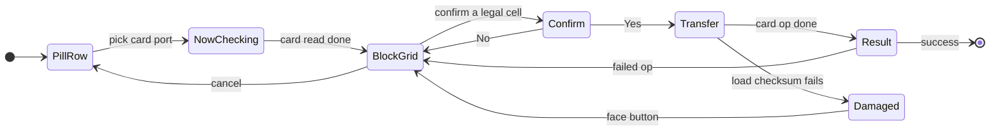
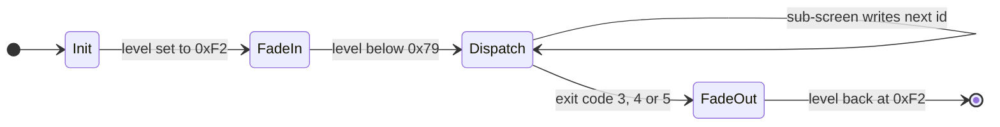
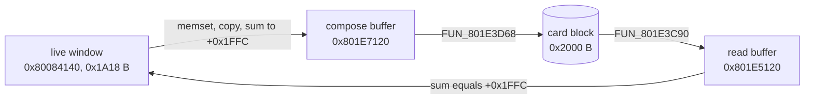

# Save Screen Subsystem

The save screen is the part of the game that reads and writes the PSX memory
card: the `SLOT 1` / `SLOT 2` pill row, the "Now checking" card read, the 5x3
block grid with its info panel, the Yes / No confirm and the write or read
itself. It has no overlay of its own. It lives in the **menu overlay** (PROT
0899, paged into `0x801C0000..0x801EFFFF`), behind the same 33-entry
sub-screen table that hosts the pause menu, the shop and the casino prize
counter - so this page also documents that table and the outer dispatcher
that walks it.

A save is one card block (`0x2000` bytes): a console title frame, a verbatim
`0x1A18`-byte copy of the live game-state window at `0x80084140`, a zero tail
and an additive checksum. The port reads and writes that block byte-for-byte
on both hosts (native window and browser page), so retail cards and
engine-written cards load in either.

Sources: the menu overlay dumps under `ghidra/scripts/funcs/overlay_menu_*.txt`
and `overlay_save_ui*_*.txt` (the same overlay captured at the slot-select and
writing states; function addresses are identical across the captures). Record
format detail is on [`save-record.md`](../formats/save-record.md); the
portrait sheet on [`save-icon.md`](../formats/save-icon.md).

## At a glance

| Piece | Retail | Port |
|---|---|---|
| Outer dispatcher | `FUN_801DC6B4`, reached from the SCUS driver `FUN_80024190` | `engine-menus::save_subscreen::SaveScreenMachine` |
| Sub-screen table | 33 pointers at `0x801E4F40` (ids `0x00..=0x20`) | `SaveSubScreen` (every id classified) |
| Card drivers | `FUN_801DAE24` (load, `0x18`) / `FUN_801DAEF4` (save, `0x19`) over `FUN_801DD35C` | `SaveScreenFlow` + `SaveSelectSession` |
| Card I/O | `FUN_801E3294` (libcd machine), `FUN_801E13B8` (op sequencer), the `bu` wrappers | `CardIoMachine`; block I/O is `legaia_save`'s synchronous card layer |
| Directory walk | `FUN_801E3AF0` / `FUN_801E3BA0` / `FUN_801E1208` | `card_directory_scan` / `card_free_blocks` / `classify_card_directory` |
| Block compose | `FUN_801E1934`: memset, copy `0x1A18` live bytes, checksum at `+0x1FFC` | `engine-core::card_write::write_save_into_card` over `legaia_save` |
| Checksum | `FUN_801E38D8` | `save_block_checksum`, `legaia_save::card::sc_block_checksum_valid` |
| Drawing | `FUN_801E1C1C`, `FUN_801E36C4`, `FUN_801E06C0`, `FUN_801E08D8` | `engine-ui::ui_title_save` (`save_select_overlay_draws`) |

The `engine-menus` modules named on this page are re-exported by `engine-core`
at their old paths (`legaia_engine_core::save_select`, `save_screen`,
`save_subscreen`, `card_flow`, `card_bu_io`, `list_order`, `pause_screens`).



The same flow in the port's phase names (`SelectPhase`): `Browsing`,
`NowChecking`, `SlotPreview`, `ConfirmOverwrite`, `Committing`, `Done`.

## Outer dispatcher (`FUN_801DC6B4`)

Entry `()`, returns `true` once the flow has terminated. It is called by
`FUN_80024190`, the 11-state save/load screen driver in `SCUS_942.54` that owns
the mode transition (see
[`functions/game-modes.md`](../reference/functions/game-modes.md)). The state
word is `_DAT_8007B43C`:

| State | Behaviour |
|---|---|
| 0 | Init: copy party pointers `_DAT_800846D0/D4` to `DAT_801EF0F0/F4`; decode the entry context into the sub-screen id `DAT_801E46A4`; zero `DAT_801E46BC/C0/C4/C8`; set `_DAT_8007B440 = 0xF2`; go to 1. |
| 1 | Fade-in wait: go to 2 once `_DAT_8007B440 < 0x79`. |
| 2 | Dispatch: `(*(DAT_801E46A4 * 4 + 0x801E4F40))(_DAT_8007B874)`, the pad word as the argument. |
| 3 / 4 / 5 | Fade-out (`_DAT_8007B9D8 = 2`); once `_DAT_8007B440 >= 0xF2` and `_DAT_8007B460 == 0`, advance by `+3` into the terminal range. |
| >= 6 | Terminal: return `true`. |



**Fade.** `_DAT_8007B440` is the level: `0xF2` opaque, `0` transparent. The
fade-in ramps `0xF2 -> 0` under a negative delta, the fade-out `0 -> 0xF2`
under a positive one. An exiting sub-screen writes `0xF2` to the *delta*
`DAT_801E46A0`, not to the level. Input is suppressed while the level is
`> 0x79`; state 1 hands over at `< 0x79` (two distinct constants).

**Field wipe around it.** The pause-menu session `FUN_801ED308` (field overlay
handler `0x30`) raises the same level word by `10 * frame_step` per frame from
`0` and spawns the menu only once `level + 0x70 > 0xF2`, so the field darkens
for a few frames before any window exists; on close it lowers the level the
same way with the field running. Both phases draw through the wipe emitter
`FUN_8003479C`. Port: `engine-system::pause_wipe::PauseWipe`, owned by
`BootSession` (opened by `press_field_menu`, released by `close_field_menu`).
Both play hosts keep the field drawing until `menu_spawned`, route no input to
the menu before it, and draw `fade_level` as a subtractive quad.

### The entry-context decode picks the screen family

State 0 reads the entry-context pointer `_DAT_8007B450` and picks the starting
sub-screen (`0x801DC85C..0x801DC8EC`), tests in this order:

| Condition | Start screen | Port `SaveEntryContext` |
|---|---|---|
| `== 1` (sentinel, never dereferenced; the pointer is then zeroed) | `0x02` developer parameter editor | `DebugParamEditor` |
| null | `0x01` root command picker | - |
| `ptr[0] == 0x00` | `0x1A` shop mode select | `ShopEntry` |
| `ptr[0] == 0x01` | `0x19` card **save** driver (a field script's save point) | `ScriptSave` |
| `ptr[0] == 0x07` | `0x20` casino prize exchange (`ptr+1` = prize block) | `CasinoPrizeCounter` |
| `ptr[0] == 0x0D` | `0x04` notice panel | `PostSave` |

`ptr[0]` is the record's **kind** byte, so the decode selects a screen family,
not a save mode: only kind `0x01` reaches a card driver.

The kind byte is the field-VM op-`0x49` **sub-op**. The op's Idle arm reads
the operand's first byte and then stores the operand pointer into the park:

```text
801e0984  lbu   v0,0x0(s6)        ; sub_op = *operand
801e098c  sltiu v0,v0,0xe         ; >= 0x0E never arms at all
801e09a8  sw    s6,-0x4bb0(s0)    ; _DAT_8007B450 = operand
```

The resume clears it (`sw zero,-0x4bb0(s0)` at `0x801e08d8`, on the `== 1`
Done sentinel). Ten `sw rt,0xb450(rs)` sites exist across `SCUS_942.54` and
every extracted PROT entry, in three images (SCUS, the field overlay, the menu
overlay). Only two write a dereferenceable pointer: this arm, and
`FUN_801D0B90`'s countdown expiry, which points at the static record
`DAT_801F2278` (kind `0x0B`). Every other writer stores `0` or the `1`
sentinel. A kind byte other than `0x0B` is therefore always a field script's
own operand, so "which of these screens can retail reach" is a disc question;
`crates/engine-core/tests/op49_sub_op_census.rs` measures it. See
[field-menu.md](field-menu.md#top-level-pause-menu).

The port carries the byte rather than a pointer: `SubmodeScreen::park_sub_op`,
written by `World::record_op49_park` and read by
`World::menu_entry_context_kind`, tagged with the field-VM context that armed
it (the port steps several contexts inside one `World::tick`).

## Globals used

| Address | Role |
|---|---|
| `_DAT_8007B43C` | Outer state word (0..>=6); sub-screens write exit codes 3 / 4 here. |
| `_DAT_8007B440` | Fade level: `0xF2` opaque, `0` transparent. |
| `_DAT_8007B450` | Entry-context pointer (see above). |
| `_DAT_8007B9D8` | `1` = menu active, `2` = fade-out; also the per-mode floor of the frame-skip factor. |
| `_DAT_8007B44C` | Memory-card handle, set to `DAT_801C6EA0` by both card drivers. |
| `_DAT_8007BB80` | Window-script busy flag; "script-then-wait" steps block while it is non-zero. |
| `_DAT_8007B874` | Newly-pressed pad word. `_DAT_8007BB84` is the packed held/edge word (Up `0x1000`, Right `0x2000`, Down `0x4000`, Left `0x8000`). |
| `_DAT_8007B5EA` / `_DAT_8007B5EC` | Bounds of the item-bag walk in the shop mode select ([inventory](inventory.md)). |
| `_DAT_8007B6A8` | Per-scene save-allow byte (from the scene MAN header). |
| `DAT_80084140` | Base of the **live game-state window**, the `0x1A18` bytes a save is composed from ([layout](#retail-sc-block-layout)). |
| `DAT_801E46A4` | Sub-screen id (index into `0x801E4F40`). |
| `DAT_801E46AC` | Current sub-screen's step counter. |
| `DAT_801E46A0` | Fade delta. |
| `DAT_801E46BC` / `C0` / `C4` / `D0` | List cursor cells: root + list cursor, second cursor, character cursor, Yes/No cursor. |
| `DAT_801E46B0` / `B4` | Staged bag slot `[id, count]` for the shop sell flow. |
| `0x801F0200` | Card op flag: `0` save, `1` load (from `FUN_801DD35C`'s second argument). |
| `_DAT_801F0210` | Save-select list position; becomes the save number in the filename. |

## Sub-screen function pointer table

State 2 dispatches through `0x801E4F40[DAT_801E46A4]` (menu overlay file
offset `0x24F40`). The table is exactly 33 word entries; slot `0x21` reads `0`
and Shift-JIS string data starts right after it. A sub-screen never returns a
destination: it writes the next id into `DAT_801E46A4`, and the step counter
resets with it. Most screens open with the same two steps - run a window
script through `FUN_801D6628`, then wait for `_DAT_8007BB80 == 0`.

| ID | Function | Role |
|---|---|---|
| `0x00` | `FUN_801DD12C` | Final exit: script `&DAT_801E4A78`, wait, then `DAT_801E46A0 = 0xF2` and exit code `_DAT_8007B43C = 3`. |
| `0x01` | `FUN_801D6B20` | **Root command picker** - the menu's top level, 7 rows ([below](#root-command-picker-fun_801d6b20)). Not a slot selector. |
| `0x02` | `FUN_801D6E18` | Developer character-parameter editor ([below](#debug-character-parameter-editor-fun_801d6e18)). |
| `0x03` | `FUN_801D6D38` | Yes / No confirm, default cursor `1`: script `&DAT_801E4BD4`, picker `FUN_801D688C(&DAT_801E46D0, 2, 1)`. Cursor `1` or cancel returns to `0x01`; cursor `0` goes to `0x00`. |
| `0x04` | `FUN_801DD1B8` | Notice panel, "press any button": script `&DAT_801E4BE0`; waits for the script and a button **held** (`_DAT_8007B874 & (_DAT_800846D0 \| _DAT_800846D4)`), plays SFX `0x20`, returns to `0x01`. |
| `0x05` | `FUN_801D7C00` | Pause-menu Items command window (Use / Throw Out / Arrange) - [field-menu.md](field-menu.md#items-screen). |
| `0x06` | `FUN_801D7E50` | Items Use list + effect-class dispatch. |
| `0x07` | `FUN_801D8734` | Items Throw Out list + confirm. |
| `0x08` | `FUN_801DD26C` | Pad-release wait: script `&DAT_801E4CA4`; waits for the script and for the same button mask to read **zero**, then goes to `0x05`. |
| `0x09` | `FUN_801D7FF8` | Use flow, all-party apply (`FUN_801D688C(&DAT_801E46C4, 0, 0)`, confirm / cancel only; preview `FUN_801D6A54`, apply `FUN_800402F4` + `FUN_80042558`, one bag decrement; cancel to `0x06`). |
| `0x0A` | `FUN_801D8308` | Use flow, single-target apply (party-row picker + `FUN_8003FB10` revalidation buzz). |
| `0x0B` | `FUN_801D8A58` | Yes / No with exit: script `&DAT_801E4CBC`; cursor `0` runs script `&DAT_801E4A78` + `func_0x80042310(0x88, 1)`, waits, then `DAT_801E46A0 = 0xF2` and exit code `4`; otherwise back to `0x06`. |
| `0x0C` | `FUN_801D8B90` | Door of Wind destination list. |
| `0x0D` | `FUN_801D8D94` | Incense confirm + class-`0x82` apply. |
| `0x0E` | `FUN_801D8F10` | Magic caster picker: confirm gated on spell count `record[0x13C]` and the Ra-Seru equip slot `record[0x196 + *(i16*)(0x8007B424 + char*2)]`, buzz `0x23` on either; pass plays `0x20` and goes to `0x0F`. |
| `0x0F` | `FUN_801D9110` | Magic spell list (kind-4 list window, content id `5`); cancel to `0x0E`; confirm routes on spell-stat byte `+2` bit `0x20`: set to `0x10`, clear to `0x11`. |
| `0x10` | `FUN_801D9280` | Magic group cast (confirm / cancel only); SFX `0x25` on commit; cancel to `0x0F`. |
| `0x11` | `FUN_801D9594` | Magic single-target pick + apply: revalidates via `FUN_8003FB10`, costs MP through `FUN_80035394`, applies through `FUN_800402F4` + `FUN_80042558`. |
| `0x12` | `FUN_801D98F0` | Equip character picker: sets `_DAT_8007BB94 = 4`, clears `DAT_801E48A8`, masks `DAT_801E46C4 &= 0xFFF`, raises `0x4000` on `DAT_801E46C0`, script `&DAT_801E4D88`; picker `FUN_801D688C(&DAT_801E46C4, DAT_80084594, 1)` over the party count. Confirm plays `0x20` and goes to `0x13`; cancel to `0x01`. |
| `0x13` | `FUN_801D99F0` | Equip slot browse, 8 rows (`FUN_801D688C(&DAT_801E46C0, 8, 1)`): row 0 auto-equips best (`FUN_801CF88C` candidates + `FUN_801CF760` applier, SFX `0x24` / buzz `0x23`); rows 1..7 go to `0x14`; cancel to `0x12`. See [field-menu.md](field-menu.md#equip-screen). |
| `0x14` | `FUN_801D9C14` | Equip candidate list + commit. The `0x414`-stride reads are the live party record and `DAT_801EF0C8` is the trial-equip save / restore buffer (8 bytes of `+0x196`, stat aggregator `FUN_801CF650`) - not a card-write primitive. |
| `0x15` | `FUN_801DA2A0` | Per-character list screen behind the Status row ([below](#sub-screen-0x15---the-per-character-list-screen-fun_801da2a0)). |
| `0x16` | `FUN_801DD310` | No-op tick: a bare `jal 0x80031D00` (frame-end / text-actor flush). |
| `0x17` | `FUN_801DD330` | Options: wrapper over the generic picker `FUN_801DA9F8(start=0, end=9, window=0x30, return_subscreen=1)`. See [field-menu.md](field-menu.md#options-screen). |
| `0x18` | `FUN_801DAE24` | Card **load** driver ([below](#card-drivers-0x18--0x19)). |
| `0x19` | `FUN_801DAEF4` | Card **save** driver. |
| `0x1A` | `FUN_801DAFD4` | Shop Buy / Sell / Quit mode select ([below](#shop-mode-select-fun_801dafd4)). |
| `0x1B` | `FUN_801DB21C` | Shop buy list (kind-4): confirm checks gold `0x8008459C` against the price (buzz `0x23`), then routes on the item kind byte - `1` to `0x1C`, `2` to `0x1D`, else `0x1A`; cancel to `0x1A`. |
| `0x1C` | `FUN_801DB380` | Shop buy recipient picker (equipment buys). |
| `0x1D` | `FUN_801DB7F4` | Shop buy quantity + commit; quantity law `min(gold/price, 99, 99-held)`. |
| `0x1E` | `FUN_801DBC5C` | Shop sell list: raises `0x1000` on `DAT_801E46BC`, script `&DAT_801E4EE4`; after the wait it sets `_DAT_8007BB94 = 1`, stages the bag bytes at `0x80084140 + 0x1818 + _DAT_8007BB88*2` into `DAT_801E46B0/B4`, then branches on `_DAT_8007BB94` - `3` re-runs script `&DAT_801E4EFC`, waits and returns to `0x1A`; `2` goes to `0x1F`. |
| `0x1F` | `FUN_801DBD94` | Shop sell quantity: d-pad `+-1` / `+-10` clamped to `[1, DAT_801E46B8]`; confirm credits `_DAT_8008459C += (price * qty) >> 1` and walks the bag at `0x80084140 + 0x1818` for a non-empty slot; returns to `0x1A` after a brief delay. |
| `0x20` | `FUN_801DC1CC` | Casino prize exchange: build rows from the `0x801E4518` table (stops at the first zero id; a set gate flag hides the one-shot row), browse (confirm gated on coins `0x800845A4 >= price` and held `< 0x63`, buzz `0x23`), Yes / No with **No default** (`DAT_801E46D0 = 1`), commit (SFX `0x25`, grant 1, debit coins, `FUN_8003CE08(gate)`). Nothing here touches the card. |

Only `0x18` and `0x19` are card screens. The Items, Magic, Equip, shop and
casino rows are documented on [field-menu.md](field-menu.md),
[shop.md](shop.md) and, for `0x20`, `engine-core::prize_exchange`; they are
listed here because they share the table.

### How the port splits the same 33 ids

`engine-menus::save_subscreen::SaveSubScreen` is the id space above, and
`SaveScreenMachine` is the outer dispatcher: it holds the phase (`Init`,
`FadeIn`, `Dispatch`, `FadeOut`, `Done`), the current screen, its step counter
and the fade level, and `tick` runs one frame. Every slot is classified:

| Kind | Ids | Meaning |
|---|---|---|
| named, 14 | `0x00`..`0x04`, `0x08`, `0x0B`, `0x12`, `0x17`..`0x1A`, `0x1E`, `0x20` | The module decodes the screen; ten carry its step machine here. |
| `FrameFlushTick` | `0x16` | The bare flush wrapper. |
| `Routed(id)`, 18 | `0x05`..`0x07`, `0x09`, `0x0A`, `0x0C`..`0x11`, `0x13`..`0x15`, `0x1B`..`0x1D`, `0x1F` | Another module ports the screen (`pause_screens`, `spell_menu`, `equip_session`, `shop`, `list_order`); `SaveSubScreen::routed_port` names it. |

Dispatching a routed id emits `SubScreenEffect::Route`, so a host is handed
the owning module. `Unpinned(id)` exists only so the id space is total for a
byte past the end of the table; no live slot reaches it. The two card drivers
share one implementation parameterised by `CardOp` (`Load` / `Save`).

This module is control flow only. Screen content is `SaveSelectSession`
([card flow](#card-flow)), and `SaveScreenFlow` joins the two.

### Root command picker (`FUN_801D6B20`)

Sub-screen `0x01`. Phase 0 runs the display script `&DAT_801E4BC0`, raises
`DAT_801E46C0 = 0x1000` and masks `DAT_801E46BC &= 0xFFF`. Phase 1 waits for
the script, then runs `FUN_801D688C(&DAT_801E46BC, 7, 1)` and dispatches the
confirmed row. Every accepted row first clears the shared list globals
`_DAT_8007BB98` / `_DAT_8007BB90` / `_DAT_8007BB88`.

| Row | Target | Gate |
|---|---|---|
| 0 Items | `0x05` | none |
| 1 Magic | `0x0E` (also stages `DAT_801E46C8 = DAT_801E46C4 & 0xFFF`) | none |
| 2 Equip | `0x12` | none |
| 3 Status | `0x15` | none |
| 4 Options | `0x17` | none |
| 5 `@Load` | `0x18` | blocked when the entry context's kind byte is `0x0D` (a null pointer is allowed) |
| 6 `@Save` | `0x19` | blocked when the save-allow byte `_DAT_8007B6A8` is zero |

A blocked row plays the reject cue `0x23` and stays; an allowed row plays
`0x20`. Cancel leaves for `0x00`, except under kind `0x0D`, where it goes to
the Yes / No confirm `0x03`. So that one context byte both hides Load and
makes leaving ask first - a parked field script must not be replaced by a
loaded game or abandoned silently.

`_DAT_8007B6A8` is the "Save Anywhere" cheat's target, seeded at scene load
from the MAN header's `[0x01] & 1`
(`legaia_asset::man_section::ManHeader::low_flag`). Across the disc the bit is
set on the three kingdom world maps (`map01` / `map02` / `map03`) and clear on
every town, field and dungeon. A field save is reached the other way: a save
point's script issues `49 01`, a scripted menu-button press whose kind byte
`0x01` opens `0x19` directly
([field-menu.md](field-menu.md#which-screen-opens-a-window)).

Port: `engine-menus::pause_screens::{root_menu_confirm_route,
root_menu_cancel_route}`, live under the pause menu - called once per row for
the row's ink and once on confirm, the same double read retail's renderer and
confirm arm make. The gate inputs are sampled when the menu opens:
`World::party.scene_save_allowed` (seeded by
`World::install_scene_save_permission`) and `World::menu_entry_context_kind`.

### `FUN_801D688C` - shared list-cursor navigator

`FUN_801D688C(cursor: *u32, count, mode)` is the one list-cursor helper the
menu, shop and save handlers share
(`ghidra/scripts/funcs/overlay_save_ui_select_801d688c.txt`). It reads the
confirm / cancel masks (`_DAT_8007B874 & DAT_801EF0F0` / `DAT_801EF0F4`) and
the held word `_DAT_8007BB84`, mutates the caller's cursor cell, enqueues a
cue through `FUN_80035B50` and returns:

| Result | Meaning | SFX cue | Condition |
|---|---|---|---|
| `1` | Confirm | `0x36` | confirm mask (tested first, even when `count == 0`) |
| `2` | Cancel | `0x37` | cancel mask |
| `3` | Moved | `0x21` | `count != 0` and a direction moved the cursor |
| `0` | None | - | otherwise |

The cursor cell is packed: the low 12 bits are the index, the high nibble
(`0xF000`) carries caller-private flags the navigator preserves. Held `0x1000`
decrements and `0x4000` increments. `mode == 0` clamps at the ends; `mode != 0`
wraps (an index reaching `count` snaps to `0`, a decrement from `0` goes to
`count - 1`). Every call site in this overlay passes `1` except sub-screen
`0x15`'s row picker.

Port: `engine-vm::menu_input::menu_cursor_nav(cursor, count, wrap,
NavButtons)`, returning a `CursorNav` whose `sfx_cue()` hands the host the
retail cue id; `CURSOR_INDEX_MASK` / `CURSOR_FLAGS_MASK` expose the split.
`SaveSelectSession::tick_confirm` consumes it for the Yes / No cursor.

### Card drivers (`0x18` / `0x19`)

`FUN_801DAE24` (load) and `FUN_801DAEF4` (save, 224 bytes) are the same
four-step machine on `DAT_801E46AC`, differing only in the display script and
the op selector. Each step calls `func_0x80031D00()` before returning.

| Step | Action |
|---|---|
| 0 | `_DAT_8007B44C = DAT_801C6EA0` (card handle); run the display script (`&DAT_801E4E28` load, `&DAT_801E4E30` save). |
| 1 | Wait while `_DAT_8007BB80 != 0`. |
| 2 | Call `FUN_801DD35C(1, op)` each frame until it returns non-zero: `op = 2` load (card to RAM), `op = 1` save (RAM to card). |
| 3 | Write `DAT_801E46A4 = 1` (back to the root picker). The save driver then overwrites it with `0` (exit) when `_DAT_8007B450 != 0`: the unconditional write sits in the branch's delay slot, so a save raised from a parked field script hands control back to the script. |

Three independent readings fix the direction (the pair reads naturally the
other way round):

1. **Row labels.** `FUN_801CFD68` hands the string primitive seven pointers;
   the sixth and seventh are `0x801CEA00` (`@Load`) and `0x801CEA08` (`@Save`).
   Row 5 routes to `0x18`, row 6 to `0x19`.
2. **Op flag.** `FUN_801DD35C` turns its second argument into `0x801F0200`: op
   `1` clears it, op `2` sets it. The cleared arm resolves the card filename
   and calls the BIOS erase `FUN_801E37CC` before writing.
3. **Messages.** The op-`2` arm draws "Unable to load data." / "Damaged data."

### Shop mode select (`FUN_801DAFD4`)

Sub-screen `0x1A`, 584 bytes. Step 0 clears `_DAT_8007BB98/90/88`, sets
`_DAT_8007BB94 = 4`, runs script `&DAT_801E4E38` and masks
`DAT_801E46BC &= 0xFFF`. Step 1 runs `FUN_801D688C(&DAT_801E46BC, 3, 1)`: row 0
goes to the buy list `0x1B`; row 1 validates, runs script `&DAT_801E4E54` and
advances to step 2, which clears state and sets `DAT_801E46A4 = 0x1E` (sell
list); row 2 or cancel exits to `0x00`.

The row-1 validation walks `0x80084140 + 0x1818 + slot*2` over
`_DAT_8007B5EA.._DAT_8007B5EC` and buzzes `0x23` on an all-empty walk. That
array is the **item bag** at `0x80085958` (`[item id, count]` pairs), so the
test is "own anything to sell", not a save-block existence check. See
[shop.md](shop.md).

## Card flow

### Two stages, three id spaces

| Stage | What the player picks | Count | Retail anchor |
|---|---|---|---|
| Pill row (`SLOT 1` / `SLOT 2`) | a memory-card **port** | 2 | the libcd channel's port (`chan = port * 16 + sub_op`) |
| 5x3 grid | a save **block** on that card | 15 | the directory walk `FUN_801E1208`; per-slot buffer `0x801EF1B8 + N * 0x100` |
| (filename) | the save **number** | - | `BASCUS-94254PRO-<nn>`, `nn` = list position `_DAT_801F0210` |

Between the first two sits the card read - the "Now checking. Do not remove
MEMORY CARD" beat.

The third space is the one that bites. Retail files a save under the list
position it is standing on and lets the BIOS place the file in whatever block
is free, so a real card can hold `-03` in block 1 and `-00` in block 2. That
number keys `FUN_801E1208`'s class array and is what the block's title digits
spell. Retail never reconciles the spaces; a host that addresses a **block**
must. `engine-core::card_write::card_save_index` keeps a claimed block's
existing number (an overwrite does not re-claim the directory frame) and
otherwise picks a number no file on the card uses, read out of
`classify_card_directory` - two files with one number are not representable
in the BIOS directory. The port's grid stays keyed by block; re-keying it into
retail's name-index space is open.

### Load/save dispatch (`FUN_801DD35C`)

`FUN_801DD35C(1, op)` is the whole card screen for both directions: it runs
the pill row, the read, the grid, the confirm and the transfer as internal
sub-modes, and draws the screen each frame. The sub-modes this page pins:

| Sub-mode | Role | Site |
|---|---|---|
| `0x0B` | grid confirm test | `0x801DEAB8..0x801DEB00` |
| `0x0E` | stamps the filename into a chosen free block (save) | - |
| `0x03` | the write ("save_time out err" / "err card write retray") | `0x801DF5BC..` |
| `0x04` | the read ("err card read retray") | `0x801DF33C..0x801DF400` |
| `0x05` | the read's checksum verify | `0x801DF82C..` |
| `0x13` | status / failure screen | `0x801DF4EC..0x801DF548` |

**Which cells take a confirm.** Sub-mode `0x0B` takes the cell's mode from
[`FUN_801E3F74`](#which-mode-a-slot-gets-fun_801e3f74) and accepts mode `1` (a
readable Legaia save) on a Load, mode `1` or `3` (a free block) on a Save. Any
other cell takes the press without a prompt. Whether a claimed block is
Legaia's is decided by its directory **filename**, not by whether its bytes
parse. Port: `save_select::card_block_snapshots` captions a claimed block with
any other name foreign, and `SaveScreenFlow::before_tick` drops the Cross on
it and on an empty cell under Load.

**The question.** The arm at `0x801E2540..0x801E2600` asks "Do you wish to
load?" when the op flag is set. On the save path it runs the slot-mode test
inline and asks "Do you wish to save?" for mode `3`, "Do you wish to
overwrite?" for anything else. The box opens on **No**. Port:
`SaveScreenFlow::confirm_prompt`.

**The transfer panel.** A "Yes" runs the op under a messagebox - "Saving to
MEMORY CARD" or "Now Loading" over "Do not remove MEMORY CARD"
(`0x801E2B50..0x801E2BA8`). The panel is `FUN_801E1C1C` mode 4 (`0x801E28EC`):
it slides on `_DAT_801F01CC` from x `576` to `160` at a fixed `y = 0x50`, boxes
itself with `FUN_801E36C4(x, 0x50, 0x11C, 0x20)` and draws the message (behind
a two-space lead, `0x801CF54C`) at `x + 0x1A` and the second line at `x` on
`y = 0x60`. It carries three sprites from the 12-byte sprite-record table at
`0x801E5048` (PROT 0899 file `0x16830`; records `[clut][u][v][w][h]` on
texture page `0xF`, where the save-menu TIM at file `0x16908` uploads; the
CLUT word is a sub-palette of that TIM's one CLUT row):

| Record | Rect `(u, v, w, h)` | Sub-palette | Drawn at |
|---|---|---|---|
| 3 - `No.` | `(0, 144, 22, 16)` | 8 | `(x - 0x55, 0x54)` |
| 2 - block numeral | `(block * 16, 128, 16, 16)` | 8 | `(x - 0x3F, 0x54)`; `u` rewritten through `DAT_801E5062 = _DAT_801F0210 << 4` |
| 4 - progress tube | `(0, 0, 104, 16)` | 0 | `(x - 0x34, 0x90)` |

Under the tube `FUN_801E2DC4(x - 0x2C, 0x95)` draws the fill: one `0x3C` quad
`t * 0x58 >> 12` wide and 6 tall on the progress timer `_DAT_801F01D0`, every
vertex `(0xBC, t * 0xFF >> 12, 0)` over a grey-112 texel - red to yellow
across the tube's transparent 88-pixel interior. The `No.` + numeral pair also
labels the confirm prompt (numeral at `0xA0 - 0x5A`, or `0xA0 - 0x3A` on the
free-block arm, `y + 4`) and the info panel's title row.

Mode 4 steps the progress timer `+0x20` per frame-step unit. The read arm
leaves the panel only once the card op is done **and** `_DAT_801F01D0` reads
`0x1000` (`0x801DF3D0..0x801DF3FC`), so a load holds its panel at least
`0x1000 / 0x20 = 128` sixtieth-second units; the write arm waits on the card
alone.

**The result line.** "Save successful." / "Load successful."
(`0x801DF920..0x801DF9B0`), or "Unable to save." / "Unable to load data." on a
failed op, drawn as `FUN_801E3EE0(msg, 0xA0, 0x60)` in a box
`FUN_801E36C4(0xA0, 0x60, 13 * n, 0xD)` where `n` is the text drawer's
`(strlen + 1) / 2` return. It holds until the frame-scalar accumulator reaches
`0x5A` (`slti v0,v0,0x5B` at `0x801DF9D8`); a press adds a whole hold and
stores cue `0x20` (`0x801DF91C`).

**A damaged block is refused after the read, not on the grid.** The grid
classifies by filename, so a damaged save still shows its cell and info panel.
The verify latches `0x801F0140 = 2` (`0x801DF880`) and routes to `0x13`, whose
checksum arm draws three centred lines at `y = 0x50 / 0x60 / 0x70` - "Unable
to load data." / "Damaged data." / "Delete at the PlayStation MEMORY CARD
Screen." - in `FUN_801E36C4(0xA0, 0x50, 13 * n, 0x30)`, `n` from the last
line. There is no timer; a face button returns to the grid
(`0x801DF560..0x801DF570`, cue `0x20`).

**Darkening.** Each panel pushes one `FUN_80024EE4(1, 2, grey)` - a
full-screen subtractive quad linked into the panel's own ordering-table bucket
after the panel's primitives, so it draws under the panel and over everything
linked afterwards. The grey rides the panel's slide timer: "Now checking"
(mode `0`) and the confirm (mode `3`) take `min(t >> 5, 0x50)`
(`0x801E1D14..0x801E1D34`); the transfer panel (mode `4`) takes
`min(t >> 4, 0xFF)` (`0x801E2D50..0x801E2D88`), black by the time it parks.
Once the transfer panel has slid in, the dispatcher's tail also stops drawing
the header tab, pill and grid (`0x801DFCDC..0x801DFCE4`, only while
`_DAT_801F01CC != 0x1000`), so the parked panel and the result line sit alone
on black.

**Text slots.** Six `0x80`-byte text slots sit at `0x801EED24`, closed by the
region filename prefixes at `0x801EF024`. Slot 0 is the play-time line, whose
digits `FUN_801DD35C` pokes from `0x801EED29`; slot 3 is a two-digit counter
`FUN_801DE234` pokes at `+2` and `+4` of `0x801EEEA4`. The other four (a
load-failure line, a wrong-game line, a not-available line, a not-used line)
are referenced by nothing on the disc - no instruction, word, `gp` or
base-plus-displacement access in any image (`find-address-word-refs.py --prot`,
`find-gp-relative-refs.py --prot`) - so they are dead strings.

**Port.** `SelectPhase::Committing` carries the transfer and the result
(`COMMIT_WORK_FRAMES`, then `COMMIT_RESULT_FRAMES` = 90; a Load holds
`COMMIT_LOAD_WORK_FRAMES`). A Save's beat holds on its last write frame until
the host has written: `SaveScreenFlow::save_request` hands each host the rack
cell while the panel is up and `finish_save_request` reports the real outcome
(a failure returns to the grid) and drops the port's block cache, so the grid
re-reads the card. A Load's block was read for the grid already; a block whose
sum fails (`SlotSnapshot::damaged`) answers the beat with
`CommitReport::Damaged`. On the result line any face button narrows to one
Cross (cue `0x20`); the transfer panel takes no input. `commit_banner` picks
the lines. engine-ui draws it: `card_banner_draws_for`,
`confirm_dialog_badge_draws_for`, `slot_info_panel_draws_for`, the damaged box
at `CARD_DAMAGED_Y`, and `save_select_overlay_draws` for the composition. The
three sprite records and the fill texel are baked into the shared save-menu
atlas (`legaia_asset::title_pak::SAVE_MENU_ATLAS_*`). The darkening quad is
`SaveScreenDarken`, a white texel tinted `grey / 255`, with the grey also
subtracted from the ink of text already emitted (both hosts draw text after
sprites); the native window blends it through its ABR-2 overlay span, the
browser page subtracts it from canvas pixels (`AtlasBlitter::blitDarkened`).

### Libcd I/O state machine (`FUN_801E3294`)

The memory-card calls live in `FUN_801E3294`, a 5-state driver on
`DAT_801EF188`. The channel argument is `chan = port * 16 + sub_op`.

| State | Action |
|---|---|
| `0` | Init: BIOS-A thunk `FUN_8006EE14(chan)`; clear the frame counter `DAT_801EF17C`; go to `1`. |
| `1` | Poll `FUN_801E3900()`; result `4` finalises through `FUN_8006EE34`; `1` goes to `2`. |
| `2` | `FUN_801E39A8` + BIOS-A thunk `FUN_8006EE24(chan)`; go to `3`. |
| `3` | Wait; same dispatch shape as state 1. |
| `4` | Cleanup: stash the result in `DAT_801EF184/180`, reset to `0`. |

`FUN_8006EE34` calls BIOS-B(0x50) via `FUN_8006EE7C`, then BIOS-B(0x4E) via
`FUN_8006EE6C` with `(chan, 0x3F, 0)`. The loop prints `"NOT_CARD"`,
`"card_sts:%d old:%d"` and `"not card count:%d"`.

A shared **retry budget** `DAT_801E4FC4` re-runs the two-op cycle with result
`0` on a failing phase until it reaches 5, then commits `-1` (no card), `-2` (a
stray complete event in phase two) or `-3` (abort / timeout). The latch
`DAT_801EED20` records that phase two acknowledged, letting the next cycle
return success `1` off the first ack alone.

Port: `save_select::CardIoMachine` (states, retry law, latch, result codes;
BIOS thunk calls surface as `CardIoEffect` values).

#### The per-frame status poll (`FUN_801E3900`)

It calls the `TestEvent` thunk `FUN_80056658` on four card event handles
(`0x8007B9F0`, `..F4`, `..F8`, `..FC`) in turn and overwrites its status with
`1`, `2`, `3`, `4` whenever a handle reports `1`. The overwrites are
unconditional, so the **last handle to fire wins**. It then applies a backstop
on `DAT_801EF17C`:

```
lw   v1, counter        ; v1 = value on ENTRY
addiu v1, v1, 1
slti a0, <entry>, 0x78  ; entry < 120 ?
bne  a0, zero, skip
 sw  v1, counter        ; delay slot - the store happens either way
li   s0, 0x2            ; else force status 2
```

The compare is against the entry value, so the first forced timeout is the
121st poll, and the counter advances on both paths. Status `2` thus has two
origins (handle 1, or the timeout), treated identically: result `-3`. Status
`3` is "NOT CARD" (`-1`); `4` completes the read.

`FUN_801E39A8` is the sibling drain: the same four `TestEvent` calls with the
results discarded, which clears all four flags because `TestEvent` consumes a
pending event. Ports: `save_select::card_status_poll` (run every frame of
`NowChecking`) and `card_events_drain`.

### Card-operation sequencer (`FUN_801E13B8`)

The per-frame ticker `FUN_801E1114` makes three calls. `FUN_801E380C` is the
in-flight transfer's completion step (polls the array-A events, closes the
descriptor, latches the read / write failure flag). `FUN_801E16E0` picks the
status message from the last card result and runs the retry counters.
`FUN_801E13B8` is the operation sequencer over `_DAT_801F329C`
(`ghidra/scripts/funcs/overlay_menu_801e13b8.txt`):

| `_DAT_801F329C` | Action |
|---|---|
| `1` | Save armed. Waits on the last card result `_DAT_801F3804`; a fatal `-2` raises write-error flag `DAT_801EF13C` and status-string id `_DAT_801F0204 = 0x17`; a positive result arms the delay `DAT_801EF128 = 0x18` and goes to `3`. |
| `2` | Load armed. Same shape; fatal `-2` raises `DAT_801EF140` + string `0x13`; positive goes to `5`. |
| `3` | Write. Counts the `0x18`-frame delay down by the frame-rate byte `DAT_1F800393`, resolves the filename (`FUN_801E3AF0` / `3BA0` / `3BEC`), issues `FUN_801E3D68(handle, 0, name, buf, 0x2000, ...)`. Success prints `"open ok"` and goes to `4`; failure closes the file (`FUN_800566D8`), prints `"write error"`, raises `DAT_801EF13C`, resets to `0`. |
| `5` | Read. `FUN_801E3C90(handle, 0, name, buf, blocks)`; success goes to `6`; failure prints `"write error"` and resets to `0`. |
| `7` | Format. Retries `FUN_801E3E7C` up to five times: `-1` prints `"Format No Card"`, `1` prints `"Format End"` (+ `_DAT_801F0220 = 3`), anything else `"Format Error"`; resets to `0`. |

The message strings sit contiguously at `0x801CF3B4..`.

`FUN_801E1114` also calls `FUN_801E3294(DAT_801EF18C, 0)` every frame while
`_DAT_801F329C < 3`, latching any non-zero result into `0x801F3800/3804`; and
when `_DAT_801F021C == 3` (save commit) with the rebuild request
`_DAT_801F0224` up, it runs `FUN_801E3AF0` -> `FUN_801E3BA0` -> `FUN_801E1208`
and clears the request.

Port status: the sequencer is ported state-for-state as
`engine-menus::card_flow::CardWriteMachine`, and the completion step as
[`card_bu_io::CardIoState::step`](../../crates/engine-menus/src/card_bu_io.rs).
Both are tagged `REPLACED-BY:` `legaia_save`'s synchronous card layer and no
host drives them, by design: both card backends are synchronous (the browser
rack patches the container bytes, the native window mounts a real `.mcr` with
`play-window --card` and writes the image file back), so there is no
asynchronous BIOS beat to sequence. Both writes go through one kernel,
[`engine-core::card_write::write_save_into_card`](../../crates/engine-core/src/card_write.rs).
`FUN_801E1114` is ported as `save_select::card_frame_tick`, which
`SaveScreenFlow` runs every frame; its rebuild arm is never taken, because the
port commits a save in one call and raises no commit phase.

### The `bu` file-I/O layer under the sequencer

Each wrapper formats its target the same way - two single-digit fields
(controller port, card unit), a colon, the filename - and makes one BIOS call.

| Routine | BIOS call | Notes |
|---|---|---|
| `FUN_801E3C90` | `open` `0x8001` + `read` | Clears `DAT_801EF140`; seeks one `0x200` frame in when `DAT_801F01B8 == 0x80`. |
| `FUN_801E3D68` | `open` `0x8002` + `write` | Clears `DAT_801EF13C`; a new file first opens `0x10200` (create, one block) and closes that handle. |
| `FUN_801E37CC` | `erase` | The only routine here that waits on no completion. |
| `FUN_801E3E7C` | `format` | Device-only path; drains array B, then blocks in `FUN_801E3A00`. |
| `FUN_801E3BEC` | `strcmp` walk | Searches the caller's count of `0x28`-stride name records at `0x801F32A8`. |
| `FUN_801E0598` | - | Session reset; empties the name cache only when its argument is zero. |

`FUN_801E0598`'s clear loop steps `0x28` down from `0x801F32A8 + 0x4D8`, so it
empties **32** records where the enumerator walks 15; the extra records are
never filled.

Retail keeps **two** four-handle `TestEvent` arrays. Array A
(`0x8007B9F0..0x8007B9FC`) is asynchronous: drained before each read / write,
then polled per frame. Array B (`0x8007BA04..0x8007BA10`) is synchronous and
only `format` uses it, via the drain `FUN_801E3A98` and the blocking spin
`FUN_801E3A00`. Over array A there are two probes: `FUN_801E3900` (last handle
wins, 120-frame backstop) and `FUN_801E435C` (returns on the **first** handle,
no timeout). The result mappings differ too: `FUN_801E3E7C` treats handle `1`
as success, `3` as "no card" (`-1`), and both `2` and `4` as the generic error
(`-3`) - handle 4 is completion in the async poll and failure in the format
path.

### Save-block directory enumeration (`FUN_801E1208`)

`FUN_801E1208` walks the 15-entry directory table at `0x801F32A8` (stride
`0x28`), matching each filename against the two regional prefixes with BIOS-A
`strncmp` (`FUN_80056748`), length 16:

| Prefix | Region | Literal |
|---|---|---|
| `BASCUS-94254PRO-` | USA (SCUS-94254) | `0x801EF03C` (PROT 0899 file `0x20824`) |
| `BISCPS-10059PRO-` | JP (SCPS-10059) | `0x801EF054` (file `0x2083C`) |

The sixteenth character is a **hyphen** (not `PRO_`), and the two save-number
digits follow it. For each match the walk writes a per-slot record at
`slot_idx * 0x40 + 0x801F2A88` and the class byte at `0x801F2A48 + slot_idx`.

**Filling the table (`FUN_801E3AF0`).** A directory enumeration, not a channel
open: it formats `"bu%1d%1d:*"` (the wildcard selects a device, so every file
matches), zeroes all fifteen slots (name bytes `0x13..=0x0` and the size word
at `+0x18`), and walks the BIOS-B `firstfile` / `nextfile` thunks
(`FUN_800566F8` / `FUN_80056708`). It returns the file count. Its count loop
increments in the `beq`'s delay slot and subtracts one before returning; the
net result is a plain count.

**Costing it (`FUN_801E3BA0`).** Arithmetic over that table: it sums each
entry's `size` word over the first `count` entries, applies the signed-division
bias (`if (sum < 0) sum += 0x1fff`), shifts `>> 13` and returns `0xf - blocks`
into `_DAT_801F01F0`. The result is **not clamped** (an over-full card returns
a negative count), and the first argument is dead.

**Classification order is load-bearing.** It is why a foreign save is never
mistaken for a free block:

1. Clear both per-slot arrays. Class `0` means "occupied by something
   unreadable".
2. Walk the directory; every filename matching a regional prefix stamps class
   `1` on the slot its two digits name.
3. Only then spend the free-block count marking still-unclassified slots class
   `2`. This is a budget (a decrementing counter), not a sweep, so a slot the
   walk neither matched nor could afford keeps class `0`.

Ports: `card_directory_scan`, `card_free_blocks`, `classify_card_directory`
(returning per-slot `SlotContent`); `SaveSelectSession::from_card_directory`
chains them and `card_directory_slots` builds a session's slot list from a
directory. The port holds to the same rule from both scanners: **only positive
evidence of absence yields `SlotContent::Free`** - a directory frame no save
claims that the free count can pay for (card path, `web-viewer::cards`), or a
`NotFound` on the slot file (disk path, `scan_save_dir`). Every other failure
to read builds `SlotSnapshot::foreign`.

#### Save-block checksum (`FUN_801E38D8`)

A save block is one card block: `0x2000` bytes = `0x800` u32 words.
`FUN_801E38D8` sums the first `0x7FF` little-endian words with a wrapping
(`addu`) accumulator. The write path stores the sum in the final word at
`0x1FFC`; the load direction reloads it (`0x801df888`:
`lw v1,0x1ffc(s1); beq v1,v0`) and routes the slot to valid or corrupt. Every
retail-written card satisfies it.

Ports: `save_select::save_block_checksum` / `save_block_checksum_valid`, and
`legaia_save::card::sc_block_checksum_valid`. `legaia-save`'s `write_retail_*`
writers restamp the word, which keeps an in-place field edit loadable instead
of "Damaged data."

##### Which buffer the sum runs over

Two block buffers, neither of them the live game state:

| Buffer | Role | Installed by |
|---|---|---|
| `0x801E5120` | card **read** destination, `0x2000` bytes | `FUN_801DD35C` writes it to `DAT_801EF174` with the length `DAT_801F01B8 = 0x2000` |
| `0x801E7120` | save **compose** buffer, `0x2000` bytes | `FUN_801E1934` writes it to `DAT_801EF178` on entry |



Compose (`0x801e1bc0..0x801e1bf0`): memset the whole buffer, copy `0x1A18`
bytes from `0x80084140` over the front, sum, store at `+0x1FFC`; all `0x2000`
bytes go to `FUN_801E3D68`. Read: fill `0x801E5120` from byte 0 of the block,
sum that buffer in sub-mode `0x05`, compare, then
`FUN_8001A8B0(0x80084140, 0x801E5120, 0x1A18)` at `0x801dfa98`. So the sum
covers the block as stored on the card, from the `SC` magic.

Neither buffer is memory of its own. Both reuse the save-menu atlas TIM the
overlay carries at `0x801E5120` (header, palette, then 256x256 4bpp pixels to
`0x801ED340`), which `FUN_801DD35C` uploads to VRAM `(960, 0)` with
`FUN_800198E0(0x801E5120)` at `0x801DD4BC` before the first card read. The
save-slot icon sheet at `0x801EE120` follows, landing on `(960, 224)`. Only
atlas rows 0..160 are drawn from (rows 162 and up are blank in the file); the
card buffers end at `0x801E9120`, near row 124.

The buffers are live from the pause menu too: the Save and Load rows run the
same drivers and return to the root picker with the overlay resident, so
anything else placed in `0x801E5120..0x801E9120` is save data by the menu's
next screen. The patcher's space ledger lists both spans as off limits
([`space-and-budgets.md`](../tooling/translation/space-and-budgets.md#zero-is-not-room-runtime-buffers)).

### The port's host: `SaveScreenFlow`

`engine-menus::save_screen::SaveScreenFlow` is the kernel both hosts share. It
owns the `SaveScreenMachine`, a `CardIoMachine` and the `SaveSelectSession`,
and holds what the session cannot:

- the 5x3 **grid cursor** (`SlotPreview` ignores directions);
- the **card read**, asked for once per port, not once per frame;
- the confirm guards above, and the `SaveCommit` that pairs the outcome's
  **port** with the grid's **cell**;
- the join between the two models, which is the **card op**. `card_frame_tick`
  polls the host's backend: blocks installed for a mounted port poll `Ready`
  whether or not any holds a save (a blank formatted card is a card, and is
  where a first save goes), an empty port polls `NoCard` and spends the retry
  budget, an unanswered read polls `Pending`. The card driver's step 1 waits
  on "nothing published yet" and step 2 on "published success", so the return
  to the root picker is caused by the backend. A confirm in either direction
  is refused until the I/O machine publishes success;
- the outer fade, which gates **one** edge: the grid confirm into the write
  (`fade_gates_write`). The port's session starts at the pill row and the flow
  is constructed with it, so a blanket input gate would swallow the port
  confirm. `SaveScreenFlow::retail_fade` exposes the level.

`SaveSelectSession` is renderer-agnostic and derives the two-stage flag from
the `SaveRack` the host constructs (`SaveSelectSession::for_rack`), so the two
hosts cannot disagree:

| Rack | Pill row | Grid | Who builds it |
|---|---|---|---|
| `SaveRack::CardPorts` | the console's two ports | the picked port's fifteen blocks | both shipped hosts |
| `SaveRack::Blocks` | the block list itself | the same list | headless drivers with a plain list of saves |

Under `CardPorts`, `present` on a pill means "something is mounted here".
`scripts/ci/check-ui-host-drift.py` pins the rack kind each host declares. A
host supplies only the bytes:

- **Browser play page** (`legaia_web_viewer::cards` + `play_menu`): port 1 is
  the **browser card**, a formatted card image
  (`legaia_save::card::formatted_card_image`) kept in page storage and written
  back on every in-game save. Either port also takes the player's own card
  images (`.mcr` / `.mcd` / `.gme` / `.mcs`). Grid cell `i` is card block
  `i + 1` (block 0 is the directory). Engine-format `.lgsf` sessions live in
  the page's save bar and reach the world through an import, not a rack port.
- **Native shell**: port 1 is the save directory (`disk_save_rack_with_card`),
  cell `i` = `slot_{i}`. Port 2 is the card image `--card` mounted (cell `i` =
  block `i + 1`), or empty.

Both read a card block through `MountedCard::save_at`, which refuses a block
that does not open a save chain.

**Tick rate is load-bearing.** Every timer here counts 60 Hz frames (retail
scales each increment by the frame-skip factor `DAT_1f800393` to the same
end), so a host must tick the session on a real 60 Hz clock, not once per
rendered frame or once per input. The browser page clocks the menu
independently for this reason.

## The save block

### Retail SC block layout

The block from `0x200` on is a linear copy of live RAM starting at
`0x80084340` (`SAVE_GAME_DATA_RAM_BASE`), so
`block_offset = 0x200 + (ram_addr - 0x80084340)`, equivalently
`ram_addr - 0x80084140`. Verified by cross-referencing save-state RAM against
real `.mcr` saves.

| Offset | Size | Field |
|---|---|---|
| `0x0000` | 4 | `SC` magic + icon descriptor `0x11` (1 frame, 16 colours) + block count `0x01` (`SAVE_BLOCK_HEADER`) |
| `0x0004` | 92 | save title, Shift-JIS, null-padded; slot digits at `0x23` / `0x25` |
| `0x0060` | 32 | icon palette, 16 x u16 BGR555 |
| `0x0080` | 128 x 3 | 16x16 4bpp icon in three frame slots (`0x80`, `0x100`, `0x180`); retail stores the same tile in all three |
| `0x0200` | `0x3C8` | global header (below) |
| `0x05C8` | `0x414` x 4 | character records Vahn, Noa, Gala, Terra (live RAM `0x80084708`) |
| `0x14C0` | `0x358` | story-flag window (RAM `0x80085600..0x80085958`); the system-flag bank is SC `0x1618..0x1818`. Overlaps record 3's tail |
| `0x1818` | `0x200` | item bag, 256 x `(item_id, count)` (RAM `0x80085958..0x80085B58`; see [inventory](inventory.md)). Overlaps record 3's tail |
| `0x1A18` | `0x5E4` | zero on a retail card, never read back (`RETAIL_LIVE_STATE_SIZE`); the [engine-ext blob](#the-engine-ext-blob-in-the-unread-tail) |
| `0x1FFC` | 4 | [additive checksum](#save-block-checksum-fun_801e38d8) |

Global header fields, as absolute block offsets:

| Offset | Size | RAM | Field |
|---|---|---|---|
| `0x200` | `0x24` | `0x80084340` | Location name, ASCII, NUL-terminated - retail's `0x24`-byte copy of the scene MAN's banner name ([place-names](../formats/place-names.md)); bytes after the NUL are whatever followed it in the MAN |
| `0x254` | `0xC` x 3 | `0x80084394` | Party display-name list for the info panel, one slot per active member (`RETAIL_PARTY_NAME_TABLE_OFFSET`) |
| `0x30C`..`0x32C` | - | `0x8008444C`.. | Fishing words ([minigame purses](#the-minigame-purses-are-live-state-words-too)) |
| `0x408` | `0x10` | `0x80084548` | CDNAME label of the current scene, NUL-padded - the scene a load resumes into |
| `0x418` | `0x10` | `0x80084558` | CDNAME label of the previous scene |
| `0x428` | 8 | `0x80084568` / `6C` | Field position snapshot `(x, z)`, two sign-extended words |
| `0x430` | 4 | `0x80084570` | Play clock, 60 Hz ticks |
| `0x43C` | 8 | `0x8008457C` / `80` | Configured audio level, voice / SFX volume |
| `0x454` | 1 | `0x80084594` | Present-party member count |
| `0x457` | 1 | `0x80084597` | Party leader id |
| `0x458` | 4 | `0x80084598` | Present-party member list (roster ids) |
| `0x45C` | 4 | `0x8008459C` | Gold |
| `0x464` | 4 | `0x800845A4` | Casino coins |
| `0x474` | 4 | `0x800845B4` | Point Card bank |

**Character records.** `0x414` bytes each; the display name is at record
`+0x2A7` (`legaia_save::NAME_OFFSET`), so slot 0's name sits at SC `0x86F`.
Slot 3 (Terra)'s tail from record `+0x2BC` aliases the story-flag window by
design; her meaningful fields (name, live stats at `+0x104`, RecordStats at
`+0x11C`) sit before it. Empty slots are all-zero and
`read_retail_char_records` stops at the first one. Field detail:
[`save-record.md`](../formats/save-record.md).

`crates/save` exposes the offsets as `RETAIL_*` constants in
`legaia_save::card` (re-exported from the crate root), with
`read_retail_char_records`, `read_retail_story_flags` and
`read_retail_inventory` slicing a raw block.

### The PSX title frame

The first 128 bytes are the only part of a save the console's own card browser
shows. Retail composes them in `FUN_801E1934`: the header `SC 11 01`, and the
title's two slot digits biased by `SAVE_TITLE_DIGIT_BASE` (`0x4F`) so the BIOS
browser renders full-width numerals (slot `0` shows as `01`). The portrait is
the save-number's tile of the [save-icon sheet](../formats/save-icon.md).
Port: `legaia_save::card::write_retail_block_identity` stamps magic, title
digits and icon and restamps the checksum, so a block the engine writes into a
free slot reads correctly in the BIOS browser.

### What a card load restores

The load arm copies the whole window back in one call
(`FUN_8001A8B0(0x80084140, 0x801E5120, 0x1A18)`, `0x801DFA98..0x801DFAAC`), so
everything the composer saved returns. Four parts decide what the resumed game
looks like beyond records, flags page and bag:

- **The whole system-flag bank.** The bank at `0x80085758` is `0x200` bytes
  (flags `0x000..=0xFFF`) and ends at the item array. The story-flag window a
  lift reads (`RETAIL_STORY_FLAGS_SIZE`) runs SC `0x14C0..0x1818`; a
  `0x200`-byte window would stop at `0x80085800` and drop every flag from
  `0x540` up. The engine's save writes the live bank over that span instead of
  OR-ing it in, so a flag cleared after the load stays cleared.
- **The present party.** Count (`lbu` by every roster walk), leader (which the
  MAN loader copies to `_DAT_8007B8F8` at `0x8003B724..0x8003B72C`) and member
  list. The New Game template populates all four records, so the number of
  non-empty records is not the party. The lift reads the list into
  `SaveExtV2::active_party`; the engine seats it as the battle composition and
  the field party list, and the composer writes it back.
- **Where the player stood.** `FUN_80016230` snapshots the player actor's
  `+0x14` / `+0x18` into `0x80084568` / `0x8008456C` (`0x80016400..0x8001641C`)
  as the field run hands over to the menu and battle modes. After its copy the
  load arm raises `_DAT_8007B8C0 = 1` (`0x801DFB04`); on that flag the MAN
  loader `FUN_8003AEB0` zeroes `_DAT_80073EFC` and copies the snapshot into the
  destination-entry operand `_DAT_80073EF4` / `_DAT_80073EF8`
  (`0x8003B764..0x8003B798`), which the field initialiser seats the player
  from; the flag drops at the initialiser's epilogue. No facing is stored. The
  port arms the same operand before the saved scene's entry
  (`SceneHost::arm_resume_seat`) and never for a fallback landing; a `(0, 0)`
  snapshot reads as no position. The browser page's free-roam seat heuristic
  sits out a resume entry.
- **The audio levels.** Configured level (cold reset `0xD7`) and voice / SFX
  volume (cold reset `200`). The next MAN load rests the live level on the
  configured one (`_DAT_8007B910 = _DAT_8008457C` in `FUN_8003AEB0`'s non-skip
  arm), the battle duck takes its percentage of it, and every voice-attr key-on
  halves the volume word into `vol_l` / `vol_r`. The US build has no screen
  that edits either word. The lift reads them into `SaveExtV2::audio_levels`,
  the engine holds them on `AudioState::levels`, and the composer writes them
  back - a block composed from scratch must not load the all-zero pair, which
  is silence.

The `cross_host` test in `web-viewer/src/cards.rs` pins the resume seat over
the library cards, together with byte-identical blocks from both hosts' Save
and each host loading the other's block to the same world.

### The minigame purses are live-state words too

Nine words inside the window, each at SC offset `VA - 0x80084140`:

| RAM | SC | Word |
|---|---|---|
| `0x8008444C` | `0x30C` | fishing point pool |
| `0x80084450` | `0x310` | lure row |
| `0x80084454` | `0x314` | rod |
| `0x80084458` | `0x318` | best award |
| `0x8008445C` | `0x31C` | best species |
| `0x80084460` | `0x320` | cast counter |
| `0x8008446C` | `0x32C` | prize bitmask |
| `0x800845A4` | `0x464` | casino coins |
| `0x800845B4` | `0x474` | Point Card bank |

`legaia_save::MinigameSave` carries them: `SaveFile::from_retail_sc_block`
reads them, `write_into_retail_sc_block` writes them, an engine `LGSF` file
holds them in the optional `LGX7` block (emitted only when one is non-zero),
and `World::save_full` / `load_full` map them to `World::minigames`.

### The play clock

`0x80084570` (SC `0x430`) is a u32 that ticks 60 times a second. The save
screen's time line divides it by `216000` for hours and `3600` for total
minutes, clamping the display at `99:59` (`0x801DD5C8..0x801DD618`); the New
Game slate zeroes it (`FUN_8001DCF8`, `0x8001DD58`). The engine keeps whole
seconds (`SaveExtV2::play_time_seconds`): the lift takes `counter / 60` and the
composer writes `seconds * 60`. An engine-authored block's `LGXE` tail carries
the same seconds and wins on the lift.

### The engine-ext blob in the unread tail

Compose copies `0x1A18` bytes and memsets the rest (`_li a2,0x1a18` at
`0x801e1bd8`, `overlay_menu_801e1934.txt`); the read copies the same `0x1A18`
back (`0x801dfaac`, `overlay_menu_801dd35c.txt`). The `0x5E4` bytes from
`0x1A18` to the checksum word are therefore zero on every retail card and
never reach RAM. `card::RETAIL_LIVE_STATE_SIZE` names the boundary.

A card written by this engine keeps there the state retail has no slot for -
the play clock, the present-party composition, the per-character ext and the
chain library. `SaveFile::write_engine_ext_into_retail_sc_block` writes
`"LGXE"`, a `u16` length and the `LGX2` body, then a `u16` length and the
`LGX4` body (both byte-identical to the LGSF file's), and restamps the
checksum. `from_retail_sc_block` reads it back magic-guarded: a retail block
yields `SaveExtV2::default()`, a damaged blob costs the ext rather than the
save, and a blob too large for the tail is withheld and the tail zeroed.
Pinned by `crates/save/tests/resume_and_engine_ext.rs`.

### The composer is an in-place patch

`SaveFile::write_into_retail_sc_block` stamps the SC magic and its regions -
the four-slot record array, the story-flag window, the inventory, the gold
slot, the nine minigame words and the play clock - and restamps the checksum.
Every byte outside those regions survives, which is right for editing an
existing save and is the sharp edge for a new one. Write order is records,
then flags, then inventory, which is what reclaims slot 3's aliased tail.
`engine-core/tests/save_block_checksum.rs` pins the region list.

The **resume point** has its own writer,
`SaveResume::write_into_retail_sc_block` (`card::write_retail_resume`): the
CDNAME label NUL-padded to `0x10` bytes at `0x408` and the banner name to
`0x24` bytes at `0x200`, the same two copies retail's compose makes. The
engine-ext and block-identity writers are the other siblings.
`engine-core::card_write::write_save_into_card` applies all of them for both
hosts: save number, payload, engine ext, resume fields, block identity,
directory claim.

`engine-shell/tests/save_roundtrip_library.rs` holds the whole block to a
round trip: every save on the library cards is lifted through the card reader,
landed with `BootSession::resume_save`, saved through `write_save_into_card`
after the scene has run, and loaded again. The two `save_full` readings must
agree field for field and the second resume must land in the same scene on the
same BGM.

The engine's own file format is LGSF (`legaia_save::SaveFile` with `SaveExt`),
the from-scratch counterpart; its optional trailers are listed on
[engine.md](engine.md).

### Story-flag persistence vs. scratchpad word

Two unrelated stores share the name "story flags", and the save path does not
sync them:

| Store | Address | Size | In the SC block | LGSF field |
|---|---|---|---|---|
| Wide bitmap | `0x80085600..0x80085958` (system-flag bank from `0x80085758`) | `0x358` B | yes, at `0x14C0`, as part of the window copy | `SaveExt::story_flag_bits` (`LGX3` block) |
| Scratchpad word | `0x1F800394` | 4 B | no | `SaveExt::story_flags` (prelude) |

`_DAT_1F800394` is the field-VM transient that ops `0x2E` (set bit), `0x2F`
(clear bit) and `0x30` (test bit) operate on. Its only non-RMW writer is
`FUN_8001DCF8` at `0x8001E17C`, which seeds it from the game-mode descriptor
table (`scan_funcs_for_addr_range.py --lo 0x1F800394 --hi 0x1F800398`):

```c
_DAT_1f800394 = (uint)*(ushort *)(&DAT_800707a0 + _DAT_8007b83c * 0x18);
```

`DAT_800707A0` is `mode_table[0].param` (table at `0x8007078C`, 24-byte
stride, `param` at `+0x14`). So the low 16 bits are re-initialised on every
mode switch and the high 16 bits are written only by the script bit ops. No
retail path copies between the two stores.

## Where a Load lands, and when Continue is live

Retail resumes a save in the scene it was written in. The port decides the
landing once, in `engine-core::resume::land_save`, used by both hosts (native
`BootSession::resume_save`, page `play_resume_save`):

1. the save's own scene, when it names one and the host can enter it - even if
   it is the scene already running, because the entry lands the save over
   fresh per-scene state;
2. otherwise the scene already running, with the save loaded over it;
3. otherwise, with no scene running, the opening town.

A resume never becomes a New Game, and "can the host enter this label" is
answered by entering it.

The hydrate order is `resume::resume_card_load`. Retail copies the save over
the live window before the field init runs, so the saved **story flags** go in
ahead of the entry and the landing scene's entry scripts read them. The
**whole save** (records, gold, bag, purses) is applied after the entry: the
engine's party load raises a record's actor slot when the world is off a
field, and a slot raised before the entry would survive it. A page Load or
import only parks the save until its resume call.

New Game is the sibling entry, `resume::enter_new_game` (the seeded slate,
then `opdeene`, else `town01`; native `BootSession::start_new_game`, page
`play_new_game`), and the only thing the title's New Game row reaches.

Continue's enablement is a port guard with no retail counterpart (retail lets
the row be picked and lets the save screen say "No data"). Both hosts open
every title through `TitleSession::for_front_end_at` with a fresh scan of
their rack, so the row is live exactly when some port holds a save.

## Where the Save row's pad route is

Two scene-scoped facts intersect at the overworld:

- **Save is overworld-only.** `_DAT_8007B6A8` is set on the three kingdom
  overworlds alone ([`field-menu.md`](field-menu.md#top-level-pause-menu));
  elsewhere the row draws grey and buzzes.
- **The menu opens wherever the locomotion controller runs.** The menu-open
  accept is a leg of `FUN_801D01B0`'s pre-movement header at
  `0x801D0250..0x801D032C`, not a global Start handler.

The overworld is not a separate mode: all three kingdom overworlds are
field-run scenes at `game_mode 0x03`, walked by the same `FUN_801D1344` ->
`FUN_801D01B0` chain as a town (see
[`world-map.md`](world-map.md#overworld-collision--walkability)). The
controller's base-step selector takes its `s4 = 5` arm at `0x801D0354` exactly
when `_DAT_8007B6A8` is set. `FUN_801E76D4` is not a second controller needing
a Start arm: it is the top-view debug renderer, its `DAT_801F2B94 == 0` branch
at `0x801E779C` jumps to the epilogue at `0x801E9B14`, and entering top view
needs the debug flag `_DAT_8007B98C`, which retail leaves clear.

| Step | Site | Test |
|---|---|---|
| Engaged bit | `0x801D01F0` | `player+0x10 & 0x80000` set: skip the whole header |
| Menu button | `0x801D0250` | newly-pressed `_DAT_8007B874` vs the configurable mask `_DAT_800846D8` |
| Lock refusal | `0x801D02C0` | `_DAT_1F800394 & 0x08000000`: deny buzz `0x23`, no menu |
| Accept | `0x801D02E8` | cue `0x20`, raise `+0x10 \|= 0x80000`, spawn the menu actor via `FUN_80020DE0(&DAT_8007065C, _DAT_8007C34C)` |

`_DAT_800846D8` decides which button opens the menu and `_DAT_8007B6A8`
whether Save is legal; they are independent.

**Port.** The port splits `game_mode 0x03` into `SceneMode::Field` and
`SceneMode::WorldMap`, so the gate names both: `World::field_menu_open_allowed`
is the whole precondition (`scene_mode_takes_menu_open` plus the engaged-bit
stand-in `World::dialogue_owns_input`), and a host's Start edge calls it.
`BootSession::open_field_menu` enforces only the engaged-bit refusal so
headless drivers can build the session from any mode. Pinned by
`crates/engine-core/tests/world_map_menu_gate.rs` (the mode partition, and
that the admitted scene is the one whose MAN sets the Save bit) and
`crates/engine-shell/tests/menu_replay.rs` rung 10 (by pad on `map01` through
to a save commit; its siblings pin that a town greys the row and that Start is
inert in battle).

## Screen drawing

### Sprite asset sources (Continue → Load screen)

The Continue -> Load screen overlays a `Load` header panel and the SLOT pills
on the dimmed title art.

| Element | Source | Notes |
|---|---|---|
| Title art behind | PROT 0890 title TIM (`0x14228`), VRAM `(512, 256)` 8bpp, CLUT `(0, 491)` | Laid out by the menu overlay's own drawer `FUN_801E0418` ([below](#the-title-strips-behind-the-load-window)). |
| `Load` panel TIM + CLUT | `PROT.DAT[0x018E0]` system-UI sprite sheet, CLUT row 2 | 4bpp 256x192 TIM in the unindexed pre-`init_data` PROT.DAT gap. CLUT block uploads to VRAM `(0, 511)`; row 2 lands at `(32, 511)`. Constants `legaia_asset::title_pak::OVERLAY_SYSTEM_UI_TIM_*`. |
| Panel 9-slice | 14 textured sprites (GP0 `0x64`) composing the 81x29 panel at `(6, 4)` | [Rects below](#pinned-9-slice-tile-rects-system-ui-tim-clut-row-2). |
| Panel interior | 3 gouraud textured quads (GP0 `0x3C`) | Sample the sheet's 32x29 marbled region at `(128, 0)` under a vertical grey gradient `rgb(64,64,64) -> rgb(136,136,136)`: two 32-wide copies + a 17-wide remainder. Constants `OVERLAY_SYSTEM_UI_PANEL_INTERIOR` / `_TOP_RGB` / `_BOT_RGB`. |
| `Load` text | the dialog font | See below. |
| `SLOT 1` pill | PROT 0899 `0x16908`, rect `(33, 97, 45, 15)`, CLUT 7 | |
| `SLOT 2` pill | same TIM, rect `(33, 113, 45, 15)`, CLUT 7 | |
| Hand cursor | system-UI sheet `(152, 64, 16, 16)`, CLUT row 7 (VRAM `(112, 511)`) | One textured sprite at `(114, 100)`. Constants `OVERLAY_SYSTEM_UI_CURSOR` / `_CLUT_ROW` / `OVERLAY_SAVE_CURSOR_RETAIL_DST`. |

The panel TIM is identified by bytes: the 32-byte CLUT at VRAM `(32, 511)` on
the running load screen matches exactly one place in `PROT.DAT`, offset
`0x1934` = CLUT row 2 of the TIM at `0x018E0`. That sheet is the whole in-game
menu atlas (HP / MP panels, money displays, battle chrome, equipment frames).
The capture tools are `scripts/pcsx-redux/autorun_load_screen_dump.lua`,
`extract_vram_from_sstate.py` (finds the `GPU.vram` protobuf field, tag
`0x1A 0x80 0x80 0x40`, in a gunzipped PCSX-Redux state) and `decode_vram.py`.

**`Load` text glyphs.** Four GP0 `0x64` sprites at `(35, 13)`, `(42, 13)`,
`(48, 13)`, `(55, 13)`, each 14x15, sampling tpage 14 (VRAM `(896, 0)`, the
dialog font's upload) with the CLUT at `(208, 510)`. Source UVs `(192,32)`,
`(240,64)`, `(16,64)`, `(64,64)` are `L` / `o` / `a` / `d` under
`x = ((ascii - 0x20) % 16) * 16`, `y = ((ascii - 0x20) / 16) * 16` - retail
uploads the font at a 16x16 cell pitch. CLUT entry 15 is `(206, 206, 206)`.
The per-glyph advances (`+7, +6, +7, +6`) equal `legaia_font::widths[c]` plus the
inter-glyph pad of 1. Not the menu-glyph atlas at `PROT.DAT[0x11218]`: that
atlas has zero glyph indices at these rects
(`scripts/pcsx-redux/verify_menu_glyph_load_rects.py`).

**Port.** `engine-menus::save_menu_atlas` composes the atlas from the tiles
above (`bake_panel_interior_gradient` bakes the gradient, `band_cursor` the
cursor) and `engine-ui::save_select_chrome_draws_for` /
`save_select_draws_for` draw the panel, pills and title
(`SAVE_SELECT_TITLE_POS`, `SAVE_SELECT_TITLE_COLOR`). The title word is
mode-derived (`Load` / `Save` from `SaveSelectMode`, as retail toggles on
`0x801F0200`).

### Pinned 9-slice tile rects (system-UI TIM CLUT row 2)

Rects are `(u, v, w, h)` in the 256x192 sheet; exported as
`legaia_asset::title_pak::OVERLAY_SYSTEM_UI_PANEL_*`.

| Tile | dst | src |
|---|---|---|
| Top-left corner | (6, 4) | (160, 0, 4, 4) |
| Top-right corner | (83, 4) | (188, 0, 4, 4) |
| Bottom-left corner | (6, 29) | (160, 28, 4, 4) |
| Bottom-right corner | (83, 29) | (188, 28, 4, 4) |
| Top edge x3 | (10, 4) / (34, 4) / (58, 4) | (164, 0, 24, 4) |
| Top edge remainder | (82, 4) | (164, 0, 1, 4) |
| Bottom edge x3 | (10, 29) / (34, 29) / (58, 29) | (164, 28, 24, 4) |
| Bottom edge remainder | (82, 29) | (164, 28, 1, 4) |
| Left edge | (6, 8) | (160, 4, 4, 21) |
| Right edge | (83, 8) | (188, 4, 4, 21) |

### Live screen geometry

Read off the GP0 draw list of the running load screen:

- **Slot pills**: 48x16 textured quads at `(136, 96)` / `(136, 112)` sampling
  atlas `(32, 96)` / `(32, 112)`; the tile content starts one texel in, so the
  visible pills sit at `(137, 97)` / `(137, 113)`. While browsing each pill is
  drawn twice semi-transparent (two CLUT variants) over the dimmed art; once a
  port is committed only the picked pill draws, opaque, parked at quad
  `(24, 40)` under the Load panel.
- **The 5x3 grid** (`FUN_801E06C0`) is staged off-screen right while browsing
  (cell quads at x = 354..1386, 104 px stagger) and slides left on commit.
  Landed: 32x32 cells, row 0 at `(98, 28)`, pitch `(40, 20)`, each row shifted
  `+4` px right. Per cell the renderer interpolates a slide base
  `0x15A + slot*64 -> 0x5A` in 12-bit fixed point, adds `col*40 + row*4`, and
  the cell drawer `FUN_801E0FD0` adds a `+8` inset. The focused cell draws at
  `0x80` modulation, the others at `0x60`; portraits are 16x16 at cell
  `+8, +8`; the finger cursor sits at cell quad `+(-10, +4)`. Port:
  `engine-ui::slot_grid_quad_x` / `slot_preview_grid_draws_for`.
- **Dimmed title art** (`FUN_801E02A4`): two `0x64` sprites split at x = 192
  across texture pages 8 / 9, RGB = a brightness byte. The caller computes a
  per-frame ramp clamped to `0..=0xFF` and passes it to both this and
  `FUN_801E0418`, so the dim is the fade, done as RGB modulation. Port
  `backdrop_dim_sprites`.
- **Sprite records** (`FUN_801E3FF0`): stamps one record of the table at
  `0x801E5048` as a `0x2C` quad at a pen with an RGB word. Port
  `save_ui_record_quad`.
- **Info panel** footprint `(8, 136, 300, 80)` =
  `FUN_801E36C4(160, 138, 0x11C, 0x40)`. The `LV` / `HP` / `MP` markers are
  16x10 label sprites from the system-UI sheet, not font glyphs.

### The title strips behind the Load window

When the Load window is opened from the title, the menu overlay redraws the
title's text itself. `FUN_801DD35C` calls `FUN_801E0418(b)` at `0x801E0260`
and then `FUN_801E02A4(b)` with the same brightness byte, only while
`_DAT_8007BB00` is set. `FUN_801E0418` makes five
`FUN_801E2EE4(2, 0xA0, y, record, b', 0x1000)` calls, each drawing one record
of the sprite-descriptor table at `0x801E50A8` (PROT 0899 file `0x16890`,
20-byte stride) as a gouraud textured quad (`0x3C`) centred on `(0xA0, y)`:

| Row | Centre y | Record | Texel rect `(u, v, w, h)` | Strip |
|---|---|---|---|---|
| 1 | `0x50` | 0 | `(0, 0, 254, 148)` | wordmark |
| 2 | `0xA0` | 3 | `(0, 224, 64, 16)` | NEW GAME |
| 3 | `0xAE` | 4 | `(64, 224, 64, 16)` | CONTINUE |
| 4 | `0xBE` | 2 | `(0, 192, 254, 16)` | TM line |
| 5 | `0xCC` | 5 | `(0, 208, 254, 16)` | copyright line |

Record 1, `(0, 176, 254, 16)`, is PRESS START BUTTON; this routine does not
draw it. The row the title cursor `_DAT_8007B820` is not on gets `b >> 1`; the
vertex colour is `(0xFF * b') >> 8`. The function also carries a dead
triangle-wave pulse computation.

All six records read tpage `0x0098` and CLUT `0x7AC0`: the 8bpp page at VRAM
`(512, 256)` with its palette at `(0, 491)`, which is where the title TIM
(PROT 0890 at `0x14228`, `legaia_asset::title_pak`) uploads. In the
`save_select_idle` state the page and the CLUT row are byte-equal to that TIM,
and both catalogued states on this screen (`title_menu_idle`,
`save_select_idle`) hold `_DAT_8007B820 = 1` and `_DAT_8007BB00 = 1`. These
are the title's strips on the title's page, not a memory-card message page.

The layout differs from the title card's: the card places each band at the
TIM's own offset from the wordmark's `(33, 6)`, while this routine centres
each strip, so NEW GAME / CONTINUE sit 5 px higher and the TM and copyright
lines 16 px higher. Port: `TitleBandState::backdrop`, drawn by both hosts
through `title_band_sprites`, composed by `engine-ui::title_strip_rows` /
`title_strip_sprites`; it lights CONTINUE.

### The card screen's kanji page is never sampled

Mode-22 `CARD INIT` uploads PROT 0892, a JIS X 0208 level-1 kanji font, to
VRAM `(320..447, 256..511)` ([`data-field.md`](../formats/data-field.md)).
Nothing draws from it in the USA build: the page is loaded and parked, and the
screen's text comes from the dialog font.

A sampler would carry one of the eight bit-plane CBAs `0x76C0 + plane * 0x40`
(CLUT rows 475..482). No image on the disc materialises any of them, and a
cold-boot capture closes the runtime case: walking the title into this screen
(sub-mode `0x10`'s CONTINUE row fades through `0x18` into `0x14`) and sweeping
main RAM for a textured primitive with each CBA over about 2000 vsyncs finds
no packet for seven planes and none in the primitive pool. The only standing
matches for plane 1 (`0x7700`) are five fixed addresses at 8-byte spacing with
constant coordinates - a static table, not a draw list. Instrument:
`scripts/pcsx-redux/autorun_boot_warning_screen.lua`, which sweeps the
publisher-logo CLUTs in the same pass as a positive control.

### Slide-in UI primitive (`FUN_801E1C1C`)

`FUN_801E1C1C(mode, anim_t, start_x, start_y, target_x, target_y)` inlines a
12-bit fixed-point lerp and then draws the mode's content at the result
(`ghidra/scripts/funcs/overlay_save_ui_select_801e1c1c.txt`):

```c
iVar10 = (param_5 - param_3) * param_2;       // (target_x - start_x) * t
if (iVar10 < 0) iVar10 += 0xfff;               // round toward zero
param_3 = param_3 + (iVar10 >> 0xc);           // same for y
```

`anim_t` runs `0..=0x1000`. Each element has its own timer, which the
dispatcher steps by `DAT_1f800393 * 0x100` per tick and clamps (subtracting to
slide out):

| Mode | Timer | Element | Start -> target |
|---|---|---|---|
| `0` | `DAT_801ef160` | "Now checking. Do not remove MEMORY CARD" | `(416, 112) -> (160, 112)` |
| `1` | constant `0` | Static header tab (Load / Save) | held at `(48, 6)` |
| `2` | `DAT_801ef194` | Header tab + picked-port pill composite | `(160, 96) -> (48, 40)`, with a `-24` x post-shift |
| `3` | `DAT_801ef1a4` | Confirm dialog | `(160, 344) -> (160, 88)` |
| `4` | `_DAT_801f01cc` | Transfer panel (drawn at fixed `y = 0x50`) | `(576, 112) -> (160, 112)` |

`DAT_1f800393` is the adaptive frame-skip factor - the vsyncs the current tick
spans. The frame-flip path rewrites it from the measured frame cost (`1`
baseline, `2` past `0xF0`, `3` past `0x1FE`, `4` past `0x2D0`), clamped up to
the per-mode floor `_DAT_8007B9D8` (`ghidra/scripts/funcs/80016b6c.txt`);
field scenes poll at `2`, the overworld at `3`. Scaling by it keeps the
slide's real-time speed constant.

Port: `save_select::interpolate_anim` is the lerp and
`SaveSelectSession::slide_anim_t()` the timer for modes 0 and 2, which the
port runs off one timer. The pill composite interpolates
`(136, 96) -> (24, 40)` (mode 2 with the `-24` shift applied to the start);
`now_checking_{panel,text}_draws_for` take the mode-0 `x` offset and
`confirm_dialog_{panel,text}_draws_for` the mode-3 `y` offset.

### Messagebox panel geometry (`FUN_801E36C4`)

Every save-UI panel rect goes through one drawer:

```c
void FUN_801E36C4(int center_x, int y, int w, int h) {
  if (y < 0xf1) {                       // off-stage panels are skipped
    func_0x80034b6c(0x44);              // box style
    func_0x8002c69c((center_x - w / 2) + -2, y + 6, w, h);
  }
}
```

`x` is a **centre**, and the box emitter `FUN_8002C69C` inflates the rect by
8 px on every side (as it does for the dialog reading box), so:

```
footprint = (center_x - w/2 - 10,  y - 2,  w + 16,  h + 16)
```

Checked against the GP0 draw list: the header tab `(48, 6, 65, 13)` gives
`(6, 4, 81, 29)`, the Load panel's 14-sprite composition, and the parked "Now
checking" dialog `(160, 97, 169, 26)` gives `(66, 95, 185, 42)`. Measure from
the draw list, not from framebuffer border scans: the outermost tile ring
reads as background and a scan comes out 1 px short on every side.

#### Confirm dialog panels (mode 3)

The prompt is **two** panels plus stacked options, at slide y `param_4`:

| Element | Retail call | Parked rect (`y = 88`) |
|---|---|---|
| Prompt bar | `FUN_801E36C4(160, y, 284, 13)` | `(8, 86, 300, 29)` |
| Prompt text | `FUN_801E3EE0(msg, 160 + 0x1a, y)` | centred x = 186, glyph top y = 95 |
| `Yes` row | `FUN_801E3EE0(.., 160 + 4, y + 0x20)` | centred x = 164, glyph top y = 127 |
| `No` row | `FUN_801E3EE0(.., 160 + 4, y + 0x30)` | centred x = 164, glyph top y = 143 |
| Options box | `FUN_801E36C4(160, y + 0x20, 42, 26)` | `(129, 118, 58, 42)` |
| Row cursor | `func_0x8002c488(160 - 0x1a, y + ((_DAT_801f01fc + 1) & 1) * 0x10 + 0x24, 0x4e)` | x = 134, y = 124 (Yes) / 140 (No) |

The prompt bar's left end carries the `No.NN` block badge, hence the `+0x1a`
shift of the message. The rects are measured from a framebuffer with the
prompt parked (`scripts/pcsx-redux/autorun_confirm_dialog_dump.lua`,
`scan_panel_rects.py`). Two capture traps:

- The mode-3 timer `DAT_801ef1a4` is uninitialised until the confirm first
  runs, so polling it reads stale bytes `>= 0x1000`. Trigger on a breakpoint
  at `FUN_801E1C1C` with `a0 == 3`.
- `takeScreenShot` returns the displayed buffer, which lags the draw; the
  first parked vsync yields a last-slide-step frame one 16 px step low. Settle
  a dozen vsyncs first.

### Bottom info panel renderer (`FUN_801E08D8`)

`FUN_801E08D8(slot_index, view_mode)` draws the focused block's panel: location
name, play time and per-character stats
(`ghidra/scripts/funcs/overlay_save_ui_select_801e08d8.txt`). The grid wrapper
`FUN_801E06C0` calls it once per frame.

**Slide.** The panel has its own vertical slide on `DAT_801ef1a0`, because one
`panel_y` feeds 15+ emit calls:

```c
iVar4 = DAT_801ef1a0 * -0x100;
if (iVar4 < 0) iVar4 += 0xfff;
iVar4 >>= 0xc;
local_34 = iVar4 + 0x18a;   // panel chrome top-y
```

`local_34` runs from 394 (off-screen) at `t = 0` to 138 (parked) at
`t = 0x1000`. The timer is held at 0 while `DAT_801ef160` (NowChecking) is up.

**View modes.**

| Mode | Content |
|---|---|
| `1` | Slot preview (location, time, per-character rows). |
| `2` | "Not a Legend of Legaia save." |
| `3` | "Able to save." (Save) / "No data" (Load), on the op flag `0x801F0200`. |
| `4` | "Return" (`0x801CF384`). Unreachable; see below. |
| `100` | Blank - forced when `DAT_801ef160 != 0` or `_DAT_801f0204 - 0xC < 2`. |

Modes `2` / `3` / `4` draw one centred line through
`FUN_801E3EE0(caption, 0xA0, local_34 + 0x18)`. `FUN_801E3EE0(text, x, y)`
measures the string and hands the raw emitter `x - width/2` at `y + 7`; every
other element on the panel goes straight to the raw emitter.

#### Which mode a slot gets (`FUN_801E3F74`)

| Test, in order | Mode |
|---|---|
| `slot == 0xF` | `4` |
| `0x801F2A68[slot] == 0` | `2` - not read off the card yet |
| `0x801F2A48[slot] == 1` | `1` - a readable Legaia save |
| `0x801F2A48[slot] == 0` | `2` - occupied by something the game cannot read |
| otherwise (class `>= 2`) | `3` - a free block |

`0x801F2A68` is a **scanned flag** (written `1` per slot as the read walks the
directory, all sixteen on completion); `0x801F2A48` is the **class byte**.

**The mode-`4` arm is dead code.** There is no sixteenth cell. The selector's
only caller is `FUN_801E06C0`, called as
`FUN_801E06C0(state[+0x1F4], state[+0x1F8])` (`0x801DFD88`) and forming the
cell as `col + row*5` (`0x801E06D0`). The tick's stepper clamps `col` to
`0..=4` (`slti v0,v0,0x5` at `0x801E017C` / `0x801E0190`) and `row` to `0..=2`
(`slti v0,v0,0x3` at `0x801E01B0` / `0x801E01C0`), so the cell tops out at 14.
The linear seed both are re-derived from on entry (`_DAT_8007B7CC`, divided by
5 at `0x801DD918..0x801DD964`) has one writer on the disc,
`sw s2,-0x4834(v0)` at `0x801DED2C`, storing the same `col + row*5`; the
`0xB7CC` displacement has three references in every extracted image, all in
this tick.

Port: `save_select::{SlotContent, SlotInfoMode}` +
`engine-ui::slot_info_caption_draws_for`; `SlotInfoMode::for_grid_cell` is the
whole selector and both hosts caption through it. Mode `100` is a phase that
skips the panel. `save_screen`'s `grid_cursor_never_reaches_the_return_cell`
test asserts the cell bound.

#### Mode 1 layout

Title row, all at `y = local_34 + 4` (142 landed) unless noted; the `Time`
string is at `0x801CF340`:

| Element | x | y |
|---|---|---|
| `No.` / numeral badge (`FUN_801E3FF0`, numeral `u = slot_index << 4`) | 8 / 30 | `local_34 - 8` |
| Location name (per-slot buffer `+0`) | 48 | `local_34 + 4` |
| `Time` label | 208 | `local_34 + 4` |
| Time digit pairs (8x12 digit glyphs) | 236 / 244, 260 / 268, 284 / 292 | `local_34 + 4` |
| Colons | 252, 276 | `local_34 + 4` |

Per-character rows iterate `i = 0..slot_buf[+0x28]`, column base
`16 + i * 96` (16 / 112 / 208), row base `s3 = local_34 + 20` (158 landed):

| Element | x from column base | y |
|---|---|---|
| Portrait icon, 16x16 | `+0` | `s3 - 4` |
| Name | `+24` | `s3` |
| `LV` marker / value | `+0` / `+32` | `s3 + 13` |
| `HP` marker / current / `/` / max | `+0` / `+16` / `+49` / `+61` | `s3 + 26` |
| `MP` marker / current / `/` / max | `+0` / `+24` / `+49` / `+69` | `s3 + 39` |

HP / MP value colour via `_DAT_8007b454`: 7 (green), 6 (yellow,
`cur <= max/2`), 9 (red, `cur <= max/4`).

**Per-slot data buffer**, slot N at `0x801EF1B8 + N * 0x100`:

| Offset | Type | Field |
|---|---|---|
| `+0x00` | char[24] | Location name, null-padded |
| `+0x10` | char[14] | Card filename prefix (`BISCPS-10059PRO`), for the validity check |
| `+0x24` | u32 | Game time in seconds (capped at `99:59:59 = 357599`) |
| `+0x28` | u8 | Party member count |
| `+0x2C+i` | u8 | Party id (0 = Vahn, 1 = Noa, 2 = Gala) |
| `+0x30+i` | u8 | Level (0..99) |
| `+0x34` / `+0x3C` | s16 | Char 0 MP / HP current |
| `+0x44` / `+0x4C` | s16 | Char 0 MP / HP max |
| `+0x54 + i*0x0C` | char[8] | Character name |

Port: `SaveSelectSession::info_panel_slide_anim_t()` holds at 0 during
Browsing / NowChecking / Done and ramps during SlotPreview / Confirm, between
`save_select::INFO_PANEL_OFFSCREEN_Y = 394` and `INFO_PANEL_PARKED_Y = 138`.
`engine-ui::slot_info_panel_draws_for` and `slot_info_panel_text_draws_for`
take a `panel_y_offset`, which both hosts get from
`SaveScreenFlow::overlay_model` (`SaveOverlayPreview::panel_y_offset`) and
pass to `save_select_overlay_draws`. The per-element constants
(`SLOT_INFO_*`) are panel-y-relative.

## Debug character-parameter editor (`FUN_801D6E18`)

Sub-screen `0x02`, which the sentinel entry-context value `1` opens
(`overlay_save_ui_801d6e18.txt`). It is a developer tool, not part of the save
flow: free per-field stepping and an unconditional stat clamp. It shares
`DAT_801E46AC` and `DAT_801E46C4` with every other sub-screen, which says
nothing about kinship with any of them.

Phases on `DAT_801E46AC`: 0 init, 1 active, 2 suspend. The row cursor
`_DAT_8007BB88` runs `0..=0xB` with wrap on Up (`0x1000`) / Down (`0x4000`) of
`_DAT_8007BB84`. Left / Right (mask `0xA000`, sign from `0x8000`) step the
hovered field by 1, scaled x8 when `_DAT_8007B850 & 8` and x8 again (x64) when
`& 2`. Row 0 selects the character (`0..3`, wrap). Row `0xB` adds `step*0x10`
to the XP word. Confirm on row 10 (`_DAT_8007B874 & _DAT_800846D0`) zeroes the
`0x10`-byte span from record `+0x185` with SFX `0x25`. The stores, as record offsets:

| Store site | Record offset | Field |
|---|---|---|
| `0x801D7238` | `+0x000` | cumulative XP |
| `0x801D705C` | `+0x11C` | HP max |
| `0x801D7098` | `+0x11E` | MP max |
| `0x801D7200` | `+0x122` | AGL |
| `0x801D70D4` | `+0x124` | ATK |
| `0x801D7110` | `+0x126` | UDF |
| `0x801D714C` | `+0x128` | LDF |
| `0x801D7188` | `+0x12A` | SPD |
| `0x801D71C4` | `+0x12C` | INT |
| `0x801D7020` | `+0x130` | level ([save-record](../formats/save-record.md)) |
| `0x801D72A4` / `0x801D72D8` | `+0x185` / `+0x186` | skill roster count + first id |

Every tick a trailing pass clamps all four records
(`0x801D72F4..0x801D7518`): first a sanity stage (level outside `1..0xC7`, or
a stat halfword outside `1..0x4E1F`, resets to `1`), then per-field ceilings -
max HP `9999`, max MP `999`, the `+0x120` cap constant `100`, the six battle
stats `999`, level `99`. These are the game's own stat caps stated in code.

Port: the input and clamp halves are `engine-menus::debug_char_editor`
(`0x801D6EC0..0x801D7240` and the clamp pass), driven by the `PLAYER_PARAM`
page of `engine-core::dev_menu_host`, which the native window opens only with
`LEGAIA_DEV_MENU` set. Retail's own renderer half (`0x801D7524` onward,
roughly two thirds of the function's 890 instructions) is not ported; the dev
menu draws its own list.

## Sub-screen `0x15` - the per-character list screen (`FUN_801DA2A0`)

One body serving **three** per-character lists, selected by the step counter
(`ghidra/scripts/funcs/overlay_save_ui_801da2a0.txt`). Every field it touches
is live pause-menu data. The sources, at `0x801DA538..0x801DA64C`
(displacements in the disassembly are from `0x80084140`; record offsets below
are `0x5C8` lower):

| Step | Row count | Record field |
|---|---|---|
| `2` / `5` | population count of a 64-bit field | `+0x0F4`, the [accessory-passive](../formats/accessory-passive-table.md) ability bitfield |
| `3` / `6` | learned-spell count, Ra-Seru gated | `+0x13C`, gated on `+0x196 + raseru_slot` |
| `4` / `7` | one byte | `+0x185` |
| anything else | `0` | - |

The Ra-Seru gate is the Magic caster picker's: with no Seru equipped the
spell list is empty, not populated.

### Which screen raises it, and which of the three lists it can reach

The only site in PROT 0899 that writes `0x15` into `DAT_801E46A4` is
`0x801D6C4C`, in the root picker's row-3 arm, so this is the screen behind the
pause menu's **Status** row. (Window `0x15` is a different id space: it is the
Equip screen's party window, opened by script `0x801E4DA0` at `0x801D9ACC`.)
Driving it confirms the frame is the Status page - character column,
derived-stat grid, equipment list, Experience / Next Level, and a `Condition`
page selector that is the second cursor's column
(`scripts/pcsx-redux/autorun_record_screen_capture.lua`).

The character picker's confirm arm at `0x801DA3C8..0x801DA448` folds the
second cursor (`DAT_801E46C0 & 0xFFF`, two columns of four that Left / Right
wrap as `{0,1,2,3}` and `{5,6,7,8}`) by subtracting `5` from anything `>= 6`,
then dispatches:

| Folded cursor | Action |
|---|---|
| `0`, `5` | hop the cursor to the other column |
| `1` | buzz `0x23` |
| `2` | write step `3` (spell list) |
| `3` | write step `4` (the `+0x185` list) |

**Nothing writes step `2`.** The stores into `DAT_801E46AC` inside
`0x801DA2A0..0x801DA9F4` are the constants `1` (empty-list reject), `3` and
`4`, plus the settle's `step + 3`. So the abilities list is decoded but has no
entry in the shipped screen.

The arm chain at `0x801DA650..0x801DA6D0`:

- **Empty rejects before it settles.** The `len == 0` test runs ahead of the
  step test, so an empty list buzzes `0x23` and drops back to the character
  picker on the frame the screen opens.
- **The settle step advances by three.** `step < 5` adds `3`, turning settle
  steps `2` / `3` / `4` into their running twins `5` / `6` / `7`.
- **The row picker clamps.** It calls
  [`FUN_801D688C`](#fun_801d688c---shared-list-cursor-navigator) with mode
  `0`, the only clamping call site in this overlay.

Confirming two rows **swaps** them across three parallel per-character arrays
(`0x801DA768..0x801DA844`): the id byte at `+0x13D`, its companion byte at
`+0x161` and the word at `+0x008`. The exchange is a two-press gesture carried
by the second cursor word: a confirm with bit `0x1000` set latches the hovered
row's index (clearing the bit), and the next confirm swaps the latched row
with the hovered one and raises the bit again. Cancel with a row latched drops
the latch; only a cancel with nothing latched leaves for the character picker.
Only the spell list's running step has the swap arm; the other two cue a sound
and return.

### The page in the port

`engine-menus::save_subscreen::{sub15_list_source, sub15_list_len,
sub15_frame, sub15_swap_rows}` is the record arithmetic and
`engine-menus::list_order::ListOrderSession` the page: the clamping row
picker, the seven-row window with retail's Left / Right page arithmetic, and
the latch / exchange confirm. Both hosts reach it by confirming on the pause
menu's Status screen and draw it through one `engine-ui` builder. Closing it
runs `engine-core::field_menu_dispatch::apply_list_order_outcome`, which
re-derives the live row count and replays the exchanges onto the character's
bytes, so a cancelled visit changes nothing and an exchange naming a row the
record no longer carries is dropped.

The rows handed over are the shown character's spell list in record order
(`status_screen::StatusScreenSession::spell_rows_for_cursor`). The port does
not model the screen's two-column second cursor, so the `+0x185` list -
retail's other reachable step - is not reachable in the port.

## See also

[Save record](../formats/save-record.md) ·
[Save icon](../formats/save-icon.md) ·
[Field menu](field-menu.md) ·
[Shop UI](shop.md) ·
[Inn](inn.md) ·
[Inventory](inventory.md)
